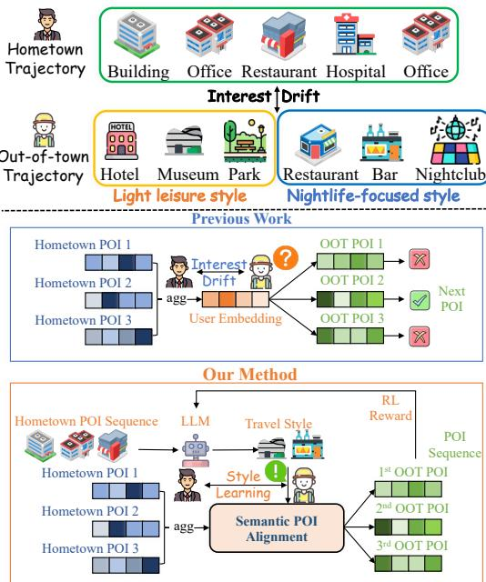
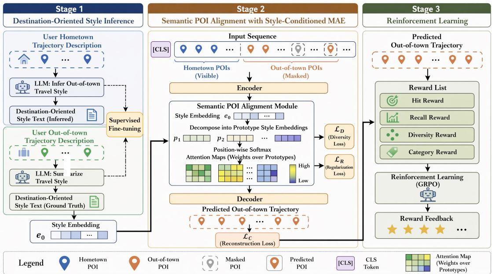
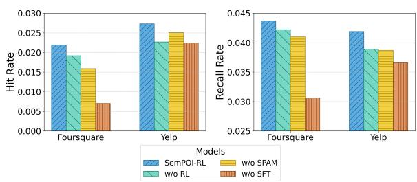
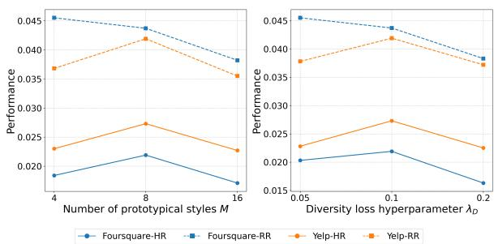

# SemPOI-RL: Aligning LLM Semantic Reasoning for Interpretable Out-of-Town POI Sequential Generation

Yunqi Liu Yang Zhang Ruixing Zhang Liangzhe Han

Yi Qiao Tongyu Zhu Leilei Sun

State Key Laboratory of Complex & Critical Software Environment Beihang University, Beijing, China

{liuyunqi, yangzhang-cn, yyxzhj, liangzhehan}@buaa.edu.cn {qiaoy, zhutongyu, leileisun}@buaa.edu.cn

## Abstract

Large language models (LLMs) exhibit strong semantic reasoning and open-ended generation abilities, but aligning these abilities with structured sequential generation remains chal lenging. This challenge is particularly evident in out-of-town (OOT) POI sequence generation, where a model must infer transferable travel intent from a user’s hometown behaviors, adapt to cross-city interest drift, and generate a coherent destination trajectory under structural constraints. Existing approaches either rely on latent ID-based transfer with limited interpretability or directly use LLMs for sequence generation without explicitly grounding inferred semantics into position-aware pre dictions. To address this gap, we propose SemPOI-RL, a framework that aligns LLM semantic reasoning with structured sequence generation for interpretable OOT recommendation. Specifically, we first fine-tune an LLM to infer destination-oriented travel styles from users’ hometown trajectories, using natural lan guage as an interpretable semantic intermediate. We then introduce a Semantic POI Alignment Module (SPAM) to ground these inferred styles into a style-conditioned masked autoen coder for position-aware trajectory generation. Finally, we apply reinforcement learning with recommendation-oriented rewards to align LLM-generated styles with downstream sequence quality. Experiments on two real-world datasets show that SemPOI-RL consistently outperforms both traditional recommenders and direct LLM baselines, while providing interpretable style attribution across different phases of a trip. The code is available at https: //github.com/Wind-Flipped/SemPOI-RL.

## 1 Introduction

Large language models (LLMs) have shown impressive capabilities in semantic abstraction, contextual reasoning, and open-ended generation, making them a promising foundation for structured generation tasks (Xie et al., 2024; Singh et al., 2024; Tang et al., 2024). However, a key challenge remains unresolved: how to align highlevel semantic reasoning in natural language with downstream sequence generation that must satisfy domain-specific structural constraints (Wang et al., 2024; Ning et al., 2025). This challenge is especially salient in out-of-town (OOT) POI sequence generation, where a model must infer a user’s transferable travel intent from hometown behaviors and then generate a coherent destination trajectory in a new city. OOT POI sequence generation differs fundamentally from conventional next-POI recommendation. In standard intra-city settings, models often rely on repeated user-POI interactions, transition regularities, or region-specific spatio-temporal patterns. In contrast, the OOT setting requires the model to generalize from a user’s hometown trajectory to an unfamiliar destination city, where direct POI overlap is limited and user interests may shift substantially across regions (Feng et al., 2024; Wang et al., 2025; Yin et al., 2016). Moreover, the goal is not merely to predict the next location, but to generate an ordered sequence of destination POIs that is both semantically suitable and structurally coherent. This makes OOT recommendation a particularly difficult form of structured sequence generation under preference transfer (Liu et al., 2022; Li et al., 2024; Shu et al., 2024).

Existing sequential recommendation and trajectory forecasting methods predominantly rely on latent ID-based representations or spatio-temporal graph encoders (Yang et al., 2022; Yan et al., 2023; Zhang et al., 2025a). While effective for intracity next-POI prediction, these approaches treat sequences as flat lists of discrete tokens, offering limited interpretability and struggling to model crossdomain interest drift when users travel from familiar hometowns to novel destinations (Xin et al., 2022; Liu et al., 2025). Recent efforts have begun integrating LLMs into mobility prediction by leveraging their semantic reasoning to infer preferences or generate explanations (Feng et al., 2025; Cheng et al., 2025; Liu et al., 2024a). Yet, most use the LLM as a preference encoder or direct sequence generator, map POIs to semantic IDs, or apply reinforcement learning to the final topk list (Ning et al., 2025; Wang et al., 2025; Li et al., 2024, 2025). None of these formulations makes a natural-language travel style a trainable interface that is both aligned by trajectory rewards and decomposed across sequence positions. Consequently, the link between high-level textual inference and fine-grained structural prediction remains opaque.

  
Figure 1: Comparison with previous work. Out-oftown POI sequence prediction requires the model to capture complex preferences while mitigating interest drift. Prior approaches typically represent POIs and users independently for next-POI recommendation. Our reinforcement-learning-based framework instead aligns inferred travel styles with full-sequence prediction.

To bridge these gaps, we propose SemPOI-RL, a reinforcement learning framework that aligns LLM semantic inference with structured sequence generation for interpretable cross-city itinerary planning. Its central contribution is a semantic–structural alignment protocol: naturallanguage travel style is not merely an explanation appended after recommendation, but an intermediate representation trained from destination behavior, grounded at each trajectory position, and further optimized by the resulting POI sequence.

Specifically, we first adapt an LLM via supervised fine-tuning to infer destination-oriented travel styles from users’ hometown textual trajectories, effectively modeling cross-domain preference shifts through semantic reasoning (Xin et al., 2022; Feng et al., 2024). We then introduce a Semantic POI Alignment Module (SPAM) that injects these LLMderived textual styles into a masked autoencoder framework. By softly assigning multiple style prototypes across sequence positions, the model exposes which semantic component guides each trip phase (Li et al., 2022). Finally, we use Group Relative Policy Optimization (GRPO) with a composite trajectory reward to optimize the intermediate style—rather than a final top-k list—for positional hit rate, recall, category consistency, and diversity (Shao et al., 2024; Li et al., 2025).

We evaluate SemPOI-RL on two large-scale realworld datasets, demonstrating that our framework significantly outperforms both traditional sequential modeling baselines and direct LLM generation methods. Beyond quantitative gains, our approach offers substantial interpretability benefits: the learned attention maps reveal how different LLM-inferred styles dominate specific sequence positions, providing human-readable attributions for generated trajectories. This work makes three primary contributions:

• We propose SemPOI-RL, a semantic– structural alignment protocol for crosscity POI recommendation. It treats natural-language travel style as a trainable and reinforcement-aligned interface between LLM inference and structured trajectory generation, rather than as a post-hoc explanation or an opaque user embedding.

• We design SPAM that decomposes global travel styles into temporally varying prototypical styles, and integrate it with a masked autoencoder to dynamically weight style influences across sequence positions. Furthermore, we introduce a multi-objective reinforcement learning strategy guided by hit rate, recall, category consistency, and diversity rewards, which refines LLM-generated styles to bridge the gap between semantic plausibility and structural prediction accuracy.

• We conduct comprehensive experiments on two large-scale real-world datasets, demonstrating that SemPOI-RL consistently outperforms strong baselines in both accuracy and trajectory coherence. Detailed ablation studies and interpretability analyses further validate the necessity of each component, revealing how explicit modeling of interest drift and style-aware alignment leads to more faithful and human-understandable out-of-town recommendations.

## 2 Related Work

## 2.1 POI Recommendation

Early studies primarily framed POI sequence prediction as a Markovian process based on transition probabilities(Cheng et al., 2013). To address sequential dependency, models such as ST-LSTM (Wang et al., 2017; Zhao et al., 2019; Zhang et al., 2024) and transformer-based models (Kang and McAuley, 2018; Shu et al., 2024) incorporated spatio-temporal gating mechanisms to account for time intervals and geographic distances between consecutive check-ins. Meanwhile, GNNs have also gained prominence in POI recommendation due to their strong capability in modeling graph structures. For instance, GETNext(Yang et al., 2022) and STHGCN(Yan et al., 2023) leverage GCN over trajectory flow graphs to capture POI-to-POI transition probabilities. To tackle challenges of data sparsity and interest drift, researchers have proposed approaches based on transfer learning. (Xin et al., 2022) first studies the pre-travel outof-town POI recommendation problem. KDDC considers the distributions of conformity and interest(Liu et al., 2024b). SPOT-Trip learns dual static and dynamic user preferences to enrich semantic modeling(Liu et al., 2025). Traditional transferlearning approaches typically learn mapping functions in a low-dimensional latent space. In contrast, LLMs can abstract a user’s core interests into high-level, interpretable concepts without relying on specific POI IDs.

## 2.2 LLMs for Recommendation

In recent years, LLMs have emerged as a promising paradigm in recommender systems, owing to their strong natural language understanding, zeroshot and few-shot adaptability, and capacity to generate interpretable explanations(Xie et al., 2024; Singh et al., 2024). Specifically, LLMs not only generate recommendations based on users’ historical behaviors but also provide intuitive, humanreadable rationales(Tang et al., 2024). Prior work includes USER-LLM(Ning et al., 2025), which treats the LLM as a user preference encoder; and LLMob(Wang et al., 2024), which infers users occupations and travel motivations via LLMs to generate user trajectories. (Wang et al., 2025) maps POI identifiers into semantically enriched representations. Moreover, LLMs have achieved strong performance on basic temporal prediction tasks(Jin et al., 2024), inspiring extensions to nextpoint prediction via POI feature extraction using LLMs(Feng et al., 2025; Wang et al., 2023; Liu et al., 2024a; Feng et al., 2024). Recent studies also train LLMs for POI recommendation through supervised fine-tuning(Li et al., 2024) or reinforcement learning(Li et al., 2025); Refine-POI, for example, applies RL to a directly generated top-k recommendation list. However, these methods exhibit two major limitations. First, they struggle to generalize user intent across cities. Second, direct LLM decoding becomes inefficient and inaccurate when the candidate catalog exceeds the context window. More importantly, prior work does not use a naturallanguage travel style as a jointly trainable interface between semantic inference and position-wise trajectory generation. SemPOI-RL differs by aligning this intermediate text with ground-truth trajectory rewards and grounding it through position-specific prototype assignments; the novelty lies in this endto-end alignment protocol rather than in any one module alone.

## 3 Preliminary

We follow prior studies(Xin et al., 2022; Liu et al., 2025) to formally define the out-of-town trip recommendation problem.

Definition 1 (POI). A POI is a spatial item related to a geographical location. We use v to represent a POI, $r _ { v }$ to denote its located region, l to denote its location as longitude and latitude coordinates and g to denote its category.

Definition 2 (Check-in). If a user checks in a POI, it indicates that s/he has a direct interaction with the POI in the real world. Formally, we denote a user u’s check-in activity on POI v at time t with a three-tuple $c = ( u , t , v )$

Definition 3 (User’s Hometown). Given a user u, we denote a region $r _ { h }$ as the user’s hometown where the user lives or works for a period of time. Following CAPTOR(Xin et al., 2022), we identify it from time-weighted frequencies of recent check-ins after applying the same trajectory filtering described in Appendix A.

  
Figure 2: The overall framework of SemPOI-RL. The signal passed from Stage 1 to Stage 2 is the inferred style embedding $e _ { o }$ generated from the hometown prompt; the destination-derived text $\mathbf { y } ^ { ( o ) }$ is used only as the Stage-1 SFT target.

Definition 4 (Out-of-town Travel Behavior). Given a user u and her/his hometown $r _ { h }$ in which s/he leaves check-in records $\vec { c } _ { h }$ , when s/he travels to the out-of-town region $r _ { o }$ and also leaves checkin records $\vec { c } _ { o }$ in $r _ { o } ,$ we call such behavior an outof-town travel behavior, denoted as a five-tuple $\xi = ( u , \vec { c } _ { h } , \vec { c } _ { o } , r _ { h } , r _ { o } )$

Problem Statement: (Out-of-town Trip Recommendation). Given a set of users $\mathcal { U } = \{ u _ { i } \} _ { i = 1 } ^ { | \mathcal { U } | }$ POIs $\mathcal { V } = \{ v _ { i } \} _ { i = 1 } ^ { | \mathcal { V } | }$ , regions $\mathcal { R } = \{ r _ { i } \} _ { i = 1 } ^ { | \mathcal { R } | }$ , and outof-town trip records ${ \mathcal { O } } = \{ \xi _ { i } \} _ { i = 1 } ^ { | { \mathcal { O } } | }$ , our objective is to learn a recommender function $\mathcal { F }$ based on historical records O. For a new user $u ^ { \ast } \notin \mathcal { U }$ at $r _ { h } ^ { \ast }$ with hometown check-ins $\vec { c } _ { h }$ and out-of-town origindestination trip query $Q _ { o } ^ { * } = \{ v _ { s } ^ { o } , v _ { e } ^ { o } , N \}$ in region $r _ { o } ^ { * } ,$ , where $v _ { s } ^ { o } , v _ { e } ^ { o }$ , and N denote the start, end points and the number of POIs, the learned $\mathcal { F }$ generates a sequence of POIs $\tau = \{ v _ { 1 } ^ { o } , v _ { 2 } ^ { o } , \ldots , v _ { N } ^ { o } \}$ , where $v _ { 1 } ^ { o } = v _ { s } ^ { o }$ and $v _ { N } ^ { o } = v _ { e } ^ { o }$ for $u ^ { * }$ . The recommended POIs in $\tau$ are in $r _ { o } ^ { * }$ . In our benchmark protocol, $u ^ { * }$ is unseen but the destination region and its POI catalog occur in the training data; thus, the structured recommender is not evaluated zero-shot on a completely new city catalog.

## 4 Methodology

We propose SemPOI-RL, a three-stage framework that aligns LLM-based semantic inference with structured POI sequence generation for cross-city recommendation. As discussed in the Introduction, the main challenge of out-of-town recommendation is not only to infer what a user may prefer in a new city, but also to map such high-level semantics into an ordered destination trajectory under dynamic interest drift. To address this semanticto-structure gap, we decouple the problem into: (i) inferring destination-oriented travel styles from hometown trajectories, (ii) grounding these styles into position-aware trajectory generation, and (iii) refining style generation with recommendationoriented rewards. Figure 2 illustrates the overall pipeline.

## 4.1 Stage 1: Destination-Oriented Style Inference

A key difficulty in cross-city recommendation is that hometown behaviors and destination behaviors are not directly aligned at the POI-ID level. Rather than transferring preferences through latent IDs only, we use an LLM to infer an interpretable destination-oriented travel style from the user ${ \bf \gamma } _ { \bf S }$ hometown trajectory.

Given a user $u ,$ hometown trajectory $\vec { c } _ { h }$ in region $r _ { h } ,$ and destination trajectory $\vec { c } _ { o }$ in region $r _ { o } .$ , we construct two prompts for an initial LLM LLMi(·):

## 1. Inference from hometown trajectory

$$
\mathbf { y } ^ { ( h ) } = \mathrm { L L M } _ { i } ( \mathrm { P r o m p t } _ { h } ( u , \vec { c } _ { h } , r _ { h } ) ) ,\tag{1}
$$

where $\mathbf { y } ^ { ( h ) }$ is the inferred destination style text.

2. Style summarization from destination trajectory

$$
\mathbf { y } ^ { ( o ) } = \mathrm { L L M } _ { i } ( \mathrm { P r o m p t } _ { o } ( u , \vec { c } _ { o } , r _ { o } ) ) ,\tag{2}
$$

where $\mathbf { y } ^ { ( o ) }$ is the style summary directly obtained from the observed destination trajectory.

We treat $\mathbf { y } ^ { ( o ) }$ as a supervision signal and finetune the LLM to predict it from the hometown prompt. Let $p _ { \theta } ( y _ { t } \mid y _ { < t }$ , Prompt) denote the token probability. The supervised objective is:

$$
\begin{array} { r } { \mathcal { L } _ { \mathrm { C E } } ( \theta ) = - \displaystyle \sum _ { t = 1 } ^ { T _ { o } } \log p _ { \theta } \Big ( y _ { t } ^ { ( o ) } \mid y _ { < t } ^ { ( o ) } , } \\ { \mathrm { P r o m p t } _ { h } ( u , \vec { c } _ { h } , r _ { h } ) \Big ) . } \end{array}\tag{3}
$$

After fine-tuning, the LLM generates a destination-oriented style summary:

$$
\begin{array} { r l } & { s _ { o } = \mathrm { L L M } _ { t } ( \mathrm { P r o m p t } _ { h } ( u , \vec { c } _ { h } , r _ { h } ) ) , } \\ & { e _ { o } = \mathrm { t e x t \_ e m b e d d i n g } ( s _ { o } ) , } \end{array}\tag{4}
$$

where $s _ { o }$ represents the user’s destination travel style, $e _ { o }$ is the embedding of the generated style text. A global style vector captures coarse semantic preference, but it cannot model the temporal variation emphasized in the Introduction. In practice, users often exhibit different styles at different phases of a trip (e.g., daytime leisure versus nighttime entertainment). Therefore, we further decompose the global style into multiple prototypical semantic components.

## 4.2 Stage 2: Semantic POI Alignment with Style-Conditioned MAE

To bridge textual style inference and structured sequence prediction, we introduce the Semantic POI Alignment Module (SPAM) and integrate it with a masked autoencoder (MAE).

## 4.2.1 Semantic POI Alignment Module

Given the style embedding $e _ { o } ,$ SPAM decomposes it into M prototypical style embeddings:

$$
F _ { p } ^ { ( i ) } = e _ { o } \circ \mathrm { s i g m o i d } \left( W _ { \mathrm { c 2 } } ^ { ( i ) } \operatorname { t a n h } \left( W _ { \mathrm { c 1 } } ^ { ( i ) } e _ { o } \right) \right)\tag{5}
$$

where $i = 1 , \dots , M , , \circ$ denotes the Hadamard product, and $W _ { \mathrm { c 1 } } ^ { ( i ) } , W _ { \mathrm { c 2 } } ^ { ( i ) }$ are learnable parameters.

This decomposition provides a set of latent style prototypes that can be selectively activated at different trajectory positions, instead of forcing the entire trip to be explained by a single semantic vector.

To avoid redundant prototypes, we impose a diversity loss:

$$
\mathcal { L } _ { D } = \frac { 2 } { M ( M - 1 ) } \sum _ { 1 \leq i < j \leq M } \left( \cos ( \hat { F } _ { p } ^ { ( i ) } , \hat { F } _ { p } ^ { ( j ) } ) \right) ^ { 2 } ,\tag{6}
$$

where $\hat { F } _ { p } ^ { ( i ) } = F _ { p } ^ { ( i ) } / \| F _ { p } ^ { ( i ) } \| _ { 2 }$ . This loss encourages the prototypes to capture distinct semantic factors.

## 4.2.2 Style-Conditioned MAE

We use the semantic prototypes to guide a masked autoencoder for destination trajectory reconstruction. For each check-in, location $l _ { i }$ and timestamp $t _ { i }$ are embedded as $x _ { i } = \phi ( l _ { i } , t _ { i } ) + \mathrm { p o s } ( i )$ , where $\phi ( \cdot )$ is the input embedding function and pos(·) denotes positional encoding.

During training, we keep all hometown points and the destination start/end points visible and mask a proportion $\rho$ of the intermediate destination points, yielding the partially observed sequence x˜. This masking strategy matches inference, where the hometown trajectory and the destination query (start/end points and length) are given but the intermediate destination trajectory is not.

The encoder produces contextual representations $h = E ( \tilde { x } )$ , where $h _ { i }$ is the hidden state at position i. To align each position with the most relevant semantic prototype, we compute a prototype distribution

$$
\alpha _ { i } = \mathrm { S o f t M a x } \big ( \{ \langle h _ { i } , F _ { p } ^ { ( k ) } \rangle \} _ { k = 1 } ^ { M } \big ) ,
$$

where $\alpha _ { i } = [ \alpha _ { i , 1 } , \ldots , \alpha _ { i , M } ]$ . This position-wise style assignment is the key step that grounds highlevel style semantics into local trajectory generation.

We then form a style-aware representation $\tilde { h } _ { i } =$ $\begin{array} { r } { \sum _ { k = 1 } ^ { M } \alpha _ { i , k } W _ { v } F _ { p } ^ { ( k ) } } \end{array}$ , and feed it to the decoder together with the global [CLS] representation, i.e., $z = D ( h _ { \mathrm { c l s } } , \tilde { h } )$ , where z denotes the logits over destination POIs.

The model is trained to reconstruct the masked destination positions with cross-entropy:

$$
\mathcal { L } _ { C } = - \frac { 1 } { N } \sum _ { n = 1 } ^ { N } \log \frac { \exp ( z _ { n , v _ { n } ^ { o } } ) } { \sum _ { i \in r _ { o } } \exp ( z _ { n , i } ) } ,\tag{7}
$$

where $v _ { n } ^ { o }$ is the ground-truth POI at the n-th masked position. To avoid collapsing all positions to a single prototype, we maximize the normalized entropy of the style assignments. Equivalently, because the full objective is minimized, we define the following negative normalized entropy:

$$
\mathcal { L } _ { R } = \frac { 1 } { \left| \mathcal { T } \right| \log M } \sum _ { i \in \mathcal { T } } \sum _ { k = 1 } ^ { M } \alpha _ { i , k } \log \alpha _ { i , k } ,\tag{8}
$$

where I indexes the sequence positions. Thus, minimizing $\mathcal { L } _ { R }$ with a positive coefficient maximizes, rather than minimizes, assignment entropy. This is a soft anti-collapse constraint: the small default $\lambda _ { R } = 0 . 1$ discourages a single prototype from dominating every position without forcing uniform assignments. Meanwhile, $\mathcal { L } _ { D }$ separates the prototype directions themselves, so a mildly flatter assignment still attends to genuinely distinct semantic components. Their combination avoids both globally redundant prototypes and the loss of trip-phase specificity.

The overall training objective of this section is:

$$
\mathcal { L } = \mathcal { L } _ { C } + \lambda _ { D } \mathcal { L } _ { D } + \lambda _ { R } \mathcal { L } _ { R } .\tag{9}
$$

## 4.3 Stage 3: Reinforcement Learning for LLM Style Generation

The supervised fine-tuning stage equips the LLM with a basic ability to infer destination-oriented travel styles from hometown trajectories, but it is still insufficient for our final objective. A key reason is that Stage I optimizes the model only at the text level: the LLM is trained to mimic destinationstyle descriptions, rather than being directly supervised by the ground-truth destination trajectory. As a result, the generated style may be linguistically plausible yet suboptimal for downstream POI sequence prediction. We therefore introduce a reinforcement learning stage to further align style generation with the actual recommendation target. Furthermore, it relaxes the rigidity of supervised learning by allowing the LLM to explore multiple semantically reasonable style descriptions, and then retain those that lead to better structural prediction outcomes. In this way, reinforcement learning connects high-level semantic generation with downstream recommendation quality. The total reward R is defined as:

$$
\begin{array} { r l } & { R = \lambda _ { H R } \cdot R _ { H R } + \lambda _ { R R } \cdot R _ { R R } } \\ & { \qquad + \lambda _ { C M } \cdot R _ { C M } + \lambda _ { D I V } \cdot R _ { D I V } , } \end{array}\tag{10}
$$

where $R _ { H R } , R _ { R R } , R _ { C M }$ , and $R _ { D I V }$ denote the hit-rate, recall, category-matching, and diversity rewards, respectively. $R _ { D I V }$ is the proportion of nonrepeated POIs in the prediction; the other rewards follow the metrics in Section 5.1. We give HR the largest weight because ordered trajectory generation most strongly requires position-level precision; RR rewards set-level coverage, CM preserves trajectory-level category semantics, and DIV prevents the repetition collapse observed in autoregressive trip generation. Because every component is computed from the predicted trajectory against the ground truth, rather than from the LLM’s own textual assessment, the reward is externally grounded. In particular, DIV blocks the degenerate strategy of repeatedly predicting one popular POI. The weights are analyzed in Appendix E.

For policy optimization, we use GRPO(Shao et al., 2024): for each hometown prompt, the policy samples a group of style descriptions, evaluates each one through the fixed trajectory predictor, and updates the LLM using group-relative rewards. This propagates recommendation quality back to the natural-language intermediate representation, providing the trajectory supervision missing from Stage 1.

## 4.4 Joint Style-Conditioned POI Sequence Prediction

At test time, given a new user’s hometown trajectory and a destination query consisting of the start POI, end POI, and trajectory length, we first use the RL-tuned LLM to infer a destination-oriented style. The ground-truth destination trajectory is never supplied as input. We then compute the prototype style embeddings with SPAM and feed them, together with the query, into the trained style-conditioned MAE to generate the intermediate destination POIs from the destination-region catalog.

## 5 Experiment

## 5.1 Experiment Setup

Datasets Our experiments are conducted on two widely used real-world datasets, Foursquare and Yelp. Detailed dataset statistics and preprocessing procedures are provided in Appendix A.

Metrics We evaluate all methods using six metrics: Hit Rate (HR), Recall Rate (RR), Edit Distance (ED), Dynamic Time Warping Distance (DTW), Category Match (CM), and Region Match (RM). Their formal definitions are given in Appendix B.

Settings Our task is more challenging than conventional next-POI prediction, because we aim to generate the entire out-of-town POI sequence rather than predict only the next location. Following SPOT-Trip, we assume that the start and end POIs and trajectory length are given, and the model predicts the intermediate POIs. This setting reflects travel planning in which route boundaries are known but intermediate stops remain flexible; it also keeps the search space tractable for all compared methods. At test time, no other destination check-in is used as input. The train/validation/test split is 8:1:1, and Appendix A gives a stage-bystage data-usage protocol.

<table><tr><td rowspan="2">Model</td><td colspan="5">Foursquare</td><td rowspan="2"></td><td colspan="5">Yelp</td><td rowspan="2"></td></tr><tr><td>HR(↑)</td><td>RR(↑) ED(↓)</td><td></td><td>DTW(↓)</td><td>CM(↑)</td><td>RM(↑) HR(↑)</td><td>RR(↑)</td><td>ED(↓)</td><td>DTW(↓)</td><td>CM(↑)</td></tr><tr><td>LSTM</td><td>0.0156</td><td>0.0187</td><td>0.9844</td><td>0.4920</td><td>0.0336</td><td>0.3504</td><td>0.0031</td><td>0.0032</td><td>0.9969</td><td>0.4985</td><td>0.0059</td><td>0.1255</td></tr><tr><td>GETNext</td><td>0.0069</td><td>0.0359</td><td>0.9925</td><td>0.4966</td><td>0.0322</td><td>0.1732</td><td>0.0052</td><td>0.0108</td><td>0.9934</td><td>0.4956</td><td>0.0516</td><td>0.1379</td></tr><tr><td>STHGCN</td><td>0.0084</td><td>0.0371</td><td>0.9910</td><td>0.4944</td><td>0.0367</td><td>0.2002</td><td>0.0066</td><td>0.0126</td><td>0.9926</td><td>0.4931</td><td>0.0587</td><td>0.1502</td></tr><tr><td>MatTrip</td><td>0.0108</td><td>0.0358</td><td>0.9884</td><td>0.4942</td><td>0.0294</td><td>0.1881</td><td>0.0095</td><td>0.0301</td><td>0.9905</td><td>0.4953</td><td>0.0402</td><td>0.1760</td></tr><tr><td>KDDC</td><td>0.0130</td><td>0.0365</td><td>0.9906</td><td>0.4931</td><td>0.0152</td><td>0.1820</td><td>0.0083</td><td>0.0329</td><td>0.9880</td><td>0.5186</td><td>0.0610</td><td>0.1045</td></tr><tr><td>AR-Trip</td><td>0.0083</td><td>0.0308</td><td>0.9917</td><td>0.4958</td><td>0.0282</td><td>1.0000</td><td>0.0238</td><td>0.0307</td><td>0.9762</td><td>0.4880</td><td>0.0618</td><td>0.8607</td></tr><tr><td>SPOT-Trip</td><td>0.0190</td><td>0.0410</td><td>0.9806</td><td>0.4903</td><td>0.0360</td><td>1.0000</td><td>0.0248</td><td>0.0389</td><td>0.9726</td><td>0.4863</td><td>0.0664</td><td>0.9443</td></tr><tr><td>LLMMove</td><td>0.0028</td><td>0.0355</td><td>0.9929</td><td>0.5344</td><td>0.0388</td><td>0.9314</td><td>0.0132</td><td>0.0256</td><td>0.9862</td><td>0.5387</td><td>0.0617</td><td>0.8843</td></tr><tr><td>LLM4POI</td><td>0.0057</td><td>0.0083</td><td>0.9956</td><td>0.4980</td><td>0.0223</td><td>0.2036</td><td>0.0148</td><td>0.0413</td><td>0.9836</td><td>0.4918</td><td>0.0625</td><td>0.3022</td></tr><tr><td>Refine-POI</td><td>0.0060</td><td>0.0112</td><td>0.9940</td><td>0.4970</td><td>0.0349</td><td>0.3159</td><td>0.0065</td><td>0.0178</td><td>0.9924</td><td>0.4962</td><td>0.0484</td><td>0.1517</td></tr><tr><td>SemPOI-RL</td><td>0.0219</td><td>0.0437</td><td>0.9778</td><td>0.4876</td><td>0.0572</td><td>1.0000</td><td>0.0273</td><td>0.0419</td><td>0.9701</td><td>0.4843</td><td>0.0703</td><td>0.9449</td></tr></table>

Table 1: The overall comparison between SemPOI-RL and baselines

Baselines We compare SemPOI-RL with 10 baselines, including 7 traditional trip recommendation methods: LSTM (Hochreiter and Schmidhuber, 1997), GETNext (Yang et al., 2022), STHGCN (Yan et al., 2023), MatTrip (Zhang et al., 2024), AR-Trip (Shu et al., 2024), KDDC (Liu et al., 2024b), and SPOT-Trip (Liu et al., 2025); and 3 LLM-related methods: LLMMove (Feng et al., 2024), LLM4POI (Li et al., 2024), and Refine-POI (Li et al., 2025). All methods receive the same destination catalog. SemPOI-RL, SPOT-Trip, and AR-Trip hard-constrain full-sequence decoding to it; legacy next-POI architectures retain their original global output heads under our adaptation and can therefore select an out-of-region POI, which is penalized by RM. More details are provided in Appendix D.

## 5.2 Overall Result

In this section, we compare SemPOI-RL with all baselines on the two benchmark datasets. The results in Table 1 show that SemPOI-RL consistently achieves the best overall performance across both datasets. In particular, our method improves Hit Rate by about 15% on Foursquare and 10% on

Yelp over the strongest non-LLM baselines. Compared with traditional POI recommendation methods, the gains mainly come from explicitly modeling interest drift between hometown and destination. Instead of relying only on latent user embeddings, SemPOI-RL uses the semantic reasoning ability of LLMs to infer destination-oriented travel styles from hometown trajectories, which provides stronger guidance for sequence generation. Compared with existing LLM-based baselines, our method also performs better under all settings, showing that simple prompting or direct fine-tuning is insufficient for this task without semantic alignment and recommendation-oriented optimization.

Among the LLM-based baselines, LLMMove shows relatively competitive Recall Rate under a simulated pre-ranked setting with 100 candidates; this protocol still assumes a strong coarse ranker capable of reducing a catalog of tens of thousands of POIs. Nevertheless, all three LLM-based baselines perform poorly on Foursquare, whose out-oftown check-ins form a smaller share of the filtered data (Appendix A), making cross-city supervision sparser. Their lower RM under the legacy globaloutput adaptation further indicates difficulty preserving destination-region coherence. By contrast, SemPOI-RL achieves stronger performance on CM, showing that it better captures category-level semantics. It also obtains lower ED and DTW, indicating that the generated trajectories are structurally closer to the ground-truth routes and require fewer edits to match real user behavior. These improvements are practically important for travel planning, where both semantic suitability and visit order matter. Absolute exact-POI HR remains low for every method because a prediction counts only when the POI ID is correct at the exact sequence position, under a large destination catalog. CM, ED, and DTW therefore provide complementary practical evidence: an itinerary can remain useful when it chooses the right activity category and visiting order even if it misses the exact venue. SemPOI-RL leads the baselines on these measures. Three-seed results and paired tests are reported in Appendix F.1.

  
Figure 3: Ablation study of the proposed SemPOI-RL.

## 5.3 Ablation Study

To validate the effectiveness of each component, we design the following ablation settings:

• w/o SPAM: remove the Semantic POI Alignment Module and directly fuse MAE representations with text embeddings for prediction;

• w/o SFT: skip the supervised fine-tuning stage, requiring the LLM to infer destination travel styles directly from hometown trajectories without prior adaptation;

• w/o RL: remove the reinforcement learning stage and use the style representations learned before RL for downstream POI prediction.

Figure 3 and the quantitative results below show that all ablated variants underperform the full model across most metrics, confirming the necessity of each module.

First, removing SFT causes the largest performance drop, especially on Foursquare. Because this variant keeps the downstream predictor but replaces the adapted style inference with the base LLM’s inference, the result directly shows that final trajectory quality depends strongly on the LLM-generated style. SFT is therefore necessary to learn the cross-city mapping rather than simply reuse hometown preference descriptions. Second, removing SPAM degrades performance on both trajectory-level and semantic metrics. SPAM enables the model to decompose overall user preference into temporally varying prototype styles, which helps the generator capture different trip phases more accurately. Third, removing RL also leads to consistent degradation. This shows that recommendation-oriented reward optimization further refines the LLM-inferred styles and improves their usefulness for downstream sequence generation. Additional hyper-parameter analyses are provided in Appendix E.

## 5.4 Case Study and Interpretability Analysis

To provide an intuitive understanding of the interpretability of SemPOI-RL, we present a case study in Table 2. Based on the hometown trajectory, the LLM infers that the user prefers dynamic urban experiences involving recreation, exploration, and interactive activities.

As shown in Table 2, the predicted destination categories reveal a clear phase transition. The first part of the generated sequence mainly contains leisure, dining, and entertainment venues, whereas the latter part shifts toward rest and trip closure. This pattern is broadly consistent with the target trajectory, whose early positions are dominated by social and nightlife categories and whose later positions mainly contain accommodation-related POIs. The prototype assignments support this interpretation: prototype 3 dominates the entertainmentoriented early positions, while prototype 1 appears in the later stadium/hotel/airport phase. The prototypes remain latent rather than deterministically nameable, so we make only a category-mediated interpretation. Full-test-set prototype/category statistics and text-similarity measurements are provided in Appendix F.3; additional before/after-RL cases are in Appendix G.

## 6 Conclusion

We presented SemPOI-RL, a semantic-aligned framework for cross-city POI sequence recommendation. Our method addresses a core challenge of out-of-town recommendation: bridging the gap between high-level user preference semantics and structured destination trajectory generation. To this end, we first use an LLM to infer destination travel styles from users’ hometown trajectories, providing an interpretable semantic abstraction of crossregion interest drift. We then introduce a Semantic POI Alignment Module to decompose global style signals into temporally varying prototypes and inject them into a style-conditioned masked autoencoder for position-aware POI sequence prediction. Finally, we further refine LLM style generation with multi-objective reinforcement learning for downstream recommendation accuracy. Experiments on two real-world datasets show that SemPOI-RL consistently outperforms both traditional sequential recommendation models and recent LLM-based baselines. In addition to improving trajectory accuracy and structural coherence, our framework offers interpretable style attribution across different phases of a trip, providing a more transparent view of how semantic reasoning can guide sequential recommendation. We hope this work can encourage future research on aligning LLM-based semantic inference with structured decision-making tasks beyond POI recommendation.

<table><tr><td rowspan=1 colspan=1>HometownTrajectory</td><td rowspan=1 colspan=1>[Bike Shop, Track, University, Boutique, TechStartup]</td></tr><tr><td rowspan=1 colspan=1>Travel StyleInference</td><td rowspan=1 colspan=1>User&#x27;s travel trajectory in New York indicates apattern of engaging with urban and recreationalspaces, suggesting a travel style that leans towardcultural and recreational exploration. The frequentvisits to a bike shop and a track suggest an interestin physical activity and outdoor movement. Thevisit to a university points to an intellectual or aca-demic curiosity, while the boutique visit implies anappreciation for unique shopping experiences. Theengagement with a tech startup further highlightsan interest in innovation and modern urban envi-ronments. These behaviors collectively suggesta preference for dynamic, interactive, and cultur-ally rich experiences. The user appears to seekenvironments that offer both activity and discovery,favoring destinations that provide opportunities forexploration, learning, and engagement with localculture and innovation. This profile aligns with atravel style characterized by curiosity, adaptabilityand a desire for meaningful, experiential interac-tions.</td></tr><tr><td rowspan=1 colspan=1>Predicted IDs</td><td rowspan=1 colspan=1>[159, 767, 611, 611, 186, 188, 108, 237, 6]</td></tr><tr><td rowspan=1 colspan=1>Predicted POICategory</td><td rowspan=1 colspan=1>[BBQ Joint, Lounge, Music Venue, Music Venue,Rock Club, Hotel Bar, Baseball Stadium, Hotel,Airport]</td></tr><tr><td rowspan=1 colspan=1>Prototype Style</td><td rowspan=1 colspan=1>[3,3,3,3,3,3,1,1,1]</td></tr><tr><td rowspan=1 colspan=1>Target POI IDs</td><td rowspan=1 colspan=1>[159, 188, 767, 186, 239, 188, 67, 774, 1112]</td></tr><tr><td rowspan=1 colspan=1>Target POICategory</td><td rowspan=1 colspan=1>[BBQ Joint, Rock Club, Lounge, Rock Club, HotelBar, Rock Club, Hotel, Hotel, Hotel]</td></tr></table>

Table 2: A case study for user 2842 on the Foursquare dataset. Purple highlights key semantic cues in the inferred travel style. Blue and red indicate two dominant trip phases.

## Limitations

SemPOI-RL has three main limitations. First, its prototypes remain latent and can only be interpreted indirectly through activated POI categories; style quality also depends on LLM-generated pseudo-labels. Second, we follow the constrained benchmark setting with known start/end POIs and trajectory length, and the recommender is trained on fixed destination catalogs rather than evaluated zero-shot in unseen cities. Open-ended generation and catalog transfer remain future work. Third, the multi-stage pipeline is costlier than simple recommenders, and exact-POI HR remains low; realworld deployment therefore requires further reliability evaluation and user studies.

## Ethical Considerations

POI trajectories are sensitive because they may reveal users’ routines and private attributes. During data collection and preprocessing, all user identifiers were anonymized before the data were used for analysis. We use only structured check-in records and no user-authored free text, so offensive textual content is not involved. We do not attempt to recover user identities and retain only the fields needed for this research; any deployment should likewise apply data minimization and access controls. The framework may also inherit popularity and regional biases from check-ins, as well as stereotypes from LLM-generated styles, leading to uneven recommendation quality across users and locations.

## Acknowledgments

This work was supported by the National Natural Science Foundation of China (No. U24B20171). Generative AI tools were used to assist with the implementation of portions of the code and with grammar checking and language polishing of the manuscript. All AI-assisted outputs were reviewed and verified by the authors, who take full responsibility for the final code and manuscript.

## References

Chen Cheng, Haiqin Yang, Michael R. Lyu, and Irwin King. 2013. Where you like to go next: successive point-of-interest recommendation. In Proceedings of the Twenty-Third International Joint Conference on Artificial Intelligence, IJCAI ’13, pages 2605–2611. AAAI Press.

Jiawei Cheng, Jingyuan Wang, Yichuan Zhang, Jiahao Ji, Yuanshao Zhu, Zhibo Zhang, and Xiangyu Zhao. 2025. Poi-enhancer: An llm-based semantic enhancement framework for POI representation learning. In AAAI-25, Sponsored by the Association for the Advancement of Artificial Intelligence, February 25 - March 4, 2025, Philadelphia, PA, USA, pages 11509– 11517. AAAI Press.

Jie Feng, Yuwei Du, Jie Zhao, and Yong Li. 2025. Agentmove: A large language model based agentic framework for zero-shot next location prediction. In

Proceedings ofthe 2025 Conference ofthe Nations of the Americas Chapter of the Association for Computational Linguistics: Human Language Technologies, NAACL 2025 - Volume 1: Long Papers, Albuquerque, New Mexico, USA, April 29 - May 4, 2025, pages 1322–1338. Association for Computational Linguistics.

Shanshan Feng, Haoming Lyu, Fan Li, Zhu Sun, and Caishun Chen. 2024. Where to move next: Zero-shot generalization of llms for next POI recommendation. In Proceedings of the 2024 IEEE Conference on Artificial Intelligence, CAI 2024, Singapore, June 25-27, 2024, pages 1530–1535. IEEE.

Sepp Hochreiter and Jürgen Schmidhuber. 1997. Long short-term memory. Neural Computation, 9(8):1735– 1780.

Ming Jin, Shiyu Wang, Lintao Ma, Zhixuan Chu, James Y. Zhang, Xiaoming Shi, Pin-Yu Chen, Yuxuan Liang, Yuan-Fang Li, Shirui Pan, and Qingsong Wen. 2024. Time-llm: Time series forecasting by reprogramming large language models. In The Twelfth International Conference on Learning Representations, ICLR 2024, Vienna, Austria, May 7-11, 2024. OpenReview.net.

Wang-Cheng Kang and Julian J. McAuley. 2018. Selfattentive sequential recommendation. In IEEE International Conference on Data Mining, ICDM 2018, Singapore, November 17-20, 2018, pages 197–206. IEEE Computer Society.

Gang Li, Heliang Zheng, Daqing Liu, Chaoyue Wang, Bing Su, and Changwen Zheng. 2022. Semmae: Semantic-guided masking for learning masked autoencoders. In Advances in Neural Information Processing Systems 35: Annual Conference on Neural Information Processing Systems 2022, NeurIPS 2022, New Orleans, LA, USA, November 28 - December 9, 2022, pages 14290–14302.

Peibo Li, Shuang Ao, Hao Xue, Yang Song, Maarten de Rijke, Johan Barthélemy, Tomasz Bednarz, and Flora D. Salim. 2025. Refine-poi: Reinforcement fine-tuned large language models for next point-ofinterest recommendation. CoRR, abs/2506.21599.

Peibo Li, Maarten de Rijke, Hao Xue, Shuang Ao, Yang Song, and Flora D. Salim. 2024. Large language models for next point-of-interest recommendation. In Proceedings ofthe 47th International ACM SIGIR Conference on Research and Development in Information Retrieval, SIGIR 2024, Washington DC, USA, July 14-18, 2024, pages 1463–1472. ACM.

Shuai Liu, Ning Cao, Yile Chen, Yue Jiang, and Gao Cong. 2024a. nextlocllm: next location prediction using llms. CoRR, abs/2410.09129.

Xin Liu, Yongjian Yang, Yuanbo Xu, Funing Yang, Qiuyang Huang, and Hong Wang. 2022. Real-time POI recommendation via modeling long- and shortterm user preferences. Neurocomputing, 467:454– 464.

Yinghui Liu, Hao Miao, Guojiang Shen, Yan Zhao, Xiangjie Kong, and Ivan Lee. 2025. Spot-trip: Dualpreference driven out-of-town trip recommendation. In Advances in Neural Information Processing Systems 38: Annual Conference on Neural Information Processing Systems 2025, NeurIPS 2025.

Yinghui Liu, Guojiang Shen, Chengyong Cui, Zhenzhen Zhao, Xiao Han, Jiaxin Du, Xiangyu Zhao, and Xiangjie Kong. 2024b. KDDC: knowledge-driven disentangled causal metric learning for pre-travel out-of-town recommendation. In Proceedings ofthe Thirty-Third International Joint Conference on Artificial Intelligence, IJCAI 2024, Jeju, South Korea, August 3-9, 2024, pages 2207–2215. ijcai.org.

Lin Ning, Luyang Liu, Jiaxing Wu, Neo Wu, Devora Berlowitz, Sushant Prakash, Bradley Green, Shawn O’Banion, and Jun Xie. 2025. User-llm: Efficient LLM contextualization with user embeddings. In Companion Proceedings ofthe ACM on Web Conference 2025, WWW 2025, Sydney, NSW, Australia, 28 April 2025 - 2 May 2025, pages 1219–1223. ACM.

Qwen Team. 2025. Qwen3 technical report. CoRR, abs/2505.09388.

Zhihong Shao, Peiyi Wang, Qihao Zhu, Runxin Xu, Junxiao Song, Mingchuan Zhang, Y. K. Li, Y. Wu, and Daya Guo. 2024. Deepseekmath: Pushing the limits of mathematical reasoning in open language models. CoRR, abs/2402.03300.

Wenzheng Shu, Kangqi Xu, Wenxin Tai, Ting Zhong, Yong Wang, and Fan Zhou. 2024. Analyzing and mitigating repetitions in trip recommendation. In Proceedings of the 47th International ACM SIGIR Conference on Research and Development in Information Retrieval, SIGIR 2024, Washington DC, USA, July 14-18, 2024, pages 2276–2280. ACM.

Harmanpreet Singh, Nikhil Verma, Yixiao Wang, Manasa Bharadwaj, Homa Fashandi, Kevin Ferreira, and Chul Lee. 2024. Personal large language model agents: A case study on tailored travel planning. In Proceedings of the 2024 Conference on Empirical Methods in Natural Language Processing: EMNLP 2024 - Industry Track, Miami, Florida, USA, November 12-16, 2024, pages 486–514. Association for Computational Linguistics.

Yihong Tang, Zhaokai Wang, Ao Qu, Yihao Yan, Zhaofeng Wu, Dingyi Zhuang, Jushi Kai, Kebing Hou, Xiaotong Guo, Jinhua Zhao, Zhan Zhao, and Wei Ma. 2024. Itinera: Integrating spatial optimization with large language models for open-domain urban itinerary planning. In Proceedings ofthe 2024 Conference on Empirical Methods in Natural Language Processing: EMNLP 2024 - Industry Track, Miami, Florida, USA, November 12-16, 2024, pages 1413–1432. Association for Computational Linguistics.

Dongsheng Wang, Yuxi Huang, Shen Gao, Yifan Wang, Chengrui Huang, and Shuo Shang. 2025. Generative

next POI recommendation with semantic ID. In Proceedings of the 31st ACM SIGKDD Conference on Knowledge Discovery and Data Mining, V. 2, KDD 2025, Toronto, ON, Canada, August 3-7, 2025, pages 2904–2914. ACM.

Jiawei Wang, Renhe Jiang, Chuang Yang, Zengqing Wu, Makoto Onizuka, Ryosuke Shibasaki, Noboru Koshizuka, and Chuan Xiao. 2024. Large language models as urban residents: An LLM agent framework for personal mobility generation. In Advances in Neural Information Processing Systems 37: Annual Conference on Neural Information Processing Systems 2024, NeurIPS 2024, Vancouver, BC, Canada, December 10 - 15, 2024, pages 124547–124574.

Xinglei Wang, Meng Fang, Zichao Zeng, and Tao Cheng. 2023. Where would I go next? large language models as human mobility predictors. CoRR, abs/2308.15197.

Yunbo Wang, Mingsheng Long, Jianmin Wang, Zhifeng Gao, and Philip S. Yu. 2017. Predrnn: Recurrent neural networks for predictive learning using spatiotemporal lstms. In Advances in Neural Information Processing Systems 30: Annual Conference on Neural Information Processing Systems 2017, December 4-9, 2017, Long Beach, CA, USA, pages 879–888.

Jian Xie, Kai Zhang, Jiangjie Chen, Tinghui Zhu, Renze Lou, Yuandong Tian, Yanghua Xiao, and Yu Su. 2024. Travelplanner: A benchmark for real-world planning with language agents. In Proceedings ofthe 41st International Conference on Machine Learning, ICML 2024, Vienna, Austria, July 21-27, 2024, volume 235 of Proceedings ofMachine Learning Research, pages 54590–54613. PMLR.

Haoran Xin, Xinjiang Lu, Nengjun Zhu, Tong Xu, Dejing Dou, and Hui Xiong. 2022. CAPTOR: A crowd-aware pre-travel recommender system for outof-town users. In SIGIR ’22: The 45th International ACM SIGIR Conference on Research and Development in Information Retrieval, Madrid, Spain, July 11 - 15, 2022, pages 1174–1184. ACM.

Xiaodong Yan, Tengwei Song, Yifeng Jiao, Jianshan He, Jiaotuan Wang, Ruopeng Li, and Wei Chu. 2023. Spatio-temporal hypergraph learning for next POI recommendation. In Proceedings of the 46th International ACM SIGIR Conference on Research and Development in Information Retrieval, SIGIR 2023, Taipei, Taiwan, July 23-27, 2023, pages 403–412. ACM.

Song Yang, Jiamou Liu, and Kaiqi Zhao. 2022. Getnext: Trajectory flow map enhanced transformer for next POI recommendation. In SIGIR ’22: The 45th International ACM SIGIR Conference on Research and Development in Information Retrieval, Madrid, Spain, July 11 - 15, 2022, pages 1144–1153. ACM.

Hongzhi Yin, Xiaofang Zhou, Bin Cui, Hao Wang, Kai Zheng, and Nguyen Quoc Viet Hung. 2016. Adapting to user interest drift for POI recommendation. IEEE Trans. Knowl. Data Eng., 28(10):2566–2581.

Jiale Zhang, Mingqian Ma, Xiaofeng Gao, and Guihai Chen. 2024. Encoder-decoder based route generation model for flexible travel recommendation. IEEE Trans. Serv. Comput., 17(3):905–920.

Qianru Zhang, Peng Yang, Junliang Yu, Haixin Wang, Xingwei He, Siu-Ming Yiu, and Hongzhi Yin. 2025a. A survey on point-of-interest recommendation: Models, architectures, and security. IEEE Trans. Knowl. Data Eng., 37(6):3153–3172.

Yanzhao Zhang, Mingxin Li, Dingkun Long, Xin Zhang, Huan Lin, Baosong Yang, Pengjun Xie, An Yang, Dayiheng Liu, Junyang Lin, Fei Huang, and Jingren Zhou. 2025b. Qwen3 embedding: Advancing text embedding and reranking through foundation models. CoRR, abs/2506.05176.

Pengpeng Zhao, Haifeng Zhu, Yanchi Liu, Jiajie Xu, Zhixu Li, Fuzhen Zhuang, Victor S. Sheng, and Xiaofang Zhou. 2019. Where to go next: A spatiotemporal gated network for next POI recommendation. In The Thirty-Third AAAI Conference on Artificial Intelligence, AAAI 2019, The Thirty-First Innovative Applications ofArtificial Intelligence Conference, IAAI 2019, The Ninth AAAI Symposium on Educational Advances in Artificial Intelligence, EAAI 2019, Honolulu, Hawaii, USA, January 27 - February 1, 2019, pages 5877–5884. AAAI Press.

## A Datasets

Our experiments are conducted on two widely used travel behavior datasets: Foursquare and Yelp. Following prior work(Xin et al., 2022; Liu et al., 2025), we identify users who have check-in activity both in their hometown and in out-of-town locations, and reorganize their records into crossregion travel trajectories. Hometowns are discovered with CAPTOR’s time-weighted recent checkin frequencies and the filtering below. We remove users with fewer than three destination check-ins or trips shorter than 1 hour or longer than 30 days; remove POIs visited fewer than twice; and retain records satisfying $| { \vec { c } } _ { h } | \geq 4 , | { \vec { c } } _ { o } | \geq 3$ , and freq $_ { \mathrm { l } } ( r _ { h } , r _ { o } ) \ge 1 0$ . Stage-1 pseudo-labels are generated only from these filtered destination trajectories. A stronger teacher could further improve pseudo-label quality, but evaluating that choice is left to future work. Finally, we split users into training/validation/test sets in an 8:1:1 ratio. Table 4 reports the dataset statistics, including the explicit OOT check-in ratio $| \vec { c } _ { o } | / ( | \vec { c } _ { h } | + | \vec { c } _ { o } | )$ .

Data usage protocol. To make the supervision boundary explicit, Table 3 summarizes which part of each user’s data is used as input versus as a supervision target across the three stages. Critically, at test time the destination trajectory is never used as input; only the hometown trajectory, the start/end POIs, and the trajectory length (following the standard SPOT-Trip setting) are given. The destination trajectory is used solely for (i) constructing the SFT pseudo-label $\mathbf { y } ^ { ( o ) }$ in Stage 1 and (ii) computing training rewards and evaluation metrics.

<table><tr><td>Stage</td><td>|Input</td><td>Target</td></tr><tr><td>Stage 1</td><td>H (prompt)</td><td> $\mathbf { y } ^ { ( o ) } \operatorname { f r o m } \mathrm { D }$ </td></tr><tr><td>Stage 2</td><td>H + Q + masked D</td><td>D (masked positions)</td></tr><tr><td>Stage 3</td><td> $\mathrm { H \left( p r o m p t \right) }$ </td><td>D (trajectory-level)</td></tr><tr><td>Test</td><td> $\ddot { \mathrm { H } } + \dot { \mathrm { Q } }$ </td><td>D (evaluation only)</td></tr></table>

Table 3: Data usage protocol. $\mathbf { \ddot { H } } ^ { \mathbf { \lessgtr } }$ means hometown trajectory, “D” means destination trajectory, and $\mathbf { \bar { Q } } ^ { \prime }$ means destination start/end POIs plus length.

## B Metrics

Let $\hat { V } ~ = ~ [ \hat { v } _ { 1 } , \hat { v } _ { 2 } , \cdot \cdot \cdot ~ , \hat { v } _ { N } ]$ denote the predicted POI sequence and $V = [ v _ { 1 } , v _ { 2 } , \cdot \cdot \cdot , v _ { N } ]$ denote the ground-truth POI sequence. Here, $r _ { v _ { i } }$ refers to the region of POI vi, and $g _ { v _ { i } }$ refers to its category. Both of these sequences exclude the first and last POIs we input into the model. To evaluate the performance of POI sequence prediction, we adopt the following metrics:

1. Hit Rate (HR). Measures position-wise accuracy by checking whether each predicted POI exactly matches the ground-truth POI at the same index.

$$
H R = \frac { 1 } { N } \sum _ { i = 1 } ^ { N } \mathbb { I } \big ( \hat { v } _ { i } = v _ { i } \big ) .\tag{11}
$$

2. Recall Rate (RR). Evaluates the fraction of unique ground-truth POIs covered by the predictions, regardless of their positions.

$$
R R = \frac { \Big | \hat { V } \cap V \Big | } { N } .\tag{12}
$$

3. Edit Distance (ED). Computes the normalized Levenshtein edit distance between predicted and ground-truth POI sequences.

4. Dynamic Time Warping Distance (DTW). Measures sequence alignment cost based on $0 / 1$ matching, where equality costs 0 and inequality costs 1.

$$
D T W = \operatorname* { m i n } _ { \pi } \sum _ { ( i , j ) \in \pi } \mathbb { I } \big ( \hat { v } _ { i } \neq v _ { j } \big ) .\tag{13}
$$

where $\pi$ denotes a warping path aligning $\hat { V }$ and $V .$

  
Figure 4: Effects of the number of prototype style embeddings M and diversity regularization coefficient $\lambda _ { D }$ on two datasets.

5. Category Match (CM). Measures the consistency in POI categories in the position.

$$
C M = \frac { 1 } { N } \sum _ { i = 1 } ^ { N } \mathbb { I } \big ( g _ { \hat { v } _ { i } } = g _ { v _ { i } } \big ) .\tag{14}
$$

6. Region Match (RM). Measures the consistency in POI regions in the position.

$$
R M = \frac { 1 } { N } \sum _ { i = 1 } ^ { N } \mathbb { I } \big ( r _ { \hat { v } _ { i } } = r _ { v _ { i } } \big ) .\tag{15}
$$

## C Implementation Details

We set the MAE mask proportion $\rho$ to 0.75, the number of prototypical style embeddings to $M =$ 8, and $\lambda _ { D }$ to 0.1. The reward weights are $\lambda _ { H R } = 2$ $\lambda _ { R R } = 0 . 5 , \lambda _ { C M } = 0 . 5$ , and $\lambda _ { D I V } = 1$ . We train the trajectory model with Adam at a learning rate of $1 \times 1 0 ^ { - 3 }$ . Its hidden dimension is 256 and batch size is 4; training stops after 2 epochs without validation improvement. For SemPOI-RL and all LLM-based baselines, we use Qwen3- 8B(Qwen Team, 2025) on four NVIDIA A100 GPUs. We fine-tune the LLM with LoRA rank $r = 1 6$ , scaling factor $\alpha = 3 2$ , batch size 1 per GPU, 8 gradient-accumulation steps, and a maximum sequence length of 2,048 tokens. Each input contains the user’s 50 most recent check-ins. The learning rate is $2 \times 1 0 ^ { - 5 }$ for SFT and $5 \times 1 0 ^ { - 5 }$ for RL; style decoding is capped at 256 tokens.

## D Baselines

We compare our proposed framework against several representative baselines:

• LSTM(Hochreiter and Schmidhuber, 1997): LSTMs are capable of capturing both short-term and long-term dependencies in sequential patterns, making them more effective for a range of sequential data tasks.

<table><tr><td>Dataset</td><td>Users</td><td>Regions</td><td>POIs</td><td>Hometown check-ins</td><td>OOT check-ins (ratio)</td></tr><tr><td>Foursquare</td><td>3,007</td><td>21</td><td>23,884</td><td>109,225</td><td>16,994 (13.46%)</td></tr><tr><td>Yelp</td><td>4,417</td><td>214</td><td>29,930</td><td>58,403</td><td>20,479 (25.96%)</td></tr></table>

Table 4: Statistics of the two datasets.
<table><tr><td></td><td colspan="6">Foursquare</td><td colspan="6">Yelp</td></tr><tr><td>Config</td><td>HR</td><td>RR</td><td>ED</td><td>DTW</td><td>CM</td><td>RM</td><td>HR</td><td>RR</td><td>ED</td><td>DTW</td><td>CM</td><td>RM</td></tr><tr><td> $M = 1 6 , \lambda _ { D } = 0 . 1$ </td><td>0.0171</td><td>0.0382</td><td>0.9839</td><td>0.4920</td><td>0.0322</td><td>1.0000</td><td>0.0227</td><td>0.0355</td><td>0.9791</td><td>0.4896</td><td>0.0554</td><td>0.9385</td></tr><tr><td> $M = 1 6 , \lambda _ { D } = 0 . 2$ </td><td>0.0125</td><td>0.0370</td><td>0.9874</td><td>0.4937</td><td>0.0356</td><td>1.0000</td><td>0.0226</td><td>0.0325</td><td>0.9784</td><td>0.4892</td><td>0.0629</td><td>0.9578</td></tr><tr><td> $M = 4 , \lambda _ { D } = 0 . 0 5$ </td><td>0.0187</td><td>0.0367</td><td>0.9808</td><td>0.4904</td><td>0.0314</td><td>1.0000</td><td>0.0225</td><td>0.0357</td><td>0.9780</td><td>0.4890</td><td>0.0706</td><td>0.9433</td></tr><tr><td> $M = 4 , \lambda _ { D } = 0 . 1$ </td><td>0.0184</td><td>0.0455</td><td>0.9846</td><td>0.4923</td><td>0.0364</td><td>1.0000</td><td>0.0230</td><td>0.0368</td><td>0.9789</td><td>0.4893</td><td>0.0625</td><td>0.9385</td></tr><tr><td> $M = 8 , \lambda _ { D } = 0 . 0 5$ </td><td>0.0203</td><td>0.0455</td><td>0.9798</td><td>0.4889</td><td>0.0377</td><td>1.0000</td><td>0.0228</td><td>0.0378</td><td>0.9792</td><td>0.4896</td><td>0.0632</td><td>0.9522</td></tr><tr><td> $M = 8 , \lambda _ { D } = 0 . 1$ </td><td>0.0219</td><td>0.0437</td><td>0.9778</td><td>0.4876</td><td>0.0572</td><td>1.0000</td><td>0.0273</td><td>0.0419</td><td>0.9701</td><td>0.4843</td><td>0.0703</td><td>0.9449</td></tr><tr><td> $M = 8 , \lambda _ { D } = 0 . 2$ </td><td>0.0163</td><td>0.0383</td><td>0.9870</td><td>0.4935</td><td>0.0349</td><td>1.0000</td><td>0.0225</td><td>0.0372</td><td>0.9795</td><td>0.4898</td><td>0.0617</td><td>0.9344</td></tr></table>

Table 5: Hyper-parameter sensitivity analysis on M and $\lambda _ { D } .$ . The default setting is M = 8 and $\lambda _ { D } = 0 . 1$
<table><tr><td rowspan="2">Model</td><td colspan="6">Foursquare</td><td colspan="6">Yelp</td></tr><tr><td>HR</td><td>RR</td><td>ED</td><td>DTW</td><td>CM</td><td>RM</td><td>HR</td><td>RR</td><td>ED</td><td>DTW</td><td>CM</td><td>RM</td></tr><tr><td>w/o SPAM</td><td>0.0159</td><td>0.0410</td><td>0.9838</td><td>0.4919</td><td>0.0275</td><td>1.0000</td><td>0.0251</td><td>0.0387</td><td>0.9726</td><td>0.4862</td><td>0.0580</td><td>0.9346</td></tr><tr><td>w/o RL</td><td>0.0192</td><td>0.0422</td><td>0.9803</td><td>0.4901</td><td>0.0552</td><td>1.0000</td><td>0.0227</td><td>0.0389</td><td>0.9773</td><td>0.4887</td><td>0.0593</td><td>0.9379</td></tr><tr><td>w/o SFT</td><td>0.0070</td><td>0.0306</td><td>0.9930</td><td>0.4965</td><td>0.0282</td><td>1.0000</td><td>0.0224</td><td>0.0366</td><td>0.9776</td><td>0.4888</td><td>0.0569</td><td>0.9373</td></tr><tr><td>SemPOI-RL</td><td>0.0219</td><td>0.0437</td><td>0.9778</td><td>0.4876</td><td>0.0572</td><td>1.0000</td><td>0.0273</td><td>0.0419</td><td>0.9701</td><td>0.4843</td><td>0.0703</td><td>0.9449</td></tr></table>

Table 6: Ablation results on all evaluation metrics.
<table><tr><td>Setting</td><td>Dataset</td><td>HR</td><td>RR</td><td>ED</td><td>DTW</td><td>CM</td><td>RM</td></tr><tr><td>Default (2 : 0.5 : 0.5 : 1)</td><td>Foursquare</td><td>0.0219</td><td>0.0437</td><td>0.9778</td><td>0.4876</td><td>0.0572</td><td>1.0000</td></tr><tr><td>Default (2 : 0.5 : 0.5 : 1)</td><td>Yelp</td><td>0.0273</td><td>0.0419</td><td>0.9701</td><td>0.4843</td><td>0.0703</td><td>0.9449</td></tr><tr><td>w/o DIV (2 : 0.5 : 0.5 : 0)</td><td>Foursquare</td><td>0.0225</td><td>0.0431</td><td>0.9783</td><td>0.4880</td><td>0.0574</td><td>1.0000</td></tr><tr><td>w/o DIV (2 : 0.5 : 0.5 : 0)</td><td>Yelp</td><td>0.0279</td><td>0.0413</td><td>0.9706</td><td>0.4847</td><td>0.0705</td><td>0.9445</td></tr><tr><td>HR:RR= 1 :1 (1 :1 :0.5:1)</td><td>Foursquare</td><td>0.0213</td><td>0.0443</td><td>0.9781</td><td>0.4879</td><td>0.0569</td><td>1.0000</td></tr><tr><td>HR:RR= 1 :1 (1 :1 :0.5:1)</td><td>Yelp</td><td>0.0267</td><td>0.0425</td><td>0.9704</td><td>0.4846</td><td>0.0700</td><td>0.9442</td></tr></table>

Table 7: Effect of RL reward weights. Tuples follow the order (HR, RR, CM, DIV).

• GETNext(Yang et al., 2022): GETNext is a transformer-based approach that leverages a global trajectory flow map constructed in a useragnostic manner to enhance next POI prediction. It also introduces a GCN module to generate effective POI embeddings. However, GETNext assumes that all users appearing in the test set are also present in the training set. In contrast, our task focuses on predicting POI sequences for unseen users in out-of-town scenarios, where the test users do not appear in the training data. To adapt GETNext to our setting, we select the user in the training set with the highest Jaccard similarity in POI sequence as the proxy ID for each test user. Moreover, since GETNext is not a sequential generation model, we construct the final predicted POI sequence by selecting the top-N POIs with the highest confidence scores in order.

• STHGCN(Yan et al., 2023): STHGCN constructs a hypergraph to capture both inter and intra-user relations, and proposes a hypergraph transformer to address the cold-start problem. As its input– output structure is consistent with GETNext, we apply exactly the same experimental adaptation settings when transferring STHGCN to our proposed task.

• MatTrip(Zhang et al., 2024): This method adopts dual LSTM-based encoders to jointly capture users’ category-level preferences and the geographical proximity of POIs. An optimized search strategy is further applied to generate userpreferred trip sequences.

• AR-Trip(Shu et al., 2024): Built upon a Transformer encoder-only architecture, AR-Trip incorporates prior positional information as auxiliary input to effectively reduce repetitive POIs and recommend more diverse trajectories.

• KDDC(Liu et al., 2024b): This approach leverages a knowledge-graph-based representation to strengthen semantic interactions. By modeling the distributions of conformity and individual interests, it aligns the recommended POIs more closely with target user preferences. For fair comparison, we select the top-probability POIs (excluding start and end points) as the final predictions.

• SPOT-Trip(Liu et al., 2025): SPOT-Trip introduces an ordinary differential equation (ODE) formulation to model the continuous evolution of latent dynamic user preferences. It further incorporates a temporal point process to characterize the instantaneous probability of preference transitions.

• LLMMove(Feng et al., 2024): LLMMove employs LLMs to extract user preferences and geographical distances via carefully designed prompts. Since our task focuses on out-of-town prediction, we extend the original design by sampling 100 negative candidates in the prompt, allowing the LLM to select the most plausible destination POIs.

• LLM4POI(Li et al., 2024): This SFT-based LLM recommender reformulates the next POI prediction task as a question-answering problem. It introduces prompt-based trajectory similarity to jointly leverage historical trajectories and crossuser trajectories. For our setting, we provide both the user’s hometown trajectory and the start–end POIs in the destination city, and directly predict the full trajectory in the destination.

• Refine-POI(Li et al., 2025): A reinforcement learning-based LLM recommender designed for next POI recommendation. It incorporates some recommendation-driven reward functions to enable the LLM to generate effective top-k recommendation lists.

## E Hyper-parameter Analysis

We further investigate the sensitivity of SemPOI-RL to the number of prototype style embeddings M, the diversity regularization coefficient $\lambda _ { D }$ in SPAM, and the weight allocation in the RL reward. Figure 4 and Table 5 summarize the results. The default setting $M = 8$ and $\lambda _ { D } = 0 . 1$ provides the best overall balance across datasets.

When the number of prototype styles is too small, the model cannot adequately represent different temporal phases within a trip. When M is too large, the style space becomes overly fragmented, which harms generalization and weakens alignment quality. This trend is particularly evident on Foursquare, where excessively fine-grained prototypes reduce both HR and RR. This is also reflected in how the prototypes are actually used: we measure prototype usage on the Foursquare test set when $M = 1 6$ and find that usage is highly concentrated, with the top-8 prototypes accounting for about 90% of the total attention mass while the remaining prototypes are rarely activated. In other words, even when a larger prototype pool is provided, the model effectively relies on only the prototypes it needs through the position-wise attention $\alpha _ { i }$ , which can down-weight unused prototypes. Together with the M-sensitivity results above, where $M = 8$ already yields the best overall balance and larger M over-fragments the style space, this explains why $M = 8$ is the preferred setting: it is large enough to cover the active prototypes yet not so large that the style space becomes redundant and harder to align.

The coefficient $\lambda _ { D }$ controls the diversity among prototype style embeddings. A very small $\lambda _ { D }$ leads to homogeneous prototypes, limiting the model’s ability to capture stage-specific travel semantics. In contrast, an overly large $\lambda _ { D }$ pushes prototypes to be too dissimilar, which hurts recommendation accuracy. We note that although the position-wise attention can down-weight prototypes that are not needed at a given position, the diversity loss $\mathcal { L } _ { D }$ still pushes all M prototypes apart so that they remain distinct; this is what allows the attention to distribute over genuinely different prototypes rather than homogeneous redundancies. The best trade-off is achieved at $\lambda _ { D } = 0 . 1$

For the RL reward, our default weight setting is $( 2 , 0 . 5 , 0 . 5 , 1 )$ for Hit, Recall, Category, and Diversity, respectively. This design prioritizes correctly positioned POI hits; recall receives a smaller weight, category matching rewards trajectory-level semantic consistency, and diversity prevents repetitive trajectories. The sensitivity results in Table 7 show that the model is reasonably robust to moderate changes in reward weights, although different trade-offs may slightly favor HR or RR.

Beyond these hyper-parameters, the Stage-1 prompts enumerate common POI categories (e.g., leisure, nightlife, food exploration, and cultural interest). These examples are retained because they give the LLM a concrete semantic vocabulary for judging which POI categories a user may visit, while the prompt explicitly permits mixed or unlisted styles. We also clarify that the Stage 1 → Stage 2 arrow in Figure 2 denotes the style embedding $e _ { o } = \mathrm { t e x t \_ e m b e d d i n g } ( s _ { o } )$ generated by the fine-tuned LLM from the hometown prompt (Eq. 4), rather than the SFT target $\mathbf { y } ^ { ( o ) }$

## F Statistical Reliability, Efficiency, and Quantitative Interpretability

This appendix complements the experiments in the main text with (i) a multi-seed statistical-reliability analysis, (ii) an efficiency analysis, and (iii) a set of quantitative interpretability analyses.

## F.1 Statistical Reliability

To verify that the improvements are not due to random variation, we run SemPOI-RL and the strongest baseline (SPOT-Trip) over 3 independent random seeds and report the mean±std of the main metrics in Table 8. We also conduct a paired t-test between the two methods. The results show that SemPOI-RL is consistently and significantly better than SPOT-Trip on Hit Rate, Recall Rate, Edit Distance, and DTW $( p < 0 . 0 5 )$ on both datasets, while the variance across seeds remains small, confirming the stability of the proposed framework.

## F.2 Efficiency Analysis

Table 9 reports the computational cost on four NVIDIA A100 GPUs. At inference time, the peruser cost is dominated by at most 256-token style generation plus one MAE forward pass; the full test set finishes within 1 hour. Directly placing tens of thousands of POIs in an LLM prompt is infeasible, so the LLM baselines use a simulated pre-ranked set of 100 destination candidates. This protocol still assumes a strong coarse-ranking stage, whereas SemPOI-RL’s MAE scores the destination catalog directly. Our pipeline is slower than simple recommenders, but its measured cost is moderate relative to the accuracy and interpretability gains.

## F.3 Quantitative Interpretability Analysis

Beyond the qualitative case study in the main text, we provide two quantitative analyses to assess interpretability.

(1) Style fidelity via text similarity. We embed the inferred destination style $s _ { o }$ and the groundtruth destination style summary $\mathbf { y } ^ { ( o ) }$ (the supervision target used in Stage-1 SFT) with Qwen3- Embedding-4B(Zhang et al., 2025b) and report their average cosine similarity. As shown in Table 10, similarity increases monotonically from the pre-SFT model to the SFT model and finally to the RL-tuned model, on both datasets. This confirms that SFT teaches the LLM to produce destinationoriented styles, and RL further sharpens them toward the ground-truth travel style.

(2) Prototype-to-category statistics over the full test set. Since prototypes are latent vectors and cannot be directly converted to readable text, we characterize each prototype indirectly by the distribution of the 12 coarse-grained POI categories it activates, computed separately for the groundtruth and the predicted trajectories. The categories are: Food & Dining, Travel & Transport, Other, Entertainment & Nightlife, Shopping, Outdoor & Nature, Culture & History, Sports & Fitness, Health & Wellness, Work & Business, Home & Living, and Education. Table 11 reports the top-3 categories for the 4 main prototypes under SFT+RL on the Foursquare test set. The predicted prototype-category distributions are broadly consistent with the ground-truth distributions, supporting our (scaled-down) interpretability claim that the prototypes provide approximate, categorymediated, trip-phase-specific attribution.

## G Final Output Examples

Multi-sample comparison before and after RL. We further examine individual users whose style fidelity and prediction accuracy both improve after RL, and report the full generated style text for two representative Foursquare cases in Tables 12 and 13. The ground-truth style is produced by an initial LLM from the observed destination trajectory; the three generated variants are obtained before SFT (Base), after SFT, and after ${ \mathrm { R L } } ,$ respectively.

<table><tr><td>Dataset</td><td>|Model</td><td>HR↑</td><td>RR↑</td><td>ED↓</td><td>DTW↓</td></tr><tr><td>Foursquare</td><td>SPOT-Trip SemPOI-RL</td><td>0.0190±.0010 0.0219±.0011*</td><td>0.0410±.0014 0.0437±.0012*</td><td>0.9806±.0011 0.9778±.0010*</td><td>0.4903±.0009 0.4876±.0008*</td></tr><tr><td>Yelp</td><td>SPOT-Trip SemPOI-RL</td><td>0.0248±.0012 0.0273±.0013*</td><td>0.0389±.0016 0.0419±.0015*</td><td>0.9726±.0012 0.9701±.0011*</td><td>0.4863±.0010 0.4843±.0009*</td></tr></table>

Table 8: Multi-seed (n=3) mean±std of SemPOI-RL and the strongest baseline. Bold indicates the better mean; \* marks a statistically significant difference (paired t-test, p < 0.05).

<table><tr><td>Component</td><td>Wall-clock time</td></tr><tr><td>LLM supervised fine-tuning</td><td>1 hour</td></tr><tr><td>SPAM + MAE training</td><td>5 hours</td></tr><tr><td>GRPO RL</td><td>5 hours</td></tr><tr><td>Full-test-set inference</td><td>&lt; 1 hour</td></tr></table>

Table 9: Wall-clock cost on four NVIDIA A100 GPUs.
<table><tr><td>Stage</td><td>Foursquare</td><td>Yelp</td></tr><tr><td>Before SFT</td><td>0.6326±0.0718</td><td>0.6200±0.1166</td></tr><tr><td>After SFT</td><td>0.6623±0.0895</td><td>0.6813±0.0971</td></tr><tr><td>After RL</td><td>0.6751±0.0693</td><td>0.6940±0.0985</td></tr></table>

Table 10: Average cosine similarity (mean±std) between the inferred destination style so and the ground-truth style summary $\mathbf { y } ^ { ( o ) }$ , measured by Qwen3- Embedding-4B.

For uid=781, the Base style is qualitatively close but generic. SFT raises similarity from 0.613 to 0.654, yet its wording still drifts toward hometown routines by mentioning gyms and offices, and its trajectory Hit drops to 0.143. RL refocuses the style on destination nightlife and dining, raises similarity to 0.727, and restores Hit to 0.286 (Recall 0.400). For uid=27, the Base style is biased toward the hometown trajectory; SFT aligns it toward a cultural and social characterization; and RL further sharpens the university, pub-based nightlife, and boutique/bagel dining cues, increasing similarity from 0.613 to 0.637 to 0.651 and Recall from 0.500 to 0.667.

<table><tr><td>Prototype</td><td>Ground-truth Top-3</td><td>Predicted Top-3</td></tr><tr><td>P1</td><td>Food &amp; Dining, Other, Travel &amp; Transport</td><td>Other, Travel &amp; Transport, Food &amp; Dining</td></tr><tr><td>P2</td><td>Travel &amp; Transport, Other, Food &amp; Dining</td><td>Other, Travel &amp; Transport, Entertainment &amp; Nightlife</td></tr><tr><td>P3</td><td>Food &amp; Dining, Other, Entertainment &amp; Nightlife</td><td>Food &amp; Dining, Other, Entertainment &amp; Nightlife</td></tr><tr><td>P4</td><td>Food &amp; Dining, Other, Travel &amp; Transport</td><td>Other, Travel &amp; Transport, Shopping</td></tr></table>

Table 11: Top-3 activated POI categories per prototype (SFT+RL, Foursquare test set), for the ground-truth vs. the predicted trajectory.

<table><tr><td>Stage (Sim)</td><td>Travel Style</td></tr><tr><td>Ground-truth</td><td>The user's travel style in Los Angeles reflects a blend of leisure, nightlife, and cultural exploration, with a clear interest in social and recreational experiences. The frequent visits to gay bars suggest a preference for vibrant nightlife and social interaction, while the stay at hotels on consecutive nights indicates a possible business or extended leisure trip. The inclusion of a Mexican restaurant highlights an interest in food exploration and local cuisine. The visit to a monument and scenic lookout points to a cultural and outdoor-oriented mindset, showing an appreciation for both historical landmarks and natural beauty. The trip appears to be a mix of relaxation and discovery, with a focus on enjoying the city's diverse offerings, from nightlife to scenic spots. The user seems to prioritize experiences that combine social engagement,</td></tr><tr><td>Base (0.613)</td><td>cultural enrichment, and leisurely exploration, indicating a dynamic and adventurous travel approach. The user exhibits a travel style characterized by a blend of social engagement, cultural exploration, and urban discovery. They frequently visit bars and nightlife spots, suggesting an interest in socializing and experiencing vibrant evening scenes. Their visits to a variety of restaurants, including Mexican, American, and burger joints, indicate a preference for diverse culinary experiences. The inclusion of movie theaters, malls, and clothing stores points to an appreciation for entertainment, shopping, and retail environments Additionally, their visits to gyms and offices suggest a balance between personal health and professional commitments. The user also shows an interest in niche venues like gay bars and thrift stores, indicating openness to unique and eclectic experiences. Overall, they likely enjoy a mix of leisure, social interaction,</td></tr><tr><td>After SFT (0.654)</td><td>cultural attractions. The user's travel style in the hometown trajectory suggests a pattern of routine and leisurely exploration, with a strong emphasis on social and recreational activities. The frequent visits to bars and restaurants especially late at night, indicate a preference for nightlife and social interaction. The presence of gyms and offices points to a balance between personal health and professional commitments. The user also shows an interest in dining experiences, visiting a variety of restaurant categories, including Mexican, American, and burger joints, suggesting a taste for diverse culinary options. The occasional visits to cultural and entertainment venues like movie theaters and malls imply an appreciation for leisure and</td></tr><tr><td>After RL (0.727)</td><td>shopping. Overall, the travel behavior reflects a lifestyle that values social engagement, relaxation, and a mix of work and play, with a clear interest in exploring different aspects of urban life. The user exhibits a pattern of travel that suggests a blend of leisure and social exploration, with a strong interest in nightlife and dining experiences. The frequent visits to bars, especially in the evenings and early mornings, indicate a preference for socializing and nightlife activities. The user also shows an appreciation for diverse food experiences, visiting a variety of restaurant types such as Mexican, American, and burger joints, which suggests a curiosity for different cuisines. Additionally, the presence of visits to cultural and entertainment venues like movie theaters and a tea room hints at an interest in leisure and cultural activities. The user's travel style appears to be relaxed and exploratory, with a focus on personal enjoyment and social interaction rather than business or productivity-oriented activities. The occasional visits to shopping areas and clothing stores suggest a mild interest in retail and urban exploration. Overall, the travel behavior reflects a lifestyle centered around social engagement, food, and entertainment.</td></tr><tr><td>Ground-truth</td><td>The user's travel style in Austin reflects a strong interest in cultural and entertainment experiences, with a focus on music and nightlife. The sequence of visits suggests a preference for social and leisure activities, particularly in venues that offer live music, such as rock clubs and music venues. The user also shows an appreciation for local food, as evidenced by the visit to a BBQ joint. The timing of these visits, especially in the evenings and on weekends, indicates a tendency to engage in nightlife and entertainment. Additionally, the visit to a convention center and a hotel hints at possible business or event-related travel. though the overall pattern leans more toward leisure and cultural exploration. The user appears to be someone who enjoys immersive experiences in Austin's vibrant music scene and is likely drawn to the</td></tr><tr><td>Base (0.613)</td><td>city's dynamic social and artistic environment. This travel behavior suggests a preference for active, engaging, and culturally rich experiences rather than passive or routine activities. The user's hometown trajectory suggests a preference for a mix of cultural, social, and experiential activities, with a focus on urban exploration and engagement with diverse environments. The inclusion of a university, pub, boutique, bagel shop, performing arts venue, and tech startup indicates an interest in both intellectual and social settings, as well as unique and locally curated experiences. This pattern implies a traveler who enjoys discovering new places, engaging with local culture, and seeking out both casual and curated experiences. In a new city, the user is likely to prioritize areas with a vibrant arts scene, diverse dining options, and opportunities for social interaction, while also showing an openness</td></tr><tr><td>After SFT (0.637)</td><td>to exploring innovative or niche businesses. The user may appreciate a balance between leisure and discovery, favoring destinations that offer both cultural depth and a lively atmosphere. The user's travel style in New York suggests a blend of cultural engagement and leisurely exploration, with a clear interest in both social and artistic experiences. The visit to a university indicates a possible academic or intellectual curiosity, while the subsequent stop at a pub reflects a preference for social interaction and nightlife. The presence of multiple visits to a bagel shop on the same day highlights a fondness for local cuisine and possibly a relaxed, exploratory approach to dining. The visit to a performing arts venue further reinforces an appreciation for cultural and artistic activities, suggesting a traveler who</td></tr><tr><td>After RL (0.651)</td><td>values enriching experiences and is open to discovering new aspects of a city. Overall, the trajectory reflects a balanced mix of social, cultural, and culinary interests, indicating a traveler who enjoys both exploration and meaningful engagement with the local environment. The user's travel style in New York suggests a preference for a mix of cultural and social experiences, with a clear interest in both leisure and exploration. The visit to a university indicates a potential interest in knowledge or academic environments, while the subsequent stop at a pub points to a social and possibly nightlife-oriented behavior. The boutique and bagel shop visits suggest an appreciation for local culture, unique shopping, and casual dining. The performing arts venue visit highlights a strong interest in cultural and artistic activities, and the tech startup visit implies a curiosity about innovation and business environments. Overall, the user appears to enjoy a balanced mix of cultural engagement, social interaction, and exploration of urban spaces, reflecting a dynamic and curiosity-driven travel style.</td></tr></table>

Table 12: Full travel-style text before and after RL for uid=781 (Los Angeles; Hit 0.286, Recall 0.400). “Sim” is the cosine similarity between the generated style and the ground-truth style (Qwen3-Embedding-4B).

Table 13: Full travel-style text before and after RL for uid=27 (Austin; Hit 0.333, Recall 0.667). “Sim” is the cosine similarity between the generated style and the ground-truth style (Qwen3-Embedding-4B).

## H Prompt Templates for Travel Style Generation

In this appendix, we provide the two prompt templates used in Stage 1. The first prompt asks the LLM to summarize a user’s destination-oriented travel style from the observed destination trajectory. The second prompt asks the LLM to infer the user’s likely destination travel style from the hometown trajectory. In both prompts, the region name is represented by {region\_name} and the trajectory text is represented by {trajectory\_text}.

## H.1 Prompt for Summarizing Destination Travel Style

You are an expert in user travel behavior analysis.

A user has visited the following points of interest in {region\_name}.

Destination trajectory: {trajectory\_text}

Please summarize the user's travel style in this region based on the trajectory within 200 words.

Your summary should describe the user's overall preferences, such as activity patterns, lifestyle tendencies, and possible interests reflected by the visited places.

Requirements:

1. Write one coherent paragraph in natural language.

2. Focus on high-level travel style rather than listing POIs one by one.

3. Capture semantic preferences such as leisure, nightlife, food exploration, cultural interest, business activity, outdoor preference, or shopping tendency

shopping tendency.

4. Do not mention that you are an AI model.

5. Do not output bullet points or JSON.

6. Keep the summary concise but informative.

Travel style summary:

## H.2 Prompt for Inferring Destination Travel Style from Hometown Trajectory

You are an expert in user travel behavior analysis.

A user has the following historical trajectory in their hometown region {region\_name}.

Hometown trajectory: {trajectory\_text}

Based on this hometown trajectory, infer what travel style the user is likely to exhibit when visiting another city within 200 words. Your goal is not to describe the hometown itself, but to infer the user's destination-oriented travel preferences in an out-of-town scenario.

Requirements:

1. Write one coherent paragraph in natural language.

2. Infer high-level travel style and likely preferences in a new city.

3. Focus on transferable interests, such as whether the user may prefer restaurants,

nightlife, cultural attractions, shopping areas, parks, business-related places, or mixed urban exploration.

4. Do not simply restate the visited POIs;   
provide an abstract style-level inference.

5. Do not mention that you are an AI model.

6. Do not output bullet points or JSON.

7. Keep the summary concise but informative.

Inferred destination travel style: