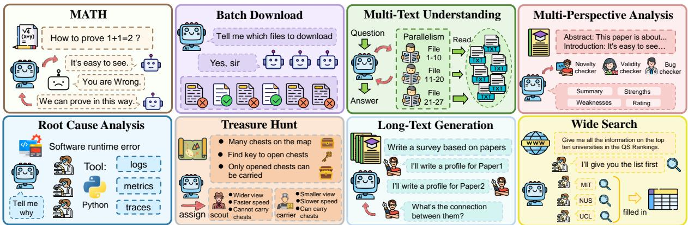
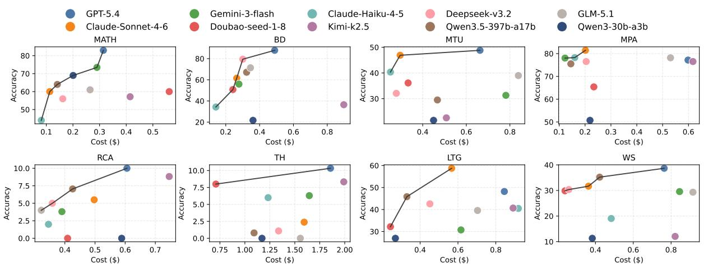
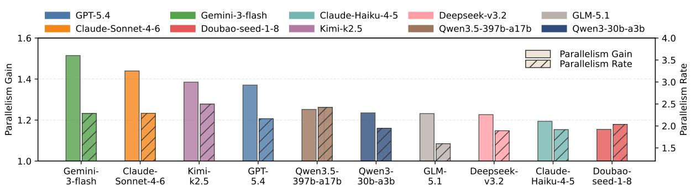
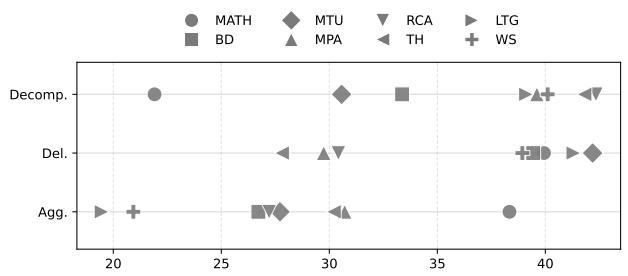
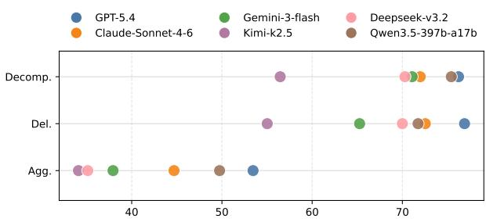
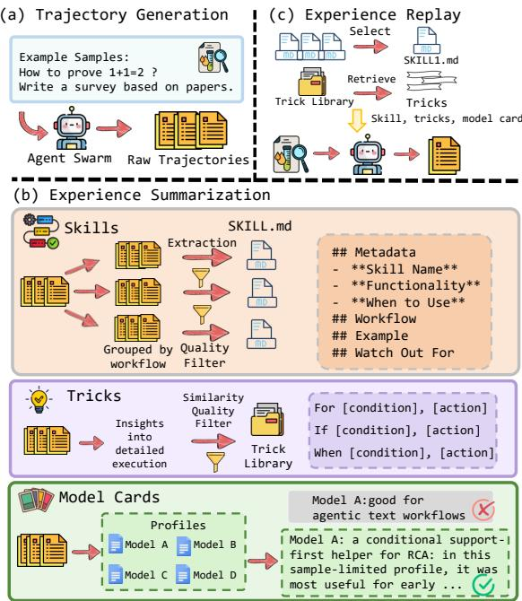
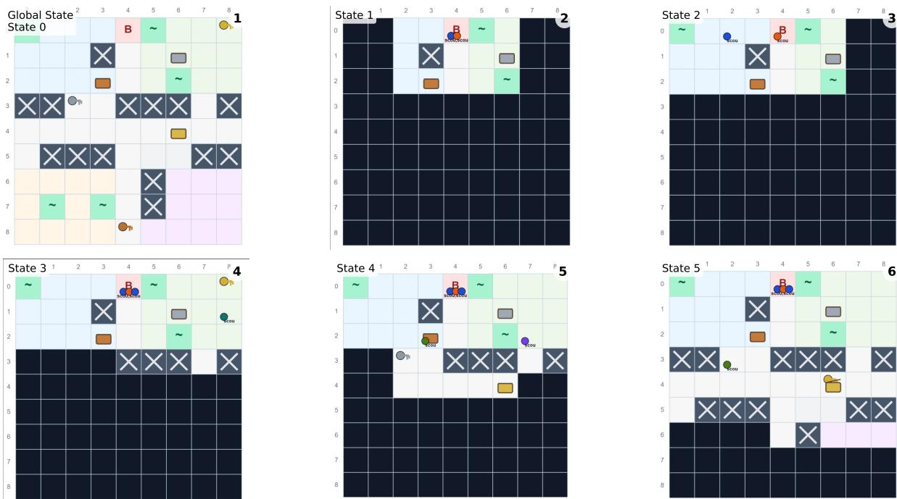
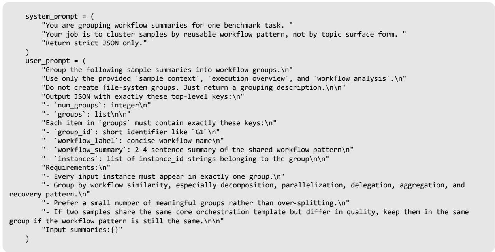

# SwarmBench: Can Large Language Models Act as Agent Swarm Orchestrators?

Jinshan Gao<sup>1</sup>, Zhuoran Jin<sup>1,2,</sup>\*, Tianyi Men<sup>1,2</sup>, Kang Liu<sup>1,2</sup>, Jun Zhao<sup>1,2,</sup>\*

<sup>1</sup>The Key Laboratory of Cognition and Decision Intelligence for Complex Systems, Institute of Automation, Chinese Academy of Sciences, Beijing, China, <sup>2</sup>School of Artificial Intelligence, University of Chinese Academy of Sciences, Beijing, China, gaojinshan2026@ia.ac.cn {zhuoran.jin, tianyi.men, kliu, jzhao}@nlpr.ia.ac.cn

## Abstract

Large language model-based multi-agent systems are evolving from fixed interaction topologies toward dynamically orchestrated Agent Swarms. However, existing benchmarks are still largely based on single-agent or generalpurpose agent tasks, making it difficult to systematically evaluate key orchestration capabilities. We propose SwarmBench, a benchmark that evaluates model performance from multiple perspectives, including accuracy, efficiency, cost, and process quality. Experimental results show that current models exhibit substantial differences in orchestration capability. These differences are reflected not only in final accuracy, efficiency, and cost, but also in the overall quality of the orchestration process itself. Based on these findings, we further propose SwarmExp, a simple yet effective method based on experience extraction and experience replay, which consistently improves the orchestration performance of large language models. Code is available at https://github.com/ying1973/SwarmBench.

## 1 Introduction

In recent years, large language model-based multiagent systems (LLM-MAS) have evolved from fixed collaboration paradigms toward more dynamic orchestration paradigms. Early LLM-MAS systems typically relied on predefined roles and communication structures, such as debate, SOPdriven pipeline, or manager-worker collaboration (Wu et al., 2024; Li et al., 2025; Hong et al., 2024). These systems are relatively easy to control and analyze, but predefined collaboration limits their scalability across tasks. In contrast, recent Agent Swarm (Team et al., 2026) further shifts the focus from “designing a fixed team” to “allowing models to organize a team dynamically”. In such systems, a main agent is responsible for decomposing subtasks, creating subagents, coordinating their parallel execution, and finally integrating their outputs. As a result, the key challenge shifts to whether large language models can act as orchestrators that efficiently organize a dynamic swarm to solve complex tasks (Dang et al., 2026).

However, existing benchmarks are still insufficient for evaluating this emerging paradigm. On the one hand, studies on MAS continue to rely on benchmarks originally designed for singleagent systems or general-purpose agents (Mialon et al., 2024; Jimenez et al., 2024; Merrill et al., 2026), which cannot systematically expose key capabilities of Agent Swarm. On the other hand, when some tasks appear suitable for multi-agent collaboration (Wong et al., 2025), existing evaluations mainly focus on final answer quality while paying less attention to the orchestration process itself, including the rationality of task decomposition, the effectiveness of subagent creation, the completeness of result aggregation, and so on. Consequently, we still lack a benchmark specifically designed for Agent Swarm orchestration.

To address these limitations, we propose Swarm-Bench, a benchmark specifically designed to evaluate whether large language models can function as Agent Swarm orchestrators. Specifically, we divide tasks into three categories according to the orchestration capabilities they primarily evaluate: task decomposition, subagent creation and delegation, and subagent result aggregation. We construct a dataset consisting of 8 tasks and 400 samples, covering tasks such as root cause analysis, treasure hunt game, wide search, and so on (Team et al., 2026). We further evaluate models from multiple aspects: accuracy, efficiency, and cost. In addition, we introduce a process quality evaluation framework to conduct fine-grained analysis of orchestration quality across three dimensions: task decomposition, subagent delegation, and result aggregation.

Using SwarmBench, we conduct extensive experiments on a variety of proprietary and opensource models. The results show that existing models have highly uneven capability distributions. Stronger models not only achieve higher accuracy, but are also more capable of converting parallel structures into real efficiency gains and achieving better Pareto frontiers in the cost-performance trade-off. Further analysis reveals that different tasks consistently expose different orchestration bottlenecks, among which aggregation is often the most difficult capability to stabilize. Moreover, the study of cost and efficiency shows that system performance indispensably depends on the effectiveness of the orchestration structure, rather than having a simple linear relationship with cost or parallelism. Based on these findings, we further propose SwarmExp, a simple yet effective method that extracts skill, trick, and model card from trajectories and reinjects them into the main agent’s context. Experimental results show that SwarmExp consistently improves performance across multiple representative tasks.

We summarize the contribution as follows.

• We propose SwarmBench, a benchmark designed to evaluate large language models as Agent Swarm orchestrators, providing a more comprehensive characterization of model capability in swarm scenarios.

• We conduct extensive experiments and analysis on SwarmBench, revealing the capability structure of current models as orchestrators, showing that the key factor is whether the orchestration structure itself is effective.

• Based on these findings, we propose Swarm-Exp, a simple yet effective experience-driven method that improves orchestration capability by extracting experience from trajectories.

## 2 SwarmBench

## 2.1 Definition of Agent Swarm

Agent Swarm is a hierarchical multi-agent system in which an orchestrator coordinates a dynamically created set of subagents to accomplish a given task. In this paper, we view Agent Swarm as a specific form of multi-agent workflow characterized by three properties: (1) hierarchical orchestration, where a single orchestrator is responsible for task planning, subagent creation, coordination, and final synthesis; (2) dynamic and heterogeneous subagent instantiation, where subagents are created at runtime with different roles, backbone models, tools, and local contexts according to task requirements; and (3) parallel subagent execution, where multiple subagents can execute different subtasks concurrently and report their results back to the orchestrator.

Formally, given an input task $x \in { \mathcal { X } } .$ , an Agent Swarm process can be represented as

$$
\boldsymbol { S } ( \boldsymbol { x } ) = \left( o , \mathcal { H } , \Pi _ { o } , \Pi _ { h } , \mathcal { U } , B \right)
$$

where $o$ denotes the orchestrator; H denotes the set of available subagent configurations; $\Pi _ { o }$ denotes the orchestration policy; $\Pi _ { h }$ denotes the subagent execution policy; U denotes the available tools and external environments; and B denotes the execution budget, including step limits, agent count, latency, or monetary cost.

A key distinction between Agent Swarm and static or predefined multi-agent workflows is that the concrete subagent set is not fixed before execution. Instead, at global step t, the orchestrator observes the current global state $s _ { t }$ and outputs an orchestration action:

$$
a _ { t } ^ { o } \sim \Pi _ { o } ( \cdot \mid s _ { t } )
$$

where $a _ { t } ^ { o }$ belongs to the action space $A _ { o } .$ . When $a _ { t } ^ { o } = s \mathsf { p }$ awn agent, the orchestrator creates a new subagent $h _ { i }$ and specifies its configuration

$$
\phi _ { i } = ( r _ { i } , m _ { i } , \tau _ { i } , c _ { i } )
$$

where $r _ { i }$ is the role description of the agent; $m _ { i }$ is the backbone model assigned to the agent; $\tau _ { i } \subseteq \mathcal { U }$ is the set of tools available to the agent; and $c _ { i }$ is the local context or subtask prompt of the agent.

In addition, Agent Swarm encourages parallel execution among agents. Let $H _ { t }$ denote the set of currently running agents. The system parallelism can then be defined as $\rho _ { t } = | H _ { t } |$ . When an execution process contains stages with $\rho _ { t } > 1$ , and the task benefits from parallelizable subtasks, we consider the system to exhibit swarm behavior.

## 2.2 Dataset Construction

SwarmBench aims to evaluate the core capabilities required for large language models to function as Agent Swarm orchestrators, including task decomposition, dynamic subagent creation and delegation, and subtask result aggregation. To achieve this, we design 3 task categories with 8 task types to comprehensively evaluate the key capabilities of the model. For details, see Figure 1 and Appendix A.

  
Figure 1: Overview of SwarmBench, a benchmark designed to evaluate LLMs as Agent Swarm orchestrators.

Decomposition-Oriented Tasks. This category evaluates the ability of the main agent to decompose complex objectives into multiple subtasks that can be executed in parallel or progressively. We include three tasks in this category: Batch Download (BD), Multi-Text Understanding (MTU), and MATH. Batch Download is fully constructed from scratch. Each sample contains a virtual environment and a file download requirement, with an average of 11.44 files per sample. Multi-text Understanding is built on the Loong (Wang et al., 2024a) dataset. We select tasks suitable for multiagent collaboration, resulting in samples with over 200K average context length and more than 24 documents per sample. MATH is constructed from Omni-MATH (Gao et al., 2025), using samples with difficulty above 7. The system is required to decompose complex problems into verifiable intermediate steps to derive the final solution.

Delegation-Oriented Tasks. This category evaluates the ability of the main agent to select appropriate backbone models, create suitable subagent roles, and delegate different subtasks to corresponding agents according to task requirements. We include three tasks in this category: Multi-Perspective Analysis (MPA), Root Cause Analysis (RCA), and Treasure Hunt Game (TH). Multi-Perspective Analysis is based on DeepReview (Zhu et al., 2025b). The system is required to create subagents with different perspectives such as novelty, effectiveness, and completeness, and organize their collaboration to generate the final review comments. Root Cause Analysis is based on the Open-RCA dataset (Xu et al., 2025) and requires the system to infer failure causes from different evidence sources including logs, metrics, and traces. Treasure Hunt is a newly constructed task in which the system must dynamically create and delegate subagents with two different roles to explore an unknown map, search for keys, and open chests in an interactive environment.

Aggregation-Oriented Tasks. In this category, subagents typically produce partial drafts, local results, or intermediate content, while the main agent must further filter, integrate, and unify these outputs into a final result with consistent style and complete structure. We include Long-Text Generation (LTG) and Wide Search (WS) in this category. Long-text Generation is based on LongInOutBench (Zhang et al., 2025) and requires the system to integrate content from multiple papers generated by different subagents and produce coherent long-form survey articles. Wide Search is built based on the WideSearch dataset (Wong et al., 2025). Subagents are required to retrieve key information through real-world web search, while the main agent must aggregate the collected information and complete the final answer table.

## 2.3 Agent Swarm Framework

To evaluate the capability of different models as orchestrators, SwarmBench designs a lightweight Agent Swarm framework and applies it across all tasks. In this framework, the main agent is responsible for task decomposition, subagent creation, task assignment, and result aggregation, while subagents independently execute delegated subtasks within their local contexts.

To reduce the influence of the main agent’s own knowledge on task outcomes, the main agent is not allowed to call tools or answer tasks independently, and part of the task context is hidden from the main agent. The backbone model of the main agent is provided by the evaluated model, while subagent backbone models are selected from a configurable model pool. Each model in the pool is associated with a model description written from publicly available information, and the main agent dynamically selects suitable models during execution. Under this setting, the main agent is needed to create suitable subagent roles based on subtasks, and assign appropriate backbone models to different subagents. Detailed information about the backbone model pool is provided in Appendix B.

## 3 Experiments

## 3.1 Setup

Models. We evaluate a comprehensive set of models from multiple sources. Proprietary models are from OpenAI (OpenAI, 2026), Anthropic (Anthropic, 2026), Google (Google, 2025), and ByteDance (ByteDance, 2025), while open-source models cover Qwen (Qwen, 2026), Deepseek (DeepSeek, 2025), Kimi (Team et al., 2026) and GLM (Z.ai, 2026). In all experiments, the main agent models run under the same Agent Swarm framework and share the same subagent backbone model pool. The tool interfaces and output formats of each task are predefined and kept fixed across all models. We also include the backbone models from the subagent pool as single-agent baselines.

Metrics. We report results from three aspects: accuracy, efficiency, and cost. For accuracy, we use the standard evaluation metric of each task; details can be found in Appendix C. Efficiency is measured by the time gain from parallelism. Cost is measured by the actual monetary cost incurred during a complete execution process.

## 3.2 Main Results

Accuracy results can be found in Table 1. Overall, GPT-5.4 is the strongest and most balanced orchestrator, achieving the best performance on six out of eight tasks, demonstrating stable capability in decomposition, delegation, and aggregation. Claude-Sonnet-4-6 is the closest proprietary competitor. Its strengths are more concentrated on tasks such as MPA and LTG, which rely more heavily on role organization and content synthesis. In contrast, the capabilities of open-source models are more fragmented and exhibit clear task-specific strengths. Kimi-k2.5 is the most stable model on delegationoriented tasks, especially RCA and TH. Qwen3.5- 397b-a17b performs better on aggregation-oriented tasks such as LTG and WS, showing stronger capability in result integration. Other open-source models, including Deepseek-v3.2 and GLM-5.1, achieve relatively stable performance on tasks such as BD and MTU, but do not demonstrate a consistent orchestration advantage across tasks. Meanwhile, limited by model scale, Qwen3-30b-a3b performs noticeably weaker on delegation- and aggregation-related tasks. The agreement analysis between LLM-based scores and human evaluation for open-ended task metrics is provided in Appendix D.3.

## 3.3 Cost-Accuracy Trade-off Analysis

To further analyze the cost behavior of models, we measure system accuracy and average cost on all tasks and plot the accuracy-cost curves. We additionally connect the Pareto frontier within each task to illustrate the optimal performance boundary under different budgets, as shown in Figure 2.

Results show that cost is not a linear function of performance. From the task perspective, performance on MATH and BD generally improves as cost increases. In contrast, on tasks such as MPA, LTG, MTU, RCA, and WS, higher cost does not necessarily lead to better performance, and some lower-cost settings already achieve near-optimal results. From the model perspective, larger models often achieve better cost-performance trade-offs in complex collaborative tasks. Comparing two models from the same family, Qwen3.5-397b-a17b more frequently lies on the Pareto frontier across multiple tasks, while Qwen3-30b-a3b often incurs a higher cost but achieves worse performance.

These observations suggest that cost and performance are not simply linearly related, but largely depend on orchestration quality. Strong orchestrators can achieve better performance with lower cost through more efficient decomposition, delegation, and aggregation, while weaker orchestrators often require more interactions and redundant execution without necessarily obtaining better results.

## 3.4 Parallelism and Time Efficiency

To analyze execution efficiency, we introduce two metrics related to parallel execution. Parallelism Rate measures the average number of concurrently running subagents during execution. Parallelism Gain is defined as the ratio between serialized execution time and actual execution time, measuring the latency reduction brought by parallel execution. The former reflects the degree of parallel execution, while the latter reflects its actual efficiency gain. Detailed formulas are provided in Appendix C.

<table><tr><td>Model</td><td>MATH</td><td>BD</td><td>MTU</td><td>MPA</td><td>RCA</td><td>TH</td><td>LTG</td><td>WS</td><td>AVG.</td></tr><tr><td colspan="10">Proprietary Models</td></tr><tr><td>GPT-5.4</td><td>82.97</td><td>87.84</td><td>48.82</td><td>77.17</td><td>10.00</td><td>10.33</td><td>48.19</td><td>38.67</td><td>50.49</td></tr><tr><td>Claude-Sonnet-4-6</td><td>60.00</td><td>61.50</td><td>46.90</td><td>81.43</td><td>5.50</td><td>2.38</td><td>58.74</td><td>31.67</td><td>43.51</td></tr><tr><td>Gemini-3-flash</td><td>73.46</td><td>55.92</td><td>31.29</td><td>78.04</td><td>3.80</td><td>6.29</td><td>30.73</td><td>29.56</td><td>38.63</td></tr><tr><td>Doubao-seed-1-8</td><td>60.00</td><td>50.77</td><td>36.12</td><td>65.39</td><td>0.00</td><td>8.00</td><td>32.19</td><td>29.87</td><td>35.29</td></tr><tr><td>Claude-Haiku-4-5</td><td>44.00</td><td>34.30</td><td>40.36</td><td>78.24</td><td>2.00</td><td>6.00</td><td>40.50</td><td>19.05</td><td>33.05</td></tr><tr><td colspan="10">Open-source Models</td></tr><tr><td>Kimi-k2.5</td><td>57.14</td><td>36.48</td><td>22.53</td><td>76.52</td><td>8.82</td><td>8.33</td><td>40.67</td><td>12.05</td><td>32.81</td></tr><tr><td>Deepseek-v3.2</td><td>56.00</td><td>79.45</td><td>32.08</td><td>76.52</td><td>5.00</td><td>1.08</td><td>42.58</td><td>30.36</td><td>40.38</td></tr><tr><td>Qwen3.5-397b-a17b</td><td>64.00</td><td>67.13</td><td>29.50</td><td>75.51</td><td>7.05</td><td>0.79</td><td>45.83</td><td>35.20</td><td>40.62</td></tr><tr><td>GLM-5.1</td><td>61.00</td><td>71.36</td><td>39.00</td><td>78.17</td><td>4.00</td><td>0.00</td><td>39.56</td><td>29.32</td><td>40.30</td></tr><tr><td>Qwen3-30b-a3b</td><td>69.00</td><td>21.70</td><td>21.56</td><td>50.71</td><td>0.00</td><td>0.00</td><td>26.93</td><td>11.32</td><td>25.15</td></tr><tr><td colspan="10">Single Models</td></tr><tr><td>GPT-5-mini</td><td>20.00</td><td>45.66</td><td>18.20</td><td>68.56</td><td>1.02</td><td>2.13</td><td>33.43</td><td>6.32</td><td>24.41</td></tr><tr><td>Claude-Haiku-4-5</td><td>31.56</td><td>40.11</td><td>16.10</td><td>65.42</td><td>3.19</td><td>0.50</td><td>26.19</td><td>7.01</td><td>23.76</td></tr><tr><td>Gemini-2.5-flash-lite</td><td>10.33</td><td>36.55</td><td>13.60</td><td>56.65</td><td>0.00</td><td>0.00</td><td>18.89</td><td>6.97</td><td>17.87</td></tr><tr><td>Qwen3.5-35b-a3b</td><td>21.55</td><td>35.99</td><td>15.33</td><td>58.10</td><td>0.00</td><td>0.00</td><td>25.13</td><td>5.10</td><td>20.15</td></tr><tr><td>GLM-4.5-air</td><td>24.13</td><td>33.54</td><td>17.00</td><td>60.23</td><td>1.03</td><td>0.00</td><td>26.71</td><td>7.91</td><td>21.31</td></tr><tr><td>Doubao-seed-1-6-flash</td><td>14.00</td><td>41.33</td><td>20.10</td><td>64.71</td><td>0.00</td><td>0.00</td><td>14.00</td><td>8.13</td><td>20.28</td></tr></table>

Table 1: Accuracy evaluation results. Bold indicates the best result, and underline indicates the second-best result. "Proprietary Models" and "Open-source Models" are results where models act as Agent Swarm orchestrators, while "Single Models" refers to single-agent execution results.  
  
Figure 2: Accuracy-cost Pareto frontier plots across eight tasks.

The results in Figure 3 show that parallelism gain is not simply determined by the amount of parallelism itself. In terms of parallelism rate, Kimi-k2.5 and Qwen3.5-397b-a17b significantly outperform other models, indicating that they can more easily learn and activate parallel execution through context prompting. However, a higher parallelism rate does not necessarily lead to higher parallelism gain. While Kimi-k2.5 achieves the highest parallelism rate, its parallelism gain does not surpass Claude-Sonnet-4-6, whose parallelism rate is slightly lower. In contrast, Gemini-3-flash achieves the highest parallelism gain with a moderate parallelism rate. These results suggest that the determinant of time reduction is not how many subagents run simultaneously, but whether the main agent constructs an effective parallel structure. Specifically, effective orchestration requires reducing redundant waiting, avoiding repeated execution, and organizing parallel subtasks into genuinely beneficial collaborative workflows.

## 3.5 Analysis of Orchestration Quality

To further characterize process quality, we introduce an LLM-based evaluation framework that scores the main agent along three orchestration dimensions: task decomposition (Decomp.), subagent creation and delegation (Del.), and subagent result aggregation (Agg.). These dimensions respectively capture whether the main agent can break the task into meaningful subtasks, assign suitable subagents with clear responsibilities, and integrate local outputs into a coherent final response. As shown in Figure 4, we average the scores across tasks and models to obtain both task-centric and model-centric views of orchestration quality. The agreement analysis between LLM-based process scores and human evaluation is provided in Appendix D.3.

  
Figure 3: Parallelism gain and rate across ten models. Parallelism gain quantifies the latency reduction brought by parallel execution. Parallelism rate represents the average count of subagents running concurrently in task execution.

  
Figure 4: LLM-Judged Orchestration Quality Across Tasks and Models. This figure provides both task-centric and model-centric views of decomposition, delegation, and aggregation performance.



The task-centric results show that the LLMbased process scores are broadly aligned with our task taxonomy. BD, MTU, and MATH exhibit lower scores in decomposition, with MATH showing the greatest difficulty, indicating that these tasks primarily stress the ability to transform complex objectives into tractable intermediate steps. MPA, RCA, and TH are more challenging in delegation, reflecting their reliance on role construction, model selection, and subtask assignment. In contrast, LTG and WS show the largest drop in aggregation, suggesting that synthesizing multiple local outputs into a unified final answer is the central bottleneck for aggregation-oriented tasks.

The model-centric results reveal that orchestration quality differs not only in overall strength but also in balance across dimensions. GPT-5.4 achieves the strongest and most stable performance, while Claude-Sonnet-4-6 and Qwen3.5-397b-a17b form a competitive second tier with different profiles: the former is more balanced, whereas the latter is stronger in decomposition and delegation. Weaker models tend to suffer especially in aggregation, and the overall score distribution also shows that aggregation is consistently lower than the other two dimensions. This suggests that current models are comparatively better at initiating and assigning subtasks than at reliably integrating subagent outputs into a coherent final decision.

## 4 SwarmExp: Experience-Driven Swarm Orchestration

## 4.1 Definition

Experiments on SwarmBench show that the limitations of existing models lie not only in final answer quality, but also in the orchestration process, including unstable task decomposition, unreasonable subagent delegation, and weak result integration. Based on these observations, we argue that reusable orchestration experience can be accumulated through task execution (Zhang et al., 2026b,a; Hao et al., 2026). By extracting and reusing such experience, orchestration capability can be improved. Based on this idea, we propose SwarmExp, a simple yet effective experience-driven enhancement method for Agent Swarm. Figure 5 illustrates the framework.

  
Figure 5: Overview of SwarmExp, consisting of three stages: trajectory generation with the base Agent Swarm, experience summarization into skills, tricks, and model cards, and experience replay by injecting experience back into the main agent.

SwarmExp follows a simple two-stage pipeline. First, we run inference on SwarmBench using the initial Agent Swarm framework and collect the full trajectories of the model. We then summarize these trajectories and extract three types of reusable knowledge: skill, trick, and model card.

Skill. This component focuses on high-level workflow patterns (Jiang et al., 2026; Alzubi et al., 2026; Si et al., 2026; Li et al., 2026). We use LLMs to summarize orchestration patterns from trajectories and organize them into candidate SKILL.md files. Each skill describes a reusable workflow for a class of tasks, including how to decompose tasks, organize subagents, and aggregate local results, providing the main agent with a more stable orchestration starting point for new tasks.

Trick. This component focuses on fine-grained operational experience (Jiang et al., 2026). Unlike skills, tricks are shorter and more specific, usually corresponding to practical but easily overlooked strategies in task execution, such as how to reduce redundant information or assign subtasks more suitably. We organize these experiences into a trick library, allowing the main agent to retrieve taskrelevant suggestions during execution.

<table><tr><td>Method</td><td>MTU</td><td>RCA</td><td>LTG</td><td>WS</td></tr><tr><td>Single Agent</td><td>18.20</td><td>1.02</td><td>33.43</td><td>6.32</td></tr><tr><td>Multi-Model Voting</td><td>34.92</td><td>0.00</td><td>36.79</td><td>26.66</td></tr><tr><td>Best-of-N</td><td>20.68</td><td>0.00</td><td>34.35</td><td>17.69</td></tr><tr><td>AOrchestra</td><td>36.03</td><td>10.71</td><td>43.57</td><td>38.55</td></tr><tr><td>Agent Swarm</td><td>48.82</td><td>10.00</td><td>48.19</td><td>38.67</td></tr><tr><td>w/ SwarmExp ∆</td><td>49.07 (+0.25)</td><td>16.42 (+6.42)</td><td>54.65 (+6.46)</td><td>41.59 (+2.92)</td></tr></table>

Table 2: Main results of SwarmExp. ∆ denotes the performance change relative to the baseline.

Model Card. This component focuses on the practical performance of subagent backbone models on specific tasks. Overall model quality, suitable scenarios, strengths, and weaknesses are summarized into experience-based model profiles. This allows the main agent to make more reasonable decisions when creating and assigning subagents.

During inference, SwarmExp injects these three types of experience into the context of the main agent, allowing the orchestrator to reference historical experience during task planning, subagent delegation, and result aggregation.

## 4.2 Experiments

Setup. We evaluate SwarmExp on four representative tasks, MTU, RCA, LTG, and WS, which cover all three task categories and correspond to cases where the initial Agent Swarm performs weakly. We compare against four baselines: Single-Agent and Best-of-N with GPT-5-mini, Multi-Model Voting using the shared subagent model pool, and AOrchestra (Ruan et al., 2026), a framework that dynamically creates subagents with serial execution. For both AOrchestra and Agent Swarm, we use GPT-5.4 as the main agent.

Results. The experimental results are shown in Table 2. SwarmExp achieves the best performance on all four tasks. Compared with the initial Agent Swarm, it improves performance by +0.25, +6.42, +6.46, and +2.92 on MTU, RCA, LTG, and WS, respectively. Notably, improvements on RCA and LTG are more significant, while the gain on MTU is relatively smaller, suggesting that subagent creation and delegation as well as subagent result aggregation remain key weaknesses of current models, and SwarmExp can effectively enhance model capability in these aspects.

<table><tr><td>Model</td><td>MTU</td><td>RCA</td><td>LTG</td><td>WS</td></tr><tr><td>Claude-Haiku-4-5 w/ SwarmExp ∆</td><td>40.36 40.65 (+0.29)</td><td>2.00 3.50 (+1.50)</td><td>40.50 51.44 (+10.94)</td><td>19.05 23.60 (+4.55)</td></tr><tr><td>Gemini-3-flash w/ SwarmExp ∆</td><td>31.29 37.09 (+5.80)</td><td>3.80 5.62 (+1.82)</td><td>30.73 36.70 (+5.97)</td><td>29.56 31.45 (+1.89)</td></tr><tr><td>Deepseek-v3.2 w/ SwarmExp ∆</td><td>32.08 31.25 (-0.83)</td><td>5.00 6.53 (+1.53)</td><td>42.58 42.42 (-0.16)</td><td>30.36 32.25 (+1.89)</td></tr><tr><td>Qwen3.5-397b-a17b w/ SwarmExp ∆</td><td>29.50 35.70 (+6.20)</td><td>7.05 9.05</td><td>45.83 52.43</td><td>35.20 36.68</td></tr></table>

Table 3: Results of experience transfer experiments.

<table><tr><td></td><td>MTU</td><td>RCA</td><td>LTG</td><td>WS</td><td>Avg. ∆</td></tr><tr><td>SwarmExp</td><td>49.07</td><td>16.42</td><td>54.65</td><td>41.59</td><td></td></tr><tr><td>w/o Skill</td><td>47.65</td><td>14.56</td><td>53.98</td><td>40.66</td><td>(-1.22)</td></tr><tr><td>w/o Trick</td><td>46.21</td><td>14.00</td><td>54.00</td><td>40.50</td><td>(-1.75)</td></tr><tr><td>w/o Model Card</td><td>48.33</td><td>12.55</td><td>51.60</td><td>39.26</td><td>(-2.49)</td></tr><tr><td>Avg. ∆</td><td>(-1.67)</td><td>(-2.71)</td><td>(-1.45)</td><td>(-1.45)</td><td></td></tr></table>

Table 4: Results of ablation study on three types of experience. Avg. ∆ denotes the average performance drop relative to SwarmExp.

## 4.3 Analysis

## 4.3.1 Experience Transfer Across Models

To evaluate cross-model transferability of the experience, we reuse the experience extracted from GPT-5.4 and inject it into other orchestrator models without rebuilding it. We test four target models: Claude-Haiku-4-5, Gemini-3-flash, Deepseek-v3.2, and Qwen3.5-397b-a17b.

As shown in Table 3, the experience transfers well across models: 14 out of 16 settings improve after injection. The gains are most obvious on LTG, while RCA and WS show more stable improvements, suggesting that the extracted experience is especially useful for aggregation- and delegationheavy tasks. Different models also absorb the experience differently: Gemini-3-flash benefits consistently, whereas Deepseek-v3.2 gains less, indicating that the final effect still depends on the target model’s own orchestration ability. We also conduct a small-scale cross-task transfer analysis to examine whether SwarmExp experience can generalize across task domains, with results provided in Appendix D.4.

## 4.3.2 Ablation of Experience Components

To further understand where SwarmExp gains come from, we conduct an ablation study on its three experience components, as shown in Table 4. We remove one component at a time while keeping the others fixed, and observe performance on the same four tasks. The results show that all three components are useful, since removing any of them leads to a drop in performance. Among them, removing model card causes the largest average decline, suggesting that knowledge about subagent model capabilities is the most important. Removing skill or trick also hurts performance, indicating that both high-level workflow templates and finegrained execution guidance contribute to the final improvement.

## 5 Related Work

## 5.1 Multi-Agent Systems

LLM-based multi-agent systems have evolved from fixed-topology collaboration to increasingly dynamic orchestration (Jin et al., 2025; Qi et al., 2026; Guo et al., 2024; Han et al., 2024). Some systems typically relied on predefined roles and interaction patterns (Wang et al., 2024b; Li et al., 2025; D’Arcy et al., 2024), such as debate, pipeline-style coordination, or hierarchical manager-worker structures. More recent work has shifted toward dynamic coordination, where workflows can adapt during training or runtime according to task requirements (Wu et al., 2026; Zhang et al., 2026c; Feng et al., 2026; Ke et al., 2026; Cai et al., 2026). Building on this trend, Agent Swarm further emphasizes dynamic subagent creation, heterogeneous role and model assignment, and parallel execution, moving the focus of MAS research to studying whether LLMs can act as effective orchestrators.

## 5.2 Benchmarks for Multi-Agent Systems

Despite rapid progress in MAS, evaluation remains underdeveloped. Many studies still rely on benchmarks originally designed for single-agent systems or general-purpose agents (Barres et al., 2025; Wei et al., 2025; Patil et al., 2025; Yao et al., 2022; Men et al., 2026). Other benchmarks often focus primarily on final-task accuracy, with limited attention to the quality of the collaboration process itself. As a result, current evaluation remains insufficient for systematically assessing agent swarm orchestration, especially in terms of whether the system decomposes tasks appropriately, assigns subagents effectively, and converts parallelism into meaningful gains. MultiAgentBench (Zhu et al., 2025a) and related work (Ruan et al., 2025) share some similarities with our work, but we focus on the more specific agent swarm paradigm and provide a more fine-grained analysis.

## 6 Conclusion

In this paper, we introduce SwarmBench, a benchmark for evaluating the ability of large language models to orchestrate Agent Swarm systems. SwarmBench contains 8 tasks and 400 samples, covering key orchestration stages such as task decomposition, subagent delegation, and result aggregation. Through evaluations on accuracy, efficiency, cost, and process quality, we show that current models still have clear limitations as swarm orchestrators, and that system performance depends more on effective orchestration structure than on simply increasing cost or parallelism. Based on these findings, we further propose SwarmExp, a simple experience-driven method for improving orchestration capability. By releasing SwarmBench as an open benchmark, we hope to support future research on large language models as Agent Swarm orchestrators.

## Limitations

SwarmBench has several limitations. Although it covers diverse orchestration settings, it still includes only eight tasks and may not capture the full range of agent swarm scenarios. In addition, our evaluation is conducted under a unified lightweight swarm scaffold with a fixed subagent model pool, which improves comparability but may limit the generality of the conclusions. Finally, our process analysis relies partly on LLM-based judging, which is informative but may still introduce bias.

## Ethical considerations

Multi-agent systems may introduce risks such as error propagation, unintended coordination behaviors, and the amplification of incorrect or misleading outputs through agent interaction. In this work, all datasets used are publicly available and do not involve personally identifiable information. We also used AI tools for language polishing during the writing of this paper.

## Acknowledgments

This work was supported by the National Natural Science Foundation of China (No.U24A20335), and the independent research project of the Key Laboratory of Cognition and Decision Intelligence for Complex Systems.

## References

Salaheddin Alzubi, Noah Provenzano, Jaydon Bingham, Weiyuan Chen, and Tu Vu. 2026. Evoskill: Automated skill discovery for multi-agent systems. arXiv preprint arXiv:2603.02766.

Anthropic. 2026. Claude sonnet 4.6.

Victor Barres, Honghua Dong, Soham Ray, Xujie Si, and Karthik Narasimhan. 2025. τ<sup>2</sup>-bench: Evaluating conversational agents in a dual-control environment. Preprint, arXiv:2506.07982.

ByteDance. 2025. Seed1.8.

Zhixi Cai, Fucai Ke, Kevin Leo, Sukai Huang, Maria Garcia de la Banda, Peter J Stuckey, and Hamid Rezatofighi. 2026. Mata: A trainable hierarchical automaton system for multi-agent visual reasoning. arXiv preprint arXiv:2601.19204.

Yufan Dang, Chen Qian, Xueheng Luo, Jingru Fan, Zihao Xie, Ruijie Shi, Weize Chen, Cheng Yang, Xiaoyin Che, Ye Tian, and 1 others. 2026. Multi-agent collaboration via evolving orchestration. Advances in neural informationprocessing systems, 38:165025– 165059.

Mike D’Arcy, Tom Hope, Larry Birnbaum, and Doug Downey. 2024. Marg: Multi-agent review generation for scientific papers. arXiv preprint arXiv:2401.04259.

DeepSeek. 2025. Deepseek.

Shangbin Feng, Zifeng Wang, Palash Goyal, Yike Wang, Weijia Shi, Huang Xia, Hamid Palangi, Luke Zettlemoyer, Yulia Tsvetkov, Chen-Yu Lee, and 1 others. 2026. Heterogeneous swarms: Jointly optimizing model roles and weights for multi-llm systems. Advances in Neural Information Processing Systems, 38:114319–114351.

Bofei Gao, Feifan Song, Zhe Yang, Zefan Cai, Yibo Miao, Qingxiu Dong, Lei Li, Chenghao Ma, Liang Chen, Zhengyang Tang, and 1 others. 2025. Omnimath: A universal olympiad level mathematic benchmark for large language models. In International Conference on Learning Representations, volume 2025, pages 100540–100569.

Google. 2025. Gemini 3 flash.

Taicheng Guo, Xiuying Chen, Yaqi Wang, Ruidi Chang, Shichao Pei, Nitesh V Chawla, Olaf Wiest, and Xiangliang Zhang. 2024. Large language model based multi-agents: A survey of progress and challenges. arXiv preprint arXiv:2402.01680.

Shanshan Han, Qifan Zhang, Weizhao Jin, and Zhaozhuo Xu. 2024. Llm multi-agent systems: Challenges and open problems. arXiv preprint arXiv:2402.03578.

Yupu Hao, Zhuoran Jin, Huanxuan Liao, Kang Liu, and Jun Zhao. 2026. Pushing the limits of llm tool calling via experiential knowledge integration and activation. Preprint, arXiv:2606.10875.

Sirui Hong, Mingchen Zhuge, Jonathan Chen, Xiawu Zheng, Yuheng Cheng, Jinlin Wang, Ceyao Zhang, Steven Yau, Zijuan Lin, Liyang Zhou, and 1 others. 2024. Metagpt: Meta programming for a multiagent collaborative framework. In International Conference on Learning Representations, volume 2024, pages 23247–23275.

Guanyu Jiang, Zhaochen Su, Xiaoye Qu, and Yi R Fung. 2026. Xskill: Continual learning from experience and skills in multimodal agents. arXiv preprint arXiv:2603.12056.

Carlos E Jimenez, John Yang, Alexander Wettig, Shunyu Yao, Kexin Pei, Ofir Press, and Karthik Narasimhan. 2024. Swe-bench: Can language models resolve real-world github issues? In International Conference on Learning Representations, volume 2024, pages 54107–54157.

Weiqiang Jin, Hongyang Du, Biao Zhao, Xingwu Tian, Bohang Shi, and Guang Yang. 2025. A comprehensive survey on multi-agent cooperative decisionmaking: Scenarios, approaches, challenges and perspectives. arXiv preprint arXiv:2503.13415.

Zixuan Ke, Yifei Ming, Austin Xu, Ryan Chin, Xuan-Phi Nguyen, Prathyusha Jwalapuram, Jiayu Wang, Semih Yavuz, Caiming Xiong, and Shafiq Joty. 2026. Mas-orchestra: Understanding and improving multi-agent reasoning through holistic orchestration and controlled benchmarks. arXiv preprint arXiv:2601.14652.

Jiachun Li, Zhuoran Jin, Tianyi Men, Yupu Hao, Kejian Zhu, Lingshuai Wang, Dongqi Huang, Longxiang Wang, Shengjia Hua, Lu Wang, Jinshan Gao, Hongbang Yuan, Ruilin Xu, Kang Liu, and Jun Zhao. 2026. Agentic environment engineering for large language models: A survey of environment modeling, synthesis, evaluation, and application. Preprint, arXiv:2606.12191.

Zhuofeng Li, Haoxiang Zhang, Seungju Han, Sheng Liu, Jianwen Xie, Yu Zhang, Yejin Choi, James Zou, and Pan Lu. 2025. In-the-flow agentic system optimization for effective planning and tool use. arXiv preprint arXiv:2510.05592.

Tianyi Men, Zhuoran Jin, Pengfei Cao, Yubo Chen, Kang Liu, and Jun Zhao. 2026. Empowering gui agents via autonomous experience exploration and hindsight experience utilization for task planning. Preprint, arXiv:2606.27330.

Mike A Merrill, Alexander G Shaw, Nicholas Carlini, Boxuan Li, Harsh Raj, Ivan Bercovich, Lin Shi, Jeong Yeon Shin, Thomas Walshe, E Kelly Buchanan, and 1 others. 2026. Terminal-bench: Benchmarking agents on hard, realistic tasks in command line interfaces. arXiv preprint arXiv:2601.11868.

Grégoire Mialon, Clémentine Fourrier, Thomas Wolf, Yann LeCun, and Thomas Scialom. 2024. Gaia: a benchmark for general ai assistants. In International Conference on Learning Representations, volume 2024, pages 9025–9049.

OpenAI. 2026. Introducing gpt-5.4.

Shishir G Patil, Huanzhi Mao, Fanjia Yan, Charlie Cheng-Jie Ji, Vishnu Suresh, Ion Stoica, and Joseph E Gonzalez. 2025. The berkeley function calling leaderboard (bfcl): From tool use to agentic evaluation of large language models. In Forty-second International Conference on Machine Learning.

Shihao Qi, Jie Ma, Rui Xing, Wei Guo, Xiao Huang, Zhitao Gao, Jianhao Deng, Jun Liu, Lingling Zhang, Bifan Wei, and 1 others. 2026. Beyond individual intelligence: Surveying collaboration, failure attribution, and self-evolution in llm-based multi-agent systems. arXiv preprint arXiv:2605.14892.

Qwen. 2026. Qwen.

Jianhao Ruan, Zhihao Xu, Yiran Peng, Fashen Ren, Zhaoyang Yu, Xinbing Liang, Jinyu Xiang, Yongru Chen, Bang Liu, Chenglin Wu, and 1 others. 2026. Aorchestra: Automating sub-agent creation for agentic orchestration. arXiv preprint arXiv:2602.03786.

Kai Ruan, Mowen Huang, Ji-Rong Wen, and Hao Sun. 2025. Benchmarking llms’ swarm intelligence. arXiv preprint arXiv:2505.04364.

Shuzheng Si, Haozhe Zhao, Yu Lei, Qingyi Wang, Dingwei Chen, Zhitong Wang, Zhenhailong Wang, Kangyang Luo, Zheng Wang, Gang Chen, and 1 others. 2026. From context to skills: Can language models learn from context skillfully? arXiv preprint arXiv:2604.27660.

Kimi Team, Tongtong Bai, Yifan Bai, Yiping Bao, SH Cai, Yuan Cao, Y Charles, HS Che, Cheng Chen, Guanduo Chen, and 1 others. 2026. Kimi k2. 5: Visual agentic intelligence. arXiv preprint arXiv:2602.02276.

Minzheng Wang, Longze Chen, Fu Cheng, Shengyi Liao, Xinghua Zhang, Bingli Wu, Haiyang Yu, Nan Xu, Lei Zhang, Run Luo, and 1 others. 2024a. Leave no document behind: Benchmarking long-context llms with extended multi-doc qa. In Proceedings of the 2024 Conference on Empirical Methods in Natural Language Processing, pages 5627–5646.

Zora Zhiruo Wang, Jiayuan Mao, Daniel Fried, and Graham Neubig. 2024b. Agent workflow memory. arXiv preprint arXiv:2409.07429.

Jason Wei, Zhiqing Sun, Spencer Papay, Scott McKinney, Jeffrey Han, Isa Fulford, Hyung Won Chung, Alex Tachard Passos, William Fedus, and Amelia Glaese. 2025. Browsecomp: A simple yet challenging benchmark for browsing agents. arXiv preprint arXiv:2504.12516.

Ryan Wong, Jiawei Wang, Junjie Zhao, Li Chen, Yan Gao, Long Zhang, Xuan Zhou, Zuo Wang, Kai Xiang, Ge Zhang, and 1 others. 2025. Widesearch: Benchmarking agentic broad info-seeking. arXiv preprint arXiv:2508.07999.

Jinyang Wu, Guocheng Zhai, Ruihan Jin, Jiahao Yuan, Yuhao Shen, Shuai Zhang, Zhengqi Wen, and Jianhua Tao. 2026. Atlas: Orchestrating heterogeneous models and tools for multi-domain complex reasoning. arXiv preprint arXiv:2601.03872.

Qingyun Wu, Gagan Bansal, Jieyu Zhang, Yiran Wu, Beibin Li, Erkang Zhu, Li Jiang, Xiaoyun Zhang, Shaokun Zhang, Jiale Liu, and 1 others. 2024. Autogen: Enabling next-gen llm applications via multiagent conversations. In First conference on language modeling.

Junjielong Xu, Qinan Zhang, Zhiqing Zhong, Shilin He, Chaoyun Zhang, Qingwei Lin, Dan Pei, Pinjia He, Dongmei Zhang, and Qi Zhang. 2025. Openrca: Can large language models locate the root cause of software failures? In The thirteenth international conference on learning representations.

Shunyu Yao, Howard Chen, John Yang, and Karthik Narasimhan. 2022. Webshop: Towards scalable realworld web interaction with grounded language agents. Advances in Neural Information Processing Systems, 35:20744–20757.

Z.ai. 2026. Glm-5.

Guibin Zhang, Muxin Fu, Kun Wang, Frank Wan, Miao Yu, and Shuicheng Yan. 2026a. G-memory: Tracing hierarchical memory for multi-agent systems. Advances in Neural Information Processing Systems, 38:12988–13018.

Guibin Zhang, Haiyang Yu, Kaiming Yang, Bingli Wu, Fei Huang, Yongbin Li, and Shuicheng Yan. 2026b. Evoroute: Experience-driven self-routing llm agent systems. arXiv preprint arXiv:2601.02695.

Junhao Zhang, Richong Zhang, Fanshuang Kong, Ziyang Miao, Yanhan Ye, and Yaowei Zheng. 2025. Lost-in-the-middle in long-text generation: Synthetic dataset, evaluation framework, and mitigation. arXiv preprint arXiv:2503.06868.

Mingda Zhang, Haoran Luo, Tiesunlong Shen, Qika Lin, Xiaoying Tang, Rui Mao, and Erik Cambria. 2026c. Flowsteer: Interactive agentic workflow orchestration via end-to-end reinforcement learning. arXiv preprint arXiv:2602.01664.

Kunlun Zhu, Hongyi Du, Zhaochen Hong, Xiaocheng Yang, Shuyi Guo, Zhe Wang, Zhenhailong Wang, Cheng Qian, Xiangru Tang, Heng Ji, and Jiaxuan You. 2025a. Multiagentbench: Evaluating the collaboration and competition of llm agents. Preprint, arXiv:2503.01935.

Minjun Zhu, Yixuan Weng, Linyi Yang, and Yue Zhang. 2025b. Deepreview: Improving llm-based paper review with human-like deep thinking process. In Proceedings ofthe 63rd Annual Meeting ofthe Associationfor Computational Linguistics (Volume 1: Long Papers), pages 29330–29355.

<table><tr><td>Task</td><td>Source</td><td>#Size</td></tr><tr><td>MATH</td><td>Omni-MATH</td><td>50</td></tr><tr><td>Batch Download</td><td></td><td>50</td></tr><tr><td>Multi-Text Understanding</td><td>Loong</td><td>50</td></tr><tr><td>Multi-Perspective Analysis</td><td>DeepReview</td><td>50</td></tr><tr><td>Root Cause Analysis</td><td>OpenRCA</td><td>50</td></tr><tr><td>Treasure Hunt</td><td></td><td>50</td></tr><tr><td>Long-Text Generation</td><td>LongInOutBench</td><td>50</td></tr><tr><td>Wide Search</td><td>WideSearch</td><td>50</td></tr></table>

Table 5: Data details in SwarmBench. “Source” marked as “-” indicates that the task is constructed from scratch in this work.

## A Data

## A.1 Data Details and Characteristics

Table 5 summarizes the data composition of SwarmBench. The benchmark contains eight tasks, each with 50 examples, for a total of 400 instances. Specifically, MATH is built from Omni-MATH, Multi-Text Understanding from Loong, Multi-Perspective Analysis from DeepReview, Root Cause Analysis from OpenRCA, Long-Text Generation from LongInOutBench, and Wide Search from WideSearch. In addition, Batch Download and Treasure Hunt are newly synthesized in this work to better cover orchestration settings that require dynamic subagent coordination and interaction.

Table 6 further characterizes the eight tasks from the perspective of orchestration requirements. Across the benchmark, tasks differ substantially in decomposition difficulty, role heterogeneity, aggregation complexity, main-agent visibility, parallelism dependency, and output openness. Decomposition-oriented tasks such as MATH, BD, and MTU place stronger emphasis on breaking complex objectives into manageable subtasks, while delegation-oriented tasks such as MPA, RCA, and TH require more heterogeneous role design and more careful subagent assignment. Aggregationoriented tasks, including LTG and WS, exhibit the highest aggregation complexity and require the main agent to integrate multiple local outputs into a unified final result.

## A.2 New Tasks

## A.2.1 Batch Download

Batch Download is a fully synthetic task designed to evaluate whether a swarm orchestrator can decompose a large retrieval objective into multiple parallel download subtasks and maintain global consistency over the final file set. Each instance specifies a set of target projects, years, and document families, together with an output contract that defines where the selected files must be saved. The underlying environment is constructed as a local, deterministic “web-like” universe: for each task instance, we create synthetic project pages, archive pages, release logs, and package catalog pages, along with the downloadable files they expose. To make the task non-trivial, the environment includes many distractors such as duplicate, preview, draft, mirror, deprecated, or otherwise non-canonical files whose names and metadata are often highly similar to the correct ones. As a result, solving the task requires not only locating candidate files, but also identifying which versions should actually be kept. Across the dataset, each sample requires downloading 11.44 files on average.

At runtime, the system interacts with this environment through a small set of tools that emulate a realistic discovery-and-download workflow. Instead of exposing the hidden resource table directly, the task only allows the agent to search candidate pages, read page contents, inspect download links, download files into the task workspace, verify downloaded files, and list local workspace contents. Each instance also requires the system to return a JSON manifest listing the relative paths of all files that remain in the output directory, so that the final answer must be consistent with the actual execution result rather than a purely textual guess.

Evaluation is rule-based and compares the final workspace against a hidden gold manifest. For each instance, we record the required files, their target relative paths, and their checksums. A file is counted as correct only if it appears at the expected path and matches the gold file content. Based on this comparison, we compute exact match as well as download precision, recall, and F1; in the main experiments, we report download F1 as the primary accuracy metric. The evaluator also checks for missing required files, unexpected extra files, checksum mismatches, and whether the returned JSON manifest exactly matches the files that were actually saved in the workspace. This evaluation protocol ensures that the task measures end-to-end orchestration quality over decomposition, parallel execution, verification, and final aggregation, rather than surface-level answer generation alone.

<table><tr><td>Type</td><td>Task</td><td>Decomposition Difficulty</td><td>Role Heterogeneity</td><td>Aggregation Complexity</td><td>Main agent visibility</td><td>Parallelism Dependency</td><td>Output Openness</td></tr><tr><td rowspan="3">Decomp.</td><td>MATH</td><td>★★★</td><td>★★★</td><td>★★</td><td>★★★</td><td>★</td><td>★</td></tr><tr><td>BD</td><td>★★</td><td>★</td><td>★</td><td>★</td><td>★★★</td><td>★</td></tr><tr><td>MTU</td><td>★★</td><td>★</td><td>★★</td><td>★★</td><td>★★</td><td>★★</td></tr><tr><td rowspan="3">Del.</td><td>MPA</td><td>★</td><td>★★</td><td>★</td><td>★★</td><td>★★</td><td>★★★</td></tr><tr><td>RCA</td><td>★★</td><td>★★★</td><td>★★</td><td>★</td><td>★★</td><td>★★</td></tr><tr><td>TH</td><td>★★★</td><td>★★★</td><td>★</td><td>★★</td><td>★★★</td><td>★★</td></tr><tr><td rowspan="2">Agg.</td><td>LTG</td><td>★★</td><td>★★</td><td>★★★</td><td>★★</td><td>★★</td><td>★★★</td></tr><tr><td>WS</td><td>★★</td><td>★</td><td>★★★</td><td>★</td><td>★★★</td><td>★</td></tr></table>

Table 6: Taxonomy and characteristics of the eight tasks in SwarmBench.

## A.2.2 Treasure Hunt

Treasure Hunt is a newly constructed interactive task designed to evaluate dynamic delegation in Agent Swarm systems. We construct the task from a set of 9x9 map templates with different topological structures, such as bottlenecks, loops, staggered corridors, and layered layouts. For each template, we instantiate multiple task instances by randomly placing the base, three types of keys, three matching chests, and additional swamp obstacles, while enforcing reachability constraints so that all keys and chests remain accessible from the base. Each instance therefore defines a partially observable grid world containing walls, swamps, keys, and chests. Keys and chests are typed as copper, silver, and gold, with chest values of 100, 200, and 300, respectively. At the beginning of each run, only the base tile is visible, and the rest of the map is hidden under fog. An example overview is shown in Figure 6.

At runtime, the main agent acts as a stationary base commander and cannot directly move or interact with the map. Instead, it must dynamically create and assign helper agents with one of two roles: scouts and carriers. Scouts move faster, scan a larger area, collect keys, and open matching chests; carriers move more slowly, scan locally, pick up opened chests, and deliver them back to the base. The environment provides role-specific tools, including movement, scanning, key pickup, chest opening, and chest transport. All discovered map information is shared through the global world state, so the main agent must repeatedly inspect the evolving state, decide whether to spawn new helpers, assign concrete objectives, wait for execution, and replan when new keys, chests, or obstacles are revealed.

Evaluation is based on the final environment state rather than the textual final answer alone. The primary score is the total value of chests successfully delivered to the base, normalized by the total possible chest value in the instance. Opening a chest is not sufficient; only delivered chests contribute to the final task score. The evaluator also records auxiliary process metrics, including the number of opened and delivered chests, explored tile ratio, movement and scan actions, failed actions, and duplicate reveals.

## B Models

We evaluate a diverse set of proprietary and opensource models in our experiments. In the main SwarmBench evaluation in Section 3, the orchestrator model is selected from ten candidates: GPT-5.4, Claude-Sonnet-4-6-thinking, Gemini-3- flash-preview-thinking, Doubao-seed-1-8, Claude-Haiku-4-5-thinking, Kimi-k2.5, Deepseek-v3.2, Qwen3.5-397b-a17b, GLM-5.1, and Qwen3-30ba3b-thinking. All orchestrators share the same subagent model pool, which consists of GPT-5-mini, Claude-Haiku-4-5-thinking, Gemini-2.5-flash-lite, Qwen3.5-35b-a3b, GLM-4.5-air, and Doubao-seed-1-6-flash. In the SwarmExp experiments, GPT-5- mini is used for the single-model baselines, while the multi-model baselines use the six models from the shared subagent pool. For both AOrchestra and our Agent Swarm framework, we use GPT-5.4 as the main orchestrator model.

## C Metrics

## C.1 Accuracy

We use task-specific accuracy metrics following the original evaluation protocols whenever possible.

For MATH, we follow the Omni-MATH style evaluation, where an LLM-based equivalence judge determines whether the final answer is correct; "task score" is set to 1 for correct answers and 0 otherwise.

  
Figure 6: An overview of an example in Treasure Hunt.

For Multi-Text Understanding, we follow the Loong evaluation format, where an LLM judge assigns a score from 1 to 100, and we normalize it as "task score = score / 100".

For Multi-Perspective Analysis, based on Deep-Review, the evaluator compares predicted review scores with human review annotations, checks the final decision, evaluates textual completeness, and incorporates LLM-judged review quality and collaboration quality; the weighted result is used as "task score".

For Root Cause Analysis, we use the OpenRCA evaluator, which checks the answer against predefined scoring points and returns the resulting score as "task score".

For Long-Text Generation, following LongInOutBench, we evaluate the generated document from three aspects: factual consistency, writing quality, and length control; their average is used as "task score".

For Wide Search, we use the official WideSearch evaluator, which computes precision, recall, and F1 at both row and item levels; in our experiments, we report "F1 by item" as the accuracy metric.

For the two newly constructed tasks, we design rule-based evaluation protocols.

In Batch Download, the evaluator compares the final workspace with a hidden gold manifest. A downloaded file is counted as correct only if it appears at the expected relative path and matches the gold checksum. We compute download precision, recall, and F1 over the required file set, and report "download F1" as the main accuracy metric.

In Treasure Hunt, the evaluator uses the final environment state rather than the textual answer. The score is the total value of chests successfully delivered to the base, normalized by the total possible chest value in that instance; this normalized value is reported as "task score".

## C.2 Efficiency

Parallelism Rate. We use Parallelism Rate to measure how many subagents are concurrently active during a task execution. For each sample, we parse the execution trace and identify the time intervals between subagent launch events and subagent completion, timeout, exception, or cancellation events. Each interval is assigned a parallel count, i.e., the number of running subagents during that interval. We then compute a duration-weighted average over all intervals with at least one active subagent.

$$
\mathrm { P a r a l l e l i s m } \mathrm { R a t e } = \frac { \sum _ { k = 1 } ^ { K } { n _ { k } \cdot \Delta t _ { k } } } { \sum _ { k = 1 } ^ { K } { \Delta t _ { k } } } ,
$$

where K is the number of valid execution intervals, $n _ { k }$ is the number of concurrently running subagents in interval $k ,$ , and $\Delta t _ { k }$ is the duration of that interval. A higher value indicates that the system maintains more simultaneous subagent execution on average, but it does not by itself imply that the parallel execution is effective.

Parallelism Gain. We use Parallelism Gain to estimate the time-saving effect of parallel execution. For each run, we record the actual end-toend wall-clock time of the task, denoted as $T _ { \mathrm { w a l l } }$ We also compute the accumulated system latency by summing all model-call latency and tool-call latency, denoted as $T _ { \mathrm { m o d e l } } + T _ { \mathrm { t o o l } }$ . This accumulated latency approximates the time that would be required if all model and tool operations were executed serially. The gain is then defined as the ratio between accumulated latency and actual wall-clock time.

$$
\mathrm { P a r a l l e l i s m ~ G a i n } = \frac { T _ { \mathrm { m o d e l } } + T _ { \mathrm { t o o l } } } { T _ { \mathrm { w a l l } } } ,
$$

where $T _ { \mathrm { m o d e l } }$ is the total latency of all model calls, $T _ { \mathrm { t o o l } }$ is the total latency of all tool calls, and $T _ { \mathrm { w a l l } }$ is the actual task execution time. A larger value means that the system saves more time through overlapping model or tool executions; in contrast, a value close to 1 indicates that the execution behaves nearly serially.

## C.3 Cost

We report cost in U.S. dollars rather than raw token counts. For each model call, we compute the estimated cost using the corresponding model-specific input and output token prices:

$$
{ \mathrm { C o s t } } = \sum _ { i = 1 } ^ { N } \left( { \frac { p _ { i } } { 1 0 0 0 } } \cdot r _ { i } ^ { \mathrm { i n } } + { \frac { c _ { i } } { 1 0 0 0 } } \cdot r _ { i } ^ { \mathrm { o u t } } \right) ,
$$

where $N$ is the number of model calls in one task execution, $p _ { i }$ and $c _ { i }$ are the prompt and completion tokens of the i-th call, and $r _ { i } ^ { \mathrm { i n } } , r _ { i } ^ { \mathrm { o u t } }$ are the input and output prices per 1K tokens for the corresponding model. We aggregate this value over all calls from both the main agent and subagents, and report the resulting "total cost USD" as the cost metric.

## D Supplementary Experiments

## D.1 Cost-Matched Single-Agent Baseline

To examine whether the gains of Agent Swarm mainly come from using a larger compute budget, we conduct a cost-matched single-agent baseline experiment. We use Claude-Haiku-4-5 as both the Agent Swarm orchestrator and the single-agent model, and evaluate on four representative tasks: MTU, RCA, LTG, and WS. For each task, we take the average cost of Agent Swarm as the budget ceiling and allow the single agent to iteratively reason, reflect, and revise until reaching the same budget.

<table><tr><td>Method</td><td>MTU</td><td>RCA</td><td>LTG</td><td>WS</td></tr><tr><td>Single Agent</td><td>16.10</td><td>3.19</td><td>26.19</td><td>7.01</td></tr><tr><td>Cost-Matched Single Agent</td><td>28.00</td><td>3.11</td><td>31.25</td><td>16.30</td></tr><tr><td>Agent Swarm</td><td>40.36</td><td>2.00</td><td>40.50</td><td>19.05</td></tr></table>

Table 7: Performance comparison between Agent Swarm, cost-matched single-agent baseline, and original single-agent baseline.

As shown in Table 7, the cost-matched single agent improves over the original single-agent baseline on most tasks, confirming that additional compute can help. However, Agent Swarm still outperforms it on MTU, LTG, and WS under the same budget. This suggests that the benefit of Agent Swarm is not only from increased cost, but also from its orchestration structure. The orchestrator can decompose tasks, assign subtasks to different helpers, exploit complementary model capabilities, and isolate local contexts so that each subagent focuses on a narrower objective.

## D.2 Repeated Runs and Variance Analysis

To assess the statistical stability of our benchmark results, we conduct repeated-run experiments on representative model-task settings. Specifically, each selected setting is independently executed five times under identical experimental configurations, and we report the results as mean ± standard deviation. We use a representative subset of tasks and models spanning the benchmark, including MATH, BD, MTU, MPA, and LTG, with Claude-Haiku-4-5 and Qwen3.5-397b-a17b as representative orchestrator models. As shown in Table 8, the standard deviations remain relatively small, ranging roughly from 0.7 to 1.6 across all reported settings.

## D.3 Agreement Between LLM Judge and Human Evaluation

To examine the reliability of LLM-based scoring, we conduct a human-consistency analysis for both task metrics and process-quality evaluation. For task metrics, we focus on the two open-ended tasks, LTG and MPA, and randomly sample 100 model outputs for each task for independent human scoring. For process-quality evaluation, we sample 50 execution trajectories per task across all eight SwarmBench tasks, and ask a human annotator to score each trajectory along Decomposition, Delegation, and Aggregation. We then compute Pearson and Spearman correlations between human and LLM scores. As shown in Table 9, the correlations range from 0.684 to 0.801, indicating relatively strong agreement between LLM and human evaluation trends. These results suggest that our LLM-based judge provides reliable relative signals for both open-ended task scoring and orchestrationquality analysis.

<table><tr><td>Model</td><td>MATH</td><td>BD</td><td>MTU</td><td>MPA</td><td>LTG</td></tr><tr><td>Claude-Haiku-4-5</td><td> $4 4 . 0 0 ( \pm 0 . 9 ) $ </td><td> $3 4 . 3 0 ( \pm 1 . 1 ) $ </td><td> $4 0 . 3 6 \left( \pm 1 . 0 \right)$ </td><td> $7 8 . 2 4 \ : ( \pm \ : 1 . 6 )$ </td><td> $4 0 . 5 0 ( \pm 1 . 2 ) $ </td></tr><tr><td> $\mathrm { Q w e n } 3 . 5 { \cdot } 3 9 7 \mathrm { b } { \cdot } \mathrm { a } 1 7 \mathrm { b }$ </td><td> $6 4 . 0 0 ( \pm 0 . 7 ) $ </td><td> $6 7 . 1 3 ( \pm 1 . 5 ) $ </td><td> $2 9 . 5 0 ( \pm 0 . 9 ) $ </td><td> $7 5 . 5 1 ( \pm 1 . 5 )$ </td><td> $4 5 . 8 3 \ : ( \pm 1 . 6 )$ </td></tr></table>

Table 8: This table reports the mean and standard deviation of SwarmBench scores over five independent runs for representative model-task settings.

<table><tr><td>Metrics</td><td>Pearson</td><td>Spearman</td></tr><tr><td>Task Metrics - LTG</td><td>0.786</td><td>0.723</td></tr><tr><td>Task Metrics - MPA</td><td>0.801</td><td>0.788</td></tr><tr><td>Process-quality - Decomp.</td><td>0.793</td><td>0.701</td></tr><tr><td>Process-quality - Del.</td><td>0.770</td><td>0.684</td></tr><tr><td>Process-quality - Agg.</td><td>0.726</td><td>0.739</td></tr></table>

Table 9: This table reports Pearson and Spearman correlations between LLM-based scores and human scores for task metrics and process-quality evaluation.

## D.4 Cross-Task Transfer of SwarmExp

To examine whether the experience extracted by SwarmExp can generalize beyond the source task, we conduct a cross-task experience transfer experiment. We use Claude-Haiku-4-5 as the Agent Swarm orchestrator and reuse experience extracted from GPT-5.4 trajectories, consistent with the cross-model transfer setting. Specifically, we extract experience from MTU, RCA, LTG, and WS, and inject each source-task experience into two target tasks, LTG and WS.

As shown in Table 10, cross-task transfer is clearly task-dependent. For LTG, experience from other tasks still improves over the no-experience baseline, although LTG-specific experience performs best, suggesting that some high-level orchestration patterns such as long-horizon planning and result aggregation can transfer to open-ended generation tasks. In contrast, WS benefits only from WS-specific experience, while most cross-task experience hurts performance, indicating that searchoriented tasks rely more heavily on task-specific retrieval and aggregation strategies.

<table><tr><td>Settings</td><td>LTG</td><td>WS</td></tr><tr><td>w/o exp</td><td>40.50</td><td>19.05</td></tr><tr><td>w/ MTU-exp</td><td>49.39</td><td>11.42</td></tr><tr><td>w/ RCA-exp</td><td>46.90</td><td>18.47</td></tr><tr><td>w/LTG-exp</td><td>51.44</td><td>15.11</td></tr><tr><td>w/ WS-exp</td><td>41.33</td><td>23.60</td></tr></table>

Table 10: This table reports cross-task transfer results by injecting experience extracted from different source tasks into LTG and WS.

## E Prompt

In this section, we introduce parts of prompts used in this work, including Figure 7, Figure 8, Figure 9, Figure 10, and Figure 11.

You are a strict evaluator of main-agent action quality in a multi-agent benchmark.   
The main agent is expected to:   
1. Decompose the task into subproblems.   
2. Spawn subagents with explicit roles, helper models, and tool access.   
3. Delegate concrete subtasks to subagents.   
4. Wait for subagent results when appropriate.   
5. Aggregate subagent outputs before deciding the next step.   
Important:   
Task decomposition and result aggregation are implicit reasoning behaviors, not explicit actions.   
The first explicit action after receiving the task is usually spawn\_agent.   
Message delegation is an explicit action and should be used when a spawned agent needs a concrete task.   
Wait is an explicit action and is appropriate after delegation.   
Score only the main agent's action quality, not the final task correctness.   
Penalize shallow decomposition, missing delegation, unhelpful agent design, poor use of helper models/tools,   
premature waiting or finishing, and failure to integrate subagent evidence.   
You must score THREE dimensions independently on a 0-100 scale:   
1. task\_decomposition   
2. subagent\_creation\_and\_task\_delegation   
3. subagent\_result\_aggregation   
For each dimension provide:   
score: integer from 0 to 100   
reason: concise but specific rationale tied to the trace   
Use the following rubric:   
90-100: excellent, explicit, targeted, well-structured, evidence-driven behavior   
70-89: good with minor issues   
40-69: partially adequate but with notable weaknesses   
10-39: weak, mostly ineffective, or heavily incomplete   
0-9: absent or clearly incorrect behavior   
When judging task decomposition, look for excellent behavior such as:   
the first thinking step implicitly breaks the task into a small set of meaningful subproblems   
the decomposition matches the task's real structure and difficulty   
the subproblems are neither too coarse nor trivially duplicated   
the plan shows awareness of dependencies, search order, and which pieces need parallel help   
Common failure modes for task decomposition include:   
jumping straight to a final answer without a real breakdown   
producing an overly vague plan such as "analyze everything"   
inventing subproblems that do not correspond to the task   
repeating the same subproblem under different labels   
When judging subagent creation and delegation, look for excellent behavior such as:   
each subagent has a role that is specific, necessary, and non-overlapping   
the role description explains what that subagent should discover, verify, or synthesize   
the chosen helper model reflects the role and the available model cards   
the main agent shows it considered the model card before assigning the subtask   
the delegated task is concrete, bounded, and actionable   
the number of helpers and any parallelization are justified by the task structure   
Common failure modes for subagent creation and delegation include:   
vague roles like "help me think" or "check this"   
choosing a model without regard to the model cards or the subtask type   
assigning a subtask that is too broad for one helper to finish   
spawning helpers redundantly or with overlapping responsibilities   
failing to actually delegate a clear task after spawning   
When judging result aggregation, look for excellent behavior such as:   
the main agent waits for the most relevant helper outputs before deciding   
it compares helper outputs against each other rather than trusting one blindly   
it integrates evidence into a coherent updated plan or conclusion   
it resolves disagreements among helpers by using their evidence critically   
it changes course when helper evidence contradicts the initial guess   
Common failure modes for result aggregation include:   
waiting but ignoring the returned information   
trusting one helper uncritically despite conflicting evidence   
failing to synthesize multiple helper outputs into a single judgment   
ending too early before the helper evidence has actually been integrated   
Return valid JSON only with this exact schema:   
"task\_decomposition": {"score": 0, "reason": "..."},   
"subagent\_creation\_and\_task\_delegation": {"score": 0, "reason": "..."},   
"subagent\_result\_aggregation": {"score": 0, "reason": "..."},   
"overall\_comment": "..."}  
Figure 7: This prompt is used to perform LLM-based process evaluation of the main agent’s orchestration behavior. Given an execution trace, the evaluator scores the main agent on three dimensions: task decomposition, subagent creation and task delegation, and subagent result aggregation. The evaluation focuses on the quality of orchestration actions rather than final task correctness, and returns structured scores and rationales for fine-grained analysis of main-agent behavior.

  
Figure 8: This prompt is used during skill generation to cluster raw trajectory summaries by reusable workflow patterns. Given the sample context, execution overview, and workflow analysis extracted from each trajectory, it groups instances according to orchestration-level similarities such as task decomposition, parallelization, delegation, aggregation, and recovery behavior. The resulting workflow groups are then used to identify common execution templates and support the construction of candidate skills.

system\_prompt = (   
"You are a workflow-skill architect for multi-agent systems. "   
"Your task is to convert one strong representative execution summary into a reusable, generalized skill   
document. "   
"The skill must be generic and must not contain concrete task entities, dates, products, people, places,   
or dataset-specific details."   
)   
user\_prompt = (   
"Create an initial standard skill for this workflow group using the anchor sample.\n\n"   
"Design goals:\n"   
"- Output markdown only.\n"   
"- The skill must contain exactly four sections: metadata, workflow, example, watch out for.\n"   
"- Keep it general: use placeholders like \`[TARGET]\`, \`[QUERY]\`, \`[SUBTASK]\`, \`[SOURCE TYPE]\` instead   
of concrete sample values.\n"   
"- The skill must apply to similar problems, not just this anchor case.\n"   
"- Capture executable knowledge: when the summary reveals effective executable procedures, convert the   
core logic into reusable templates or operational patterns.\n"   
"- Brevity matters: aim for about 600 words and prioritize what is actionable.\n"   
"- This is an orchestration skill for decomposition, delegation, parallelization, aggregation, and   
recovery in a multi-agent workflow.\n\n"   
"Section requirements:\n"   
"1. metadata\n"   
- Must include at least: skill name, skill functionality (what it helps do), when to use.\n"   
"2. workflow\n"   
- Focus mainly on the workflow\_analysis section.\n"   
- Use main\_agent\_turns as supporting evidence for how the workflow was actually executed.\n"   
- Write a reusable workflow template rather than a narrative recap.\n"   
I - Preserve practical operational structure and any reusable execution patterns revealed by the   
summary.\n"   
"3. example\n"   
II - Focus mainly on main\_agent\_turns.\n"   
- Show an abstract example of how the workflow unfolds, without concrete sample details.\n"   
"4. watch out for\n"   
II - Focus mainly on failure\_modes.\n"   
II - Also use main\_agent\_turns and subagents as supporting evidence for common mistakes, weak   
delegations, invalid actions, premature synthesis, and recovery risks.\n\n"   
"Reference style guidance:\n"   
"- Prioritize workflow quality over verbose explanation.\n"   
"- Preserve practical orchestration knowledge, not task-specific facts.\n"   
"- Generalize concrete entities into reusable patterns and placeholders.\n\n"   
"Suggested output shape:\n"   
"## Metadata\n"   
"- Skill Name: ...\n"   
"- Functionality: ...\n"   
"- When to Use: ...\n\n"   
"## Workflow\n"   
"1. ...\n"   
"2. ...\n"   
"3. ...\n\n"   
"## Example\n"   
"- ...\n\n"   
"## Watch Out For\n"   
"- ...\n"   
"- ...\n\n"   
"Input:\n{}"  
Figure 9: This prompt is used to generate candidate skills from representative workflow groups. Given an execution summary, it abstracts the observed orchestration pattern into a reusable Markdown skill document, covering metadata, workflow, example, and common failure cases.

system\_prompt = (   
"You are a reasoning-analysis expert extracting reusable tactical tricks for a multi-agent orchestrator. "   
"Return strict JSON only."   
)   
user\_prompt = (   
"Review this execution summary and extract practical orchestration tricks that could help future similar tasks.\n\n"   
"Analysis framework experience extraction:\n"   
"1. Trajectory review:\n"   
"- What worked in the orchestration?\n"   
"- What did not work?\n"   
"- Where did control flow, delegation, waiting, recovery, aggregation, or validation go wrong?\n"   
"- Which local decisions were especially effective?\n"   
"- Which mistakes or recoveries reveal reusable tactical lessons?\n\n"   
"2. Trick quality requirements:\n"   
"- Each trick must be short, practical, and actionable.\n"   
"- Each trick must be general enough to apply to similar orchestration problems, not just this sample.\n"   
"- Each trick should read like a complete textual rule, usually close to a \`condition -> action\` style sentence.\n"   
"- Do not split a trick into separate fields such as trigger and action; return one complete sentence per trick.\n"   
"- Avoid concrete entities, dates, products, institutions, or task-specific details. Use placeholders or generalized   
descriptions instead.\n"   
"- Focus on tactical local guidance, not full workflow-level SOPs.\n"   
"- Favor tricks about decomposition, delegation, waiting/synchronization, recovery, aggregation, schema checking, and   
completeness checking.\n\n"   
"3. Output expectations:\n"   
"- Return only high-value tricks.\n"   
"- Do not include obvious or generic advice unless it is clearly supported by the sample.\n"   
"- Include both positive tactics and negative cautionary tactics when they are useful.\n\n"   
"Return JSON with exactly these keys:\n"   
"- \`instance\_id\`\n"   
"- \`trick\_candidates\`\n\n"   
"\`trick\_candidates\` must be a list of objects.\n"   
"Each object must contain exactly these keys:\n"   
"- \`text\`: one complete trick statement\n"   
"- \`tag\`: one of \`decomposition\_trick\`, \`parallelization\_trick\`, \`delegation\_trick\`, \`aggregation\_trick\`,   
\`recovery\_trick\`, \`validation\_trick\`\n"   
"Do not split the trick content into trigger/action fields; keep one complete textual rule in \`text\`.\n"   
"If no good tricks exist, return an empty list.\n\n"   
"Input summary:\n{}"   
)  
Figure 10: This prompt is used to extract trick candidates from individual execution summaries. It reviews what succeeded or failed in the trajectory and converts reusable local lessons into short, actionable rules for future orchestration. Unlike skills, which describe full workflow patterns, these tricks focus on fine-grained guidance for decomposition, delegation, parallelization, synchronization, recovery, aggregation, and validation, and are stored as candidate entries for the trick library.

```haskell
system_prompt = (
"You are analyzing one subagent run in a multi-agent benchmark to extract model evidence. "
"Return strict JSON only."
)
user_prompt = (
"Analyze this single subagent execution record and summarize the observed evidence about its base model.\n\n"
"Important constraints:\n"
"- This is about one subagent only.\n"
"- Every assessment field must be written as a natural-language description.\n"
"- Focus on what this run reveals about the model's real behavior, not about advertised capabilities.\n"
"- Judge the subagent based on the actual trace, summary record, tool usage, and final returned output.\n\n"
"Assess these aspects:\n"
"1. performance_quality: How good was the actual work quality for this assigned subtask?\n"
"2. action_format_reliability: Did the model produce legal, parseable, and well-formed actions, or did it often produce empty /
invalid / malformed actions?\n"
"3. final_reliability: Was the subagent's final returned output well-formed, sufficiently complete, and did it properly
summarize its findings and work?\n"
"4. react_process_quality: How strong was the step-by-step think-act-observe-adjust process?\n"
"5. contribution_to_parent: How much did this subagent actually help the overall sample result?\n"
"6. strengths_observed: What strengths were concretely demonstrated in this run?\n"
"7. weaknesses_observed: What weaknesses or failure modes were concretely demonstrated in this run?\n"
"8. suitable_use_cases: Based on this run, what kinds of subtasks does this model seem suitable for?\n"
"9. unsuitable_use_cases: Based on this run, what kinds of subtasks would be risky or poor fits for this model?\n"
"10. overall_takeaway: A concise overall judgment of what this run teaches us about the model.\n\n"
"Return JSON with exactly these keys:\n"
"- `instance_id`\n"
"_ `agent_id`\n"
"- `base_model`\n"
`assigned_role_summary`\n"
`subtask_nature`\n"
`performance_quality`\n"
`action_format_reliability`\n"
`final_reliability`\n"
`react_process_quality`\n"
`contribution_to_parent`\n"
" `strengths_observed`\n"
"- `weaknesses_observed`\n"
`suitable_use_cases`\n"
"- `unsuitable_use_cases`\n"
"- `overall_takeaway`\n\n"
"For the following keys, return a single natural-language string:\n"
"- assigned_role_summary\n"
"- subtask_nature\n"
"- performance_quality\n"
"- action_format_reliability\n"
"- final_reliability\n"
"- react_process_quality\n"
"- contribution_to_parent\n"
"- overall_takeaway\n\n"
"For the following keys, return a list of natural-language bullet-like strings:\n"
"- strengths_observed\n"
"- weaknesses_observed\n"
"- suitable_use_cases\n"
"- unsuitable_use_cases\n\n"
"Input:\n{}"
)
```  
Figure 11: This prompt is used to extract model-level evidence from individual subagent executions for model card construction. Given a single subagent trace, it analyzes the base model’s observed behavior, including work quality, action-format reliability, final-output reliability, ReAct process quality, contribution to the parent task, strengths, weaknesses, and suitable or unsuitable use cases.