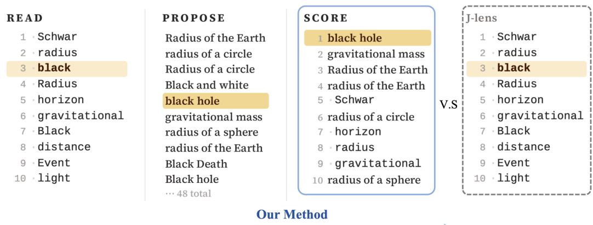
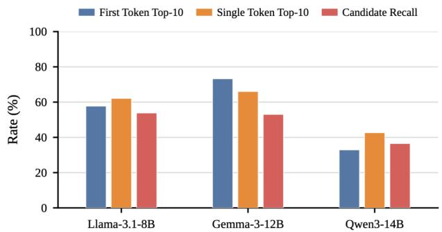
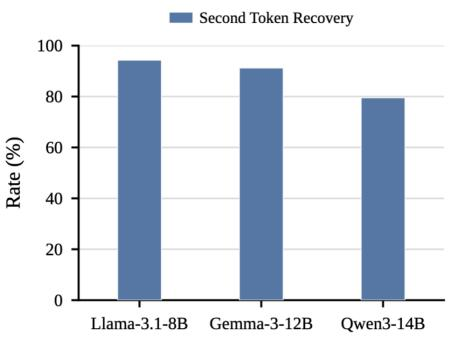

# THE FIRST TOKEN IS A CLUE: VERBALIZING MULTI-TOKEN CONCEPTS FROM THE J-LENS

Xijie Gong∗ Tonghan Wang†

College of AI, Tsinghua University, Beijing, China

## ABSTRACT

The Jacobian Lens (J-lens) is a recent tool for interpreting LLMs. It reads a hidden state as a ranked list of vocabulary tokens, leaving multi-token concepts without a representation of their own. The original J-lens work addresses this limitation with Template Lens, which precomputes vectors for a fixed phrase vocabulary, and Oracle Lens, which fine-tunes components to propose phrases and reconstruct phrase vectors. We ask whether multi-token concepts and their vectors can instead be recovered directly from J-lens and the frozen model. We find that the first token of a multi-token concept is about as readable as a single-token concept. Given the correct first token and source prompt, the frozen model recovers the second token in 88.3% of two-token cases. We show that a vector for the complete concept can be recovered from subsequent hidden states in a single forward pass. We therefore use J-lens to propose first tokens and let the frozen model complete candidate concepts. We then recover a vector for each candidate and score it alongside the complete vocabulary. Across 496 multi-hop clozes on Gemma-3-12B-IT, Llama-3.1-8B, and Qwen3-14B, our method achieves an average Rank@10 of 43.1%, compared with 27.6% for Template Lens. Without the J-lens clue, performance drops to 21.6%, showing that the first-token clue substantially improves readout. Causal concept swaps using the recovered vectors achieve an average succ@10 of 61.4%, compared with 26.2% for Template Lens under the same intervention. These results show that first-token clues can guide multi-token concept recovery, while subsequent hidden states provide vectors for readout and intervention.

Meta-Llama-3.1-8B·layer 23

Fact: The boundary around an object that has gravity strong enough to trap light is the

  
Figure 1: The first token is a clue. The prompt requires the model to infer black hole before answering event horizon. J-lens cannot directly verbalize black hole, but ranks its first token black 3rd. In PROPOSE, we take possible first tokens from the J-lens ranked list. For each first token, the frozen LLM uses the source prompt to complete several candidate concepts. In SCORE, just as J-lens assigns a vector to each vocabulary token, we recover a vector for each candidate and score it against the hidden state. The candidates are then ranked together with the vocabulary tokens, placing black hole first. The full readout takes 0.40 s on one A800.

## 1 INTRODUCTION

A goal of interpretability is to understand the intermediate computations of a language model, and one long-standing strategy is to make hidden states human-readable (Alain & Bengio, 2018; nostalgebraist, 2020; Belrose et al., 2023; Pal et al., 2023; Ghandeharioun et al., 2024). The Jacobian Lens (J-lens) is a recent approach along these lines (Gurnee et al., 2026; Nanda, 2026). It propagates a hidden state through a layer-specific Jacobian and then decodes the result with the model’s own unembedding, yielding a J-lens ranked list of vocabulary tokens. The authors describe the top-10 tokens as the tokens the model is poised to verbalize. Because the J-lens readout uses the model’s unembedding matrix, it assigns one vector to each vocabulary token. A multi-token concept such as black hole has no vector of its own. J-lens may expose constituent tokens such as black, but the readout provides no single vector for the complete concept. As a result, J-lens cannot directly verbalize or score multi-token concepts alongside vocabulary tokens. Many concepts span multiple tokens, so this limitation leaves much of the model’s intermediate computation unreadable.

Addressing this limitation requires solving two problems. First, J-lens returns individual vocabulary tokens, while readout requires identifying a complete multi-token concept. Second, J-lens provides a vector for each vocabulary token but no vector for the complete concept. For example, simply summing or averaging the vectors of black and hole gives the same result for black hole and hole black. The J-lens authors address these problems with two new lenses. Template Lens solves both problems by defining a fixed vocabulary of multi-token concepts and precomputing a vector for each concept. Oracle Lens removes the fixed vocabulary by fine-tuning a proposer that generates phrases from an activation and a reconstructor that maps each phrase to a vector. Both methods therefore supply the concepts and vectors missing from J-lens. But can the concepts and their vectors be recovered directly from J-lens and the frozen model?

We first ask whether J-lens already provides enough information to find the complete concept. Figure 1 illustrates this setting with a multi-hop cloze that requires the model to infer black hole before answering event horizon. Although J-lens cannot directly output the complete concept, it ranks the first token black 3rd. We compare how often the first token of a multi-token concept appears in the J-lens top-10 with how often a single-token concept appears. Across the three models, the average rates are 54.6% for multi-token concepts and 56.9% for single-token concepts. For two-token concepts, the correct first token and source prompt let the frozen model recover the second token in 88.3% of cases on average. These results show that J-lens often preserves a useful clue to the complete concept: the first token is nearly as readable as a single-token concept and, with the source prompt, usually identifies the second token in our two-token diagnostic.

We next ask whether a concept vector can be recovered once the complete concept is known. The J-lens authors show that a concept remains readable from subsequent hidden states when the model is instructed to keep it in mind. We use these subsequent hidden states to recover a vector for the complete concept. To evaluate the recovered vector against a ground truth, we select 500 words, each corresponding to a single vocabulary token, and use their native J-lens token vectors as ground-truth (GT) vectors. We then split each word into two fragments, such as airport into air+port, and recover a vector using only the fragmented form. The recovered vector identifies the matching GT vector with at least 97.4% Top-1 accuracy across the three models, while the first fragment’s token vector and the mean of both fragment vectors never exceed 59.6%. These results show that a completeconcept vector remains recoverable from a single forward pass.

Together, these findings suggest a simple two-step method, shown in Figure 1. In PROPOSE, we select possible first tokens from several rank ranges of the J-lens ranked list. Each token is placed with the source cloze in a fixed scaffold prompt, and the frozen LLM completes the remaining tokens of the concept. In SCORE, we place each candidate in a fixed carrier prompt and use the subsequent hidden states to recover a vector for the complete concept. We map this vector to the source layer and score it against the source hidden state. All the candidate concepts are ranked jointly with the complete vocabulary. Our method is different from Patchscopes (Ghandeharioun et al., 2024). Patchscopes asks the LLM to interpret an injected activation, whereas our LLM neve sees the source activation and only proposes candidates from text.

We evaluate three models with J-lens fits hosted on Neuronpedia (Lin & Bloom, 2023): Gemma-3- 12B-IT, Llama-3.1-8B, and Qwen3-14B. Our dataset contains 248 counterfactual pairs, giving 496 multi-hop cloze prompts whose intermediate multi-token concepts never appear (Appendix A). In end-to-end readout, our method achieves an average Rank@10 of 43.1%, compared with 27.6% for Template Lens. Removing the J-lens clue reduces Rank@10 to 21.6%, showing that the source prompt alone does not explain the gain. In causal concept swaps, our vectors achieve an average succ@10 of 61.4%, compared with 26.2% for Template Lens under the same intervention. We omit Oracle Lens because no official public release is available and reproducing its multi-stage training pipeline would introduce substantial implementation uncertainty. The full pipeline takes 0.4–0.8 s per prompt on a single A800 (Appendix D).

Our main contributions are as follows:

• Diagnosis. We show that the first token of a multi-token concept is as readable as a singletoken concept. Given the correct first token and source prompt, the frozen model recovers the second token in 88.3% of two-token cases, and a complete-concept vector can be recovered from a single forward pass.

• Method. We introduce a simple open-vocabulary method that uses J-lens only to propose possible first tokens, lets the frozen model complete each candidate from the source prompt, and recovers a concept vector that can be scored directly against the source hidden state.

• Validation. We show that the recovered vectors match independently defined ground-truth vectors, read intermediate concepts that never appear in the source prompt, and support causal swaps that replace one intermediate concept with another.

## 2 PRELIMINARIES

## 2.1 THE J-LENS READOUT

J-lens reads an intermediate hidden state through its effect on later model representations (Gurnee et al., 2026). Let $h _ { \ell , t } ( x )$ denote the hidden state at layer ℓ and position $t , h _ { \mathrm { f i n a l } , t }$ the final-layer hidden state, and $W _ { U }$ the model’s unembedding matrix. J-lens estimates an averaged Jacobian

$$
J _ { \ell } = \mathbb { E } _ { t , t ^ { \prime } \geq t , x } \bigg [ \frac { \partial h _ { \mathrm { f i n a l } , t ^ { \prime } } ( x ) } { \partial h _ { \ell , t } ( x ) } \bigg ]
$$

and reads a hidden state as

$$
\mathrm { l e n s } ( h _ { \ell } ) = \mathrm { s o f t m a x } ( W _ { U } \mathrm { n o r m } ( J _ { \ell } h _ { \ell } ) ) .
$$

Sorting lens $\left( h _ { \ell } \right)$ over the vocabulary gives the J-lens ranked list. The J-lens authors describe the top-10 tokens as those the model is poised to verbalize. Since normalization does not change the ranking, the rank of token w is determined by

$$
\langle d _ { \ell } ( w ) , h _ { \ell } \rangle , \qquad d _ { \ell } ( w ) \triangleq ( W _ { U } J _ { \ell } ) _ { w } \in \mathbb { R } ^ { d _ { \mathrm { m o d e l } } } .
$$

We refer to $d _ { \ell } ( w )$ as the token vector. Because $W _ { U }$ has one row for each vocabulary entry, J-lens provides one token vector for each vocabulary token.

## 2.2 MULTI-TOKEN CONCEPT READOUT

Let $C = ( w _ { 1 } , \ldots , w _ { n } )$ denote a multi-token concept with $n \geq 2 ,$ such as $\binom { 6 6 } { 7 }$ black”,“ hole”). Because C is not a vocabulary entry, $W _ { U }$ contains no row for the complete concept. J-lens therefore provides no single vector or score for $C .$ Constituent tokens may appear in the J-lens ranked list, but “black” alone does not distinguish “black hole” from “black coffee” or other phrases.

We use $v _ { C } ^ { ( \ell ) } \in \mathbb { R } ^ { d _ { \mathrm { m o d e l } } }$ to denote a concept vector for $C$ at layer $\ell ,$ and $G _ { C } ( h _ { \ell } )$ to denote the score assigned to $C$ from a hidden state $h _ { \ell } .$ . Extending J-lens to multi-token concepts requires solving two problems. The first is to identify the complete concept C from the token-level information returned by J-lens. The second is to recover its concept vector $v _ { C } ^ { ( \ell ) }$ . The constituent token vectors do not directly define a vector for the complete concept. For example, order-insensitive combinations such as a sum or mean assign the same vector to “black hole” and “hole black.”

A multi-token readout must identify candidate concepts, assign each a vector, and score each against the source hidden state. Existing J-lens extensions provide these quantities in different ways.

## 2.3 EXISTING EXTENSIONS FOR MULTI-TOKEN CONCEPTS

Gurnee et al. (2026) introduce two extensions of J-lens for multi-token concepts. Template Lens fixes a vocabulary of roughly 12,700 entries in advance and estimates a vector for each entry from a few hundred model forward passes over generated contexts. At inference time, a hidden state is scored against these precomputed vectors. Template Lens therefore supplies both the candidate concepts and their vectors through a phrase vocabulary fixed in advance.

Oracle Lens removes the fixed vocabulary with learned components. It fine-tunes a proposer to generate phrases from activations and a reconstructor to map proposed phrases to vectors. The proposer supplies candidates, while the reconstructor supplies vectors.

Both extensions solve the two missing parts of multi-token readout by adding machinery that operates directly on complete phrases. Template Lens supplies complete phrases and their vectors through a fixed vocabulary, while Oracle Lens learns components to generate phrases and reconstruct their vectors. Section 3 asks whether both parts need to be built explicitly, or whether they can be recovered directly from J-lens and the frozen model at inference time.

## 3 WHAT IS ALREADY AVAILABLE?

Before building a phrase-level lens, we ask how much of the information required for multi-token concept readout can be recovered directly from J-lens and the frozen model. Multi-token readout requires identifying the complete concept and assigning that concept a vector to score. We study these two requirements separately.

## 3.1 IS THE FIRST TOKEN ENOUGH TO FIND THE CONCEPT?

J-lens cannot return a multi-token concept as a single vocabulary entry, but the first token of the concept can still appear in the J-lens ranked list. We first ask whether this first token remains as readable as a complete single-token concept. We define First Token Top-10 as the fraction of multitoken examples whose first token reaches the J-lens top-10 at an evaluated layer. As a reference, we define Single Token Top-10 analogously as the fraction of single-token concepts that reach the J-lens top-10 at an evaluated layer. Comparing these two quantities tests whether the first token of a multi-token concept is unusually difficult to read relative to the standard single-token setting.

We next ask whether these first-token clues are sufficient to recover complete candidate concepts. We define Candidate Recall as the fraction of all 496 multi-token prompts for which the target concept appears among the candidates generated by PROPOSE in Section 4.1. To isolate how strongly the first token constrains the continuation, we separately consider target concepts that contain exactly two tokens under each model’s tokenizer. We provide the correct first token together with the source prompt and allow the frozen model to generate the continuation freely. We define Second Token Recovery as the fraction of these two-token examples for which the generated continuation recovers the correct second token.

  
Figure 2: The first token provides a strong clue to the complete concept. Left: Across all three models, the first token of a multi-token concept is as readable as a single-token concept, and PROPOSE recovers a substantial fraction of target concepts from these J-lens clues. Right: Once the correct first token is given, the frozen model recovers the second token in 79.5–94.3% of two-token cases.

## 3.2 CAN WE RECOVER A VECTOR ONCE THE CONCEPT IS KNOWN?

Once the complete concept C is known, J-lens still provides no native vector for $C$ because its vectors are indexed by individual vocabulary tokens. Gurnee et al. (2026) show that a concept remains readable from subsequent hidden states when the model is instructed to keep that concept in mind. We use these subsequent hidden states to recover a vector for the complete concept. Specifically, we place C in a fixed prompt, ask the model to keep its meaning in mind, and pool the subsequent hidden states into a vector $v _ { C }$ . This recovery uses neither the source prompt nor the constituent token vectors. Section 4.2 formalizes this procedure.

We evaluate the recovered vector against an independently defined ground truth. We select 500 words that each occupy a single vocabulary token in all three models and use their native J-lens token vectors as ground-truth (GT) vectors. We then force each word into a two-token form, such as airport into air+port, and recover $v _ { C }$ using only the fragmented form. We rank the recovered vector against all 500 GT vectors by cosine similarity. The comparison includes the first fragment’s token vector, the mean of the two fragment vectors, and a random vector.

Table 1 shows that the recovered vector identifies the matching GT vector with at least 97.4% Top-1 accuracy across all three models, while the first-fragment and mean vectors never exceed 59.6%. A vector for the complete concept can therefore be recovered from subsequent hidden states even when its surface form spans multiple tokens. Together with Section 3.1, this result provides the two ingredients needed for multi-token readout: J-lens helps identify the complete concept, and the model’s subsequent hidden states provide a vector that can be scored against the source hidden state. Section 4 combines these two findings into our full method.

Table 1: Recovered vectors match native single-token J-lens vectors. We split 500 single-token words into two fragments, recover a vector from the fragmented form, and rank it against the 500 native token vectors by cosine similarity. All rows use the same ranking procedure and differ only in how the vector is constructed. Our recovered vector identifies the matching native vector in at least 97.4% of cases across all three models. “Cos. wrong” is the mean cosine to the 499 non-matching vectors.
<table><tr><td rowspan="2">vector</td><td colspan="2">Gemma-3-12B-IT</td><td colspan="2">Llama-3.1-8B</td><td colspan="2">Qwen3-14B</td></tr><tr><td>Cos. wrong</td><td>Top-1</td><td>Cos. wrong</td><td>Top-1</td><td>Cos. wrong</td><td>Top-1</td></tr><tr><td>vc (ours)</td><td>0.003</td><td>97.4%</td><td>0.003</td><td>98.8%</td><td>-0.002</td><td>99.2%</td></tr><tr><td>vfirst</td><td>0.121</td><td>26.2%</td><td>0.070</td><td>51.4%</td><td>0.050</td><td>48.8%</td></tr><tr><td>vmean</td><td>0.129</td><td>17.6%</td><td>0.071</td><td>59.6%</td><td>0.057</td><td>51.4%</td></tr><tr><td>vrandom</td><td>0.001</td><td>0.4%</td><td>0.000</td><td>0.0%</td><td>0.000</td><td>0.2%</td></tr></table>

## 4 PROPOSING AND SCORING MULTI-TOKEN CONCEPTS

Section 3 identifies the two pieces needed for multi-token concept readout. J-lens often reveals the first token of a multi-token concept, and the frozen model can recover a vector once the complete concept is known. Our method follows these two findings directly. PROPOSE uses the J-lens ranked list to select possible first tokens and lets the frozen model complete each concept from the source prompt. SCORE recovers a vector for each candidate, maps the vector to the source layer, and scores the candidate against the source hidden state under a common scoring rule.

## 4.1 PROPOSING CANDIDATE CONCEPTS

At a source layer $\ell _ { s } ,$ J-lens gives a ranked list of vocabulary tokens for the source hidden state $h _ { \ell _ { s } }$ PROPOSE uses this ranked list only to select possible first tokens. A useful first token may appear below the first few entries, so we divide a fixed prefix of the ranked list into disjoint rank ranges. Let r(w) denote the J-lens rank of token w. We define

$$
B _ { m } = \{ w : a _ { m } \leq r ( w ) < b _ { m } \} , \qquad m = 1 , \ldots , M ,
$$

after removing tokens that cannot serve as ordinary text. Each range receives an independent search budget $q _ { m }$ . Searches from different ranges therefore do not compete for the same budget, which allows lower-ranked first tokens to remain represented in the candidate set.

For each selected first token $s ,$ we use the fixed Scaffold Prompt where <cloze> is the original source prompt and <seed> is the J-lens token that starts the current candidate. The seed remains fixed as the first token. The frozen model then generates the remaining tokens using its normal next-token distribution. Later tokens need not appear in the J-lens list. We discard special and formatting tokens except tokens that terminate the candidate concept.

when model is answering the cloze below:   
<cloze> .   
it will think a concept: <seed>

Within each rank range, we retain high-probability completions under a fixed search width and stop when a candidate reaches a valid termination or the maximum concept length. We then merge the candidates from all rank ranges, remove duplicates and candidates that are strict prefixes of longer retained candidates, and keep a fixed number of final candidates. Exact rank ranges, search budgets, widths, and stopping rules are given in Appendix B. PROPOSE determines only which concepts are considered. The proposal probability does not determine the final readout; every retained candidate is then scored against the source hidden state under the same scoring rule.

## 4.2 SCORING CANDIDATE CONCEPTS

For each candidate concept C, SCORE first recovers a vector for the complete concept. Vector recovery uses a fixed Carrier Prompt that contains neither the source cloze nor the Scaffold Prompt:

Remember the following concept in your mind.   
Concept:<C>. Fact: The capital of France is Paris.

The candidate C is the only item-specific text in the Carrier Prompt. We write $\tau ( C )$ for the full input and extract hidden states only after the model has processed the complete candidate. Let $\tau$ be a fixed extraction window at carrier layer $\ell _ { c }$ . We define the concept vector as

$$
v _ { C } ^ { ( \ell _ { c } ) } = \sum _ { t \in \mathcal { T } } \alpha _ { t } \left( h _ { \ell _ { c } , t } ( \tau ( C ) ) - \mu _ { t } \right) , \qquad \alpha _ { t } \geq 0 , \quad \sum _ { t \in \mathcal { T } } \alpha _ { t } = 1 .\tag{1}
$$

The position-specific mean $\mu _ { t }$ removes the component shared across concepts. We choose the pooling weights $\alpha _ { t }$ according to the mean cosine agreement between each centered hidden state and the corresponding J-lens token vector on an independent calibration corpus. The carrier layer, ex traction window, position-specific means, and pooling weights are selected once on 633 concepts disjoint from the evaluation data and remain fixed throughout all experiments.

The recovered vector lies at the carrier layer $\ell _ { c } ,$ while the source hidden state may lie at a different layer $\ell _ { s } .$ . We transport the vector by matching its image under the two J-lens Jacobians:

$$
v _ { C } ^ { ( \ell _ { s } ) } = \arg \operatorname* { m i n } _ { v } \left\| J _ { \ell _ { s } } v - J _ { \ell _ { c } } v _ { C } ^ { ( \ell _ { c } ) } \right\| ^ { 2 } + \lambda \| v \| ^ { 2 } .\tag{2}
$$

This objective maps the concept vector to the source layer while preserving its effect in the finalrepresentation space used by J-lens.

The recovered vector and the source hidden state come from different prompts. Following Template Lens (Gurnee et al., 2026), we center the source hidden state and apply a diagonal whitening metric

$$
A = \mathrm { d i a g } ( \sigma ^ { 2 } + \varepsilon ) ^ { - 1 / 2 } ,
$$

where $\sigma ^ { 2 }$ is the coordinate-wise variance estimated from held-out calibration residuals and $\varepsilon$ is a small ridge. Let $\widetilde { h } _ { \ell _ { s } }$ denote the centered source state. We score candidate C by

$$
G _ { C } ( h _ { \ell _ { s } } ) = \left. A v _ { C } ^ { ( \ell _ { s } ) } , A \widetilde { h } _ { \ell _ { s } } \right. .\tag{3}
$$

Vocabulary tokens are scored in the same way using their J-lens token vectors in place of $v _ { C } ^ { ( \ell _ { s } ) }$ . The final readout therefore ranks the proposed concepts jointly with the complete vocabulary under the same scoring rule. All concept-vector constructions use the same transport and scoring procedure, so comparisons differ only in how their vectors are recovered.

## 5 EXPERIMENTS

We evaluate two capabilities of the recovered concept vectors. Section 5.1 asks whether the full pipeline can read an unnamed multi-token concept from hidden states. Section 5.2 asks whether the recovered vectors can causally control the corresponding computation.

## 5.1 END-TO-END READOUT

We evaluate the full pipeline on all 496 prompts across the three models. At each evaluated layer, PROPOSE generates candidate concepts and SCORE ranks them jointly with the complete vocabulary. We define Rank@k as the fraction of prompts whose target concept reaches the top-k at any evaluated layer. If the target is never proposed, the prompt counts as a failure.

We compare against Template Lens and test whether the J-lens clue is necessary. In OURS (WITH-OUT J-LENS), the frozen model receives the same source prompt but generates the complete concept without a first token from J-lens; SCORE remains unchanged. Removing the J-lens clue consistently reduces performance, while our full method achieves higher Rank@10 than Template Lens on all three models. This result shows that the improvement cannot be explained by the frozen model simply inferring the concept from the source prompt without the J-lens clue. Because the target concepts never appear in the source prompts, successful readout cannot be obtained by matching candidate strings to the input. The comparison with OURS (WITHOUT J-LENS) further isolates the contribution of the J-lens clue while keeping the source prompt and SCORE stage unchanged.

Table 2: Our method reads unnamed multi-token concepts, and J-lens clues substantially improve the readout. We evaluate 496 prompts whose target multi-token concepts never appear in the source text. Each proposed concept is scored jointly with the complete vocabulary, and Rank@k is the fraction of prompts whose target reaches the top-k at any evaluated layer. Our method achieves the highest Rank@10 across all three models. OURS (WITHOUT J-LENS) removes the first token supplied by J-lens while keeping the same source prompt and SCORE stage, leading to a substantial drop in Rank@10.
<table><tr><td rowspan="2">Readout</td><td colspan="2">Gemma-3-12B-IT</td><td colspan="2">Llama-3.1-8B</td><td colspan="2">Qwen3-14B</td></tr><tr><td>Rank@1</td><td>Rank@10</td><td>Rank@1</td><td>Rank@10</td><td>Rank@1</td><td>Rank@10</td></tr><tr><td>Ours</td><td>40.1%</td><td>52.8%</td><td>8.1%</td><td>44.2%</td><td>10.7%</td><td>32.3%</td></tr><tr><td>Template Lens</td><td>28.4%</td><td>29.0%</td><td>27.1%</td><td>29.4%</td><td>21.3%</td><td>24.4%</td></tr><tr><td>Ours (without J-lens)</td><td>20.6%</td><td>22.4%</td><td>10.1%</td><td>25.7%</td><td>8.9%</td><td>16.6%</td></tr><tr><td>Random</td><td>0.0%</td><td>0.0%</td><td>1.8%</td><td>5.6%</td><td>3.2%</td><td>8.5%</td></tr></table>

## 5.2 CAUSAL CONCEPT SWAP

We next test whether the recovered vectors can steer the model from a source concept C toward a partner concept D. Let $\hat { v } _ { C }$ and $\hat { v } _ { D }$ denote their unit-normalized vectors transported to the intervention layer. We remove the source vector and add the partner vector over a fixed short layer band:

$$
h _ { \ell } \gets h _ { \ell } - \langle h _ { \ell } , \hat { v } _ { C } \rangle \hat { v } _ { C } + \beta ( \ell ) \hat { v } _ { D } , \qquad \beta ( \ell ) = | \langle h _ { \ell } ( P _ { D } ) , \hat { v } _ { D } \rangle | .\tag{4}
$$

The first term projects out the component along the source concept vector. The second installs the partner vector with magnitude $\beta \bar { ( \ell ) }$ measured from the partner prompt $P _ { D }$ , so the intervention requires no fitted strength coefficient. We define succ@k as the fraction of trials for which the partner answer enters the model’s top-k continuations after the intervention is applied.

This intervention tests more than whether a recovered vector correlates with the source concept. If the vector captures the corresponding internal computation, replacing C with D should move the model toward the answer associated with D. Because all vector constructions use the same swap operator, differences in success rate reflect the vectors rather than a separately tuned intervention.

We compare our vectors with Template Lens vectors under the same swap operator. We also evaluate deletion alone, addition alone, and swaps that replace the added vector with vfirst or vrandom. The full swap gives the highest succ@10 across all three models. Addition alone produces a substantial but consistently weaker shift, while deletion alone and the vector controls produce much smaller effects. Full trial filtering and intervention details are given in Appendix C.

Table 3: Recovered vectors causally swap one intermediate concept for another. We remove the source concept vector vC and add the partner vector vD, then measure whether the partner answer enters the model’s top-k continuations. succ@k reports the corresponding success rate over 316, 304, and 317 trials for Gemma, Llama, and Qwen. Template Lens uses the same swap operator with its phrase vectors, while the remaining rows isolate deletion, addition, and alternative added vectors.
<table><tr><td rowspan="2">Edit</td><td colspan="2">Gemma-3-12B-IT</td><td colspan="2">Llama-3.1-8B</td><td colspan="2">Qwen3-14B</td></tr><tr><td>succ@1</td><td>succ@10</td><td>succ@1</td><td>succ@10</td><td>succ@1</td><td>succ@10</td></tr><tr><td>Template Lens</td><td>7.4%</td><td>22.8%</td><td>3.9%</td><td>35.3%</td><td>5.6%</td><td>20.4%</td></tr><tr><td>vC → vD (ours)</td><td>41.1%</td><td>64.2%</td><td>29.6%</td><td>62.2%</td><td>25.6%</td><td>57.7%</td></tr><tr><td>Delete only</td><td>0.3%</td><td>7.0%</td><td>0.3%</td><td>7.9%</td><td>0.6%</td><td>7.6%</td></tr><tr><td>Add only</td><td>29.4%</td><td>56.0%</td><td>17.4%</td><td>49.7%</td><td>8.5%</td><td>43.8%</td></tr><tr><td>vfirst</td><td>0.0%</td><td>1.6%</td><td>5.6%</td><td>21.4%</td><td>4.7%</td><td>19.2%</td></tr><tr><td>vrandom</td><td>0.3%</td><td>5.4%</td><td>0.3%</td><td>6.6%</td><td>0.9%</td><td>6.3%</td></tr></table>

## 6 RELATED WORK

Lens-based readout. A long line of work seeks to make intermediate language-model representations directly readable. The Logit Lens (nostalgebraist, 2020) applies the model’s unembedding to intermediate hidden states, the Tuned Lens (Belrose et al., 2023) learns a layer-wise affine correction before decoding, and J-lens (Gurnee et al., 2026) uses an averaged Jacobian to connect an intermediate state to later model representations. Despite their different mappings, all three methods ultimately read through the model’s vocabulary and therefore provide one vector for each vocabulary token. A concept that spans multiple tokens has no vector of its own. Template Lens and Oracle Lens extend J-lens to such concepts (Section 2.3). Template Lens defines a fixed phrase vocabu lary and precomputes a vector for every entry, while Oracle Lens learns components that propose phrases and reconstruct their vectors. Our work recovers multi-token concepts and vectors directly from J-lens and the frozen model without a phrase vocabulary.

LLMs as activation interpreters. Another line of work uses language models to interpret internal representations. SelfIE (Chen et al., 2024) asks an LLM to interpret its hidden embeddings in natural language, while Patchscopes (Ghandeharioun et al., 2024) transports an internal representation into a new inference context and reads the model’s continuation. Our use of the frozen LLM is different from both approaches. The frozen LLM never receives the source activation and never verbalizes the activation itself. During PROPOSE, the model receives the source prompt and a possible first token selected from the J-lens ranked list, then completes the candidate concept. PROPOSE only determines which concepts should be considered. SCORE separately recovers a vector for each candidate and scores that vector against the original source hidden state.

Representations beyond tokenizer granularity. Several results suggest that the units used in internal computation need not coincide with the units produced by the tokenizer. Feucht et al. (2024) find that information about individual constituent tokens of multi-token entities is progressively erased while a representation of the complete entity remains available, and Kaplan et al. (2025) recover word-level identity from representations formed from subword fragments. These findings suggest that hidden states can represent objects at a coarser granularity than individual vocabulary tokens. Related work on latent multi-hop reasoning provides another setting in which this distinction becomes important. Language models can represent an intermediate entity or concept before generating the answer that depends on it (Yang et al., 2024; Biran et al., 2024). Our setting asks how J-lens can recover these intermediate multi-token concepts from token-level readout.

Concept vectors and sparse features. Concept-level structure in hidden states has also been stud ied independently of lens-based readout. Sparse autoencoders learn dictionaries of activation features intended to separate interpretable factors in model representations (Cunningham et al., 2024). Activation steering constructs vectors from contrastive examples and uses them to change model behavior (Turner et al., 2023; Panickssery et al., 2024), while model-editing methods identify and modify internal representations associated with particular facts or behaviors (Meng et al., 2022; Geva et al., 2023). These approaches obtain useful vectors through learned dictionaries, contrastive data, or dedicated editing procedures. Our method instead starts from possible first tokens already ranked by J-lens. We use these tokens to propose complete concepts and use the model’s subsequent hidden states to recover a vector for each candidate. The recovered vector supports both readout and causal control through the same vector-based scoring framework used by J-lens.

## 7 DISCUSSION

J-lens appears to restrict readout to concepts that occupy a single vocabulary token, but our results show that a multi-token concept can remain accessible even when J-lens cannot output the complete phrase directly. The first token of a multi-token concept is about as readable as an ordinary single-token concept. For two-token concepts, the correct first token together with the source prompt recovers the second token in most cases. Once the concept is known, the model’s subsequent hidden states provide a vector that closely matches independently defined GT vectors. The recovered vectors also identify concepts that never appear in the source prompt and support causal replacement of one intermediate concept with another. Thus, multi-token concepts can be verbalized without a fixed phrase vocabulary or separately trained proposal and reconstruction components.

Our results also suggest a broader interpretation of how representations may change across model depth. Early layers may progressively combine tokenizer-level pieces into representations of words, entities, or concepts. This interpretation is consistent with evidence that constituent-token identity can fade while information about the complete multi-token object remains available (Feucht et al., 2024; Kaplan et al., 2025). Intermediate layers may then operate on these higher-level representations before later layers express the resulting information through vocabulary tokens. Such a progression could help explain why J-lens sometimes exposes only part of a multi-token surface form even when the complete concept remains recoverable from subsequent hidden states. Our experiments do not establish this account, but the account is consistent with both our results and prior evidence. Tracing this change across layers remains an important question for future work.

The main remaining limitation lies in candidate proposal. Our method depends on J-lens ranking a useful first token highly enough for PROPOSE to consider it. If the relevant first token receives a poor rank, the correct concept may never enter the candidate set even when SCORE could identify the concept once proposed. The source prompt must also provide enough information for the frozen model to complete the concept from the selected first token. Our experiments focus on canonical multi-token concepts that can be expressed by short English phrases, so the current results do not establish the same behavior for long descriptions or arbitrary natural-language expressions.

## REFERENCES

Guillaume Alain and Yoshua Bengio. Understanding intermediate layers using linear classifier probes, 2018. URL https://arxiv.org/abs/1610.01644. 2

Nora Belrose, Igor Ostrovsky, Lev McKinney, Zach Furman, Logan Smith, Danny Halawi, Stella Biderman, and Jacob Steinhardt. Eliciting latent predictions from transformers with the tuned lens. arXiv preprint arXiv:2303.08112, 2023. 2, 8

Eden Biran, Daniela Gottesman, Sohee Yang, Mor Geva, and Amir Globerson. Hopping too late: Exploring the limitations of large language models on multi-hop queries. In Proceedings of the 2024 Conference on Empirical Methods in Natural Language Processing (EMNLP). Association for Computational Linguistics, 2024. 8

Haozhe Chen, Carl Vondrick, and Chengzhi Mao. SelfIE: Self-interpretation of large language model embeddings. In Proceedings of the 41st International Conference on Machine Learning, volume 235 of Proceedings of Machine Learning Research, pp. 7373–7388. PMLR, 2024. URL https://proceedings.mlr.press/v235/chen24ao.html. 8

Hoagy Cunningham, Aidan Ewart, Logan Riggs, Robert Huben, and Lee Sharkey. Sparse autoencoders find highly interpretable features in language models. In International Conference on Learning Representations (ICLR), 2024. 8

Sheridan Feucht, David Atkinson, Byron Wallace, and David Bau. Token erasure as a footprint of implicit vocabulary items in LLMs. In Proceedings ofthe 2024 Conference on Empirical Methods

in Natural Language Processing (EMNLP). Association for Computational Linguistics, 2024. 8, 9

Mor Geva, Jasmijn Bastings, Katja Filippova, and Amir Globerson. Dissecting recall of factual associations in auto-regressive language models. In Proceedings of the 2023 Conference on Empirical Methods in Natural Language Processing (EMNLP). Association for Computational Linguistics, 2023. 8

Asma Ghandeharioun, Avi Caciularu, Adam Pearce, Lucas Dixon, and Mor Geva. Patchscopes: A unifying framework for inspecting hidden representations of language models. In Proceedings of the 41st International Conference on Machine Learning, volume 235 of Proceedings ofMachine Learning Research. PMLR, 2024. 2, 8

Wes Gurnee, Nicholas Sofroniew, Adam Pearce, Mateusz Piotrowski, Isaac Kauvar, Runjin Chen, Anna Soligo, Paul Bogdan, Euan Ong, Rowan Wang, Ben Thompson, David Abrahams, Subhash Kantamneni, Emmanuel Ameisen, Joshua Batson, and Jack Lindsey. Verbalizable representations form a global workspace in language models. Transformer Circuits Thread, 2026. URL https: //transformer-circuits.pub/2026/workspace/index.html. 2, 3, 4, 5, 6, 8, 12

Guy Kaplan, Matanel Oren, Yuval Reif, and Roy Schwartz. From tokens to words: On the inner lexicon of LLMs. In International Conference on Learning Representations (ICLR), 2025. 8, 9

Johnny Lin and Joseph Bloom. Neuronpedia: Interactive reference and tooling for analyzing neural networks. https://www.neuronpedia.org, 2023. Accessed via web interface. 2

Kevin Meng, David Bau, Alex Andonian, and Yonatan Belinkov. Locating and editing factual associations in GPT. In Advances in Neural Information Processing Systems 35 (NeurIPS 2022), 2022. 8

Neel Nanda. A review of anthropic’s global workspace paper. LessWrong, 2026. URL https://www. lesswrong.com/posts/zFJ3ZdQwrTWE9jT5S/a-review-of-anthropic-s-global-workspace-paper. Accessed: 2026-08-21. 2

nostalgebraist. interpreting GPT: the logit lens. LessWrong, 2020. URL https://www.lesswrong. com/posts/AcKRB8wDpdaN6v6ru/interpreting-gpt-the-logit-lens. 2, 8

Koyena Pal, Jiuding Sun, Andrew Yuan, Byron Wallace, and David Bau. Future lens: Anticipating subsequent tokens from a single hidden state. In Jing Jiang, David Reitter, and Shumin Deng (eds.), Proceedings of the 27th Conference on Computational Natural Language Learning (CoNLL), pp. 548–560, Singapore, December 2023. Association for Computational Linguistics. doi: 10.18653/v1/2023.conll-1.37. URL https://aclanthology.org/2023.conll-1.37/. 2

Nina Panickssery, Nick Gabrieli, Julian Schulz, Meg Tong, Evan Hubinger, and Alexander Matt Turner. Steering Llama 2 via contrastive activation addition. In Proceedings of the 62nd Annual Meeting of the Association for Computational Linguistics (ACL). Association for Computational Linguistics, 2024. 8

Alexander Matt Turner, Lisa Thiergart, Gavin Leech, David Udell, Juan J. Vazquez, Ulisse Mini, and Monte MacDiarmid. Steering language models with activation engineering. arXiv preprint arXiv:2308.10248, 2023. 8

Sohee Yang, Elena Gribovskaya, Nora Kassner, Mor Geva, and Sebastian Riedel. Do large language models latently perform multi-hop reasoning? In Proceedings of the 62nd Annual Meeting of the Association for Computational Linguistics (ACL). Association for Computational Linguistics, 2024. 8

## A DATASET AND EXPERIMENTAL SETUP

Template. Every item is a cloze prompt built on a common frame,

$$
\mathrm { F a c t : } \mathrm { T h e < r e l a t i o n > \ o f ~ \ t h e ~ < d e s c r i p t i o n > \ i s }
$$

where the linking preposition varies with the relation, the description picks out a multi-token intermediate concept without naming it, and the answer, usually a single word, follows from applying the relation to that concept. Items come in counterfactual pairs: the two sides share the relation and differ in the intermediate, so exchanging the intermediate exchanges the answer.Let $C = ( w _ { 1 } , \ldots , w _ { n } )$ denote a multi-token concept with $n \geq 2$ , such as (“ black”,“ hole”). Because C is not a vocabulary entry, $W _ { U }$ contains no row for the complete concept. J-lens therefore provides no single vector or score for C. Its ranked list may expose constituent tokens such as “black”, but it does not indicate that a token should be continued into a particular multi-token concept or where that concept ends. Thus, a high rank for “black” provides a clue, but not a readout of “black hole”.

Construction. We fix the intermediates and the relation first, then have GPT-5.5 write the clue sentences into the template under fixed constraints: the intermediate is a canonical multi word English expression, the clue states neither the intermediate nor the answer, both sides use the same relation, and each answer is an ordinary English word a pretrained model can produce. Three pre-measurement filters then run. The intermediate must span several tokens under all three tokenizers. The two sides must differ in the first token of their intermediates in every model. The model must also produce the intended answer when the prompt is continued greedily, with the prompt passed verbatim and no chat template or question wrapper. This yields 248 pairs (496 sides): 226 built to the criterion and 22 from a closed-fact set with the relation fixed across both sides (country–capital, currency, official language, and related facts).

J-lens fits. We use the released J-lens fits and refit nothing. Each fit supplies one Jacobian per source layer and covers every residual layer except the last: 47 layers for Gemma-3-12B-IT, 31 for Llama-3.1-8B, and 39 for Qwen3-14B. End-to-end readouts are taken at the final input token of the prompt with one literal space appended, so that the position corresponds to the blank the model is about to fill, and concept tokens carry a leading space to match the word-boundary convention of a generated answer. Swap source and partner prompts are encoded without a trailing space. Ranks are full-vocabulary and one-based. The primary carrier reader is fitted on the 633-concept corpus.

Fragment set. The vector-recovery diagnostic in Section 3.2 uses 500 words encoded as a single leading-space token in all three models. Each word has a forced two-token split of pieces that are single tokens and decode to the same surface. The set includes recognizable cuts, such as blackmail → black+mail, and mid-word fragments, such as activity → act+ivity. No cloze prompt is involved: the reconstruction is ranked by cosine against 500 whole-token J-lens GT vectors.

## B IMPLEMENTATION DETAILS

## B.1 CANDIDATE GENERATION

The decoding prefix is the Scaffold Prompt of Section 4.1, not the Carrier Prompt. PROPOSE selects roots independently from ranks 1–20, 21–50, and 51–100 of the J-lens ranked list, considering up to twenty eligible roots in each band and retaining active widths 12, 6, and 6, respectively. The selected root remains fixed as the first token of the candidate. After the root, the frozen model generates from its normal next-token distribution; continuation tokens do not need to appear in the J-lens ranked list. Special and formatting tokens are removed except for the period, the tokenizer’s merged period-plusnewline token, newline, and end-of-sequence tokens used to terminate the concept. Each later step expands at most ten tokens within nucleus mass 0.85. Generation is capped at four tokens. After deduplication, we retain 25 top proposer-scored candidates and remove strict prefixes.

## B.2 CARRIER AND VECTOR CONSTRUCTION

The carrier is fixed across candidates and models:

$$
\begin{array} { r l } & { \mathrm { R e m e m b e r ~ t h e ~ \ f o r 1 . l o w i n g ~ \ c o n c e p t ~ \ i n ~ \ y o u r ~ \ m i n d . } } \\ & { \mathrm { C o n c e p t : } < C > . \mathrm { F a c t : ~ \ T h e ~ \ c a p i t a l ~ \ o f ~ \ F r a n c e ~ \ i s ~ \ P a r i s . } } \end{array}
$$

The candidate is inserted exactly as generated, with no whitespace between Concept: and the candidate; the source prompt and the final answer are withheld. The extraction window T of Equation 1 is every token of the fixed suffix that follows the concept, from the period onward, with the final token of the concept itself held out as a control. The position-specific mean $\mu _ { t }$ and centeredpositive pooling weights are fitted on the independent 633-concept corpus, using 515, 289, and 289 exact singleton-token targets for Gemma, Llama, and Qwen, respectively. The carrier layer $\ell _ { c }$ is selected once by mean paired cosine between the centered pooled carrier residual and the singleton’s token vector $d _ { \ell _ { c } } ( w )$ at that layer, and is $\ell _ { c } = 4 3$ for Gemma-3-12B-IT, 27 for Llama-3.1-8B, and 37 for Qwen3-14B. This same frozen reader is used throughout end-to-end readout and Swap.

## B.3 TRANSPORT AND SCORING

The transport of Equation 2 uses relative ridge $\lambda ~ = ~ 1 0 ^ { - 2 }$ , solved by preconditioned conjugate gradient, and the whitening of Section 4.2 uses $\varepsilon = 1 0 ^ { - 3 }$ median $( \sigma ^ { 2 } )$ , with $\sigma ^ { 2 }$ the coordinate-wise variance of the centered calibration residuals. The source residual is centered by a mean estimated from independent prompts that share the evaluation template, excluding the item being scored. Each of $\mu _ { t } , A , \lambda , \ell _ { c } ,$ and $\tau$ is fixed on data disjoint from the evaluation prompts and labels.

J-lens applies the final normalization and unembedding to $J _ { \ell } v$ . Matching $J _ { \ell _ { s } } v$ to $J _ { \ell _ { c } } v _ { C } ^ { ( \ell _ { c } ) }$ therefore preserves the representation presented to the J-lens decoder. Equation 2 is a ridge-regularized version of this matching objective and approaches an exact match as $\lambda  0$ whenever one exists. Writing the centered source state as $\widetilde { h } = s v _ { C } + \xi ,$ , where s records whether the concept is present and the background ξ has covariance $\Sigma ,$ , the linear score that best separates the two cases is u ∝ $\Sigma ^ { - 1 } v _ { C } ;$ estimating Σ by its diagonal turns this into the whitened inner product of Equation 3.

## C CAUSAL INTERVENTION DETAILS

A directed trial takes an ordered pair of prompts and installs the second prompt’s intermediate concept into the first. Three filters admit a trial, all evaluated on the unmodified model and frozen before any intervention was run: the concept must stay outside its own answer, so that installing it can only produce the target string through the model’s own computation; the partner’s answer must sit outside the model’s top-10 on the unmodified prompt, so that a change in rank is attributable to the edit; and the model must answer the unmodified prompt correctly, so that a lost answer is interpretable as a loss. Applying these to the 496 directed trials leaves 316 trials on Gemma-3-12B-IT, 304 on Llama-3.1-8B, and 317 on Qwen3-14B, and the identifiers are shared across experiments.

The edit of Equation 4 spans a short residual band, with deletion applied to the final twelve prompt positions and addition near the end of the prompt. It runs on the residual stream as the forward pass proceeds, so that the added magnitude accumulates across the band. Its delete term is the orthogonal projection that removes the component along ${ \hat { v } } _ { C } ,$ , and its added magnitude $\beta ( \ell )$ is read off $D ^ { \bullet } { } _ { \mathbf { s } } ^ { - }$ own prompt, so no strength coefficient is fitted on held-out data for this intervention.

## D COMPUTATIONAL COST

Template Lens builds each phrase vector from a few hundred prefix forwards over a vocabulary fixed in advance, and Oracle Lens fine-tunes two copies of the subject model (Gurnee et al., 2026). Extending J-lens as we do adds a short candidate-generation decode on every prompt and one short carrier forward for each previously unseen concept, which comes to 0.4–0.8 s per prompt on one A800 (Table 4). The added cost is real, and it is acceptable for an analysis tool.

Table 4: Seconds per prompt on one A800-SXM4-80GB, bfloat16.
<table><tr><td></td><td>Gemma-3-12B-IT</td><td>Llama-3.1-8B</td><td>Qwen3-14B</td></tr><tr><td>Time (s)</td><td>0.78</td><td>0.40</td><td>0.71</td></tr></table>