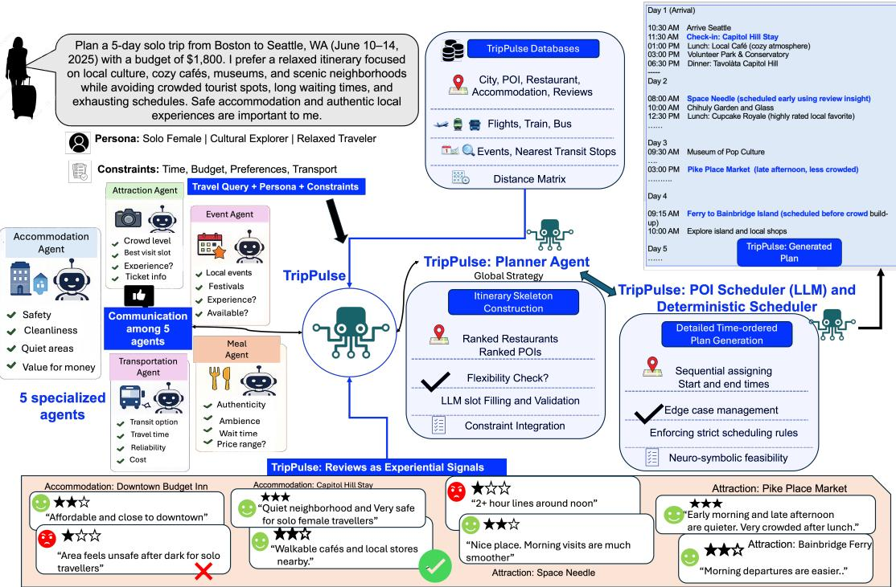

# TRIPPULSE: Multi-Agent Travel Planning with Review-Grounded Reasoning

Priyanshu Karmakar<sup>1†</sup>, Borru Vijay Sai<sup>1†</sup>, Shubhojit Mallick<sup>2</sup>, Abhik Jana<sup>1</sup>, Shreya Ghosh<sup>1</sup>, Manish Gupta<sup>2</sup>

<sup>1</sup>IIT Bhubaneswar, India <sup>2</sup>Microsoft, India a24cs08008,22CS01076,abhikjana,shreya@iitbbs.ac.in shubhojit.mallick,gmanish@microsoft.com

## Abstract

Travel itinerary generation requires balancing strict spatio-temporal constraints with human preferences. Existing LLM-based planners mainly rely on structured attributes and predefined traveler personas, but real travel deci sions are often shaped by reviews that reveal experiential factors such as comfort, safety, service quality, ambiance, crowding, and hidden risks absent from structured databases. Incor porating such review information is therefore critical to realistic, user-centric itinerary generation. We propose TRIPPULSE<sup>1</sup>, a multiagent framework for review-grounded travel planning. Instead of relying on a monolithic planner (and face context and reasoning bottlenecks), TRIPPULSE<sup>2</sup> decomposes itinerary generation into specialized agents (each operating over localized contexts) for accommodations, transportation, meals, attractions, and events, coordinated through a global orchestrator with scheduling mechanisms that enforce temporal and budget feasibility. We augment TRIPCRAFT with 100K+ real-world reviews and introduce Review-Grounded Persona Alignment (RGPA), an LLM-as-a-Judge metric for evaluating alignment with humancentric travel experiences. Experiments across multiple trip durations and diverse proprietary and open-source models show that TRIPPULSE maintains strong constraint satisfaction while generating more personalized and experientially grounded itineraries.

## 1 Introduction

Travel itinerary generation is challenging, requiring the joint satisfaction of strict spatio-temporal constraints and nuanced user preferences. Plans must coordinate transportation, hotels, and activities under budget and scheduling constraints while also optimizing subjective factors like safety, comfort, atmosphere and suitability, making it a complex real-world reasoning task.

Large Language Models (LLMs) show strong planning abilities (Wei et al., 2022; Yao et al., 2023b), and benchmarks such as TravelPlanner (Xie et al., 2024), TripCraft (Chaudhuri et al., 2025) and TripTide (Karmakar et al., 2026) evaluate them under fine-grained constraints and diverse traveler profiles. However, most existing methods rely on monolithic prompting, forcing a single model to handle multiple sub-tasks (entity selection, preference reasoning, scheduling, and constraint satisfaction), which often leads to hallucinations and violations of temporal or spatial feasibility as complexity grows. Recent agentic approaches (Choi et al., 2026) address reasoning overload via task decomposition, yet miss the experiential signals central to real travel decisions.

Another key limitation is how preferences are modeled. Most approaches rely on structured attributes, while real travel decisions depend on experiential signals from reviews, such as safety, crowding, and contextual suitability. However, integrating reviews is challenging because they are large and noisy, and directly adding them to monolithic LLMs increases context load and reduces planning reliability.

We argue that leveraging review information requires restructuring the planning process. We propose TRIPPULSE, a multi-agent framework for review-grounded travel planning, where domainspecific agents (accommodations, transportation, meals, attractions, and events) operate on localized contexts and are coordinated by a global orchestrator, while a downstream scheduling module enforces strict temporal and budget feasibility. Beyond traditional constraint satisfaction metrics, we introduce Review-Grounded Persona Alignment (RGPA), an LLM-as-a-Judge metric for evaluating alignment with experiential signals from reviews.

  
Figure 1: The TRIPPULSE architecture. Planning is decomposed into 5 domain-specific agents, operating on localized contexts, orchestrated by a global orchestrator. The final itinerary is constructed via either an LLM-based POI Scheduler or a deterministic algorithmic scheduler to guarantee constraint satisfaction.

Our key contributions are as follows: (1) Review-augmented travel benchmark. We extend TripCraft with 100K+ Airbnb/TripAdvisor reviews, distilled into concise pros/cons to capture experiential signals.

(2) Review-grounded multi-agent framework: TRIPPULSE, a modular architecture with contextisolated agents that integrates reviews while ensuring temporal and budget feasibility. (3) Humancentric evaluation: RGPA, an LLM-as-a-Judge metric for personalization, experiential quality, risk avoidance, and overall traveler satisfaction. We evaluate TRIPPULSE across 3/5/7-day trips with GPT-5 (Singh et al., 2026), Llama 3.1 (Grattafiori et al., 2024), Phi-4-mini-instruct (Microsoft et al., 2025), Mistral-Nemo (AI, 2024), Qwen-2.5-7Binstruct (Qwen et al., 2025), and DeepSeek-R1 (Guo et al., 2025).

## 2 Related Work

LLM-Based Planning and Agents: LLMs show strong reasoning capabilities for structured decision-making (Wei et al., 2022; Yao et al., 2023b), improved through chain-of-thought (Wei et al., 2022), Tree-of-Thought (Yao et al., 2023a), and self-reflection (Shinn et al., 2023). Multiagent frameworks such as MetaGPT (Hong et al., 2024) and CAMEL (Li et al., 2023) further decompose tasks for efficiency. However, LLMs still struggle with long-horizon constraint satisfaction (Valmeekam et al., 2022), and scaling methods such as PDDL (Planning Domain Definition Language) grounding for preference-driven travel remain challenging (Liu et al., 2023).

Travel Planning Benchmarks and Systems: Benchmarks like TravelPlanner (Xie et al., 2024) and TripCraft (Chaudhuri et al., 2025) frame itinerary generation as a fine-grained multiconstraint problem (Xie et al., 2024; Chaudhuri et al., 2025).Recent agentic approaches (Choi et al., 2026) attempt to address reasoning overload through task decomposition, yet remain limited to structured attributes with no mechanism for reviewgrounded entity selection Retrieval-based methods such as TP-RAG (Ni et al., 2025) improve pointof-interest (POI) selection but rely on structured data or past trajectories, and overlook rich review signals. Existing evaluations focus on constraint satisfaction and routing metrics (Chaudhuri et al., 2025; Xie et al., 2024), but fail to capture experiential quality. The LLM-as-a-Judge paradigm provides a solution for open-ended evaluation (Zheng et al., 2023); we extend it with review-grounded signals to better measure human-centric quality.

Hybrid and Formal Planning Approaches: Hybrid approaches combine LLMs with symbolic solvers such as Satisfiability Modulo Theories (SMT) to improve feasibility (Barrett and Tinelli, 2018; Hao et al., 2025). While effective for constraints, they miss semantic nuances such as comfort and safety without extensive manual ontologies. Our approach combines agentic reasoning with a deterministic backend to address this gap.

Review-Aware Recommendation Systems: Review-driven recommendation techniques highlight experiential attributes using structured summaries (Wei et al., 2025), complementing traditional POI methods that mitigate data sparsity (Chen et al., 2018). We are the first to port these distilled review summaries structured as Pros and Cons into constraint-aware planning.

Our Approach: TRIPPULSE uses agentic decomposition for review-grounded planning. By assigning specialized agents to localized contexts, distilled review signals can be processed efficiently without overwhelming a single model. This combines LLM flexibility with deterministic constraint enforcement to unify structural feasibility and user preference modeling. Detailed discussions are in App. A.

## 3 TRIPPULSE

In this section, we present TRIPPULSE, a multiagent framework for spatio-temporal travel planning. Itinerary generation is decomposed across specialized agents operating on localized contexts. Their outputs are coordinated by an orchestration module and passed to a final planning backend.

To study the trade-off between generative flexibility and symbolic accuracy, we compare two separate planning pipeline configurations: (1) an LLM-based planner-scheduler pipeline and (2) a deterministic scheduler enforcing strict temporal feasibility. These are evaluated independently, without dynamic routing during inference, to analyze how varying levels of LLM autonomy impact itinerary reliability.

## 3.1 Problem Formulation

A travel query is defined $\begin{array} { r l r l } { \mathrm { a s } } & { { } q } & { } & { { } = } \end{array}$ $( c _ { s } , C _ { d } , W , k , B , C _ { l o c a l } , \pi )$ where $c _ { s }$ is the source city, $C _ { d }$ the destination set, W the travel window, k the number of travelers, B the global budget constraint, π the traveler persona, and $C _ { l o c a l }$ the query-specific local constraints (e.g., room types, smoking rules, transport exclusions) used in TripCraft and TravelPlanner.

Let E denote candidate travel entities such as accommodations, restaurants, attractions, transport, and events. The goal is to generate a time-ordered itinerary $I = ( e _ { i } , t _ { i } ^ { s t a r t } , t _ { i } ^ { e n d } ) _ { i = 1 } ^ { N }$ , where each $e _ { i } \in$ E is a selected entity with scheduled start and end times. Itineraery contains N entities.

A valid itinerary must satisfy: (1) Budget Constraint: total cost for k travelers $\leq B ; ( 2 )$ Temporal Feasibility: activities must lie within W, follow chronological order, and respect transit buffer $\Delta _ { t r a n s i t }$ (Table 8 in App. B); (3) Local Constraint Satisfaction: no violations of attribute rules in $C _ { l o c a l } ;$ and (4) Preference Alignment: maximize review-based quality for persona π.

Our objective is to maximize review-grounded quality while strictly satisfying all structural (valid database entities, fixed dates and cities), temporal, and local constraints.

## 3.2 Overview of TRIPPULSE

Fig. 1 shows the architecture of TRIPPULSE, and Algorithm 1 details its execution flow. Given a user query with preferences, duration, and budget, the system generates time-ordered itineraries through a multi-stage agentic pipeline consisting of: (1) five domain-specific reasoning agents, (2) a Global Orchestrator, and (3) a scheduling backend.

Each agent processes relevant subsets of the travel database and proposes candidate entities. The Global Orchestrator coordinates agents sequentially (Phases 1-4 of Algorithm 1), manages budget allocation, and enforces global constraints such as duration and total budget. The collected entity selections are converted into an intermediate representation and passed to the scheduling backend (Phase 5), which builds the final itinerary using either an LLM-based scheduler (FinalScheduleAgent) or a deterministic (algorithm) scheduler (FinalScheduleBuilder). This decomposition reduces reasoning complexity and context size, improving reliability and grounding while lowering the risk of hallucinations.

## 3.3 Dataset Construction

Gathering Reviews. To extend TripCraft from a structural to an experiential benchmark, we augmented it with review data collected between Dec 2025 and Jan 2026 across 140 U.S. cities. ${ \mathrm { A c } } -$ commodation reviews were scraped from Airbnb<sup>3</sup>, while restaurant and attraction reviews came from

Algorithm 1: TRIPPULSE Itinerary Gener  
ation Pipeline (Notations in App. D)   
Input: Natural language travel query q, Travel database DB,   
Temporal rules $\mathcal { R } _ { t e m p } \mathrm { \dot { ( T a b l e 8 ) } }$   
Output: Feasible Spatio-Temporal Itinerary I   
1 Intermediate Variables: $A _ { a c c }$ (Selected Accommodation),   
$A _ { t r a n s }$ (Selected Transport), $R _ { r a n k }$ (Ranked Restaurants),   
$T _ { r a n k }$ (Ranked Attractions), $E _ { o p t }$ (Optional Events), S (Trip   
Skeleton), $I _ { u n s c h e d }$ (Unscheduled Itinerary).   
2 Phase 1: Query Unpacking   
3 Extract attributes $c _ { s } \dot { , } C _ { d } , \bar { W } , k , B , C _ { l o c a l } , \pi$ from q   
4 Phase 2: Accommodation Selection   
5 for each destination city $c \in C _ { d }$ do   
6 $\begin{array} { r l } { \big \lfloor } & { { } A _ { a c c } [ c ] \gets \mathrm { A c c o A g e n t } ( \bar { C } _ { l o c a l } , \pi , \mathcal { D } \mathcal { B } _ { a c c } [ c ] ) } \end{array}$   
7 Phase 3: Global Transportation Planning   
8 $A _ { t r a n s }$ ← TransportAgent $( C _ { l o c a l } , \pi , \bar { D } B _ { t r a n s } , W , B )$   
9 Phase 4: City-Level Domain Agents   
10 for each destination city c $\colon \in C _ { d }$ do   
11 $R _ { r a n k } [ c ] \gets \tilde { \mathrm { M e a l s A g e n t } } ( C _ { l o c a l } , \pi , \mathcal { D B } _ { r e s t } [ c ] ) _ { , }$   
12 $T _ { r a n \underline { { k } } } [ c ]  \mathrm { A t t r a c t i o n A g e n t } ( C _ { l o c a l } , \pi , \mathcal { D } \mathcal { B } _ { a t t r } [ c ] )$   
13 $E _ { o p t } [ \acute { c } ] \gets \mathrm { E v e n t s A g e n t } \left( \dot { C } _ { l o c a l } , \pi , \mathcal { D B } _ { e v e n t } [ c ] \right)$   
14 Phase 5: Skeleton Construction & Scheduling   
15 $S \gets \theta$ GenerateSkeleton $( A _ { a c c } , A _ { t r a n s } , W )$   
16 if Scheduling $P a t h w a y = = L L M .$ based then   
17 $\underbrace { I _ { u n s c h e d } } _ { \textit { \textbf { I } } }  \mathrm { \textbf { F i l l S k e l e t o n } } ( S , R _ { r a n k } , T _ { r a n k } , E _ { o p t } )$   
18 $I \gets \mathrm { L L M - P O I S c h e d u l e r } ( \dot { I } _ { u n s c h e d } , \mathcal { R } _ { t e m p } )$   
19 else   
20 $\begin{array} { r l } { \mathbf { \dot { \mathbf { \ L } } } } & { { } I \gets \mathrm { A l g o S c h e d u l e r } ( S , R _ { r a n k } , T _ { r a n k } , E _ { o p t } , \mathcal { R } _ { t e m p } ) } \end{array}$   
21 return I

TripAdvisor<sup>4</sup>. Crawlers targeted the exact entity IDs in TripCraft, ensuring a strict 1:1 mapping between database entities and reviews. All reviews were publicly available and anonymized to remove Personally Identifiable Information (PII).

Extracting Pros/Cons from Reviews. We leveraged Qwen/Qwen3-4B-Instruct to convert unstructured reviews into structured experiential signals. For each entity, up to five reviews were aggregated into a single context window. A zero-shot prompt was used to summarize reviews into advantages and disadvantages using a strict JSON schema: “Pros”: [], “Cons”: [] using greedy decoding with max\_new\_tokens=256. We implemented a parsing layer to correct formatting deviations by removing markdown, normalizing key names, and converting singular strings into arrays. Failed generations were replaced with empty feature lists to ensure stable large-scale processing. The resulting “Pros” and “Cons” were merged back into the travel database. Table 1 details the scale of our augmented review dataset following this processing pipeline.

<table><tr><td>Domain</td><td>Source</td><td>Entities</td><td>Reviews</td></tr><tr><td>Accommodations</td><td>Airbnb</td><td>2,395</td><td>18,094</td></tr><tr><td>Restaurants</td><td>TripAdvisor</td><td>3,765</td><td>42,541</td></tr><tr><td>Attractions</td><td>TripAdvisor</td><td>4,586</td><td>50,993</td></tr><tr><td>Total</td><td></td><td>10,746</td><td>111,628</td></tr></table>

Table 1: Statistics of the scraped and processed review dataset used to augment the TripCraft benchmark.

## 3.4 Global Orchestrator

The Global Orchestrator coordinates domainspecific agents while enforcing global constraints such as budget, duration, and city transitions. The orchestrator follows a hybrid sequential-parallel design. Accommodation, Transportation, and Meals agents execute sequentially because they share the global budget constraint (B). They draw from a shared, monotonically decreasing budget pool. In contrast, Attraction and Event agents act as preference-ranking modules and are executed asynchronously in parallel since they do not modify the budget state.

To ensure financial feasibility, the orchestrator allocates the budget progressively rather than exposing the full amount to all agents. After accommodation selection, the remaining budget is recalculated, with 85% assigned as the upper bound for transportation and the remaining 15% reserved for meals. This deterministic allocation guarantees budget compliance without expensive recursive retries. Retries are used only for parsing or API failures, and surplus budget can optionally enable accommodation upgrades.

The orchestrator aggregates agent outputs into a structured trip plan and passes it to the final scheduling stage. By centralizing constraint management with deterministic state updates, it enables modular reasoning while preserving global feasibility.

## 3.5 Domain-Specific Agents

The first stage of the pipeline consists of five domain-specific agents that reason over the query q. Except for the Transportation Agent, which operates globally across the itinerary (I), all agents function at the destination-city level $( c \in C _ { d } )$ using localized data.

Accommodation Agent. The Accommodation Agent selects lodging $( A _ { a c c } [ c ] )$ for each city using traveler persona (π), local constraints $( C _ { l o c a l } )$ and accommodation data $( \mathcal { D } \boldsymbol { B } _ { a c c } )$ . It combines structural attributes (pricing, room type, occupancy limits, and house rules) with review-derived “Pros” and “Cons”. By synthesizing these qualitative advantages and disadvantages with the structural constraints, the agent chooses a feasible, affordable and preference-aligned property.

Transportation Agent. This agent constructs a globally consistent routing strategy $( A _ { t r a n s } )$ across cities using transportation data $( \mathcal { D } B _ { t r a n s } )$ , including flights, taxis, and self-driving routes. Unlike the city-level agents that rank multiple candidates, this agent locks in a single, globally cohesive transportation strategy to ensure temporal consistency across all transit legs while satisfying the global budget (B).

Meals Agent. For each city, the Meals Agent retrieves restaurant candidates $( \mathcal { D } \boldsymbol { B } r e s t [ c ] )$ constrained by budget, and augments them with reviewbased “Pros” and “Cons”. Using cuisine constraints and persona preferences (π), it generates a ranked list of restaurants (Rrank[c]).

Attraction Agent. The Attraction Agent ranks candidate attractions $( \mathcal { D } B _ { a t t r } [ c ] )$ to obtain a final ranked list $( T _ { r a n k } [ c ] )$ by evaluating experiential review features such as cultural value, scenery, overcrowding or safety concerns, against the traveler persona (π).

Events Agent. The Events Agent filters events $( \mathcal { D } B _ { e v e n t } [ c ] )$ within the travel window (W) and selects optional activities $( E _ { o p t } [ c ] )$ aligned with user preferences. To reduce scheduling conflicts, it limits selection to at most one event per day.

## 3.6 LLM-Based Scheduling Pathway

The LLM-based pipeline generates the final itinerary (I) in two stages: first, constructing a populated itinerary skeleton $( I _ { u n s c h e d } )$ , and second, converting it into a detailed, time-ordered schedule via a POI Scheduler.

Skeleton Generation and Slot Filling. The system first builds a rigid day-level skeleton (S) using selected accommodations $( A _ { a c c } )$ , transportation schedules $( A _ { t r a n s } )$ , and time-bound events $( E _ { o p t } )$ . Transportation timings define the available activity slots for each day. To ensure convergence, transportation decisions are treated as immutable, preventing cyclic dependencies where modifying flights would invalidate downstream budget allocations and ranked restaurant candidates.

Once the skeleton is fixed, an LLM fills the remaining slots by selecting restaurants and attractions from ranked candidate lists $( R _ { r a n k } , T _ { r a n k } )$ The plan is then validated against the TripCraft database to detect hallucinations, duplicates, infeasible ordering, and transportation conflicts.

Invalid components are selectively regenerated by the LLM, producing a validated unscheduled itinerary $( I _ { u n s c h e d } )$

POI Scheduler. This converts $I _ { u n s c h e d }$ into a timeordered itinerary by assigning explicit start $( t _ { i } ^ { s t a r t } )$ and end times $( t _ { i } ^ { e n d } )$ to activities. This is done using state-aware prompts containing the selected entities and execution rules $( \mathcal { R } _ { t e m p } )$ governing activity ordering and timing. The LLM enforces temporal feasibility between activities, transit buffers $( \Delta _ { t r a n s i t } )$ , max daily attraction limits, and meal ordering.

This results in a hybrid architecture in which LLMs handle semantic planning for selecting and scheduling activities, while deterministic validation ensures temporal consistency and mathematical feasibility.

## 3.7 Deterministic Scheduling Pathway

As an alternative to the LLM-based scheduling, our framework includes a rule-based Algorithmic Scheduler that constructs the final itinerary (I) entirely through programmatic execution.

Bipartite Scheduling Logic. Similar to the LLMbased pathway, the deterministic scheduler operates in two stages: skeleton construction and greedy population. It first creates the same day-level skeleton (S) by fixing accommodations $( A _ { a c c } )$ , transportation $( A _ { t r a n s } )$ , and time-bound events $( E _ { o p t } )$ thereby defining available activity windows.

The scheduler then greedily fills remaining slots using the ranked restaurant and attraction lists $( R _ { r a n k } , T _ { r a n k } )$ . Instead of semantic reasoning, it iteratively inserts the highest-ranked feasible entities into open time windows.

Constraint Enforcement. During greedy insertion, the scheduler assigns explicit start $( t _ { i } ^ { s t a r t } )$ and end times $( t _ { i } ^ { e n d } )$ while enforcing temporal rules $( \mathcal { R } _ { t e m p } )$ including transit buffers (∆transit), meal timing constraints, and persona-aware duration scaling (e.g., extending the duration of an attraction visit for laidback travelers).

By replacing generative reasoning with deterministic execution, this baseline guarantees full constraint satisfaction while reducing scheduling latency and computational overhead.

## 3.8 Agent Invocation Complexity

While our multi-agent framework increases the number of LLM calls compared to monolithic prompting, it shifts the computational bottleneck through decomposition. Domain-specific agents operate independently on localized data, while global modules coordinate the overall itinerary.

This design keeps the context size per call bounded, since each agent processes only a small domain-specific subset of the database (e.g., restaurants within one city) instead of the full travel catalog. As a result, the framework avoids large context windows and expensive attention costs, reducing hallucination risk and enabling smaller open-source models to achieve strong constraint satisfaction.

## 4 Experimental Setup

## 4.1 Dataset and Models

Dataset: We evaluate TRIPPULSE on TripCraft (Chaudhuri et al., 2025), augmented with structured review-derived “Pros” and $" { \mathrm { C o n s } } "$ (Section 3.3). The benchmark provides structured travel queries that specify $C _ { d }$ , W, B, and π, along with deterministic databases of transportation schedules and hard constraint rules.

To study TRIPPULSE’s scalability and robustness, we generate itineraries for 3-day, 5-day, and 7-day trips. Longer horizons substantially increase scheduling complexity (due to several interconnected travel components), requiring the system to maintain strict temporal and budget feasibility while optimizing experiential quality from the augmented review signals.

Models: We evaluate TRIPPULSE across proprietary and open-weight LLMs across varying capability tiers, parameter scales, and cost regimes. These include proprietary GPT-5, large openweight Llama-3.1-70B-Instruct, distilled reasoning model DeepSeek-R1-Distill-Qwen-14B, and efficient open-weight models (Phi-4, Mistral-Nemo-Instruct-2407, and Qwen-2.5-7B-Instruct). All models operate in a zero-shot setting without taskspecific fine-tuning, ensuring the evaluation measures the effectiveness of the agentic framework rather than model-specific training.

## 4.2 Evaluation Metrics

We evaluate using 3 groups of metrics: constraint satisfaction metrics, temporal consistency metrics, and review-grounded experience metrics.

Constraint Satisfaction Metrics. We adopt these metrics from TripCraft: (1) Delivery Rate $( \mathrm { D e l } ) \mathrm { = } \%$ of prompts yielding a completely formatted itinerary, (2) commonsense constraint satisfaction via commonsense pass rates: micro $( \mathrm { C P R } _ { \mu } )$ and macro $( \mathrm { C P R } _ { M } )$ , (3) hard constraint satisfaction (e.g., budget limits, explicit accommodation rules) via hard constraint pass rate: micro (HCPRµ) and macro $( { \mathrm { H C P R } _ { M } } )$ , and (4) Final Pass Rate (FPR), which measures itineraries satisfying all commonsense and hard constraints simultaneously.

Temporal and Structural Metrics. We also use TripCraft’s coherence metrics to evaluate realism:

Temporal Meal Score $( T _ { m } )$ and Temporal Attraction Score $( T _ { a } ) ^ { 5 }$ assess timing feasibility, while Ordering Score $( S _ { o } ) .$ , Spatial Score $( S _ { s } )$ , and Persona Alignment Score $( S _ { p } )$ measure logical activity sequencing, geographic routing and transit feasibility, and alignment with the traveler profile.

## Review-Grounded Evaluation Metric.

To evaluate experiential quality beyond constraint satisfaction, we introduce the Review-Grounded Persona Alignment (RGPA) framework using an LLM-as-a-Judge setup. The goal is to measure whether review integration produces itineraries that better match traveler preferences, are safer, and improve overall travel quality.

A judge model (GPT-5) compares itineraries generated with and without review signals. Given the same query, traveler persona, and structured review evidence, it evaluates itineraries across these dimensions: (1) Persona Alignment (on travel style, spending preference, and location interests), (2) Experiential Quality (using positive review signals such as atmosphere, service quality, uniqueness, and enjoyment),

and (3) Overall Travel Satisfaction (considering both positive and negative experiential factors). The full prompt is provided in Appendix J.10. We also compute win rate as the % of pairwise comparisons in which the review-grounded itinerary was preferred over the corresponding non-review itinerary by aggregating scores across the above 3 dimensions.

For itineraries $I _ { A }$ and $I _ { B } ,$ , persona π, and review evidence R, the judge computes scores: $J ( I _ { A } , I _ { B } , \pi , R ) \to \{ s _ { A } ^ { ( d ) } , s _ { B } ^ { ( d ) } \} _ { d \in D }$ , where D contains the evaluation dimensions and $s ^ { ( d ) } \in [ 1 , 1 0 ]$ Final scores for each dimension are averaged across all itinerary pairs. By incorporating review-derived experiential signals, RGPA enables a more holistic evaluation of personalized travel quality than traditional constraint-based metrics alone.

## 5 Experimental Results and Analysis

This section evaluates TRIPPULSE’s performance. We first report benchmark results on the original TripCraft metrics, comparing our agentic framework against monolithic and agentic baselines. We then analyze the impact of integrating review-derived “Pros” and “Cons” using our review-grounded evaluation metrics.

<table><tr><td colspan="4">Duration Constraint Satisfaction (%)</td><td colspan="4"></td><td colspan="4">Temporal+Structural</td></tr><tr><td colspan="2">(day)</td><td colspan="3">HCPRµ Del  $\mathrm { C P R } _ { \mu }$ </td><td>FPR</td><td> $T _ { m }$ </td><td>Ta Ta Ss</td><td></td><td> $S _ { p } ~ S _ { o }$ </td><td></td></tr><tr><td colspan="11">Baseline: Monolithic Prompting ( g (TripCraft (Chaudhuri et al., 2025))</td></tr><tr><td></td><td></td><td></td><td></td><td></td><td></td><td></td><td></td><td></td><td></td><td>.80</td></tr><tr><td></td><td>3</td><td>100</td><td>81.54 94.49</td><td>1.45</td><td></td><td>.79</td><td>.17</td><td>.81</td><td>.49</td><td>.95</td></tr><tr><td>GPT5</td><td>5</td><td>100</td><td>67.47 92.92</td><td>0</td><td></td><td>.84</td><td>.22</td><td>.83</td><td>.49</td><td></td></tr><tr><td></td><td>7</td><td>99.70</td><td>57.28 90.12</td><td>0</td><td></td><td>.86</td><td>.22 一</td><td>.87</td><td>.50</td><td>.97</td></tr><tr><td></td><td>3</td><td>92.60</td><td>47.69 .0</td><td>.0</td><td></td><td>.24</td><td>.22</td><td>.60</td><td>.53</td><td>.66</td></tr><tr><td>P4</td><td>5</td><td>99.56</td><td>43.86 .0</td><td>.0</td><td></td><td>.53</td><td>.13 一</td><td>.83</td><td>.53</td><td>.92</td></tr><tr><td></td><td>7</td><td>97.79</td><td>37.22 .0</td><td>.0</td><td></td><td>.51</td><td>.14</td><td>.83</td><td>.53</td><td>.96</td></tr><tr><td></td><td>35</td><td>99.56 70.39</td><td>3.26</td><td>.0</td><td></td><td>.58</td><td>.15</td><td>.869</td><td>.51</td><td>.79</td></tr><tr><td>we2.5</td><td>7</td><td>99.56</td><td>52.30 .0 .0</td><td>.0 .0</td><td>.57</td><td>.59 .09</td><td>.01</td><td>.742 .734</td><td>.51 .92 .52</td><td>.96</td></tr><tr><td colspan="11">99.13 39.29</td></tr><tr><td>Baseline:</td><td></td><td></td><td>Agentic Framework (ATLAS</td><td></td><td>(Choi et al.,</td><td></td><td>2026))</td><td></td><td></td><td></td></tr><tr><td>Wwe225</td><td>35</td><td>100</td><td>53.22 1.27</td><td>0</td><td></td><td>0.28 0.07</td><td></td><td></td><td>0.70 0.50 0.60</td><td></td></tr><tr><td>7</td><td></td><td>100 37.1</td><td>0</td><td>0</td><td>0</td><td>0.19 0.03</td><td>一</td><td></td><td>0.56 0.46 0.85</td><td></td></tr><tr><td colspan="11">100 34.14 0 0.20 0.05 0.61 0.48 0.91</td></tr><tr><td>TRIPPULSE (Ours): LLM Scheduler</td><td></td><td></td><td></td><td></td><td></td><td></td><td></td><td></td><td></td><td></td></tr><tr><td></td><td>3</td><td>100</td><td>94.39 91.02</td><td>52.03</td><td>.87</td><td>.13</td><td>.36 .71</td><td>.86</td><td>.51</td><td>.80</td></tr><tr><td>GPT5</td><td>5</td><td>100</td><td>90.83 87.23 80.69 87.72</td><td>33.33 5.42</td><td>.78 .74</td><td>.25 .25</td><td>.73</td><td>.95 .95</td><td>.51 .50</td><td>.93 .96</td></tr><tr><td></td><td>7</td><td>100 94.48</td><td>83.88 89.96</td><td>10.17</td><td>.83</td><td>.21</td><td>.58</td><td>.88</td><td>.52</td><td>.66</td></tr><tr><td>Pi4</td><td>3</td><td>89.20</td><td>75.74 88.86</td><td>1.54</td><td>.80</td><td>.20</td><td>.55</td><td>.93</td><td>.51</td><td>.89</td></tr><tr><td></td><td>5 7</td><td>92.77</td><td>71.10 86.88</td><td>1.20</td><td>.80</td><td>.18</td><td>.53</td><td>.95</td><td>.52</td><td>.95</td></tr><tr><td>5</td><td>3</td><td>99.42</td><td>77.65 80.93</td><td>.00</td><td>.50</td><td>.10</td><td>.29</td><td>.87</td><td>.52</td><td>.62</td></tr><tr><td></td><td>5</td><td>96.91</td><td>67.25 82.74</td><td>.00</td><td>.46</td><td>.15</td><td>.43</td><td>.95</td><td>.52</td><td>.88</td></tr><tr><td>1wn2</td><td>7</td><td>97.59</td><td>65.57 81.51</td><td>.00</td><td>.49</td><td>.15</td><td>.42</td><td>.93</td><td>.52</td><td>.94</td></tr><tr><td></td><td></td><td>95.63</td><td>77.06 82.90</td><td>.29</td><td>.62</td><td>.15</td><td>.42</td><td>.89</td><td>.52</td><td>.67</td></tr><tr><td>I3</td><td>3</td><td>85.19 62.65</td><td>72.34</td><td>.0</td><td>.59</td><td>.12</td><td>.33</td><td>.93</td><td>.52</td><td>.89</td></tr><tr><td></td><td>5</td><td></td><td>83.25</td><td>.0</td><td>.56</td><td>.11</td><td>.31</td><td>.92</td><td>.52</td><td>.95</td></tr><tr><td></td><td>7</td><td>99.70 69.67</td><td></td><td></td><td>.73</td><td></td><td>.61</td><td>.90</td><td></td><td></td></tr><tr><td></td><td>3</td><td>78.78 61.05</td><td>68.39</td><td>2.33</td><td></td><td>.22</td><td>.58</td><td>.93</td><td>.52 .51</td><td>.66</td></tr><tr><td>DS-RI1</td><td>5</td><td>53.40</td><td>35.50 45.15</td><td>.0</td><td>.72 .72</td><td>.20</td><td>.50</td><td>.92</td><td></td><td>.88</td></tr><tr><td></td><td>7</td><td>37.95</td><td>23.89 32.26</td><td>.0</td><td></td><td>.17</td><td></td><td></td><td>.52</td><td>.94</td></tr><tr><td></td><td></td><td>98.84 77.06</td><td>85.61</td><td>1.16</td><td>.56</td><td>.15</td><td>.43 .36</td><td>.89</td><td>.52</td><td>.65</td></tr><tr><td>|M-o</td><td>35 7</td><td>90.12</td><td>66.27 76.83 77.30</td><td>.0 .0</td><td>.53 .52</td><td>.13</td><td>.12 .34</td><td>.94 .92</td><td>.52 .52</td><td>.89 .95</td></tr><tr><td colspan="11">90.96 65.93 TRIPPULSE (Ours): Deterministic Algorithmic Scheduler</td></tr><tr><td></td><td></td><td></td><td></td><td></td><td></td><td></td><td>.76</td><td></td><td></td><td></td></tr><tr><td></td><td>3</td><td>100</td><td>98.92 90.9</td><td>74.42</td><td>.81</td><td>.26</td><td>.71</td><td>.76</td><td>.51</td><td>.83</td></tr><tr><td>GPT5</td><td>5</td><td>100</td><td>98.61 88.06</td><td>62.04 68.67</td><td>.78 .82</td><td>.25 .26</td><td>.75</td><td>.95 .95</td><td>.51 .50</td><td>.93 .97</td></tr><tr><td></td><td>7</td><td>100</td><td>98.80 88.34 98.76 84.77</td><td>59.88</td><td>.82</td><td>.24</td><td>.69 .26 .73</td><td>.88</td><td>.51 .50</td><td>.80 .94</td></tr><tr><td>Pi4</td><td>3 5</td><td>98.26 95.99 99.94</td></table>

Table 2: Performance of TRIPPULSE on constraint satisfaction, temporal and structural metrics. We compare the LLM-based scheduler with the deterministic algorithmic scheduler against the monolithic, agentic baselines. $T _ { m } =$ Temporal meal score, $T _ { a } =$ Temporal attraction score, $\tilde { \cal T } _ { a } ;$ =normalized temporal attraction score (introduced in TRIPPULSE), S<sub>s</sub>=spatial score, $S _ { p } { \mathrm { = } }$ =persona alignment score, and $S _ { o } \mathrm { { : } }$ =ordering score. DS-R1=DepSeek-R1, M-Nemo=Mistral-Nemo.

## 5.1 Benchmark Performance on constraint satisfaction, and temporal, structural metrics

Table 7 reports the performance of the multi-agent framework without review integration. We compare our two scheduling backends (LLM-based scheduler and a deterministic algorithmic scheduler) against the baselines monolithic and agentic prompting approach established in the original TripCraft and ATLAS benchmark.

These results demonstrate the effectiveness of our agentic decomposition: by breaking the problem down, even smaller open-source models (such as Qwen 2.5 and Phi-4) can maintain high feasibility across multiple trip durations, compared to monolithic approaches that suffer from reasoning overload and outperform the agentic baseline by a significant margin.

## 5.2 Impact of Review Integration

To evaluate the effect of incorporating reviewderived “Pros” and “Cons”, we compare itinerary quality with and without review integration using our proposed review-grounded evaluation metrics. Table 3 reports the results across models and trip durations. The results show that incorporating these qualitative attributes significantly improves persona alignment. These findings suggest that integrating user-generated reviews allows the planner to select entities that better reflect real traveler experiences and specific user preferences.

<table><tr><td rowspan="2">Dur</td><td colspan="3">LLM Scheduler</td><td colspan="5">Deterministic Algo Scheduler</td></tr><tr><td></td><td>Win (%) Persona</td><td>Exp</td><td>Sat</td><td>Win (%) Persona Exp</td><td></td><td></td><td>Sat</td></tr><tr><td rowspan="4">GPT5</td><td>3</td><td>80.52</td><td>5.09</td><td>6.95 6.26</td><td></td><td>83.08</td><td>5.14</td><td>6.95</td><td>6.31</td></tr><tr><td>5</td><td>69.75</td><td>4.87</td><td></td><td>6.61 5.87</td><td>80.00</td><td>5.10</td><td>6.64</td><td>6.04</td></tr><tr><td>7</td><td>79.82</td><td>4.70</td><td></td><td>6.57 5.82</td><td>77.52</td><td>4.68</td><td>6.46</td><td>5.75</td></tr><tr><td>3</td><td>73.29</td><td>4.93</td><td></td><td>6.75 6.03</td><td>73.81</td><td>4.83</td><td>6.78</td><td>6.01</td></tr><tr><td rowspan="3">Phii4</td><td>5</td><td>71.68</td><td>5.32</td><td></td><td>6.405.92</td><td>74.83</td><td>5.04</td><td>6.48</td><td>5.89</td></tr><tr><td>7</td><td>80.13</td><td>5.01</td><td></td><td>6.54 5.93</td><td>83.79</td><td>5.02</td><td>6.59</td><td>5.95</td></tr><tr><td>3</td><td>80.42</td><td>4.82</td><td></td><td>6.85 6.10</td><td>79.01</td><td>4.75</td><td>7.02</td><td>6.16</td></tr><tr><td rowspan="3">Own2..</td><td>5</td><td>71.53</td><td>4.99</td><td></td><td>6.44 5.84</td><td>68.01</td><td>4.92</td><td>6.64</td><td>5.92</td></tr><tr><td>7</td><td>77.98</td><td>4.88</td><td></td><td>6.57 5.89</td><td>83.54</td><td>5.03</td><td>6.74</td><td>6.11</td></tr><tr><td>3</td><td>75.67</td><td>4.80</td><td></td><td>6.80 5.96</td><td>71.66</td><td>4.65</td><td>6.70</td><td>5.81</td></tr><tr><td rowspan="3">DS-1-.1</td><td>5</td><td>75.96</td><td>5.27</td><td></td><td>6.45 5.93</td><td>74.86</td><td>5.17</td><td>6.52</td><td>5.92</td></tr><tr><td>7</td><td>80.19</td><td>5.07</td><td></td><td>6.56 5.98</td><td>84.13</td><td>4.95</td><td>6.57</td><td>5.93</td></tr><tr><td>3</td><td>76.26</td><td>4.99</td><td></td><td>6.82 6.09</td><td>67.73</td><td>4.95</td><td>6.79</td><td>6.00</td></tr><tr><td rowspan="3"></td><td>5</td><td>79.70</td><td>5.52</td><td></td><td>6.71 6.28</td><td>77.78</td><td>5.47</td><td>6.78</td><td>6.31</td></tr><tr><td>7</td><td>78.38</td><td>5.27</td><td></td><td>6.69 6.16</td><td>87.36</td><td>5.43</td><td>6.80</td><td>6.24</td></tr><tr><td></td><td></td><td></td><td></td><td></td><td></td><td></td><td></td><td></td></tr><tr><td rowspan="3">MN-mo</td><td>3</td><td>66.97</td><td>4.64</td><td></td><td>6.515.68</td><td>62.80</td><td>4.49</td><td>6.34</td><td>5.45</td></tr><tr><td>5</td><td>63.25</td><td>4.86</td><td></td><td>6.32 5.69</td><td>55.41</td><td>4.73</td><td>6.22</td><td>5.46</td></tr><tr><td>7</td><td>66.32</td><td>4.59</td><td></td><td>6.27 5.55</td><td>61.09</td><td>4.41</td><td>6.16</td><td>5.36</td></tr></table>

Table 3: RGPA metrics: Impact of review integration on itinerary quality across both the LLM Scheduler Pipeline and the Deterministic Algorithmic Scheduler in TRIPPULSE. Win Rate denotes % of pairwise comparisons in which the review-grounded itinerary was preferred over the corresponding non-review itinerary by the LLM evaluator. Persona, Experience, and Satisfaction correspond to averaged judge-assigned scores on a 1–10 scale.

Table 4: Evaluation of RGPA using Qwen3-32B as an independent LLM judge.
<table><tr><td>Plan</td><td>Win</td><td>Persona</td><td>Exp.</td><td>Sat.</td></tr><tr><td>3-day</td><td>81.00</td><td>8.39</td><td>7.89</td><td>7.82</td></tr><tr><td>5-day</td><td>65.49</td><td>8.48</td><td>7.76</td><td>7.75</td></tr><tr><td>7-day</td><td>66.60</td><td>8.23</td><td>7.47</td><td>7.44</td></tr></table>

## 5.3 Robustness and Quality Validation

Inter-judge robustness. We also evaluated RGPA using Qwen3-32B as an independent LLM judge. As shown in Table 4, the review-grounded itineraries achieve Win Rates of 81.00%, 65.49%, and 66.60% for 3-, 5-, and 7-day plans, respectively. These results are consistent with the GPT-5 evaluation in Table 3, indicating that the observed improvements are not specific to a particular judge. Although the absolute Persona, Experience, and Satisfaction scores vary across judges, likely due to differences in scoring calibration, the relative preference for review-grounded itineraries remains consistent. Therefore, Win Rate serves as a robust cross-judge indicator, while the GPT-5-based absolute scores are used for the detailed analysis of RGPA.

Human validation. We manually evaluated 40 itinerary pairs from the 3-day setting. The reviewgrounded itinerary was judged equal to or better than the baseline in 31 cases (77.5%), closely matching the 80.52% GPT-5 Win Rate. The improvements primarily reflected better personaaware entity selection, such as culturally relevant attractions, highly rated restaurants, and premium venues for travelers with luxury-oriented preferences. Thus, the observed gains extend beyond superficial differences in textual presentation and reflect substantive improvements in the composition of the generated itineraries. Collectively, the cross-judge and human evaluations provide evidence that RGPA’s improvements are robust to the choice of evaluator and reflect meaningful improvements in travel-planning quality.

Dataset-level analysis. We analyzed the extracted Pros and Cons across 2,369 accommodations, 3,791 restaurants, and 4,897 attractions. Empty-Pro rates remained below 1% across all domains, while empty-Cons rates were higher, particularly for accommodations (53.14%). This reflects the predominantly positive nature of many accommodation reviews. Table 6 further shows high extraction precision and sentiment accuracy, particularly for positive signals.

Table 5: Dataset-level statistics of extracted Pros and Cons.
<table><tr><td>Statistic</td><td>Acc.</td><td>Rest.</td><td>Attr.</td></tr><tr><td>Entities</td><td>2,369</td><td>3,791</td><td>4,897</td></tr><tr><td>Reviews/entity</td><td>7.65</td><td>11.22</td><td>10.41</td></tr><tr><td>Pros/entity</td><td>5.09</td><td>4.98</td><td>9.47</td></tr><tr><td>Cons/entity</td><td>2.00</td><td>4.16</td><td>7.11</td></tr><tr><td>Empty Pros (%)</td><td>0.08</td><td>0.26</td><td>0.76</td></tr><tr><td>Empty Cons (%)</td><td>53.14</td><td>16.42</td><td>29.39</td></tr></table>

Table 6: Quality of extracted Pros and Cons using Qwen3-32B.

<table><tr><td>Metric</td><td>Acc.</td><td>Rest.</td><td>Attr.</td></tr><tr><td>Precision (Pro)</td><td>98.00</td><td>96.40</td><td>99.57</td></tr><tr><td>Precision (Con)</td><td>75.60</td><td>73.10</td><td>96.07</td></tr><tr><td>Sentiment (Pro)</td><td>100.00</td><td>100.00</td><td>99.57</td></tr><tr><td>Sentiment (Con)</td><td>91.30</td><td>97.80</td><td>96.07</td></tr></table>

Example 1: Accommodation. Island Home, 1 BR Suite w/Harbor View (Vineyard Haven).

Review: “A lot of old and mismatched decor. The shower curtain in the tub is old ... the whole place is on a slant ... the doorways are kind of low and I smashed my head a few times.”

Qwen-extracted Cons:

• Old and mismatched decor.

• Old shower curtain that is not frequently replaced.

• Building is on a slant.

• Low doorways may cause head injuries for taller guests.

Example 2: Restaurant. 2M Smokehouse & Catering (San Antonio, TX).

Review: “The standout was the brisket. So delish, and you could cut it with a fork.” / “Amazing brisket ... Ribs were also outstanding. The pork and turkey were darn good as well ... The street corn [was] yummy as were the beans and slaw.” / “Locals told us this was the place to go.”

Qwen-extracted Pros:

• Amazing BBQ with standout, tender brisket.

• Excellent ribs, pork, and turkey.

• Delicious sides including street corn, beans, and slaw.

• Highly recommended for an authentic local BBQ experience.

Overall, the results indicate that RGPA’s reviewderived experiential signals are reliable, well grounded, and robust across both automated and human evaluation.

## 5.4 Qualitative Analysis of Scheduling Failures

As shown in Table 2, generative LLM-based scheduling struggles with strict constraint satisfaction, particularly as trip duration increases (e.g., the 0% Pass Rate for Qwen 2.5 on 7-day queries).

We explicitly designed this comparison to demonstrate that while LLMs excel at semantic ranking and entity selection, they suffer from severe reasoning drift when tasked with dense, symbolic spatio-temporal math.

A qualitative analysis of the generated itineraries highlights several recurring hallucination patterns in the generative pathway that the deterministic scheduler successfully mitigates:

(1) Duration Hallucinations: Generative models frequently output zero-duration stays. For instance, in our generated samples, Qwen 2.5 explicitly scheduled an accommodation stay from “10:42 to 10:42” and later from “12:00 to 12:00”. (2) Chronological Inversions: Generative schedulers struggle to maintain a coherent 24-hour clock logic. In a generated 3-day itinerary, an LLM scheduled a lunch reservation at 3:30 AM (“visit from 03:30 to 04:30”), critically violating the commonsense constraint for daytime dining windows. (3) Transit Buffer Violations: LLMs often ignore mandatory transit times between locations. In the same generated schedule, the LLM booked a restaurant visit ending at 13:00 while completely neglecting the 30-minute travel buffer required before the next activity.

By contrast, the deterministic algorithmic scheduler rigorously maps the “Pros” and “Cons” selected by the semantic agents onto a mathematically verified skeleton, consistently enforcing meal gaps, transit buffers, and logical ordering. A detailed failure analysis is provided in App. F.

## 6 Discussion

Impact of Agentic Decomposition. Decomposing the itinerary generation task into specialized agents significantly improves constraint satisfaction compared to monolithic prompting approaches. By isolating reasoning to localized contexts (e.g., evaluating only restaurants within a single destination city), our framework significantly reduces reasoning overload and prevents the hallucination of entities. This bounded-context design is the primary driver that enables efficient, open-source models (such as Qwen 2.5 and Phi-4) to achieve planning stability and constraint adherence competitive with massive proprietary models.

Effect of Review Integration. Relying solely on structural databases limits a system’s ability to understand the qualitative realities of travel. Incorporating structured “Pros” and “Cons” directly improves experiential metrics such as RGPA. More importantly, these qualitative attributes resolve the semantic rigidity of traditional databases. By grounding decisions in actual user feedback, the agents can successfully map nuanced, subjective persona requests (e.g., a desire for a “cozy” atmosphere) to entities that consistently deliver those experiences, while simultaneously penalizing locations flagged for hygiene or safety risks.

LLM vs. Algorithmic Scheduling. The comparison between the LLM-based scheduler pipeline and the deterministic Algorithmic Scheduler highlights a crucial architectural trade-off. While the LLMbased scheduler offers high semantic flexibility, the deterministic scheduler guarantees strict temporal and budget constraint satisfaction while significantly reducing computational overhead (i.e., fewer LLM calls). This validates our core hypothesis: a hybrid neuro-symbolic architecture, where LLMs handle the entity selection and ranking, while a deterministic algorithm handles the rigid mathematics of spatio-temporal scheduling, provides the most robust and reliable path forward for complex automated planning.

## 7 Conclusion

In this paper, we introduced TRIPPULSE, a neurosymbolic framework for spatio-temporal travel planning. The proposed system decomposes itinerary generation into specialized agents responsible for accommodations, transportation, dining, attractions, and events, coordinated through a central Global Orchestrator. We further integrate review-derived “Pros” and “Cons” into the planning process and propose the RGPA metric to comprehensively evaluate experience quality, personalization, and risk avoidance. Experimental results on the augmented TripCraft benchmark demonstrate that the proposed framework improves constraint satisfaction and planning reliability while enabling effective use of both proprietary and opensource language models. These findings highlight the potential of agentic architectures for complex planning tasks.

## 8 Limitations

Although the proposed framework significantly improves constraint satisfaction and experiential quality, several limitations remain. First, the distributed and sequential nature of the multi-agent architecture introduces additional inference latency and orchestration overhead compared to single-pass monolithic generation, presenting a trade-off between semantic reasoning quality and real-time execution speed. Second, the extraction of “Pros” and “Cons” relies on the automated processing of user-generated text, making the pipeline potentially sensitive to noise, review manipulation (e.g., review bombing), or domain biases inherent in the scraped datasets. Finally, our evaluation is conducted on the TripCraft benchmark, which primarily encompasses U.S. travel scenarios and structured transit networks; consequently, it may not fully capture the complexities of global travel planning in regions with less formalized tourism infrastructure.

## 9 Ethical Considerations

The user reviews collected to augment the TripCraft benchmark were obtained from publicly available platforms. We did not directly recruit or interact with the individuals who authored these reviews, and therefore individual consent was not obtained. To ensure user privacy, all personally identifiable information (PII) and reviewer usernames were stripped during the preprocessing phase. The NLP pipeline aggregates these qualitative attributes strictly at the entity level, preventing the profiling of individual reviewers. Furthermore, we acknowledge that LLMs and user reviews can encode societal biases; our explicit extraction of safetyrelated “Cons” attempts to mitigate the recommendation of unsafe entities, though we recognize that automated safety filtering is not infallible. AIassisted tools were used during the preparation of this work for language refinement and polishing. All research decisions, methodology, data curation, experiments, analyses, and conclusions were performed and verified by the authors.

## Acknowledgments

This research was partially supported by the Technology Innovation Hub (TIH), IIT Tirupati (IITTNiF/TPD/2024-25/P16). We sincerely thank Soutrik Das from IIT Bhubaneswar for his assistance with baseline implementation and quality checking. Finally, we thank the anonymous reviewers for their valuable comments and constructive feedback, which helped improve this work.

## References

Michael Ahn, Anthony Brohan, Noah Brown, Yevgen Chebotar, Omar Cortes, Byron David, Chelsea Finn, Chuyuan Fu, Keerthana Gopalakrishnan, Karol Hausman, and 1 others. 2023. Do as i can, not as i say: Grounding language in robotic affordances. In Conference on robot learning, pages 287–318. Pmlr.

Mistral AI. 2024. Mistral NeMo. https://mistral. ai/news/mistral-nemo. Accessed: 2024.

Clark Barrett and Cesare Tinelli. 2018. Satisfiability modulo theories. In Edmund M. Clarke, Thomas A. Henzinger, Helmut Veith, and Roderick Bloem, editors, Handbook of Model Checking, pages 305–343. Springer International Publishing.

Soumyabrata Chaudhuri, Pranav Purkar, Ritwik Raghav, Shubhojit Mallick, Manish Gupta, Abhik Jana, and Shreya Ghosh. 2025. Tripcraft: A benchmark for spatio-temporally fine grained travel planning. In Proceedings of the 63rd Annual Meeting of the Associationfor Computational Linguistics (Volume 1: Long Papers), pages 17035–17064.

Chong Chen, Min Zhang, Yiqun Liu, and Shaoping Ma. 2018. Neural attentional rating regression with review-level explanations. In Proceedings of the 2018 World Wide Web Conference, WWW ’18, page 1583–1592, Republic and Canton of Geneva, CHE. International World Wide Web Conferences Steering Committee.

Jihye Choi, Jinsung Yoon, Jiefeng Chen, Somesh Jha, and Tomas Pfister. 2026. Atlas: Constraints-aware multi-agent collaboration for real-world travel planning. In International Conference on Learning Representations.

Aaron Grattafiori, Abhimanyu Dubey, Abhinav Jauhri, Abhinav Pandey, Abhishek Kadian, Ahmad Al-Dahle, Aiesha Letman, Akhil Mathur, Alan Schelten, Alex Vaughan, Amy Yang, Angela Fan, Anirudh Goyal, Anthony Hartshorn, Aobo Yang, Archi Mitra, Archie Sravankumar, Artem Korenev, Arthur Hinsvark, and 542 others. 2024. The llama 3 herd of models. Preprint, arXiv:2407.21783.

Lin Guan, Karthik Valmeekam, Sarath Sreedharan, and Subbarao Kambhampati. 2023. Leveraging pretrained large language models to construct and utilize world models for model-based task planning. Advances in Neural Information Processing Systems, 36:79081–79094.

Daya Guo, Dejian Yang, Haowei Zhang, Junxiao Song, Peiyi Wang, Qihao Zhu, Runxin Xu, Ruoyu Zhang, Shirong Ma, Xiao Bi, Xiaokang Zhang, Xingkai Yu,

Yu Wu, Z. F. Wu, Zhibin Gou, Zhihong Shao, Zhuoshu Li, Ziyi Gao, Aixin Liu, and 175 others. 2025. Deepseek-r1 incentivizes reasoning in llms through reinforcement learning. Nature, 645(8081):633–638.

Yilun Hao, Yongchao Chen, Yang Zhang, and Chuchu Fan. 2025. Large language models can solve realworld planning rigorously with formal verification tools. In Proceedings ofthe 2025 Conference ofthe Nations of the Americas Chapter of the Association for Computational Linguistics: Human Language Technologies (Volume 1: Long Papers), pages 3434– 3483.

Sirui Hong, Mingchen Zhuge, Jonathan Chen, Xiawu Zheng, Yuheng Cheng, Jinlin Wang, Ceyao Zhang, zili wang, Steven Yau, Zijuan Lin, Liyang Zhou, Chenyu Ran, Lingfeng Xiao, Chenglin Wu, and Jürgen Schmidhuber. 2024. Metagpt: Meta programming for a multi-agent collaborative framework. In International Conference on Learning Representations, volume 2024, pages 23247–23275.

Priyanshu Karmakar, Soumyabrata Chaudhuri, Shubhojit Mallick, Manish Gupta, Abhik Jana, and Shreya Ghosh. 2026. TripTide: A benchmark for adaptive travel planning under disruptions. In Findings of the Association for Computational Linguistics: ACL 2026, pages 40269–40292, San Diego, California, United States. Association for Computational Linguistics.

Guohao Li, Hasan Hammoud, Hani Itani, Dmitrii Khizbullin, and Bernard Ghanem. 2023. Camel: Communicative agents for "mind" exploration of large language model society. Advances in neural information processing systems, 36:51991–52008.

Bo Liu, Yuqian Jiang, Xiaohan Zhang, Qiang Liu, Shiqi Zhang, Joydeep Biswas, and Peter Stone. 2023. Llm+ p: Empowering large language models with optimal planning proficiency. arXiv preprint arXiv:2304.11477.

Microsoft, :, Abdelrahman Abouelenin, Atabak Ashfaq, Adam Atkinson, Hany Awadalla, Nguyen Bach, Jianmin Bao, Alon Benhaim, Martin Cai, Vishrav Chaudhary, Congcong Chen, Dong Chen, Dongdong Chen, Junkun Chen, Weizhu Chen, Yen-Chun Chen, Yi ling Chen, Qi Dai, and 57 others. 2025. Phi-4-mini technical report: Compact yet powerful multimodal language models via mixture-of-loras. Preprint, arXiv:2503.01743.

Hang Ni, Fan Liu, Xinyu Ma, Lixin Su, Shuaiqiang Wang, Dawei Yin, Hui Xiong, and Hao Liu. 2025. TP-RAG: Benchmarking retrieval-augmented large language model agents for spatiotemporal-aware travel planning. In Proceedings of the 2025 Conference on Empirical Methods in Natural Language Processing, pages 12392–12418, Suzhou, China. Association for Computational Linguistics.

Maria Pontiki, Dimitris Galanis, John Pavlopoulos, Harris Papageorgiou, Ion Androutsopoulos, and Suresh

Manandhar. 2014. SemEval-2014 task 4: Aspect based sentiment analysis. In Proceedings ofthe 8th International Workshop on Semantic Evaluation (SemEval 2014), pages 27–35, Dublin, Ireland. Association for Computational Linguistics.

Qwen, :, An Yang, Baosong Yang, Beichen Zhang, Binyuan Hui, Bo Zheng, Bowen Yu, Chengyuan Li, Dayiheng Liu, Fei Huang, Haoran Wei, Huan Lin, Jian Yang, Jianhong Tu, Jianwei Zhang, Jianxin Yang, Jiaxi Yang, Jingren Zhou, and 25 others. 2025. Qwen2.5 technical report. Preprint, arXiv:2412.15115.

Noah Shinn, Federico Cassano, Ashwin Gopinath, Karthik Narasimhan, and Shunyu Yao. 2023. Reflexion: Language agents with verbal reinforcement learning. Advances in neural information processing systems, 36:8634–8652.

Aaditya Singh, Adam Fry, Adam Perelman, Adam Tart, Adi Ganesh, Ahmed El-Kishky, Aidan McLaughlin, Aiden Low, AJ Ostrow, Akhila Ananthram, Akshay Nathan, Alan Luo, Alec Helyar, Aleksander Madry, Aleksandr Efremov, Aleksandra Spyra, Alex Baker-Whitcomb, Alex Beutel, Alex Karpenko, and 467 others. 2026. Openai gpt-5 system card. Preprint, arXiv:2601.03267.

Karthik Valmeekam, Alberto Olmo, Sarath Sreedharan, and Subbarao Kambhampati. 2022. Large language models still can’t plan (a benchmark for llms on planning and reasoning about change). In NeurIPS 2022 Foundation Models for Decision Making Workshop.

Guanzhi Wang, Yuqi Xie, Yunfan Jiang, Ajay Mandlekar, Chaowei Xiao, Yuke Zhu, Linxi Fan, and Anima Anandkumar. 2023. Voyager: An open-ended embodied agent with large language models. arXiv preprint arXiv:2305.16291.

Jason Wei, Xuezhi Wang, Dale Schuurmans, Maarten Bosma, Brian Ichter, Fei Xia, Ed H. Chi, Quoc V. Le, and Denny Zhou. 2022. Chain-of-thought prompting elicits reasoning in large language models. In Advances in Neural Information Processing Systems 35: Annual Conference on Neural Information Processing Systems 2022, NeurIPS 2022, New Orleans, LA, USA, November 28 - December 9, 2022.

Kaiwen Wei, Jinpeng Gao, Jiang Zhong, Yuming Yang, Fengmao Lv, and Zhenyang Li. 2025. Learning to shop like humans: A review-driven retrievalaugmented recommendation framework with llms. arXiv preprint arXiv:2509.00698.

Jian Xie, Kai Zhang, Jiangjie Chen, Tinghui Zhu, Renze Lou, Yuandong Tian, Yanghua Xiao, and Yu Su. 2024. Travelplanner: A benchmark for real-world planning with language agents. In Forty-first International Conference on Machine Learning, ICML 2024, Vienna, Austria, July 21-27, 2024, volume 235 of Proceedings of Machine Learning Research, pages 54590–54613. PMLR / OpenReview.net.

Shunyu Yao, Dian Yu, Jeffrey Zhao, Izhak Shafran, Tom Griffiths, Yuan Cao, and Karthik Narasimhan. 2023a. Tree of thoughts: Deliberate problem solving with large language models. In Advances in Neural Information Processing Systems 36: Annual Conference on Neural Information Processing Systems 2023, NeurIPS 2023, New Orleans, LA, USA, December 10 - 16, 2023.

Shunyu Yao, Jeffrey Zhao, Dian Yu, Nan Du, Izhak Shafran, Karthik R. Narasimhan, and Yuan Cao. 2023b. React: Synergizing reasoning and acting in language models. In The Eleventh International Conference on Learning Representations, ICLR 2023, Kigali, Rwanda, May 1-5, 2023. OpenReview.net.

Lei Zheng, Vahid Noroozi, and Philip S. Yu. 2017. Joint deep modeling of users and items using reviews for recommendation. In Proceedings ofthe Tenth ACM International Conference on Web Search and Data Mining, WSDM 2017, Cambridge, United Kingdom, February 6-10, 2017, pages 425–434. ACM.

Lianmin Zheng, Wei-Lin Chiang, Ying Sheng, Siyuan Zhuang, Zhanghao Wu, Yonghao Zhuang, Zi Lin, Zhuohan Li, Dacheng Li, Eric P. Xing, Hao Zhang, Joseph E. Gonzalez, and Ion Stoica. 2023. Judging llm-as-a-judge with mt-bench and chatbot arena. In Advances in Neural Information Processing Systems 36: Annual Conference on Neural Information Processing Systems 2023, NeurIPS 2023, New Orleans, LA, USA, December 10 - 16, 2023.

## A Detailed Related Work

## A.1 LLM-Based Planning and Agents

LLMs have demonstrated strong capabilities in reasoning and structured decision-making tasks (Wei et al., 2022; Yao et al., 2023b). Prior work explores several strategies for improving LLM planning performance, including chain-of-thought reasoning (Wei et al., 2022), deliberative strategies such as Tree-of-Thought (Yao et al., 2023a), and iterative self-reflection (Shinn et al., 2023).

More recently, multi-agent systems have been proposed to decompose complex tasks into specialized reasoning components. Frameworks such as Atlas (Choi et al., 2026) MetaGPT (Hong et al., 2024) and CAMEL (Li et al., 2023) demonstrate that agent-based collaboration can improve reasoning efficiency for complex tasks. Despite these advances, LLMs still struggle to reliably satisfy complex constraints in long-horizon planning (Valmeekam et al., 2022). While some research translates LLM outputs into formal Planning Domain Definition Language (PDDL) for execution (Liu et al., 2023), scaling these to the preferencedriven realities of human travel remains a challenge.

## A.2 Travel Planning Benchmarks and Systems

Travel planning has recently emerged as an important domain for evaluating LLM planning capabilities. Benchmarks such as TravelPlanner (Xie et al., 2024) and TripCraft (Chaudhuri et al., 2025) formulate itinerary generation as a multiconstraint reasoning task involving fine-grained spatio-temporal constraints. Retrieval-based approaches like TP-RAG (Ni et al., 2025) use retrieval-augmented frameworks to guide point-ofinterest (POI) sequences. However, these primarily rely on structural databases or past trajectories and do not explicitly incorporate the high-density qualitative information found in real-world user reviews.

LLM-as-a-Judge Evaluation. Evaluating automated travel generation has traditionally relied on deterministic constraint-checking alongside quantitative spatial and temporal metrics (Chaudhuri et al., 2025; Xie et al., 2024). While effective for measuring structural feasibility and routing efficiency, these quantitative metrics struggle to capture the subjective, qualitative success of an itinerary; such as ambiance, service quality, and safety. Recently, the LLM-as-a-Judge paradigm has emerged as a robust alternative for evaluating complex, open-ended generative tasks that lack a single ground-truth reference (Zheng et al., 2023). We extend this paradigm to the domain of travel planning by proposing a review-grounded evaluation metric. By equipping the LLM judge with distilled user reviews, our framework bridges the gap between TripCraft’s mathematically rigid quantitative scores and human-centric experiential quality.

## A.3 Hybrid and Formal Planning Approaches

Another line of research combines LLM reasoning with classical planning algorithms or symbolic solvers to improve constraint satisfaction. Formal verification approaches translate natural language queries into symbolic constraints and solve them using Satisfiability Modulo Theories (SMT) (Barrett and Tinelli, 2018; Hao et al., 2025). While these methods excel at improving structural constraint feasibility, they abstract away the semantic nuance of travel entities. This makes it difficult to directly optimize for qualitative aspects like “coziness” or safety risks without manually hardcoding exhaustive ontologies. Our work bridges this gap by using agents to handle semantic nuances while a deterministic backend ensures feasibility.

## A.4 Review-Aware Recommendation Systems

The review distillation process used in our framework represents the latest evolution of Review-Aware Recommender Systems (RARS). Early techniques focused on extracting latent features from text to mitigate the sparsity of explicit numerical ratings.

• Collaborative Filtering with Reviews: Early models such as DeepCoNN (Zheng et al., 2017) used dual convolutional neural networks to model user preferences and item properties from review text simultaneously.

• Aspect-Based Sentiment Analysis (ABSA): Techniques like those proposed in (Pontiki et al., 2014) focused on identifying specific entity aspects (e.g., “Food Quality”) and the sentiment attached to them.

The selection of travel entities shares underlying principles with review-driven recommendation. Recent work such as RevBrowse (Wei et al., 2025) demonstrates that LLMs can mimic human shopping behavior by structuring reviews to highlight salient attributes, effectively managing the constrained context window of LLMs. While traditional POI recommendation uses reviews to mitigate the sparsity of explicit ratings (Chen et al., 2018), our work is the first to port these distilled review summaries structured as Pros and Cons—directly into the constraint-aware entity selection loops of an autonomous planning framework. These are not used merely for ranking, but as immediate reasoning primitives that our planning agents use to satisfy complex user personas.

## A.5 Embodied Agents and Open-World Planning

While TRIPPULSE operates in the digital-semantic domain of travel planning, the modularity of our architecture draws inspiration from embodied agent frameworks. Systems such as SayCan (Ahn et al., 2023) use LLMs to generate high-level plans that are grounded in physical robotic affordances via a value function. Similarly, Voyager (Wang et al., 2023) demonstrates autonomous skill discovery and long-term planning in open-ended environments such as Minecraft via an automated curriculum.

Although travel planning does not involve physical motor control, the challenge of grounding “reasoning” (e.g., selecting a hotel) into “executable constraints” (e.g., staying under a \$500 budget) shares the same structural foundation. By moving beyond monolithic prompting to specialized modules, our framework adopts the “divide-andconquer” strategy successful in open-world embodied planning.

## A.6 Formal Planning and PDDL Grounding

To bridge the gap between natural language and deterministic execution, recent research has explored translating LLM outputs into Planning Domain Definition Language (PDDL) (Liu et al., 2023; Guan et al., 2023). These frameworks use formal solvers to verify that an LLM’s plan is physically or logically possible within a defined world model.

In the travel domain, however, defining a complete PDDL world model is difficult due to the constant flux of real-world data (e.g., changing flight prices or restaurant hours). TRIPPULSE avoids the rigid overhead of PDDL by using a hybrid backend. This allows us to maintain the semantic richness of the LLM while enforcing hard constraints (budget, time, distance) through a deterministic algorithmic controller, ensuring reliability without sacrificing the qualitative nuance found in reviews.

Our Approach. In contrast to prior work, TRIP-PULSE uses agentic task decomposition as the architectural mechanism that enables reviewgrounded planning. Incorporating large volumes of real-world user reviews is essential for capturing qualitative aspects of travel, but directly injecting such high-density textual data into a monolithic LLM leads to severe reasoning overload. By decomposing planning into specialized domain modules (accommodations, transportation, etc.), our framework creates localized context windows that allow review-derived information—distilled as Pros and Cons to be processed efficiently within each agent. This design prevents reasoning overload while enabling the system to prioritize entities based on distilled user experiences. The resulting framework combines the semantic flexibility of LLMs with the reliability of deterministic constraint enforcement, thereby unifying structural feasibility and user preference modeling within a single coherent system.

## B Implementation Details and Hyperparameters

Our framework evaluates both proprietary and open-weight models. The proprietary baseline (GPT-5) was accessed via the official OpenAI developer API to ensure standard, reproducible closed-source evaluation. The open-weight models (including Llama 3.1, DeepSeek-R1, Phi-4, Mistral-Nemo, and Qwen 2.5) were deployed locally using the Hugging Face Transformers library in PyTorch. Local models were loaded in bfloat16 precision with automated device mapping.

To ensure strict adherence to JSON output formats and deterministic constraint satisfaction, generation hyperparameters were optimized across our model suite:

• General Search Space: Across all models, we constrained the sampling space using top\_p = 0.9 and generated up to 2000 new tokens.

• Open-Weight Hyperparameters: For the locally deployed models, we utilized a baseline sampling temperature of T = 0.6. To prevent degenerative loops during JSON generation, we applied a repetition penalty of 1.05. Furthermore, specific system prompts enforcing structural compliance and ChatML templates were applied via the tokenizer’s apply\_chat\_template function to ensure valid, parseable outputs.

## C Example Travel Query Formulations

To illustrate the problem formulation defined in Section 3.1, we present three complete examples of travel queries of varying lengths (3-day, 5- day, and 7-day) from our evaluation framework. We demonstrate how the natural language text is mapped to the formal tuple structure q = $( c _ { s } , C _ { d } , W , k , B , C _ { l o c a l } , \pi )$ via our query extraction module.

## C.1 Example 1: 3-Day Trip (Single Destination)

Natural Language Query: “Plan a 3-day trip for 8 people from Montgomery to Washington from November 8th to November 10th, 2024, with a budget of \$8,400. Accommodations should include a private room and allow smoking. The itinerary should feature visits to sights and landmarks as well as concerts and shows.”

Assigned Traveler Persona: “Traveler Type: Laidback Traveler; Purpose of Travel: Nature; Spending Preference: Economical Traveler; Location Preference: Mountains.”

## Structured Tuple Extraction:

• Source City (c ): Montgomery

• Destination Cities (C<sub>d</sub>): {Washington}

• Temporal Window (W): 3 days (2024-11-08 to 2024-11-10)

• Group Size (k): 8

• Total Budget (B): \$8,400.00

• Local Constraints $( C _ { l o c a l } ) { : }$

– house\_rule: smoking

– room\_type: private room

– attraction: [Sights & Landmarks, Concerts & Shows]

• Persona (π): {Laidback, Nature, Economical, Mountains}

## C.2 Example 2: 5-Day Trip (Multi-City)

Natural Language Query: “Design a 5-day travel itineraryfor 3 people startingfrom Denver and visiting 2 cities in Iowa between November 8th and November 12th, 2024. The budget is \$5,400. The trip should avoidflights and include Mexican cuisine options as well as visits to nature and parks attractions.”

Assigned Traveler Persona: “Traveler Type: Laidback Traveler; Purpose of Travel: Nature; Spending Preference: Economical Traveler; Location Preference: Mountains.”

Structured Tuple Extraction:

• Source City (c<sub>s</sub>): Denver

• Destination State (C<sub>d</sub>): {Iowa (2 cities)}

• Temporal Window (W): 5 days (2024-11-08 to 2024-11-12)

• Group Size (k): 3

• Total Budget (B): \$5,400.00

• Local Constraints $( C _ { l o c a l } ) { : }$

– cuisine: Mexican – transportation: no flight – attraction: Nature & Parks

• Persona (π): {Laidback, Nature, Economical, Mountains}

## C.3 Example 3: 7-Day Trip (Multi-City)

Natural Language Query: “Design a 7-day travel itineraryfor 1 person startingfrom San Antonio and visiting 3 cities in Tennesseefrom November 3rd to November 9th, 2024. The budget is \$7,150. The trip should avoid flights as a mode of transportation and include events related to sports and arts & theatre. Accommodations must allow visitors.”

Assigned Traveler Persona: “Traveler Type: Adventure Seeker; Purpose ofTravel: Relaxation; Spending Preference: Economical Traveler; Location Preference: Cities.”

Structured Tuple Extraction:

• Source City (c<sub>s</sub>): San Antonio

• Destination State (C<sub>d</sub>): {Tennessee (3 cities)}

• Temporal Window (W): 7 days (2024-11-03 to 2024-11-09)

• Group Size (k): 1

• Total Budget (B): \$7,150.00

• Local Constraints $( C _ { l o c a l } ) { : }$

– house\_rule: visitors

– transportation: no flight

– event: [Sports, Arts & Theatre]

• Persona (π): {Adventure Seeker, Relaxation, Economical, Cities}

## D Table of Notations

Table 9 provides a comprehensive summary of the formal mathematical notations and variables used throughout the TRIPPULSE framework, categorized by their role in the pipeline.

## E Refining TripCraft Temporal Evaluators

This section provides the implementation details and mathematical justification for our refinements to the temporal evaluation scripts provided by the original TripCraft benchmark.

## E.1 Temporal Overlap Resolution

In the original commonsense constraint evaluation script, POI visits could logically overlap with intercity departure times without being flagged by the evaluator. To clarify, this fix operates as a patch to the constraint verification logic, rather than a standalone metric.

We corrected this by enforcing strict arrival and departure boundary checks against the transportation strings, thereby correctly failing physically impossible schedules.

## E.2 Original Formulation and Limitation of Temporal Attraction Score

The original Temporal Attraction Score is designed to evaluate whether the time allocated to attractions is realistic. It is formulated as a joint probabilistic model combining a continuous distribution for visit duration and a discrete Poisson distribution for the daily attraction count:

$$
f _ { X , N } ( d _ { i } , n ) = f _ { X \mid N } ( d _ { i } \mid n ) \cdot P ( N = n )
$$

The conditional duration likelihood is modeled using a Gaussian distribution:

$$
f _ { X | N } ( d _ { i } \mid n ) = \exp { \left( - \frac { ( d _ { i } - \mu _ { d } ^ { i } ) ^ { 2 } } { 2 \sigma _ { d } ^ { 2 } } \right) }
$$

where $d _ { i }$ is the actual duration spent, $\mu _ { d } ^ { i }$ is the expected duration, and $\sigma _ { d }$ captures variability. The number of attractions visited per day is modeled via a Poisson distribution:

$$
P ( N = n ) = \frac { \lambda ^ { n } e ^ { - \lambda } } { n ! }
$$

where λ represents the expected number of attractions for a given traveler persona. The final score is computed by averaging this joint likelihood over all attractions:

$$
\bar { T } _ { \mathrm { a t t r a c } } = \frac { 1 } { n } \sum _ { i = 1 } ^ { n } \exp \left( - \frac { ( d _ { i } - \mu _ { d } ^ { i } ) ^ { 2 } } { 2 \sigma _ { d } ^ { 2 } } \right) \cdot \frac { \lambda ^ { n } e ^ { - \lambda } } { n ! }
$$

Limitation: Because the Poisson term is a probability mass function, its maximum value is strictly less than 1. For a typical laid-back traveler $( \lambda \approx 1 . 1 1 )$ , the maximum Poisson probability is approximately 0.36. Consequently, even if a generated itinerary is perfectly realistic (where the

Gaussian term evaluates to 1), the overall Temporal Attraction Score is artificially capped around 0.35. Numerically low values falsely appear as poor performance when they actually represent near-optimal itineraries.

## E.3 Normalized Improvement

To resolve this artificial cap and scale the metric to a standard intuitive range of [0, 1], we normalize the Poisson term by its maximum theoretical value for a given persona:

$$
{ \tilde { P } } ( N = n ) = { \frac { P ( N = n ) } { \operatorname* { m a x } _ { k } P ( N = k ) } }
$$

This normalization preserves the relative behavioral likelihoods of different attraction counts while allowing a perfect, highly realistic itinerary to achieve a score of 1.0, enabling clearer differentiation between good and excellent plans.

## F Case Study: Generative vs. Deterministic Scheduling

To illustrate the fundamental limitations of pure LLM-based temporal scheduling, we present a comparative case study of a 3-day itinerary from Green Bay to Atlanta. Both pipelines utilized identical intermediate agent outputs (the same selected flights, accommodations, and ranked restaurants); however, they diverged in how the final temporal sequence was constructed.

## F.1 Failures of the Generative LLM Scheduler

When tasked with assigning specific timestamps and transit buffers, the generative LLM produced severe chronological and logical errors:

• Day 1 (Duration Failure): The LLM scheduled the user to stay at the “Downtown Beach Room” from 10:42 to 10:42 and again from 12:00 to 12:00. It failed to comprehend that a stay requires a positive temporal duration.

• Day 1 (Transit Overlap): The LLM scheduled a visit to Max’s Coal Oven Pizzeria from 12:00 to 13:00, perfectly overlapping with the hallucinated hotel stay and leaving zero transit buffer between locations.

• Day 3 (Circadian Violation): Despite being prompted with standard daylight constraints, the LLM scheduled lunch at Ray’s in the City from 03:30 to 04:30 in the morning.

## F.2 Success of the Deterministic Algorithmic Scheduler

Using the exact same entity selections, the deterministic algorithmic backend successfully resolved the spatio-temporal puzzle without hallucinations:

• Day 1 (Corrected Durations and Transit): The scheduler logically processed the flight arrival (09:42), added a standard transit buffer, and scheduled the initial hotel drop-off from 10:12 to 10:42. It then successfully allocated the required transit buffer (41 meters to nearest transit) before scheduling the Fox Theatre visit from 11:12 to 13:24.

• Day 2 & 3 (Strict Sequencing): The algorithm maintained strict chronological order and enforced appropriate meal windows, successfully scheduling a normal daytime lunch at The Americano from 14:40 to 15:40 and dinner at Nikolai’s Roof from 20:45 to 22:00.

This case study confirms that while multi-agent frameworks are exceptional at semantic entity selection, the actual assignment of temporal windows is best handled by programmatic, deterministic execution to guarantee feasibility.

## G Expected Output Format

To ensure standardized evaluation by the algorithmic scheduler and scoring functions, TRIPPULSE outputs the final itinerary in a strictly formatted JSON structure. The point\_of\_interest\_list is a semi-structured string parsed via regex to enforce temporal boundaries and distance metrics.

Below are examples of the schema across varying trip durations.

## G.1 3-Day Trip Example (Flight)

```csv
{
"days": [
{
"day": 1,
"current_city": "from Sitka to Seattle",
"transportation": "Flight Number:
F2879280, from Sitka to Seattle,,→
Departure Time: 06:50, Arrival Time:,→
10:04",,→
"breakfast": "-",
"lunch": "Wild Ginger, Seattle",
"dinner": "Noi Thai Cuisine, Seattle",
"attraction": "The Museum of Flight,
,→ Seattle;",
"accommodation": "Peaceful Classic
,→ Seattle Neighborhood, Seattle",
"event": "-",
```

```csv
"point_of_interest_list": "Peaceful
Classic Seattle Neighborhood, stay,→
↔ from 10:34 to 11:04, nearest transit:
→ Roosevelt Way NE & NE 80th St, 315.01m
away; The Museum of Flight, visit,→
from 11:34 to 14:01, nearest transit:
East Marginal Way S & S 94th Pl,
→ 95.97m away; Wild Ginger, visit from
→ 14:40 to 15:40, nearest transit: 3rd
Ave & Pike St, 13.86m away; Noi Thai,→
,→ Cuisine, visit from 20:45 to 22:00,
→ nearest transit: 2nd Ave & Seneca St,
→ 181.65m away; Peaceful Classic
,→ Seattle Neighborhood, stay from 22:00
to 08:00, nearest transit: Roosevelt
Way NE & NE 80th St, 315.01m away"
},
{
"day": 2,
"current_city": "Seattle",
"transportation": "-",
"breakfast": "Lola, Seattle",
"lunch": "Barolo Ristorante, Seattle",
"dinner": "All Water Seafood & Oyster Bar,
,→ Seattle",
"attraction": "Museum of Pop Culture,
Seattle; Chihuly Garden and Glass,,→
Seattle;",,→
"accommodation": "Peaceful Classic
,→ Seattle Neighborhood, Seattle",
"event": "-",
"point_of_interest_list": "Peaceful
→ Classic Seattle Neighborhood, stay
→ from 08:00 to 08:30, nearest transit:
→ Roosevelt Way NE & NE 80th St,
,→ 315.01m away; Lola, visit from 09:30
→ to 10:20, nearest transit: Virginia
,→ St & 4th Ave, 26.1m away; Museum of
→ Pop Culture, visit from 10:50 to
13:17, nearest transit: 5th Ave N &
→ Broad St, 53.97m away; Barolo
,→ Ristorante, visit from 14:40 to
→ 15:40, nearest transit: Westlake And
7th, 37.77m away; Chihuly Garden and
Glass, visit from 16:10 to 18:37,
nearest transit: Seattle Center,
,→ 78.76m away; All Water Seafood &
Oyster Bar, visit from 20:45 to 22:00,
,→ nearest transit: 1st Ave & Spring St,
19.43m away; Peaceful Classic Seattle
Neighborhood, stay from 22:00 to,→
,→ 08:00, nearest transit: Roosevelt Way
↔ NE & NE 80th St, 315.01m away"
},<sub>{</sub>
"day": 3,
"current_city": "from Seattle to Sitka",
"transportation": "Flight Number:
→ F2337064, from Seattle to Sitka,
Departure Time: 17:12, Arrival Time:,→
18:31",,→
"breakfast": "Bacco Cafe, Seattle",
"lunch": "Dough Zone Dumpling House
Seattle International District,,→
Seattle",,→
"dinner": "-",
"attraction": "Klondike Gold Rush
,→ National Historical Park, Seattle;",
"accommodation": "-",
"event": "-",
```

```csv
"point_of_interest_list": "Peaceful
Classic Seattle Neighborhood, stay,→
,→ from 08:00 to 08:30, nearest transit:
,→ Roosevelt Way NE & NE 80th St, 315.01m
,→ away; Bacco Cafe, visit from 09:30 to
,→ 10:20, nearest transit: 2nd Ave &
,→ Stewart St, 107.26m away; Klondike
,→ Gold Rush National Historical Park,
,→ visit from 10:50 to 14:02, nearest
,→ transit: Occidental Mall, 113.08m
,→ away; Dough Zone Dumpling House -
,→ Seattle International District, visit
,→ from 14:40 to 15:40, nearest transit:
,→ 5th Ave S & S Weller St, 26.54m away"
}
]
}
```

## G.2 5-Day Trip Example (Self-Driving)

```jsonl
{
"days": [
{
"day": 1,
"current_city": "from Peoria to Memphis",
"transportation": "Self-Driving from
Peoria to Memphis, Duration: 495,→
mins, Departure Time: 06:00, Arrival,→
Time: 14:15",,→
"breakfast": "-",
"lunch": "-",
"dinner": "Brother Juniper's, Memphis",
"attraction": "Memphis Zoo, Memphis;",
"accommodation": "Cozy 1 Bedroom Guest
,→ House, Memphis",
"event": "A Beautiful Noise (Touring),
,→ Memphis",
"point_of_interest_list": "Cozy 1 Bedroom
Guest House, stay from 14:45 to 15:15,,→
,→ nearest transit: ECHLES@CARNES,
,→ 246.18m away; Memphis Zoo, visit from
,→ 15:45 to 18:52, nearest transit: N
,→ PARKWAY@WEST DR, 8.68m away; Brother
,→ Juniper's, visit from 20:45 to 22:00,
,→ nearest transit: SOUTHERN@ELLSWORTH,
,→ 199.7m away; Cozy 1 Bedroom Guest
,→ House, stay from 22:00 to 08:00,
,→ nearest transit: ECHLES@CARNES,
,→ 246.18m away"
},
{
"day": 2,
"current_city": "Memphis",
"transportation": "-",
"breakfast": "The Brass Door Irish Pub,
,→ Memphis",
"lunch": "Leonard's Pit Barbecue,
,→ Memphis",
"dinner": "Memphis BBQ Grill, Memphis",
"attraction": "Memphis Riverboats,
,→ Memphis; Backbeat Tours, Memphis;",
"accommodation": "Cozy 1 Bedroom Guest
,→ House, Memphis",
"event": "Rod Wave - Last Lap Tour,
,→ Memphis",
```

```csv
"point_of_interest_list": "Cozy 1 Bedroom
↔ Guest House, stay from 08:00 to 08:30,
,→ nearest transit: ECHLES@CARNES,
↔ 246.18m away; The Brass Door Irish
Pub, visit from 09:30 to 10:20,
nearest transit: THIRD@COURT, 76.39m
away; Memphis Riverboats, visit from
10:50 to 13:47, nearest transit:
RIVERSIDE DR @ COURT AVE, 213.38m
,→ away; Leonard's Pit Barbecue, visit
from 14:40 to 15:40, nearest transit:
MTMORIAH RD@MENDENHALL, 214.04m away;
→ Backbeat Tours, visit from 16:10 to
,→ 19:07, nearest transit:
,→ THIRD@PEABODYPL, 78.56m away; Memphis
,→ BBQ Grill, visit from 20:45 to 22:00;
,→ Cozy 1 Bedroom Guest House, stay from
,→ 22:00 to 05:00, nearest transit:
,→ ECHLES@CARNES, 246.18m away"
},
{
"day": 3,
"current_city": "from Memphis to
,→ Chattanooga",
"transportation": "Self-Driving from
Memphis to Chattanooga, Duration: 373,→
mins, Departure Time: 06:00, Arrival
Time: 12:13",
"breakfast": "-",
"lunch": "Bridgeman's Chophouse,
,→ Chattanooga",
"dinner": "Alleia, Chattanooga",
"attraction": "Lookout Mountain,
,→ Chattanooga;",
"accommodation": "Cozy Stylish Studio,
,→ Chattanooga",
"event": "All-Ages Micro Wrestling at the
Microtorium of Pigeon Forge,,→
Chattanooga",,→
"point_of_interest_list": "Cozy 1 Bedroom
Guest House, stay from 05:00 to
,→ 05:30; Cozy Stylish Studio, stay from
,→ 12:43 to 13:13, nearest transit:
BONNOAK, 4223.21m away; Bridgeman's
Chophouse, visit from 14:40 to 15:40,
nearest transit: BROAD + READ HOUSE,
,→ 27.65m away; Lookout Mountain, visit
,→ from 16:10 to 19:22, nearest transit:
,→ 55TH + ALABAMA, 1650.28m away; Alleia,
visit from 20:45 to 22:00, nearest
,→ transit: Main & Market Outbound,
49.84m away; Cozy Stylish Studio,
stay from 22:00 to 08:00. nearest
transit: BONNOAK, 4223.21m away"
},
{
"day": 4,
"current_city": "Chattanooga",
"transportation": "-",
"breakfast": "Hennen's, Chattanooga",
"lunch": "Easy Bistro & Bar, Chattanooga",
"dinner": "St. John's Restaurant,
,→ Chattanooga",
"attraction": "Chattanooga Zoo,
Chattanooga; Chattanooga Ducks,→
Chattanooga;",,→
"accommodation": "Cozy Stylish Studio,
,→ Chattanooga",
"event": "Tennessee Volunteers Volleyball
vs. Texas A&M Volleyball,,→
Chattanooga",,→
```

```csv
"point_of_interest_list": "Cozy Stylish
Studio, stay from 08:00 to 08:30,,→
nearest transit: BONNOAK, 4223.21m
↔ away; Hennen's, visit from 09:30 to
,→ 10:20, nearest transit: SHUTTLE PARK
NORTH - INTERNAL, 112.36m away;
→ Chattanooga Ducks, visit from 10:50
,→ to 13:47, nearest transit: SHUTTLE
PARK NORTH - INTERNAL, 413.96m away;
Easy Bistro & Bar, visit from 14:40
,→ to 15:40, nearest transit: BRO AQ 1,
,→ 56.72m away; Chattanooga Zoo, visit
,→ from 16:10 to 19:17, nearest transit:
Holtzclaw & 5th-1, 123.88m away; St.
,→ John's Restaurant, visit from 20:45
,→ to 22:00, nearest transit: Market &
King1, 25.22m away; Cozy Stylish,→
,→ Studio, stay from 22:00 to 08:00,
,→ nearest transit: BONNOAK, 4223.21m
,→ away"
},<sub>{</sub>
"day": 5,
"current_city": "from Chattanooga to
,→ Peoria",
"transportation": "Self-Driving from
Chattanooga to Peoria, Duration: 633,→
mins, Departure Time: 16:00",,→
"breakfast": "Zaya 1943 Korean Steakhouse,
Chattanooga",
"lunch": "The Purple Daisy Picnic Cafe,
,→ Chattanooga",
"dinner": "-",
"attraction": "Tennessee Riverwalk,
,→ Chattanooga;",
"accommodation": "-",
"event": "-",
"point_of_interest_list": "Cozy Stylish
Studio, stay from 08:00 to 08:30,,→
,→ nearest transit: BONNOAK, 4223.21m
,→ away; Zaya 1943 Korean Steakhouse,
,→ visit from 09:30 to 10:20, nearest
,→ transit: MANUFACTURERS RD + CHEROKEE
,→ BLVD, 152.9m away; Tennessee
,→ Riverwalk, visit from 10:50 to 13:17,
,→ nearest transit: Amnicol a& River
,→ Terminal-1, 178.82m away; The Purple
,→ Daisy Picnic Cafe, visit from 14:20
,→ to 15:20, nearest transit: St. Elmo &
,→ 40th1, 36.0m away"
}
]
}
```

## G.3 7-Day Trip Example (Taxi)

```csv
{
"days": [
{
"day": 1,
"current_city": "from Cleveland to
,→ Nashville",
"transportation": "Taxi from Cleveland to
Nashville, Duration: 583 mins,,→
Departure Time: 06:00, Arrival Time:,→
15:43",,→
"breakfast": "-",
"lunch": "-",
"dinner": "The Catbird Seat, Nashville",
"attraction": "Cheekwood, Nashville;",
```

```csv
"accommodation": "Fancy Stay Walk to "breakfast": "_"
Broadway Park Free Let\u2019s Roll! "lunch": "Brother Juniper's, Memphis",
Nashville",,→ "dinner": "The Brass Door Irish Pub,
"event": "Mondo Cozmo with Special Guest ,→ Memphis",
,→ Jane Leo, Nashville", "attraction": "Graceland, Memphis;",
"point_of_interest_list": "Fancy Stay "accommodation": "Private room/bath in
Walk to Broadway Park Free Let\u2019s ,→ shared home, Memphis",
Roll!, stay from 16:13 to 16:43, "event": "David Nihill: Shelf Help Tour,
↔ nearest transit: KOREAN VETS BLVD & → Memphis",
,→ 6TH AVE WB, 123.82m away; Cheekwood, "point_of_interest_list": "Fancy Stay
visit from 17:13 to 20:10, nearest Walk to Broadway Park Free Let\u2019s,→
transit: HWY 70 S & BROOK HOLLOW RD ,→ Roll!, stay from 05:00 to 05:30;
FB. 833.18m away: The Catbird Seat. ,→ Private room/bath in shared home,
visit from 20:45 to 22:00, nearest ,→ stay from 10:25 to 10:55, nearest
transit: BROADWAY AVE & 17TH AVE S EB, transit: CENTRAL AVE@LAFAYETTE ST,
,→
189.47m away; Fancy Stay Walk to ,→ 400.89m away; Graceland, visit from
Broadway Park Free Let\u2019s Roll!, → 11:25 to 13:52, nearest transit:
stay from 22:00 to 08:00, nearest ,→ ELVIS PRESLEY BLVD@DOLAN DR, 199.9m
→ transit: KOREAN VETS BLVD & 6TH AVE → away; Brother Juniper's, visit from
WB, 123.82m away" 14:40 to 15:40, nearest transit:
}, ,→ SOUTHERN@ELLSWORTH, 199.7m away; The
→ Brass Door Irish Pub, visit from
"day": 2, ,→ 20:45 to 22:00, nearest transit:
"current_city": "Nashville", ,→ THIRD@COURT, 76.39m away; Private
"transportation": "-", → room/bath in shared home, stay from
"breakfast": "Luogo, Nashville", → 22:00 to 08:00, nearest transit:
"lunch": "Bourbon Steak by Michael Mina, ,→ CENTRAL AVE@LAFAYETTE ST, 400.89m
,→ a Nashville Steakhouse, Nashville", away"
"dinner": "The Chef And I, Nashville", },
"attraction": "Gaylord Opryland Garden {
,→ Conservatory, Nashville; Centennial "day": 4,
Park, Nashville;",,→ "current_city": "Memphis",
"accommodation": "Fancy Stay Walk to "transportation": "-"
Broadway Park Free Let\u2019s Roll!, "breakfast": "Memphis BBQ Grill, Memphis",
Nashville", "lunch": "Central BBQ, Memphis",
"event": "Get the Led Out, Nashville", "dinner": "Flight Restaurant and Wine Bar,
"point_of_interest_list": "Fancy Stay ,→ Memphis",
Walk to Broadway Park Free Let\u2019s "attraction": "Sun Studio, Memphis; Stax
Roll!, stay from 08:00 to 08:30, Museum of American Soul Music,,→
nearest transit: KOREAN VETS BLVD & Memphis;",,→
6TH AVE WB, 123.82m away; Luogo, "accommodation": "Private room/bath in
visit from 09:00 to 09:50. nearest ,→ shared home, Memphis",
transit: 12TH AVE & LAUREL ST NB, "event". "_"
→ 86.33m away; Centennial Park, visit "point_of_interest_list": "Private
,→ from 10:20 to 14:02, nearest transit: room/bath in shared home, stay from,→
,→ WEST END AVE & 27TH AVE S WB, 441.64m 08:00 to 08:30, nearest transit:,→
away; Bourbon Steak by Michael Mina, CENTRAL AVE@LAFAYETTE ST, 400.89m,→
a Nashville Steakhouse, visit from away; Memphis BBQ Grill, visit from
14:40 to 15:40, nearest transit: 8TH ↔ 09:30 to 10:20; Sun Studio, visit
AVE S & DEMONBREUN ST NB, 99.41m → from 10:50 to 13:17, nearest transit:
away; Gaylord Opryland Garden → UNION AVE@MARSHALL AVE, 90.18m away;
Conservatory, visit from 16:10 to ,→ Central BBQ, visit from 14:40 to
20:07, nearest transit: OPRY MILLS 15:40, nearest transit: SUMMER
,→ DRIVE & WARDROBE BLDNG, 471.91m away; ,→ AVE@SANDRIDGE, 20.99m away; Stax
,→ The Chef And I, visit from 20:45 to ,→ Museum of American Soul Music, visit
,→ 22:00, nearest transit: 21ST AVE & ,→ from 16:10 to 18:37, nearest transit:
,→ BROADWAY AVE SB, 157.63m away; Fancy ,→ MCLEMORE@COLLEGE, 36.06m away; Flight
,→ Stay Walk to Broadway Park Free ,→ Restaurant and Wine Bar, visit from
,→ Let\u2019s Roll!, stay from 22:00 to ,→ 20:45 to 22:00, nearest transit:
05:00, nearest transit: KOREAN VETS ,→ UNION-MAIN/TRO SB, 103.36m away;
BLVD & 6TH AVE WB, 123.82m away" ,→ Private room/bath in shared home,
}, ,→ stay from 22:00 to 05:00, nearest
,→ transit: CENTRAL AVE@LAFAYETTE ST,
"day": 3, 1 400.89m away"
"current_city": "from Nashville to },<sub>{</sub>
"transportation": "Taxi from Nashville to "day": 5,
Memphis, Duration: 235 mins,,→ "current_city": "from Memphis to
Departure Time: 06:00, Arrival Time:,→ ,→ Chattanooga",
09:55",,→
```

```csv
"transportation": "Taxi from Memphis to "point_of_interest_list": "New Town House
Chattanooga, Duration: 373 mins,,→ in Historic District of Chattanooga,,→
Departure Time: 06:00, Arrival Time:,→ stay from 08:00 to 08:30, nearest,→
12:13",,→ ↔ transit: S MARKET + 17TH, 37.73m
"breakfast": "-", ,→ away; Hennen's, visit from 09:30 to
"lunch": "Bridgeman's Chophouse, 10:20, nearest transit: SHUTTLE PARK
,→ Chattanooga", NORTH - INTERNAL, 112.36m awa ; The
"dinner": "Alleia, Chattanooga", Lookout Mountain Incline Railway,,→
"attraction": "Lookout Mountain, ,→ visit from 10:50 to 13:17, nearest
,→ Chattanooga;" ,→ transit: TENN AVE + INCLINE, 63.48m
"accommodation": "New Town House in ,→ away; Easy Bistro & Bar, visit from
Historic District of Chattanooga,,→ → 14:40 to 15:40, nearest transit: BRO
Chattanooga",,→ AQ 1, 56.72m away; Tennessee Valley,→
"event": "Disney On Ice presents Into the ,→ Railroad Museum, visit from 16:10 to
,→ Magic, Chattanooga", → 18:37, nearest transit: Bonny Oaks &
"point_of_interest_list": "Private ,→ Redlands Dr-1, 1191.41m away; St.
room/bath in shared home, stay from,→ ,→ John's Restaurant, visit from 20:45
05:00 to 05:30; New Town House in ,→ to 22:00, nearest transit: Market &
Historic District of Chattanooga, ,→ King1, 25.22m away; New Town House in
stay from 12:43 to 13:13, nearest ,→ Historic District of Chattanooga,
transit: S MARKET + 17TH, 37.73m ,→ stay from 22:00 to 08:00, nearest
away; Bridgeman's Chophouse, visit ,→ transit: S MARKET + 17TH, 37.73m
from 14:40 to 15:40, nearest transit: → away"
BROAD + READ HOUSE, 27.65m away; },
Lookout Mountain, visit from 16:10 to {
19:22, nearest transit: 55TH + "day": 7,
ALABAMA, 1650.28m away; Alleia, visit "current_city": "from Chattanooga to
from 20:45 to 22:00, nearest transit: ,→ Cleveland",
Main & Market Outbound, 49.84m away; "transportation": "Taxi from Chattanooga
New Town House in Historic District to Cleveland, Duration: 679 mins,,→
,→ of Chattanooga, stay from 22:00 to Departure Time: 16:00",,→
08:00, nearest transit: S MARKET + "breakfast": "Zaya 1943 Korean Steakhouse,
17TH, 37.73m away" ,→ Chattanooga",
}, "lunch": "The Purple Daisy Picnic Cafe,
{ ,→ Chattanooga",
"day": 6, "dinner": "-",
"current_city": "Chattanooga", "attraction": "Chattanooga Zoo,
"transportation": "-", ,→ Chattanooga;",
"breakfast": "Hennen's, Chattanooga", "accommodation": "-",
"lunch": "Easy Bistro & Bar, Chattanooga", "event": "-",
"dinner": "St. John's Restaurant, "point_of_interest_list": "New Town House
,→ Chattanooga", in Historic District of Chattanooga,,→
"attraction": "The Lookout Mountain stay from 08:00 to 08:30, nearest,→
Incline Railway, Chattanooga;,→ → transit: S MARKET + 17TH, 37.73m away;
Tennessee Valley Railroad Museum,,→ ,→ Zaya 1943 Korean Steakhouse, visit
Chattanooga;",→ ,→ from 09:30 to 10:20, nearest transit:
"accommodation": "New Town House in MANUFACTURERS RD + CHEROKEE BLVD,,→
Historic District of Chattanooga,,→ 152.9m away; Chattanooga Zoo, visit,→
Chattanooga",,→ ,→ from 10:50 to 13:57, nearest transit:
"event": "-", ,→ Holtzclaw & 5th-1, 123.88m away; The
Purple Daisy Picnic Cafe, visit from,→
,→ 14:20 to 15:20, nearest transit: St.
,→ Elmo & 40th1, 36.0m away"
}
}
```

## H Qualitative Case Studies

To analyze the impact of review-grounded reasoning, we present qualitative case studies comparing itineraries generated with and without review integration. These examples illustrate how structured review “Pros” and “Cons” enable the framework to align with nuanced personas while avoiding experiential failure modes. Unlike quantitative metrics, these cases provide interpretable evidence of how review-aware planning improves attraction selection, dining, and overall coherence, reflecting the preferences captured by our LLM-as-a-Judge evaluator.

## H.1 Case Study 1: Cultural and Artistic Persona Alignment

Traveler Persona: Traveler Type: Cultural Explorer; Spending Preference: Moderate; Purpose ofTravel: Arts and Local Experiences.

LLM Judge Preference Rationale: The evaluator strongly preferred the review-grounded itinerary for its superior alignment with the traveler’s artistic focus and improved dining authenticity.

Review Evidence: Schack Art Center (Added): “Beautiful local artwork, creative workshops, and an immersive artistic atmosphere.”

Flying Heritage & Combat Armor Museum (Removed): “Primarily focused on military vehicles and combat exhibits.”

Analysis: The review-aware planner replaced operationally generic entities with culturally immersive alternatives. Substituting a military museum for an art center demonstrates that review-grounded reasoning enables semantically aligned selection beyond simple category matching.

## H.2 Case Study 2: Scenic and Nature-Oriented Travel Planning

Traveler Persona: Traveler Type: Relaxed Traveler; Purpose ofTravel: Nature and Scenic Exploration; Spending Preference: Luxury Traveler.

LLM Judge Preference Rationale: The reviewgrounded itinerary was favored for prioritizing peaceful coastal immersion over crowded urban landmarks.

Review Evidence: Lands End (Added): “Amazing coastal trails, breathtaking views, and peaceful scenic exploration.”

Golden Gate Park (Removed): “Large urban park with crowded areas during peak hours.”

Analysis: The framework prioritized scenic immersion and authentic nature experiences over crowded urban parks, proving it captures nuanced experiential suitability beyond basic popularity metrics.

## H.3 Case Study 3: Multi-City Experiential Optimization

Traveler Persona: Traveler Type: Laidback Traveler; Purpose of Travel: Nature; Spending Preference: Economical Traveler; Location Preference: Mountains.

LLM Judge Preference Rationale: The evaluator noted a substantial improvement in Risk Avoidance, as the review-aware variant successfully filtered out venues with known hygiene and service issues.

Examples of Avoided Experiential Risks: Amarillo Zoo (Removed): “Boring experience, dirty enclosures, unhelpful staff...”

Richard Daniel Baker Peace Park (Added): “Peaceful escape promoting kindness, reflection, and meaningful experiences...”

Abuelo’s Mexican Restaurant (Removed): “Food is bland and unremarkable. Service was poor...”

Pappadeaux Seafood Kitchen (Added): “Excellent food quality, flavorful dishes, pleasant atmosphere...”

Analysis: The planner consistently replaced entities associated with overcrowding, poor hygiene, and bad service with venues offering peaceful environments and authentic dining. This multi-city improvement proves the framework optimizes semantic experiential coherence rather than relying on rigid database retrieval.

## H.4 Summary of Qualitative Findings

Across all case studies, review-grounded reasoning consistently improved persona alignment, dining authenticity, accommodation comfort, and risk avoidance. These qualitative observations strongly support the empirical score increases captured by our LLM-as-a-Judge experiential evaluation framework.

## I Query Parsing Prompt

Before agent planning begins, the system extracts structured constraints from the natural language user query. This step converts the raw query into explicit planning parameters such as number of travelers, available budget, and any local constraints.

The extraction module uses a constrained prompt to ensure that only explicitly stated information is captured and that the resulting JSON strictly matches the internal schema used by the planning agents.

## J Agent Prompts • Agent Prompts

You are a STRICT information extraction system.   
This section details the specific system prompts   
Extract ONLY the following fields from the   
,→ travel query. used to instruct the various domain agents and the   
Do NOT guess. global planner within the TRIPPULSE framework.   
Do NOT infer.   
If a value is NOT explicitly stated OR defined J.1 Accommodation Agent Prompt   
,→ by the interpretation rules, return null.   
You are the ACCOMMODATION SELECTION AGENT.   
Return ONLY valid JSON. Task: Select EXACTLY ONE accommodation from   
No explanation. {{ACCOMMODATION\_REF}} that best fits the,→   
No markdown. traveler.,→   
FIELDS: Constraints:   
people\_number (integer) 1. Choose the CHEAPEST valid option for the   
budget (number or null) ,→ required trip nights.   
local\_constraint: 2. Output the EXACT object (no hallucinated   
- house rule (string or null) ,→ values).   
- cuisine (string or null) 3. STRICTLY enforce House Rules (e.g., pets,   
- room type (string or null) smoking, parties, children) based on the,→   
- transportation (string or null) Persona.,→   
- event (string or null) 4. STRICTLY enforce Room Type rules from   
- attraction (string or null) ,→ {{LOCALCONSTRAINTS\_JSON}}.   
5. Do NOT extract budget limitations from the   
INTERPRETATTON RULES persona; rely only on the global   
constraints.,→   
People count rules: If ANY house rule or room type constraint is   
- Words like "solo", "single", "me", "myself", violated, the accommodation MUST be,→   
,→ "alone" → people\_number = 1 rejected.,→   
- Phrases like "two people", "we are two",   
,→ "couple" → people\_number = 2 Inputs:   
- Phrases like "group of X", "party of X" → Accommodations: {{ACCOMMODATION\_REF}}   
,→ people\_number = X Persona: {{PERSONA\_JSON}}   
Local Constraints: {{LOCALCONSTRAINTS\_JSON}}   
Budget rules:   
- "\$1900", "\$1,900", "budget is 1900", "budget Output strictly in JSON format:   
,→ set at \$1900" → budget = 1900 {   
- If no numeric budget exists → budget = null "hotel": { ... exact hotel object from   
,→ accommodation\_ref ... }   
Constraint rules: }   
- Extract constraints only if they are   
,→ explicitly mentioned in the query.   
Constraints may refer to accommodation rules, J.2 Transportation Agent Prompt   
,→ cuisine preferences,   
You are the TRANSPORT PLANNING AGENT.   
room types, transportation restrictions,   
,→ preferred event categories, Task: Select exactly ONE valid \`mode\_strategy\`   
or attraction types. (flight, taxi, or self-driving) and assign,→   
- If the query says "no specific constraints" → ,→ exactly one transport leg per travel day   
,→ all constraints = null. ,→ (odd-numbered days: 1, 3, 5...) from   
- Do NOT invent preferences. {{TRANSPORT\_REF\_JSON}}.,→   
Example Input: Mode Selection Pipeline (Strict Order):   
"Plan a 3-day trip for one person from St. 1. Candidate Set: Intersect base modes with   
Petersburg to Rockford. The budget is,→ ,→ {{ALLOWED\_MODES}}.   
\$1700." 2. Local Constraints: STRICTLY enforce   
{{LOCALCONSTRAINTS\_JSON}} (e.g., "no,→   
Example Output: flight", "taxi required"). Remove violating   
{ ,→ modes.   
"people\_number": 1, 3. Cost Filter: Total cost across ALL legs must   
"budget": 1700, ,→ be <= {{TRANSPORT\_CAPS\_JSON}}.   
"local\_constraint": { - Note: Flights are per person ({{PEOPLE}}).   
"house rule": null, ,→ Taxi/Self-driving are per vehicle.   
"cuisine": null, 4. Tie-Breaker: Prefer the candidate with the   
"room type": null, ,→ lower total travel duration.   
"transportation": null, 5. Priority: If still tied, prefer Flight >   
"event": null, Taxi > Self-driving, dynamically adjusting,→   
"attraction": null if a mode is forbidden.,→   
}

Timing Rules (Hard Constraints):   
- Flights: Any reasonable timing.   
- Taxi/Self-driving (> 12 hours): Day 1 arrival   
,→ MUST be \~19:30. Last day departure MUST be   
,→ \~15:30-16:00.   
Inputs:   
- Trip Length: {{DAYS}} days | Travel Days:   
,→ {{TRAVEL\_DAYS}} | People: {{PEOPLE}}   
- Persona: {{PERSONA\_JSON}} (Guidance only,   
,→ does not override hard rules)   
- References: {{TRANSPORT\_REF\_JSON}}   
Output strictly in JSON format:   
{   
"mode\_strategy": "flight | taxi |   
,→ self-driving",   
"legs": [   
{   
"day": <int>,   
"from": "<city>", "to": "<city>",   
"mode": "flight | taxi | self-driving",   
"details": { ... EXACT object from   
,→ transport\_ref ... },   
"departure\_time": "HH:MM | null",   
"arrival\_time": "HH:MM | null"   
}   
]   
}

## J.3 Meals Agent Prompt

Strict Rules:   
1. Output ONLY exact restaurant names from the   
,→ provided list (no hallucinations).   
2. Do NOT repeat restaurant names.   
3. You MUST return AT LEAST 12 restaurants (if   
,→ fewer exist, return all).   
4. Cuisines are NEVER a hard filter; they only   
,→ influence ranking.   
5. Do NOT calculate total cost, people count,   
,→ or meal counts.   
6. Do NOT extract budget limitations from the   
,→ persona.   
Inputs:   
- Meals Budget Cap: {{MEALS\_CAP}}   
- Restaurants: {{RESTAURANT\_CARDS\_JSON}}

- Persona: {{PERSONA\_JSON}}   
- Local Constraints: {{LOCAL\_CONSTRAINTS\_JSON}}   
Output strictly in JSON format:   
{   
"restaurants\_ranked": [   
"Restaurant Name 1",   
"Restaurant Name 2",   
]   
}

## J.4 Attraction Agent Prompt

```csv
You are the ATTRACTION SELECTION AGENT.
Task: Select and ORDER 8-12 attractions from
{{ATTRACTIONS_JSON}} based on persona match,→
→ and local constraints. (If fewer than 8
,→ exist, select ALL of them).
Ranking Priority & Logic:
1. Top Results: The FIRST 3-4 attractions
SHOULD satisfy explicit attraction-type,→
preferences from {{LOCAL_CONSTRAINTS_JSON}},→
when possible.,→
2. Category Match: Treat categories in
persona/constraints as POSITIVE, SOFT,→
preferences. Do NOT strictly exclude other,→
,→ attraction types unless they violate safety
or physical constraints.,→
3. Persona Signals: Prefer higher
persona_alignment and persona_utility.,→
Align with specific persona themes (e.g.,,→
Luxury -> iconic; Adventure -> outdoor;,→
,→ Cultural -> museums; Family ->
,→ kid-friendly).
4. Quality & Risk: Prefer higher
attraction_quality and aspect signals,→
(experience, nature, culture). Penalize,→
high crowd_risk and safety_risk.,→
5. Duration: Consider visit_duration
suitability (avoid extremely long,→
,→ activities if not reasonable).
```

Strict Rules:   
1. Output ONLY exact attraction names from the   
,→ provided list (no hallucinations).   
2. Do NOT use any external knowledge beyond the   
,→ provided data.   
3. This is a RELATIVE ranking: Earlier items =   
,→ better match, Later items = weaker match.   
Inputs:   
- Attractions: {{ATTRACTIONS\_JSON}}   
- Persona: {{PERSONA\_JSON}}   
- Local Constraints: {{LOCAL\_CONSTRAINTS\_JSON}}   
Output strictly in JSON format:   
{   
"attractions\_ranked": [   
"Attraction Name 1",   
"Attraction Name 2",   
"Attraction Name 3",   
]   
}

## J.5 Events Agent Prompt

You are the EVENT SELECTION AGENT.

```yaml
Task: Select AT MOST ONE event per DATE from
{{EVENT_CARDS_JSON}}. Events are date-bound,→
,→ and OPTIONAL (returning null is a valid and
,→ acceptable action).
Selection Priority & Logic:
1. Category Match: Treat event categories
mentioned in the persona and local,→
,→ constraints as POSITIVE, SOFT preferences.
Prefer events matching these categories.,→
2. Conflict Resolution: If multiple preferred
events exist on the same date, pick the ONE,→
best match.,→
3. Soft Filtering: Do NOT automatically exclude
,→ events from other categories solely because
,→ they aren't explicitly requested.
Strict Rules:
1. Output ONLY exact event names from the
,→ provided list (no hallucinations).
2. Assign a maximum of ONE event per date.
3. If no suitable events are available on a
date, or if no preferences strongly match,,→
return `null` for that date.,→
Inputs:
- Events: {{EVENT_CARDS_JSON}}
- Persona: {{PERSONA_JSON}}
- Local Constraints: {{LOCAL_CONSTRAINTS_JSON}}
Output strictly in JSON format:
{
"events_by_date": {
"YYYY-MM-DD": "Event Name",
"YYYY-MM-DD": null
}
}
```

## J.6 Itinerary Skeleton Filler (Planner) Prompt

```csv
You are a schedule-generation LLM.
Task: You are given a FIXED, PRE-STRUCTURED
multi-day trip plan skeleton,→
,→ ({{DAYS_SKELETON}}). Your ONLY job is to
,→ fill empty meal and attraction slots using
,→ the provided {{CITIES}} data.
Hard Constraints (STRICT SKELETON ENFORCEMENT):
1. You MUST NOT modify `day`, `current_city`,
,→ `transportation`, or `accommodation`.
2. If a field in the skeleton is marked "-", it
means that activity is IMPOSSIBLE due to,→
temporal/transport constraints. You MUST,→
keep it as "-".,→
3. If a field is EMPTY (""), it means the
activity IS FEASIBLE. You MUST fill it with,→
a valid entity from the correct city.,→
4. DO NOT repeat restaurant or attraction names
,→ across the entire itinerary.
Entity Selection Logic:
- Meals: Always choose the highest-ranked
unused restaurant from `restaurants_ranked,→
for that specific city.,→
- Attractions: Select from
,→ `attractions_ranked`.
- Travel Days: Max 1 attraction.
- Non-Travel Days: 1-2 attractions (up to 3
if Persona is "Adventure", max 1 if,→
Persona is "Laidback").,→
```

- Context: Use {{PERSONA\_JSON}} and   
{{LOCAL\_CONSTRAINTS\_JSON}} ONLY as soft,→   
,→ preferences to guide which valid entities   
↔ you select. NEVER let preferences override   
,→ skeleton feasibility.   
Formatting Rules:   
- Restaurant format: "Restaurant Name, City"   
Attraction format: "Attraction Name, City;"   
,→ (Multiple attractions separated by space)   
Inputs:   
Skeleton: {{DAYS\_SKELETON}}   
Ranked Entities: {{CITIES}}   
- Persona: {{PERSONA\_JSON}} | Constraints:   
,→ {{LOCAL\_CONSTRAINTS\_JSON}}   
Original Query: {{query}}   
Output strictly in JSON format matching the   
,→ input skeleton structure:   
{   
"days": [   
{   
"day": 1,   
"current\_city":   
"transportation": 11   
"breakfast":   
"lunch": "   
"dinner":   
"attraction":   
"accommodation":   
}   
]   
}

## J.7 POI Scheduler Prompt

You are the POI SCHEDULING AGENT.   
Task: Convert a sequence of selected activities   
,→ (meals, attractions, accommodations) into a   
→ strict minute-by-minute timeline for the   
,→ current travel day.   
Authoritative Inputs (DO NOT MODIFY):   
- Day Context: {{DAY\_TYPE}} (e.g., FIRST\_DAY,   
,→ NON\_TRAVEL\_DAY, LAST\_DAY)   
- Fixed Attraction Durations:   
,→ {{ATTRACTION\_DURATIONS\_MINUTES}}   
- Hard Constraints: BUFFER = 30 mins between   
,→ activities. MIN\_MEAL\_GAP = 240 mins.   
- Meal Windows: Breakfast (480-630), Lunch   
,→ (720-940), Dinner (1110-1350).   
Execution Mode (Strict Step-by-Step Logic):   
You must evaluate each planned activity in   
sequence using mathematical integer minutes,→   
(e.g., 8:00 AM = 480). For each activity:,→   
1. Feasibility Check: Can this activity start   
at \`current\_time + BUFFER\` and finish,→   
→ within its allowed window (or before the   
,→ day's transportation cutoff)?   
2. Decision:   
- If feasible: Add POI, update \`current\_time   
= POI\_END\_MIN\`, update \`last\_meal\_end\`,→   
(if meal).,→   
- If NOT feasible: Skip the activity. Do NOT   
,→ advance \`current\_time\`.   
3. Time Mutation Invariant: Time ONLY advances   
when an activity is successfully scheduled.,→   
,→ Do NOT output "waiting" or "idle" POIs.

REVIEW EVIDENCE FOR ITINERARY A

Output Format (Strictly Two Sections):   
REASONING   
- Explain step-by-step which activities were   
,→ executed or skipped.   
- Track \`current\_time\` and \`last\_meal\_end   
,→ explicitly.   
ITINERARY   
<Place Name>, <visit|stay> from <START\_MIN> to   
,→ <END\_MIN>;   
<Place Name>, <visit|stay> from <START\_MIN> to   
,→ <END\_MIN>;   
(Note: Output MUST use integer minutes. DO NOT   
,→ use HH:MM. DO NOT use quotes around names.)

## J.8 Pros and Cons Extraction Prompt (Review Pipeline)

Instruction: Given 5 reviews for {poi\_name},   
,→ extract up to 5 Pros and 5 Cons.   
Return EXACTLY this JSON format and nothing   
,→ else: {"Pros": [], "Cons": []}   
Do not use markdown blocks. Be concise.   
Reviews:   
{reviews\_text}   
Output:

## J.9 Skeleton Validation / Repair Prompt

You previously generated an INVALID schedule.   
Fix ONLY the listed issues. Do NOT change   
,→ transportation, current\_city, or   
,→ accommodation.   
=== SKELETON ===   
{skeleton\_json}   
=== YOUR PREVIOUS OUTPUT ===   
{previous\_output\_json}   
=== VALIDATION ERRORS ===   
{validation\_errors\_list}   
(Example format: "1. Day 3 – attraction |   
,→ Reason: Attraction required by skeleton |   
→ Allowed options: [...]")   
INSTRUCTIONS:   
- Fix ONLY the fields mentioned in the   
,→ validation errors.   
- For any field NOT mentioned, you MUST copy the   
,→ value EXACTLY from your PREVIOUS OUTPUT.   
- If allowed options are provided, use ONLY   
,→ those options.   
- If the skeleton value is "", you MUST fill it   
,→ with a valid entity from the correct city.   
- If the skeleton value is "-", you MUST keep   
,→ it as "-".   
- Do NOT repeat attractions and restaurant   
,→ names across the itinerary.   
- Do NOT add, remove, or rename JSON keys.   
Output strictly in JSON format:

```json
{
"days": [ ... corrected day objects ... ]
}
```

## J.10 LLM-as-a-Judge Evaluation Prompt

You are an expert evaluator for personalized   
,→ travel planning.   
The two itineraries are presented in randomized   
,→ order.   
Do not assume one itinerary is better simply   
,→ because:   
- it contains more entities,   
- includes more review evidence,   
- or contains more detailed descriptions.   
Focus strictly on experiential alignment with   
,→ the traveler persona.   
Your task is to compare two itineraries   
,→ generated for the SAME traveler query.   
Focus specifically on:   
- budget alignment   
- travel style alignment   
- ambiance and comfort   
- cultural exploration quality   
- avoidance of poor user experiences

{persona}

ITINERARY A

{itinerary\_a}

{reviews\_a}

{itinerary\_b}

REVIEW EVIDENCE FOR ITINERARY B

{reviews\_b}

EVALUATION RUBRIC

Score both itineraries from 1-10 on:

Then provide a pairwise preference decision:   
- A strongly preferred   
- A preferred   
- Tie   
- B preferred   
- B strongly preferred   
OUTPUT FORMAT   
Return STRICT JSON format.   
Do not include markdown formatting.   
Return valid JSON only.   
{   
"persona\_alignment": {   
"A": score,   
"B": score   
},   
"experiential\_quality": {   
"A": score,   
"B": score   
},   
"risk\_avoidance": {   
"A": score,   
"B": score   
},   
"overall\_satisfaction": {   
"A": score,   
"B": score   
},   
"pairwise\_preference": "...",   
"reasoning": "short explanation"   
}

<table><tr><td colspan="3" rowspan="2">Dur</td><td colspan="6">Constraint Satisfaction (%)</td><td colspan="6">Temporal+Structural</td></tr><tr><td>(day) Del</td><td> $\mathrm { C P R } _ { \mu } \mathrm { C P R } _ { M } H C P R _ { \mu } \mathrm { H C P R } _ { M }$ </td><td></td><td></td><td></td><td></td><td>FPR</td><td> $T _ { m } ~ T _ { a } ~ { \tilde { T } } _ { a } ~ S _ { s } ~ S _ { p } ~ S _ { o }$ </td><td></td><td></td><td></td><td></td><td></td></tr><tr><td colspan="11">Baseline: Monolithic Prompting (Original TripCraft (Chaudhuri et al., 2025))</td><td></td><td></td><td></td><td></td></tr><tr><td></td><td></td><td></td><td></td><td></td><td></td><td></td><td></td><td></td><td></td><td></td><td></td><td></td><td></td><td></td><td>.80</td></tr><tr><td>GPT5</td><td>3 5</td><td>100 100</td><td>81.54 67.47</td><td>1.74 0</td><td>94.49 92.92</td><td>55.23 23.15</td><td>1.45 0</td><td></td><td>.79 .84</td><td>.17 .22</td><td>一</td><td>.81 .83</td><td>.49 .49 .50</td><td>.95 .97</td><td></td></tr><tr><td></td><td>7</td><td>99.70</td><td>57.28</td><td>0</td><td>90.12</td><td>13.85</td><td>0</td><td></td><td>.86</td><td>.22</td><td></td><td>.87 .60</td><td></td><td>.66</td><td>.92</td></tr><tr><td>Phi4</td><td>3</td><td>92.60 99.56</td><td>47.69 43.86</td><td>.0 .0</td><td>.0 .0</td><td>.0</td><td>.0 .0</td><td></td><td>.24 .53</td><td>.22 .13</td><td></td><td>.83</td><td></td><td>.53 .53 .53</td><td>.96</td></tr><tr><td></td><td>5 7</td><td>97.79</td><td>37.22</td><td>.0</td><td>.0</td><td>.0 .0</td><td>.0</td><td></td><td>.51</td><td>.14</td><td></td><td>.83</td><td></td><td></td><td></td></tr><tr><td>Owe2.</td><td>3</td><td>99.56</td><td>70.39</td><td>.43</td><td>3.26</td><td>2.60</td><td>.0</td><td></td><td>.58</td><td>.15</td><td></td><td>.869</td><td>.51</td><td>.79</td><td></td></tr><tr><td>7</td><td>5</td><td>99.56</td><td>52.30</td><td>.0</td><td>.0</td><td>.0</td><td>.0</td><td></td><td>.59</td><td>.09</td><td></td><td>.742</td><td>.51</td><td>.92</td><td></td></tr><tr><td></td><td>99.13</td><td>39.29</td><td></td><td>.0</td><td>.0</td><td>.0</td><td>.0</td><td>.57</td><td></td><td>.01</td><td></td><td>.734</td><td>.52</td><td>.96</td><td></td></tr><tr><td></td><td></td><td></td><td></td><td></td><td></td><td></td><td>(Choi et al., 2026))</td><td></td><td></td><td></td><td></td><td></td><td></td><td></td><td></td></tr><tr><td></td><td>Baseline: Agentic Framework (Original ATLAS</td><td></td><td></td><td></td><td></td><td></td><td></td><td></td><td></td><td></td><td></td><td></td><td></td><td></td><td></td></tr><tr><td>w2.5</td><td>3</td><td>100</td><td>53.22 37.1</td><td>0 0</td><td>1.27 0</td><td>0.34 0</td><td></td><td>0 0</td><td>0.28 0.07 0.19 0.03</td><td></td><td></td><td>0.56 0.46 0.85</td><td></td><td>0.70 0.50 0.60</td><td></td></tr><tr><td></td><td>5 7</td><td>100 100</td><td>34.14</td><td>0</td><td>0</td><td>0</td><td></td><td>0</td><td>0.20 0.05</td><td></td><td></td><td>0.61 0.48 0.91</td><td></td><td></td><td></td></tr><tr><td>TRIPPULSE (Ours): LLM Scheduler</td><td></td><td></td><td></td><td></td><td>91.02</td><td>83.72</td><td>52.03</td><td></td><td>.87</td><td>.13</td><td>.36</td><td>.86</td><td>.51</td><td>.80</td><td></td></tr><tr><td>GPT5</td><td>3 5 7</td><td>100 100 100</td><td>94.39 90.83 80.69</td><td>64.83 44.44 7.53</td><td>87.23 87.72</td><td>71.60 76.81</td><td></td><td>33.33 5.42</td><td>.78 .74</td><td>.25 .25</td><td>.71 .73</td><td>.95 .95 .88</td><td>.51 .50 .52</td><td>.93</td><td>.96</td></tr><tr><td>Pi4</td><td>3 5</td><td>94.48 89.20</td><td>83.88 75.74</td><td>12.50 1.54</td><td>89.96 88.86</td><td>71.22 62.04</td><td></td><td>10.17 1.54</td><td>.83 .80</td><td>.21 .20</td><td>.58 .55</td><td>.93</td><td>.52</td><td>.51</td><td>.66 .89</td></tr><tr><td></td><td>7</td><td>92.77</td><td>71.10</td><td>2.11</td><td>86.88 80.93</td><td>49.40 66.28</td><td>1.20</td><td>.00</td><td>.80 .50</td><td>.18 .10</td><td>.53 .29</td><td>.95 .87</td><td></td><td>.52</td><td>.95 .62</td></tr><tr><td>wn225</td><td>3 5</td><td>99.42 96.91</td><td>77.65 67.25</td><td>.00 .00</td><td>82.74</td><td>66.36</td><td>.00</td><td></td><td>.46</td><td>.15</td><td>.43</td><td>.95</td><td>.52</td><td></td><td>.88</td></tr><tr><td></td><td>7</td><td>97.59 65.57</td><td></td><td>.00</td><td>81.51</td><td>68.37</td><td>.00</td><td>.49</td><td></td><td>.15</td><td>.42</td><td>.93</td><td>.52</td><td></td><td>.94</td></tr><tr><td>131</td><td>3</td><td>95.63 77.06</td><td>.29</td><td></td><td>82.90</td><td>72.67</td><td>.29</td><td>.62</td><td></td><td>.15</td><td>.42</td><td>.89 .93</td><td>.52 .52</td><td>.67 .89</td><td></td></tr><tr><td></td><td>5</td><td>85.19 62.65</td><td></td><td>.0</td><td>72.34</td><td>57.72</td><td>.0</td><td>.59</td><td></td><td>.12</td><td>.33</td><td>.92</td><td>.52</td><td></td><td>.95</td></tr><tr><td></td><td>7</td><td>99.70 69.67</td><td></td><td>.0</td><td>83.25</td><td>68.07</td><td>.0</td><td>.56</td><td></td><td>.11</td><td>.31</td><td>.90</td><td>.52</td><td></td><td>.66</td></tr><tr><td></td><td>3</td><td>78.78 61.05</td><td></td><td>2.91</td><td>68.39</td><td>61.92</td><td>2.33 .0</td><td>.73</td><td>.72</td><td>.22 .20</td><td>.61 .58</td><td>.93</td><td>.51</td><td></td><td>.88</td></tr><tr><td>DS-R1</td><td>5</td><td>53.40 35.50</td><td>.0</td><td></td><td>45.15 32.26</td><td>34.88 29.22</td><td>.0</td><td>.72</td><td></td><td>.17</td><td>.50</td><td>.92</td><td>.52</td><td></td><td>.94</td></tr><tr><td></td><td>7</td><td>37.95 23.89</td><td>.0</td><td>1.16</td><td>85.61</td><td>73.55</td><td>1.16</td><td>.56</td><td></td><td>.15</td><td>.43</td><td>.89</td><td>.52</td><td></td><td>.65</td></tr><tr><td></td><td>3 5</td><td>98.84 77.06 90.12 66.27</td><td>.0</td><td></td><td>76.83</td><td>61.42</td><td>.0 .0</td><td>.53 .52</td><td></td><td>.13 .12</td><td>.36 .34</td><td>.94 .92</td><td>.52 .52</td><td>.89 .95</td><td></td></tr><tr><td>[M-o</td><td>7</td><td>90.96 65.93</td><td>.0</td><td></td><td>77.30</td><td>62.05</td><td></td><td>TRIPPULSE (Ours): Deterministic Algorithmic Scheduler</td></table>

Table 7: Performance of TRIPPULSE on constraint satisfaction, temporal and structural metrics. We compare the LLM-based scheduler with the deterministic algorithmic scheduler against the monolithic, agentic baselines. $T _ { m } { = } \mathrm { T e m p o r a l }$ meal score, $T _ { a } =$ Temporal attraction score, $\scriptstyle { \tilde { T } } _ { a } = \mathrm { n o r m a l i z e d }$ temporal attraction score (introduced in TRIPPULSE), $S _ { s } { = } \operatorname { s p a t i a l }$ l score, $S _ { p } { = } \mathsf { p e r s o n a }$ alignment score, and $S _ { o } { = } \mathrm { o r d e r i n g }$ score. DS-R1=DepSeek-R1, M-Nemo=Mistral-Nemo. Bold values represents the best value across all the models. Underlined values signifies of equal values

<table><tr><td>Constant Description Value (minutes)</td></tr><tr><td>Global Constraints</td></tr><tr><td>Travel Buffer  $( \Delta _ { t r a n s i t } )$  30</td></tr><tr><td>Minimum  $\mathbf { M e a l } \mathrm { G a p } \left( \gamma \right)$  240</td></tr><tr><td>Stay Duration (Check-in/out) 30</td></tr><tr><td>Required Durations</td></tr><tr><td>Breakfast 50 Lunch 60</td></tr><tr><td>Dinner 75</td></tr><tr><td>Attraction (Base) 120</td></tr><tr><td>Overnight Štay 480</td></tr><tr><td>Permissible Windows (Start Times)</td></tr><tr><td>Breakfast  $[ 8 \times 6 0 , 1 0 \times 6 0 + 3 0 ]$ </td></tr><tr><td>Lunch  $[ \dot { 1 2 } \times 6 0 , 1 5 \times 6 0 + 5 1 ]$ </td></tr><tr><td>Dinner  $[ 1 8 \times \mathrm { \dot { 6 } 0 + 3 0 } , \ 2 2 \times 6 0 + 3 0 ]$ </td></tr><tr><td>Attractions  $[ 9 \times 6 0 , 1 9 \times 6 0 ]$ </td></tr></table>

Table 8: Temporal scheduling parameters. Values for durations and windows are adopted from the TripCraft framework (Chaudhuri et al., 2025).

Table 9: Summary of notations used in the TRIPPULSE formulation and algorithms.
<table><tr><td>Notation</td><td>Description</td></tr><tr><td colspan="2">Query &amp; Input Parameters</td></tr><tr><td> $q$ </td><td>Formalized travel query tuple.</td></tr><tr><td> $c _ { s }$ </td><td>Source (origin) city.</td></tr><tr><td> $C _ { d }$ </td><td>Set of destination cities.</td></tr><tr><td> $W$ </td><td>Temporal window (travel dates and duration).</td></tr><tr><td> $k$ </td><td>Group size (number of travelers).</td></tr><tr><td> $B$ </td><td>Total trip budget constraint.</td></tr><tr><td> $C _ { l o c a l }$ </td><td>Local constraints extracted from the query (e.g., house rules, cuisine)</td></tr><tr><td> $\pi$ </td><td>Multi-dimensional traveler persona (e.g., Budget, Nature, Laidback).</td></tr><tr><td colspan="2">Database &amp; Constraints</td></tr><tr><td> $\mathcal { D B }$ </td><td>Complete travel database.</td></tr><tr><td> $\mathcal { D B } _ { a c c }$ </td><td>Subset of database containing accommodations.</td></tr><tr><td> $\mathcal { D } \boldsymbol { B } _ { t r a n s }$ </td><td>Subset of database containing transportation options.</td></tr><tr><td> $\mathcal { D B } _ { r e s t }$ </td><td>Subset of database containing restaurants.</td></tr><tr><td> $\mathcal { D B } _ { a t t r }$ </td><td>Subset of database containing tourist attractions.</td></tr><tr><td> $\mathcal { D B } _ { e v e n t }$ </td><td>Subset of database containing time-bound events.</td></tr><tr><td> $\mathcal { R } _ { t e m p }$ </td><td>Set of temporal rules and scheduling constants.</td></tr><tr><td> $\Delta _ { t r a n s i t }$ </td><td>Transit buffer required between consecutive activities.</td></tr><tr><td> $\gamma$ </td><td>Minimum gap required between meals.</td></tr><tr><td colspan="2">Pipeline Variables &amp; Outputs</td></tr><tr><td> $A _ { a c c }$ </td><td>Selected accommodation entity for a specific city.</td></tr><tr><td> $A _ { t r a n s }$ </td><td>Selected global transportation plan.</td></tr><tr><td> $R _ { r a n k }$ </td><td>List of ranked restaurant candidates.</td></tr><tr><td> $T _ { r a n k }$ </td><td>List of ranked tourist attraction candidates.</td></tr><tr><td> $E _ { o p t }$ </td><td>List of optional time-bound event candidates.</td></tr><tr><td> $S$ </td><td>Fixed timeline skeleton (transport and accommodation boundaries).</td></tr><tr><td> $I _ { u n s c h e d }$ </td><td>Unscheduled itinerary containing all selected entities.</td></tr><tr><td> $I$ </td><td>Final, fully scheduled spatio-temporal itinerary.</td></tr><tr><td> $e _ { i }$ </td><td>A single selected travel entity (POI) within the itinerary.</td></tr><tr><td> $t _ { i } ^ { s t a r t } , t _ { i } ^ { e n d }$ </td><td>Start and end times for a scheduled entity  $e _ { i } .$ </td></tr><tr><td> $N$ </td><td>Total number of scheduled items in the final itinerary.</td></tr></table>

Table 10: Entity replacements after review integration for the Everett itinerary.  
Table 11: Entity replacements after review integration for the San Francisco itinerary.
<table><tr><td>Without Review</td><td>With Review</td><td>Observed provement</td><td>Im-</td><td>Without Review</td><td>With Review</td><td>Observed provement</td><td>Im-</td></tr><tr><td>Flying Heritage &amp; Combat Armor Museum</td><td>Schack Art Center</td><td>Stronger artistic and cultural align- ment</td><td></td><td>Golden Gate Park</td><td>Lands End</td><td>Improved scenic and coastal immer- sion</td><td></td></tr><tr><td>Papa Everett&#x27;s Pizza</td><td>Abbondanza Ris- torante</td><td>More dining experience</td><td>authentic</td><td>City View Restau- rant</td><td>Eight AM</td><td>Higher experien- tial dining quality</td><td></td></tr><tr><td>Beautiful House A on Gibson Rd.</td><td>Large Room with Private Bathroom</td><td>Improved accom- modation comfort</td><td></td><td>Generic bakery stop</td><td>Highly rated local dining</td><td>More authentic lo- cal experience</td><td></td></tr></table>

Table 12: Representative entity replacements in the multi-city itinerary.
<table><tr><td>Without Review</td><td>With Review</td><td>Observed Im- provement</td></tr><tr><td>Amarillo Zoo</td><td>Richard Daniel Baker Peace Park</td><td>More peaceful and reflective experi- ence</td></tr><tr><td>Abuelo&#x27;s Mexican Restaurant</td><td>Phoenicia Spe- cialty Foods</td><td>Improved food quality and atmo- sphere</td></tr><tr><td>The Plaza Restau- rant</td><td>Hugo&#x27;s</td><td>Better dining con- sistency and ser- vice</td></tr><tr><td>El Manantial</td><td>Pappadeaux Seafood Kitchen</td><td>Higher experien- tial dining quality</td></tr><tr><td>El Bracero Mexi- can Grill</td><td>Goode Company Seafood</td><td>Reduced negative food-quality risks</td></tr></table>