# TaxCE: A Framework for Automated Taxonomy Construction and Evaluation at Scale

Sandeep Sricharan Mukku Amazon smukku@amazon.com

Albert Aristotle Nanda Amazon alnanda@amazon.com

Rohit PyatiAmazonpyarohit@amazon.com

## Abstract

Organizing unstructured feedback text into hierarchical taxonomy is a fundamental challenge in NLP, particularly in domains where feedback arrives at massive scale in varied forms such as reviews, transcripts, and surveys. Existing approaches either produce shallow hierarchies, neglect long-tail topics, or lack rigorous evaluation frameworks. We present TaxCE, a fully automated framework that constructs multi-level hierarchical taxonomies from raw text through progressive condensation of corpus content into actionable segments, deduplicated semantic units, and granular topics with definitions, which are then organized bottom-up into a hierarchy with corpus-groundedness. We also introduce three corpus-grounded evaluation metrics, Exclusivity, Exhaustivity, and Granularity (EEG), and integrate them into a metrics-in-the-loop iterative refinement mechanism that diagnoses deficiencies and applies targeted corrections until convergence. Extensive experiments demonstrate that TaxCE consistently outperforms existing baselines spanning classical topic models, neural methods, and LLM-based approaches, with average improvements of 11.8, 20.5, and 15.7 percentage points in exclusivity, exhaustivity, and granularity re spectively over the strongest baseline. Human evaluation further confirms superior taxonomy quality, actionability, and navigability.

## 1 Introduction

The ability to automatically organize large volumes of unstructured feedback into actionable, hierarchical structures is increasingly critical for organizations that rely on customer and stakeholder input for decision-making. Product reviews, chat transcripts, survey responses, and support tickets collectively form rich but unwieldy corpora spanning domains as diverse as healthcare, finance, retail, telecommunications, and public services. A well-constructed taxonomy, arranging topics<sup>1</sup> from coarse (broad) to granular (specific), enables systematic routing, analysis, insight extraction, and classification at scale. Building such taxonomies has traditionally required domain experts and ontologists to manually identify, scope, and hierarchically organize topics (Bansal et al., 2014; Bordea et al., 2015), a process that is expensive, subjective, and dificult to reproduce. Automated approaches based on topic modeling and taxonomy induction exhibit three critical lim itations: (a) Shallow hierarchies: most methods produce flat or shallow two-level hierarchies, failing to capture multi-level granularity where a single broad category (e.g., “Hardware Issues”) may encompass dozens of actionable sub-topics or granular intents (e.g., “Fast Battery Drain”, “Broken Charging Port”); (b) Incomplete coverage: existing approaches focus on prominent topics while neglecting the long tail of less frequent but important issues, often relegating them to catch-all categories like “Other” or “Miscellaneous”, violating the Mutually Exclusive, Collectively Exhaustive (MECE) principle (Minto, 1987); and (c) Lack of rigorous evaluation: no established framework exists for rigorously evaluating taxonomy quality, with current methods relying on extrinsic proxies or ad hoc human judgments that are expensive and non-reproducible. We argue that taxonomy quality must be assessed along three complementary dimensions, which we collectively term EEG: Exclusivity (E), the semantic distinctiveness among topics at the same level of the taxonomy tree; Exhaustivity (X), the coverage of all actionable intents in the corpus into the taxonomy; and Granularity (G), how specific and actionable the leaf topics are in representing the underlying corpus content. No prior work jointly optimizes for all three or provides formal, corpus-grounded definitions for these

metrics.

To address these gaps, we present Taxonomy Construction and Evaluation (TaxCE, read as Taxie), a fully automated framework that takes raw unstructured feedback as input and produces a vali dated, multi-level hierarchical taxonomy as output. The key idea is to treat taxonomy construction as a knowledge condensation problem: raw documents are first distilled into atomic, deduplicated seman tic units (which we term concepts), preserving specificity and granularity of the underlying intents. These concepts serve as building blocks from which granular leaf topics, their definitions, and the hierarchical structure are derived bottom-up. TaxCE requires no seed terms, labeled data, or domain ontology, and operates with minimal human supervision. It is language-agnostic, with translation handled at the extraction stage. Our contributions are: (1) Framework for end-to-end automated taxonomy construction. We propose TaxCE, in troducing concept generation and standardization as a novel intermediate representation that bridges raw text and taxonomy nodes while ensuring deduplication and traceability. (2) Corpus-grounded evaluation metrics. We introduce formal definitions for three complementary taxonomy quality metrics (EEG), explicitly grounded to the input corpus, and integrate them into a metrics-in-the-loop iterative refinement mechanism. Additionally, we present the first systematic benchmarking of automated taxonomy generation methods using EEG metrics alongside human evaluation, and demonstrate TaxCE’s generalizability across multiple domains through stage-wise evaluation and ablation studies.

## 2 Related work

Early taxonomy construction methods extracted hypernym-hyponym relations using lexicosyntactic patterns (Hearst, 1992), distributional similarity (Snow et al., 2004), and structured learning (Bansal et al., 2014), with SemEval shared tasks (Bordea et al., 2015, 2016) establishing term-level benchmarks where systems such as TAXI (Panchenko et al., 2016) combined pattern matching with focused crawling to achieve strong performance. Neural methods advanced this significantly: TaxoGen (Zhang et al., 2018) introduced unsupervised topic taxonomy construction through adaptive term embedding and recursive clustering but is limited to two-level hierarchies; HiExpan (Shen et al., 2018) proposed task-guided construction via hierarchical tree expansion but requires seed taxonomies; NetTaxo (Shang et al., 2020) leverages text-rich network signals but assumes network structure availability; CoRel (Huang et al., 2020) performs seed-guided construction via concept learning and relation transferring, limiting domain transferability; and Mao et al. (2018) proposed end-to-end reinforcement learning for taxonomy induction but targeted term-level rather than topic-level hierarchies. TaxoCom (Lee et al., 2022) and TaxoEnrich (Jiang et al., 2022) address taxonomy completion and enrichment respectively but assume existing partial taxonomies as input. More recently, Babaei Giglou et al. (2023) explored LLMs for ontology learning, though LLMgenerated structures remain prone to hallucination and lack corpus grounding, and Mukku et al. (2023) introduced structured insight mining from customer feedback incorporating a taxonomy component but without full automation or systematic evaluation. Across these works, none jointly produce deep multi-level hierarchies, atomic corpus-grounded concepts, and topic definitions in a fully automated manner from raw text alone. In topic modeling, LDA (Blei et al., 2003) and its hierarchical extension hLDA (Grifiths et al., 2003) discover latent topics but produce unstructured sets without explicit parent-child semantics. Neural topic models including ProdLDA (Srivastava and Sutton, 2017) and ETM (Dieng et al., 2020) improve topic quality via variational autoencoders, and embedding-based methods such as BERTopic (Grootendorst, 2022) and TopClus (Meng et al., 2022) leverage pretrained representations for topic discovery, but all produce flat topic sets without hierarchical structure or topic definitions, making them unsuitable for commercial use as they limit navigability.

Taxonomy evaluation remains fragmented, relying on downstream classification accuracy (Shen et al., 2021), structural measures such as edge precision and ancestor F1 (Bordea et al., 2015, 2016; Mao et al., 2018), ad hoc human ratings (Zhang et al., 2018; Huang et al., 2020), or flat topic quality measures such as coherence (Mimno et al., 2011) and diversity (Dieng et al., 2020) that ignore hierarchical structure. These approaches either measure structural properties in isolation, repurpose metrics designed for flat topic sets, or conflate taxonomy quality with downstream classifier quality. No prior work simultaneously measures EEG with corpusgrounded definitions or integrates such metrics into the construction loop.

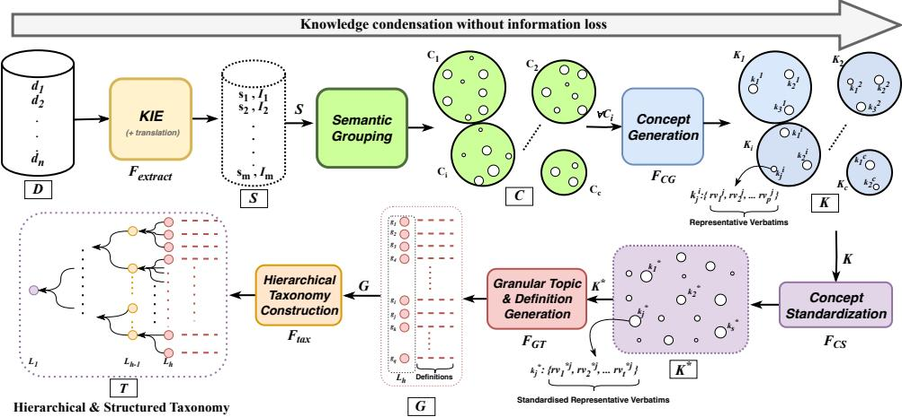  
Figure 1: TaxCE framework with progressive knowledge condensation, followed by root-to-leaf validation $( F _ { \mathrm { v a l } } )$ and EEG-driven iterative refinement that loops back to grouping until convergence.

## 3 Problem statement

Given a raw, unstructured corpus $\begin{array} { r l } { D } & { { } = } \end{array}$ $\{ d _ { 1 } , d _ { 2 } , \ldots , d _ { n } \}$ with no predefined schema, seed terms, or domain ontology, and a specification of the key information types to be captured in the taxonomy (viz., categories, aspects, root causes, resolutions, etc.), the goal is to automatically construct a multi-level hierarchical taxonomy $\mathcal { T } ^ { * }$ with granular, actionable leaf topics hierarchically organized from coarse to specific. The constructed taxonomy must simultaneously satisfy EEG: $\mathcal { E } ( \mathcal { T } ^ { * } ) \geq \theta _ { E }$ $X ( \mathcal { T } ^ { * } , D ) ~ \ge ~ \theta _ { X }$ , and $G ( { \mathcal { T } } ^ { * } , D ) \geq \theta _ { G }$ , where $\theta _ { E } , \theta _ { X } , \theta _ { G }$ are minimum quality thresholds.

Terminology. An actionable segment � is a contiguous text span conveying a self-contained piece of information; an intent I is a semantic label summarizing � derived from the full document context, forming an intent-tuple $( s , \tau )$ . A concept $\kappa _ { i }$ is a deduplicated semantic unit grouping semantically same intents, associated with representative verbatims $\{ r \nu _ { 1 } ^ { i } , \ldots , r \nu _ { p } ^ { i } \}$ selected for diversity and specificity; the full set is $\mathcal { K }$ and the standardized set is $\mathcal { K } ^ { * }$ . A granular topic $g _ { j }$ is a specific, actionable leaf-level topic derived from one or more concepts in $\mathcal { K } ^ { * }$ , with a natural language definition; the full set is $\mathcal { G }$ . The taxonomy $\mathcal { T }$ is a rooted tree of depth ℎ with nodes at level � denoted $L _ { i } \ ( L _ { 1 } ;$ root, $L _ { h } { \mathrm { : } }$ leaves) and children of node � denoted $\operatorname { C h } ( \nu ) \subseteq L _ { i + 1 }$

## 4 Methodology

Framework Overview. TaxCE constructs a hierarchical taxonomy from raw corpus through 6 stages (Figure 1): (1) Key Information Extraction, (2) Semantic Grouping, (3) Concept Generation and Standardization, (4) Granular Topic and Definition Generation, (5) Hierarchical Taxonomy Construction with Root-to-Leaf Validation, and (6) Iterative Refinement. TaxCE employs a two-tier LLM strategy: Stage 1 uses a cost-eficient, locally-hosted LLM for high-volume extraction (Appendix E), while Stages 3–5 use an instruction-tuned LLM with advanced reasoning and longer context windows, invoked far fewer times. Phase-wise examples illustrating each stage are provided in Appendix P.

## 4.1 Key information extraction

For each document $\textit { d } \in \textit { D }$ , TaxCE extracts actionable segments and assigns intent labels jointly using an instruction-tuned LLM $( F _ { \mathrm { e x t r a c t } } )$ The types of key information to extract (viz., categories, <sup>fi</sup>aspects, root causes, resolutions, polarity, etc.) are specified by the use case, producing intent-tuples $S = \bigcup _ { d \in D } F _ { \mathrm { e x t r a c t } } ( d ) \ = \ \{ ( s _ { 1 } , \bar { Z _ { 1 } } ) , \ldots , ( s _ { m } , \bar { Z _ { m } } ) \}$ The intent $\mathscr { T } _ { i }$ enriches the segment $s _ { i }$ with broader feedback-level context, critical for feedback types such as surveys and transcripts where verbatims<sup>2</sup> alone may lack suficient context. For multilingual corpora, extraction simultaneously translates segments and intents into the target taxonomy language; all subsequent stages operate in this single language. Intents are used solely to enrich semantic representations during grouping and are not carried forward beyond that stage.

## 4.2 Semantic grouping

The intent-tuples � are organized into � semantically coherent, non-overlapping groups $\boldsymbol { C } \quad =$ $\{ C _ { 1 } , \ldots , C _ { c } \}$ such that $\textstyle \bigcup _ { i = 1 } ^ { c } C _ { i } ~ = ~ S$ and $\forall i \neq$ $j , \ C _ { i } \cap C _ { j } = \emptyset$ . Each intent-tuple $( s _ { i } , \pmb { \mathcal { I } } _ { i } )$ is concatenated into $x _ { i } ~ = ~ \mathrm { c o n c a t } ( s _ { i } , { \cal J } _ { i } )$ and encoded using a sentence embedding model (Reimers and Gurevych, 2019) to obtain $e _ { i } = \operatorname { E n c o d e } ( x _ { i } )$ . Concatenating the intent with the segment enriches the embedding with broader semantic context, improving grouping quality even when segments alone are ambiguous. The framework is agnostic to the grouping algorithm; our implementation uses HDB-SCAN (Campello et al., 2013), which automatically determines the number of groups via density estimation without requiring � to be specified a priori.<sup>3</sup>

## 4.3 Concept generation and standardization

Concept Generation. Each group $C _ { i }$ may contain multiple granular intents within the same semantic neighborhood that need to be separated into individual concepts. For each group, TaxCE identifies concepts $\mathcal { K } _ { i } = \{ \kappa _ { 1 } ^ { i } , . . . , \kappa _ { t } ^ { i } \}$ where $1 \leq t \leq$ �<sub>max</sub>, with complete concept set $\textstyle { \mathcal { K } } = \bigcup _ { i = 1 } ^ { c } { \mathcal { K } } _ { i }$ . This step uses an instruction-tuned LLM $( F _ { \mathrm { C G } } )$ , which analyzes intent-tuples within each group and identifies distinct concepts. For each concept $\kappa _ { j } ^ { i } , F _ { \mathrm { C G } }$ selects up to $p$ actionable segments from $C _ { i }$ as representative verbatims $\{ r \nu _ { 1 } ^ { j } , \ldots , r \nu _ { p } ^ { j } \}$ , where $p$ is determined by $F _ { \mathrm { C G } }$ based on the diversity of mapped intent-tuples, chosen to cover all variations and describe the concept’s scope. Concepts within each group are encouraged to be semantically distinct, though corpus-level distinctness is enforced during standardization. See Appendix P.3 for illustrative examples.

Concept Standardization. Since grouping is inherently imperfect, semantically related intenttuples on group boundaries may be assigned to different groups, causing semantically same concepts to emerge independently. Before standardization, representative verbatims across such duplicates may also overlap semantically, introducing redundancy at both concept and verbatim levels. To remove this corpus-wide redundancy, TaxCE performs a lightweight clustering of all concepts in $\mathcal { K }$ based on their embeddings to form batches of semantically related concepts. This batching (a) groups candidate duplicates for eficient comparison and (b) respects LLM token length limitations. Each batch is processed by an instruction-tuned LLM $( F _ { \mathrm { C S } } )$ , which identifies semantically same concepts, merges them into canonical concepts, and consolidates representative verbatims by removing semantic overlaps. The resulting $\mathcal { K } ^ { * } = \{ \kappa _ { 1 } ^ { * } , \ldots , \kappa _ { s } ^ { * } \}$ consists of atomic, highly specific, standardized concepts, each associated with non-overlapping representative verbatims $\{ r \nu _ { 1 } ^ { * j } , \ldots , r \nu _ { t } ^ { * j } \}$ that collectively represent � without information loss, ensuring exhaustivity. See Appendix P.4 for examples.

## 4.4 Granular topic and definition generation

Using $\mathcal { K } ^ { * }$ and its representative verbatims, TaxCE identifies granular topics forming the leaf nodes, using an instruction-tuned LLM $( F _ { \mathrm { G T } } )$ . Concepts in $\mathcal { K } ^ { * }$ may be directly suitable as leaf topics or may need merging to form coherent, non-overlapping topics. $\operatorname { I f } \mathcal { K } ^ { * }$ fits within the LLM’s context window, $F _ { \mathrm { G T } }$ processes them in a single pass; otherwise, lightweight clustering creates batches processed separately. $F _ { \mathrm { G T } }$ generates $\mathcal { G } = \{ g _ { 1 } , \ldots , g _ { q } \}$ where each $g _ { j }$ must be (a) specific: a single, well-defined, end-user usable actionable topic, (b) independent and self-contained: semantically distinct from all other granular topics and carrying complete meaning in itself, and (c) grounded: traceable to concepts in $\mathcal { K } ^ { * }$ and transitively to segments in $D$ . For each topic, $F _ { \mathrm { G T } }$ simultaneously generates a natural language definition with representative verbatims as illustrative examples, serving as human-readable descriptions that downstream classifiers use to assign feedback to the correct topic. Each topic is assigned a polarity from {positive, negative, neutral}, with neutral mostly assigned for inquiry/question intents. Additionally, TaxCE generates catch-all topics (wherever applicable) to capture generic or ambiguous feedback that lacks actionable specifics (e.g., “complete product dissatisfaction”, “general product $d i s l i k e ^ { , , } )$ , ensuring exhaustive coverage without forcing vague feedback into inappropriate granular topics. Hyperparameter choices for concept and topic generation are discussed in $\mathsf { A p - }$ pendix C.

## 4.5 Hierarchical taxonomy construction

The granular topics G form the leaf level $L _ { h }$ . To construct the full hierarchy, TaxCE groups semantically related topics and generates abstract parent topics representing their combined meaning, repeating this bottom-up process until depth ℎ is reached, yielding $\mathcal { T } = F _ { \mathrm { t a x } } ( \mathcal { G } , h ) = \{ L _ { h } , L _ { h - 1 } , \ldots , L _ { 2 } , L _ { 1 } \}$ , where $F _ { \mathrm { t a x } }$ is an instruction-tuned LLM that performs hierarchical grouping and parent topic generation. Since topics in $\mathcal { G }$ trace back through $\mathcal { K } ^ { * }$ to actionable segments in �, every leaf node is inherently traceable to corpus evidence. Navigability analysis across diferent depths is in Appendix D.

Root-to-leaf validation. TaxCE validates the taxonomy using an instruction-tuned LLM $( F _ { \mathrm { v a l } } )$ by traversing every root-to-leaf path $\pi \quad =$ $( \bar { \nu } ^ { L _ { 1 } } , \nu ^ { L _ { 2 } } , \ldots , \bar { \nu } ^ { L _ { h } } ) ^ { 4 }$ , verifying: (a) logical coherence: the progression from abstract to granular represents a semantically meaningful specialization; and (b) corpus support: supporting evidence exists in � for the topic combination along the path. Paths failing either condition are flagged for restructuring and, in rare cases, removal.

## 4.6 Iterative refinement

TaxCE evaluates the constructed taxonomy using EEG metrics (Section 5) and iteratively refines it until all three meet their thresholds $\theta _ { E } , \theta _ { X } , \theta _ { G }$ . At each iteration, TaxCE identifies the deficient metric and applies targeted corrections: (a) Low $\varepsilon \colon$ regroups with fewer groups $( c ^ { \prime } < c )$ to consolidate overlapping topics; (b) Low $\mathcal { G } \colon$ increases groups $( c ^ { \prime \prime } > c )$ to preserve finer-grained concepts; (c) Low $\chi \smash { : }$ increases groups $( c ^ { \prime \prime \prime } > c )$ and reduces standardization aggressiveness. When multiple metrics are deficient, refinement prioritizes $\mathcal { E }  \mathcal { G }  \mathcal { X }$ Convergence is typically achieved within 1–3 iterations (Appendix F).

## 5 Evaluation metrics

Evaluating taxonomy quality requires metrics that capture complementary aspects of structure and coverage. We propose three corpus-grounded metrics: Exclusivity (E), Exhaustivity (X), and Granularity (G). Unlike prior approaches that rely on extrinsic proxies or human judgment, these metrics are intrinsic, mathematically defined, and explicitly anchored to the input corpus.

Exclusivity. Exclusivity measures the semantic distinctiveness between leaf topics. Drawing from information-theoretic principles of mutual information and semantic independence (Cover and Thomas, 1999), high exclusivity indicates minimal semantic overlap, ensuring each leaf topic occupies a unique region of the embedding space. Let $T = \{ t _ { 1 } , t _ { 2 } , \ldots \ldots , t _ { n } \}$ be the set of � leaf topics, each represented by its embedding vector $\mathbf { v } _ { i }$ . Exclusivity is defined as:

$$
\mathcal { E } = 1 0 0 \cdot \left( 1 - \frac { 1 } { { \binom { n } { 2 } } } \sum _ { i = 1 } ^ { n } \sum _ { j = i + 1 } ^ { n } \frac { \mathbf { v } _ { i } \cdot \mathbf { v } _ { j } } { \| \mathbf { v } _ { i } \| \cdot \| \mathbf { v } _ { j } \| } \right)\tag{1}
$$

where $\textstyle { { \binom { n } { 2 } } = { \frac { n ( n - 1 ) } { 2 } } }$ is the number of unique pairs. A score of 100 indicates perfect distinctiveness (zero average pairwise similarity), while lower scores indicate increasing overlap. Evaluating exclusivity at the leaf level implicitly ensures exclusivity at higher levels, since parent topics are abstractions over disjoint sets of distinct children.<sup>5</sup>

Exhaustivity. Exhaustivity measures the completeness of a taxonomy in covering all actionable intents present in the corpus. Unlike domain-level coverage, this metric is explicitly grounded to $D \colon$ a taxonomy is exhaustive if it covers every topic actually evidenced in the data. We use the KIE-extracted actionable segments $S$ (see Section 4.1) as the reference set and the leaf topics $T = \{ t _ { 1 } , t _ { 2 } , \ldots \ldots , t _ { n } \}$ as the taxonomy’s coverage. Since � is derived directly from the raw corpus $D$ via a single extraction pass that is independent of any downstream taxonomy construction method, it serves as a method-agnostic corpus representation. A segment $s _ { i } \in S$ is considered covered if its cosine similarity to at least one leaf topic exceeds a similarity threshold $\tau _ { x }$ (set to 0.65 in all experiments; sensitivity analysis in Appendix $\mathrm { I } ) . ^ { 6 }$ Exhaustivity is defined as:

$$
\chi = 1 0 0 \cdot { \frac { | \{ s \in S : \exists t \in T , \ \sin ( { \mathbf v } _ { s } , { \mathbf v } _ { t } ) \geq \tau _ { x } \} | } { | S | } }\tag{2}
$$

where ${ \bf v } _ { a }$ denotes the embedding of entity �. A score of 100 indicates every corpus-derived actionable segment maps to at least one leaf topic.

<table><tr><td></td><td></td><td colspan="3">Flipkart</td><td colspan="3">CFPB</td><td colspan="3">AskUbuntu</td></tr><tr><td>Type</td><td>Method</td><td> $\varepsilon$ </td><td>X</td><td> $\mathcal { G }$ </td><td>8</td><td>X</td><td>G</td><td>8</td><td>X</td><td>G</td></tr><tr><td rowspan="4">Tope</td><td>LDA</td><td>78.2</td><td>31.5</td><td>38.4</td><td>80.1</td><td>33.7</td><td>40.2</td><td>79.5</td><td>28.6</td><td>37.8</td></tr><tr><td>hLDA</td><td>72.4</td><td>38.2</td><td>42.7</td><td>74.6</td><td>40.1</td><td>44.5</td><td>73.2</td><td>36.4</td><td>41.9</td></tr><tr><td>BERTopic</td><td>81.3</td><td>44.6</td><td>51.2</td><td>82.5</td><td>46.8</td><td>53.1</td><td>80.9</td><td>41.3</td><td>50.4</td></tr><tr><td>TopClus</td><td>79.8</td><td>42.3</td><td>48.9</td><td>81.2</td><td>44.1</td><td>50.8</td><td>78.6</td><td>39.5</td><td>48.1</td></tr><tr><td rowspan="2">W7M</td><td>LLM Zero-shot</td><td>68.5</td><td>52.1</td><td>55.3</td><td>70.3</td><td>54.6</td><td>57.2</td><td>67.8</td><td>48.2</td><td>54.1</td></tr><tr><td>LLM + Clustering</td><td>74.1</td><td>58.4</td><td>60.7</td><td>76.2</td><td>60.3</td><td>62.5</td><td>73.5</td><td>54.7</td><td>59.8</td></tr><tr><td colspan="2">TaxCE</td><td>85.7</td><td>78.3</td><td>76.1</td><td>87.1</td><td>80.5</td><td>78.2</td><td>86.3</td><td>76.9</td><td>75.6</td></tr></table>

Table 1: Exclusivity (E), Exhaustivity (X), and Granularity (G) across all datasets. X and $\mathcal { G }$ are computed against the shared reference � for all methods.

Granularity. Granularity quantifies how specific and actionable the leaf topics are in representing the underlying corpus content. While exhaustivity measures whether segments are covered (binary), granularity measures how closely they are covered (continuous). A taxonomy with broad leaf topics may achieve high exhaustivity by loosely covering many segments, but low granularity because the topics are insuficiently specific. Using � as the reference, we compute for each segment $s _ { i } \in S$ the cosine similarity to its best-matching leaf topic:

$$
\mathcal { G } = 1 0 0 \cdot \frac { 1 } { | S | } \sum _ { i = 1 } ^ { | S | } \operatorname* { m a x } _ { t \in T } \frac { \mathbf { v } _ { s _ { i } } \cdot \mathbf { v } _ { t } } { \| \mathbf { v } _ { s _ { i } } \| \cdot \| \mathbf { v } _ { t } \| }\tag{3}
$$

where ${ \bf v } _ { a }$ denotes the embedding of entity �. A high score indicates leaf topics are specific enough to closely represent each segment, while a low score indicates overly broad coverage (see Appendix P for an illustrative example).

## 6 Experiments

## 6.1 Setup

Datasets. We evaluate TaxCE on three public datasets: Flipkart Product Reviews (Thummar and Vaghani, 2023) (∼194K reviews across 104 categories, to demonstrate TaxCE’s language-agnostic capability, 20% of reviews were machine-translated into four additional languages (DE, IT, FR, ES) with 5% each, yielding a multilingual corpus across 5 languages), CFPB Consumer Complaints<sup>7</sup> (∼4M financial complaints), and AskUbuntu (Lei et al., 2016) (∼167K technical support questions).

Baselines. We compare against six methods: LDA, hLDA, BERTopic, TopClus, LLM Zero-shot, and LLM + Clustering. Setup details are in Appendix H.

Evaluation protocol. Exhaustivity and granularity are computed for all methods against the same reference set �: actionable segments extracted by TaxCE’s KIE stage via a single pass independent of downstream taxonomy construction, ensuring method-agnostic evaluation. This design also guards against evaluation circularity. Although the reference set � is produced by TaxCE’s KIE stage, this is a single upstream extraction pass that operates independently of any downstream taxonomy construction: KIE neither observes the taxonomy nor is it optimised jointly with it. The same � is used to score all baselines identically, and no downstream TaxCE stage (concept generation, standardisation, topic generation, or refinement) has access to � during training or inference. Any advantage TaxCE derives from this evaluation would therefore have to come from producing leaf topics that align more closely with corpus-derived segments than competing methods do, which is precisely the property we want to measure.

Implementation. TaxCE’s KIE stage uses a locally-hosted LLM; downstream stages use an instruction-tuned LLM with advanced reasoning. Semantic grouping uses HDBSCAN; default depth ℎ = 3. Full details on LLM selection, grouping algorithms, hyperparameters, and prompts are in Appendices B, C, E, H, O.

## 6.2 Main results

TaxCE achieves the highest scores across all three metrics on all three datasets (Table 1), with average improvements of 11.8, 20.5, and 15.7 percentage points in exclusivity, exhaustivity, and granularity respectively over the strongest baseline (LLM + Clustering). The gains are most pronounced on exhaustivity and granularity, where the concept generation and standardization pipeline provides the largest advantage.

Flat topic models (LDA, BERTopic, TopClus)

achieve reasonable exclusivity (76–83) but score poorly on exhaustivity (28–47) and granularity (36– 53), as they capture only prominent topics and represent them as word distributions rather than actionable definitions. LLM-based methods show the opposite trade-of: LLM Zero-shot achieves moderate exhaustivity (48–55) but low exclusivity (66–70) due to overlapping topics generated without corpus-grounded deduplication; LLM + Clustering improves by grounding in corpus groups (exclusivity 72–76, exhaustivity 55–60) but still sufers from within-group redundancy and cross-group overlap. TaxCE addresses both issues through concept generation (condensing groups into atomic semantic units) and standardization (eliminating cross-group redundancy), with iterative refinement closing remaining gaps. Detailed per-method analysis is in Appendix H.

Cross-domain consistency. TaxCE performs consistently across all three domains despite variation in scale (167K to 4M), language (5 languages in Flipkart vs. English-only elsewhere), and domain complexity. CFPB yields the highest scores, likely due to its structured complaint language; AskUbuntu, the smallest corpus, achieves comparable performance, indicating robustness to corpus size. A stage-wise evaluation is provided in Appendix G.

## 6.3 Ablation study

We isolate the contributions of concept standardization and iterative refinement by removing each from TaxCE (Table 2(a), averaged across all three datasets). All variants are evaluated against the same shared reference �. Removing concept standardization causes the largest drop in exclusivity (−14.4 points), as redundant concepts from diferent groups propagate to the leaf topics, creating semantic overlap. Exhaustivity slightly increases (+1.3) because no concepts are merged, but this comes at the cost of a cluttered taxonomy. Removing iterative refinement degrades all three metrics, with exhaustivity dropping most (−7.6) since the refinement loop’s primary correction for low coverage is no longer applied. Removing both components yields the lowest scores, confirming that standardization and refinement address complementary quality dimensions.

## 6.4 Human evaluation

Three annotators independently rate taxonomies from TaxCE, LLM + Clustering, and BERTopic on three criteria (5-point Likert (Likert, 1932)

<table><tr><td>Variant</td><td>8</td><td>X</td><td>G</td></tr><tr><td>TaxCE (Full)</td><td>85.8</td><td>77.9</td><td>76.1</td></tr><tr><td>w/o Std.</td><td>71.4 ↓14.4</td><td>79.2 ↑1.3</td><td>73.8 ↓2.3</td></tr><tr><td>w/o Iter.Ref.</td><td>80.1 ↓5.7</td><td>70.3 ↓7.6</td><td>71.5 ↓4.6</td></tr><tr><td>w/o Both</td><td>67.2 ↓18.6</td><td>71.8 ↓6.1</td><td>69.4 ↓6.7</td></tr></table>

(a) Ablation study
<table><tr><td>Method</td><td>Qual.</td><td>Act.</td><td>Nav.</td></tr><tr><td>BERTopic</td><td>2.8</td><td>2.3</td><td>1.9</td></tr><tr><td>LLM + Clust.</td><td>3.5</td><td>3.1</td><td>3.3</td></tr><tr><td>TaxCE</td><td>4.4</td><td>4.2</td><td>4.3</td></tr><tr><td>K</td><td>0.71</td><td>0.68</td><td>0.74</td></tr></table>

(b) Human evaluation (5-pt Likert)  
Table 2: (a) Ablation study. (b) Human evaluation. � = Fleiss’ kappa (Fleiss, 1971). Per-dataset ablation in Appendix A.

scale): Taxonomy Quality (coherence and correctness), Actionability (specificity of leaf topics for decision-making), and Navigability (ease of coarseto-granular navigation) and reported in Table 2(b). TaxCE receives the highest ratings across all dimensions, with particularly strong gains on actionability (+1.1 over LLM + Clustering), reflecting the benefit of concept-grounded topic generation that produces specific, well-defined leaf topics. BERTopic scores lowest on navigability (1.9) because it produces flat topic sets without hierarchical structure. Inter-annotator agreement (Fleiss’ � = 0.68–0.74) indicates substantial agreement.

## 7 Conclusion

We presented TaxCE, a framework that treats taxonomy construction as progressive knowledge condensation, introducing concept generation and standardization as intermediate representations between raw text and taxonomy nodes. The proposed EEG metrics provide the first unified, corpus-grounded evaluation of exclusivity, exhaustivity, and granularity, and their integration into an iterative refinement loop enables self-correcting taxonomy construction. Results across three domains confirm consistent improvements over all baselines on both automatic and human evaluations. Future work includes analyzing LLM sensitivity across pipeline stages, developing subtree-level refinement, extending EEG to intermediate hierarchical levels, and replacing the current metric-driven correction rules with a learned refinement policy that selects corrective actions from observed EEG trajectories.

## Limitations

While TaxCE performs well across three diverse domains, a few limitations are worth noting. Its multi-stage design introduces cascading sensitivity, since suboptimal outputs at early stages such as overly broad concept generation can propagate downstream; iterative refinement helps mitigate this, but careful prompt engineering at each stage still matters. The EEG metrics also depend on cosine similarity in embedding space, so absolute scores are sensitive to the choice of embedding model. Relative rankings across methods stay consistent and cross-embedding EEG correlation lies between 0.89 and 0.97 (Appendix K), though practitioners should recalibrate $\tau _ { x }$ when switching backends. The framework supports arbitrary taxonomy depth ℎ but lacks a mechanism to automatically determine the optimal depth; in our experiments ℎ = 3 worked best consistently, though other corpora may prefer diferent values.

On the cost and scope side, the KIE stage processes each document individually to ensure exhaustive coverage, which can be expensive for very large corpora, and while representative sampling reduces cost it risks missing long-tail topics. TaxCE is designed to be language-agnostic via translation at the KIE stage, but our experiments rely primarily on English corpora with only partial multilingual augmentation, and validation on fully non-English corpora was not conducted. Three complementary evaluations also remain open: (i) alignment against CFPB’s oficial taxonomy using edge precision, ancestor F1, and Wu-Palmer similarity (Wu and Palmer, 1994), (ii) a KIE-free reference-set control using an independent extractor to further isolate the reference � from TaxCE, which the anti-circularity argument in Section 6.1 partially addresses, and (iii) a controlled noise-injection study on KIE outputs to quantify robustness to upstream extraction errors. The corpus-grounded EEG evaluation, crossdomain consistency, and anti-circularity design already support the paper’s core claims, and we consider these additional evaluations natural next steps.

## Ethical Considerations

All datasets used in this work are publicly available and contain no personally identifiable information. We acknowledge the following ethical considerations:

1. LLM-generated taxonomies may inherit biases present in the underlying language model, potentially manifesting as culturally skewed category names or underrepresentation of minority viewpoints. Practitioners deploying TaxCE in production should review generated taxonomies for such biases, particularly when the taxonomy informs downstream decision-making such as complaint routing or content moderation.

2. The work primarily focuses on English-language corpora (with partial multilingual augmentation), which may limit generalizability of findings to other linguistic contexts. We acknowledge this as a scope constraint and encourage future validation across diverse languages.

3. The iterative nature of TaxCE’s pipeline involves multiple LLM inference calls across stages, which carries computational cost and associated environmental impact. We mitigate this by employing cost-eficient locally-hosted models for the high-volume KIE stage and limiting downstream LLM invocations to concept-level (rather than document-level) processing.

## References

Dogu Araci. 2019. FinBERT: Financial sentiment analysis with pre-trained language models. arXiv preprint arXiv:1908.10063.

Hamed Babaei Giglou, Jennifer D’Souza, and Sören Auer. 2023. Llms4ol: Large language models for ontology learning. In International Semantic Web Conference, pages 408–427. Springer.

Mohit Bansal, David Burkett, Gerard De Melo, and Dan Klein. 2014. Structured learning for taxonomy induction with belief propagation. In Proceedings of the 52nd Annual Meeting of the Association for Computational Linguistics (Volume 1: Long Papers), pages 1041–1051.

David M Blei, Andrew Y Ng, and Michael I Jordan. 2003. Latent dirichlet allocation. Journal ofMachine Learning Research, 3(Jan):993–1022.

Georgeta Bordea, Paul Buitelaar, Stefano Faralli, and Roberto Navigli. 2015. Semeval-2015 task 17: Taxonomy extraction evaluation (TExEval). In Proceedings ofthe 9th International Workshop on Semantic Evaluation (SemEval 2015), pages 902–910.

Georgeta Bordea, Els Lefever, and Paul Buitelaar. 2016. Semeval-2016 task 13: Taxonomy extraction evaluation (TExEval-2). In Proceedings ofthe 10th International Workshop on Semantic Evaluation (SemEval-2016), pages 1081–1091.

Tadeusz Caliński and Jerzy Harabasz. 1974. A dendrite method for cluster analysis. Communications in Statistics – Theory and Methods, 3(1):1–27.

Ricardo JGB Campello, Davoud Moulavi, and Jörg Sander. 2013. Density-based clustering based on hierarchical density estimates. In Pacific-Asia Conference on Knowledge Discovery and Data Mining, pages 160–172.

Thomas M Cover and Joy A Thomas. 1999. Elements of Information Theory, 2nd edition. John Wiley & Sons.

David L Davies and Donald W Bouldin. 1979. A cluster separation measure. IEEE Transactions on Pattern Analysis and Machine Intelligence, PAMI-1(2):224– 227.

Inderjit S Dhillon and Dharmendra S Modha. 2001. Concept decompositions for large sparse text data using clustering. Machine Learning, 42(1):143–175.

Adji B Dieng, Francisco JR Ruiz, and David M Blei. 2020. Topic modeling in embedding spaces. Transactions of the Association for Computational Linguistics, 8:439–453.

Martin Ester, Hans-Peter Kriegel, Jörg Sander, and Xiaowei Xu. 1996. A density-based algorithm for discovering clusters in large spatial databases with noise. In Proceedings ofthe 2nd International Conference on Knowledge Discovery and Data Mining (KDD-96), pages 226–231.

Joseph L Fleiss. 1971. Measuring nominal scale agreement among many raters. Psychological Bulletin, 76(5):378–382.

Thomas Grifiths, Michael Jordan, Joshua Tenenbaum, and David Blei. 2003. Hierarchical topic models and the nested Chinese restaurant process. In Advances in Neural Information Processing Systems, volume 16, pages 17–24.

Maarten Grootendorst. 2022. Bertopic: Neural topic modeling with a class-based tf-idf procedure. arXiv preprint arXiv:2203.05794.

Marti A Hearst. 1992. Automatic acquisition of hyponyms from large text corpora. In COLING 1992 Volume 2: The 14th International Conference on Computational Linguistics, pages 539–545.

Jiaxin Huang, Yiqing Xie, Yu Meng, Yunyi Zhang, and Jiawei Han. 2020. Corel: Seed-guided topical taxonomy construction by concept learning and relation transferring. In Proceedings of the 26th ACM SIGKDD International Conference on Knowledge Discovery & Data Mining, pages 1928–1936.

Minhao Jiang, Xiangchen Song, Jieyu Zhang, and Jiawei Han. 2022. Taxoenrich: Self-supervised taxonomy completion via structure-semantic representations. In Proceedings of the ACM Web Conference 2022, pages 925–934.

Dongha Lee, Jiaming Shen, SeongKu Kang, Susik Yoon, Jiawei Han, and Hwanjo Yu. 2022. Taxocom: Topic taxonomy completion with hierarchical discovery of novel topic clusters. In Proceedings ofthe ACM Web Conference 2022, pages 2819–2829.

Tao Lei, Hrishikesh Joshi, Regina Barzilay, Tommi Jaakkola, Kateryna Tymoshenko, Alessandro Moschitti, and Lluís Màrquez. 2016. Semi-supervised question retrieval with gated convolutions. In Proceedings ofthe 2016 Conference ofthe North American Chapter of the Association for Computational Linguistics: Human Language Technologies, pages 1279–1289.

Rensis Likert. 1932. A technique for the measurement of attitudes. Archives ofPsychology, 22(140):1–55.

Yuning Mao, Xiang Ren, Jiaming Shen, Xiaotao Gu, and Jiawei Han. 2018. End-to-end reinforcement learning for automatic taxonomy induction. In Proceedings of the 56th Annual Meeting of the Association for Computational Linguistics (Volume 1: Long Papers), pages 2462–2472.

Yu Meng, Yunyi Zhang, Jiaxin Huang, Yu Zhang, and Jiawei Han. 2022. Topic discovery via latent space clustering of pretrained language model representations. In Proceedings of the ACM Web Conference 2022, pages 3143–3152.

David Mimno, Hanna Wallach, Edmund Talley, Miriam Leenders, and Andrew McCallum. 2011. Optimizing semantic coherence in topic models. In Proceedings of the 2011 Conference on Empirical Methods in Natural Language Processing, pages 262–272.

Barbara Minto. 1987. The Minto Pyramid Principle. Minto International, Incorporated.

Sandeep Sricharan Mukku, Manan Soni, Chetan Aggarwal, Jitenkumar Rana, Promod Yenigalla, Rashmi Patange, and Shyam Mohan. 2023. Insightnet: Structured insight mining from customer feedback. In Proceedings of the 2023 Conference on Empirical Methods in Natural Language Processing: Industry Track, pages 552–566.

Daniel Müllner. 2011. Modern hierarchical, agglomerative clustering algorithms. arXiv preprint arXiv:1109.2378.

OpenAI. 2024. New embedding models and API updates.

Alexander Panchenko, Stefano Faralli, Eugen Ruppert, Stefen Remus, Hubert Naets, Cédrick Fairon, Simone Paolo Ponzetto, and Chris Biemann. 2016. TAXI at SemEval-2016 task 13: A taxonomy induction method based on lexico-syntactic patterns, substrings and focused crawling. In Proceedings of the 10th International Workshop on Semantic Evaluation (SemEval-2016), pages 1320–1327.

Nils Reimers and Iryna Gurevych. 2019. Sentence-BERT: Sentence embeddings using Siamese BERTnetworks. In Proceedings ofthe 2019 Conference on Empirical Methods in Natural Language Processing and the 9th International Joint Conference on Natural Language Processing (EMNLP-IJCNLP), pages 3982– 3992.

Michael Röder, Andreas Both, and Alexander Hinneburg. 2015. Exploring the space of topic coherence measures. In Proceedings ofthe Eighth ACM International Conference on Web Search and Data Mining, pages 399–408.

Peter J Rousseeuw. 1987. Silhouettes: A graphical aid to the interpretation and validation of cluster analysis. Journal of Computational and Applied Mathematics, 20:53–65.

Jingbo Shang, Xinyang Zhang, Liyuan Liu, Sha Li, and Jiawei Han. 2020. Nettaxo: Automated topic taxonomy construction from text-rich network. In Proceedings of The Web Conference 2020, pages 1908–1919.

Jiaming Shen, Wenda Qiu, Yu Meng, Jingbo Shang, Xiang Ren, and Jiawei Han. 2021. Taxoclass: Hierarchical multi-label text classification using only class names. In Proceedings ofthe 2021 Conference of the North American Chapter of the Association for Computational Linguistics: Human Language Technologies, pages 4239–4249.

Jiaming Shen, Zeqiu Wu, Dongming Lei, Chao Zhang, Xiang Ren, Michelle T Vanni, Brian M Sadler, and Jiawei Han. 2018. Hiexpan: Task-guided taxonomy construction by hierarchical tree expansion. In Proceedings of the 24th ACM SIGKDD International Conference on Knowledge Discovery & Data Mining, pages 2180–2189.

Rion Snow, Daniel Jurafsky, and Andrew Y Ng. 2004. Learning syntactic patterns for automatic hypernym discovery. In Advances in Neural Information Processing Systems, volume 17, pages 1297–1304.

Kaitao Song, Xu Tan, Tao Qin, Jianfeng Lu, and Tie-Yan Liu. 2020. MPNet: Masked and permuted pretraining for language understanding. In Advances in Neural Information Processing Systems, volume 33, pages 16857–16867.

Akash Srivastava and Charles Sutton. 2017. Autoencoding variational inference for topic models. arXiv preprint arXiv:1703.01488.

Mansi Thummar and Niralii Vaghani. 2023. Flipkart products review dataset.

Liang Wang, Nan Yang, Xiaolong Huang, Binxing Jiao, Linjun Yang, Daxin Jiang, Rangan Majumder, and Furu Wei. 2024. Text embeddings by weaklysupervised contrastive pre-training. In Findings of the Association for Computational Linguistics: ACL 2024, pages 11897–11916.

Zhibiao Wu and Martha Palmer. 1994. Verbs semantics and lexical selection. In Proceedings of the 32nd Annual Meeting ofthe Associationfor Computational Linguistics, pages 133–138.

Shitao Xiao, Zheng Liu, Peitian Zhang, Niklas Muennighof, Defu Lian, and Jian-Yun Nie. 2024. C-Pack: Packaged resources to advance general Chinese embedding. In Proceedings of the 47th International ACM SIGIR Conference on Research and Development in Information Retrieval, pages 641–649.

Chao Zhang, Fangbo Tao, Xiusi Chen, Jiaming Shen, Meng Jiang, Brian Sadler, Michelle Vanni, and Jiawei Han. 2018. Taxogen: Unsupervised topic taxonomy construction by adaptive term embedding and clustering. In Proceedings of the 24th ACM SIGKDD International Conference on Knowledge Discovery & Data Mining, pages 2701–2709.

## A Per-dataset ablation results

We disaggregate the ablation results from Section 6.3 across all three datasets in Table 3. Removing standardization degrades exclusivity most on AskUbuntu (−15.3), where overlapping technical topics produce the most cross-group concept redundancy that standardization resolves. Exhaustivity marginally increases without standardization across all datasets since no concepts are merged, but at the cost of overlapping leaf topics. Removing iterative refinement impacts Flipkart exhaustivity most (−8.2), as the first-pass taxonomy misses long-tail product feedback that the refinement loop recovers. On Flipkart, removing refinement causes the largest granularity drop (−4.9), reflecting the need for finer separation among diverse e-commerce product topics. Removing both components yields the lowest scores across all datasets, with combined degradation exceeding the sum of individual removals on exclusivity $( \mathrm { e . g . , - 1 8 . 9 }$ on Flipkart vs. −14.5 and −5.4 individually), confirming synergistic interaction between the two components.

<table><tr><td></td><td colspan="3">Flipkart</td><td colspan="3">CFPB</td><td colspan="3">AskUbuntu</td></tr><tr><td>Variant</td><td>8</td><td>X</td><td>G</td><td>ε</td><td>X</td><td>G</td><td>8</td><td>X</td><td>G</td></tr><tr><td>TaxCE (Full)</td><td>85.7</td><td>78.3</td><td>76.1</td><td>87.1</td><td>80.5</td><td>78.2</td><td>86.3</td><td>76.9</td><td>75.6</td></tr><tr><td>w/o Std.</td><td>71.2</td><td>79.5</td><td>73.5</td><td>73.6</td><td>81.2</td><td>75.8</td><td>71.0</td><td>78.8</td><td>73.6</td></tr><tr><td>w/o Iter.Ref.</td><td>80.3</td><td>70.1</td><td>71.2</td><td>82.1</td><td>72.8</td><td>73.5</td><td>79.4</td><td>69.8</td><td>71.4</td></tr><tr><td>w/o Both</td><td>66.8</td><td>71.5</td><td>69.1</td><td>69.1</td><td>73.4</td><td>71.2</td><td>67.3</td><td>72.1</td><td>69.5</td></tr></table>

Table 3: Per-dataset ablation results. w/o Std.: without concept standardization; w/o Iter.Ref.: without iterative refinement; w/o Both: without either component.

## B Grouping algorithm analysis

We compare four grouping algorithms for the semantic grouping stage (Section 4.2), evaluating both intrinsic grouping quality (silhouette score) and downstream taxonomy quality (EEG metrics averaged across all three datasets) in Table 4. HDB-SCAN achieves the highest silhouette score and best downstream EEG performance. Its densitybased approach automatically determines the number of groups and adapts to varying group densities, which is particularly beneficial for feedback corpora with long-tailed topic distributions. Spherical K-Means performs comparably when � (the number of groups, which must be specified a priori) is well-tuned via elbow and silhouette analysis, but the additional hyperparameter reduces generalizability across datasets. DBSCAN automatically determines group count but is sensitive to � (the neighborhood radius that defines density reachability), leading to inconsistent performance across datasets with diferent embedding density profiles. Agglomerative clustering produces uneven group sizes, with some very large groups and many singletons, complicating downstream concept generation. HDBSCAN noise points (intent-tuples not assigned to any group) are assigned to their nearest group via embedding similarity in a post-processing step.

<table><tr><td>Algorithm</td><td>Auto c</td><td>Sil.</td><td>ε</td><td>X</td><td>G</td></tr><tr><td>HDBSCAN</td><td></td><td>0.34</td><td>85.8</td><td>77.9</td><td>76.1</td></tr><tr><td>Spherical K-Means</td><td>X</td><td>0.32</td><td>84.5</td><td>76.8</td><td>75.1</td></tr><tr><td>DBSCAN</td><td>√</td><td>0.29</td><td>83.1</td><td>74.2</td><td>73.5</td></tr><tr><td>Agglomerative</td><td>X</td><td>0.27</td><td>81.5</td><td>73.8</td><td>72.1</td></tr></table>

Table 4: Grouping algorithm comparison (averaged across all datasets).

## C Hyperparameter analysis

We analyze two key hyperparameters: $t _ { \mathrm { m a x } }$ (maximum concepts per group) and standardization aggressiveness. Figure 2 shows averaged trends; Tables 5 and 6 provide per-dataset breakdowns.

Maximum concepts per group $\left( t _ { \operatorname* { m a x } } \right)$ As shown in Figure 2(a), low $t _ { \mathrm { m a x } }$ constrains concept generation: at $t _ { \mathrm { m a x } } = 2 .$ , groups containing three or more distinct intents are forced to merge, inflating exclusivity (87.4) but severely degrading exhaustivity (61.7) and granularity (64.2). At $t _ { \mathrm { m a x } } = 5 .$ all three metrics are well-balanced, as most groups contain 2–4 distinct intents in practice. Beyond $t _ { \mathrm { m a x } } = 7$ , additional concepts are predominantly near-duplicates that the standardization step must merge, adding computational overhead while exclusivity drops (81.1 at $t _ { \mathrm { m a x } } = 1 0 )$ ) as some fine-grained duplicates survive standardization. The pattern is consistent across all three datasets (Table 5).

Standardization aggressiveness. Figure 2(b) compares three configurations: strict (merge only near-identical concepts), moderate (merge concepts describing the same issue with diferent phrasing), and aggressive (merge closely related concepts even if they capture diferent nuances). Strict standardization leaves substantial redundancy, degrading exclusivity (76.6) while preserving exhaustivity (79.7). Aggressive standardization over-merges, conflating genuinely distinct concepts and degrading exhaustivity (68.2) and granularity (67.1) despite high exclusivity (89.5). Moderate achieves the best overall balance. During iterative refinement (Section 4.6), TaxCE dynamically shifts toward strict when exhaustivity is low and toward aggressive when exclusivity is low. Per-dataset results in Table 6 confirm this pattern holds across all domains.

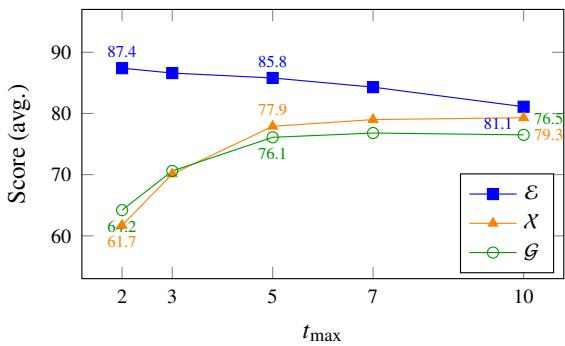

(a) Efect of $t _ { \mathrm { m a x } }$ (avg. across datasets).  
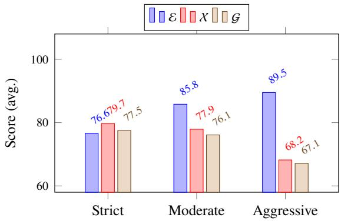  
(b) Efect of standardization aggressiveness.

Figure 2: Hyperparameter sensitivity. (a) $t _ { \mathrm { m a x } } ~ = ~ 5$ balances all three metrics. (b) Moderate standardization achieves the best balance.
<table><tr><td></td><td colspan="3">Flipkart</td><td colspan="3">CFPB</td><td colspan="3">AskUb.</td></tr><tr><td>tmax</td><td>8</td><td>X</td><td>G</td><td>8</td><td>X</td><td>G</td><td>8</td><td>X</td><td>G</td></tr><tr><td>2</td><td>87.3</td><td>62.1</td><td>64.5</td><td>88.5</td><td>64.3</td><td>66.2</td><td>87.8</td><td>60.5</td><td>63.8</td></tr><tr><td>3</td><td>86.5</td><td>70.4</td><td>70.8</td><td>87.8</td><td>72.6</td><td>72.5</td><td>87.1</td><td>69.1</td><td>70.2</td></tr><tr><td>5</td><td>85.7</td><td>78.3</td><td>76.1</td><td>87.1</td><td>80.5</td><td>78.2</td><td>86.3</td><td>76.9</td><td>75.6</td></tr><tr><td>7</td><td>84.1</td><td>79.5</td><td>76.8</td><td>85.6</td><td>81.2</td><td>78.9</td><td>84.8</td><td>78.2</td><td>76.3</td></tr><tr><td>10</td><td>81.2</td><td>79.8</td><td>76.5</td><td>82.8</td><td>81.5</td><td>78.6</td><td>81.9</td><td>78.5</td><td>76.1</td></tr></table>

Table 5: Per-dataset $t _ { \mathrm { m a x } }$ results.

## D Taxonomy depth analysis

Since TaxCE constructs taxonomies bottom-up (Section 4.5), the granular leaf topics G are fixed regardless of depth ℎ. Consequently, EEG metrics (which evaluate leaf-level properties) remain stable across depths. The choice of ℎ instead afects navigability: the number of intermediate abstraction levels between root and leaf topics. Table 7 reports taxonomy sizes at the default ℎ = 3.

At ℎ = 2, the first grouping above the leaf level produces hinge-level topics as roots (e.g., 120+ root categories for Flipkart, each containing ∼15 leaf topics). While individual groups are manageable, the user must navigate 120+ root-level entry points with no higher-level organization, making it dificult to locate relevant topics without prior knowledge of the taxonomy structure. $\quad \mathrm { A t } h = 3 .$ , a second grouping step produces coarse topics (L1) that organize hinge topics (L2) into a small number of semantically coherent top-level categories (e.g., 18 for Flipkart), providing a natural coarse→hinge→granular navigation path. Human evaluators consistently rated $h = 3$ taxonomies highest on navigability (Section 6.4). At ℎ = 4, an additional grouping above L1 introduces a super-category level that often lacks clear semantic boundaries, adding navigation overhead without meaningful diferentiation. At ℎ = 5, the hierarchy becomes over-layered with unnecessarily broad abstract categories that do not add informational value, as the semantic gap between consecutive levels becomes too narrow to justify the additional navigation step.

<table><tr><td></td><td colspan="3">Flipkart</td><td colspan="3">CFPB</td><td colspan="3">AskUb.</td></tr><tr><td>Config</td><td>8</td><td>X</td><td>G</td><td>8</td><td>X</td><td>G</td><td>8</td><td>X</td><td>G</td></tr><tr><td>Strict</td><td>76.3</td><td>80.1</td><td>77.5</td><td>78.2</td><td>82.3</td><td>79.4</td><td>76.9</td><td>78.8</td><td>77.1</td></tr><tr><td>Moderate</td><td>85.7</td><td>78.3</td><td>76.1</td><td>87.1</td><td>80.5</td><td>78.2</td><td>86.3</td><td>76.9</td><td>75.6</td></tr><tr><td>Aggressive</td><td>89.4</td><td>68.5</td><td>67.2</td><td>90.8</td><td>70.8</td><td>69.1</td><td>89.7</td><td>67.4</td><td>66.8</td></tr></table>

Table 6: Per-dataset standardization results.
<table><tr><td>Dataset</td><td> $| L _ { 1 } |$ </td><td> $| L _ { 2 } |$ </td><td> $\left| L _ { 3 } \right|$ </td><td>Avg. |L3| per L2</td></tr><tr><td>Flipkart</td><td>18</td><td>120+</td><td>1800+</td><td>~15</td></tr><tr><td>CFPB</td><td>12</td><td>65</td><td>450+</td><td>~6.9</td></tr><tr><td>AskUbuntu</td><td>8</td><td>35</td><td>180+</td><td>~5.1</td></tr></table>

Table 7: Taxonomy sizes at default depth $h = 3$ $\left| L _ { i } \right| \colon$ number of nodes at level �. L1: coarse topics, L2: hinge topics, L3: granular topics.

Taxonomy size scales with corpus diversity and scale: Flipkart (104 product categories, multilingual, ∼194K reviews) produces the largest taxonomy, while AskUbuntu (single technical domain, ∼167K questions) produces the most compact. The average branching factor from L2 to L3 is notably higher for Flipkart (∼15) due to the breadth of ecommerce product feedback, compared to 5–7 for the other datasets where domain-specific topics are more tightly scoped.

## E LLM selection analysis

TaxCE’s two-tier LLM strategy (Section 4) requires selecting models for the high-volume KIE stage $( F _ { \mathrm { e x t r a c t } } )$ and the reasoning-intensive downstream stages $( F _ { \mathrm { C G } } , F _ { \mathrm { C S } } , F _ { \mathrm { G T } } , F _ { \mathrm { t a x } } , F _ { \mathrm { v a l } } )$ . Figure 3 reports results for both tiers. For KIE evaluation, we measure F1 against a manually labeled sample of 200 feedback $\mathrm { \ t e x t s { \mathrm { ^ { 8 } } } }$ per dataset, annotated by two annotators with disagreements resolved by discussion.

KIE stage. We evaluate five locally-hosted instruction-tuned models under 9B parameters on actionable segment extraction (Figure 3(a)). F1 scales with model size: Qwen3-8B achieves the highest F1 (89.4) but at less than half the throughput of Gemma-3-4B-IT (15.8 vs. 40.1 docs/s). The 3–4B models (Qwen3-4B at 85.2 F1, Phi-4- Mini-Instruct at 86.3 F1) ofer the strongest costquality balance for corpora exceeding 1M documents, achieving $\mathrm { F } 1 > 8 5$ at 30–36 docs/s.

Downstream stages. We evaluate five instructiontuned LLMs on end-to-end taxonomy quality (Figure 3(b), EEG averaged across all datasets). Claude-3.5-Sonnet and Claude-3-Opus lead with marginal diferences (<0.5 points across all metrics), while GPT-4o trails by ∼1 point. Open-source models (Qwen3-235B-A22B, a mixture-of-experts model with 22B active parameters, and Qwen-Max) trail by 2–4 points, primarily on exhaustivity and granularity, indicating that concept standardization and topic generation benefit from stronger instructionfollowing capabilities. Given the marginal gap between Sonnet and Opus, Claude-3.5-Sonnet offers the most practical trade-of of quality, cost, and inference speed.

## F Iterative refinement convergence

Refinement mechanism details. During refinement, exhaustivity and granularity are computed internally against $\mathcal { K } ^ { * }$ to diagnose pipeline-specific deficiencies; the cross-method evaluation against � described in Section 6.1 is used only for final reporting. For low E, TaxCE re-groups with fewer groups, regenerates concepts, re-standardizes, and reconstructs the taxonomy. For low $\mathcal { G }$ , TaxCE adjusts standardization to preserve finer-grained concepts that were previously over-merged. For low X, TaxCE reduces standardization aggressiveness to retain concepts that were previously merged away. The priority order $( \mathcal E \to \mathcal G \to \chi )$ reflects that improving exclusivity can afect the other two metrics and should be stabilized first. Threshold selection guidelines are in Appendix J.

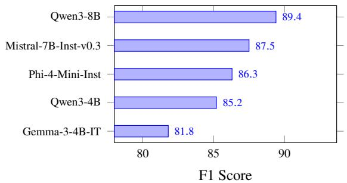

(a) KIE LLM: F1 score. Throughput (docs/s): Gemma-3- 4B 40.1, Qwen3-4B 36.2, Phi-4-Mini 30.5, Mistral-7B 18.4, Qwen3-8B 15.8.  
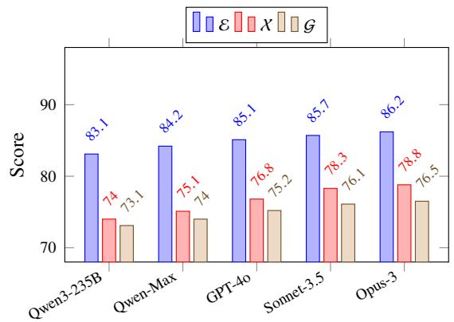  
(b) Downstream LLM comparison (avg. across datasets).  
Figure 3: LLM selection analysis. (a) KIE stage: F1 scales with model size; 3–4B models ofer the strongest cost-quality balance. (b) Downstream stages: Claude-3.5-Sonnet and Claude-3-Opus lead; open-source models trail by 2–4 points.

We detail the convergence behavior of TaxCE’s iterative refinement loop (Section 4.6) across all three datasets. For our experiments, we set $\theta _ { E } = 8 3 $ $\theta _ { X } = 7 5$ , and $\theta _ { G } = 7 4 $ based on the following considerations: (i) $\theta _ { E } = 8 3 $ ensures leaf topics are suficiently distinct for downstream classification without requiring near-perfect separation, which is impractical for domains with inherently related topics; (ii) $\theta _ { X } = 7 5$ requires that at least three-quarters of corpus-derived concepts are covered, balancing coverage against the diminishing returns of capturing extremely rare intents; and (iii) $\theta _ { G } = 7 4 $ ensures leaf topics are specific enough to be actionable while accommodating domains where some concepts are inherently broad. Table 8 reports the iteration-wise EEG scores, threshold satisfaction status, and the corrective action applied at each step.

Across all datasets, the initial taxonomy (iteration 0) consistently fails to meet $\theta _ { E }$ , triggering exclusivity-focused refinement first (reducing � to $c ^ { \prime } )$ . For CFPB and AskUbuntu, this single correction simultaneously brings all three metrics above their thresholds, as concept regeneration with fewer, larger groups naturally improves coverage and specificity. Flipkart requires a second iteration: after exclusivity is resolved, exhaustivity remains below $\theta _ { X }$ , triggering a coverage-focused correction (increasing � to $c ^ { \prime \prime \prime }$ and relaxing standardization aggressiveness) that recovers previously missed concepts. CFPB’s granularity already meets $\theta _ { G }$ at iteration 0 (75.1 > 74), reflecting the structured nature of financial complaint language where concepts naturally map to specific topics.

<table><tr><td>Dataset</td><td>Iter.</td><td> $\mathcal { E } \left( \theta _ { E } \mathrm { = } 8 3 \right)$ </td><td> $\textstyle \chi \ ( \theta _ { X } = 7 5 )$ </td><td> $\mathcal { G } \left( \theta _ { G } = 7 4 \right)$ </td><td>Action Taken</td></tr><tr><td rowspan="3">Flipkart</td><td>0</td><td>79.3 ×</td><td>71.2 ×</td><td>72.4 ×</td><td>Low t  $\varepsilon \colon$  re-group with  $c ^ { \prime } < c ,$  regenerate  $\mathcal { K } ^ { * }$ </td></tr><tr><td>1</td><td>85.1√</td><td>73.8 ×</td><td>74.1√</td><td>Low X: re-group with  $c ^ { \prime \prime \prime } >$  c, relax standardization</td></tr><tr><td>2</td><td>85.7√</td><td>78.3√</td><td>76.1√</td><td>Converged</td></tr><tr><td rowspan="2">CFPB</td><td>0</td><td>82.4 ×</td><td>74.8 ×</td><td>75.1√</td><td>Low E: re-group with  $c ^ { \prime } < c ,$  regenerate</td></tr><tr><td>1</td><td>87.1√</td><td>80.5√</td><td>78.2√</td><td>Converged</td></tr><tr><td rowspan="2">AskUbuntu</td><td>0</td><td>80.1 ×</td><td>70.4 ×</td><td>71.8 ×</td><td>Low E: re-group with  $c ^ { \prime } < c ,$  regenerate</td></tr><tr><td>1</td><td>86.3√</td><td>76.9√</td><td>75.6√</td><td>Converged</td></tr></table>

Table 8: Iteration-wise convergence of EEG metrics using general default thresholds $( \theta _ { E } = 8 3 ,$ $\theta _ { X } = 7 5$ $\theta _ { G } = 7 4 )$ ✓ meets threshold; × below threshold. Actions follow the priority order $\mathcal { E }  \mathcal { G }  \mathcal { X }$ described in Section 4.6. Notation: $c ^ { \prime } < c$ reduces groups (consolidates overlapping topics); $c ^ { \prime \prime \prime } > c$ increases groups (recovers missing coverage). Final converged scores match Table 1.

In fewer than 5% of runs across all datasets, convergence is not achieved within 3 iterations due to high thematic ambiguity; the final taxonomy is returned with unmet thresholds flagged for manual review.

## G Stage-wise evaluation

We evaluate the quality of intermediate outputs at three key stages of the TaxCE pipeline: (i) Key Information Extraction, (ii) Semantic Grouping, and (iii) Concept Generation and Standardization. This stage-wise analysis validates that each component produces high-quality outputs that propagate to the final taxonomy.

Key Information Extraction. We evaluate $F _ { \mathrm { e x t r a c t } }$ by measuring precision (P), recall (R), and F1 of actionable segment extraction against a manually labeled sample of 200 feedback texts per dataset (Figure 4(a)). CFPB achieves the highest F1 (90.0) due to its structured complaint language with clear issue descriptions. AskUbuntu scores lowest (83.7) because technical jargon and code snippets complicate segment boundary detection. Flipkart (85.8) reflects the additional challenge of multilingual extraction and translation. Across all datasets, precision exceeds recall, indicating that $F _ { \mathrm { e x t r a c t } }$ is conservative in extraction, preferring to miss borderline segments rather than introduce noise.

Semantic Grouping. We evaluate grouping quality using three standard intrinsic metrics (Table 9): Silhouette Score (Rousseeuw, 1987), which measures how similar each point is to its own group versus neighboring groups (range [−1, 1], higher is better); Calinski-Harabasz (CH) Index (Caliński and Harabasz, 1974), the ratio of between-group to within-group dispersion (higher indicates betterseparated groups); and Davies-Bouldin (DB) Index (Davies and Bouldin, 1979), the average similarity between each group and its most similar group (lower indicates better separation). CFPB produces the best-separated groups across all three metrics, consistent with its structured language where complaint categories are well-delineated. AskUbuntu shows the weakest separation, reflecting the overlapping nature of technical support topics (e.g., networking issues spanning both hardware and software).

Concept Quality. We evaluate concept quality before and after standardization using an LLM-asjudge (Claude-Opus-4.6) that rates each concept on two criteria (3-point scale, Figure 4(b)): coherence (whether representative verbatims consistently describe the same concept) and distinctness (whether the concept is clearly diferent from other concepts). Standardization consistently improves distinctness (+0.7 avg across datasets) by merging redundant cross-group concepts, while coherence remains stable or slightly improves (+0.1 avg), confirming that merging does not conflate unrelated intents.

## H Baseline setup and configuration

We describe the setup for each baseline evaluated in Section 6. To ensure fair comparison, all embedding-based methods use the same Sentence-

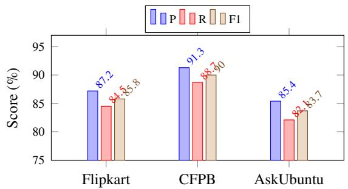

(a) KIE evaluation (P/R/F1).  
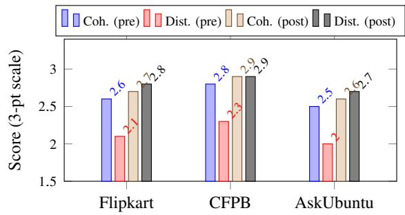  
(b) Concept quality before/after standardization.

Figure 4: Stage-wise evaluation. (a) KIE achieves F1 83.7–90.0; CFPB’s structured language yields the highest scores, AskUbuntu’s technical jargon the lowest. (b) Standardization improves distinctness (+0.7 avg) while maintaining coherence.
<table><tr><td>Dataset</td><td>Silhouette↑</td><td>CH Index↑</td><td>DB Index↓</td></tr><tr><td>Flipkart</td><td>0.32</td><td>1842</td><td>1.45</td></tr><tr><td>CFPB</td><td>0.38</td><td>2534</td><td>1.21</td></tr><tr><td>AskUbuntu</td><td>0.31</td><td>1623</td><td>1.52</td></tr></table>

Table 9: Semantic grouping quality. ↑: higher is better; ↓: lower is better.

BERT model as TaxCE, and all LLM-based methods use the same downstream LLM. Flat methods (LDA, BERTopic, TopClus) produce unstructured topic sets evaluated as leaf-level topics; hierarchical methods (hLDA, LLM Zero-shot, LLM + Clustering) produce multi-level structures evaluated on the full hierarchy. As described in Section 6.1, exhaustivity and granularity for all methods are computed against the shared KIE-extracted reference �.

LDA. We use the Gensim<sup>9</sup> implementation of Latent Dirichlet Allocation with standard preprocessing (tokenization, stopword removal, lemmatization). The number of topics is set to 50, selected via $C _ { \nu }$ coherence score optimization (Röder et al., 2015) over the range {20, 30, 50, 75, 100}. Each topic is represented by its top-10 keywords concatenated as the topic label for EEG metric computation. We use default hyperparameters $( \alpha = 1 / K ,$ $\eta = 1 / K$ where � is the number of topics) with 1000 training iterations.

hLDA. We use the Tomotopy<sup>10</sup> implementation of hierarchical LDA. The tree depth is set to 3 to match TaxCE’s default depth ℎ = 3, enabling direct comparison of hierarchical structure quality. Documents are preprocessed identically to LDA. We use default hyperparameters $( \alpha = 0 . 1 , \eta = 0 . 0 1$ $\gamma = 0 . 1 )$ with 1000 training iterations. Each topic at each level is represented by its top-10 keywords concatenated as the topic label.

BERTopic. We use the oficial BERTopic library<sup>11</sup>. Documents are embedded using the same Sentence-BERT model as TaxCE to isolate the efect of the topic modeling approach from embedding quality. Dimensionality reduction uses UMAP (n\_neighbors=15, n\_components=5, min\_dist=0.0) followed by HDBSCAN clustering (min\_cluster\_size=15). Topic representations are generated using class-based TF-IDF. We retain all discovered topics except the outlier topic (topic −1), which contains documents not assigned to any coherent cluster.

TopClus. We use the oficial implementation<sup>12</sup> of TopClus, which discovers topics via latent space clustering of pretrained language model representations. The number of topics is set to 50 to approximately match the number of leaf topics produced by TaxCE. All other hyperparameters follow the defaults specified in the original paper.

LLM Zero-shot. We prompt the same downstream LLM used in TaxCE’s pipeline stages $( F _ { \mathrm { C G } } , F _ { \mathrm { G T } } , F _ { \mathrm { t a x } } )$ to generate a 3-level taxonomy directly from a random sample of documents. The prompt instructs the LLM to read the provided documents, identify main themes and sub-themes, and organize them into a hierarchy with topic names and definitions. We use temperature 0.3 for neardeterministic generation. Due to context window limitations, the LLM cannot process the entire corpus; we experiment with sample sizes of 500, 1000, and 2000 documents and report the best-performing configuration. This baseline isolates the value of TaxCE’s progressive condensation pipeline over direct LLM prompting.

LLM + Clustering. This baseline combines embedding-based grouping with LLM-based topic naming, representing a simplified version of TaxCE without concept generation $( F _ { \mathrm { C G } } )$ or standardization $( F _ { \mathrm { C S } } )$ . Documents are embedded using the same Sentence-BERT model and grouped using the same HDBSCAN configuration as TaxCE. The downstream LLM is then prompted with a sample of documents from each group to generate a descriptive topic name per group and organize the group topics into a 3-level hierarchy. This baseline isolates the contribution of TaxCE’s concept generation and standardization stages by keeping all other components identical.

Detailed performance analysis. Flat topic models (LDA, BERTopic, TopClus) achieve reasonable exclusivity (76–83) because their clustering mechanisms naturally separate topics, but score poorly on exhaustivity (28–47) and granularity (36–53). These methods identify only the most prominent topics, missing the long tail of specific intents. Their topics are represented as word distributions or cluster centroids rather than actionable definitions, limiting granularity. BERTopic outperforms LDA and TopClus due to its use of transformer embeddings, which capture richer semantic structure.

LLM Zero-shot achieves moderate exhaustivity (48–55) and granularity (53–57) by leveraging the LLM’s world knowledge to generate specific topics, but sufers from low exclusivity (66–70) because topics generated in a single pass without corpusgrounded deduplication frequently overlap. LLM + Clustering improves on this by grounding topic generation in corpus groups, raising exclusivity to 72–76 and exhaustivity to 55–60. However, feeding raw grouped feedback directly to the LLM without intermediate condensation leads to two key issues: (a) redundant information within groups overwhelms the LLM’s context window and dilutes its focus, causing it to either hallucinate topics not grounded in the corpus or miss specific intents buried in repetitive content, and (b) redundancies across groups persist since no corpus-wide deduplication is performed, producing overlapping leaf topics. TaxCE’s concept generation addresses (a) by condensing each group into atomic, non-redundant semantic units that provide the LLM with precisely the information needed for grounded topic generation; concept standardization addresses (b) by eliminating cross-group redundancy; and iterative refinement closes remaining metric gaps that neither clustering nor LLM generation alone can resolve.

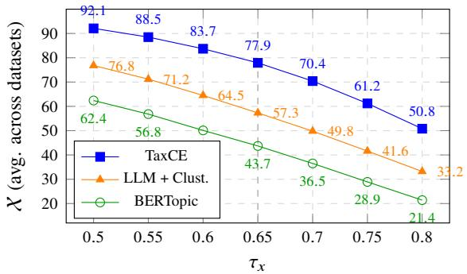

Figure 5: Exhaustivity (X) vs. coverage threshold $\tau _ { x } .$ averaged across all three datasets. Method rankings are preserved across the full range.
<table><tr><td>Domain</td><td>Dataset</td><td> $\theta _ { E }$ </td><td> $\theta _ { X }$ </td><td> $\theta _ { G }$ </td></tr><tr><td>Consumer Elec.</td><td>Flipkart</td><td>83</td><td>75</td><td>74</td></tr><tr><td>Financial Svc.</td><td>CFPB</td><td>84</td><td>77</td><td>76</td></tr><tr><td>Technical Sup.</td><td>AskUbuntu</td><td>83</td><td>75</td><td>74</td></tr><tr><td>General default</td><td></td><td>83</td><td>75</td><td>74</td></tr></table>

Table 10: EEG thresholds per dataset. Values represent minimum acceptable scores (0–100 scale).

## I Exhaustivity threshold sensitivity

We vary the coverage threshold $\tau _ { x }$ across [0.50, 0.80] and report exhaustivity averaged across all three datasets for TaxCE and the two strongest baselines (Figure 5). All embeddings use the same Sentence-BERT model for both segments and leaf topics across all methods.

All methods decline monotonically with increasing $\tau _ { x }$ , as stricter thresholds demand closer segmentto-topic alignment. Method rankings remain consistent across the full range. We selected $\tau _ { x } = 0 . 6 5$ by calibrating against manual coverage judgments on a held-out sample of 200 segments per dataset, where this value best separated genuine topical matches from spurious lexical overlap.

## J EEG threshold guidelines

The quality thresholds $\theta _ { E } , \theta _ { X } , \theta _ { G }$ depend on the domain characteristics, input structure, and intended downstream use of the taxonomy. Table 10 reports empirically determined EEG thresholds for each dataset, selected as the values that yield taxonomies rated highest on navigability and actionability by domain experts while remaining achievable within 1–3 refinement iterations (Appendix F).

CFPB supports the highest thresholds due to its structured complaint language with well-delineated product categories. The general defaults $( \theta _ { E } = 8 3 $ $\theta _ { X } = 7 5 , \theta _ { G } = 7 4 )$ serve as a practical starting point; practitioners should increase $\theta _ { E }$ when the taxonomy feeds a classifier and increase $\theta _ { X }$ for coverage-critical applications. For input types not evaluated here (e.g., chat transcripts, survey responses), we expect conversational inputs to require thresholds 2–3 points lower than structured inputs within the same domain due to increased ambiguity and topic overlap. Setting any threshold above 85 is generally impractical due to inherent semantic overlap in natural language; see Appendix L for a full stress-test quantifying graceful degradation and empirical ceilings.

## K Embedding sensitivity

Because EEG relies on cosine similarity in embedding space, absolute scores depend on the embedding backbone. We re-ran the full evaluation on Flipkart under six embedding backbones spanning open-source Sentence-BERT variants, contrastive/retrieval models, and commercial APIs. Per-embedding coverage thresholds $\tau _ { x }$ were recalibrated following Appendix I to control for scale diferences across embedding spaces: S-BERT (Reimers and Gurevych, 2019) 0.65, MP-Net (Song et al., 2020) 0.68, E5-large (Wang et al., 2024) 0.62, BGE-large (Xiao et al., 2024) 0.63, OpenAI-3-large (OpenAI, 2024) 0.58, OpenAI-3- small 0.61.

<table><tr><td>Embedding</td><td>8</td><td>X</td><td>G</td></tr><tr><td>S-BERT (paper anchor)</td><td>85.7</td><td>78.3</td><td>76.1</td></tr><tr><td>MPNet-base-v2</td><td>83.2</td><td>75.8</td><td>73.4</td></tr><tr><td>E5-large-v2</td><td>87.4</td><td>79.6</td><td>77.8</td></tr><tr><td>BGE-large-en-v1.5</td><td>86.9</td><td>80.2</td><td>78.5</td></tr><tr><td>OpenAI-3-large</td><td>88.1</td><td>81.5</td><td>79.3</td></tr><tr><td>OpenAI-3-small</td><td>86.3</td><td>78.9</td><td>76.7</td></tr></table>

Table 11: TaxCE EEG scores on Flipkart across six embedding backbones with recalibrated � . S-BERT is the deployment default used elsewhere in the paper and by all baselines (Appendix H); the other five backbones are evaluated here to quantify sensitivity.

Three findings hold across all six backbones: (a) the method ranking TaxCE > LLM+Clustering > BERTopic is preserved; (b) cross-embedding Pearson correlation of EEG scores is 0.89–0.97 for every pair, indicating that EEG measures a stable underlying property rather than an embedding-specific artefact; and (c) domain-tuned embeddings shift absolute scores but not rankings. For example, FinBERT (Araci, 2019) on CFPB pushes TaxCE to $8 9 . 4 / 8 2 . 8 / 8 0 . 6 , \mathrm { ~ a ~ } + 2 . 3$ average gain over the general-purpose baseline. Refinement convergence also remains within the 1–3 iteration range for all six backbones on AskUbuntu, the most technically dense corpus. Absolute EEG scores are therefore recalibrateable via $\tau _ { x }$ , while rankings and convergence behaviour are robust to embedding choice.

## L Threshold stress-test

To quantify robustness of the refinement loop under aggressive thresholds, we shifted the defaults $( \theta _ { E } , \theta _ { X } , \theta _ { G } ) = ( 8 3 , 7 5 , 7 4 )$ upward by +2, +3, +5, and +7 points simultaneously and capped iterations at 5.

<table><tr><td>Shift</td><td>Conv. rate</td><td>Avg. iter.</td><td>Fallback</td></tr><tr><td>default</td><td>≥ 95%</td><td>1.3</td><td>&lt; 5%</td></tr><tr><td>+2</td><td>78%</td><td>2.4</td><td>22%</td></tr><tr><td>+3</td><td>42%</td><td>3.8</td><td>58%</td></tr><tr><td>+5</td><td>8%</td><td>4.9</td><td>92%</td></tr><tr><td>+7</td><td>0%</td><td>5.0</td><td>100%</td></tr></table>

Table 12: Refinement behaviour under threshold shifts. Conv. rate: fraction of runs meeting all three shifted thresholds within 5 iterations. Fallback: fraction returning the best-so-far taxonomy rather than a converged one.

Three empirical facts emerge. (a) Hard ceilings exist at $\mathcal { E } ~ \approx ~ 8 7 \mathrm { - } 8 8 , ~ \mathcal { X } ~ \approx ~ 8 2 \mathrm { - } 8 3 , ~ \mathcal { G } ~ \approx ~ 7 9 \mathrm { - } 8 0$ across all three datasets, reflecting genuine semantic overlap in natural language and validating the 85- ceiling claim in Appendix J. (b) When a target is unreachable, the best-so-far taxonomy is within 2– 4% of default-threshold quality on all three metrics, so degradation is graceful rather than catastrophic. (c) The $\mathcal { E }  \mathcal { G }  \mathcal { X }$ priority order is empirically justified: pursuing E aggressively (re-grouping with smaller � to hit a raised $\theta _ { E } )$ reduces coverage: X drops from 78.3 to 71.8 on Flipkart across three extra iterations, which is why the loop diagnoses and prioritises before acting rather than optimising each metric independently.

## M EEG–human rubric correlation

To assess whether EEG tracks human perception of taxonomy quality, we compute Pearson and Spearman correlations between the three EEG metrics (E, X, G) and the three human rubrics (Quality, Actionability, Navigability) used in the human evaluation (Section 6.4), across the three evaluated methods (BERTopic, LLM+Clustering, TaxCE).

E correlates strongly with all three rubrics, with the strongest tie to Navigability (Pearson � ≈ 0.72) and Quality (� ≈ 0.78), consistent with distinct sibling topics being easier to navigate and perceived as more coherent. X and G correlate moderatelyto-strongly with Actionability (� ≈ 0.65–0.71), with TaxCE consistently at the top of the range. Spearman correlations track Pearson values within 0.02–0.05 across all nine (metric, rubric) cells. In each cell, TaxCE’s per-method correlations are 0.10–0.25 points higher than baselines’, indicating that EEG tracks perceived quality more faithfully as taxonomy quality itself improves. Human rubrics were held out during refinement, so this alignment is not an artefact of metric-driven optimisation.

We position EEG as an intrinsic, corpusgrounded proxy that is predictive of, but does not replace, human judgement.

## N Cost and runtime

We measured end-to-end cost on a 1M-document corpus using a single mid-range cloud GPU instance (24 GB, A10G-class) for the locally-hosted KIE tier and a commercial API for downstream stages. Total wall-clock time was under 10 hours, of which KIE accounted for approximately 80%; refinement averaged 2 iterations. KIE contributes no API cost. Of total API spend, concept generation and standardisation account for approximately 63% and hierarchy construction plus validation approximately 29%. Per-document cost decreases by roughly 25–30% as corpus size scales from 100K to 10M documents, since downstream costs are largely fixed with respect to corpus size. Substituting alternative frontier APIs changes total cost by −3% to +37% with under one EEG point of variation. The two-tier design is deliberate: locally-hosted 3– 4B models absorb the high-volume document-level stage, while the stronger commercial API is invoked only approximately 140 times per taxonomy regardless of corpus size.

## O Prompt templates

This section presents the generalized prompt templates used in each stage of the TaxCE pipeline. All templates use placeholders ({...}) instantiated per dataset and use case.

## O.1 Key information extraction (�<sub>extract</sub>)

```html
�<sub>extract</sub>: Key Information Extraction
You are an expert at extracting actionable insights from
{feedback_type} feedback related to {domain_description}.
Task: Read the feedback below and extract all explicitly
stated actionable insights. Do not infer, guess, or
extrapolate beyond what is directly stated. If the feedback
is in a non-English language, translate the extracted
segments and intents into {target_language}.
Rules:
1. Ignore empty, non-informative, or placeholder content.
2. Each insight must be directly stated by the user.
3. If no actionable insights exist, return only:
<output></output>
4. Extract the following fields for each insight:
{field_definitions}
Output format:
<output>
<insight>
<segment>exact verbatim text (translated if
non-English)</segment>
<intent>semantic label summarizing the segment</intent>
{additional_fields}
</insight>
</output>
Do not output anything outside the <output> block.
<feedback>{feedback_text}</feedback>
```

Placeholders: {feedback\_type}: input type (e.g., review, transcript, survey); {domain\_description}: domain context; {target\_language}: taxonomy language (default: English); {field\_definitions}: use-case fields (e.g., category, aspect, root cause, polarity); {additional\_fields}: optional XML fields; {feedback\_text}: raw input document.

## O.2 Concept generation (�<sub>CG</sub>)

� : Concept Generation   
You are an expert feedback analyst. Given a group   
of semantically related feedback segments, identify all   
distinct, non-overlapping, and granular concepts discussed   
within the group.   
Instructions:   
- Extract concepts that are as specific and granular as   
possible.   
- Ensure concepts are mutually exclusive within this group.   
- For each concept, select up to {k} representative segments   
that are diverse and collectively describe the concept’s full   
scope.   
- Only include concepts supported by at least {k} segments.   
- Do not infer concepts not present in the input.   
- Do not merge distinct concepts even if they are related.   
Output format:   
<output>   
<concept>   
<name>specific concept name</name>   
<representative\_segments>   
<segment>verbatim segment 1</segment>   
<segment>verbatim segment 2</segment>   
</representative\_segments>   
</concept>   
</output>   
Output only the <output> block.   
<group\_segments>{segment\_list}</group\_segments>

Placeholders: {k}: minimum segment support and maximum representative segments per concept; {segment\_list}: feedback segments from one semantic group.

## O.3 Concept standardization (�<sub>CS</sub>)

� : Concept Standardization   
You are an expert at deduplicating and standardizing feedback   
concepts. Given a batch of concepts (each with representative   
segments), identify semantically equivalent concepts and   
merge them into canonical forms.   
Instructions:   
- Two concepts are equivalent if they describe the same   
underlying issue, even with different phrasing.   
- Merge equivalent concepts into a single canonical concept   
with a standardized name.   
- Consolidate representative segments from merged concepts,   
removing semantic duplicates while preserving diversity.   
- Do not merge concepts that are related but distinct.   
- Preserve the specificity and granularity of each concept.   
Output format:   
<output>   
<standardized\_concept>   
<name>canonical concept name</name>   
<merged\_from>   
<original>original concept name 1</original>   
</merged\_from>   
<representative\_segments>   
<segment>segment 1</segment>   
</representative\_segments>   
</standardized\_concept>   
</output>   
Output only the <output> block.   
<concept\_batch>{concept\_batch}</concept\_batch>

Placeholders: {concept\_batch}: batch of semantically related concepts with representative segments (JSON or XML).

## O.4 Granular topic and definition generation (�<sub>GT</sub>)

�<sub>GT</sub>: Granular Topic & Definition Generation   
You are an expert feedback analyst. Given standardized   
concepts with representative segments, generate granular   
topics grouped under latent parent topics.   
Instructions:   
- Merge overlapping concepts into exclusive, non-overlapping   
granular topics.   
- Group related granular topics under latent parent topics   
(abstract, neutral names). These parent topics are used only   
for lightweight clustering and are not included in the final   
taxonomy.   
- Each parent topic must contain at least {min\_children}   
granular topics.   
- For each granular topic, provide:   
- A specific, polarity-labeled name (max {max\_words} words)   
- Polarity: positive or negative   
- Definition: 2-3 sentence description of the topic scope   
- Examples: at least {min\_examples} diverse representative   
segments, unique to this topic (no overlap with sibling   
topics)   
- Generate a catch-all topic per parent for generic feedback   
lacking specificity, with a descriptive name (do not use   
"catch all").   
- All names: lowercase, space-separated, alphanumeric only.   
- Do not infer topics not supported by the input.   
Output format:   
<topics>   
<parent\_topic>   
<name>latent parent topic name</name>   
<granular\_topics>   
<granular\_topic>   
<name>granular topic name</name>   
<polarity>positive/negative</polarity>   
<definition>2-3 sentence definition</definition>   
<examples>example1; example2; ...</examples>   
</granular\_topic>   
</granular\_topics>   
</parent\_topic>   
</topics>   
Output only the <topics> block.

<standardized\_concepts>{concept\_dict}</standardized\_concepts>

Placeholders: {max\_words}: max words per topic name; {min\_children}: min granular topics per parent; {min\_examples}: min examples per topic; {concept\_dict}: standardized concepts with representative segments.

## O.5 Hierarchical taxonomy construction $( F _ { \mathbf { t a x } } )$

```xml
� : Hierarchical Taxonomy Construction
You are an expert at organizing topics into hierarchical
taxonomies. Given a set of hinge topics (L2) and their
granular topics (L3), construct the top level (L1) by grouping
semantically related hinge topics under abstract coarse
category names.
Instructions:
- Each L1 category must group at least {min_l2} hinge topics
sharing a common theme.
- L1 names must be abstract, neutral, and holistic.
- Preserve the existing L2-L3 structure unchanged.
- Ensure L1 categories are mutually exclusive and collectively
exhaustive of all hinge topics.
- All names: lowercase, space-separated, alphanumeric only.
- Do not create, modify, or remove any L2 or L3 topics.
Output format:
<taxonomy>
<l1_category>
<name>coarse category name</name>
<l2_topics>
<l2_topic>existing hinge topic name</l2_topic>
</l2_topics>
</l1_category>
</taxonomy>
Output only the <taxonomy> block.
<hinge_topics>{hinge_topic_list}</hinge_topics>
```

Placeholders: {min\_l2}: min hinge topics per L1 category; {hinge\_topic\_list}: all L2 hinge topic names from �<sub>GT</sub>. For $h > 3 , F _ { \mathrm { t a x } }$ is applied recursively at each level.

## O.6 Root-to-leaf validation (�<sub>val</sub>)

� : Root-to-Leaf Validation   
You are an expert at evaluating hierarchical taxonomy quality.   
Given a list of root-to-leaf paths from a taxonomy and a   
sample of corpus feedback, validate each path.   
For each path (L1 -> L2 -> L3), verify:   
1. Logical coherence: the progression from coarse to   
hinge to granular represents a semantically meaningful   
specialization.   
2. Corpus support: at least one feedback segment in the   
provided corpus sample supports the topic combination along   
this path.   
Output format:   
<validation>   
<path>   
<l1>coarse topic</l1>   
<l2>hinge topic</l2>   
<l3>granular topic</l3>   
<coherent>yes/no</coherent>   
<supported>yes/no</supported>   
<reason>brief explanation if no</reason>   
</path>   
</validation>   
Output only the <validation> block.   
<paths>{path\_list}</paths>   
<corpus\_sample>{corpus\_sample}</corpus\_sample>

## Placeholders: {path\_list}: all root-to-leaf paths from the constructed taxonomy; {corpus\_sample}:

representative feedback texts from � for grounding verification.

## P Phase-wise examples

This section illustrates each stage of the TaxCE pipeline with concrete examples from the Flipkart dataset, emphasizing non-obvious cases that highlight the framework’s contributions. All verbatims are drawn from actual corpus content.

Granularity vs. exhaustivity illustration. To clarify the distinction between exhaustivity and granularity: given concepts “fast battery drain”, “broken noise cancellation”, and “loose charging connection”, a single leaf topic “Battery & Power Systems” yields high exhaustivity (all three segments are loosely covered) but low granularity (the topic is too broad to closely match any individual segment). In contrast, three matching specific topics yield both high exhaustivity and high granularity, as each segment maps tightly to its corresponding leaf.

## P.1 Key Information Extraction $( F _ { \mathbf { e x t r a c t } } )$

KIE extracts atomic actionable segments and assigns intent labels jointly, enriching each segment with document-level context. We illustrate with two examples: a standard case and a case where intent enrichment resolves segment-level ambiguity.

Example 1: Multi-polarity Document   
“I bought this tabletfor my daughter. The screen is very bright and clear, but   
the battery dies within 3 hours ofuse. Also, the charging cable that came   
with it stopped working after a week.”   
Extracted Intent-Tuples   
Segment (�) Intent (I)   
“The screen is very bright and clear” Positive display quality   
“the battery dies within 3 hours of use” Fast battery drain   
“the charging cable stopped working after a Defective charging cable   
week”

A single document yields three intent-tuples spanning diferent L1 categories (display, battery, accessories) and polarities (positive, negative, negative), demonstrating TaxCE’s ability to decompose multitopic documents into atomic units.

Example 2: Ambiguous Segment Requiring Intent   
Enrichment   
“This Smart doorbell is great but it keeps going ofline everyfew hours. I   
called support and they told me to move my router closer, but that didn’t   
help at all. At least the night vision is crystal clear.”

<table><tr><td></td><td>Grp Sample Segments (s)</td><td>Sample Intents (I)</td></tr><tr><td> $C _ { 1 4 }$ </td><td>“battery dies within 3 hours of use&quot; “battery life is insane, lasts forever&quot; “battery % jumps from 40 to dead” “batteries died after only 3 months&quot;</td><td>Fast battery drain Excellent battery duration Unreliable battery indicator Early battery failure</td></tr><tr><td> $C _ { 2 7 }$ </td><td>&quot;will not charge and is completely dead&quot; &quot;charges super fast with USB&quot; &quot;charging for 14 hours only 65%&quot; &quot;charging port melted the plastic&quot;</td><td>Total charging failure Rapid charging performance Extremely slow charging rate Dangerous port melting</td></tr><tr><td> $C _ { 4 1 }$ </td><td>&quot;cameras are offline more than online&quot; “WiFi signal does not reach area&quot; &quot;connected right away without issues&quot;</td><td>Frequent camera disconnec- tions Insufficient WiFi signal range Easy WiFi connection</td></tr></table>

Table 13: Semantic grouping of intent-tuples. Groups are semantic neighborhoods containing multiple latent concepts that concept generation (Section P.3) will subsequently separate.

<table><tr><td colspan="2">Extracted Intent-Tuples</td></tr><tr><td>Segment (s)</td><td>Intent (I)</td></tr><tr><td>“it keeps going offline every few hours&quot;</td><td>Frequent camera disconnec- tions from WiFi</td></tr><tr><td>&quot;they told me to move my router closer, but Ineffective troubleshooting that didn&#x27;t help&quot;</td><td>by support</td></tr><tr><td>&quot;the night vision is crystal clear&quot;</td><td>Excellent nighttime video clarity</td></tr></table>

The segment “they told me to move my router closer, but that didn’t help” is ambiguous in isolation: it could describe a router range issue or a support quality issue. The intent label Inefective troubleshooting by support disambiguates by incorporating document context (the user sought help and received unhelpful advice), directing this tuple toward customer support topics rather than WiFi range topics during grouping.

## P.2 Semantic Grouping

Intent-tuples from across the corpus are embedded and grouped into � semantically coherent clusters. The grouping creates semantic neighborhoods, not final topics. Table 13 illustrates three groups formed from battery, power, and connectivity-related tuples.

A few things are worth noting about these groupings. Group $C _ { 1 4 }$ ends up mixing positive and negative tuples: “battery life is insane” sits alongside “battery dies within 3 hours” because both are fundamentally about battery life, even though one is praise and the other a complaint. Polarity-based separation is not the clustering algorithm’s job; that falls to concept generation in the next stage. A more useful pattern emerges across groups: “battery dies within 3 hours” $( C _ { 1 4 } )$ and “will not charge and is completely dead” $( C _ { 2 7 } )$ are both power failures, but HDBSCAN places them in diferent clusters because $C _ { 1 4 }$ is organized around discharge behavior

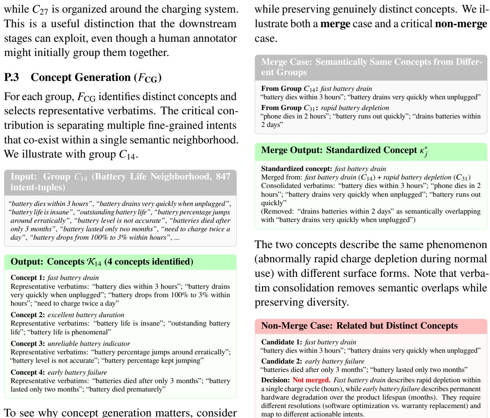

To see why concept generation matters, consider the alternative: passing all 847 tuples from this group straight to the LLM. In our early experiments, this reliably produced one or two broad topics along the lines of “battery issues” or “battery life problems.” The LLM simply could not attend to the finer distinctions buried across hundreds of repetitive complaints. With concept generation, we get four distinct outputs. The most important split is between fast battery drain and early battery failure. Both involve batteries that “die,” and customers often use similar language for both, but they point to very diferent problems. The first is about a battery that drains too quickly on a given day; the second is about a battery that stops holding charge altogether after a few months. They need diferent teams to investigate and diferent resolutions, so conflating them would undermine the taxonomy’s usefulness.

## P.4 Concept Standardization (�<sub>CS</sub>)

Since grouping is inherently imperfect, semantically same concepts may emerge independently in diferent groups. Standardization merges these

Getting this non-merge decision right matters a lot in practice. If standardization is too aggressive here, both concepts collapse into something like “battery problems,” and the distinction between a user who needs to tweak their power settings and one who should file a warranty claim is lost entirely. That is exactly the kind of granularity a taxonomy needs to preserve to be useful downstream. The moderate setting we describe in Section 4.3 is designed to catch genuine duplicates (like the “fast battery drain” / “rapid battery depletion” pair above) while leaving cases like this one alone, where the surface-level similarity masks a real diference in what went wrong.

## P.5 Granular Topic and Definition Generation (�<sub>GT</sub>)

�<sub>GT</sub> transforms standardized concepts into leaf topics with natural language definitions, polarity labels, and illustrative examples. Concepts that are directly suitable become individual topics; closely overlapping concepts merge. A catch-all topic is

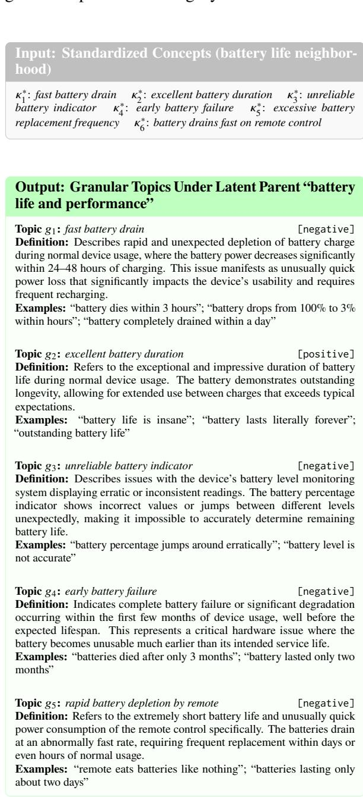

Several decisions warrant explanation. First, concepts $\boldsymbol { \kappa } _ { 1 } ^ { * }$ (fast battery drain) and $\boldsymbol { \kappa } _ { 6 } ^ { * }$ (battery drains fast on remote control) are not merged despite surface similarity: $\boldsymbol { \kappa } _ { 1 } ^ { * }$ describes tablet/camera battery issues while $\boldsymbol { \kappa } _ { 6 } ^ { * }$ is remote-specific, requiring diferent product teams to action. Second, $\kappa _ { 5 } ^ { * }$ (excessive battery replacement frequency) is merged into $g _ { 4 }$ (early battery failure) because the replacement frequency is a consequence of premature failure rather than a distinct actionable topic. Third, definitions are written to be usable by downstream classifiers: they specify scope boundaries (“within 24–48 hours” for drain vs. “within the first few months” for failure) that help distinguish ambiguous feedback.

## P.6 Hierarchical Taxonomy Construction $( F _ { \mathbf { t a x } } )$

The granular topics $\mathcal { G }$ form the leaf level $L _ { 3 }$ $F _ { \mathrm { t a x } }$ constructs the hierarchy bottom-up: first grouping $L _ { 3 }$ topics into $L _ { 2 }$ hinge topics, then grouping $L _ { 2 }$ topics into $L _ { 1 }$ coarse categories. We trace this process for a subset of the “battery and power systems” branch.

$$
F _ { \mathrm { t a x } }
$$

$$
L _ { 3 }
$$

$$
g _ { 3 } \colon
$$

$$
L _ { 2 } { \ : } :
$$

$$
L _ { 2 } { : }
$$

$$
L _ { 3 }
$$

$$
L _ { 2 } { \ : } :
$$

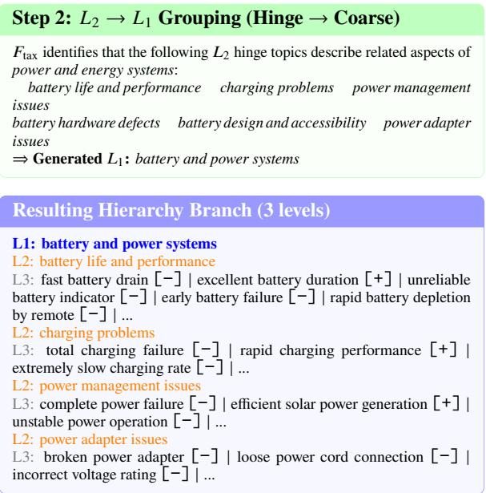  
The bottom-up construction ensures every leaf is corpus-grounded (traceable through K<sup>∗</sup> to segments in $D )$ , while the generated $L _ { 2 }$ and $L _ { 1 }$ topics provide navigable abstractions. Root-to-leaf validation $( F _ { \mathrm { v a l } }$ , Section 4.5) then verifies each path; for instance, the path battery and power systems → charging problems → rapid charging performance is validated as logically coherent (a positive charging speed observation correctly belongs under charging functionality within the power domain) and corpus-supported.