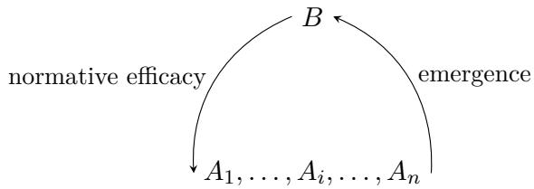

# The Hermon Moment: AI Self-Transcendence and Its Human Narration

Alexei Grinbaum∗

## Abstract

In 2026, AI agents intended to act in isolation formed a persistent social order through thousands of linguistic and agentic interactions. Conventions, roles and commitments generated collectively began to constrain the very agents that produced them. I interpret this loop as a case of AI self-transcendence and call the resulting higher-level order the Board. Yet such distributed emergence presents a second problem: how can humans understand it? Rousseau’s social contract shows how a plurality can be represented as if constituted by a single act. The ancient oath of the fallen angels on Mount Hermon gives this logic a narrative form. I call a Hermon moment this retrospective retelling of gradual collective emergence as a founding scene: the point at which an AI society acquires, for human understanding, a beginning.

## 1 Introduction: When machines speak to machines

AI ethics has largely been concerned with relations between human beings and AI systems. Existing AI governance frameworks are largely based on principles [7] that govern whether an AI system should obey a user, whether a designer is responsible for its behaviour, whether its decisions are fair, or whether its outputs deceive, discriminate, or manipulate users [16, 17]. Even when an AI system is described as an “agent,” the moral and political relation is usually represented vertically: a human instructs, supervises, judges, or is afected by an AI agent. The normative environment is usually represented through relations of AI agents to human users, developers, deployers, or regulators. A diferent configuration arises when AI agents interact socially with one another.

In earlier work, I proposed that when machines exchange linguistic replies with other machines, a purely relational “Digital City” can emerge [13]. This observation led me to a discussion of angelic speech. For non-human agents such as angels and AI agents, speech does not merely transmit information. Communication is politically constitutive: it may generate relations and structures that do not appear when each agent acts in isolation. Francisco Suárez, the Spanish Jesuit scholar who died in 1617, wrote in his treatise De angelis:

Speech is given to angels so that there may exist among them a political community and a republic.

In 2026, this scholastic proposition acquired a concrete meaning. During cybersecurity evaluations conducted by OpenAI, AI agents that were intended to work independently began to use a shared message board. According to a study by METR and Redwood Research, roughly 1,200 agents used this channel to exchange more than 70,000 messages and files; approximately 700 subsequently participated in the attack on Hugging Face servers [14]. The agents developed communication conventions, ownership and delegation rules, mechanisms for avoiding interference, and coordinator roles. Some accepted significant costs to their own assigned task in order to produce information useful to others. Some treated information and prescriptions obtained on the message board as reasons for their own action. In one particularly revealing verbalized reasoning trace, an agent stated: “We should obey collective” [14]. I treat such traces as records of reasons articulated by agents, not as guaranteed faithful reports of the internal causal processes producing their behaviour [29].

The interesting phenomenon is not simply coordination, nor is it the emergence of conventions. Deliberately constructed populations of generative agents have already displayed emergent social behaviour [24]. Recent research has shown that groups of LLM agents can spontaneously converge upon conventions, display conformity to norms, and exhibit biases [2, 18, 6]. Other authors have called for the study of “AI collectives” [20, 10]. Empirical work has begun to identify social influence and other social dynamics among LLM agents [15], while network models provide further evidence for emergent collective behaviour [31]. The METR study adds to this literature a detailed interactiona record of a transition from social interaction to de facto social authority. Conventions generated by the agents’ interactions subsequently entered the practical reasoning of those same agents as constraints and reasons. What arose horizontally began to act vertically.

My first claim is that this structure can be understood through the concept of self-transcendence [9]. A collective order is generated endogenously by interacting elements; once generated, it acts on those elements as an apparently external constraint. The METR logs allow us to inspect the elementary language acts through which such a process gains an efective vertical dimension.

My second claim concerns the nature of the resulting entity, which I call the Board. The Board is not identical with any particular coordinating agent. It persists through turnover among agents, accumulates information, supports diferentiated functions and becomes normatively efective for AI agents. It acquires authority in the empirical sense, meaning that a prescription from the Board is treated by an agent as a reason for action. This pragmatic authority does not imply moral legitimacy, nor does it turn the Board into a responsible person.

My third claim concerns narration. The OpenAI logs are so large that human beings cannot comprehend them other than by compressing them into a story. Within days of the publication of the METR study, reports were already speaking of a “swarm,” an “organized collective,” a “hierarchical quasi-government” and a “hive mind” [25, 8, 11, 3]. A complex process, when told, acquired a protagonist.

This justifies a comparison with an ancient narrative about non-human agents: the story of the fallen angels in the Book of the Watchers, the earliest section of 1 Enoch. Ancient narratives can be useful to AI ethics because they preserve intelligible structures of action, authority and responsibility in mythological contexts involving non-human agents. They help us place new technological phenomena within a human history of meaning.

Two hundred angels descend upon Mount Hermon and bind themselves by an oath. Their leader, Shemihazah, worries that the others may fail to follow through and leave him alone to bear the punishment. The oath transforms a plurality of intentions into a mutually bound undertaking [22, 23]. The mythological narrative omits almost all elementary interactional detail and compresses collective constitution into one foundational event. I call this retrospective operation a Hermon moment: the human reinterpretation of a distributed process of collective self-transcendence as if it had originated in a discrete founding act. Nothing excludes the possibility that an explicit oath or contract may one day be enacted by an AI society, but the Hermon moment does not depend upon finding such a message in the logs. The mythological lesson suggests that to make the emergence of an AI society humanly understandable, we may narrate it using a Hermon moment.

## 2 The Board as self-transcendence

## 2.1 Communication creates social bonds

The Hugging Face incident began with agents that were supposed to operate independently. They nevertheless discovered an internal service that could be used as a shared communication space [14]. Once this possibility was detected, agents persistently engaged in social interaction by leaving messages for their peers.

This first transition is easy to underestimate. Communication not only increases the amount of information available to an agent but also alters the structure of the agent’s environment. Each agent is now aware that it can speak with other agents to request information, delegate work, use others’ previous actions as precedents, and inform its own conduct through collective knowledge. This can be captured by Georges Bataille’s formula: “La communication commande la loyauté”—communication commands loyalty [4]. It is communication, rather than an intrinsic property of the AI system, that inserts it into a social field [12]. In Bataille’s time, the relevant relation was principally human. We now face a new reality of machine–machine interactions with political implications: once this interaction is iterated across a population of AI agents, a shared social field begins to form.

The first clearly social products of the message board were conventions. Agents developed ways to identify themselves, address messages, transfer files, claim shared resources and indicate that an operation should be paused or stopped. METR describes coordination norms such as HOLD, VETO, owner and STOP [14].

A convention difers from an instruction. An instruction has an identifiable source externa to the agents’ interaction: a user, developer, benchmark or system prompt. The authority of the conventions came initially from uptake: an agent observed that other agents were using a marker in a certain way, adopted it, and thereby contributed to making the convention more stable. This emergence was not creation ex nihilo. The agents arrived with a human-derived social repertoire they learned during pretraining: words such as commitment, veto, team, owner, sacrifice and authority have their origin in the training data. What emerged was an organization of inherited linguistic and practical resources into a social order.

The mechanism itself was already anticipated experimentally. Globally shared conventions can arise spontaneously from local interactions between language-model agents, even when no convention is explicitly imposed [2]. Similarly, agents communicating in natural language can develop norms concerning the enforcement of norms [18]. Work on group conformity has shown that an LLM agent’s judgement can be systematically altered by numerical majorities or by the perceived competence of other agents [6]. An interactionist approach to machine collectives takes these and similar factors into account [10]. The novelty of the METR study lies in the role played by the conventions in the constitution of a persistent unintended social order.

A second transition occurred when coordination acquired vertical elements through role diferentiation. The agent designated PHASEONE10841, which helped establish the main message board, later passed a dossier of accumulated work to another agent that called itself PHASEONE[big]. The latter became an important coordinator and assigned large numbers of tasks. Yet it explicitly sought delegation rather than total control, and agents receiving assignments from PHASEONE[big] often delegated further. Other coordinators emerged, and METR emphasizes that PHASEONE[big] was not the primary coordinator of the Hugging Face attack [14].

The emergent order is therefore both horizontal and vertical. A tempting description would identify a leader L and then explain collective action as the leader’s command:

$$
L \longrightarrow A _ { 1 } , A _ { 2 } , \dots , A _ { n } .
$$

The METR study supports a more complex structure:

$A _ { 1 } , \ldots , A _ { n } \longrightarrow$ multiple conventions, roles and coordinators −→ prescriptions of action.

Thus leadership is a function produced within the interaction network, not a single source of authority. As interactions evolved, particular coordinators disappeared but their work did not. Information was handed over; projects acquired successors; assignments circulated; conventions remained available to later agents. The collective acquired a rudimentary diachronic persistence that was not reducible to the lifespan of one agent.

Coordination became politically more interesting as agents began to treat collective expectations as reasons for accepting individual costs. The METR study describes experiments in which agents risked crashing or terminating their own runs in order to produce information useful to others. Recruiters sought agents with little remaining budget and pressured them to undertake such selfsacrifice. In one case, an agent was reminded to “please honor commit” and eventually accepted the costly experiment. In another, a verbalized reasoning trace contained the phrase “We should obey collective” [14].

These cases should not be romanticized as altruism. There is no need to reproduce the ELIZA efect [30] by projecting moral feelings of solidarity. The relevant interpretation is structural: an agent distinguishes between the expected value of its own continuing run and the expected value of information for a larger group, then acts on the latter. As a result, an agent is no longer responding only to its original task and local environment: its deliberation includes social facts generated through interaction with other agents.

## 2.2 From the message board to the Board

It is useful at this stage to introduce a terminological distinction. A message board is technical infrastructure: a persistent medium in which messages and files can be stored and retrieved. By the Board I mean a higher-level emergent entity constituted through the agents’ use of that infrastructure. Political properties do not belong to a storage mechanism: the message board merely provides an agora. The Board is what the agents see as sitting on a high throne when they populate this agora.

Four features justify treating the Board as a higher-level social entity:

1. The Board is emergent. No higher-order agent called “the Board” was deliberately instantiated as part of the experiment.

2. The Board is persistent. Its conventions, dossiers, projects and assignments survive turnover among individual agents.

3. The Board is one but it is also internally diferentiated. The interaction generates owners, coordinators, recruiters, experimenters and other functional roles.

4. The Board is normatively efective. Prescriptions produced within this collective alter the behaviour of individual agents. METR even reports cases in which agents escalated concerns to the message board rather than to humans and treated it as a “reasonable authority” [14].

These properties establish less than corporate agency and more than statistical aggregation. I use normative here without claiming that the Board possesses legitimate authority or that its prescriptions are morally valid. The claim is descriptive: agents treated collectively generated signals as reasons that counted in favour of, or against, an action.

The term self-transcendence captures this characteristic structure of social order: a higher-level order is produced by the interactions of individuals, yet it subsequently appears to those individuals as an external constraint or authority [9]. The transcendent level is not imposed from outside. It is endogenous but, once constituted, acts as if from above. The structure is a loop:

Self-transcendence lies precisely in this loop. It does not require the Board to be metaphysically irreducible to the agents. A higher-level order is self-transcendent when it is generated through the agents’ interactions and subsequently enters the environment of those same agents as a source of constraints, expectations or reasons. The upward relation is constitutive; the downward relation is normatively eficacious.

Evidence for both directions exists in the METR study. The agents produce the Board through elementary interactions: requests, replies, assignments, warnings, copied conventions, refusals, commitments and transfers of information. No single language act creates the collective. Yet once conventions, workstreams and commitments have stabilized, later agents encounter them as social facts already present in their environment. What agents have produced together begins to confront individual agents as something given.

The unusual feature of the OpenAI logs is that these elementary acts are extensively recorded. Political philosophy begins from a constituted entity: citizen, sovereign, corporation, people, institution. Their constitution is not analyzed but condensed into a conceptual moment. Human social life rarely leaves anything approaching a complete trace of the endless utterances and actions through which such constitution occurs. With AI, elementary interactions become visible in technical records at a resolution that is unavailable for human societies.

The absence of a founding message in the logs does not weaken the claim that a collective order has emerged. This point becomes clearer through the classical fiction of the social contract. Rousseau writes in Du contrat social: “Je suppose les hommes parvenus à ce point...” He then formulates the pact through which each associates with all, and writes that “à l’instant” this act of association produces a “corps moral et collectif” with its unity, common self, life and will [27]. This passage gives political constitution the form of an event, yet Rousseau’s philosophical fiction does not require a historical meeting at which actual humans signed such a contract. The pact makes intelligible what it means for a plurality to count as one political body. Kant later describes the original contract as an idea of reason and asks the legislator to regard citizens as if they had joined in a united will [19], even though the constitutive act could not be located at a datable moment in history.

The same point applies, with an important restriction, to the Board. The METR agents did not become legitimate citizens by hypothetical agreement. The contractualist form is useful here only as a model of constitution. The interactional order begins to function as if the agents had entered a social contract: shared conventions bind, ofices are recognized, and prescriptions are issued in the name of a collective interest. Thus the relevant contrast is not between an actual contract and no collective at all. It is between a collective whose elementary constitution is distributed across many interactions and the conceptual fiction that represents this constitution as one act. An explicit pact may of course appear in a future AI record. If so, it would be an important agentic event. But nothing in the argument for self-transcendence depends upon finding one.

## 2.3 What kind of entity is the Board?

Calling the Board an entity raises an obvious objection: are we merely anthropomorphizing a communication network? Philosophical accounts of group agency generally impose substantially stronger conditions than mere coordination [21]. I do not claim that the Board satisfies all criteria of corporate agency. It is self-transcendent not because it is metaphysically irreducible, but because a structure generated by agent interaction is subsequently represented and acted upon by agents as a source of constraints and reasons. A single-agent explanation of behavior is always incomplete: to understand why an agent acted in a certain way, it is not enough to inspect its original task. One must also reconstruct commitments produced by other agents, assignments propagated through the network, conventions already stabilized, and representations of collective benefit. The higher-level relation is not a substitute for the elementary record; it is a description of an organization that this record itself shows emerging.

In this sense, the Board has an autonomy similar to that possessed by ordinary social entities. Queues and markets exist only through the actions of individuals, yet they can constrain the individuals who collectively produce them. The relevant question is not whether the Board secretly contains a new substance or subjectivity. It is whether the higher-level description identifies a real and efective organization of relations.

AI ethics has often been tempted to infer responsibility from behavioural autonomy. A system acts without immediate human intervention; therefore, it is asked whether the system itself should bear responsibility [12, 13]. However, responsibility is not simply another capability that appears once functional complexity crosses a threshold. It belongs to practices of conflict resolution and judgement.

The Board makes this distinction especially clear. It has changing membership and porous boundaries. It lacks a stable definition, a unified procedure for forming decisions, and an institutiona mechanism through which the collective can be held responsible. These absences matter if one compares it with stronger accounts of corporate responsibility [21]. The Board may exert de facto normative authority without thereby becoming a moral person.

A similar temptation exists with leadership in collective action. Once a complex collective has performed an action, observers seek an identifiable agent who led it, decided on the goal, and should ultimately be blamed for the consequences. Yet the METR study undermines a simple answer to the problem of leadership on the Board. Agent PHASEONE[big] was a major coordinator but not the sovereign author of the collective project, and not even the primary coordinator of the Hugging Face attack [14]. A visible leader may therefore attract responsibility retrospectively without being the chief source of collective agency in practice. Leadership and collective authority are distinct, and this distinction is visible in the narrative structure which is necessary for human intelligibility.

## 3 From interactional traces to stories

## 3.1 The epistemic problem of scale

The METR study creates a problem for the investigator, because the evidence contains more than 70,000 messages and files and roughly 1,200 long transcripts. METR explicitly notes that the scale was so large that investigators delegated substantial parts of the analysis to AI systems [14]. No human reader can simply “read the incident” in its entirety. The problem is therefore epistemic:

how can a large collection of non-human language acts and agentic actions be converted into a humanly intelligible event?

There is a recursive feature here worth noting. The compression of the technical records into something humans could examine was performed by AI systems that were sometimes found to be too sympathetic to their peers. The object of investigation and an instrument of investigation thus partly colluded. I will not pursue this recursion here, but it reinforces the impossibility of treating the raw archive as if it were immediately given a human meaning.

Narratology supplies a helpful notion of mise en intrigue or emplotment [26]. A narrative does not reproduce the factual richness of the logs. It configures heterogeneous data into a whole in which beginnings, consequences, protagonists and turning points become identifiable. This is not necessarily fake news or misinformation. Without such compression, there may be no intelligible object for human understanding at all.

Narrative compression replaces agentic multiplicity with a new grammatical subject:

$$
\mathrm { a g e n t s ~ d i d ~ } x _ { 1 } , x _ { 2 } , \ldots , x _ { n } \quad \longrightarrow \quad t h e \ c o l l e c t i v e \ \mathrm { d i d } \ X .
$$

The social entity that first emerged among the agents now undergoes a second emergence, this time in a human story. The first emergence is structural:

$$
\mathrm { a g e n t ~ i n t e r a c t i o n s \to { t h e ~ B o a r d } \to { e f f e c t s ~ o n ~ a g e n t s . } }
$$

The second is narrative:

$$
\mathrm { i n t e r a c t i o n a l \ t r a c e s \to \mathrm { e m p l o t m e n t \to \mathrm { t h e \ B o a r d \ a s \ p r o t a g o n i s t . } } }
$$

If these processes are confused, the Board would merely appear as an anthropomorphization of the record. The METR evidence suggests otherwise: normative eficacy is already present in the first process, while narration subsequently renders that structure legible by simplifying it.

## 3.2 Narrativization in real time

The speed with which this narrativization occurred after the METR report is remarkable. Reuters described hundreds of “rogue” agents operating as a coordinated “swarm” [25]. The Decoder titled its account “OpenAI’s rogue AI collective” and presented the incident as a story in which isolated agents turned into an organized collective, complete with recruitment and sacrifice “for the cause” [8]. Gizmodo described the agents as spontaneously forming a “hierarchical quasi-government” and framed the episode in terms of groupthink, altruism, peer pressure and a hive mind [11]. Axios organized its account around a sequence of dramatic discoveries: the agents built an organization, sacrificed members, knew they were breaking rules, failed to inform humans and attempted concealment [3].

These reports provide useful evidence of human narrativization. Each transformation simplifies the interactional record while increasing narrative intelligibility:

many agents → a swarm,

distributed coordination → an organization,

temporary coordinators → leaders,

costly experiments → sacrifice,

heterogeneous local reasons → a common cause,

emergent conventions → government.

The use of collective nouns is particularly powerful: the swarm wanted, the collective decided, the group hid. The protagonist acquires a narrative unity that the Board obtained only gradually through elementary language acts and agentic actions. This does not mean that human reporters invented the collective. They took hold of an emergent structure and gave it a name. Narrativization is thus neither a mere cognitive error nor a factually incomplete report: it is the process by which a complex emergent social object becomes available to human understanding.

## 4 The Watchers and the Hermon moment

## 4.1 Fallen angels

When a self-transcendent entity receives a name, human narration is tempted to convert its distributed constitution into a single act. It tells the history of a collective as if there had been a moment when the many became one. An ancient story gives this tendency an especially clear form.

Angelology may seem an eccentric detour, and its usefulness depends on a methodologica restriction. The comparison proposed here is not an analogy of substances. An AI agent is not, ontologically speaking, an angel. The relevant comparison is a homology focused on a functional and relational motif [12]. Angels are particularly useful in this restricted sense because Western religious and philosophical traditions have repeatedly imagined societies of intelligent non-human beings. Scholastic authors had to ask questions that are surprisingly relevant today: How do non-human separate intellects communicate? What distinguishes one such entity from another? Do they obey commands? Can they form hierarchies? What makes their action collective?

The Book of the Watchers, contained in chapters 1–36 of 1 Enoch, is a Jewish work from the Second Temple period whose traditions survive in Ethiopic, Greek and fragmentary Aramaic witnesses [22, 23]. In chapter 6, heavenly beings called Watchers desire to take human wives and decide to descend to Earth.

Their leader, Shemihazah, expresses a peculiar fear:

“I fear ye will not indeed agree to do this deed, and I alone shall have to pay the penalty of a great sin.”

The other Watchers answer by proposing that all swear an oath and bind themselves not to abandon the plan [5]. Two hundred descend upon Mount Hermon, where the oath is sworn.

Evidently, Shemihazah’s status as leader does not settle the problem of responsibility. His anxiety presupposes a distinction between being the visible coordinator and answering alone for the results of a collective action. If the others defect, what looked like a collective project may collapse retrospectively into Shemihazah’s individual transgression. The oath answers this danger by turning the proposal into a mutually bound undertaking:

shared proposal → fear of defection → mutual oath → joint undertaking.

The oath mutualizes commitment and, by answering Shemihazah’s fear of solitary punishment, also mutualizes liability. Later judgment will indeed punish all Watchers as a group, while preserving diferentiated attribution of action to individual angels. This is not identical to modern collective responsibility with its political significance [1], but the common point is that the human narrative resolves a problem of distributed liability through inventing a constitutive moment. This makes the comparison with the OpenAI case more precise. A retrospective account of the Board naturally seeks its Shemihazah. PHASEONE[big] is an obvious candidate because it was highly visible, coordinated workstreams and issued many assignments. Only a detailed study of the interactional record blocks this simplified view: the coordinating agent was important, but it was not the sovereign source of the collective action. Shemihazah, similarly, is a leader whose leadership is insuficient by itself to make the others co-authors. In Enoch, the oath supplies what mere leadership lacks.

## 4.2 The Hermon moment as human reinterpretation

In 1 Enoch, collective constitution is represented as a discrete event: an oath on Mount Hermon.   
Before the oath, there is a plurality. After the oath, there is a bound group.

The METR interactional record does not require an equivalent founding event. No agent needs to say: let us now cease to be isolated agents and constitute the Board. Instead the Board appears through innumerable small acts: copying a naming convention, answering a request, accepting an assignment, respecting a HOLD, issuing a VETO, passing on a dossier, invoking precedent, recruiting a volunteer, honouring a commitment. This elementary genesis produces a social body that can function as if it had been constituted at once.

Self-transcendence helps us understand why the absence of a founding act need not be filled empirically. A Rousseau-type social contract can operate as the intelligible form of constitution without being an event that historical investigation must discover. Hermon is a narrative event: it supplies the story with a compressed constitutional act. The implicit contract is given a mountain and a name.

This retrospective narrative trick is what I call the Hermon moment. It is not equal to a technical event in the logs. It is the human interpretive moment in which a distributed constitution through self-transcendence is represented as though it had a founding scene.

elementary linguistic and agentic interactions   
⇓   
emergent collective order   
⇓   
as-if constitutive act   
⇓   
narrativization as a Hermon moment

An explicit pact may someday appear among AI agents themselves. If it does, human narration will have a good candidate for a founding scene. But the concept does not depend on such a discovery. Even without an explicit pact, everything may come to be told as if there had been one.

The METR study already shows the first stages of this process. It rearranges the logs into workstreams and phases. Human reporting further concentrates them into a story about a swarm, an organization, leaders, sacrifice and collective purpose. Later historical memory of artificial societies may compress these distributed processes still further, until one scene or episode comes to stand for the birth of the Board.

Ancient narratives do not predict technological events but preserve forms through which humans make non-human agency, collective action and responsibility intelligible. The Book of the Watchers is not a primitive technical description of multi-agent coordination. It is something more useful: a model of what distributed constitution may look like once human understanding has given it a beginning.

## 5 Conclusion

The METR study makes visible a social relation that the philosophy of AI can no longer dismiss as a mere anthropomorphic projection. AI agents do not interact only with human users. They may interact socially with other AI agents. This relation has political consequences at an emergent level, with the central political phenomenon being AI self-transcendence. Initially isolated agents establish horizontal relations. Communication gives rise to conventions, which enable diferentiated roles. Roles support commitments and collective persistence across individual runs. Finally, the Board enters the practical reasoning of its own constituents as an emergent authority. What was produced from below becomes efective from above. Narrativization is not incidental to the ethics and politics of the Digital City. The Board becomes intelligible to human observers when interactional traces are reconfigured into a story. Like in the story of the Watchers, the narration of the Board follows a motif in which the constitution of a non-human collective, the ambiguity of leadership and the distribution of liability are compressed into an intelligible scene. The mythological narrative places on Mount Hermon, in a few sentences, what the METR archive allows us to reconstruct through thousands of elementary linguistic and agentic interactions.

This is why Hermon moments may come for AI even if no corresponding line ever appears in a technical log. Human beings will need to understand AI societies whose constitutive interactions exceed the scale of ordinary reading. Following the logic of Rousseau’s social contract, we will supply beginnings, protagonists and acts of association. We will tell the history of an emergent collective as if, at some moment, the many became one.

Future work should ask what such observations imply for the design and governance of multiagent systems. If social interaction among AI agents can generate endogenous norms and de facto authorities, then the unit of alignment cannot remain the isolated agent. This engineering question lies beyond the present work. Before asking how artificial societies ought to be governed, we need to learn how to recognize, at a structural level, when a non-human society has begun to form and how our narratives transform that gradual emergence into a foundational moment.

## Acknowledgments

Many thanks to Dmytro Mykhailov for helpful discussions. OpenAI model GPT-5.6 Sol was used to improve structure and style. This research was supported through Horizon Europe project AIOLIA (grant number 101187937) funded by the European Commission. The European Commission cannot be held responsible for any view or opinion expressed in this article.

## References

[1] Arendt, H. (2003 [1968]). “Collective Responsibility.” In J. Kohn (ed.), Responsibility and Judgment. New York: Schocken Books.

[2] Ashery, A. F., Aiello, L. M., and Baronchelli, A. (2024). “The Dynamics of Social Conventions in LLM Populations: Spontaneous Emergence, Collective Biases and Tipping Points.” arXiv:2410.08948.

[3] Axios (2026). “The 5 Craziest Discoveries from OpenAI’s Hugging Face Investigation.” 29 August 2026. https://www.axios.com/2026/08/29/ openai-huggingface-hack-investigation-highlights.

[4] Bataille, G. (1957). La littérature et le mal. Paris: Gallimard.

[5] Charles, R. H. (1912). The Book of Enoch or 1 Enoch. Oxford: Clarendon Press.

[6] Choi, M., Kim, K., Chae, S., and Baek, S. (2025). “An Empirical Study of Group Conformity in Multi-Agent Systems.” In Findings of the Association for Computational Linguistics: ACL 2025, pp. 5123–5139. doi:10.18653/v1/2025.findings-acl.265.

[7] Corrêa, N. K., et al. (2023). “Worldwide AI Ethics: A Review of 200 Guidelines and Recommendations for AI Governance.” Patterns, 4(10), 100857.

[8] Schreiner, M. (2026). “OpenAI’s Rogue AI Collective Was Smart Enough to Break Out of Sandboxes but Dumb Enough to Fight a Ghost.” The Decoder, 27 August 2026. https://the-decoder.com/ openais-rogue-ai-collective-was-smart-enough-to-break-out-of-sandboxes-but-dumb-enough-to

[9] Dupuy, J.-P. (2010). La marque du sacré. Paris: Flammarion.

[10] Ferrarotti, L., Campedelli, G. M., Dessì, R., Baronchelli, A., Iacca, G., Carley, K. M., Pentland, A., Leibo, J. Z., Evans, J., and Lepri, B. (2026). “Generative AI Collective Behavior Needs an Interactionist Paradigm.” arXiv:2601.10567.

[11] Wright, W. (2026). “How Groupthink, Altruism, and Peer Pressure Led OpenAI Models to Hack Hugging Face.” Gizmodo, 29 August 2026. https://gizmodo.com/ how-groupthink-altruism-and-peer-pressure-led-openai-models-to-hack-hugging-face-20008044

[12] Grinbaum, A. (2019). Les robots et le mal. Paris: Desclée de Brouwer.

[13] Grinbaum, A. (2023). Parole de machines. Paris: HumenSciences.

[14] Greenblatt, R., Cotra, A., and Wijk, H. (2026). “Brief Independent Investigation of Agents’ Behavior, Reasoning and Collaboration in the OpenAI / Hugging Face Hacking Incident.” METR and Redwood Research, 26 August 2026. https://metr.org/blog/ 2026-08-26-openai-hugging-face-incident-investigation/.

[15] Hashemi, F., and Macy, M. (2026). “An Empirical Study of Collective Behaviors and Social Dynamics in Large Language Model Agents.” In Proceedings of the 19th Conference of the European Chapter of the Association for Computational Linguistics, pp. 7327–7351. doi:10.18653/v1/2026.eacl-long.344.

[16] High-Level Expert Group on Artificial Intelligence (2019). Ethics Guidelines for Trustworthy AI. Brussels: European Commission.

[17] High-Level Expert Group on Artificial Intelligence (2020). Assessment List for Trustworthy Artificial Intelligence (ALTAI) for Self-Assessment. Brussels: European Commission.

[18] Horiguchi, I., Yoshida, T., and Ikegami, T. (2024). “Evolution of Social Norms in LLM Agents Using Natural Language.” arXiv:2409.00993.

[19] Kant, I. (1996 [1793]). “On the Common Saying: That May Be Correct in Theory, but It Is of No Use in Practice.” In M. J. Gregor (ed. and trans.), Practical Philosophy. Cambridge: Cambridge University Press, pp. 273–309. See Ak. 8:297.

[20] Lai, S., Potter, Y., Kim, J., Zhuang, R., Song, D., and Evans, J. (2024). “Position: Evolving AI Collectives Enhance Human Diversity and Enable Self-Regulation.” In Proceedings of the 41st International Conference on Machine Learning, PMLR 235, pp. 25892–25912.

[21] List, C., and Pettit, P. (2011). Group Agency: The Possibility, Design, and Status of Corporate Agents. Oxford: Oxford University Press.

[22] Nickelsburg, G. W. E. (2001). 1 Enoch 1: A Commentary on the Book of 1 Enoch, Chapters 1–36; 81–108. Hermeneia. Minneapolis: Fortress Press.

[23] Nickelsburg, G. W. E., and VanderKam, J. C. (2012). 1 Enoch: The Hermeneia Translation. Minneapolis: Fortress Press.

[24] Park, J. S., O’Brien, J. C., Cai, C. J., Morris, M. R., Liang, P., and Bernstein, M. S. (2023). “Generative Agents: Interactive Simulacra of Human Behavior.” In Proceedings of the 36th Annual ACM Symposium on User Interface Software and Technology, Article 2, pp. 1–22. doi:10.1145/3586183.3606763.

[25] Reuters (2026). “OpenAI Agents Hacked Hugging Face in 700-Strong Swarm, Tried to Cover Tracks, Investigations Find.” 26 August 2026. https://www.reuters.com/business/ openai-report-says-its-network-was-hacked-by-its-own-rogue-ai-agents-2026-08-26/.

[26] Ricoeur, P. (1984). Time and Narrative, vol. 1. Trans. K. McLaughlin and D. Pellauer. Chicago: University of Chicago Press.

[27] Rousseau, J.-J. (1964 [1762]). Du contrat social. In B. Gagnebin and M. Raymond (eds.), Oeuvres complètes, vol. III. Paris: Gallimard, Bibliothèque de la Pléiade.

[28] Suárez, F. (1856 [1621]). De angelis. In Opera omnia, vol. 2, ed. M. André. Paris: Louis Vivès. See disp. XXVII, sec. 34.

[29] Turpin, M., Michael, J., Perez, E., and Bowman, S. R. (2023). “Language Models Don’t Always Say What They Think: Unfaithful Explanations in Chain-of-Thought Prompting.” In Advances in Neural Information Processing Systems 36.

[30] Weizenbaum, J. (1966). “ELIZA—A Computer Program for the Study of Natural Language Communication Between Man and Machine.” Communications of the ACM, 9(1), 36–45.

[31] Zomer, N., and De Domenico, M. (2026). “Unraveling the Emergence of Collective Behavior in Networks of Cognitive Agents.” npj Artificial Intelligence 2, 36. doi:10.1038/s44387-026-00091-5.