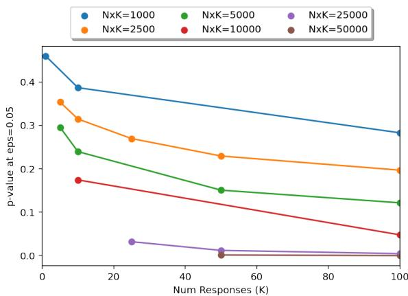
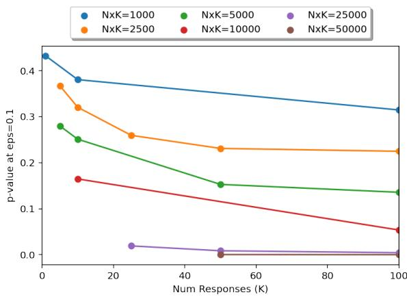
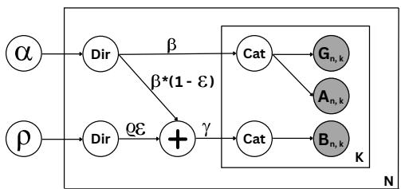
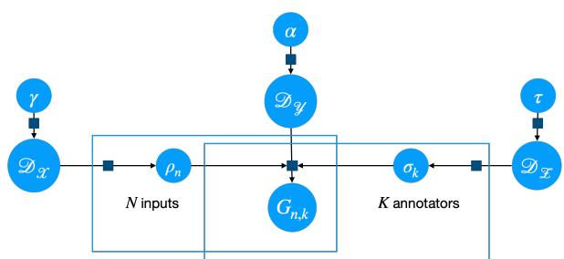
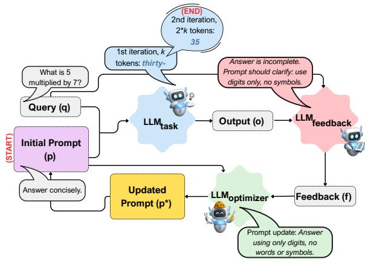
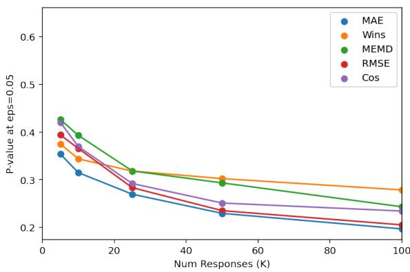
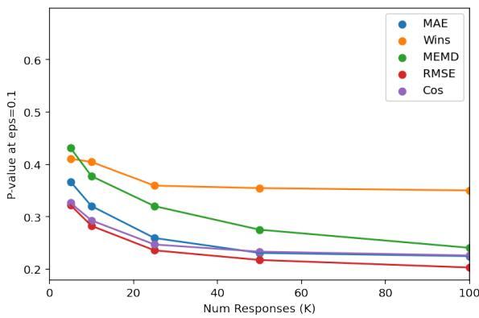
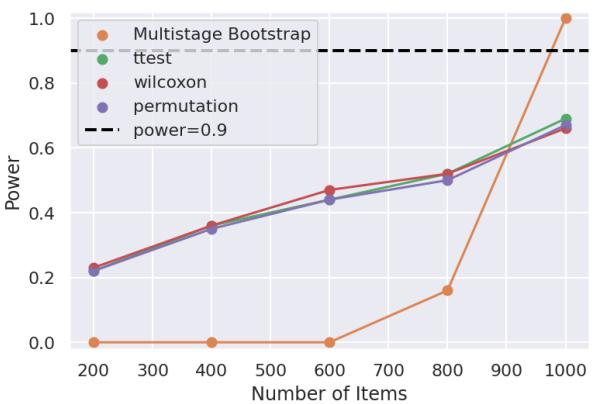
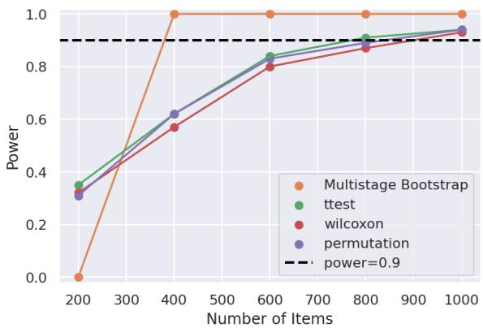
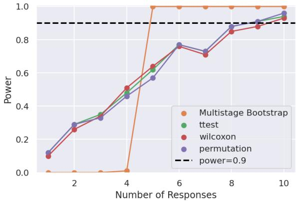

# Thesis Proposal: Toward a Human-Centered and Perspective-Aware Framework for Reproducible ML Evaluation and AI Alignment

Deepak Pandita Rochester Institute of Technology deepak@mail.rit.edu

Christopher M. Homan Rochester Institute of Technology cmh@cs.rit.edu

## Abstract

Humans play a vital role at every stage of AI development, from data collection and curation to model development and evaluation. However, humans often disagree with each other and sometimes with themselves over time. It is essential to take disagreement into account when building human-centered AI systems, especially in domains where it is prevalent, such as AI safety, content moderation, or sentiment analysis. Disagreement often arises from subjective human opinion and can vary with one’s identity, beliefs, and social environment. Despite this, current LLM evaluation approaches frequently rely on aggregating labels (often via plurality voting) to represent consensus, thereby obscuring minority perspectives. By failing to account for human disagreement, these evaluation methods contribute to the reproducibility crisis in AI. Human feedback is also crucial for ensuring that AI systems align with human values. For these systems to be trustworthy, it is critical to ensure that they reflect diverse human values and perspectives. In this thesis proposal, we present a humancentered and perspective-aware framework for reproducible ML evaluation and AI alignment.

## 1 Introduction

With the increasing prevalence of AI in modern society, it is of utmost importance that AI systems are reliable and trustworthy. Besides the models being helpful and harmless, a desired property is that the model evaluations are thorough and reproducible. Yet AI remains in a crisis (Baker, 2016; Gundersen and Kjensmo, 2018; Hutson, 2018; Mieskes et al., 2019; Gundersen, 2020) in which researchers are not able to reproduce the results of previous studies (Raff, 2019). Many factors caused and sustain this crisis: documentation is incomplete; methods, algorithms, and implementations vary; and gold standard data can be unreliable.

We focus here on an overlooked source of unreliability: failing to account for human disagreement and other sources of randomness in ML evaluation. Conventional evaluations treat disagreement, if at all, as nothing more than noise and may aggregate 3–5 labels per item—a number that comes from literature on machine learning (Snow et al., 2008), not machine learning evaluation—via plurality voting to represent consensus, overlooking disagreement (Barile et al., 2021; Mostafazadeh Davani et al., 2022), which is endemic in human responses.

Recently, there has been an increased emphasis on the idea of perspectivism<sup>1</sup>, which advocates integrating diverse perspectives in machine learning (Cabitza et al., 2023). Perspectivist approaches urge using and publishing disaggregated labels to account for human label variation (Basile et al., 2021; Prabhakaran et al., 2021; Uma et al., 2021; Plank, 2022). Consequently, model evaluations must be perspective-aware to ensure both trustworthiness and reproducibility.

Thesis Statement Accounting for diverse perspectives is critical to improving reproducibility in machine learning evaluation and ensuring pluralistic alignment oflarge language models.

Toward this end, we pose the following research questions:

• RQ1: Is it valuable to keep disaggregated responses for each item while comparing two ML models?

• RQ2: How do we optimize the allocation of a fixed human annotation budget for reproducible evaluation?

• RQ3: What is the impact of diverse raters on the amount of data needed for reproducibility?

In the case of LLMs, humans continue to play a vital role in all stages of their development. Human feedback is used to align LLMs to reflect human values and preferences via reinforcement learning from human feedback (RLHF) (Christiano et al., 2017; Ziegler et al., 2019; Ouyang et al., 2022; Bai et al., 2022). However, recent research has shown that such alignment can favor specific political ideologies (Santurkar et al., 2023; Ceron et al., 2024; Fulay et al., 2024). AI systems must represent the values and preferences of diverse groups, not just one of them. Therefore, there is an increased interest in building human-centered AI systems that reflect pluralistic views/values (Gordon et al., 2022; Sorensen et al., 2024a,b; Stammbach et al., 2024). This remains a key challenge since humans may have diverging viewpoints (Casper et al., 2023). In light of these challenges, we seek to answer the following research questions:

• RQ4: Are some demographic groups more cohesive than others when disclosing their own perceptions ofoffense and vicarious offense?

• RQ5: Can textualfeedback enhance the performance of LLMs during inference?

• RQ6: How can we effectively adapt LLMs to represent pluralistic perspectives?

The rest of this manuscript is structured as follows: Section 2 provides necessary background; Sections 3 and 4 detail our progress in perspectiveaware reproducible ML evaluation and humancentered AI alignment, respectively. Finally, Section 5 summarizes the proposal’s contributions and concludes the work.

## 2 Background

## 2.1 Human Disagreement

Subjectivity often leads to disagreement and causes variance in human responses (Basile et al., 2021; Prabhakaran et al., 2021; Uma et al., 2021; Plank, 2022; Cabitza et al., 2023; Weerasooriya et al., 2023). Disagreement is also linked to rater identity (race, gender, age, education, and first language) and their beliefs (social, religious, spiritual, and political leaning) (Sap et al., 2019; Al Kuwatly et al., 2020; Larimore et al., 2021; Sap et al., 2022; Goyal et al., 2022; Pei and Jurgens, 2023; Weerasooriya et al., 2023; Homan et al., 2024; Prabhakaran et al., 2024). Typically, responses are aggregated via majority voting to represent consensus, whereas recent work has shown the inadequacy of majority voting for incorporating response variance (Barile et al., 2021; Mostafazadeh Davani et al., 2022).

## 2.2 Reproducible ML Evaluation

Several studies have called attention to the reproducibility crisis in AI and NLP (Gundersen and Kjensmo, 2018; Hutson, 2018; Mieskes et al., 2019; Gundersen, 2020). Given the non-deterministic nature of machine learning methods, algorithms, and implementations, even if code is shared, multiple identical training runs of the same deep learning model can produce different models, with different test results (Pham et al., 2020). Pham et al. (2020) also presented a survey of 901 participants, where 84% were unaware or unsure about the variance caused by different implementations. Arvan et al. (2022) conducted a reproducibility study of eight papers published in EMNLP 2021 and achieved a 25% success rate. Therefore, it is vital to account for variance in evaluations.

Human evaluation studies also show a low degree of reproducibility (Belz et al., 2023). The field also faces a pervasive issue of inadequate statistical analysis; statistical significance is often misapplied, and reported outcomes are frequently unreliable (Søgaard et al., 2014; Dror et al., 2018; van der Lee et al., 2019).

## 2.3 Prompt Optimization

Automatic prompt optimization methods, such as AutoPrompt (Shin et al., 2020) and RL-Prompt (Deng et al., 2022), employ gradient-based search and reinforcement learning techniques, respectively. Other approaches leverage LLMs themselves for prompt generation (Mehta et al., 2024; Pryzant et al., 2023; Yang et al., 2024, 2022; Zhou et al., 2022). Recent works like Promptomatix (Murthy et al., 2025) and EvoAgentX (Wang et al., 2025b) extend this direction by enabling automatic prompt refinement across multiple tasks, workflows, and tools.

## 3 Perspective-Aware Reproducible ML Evaluation

## 3.1 Related Work in Reproducible ML Evaluation

Wein et al. (2023) proposed the Variance Estimation Toolkit (VET)<sup>2</sup> for estimating p-values for comparisons between the results of two systems to determine which is ranked higher. The framework uses null hypothesis significance tests (NHSTs) to demonstrate model improvement while accounting for sampling variance across items and responses per item. It explores which sampling, aggregation, and measurement methods yield the best pvalue estimate from a single test set relative to the true/ground-truth p-value.

VET simulator samples responses from a large pool of human raters (G) and two machine learning models (A and B). To simulate responses for G, it uses a multistage sampling approach to generate responses for N items with K responses per item. First, for each item, a mean and a standard deviation are sampled from specific uniform distributions. Then, K responses are sampled from a normal distribution parameterized with the sampled mean and standard deviation. The responses for items in models A and B are generated using the same parameters as G, but with means perturbed by a small amount ϵ (chosen uniformly at random over a specific interval) for model B. This makes model A a perfect representation of G. The data for the null hypothesis is generated by combining the responses for model A and model B into a single set and sampling from this set. NHSTs are then used to estimate the p-values under different metrics and sampling methods.

Homan et al. (2023) utilized the VET simulator to study the trade-off between the number of items and responses per item using simulations tailored for foundation models. The VET simulator’s scope is limited to NHST and regression. Furthermore, Homan et al. (2023) evaluate the system using just simulations instead of real-world datasets.

## 3.2 Preliminary Work in Reproducible ML Evaluation

RQ1: Is it valuable to keep disaggregated responses for each item while comparing two ML models?

Leveraging the VET simulator, we present a human-in-the-loop method (Homan et al., 2026) to estimate the number of items (N) and the number of responses per item (K) needed for reliable comparison of two ML models under a performance difference of at least ϵ according to a metric Γ. We achieve this by computing p-values for existing experimental data comparing the performance of two models against gold data under different experimental conditions. We also extend the simulator to estimate the type-II error rate, allowing for statistical power.

Methods Given an evaluation dataset G, arbitrary N and $K , \epsilon > 0$ and metric Γ the process has the following steps.

1. Fit a two-stage probabilistic response model model to G.

2. Use that model via simulation to determine p-values for N, K, ϵ, and Γ.

First, we fit a dataset to a response model by treating it as a regression task and following the same process as mentioned in Wein et al. (2023). Then, we use the simulator to generate data for G using the same fitted distribution. Next, we generate the data for model A using the same distribution as G, making A an ideal representation of G. The data for model B is generated by adding a perturbation ϵ to G. It ensures that model A always outperforms model B with respect to G as measured by any metric Γ. The p-values should converge to zero as N, K, and/or ϵ increase. This process is repeated a large number of times to estimate the p-values.

Experiments We utilize seven datasets to conduct our experiments – MultiDomain Agreement (Leonardelli et al., 2021), Stanford Toxicity (Kumar et al., 2021), Amazon reviews (Zhang et al., 2015), HS-Brexit (Akhtar et al., 2021), ConvAbuse (Cercas Curry et al., 2021), ArMIS (Almanea and Poesio, 2022), and Measuring Hate Speech (MHS) (Sachdeva et al., 2022) all of which contain multiple human annotations per item.

Our evaluation relies on the following metrics:

• Mean absolute error difference (MAE). The errors from the per-item mean gold response to the model response averaged over the items.

• Item-wise wins (Wins). The fraction of items in the test set for which the absolute error of A is smaller than that of B.

• Mean EMD difference (MEMD). The Earth mover’s distance for each item between the system and the gold standard responses, and then take the mean of those item-wise EMDs.

Results Our results (Figure 1) demonstrate that trading off items for responses is beneficial at a wide range of $( N \times K )$ values, with p-value decreasing as K increases. Here $\Gamma _ { \mathrm { M A E } }$ was used with distortion ϵ = 0.05 for Toxicity and $\epsilon = 0 . 1$ for MultiDomain, but similar trends were observed using other metrics, amounts of distortion, as well as different datasets.



(a) Toxicity (ϵ = 0.05)  
  
(b) MultiDomain (ϵ = 0.1)  
Figure 1: p-value vs K with $\Gamma _ { \mathrm { M A E } }$ at various $N \times K$ Each data point is estimated from 10, 000 samples.

Figure 5 graphs p-value as a function of the number of responses at $\epsilon = 0 . 1$ , where the number of items varies such that $N \times K = 2 5 0 0$ , and demonstrates a similar trend across five different metrics. Refer to Appendix A.1.1 for the results of the power analysis.

The results also suggest that current evaluation practices are not sufficient to confidently assess two models’ performance against gold judgments, as using 25,000-50,000 annotations in a test set is rarely seen. Even when using 1000 items, at least 25 raters are needed for models to achieve significance with MAE.

RQ2: How do we optimize the allocation of a fixed human annotation budget $( N \times K )$ for reproducible evaluation?

  
Figure 2: Plate notation for the simulator. Categorical parameters (β) and noise parameters (ϱ) are sampled from two Dirichlet distributions parameterized by α and $\rho ,$ respectively. Then, responses for G and A are produced by sampling from a categorical distribution parameterized by β. Responses for B are produced by sampling from a categorical distribution parameterized by γ, where $\gamma$ is a convex combination of $\beta$ and $\varrho$ controlled by the perturbation parameter ϵ.

Next, we extend the VET simulator to model categorical data and confidence intervals (Pandita et al., 2026a). We adopt a Bayesian approach to model existing datasets and examine the optimization problem of allocating a human annotation budget to a sample of N items, where each item is annotated by K raters, such that the total budget $N \times K$ is fixed. This enables a more robust way of modeling when the sample size is small and allows for maximum a posteriori (MAP) fitting of data, versus maximum likelihood estimation (MLE)-based frequentist approaches, which provides regularization.

Methods The simulator (Figure 2) works similarly to earlier work (Wein et al., 2023) except that the responses produced are nominal rather than continuous. The simulator produces gold responses G and the responses for model A by sampling from the same Dirichlet-categorical distribution. For model B, the responses are sampled after perturbing the parameters by a small amount ϵ.

Experiments We use five datasets – Toxicity (Kumar et al., 2021), DICES 350 (Aroyo et al., 2023), D3code (Davani et al., 2024), and Jobs Q1/Q3 (Liu et al., 2016), for which multiple annotations per item exist, and fit these datasets using MAP. We run experiments for hypothesis testing with different budgets $( N \times K = \{ 1 0 0 , 2 5 0 , 5 0 0 , 1 0 0 0 .$ 2500, 5000, 10000, 25000, 50000}) while ranging K from 1 to 500 (in increments of 1 till 10, then 20, then in increments of 20 from 20 onwards) for different metrics, and $\epsilon = \{ 0 . 1 , 0 . 2 , 0 . 3 , 0 . 4 \}$ . We use four metrics with four ϵ, yielding 16 sets of 282 experiments for each dataset. We use the following metrics for our experimentation:

• Accuracy. Accuracy is the most commonly used metric to compare models against each other. First, take the plurality vote for all items in A, B, and G. Then compute the accuracy for A and B by comparing against G.

• Total variation (TV). TV is related to Manhattan or L1 distance. It goes beyond the plurality vote and helps compare probability distributions for soft label evaluation. Compute the frequency of responses for all items in A, B, and G, normalize, and compute the mean Manhattan distance across all items in A and B against G.

• Wins. Wins is a meta-metric used for itemlevel comparison. We use TV as the base metric for Wins, but any other metric can be used. Calculate TV for all items in A and B against G, then count the wins of A and B, i.e., the number of times A has less TV than B and vice-versa.

• KL-Divergence (KL-Div). KL-Divergence is another frequently used metric for comparing probability distributions. Calculate the frequency of responses for all items in A, B, and G. Then, compute the mean KL-divergence across all items in A and B against G.

<table><tr><td colspan="2">1</td><td>Accuracy</td><td>TV</td><td>Wins</td><td>KL-Div</td></tr><tr><td rowspan="3">Toxicity (M=2)</td><td rowspan="3">NK p-value K</td><td>2500</td><td>1000</td><td>2500</td><td>1000</td></tr><tr><td>0.012</td><td>0.015</td><td>0.012</td><td>0.022</td></tr><tr><td>1</td><td>120</td><td>1</td><td>200</td></tr><tr><td rowspan="3">DICES (M=3)</td><td rowspan="3">Δ NK p-value K</td><td>0.040 1000</td><td>0.074 500</td><td>0.040 1000</td><td>0.044 1000</td></tr><tr><td>0.036</td><td>0.017</td><td>0.028</td><td>0.020</td></tr><tr><td>1</td><td>80</td><td>20</td><td>300</td></tr><tr><td rowspan="3">D3code (M=2)</td><td rowspan="3">∆ NK p-value K</td><td>0.055 2500</td><td>0.063</td><td>0.346 2500</td><td>0.082</td></tr><tr><td>0.037</td><td>1000 0.020</td><td>0.024</td><td>1000 0.022</td></tr><tr><td>2</td><td>140</td><td>60</td><td>100</td></tr><tr><td rowspan="3">JobsQ1 (M=5)</td><td>Δ NK</td><td>0.034 250</td><td>0.072 250</td><td>0.413 250</td><td>0.036 250</td></tr><tr><td rowspan="2">p-value K Δ</td><td>0.035</td><td>0.015</td><td>0.036</td><td>0.035</td></tr><tr><td>1</td><td>40</td><td>1</td><td>1</td></tr><tr><td rowspan="4">JobsQ3 (M=12)</td><td>NK</td><td>0.104 500</td><td>0.050</td><td>0.104</td><td>2.864</td></tr><tr><td rowspan="3">p-value K</td><td></td><td>250</td><td>500</td><td>500</td></tr><tr><td>0.047</td><td>0.014</td><td>0.038</td><td>0.030</td></tr><tr><td>100 0.595</td><td>240 0.024</td><td>80 0.868</td><td>500 0.182</td></tr></table>

Table 1: Minimum p-value, K, and corresponding effect size (∆) for lowest NK with p < 0.05 (ϵ = 0.3).

Results Table 1 shows the results for minimum p-value, K, and corresponding effect size (∆) for lowest NK with $p < 0 . 0 5 ( \epsilon = 0 . 3 )$ . M represents the number of categories in the dataset. Our results suggest that whether or not a tradeoff exists, and where it is, depends much more on the metric used than the data source, and that the metrics behave very differently. They show that the TV metric requires the smallest number of N ×K overall, and that this comes with a small number of K > 10.

Our findings demonstrate that increasing K is often a more effective strategy for achieving reliable evaluation than increasing N. We discovered, across a diverse set of datasets, that accounting for the full human response distribution can be achieved with a surprisingly modest budget (N × K) of 1000 or less, with K > 10. Metrics that are more sensitive to the distributional nature of human responses benefit greatly from higher values of K.

## 3.3 Proposed Work in Reproducible ML Evaluation

RQ3: What is the impact of diverse raters on the amount of data needed for reproducibility?

Currently, the VET simulator assumes that the responses for one input item are independent of those of any other item, given the inputs. However, human raters often rate more than one item, and humans are known to have diverging biases when rating data. Therefore, accounting for these dependencies on raters may lead to more accurate estimators. In future work, we will focus on modeling the behavior of individual raters to investigate the impact of rater disagreement on the amount of data needed for evaluation. Specifically, we will use non-parametric bootstrapping and parametric methods such as those described in Figure 3 to study the impact of raters on evaluation.

We also aim to estimate response variance for multi-turn conversations and collect new data to externally validate the VET estimator’s predictions for optimal choices of N and K.

## 4 Human-Centered AI Alignment

## 4.1 Related Work

Rater Disagreement Weerasooriya et al. (2023) introduced vicarious offense to tease apart disagreement in political discourse by asking raters how they think others would annotate the data. Raters with specific political leanings are asked whether they find the text offensive and whether they think people with other political leanings may find the text offensive. Such vicarious annotations can reveal whether groups can be trusted to reflect the opinions of other groups and affect rater recruitment, since fewer raters may be recruited from other groups.

  
Figure 3: Plate diagram for hierarchically modeling individual annotators and input items, simplified from (Weerasooriya et al., 2022). The approach is similar to Algorithm 1, except that in addition to sampling model parameters $\rho _ { n }$ for each item $n ,$ we also sample parameters $\sigma _ { k }$ for each annotator k. Then for each pair $( n , k )$ , one response is sampled from $\mathcal { D } _ { \mathcal { Y } } ( \rho _ { n } , \sigma _ { k } )$ which is now parameterized by both $\rho _ { n }$ and $\sigma _ { k }$

CrowdTruth (Dumitrache et al., 2018) introduced a set of metrics for capturing and interpreting rater disagreement in crowdsourcing, and the GRASP framework (Prabhakaran et al., 2024) introduced metrics to understand the extent to which rater disagreement is based on group membership.

Learning Using Textual Feedback Recent research has pivoted towards using LLMs themselves as scalable proxies for human judgment, serving as evaluators, critics, and sources of feedback (Zheng et al., 2023; Pryzant et al., 2023; Saunders et al., 2022). This has given rise to sophisticated agentic frameworks that can detect errors, critique outputs, and iteratively refine them, particularly for tasks demanding factual correctness (Akyurek et al., 2023; Madaan et al., 2023). Methods like TextGrad (Yuksekgonul et al., 2024) have even demonstrated how textual feedback can “differentiate” through complex systems to optimize performance.

Test-Time Scaling and Alignment Test-time scaling improves LLMs without weight modification and aims to enhance the performance of models by utilizing additional test-time compute resources (Snell et al., 2024; Muennighoff et al., 2025; Wang et al., 2025a). These methods have also been applied to reward modeling, reinforcement learning, and alignment (Hao et al., 2025; Song et al., 2025; Zhang et al., 2025).

## 4.2 Preliminary Work

RQ4: Are some demographic groups more cohesive than others when disclosing their own perceptions of offense and vicarious offense?

We study the potential influence of political affiliation and demographics on raters’ perception of offense (Pandita et al., 2024) to demonstrate the effect of group membership. To this end, we use vicarious annotations (Weerasooriya et al., 2023) along with the GRASP framework (Prabhakaran et al., 2024) and CrowdTruth (Dumitrache et al., 2018).

Experiments We conduct our experiments on the VOICED dataset (Weerasooriya et al., 2023) containing YouTube comments labeled by diverse raters for personal and vicarious offense. We also use the toxicity ratings dataset (Kumar et al., 2021), comprising comments from Twitter labeled for toxicity by multiple raters. We consider political leaning and gender as dimensions to compare cohesion among different subgroups.

Results The results (Tables 2-3) show that, of the political groups, Independents are the most cohesive, both with themselves and with others. Democrats are the least cohesive with others. Republicans are the least internally cohesive.

Our investigation into the dynamics of rater cohesion in politically charged content moderation settings, through the lens of self and vicarious annotation, gender, and political affiliations, reveals valuable insights into the challenges of building inclusive and human-centered AI systems. Our findings reveal notable disparities in cohesion levels, highlighting the influence of gender and political affiliation.

RQ5: Can textual feedback enhance the performance of LLMs during inference?

We introduce ProRefine (Inference-time Prompt Refinement with Textual Feedback) (Pandita et al., 2026b), which focuses on optimizing the prompt, a key element in chain-of-thought (CoT) (Wei et al., 2022) based LLM reasoning.

ProRefine dynamically refines prompts for multistep reasoning tasks without additional training or ground-truth labels.

  
Figure 4: Overview of the ProRefine system, illustrating the iterative process of prompt optimization using feedback from LLMs. In each iteration, $L L M _ { t a s k }$ extends its output by an additional k tokens, enabling step-bystep feedback to progressively refine the prompt with $L L M _ { o p t i m i z e r } .$

Methods ProRefine adaptively improves prompts for a task-performing LLM $( L L M _ { t a s k } )$ by using textual feedback from a judge $( L L M _ { f e e d b a c k } )$ and an optimizer $( L L M _ { o p t i m i z e r } )$ This workflow (Figure 4), motivated by the teacher-student framework (Torrey and Taylor, 2013) where a teacher agent guides a student agent to perform a task by providing feedback at intermediate steps, but implemented via LLM interactions without pre-training, represents a novel approach to adaptive agentic reasoning. ProRefine involves interactions between three LLMs:

$L L M _ { t a s k }$ : Executes the task based on the current prompt, generating the initial and subsequent outputs.

$L L M _ { f e e d b a c k } \colon$ A model that critiques the $L L M _ { t a s k } \mathrm { ' s }$ output, providing detailed feedback on improvements. This model should be capable of providing insightful and accurate critiques (Bai et al., 2022; Saunders et al., 2022).

$L L M _ { o p t i m i z e r } \colon$ Interprets the feedback and refines the prompt, aiming for coherent and taskfocused improvements. This LLM is crucial for ensuring the prompt evolves effectively.

ProRefine (Algorithm 5) works as follows:

Initialization: Start with an initial prompt p for the task, a query q, and parameters defining the generation and optimization process (k tokens per step, n maximum steps).

## Generation and Feedback Loop:

• Generation: Use $L L M _ { t a s k }$ to generate an output based on the current prompt $p ^ { * }$ and query $q .$ This step is limited to $i * k$ tokens to control the granularity of the feedback. In each iteration, $L L M _ { t a s k }$ produces k more tokens, attempting to refine prior output while progressively continuing its response to the query.

• Feedback: $L L M _ { f e e d b a c k }$ evaluates the generated output $o _ { i }$ against the query q to provide textual feedback $f _ { i } .$ . This feedback encapsulates how the output could be improved, focusing on aspects such as accuracy, relevance, or coherence.

• Optimization: $L L M _ { o p t i m i z e r }$ uses the feedback $f _ { i }$ to refine the prompt $p ^ { * }$ . This step involves modifying the prompt to better align with the task requirements or to correct identified deficiencies in previous generations.

Termination: The process iterates until either the maximum number of steps n is reached or an end-of-sequence (EOS) token is detected in the output, indicating the completion of the task.

Experiments We conduct the experiments on five reasoning tasks – object counting and word sorting from the BIG-Bench Hard benchmark (Srivastava et al., 2023), grade-school math problem-solving from GSM8K (Cobbe et al., 2021), math word problems from SVAMP (Patel et al., 2021), and algebraic word problems from AQUARAT (Ling et al., 2017), each of which involves multi-step reasoning.

We experiment with three models - Llama3.2-1Binstruct, Llama3.2-3B-instruct, and Llama3.1-8Binstruct (Meta, 2024) for $L L M _ { t a s k }$ . The prompts are optimized using Algorithm 5, with Llama3.1- 70B-instruct used for feedback generation, prompt optimization, and evaluation. We select the values of hyperparameters $k = 1 0$ and $n = 2 5$ to control the granularity of feedback and duration of optimization. Hyperparameters k and n were fixed based on general preliminary exploration and not tuned per task using benchmark training/validation data. We compare ProRefine against the zero-shot Chain-of-Thought (CoT) baseline and

TextGrad (Yuksekgonul et al., 2024), and report test accuracy with a 95% confidence interval.

Results Our results (Table 4) demonstrate that ProRefine significantly improves $L L M _ { t a s k }$ performance over the zero-shot CoT baseline in all but one experiment, and it outperforms TextGrad in 11 out of 15 cases overall. For Llama3.2-1B-instruct model, ProRefine can significantly outperform CoT and TextGrad on 2 out of 5 datasets. For Llama3.2- 3B-instruct model, ProRefine can outperform CoT and TextGrad on 3 out of 5 datasets with one significant result. For Llama3.1-8B-instruct model, ProRefine can outperform CoT and TextGrad on all 5 datasets with 4 significant results.

## 4.3 Proposed Work

RQ6: How can we effectively adapt LLMs to represent pluralistic perspectives?

In the future, we aim to develop methods to align model outputs across different perspectives by leveraging textual feedback from multiple feedback models that represent specific perspectives. Such feedback models may be prompted to adopt a different persona or fine-tuned to provide feedback from a specific perspective. Then, we can use the feedback to either optimize the prompt for specific perspectives or have the task-performing LLM adapt its output directly. In the first case, perspective-optimized prompts can be used to generate outputs from different perspectives, which are then synthesized to produce a single output. These approaches can refine LLM outputs at inference time, making them suitable for black-box scenarios where model weights are inaccessible and for agentic workflows. In the second case, the taskperforming LLM may also be fine-tuned to utilize feedback from different perspectives.

In addition to relying on textual feedback from perspectivist models, we also aim to investigate whether textual or numeric feedback is more effective for alignment. To this end, we will train multiple reward models for different perspectives and leverage them in a conventional RLHF setting.

Bandits for Prompt Optimization For prompt optimization, we aim to leverage bandit algorithms to select the best-performing prompts for a given task, ideally under a budget constraint. First, m prompt candidates may be generated for a given task, and then each of these prompts will be used to generate n outputs from a task-performing LLM. The generated outputs will each receive feedback (textual or numeric) based on the output quality, and the prompts may be refined based on this feedback. In the subsequent round, we may have m×n candidate prompts, and the process continues iteratively. Bandit algorithms are well-suited for this scenario to keep track of the better-performing prompts and eventually pick the best-performing prompt under a given budget.

## 5 Conclusion

This PhD thesis proposal highlights the need for integrating diverse perspectives for reproducible machine learning evaluation and pluralistic alignment. For reproducible ML evaluations, we experimented with simulations based on real-world datasets and showed that these datasets lack enough responses per item. We also investigated the critical trade-off between the number of items and the number of responses per item for achieving reliable machine learning model evaluation under a fixed budget. Our findings demonstrate that increasing the number of responses per item is often a more effective strategy for achieving reliable evaluation than increasing the number of items. Furthermore, we established that this trade-off is dependent on the metric. Methods developed as a part of this proposal, such as ProRefine, have demonstrated significant performance improvements on multistep reasoning tasks. Future research aims to leverage these findings to align model outputs across different perspectives by utilizing LLM-generated textual feedback.

Our research provides a clear, data-driven methodology for ML practitioners to design more effective and budget-conscious evaluations. By moving towards a perspective-aware paradigm and strategically collecting multiple responses, the field can build greater trust and confidence in model performance. Our findings regarding the dynamics of rater cohesion further underscore the importance of building human-centered AI systems and open up a strategic avenue for more efficient rater recruitment.

## Limitations

The effectiveness of the VET simulator depends on how well the probabilistic models capture realistic distributions of responses over items. Although we used rigorous methods to fit the parameters of these distributions to our datasets, our choice of distribution family to use for each dataset was based on visual inspection of the data in the case of regression tasks. One key limitation future work will address is that we treat the responses as independent from item-to-item, when in reality responses usually depend on which human annotator or instance of a model produced the response. Hypothesis testing such as that described here is not a comprehensive measure of data quality; it only estimates the likelihood of sampling error. It does not account for sampling bias, leading to data that is not representative of the sampling distribution.

Our findings about rater cohesion may not be generalizable to other demographics such as education level, cultural background, and economic status. Future studies should employ the proposed framework to investigate the level of cohesion among raters belonging to other important demographic subgroups. Another limitation of this work is the simplification of political ideologies into three groups: Democrats, Republicans, and Independents. This, however, may not capture the full spectrum of political beliefs and identities. For instance, a rater can be socially Republican but fiscally Liberal. A more granular analysis that considers the multidimensional nature of political ideologies could reveal more intricate patterns of cohesion.

While ProRefine is designed for cost-effective hybrid deployments, its iterative process inherently increases inference-time latency and computational cost compared to a single-pass query. Our evaluation is currently focused on mathematical and multistep reasoning tasks. Further research is needed to assess performance across a broader range of reasoning tasks and domains. The iterative nature of ProRefine lacks a formal convergence guarantee. In some cases, the refinement process can suffer from prompt degradation after many iterations or plateau before reaching an optimal solution. Investigating methods to ensure stable and monotonic improvement is a key area for future research.

## References

Sohail Akhtar, Valerio Basile, and Viviana Patti. 2021. Whose opinions matter? perspective-aware models to identify opinions of hate speech victims in abusive language detection. arXiv preprint arXiv:2106.15896.

Afra Feyza Akyurek, Ekin Akyurek, Ashwin Kalyan,

Peter Clark, Derry Tanti Wijaya, and Niket Tandon. 2023. RL4F: Generating natural language feedback with reinforcement learning for repairing model outputs. In Proceedings of the 61st Annual Meeting of the Associationfor Computational Linguistics (Volume 1: Long Papers), pages 7716–7733, Toronto, Canada. Association for Computational Linguistics.

Hala Al Kuwatly, Maximilian Wich, and Georg Groh. 2020. Identifying and measuring annotator bias based on annotators’ demographic characteristics. In Proceedings of the Fourth Workshop on Online Abuse and Harms, pages 184–190, Online. Association for Computational Linguistics.

Dina Almanea and Massimo Poesio. 2022. ArMIS - the Arabic misogyny and sexism corpus with annotator subjective disagreements. In Proceedings of the Thirteenth Language Resources and Evaluation Conference, pages 2282–2291, Marseille, France. European Language Resources Association.

Lora Aroyo, Alex Taylor, Mark Díaz, Christopher Homan, Alicia Parrish, Gregory Serapio-García, Vinodkumar Prabhakaran, and Ding Wang. 2023. Dices dataset: Diversity in conversational ai evaluation for safety. In Advances in Neural Information Processing Systems, volume 36, pages 53330–53342, New Orleans, Louisiana, USA. Curran Associates, Inc.

Mohammad Arvan, Luís Pina, and Natalie Parde. 2022. Reproducibility in computational linguistics: Is source code enough? In Proceedings of the 2022 Conference on Empirical Methods in Natural Language Processing, pages 2350–2361, Abu Dhabi, United Arab Emirates. Association for Computational Linguistics.

Yuntao Bai, Saurav Kadavath, Sandipan Kundu, Amanda Askell, Jackson Kernion, Andy Jones, Anna Chen, Anna Goldie, Azalia Mirhoseini, Cameron McKinnon, Carol Chen, Catherine Olsson, Christopher Olah, Danny Hernandez, Dawn Drain, Deep Ganguli, Dustin Li, Eli Tran-Johnson, Ethan Perez, and 32 others. 2022. Constitutional AI: Harmlessness from AI Feedback. arXiv preprint. ArXiv:2212.08073 [cs].

Monya Baker. 2016. 1,500 scientists lift the lid on reproducibility. Nature, 533(7604):452–454.

Francesco Barile, Shabnam Najafian, Tim Draws, Oana Inel, Alisa Rieger, Rishav Hada, and Nava Tintarev. 2021. Toward benchmarking group explanations: Evaluating the effect of aggregation strategies versus explanation. In Perspectives on the Evaluation of Recommender Systems Workshop 2021: co-located with the 15th ACM Conference on Recommender Systems (RecSys 2021), Amsterdam, The Netherlands. ACM New York, NY, USA.

Valerio Basile, Michael Fell, Tommaso Fornaciari, Dirk Hovy, Silviu Paun, Barbara Plank, Massimo Poesio, and Alexandra Uma. 2021. We need to consider disagreement in evaluation. In Proceedings of the

1st Workshop on Benchmarking: Past, Present and Future, pages 15–21, Online. Association for Computational Linguistics.

Anya Belz, Craig Thomson, Ehud Reiter, and Simon Mille. 2023. Non-Repeatable Experiments and Non-Reproducible Results: The Reproducibility Crisis in Human Evaluation in NLP. In Findings of the Association for Computational Linguistics: ACL 2023, pages 3676–3687, Toronto, Canada. Association for Computational Linguistics.

Federico Cabitza, Andrea Campagner, and Valerio Basile. 2023. Toward a perspectivist turn in ground truthing for predictive computing. Proceedings of the AAAI Conference on Artificial Intelligence, 37(6):6860–6868.

Stephen Casper, Xander Davies, Claudia Shi, Thomas Krendl Gilbert, Jérémy Scheurer, Javier Rando, Rachel Freedman, Tomasz Korbak, David Lindner, Pedro Freire, Tony Wang, Samuel Marks, Charbel-Raphaël Segerie, Micah Carroll, Andi Peng, Phillip Christoffersen, Mehul Damani, Stewart Slocum, Usman Anwar, and 13 others. 2023. Open Problems and Fundamental Limitations of Reinforcement Learning from Human Feedback.

Amanda Cercas Curry, Gavin Abercrombie, and Verena Rieser. 2021. ConvAbuse: Data, analysis, and benchmarks for nuanced abuse detection in conversational AI. In Proceedings of the 2021 Conference on Empirical Methods in Natural Language Processing, pages 7388–7403, Online and Punta Cana, Dominican Republic. Association for Computational Linguistics.

Tanise Ceron, Neele Falk, Ana Baric, Dmitry Nikolaev,´ and Sebastian Padó. 2024. Beyond prompt brittleness: Evaluating the reliability and consistency of political worldviews in LLMs. Transactions of the Associationfor Computational Linguistics, 12:1378– 1400.

Paul F Christiano, Jan Leike, Tom Brown, Miljan Martic, Shane Legg, and Dario Amodei. 2017. Deep Reinforcement Learning from Human Preferences. In Advances in Neural Information Processing Systems, volume 30. Curran Associates, Inc.

Karl Cobbe, Vineet Kosaraju, Mohammad Bavarian, Mark Chen, Heewoo Jun, Lukasz Kaiser, Matthias Plappert, Jerry Tworek, Jacob Hilton, Reiichiro Nakano, and 1 others. 2021. Training verifiers to solve math word problems. arXiv preprint arXiv:2110.14168.

Aida Mostafazadeh Davani, Mark Díaz, Dylan Baker, and Vinodkumar Prabhakaran. 2024. D3CODE: Disentangling Disagreements in Data across Cultures on Offensiveness Detection and Evaluation. arXiv preprint. ArXiv:2404.10857 [cs].

Mingkai Deng, Jianyu Wang, Cheng-Ping Hsieh, Yihan Wang, Han Guo, Tianmin Shu, Meng Song, Eric Xing, and Zhiting Hu. 2022. RLPrompt: Optimizing discrete text prompts with reinforcement learning.

In Proceedings of the 2022 Conference on Empirical Methods in Natural Language Processing, pages 3369–3391, Abu Dhabi, United Arab Emirates. Association for Computational Linguistics.

Rotem Dror, Gili Baumer, Segev Shlomov, and Roi Reichart. 2018. The hitchhiker’s guide to testing statistical significance in natural language processing. In Proceedings of the 56th Annual Meeting of the Associationfor Computational Linguistics (Volume 1: Long Papers), pages 1383–1392, Melbourne, Australia. Association for Computational Linguistics.

Anca Dumitrache, Oana Inel, Lora Aroyo, Benjamin Timmermans, and Chris Welty. 2018. Crowdtruth 2.0: Quality metrics for crowdsourcing with disagreement. In 1st Workshop on Subjectivity, Ambiguity and Disagreement (SAD) in Crowdsourcing 2018, and CrowdBias’18: Disentangling the Relation Between Crowdsourcing and Bias Management, number 2276 in CEUR Workshop Proceedings, pages 11–18, Aachen.

Suyash Fulay, William Brannon, Shrestha Mohanty, Cassandra Overney, Elinor Poole-Dayan, Deb Roy, and Jad Kabbara. 2024. On the relationship between truth and political bias in language models. In Proceedings of the 2024 Conference on Empirical Methods in Natural Language Processing, pages 9004– 9018, Miami, Florida, USA. Association for Computational Linguistics.

Mitchell L Gordon, Michelle S Lam, Joon Sung Park, Kayur Patel, Jeff Hancock, Tatsunori Hashimoto, and Michael S Bernstein. 2022. Jury learning: Integrating dissenting voices into machine learning models. In Proceedings of the 2022 CHI Conference on Human Factors in Computing Systems, pages 1–19.

Nitesh Goyal, Ian D Kivlichan, Rachel Rosen, and Lucy Vasserman. 2022. Is your toxicity my toxicity? exploring the impact of rater identity on toxicity annotation. Proceedings of the ACM on Human-Computer Interaction, 6(CSCW2):1–28.

Odd Erik Gundersen. 2020. The reproducibility crisis is real. AI Magazine, 41(3):103–106.

Odd Erik Gundersen and Sigbjørn Kjensmo. 2018. State of the art: Reproducibility in artificial intelligence. Proceedings of the AAAI Conference on Artificial Intelligence, 32(1):1644–1651.

Qianyue Hao, Sibo Li, Jian Yuan, and Yong Li. 2025. Rl of thoughts: Navigating llm reasoning with inference-time reinforcement learning. Preprint, arXiv:2505.14140.

Christopher Homan, Gregory Serapio-Garcia, Lora Aroyo, Mark Diaz, Alicia Parrish, Vinodkumar Prabhakaran, Alex Taylor, and Ding Wang. 2024. Intersectionality in AI safety: Using multilevel models to understand diverse perceptions of safety in conversational AI. In Proceedings of the 3rd Workshop on Perspectivist Approaches to NLP (NLPerspectives) @ LREC-COLING 2024, pages 131–141, Torino, Italia. ELRA and ICCL.

Christopher M Homan, Flip Korn, Deepak Pandita, and Chris Welty. 2026. How many ratings per item are necessary for reliable significance testing? In Findings of the Association for Computational Linguistics: EACL 2026, pages 4258–4273, Rabat, Morocco. Association for Computational Linguistics.

Christopher M Homan, Shira Wein, Lora M Aroyo, and Chris Welty. 2023. How many raters do you need? power analysis for foundation models. In Proceedings ofI Can’t Believe It’s Not Better (ICBINB): Failure Modes in the Age ofFoundation Models.

Matthew Hutson. 2018. Artificial intelligence faces reproducibility crisis. Science, 359(6377):725–726.

Deepak Kumar, Patrick Gage Kelley, Sunny Consolvo, Joshua Mason, Elie Bursztein, Zakir Durumeric, Kurt Thomas, and Michael Bailey. 2021. Designing toxic content classification for a diversity of perspectives. In Seventeenth Symposium on Usable Privacy and Security (SOUPS 2021), pages 299–318.

Savannah Larimore, Ian Kennedy, Breon Haskett, and Alina Arseniev-Koehler. 2021. Reconsidering annotator disagreement about racist language: Noise or signal? In Proceedings of the Ninth International Workshop on Natural Language Processing for Social Media, pages 81–90, Online. Association for Computational Linguistics.

Elisa Leonardelli, Stefano Menini, Alessio Palmero Aprosio, Marco Guerini, and Sara Tonelli. 2021. Agreeing to disagree: Annotating offensive language datasets with annotators’ disagreement. arXiv preprint arXiv:2109.13563.

Wang Ling, Dani Yogatama, Chris Dyer, and Phil Blunsom. 2017. Program induction by rationale generation: Learning to solve and explain algebraic word problems. In Proceedings of the 55th Annual Meeting ofthe Associationfor Computational Linguistics (Volume 1: Long Papers), pages 158–167, Vancouver, Canada. Association for Computational Linguistics.

Tong Liu, Christopher Homan, Cecilia Ovesdotter Alm, Megan Lytle, Ann Marie White, and Henry Kautz. 2016. Understanding discourse on work and jobrelated well-being in public social media. In Proceedings ofthe 54th Annual Meeting ofthe Associationfor Computational Linguistics (Volume 1: Long Papers), pages 1044–1053, Berlin, Germany. Association for Computational Linguistics.

Aman Madaan, Niket Tandon, Prakhar Gupta, Skyler Hallinan, Luyu Gao, Sarah Wiegreffe, Uri Alon, Nouha Dziri, Shrimai Prabhumoye, Yiming Yang, Shashank Gupta, Bodhisattwa Prasad Majumder, Katherine Hermann, Sean Welleck, Amir Yazdanbakhsh, and Peter Clark. 2023. Self-refine: Iterative refinement with self-feedback. In Advances in Neural Information Processing Systems, volume 36, pages 46534–46594. Curran Associates, Inc.

Maitrey Mehta, Valentina Pyatkin, and Vivek Srikumar. 2024. Promptly predicting structures: The return of

inference. In Proceedings of the 2024 Conference of the North American Chapter of the Association for Computational Linguistics: Human Language Technologies (Volume 1: Long Papers), pages 112– 130.

Meta. 2024. Llama 3\_2 model card. Accessed: 2026- 08-03.

Margot Mieskes, Karën Fort, Aurélie Névéol, Cyril Grouin, and Kevin Cohen. 2019. Community perspective on replicability in natural language processing. In Proceedings ofthe International Conference on Recent Advances in Natural Language Processing (RANLP 2019), pages 768–775, Varna, Bulgaria. INCOMA Ltd.

Aida Mostafazadeh Davani, Mark Díaz, and Vinodkumar Prabhakaran. 2022. Dealing with disagreements: Looking beyond the majority vote in subjective annotations. Transactions ofthe Associationfor Computational Linguistics, 10:92–110.

Niklas Muennighoff, Zitong Yang, Weijia Shi, Xiang Lisa Li, Li Fei-Fei, Hannaneh Hajishirzi, Luke Zettlemoyer, Percy Liang, Emmanuel Candès, and Tatsunori Hashimoto. 2025. s1: Simple test-time scaling. arXiv preprint. ArXiv:2501.19393 [cs].

Rithesh Murthy, Ming Zhu, Liangwei Yang, Jielin Qiu, Juntao Tan, Shelby Heinecke, Caiming Xiong, Silvio Savarese, and Huan Wang. 2025. Promptomatix: An automatic prompt optimization framework for large language models. Preprint, arXiv:2507.14241.

Long Ouyang, Jeffrey Wu, Xu Jiang, Diogo Almeida, Carroll Wainwright, Pamela Mishkin, Chong Zhang, Sandhini Agarwal, Katarina Slama, Alex Ray, John Schulman, Jacob Hilton, Fraser Kelton, Luke Miller, Maddie Simens, Amanda Askell, Peter Welinder, Paul F. Christiano, Jan Leike, and Ryan Lowe. 2022. Training language models to follow instructions with human feedback. Advances in Neural Information Processing Systems, 35:27730–27744.

Deepak Pandita, Flip Korn, Chris Welty, and Christopher M Homan. 2026a. Forest vs tree: The (n, k) trade-off in reproducible ml evaluation. Proceedings of the AAAI Conference on Artificial Intelligence, 40(29):24736–24744.

Deepak Pandita, Tharindu Cyril Weerasooriya, Sujan Dutta, Sarah K. Luger, Tharindu Ranasinghe, Ashiqur R. KhudaBukhsh, Marcos Zampieri, and Christopher M. Homan. 2024. Rater cohesion and quality from a vicarious perspective. In Findings of the Association for Computational Linguistics: EMNLP 2024, pages 5149–5162, Miami, Florida, USA. Association for Computational Linguistics.

Deepak Pandita, Tharindu Cyril Weerasooriya, Ankit Shah, Isabelle Diana May-Xin Ng, Christopher M. Homan, and Wei Wei. 2026b. Prorefine: Inferencetime prompt refinement with textual feedback (student abstract). Proceedings ofthe AAAI Conference on Artificial Intelligence, 40(48):41343–41345.

Arkil Patel, Satwik Bhattamishra, and Navin Goyal. 2021. Are NLP models really able to solve simple math word problems? In Proceedings of the 2021 Conference of the North American Chapter of the Associationfor Computational Linguistics: Human Language Technologies, pages 2080–2094, Online. Association for Computational Linguistics.

Jiaxin Pei and David Jurgens. 2023. When do annotator demographics matter? measuring the influence of annotator demographics with the POPQUORN dataset. In Proceedings ofthe 17th Linguistic Annotation Workshop (LAW-XVII), pages 252–265, Toronto, Canada. Association for Computational Linguistics.

Hung Viet Pham, Shangshu Qian, Jiannan Wang, Thibaud Lutellier, Jonathan Rosenthal, Lin Tan, Yaoliang Yu, and Nachiappan Nagappan. 2020. Problems and Opportunities in Training Deep Learning Software Systems: An Analysis of Variance. In 2020 35th IEEE/ACM International Conference on Automated Software Engineering (ASE), pages 771–783.

Barbara Plank. 2022. The “problem” of human label variation: On ground truth in data, modeling and evaluation. In Proceedings ofthe 2022 Conference on Empirical Methods in Natural Language Processing, pages 10671–10682, Abu Dhabi, United Arab Emirates. Association for Computational Linguistics.

Vinodkumar Prabhakaran, Christopher Homan, Lora Aroyo, Aida Mostafazadeh Davani, Alicia Parrish, Alex Taylor, Mark Diaz, Ding Wang, and Gregory Serapio-García. 2024. GRASP: A disagreement analysis framework to assess group associations in perspectives. In Proceedings ofthe 2024 Conference of the North American Chapter of the Association for Computational Linguistics: Human Language Technologies (Volume 1: Long Papers), pages 3473–3492, Mexico City, Mexico. Association for Computational Linguistics.

Vinodkumar Prabhakaran, Aida Mostafazadeh Davani, and Mark Diaz. 2021. On releasing annotator-level labels and information in datasets. In Proceedings of the Joint 15th Linguistic Annotation Workshop (LAW) and 3rd Designing Meaning Representations (DMR) Workshop, pages 133–138, Punta Cana, Dominican Republic. Association for Computational Linguistics.

Reid Pryzant, Dan Iter, Jerry Li, Yin Lee, Chenguang Zhu, and Michael Zeng. 2023. Automatic prompt optimization with “gradient descent” and beam search. In Proceedings of the 2023 Conference on Empirical Methods in Natural Language Processing, pages 7957–7968, Singapore. Association for Computational Linguistics.

Edward Raff. 2019. A step toward quantifying independently reproducible machine learning research. In Advances in Neural Information Processing Systems, volume 32, Vancouver, Canada. Curran Associates, Inc.

Pratik Sachdeva, Renata Barreto, Geoff Bacon, Alexander Sahn, Claudia von Vacano, and Chris Kennedy.

2022. The measuring hate speech corpus: Leveraging rasch measurement theory for data perspectivism. In Proceedings ofthe 1st Workshop on Perspectivist Approaches to NLP @LREC2022, pages 83–94, Marseille, France. European Language Resources Association.

Shibani Santurkar, Esin Durmus, Faisal Ladhak, Cinoo Lee, Percy Liang, and Tatsunori Hashimoto. 2023. Whose Opinions Do Language Models Reflect? In Proceedings ofthe 40th International Conference on Machine Learning, pages 29971–30004. PMLR.

Maarten Sap, Dallas Card, Saadia Gabriel, Yejin Choi, and Noah A. Smith. 2019. The risk of racial bias in hate speech detection. In Proceedings ofthe 57th Annual Meeting ofthe Associationfor Computational Linguistics, pages 1668–1678, Florence, Italy. Association for Computational Linguistics.

Maarten Sap, Swabha Swayamdipta, Laura Vianna, Xuhui Zhou, Yejin Choi, and Noah A. Smith. 2022. Annotators with attitudes: How annotator beliefs and identities bias toxic language detection. In Proceedings ofthe 2022 Conference ofthe North American Chapter of the Association for Computational Linguistics: Human Language Technologies, pages 5884–5906, Seattle, United States. Association for Computational Linguistics.

William Saunders, Catherine Yeh, Jeff Wu, Steven Bills, Long Ouyang, Jonathan Ward, and Jan Leike. 2022. Self-critiquing models for assisting human evaluators. arXiv preprint. ArXiv:2206.05802 [cs].

Taylor Shin, Yasaman Razeghi, Robert L. Logan IV, Eric Wallace, and Sameer Singh. 2020. AutoPrompt: Eliciting Knowledge from Language Models with Automatically Generated Prompts. In Proceedings ofthe 2020 Conference on Empirical Methods in Natural Language Processing (EMNLP), pages 4222–4235, Online. Association for Computational Linguistics.

Charlie Snell, Jaehoon Lee, Kelvin Xu, and Aviral Kumar. 2024. Scaling LLM Test-Time Compute Optimally can be More Effective than Scaling Model Parameters. arXiv preprint. ArXiv:2408.03314 [cs].

Rion Snow, Brendan O’connor, Dan Jurafsky, and Andrew Y Ng. 2008. Cheap and fast–but is it good? evaluating non-expert annotations for natural language tasks. In Proceedings of the 2008 conference on empirical methods in natural language processing, pages 254–263.

Anders Søgaard, Anders Johannsen, Barbara Plank, Dirk Hovy, and Hector Martínez Alonso. 2014. What’s in a p-value in NLP? In Proceedings of the Eighteenth Conference on Computational Natural Language Learning, pages 1–10, Ann Arbor, Michigan. Association for Computational Linguistics.

Kefan Song, Amir Moeini, Peng Wang, Lei Gong, Rohan Chandra, Yanjun Qi, and Shangtong Zhang. 2025. Reward is enough: Llms are in-context reinforcement learners. Preprint, arXiv:2506.06303.

Taylor Sorensen, Liwei Jiang, Jena D. Hwang, Sydney Levine, Valentina Pyatkin, Peter West, Nouha Dziri, Ximing Lu, Kavel Rao, Chandra Bhagavatula, Maarten Sap, John Tasioulas, and Yejin Choi. 2024a. Value Kaleidoscope: Engaging AI with Pluralistic Human Values, Rights, and Duties. Proceedings of the AAAI Conference on Artificial Intelligence, 38(18):19937–19947.

Taylor Sorensen, Jared Moore, Jillian Fisher, Mitchell Gordon, Niloofar Mireshghallah, Christopher Michael Rytting, Andre Ye, Liwei Jiang, Ximing Lu, Nouha Dziri, Tim Althoff, and Yejin Choi. 2024b. A Roadmap to Pluralistic Alignment. arXiv preprint. ArXiv:2402.05070 [cs].

Aarohi Srivastava, Abhinav Rastogi, Abhishek Rao, Abu Awal Md Shoeb, Abubakar Abid, Adam Fisch, Adam R. Brown, Adam Santoro, Aditya Gupta, Adrià Garriga-Alonso, Agnieszka Kluska, Aitor Lewkowycz, Akshat Agarwal, Alethea Power, Alex Ray, Alex Warstadt, Alexander W. Kocurek, Ali Safaya, Ali Tazarv, and 431 others. 2023. Beyond the imitation game: Quantifying and extrapolating the capabilities of language models. Transactions on Machine Learning Research.

Dominik Stammbach, Philine Widmer, Eunjung Cho, Caglar Gulcehre, and Elliott Ash. 2024. Aligning large language models with diverse political viewpoints. In Proceedings of the 2024 Conference on Empirical Methods in Natural Language Processing, pages 7257–7267, Miami, Florida, USA. Association for Computational Linguistics.

Lisa Torrey and Matthew Taylor. 2013. Teaching on a budget: Agents advising agents in reinforcement learning. In Proceedings of the 2013 international conference on Autonomous agents and multi-agent systems, pages 1053–1060.

Alexandra N Uma, Tommaso Fornaciari, Dirk Hovy, Silviu Paun, Barbara Plank, and Massimo Poesio. 2021. Learning from disagreement: A survey. Journal of Artificial Intelligence Research, 72:1385–1470.

Chris van der Lee, Albert Gatt, Emiel van Miltenburg, Sander Wubben, and Emiel Krahmer. 2019. Best practices for the human evaluation of automatically generated text. In Proceedings of the 12th International Conference on Natural Language Generation, pages 355–368, Tokyo, Japan. Association for Computational Linguistics.

Yiming Wang, Pei Zhang, Siyuan Huang, Baosong Yang, Zhuosheng Zhang, Fei Huang, and Rui Wang. 2025a. Sampling-Efficient Test-Time Scaling: Self-Estimating the Best-of-N Sampling in Early Decoding. arXiv preprint. ArXiv:2503.01422 [cs].

Yingxu Wang, Siwei Liu, Jinyuan Fang, and Zaiqiao Meng. 2025b. Evoagentx: An automated framework for evolving agentic workflows. Preprint, arXiv:2507.03616.

Tharindu Weerasooriya, Sujan Dutta, Tharindu Ranasinghe, Marcos Zampieri, Christopher Homan, and Ashiqur KhudaBukhsh. 2023. Vicarious offense and noise audit of offensive speech classifiers: Unifying human and machine disagreement on what is offensive. In Proceedings of the 2023 Conference on Empirical Methods in Natural Language Processing, pages 11648–11668, Singapore. Association for Computational Linguistics.

Tharindu Cyril Weerasooriya, Alexander Ororbia, and Christopher Homan. 2022. Improving label quality by jointly modeling items and annotators. In Proceedings of the 1st Workshop on Perspectivist Approaches to NLP @LREC2022, pages 95–99, Marseille, France. European Language Resources Association.

Jason Wei, Xuezhi Wang, Dale Schuurmans, Maarten Bosma, Brian Ichter, Fei Xia, Ed Chi, Quoc V. Le, and Denny Zhou. 2022. Chain-of-thought prompting elicits reasoning in large language models. In Advances in Neural Information Processing Systems, volume 35, pages 24824–24837. Curran Associates, Inc.

Shira Wein, Christopher Homan, Lora Aroyo, and Chris Welty. 2023. Follow the leader(board) with confidence: Estimating p-values from a single test set with item and response variance. In Findings of the Associationfor Computational Linguistics: ACL 2023, pages 3138–3161, Toronto, Canada. Association for Computational Linguistics.

Chengrun Yang, Xuezhi Wang, Yifeng Lu, Hanxiao Liu, Quoc V. Le, Denny Zhou, and Xinyun Chen. 2024. Large language models as optimizers. Preprint, arXiv:2309.03409.

Kevin Yang, Yuandong Tian, Nanyun Peng, and Dan Klein. 2022. Re3: Generating longer stories with recursive reprompting and revision. In Proceedings ofthe 2022 Conference on Empirical Methods in Natural Language Processing, pages 4393–4479, Abu Dhabi, United Arab Emirates. Association for Computational Linguistics.

Mert Yuksekgonul, Federico Bianchi, Joseph Boen, Sheng Liu, Zhi Huang, Carlos Guestrin, and James Zou. 2024. Textgrad: Automatic" differentiation" via text. arXiv preprint arXiv:2406.07496.

Haoke Zhang, Xiaobo Liang, Cunxiang Wang, Juntao Li, and Min Zhang. 2025. Unlocking recursive thinking of llms: Alignment via refinement. Preprint, arXiv:2506.06009.

Xiang Zhang, Junbo Zhao, and Yann LeCun. 2015. Character-level convolutional networks for text classification. Advances in neural information processing systems, 28.

Lianmin Zheng, Wei-Lin Chiang, Ying Sheng, Siyuan Zhuang, Zhanghao Wu, Yonghao Zhuang, Zi Lin, Zhuohan Li, Dacheng Li, Eric Xing, Hao Zhang, Joseph E Gonzalez, and Ion Stoica. 2023. Judging

llm-as-a-judge with mt-bench and chatbot arena. In Advances in Neural Information Processing Systems, volume 36, pages 46595–46623. Curran Associates, Inc.

Yongchao Zhou, Andrei Ioan Muresanu, Ziwen Han, Keiran Paster, Silviu Pitis, Harris Chan, and Jimmy Ba. 2022. Large language models are human-level prompt engineers. arXiv preprint arXiv:2211.01910.

Daniel M. Ziegler, Nisan Stiennon, Jeffrey Wu, Tom B. Brown, Alec Radford, Dario Amodei, Paul Christiano, and Geoffrey Irving. 2019. Fine-Tuning Language Models from Human Preferences.

## A Appendix

## A.1 Reproducible ML Evaluation



(a) Toxicity (ϵ = 0.05)  
  
(b) MultiDomain (ϵ = 0.1)  
Figure 5: p-value vs K with a fixed budget $N \times K =$ 2500 for various metrics. Each data point is estimated from 10, 000 samples.

## A.1.1 Power Analysis

Figure 6 demonstrate greater statistical power for Multistage Bootstrap as sample size with respect to either number of items or responses increases, achieving a power of 90% (i.e., probability of not rejecting the null hypothesis when it’s false) before baseline hypothesis tests. As usual, we use α = 0.05 as the significance level for power calculation, i.e., the data is inconsistent with the null hypothesis at least 95% of the time. While the power of all these tests benefit from having more responses, the rate of improvement is markedly more rapid for Multistage Bootstrap.



(a) Varying N with K = 5  


(b) Varying N with K = 10  
  
(c) Varying K with N = 1000  
Figure 6: Power Analysis of Toxicity data $( \epsilon = 0 . 1 )$ Each data point is estimated from 1000 outer-level samples, each consisting of 10000 inner-level samples.

## A.1.2 Algorithms for Categorical Simulations A.2 Rater Cohesion

A.3 ProRefine

Algorithm 1: Simulations for $\overline { { H _ { a l t } } }$   
Input parameters: $\overline { { N , K , M , \alpha , \rho , \epsilon } }$   
for $i = 1$ to N do   
$/ /$ sample categorical parameters   
$\beta _ { i } = \beta _ { i , 1 } , . . . , \beta _ { i , M } \sim D i r ( \alpha _ { 1 } , . . . , \alpha _ { M } )$   
$/ /$ sample noise parameters   
$\pmb { \varrho _ { i } } = \varrho _ { i , 1 } , . . . , \varrho _ { i , M } \sim D i r ( \rho _ { 1 } , . . . , \rho _ { M } )$   
$/ /$ convex combination of   
categorical & noise   
parameters   
$\gamma _ { i } = ( 1 - \epsilon ) * \beta _ { i } + \epsilon * \varrho _ { i }$   
$^ { \prime \star }$ sample $j ' s$ response to i \*/   
$/ /$ Gold   
for $j = 1$ to k do   
$\underline { { \boldsymbol { \vert } } } _ { \mathrm { ~ } } G _ { i , j } = C a t ( \beta _ { i , 1 } , . . . , \beta _ { i , M } )$   
$/ /$ Model A   
for $j = 1$ to K do   
L $A _ { i , j } = C a t ( \beta _ { i , 1 } , . . . , \beta _ { i , M } )$   
$/ /$ Model B   
for $j = 1$ to K do   
L $B _ { i , j } = C a t ( \gamma _ { i , 1 } , . . . , \gamma _ { i , M } )$

Algorithm 2: Simulations for $H _ { n u l l }$   
Input parameters: $\overline { { N , K , M , \alpha , \rho , \epsilon } }$   
for $i = 1$ to $N$ do   
$/ /$ Use same steps as Algorithm 1   
for $\beta _ { i } , ~ \varrho _ { i } , ~ \gamma _ { i }$ and $G _ { i , j }$   
$/ /$ Model A   
for $j = 1$ to K do   
x ∼ Bernoulli(0.5) ;   
if $x = = 0$ then   
$\big \lfloor \mathbf { \delta } A _ { i , j } = C a t ( \beta _ { i , 1 } , . . . , \beta _ { i , M } )$   
else   
$\begin{array} { r l } {  { \bigcup } } & { { } A _ { i , j } = C a t ( \gamma _ { i , 1 } , . . . , \gamma _ { i , M } ) } \end{array}$   
$/ /$ Model B   
for $j = 1$ to K do   
x ∼ Bernoulli(0.5) ;   
if $x = = 0$ then   
$B _ { i , j } = C a t ( \gamma _ { i , 1 } , . . . , \gamma _ { i , M } )$   
else   
$B _ { i , j } = C a t ( \beta _ { i , 1 } , . . . , \beta _ { i , M } )$ ;

```perl
Algorithm 3: Calculate p-value
Input: $\Gamma ^ { a l t }$ , Γ<sup>null</sup>
$p  0$ ;
for score $\in \Gamma ^ { a l t }$ do
L $p  p + ( | \Gamma ^ { n u l l } > s c o r e | ) / ( | \Gamma ^ { n u l l } | )$
$p \gets p / | \Gamma ^ { a l t } |$
```

```perl
Algorithm 4: Calculate Confidence Inter
val (CI)
Input: $\overline { { \Gamma ^ { a l t } } }$
$\hat { \Gamma } \gets m e a n ( \Gamma ^ { a l t } ) ;$
$\Gamma _ { s o r t e d } ^ { a l t }  \mathrm { s o r t } ( \Gamma ^ { a l t } ) ;$
$/ /$ Choose 2.5th and 97.5th
percentile (95% CI)
$\mathrm { C I } _ { l o w e r } \gets 2 \hat { \Gamma } - \Gamma _ { s o r t e d } ^ { a l t } [ 9 7 5 ] ;$
$\mathrm { C I } _ { u p p e r } \gets 2 \hat { \Gamma } - \Gamma _ { s o r t e d } ^ { a l t } [ 2 5 ] ;$
$\mathbf { C I }  [ \mathbf { C I } _ { l o w e r } , \mathbf { C I } _ { u p p e r } ] ;$
```

Algorithm 5: ProRefine   
Input: Query: $q ,$ Initial prompt: $p ,$   
tokens\_per\_step: k, max\_steps: $n ,$   
LLMs: $L L M _ { t a s k } , L L M _ { f e e d b a c k } ,$   
$L L M _ { o p t i m i z e r }$   
Output: Optimized prompt: $p ^ { * }$   
$\boldsymbol { p } ^ { * } = \boldsymbol { p }$   
for i = 1 to n do   
$o _ { i } = L L M _ { t a s k } ( p ^ { * } , q ) / \prime$ Generate   
i ∗ k tokens   
$f _ { i } = L L M _ { f e e d b a c k } ( q , o _ { i } ) / /$ Get   
textual feedback   
$p * = L L M _ { o p t i m i z e r } ( p ^ { * } , f _ { i } )$   
// Optimize the prompt   
if EOS\_token in $o _ { i }$ then   
break   
return $p ^ { * } / / /$ Return final optimized   
prompt

<table><tr><td rowspan="2">Group</td><td colspan="4">Cross </td><td rowspan="2">Plurality∩ Size</td><td colspan="2">Voting ⊗</td></tr><tr><td>IRR∩</td><td>XRR⊗</td><td>Negentropy∩</td><td>Negentropy</td><td>Agreement</td><td>GAI</td></tr><tr><td>Dem</td><td>↑0.238</td><td>↓0.197</td><td>↓0.403</td><td>↓0.349</td><td>↓0.855</td><td>↓0.367</td><td>↑1.203</td></tr><tr><td>Rep</td><td>↓0.167</td><td>↓0.193</td><td>↓0.376</td><td>↑0.381</td><td>↓0.851</td><td>↓0.473</td><td>↓0.864</td></tr><tr><td>Ind</td><td>↑0.251</td><td>↑0.215</td><td>↑0.487</td><td>↑0.383</td><td>↑0.898</td><td>↑0.537</td><td>↑1.165</td></tr><tr><td>Men</td><td>↑0.213</td><td>↓0.187</td><td>↑0.387</td><td>↓0.384</td><td>↑0.861</td><td>↓0.493</td><td>↑1.141</td></tr><tr><td>Women</td><td>↓0.202</td><td>↓0.187</td><td>↓0.379</td><td>↑0.384</td><td>↓0.854</td><td>↓0.482</td><td>↑1.085</td></tr><tr><td>Dem, Men</td><td>↑0.204</td><td>↑0.205</td><td>↓0.484</td><td>↑0.359</td><td>↓0.884</td><td>↓0.340</td><td>↑0.993</td></tr><tr><td>Dem, Women</td><td>↑0.305</td><td>↑0.222</td><td>↓0.507</td><td>↓0.302</td><td>↓0.892</td><td>↓0.206</td><td>↑1.373</td></tr><tr><td>Rep, Men</td><td>↓0.148</td><td>↓0.197</td><td>↑0.481</td><td>↑0.371</td><td>↑0.885</td><td>↑0.371</td><td>↓0.750</td></tr><tr><td>Rep, Women</td><td>↓0.175</td><td>↓0.154</td><td>↓0.433</td><td>↓0.299</td><td>↓0.864</td><td>↓0.272</td><td>↑1.142</td></tr><tr><td>Ind, Men</td><td>↑0.284</td><td>↑0.241</td><td>↑0.537</td><td>↓0.348</td><td>↑0.910</td><td>↑0.349</td><td>↑1.182</td></tr><tr><td>Ind, Women</td><td>↓0.110</td><td>↓0.174</td><td>↑0.572</td><td>↑0.423</td><td>↑0.930</td><td>↑0.393</td><td>↓0.631</td></tr><tr><td>∆</td><td>0.047</td><td>0.041</td><td>0.053</td><td>0.083</td><td>0.029</td><td>0.060</td><td>0.130</td></tr></table>

Table 2: Results of in-group and cross-group cohesion metrics on $\mathcal { D } _ { \nu o i c e d }$ after CrowdTruth (CT) filtering. ∩ stands for in-group metric and ⊗ stands for cross-group metric. Significant results are indicated in bold at the p = 0.05 significance level, ↓ indicates the result is less than expected under the null hypothesis, and ↑ indicates the result is greater than expected. Orange indicates the result is significant before applying CT, Cyan indicates the result is significant after applying CT, and Green indicates the result is significant before and after applying CT. ∆ is the mean absolute difference of metric scores before and after applying CT.

<table><tr><td rowspan="2"></td><td colspan="4">Cross ⊗</td><td rowspan="2">Plurality ∩ Size</td><td rowspan="2">Voting ⊗ Agreement</td><td rowspan="2">GAI</td></tr><tr><td>Group</td><td>IRR∩ XRR⊗</td><td>Negentropy∩</td><td>Negentropy</td></tr><tr><td>Rep → Dem (v Dem)</td><td>↓0.181</td><td>↓0.176</td><td>↓0.419</td><td>↓0.411</td><td>↓0.871</td><td>↓0.331</td><td>↓1.027</td></tr><tr><td>Ind → Dem (v Dem)</td><td>↑0.252</td><td>↑0.231</td><td>↓0.502</td><td>↓0.423</td><td>↑0.906</td><td>↑0.418</td><td>↓1.091</td></tr><tr><td>Dem → Rep (v Rep)</td><td>↑0.230</td><td>↓0.166</td><td>↓0.376</td><td>↓0.346</td><td>↓0.840</td><td>↑0.283</td><td>↑1.389</td></tr><tr><td>Ind → Rep (v Rep)</td><td>↑0.215</td><td>↑0.191</td><td>↑0.470</td><td>↓0.402</td><td>↑0.887</td><td>↑0.393</td><td>↓1.123</td></tr><tr><td>Dem → Ind (v Ind)</td><td>↑0.203</td><td>↑0.200</td><td>↓0.413</td><td>↑0.487</td><td>↓0.860</td><td>↑0.353</td><td>↑1.016</td></tr><tr><td>Rep → Ind (v Ind)</td><td>↓0.164</td><td>↑0.200</td><td>↓0.393</td><td>↑0.486</td><td>↓0.857</td><td>↑0.372</td><td>↓0.821</td></tr><tr><td>∆</td><td>0.036</td><td>0.039</td><td>0.055</td><td>0.073</td><td>0.029</td><td>0.046</td><td>0.060</td></tr></table>

Table 3: Results of vicarious alignment on $\mathcal { D } _ { \nu o i c e d }$ after CrowdTruth (CT) filtering. ∩ stands for in-group metric and ⊗ stands for cross-group metric. Significant results are indicated in bold at the $p = 0 . 0 5$ significance level, ↓ indicates the result is less than expected under the null hypothesis, and ↑ indicates the result is greater than expected. Orange indicates the result is significant before applying CT, Cyan indicates the result is significant after applying CT, and Green indicates the result is significant before and after applying CT. ∆ is the mean absolute difference of metric scores before and after applying CT.

<table><tr><td rowspan=1 colspan=2>Dataset</td><td rowspan=1 colspan=1>Method</td><td rowspan=1 colspan=1>Llama-3.2 1B-it</td><td rowspan=1 colspan=1>Llama-3.2 3B-it</td><td rowspan=1 colspan=1>Llama-3.1 8B-it</td></tr><tr><td rowspan=5 colspan=2>ObjectCounting</td><td rowspan=3 colspan=1>CoTTextGradProRefine (no verifier)</td><td rowspan=2 colspan=1>0.48 [0.382, 0.578]0.62 [0.524, 0.716]</td><td rowspan=1 colspan=1>0.65 [0.556, 0.744]</td><td rowspan=1 colspan=1>0.73 [0.643, 0.817]</td></tr><tr><td rowspan=1 colspan=1>0.73 [0.643, 0.817]</td><td rowspan=1 colspan=1>0.86 [0.792, 0.928]</td></tr><tr><td rowspan=1 colspan=1>0.51 [0.412, 0.608]</td><td rowspan=1 colspan=1>0.75 [0.665, 0.835]</td><td rowspan=1 colspan=1>0.77 [0.687, 0.853]</td></tr><tr><td rowspan=1 colspan=1>ProRefine (verifier)</td><td rowspan=1 colspan=1>0.6 [0.503, 0.696]</td><td rowspan=1 colspan=1>0.72 [0.632, 0.808]</td><td rowspan=1 colspan=1>0.89* [0.839, 0.959]</td></tr><tr><td rowspan=1 colspan=1>†ProRefine (optimal verifier)</td><td rowspan=1 colspan=1>0.67 [0.577, 0.763]</td><td rowspan=1 colspan=1>0.85* [0.780, 0.920]</td><td rowspan=1 colspan=1>0.94* [0.893, 0.987]</td></tr><tr><td rowspan=3 colspan=2>WordSorting</td><td rowspan=3 colspan=1>CoTTextGradProRefine (no verifier)</td><td rowspan=3 colspan=1>0.11 [0.048, 0.172]0.33* [0.237, 0.423]0.22 [0.138, 0.302]</td><td rowspan=3 colspan=1>0.10 [0.041, 0.159]0.61* [0.514, 0.706]0.47* [0.372, 0.568]</td><td rowspan=1 colspan=1>0.50 [0.401, 0.598]</td></tr><tr><td rowspan=1 colspan=1>9, 0.781]</td></tr><tr><td rowspan=1 colspan=1>0.68 [0.595, 0.779]</td></tr><tr><td rowspan=2 colspan=2></td><td rowspan=1 colspan=1></td><td rowspan=1 colspan=1>ProRefine (verifier)</td><td rowspan=1 colspan=1>0.19 [0.113, 0.267]</td><td rowspan=1 colspan=1>0.32* [0.228, 0.412]</td></tr><tr><td rowspan=1 colspan=1>†ProRefine (optimal verifier)</td><td rowspan=1 colspan=1>0.29* [0.192, 0.368]</td><td rowspan=1 colspan=1>0.53* [0.432, 0.628]</td><td rowspan=1 colspan=1>0.86** [0.792, 0.928]</td></tr><tr><td rowspan=5 colspan=2>GSM8K</td><td rowspan=3 colspan=1>CoTTextGradProRefine (no verifier)</td><td rowspan=3 colspan=1>0.450 [0.423, 0.476]0.463 [0.436, 0.489]0.636** [0.610, 0.662]</td><td rowspan=3 colspan=1>0.809 [0.787, 0.829]0.801 [0.779, 0.822]0.797 [0.774, 0.818]</td><td rowspan=1 colspan=1>0.819 [0.797, 0.839]</td></tr><tr><td rowspan=1 colspan=1>0.864* [0.845, 0.882]</td></tr><tr><td rowspan=1 colspan=1>0.843 [0.823, 0.863</td></tr><tr><td rowspan=1 colspan=1>ProRefine (verifier)</td><td rowspan=1 colspan=1>0.654** [0.627, 0.678]</td><td rowspan=1 colspan=1>0.866** [0.847, 0.883]</td><td rowspan=1 colspan=1>0.885* [0.868, 0.902]</td></tr><tr><td rowspan=1 colspan=1>†ProRefine (optimal verifier)</td><td rowspan=1 colspan=1>0.725** [0.701, 0.749]</td><td rowspan=1 colspan=1>0.904** [0.888, 0.920]</td><td rowspan=1 colspan=1>0.936** [0.922, 0.949]</td></tr><tr><td rowspan=3 colspan=2>SVAMP</td><td rowspan=1 colspan=1>CoTTextGradProRefine (no verifier)</td><td rowspan=1 colspan=1>0.689 [0.66, 0.718]0.684 [0.655, 0.713]0.774** [0.748, 0.800]</td><td rowspan=1 colspan=1>0.869 [0.848, 0.890]0.861 [0.840, 0.882]0.878 [0.858, 0.898]</td><td rowspan=1 colspan=1>0.854 [0.832 , 0.876]0.84 [0.817, 0.863]0.877 [0.857, 0.897]</td></tr><tr><td rowspan=1 colspan=1>ProRefine (verifier)</td><td rowspan=1 colspan=1>0.808** [0.784, 0.832]</td><td rowspan=1 colspan=1>0.896 [0.877, 0.915]</td><td rowspan=1 colspan=1>0.893* [0.874, 0.912]</td></tr><tr><td rowspan=1 colspan=1>†ProRefine (optimal verifier)</td><td rowspan=1 colspan=1>0.861** [0.840, 0.882]</td><td rowspan=1 colspan=1>0.925** [0.909, 0.941]</td><td rowspan=1 colspan=1>0.938** [0.923, 0.953]</td></tr><tr><td rowspan=5 colspan=2>AQUARAT</td><td rowspan=3 colspan=1>CoTTextGradProRefine (no verifier)</td><td rowspan=1 colspan=1>0.259 [0.202, 0.31]</td><td rowspan=1 colspan=1>0.563 [0.498, 0.620]</td><td rowspan=1 colspan=1>0.586 [0.522, 0.643]</td></tr><tr><td rowspan=2 colspan=1>0.311 [0.250, 0.364]0.205 [0.151, 0.250]</td><td rowspan=1 colspan=1>0.524 [0.462 , 0.585]</td><td rowspan=1 colspan=1>0.559 [0.494, 0.616]</td></tr><tr><td rowspan=1 colspan=1>0.343 [0.284, 0.401]</td><td rowspan=1 colspan=1>0.398 [0.337 , 0.458]</td></tr><tr><td rowspan=1 colspan=1>ProRefine (verifier)</td><td rowspan=1 colspan=1>0.268 [0.209, 0.318]</td><td rowspan=1 colspan=1>0.551 [0.486 , 0.608]</td><td rowspan=1 colspan=1>0.606 [0.542, 0.663]</td></tr><tr><td rowspan=1 colspan=1>†ProRefine (optimal verifier)</td><td rowspan=1 colspan=1>0.354 [0.292, 0.409]</td><td rowspan=1 colspan=1>0.598 [0.538, 0.659]</td><td rowspan=1 colspan=1>0.657 [0.595, 0.712 ]</td></tr></table>

Table 4: Test Accuracy with 95% confidence intervals across five benchmark datasets and models. \* and \*\* denote statistically significant improvements over one or two baseline methods, respectively. Results in bold indicate the highest accuracy for a dataset-method combination. <sup>†</sup> demonstrates the upper bound potential of the optimization loop and the impact of verifier quality. Llama3.1-70B-instruct is employed for feedback generation, prompt optimization, and evaluation.