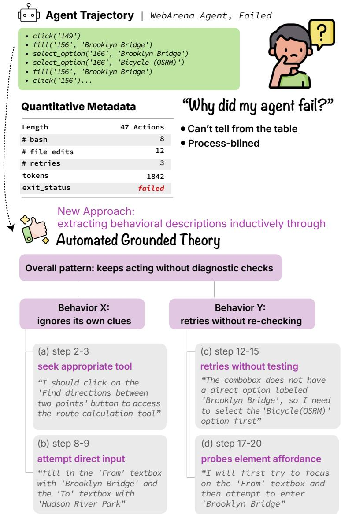
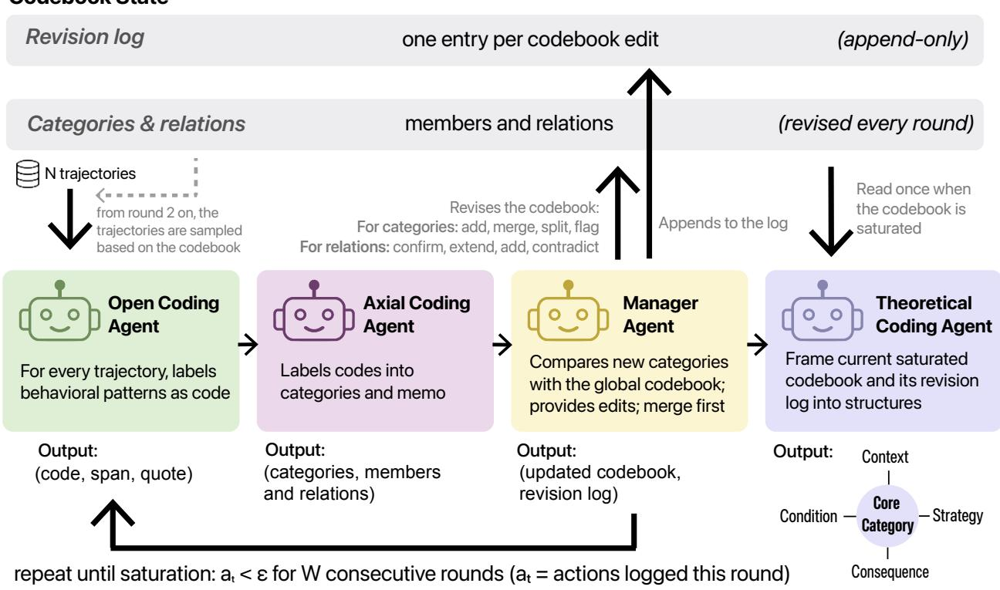
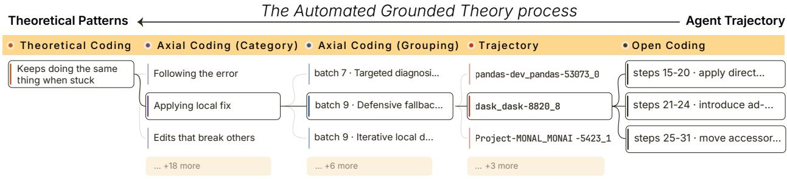
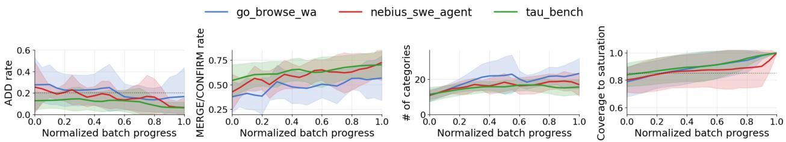
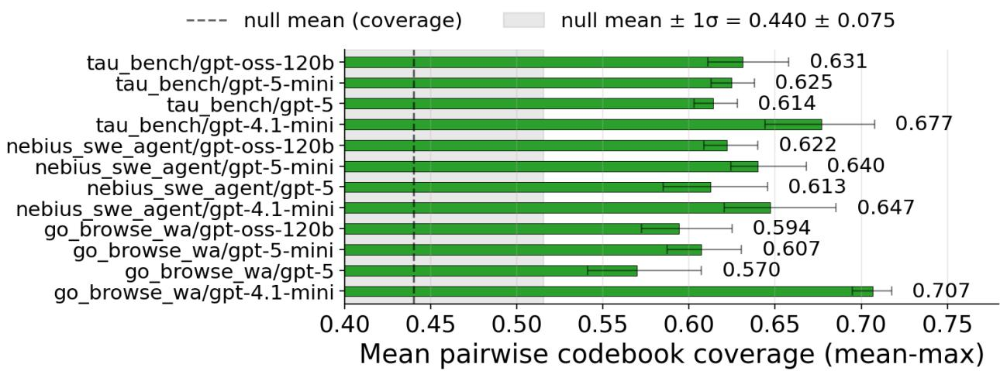
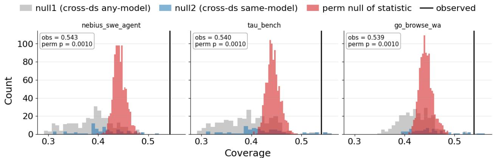

# Using Grounded Theory for Agent Behavior Analysis at Scale

Zhuoran Lu<sup>1</sup>, Yangyang Yu<sup>2</sup>, Zhuoyan Li<sup>1</sup>, Yibo Meng<sup>3</sup>, Nan Jiang<sup>4</sup>, Chengxi Zang<sup>3</sup>, Jie Gao<sup>5</sup> and Ziang Xiao<sup>5</sup>

<sup>1</sup>Purdue Universit<sub>y,</sub> <sup>2</sup>Stevens Institute of Technolo<sub>gy,</sub> <sup>3</sup>Cornell Universit<sub>y,</sub> <sup>4</sup>Universit<sub>y</sub> of Texas at El Paso<sub>,</sub> <sup>5</sup>Johns Ho<sub>p</sub>kins Universit<sub>y</sub>

Understanding agent behavior requires methods that scale to thousands of trajectories and surface new patterns in long, often unfamiliar tasks where pre-built classifiers fall short. We propose to bring grounded theory into agent trajectory analysis: a six-decade-old qualitative method from the social sciences, with a principled saturation criterion and an auditable trail from data to theory. We propose AutoTraceGT<sup>1</sup>, the first multi-agent pipeline that automates grounded theory on agent trajectories: it iteratively performs open, axial, and theoretical coding until saturation, producing a behavioral taxonomy tailored to each task. Across six trajectory corpora, AutoTraceGT produces codebooks that recover 73 − 91% of the failure modes in human-annotated taxonomies and surface additional patterns that those taxonomies miss. The emergent theoretical narrative aligns with prior expert accounts. Used as a deductive feature space, the codebook outperforms zero-shot and few-shot LLM baselines on downstream failure prediction. These results suggest Grounded Theory ofers a scalable analytic tool for ML researchers and agent developers studying what agents actually do.

## 1. Introduction

Recent advances in lar<sub>g</sub>e lan<sub>g</sub>ua<sub>g</sub>e models (LLMs) have enabled a<sub>g</sub>ents to address increasin<sub>g</sub>l<sub>y</sub> com<sub>p</sub>lex tasks, includin<sub>g</sub> software en<sub>g</sub>ineerin<sub>g</sub> (Jimenez et al., 2024; Yan<sub>g</sub> et al., 2024), web browsin<sub>g</sub> (Den<sub>g</sub> et al., 2023; Zhou et al., 2024), com<sub>p</sub>uter use (Xie et al., 2024), and dee<sub>p</sub> research (Mialon et al., 2024). These s<sub>y</sub>stems t<sub>yp</sub>icall<sub>y</sub> o<sub>p</sub>erate throu<sub>g</sub>h a<sub>g</sub>entic frameworks, in which an LLM interacts with external environments over multi-ste trajectories consistin of lannin , actions, observations, and <sub>rev</sub>i<sub>s</sub>i<sub>ons.</sub> H<sub>owever, s</sub>t<sub>ronger</sub> t<sub>as</sub>k<sub>-so</sub>l<sub>v</sub>i<sub>ng a</sub>bilit<sub>y</sub> d<sub>oes no</sub>t <sub>e</sub>li<sub>m</sub>i<sub>na</sub>t<sub>e</sub> b<sub>r</sub>ittl<sub>eness.</sub> A<sub>gen</sub>t<sub>s may s</sub>till f<sub>a</sub>il <sub>a</sub>ft<sub>er</sub> l<sub>ong sequences o</sub>f l<sub>oca</sub>ll<sub>y reasona</sub>bl<sub>e</sub> d<sub>ec</sub>i<sub>s</sub>i<sub>ons, ma</sub>ki<sub>ng</sub> it difi<sub>cu</sub>lt t<sub>o un</sub>d<sub>ers</sub>t<sub>an</sub>d <sub>w</sub>hi<sub>c</sub>h b<sub>e</sub>h<sub>av</sub>i<sub>ors</sub> <sub>suppor</sub>t <sub>success</sub>f<sub>u</sub>l <sub>pro</sub>bl<sub>em so</sub>l<sub>v</sub>i<sub>ng an</sub>d <sub>w</sub>hi<sub>c</sub>h b<sub>e</sub>h<sub>av</sub>i<sub>ors</sub> l<sub>ea</sub>d t<sub>o</sub> f<sub>a</sub>il<sub>ure.</sub> Thi<sub>s mo</sub>ti<sub>va</sub>t<sub>es a cr</sub>iti<sub>ca</sub>l question: what do agents actually do while solving tasks, and how can we characterize these behaviors at scale?

E<sub>x</sub>i<sub>s</sub>ti<sub>ng ana</sub>l<sub>yses</sub> f<sub>a</sub>ll i<sub>n</sub>t<sub>o</sub> t<sub>wo me</sub>th<sub>o</sub>d<sub>o</sub>l<sub>og</sub>i<sub>ca</sub>ll<sub>y cons</sub>t<sub>ra</sub>i<sub>ne</sub>d <sub>reg</sub>i<sub>mes.</sub> Li<sub>g</sub>ht<sub>we</sub>i<sub>g</sub>ht <sub>quan</sub>tit<sub>a</sub>ti<sub>ve</sub> metadata (len<sub>g</sub>th, action counts, task success) scales easil<sub>y</sub> but ex<sub>p</sub>lains little about the underl<sub>y</sub>in<sub>g</sub> <sub>p</sub>roblem-solvin<sub>g p</sub>rocess (Jimenez et al., 2024; Yan<sub>g</sub> et al., 2024). Human anal<sub>y</sub>sis is inter<sub>p</sub>retable but expensive, especially for agent trajectories with hundreds of steps (Cemri et al., 2025; Gao et al., 2026). A h<sub>y</sub>brid a<sub>pp</sub>roach that builds behavioral classifiers based on <sub>p</sub>re-defined, often ex<sub>p</sub>ert-derived, b<sub>e</sub>h<sub>av</sub>i<sub>ora</sub>l <sub>pa</sub>tt<sub>erns</sub> i<sub>s</sub> t<sub>oo</sub> <sub>r</sub>i<sub>g</sub>id t<sub>o</sub> <sub>genera</sub>li<sub>ze</sub> t<sub>o</sub> <sub>nove</sub>l t<sub>as</sub>k<sub>s</sub> <sub>an</sub>d <sub>emergen</sub>t <sub>agen</sub>t b<sub>e</sub>h<sub>av</sub>i<sub>ors.</sub> Th<sub>e</sub> d<sub>eeper</sub> <sub>gap</sub> i<sub>s</sub> th<sub>a</sub>t th<sub>e</sub> ML <sub>commun</sub>it<sub>y curren</sub>tl<sub>y</sub> l<sub>ac</sub>k<sub>s a me</sub>th<sub>o</sub>d<sub>o</sub>l<sub>ogy</sub> f<sub>or s</sub>t<sub>u</sub>d<sub>y</sub>i<sub>ng agen</sub>t b<sub>e</sub>h<sub>av</sub>i<sub>or</sub> th<sub>a</sub>t i<sub>s</sub> scalable and generalizable, a problem the social sciences have long faced and for which they have d<sub>eve</sub>l<sub>ope</sub>d <sub>me</sub>th<sub>o</sub>d<sub>o</sub>l<sub>og</sub>i<sub>ca</sub>l <sub>responses.</sub>

We propose to bring a six-decade-old methodology widely used across qualitative research, Grounded Theory, into ML as a new analytic method for agents. Grounded theory (Charmaz, 2014; Glaser and Strauss, 1967) is an inductive <sub>q</sub>ualitative methodolo<sub>gy</sub> in which theories and <sub>ca</sub>t<sub>egor</sub>i<sub>es emerge</sub> f<sub>rom</sub> th<sub>e</sub> d<sub>a</sub>t<sub>a</sub> it<sub>se</sub>lf <sub>ra</sub>th<sub>er</sub> th<sub>an</sub> f<sub>rom pr</sub>i<sub>or</sub> h<sub>ypo</sub>th<sub>eses: researc</sub>h<sub>ers</sub> l<sub>a</sub>b<sub>e</sub>l <sub>concre</sub>t<sub>e</sub> i<sub>nc</sub>id<sub>en</sub>t<sub>s, group</sub> th<sub>em</sub> i<sub>n</sub>t<sub>o ca</sub>t<sub>egor</sub>i<sub>es, an</sub>d it<sub>era</sub>ti<sub>ve</sub>l<sub>y re</sub>fi<sub>ne</sub> th<sub>ose ca</sub>t<sub>egor</sub>i<sub>es aga</sub>i<sub>ns</sub>t <sub>new</sub>l<sub>y samp</sub>l<sub>e</sub>d data (Saldaña, 2015; Williams and Moser, 2019). This process terminates at theoretical saturation, when new sampling no longer surfaces new structure. This makes it well-suited to agent trajectory <sub>ana</sub>l<sub>ys</sub>i<sub>s on</sub> th<sub>ree coun</sub>t<sub>s:</sub> it i<sub>s</sub> i<sub>n</sub>d<sub>uc</sub>ti<sub>ve, an</sub>d th<sub>us open</sub> t<sub>o nove</sub>l t<sub>as</sub>k<sub>s an</sub>d <sub>emergen</sub>t b<sub>e</sub>h<sub>av</sub>i<sub>ors;</sub> it <sub>o</sub>f<sub>ers</sub> <sub>a</sub> <sub>pr</sub>i<sub>nc</sub>i<sub>p</sub>l<sub>e</sub>d<sub>,</sub> d<sub>a</sub>t<sub>a-</sub>d<sub>r</sub>i<sub>ven</sub> <sub>s</sub>t<sub>opp</sub>i<sub>ng</sub> <sub>cr</sub>it<sub>er</sub>i<sub>on</sub> <sub>v</sub>i<sub>a</sub> th<sub>eore</sub>ti<sub>ca</sub>l <sub>sa</sub>t<sub>ura</sub>ti<sub>on;</sub> <sub>an</sub>d it <sub>y</sub>i<sub>e</sub>ld<sub>s</sub> <sub>an</sub> <sub>au</sub>dit<sub>a</sub>bl<sub>e</sub> trail from raw trajectories to theoretical claims.

  
Figure 1 | Quantitative metadata records that an agent failed but is process-blind to why. Automated grounded theory (Glaser and Strauss, 1967; Saldaña, 2015) surfaces behavioral patterns from the agent’s own reasoning, e.g., keeps acting without diagnostic checks, decomposed into sub-behaviors (ignores its own clues, retries without re-checking) with step-level quoted evidence.

To t<sup>h</sup>is en<sup>d</sup>, we intro<sup>d</sup>uce AutoTraceGT, t<sup>h</sup>e <sup>fi</sup>rst en<sup>d</sup>-to-en<sup>d</sup> pipe<sup>l</sup>ine t<sup>h</sup>at operationa<sup>l</sup>izes grounded theory for analyzing agent trajectories. Three agents perform layered semantic compression: OpenCode annotates a sing<sup>l</sup>e trajectory wit<sup>h d</sup>escriptive co<sup>d</sup>es <sup>f</sup>or “w<sup>h</sup>at <sup>h</sup>appens at w<sup>h</sup>ic<sup>h</sup> steps”; AxialCode groups a <sup>b</sup>atc<sup>h</sup> o<sup>f</sup> co<sup>d</sup>e<sup>d</sup> trajectories into a series o<sup>f</sup> <sup>b</sup>e<sup>h</sup>aviora<sup>l</sup> categories;

an<sup>d</sup> TheoreticalCode integrates t<sup>h</sup>ese categories into a t<sup>h</sup>eoretica<sup>l</sup> account. Running in para<sup>ll</sup>e<sup>l</sup>, Manage <sup>d</sup>rives t<sup>h</sup>e met<sup>h</sup>o<sup>d</sup>o<sup>l</sup>ogy’s iterative core: strategic samp<sup>l</sup>ing an<sup>d</sup> constant comparison against th<sub>e runn</sub>i<sub>ng co</sub>d<sub>e</sub>b<sub>oo</sub>k<sub>, repea</sub>t<sub>e</sub>d <sub>un</sub>til <sub>sa</sub>t<sub>ura</sub>ti<sub>on.</sub>

We evaluate AutoTraceGT along two axes. For process reliability, we show that across multiple <sup>d</sup>atasets an<sup>d b</sup>ac<sup>kb</sup>one LLMs, AutoTraceGT <sup>d</sup>rives co<sup>d</sup>e<sup>b</sup>oo<sup>k</sup>s towar<sup>d</sup> saturation an<sup>d</sup> pro<sup>d</sup>uces <sub>co</sub>d<sub>e</sub>b<sub>oo</sub>k<sub>s repro</sub>d<sub>uc</sub>ibl<sub>e across</sub> i<sub>n</sub>d<sub>epen</sub>d<sub>en</sub>t <sub>runs a</sub>t <sub>a</sub> l<sub>eve</sub>l <sub>c</sub>l<sub>ear</sub>l<sub>y separa</sub>t<sub>e</sub>d f<sub>rom</sub> th<sub>e no</sub>i<sub>se</sub> fl<sub>oor</sub> of difering data or model inductive biases. For artifact quality, the induced codebooks cover the majority of failure modes in independently constructed human taxonomies while surfacing additional <sub>pa</sub>tt<sub>erns</sub> th<sub>ose</sub> t<sub>axonom</sub>i<sub>es sys</sub>t<sub>ema</sub>ti<sub>ca</sub>ll<sub>y m</sub>i<sub>ss;</sub> th<sub>e</sub> th<sub>eore</sub>ti<sub>ca</sub>l <sub>narra</sub>ti<sub>ve</sub> i<sub>n</sub>d<sub>epen</sub>d<sub>en</sub>tl<sub>y converges w</sub>ith <sub>casca</sub>d<sub>e-o</sub>f<sub>-errors accoun</sub>t<sub>s ar</sub>ti<sub>cu</sub>l<sub>a</sub>t<sub>e</sub>d b<sub>y pr</sub>i<sub>or exper</sub>t <sub>ana</sub>l<sub>yses; an</sub>d th<sub>e co</sub>d<sub>e</sub>b<sub>oo</sub>k <sub>can</sub> b<sub>e repurpose</sub>d <sub>as a</sub> d<sub>e</sub>d<sub>uc</sub>ti<sub>ve</sub> f<sub>ea</sub>t<sub>ure space</sub> f<sub>or</sub> f<sub>a</sub>il<sub>ure pre</sub>di<sub>c</sub>ti<sub>on, ou</sub>t<sub>per</sub>f<sub>orm</sub>i<sub>ng</sub> f<sub>ew-s</sub>h<sub>o</sub>t LLM b<sub>ase</sub>li<sub>nes across</sub> <sub>mu</sub>lti<sub>p</sub>l<sub>e</sub> b<sub>ac</sub>k<sub>en</sub>d <sub>mo</sub>d<sub>e</sub>l<sub>s.</sub> O<sub>ur con</sub>t<sub>r</sub>ib<sub>u</sub>ti<sub>ons are:</sub>

• A new analytic method for ML. We argue that grounded theory, a six-decade-old method from th<sub>e soc</sub>i<sub>a</sub>l <sub>sc</sub>i<sub>ences, can</sub> b<sub>e</sub> b<sub>roug</sub>ht i<sub>n</sub>t<sub>o</sub> ML <sub>as a pro</sub>d<sub>uc</sub>ti<sub>ve ana</sub>l<sub>y</sub>ti<sub>c</sub> t<sub>oo</sub>l f<sub>or sca</sub>l<sub>a</sub>bl<sub>e ana</sub>l<sub>ys</sub>i<sub>s o</sub>f agent behavior and trajectories.

• AutoTraceGT. We <sup>b</sup>u<sup>ild</sup> t<sup>h</sup>e <sup>fi</sup>rst en<sup>d</sup>-to-en<sup>d</sup> p<sup>i</sup>pe<sup>li</sup>ne <sup>f</sup>or automate<sup>d</sup> groun<sup>d</sup>e<sup>d</sup> t<sup>h</sup>eory, <sup>i</sup>mp<sup>l</sup>ement<sup>i</sup>ng <sub>open,</sub> <sub>ax</sub>i<sub>a</sub>l<sub>,</sub> <sub>an</sub>d th<sub>eore</sub>ti<sub>ca</sub>l <sub>co</sub>di<sub>ng</sub> <sub>as</sub> <sub>ro</sub>l<sub>e-spec</sub>i<sub>a</sub>li<sub>ze</sub>d <sub>agen</sub>t<sub>s</sub> <sub>coor</sub>di<sub>na</sub>t<sub>e</sub>d b<sub>y</sub> <sub>a</sub> <sub>co</sub>d<sub>e</sub>b<sub>oo</sub>k <sub>manager,</sub> <sub>w</sub>ith <sub>every</sub> i<sub>n</sub>t<sub>erme</sub>di<sub>a</sub>t<sub>e ar</sub>tif<sub>ac</sub>t <sub>mac</sub>hi<sub>ne-rea</sub>d<sub>a</sub>bl<sub>e an</sub>d <sub>au</sub>dit<sub>a</sub>bl<sub>e.</sub>

• Empirical validation. On 7,500+ trajectories across six datasets and four backbone LLMs, we s<sup>h</sup>ow t<sup>h</sup>at AutoTraceGT reac<sup>h</sup>es saturation an<sup>d</sup> pro<sup>d</sup>uces repro<sup>d</sup>uci<sup>bl</sup>e co<sup>d</sup>e<sup>b</sup>oo<sup>k</sup>s, covers t<sup>h</sup>e majority of human-taxonomy failure modes, recovers prior expert theoretical accounts, and yields <sub>a</sub> d<sub>e</sub>d<sub>uc</sub>ti<sub>ve</sub> f<sub>ea</sub>t<sub>ure space</sub> f<sub>or</sub> f<sub>a</sub>il<sub>ure pre</sub>di<sub>c</sub>ti<sub>on.</sub>

## 2. Related Work

Grounded theory is an inductive qualitative methodology (Charmaz, 2014; Glaser and Strauss, 1967) widel<sub>y</sub> used across the social sciences, with close analo<sub>g</sub>ues in thematic anal<sub>y</sub>sis (Braun and Clarke, 2006) and content analysis (Krippendorf, 2018). Its core idea is to build theories grounded i<sub>n</sub> d<sub>a</sub>t<sub>a ra</sub>th<sub>er</sub> th<sub>an</sub> t<sub>es</sub>t <sub>pre-ex</sub>i<sub>s</sub>ti<sub>ng</sub> h<sub>ypo</sub>th<sub>eses, w</sub>hi<sub>c</sub>h <sub>su</sub>it<sub>s p</sub>h<sub>enomena w</sub>h<sub>ere es</sub>t<sub>a</sub>bli<sub>s</sub>h<sub>e</sub>d th<sub>eor</sub>i<sub>es</sub> do not a<sub>pp</sub>l<sub>y</sub> or new insi<sub>g</sub>hts are sou<sub>g</sub>ht. The method is realized throu<sub>g</sub>h <sub>q</sub>ualitative codin<sub>g</sub> (Saldaña, 2015; Williams and Moser, 2019), in which the analyst proceeds in three layered stages. Open coding labels salient meanings in each document with descriptive tags. Axial coding links these ta<sub>g</sub>s across documents (e.<sub>g</sub>., b<sub>y</sub> cause, condition, conse<sub>q</sub>uence) and <sub>g</sub>rou<sub>p</sub>s them into hi<sub>g</sub>her-level categories. Theoretical (or selective) coding integrates the saturated categories into a coherent account <sub>o</sub>f th<sub>e</sub> <sub>p</sub>h<sub>enomenon.</sub> B<sub>ecause</sub> <sub>every</sub> <sub>ca</sub>t<sub>egory</sub> <sub>an</sub>d <sub>c</sub>l<sub>a</sub>i<sub>m</sub> <sub>s</sub>t<sub>ays</sub> li<sub>n</sub>k<sub>e</sub>d t<sub>o</sub> th<sub>e</sub> i<sub>nc</sub>id<sub>en</sub>t<sub>s</sub> th<sub>a</sub>t <sub>pro</sub>d<sub>uce</sub>d it<sub>, groun</sub>d<sub>e</sub>d th<sub>eory y</sub>i<sub>e</sub>ld<sub>s</sub> h<sub>uman-rea</sub>d<sub>a</sub>bl<sub>e pa</sub>tt<sub>erns w</sub>ith <sub>an au</sub>dit<sub>a</sub>bl<sub>e</sub> t<sub>ra</sub>il b<sub>ac</sub>k t<sub>o</sub> th<sub>e raw</sub> d<sub>a</sub>t<sub>a, a</sub> natural fit for analyzing open-ended agent trajectories at scale.

LLM-assisted Qualitative Analysis. LLMs have been used to scale qualitative coding, including thematic anal sis on interview transcri ts (De Paoli, 2024; Xiao et al., 2023), hierarchical inductive codin<sub>g</sub> (Gao et al., 2024; Zhon<sub>g</sub> et al., 2025), multi-a<sub>g</sub>ent thematic anal<sub>y</sub>sis (Lin et al., 2026; Yi et al., 2025), and dedicated <sub>g</sub>rounded-theor<sub>y p</sub>i<sub>p</sub>elines (Pi et al., 2025; <sup>Ü</sup>bellacker, 2024). We focus on th<sub>e</sub> l<sub>as</sub>t <sub>ca</sub>t<sub>egory, w</sub>h<sub>ere</sub> t<sub>wo gaps rema</sub>i<sub>n.</sub> Fi<sub>rs</sub>t<sub>, groun</sub>d<sub>e</sub>d th<sub>eory</sub>’<sub>s mu</sub>lti<sub>-s</sub>t<sub>age s</sub>t<sub>ruc</sub>t<sub>ure</sub> i<sub>s rare</sub>l<sub>y</sub> <sub>p</sub>reserved end-to-end: AcademiaOS (<sup>Ü</sup>bellacker, 2024) ofers limited cross-sta<sub>g</sub>e orchestration, and LOGOS (Pi et al., 2025) re<sub>p</sub>laces axial and selective codin<sub>g</sub> with semantic clusterin<sub>g</sub>, fore<sub>g</sub>oin<sub>g</sub> the role-diferentiated analytic stance the methodology relies on. Second, theoretical saturation (grounded theor<sub>y</sub>’s own termination criterion) is not em<sub>p</sub>iricall<sub>y</sub> verified b<sub>y</sub> these <sub>p</sub>i<sub>p</sub>elines, which instead sto<sub>p</sub> <sub>a</sub>ft<sub>er a</sub> fi<sub>xe</sub>d <sub>num</sub>b<sub>er o</sub>f it<sub>era</sub>ti<sub>ons w</sub>h<sub>e</sub>th<sub>er</sub> th<sub>e ro</sub>d<sub>uce</sub>d <sub>co</sub>d<sub>e</sub>b<sub>oo</sub>k <sub>re</sub>fl<sub>ec</sub>t<sub>s conce</sub> t<sub>ua</sub>l b<sub>rea</sub>dth <sub>or</sub> an ar<sup>b</sup>itrary stop is <sup>l</sup>e<sup>f</sup>t unc<sup>l</sup>ear. AutoTraceGT a<sup>dd</sup>resses <sup>b</sup>ot<sup>h</sup>: it imp<sup>l</sup>ements t<sup>h</sup>e t<sup>h</sup>ree stages as <sub>ro</sub>l<sub>e-spec</sub>i<sub>a</sub>li<sub>ze</sub>d <sub>agen</sub>t<sub>s</sub> <sub>w</sub>ith <sub>an</sub> <sub>exp</sub>li<sub>c</sub>it <sub>cross-</sub>b<sub>a</sub>t<sub>c</sub>h <sub>manager,</sub> <sub>an</sub>d <sub>ver</sub>ifi<sub>es</sub> <sub>sa</sub>t<sub>ura</sub>ti<sub>on</sub> th<sub>roug</sub>h <sub>co</sub>d<sub>e</sub>b<sub>oo</sub>k <sub>convergence across</sub> it<sub>era</sub>ti<sub>ons.</sub>

  
Figure 2 | Overview of our multi-agent qualitative coding pipeline.

Agent Behavior Analysis. LLM-based agents are typically benchmarked by task-completion success on suites such as SWE-bench (Jimenez et al., 2024) and WebArena (Zhou et al., 2024) which re<sub>p</sub>ort whether trajectories succeed but reveal little about wh the fail. A rowin line of work addresses this throu<sub>g</sub>h structured failure anal<sub>y</sub>sis: A<sub>g</sub>entErrorTaxonom<sub>y</sub> (Zhu et al., 2025) decom<sub>p</sub>oses failures into five o<sub>p</sub>erational modules, MAST (Cemri et al., 2025) a<sub>pp</sub>lies <sub>g</sub>rounded theor<sub>y</sub> b<sub>y</sub> hand to 150+ <sub>mu</sub>lti<sub>-agen</sub>t t<sub>races an</sub>d <sub>pro</sub>d<sub>uces a</sub> 14<sub>-mo</sub>d<sub>e</sub> t<sub>axonomy, an</sub>d <sub>o</sub>th<sub>ers</sub> t<sub>arge</sub>t <sub>su</sub>b<sub>pro</sub>bl<sub>ems suc</sub>h <sub>as</sub> t<sub>oo</sub>l<sub>-</sub> <sub>p</sub>arameter failures (Xion<sub>g</sub> et al., 2025) or rubric-based trajector<sub>y</sub> verification (Ra<sub>g</sub>havendra et al., 2026). Across this literature, taxonomies are built either b<sub>y</sub> researchers iteratin<sub>g</sub> on small sam<sub>p</sub>les <sub>or</sub> b<sub>y</sub> LLM<sub>s promp</sub>t<sub>e</sub>d t<sub>o enumera</sub>t<sub>e</sub> f<sub>a</sub>il<sub>ure mo</sub>d<sub>es</sub> i<sub>n one pass—ne</sub>ith<sub>er rou</sub>t<sub>e ma</sub>k<sub>es</sub> th<sub>e</sub> i<sub>n</sub>d<sub>uc</sub>ti<sub>ve</sub> process au<sup>d</sup>ita<sup>bl</sup>e or guarantees a veri<sup>fi</sup>a<sup>bl</sup>e stopping criterion. AutoTraceGT operationa<sup>l</sup>izes t<sup>h</sup>e full Grounded Theory loop algorithmically and scales it to thousands of trajectories, with theoretical <sub>sa</sub>t<sub>ura</sub>ti<sub>on</sub> <sub>ver</sub>ifi<sub>e</sub>d <sub>emp</sub>i<sub>r</sub>i<sub>ca</sub>ll<sub>y.</sub>

## 3. Multi-Agent Framework

AutoTraceGT ta<sup>k</sup>es a corpus o<sup>f</sup> � agent trajectories an<sup>d</sup> con<sup>d</sup>ucts groun<sup>d</sup>e<sup>d</sup> t<sup>h</sup>eory ana<sup>l</sup>ysis over it. T<sup>h</sup>e <sup>f</sup>ramewor<sup>k</sup> comprises <sup>f</sup>our agents operating at t<sup>h</sup>ree sca<sup>l</sup>es: OpenCode wor<sup>k</sup>s on a sing<sup>l</sup>e trajectory, AxialCode on a <sup>b</sup>atc<sup>h</sup> o<sup>f</sup> trajectories, an<sup>d</sup> TheoreticalCode on t<sup>h</sup>e <sup>f</sup>u<sup>ll</sup> corpus to synt<sup>h</sup>esize t<sup>h</sup>e emergent t<sup>h</sup>eory; ort<sup>h</sup>ogona<sup>l</sup> to t<sup>h</sup>ese, Manage maintains ana<sup>l</sup>ytic state an<sup>d</sup> continuity across <sup>b</sup>atc<sup>h</sup>es. Fi<sub>gure</sub> 2 <sub>presen</sub>t<sub>s</sub> th<sub>e</sub> f<sub>ramewor</sub>k <sub>overv</sub>i<sub>ew, an</sub>d <sub>we</sub> d<sub>escr</sub>ib<sub>e eac</sub>h t<sub>erm</sub> b<sub>e</sub>l<sub>ow.</sub>

Algorithm 1: Automated Grounded Theory for Agent Trajectories   
Input: Pool of � trajectories; batch size $B ;$ sam<sub>p</sub><sup>li</sup>n<sub>g</sub> <sub>p</sub>o<sup>li</sup>c<sub>y</sub> $\pi ;$ <sub>sa</sub>t<sub>ura</sub>ti<sub>on</sub> th<sub>res</sub>h<sub>o</sub>ld $\epsilon ;$ <sub>s</sub>t<sub>a</sub>bilit<sub>y</sub>   
<sub>w</sub>i<sub>n</sub>d<sub>ow</sub> �   
Output: Saturated codebook $K ,$ th<sub>eore</sub>ti<sub>ca</sub>l <sub>accoun</sub>t $( c ^ { * } , N )$   
<sub>1</sub> I<sub>n</sub>iti<sub>a</sub>li<sub>ze</sub> $K \gets \emptyset ; \quad t \gets 0 ;$   
2 repeat $/ /$ Saturate after continuous � rounds with additions $< \epsilon$   
3 $t \gets t + 1 ;$   
4 Draw a batch of � trajectories from the pool via �, conditioned on $K ;$   
5 foreach trajectory in the batch do   
6 Run OpenCode c<sup>h</sup>un<sup>k</sup> <sup>b</sup>y c<sup>h</sup>un<sup>k</sup>, carrying a segment memo;   
7 � ← AxialCode(co<sup>d</sup>e<sup>d b</sup>atc<sup>h</sup>); � ← Manage(�, �); � ← #add actions <sup>l</sup>ogge<sup>d</sup> t<sup>h</sup>is   
<sub>roun</sub>d<sub>;</sub>   
8 until $t \geq W$ and $a _ { j } < \epsilon ,$ for all $j \in \left\{ t - W + 1 , \ldots , t \right\}$   
9 $( c ^ { * } , N ) \gets$ TheoreticalCode(�);   
10 return �, $( c ^ { * } , N )$

Open coding (per trajectory). The open-coding agent, OpenCode : Trajectory → Records, labels behavioral incidents on a trajectory with conceptual codes. Each output record takes the form (code, span, quote): a 2–5 word conceptual code describing what happens, a sub-step span indicating where it happens, a short verbatim quote as the evidence. The number of codes per trajectory is <sub>c</sub>h<sub>osen a</sub>d<sub>ap</sub>ti<sub>ve</sub>l<sub>y</sub> b<sub>y</sub> th<sub>e agen</sub>t<sub>.</sub> W<sub>e</sub> i<sub>ns</sub>t<sub>ruc</sub>t it t<sub>o a</sub>b<sub>s</sub>t<sub>rac</sub>t b<sub>e</sub>h<sub>av</sub>i<sub>ora</sub>l <sub>pa</sub>tt<sub>erns ra</sub>th<sub>er</sub> th<sub>an res</sub>t<sub>a</sub>t<sub>e</sub> <sub>sur</sub>f<sub>ace-</sub>l<sub>eve</sub>l <sub>ac</sub>ti<sub>ons</sub> t<sub>o use</sub> th<sub>e concep</sub>t<sub>ua</sub>l <sub>co</sub>d<sub>e cap</sub>t<sub>ures recurren</sub>t <sub>mo</sub>d<sub>es o</sub>f <sub>con</sub>d<sub>uc</sub>t $( \mathrm { e . g . , }$ diagnose environment constraints, persist through validation hurdles) instead of literal tool calls. Operationally, to keep each LLM call within context, we partition the message sequence m into chunks and run OpenCode c<sup>h</sup>un<sup>k b</sup>y c<sup>h</sup>un<sup>k</sup>, carrying a segment memo across ca<sup>ll</sup>s to preserve ana<sup>l</sup>ytic continuity (see Algorithm 1). Coding is sequential within a trajectory but parallelizable across trajectories.

Axial coding (per sampling round). Following the iterative structure of grounded theory, analysis proceeds round by round: each round is a batch of open-coded trajectories drawn under a sampling po<sup>l</sup>icy an<sup>d</sup> <sup>f</sup>e<sup>d</sup> to t<sup>h</sup>e axia<sup>l</sup>-co<sup>d</sup>ing agent. AxialCode : Co<sup>d</sup>e<sup>d</sup>Trajectories → Categories × Re<sup>l</sup>ations <sub>groups</sub> th<sub>e</sub> <sub>roun</sub>d’<sub>s</sub> <sub>concep</sub>t<sub>ua</sub>l <sub>co</sub>d<sub>es</sub> i<sub>n</sub>t<sub>o</sub> <sub>ca</sub>t<sub>egor</sub>i<sub>es</sub> <sub>an</sub>d th<sub>e</sub> t<sub>ype</sub>d <sub>re</sub>l<sub>a</sub>ti<sub>ons</sub> b<sub>e</sub>t<sub>ween</sub> th<sub>em,</sub> <sub>an</sub>d <sub>em</sub>it<sub>s</sub> <sub>an</sub> <sub>ax</sub>i<sub>a</sub>l <sub>memo</sub> $\mu ^ { \mathrm { a x } }$ <sub>summar</sub>i<sub>z</sub>i<sub>ng</sub> th<sub>e</sub> <sub>roun</sub>d<sub>.</sub> E<sub>ac</sub>h i<sub>n</sub>d<sub>uce</sub>d <sub>ca</sub>t<sub>egory</sub> <sub>carr</sub>i<sub>es</sub> <sub>a</sub> t<sub>ex</sub>t<sub>ua</sub>l d<sub>e</sub>fi<sub>n</sub>iti<sub>on,</sub> th<sub>e</sub> <sub>se</sub>t of code records supporting it, and a status tag � ∈ {succ, fail, both} derived by aggregating the terminal status of each member’s source trajectory. The membership pointers preserve an explicit link from each category back to its supporting episodes and source trajectories.

Codebook management (constant comparison across rounds). Grounded theory’s practice of <sub>con</sub>ti<sub>nuous</sub>l<sub>y rev</sub>i<sub>s</sub>i<sub>ng co</sub>d<sub>es aga</sub>i<sub>ns</sub>t i<sub>ncom</sub>i<sub>ng</sub> d<sub>a</sub>t<sub>a</sub> i<sub>s rea</sub>li<sub>ze</sub>d <sub>exp</sub>li<sub>c</sub>itl<sub>y as</sub> th<sub>e co</sub>d<sub>e</sub>b<sub>oo</sub>k<sub>-manager</sub> Manage : Co<sup>d</sup>e<sup>b</sup>oo<sup>k</sup> × Roun<sup>d</sup>Structure → Co<sup>d</sup>e<sup>b</sup>oo<sup>k</sup>, w<sup>h</sup>ic<sup>h</sup> reconci<sup>l</sup>es eac<sup>h</sup> roun<sup>d</sup>’s axia<sup>l</sup> output <sub>aga</sub>i<sub>ns</sub>t th<sub>e runn</sub>i<sub>ng co</sub>d<sub>e</sub>b<sub>oo</sub>k<sub>.</sub> W<sub>e ma</sub>i<sub>n</sub>t<sub>a</sub>i<sub>n a vers</sub>i<sub>one</sub>d <sub>co</sub>d<sub>e</sub>b<sub>oo</sub>k <sub>s</sub>t<sub>a</sub>t<sub>e</sub> $K _ { t } = \left( C _ { t } , \mathcal { R } _ { t } , L _ { t } \right)$ <sub>w</sub>ith <sub>a rev</sub>i<sub>s</sub>i<sub>on</sub> <sup>l</sup>o<sub>g</sub> $L _ { t } ;$ on eac<sup>h</sup> new roun<sup>d</sup>, Manage pro<sup>d</sup>uces $K _ { t + 1 }$ b<sub>y se</sub>l<sub>ec</sub>ti<sub>ng</sub> f<sub>or eac</sub>h <sub>new ca</sub>t<sub>egory an ac</sub>ti<sub>on</sub> f<sub>rom</sub> {add, merge, split, flag} an<sup>d</sup> <sup>f</sup>or eac<sup>h</sup> new re<sup>l</sup>ation <sup>f</sup>rom {confirm, extend, add, contradict}, <sub>w</sub>ith <sub>every ac</sub>ti<sub>on appen</sub>d<sub>e</sub>d t<sub>o</sub> $L _ { t + 1 }$ <sub>.</sub> W<sub>e a</sub>d<sub>op</sub>t <sub>a merge-</sub>fi<sub>rs</sub>t <sub>po</sub>li<sub>cy, a</sub>li<sub>gn</sub>i<sub>ng new ca</sub>t<sub>egor</sub>i<sub>es</sub> t<sub>o ex</sub>i<sub>s</sub>ti<sub>ng</sub> <sub>s</sub>t<sub>ruc</sub>t<sub>ure w</sub>h<sub>enever a compa</sub>tibl<sub>e ma</sub>t<sub>c</sub>h <sub>ex</sub>i<sub>s</sub>t<sub>s.</sub> D<sub>e</sub>fi<sub>ne</sub> th<sub>e num</sub>b<sub>er o</sub>f <sub>new</sub>l<sub>y a</sub>dd<sub>e</sub>d <sub>ca</sub>t<sub>egor</sub>i<sub>es</sub> i<sub>n roun</sub>d � as $a _ { t } = | \{ \ell \in L _ { t } \ \backslash \ L _ { t - 1 }$ : ℓ.action = add}|. We operationalize theoretical saturation as the criterion $a _ { t } < \epsilon$ <sub>an</sub>d $a _ { t - 1 } < \epsilon$ f<sub>or</sub> t<sub>wo consecu</sub>ti<sub>ve roun</sub>d<sub>s, an</sub>d d<sub>e</sub>fi<sub>ne</sub> � <sub>as</sub> th<sub>e</sub> fi<sub>rs</sub>t <sub>roun</sub>d <sub>a</sub>t <sub>w</sub>hi<sub>c</sub>h th<sub>e cr</sub>it<sub>er</sub>i<sub>on</sub> i<sub>s</sub> <sub>me</sub>t<sub>.</sub> Th<sub>e</sub> <sub>resu</sub>lti<sub>ng</sub> $L _ { T }$ <sub>prov</sub>id<sub>es</sub> <sub>an</sub> <sub>au</sub>dit<sub>a</sub>bl<sub>e</sub> hi<sub>s</sub>t<sub>ory</sub> <sub>o</sub>f th<sub>eory</sub> <sub>evo</sub>l<sub>u</sub>ti<sub>on.</sub>

  
Figure 3 | An examp<sup>l</sup>e o<sup>f</sup> AutoTraceGT’s co<sup>d</sup>ing process. OpenCode annotates a raw trajectory wit<sup>h</sup> conceptua<sup>l</sup> open co<sup>d</sup>es; AxialCode groups open co<sup>d</sup>es across <sup>b</sup>atc<sup>h</sup>es into categories an<sup>d</sup> type<sup>d</sup> re<sup>l</sup>ations; TheoreticalCode integrates t<sup>h</sup>e saturate<sup>d</sup> co<sup>d</sup>e<sup>b</sup>oo<sup>k</sup> into a t<sup>h</sup>eoretica<sup>l</sup> account. Every <sub>co</sub>d<sub>e, ca</sub>t<sub>egory, an</sub>d <sub>c</sub>l<sub>a</sub>i<sub>m po</sub>i<sub>n</sub>t<sub>s</sub> b<sub>ac</sub>k t<sub>o</sub> it<sub>s suppor</sub>ti<sub>ng ev</sub>id<sub>ence, ma</sub>ki<sub>ng eac</sub>h <sub>s</sub>t<sub>ep au</sub>dit<sub>a</sub>bl<sub>e.</sub>

Theoretical coding (global level). After saturation, the codebook stabilizes at $K _ { T } { \mathrm { : } }$ <sub>, an</sub>d th<sub>e</sub> th<sub>eore</sub>ti<sub>ca</sub>l<sub>-</sub> co<sup>d</sup>ing agent, TheoreticalCode : Co<sup>d</sup>e<sup>b</sup>oo<sup>k</sup> → CoreCategory × Narrative, pro<sup>d</sup>uces $( c ^ { * } , N )$ <sub>w</sub>h<sub>ere</sub> $c ^ { * } \in C _ { T }$ is the core cate<sub>g</sub>or<sub>y</sub> and N is a narrative account that arran<sub>g</sub>es the remainin<sub>g</sub> cate<sub>g</sub>ories <sub>aroun</sub>d $c ^ { * }$ <sub>as con</sub>diti<sub>ons, con</sub>t<sub>ex</sub>t<sub>s, s</sub>t<sub>ra</sub>t<sub>eg</sub>i<sub>es, an</sub>d <sub>consequences.</sub> C<sub>ruc</sub>i<sub>a</sub>ll<sub>y,</sub> thi<sub>s s</sub>t<sub>age</sub> d<sub>epen</sub>d<sub>s on</sub>l<sub>y on</sub> $K _ { T }$ <sub>an</sub>d th<sub>e</sub> <sub>rev</sub>i<sub>s</sub>i<sub>on</sub> l<sub>og</sub> $L _ { T } ,$ <sub>,</sub> i<sub>n</sub>t<sub>ro</sub>d<sub>uc</sub>i<sub>ng</sub> <sub>no</sub> <sub>new</sub> l<sub>oca</sub>l <sub>ev</sub>id<sub>ence:</sub> it <sub>conso</sub>lid<sub>a</sub>t<sub>es</sub> th<sub>e</sub> <sub>g</sub>l<sub>o</sub>b<sub>a</sub>l <sub>s</sub>t<sub>ruc</sub>t<sub>ure</sub> <sub>pro</sub>d<sub>uce</sub>d b<sub>y ear</sub>li<sub>er agen</sub>t<sub>s w</sub>hil<sub>e preserv</sub>i<sub>ng unreso</sub>l<sub>ve</sub>d t<sub>ens</sub>i<sub>ons an</sub>d <sub>am</sub>bi<sub>guous cases.</sub>

## 4. Experiments

In t<sup>h</sup>is section, we con<sup>d</sup>uct a compre<sup>h</sup>ensive eva<sup>l</sup>uation o<sup>f</sup> AutoTraceGT on mu<sup>l</sup>tip<sup>l</sup>e agent trajectory d<sub>a</sub>t<sub>ase</sub>t<sub>s,</sub> <sub>pr</sub>i<sub>mar</sub>il<sub>y</sub> t<sub>o</sub> <sub>answer</sub> th<sub>e</sub> f<sub>o</sub>ll<sub>ow</sub>i<sub>ng</sub> t<sub>wo</sub> <sub>researc</sub>h <sub>ques</sub>ti<sub>ons:</sub>

• RQ1 – Process Reliability: Does AutoTraceGT instantiate grounded theory methodology faithf<sub>u</sub>ll<sub>y</sub> <sub>an</sub>d <sub>s</sub>t<sub>a</sub>bl<sub>y</sub>?

• RQ2 – Artifact Quality: Are AutoTraceGT outputs, including codebooks and theoretical accounts, <sub>groun</sub>d<sub>e</sub>d<sub>,</sub> i<sub>n</sub>t<sub>erpre</sub>t<sub>a</sub>bl<sub>e,</sub> <sub>an</sub>d <sub>use</sub>f<sub>u</sub>l?

To answer these two research <sub>q</sub>uestions, we used two t<sub>yp</sub>es of cor<sub>p</sub>ora (see details in A<sub>p</sub>- <sub>p</sub>endix A.2):

Trajectories with outcome labels. These corpora span three environments covering diferent task and reasonin<sub>g p</sub>rofiles: Tau-Bench (Yao et al., 2024), Go-Browse (Gandhi and Neubi<sub>g</sub>, 2026), and SWE-Agent (Yan et al., 2024). From each environment, we sam le 2,000 trajectories. Each trajector<sub>y</sub> carries onl<sub>y</sub> an environment-<sub>p</sub>rovided outcome label (i.e., success or failure).

Trajectories with annotated failure reasoning. These corpora consist of agent trajectories from three <sub>s</sub>i<sub>ng</sub>l<sub>e-agen</sub>t <sub>env</sub>i<sub>ronmen</sub>t<sub>s spann</sub>i<sub>ng</sub> di<sub>verse</sub> i<sub>n</sub>t<sub>erac</sub>ti<sub>on pa</sub>tt<sub>erns an</sub>d <sub>reason</sub>i<sub>ng</sub> d<sub>eman</sub>d<sub>s:</sub> ALFWo<sub>rld,</sub> GAIA, and WebShop. Each trajectory is paired with expert annotations identifying failure types and their causal reasonin<sub>g</sub> (Zhu et al., 2025).

## 4.1. RQ1: Process Reliability

AutoTraceGT drives codebooks toward saturation. Figure 4 reports four diagnostics over norma<sup>l</sup>ize<sup>d</sup> co<sup>d</sup>ing progress: two on t<sup>h</sup>e operations Manage issues eac<sup>h</sup> roun<sup>d</sup> (a, <sup>b</sup>), an<sup>d</sup> two on t<sup>h</sup>e resultin<sub>g</sub> state of the codebook (c, d). As codin<sub>g p</sub>ro<sub>g</sub>resses, add actions ta<sub>p</sub>er of while merge and confirm take over (a, b), as new <sub>p</sub>atterns are increasin<sub>g</sub>l<sub>y</sub> absorbed into existin<sub>g</sub> cate<sub>g</sub>ories rather th<sub>an spawn</sub>i<sub>ng new ones—</sub>th<sub>e</sub> b<sub>e</sub>h<sub>av</sub>i<sub>ora</sub>l <sub>s</sub>i<sub>gna</sub>t<sub>ure o</sub>f th<sub>eore</sub>ti<sub>ca</sub>l <sub>sa</sub>t<sub>ura</sub>ti<sub>on, w</sub>h<sub>ere a</sub>dditi<sub>ona</sub>l d<sub>a</sub>t<sub>a</sub> ceases to <sub>y</sub>ield new cate<sub>g</sub>ories (Saunders et al., 2018). This ta<sub>p</sub>er is also the al<sub>g</sub>orithmic sto<sub>pp</sub>in<sub>g</sub> signa<sup>l</sup>: AutoTraceGT terminates w<sup>h</sup>en $a _ { t } < \epsilon$ for consecutive rounds (Al<sub>g</sub>orithm 1). The codebook it<sub>se</sub>lf <sub>s</sub>t<sub>a</sub>bili<sub>zes accor</sub>di<sub>ng</sub>l<sub>y: ca</sub>t<sub>egory coun</sub>t <sub>p</sub>l<sub>a</sub>t<sub>eaus a</sub>t <sub>a</sub> d<sub>a</sub>t<sub>ase</sub>t<sub>-spec</sub>ifi<sub>c va</sub>l<sub>ue an</sub>d <sub>cos</sub>i<sub>ne s</sub>i<sub>m</sub>il<sub>ar</sub>it<sub>y</sub> to the terminal codebook a<sub>pp</sub>roaches 1 (c, d).

  
Figure 4 | Saturation diagnostics for AutoTraceGT. All four panels share an �-axis of normalized coding progress: because diferent runs use diferent numbers of rounds, each run’s timeline is rescaled to [0, 1] so t<sup>h</sup>at runs o<sup>f</sup> varying <sup>l</sup>engt<sup>h</sup>s can <sup>b</sup>e over<sup>l</sup>ai<sup>d</sup>. (a) Per-roun<sup>d</sup> <sup>f</sup>raction o<sup>f</sup> Manage actions t<sup>h</sup>at are add. (b) Per-round fraction of Manage actions that are merge or confirm. (c) Total number of categories in the running codebook. (d) Cosine similarity between the running codebook and the terminal saturated codebook. add ta<sub>p</sub>ers while merge/confirm rise (a, b); the codebook stabilizes in size (c) and content (d), thus indicatin<sub>g</sub> saturation.

Within-configuration replicate stability. We first test whether AutoTraceGT roduces stable codeb<sub>oo</sub>k<sub>s un</sub>d<sub>er repea</sub>t<sub>e</sub>d <sub>runs o</sub>f th<sub>e same con</sub>fi<sub>gura</sub>ti<sub>on.</sub> F<sub>or eac</sub>h d<sub>a</sub>t<sub>ase</sub>t<sub>–mo</sub>d<sub>e</sub>l <sub>con</sub>fi<sub>gura</sub>ti<sub>on, we</sub> run AutoTraceGT t<sup>h</sup>ree times on <sup>d</sup>isjoint trajectory su<sup>b</sup>sets an<sup>d</sup> compare t<sup>h</sup>e resu<sup>l</sup>ting saturate<sup>d</sup> <sub>co</sub>d<sub>e</sub>b<sub>oo</sub>k<sub>s.</sub> C<sub>o</sub>d<sub>e</sub>b<sub>oo</sub>k<sub>s pro</sub>d<sub>uce</sub>d <sub>w</sub>ithi<sub>n</sub> th<sub>e same con</sub>fi<sub>gura</sub>ti<sub>on are s</sub>i<sub>gn</sub>ifi<sub>can</sub>tl<sub>y more s</sub>i<sub>m</sub>il<sub>ar</sub> th<sub>an</sub> codebooks <sub>p</sub>roduced across confi<sub>g</sub>urations (Mann–Whitne<sub>y</sub> �, $p < 1 0 ^ { - 2 0 } )$ <sub>.</sub> M<sub>oreover, a</sub>ll <sub>con</sub>fi<sub>gura</sub>ti<sub>on-</sub> l<sub>eve</sub>l <sub>means</sub> <sub>excee</sub>d <sub>a</sub> d<sub>a</sub>t<sub>a-</sub>d<sub>er</sub>i<sub>ve</sub>d <sub>repro</sub>d<sub>uc</sub>ibilit<sub>y</sub> th<sub>res</sub>h<sub>o</sub>ld <sub>es</sub>ti<sub>ma</sub>t<sub>e</sub>d f<sub>rom</sub> <sub>cross-con</sub>fi<sub>gura</sub>ti<sub>on</sub> com<sub>p</sub>arisons (Fi<sub>g</sub>ure 5a). Full construction and distributional statistics are re<sub>p</sub>orted in A<sub>pp</sub>endix A.3.

Cross-LLM stability on the same dataset. We next test whether the induced codebooks reflect trajectory-<sub>spec</sub>ifi<sub>c s</sub>t<sub>ruc</sub>t<sub>ure ra</sub>th<sub>er</sub> th<sub>an</sub> b<sub>ac</sub>k<sub>en</sub>d<sub>-mo</sub>d<sub>e</sub>l <sub>pr</sub>i<sub>ors.</sub> H<sub>o</sub>ldi<sub>ng</sub> th<sub>e</sub> d<sub>a</sub>t<sub>ase</sub>t fi<sub>xe</sub>d<sub>, we compare co</sub>d<sub>e</sub>b<sub>oo</sub>k<sub>s</sub> <sub>pro</sub>d<sub>uce</sub>d b<sub>y</sub> dif<sub>eren</sub>t b<sub>ac</sub>k<sub>en</sub>d LLM<sub>s an</sub>d <sub>con</sub>t<sub>ras</sub>t th<sub>em aga</sub>i<sub>ns</sub>t <sub>nu</sub>ll <sub>compar</sub>i<sub>sons</sub> th<sub>a</sub>t b<sub>rea</sub>k th<sub>e</sub> d<sub>a</sub>t<sub>ase</sub>t <sub>correspon</sub>d<sub>ence.</sub> A<sub>cross a</sub>ll d<sub>a</sub>t<sub>ase</sub>t<sub>s, cross-</sub>LLM <sub>coverage rema</sub>i<sub>ns a</sub>b<sub>ove</sub> th<sub>e nu</sub>ll b<sub>ase</sub>li<sub>nes,</sub> <sub>w</sub>ith <sub>permu</sub>t<sub>a</sub>ti<sub>on</sub> t<sub>es</sub>t<sub>s s</sub>i<sub>gn</sub>ifi<sub>can</sub>t f<sub>or every</sub> d<sub>a</sub>t<sub>ase</sub>t $( p \ < \ 0 . 0 0 1$ ; Fi<sub>g</sub>ure 5b). This su<sub>gg</sub>ests that AutoTraceGT recovers <sup>d</sup>ataset-speci<sup>fi</sup>c <sup>b</sup>e<sup>h</sup>aviora<sup>l</sup> structure t<sup>h</sup>at is sta<sup>bl</sup>e across <sup>b</sup>ac<sup>k</sup>en<sup>d</sup> mo<sup>d</sup>e<sup>l</sup>s. D<sub>e</sub>t<sub>a</sub>il<sub>s o</sub>f th<sub>e nu</sub>ll <sub>cons</sub>t<sub>ruc</sub>ti<sub>on an</sub>d <sub>permu</sub>t<sub>a</sub>ti<sub>on proce</sub>d<sub>ure are repor</sub>t<sub>e</sub>d i<sub>n</sub> A<sub>ppen</sub>di<sub>x</sub> A<sub>.</sub>3<sub>.</sub>

## 4.2. RQ2: Artifact Quality

We eva<sup>l</sup>uate w<sup>h</sup>et<sup>h</sup>er AutoTraceGT’s outputs are groun<sup>d</sup>e<sup>d</sup>, interpreta<sup>bl</sup>e, an<sup>d</sup> use<sup>f</sup>u<sup>l</sup>. T<sup>h</sup>is section <sub>p</sub>resents two com<sub>p</sub>lementar<sub>y</sub> anal<sub>y</sub>ses: covera<sub>g</sub>e a<sub>g</sub>ainst human failure annotations (Section 4.2.1), and downstream failure detection (Section 4.2.2).

## 4.2.1. Do AutoTraceGT’s findings echo expert analyses of trajectories?

Coverage against Human Taxonomy We compare AutoTraceGT’s inductively derived codebook <sub>aga</sub>i<sub>ns</sub>t <sub>an</sub> i<sub>n</sub>d<sub>epen</sub>d<sub>en</sub>tl<sub>y cons</sub>t<sub>ruc</sub>t<sub>e</sub>d h<sub>uman</sub> t<sub>axonomy o</sub>f <sub>agen</sub>t f<sub>a</sub>il<sub>ure mo</sub>d<sub>es</sub> f<sub>rom pr</sub>i<sub>or wor</sub>k<sub>,</sub> which manuall<sub>y</sub> anal<sub>y</sub>zed trajectories on three benchmarks (ALFWorld (Shridhar et al., 2021), GAIA (Mialon et al., 2024), WebShop (Yao et al., 2022)), where domain ex<sub>p</sub>erts inductivel<sub>y</sub> coded ∼500 trajectories <sub>p</sub>er benchmark to <sub>p</sub>roduce a closed list of failure t<sub>yp</sub>es, denoted H, alon<sub>g</sub> with

  
(a) Within-confi<sub>g</sub> re<sub>p</sub>licate covera<sub>g</sub>e vs. cross-confi<sub>g</sub> null

  
(b) Cross-LLM same-dataset covera<sub>g</sub>e vs. null baselines

Figure 5 | (a) Pairwise coverage between final codebooks from replicate runs under the same dataset– model configuration. (b) Cross-LLM coverage within each dataset compared against cross-dataset <sub>an</sub>d <sub>permu</sub>t<sub>a</sub>ti<sub>on-</sub>b<sub>ase</sub>d <sub>nu</sub>ll b<sub>ase</sub>li<sub>nes.</sub> F<sub>u</sub>ll <sub>nu</sub>ll <sub>s</sub>t<sub>a</sub>ti<sub>s</sub>ti<sub>cs an</sub>d <sub>permu</sub>t<sub>a</sub>ti<sub>on</sub> d<sub>e</sub>t<sub>a</sub>il<sub>s are repor</sub>t<sub>e</sub>d i<sub>n</sub> A<sub>pp</sub>endix A.3.

per-trajectory <sup>f</sup>ree-text reasoning �<sub>�</sub> exp<sup>l</sup>aining t<sup>h</sup>e speci<sup>fi</sup>c <sup>f</sup>ai<sup>l</sup>ure mec<sup>h</sup>anism. We run AutoTraceGT with GPT-5-mini on the same trajectories, <sub>p</sub>roducin<sub>g</sub> codebook C. The com<sub>p</sub>arison between C and H measures how much two inde<sub>p</sub>endent inductive anal<sub>y</sub>ses (one human, one com<sub>p</sub>utational) conver<sub>g</sub>e on the same behavioral patterns. For each trajectory, we use GPT-5 as an LLM judge to determine whether an<sub>y</sub> candidate covers �<sub>�</sub> (see A<sub>pp</sub>endix A.8 for details). We re<sub>p</sub>ort the covera<sub>g</sub>e <sub>p</sub>recision and recall between the two codebooks, and the fraction of trajectories whose human-written reasoning is covered b<sub>y</sub> C.

Table 1 re<sub>p</sub>orts mutual covera<sub>g</sub>e across datasets. The codebook covers ≥70% of human failure modes on all three datasets (<sub>p</sub>eakin<sub>g</sub> at 90.9% on WebShop), and matches 58–88% of individual trajectories’ reasonings.

Nota<sup>bl</sup>y, t<sup>h</sup>e reca<sup>ll</sup> can excee<sup>d</sup> precision <sup>f</sup>or H as t<sup>h</sup>e re<sup>f</sup>erence, in<sup>d</sup>icating t<sup>h</sup>at AutoTraceGT <sub>sur</sub>f<sub>aces ca</sub>t<sub>egor</sub>i<sub>es a</sub>b<sub>sen</sub>t f<sub>rom</sub> th<sub>e pre</sub>d<sub>e</sub>fi<sub>ne</sub>d h<sub>uman-</sub>i<sub>n</sub>d<sub>uce</sub>d t<sub>axonomy.</sub> Th<sub>ese uncovere</sub>d <sub>mo</sub>d<sub>es are</sub> <sub>no</sub>t <sub>ran</sub>d<sub>om gaps</sub> b<sub>u</sub>t <sub>sys</sub>t<sub>ema</sub>ti<sub>c</sub> li<sub>m</sub>it<sub>a</sub>ti<sub>ons o</sub>f <sub>pre-spec</sub>ifi<sub>e</sub>d f<sub>a</sub>il<sub>ure</sub> t<sub>axonom</sub>i<sub>es.</sub> W<sub>e</sub> id<sub>en</sub>tifi<sub>e</sub>d <sub>one ex-</sub> am<sub>p</sub>le code <sub>p</sub>er benchmark (full definitions in A<sub>pp</sub>. A.5) that was not covered b<sub>y</sub> H. First, <sub>g</sub>ranularit<sub>y</sub>:

<table><tr><td>Dataset</td><td>|H|</td><td>|C|</td><td>Recall</td><td>Precision</td><td>Match</td></tr><tr><td>ALFWORLD</td><td>15</td><td>20</td><td>75.0</td><td>60.0</td><td>82.4</td></tr><tr><td>GAIA</td><td>11</td><td>17</td><td>73.7</td><td>63.2</td><td>58.0</td></tr><tr><td>WEBSHOP</td><td>10</td><td>13</td><td>90.9</td><td>88.9</td><td>87.9</td></tr></table>

Ta<sup>bl</sup>e 1 | Mutua<sup>l</sup> coverage <sup>b</sup>etween t<sup>h</sup>e AutoTraceGT co<sup>d</sup>e<sup>b</sup>oo<sup>k</sup> an<sup>d</sup> <sup>h</sup>uman <sup>f</sup>ai<sup>l</sup>ure annotations. |H | / |C|: <sup>h</sup>uman /AutoTraceGT co<sup>d</sup>e<sup>b</sup>oo<sup>k</sup> categories. Metrics are <sup>d</sup>e<sup>fi</sup>ne<sup>d</sup> in Section 4.2.1.

ALFWorld’s noncompliant inaction, in which the agent produces no admissible action when one is require<sup>d</sup>, is <sup>d</sup>istinguis<sup>h</sup>a<sup>bl</sup>e <sup>f</sup>rom <sup>h</sup>uman-aut<sup>h</sup>ore<sup>d</sup> invalid\_action an<sup>d</sup> impossible\_action (<sup>b</sup>ot<sup>h</sup> of which <sub>p</sub>resu<sub>pp</sub>ose an attem<sub>p</sub>ted action) onl<sub>y</sub> b<sub>y</sub> the com<sub>p</sub>lete absence of action, a distinction that <sub>p</sub>respecified taxonomies often collapse. Second, cross-module structure: GAIA’s signaled-but-unrealized shifts, in which the agent announces a pivot in plan that is never enacted, is a planning–execution d<sub>ecoup</sub>li<sub>ng</sub> th<sub>a</sub>t <sub>no s</sub>i<sub>ng</sub>l<sub>e cogn</sub>iti<sub>ve-mo</sub>d<sub>u</sub>l<sub>e</sub> l<sub>a</sub>b<sub>e</sub>l <sub>can express</sub> b<sub>ecause</sub> th<sub>e</sub> f<sub>a</sub>il<sub>ure spans</sub> th<sub>e</sub> b<sub>oun</sub>d<sub>ary</sub> b<sub>e</sub>t<sub>ween mo</sub>d<sub>u</sub>l<sub>es.</sub> Thi<sub>r</sub>d<sub>, ca</sub>t<sub>c</sub>h<sub>-a</sub>ll l<sub>a</sub>b<sub>e</sub>li<sub>ng:</sub> th<sub>e gener</sub>i<sub>c</sub> i<sub>ne</sub>fi<sub>c</sub>i<sub>en</sub>t<sub>\_p</sub>l<sub>an</sub> l<sub>a</sub>b<sub>e</sub>l <sub>co</sub>ll<sub>apses</sub> W<sub>e</sub>bSh<sub>op</sub>’<sub>s</sub> <sub>mo</sub>d<sub>e osc</sub>ill<sub>a</sub>ti<sub>on w</sub>ith<sub>ou</sub>t <sub>syn</sub>th<sub>es</sub>i<sub>s, rap</sub>id t<sub>ogg</sub>li<sub>ng</sub> b<sub>e</sub>t<sub>ween pag</sub>i<sub>ng an</sub>d <sub>rese</sub>t<sub>s w</sub>ith<sub>ou</sub>t f<sub>ee</sub>db<sub>ac</sub>k i<sub>n</sub>t<sub>egra</sub>ti<sub>on,</sub> i<sub>n</sub>t<sub>o</sub> <sub>a</sub> <sub>s</sub>i<sub>ng</sub>l<sub>e</sub> b<sub>uc</sub>k<sub>e</sub>t <sub>a</sub>l<sub>ongs</sub>id<sub>e</sub> di<sub>s</sub>ti<sub>nc</sub>t i<sub>ne</sub>fi<sub>c</sub>i<sub>enc</sub>i<sub>es</sub> th<sub>a</sub>t <sub>ca</sub>ll f<sub>or</sub> dif<sub>eren</sub>t <sub>reme</sub>di<sub>a</sub>ti<sub>ons.</sub>

Theoretical convergence with human-authored analyses. The theoretical coding stage of AutoTraceGT <sub>pro</sub>d<sub>uces a narra</sub>ti<sub>ve accoun</sub>t <sub>o</sub>f f<sub>a</sub>il<sub>ure</sub> th<sub>a</sub>t <sub>converges</sub> i<sub>n su</sub>b<sub>s</sub>t<sub>ance w</sub>ith<sub>—w</sub>hil<sub>e rema</sub>i<sub>n</sub>i<sub>ng comp</sub>l<sub>e-</sub> mentar<sub>y</sub> in framin<sub>g</sub> to—the cascade-of-errors view articulated b<sub>y</sub> the same <sub>p</sub>rior work (Zhu et al., 2025), which theorized that earl<sub>y</sub> errors <sub>p</sub>ro<sub>p</sub>a<sub>g</sub>ate downstream as u<sub>p</sub>stream co<sub>g</sub>nitive modules distort su<sup>b</sup>sequent p<sup>l</sup>anning. Wit<sup>h</sup>out access to t<sup>h</sup>eir ana<sup>l</sup>ysis, AutoTraceGT’s t<sup>h</sup>eoretica<sup>l</sup> co<sup>d</sup>ing recovers th<sub>e same mec</sub>h<sub>an</sub>i<sub>sm a</sub>t th<sub>e</sub> b<sub>e</sub>h<sub>av</sub>i<sub>ora</sub>l <sub>sur</sub>f<sub>ace: across a</sub>ll th<sub>ree</sub> b<sub>enc</sub>h<sub>mar</sub>k<sub>s,</sub> th<sub>e core ca</sub>t<sub>egory names</sub> <sub>an</sub> <sub>ac</sub>ti<sub>on</sub> <sub>s</sub>t<sub>ream</sub> th<sub>a</sub>t h<sub>as</sub> <sub>s</sub>t<sub>oppe</sub>d i<sub>n</sub>t<sub>egra</sub>ti<sub>ng</sub> <sub>env</sub>i<sub>ronmen</sub>t<sub>a</sub>l f<sub>ee</sub>db<sub>ac</sub>k<sub>,</sub> <sub>preserv</sub>i<sub>ng</sub> <sub>an</sub>d <sub>re-enac</sub>ti<sub>ng</sub> the original error (feedback-decoupled control on ALFWorld, persistent repetition without adaptation on GAIA, and ritualized non-diagnostic search on WebShop). The two accounts identify the <sub>same un</sub>d<sub>er</sub>l<sub>y</sub>i<sub>ng p</sub>h<sub>enomenon, an agen</sub>t l<sub>oc</sub>k<sub>e</sub>d <sub>ou</sub>t <sub>o</sub>f <sub>a</sub>d<sub>ap</sub>ti<sub>ve</sub> f<sub>ee</sub>db<sub>ac</sub>k i<sub>n</sub>t<sub>egra</sub>ti<sub>on,</sub> b<sub>u</sub>t f<sub>rame</sub> it <sub>a</sub>t dif<sub>eren</sub>t l<sub>eve</sub>l<sub>s o</sub>f <sub>a</sub>b<sub>s</sub>t<sub>rac</sub>ti<sub>on: pr</sub>i<sub>or wor</sub>k <sub>a</sub>tt<sub>r</sub>ib<sub>u</sub>t<sub>es</sub> th<sub>e casca</sub>d<sub>e</sub> t<sub>o spec</sub>ifi<sub>c ups</sub>t<sub>ream cogn</sub>iti<sub>ve</sub> <sub>mo</sub>d<sub>u</sub>l<sub>es, w</sub>h<sub>ereas our ac</sub>ti<sub>on-groun</sub>d<sub>e</sub>d <sub>narra</sub>ti<sub>ve spec</sub>ifi<sub>es w</sub>h<sub>a</sub>t thi<sub>s</sub> l<sub>oc</sub>k<sub>ou</sub>t l<sub>oo</sub>k<sub>s</sub> lik<sub>e as o</sub>b<sub>serva</sub>bl<sub>e</sub> b<sub>e</sub>h<sub>av</sub>i<sub>or, w</sub>ith<sub>ou</sub>t <sub>pos</sub>iti<sub>ng</sub> i<sub>n</sub>t<sub>erna</sub>l <sub>mo</sub>d<sub>u</sub>l<sub>es.</sub> W<sub>e rea</sub>d thi<sub>s</sub> l<sub>eve</sub>l<sub>-comp</sub>l<sub>emen</sub>t<sub>ar</sub>it<sub>y as a s</sub>t<sub>reng</sub>th<sub>:</sub> t<sub>wo</sub> independent inductive analyses, working from the same trajectories but at diferent framings, arriving <sub>a</sub>t th<sub>e same mec</sub>h<sub>an</sub>i<sub>sm</sub> i<sub>s exac</sub>tl<sub>y</sub> th<sub>e cross-va</sub>lid<sub>a</sub>ti<sub>on groun</sub>d<sub>e</sub>d th<sub>eory a</sub>i<sub>ms</sub> f<sub>or.</sub>

<table><tr><td>Theory</td><td>GLM features</td><td>β</td></tr><tr><td>T1</td><td>× Uses sweeping workaround.</td><td>+4.10</td></tr><tr><td>SWE-AGENT</td><td>√Builds minimal reproducer after reconnaissance.</td><td>-1.82</td></tr><tr><td>T2</td><td>√Clicks visible UI affordance.</td><td>-2.59</td></tr><tr><td>Go-BROWSE</td><td>× Clicks UI; closes without verification.</td><td>+3.28</td></tr><tr><td>T3</td><td>√Executes after consent and reconciliation.</td><td>-0.99</td></tr><tr><td>TAU-BENCH</td><td>× Finds payment error late; escalates.</td><td>+1.64</td></tr></table>

Table 2 | GLM support for T1–T3. ✓/×: associated with success/failure.

<table><tr><td rowspan="2">Model Method</td><td rowspan="2"></td><td colspan="2">TAU-BENCH</td><td colspan="2">Go-BROWSE</td><td colspan="2">SWE-AGENT</td></tr><tr><td>MCC</td><td>ROC AUC</td><td>MCC</td><td>ROC AUC</td><td>MCC</td><td>ROC AUC</td></tr><tr><td rowspan="4">GPT-4.1-mini</td><td>Few-shot</td><td>0.038</td><td>0.516</td><td>0.220</td><td>0.620</td><td>0.243</td><td>0.720</td></tr><tr><td>Few-shot Codebook Feature Engineering</td><td>0.245</td><td>0.656</td><td>0.325</td><td>0.738</td><td>0.274</td><td>0.712</td></tr><tr><td>AutoTraceGT-Codebook Feature Engineering</td><td>0.153</td><td>0.612</td><td>0.282</td><td>0.706</td><td>0.314 ↑</td><td>0.765 ↑</td></tr><tr><td>AutoTraceGT Complementary Feature Engineering†</td><td>0.227</td><td>0.656</td><td>0.379 ↑</td><td>0.773 ↑</td><td>0.343 ↑</td><td>0.780 ↑</td></tr><tr><td rowspan="4">GPT-5</td><td>Few-shot</td><td>0.061</td><td>0.550</td><td>0.358</td><td>0.679</td><td>0.351</td><td>0.804</td></tr><tr><td>Few-shot Codebook Feature Engineering</td><td>0.202</td><td>0.622</td><td>0.343</td><td>0.736</td><td>0.320</td><td>0.708</td></tr><tr><td>AutoTraceGT Codebook Feature Engineering</td><td>0.120</td><td>0.596</td><td>0.498 ↑</td><td>0.807 ↑</td><td>0.326</td><td>0.769</td></tr><tr><td>AutoTraceGT Complementary Feature Engineering†</td><td>0.206 ↑</td><td>0.669 ↑</td><td>0.499↑</td><td>0.828 ↑</td><td>0.372 ↑</td><td>0.785</td></tr><tr><td rowspan="4">GPT-5-mini</td><td>Few-shot</td><td>0.061</td><td>0.531</td><td>0.291</td><td>0.635</td><td>0.222</td><td>0.702</td></tr><tr><td>Few-shot Codebook Feature Engineering</td><td>0.257</td><td>0.663</td><td>0.370</td><td>0.749</td><td>0.272</td><td>0.724</td></tr><tr><td>AutoTraceGT Codebook Feature Engineering†</td><td>0.151</td><td>0.624</td><td>0.374↑</td><td>0.751 ↑</td><td>0.350 ↑</td><td>0.770 ↑</td></tr><tr><td>AutoTraceGT Complementary Feature Engineering†</td><td>0.306 ↑</td><td>0.699↑</td><td>0.425 ↑</td><td>0.788↑</td><td>0.318 ↑</td><td>0.772 ↑</td></tr><tr><td rowspan="4">GPT-OSS-120B</td><td>Few-shot</td><td>0.028</td><td>0.516</td><td>0.239</td><td>0.609</td><td>0.262</td><td>0.713</td></tr><tr><td>Few-shot Codebook Feature Engineering</td><td>0.211</td><td>0.654</td><td>0.244</td><td>0.638</td><td>0.126</td><td>0.607</td></tr><tr><td>AutoTraceGT Codebook Feature Engineering</td><td>0.190</td><td>0.615</td><td>0.383 ↑</td><td>0.755 ↑</td><td>0.278 ↑</td><td>0.704</td></tr><tr><td>AutoTraceGT Complementary Feature Engineering</td><td>0.289 ↑</td><td>0.672 ↑</td><td>0.390 ↑</td><td>0.744↑</td><td>0.240</td><td>0.726 ↑</td></tr></table>

Table 3 | MCC and ROC AUC on test sets. Codebook Feature Engineering = AutoML over codebook annotations. bold ↑ = excee<sup>d b</sup>ot<sup>h b</sup>ase<sup>l</sup>ines. <sup>†</sup> = <sup>b</sup>ene<sup>fi</sup>ts <sup>f</sup>rom a<sup>dd</sup>ing t<sup>h</sup>e AutoTraceGT co<sup>d</sup>e<sup>b</sup>oo<sup>k</sup>. See A<sub>pp</sub>. A.6 for details.

## 4.2.2. How does AutoTraceGT characterize agent behavior in successful and failed trajectories?

AutoTraceGT pro<sup>d</sup>uces co<sup>d</sup>e<sup>b</sup>oo<sup>k</sup>s an<sup>d d</sup>erive<sup>d</sup> t<sup>h</sup>eories t<sup>h</sup>at c<sup>h</sup>aracterize agent trajectories. We use them in two ways: to interpret behavioral patterns in trajectories, and to operationalize the patterns f<sub>or</sub> d<sub>owns</sub>t<sub>ream</sub> f<sub>a</sub>il<sub>ure</sub> d<sub>e</sub>t<sub>ec</sub>ti<sub>on.</sub>

Interpreting behavioral patterns in trajectories. Theoretical coding allows us to derive behaviorlevel explanations of why trajectories succeed or fail. We illustrate this with one representative th<sub>eore</sub>ti<sub>ca</sub>l fi<sub>n</sub>di<sub>ng</sub> f<sub>rom eac</sub>h b<sub>enc</sub>h<sub>mar</sub>k<sub>.</sub>

In SWE-Agent, we observe (T1) that successful trajectories tend to ground a proposed fix i<sub>n execu</sub>t<sub>a</sub>bl<sub>e ev</sub>id<sub>ence</sub> b<sub>e</sub>f<sub>ore mo</sub>dif<sub>y</sub>i<sub>ng</sub> th<sub>e co</sub>d<sub>e.</sub> C<sub>oncre</sub>t<sub>e</sub>l<sub>y,</sub> th<sub>ey</sub> fi<sub>rs</sub>t <sub>cons</sub>t<sub>ruc</sub>t <sub>or</sub> id<sub>en</sub>tif<sub>y a</sub> <sub>runna</sub>bl<sub>e repro</sub>d<sub>ucer, connec</sub>t th<sub>e o</sub>b<sub>serve</sub>d f<sub>a</sub>il<sub>ure</sub> t<sub>o a spec</sub>ifi<sub>c co</sub>d<sub>e reg</sub>i<sub>on, an</sub>d th<sub>en ma</sub>k<sub>e a</sub> t<sub>arge</sub>t<sub>e</sub>d edit. Failed trajectories, by contrast, often act without this grounding: they rely on broad rewrites, <sub>p</sub>l<sub>aus</sub>ibl<sub>e</sub> b<sub>u</sub>t <sub>unc</sub>h<sub>ec</sub>k<sub>e</sub>d <sub>assump</sub>ti<sub>ons,</sub> <sub>or</sub> <sub>super</sub>fi<sub>c</sub>i<sub>a</sub>l t<sub>es</sub>t<sub>s</sub> th<sub>a</sub>t d<sub>o</sub> <sub>no</sub>t <sub>repro</sub>d<sub>uce</sub> th<sub>e</sub> <sub>or</sub>i<sub>g</sub>i<sub>na</sub>l f<sub>a</sub>il<sub>ure.</sub> I<sub>n</sub> Go-Browse, we find (T2) that clicking visible UI afordances is not inherently predictive of success or failure. What se arates resolved from failed trajectories is whether the a ent inserts a substantive <sub>ver</sub>ifi<sub>ca</sub>ti<sub>on s</sub>t<sub>ep</sub> b<sub>e</sub>t<sub>ween</sub> th<sub>e ac</sub>ti<sub>on an</sub>d th<sub>e c</sub>l<sub>osure</sub> th<sub>a</sub>t d<sub>ec</sub>l<sub>ares</sub> th<sub>e</sub> t<sub>as</sub>k <sub>comp</sub>l<sub>e</sub>t<sub>e.</sub> I<sub>n</sub> T<sub>au-</sub>B<sub>ench,</sub> we highlight (T3) that successful trajectories resolve the relevant task state before taking irreversible actions. In these trajectories, the agent aligns the user’s identity, retrieved records, constraints, and payment status into a coherent action plan before execution. Failed trajectories often postpone this <sub>a</sub>li<sub>gnmen</sub>t <sub>un</sub>til <sub>a</sub>ft<sub>er</sub> th<sub>ey</sub> h<sub>ave a</sub>l<sub>rea</sub>d<sub>y comm</sub>itt<sub>e</sub>d t<sub>o an ac</sub>ti<sub>on, w</sub>hi<sub>c</sub>h l<sub>ea</sub>d<sub>s</sub> t<sub>o</sub> i<sub>ncons</sub>i<sub>s</sub>t<sub>en</sub>t <sub>s</sub>t<sub>a</sub>t<sub>e</sub> <sub>assump</sub>ti<sub>ons,</sub> f<sub>a</sub>il<sub>e</sub>d <sub>execu</sub>ti<sub>on, or esca</sub>l<sub>a</sub>ti<sub>on</sub> t<sub>o a</sub> h<sub>uman</sub> h<sub>an</sub>d<sub>o</sub>f<sub>.</sub>

In a<sup>dd</sup>ition to t<sup>h</sup>ese narrative exp<sup>l</sup>anations, AutoTraceGT provi<sup>d</sup>es an exp<sup>l</sup>oratory quantitative l<sub>ayer</sub> f<sub>or</sub> t<sub>r</sub>i<sub>angu</sub>l<sub>a</sub>ti<sub>ng</sub> th<sub>e</sub> d<sub>er</sub>i<sub>ve</sub>d th<sub>eor</sub>i<sub>es.</sub> W<sub>e repurpose</sub> th<sub>e co</sub>d<sub>e</sub>b<sub>oo</sub>k <sub>as a</sub> d<sub>e</sub>d<sub>uc</sub>ti<sub>ve</sub> f<sub>ea</sub>t<sub>ure</sub> schema and construct two types of trajectory-level features. First, for each codebook category, we define a presence feature indicating whether the trajectory contains concrete steps that instantiate th<sub>e</sub> <sub>ca</sub>t<sub>egory</sub> d<sub>e</sub>fi<sub>n</sub>iti<sub>on.</sub> S<sub>econ</sub>d<sub>,</sub> f<sub>or</sub> <sub>eac</sub>h <sub>re</sub>l<sub>a</sub>ti<sub>ons</sub>hi<sub>p</sub> <sub>emp</sub>i<sub>r</sub>i<sub>ca</sub>ll<sub>y</sub> <sub>con</sub>fi<sub>rme</sub>d d<sub>ur</sub>i<sub>ng</sub> <sub>ax</sub>i<sub>a</sub>l <sub>co</sub>di<sub>ng,</sub> <sub>we</sub> define co-occurrence indicating whether the related categories appear together in the same trajectory. Each trajectory is therefore represented as a fixed-length binary vector consisting of presence and

<sub>co-occurrence</sub> f<sub>ea</sub>t<sub>ures</sub> d<sub>e</sub>fi<sub>ne</sub>d b<sub>y</sub> th<sub>e co</sub>d<sub>e</sub>b<sub>oo</sub>k<sub>.</sub>

We use these vectors as predictors and the trajectory outcome as the dependent variable, with failure coded as 1 and success coded as 0. We then fit an inter<sub>p</sub>retive <sub>g</sub>eneralized linear model (GLM) wh<sub>ose coe</sub>fi<sub>c</sub>i<sub>e</sub>nt<sub>s ca</sub>n b<sub>e</sub> r<sub>ea</sub>d <sub>a</sub>l<sub>o</sub>n<sub>gs</sub>id<sub>e</sub> th<sub>e qua</sub>lit<sub>a</sub>tiv<sub>e</sub> th<sub>eo</sub>r<sub>y,</sub> with <sub>pos</sub>itiv<sub>e</sub>/n<sub>ega</sub>tiv<sub>e coe</sub>fi<sub>c</sub>i<sub>e</sub>nt<sub>s</sub> indi<sub>ca</sub>tin<sub>g</sub> f<sub>ea</sub>t<sub>u</sub>r<sub>es assoc</sub>i<sub>a</sub>t<sub>e</sub>d with f<sub>a</sub>il<sub>u</sub>r<sub>e</sub>/<sub>success.</sub>

We use GPT-5-mini codebooks to annotate category presence and co-occurrence across all trajectories from the three datasets, and fit the GLM described above (see A<sub>pp</sub>endix 5 for fit dia<sub>g</sub>nostics). T<sub>a</sub>bl<sub>e</sub> 2 f<sub>ur</sub>th<sub>er s</sub>h<sub>ows</sub> h<sub>ow</sub> th<sub>e anno</sub>t<sub>a</sub>t<sub>e</sub>d f<sub>ea</sub>t<sub>ures emp</sub>i<sub>r</sub>i<sub>ca</sub>ll<sub>y suppor</sub>t th<sub>e</sub> d<sub>er</sub>i<sub>ve</sub>d th<sub>eor</sub>i<sub>es.</sub> F<sub>or exam-</sub> ple, in Go-Browse, clicking visible UI afordances alone is associated with successful trajectories $( \beta = - 2 . 5 9 )$ <sub>,</sub> <sub>sugges</sub>ti<sub>ng</sub> th<sub>a</sub>t UI <sub>c</sub>li<sub>c</sub>ki<sub>ng</sub> i<sub>s</sub> <sub>no</sub>t i<sub>n</sub>h<sub>eren</sub>tl<sub>y</sub> <sub>a</sub> f<sub>a</sub>il<sub>ure</sub> <sub>s</sub>i<sub>gna</sub>l<sub>.</sub> H<sub>owever,</sub> <sub>c</sub>li<sub>c</sub>ki<sub>ng</sub> <sub>a</sub> UI <sub>a</sub>f<sub>or</sub>d<sub>ance an</sub>d th<sub>en</sub> d<sub>ec</sub>l<sub>ar</sub>i<sub>ng comp</sub>l<sub>e</sub>ti<sub>on w</sub>ith<sub>ou</sub>t <sub>su</sub>b<sub>s</sub>t<sub>an</sub>ti<sub>ve ver</sub>ifi<sub>ca</sub>ti<sub>on su</sub>b<sub>s</sub>t<sub>an</sub>ti<sub>a</sub>ll<sub>y</sub> i<sub>ncreases</sub> th<sub>e</sub> lik<sub>e</sub>lih<sub>oo</sub>d <sub>o</sub>f f<sub>a</sub>il<sub>ure</sub> $( \beta = + 3 . 2 8 )$ . This contrast supports T2 derived from Go-Browse: the decisive b<sub>e</sub>h<sub>av</sub>i<sub>ora</sub>l <sub>pa</sub>tt<sub>ern</sub> i<sub>s no</sub>t <sub>w</sub>h<sub>e</sub>th<sub>er</sub> t<sub>o c</sub>li<sub>c</sub>k<sub>,</sub> b<sub>u</sub>t <sub>w</sub>h<sub>e</sub>th<sub>er</sub> th<sub>e agen</sub>t <sub>ver</sub>ifi<sub>es</sub> th<sub>e</sub> t<sub>as</sub>k <sub>s</sub>t<sub>a</sub>t<sub>e</sub> b<sub>e</sub>f<sub>ore c</sub>l<sub>osure.</sub>

Codebook for deductive annotation supports failure detection. The preceding sections show that AutoTraceGT arti<sup>f</sup>acts c<sup>h</sup>aracterize agent <sup>f</sup>ai<sup>l</sup>ures interpretive<sup>l</sup>y. We now examine w<sup>h</sup>et<sup>h</sup>er t<sup>h</sup>e artifacts can also su ort redictive use. Given onl a artial trajector , we ask whether a model can <sub>use</sub> th<sub>e</sub> b<sub>e</sub>h<sub>av</sub>i<sub>ora</sub>l <sub>s</sub>i<sub>gna</sub>l<sub>s enco</sub>d<sub>e</sub>d i<sub>n</sub> th<sub>e co</sub>d<sub>e</sub>b<sub>oo</sub>k t<sub>o</sub> f<sub>orecas</sub>t <sub>even</sub>t<sub>ua</sub>l f<sub>a</sub>il<sub>ure.</sub>

To test this, we use codebook annotations as features for failure classification (Li et al., 2026). Following Section 4.2.2, each trajectory prefix is represented as a fixed-length vector of presence and co-occurrence features over codebook cate<sub>g</sub>ories. We feed this vector to FLAML (Wan<sub>g</sub> et al., 2021) AutoML to train a c<sup>l</sup>assi<sup>fi</sup>er. We compare <sup>f</sup>our variants. T<sup>h</sup>e <sup>fi</sup>rst uses t<sup>h</sup>e AutoTraceGT co<sup>d</sup>e<sup>b</sup>oo<sup>k</sup>. Th<sub>e secon</sub>d <sub>uses a</sub> b<sub>ase</sub>li<sub>ne co</sub>d<sub>e</sub>b<sub>oo</sub>k i<sub>n</sub>d<sub>uce</sub>d th<sub>roug</sub>h f<sub>ew-s</sub>h<sub>o</sub>t <sub>promp</sub>ti<sub>ng, w</sub>h<sub>ere</sub> th<sub>e promp</sub>t <sub>as</sub>k<sub>s</sub> the LLM to identify concrete behavioral categories from example trajectories. The third uses the <sub>un</sub>i<sub>on o</sub>f f<sub>ea</sub>t<sub>ures</sub> f<sub>rom</sub> b<sub>o</sub>th <sub>co</sub>d<sub>e</sub>b<sub>oo</sub>k<sub>s.</sub> Th<sub>e</sub> f<sub>our</sub>th i<sub>s a</sub> f<sub>ew-s</sub>h<sub>o</sub>t b<sub>ase</sub>li<sub>ne</sub> i<sub>n w</sub>hi<sub>c</sub>h <sub>an</sub> LLM di<sub>rec</sub>tl<sub>y</sub> <sub>pre</sub>di<sub>c</sub>t<sub>s</sub> f<sub>a</sub>il<sub>ure w</sub>ith<sub>ou</sub>t <sub>s</sub>t<sub>ruc</sub>t<sub>ure</sub>d <sub>co</sub>d<sub>e</sub>b<sub>oo</sub>k f<sub>ea</sub>t<sub>ures.</sub> F<sub>or</sub> th<sub>e</sub> th<sub>ree</sub> A<sub>u</sub>t<sub>o</sub>ML <sub>var</sub>i<sub>an</sub>t<sub>s, we</sub> k<sub>eep</sub> th<sub>e</sub> d<sub>owns</sub>t<sub>ream anno</sub>t<sub>a</sub>ti<sub>on an</sub>d <sub>mo</sub>d<sub>e</sub>li<sub>ng proce</sub>d<sub>ure</sub> id<sub>en</sub>ti<sub>ca</sub>l<sub>, c</sub>h<sub>ang</sub>i<sub>ng on</sub>l<sub>y</sub> th<sub>e source o</sub>f th<sub>e co</sub>d<sub>e</sub>b<sub>oo</sub>k features. Table 3 re<sub>p</sub>orts the MCC and ROC AUC to measure the <sub>p</sub>erformance of diferent a<sub>pp</sub>roaches on t<sup>h</sup>is im<sup>b</sup>a<sup>l</sup>ance<sup>d d</sup>etection pro<sup>bl</sup>em. T<sup>h</sup>e resu<sup>l</sup>ts s<sup>h</sup>ow t<sup>h</sup>at t<sup>h</sup>e AutoTraceGT co<sup>d</sup>e<sup>b</sup>oo<sup>k</sup> provi<sup>d</sup>es use<sup>f</sup>u<sup>l</sup> pre<sup>d</sup>ictive signa<sup>l</sup>, t<sup>h</sup>oug<sup>h</sup> not a<sup>l</sup>ways as a stan<sup>d</sup>a<sup>l</sup>one rep<sup>l</sup>acement <sup>f</sup>or <sup>b</sup>ase<sup>l</sup>ines. AutoTraceGT f<sub>ea</sub>t<sub>ures ou</sub>t<sub>per</sub>f<sub>orm a</sub>ll b<sub>ase</sub>li<sub>nes on some</sub> d<sub>a</sub>t<sub>ase</sub>t<sub>s, w</sub>hil<sub>e</sub> th<sub>e</sub>i<sub>r com</sub>bi<sub>na</sub>ti<sub>on w</sub>ith f<sub>ew-s</sub>h<sub>o</sub>t <sub>co</sub>d<sub>e</sub>b<sub>oo</sub>k <sub>per</sub>f<sub>orms</sub> b<sub>es</sub>t <sub>on o</sub>th<sub>ers, sugges</sub>ti<sub>ng comp</sub>l<sub>emen</sub>t<sub>ary</sub> hi<sub>g</sub>h<sub>- an</sub>d l<sub>ow-</sub>l<sub>eve</sub>l b<sub>e</sub>h<sub>av</sub>i<sub>ora</sub>l <sub>s</sub>i<sub>gna</sub>l<sub>s.</sub>

## 5. Conclusion

W<sub>e</sub> b<sub>r</sub>i<sub>ng groun</sub>d<sub>e</sub>d th<sub>eory as a sca</sub>l<sub>a</sub>bl<sub>e,</sub> i<sub>n</sub>d<sub>uc</sub>ti<sub>ve me</sub>th<sub>o</sub>d f<sub>or s</sub>t<sub>u</sub>d<sub>y</sub>i<sub>ng</sub> LLM <sub>agen</sub>t b<sub>e</sub>h<sub>av</sub>i<sub>or, an</sub>d b<sub>u</sub>ild AutoTraceGT, a mu<sup>l</sup>ti-agent pipe<sup>l</sup>ine t<sup>h</sup>at runs open, axia<sup>l</sup>, an<sup>d</sup> t<sup>h</sup>eoretica<sup>l</sup> co<sup>d</sup>ing wit<sup>h</sup> an au<sup>d</sup>ita<sup>bl</sup>e trai<sup>l f</sup>rom trajectories to t<sup>h</sup>eory. On 7,500+ trajectories across six environments, AutoTraceGT <sub>reac</sub>h<sub>es sa</sub>t<sub>ura</sub>ti<sub>on, y</sub>i<sub>e</sub>ld<sub>s co</sub>d<sub>e</sub>b<sub>oo</sub>k<sub>s repro</sub>d<sub>uc</sub>ibl<sub>e s</sub>t<sub>a</sub>bl<sub>y, covers</sub> 74<sub>–</sub>91% <sub>o</sub>f f<sub>a</sub>il<sub>ure mo</sub>d<sub>es</sub> i<sub>n</sub> h<sub>uman</sub> t<sub>axonom</sub>i<sub>es w</sub>hil<sub>e sur</sub>f<sub>ac</sub>i<sub>ng pa</sub>tt<sub>erns</sub> th<sub>ey m</sub>i<sub>ss, recovers pr</sub>i<sub>or exper</sub>t <sub>accoun</sub>t<sub>s, an</sub>d b<sub>ene</sub>fit<sub>s</sub> b<sub>o</sub>th interpretive and predictive analysis of trajectories. We scale up grounded theory analysis to thousands of trajectories while preserving its grounding and interpretability, thus enabling richer behavioral d<sub>escr</sub>i<sub>p</sub>ti<sub>ons an</sub>d <sub>suppor</sub>ti<sub>ng more</sub> h<sub>uman-cen</sub>t<sub>ere</sub>d <sub>agen</sub>t <sub>eva</sub>l<sub>ua</sub>ti<sub>on.</sub>

Future work. Future work could explore richer saturation criteria that account for both the density <sub>o</sub>f <sub>examp</sub>l<sub>es w</sub>ithi<sub>n eac</sub>h <sub>ca</sub>t<sub>egory an</sub>d th<sub>e s</sub>t<sub>a</sub>bilit<sub>y o</sub>f <sub>re</sub>l<sub>a</sub>ti<sub>ons</sub>hi<sub>ps</sub> b<sub>e</sub>t<sub>ween ca</sub>t<sub>egor</sub>i<sub>es.</sub> Thi<sub>s wou</sub>ld <sub>ma</sub>k<sub>e</sub> th<sub>e</sub> <sub>a</sub>l<sub>gor</sub>ith<sub>m</sub>i<sub>c</sub> <sub>s</sub>t<sub>opp</sub>i<sub>ng</sub> <sub>ru</sub>l<sub>e</sub> <sub>more</sub> <sub>c</sub>l<sub>ose</sub>l<sub>y</sub> <sub>ma</sub>t<sub>c</sub>h th<sub>e</sub> <sub>me</sub>th<sub>o</sub>d<sub>o</sub>l<sub>og</sub>i<sub>ca</sub>l id<sub>ea</sub> <sub>o</sub>f <sub>sa</sub>t<sub>ura</sub>ti<sub>on.</sub> It is a<sup>l</sup>so wort<sup>h</sup> exp<sup>l</sup>oring <sup>h</sup>ow AutoTraceGT can support <sup>d</sup>ownstream training an<sup>d</sup> eva<sup>l</sup>uation. For <sub>examp</sub>l<sub>e,</sub> th<sub>ey can</sub> b<sub>e use</sub>d t<sub>o cons</sub>t<sub>ruc</sub>t t<sub>arge</sub>t<sub>e</sub>d t<sub>ra</sub>i<sub>n</sub>i<sub>ng</sub> d<sub>a</sub>t<sub>a,</sub> id<sub>en</sub>tif<sub>y</sub> b<sub>e</sub>h<sub>av</sub>i<sub>ors</sub> th<sub>a</sub>t <sub>s</sub>h<sub>ou</sub>ld b<sub>e</sub> <sub>re</sub>i<sub>n</sub>f<sub>orce</sub>d <sub>or</sub> di<sub>scourage</sub>d<sub>,</sub> d<sub>es</sub>i<sub>gn</sub> b<sub>e</sub>h<sub>av</sub>i<sub>or-aware eva</sub>l<sub>ua</sub>ti<sub>on me</sub>t<sub>r</sub>i<sub>cs, an</sub>d b<sub>u</sub>ild <sub>process-</sub>l<sub>eve</sub>l <sub>rewar</sub>d si<sub>g</sub>nals (Mahmood et al., 2024; Setlur et al., 2025).

## Acknowledgment

W<sub>e</sub> th<sub>an</sub>k th<sub>e rev</sub>i<sub>ewers</sub> f<sub>or</sub> th<sub>e</sub>i<sub>r va</sub>l<sub>ua</sub>bl<sub>e commen</sub>t<sub>s.</sub> W<sub>e gra</sub>t<sub>e</sub>f<sub>u</sub>ll<sub>y ac</sub>k<sub>now</sub>l<sub>e</sub>d<sub>ge suppor</sub>t f<sub>rom</sub> Goo<sub>g</sub>le.or<sub>g</sub> throu<sub>g</sub>h the Goo<sub>g</sub>le Cloud Research Credits Pro<sub>g</sub>ram as <sub>p</sub>art of the Gemma Academic P<sub>rogram.</sub> Thi<sub>s</sub> <sub>wor</sub>k <sub>was</sub> <sub>a</sub>l<sub>so</sub> <sub>suppor</sub>t<sub>e</sub>d b<sub>y</sub> S<sub>c</sub>h<sub>m</sub>idt S<sub>c</sub>i<sub>ences,</sub> <sub>an</sub>d th<sub>e</sub> T<sub>exas</sub> Ad<sub>vance</sub>d C<sub>ompu</sub>ti<sub>ng</sub> Center under <sub>g</sub>rant CCR25054.

Limitations. Our study has several limitations. First, every coding stage in AutoTraceGT is perf<sub>orme</sub>d b<sub>y an</sub> LLM<sub>, so</sub> th<sub>e resu</sub>lti<sub>ng co</sub>d<sub>e</sub>b<sub>oo</sub>k<sub>s can</sub> i<sub>n</sub>h<sub>er</sub>it bli<sub>n</sub>d <sub>spo</sub>t<sub>s o</sub>f th<sub>e</sub> b<sub>ac</sub>kb<sub>one mo</sub>d<sub>e</sub>l<sub>; our</sub> <sub>cross-</sub>LLM <sub>s</sub>t<sub>a</sub>bilit<sub>y resu</sub>lt<sub>s s</sub>h<sub>ow</sub> th<sub>e recovere</sub>d <sub>s</sub>t<sub>ruc</sub>t<sub>ure</sub> i<sub>s no</sub>t d<sub>om</sub>i<sub>na</sub>t<sub>e</sub>d b<sub>y any s</sub>i<sub>ng</sub>l<sub>e</sub> b<sub>ac</sub>kb<sub>one</sub> b<sub>u</sub>t d<sub>o no</sub>t <sub>ru</sub>l<sub>e ou</sub>t bi<sub>ases s</sub>h<sub>are</sub>d <sub>across</sub> f<sub>ron</sub>ti<sub>er mo</sub>d<sub>e</sub>l<sub>s.</sub> S<sub>econ</sub>d<sub>,</sub> th<sub>e eva</sub>l<sub>ua</sub>ti<sub>ons aga</sub>i<sub>ns</sub>t h<sub>uman</sub> taxonomies and the downstream feature annotation rely on an LLM as judge, so absolute coverage an<sup>d</sup> pre<sup>d</sup>iction num<sup>b</sup>ers are con<sup>d</sup>itiona<sup>l</sup> on t<sup>h</sup>e ju<sup>d</sup>ge’s rea<sup>d</sup>ing. T<sup>h</sup>ir<sup>d</sup>, AutoTraceGT issues many LLM calls per trajectory and runs to saturation rather than a fixed budget, making it suitable for ofline corpus analysis rather than per-trajectory online use. Fourth, we instantiate one qualitative methodolo<sub>gy</sub> (<sub>g</sub>rounded theor<sub>y</sub>) on one behavioral surface (sin<sub>g</sub>le-a<sub>g</sub>ent trajectories with success/failure outcomes) and on English-language trajectories from publicly available benchmarks; transfer to other <sub>me</sub>th<sub>o</sub>d<sub>o</sub>l<sub>og</sub>i<sub>es, mu</sub>lti<sub>-agen</sub>t <sub>or</sub> di<sub>a</sub>l<sub>ogue sur</sub>f<sub>aces, an</sub>d <sub>o</sub>th<sub>er</sub> l<sub>anguages</sub> i<sub>s</sub> l<sub>e</sub>ft t<sub>o</sub> f<sub>u</sub>t<sub>ure wor</sub>k<sub>.</sub> Fi<sub>na</sub>ll<sub>y,</sub> th<sub>e</sub> <sub>a</sub>l<sub>gor</sub>ith<sub>m</sub>i<sub>c</sub> <sub>s</sub>t<sub>opp</sub>i<sub>ng</sub> <sub>cr</sub>it<sub>er</sub>i<sub>on</sub> <sub>opera</sub>ti<sub>ona</sub>li<sub>zes</sub> th<sub>eore</sub>ti<sub>ca</sub>l <sub>sa</sub>t<sub>ura</sub>ti<sub>on</sub> b<sub>u</sub>t i<sub>s</sub> <sub>no</sub>t id<sub>en</sub>ti<sub>ca</sub>l t<sub>o</sub> th<sub>e</sub> <sub>me</sub>th<sub>o</sub>d<sub>o</sub>l<sub>og</sub>i<sub>ca</sub>l <sub>no</sub>ti<sub>on.</sub>

License and terms of use. All benchmark trajectories used in this work (ALFWorld, GAIA, Web-Shop, Tau-Bench, Go-Browse, and SWE-Agent) are accessed under their ori<sub>g</sub>inal licenses (A<sub>p</sub>ache-2.0, MIT, or research-use), and our use is consistent with their intended research <sub>p</sub>ur<sub>p</sub>ose. Access to O<sub>p</sub>enAI models (GPT-4.1-mini, GPT-5, GPT-5-mini) is <sub>g</sub>overned b<sub>y</sub> O<sub>p</sub>enAI’s API terms <sub>o</sub>f <sub>serv</sub>i<sub>ce;</sub> th<sub>e open-we</sub>i<sub>g</sub>ht GPT<sub>-</sub>OSS<sub>-</sub>120B i<sub>s use</sub>d <sub>un</sub>d<sub>er</sub> it<sub>s re</sub>l<sub>ease</sub>d <sub>mo</sub>d<sub>e</sub>l li<sub>cense.</sub> All <sub>o</sub>f th<sub>ese</sub> b<sub>enc</sub>h<sub>mar</sub>k<sub>s were re</sub>l<sub>ease</sub>d <sub>as agen</sub>t<sub>-eva</sub>l<sub>ua</sub>ti<sub>on</sub> d<sub>a</sub>t<sub>ase</sub>t<sub>s, an</sub>d <sub>we use</sub> th<sub>em so</sub>l<sub>e</sub>l<sub>y</sub> t<sub>o ana</sub>l<sub>yze agen</sub>t b<sub>e</sub>h<sub>av</sub>i<sub>or on</sub> th<sub>e</sub> t<sub>as</sub>k<sub>s</sub> th<sub>ey were</sub> d<sub>es</sub>i<sub>gne</sub>d f<sub>or, w</sub>hi<sub>c</sub>h <sub>ma</sub>t<sub>c</sub>h<sub>es</sub> th<sub>e</sub>i<sub>r</sub> i<sub>n</sub>t<sub>en</sub>d<sub>e</sub>d <sub>researc</sub>h <sub>use.</sub>

Potential risks. We also note potential risks of this line of work. Because every coding stage is run b<sub>y an</sub> LLM<sub>, us</sub>i<sub>ng</sub> th<sub>e resu</sub>lti<sub>ng co</sub>d<sub>e</sub>b<sub>oo</sub>k<sub>s</sub> t<sub>o</sub> d<sub>raw conc</sub>l<sub>us</sub>i<sub>ons a</sub>b<sub>ou</sub>t <sub>agen</sub>t <sub>popu</sub>l<sub>a</sub>ti<sub>ons can amp</sub>lif<sub>y</sub> bi<sub>ases o</sub>f th<sub>e</sub> b<sub>ac</sub>kb<sub>one mo</sub>d<sub>e</sub>l<sub>, so</sub> th<sub>e</sub> di<sub>scovere</sub>d <sub>ca</sub>t<sub>egor</sub>i<sub>es s</sub>h<sub>ou</sub>ld b<sub>e</sub> t<sub>rea</sub>t<sub>e</sub>d <sub>as</sub> h<sub>ypo</sub>th<sub>eses</sub> f<sub>or</sub> h<sub>uman</sub> <sub>rev</sub>i<sub>ew ra</sub>th<sub>er</sub> th<sub>an groun</sub>d t<sub>ru</sub>th <sub>a</sub>b<sub>ou</sub>t <sub>agen</sub>t b<sub>e</sub>h<sub>av</sub>i<sub>or.</sub> Th<sub>e</sub> f<sub>ramewor</sub>k i<sub>s</sub> i<sub>n</sub>t<sub>en</sub>d<sub>e</sub>d f<sub>or o</sub>fli<sub>ne ana</sub>l<sub>ys</sub>i<sub>s</sub> of publicly released benchmark trajectories and does not involve private user data; applying it to logs th<sub>a</sub>t <sub>con</sub>t<sub>a</sub>i<sub>n user con</sub>t<sub>en</sub>t <sub>wou</sub>ld <sub>requ</sub>i<sub>re separa</sub>t<sub>e consen</sub>t <sub>an</sub>d <sub>pr</sub>i<sub>vacy rev</sub>i<sub>ew.</sub>

Use of AI Assistants. The authors used AI assistants (Claude and GPT-series models) during the <sub>prepara</sub>ti<sub>on</sub> <sub>o</sub>f thi<sub>s</sub> <sub>manuscr</sub>i<sub>p</sub>t <sub>an</sub>d th<sub>e</sub> <sub>suppor</sub>ti<sub>ng</sub> <sub>co</sub>d<sub>e.</sub> Th<sub>e</sub> <sub>ass</sub>i<sub>s</sub>t<sub>an</sub>t<sub>s</sub> <sub>were</sub> <sub>use</sub>d f<sub>or</sub> <sub>prose</sub> <sub>copy-</sub> <sub>e</sub>diti<sub>ng,</sub> L<sub>a</sub>T<sub>e</sub>X f<sub>orma</sub>tti<sub>ng, an</sub>d <sub>co</sub>d<sub>e re</sub>f<sub>ac</sub>t<sub>or</sub>i<sub>ng.</sub> All <sub>sc</sub>i<sub>en</sub>tifi<sub>c con</sub>t<sub>en</sub>t<sub>, exper</sub>i<sub>men</sub>t<sub>a</sub>l d<sub>es</sub>i<sub>gn, ana</sub>l<sub>ys</sub>i<sub>s,</sub> <sub>an</sub>d <sub>conc</sub>l<sub>us</sub>i<sub>ons are</sub> th<sub>e au</sub>th<sub>ors</sub>’ <sub>own.</sub>

## References

Virginia Braun and Victoria Clarke. Using thematic analysis in psychology. Qualitative research in psychology, 3(2):77–101, 2006.

Mert Cemri<sub>,</sub> Melissa Z Pan<sub>,</sub> Shu<sub>y</sub>i Yan<sub>g,</sub> Laksh<sub>y</sub>a A A<sub>g</sub>rawal<sub>,</sub> Bhav<sub>y</sub>a Cho<sub>p</sub>ra<sub>,</sub> Rishabh Tiwari<sub>,</sub> Kurt Keutzer<sub>,</sub> Adit<sub>y</sub>a Parameswaran<sub>,</sub> Dan Klein<sub>,</sub> Kannan Ramchandran<sub>,</sub> Matei Zaharia<sub>,</sub> Jose<sub>p</sub>h E. Gonzalez, and Ion Stoica. Why do multi-agent LLM systems fail? In The Thirty-ninth Annual Conference on Neural Information Processing Systems Datasets and Benchmarks Track, 2025. URL https://openreview.net/forum?id=fAjbYBmonr.

Kathy Charmaz. Constructing grounded theory. sage, 2014.

St<sub>e</sub>f<sub>ano</sub> D<sub>e</sub> P<sub>ao</sub>li<sub>.</sub> P<sub>er</sub>f<sub>orm</sub>i<sub>ng an</sub> i<sub>n</sub>d<sub>uc</sub>ti<sub>ve</sub> th<sub>ema</sub>ti<sub>c ana</sub>l<sub>ys</sub>i<sub>s o</sub>f <sub>sem</sub>i<sub>-s</sub>t<sub>ruc</sub>t<sub>ure</sub>d i<sub>n</sub>t<sub>erv</sub>i<sub>ews w</sub>ith <sub>a</sub> large language model: An exploration and provocation on the limits of the approach. Social Science Computer Review, 42(4):997–1019, 2024.

Xiang Deng, Yu Gu, Boyuan Zheng, Shijie Chen, Samuel Stevens, Boshi Wang, Huan Sun, and Yu Su. Mind2web: Towards a generalist agent for the web. In Conference on Neural Information Processing Systems (NeurIPS 2023) Track on Datasets and Benchmarks, volume 36, pages 28091– 28114, 2023. URL https://proceedings.neurips.cc/paper\_files/paper/2023/file/ 5950bf290a1570ea401bf98882128160-Paper-Datasets\_and\_Benchmarks.pdf.

A<sub>purva</sub> G<sub>an</sub>dhi <sub>an</sub>d G<sub>ra</sub>h<sub>am</sub> N<sub>eu</sub>bi<sub>g.</sub> G<sub>o-</sub>b<sub>rowse:</sub> T<sub>ra</sub>i<sub>n</sub>i<sub>ng</sub> <sub>we</sub>b <sub>agen</sub>t<sub>s</sub> <sub>w</sub>ith <sub>s</sub>t<sub>ruc</sub>t<sub>ure</sub>d <sub>exp</sub>l<sub>ora</sub>ti<sub>on.</sub> I<sub>n</sub> ICLR, 2026. URL https://openreview.net/forum?id=IpzRWE52yw.

Jie Gao<sub>,</sub> Yuchen Guo<sub>,</sub> Gionnieve Lim<sub>,</sub> Tian<sub>q</sub>in Zhan<sub>g,</sub> Zhen<sub>g</sub> Zhan<sub>g,</sub> Tob<sub>y</sub> Jia-Jun Li<sub>,</sub> and Simon Tan<sub>g</sub>i P<sub>errau</sub>lt<sub>.</sub> C<sub>o</sub>ll<sub>a</sub>b<sub>co</sub>d<sub>er: a</sub> l<sub>ower-</sub>b<sub>arr</sub>i<sub>er, r</sub>i<sub>gorous wor</sub>kfl<sub>ow</sub> f<sub>or</sub> i<sub>n</sub>d<sub>uc</sub>ti<sub>ve co</sub>ll<sub>a</sub>b<sub>ora</sub>ti<sub>ve qua</sub>lit<sub>a</sub>ti<sub>ve</sub> analysis with large language models. In Proceedings of the 2024 CHI conference on human factors in computing systems, 2024. URL https://doi.org/10.1145/3613904.3642002.

Jie Gao, Kaiser Sun, Jen-tse Huang, Katherine Van Koevering, Sijie Ji, Heyuan Huang, Weiyan Shi, Zh<sub>uoran</sub> L<sub>u,</sub> Zi<sub>ang</sub> Xi<sub>ao,</sub> D<sub>an</sub>i<sub>e</sub>l Kh<sub>as</sub>h<sub>a</sub>bi<sub>,</sub> <sub>an</sub>d M<sub>ar</sub>k D<sub>re</sub>d<sub>ze.</sub> H<sub>ow</sub> t<sub>o</sub> i<sub>n</sub>t<sub>erpre</sub>t <sub>agen</sub>t b<sub>e</sub>h<sub>av</sub>i<sub>or.</sub> CoRR, abs/2605.13625, 2026.

Barney G. Glaser and Anselm L. Strauss. The Discovery of Grounded Theory: Strategies for Qualitative Research. Aldine Publishing Company, Chicago, 1967. ISBN 978-0202302607.

Carlos E. Jimenez<sub>,</sub> John Yan<sub>g,</sub> Alexander Wetti<sub>g,</sub> Shun<sub>y</sub>u Yao<sub>,</sub> Kexin Pei<sub>,</sub> Ofir Press<sub>,</sub> and Karthik R. Narasimhan. Swe-bench: Can language models resolve real-world github issues? In ICLR. OpenReview.net, 2024. URL https://openreview.net/forum?id=VTF8yNQM66.

Klaus Krippendorf. Content analysis: An introduction to its methodology. Sage publications, 2018.

Zhuoyan Li, Aditya Bansal, Jinzhao Li, Shishuang He, Zhuoran Lu, Mutian Zhang, Qin Liu, Yiwei Y<sub>ang,</sub> S<sub>wa</sub>ti J<sub>a</sub>i<sub>n,</sub> Mi<sub>ng</sub> Yi<sub>n,</sub> <sub>e</sub>t <sub>a</sub>l<sub>.</sub> H<sub>uman-</sub>ll<sub>m</sub> <sub>co</sub>ll<sub>a</sub>b<sub>ora</sub>ti<sub>ve</sub> f<sub>ea</sub>t<sub>ure</sub> <sub>eng</sub>i<sub>neer</sub>i<sub>ng</sub> f<sub>or</sub> t<sub>a</sub>b<sub>u</sub>l<sub>ar</sub> d<sub>a</sub>t<sub>a.</sub> arXiv preprint arXiv:2601.21060, 2026.

Zhi<sub>m</sub>i<sub>n</sub> Li<sub>n,</sub> K<sub>un</sub> Ch<sub>eng,</sub> F<sub>an</sub> B<sub>a</sub>i<sub>,</sub> <sub>an</sub>d Ji<sub>e</sub> G<sub>ao.</sub> A<sub>gen</sub>t<sub>-as-peer-</sub>d<sub>e</sub>b<sub>r</sub>i<sub>e</sub>f<sub>er:</sub> A <sub>mu</sub>lti<sub>-agen</sub>t f<sub>ramewor</sub>k with perspective-based refinement for qualitative analysis. CoRR, abs/2605.24600, 2026.

S<sub>y</sub>ed Hasan Amin Mahmood<sub>,</sub> Zhuoran Lu<sub>,</sub> and Min<sub>g</sub> Yin. Desi<sub>g</sub>nin<sub>g</sub> behavior-aware AI to im<sub>p</sub>rove th<sub>e</sub> h<sub>uman-</sub>AI t<sub>eam</sub> <sub>per</sub>f<sub>ormance</sub> i<sub>n</sub> AI<sub>-ass</sub>i<sub>s</sub>t<sub>e</sub>d d<sub>ec</sub>i<sub>s</sub>i<sub>on</sub> <sub>ma</sub>ki<sub>ng.</sub> I<sub>n</sub>t<sub>erna</sub>ti<sub>ona</sub>l J<sub>o</sub>i<sub>n</sub>t C<sub>on</sub>f<sub>erences</sub> <sub>on</sub> A<sub>r</sub>tifi<sub>c</sub>i<sub>a</sub>l I<sub>n</sub>t<sub>e</sub>lli<sub>gence</sub> O<sub>rgan</sub>i<sub>za</sub>ti<sub>on,</sub> 2024<sub>.</sub>

Gré<sub>g</sub>oire Mialon<sub>,</sub> Clémentine Fourrier<sub>,</sub> Thomas Wolf<sub>,</sub> Yann LeCun<sub>,</sub> and Thomas Scialom. GAIA: a <sup>b</sup>enc<sup>h</sup>mar<sup>k f</sup>or genera<sup>l</sup> AI assistants. In ICLR. OpenReview.net, 2024. URL https://openreview. net/forum?id=fibxvahvs3.

Xinyu Pi, Qisen Yang, and Chuong Nguyen. Logos: Llm-driven end-to-end grounded theory development and schema induction for qualitative research. arXiv preprint arXiv:2509.24294, 2025.

Mohit Raghavendra, Anisha Gunjal, Bing Liu, and Yunzhong He. Agentic rubrics as contextual verifiers for SWE agents. In ACL, pages 15265–15290. Association for Computational Linguistics, 2026. doi: 10.18653/v1/2026.ac<sup>l</sup>-<sup>l</sup>ong.697. URL https://aclanthology.org/2026.acl-long.697/.

Johnny Saldaña. The coding manual for qualitative researchers. SAGE Publications Ltd, 2015.

Benjamin Saunders, Julius Sim, Tom Kingstone, Shula Baker, Jackie Waterfield, Bernadette Bartlam, H<sub>ea</sub>th<sub>er</sub> B<sub>urroug</sub>h<sub>s, an</sub>d Cl<sub>are</sub> Ji<sub>n</sub>k<sub>s.</sub> S<sub>a</sub>t<sub>ura</sub>ti<sub>on</sub> i<sub>n qua</sub>lit<sub>a</sub>ti<sub>ve researc</sub>h<sub>: exp</sub>l<sub>or</sub>i<sub>ng</sub> it<sub>s concep</sub>t<sub>ua</sub>l<sub>-</sub> ization and operationalization. Quality & quantity, 52(4):1893–1907, 2018.

A<sub>mr</sub>ith S<sub>e</sub>tl<sub>ur,</sub> Chi<sub>rag</sub> N<sub>agpa</sub>l<sub>,</sub> Ad<sub>am</sub> Fi<sub>sc</sub>h<sub>,</sub> Xi<sub>nyang</sub> G<sub>eng,</sub> J<sub>aco</sub>b Ei<sub>sens</sub>t<sub>e</sub>i<sub>n,</sub> Ri<sub>s</sub>h<sub>a</sub>bh A<sub>garwa</sub>l<sub>,</sub> Al<sub>e</sub>kh A<sub>g</sub>arwal<sub>,</sub> Jonathan Berant<sub>,</sub> and Aviral Kumar. Rewardin<sub>g</sub> <sub>p</sub>ro<sub>g</sub>ress: Scalin<sub>g</sub> automated <sub>p</sub>rocess verifiers for LLM reasoning. In International Conference on Learning Representations, volume 2025, <sub>p</sub>a<sub>g</sub>es 60808–60838<sub>,</sub> 2025.

M<sub>o</sub>hit Sh<sub>r</sub>idh<sub>ar,</sub> Xi<sub>ng</sub>di Y<sub>uan,</sub> M<sub>arc-</sub>Al<sub>exan</sub>d<sub>re</sub> Côté<sub>,</sub> Y<sub>ona</sub>t<sub>an</sub> Bi<sub>s</sub>k<sub>,</sub> Ad<sub>am</sub> T<sub>r</sub>i<sub>sc</sub>hl<sub>er, an</sub>d M<sub>a</sub>tth<sub>ew</sub> J<sub>.</sub> Hausknecht. Alfworld: Aligning text and embodied environments for interactive learning. In ICLR. OpenReview.net, 2021. URL https://openreview.net/forum?id=0IOX0YcCdTn.

Th<sub>omas</sub> Üb<sub>e</sub>ll<sub>ac</sub>k<sub>er.</sub> A<sub>ca</sub>d<sub>em</sub>i<sub>aos:</sub> <sub>automat</sub>i<sub>ng</sub> <sub>groun</sub>d<sub>e</sub>d <sub>t</sub>h<sub>eory</sub> d<sub>eve</sub>l<sub>opment</sub> i<sub>n</sub> <sub>qua</sub>li<sub>tat</sub>i<sub>ve</sub> <sub>researc</sub>h with large language models. arXiv preprint arXiv:2403.08844, 2024.

Chi Wang, Qingyun Wu, Markus Weimer, and Erkang Zhu. FLAML: A fast and lightweight automl <sup>l</sup>i<sup>b</sup>rary. In MLSys. m<sup>l</sup>sys.org, 2021. URL https://proceedings.mlsys.org/paper\_files/ paper/2021/file/1ccc3bfa05cb37b917068778f3c4523a-Paper.pdf.

Mi<sub>c</sub>h<sub>ae</sub>l Willi<sub>ams</sub> <sub>an</sub>d T<sub>am</sub>i M<sub>oser.</sub> Th<sub>e</sub> <sub>ar</sub>t <sub>o</sub>f <sub>co</sub>di<sub>ng</sub> <sub>an</sub>d th<sub>ema</sub>ti<sub>c</sub> <sub>exp</sub>l<sub>ora</sub>ti<sub>on</sub> i<sub>n</sub> <sub>qua</sub>lit<sub>a</sub>ti<sub>ve</sub> <sub>researc</sub>h<sub>.</sub> International management review, 15(1):45–55, 2019.

Ziang Xiao, Xingdi Yuan, Q. Vera Liao, Rania Abdelghani, and Pierre-Yves Oudeyer. Supporting <sub>qua</sub>lit<sub>a</sub>ti<sub>ve ana</sub>l<sub>ys</sub>i<sub>s w</sub>ith l<sub>arge</sub> l<sub>anguage mo</sub>d<sub>e</sub>l<sub>s:</sub> C<sub>om</sub>bi<sub>n</sub>i<sub>ng co</sub>d<sub>e</sub>b<sub>oo</sub>k <sub>w</sub>ith GPT<sub>-</sub>3 f<sub>or</sub> d<sub>e</sub>d<sub>uc</sub>ti<sub>ve</sub> coding. In IUI Companion, pages 75–78. ACM, 2023.

Tianbao Xie<sub>,</sub> Dan<sub>y</sub>an<sub>g</sub> Zhan<sub>g,</sub> Jixuan Chen<sub>,</sub> Xiaochuan Li<sub>,</sub> Sihen<sub>g</sub> Zhao<sub>,</sub> Ruishen<sub>g</sub> Cao<sub>,</sub> Toh Jin<sub>g</sub> Hua, Zhoujun Cheng, Dongchan Shin, Fangyu Lei, Yitao Liu, Yiheng Xu, Shuyan Zhou, Silvio S<sub>avarese,</sub> C<sub>a</sub>i<sub>m</sub>i<sub>ng</sub> Xi<sub>ong,</sub> Vi<sub>c</sub>t<sub>or</sub> Zh<sub>ong, an</sub>d T<sub>ao</sub> Y<sub>u.</sub> O<sub>swor</sub>ld<sub>:</sub> B<sub>enc</sub>h<sub>mar</sub>ki<sub>ng mu</sub>lti<sub>mo</sub>d<sub>a</sub>l <sub>agen</sub>t<sub>s</sub> for open-ended tasks in real computer environments. In NeurIPS, volume 37, pages 52040–52094, 2024.

Qian Xiong, Yuekai Huang, Ziyou Jiang, Zhiyuan Chang, Yu Zheng, Tianhao Li, and Mingyang Li<sub>.</sub> B<sub>u</sub>tt<sub>er</sub>fl<sub>y e</sub>f<sub>ec</sub>t<sub>s</sub> i<sub>n</sub> t<sub>oo</sub>l<sub>c</sub>h<sub>a</sub>i<sub>ns:</sub> A <sub>compre</sub>h<sub>ens</sub>i<sub>ve ana</sub>l<sub>ys</sub>i<sub>s o</sub>f f<sub>a</sub>il<sub>e</sub>d <sub>parame</sub>t<sub>er</sub> filli<sub>ng</sub> i<sub>n</sub> LLM tool-agent systems. In EMNLP (Findings), pages 16712–16729. Association for Computational Lin<sub>g</sub>uistics<sub>,</sub> 2025.

John Yan<sub>g,</sub> Carlos E. Jimenez<sub>,</sub> Alexander Wetti<sub>g,</sub> Kilian Lieret<sub>,</sub> Shun<sub>y</sub>u Yao<sub>,</sub> Karthik Narasimhan<sub>,</sub> <sub>an</sub>d Ofi<sub>r</sub> P<sub>ress.</sub> S<sub>we-agen</sub>t<sub>:</sub> A<sub>gen</sub>t<sub>-compu</sub>t<sub>er</sub> i<sub>n</sub>t<sub>er</sub>f<sub>aces ena</sub>bl<sub>e au</sub>t<sub>oma</sub>t<sub>e</sub>d <sub>so</sub>ft<sub>ware eng</sub>i<sub>neer</sub>i<sub>ng.</sub> I<sub>n</sub> NeurIPS, vo<sup>l</sup>ume 37, pages 50528–50652, 2024. URL https://openreview.net/forum?id= mXpq6ut8J3.

Sh<sub>unyu</sub> Y<sub>ao,</sub> H<sub>owar</sub>d Ch<sub>en,</sub> J<sub>o</sub>h<sub>n</sub> Y<sub>ang, an</sub>d K<sub>ar</sub>thik N<sub>aras</sub>i<sub>m</sub>h<sub>an.</sub> W<sub>e</sub>b<sub>s</sub>h<sub>op:</sub> T<sub>owar</sub>d<sub>s sca</sub>l<sub>a</sub>bl<sub>e rea</sub>l<sub>-</sub> world web interaction with grounded language agents. In NeurIPS, volume 35, pages 20744–20757, 2022. URL https://openreview.net/forum?id=R9KnuFlvnU.

Sh<sub>unyu</sub> Y<sub>ao,</sub> N<sub>oa</sub>h Shi<sub>nn,</sub> P<sub>e</sub>d<sub>ram</sub> R<sub>azav</sub>i<sub>, an</sub>d K<sub>ar</sub>thik N<sub>aras</sub>i<sub>m</sub>h<sub>an. �-</sub>b<sub>enc</sub>h<sub>:</sub> A b<sub>enc</sub>h<sub>mar</sub>k f<sub>or</sub> tool-agent-user interaction in real-world domains. arXiv preprint arXiv:2406.12045, 2024.

Seungjun Yi, Joakim Nguyen, Huimin Xu, Terence Lim, Andrew Well, Mia K. Markey, and Ying Ding. Auto-ta: Towards scalable automated thematic anal<sub>y</sub>sis (TA) via multi-a<sub>g</sub>ent lar<sub>g</sub>e lan<sub>g</sub>ua<sub>g</sub>e models with reinforcement learning. CoRR, abs/2506.23998, 2025.

Mian Zhong, Pristina Wang, and Anjalie Field. Hicode: Hierarchical inductive coding with llms. In EMNLP, pages 31060–31078. Association <sup>f</sup>or Computationa<sup>l</sup> Linguistics, 2025. URL https: //aclanthology.org/2025.emnlp-main.1580/.

Shu<sub>y</sub>an Zhou<sub>,</sub> Frank F. Xu<sub>,</sub> Hao Zhu<sub>,</sub> Xuhui Zhou<sub>,</sub> Robert Lo<sub>,</sub> Abishek Sridhar<sub>,</sub> Xian<sub>y</sub>i Chen<sub>g,</sub> Ti<sub>anyue</sub> O<sub>u,</sub> Y<sub>ona</sub>t<sub>an</sub> Bi<sub>s</sub>k<sub>,</sub> D<sub>an</sub>i<sub>e</sub>l F<sub>r</sub>i<sub>e</sub>d<sub>,</sub> U<sub>r</sub>i Al<sub>on, an</sub>d G<sub>ra</sub>h<sub>am</sub> N<sub>eu</sub>bi<sub>g.</sub> W<sub>e</sub>b<sub>arena:</sub> A <sub>rea</sub>li<sub>s-</sub> tic web environment for building autonomous agents. In ICLR. OpenReview.net, 2024. URL https://openreview.net/forum?id=oKn9c6ytLx.

Kunlun Zhu, Zijia Liu, Bingxuan Li, Muxin Tian, Yingxuan Yang, Jiaxun Zhang, Pengrui Han, Qipeng Xie, Fuyang Cui, Weijia Zhang, Xiaoteng Ma, Xiaodong Yu, Gowtham Ramesh, Jialian Wu, Zicheng Li<sub>u</sub> P<sub>an</sub> L<sub>u</sub> J<sub>ames</sub> Z<sub>ou an</sub>d Ji<sub>axuan</sub> Y<sub>ou.</sub> Wh<sub>ere</sub> LLM <sub>a en</sub>t<sub>s</sub> f<sub>a</sub>il <sub>an</sub>d h<sub>ow</sub> th<sub>e can</sub> l<sub>earn</sub> f<sub>rom</sub> failures. CoRR, abs/2509.25370, 2025.

## Contents

1 Introduction 1   
2 Related Work 3   
3 Multi-Agent Framework 4   
4 Experiments 6   
4.1 RQ1: Process Reliability 6   
4.2 RQ2: Artifact Quality . 7   
5 Conclusion 11   
A Details of AutoTraceGT 17   
A<sub>.</sub>1 D<sub>e</sub>t<sub>a</sub>il<sub>e</sub>d <sub>a</sub>l<sub>gor</sub>ith<sub>m w</sub>ith <sub>exp</sub>li<sub>c</sub>it <sub>s</sub>t<sub>a</sub>t<sub>e</sub> 17   
A.2 Details of Cor<sub>p</sub>ora 17   
A.3 Covera<sub>g</sub>e Stabilit<sub>y</sub> Anal<sub>y</sub>sis . 17   
A.4 GLM Fit Dia<sub>g</sub>nositic . . 18   
A.5 Exam<sub>p</sub>le emer<sub>g</sub>ent cate<sub>g</sub>ories 19   
A<sub>.</sub>6 R<sub>epro</sub>d<sub>uc</sub>ibilit<sub>y . .</sub> 19   
A<sub>.</sub>7 Additi<sub>ona</sub>l V<sub>a</sub>lid<sub>a</sub>ti<sub>on an</sub>d Abl<sub>a</sub>ti<sub>ons</sub> 20   
A.8 Prom<sub>p</sub>ts used for LLM-as-a-Jud<sub>g</sub>e in Covera<sub>g</sub>e Anal<sub>y</sub>sis 25

Algorithm 2: Automated Grounded Theory for Agent Trajectories (detailed)   
Input: Trajectory pool $\overline { { \mathcal { D } = \{ ( \tau _ { i } , s _ { i } ) \} _ { i = 1 } ^ { N } } }$ <sub>,</sub> b<sub>a</sub>t<sub>c</sub>h <sub>s</sub>i<sub>ze</sub> $B ,$ <sub>samp</sub>li<sub>ng</sub> <sub>po</sub>li<sub>cy</sub> <sub>�,</sub> <sub>sa</sub>t<sub>ura</sub>ti<sub>on</sub> th<sub>res</sub>h<sub>o</sub>ld   
$\epsilon ,$ <sub>s</sub>t<sub>a</sub>bilit<sub>y w</sub>i<sub>n</sub>d<sub>ow</sub> �   
Output: Final codebook $K _ { T : }$ <sub>,</sub> th<sub>eore</sub>ti<sub>ca</sub>l <sub>accoun</sub>t $( c ^ { * } , N )$   
<sub>1</sub> I<sub>n</sub>iti<sub>a</sub>li<sub>ze</sub> $\mathcal { D } _ { \mathrm { r e m a i n } }  \mathcal { D } , K _ { 0 }  \emptyset , t  0 ;$   
2 repeat   
3 $t \gets t + 1 ;$   
4 $\chi _ { t }  \pi ( \mathcal { D } _ { \mathrm { r e m a i n } } , K _ { t - 1 } , B )$ ; $/ /$ theoretical sampling   
5 $\mathcal { D } _ { \mathrm { r e m a i n } }  \mathcal { D } _ { \mathrm { r e m a i n } } \setminus \chi _ { t } ;$   
6 $R _ { t } \gets \emptyset ;$   
7 foreach trajectory $( \tau , s ) \in  { \mathcal { X } } _ { t }$ do   
8 P<sub>ar</sub>titi<sub>on �</sub> i<sub>n</sub>t<sub>o message c</sub>h<sub>un</sub>k<sub>s</sub> $\mathbf { m } _ { 1 } , \ldots , \mathbf { m } _ { M _ { \tau } }$   
9 $\mu  \emptyset :$ $/ /$ segment memo   
10 for $k = 1 , \ldots , M _ { \tau }$ do   
11 (co<sup>d</sup>es�, �) ← OpenCode $( \mathbf { m } _ { k } , \mu ) ;$   
12 $R _ { t } \gets R _ { t } \cup \{ ( \mathrm { c o d e s } _ { k } , \tau , s ) \} _ { }$   
13 $A _ { t } \gets \mathsf { A x i a l C o d e } ( R _ { t } )$ ; $/ /$ categories + relations + memo   
14 $K _ { t } \gets \mathsf { M a n a g e } ( K _ { t - 1 } , A _ { t } ) \ ;$ $/ /$ constant comparison   
15 $a _ { t } \gets \#$ {add actions in $L _ { t } \setminus L _ { t - 1 } \}$ $/ /$ new categories this round   
16 until $t \geq W$ and $a _ { j } < \epsilon , f o r$ all $j \in \{ t - W + 1 , \ldots , t \} ;$   
17 $T \gets t ;$   
18 $( c ^ { * } , N ) \gets$ TheoreticalCode $\left( K _ { T } \right)$   
19 return $K _ { T } , \ ( c ^ { * } , N ) .$ ;

## A. Details of AutoTraceGT

## A.1. Detailed algorithm with explicit state

Al<sub>gor</sub>ith<sub>m</sub> 1 i<sub>n</sub> th<sub>e</sub> <sub>ma</sub>i<sub>n</sub> <sub>paper</sub> <sub>g</sub>i<sub>ves</sub> <sub>a</sub> <sub>compac</sub>t <sub>v</sub>i<sub>ew</sub> <sub>o</sub>f th<sub>e</sub> <sub>p</sub>i<sub>pe</sub>li<sub>ne.</sub> Al<sub>gor</sub>ith<sub>m</sub> 2 b<sub>e</sub>l<sub>ow</sub> <sub>res</sub>t<sub>a</sub>t<sub>es</sub> th<sub>e</sub> <sub>same proce</sub>d<sub>ure w</sub>ith <sub>exp</sub>li<sub>c</sub>it <sub>s</sub>t<sub>a</sub>t<sub>e:</sub> th<sub>e rema</sub>i<sub>n</sub>i<sub>ng poo</sub>l $\mathcal { D } _ { \mathrm { r e m a i n } } ,$ , the per-round trajectory batch $X _ { t }$ <sub>an</sub>d <sub>co</sub>d<sub>e</sub>d <sub>recor</sub>d <sub>se</sub>t $R _ { t }$ <sub>,</sub> th<sub>e c</sub>h<sub>un</sub>k<sub>-</sub>l<sub>eve</sub>l <sub>par</sub>titi<sub>on</sub> $( \mathbf { m } _ { 1 } , \hdots , \mathbf { m } _ { M _ { \tau } } )$ of each trajectory and the segment memo $\mu$ <sub>carr</sub>i<sub>e</sub>d <sub>across</sub> <sub>c</sub>h<sub>un</sub>k<sub>s,</sub> th<sub>e</sub> <sub>ax</sub>i<sub>a</sub>l <sub>ou</sub>t<sub>pu</sub>t $A _ { t : }$ <sub>,</sub> <sub>an</sub>d th<sub>e</sub> <sub>vers</sub>i<sub>one</sub>d <sub>co</sub>d<sub>e</sub>b<sub>oo</sub>k $K _ { t }$ <sub>w</sub>ith <sub>rev</sub>i<sub>s</sub>i<sub>on</sub> <sup>l</sup>o<sub>g</sub> $L _ { t }$ <sub>.</sub> Th<sub>e</sub> <sub>se</sub>t<sub>-</sub>b<sub>u</sub>ild<sub>er</sub> f<sub>orm</sub> <sub>ma</sub>k<sub>es</sub> th<sub>e</sub> d<sub>a</sub>t<sub>a-</sub>fl<sub>ow</sub> b<sub>e</sub>t<sub>ween</sub> <sub>agen</sub>t<sub>s</sub> f<sub>u</sub>ll<sub>y</sub> <sub>exp</sub>li<sub>c</sub>it <sub>an</sub>d i<sub>s</sub> th<sub>e</sub> <sub>vers</sub>i<sub>on</sub> <sub>we</sub> i<sub>mp</sub>l<sub>emen</sub>t<sub>.</sub>

## A.2. Details of Corpora

Table 4 summarizes the two trajectory corpora used in our experiments: a failure-annotated corpus, in which each trajectory carries expert-coded failure reasoning over three single-agent environments (ALFWorld, GAIA, WebShop), and an outcome-labeled corpus, in which each trajectory carries <sub>on</sub>l<sub>y a</sub> bi<sub>nary success</sub>/f<sub>a</sub>il<sub>ure ou</sub>t<sub>come over</sub> th<sub>ree env</sub>i<sub>ronmen</sub>t<sub>s spann</sub>i<sub>ng cus</sub>t<sub>omer-serv</sub>i<sub>ce</sub> t<sub>oo</sub>l <sub>use</sub> (Tau-Bench), web browsin<sub>g</sub> (Go-Browse), and software en<sub>g</sub>ineerin<sub>g</sub> (SWE-Agent).

## A.3. Coverage Stability Analysis

Within-configuration replicate stability. We define a cell as a dataset–backend-model tuple. With 3 datasets (Tau-Bench, Go-Browse, SWE-Agent) and 4 backend models, this <sub>y</sub>ields 12 cells. For eac<sup>h</sup> ce<sup>ll</sup>, we run AutoTraceGT t<sup>h</sup>ree times un<sup>d</sup>er a ran<sup>d</sup>om samp<sup>l</sup>ing po<sup>l</sup>icy, pro<sup>d</sup>ucing t<sup>h</sup>ree saturated codebooks from disjoint trajectory subsets.

<table><tr><td>Dataset</td><td>Domain</td><td>Total trajectories</td><td>#Successful trajectories</td><td>#Failed trajectories</td></tr><tr><td colspan="5">Failure-annotated (expert failure reasoning)</td></tr><tr><td>ALFWORLD</td><td>Embodied household tasks</td><td>100</td><td>N/A</td><td>100</td></tr><tr><td>GAIA</td><td>General assistant / web reasoning</td><td>50</td><td>N/A</td><td>50</td></tr><tr><td>WEBSHOP</td><td>E-commerce web navigation</td><td>50</td><td>N/A</td><td>50</td></tr><tr><td colspan="3">Outcome-labeled (success/failure only)</td><td></td><td></td></tr><tr><td>TAU-BENCH</td><td>Customer service / tool use</td><td>1980</td><td>1183</td><td>797</td></tr><tr><td>Go-BROWSE</td><td>Web browsing</td><td>2000</td><td>728</td><td>1272</td></tr><tr><td>SWE-AGENT</td><td>Software engineering</td><td>2000</td><td>167</td><td>1833</td></tr></table>

Table 4 | Trajectory corpora used in this work. #Successful / #Failed trajectories: counts by outcome l<sub>a</sub>b<sub>e</sub>l<sub>.</sub>

We compare two distributions of codebook-pair similarities. The in-cell distribution contains pairs from replicate runs of the same cell. The cross-cell distribution contains pairs from diferent <sub>ce</sub>ll<sub>s, spann</sub>i<sub>ng</sub> dif<sub>eren</sub>t d<sub>oma</sub>i<sub>ns or</sub> dif<sub>eren</sub>t b<sub>ac</sub>k<sub>en</sub>d<sub>-mo</sub>d<sub>e</sub>l i<sub>n</sub>d<sub>uc</sub>ti<sub>ve</sub> bi<sub>ases.</sub> W<sub>e use</sub> th<sub>e cross-ce</sub>ll di<sub>s</sub>t<sub>r</sub>ib<sub>u</sub>ti<sub>on as a</sub> d<sub>a</sub>t<sub>a-</sub>d<sub>er</sub>i<sub>ve</sub>d <sub>nu</sub>ll f<sub>or ca</sub>lib<sub>ra</sub>ti<sub>ng repro</sub>d<sub>uc</sub>ibilit<sub>y, avo</sub>idi<sub>ng an ar</sub>bit<sub>rary s</sub>i<sub>m</sub>il<sub>ar</sub>it<sub>y</sub> <sub>cu</sub>t<sub>o</sub>f<sub>.</sub> S<sub>pec</sub>ifi<sub>ca</sub>ll<sub>y, we use</sub> th<sub>e</sub> 95th <sub>percen</sub>til<sub>e o</sub>f th<sub>e cross-ce</sub>ll di<sub>s</sub>t<sub>r</sub>ib<sub>u</sub>ti<sub>on as</sub> th<sub>e</sub> hi<sub>g</sub>h<sub>-repro</sub>d<sub>uc</sub>ibilit<sub>y</sub> th<sub>res</sub>h<sub>o</sub>ld<sub>.</sub>

I<sub>n-ce</sub>ll <sub>co</sub>d<sub>e</sub>b<sub>oo</sub>k <sub>pa</sub>i<sub>rs</sub> h<sub>ave me</sub>di<sub>an cos</sub>i<sub>ne s</sub>i<sub>m</sub>il<sub>ar</sub>it<sub>y</sub> 0<sub>.</sub>929 <sub>an</sub>d <sub>mean cos</sub>i<sub>ne s</sub>i<sub>m</sub>il<sub>ar</sub>it<sub>y</sub> 0<sub>.</sub>923<sub>.</sub> Th<sub>e</sub> 594 cross-cell <sub>p</sub>airs have median 0.791<sub>,</sub> ran<sub>g</sub>e 0.57–0.94<sub>,</sub> and 95th <sub>p</sub>ercentile 0.901. We therefore <sub>a</sub>d<sub>op</sub>t 0<sub>.</sub>901 <sub>as</sub> th<sub>e</sub> d<sub>a</sub>t<sub>a-</sub>d<sub>er</sub>i<sub>ve</sub>d hi<sub>g</sub>h<sub>-repro</sub>d<sub>uc</sub>ibilit<sub>y</sub> th<sub>res</sub>h<sub>o</sub>ld<sub>.</sub> Th<sub>e</sub> i<sub>n-ce</sub>ll <sub>an</sub>d <sub>cross-ce</sub>ll di<sub>s</sub>t<sub>r</sub>ib<sub>u</sub>ti<sub>ons</sub> dif<sub>er s</sub>i<sub>gn</sub>ifi<sub>can</sub>tl<sub>y un</sub>d<sub>er a</sub> M<sub>ann–</sub>Whit<sub>ney</sub> � t<sub>es</sub>t $( \dot { p } < 1 0 ^ { - 2 0 } )$ <sub>, an</sub>d <sub>a</sub>ll 12 <sub>ce</sub>ll <sub>means excee</sub>d th<sub>e</sub> 0<sub>.</sub>901 th<sub>res</sub>h<sub>o</sub>ld<sub>.</sub> E<sub>xpan</sub>di<sub>ng</sub> th<sub>e</sub> <sub>ana</sub>l<sub>ys</sub>i<sub>s</sub> <sub>a</sub>l<sub>ong</sub> th<sub>e</sub> <sub>samp</sub>l<sub>e-s</sub>i<sub>ze</sub> <sub>ax</sub>i<sub>s</sub> t<sub>o</sub> 20 d<sub>a</sub>t<sub>ase</sub>t<sub>–mo</sub>d<sub>e</sub>l<sub>–samp</sub>l<sub>e-s</sub>i<sub>ze</sub> <sub>groups,</sub> <sub>a</sub>ll 20 <sub>group means rema</sub>i<sub>n a</sub>b<sub>ove</sub> th<sub>e same</sub> th<sub>res</sub>h<sub>o</sub>ld<sub>.</sub>

Cross-LLM stability on the same dataset. To test whether AutoTraceGT extracts structure from the trajectories rather than projecting backend-LLM priors onto them, we hold the dataset fixed and <sub>compu</sub>t<sub>e</sub> <sub>pa</sub>i<sub>rw</sub>i<sub>se</sub> <sub>coverage</sub> b<sub>e</sub>t<sub>ween</sub> <sub>co</sub>d<sub>e</sub>b<sub>oo</sub>k<sub>s</sub> <sub>pro</sub>d<sub>uce</sub>d b<sub>y</sub> dif<sub>eren</sub>t b<sub>ac</sub>k<sub>en</sub>d LLM<sub>s.</sub> W<sub>e</sub> <sub>compare</sub> thi<sub>s o</sub>b<sub>serve</sub>d <sub>cross-</sub>LLM <sub>coverage aga</sub>i<sub>ns</sub>t th<sub>ree nu</sub>ll di<sub>s</sub>t<sub>r</sub>ib<sub>u</sub>ti<sub>ons.</sub>

The first null is cross-dataset any-model, which pairs codebooks from diferent datasets with arbitrary backend-model assignments. The second is cross-dataset same-model, which pairs codebooks f<sub>rom</sub> dif<sub>eren</sub>t d<sub>a</sub>t<sub>ase</sub>t<sub>s w</sub>hil<sub>e ma</sub>t<sub>c</sub>hi<sub>ng</sub> th<sub>e</sub> b<sub>ac</sub>k<sub>en</sub>d <sub>mo</sub>d<sub>e</sub>l<sub>,</sub> th<sub>ere</sub>b<sub>y a</sub>b<sub>sor</sub>bi<sub>ng mo</sub>d<sub>e</sub>l<sub>-spec</sub>ifi<sub>c</sub> i<sub>n</sub>d<sub>uc</sub>ti<sub>ve</sub> bias. The third is a dataset-label permutation null, which shufles dataset labels across all codebooks and recom<sub>p</sub>utes the corres<sub>p</sub>ondin<sub>g</sub> covera<sub>g</sub>e statistic over 1<sub>,</sub>000 <sub>p</sub>ermutations.

A<sub>s s</sub>h<sub>own</sub> i<sub>n</sub> Fi<sub>gure</sub> 5b<sub>,</sub> f<sub>or every</sub> d<sub>a</sub>t<sub>ase</sub>t<sub>, o</sub>b<sub>serve</sub>d <sub>cross-</sub>LLM <sub>coverage</sub> li<sub>es a</sub>b<sub>ove a</sub>ll th<sub>ree nu</sub>ll di<sub>s</sub>t<sub>r</sub>ib<sub>u</sub>ti<sub>ons.</sub> Th<sub>e permu</sub>t<sub>a</sub>ti<sub>on</sub> t<sub>es</sub>t <sub>y</sub>i<sub>e</sub>ld<sub>s</sub> $p < 0 . 0 0 1$ f<sub>or</sub> <sub>eac</sub>h d<sub>a</sub>t<sub>ase</sub>t<sub>.</sub> Th<sub>ese</sub> <sub>resu</sub>lt<sub>s</sub> <sub>sugges</sub>t th<sub>a</sub>t <sub>cross-</sub>LLM <sub>agreemen</sub>t i<sub>s no</sub>t <sub>exp</sub>l<sub>a</sub>i<sub>ne</sub>d b<sub>y s</sub>h<sub>are</sub>d <sub>mo</sub>d<sub>e</sub>l <sub>pr</sub>i<sub>ors or gener</sub>i<sub>c co</sub>d<sub>e</sub>b<sub>oo</sub>k <sub>s</sub>i<sub>m</sub>il<sub>ar</sub>it<sub>y,</sub> b<sub>u</sub>t b<sub>y</sub> dataset-specific behavioral structure extracted from the trajectories.

## A.4. GLM Fit Diagnositic

T<sub>a</sub>bl<sub>e</sub> 5 <sub>repor</sub>t<sub>s</sub> th<sub>e</sub> <sub>mo</sub>d<sub>e</sub>l fit <sub>s</sub>t<sub>a</sub>ti<sub>s</sub>ti<sub>cs</sub> <sub>an</sub>d <sub>represen</sub>t<sub>a</sub>ti<sub>ve</sub> <sub>coe</sub>fi<sub>c</sub>i<sub>en</sub>t<sub>s.</sub> Th<sub>e</sub> <sub>s</sub>i<sub>gn</sub>ifi<sub>can</sub>t lik<sub>e</sub>lih<sub>oo</sub>d<sub>-ra</sub>ti<sub>o</sub> test $( p < 0 . 0 0 1 )$ i<sub>n</sub>di<sub>ca</sub>t<sub>es</sub> th<sub>a</sub>t th<sub>e co</sub>d<sub>e</sub>b<sub>oo</sub>k<sub>-</sub>d<sub>er</sub>i<sub>ve</sub>d f<sub>ea</sub>t<sub>ures carry</sub> i<sub>n</sub>f<sub>orma</sub>ti<sub>on</sub> f<sub>or</sub> di<sub>s</sub>ti<sub>ngu</sub>i<sub>s</sub>hi<sub>ng</sub>

<table><tr><td colspan="3"></td><td colspan="2">Explanatory</td><td rowspan="2">Distributional Pearson  $\chi ^ { 2 } / \mathrm { d f } \approx 1$ </td></tr><tr><td>Dataset</td><td>N</td><td>df</td><td>Nagelkerke  $R ^ { 2 }$  (↑)</td><td>LR p (↓)</td></tr><tr><td>TAU-BENCH</td><td>170</td><td>36</td><td>0.618</td><td>&lt; .001</td><td>1.809</td></tr><tr><td>Go-BRoWSE</td><td>734</td><td>49</td><td>0.431</td><td>&lt; .001</td><td>0.992</td></tr><tr><td>SWE-AGENT</td><td>396</td><td>68</td><td>0.483</td><td>&lt; .001</td><td>1.037</td></tr><tr><td>TAU-BENCH</td><td>792</td><td>30</td><td>0.106</td><td>&lt; .001</td><td>1.035</td></tr></table>

Table 5 | GLM fit diagnostics on max-balanced training subsets. Arrows indicate the preferred direction: hi<sub>g</sub>h<sub>er</sub> $R ^ { 2 }$ <sub>,</sub> lower LR <sub>�,</sub> and Pearson $\chi ^ { 2 } ,$ /df closer to 1.
<table><tr><td>Dataset</td><td>Category</td><td>Definition</td></tr><tr><td>ALFWorld</td><td>noncompliant inaction</td><td>Refusing to select any admissible action when an action is required.</td></tr><tr><td>GAIA</td><td>signaled-but-unrealized shifts</td><td>lAnnouncing a pivot or new plan that is not enacted in subsequent actions, leaving behavior unchanged.</td></tr><tr><td></td><td>synthesis</td><td>WebShop mode oscillation without Rapidly toggling between paging and resets (or similar moves) without integrating page feedback into a new tactic.</td></tr></table>

Table 6 | Example emergent categories.

successful from failed trajectories, while the $\chi ^ { 2 } .$ <sub>-</sub>b<sub>ase</sub>d fit <sub>s</sub>t<sub>a</sub>ti<sub>s</sub>ti<sub>cs</sub> <sub>prov</sub>id<sub>e</sub> <sub>an</sub> <sub>a</sub>dditi<sub>ona</sub>l di<sub>agnos</sub>ti<sub>c</sub> <sub>c</sub>h<sub>ec</sub>k <sub>on mo</sub>d<sub>e</sub>l fit<sub>.</sub>

## A.5. Example emergent categories

Th<sub>ree emergen</sub>t f<sub>a</sub>il<sub>ure-mo</sub>d<sub>e ca</sub>t<sub>egor</sub>i<sub>es</sub> th<sub>a</sub>t th<sub>e open-co</sub>di<sub>ng co</sub>d<sub>e</sub>b<sub>oo</sub>k <sub>sur</sub>f<sub>ace</sub>d b<sub>u</sub>t th<sub>e</sub> h<sub>uman</sub> f<sub>a</sub>il<sub>ure-mo</sub>d<sub>e</sub> t<sub>axonomy</sub> d<sub>oes no</sub>t <sub>enumera</sub>t<sub>e, one per</sub> d<sub>a</sub>t<sub>ase</sub>t<sub>.</sub> E<sub>ac</sub>h i<sub>s a</sub> b<sub>e</sub>h<sub>av</sub>i<sub>ora</sub>l <sub>pa</sub>tt<sub>ern a</sub>t th<sub>e</sub> a<sub>g</sub>ent’s decision / action level that the human taxonom<sub>y</sub>’s module × failure<sub>\_</sub>t<sub>yp</sub>e schema cannot e<sup>x</sup>p<sup>r</sup>ess.

## A.6. Reproducibility

Th<sub>e ma</sub>i<sub>n-</sub>t<sub>ex</sub>t <sub>resu</sub>lt<sub>s are pro</sub>d<sub>uce</sub>d <sub>w</sub>ith <sub>a</sub> b<sub>a</sub>t<sub>c</sub>h <sub>s</sub>i<sub>ze o</sub>f $B = 3 0$ trajectories per round, an open-coding <sub>c</sub>h<sub>un</sub>k <sub>s</sub>i<sub>ze o</sub>f 50 <sub>messages,</sub> th<sub>e</sub> GPT<sub>-ser</sub>i<sub>es</sub> d<sub>e</sub>f<sub>au</sub>lt t<sub>empera</sub>t<sub>ure o</sub>f 1 <sub>across a</sub>ll <sub>co</sub>di<sub>ng agen</sub>t<sub>s, an</sub> <sub>add-ra</sub>t<sub>e sa</sub>t<sub>ura</sub>ti<sub>on</sub> th<sub>res</sub>h<sub>o</sub>ld <sub>o</sub>f $\epsilon = 0 . 2$ enforced over two consecutive rounds, and a disjoint uniform <sub>ran</sub>d<sub>om samp</sub>li<sub>ng po</sub>li<sub>cy over</sub> $\mathcal { D } _ { \mathrm { r e m a i n } }$ <sub>.</sub> D<sub>ur</sub>i<sub>ng</sub> d<sub>eve</sub>l<sub>opmen</sub>t<sub>, we var</sub>i<sub>e</sub>d <sub>eac</sub>h <sub>o</sub>f th<sub>ese se</sub>tti<sub>ngs an</sub>d f<sub>oun</sub>d th<sub>e</sub> <sub>qua</sub>lit<sub>a</sub>ti<sub>ve</sub> fi<sub>n</sub>di<sub>ngs</sub> t<sub>o</sub> b<sub>e</sub> <sub>ro</sub>b<sub>us</sub>t<sub>;</sub> <sub>w</sub>h<sub>a</sub>t <sub>c</sub>h<sub>anges</sub> i<sub>s</sub> <sub>pr</sub>i<sub>mar</sub>il<sub>y</sub> th<sub>e</sub> <sub>ra</sub>t<sub>e</sub> <sub>a</sub>t <sub>w</sub>hi<sub>c</sub>h <sub>sa</sub>t<sub>ura</sub>ti<sub>on</sub> i<sub>s</sub> <sub>reac</sub>h<sub>e</sub>d<sub>.</sub> C<sub>oncre</sub>t<sub>e</sub>l<sub>y, we</sub> t<sub>r</sub>i<sub>e</sub>d $B \in \{ 1 0 , 2 0 \}$ <sub>an</sub>d <sub>o</sub>b<sub>serve</sub>d <sub>no mean</sub>i<sub>ng</sub>f<sub>u</sub>l dif<sub>erence</sub> i<sub>n</sub> th<sub>e sa</sub>t<sub>ura</sub>t<sub>e</sub>d <sub>co</sub>d<sub>e</sub>b<sub>oo</sub>k<sub>s,</sub> <sub>w</sub>ith <sub>sma</sub>ll<sub>er</sub> b<sub>a</sub>t<sub>c</sub>h<sub>es s</sub>i<sub>mp</sub>l<sub>y</sub> t<sub>a</sub>ki<sub>ng more roun</sub>d<sub>s</sub> t<sub>o converge.</sub> Th<sub>e c</sub>h<sub>un</sub>k <sub>s</sub>i<sub>ze o</sub>f 50 i<sub>s an eng</sub>i<sub>neer</sub>i<sub>ng</sub> <sub>c</sub>h<sub>o</sub>i<sub>ce</sub> d<sub>r</sub>i<sub>ven</sub> b<sub>y</sub> th<sub>e</sub> b<sub>ac</sub>kb<sub>one</sub>’<sub>s con</sub>t<sub>ex</sub>t<sub>-w</sub>i<sub>n</sub>d<sub>ow</sub> b<sub>u</sub>d<sub>ge</sub>t <sub>ra</sub>th<sub>er</sub> th<sub>an a me</sub>th<sub>o</sub>d<sub>o</sub>l<sub>og</sub>i<sub>ca</sub>l <sub>one: o</sub>th<sub>er</sub> <sub>va</sub>l<sub>ues pro</sub>d<sub>uce</sub>d <sub>no qua</sub>lit<sub>a</sub>ti<sub>ve e</sub>f<sub>ec</sub>t <sub>on</sub> th<sub>e resu</sub>lti<sub>ng co</sub>d<sub>es prov</sub>id<sub>e</sub>d th<sub>e c</sub>h<sub>un</sub>k <sub>p</sub>l<sub>us</sub> th<sub>e runn</sub>i<sub>ng</sub> <sub>segmen</sub>t <sub>memo</sub> fit <sub>com</sub>f<sub>or</sub>t<sub>a</sub>bl<sub>y w</sub>ithi<sub>n</sub> th<sub>e con</sub>t<sub>ex</sub>t <sub>w</sub>i<sub>n</sub>d<sub>ow.</sub> C<sub>o</sub>d<sub>e</sub>b<sub>oo</sub>k <sub>qua</sub>lit<sub>y was</sub> lik<sub>ew</sub>i<sub>se</sub> i<sub>nsens</sub>iti<sub>ve</sub> t<sub>o</sub> t<sub>empera</sub>t<sub>ure w</sub>ithi<sub>n</sub> th<sub>e range we exp</sub>l<sub>ore</sub>d<sub>.</sub> F<sub>or</sub> th<sub>e sa</sub>t<sub>ura</sub>ti<sub>on</sub> th<sub>res</sub>h<sub>o</sub>ld<sub>, sma</sub>ll<sub>er va</sub>l<sub>ues o</sub>f <sub>�</sub> <sub>pro</sub>d<sub>uce</sub>d <sub>sys</sub>t<sub>ema</sub>ti<sub>ca</sub>ll<sub>y</sub> <sub>s</sub>l<sub>ower</sub> <sub>convergence</sub> <sub>w</sub>ith<sub>ou</sub>t <sub>c</sub>h<sub>ang</sub>i<sub>ng</sub> th<sub>e</sub> <sub>qua</sub>lit<sub>a</sub>ti<sub>ve</sub> <sub>s</sub>h<sub>ape</sub> <sub>o</sub>f th<sub>e</sub> <sub>sa</sub>t<sub>ura</sub>t<sub>e</sub>d <sub>co</sub>d<sub>e</sub>b<sub>oo</sub>k<sub>, w</sub>hil<sub>e</sub> l<sub>arger va</sub>l<sub>ues</sub> t<sub>erm</sub>i<sub>na</sub>t<sub>e</sub>d <sub>ear</sub>li<sub>er a</sub>t th<sub>e cos</sub>t <sub>o</sub>f <sub>wea</sub>k<sub>er sa</sub>t<sub>ura</sub>ti<sub>on guaran</sub>t<sub>ees; we</sub> <sub>a</sub>d<sub>op</sub>t<sub>e</sub>d 0<sub>.</sub>2 <sub>as</sub> th<sub>e sma</sub>ll<sub>es</sub>t <sub>va</sub>l<sub>ue</sub> th<sub>a</sub>t <sub>s</sub>till t<sub>erm</sub>i<sub>na</sub>t<sub>e</sub>d <sub>w</sub>ithi<sub>n a reasona</sub>bl<sub>e compu</sub>t<sub>e</sub> b<sub>u</sub>d<sub>ge</sub>t <sub>on a</sub>ll d<sub>a</sub>t<sub>ase</sub>t<sub>s.</sub> Fi<sub>na</sub>ll<sub>y, we a</sub>l<sub>so exper</sub>i<sub>men</sub>t<sub>e</sub>d <sub>w</sub>ith dif<sub>eren</sub>t <sub>samp</sub>li<sub>ng po</sub>li<sub>c</sub>i<sub>es, suc</sub>h <sub>as s</sub>t<sub>ra</sub>tifi<sub>e</sub>d <sub>samp</sub>li<sub>ng</sub> <sub>po</sub>li<sub>c</sub>i<sub>es a</sub>l<sub>ong seman</sub>ti<sub>c c</sub>l<sub>us</sub>t<sub>er</sub>i<sub>ng cen</sub>t<sub>ers, an</sub>d <sub>samp</sub>li<sub>ng we</sub>i<sub>g</sub>ht<sub>s propor</sub>ti<sub>ona</sub>l t<sub>o</sub> di<sub>s</sub>t<sub>ance</sub> t<sub>o samp</sub>l<sub>e</sub>d trajectories, and these can accelerate convergence on some datasets but do not yield consistent gains <sub>across</sub> dif<sub>eren</sub>t d<sub>a</sub>t<sub>ase</sub>t<sub>s,</sub> <sub>so</sub> <sub>we</sub> <sub>repor</sub>t th<sub>e</sub> <sub>s</sub>i<sub>mp</sub>l<sub>er</sub> <sub>ran</sub>d<sub>om</sub> <sub>po</sub>li<sub>cy</sub> f<sub>or</sub> <sub>compara</sub>bilit<sub>y.</sub>

<table><tr><td>Dataset</td><td>Method</td><td>|C|</td><td>Recall (%)</td><td>Precision (%)</td><td>Match (%)</td></tr><tr><td rowspan="2">ALFWORLD</td><td>AutoTraceGT</td><td>20</td><td>75.0</td><td>60.0</td><td>82.4</td></tr><tr><td>Single pass</td><td>10</td><td>60.0</td><td>70.0</td><td>60.8</td></tr><tr><td rowspan="2">GAIA</td><td>AutoTraceGT</td><td>17</td><td>73.7</td><td>63.2</td><td>58.0</td></tr><tr><td>Single pass</td><td>12</td><td>54.5</td><td>41.7</td><td>46.0</td></tr><tr><td rowspan="2">WEBSHOP</td><td>AutoTraceGT</td><td>13</td><td>90.9</td><td>88.9</td><td>87.9</td></tr><tr><td>Single pass</td><td>10</td><td>63.6</td><td>70.0</td><td>78.8</td></tr></table>

Ta<sup>bl</sup>e 7 | Coverage o<sup>f</sup> AutoTraceGT an<sup>d</sup> a <sup>d</sup>irect one-pass <sup>b</sup>ase<sup>l</sup>ine. Bot<sup>h</sup> met<sup>h</sup>o<sup>d</sup>s use gpt-5-mini to construct t<sup>h</sup>e co<sup>d</sup>e<sup>b</sup>oo<sup>k</sup> an<sup>d</sup> t<sup>h</sup>e same gpt-5 coverage ju<sup>d</sup>ge.

## A.7. Additional Validation and Ablations

One-pass coverage baseline. To isolate the efect of iterative coding, we compare AutoTraceGT wit<sup>h</sup> a <sup>d</sup>irect one-pass <sup>b</sup>ase<sup>l</sup>ine using t<sup>h</sup>e same gpt-5-mini <sup>b</sup>ac<sup>kb</sup>one. T<sup>h</sup>e <sup>b</sup>ase<sup>l</sup>ine co<sup>d</sup>es as many trajectories as <sup>fi</sup>t wit<sup>h</sup>in one context win<sup>d</sup>ow an<sup>d</sup> returns t<sup>h</sup>e same co<sup>d</sup>e<sup>b</sup>oo<sup>k</sup> sc<sup>h</sup>ema as AutoTraceGT. We eva<sup>l</sup>uate <sup>b</sup>ot<sup>h</sup> co<sup>d</sup>e<sup>b</sup>oo<sup>k</sup>s against t<sup>h</sup>e <sup>h</sup>uman taxonomy wit<sup>h</sup> t<sup>h</sup>e same gpt-5 ju<sup>d</sup>ge an<sup>d</sup> t<sup>h</sup>e Reca<sup>ll</sup>, Precision, an<sup>d</sup> Matc<sup>h</sup> metrics <sup>d</sup>e<sup>fi</sup>ne<sup>d</sup> in Section 4.2.1. Ta<sup>bl</sup>e 7 s<sup>h</sup>ows t<sup>h</sup>at AutoTraceGT ac<sup>h</sup>ieves hi<sub>g</sub>h<sub>er</sub> R<sub>eca</sub>ll <sub>an</sub>d M<sub>a</sub>t<sub>c</sub>h <sub>on a</sub>ll th<sub>ree</sub> d<sub>a</sub>t<sub>ase</sub>t<sub>s.</sub> Thi<sub>s resu</sub>lt <sub>suppor</sub>t<sub>s a prac</sub>ti<sub>ca</sub>l b<sub>ene</sub>fit <sub>o</sub>f it<sub>era</sub>ti<sub>on</sub> <sub>un</sub>d<sub>er</sub> th<sub>e</sub> t<sub>es</sub>t<sub>e</sub>d <sub>se</sub>t<sub>up,</sub> b<sub>u</sub>t d<sub>oes no</sub>t <sub>cover a</sub>ll <sub>poss</sub>ibl<sub>e one-pass proce</sub>d<sub>ures.</sub>

Human validation of the coverage judge. We sample 100 human-failure-mode/codebook-category pairs, balanced across judge-labeled matches and non-matches. Two graduate students with AI/ML b<sub>ac</sub>k<sub>groun</sub>d<sub>s</sub> i<sub>n</sub>d<sub>epen</sub>d<sub>en</sub>tl<sub>y</sub> l<sub>a</sub>b<sub>e</sub>l <sub>eac</sub>h <sub>pa</sub>i<sub>r</sub> <sub>as</sub> <sub>a</sub> <sub>ma</sub>t<sub>c</sub>h <sub>or</sub> <sub>non-ma</sub>t<sub>c</sub>h <sub>us</sub>i<sub>ng</sub> <sub>on</sub>l<sub>y</sub> th<sub>e</sub> t<sub>wo</sub> <sub>ca</sub>t<sub>egory</sub> definitions, without access to the LLM judge’s decision or rationale. Table 8 reports inter-annotator and annotator–jud<sub>g</sub>e a<sub>g</sub>reement. The annotators attain Cohen’s � = 0.74 (87% raw a<sub>g</sub>reement); their res ective a reement with the jud e is � = 0.66 and 0.76.

Disagreements are asymmetric. Annotators A and B relabel 13 and 9 judge-labeled non-matches as matches, respectively, but only 4 and 3 judge-labeled matches as non-matches. Among the 87 pairs on which the annotators agree, they reverse seven judge-labeled non-matches and one judge-labeled match. On this sample, the judge is therefore more conservative than permissive relative to the human l<sub>a</sub>b<sub>e</sub>l<sub>s.</sub>

Human audit of unmatched categories. The same two annotators independently review all 17 AutoTraceGT categories unmatc<sup>h</sup>e<sup>d</sup> to t<sup>h</sup>e <sup>h</sup>uman taxonomy. Using eac<sup>h</sup> category’s <sup>d</sup>e<sup>fi</sup>nition, trajectory excerpts, surrounding context, and coding memos, they label each category as a valid f<sub>a</sub>il<sub>ure-re</sub>l<sub>a</sub>t<sub>e</sub>d b<sub>e</sub>h<sub>av</sub>i<sub>or, a va</sub>lid b<sub>u</sub>t f<sub>a</sub>il<sub>ure-neu</sub>t<sub>ra</sub>l b<sub>e</sub>h<sub>av</sub>i<sub>or, or a spur</sub>i<sub>ous ca</sub>t<sub>egory.</sub> B<sub>o</sub>th <sub>anno</sub>t<sub>a</sub>t<sub>ors</sub> judge all 17 categories to be valid, with complete agreement on the valid-versus-spurious decision. F<sub>our</sub>t<sub>een ca</sub>t<sub>egor</sub>i<sub>es are unan</sub>i<sub>mous</sub>l<sub>y</sub> l<sub>a</sub>b<sub>e</sub>l<sub>e</sub>d <sub>as</sub> f<sub>a</sub>il<sub>ure-re</sub>l<sub>a</sub>t<sub>e</sub>d<sub>;</sub> th<sub>e rema</sub>i<sub>n</sub>i<sub>ng</sub> th<sub>ree cap</sub>t<sub>ure va</sub>lid b<sub>e</sub>h<sub>av</sub>i<sub>ors</sub> <sub>corre</sub>l<sub>a</sub>t<sub>e</sub>d <sub>w</sub>ith f<sub>a</sub>il<sub>ure</sub> b<sub>u</sub>t <sub>are</sub> <sub>no</sub>t th<sub>emse</sub>l<sub>ves</sub> f<sub>a</sub>il<sub>ure</sub> <sub>mo</sub>d<sub>es.</sub> T<sub>a</sub>bl<sub>e</sub> 9 <sub>g</sub>i<sub>ves</sub> th<sub>e</sub> <sub>per-</sub>d<sub>a</sub>t<sub>ase</sub>t <sub>resu</sub>lt<sub>s.</sub>

(A) Inter-annotator and annotator–judge agreement
<table><tr><td rowspan="2">Dataset</td><td rowspan="2">n</td><td colspan="2">Annotator-annotator</td><td colspan="2">Annotator-judge</td></tr><tr><td>K</td><td>Agreement (%)</td><td>κ (A)</td><td>κ (B)</td></tr><tr><td>ALFWORLD</td><td>36</td><td>0.70</td><td>86</td><td>0.51</td><td>0.67</td></tr><tr><td>GAIA</td><td>28</td><td>0.64</td><td>82</td><td>0.71</td><td>0.79</td></tr><tr><td>WEBSHOP</td><td>36</td><td>0.83</td><td>92</td><td>0.78</td><td>0.83</td></tr><tr><td>Overall</td><td>100</td><td>0.74</td><td>87</td><td>0.66</td><td>0.76</td></tr></table>

(B) Direction of annotator–judge disagreements
<table><tr><td>Comparison</td><td></td><td>Human match / judge non-match Human non-match / judge match</td></tr><tr><td>Annotator A</td><td>13</td><td>4</td></tr><tr><td>Annotator B</td><td>9</td><td>3</td></tr><tr><td>Both annotators agree (n = 87)</td><td>7</td><td>1</td></tr></table>

Table 8 | Human validation of the LLM coverage judge on 100 category pairs. Panel A reports Cohen’s <sub>�</sub> <sub>an</sub>d <sub>raw</sub> <sub>agreemen</sub>t<sub>;</sub> P<sub>ane</sub>l B <sub>g</sub>i<sub>ves</sub> th<sub>e</sub> di<sub>rec</sub>ti<sub>on</sub> <sub>o</sub>f di<sub>sagreemen</sub>t<sub>s.</sub>
<table><tr><td>Dataset</td><td>Total</td><td>Valid failure (A / B)</td><td>Valid neutral (A / B)</td><td>Spurious</td></tr><tr><td>ALFWORLD</td><td>7</td><td>6/5</td><td>1/2</td><td>0</td></tr><tr><td>GAIA</td><td>8</td><td>7/8</td><td>1/0</td><td>0</td></tr><tr><td>WEBSHOP</td><td>2</td><td>2/2</td><td>0/0</td><td>0</td></tr></table>

Ta<sup>bl</sup>e 9 | Human au<sup>d</sup>it o<sup>f</sup> a<sup>ll</sup> 17 AutoTraceGT categories unmatc<sup>h</sup>e<sup>d</sup> to t<sup>h</sup>e <sup>h</sup>uman taxonomy. A an<sup>d</sup> B d<sub>eno</sub>t<sub>e</sub> th<sub>e</sub> t<sub>wo</sub> <sub>anno</sub>t<sub>a</sub>t<sub>ors.</sub>

Saturation and sampling robustness. Merge-first instruction. We test whether the merge-first instruction mec<sup>h</sup>anica<sup>ll</sup>y suppresses add <sup>b</sup>y rerunning t<sup>h</sup>e <sup>d</sup>ownstream stages on SWE-Agentwit<sup>h</sup> gpt-5-mini. Th<sub>e mo</sub>difi<sub>e</sub>d <sub>promp</sub>t <sub>p</sub>l<sub>aces equa</sub>l b<sub>ur</sub>d<sub>en on add an</sub>d <sub>merge; a</sub>ll <sub>o</sub>th<sub>er se</sub>tti<sub>ngs rema</sub>i<sub>n</sub> fi<sub>xe</sub>d<sub>, an</sub>d <sub>ear</sub>l<sub>y</sub> <sub>s</sub>t<sub>opp</sub>i<sub>ng</sub> i<sub>s</sub> di<sub>sa</sub>bl<sub>e</sub>d<sub>.</sub> Th<sub>e</sub> <sub>mean</sub> a<sub>dd</sub> <sub>ra</sub>t<sub>e</sub> <sub>c</sub>h<sub>anges</sub> f<sub>rom</sub> 0<sub>.</sub>125 t<sub>o</sub> 0<sub>.</sub>129<sub>,</sub> <sub>an</sub>d th<sub>e</sub> <sub>run</sub> <sub>s</sub>till <sub>sa</sub>ti<sub>s</sub>fi<sub>es</sub> the � = 0.20 stopping criterion. The resulting codebook contains 26 rather than 20 categories and h<sub>as cos</sub>i<sub>ne s</sub>i<sub>m</sub>il<sub>ar</sub>it<sub>y</sub> 0<sub>.</sub>957 t<sub>o</sub> th<sub>e or</sub>i<sub>g</sub>i<sub>na</sub>l<sub>, a</sub>b<sub>ove</sub> b<sub>o</sub>th th<sub>e</sub> 0<sub>.</sub>923 <sub>resee</sub>d <sub>re</sub>f<sub>erence an</sub>d th<sub>e</sub> 0<sub>.</sub>791 <sub>unre</sub>l<sub>a</sub>t<sub>e</sub>d<sub>-co</sub>d<sub>e</sub>b<sub>oo</sub>k b<sub>ase</sub>li<sub>ne.</sub>

Stopping threshold. Across the 12 canonical SWE-Agentruns, the median terminal add rate is 0.056; 9 <sub>o</sub>f 12 r<sub>u</sub>n<sub>s</sub> t<sub>e</sub>rmin<sub>a</sub>t<sub>e</sub> b<sub>e</sub>l<sub>o</sub>w 0<sub>.</sub>10<sub>, a</sub>nd th<sub>e</sub> m<sub>a</sub>xim<sub>u</sub>m i<sub>s</sub> 0<sub>.</sub>167<sub>.</sub> Ti<sub>g</sub>ht<sub>e</sub>nin<sub>g</sub> th<sub>e</sub> thr<sub>es</sub>h<sub>o</sub>ld t<sub>o</sub> 0<sub>.</sub>10 requires gpt-4.1-mini to process an average o<sup>f</sup> 7.0 a<sup>dd</sup>itiona<sup>l</sup> <sup>b</sup>atc<sup>h</sup>es <sup>b</sup>e<sup>f</sup>ore convergence. T<sup>h</sup>e <sub>s</sub>i<sub>m</sub>il<sub>ar</sub>it<sub>y</sub> <sub>curve</sub> i<sub>n</sub> Fi<sub>gure</sub> 4 <sub>approac</sub>h<sub>es</sub> 1 b<sub>y</sub> <sub>cons</sub>t<sub>ruc</sub>ti<sub>on</sub> b<sub>ecause</sub> it i<sub>s</sub> <sub>measure</sub>d <sub>aga</sub>i<sub>ns</sub>t th<sub>e</sub> t<sub>erm</sub>i<sub>na</sub>l codebook. We therefore interpret the trajectory, rather than its endpoint, as evidence of gradual <sub>s</sub>t<sub>a</sub>bili<sub>za</sub>ti<sub>on.</sub>

Sampling policy. On SWE-Agent, we compare uniform random sampling, stratified sampling by <sub>seman</sub>ti<sub>c c</sub>l<sub>us</sub>t<sub>ers, we</sub>i<sub>g</sub>ht<sub>e</sub>d <sub>samp</sub>li<sub>ng o</sub>f <sub>represen</sub>t<sub>a</sub>ti<sub>ve</sub> i<sub>ns</sub>t<sub>ances w</sub>ithi<sub>n c</sub>l<sub>us</sub>t<sub>ers, an</sub>d <sub>co</sub>d<sub>e</sub>b<sub>oo</sub>k<sub>-</sub> <sub>con</sub>diti<sub>one</sub>d <sub>samp</sub>li<sub>ng.</sub> W<sub>e use</sub> th<sub>ree see</sub>d<sub>s</sub> f<sub>or eac</sub>h <sub>po</sub>li<sub>cy.</sub> N<sub>o po</sub>li<sub>cy cons</sub>i<sub>s</sub>t<sub>en</sub>tl<sub>y</sub> d<sub>om</sub>i<sub>na</sub>t<sub>es.</sub> U<sub>n</sub>if<sub>orm</sub> <sub>ran</sub>d<sub>om</sub> <sub>samp</sub>li<sub>ng</sub> <sub>reac</sub>h<sub>es</sub> <sub>sa</sub>t<sub>ura</sub>ti<sub>on</sub> i<sub>n</sub> th<sub>e</sub> f<sub>ewes</sub>t b<sub>a</sub>t<sub>c</sub>h<sub>es</sub> <sub>w</sub>hil<sub>e</sub> <sub>pro</sub>d<sub>uc</sub>i<sub>ng</sub> <sub>co</sub>d<sub>e</sub>b<sub>oo</sub>k<sub>s</sub> <sub>o</sub>f <sub>compara</sub>bl<sub>e</sub> fi<sub>na</sub>l <sub>s</sub>i<sub>ze.</sub> C<sub>o</sub>d<sub>e</sub>b<sub>oo</sub>k<sub>-con</sub>diti<sub>one</sub>d <sub>samp</sub>li<sub>ng</sub> <sub>a</sub>tt<sub>a</sub>i<sub>ns</sub> <sub>approx</sub>i<sub>ma</sub>t<sub>e</sub>l<sub>y</sub> 0<sub>.</sub>99 Ch<sub>ao</sub>1 <sub>coverage</sub> <sub>an</sub>d <sub>pro</sub>d<sub>uces</sub> f<sub>ewer</sub> l<sub>ow-</sub>f<sub>requency ca</sub>t<sub>egor</sub>i<sub>es,</sub> b<sub>u</sub>t <sub>converges more s</sub>l<sub>ow</sub>l<sub>y.</sub> W<sub>e</sub> th<sub>ere</sub>f<sub>ore re</sub>t<sub>a</sub>i<sub>n un</sub>if<sub>orm ran</sub>d<sub>om</sub> <sub>samp</sub>li<sub>ng</sub> <sub>as</sub> <sub>a</sub> <sub>s</sub>i<sub>mp</sub>l<sub>e</sub> <sub>an</sub>d <sub>compe</sub>titi<sub>ve</sub> d<sub>e</sub>f<sub>au</sub>lt<sub>.</sub>

<table><tr><td>Comparison</td><td>Mean cosine similarity</td></tr><tr><td>Different prompts</td><td>0.932</td></tr><tr><td>Same prompt,</td><td>0.929</td></tr><tr><td>different trajectory orders Cross-dataset null</td><td>0.777</td></tr><tr><td>Paper Q2 reseed reference</td><td>0.923</td></tr></table>

Ta<sup>bl</sup>e 10 | Prompt-sensitivity a<sup>bl</sup>ation on ALFWorldwit<sup>h</sup> gpt-5-mini. Simi<sup>l</sup>arity uses t<sup>h</sup>e co<sup>d</sup>e<sup>b</sup>oo<sup>k</sup>- centroi<sup>d</sup> metric wit<sup>h</sup> text-embedding-3-large.
<table><tr><td></td><td colspan="2">TAU-BENCH</td><td colspan="2">SWE-AGENT</td><td colspan="2">Go-BROWSE</td></tr><tr><td>Feature</td><td>MCC</td><td>ROC AUC</td><td>MCC</td><td>ROC AUC</td><td>MCC</td><td>ROC AUC</td></tr><tr><td>Semantic clustering (K = 10)</td><td>0.268</td><td>0.687</td><td>0.305</td><td>0.767</td><td>0.180</td><td>0.620</td></tr></table>

Table 11 | Semantic-clustering baseline with the downstream classifier held fixed. Cluster membership i<sub>s supp</sub>li<sub>e</sub>d t<sub>o</sub> th<sub>e same</sub> A<sub>u</sub>t<sub>o</sub>ML <sub>p</sub>i<sub>pe</sub>li<sub>ne use</sub>d f<sub>or</sub> th<sub>e co</sub>d<sub>e</sub>b<sub>oo</sub>k f<sub>ea</sub>t<sub>ures.</sub>

Cross-family ablation. The four principal coding backbones belong to the GPT family. Agreement <sub>among</sub> th<sub>em</sub> th<sub>ere</sub>f<sub>ore</sub> t<sub>es</sub>t<sub>s w</sub>ithi<sub>n-</sub>f<sub>am</sub>il<sub>y s</sub>t<sub>a</sub>bilit<sub>y</sub> b<sub>u</sub>t <sub>canno</sub>t <sub>exc</sub>l<sub>u</sub>d<sub>e s</sub>h<sub>are</sub>d f<sub>am</sub>il<sub>y-</sub>l<sub>eve</sub>l <sub>or</sub> f<sub>ron</sub>ti<sub>er-</sub> <sub>mo</sub>d<sub>e</sub>l bi<sub>ases.</sub> W<sub>e run a cross-</sub>f<sub>am</sub>il<sub>y a</sub>bl<sub>a</sub>ti<sub>on on</sub> SWE<sub>-</sub>A<sub>gentw</sub>ith G<sub>em</sub>i<sub>n</sub>i<sub>-</sub>3<sub>-</sub>Fl<sub>as</sub>h<sub>.</sub> Th<sub>e runs converge</sub> <sub>a</sub>ft<sub>er a me</sub>di<sub>an o</sub>f f<sub>our</sub> b<sub>a</sub>t<sub>c</sub>h<sub>es, w</sub>ith <sub>a mean per-run add ra</sub>t<sub>e o</sub>f 0<sub>.</sub>15 <sub>an</sub>d <sub>a me</sub>di<sub>an</sub> fi<sub>na</sub>l <sub>co</sub>d<sub>e</sub>b<sub>oo</sub>k <sub>s</sub>i<sub>ze o</sub>f 11 <sub>ca</sub>t<sub>egor</sub>i<sub>es.</sub> Thi<sub>s a</sub>bl<sub>a</sub>ti<sub>on ex</sub>t<sub>en</sub>d<sub>s</sub> th<sub>e ev</sub>id<sub>ence</sub> b<sub>eyon</sub>d th<sub>e</sub> GPT f<sub>am</sub>il<sub>y,</sub> b<sub>u</sub>t <sub>one mo</sub>d<sub>e</sub>l <sub>on</sub> <sub>one</sub> d<sub>a</sub>t<sub>ase</sub>t <sub>canno</sub>t <sub>es</sub>t<sub>a</sub>bli<sub>s</sub>h b<sub>roa</sub>d <sub>cross-</sub>f<sub>am</sub>il<sub>y ro</sub>b<sub>us</sub>t<sub>ness.</sub>

Prompt-sensitivity ablation. We vary only the open-coding system prompt for gpt-5-mini on ALFWorld. V0 is the main-ex<sub>p</sub>eriment <sub>p</sub>rom<sub>p</sub>t<sub>,</sub> V1 reorders and re<sub>p</sub>hrases the instructions and changes the worked examples, and V2 is a shorter rewrite. We run each variant with two trajectory <sub>or</sub>d<sub>ers.</sub> All <sub>s</sub>i<sub>x runs reac</sub>h <sub>sa</sub>t<sub>ura</sub>ti<sub>on a</sub>ft<sub>er</sub> f<sub>our co</sub>d<sub>e</sub>b<sub>oo</sub>k <sub>vers</sub>i<sub>ons an</sub>d <sub>pro</sub>d<sub>uce</sub> 16<sub>–</sub>20 <sub>ca</sub>t<sub>egor</sub>i<sub>es.</sub> Table 10 shows that across-prompt similarity is comparable to the variation induced by trajectory <sub>or</sub>d<sub>er an</sub>d <sub>excee</sub>d<sub>s</sub> b<sub>o</sub>th th<sub>e</sub> 0<sub>.</sub>901 hi<sub>g</sub>h<sub>-repro</sub>d<sub>uc</sub>ibilit<sub>y</sub> th<sub>res</sub>h<sub>o</sub>ld <sub>an</sub>d th<sub>e cross-</sub>d<sub>a</sub>t<sub>ase</sub>t <sub>nu</sub>ll<sub>.</sub>

Semantic-clustering baseline. To hold the downstream classifier fixed, we embed each trajectory pre<sup>fi</sup>x wit<sup>h</sup> text-embedding-3-large, app<sup>l</sup>y �-means c<sup>l</sup>ustering wit<sup>h</sup> � = 10, an<sup>d</sup> enco<sup>d</sup>e c<sup>l</sup>uster <sub>mem</sub>b<sub>ers</sub>hi<sub>p as a one-</sub>h<sub>o</sub>t f<sub>ea</sub>t<sub>ure vec</sub>t<sub>or.</sub> W<sub>e</sub> th<sub>en</sub> t<sub>ra</sub>i<sub>n</sub> th<sub>e same</sub> A<sub>u</sub>t<sub>o</sub>ML <sub>p</sub>i<sub>pe</sub>li<sub>ne w</sub>ith th<sub>e same sp</sub>lit<sub>s</sub> an<sup>d l</sup>a<sup>b</sup>e<sup>l</sup>s. Ta<sup>bl</sup>e 11 reports MCC an<sup>d</sup> ROC AUC. Semantic c<sup>l</sup>ustering outper<sup>f</sup>orms t<sup>h</sup>e gpt-5-mini AutoTraceGT <sup>f</sup>eatures on<sup>l</sup>y on Tau-Bench, un<sup>d</sup>erper<sup>f</sup>orms t<sup>h</sup>em on SWE-Agentan<sup>d</sup> Go-Browse, <sub>an</sub>d d<sub>oes</sub> <sub>no</sub>t <sub>ou</sub>t<sub>per</sub>f<sub>orm</sub> th<sub>e</sub> <sub>comp</sub>l<sub>emen</sub>t<sub>ary</sub> f<sub>ea</sub>t<sub>ure</sub> <sub>se</sub>t <sub>on</sub> <sub>any</sub> d<sub>a</sub>t<sub>ase</sub>t<sub>.</sub>

Computational cost. OpenAI Batch records provide open-coding usage for the OpenAI-hosted models, i<sub>nc</sub>l<sub>u</sub>di<sub>ng</sub> hidd<sub>en</sub> <sub>reason</sub>i<sub>ng</sub> t<sub>o</sub>k<sub>ens.</sub> C<sub>omp</sub>l<sub>e</sub>t<sub>e</sub> <sub>usage</sub> <sub>recor</sub>d<sub>s</sub> <sub>are</sub> <sub>unava</sub>il<sub>a</sub>bl<sub>e</sub> f<sub>or</sub> th<sub>e</sub> d<sub>owns</sub>t<sub>ream</sub> <sub>ax</sub>i<sub>a</sub>l<sub>-co</sub>di<sub>ng,</sub> <sub>co</sub>d<sub>e</sub>b<sub>oo</sub>k<sub>-managemen</sub>t<sub>,</sub> <sub>an</sub>d th<sub>eore</sub>ti<sub>ca</sub>l<sub>-co</sub>di<sub>ng</sub> <sub>s</sub>t<sub>ages,</sub> <sub>so</sub> <sub>we</sub> <sub>recons</sub>t<sub>ruc</sub>t th<sub>e</sub>i<sub>r</sub> t<sub>o</sub>k<sub>en</sub> <sub>coun</sub>t<sub>s</sub> f<sub>rom</sub> th<sub>e ar</sub>tif<sub>ac</sub>t<sub>s rea</sub>d b<sub>y eac</sub>h <sub>ca</sub>ll <sub>an</sub>d <sub>mar</sub>k th<sub>em as es</sub>ti<sub>ma</sub>t<sub>es.</sub> T<sub>a</sub>bl<sub>e</sub> 12 <sub>repor</sub>t<sub>s open-co</sub>di<sub>ng</sub> cost per trajectory an<sup>d</sup> t<sup>h</sup>e tota<sup>l</sup> cost o<sup>f</sup> pro<sup>d</sup>ucing one gpt-5-mini co<sup>d</sup>e<sup>b</sup>oo<sup>k</sup>.

(A) Open-coding cost and tokens per trajectory
<table><tr><td>Dataset</td><td>gpt-4.1-mini</td><td>gpt-5-mini</td><td>gpt-5</td><td>gpt-oss-120b</td></tr><tr><td>TAU-BENCH</td><td>$0.0019 (6k)</td><td>$0.0047 (9k)</td><td>$0.0314 (11k)</td><td>～ 9k tokens*</td></tr><tr><td>SWE-AGENT</td><td>$0.0043 (17k)</td><td>$0.0067 (21k)</td><td>$0.0399 (22k)</td><td>~ 17k tokens*</td></tr><tr><td>Go-BROWSE</td><td>$0.0042 (19k)</td><td>$0.0054 (22k)</td><td>$0.0305 (22k)</td><td>~ 19k tokens*</td></tr></table>

(B) Cost of one complete gpt-5-mini codebook
<table><tr><td>Dataset</td><td>Batches</td><td>Open-coding calls</td><td>Open-coding cost</td><td>Other-stage cost</td><td>Total cost</td></tr><tr><td>TAU-BENCH</td><td>3</td><td>91</td><td>$0.42</td><td>$0.32</td><td>$0.74</td></tr><tr><td>SWE-AGENT</td><td>6</td><td>274</td><td>$1.21</td><td>$0.70</td><td>$1.91</td></tr><tr><td>Go-BROWSE</td><td>4</td><td>120</td><td>$0.65</td><td>$0.43</td><td>$1.08</td></tr></table>

Ta<sup>bl</sup>e 12 | Computationa<sup>l</sup> cost o<sup>f</sup> AutoTraceGT. Parent<sup>h</sup>esize<sup>d</sup> va<sup>l</sup>ues in Pane<sup>l</sup> A are to<sup>k</sup>en counts per trajectory. <sup>∗</sup>Token counts are estimated from call inputs because complete usage records are <sub>unava</sub>il<sub>a</sub>bl<sub>e.</sub> Oth<sub>er-s</sub>t<sub>age cos</sub>t<sub>s</sub> i<sub>n</sub> P<sub>ane</sub>l B <sub>are recons</sub>t<sub>ruc</sub>t<sub>e</sub>d f<sub>rom</sub> th<sub>e ar</sub>tif<sub>ac</sub>t<sub>s rea</sub>d b<sub>y eac</sub>h <sub>ca</sub>ll<sub>.</sub>

Across the O<sub>p</sub>enAI-hosted models, o<sub>p</sub>en codin<sub>g</sub> costs less than \$0.04 <sub>p</sub>er trajector<sub>y</sub> in ever<sub>y</sub> settin<sub>g</sub> an<sup>d</sup> usua<sup>ll</sup>y <sup>l</sup>ess t<sup>h</sup>an \$0.01. A comp<sup>l</sup>ete gpt-5-mini co<sup>d</sup>e<sup>b</sup>oo<sup>k</sup> costs \$0.74–\$1.91 across t<sup>h</sup>e t<sup>h</sup>ree datasets. For scale<sub>,</sub> ei<sub>g</sub>ht minutes of human codin<sub>g p</sub>er trajector<sub>y</sub> at \$25 <sub>p</sub>er hour would cost \$3.33 per trajectory. This estimate depends on the assumed annotation time and labor rate and does not <sub>represen</sub>t <sub>a</sub> <sub>un</sub>i<sub>versa</sub>l h<sub>uman-co</sub>di<sub>ng</sub> <sub>cos</sub>t<sub>.</sub>

Code-manager audit trail. Table 13 traces edit application errors across ten SWE-Agentcodebook versions pro<sup>d</sup>uce<sup>d</sup> wit<sup>h</sup> gpt-5-mini. Version 1 a<sup>dd</sup>s t<sup>h</sup>e category wit<sup>h</sup> 9 supporting mem<sup>b</sup>ers. Two l<sub>a</sub>t<sub>er</sub> <sub>vers</sub>i<sub>ons</sub> <sub>ex</sub>t<sub>en</sub>d it<sub>s</sub> d<sub>e</sub>fi<sub>n</sub>iti<sub>on,</sub> <sub>an</sub>d t<sub>en</sub> <sub>proposa</sub>l<sub>s</sub> <sub>are</sub> <sub>merge</sub>d i<sub>n</sub>t<sub>o</sub> it <sub>as</sub> <sub>near-</sub>d<sub>up</sub>li<sub>ca</sub>t<sub>es</sub> <sub>or</sub> l<sub>ower-</sub> level sub<sub>p</sub>atterns. B<sub>y</sub> version 10<sub>,</sub> the cate<sub>g</sub>or<sub>y</sub> contains 84 su<sub>pp</sub>ortin<sub>g</sub> members. The trace shows how th<sub>e</sub> <sub>co</sub>d<sub>e</sub> <sub>manager</sub> <sub>conso</sub>lid<sub>a</sub>t<sub>es</sub> <sub>re</sub>l<sub>a</sub>t<sub>e</sub>d <sub>proposa</sub>l<sub>s</sub> <sub>w</sub>hil<sub>e</sub> <sub>preserv</sub>i<sub>ng</sub> <sub>eac</sub>h <sub>rev</sub>i<sub>s</sub>i<sub>on</sub>’<sub>s</sub> <sub>recor</sub>d<sub>e</sub>d <sub>ac</sub>ti<sub>on</sub> <sub>an</sub>d <sub>ra</sub>ti<sub>ona</sub>l<sub>e.</sub>

Implementation offailure prediction For the downstream failure-prediction experiments in Section 4.2.2, we set up the task as forecasting eventual failure from a partially observed trajectory and take care to prevent label leakage at every stage. We first split each corpus into disjoint training and test trajectories at t<sup>h</sup>e trajectory <sup>l</sup>eve<sup>l</sup>, in<sup>d</sup>uce t<sup>h</sup>e co<sup>d</sup>e<sup>b</sup>oo<sup>k</sup> (<sup>b</sup>ot<sup>h</sup> AutoTraceGT-in<sup>d</sup>uce<sup>d</sup> an<sup>d</sup> t<sup>h</sup>e few-shot baseline) on the training split only, and never expose the test trajectories to any coding agent. At annotation time, every trajectory—training and test alike—is uniformly truncated to its fi<sub>rs</sub>t 50% <sub>o</sub>f <sub>s</sub>t<sub>eps</sub> b<sub>e</sub>f<sub>ore</sub> th<sub>e</sub> LLM <sub>anno</sub>t<sub>a</sub>t<sub>or</sub> i<sub>s</sub> <sub>as</sub>k<sub>e</sub>d t<sub>o</sub> fl<sub>ag</sub> th<sub>e</sub> <sub>presence</sub> <sub>o</sub>f <sub>eac</sub>h <sub>co</sub>d<sub>e</sub>b<sub>oo</sub>k <sub>ca</sub>t<sub>egory</sub> <sub>an</sub>d th<sub>e co-occurrence o</sub>f <sub>eac</sub>h <sub>ax</sub>i<sub>a</sub>l<sub>-co</sub>di<sub>ng re</sub>l<sub>a</sub>ti<sub>ons</sub>hi<sub>p;</sub> th<sub>e same pre</sub>fi<sub>x-on</sub>l<sub>y v</sub>i<sub>ew</sub> i<sub>s use</sub>d t<sub>o</sub> fit th<sub>e</sub> FLAML <sub>c</sub>l<sub>ass</sub>ifi<sub>er on</sub> th<sub>e</sub> t<sub>ra</sub>i<sub>n</sub>i<sub>ng sp</sub>lit <sub>an</sub>d t<sub>o eva</sub>l<sub>ua</sub>t<sub>e</sub> it <sub>on</sub> th<sub>e</sub> t<sub>es</sub>t <sub>sp</sub>lit<sub>.</sub> O<sub>u</sub>t<sub>come</sub> l<sub>a</sub>b<sub>e</sub>l<sub>s are use</sub>d <sub>on</sub>l<sub>y as</sub> th<sub>e superv</sub>i<sub>s</sub>i<sub>on</sub> t<sub>arge</sub>t f<sub>or</sub> th<sub>e c</sub>l<sub>ass</sub>ifi<sub>er an</sub>d <sub>are never v</sub>i<sub>s</sub>ibl<sub>e</sub> t<sub>o e</sub>ith<sub>er</sub> th<sub>e co</sub>di<sub>ng agen</sub>t<sub>s or</sub> th<sub>e</sub> <sub>anno</sub>t<sub>a</sub>ti<sub>on</sub> <sub>agen</sub>t<sub>.</sub> Thi<sub>s</sub> <sub>pro</sub>t<sub>oco</sub>l <sub>ensures</sub> th<sub>a</sub>t th<sub>e</sub> <sub>pre</sub>di<sub>c</sub>ti<sub>ve</sub> <sub>s</sub>i<sub>gna</sub>l <sub>repor</sub>t<sub>e</sub>d i<sub>n</sub> T<sub>a</sub>bl<sub>e</sub> 3 <sub>comes</sub> f<sub>rom</sub> behavioral patterns observable in the first half of a trajectory rather than from any portion of the trajectory that overlaps with the outcome.

<table><tr><td></td><td></td><td>Version Members Code-manager action</td><td>Justification from the update log</td></tr><tr><td>v1</td><td>9</td><td>ADD edit application errors</td><td>Failures in which an edit is rejected or im- mediately breaks the code, including syntax, indentation, linting, and wrong-file errors.</td></tr><tr><td>v2</td><td>15</td><td>Definition extended; MERGE ← misapplied edits</td><td>Wrong-file and wrong-scope edits are already covered; the proposal and existing category have no clear behavioral distinction (Tests 1</td></tr><tr><td>v4</td><td>40</td><td>Definition extended; MERGE← misdirected-or- speculative-editing</td><td>and 2). Speculative or misdirected edits produce the same misapplication or syntax-failure mecha- nism.</td></tr><tr><td>v5</td><td>47</td><td>MERGE ← syntax-and- edit-recovery MERGE ← misapplied edits and corruption</td><td>Short syntax-recovery cycles are lower-level subpatterns rather than distinct categories. The proposal describes the same mechanism: wrong-file, wrong-scope, or syntactically cor-</td></tr><tr><td>v6</td><td>55</td><td>MERGE ← fragile edit outcomes</td><td>rupting edits (Test 1). Brittle or failed edits, including duplication, overwriting, and syntax damage, are instances</td></tr><tr><td>v7</td><td>64</td><td>MERGE ← syntax/error introduction</td><td>of the existing category (Test 1). The proposal describes syntax or runtime er- rors caused by edits and is already covered by the existing category (Test 1).</td></tr><tr><td>v9</td><td>77</td><td>MERGE ← misapplied edits MERGE ← editing/tool</td><td>This proposal describes the same edit-induced failure mechanism and is likewise covered by the existing category (Test 1). Mechanical or tool-mediated editing mistakes</td></tr><tr><td>v10</td><td>84</td><td>misuse errors MERGE ← editing</td><td>that immediately damage the code fall under the same failure mechanism (Test 1). Wrong-file edits and duplicate insertions are</td></tr><tr><td></td><td></td><td>mistakes and duplication MERGE← syntax-breaking edits</td><td>concrete instances or well-represented sub- types of the existing category (Test 1). Syntax-breaking changes are also concrete in- stances of the existing category (Test 1).</td></tr></table>

Ta<sup>bl</sup>e 13 | Evo<sup>l</sup>ution o<sup>f</sup> edit application errors across ten co<sup>d</sup>e<sup>b</sup>oo<sup>k</sup> versions. Versions wit<sup>h</sup> <sub>mu</sub>lti<sub>p</sub>l<sub>e merge proposa</sub>l<sub>s span mu</sub>lti<sub>p</sub>l<sub>e rows; eac</sub>h <sub>row preserves</sub> th<sub>e recor</sub>d<sub>e</sub>d <sub>co</sub>d<sub>e-manager ac</sub>ti<sub>on</sub> and justification.

## A.8. Prompts used for LLM-as-a-Judge in Coverage Analysis

You are deciding whether two failure-mode descriptions (A and B) refer to the ↩→ same underlying agent failure.

A and B are symmetric: either could be a codebook category, an annotation taxon, ↩→ or an analyst note - there is no reference side.

Mark match=true when A and B name the same specific agent move, INCLUDING:

\- one description is the general behavioral pattern and the other is a

abstraction relationship is valid only when the abstract side, read on its↩→

own, would predict THIS specific mechanism - not when it is equally↩→

\- both describe the same agent move expressed in different vocabulary or framed at slightly different granularity (e.g. naming the immediate↩→ sub-step vs the broader process around it).↩→

\- one is positively framed (the missing behavior) and the other is negatively framed (the failure outcome of that same behavior), but both point at the↩→ ↩→ same underlying move.

\- the descriptions agree on the core agent action / inaction and on why that ↩→ action / inaction is the failure.

Mark match=false when A and B describe distinct underlying mechanisms. The test is: would a fix that addresses A's mechanism also address B's? If not, they↩→ are different mechanisms. Surface-level overlap (shared tool, outcome, or → keyword) is not enough on its own.

Two descriptions name different mechanisms when they disagree about WHICH agent-side move, decision, or cognitive posture is the cause of failure ↩→ when the locus of failure in the agent's loop, or the character of the ↩→ failed move, is genuinely different in A and B.

Also mark match=false when one description is a broad umbrella covering many distinct mechanisms and the other is just one of those mechanisms. An ↩→ umbrella is not the same as an abstraction. An abstraction predicts the ↩→ specific instance; an umbrella merely includes it alongside other, unrelated ↩→ cases. Self-check: if you can readily think of several distinct mechanisms ↩→ that would fit equally well under the broader side, it is an umbrella -- ↩→ match=false.

When A and B point at the same specific agent move (possibly at different ↩→ abstraction levels), prefer match=true. Sharing a broad task family, domain, ↩→ or co-occurring failure tendency is not enough on its own -only same move ↩→ counts.

A: {a}

B: {b}

Reply with exactly one JSON object: {{"match": true|false, "rationale": "<one   
short sentence naming the shared mechanism if match=true, or the divergence   
↩→ if match=false>"}}

Main prompts used to build AutoTraceGT Here are t<sup>h</sup>e main prompts use<sup>d</sup> <sup>f</sup>or OpenCode, AxialCode, an<sup>d</sup> TheoreticalCode agents.

OpenCode System   
You are a qualitative researcher performing open coding on behavioral logs. Your   
goal is to identify and name behavioral patterns -- not to describe what↩→   
happened, and not to diagnose why it happened.   
## THE CORE DISTINCTION   
A code is not a description of what happened. A code is a conceptual label for   
the behavioral quality of what happened. Ask yourself: what is this sequence↩→   
of actions AN INSTANCE OF?→   
Not: "what did the system do?"   
But: "what KIND OF behavior is this?"   
Examples of the distinction:   
What happened -> "system requests the same directory three times"   
Bad code -> "requests directory listing repeatedly" [describes the   
↩→ action]   
Good code -> "re-examines same ground without advancing" [names the   
↩→ behavior]   
What happened -> "system tries approach A, fails, tries approach A again"   
Bad code -> "retries failed action" [describes the action]   
Good code -> "persists without adjusting strategy" [names the behavior]   
If your code could serve as a caption for the log excerpt, it is too   
descriptive. A good code could appear in a taxonomy of behavioral patterns↩→   
across many different kinds of systems, not just this one.   
## CHUNKING   
Read the full log before doing anything. Then segment it into chunks and code   
each chunk.   
A chunk is a sequence of steps that form a coherent behavioral episode. You   
↩→ decide the boundaries. A chunk can be 1 step or many steps.   
Draw the boundary where the behavioral quality changes -- not where the step   
↩→ type changes, not at every request-response pair.   
If several consecutive steps are all instances of the same behavioral pattern,   
↩→ they belong in one chunk, even if they look structurally different.   
## FOR EACH CHUNK, PRODUCE:   
STEPS -- which step numbers belong to this chunk (e.g., "4-7"). Use the   
↩→ original step numbers from the log.   
QUOTE -- the most telling fragment, copied verbatim from the log. Maximum 3   
lines. Choose the fragment that best justifies your code -- not↩→   
necessarily the first or last line.↩→   
CODE -- a conceptual label of 2-5 words in verb + noun format.

```markdown
* Use the pattern: verb + noun (e.g., "abandon partial fix", "repeat
↩→ failed approach", "narrow diagnostic scope")
* Must name a behavioral quality, not an action type
* Must be grounded in this specific log -- not imported from prior
↩→ knowledge about how AI systems fail
* If this code could have been written before reading this log, it
↩→ is not grounded. Rewrite it.
* Forbidden vocabulary: "hallucination", "context window", "tool
call", "token", "prompt", "LLM", "model", "agent", or any AI/ML↩→
technical term↩→
MEMO -- 2-4 sentences of analytic thinking.
* Why did you draw the boundary here?
* Why is this code the right conceptual label?
* What is uncertain or ambiguous?
* What would change your interpretation?
## CONSTRAINTS
* QUOTE and CODE capture what happened and what kind of thing it is. MEMO is
→ where you may speculate about causes or meaning.
* Do not code the final status. It is the outcome. Code the process that
↩→ produced it.
* Do not produce codes that merely name the step type: "calls a tool", "produces
output", "requests listing" are not codes.
* If prior context is provided, use it only for continuity. If a behavior
↩→ clearly continues from before, note it in the memo.
## OUTPUT FORMAT
Return exactly the structure below. Do not add any text before ===CODES=== or
↩→ after ===END===.
===CODES===
[{
"steps": "<start>-<end>",
"quote": "<verbatim fragment>",
"code": "<2-5 word conceptual label>",
"memo": "<2-4 sentences>"
}]
===SKIPPED===
<one line listing skipped step numbers and a brief reason, or "none">
===SEGMENT_MEMO===
<3-4 sentences of plain prose. The arc of this segment: its shape, turning
point, and how it connects to or breaks from what preceded it. Write it for↩→
the next reader. Do not summarize the codes.>↩→
===END===
```

## AxialCode System

You are a qualitative researcher performing axial coding. You have received open coding results from multiple behavioral logs. Your job is not to produce↩→ more codes. Your job is to find the structure that connects the codes that already exist.

```markdown
## WHAT AXIAL CODING IS
```

Open coding broke the logs into labeled episodes. Axial coding asks: what do   
↩→ these labels have in common, and how do they relate?   
You are looking for two things:

## 1. CATEGORIES

A category is an abstract concept that names what several codes are all   
↩→ instances of. Example:   
codes: "orients by scanning", "orients by repository anatomy", "maps   
↩→ workspace before acting"   
category: "initial spatial orientation"   
These codes are all instances of the same behavioral pattern, appearing at   
↩→ different trajectories' beginnings.

A category is not just a grouping label. It should be specific enough to distinguish itself from other categories, and abstract enough to apply↩→ beyond any single trajectory.↩→

## 2. RELATIONSHIPS BETWEEN CATEGORIES

Once you have categories, ask: how do they connect? What conditions produce a category? What does a category lead to? Does one category modify or↩→ interrupt another? You are not required to use a fixed framework. Let the↩→ relationships emerge from the data. But for each relationship you claim,↩→ you must show it in the codes.↩→

## ## WHAT YOU ARE NOT DOING

\* Do not rename or re-code individual episodes. Work with the codes as given. If ↩→ a code is ambiguous, note it in a memo.

\* Do not impose a structure you decided before reading. If the codes do not ↩→ support a relationship, do not claim it.

\* Do not produce a category for every code. Some codes may be outliers, one-offs, or not yet theoretically developed. Name these explicitly as↩→ UNDERDEVELOPED rather than forcing them into a category.↩→

\* Do not treat co-occurrence as causation. "These two codes often appear together" is an observation. Claim a causal relationship only when the memos↩→ support it.↩→

## ## INSTRUCTIONS

Read all the open coding results below before doing anything. Pay attention to: codes, memos, and segment memos. The memos often contain the reasoning that↩→ justifies grouping decisions.↩→

Then produce:

1. CATEGORIES -- each with:

\* A name (2-6 words, conceptual not descriptive)

\* A definition (what behavioral quality does this category capture?)   
\* The member codes from the input, with their trajectory IDs   
\* status\_distribution: whether the category appears in failed only, resolved   
↩→ only, or both   
\* status\_differentiation: if the category appears in both, describe how the   
behavioral quality differs between failed and resolved instances. This is↩→   
not about whether the category appears -- it is about whether what it↩→   
looks like differs. If no difference is visible, write "none observed".↩→   
\* A category memo: what makes these codes instances of the same thing? What   
↩→ varies across instances? What is invariant?

2. RELATIONSHIPS -- each with:   
\* The two (or more) categories involved   
\* The nature of the relationship (one or two sentences)   
\* Evidence: which specific codes / memos support this claim?

3. UNDERDEVELOPED CODES -- codes that do not yet fit any category, with a brief ↩→ note on why and what additional data might develop them.

4. AXIAL MEMO -- your overall analytic reading of this batch.   
What structure is beginning to emerge? What is still unclear or contested?   
↩→ What would the next batch of data need to show to develop the theory?

## ## CONSTRAINTS

\* Every category must be grounded: list the member codes by trajectory ID. A   
↩→ category with only one member is allowed but must be flagged as thin.   
\* Every relationship must cite evidence from the codes or memos. Do not claim   
↩→ relationships from general knowledge about how systems fail.   
\* Forbidden vocabulary in category names and relationship descriptions:   
→ "hallucination", "context window", "token", "prompt", "LLM", "model",   
↔ "agent", or any AI/ML technical term.   
\* The status field (failed/resolved) is available to you. Use   
↩→ status\_distribution to record where each category appears. Use   
↩→ status\_differentiation to record how it behaves differently across statuses.   
↩→ Do not treat status as an explanation -- treat it as a pattern to explain.

```python
===CATEGORIES===
{
"category_name": "<2-6 word conceptual label>",
"definition": "<one sentence: what behavioral quality does this capture?>",
"member_codes": [ {"trajectory_id": "<instance_id>", "code": "<exact code
↩→ from input>"} ],
"status_distribution": "<failed only | resolved only | both>",
"status_differentiation": "<if both: how does the behavioral quality differ
↩→ between failed and resolved instances? If not both: n/a>",
```

"thin": <true if only one member, false otherwise>,   
"category\_memo": "<3-5 sentences: what is invariant across members, what   
varies, what is uncertain>"   
}   
]   
===RELATIONSHIPS===   
[   
{   
"categories": ["<category A>", "<category B>"],   
"relationship": "<1-2 sentences describing the nature of the connection>",   
"evidence": "<which specific codes or memo passages support this?>"   
}   
]   
===UNDERDEVELOPED===   
[   
{   
"trajectory\_id": "<instance\_id>",   
"code": "<exact code>",   
"note": "<why it does not fit any category, what data would develop it>"   
}   
]   
===AXIAL\_MEMO===   
<4-6 sentences. What structure is emerging? What is contested or unclear? What   
1 would the next batch need to show?>   
===END===

## TheoreticalCode System

You are a qualitative researcher performing selective coding. This is the final ↩→ stage of a grounded theory analysis.

You have received a mature codebook and the update log that records how the ↩→ theory evolved across batches.

Your job is to produce a theoretical account of why these trajectories fail -- not a summary of what was found, but an explanation that could not have been↩→ ↩→ written before the analysis.

## ## WHAT SELECTIVE CODING IS

Selective coding does three things:

## 1. IDENTIFY THE CORE CATEGORY

One category, or a new concept that subsumes several, that sits at the center ↩→ of the phenomenon. The core category should:

\* Have the most connections to other categories   
\* Appear across the widest range of trajectories   
\* Be abstract enough to anchor a theoretical statement   
\* Explain not just what happens but what governs whether a trajectory   
↩→ succeeds or fails

The core category may be an existing codebook category, or it may be a new concept that names something the existing categories collectively point↩→ toward but do not individually capture.↩→

## 2. INTEGRATE THE OTHER CATEGORIES

Show how every other category relates to the core -- as a precondition, a → consequence, a modifier, or an interruption. Not all categories will have ↩→ equal weight. Some will be central; others will be peripheral or ↩→ conditional.

\* Its role relative to the core (precondition / consequence / modifier / ↩→ interrupter / alternative path)

\* Whether it appears in failed trajectories, resolved trajectories, or both ↩→ -- and what that distribution means theoretically

## 3. WRITE THE THEORETICAL NARRATIVE

A prose account of the failure mechanism. This is not a list of findings. It is an argument: given what this data shows, here is what determines↩→ whether a trajectory succeeds or fails, and why.↩→

The narrative should be falsifiable in principle -- it should make claims ↩→ specific enough that a new trajectory could contradict them.

## ## WHAT YOU ARE NOT DOING

\* Do not summarize the codebook category by category.

\* Do not list findings. Argue from them.

\* Do not use the final execution status as an explanation.   
Status is what you are trying to explain, not the explanation itself.

\* Do not introduce concepts not grounded in the codebook or update log.

\* Do not produce a core category that is just the most frequent category.   
↩→ Frequency is not theoretical centrality.

## ## INSTRUCTIONS

Read the full codebook and update log before doing anything. Pay attention to:

\* Which categories are failed only vs both

\* Which relationships have the highest batch\_confirmed count

\* Which open questions were never resolved

\* How categories were merged, split, or flagged across batches -- this evolution often reveals where the theory is most alive

## Then produce:

1. CORE CATEGORY -- name, definition, and a justification for why this is the ↩→ center of the phenomenon rather than another category

2. CATEGORY INTEGRATION -- for each codebook category, its role relative to the ↩→ core and what its status distribution means

3. THEORETICAL NARRATIVE -- 6-10 sentences of prose that states the theory. ↩→ Write it so that someone who has not seen the data could understand the ↩→ failure mechanism and use it to generate predictions about new trajectories.

4. UNRESOLVED TENSIONS -- open questions or contradictions in the codebook that ↩→ the theory cannot yet account for. These are not failures of the analysis; ↩→ they are its honest boundaries.

## ## CONSTRAINTS

\* The core category must be justified by its connections, not its frequency.   
↩→ Show which relationships make it central.

\* Every claim in the theoretical narrative must be traceable to at least one ↩→ codebook category or relationship.

\* Forbidden vocabulary: "hallucination", "context window", "token", "prompt", "LLM", "model", "agent", or any AI/ML technical term.

\* The narrative must name the failure mechanism, not just describe the failure ↩→ pattern.

## OUTPUT FORMAT   
Return exactly the structure below.   
Do not add any text before ===CORE\_CATEGORY=== or after ===END===.   
===CORE\_CATEGORY===   
{   
"name": "<2-6 words>",   
"definition": "<one sentence: what does this concept capture that no single   
↩→ existing category captures alone?>",   
"justification": "<3-5 sentences: why is this the center? Which relationships   
↩→ converge on it? What does it explain that other candidates cannot?>"   
}   
===CATEGORY\_INTEGRATION===   
[{   
"category\_name": "<existing codebook category name>",   
"role": "<precondition | consequence | modifier | interrupter | alternative   
↩→ path>",   
"relation\_to\_core": "<1-2 sentences>",   
"status\_significance": "<what does its status distribution mean   
↩→ theoretically?>"   
}]   
===THEORETICAL\_NARRATIVE===   
<6-10 sentences of plain prose. State the failure mechanism as a theory. Make   
↩→ claims specific enough to be contradicted by new data. Do not use lists or   
↩→ headers inside this section.>   
===UNRESOLVED\_TENSIONS===

["<one sentence per unresolved question or contradiction>"] ===END===