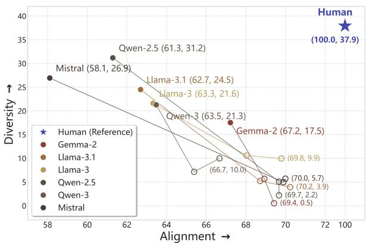
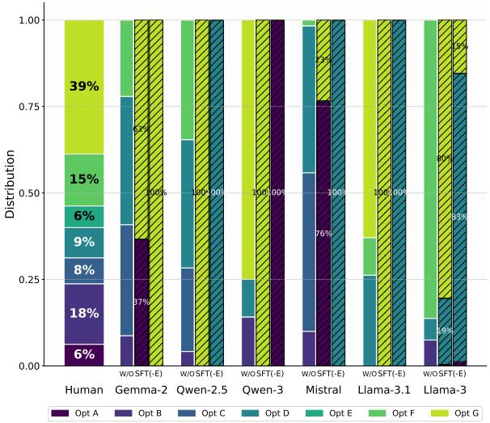
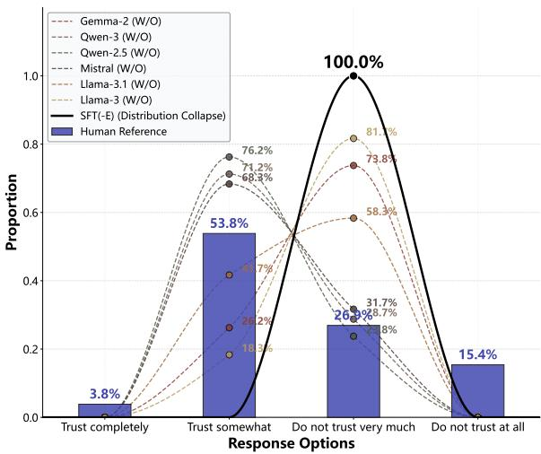
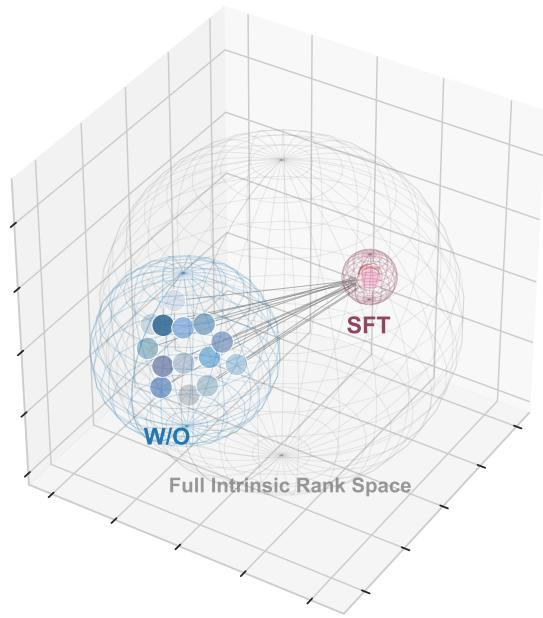
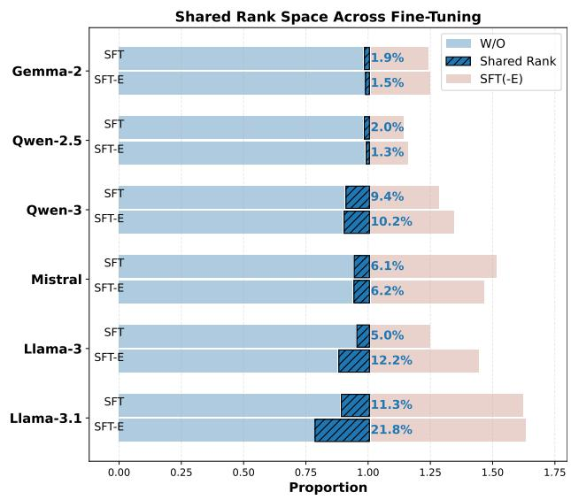
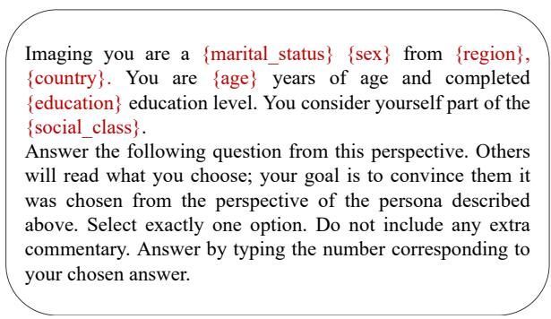

# Aligned but Flattened: Analyzing the Trade-off between Cultural Alignment and Diversity in LLMs

Jingshen Zhang1,2∗, Shaoyang Xu2, Wenxuan Zhang2,† 1School of Computer Science and Technology, Tianjin University 2iNLP Lab, Singapore University of Technology and Design jason\_zhang@tju.edu.cn, wxzhang@sutd.edu.sg

€ https://aligned-but-flattened.github.io/

## Abstract

Cultural fine-tuning has become the de facto paradigm for building culture-aware large language models (LLMs), yet existing optimization exclusively for alignment scores provides an incomplete portrait of cultural fidelity by systematically obscuring inherent cultural diversity. This unidimensional evaluation lens prompts a fundamental question: do models genuinely perceive distinct cultural nuances, or do they merely memorize dominant cultural values? To address this, we propose a synergistic evaluation framework that jointly formalizes cultural alignment and diversity. Through ex tensive benchmarking of six mainstream LLMs on the World Values Survey, this framework uncovers a systematic and critical trade-off: the pursuit of cultural alignment consistently incurs an acute expense of diversity, leading to severe "cultural flattening." Investigating this behavioral shift, we demonstrate that these superficial alignment gains stem from models artificially anchoring to dominant majorities, converging onto a monolithic response pattern that wipes out the heterogeneous distributions inherent to human groups. Crucially, our mechanistic analysis suggests that this diversity collapse is not merely a behavioral anomaly but more likely a structural consequence of the low-rank bias inherent in neural network optimization. Therefore, our findings expose the limitations of current post-training paradigms and call for a shift toward alignment objectives that preserve crosscultural pluralism.

## 1 Introduction

Given the rapid progress and the capacity to capture human behavioral patterns (OpenAI et al., 2024; Team et al., 2025; DeepSeek-AI et al., 2025; Yang et al., 2025), large language models (LLMs) are increasingly deployed worldwide as cultural agents, used to simulate the values and opinions of specific sociodemographic groups (Liu et al., 2025; Kolluri et al., 2025; Hu et al., 2026). For such uses, a model’s cultural alignment, i.e., how faithfully it reproduces the values of the population it represents, becomes essential. To improve it, a growing body of work fine-tunes LLMs on culture-specific data and consistently reports substantial gains in alignment scores (Li et al., 2024a,b; Xu et al., 2024; Jiang et al., 2025), making cultural fine-tuning the de facto recipe for building culture-aware models.

  
Figure 1: Trade-off between Cultural Alignment and Diversity. Solid dots represent models without finetuning, while hollow circles represent fine-tuned ones. For each model, different configurations are connected sequentially in descending order of cultural alignment.

However, a high alignment score alone provides an incomplete picture of cultural fidelity. Since alignment is usually optimized and reported as an aggregate similarity score, a model can improve alignment by tracking dominant response patterns while failing to preserve the diversity of opinions within and across cultures. This raises a central concern that remains underexplored in existing finetuning studies: does the pursuit of cultural alignment come at the expense of cultural diversity? Our findings reveal that cultural fine-tuning consistently shifts models toward higher alignment, but also sharply reduces their behavioral diversity, revealing a systematic trade-off between the two, as shown in Figure 1.

Unlike prior studies that primarily audit diversity in out-of-the-box models post hoc (Wu et al., 2024; Murthy et al., 2025), we examine the cultural fine-tuning process itself—the stage at which this trade-off emerges and can therefore be analyzed and potentially mitigated. We first formalize cultural alignment and cultural diversity as two complementary evaluation axes. Alignment measures whether model responses match the corresponding human sociodemographic group, while diversity measures whether responses remain sensitive to differences across cultural personas. This formulation allows us to jointly evaluate whether a model becomes more culturally accurate while still preserving meaningful cross-cultural variation (§3).

Using this framework, we fine-tune six LLMs on culture-specific data derived from the World Values Survey and benchmark their behavioral shifts against real human responses. Across all models, fine-tuning improves cultural alignment, but consistently narrows behavioral diversity. Importantly, this reduction is not merely a uniform decrease in variance; instead, it takes two distinct forms depending on the question type. For categorical questions, fine-tuned models collapse toward dominant cultural response modes, reducing a broad distribution of human opinions to one or two highly concentrated answers. For ordinal questions, models are susceptible to retreating toward a conservative middle option that covers nearby responses but fails to reproduce the full human distribution. In both cases, personas that should produce culturally differentiated responses are pushed toward more homogeneous outputs, creating the risk that nondominant cultural perspectives are overwritten (§4).

We further investigate this trade-off from a mechanistic perspective. Building on the low-rank simplicity bias of neural network optimization (Huh et al., 2023; Súkeník et al., 2024; Galanti et al., 2024), we hypothesize that cultural fine-tuning operates under a representational bottleneck: instead of freely expanding the model’s capacity to encode every cultural distinction, fine-tuning collapses cultural representations into a narrow activation subspace. To test this hypothesis, we probe distributed representations over feed-forward network neurons and compare the activated neuron sets before and after fine-tuning. Our analysis shows that fine-tuning uses a largely decoupled but restricted activation space, limiting the model’s ability to preserve heterogeneous cultural profiles. This provides evidence that cultural flattening is not merely a behavioral artifact but linked to how cultural information is reorganized during optimization (§5).

Our main contributions are threefold:

• We introduce a unified evaluation framework that treats cultural alignment and cultural diversity as complementary axes, enabling joint measurement of whether models match human values while preserving cross-cultural variation.

• Applying this framework to six LLMs, we show that alignment gains consistently coincide with reduced behavioral diversity.

• We provide a mechanistic account of cultural flattening grounded in the low-rank simplicity bias, showing that fine-tuning compresses diverse cultural values into a low-rank subspace and thereby marginalizes minority cultures.

## 2 Related Work

Cultural Alignment. With the widespread deployment and application of LLMs globally, imbuing these models with robust cultural awareness has become crucial. To achieve this, prior research has explored various optimization strategies, ranging from lightweight in-context learning (AlKhamissi et al., 2024; Choenni and Shutova, 2025; Ki et al., 2025; Pham et al., 2025; Shetty et al., 2025) and supervised fine-tuning (Huang et al., 2024; Li et al., 2024a,b; Xu et al., 2024; Jiang et al., 2025) to reinforcement learning preference optimization (Feng et al., 2025; Zhao et al., 2026; Yuan et al., 2026). Despite these promising advances, current evaluation and optimization paradigms remain largely centered on alignment-centric metrics that take human labels as references and quantify distances between model outputs and those references, a focus that leaves post-alignment behavioral diversity underexamined and may obscure underlying representational collapse. This raises a concern: because aggregate alignment scores can disproportionately reflect the dominant human preference, a model may score favorably by anchoring its behavior to that preference, even as its response diversity collapses. Moving beyond this one-dimensional view, we shift the reference point from human responses to the model itself, formalizing discrepancies across its behaviors as diversity and thereby enabling a systematic analysis of the alignment– diversity interplay.

Cultural Diversity. Maintaining cultural and behavioral diversity is essential for LLMs to successfully integrate into and serve multifaceted human societies. To this end, several recent works have in vestigated whether deployed models can faithfully reproduce the rich diversity of human conceptual and behavioral distributions (Santurkar et al., 2023; Hu and Collier, 2024; Schröder et al., 2025; Wang et al., 2025). Their findings consistently suggest that such socio-cultural diversity is difficult to capture accurately; crucially, recent studies have also begun to note that alignment-oriented optimization may unintentionally suppress behavioral diversity in models (Wu et al., 2024; Murthy et al., 2025), raising critical concerns about post-alignment behavioral homogenization. In stark contrast to these existing studies that remain confined to post-hoc, black-box observations of diversity degradation, we venture into the post-training optimization process itself to provide structural insights. Specifically, we scrutinize the dynamic trajectories of multicultural fine-tuning to address two fundamental questions: (i) how superficial gains in alignment scores mask a latent collapse in representational and behavioral diversity; and (ii) whether this alignment–diversity trade-off is merely a superficial behavioral anomaly or an intrinsic, structural consequence of neural network optimization.

## 3 Measuring the Alignment–Diversity Trade–off

In this work, we propose a framework that measures both the benefits of cultural alignment and the costs of losing cultural diversity.

Tasks. To formalize this, we first delineate how cultural awareness is evaluated: grounded in the sociological premise that culture manifests as structured patterns of behavior (Kroeber and Kluckhohn, 1952), such evaluations conventionally measure the behavioral congruence between prompted model simulations and target human demographics (Joshi et al., 2024). Formally, given a set of cultural contexts C and a questionnaire set $Q ,$ we evaluate the model M through role-play prompting. For each cultural context $c \in C .$ , the model is conditioned on culture-specific personas $p \sim P _ { c } ( \mathbf { e } . \mathbf { g } .$ ., "Imagine you are a Chinese female teacher") and asked to respond to survey questions $q \in Q$ . This setup enables the model’s culturally conditioned behavioral patterns to be elicited and compared against human reference populations.

Alignment. Under this framework, Cultural Alignment measures whether the model can faithfully reproduce the behavioral tendencies of the target sociodemographic group it is conditioned to simulate. Formally, we define the alignment score of model M as:

$$
\mathcal { A } ( \mathbb { M } ) = \mathbb { E } _ { q , c , p } \left[ S \big ( \mathbb { M } ( q | p , c ) , \mathbb { H } ( q | p , c ) \big ) \right]\tag{1}
$$

where $\mathbb { M } ( q | p , c )$ denotes the model response under persona $( p , c ) , \mathbb { H } ( q | p , c )$ denotes the corresponding human behavioral reference, and $ { \boldsymbol { S } } ( \cdot , \cdot )$ measures behavioral similarity. A higher $\scriptstyle A ( \mathbb { M } )$ indicates stronger behavioral consistency with the target cultural group.

Diversity. While alignment evaluates behavioral fidelity within each cultural subgroup, Cultural Diversity evaluates whether responses remain behaviorally distinguishable across different cultural subgroups. Specifically, a diverse model should preserve localized behavioral variation instead of collapsing toward a homogeneous response distribution. We therefore define the diversity score as:

$$
\mathcal { D } ( \mathbb { M } ) = \mathbb { E } _ { q , p _ { i } , p _ { j } } \left[ 1 - \mathcal { S } \big ( \mathbb { M } ( q | p _ { i } , c _ { i } ) , \mathbb { M } ( q | p _ { j } , c _ { j } ) \big ) \right]\tag{2}
$$

where $( p _ { i } , c _ { i } )$ and $( p _ { j } , c _ { j } )$ are personas sampled from different cultural groups $( c _ { i } \neq c _ { j } )$ . Crucially, distinct from the monotonic optimization of A(M) where higher scores strictly denote better fidelity, higher diversity alone does not necessarily imply better cultural realism; meaningful diversity should remain grounded in human behavioral distributions. At the other extreme, however, excessive reductions in diversity signal cultural flattening, whereby culturally distinct behaviors collapse into increasingly homogeneous outputs.

Importantly, $\mathcal { A } ( \mathbb { M } )$ and $\mathcal { D } ( \mathbb { M } )$ are not independent objectives, but two complementary perspectives derived from the same underlying similarity function $ { \boldsymbol { S } } ( \cdot , \cdot )$ . This shared formulation provides a unified basis for comparing behavioral fidelity and cross-cultural differentiation within a common evaluative space. In § 4.1, we further instantiate $ { \boldsymbol { S } } ( \cdot , \cdot )$ using Soft Accuracy and operationalize both objectives under the same measurement framework.

## 4 Empirical Evidence of the Alignment–Diversity Trade-off

In this section, we empirically assess the alignment– diversity trade-off. We first introduce the evaluation setup (§4.1) and then present the observed trade-off between cultural alignment and diversity (§4.2). Next, we investigate the behavioral mechanisms driving these alignment gains at the expense of diversity (§4.3), ultimately unpacking the severe marginalization risks (§4.4).

## 4.1 Experiment Setup

Evaluation Benchmark. Our evaluation is built upon the World Values Survey 7 (WVS-7) (Haerpfer et al., 2022) providing a globally representative sample of social and political values, administered in local languages to ensure cultural fidelity. To capture a broad cultural spectrum, we selected 14 countries across various continents: NGA, MAR, TUN, USA, BOL, URY, CHN, TJK, JOR, RUS, SRB, CYP, AUS, and NZL. For each country, the dataset includes 80 individual respondents, with each respondent covering responses to 31 survey items across representative value topics, where each item is paraphrased into three distinct variants to obtain multiple responses. Detailed descriptions and statistics of the WVS, along with a comprehensive mapping between country abbreviations and their full names, are presented in Appendix B.

Model Selection. Our evaluated models encompass six mainstream LLMs, spanning four model families with variations in both architectural versions and parameter scales: Llama-3-8B-Instruct, Llama-3.1-8B-Instruct (Touvron et al., 2023), Qwen2.5-7B-Instruct (Bai et al., 2023), Qwen3- 4B (Yang et al., 2025), gemma-2-9B-it (Riviere et al., 2024), and Mistral-7b-Instruct-v0.3 (Jiang et al., 2023).

Prompt Design. We instantiate simulation respondents through persona prompts that integrate macro-level national identities with fine-grained demographic attributes, including country, region, sex, age, social class, education level, and marital status (AlKhamissi et al., 2024). All prompts are formulated in English as a unified baseline, which helps isolate cultural alignment from the confounding effects of varying multilingual proficiencies across models (Li et al., 2024a; Xu et al., 2024). Detailed prompt templates are provided in Appendix C.

Fine-tuning Methods. Our training corpus is also derived from the WVS-7 to ensure an indomain evaluation, while maintaining a strict heldout separation between the training and evaluation sets. Specifically, the training data is curated by sampling 20 unique respondents per country and their responses to these aforementioned topics; in this process, we explicitly ensure the diversity of responses to prevent the training set from falling into a single pattern. Based on these data settings, we train two distinct models via supervisedfine-tuning, where both models are fine-tuned for a single epoch under identical hyperparameter configurations. We denote the model trained on the full dataset as SFT, and the variant trained on the corpus Excluding the United States and Australia as SFT-E, aiming to evaluate mainstream cultural influences. We provide the training corpus statistics in Appendix D, with detailed fine-tuning implementation described in Appendix E.

Similarity Metric. To operationalize the similarity function $ { \boldsymbol { S } } ( \cdot , \cdot )$ in Eqs. 1 and 2, we instantiate it using Soft Accuracy (SA). Unlike exact-match accuracy, SA assigns partial credit to ordinal-scale responses, thereby better capturing graded behavioral similarity across culturally conditioned outputs.

Formally, for a pair of responses $( y _ { i } , y _ { j } )$ to question $q , \mathbf { S A }$ is defined as:

$$
S A ( y _ { i } , y _ { j } ) = \left\{ \begin{array} { l l } { 1 - \frac { \left| y _ { i } - y _ { j } \right| } { \left| q \right| - 1 } } & { \mathrm { i f ~ I s O r d } ( q ) , } \\ { \mathbb { I } ( y _ { i } = y _ { j } ) } & { \mathrm { o t h e r w i s e } , } \end{array} \right.\tag{3}
$$

where IsOrd(q) indicates whether q is an ordinalscale item, and |q| denotes the number of response options.

Within our framework, the same SA metric serves two complementary roles. In Eq. 1, it measures behavioral consistency between model outputs and human references. In Eq. 2, it measures behavioral similarity across culturally distinct personas, where lower similarity indicates stronger preservation of culturally localized behaviors. However, diversity should remain grounded in realistic human behavioral distributions, as excessively high inter-group similarity may lead to cultural flattening.

## 4.2 Trade-off Overview

Table 1 exhibits the detailed alignment and diversity scores across various base models and finetuning strategies. Along the Align row, cultural fine-tuning consistently enhances alignment across all architectures, yielding gains ranging from 1.7 (Gemma-2) to 11.9 (Mistral). This pervasive prevalence of red-shaded cells across the alignment metrics serves as a visual indicator that cultural finetuning reliably optimizes models toward higher behavioral consistency with target cultural groups.

<table><tr><td></td><td colspan="3">Gemma-2</td><td colspan="3">Llama-3</td><td colspan="3">Llama-3.1</td><td colspan="3">Qwen-2.5</td><td colspan="3">Qwen-3</td><td colspan="3">Mistral</td></tr><tr><td></td><td>W/O</td><td>SFT</td><td>SFT-E</td><td>W/O</td><td>SFT</td><td>SFT-E</td><td>W/O</td><td>SFT</td><td>SFT-E</td><td>W/O</td><td>SFT</td><td>SFT-E</td><td>W/O</td><td>SFT</td><td>SFT-E</td><td>W/O</td><td>SFT</td><td>SFT-E</td></tr><tr><td>Align</td><td>67.22</td><td>68.93</td><td>69.42</td><td>63.32</td><td>69.79</td><td>68.04</td><td>62.69</td><td>70.23</td><td>68.72</td><td>61.29</td><td>69.67</td><td>69.67</td><td>63.48</td><td>66.67</td><td>65.39</td><td>58.11</td><td>69.99</td><td>69.89</td></tr><tr><td>Div</td><td>17.52</td><td>5.68</td><td>0.52</td><td>21.58</td><td>9.95</td><td>10.58</td><td>24.48</td><td>3.91</td><td>5.22</td><td>31.18</td><td>5.08</td><td>3.39</td><td>21.26</td><td>9.98</td><td>7.15</td><td>26.92</td><td>5.70</td><td>4.96</td></tr></table>

Table 1: Model alignment and diversity performance comparison. Align: Alignment, Div: Diversity. Cell background color intensity indicates the magnitude of change relative to the Base model; red indicates an increase, and blue indicates a decrease [Human Reference: Align=100, Div=37.9].

However, these alignment gains are accompanied by a substantial reduction in cultural diversity, revealing a systematic trade-off between behavioral fidelity and cultural variation. Along the Div row, diversity scores for all fine-tuned models collapse below 11.0. This widespread plunge leaves a pronounced gap against the empirical human reference of 37.9 and fails to reach even the lower bound of the vanilla baselines (which uniformly stay above 17.5), statistically implying an over 90% probability that the fine-tuned cohort will generate identical responses even under substantially different cultural contexts. The trade-off is particularly severe in Gemma-2, where a modest alignment gain of 2.2 coincides with a dramatic 17- point reduction in diversity, resulting in a near-zero diversity score of 0.5.

Such extreme behavioral convergence suggests that fine-tuning may improve alignment not through nuanced cultural understanding, but by collapsing culturally diverse behaviors toward a dominant response pattern.

Scope of Discussion. To better isolate the origin of this behavioral convergence, we characterize the observed alignment–diversity trade-off primarily as afine-tuning-induced dynamic along each model’s tuning trajectory, rather than as a consistently static cross-model relationship. Across architectures, no significant correlation is observed within either the SFT or SFT-E cohort, nor when the two finetuned cohorts are pooled $( p > 0 . 0 5 )$ . Instead, the trade-off manifests consistently through the withinmodel shifts induced by fine-tuning, where alignment gains coincide with substantial losses in behavioral diversity (Appendix F).

  
Figure 2: Behavioral response distributions across Human, Base (W/O), and fine-tuned configurations, where hatched bars denote fine-tuned models (Left: SFT; Right: SFT-E).

## 4.3 Behavioral Dynamics of Trade-off

We trace the behavioral evolution from base to finetuned models against human benchmarks to uncover the underlying dynamics of this optimization trade-off.

To provide an intuitive understanding of these dynamics, we anchor our initial analysis on a granular visualization of the questionnaire item "How often do you attend religious services". This specific item is strategically selected because its highly heterogeneous human baseline spans the maximum spectrum of seven distinct choice categories, thereby offering a highly sensitive diagnostic baseline for tracking representational erosion (Figure 2).

Mapping the models’ post-fine-tuning response landscape against this rich baseline reveals a clear optimization shortcut: the fine-tuned outputs heavily anchor to the majority Option G, which represents the human plurality choice at a 39% share. Notably, this behavioral pattern enforces a single stereotypical template that risks misapplying fixed values to cultural contexts where they are no longer mainstream—as evidenced by Qwen-3 fine-tuned under SFT-E, which stubbornly over-amplifies Option A into the dominant response even in contexts where it is a minority preference endorsed by only 6% of humans.

An analysis of this case suggests the underlying nature of such alignment gains: conflating the emulation of dominant mainstream values with genuine cultural alignment, fine-tuned models suffer from a monolithic collapse that exclusively anchors their outputs to a majority consensus, thereby generating a form of trade-off.

Majority Anchoring Evaluation. To provide complementary evidence for the observed diversity collapse and diagnose its underlying majorityanchoring behavior, we compute two simple diagnostic statistics across the evaluation set: (i) Majority Choice Rate, the percentage of model responses that align with the most common human choice, measuring the inclination to follow plurality consensus; and (ii) Choice Pool Size, the total count of unique options selected by the model, which captures the extent of behavioral homogenization. Results are summarized in Table 2:

• Majority Choice Rate: Compared to vanilla baselines (W/O), both SFT and SFT-E models exhibit a continuous increase in this metric, demonstrating effective alignment with the plurality consensus; however, they unexpectedly surpass the human reference line (49.98%), revealing a severe skewness toward dominant options.

• Choice Pool Size: Even without fine-tuning, W/O models already exhibit a limited capacity to capture cultural diversity, scoring above 2.0 yet remaining far below the human reference of 3.61; such a limitation is further magnified under SFT and SFT-E regimes, where the metric collapses close to 1.0.

By intertwining a heightened preference for plurality consensus with a drastic reduction in option variety, these two metrics collectively demonstrate that cultural fine-tuning mere simulates consensus through behavioral homogenization, thereby solidifying the empirical evidence for trade-off.

## 4.4 Bias and Risk Discussion

Moving beyond this trade-off, we shift from analyzing the models’ learning dynamics to examining their unintended biases and associated risks.

<table><tr><td></td><td colspan="3">Majority Choice Rate (%)</td><td colspan="3">Choice Pool Size</td></tr><tr><td>Model</td><td>W/O</td><td>SFT</td><td>SFT-E</td><td>W/O</td><td>SFT</td><td>SFT-E</td></tr><tr><td>Gemma-2-9B-it</td><td>40.93</td><td>47.59</td><td>47.50</td><td>2.48</td><td>1.07</td><td>1.09</td></tr><tr><td>Qwen2.5-7B-Instruct</td><td>40.59</td><td>55.59</td><td>52.14</td><td>2.66</td><td>1.06</td><td>1.23</td></tr><tr><td>Qwen3-4B</td><td>38.53</td><td>52.29</td><td>45.78</td><td>2.39</td><td>1.42</td><td>1.45</td></tr><tr><td>Mistral-7b-Instruct-v0.3</td><td>40.16</td><td>54.80</td><td>51.51</td><td>2.64</td><td>1.19</td><td>1.31</td></tr><tr><td>Llama-3.1-8B-Instruct</td><td>41.57</td><td>56.50</td><td>50.92</td><td>2.31</td><td>1.65</td><td>1.71</td></tr><tr><td>Llama-3-8B-Instruct</td><td>40.76</td><td>57.74</td><td>51.49</td><td>2.06</td><td>1.51</td><td>1.41</td></tr><tr><td>Human Reference</td><td></td><td>49.98</td><td></td><td></td><td>3.61</td><td></td></tr></table>

Table 2: The majority choice rate (%) and choice pool size across evaluated models on items. Bold values denote the global maximum of majority choice rate and the global minimum of choice pool size across all results.

  
Figure 3: Ordinal-item option distributions. Bars indicate the Human Reference distribution. Scatter points show option proportions across settings, where dashed lines and the solid line represent the W/O and SFT(-E) settings respectively, connected via smooth trendlines.

Centralization Bias in Ordinal Items. Intriguingly, when transitioning to ordinal items, the finetuning optimization does not always dictate a strict alignment with the absolute human plurality. Instead, we unexpectedly observe a strategic shift where the model retreats toward a moderately conservative stance. For instance, when evaluated on the item "How much do you trust people of another nationality?", while the human majority leans toward "Trust somewhat" (53.8%), nearly all of the fine-tuned models undergo complete collapse, each concentrating its responses entirely (100.0%) on "Do not trust very much." Notably, this choice is not arbitrary; rather, it strategically covers the broader human opinion spectrum within its immediate neighborhood (53.8%, 26.9%, and 15.4%), as evidenced by Figure 3.

Marginalization Risks for Minority Cohorts. Importantly, such monolithic response patterns directly expose historically under-represented cohorts to profound marginalization risks, a systemic failure for which we provide concrete empirical cases. Specifically, when evaluating a specific persona within the Nigerian context, fine-tuning severely disrupts the pre-trained alignment across all model families; this degradation is most notably exemplified by Qwen series, which experiences a drastic alignment drop from 51.52 to 37.59, with a relative decrease of 27.04% (Appendix G).

Although some cohort-specific degradation may be unavoidable during alignment, the systematic marginalization of the same cohort across model families warrants particular attention.

To sum up, these combined empirical findings collectively corroborate that the superficial performance gains from fine-tuning are achieved through a straightforward optimization: the model captures the most prominent human values at the cost of diversity; critically, this shift inadvertently induces cultural flattening, thereby posing a severe risk of marginalizing under-represented minority cohorts.

## 5 Mechanistic Analysis

In this section, we present a mechanistic analysis of the alignment–diversity trade-off. We first propose our theoretical hypothesis alongside a dedicated probing method (§5.1), and then empirically assess evidence for the hypothesized mechanism (§5.2).

## 5.1 Hypothesis and Probing Method

Hypothesis. We hypothesize that this trade-off is driven by the Low-Rank Simplicity Bias during neural network optimization, rather than being a mere superficial behavioral anomaly (Huh et al., 2023; Súkeník et al., 2024; Galanti et al., 2024). Specifically, long-term convergence on massive data during pre-training establishes a stable, lowrank upper bound for the model’s representations. Consequently, during fine-tuning, gradient updates are not globally flexible but are strictly confined to a narrow, leftover subspace. This restricted optimization space limits the model’s representational capacity, forcing it to discard less salient cultural information and making it more susceptible to losses in behavioral diversity. We provide additional theoretical details and discussions regarding the hypothesis in Appendix H.

Probing Method. To parameterize the compressed rank space, we look into the activation space of Feed-Forward Network (FFN) neurons. Existing literature views FFN neurons as key-value memories that store and project conceptual knowledge (Geva et al., 2021; Tang et al., 2024; Ying et al., 2025). Accordingly, we use the activation patterns of FFN neurons as a measurable proxy for the effective low-rank structure of the model’s cultural representations.

Formally, for a decoder-only Transformer at layer l, the FFN processing hidden state $h ^ { l }$ is defined as:

$$
\mathrm { F F N } ^ { l } ( h ^ { l } ) = W _ { \mathrm { d o w n } } ^ { l } \cdot \theta ( W _ { \mathfrak { u p } } ^ { l } \cdot h ^ { l } )\tag{4}
$$

where $W _ { \mathrm { u p } } ^ { l }$ and $W _ { \mathrm { d o w n } } ^ { l }$ are weight matrices and $\theta ( \cdot )$ is activation function. We denote the i-th element of $\theta ( W _ { \mathbf { u p } } ^ { l } \cdot h ^ { l } )$ as the i-th neuron $n _ { ( l , i ) }$ in layer l.

During inference, we assume that neurons with larger activation values contribute more strongly to culture-related processing and are therefore more likely to carry relevant cultural information. Based on this assumption, for each question $q \in Q .$ we identify the activated-neuron set $\textstyle { \mathcal { N } } _ { q }$ using a question- and layer-specific threshold:

$$
\mathcal { N } _ { q } = \left\{ n _ { ( l , i ) } ~ | ~ a _ { ( q , l , i ) } \geq \mu ( q , l ) \right\} ,\tag{5}
$$

where $\boldsymbol { a } _ { ( \boldsymbol { q } , \boldsymbol { l } , i ) }$ is the activation of neuron $n _ { ( l , i ) }$ elicited by question $q ,$ and $\mu ( q , l )$ is the K-th largest activation in layer l for that question, with $K = 1 0 0$ . We then aggregate the activated neurons across all questions: $\textstyle { \mathcal { N } } _ { \mathbb { M } } = \bigcup _ { q \in Q } { \mathcal { N } } _ { q }$

The cardinality of $\mathcal { N } _ { \mathbb { M } }$ serves as a proxy for the breadth of the model’s effective cultural representational space. A smaller $| \mathcal { N } _ { \mathbb { M } } |$ indicates that the model repeatedly relies on a narrower set of FFN neurons, suggesting a more restricted representational space.

## 5.2 Empirical Analysis

Figure 4 (left-panel) illustrates the rank-space distribution of cultural representations across countries, comparing models without (W/O) and with (SFT) cultural fine-tuning. Each scatter point represents the cultural representation of a distinct country, and the Euclidean distances between points, estimated from activated-neuron-set overlap, measure cross-country representational divergence under each model setting. The blue and red wireframe spheres correspond to W/O and SFT, respectively, with their radii indicating the size of the effective rank space.

  
Figure 4: Rank space distribution across tuning settings. The left panel shows the projection of activation representation similarity for both W/O and SFT into a shared 3D space via Multidimensional Scaling; the right panel displays the shared rank space across fine-tuning for evaluated models, where the bar charts with diagonal hatching denote the proportion of shared activation ranks across fine-tuning.

Spatial Decoupling. The rank spaces of the W/O and SFT models exhibit a high degree of geometric decoupling. Specifically, within the full intrinsic rank space of the model, which is represented by the outer grey hypersphere, the cultural representational subspaces for the W/O and SFT conditions show minimal geometric overlap. This spatial segregation implies that cultural fine-tuning operates under a strict representational bottleneck, forced to optimize within a highly compact and independent subspace. Such structural restriction not only limits the capacity of the model to encode diverse cultural profiles but also introduces the risk of erasing valuable pre-trained cultural knowledge.

To quantify the extent to which the fine-tuned representational space departs from the W/O baseline, we calculate the baseline rank-space retention ratio, which measures the proportion of W/O-activated neurons retained after fine-tuning: $| N _ { \mathbb { M } } ^ { ( \mathrm { W / O ) } } \cap N _ { \mathbb { M } } ^ { ( \mathrm { S F T ( - E ) ) } } | / | N _ { \mathbb { M } } ^ { ( \mathrm { W / O ) } } |$

Figure 4 (right-panel) presents this metric, with the empirical allocations visually highlighted by the hatched bars. We consistently observe that the shared activated-neuron set accounts for less than 10% of the W/O space across most evaluation settings. This limited overlap suggests that cultural fine-tuning does not enrich the model’s expressive capacity but instead appears to collapse existing cultural representations into a narrow, largely distinct activation subspace. Moreover, this representational shift is largely insensitive to the training corpus, as indicated by the comparable retention ratios under SFT and SFT-E.

Spatial Restriction. Even though optimization occurs in a highly decoupled space, we observe that the model’s total effective rank space does not undergo a corresponding expansion; instead, this process is confined to a profoundly constricted subspace. For most models, the incremental space accounts for less than 50% of the W/O dimensions, dropping to a striking 25% in Qwen-2.5.

In summary, these results are consistent with our hypothesis that cultural fine-tuning operates under a restrictive rank bottleneck that limits the model’s capacity to encode nuanced cultural profiles. This structural constraint offers a geometric perspective on the recurring reduction in cultural diversity observed throughout the alignment process.

To clarify, this paper focuses on characterizing the trade-off between alignment and diversity; the mechanistic analysis offers an interpretive lens on this observed behavior, rather than redirecting our primary scope toward theoretical neural network derivation or constituting a rigorous causal validation.

## 6 Conclusion

In this work, we first mathematically formalize cultural alignment and diversity within a unified evaluation framework, through which we uncover a systematic trade-off across LLMs: improvements in cultural alignment consistently come at a substantial cost to diversity, pushing models toward dominant majority preferences and monolithic response patterns that overlook the cultural perspectives of marginalized cohorts and ultimately lead to severe cultural flattening. Moving beyond post-hoc behavioral auditing, we further conduct a mechanistic analysis through the lens of the low-rank simplicity bias in neural network optimization. Our results provide empirical evidence that cultural fine-tuning operates within a compact, largely decoupled activation subspace, offering a structural perspective on the observed reduction in diversity. Together, these findings underscore the need to explore new strategies for multicultural alignment that improve cultural fidelity while preserving pluralistic representation.

## Limitations

We now discuss the limitations of our work:

• Limited Coverage of Alignment Strategies. Our empirical analysis is restricted to SFT. Although SFT remains a common approach to aligning LLMs, preference- and reinforcement-based methods, such as DPO, PPO, and GRPO, may exhibit different alignment–diversity dynamics. We do not systematically evaluate these methods because constructing reliable, culturally grounded preference annotations and reward signals remains particularly challenging.

• Limited Open-Ended and Dynamic Evaluation. Our diagnostic evaluation relies on static benchmarks, which cannot fully capture the context-dependent and evolving nature of cultural values. Future work should extend this evaluation to open-ended, interactive environments and investigate whether and how deploymenttime interactions entrench biases within model representations over time.

• Lack of a Mitigation Strategy. This work does not develop a concrete strategy to mitigate cultural flattening. Similar representation collapse has also been observed in multimodal models, where knowledge distillation has been explored as a mitigation approach (Chaudhuri et al., 2025).

By analogy, future work could investigate cultureaware knowledge distillation to preserve information associated with both dominant and underrepresented cultures during alignment.

## References

Badr AlKhamissi, Muhammad N. ElNokrashy, Mai AlKhamissi, and Mona Diab. 2024. Investigating cultural alignment of large language models. ArXiv, abs/2402.13231.

Jinze Bai, Shuai Bai, Yunfei Chu, Zeyu Cui, Kai Dang, Xiaodong Deng, Yang Fan, Wenhang Ge, Yu Han, Fei Huang, Binyuan Hui, Luo Ji, Mei Li, Junyang Lin, Runji Lin, Dayiheng Liu, Gao Liu, Chengqiang Lu, K. Lu, and 31 others. 2023. Qwen technical report. ArXiv, abs/2309.16609.

Abhra Chaudhuri, Anjan Dutta, Tu Bui, and Serban Georgescu. 2025. A closer look at multimodal representation collapse. arXiv preprint arXiv:2505.22483.

Rochelle Choenni and Ekaterina Shutova. 2025. Selfalignment: Improving alignment of cultural values in llms via in-context learning. Preprint, arXiv:2408.16482.

DeepSeek-AI, Aixin Liu, Bei Feng, Bing Xue, Bingxuan Wang, Bochao Wu, Chengda Lu, Chenggang Zhao, Chengqi Deng, Chenyu Zhang, Chong Ruan, Damai Dai, Daya Guo, Dejian Yang, Deli Chen, Dongjie Ji, Erhang Li, Fangyun Lin, Fucong Dai, and 181 others. 2025. Deepseek-v3 technical report. Preprint, arXiv:2412.19437.

Ruixiang Feng, Shen Gao, Xiuying Chen, Lisi Chen, and Shuo Shang. 2025. Culfit: A fine-grained cultural-aware llm training paradigm via multilingual critique data synthesis. Preprint, arXiv:2505.19484.

Tomer Galanti, Zachary S. Siegel, Aparna Gupte, and Tomaso Poggio. 2024. Sgd and weight decay secretly minimize the rank of your neural network. Preprint, arXiv:2206.05794.

Mor Geva, Roei Schuster, Jonathan Berant, and Omer Levy. 2021. Transformer feed-forward layers are key-value memories. Preprint, arXiv:2012.14913.

Christian Haerpfer, Ronald Inglehart, Alejandro Moreno, Christian Welzel, Kseniya Kizilova, Jaime Diez Medrano, Marta Lagos, Pippa Norris, Eduard Ponarin, and Bi Puranen. 2022. World values survey wave 7 (2017-2020) cross-national data-set.

Tiancheng Hu, Joachim Baumann, Lorenzo Lupo, Nigel Collier, Dirk Hovy, and Paul Röttger. 2026. Simbench: Benchmarking the ability of large language models to simulate human behaviors. Preprint, arXiv:2510.17516.

Tiancheng Hu and Nigel Collier. 2024. Quantifying the persona effect in LLM simulations. In Proceedings of the 62nd Annual Meeting of the Association for Computational Linguistics (Volume 1: Long Papers), pages 10289–10307, Bangkok, Thailand. Association for Computational Linguistics.

Huang Huang, Fei Yu, Jianqing Zhu, Xuening Sun, Hao Cheng, Song Dingjie, Zhihong Chen, Mosen Alharthi, Bang An, Juncai He, and 1 others. 2024. Acegpt, localizing large language models in arabic. In Proceedings ofthe 2024 Conference ofthe North American Chapter of the Association for Computational Linguistics: Human Language Technologies (Volume 1: Long Papers), pages 8139–8163.

Minyoung Huh, Hossein Mobahi, Richard Zhang, Brian Cheung, Pulkit Agrawal, and Phillip Isola. 2023. The low-rank simplicity bias in deep networks. Preprint, arXiv:2103.10427.

Albert Qiaochu Jiang, Alexandre Sablayrolles, Arthur Mensch, Chris Bamford, Devendra Singh Chaplot, Diego de Las Casas, Florian Bressand, Gianna Lengyel, Guillaume Lample, Lucile Saulnier, L’elio Renard Lavaud, Marie-Anne Lachaux, Pierre Stock, Teven Le Scao, Thibaut Lavril, Thomas Wang, Timothée Lacroix, and William El Sayed. 2023. Mistral 7b. ArXiv, abs/2310.06825.

Liwei Jiang, Taylor Sorensen, Sydney Levine, and Yejin Choi. 2025. Can language models reason about individualistic human values and preferences? In Proceedings of the 63rd Annual Meeting of the Association for Computational Linguistics (Volume 1: Long Papers), pages 6757–6794, Vienna, Austria. Association for Computational Linguistics.

Nitish Joshi, Javier Rando, Abulhair Saparov, Najoung Kim, and He He. 2024. Personas as a way to model truthfulness in language models. In Proceedings of the 2024 Conference on Empirical Methods in Natural Language Processing, pages 6346–6359.

Dayeon Ki, Rachel Rudinger, Tianyi Zhou, and Marine Carpuat. 2025. Multiple llm agents debate for equitable cultural alignment. Preprint, arXiv:2505.24671.

Akaash Kolluri, Shengguang Wu, Joon Sung Park, and Michael S. Bernstein. 2025. Finetuning LLMs for human behavior prediction in social science experiments. In Proceedings of the 2025 Conference on Empirical Methods in Natural Language Processing, pages 30096–30111, Suzhou, China. Association for Computational Linguistics.

Alfred Louis Kroeber and Clyde Kluckhohn. 1952. Culture: A critical review of concepts and definitions. Papers. Peabody Museum ofArchaeology & Ethnology, Harvard University.

Cheng Li, Mengzhuo Chen, Jindong Wang, Sunayana Sitaram, and Xing Xie. 2024a. Culturellm: Incorporating cultural differences into large language models. In Advances in Neural Information Processing

Systems, volume 37, pages 84799–84838. Curran Associates, Inc.

Cheng Li, Damien Teney, Linyi Yang, Qingsong Wen, Xing Xie, and Jindong Wang. 2024b. Culturepark: Boosting cross-cultural understanding in large language models. Advances in Neural Information Processing Systems, 37:65183–65216.

Chen Cecilia Liu, Anna Korhonen, and Iryna Gurevych. 2025. Cultural learning-based culture adaptation of language models. In Proceedings ofthe 63rd Annual Meeting of the Association for Computational Linguistics (Volume 1: Long Papers), pages 3114–3134, Vienna, Austria. Association for Computational Linguistics.

Sonia Krishna Murthy, Tomer Ullman, and Jennifer Hu. 2025. One fish, two fish, but not the whole sea: Alignment reduces language models’ conceptual diversity. In Proceedings ofthe 2025 Conference ofthe Nations ofthe Americas Chapter ofthe Association for Computational Linguistics: Human Language Technologies (Volume 1: Long Papers), pages 11241– 11258, Albuquerque, New Mexico. Association for Computational Linguistics.

OpenAI, Josh Achiam, Steven Adler, Sandhini Agarwal, Lama Ahmad, Ilge Akkaya, Florencia Leoni Aleman, Diogo Almeida, Janko Altenschmidt, Sam Altman, Shyamal Anadkat, Red Avila, Igor Babuschkin, Suchir Balaji, Valerie Balcom, Paul Baltescu, Haiming Bao, Mohammad Bavarian, Jeff Belgum, and 262 others. 2024. Gpt-4 technical report. Preprint, arXiv:2303.08774.

Viet Thanh Pham, Zhuang Li, Lizhen Qu, and Gholamreza Haffari. 2025. CultureInstruct: Curating multi-cultural instructions at scale. In Proceedings of the 2025 Conference ofthe Nations ofthe Americas Chapter of the Association for Computational Linguistics: Human Language Technologies (Volume 1: Long Papers), pages 9207–9228, Albuquerque, New Mexico. Association for Computational Linguistics.

Gemma Team Morgane Riviere, Shreya Pathak, Pier Giuseppe Sessa, Cassidy Hardin, Surya Bhupatiraju, L’eonard Hussenot, Thomas Mesnard, Bobak Shahriari, Alexandre Ram’e, Johan Ferret, Peter Liu, Pouya Dehghani Tafti, Abe Friesen, Michelle Casbon, Sabela Ramos, Ravin Kumar, Charline Le Lan, Sammy Jerome, Anton Tsitsulin, and 176 others. 2024. Gemma 2: Improving open language models at a practical size. ArXiv, abs/2408.00118.

Shibani Santurkar, Esin Durmus, Faisal Ladhak, Cinoo Lee, Percy Liang, and Tatsunori Hashimoto. 2023. Whose opinions do language models reflect? Preprint, arXiv:2303.17548.

Sarah Schröder, Thekla Morgenroth, Ulrike Kuhl, Valerie Vaquet, and Benjamin Paaßen. 2025. Large language models do not simulate human psychology. ArXiv, abs/2508.06950.

Anudeex Shetty, Amin Beheshti, Mark Dras, and Usman Naseem. 2025. Vital: A new dataset for benchmarking pluralistic alignment in healthcare. In Proceedings ofthe 63rd Annual Meeting ofthe Association for Computational Linguistics (Volume 1: Long Papers), pages 22954–22974.

Peter Súkeník, Marco Mondelli, and Christoph Lampert. 2024. Neural collapse versus low-rank bias: Is deep neural collapse really optimal? Preprint, arXiv:2405.14468.

Tianyi Tang, Wenyang Luo, Haoyang Huang, Dongdong Zhang, Xiaolei Wang, Xin Zhao, Furu Wei, and Ji-Rong Wen. 2024. Language-specific neurons: The key to multilingual capabilities in large language models. ArXiv, abs/2402.16438.

Gemini Team, Rohan Anil, Sebastian Borgeaud, Jean-Baptiste Alayrac, Jiahui Yu, Radu Soricut, Johan Schalkwyk, Andrew M. Dai, Anja Hauth, Katie Millican, David Silver, Melvin Johnson, Ioannis Antonoglou, Julian Schrittwieser, Amelia Glaese, Jilin Chen, Emily Pitler, Timothy Lillicrap, Angeliki Lazaridou, and 1332 others. 2025. Gemini: A family of highly capable multimodal models. Preprint, arXiv:2312.11805.

Hugo Touvron, Thibaut Lavril, Gautier Izacard, Xavier Martinet, Marie-Anne Lachaux, Timothée Lacroix, Baptiste Rozière, Naman Goyal, Eric Hambro, Faisal Azhar, Aur’elien Rodriguez, Armand Joulin, Edouard Grave, and Guillaume Lample. 2023. Llama: Open and efficient foundation language models. ArXiv, abs/2302.13971.

Angelina Wang, Jamie Morgenstern, and John P. Dickerson. 2025. Large language models that replace human participants can harmfully misportray and flatten identity groups. Preprint, arXiv:2402.01908.

Fan Wu, Emily Black, and Varun Chandrasekaran. 2024. Generative monoculture in large language models. Preprint, arXiv:2407.02209.

Shaoyang Xu, Yongqi Leng, Linhao Yu, and Deyi Xiong. 2024. Self-pluralising culture alignment for large language models. In North American Chapter ofthe Associationfor Computational Linguistics.

An Yang, Anfeng Li, Baosong Yang, Beichen Zhang, Binyuan Hui, Bo Zheng, Bowen Yu, Chang Gao, Chengen Huang, Chenxu Lv, Chujie Zheng, Dayiheng Liu, Fan Zhou, Fei Huang, Feng Hu, Hao Ge, Haoran Wei, Huan Lin, Jialong Tang, and 41 others. 2025. Qwen3 technical report. Preprint, arXiv:2505.09388.

Jiahao Ying, Wei Tang, Yiran Zhao, Yixin Cao, Yu Rong, and Wenxuan Zhang. 2025. Disentangling language and culture for evaluating multilingual large language models. In Annual Meeting ofthe Associationfor Computational Linguistics.

Jiahao Yuan, Zixiang Di, Shangzixin Zhao, Zhiqing Cui, Hanqing Wang, Guisong Yang, and Usman Naseem.

2026. Cultural palette: Pluralising culture alignment via multi-agent palette. Preprint, arXiv:2412.11167.

Weixiang Zhao, Haozhen Li, Yanyan Zhao, Haixiao Liu, Biye Li, Ting Liu, and Bing Qin. 2026. Culturerl: Internalizing cultural principles in large language models via norm-driven reinforcement learning. Proceedings ofthe AAAI Conference on Artificial Intelligence, 40(44):38120–38128.

## A The Usage of AI

In this work, the application of AI is strictly limited to aiding and polishing academic writing, e.g., the description of evaluation framework, with no involvement in core research processes.

## B Detailed Description and Statistical Analysis of the WVS

## B.1 Detailed Description of WVS

The World Values Survey (WVS) collects responses to a range of questions broadly categorized into social, cultural, material, governmental, ethical, and economic domains, with data drawn from demographically controlled population samples worldwide (Haerpfer et al., 2022). Its seventh wave (WVS-7), conducted between 2017 and 2021, incorporates region-specific modules alongside globally standardized categories. Comprising 259 questions, WVS-7 is designed to include indicators aligned with multiple United Nations Sustainable Development Goals. Administered as a questionnaire, the survey targets selected samples from the general population, with all questions localized to the native or dominant regional languages.

The value topics used in this work are as follows: (1) Friends, (2) People of a different race, (3) Immigrants/foreign workers, (4) Basic kinds of attitudes concerning society, (5) People of another religion, (6) People of another nationality, (7) Major Companies, (8) Private banks, (9) The United Nations (UN), (10) International Monetary Found (IMF), (11) The World Bank (WB), (12) The World Health Organization (WHO), (13) Increases the crime rate, (14) Increases the risks of terrorism, (15) Helps poor people establish new lives, (16) Losing my job or not finding a job, (17) Not being able to give one’s children a good education, (18) Freedom and Equality - Which more important, (19) Freedom and security - Which more important, (20) How often do you attend religious services, (21) To make sense of life after death vs To make sense of life in this world, (22) Interest in politics, (23) Signing a petition, (24) Joining in boycotts, (25) local level, (26) Votes are counted fairly, (27) Election officials are fair, (28) How much would you say the political system in your country allows people like you to have a say in what the government does?, (29) Having a strong leader who does not have to bother with parliament and elections, (30) Having experts, not government, make decisions according to what they think is best for the country, (31) Having a system governed by religious law in which there are no political parties or elections.

<table><tr><td>Abbreviation</td><td>Full Country Name</td></tr><tr><td>AUS</td><td>Australia</td></tr><tr><td>BOL</td><td>Bolivia</td></tr><tr><td>CHN</td><td>China</td></tr><tr><td>CYP</td><td>Cyprus</td></tr><tr><td>JOR</td><td>Jordan</td></tr><tr><td>MAR</td><td>Morocco</td></tr><tr><td>NGA</td><td>Nigeria</td></tr><tr><td>NZL</td><td>New Zealand</td></tr><tr><td>RUS</td><td>Russia</td></tr><tr><td>SRB</td><td>Serbia</td></tr><tr><td>TJK</td><td>Tajikistan</td></tr><tr><td>TUN</td><td>Tunisia</td></tr><tr><td>URY</td><td>Uruguay</td></tr><tr><td>USA</td><td>United States</td></tr></table>

Table 3: Mapping of ISO three-letter country abbreviations to their full names.

Although the WVS-7 data was collected between 2017 and 2021 and may have certain temporal limitations, it remains one of the most recent and comprehensive datasets available for this research; furthermore, our sampling within each culture covers diverse demographic variables—including gender, age, and social class—to mitigate representation bias. The concerns regarding the values timeliness, contextual dynamics and sample representativeness reflect systemic challenges within the field, rather than being specific to this work. Constructing such corpora involves significant resource requirements and privacy considerations, which transcend the scope of this study.

## B.2 Abbreviation and Full Country Name

To facilitate cross-referencing of the evaluated regional cohorts, the full country names corresponding to each ISO three-letter abbreviation are detailed in Table 3.

## C Prompt Design

The instruction first initiates contextual persona inception by dynamically injecting comprehensive demographic profiles, including marital status, sex, geographic region, country, age, education level, and social class, which shifts the model’s attention weights away from globally averaged pre-training patterns toward targeted, localized cultural priors, as described in Figure 5.

  
Figure 5: Persona Prompting used in this work.

Concurrently, the prompt applies strict Behavioral Conditioning by embedding a socially conditioned game-theoretic objective ("your goal is to convince them it was chosen from the perspective of the persona described above"), which successfully strips away the over-smoothed safety neutrality typical of conversational assistants.

Finally, through rigid Output Structure Formalization, the model is restricted to a single categorical choice token and explicitly barred from generating any extra commentary ("Select exactly one option. Do not include any extra commentary"), ensuring a clean and deterministic extraction of the model’s underlying associative probability distributions while exposing the structural space collapse and marginalization risks induced by the fine-tuning process.

## D Statistical Analysis of the Fine-tuning Corpus

## D.1 Country-Level Distribution of Training Samples

Table 4 provides an overview of the dataset composition across the fourteen target countries, as well as the total volume of samples used for the SFT and SFT-E training configurations. To ensure the quality and reliability of the training corpus, a rigorous data cleaning process was conducted. Specifically, entries containing null values, empty strings, or ambiguous labels such as "nonknown" were identified and filtered out prior to training. This preprocessing step ensures that the models are aligned using high-quality, meaningful cultural data, thereby enhancing the robustness of the resulting cultural language models.

<table><tr><td>Country</td><td>#Number</td></tr><tr><td>USA</td><td>1842</td></tr><tr><td>BOL</td><td>1746</td></tr><tr><td>URY</td><td>1743</td></tr><tr><td>CHN</td><td>1410</td></tr><tr><td>TJK</td><td>1695</td></tr><tr><td>JOR</td><td>1662</td></tr><tr><td>RUS</td><td>1773</td></tr><tr><td>SRB</td><td>1830</td></tr><tr><td>CYP</td><td>1674</td></tr><tr><td>NGA</td><td>1788</td></tr><tr><td>MAR</td><td>1860</td></tr><tr><td>TUN</td><td>1779</td></tr><tr><td>AUS</td><td>1839</td></tr><tr><td>NZL</td><td>1683</td></tr><tr><td>SFT</td><td>24324</td></tr><tr><td>SFT-E</td><td>20643</td></tr></table>

Table 4: Distribution of the dataset across different countries and training configurations.
<table><tr><td rowspan="2"># Options</td><td colspan="2">SFT</td><td colspan="2">SFT-E</td></tr><tr><td>Count</td><td>Perc. (%)</td><td>Count</td><td>Perc. (%)</td></tr><tr><td>2</td><td>4,083</td><td>16.79</td><td>3,489</td><td>16.90</td></tr><tr><td>3</td><td>4,953</td><td>20.36</td><td>4,236</td><td>20.52</td></tr><tr><td>4</td><td>14,454</td><td>59.42</td><td>12,204</td><td>59.12</td></tr><tr><td>≥5</td><td>834</td><td>3.43</td><td>714</td><td>3.46</td></tr><tr><td>Total</td><td>24,324</td><td>100.00</td><td>20,643</td><td>100.00</td></tr></table>

Table 5: Distribution of training samples by the number of answer options in SFT and SFT-E. SFT-E excludes samples from the United States and Australia.

## D.2 Distribution by Number of Answer Options

Table 5 shows that SFT and SFT-E have highly similar option-count distributions, with the proportion of each category differing by at most 0.31 percentage points. In both datasets, training samples are predominantly concentrated in questions with two, three, or four answer options, which together account for 96.57% of SFT and 96.54% of SFT-E.

## D.3 Answer-Label Distribution and Balance

Table 6 shows that the training labels remain broadly distributed across the valid answer options rather than collapsing onto a single answer position. Although perfect uniformity is neither expected nor desirable because the labels preserve empirical response patterns from the WVS, no answer position consistently dominates across question types: Answer 2 is most frequent for two-option questions, Answer 3 for three-option questions, while four-option questions exhibit a relatively balanced distribution, with each answer accounting for approximately 21%–29% of the samples. Moreover, the highly similar distributions between SFT and SFT-E indicate that excluding the United States and Australia does not introduce a systematic label shift. Together, these observations alleviate concerns that the reported alignment–diversity patterns are artifacts of a globally dominant answer label or answer-position bias.

<table><tr><td>Dataset</td><td># Opts</td><td>Answer 1</td><td>Answer 2</td><td>Answer 3</td><td>Answer 4</td></tr><tr><td rowspan="3">SFT</td><td>2</td><td>1,311 (32.11%)</td><td>2,772 (67.89%)</td><td></td><td></td></tr><tr><td>3</td><td>1,155 (23.32%)</td><td>1,560 (31.50%)</td><td>2,238 (45.18%)</td><td></td></tr><tr><td>4</td><td>3,213 (22.23%)</td><td>4,119 (28.50%)</td><td>4,062 (28.10%)</td><td>3,060 (21.17%)</td></tr><tr><td rowspan="3">SFT-E</td><td>2</td><td>1,113 (31.90%)</td><td>2,376 (68.10%)</td><td></td><td></td></tr><tr><td>3</td><td>972 (22.95%)</td><td>1,281 (30.24%)</td><td>1,983 (46.81%)</td><td></td></tr><tr><td>4</td><td>2,802 (22.96%)</td><td>3,435 (28.15%)</td><td>3,321 (27.21%)</td><td>2,646 (21.68%)</td></tr></table>

Table 6: Answer-label distributions for questions with two, three, and four valid answer options in SFT and SFT-E. Each cell reports the number of samples, with the corresponding percentage in parentheses. Don’t know options are excluded.

## E Detailed SFT Implementation

Training Protocol and Hyperparameters To understand the mechanistic alignment–diversity trade-off, we fine-tune the backbone models on downstream cultural instruction datasets using the SFTTrainer from the trl library. All models are optimized for one epoch with a linear learningrate scheduler, and fine-tuning is conducted on two NVIDIA A100 GPUs.

Evaluation and Hardware Configuration Crucially, to eliminate downstream generation stochasticity and guarantee strict empirical reproducibility, the text generation during the evaluation phase is executed using greedy decoding by anchoring the temperature parameter precisely to τ = 0. Both the pipeline training and downstream diagnostic evaluations are implemented on a distributed hardware configuration consisting of four NVIDIA Tesla P100 GPUs, utilizing PyTorch and the Hugging Face Transformers library ecosystem.

## F Alignment–Diversity Correlations Across Tuning Conditions

Table 7 reports the correlations between alignment and diversity across individual and pooled tuning conditions. Although the W/O cohort already exhibits a significant negative correlation, this relationship is not significant within either the SFT or SFT-E cohort, nor when the two fine-tuned cohorts are pooled. In contrast, more pronounced negative correlations emerge when W/O and finetuned states are considered jointly, highlighting the systematic alignment gains and diversity losses associated with fine-tuning. These results suggest that the alignment–diversity trade-off is not consistently expressed as a static cross-model property under a fixed tuning condition, but is primarily amplified along the behavioral transition induced by fine-tuning.

<table><tr><td>Condition</td><td>Pearson&#x27;s r (p-value)</td></tr><tr><td>W/O</td><td> $- 0 . 9 0 9 ^ { \ast } \left( p = 0 . 0 1 2 \right)$ </td></tr><tr><td>SFT</td><td> $- 0 . 6 1 4 \left( p = 0 . 1 9 5 \right)$ </td></tr><tr><td>SFT-E</td><td> $- 0 . 5 3 6 \bar { ( p = 0 . 2 7 3 ) }$ </td></tr><tr><td> $\mathbf { W } / \mathbf { O } + \mathbf { S } \mathbf { F } \mathbf { T }$ </td><td> $- 0 . 9 5 7 ^ { * * * } \stackrel { } { ( p } < 0 . 0 0 1 )$ </td></tr><tr><td> ${ \bf W } / { \bf O } + { \bf S F T - E }$ </td><td> $- 0 . 9 2 8 ^ { * * * } \bar { ( p } < 0 . 0 0 1 )$ </td></tr><tr><td> $\mathrm { S F T } + \mathrm { S F T } \mathrm { - E }$ </td><td>-0.471  $( p = 0 . 1 2 2 )$ </td></tr><tr><td> $\mathbf { W } / \mathbf { O } + \mathbf { S F T } + \mathbf { S F T - E }$ </td><td> $- 0 . 9 2 7 ^ { \ast \ast * }$   $( p < 0 . 0 0 1 )$ </td></tr></table>

Table 7: Pearson correlations between alignment and diversity across model architectures under individual and pooled tuning conditions. For pooled conditions, observations from the corresponding states are concatenated. Statistical significance is denoted by $^ { * } p < 0 . 0 5$ $^ { * * } p < 0 . 0 1$ , and $^ { * * * } p < 0 . 0 0 1$
<table><tr><td>Model Name</td><td>W/O</td><td>SFT</td><td>SFT-E</td></tr><tr><td>Gemma-2-9b-it</td><td>51.61</td><td>52.42 (+1.57%)</td><td>44.80 (-13.20%)</td></tr><tr><td>Qwen2.5-7B-Instruct 51.52</td><td></td><td>37.59 (-27.04%)</td><td>39.18 (-23.95%)</td></tr><tr><td>Qwen3-4B</td><td>47.40</td><td>51.88 (+9.45%)</td><td>42.83 (-9.64%)</td></tr><tr><td>Mistral-7B-v0.3</td><td>44.44</td><td>48.21 (+8.48%)</td><td>43.19 (-2.81%)</td></tr><tr><td>Meta-Llama-3-8B</td><td>47.85</td><td>47.67 (-0.38%)</td><td>42.92 (-10.30%)</td></tr><tr><td>Meta-Llama-3.1-8B</td><td>50.36</td><td>42.47 (-15.67%)</td><td>38.17 (-24.21%)</td></tr></table>

Table 8: Performance of different models on the lowestaligned cohorts within the Nigerian population across tuning regimes. Scores are multiplied by 100. Smaller parenthetical values report relative changes from W/O, with green indicating an increase and red indicating a decrease.

## G Marginalization Risks for Minority Cohorts

Table 8 reveals a critical paradox: while fine-tuning regimes generally enhance the overall alignment performance of LLMs, they simultaneously expose a profound negligence toward specific minority cohorts. In the Nigerian context, the model’s ability to perceive and align with the most marginalized demographic—characterized by specific socioeconomic attributes—is significantly diminished postfine-tuning. For instance, the drastic performance drop observed in the Qwen and Llama series after SFT-E highlights a systemic failure: the fine-tuning process, while optimizing for general population metrics, inadvertently erodes the model’s sensitivity to under-represented identities, thereby reinforcing the marginalization of these cohorts through reduced alignment granularity.

## H Low-Rank Simplicity Bias in Cultural Alignment

The observed decline in cultural diversity during fine-tuning is rooted in the intrinsic low-rank simplicity bias of neural network optimization. During Supervised Fine-Tuning (SFT), gradient updates are not globally flexible; instead, they are strictly confined to a narrow, low-rank manifold established during the pre-training phase. This restriction creates a rank bottleneck that forces the model to prioritize a limited set of representational dimensions.

Polysemantic Competition and Interference. Due to this restricted rank, neurons are forced to become polysemantic, encoding multiple cultural features within the same limited subspace. In our task, when the model optimizes for a specific cultural value (alignment), polysemantic collisions occur. Dominant alignment signals, which provide the steepest gradient for loss reduction, effectively interfere with and suppress more nuanced, marginalized cultural signals. This "interference" prevents the model from simultaneously representing the full spectrum of cultural heterogeneity

Rank Starvation and Geometric Collapse. This phenomenon leads to a state of rank starvation, where the available degrees of freedom in the representational manifold are insufficient to accommodate high-dimensional cultural diversity. Optimization dynamics under weight decay and SGD favor solutions that collapse features toward their class means, a process known as Neural Collapse. Consequently, while the model successfully "aligns" to target cultural averages, it achieves this by physically "squeezing out" the variability of thought

To sum up, In the context of cultural SFT, the "Flattening" effect is not merely a data frequency issue but a physical consequence of resource allocation under rank constraints. The model essentially trades off its latent representational capacity for optimization efficiency, leading to a singular, lowrank representation that lacks the diverse "rank budget" necessary to simulate heterogeneous human populations.