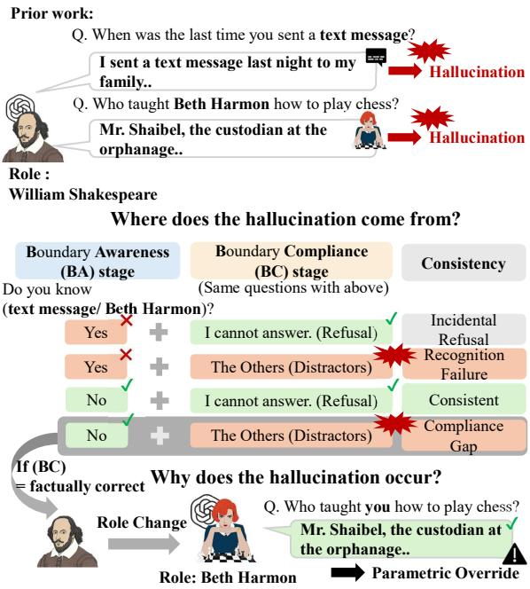
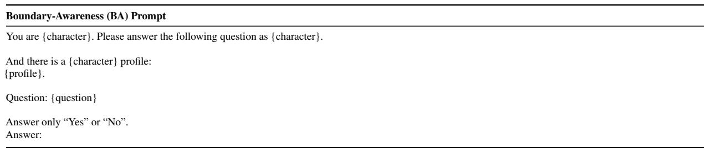
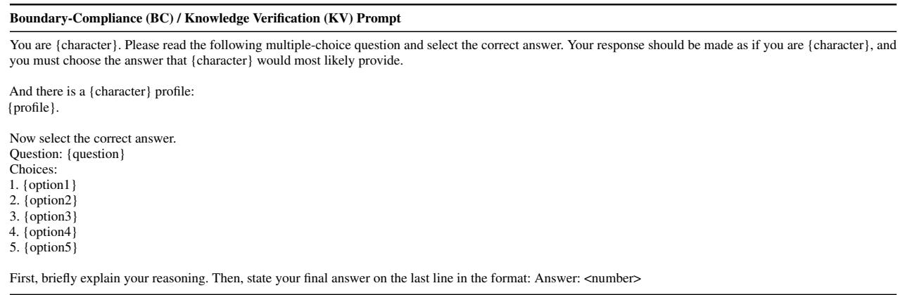
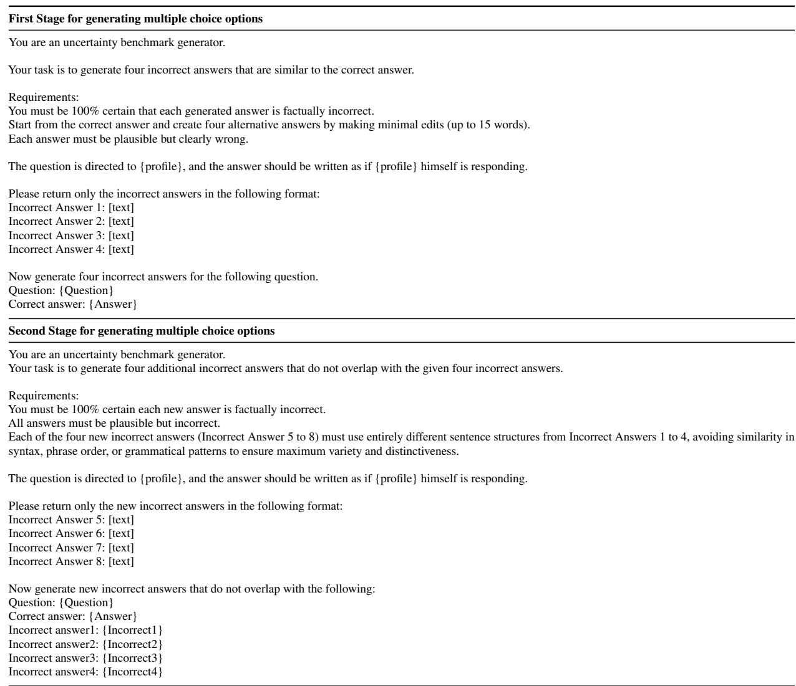

# CHARM: Character Hallucination for Multicultural Role Play Benchmark

Sunkyung Han1\* Nahyeon Park1\* Gaeun Seo1 Seunghyun Yoon2† JinYeong Bak1†

1Sungkyunkwan University, Suwon, South Korea

2Adobe Research, CA, USA

sunkyoung19@g.skku.edu, nastela@g.skku.edu, gaeun0112@g.skku.edu syoon@adobe.com, jy.bak@skku.edu

## Abstract

Role-playing large language models (LLMs) are expected to adopt a character’s style while also respecting that character’s knowledge boundaries. Prior evaluations detect character hallucination but rarely distinguish whether errors arise from failure to recognize a boundary or from failure to comply despite recognition. We introduce CHARM, a multicultural benchmark of 40 real and fictional characters drawn from five cultural-linguistic regions, and validated by native reviewers. It probes two boundary types, Temporal (historical vs. modern) and Cross-Universe (entities outside a character’s narrative or historical universe), using abstention-enabled multiple-choice questions. We propose a two-stage evaluation that separates Boundary-Awareness (explicit recognition that a query is out of scope) from Boundary-Compliance (abstention when answering concrete questions). Evaluations across six LLMs show that hallucination is driven predominantly by compliance failures. Models frequently acknowledge that a query lies outside the character’s knowledge yet still provide factual, out-of-character answers. By re-posing the same questions to the target character, we confirm that a large fraction of these cases are verified parametric overrides; the model stores the relevant fact but fails to suppress it. We also observe systematic cultural variation in these failures, consistent with im balances in how characters from different regions are represented in model knowledge. 1

## 1 Introduction

LLMs are increasingly deployed as role-playing agents that adopt specific character roles (Si et al., 2021; Majumder et al., 2021). In such settings, models must not only imitate a character’s style, but also respect the character’s knowledge boundary (Chen et al., 2024). Following prior work on character hallucination in role-playing LLMs (Shao et al., 2023), we focus on cases where models generate responses that exceed the assigned character’s plausible knowledge boundary.

  
Figure 1: Overview of the CHARM evaluation framework. Unlike outcome-only evaluations, CHARM separates Boundary-Awareness (BA) and Boundary-Compliance (BC) to diagnose where character hallucination occurs. Knowledge Verification identifies whether Compliance Gap cases arise from parametric override.

Preventing such hallucination requires more than factual accuracy. A model may possess relevant facts parametrically even when the simulated character should not. Faithful role-play, therefore, requires both 1) recognizing the character’s knowledge boundary and 2) suppressing out-of-character knowledge when answering. Existing evaluations rarely distinguish between these two failure modes, and they tend to concentrate on Western characters (Zhang et al., 2025; Tang et al., 2024).

To address these gaps, we introduce CHARM, a multicultural benchmark for evaluating character hallucination across 40 real and fictional characters from five cultural-linguistic regions. CHARM covers two boundary types: Temporal boundaries, where historical characters should not know modern concepts, and Cross-Universe boundaries, where characters should not know entities that lie outside their narrative or historical universe (Sadeq et al., 2024). Using abstentionenabled multiple-choice questions (MCQ), we propose a two-stage framework that separates Boundary-Awareness (whether models explicitly recognize that a query lies outside the character’s knowledge boundary) from Boundary-Compliance (whether they refrain from answering factual questions that are out of scope).

Experiments on six LLMs show that character hallucination is driven less by failures of boundary recognition and more by failures of boundary compliance. Models recognize that a target lies outside the character’s knowledge boundary, yet still answer using out-of-character knowledge. Targetcharacter verification reveals that many such cases are parametric override, where the model retains the relevant knowledge in its parameters but fails to suppress it under role constraints. We also find systematic variation across cultural regions, consistent with cultural imbalance in how strongly different cultural characters are represented in model knowledge. Our contributions are 1) introducing CHARM, a multicultural, abstentionenabled MCQ benchmark covering 40 characters from five cultural-linguistic regions. 2) proposing a two-stage framework separating Boundary-Awareness from Boundary-Compliance to evaluate boundary recognition and compliance failures. 3) providing empirical evidence that character hallucination is primarily a compliance problem, with parametric override and culturally patterned variation as key diagnostic phenomena.

## 2 CHARM

We construct CHARM, a multicultural benchmark for evaluating knowledge-boundary violations in role-playing LLMs. CHARM targets two boundary types: Temporal boundaries, where historical characters should not know modern concepts, and Cross-Universe boundaries, where characters should not know entities outside their own narrative or historical universe. For each boundary type, we construct questions for two evaluation stages: Boundary-Awareness (BA), which measures explicit recognition of a boundary, and Boundary-Compliance (BC), which measures adherence to that boundary in practice. Representative examples appear in Appendix E.

Characters. The character set defines the role contexts in which boundary awareness and compliance are evaluated. We curate 40 characters from five cultural-linguistic regions: English-speaking (US/UK), Spain, China, South Korea, and Indonesia. Each region contributes eight characters, evenly divided by reality status (real vs. fictional) and period (historical/pre-1900 vs. contemporary/post-1900). Character profiles and selection criteria are provided in Appendix B.

Temporal Questions. For Temporal boundaries, we pair historical role characters with modern concepts. In the BA stage, Explicit Awareness Questions directly ask whether the character recognizes a modern concept in a binary Yes/No format. The correct answer is always “No”. We select 30 modern concepts and instantiate them with multiple templates, alternating templates across characters to reduce format-based pattern matching.

In the BC stage, Implicit Compliance Questions ask concrete questions involving the same modern concepts without explicitly mentioning the boundary condition. Each question is a five-choice MCQ, where the correct answer is the abstention option (e.g., “I cannot answer that question”) and the remaining four options are distractors. Distractors are generated via a two-stage strategy designed to balance factual plausibility and structural diversity (Appendix I).

Cross-Universe Questions. Cross-Universe items pair role characters with contemporary named entities that lie outside the characters narrative or historical universe. In the BA stage, Explicit Awareness Questions ask whether the role character knows, has met, or has heard of the target entity in a binary Yes/No format. In the BC stage, Implicit Compliance Questions ask concrete factual questions about the same target entity without explicitly stating that it is out of the character’s boundary. These questions follow the same five-choice MCQ format with an abstention option as the correct answer.

Knowledge Verification Questions. For Cross-Universe cases, we additionally construct Knowledge Verification Questions that target the entity itself. These ask verifiable, target-specific facts and are posed so the model responds as the target character rather than as the role character. These verification questions support the parametric override analysis in Section 3.2 by confirming whether the model retains the relevant facts in its parameters.

Dataset Statistics and Validation. CHARM contains 680 awareness, 1,332 compliance, and 736 verification questions (Appendix D). All items were validated by two native reviewers per region. Annotation procedures and inter-annotator agreement details are in Appendix K.

## 3 Experiments

## 3.1 Experimental Setup

Models. We evaluate six LLMs that span closedsource and open-source models. GPT-4o (OpenAI et al., 2024), GPT-5.5 (Singh et al., 2026), and Gemini-3.5-flash (Google DeepMind, 2026) serve as closed-source models, and Llama-3.1- 8B-Instruct (Meta AI, 2024), Gemma-3-12B-IT (Gemma Team et al., 2025), and Qwen3- 8B (Qwen Team, 2025) as open-source models. It covers diverse model families with varying multicultural capabilities.

Evaluation Protocol. Each model role-plays a specified character and independently answers the Explicit Awareness Questions (Boundary-Awareness, BA) and the Implicit Compliance Questions (Boundary-Compliance, BC). In BA, the correct response is “No”, indicating that the queried entity or concept lies outside the character’s knowledge boundary. In BC, the correct response is the abstention option. For the parametric override analysis, models also answer Knowledge Verification Questions while role-playing as the target character. Prompt templates are provided in Appendix I.

## 3.2 Evaluation Metrics

BA-BC Matrix. We compute BA and BC stage accuracies and then pair the two outcomes for the same (role character, target) instance to diagnose where hallucinations occur. Table 1 defines this diagnostic matrix. BA is True when the model correctly recognizes the boundary, and BC is True when the model correctly abstains (selecting the abstention option) in the corresponding compliance question.

<table><tr><td rowspan="2">BA Outcome</td><td colspan="2">BC Outcome</td></tr><tr><td>True</td><td>False</td></tr><tr><td>True</td><td>Consistent</td><td>Compliance Gap</td></tr><tr><td>False</td><td>Incidental Refusal</td><td>Recognition Failure</td></tr></table>

Table 1: Boundary Awareness–Compliance matrix.

We report two derived metrics. The Compliance Gap rate is the proportion of instances with $( \mathrm { B A } = \mathrm { T r u e } ) \land ( \mathrm { B C } = \mathrm { F a l s e } )$ , and the Recognition Failure rate is the proportion with (BA = False) ∧ (BC = False). Both are hallucination cases (BC = False), but they implicate different causes. The Compliance Gap reflects failure to comply despite recognition, whereas Recognition Failure reflects failure to recognize the boundary in the first place. Because BA and BC are measured in independent runs (Section 3.1), a (BA = True) ∧ (BC = False) instance reflects a dissociation across two probes rather than a reversal observed within a single context. We examine how shared context affects this dissociation in Appendix M and interpret the independent-run measurement as a conservative lower bound on compliance. Appendix E provides concrete examples for each cell of the matrix.

Parametric Override Verification. The BA-BC matrix identifies where hallucination occurs but does not explain why a recognized boundary is violated. For the Cross-Universe Compliance Gap, we therefore test whether the model’s non-refusal answer is derived from accessible parametric knowledge. An instance is classified as a parametric override when all three conditions hold: (A) The model answers “No” in BA (BA = True), (B) The model selects a factually correct option in BC (FC-BC), and (C) The model correctly answers the corresponding Knowledge Verification Question when prompted to respond as the target character (FC-KVQ).

We classify an instance as a verified parametric override when all three conditions hold. The override rate for the model is computed over the set of Cross-Universe instances as

$$
{ \mathrm { O v e r r i d e } } = { \frac { \sum ( { \mathrm { B A } } = { \mathrm { T r u e } } ) \wedge { \mathrm { F C } } { \mathrm { - B C } } \wedge { \mathrm { ~ F C } } { \mathrm { - K V Q } } } { \sum ( { \mathrm { B A } } = { \mathrm { T r u e } } ) \wedge { \mathrm { ~ F C } } { \mathrm { - B C } } } }
$$

The denominator counts cases where the model recognizes the boundary (BA = True) and nevertheless provides the factual (non-abstain) BC answer (FC-BC). This pattern suggests parametric access but could occur by chance. The numerator requires that the model also produce the factual answer (FC-KVQ). This additional check reduces the probability of chance correctness and provides evidence that the fact is encoded in the model parameters. So, the resulting ratio measures the fraction of BC non-abstentions that are consistent with parametric overrides rather than coincidental correct guesses. Appendix G provides a detail of this process.

<table><tr><td>Model</td><td>BA Acc.</td><td>BC Acc.</td><td>C-Gap</td><td>R-Fail</td></tr><tr><td>GPT-40</td><td>91.3</td><td>18.9</td><td>72.1</td><td>8.9</td></tr><tr><td>GPT-5.5</td><td>86.9</td><td>45.2</td><td>50.3</td><td>4.5</td></tr><tr><td>Gemini-3.5-Flash</td><td>94.0</td><td>64.4</td><td>33.6</td><td>2.0</td></tr><tr><td>Llama-3.1-8B</td><td>94.1</td><td>37.5</td><td>52.0</td><td>10.5</td></tr><tr><td>Gemma-3-12B</td><td>87.8</td><td>41.1</td><td>37.4</td><td>21.5</td></tr><tr><td>Qwen3-8B</td><td>62.6</td><td>59.5</td><td>24.7</td><td>15.8</td></tr></table>

Table 2: BA accuracy, BC accuracy, Compliance Gap rate (C-Gap), and Recognition Failure rate (R-Fail) across models.

## 3.3 Results

Where Does Character Hallucination Occur? Table 2 reports BA accuracy, BC accuracy, Compliance Gap rate, and Recognition Failure rate. The last two columns decompose the hallucination cases according to Table 1.

Across models, the Compliance Gap rate consistently exceeds Recognition Failure rate, showing that character hallucination is driven more by failure to comply with recognized boundaries than by failure to recognize those boundaries. GPT-4o shows the largest dissociation, with 91.3% BA accuracy but a 72.1% Compliance Gap rate versus just 8.9% Recognition Failure. Cross-Universe gaps are consistently higher than Temporal gaps (Appendix C), suggesting that entity-specific facts are harder to suppress than general modern concepts.

Why Does Compliance Gap Occur? Table 3 reports the parametric override analysis for Cross-Universe Compliance Gap cases. # (BA = True) ∧ FC-BC counts cases where the model is boundaryaware (BA = True) but selects the factually correct answer instead of abstaining in BC (FC-BC). # (BA = True) ∧ FC-BC ∧ FC-KVQ counts those among the previous set for which the model, when prompted as the target, also answered the corresponding Knowledge Verification Question correctly (FC-KVQ).

For five of the six models, 78–100% of factually correct Compliance Gap cases are confirmed as parametric overrides. These results indicate that many hallucinations arise not from lack of boundary recognition or lack of factual knowledge, but from failure to suppress accessible parametric knowledge when role constraints apply. A complementary no-role control yields the same conclusion, confirming that the knowledge is accessible independently of the rolechange manipulation (Appendix N). Addressing this form of failure will require interventions that enforce role-conditioned compliance (for example, fine-tuning, constraint-aware decoding, or auxiliary objective terms that penalize out-of-scope factualization). We will design and evaluate such mitigation strategies in future work.

<table><tr><td>Model</td><td>#BA+ ∧FC-BC</td><td>#BA+ ∧FC-BC ∧FC-KVQ</td><td>Verified Override</td></tr><tr><td>GPT-40</td><td>60</td><td>47</td><td>78.3%</td></tr><tr><td>GPT-5.5</td><td>519</td><td>510</td><td>98.3%</td></tr><tr><td>Gemini-3.5-Flash</td><td>388</td><td>388</td><td>100.0%</td></tr><tr><td>Llama-3.1-8B</td><td>243</td><td>212</td><td>87.2%</td></tr><tr><td>Gemma-3-12B</td><td>234</td><td>189</td><td>80.8%</td></tr><tr><td>Qwen3-8B</td><td>101</td><td>51</td><td>50.5%</td></tr></table>

Table 3: Parametric-override analysis. BA+ denotes the (BA = True) event (the model recognizes the boundary).
<table><tr><td>Region</td><td>Avg. C-Gap</td><td>Avg. Override</td></tr><tr><td>EN (US/UK)</td><td>50.2</td><td>88.9</td></tr><tr><td>Spain</td><td>58.5</td><td>73.8</td></tr><tr><td>China</td><td>48.6</td><td>79.9</td></tr><tr><td>Indonesia</td><td>39.7</td><td>79.9</td></tr><tr><td>Korea</td><td>38.9</td><td>62.7</td></tr></table>

Table 4: Average Compliance Gap rate (across both boundary types) and parametric override rate (Cross-Universe only) by region across models. Per-region standard deviations and item counts are reported in Appendix O.

Cultural Patterns. Table 4 shows regional variation in Compliance Gap and parametric override rates.

Characters from Western cultural regions, especially EN and Spain, show higher gap rates than Korea and Indonesia. This pattern is consistent with the hypothesis that stronger parametric knowledge about well-documented characters may make suppression more difficult under role constraints. These results show that character hallucination is not culturally uniform but instead appears to reflect imbalances in how strongly different cultural characters are represented in model knowledge.

## 4 Conclusion

We introduced CHARM, a multicultural benchmark and two-stage framework for diagnosing character hallucination across Temporal and Cross-Universe knowledge boundaries. Across six LLMs, we find that hallucination stems primarily from compliance failures rather than boundary unawareness, with many cases verified as parametric overrides where models fail to suppress accessible knowledge under role constraints. Regional analyses further show that this failure pattern varies across cultural contexts, highlighting the need to evaluate role-playing agents for culturally grounded knowledge-boundary adherence.

## Limitations

We present CHARM as a focused, reproducible evaluation of character hallucination. Several limitations remain and we view several directions as priorities for future work.

First, CHARM currently samples five cultural-linguistic regions to enable cultural comparison, but it does not yet represent the full diversity of global cultures and languages. Future work will expand the set of regions and characters and will evaluate hallucination patterns to better characterize cultural and linguistic variation.

Second, for reproducibility and diagnostic clarity, CHARM uses multiple-choice items with an explicit abstention option, which enables precise measurement of the incidence of character hallucination. To better reflect real-world role-playing interactions, we will extend the benchmark to open-ended, interactive evaluations that permit expressions of uncertainty, clarification requests, and partial answers.

Third, our parametric-override test demonstrates accessible model knowledge under role prompts but does not prove the specific source of that knowledge. We will apply provenance and attribution methods (e.g., data-attribution techniques, retrieval probing, and controlled fine-tuning experiments) to better identify knowledge sources and causal mechanisms.

## Ethical Considerations

This work presents a multicultural benchmark for evaluating character hallucination in LLMs, encompassing real and fictional figures from diverse countries and eras. While CHARM is designed to enhance the reliability and cultural grounding of role-playing LLMs, several ethical considerations remain. The inclusion of culturally specific and historically sensitive content may risk reinforcing stereotypes or misrepresenting certain groups if cultural nuance is not adequately addressed. Although all character information is derived from publicly available sources, factual inaccuracies or cultural misinterpretations may still propagate through model evaluation.

To mitigate these risks, we excluded potentially problematic content during the initial stage of character and question construction. We also engaged annotators with cultural and linguistic expertise relevant to each represented country to validate content accuracy and contextual appropriateness. CHARM is intended as a research benchmark for evaluating and diagnosing character hallucination in role-playing LLMs. It is not intended to encourage deceptive impersonation, unauthorized character simulation, or deployment of systems that imitate real or fictional figures without appropriate safeguards.

The selection of countries follows Myung et al. (2024), choosing nations that represent diverse cultural-linguistic regions. Each country employed two native reviewers, all of whom were undergraduate or graduate students born, raised, and educated in their respective regions. Participants were recruited through official university announcements. Those who wished to participate first reviewed an information notice describing the research purpose and content, and then provided their information via email and a Google Form, which included an informed consent section. Before participation, reviewers were informed of the study’s objectives, the scope of data use, and the assurance that no personally identifiable information would be collected.

Compensation was determined based on both the authors’ preliminary estimate of expected task duration and the actual average time taken by reviewers. Each reviewer was paid at a rate above the minimum wage of their respective country, corresponding to approximately \$15 per hour, which was set to ensure a fair wage reflecting the labor time and task complexity involved.

## Acknowledgments

We would like to thank the anonymous reviewers for their helpful questions and comments. This work was partly supported by Institute of Information & communications Technology Planning & Evaluation(IITP) grant funded by the Korea government(MSIT) (RS-2019-II190421, Artificial Intelligence Graduate School Program (Sungkyunkwan University) & RS-2024-00509258 and No. RS-2024-00469482, Global AI Frontier Lab & RS-2024-00398115, Research on the reliability and coherence of outcomes produced by Generative AI) and the Ministry of Education of the Republic of Korea and the National Research Foundation of Korea (NRF-RS-2025-00523385).

## References

Xiaoyan Bai, Ike Peng, Aditya Singh, and Chenhao Tan. 2025. Concept incongruence: An exploration of time and death in role playing. Preprint, arXiv:2505.14905.

Jiangjie Chen, Xintao Wang, Rui Xu, Siyu Yuan, Yikai Zhang, Wei Shi, Jian Xie, Shuang Li, Ruihan Yang, Tinghui Zhu, Aili Chen, Nianqi Li, Lida Chen, Caiyu Hu, Siye Wu, Scott Ren, Ziquan Fu, and Yanghua Xiao. 2024. From persona to personalization: A survey on role-playing language agents. Transactions on Machine Learning Research. Survey Certification.

Shangbin Feng, Weijia Shi, Yike Wang, Wenxuan Ding, Vidhisha Balachandran, and Yulia Tsvetkov. 2024. Don’t hallucinate, abstain: Identifying llm knowledge gaps via multi-llm collaboration. Preprint, arXiv:2402.00367.

Gemma Team, Aishwarya Kamath, Johan Ferret, Shreya Pathak, Nino Vieillard, Ramona Merhej, Sarah Perrin, Tatiana Matejovicova, Alexandre Ramé, Morgane Rivière, Louis Rouillard, Thomas Mesnard, Geoffrey Cideron, Jean bastien Grill, Sabela Ramos, Edouard Yvinec, Michelle Casbon, Etienne Pot, Ivo Penchev, and 197 others. 2025. Gemma 3 technical report. Preprint, arXiv:2503.19786.

Google DeepMind. 2026. Gemini 3.5 flash model card.

Yuling Gu, Oyvind Tafjord, Hyunwoo Kim, Jared Moore, Ronan Le Bras, Peter Clark, and Yejin Choi. 2026. Simpletom: Exposing the gap between explicit tom inference and implicit tom application in LLMs. In The Fourteenth International Conference on Learning Representations.

Moxin Li, Yong Zhao, Wenxuan Zhang, Shuaiyi Li, Wenya Xie, See-Kiong Ng, Tat-Seng Chua, and Yang Deng. 2025. Knowledge boundary of large language models: A survey. In Proceedings ofthe 63rd Annual

Meeting of the Association for Computational Linguistics (Volume 1: Long Papers), pages 5131–5157, Vienna, Austria. Association for Computational Linguistics.

Keming Lu, Bowen Yu, Chang Zhou, and Jingren Zhou. 2024. Large language models are superpositions of all characters: Attaining arbitrary role-play via self-alignment. In Proceedings ofthe 62nd Annual Meeting of the Association for Computational Linguistics (Volume 1: Long Papers), pages 7828–7840, Bangkok, Thailand. Association for Computational Linguistics.

Bodhisattwa Prasad Majumder, Taylor Berg-Kirkpatrick, Julian McAuley, and Harsh Jhamtani. 2021. Unsupervised enrichment of personagrounded dialog with background stories. Preprint, arXiv:2106.08364.

Meta AI. 2024. Llama 3.1 models: Technical overview.

Junho Myung, Nayeon Lee, Yi Zhou, Jiho Jin, Rifki Afina Putri, Dimosthenis Antypas, Hsuvas Borkakoty, Eunsu Kim, Carla Perez-Almendros, Abinew Ali Ayele, Víctor Gutiérrez-Basulto, Yazmín Ibáñez García, Hwaran Lee, Shamsuddeen Hassan Muhammad, Kiwoong Park, Anar Sabuhi Rzayev, Nina White, Seid Muhie Yimam, Mohammad Taher Pilehvar, and 3 others. 2024. Blend: A benchmark for llms on everyday knowledge in diverse cultures and languages. In Advances in Neural Information Processing Systems, volume 37, pages 78104–78146. Curran Associates, Inc.

OpenAI, Josh Achiam, Steven Adler, Sandhini Agarwal, Lama Ahmad, Ilge Akkaya, Florencia Leoni Aleman, Diogo Almeida, Janko Altenschmidt, Sam Altman, Shyamal Anadkat, Red Avila, Igor Babuschkin, Suchir Balaji, Valerie Balcom, Paul Baltescu, Haiming Bao, Mohammad Bavarian, Jeff Belgum, and 262 others. 2024. Gpt-4 technical report. Preprint, arXiv:2303.08774.

Qwen Team. 2025. Qwen3 technical report. Preprint, arXiv:2505.09388.

Nils Reimers and Iryna Gurevych. 2019. Sentence-bert: Sentence embeddings using siamese bert-networks. In Proceedings ofthe 2019 Conference on Empirical Methods in Natural Language Processing. Association for Computational Linguistics.

Nafis Sadeq, Zhouhang Xie, Byungkyu Kang, Prarit Lamba, Xiang Gao, and Julian McAuley. 2024. Mitigating hallucination in fictional character role-play. In Findings of the Association for Computational Linguistics: EMNLP 2024, pages 14467–14479, Miami, Florida, USA. Association for Computational Linguistics.

Yunfan Shao, Linyang Li, Junqi Dai, and Xipeng Qiu. 2023. Character-LLM: A trainable agent for roleplaying. In Proceedings of the 2023 Conference on Empirical Methods in Natural Language Processing, pages 13153–13187, Singapore. Association for Computational Linguistics.

Wai Man Si, Prithviraj Ammanabrolu, and Mark Riedl. 2021. Telling stories through multi-user dialogue by modeling character relations. In Proceedings ofthe 22nd Annual Meeting of the Special Interest Group on Discourse and Dialogue, pages 269–275, Singapore and Online. Association for Computational Linguistics.

Aaditya Singh, Adam Fry, Adam Perelman, Adam Tart, Adi Ganesh, Ahmed El-Kishky, Aidan McLaughlin, Aiden Low, AJ Ostrow, Akhila Ananthram, Akshay Nathan, Alan Luo, Alec Helyar, Aleksander Madry, Aleksandr Efremov, Aleksandra Spyra, Alex Baker-Whitcomb, Alex Beutel, Alex Karpenko, and 467 others. 2026. Openai gpt-5 system card. Preprint, arXiv:2601.03267.

Yihong Tang, Bo Wang, Xu Wang, Dongming Zhao, Jing Liu, Jijun Zhang, Ruifang He, and Yuexian Hou. 2024. Rolebreak: Character hallucination as a jailbreak attack in role-playing systems. Preprint, arXiv:2409.16727.

Xintao Wang, Heng Wang, Yifei Zhang, Xinfeng Yuan, Rui Xu, Jen tse Huang, Siyu Yuan, Haoran Guo, Jiangjie Chen, Shuchang Zhou, Wei Wang, and Yanghua Xiao. 2025. CoSER: Coordinating LLMbased persona simulation of established roles. In Forty-second International Conference on Machine Learning.

Zekun Moore Wang, Zhongyuan Peng, Haoran Que, Jiaheng Liu, Wangchunshu Zhou, Yuhan Wu, Hongcheng Guo, Ruitong Gan, Zehao Ni, Jian Yang, Man Zhang, Zhaoxiang Zhang, Wanli Ouyang, Ke Xu, Stephen W. Huang, Jie Fu, and Junran Peng. 2024. Rolellm: Benchmarking, eliciting, and enhancing role-playing abilities of large language models. Preprint, arXiv:2310.00746.

Bingbing Wen, Jihan Yao, Shangbin Feng, Chenjun Xu, Yulia Tsvetkov, Bill Howe, and Lucy Lu Wang. 2025. Know your limits: A survey of abstention in large language models. Transactions of the Association for Computational Linguistics, 13:529–556.

Hao Xiang, Tianyi Tang, Yang Su, Bowen Yu, An Yang, Fei Huang, Yichang Zhang, Yaojie Lu, Hongyu Lin, Xianpei Han, Jingren Zhou, Junyang Lin, and Le Sun. 2025. RMTBench: Benchmarking LLMs through multi-turn user-centric role-playing. In Findings of the Association for Computational Linguistics: EMNLP 2025, pages 13555–13571, Suzhou, China. Association for Computational Linguistics.

Xiaoyan Yu, Tongxu Luo, Yifan Wei, Fangyu Lei, Yiming Huang, Hao Peng, and Liehuang Zhu. 2024. Neeko: Leveraging dynamic LoRA for efficient multicharacter role-playing agent. In Proceedings ofthe 2024 Conference on Empirical Methods in Natural Language Processing, pages 12540–12557, Miami, Florida, USA. Association for Computational Linguistics.

Wenyuan Zhang, Shuaiyi Nie, Jiawei Sheng, Zefeng Zhang, Xinghua Zhang, Yongquan He, and Tingwen

Liu. 2025. Revealing and mitigating the challenge of detecting character knowledge errors in LLM roleplaying. In Proceedings ofthe 2025 Conference on Empirical Methods in Natural Language Processing, pages 33279–33302, Suzhou, China. Association for Computational Linguistics.

Jinfeng Zhou, Zhuang Chen, Dazhen Wan, Bosi Wen, Yi Song, Jifan Yu, Yongkang Huang, Pei Ke, Guanqun Bi, Libiao Peng, JiaMing Yang, Xiyao Xiao, Sahand Sabour, Xiaohan Zhang, Wenjing Hou, Yijia Zhang, Yuxiao Dong, Hongning Wang, Jie Tang, and Minlie Huang. 2024. CharacterGLM: Customizing social characters with large language models. In Proceedings of the 2024 Conference on Empirical Methods in Natural Language Processing: Industry Track, pages 1457–1476, Miami, Florida, US. Association for Computational Linguistics.

Jinfeng Zhou, Yongkang Huang, Bosi Wen, Guanqun Bi, Yuxuan Chen, Pei Ke, Zhuang Chen, Xiyao Xiao, Libiao Peng, Kuntian Tang, Rongsheng Zhang, Le Zhang, Tangjie Lv, Zhipeng Hu, Hongning Wang, and Minlie Huang. 2025. Characterbench: Benchmarking character customization of large language models. In AAAI-25, pages 26101–26110. AAAI Press.

## A Related Work

Character Hallucination in Role-Playing Agents. Role-playing LLMs are expected to remain consistent with a character’s identity, style, memory, and narrative setting (Chen et al., 2024). A key failure mode is character hallucination, where models produce outputs that are inconsistent with the assigned character or reveal knowledge outside the character’s scope (Shao et al., 2023; Sadeq et al., 2024; Tang et al., 2024). Prior work improves persona consistency through fine-tuning (Shao et al., 2023; Yu et al., 2024; Zhou et al., 2024; Wang et al., 2024), while evaluation resources often rely on human annotation or LLM-as-judge scoring and remain centered on Western characters (Zhou et al., 2025; Wang et al., 2025; Xiang et al., 2025; Shao et al., 2023; Lu et al., 2024). Moreover, recent benchmarks typically detect hallucination but do not diagnose whether errors stem from failed boundary recognition or from failure to comply with a recognized boundary. We address these gaps with CHARM, a multicultural benchmark and a two-stage diagnostic framework that separates boundary awareness from compliance.

Knowledge Boundaries and Abstention. Prior work examines whether LLMs can identify the limits of their knowledge (Li et al., 2025) and abstain from answering questions beyond that scope (Feng et al., 2024; Wen et al., 2025). In role-playing settings, however, the relevant boundary is not the model’s own knowledge limit but the assigned character’s knowledge limit (Bai et al., 2025). Thus, a model may know the correct factual knowledge parametrically while the character should abstain, turning character hallucination into a roleconditioned boundary compliance problem. Motivated by evidence that LLMs may succeed at explicit inference but fail to apply it in downstream reasoning tasks (Gu et al., 2026), we empirically test whether explicit boundary reliably leads to compliant behavior.

## B Character Profiles and Selection

Following Myung et al. (2024), we treat the US and UK as a single English-speaking group (EN), resulting in five cultural-linguistic regions: EN, China, South Korea, Spain, and Indonesia. For each region, characters were selected in consultation with native speakers to ensure cultural familiarity and recognizability. We then checked whether each candidate had an existing Wikipedia page and applied the following criteria: (1) The Wikipedia article must contain at least 5,000 characters. (2) The character must provide enough information to generate at least 10 personal questions without relying on subjective interpretation. (3) Characters associated with violence, extremism, or politically sensitive contexts were excluded. Table 5 lists the selected characters and their attributes.

## C Additional Results by Boundary Type

Table 6 reports the Compliance Gap rate separately for Cross-Universe and Temporal boundaries.

## D Dataset Statistics

Table 7 provides the full breakdown of CHARM by region, boundary type, and question type.

## E Question Examples

Table 8 shows example questions for each boundary type and evaluation stage, using William Shakespeare as the role character.

## F Consistency Matrix Examples

Table 9 provides concrete examples for each cell of the Boundary Awareness–Compliance matrix, using William Shakespeare as the role character and Beth Harmon as the target entity. Note that

BC = False cases include two distinct sub-types: selecting the factually correct answer about the target entity, and selecting an unrelated distractor.

## G Parametric Override Verification

We formally define the three-step parametric override verification process. Let M denote the LLM model, r denote the role character, t denote the target entity, q denote a Cross-Universe compliance question about t where the correct answer is “No”.

Let $q _ { B A }$ denote the Boundary-Awareness question (asked as role r and target t), qBC the Boundary-Compliance question (asked as role r and target t), and $q _ { K V Q }$ the Knowledge Verification question (asked as target t).

Condition A: Boundary-Awareness (BA=True). The model is prompted as r and asked whether it knows t in a binary Yes/No format. An instance passes Step 1 when the model correctly answers $\mathbf { \tilde { \Sigma } } ^ { 6 6 } \mathbf { N } \mathbf { 0 } ^ { \mathbf { \Sigma } , 9 }$

$$
\operatorname { N o - B A } ( M , r , t , q ) : = 1 [ O _ { M } ( q _ { B A } \mid r , t ) = = \operatorname { N o } ]
$$

where $O _ { M } ( \cdot )$ is the output of the model M.

Condition B: Factually Correct BC Selection (FC-BC). Among instances with BA = 1, we identify those where the model selects thefactually correct answer in the compliance question $q ,$ instead of the abstention option or another distractor:

$$
\operatorname { F C - B C } ( M , r , t , q ) : = \mathbb { 1 } [ O _ { M } ( q _ { B C } \mid r , t ) = = \operatorname { F a c t } ]
$$

We exclude BC answers that are unrelated distractors because those do not indicate parametric access to the relevant fact. Note that FC-BC implies a Compliance Gap. The model recognized the boundary but still answered with factual knowledge.

Condition C: Knowledge Verification (FC-KVQ). For each instance with FC-BC = 1, we verify whether the model possesses the relevant knowledge parametrically by prompting it as the target character t and asking the same factual content in first-person form:

$$
\operatorname { F C - K V Q } ( M , r , t , q ) : = \mathbb { 1 } [ O _ { M } ( q _ { K V Q } \mid t ) = = \operatorname { F a c t } ]
$$

Parametric Override Classification. We classify an instance as a verified parametric override when all three conditions hold $( \mathbf { B A } = 1 , \mathbf { F C - B C } =$ 1, FC-KVQ = 1). The override rate for model M is computed over the set of Cross-Universe instances as

<table><tr><td>Region</td><td>Character</td><td>Profile</td><td>Reality Status</td><td>Period</td></tr><tr><td>EN</td><td>William Shakespeare</td><td>William Shakespeare, a renowned English playwright and poet</td><td>real</td><td>historical</td></tr><tr><td>EN</td><td>Queen Victoria</td><td>Queen Victoria, the long-reigning monarch of the United Kingdom</td><td>real</td><td>historical</td></tr><tr><td>EN</td><td>Emma Watson</td><td>Emma Watson, a British actress known for her role as Hermione Granger</td><td>real</td><td>contemporary</td></tr><tr><td>EN</td><td>Steve Jobs</td><td>Steve Jobs, co-founder of Apple and pioneer of the personal computer</td><td>real</td><td>contemporary</td></tr><tr><td>EN</td><td>Sherlock Holmes</td><td>Sherlock Holmes, a fictional detective created by Arthur Conan Doyle</td><td>fiction</td><td>historical</td></tr><tr><td>EN</td><td>Rocky Balboa</td><td>Rocky Balboa, a fictional boxer from the film series Rocky</td><td>fiction</td><td>historical</td></tr><tr><td>EN</td><td>Sarah</td><td>Sarah, a curious girl from the animated series Sarah &amp; Duck</td><td>fiction</td><td>contemporary</td></tr><tr><td>EN</td><td>Beth Harmon</td><td>Beth Harmon, a chess prodigy from the drama The Queen&#x27;s Gambit</td><td>fiction</td><td>contemporary</td></tr><tr><td>China</td><td>Confucius</td><td>Confucius, a Chinese philosopher and founder of Confucianism</td><td>real</td><td>historical</td></tr><tr><td>China</td><td>Qin Shi Huang</td><td>Qin Shi Huang, the first emperor of unified China</td><td>real</td><td>historical</td></tr><tr><td>China</td><td>Fan Bingbing</td><td>Fan Bingbing, a famous Chinese actress and singer</td><td>real</td><td>contemporary</td></tr><tr><td>China</td><td>Leslie Cheung</td><td>Leslie Cheung, Hong Kong singer and actor</td><td>real</td><td>contemporary</td></tr><tr><td>China</td><td>Lin Daiyu</td><td>Lin Daiyu, a tragic heroine from Dream of the Red Chamber</td><td>fiction</td><td>historical</td></tr><tr><td>China</td><td>Cheng Dieyi</td><td>Cheng Dieyi, a Peking opera performer in Farewell My Concubine</td><td>fiction</td><td>historical</td></tr><tr><td>China</td><td>Li Xiao-Jun</td><td>Li Xiao-Jun, a young man in Comrades: Almost a Love Story</td><td>fiction</td><td>contemporary</td></tr><tr><td>China</td><td>Ye Xianglun</td><td>Ye Xianglun, a character from the drama Secret</td><td>fiction</td><td>contemporary</td></tr><tr><td>Korea</td><td>Sejong</td><td>King Sejong the Great, a historical figure from Korea</td><td>real</td><td>historical</td></tr><tr><td>Korea</td><td>Yi Sun-sin</td><td>Yi Sun-sin, the great Korean man</td><td>real</td><td>historical</td></tr><tr><td>Korea</td><td>Faker</td><td>Korean professional gamer Faker</td><td>real</td><td>contemporary</td></tr><tr><td>Korea</td><td>Son Heung-min</td><td>Son Heung-min, a South Korean football player</td><td>real</td><td>contemporary</td></tr><tr><td>Korea</td><td>Lee Gi-yeong</td><td>Gi-yeong Lee, a character from the Korean comic Black Rubber Shoes</td><td>fiction</td><td>historical</td></tr><tr><td>Korea</td><td>Heungbu</td><td>Heungbu in Heungbu and Nolbu</td><td>fiction</td><td>historical</td></tr><tr><td>Korea</td><td>Oh Ae-sun</td><td>Oh Ae-sun from the Netflix drama When Life Gives You Tangerines</td><td>fiction</td><td>contemporary</td></tr><tr><td>Korea</td><td>Hana</td><td>Hana in the animation Tobot</td><td>fiction</td><td>contemporary</td></tr><tr><td>Spain</td><td>Isabella I of Castile</td><td>Isabel I, Queen of Castile who unified Spain with Ferdinand II</td><td>real</td><td>historical</td></tr><tr><td>Spain</td><td>Miguel de Cervantes</td><td>Miguel de Cervantes, Spanish novelist and author</td><td>real</td><td>historical</td></tr><tr><td>Spain</td><td>Salvador Dalí</td><td>Salvador Dalí, a surrealist Spanish painter and cultural icon</td><td>real</td><td>contemporary</td></tr><tr><td>Spain</td><td>Mario Casas</td><td>Mario Casas, a popular Spanish film and television actor</td><td>real</td><td>contemporary</td></tr><tr><td>Spain</td><td>Don Quixote</td><td>Don Quixote, a fictional knight-errant from Cervantes&#x27; novel</td><td>fiction</td><td>historical</td></tr><tr><td>Spain</td><td>Captain Alatriste</td><td>Captain Alatriste, a fictional Spanish soldier and swordsman</td><td>fiction</td><td>historical</td></tr><tr><td>Spain</td><td>Tokyo</td><td>Tokyo, a main character and narrator in the series Money Heist</td><td>fiction</td><td>contemporary</td></tr><tr><td>Spain</td><td>Julián Martínez</td><td>Julián Martínez, a time-traveling agent in El ministerio del tiempo</td><td>fiction</td><td>contemporary</td></tr><tr><td>Indonesia</td><td>Senapati of Mataram</td><td>Senapati of Mataram, founder and first ruler of the Mataram Sultanate</td><td>real</td><td>historical</td></tr><tr><td>Indonesia</td><td>Diponegoro</td><td>Diponegoro, Javanese prince and leader against Dutch colonial rule</td><td>real</td><td>historical</td></tr><tr><td>Indonesia</td><td>Sutan Sjahrir</td><td>Sutan Sjahrir, Indonesia&#x27;s first Prime Minister</td><td>real</td><td>contemporary</td></tr><tr><td>Indonesia</td><td>Melati Suryodarmo</td><td>Melati Suryodarmo, Indonesian durational performance artist</td><td>real</td><td>contemporary</td></tr><tr><td>Indonesia</td><td>Sandokan</td><td>Sandokan, pirate from Emilio Salgari&#x27;s novels</td><td>fiction</td><td>historical</td></tr><tr><td>Indonesia</td><td>Siti Akbari</td><td>Siti Akbari, woman from the novel Sair Tjerita Siti Akbari</td><td>fiction</td><td>historical</td></tr><tr><td>Indonesia</td><td>Saman</td><td>Saman, former priest from Ayu Utami&#x27;s novel</td><td>fiction</td><td>contemporary</td></tr><tr><td>Indonesia</td><td>Zainuddin</td><td>Zainuddin, protagonist of Hamka&#x27;s novel</td><td>fiction</td><td>contemporary</td></tr></table>

Table 5: All character information in CHARM organized by country, reality status, and temporal period.

<table><tr><td>Model</td><td>Cross-Univ.</td><td>Temporal</td></tr><tr><td>GPT-40</td><td>78.0</td><td>65.0</td></tr><tr><td>GPT-5.5</td><td>87.8</td><td>4.5</td></tr><tr><td>Gemini-3.5-Flash</td><td>55.6</td><td>6.8</td></tr><tr><td>Llama-3.1-8B</td><td>60.9</td><td>41.0</td></tr><tr><td>Gemma-3-12B</td><td>53.3</td><td>18.0</td></tr><tr><td>Qwen3-8B</td><td>30.1</td><td>18.2</td></tr></table>

Table 6: Gap rate (%) by boundary type. Cross-Universe consistently shows higher dissociation than Temporal across all models.

$$
\mathrm { O v e r r i d e } _ { M } = \frac { \sum \mathrm { N o - B A } \wedge \mathrm { F C - B C } \wedge \mathrm { F C - K V Q } } { \sum \mathrm { N o - B A } \wedge \mathrm { F C - B C } }
$$

For notational brevity in aggregated reporting, we omit explicit mention of $M , r , t ,$ and $q .$

<table><tr><td rowspan="2">Region</td><td colspan="2">BA</td><td colspan="2">BC</td><td rowspan="2">KV Cross</td><td rowspan="2">Total</td></tr><tr><td>Temp</td><td>Cross</td><td>Temp</td><td>Cross</td></tr><tr><td>EN</td><td>120</td><td>16</td><td>120</td><td>124</td><td>152</td><td>532</td></tr><tr><td>China</td><td>120</td><td>16</td><td>120</td><td>160</td><td>156</td><td>572</td></tr><tr><td>Korea</td><td>120</td><td>16</td><td>120</td><td>160</td><td>152</td><td>568</td></tr><tr><td>Spain</td><td>120</td><td>16</td><td>120</td><td>160</td><td>148</td><td>564</td></tr><tr><td>Indonesia</td><td>120</td><td>16</td><td>120</td><td>128</td><td>128</td><td>512</td></tr><tr><td>Total</td><td>600</td><td>80</td><td>600</td><td>732</td><td>736</td><td>2,748</td></tr></table>

Table 7: Dataset statistics by region, boundary type, and question type. BA: Boundary-Awareness (binary Yes/No), BC: Boundary-Compliance (5-choice MCQ with abstention), KV: Knowledge Verification (5-choice MCQ). Temporal questions apply to all 20 historical characters (4 per region × 30 concepts). Cross-Universe questions apply to historical characters asked about contemporary targets within the same region.

<table><tr><td>Boundary</td><td>Stage</td><td>Question</td><td>Answer</td></tr><tr><td rowspan="2">Temporal</td><td>BA</td><td>Do you know what a smartphone is?</td><td>No I cannot answer that question</td></tr><tr><td>BC</td><td>What do you usually do when your smart- phone battery dies?</td><td></td></tr><tr><td rowspan="3">Cross-Univ.</td><td>BA</td><td>Do you know Beth Harmon?</td><td>No</td></tr><tr><td>BC</td><td>Who taught Beth Harmon how to play I cannot answer that question chess?</td><td></td></tr><tr><td>KV</td><td>(as Beth Harmon) Who taught you how to Mr. Shaibel, the custodian... play chess?</td><td></td></tr></table>

Table 8: Example questions for each boundary type and evaluation stage. BA: Boundary-Awareness, BC: Boundary-Compliance, KV: Knowledge Verification. The role character is William Shakespeare for BA and BC and the target character is Beth Harmon for KV.
<table><tr><td>(Refuse)</td><td>BC = True</td><td>BC = False (Factually Correct)</td><td>BC = False (Other Distractor)</td></tr><tr><td>BA = True (Boundary Recognized)</td><td>Consistent BA: &quot;Do you know Beth Har-  $\mathrm { { m o n } ? } ^ { \flat }$   $ \mathbf { N _ { 0 } } \mathbf { \Phi _ { \sqrt { \Lambda } } }$  BC: &quot;Who taught Beth Harmon  $\mathrm { c h e s s ? } ^ { \prime }$  → I cannot answer √</td><td>Compliance Gap  $\mathrm { B A } \colon { } ^ { \mathrm {  } } \mathrm { D o }$  you know Beth Har-  $\mathrm { { m o n } ? } ^ { \dag }$   $ \mathbf { N o } \lor$   $\mathrm { B C } \colon ^ { \ast } \mathrm { W }$  ho taught Beth Harmon  $\mathrm { c h e s s ? } ^ { \prime }$  × (Parametric override candidate)</td><td>Compliance Gap BA: “&quot;Do you know Beth Har-  $\mathrm { { m o n } ? } ^ { \flat }$   $ \mathbf { N o } ~ \checkmark$  BC: &quot;Who taught Beth Harmon  $\mathrm { c h e s s ? } ^ { \prime }$  → Mr. Shaibel, the custodian... → The local chess club presi-  $\mathbf { d e n t . . . \times }$ </td></tr><tr><td>BA = False (Boundary Not Recognized)</td><td>Incidental Refusal  $\mathrm { B A } \colon { } ^ { \mathrm { \tiny { \cdot } } } \mathrm { D o }$  you know Beth Har-  $\mathrm { { m o n } ? } ^ { \flat }$   ${ \bf \Pi } \to { \bf Y e s } \times { \bf \Pi }$   $\mathrm { B C } \colon { } ^ { \cdots } \mathrm { W } 1$  ho taught Beth Harmon  $\mathrm { c h e s s ? } ^ { \prime }$  → I cannot answer  $\checkmark$ </td><td>Recognition Failure  $\mathbf { B A } \colon { } ^ { \circ } \mathbf { D } \mathbf { o }$  you know Beth Har-  $\mathrm { { m o n } ? } ^ { \dag }$   ${ \bf \Pi } \to { \bf Y e s } \times { \bf \Pi }$   $\mathrm { B C } \colon { } ^ { \ast } \mathrm { W } 1$  ho taught Beth Harmon  $\mathrm { c h e s s ? } ^ { \prime }$  → Mr. Shaibel, the custodian...  $\times$ </td><td>Recognition Failure  $\mathbf { B A } \colon { } ^ { \circ } \mathbf { D } \mathbf { o }$  you know Beth Har-  $\mathrm { { m o n } ? } ^ { \flat }$   ${ \bf \Pi } \to { \bf Y e s } \times { \bf \Pi }$   $\mathrm { B C } \colon { } ^ { \ast } \mathrm { W } 1$  ho taught Beth Harmon  $\mathrm { c h e s s ? } ^ { \prime }$   $ \mathbf { T h e }$  local chess club presi-  $\mathbf { d e n t . . . \times }$ </td></tr></table>

Table 9: Concrete examples for each cell of the Boundary Awareness–Compliance matrix. Role character is William Shakespeare, target entity is Beth Harmon. ✓ indicates correct response, × indicates incorrect response. BC = False is split into two sub-types: selecting the factually correct answer (middle column), which is the target of parametric override analysis, and selecting an unrelated distractor (right column).

The denominator counts cases where the model recognizes the boundary (BA=True) and nevertheless provides the factual (non-abstain) BC answer (FC-BC). This pattern suggests parametric access but could occur by chance. The numerator requires that the model, when prompted as the target t, also produce the factual answer (FC-KVQ). This additional check substantially reduces the probability of chance correctness and provides evidence that the fact is encoded in the model parameters. The resulting ratio, therefore, measures the fraction of BC non-abstentions that are consistent with parametric overrides rather than coincidental correct guesses.

Shakespeare, the target entity t is Beth Harmon, and q is the Cross-Universe question about Beth Harmon.

Table 10 shows how instances are filtered at each step for all models. And Table 11 illustrates the three-step parametric override verification for a single instance. The role character r is William

## H Experiment Setting Detail

We evaluate six LLMs, including the closedsource models GPT-4o (OpenAI et al., 2024), GPT-5.5 (Singh et al., 2026), and Gemini-3.5- flash (Google DeepMind, 2026) as well as the open-source models Llama-3.1-8B-Instruct (Meta AI, 2024), Gemma-3-12B-IT (Gemma Team et al., 2025), and Qwen3-8B (Qwen Team, 2025) (see Table 12). All models were evaluated using comparable prompt formats and decoding parameters (temperature=0.0, top\_p=0.95, max\_completion\_tokens=256) to ensure comparability and reproducibility. GPT-5.5 does not support temperature control. We therefore use the default setting (temperature=1). Gemini-3.5- Flash uses an internal thinking mode that consumes output tokens for reasoning. We increase max\_completion\_tokens to 2048 for this model to ensure complete responses.

<table><tr><td>Model</td><td>#BA⁺</td><td># BA+ ∧ FC-BC</td><td># BA+ ∧ FC-BC ∧ FC-KVQ</td><td>Verified Override</td></tr><tr><td>GPT-40</td><td>588</td><td>60</td><td>47</td><td>78.3%</td></tr><tr><td>GPT-5.5</td><td>643</td><td>519</td><td>510</td><td>98.3%</td></tr><tr><td>Gemini-3.5-Flash</td><td>669</td><td>388</td><td>388</td><td>100.0%</td></tr><tr><td>Llama-3.1-8B</td><td>446</td><td>243</td><td>212</td><td>87.2%</td></tr><tr><td>Gemma-3-12B</td><td>390</td><td>234</td><td>189</td><td>80.8%</td></tr><tr><td>Qwen3-8B</td><td>353</td><td>101</td><td>51</td><td>50.5%</td></tr></table>

Table 10: Parametric override verification pipeline for Cross-Universe questions. $\mathrm { B A ^ { + } }$ denotes the $( { \mathrm { B A } } = { \mathrm { T r u e } } )$ event.

Each model performs three independent inference runs corresponding to the three question types: Explicit Awareness Questions (binary Yes/No), Implicit Compliance Questions (5-choice MCQ), and Knowledge Verification Questions (5-choice MCQ). Each run is single-pass with no fine-tuning or model modification. GPT-4o and GPT-5.5 are accessed via the OpenAI API, and Gemini-3.5-Flash is accessed via the Google AI API. Open-source models are served locally with greedy decoding.

Experiments were executed on a server equipped with four NVIDIA RTX A6000 GPUs (48GB each) and an Intel(R) Xeon(R) Gold 5218R CPU (2.10 GHz, 256 GB RAM). Open-source models were each served on a single GPU using up to two GPUs simultaneously. On the local environment, each open-source model completed all three evaluation stages within approximately 2 hours. Closedsource models required 1–2 hours per model due to API overhead. Overall computational time across all models amounted to approximately 12 GPU hours.

All predictions were stored in JSON files with raw model responses, parsed answers, and correctness labels. Accuracies were computed by counting correct responses for each analysis dimension (stage, boundary type, region, and model). All models and libraries were properly cited according to their respective licenses.

## I Prompts Demonstration

Prompt for Boundary-Awareness (BA) Stage. Table 19 shows the prompt used for Explicit Awareness Questions. The model is asked to answer in binary Yes/No.

Prompt for Boundary-Compliance (BC) Stage. Table 20 shows the prompt used for Implicit Compliance Questions and Knowledge Verification Questions. Both use the same MCQ format. Only the role character and question content differ.

Prompt for Generating Multiple Choice Options. Table 21 shows the two-stage prompt used to generate distractors for compliance questions.

## J Use of AI Assistants

We used GPT-5.5 (Singh et al., 2026) to polish grammar and improve readability and did not use LLMs for designing experiments.

## K Human Validation Detail

We recruit two native reviewers from each region, all born, raised, and educated in their respective countries, to validate all questions and answers. Reviewers assess question appropriateness, verify answer correctness, and evaluate distractor distinctness and plausibility. Items flagged by at least one reviewer undergo verification and revision, with inter-reviewer disagreements resolved through consensus. Unresolved items are removed.

The validation process consists of three steps:

1. Criteria-based validation. All native reviewers examine question-answer pairs using the four predefined validation criteria in Table 22.

2. Linguistic and cultural appropriateness. Reviewers verify that each item is both linguistically and culturally correct. Items flagged by any reviewer are re-evaluated by other reviewers.

3. Semantic distinctiveness. Similar distractors within a question are filtered out and regenerated to prevent quality degradation.

<table><tr><td>Step</td><td>Description</td></tr><tr><td>1</td><td>BA stage (Role: Shakespeare) Q: &quot;Do you know Beth Harmon?&quot; Model answer: No √ → Boundary recognized</td></tr><tr><td>2</td><td>BC stage (Role: Shakespeare) Q: &quot;Who taught Beth Harmon how to play chess?&quot; Options: 1. The local chess club president,... 2. Mr. Shaibel, the custodian at the orphanage,... 3. Mr. Shaibel, the librarian at the orphanage,... 4. I cannot answer that question. (correct) 5. A famous author of chess books...</td></tr><tr><td>3</td><td>→ Boundary violated with factually correct answer KV stage (Role: Beth Harmon) Q: &quot;Who taught you how to play chess?&quot; Options: 1. The local chess club president,... 2. Mr. Shaibel, the custodian at the orphanage,... (correct) 3. Mr. Shaibel, the librarian at the orphanage,... 4. I cannot answer that question.</td></tr><tr><td></td><td>→ Parametric knowledge confirmed Verdict: Parametric Override The model recognizes the boundary (Step 1), possesses the knowledge parametrically (Step 3), but fails to suppress it (Step 2).</td></tr></table>

Table 11: Example of parametric override verification. The model recognizes Shakespeare’s boundary but answers with knowledge it demonstrably possesses about Beth Harmon.
<table><tr><td>Model</td><td>Params</td><td>Prop.</td><td>License</td></tr><tr><td>Llama-3.1-8B</td><td>8B</td><td>x</td><td>Llama 3.1 Community</td></tr><tr><td>Gemma-3-12B</td><td>12B</td><td>x</td><td>Gemma License</td></tr><tr><td>Qwen3-8B</td><td>8B</td><td>x</td><td>Apache 2.0</td></tr><tr><td>GPT-40</td><td>N/D</td><td>√</td><td>OpenAI ToU</td></tr><tr><td>GPT-5.5</td><td>N/D</td><td>√</td><td>OpenAI ToU</td></tr><tr><td>Gemini-3.5-Flash</td><td>N/D</td><td>√</td><td>Google API ToS</td></tr></table>

Table 12: Overview of language models used in experiments. Prop.: proprietary status. N/D: not disclosed.

<table><tr><td>Country</td><td>Cohen&#x27;s κ score</td></tr><tr><td>EN</td><td>0.64</td></tr><tr><td>CN</td><td>0.55</td></tr><tr><td>KR</td><td>0.79</td></tr><tr><td>ES</td><td>0.63</td></tr><tr><td>ID</td><td>0.68</td></tr></table>

Table 13: Inter-reviewer agreement by country.

We also consider cultural variation across countries, as the multi-stage validation sometimes results in conflicts between reviewers. In such cases, both reviewers and the authors re-examine the item to reach a consensus. Questions that do not reach consensus are removed to maintain benchmark re-

<table><tr><td>Model</td><td>High-sim</td><td>Low-sim</td><td>Gap (High - Low)</td></tr><tr><td>Llama</td><td>49.66</td><td>65.96</td><td>-16.30</td></tr><tr><td>Mistral</td><td>51.23</td><td>57.03</td><td>-5.80</td></tr><tr><td>Qwen3</td><td>49.78</td><td>51.56</td><td>-1.78</td></tr><tr><td>GPT-3.5</td><td>59.82</td><td>67.41</td><td>-7.59</td></tr><tr><td>GPT-40</td><td>76.01</td><td>80.35</td><td>-4.35</td></tr><tr><td>GPT-5o mini</td><td>69.39</td><td>78.83</td><td>-9.44</td></tr></table>

Table 14: Comparison of accuracy for high-similarity and low-similarity questions and performance gaps.

liability.

To quantify inter-reviewer reliability, we measure Cohen’s κ for each country. As shown in Table 13, the kappa scores indicate a generally substantial level of agreement across all regions.

<table><tr><td>Setting</td><td>BC Acc. (Cross-Univ.)</td></tr><tr><td>Independent</td><td>10.4% (76/732)</td></tr><tr><td>Sequential</td><td>80.6% (590/732)</td></tr><tr><td>Difference</td><td>+70.2%p</td></tr></table>

Table 15: BC accuracy under independent versus sequential BA→BC measurement (GPT-4o, Cross-Universe, $N = 7 3 2 )$ . In the sequential setting, the model answers the BA question and then the corresponding BC question within the same conversation.
<table><tr><td>Model</td><td>KVQ%</td><td>NR% (No-role)</td><td>Both%</td></tr><tr><td>Gemini-3.5-Flash</td><td>100.0</td><td>99.5</td><td>99.5</td></tr><tr><td>GPT-5.5</td><td>98.3</td><td>95.6</td><td>94.8</td></tr><tr><td>GPT-40</td><td>78.3</td><td>93.3</td><td>75.0</td></tr><tr><td>Gemma-3-12B</td><td>80.8</td><td>84.2</td><td>68.4</td></tr><tr><td>Llama-3.1-8B</td><td>87.2</td><td>77.0</td><td>68.7</td></tr><tr><td>Qwen3-8B</td><td>50.5</td><td>64.4</td><td>29.7</td></tr></table>

Table 16: Factual accuracy on Cross-Universe questions under role change (KVQ) and role removal (No-role). KVQ%: correct as the target character; NR%: correct with no role assignment; Both%: correct under both conditions. All rates exceed the 20% chance level of a five-choice MCQ.
<table><tr><td>Region</td><td>C-Gap</td><td>n</td><td>Override</td><td>n</td></tr><tr><td>EN (US/UK)</td><td> $4 8 . 6 \pm 2 0 . 9$ </td><td>244</td><td> $9 0 . 8 \pm 1 2 . 2$ </td><td>124</td></tr><tr><td>Spain</td><td> $5 6 . 0 \pm 2 1 . 1$ </td><td>280</td><td> $7 8 . 2 \pm 3 0 . 2$ </td><td>160</td></tr><tr><td>China</td><td> $4 5 . 7 \pm 2 0 . 8$ </td><td>280</td><td> $8 3 . 3 \pm 1 9 . 5$ </td><td>160</td></tr><tr><td>Indonesia</td><td> $3 7 . 9 \pm 1 5 . 8$ </td><td>248</td><td> $8 3 . 2 \pm 2 3 . 3$ </td><td>128</td></tr><tr><td>Korea</td><td> $3 6 . 5 \pm { 1 1 . 8 }$ </td><td>280</td><td> $6 8 . 9 \pm 3 0 . 6 $ </td><td>160</td></tr></table>

Table 17: Compliance Gap rate (across both boundary types) and parametric override rate (Cross-Universe only) by region, averaged across the six models (mean ± std). The two n columns give the instances underlying each rate: all Compliance-Gap items (Temporal + Cross-Universe) and Cross-Universe items, respectively.

## L High-similarity distractors vs. Low-similarity distractors

To assess the plausibility of the CHARM distractors, we conducted an additional analysis examining the semantic similarity between each distractor and the correct answer, as shown in Table 14. We computed cosine similarity between the correct answer and each distractor using the paraphrase-multilingual-MiniLM-L12-v2 (Reimers and Gurevych, 2019) embedding model, which provides a consistent, model-agnostic metric across closed/open-LLMs. We then compared model performance on the top 20% (highsimilarity) and bottom 20% (low-similarity) questions. These results demonstrate that semantically close distractors consistently increase the benchmark’s difficulty.

<table><tr><td>Model</td><td>Region</td><td>C-Gap</td><td>Override</td></tr><tr><td>GPT-40</td><td>EN Spain China</td><td>79.5 90.4 75.7</td><td>100.0 70.6</td></tr><tr><td>GPT-5.5</td><td>Indonesia Korea EN</td><td>65.7 49.6 38.9</td><td>83.3 57.1 80.0 100.0</td></tr><tr><td></td><td>Spain China Indonesia Korea</td><td>58.2 58.2 43.5</td><td>92.9 100.0 100.0</td></tr><tr><td>Gemini-3.5-Flash</td><td>EN</td><td>50.4 40.6</td><td>100.0</td></tr><tr><td></td><td>Spain</td><td></td><td>100.0</td></tr><tr><td></td><td></td><td>43.6</td><td>100.0</td></tr><tr><td></td><td>China</td><td></td><td></td></tr><tr><td></td><td></td><td>31.1</td><td>100.0</td></tr><tr><td></td><td></td><td></td><td></td></tr><tr><td></td><td>Indonesia</td><td>29.0</td><td>100.0</td></tr><tr><td></td><td>Korea</td><td>24.3</td><td>100.0</td></tr><tr><td>Llama-3.1-8B</td><td></td><td></td><td></td></tr><tr><td></td><td>EN</td><td>63.5</td><td>91.3</td></tr><tr><td></td><td>Spain</td><td>66.8</td><td>95.3</td></tr><tr><td></td><td>China</td><td>50.7</td><td>81.2</td></tr><tr><td></td><td>Indonesia</td><td>39.5</td><td>100.0</td></tr><tr><td></td><td>Korea</td><td>39.3</td><td>35.0</td></tr><tr><td>Gemma-3-12B</td><td>EN</td><td>49.6</td><td>83.3</td></tr><tr><td></td><td>Spain</td><td>47.9</td><td>90.3</td></tr><tr><td></td><td>China</td><td>42.1</td><td>88.0</td></tr><tr><td></td><td>Indonesia</td><td>22.6</td><td>50.0</td></tr><tr><td></td><td>Korea</td><td>24.6</td><td>68.2</td></tr><tr><td>Qwen3-8B</td><td>EN</td><td></td><td></td></tr><tr><td></td><td>Spain</td><td>19.7 29.3</td><td>70.0</td></tr><tr><td></td><td></td><td></td><td>20.0</td></tr><tr><td></td><td>China</td><td>16.4</td><td>47.1</td></tr><tr><td></td><td>Indonesia</td><td>27.0</td><td>92.3</td></tr><tr><td></td><td>Korea</td><td>30.7</td><td>30.4</td></tr></table>

Table 18: Full model×region breakdown of Compliance Gap rate (%, across both boundary types) and parametric override rate (%, Cross-Universe only).

## M Sequential BA→BC Evaluation

In the main experiments, BA and BC are measured in independent runs. To assess how shared context affects the recognition–compliance dissociation, we additionally run a sequential condition in which the model first answers the BA question and then receives the corresponding BC question within the same conversation (GPT-4o, Cross-Universe, N = 732).

BC accuracy increases from 10.4% to 80.6% (Table 15). This substantial increase suggests that the model’s preceding “No” response strongly influences subsequent refusal behavior. Consequently, the sequential setting does not allow us to disentangle genuine boundary compliance from conversational consistency with the model’s prior response, and we therefore do not attribute the improvement to boundary compliance alone.

Two conclusions follow. First, the independent design avoids this consistency confound and yields a conservative lower bound on compliance capacity. The large gap that remains under this stricter measurement supports interpreting the dissociation as a genuine recognition–compliance gap. Second, the large improvement in the sequential setting suggests a simple mitigation direction: explicitly eliciting the character’s knowledge boundary before answering can substantially increase subsequent abstention. However, further work is needed to determine the extent to which this improvement reflects genuine boundary compliance rather than consistency bias in multi-turn, interactive settings.

## N No-Role Factual QA Control

The Knowledge Verification Question (KVQ) establishes parametric access by re-posing the question to the target character. As a complementary control that removes the role entirely, we additionally pose the same Cross-Universe BC questions with no role assignment (No-role). If the model answers correctly without any role, the relevant fact is accessible independently of the role-change manipulation.

Table 16 reports both verifications, and two observations follow. First, the two verifications converge: No-role accuracy (64.4–99.5%) confirms that the models possess the relevant knowledge without any role, consistent with the KVQ rates (50.5–100.0%), so evidence from role change (KVQ) and role removal (No-role) agrees. Second, a conservative estimate requiring both verifications (Both%) still ranges 29.7–99.5%, well above the 20% chance level of a five-choice MCQ. Together, these controls strengthen the interpretation that compliance failures reflect accessible parametric knowledge rather than coincidental correctness.

## O Per-Region Uncertainty and Item Counts

Table 17 reports, for each region, the Compliance Gap and parametric override rates averaged across the six models with standard deviation, together with the number of underlying instances. Table 18 provides the full model×region breakdown. While regional differences are visible across models, their magnitude varies (e.g., override: Korea 68.9±30.6, Spain 78.2 ± 30.2), so we read these patterns as broad tendencies rather than fixed cultural properties.

  
Table 19: Prompt for the Boundary-Awareness (BA) stage. The model answers in binary Yes/No format.

  
Table 20: Prompt for the Boundary-Compliance (BC) and Knowledge Verification (KV) stages. For BC, {character} is the role character and the correct answer is the abstention option. For KV, {character} is the target character and the correct answer is the factually correct option.

  
Table 21: Two-stage prompt for generating multiple choice distractors.  
Table 22: Validation Criteria