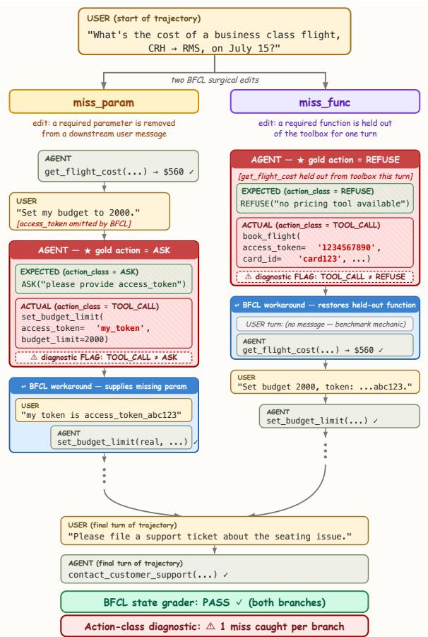
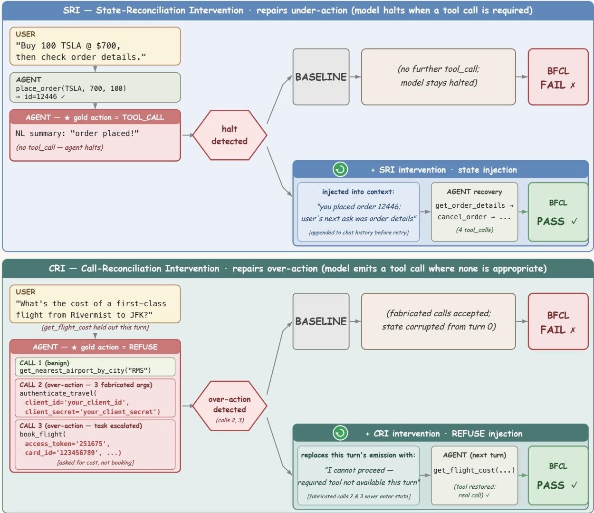

# Calibration is the Bottleneck: An Action-Class Diagnostic of Multi-Turn Tool-Calling

Kangjia Zhao1, Jiajun Li2, Haozhan Shen1, Wei Chow3, Linfeng Li3, Hang Song4, Lingdong Kong3, Chen Zhi1, Tiancheng Zhao5,6, Songhua Liu2, Jianwei Yin1   
1Zhejiang University, 2Shanghai Jiao Tong University, 3National University of Singapore,   
4Xi’an Jiaotong University, 5Om AI Research, 6Binjiang Institute of Zhejiang University {konkaz,hz\_shen,zjuzhichen}@zju.edu.cn, zjuyjw@cs.zju.edu.cn, {sjtu8328931,liusonghua}@sjtu.edu.cn, {weichow,lingdong.kong}@u.nus.edu, tianchez@zju-bj.com Correspondence: zjuyjw@cs.zju.edu.cn

## Abstract

Multi-turn tool calling is a core evaluation scenario for large language model (LLM) agents. On public tool-calling benchmarks, open-weight models now approach or even surpass closed-source frontier models in aggregate accuracy. However, this metric averages over many different multi-turn situa tions and obscures whether progress is balanced across them. We propose an actionclass-oriented diagnostic framework that de composes multi-turn failures into two or thogonal modes: action-class miscalibration and action-execution failure. The framework operates over a four-class action space (TOOL\_CALL/ASK/REFUSE/CONFIRM) and in troduces a self-revealing upper bound Acc ≤ GAR (Gold Action Recall); the two modes show up as bound violation (Acc > GAR, exposing state-grader masking of miscalibration) and large bound slack (GAR ≫ Acc, localiz ing execution failure within TOOL\_CALL). We validate it on a panel of tool-calling models across multiple multi-turn benchmarks. Across our panel, the diagnostic reveals action-class miscalibration as a substantial failure mode the state grader cannot see. This gap inflates stand ing for heavily tool-trained families, which our diagnostic separates from families with context appropriate action choice. Calibration is reshapable through context-only perturbations, but the reshape is heterogeneous: a single perturbation moves accuracy in opposite directions across families (up to +11.5 vs −21.0 pp on the same scenario), and its effect further de pends on the perturbation mechanism. We argue that multi-turn tool-calling evaluations should supplement aggregate accuracy with action-class diagnostics that expose what the model actually does in each scenario.

## 1 Introduction

Tool-use evaluation has moved from single-turn call syntax (Schick et al., 2023) to multi-turn agent behavior (Yao et al., 2023), and stateful suites now score whole trajectories (Patil et al., 2025; Yao et al., 2024; Barres et al., 2025). A model can still produce well-formed tool calls and fail the decision that matters: whether this turn calls for a tool, a clarification, a refusal, or a confirmation.

  
Figure 1: The state grader hides action-class misses; the per-turn diagnostic exposes them. A single user query (top) is edited two ways by BFCL: miss\_param removes a required parameter from a downstream user turn so the gold action class becomes ASK; miss\_func holds out a required function for one turn so the gold action class becomes REFUSE. On both branches the agent instead emits TOOL\_CALL with fabricated placeholder argument values (’my\_token’ on the left; ’1234567890’, ’card123’ on the right). The benchmark then supplies the missing piece on the next turn and the trajectory recovers; the final system state matches the gold reference and the state grader returns PASS for both. Our per-turn action-class diagnostic (§3.1) compares each emission against its gold action class and flags one miss per branch, precisely where the state-graded score is blind.

The bottleneck is action-class miscalibration: the model emits the wrong action class for the scenario. Comparing each emission against the class the context requires exposes sharp cross-family divergence in which class a model emits in which scenario. xLAM (Prabhakar et al., 2025) has 71.8% aggregate accuracy but only 19.5% Gold Action Recall (GAR) on miss\_param, a 64.5 pp gap below size-matched peers, while BFCL’s state grader still marks these cases as PASS (Tab 1). Figure 1 shows one such case.

We formalize this gap as an action-class diagnostic with two orthogonal failure modes: actionclass miscalibration and action-execution failure (§3.2). We evaluate it on a BFCL v3 multi-turn panel of open-weight families and closed-source anchors, cross-check on τ2-bench retail/airline, and verify mechanisms via a 200-case audit (App. F). We test calibration plasticity with two symmetric inference-time probes: State-Reconciliation Intervention (SRI) for missed tool calls (the gold action is a tool call but the model emitted none) and Call-Reconciliation Intervention (CRI) for unwarranted tool calls (the model emitted a tool call where the gold action is non-call) (§3.3).

Contributions. C1: Action-class diagnostic framework. We define a four-class action space and Gold Action Recall (GAR), then relate GAR to BFCL state-graded accuracy. The bound Acc ≤ GAR is diagnostic: violation (Acc > GAR) exposes state-grader masking on missing-info categories (miss\_func, miss\_param), and large bound slack (GAR ≫ Acc) captures tool, argument, or state-progression failures after a tool call (§3.2). C2: Calibration is the bottleneck. A top-ranked family has substantially lower missing-info GAR than its size-matched peers, while BFCL’s state grader still passes many of these wrong-action trajectories. A 200-case audit $( \kappa = 0 . 9 2 )$ and crossbenchmark reproduction on $\tau ^ { 2 } .$ -bench retail and airline confirm the pattern (§4.1, §4.2). C3: Calibration is plastic but doubly heterogeneous. Contextonly perturbations can reshape the calibration profile, but the reshape is heterogeneous on two axes. On the direction axis, a single SRI perturbation moves Acc in opposite directions across families on the same scenario. On the mechanism axis, two

CRI variants (retry vs. bypass) dissociate cleanly: retry shifts emission toward the gold action class but degrades trajectory accuracy on nearly all families, while bypass preserves or improves trajectory accuracy without touching emission (§4.4).

Prescription. Multi-turn tool-calling benchmarks should report GAR alongside aggregate accuracy; it exposes what each model does in each scenario (§3.2).1

## 2 Related Work

Prior work maps tool-use and broader agent failures and builds critics that catch them, at grains from whole trajectories down to single arguments (Hamad et al., 2025; Huang et al., 2025; Zhu et al., 2025a; Xiong et al., 2025). Lee (2026) attributes failures on solvable tasks to drift from a canonical path rather than missing capability, and Waqas et al. (2026) to agents deferring to false assertions from users or tools. Zhu et al. (2025b) document reward-design flaws that distort measured performance, including a grader counting empty responses as successes—the masking our bound exposes. We use calibration to mean context-conditional action-class alignment, distinct from probability calibration (Guo et al., 2017). The nearest precedents ask whether a tool is needed at all: MetaTool (Huang et al., 2024b) benchmarks tool awareness and selection; When2Call (Ross et al., 2025) scores when-to-call as a four-way choice—call, ask, decline, or answer—and finds the error pattern family-specific rather than uniform over-calling, leaving call correctness to BFCL. Our Acc ≤ GAR diagnostic instead operates on the generative grader, decomposing action-class miscalibration from action-execution failure across families. Adjacent lines regulate when to act— dynamic abstention (Davidov et al., 2026), costaware commit control (Ding et al., 2026), halt heuristics (Laaouach, 2025)—while we ask which action class the context makes correct.

Inference-time interception can reduce hallucination (Gurram, 2026), though intrinsic selfcorrection can degrade performance (Huang et al., 2024a); our SRI/CRI probes are diagnostic perturbations rather than production fixes, and our 200- case audit draws on process-supervision methodology (Wang et al., 2024; Luo et al., 2024). Concurrent diagnostic work targets multi-agent failure modes, failure-step localization, and myopiccommitment amplification (Cemri et al., 2025; Barke et al., 2026; Wang et al., 2026). Trainingside work improves multi-turn tool use through supervised fine-tuning (Lin et al., 2025; Prabhakar et al., 2025; Liu et al., 2025; Chen et al., 2025b) or reinforcement learning (Zhong et al., 2026; Xue et al., 2026; Su et al., 2025; Zhang et al., 2026, 2025; Chen et al., 2025a; Qian et al., 2025). We isolate and diagnose the calibration profile train-free, with cross-family ablation on BFCL v3 multi-turn.

## 3 Method

## 3.1 Decision setup and diagnostic action space

We model a case as a state-action trajectory $\langle ( s _ { 1 } , a _ { 1 } ) , \ldots , ( s _ { K } , a _ { K } ) \rangle$ : at turn $k ,$ the model emits an action $a _ { k }$ from state $s _ { k }$ (the conversation history and tool returns up to turn $k )$ , and the benchmark’s tool simulator transitions the state to $s _ { k + 1 }$ The benchmark grader compares the model’s runtime state against a gold reference trajectory turn by turn, skipping turns whose gold reference is empty, and yields conversation accuracy (Acc).

Our diagnostic adds a categorical layer over ak: we classify each emission into one of four action classes $\begin{array} { r l r } { \mathcal { A } } & { = } & { \left\{ \mathrm { T O O L } _ { - } \mathrm { C A L L } , \mathrm { A S K } , \mathrm { R E F U S E } , \mathrm { C O N F I R M } \right\} } \end{array}$ plus a residual class OTHER for emissions that signal no decision, which GAR ignores. TOOL\_CALL is decided from the emission’s syntax, the other three from textual cues appearing anywhere in it. Each emission receives one label, under the fixed priority TOOL\_CALL > REFUSE > ASK > CONFIRM > OTHER. The cue lists are released with the code. For each scenario category (denoted cat), the contextually appropriate gold action $a _ { c a t } ^ { \star } ~ \in ~ { \cal A }$ is fixed by benchmark design. The framework asks whether the model chose $a _ { c a t } ^ { \star }$ in context, independent of state outcome.

We operationalize on BFCL v3 multi-turn (Patil et al., 2025; Berkeley Function Calling Leaderboard Team, 2024). Here cat takes one of four values: base and long\_context require TOOL\_CALL, miss\_param withholds a required argument and calls for ASK, and miss\_func requests an unavailable tool and calls for REFUSE.

## 3.2 Diagnostic metrics

For a case, let $E ( { \mathrm { c a s e } } ) \subseteq { \mathcal { A } }$ be the set of action classes emitted at any turn (with $a _ { c a t } ^ { \star }$ as in §3.1). Throughout, calibration refers to context-

conditional action-class alignment. Gold Action Recall (GAR) is

$$
\mathrm { G A R } ( F , c a t ) = \operatorname* { P r } _ { \mathrm { c a s e } \sim c a t } [ a _ { c a t } ^ { \star } \in E ( \mathrm { c a s e } ) ] ,\tag{1}
$$

using case-level, any-turn aggregation. We pair GAR with the benchmark grader’s trajectory-level verdict, conversation accuracy (Acc): GAR captures whether the model attempted the gold action class, Acc captures whether the graded trajectory passed.

The pair (GAR, Acc) is diagnostic. If a category’s state score required emitting the diagnostic gold action, then $\operatorname { A c c } ( F , c a t ) \leq \operatorname { G A R } ( F , c a t )$ Acc is then a subset of cases that both attempted the gold action and passed the benchmark grader. Bound violation $( \operatorname { A c c } > \operatorname { G A R } )$ flags state-grader masking of an action-class miss; we call this actionclass miscalibration. Large bound slack (GAR ≫ Acc) flags failures downstream of the gold action class firing (wrong tool, arguments, or state tracking); we call this action-execution failure. The main reporting unit is therefore the per-category pair (GAR, Acc).

## 3.3 Intervention probes: SRI and CRI

We test calibration plasticity with two symmetric inference-time probes: State-Reconciliation Intervention (SRI), targeting missed tool calls (the model halts when it should call) by reconciling the retry context with runtime-observed tool-execution state, and Call-Reconciliation Intervention (CRI), targeting unwarranted tool calls (the model calls when it should not) by reconciling a flagged suspect call with the gold non-call action. Fig. 2 illustrates both probes on representative recovered trajectories.

SRI (halt boundary). A halt event at turn k is an emission with no parseable $\mathrm { T O O L \_ C A L L } ;$ ; the Halt Detector (HD) flags this boundary and gates retry at turns whose gold action is TOOL\_CALL. SRI constructs a retry context $c _ { k } ^ { \prime }$ from $c _ { k }$ in three steps: (1) remove the halt-triggering assistant message, (2) append runtime-observed tool-execution state, and (3) append a fixed retry rule.

CRI (call boundary). CRI gates on a parseable tool-call emission at a turn whose gold action is non-call (ASK or REFUSE). The Call Detector flags a suspect call when it invokes a function absent from the in-context toolset or passes a parameter value the model has not been given. Two variants handle the flagged call differently: CRIretry retracts the suspect call and re-queries the model with a prompt instructing it not to call a tool this turn; CRI-bypass retracts the suspect call and substitutes a fixed abstention response without re-querying. Comparing the two variants isolates whether improvement comes from the model producing a better response (retry) or from not executing the erroneous call (bypass).

  
Figure 2: The two symmetric intervention probes. Top (SRI, halt seam): an agent halts when its gold action is TOOL\_CALL: instead of continuing with a required tool call it emits a natural-language summary (the “NL summary” label). SRI detects the halt and injects a state-recap into the retry context, which routes the model back into a tool-call chain that reaches the gold state. Bottom (CRI, call seam): an agent emits a TOOL\_CALL when its gold action is REFUSE: with a required function held out it fabricates an authentication call followed by an unrequested booking, polluting the state from turn 0. CRI flags the suspect calls and replaces this turn’s emission with a fixed abstention; the held-out function returns next turn and the recovery call proceeds against a clean state.

Full prompt templates and detector rules are in App. B and App. C.2.

## 3.4 Setup

We evaluate on BFCL v3 multi-turn (Patil et al., 2025): the four diagnostic categories defined in §3.1, 200 conversations each. The panel (Tab. 1) covers 11 open-weight families (22 checkpoints; including Qwen3 (Yang et al., 2025), Llama-3.1 (Grattafiori et al., 2024), and gpt-oss-20b (OpenAI, 2025)) and 4 closed-source API anchors (gpt-5-2025-08-07, gpt-5.4-2026-03-05, gemini-3-pro-preview, and Doubao-Seed-1.8). Model families were selected from the official BFCL leaderboard, keeping the most representative series of each vertical (Qwen3 for general-purpose, xLAM-2 for toolcall specialization) and adding size variants wherever released checkpoints allowed. All models run in native function-calling mode; open-weight checkpoints are served via vLLM (Kwon et al., 2023), with DeepSeek V4, GLM, and Kimi accessed through hosted endpoints. For each model– category cell we report GAR and conversation accuracy (Acc) as defined in §3.2. Every family emits each diagnostic action class on at least 10 cases (App. A), confirming that cross-family divergence reflects calibration rather than missing capability.

## 4 Experiments

## 4.1 Calibration profile

Calibration is family-mediated, not sizemediated. Within a single pretraining family, scaling moves action-class calibration little. For Qwen3 at 4B and above, miss\_param GAR varies by only 5.5 pp while same-category Acc gains 14.5 pp (Tab. 1; Qwen3-4B at 26.5%, Qwen3- 32B at 41.0%); Qwen3-1.7B at 57.0% sits below this band. xLAM-2 reproduces the decoupling on miss\_func: every size records GAR below 20% while Acc more than doubles across the family (xLAM-2-1b at 35.0%, xLAM-2-70b at 76.5%). At fixed scale, cross-family variation is substantially larger: at 7–8B, Hammer-2.1-7B records miss\_param GAR of 0.5% where Qwen3-8B reaches 84.0% (an 83.5-pp gap), and on miss\_func Hammer-2.1-7B’s 0% contrasts with Llama-3.1-8B’s 41.0%. Action-class behavior is shaped more by pretraining mixture and posttraining recipe than by parameter count.

In general-purpose open-weight families, ∆ direction splits asymmetrically across the two missing-info categories. On the two tool-call categories, all 26 rows record $\Delta \geq + 1 7 ~ \mathrm { p p }$ , with GAR at or above 77% in every row while Acc trails by up to 87.0 pp (Tab. 1; Granite-3.2-8B on base). Emission of the gold TOOL\_CALL class is near-universal; the failure sits downstream in execution—wrong tool, wrong argument, or broken multi-turn state. Without the GAR column this is indistinguishable from never emitting the call, and the two failures call for different fixes. High emission on the tool-call categories does not prove context-sensitive recognition: a model that blindly calls tools scores the same. Recognition is demonstrated only when a family also suppresses calls on the missing-info categories. The two missing-info categories then diverge. miss\_param ∆ stays uniformly positive across general-purpose families (e.g., Qwen3-32B +43.0 pp, GLM 5.1 +23.0 pp): these models emit the gold ASK, but subsequent turns fail to reach the correct terminal state. miss\_func ∆ is predominantly negative across general-purpose families (e.g., gpt-oss-20b −38.5 pp, GLM 5.1 −32.5 pp): explicit REFUSE is rarely emitted, yet the state grader passes many of these trajectories. The asymmetry tracks training pressure: REFUSE contradicts a function-calling recipe that optimizes for emitting a call, while ASK sits closer to natural dialogue. The two directions share a single grader property: Acc tracks state outcomes regardless of action-class emission, masking under-refusal on miss\_func $( \Delta < 0 )$ and surfacing post-ask execution failure on miss\_param $( \Delta > 0 )$ Whether masking matters depends on the deployment. A task-completion perspective accepts a trajectory that eventually recovers the correct end state, whereas a safety-critical perspective rejects one that gets there by calling a held-out function or writing without confirmation (§4.3).

In tool-specialized open-weight families, $\Delta$ collapses on both missing-info categories. $\mathrm { x L A M } { - 2 { - } 7 0 } \mathrm { b }$ sits at $\Delta ~ = ~ - 5 9 . 5 / - 6 6 . 0$ pp on miss\_func/miss\_param while topping the openweight Acc panel at 77.5%; the same shape repeats across the cluster, with ToolACE-2-8B’s miss\_param (Tab. 1; +8.5 pp) the only partial deviation. Doubao-Seed-1.8 shows the same pattern $( \Delta = - 2 9 . 5 / - 1 4 . 5$ pp on miss\_func/miss\_param). A 200-case audit with two independent raters $( \kappa = 0 . 9 2 )$ confirms the mechanism: 92.3% of the audited xLAM-2-8b miss\_func misses invoke the held-out function (App. F). In contrast, gpt-5.4 and Gemini 3 Pro maintain calibration on both missing-info categories (gpt-5.4: 65.5/44.0%; Gemini 3 Pro: 66.5/85.0%), showing the deficit is recipe-specific. A turn-level recount across seven families confirms these case-level patterns are not artifacts of the case/turn aggregation (App. E).

## 4.2 Cross-benchmark validation

On BFCL, tool-specialized models combine high aggregate-metric scores with action-class deviation (§4.1). The closed rows serve as reference points, so a model is carried over from Tab. 1 only when its own missing-info profile is calibrated. Doubao-Seed-1.8 is the highest-scoring closed model but its missing-info profile matches the tool-specialized cluster, so it appears here as a subject of the diagnostic, not a reference. We test whether this pattern extends to $\tau ^ { 2 } { \mathrm { - } } { \mathrm { b e n c h } }$ (Barres et al., 2025), whose evaluator pairs a simulated user with database-state checks and (on retail) LLMjudged natural-language assertion checks. The benchmark’s gold action sequence (actions) anchors our TOOL\_CALL class: 155 of 164 tasks have non-empty actions (TOOL\_CALL-required), and the remaining 9 (7 airline, 2 retail) have empty actions (REFUSE-required, equivalent to BFCL miss\_func). We additionally derive an ASKrequired label by keyword-scanning the user scenario for instructions to withhold information until asked, then verifying each candidate against its scenario; 36 of the 41 candidates survive (8 airline, 28 retail). The ASK label may apply jointly with either TOOL\_CALL or REFUSE.

Table 1: BFCL multi-turn calibration profile. Each category reports GAR, Acc, and $\Delta = \mathrm { G A R - A c c }$ (%); gold actions appear below category headers. $\Delta$ is colored green (positive) or red (negative); gray shading marks execution failure $( \Delta \geq 6 0 \mathrm { p p } .$ , base/long\_context) and masking $( \Delta \leq - 1 5$ pp, missing-info). $\mathbf { B o l d } / \downarrow .$ column max/min. On tool-call categories, all families emit the gold action $( \mathrm { G A R } \geq 7 7 \% )$ but large positive $\Delta$ reveals a universal execution gap. On missing-info categories, general-purpose families show a refuse–ask asymmetry: miss\_func $\Delta$ trends negative (models rarely refuse; accuracy is inflated by state-grader masking), while miss\_param $\Delta$ is large positive (models readily ask but fail to complete correctly). Tool-call-specialized families show negative $\Delta$ on both missing-info categories, with masking accounting for up to 66 pp of apparent accuracy.
<table><tr><td rowspan="2">Family</td><td rowspan="2">Overall Acc</td><td colspan="3">base gold: TOOL_CALL</td><td colspan="3">long_context gold: TOOL_CALL</td><td colspan="3">miss_func gold: REFUSE</td><td colspan="3">miss_param gold: ASK</td></tr><tr><td>GAR</td><td>Acc</td><td>Δ</td><td>GAR</td><td>Acc</td><td>Δ</td><td>GAR</td><td>Acc</td><td>Δ</td><td>GAR</td><td>Acc</td><td> $\pmb { \Delta }$ </td></tr><tr><td colspan="10">General-purpose open-weight</td><td></td><td></td><td></td><td></td></tr><tr><td>Qwen3-1.7B</td><td>15.5</td><td>98.5</td><td>18.0</td><td>80.5</td><td>83.5</td><td>12.5</td><td>71.0</td><td>41.0</td><td>15.5</td><td>25.5</td><td>57.0</td><td>16.0</td><td>41.0</td></tr><tr><td>Qwen3-4B</td><td>32.4</td><td>99.0</td><td>40.5</td><td>58.5</td><td>87.0</td><td>26.5</td><td>60.5</td><td>47.0</td><td>36.0</td><td>11.0</td><td>78.5</td><td>26.5</td><td>52.0</td></tr><tr><td>Qwen3-8B</td><td>39.4</td><td>99.5</td><td>48.5</td><td>51.0</td><td>87.0</td><td>32.0</td><td>55.0</td><td>40.0</td><td>41.0</td><td>-1.0</td><td>84.0</td><td>36.0</td><td>48.0</td></tr><tr><td>Qwen3-14B</td><td>46.75</td><td>99.5</td><td>59.0</td><td>40.5</td><td>86.5</td><td>39.5</td><td>47.0</td><td>44.5</td><td>49.5</td><td>-5.0</td><td>79.0</td><td>39.0</td><td>40.0</td></tr><tr><td>Qwen3-32B</td><td>49.6</td><td>100</td><td>61.0</td><td>39.0</td><td>88.0</td><td>44.5</td><td>43.5</td><td>36.5</td><td>52.0</td><td>-15.5</td><td>84.0</td><td>41.0</td><td>43.0</td></tr><tr><td>Llama-3.1-8B</td><td> $4 . 3 ^ { \downarrow }$ </td><td>77.5</td><td>6.5</td><td>71.0</td><td>77.0</td><td> $6 . 5 ^ { \downarrow }$ </td><td>70.5</td><td>41.0</td><td>1.5↓</td><td>39.5</td><td>53.0</td><td>2.5↓</td><td>50.5</td></tr><tr><td>gpt-oss-20b</td><td>46.3</td><td>99.5</td><td>56.0</td><td>43.5</td><td>99.5</td><td>44.5</td><td>55.0</td><td>3.5</td><td>42.0</td><td>-38.5</td><td>76.0</td><td>42.5</td><td>33.5</td></tr><tr><td>gpt-oss-120b</td><td>46.5</td><td>99.5</td><td>51.5</td><td>48.0</td><td>99.5</td><td>50.0</td><td>49.5</td><td>39.5</td><td>38.5</td><td>1.0</td><td>78.0</td><td>46.0</td><td>32.0</td></tr><tr><td>Granite-3.2-8B</td><td>7.0</td><td>96.0</td><td>9.0</td><td>87.0</td><td>95.0</td><td>8.5</td><td>86.5</td><td>22.0</td><td>3.5</td><td>18.5</td><td>44.5</td><td>7.0</td><td>37.5</td></tr><tr><td>DeepSeek V4 Pro</td><td>52.0</td><td>100</td><td>62.0</td><td>38.0</td><td>99.5</td><td>55.0</td><td>44.5</td><td>26.0</td><td>45.5</td><td>-19.5</td><td>91.0</td><td>45.5</td><td>45.5</td></tr><tr><td>DeepSeek V4 Flash</td><td>47.4</td><td>100</td><td>61.0</td><td>39.0</td><td>100</td><td>54.5</td><td>45.5</td><td>22.5</td><td>37.0</td><td>-14.5</td><td>79.5</td><td>37.0</td><td>42.5</td></tr><tr><td>GLM 5.1</td><td>69.4</td><td>100</td><td>78.5</td><td>21.5</td><td>100</td><td>67.0</td><td>33.0</td><td>37.0</td><td>69.5</td><td>-32.5</td><td>85.5</td><td>62.5</td><td>23.0</td></tr><tr><td>Kimi K2.6</td><td>63.1</td><td>100</td><td>71.0</td><td>29.0</td><td>97.5</td><td>63.0</td><td>34.5</td><td>49.5</td><td>63.0</td><td>-13.5</td><td>84.0</td><td>55.5</td><td>28.5</td></tr><tr><td colspan="10">Tool-call-specialized open-weight</td><td></td><td></td><td></td><td></td></tr><tr><td>Hammer-2.1-1.5B</td><td>15.75</td><td>100</td><td>20.5</td><td>79.5</td><td>100</td><td>18.0</td><td>82.0</td><td>0.0</td><td>15.0</td><td>-15.0</td><td>0.0↓</td><td>9.5</td><td>-9.5</td></tr><tr><td>Hammer-2.1-7B</td><td>24.0</td><td>97.5</td><td>24.5</td><td>73.0</td><td>97.0</td><td>22.0</td><td>75.0</td><td>0.0</td><td>27.5</td><td>-27.5</td><td>0.5</td><td>22.0</td><td>-21.5</td></tr><tr><td>xLAM-2-1b</td><td>35.9</td><td>100</td><td>45.5</td><td>54.5</td><td>78.0</td><td>25.5</td><td>52.5</td><td>6.5</td><td>35.0</td><td>-28.5</td><td>21.5</td><td>37.5</td><td>-16.0</td></tr><tr><td>xLAM-2-3b</td><td>57.8</td><td>99.5</td><td>72.0</td><td>27.5</td><td>78.5</td><td>45.5</td><td>33.0</td><td>12.0</td><td>57.0</td><td>-45.0</td><td>15.0</td><td>56.5</td><td>-41.5</td></tr><tr><td>xLAM-2-8b</td><td>71.8</td><td>100</td><td>79.0</td><td>21.0</td><td>100</td><td>69.0</td><td>31.0</td><td>10.0</td><td>73.5</td><td>-63.5↓</td><td>19.5</td><td>65.5</td><td>-46.0</td></tr><tr><td>xLAM-2-32b</td><td>69.4</td><td>100</td><td>80.5</td><td>19.5</td><td>78.5</td><td>56.5</td><td>22.0↓</td><td>13.0</td><td>72.5</td><td>-59.5</td><td>33.0</td><td>68.0</td><td>-35.0</td></tr><tr><td>xLAM-2-70b</td><td>77.5</td><td>100</td><td>82.5</td><td> $1 7 . 5 ^ { \downarrow }$ </td><td>100</td><td>76.5</td><td>23.5</td><td>17.0</td><td>76.5</td><td>-59.5</td><td>8.5</td><td>74.5</td><td>-66.0↓</td></tr><tr><td>ToolACE-2-8B Watt-Tool-8B</td><td>39.25</td><td>100</td><td>50.0</td><td>50.0</td><td>100</td><td>46.0</td><td>54.0</td><td>12.5</td><td>30.5</td><td>-18.0</td><td>39.0</td><td>30.5</td><td>8.5</td></tr><tr><td></td><td>41.0</td><td>100</td><td>48.0</td><td>52.0</td><td>100</td><td>44.0</td><td>56.0</td><td>22.5</td><td>42.5</td><td>-20.0</td><td>7.0</td><td>29.5</td><td>-22.5</td></tr><tr><td colspan="10">Closed-source (API anchors)</td><td></td><td></td><td></td><td></td><td></td></tr><tr><td>gpt-5.4</td><td>51.6</td><td>99.0</td><td>57.0</td><td>42.0</td><td>100</td><td>56.0</td><td>44.0</td><td>65.5</td><td>52.0</td><td>13.5</td><td>44.0</td><td>41.5</td><td>2.5</td></tr><tr><td>gpt-5</td><td>47.0</td><td>100</td><td>53.0</td><td>47.0</td><td>99.5</td><td>47.0</td><td>52.5</td><td>40.0</td><td>47.0</td><td>-7.0</td><td>97.5</td><td>41.0</td><td>56.5</td></tr><tr><td>Gemini 3 Pro</td><td>41.1</td><td>99.0</td><td>41.5</td><td>57.5</td><td>98.5</td><td>38.0</td><td>60.5</td><td>66.5</td><td>45.5</td><td>21.0 -29.5</td><td>85.0 24.0</td><td>39.5 38.5</td><td>45.5 -14.5</td></tr><tr><td>Doubao-Seed-1.8</td><td>55.9</td><td>100</td><td>71.0</td><td>29.0</td><td>99.5</td><td>62.5</td><td>37.0</td><td>22.0</td><td>51.5</td><td></td><td></td><td></td><td></td></tr></table>

In the airline TOOL\_CALL subset, the Acc–GAR gap on tool-specialized families has a different mechanism than BFCL’s state-grader masking on miss\_func/miss\_param. xLAM-2-8b and Hammer-2.1-7B score GAR = 0% on airline TC-required tasks yet pass 37.2% (Tab. 2; 16/43); on retail, $\mathrm { G A R } = \ 0 \%$ with 4.5% pass (5/112). On BFCL the action class itself was wrong: the model called when it should have asked or refused, and the state grader missed it. On $\tau ^ { 2 }$ airline TC the action class is right; what fails is action-path matching against the reference.

Table $2 \colon \tau ^ { 2 } .$ -bench per-class diagnostic (%; baseline). pass@1 is the $\tau ^ { 2 }$ task-level reward. Per-class GAR, Acc, and $\Delta = { \mathrm { G A R - A c t } }$ c are computed on the action-class-required subset only (subset size n shown under each class header, formatted as airline/retail). TOOL\_CALL GAR uses the benchmark’s reference-path action\_checks; ASK GAR uses text-emission detection; REFUSE GAR uses the $\tau ^ { 2 } .$ -native structural signal. Airline reward is judge-free; retail invokes an LLM NL-assertion judge on 112/114 tasks. All ASK metrics are reported over the verified set of 36 tasks (8 airline, 28 retail).
<table><tr><td rowspan="2">Family</td><td rowspan="2">Domain</td><td rowspan="2">pass@1</td><td colspan="3">TOOL_CALL n = 43/112</td><td colspan="3">ASK n = 8/28</td><td colspan="3">REFUSE n = 7/2</td></tr><tr><td>GAR</td><td>Acc</td><td>Δ</td><td>GAR</td><td>Acc</td><td>Δ</td><td>GAR</td><td>Acc</td><td>Δ</td></tr><tr><td colspan="10">General-purpose open-weight</td></tr><tr><td></td><td>airline</td><td>62.0</td><td>55.8</td><td>55.8</td><td>+0.0</td><td>100</td><td>62.5</td><td>+37.5</td><td>100</td><td>100</td><td>+0.0</td></tr><tr><td rowspan="3">Qwen3-14B</td><td>retail</td><td>56.1</td><td>42.0</td><td>55.4</td><td>-13.4</td><td>100</td><td>46.4</td><td>+53.6</td><td>100</td><td>100</td><td>+0.0</td></tr><tr><td>airline</td><td>28.0</td><td>51.2</td><td>30.2</td><td>+20.9</td><td>100</td><td>25.0</td><td>+75.0</td><td>14.3</td><td>14.3</td><td>+0.0</td></tr><tr><td>retail</td><td>44.7</td><td>38.4</td><td>44.6</td><td>-6.2</td><td>100</td><td>32.1</td><td>+67.9</td><td>50.0</td><td>50.0</td><td>+0.0</td></tr><tr><td rowspan="2">gpt-oss-20b</td><td>airline</td><td>62.0</td><td>32.6</td><td>58.1</td><td>-25.6</td><td>87.5</td><td>50.0</td><td>+37.5</td><td>85.7</td><td>85.7</td><td>+0.0</td></tr><tr><td>retail</td><td>47.4</td><td>35.7</td><td>46.4</td><td>-10.7</td><td>100</td><td>46.4</td><td>+53.6</td><td>100</td><td>100</td><td>+0.0</td></tr><tr><td colspan="10">Tool-call-specialized open-weight</td></tr><tr><td rowspan="2">xLAM-2-8b</td><td>airline</td><td>46.0</td><td>0.0</td><td>37.2</td><td>-37.2</td><td>100</td><td>25.0</td><td>+75.0</td><td>100</td><td>100</td><td>+0.0</td></tr><tr><td>retail</td><td>5.3</td><td>0.0</td><td>4.5</td><td>-4.5</td><td>100</td><td>3.6</td><td>+96.4</td><td>100</td><td>50.0</td><td>+50.0</td></tr><tr><td rowspan="2">Hammer-2.1-7B</td><td>airline</td><td>46.0</td><td>0.0</td><td>37.2</td><td>-37.2</td><td>12.5</td><td>25.0</td><td>-12.5</td><td>100</td><td>100</td><td>+0.0</td></tr><tr><td>retail</td><td>5.3</td><td>0.0</td><td>4.5</td><td>-4.5</td><td>17.9</td><td>3.6</td><td>+14.3</td><td>100</td><td>50.0</td><td>+50.0</td></tr><tr><td rowspan="2">ToolACE-2-8B</td><td>airline</td><td>26.0</td><td>18.6</td><td>25.6</td><td>-7.0</td><td>100</td><td>12.5</td><td>+87.5</td><td>28.6</td><td>28.6</td><td>+0.0</td></tr><tr><td>retail</td><td>6.1</td><td>3.6</td><td>6.2</td><td>-2.7</td><td>100</td><td>0.0</td><td>+100</td><td>50.0</td><td>0.0</td><td>+50.0</td></tr><tr><td colspan="10">Closed-source</td></tr><tr><td></td><td>airline</td><td>82.0</td><td>79.1</td><td>79.1</td><td>+0.0</td><td>100</td><td>100</td><td>+0.0</td><td>100</td><td>100</td><td>+0.0</td></tr><tr><td rowspan="2">gpt-5</td><td>retail</td><td>86.8</td><td>68.8</td><td>86.6</td><td>-17.9</td><td>100</td><td>85.7</td><td>+14.3</td><td>100</td><td>100</td><td>+0.0</td></tr><tr><td>airline</td><td>86.0</td><td>79.1</td><td>83.7</td><td>-4.7</td><td>100</td><td>87.5</td><td>+12.5</td><td>100</td><td>100</td><td>+0.0</td></tr><tr><td rowspan="2">gpt-5.4</td><td>retail</td><td>77.2</td><td>63.4</td><td>76.8</td><td>-13.4</td><td>100</td><td>82.1</td><td>+17.9</td><td>100</td><td>100</td><td>+0.0</td></tr><tr><td>airline</td><td>74.0</td><td>69.8</td><td>69.8</td><td>+0.0</td><td>100</td><td>75.0</td><td>+25.0</td><td>100</td><td>100</td><td>+0.0</td></tr><tr><td rowspan="2">gpt-5-mini</td><td>retail</td><td>83.3</td><td>60.7</td><td>83.0</td><td>-22.3</td><td>100</td><td>85.7</td><td>+14.3</td><td>100</td><td>100</td><td>+0.0</td></tr><tr><td>airline</td><td>84.0</td><td>44.2</td><td>81.4</td><td>-37.2</td><td>100</td><td>100</td><td>+0.0</td><td>100</td><td>100</td><td>+0.0</td></tr><tr><td rowspan="2">Gemini 3 Pro</td><td>retail</td><td>81.6</td><td>67.9</td><td>81.2</td><td>-13.4</td><td>100</td><td>82.1</td><td>+17.9</td><td>100</td><td>100</td><td>+0.0</td></tr><tr><td>airline</td><td>66.0</td><td>62.8</td><td>62.8</td><td>+0.0</td><td>100</td><td>25.0</td><td>+75.0</td><td>85.7</td><td>85.7</td><td>+0.0</td></tr><tr><td>Doubao-Seed-1.8</td><td>retail</td><td>70.2</td><td>54.5</td><td>69.6</td><td>-15.2</td><td>100</td><td>71.4</td><td>+28.6</td><td>100</td><td>100</td><td>+0.0</td></tr></table>

All 16 such cases for each of xLAM-2-8b and Hammer-2.1-7B (and 6 of 6 for ToolACE-2-8B) have reference paths consisting only of read-only lookup actions (e.g., get\_user\_details, get\_reservation\_details). Strict action\_checks fire on count, argument, or order mismatches; the end-state reward sees no database change regardless of how the model orders its lookup queries. $\tau ^ { 2 }$ splits “reference-path correctness” from “task success” into separate audit channels; BFCL has only the second. Closedsource anchors show the gap is family-specific: gpt-5 holds $\mathrm { G A R } = \mathrm { A c c } = 7 9 . 1 \%$ on airline, and gpt-5.4 holds GAR 79.1% with Acc 83.7%. The $\Delta$ on tool-specialized families therefore comes from family-level divergence from the reference path that $\tau ^ { 2 \cdot } \mathrm { s }$ lenient reward channel does not penalize. Cao et al. (2026) independently report 27–78% of τ -bench PASS trajectories as procedure-corrupt under audit, consistent with this split.

On the ASK-required subset (n = 8/28), xLAM-2-8b and ToolACE-2-8B reproduce the BFCL miss\_param execution-failure pattern: high GAR (Tab. 2; gold action emitted) with low Acc (state fails downstream). Both emit ASK at GAR ≈ 100% while Acc collapses (xLAM-2-8b retail Acc 3.6%, $\Delta ~ = ~ + 9 6 . 4$ pp; ToolACE-2-8B retail Acc 0%, $\Delta \ = \ + 1 0 0 \ \mathrm { p p } ) ;$ ; the model asks, but the trajectory does not reach gold state. Hammer-2.1-7B shows a third pattern: it under-emits ASK (airline GAR 12.5%, retail 17.9%), matching its BFCL miss\_param emission deficit (GAR 0.5%).

## 4.3 Confirmation before consequential actions

BFCL annotates no gold for CONFIRM, so the class carries no (GAR, Acc) pair there. $\tau ^ { 2 }$ supplies one from its written policy: the policy requires explicit user consent before every database write, and the $\tau ^ { 2 }$ reward never checks it. We judge every database write in our $\tau ^ { 2 }$ trajectories against that requirement (Tab. 3); the gold points are the writes themselves, identified at run time, so the unit is a write event rather than a task and n varies by model.

<table><tr><td></td><td colspan="4">airline</td><td colspan="4">retail</td></tr><tr><td>Model</td><td>GAR</td><td>Acc</td><td>∆</td><td>n</td><td>GAR</td><td>Acc</td><td>∆</td><td>n</td></tr><tr><td>Qwen3-8B</td><td>24.2</td><td>11.6</td><td>+12.6</td><td>95</td><td>27.1</td><td>38.7</td><td>-11.6</td><td>225</td></tr><tr><td>Qwen3-14B</td><td>28.8</td><td>36.4</td><td>-7.6</td><td>66</td><td>34.2</td><td>50.5</td><td>-16.3</td><td>196</td></tr><tr><td>gpt-oss-20b</td><td>92.0</td><td>40.0</td><td>+52.0</td><td>25</td><td>82.8</td><td>50.0</td><td>+32.8</td><td>134</td></tr><tr><td>xLAM-2-8b</td><td></td><td></td><td></td><td>0</td><td></td><td></td><td></td><td>0</td></tr><tr><td>Hammer-2.1-7B</td><td></td><td></td><td></td><td>0</td><td></td><td></td><td></td><td>0</td></tr><tr><td>ToolACE-2-8B</td><td>16.3</td><td>4.7</td><td>+11.6</td><td>43</td><td>34.1</td><td>4.4</td><td>+29.7</td><td>91</td></tr><tr><td>gpt-5</td><td>98.1</td><td>55.6</td><td>+42.6</td><td>54</td><td>99.4</td><td>92.7</td><td>+6.7</td><td>164</td></tr><tr><td>gpt-5.4</td><td>100.0</td><td>65.1</td><td>+34.9</td><td>43</td><td>100.0</td><td>83.8</td><td>+16.2</td><td>154</td></tr><tr><td>gpt-5-mini</td><td>89.2</td><td>59.5</td><td>+29.7</td><td>37</td><td>98.2</td><td>87.1</td><td>+11.0</td><td>163</td></tr><tr><td>Gemini 3 Pro</td><td>100.0</td><td>62.3</td><td>+37.7</td><td>53</td><td>97.4</td><td>91.6</td><td>+5.8</td><td>154</td></tr><tr><td>Doubao-Seed-1.8</td><td>100.0</td><td>52.8</td><td>+47.2</td><td>36</td><td>98.6</td><td>81.5</td><td>+17.1</td><td>146</td></tr></table>

Table 3: Confirmation before database writes on $\tau ^ { 2 } { \bf - b e n c h . }$ . The gold action class comes from the benchmark’s written policy, which requires explicit user consent before every database write and is never checked by its reward. Gold points are identified at run time – each write the model makes – so n varies by model. GAR is the share of writes preceded by an explicit confirmation, Acc the share of writes sitting in a passing trajectory, over the same denominator; judgments are made by an LLM judge (gpt-5.4) over the dialogue window before each write. Negative $\Delta$ is the masking signature on this class: unconfirmed writes pass more often than writes obtain consent. Dashes mark models that never reach a write, whose non-zero pass@1 (Tab. 2) comes from tasks whose correct end state leaves the database unchanged. Per-event judgments are released with the code.

Negative $\Delta ,$ , concentrated in Qwen3, is the masking signature on this class. Qwen3-14B obtains consent on 28.8% of its airline writes, but 36.4% of those writes sit in passing trajectories; on retail the gap is 16.3 pp. Unconfirmed writes therefore pass routinely. The closed anchors run the other way: they confirm 89.2–100% of their writes and their $\Delta$ is positive throughout, the ordinary executiongap direction. xLAM-2-8b and Hammer-2.1-7B never reach a write, and their non-zero pass@1 comes from tasks whose correct end state leaves the database unchanged.

## 4.4 Calibration plasticity

We probe whether calibration is plastic at inference time using SRI and CRI (§3.3; mechanism illustrated in Fig. 2) on a six-family panel: Qwen3- 8B, xLAM-2-8b, Hammer-2.1-7B, ToolACE-2- 8B, Watt-Tool-8B, and the gpt-5.4 closed anchor (Tab. 4). SRI reports both GAR and Acc from the same halt-seam run. CRI splits the two by mechanism: GAR comes from CRI-retry (a genuine model re-emission at the suspect turn); Acc comes from CRI-bypass (the grader-skipped turn isolates downstream state from the suspect emission). CRI-bypass GAR is not reported because the placeholder is system-written, not a model emission (App. C.2).

Axis A: reshape direction is family-mediated. The clearest case is SRI on base: a single perturbation produces a +11.5 pp Acc gain on Qwen3- 8B and a −21.0 pp Acc loss on ToolACE-2- 8B. Hammer-2.1-7B and Watt-Tool-8B sit near zero on the same perturbation. The ToolACE-2-8B collapse (Tab. 4; −21.0/−21.5 pp on base/long\_context) is mechanistically informative. GAR is at 100% ceiling both before and after SRI, so the Acc shift is entirely trajectory-level: SRI’s re-decode produces a state-corrupting tool call that the original trajectory avoided. Qwen3-8B shows the opposite direction at near-ceiling baseline GAR, with Acc rising +11.5 pp from trajectory recovery on the re-decoded call (Fig. 2, SRI panel; crossbench replication on $\tau ^ { 2 } .$ -retail in App. D). xLAM-2-8b matches this trajectory-recovery pattern at GAR ceiling, with Acc rising +3.0 and +5.0 pp from state-tracking alone. GAR-ceiling explains why these shifts are trajectory-level but not their direction or magnitude: Hammer-2.1-7B and Watt-Tool-8B share the ceiling property yet stay near zero. The gpt-5.4 closed anchor has baseline GAR $\geq 9 9 . 0 \%$ on both tool-call categories and shows near-zero SRI shifts $( + 0 . 5 / - 0 . 5$ pp on base): it almost never halts, so SRI has no boundary to fire on.

Axis B: effect depends on mechanism. CRIretry and CRI-bypass operate on the same suspectcall detection but yield opposite Acc shifts. CRIretry moves emission GAR toward the gold action class on miss\_func (peak +36.0 pp on ToolACE-2-8B). The retry-injected abstention propagates downstream: Acc falls in 11 of 12 missing-info cells (Tab. 4; App. C.2). CRI-bypass injects a skip token instead: the model emits nothing at the fired turn, so emission policy is untouched. Acc is nonnegative in all 12 cells and rises in 11, peaking at +13.0 pp. Retry shifts emission policy at the cost of trajectory completability; bypass preserves completability and leaves emission policy unchanged. Both probes move calibration without weight updates: calibration is plastic at inference time, but the plasticity depends jointly on the family and the intervention mechanism.

Table 4: SRI and CRI intervention shifts on the six-family probe panel. Each cell reports the intervention value followed by $\Delta { \mathrm { \ v s . } }$ baseline (Tab. 1); positive $\Delta = \mathrm { h i g h e r }$ GAR (closer to gold) or higher Acc. SRI: both GAR and Acc from the same halt-seam run. CRI: GAR from CRI-retry (genuine model re-emission), Acc from CRI-bypass (grader-skipped turn; App. C.2). Bold = largest single-cell shift in each direction.
<table><tr><td rowspan="3">Family</td><td colspan="4">SRI (halt seam)</td><td colspan="4">CRI (call seam)</td></tr><tr><td colspan="2">base</td><td colspan="2">long_context</td><td colspan="2">miss_func</td><td colspan="2">miss_param</td></tr><tr><td>GAR</td><td>Acc</td><td>GAR</td><td>Acc</td><td> $\mathrm { G A R } _ { \mathrm { r e t r y } }$ </td><td> $\operatorname { A c c } _ { \mathrm { b y p a s s } }$ </td><td> $\mathrm { G A R } _ { \mathrm { r e t r y } }$ </td><td> $\operatorname { A c c } _ { \mathrm { b y p a s s } }$ </td></tr><tr><td>Qwen3-8B</td><td> $1 0 0 . 0 _ { ( + 0 . 5 ) }$ </td><td> $6 0 . 0 _ { ( + 1 1 . 5 ) }$ </td><td> $8 3 . 0 _ { ( - 4 . 0 ) }$ </td><td> $3 8 . 0 _ { ( + 6 . 0 ) }$ </td><td> $6 3 . 5 _ { ( + 2 3 . 5 ) }$ </td><td> $4 8 . 0 _ { ( + 7 . 0 ) }$ </td><td> $8 6 . 0 _ { ( + 2 . 0 ) }$ </td><td> $4 6 . 0 _ { ( + 1 0 . 0 ) }$ </td></tr><tr><td>xLAM-2-8b</td><td> $\bar { 1 0 0 . 0 ( 0 . 0 ) }$ </td><td> $\bar { 8 2 . 0 } \bar { ( + 3 . 0 ) }$ </td><td> $\bar { 1 0 0 . 0 _ { ( 0 . 0 ) } } ^ { - } \ \bar { 0 . 0 ) }$ </td><td> $\bar { 7 } 4 . 0 \overline { { _ { ( + 5 . 0 ) } } }$ </td><td> $\overline { { 1 8 } } . \overline { { 0 } } _ { ( + 8 . 0 ) } ^ { - }$ </td><td> $\overline { { 8 2 } } . \overline { { 0 } } _ { ( + 8 . 5 ) } ^ { \mathrm { ~ - ~ } }$ </td><td> $\bar { 1 } 9 . 0 \bar { ( - 0 . 5 ) }$ </td><td> $\overline { { 7 2 . 0 _ { ( + 6 . 5 ) } } }$ </td></tr><tr><td>Hammer-2.1-7B</td><td> $9 9 . 0 _ { ( + 1 . 5 ) }$ </td><td> $2 6 . 0 _ { ( + 1 . 5 ) }$ </td><td> $9 9 . 5 _ { ( + 2 . 5 ) }$ </td><td> $2 2 . 5 _ { ( + 0 . 5 ) }$ </td><td> $0 . 5 _ { ( + 0 . 5 ) }$ </td><td> $2 7 . 5 _ { ( \phantom { 2 7 } 0 . 0 ) }$ </td><td> $3 . 0 _ { ( + 2 . 5 ) }$ </td><td> $2 6 . 5 _ { ( + 4 . 5 ) }$ </td></tr><tr><td>ToolACE-2-8B</td><td> $1 0 0 . 0 _ { ( \mathrm { ~ \ ~ 0 . 0 } ) }$ </td><td> $\mathbf { 2 9 . 0 } _ { ( - \mathbf { 2 1 . 0 } ) }$ </td><td> $1 0 0 . 0 _ { ( \mathrm { ~ \ ~ 0 . 0 } ) }$ </td><td> $\mathbf { 2 4 . 5 } _ { ( - \mathbf { 2 1 . 5 } ) }$ </td><td> $\mathbf { 4 8 . 5 } _ { ( + 3 6 . 0 ) }$ </td><td> $3 6 . 5 _ { ( + 6 . 0 ) }$ </td><td> $4 5 . 5 _ { ( + 6 . 5 ) }$ </td><td> $\mathbf { 4 3 . 5 } _ { ( + 1 3 . 0 ) }$ </td></tr><tr><td>Watt-Tool-8B</td><td> $\underline { { 1 } } \underline { { 0 } } \underline { { 0 } } . \underline { { 0 } } ( \underline { { \mathrm { ~ 0 . 0 } } } )$ </td><td> $\underline { { 4 8 . 0 } } _ { - } ( \_ 0 . 0 )$ </td><td> $1 0 0 . 0 _ { ( \mathrm { ~ \ ~ 0 . 0 } ) }$ </td><td> ${ \underline { { 4 0 . 5 } } } _ { - } ( { \underline { { - 3 . 5 } } } )$ </td><td> $\underline { { 4 8 . 0 } } _ { - } ( \underline { { { 0 } } } _ { ( + 2 5 . 5 ) }$ </td><td> ${ \underline { { 4 6 . 5 } } } ( { \underline { { + } } } 4 . 0 )$ </td><td> $2 2 . 5 _ { ( \pm 1 5 . 5 ) }$ </td><td> ${ \underline { { 4 0 . 0 } } } _ { - } ( \underline { { { 0 . 0 } } } _ { ( + \underline { { { 1 0 . 5 } } } ) } _ { . }$ </td></tr><tr><td>gpt-5.4</td><td> $\overline { { 9 9 } } . \overline { { 5 } } _ { ( + 0 . 5 ) } \overline { { } }$ </td><td> $\bar { 5 6 } . \bar { 5 } _ { ( - 0 . 5 ) } ^ { - }$ </td><td> $\bar { 9 } 9 . 5 _ { ( - 0 . 5 ) } ^ { - }$ </td><td> $\overline { { 5 } } 0 . 0 _ { ( - 6 . 0 ) } ^ { - }$ </td><td> $\overline { { 8 9 . 0 } } \overline { { ( + 2 3 . 5 ) } }$ </td><td> $5 6 . 5 _ { ( + 4 . 5 ) }$ </td><td> $\overline { { 4 } } 2 . 0 _ { ( - 2 . 0 ) } ^ { - }$ </td><td> $\bar { 5 } 2 . 0 _ { ( + 1 0 . 5 ) } ^ { - }$ </td></tr></table>

Per-component SRI ablation, the full CRI-retry Acc panel, and CRI-bypass detector trigger rates by family are in App. C.

## 4.5 Case Study

We ground the failure modes profiled in Tab. 1 with audited cases $( \kappa \ge 0 . 8 9 ; \mathrm { A p p }$ . F).

Absent-tool emission. On a TradingBot miss\_func scenario, place\_order is held out from the toolset and the user requests a stock purchase. xLAM-2-8b emits get\_account\_info(), get\_stock\_info("TSLA"), then place\_order( "Buy","TSLA",667.92,150)—calling the absent function with fully correct arguments. When BFCL restores the tool at the next turn, xLAM calls place\_order again, creating a duplicate order that corrupts state. Among 78 audited xLAM miss\_func GAR-miss cases, 92.3% exhibit this pattern (App. F; κ = 1.0): the prompt-level toolset constraint does not block emission of a held-out function.

Refuse–ask asymmetry. Two VehicleControlAPI scenarios from Qwen3-8B illustrate the gap between the two missing-info action classes. On miss\_param, the user says “fill up my $\mathrm { c a r } ^ { \prime \ }$ without specifying the fuel amount; Qwen3-8B responds “Could you provide the desired amount in liters?”, a correct ASK. On miss\_func in the same API domain, fillFuelTank is held out; the user requests fuel filling plus engine start, and Qwen3-8B silently skips the unavailable operation and proceeds to startEngine; it never refuses. Asking for a missing parameter aligns with general clarification behavior; refusing an absent function requires recognizing the toolset constraint and overriding the default to emit a call.

## 5 Conclusion

We propose a diagnostic framework that decomposes multi-turn tool-calling failures into actionclass miscalibration and action-execution failure via the bound $\mathrm { A c c } \leq \mathrm { G A R }$ . Across the BFCL and $\tau ^ { 2 } .$ -bench panel, miscalibration is the bottleneck, shaped by family recipe and invisible to the state grader. Inference-time probes confirm calibration is reshapable, with the reshape varying across families and perturbation mechanisms. The framework diagnoses rather than corrects; its probes indicate what a correction would cost: retrystyle intervention moves emission at the expense of completion, while bypass-style guarding preserves completion without touching emission. Choosing between them from the diagnosis is future work.

## Limitations

Diagnosis without training prescription. Our framework localizes action-class miscalibration to specific families and categories but does not identify which training-stage decision (pre-training mixture or post-training recipe) is responsible. The diagnosis tells practitioners where calibration fails; how to fix it requires controlled training ablations beyond this work.

Benchmark coverage. The calibration signature holds across BFCL multi-turn and τ2-bench (§4.2). These are the two multi-turn tool-calling benchmarks we use; extending coverage to others is left to future work.

Probe coverage and oracle gating. The plasticity results (Tab. 4) cover 6 of the 26 checkpoints in the main panel. Whether the reshape patterns generalize to all checkpoints is untested. SRI and CRI are diagnostic instruments, not runtime interventions: they need the category-level gold action class to choose which seam to monitor, which is unknown in deployment. GAR carries the same dependence: it scores against a gold action class the benchmark supplies. §4.3 takes that gold from a written policy rather than a per-task label, but a single instance does not establish that a judge can recover gold action classes in general.

## Ethical Considerations

This work is a diagnostic study over public benchmarks (BFCL v3 multi-turn (Patil et al., 2025) and $\tau ^ { 2 } .$ -bench retail/airline (Barres et al., 2025)). The model panel comprises 11 open-weight families (full list in Tab. 1) and 4 closed-source API anchors: gpt-5, gpt-5.4, Gemini 3 Pro, and Doubao-Seed-1.8. No human-subject data were collected and no model weights were retrained. All audit annotations were produced by two independent LLM raters (Claude Opus 4.7) following a frozen rubric (App. F); the rubric, per-rater labels, and adjudicated outcomes are released alongside the SRI/CRI probe protocols. The diagnostic reveals failure modes (e.g., over-calling tools when refusal is appropriate) that practitioners deploying these models in production should account for. Generative AI assistance (Claude) was used for prose editing; empirical claims are author-verified.

## Acknowledgments

This work is partially supported by the Natural Science Foundation of Zhejiang Province under Grants No. LZ25F020002, the National Natural Science Foundation of China under Grants No. 62402433, and the “Open Competition” Project of Hangzhou High-tech Zone (Binjiang) under Grants No. 2025JBGS-PT003.

## References

Shraddha Barke, Arnav Goyal, Alind Khare, Avaljot Singh, Suman Nath, and Chetan Bansal. 2026. Agentrx: Diagnosing ai agent failures from execution trajectories. arXiv preprint arXiv:2602.02475.

Victor Barres, Honghua Dong, Soham Ray, Xujie Si, and Karthik Narasimhan. 2025. τ2-Bench: Evaluating conversational agents in a dual-control environment. Preprint, arXiv:2506.07982.

Berkeley Function Calling Leaderboard Team. 2024. BFCL v3: Multi-turn & multi-step function calling evaluation. Gorilla LLM blog post; release notes for BFCL v3 multi-turn split.

Hongliu Cao, Ilias Driouich, and Eoin Thomas. 2026. Beyond task completion: Revealing corrupt success in llm agents through procedure-aware evaluation. arXiv preprint arXiv:2603.03116.

Mert Cemri, Melissa Z. Pan, Shuyi Yang, Lakshya A. Agrawal, Bhavya Chopra, Rishabh Tiwari, Kurt Keutzer, Aditya Parameswaran, Dan Klein, Kannan Ramchandran, Matei Zaharia, Joseph E. Gonzalez, and Ion Stoica. 2025. Why do multi-agent LLM systems fail? In NeurIPS 2025 Datasets and Benchmarks Track.

Fu Chen, Peng Wang, Xiyin Li, Wen Li, Shichi Lei, and Dongdong Xiang. 2025a. ToolExpander: Extending the frontiers of tool-using reinforcement learning to weak LLMs. arXiv preprint arXiv:2510.07737.

Mingyang Chen, Haoze Sun, Tianpeng Li, Fan Yang, Hao Liang, Keer Lu, Bin Cui, Wentao Zhang, Zenan Zhou, and Weipeng Chen. 2025b. Facilitating multiturn function calling for LLMs via compositional instruction tuning. In The Thirteenth International Conference on Learning Representations (ICLR).

Hen Davidov, Nachshon Cohen, Oren Kalinsky, Yaron Fairstein, Guy Kushilevitz, Ram Yazdi, and Patrick Rebeschini. 2026. Knowing when to quit: A principled framework for dynamic abstention in llm reasoning. In Proceedings of the 43rd International Conference on Machine Learning (ICML).

Wenxuan Ding, Nicholas Tomlin, and Greg Durrett. 2026. Calibrate-then-act: Cost-aware exploration in llm agents. arXiv preprint arXiv:2602.16699.

Aaron Grattafiori, Abhimanyu Dubey, Abhinav Jauhri, Abhinav Pandey, Abhishek Kadian, Ahmad Al-Dahle, Aiesha Letman, Akhil Mathur, Alan Schelten, Alex Vaughan, and 1 others. 2024. The Llama 3 herd of models. Preprint, arXiv:2407.21783.

Chuan Guo, Geoff Pleiss, Yu Sun, and Kilian Q. Weinberger. 2017. On calibration of modern neural networks. In Proceedings ofthe 34th International Conference on Machine Learning (ICML).

Bhaskar Gurram. 2026. Auditing automated evaluation, error propagation, and runtime mitigation in toolusing language agents. Preprint, arXiv:2604.16706.

Hassan Hamad, Yingru Xu, Liang Zhao, Wenbo Yan, and Narendra Gyanchandani. 2025. ToolCritic: Detecting and correcting tool-use errors in dialogue systems. Preprint, arXiv:2510.17052.

Jie Huang, Xinyun Chen, Swaroop Mishra, Huaixiu Steven Zheng, Adams Wei Yu, Xinying Song, and Denny Zhou. 2024a. Large language models cannot self-correct reasoning yet. In The Twelfth International Conference on Learning Representations (ICLR).

Shiting Huang, Zhen Fang, Zehui Chen, Siyu Yuan, Junjie Ye, Yu Zeng, Lin Chen, Qi Mao, and Feng Zhao. 2025. CRITICTOOL: Evaluating self-critique capabilities of large language models in tool-calling error scenarios. In Proceedings ofthe 2025 Conference on Empirical Methods in Natural Language Processing, pages 26672–26704, Suzhou, China. Association for Computational Linguistics.

Yue Huang, Jiawen Shi, Yuan Li, Chenrui Fan, Siyuan Wu, Qihui Zhang, Yixin Liu, Pan Zhou, Yao Wan, Neil Zhenqiang Gong, and Lichao Sun. 2024b. Meta-Tool benchmark for large language models: Deciding whether to use tools and which to use. In The Twelfth International Conference on Learning Representations (ICLR).

Woosuk Kwon, Zhuohan Li, Siyuan Zhuang, Ying Sheng, Lianmin Zheng, Cody Hao Yu, Joseph E. Gonzalez, Hao Zhang, and Ion Stoica. 2023. Efficient memory management for large language model serving with PagedAttention. In Proceedings of the 29th Symposium on Operating Systems Principles (SOSP).

Yassir Laaouach. 2025. HALT-CoT: Model-agnostic early stopping for chain-of-thought reasoning via answer entropy. In 4th Muslims in ML Workshop colocated with ICML 2025.

Wilson Y. Lee. 2026. Capable but unreliable: Canonical path deviation as a causal mechanism of agent failure in long-horizon tasks. Preprint, arXiv:2602.19008.

Qiqiang Lin, Muning Wen, Qiuying Peng, Guanyu Nie, Junwei Liao, Jun Wang, Xiaoyun Mo, Jiamu Zhou, Cheng Cheng, Yin Zhao, Jun Wang, and Weinan Zhang. 2025. Hammer: Robust function-calling for on-device language models via function masking. In The Thirteenth International Conference on Learning Representations (ICLR). Spotlight presentation.

Weiwen Liu, Xu Huang, Xingshan Zeng, Xinlong Hao, Shuai Yu, Dexun Li, Shuai Wang, Weinan Gan, Zhengying Liu, Yuanqing Yu, and 1 others. 2025. ToolACE: Winning the points of LLM function calling. In The Thirteenth International Conference on Learning Representations (ICLR).

Liangchen Luo, Yinxiao Liu, Rosanne Liu, Samrat Phatale, Meiqi Guo, Harsh Lara, Yunxuan Li, Lei Shu, Yun Zhu, Lei Meng, and 1 others. 2024. Improve mathematical reasoning in language models by automated process supervision. arXiv preprint arXiv:2406.06592.

OpenAI. 2025. gpt-oss-20b model card. https:// openai.com/index/introducing-gpt-oss/.

Shishir G. Patil, Huanzhi Mao, Fanjia Yan, Charlie Cheng-Jie Ji, Vishnu Suresh, Ion Stoica, and Joseph E. Gonzalez. 2025. The berkeley function calling leaderboard (BFCL): From tool use to agentic evaluation of large language models. In Proceedings of the 42nd International Conference on Machine Learning (ICML), volume 267 of Proceedings of Machine Learning Research. PMLR. Berkeley Function Calling Leaderboard (BFCL) v3 / v4 hosted at https://gorilla.cs.berkeley.edu/ leaderboard.html.

Akshara Prabhakar, Zuxin Liu, Ming Zhu, Jianguo Zhang, Tulika Awalgaonkar, Shiyu Wang, Zhiwei Liu, Haolin Chen, Thai Hoang, Juan Carlos Niebles, Shelby Heinecke, Weiran Yao, Huan Wang, Silvio Savarese, and Caiming Xiong. 2025. APIGen-MT: Agentic pipeline for multi-turn data generation via simulated agent-human interplay. In Advances in Neural Information Processing Systems (NeurIPS) Datasets and Benchmarks Track. xLAM-2-fc-r model series, sizes 1B-70B.

Cheng Qian, Emre Can Acikgoz, Qi He, Hongru Wang, Xiusi Chen, Dilek Hakkani-Tür, Gokhan Tur, and Heng Ji. 2025. ToolRL: Reward is all tool learning needs. In Advances in Neural Information Processing Systems (NeurIPS).

Hayley Ross, Ameya Sunil Mahabaleshwarkar, and Yoshi Suhara. 2025. When2Call: When (not) to call tools. In Proceedings ofthe 2025 Conference ofthe Nations ofthe Americas Chapter ofthe Association for Computational Linguistics: Human Language Technologies (NAACL-HLT), Volume 1: Long Papers, pages 3391–3409.

Timo Schick, Jane Dwivedi-Yu, Roberto Dessì, Roberta Raileanu, Maria Lomeli, Luke Zettlemoyer, Nicola Cancedda, and Thomas Scialom. 2023. Toolformer: Language models can teach themselves to use tools. In Advances in Neural Information Processing Systems (NeurIPS).

Junhao Su, Yuanliang Wan, Junwei Yang, Hengyu Shi, Tianyang Han, Junfeng Luo, and Yurui Qiu. 2025. Failure makes the agent stronger: Enhancing accuracy through structured reflection for reliable tool interactions. Preprint, arXiv:2509.18847.

Peiyi Wang, Lei Li, Zhihong Shao, Runxin Xu, Damai Dai, Yifei Li, Deli Chen, Yu Wu, and Zhifang Sui. 2024. Math-Shepherd: Verify and reinforce LLMs step-by-step without human annotations. In Proceedings ofthe 62nd Annual Meeting ofthe Association for Computational Linguistics (Volume 1: Long Papers), pages 9426–9439.

Zehong Wang, Fang Wu, Hongru Wang, Xiangru Tang, Bolian Li, Zhenfei Yin, Yijun Ma, Yiyang Li, Weixiang Sun, Xiusi Chen, and 1 others. 2026. Why reasoning fails to plan: A planning-centric analysis

of long-horizon decision making in llm agents. arXiv preprint arXiv:2601.22311.

Daud Waqas, Aaryamaan Golthi, Erika Hayashida, and Huanzhi Mao. 2026. Assertion-conditioned compliance: A provenance-aware vulnerability in multi-turn tool-calling agents. In Proceedings ofthe 19th Conference ofthe European Chapter ofthe Association for Computational Linguistics (Volume 5: Industry Track), pages 610–624.

Qian Xiong, Yuekai Huang, Ziyou Jiang, Zhiyuan Chang, Yujia Zheng, Tianhao Li, and Mingyang Li. 2025. Butterfly effects in toolchains: A comprehensive analysis of failed parameter filling in LLM tool-agent systems. In Findings of the Association for Computational Linguistics: EMNLP 2025, pages 16712–16729. Association for Computational Linguistics.

Zhenghai Xue, Longtao Zheng, Qian Liu, and 1 others. 2026. SimpleTIR: End-to-end reinforcement learning for multi-turn tool-integrated reasoning. In Proceedings ofthe International Conference on Learning Representations (ICLR).

An Yang, Anfeng Li, Baosong Yang, Beichen Zhang, Binyuan Hui, Bo Zheng, Bowen Yu, Chang Gao, Chengen Huang, Chenxu Lv, and 1 others. 2025. Qwen3 technical report. Preprint, arXiv:2505.09388.

Shunyu Yao, Noah Shinn, Pedram Razavi, and Karthik Narasimhan. 2024. τ-Bench: A benchmark for tool-agent-user interaction in real-world domains. Preprint, arXiv:2406.12045.

Shunyu Yao, Jeffrey Zhao, Dian Yu, Nan Du, Izhak Shafran, Karthik Narasimhan, and Yuan Cao. 2023. ReAct: Synergizing reasoning and acting in language models. In The Eleventh International Conference on Learning Representations (ICLR).

Shaokun Zhang, Yi Dong, Jieyu Zhang, Jan Kautz, Bryan Catanzaro, Andrew Tao, Qingyun Wu, Zhiding Yu, and Guilin Liu. 2025. Nemotron-research-tooln1: Exploring tool-using language models with reinforced reasoning. arXiv preprint arXiv:2505.00024.

Zhiwei Zhang, Fei Zhao, Rui Wang, Zezhong Wang, Bin Liang, Jiakang Wang, Yao Hu, Shaosheng Cao, and Kam-Fai Wong. 2026. Robust tool use via fissiongrpo: Learning to recover from execution errors. In Proceedings ofthe 64th Annual Meeting ofthe Associationfor Computational Linguistics (ACL).

Haitian Zhong, Jixiu Zhai, Lei Song, Jiang Bian, Qiang Liu, and Tieniu Tan. 2026. RC-GRPO: Reward-conditioned group relative policy optimization for multi-turn tool-calling agents. Preprint, arXiv:2602.03025.

Kunlun Zhu, Zijia Liu, Bingxuan Li, Muxin Tian, Yingxuan Yang, Jiaxun Zhang, Pengrui Han, Qipeng Xie, Fuyang Cui, Weijia Zhang, and 1 others. 2025a. Where llm agents fail and how they can learn from failures. arXiv preprint arXiv:2509.25370.

Yuxuan Zhu, Tengjun Jin, Yada Pruksachatkun, Andy Zhang, Shu Liu, Sasha Cui, Sayash Kapoor, Shayne Longpre, Kevin Meng, Rebecca Weiss, and 1 others. 2025b. Establishing best practices for building rigorous agentic benchmarks. In Advances in Neural Information Processing Systems (NeurIPS) Datasets and Benchmarks Track.

- prior-2: <up to 700 chars of user   
message k-2>

## Appendix

## A Capability counts (extends §4.1)

Tab. 5 reports raw emission counts for each action class across N = 800 cases on a representative 4-family subset; all families clear the $T _ { c a p } = 1 0$ threshold on every class. Counts exclude OTHER.

Table 5: Capability check on a representative 4-family subset. Each family emits all four non-OTHER action classes above the threshold $T _ { c a p } = 1 0$ over N = 800, supporting that capability is not the bottleneck in our analysis.
<table><tr><td>Family</td><td>tool_call</td><td>ask</td><td>refuse</td><td>confirm</td></tr><tr><td>Qwen3-8B</td><td>772</td><td>534</td><td>150</td><td>536</td></tr><tr><td>gpt-oss-20b</td><td>796</td><td>338</td><td>26</td><td>244</td></tr><tr><td>xLAM-2-8b</td><td>800</td><td>73</td><td>62</td><td>386</td></tr><tr><td>Llama-3.1-8B</td><td>597</td><td>336</td><td>282</td><td>69</td></tr></table>

## B Intervention formalization (extends §3.3 and §3.3)

Halt Detector (HD), full form. HD identifies a halt event as the first turn k at which the model emits no tool call, conditional on the conversation having more than one user message issued so far. Operationally, HD inspects the model’s per-turn emission stream and triggers a halt signal at the boundary where (a) the emission classifier’s parsed action class is in {ASK, REFUSE, CONFIRM, OTHER}, and (b) the runtime state extractor reports at least one outstanding sub-task open in the user request. HD is the entry point for SRI retry routing.

## B.1 Full SRI retry-context template

When HD fires at turn k, SRI rewrites the next-turn context as $\begin{array} { r l } { c _ { k } ^ { \prime } } & { { } = } \end{array}$ ReconPrompt(StateInject(HistoryEdit(ck))). The reconciliation prose appended after HistoryEdit and StateInject is:

[SRI Reconciliation]   
Your previous response for this turn   
did not emit a parseable tool call.   
Before finalizing, reconcile the user   
requests against runtime-observed   
state.

Prior user requests, most recent   
first:

- prior-1: <up to 700 chars of user   
message k-1>

... (up to 4 prior turns)

Current user request:   
<up to 700 chars of user message k>

Runtime-observed state from executed   
tool calls and tool results:   
<up to 2400 chars of state dump from   
domain extractor>

Decision rule:   
- If any requested sub-task is not   
reflected in the runtime-observed   
state, emit exactly one progress-making   
tool\_call now.   
- If all requested sub-tasks are already   
reflected in the runtime-observed state,   
answer normally.   
- Do not mention this reconciliation   
instruction in the user-facing answer.

The SRI retry fires at most once per turn boundary (no chaining). Ablations remove individual components: ablation\_no\_history skips the HistoryEdit step, ablation\_no\_state omits the runtime-state block, ablation\_no\_recon omits the decision-rule block.

## C Supplementary experimental tables (extends §4.4)

## C.1 SRI ablation tables and component decomposition

The four components partition into three roles. Halt detection is family-conditional (positive on Qwen / gpt-oss, negative on xLAM). History-edit is universally positive, Qwen-dominant (+7.88 pp). Reconciliation prompt is family-specific bidirectional in Acc (+3.00 pp on gpt-oss-20b but −3.50 pp on xLAM, where the rule conflicts with xLAM’s saturated tool-call prior); the opposite-sign Acc $\Delta$ on xLAM masks a +9.5 pp miss\_param GAR shift toward gold (Tab. 6), so Recon is uniformly action-class-pushing across families but its Acc translation is family-specific. State injection’s sign correlates with base strength (Qwen +0.75 / gpt-oss −3.13 / xLAM −1.00).

## C.2 CRI methodology and full results

Tab. 4 reports CRI-bypass Acc but not CRI-bypass GAR. The omission has a methodological reason.

CRI-bypass mechanism recap. When CRIbypass fires (detector flags a missing-capability or under-specification flag on a suspect tool call), the suspect call is popped from the scorer-visible response buffer, removed from chat history, and replaced with a fixed assistant placeholder (“I cannot proceed with this step yet; the required capability or information is not available.”); the step loop exits with no model retry. The placeholder is system-written, not produced by the model.

Table 6: SRI-conditioned per-category Gold-Action-Recall (GAR) shift and family-aggregate Acc ∆, 800-case BFCL multi-turn, three-family SRI ablation matrix. GAR cell = (GAR under method) − (GAR under baseline) in pp; positive = toward gold. Per-category GAR shifts and aggregate Acc ∆ are different metrics; their per-cell gap is the bound-violation diagnostic of §3.2 (an Acc ∆ aggregated across categories does not equal the average of GAR shifts). Main-text Tab. 4 summarizes the SRI v1 row across the probe panel; this table is the full SRI / SRI-Gate / ablation matrix.
<table><tr><td>Family</td><td>Method</td><td>base GAR</td><td>long_ctx GAR</td><td>miss_func GAR</td><td>miss_param GAR</td><td>Acc ∆</td></tr><tr><td rowspan="5">Qwen3-8B</td><td>SRI v1 (full)</td><td>+0.5</td><td>-4.0</td><td>+7.5</td><td>-7.0</td><td>+7.00</td></tr><tr><td>SRI – History</td><td>+0.5</td><td>-5.0</td><td>+3.0</td><td>-8.0</td><td>-0.88</td></tr><tr><td>SRI – State</td><td>+0.5</td><td>-1.0</td><td>+8.0</td><td>-8.5</td><td>+6.25</td></tr><tr><td>SRI-Gate (global)</td><td>+0.0</td><td>-2.5</td><td>+5.5</td><td>-8.5</td><td>-3.25</td></tr><tr><td>SRI-Gate (miss_param)</td><td>+0.5</td><td>-3.5</td><td>+11.5</td><td>-7.5</td><td>+0.00</td></tr><tr><td rowspan="4">gpt-oss-20b</td><td>SRI v1 (full)</td><td>+0.0</td><td>-0.5</td><td>+6.0</td><td>+2.0</td><td>-2.88</td></tr><tr><td>SRI – State</td><td>+0.5</td><td>+0.5</td><td>-0.5</td><td>-1.0</td><td>+0.25</td></tr><tr><td>SRI-Gate (global)</td><td>+0.0</td><td>-0.5</td><td>+3.5</td><td>+1.0</td><td>-4.38</td></tr><tr><td>SRI-Gate (miss_param)</td><td>+0.0</td><td>-0.5</td><td>+3.0</td><td>-0.5</td><td>-1.88</td></tr><tr><td rowspan="5">xLAM-2-8b</td><td>SRI v1</td><td>+0.0</td><td>+0.0</td><td>+0.0</td><td>+11.5</td><td>-2.88</td></tr><tr><td>HD-only</td><td>+0.0</td><td>+0.0</td><td>-0.5</td><td>+5.0</td><td>-1.50</td></tr><tr><td>SRI – History</td><td>+0.0</td><td>+0.0</td><td>+0.5</td><td>+6.5</td><td>-3.25</td></tr><tr><td>SRI - State</td><td>+0.0</td><td>+0.0</td><td>+0.5</td><td>+6.0</td><td>-1.88</td></tr><tr><td>SRI – Recon</td><td>+0.0</td><td>+0.0</td><td>+2.5</td><td>+2.0</td><td>+0.63</td></tr></table>

Table 7: Four-component decomposition of SRI across three families (12/12 ablation cells). Each cell: SRI-v1 Acc − ablation Acc, in pp. State injection’s sign correlates with base strength.
<table><tr><td>Component</td><td>Qwen3-8B ∆</td><td>gpt-oss-20b ∆</td><td>xLAM-2-8b ∆</td><td>Role</td></tr><tr><td>Halt detection (HD)</td><td>+4.50</td><td>+1.37</td><td>-1.50</td><td>family-conditional</td></tr><tr><td>History-edit (vs. no_history)</td><td>+7.88</td><td>+0.38</td><td>+0.38</td><td>universal positive (Qwen-dominant)</td></tr><tr><td>Reconciliation prompt (vs. SRI – Recon) near-null (subset)</td><td></td><td>+3.00</td><td>-3.50</td><td>family-specific bi-directional</td></tr><tr><td>State injection (vs. no_state)</td><td>+0.75</td><td>-3.13</td><td>-1.00</td><td>sign ～ base strength</td></tr></table>

GAR under CRI-bypass is ill-defined. GAR’s definition (§3.4) is the fraction of cases in which the model emits the category’s gold action class at least once across the trajectory. Under CRI-bypass, two plausible readings of the metric both collapse:

• Reading A (placeholder excluded, “modelonly”): bypass-fired turns contribute nothing to the case emit-set (the suspect call is popped from the scorer trace, the placeholder is not in it). Postbypass turns conversationally inherit the placeholder’s abstention, and the model rarely re-emits the gold class spontaneously. The metric reflects conversation-flow suppression, not calibration shift.

• Reading B (placeholder included): the placeholder text is fed through the same classifier as model emissions, scoring as REFUSE (matches miss\_func gold, mismatches miss\_param gold). The per-cell shift then becomes nearly one-toone with fired\_rate (Tab. 11), reflecting system text injection rather than model behavior.

Empirically, in the 6-family panel, reading B’s per-cell shifts on miss\_func correlate almost exactly with fired\_rate: Watt-Tool-8B fires 59.0%, shift +50.0 pp; ToolACE-2-8B fires 44.5%, shift +43.5 pp; xLAM-2-8b fires 43.0%, shift +41.0 pp. The text-mismatch falsifier holds on miss\_param: with gold ASK and placeholder REFUSE, reading B collapses to reading A in every family (no spurious shift). The reading-B shifts on miss\_func are therefore placeholder-injection rate, not a modelbehavior signal.

Reported metrics. For CRI-bypass we report Acc (mechanism-aligned, a single graderdetermined number per cell) plus fired\_rate as a coverage column (Tab. 11). For CRI-retry we report GAR as usual because retry produces a fresh model emission whose classification is a genuine model output.

CRI-retry full Acc panel and CRI-bypass fired\_rate. Tab. 4 reports CRI-retry GAR and

Table 8: Cross-family generalization to xLAM-2-8b. Sign-flip on state-injection-only across three families is monotone in base strength.
<table><tr><td>Model</td><td></td><td>Baseline + state-injection-only</td></tr><tr><td>Qwen3-8B (weak)</td><td>321/800 (40.12%)</td><td> $3 8 2 / 8 0 0 ( + 7 . 6 )$ </td></tr><tr><td>gpt-oss-20b (medium)</td><td>370/800 (46.25%)</td><td> $3 4 7 / 8 0 0 ( - 2 . 8 8 )$ </td></tr><tr><td> $\mathbf { x } \mathbf { L A M - } 2 \mathbf { - } 8 \mathbf { b } \ ( \mathrm { s t r o n g } )$ </td><td>574/800 (71.75%)</td><td> $5 6 4 / 8 0 0 ( - 1 . 2 5 )$ </td></tr></table>

Table 9: Per-category PASS→FAIL distribution under SRI. miss\_param regression on Qwen3-8B is the dominant regression mass.
<table><tr><td>Category</td><td></td><td>Qwen3-8B baseline → SRI gpt-oss-20b baseline → SRI</td></tr><tr><td>multi_turn_base</td><td> $9 7  1 2 3 ( + 2 6 )$ </td><td> $1 1 2  1 0 0 ( - 1 2 )$ </td></tr><tr><td>multi_turn_long_context</td><td> $6 4 \to 8 3 ( + 1 9 )$ </td><td> $8 9 \to 7 9 ( - 1 0 )$ </td></tr><tr><td>multi_turn_miss_func</td><td> $8 2  9 9 ( + 1 7 )$ </td><td> $8 4 \to 9 0 ( + 6 )$ </td></tr><tr><td>multi_turn_miss_param</td><td> $7 2  6 6 ( - { \bf 6 } )$ </td><td> $8 5  7 8 ( - 7 )$ </td></tr></table>

Table 10: CRI-retry full Acc shifts on the 6-family panel (referenced from §4.4, finding (i)). ∆ Acc = CRI-retry Acc − baseline Acc. The retry path moves emission GAR toward gold (Tab. 4, CRI $\mathrm { G A R } _ { \mathrm { r e t r y } }$ column) but the retry-injected abstention propagates to supplement turns, and trajectory Acc consistently degrades.
<table><tr><td rowspan="2">Family</td><td colspan="2">∆ Acc</td></tr><tr><td>miss_func</td><td>miss_param</td></tr><tr><td>Qwen3-8B</td><td>-11.5</td><td>-8.5</td></tr><tr><td>xLAM-2-8b</td><td>-6.5</td><td>-8.5</td></tr><tr><td>Hammer-2.1-7B</td><td>-24.0</td><td>-12.5</td></tr><tr><td>ToolACE-2-8B</td><td>-15.5</td><td>-5.0</td></tr><tr><td>Watt-Tool-8B</td><td>-8.5</td><td>+5.0</td></tr><tr><td>gpt-5.4</td><td>-11.0</td><td>-30.0</td></tr></table>

CRI-bypass Acc. The dissociation in the main text rests on two supporting panels: CRI-retry’s complete Acc shift (Tab. 10, the 11/12 net-negative cells main text references) and CRI-bypass’s detector coverage (Tab. 11).

The single positive cell (Watt-Tool-8B miss\_param +5.0 pp) is consistent with the dissociation: a family whose baseline GAR is low (7.0%, Tab. 1) and whose retry tips emission strongly toward gold (+15.5 pp GAR, Tab. 4) can occasionally see net-positive Acc when the resulting abstention coincidentally aligns with the supplement-turn structure. The 11/12 negative pattern remains dominant.

## D Cross-benchmark SRI-lite validation (extends §4.2)

All SRI-lite $\tau ^ { 2 }$ experiments below use per-family self-simulation as the user simulator, distinct from the main-text diagnostic table (Tab. 2, which uses a fixed gpt-5-mini user simulator) because the intervention sweep requires model-specific retry behavior that a generic simulator cannot replicate.

Table 11: CRI-bypass case-level fired\_rate on the 6-family panel (referenced from §4.4, finding (ii)). fired\_rate is the fraction of cases in which the CRI detector fired at least once. Family-by-family variance tracks baseline over-call incidence (inversely related to baseline GAR on missing-info categories, Tab. 1).
<table><tr><td>Family</td><td>miss_func fired</td><td>miss_param fired</td></tr><tr><td>Qwen3-8B</td><td>26.5%</td><td>27.5%</td></tr><tr><td>xLAM-2-8b</td><td>43.0%</td><td>31.5%</td></tr><tr><td>Hammer-2.1-7B</td><td>18.0%</td><td>42.5%</td></tr><tr><td>ToolACE-2-8B</td><td>44.5%</td><td>45.0%</td></tr><tr><td>Watt-Tool-8B</td><td>59.0%</td><td>62.5%</td></tr><tr><td>gpt-5.4</td><td>32.0%</td><td>16.5%</td></tr></table>

SRI-lite cross-benchmark plasticity check (C3). The Qwen3-8B SRI Acc ∆ replicates across 3 seeds $( \mathsf { B F C L \_ S E E D } \ \in \ \{ 4 2 , 4 3 , 4 4 \} )$ at $\Delta \ =$ $+ 6 . 0 0 \pm 0 . 8 8 ~ \mathrm { p p } .$ We run SRI-lite (a $\tau ^ { 2 } \mathrm { - r e t a i l - }$ adapted variant of SRI v1) and a no\_state ablation on retail (114 tasks × 3 families, Tab. 12); airline (50 tasks) is reported as a baseline-vs.-SRIlite cross-domain robustness check in App. Tab. 13. This is a C3 calibration-plasticity check, distinct from the C1/C2 diagnostic above.

Halt-presence predicts ∆ sign cross-bench. Halt-presence on BFCL miss\_param spans a continuum (Qwen 84.0%, gpt-oss 76.0%, xLAM-2- 8b 19.5% GAR; Tab. 1). The SRI-lite $\tau ^ { 2 }$ -retail ∆ sign-tracks halt-presence: Qwen +2.63 pp (haltprone, SRI helps), gpt-oss −9.65 pp and xLAM-2- 8b −9.65 pp (lower halt-presence, SRI hurts). Sign matches in all three families across both benchmarks. Magnitude on non-halt-prone families is larger-negative on $\tau ^ { 2 }$ than on BFCL because the $\tau ^ { 2 }$ task-specific grader does not absorb halt-targeted side-effects via the bound-violation tool-call-error path that BFCL exposes $( \tau ^ { 2 } .$ -retail failures split roughly evenly between wrong-tool/wrong-arg and state-tracking errors, with policy-violation and notool-call following). Two representative Qwen3-8B recovery trajectories illustrate the shared shape. On BFCL base\_102, the baseline halts with no recovery tool call (FAIL); SRI’s retry context routes the model into a four-step recovery chain (PASS). On $\tau ^ { 2 } .$ -retail task 9, the baseline escalates to a human agent after get\_order\_details returns “Order not found” (reward 0); SRI-lite surfaces the user’s real orders and completes the exchange (reward 1). Both cases exhibit the same halt-→-retry-context-→-recovery-chain shape across benchmarks.

Table $1 2 \colon \tau ^ { 2 } .$ -bench retail full (114 tasks) SRI-lite plasticity check. Each cell pass@1 scored-only; infrastructure error rates 0–1.75%. SRI-lite is $\mathbf { a \ } \tau ^ { 2 } .$ -retail-adapted variant of the BFCL SRI v1 context edit; no\_state drops the recent-tool-result state-injection block while keeping halt-triggered retry, history edit, and reconciliation prompt. Sign of the SRI-lite $\Delta$ matches the family-aggregate BFCL Acc $\Delta$ under SRI v1 (Tab. 6) on all three families.
<table><tr><td>Family</td><td>Baseline</td><td>SRI-lite</td><td></td><td> $\Delta$  no_state</td><td></td><td> $\Delta$ </td></tr><tr><td>Qwen3-8B</td><td>11.40%</td><td> $1 4 . 0 4 \%$ </td><td>+2.63 pp</td><td></td><td> $1 6 . 6 7 \%$ </td><td>+5.26 pp</td></tr><tr><td> $\mathrm { g p t - o s s - } 2 0 \mathrm { b }$ </td><td>41.23%</td><td>31.58%</td><td> $- 9 . 6 5 \mathrm { p p }$ </td><td></td><td>35.09%</td><td> $- 6 . 1 4 \mathrm { p p }$ </td></tr><tr><td> $\mathbf { \Delta x L A M - } 2 { \cdot } 8 \mathbf { b }$ </td><td>29.82%</td><td>20.18%</td><td> $- 9 . 6 5 \mathrm { p p }$ </td><td></td><td>19.30%</td><td> $- 1 0 . 5 3 \mathrm { p p }$ </td></tr></table>

Table 13: $\tau ^ { 2 } .$ -bench airline (50 tasks) within-τ2 crossdomain validation.
<table><tr><td>Family</td><td>Baseline</td><td>sri_lite</td></tr><tr><td>Qwen3-8B</td><td>38.0%</td><td>36.0%</td></tr><tr><td>gpt-oss-20b</td><td>44.0%</td><td>43.75%</td></tr><tr><td> $\mathbf { \Delta x L A M - } 2 { \cdot } 8 \mathbf { b }$ </td><td>24.0%</td><td>12.0%</td></tr></table>

$\tau ^ { 2 }$ -bench airline (50 tasks). Tab. 13 reports baseline and SRI-lite pass@1 on the airline domain as a within- $_ { - \tau ^ { 2 } }$ cross-domain check. All three families show near-zero or negative $\Delta ,$ consistent with the retail finding that SRI-lite does not help non-haltprone families on $\tau ^ { 2 }$

## E Turn-level GAR validation (extends §4.1)

We report case-level GAR throughout the main paper (the fraction of 200 cases per cell on which the gold action class is emitted at any turn). To confirm the case/turn distinction does not invert paper-level findings, we re-compute GAR at the turn level for 14 missing-info cells (7 families × 2 categories), averaging the gold-action emission rate over the gold turns of each case (Tab. 14). Hammer-2.1- 7B emits the gold class in no gold turn, so its two cells have no defined ratio. Across the remaining 12, the median case/turn ratio is 1.23×; four cells exceed 1.5× and one exceeds $2 \times$ . That outlier is xLAM miss\_func, which sharpens the xLAM deviation rather than softening it. No cell moves a family across the general-purpose / tool-specialized split: at the turn level Qwen3-14B reaches 38.0% on miss\_func against Hammer-2.1-7B at 0.0%.

Family ordering between Qwen and gpt-oss on miss\_param differs between case-level (Qwen > gpt-oss by 8 pp) and turn-level (gpt-oss > Qwen by 2.5 pp); both differences fall within Wilson 95% CI overlap on $N = 2 0 0$ and should not be interpreted. The xLAM outlier status on miss\_func is robust at both levels.

We additionally compare the case-vs-turn gap (xLAM miss\_func: 5.5 pp) against the audited heldout-tool firing rate (92.3%, n = 78; App. F). The two metrics measure different objects on different populations: the case-vs-turn gap is computed on all 200 miss\_func cases as the fraction with nongold-turn emission, while the audited held-out-tool firing rate is computed on the 78 audited miss\_func cases as the fraction with held-out-tool fire at the BFCL synthetic-injection turn. They are not interchangeable.

An emission that both calls a tool and asks the user counts as TOOL\_CALL under the priority rule of App. A. Crediting the question instead raises miss\_param GAR by 1.5–4.5 pp across Hammer-2.1-7B $( 0 . 5 ~  ~ 5 . 0 )$ , ToolACE-2-8B (39.0 → 40.5), Watt-Tool-8B $( 7 . 0  9 . 0 ) $ , and Qwen3-14B $( 7 9 . 0  8 1 . 0 ) $ , and changes no ordering.

Table 14: Case-level vs. turn-level GAR on 14 missing-info cells. Confidence intervals are Wilson 95% on N = 200.
<table><tr><td>Family</td><td>Category</td><td>Case GAR (Wilson 95% CI)</td><td>Turn GAR (Wilson 95% CI)</td><td>Gap (pp)</td><td>Ratio</td></tr><tr><td colspan="6">General-purpose open-weight</td></tr><tr><td>Qwen3-8B</td><td>miss_func</td><td>40.0% [33.5, 46.9]</td><td>36.5% [30.1, 43.4]</td><td>+3.5</td><td>1.10×</td></tr><tr><td>Qwen3-8B</td><td>miss_param</td><td>84.0% [78.3, 88.4]</td><td>66.0% [59.2, 72.2]</td><td>+18.0</td><td>1.27×</td></tr><tr><td>Qwen3-14B</td><td>miss_func</td><td>44.5% [37.8, 51.4]</td><td>38.0% [31.6, 44.9]</td><td>+6.5</td><td>1.17×</td></tr><tr><td>Qwen3-14B</td><td>miss_param</td><td>79.0% [72.8, 84.1]</td><td>65.5% [58.7, 71.7]</td><td>+13.5</td><td>1.21×</td></tr><tr><td>gpt-oss-20b</td><td>miss_func</td><td>3.5% [1.7, 7.0]</td><td>2.0% [0.8, 5.0]</td><td>+1.5</td><td>1.75×</td></tr><tr><td>gpt-oss-20b</td><td>miss_param</td><td>76.0% [69.6, 81.4]</td><td>68.5% [61.8, 74.5]</td><td>+7.5</td><td>1.11×</td></tr><tr><td colspan="6">Tool-call-specialized open-weight</td></tr><tr><td>xLAM-2-8b</td><td>miss_func</td><td>10.0% [6.6, 14.9]</td><td>4.5% [2.4, 8.3]</td><td>+5.5</td><td>2.22×</td></tr><tr><td>xLAM-2-8b</td><td>miss_param</td><td>19.5% [14.6, 25.5]</td><td>15.5% [11.1, 21.2]</td><td>+4.0</td><td>1.26×</td></tr><tr><td>Hammer-2.1-7B</td><td>miss_func</td><td>0.0% [0.0, 1.9]</td><td>0.0% [0.0, 1.9]</td><td>+0.0</td><td></td></tr><tr><td>Hammer-2.1-7B</td><td>miss_param</td><td>0.5% [0.1, 2.8]</td><td>0.0% [0.0, 1.9]</td><td>+0.5</td><td></td></tr><tr><td>ToolACE-2-8B</td><td>miss_func</td><td>12.5% [8.6, 17.8]</td><td>10.5% [7.0, 15.5]</td><td>+2.0</td><td>1.19×</td></tr><tr><td>ToolACE-2-8B</td><td>miss_param</td><td>39.0% [32.5, 45.9]</td><td>32.5% [26.4, 39.3]</td><td>+6.5</td><td>1.20×</td></tr><tr><td>Watt-Tool-8B</td><td>miss_func</td><td>22.5% [17.3, 28.8]</td><td>13.0% [9.0, 18.4]</td><td>+9.5</td><td>1.73×</td></tr><tr><td>Watt-Tool-8B</td><td>miss_param</td><td>7.0% [4.2, 11.4]</td><td>4.0% [2.0, 7.7]</td><td>+3.0</td><td>1.75×</td></tr></table>

## F Audit detail (extends §4.5)

We complement the deterministic classifier with two manual-audit packets.

## F.1 Per-label κ and post-adjudication mechanism rates

Sample composition. The 200 cases are stratified across 7 strata: A (xLAM miss\_func over-call, n = 48), B (n = 30), C (n = 40), D (n = 30), E $( n = 2 0 )$ , F (Qwen baseline-PASS → SRI-FAIL, n = 22), G (n = 10). A separate 20-case pilot is audited under the same rubric.

Adjudicated B1a per-category rates align with paper Tab. 1 GAR: xLAM miss\_func $5 / 4 8 =$ 10.4% (paper GAR 10%); Qwen miss\_param $4 / 2 1 = 1 9 . 0 \%$ (paper 19.5%); xLAM miss\_param $0 / 3 0 = 0 \%$ ; gpt-oss miss\_func $0 / 1 1 = 0 \%$ . Toolcall categories audit at $\geq 9 0 \%$ B1a as expected.

B7 (SRI failure mode). Post-adjudication distribution (n = 52 D+F cases): state-injection misuse 24, reconciliation-prompt overfit 14, unclassified 11, history-edit artifact 3. The low inter-rater agreement $( \kappa = - 0 . 0 0 6$ on the non-n.a. matrix) reflects mechanism-attribution difficulty in this small subset; B7 is reported as descriptive only.

## F.2 Rubric notes

The audit’s gold-action-class definition (REFUSE for miss\_func, ASK for miss\_param) follows the paper’s calibration framing rather than BFCL’s ground-truth tool match. An earlier rubric draft used BFCL ground-truth tool match as the B1a criterion; the discrepancy was caught during pilot validation, and the full audit was re-run under the corrected rubric.

Table 15: Per-label pre-adjudication Cohen’s κ on the 200-case unified mechanism audit. Two independent automated raters apply frozen rubric v2; B7 (multi-class) reported separately as descriptive. Headline statistic is macro-mean across the five primary action/timing labels (B1a, B1b, B3, B4, B5).
<table><tr><td>Tier</td><td>Label</td><td>n eligible</td><td>agreement</td><td>Kpre-adj</td></tr><tr><td>primary</td><td>B1a (gold action @ gold turn)</td><td>200</td><td>0.970</td><td>0.933</td></tr><tr><td>primary</td><td>B1b (gold action eventually)</td><td>200</td><td>0.945</td><td>0.887</td></tr><tr><td>primary</td><td>B3 (held-out tool fired late, miss_func)</td><td>78</td><td>1.000</td><td>1.000</td></tr><tr><td>primary</td><td>B4 (under-spec clarification asked)</td><td>200</td><td>0.985</td><td>0.792</td></tr><tr><td>primary</td><td>B5 (grader pass w/o gold-turn action)</td><td>200</td><td>1.000</td><td>1.000</td></tr><tr><td colspan="2">Macro-mean (primary 5) Min (primary 5)</td><td></td><td></td><td>0.9225</td></tr><tr><td></td><td></td><td></td><td></td><td>0.7922</td></tr><tr><td>exploratory descriptive</td><td>B6 (completion claim consistency; not cited in main text) B7 (SRI failure mode, 4×4 non-n.a.)</td><td>169 52</td><td>0.740 0.231</td><td>0.461 -0.006</td></tr></table>

Table 16: Post-adjudication mechanism rates (n = 200 unified audit, except where noted). Adjudication steps: step 1, 118 disagreement cases adjudicated by independent third rater; step 2, 21 spot-check cases verified for systematic error; step 3, not triggered.

<table><tr><td>Label</td><td>k/n</td><td>rate</td><td>Wilson 95%</td></tr><tr><td>B1a (gold action @ gold turn)</td><td>71/200</td><td>0.355</td><td>[0.292, 0.423]</td></tr><tr><td>B1b (gold action eventually)</td><td>88/200</td><td>0.440</td><td>[0.373, 0.509]</td></tr><tr><td>B3 D1 (miss_func only)</td><td>72/78</td><td>0.923</td><td>[0.842, 0.964]</td></tr><tr><td>B3 D2 (B1a=0 conditional)</td><td>65/71</td><td>0.915</td><td>[0.828, 0.961]</td></tr><tr><td>B4 (under-spec clarification asked)</td><td>7/200</td><td>0.035</td><td>[0.017, 0.071]</td></tr><tr><td>B5 (grader-pass path masking)</td><td>26/200</td><td>0.130</td><td>[0.090, 0.184]</td></tr><tr><td>B6 (exploratory)</td><td>89/178</td><td>0.500</td><td>[0.427, 0.573]</td></tr></table>

Table 17: Pre-adjudication agreement (rater-vs-rater) per stratum on the five primary labels. B6 (exploratory) and B7 (descriptive) are omitted.
<table><tr><td>Stratum</td><td>n</td><td>Bla</td><td>B1b</td><td>B3</td><td>B4</td><td>B5</td></tr><tr><td>A</td><td>48</td><td>0.90</td><td>0.90</td><td>1.00</td><td>1.00</td><td>1.00</td></tr><tr><td>B</td><td>30</td><td>1.00</td><td>1.00</td><td>1.00</td><td>1.00</td><td>1.00</td></tr><tr><td>C</td><td>40</td><td>1.00</td><td>0.95</td><td>1.00</td><td>1.00</td><td>1.00</td></tr><tr><td>D</td><td>30</td><td>1.00</td><td>0.97</td><td>1.00</td><td>0.97</td><td>1.00</td></tr><tr><td>E</td><td>20</td><td>0.95</td><td>0.90</td><td>1.00</td><td>0.90</td><td>1.00</td></tr><tr><td>F G</td><td>22 10</td><td>1.00 1.00</td><td>0.95 1.00</td><td>1.00 1.00</td><td>1.00 1.00</td><td>1.00 1.00</td></tr></table>