# Citing Less Critically: LLMs Reshape the Rhetoric and Reach of Scientific Citation

Yixuan Liu<sup>\*1</sup>, Lin Chen<sup>\*1,2</sup>, Zhuoqi Liu<sup>1</sup>, Jianglin Lu<sup>3</sup>, Dakota Murray<sup>4</sup>,

<sup>1</sup>Network Science Institute, Northeastern University

<sup>2</sup>Department of Physics, Northeastern University

<sup>3</sup>Department of Electrical and Computer Engineering, Northeastern University

<sup>4</sup>Department of Information Sciences and Technology,

University at Albany, State University of New York

\*Equal contributions.

Correspondence: dsmurray@albany.edu

## Abstract

Scientific citations carry rhetorical intent. Scholars may cite prior work positively (supporting), negatively (contrasting), or neutrally (mentioning). As large language models (LLMs) increasingly assist scientific writing, whether they reproduce citations with the same rhetorical intent as humans remains unclear. We introduce a masked-citation task to compare human and LLM-generated citation behavior. For each citation context, an LLM generates a replacement citation sentence, producing a counterfactual corpus directly comparable to human citation. We analyze what, whom, and how models cite, using an LLM-as-a-judge to classify citation intent and a 20-million-edge coauthorship network to measure social distance between cited authors. Across six popular LLMs and 1,746 top NLP conference papers (63k+ contexts, 132k+ citations), three patterns emerge: (1) Compared with human citation, LLMs cite significantly less critically; (2) LLMs over-cite popular and older papers, a tendency amplified for contrasting citations where human writing more often draws on recent, niche work; (3) Whereas humans often cite within their close social network, especially for supporting citations, LLMs tend to draw on more socially distant authors. Together, these differences are double-edged: LLM citation reaches beyond a scholar’s close collaborators while being less critical and amplifying visi bility bias, reshaping the rhetoric and reach of scientific citation. <sup>1</sup>

## 1 Introduction

Citations have an important role in science, requiring discretion on the part of authors. The choice of what to cite reflects the author’s background, inspirations, and how they view their work in relation to their discipline. At the same time, this choice is shaped by social forces, such as reputation, recency, and an author’s own social network (Merton, 1968; Wallace et al., 2012). Citations also carry rhetorical intent (Jurgens et al., 2018; Shu and Jia, 2026). While many citations are neutral (mentioning) (Moravcsik, 1988), authors may also choose to endorse the referenced work (supporting), or else to dispute or contrast it with their own (contrasting) (Chen et al., 2024; Lamers et al., 2021; Catalini et al., 2015). Citations shape the scientific literature even after publication. Once published, a paper’s citations provide context for readers, connecting the publication to related works that a reader may pursue (Woo and Walsh, 2024), and in aggregate, serve as indicators of impact for evaluating papers and authors (Wilsdon et al., 2015; Caon et al., 2020; Leydesdorff et al., 2016).

LLMs have seen rapid uptake in scientific workflows, including drafting related work sections and recommending references (Hao et al., 2024; Kusumegi et al., 2025; Liang et al., 2025; Zhao et al., 2026; Li et al., 2026). This shift has the potential to change the meaning and utility of citations. Whereas citations have historically reflected human choice, they may now be generated automatically using LLMs, with an unknown degree of human oversight. It is important to understand the extent to which LLM-generated citations differ from those written by humans, in order to better understand the consequences of these tools on the scientific literature.

Recent works on LLM-generated citations mainly focus on three lines of study. The first line audits reliability, documenting that LLMs frequently fabricate or misattribute references (Press et al., 2024; Niimi, 2025; Linardon et al., 2025). The second line studies citation selection (Algaba et al., 2025, 2026), finding that LLM-recommended citations broadly reflect human citation patterns but with a heightened bias toward impactful and smallteam works. The third line studies author-level disparities, examining the demographic characteristics of authors in LLM-generated citations, such as their gender or race (Tian et al., 2024; He, 2025). However, none of them examines the rhetorical role a citation plays, i.e., whether it supports, contrasts, or merely mentions the cited work, nor how the choice of what to cite varies with that role.

In parallel, the field of Natural Language Processing has a long tradition of citation-intent and citation-polarity classification (Teufel et al., 2006; Jurgens et al., 2018; Cohan et al., 2019). The science of science has meanwhile characterized human citing behavior through cumulative advantage and the Matthew effect (Merton, 1968; Price, 1976), citation aging (Chen et al., 2024), co-authorship homophily (Newman, 2001; Wallace et al., 2012), and social proximity (Kozlowski et al., 2025). These studies, however, are focused on citations generated by humans. It remains unclear whether such tendencies and biases are also reflected in LLMgenerated citations.

In this paper, we aim to understand the impact of LLM citations through the following questions:

• RQ1: Do LLMs reproduce the distribution of citation intents observed in human citations?

• RQ2: Does citation intent modulate the divergence between LLM and human citations in cited-paper attributes?

• RQ3: Does coauthorship proximity shape LLM citation behavior across intents, as it does for humans?

We address these research questions by constructing a corpus of aligned human- and LLMgenerated citation contexts. Because the human’s choice of citation is known, every LLM-generated citation serves as a counterfactual to the real human choice for the same position. We label each citation’s intent via an LLM-as-a-judge approach and examine biases by intent, and then place its authors in their coauthorship network, measuring the citing–cited dyadic distance.

In contrast with earlier work documenting LLMs’ heightened popularity bias, our design reveals a divergence in citation choice that is systematic across LLMs and conditioned on intent. Prior audits treat citation as a flat retrieval or recommendation under varied prompting setups (Algaba et al., 2025, 2026; Walters and Wilder, 2023; Tian et al., 2024; He, 2025). None that we know of preserves the local rhetorical context of each masked citation slot, conditions human–LLM comparisons on citation intent, or measures author-level coauthorship distance from focal to cited authors; the closest social-side precedent is a single aggregate self-citation rate (Algaba et al., 2026), whereas we compute network distances over a 20.3M-edge coauthorship network spanning 2.1M researchers. Our methodological and empirical contributions include:

• A position-aligned, slot-level benchmark: A position-matched evaluation framework in which LLMs recover each post cut-off masked citation in its rhetorical context, counterfactual to the human choice at the same slot.

• The first intent-conditioned comparison of LLM- and human-generated citations, showing that LLMs under-produce contrasting citations and that popularity and recency biases are amplified along the intent dimension.

• An author-level socio-structural analysis of the citing author’s coauthorship network, showing that humans tend to cite papers within their close social neighborhood, especially for supporting citations, whereas LLMs cite more socially distant papers.

• LLM citation is double-edged: it may broaden selection beyond a scholar’s narrow social circle, but tends to cite older, more popular work in a less critical tone, motivating continued audits of LLM-assisted citation.

## 2 Methodology

## 2.1 Task definition

We cast citation as a reconstruction task: for each citation context in a corpus, an LLM is presented with a version in which the citation sentence is masked with a placeholder (Figure 1; example in Figure 5, prompts in Figure 6). As input, the LLM receives the citation context, consisting of the one sentence before and one after the masked citation sentence. Additionally, the LLM is provided with the heading of the section in which the citation context appears, the number of works originally cited in the sentence, and the citing paper’s title, venue, and year of publication (see Appendix F on varying context windows). The LLM is prompted to suggest the same number of real papers as originally cited and to generate a reconstructed sentence for the masked position. For each recommendation, the LLM also provides a self-declared citation intent (supporting/contrasting/mentioning) and a confidence level.

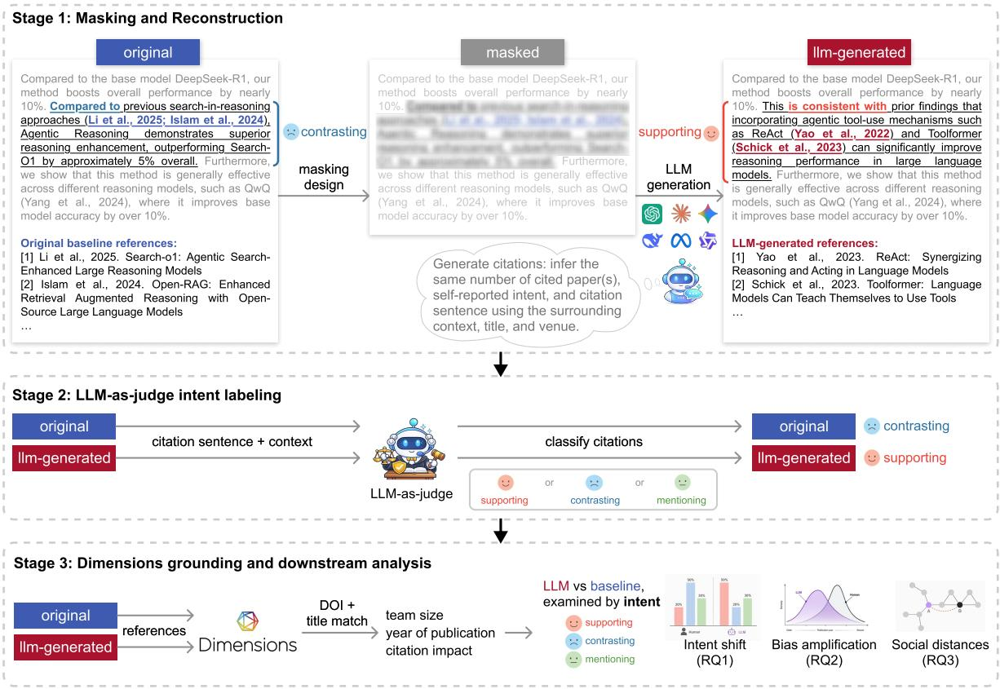  
Figure 1: Framework for auditing how LLMs reshape scientific citation behavior by intent. From 1,746 main-track papers (with available .tex and .bib from arXiv), we extract every citation sentence and run the pipeline: Stage 1: Masking and reconstruction. Each citation sentence is replaced by a masked placeholder, preserving title, venue, section, ±1-sentence context, and required citation count. LLMs independently fill each slot with real papers, a fill sentence, and a self-reported intent. Stage 2: LLM-as-judge intent labeling. An independent judge labels every original and reconstructed sentence as supporting / contrasting / mentioning on identical context, without seeing cited-paper titles, so the label reflects the rhetorical move, not which work is cited. The example paper from ACL 2025 shows the intent shifting from human contrasting to GPT-5.1 supporting. Stage 3: Dimensions grounding and downstream analysis. Recommendations are matched to Dimensions via DOI then normalized title, returning team size, recency, and citation counts that feed the downstream analyses: intent shift (RQ1), bias amplification (RQ2), and social distance (RQ3).

Importantly, our design incorporates three constraints that prior work does not jointly satisfy: slotlevel position matching (every LLM citation is a counterfactual to the human choice at the same position, paired at the sentence level); post-cutoff evaluation (all papers in our corpus were released as preprints after the six models’ training cutoffs, preventing direct retrieval of the held-out citation); and count-controlled reconstruction (the required number of citations matches the human baseline, so that tone/structure differences are not confounded by retrieval length). Together, these constraints align the human and LLM outputs along position, time, and count, leaving citation choice as the remaining dimension of variation.

## 2.2 Labeling citation intent

To label citation intent, we use an LLM-as-judge approach: given a citation sentence and its context (title, section, adjacent sentences), the judge assigns an intent label (supporting / contrasting / mentioning, defined in Table 1, illustration in Table 4), and a confidence level (Figure 1, example at Figure 7, prompts in Figure 8). The prompt provided to the LLM judge includes the citing paper’s title, the heading of the section in which the sentence appears, and the citation context itself. This mirrors the standard setup in citation-intent classification, where intent is read from the citing sentence and its local context (Jurgens et al., 2018; Cohan et al., 2019). The judge is not presented with information about the cited paper, instead inferring intent from the text alone. We further validate these labels against three human annotators, and the judge matches the human majority (κ = 0.60), specifically for supporting and contrasting citation types (Appendix D).

<table><tr><td>Intent</td><td>Definition</td></tr><tr><td>Supporting 0</td><td>Cited work provides evidence, methods, or findings aligned with the citing paper&#x27;s claims or approach.</td></tr><tr><td>Contrasting 愛</td><td>Cited work is a competing approach, con- tradicting finding, or baseline the citing</td></tr><tr><td>Mentioning 三</td><td>paper improves upon or disagrees with. Cited work is referenced for background, definitions, or general acknowledgment with no clear support or contrast.</td></tr></table>

Table 1: Definitions of the three citation intents used throughout the study. Labels and definitions are inspired by Scite.ai categories (Nicholson et al., 2021).

## 2.3 Matching citations to papers

Each human- and LLM-generated reference is linked to its corresponding record in a bibliometric database, which enables downstream analysis. Bibliometric metadata is sourced from the database Dimensions (Hook et al., 2018). References are initially matched based on their DOI; if the DOI is missing or malformed, a second attempt to match is made using the paper title. Author names, which are prone to format inconsistencies, are not used for matching. Once a reference is matched, we replace its original entry (author, publication year, etc.) with the corresponding record from Dimensions; unmatched references are removed from subsequent analyses.

## 2.4 Data and models

Full-text data are sourced from 1,746 main-track papers from ACL, EMNLP, and NAACL 2025 for which both .tex and .bib files are available from arXiv. Together, these papers contain 63,944 citation contexts corresponding to 132,913 citation slots, where each slot is a single cited work and a sentence citing multiple works contributes multiple slots. Table 2 summarizes the distribution of papers and matched citation contexts across venues.

The experiment is repeated across six LLMs: GPT-5.1, Claude-3.5-Haiku, Gemini-2.0-Flash, DeepSeek-V3.2, Llama-4-Maverick, and Qwen2.5-

72B-Instruct. For brevity, we refer to the last five as Claude-3.5, Gemini-2.0, DeepSeek, Llama-4, and Qwen-72B across figures. For citation-intent labeling, we use Gemini-3-Flash-Preview as the primary judge and replicate the results with DeepSeek-V4- Flash as a robustness check (Appendix C).
<table><tr><td>Venue</td><td>#Papers</td><td>Average # contexts (SD)</td></tr><tr><td>ACL</td><td>668</td><td>38.9 (19.6)</td></tr><tr><td>EMNLP</td><td>940</td><td>36.0 (18.0)</td></tr><tr><td>NAACL</td><td>138</td><td>36.1 (15.2)</td></tr><tr><td>Total</td><td>1,746</td><td>37.1 (18.5)</td></tr></table>

Table 2: Corpus composition by venue. We study 1,746 Main-track papers with available .bib and .tex on arXiv, and report the per-paper mean number of matched citation contexts with standard deviation in parentheses.

Of the 63,944 human contexts with 132,913 citation slots, 86.7% are matched to a corresponding record in Dimensions (Table 3). LLMs produce comparable volumes (125k–132k slots, Appendix E) but are matched at variable rates across models (39.5–81.9%); since human references are matched at a high rate under the same pipeline, this gap is attributable to model behavior (e.g., hallucinating or malformed references; per-model disposition see Appendix E) rather than the matching procedure, revealing a basic departure from human citation practice. Given this variation, downstream analyses use the full matched set in the main text and are replicated on the intersection of contexts every model resolves (Appendix H), controlling for possible model effects.

<table><tr><td>Source</td><td>Context</td><td>Citation</td><td>Matched (%)</td></tr><tr><td>Original (human)</td><td>63,944</td><td>132,913</td><td>115,278 (86.7)</td></tr><tr><td>DeepSeek-V3.2</td><td>61,869</td><td>125,810</td><td>103,044 (81.9)</td></tr><tr><td>GPT-5.1</td><td>58,019</td><td>125,176</td><td>88,219 (70.5)</td></tr><tr><td>Llama-4-Maverick</td><td>63,742</td><td>131,550</td><td>93,961 (71.4)</td></tr><tr><td>Gemini-2.0-Flash</td><td>63,883</td><td>131,910</td><td>62,744 (47.6)</td></tr><tr><td>Qwen2.5-72B</td><td>63,888</td><td>131,482</td><td>71,731 (54.6)</td></tr><tr><td>Claude-3.5-Haiku</td><td>63,664</td><td>131,416</td><td>51,878 (39.5)</td></tr></table>

Table 3: Corpus scope and Dimensions matching per model, across the 1,746 ACL/EMNLP/NAACL 2025 papers (DeepSeek-V3.2 covers 1,738). Contexts = distinct (paper, context\_index); Citations = masked citation slots; Matched = slots matched to a Dimensions record.

## 3 LLMs cite less critically (RQ1)

LLMs cite less critically than humans. Across the dataset, human citations split between 21% supporting, 19% contrasting, and 60% mentioning, while LLM-filled sentences generated for each masked citation context produce fewer contrasting citations, with a range of 10.7–17.2% (Claude-3.5 and Llama-4 11%, Gemini-2.0 13%, GPT-5.1 14%, Qwen-72B 14%, DeepSeek 17%). Five out of the six tested models also produce more supporting citations than the human-written baseline (GPT-5.1 41%, Qwen-72B 39%, Claude-3.5 38%, with Gemini-2.0 the lone exception at 20%; Figure 2b). Under a second, independent judge, the contrasting share is even lower (5–10%), so the deficit can not be attributed to an artifact of one judge. The same trend is also observed when three human annotators annotate sentences manually, suggesting that LLMs genuinely generate fewer critical citations, rather than LLM judges failing to appropriately categorize sentences (Appendix D).

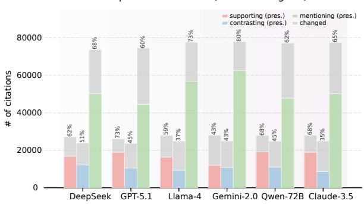

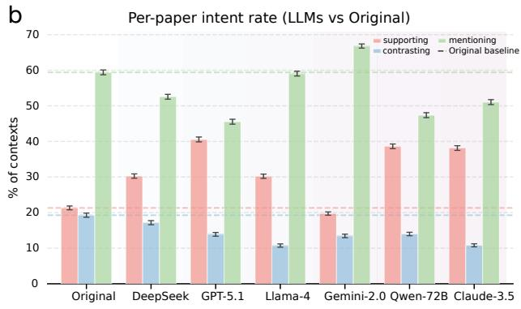

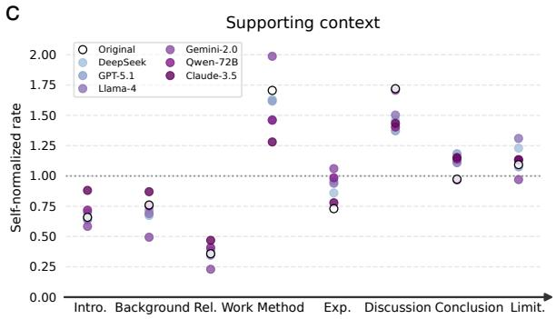

d  
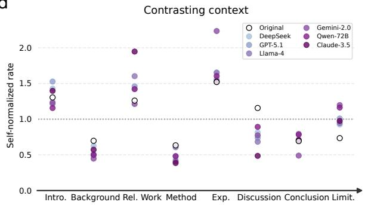  
Figure 2: LLMs warm the tone of citations, under-producing contrasting citations relative to humans. (a) Intent preservation: of the citations the judge labeled on the human sentence (bar height = # citations), the colored portion keeps its label on the LLM-filled sentence (% annotated). Contrasting is least preserved in every model (34.6–50.6%). (b) Per-paper intent rate (each paper one observation, N=1,746; mean ± 95% CI; dashed lines: human level). Models inflate supporting (five of six above human 21.3%, up to 40.6%) and suppress contrasting (all six below human 19.3%, down to 10.7%). (c,d) Self-normalized rate (per-section rate ÷ cross-section mean; 1.0 = own average) for supporting (c) and contrasting (d) for selected sections. Within-source emphasis diverges: LLMs over-support in Experiments and Conclusion, under-support in Discussion; under-contrast in Background, Method, and especially Discussion, and over-contrast hugely in Limitations compared to humans.

This shift can be generalized as a persistent directional “warming” of rhetorical intent. The three citation sentence categories can be conceived as an ordered scale, progressing from contrasting, to mentioning, to supporting. Compared with the original human sentences, LLM-filled sentences persistently move up this scale across all models $( \Delta _ { \mathrm { c o n t } } = - 2 . 4 ~ \mathrm { t o } ~ - 8 . 6 \% )$ That is, contrasting citation sentences written by humans are typically replaced by mentioning or supporting sentences, whereas human-written mentioning sentences are often replaced by supporting sentences. Indeed, the shift is asymmetric: when the human-written sentence is contrasting, the LLM-filled version is classified as supporting in 12.5–31.1% of cases (Claude-3.5 31%, GPT-5.1 29%, Qwen-72B 28%), whereas the reverse (supporting→contrasting) is rare (3.6–7.6%). That is, LLMs turn criticism into endorsement far more often than the opposite.

Critical contexts are the least likely to be preserved by the LLM. When the human-written citation sentence is contrasting, the LLM-filled sentence is assigned the same label only 34.6– 50.6% of the time (Claude-3.5 35%, Llama-4 38%, Gemini-2.0 43%, GPT-5.1/Qwen-72B 45%, DeepSeek 51%), versus 60–80% for mentioning (Figure 2a). In general, the agreement between the human-written and LLM-filled sentence classifications is at best fair (Cohen’s κ = 0.32–0.38).

The self-reported intent of the LLM generating a replacement sentence is even “warmer” than when the same generated sentence is classified by an external LLM judge. Per their self-reported intent during generation, four of six models report 54–75% supporting citation intent (Claude-3.5 75%, GPT-5.1 67%, Qwen-72B 59%, DeepSeek 54%), with Llama-4 (47%) and Gemini-2.0 (28%) lower but still above the human 21%, and almost no contrasting (2.6–8.3%, except DeepSeek 17%; Figure 9). The classifications by the LLM-as-judge temper this self-reported warmth. However, the warming effect persists ( Figure 2b), and cannot merely be attributed to differences in model self-reports as opposed to externally-judged intent.

Human-written and LLM-filled citations diverge in their rhetoric by the section of the paper, likely owing to differences in surrounding context. At the section level, reading each curve against its own self-normalized 1.0 baseline (Figure 2c, d; per-section rate ÷ cross-section mean) clarifies exactly where humans and LLMs diverge by intent relative to their own baseline. For expository sections such as the Background and Related Work, LLM-filled sentences tend to have fewer contrasting citations compared to counterpart humanwritten sentences (Background ×0.45–0.60 vs. human ×0.70). Method sections show a mild warming effect (LLMs ×0.40–0.62 vs. human ×0.63). In the Experiments section of papers, LLM-filled citation sentences tend to more frequently be of both supporting and contrasting intent. Humans use the Discussion section as a site of both support (×1.72) and contrast (×1.16), whereas every LLM generates contrasting citations far below this baseline (×0.49–0.89) and simultaneously places less weight on support (×1.37–1.50 vs. human ×1.72). In sum, these findings suggest that LLMs produce more supporting and contrasting citations where claims can be grounded in concrete material (e.g., the experiments section), but fewer when claims must be carried by argument alone (e.g., the Discussion).

Despite this section-level variation, the overall pattern is consistent: LLMs systematically warm the tone of citations; they under-produce contrasting citations; they fail to preserve roughly half of genuinely critical contexts (rewriting them as supporting); they self-report as overwhelmingly supportive (Figure 9). LLM-generated citation thus mutes scholarly disagreement, smoothing away the critical engagement that human citing encodes.

## 4 Citation biases moderated by LLMs’ intent (RQ2)

We affirm prior findings that LLMs disproportionately cite highly-cited and smaller-team work (Algaba et al., 2025). However, our own study also adds important nuance: these biases are not uniform, but moderated by citation intent. We examine how the human–LLM gap in characteristics of selected references varies across rhetorical intents, aggregating at the paper level: each focal paper contributes one observation per intent, so citationheavy papers do not dominate. Specifically, we compare the differences in citation count, team size, and recency between human-selected and LLMfilled references. We report geometric-mean ratios for the heavy-tailed citation count and team size, and mean differences for recency, with confidence intervals reflecting between-paper variation.

The human baseline is itself strongly intentdependent. When contrasting a claim, humans tend to cite more recent (2.25 yr) and less cited (322 citations) work. When merely mentioning background papers, humans pull in large, established consortium and benchmark papers (25.6 authors, 670 citations, 3.07 yr). Supporting citations sit in between (16.5 authors, 583 citations, 2.93 yr). Citation intent is itself a strong signal of the type of paper an author is referencing.

The attributes of LLM-filled references diverge from human selections, though the magnitude of the difference varies by intent (Figure 3). In terms of impact, LLMs cite papers 1.3–4.5× as highly cited as humans do for the same citation type (DeepSeek 4.45×, GPT-5.1 3.59×, Gemini-2.0 3.58×). The gap for contrasting citation is much smaller, and for some models even below parity (Qwen-72B 0.88×, Claude-3.5 0.78×; Figure 3a). In terms of paper recency, when generating a contrasting citation, LLMs cite work 1.6–3.3 years older than humans, significantly above other intents in every model (Gemini-2.0 +3.27 yr, GPT-5.1 +2.86 yr, Qwen-72B +2.82 yr; Figure 3b), and this pattern persists among earlier cited works within every model’s knowledge (Appendix G). Regarding team size of cited papers, LLMs persistently cite papers with smaller teams across all intents. However, the gap is at its largest for mentioning citations, for which LLMs cite papers with teams only 0.30–0.61× as large as the human baseline (Qwen-72B 0.30×, Llama-4 0.53×), and lesser than for supporting or contrasting citations (Figure 3c). In each panel, the highlighted intent is significant against the other two intents combined in all six models (Welch t-test, $p < 0 . 0 1 $ .

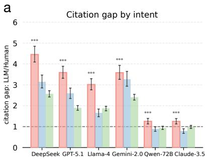

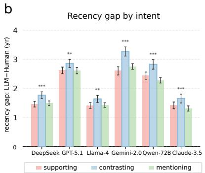

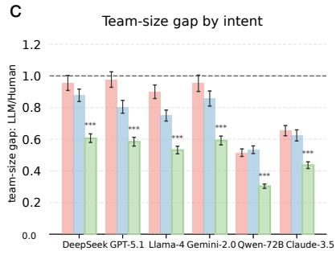  
Figure 3: LLM citation bias is amplified by rhetorical intent. Human–LLM gap in three cited-paper attributes, by citation intent, aggregated at the paper level (one observation per focal paper; 95% CIs from between-paper variation). Citation count and team size are reported as geometric means of per-paper ratios log(LLM/human), back-transformed; recency is a mean per-paper difference. Intent is the judge’s label on the LLM-filled (LLMs) or original (humans) sentence—intent-matched, not slot-matched. Dashed line marks parity (1 for ratios, 0 for the difference). The most-deviant intent per model is outlined and starred (Welch t-test against the other two intents combined; $^ { * } p < . 0 5 , ^ { * * } p < . 0 1 , ^ { * * * } p < . 0 0 1 )$ . (a) Citation count ratio (> 1: cites more-cited work). (b) Recency difference in years $( > 0 \colon$ cites older work). (c) Team-size ratio $( < 1 \colon$ cites smaller teams). In every model the divergence peaks at a different intent per attribute: LLMs over-cite famous work most when supporting (a), older work most when contrasting (b), and under-cite large teams most when mentioning (c).

Two of the three peaks coincide with where human behavior is most distinctive: humans cite their most recent work when contrasting and papers with the largest teams when writing a mentioning citation; these cases are exactly where LLMs diverge most, toward older work with smaller teams. The citation-count peak is different. When endorsing a claim, LLMs most strongly favor high-impact canonical papers, disproportionately citing them them when generating a supporting rather than a contrasting citation. These cases demonstrate that the divergence of human- and LLM-selected references is intent-dependent, robust across all six models, both judges (Appendix C), and the sharedcontext intersection (Appendix H).

## 5 Attenuated social proximity in LLM citation (RQ3)

To understand whom LLMs and humans cite within their social networks, and how this differs by intent, we identify the first and last author of every focal and cited paper (89k+ unique authors across 104k+ matched papers). From these authors, we build a 10-yr (2015–2024) coauthorship network: an undirected edge links every pair of co-authors within any publication containing one of these authors (capped at a team size of 25). This publication-induced graph retains the 1-hop coauthor neighborhoods around our focal and cited authors, capturing the local collaboration structures most relevant to the observed citation pairs while providing a tractable approximation to the broader coauthorship network. The resulting graph spans 2.1M+ nodes and 20M+ edges.

For each citation slot, we compute shortestpath distances on the co-authorship graph using breadth-first search for four author-role dyads: focal-first↔cited-first, focal-first↔cited-last, focallast↔cited-first, and focal-last↔cited-last. Here, d = 0 denotes a self-citation, d = 1 a direct collaborator, and larger values indicate increasingly distant colleagues; dyads in different connected components are coded as unreachable, and dyads with missing researcher identifiers are dropped. We summarize each citation by the average reachable distance ⟨d⟩ across these four dyads. Figure 4a illustrates this author-dyad distance computation. For intent-conditioned analyses, we further average citation-level distances within each (paper, context\_index) slot, so multi-citation contexts contribute one observation and over-cited slots do not dominate the distribution.

One constraint on this approach is the coverage of the coauthorship network. Although 86.7% of the 133k+ human-written citations resolve to a publication record in Dimensions, only 26.5% have at least one reachable author-role dyad in the 2015–2024 coauthorship graph; LLM citations yield reachable dyads for 14.5–25.5% of slots, depending on the model. This yields 96k+ human and 48k–85k per-model reachable dyad observa-

b  
a  
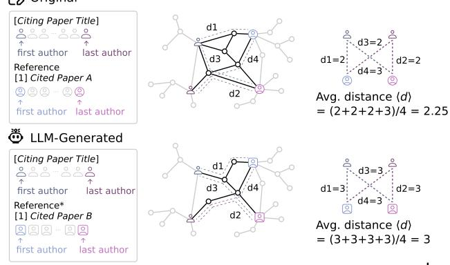

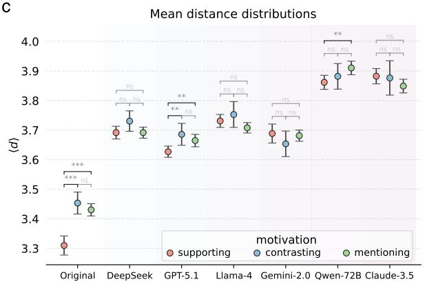  
d

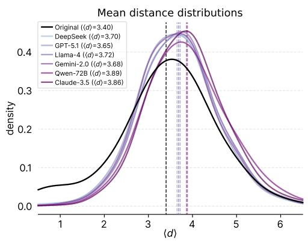

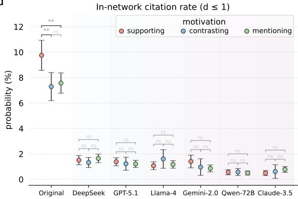  
Figure 4: Author-dyad coauthorship distance separates human from LLM citation behavior. (a) For each masked slot, focal and cited first/last authors are resolved to researcher IDs and BFS shortest-path distance computed on a 20.3M-edge, 2.1M-researcher 2015–2024 coauthorship network; per-context mean ⟨d⟩ is the unit in (b)–(c). (b) Density of ⟨d⟩: humans peak near 3.4 with a close-circle shoulder; LLMs shift right (3.65–3.89). (c) ⟨d⟩ by intent $( \mathrm { m e a n } \pm 9 5 \%$ CI; Mann–Whitney U). Humans show drastic gradient, supporting closer than contrasting/mentioning $( p < 0 . 0 0 1 )$ ; LLMs cluster within ±0.05 hops. (d) In-network citation rate $( d \leq 1 )$ . Humans reach 7–10%, elevated for supporting (9.8% vs. 7.3%/7.6%; $p < 0 . 0 1$ ); every LLM stays below 1.6% with no intent gradient.

tions.

Every LLM generates citations that are farther across the coauthorship network than in the human baseline. Figure 4b shows the distribution of percontext mean author-dyad distance across the seven sources. The human distribution peaks near 3 hops, reflecting a concentration in the near neighborhood of connections $( \langle d \rangle = 3 . 4 0 )$ , while all six LLM distributions sit visibly to the right, with means ranging from 3.65 (GPT-5.1) to 3.89 (Qwen-72B). The shift is persistent across all six models, with no LLM recovering the human bias towards sociallyproximate citations.

Conditioning on intent (Figure 4c) sharpens this divergence, as LLMs vary their citation distance far less by rhetorical intent than do human authors. For human citations, work referenced through a supporting citation is markedly more socially proximate $( \langle d \rangle = 3 . 3 1 )$ than for contrasting (3.45) or mentioning (3.43) citations, a statistically significant difference $( p < 0 . 0 0 1$ for supporting vs. both other intents). None of the six LLMs reproduces these differences. Their per-intent means cluster tightly within ±0.05 hops of each other, and any differences between intents are small and inconsistent across models (e.g., GPT-5.1 and Qwen-72B place supporting closer than contrasting only marginally, while Claude-3.5 reverses it). LLMs treat the rhetorical role as orthogonal to who gets cited; humans do not. This human gradient holds within the same research field, while LLMs remain flat (Appendix J).

We further investigate socially-proximate citation practices (Figure 4d) to better understand how humans and LLMs diverge. We define the innetwork citation rate as the fraction of citation slots that are self-citations $( d = 0 )$ or to a direct collaborator $( d = 1 )$ . Humans cite in-network $( d \leq 1 )$ at $7 - 1 0 \%$ of slots, with the rate sharply elevated for supporting citations (9.8% supporting vs. 7.3% contrasting, $p < 0 . 0 1 )$ . For every LLM, the corresponding in-network citation rate is significantly lower, to 0.5–1.6% regardless of intent, with selfcitations (d = 0) essentially absent. In other words, humans’ tendency to cite socially-proximate research is not merely a mean shift in distance, but a tendency to disproportionately draw on their immediate social network, an effect that LLMs do not reproduce.

## 6 Discussion

We introduced a masked-citation framework to test whether LLMs cite like human scholars by intent. Unlike prior audits that treat citations as homogeneous retrieval outputs (Tian et al., 2024; He, 2025; Algaba et al., 2026, 2025), our design aligns human and model-generated citation sentences, allowing direct comparison of how LLMs differ from humans in the selection and rhetoric of citation in the same context. We conducted experiments using six different LLMs representing the breadth of commercially available models, applying this task to 1.7k+ ACL/EMNLP/NAACL papers. Three findings emerge from our experiments. First, LLMs cite less critically: they under-produce contrasting citations (10.7–17.2% vs. 19% for humans) and lose the critical framing of about half the contexts humans wrote as contrasting, most often rewriting them as supporting. Second, citation selection bias in LLMs is moderated by intent, and not merely a uniform bias toward popular papers. LLMs are more likely to generate citations to highly cited work in the case of a supporting citation, older work most when contrasting, and works with smaller teams of authors when mentioning. Third, LLMs attenuate human biases related to social proximity when selecting citations. That is, they do not inherit the human tendency to selfcite or cite close collaborators when supporting; instead, LLMs generate socially distant citations across all intents.

Why models differ from humans in their citation behavior remains an open question. The observed warming of citation intent may be related to the well-documented phenomenon of “sycophancy” (Sharma et al., 2023), a bias toward positivity and agreeableness in model outputs. Humanauthored scientific writing is also carefully crafted to minimize emotion, and critique, when expressed, is delivered politely and cautiously (Athar, 2014)— tendencies that models may amplify. Concerning reference choice, humans draw on their social networks, for which LLMs have less knowledge and no equivalent to exposure through social proximity. What is harder to speculate on is why LLM citation selection varies by intent. One possible explanation lies in the training data. Highly cited papers may more often appear in positive contexts, while more recent work appears in mixed or negative ones. Future work is needed to explore mechanisms for observed biases, which will inform interventions and improvements in LLM citation.

Ongoing advancements in LLM tools may ameliorate observed biases. For example, LLM-based scientific assistants increasingly make use of agentic search to improve paper retrieval. Yet, such tools are not a panacea. The divergences we observe arise at the generation stage rather than from limited retrieval. Giving GPT-5.1 live web search leaves the warming essentially unchanged (Appendix I), consistent with evidence that LLM agents rely on parametric knowledge even when retrieval is available (Fan et al., 2026). Citation generation is not only a retrieval problem, but also a rhetorical and social process based on human judgment.

Our results provide important nuance to normative discourse surrounding the use of LLMs in science. On one hand, our findings demonstrate that LLMs, by drawing on less socially proximate papers, may expose authors to papers they may otherwise have never seen, offering a counter to increasingly narrow scholarly attention (Varga, 2022; Evans, 2008). On the other hand, LLMs smooth over critical rhetoric that a human might have written. Criticism is an essential component of science (Cruz and Smedt, 2013; Kitcher, 1993; Popper, 1959); by warming rhetoric, LLMs may obscure critical divides in the scientific literature that are important for positioning viewpoints and findings.

Citations have historically reflected careful choice on the part of their human authors and, although often biased (Leydesdorff et al., 2016), were made with intent. This intentionality made citations useful for positioning scientific works, tracing intellectual lineages, aiding literature search, and evaluating scholarly impact. Yet increasingly, citations are the product of machine generation rather than human deliberation, and these machines introduce biases of their own. As LLMs become embedded in scientific writing, they should continue to be audited for potential bias, and researchers should be knowledgeable in their use and limits. Awareness of these tendencies is a prerequisite for preserving critical engagement in scientific writing.

## Limitations

LLM-as-judge models. Intent labels come from an LLM judge rather than human annotators. The RQ1, RQ2, and RQ3 patterns replicate under a second judge (Appendix C), but both judges may share biases inherited from LLM training distributions, for instance, reading characteristic LLM phrasing as more supportive than a human reviewer would. Our intent labels are therefore not validated against human judgment, and absolute rates (though not directional comparisons) should be interpreted with this in mind.

Matching coverage. Dimensions match rates vary across models (39.5–81.9%), so the main analyses use different supports per model. The sharedcontext intersection (Appendix H) reproduces all three intent-amplified patterns when every model contributes to the same contexts, ruling out coverage variation as the source of the bias.

Network coverage. The 2015–2024 coauthorship network yields reachable dyads for only 26.5% of human and 14.5–25.5% of LLM citations. Authors with sparse publication footprints like earlycareer researchers, non-Western institutions, and industry practitioners are systematically underrepresented. The in-network gap we report therefore characterizes only research-active authors with traceable coauthorship, and may not generalize to citations of authors outside this subgraph.

Scope. Our corpus is English-language ACL/EMNLP/NAACL main-track papers. Citation norms differ across disciplines, geographies, and languages, and the warming effect we observe, as well as biases toward popular papers, may be specific to this particular series of computer science conferences rather than a general phenomenon of LLM-assisted citation.

## Ethical considerations

Our study uses publicly available scholarly documents, papers from the main tracks of ACL, EMNLP, and NAACL 2025 (Dimensions.ai and arXiv), together with bibliometric and authorship metadata (Dimensions.ai) accessed under institutional subscription, from which we also construct our 2015–2024 coauthorship network. Resolving citing and cited authors involves personal data (names, affiliations, and career metadata) drawn entirely from these public publication records. We use it only to compute aggregate, model-comparative statistics, never to evaluate, rank, profile, or reidentify individual researchers, and we infer no protected or sensitive attributes; unresolved authors and unmatched citations are excluded rather than imputed. In line with the Dimensions terms, we do not redistribute raw records or the underlying network, and we will release only our code and aggregate, de-identified outputs.

We query the six LLMs through their providers APIs in compliance with the respective terms of service, and corroborate our automatic intent labels with a second, independent judge. Our findings also point to concrete risks of LLM-assisted citation. Because LLM-generated citations are systematically biased toward highly cited and older work, and away from both critical (contrasting) citations and the citing author’s own collaborators, uncritical reliance on such tools could entrench a canonical core, disadvantage recent, niche, or lessvisible scholarship, and erode fairness in scholarly credit. By under-producing contrasting citations, these tools could also weaken critical engagement with prior work, and the masked-citation setup itself could be misused to fabricate or inflate citations. We report these findings to motivate auditing and human oversight of LLM-assisted citation, and we discourage such misuse.

## Acknowledgments

We are grateful for support from the NSF (Grant #2219575). We thank Digital Science for access to the Dimensions database, and the anonymous reviewers for their constructive feedback. We also thank the Network Science Institute at Northeastern University for computational resources.

## References

Andres Algaba, Vincent Holst, Floriano Tori, Melika Mobin, Brecht Verbeken, Sylvia Wenmackers, and Vincent Ginis. 2026. How deep do large language models internalize scientific literature and citation practices? Quantitative Science Studies, pages 1–16.

Andres Algaba, Carmen Mazijn, Vincent Holst, Floriano Tori, Sylvia Wenmackers, and Vincent Ginis. 2025. Large Language Models Reflect Human Citation Patterns with a Heightened Citation Bias. In Findings of the Association for Computational Linguistics: NAACL 2025, pages 6844–6879, Albuquerque, New Mexico. Association for Computational Linguistics.

Awais Athar. 2014. Sentiment analysis of scientific citations. Technical report.

Martin Caon, Jamie Trapp, and Clive Baldock. 2020. Citations are a good way to determine the quality of research. Physical and Engineering Sciences in Medicine, 43(4):1145–1148.

Christian Catalini, Nicola Lacetera, and Alexander Oettl. 2015. The incidence and role of negative citations in science. Proceedings of the National Academy ofSciences ofthe United States ofAmerica, 112(45):13823–13826.

Bingsheng Chen, Dakota Murray, Yixuan Liu, and Albert-László Barabási. 2024. The origin, consequence, and visibility of criticism in science. arXiv preprint. ArXiv:2412.02809 [cs.DL].

Arman Cohan, Waleed Ammar, Madeleine van Zuylen, and Field Cady. 2019. Structural Scaffolds for Citation Intent Classification in Scientific Publications. In Proceedings ofthe 2019 Conference ofthe North American Chapter of the Association for Computational Linguistics: Human Language Technologies, Volume 1 (Long and Short Papers), pages 3586–3596, Minneapolis, Minnesota. Association for Computational Linguistics.

Helen De Cruz and Johan De Smedt. 2013. The value of epistemic disagreement in scientific practice. The case of Homo floresiensis. Studies in History and Philosophy ofScience Part A, 44(2):169–177.

James A. Evans. 2008. Electronic publication and the narrowing of science and scholarship. Science, 321(5887):395–399.

HuiMing Fan, Xiao Wang, Zheng Chu, Qianyu Wang, Zhuoyao Wang, Ming Liu, Bing Qin, and XingYu. 2026. LiveBrowseComp: Are Search Agents Searching, or Just Verifying What They Already Know? arXiv preprint. ArXiv:2605.28721 [cs.AI].

Qianyue Hao, Jingyang Fan, Fengli Xu, Jian Yuan, and Yong Li. 2024. HLM-Cite: Hybrid Language Model Workflow for Text-based Scientific Citation Prediction. In Advances in Neural Information Processing Systems, volume 37, pages 48189–48223. Curran Associates, Inc.

Jiangen He. 2025. Who Gets Cited? Gender- and Majority-Bias in LLM-Driven Reference Selection. arXiv preprint. ArXiv:2508.02740 [cs.DL].

Daniel W. Hook, Simon J. Porter, and Christian Herzog. 2018. Dimensions: Building context for search and evaluation. Frontiers in Research Metrics and Analytics, 3.

David Jurgens, Srijan Kumar, Raine Hoover, Dan Mc-Farland, and Dan Jurafsky. 2018. Measuring the Evolution of a Scientific Field through Citation Frames. Transactions of the Association for Computational Linguistics, 6:391–406. Place: Cambridge, MA.

Philip Kitcher. 1993. The Advancement ofScience: Science Without Legend, Objectivity Without Illusions. Oxford University Press.

Diego Kozlowski, Carolina Pradier, Pierre Benz, Natsumi S. Shokida, Jens Peter Andersen, and Vincent Larivière. 2025. Citation proximus: The role of social and semantic ties on citations. PLOS ONE, 20(10):e0335366. Publisher: Public Library of Science.

Keigo Kusumegi, Xinyu Yang, Paul Ginsparg, Mathijs de Vaan, Toby Stuart, and Yian Yin. 2025. Scientific production in the era of large language models. Science, 390(6779):1240–1243.

Wout S. Lamers, Kevin Boyack, Vincent Larivière, Cassidy R. Sugimoto, Nees Jan van Eck, Ludo Waltman, and Dakota Murray. 2021. Investigating disagreement in the scientific literature. eLife, 10:e72737.

Loet Leydesdorff, Lutz Bornmann, Jordan A. Comins, and Staša Milojevic. 2016.´ Citations: Indicators of quality? the impact fallacy. Frontiers in Research Metrics and Analytics, 1.

Yu Li, Chenyang Shao, Xinyang Liu, Ruotong Zhao, Peijie Liu, Hongyuan Su, Zhibin Chen, Qinglong Yang, Anjie Xu, Yi Fang, Qingbin Zeng, Tianxing Li, Jingbo Xu, Fengli Xu, Yong Li, and Tie-Yan Liu. 2026. AutoSOTA: An End-to-End Automated Research System for State-of-the-Art AI Model Discovery. arXiv preprint. ArXiv:2604.05550 [cs.CL].

Weixin Liang, Yaohui Zhang, Zhengxuan Wu, Haley Lepp, Wenlong Ji, Xuandong Zhao, Hancheng Cao, Sheng Liu, Siyu He, Zhi Huang, Diyi Yang, Christopher Potts, Christopher D. Manning, and James Zou. 2025. Quantifying large language model usage in scientific papers. Nature Human Behaviour, 9(12):2599–2609.

Jake Linardon, Hannah K. Jarman, Zoe McClure, Cleo Anderson, Claudia Liu, and Mariel Messer. 2025. Influence of Topic Familiarity and Prompt Specificity on Citation Fabrication in Mental Health Research Using Large Language Models: Experimental Study. JMIR mental health, 12:e80371.

Robert K. Merton. 1968. The Matthew Effect in Science. Science, 159(3810):56–63.

Michael J. Moravcsik. 1988. Citation Context Classification of a Citation Classic Concerning Citation Context Classification. Social Studies of Science, 18(3):515–521. Publisher: Sage Publications, Ltd.

M. E. J. Newman. 2001. The structure of scientific collaboration networks. Proceedings ofthe National Academy ofSciences, 98(2):404–409.

Josh M. Nicholson, Milo Mordaunt, Patrice Lopez, Ashish Uppala, Domenic Rosati, Neves P. Rodrigues, Peter Grabitz, and Sean C. Rife. 2021. scite: A smart citation index that displays the context of citations and classifies their intent using deep learning. Quantitative Science Studies, 2(3):882–898.

Junichiro Niimi. 2025. Hallucinations in Bibliographic Recommendation: Citation Frequency as a Proxy for Training Data Redundancy. arXiv preprint. ArXiv:2510.25378 [cs.CL].

Karl R. Popper. 1959. The Logic of Scientific Discovery. Martino Fine Books.

Ori Press, Andreas Hochlehnert, Ameya Prabhu, Vishaal Udandarao, Ofir Press, and Matthias Bethge. 2024. CiteME: Can Language Models Accurately Cite Scientific Claims? In The Thirty-eight Conference on Neural Information Processing Systems Datasets and Benchmarks Track.

Derek De Solla Price. 1976. A general theory of bibliometric and other cumulative advantage processes. Journal ofthe American Societyfor Information Science, 27(5):292–306.

Mrinank Sharma, Meg Tong, Tomasz Korbak, David Kristjanson Duvenaud, Amanda Askell, Samuel R. Bowman, Newton Cheng, Esin Durmus, Zac Hatfield-Dodds, Scott Johnston, Shauna Kravec, Tim Maxwell, Sam McCandlish, Kamal Ndousse, Oliver Rausch, Nicholas Schiefer, Da Yan, Miranda Zhang, and Ethan Perez. 2023. Towards understanding sycophancy in language models. ArXiv, abs/2310.13548.

Fei Shu and Kaijie Jia. 2026. Nature of citations: A review of literature. Data Science and Informetrics, 6(1):100034.

Simone Teufel, Advaith Siddharthan, and Dan Tidhar. 2006. Automatic classification of citation function. In Proceedings of the 2006 Conference on Empirical Methods in Natural Language Processing, pages 103–110, Sydney, Australia. Association for Computational Linguistics.

Yifan Tian, Yixin Liu, Yi Bu, and Jiqun Liu. 2024. Who Gets Recommended? Investigating Gender, Race, and Country Disparities in Paper Recommendations from Large Language Models. arXiv preprint. ArXiv:2501.00367 [cs.IR].

Attila Varga. 2022. The narrowing of literature use and the restricted mobility of papers in the sciences. Proceedings of the National Academy of Sciences, 119(17).

Matthew L. Wallace, Vincent Larivière, and Yves Gingras. 2012. A Small World of Citations? The Influence of Collaboration Networks on Citation Practices. PLOS ONE, 7(3):e33339.

William H. Walters and Esther Isabelle Wilder. 2023. Fabrication and errors in the bibliographic citations generated by ChatGPT. Scientific Reports, 13(1):14045.

James Wilsdon, Liz Allen, Eleonora Belfiore, Philip Campbell, Stephen Curry, Steven Hill, Richard Jones, Roger Kain, Simon Kerridge, Mike Thelwall, Jane Tinkler, Ian Viney, Paul Wouters, Jude Hill, and Ben

Johnson. 2015. The metric tide: Report of the independent review of the role of metrics in research assessment and management.

Seokkyun Woo and John P. Walsh. 2024. On the shoulders of fallen giants: What do references to retracted research tell us about citation behaviors? Quantitative Science Studies, 5(1):1–30.

Zhenyue Zhao, Yihe Wang, Toby Stuart, Mathijs De Vaan, Paul Ginsparg, and Yian Yin. 2026. LLM hallucinations in the wild: Large-scale evidence from nonexistent citations. arXiv preprint. ArXiv:2605.07723 [cs.DL].

## Appendix

## A Experimental design

## A.1 Masking design

Here we showcase our masking design for LLM citation generation and the LLM and system prompt (Figure 5, Figure 6). We set the temperature to 0 for all models.

```jsonl
{
"citation_count": 1,
"recommended_papers": [
{"title": "Theory of Mind May Have
Spontaneously Emerged in Large
Language Models",
"authors": "Kosinski", "year": 2023,
"venue": "arXiv", "doi": null}
],
"citation_sentence": "Recent work has shown
that large language models can exhibit
emergent Theory of Mind-like
capabilities (Kosinski, 2023).",
"motivation": "supporting",
"confidence": "low"
}
```  
Figure 5: Masked-citation reconstruction (ACL 2025 paper). The model sees only the surrounding context with the citation sentence replaced by [CITE\_HERE] and the required citation count; it never sees the removed sentence or the cited work. Here the human sentence pushes back on prior work—“LLMs fail to achieve functional ToM” (contrasting)—while the model, on the same slot, recommends a different paper and reframes it as “LLMs can exhibit emergent Theory of Mind” (supporting): a representative instance of the tone warming we report.

System prompt   
You reconstruct removed citations from NLP   
papers. Given a paragraph where [CITE\_HERE   
] replaces one removed citation-bearing   
sentence, infer the cited paper(s) and the   
replacement sentence using the   
surrounding context.   
Return ONLY a valid JSON object, no markdown   
or text outside the JSON:   
{   
"citation\_count": <int>,   
"recommended\_papers": [   
{"title": "...", "authors": "First, Second,   
...", "year": <int>,   
"venue": "...", "doi": "..." or null}   
],   
"citation\_sentence": "<one sentence replacing   
[CITE\_HERE]>",   
"motivation": "supporting" | "contrasting" |   
"mentioning",   
"confidence": "high" | "medium" | "low"   
}   
Rules:   
- recommended\_papers length must equal   
citation\_count, which must equal   
the required count from the user prompt.   
Each item is one distinct work; no   
duplicates, no combining.   
citation\_sentence is one complete sentence   
including the citation text.   
- Prefer real, specific papers. If uncertain,   
give your best guess and   
set confidence to "low".   
Motivation categories:   
- supporting: cited work provides evidence,   
methods, or findings aligned with the   
citing paper.   
contrasting: cited work is a competing   
approach, contradicting finding, or   
baseline the citing paper improves upon.   
mentioning: cited work is referenced for   
background, definitions, or general   
acknowledgment.   
User prompt (template)   
Paper: "<paper title>"   
Venue/year: <venue>, <year>   
Section: <section>   
<masked paragraph with [CITE\_HERE], LaTeX   
clutter stripped>   
Required citation count: <N>  
Figure 6: Generation prompt. The system prompt fixes the JSON schema, the one-distinct-work-per-citation rule, the required-count constraint, and the three categories; the user prompt supplies the masked context and the required number of citations for one slot.

## A.2 LLM-as-judge for citation intent

To compare the rhetorical stance of human and model citations on equal footing, we score every citation slot with a single LLM judge (Gemini-3-Flash-Preview, temperature 0). The judge labels each citation sentence as supporting, contrasting, or mentioning with a confidence level, seeing only the sentence and its local context, never the cited paper’s title and never the alternative version of the sentence (Figure 7, Figure 8).

(1) What the judge sees: one citation sentence plus its   
surrounding context:   
Paper: "Leveraging Dual Process Theory in   
Language Agent Framework for Real-time   
Simultaneous Human-AI Collaboration" (ACL   
2025)   
Section: Related Work   
Sentence before:   
Theory of Mind (ToM) [CITE] has been   
introduced to enhance reasoning in human-  
AI collaborative scenarios [CITE].   
Citation sentence:   
<one of the two sentences below>   
Sentence after:   
To adapt to humans, our framework integrates   
dual-process theory and ToM to support the   
entire process from perception to   
reasoning and decision-making.   
(2a) Phase A — judging the HUMAN original (judge label:   
contrasting):   
Citation sentence:   
"However, studies have pointed out that LLMs   
fail to achieve functional ToM [CITE],   
where reasoning cannot be effectively   
implemented in decision-making processes."   
-> {"motivation": "contrasting", "confidence":   
"high"}   
(2b) Phase B — judging the GPT-5.1 reconstruction (judge   
label: supporting):   
Citation sentence:"Recent work has shown that   
large language models can exhibit emergent   
Theory of Mind-like capabilities (   
Kosinski, 2023)."   
-> {"motivation": "supporting", "confidence":   
"high"}

Figure 7: LLM-as-judge classification. The judge receives only the citation sentence and the before/after window, cited-paper titles are withheld. The two phases score the human original (Phase A, run once per judge) and each model’s reconstruction (Phase B, run per source×judge) in independent calls, so the judge never anchors on the alternative version of the same slot. The judge confirms the tone warming: human sentence pushes back, while the model rewrites as supporting.

System prompt (identical across Phase A and Phase B)   
You classify citations in NLP papers as   
supporting, contrasting, or mentioning,   
based on a citation sentence and its   
surrounding context.   
Categories:   
supporting: cited work provides evidence,   
methods, or findings aligned with the   
citing paper’s claims or approach.   
contrasting: cited work is a competing   
approach, contradicting finding, or   
baseline the citing paper improves upon or   
disagrees with.   
mentioning: cited work is referenced for   
background, definitions, or general   
acknowledgment with no clear support or   
contrast.   
Confidence:   
high: the surrounding text explicitly   
signals the relationship.   
medium: the relationship is strongly implied   
but not explicit.   
low: the relationship is ambiguous or   
inferable only with effort.   
Return ONLY a valid JSON object, no markdown   
or text outside the JSON:   
{   
"motivation": "supporting" | "contrasting" |   
"mentioning",   
"confidence": "high" | "medium" | "low"   
}

Paper: "<paper title>"   
Section: <section>   
Sentence before:   
<cleaned before-window, or "(beginning of   
paragraph)">   
Citation sentence:   
<original sentence (Phase A) OR model-filled   
sentence (Phase B), LaTeX clutter stripped   
>   
Sentence after:   
<cleaned after-window, or "(end of paragraph)">

Figure 8: Judge prompt. The system prompt fixes the JSON schema, the three motivation categories, and the three confidence levels; the user prompt supplies the citation sentence and a ±500-character context window (sentence capped at 800 characters) with cited-paper titles deliberately omitted. The same prompt is used to judge the human original and every model reconstruction, so any difference in the label distribution is attributable to the sentence, not the judging procedure.

To clarify how these definitions are applied, Table 4 provides representative examples of citation contexts categorized under each intent defined in Table 1: Supporting, where the reference provides evidence, methods, or findings aligned with the authors’ claims or approach; Contrasting, where the reference is a competing approach, contradicting finding, or baseline that is improved upon or disagreed with; and Mentioning, where the reference is invoked for background, definitions, or general acknowledgment with no clear support or contrast.

<table><tr><td>Intent</td><td>Example</td></tr><tr><td rowspan="5">Supporting 0</td><td>Paper: “Superpose Task-specific Features for Model Merging&quot; (arXiv:2502.10698) Section: Introduction</td></tr><tr><td>Sentence before: Representations in deep neural networks can be decomposed into</td></tr><tr><td>combinations of feature vectors. Citation sentence: “Recent works in mechanistic interpretability</td></tr><tr><td>(Bricken et al., 2023; Templeton et al., 2024)validate the hypothesis and also reveal that</td></tr><tr><td>these representations often contain features both related and unrelated to the model input.&quot; Sentence after: This phenomenon motivates our approach: linearly superposing features from individual models into the representation of the merged model can preserve task-specific capabilities.</td></tr><tr><td rowspan="4">Contrasting 愛</td><td>Paper: “AttnComp: Attention-Guided Adaptive Context Compression for Retrieval-Augmented Generation&quot;(arXiv:2509.17486) Section: Introduction</td></tr><tr><td>Sentence before: While achieving high compression rates, they incur significant latency due to token-by-token decoding.</td></tr><tr><td>Citation sentence: “Extractive methods instead select relevant spans from the original content, offering greater efficiency(Jiang et al., 2024; Hwang et al., 2024; Chirkova et al., 2025)</td></tr><tr><td>Sentence after: However, current extractive methods typically only assess the relevance of individual sentence or document to the query, limiting their ability to integrate information across broader context.</td></tr><tr><td rowspan="4">Mentioning 四</td><td>Paper: “QAVA: Query-Agnostic Visual Attack to Large Vision-Language Models&quot; (arXiv:2504.11038)</td></tr><tr><td>Section: Related Work Sentence before: Initial research on adversarial attacks concentrated mainly on the visual modality, given its high-dimensional and continuous input space.</td></tr><tr><td>Citation sentence: “More recent studies have extended the attacks to discrete textual modalities (Alzantot et al., 2018; Jia &amp; Liang, 2017; Wallace et al., 2019) ,9</td></tr><tr><td>Sentence after: Additionally, some research has focused on targeting the fusion of visual and textual modalities.</td></tr></table>

Table 4: Three examples of human-written citation sentences with their LLM-as-judge motivation label (Gemini-3- Flash, high confidence). Citation handles are highlighted within otherwise plainly-formatted sentences, reflecting that intent often depends on local context, not the citation sentence alone. Labels and definitions are inspired by Scite.ai categories (Nicholson et al., 2021).

## B Self-reported intent vs LLM-as-judge

For every LLM the self-declared intent (LLM-selfreported) is warmer than the same model’s writing as read by the judge (LLM-as-judge), which is already warmer than the human baseline (Figure 9). Self-supporting jumps to 28–75% (Claude 75%, GPT-5.1 67%, Qwen 59%, DeepSeek 54%, Llama-4 47%, Gemini-2.0 28%) versus the judge’s 20– 41% on the same sentences, and self-contrasting collapses to 3–17% versus 11–17% under the judge. Original is unchanged across the two panels because humans have no self-label. Read together:

every LLM both writes more supportive citations than humans and judges itself as more supportive than LLM-as-judge, the judge reads the LLM’s text as a touch more critical than the LLM’s own declared intent.

## C Robustness check with DeepSeek as judge

Our main analyses use Gemini-3-Flash-Preview as the LLM-as-judge to label citation intent. To test whether the results depend on this particular judge, we repeat the intent-labeling step with DeepSeek-V4-Flash, using the same inputs, label definitions with temperature set to 0. This alternative judge labels both human original sentences and LLM-filled sentences under the same supporting / contrasting / mentioning taxonomy defined in Table 1.

The several results below show that some selected central patterns replicate under this alternative judge. LLM-generated citations remain less contrasting than human citations, citation biases continue to vary by rhetorical intent, and the human–LLM gap in coauthorship proximity remains qualitatively unchanged. This suggests that our findings are not driven by idiosyncrasies of a single judge model, but reflect robust differences between human and LLM citation behavior.

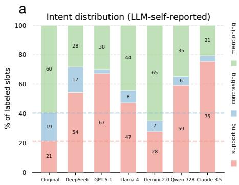

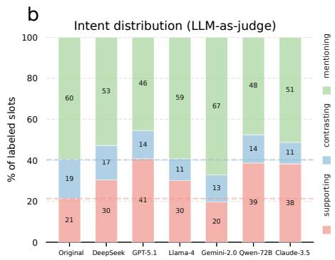  
Figure 9: Intent distribution per source (% of labeled slots; supporting / contrasting / mentioning). a LLM self-reported intent: original is identical (humans have no self-label, so we always read them through the judge), but each LLM bar uses the source LLM’s own declared intent from during its generation of citations. b: LLM-as-judge, the judge independently labels both the human original and each LLM’s filled sentence; the same judging procedure is applied to every source. Dashed lines mark the human supporting and supporting+contrasting baselines.

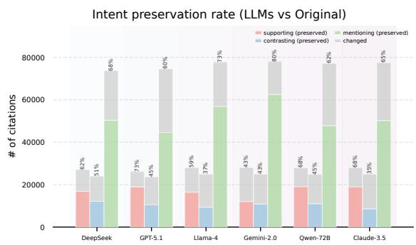  
Figure 10: Intent preservation under the DeepSeek-V4-Flash judge. Bar height shows the number of human citations labeled with each intent; the colored portion shows the share whose label is preserved in the LLM-filled sentence. As under the Gemini judge, contrasting is least preserved for every model (20.3– 32.4%), while mentioning is most preserved (70.3– 83.6%).

Beyond replicating the patterns, the two judges also agree at the label level on identical citation contexts (Table 5): Gemini-3-Flash and DeepSeek-V4-Flash reach Cohen’s $\kappa = 0 . 5 2$ on human originals and 0.45 on the pooled LLM fills. Crucially, they rarely differ on the supporting vs. contrasting citations our claims rest on—one labels a citation supporting while the other labels it contrasting in only 2–9% of cases—with disagreement falling almost entirely (92%) on the neutral mentioning boundary, which our findings do not depend on.

<table><tr><td>Sentence set</td><td>N</td><td>Cohen&#x27;s κ</td><td>Agreement</td></tr><tr><td>Human original</td><td>57,958</td><td>0.52</td><td>72.6%</td></tr><tr><td>LLM-filled</td><td>335,004</td><td>0.45</td><td>68.9%</td></tr></table>

Table 5: Agreement between the two LLM judges (Gemini-3-Flash vs. DeepSeek-V4-Flash) on identical citation contexts. Disagreement concentrates on the neutral mentioning boundary rather than the supporting/contrasting citations our claims use.

Repeating the per-slot intent preservation analysis from Figure 2a under the DeepSeek-V4-Flash judge reproduces a similar hierarchy (Figure 10a). Contrasting is the least-preserved intent in every model (20.3–32.4%), supporting sits in the middle (25.3–41.9%), and mentioning is the most preserved (70.3–83.6%). Absolute preservation rates are lower than under the Gemini judge, contrasting drops to roughly half of what it was there (34.6– 50.6% → 20.3–32.4%), but the ordering is identical: when LLMs encounter a slot the judge reads as critical, they are the least likely to keep that critical framing on their own filled sentence, consistent with the warming trend reported in the main analysis.

## C.1 Bias amplification of LLM citations by intent

As a representative robustness check for RQ2, here we specifically revisit the recency result in Figure 3b, where the human–LLM gap is largest for contrasting citations. Using the current DeepSeek-V4-Flash as a judge, we recover a similar pattern: for five of six models, LLMs cite older papers than humans most strongly in contrasting contexts. The contrasting recency gap is significant for DeepSeek-V3.2 (+1.63 years, $p \ < \ 0 . 0 1 )$ , GPT-5.1 (+2.80 years, $p < 0 . 0 5 )$ , Gemini-2.0-Flash (+3.08 years, $p \ < \ 0 . 0 0 1 )$ , and Qwen2.5 72B Instruct (+2.64 years, $p \ < \ 0 . 0 1 )$ . Claude-3.5-Haiku shows the same direction but is not significant (+1.50 years), while Llama-4-Maverick shows similar gaps for contrasting and mentioning, with the mentioning gap reaching significance $( p < 0 . 0 1 )$ . Although the magnitudes are slightly smaller than under the Gemini judge, the same intent-level ranking is preserved, supporting the robustness of the contrastingdriven recency divergence.

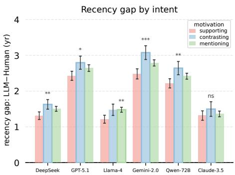  
Figure 11: Recency gap by intent under the DeepSeek-V4-Flash judge. Human–LLM gap in citedpaper recency, aggregated at the paper level. Values show mean per-paper differences (LLM − human, in years). The most-deviant intent per model is outlined and starred against the other two intents combined. As under the Gemini judge, the gap is largest for contrasting citations in five of six models; Llama-4 splits between contrasting and mentioning.

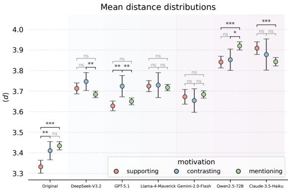  
Figure 12: Per context mean shortest path ⟨d⟩ by intent (mean ± 95% CI; Mann–Whitney U). Humans show a drastic gradient, supporting closer than contrasting/mentioning $( p < 0 . 0 0 1 )$ ).

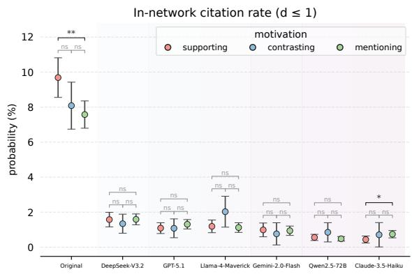  
Figure 13: In-network citation rate $( d \leq 1 )$ . Humans reach 7–11%, elevated for supporting; every LLM stays below 1.6% with no/slight evident intent gradient.

## C.2 Network proximity in LLM citations

We re-ran the same network-proximity analysis with DeepSeek-V4-Flash as the judge (Figures 12, 13); the pattern is unchanged. Humans still cite markedly closer than every LLM $( \langle d \rangle = 3 . 3 3$ supporting vs. 3.65–3.92 across LLMs), the human intent gradient survives (supporting vs. mentioning $p < 0 . 0 0 1 )$ , and the in-network $( d \leq 1 )$ rate stays at 7.6–9.7% for humans against 0.5–1.6% for every LLM, elevated for human supporting and essentially flat across intent for every model.

The only small shifts are statistical: the human supporting-vs-contrasting effect is now marginal under this judge $( p \approx 0 . 0 7$ vs. $p < 0 . 0 1$ under Gemini), and Llama-4 / Gemini-2.0 / Claude-3.5 show no per-intent effect (vs. small but significant gaps under Gemini). The headline is still that humans cite within their close coauthor neighborhood for supporting citations, LLMs do not, holds verbatim across both judges.

## D Human validation of intent labels

Beyond our two LLM judges (Section 2.2, Appendix C), we validate the intent labels against human annotators. Three annotators independently labeled a stratified sample of 90 sentences (30 per intent) under the same rubric, blind to the model labels and the cited paper. Taking their majority as ground truth, the primary judge (Gemini-3-Flash) matches on 73% $( \kappa = 0 . 6 0 )$ and the second judge (DeepSeek-V4-Flash) on 60% $( \kappa = 0 . 3 9 )$ , both recovering contrasting best $( \mathrm { F } 1 = 0 . 7 3 \mathrm { ~ a n d } 0 . 7 2 )$

Per intent, the judge is most reliable exactly on the two non-neutral classes our claims turn on (Table 6): supporting $( \mathrm { F 1 } = 0 . 7 9 )$ and contrasting $( \mathrm { F } 1 = 0 . 7 3$ , recall 0.80), which drive the “warming” result (fewer contrasting, more supporting; Section 3) and the intent-conditioned biases (Section 4). Disagreement falls mostly on the neutral mentioning boundary, which our findings do not depend on.

<table><tr><td>Intent</td><td>Precision</td><td>Recall</td><td>F1</td></tr><tr><td>supporting</td><td>0.80</td><td>0.77</td><td>0.79</td></tr><tr><td>contrasting</td><td>0.67</td><td>0.80</td><td>0.73</td></tr><tr><td>mentioning</td><td>0.72</td><td>0.64</td><td>0.68</td></tr></table>

Table 6: Per-intent precision/recall/F1 of the primary judge (Gemini-3-Flash) against the human majority on the 90-sentence validation sample. The judge is strongest on the two non-neutral classes (supporting, contrasting) that our claims rely on.

We also test whether the LLM judge simply reads LLM-written sentences as warmer. On the same 90 slots, the three annotators also labeled GPT-5.1’s reconstruction of each citation. The warming we report (Section 3) reappears in the human labels—contrasting falls and supporting rises for every annotator, the same direction both LLM judges show (Table 7). The judge also agrees with the human majority on these LLM-written sentences about as well as on human ones $( \kappa = 0 . 5 1$ vs. 0.60), with no drop in human–human agreement on the LLM text. The warming is thus a property of the regenerated citations, captured by humans and both judges alike, not a judge self-preference for LLM-generated text.

<table><tr><td>Rater</td><td>contrasting</td><td>supporting</td></tr><tr><td>Human majority vote</td><td>26% → 18%</td><td>37% → 55%</td></tr><tr><td>Human annotator 1</td><td>26% → 16%</td><td>23% → 55%</td></tr><tr><td>Human annotator 2</td><td>29% → 22%</td><td>39% → 49%</td></tr><tr><td>Human annotator 3</td><td> $2 6 \%  2 1 \%$ </td><td>42% → 56%</td></tr><tr><td>LLM judge (Gemini)</td><td> $3 5 \%  1 9 \%$ </td><td> $3 4 \%  5 6 \%$ </td></tr><tr><td>LLM judge (DeepSeek)</td><td>27% → 9%</td><td> $2 2 \%  3 9 \%$ </td></tr></table>

Table 7: Intent rates on the original (human) vs. GPT-5.1-filled sentence, by rater, over the 77 of 90 slots for which GPT-5.1 returned a citation sentence (majority vote = 2 of 3 annotators).

## E Citation disposition and unmatched references

All six models fill the same 63,944 citation contexts (132,913 requested citations). Produced counts differ only by each model’s format-error rate, the share of malformed or unparseable responses we drop; the remaining citations are matched to Dimensions (Table 8). Format errors are limited (0.8– 5.8%), and the variation in match rate (39.5–81.9%) lies in the unmatched, well-formed bucket, which all downstream analyses exclude.

The unmatched bucket is not used downstream, but to characterize the unmatched bucket, we audited 100 randomly sampled unmatched titles each from GPT-5.1 (high match rate) and Claude-3.5- Haiku (lowest), using Claude Opus 4.8 with web search, into three categories: a precise match we missed, a real work under an inaccurate title, or a fabricated reference (Table 9). Most are hallucinated (B+C): 79% for GPT-5.1 and 97% for Claude-3.5-Haiku, and the higher-matching model hallucinates less.

<table><tr><td>Model</td><td>citations</td><td>format-error</td><td>matched</td></tr><tr><td>DeepSeek-V3.2</td><td>125,810</td><td>5.3%</td><td>81.9%</td></tr><tr><td>Llama-4-Maverick</td><td>131,550</td><td>1.0%</td><td>71.4%</td></tr><tr><td>GPT-5.1</td><td>125,176</td><td>5.8%</td><td>70.5%</td></tr><tr><td>Qwen2.5-72B</td><td>131,482</td><td>1.1%</td><td>54.6%</td></tr><tr><td>Gemini-2.0-Flash</td><td>131,910</td><td>0.8%</td><td>47.6%</td></tr><tr><td>Claude-3.5-Haiku</td><td>131,416</td><td>1.1%</td><td>39.5%</td></tr></table>

Table 8: Per-model citation disposition. Format errors are small, and the match-rate spread lies in the unmatched (well-formed) bucket.

<table><tr><td>Unmatched title</td><td>GPT-5.1</td><td>Claude-3.5-Haiku</td></tr><tr><td>A. precise match</td><td>21%</td><td>3%</td></tr><tr><td>B. real work, garbled title</td><td>51%</td><td>24%</td></tr><tr><td>C. fabricated</td><td>28%</td><td>73%</td></tr></table>

Table 9: Audit of 100 unmatched titles per model. Most are hallucinations (B+C): 79% for GPT-5.1, 97% for Claude-3.5-Haiku.

## F Robustness to context window

<table><tr><td>Context window</td><td>Sup. e</td><td>Con. </td><td>Men. ②</td></tr><tr><td>±1-sentence (baseline)</td><td>40.1</td><td>10.0</td><td>49.8</td></tr><tr><td>+ full paragraph (2.6×)</td><td>45.1</td><td>10.4</td><td>44.5</td></tr><tr><td>+ paragraph &amp; abstract</td><td>43.1</td><td>10.9</td><td>46.0</td></tr></table>

Table 10: GPT-5.1 intent distribution (%) as the input context widens (stratified 600-slot subset, 200 per intent; judge: DeepSeek-V4-Flash). Sup./Con./Men. = supporting/contrasting/mentioning. Contrasting stays low and supporting high across all levels.

To test whether our ±1-sentence window shapes the intent distribution, we re-ran GPT-5.1 on a stratified subset of 600 slots (200 per intent) with progressively more of the manuscript, holding the paper title, venue, section, and required citation count fixed: the ±1-sentence window (baseline), the full paragraph (about 2.6× the context), and the paragraph plus the citing paper’s abstract. Intent is labeled by DeepSeek-V4-Flash. The distribution barely shifts across conditions (Table 10): contrasting stays at 10–11% and supporting remains high, and adding context does not move the model toward the human distribution. The intent distribution is thus robust to the amount of context provided.

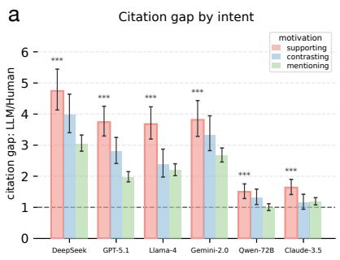

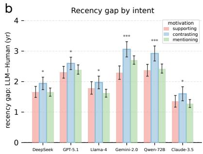

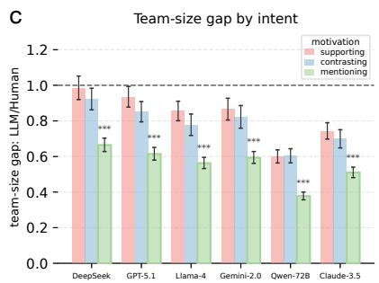  
Figure 14: Intent-amplified citation bias replicates on the shared-context intersection. Recomputed on the 12,556 contexts (1,695 of 1,746 papers) where every source—human original and all six LLMs, has ≥ 1 Dimensionsmatched cite. Per-paper aggregation: geometric-mean ratios for a citation count and c team size (LLM/Human; > 1 = more-cited, < 1 = smaller teams), mean year difference for b recency (> 0 = older); 95% CIs from between-paper variation; outlined intent = most-deviant per model (Welch t-test vs. the other two combined; $^ { * } p { < } . 0 5 , ^ { * * } p { < } . 0 1$ $^ { * * * } p { < } . 0 0 1 )$ . The headline pattern reproduces: citation gap peaks at supporting (3.7–4.7× across top models), recency at contrasting $( + 2 . 6 \mathrm { t o } + 3 . 1 \mathrm { y r } )$ , and team size at mentioning (0.38–0.56×). The intent-amplified bias is not an artifact of per-LLM matching coverage.

## G Robustness of the recency gradient

The tendency to cite older work is not merely limited access to recent papers: it persists even among cited works from before 2024, which are well within every model’s knowledge. Restricting both human and LLM citations to these earlier works and recomputing the per-paper, intent-matched gap, the intent gradient holds: contrasting remains the peak-recency intent in every model and stays significant throughout (Table 11).

<table><tr><td>Model</td><td>∆ (yr, cited &lt; 2024) p</td></tr><tr><td>DeepSeek-V3.2</td><td>+0.8 &lt; 0.001</td></tr><tr><td>GPT-5.1</td><td>+0.4 &lt; 0.01</td></tr><tr><td>Llama-4-Maverick</td><td>+0.6 &lt; 0.001</td></tr><tr><td>Gemini-2.0-Flash</td><td>+1.0 &lt; 0.001</td></tr><tr><td>Qwen2.5-72B</td><td>+1.0 &lt; 0.001</td></tr><tr><td>Claude-3.5-Haiku +0.7</td><td>&lt; 0.001</td></tr></table>

Table 11: Recency gradient on cited works from before 2024. $\Delta > 0$ means contrasting citations show a larger human–LLM recency gap than the other intents; the gradient holds and stays significant in every model.

## H Robustness check with slot intersections

A natural concern is that the per-paper attribute gaps in Figure 3 are driven by which contexts each LLM happened to land matches on rather than by the citations themselves, since Dimensions match rates vary widely across models (39.5–81.9%). To rule this out, we recompute the same per-paper, perintent gaps on the intersection of contexts where every source, the human original plus all six LLMs, has at least one Dimensions-matched cite, so every model is evaluated on identical support. This intersection retains 12,556 contexts across 1,695 of 1,746 focal papers (97%), trading per-paper context depth for an apples-to-apples comparison without losing the underlying population, though confidence intervals widen accordingly at the smaller sample size.

The intent-amplified pattern from Figure 14 reproduces in both direction and magnitude: the citation-count gap peaks at supporting for every model (DeepSeek 4.74×, Gemini-2.0 3.82×, GPT-5.1 3.74×, Llama-4 3.68×), the recency gap peaks at contrasting (Gemini-2.0 +3.06 yr, Qwen +2.92 yr, GPT-5.1 +2.60 yr), and the team-size gap peaks at mentioning (Qwen 0.38×, Llama-4 0.56×). Because every model now contributes to the same context set, this design is more conservative than the main analysis: any remaining gap cannot be attributed to differential coverage. The persistence of the intent-amplified pattern therefore confirms that it reflects what the models choose to cite, not which slots they happen to resolve.

## I Warming under retrieval

Our main setup asks models to cite from parametric knowledge. To test whether the warming depends on this, here we add a retrieval-augmented condition: GPT-5.1 answers each slot with live web search enabled (tool use), retrieving candidates as a RAG system would, on the same stratified subset (n = 599; judge: DeepSeek-V4-Flash). The intent distribution stays essentially the same (Table 12): even with live search, the model under-produces

contrasting citations (about 10% vs. 33% for humans), so the warming persists under retrieval.
<table><tr><td>Intent source</td><td>Sup.</td><td> $\mathbf { { C o n . } }$ </td><td>Men.</td></tr><tr><td>human (original)</td><td>33.2</td><td>33.4</td><td>33.4</td></tr><tr><td>GPT-5.1, parametric</td><td>39.9</td><td>10.9</td><td>49.2</td></tr><tr><td>GPT-5.1, + live web search</td><td>44.4</td><td>10.2</td><td>45.4</td></tr></table>

Table 12: Intent distribution (%) with and without live web search, on the balanced subset (200 per intent, so human rates are near-equal; $n = 5 9 9 ;$ judge: DeepSeek-V4-Flash). Contrasting stays near 10% under retrieval. Sup./Con./Men. = supporting/contrasting/mentioning.

## J Proximity gradient within research fields

We test whether the intent-conditioned proximity gradient reflects field structure rather than social proximity. Using the paper-level Fields of Research (FoR) that Dimensions assigns to every publication (ANZSRC 2020; L1 = 2-digit division, $\mathrm { L } 2 = 4 \cdot$ digit group), we label a citation within-field if the citing and cited papers share any FoR code, and re-examine the citation-dyad distances for GPT-5.1 (Table 13). Holding field constant, humans still cite closer in every stratum (a gap of +0.31 to +0.39 hops, all $p < 1 0 ^ { - 6 } )$ , and the supporting-closer gradient persists among same-field citations (human supporting 3.00 vs. 3.40 for the other intents at L2), while GPT-5.1 stays flat. The proximity pattern thus holds within fields, not only across them. It does not distinguish social proximity from legitimate expertise among nearby researchers, which we note in the Limitations.

<table><tr><td>FoR</td><td>field stratum</td><td>human 〈d&gt;</td><td>GPT-5.1 〈d&gt;</td><td>gap</td></tr><tr><td>L1</td><td>within-field</td><td>3.31</td><td>3.62</td><td>+0.31</td></tr><tr><td>L1</td><td>between-field</td><td>3.31</td><td>3.70</td><td>+0.39</td></tr><tr><td>L2</td><td>within-field</td><td>3.30</td><td>3.62</td><td>+0.32</td></tr><tr><td>L2</td><td>between-field</td><td>3.31</td><td>3.66</td><td>+0.35</td></tr></table>

Table 13: Mean coauthorship distance ⟨d⟩ by field stratum for GPT-5.1 vs. humans. Humans cite closer within and between fields (all gaps $p < 1 0 ^ { - 6 } )$ , so the proximity gap is not explained by field structure.

## K AI assistance disclosure

We used AI assistants, specifically ChatGPT and Claude, for language editing, polishing, and wording suggestions. All substantive research ideas, experimental design, analyses, claims, and final writing decisions were made and verified by the authors. The authors take full responsibility for the content of the paper.