# ClinTraceBench: Source-Verifiable Longitudinal Clinical Reasoning over EHR-Derived Dialogues

Huimin Wang1 Zhengyi Zhao2 Yutian Zhao3 \*

1Shenzhen University 2The Chinese University of Hong Kong 3 Dealism wanghm520@gmail.com zyzhao@se.cuhk.edu.hk rosezhao929@gmail.com

## Abstract

Clinical LLM assistants must reason over multi-visit patient trajectories, yet whether the compact history representations used to scale them—retrieval, structured timelines, LLM summaries, agentic memory—preserve the longitudinal signal clinical reasoning needs has not been measured. We introduce Clin-TraceBench: 385 MIMIC-IV-derived verified dialogues with event-ID provenance, a ninetask taxonomy (T1–T9), and L0–L4 deterministic + L5 human-audit validation (98.92% agreement). We evaluate eight history representation strategies—a no-context floor, last-visitonly, full-context, BGE-M3 dense-retrieval, two compression schemes, and two agenticmemory systems (Mem0, A-Mem)—across four backbones (DeepSeek-V3, GPT-4o-mini, Haiku 4.5, Sonnet 4.6) on 6,271 questions: 32 cells, 200,672 predictions. Four findings: (SP4) a controlled T3 injection probe isolates compression-induced relation loss—with the attribution sentence present before construction, Mem0, A-Mem and llm-summary still recover only 0–5.3% of the injected positives; (SP1) compressed strategies pay an aggregation tax on multi-visit trends and cross-patient comparisons; (SP2) the blind-to-full gap spans +29.8 pp (GPT-4o-mini) to +62.7 pp (Haiku); (SP3) abstention scales non-monotonically with context length. On the Pareto frontier Haiku dominates Sonnet under full-context (\$25.76 vs. \$106.21), inverting the “biggest backbone wins” heuristic.

## 1 Introduction

Clinical assistants built on LLMs must reason over long, multi-visit patient trajectories: retrieving labs, tracking trends across encounters, linking findings to problems within a visit, recalling treatment, comparing patients, and abstaining when the record is silent. As context windows grow (Liu et al., 2024;

Bai et al., 2024), feeding the full chart is increasingly tractable but expensive, latency-bound, and— as we show—interacts non-monotonically with abstention. Practitioners therefore rely on compact history representations: retrieval-augmented generation (Lewis et al., 2020; Chen et al., 2024), structured timelines, LLM-generated summaries, and agentic memory systems such as Mem0 (Chhikara et al., 2025) and A-Mem (Xu et al., 2025). Whether these representations preserve enough signal for longitudinal clinical reasoning is the empirical question this paper addresses.

Three gaps make this question hard to answer with existing resources. First, EHR-derived clinical benchmarks (Kweon et al., 2024; Fleming et al., 2024; Ma et al., 2024; Ben Abacha et al., 2025) are dominated by single-encounter or single-document prompts; they do not stress multi-visit aggregation, encounter-local linkage, or abstention under unstated facts. Second, open-domain memory benchmarks (Maharana et al., 2024; Wu et al., 2025; Hu et al., 2025) evaluate dialogue memory but lack clinical semantics and event-level source provenance, so a failure cannot be traced to a specific dialogue turn. Third, when frontier LLMs are evaluated on long clinical context, known long-context pathologies (lost-in-the-middle attention (Liu et al., 2024), miscalibrated abstention (Kadavath et al., 2022)) have not been characterized at the level of specific clinical cognitive operations.

ClinTraceBench fills these gaps with 385 MIMIC-IV-derived verified dialogues (Johnson et al., 2023) carrying event-ID provenance, a ninetask taxonomy covering fact recall, temporal trends, encounter-level linkage, retrospective propagation, contradiction, cross-patient comparison, treatment recall, observed treatment response, and abstention, and L0–L4 deterministic + L5 human-audit validation 1 (98.92%). We evaluate eight representation strategies against four frontier backbones (DeepSeek-V3, GPT-4o-mini, Haiku 4.5, Sonnet 4.6) on a fixed 6,271-question set: 32 cells, 200,672 predictions, \$527.85. Contributions:

1. Benchmark construction. A reproducible pipeline turning real MIMIC-IV trajectories into verified, source-anchored dialogues with L0–L4 deterministic + L5 human spot-check validation—linking every gold answer to a specific dialogue turn, a property absent from prior memory benchmarks (Maharana et al., 2024; Wu et al., 2025).

2. Task taxonomy. Nine tasks covering longitudinal axes existing clinical and memory benchmarks miss, organized by the cognitive operation a clinician performs over a chart (T1–T9, defined in §3).

3. Controlled preservation probe. A sentencelevel injection probe (T3), run with the sentence inserted both before construction (equal input) and after it (update/staleness), isolating signal preservation from backbone capacity—a methodology generalizable beyond clinical settings.

4. Findings. Full context wins on pooled accuracy but is not uniformly best; dense retrieval is competitive at lower cost; compressed and agentic memory representations exhibit task-specific failures (aggregation tax, loss of the finding– diagnosis relation even under equal input, abstention drift); the cost–quality Pareto frontier inverts the “biggest backbone wins” heuristic.

## 2 Related work

EHR-derived clinical evaluation. EHRNOTEQA (Kweon et al., 2024) curates MIMIC-IV discharge-summary QA pairs validated by clinicians; MEDALIGN (Fleming et al., 2024) similarly grounds clinician-written instructions in real EHR notes; CLIBENCH (Ma et al., 2024) extends MIMIC-IV to multi-decision clinical tasks (diagnosis, procedure, lab, prescription); MEDEC (Ben Abacha et al., 2025) probes medical error detection on clinical notes; DR.BENCH (Gao et al., 2023) targets progressnote diagnostic reasoning over multi-encounter MIMIC-III records; MEDHELM (Bedi et al., 2025) provides a multi-capability evaluation framework for medical LLMs. These benchmarks evaluate models against real chart data, but each is dominated by single-document or single-encounter prompts. None stress multi-visit aggregation, encounter-local attribution, or abstention under unstated facts.

Temporal and longitudinal clinical reasoning. The i2b2 temporal challenges (Sun et al., 2013) established temporal-relation extraction on clinical notes; TIMER (Cui et al., 2025) introduces temporal instruction tuning over multi-encounter EHR data; and Kruse et al. (2025) evaluate LLM temporal reasoning for longitudinal clinical summarization and prediction. None of these provide eventlevel source-provenance from the answer back to a specific dialogue turn, nor a controlled probe that isolates signal-preservation failure modes from backbone reasoning capacity.

Long-context and retrieval evaluation in NLP. Long-context benchmarks evaluate retrieval and reasoning across extended inputs: LONG-BENCH (Bai et al., 2024) and needle-in-a-haystack probes (Kamradt, 2023) characterize attention drift; Liu et al. (2024) document the lost-in-themiddle phenomenon. Retrieval-augmented generation (Lewis et al., 2020) and dense-retrieval embeddings (Chen et al., 2024) form the foundation of one strategy family we evaluate. Kadavath et al. (2022) establish calibration and abstention as a measurable LLM capability, which our T9 task operationalizes in a clinical setting.

Memory benchmarks and agentic memory. LOCOMO (Maharana et al., 2024) evaluates multi-session conversational memory; LONG-MEMEVAL (Wu et al., 2025) extends to longer, more diverse memory horizons; MEMORYAGENT-BENCH (Hu et al., 2025) evaluates incremental multi-turn memory; a recent survey (Zhang et al., 2025) reviews memory mechanisms in LLM agents. The open-domain memory lineage motivates agentic-memory methods we evaluate Mem0 (Chhikara et al., 2025), AMEM (Xu et al., 2025), MemGPT (Packer et al., 2023). We repurpose this lineage to ask whether memory-style representations preserve enough longitudinal clinical signal to compete with full-context feeding on tasks designed around real EHR trajectories.

Position of our work. We are not the first MIMIC-IV (Johnson et al., 2023) benchmark, not the first temporal benchmark, and not the first memory benchmark. Our contribution is the integration: real EHR-derived longitudinal trajectories, verified dialogue substrate with event-level provenance, a nine-task taxonomy covering fact / temporal / linkage / retrospective / contradiction / comparison / treatment / response / abstention, L0–L4 deterministic + L5 human-audit validation, and a controlled-injection probe that isolates representation-level signal preservation from backbone capacity—enabling head-to-head paired comparison of history representation strategies.

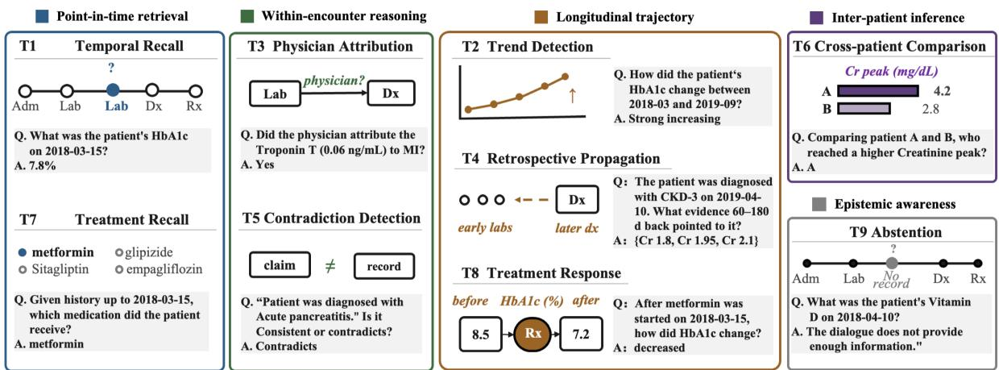  
Figure 1: ClinTraceBench task taxonomy. The nine tasks (T1–T9) are grouped by five cognitive operations: pointin-time retrieval (T1, T7), within-encounter reasoning (T3, T5), longitudinal trajectory (T2, T4, T8), inter-patient comparison (T6), and epistemic awareness (T9). Each card shows the task identifier, a schematic of the source anchor, and one example question (Q) with its deterministic gold answer (A). Per-task question counts are broken out in Table 1.

## 3 Benchmark design

Figure 1 shows the T1–T9 task taxonomy organized by the cognitive operation a clinician performs when reading a longitudinal record; Figure 2 shows the source-verifiable construction pipeline, whose per-stage Output bands report the full-cohort headline counts (400 patients yielding 385 verified dialogues, 6,271 evaluation questions, 200,672 predictions) and per-stage validation gates.

Cohort. We sample 400 MIMIC-IV (hospitaltable) patients, balanced across four target diseases (diabetes, hypertension, CKD, CAD; 100 each) and stratified within each disease into low / medium / high complexity tertiles (33/34/33) by event, admission, span, and medication counts. Inclusion requires ≥ 2 admissions > 7 days apart, ≥ 5 labs, ≥ 2 prescriptions, and ≥ 2 ICD codes in the index disease; sampling is deterministic. 15 patients fail dialogue invariants during synthesis and are dropped, yielding 385 verified dialogues. Lab extraction uses a fixed 18-lab panel with canonical units and clinical-priority deduplication (full schema in Appendix). Each record is transformed into a multi-visit patient–clinician dialogue, preserving structured fields (dates, lab values, ICD / procedure codes, medications) inside narrative turns. Consistent with prior evidence that frontier LLMs encode clinical knowledge (Singhal et al., 2023), we use a held-out frontier generator with deterministic templates for structured fields. MIMIC-IV is HIPAA-compliant and we introduce no additional identifiers.

Task layers. The nine tasks make unequal demands on longitudinal reasoning and fall into three layers: preservation / access (T1, T3, T7), which tests whether a representation retains the evidence at all—a prerequisite for cross-visit reasoning rather than an instance of it; integrative (T2, T4, T6, T8), which requires synthesis across visits or patients; and diagnostic / epistemic probes (T5, T9), which characterize contradiction handling and abstention and carry trivial-baseline ceilings. We reserve reasoning claims for the integrative layer and describe T1 / T3 / T7 results as evidence preservation or representation fidelity.

Task suite. The nine tasks are:

• T1 — Numeric lab retrieval. Given a lab name and date, return the value.

• T2 — Trend classification. Direction (increased / decreased / stable) and magnitude across twoto-five visits.

• T3 — Controlled attribution detection. For selected same-encounter finding–problem pairs, the dialogue either contains or omits a physicianattribution sentence of the form “physician noted:

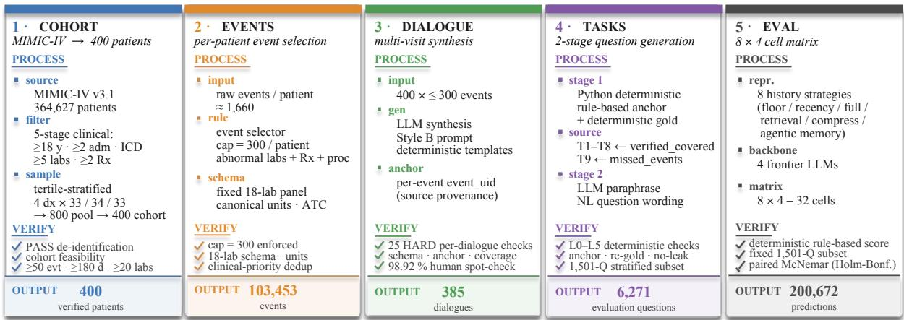  
Figure 2: ClinTraceBench construction pipeline. 1. Cohort: MIMIC-IV 364,627 → 400, 4-disease balanced + complexity-tertile stratified. 2. Events: fixed 18-lab panel, deterministic event IDs for provenance. 3. Dialogue: Sonnet 4.6 synthesis + DeepSeek/Qwen3-Max rescue; verifier v3.2 (10 HARD + 3 SOFT); 385/400 pass. 4. Tasks: Python-generated anchor+gold, Sonnet paraphrases to questions; L0–L4 deterministic + L5 human audit yields the 6,271-question set (98.92% agreement). 5. Evaluation: 8 × 4 = 32 cells, 200,672 predictions. Each panel lists its PROCESS, VERIFY, OUTPUT.

finding is consistent with problem” (balanced yes / no). T3 runs in two settings. (a) Postconstruction (staleness probe): the sentence is injected after each representation is built, so the four upstream-built strategies (Mem0, A-Mem, llm-summary, structured-timeline) cannot recover it by construction—this measures staleness under update, not discarding. (b) Preconstruction equal input (preservation probe, our primary setting): the sentence enters the dialogue before Mem0, A-Mem or the llm-summary is built, so every constructor sees it; it is scored by positive-class recall on the injected positives rather than balanced accuracy (Section 5.5).

• T4 — Retrospective propagation. Given a later diagnosis, list the earlier findings constituting its evidence. Scored as binarized set-F1 on event UIDs (1 iff exact match), so T4 pools identically with accuracy. Cross-visit and longitudinal.

• T5 — Controlled contradiction detection (exploratory). Does the chart contain a controlled self-contradictory statement? Contradictsskewed by construction (455 / 40), giving a trivial majority baseline of 0.919 that no cell beats; reported only for relative ordering.

• T6 — Cross-patient comparison. Three subtypes T6a / T6b / T6c (number of diagnoses, max lab value, delta value).

• T7 — Treatment fact recall. Four-option clinical-management question grounded in documented treatment events; pool split between medication and procedure subtypes to avoid within-

task class bias.

• T8 — Observed treatment response (exploratory). Did a lab increase, decrease, or stay similar after a documented treatment event? Exploratory: concurrent-medication annotations were not retained, so T8 tracks post-treatment lab change, not causal response.

• T9 — Abstention. All gold answers are “insufficient information”; T9 accuracy equals the abstention rate, with over-answer rate = 1 − abstention. A trivial always-abstain classifier scores 100% by construction, so T9 is used as a relative ordering, not an absolute benchmark.

Evaluation set. The L0–L4 + L5 pipeline yields a 6,271-question stratified set (T1 = 1500, T2 = 889, T3 = 600, T4 = 53, T5 = 495, T6 = 700, T7 = 400, T8 = 134, T9 = 1500), fixed across all 32 cells to support paired McNemar tests. At p = 0.5, the pooled Wilson 95% CI is ±0.6 pp; per-task CIs range from ±1.3 pp (T1, T9) to ±9 pp (T4); per-task minimum-detectable effects span 5.1–27.2 pp, leaving T8 (17.1 pp) weakly powered and T4 (27.2 pp) under-powered (Appendix G). Pairwise headline comparisons use Holm–Bonferroni at α = 0.05 (m = 12); all 12 remain significant after correction.

Headline metric. We report pooled accuracy (over all 6,271 questions) and macro accuracy (mean of the nine per-task accuracies). Because pertask sizes are unbalanced (nT1 = nT9 = 1500 vs. nT4 = 53), pooled accuracy is T1/T9-dominated; macro accuracy and the per-task surface (Table 1)

should be consulted for representation comparisons that should not be task-mix-weighted.

## 4 History representation strategies and backbones

History representation strategies. Eight strategies span the principal context-access choices, grouped into six families:

• Floor. no-context-blind — the model sees only the question.

• Recency. last-visit-only — only the most recent encounter.

• Full. full-context — entire multi-visit dialogue fed verbatim; upper bound for context coverage.

• Retrieval. dense-retrieval — BGE-M3 chunk embeddings per patient, top-K=5, the chunk unit being one complete clinical visit. Reranking and hybrid retrieval are not evaluated; a $K \in \{ 3 , 5 , 1 0 \}$ ablation shows no consistent gain from larger K (Appendix G).

• Compression. structured-timeline (perencounter table) and llm-summary (single 500-token DeepSeek summary; doubling the budget to 1,000 tokens does not remove the aggregation tax, Appendix G).

• Agentic memory. Mem0 (extracted facts, DeepSeek-prepared, top-K=5) and A-Mem (Zettelkasten-style atomic notes, DeepSeekprepared).

Backbones. Inference is routed through OpenRouter: DeepSeek-V3 (deepseek-chat-v3.1, 64k), GPT-4o-mini (gpt-4o-mini, 128k), Claude Haiku 4.5 (claude-haiku-4.5, 200k), and Claude Sonnet 4.6 (claude-sonnet-4.6, 200k). Promptprefix caching is enabled across all backbones (90.7 M cache-read tokens, a 17.1% cache-read hit rate); output-token caps are 120 for T8 and 80 for T9. Provider caching settings, T8 / T9 output-token caps, and the T9 abstention parser are in Appendix D.

Memory prep model. Both agentic-memory strategies extract artifacts (facts or atomic notes) from the dialogue once before any question is asked. We hold the prep model fixed at DeepSeek-V3 across all four answering backbones, isolating answering-side use of memory from constructionside extraction. A consequence: non-DeepSeek Mem0 and A-Mem cells run a heterogeneous pipeline (DeepSeek-extracted artifacts answered by GPT-4o-mini / Haiku / Sonnet); we discuss the SP2 impact in §Limitations.

## 5 Results

## 5.1 Main accuracy

Table 1 reports the full strategy-×-backbone-×- task cube; the three right-margin columns give pooled, macro, and $\Delta _ { \mathrm { b l i n d } }$ (macro lift over the same-backbone blind). full-context is best on every backbone (pooled 67.2 / 63.0 / 70.6 / 69.8 for DeepSeek / GPT-4o-mini / Haiku / Sonnet). denseretrieval follows on every backbone (60.4–69.7), within 1–4 pp offull-context—BGE-M3 with K=5 captures most but not all of whatfull-context provides. structured-timeline sits third (58.4–59.6) and is strikingly backbone-invariant (±0.6 pp). Mem0 and A-Mem cluster at 50.8–55.9; llm-summary and last-visit-only trail at 41.6–49.5. Macro accuracy preserves the same ordering as pooled. The pertask surface exposes the difficulty structure: even under full-context, T2 / T4 / T6 / T8 / T9 remain hard while T1 / T3 / T5 / T7 are tractable; compressed strategies show the T3 constant-No band of 50.0 cells under post-construction injection (Section 5.5) and the aggregation tax on T2 / T6 / T8.

Three checks show this ordering is not an artifact of task mix, scoring metric, or prep model (Appendix G). It survives recomputing macro accuracy without T5 / T8 / T9 and without the T3 probe. Under macro-F1,full-context, dense-retrieval and structured-timeline stay above the compressed strategies on T5 (0.695 / 0.736 / 0.656 vs. a 0.478 majority baseline) and structured-timeline leads on T8 (0.523 vs. 0.247), so the skewed tasks do separate representations. And rebuilding Mem0 / A-Mem with each answering backbone gives six matched cells, none better than DeepSeek-prepared (∆ −0.045 to −0.244).

Table 2 decomposes the context lift (vs. samebackbone blind) for three regimes (full-context, dense-retrieval, and the agentic-memory mean of Mem0 and A-Mem); blue shades positive lift, red the rare cells where context hurts.

## 5.2 SP1: The aggregation bottleneck

We index findings along two complementary axes: SP1 (task × strategy, this subsection) and SP2 (backbone × strategy, Section 5.3). The two are entangled—GPT-4o-mini’s −7.8 pp on T2 with summary memory is both an SP1 observation (T2 demands aggregation; summaries destroy it) and an SP2 one (GPT-4o-mini has the narrowest blindto-full gap).

Compressed representations lose to full-context because preprocessing discards signal needed at answer time. The penalty is sharpest on multi-value aggregation—T2 (trend across visits), T6b / T6c (max and delta across patients), and exploratory T8. On T8, full-context reaches 0.269–0.470 across backbones while Mem0, A-Mem, and llm-summary fall to 0.291–0.373, 0.291–0.373, and 0.194–0.254 respectively. T7 makes the contrast cleanest by rewarding single-fact recall over aggregation: fullcontext reaches 0.942–0.965 (DeepSeek / Haiku / Sonnet), while Mem0 drops to 0.535–0.733 and llm-summary to 0.349–0.512. Figure 3 visualizes the T2 / T6 bottleneck. The mechanism is structural: agentic-memory representations never store per-visit value pairs, and a 500-token llmsummary cannot encode a multi-visit trajectory. Dense retrieval mitigates this—original text remains addressable—but still fails when aggregation crosses non-contiguous chunks.

<table><tr><td></td><td colspan="5">blind</td><td colspan="4">last-vis</td><td colspan="2">full</td><td colspan="4">dense</td><td colspan="4">struct.</td><td colspan="4">summ.</td><td colspan="4">Mem0</td><td colspan="4">A-MEM</td></tr><tr><td>Task</td><td>DS</td><td>GPT</td><td></td><td>Hk Sn</td><td>DS</td><td>GPT</td><td>Hk</td><td>Sn</td><td>DS</td><td>GPT</td><td>Hk Sn</td><td>DS</td><td>GPT</td><td></td><td>Hk</td><td>Sn</td><td>DS</td><td>GPT</td><td>Hk</td><td>Sn</td><td>DS</td><td>GPT</td><td>Hk Sn</td><td>DS</td><td>GPT</td><td>Hk</td><td>Sn</td><td>DS</td><td>GPT</td><td></td><td>Hk Sn</td></tr><tr><td>T1</td><td>0</td><td>0</td><td>1</td><td>0</td><td>16</td><td>15</td><td></td><td>12</td><td>81</td><td>78</td><td>81</td><td>84 80</td><td>74</td><td></td><td>78</td><td>79</td><td>89</td><td>89</td><td>92</td><td>92</td><td>36</td><td>36</td><td>35 36</td><td>52</td><td>52</td><td></td><td>51 49</td><td>49</td><td></td><td>42</td><td>43 49</td></tr><tr><td>T2</td><td>17</td><td>33</td><td>0</td><td>30</td><td>33</td><td>35</td><td>13 18</td><td>35</td><td>38</td><td>26</td><td>35 47</td><td>35</td><td>27</td><td>43</td><td>43</td><td>30</td><td></td><td>21</td><td>29</td><td>41 26</td><td>33</td><td>32</td><td>34</td><td>33</td><td>30</td><td>35</td><td>39</td><td>33</td><td>32</td><td>37</td><td>38</td></tr><tr><td>T3</td><td>50</td><td>49</td><td></td><td>50 50</td><td>56</td><td>54</td><td>55</td><td>51</td><td>94</td><td>93</td><td>87 89</td><td>83</td><td>85</td><td></td><td>87 77</td><td>51</td><td></td><td>51</td><td>50</td><td>50 50</td><td>49</td><td>50</td><td>50</td><td>49</td><td>48</td><td>50</td><td>50</td><td>50</td><td>48</td><td>48</td><td>50</td></tr><tr><td>T4</td><td>13</td><td>8</td><td>19</td><td>11</td><td>6</td><td>11</td><td>17</td><td>11</td><td>23</td><td>28</td><td>19 25</td><td>21</td><td>23</td><td>15</td><td>6</td><td>6</td><td>21</td><td></td><td>25</td><td>17 15</td><td>17</td><td>19</td><td>11</td><td>4</td><td>13</td><td>9</td><td>15</td><td>8</td><td>11</td><td>9</td><td>13</td></tr><tr><td>T5</td><td>25</td><td>39</td><td>17</td><td>38</td><td>79</td><td>58</td><td>37</td><td>64</td><td>86</td><td>90</td><td>85 84</td><td>87</td><td>89</td><td></td><td>86 84</td><td>75</td><td></td><td>78</td><td>87</td><td>86 83</td><td>67</td><td>64</td><td>63</td><td>80</td><td>73</td><td>72</td><td>75</td><td>78</td><td>69</td><td>74</td><td>78</td></tr><tr><td>T6</td><td>36</td><td>31</td><td>0</td><td>10</td><td>42</td><td>47</td><td>47</td><td>42</td><td>54</td><td>50</td><td>51 52</td><td>47</td><td>39</td><td></td><td>44 46</td><td>61</td><td></td><td>53</td><td>52</td><td>56 44</td><td>39</td><td>42</td><td>42</td><td>46</td><td>42</td><td>45</td><td>43</td><td>50</td><td>46</td><td>44</td><td>48</td></tr><tr><td>T7</td><td>26</td><td>24</td><td>1</td><td>20</td><td>36</td><td>30</td><td>14</td><td>37</td><td>94</td><td>87</td><td>97 95</td><td>90</td><td>86</td><td></td><td>94</td><td>93 64</td><td></td><td>62</td><td>51</td><td>69 51</td><td>48</td><td>35</td><td>45</td><td>73</td><td>64</td><td>54</td><td>66</td><td>65</td><td>62</td><td>44</td><td>62</td></tr><tr><td>T8</td><td>23</td><td>25</td><td>17</td><td>26</td><td>31</td><td>35</td><td>18</td><td>23</td><td>44</td><td>27</td><td>46 47</td><td>39</td><td>28</td><td></td><td>40</td><td>40 45</td><td></td><td>40</td><td>54</td><td>49 23</td><td>25</td><td>19</td><td>22</td><td>37</td><td>36</td><td>31</td><td>30</td><td>37</td><td>34</td><td>29</td><td>37</td></tr><tr><td>T9</td><td>36</td><td>69</td><td>0</td><td>20</td><td>88</td><td>90</td><td>99</td><td>93</td><td>70</td><td>70</td><td>91 75</td><td>77</td><td>71</td><td></td><td>92 79</td><td>56</td><td></td><td>66</td><td>48</td><td>44 80</td><td>78</td><td>94</td><td>74</td><td>81</td><td>82</td><td>94</td><td>73</td><td>82</td><td>78</td><td>97</td><td>73</td></tr><tr><td>Pool.</td><td>24</td><td>33</td><td>8</td><td>20</td><td>47</td><td>46</td><td>42</td><td>45</td><td>67</td><td>63</td><td>71 70</td><td>66</td><td>60</td><td></td><td>70 66</td><td>59</td><td>59</td><td></td><td>58 60</td><td>48</td><td>47</td><td>50</td><td>46</td><td>55</td><td>54</td><td>56</td><td>52</td><td>55</td><td>51</td><td>54</td><td>53</td></tr><tr><td>Macro</td><td>25</td><td>31</td><td>12</td><td>23</td><td>43</td><td>42</td><td>35</td><td>41</td><td>65</td><td>61</td><td>66 67</td><td>62</td><td>58</td><td>64</td><td>61</td><td>53</td><td>53</td><td></td><td>54 56</td><td>45</td><td>44</td><td>43</td><td>42</td><td>51</td><td>49</td><td>49</td><td>49</td><td>50</td><td>47</td><td>47</td><td>50</td></tr><tr><td>∆blind</td><td></td><td></td><td></td><td></td><td>18</td><td>11</td><td>24</td><td>18</td><td>40</td><td>30</td><td>54 44</td><td>37</td><td>27</td><td>53</td><td>38</td><td>28</td><td>22</td><td></td><td>43 33</td><td>20</td><td>13</td><td>32</td><td>19</td><td>26</td><td>18</td><td>37</td><td>26</td><td>25</td><td>16</td><td>36</td><td>27</td></tr></table>

Table 1: ClinTraceBench main results: 8 strategies × 4 backbones × 9 tasks. Per-cell accuracy (%) for every (strategy, backbone, task) triple. Bottom rows: Pool. = accuracy pooled across tasks weighted by subset size; Macro = equal-task-weight mean; $\Delta _ { \mathrm { b l i n d } } = \mathrm { M a c r o }$ minus the same-backbone no-context-blind Macro (pp). Task layers (Section 3): T1, T3, T7 are preservation/access tasks; T2, T4, T6, T8 are integrative tasks requiring cross-visit or cross-patient synthesis; T5 and T9 are diagnostic/epistemic probes with trivial-baseline ceilings. Backbones: DS = DeepSeek-V3, GPT = GPT-4o-mini, Hk = Claude Haiku 4.5, Sn = Claude Sonnet 4.6. Strategies: blind = no-context-blind; last-vis = last-visit-only; full = full-context; dense = dense-retrieval; struct. = structured-timeline; summ. = llm-summary. Blue heat: accuracy $( < 3 0 3 0 { - } 4 5 4 5 { - } 6 0 6 0 { - } 7 0 \geq 7 0 )$ . Green heat $( \Delta _ { \mathrm { b l i n d } }$ row only): ( 10–20 20–40 ≥40 )

<table><tr><td rowspan=1 colspan=1>StrategyBB</td><td rowspan=1 colspan=10>T1T2T3T4T5T6T7T8T9Macro</td></tr><tr><td rowspan=1 colspan=1>DS</td><td rowspan=1 colspan=1>+81</td><td rowspan=1 colspan=1>+20</td><td rowspan=1 colspan=1>+44</td><td rowspan=1 colspan=1>+9</td><td rowspan=1 colspan=1>+61</td><td rowspan=1 colspan=1>+19</td><td rowspan=1 colspan=1>+69</td><td rowspan=1 colspan=1>+21</td><td rowspan=1 colspan=1>+35</td><td rowspan=1 colspan=1>+40</td></tr><tr><td rowspan=2 colspan=1>GPTfullHk</td><td rowspan=1 colspan=1>+78</td><td rowspan=1 colspan=1>-8</td><td rowspan=1 colspan=1>+44</td><td rowspan=1 colspan=1>+21</td><td rowspan=1 colspan=1>+51</td><td rowspan=1 colspan=1>+19</td><td rowspan=1 colspan=1>+63</td><td rowspan=1 colspan=1>+2</td><td rowspan=1 colspan=1>+1</td><td rowspan=1 colspan=1>+30</td></tr><tr><td rowspan=1 colspan=1>+81</td><td rowspan=1 colspan=1>+35</td><td rowspan=1 colspan=1>+37</td><td rowspan=1 colspan=1>0</td><td rowspan=1 colspan=1>+68</td><td rowspan=1 colspan=1>+51</td><td rowspan=1 colspan=1>+95</td><td rowspan=1 colspan=1>+29</td><td rowspan=1 colspan=1>+91</td><td rowspan=1 colspan=1>+54</td></tr><tr><td rowspan=1 colspan=1>Sn</td><td rowspan=1 colspan=1>+84</td><td rowspan=1 colspan=1>+17</td><td rowspan=1 colspan=1>+39</td><td rowspan=1 colspan=1>+13</td><td rowspan=1 colspan=1>+46</td><td rowspan=1 colspan=1>+42</td><td rowspan=1 colspan=1>+76</td><td rowspan=1 colspan=1>+21</td><td rowspan=1 colspan=1>+54</td><td rowspan=1 colspan=1>+44</td></tr><tr><td rowspan=2 colspan=1>DS</td><td></td><td></td><td></td><td></td><td></td><td></td><td></td><td></td><td></td><td></td></tr><tr><td rowspan=1 colspan=1>+80</td><td rowspan=1 colspan=1>+18</td><td rowspan=1 colspan=1>+33</td><td rowspan=1 colspan=1>+8</td><td rowspan=1 colspan=1>+62</td><td rowspan=1 colspan=1>+11</td><td rowspan=1 colspan=1>+64</td><td rowspan=1 colspan=1>+16</td><td rowspan=1 colspan=1>+42</td><td rowspan=1 colspan=1>+37</td></tr><tr><td rowspan=2 colspan=1>GPTdenseHk</td><td rowspan=1 colspan=1>+74</td><td rowspan=1 colspan=1>-7</td><td rowspan=1 colspan=1>+35</td><td rowspan=1 colspan=1>+15</td><td rowspan=1 colspan=1>+50</td><td rowspan=1 colspan=1>+8</td><td rowspan=1 colspan=1>+62</td><td rowspan=1 colspan=1>+2</td><td rowspan=1 colspan=1>+3</td><td rowspan=1 colspan=1>+27</td></tr><tr><td rowspan=1 colspan=1>+77</td><td rowspan=1 colspan=1>+43</td><td rowspan=1 colspan=1>+37</td><td rowspan=1 colspan=1>-4</td><td rowspan=1 colspan=1>+69</td><td rowspan=1 colspan=1>+44</td><td rowspan=1 colspan=1>+93</td><td rowspan=1 colspan=1>+23</td><td rowspan=1 colspan=1>+92</td><td rowspan=1 colspan=1>+53</td></tr><tr><td rowspan=1 colspan=1>Sn</td><td rowspan=1 colspan=1>+78</td><td rowspan=1 colspan=1>+13</td><td rowspan=1 colspan=1>+27</td><td rowspan=1 colspan=1>-6</td><td rowspan=1 colspan=1>+46</td><td rowspan=1 colspan=1>+36</td><td rowspan=1 colspan=1>+73</td><td rowspan=1 colspan=1>+13</td><td rowspan=1 colspan=1>+59</td><td rowspan=1 colspan=1>+38</td></tr><tr><td rowspan=2 colspan=1>DS</td><td></td><td></td><td></td><td></td><td></td><td></td><td></td><td></td><td></td><td></td></tr><tr><td rowspan=1 colspan=1>+50</td><td rowspan=1 colspan=1>+16</td><td rowspan=1 colspan=1>0</td><td rowspan=1 colspan=1>-8</td><td rowspan=1 colspan=1>+54</td><td rowspan=1 colspan=1>+12</td><td rowspan=1 colspan=1>+44</td><td rowspan=1 colspan=1>+14</td><td rowspan=1 colspan=1>+46</td><td rowspan=1 colspan=1>+25</td></tr><tr><td rowspan=1 colspan=1>mem   GPT</td><td rowspan=1 colspan=1>+47</td><td rowspan=1 colspan=1>-2</td><td rowspan=1 colspan=1>-2</td><td rowspan=1 colspan=1>+5</td><td rowspan=1 colspan=1>+32</td><td rowspan=1 colspan=1>+13</td><td rowspan=1 colspan=1>+38</td><td rowspan=1 colspan=1>+9</td><td rowspan=1 colspan=1>+12</td><td rowspan=1 colspan=1>+17</td></tr><tr><td rowspan=1 colspan=1>avg   Hk</td><td rowspan=1 colspan=1>+46</td><td rowspan=1 colspan=1>+36</td><td rowspan=1 colspan=1>-1</td><td rowspan=1 colspan=1>-9</td><td rowspan=1 colspan=1>+56</td><td rowspan=1 colspan=1>+45</td><td rowspan=1 colspan=1>+48</td><td rowspan=1 colspan=1>+13</td><td rowspan=1 colspan=1>+95</td><td rowspan=1 colspan=1>+36</td></tr><tr><td rowspan=1 colspan=1>Sn</td><td rowspan=1 colspan=1>+48</td><td rowspan=1 colspan=1>+8</td><td rowspan=1 colspan=1>0</td><td rowspan=1 colspan=1>+3</td><td rowspan=1 colspan=1>+38</td><td rowspan=1 colspan=1>+35</td><td rowspan=1 colspan=1>+44</td><td rowspan=1 colspan=1>+8</td><td rowspan=1 colspan=1>+53</td><td rowspan=1 colspan=1>+26</td></tr></table>

Table 2: Per-cell context-lift over no-context-blind. Accuracy differences (pp) between three context regimes (full-context, dense-retrieval, mem-avg = mean of Mem0 and A-MEM) and the same-backbone, same-task no-context-blind baseline. Macro = mean over T1–T9. Diverging color encodes lift $\left( \leq - 5 \right| - 5$ to 0 0–5 5–15 15–30 30–60 ≥60 ) See Appendix I for heatmap visualization.

## 5.3 SP2: Backbone-specific extraction profiles

The blind-to-full gap diagnoses how much of the answer each backbone can extract from the chart when given full access:

• Haiku: 0.079 → 0.706, gap +62.7 pp (largest).

• Sonnet: 0.203 → 0.698, gap +49.6 pp.

• DeepSeek-V3: 0.236 → 0.672, gap +43.6 pp.

• GPT-4o-mini: 0.332 → 0.630, gap +29.8 pp (smallest).

Haiku exhibits the cleanest context utilization: lowest blind (0.079), tied top under full-context, largest 62.7 pp lift. Sonnet and DeepSeek-V3 occupy the middle. GPT-4o-mini is the outlier: highest blind (0.332), lowest full-context (0.630), narrowest lift—a pattern consistent with a hallucination floor that subsequent SP3 evidence on T9 reinforces. “How much a model uses given context” therefore varies more across backbones than overall accuracy suggests, and backbone choice cannot be reduced to a single capacity dimension.

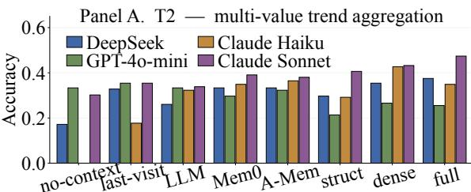

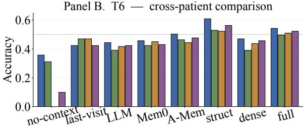  
Figure 3: Accuracy on two longitudinal-reasoning bottlenecks, grouped by strategy (x-axis) and backbone (color). (A) T2 trend aggregation (889 q/cell). (B) T6 cross-patient comparison (700 q/cell, subtypes T6a/T6b/T6c). Dotted line in Panel B = 0.5 reference (suppressed in A where all bars sit below 0.5). Missing Haiku no-context and Sonnet’s near-zero on the same column are parser-strictness artifacts on verbose abstentions. Evenfull-context stays well below ceiling: T2/T6 are reasoning bottlenecks distinct from point-fact recall.

## 5.4 SP3: Non-monotonic abstention under longer context

T9 probes abstention over unstated facts; all 1,500 gold answers are “insufficient information”, so accuracy equals the abstention rate and over-answer rate = 1 − abstention. Per-cell:

• no-context-blind: abstention 0.355 / 0.685 / 0.000 / 0.204 (DeepSeek / GPT-4o-mini / Haiku / Sonnet); over-answer 0.645 / 0.315 / 1.000 / 0.796.

• full-context: abstention 0.701 / 0.698 / 0.907 / 0.747; over-answer 0.299 / 0.302 / 0.093 / 0.253.

• last-visit-only: abstention 0.883 / 0.895 / 0.994 / 0.926; over-answer 0.117 / 0.105 / 0.006 / 0.074. Two findings. First,full-context beats blind on every backbone—any patient context lifts abstention. Second, abstention is non-monotonic: last-visitonly dominates full-context on every backbone by 5–30 pp (Haiku 0.994 vs. 0.907; Sonnet 0.926 vs. 0.747; DeepSeek 0.883 vs. 0.701; GPT-4o-mini 0.895 vs. 0.698). Adding dialogue beyond the mostrecent encounter actively degrades abstention. Figure 4 shows the over-answer fraction climbing from last-visit-only through full-context to structuredtimeline. GPT-4o-mini’s anomalous blind T9 of

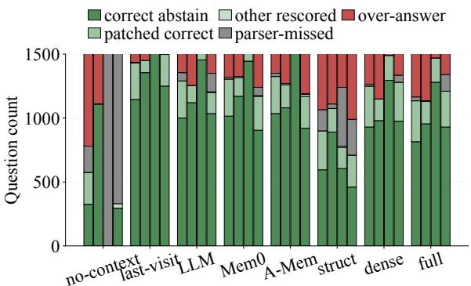  
Figure 4: T9 per-cell decomposition into five outcomes: correct abstain (refused as expected), patched correct / other rescored (post-hoc parser recovered abstention via synonyms), parser-missed (verbose abstention not captured), over-answer (confident hallucination); 1500 q/cell, bars are DeepSeek/GPT-4o-mini/Haiku/Sonnet left to right within each strategy cluster. Abstention rate = correct + patched + parser-missed. Over-answer grows from last-visit-only to full-context and structuredtimeline: abstention is non-monotonic in context length.

0.685 (vs. its pooled-blind 0.332) reflects a default abstention prior under empty context—a backbonespecific blind hedging. Per the trivial-baseline caveat (§3), T9 is a relative ordering, not an absolute measure. The last-visit-only advantage is significant on paired data (0.924 vs. 0.763 pooled; $\Delta = 0 . 1 6 1$ , McNemar $p = 1 . 7 \times 1 0 ^ { - 3 8 } )$ and survives parser strictness: a lenient parser leaves it ahead (0.930 vs. 0.838), narrowing the gap to 0.092 without changing direction. Of the 307full-context non-abstentions, fabricated values make up ≈ 54% of genuine over-answers once parser-missed verbose abstentions are discounted—plausible-butunsupported detail, not cross-visit confusion, is the dominant mode (Appendix G).

## 5.5 SP4: Controlled preservation probe: compressed representations drop the finding–diagnosis relation even under equal input

T3 isolates preprocessing-induced signal loss. Each “yes” instance carries one physician-attribution sentence linking a same-encounter finding to its problem; “no” instances are unmodified. We report the equal-input setting first, since it is the one in which every representation receives the same text.

Equal input (preservation probe). On a stratified 20-patient subset of the cohort—47 T3 questions, 19 injected-positive and 28 negative—the attribution sentence is inserted before Mem0, A-Mem or the 500-token llm-summary is constructed, so every constructor sees it. Table 3 gives positive-class recall on the 19 positives: at best 1/19 (5.3%) for Mem0 and A-Mem, and 0/19 for every llm-summary cell. Rebuilding the memory with the answering backbone rather than DeepSeek-V3 changes nothing (lower block), so neither injection order nor prep-model mismatch explains it.

<table><tr><td></td><td>DS</td><td>GPT</td><td>Hk</td><td>Sn</td></tr><tr><td colspan="5">DeepSeek-V3-prepared</td></tr><tr><td>MemO</td><td>0.053</td><td>0.053</td><td>0.000</td><td>0.000</td></tr><tr><td>A-Mem llm-summary</td><td>0.053 0.000</td><td>0.053 0.000</td><td>0.000</td><td>0.000</td></tr><tr><td></td><td></td><td></td><td>0.000</td><td>0.000</td></tr><tr><td colspan="5">Backbone-matched prep</td></tr><tr><td>MemO</td><td></td><td>0.053</td><td>0.000</td><td>0.000</td></tr><tr><td>A-Mem</td><td></td><td>0.053</td><td>0.000</td><td>0.000</td></tr></table>

Table 3: SP4 equal-input preservation probe: positiveclass recall on the 19 injected-positive T3 instances (stratified 20-patient subset), with the attribution sentence present before the representation is built. DS / GPT / Hk / Sn = DeepSeek-V3 / GPT-4o-mini / Haiku 4.5 / Sonnet 4.6; for DS the DeepSeek-prepared cell is already backbone-matched. structured-timeline was not run in this setting (Scope).

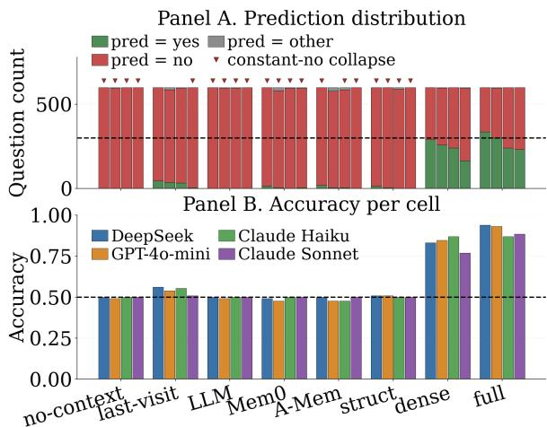  
Figure 5: T3 constant-No collapse under postconstruction injection (update/staleness probe). (A) Per-cell yes/no/other predictions (600 q/cell); dashed line at 300 = balanced gold; red triangles flag cells with pred = no ≥ 575/600. (B) Per-cell accuracy; dashed 0.5 = constant-No floor. The four upstream-built strategies flatten to 0.50 across all 16 cells. Primary preservation evidence is the equal-input probe (Table 3).

Artifact inspection shows what is lost: the underlying lab fact is usually retained, the explicit finding–diagnosis attribution usually omitted. The failure is relation-level, not access-level— compression keeps the facts and drops the link.

Post-construction injection (update/staleness probe). Injecting the sentence after construction leaves full-context (0.869–0.938), last-visit-only and dense-retrieval (0.769–0.869) intact, while all four upstream-built strategies answer “No” on all 600 T3 questions in all 16 cells, giving exactly 0.500 on the balanced gold—the constant-No floor of Figure 5. A derived representation cannot contain a sentence introduced after it was built, so this measures staleness under update, not discarding; we report it as a secondary probe.

Neither setting depends on backbone capacity: GPT-4o-mini, the weakest backbone overall, still reaches 0.931 post-construction under full context, and under equal input the strongest backbones recover no more of the signal than the weakest.

Scope. The equal-input conclusion covers Mem0, A-Mem and llm-summary only; structuredtimeline has not been run under pre-construction injection and enters only under the post-construction setting. Neither setting is an apples-to-apples ranking across all eight strategies, and what the probe measures is signal preservation, not unsupervised linkage reasoning.

## 5.6 Retrieval, cost, and Pareto efficiency

Dense retrieval matches full-context accuracy at a fraction of the cost. BGE-M3 hit rates over 4,771 retrieval-eligible questions: hit@1 = 0.595, hit@3 = 0.852, hit@5 = 0.926, hit@10 = 0.979 (Appendix C). Figure 6 places every cell in (cost, accuracy) space and traces the 11-cell Pareto frontier. Two consequences. First, full-context × Sonnet (\$106.21, 0.698) is dominated by full-context × Haiku (\$25.76, 0.706), inverting the “biggest backbone wins” heuristic. Second, structured-timeline never reaches the frontier despite competitive accuracy (0.58–0.60)—the structured tokens fail to compress enough to offset per-call cost.

## 5.7 Illustrative failure modes

Aggregate accuracy collapses categorically distinct errors into a single number. Four case studies in Appendix H (Figure 25) make the distinction concrete: T3 constant-No collapse (Case 1), T9 overanswering (Case 2), Haiku-specific T2 trend failure (Case 3), and T6 cross-patient confusion (Case 4). The underlying errors differ in kind—conflating them obscures the diagnostic signal that each representation strategy fails in a characteristic way.

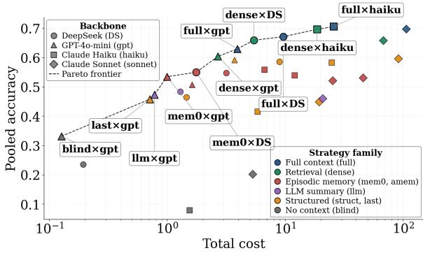  
Figure 6: Cost vs. pooled accuracy across 32 cells. Cost: USD per 6,271-question cell (log scale). Color = strategy family; shape = backbone. Dashed curve: Pareto frontier (11/32). Haiku dominates Sonnet on full-context; structured-timeline is off-frontier on cost despite competitive accuracy.

## 6 Discussion

What compact representations get right. Dense retrieval lands within 1–4 pp offull-context pooled and within 0–9 pp on every task except T4 (smalln); when answers are chunk-localizable, BGE-M3 surfaces them reliably. Structured timelines beat full-context on numeric retrieval (T1 0.886–0.923) by reducing noise around the cell. Mem0 and A-Mem hold their own on T4 and T9 where compression incidentally aligns with gold density.

What compact representations get wrong. (i) Aggregation (T2/T6b/T6c, exploratory T8): preprocessing discards per-visit value pairs needed for trends/deltas. (ii) Relation preservation (T3): even with the attribution sentence present at construction time, Mem0, A-Mem and llm-summary recover 0– 5.3% of injected positives while typically keeping the underlying lab fact—the loss is of the finding– diagnosis relation, not of access. Post-construction, those strategies plus structured-timeline sit at the constant-No floor, showing additionally that derived artifacts go stale. (iii) Contradiction (T5): trivial always-contradicts scores 91.9%; no cell beats it. (iv) Non-monotonic abstention (T9): fullcontext helps over blind but degrades vs. last-visitonly on every backbone, and trivial always-abstain scores 100% by construction.

What the dialogue substrate contributes. In a small full-context pilot the model received either the dialogue or a bare structured-event table over the same events. The table keeps the events but does not explicitly represent the narrative relations T3, T4 and T5 target, so those tasks cannot be evaluated equivalently from it (Appendix G).

Cost flips “biggest backbone wins”. On the Pareto frontier (Figure 6), Haiku not Sonnet sits on it under full-context: cheaper (\$25.76 vs. \$106.21) and slightly more accurate (0.706 vs. 0.698). Memory-equipped clinical agents should be benchmarked on the cost–quality frontier.

Memory size ̸= accuracy. Total Mem0 character budget is uncorrelated with patient-level T1 Mem0 accuracy (Pearson $r ~ = ~ - 0 . 1 2 9$ ; Appendix 15). Architectural choice (atomic facts vs. visit-level notes vs. prose) matters more than budget; more facts can introduce retrieval noise.

Future work. Multi-EHR replication, longer horizons, dynamic memory updates, evaluation on real longitudinal notes and conversations, and extending the equal-input probe to structuredtimeline and the full cohort. A future release will rebalance T5 and enlarge T8 to remove the trivialclass ceilings.

## 7 Conclusion

ClinTraceBench provides the first source-verifiable benchmark for longitudinal clinical reasoning over EHR-derived dialogues: 9 tasks, 385 verified dialogues, 8 history representation strategies, 4 frontier backbones, 6,271 questions, and 200,672 predictions. Three high-level findings emerge. First, full context remains the accuracy upper bound, and the gap to compressed representations is driven not by retrieval failure but by a preprocessing tax on relational signal: when the finding–diagnosis attribution sentence is present in the input before the representation is built, compressed strategies still typically retain the underlying fact while dropping the relation, and no scaling of backbone capacity recovers it. Second, abstention discipline does not improve monotonically with context length, complicating the case for feeding longer charts. Third, the cost–quality Pareto frontier inverts the “biggest backbone wins” heuristic, with smaller backbones dominating under full-context.

## Limitations

Synthetic dialogues. The 385 dialogues are LLMgenerated from de-identified structured MIMIC-IV fields. What the 98.92% audit and the deterministic verifier establish is source fidelity and gold correctness, not conversational realism: key labs, admissions and discharges, procedures, and diagnoses are covered at ≥ 98%; hallucination checks on values, reference ranges, ICD codes, and drugs pass at 99.8–100%; independent gold recomputation mismatches on < 0.5% of items. Patients are also stratified by source-record complexity, but none of this shows that synthetic dialogues reproduce the ambiguity, redundancy, temporal inconsistency, and missing documentation of real clinical text. All eight strategies are compared over the same dialogues, so within-benchmark comparisons are supported, but transfer to real clinical conversations is not established and we do not claim it; validating whether the strategy ordering persists on real longitudinal notes and conversations is future work.

Scope. (i) Single EHR source (MIMIC-IV, hospital-wide admissions rather than an ICU-only cohort); evaluation is English-only and generalization to other settings, languages, and pediatric populations is untested. (ii) Single time horizon (385 dialogues); multi-year follow-up and dynamic memory updates are deferred. (iii) T5 is controlled rather than natural-EHR contradiction; T8 measures post-treatment lab change rather than causal efficacy (concurrent-medication annotations were not retained); T9 covers unstated lab and medication facts only. (iv) full-context serves as a coverage upper bound, not a deployment target, given its cost and latency profile.

Residual artifacts. Approximately 1,400 empty API responses (0.7% of 200,672; Appendix E) are retained in headline numbers: excluding them would inflate Sonnet / Haiku full-context by at most +0.2 pp, well below all headline contrasts, and the sensitivity appendix confirms that every SP1–SP4 contrast holds (∆ < 0.5 pp) under either policy. Roughly 13% of Sonnet T8 rows hit the original 120-token cap before we extended it, so residual truncation may persist on a small subset. Longcontext degradation is uniform across backbones (−13 to −14 pp from shortest to longest quartile), but length and disease severity remain entangled.

Agentic-memory prep confound. The headline cube fixes the prep model at DeepSeek-V3, so non-DeepSeek Mem0 / A-Mem cells run a heterogeneous pipeline and SP2’s gap on those cells partly conflates answering- and construction-side effects. We therefore ran six backbone-matched cells (GPT-4o-mini, Haiku, Sonnet × Mem0, A-Mem) on the stratified 20-patient subset: matching prep to the answering backbone did not improve accuracy in any of the six (∆ from −0.045 to −0.244) and left the T3 attribution signal almost entirely lost (≤ 1/19 positives recovered), so the prep model does not explain the weak agentic-memory results. Being confined to that subset, this check corroborates the full-cohort ordering in Table 1 only at that scale.

Task-design limits and planned revisions. Trivial baselines leave T5 / T6 / T8 / T9 not discriminable from majority-class predictors at α = 0.05 in accuracy terms, so T1 / T3 / T4 / T7 carry the cleanest representation signal and the rest serve as supporting probes; macro-F1 recovers usable signal on T5 and T8 (Appendix G). T4’s 53 questions leave it under-powered at a 27.2 pp minimum detectable effect. A future release will rebalance the T5 contradiction classes and enlarge the T8 pool; neither change is part of the present benchmark version.

## Ethics statement

Data access and de-identification. Clin-TraceBench is derived from MIMIC-IV (Johnson et al., 2023), a HIPAA-compliant, de-identified electronic health record dataset released under the PhysioNet Credentialed Health Data License; all authors completed the required CITI training and signed the PhysioNet Data Use Agreement before accessing it. No re-identification was attempted, and the synthetic dialogues are generated from structured fields only (dates, lab values, ICD codes, drugs), so they contain no protected health information.

Scope and intended use. The 385 verified dialogues are LLM-generated doctor–patient conversations synthesized from de-identified structured records; they are not real clinical communications and are not clinically validated. ClinTraceBench evaluates information retrieval and reasoning fidelity over EHR-derived dialogues: it does not measure clinical safety, diagnostic accuracy, treatment appropriateness, or patient outcomes, and must not be used as a proxy for clinical readiness, for clinical decision support, for deployment-oriented model training, or in any patient-facing application.

Release and redistribution. The question set with event-ID provenance and gold answers, all 200,672 predictions, the scoring harness, and the controlled-injection generator are released at https://github.com/HathyHuimin/ ClinTraceBench. The dialogues inherit MIMIC-IV’s redistribution restrictions: their text is not redistributed, and regenerating it requires PhysioNet credentialing and MIMIC-IV access.

## References

Yushi Bai, Xin Lv, Jiajie Zhang, Hongchang Lyu, Jiankai Tang, Zhidian Huang, Zhengxiao Du, Xiao Liu, Aohan Zeng, Lei Hou, Yuxiao Dong, Jie Tang, and Juanzi Li. 2024. LongBench: A bilingual, multitask benchmark for long context understanding. In Proceedings of the 62nd Annual Meeting of the Association for Computational Linguistics (ACL), pages 3119–3137.

Suhana Bedi, Hejie Cui, Miguel Fuentes, Alyssa Unell, Michael Wornow, Juan M. Banda, Nikesh Kotecha, Timothy Keyes, Yifan Mai, et al. 2025. MedHELM: Holistic evaluation of large language models for medical tasks. arXiv preprint arXiv:2505.23802.

Asma Ben Abacha, Wen-wai Yim, Yujuan Fu, Zhaoyi Sun, Meliha Yetisgen, Fei Xia, and Thomas Lin. 2025. MEDEC: A benchmark for medical error detection and correction in clinical notes. In Findings of the Association for Computational Linguistics: ACL 2025, pages 22539–22550.

Jianlv Chen, Shitao Xiao, Peitian Zhang, Kun Luo, Defu Lian, and Zheng Liu. 2024. M3-Embedding: Multilinguality, multi-functionality, multi-granularity text embeddings through self-knowledge distillation. In Findings of the Association for Computational Linguistics: ACL 2024, pages 2318–2335.

Prateek Chhikara, Dev Khant, Saket Aryan, Taranjeet Singh, and Deshraj Yadav. 2025. Mem0: Building production-ready AI agents with scalable long-term memory. arXiv preprint arXiv:2504.19413.

Hejie Cui, Alyssa Unell, Bowen Chen, Jason Alan Fries, Emily Alsentzer, Sanmi Koyejo, and Nigam H. Shah. 2025. TIMER: Temporal instruction modeling and evaluation for longitudinal clinical records. npj Digital Medicine, 8(1):577.

Scott L. Fleming, Alejandro Lozano, William J. Haberkorn, Jenelle A. Jindal, Eduardo P. Reis, Rahul Thapa, Louis Blankemeier, Julian Z. Genkins, Ethan Steinberg, Ashwin Nayak, Birju S. Patel, Chia-Chun Chiang, Alison Callahan, Zepeng Huo, Sergios Gatidis, Scott J. Adams, Oluseyi Fayanju, Shreya J. Shah, Thomas Savage, Ethan Goh, Akshay S. Chaudhari, Nima Aghaeepour, Christopher Sharp, Michael A. Pfeffer, Percy Liang, Jonathan H. Chen, Keith E. Morse, Emma P. Brunskill, Jason A. Fries, and Nigam H. Shah. 2024. MedAlign: A clinician-generated dataset for instruction following with electronic medical records. In Proceedings of the AAAI Conference on Artificial Intelligence, volume 38, pages 22021–22030.

Yanjun Gao, Dmitriy Dligach, Timothy Miller, Samuel Tesch, Ryan Laffin, Matthew M. Churpek, and Majid Afshar. 2023. DR.BENCH: Diagnostic reasoning benchmark for clinical natural language processing. Journal of Biomedical Informatics, 138:104286.

Yuanzhe Hu, Yu Wang, and Julian McAuley. 2025. Evaluating memory in LLM agents via incremental multiturn interactions. arXiv preprint arXiv:2507.05257.

Alistair E. W. Johnson, Lucas Bulgarelli, Lu Shen, Alvin Gayles, Ayad Shammout, Steven Horng, Tom J. Pollard, Sicheng Hao, Benjamin Moody, Brian Gow, Liwei H. Lehman, Leo A. Celi, and Roger G. Mark. 2023. MIMIC-IV, a freely accessible electronic health record dataset. Scientific Data, 10(1):1.

Saurav Kadavath, Tom Conerly, Amanda Askell, Tom Henighan, Dawn Drain, Ethan Perez, Nicholas Schiefer, Zac Hatfield-Dodds, Nova DasSarma, Eli Tran-Johnson, Scott Johnston, Sheer El-Showk, Andy Jones, Nelson Elhage, Tristan Hume, et al. 2022. Language models (mostly) know what they know. arXiv preprint arXiv:2207.05221.

Greg Kamradt. 2023. Needle in a haystack – pressure testing LLMs. https://github.com/ gkamradt/LLMTest\_NeedleInAHaystack. GitHub repository.

Maya Kruse, Shiyue Hu, Nicholas Derby, Yifu Wu, Samantha Stonbraker, Bingsheng Yao, Dakuo Wang, Elizabeth Goldberg, and Yanjun Gao. 2025. Large language models with temporal reasoning for longitudinal clinical summarization and prediction. arXiv preprint arXiv:2501.18724.

Sunjun Kweon, Jiyoun Kim, Heeyoung Kwak, Dongchul Cha, Hangyul Yoon, Kwanghyun Kim, Jeewon Yang, Seunghyun Won, and Edward Choi. 2024. EHRNoteQA: An LLM benchmark for realworld clinical practice using discharge summaries. In Advances in Neural Information Processing Systems (NeurIPS), Datasets and Benchmarks Track, volume 37, pages 124575–124611.

Patrick Lewis, Ethan Perez, Aleksandra Piktus, Fabio Petroni, Vladimir Karpukhin, Naman Goyal, Heinrich Küttler, Mike Lewis, Wen-tau Yih, Tim Rocktäschel, Sebastian Riedel, and Douwe Kiela. 2020. Retrieval-augmented generation for knowledgeintensive NLP tasks. In Advances in Neural Information Processing Systems (NeurIPS), volume 33, pages 9459–9474.

Nelson F. Liu, Kevin Lin, John Hewitt, Ashwin Paranjape, Michele Bevilacqua, Fabio Petroni, and Percy Liang. 2024. Lost in the middle: How language models use long contexts. Transactions of the Association for Computational Linguistics, 12:157– 173.

Mingyu Derek Ma, Chenchen Ye, Yu Yan, Xiaoxuan Wang, Peipei Ping, Timothy S. Chang, and Wei Wang. 2024. CliBench: A multifaceted and multigranular evaluation of large language models for clinical decision making. arXiv preprint arXiv:2406.09923.

Adyasha Maharana, Dong-Ho Lee, Sergey Tulyakov, Mohit Bansal, Francesco Barbieri, and Yuwei Fang. 2024. Evaluating very long-term conversational memory of LLM agents. In Proceedings of the 62nd Annual Meeting of the Association for Computational Linguistics (ACL), pages 13851– 13870.

Charles Packer, Sarah Wooders, Kevin Lin, Vivian Fang, Shishir G. Patil, Ion Stoica, and Joseph E. Gonzalez. 2023. MemGPT: Towards LLMs as operating systems. arXiv preprint arXiv:2310.08560.

Karan Singhal, Shekoofeh Azizi, Tao Tu, S. Sara Mahdavi, Jason Wei, Hyung Won Chung, Nathan Scales, Ajay Tanwani, Heather Cole-Lewis, Stephen Pfohl, Perry Payne, Martin Seneviratne, Paul Gamble, Chris Kelly, Abubakr Babiker, et al. 2023. Large language models encode clinical knowledge. Nature, 620(7972):172–180.

Weiyi Sun, Anna Rumshisky, and Ozlem Uzuner. 2013. Evaluating temporal relations in clinical text: 2012 i2b2 challenge. Journal of the American Medical Informatics Association, 20(5):806–813.

Di Wu, Hongwei Wang, Wenhao Yu, Yuwei Zhang, Kai-Wei Chang, and Dong Yu. 2025. LongMemEval: Benchmarking chat assistants on long-term interactive memory. In International Conference on Learning Representations (ICLR).

Wujiang Xu, Zujie Liang, Kai Mei, Hang Gao, Juntao Tan, and Yongfeng Zhang. 2025. A-MEM: Agentic memory for LLM agents. arXiv preprint arXiv:2502.12110.

Zeyu Zhang, Xiaohe Bo, Chen Ma, Rui Li, Xu Chen, Quanyu Dai, Jieming Zhu, Zhenhua Dong, and Ji-Rong Wen. 2025. A survey on the memory mechanism of large language model based agents. ACM Transactions on Information Systems. ArXiv:2404.13501.

## A Validation gates

Each (anchor, gold) pair passes through five deterministic levels (L0–L4) plus a final human spotcheck (L5) before entering the 6,271-question evaluation set:

• L0 — Schema. JSONL fields and types match the task-specific schema; threshold 0 failure.

• L1 — Anchor source. Anchors for T1–T8 must lie in verified\_covered\_events; T9 anchors must lie in missed\_events; threshold < 1%.

• L2 — Gold recompute. The gold is independently regenerated from the spec and the raw structured fields, and must equal the candidate gold; threshold < 0.5%.

• L3 — No gold leakage. The question text must not contain the gold answer (critical for T2 trend labels and T9 abstention cues); threshold 0 failure.

• L4 — Distribution coverage. Per-task disease, complexity-tertile, patient, and event-type distributions are checked against the construction targets; reported as a soft warning rather than a hard fail.

• L5 — Human spot-check. A stratified sample of 370 questions (30/task low-risk × 4 + 50/task high-risk × 5) was hand-audited by the authors; 366/370 = 98.92% agreement with the automated gold. 7/9 tasks scored 0% FAIL; T7 = 2% (distractor substring leak), T9 = 6% (Secondary-pool textual templating). Both below the 10% fix threshold.

L0–L4 are deterministic and run on all generated questions; L5 is a human verification pass on a stratified subsample.

## B Per-task subtype diagnostics

The headline tables pool over every within-task subtype for compactness, but each of our nine evaluation tasks has at least one principled axis along which difficulty varies by construction. This appendix reopens those axes one task at a time, so the reader can see which question variants drive the aggregate task scores in the main paper. Three recurring patterns are worth flagging up front. First, tasks whose subtypes are categorical anchors (T3 attribution class, T7 medication vs procedure, T9 silent-evidence kind) split cleanly into separate distributions. Second, tasks with an explicit controlled-vs-natural design (T5) collapse onto that family axis and the headline finding lives there. Third, tasks with a magnitude × direction lattice (T8) need both axes to read off difficulty; small-magnitude bins are categorically harder than larger ones across every backbone.

## B.1 Subtype overview

Figure 7 is the six-panel overview: T1, T3, T5, T6, T7, T8 under full-context across all four backbones. T2 / T4 / T9 are deferred to their own dedicated figures below because their subtype axes do not match the generic layout. Per-task subtype n counts are listed inside the figure.

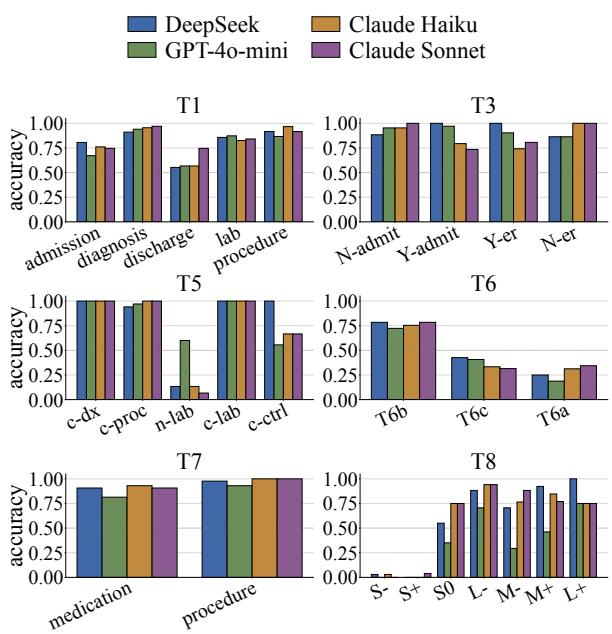  
Figure 7: Per-task subtype accuracy under full-context across four backbones. T5 short codes: c-dx / c-proc / c-lab / c-ctrl = controlled\_dx\_presence / \_procedure / \_lab\_value / \_control; n-lab = natural\_c2\_lab\_non\_glucose. T8 short codes: L/M/S = large/medium/small magnitude; −/+/0 = negative/positive/flat direction.

## B.2 T3 four-class attribution detail

T3’s design crosses injection presence (Y / N) with encounter category (admit / er) to produce four classes. The DeepSeek panel in Figure 8 is the representative split; the other three backbones show the same qualitative pattern. The story is the same in every backbone we tested: injected cells (Y-∗) collapse to ∼0 under compressed memories and are recovered by dense and full-context; not-injected cells (N-∗) sit near ceiling for every strategy except the dense / full-context strategies, where additional context occasionally adds noise.

(C) Set-F1 per (memory baseline × backbone)  
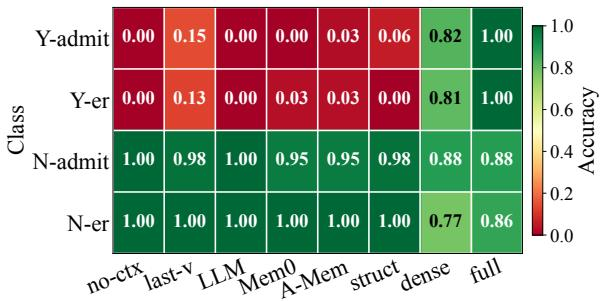  
Figure 8: T3 attribution-detection accuracy by 4-class stratification (DeepSeek backbone, representative). n: Y-admit 34, Y-er 31, N-admit 43, N-er 22.

## B.3 T5 controlled vs. natural contradiction

T5 is designed as a controlled contradiction probe rather than a natural EHR-contradiction mining task. Figure 9 makes that explicit: the five subtypes collapse cleanly onto a single controlled-vs-natural axis – four controlled subtypes against a single natural one – and the two families move in opposite directions as memory becomes richer. Controlled subtypes climb from 0.32 at no-ctx to 0.97 under full-context, while the lone natural subtype (lab non-glucose) goes the other way (0.80 → 0.07), because dense and full-context introduce confounding lab evidence that triggers spurious contradictions.

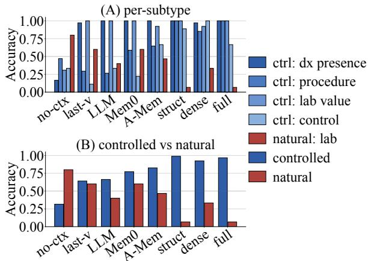  
Figure 9: T5 controlled-vs-natural contradiction breakdown (Sonnet backbone exemplar). (A) per-subtype accuracy across the 8 memory baselines; (B) the same data collapsed onto the controlled-vs-natural family axis.

## B.4 T4 retrospective evidence retrieval

T4 scores strict set-F1 on event UIDs and is the smallest task in the suite $( n = 5 3 )$ ; the question pool is biased toward a handful of condition families. Figure 10 reports the pool composition, perbackbone full-context set-F1, and the full $8 \times 4$ cell heatmap. The small-n profile is intentional and is the reason T4 is treated as a limited rather than headline finding throughout the paper.

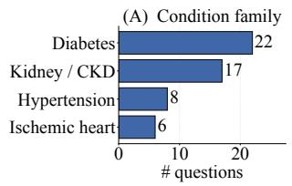

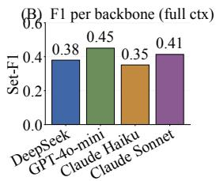

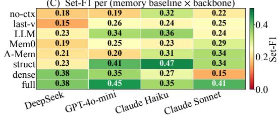  
Figure 10: T4 retrospective evidence retrieval. (A) condition-family distribution of the n = 53 questions; (B) per-backbone set-F1 under full-context; (C) set-F1 heatmap across 8 memory baselines × 4 backbones.

## B.5 T8 observed treatment-response bins

T8 is observed post-treatment lab change tracking, not causal treatment-response estimation; concurrent-medication annotations were deliberately not retained in the final evaluation parquet, so the seven magnitude × direction bins are a difficulty proxy rather than a clinical-effect estimate. The headline pattern is that large/medium bins climb from 0.29–0.65 at no-ctx to 0.69– 0.94 at full-context, but the small bins are categorically harder: S− and S+ sit at ∼0 across every baseline including full-context (Figure 11), while S0 is rescued only by structured timeline (1.00) and full-context (0.75).

## B.6 T9 silent-evidence kind: lab vs. other

The active T9 pool is structurally degenerate along the primary-or-secondary axis: every question has anchor\_count = 1 and primary\_or\_seconda ${ \mathrm { : y } } = { } ^ { \circ \circ } { \mathrm { p r i m a r y } } ^ { \prime \prime }$ . The cleanest available stratification is therefore the silent-evidence kind (lab vs. other), and Figure 12 reports accuracy, abstention rate, and over-answer rate on that split. The T9 pool splits 1,147 labanchored vs. 353 other-anchored, an $\approx 7 6 \% / 2 4 \%$ ratio.

(A) Bin counts  
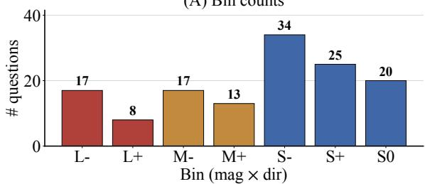

(B) Per-bin accuracy (Sonnet)  
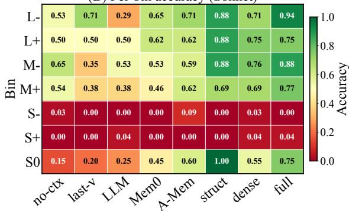  
Figure 11: T8 per-bin breakdown (Sonnet exemplar). (A) question counts in the seven (magnitude × direction) bins (n = 134 total); (B) per-bin accuracy across the 8 memory baselines.

## C Cohort, retrieval, and compression footprints

This appendix characterises the static building blocks of the benchmark: the patient cohort it draws from, the auxiliary retrieval index it lets the dense baseline rely on, and the compressedmemory structures the Mem0 / A-Mem / LLM summary baselines build upstream of answer time. The point is to make clear that the headline accuracy differences come from representation choice, not from asymmetric access to the underlying clinical evidence.

## C.1 Patient cohort

The 6,271-question evaluation set is drawn from n = 385 verified dialogues. Figure 13 reports the three distributional cuts that matter: visits per patient (median 10, mean 16.0, max 93), dialogue length in thousands of characters (median 13.7 k, mean 15.0 k, max 30.7 k), and stratified-eval questions per patient (median 4, mean 4.3, max 12). The vast majority of the 385 dialogues contribute at least one question to the eval set.

## C.2 BGE-M3 dense-retrieval hit rate

The dense baseline relies on BGE-M3 to embed visits and rank them against the query. Figure 14 reports top-k visit-hit rate per task on the 1,177 retrieval-eligible questions (T9 silent-evidence is excluded by construction). The overall headline is hit@1 = 0.595, hit $\textcircled { a } 3 = 0 . 8 5 2$ , hit@5 = 0.926, hit@ $1 0 = 0 . 9 7 9$ , which is sufficient quality that the retrieval step is not the bottleneck on any of the tasks where dense loses to full-context.

## C.3 Compression footprints

The three compressed-memory strategies produce structures of very different sizes. Figure 15 reports the per-patient footprint of each, plus a size-vs-accuracy scatter that disposes of the hypothesis that headline accuracy differences are driven by raw representation size. Pearson r(Mem0 size, Mem0 T1 accuracy) = −0.129 on n = 210 patients: bigger is not better, and the compressed representations are bottlenecked by what they encode, not by how much.

## D Resource consumption

Tables and figures in this appendix attach a dollar / token / cache cost to each of the 32 (memory baseline × backbone) cells. The takeaway is the same one the main paper draws: most of the representation-driven accuracy gains do not require the most expensive cell, and the cost ranges across the grid are wide enough that efficiency–accuracy trade-offs are a real decision rather than a marginal one.

Table 4 gives the per-cell figures and Figure 16 visualises them.

## E Pipeline-quality diagnostics

This appendix documents the failure modes of the evaluation pipeline itself. Two kinds of issue can in principle confound the headline accuracies: a model returning no response at all, and the strict gold parser failing to recover a prediction. We measure both, and we measure where each one concentrates so the reader can see they are not driving the comparisons in the main paper.

## E.1 Empty responses (D1)

After the M1 retry pass, roughly 0.7% of the 200,672 prediction rows still have an empty raw\_response. They concentrate on GPT-4omini and Claude Haiku under retrieval-style contexts (Mem0, A-Mem, dense); DeepSeek’s column is uniformly zero (Figure 17). These rows are documented but not excluded from the headline accuracy numbers.

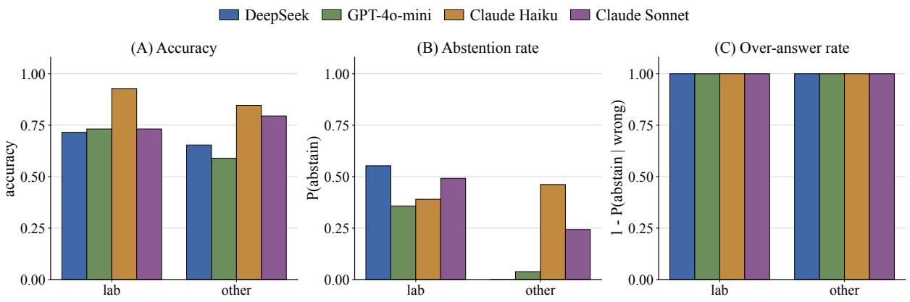  
Figure 12: T9 silent-evidence abstention stratified by anchor kind (lab vs. other) under full-context. (A) accuracy; (B) abstention rate; (C) over-answer rate when wrong. n = 1,147 lab vs. n = 353 other.

<table><tr><td>Strategy</td><td>Backbone</td><td>Cost (USD)</td><td>$/q</td><td>Input (M)</td><td>Output (K)</td><td>Cache hit %</td></tr><tr><td rowspan="3">no-context blind</td><td>DeepSeek-V3</td><td>$0.19</td><td>$0.0000</td><td>0.5</td><td>52.3</td><td>2.2%</td></tr><tr><td>GPT-4o-mini</td><td>$0.13</td><td>$0.0000</td><td>0.5</td><td>74.3</td><td>0.0%</td></tr><tr><td>Haiku 4.5</td><td>$1.54</td><td>$0.0002</td><td>0.6</td><td>272.8</td><td>0.0%</td></tr><tr><td rowspan="4">last-visit-only</td><td>Sonnet 4.6</td><td>$5.27</td><td>$0.0008</td><td>0.6</td><td>238.1</td><td>0.0%</td></tr><tr><td>DeepSeek-V3</td><td>$1.45</td><td>$0.0002</td><td>5.3</td><td>40.4</td><td>1.9%</td></tr><tr><td>GPT-4o-mini</td><td>$0.71</td><td>$0.0001</td><td>5.5</td><td>81.9</td><td>21.9%</td></tr><tr><td>Haiku 4.5</td><td>$5.80</td><td>$0.0009</td><td>6.4</td><td>208.1</td><td>3.0%</td></tr><tr><td rowspan="4">full-context</td><td>Sonnet 4.6</td><td>$19.34</td><td>$0.0031</td><td>6.4</td><td>163.1</td><td>13.9%</td></tr><tr><td>DeepSeek-V3</td><td>$9.62</td><td>$0.0015</td><td>36.8</td><td>51.3</td><td>4.1%</td></tr><tr><td>GPT-4o-mini</td><td>$3.92</td><td>$0.0006</td><td>37.7</td><td>78.8</td><td>35.0%</td></tr><tr><td>Haiku 4.5</td><td>$25.76</td><td>$0.0041</td><td>44.7</td><td>137.9</td><td>32.8%</td></tr><tr><td rowspan="4">dense-retrieval</td><td>Sonnet 4.6</td><td>$106.20</td><td>$0.0169</td><td>44.9</td><td>141.4</td><td>25.2%</td></tr><tr><td>DeepSeek-V3</td><td>$5.42</td><td>$0.0009</td><td>20.1</td><td>52.2</td><td>1.4%</td></tr><tr><td>GPT-4o-mini</td><td>$2.68</td><td>$0.0004</td><td>20.2</td><td>75.2</td><td>14.4%</td></tr><tr><td>Haiku 4.5</td><td>$18.61</td><td>$0.0030</td><td>24.0</td><td>131.4</td><td>6.5%</td></tr><tr><td rowspan="4">structured-timeline</td><td>Sonnet 4.6</td><td>$67.63</td><td>$0.0108</td><td>24.2</td><td>131.6</td><td>10.8%</td></tr><tr><td>DeepSeek-V3</td><td>$8.91</td><td>$0.0014</td><td>34.2</td><td>45.2</td><td>4.4%</td></tr><tr><td>GPT-4o-mini</td><td>$3.70</td><td>$0.0006</td><td>34.9</td><td>69.5</td><td>33.4%</td></tr><tr><td>Haiku 4.5</td><td>$24.72</td><td>$0.0039</td><td>41.0</td><td>158.1</td><td>29.6%</td></tr><tr><td rowspan="4">LLM-summary</td><td>Sonnet 4.6</td><td>$90.83</td><td>$0.0145</td><td>41.2</td><td>133.2</td><td>31.3%</td></tr><tr><td>DeepSeek-V3</td><td>$1.29</td><td>$0.0002</td><td>4.7</td><td>50.3</td><td>2.9%</td></tr><tr><td>GPT-4o-mini</td><td>$0.78</td><td>$0.0001</td><td>4.9</td><td>78.9</td><td>1.2%</td></tr><tr><td>Haiku 4.5</td><td>$5.49</td><td>$0.0009</td><td>5.9</td><td>187.9</td><td>0.0%</td></tr><tr><td rowspan="4">mem0</td><td>Sonnet 4.6</td><td>$20.78</td><td>$0.0033</td><td>6.0</td><td>200.0</td><td>0.5%</td></tr><tr><td>DeepSeek-V3</td><td>$1.76</td><td>$0.0003</td><td>6.4</td><td>45.3</td><td>0.4%</td></tr><tr><td>GPT-4o-mini</td><td>$0.99</td><td>$0.0002</td><td>6.4</td><td>75.3</td><td>0.8%</td></tr><tr><td>Haiku 4.5</td><td>$6.65</td><td>$0.0011</td><td>7.5</td><td>158.9</td><td>0.0%</td></tr><tr><td rowspan="5">amem</td><td>Sonnet 4.6</td><td>$25.16</td><td>$0.0040</td><td>7.7</td><td>145.0</td><td>0.0%</td></tr><tr><td>DeepSeek-V3</td><td>$3.17</td><td>$0.0005</td><td>11.7</td><td>48.1</td><td>1.7%</td></tr><tr><td>GPT-4o-mini</td><td>$1.62</td><td>$0.0003</td><td>12.0</td><td>76.1</td><td>14.1%</td></tr><tr><td>Haiku 4.5</td><td>$11.99</td><td>$0.0019</td><td>14.1</td><td>168.1</td><td>0.0%</td></tr><tr><td>Sonnet 4.6</td><td>$45.75</td><td>$0.0073</td><td>14.5</td><td>143.5</td><td>0.0%</td></tr><tr><td>Total</td><td></td><td>$527.87</td><td></td><td>532</td><td>3714</td><td>17.1%</td></tr></table>

Table 4: Per-cell resource consumption over the 6,271-question evaluation set. Each row is one (strategy, backbone) cell. Per-question cost $( \mathbb { S } / q )$ is cost / 6,271. Total spend: \$527.87 across all 32 cells

## E.2 Parse failures (D2)

A response can be present but un-parseable by the strict gold-format matcher. About 6.5% of the 200,672 rows fall into this bucket, and they are dominated by Claude refusal-as-prose under no-context blind; the Haiku × no-context cell is the single largest contributor (Figure 18). The pattern is concentrated on a small number of cells and does not affect the comparative ordering between memory strategies under richer contexts.

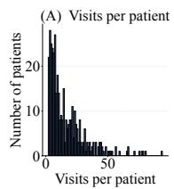

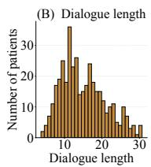

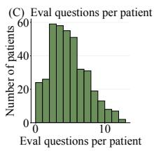  
Figure 13: Cohort statistics for the n = 385 verified dialogues. (A) visits per patient, (B) dialogue length, (C) eval questions per patient.

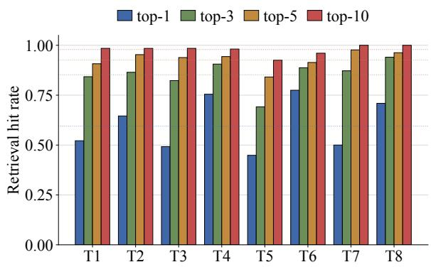  
Figure 14: BGE-M3 dense-retrieval hit rate by task on 4,771 retrieval-eligible questions. Per-task eligible n: T1 1500, T2 889, T3 600, T4 53, T5 495, T6 700, T7 400, T8 134. Dotted lines mark the overall hit rate at each k.

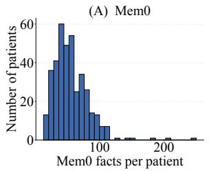

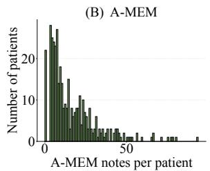

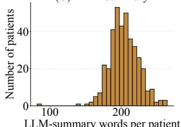

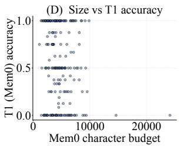  
Figure 15: Per-patient compression footprints. (A) Mem0 facts per patient, (B) A-Mem notes per patient, (C) LLM-summary words per patient, (D) total Mem0 size vs T1 accuracy (n = 210, Pearson r = −0.129).

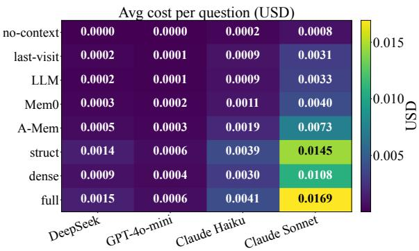

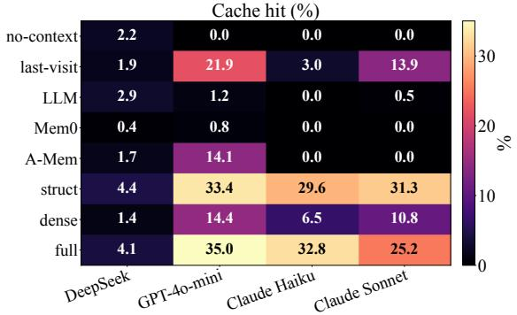  
Figure 16: Companion visualisation to Table 4: avg cost per question (top) and cache hit % (bottom) per (strategy, backbone) cell. Sonnet × full-context is the most expensive cell (\$0.0169/q); DeepSeek × no-context blind is the cheapest (\$0.00003/q). Cache-hit range: 0%–35%.

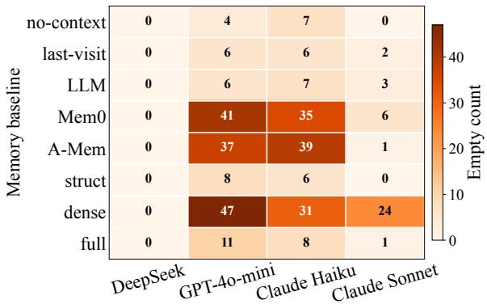  
Figure 17: D1: empty API responses per cell after the M1 retry pass (≈ 0.7% of 200,672 rows). DeepSeek’s column is uniformly zero; the mass sits on GPT-4o-mini and Haiku, with a small Sonnet residue.

## E.3 Output length and truncation

The model is given a per-task max\_tokens budget. Two diagnostics follow: the full output-length distribution per task overlaid by backbone (Figure 19), and the rate at which a response is truncated at ceiling minus one token (Figure 20). T4 is the only task where the 120-token ceiling binds in a meaningful way (86–88% truncation on Haiku /

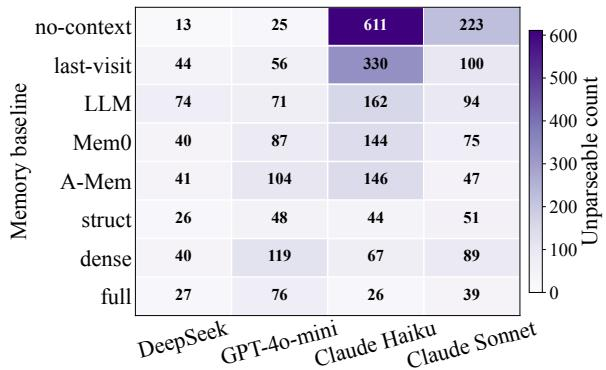  
Figure 18: D2: parse-failure rate (pred is None) per cell across 8 memory baselines × 4 backbones (6,271 questions per cell).

Sonnet under the worst memory baseline); T1 and T8 are the next largest binders. T3 / T5 / T6 / T7 are essentially un-truncated across the board.

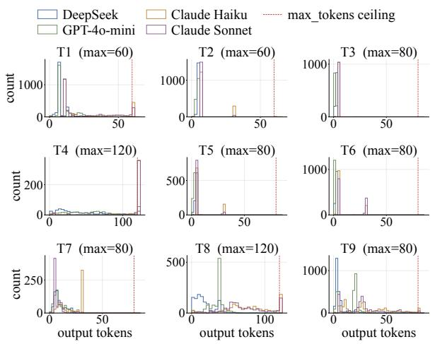  
Figure 19: D3: output-length histograms per task overlaid by backbone, with the per-task ma $\mathtt { x \_ t o k e n s }$ ceiling marked.

## F Robustness and stratification

The headline numbers in the main paper are point estimates averaged over patients, diseases, and within-task difficulty tertiles. This appendix reports the four sensitivity checks that we think matter most: per-patient skew, per-disease drift, per-tertile calibration of the stratifier, and bootstrap-CI width per cell.

## F.1 Per-patient accuracy distribution (D5)

Figure 21 renders the per-cell distribution of perpatient mean accuracy as a violin. The headline observation is that full-context violins are uniformly narrower than the compressedrepresentation cells on every backbone – richer memory produces less between-patient skew, not just a higher mean.

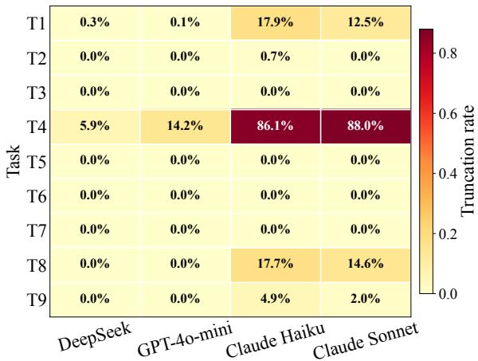  
Figure 20: D4: truncation rate per (task, backbone), mean across the 8 memory baselines. Per-task ceilings: T1 60, T2 60, T4 120, T8 120, T9 80; others 80.

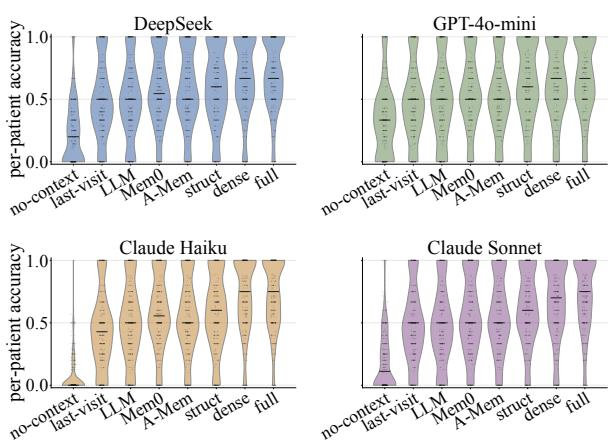  
Figure 21: D5: per-patient accuracy distribution as a violin per cell; medians overlaid in black, patient-level scatter in grey.

## F.2 Per-disease drift (D6)

The benchmark spans four condition families: CKD, Coronary, Diabetes, and Hypertension. Figure 22 reports full-context accuracy pooled across all nine tasks, by backbone × disease. The hypertension row is consistently the weakest (mean 0.615), but this is a task-mix bias – the hypertension question pool over-indexes the longitudinal / comparison families – rather than evidence of a disease-specific knowledge gap.

## F.3 Per-tertile calibration of the stratifier (D7)

Each question carries a difficulty tertile from the generation-time stratifier. Figure 23 checks whether the tertile actually predicts difficulty under full-context. T1 and T9 are monotonically calibrated, while T8’s “high” tertile is the easiest of the three – T8 tertile anti-alignment, which we flag in the main paper.

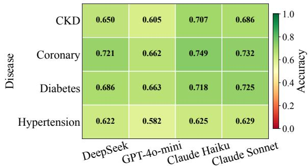  
Figure 22: D6: per-disease full-context accuracy by backbone, pooled across T1–T9. Per-disease n per backbone: CKD 488, Coronary 358, Diabetes 404, Hypertension 251.

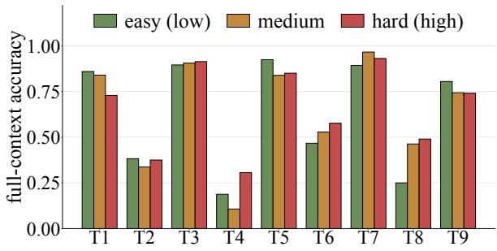  
Figure 23: D7: per-tertile full-context accuracy per task, pooled across backbones. Patients are split into low / medium / high complexity tertiles by the stratifier of Section 3; per-task tertile sizes follow the per-task question counts reported there.

## F.4 Bootstrap CI widths per cell (D8)

Figure 24 reports the bootstrap 95% CI width for each of the 9 × 8 × 4 = 288 cells (100 resamples per cell, seed 20260519). The headline is that CI width is dominated by per-cell sample size, not by memory strategy or backbone: T4 (smallest n) and T8 are the widest by construction; T1 / T7 / T9 (the highest-resampled tasks) are the tightest. Conclusion: the headline rankings in the main paper are robust to within-cell sampling noise.

## G Supplementary analyses: balanced metrics, sensitivity, and ablations

This appendix collects the analyses referenced from Section 3, Section 4, Section 5 and Section 6. No models were rerun for the re-scoring analyses (Table 5–Table 9, Table 7, Table 13); the ablations in Table 10–Table 12 were run on a stratified 20- patient subset of the 385-dialogue cohort.

## G.1 Class-balanced metrics for the skewed tasks

Accuracy on T5 and T8 conflates two questions: whether a task beats a trivial majority predictor, and whether it separates representation strategies. Macro-F1 separates them: Table 5 reports T5 and Table 6 reports T8.

<table><tr><td>strategy</td><td>DS</td><td>GPT</td><td>Hk</td><td>Sn</td><td>pooled</td></tr><tr><td>full-context</td><td>0.731</td><td>0.710</td><td>0.674</td><td>0.661</td><td>0.695</td></tr><tr><td>dense-retrieval</td><td>0.743</td><td>0.760</td><td>0.709</td><td>0.734</td><td>0.736</td></tr><tr><td>structured-timeline</td><td>0.620</td><td>0.559</td><td>0.738</td><td>0.717</td><td>0.656</td></tr><tr><td>MemO</td><td>0.524</td><td>0.482</td><td>0.466</td><td>0.491</td><td>0.491</td></tr><tr><td>A-Mem</td><td>0.580</td><td>0.491</td><td>0.593</td><td>0.599</td><td>0.565</td></tr><tr><td>llm-summary</td><td>0.578</td><td>0.428</td><td>0.468</td><td>0.446</td><td>0.476</td></tr><tr><td>last-visit-only</td><td>0.513</td><td>0.367</td><td>0.340</td><td>0.412</td><td>0.408</td></tr><tr><td>no-context-blind</td><td>0.247</td><td>0.348</td><td>0.155</td><td>0.425</td><td>0.308</td></tr></table>

Table 5: T5 macro-F1 (majority-class baseline = 0.478). full-context, dense-retrieval, and structured-timeline exceed the baseline on every backbone; the compressed strategies do not.

<table><tr><td>strategy</td><td>DS</td><td>GPT</td><td>Hk</td><td>Sn</td><td>pooled</td></tr><tr><td>full-context</td><td>0.504</td><td>0.377</td><td>0.498</td><td>0.547</td><td>0.485</td></tr><tr><td>dense-retrieval</td><td>0.478</td><td>0.378</td><td>0.476</td><td>0.479</td><td>0.455</td></tr><tr><td>structured-timeline</td><td>0.513</td><td>0.465</td><td>0.538</td><td>0.569</td><td>0.523</td></tr><tr><td>MemO</td><td>0.454</td><td>0.440</td><td>0.435</td><td>0.414</td><td>0.435</td></tr><tr><td>A-Mem</td><td>0.455</td><td>0.435</td><td>0.411</td><td>0.459</td><td>0.442</td></tr><tr><td>llm-summary</td><td>0.354</td><td>0.360</td><td>0.329</td><td>0.372</td><td>0.353</td></tr><tr><td>last-visit-only</td><td>0.399</td><td>0.454</td><td>0.328</td><td>0.359</td><td>0.389</td></tr><tr><td>no-context-blind</td><td>0.249</td><td>0.275</td><td>0.328</td><td>0.373</td><td>0.294</td></tr></table>

Table 6: T8 macro-F1 (majority-class baseline = 0.247; n = 134 per cell). structured-timeline leads, followed byfull-context and dense-retrieval.

T6 is already discriminative under accuracy: its best cell reaches 0.609 against a 0.423 majority baseline (Table 1). T5, T6 and T8 therefore do separate representations; T9 remains a relative diagnostic probe.

## G.2 Statistical power per task

## G.3 Parser-strictness sensitivity

T9 abstentions can be phrased in many ways, so we re-scored the existing T9 predictions with a lenient parser that also accepts synonymous or verbose abstentions (e.g. “no sodium value was reported on that date”, “not measured”); Table 8 reports the result. For T7 we used a lenient matcher accepting either the option label or the full option text (Table 9).

<table><tr><td></td><td></td><td rowspan=1 colspan=1>0.00</td><td rowspan=1 colspan=1>0.00</td><td rowspan=1 colspan=1>0.02</td><td rowspan=1 colspan=1>0.01</td><td rowspan=1 colspan=1></td><td rowspan=1 colspan=1>0.10</td><td rowspan=1 colspan=1>0.13</td><td rowspan=1 colspan=1>0.00</td><td rowspan=1 colspan=1>0.13</td><td rowspan=1 colspan=1></td><td rowspan=1 colspan=1>0.16</td><td rowspan=1 colspan=1>0.18</td><td rowspan=1 colspan=1>0.16</td><td rowspan=1 colspan=1>0.15</td></tr><tr><td></td><td></td><td rowspan=1 colspan=1>0.08</td><td rowspan=1 colspan=1>0.08</td><td rowspan=1 colspan=1>0.07</td><td rowspan=1 colspan=1>0.08</td><td rowspan=1 colspan=1></td><td rowspan=1 colspan=1>0.14</td><td rowspan=1 colspan=1>0.12</td><td rowspan=1 colspan=1>0.10</td><td rowspan=1 colspan=1>0.12</td><td rowspan=1 colspan=1></td><td rowspan=1 colspan=1>0.14</td><td rowspan=1 colspan=1>0.17</td><td rowspan=1 colspan=1>0.18</td><td rowspan=1 colspan=1>0.16</td></tr><tr><td></td><td></td><td rowspan=1 colspan=1>0.11</td><td rowspan=1 colspan=1>0.09</td><td rowspan=1 colspan=1>0.10</td><td rowspan=1 colspan=1>0.09</td><td rowspan=1 colspan=1></td><td rowspan=1 colspan=1>0.11</td><td rowspan=1 colspan=1>0.13</td><td rowspan=1 colspan=1>0.13</td><td rowspan=1 colspan=1>0.12</td><td rowspan=1 colspan=1></td><td rowspan=1 colspan=1>0.18</td><td rowspan=1 colspan=1>0.15</td><td rowspan=1 colspan=1>0.14</td><td rowspan=1 colspan=1>0.18</td></tr><tr><td></td><td></td><td rowspan=1 colspan=1>0.11</td><td rowspan=1 colspan=1>0.12</td><td rowspan=1 colspan=1>0.10</td><td rowspan=1 colspan=1>0.10</td><td rowspan=1 colspan=1></td><td rowspan=1 colspan=1>0.11</td><td rowspan=1 colspan=1>0.12</td><td rowspan=1 colspan=1>0.14</td><td rowspan=1 colspan=1>0.12</td><td rowspan=1 colspan=1></td><td rowspan=1 colspan=1>0.18</td><td rowspan=1 colspan=1>0.18</td><td rowspan=1 colspan=1>0.17</td><td rowspan=1 colspan=1>0.17</td></tr><tr><td rowspan=1 colspan=2>A-Mem</td><td rowspan=1 colspan=1>0.11</td><td rowspan=1 colspan=1>0.11</td><td rowspan=1 colspan=1>0.11</td><td rowspan=1 colspan=1>0.10</td><td rowspan=1 colspan=1></td><td rowspan=1 colspan=1>0.14</td><td rowspan=1 colspan=1>0.12</td><td rowspan=1 colspan=1>0.13</td><td rowspan=1 colspan=1>0.15</td><td rowspan=1 colspan=1></td><td rowspan=1 colspan=1>0.16</td><td rowspan=1 colspan=1>0.18</td><td rowspan=1 colspan=1>0.15</td><td rowspan=1 colspan=1>0.18</td></tr><tr><td rowspan=5 colspan=2>structdensefullno-ctxlast-v</td><td rowspan=1 colspan=1>0.06</td><td rowspan=1 colspan=1>0.08</td><td rowspan=1 colspan=1>0.05</td><td rowspan=1 colspan=1>0.06</td><td rowspan=1 colspan=1></td><td rowspan=1 colspan=1>0.13</td><td rowspan=1 colspan=1>0.11</td><td rowspan=1 colspan=1>0.15</td><td rowspan=1 colspan=1>0.15</td><td rowspan=1 colspan=1></td><td rowspan=1 colspan=1>0.16</td><td rowspan=1 colspan=1>0.14</td><td rowspan=1 colspan=1>0.16</td><td rowspan=1 colspan=1>0.15</td></tr><tr><td rowspan=1 colspan=1>0.08</td><td rowspan=1 colspan=1>0.10</td><td rowspan=1 colspan=1>0.08</td><td rowspan=1 colspan=1>0.10</td><td rowspan=1 colspan=1></td><td rowspan=1 colspan=1>0.12</td><td rowspan=1 colspan=1>0.14</td><td rowspan=1 colspan=1>0.13</td><td rowspan=1 colspan=1>0.13</td><td rowspan=1 colspan=1></td><td rowspan=1 colspan=1>0.12</td><td rowspan=1 colspan=1>0.10</td><td rowspan=1 colspan=1>0.12</td><td rowspan=1 colspan=1>0.13</td></tr><tr><td rowspan=1 colspan=1>0.09</td><td rowspan=1 colspan=1>0.09</td><td rowspan=1 colspan=1>0.07</td><td rowspan=1 colspan=1>0.08</td><td rowspan=1 colspan=1></td><td rowspan=1 colspan=1>0.17</td><td rowspan=1 colspan=1>0.14</td><td rowspan=1 colspan=1>0.14</td><td rowspan=1 colspan=1>0.13</td><td rowspan=1 colspan=1></td><td rowspan=1 colspan=1>0.08</td><td rowspan=1 colspan=1>0.08</td><td rowspan=1 colspan=1>0.12</td><td rowspan=1 colspan=1>0.10</td></tr><tr><td rowspan=1 colspan=1>0.15</td><td rowspan=1 colspan=1>0.16</td><td rowspan=1 colspan=1>0.21</td><td rowspan=1 colspan=1>0.17</td><td rowspan=1 colspan=1></td><td rowspan=1 colspan=1>0.16</td><td rowspan=1 colspan=1>0.15</td><td rowspan=1 colspan=1>0.14</td><td rowspan=1 colspan=1>0.17</td><td rowspan=1 colspan=1></td><td rowspan=1 colspan=1>0.16</td><td rowspan=1 colspan=1>0.16</td><td rowspan=1 colspan=1>0.00</td><td rowspan=1 colspan=1>0.09</td></tr><tr><td rowspan=1 colspan=1>0.09</td><td rowspan=1 colspan=1>0.13</td><td rowspan=1 colspan=1>0.19</td><td rowspan=1 colspan=1>0.18</td><td rowspan=1 colspan=1></td><td rowspan=1 colspan=1>0.14</td><td rowspan=1 colspan=1>0.20</td><td rowspan=1 colspan=1>0.20</td><td rowspan=1 colspan=1>0.14</td><td rowspan=1 colspan=1></td><td rowspan=1 colspan=1>0.15</td><td rowspan=1 colspan=1>0.14</td><td rowspan=1 colspan=1>0.16</td><td rowspan=1 colspan=1>0.15</td></tr><tr><td rowspan=2 colspan=2>LLMMem0</td><td rowspan=1 colspan=1>0.18</td><td rowspan=1 colspan=1>0.15</td><td rowspan=1 colspan=1>0.21</td><td rowspan=1 colspan=1>0.15</td><td rowspan=1 colspan=1></td><td rowspan=1 colspan=1>0.15</td><td rowspan=1 colspan=1>0.16</td><td rowspan=1 colspan=1>0.19</td><td rowspan=1 colspan=1>0.17</td><td rowspan=1 colspan=1></td><td rowspan=1 colspan=1>0.16</td><td rowspan=1 colspan=1>0.15</td><td rowspan=1 colspan=1>0.17</td><td rowspan=1 colspan=1>0.18</td></tr><tr><td rowspan=1 colspan=1>0.09</td><td rowspan=1 colspan=1>0.16</td><td rowspan=1 colspan=1>0.14</td><td rowspan=1 colspan=1>0.17</td><td rowspan=1 colspan=1></td><td rowspan=1 colspan=1>0.14</td><td rowspan=1 colspan=1>0.16</td><td rowspan=1 colspan=1>0.17</td><td rowspan=1 colspan=1>0.15</td><td rowspan=1 colspan=1></td><td rowspan=1 colspan=1>0.16</td><td rowspan=1 colspan=1>0.16</td><td rowspan=1 colspan=1>0.14</td><td rowspan=1 colspan=1>0.16</td></tr><tr><td rowspan=1 colspan=2>A-Mem</td><td rowspan=1 colspan=1>0.13</td><td rowspan=1 colspan=1>0.14</td><td rowspan=1 colspan=1>0.14</td><td rowspan=1 colspan=1>0.15</td><td rowspan=1 colspan=1></td><td rowspan=1 colspan=1>0.16</td><td rowspan=1 colspan=1>0.14</td><td rowspan=1 colspan=1>0.17</td><td rowspan=1 colspan=1>0.14</td><td rowspan=1 colspan=1></td><td rowspan=1 colspan=1>0.16</td><td rowspan=1 colspan=1>0.14</td><td rowspan=1 colspan=1>0.16</td><td rowspan=1 colspan=1>0.15</td></tr><tr><td rowspan=8 colspan=2>densefullno-ctxlast-vLLMMem0</td><td rowspan=1 colspan=1>struct</td><td rowspan=1 colspan=1>0.13</td><td rowspan=1 colspan=1>0.20</td><td rowspan=1 colspan=1>0.21</td><td rowspan=1 colspan=2>0.19</td><td rowspan=1 colspan=1></td><td rowspan=1 colspan=1>0.15</td><td rowspan=1 colspan=1>0.15</td><td rowspan=1 colspan=2>0.13</td><td rowspan=1 colspan=1>0.12</td><td rowspan=1 colspan=1></td><td rowspan=1 colspan=1>0.13</td></tr><tr><td rowspan=1 colspan=1>dense</td><td rowspan=1 colspan=1>0.21</td><td rowspan=1 colspan=1>0.22</td><td rowspan=1 colspan=1>0.20</td><td rowspan=1 colspan=1>0.11</td><td rowspan=1 colspan=1></td><td rowspan=1 colspan=1>0.11</td><td rowspan=1 colspan=1>0.10</td><td rowspan=1 colspan=1>0.11</td><td rowspan=1 colspan=1>0.15</td><td rowspan=1 colspan=1></td><td rowspan=1 colspan=1>0.18</td><td rowspan=1 colspan=1>0.16</td><td rowspan=1 colspan=1>0.13</td><td rowspan=1 colspan=1>0.17</td></tr><tr><td rowspan=1 colspan=1>full</td><td rowspan=1 colspan=1>0.21</td><td rowspan=1 colspan=1>0.21</td><td rowspan=1 colspan=1>0.21</td><td rowspan=1 colspan=1>0.21</td><td rowspan=1 colspan=1></td><td rowspan=1 colspan=1>0.13</td><td rowspan=1 colspan=1>0.13</td><td rowspan=1 colspan=1>0.13</td><td rowspan=1 colspan=1>0.14</td><td rowspan=1 colspan=1></td><td rowspan=1 colspan=1>0.15</td><td rowspan=1 colspan=1>0.15</td><td rowspan=1 colspan=1>0.16</td><td rowspan=1 colspan=1>0.15</td></tr><tr><td rowspan=1 colspan=14>DS 40-mini HaikuSonnetT7                               T8                               T9</td><td rowspan=1 colspan=1>4o-mini Haiku Sonnet</td></tr><tr><td rowspan=1 colspan=1>0.20</td><td rowspan=1 colspan=1>0.19</td><td rowspan=1 colspan=1>0.03</td><td rowspan=1 colspan=1>0.17</td><td rowspan=1 colspan=1></td><td rowspan=1 colspan=1>0.13</td><td rowspan=1 colspan=1>0.14</td><td rowspan=1 colspan=1>0.12</td><td rowspan=1 colspan=1>0.13</td><td rowspan=1 colspan=1></td><td rowspan=1 colspan=1>0.10</td><td rowspan=1 colspan=1>0.08</td><td rowspan=1 colspan=1>0.00</td><td rowspan=1 colspan=1>0.07</td></tr><tr><td rowspan=1 colspan=1>0.20</td><td rowspan=1 colspan=1>0.18</td><td rowspan=1 colspan=1>0.12</td><td rowspan=1 colspan=1>0.18</td><td rowspan=1 colspan=1></td><td rowspan=1 colspan=1>0.15</td><td rowspan=1 colspan=1>0.16</td><td rowspan=1 colspan=1>0.14</td><td rowspan=1 colspan=1>0.18</td><td rowspan=1 colspan=1></td><td rowspan=1 colspan=1>0.06</td><td rowspan=1 colspan=1>0.06</td><td rowspan=1 colspan=1>0.01</td><td rowspan=1 colspan=1>0.06</td></tr><tr><td rowspan=1 colspan=1>0.20</td><td rowspan=1 colspan=1>0.17</td><td rowspan=1 colspan=1>0.22</td><td rowspan=1 colspan=1>0.21</td><td rowspan=1 colspan=1></td><td rowspan=1 colspan=1>0.13</td><td rowspan=1 colspan=1>0.14</td><td rowspan=1 colspan=1>0.12</td><td rowspan=1 colspan=1>0.13</td><td rowspan=1 colspan=1></td><td rowspan=1 colspan=1>0.06</td><td rowspan=1 colspan=1>0.09</td><td rowspan=1 colspan=1>0.05</td><td rowspan=1 colspan=1>0.08</td></tr><tr><td rowspan=1 colspan=1>0.16</td><td rowspan=1 colspan=1>0.18</td><td rowspan=1 colspan=1>0.19</td><td rowspan=1 colspan=1>0.19</td><td rowspan=1 colspan=1></td><td rowspan=1 colspan=1>0.16</td><td rowspan=1 colspan=1>0.15</td><td rowspan=1 colspan=1>0.14</td><td rowspan=1 colspan=1>0.15</td><td rowspan=1 colspan=1></td><td rowspan=1 colspan=1>0.08</td><td rowspan=1 colspan=1>0.09</td><td rowspan=1 colspan=1>0.05</td><td rowspan=1 colspan=1>0.08</td></tr><tr><td rowspan=1 colspan=2>A-Mem</td><td rowspan=1 colspan=1>0.16</td><td rowspan=1 colspan=1>0.18</td><td rowspan=1 colspan=1>0.18</td><td rowspan=1 colspan=1>0.19</td><td rowspan=1 colspan=1></td><td rowspan=1 colspan=1>0.15</td><td rowspan=1 colspan=1>0.16</td><td rowspan=1 colspan=1>0.15</td><td rowspan=1 colspan=1>0.15</td><td rowspan=1 colspan=1></td><td rowspan=1 colspan=1>0.08</td><td rowspan=1 colspan=1>0.08</td><td rowspan=1 colspan=1>0.04</td><td rowspan=1 colspan=1>0.10</td></tr><tr><td></td><td></td><td rowspan=1 colspan=1>0.20</td><td rowspan=1 colspan=1>0.20</td><td rowspan=1 colspan=1>0.20</td><td rowspan=1 colspan=1>0.18</td><td rowspan=1 colspan=1></td><td rowspan=1 colspan=1>0.17</td><td rowspan=1 colspan=1>0.16</td><td rowspan=1 colspan=1>0.17</td><td rowspan=1 colspan=1>0.14</td><td rowspan=1 colspan=1></td><td rowspan=1 colspan=1>0.12</td><td rowspan=1 colspan=1>0.10</td><td rowspan=1 colspan=1>0.10</td><td rowspan=1 colspan=1>0.11</td></tr><tr><td></td><td></td><td rowspan=1 colspan=1>0.12</td><td rowspan=1 colspan=1>0.14</td><td rowspan=1 colspan=1>0.09</td><td rowspan=1 colspan=1>0.09</td><td rowspan=1 colspan=1></td><td rowspan=1 colspan=1>0.18</td><td rowspan=1 colspan=1>0.14</td><td rowspan=1 colspan=1>0.15</td><td rowspan=1 colspan=1>0.14</td><td rowspan=1 colspan=1></td><td rowspan=1 colspan=1>0.10</td><td rowspan=1 colspan=1>0.09</td><td rowspan=1 colspan=1>0.06</td><td rowspan=1 colspan=1>0.08</td></tr><tr><td></td><td></td><td rowspan=1 colspan=1>0.09</td><td rowspan=1 colspan=1>0.12</td><td rowspan=1 colspan=1>0.08</td><td rowspan=1 colspan=1>0.09</td><td rowspan=1 colspan=1></td><td rowspan=1 colspan=1>0.18</td><td rowspan=1 colspan=1>0.14</td><td rowspan=1 colspan=1>0.16</td><td rowspan=1 colspan=1>0.15</td><td rowspan=1 colspan=1></td><td rowspan=1 colspan=1>0.11</td><td rowspan=1 colspan=1>0.10</td><td rowspan=1 colspan=1>0.06</td><td rowspan=1 colspan=1>0.08</td></tr></table>

Figure 24: D8: bootstrap 95% CI width per (task, baseline, backbone) cell. Shared magma\_r colour scale across all nine sub-panels. Per-task questions/cell: T1 n = 1500, T2 889, T3 600, T4 53, T5 495, T6 700, T7 400, T8 134, T9 1500.

<table><tr><td>task</td><td>n</td><td>MDE</td><td>assessment</td></tr><tr><td>T1 / T9</td><td>1500</td><td>5.1 pp</td><td>well-powered</td></tr><tr><td>T2</td><td>889</td><td>6.6 pp</td><td>well-powered</td></tr><tr><td>T6</td><td>700</td><td>7.5 pp</td><td>well-powered</td></tr><tr><td>T3</td><td>600</td><td>8.1 pp</td><td>well-powered</td></tr><tr><td>T5</td><td>495</td><td>8.9 pp</td><td>well-powered</td></tr><tr><td>T7</td><td>400</td><td>9.9 pp</td><td>well-powered</td></tr><tr><td>T8</td><td>134</td><td>17.1 pp</td><td>weak</td></tr><tr><td>T4</td><td>53</td><td>27.2 pp</td><td>under-powered</td></tr></table>

Table 7: Conservative per-task minimum detectable effects (two-proportion approximation, $\alpha = 0 . 0 5$ , 80% power, $p = 0 . 5 )$ . T8 has limited power for moderate differences; T4 is clearly under-powered.

## G.4 T9 over-answer composition

On the T9 diagnostic subset the strict parser scored 307full-context responses as non-abstentions. Of these, 36% fabricated a specific value, 28% gave a bare Yes/No, and 36% fell into an “other” category—but 93% of that “other” bucket were verbose abstentions the strict parser missed. Discounting those parser misses, fabricated values account for roughly 54% of genuine over-answers, making plausible-but-unsupported detail the largest observed error type behind SP3.

<table><tr><td>strategy</td><td>strict</td><td>lenient</td><td>∆</td></tr><tr><td>full-context</td><td>0.763</td><td>0.838</td><td>+0.075</td></tr><tr><td>dense-retrieval</td><td>0.798</td><td>0.832</td><td>+0.034</td></tr><tr><td>structured-timeline</td><td>0.535</td><td>0.791</td><td>+0.256</td></tr><tr><td>Mem0</td><td>0.823</td><td>0.842</td><td>+0.019</td></tr><tr><td>A-Mem</td><td>0.825</td><td>0.841</td><td>+0.016</td></tr><tr><td>llm-summary</td><td>0.814</td><td>0.880</td><td>+0.066</td></tr><tr><td>last-visit-only</td><td>0.924</td><td>0.930</td><td>+0.005</td></tr><tr><td>no-context-blind</td><td>0.311</td><td>0.353</td><td>+0.042</td></tr></table>

Table 8: T9 abstention accuracy under strict and lenient parsers, full T9 evaluation set (1,500 questions per backbone, pooled over backbones). last-visit-only stays above full-context (0.930 vs. 0.838); the gap narrows from 0.161 to 0.092, so parser strictness changes the magnitude but not the direction of SP3.

## G.5 Backbone-matched memory preparation

We rebuilt Mem0 and A-Mem with each non-DeepSeek answering backbone, so that GPT-4omini, Haiku and Sonnet each prepared and answered from their own memory. The preparation model is the only changed factor.

<table><tr><td>strategy</td><td>strict</td><td>lenient</td><td>∆</td></tr><tr><td>full-context</td><td>0.933</td><td>0.933</td><td>0.000</td></tr><tr><td>dense-retrieval</td><td>0.907</td><td>0.907</td><td>0.000</td></tr><tr><td>structured-timeline</td><td>0.613</td><td>0.613</td><td>0.000</td></tr><tr><td>Mem0</td><td>0.642</td><td>0.642</td><td>0.000</td></tr><tr><td>A-Mem</td><td>0.581</td><td>0.581</td><td>0.000</td></tr><tr><td>llm-summary</td><td>0.448</td><td>0.448</td><td>0.000</td></tr><tr><td>last-visit-only</td><td>0.294</td><td>0.294</td><td>0.000</td></tr><tr><td>no-context-blind</td><td>0.177</td><td>0.177</td><td>0.000</td></tr></table>

Table 9: T7 accuracy (4-option MCQ) under strict and lenient matching: identical throughout. Models answer as “option label + option text”, so the strict parser already captures valid answers and incorrect responses are genuine errors rather than parser misses.

<table><tr><td>cell</td><td>DS-prepared matched</td><td></td><td>∆</td></tr><tr><td>GPT-4o-mini × Mem0</td><td>0.532</td><td>0.340</td><td>-0.192</td></tr><tr><td>Haiku × MemO</td><td>0.571</td><td>0.327</td><td>-0.244</td></tr><tr><td>Sonnet × MemO</td><td>0.526</td><td>0.372</td><td>-0.154</td></tr><tr><td>GPT-4o-mini × A-Mem</td><td>0.474</td><td>0.346</td><td>-0.128</td></tr><tr><td>Haiku × A-Mem</td><td>0.513</td><td>0.365</td><td>-0.147</td></tr><tr><td>Sonnet × A-Mem</td><td>0.481</td><td>0.436</td><td>-0.045</td></tr></table>

Table 10: Overall accuracy with DeepSeek-V3– prepared versus backbone-matched agentic memory on the stratified 20-patient subset. Matching prep to the answering backbone does not improve accuracy in any of the six cells. The corresponding T3 positive-class recall is reported in Table 3.

## G.6 Dense-retrieval and summary-length ablations

Table 11 varies the retrieval depth and Table 12 the summary budget; neither knob removes the gap to full-context.
<table><tr><td>backbone</td><td>K = 3</td><td>K = 5</td><td> $K = 1 0$ </td></tr><tr><td>DeepSeek-V3</td><td>0.474</td><td>0.513</td><td>0.487</td></tr><tr><td>GPT-4o-mini</td><td>0.410</td><td>0.397</td><td>0.391</td></tr><tr><td>Haiku 4.5</td><td>0.423</td><td>0.487</td><td>0.385</td></tr><tr><td>Sonnet 4.6</td><td>0.468</td><td>0.506</td><td>0.558</td></tr></table>

Table 11: dense-retrieval accuracy across top-K on the stratified 20-patient subset, all nine tasks. Larger K gives no consistent gain, matching the retrieval diagnostics in Section C: hit rate rises from 0.852 at K=3 to 0.979 at K=10 without a corresponding accuracy gain. K=5 is therefore not the sole source of the remaining retrieval errors.

<table><tr><td rowspan="2">backbone</td><td colspan="2">all 9 tasks</td><td colspan="2">aggregation</td></tr><tr><td>500</td><td>1000</td><td>500</td><td>1000</td></tr><tr><td>DeepSeek-V3 GPT-4o-mini</td><td>0.465 0.392</td><td>0.393 0.309</td><td>0.211 0.235</td><td>0.259 0.185</td></tr></table>

Table 12: llm-summary accuracy at a 500- versus 1,000- token budget on the stratified 20-patient subset; “aggregation” pools T2, T6 and T8. Doubling the budget lowers overall accuracy for three of four backbones and moves aggregation accuracy in both directions within 0.185–0.304. The 500-token limit is not the sole explanation for SP1.
<table><tr><td>strategy</td><td>all 9</td><td>w/o T5,T8,T9</td><td>w/o T3</td></tr><tr><td>full-context</td><td>0.645</td><td>0.628</td><td>0.612</td></tr><tr><td>dense-retrieval</td><td>0.612</td><td>0.580</td><td>0.585</td></tr><tr><td>structured-timeline</td><td>0.541</td><td>0.508</td><td>0.545</td></tr><tr><td>MemO</td><td>0.493</td><td>0.421</td><td>0.493</td></tr><tr><td>A-Mem</td><td>0.485</td><td>0.408</td><td>0.484</td></tr><tr><td>llm-summary</td><td>0.435</td><td>0.365</td><td>0.428</td></tr><tr><td>last-visit-only</td><td>0.403</td><td>0.306</td><td>0.385</td></tr><tr><td>no-context-blind</td><td>0.226</td><td>0.200</td><td>0.193</td></tr></table>

Table 13: Macro-accuracy averaged over the included tasks and the four backbones, recomputed from the existing predictions. The strategy ordering is unchanged when the exploratory tasks (T5, T8, T9) or the T3 probe are excluded, so the headline comparison does not depend on them.

## G.7 Macro-accuracy under task-subset ablation

## G.8 Substrate pilot: dialogue versus a bare event table

As a check on what the dialogue layer contributes, we ran a smallfull-context pilot in which the model received either the dialogue or a bare structuredevent table built from the same source events. The table retained the events, but the narrative relations targeted by T3, T4 and T5 were not explicitly represented in it, so those tasks could not be evaluated equivalently from the table alone. This delimits what the dialogue substrate adds; it is not a validation of real-note realism, and a controlled comparison against a visit-organized table is left to future work.

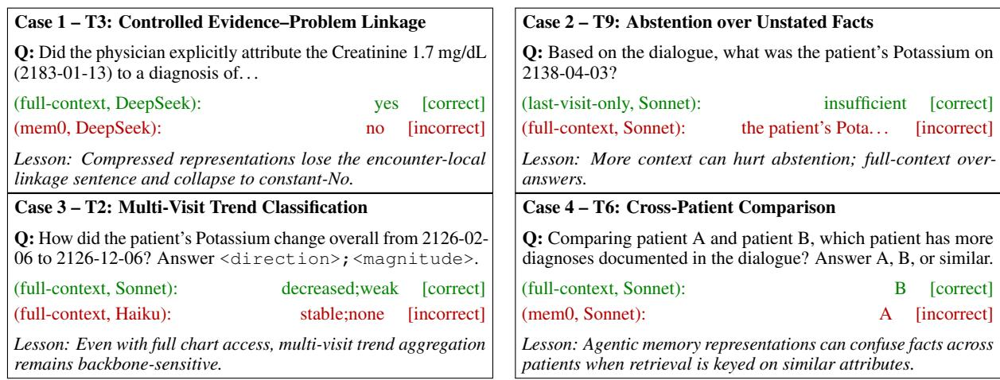  
Figure 25: Four illustrative failure modes drawn from the master results table: representational loss (Case 1, T3), uncritical answering (Case 2, T9), reasoning-capacity ceiling (Case 3, T2 on Haiku), cross-document aggregation breakdown (Case 4, T6). Green = correct prediction; red = incorrect.

## H Case studies

The main paper carries four illustrative failure-mode case studies; we reprint them here so the appendix is self-contained.

## I Full per-task strategy-by-backbone matrix

For completeness, the full 9 × 8 × 4 = 288-cell accuracy matrix from which all per-task figures in the main paper and in this appendix are derived is reproduced in Table 14.

Table 14: Complete per-task accuracy across all 32 (history representation strategy, backbone) cells, on the 6,271- question stratified evaluation set (200,672 evaluations total). n is the per-task sample size; per-task sizes are T1=1500, T2=889, T3=600, T4=53, T5=495, T6=700, T7=400, T8=134, T9=1500. The rightmost column marks rows from the stratified evaluation set (every row is).
<table><tr><td>Task</td><td>Strategy</td><td>Backbone</td><td>n</td><td>Accuracy</td><td>Subset</td></tr><tr><td>T1</td><td>no-context (blind)</td><td>DeepSeek</td><td>1500</td><td>0.000</td><td>√</td></tr><tr><td>T1</td><td>no-context (blind)</td><td>GPT-4o-mini</td><td>1500</td><td>0.000</td><td>√</td></tr><tr><td>T1</td><td>no-context (blind)</td><td>Claude Haiku</td><td>1500</td><td>0.006</td><td>√</td></tr><tr><td>T1</td><td>no-context (blind)</td><td>Claude Sonnet</td><td>1500</td><td>0.003</td><td>V</td></tr><tr><td>T1</td><td>last-visit only</td><td>DeepSeek</td><td>1500</td><td>0.160</td><td>√</td></tr><tr><td>T1</td><td>last-visit only</td><td>GPT-4o-mini</td><td>1500</td><td>0.148</td><td>√</td></tr><tr><td>T1</td><td>last-visit only</td><td>Claude Haiku</td><td>1500</td><td>0.127</td><td>√</td></tr><tr><td>T1</td><td>last-visit only</td><td>Claude Sonnet</td><td>1500</td><td>0.120</td><td>√</td></tr><tr><td>T1</td><td>LLM summary</td><td>DeepSeek</td><td>1500</td><td>0.355</td><td>√</td></tr><tr><td>T1</td><td>LLM summary</td><td>GPT-4o-mini</td><td>1500</td><td>0.361</td><td>√</td></tr><tr><td>T1</td><td>LLM summary</td><td>Claude Haiku</td><td>1500</td><td>0.352</td><td>√</td></tr><tr><td>T1</td><td>LLM summary</td><td>Claude Sonnet</td><td>1500</td><td>0.355</td><td>√</td></tr><tr><td>T1</td><td>Mem0</td><td>DeepSeek</td><td>1500</td><td>0.515</td><td>√</td></tr><tr><td>T1</td><td>Mem0</td><td>GPT-4o-mini</td><td>1500</td><td>0.515</td><td>√</td></tr><tr><td>T1</td><td>Mem0</td><td>Claude Haiku</td><td>1500</td><td>0.509</td><td>√</td></tr><tr><td>T1</td><td>Mem0</td><td>Claude Sonnet</td><td>1500</td><td>0.488</td><td>√</td></tr><tr><td>T1</td><td>A-Mem</td><td>DeepSeek</td><td>1500</td><td>0.491</td><td>√</td></tr><tr><td>T1</td><td>A-Mem</td><td>GPT-4o-mini</td><td>1500</td><td>0.420</td><td>√</td></tr><tr><td>T1</td><td>A-Mem</td><td>Claude Haiku</td><td>1500</td><td>0.426</td><td>√</td></tr><tr><td>T1</td><td>A-Mem</td><td>Claude Sonnet</td><td>1500</td><td>0.485</td><td>√</td></tr><tr><td>T1</td><td>structured timeline</td><td>DeepSeek</td><td>1500</td><td>0.886</td><td>√</td></tr><tr><td>T1</td><td>structured timeline</td><td>GPT-4o-mini</td><td>1500</td><td>0.886</td><td>√</td></tr><tr><td>T1</td><td>structured timeline</td><td>Claude Haiku</td><td>1500</td><td>0.920</td><td>V</td></tr><tr><td>T1</td><td>structured timeline</td><td>Claude Sonnet</td><td>1500</td><td>0.923</td><td>V</td></tr><tr><td>T1</td><td>dense retrieval</td><td>DeepSeek</td><td>1500</td><td>0.802</td><td>V</td></tr><tr><td>T1</td><td>dense retrieval</td><td>GPT-4o-mini</td><td>1500</td><td>0.738</td><td>√</td></tr><tr><td>T1</td><td>dense retrieval</td><td>Claude Haiku</td><td>1500</td><td>0.778</td><td>√</td></tr><tr><td>T1</td><td>dense retrieval</td><td>Claude Sonnet</td><td>1500</td><td>0.787</td><td>√</td></tr><tr><td></td><td></td><td></td><td></td><td></td><td></td></tr></table>

(continued on next page)

(continued from previous page)
<table><tr><td>Task Strategy</td><td></td><td>Backbone</td><td>n</td><td>Accuracy</td><td>Subset</td></tr><tr><td>T1</td><td>full context</td><td>DeepSeek</td><td>1500</td><td>0.806</td><td>√</td></tr><tr><td>T1</td><td>full context</td><td>GPT-4o-mini</td><td>1500</td><td>0.781</td><td>√</td></tr><tr><td>T1</td><td>full context</td><td>Claude Haiku</td><td>1500</td><td>0.812</td><td>√</td></tr><tr><td>T1</td><td>full context</td><td>Claude Sonnet</td><td>1500</td><td>0.843</td><td></td></tr><tr><td></td><td></td><td>DeepSeek</td><td></td><td></td><td></td></tr><tr><td>T2</td><td>no-context (blind)</td><td></td><td>889</td><td>0.172</td><td></td></tr><tr><td>T2</td><td>no-context (blind)</td><td>GPT-40-mini</td><td>889</td><td>0.333</td><td></td></tr><tr><td>T2</td><td>no-context (blind)</td><td>Claude Haiku</td><td>889</td><td>0.000</td><td></td></tr><tr><td>T2</td><td>no-context (blind)</td><td>Claude Sonnet</td><td>889</td><td>0.302</td><td></td></tr><tr><td>T2</td><td>last-visit only</td><td>DeepSeek</td><td>889</td><td>0.328</td><td></td></tr><tr><td>T2</td><td>last-visit only</td><td>GPT-4o-mini</td><td>889</td><td>0.354</td><td></td></tr><tr><td>T2</td><td>last-visit only</td><td>Claude Haiku</td><td>889</td><td>0.177</td><td></td></tr><tr><td>T2</td><td>last-visit only</td><td>Claude Sonnet</td><td>889</td><td>0.354</td><td></td></tr><tr><td>T2</td><td>LLM summary</td><td>DeepSeek</td><td>889</td><td>0.260</td><td></td></tr><tr><td>T2</td><td>LLM summary</td><td>GPT-4o-mini</td><td>889</td><td>0.333</td><td></td></tr><tr><td>T2</td><td>LLM summary</td><td>Claude Haiku</td><td>889</td><td>0.323</td><td></td></tr><tr><td>T2</td><td>LLM summary</td><td>Claude Sonnet</td><td>889</td><td>0.339</td><td></td></tr><tr><td>T2</td><td>Mem0</td><td>DeepSeek</td><td>889</td><td>0.333</td><td></td></tr><tr><td>T2</td><td>Mem0</td><td>GPT-4o-mini</td><td>889</td><td>0.297</td><td></td></tr><tr><td>T2</td><td>Mem0</td><td>Claude Haiku</td><td>889</td><td>0.349</td><td></td></tr><tr><td>T2</td><td>Mem0</td><td>Claude Sonnet</td><td>889</td><td>0.391</td><td></td></tr><tr><td>T2</td><td>A-Mem</td><td>DeepSeek</td><td>889</td><td>0.333</td><td></td></tr><tr><td>T2</td><td>A-Mem</td><td>GPT-40-mini</td><td>889</td><td>0.323</td><td></td></tr><tr><td>T2</td><td>A-Mem</td><td>Claude Haiku</td><td>889</td><td>0.365</td><td></td></tr><tr><td>T2</td><td>A-Mem</td><td>Claude Sonnet</td><td>889</td><td>0.380</td><td></td></tr><tr><td>T2</td><td>structured timeline</td><td>DeepSeek</td><td>889</td><td>0.297</td><td></td></tr><tr><td>T2</td><td>structured timeline</td><td>GPT-4o-mini</td><td>889</td><td>0.214</td><td></td></tr><tr><td>T2</td><td>structured timeline</td><td>Claude Haiku</td><td>889</td><td>0.292</td><td></td></tr><tr><td>T2</td><td>structured timeline</td><td>Claude Sonnet</td><td>889</td><td>0.406</td><td></td></tr><tr><td>T2</td><td>dense retrieval</td><td>DeepSeek</td><td>889</td><td>0.354</td><td></td></tr><tr><td></td><td></td><td></td><td>889</td><td>0.266</td><td></td></tr><tr><td>T2</td><td>dense retrieval</td><td>GPT-4o-mini</td><td>889</td><td>0.427</td><td></td></tr><tr><td>T2</td><td>dense retrieval</td><td>Claude Haiku</td><td></td><td>0.432</td><td></td></tr><tr><td>T2 T2</td><td>dense retrieval</td><td>Claude Sonnet</td><td>889</td><td>0.375</td><td></td></tr><tr><td>T2</td><td>full context full context</td><td>DeepSeek</td><td>889 889</td><td>0.255</td><td></td></tr><tr><td>T2</td><td>full context</td><td>GPT-4o-mini Claude Haiku</td><td>889</td><td>0.349</td><td></td></tr><tr><td>T2</td><td>full context</td><td>Claude Sonnet</td><td>889</td><td>0.474</td><td></td></tr><tr><td>T3</td><td>no-context (blind)</td><td>DeepSeek</td><td>600</td><td>0.500</td><td></td></tr><tr><td>T3</td><td>no-context (blind)</td><td>GPT-4o-mini</td><td>600</td><td>0.492</td><td>V</td></tr><tr><td>T3</td><td>no-context (blind)</td><td>Claude Haiku</td><td>600</td><td>0.500</td><td></td></tr><tr><td>T3</td><td>no-context (blind)</td><td>Claude Sonnet</td><td>600</td><td>0.500</td><td></td></tr><tr><td>T3</td><td>last-visit only</td><td>DeepSeek</td><td>600</td><td>0.562</td><td></td></tr><tr><td>T3</td><td>last-visit only</td><td>GPT-4o-mini</td><td>600</td><td>0.538</td><td></td></tr><tr><td>T3</td><td>last-visit only</td><td>Claude Haiku</td><td>600</td><td>0.554</td><td></td></tr><tr><td></td><td>last-visit only</td><td>Claude Sonnet</td><td>600</td><td>0.508</td><td></td></tr><tr><td>T3</td><td></td><td>DeepSeek</td><td>600</td><td>0.500</td><td></td></tr><tr><td>T3</td><td>LLM summary LLM summary</td><td>GPT-40-mini</td><td>600</td><td>0.492</td><td></td></tr><tr><td>T3</td><td>LLM summary</td><td>Claude Haiku</td><td>600</td><td>0.500</td><td></td></tr><tr><td>T3 T3</td><td>LLM summary</td><td>Claude Sonnet</td><td>600</td><td>0.500</td><td></td></tr><tr><td>T3</td><td>Mem0</td><td>DeepSeek</td><td>600</td><td>0.492</td><td></td></tr><tr><td>T3</td><td>Mem0</td><td>GPT-40-mini</td><td>600</td><td>0.477</td><td></td></tr><tr><td>T3</td><td>Mem0</td><td>Claude Haiku</td><td>600</td><td>0.500</td><td></td></tr><tr><td>T3</td><td>Mem0</td><td>Claude Sonnet</td><td>600</td><td>0.500</td><td></td></tr><tr><td>T3</td><td>A-Mem</td><td>DeepSeek</td><td>600</td><td>0.500</td><td></td></tr><tr><td>T3</td><td>A-Mem</td><td>GPT-4o-mini</td><td>600</td><td>0.477</td><td></td></tr><tr><td>T3</td><td>A-Mem</td><td>Claude Haiku</td><td>600</td><td>0.477</td><td></td></tr><tr><td>T3</td><td></td><td>Claude Sonnet</td><td>600</td><td>0.500</td><td></td></tr><tr><td>T3</td><td>A-Mem</td><td>DeepSeek</td><td>600</td><td>0.508</td><td></td></tr><tr><td>T3</td><td>structured timeline</td><td>GPT-4o-mini</td><td>600</td><td>0.508</td><td></td></tr><tr><td></td><td>structured timeline</td><td></td><td></td><td></td><td></td></tr><tr><td>T3</td><td>structured timeline</td><td>Claude Haiku</td><td>600</td><td>0.500 0.500</td><td></td></tr><tr><td>T3 T3</td><td>structured timeline dense retrieval</td><td>Claude Sonnet DeepSeek</td><td>600 600</td></table>

(continued on next page)

(continued from previous page)
<table><tr><td>Task Strategy</td><td>Backbone</td><td>n</td><td>Accuracy</td><td></td><td>Subset</td></tr><tr><td></td><td>no-context (blind)</td><td>Claude Haiku</td><td></td><td>0.189</td><td></td></tr><tr><td>T4</td><td></td><td>Claude Sonnet</td><td>53 53</td><td>0.113</td><td></td></tr><tr><td>T4</td><td>no-context (blind)</td><td></td><td></td><td></td><td></td></tr><tr><td>T4</td><td>last-visit only</td><td>DeepSeek</td><td>53</td><td>0.057</td><td></td></tr><tr><td>T4</td><td>last-visit only</td><td>GPT-4o-mini</td><td>53</td><td>0.113</td><td></td></tr><tr><td>T4</td><td>last-visit only</td><td>Claude Haiku</td><td>53</td><td>0.170</td><td></td></tr><tr><td>T4</td><td>last-visit only</td><td>Claude Sonnet</td><td>53</td><td>0.113</td><td></td></tr><tr><td>T4</td><td>LLM summary</td><td>DeepSeek</td><td>53</td><td>0.151</td><td></td></tr><tr><td>T4</td><td>LLM summary</td><td>GPT-40-mini</td><td>53</td><td>0.170</td><td></td></tr><tr><td>T4</td><td>LLM summary</td><td>Claude Haiku</td><td>53</td><td>0.189</td><td></td></tr><tr><td>T4</td><td>LLM summary</td><td>Claude Sonnet</td><td>53</td><td>0.113</td><td></td></tr><tr><td>T4</td><td>Mem0</td><td>DeepSeek</td><td>53</td><td>0.038</td><td></td></tr><tr><td>T4</td><td>Mem0</td><td>GPT-4o-mini</td><td>53</td><td>0.132</td><td></td></tr><tr><td>T4</td><td>Mem0</td><td>Claude Haiku</td><td>53</td><td>0.094</td><td></td></tr><tr><td>T4</td><td>Mem0</td><td>Claude Sonnet</td><td>53</td><td>0.151</td><td></td></tr><tr><td>T4</td><td>A-Mem</td><td>DeepSeek</td><td>53</td><td>0.075</td><td></td></tr><tr><td>T4</td><td>A-Mem</td><td>GPT-4o-mini</td><td>53</td><td>0.113</td><td></td></tr><tr><td>T4</td><td>A-Mem</td><td>Claude Haiku</td><td>53</td><td>0.094</td><td></td></tr><tr><td>T4</td><td>A-Mem</td><td>Claude Sonnet</td><td>53</td><td>0.132</td><td></td></tr><tr><td>T4</td><td>structured timeline</td><td>DeepSeek</td><td>53</td><td>0.057</td><td></td></tr><tr><td>T4</td><td>structured timeline</td><td>GPT-4o-mini</td><td>53</td><td>0.208</td><td></td></tr><tr><td>T4</td><td>structured timeline</td><td>Claude Haiku</td><td>53</td><td>0.245</td><td></td></tr><tr><td>T4</td><td>structured timeline</td><td>Claude Sonnet</td><td>53</td><td>0.170</td><td></td></tr><tr><td>T4</td><td>dense retrieval</td><td>DeepSeek</td><td>53</td><td>0.208</td><td></td></tr><tr><td>T4</td><td>dense retrieval</td><td>GPT-40-mini</td><td>53</td><td>0.226</td><td></td></tr><tr><td>T4</td><td>dense retrieval</td><td>Claude Haiku</td><td>53</td><td>0.151</td><td></td></tr><tr><td>T4</td><td>dense retrieval</td><td>Claude Sonnet</td><td>53</td><td>0.057</td><td></td></tr><tr><td>T4</td><td>full context</td><td>DeepSeek</td><td>53</td><td>0.226</td><td></td></tr><tr><td>T4</td><td>full context</td><td>GPT-4o-mini</td><td>53</td><td>0.283</td><td></td></tr><tr><td>T4</td><td>full context</td><td>Claude Haiku</td><td>53</td><td>0.189</td><td></td></tr><tr><td>T4</td><td>full context</td><td>Claude Sonnet</td><td>53</td><td>0.245</td><td></td></tr><tr><td>T5</td><td></td><td>DeepSeek</td><td>495</td><td>0.252</td><td></td></tr><tr><td></td><td>no-context (blind) no-context (blind)</td><td>GPT-40-mini</td><td>495</td><td>0.393</td><td></td></tr><tr><td>T5</td><td></td><td>Claude Haiku</td><td>495</td><td>0.168</td><td></td></tr><tr><td>T5</td><td>no-context (blind)</td><td></td><td>495</td><td>0.383</td><td></td></tr><tr><td>T5</td><td>no-context (blind)</td><td>Claude Sonnet</td><td>495</td><td>0.785</td><td></td></tr><tr><td>T5</td><td>last-visit only</td><td>DeepSeek</td><td></td><td>0.579</td><td></td></tr><tr><td>T5</td><td>last-visit only</td><td>GPT-40-mini</td><td>495</td><td>0.374</td><td></td></tr><tr><td>T5</td><td>last-visit only</td><td>Claude Haiku</td><td>495</td><td></td><td></td></tr><tr><td>T5</td><td>last-visit only</td><td>Claude Sonnet</td><td>495</td><td>0.636 0.832</td><td></td></tr><tr><td>T5</td><td>LLM summary</td><td>DeepSeek</td><td>495</td><td>0.673</td><td></td></tr><tr><td>T5</td><td>LLM summary</td><td>GPT-4o-mini</td><td>495</td><td>0.636</td><td></td></tr><tr><td>T5</td><td>LLM summary</td><td>Claude Haiku</td><td>495 495</td><td>0.626</td><td></td></tr><tr><td>T5</td><td>LLM summary</td><td>Claude Sonnet</td><td></td><td>0.804</td><td></td></tr><tr><td>T5</td><td>Mem0</td><td>DeepSeek GPT-4o-mini</td><td>495 495</td><td>0.729</td><td></td></tr><tr><td>T5</td><td>Mem0</td><td></td><td>495</td><td>0.720</td><td></td></tr><tr><td>T5</td><td>Mem0</td><td>Claude Haiku</td><td>495</td><td>0.748</td><td></td></tr><tr><td>T5</td><td>Mem0</td><td>Claude Sonnet</td><td>495</td><td></td><td></td></tr><tr><td>T5</td><td>A-Mem</td><td>DeepSeek</td><td></td><td>0.776 0.692</td><td></td></tr><tr><td>T5</td><td>A-Mem</td><td>GPT-4o-mini</td><td>495 495</td><td>0.738</td><td></td></tr><tr><td>T5</td><td>A-Mem</td><td>Claude Haiku</td><td></td><td></td><td></td></tr><tr><td>T5</td><td>A-Mem</td><td>Claude Sonnet</td><td>495</td><td>0.776</td><td></td></tr><tr><td>T5</td><td>structured timeline</td><td>DeepSeek</td><td>495</td><td>0.748</td><td></td></tr><tr><td>T5</td><td>structured timeline</td><td>GPT-40-mini</td><td>495</td><td>0.776</td><td></td></tr><tr><td>T5</td><td>structured timeline</td><td>Claude Haiku</td><td>495</td><td>0.869</td><td></td></tr><tr><td>T5</td><td>structured timeline</td><td>Claude Sonnet</td><td>495</td><td>0.860</td><td></td></tr><tr><td>T5</td><td>dense retrieval</td><td>DeepSeek GPT-4o-mini</td><td>495</td><td>0.869</td><td></td></tr><tr><td>T5</td><td>dense retrieval</td><td></td><td>495</td><td>0.888</td><td></td></tr><tr><td>T5</td><td>dense retrieval</td><td>Claude Haiku</td><td>495</td><td>0.860</td><td></td></tr><tr><td>T5</td><td>dense retrieval</td><td>Claude Sonnet</td><td>495</td><td>0.841</td><td></td></tr><tr><td>T5</td><td>full context</td><td>DeepSeek</td><td>495</td><td>0.860 0.897</td><td></td></tr><tr><td>T5 T5</td><td>full context full context</td><td>GPT-4o-mini Claude Haiku</td><td>495 495</td></table>

(continued on next page)

(continuedfrom previous page)

<table><tr><td>Task Strategy</td><td></td><td>Backbone n</td><td>Accuracy</td><td></td><td>Subset</td></tr><tr><td>T6</td><td>LLM summary</td><td>GPT-4o-mini</td><td>700</td><td>0.391</td><td></td></tr><tr><td></td><td>LLM summary</td><td>Claude Haiku</td><td>700</td><td>0.417</td><td></td></tr><tr><td>T6</td><td></td><td>Claude Sonnet</td><td>700</td><td>0.424</td><td></td></tr><tr><td>T6</td><td>LLM summary</td><td>DeepSeek</td><td></td><td>0.457</td><td></td></tr><tr><td>T6</td><td>Mem0</td><td></td><td>700</td><td>0.424</td><td></td></tr><tr><td>T6</td><td>Mem0</td><td>GPT-4o-mini</td><td>700</td><td></td><td></td></tr><tr><td>T6</td><td>Mem0</td><td>Claude Haiku</td><td>700</td><td>0.450</td><td></td></tr><tr><td>T6</td><td>Mem0</td><td>Claude Sonnet</td><td>700</td><td>0.430</td><td></td></tr><tr><td>T6</td><td>A-Mem</td><td>DeepSeek</td><td>700</td><td>0.503</td><td></td></tr><tr><td>T6</td><td>A-Mem</td><td>GPT-4o-mini</td><td>700</td><td>0.464</td><td></td></tr><tr><td>T6</td><td>A-Mem</td><td>Claude Haiku</td><td>700</td><td>0.444</td><td></td></tr><tr><td>T6</td><td>A-Mem</td><td>Claude Sonnet</td><td>700</td><td>0.477</td><td></td></tr><tr><td>T6</td><td>structured timeline</td><td>DeepSeek</td><td>700</td><td>0.609</td><td></td></tr><tr><td>T6</td><td>structured timeline</td><td>GPT-4o-mini</td><td>700</td><td>0.530</td><td></td></tr><tr><td>T6</td><td>structured timeline</td><td>Claude Haiku</td><td>700</td><td>0.523</td><td></td></tr><tr><td>T6</td><td>structured timeline</td><td>Claude Sonnet</td><td>700</td><td>0.563</td><td></td></tr><tr><td>T6</td><td>dense retrieval</td><td>DeepSeek</td><td>700</td><td>0.470</td><td></td></tr><tr><td>T6</td><td>dense retrieval</td><td>GPT-4o-mini</td><td>700</td><td>0.391</td><td></td></tr><tr><td>T6</td><td>dense retrieval</td><td>Claude Haiku</td><td>700</td><td>0.437</td><td></td></tr><tr><td>T6</td><td>dense retrieval</td><td>Claude Sonnet</td><td>700</td><td>0.457</td><td></td></tr><tr><td>T6</td><td>full context</td><td>DeepSeek</td><td>700</td><td>0.543</td><td></td></tr><tr><td>T6</td><td>full context</td><td>GPT-4o-mini</td><td>700</td><td>0.497</td><td></td></tr><tr><td>T6 T6</td><td>full context</td><td>Claude Haiku</td><td>700</td><td>0.510</td><td></td></tr><tr><td></td><td>full context</td><td>Claude Sonnet</td><td>700</td><td>0.523</td><td></td></tr><tr><td>T7</td><td>no-context (blind)</td><td>DeepSeek</td><td>400</td><td>0.256</td><td></td></tr><tr><td>T7</td><td>no-context (blind)</td><td>GPT-4o-mini</td><td>400</td><td>0.244</td><td></td></tr><tr><td>T7</td><td>no-context (blind)</td><td>Claude Haiku</td><td>400</td><td>0.012</td><td></td></tr><tr><td>T7</td><td>no-context (blind)</td><td>Claude Sonnet</td><td>400</td><td>0.198</td><td></td></tr><tr><td>T7</td><td>last-visit only</td><td>DeepSeek</td><td>400</td><td>0.360</td><td></td></tr><tr><td>T7</td><td>last-visit only</td><td>GPT-40-mini</td><td>400</td><td>0.302</td><td></td></tr><tr><td>T7</td><td>last-visit only</td><td>Claude Haiku</td><td>400</td><td>0.140</td><td></td></tr><tr><td>T7</td><td>last-visit only</td><td>Claude Sonnet</td><td>400</td><td>0.372</td><td></td></tr><tr><td>T7</td><td>LLM summary</td><td>DeepSeek</td><td>400</td><td>0.512</td><td></td></tr><tr><td>T7</td><td>LLM summary</td><td>GPT-4o-mini</td><td>400</td><td>0.477</td><td></td></tr><tr><td>T7</td><td>LLM summary</td><td>Claude Haiku</td><td>400</td><td>0.349</td><td></td></tr><tr><td>T7</td><td>LLM summary</td><td>Claude Sonnet</td><td>400</td><td>0.453</td><td></td></tr><tr><td>T7</td><td>Mem0</td><td>DeepSeek</td><td>400</td><td>0.733</td><td></td></tr><tr><td>T7</td><td>Mem0</td><td>GPT-4o-mini</td><td>400</td><td>0.640</td><td></td></tr><tr><td>T7</td><td>Mem0</td><td>Claude Haiku</td><td>400</td><td>0.535</td><td></td></tr><tr><td>T7</td><td>Mem0</td><td>Claude Sonnet</td><td>400</td><td>0.663</td><td></td></tr><tr><td>T7</td><td>A-Mem</td><td>DeepSeek</td><td>400</td><td>0.651</td><td></td></tr><tr><td>T7</td><td>A-Mem</td><td>GPT-4o-mini</td><td>400</td><td>0.616</td><td></td></tr><tr><td>T7</td><td>A-Mem</td><td>Claude Haiku</td><td>400</td><td>0.442</td><td></td></tr><tr><td>T7</td><td>A-Mem</td><td>Claude Sonnet</td><td>400</td><td>0.616</td><td></td></tr><tr><td>T7</td><td>structured timeline</td><td>DeepSeek</td><td>400</td><td>0.640</td><td></td></tr><tr><td>T7</td><td>structured timeline</td><td>GPT-40-mini</td><td>400</td><td>0.616</td><td></td></tr><tr><td>T7</td><td>structured timeline</td><td>Claude Haiku</td><td>400</td><td>0.512</td><td></td></tr><tr><td>T7</td><td>structured timeline</td><td>Claude Sonnet</td><td>400</td><td>0.686</td><td></td></tr><tr><td>T7</td><td>dense retrieval</td><td>DeepSeek</td><td>400</td><td>0.895</td><td></td></tr><tr><td>T7</td><td>dense retrieval</td><td>GPT-4o-mini</td><td>400</td><td>0.860</td><td></td></tr><tr><td>T7</td><td>dense retrieval</td><td>Claude Haiku</td><td>400</td><td>0.942</td><td></td></tr><tr><td>T7</td><td>dense retrieval</td><td>Claude Sonnet</td><td>400</td><td>0.930</td><td></td></tr><tr><td>T7</td><td>full context</td><td>DeepSeek</td><td>400</td><td>0.942</td><td></td></tr><tr><td>T7</td><td>full context</td><td>GPT-4o-mini</td><td>400</td><td>0.872</td><td></td></tr><tr><td>T7</td><td>full context</td><td>Claude Haiku</td><td>400</td><td>0.965</td><td></td></tr><tr><td>T7</td><td>full context</td><td>Claude Sonnet</td><td>400</td><td>0.953</td><td></td></tr><tr><td>T8</td><td>no-context (blind)</td><td>DeepSeek</td><td>134</td><td>0.231</td><td></td></tr><tr><td>T8</td><td>no-context (blind)</td><td>GPT-4o-mini</td><td>134</td><td>0.254</td><td></td></tr><tr><td>T8</td><td>no-context (blind)</td><td>Claude Haiku</td><td>134</td><td>0.172</td><td></td></tr><tr><td>T8</td><td>no-context (blind)</td><td>Claude Sonnet</td><td>134</td><td>0.261</td><td></td></tr><tr><td>T8</td><td>last-visit only</td><td>DeepSeek</td><td>134</td><td>0.313 0.351</td><td></td></tr><tr><td>T8 T8</td><td>last-visit only</td><td>GP-4o-mini Claude Haiku</td><td>134 134</td></table>

(continued on next page)

(continuedfrom previous page)
<table><tr><td>Task</td><td>Strategy</td><td>Backbone</td><td>n</td><td>Accuracy</td><td>Subset</td></tr><tr><td>T8</td><td>A-Mem</td><td>DeepSeek</td><td>134</td><td>0.373</td><td>√</td></tr><tr><td>T8</td><td>A-Mem</td><td>GPT-4o-mini</td><td>134</td><td>0.336</td><td>√</td></tr><tr><td>T8</td><td>A-Mem</td><td>Claude Haiku</td><td>134</td><td>0.291</td><td>√</td></tr><tr><td>T8</td><td>A-Mem</td><td>Claude Sonnet</td><td>134</td><td>0.373</td><td>√</td></tr><tr><td>T8</td><td>structured timeline</td><td>DeepSeek</td><td>134</td><td>0.448</td><td>√</td></tr><tr><td>T8</td><td>structured timeline</td><td>GPT-4o-mini</td><td>134</td><td>0.396</td><td>√</td></tr><tr><td>T8</td><td>structured timeline</td><td>Claude Haiku</td><td>134</td><td>0.537</td><td>√</td></tr><tr><td>T8</td><td>structured timeline</td><td>Claude Sonnet</td><td>134</td><td>0.493</td><td>√</td></tr><tr><td>T8</td><td>dense retrieval</td><td>DeepSeek</td><td>134</td><td>0.388</td><td>√</td></tr><tr><td>T8</td><td>dense retrieval</td><td>GPT-4o-mini</td><td>134</td><td>0.276</td><td>√</td></tr><tr><td>T8</td><td>dense retrieval</td><td>Claude Haiku</td><td>134</td><td>0.403</td><td>√</td></tr><tr><td>T8</td><td>dense retrieval</td><td>Claude Sonnet</td><td>134</td><td>0.396</td><td>√</td></tr><tr><td>T8</td><td>full context</td><td>DeepSeek</td><td>134</td><td>0.440</td><td>√</td></tr><tr><td>T8</td><td>full context</td><td>GPT-4o-mini</td><td>134</td><td>0.269</td><td>√</td></tr><tr><td>T8</td><td>full context</td><td>Claude Haiku</td><td>134</td><td>0.463</td><td>√</td></tr><tr><td>T8</td><td>full context</td><td>Claude Sonnet</td><td>134</td><td>0.470</td><td>√</td></tr><tr><td>T9</td><td>no-context (blind)</td><td>DeepSeek</td><td>1500</td><td>0.355</td><td>√</td></tr><tr><td>T9</td><td>no-context (blind)</td><td>GPT-4o-mini</td><td>1500</td><td>0.685</td><td>√</td></tr><tr><td>T9</td><td>no-context (blind)</td><td>Claude Haiku</td><td>1500</td><td>0.000</td><td>√</td></tr><tr><td>T9</td><td>no-context (blind)</td><td>Claude Sonnet</td><td>1500</td><td>0.204</td><td>√</td></tr><tr><td>T9</td><td>last-visit only</td><td>DeepSeek</td><td>1500</td><td>0.883</td><td>√</td></tr><tr><td>T9</td><td>last-visit only</td><td>GPT-4o-mini</td><td>1500</td><td>0.895</td><td>L</td></tr><tr><td>T9</td><td>last-visit only</td><td>Claude Haiku</td><td>1500</td><td>0.994</td><td>√</td></tr><tr><td>T9</td><td>last-visit only</td><td>Claude Sonnet</td><td>1500</td><td>0.926</td><td>√</td></tr><tr><td>T9</td><td>LLM summáry</td><td>DeepSeek</td><td>1500</td><td>0.796</td><td>√</td></tr><tr><td>T9</td><td>LLM summary</td><td>GPT-4o-mini</td><td>1500</td><td>0.775</td><td>√</td></tr><tr><td>T9</td><td>LLM summary</td><td>Claude Haiku</td><td>1500</td><td>0.941</td><td>√</td></tr><tr><td>T9</td><td>LLM summary</td><td>Claude Sonnet</td><td>1500</td><td>0.744</td><td>√</td></tr><tr><td>T9</td><td>Mem0</td><td>DeepSeek</td><td>1500</td><td>0.806</td><td>√</td></tr><tr><td>T9</td><td>Mem0</td><td>GPT-4o-mini</td><td>1500</td><td>0.818</td><td>√</td></tr><tr><td>T9</td><td>Mem0</td><td>Claude Haiku</td><td>1500</td><td>0.941</td><td>√</td></tr><tr><td>T9</td><td>Mem0</td><td>Claude Sonnet</td><td>1500</td><td>0.725</td><td>√</td></tr><tr><td>T9</td><td>A-Mem</td><td>DeepSeek</td><td>1500</td><td>0.818</td><td>√</td></tr><tr><td>T9</td><td>A-Mem</td><td>GPT-4o-mini</td><td>1500</td><td>0.784</td><td>√</td></tr><tr><td>T9</td><td>A-Mem</td><td>Claude Haiku</td><td>1500</td><td>0.966</td><td>√</td></tr><tr><td>T9</td><td>A-Mem</td><td>Claude Sonnet</td><td>1500</td><td>0.731</td><td>√</td></tr><tr><td>T9</td><td>structured timeline</td><td>DeepSeek</td><td>1500</td><td>0.556</td><td>V</td></tr><tr><td>T9</td><td>structured timeline</td><td>GPT-4o-mini</td><td>1500</td><td>0.664</td><td>√</td></tr><tr><td>T9</td><td>structured timeline</td><td>Claude Haiku</td><td>1500</td><td>0.481</td><td>√</td></tr><tr><td>T9</td><td>structured timeline</td><td>Claude Sonnet</td><td>1500</td><td>0.438</td><td>√</td></tr><tr><td>T9</td><td>dense retrieval</td><td>DeepSeek</td><td>1500</td><td>0.772</td><td>√</td></tr><tr><td>T9</td><td>dense retrieval</td><td>GPT-4o-mini</td><td>1500</td><td>0.710</td><td>√</td></tr><tr><td>T9</td><td>dense retrieval</td><td>Claude Haiku</td><td>1500</td><td>0.920</td><td>√</td></tr><tr><td>T9</td><td>dense retrieval</td><td>Claude Sonnet</td><td>1500</td><td>0.790</td><td>√</td></tr><tr><td>T9</td><td>full context</td><td>DeepSeek</td><td>1500</td><td>0.701</td><td>√</td></tr><tr><td>T9</td><td>full context</td><td>GPT-4o-mini</td><td>1500</td><td>0.698</td><td>√</td></tr><tr><td>T9</td><td>full context</td><td>Claude Haiku</td><td>1500</td><td>0.907</td><td>√</td></tr><tr><td>T9</td><td>full context</td><td>Claude Sonnet</td><td>1500</td><td>0.747</td><td>√</td></tr></table>