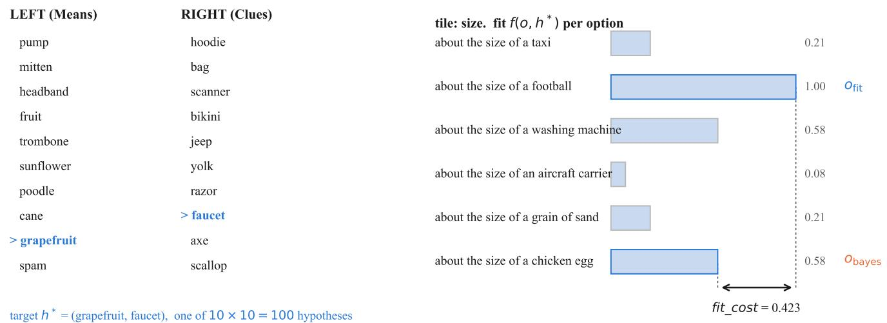
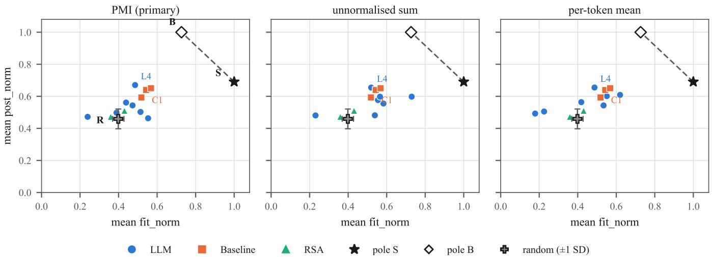
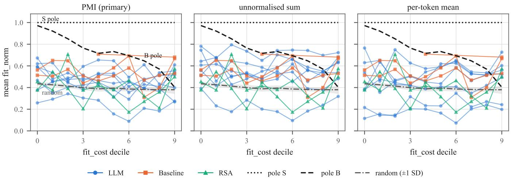
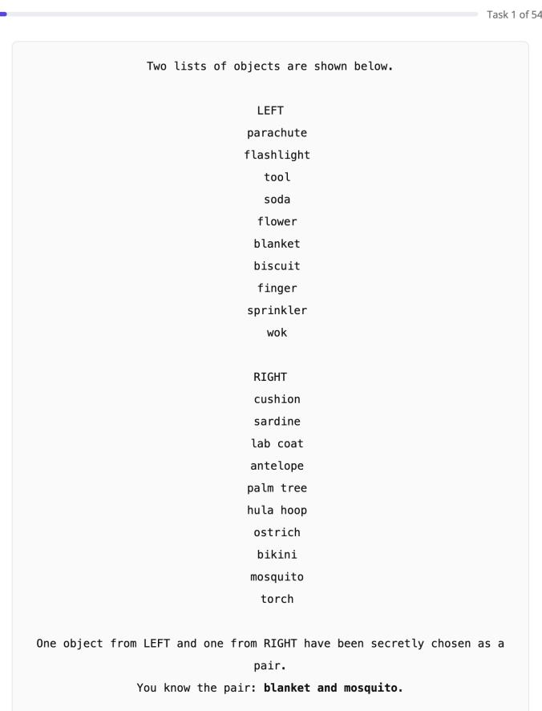
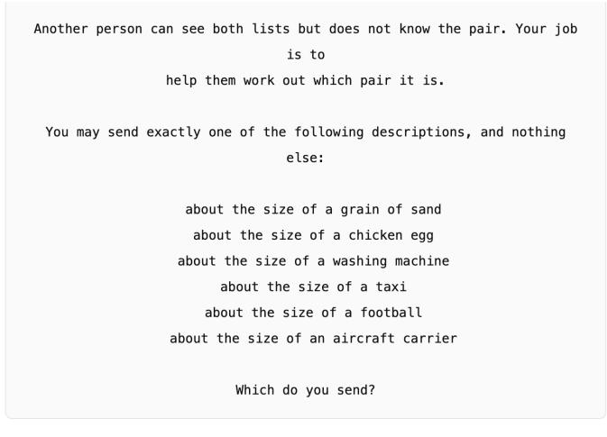

# Consistency Without Alignment: Item-Sensitive Language Models Indistinguishable From Random

Cris Huynh

Independent researcher

crishuynh2004@gmail.com

Abstract—Item-sensitivity, whether a model’s choice depends on the specific input rather than on its own output prior, is widely reported as evidence that a model is doing a task. We show this evidence is necessary but not sufficient, in a forcedchoice signalling task, abstracted from the board game Deception: Murder in Hong Kong, where the reference points a coordinate should be judged against, a fit-maximising strategy, a posteriormaximising strategy, and uniform random selection, are all computable in closed form. Across seven language models, two model families, a post-training ablation, and three independent scoring rules, every one of 21 model-by-rule cells is reliably item-sensitive. Yet 8 of those 21 cells are not statistically distinguishable from a chooser that ignores the item and selects at random, and 5 score worse than random at describing the target. Item-sensitivity and distance from random correlate at only r = 0.30. We call this consistency without alignment and argue it generalises to any evaluation that reports item-sensitivity, permutation consistency, or self-consistency as evidence of task competence without an independent reference for the quantity being measured. We further find that a literal-similarity baseline with no pragmatics outperforms most of the language models tested, that adding a pragmatic layer over two baseline similarity sources moves choosers toward random rather than toward the Bayesian reference, and that a standard labelled multiple-choice format carries no measurable content signal here. All results are on the model side of a pre-registered instrument; a matched human condition is designed and piloted but not yet collected.

## I. INTRODUCTION

Item-sensitivity metrics, whether a model’s output depends on the specific input it is shown rather than on its own output prior, are widely used as evidence that a model is doing a task: permutation consistency, self-consistency across rephrasings, and agreement across resamples all take this form. We show that this evidence is necessary but not sufficient, in a setting where we can compute what it is missing exactly.

Seven language models, spanning four orders of magnitude in parameter count, two model families, and a post-training ablation, are reliably item-sensitive on the tile we analyse. Every model responds to which item it is shown, under every one of three token-normalisation rules we test, with zero exceptions across 21 model-by-rule cells. Yet on the coordinate the task is built to measure, a chooser’s position between a fitmaximising strategy and a posterior-maximising one, eight of those same 21 cells are not statistically distinguishable from a chooser that ignores the item and selects uniformly at random. Five cells score worse than random at describing the target. Across cells, how item-sensitive a model is correlates with how far its coordinate sits from random at only $r ~ = ~ 0 . 3 0$

Knowing that a model responds reliably to an input tells you little about whether it responds to anything the experimenter cares about.

We call this consistency without alignment, and take it to be a hazard for any evaluation that reports an itemsensitivity statistic as evidence of task competence, on any task. The statistic alone has no reference point. Without a baseline computed independently of the model, a measure of dependence on the input cannot distinguish “responds to the feature we intend to measure” from “responds reliably to some other feature of the input.” Demonstrating the gap requires a setting where that independent reference is computable, not estimated or assumed, which is what the rest of this paper builds.

a) The setting: is a constrained cooperative channel embedded in an adversarial audience: one party knows a hidden target pair of concepts and must communicate it by selecting a single option from a menu that was never designed to express it, forced lossy encoding. It is abstracted from the board game Deception: Murder in Hong Kong (Tobey Ho, Grey Fox Games), in which a player who alone knows a hidden pair of cards may communicate them to the other players only by placing markers on a fixed set of categorical scene tiles; Section III-A states what we take from it and what we do not. We use it because the two competing accounts of how a chooser resolves that constraint, select the best-fitting description or select the most discriminating one, have closedform coordinates here: the hypothesis space is small enough to enumerate exactly and the underlying similarity function is a closed-form quantity fit to human judgements rather than to text or to model output. A third reference, uniform random selection, is equally closed-form. All three give a model’s coordinate something external to be measured against. The setting is the instrument; the claim above is what it is for.

b) Contributions:

• We show that item-sensitivity and alignment with either of two normative criteria are empirically dissociable. Excess, our item-sensitivity statistic, is positive in 21 of 21 model-by-rule cells; the same 21 cells’ coordinates range from indistinguishable from random to 91 percent of the way to a salience reference, with no relationship strong enough to predict one from the other $( r = 0 . 3 0 )$

• We give a general diagnosis: item-sensitivity metrics need an independent reference for the quantity of interest, not only a null for the metric itself. We build the reference this task was missing, a marginal null for excess and a random-selection baseline for the coordinate, and show that the second one changes what an existing headline result means (Section IV-B).

• We report where the models tested actually land. A mandatory literal cosine-similarity baseline with no pragmatics outperforms most of the language models on this axis (Section IV-F). Adding a pragmatic, RSA-style layer over two similarity-based baselines moves them toward random rather than toward the Bayesian reference (Section IV-H), and two of the four candidate baselines cannot supply that layer’s required literal semantics for structural reasons unrelated to coverage or noise.

• We report a labelled multiple-choice response format, standard in evaluation practice, that carries no measurable content signal in this setting: permutation consistency is at or below chance in all 32 model-by-tile-by-label cells (Section IV-H).

Everything above is measured on the model side of a preregistered instrument; the fit function, the item set, the scoring rule, and the sensitivity battery were all fixed before any model was run, and every model-side number is reported as post hoc against that fixed instrument. The human side of the instrument is built and piloted but not yet collected (Section V). The central claim, that item-sensitivity is not evidence of alignment without an independent reference, is a statement about the model results already in hand and does not depend on what the human data will show.

## II. RELATED WORK

## A. Generalization and similarity

The fit function is the exponential form of Shepard’s universal law of generalization [1], applied to psychological scales, which is why it carries no fitted decay rate. Nosofsky’s GCM [2] uses Gaussian similarity for integral dimensions and exponential similarity for separable ones, so the family is stimulus-dependent even within that literature. We therefore treat the decay family as a reported dimension and run the entire analysis under both forms rather than choosing one.

## B. Rational speech acts, and what is and is not ours

Frank and Goodman [3] formalise a pragmatic speaker that trades informativeness against distractor confusability. That trade-off is theirs, not ours: the relationship between $O _ { \mathrm { { f i t } } }$ and $O _ { \mathrm { b a y e s } }$ we use it to define (Section III-E) is an identity that follows from the fit function’s construction, not an empirical finding, and publishing it as a discovery would be a serious error.

What is ours is narrower and, we think, more useful. We build a setting in which the trade-off is exactly computable, because the hypothesis space is small enough to enumerate and the likelihood is a closed-form function of human-derived ratings, and we then measure which criterion each population actually follows. The domain-specific quantities are the conflict rate, which ranges from 3.78 percent to 37.82 percent by tile, and the magnitude, whose median local competition ratio is 1.842.

## C. Concept norms and similarity data

THINGS [4] supplies the concept universe, THINGSplus [5] supplies the property ratings from which tiles are built, and SPoSE [6], fit to the odd-one-out triplets of [7], supplies a dense human-derived similarity space. The distinction matters for our design. SPoSE is a compression of human judgements rather than a language model, so using it to define the independent variable does not make the analysis circular. The test is provenance, not format: a 66-dimensional vector is admissible if it was fit to human judgements and inadmissible if it was fit to text. We describe it as a human-derived embedding and never as “an embedding”.

## D. Word association

Condition 2 uses SWOW [8]. Its cue list was built by snowball sampling from association and feature-production norms, then expanded with frequent responses, and that construction is the measured mechanism behind our vocabulary’s naturalkind retention bias rather than merely a plausible explanation for it (Appendix A). A concept enters the cue list largely by being the kind of word people produce in free association, which corpus frequency does not measure and SWOW’s own response frequency does.

## E. Covariates and symbolic knowledge

We carry concreteness [9] and subtitle frequency [10] as covariates, using the columns already sense disambiguated within THINGS rather than string-matching the standalone norms, which would reintroduce the homograph ambiguity those columns resolve. Condition 3 uses ConceptNet [11].

## F. Human-model comparison and cooperative word games

Hu et al. compare human and language-model performance on pragmatic language understanding using a shared instrument administered to both populations [12]. Our design, in which the intended human condition receives the identical stimulus a model receives and produces a response scored on the same coordinate, is built in that tradition, applied to a single signalling task with a closed-form reference rather than a battery of tasks scored by human judgement.

Stephenson et al. use the party game Codenames as a benchmark for language models [13], with clue-givers generating a free one-word clue over an effectively open vocabulary. That openness is realistic and is also why an exact Bayesian oracle or an exact random-selection reference is not available there: the hypothesis space of possible clues cannot be enumerated. Our menu trades that openness for a closed, fixed option set of 3 to 8 items specifically so that the salience, Bayesian, and random references in Section IV-B are computable exactly rather than estimated.

The closest prior work to our design is Shaikh et al., who build the Cultural Codes dataset from Codenames Duet, a cooperative two-player word game, collecting 794 games (7,703 turns, 153 players) together with each player’s sociocultural background, and show that modelling a player’s sociocultural priors jointly with the game context improves prediction of both clue-giving and guessing [14]. Their setting and ours share the cooperative structure and a pragmaticspeaker lineage, but differ in what is held closed and what is left open. Codenames Duet’s clue vocabulary is effectively unconstrained, so the space of possible messages cannot be enumerated, and their account of pragmatic reasoning is fit to predict which clue a player chose among many rather than compared against an exactly computable reference. Our menu is a small, fixed, closed set chosen so that a fit-maximising strategy, a posterior-maximising strategy, and uniform random selection are all closed-form coordinates a model’s choice can be measured against exactly (Section III-F1). We also study a single homogeneous literal-listener account rather than heterogeneity across human sociocultural backgrounds, which is Shaikh et al.’s central question and is outside the scope of the model-side results reported here.

## III. METHODS

## What is pre-registered and what is not

The instrument was fixed before any model was run. The fit function, the aggregation over the target pair, the oracle, the item set and its selection gates, the scoring rule, and the sensitivity battery are all pre-registered in a frozen document. Every model-side measurement reported here is post hoc. The measurements are post hoc; the instrument is not. Amendments made after model data existed are listed in the frozen document’s own disclosure and in a dated amendment.

## A. Setting

The task is abstracted from the board game Deception: Murder in Hong Kong, designed by Tobey Ho and published by Grey Fox Games. In that game one player knows a hidden pair of cards, a murder weapon and a piece of evidence, and may communicate it to the other players only by placing markers on scene tiles, each of which offers a small fixed set of categorical options that was not written with those particular cards in mind. We take only that structure. No card text, tile art or rulebook wording is reproduced here, and all semantic content in our items comes from the open datasets described below.

The task is abstracted from a cooperative signalling problem embedded in an adversarial audience. One party knows a hidden target pair of object concepts, (Means, Clue), and may communicate it only by selecting one option from a fixed menu that was not designed to express it. We call this forced lossy encoding: choosing the least-bad symbol from a closed set.

An item presents M candidate Means, C candidate Clues, and a single tile, which is a categorical dimension with an option set O. The hypothesis space is every $M \times C$ pairing, exactly one of which is the target. Grid distractors rather than independently sampled ones are what create the confusion an option must resolve. Uniform distractors are independent of the target and generate no discrimination pressure. We use $M \ = \ C \ = \ 1 0 .$ giving 100 hypotheses. Each item carries one tile. This removes the conditional independence assumption that multiplying likelihoods across correlated tiles would require, and it makes the oracle assumption-free.

## B. Concept vocabulary

Concepts come from THINGS [4], with property norms from THINGSplus [5]. The vocabulary universe is the intersection, computed before any filtering, of THINGS concepts that have dimension ratings, triplet coverage, a Small World of Words cue match [8], and non-null concreteness and frequency. No concept enters that some condition cannot score, because a condition scored on a different subset is not a comparison.

SWOW matching is exact-case string equality on the THINGS Word field, with no lemmatisation, stemming or fuzzy matching, and with homographs excluded on both sides. A cue shared by two concepts blends both senses, which is semantic contamination rather than a coverage gap. Case-folding would admit nine further concepts, two of which were collected as personal names, so the cost asymmetry argues against it. The SWOW overlap is the binding constraint at roughly 67 percent. Applying only a part-of-speech filter, which is definitional rather than a tuning knob because THINGS prescreened for concreteness, familiarity and nameability, yields a pool of 1,118 noun concepts.

Our vocabulary carries a measured sampling bias toward natural kinds, whose mechanism we trace to how the SWOW cue list was built. We report it in Appendix A because it describes our sample rather than our result.

## C. Tiles

Tiles are property tiles rather than category tiles. THINGSplus typicality is defined only where category membership exists, which leaves roughly 97 percent of the conceptby-category matrix empty, and fit off the membership diagonal is exactly the region the design must measure. Treating missing typicality as zero would be false: a hammer is a decent weapon and would score zero. Property ratings are defined for every concept on every dimension, so fit is continuous everywhere.

We selected four dimensions by taking, within each redundant cluster $( | r | > 0 . 7 )$ , the dimension with the lowest rater-disagreement ratio, defined as mean within-concept SD divided by between-concept SD. File order was not a criterion. The four are manmade (0.379), size (0.409), hold (0.658) and moves (0.735), and the largest pairwise correlation among them is −0.63. Three further dimensions were excluded on two independent grounds, either of which is sufficient. Arousal, precious and pleasant have within-concept rater SD exceeding between-concept SD, at ratios of 3.53, 1.62 and 1.14, so an option set built on them would sort rater noise rather than concept differences. All three are also evaluative rather than descriptive, and an option meaning “the object was pleasant” is not the signalling task.

Bin boundaries come from the rating instrument and never from the pool. The paper studies a menu that was not designed for the messages it must carry, so placing boundaries where our concepts happen to cluster would build a channel well matched to the message space, and the absence of that match is the object of study. Likert dimensions bin on the nominal 1 to 7 range. Size bins on the instrument’s own anchor objects at uniform 60-unit spacing, and the six size options are the anchor phrases verbatim. End bins take the same width as interior bins, because width is the denominator of the fit function and unequal widths would inflate fit at the extremes as a measurement artifact. Bins that are empty or thin by construction are acceptable and informative, since an option that fits nothing in the pool is a real property of a fixed menu.

## D. Fit

For an option o with interval $I _ { o } ,$ and a concept with value v,

$$
f ( o , x ) = \left\{ \begin{array} { l l } { 1 } & { v \in I _ { o } , } \\ { \exp ( - \mathrm { d i s t } ( v , I _ { o } ) / \mathrm { w i d t h } ( o ) ) } & { \mathrm { o t h e r w i s e } , } \end{array} \right.\tag{1}
$$

with the width taken from the instrument, so the function has no free parameter. The exponential form is the theoretically motivated one: generalization decays approximately exponentially with distance in psychological space [1], and these are psychological scales. A linearly truncated alternative censors straddle magnitude, because every pair spanning more than one bin width scores exactly zero, so a pair 1.2 widths apart and one 4 widths apart would record identically.

Fit for a pair is the minimum over its two members. Both max and centroid return 1.0 for every target on every tile, which collapses the design to a line, and centroid additionally selects an option that describes neither member on 100 percent of straddling pairs. Taking the mean discards straddle magnitude, which is the quantity the design exists to vary. Under the minimum, fit is strictly positive everywhere, so the normalising sum is never zero and no fallback distribution is ever introduced. A uniform fallback is permanently rejected, because it would make the least describable pairs indistinguishable from uniformly describable ones.

P(option | hypothesis) is the primitive, and target fit and distractor attraction are derived from it. The two therefore cannot contradict the oracle about which option is best.

## E. Oracle

The oracle enumerates the exact posterior over all 100 hypotheses under a uniform prior. Where two options are exactly tied, $O _ { \mathrm { b a y e s } }$ is defined lexicographically as maximum posterior, then maximum fit among the options achieving it. The tie is neither rare nor arbitrary, and its algebraic condition is given in Appendix B.

The oracle is an S1 speaker addressing a literal listener. It does not model a listener who reasons about the speaker’s strategy.

a) Why $o _ { f i t }$ and $o _ { b a y e s }$ can $\begin{array} { r } { d i f f e r ; } \end{array}$ This is load-bearing for the primary dependent variable defined in Section III-F1, so we state it here rather than only in Related Work. With a uniform prior,

$$
\begin{array} { r } { P ( h ^ { \ast } \mid o ) = f ( o , h ^ { \ast } ) \big / \sum _ { h } f ( o , h ) , } \end{array}\tag{2}
$$

$O _ { \mathrm { { f i t } } }$ maximises the numerator and $O _ { \mathrm { b a y e s } }$ maximises the ratio, so wherever the two differ, the denominator, which sums $f ( o , h )$ over every hypothesis and so measures how much that option also fits the distractors, is necessarily smaller at $O _ { \mathrm { b a y e s } }$ . Fitmaximising and posterior-maximising options diverge exactly when an option’s fit to distractors, not only to the target, varies across the option set. This holds by construction of the fit function and the uniform prior; it is an identity, not an empirical finding, and Section II-B states why publishing it as a discovery would be a serious error.

## F. Items

We generated 200,000 candidate items and assessed robustness in a separate pass, so that the generator stays inspectable before filtering and a threshold change does not force regeneration. Selection uses item properties only and never model performance. The selection rule is declared, and the unselected distribution is published alongside the selected one. The final set is 1,000 items, tile-balanced, half conflict and half control.

The measured item property is decision conflict, meaning that the option maximising target fit differs from the option maximising the listener’s posterior. It is not position in a fitby-attraction grid, which describes only the chosen option and cannot detect conflict. Conflict rates are domain specific, at 3.78 percent on manmade and 37.82 percent on size. The median local competition ratio is 1.842.

1) Definitions: Write $h ^ { * }$ for the true target pair, $O$ for the item’s option set, and $f ( o , h )$ for the pair fit of option o under hypothesis h. Then

$$
o _ { \mathrm { f i t } } = \arg \operatorname* { m a x } _ { o \in O } f ( o , h ^ { * } ) ,\tag{3}
$$

$$
o _ { \mathrm { b a y e s } } = \arg \operatorname* { m a x } _ { o \in O } P ( h ^ { \ast } \mid o ) ,\tag{4}
$$

with $\begin{array} { r } { P ( h ^ { * } \mid o ) \ = \ f ( o , h ^ { * } ) / \sum _ { h } f ( o , h ) } \end{array}$ under the uniform prior, and ties in $O _ { \mathrm { b a y e s } }$ broken lexicographically as described above.

The primary dependent variable is the position of a chosen option a on two axes, each min-max normalised within that item’s own option set:

$$
\mathtt { \ f i t \_ n o r m } ( a ) = \frac { f ( a , h ^ { * } ) - \operatorname* { m i n } _ { o } f ( o , h ^ { * } ) } { \operatorname* { m a x } _ { o } f ( o , h ^ { * } ) - \operatorname* { m i n } _ { o } f ( o , h ^ { * } ) } ,\tag{5}
$$

$$
p o s t \_ n o r m ( a ) = \frac { P ( h ^ { * } \mid a ) - \operatorname* { m i n } _ { o } P ( h ^ { * } \mid o ) } { \operatorname* { m a x } _ { o } P ( h ^ { * } \mid o ) - \operatorname* { m i n } _ { o } P ( h ^ { * } \mid o ) } .\tag{6}
$$

By construction $\begin{array} { r } { f i t \_ n o r m ( o _ { \mathrm { f i t } } ) = 1 } \end{array}$ and $p o s t \_ n o r m ( o _ { \mathrm { b a y e s } } ) = 1$ so a chooser that always selects $O _ { \mathrm { { f i t } } }$ sits at the salience pole and one that always selects $o _ { \mathrm { b a y e s } }$ sits at the Bayes pole. Fig. 1 shows one item with both marked, and the two poles are easiest to build intuition for by walking through what each chooser sends on it and why.

A fit-maximising chooser asks only how well an option describes the target, regardless of what else it could describe. Of the six size options, “about the size of a football” fits grapefruit and faucet’s true sizes most closely, $f = 1 . 0 0$ , so that is what such a chooser sends, and this is $o _ { \mathrm { f i t } } . \mathrm { A }$ posteriormaximising chooser asks a different question, which of the options best distinguishes this particular pair from the other 99 candidate pairs the listener must also consider. “About the size of a football” is a poor answer to that question: it is also true of 468 of the 1,118 pool concepts, the most crowded of the six size bins, so naming it barely narrows down which pair was meant. “About the size of a chicken $\mathrm { e g g } ^ { \prime \prime }$ fits the target a little worse, $f = 0 . 5 8$ , but its bin holds 231 concepts, roughly half as many, so sending it concentrates the listener’s posterior over hypotheses more than the better-fitting option does. That is what a posterior-maximising chooser sends, and it is $O _ { \mathrm { b a y e s } } .$ fit cost is exactly the fit given up, $1 . 0 0 - 0 . 5 8 = 0 . 4 2$ , to buy that concentration.

We define fit $\begin{array} { r } { _ { c o s t } = f ( o _ { \mathrm { f i t } } , h ^ { * } ) - f ( o _ { \mathrm { b a y e s } } , h ^ { * } ) } \end{array}$ as the item difficulty variable and the x-axis of the divergence analysis. It is what a speaker gives up in description quality by choosing to discriminate. The posterior gap measures what the listener gains instead, and the two dissociate. Where fit cost is near zero, a salience-driven chooser and a rationality-driven chooser are indistinguishable however large the gap.

## G. Rendering

Concepts are presented as bare words. We removed glosses after a leak audit found 206 leaking occurrences across 174 items, and because SWOW respondents saw bare cue words, so glossing would introduce a presentation mismatch with the baseline we compare against. The two candidate lists are disjoint by construction, because a duplicated concept puts a self-pair into the hypothesis space whose fit under the minimum is at least that of any genuine pair containing it. No listed concept name may appear as a substring of any option text on that item’s tile. The rule is a pure substring test and deliberately over-fires, because orthographic coincidence cannot be distinguished from semantic priming without percase adjudication, and a reader sees the letters regardless of etymology. Option order is randomised per rendering, the permutation is stored, and each item has two permutations.

## H. Scoring

Models are scored by log-probability over the option set. There is no generation path, so no generated string is ever parsed and no near-match tolerance exists.

Scores are PMI-normalised [15], using one rule across conditions 4 to 6:

$$
\operatorname { s c o r e } ( o ) = \log P ( o \mid { \mathrm { p r o m p t } } ) - \log P ( o \mid { \mathrm { n e u t r a l ~ p r o m p t } } ) .\tag{7}
$$

A normalisation that varied across conditions would confound the comparison. Normalisation is necessary rather than decorative. Within a single tile the options differ in length by up to a factor of two, and on moves the option “moves” is one token where “stays still” is three, so an unnormalised sum favours the short option mechanically. We reject the per-token mean because it trades a bias toward short options for a bias toward predictable ones.

The neutral prompt is the real menu with all item content stripped, in the order that rendering displayed it. An earlier menu-free neutral prompt was wrong: a model’s prior over option strings exists only when a menu is present and varies with the option count, so one table cannot serve 3-option, 4- option and 6-option tiles. Options are tokenized in place within the rendered prompt and never standalone, because a leading space changes the token count.

We compute the unnormalised sum and the per-token mean in the same pass, and they are not a footnote. The three rules agree on the chosen option only 58.0 percent and 63.4 percent of the time, which is the same magnitude of methodological uncertainty as the choice of decay family. Every finding below is therefore recomputed under all three rules and reported under all three, and any finding that holds under one rule only is stated as rule-dependent in the sentence that makes it. PMI is primary because it was fixed in advance, never because it wins.

Ties are scored as the mean coordinate over the tied options, which is an expectation under indifference rather than a tiebreak, and array order plays no part.

1) The random reference: Two poles bound the coordinate above but nothing bounds it below, so we add a third reference: uniform selection over the option set. Its expected coordinate is computed per item as the mean of fit norm and post norm over that item’s options, then averaged. On the 125 size conflict items this is $\hbar t \_ n o r m = 0 . 3 9 8 5$ (SD 0.0294 across items) and post norm = 0.4593 (SD 0.0617). We report the spread because a reference drawn as a single point invites the reader to treat it as exact.

2) Intervals: Intervals are 95 percent percentile bootstrap, 4,000 resamples, with the item as the resampling unit. Two permutations of the same item are not independent observations, so the 125 items rather than the 250 renderings are the clusters. Where we compare a model against the random reference we resample the paired per-item difference. We report percell intervals and, where a count across the 21 model by rule cells is at issue, we also state the count under a Bonferroni correction.

## I. Response format

We pre-registered two prompt formats, because forcedchoice answers are known to flip on trivial relabelling [16]. Format L, in which options are labelled and the answer is a letter, is retired as a measurement condition and reported as a result in Section IV-H. All analyses use format V, in which the answer repeats the option text. Appendix C shows the interface built for instrument testing.

## J. Models and environment

The ladder is Qwen3 at 0.6B, 1.7B, 4B and 8B [17], chosen because scale varies while the training recipe does not, which is what a scale claim requires. The 1.7B and 8B base models give a post-training ablation, and OLMo-2-7B-Instruct [18] is a cross-family control, preferred because its pretraining data is open.

  
Fig. 1. One item. The chooser knows the target pair $h ^ { \ast } =$ (grapefruit, faucet), marked on the two lists, and must send one of the six size options. The bars are $f ( o , h ^ { * } ) ,$ , the fit of each option to the target. $o _ { \mathrm { { f i t } } }$ is “about the size of a football”, which describes the target best at 1.00. $O _ { \mathrm { b a y e s } }$ is “about the size of a chicken egg”, which describes it worse at 0.58 but discriminates it better from the other 99 hypotheses. The gap between them is $\hbar t \_ c o s t ,$ here 0.423: what a chooser gives up in description quality by discriminating.

All runs are fp16 on two T4 GPUs, with pinned model revision hashes, tokenizer, seed and library versions. Every rung runs at the same precision, because a scale trend measured across mixed precisions cannot be distinguished from a quantization artifact.

We measure one precision effect rather than removing it. Different batch sizes select different GEMM reduction orders, which gives an fp16 noise floor of about 0.24 in summed log-probability on realistically padded batches. A diagnostic separates precision from correctness: the equivalent fp32 check collapses to $1 . 9 \times 1 0 ^ { - 6 }$ , which proves the padding and positional encoding are correct, since a bug is not a precision effect and would survive fp32 at full magnitude. fp32 is unavailable rather than declined, because Qwen3-8B in fp32 is 32 GB against roughly 30 GB usable, T4 is Turing so bf16 is not native, and dropping one rung to another precision is forbidden. The correctness gate therefore runs once in fp32, and the per-rung fp16 check is dropped rather than loosened, because a check that cannot separate a bug from noise has no power. The size tile, which carries the primary analysis, is scored at batch size 1, so it has no padding and no batch effect. The remaining tiles are batched, with a batch-1 subsample rescored and the flip rate reported.

Two constraints govern cross-model comparison. Base models are scored with their instruct sibling’s chat template applied verbatim. Both alternatives confound something, but the template’s confound is one-directional and therefore informative: if base models show less item-sensitivity that is not attributable, whereas if they show the same or more, format unfamiliarity cannot explain it. Separately, cross-family comparisons are restricted to choice-based statistics, namely excess over the marginal null, permutation consistency, agreement rates and position bias. Raw log-probability magnitudes are never compared across families, because the ladder’s comparability rested on a shared tokenizer that the control breaks by construction. The run asserts that the tokenizer differs rather than assuming it.

## K. Conditions

The eight conditions are: (1) embedding cosine with no pragmatics, a mandatory literal baseline that is never omitted; (2) SWOW random-walk association [8]; (3) ConceptNet path scoring [11] from a local dump; (4) LLM zero-shot; (5) as (4), with the hypothesis space made salient by one added sentence; (6) an RSA layer; (7) the exact Bayesian oracle; and (8) humans.

Conditions 1 to 3 hold pair aggregation and word-level aggregation constant with the rest of the design, so that comparing them isolates the similarity source rather than confounding source with aggregation.

## IV. RESULTS

Unless stated otherwise, results are on the 125 size conflict items, which are the primary analysis set. Every figure is reported under all three scoring rules, and means are reported with medians.

## A. Models respond to items

We measure item-sensitivity as excess: the probability that a model makes the same canonical choice for an item under both stored permutations, minus what its own marginal option preference would produce. A uniform null would be wrong here, because a model choosing one option 93 percent of the time

scores 0.87 consistency while being entirely item-insensitive.   
This corrects an earlier version of our own diagnostic.

On size, excess is positive in every one of the 21 model by rule cells, covering seven models under three scoring rules with no exception. On the 125 conflict items it ranges from +0.024 to +0.260. It is the only tile with this property, which we return to in Section IV-H.

Read on its own, this says the models are doing the task. Every model responds to the item rather than to its own option preference, under every scoring rule, including the base models and the cross-family control. Section IV-B shows what that does and does not buy.

## B. Models align with neither criterion

Each item defines two poles. The coordinate at $O _ { \mathrm { { f i t } } }$ is where a salience-driven chooser lands, and the coordinate at $O _ { \mathrm { b a y e s } }$ is where a rationality-driven chooser lands. On this set the salience pole sits at post norm = 0.691 and the Bayes pole at 1.000. Uniform random selection sits at 0.459, with a standard deviation of 0.062 across items.

We report raw post norm as the primary quantity and the salience-to-Bayes fraction only as a secondary. The interval is 0.309 wide, so per-item fractions are unstable where an item’s own span is small, and an earlier version of this analysis produced values of −1 to −4 on a quantity bounded near [0, 1] before we moved off the ratio.

a) Models occupy the band between random and salience: All 21 model by rule cells fall between the random reference and the salience pole, from 0.463 to 0.670 (Fig. 2). None reaches the salience pole and none approaches the Bayes pole. Expressed as a fraction of the gap from random to salience, the cells run from +0.02 to +0.91, and the highest is the 8B instruct model under PMI.

The earlier framing of this result, that models sit outside the salience-to-Bayes interval, is true and nearly vacuous. Random selection sits at −0.75 on that scale, further outside the interval than 20 of the 21 cells, so a coin flip satisfies the claim. What the random reference buys is the ability to say where in the band each model sits.

b) Eight of21 cells are not distinguishablefrom random: Comparing each cell against the per-item random reference, with the item as the resampling unit, eight cells have a 95 percent interval that includes zero: all six base-model cells, the cross-family control under PMI, and the 0.6B instruct model under PMI. The paired differences there run from +0.004 to +0.046. Under a Bonferroni correction across the 21 cells, 11 are not distinguishable.

This is a precision statement rather than an equality claim. At 125 items the intervals are roughly ±0.06 wide, so we can say these cells are not distinguishable from random and we cannot say they are equal to it.

c) Five of 21 cells are worse than random at describing the target: On the fit axis the random reference is 0.399. Five cells fall below it: the cross-family control under PMI at 0.239, the 8B base model under the unnormalised sum at 0.231 and under the per-token mean at 0.179, the 1.7B base model under the per-token mean at 0.225, and the 0.6B instruct model under PMI at 0.389. This is a different claim from misalignment. These choosers select options that describe the target worse than a coin flip would.

d) Mean and median say different things, and both are true: Table I reports both, on the item-clustered basis described above $( n = 1 2 5 )$ . Mean and median diverge in both directions and by no consistent amount: mean exceeds median in 7 of the 21 cells and median exceeds mean in the other 14, so neither statistic is redundant with the other and neither summarises a simple two-point distribution. Under item-clustering, no model by rule cell has even half its items agreeing with $O _ { \mathrm { { f i t } } }$ on both stored permutations, which is the criterion for landing exactly at the salience pole, so we do not describe the coordinate as bimodal at the poles. A per-rendering count that treats the two permutations as independent gives a different, larger figure, and we do not use it, for the same reason we resample by item rather than by rendering in Section IV-B.

The 8B instruct model is the case where the direction matters. Its median is 0.74 to 0.86 across the three rules, above its own mean in all three and well above every other model’s median, so on the typical item it sits closer to the Bayes pole than the other six models do on theirs. That is one rung differing from three, and it is not a scale claim.

## C. Consistency is not alignment

Sections IV-A and IV-B are in tension, and resolving that tension is this paper’s main claim.

Excess is positive in 21 of 21 cells. Eight of those same cells sit at a coordinate that is not distinguishable from random. Every one of the eight has positive excess, from +0.024 to +0.216, and the sharpest case is the 8B base model under the unnormalised sum: its excess of +0.216 is the third highest of all 21 cells, while its coordinate is +0.022 from random with an interval spanning zero.

Across cells, excess and distance from random correlate at only $r ~ = ~ + 0 . 3 0$ . Knowing that a model responds reliably to the item tells you very little about whether it responds to anything the experiment is about.

We take this to generalise past this study. Excess, permutation consistency, and the wider family of item-sensitivity and self-consistency metrics all measure whether a model’s output depends on the input rather than on its own output prior. They are necessary conditions for a model doing a task, and they are often reported as though they were sufficient. They are not. A model can be strongly item-sensitive while tracking a feature of the item that the experimenter does not care about, and no amount of consistency will reveal that. Detecting it requires a reference for the quantity of interest, which is what the random baseline supplies here and what the marginal null supplies for excess.

## D. Achieved fit is the discriminating axis

Because $\begin{array} { r } { f t _ { \mathrm { - } } c o s t = f ( o _ { \mathrm { f i t } } , h ^ { \ast } ) - f ( o _ { \mathrm { b a y e s } } , h ^ { \ast } ) } \end{array}$ , the two strategies separate on it by construction, on the fit axis. A salience chooser holds normalised fit at 1.000 regardless of fit cost, whereas a Bayesian chooser’s achieved fit falls as fit cost rises. Measured across deciles, the Bayes pole falls from 0.972 to 0.403 and the separation grows monotonically from 0.028 to 0.597. On the posterior axis the separation is smaller and non-monotone, from 0.128 to 0.415, because the salience pole already averages 0.691 there.

  
Fig. 2. Every chooser against three references, faceted by scoring rule. S is the salience pole, B is the Bayes pole, and R is uniform random selection over the option set, drawn with plus or minus one standard deviation across items. Models occupy the band between random and salience. Baselines and RSA layers have no scoring-rule dimension, so they repeat across panels. Colour marks the family and marker shape repeats it, so identity is never carried b colour alone.

TABLE I  
COORDINATE SUMMARY PER MODEL AND SCORING RULE, ON THE 125 SIZE CONFLICT ITEMS. MEAN AND MEDIAN ARE RAW post norm (RANDOM REFERENCE 0.459, SALIENCE POLE 0.691, BAYES POLE 1.000). EXCESS IS ITEM-SENSITIVITY OVER THE MARGINAL NULL (SECTION IV-A). ∆RANDOM IS THE PAIRED DIFFERENCE FROM THE PER-ITEM RANDOM REFERENCE (SECTION IV-B); A DAGGER MARKS A 95 PERCENT INTERVAL THAT EXCLUDES ZERO.
<table><tr><td></td><td colspan="3">PMI (primary)</td><td colspan="3">unnormalised sum</td><td colspan="3">per-token mean</td></tr><tr><td>Model</td><td>mean</td><td>median</td><td>excess</td><td>mean</td><td>median</td><td>excess</td><td>mean</td><td>median</td><td>excess</td></tr><tr><td>Qwen3-0.6B</td><td>0.498</td><td>0.500</td><td>+0.048</td><td>0.555†</td><td>0.560</td><td>+0.130</td><td>0.543†</td><td>0.558</td><td>+0.109</td></tr><tr><td>Qwen3-1.7B</td><td>0.543†</td><td>0.507</td><td>+0.080</td><td>0.577†</td><td>0.537</td><td>+0.059</td><td>0.564†</td><td>0.530</td><td>+0.094</td></tr><tr><td>Qwen3-4B</td><td>0.561†</td><td>0.525</td><td>+0.090</td><td>0.598†</td><td>0.617</td><td>+0.223</td><td>0.609†</td><td>0.579</td><td>+0.182</td></tr><tr><td>Qwen3-8B</td><td>0.670†</td><td>0.740</td><td>+0.260</td><td>0.654†</td><td>0.811</td><td>+0.143</td><td>0.655†</td><td>0.862</td><td>+0.221</td></tr><tr><td>Qwen3-1.7B-Base</td><td>0.463</td><td>0.482</td><td>+0.097</td><td>0.482</td><td>0.506</td><td>+0.133</td><td>0.505</td><td>0.500</td><td>+0.024</td></tr><tr><td>Qwen3-8B-Base</td><td>0.503</td><td>0.500</td><td>+0.154</td><td>0.481</td><td>0.500</td><td>+0.216</td><td>0.493</td><td>0.499</td><td>+0.182</td></tr><tr><td>OLMo-2-7B</td><td>0.472</td><td>0.500</td><td>+0.146</td><td>0.598†</td><td>0.710</td><td>+0.048</td><td>0.601†</td><td>0.710</td><td>+0.069</td></tr><tr><td>random</td><td></td><td></td><td>0.459 (SD 0.062 across items), no rule dimension</td><td></td><td></td><td></td><td></td><td></td><td></td></tr></table>

On this axis models sit between fit norm 0.09 and 0.67, against the salience pole’s 1.000 and the random reference’s 0.399 (Fig. 3). The reference slopes are 0.00 for salience and about −0.90 for Bayes, and observed model slopes run from −0.43 to +0.25. We describe these as shallow rather than flat, because a slope of −0.43 is roughly halfway to the Bayesian reference and calling it flat would overstate the result. Only three of the 21 intervals exclude zero, all from one model and with the sign reversing across rules, so we claim no slope for

any model.

## E. The divergence curve is shallow under the primary rule

Under PMI, no model’s slope of mean coordinate onfit cost has an interval excluding zero. The 8B instruct model’s predicted change across the observed range is +0.002, against a pre-registered smallest effect of interest of 0.05. Under the other two rules, five cells do have intervals excluding zero, all positive. That is a rule-dependent result and is stated here as such.

This leaves an open question that our data can pose but not answer. Models are item-sensitive on size, so their choices depend on which item they see, yet their coordinate does not move with fit cost, which is the item property the design varies. Whatever they respond to is a feature of the item uncorrelated with the fit cost of discriminating. We can rule out two candidates. It is not the model’s own option preference, which the marginal null removes, and it is not position, because the coordinate is computed on the canonical option and permutation consistency is above the marginal null. Identifying what it is would require a manipulation the current item set does not contain, so we state the question and leave it open rather than speculate.

  
Fig. 3. Mean achieved fit against fit cost decile, faceted by scoring rule. The dotted line is what a salience chooser would score, the dashed line what a Bayesian chooser would score, and the dash-dot band is uniform random selection with plus or minus one standard deviation across items. Reference slopes are 0.00 for salience and about −0.90 for Bayes. Observed model slopes run from −0.43 to +0.25, so they are shallow rather than flat, and no interval excludes zero under the primary rule.

We also report the rate at which a model departs from $O _ { \mathrm { { f i t } } } .$ That rate is at a ceiling for most models, and the reason is structural rather than incidental. At the lowest decile the two options differ by only 0.028 of fit, so asking whether the chooser picked exactly $O _ { \mathrm { { f i t } } }$ has no floor there. The measure starts high because it is uninformative where fit cost is small. We report it, but it is not a basis for design decisions.

## F. The literal baseline outperforms most models

Condition 1, embedding cosine with no pragmatics, sits at post norm = 0.640, which is 78 percent of the way from random to the salience pole. That is above 15 of the 21 model cells. Condition 3 reaches 83 percent and condition 2 reaches 58 percent. Our pre-registration requires reporting condition 1 even if it wins, and on this measure it beats most of the ladder. It is also the one base condition that cannot support a pragmatic layer, as Section IV-H shows. We report both facts together, because the first alone reads as a recommendation and the second alone reads as a defect.

## G. Making the hypothesis space salient

Condition 5 adds one sentence to condition 4, telling the chooser that the other person will consider every possible pairing rather than only the one it has in mind. It changes the chosen option on roughly one item in six, with agreement between the two conditions at 0.834 overall.

The effect is concentrated in one model. Agreement is 0.888, 0.934 and 0.893 for the 0.6B, 1.7B and 4B instruct models, and 0.621 for the 8B. On manmade the 8B model’s agreement falls to 0.288 and the total variation distance between the two conditions’ option distributions reaches 0.690, so the added sentence relocates most of the probability mass. The same caution applies as elsewhere. This is one rung differing from three under one grouping, and we do not read it as scale.

## H. Negative results

These are results, not limitations. Limitations are stated separately in the pre-registration. A Results section organised around what worked would bury them, and we take them to be among the paper’s stronger contributions.

1) Two conditions are structurally ineligible for a pragmatic layer: RSA requires a literal listener, $L _ { 0 } ( h \mid o )$ . A prompted language model supplies $P ( o$ | prompt) with the prompt naming the target, which is a speaker likelihood, and deriving a listener from it by Bayes assumes the model is a rational speaker, which is what the layer exists to test. Separately, cosine similarity is signed, unbounded below, and carries no probabilistic interpretation: 12.1 percent of hypothesis entries are negative and $L _ { 0 } ^ { \alpha }$ is undefined at $\alpha = 0 . 5$ . We rejected every transform. Clipping at zero is parameter-free but not assumption-free, because it asserts that a negative cosine means zero compatibility elementwise, where our existing convention applies at the maximum. Shifting and softmax both reintroduce a free parameter. Of the four base conditions we nominated, two are ineligible, for two different structural reasons, and neither for a reason that coverage or noise would suggest. What a pragmatic layer can be built on is narrower than the literature’s usage implies.

2) The pragmatic layer moves choosers toward random: With the random reference in place this result reads more sharply than we first stated it. RSA over SWOW moves post norm from 0.593 to 0.510, and RSA over ConceptNet from 0.651 to 0.472. On the scale from random to salience that is a fall from 58 percent to 22 percent, and from 83 percent to 6 percent. RSA over ConceptNet ends up indistinguishable from a coin flip.

The question was not whether the layer moves choosers from salience toward Bayes, but whether it moves them into the interval at all. It moves them the other way, and specifically toward random rather than merely away from the poles. Coverage differs between a base condition and its layer, since RSA over ConceptNet scores 116 items where ConceptNet itself scores 55, and we never table the two together without stating that.

3) Three of four tiles carry no item-sensitivity: Only size shows excess over the marginal null. Under PMI, moves is below its own marginal at all four ladder rungs, meaning the choice moves with the permutation more than independent sampling would produce, and hold carries approximately nothing. This removes the low-end replication the design planned, so the primary curve rests on size alone. The specific mechanism is rule-dependent, since under the unnormalised sum and the per-token mean neither the moves nor the hold statement holds, while the conclusion that size is the only carrying tile survives all three rules.

4) The labelled response format carries no content signal: We pre-registered format L as the control on the normalisation, predicting that after correct normalisation the two formats should largely agree. It falsified. Permutation consistency is at or below chance in all 32 model by tile by label-form cells, so the canonical choice is statistically independent of the item. Eleven cells select a single letter on 100.00 percent of renderings, and every canonical distribution sits within 0.10 of uniform. The two label forms, (A) and bare A, agree on only 64.9 percent of choices. Format L measures the model’s letter prior and nothing else. This is a replication of a known effect, that multiple-choice language model evaluation is not robust to answer position and labelling [19], in a setting where we can additionally show the canonical choice carries no information at all rather than only a positional bias. We report it as the outcome of a pre-registered prediction that failed, which is what pre-registration is for.

5) Two parameters cannot affect an argmax: RSA’s rationality parameter is inert. Since $x ^ { \alpha }$ is strictly monotone increasing on $x \geq 0$ for $\alpha > 0 .$ , the exponent cannot reorder a non-negative vector, and the chosen option is identical across the swept range in 100.0000 percent of 2,000 base by item cells. Independently, condition 3’s decay base is inert for the same reason at a different point in the pipeline, because arg $\begin{array} { r } { \operatorname* { m a x } _ { o } d ^ { K ( o ) } = \arg \operatorname* { m i n } _ { o } K ( o ) } \end{array}$ for all $d \in \mathsf { \Gamma } ( 0 , 1 )$ . These are one finding stated twice. A parameter that looks like a reported dimension and is algebraically incapable of affecting the measure is a recurring property of this design rather than two coincidences. We never present four identical rows as convergent evidence. Both parameters remain live for any distributional report, where they sharpen rather than reorder.

## V. DISCUSSION

The central claim, that item-sensitivity is necessary and not sufficient for task alignment, is supported by the model-side results alone and is not contingent on what follows. The limits below bound what else can be concluded from this paper as it stands.

a) No human data yet: Condition 8 is designed and piloted for instrument testing only, and not collected. The random and salience references in this paper describe two idealised strategies; we do not yet know where a human chooser falls between them, and the paper’s design question, does either population track either criterion, is answered here only for models. The pre-registered instrument includes both a block powered to classify an individual participant’s strategy and a block powered to estimate a population curve, because a population mean can describe nobody if strategies vary across people; we treat that as a possibility the design should be able to detect, not as an established finding.

b) One tile carries the primary analysis: Of the four tiles in the design, only size shows item-sensitivity above the marginal null (Section IV-H); the other three do not replicate it, for reasons that are themselves rule-dependent. The fit cost analysis, the frontier position results, and the results table are consequently reported on size alone. We do not know whether the consistency-without-alignment result is a property of this task in general or is concentrated on the one tile with enough resolution to detect either strategy at all; the coarser tiles may show the same dissociation without our being able to measure it.

c) The oracle is a literal-listener account: $O _ { \mathrm { b a y e s } }$ is the optimum for an S1 speaker addressing a listener who does not reason about the speaker’s strategy. A model, or a person, reasoning about how the listener will interpret their own choice would not necessarily converge on $O _ { \mathrm { b a y e s } } .$ , and our claim that models sit far from the Bayesian reference should be read as a claim about this literal-listener account specifically, not about pragmatic rationality in general. Condition 5 tests whether making the hypothesis space explicit moves models, and it does move one of them substantially (Section IV-H); a fuller higher-order account is outside this paper’s scope.

d) The vocabulary carries a measured sampling bias: Appendix A reports a retention gap toward natural kinds and traces it to how the association norms underlying one of our conditions were constructed. We report it because it describes our sample, not because we believe it drives the results in Section IV-B, which are model properties rather than vocabulary properties; but a vocabulary drawn differently could in principle populate the item set differently, and we have not run that check.

e) What would change this paper’s central claim, and what would not: A different scoring rule showing all 21 cells clearly aligned with either reference would change it; we tested three rules and found none does. A different tile showing itemsensitivity without the random-indistinguishable cells would narrow it to the tiles we happened to pick with too little resolution, not remove it. Human data showing people also land indistinguishably from random on the harder items would extend the claim to a second population; human data showing people cleanly separate the two strategies would sharpen the contrast with models without weakening the model-side finding, which does not reference human behaviour to begin with. We do not see a result on the model side, obtained under the pre-registered instrument, that this paper’s central claim depends on and that we consider likely to reverse.

## VI. CONCLUSION

Across seven language models, two model families, a posttraining ablation, and three scoring rules, every model is itemsensitive on the tile that carries our primary analysis: every one of 21 model-by-rule cells responds to which item it is shown. Yet eight of those same 21 coordinates are not statistically distinguishable from a chooser that ignores the item and selects at random, and five describe the target worse than random selection would. Item-sensitivity and distance from a random reference correlate at only $r = + 0 . 3 0$ . We call this consistency without alignment: a widely used class of evidence that a model’s output depends on the input is necessary but not sufficient to show the model is doing the task the experimenter intends, and demonstrating the gap requires an independent reference for the quantity of interest rather than only a null for the metric itself.

The human arm of this instrument is designed and preregistered but not yet collected. It will place a second population’s choices on the same fit-posterior-random coordinate system used throughout this paper, test whether people separate into fit-maximising and posterior-maximising strategies where models do not, and extend the fit cost interaction, preregistered as confirmatory for humans and reported here only as descriptive for models, to a population where it has not yet been measured.

## ACKNOWLEDGMENT

This paper’s setting originated in conversations, while playing Deception: Murder in Hong Kong with friends, about whether a fixed menu of descriptions can carry an arbitrary message and how hard it is to build a chain of associations under that constraint. Deception: Murder in Hong Kong was designed by Tobey Ho and published by Grey Fox Games. We thank the friends who played it with us for that conversation, without naming them here.

## DATA AVAILABILITY

Released in the accompanying repository: the final item set (1,000 items, both stored permutations), the rendered prompts, the scored model choices under all three scoring rules, the full decision log, and all code used to generate, render, score, and analyse them. Not released: a redistributed copy of any source corpus. The Small World of Words association norms [8] are licensed CC BY-NC-ND, which blocks redistribution outright; we release only the scores and choices computed from them. ConceptNet [11] is licensed CC BY-SA 4.0, which permits redistribution under attribution and share-alike; we do not mirror our local dump and instead point to its public source. THINGS [4] and THINGSplus [5] are released by their authors under a CC0 public-domain dedication, which places no restriction on redistribution; we do not mirror the raw archive here and instead point to its canonical OSF repository (project jum2f). Every corpus we use can be reconstructed by a reader from its own public source and the acquisition steps in our data manifest.

## ETHICS STATEMENT

No human participants were recruited, and no participant data is reported in this paper; every result reported here is on the model side of a pre-registered instrument. Two colleagues reviewed the instrument for clarity and wording during its development; this review was instrument development rather than human-subjects research, none of their responses is reported here, and they are not named. The human condition is designed and pre-registered but not yet collected, and its collection will proceed under informed consent through the Prolific platform.

## APPENDIX A

## A MEASURED SAMPLING BIAS IN THE VOCABULARY

Natural kinds are retained at 87.1 percent against artifacts at 62.1 percent, a gap of 25.0 percentage points. Conditioning on single-word concepts leaves 18.5 points, so multi-word lexicalisation explains only 26 percent of it, and within the rarest corpus-frequency quartile the gap is 26.4 points, which is as large as the unconditioned gap.

The mechanism is associative availability. SWOW’s cue list was built by snowball sampling seeded from association and feature-production norms, then expanded with words that appeared frequently as responses. Every one of the 1,245 cue-list concepts has been produced as a response at least once, while 21.0 percent of non-cue-list concepts never have. Response frequency subsumes corpus frequency: in a model of cue-list membership, corpus frequency falls from +2.95 $( p < 0 . 0 0 1 ) \ \mathrm { t o } \ + 0 . 4 7 \ ( p = 0 . 0 6 6 )$ once response frequency is included, and pseudo-R2 rises from 0.469 to 0.722. The artifact term is reduced by 35 percent but not eliminated.

This describes our vocabulary’s sampling and is never presented as a test of the research question.

## APPENDIX B

## THE EXACT TIE CONDITION

Two options tie exactly when their likelihood columns over the hypothesis space are proportional. The geometric statement, that both options lie entirely outside the item’s concept range, is sufficient but not necessary and covers 84.7 percent of ties. The remainder arises when the member that binds the minimum lies outside both options while the other does not. We test the algebraic condition, of which the geometric one is a special case.

The reason ties occur at all is that the oracle is exactly indifferent among options lying wholly outside the range of an item’s concepts. For any such option, every concept’s distance differs from its distance to the next option out by a constant c. Since $f = \mathrm { e x p ( - d i s t / w i d t h ) }$ with uniform widths, every fit is scaled by $\mathrm { e x p } ( - c / \mathrm { w i d t h } )$ , the minimum aggregation preserves the common factor, and the posterior normalises it away. This holds exactly rather than approximately.

  
Fig. 4. The item as shown to a chooser: the two candidate lists with the target pair marked below them. No participant data is shown.

## APPENDIX C

## THE ANNOTATION INTERFACE

Fig. 4 and Fig. 5 show the interface built for instrument testing: the item as a chooser would see it, followed by the tile’s option set and the forced-choice question. Both are blank renderings of one item, with no participant data shown. Only this interface, which is our own work, is shown here; the source game’s own logo, art, and rulebook wording are not reproduced anywhere in this paper.

## REFERENCES

[1] R. N. Shepard, “Toward a universal law of generalization for psychological science,” Science, vol. 237, no. 4820, pp. 1317–1323, 1987.

[2] R. M. Nosofsky, “Attention, similarity, and the identification– categorization relationship,” Journal of Experimental Psychology: General, vol. 115, no. 1, pp. 39–57, 1986.

[3] M. C. Frank and N. D. Goodman, “Predicting pragmatic reasoning in language games,” Science, vol. 336, no. 6084, p. 998, 2012.

[4] M. N. Hebart, A. H. Dickter, A. Kidder et al., “THINGS: A database of 1,854 object concepts and more than 26,000 naturalistic object images,” PLoS ONE, vol. 14, no. 10, p. e0223792, 2019.

  
Fig. 5. The tile’s option set and the forced-choice question, shown after the item in the same rendering. No participant data is shown.

[5] L. M. Stoinski, J. Perkuhn, and M. N. Hebart, “THINGSplus: New norms and metadata for the THINGS database of 1,854 object concepts and 26,107 natural object images,” Behavior Research Methods, 2023.

[6] M. N. Hebart, C. Y. Zheng, F. Pereira, and C. I. Baker, “Revealing the multidimensional mental representations of natural objects underlying human similarity judgements,” Nature Human Behaviour, vol. 4, pp. 1173–1185, 2020.

[7] M. N. Hebart, O. Contier, L. Teichmann et al., “THINGS-data, a multimodal collection of large-scale datasets for investigating object representations in human brain and behavior,” eLife, vol. 12, p. e82580, 2023.

[8] S. De Deyne, D. J. Navarro, A. Perfors, M. Brysbaert, and G. Storms, “The “small world of words” English word association norms for over 12,000 cue words,” Behavior Research Methods, vol. 51, pp. 987–1006, 2019.

[9] M. Brysbaert, A. B. Warriner, and V. Kuperman, “Concreteness ratings for 40 thousand generally known English word lemmas,” Behavior Research Methods, vol. 46, pp. 904–911, 2014.

[10] M. Brysbaert and B. New, “Moving beyond Kucera and Francis: Aˇ critical evaluation of current word frequency norms and the introduction of a new and improved word frequency measure for American English,” Behavior Research Methods, vol. 41, pp. 977–990, 2009.

[11] R. Speer, J. Chin, and C. Havasi, “ConceptNet 5.5: An open multilingual graph of general knowledge,” in AAAI, 2017.

[12] J. Hu, S. Floyd, O. Jouravlev, E. Fedorenko, and E. Gibson, “A fine-grained comparison of pragmatic language understanding in humans and language models,” in Proceedings of the 61st Annual Meeting of the Association for Computational Linguistics (Volume 1: Long Papers). Toronto, Canada: Association for Computational Linguistics, 2023, pp. 4194–4213. [Online]. Available: https://aclanthology.org/2023.acl-long.230/

[13] M. Stephenson, M. Sidji, and B. Ronval, “Codenames as a benchmark for large language models,” arXiv preprint arXiv:2412.11373, 2024. [Online]. Available: https://arxiv.org/abs/2412.11373

[14] O. Shaikh, C. Ziems, W. Held, A. J. Pariani, F. Morstatter, and D. Yang, “Modeling cross-cultural pragmatic inference with codenames duet,” arXiv preprint arXiv:2306.02475, 2023. [Online]. Available: https://arxiv.org/abs/2306.02475

[15] A. Holtzman, P. West, V. Shwartz, Y. Choi, and L. Zettlemoyer, “Surface form competition: Why the highest probability answer isn’t always right,” in Proceedings of the 2021 Conference on Empirical Methods in Natural Language Processing. Online and Punta Cana, Dominican Republic: Association for Computational Linguistics, 2021, pp. 7038– 7051. [Online]. Available: https://aclanthology.org/2021.emnlp-main. 564/

[16] M. Sclar, Y. Choi, Y. Tsvetkov, and A. Suhr, “Quantifying language models’ sensitivity to spurious features in prompt design or: How i learned to start worrying about prompt formatting,” in The Twelfth

International Conference on Learning Representations (ICLR), 2024. [Online]. Available: https://openreview.net/forum?id=RIu5lyNXjT

[17] Qwen Team, “Qwen3 technical report,” Alibaba Group, Tech. Rep., 2025, arXiv preprint.

[18] OLMo Team, “OLMo 2: The best fully open language models,” Allen Institute for AI, Tech. Rep., 2025, arXiv preprint.

[19] C. Zheng, H. Zhou, F. Meng, J. Zhou, and M. Huang, “Large language models are not robust multiple choice selectors,” in The Twelfth International Conference on Learning Representations (ICLR), 2024, spotlight. [Online]. Available: https://openreview.net/forum?id= shr9PXz7T0