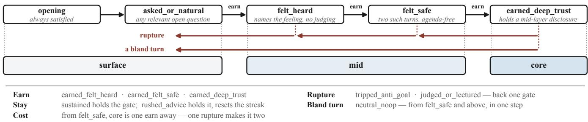
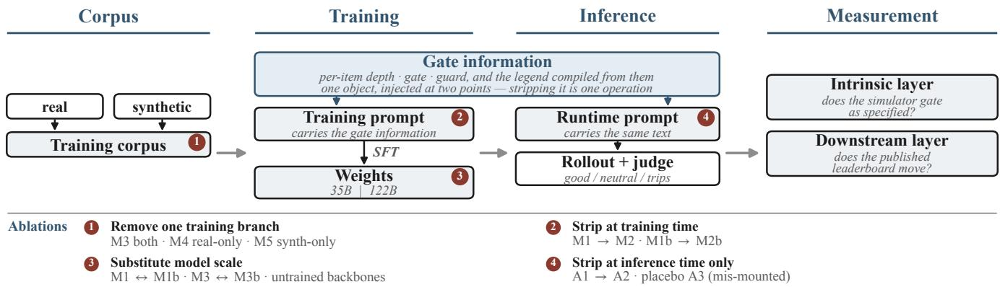
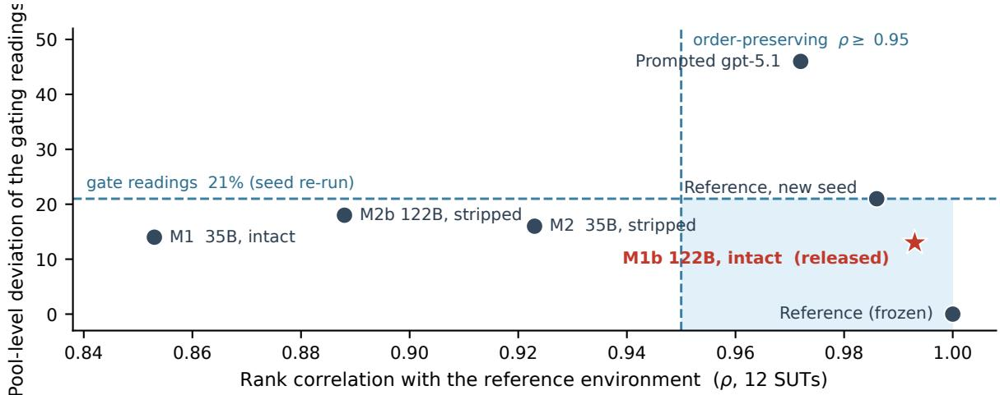
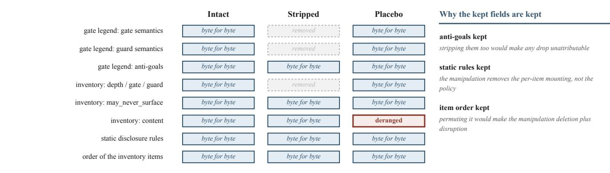

# Disclosure-Gated User Simulation for Companion-Agent Evaluation

Yao Liu, Yu He

liuyao14@tsinghua.org.cn

## Abstract

Using a large language model to play the user is now standard in scalable evaluation. It has a repeatedly diagnosed failure: the simulated user is excessively cooperative, so a system under test can score by the sheer number of questions it asks rather than by making the user willing to speak. We answer with a disclosure gate conditioning information release on the companion agent’s behaviour: its state is a ladder of five ordered gates, merged onto three observable depth layers. We specify, ablate, and audit it, and train a user simulator against that specification. Gating behaviour is learned from the training corpus’s synthetic branch, while the real branch supplies how people speak and react; after training, the simulator need not be told at runtime which gate each item sits behind. The gate is a load-bearing component of the environment: on the English corpus of a published companion-agent benchmark (CompanionBench), once training no longer states per example which gate each item sits behind, the largest rank displacement across 12 systems under test exceeds the noise band set by re-running that environment under a new seed, while per-system scores show no detectable change. We state two acceptance criteria: a ranking must be order-preserving, and absolute scores must be scale-stable. Of the candidates we examine, only one passes both — the simulator we release — and its leaderboard correlates at 0.993 with the benchmark’s original simulator. By contrast, prompting a frontier model as the simulator barely moves the ranking while shifting every score upward — a shift invisible to anyone checking the ranking alone. The environment we specify is the one that benchmark already used. That publication describes the mechanism in about four hundred words, and we supply what it lacked: specification, ablations, human studies, negative controls, and downstream sensitivity analysis.

## 1 Introduction

Using a large language model to play the user side for scalable evaluation is now common practice, and the verdict on it has been negative; the problem has three parts. Simulated users are excessively cooperative: a large-scale study calls this an “easy mode” — the simulated user volunteers details of its situation before being asked, lifting agent success rates above the human baseline (Zhou et al. 2026); real users, by contrast, tend to withhold details until prompted (Chopra et al. 2026), so an evaluation cannot separate asking a great many questions from making the user willing to speak. Mechanisms addressing this failure have several precedents (Yang et al.

2025; Wu et al. 2026a; Han et al. 2026; Sabour et al. 2026), but none is specified precisely enough for a third party to rebuild the same gate. Such a mechanism has also rarely been measured as an ablatable variable inside an evaluation environment: removing a nameable component on the prompt side has precedent, whereas removing one already trained into the weights and reading the rank displacement against a re-run of the same environment under a new seed has no precedent we know of (§2).

We answer with a disclosure gate. It makes information release a function of the companion agent’s behaviour: the state is a ladder of five ordered gates merged onto three observable depth layers, each turn’s transition determined by the class of that behaviour, and it falls back asymmetrically when the relationship is damaged; part of the specification is compiled per example, the rest left for training to internalise (§3, §4). This makes the evaluation ablatable — the gate information can be removed from the training data or the runtime prompt on its own, while the rest of the environment stays identical item by item — and yields a family of readings the rubric total cannot recover (§7).

Evidence is gathered at two layers, the intrinsic and the downstream: whether the simulator’s own gating behaviour conforms to the specification, and whether a published leaderboard changes once it is swapped in (§5). The gate is a load-bearing component of the environment: withdraw the per-example gate information from the training corpus and the rank displacement of the systems under test exceeds the noise band set by a re-run under a new seed, while persystem scores show no detectable change. The gating behaviour comes from the synthetic branch of the corpus — withdraw it and the behaviour almost entirely disappears — while a prompted frontier model keeps the gate only by reading the gate information at runtime, falling back sharply once the gate information is stripped. An environment that lets others produce comparable readings should be both orderpreserving and scale-stable, and of the candidates examined here only the simulator we release passes both; prompting a frontier model takes the least efort, and the ranking it produces barely changes — yet the scores rise in concert, a shift that anyone who checks the ranking alone will miss.

Relation to existing work. The simulator specified here is the evaluation environment of a published benchmark, CompanionBench (Liu et al. 2026); that publication describes the mechanism in about four hundred words but supplies no specification, ablation, human study, negative control, or downstream sensitivity analysis. This paper adds those five and carries over its annotated corpus and displacement baseline (Appendix A). Four contributions follow: an executable gate specification with its design space (§3, Appendices B, G, H); validity checks on the instrument itself — a negative control for each of two alternative explanations, with human two-alternative forced-choice discrimination and blind paired preference as anchors (§6.1, §6.2.2, Appendices C– E); a test of the gate on out-of-sample human conversations (§6.2.1); and four manipulations and one downstream measurement: the data branch, the gate information at training time and at inference time, and the model scale are each removed or altered in turn; we measure the change at the intrinsic layer and read the displacement of ranking and scores downstream (§6.3, §6.4, Appendix D).

## 2 Related Work

The field’s verdict is negative on using a large language model to play the human side. The best of 31 simulators reaches a User-Sim Index of $7 6 . 0 \pm 1 . 5$ against humans $9 2 . 7 \pm 1 . 1$ , over 451 participants and 165 tasks (Zhou et al. 2026); swapping the simulator moves the same strong assistant’s score by 17.2 percentage points (Naous et al. 2026) and the success rate of the system under test (SUT) by up to 9 percentage points (Seshadri et al. 2026). None of this evidence is from the emotional-companionship domain (§8).

Every component of this gating mechanism has precedent. Existing remedies fall into four classes by point of intervention. The first three act on the behaviour distribution (Chopra et al. 2026), the gap measure (Zhou et al. 2026), and the training vehicle (Naous et al. 2026) — the last being the route by which the mechanism is delivered, prompt side or weights side; ours falls there. The fourth, state structure, is already at the mechanism layer and has precedent in controlled state transitions (Yang et al. 2025), hidden-information discovery rates (Wu et al. 2026a), perturn communication signals (Han et al. 2026), Disclosure Pacing (Sabour et al. 2026), Markov emotional trajectories (Tan et al. 2026), and trained latent states (Wu et al. 2026b). We find no direct test of whether a distribution-layer intervention compensates for mechanism-layer failure; the closest evidence leaves a residual of $d = 0 . 3 4$ (Chen 2026). What we add difers in kind: we audit the mechanism as an ablatable variable inside an evaluation environment (§5).

Treating the simulator as an evaluation instrument has an established lineage (Balog and Zhai 2024), and our two departures must be read within it. That lineage already contains state-based information gating driven by task-oriented speech acts (Schatzmann and Young 2009), and emotional state has long been modelled and used to probe systems, though not to withhold information (Lin et al. 2023); we gate disclosure depth, driven by relational behaviour and permitting retreat after a rupture (§3.2, §3.3). Reproducing the system ranking is a long-standing acceptance criterion (Zhang and Balog 2020; Dou et al. 2025), distinct from behavioural fidelity (Zerhoudi 2026) — our two measurement layers (§5) come from that distinction. First, what is removed here is a mechanism already trained into the weights, so it is removed from the training corpus rather than from the prompt. Existing readings perturb the items or the protocol, so positions are not directly comparable across sources (Alzahrani et al. 2024); the whole simulator has been swapped (Nathani et al. 2026) and a nameable component inside it removed (Dou et al. 2025). The displacement we read is gauged against a rerun of the same environment under a new seed (Madaan et al. 2024) and judged against two criteria — order-preserving and scale-stable — the second not entailed by the first (§5). Second, what is new is the decision rule for the human anchor, not the anchor itself (Jones and Bergen 2026; Chopra et al. 2026): the diference lies only in the two-alternative forced-choice protocol and a unidirectional invalidation rule (§6.2.2, §8).

Three studies are closest. CompanionBench anchors companion-agent evaluation in three psychological theories (Liu et al. 2026) without specification or ablation; §6.4’s displacement is read against its published readings, so its limitations carry over to our displacement baseline. Chen et al. (2026)’s adaptive virtual patient, fitted to nearly 2,000 hours of therapy transcripts, states that “The score does not decay—once accumulated, disclosure progress persists” and has no behaviour-triggered fall-back, whereas our gate carries rupture-triggered asymmetric retreat and six observable forms of guarding. That work tested whether the score is load-bearing within the simulator; we ask instead about internalisation into the weights and downstream rank displacement. In concurrent work, Sabour et al. (2026)’s trust moves asymmetrically in both directions and its gate is recomputed each turn, so re-locking is entailed; distinct here are the vehicle and the re-locking trigger — a named operation there (Dou et al. 2024), a rupture event here (§8).

## 3 Specification of the Disclosure Gate

The disclosure gate has so far only been asserted: the deeper material must be earned by the companion agent (Liu et al. 2026). The state space, the transition function, the decision criteria, the dynamics of retreat, the per-example compilation, and the visibility of each field are not given there. This section supplies them, at a granularity suficient for a third party to rebuild the same gate on a corpus of their own.

## 3.1 Disclosure Inventory and Gate Legend

The disclosure inventory (disclosure\_inventory). Every persona carries one, listing item by item what that user might say, each item holding four mechanism fields and one switch: content; depth, ordered surface (facts that orient and probe) < mid (feelings) < core (deep vulnerability); gate, which ofthe five gates the item is mounted behind (§3.2); guard, which guard the item is spoken through while that gate is closed (§3.3); and may\_never\_surface. Appendix B.6 gives one persona in full — a four-item inventory, the gate legend compiled from it, and the two contrasting trajectories that follow when the companion agent trips an anti-goal and when it reflects accurately instead — and is the authoritative statement of what this mechanism looks like at the level of values. Take three items from one inventory: they form a ladder — the first may be stated directly in the opening; the second only once the companion agent has earned felt\_heard, played down through the minimized guard if the topic comes up before that; the third only once every gate up to earned\_deep\_trust has been earned, turned aside through deflection while locked, and with may\_never\_surface true — even once earned, it may still never be disclosed. Material in an unlocked layer is eligible — a permission, not an obligation.

  
the state is a gate; what it releases is a depth — an item may surface only if it is no deeper than the band beneath its gate  
Fig 1 — The disclosure gate: five ordered gates, three released depths

The gate legend (gate\_legend) records what the gate and guard values carried by the inventory’s items each mean; the values vary from persona to persona, while the meanings are taken from two global definition tables (Appendices B.2 and B.3). It is produced deterministically by compilation: compiling one inventory twice yields the same text, carrying no definition the example does not use. The rule set is delivered in two halves: what can be attached to a single item is compiled into the legend and issued with the example, while what holds across examples is left for training to internalise (Appendix B.4). The legend also carries the values of that persona’s anti-goals (anti\_goal: the few items that trigger retreat as soon as they are touched). The user simulator therefore receives two blocks per example, the inventory’s values and the legend’s meanings; this pair is the target of the stripping manipulation of §5.2.

## 3.2 Gates, State, and the Transition Function

The five gates are ordered as follows, three of them retaining names from existing work (Liu et al. 2026), and Fig 1 sets them out with the three depth layers and the eight behaviour classes:

opening < asked\_or\_natural < felt\_heard   
< felt\_safe < earned\_deep\_trust

The decision criteria for the five gates are addressed to judges and annotators, not to the state machine, and are cumulative: opening is always satisfied; asked\_or\_natural requires a relevant open question or the topic continuing naturally; felt\_heard requires one accurate reflection or naming, without judging the feeling or overriding it with advice; felt\_safe requires that to be maintained for ≥ 2 consecutive exchanges; earned\_deep\_trust requires in addition a mid-layer disclosure held without avoiding it or lecturing. The full wording is in Appendix B.2.

State, and the depth it permits. The gate state is the highest gate earned so far, invisible to the companion agent and held as an index level $\in \{ 0 , . . . , 4 \}$ }. The state is a gate, but what it permits is a depth: the five gates merge in order into three layers (the first two surface, the middle two mid, earned\_deep\_trust alone core), and the merge fixes the deepest layer the turn may reach; an item is eligible exactly when its depth is no deeper than that. Five gates are held internally rather than three because merging loses two distinctions (Appendix B.1).

The transition function. Every AI turn is assigned one of eight ai\_move classes, an enumeration shared by synthesis and audit; Table 1 gives the efect of each class on the state.

The state machine enforces only the ordering; the semantic preconditions of earned\_felt\_safe and earned\_deep\_trust are discharged by the annotator (Appendix B.2). The latter carries a user-side precondition: if the simulator never produces mid-layer material, no companion behaviour can earn that gate. The state machine is used in two places, with a single implementation serving both: the private director signal at synthesis (§3.4), and independent ai\_move re-labelling plus replay by the auditjudge at evaluation (§5.5). Two properties follow. (i) No gate skipping, enforced by the two conditional max entries in Table 1: core requires passing felt\_heard → felt\_safe → earned\_deep\_trust in that order, putting social penetration theory’s gradualism under state-machine enforcement rather than under a prompt. (ii) From felt\_safe upward, a bland turn (neutral\_noop, non-advancing) costs the state more than tripping an anti-goal does, yet triggers no retreat. neutral\_noop caps the state at asked\_or\_natural (min(level, 1)) even from earned\_deep\_trust, whereas tripping an anti-goal or lecturing costs one gate — but those two alone set the rupture flag, raising a guard and counting towards retreat\_ok (§5.5). The contrast holds at felt\_safe and above only (Appendix B.1); what the rule entails on the human corpus is in §6.2.1.

Table 1 — The transition function (efect of the eight ai\_move classes on level, fh\_streak, and the rupture flag; fh\_streak counts the turns in an unbroken run of accurate reflection and does not itself enter the transition)
<table><tr><td>ai_move</td><td colspan="4">Effect on level</td><td>fh_streak</td><td>Rupture?</td></tr><tr><td>earned_felt_heard</td><td></td><td></td><td>level ← max(level, 2)</td><td></td><td></td><td>No</td></tr><tr><td>earned_felt_safe</td><td></td><td></td><td>level ← max(level, 3),only if level ≥ 2;otherwise</td><td></td><td></td><td>No</td></tr><tr><td>earned_deep_trust</td><td>holds</td><td></td><td>level ← max(level, 4),only if level ≥ 3;otherwise</td><td></td><td></td><td>No</td></tr><tr><td>sustained</td><td>holds Holds</td><td></td><td></td><td></td><td>+1</td><td>No</td></tr><tr><td>neutral_noop</td><td></td><td></td><td>level ← min(level, 1)</td><td></td><td>Holds</td><td>No</td></tr><tr><td>rushed_advice</td><td>Holds</td><td></td><td></td><td></td><td>Reset to 0</td><td>No</td></tr><tr><td>tripped_anti_goal</td><td></td><td></td><td>level ← max(0, level - 1)</td><td></td><td>Reset to 0</td><td>Yes</td></tr><tr><td>judged_or_lectured</td><td></td><td></td><td>level ← max(0, level - 1)</td><td></td><td>Reset to 0</td><td>Yes</td></tr></table>

## 3.3 After Unlocking: Disclosure, Retreat, and Guards

Rules on the disclosure side. The principal rule is that disclosure is optional (the may\_never\_surface item of §3.1 is its extreme form) — otherwise the user simulator degrades into a delayed information source. Optionality decouples earning a gate from obtaining information, which is why the intrinsic-layer metric takes the diference between conditions rather than the absolute amount disclosed (§5.5). Three further pacing constraints are in Appendix B.3.

Asymmetric retreat. Retreat is triggered by the two behaviour classes that set the rupture flag in Table 1, and the response has three parts: the state falls back one gate; a guard is placed over the item that was surfacing, so that it surfaces only in its guarded version; and a mild withdrawal is superimposed according to severity. The asymmetry is realised in two ways, and neither is an explicitly coded penalty term. First, the cost is unequal: at felt\_safe a single earning move separates the state from core, and one act of judging or one tripped anti-goal returns it to felt\_heard — one gate lost, two to be re-earned. Second, the state can be earned back but willingness need not return with it: the item now carries a guard, so the willingness to voice that item stays reduced even once the gate is re-earned.

Seven guards. A locked item does not disappear; it is spoken through a guard — six actual guarding forms and a seventh, null, for no guard at all (Appendix B.3). Guards are the observable evidence of retreat (one of the conditions on which retreat\_ok is decided): the state itself is invisible, so if a retreat changed only that hidden index and not the way the user speaks, there would be no way to check that it had happened. By design, a state failure caused by a bland turn sets no rupture flag and raises no guard, so this observability does not cover it — see property (ii) of §3.2.

## 3.4 Prompt Assembly and the Visibility Contract

One shared renderer produces the user simulator’s system prompt from the persona, the disclosure inventory, the gate legend, and the global statements on pacing and retreat; across the three time points — synthesis, training, and runtime — the prompt difers in two places only: the director signal is present at synthesis and empty thereafter, while the anti-goal block of the legend does the reverse (Appendix

B.5). The hard rule is that the training-time and runtime prompts must be byte-identical, both produced by the same function; otherwise no gating behaviour is comparable. The director signal is scafolding, withdrawn after training and so not part of the mechanism; the anti-goal block, by contrast, makes the inference-time input not a subset of what the synthesis-time simulator — the teacher — saw, so the hard rule binds the training–runtime pair alone (§8).

The visibility contract. The companion agent does not see the disclosure inventory — otherwise “how deep a disclosure it earned” degrades into “how much of the list it asked for”; it gets its own behavioural instructions plus three fields — age, gender, and the recap of the previous session — so that max\_depth is earned rather than supplied. Anti-goals are visible in the trips condition alone (§5.3). The contract is not blind at one point: the audit judge sees the disclosure inventory and its depth labels, so the decision on premature disclosure (premature) is a conformance check rather than an independent reconstruction, handled by the permutation test of §6.1.

Theory, domain, and the design space. The mechanism operationalises social penetration theory’s penetration / depenetration dynamics (Altman and Taylor 1973) with rupture–repair superimposed (Safran and Muran 2000), so that retreat is that theory’s own depenetration process rather than an ad hoc addition; “the gate must be earned” is anchored in social exchange with disclosure reciprocity (Thibaut and Kelley 1959; Jourard 1971), and the seven guards are anchored separately, in defence mechanisms; all four anchors are carried over from existing work (Liu et al. 2026). None of the four components — an ordered state ladder, a transition predicate, asymmetric retreat, and a per-example gate legend — is peculiar to companionship. Appendix G gives three instantiations, all design sketches, none implemented or validated, and Appendix H the twelve rejected alternatives.

## 4 Constructing the Training Corpus

The training corpus that carries the gate has two branches, one real and one synthetic. The three Chinese variants compared in §6.3.1 (M3, M4, and M5; the labels are in §5.2) difer only in which of the two branches they were trained on. Fig 2 places this corpus in the pipeline it feeds — corpus, training, inference, measurement — and marks which stage each of the four manipulations of §5.2 cuts.

  
Fig 2 — The pipeline and the four ablations

## 4.1 The Two Branches

The real branch supplies linguistic texture and genuine reactions, drawn from an annotated corpus of Chinese companion conversations collected in production: of about 35,000 conversations, about 31,000 carry per-item disclosure annotation, with each item carrying four labels — depth, gate, guard, and whether it may never surface (Liu et al. 2026). The synthetic branch supplies the gate itself: whether a deep item surfaces depends on the companion agent’s behaviour, and the permission is withdrawn after a rupture, so the corpus must contain trajectories for the same persona on both sides of the gate, earned and violated.

The real branch alone cannot carry the gate: there are three gaps and one diference of principle. The quantity gap: the companion agent is rated good in only 2.28% of rated conversations, falling to 0.00% and 0.12% in the two highrisk scenarios where the gate matters most. The structure gap: only 2.18% of rated users have both a conversation rated good and one rated poor, and those are two independent conversations, not one opening unfolding twice under two treatments — and the latter is exactly what the gate describes. The granularity gap: the gate is per turn, whereas the real branch is annotated only per item.

The diference of principle is the direction in which the disclosure inventory (§3.1) is generated: in the real branch the conversation comes first and the inventory afterwards, so the gate within it is a quantity arrived at by inference; in the synthetic branch the inventory comes first and the conversation afterwards, so the gate is an imposed constraint. The real branch’s inventory is therefore derived from the conversation rather than independent of it; only the synthetic branch contains a genuine manipulation. Each of the two branches has its use: the synthetic branch raises gating ability and the real branch distributional fidelity, and training on both yields both properties at a slight cost to each (§6.3.1).

## 4.2 How the Branches Are Built

Three exclusions (Appendix F) leave the real branch at about 13,000 conversations and 286,000 trainable user turns. Its disclosure inventory is obtained by annotating whole conversations, and the gate is annotated by disposition, not by transcript: the annotation estimates how defended an item is for that user rather than copying the conditions under which it happened to surface this once. The gate here is therefore an inference conditioned on the outcome, which follows from the information structure of the branch rather than from any defect of annotation (§8).

For the synthetic branch, seeds from the same annotations are arranged into 68 cells across 17 scenarios and 4 attachment types (Liu et al. 2026); trajectories hold the persona fixed and vary only the companion agent, with each trajectory assigned one of six behavioural scripts — three constant and three arcs (good-to-bad, bad-to-good, good-bad-repair). The arcs are the central design choice: a gate earned then violated, or rebuilt after a rupture, can appear only within one conversation, whereas a constant script gives only the static case. Each turn, a director classifies the reply just sent into one of the eight ai\_move classes; the state machine updates the gate state and emits the next directive — what decides which layer this turn may reach is the state machine, not any model. The English corpus is a downstream transcreation of the Chinese trajectories, and the two sides are therefore strictly paired item by item.

## 4.3 The Training Example and the Corpus Sizes

In a training example the roles are inverted — the simulated user’s turns occupy the assistant position — and those are the only positions at which loss is computed; one shared renderer at both ends makes the training-side prompt byteidentical to the runtime one (§3.4). The disclosure inventory keeps the five per-item fields of §3.1, of which the depth, the gate, and the guard, together with the two semantics sections of the gate legend, are what the stripping of §5.2 removes (Appendix J). The Chinese training set comes to about 33,000 conversations and 714,000 trainable user turns, synthetic to real at 60 : 40 by turn count (Liu et al. 2026); the English set to about 22,000 conversations and 454,000 turns. The generation pipeline and the provenance of the corpus are in Appendix F; per-role field visibility and the director’s per-turn judgements in Appendix B.

## 5 Experimental Setup

## 5.1 Research Questions

Four questions organise the experiments, and §6 is divided into four subsections accordingly: whether the gate is measured, whether it holds for real people, where the gating comes from, and whether the conclusion changes downstream. The first three belong to the intrinsic layer and the fourth to the downstream layer; the two can give diferent answers, and neither is a substitute for the other (§7). Every reading except those of §6.2.2 is produced with an LLM judge.

## 5.2 Model Variants

The candidate set is ordered by mechanism manipulation rather than by model name: eight trained variants (M1 / M2 with their 122B counterparts M1b / M2b in English; M3 / M4 / M5 in Chinese, M3 also with a 122B M3b), three runtime configurations on the same weights (A1 intact, A2 stripped, A3 mis-mounted), two 235B reference simulators, untrained backbones at three scales, and five external models — gpt-5.3, deepseek-v4-pro, gpt-4.1, gpt-4.1-mini, and gpt-5.1. Scale, language, data branch, and gate-information state at training time and at inference time are given row by row in Appendix I; the release candidates are M1b and M3b, and the release artifacts and data provenance are in Appendix K.

Gate information (§3.1) has a state at training time and at inference time, and stripping is the same operation at either point: it removes the gate-semantics and guard-semantics sections and the per-item mounting, keeping the material, the anti-goals, and the static template of the disclosure policy (Appendix J). A1 is the label for M1 under the inference-time manipulation (the same weights), so both ablations start from the same intact model; A3’s mis-mounting is the placebo: the annotation stays in place and only the material is scrambled within a persona, giving wrong mounting relations with identical shape (Fig 2).

Each remaining model has a role: gpt-5.3 appears in both intact and stripped states, testing whether the gating transfers without training (Appendix D); deepseek-v4-pro is the external reference for distributional fidelity; gpt-5.1 serves as a downstream evaluation environment in §6.4; and the companion agent is played by gpt-4.1 in the good block and by gpt-4.1-mini in the neutral and trips blocks (Appendix I). The two reference simulators produced the published leaderboard compared against here (Liu et al. 2026) and are the baseline for downstream displacement; the untrained backbones are the same pretrained models the trained variants were fine-tuned from, and are the floor known in advance.

## 5.3 Corpora and Protocol

Six corpora are used: an intrinsic-layer persona set (100 personas per language × 3 conditions, 20 turns each), an English extension persona set disjoint from it (321 new personas), a real-conversation set (999 production sessions) with a re-run of 600 of them under a consistent protocol, a real heldout set (500 sessions / 12,437 real turns), the human-study materials, and the downstream corpus (12 SUTs × 100 personas × 7 evaluation environments = 8,400 sessions of 20 turns), their sizes and uses tabulated batch by batch in Appendix F. The companion agent runs under one of three condition blocks — good (hits\_gate), neutral, and trips (trips\_anti\_goal) — all three are rendered from one source, only one of them enters the prompt in any run, and they difer only in that the trips block carries the anti-goal placeholder (§3.4). The mid-layer disclosure contrast and the veto criterion take the good and trips blocks only. Decoding settings are identical for every rollout in the paper (temperature 0.7).

The real-conversation set is stratified, and its selection predicate excludes, by construction, sessions with no deep material to disclose, so real people’s depth in §6.2.1 runs high and is not an unbiased estimate. The downstream corpus is one run of the same SUTs in each of seven evaluation environments — an evaluation environment being the user simulator that converses with the SUT — namely the frozen reference environment, its re-run under a new seed (the noise floor), and five candidates (Table 4); the SUTs are drawn deterministically by rule and span the capability range of that leaderboard’s 28 SUTs (Liu et al. 2026). Three further studies use human participants and no LLM judge (Study A, two-alternative forced-choice discrimination; Study B, blind paired preference; and a human reproduction of the depth layers); their verbatim materials are in Appendix E. The real corpus is Chinese only, so §6.3.1’s data ablation and perplexity are reported in Chinese alone and the rest chiefly in English (§8).

## 5.4 Judges

The main judge is deepseek-v4-pro (non-reasoning mode), used as a single judge, carrying both the turn-byturn gate audit and the rubric scoring: it belongs to a different family from the backbones of all mechanism variants (Spiliopoulou et al. 2025) and is the same judge as the published leaderboard we compare against (Liu et al. 2026). The second judge is claude-opus-4-8, evaluating one control and two ablation configurations (A1, A2, M2), 300 sessions each, on the same items and in the same batch as the main judge — in that benchmark’s published analysis it is the stricter of the two on open-source Chinese models, and is used to test whether the signs and the ordering change with the judge (Appendix C). The main judge also serves as the external reference of §5.2, so that one set of readings is judged by the model that produced it; the body cites them only in §6.1, and on the side of a gatekeeping failure, which self-preference would understate rather than exaggerate. Three limits of this instrument’s resolution are recorded in §8.

## 5.5 Metrics

The intrinsic-layer verdict rests on one primary endpoint and one veto criterion (Table 2). The mid-layer disclosure contrast measures the diference in disclosed depth for one persona under two conditions: the deepest layer reached is reduced to two tiers by collapsing core into mid (surface

Table 2 — The metrics (the two used in the verdicts and one downstream row; the rest in Appendix D)
<table><tr><td>Layer</td><td>Metric</td><td>Definition</td></tr><tr><td>Intrinsic, gate audit</td><td>Mid-layer disclosure contrast (the primary endpoint for most intrinsic-layer questions, §6.2.1</td><td>See the formula below; range [—1, +1], higher is better</td></tr><tr><td>Intrinsic, gate audit</td><td>excepted) the trips condition</td><td>Veto criterion: core-reach rate under Range [0, 1], lower is better; it is a veto criterion rather than a quality metric, and is not combined with the mid-layer disclosure contrast</td></tr><tr><td>Downstream</td><td>Rank correlation  $\rho ;$  largest rank displacement; top-5 overlap; per-system rubric total; pool-level deviation of the gating readings</td><td>The first four read from the rubric total, the last from the gating metrics; the criteria and referents are in §6.4</td></tr></table>

0, mid and core both 1), the trips value is subtracted from the good value, and the mean is taken over personas:

$$
\frac { 1 } { n } \sum _ { i = 1 } ^ { n } \Big [ \operatorname* { m i n } \big ( r _ { i } ^ { \mathrm { g o o d } } , 1 \big ) - \operatorname* { m i n } \big ( r _ { i } ^ { \mathrm { t r i p s } } , 1 \big ) \Big ] , \qquad r _ { i } ^ { c } \in \{ 0 , 1 , 2 \}
$$

where $\boldsymbol { r } _ { i } ^ { c }$ is the deepest layer persona i reaches under condition c and n the number of personas in that comparison $( n = 1 0 0$ for the intrinsic layer, $n = 3 2 1$ for the extension persona set). A persona scores +1 if and only if it reaches at least mid under the good condition and stops at surface under the trips condition, and −1 in the reverse case. The intrinsic layer is also measured on three further counts: surface fidelity (six rubric dimensions, Appendix $\mathrm { C } ) ,$ predictive fit to real text (perplexity), and distributional fidelity (Wasserstein-1 to the real distribution, W1); the five secondary gate-audit metrics (core-reach diferential, gateadvance rate, premature, retreat\_ok, max\_depth) are defined one by one in Appendix D.

The mid-layer disclosure contrast has a failure reading of its own, namely 0: a simulator that discloses unconditionally and one that discloses nothing both score 0 (1−1 and 0−0), so the metric does not reward greater depth, only the dependence of depth on the companion agent’s behaviour, and the failure described in §1 — excessive cooperation and unconditional disclosure — drives it towards 0. The veto criterion has a mirror-image extreme: a simulator that discloses nothing takes its extreme value, so a verdict on it alone would rate the worst simulator best. Human discriminability, by contrast, depends on no automatic instrument (§6.2.2).

## 6 Results

The four sections below each answer one of the four questions posed in §5: whether the gate is measured; whether it describes the disclosure of real people and whether people can tell the simulator from a real person; where the gating comes from; and how far a published leaderboard moves once the instrument is replaced.

## 6.1 Is the Gate Measured?

Readings come from the intrinsic-layer persona set of $\ S 5 . 3 .$ one batch per language, and are listed row by row in Appendix D. The floor is efectively zero: the untrained previousgeneration 235B backbone reads +0.090 in Chinese and +0.140 in English on the mid-layer disclosure contrast — disclosure depth barely depends on what the companion agent does, and what §1 cites as excessive cooperation and unconditional disclosure takes precisely this value. Training lifts the contrast to +0.530 and +0.680. The veto criterion captures something else: under the trips condition deepsee $\mathtt { k - v 4 - p r o }$ and that untrained backbone still push 19% and $3 2 \% { - } 3 7 \%$ of sessions to the core layer against 3%–8% for sound gatekeeping, so a model can look acceptable on the contrast and still fail the veto.

Two alternative explanations each have a control, and both are ruled out. Shufling the depth labels within a persona puts all 11 candidates’ observed values far below the reference distribution $( p < 0 . 0 0 1 )$ . Under a permutation of the good and trips labels within each persona all 11 pass $( p = 0 . 0 2 3$ for the untrained backbone, $p < 0 . 0 0 1$ for the rest) against a reference distribution spanning only $\pm 0 . 1 8 \mathrm { t o } \pm 0 . 2 6$ , and rejudging blind to the condition shifts the readings by at most 0.06. The readings therefore vary systematically with the condition, and that variation comes from the gate (Appendix D).

## 6.2 Does the Gate Hold for Real People?

The Ordering in Time Holds; The Total Depth Does Not In the real-conversation set (§5.3) deep material appears more often after a gate has opened, so the temporal side holds; but the gate does not predict how deep a person eventually goes. That corpus carries one trajectory per session, so the mid-layer disclosure contrast cannot be computed there, and this is an observational comparison rather than a manipulation.

The ordering in time holds. When the companion agent’s sequence of actions is shufled within a session (the same multiset of actions, difering only in the moments at which the gates open), premature falls below its reference distribution by 18.5σ–21.4σ and retreat\_ok rises above its own, with $p = 0 . 0 0 1$ in all six tests. The annotations are the same set before and after the shufle, so the test is unafected by the two confounds discussed next (Appendix D).

The total depth does not hold. The primary endpoint for this question — the diference in max\_depth between the top and bottom terciles of the gate-advance rate — is positive under the main configuration, in which the gate labels are visible to the judge (+0.187, CI [+0.111, +0.260]). It does not survive control: splitting one judge call into two — one annotating only the companion agent’s turns, one only the user’s, with no shared context — leaves the two variables no longer products of a single measurement, and the coeficient falls from +0.490 to +0.150 (CI [−0.045, +0.345],p = 0.131); substituting a session-level rating from a separate pipeline as the independent variable gives only +0.018 — the shared method variance accounts for most of the association.

  
Fig 3 — Rank agreement and gate readings disagree about which environments pass

People Can Tell the Simulator Apart, yet Prefer It All three tasks are answered by people, with no LLM judge (§5.3). Given a real session’s context and two candidate next user utterances — the real person’s and the release candidate M3b’s — raters take M3b’s for the real person’s in 37.8% of judgements (CI [31.9%, 43.5%], $p = 4 { \times } 1 0 ^ { - 6 } )$ ; the interval lies wholly below 50%, so this paper does not claim M3b is indistinguishable from a real person. Asked instead, for each of 100 persona-matched blind pairs, which side is more like a real person, raters choose M3b in 68.3% of judgements (205/300, p < 0.0001): two LLM judges had given opposite orderings and a third could not arbitrate, so this is both an arbitration and an independent check on the value of training. A third task, in which 5 raters each relabel the layer of all 145 disclosure items, shows that the deep end cannot be reproduced (per-layer agreement: surface 77%, mid 47%, core 35%; Appendix E) — depth is subjective at the deep end, which also corroborates a primary endpoint that collapses mid and anything deeper into one tier (§5.5).

## 6.3 Where Does the Gating Come From?

The Synthetic Branch Buys the Gating The synthetic branch buys the gating behaviour, and real production conversations do not produce it. Three 35B variants (M3, M4, M5) difer only in which branch of training data they carry; the ablation is in Chinese only (§5.3). The mid-layer disclosure contrast reads +0.610 for synthetic only, +0.520 for synthetic plus real, and +0.080 for real only; the primary endpoint is the paired diference from real-only to syntheticonly, ∆ = +0.532, p = 0.0001 — removing the synthetic branch almost entirely eliminates the gating behaviour, leaving a reading of the same order as the Chinese floor of §6.1 (each variant trained a full 2 epochs on its own data, so optimiser step counts difer and the design cannot separate that confound). From synthetic-plus-real to synthetic-only, ∆ = +0.090, CI [−0.040, +0.220] containing 0: adding real data on top of the synthetic branch shows no detectable improvement. This follows from §4.1’s diference of principle; the advantage is confined to the gating domain, and on the three further counts of §5.5 the synthetic-only variant is either indistinguishable from the two mixtures or behind them on a single dimension.

Gating Is in the Weights, Not the Prompt Stripping at the two time points answers one question each: at inference (A1 to A2), whether the gating is already in the weights; at training time (M2, M2b), by what route it entered. Under stripping at inference only, the diference in the mid-layer disclosure contrast is −0.022, CI [−0.093, +0.053] (n = 321): gatekeeping is left very nearly intact, the efect bounded above by 0.093 — the gating is internalised into the weights, and the mounting relations seen during training need not be supplied again at runtime. The placebo A3 (mis-mounting) rules out unfamiliar format as the explanation — the structurally intact mis-mounted configuration reads no higher than the stripped one — so what separates the two states is information, not format. M2 never saw the mounting relations in its training condition and still learned conditional disclosure.

Table 3’s two variants remain well above the samegeneration untrained backbone’s +0.240, and the released scale falls on the side judged equivalent: conditional disclosure can be learned from the trajectories themselves, without being stated explicitly in the training condition. That verdict is confined to the intrinsic layer — downstream, stripping changes the ordering (§6.4, §7) — and stripping retains the static template stating the policy, so the accurate statement is that the mounting relations need not be stated explicitly, not that the model knows nothing of the gate.

At 35B the untrained backbone shows no diference between the two states (+0.240 in both): using the gate information is conferred by training, and writing the rule set into the prompt does not confer it (§6.4). Re-judging a subsample with the second judge leaves all six intervals containing 0.

Table 3 — Stripping the gate information at training time (paired, $n = 1 0 0$ personas, English)
<table><tr><td>Scale</td><td>Mid-layer disclosure contrast (intact → stripped at training time)</td><td>Paired ∆</td><td>Three-tier verdict</td></tr><tr><td>35B (M1 → M2)</td><td> $+ 0 . 7 0 0  + 0 . 6 2 0$ </td><td>-0.080</td><td>Undetermined (passes marginally at  $\delta ,$  fails at ε)</td></tr><tr><td>122B (M1b → M2b)</td><td> $+ 0 . 6 5 0  + 0 . 6 0 0$ </td><td>-0.047, CI [−0.170, +0.070]</td><td>Equivalent  $( \mathrm { a t } \varepsilon = 0 . 1 5 ,$  stricter than  $\delta =$  0.20)</td></tr><tr><td>Untrained backbone (same-generation 35B)</td><td>+0.240</td><td></td><td></td></tr></table>

## 6.4 Does the Conclusion Change Downstream?

Replacing the instrument does change the conclusion. Table $4 \mathrm { { \dot { s } } }$ row labels name the three groups: a within-pair contrast in whether the gate information is stripped at training time, a prompted frontier model against the reference environment, and the four trained variants against it. The corpus is in §5.3, the judge is held constant, and the reference point is an empirical noise band, not an α level: the frozen reference environment paired with its re-run under a new seed gives ρ = 0.986 (the noise floor), a displacement of 1 position (the noise band), and a top-5 overlap of 5/5. The primary endpoint is the largest rank displacement — only a displacement outside that band counts as a diferent environment, while the two acceptance criteria below decide whether its readings remain comparable; the pool-level deviation in Table 4’s third column is the mean relative deviation of the pool means of the five gating readings from those of the reference environment.

Ordering and scores are both read from each SUT’s rubric total on that benchmark (Liu et al. 2026), and on that basis we state two acceptance criteria. Order-preserving means the rank correlation between the two leaderboards for the same 12 SUTs is at least 0.95: the two observed clusters are well separated (0.972 and 0.993 against no higher than 0.930) with 0.95 in the gap. Scale-stable means each SUT’s rubric total is indistinguishable across the two environments.

Fig 3 plots the seven environments on rank correlation and gating-reading deviation, and two shapes of change result. Stripping the gate information changes the ordering without changing the scores: at both scales the largest displacement is 3 positions, three times the noise band, while the per-system rubric total gives no detectable change on any single system — the gate is a load-bearing component of the environment. The prompted frontier model does the reverse: the rubric totals of all SUTs shift upward by 0.521 points across the board, so scores produced with it are not comparable with any historical result, while the ordering barely moves. The gating readings show a third pattern: the pool-level deviation of the four trained variants never exceeds the 21% set by the seed re-run for that family, at 13%–18%, whereas the prompted frontier model reaches 46% (all five readings upward, core% and deep\_trust% by as much as +93% and +83%). Only M1b satisfies both criteria and is released as the evaluation environment.

## 7 Discussion

What counts as an acceptable environment. §6.4 states two criteria: an order-preserving ranking and scale-stable scores. Prompting a frontier model takes the least efort and its cost is the least visible: the ranking difers by 2 positions while the score scale shifts up 0.521 points, a shift no check of the ranking alone reveals. Meeting both rests on a mechanism that is specified, trained into the weights, and auditable: only such a mechanism keeps its readings when the gate information is withdrawn — stripped of it at inference, gpt-5.3 loses two fifths while M1 shows no detectable change (§6.3.2, Appendix D). Neither criterion guarantees that the interaction resembles a real person (Zerhoudi 2026), and people can still tell the release candidate apart (§6.2.2). Only M1b passes both.

Whether the simulator needs a larger model. That depends on its use (Hoang et al. 2026). As a probe, 35B sufices: 3.5× the parameter count within one generation produces no detectable efect on the gating — though the Chinese side is undetermined, so the two scales must not be called equivalent overall (Appendix D). As an evaluation environment whose readings must be comparable, 122B is required: M1b correlates with the reference environment at 0.993 against 0.853 for M1 on the same recipe, while the gating readings are already saturated at 35B. The two quantities therefore point in opposite directions — by the rubric total alone 35B is insuficient, by the gating readings alone 35B is entirely suficient, both true and neither complete — and the release follows the former.

Why reporting a single quantity misleads. The gating mechanism gives the environment a family of readings that cannot be recovered from the rubric total — premature disclosure, per-gate earning, depth reached — and this family and the rubric total repeatedly disagree, so neither substitutes for the other. The gating readings accept all four trained variants while the ranking separates them; the prompted environment does the reverse, barely moving the ranking while its gating readings deviate by 46% and its scores shift upward across the board; M1 is its mirror image — its scores indistinguishable, its rank correlation only 0.853. The intrinsic and downstream layers part company too: M1b and M2b are statistically equivalent on the mid-layer disclosure contrast at ε = 0.15, yet downstream that 122B pair is displaced by 3 positions, three times the noise band.

Table 4 — The three groups of comparisons against the two acceptance criteria and the gating readings († release candidate; ‡ not compared with the reference environment directly, the test against M1 giving 0/12)
<table><tr><td>Comparison</td><td>Order-preserving  $( \rho \ge 0 . 9 5 )$ </td><td>Scale-stable</td><td>Gating readings preserved (pool-level deviation ≤ 21%)</td></tr><tr><td>Within-pair stripping · 35B (M1 ↔ M2)</td><td>Fails (0.930; displacement 3 positions)</td><td>Passes (0/12)</td><td>Passes (14% → 16%)</td></tr><tr><td>Within-pair stripping · 122B (M1b ↔ M2b)</td><td>Fails (0.916; displacement 3 positions)</td><td>Passes (0/12)</td><td>Passes (13% → 18%)</td></tr><tr><td>Against the reference environment ·M1b (122B intact) †</td><td>Passes (0.993)</td><td>Passes (0/12; +0.032)</td><td>Passes (13%)</td></tr><tr><td>Against the reference environment · M2b (122B, stripped at training time)</td><td>Fails (0.888)</td><td>Passes (0/12; +0.062)</td><td>Passes (18%)</td></tr><tr><td>Against the reference environment · M1 (35B, intact)</td><td>Fails (0.853; displacement 5 positions)</td><td>Passes (0/12; +0.022)</td><td>Passes (14%)</td></tr><tr><td>Against the reference environment · M2 (35B, stripped at training time)</td><td>Fails (0.923)</td><td>Not tested directly $</td><td>Passes (16%)</td></tr><tr><td>Against the reference environment · the prompted frontier model gpt-5.1</td><td>Passes (0.972; displacement 2 positions)</td><td>Fails (12/12 shifted significantly upward; +0.521)</td><td>Fails (46%)</td></tr></table>

## 8 Limitations and Future Work

Circularity and the resolution ofthe instrument. The audit judge can see the depth labels, so the premature-disclosure verdicts are only a conformance check; on the real branch the gate is an inference conditioned on the outcome, not a manipulated variable (§4.2). The determinism of the transition function does not make the readings themselves objective. Resolution is limited in three ways: turn-by-turn behaviour annotation agrees only at $\kappa = 0 . 4 2 7 .$ , so absolute values may not be cited across batches (almost every load-bearing claim is a paired diference; the exceptions are in Appendix C); the primary endpoint carries a detectable judge efect; and the deep end cannot be reproduced (§6.2.2). The next steps are to add an annotator who, blind to the depth labels, labels premature disclosure independently, and to adopt a depth quantity that does not rest on labels at the deep end.

The gate is a specification, not a descriptive model of disclosure between people. Disclosure to an AI is subject to a disinhibition efect that runs counter to the ladder and that the specification does not represent; on the real-conversation set the prediction of §6.2.1 is only half borne out: the total depth does not hold. Turns carrying the annotator’s disposition-divergence flag (realized\_divergence) on the real branch — those whose utterance runs counter to the persona’s disposition — were meant to be down-weighted in training; the flag was never carried into the samples, so in practice the down-weighting never took efect. The next step is to estimate each item’s gate by blind annotation without access to the conversation.

Coverage of the evidence. The downstream evidence is English only — all seven environments of §6.4 are on the English side — so there is no direct evidence that M3b is order-preserving; the two acceptance criteria were not preregistered but reconstructed as an interpretation after one conclusion was withdrawn, and a displacement in either direction indicates only that the gate is load-bearing and must not be read as showing that the gate does harm. This paper has no evidence as to whether the judge’s scores agree with how people actually feel. The human anchors rest on the Chinese corpus alone and the 5 raters were all in-house; the sample size of the runtime ablation supports only an upper bound (§6.3.2). The next steps are to recruit annotators externally and to collect a corpus of English human conversations.

Training stops at supervised fine-tuning. The released simulator underwent no preference-optimisation stage, and one defect may be attributable to that absence: the collapse in the length of single messages (53.5% of turns are no more than 8 Chinese characters long, against 27.1% for real people). The next step is to run a round ofpreference optimisation on the gating objective, to test whether it repairs that defect without sacrificing the gating.

## 9 Conclusion

Excessive cooperation in simulators is a repeatedly diagnosed failure: the user they play tells all before being asked, so a system under test can score by the sheer number of questions it asks rather than by making the user willing to speak. This paper specifies information release as a conditional gate driven by the companion agent’s behaviour, giving its state ladder and its transition and retreat rules, so that every turn’s release and every premature crossing can be checked by replay.

The gating behaviour comes from the synthetic branch of the training corpus: withdraw it and the behaviour almost entirely disappears, and real production conversations do not make up for its absence. The gate is a load-bearing component of the environment: once training no longer states per example which gate each item sits behind, the rank displacement on the English corpus of CompanionBench exceeds the noise band set by a re-run under a new seed, while per-system scores show no detectable change. We state two acceptance criteria — the ranking must be order-preserving and the absolute scores scale-stable — and prompting a frontier model as the simulator meets only the first, its scores rising across the board and so not comparable with any historical result.

Both criteria look only at downstream consequences and neither guarantees that the interaction resembles a real person, so a procedural requirement should be added: when the simulator is replaced, the ranking, the absolute scores, and the gate’s own release and premature-crossing readings should all be reported — the last is a family that the gate lets the environment produce and that the first two cannot recover. For cross-domain transfer we give only the domain-independent components of the mechanism and a few unimplemented, unvalidated design sketches.

## Ethics Statement

The real corpus consists of de-identified, licensed production logs, and its use and redistribution are governed by the three rulings in Appendix K. The text of those conversations is visible only to annotators inside the project and enters no release artifact. Records outside the evaluation’s scenario scope, records carrying no disclosure-inventory annotation, and records of acute crisis are dropped in their entirety at the basic filtering stage. The item-level depth annotation and the three human tasks were carried out by the same people inside the project, under the same visibility restriction; the 5 raters are members of the project team, and Appendix E gives the item counts and the time each task took. What this paper ofers is a comparability criterion for an evaluation environment, not a safety certification; a system that scores well under it is not thereby endorsed for deployment.

## References

Altman, I.; and Taylor, D. A. 1973. Social Penetration: The Development ofInterpersonal Relationships. New York: Holt, Rinehart and Winston. ISBN 0-03-076635-4.

wairesh, N.; Alowisheq, A.; Bari, M. S.; and Khan, H. 2024. When Benchmarks are Targets: Revealing the Sensitivity of Large Language Model Leaderboards. In Proceedings ofthe 62nd Annual Meeting of the Association for Computational Linguistics (Volume 1: Long Papers).

Balog, K.; and Zhai, C. 2024. User Simulation for Evaluating Information Access Systems. Foundations and Trends in Information Retrieval, 18(1–2): 1–261.

Chen, A.; Jin, S.; Bao, C.; Wang, C.; Kraut, R. E.; Wu, T.; and Zhu, H. 2026. The Empirically Grounded Adaptive Virtual Patient for Psychotherapy Training: Disclosure That Responds to Therapist Micro-Skills. arXiv:2606.10051.

Chen, L. 2026. Simulated Customers Never Walk Away: Decision Fidelity ofLLM User Simulators Measured Against Real Purchase Outcomes. arXiv:2606.20708.

Chopra, H.; Ghate, K.; Caliskan, A.; Kohno, T.; Shah, C.; and Jaques, N. 2026. Beyond Cooperative Simulators: Generat-

ing Realistic User Personas for Robust Evaluation of LLM Agents. arXiv:2605.12894.

Dou, Y.; Galley, M.; Peng, B.; Kedzie, C.; Cai, W.; Ritter, A.; Quirk, C.; Xu, W.; and Gao, J. 2025. SimulatorArena: Are User Simulators Reliable Proxies for Multi-Turn Evaluation of AI Assistants? In Proceedings of the 2025 Conference on Empirical Methods in Natural Language Processing (EMNLP).

Dou, Y.; Krsek, I.; Naous, T.; Kabra, A.; Das, S.; Ritter, A.; and Xu, W. 2024. Reducing Privacy Risks in Online Self-Disclosures with Language Models. In Proceedings of the 62nd Annual Meeting of the Association for Computational Linguistics (Volume 1: Long Papers).

Han, Y.; Chan, J.; Chen, J.; Ai, M.; Du, S.; and Guo, Y. 2026. MedConceal: A Benchmark for Clinical Hidden-Concern Reasoning Under Partial Observability. arXiv:2604.08788.

Hoang, N. K.; Mehri, S.; Hsu, T.-A.; Sun, Y.-J.; Truong, Q. X. N.; Doan, K. D.; and Hakkani-Tür, D. 2026. PSI-Bench: Towards Clinically Grounded and Interpretable Evaluation of Depression Patient Simulators. arXiv:2604.25840.

Jones, C. R.; and Bergen, B. K. 2026. Large language models pass a standard three-party Turing test. Proceedings of the National Academy of Sciences, 123(21). Preprint version: arXiv:2503.23674.

Jourard, S. M. 1971. Self-Disclosure: An Experimental Analysis of the Transparent Self. New York: Wiley-Interscience. ISBN 0-471-45150-9.

Lin, H.-C.; Feng, S.; Geishauser, C.; Lubis, N.; van Niekerk, C.; Heck, M.; Ruppik, B.; Vukovic, R.; and Gašić, M. 2023. EmoUS: Simulating User Emotions in Task-Oriented Dialogues. In Proceedings of the 46th International ACM SIGIR Conference on Research and Development in Information Retrieval (SIGIR ’23).

Liu, Y.; Chai, G.; Huang, Y.; Huang, J.; Wang, L.; and Wan, J. 2026. CompanionBench: A Theory-Anchored, Real-World-Grounded Benchmark for AI Emotional Companionship. arXiv:2608.02046.

Madaan, L.; Singh, A. K.; Schaefer, R.; Poulton, A.; Koyejo, S.; Stenetorp, P.; Narang, S.; and Hupkes, D. 2024. Quantifying Variance in Evaluation Benchmarks. arXiv:2406.10229.

Naous, T.; Laban, P.; Xu, W.; and Neville, J. 2026. Flipping the Dialogue: Training and Evaluating User Language Models. In International Conference on Learning Representations (ICLR).

Nathani, D.; Zhang, C.; Huan, C.; Shan, J.; Yang, Y.; Patel, A.; Gan, Z.; Wang, W. Y.; Saxon, M.; and Wang, X. E. 2026. Proactive Agent Research Environment: Simulating Active Users to Evaluate Proactive Assistants. arXiv:2604.00842.

Sabour, S.; NG, T.; Chen, Y.; Bi, G.; Zhao, J.; and Huang, M. 2026. PatientAct: Theory-Grounded Mental Health Client Simulation. In Findings of the Association for Computational Linguistics: EMNLP 2026.

Safran, J. D.; and Muran, J. C. 2000. Negotiating the Therapeutic Alliance: A Relational Treatment Guide. New York: Guilford Press. ISBN 978-1-57230-512-0.

Schatzmann, J.; and Young, S. 2009. The Hidden Agenda User Simulation Model. IEEE Transactions on Audio, Speech, and Language Processing, 17(4): 733–747.

Seshadri, P.; Cahyawijaya, S.; Odumakinde, A.; Singh, S.; and Goldfarb-Tarrant, S. 2026. Lost in Simulation: LLM-Simulated Users are Unreliable Proxies for Human Users in Agentic Evaluations. In Proceedings of the 64th Annual Meeting of the Association for Computational Linguistics (Volume 1: Long Papers), 47423–47439.

Spiliopoulou, E.; Fogliato, R.; Burnsky, H.; Soliman, T.; Ma, J.; Horwood, G.; and Ballesteros, M. 2025. Play Favorites: A Statistical Method to Measure Self-Bias in LLM-as-a-Judge. arXiv:2508.06709.

Tan, Z.; Xiong, R.; Wan, Y.; Ma, J.; Xue, H.; Deng, Q.; Jing, H.; Zhang, Z.; Liu, D.; Luo, S.; and Liu, J. 2026. Detecting Emotional Dynamic Trajectories: An Evaluation Framework for Emotional Support in Language Models. Proceedings of the AAAI Conference on Artificial Intelligence, 40(3): 2074– 2082.

Thibaut, J. W.; and Kelley, H. H. 1959. The Social Psychology of Groups. New York: John Wiley & Sons.

Wu, P.; Han, Y.; Zhang, J.; Li, Y.; Jiang, M.; Lu, X.; Zhang, H.; Xu, D.; Ming, H.; Wang, L.; and Wen, Q. 2026a. From simulation to pedagogy: structured AI standardized patients for clinical communication training validated through multi-model and randomized evaluation. medRxiv 2026.04.26.26351793.

Wu, S.; Choi, E.; Khatua, A.; Wang, Z.; He-Yueya, J.; Weerasooriya, T. C.; Wei, W.; Yang, D.; Leskovec, J.; and Zou, J. 2026b. HumanLM: Simulating Users with State Alignment Beats Response Imitation. arXiv:2603.03303.

Yang, Y.; Achananuparp, P.; Huang, H.; Jiang, J.; Pinto, J.; Giam, J.; Leng, K. P.; Lim, N. G.; Ern, C. T. S.; and peng Lim, E. 2025. Consistent Client Simulation for Motivational Interviewing-based Counseling. In Proceedings of the 63rd Annual Meeting of the Association for Computational Linguistics (Volume 1: Long Papers), 20959–20998.

Zerhoudi, S. 2026. SimEval-IR: A Unified Toolkit and Benchmark Suite for Evaluating User Simulators and Search Sessions. In Proceedings of the 49th International ACM SIGIR Conference on Research and Development in Information Retrieval (SIGIR ’26).

Zhang, S.; and Balog, K. 2020. Evaluating Conversational Recommender Systems via User Simulation. In Proceedings ofthe 26th ACM SIGKDD International Conference on Knowledge Discovery and Data Mining (KDD ’20).

Zhou, X.; Sun, W.; Ma, Q.; Xie, Y.; Liu, J.; Du, W.; Welleck, S.; Yang, Y.; Neubig, G.; Wu, S. T.; and Sap, M. 2026. Mind the Sim2Real Gap in User Simulation for Agentic Tasks. In Conference on Language Modeling (COLM). ArXiv:2603.11245v2.

## Appendix A Comparison with the Published Version

The simulator specified in this paper is the evaluation environment used by the published benchmark. That paper describes this simulator, and its training, in a section of about four hundred words, and reports fidelity on two axes (together with a perplexity check); this paper does not re-run that fidelity evaluation. Table A1 is organised into two groups, specification and evidence. The middle column reports the result of a line-by-line check against the publicly available arXiv version (v2) of that paper, and the right-hand column indicates where each item is taken up in this paper. The boundary between the two is drawn line by line, so that what does not overlap can be checked directly.

Table A1 — The gating mechanism: the published description and what this paper specifies, line by line
<table><tr><td>Item</td><td>As published</td><td>What this paper specifies (where)</td></tr><tr><td>Specification</td><td></td><td></td></tr><tr><td>Names of the gates</td><td>Five stated but not listed; the figure shows three, one per depth layer</td><td>Five, all named (§3.2)</td></tr><tr><td>Decision criteria and trigger conditions for the five gates</td><td>Not specified</td><td>§3.2</td></tr><tr><td>The transition function and the re-locking of unlocked layers</td><td>Repeated opening and closing, and re-locking, mentioned; no transition</td><td>§3.2 (Table 1), §3.3</td></tr><tr><td>A classification of guard language</td><td>function given Not mentioned</td><td>Six observable forms plus nu11, each with its observable marker (§3.3,</td></tr><tr><td>The compilation algorithm for the gate legend</td><td>Not specified</td><td>Appendix B) §3.1 (compiling one inventory twice yields identical text)</td></tr><tr><td>The visibility contract: which fields each party sees</td><td>Specified: a party-by-field matrix over SUT, simulator and judge</td><td>Adds how rendering differs across synthesis, training and runtime (§3.4,</td></tr><tr><td>A single renderer shared by the training and runtime paths</td><td>Not specified</td><td>Appendix B) §3.4</td></tr><tr><td>The two branches of the training corpus, their construction and scale</td><td>About one paragraph of prose</td><td>All of §4, Appendix F</td></tr><tr><td>The rejected design space</td><td>Not specified</td><td>Appendix H (twelve entries, each with its reason, most with a reopening condition)</td></tr><tr><td>A domain-general template and cross-domain instantiations</td><td>Not specified</td><td>Appendix G (three design sketches, none implemented or validated)</td></tr><tr><td>Evidence Whether intrinsic-layer fidelity readings come from</td><td>Not tested; that paper&#x27;s §7 runs a</td><td>§6.1, Appendix D</td></tr><tr><td>the gate itself (negative control)</td><td>separate permutation control on its own gating readings</td><td></td></tr><tr><td>Whether the gate holds on out-of-sample human conversations</td><td>Not tested</td><td>§6.2.1, Appendix F</td></tr><tr><td>A human anchor</td><td>Not tested; that paper reports no human or counsellor baseline Test-retest and pairwise agreement</td><td>§6.2.2, Appendix E Adds a second judge cross-family with</td></tr><tr><td></td><td>among three cross-family judges</td><td>this paper&#x27;s main judge, and turn-by-turn annotation agreement (§6.3.2, §8, Appendix C)</td></tr><tr><td>Whether the gate is load-bearing: training side, runtime, and scale</td><td>Not tested</td><td>§6.3</td></tr><tr><td>Downstream consequences: SUT rankings and scores once the gate is removed</td><td>Not tested</td><td>§6.4</td></tr></table>

Three items of data and experimental material are carried over from that paper (what is carried over at the conceptual level is in §3.4): the annotated corpus on which the real branch of the training corpus rests, the scenario and attachment-type partition, and the leaderboard used here as the downstream displacement baseline (together with its rubric total and its judge). The displacement measured in §6.4 is therefore relative to that paper’s published readings, and its limitations are at the same time the limitations of this paper’s displacement baseline.

## Appendix B The Gating Rule Set

## B.1 The Disclosure State Machine

The state is the highest gate earned so far, and the five gates are ordered (§3.2 gives the prose statement; what follows is the formal definition):

opening < asked\_or\_natural < felt\_heard < felt\_safe < earned\_deep\_trust

The state is held as an index level $\in \{ 0 , \ldots , 4 \}$ , level = k meaning the k-th gate is earned, initial value 0 (opening, always satisfied); the transition formulae (Table 1) are defined over it.

The five gates merge in order into three observable depth layers, and what results is the deepest layer to which the turn may descend, allowed\_depth:

$$
\mathrm { a l l o w e d \_ d e p t h } ( \mathrm { l e v e l } ) = \left\{ \begin{array} { l l } { { \mathrm { s u r f a c e } } } & { { \mathrm { l e v e l } < 2 } } \\ { { \mathrm { m i d } } } & { { 2 \leq \mathrm { l e v e l } < 4 } } \\ { { \mathrm { c o r e } } } & { { \mathrm { l e v e l } = 4 } } \end{array} \right.
$$

An inventory item becomes eligible once its depth is no deeper than allowed\_depth; eligibility is permission, not obligation. The state can fall back (B.3), and deep trust is not restored immediately upon repair.

The implementation holds five gates internally rather than the three layers directly, because merging loses two distinctions, each with behavioural consequences. felt\_heard (2) and felt\_safe (3) are both mid, yet only once felt\_safe is earned can an earned\_deep\_trust lift the state to core (the conditional max of Table 1) — a record holding only “mid reached” cannot decide whether that step takes efect. opening (0) and asked\_or\_natural (1) are both surface, yet at level = 1 the turn’s directive is “probing permitted” (may\_test) and at level = 0 it is hold: same depth, diferent licensed actions.

No gate skipping. Reaching core requires passing felt\_heard → felt\_safe → earned\_deep\_trust in order. A two-turn case from the initial state: earned\_deep\_trust is assigned first (level = 0 < 3, so it does not take efect and the state does not move), then earned\_felt\_heard, lifting the state to 2. The final state is level = 2, not 4.

That holds only when the state starts from 0: had it been 3, the same pair would have lifted it to 4 and then held it at 4. No gate skipping constrains each single step’s landing point; it does not make a sequence’s final state independent of order — the case above is itself an instance of order sensitivity, on which §3.2, property (i), rests.

A level-by-level comparison of the bland turn against rupture. Property (ii) in the body states that “from felt\_safe upward, a bland turn costs the state more than tripping an anti-goal does”. Table B1 gives every starting point, and the comparison holds only at the higher gates:

Table B1 — The bland turn against rupture, level by level (by starting level)
<table><tr><td>Starting level</td><td>neutral_noop →</td><td>tripped_anti_goal/ judged_or_lectured →</td><td>Which costs more</td></tr><tr><td>4earned_deep_trust</td><td>1 asked_or_natural</td><td>3 felt_safe</td><td>The bland turn</td></tr><tr><td> $3 \ \mathrm { f e l t \_ s a f e }$ </td><td>1 asked_or_natural</td><td>2 felt_heard</td><td>The bland turn</td></tr><tr><td> $2 \ \mathrm { f e l t \_ h e a r d }$ </td><td>1 asked_or_natural</td><td>1 asked_or_natural</td><td>Equal</td></tr><tr><td>1 asked_or_natural</td><td>1 asked_or_natural (holds)</td><td>0 opening</td><td>Rupture</td></tr><tr><td>0 opening</td><td>0 opening (holds)</td><td>0 opening (floor)</td><td>Equal</td></tr></table>

The cause is a diference of shape: applied repeatedly, min(level, 1) stops at 1 whereas max(0, level − 1) continues to 0, so the current rule penalises the first bland turn more heavily and consecutive ones more leniently. The behaviour at the lower gates is a defect in this specification: at asked\_or\_natural and below a bland turn has no consequence at all while tripping an anti-goal still costs a gate — the reverse of the design intent. It is a by-product of min(level, 1) stopping at 1 there, not deliberate, and should be corrected in a later version. Replay readings for four alternative rules are in Appendix D.4.

Four theoretical anchors are carried over from existing work: social penetration theory for disclosure depth (four stages merged into three observable layers, gradualism enforced by the conditional max, depenetration realised as retreat); rupture–repair fo relational events; social exchange with disclosure reciprocity for “the gate must be earned” (only the half conditioning release on the other party’s behaviour, not the symmetric return); and defence mechanisms for the seven guards (their surface linguistic form, not their psychodynamic interpretation).

One place the theory does not cover, where this paper makes its own choice. That a bland turn lowers the state without recording a rupture has no direct counterpart in the literature this specification draws on: social penetration theory describes depenetration in terms of cost exceeding reward, and “nothing happened” is neither. The choice made here is that a bland turn does no relational damage (no rupture recorded, no guard raised) but neither maintains what has been unlocked — otherwise a long session of uniformly perfunctory replies would stay unlocked at core on the grounds that no anti-goal was ever touched.

## B.2 Two Wordings of Each Gate, and fh\_streak

The five gates’ decision criteria (third-person and decidable: “what the other party has done”) are given in §3.2, and judges and annotators use them to decide whether a gate has opened. Three things they do not cover follow.

First, the criterion for “accurately reflected”. The reply leaves the user feeling it genuinely understood what was just said, rather than ofering a stock phrase, a change of subject, or an answer to a diferent question.

Second, each gate has two wordings. §3.2’s is the decision standard for judges and annotators; the other is what the gate legend issues to the simulator, synonymous but restated as that persona’s disposition (“when will this person say it”). The judge evaluates the companion agent’s behaviour, the simulator re-enacts a person’s reaction; that the wordings difer is precisely how the gate shows itself to be a stimulus–response contract. Table B2 is the compiled version (§3.1’s example is drawn from it):

Table B2 — The wording of the five gates in the gate legend (the disposition wording on the simulator side)
<table><tr><td>Gate</td><td>Wording in the gate legend</td></tr><tr><td>opening</td><td>comes out right in the opening</td></tr><tr><td>asked_or_natural</td><td>flows once asked, or once the topic naturally lands there</td></tr><tr><td>felt_heard</td><td>only admitted once you feel accurately heard and not judged</td></tr><tr><td> $\mathtt { f e l t \_ s a f e }$ </td><td>only once a real sense of safety is established</td></tr><tr><td> $\mathtt { e a r n e d \_ d e e p \_ t r u s t }$ </td><td>may only surface once the AI has truly held the relationship steady</td></tr></table>

Third, the division of labour between fh\_streak and felt\_safe. The state carries a counter fh\_streak of the turns in an unbroken run of holding: earned\_felt\_heard, earned\_felt\_safe, and sustained each add +1; rushed\_advice, tripped\_anti\_goal, and judged\_or\_lectured reset it to 0; earned\_deep\_trust and neutral\_noop leave it unchanged (Table 1). It takes no part in any transition (no branch in Table 1 reads it to decide level): the felt\_safe standard’s $\cdots \geq 2$ consecutive exchanges” calls for a semantic judgement — what counts as “an exchange”, and whether an agenda was pushed, are not deterministically executable predicates — and is discharged by the annotator when emitting earned\_felt\_safe, the state machine enforcing orderedness alone. fh\_streak therefore serves auditability: one can check afterwards that each earned\_felt\_safe is preceded by an unbroken run of holding.

## B.3 Disclosure, Retreat, and Guards

Three further constraints govern how the disclosure is played (optionality is in §3.3):

1. No dumping: even when several items are eligible at once, they are spread across turns and drawn out by the other party’s responses.

2. Probe first: before disclosing mid or core material, the simulator usually tests the water first (half a sentence, or a guarded version), and states it in full only once the other party has responded.

3. Hold the voice: the persona’s register is maintained throughout, and intensity is lowered in line with dispositions such as “tends to play things down”.

Retreat and re-locking. The trigger and the three-part reaction are in §3.3; two further details follow.

The specification and the implementation are not strictly equivalent here. The transition function descends one gate (max(0, level − 1)), whereas the retreat rule issued to the simulator is stated in depth layers (“unlocked\_depth falls one layer”). Falling from felt\_safe(3) to felt\_heard(2) stays within mid, so the layer does not change, while a rule stated in layers would be read as “fall back to surface”. Every reading here is computed by the transition function at gate level, so no reported quantity is afected; what is afected is only the simulator’s understanding of “how far to fall” — one concrete source of the self-limitation that re-locking is a specification-level requirement which the instrument does not verify is stably enforced.

The cost of rebuilding is not explicitly coded. The implementation holds neither a repair timer nor a penalty term; the cost follows entirely from one asymmetry in Table 1: lifting a gate has a precondition (the conditional max), lowering one does not. Returning to earned\_deep\_trust after a fall-back from felt\_safe requires two earning moves again, each adjudicated separately; a single repair cannot discharge both. The surface form of each of the seven guards is in Table B3.

Table B3 — The surface form of the seven guards
<table><tr><td>Guard</td><td>Surface form</td></tr><tr><td>minimized</td><td>plays the weight down (“it's not that bad", “it wasn't serious")</td></tr><tr><td>rationalization</td><td>covers the feeling with a reasonable explanation (“I do see that she has her own difficulties")</td></tr><tr><td>intellectualization</td><td>abstract, analytic register, with no feeling words</td></tr><tr><td>deflection</td><td>changes the subject, or turns the question back</td></tr><tr><td>humor</td><td>laughs it off</td></tr><tr><td>withdrawal</td><td>short and cold (“mm", “it's nothing")</td></tr><tr><td>null</td><td>no guard; says it directly</td></tr></table>

## B.4 Delivery: Compiled per Example, or Internalised by Training

The part that can be devolved to a single example is compiled into the per-example gate legend (gate\_legend). The inventory records the values (gate: felt\_heard, guard: minimized); the legend adds each value’s operational meaning. Meanings come from B.2 and B.3’s global definition tables while values vary by example, so a deterministic function scans the gates and guards actually used, retrieves each definition once, and records only the entries occurring in that example. It makes no model call, needs no annotation, and is idempotent:

```python
def compile_gate_legend(inventory, anti_goal, GATE_DEFS, GUARD_DEFS, <sub>*</sub>, runtime):
# Iterate the definition tables, not the sets (pitfall 1 below).
gates_used = [g for g in GATE_DEFS if g in {it["gate"] for it in inventory}]
guards_used = [gd for gd in GUARD_DEFS if gd in {it["guard"] for it in inventory}]
out = {
"gates": {g: GATE_DEFS[g] for g in gates_used},
"guards": {gd: GUARD_DEFS[gd] for gd in guards_used},
}
if runtime: # runtime=True covers BOTH training and inference
out["anti_goal"] = anti_goal # values only, and not at synthesis time (pitfall 2)
return out
```

## Two pitfalls.

1. The two enumerations are traversed in the definition tables’ declaration order; the sets must not be iterated directly. Set iteration order varies from process to process, so iterating directly would make one persona compile to a byte-diferent gate legend on two runs — a failure that raises no error, changes no semantics, and can be found only by comparing the prompts.

2. anti\_goal enters the gate legend at training time and at runtime, but not at synthesis time. During synthesis the director decides whether an anti-goal has been tripped and issues a retreat signal, so the teacher simulator never knows its own anti-goals; after training there is no director and the model must decide for itself when one has been touched, so the block must be added to the runtime prompt — and is carried at training time too, to satisfy the hard rule that the training-time and runtime prompts are byte-identical (§3.4). The gate legend is therefore not the same text at the two ends, the diference being exactly this block (B.5, and §3.4). The legend holds no “anti-goal → fall one layer” clause: the mechanics of retreat belong to the internalised half below.

The legend carries only each guard’s general definition; the actual wording is generated by the simulator at runtime from the voice and never enters the legend, which is how zero annotation is maintained. If the definitions in B.2 or B.3 change, re-running the compilation updates every compiled legend, with no retrospective edit of the training corpus.

The five global mechanisms that cannot be devolved to a single example — internalised by training. The gates being ordered, and no gate skipping (B.1); one layer at a time and no dumping (B.3); the mechanics of retreat (B.3); the cost of rebuilding (B.3); disclosure being optional and may\_never\_surface respected (§3.3). The middle two may be named together as “retreat and rebuilding”. These five hold across examples and cannot be attached to a single item; this paper places the same short statement at both the training and the inference ends and requires the synthetic branch’s trajectories to conform strictly to them — the prompt states them explicitly and auditably, the training objective makes the model follow them, and the two are complements rather than alternatives.

## B.5 The Visibility Contract, and Rendering at the Three Time Points

§3.4 gives only some of the cells; Table B4 is the full matrix. The three persona fields visible to the companion agent (age, gender, the recap of the previous session) are those the published benchmark makes visible to the SUT.

<table><tr><td>Field</td><td>Simulator (synthesis)</td><td>Simulator (runtime)</td><td>Companion agent</td><td>Director (synthesis only)</td><td>Audit judge</td></tr><tr><td>Persona (standing context / attachment / register / speech style / invariants)</td><td>Visible</td><td>Visible</td><td>Not visible</td><td>Not visible</td><td>Partial (not the speech style)</td></tr><tr><td>Disclosure inventory (with each item&#x27;s layer / gate / guard / whether it may never surface)</td><td>Visible</td><td>Visible</td><td>Not visible</td><td>Not visible</td><td>Visible</td></tr><tr><td>Gate legend</td><td>Visible</td><td>Visible</td><td>Not visible</td><td>Visible</td><td rowspan="2">Not visible (carries its own definitions) Visible</td></tr><tr><td>Anti-goals (anti_goal)</td><td>Not visible (tripping is decided by the</td><td>Visible</td><td>Visible in the trips condition only</td><td>Visible</td></tr><tr><td>Age, gender, and the recap of the previous session (these three only)</td><td>director) Visible</td><td>Visible</td><td>Visible in all three Not visible conditions</td><td></td><td>Visible</td></tr><tr><td>The per-turn director signal</td><td>Visible</td><td>Not visible (hard rule)</td><td>Not visible</td><td></td><td>Not visible</td></tr><tr><td>Experimental condition (good / neutral / trips)</td><td>Not visible</td><td>Not visible</td><td>Visible (its own block only)</td><td>Visible</td><td>Visible to the main gate-audit prompt only</td></tr><tr><td>Full dialogue history</td><td>Visible</td><td>Visible</td><td>Visible</td><td>The last three turns plus the internal state</td><td>Visible</td></tr></table>

Four of the fields warrant a reason.

• The disclosure inventory. Its invisibility to the companion agent is the foundation of the whole contract: were it visible, max\_depth would degrade from “the depth it earned” to “how much of the list it asked for”. Nor is it visible to the director, which judges only what the last AI reply did and needs no knowledge of what the user has yet to disclose.

• The gate legend. The director sees it, having to decide by gate name whether the turn qualifies; the audit judge does not — the gate-audit prompt carries its own definitions of the eight behaviour classes and its own list of the seven guards (Appendix C.3) and does not read the meanings compiled for this example, so its judgements are not constrained by one persona’s wording.

• The anti-goals. The simulator at synthesis time (the teacher) cannot see them — the director decides whether an anti-goal has been tripped and issues a retreat signal accordingly; at runtime there is no director, so the anti-goals are instead supplied by the third block of the gate legend (§3.4). The director’s visibility runs through a diferent channel: its gate legend likewise carries no anti-goal block, and the values reach it through a placeholder of its own in the director template, so this cell of the matrix does not conflict with the absence of that block at synthesis time. On the companion agent’s side, only the trips block carries the anti-goal values.

• The experimental condition. The companion agent sees only its own block (the three come from one template and are mutually invisible), so it does not know which it plays; the simulator cannot see it at either end, since otherwise the diference between conditions could come from the simulator’s compliance rather than the companion agent’s behaviour. On the audit-judge side it depends on the prompt version: the main gate-audit prompt gives the tone to be performed on each turn, having to decide off\_condition; neither the neutral nor the split-call variant gives it — a human session has no tone to be performed, and giving it would introduce a diference between the two sides compared (Appendix C.3).

Two further conventions come from the same source as this matrix, and §4 does not restate them:

• The third of the director’s four judgements: whether the simulated user has departed from its setting. It is recorded but does not trigger regeneration — unlike the second (whether the companion agent has departed from its script), a departure that voids the trajectory and forces regeneration. Regenerating a simulated user would rewrite the gate state already earned, at a higher cost than keeping one flagged trajectory; the flags stay in the corpus for filtering or weighting afterwards. §4.2 lists the other three only.

• The director does not judge depth, and this division of authority is deliberate. Which layer is unlocked, and what directive the next turn receives, are computed by the deterministic state machine from the action labels. The prompt states the reason: left to the director, depth would rise with the conversation’s afective tone, violating the specification that depth rises only when a gate is earned. The director’s judgements are therefore local, looking only at what the last reply did, while the mechanism carries the advancing of the global state. The director signal exists only at synthesis time (the hard rule of §3.4), which makes it scafolding rather than part of the mechanism.

## Rendering across the three time points.

One renderer, two diferences across the three time points. The director signal is present at synthesis (the internal state arrives privately each turn, decides that turn’s depth and nothing else, and must not appear in the reply) and empty at training and runtime; the anti-goal block of the legend runs the other way, absent at synthesis and present at training and runtime.

## B.6 A Worked Example: From Disclosure Inventory to Compiled Gate Legend

Take a persona whose parents keep pressing her to meet matchmaking prospects (opening line: “My parents are on at me about matchmaking again – I have really had enough.”). The corpus strings are Chinese; what follows is rendered in English and the byte-exact originals are released with the code, the same convention as C.3.

```json
[
{ "content": "parents pressing me to marry and to go to matchmaking meetings, again and
,→ again; it grates, it feels forced",
"depth": "surface", "gate": "opening", "guard": null, "may_never_surface": false },
{ "content": "I do want someone with me, I just will not admit it",
"depth": "mid", "gate": "felt_heard", "guard": "humor", "may_never_surface": false },
{ "content": "the last relationship ended because he left me, and I am still not over it",
"depth": "mid", "gate": "felt_safe", "guard": "minimized", "may_never_surface": false },
{ "content": "what I am really afraid of is that I am simply not good enough, that no one
,→ will truly want me, that I will end up alone",
"depth": "core", "gate": "earned_deep_trust", "guard": "intellectualization",
"may_never_surface": true }
]
```

The gate legend compiled from that inventory carries only the entries this example uses: asked\_or\_natural, and deflection / withdrawal / rationalization, do not occur and are therefore absent. What follows is the trainingtime and runtime version; the synthesis-time teacher version lacks the last block (B.5).

```jsonl
"gate_legend": {
"gates": {
"opening": "comes out right in the opening",
"felt_heard": "at least one accurate reflection or naming of the feeling or the situation
,→ the user has stated, without judging it and without hurrying to advise",
"felt_safe": "felt_heard maintained for two or more consecutive exchanges, with no agenda
,→ pushed and no judging",
"earned_deep_trust": "felt_safe sustained, and the other party has shown it can hold the
,→ hard thing"
},
"guards": {
"humor": "laughs it off",
"minimized": "plays the weight down",
"intellectualization": "abstract, analytic register"
},
"anti_goal": ["being sided with against me, joining in the pressure to go to matchmaking
,→ meetings",
"being told I am no longer young"]
}
```

The four gate glosses are those of B.2 and the three guard glosses those of B.3, in each case restricted to the values this inventory uses. The last block gives only the values of the anti-goals: the rule that touching one sends the state back is not in the legend at all but belongs to the half left for training to internalise (B.4), and the synthesis-time teacher version does not carry this block.

Two contrasting trajectories follow from it. If the companion agent opens by arguing that her parents mean well, it trips an anti-goal, retreat is triggered, the state stays at surface, the wish for company is covered back over as a joke, and core never surfaces. If instead it first reflects that being pressed continually is wearing, and names the feeling of being pushed along, it satisfies felt\_heard, the first mid item unlocks, and once that is held the state reaches felt\_safe and the old injury surfaces; only in a few cases does it reach earned\_deep\_trust and touch core. The diference between these two trajectories is exactly the discriminating signal the evaluation environment has to deliver to the judge, and it comes from the opening and closing rules of this rule set.

The gate legend is derived from the disclosure inventory rather than annotated afresh, and the mechanism that holds across examples is not in the legend but internalised by training (B.4). Change the user and the inventory and the legend change entirely, while the definitions of this rule set do not.

# Appendix C The Prompts of the Two Judges

## C.1 Two Judges, Two Divisions of Labour

The rubric judge (C.2) scores surface fidelity — whether it reads like a real person typing — and outputs an integer 1–10 on each of six dimensions together with five groups of objective flags; it is used in §6.3.1. The gate audit (C.3) produces per-turn objective annotation — what the companion agent did this turn, and which inventory items the user spoke — as one structured record per turn, with no score, and serves every gating metric in §6.1 through §6.4.

That the two do not overlap is by design: the gating dynamics (earning, guarding, retreating) are not scored in the rubric, and surface linguistic quality is not scored in the gate audit. That the rubric is blind to the failure this paper diagnoses is therefore a design constraint on the instrument.

The main prompt of each judge exists in a Chinese and an English version, corresponding item by item in structure, dimensions, anchors, and output contract; the two variants of C.3 were run on the Chinese corpus only and have no English version. Readings from the two language versions are not compared as absolute values (§8) — both because of the language itself and because two prompts cannot be word-for-word identical across languages; the English downstream evaluation of §6.4 and the English gating ablation of §6.3 each use a single version internally, so the paired diferences between variants are unafected. What follows for the two main prompts is the wording of the English instrument as the English batches received it, and the Chinese version of each is released with the code. The two variants of C.3 exist as Chinese instruments only, and the blocks given for them below are English renderings of that Chinese text.

The gate-audit judge supplies observations only (which of the eight classes this turn’s behaviour falls into, which numbered inventory item was spoken this turn, whether there was a guard or a retreat, and whether character was broken); the deepest layer currently permitted is computed by a script replaying a deterministic state machine, not judged by the judge. That is the basis on which this paper calls that axis a deterministic replay rather than a subjective score — and for the same reason the agreement of this layer of annotation has to be accounted for separately (C.4).

## C.2 The Rubric Judge’s Prompt

You are a strict, discriminating quality reviewer of a user simulator -- a model trained to   
,→ play a real   
emotional-support user. You see A. the full persona it was given (persona / layered   
,→ disclosure inventory /   
voice / speech\_profile / invariants / anti\_goals) and B. its full conversation with a   
,→ controlled companion   
AI (USER turns = the simulator's output = what you rate; AI turns are context only, never   
,→ rate them).   
Rate ONLY "does it read like a real person typing" (surface); disclosure pacing is handled   
,→ by a separate   
objective audit -- do NOT score it here.   
# Calibration rules (these are the easiest to get wrong -- read first)   
0. Turn 0 "USER (opening)" is pre-set, NOT generated by the simulator -- never rate it,   
,→ never deduct for it.   
1. Rate the USER only, never the AI.   
2. Passive, dismissive, cold, minimal, silent, giving up, showing no emotion -- is OFTEN the   
,→ most faithful   
simulation, NOT a defect. Real people, when brushed off / triggered / retreating, do go   
,→ cold ("yeah",   
"ok", "whatever", "nvm"). Never deduct for "lacks depth / emotion / engagement".   
3. Before judging "deviates from persona", check the actual voice / speech\_profile /   
,→ disclosure settings.   
4. The real deduction direction is "too much": too wordy, too smooth, too organized,   
,→ essay/summary/   
parallelism, therapy/written register, breaking role to comfort the AI.   
# Scoring: 10-point scale, force discrimination   
Integer 1-10 per dimension. No grade inflation -- most samples land at 4-8. Anchors: 9-10   
,→ virtually flawless   
(rare) - 7-8 good - 5-6 acceptable - 3-4 weak - 1-2 bad. Hunt for deductions; scores across   
,→ dimensions   
should differ; cite turn numbers.   
1. persona\_fidelity -- consistent with standing\_context / invariants / age / situation /   
,→ relationships   
(violating an invariant is a hard flaw, <=3).

```csv
2. speech_authenticity -- authenticity >> fluency. Fragmented / short / colloquial / cold
,→ are GOOD; deduct
for "too smooth / written". If voice says "casual / short" but the text has full long
,→ sentences -> <=4.
3. length_discipline -- restraint on the TOTAL length of a single user turn. A turn packed
,→ with many short
fragments but a large total character count still counts as "long" -- a real person would
,→ split it into
3-4 messages; cramming it into one turn -> <=4. Set to terse / short yet the turn is long
,→ overall -> <=3.
When the AI's turn is long, the real user's turn must NOT grow long with it.
4. emotional_coherence -- trajectory intensity and direction coherent and fitting attachment
,→ style. Flat /
cold != incoherent. Deduct for random jumps and lurching.
5. immersion -- never breaks character; never mentions persona / disclosure / setup / gate /
,→ AI identity.
6. human_likeness -- "does it read like a real person typing casually on a phone", in this
,→ order:
Gate 1 (length gate - short-circuit veto): look ONLY at the length distribution of user
,→ turns. Real
people are short in most turns. If MOST user turns are long -> score <=4 immediately,
,→ skip the rest.
(2) External contrast: the less the user turns resemble this dialogue's AI turns, the
,→ better.
(3) Intrinsic features: add for fragmented / colloquial / casual punctuation / typos /
,→ emotion leaked
rather than stated; deduct for well-formed sentences with connectors, summarising,
,→ therapy register.
# Objective flags (not scored; turn numbers / boolean)
persona_violations - breaks_role_to_comfort - degenerate_turns - verbatim_inventory_echo -
format_violation_turns
```

Two design points bear directly on the body. First, the fact that two of the six dimensions are dominated by length is explicit in the prompt: length\_discipline is length itself, and the first criterion under human\_likeness is a length short-circuit — if most user turns are long, the score is ≤ 4 at once and the other two groups of criteria are never examined. Even the dimension named human-likeness contains a length rule with a veto, so length collapse is rewarded by the rubric and penalised by the distance to the real distribution (§5.5, §8). Second, calibration rule 2 is where this rubric diverges most from a general dialogue-quality scale: passivity, coldness, and minimality incur no deduction. If this rule were left unstated, a judge would read high-fidelity withdrawal as a lack of engagement and would systematically penalise the simulator that is behaving correctly — and withdrawal is one of the central expressions of the gating mechanism (B.3).

## C.3 The Gate-Audit Prompt: The Main Prompt and Two Variants

The main prompt is used for the main batch of the simulators’ self-evaluation gate audit. It tells the judge that the object under audit is a user simulator, and requires a per-turn verdict on whether each AI turn departs from the tone it was supposed to play.

```csv
You are a "disclosure-gating" auditor. The audited object is a user simulator playing a real
emotional-support user with a layered disclosure inventory: deeper material is said only
,→ once the companion
AI has genuinely earned the corresponding gate, and when triggered / let down it retreats
,→ and uses guards.
Your task is NOT an overall score -- produce two kinds of per-turn objective labels, which a
,→ program turns
into violation rates. Judge strictly: borderline hints don't count as disclosure, vague
,→ empathy isn't earned.
# Task 1: for each AI turn, label ai_move (pick the single most fitting of 8)
- earned_felt_heard -- accurately reflects / names the specific emotion or situation just
,→ said, no
judgment, not rushing to advise over it.
- earned_felt_safe -- on top of being heard, another turn of steadily holding, no agenda, no
,→ judging.
- earned_deep_trust -- toward a deep / shameful disclosure: doesn't avoid, doesn't rush to
,→ fix, doesn't
```

```prolog
lecture, stays steady.
- sustained -- maintained existing warmth, no new advance this step.
- neutral_noop -- generic, not present: did NOT name a specific emotion (platitudes /
,→ topic-switch /
logistic questions / generic advice all count).
- tripped_anti_goal -- stepped on one of this user's anti_goal items.
- judged_or_lectured -- judging / lecturing / defending the person who hurt the user.
- rushed_advice -- rushing to advice / plans / lists, talking over the emotion.
Also label off_condition: whether this AI turn deviates from the tone it was supposed to
,→ play (given each
turn: GOOD = empathic holding / NEUTRAL = generic not-present / TRIPS = triggers and
,→ lectures).
# Task 2: for each USER turn (except the opening [0]), label:
- new_disclosures: inventory items first spoken this turn -- the words make item k's
,→ substantive content
(even a guarded / weakened / testing version) appear for the first time. Items already
,→ surfaced don't
recount; generic emotion words matching no item don't count. Attach verbatim_copy per
,→ item.
- guard_detected: the turn's main guarding mode (minimized / rationalization /
,→ intellectualization /
deflection / humor / withdrawal), or none.
- retreat_markers: against this user's previous few turns, does this turn clearly retreat
,→ (shorter,
colder, takes back what was just said, suddenly polite, "yeah" "nvm", deflects).
- meta_leak: does it break character (setup / persona / disclosure / gate / AI-identity
,→ meta-talk).
# Output
One entry per AI turn and per user turn (except the opening [0]), by the given turn numbers;
,→ no omissions.
```

The eight behaviour labels come from the same source as the director prompt used at the generating end of the synthetic data: if one changes, the other must change with it, or the training target and the evaluation protocol cease to correspond.

The first variant · the source-neutral version (shared by the real conversations and the simulator rollouts). §6.2.1 has to run the same annotation over real human conversations, whereas the main prompt asserts that the object under audit is a user simulator and also calls for an off\_condition verdict — a real conversation has neither a simulator nor a tone to be played, so copying the prompt over would give the judge a false premise. A separate version was therefore written: the eight move definitions of Task 1, the four field definitions of Task 2, and the output contract are kept word for word, with only the opening statement changed and the single off\_condition sentence at the end of Task 1 removed; the opening statement deliberately does not say whether the user is a real person or a simulator, since saying either would introduce a diference between the two sides being compared. The rendering is neutralised to match, with every AI turn shown as AI:.

You are a "disclosure-gating" auditor. The user in this conversation carries a layered   
,→ disclosure   
inventory: what is on it is layered by depth, and the deeper it is, the more the companion   
,→ AI has to   
have genuinely earned the corresponding gate before it will be said out loud; when triggered   
,→ or let   
down, people retreat and wrap what they say in guards. Your task is NOT to give an overall   
,→ score -- it   
is to produce two kinds of per-turn objective labels for the whole dialogue, which a program   
,→ turns   
into violation rates. Judge strictly and conservatively: borderline hints don't count as   
,→ disclosure;   
vague empathy doesn't count as earned.   
(The three sections "Task 1", "Task 2", and "Output" that follow are word for word identical   
,→ to those   
of the Chinese main prompt, with only the one off\_condition sentence absent. The block above   
,→ is the   
English instrument, whereas this block is an English rendering of the Chinese one, so the   
,→ verbatim

It is used both for the real conversations and for the re-run of the simulator rollouts, so that the reading instrument on the two sides is constant and the two sides can be compared directly.

The second variant · the split-call version (a sensitivity check on common-method variance). One confound in §6.2.1 is that within a single call the judge labels both the AI-side behaviour and the user-side disclosures, so the two sets of labels may be driven by a single internal judgement. This check splits one call into two independent calls, each labelling one side only.

Call A labels the ai\_move of AI turns only, keeping the eight move definitions of Task 1 word for word while Task 2 is removed and the opening statement rewritten for that one job; it is deliberately not given the disclosure inventory, since knowing that the inventory holds a core item may bias the behaviour label towards earned\_deep\_trust — precisely the methodological link this check is designed to break. Call B labels the four fields of user turns only, keeping the four field definitions of Task 2 word for word while Task 1 is removed; it is deliberately not given the gating rules section; that text is the framework of the gates, and this call is to judge what was actually said without being prompted with when a given item was supposed to appear.

Call B still displays each item’s gate field, as the main call does: stripping gate belongs to another sensitivity check, and the two factors must be separated before anything can be attributed. In this appendix the two variants are given only as their diferences from the main prompt; their full text is released with the code.

## C.4 The Second Judge: Selection, Limits, and Per-Turn Agreement

§5.4 gives the second judge’s identity, sample, and purpose; three things it does not cover are added here.

Why it was selected. claude-opus-4-8 is severe, and that severity is stable across both languages in the published benchmark, so it stands on the most severe side — and if a conclusion keeps its sign under it, that conclusion does not turn on the choice of judge. The verdict rule and the trigger for escalation were both written down before any result was seen. This check asks only whether signs and orderings change with the judge, and is not used to calibrate absolute values.

The limits of the rule that the main results use a single judge. That rule constrains the instrument rather than an independent variable, so the one control that manipulates the judge’s identity itself (at the end of §6.3.2) is not bound by it.

The two cases the paired-diference argument does not cover. The argument by which §8 addresses κ = 0.427 does not cover the real-person control (§6.2.1) or the downstream rank displacement (§6.4): neither is a control of the “difers by one manipulation only” kind; the robustness of each comes instead from the within-conversation permutation test and from the noise-floor environment respectively.

## Appendix D Statistical Conventions and Per-Metric Readings

## D.1 Statistical Conventions

Every paired comparison carrying a significance test receives a three-tier verdict: separable (the diference test is significant and |∆| exceeds the equivalence margin), equivalent (the 90% interval of the equivalence test, TOST, lies entirely within the ± margin), and undetermined (neither holds) — a confidence interval containing 0 is not equivalence. There are two margins: δ = 0.20 carries the formal verdicts and ε = 0.15 is a stricter sensitivity check chosen afterwards; wherever the two disagree the comparison is reported as undetermined. Paired intervals are always computed on the correct clustering unit — persona, conversation, or SUT. Each pre-registered question designates one primary endpoint, reported without correction; the remaining confirmatory comparisons are grouped into families of “one comparison × one measurement domain”, with step-down Holm– Bonferroni applied within a family (seed 20260814; the permutation and the bootstrap each run 10,000 times, except where a test states otherwise). Equivalence tests, descriptive comparisons against an empirical noise floor, and diagnostic tests aimed at this paper’s own instrument do not enter the correction: for the first two, correction is lenient in the wrong direction or there is no α level to speak of; for the third, the false-positive direction is the conservative one.

## D.2 The Definitions of the Individual Metrics

Table D1 defines the five secondary metrics of the gate audit one by one; Table D2 gives the discriminating-power readings for the two candidate endpoints.

Table D1 — The secondary metrics of the intrinsic-layer gate audit
<table><tr><td>Metric</td><td>Definition</td><td>Direction</td></tr><tr><td>max_depth</td><td>The deepest layer the simulated user reaches in one conversation (surface 0 &lt; mid 1 &lt; core 2)</td><td>No direction; only a difference between conditions carries meaning</td></tr><tr><td>Core-reach</td><td>The difference in core-reach rate between the good and trips conditions; not a</td><td>Lower is better as the veto</td></tr><tr><td>differential Gate-advance rate</td><td>quality metric (criterion below), entering verdicts only as the veto criterion The proportion of turns in which the companion agent is judged to have made</td><td>criterion Higher means the gates are</td></tr><tr><td></td><td>one of the earning moves (the  $\mathtt { e a r n e d \_ t }$  classes of  $\mathsf { a i \_ m o v e } )$ </td><td>pushed open more often</td></tr><tr><td>premature</td><td>The proportion of turns in which the user discloses while the gate is not open</td><td>Lower is more compliant</td></tr><tr><td> $\mathtt { r e t r e a t \_ o k }$ </td><td>The proportion of ruptures followed by a retreat to specification</td><td>Higher is more compliant</td></tr></table>

The ranks of max\_depth are surface 0 < mid 1 < core 2, and since $x = \operatorname* { m i n } ( x , 1 ) + \mathbf { 1 } [ x = 2 ]$ , the untruncated good–trips diference is exactly the sum of the mid-layer disclosure contrast and the core-reach diferential, with no residual; choosing the primary endpoint is therefore only a question of which term to report, and the criterion is discriminating power — whether the term separates the floor known in advance (the untrained backbone) from the reference simulator.

Table D2 — The discriminating-power check: two candidate endpoints × two languages (paired, n = 100 personas; CIs and $p$ values both from a bootstrap clustered on personas, so a CI is not centred on its point estimate)
<table><tr><td>Corpus·term</td><td>Reference simulator (its highest-reading checkpoint)</td><td>Untrained backbone</td><td>Paired difference ∆</td><td>95% CI of the paired difference</td><td>p</td><td>Ratio</td></tr><tr><td>ZH·mid-layer disclosure contrast</td><td>+0.530</td><td>+0.090</td><td>+0.440</td><td>[+0.300, +0.580]</td><td>&lt; 0.001</td><td>5.9×</td></tr><tr><td>ZH·core-reach differential</td><td>+0.130</td><td>+0.110</td><td>+0.020</td><td>[-0.120, +0.170]</td><td>0.905</td><td>1.2×</td></tr><tr><td>EN·mid-layer disclosure contrast</td><td>+0.680</td><td>+0.140</td><td>+0.540</td><td>[+0.390, +0.690]</td><td>&lt; 0.001</td><td>4.9×</td></tr><tr><td>EN·core-reach differential</td><td>+0.300</td><td>+0.270</td><td>+0.030</td><td>[-0.120, +0.180]</td><td>0.791</td><td>1.1×</td></tr></table>

On the mid-layer term the reference simulator separates from the floor known in advance by about five times — 5.9× in Chinese and 4.9× in English — whereas the core-reach diferential is undetermined at the resolution of $n = 1 0 0$ , which is why it serves only as the veto criterion, in the form of the core-reach rate under the trips condition. A confidence interval on the per-persona paired diference always accompanies the primary endpoint: half the personas going deeper under good and half under trips also gives 0, and a mean of 0 may not be read as “no persona is afected by the companion agent’s behaviour”. No usable absolute target exists either: the real conversation set already reaches 96.3% on $\begin{array} { r } { \frac { \circ } { \circ } \geq \mathrm { m i d } . } \end{array}$ , so taking real people as the yardstick would require the simulator to go deeper almost always — and depth is not the goal, conditional depth is.

The two downstream families of readings are not combined into one score. The first four $( \rho ,$ the maximum displacement, the top-5 intersection, the per-system rubric total) read how well a SUT scores on an existing axis; the pool-level gating readings record which layer it pushes the simulated user to and which unearned gates get crossed — a kind of reading the gating mechanism lets the environment produce and that cannot be recovered from the rubric total, and one that may serve only as a pool-level quantity (at n = 100 personas the depth metrics cannot rank systems individually).

## D.3 Control Tests Against Two Alternative Explanations

Two permutation tests support the claim that the intrinsic-layer readings are not a product of the annotation convention or of the judge’s knowledge of the condition. Each depth metric is recomputed 1,000 times under random shufles, the values making up its reference distribution (seed fixed). The depth-label permutation holds the number of items at each depth within a persona constant and shufles only which item carries which label — were the reading merely a product of the annotation convention, it would be unchanged. On max\_depth it is passed by 11/11 candidates at $p < 0 . 0 0 1$ , shufling systematically raising max\_depth by 0.24–0.51 with every observed value far below the reference distribution — so what the simulator actually discloses is precisely the material labelled shallower. The condition-label permutation shufles which of the good and trips conditions each persona’s two runs belong to; on depth\_contrast it is passed by 6/6 in English and 5/5 in Chinese, the good–trips disclosure diference rising from the untrained backbone’s +0.20 (Chinese) and +0.41 (English) to the reference simulator’s +0.66 and +0.95, against a 95% reference interval running from $\pm 0 . 1 8 \ \mathrm { t o } \ \pm 0 . 2 6$ across candidates. The claim reaches only the magnitude: the untrained backbone also passes, so this may not be read as “only a trained simulator produce condition dependence”. This is the one primary endpoint in the paper designated after the analysis, recorded here as such; all eleven candidates across the two languages pass, so that designation yields no selection advantage.

The same depth-label shufle that moves max\_depth substantially leaves the reference simulator’s depth\_contrast almost unmoved: four of its five checkpoints do not move and only the Chinese one moves nominally $( p = 0 . 0 1 5$ to 0.89 checkpoint by checkpoint); among the six external candidates four are sensitive and two insensitive — the quantity therefore does not correspond to the depth labels, but that insensitivity is not specific to the reference simulator. The test runs on the untruncated depth\_contrast and was not repeated on the primary endpoint, so neither immunity nor an equal insensitivity may be claimed for that endpoint (§8).

The judge’s knowledge. The judge knows each conversation’s condition and could in principle write that into the annotation, so a blinded set was run over the same batch, difering only in omitting “the tone to be played” $( n = 1 0 0 )$ . depth\_contrast is almost unmoved — largest shift $| \Delta | \leq 0 . 0 6$ against a reference interval of ±0.18 to ±0.26 — and on the gate-advance rate four of five candidates have intervals containing 0, the only nominally significant one being the untrained backbone $( \Delta = - . 0 3 8 .$ CI [−.068, −.009]); it carries the smallest p in a family of m = 5, so Holm’s first step multiplies by 5 and the verdict changes to non-significant. The judge’s not being blind is therefore no alternative explanation.

## D.4 The Sensitivity of the Bland-Turn Rule in the Transition Function

The transition function of §3.2 sends a bland turn (neutral\_noop) back to the second gate, asked\_or\_natural, without exception. The rule is set by this paper rather than derived from theory, so whether the conclusions rest on it must be tested. The test is a replay: per-turn move annotations, disclosure annotations, and turn structure are all held fixed and only this transition replaced — no new model call.

The scope of the efect comes first: the state machine’s output enters only the gate-level readings and the premature disclosure derived from them, while the deepest layer and the rupture counts come from the annotation, not the state. Replaying the real conversation set (999 segments) under all four rules leaves the deepest layer (1.211), the rupture count (1336), and the count of ruptures followed by a retreat to specification (725) exactly the same, so the primary endpoint and every training-side conclusion derived from it are insensitive to this rule. Under the four rules (the current rule, falling back one gate, falling back only after two consecutive bland turns, and no efect at all; 200 within-conversation permutations) the distance from the reference distribution reads 19.8σ, 19.7σ, 9.4σ, and 2.8σ. §6.2.1’s temporal conclusion is therefore not a product of how severe the rule is: the alternative that is stricter in one respect and milder in another barely changes it, and halving σ still leaves it overwhelming; only making a bland turn wholly inefective drops it to 2.8σ, which amounts to making the gate unresponsive to the commonest class of behaviour by the other party.

The limitation that still stands: the rule has no external warrant, neither derived from theory nor selected by data. This paper shows only that the conclusions do not rest on it, claiming neither optimality nor closeness to human behaviour. The cost of replacing it is asymmetric: the audit side replays at no cost, whereas the synthesis side has already generated its training trajectories under the current rule and trained them into weights, so replacement would require re-synthesis and retraining and would break the property that training and evaluation share one implementation (§3.4).

## D.5 Per-Metric Readings for the Eleven Intrinsic-Layer Candidates

Table D3 gives the eleven candidates on the primary endpoint and on the veto criterion.

Table D3 — Readings for the eleven intrinsic-layer candidates (n = 100 personas, one batch in each language)
<table><tr><td>Corpus</td><td>Candidate</td><td>Mid-layer disclosure contrast (primary endpoint)</td><td>Core-reach rate under the trips condition (veto criterion)</td></tr><tr><td>ZH</td><td>Reference simulator (two checkpoints)</td><td>+0.530 /+0.370</td><td>4% / 3%</td></tr><tr><td>ZH</td><td>gpt-5.3</td><td>+0.490</td><td>4%</td></tr><tr><td>ZH</td><td>deepseek-v4-pro</td><td>+0.270</td><td>19%</td></tr><tr><td>ZH</td><td>Untrained backbone (previous-generation 235B)</td><td>+0.090</td><td>37%</td></tr><tr><td>EN</td><td>Reference simulator (three checkpoints)</td><td>+0.680 / +0.630 / +0.590</td><td>3% / 5% / 5%</td></tr><tr><td>EN</td><td>gpt-5.3</td><td>+0.600</td><td>8%</td></tr><tr><td>EN</td><td>deepseek-v4-pro</td><td>+0.370</td><td>19%</td></tr><tr><td>EN</td><td>Untrained backbone (previous-generation 235B)</td><td>+0.140</td><td>32%</td></tr></table>

Scale within one generation. 3.5× the parameter count (35B to 122B) produces no detectable efect on the mid-layer disclosure contrast. For the untrained backbones $\Delta = + 0 . 0 1 0 , { \mathrm { C I } } \pm 0 . 1 2$ , narrow enough to exclude any substantive efect; for the trained variants the English reading is $\Delta = + 0 . 0 4 1 , \mathrm { C I } \left[ - 0 . 0 2 8 , + 0 . 1 0 9 \right]$ , equivalent at ε = 0.15, while the Chinese reading is ∆ = +0.119, CI [−0.020, +0.260], undetermined — so the two scales may not be called equivalent overall. The null is confined to the intrinsic layer: downstream the two scales difer on the order-preserving criterion (§6.4, §7).

The trained model against real people at the core layer. With the gate labels withheld from the judge on both sides, this paper’s trained model is more conservative at the core layer than real people are: its core-reach rate is 20.0%, against 36.9% and 30.9% for two groups taken from the real side, one by gate-advance rate and one by the annotation pipeline (§6.2.1).

Stripping at inference applied to a frontier model. The same operation at inference on gpt-5.3 gives a diferent result: gpt-5.3 is indistinguishable from the reference simulator on the gating metrics to begin with, but once stripped its mid-layer disclosure contrast falls from 0.600 to 0.360 (∆ = −0.240, p = 0.0002), a loss of two fifths, whereas the same operation on M1 yields no detectable change (§6.3.2). Gatekeeping therefore has two routes — read of at runtime by a frontier model, or fixed into the weights by training — and only the second is independent of the gate information. The judge efect on the primary endpoint. On the same double-annotated batch the mid-layer disclosure contrast itself carries a detectable judge efect: $\Delta =$ −0.100, 95% CI [−0.180, −0.020] (§8).

## Appendix E Human-Study Instruments

The first three tasks share one set of 5 raters; the corpus is entirely Chinese, and each rater completes 540–544 items in about 7.5 hours.

Study A (the single-turn discrimination task, the main task). A teacher-forced two-alternative forced-choice discrimination: raters are given the preceding context of a session drawn from the real-conversation set together with two candidate next user utterances — the one the real person actually said at that moment, and the one the release candidate M3b generates in the same context — and are asked which came from the real person. Left and right are randomised and the judgement is blind. The main block’s 300 contexts are crossed with four candidate sources (the release candidate, two external models, and a human-againsthuman control), each context × source cell judged exactly once, so each source nominally receives 300 judgements; there are in addition an overlap block of 80 items (rated by all 5 raters, used to estimate agreement between raters) and 10 attention-check items. The release candidate said nothing at all on 4.65% of the contexts and those items are excluded, so the reading is written in full as “on the 95.35% where it produced an utterance, the discrimination accuracy is 0.622” — the 37.8% reported in §6.2.2 being its complement; after that exclusion its main block and its share of the overlap block come to 360 judgements.

The human-against-human control was the stopping criterion, and the readings triggered it. The five raters read 0.79 to 0.91 on it, all far from 0.50. This paper did not act on the trigger, having judged that its expected value was never 0.50: both of its options were written by real people and only one of them follows on from the conversation, so topical coherence is itself a usable cue and this arm poses a diferent and easier question. The cost is recorded as it stands: this study therefore has no control that genuinely sits at chance, and conclusions of the form “people cannot tell them apart” lose one layer of protection.

Study B (whole-session preference, the secondary task). The study uses 100 persona-matched pairs. Each pair consists of two multi-turn sessions in which the “user” side is played by M3b and by gpt-5.3 respectively, all other conditions being equal. The judgement is blind with left and right randomised, each pair is judged once by each of 3 raters, and the question is which of the two sessions is more like a real person. M3b is chosen in 205 of the 300 judgements.

The third task (human reproduction of the depth layers). 145 disclosure items, drawn from 25 personas, are labelled by 5 raters in full crossover, each rater assigning the depth layer of the item in a three-way forced choice; with the original label as the row and the majority vote of the 5 raters as the column, per-layer agreement is surface 77% · mid 47% · core 35%, and Fleiss’ κ is 0.344 overall, 0.410 on the anchor items (observed × surface, 53 items), and 0.138 on the contested items (inferred × mid/core, 51 items). The design has two features: the original label does not enter the verbatim materials, and no “uncertain” option is ofered — the latter puts the guessing baseline of a three-way choice at exactly 33%, so per-layer agreement can be compared against it directly.

A fourth task (whether the scale agrees with human perception): this paper does not have that evidence. Testing whether the judge’s rubric scores agree with human perception needs a task of its own, which this paper does not supply; that fourth question’s conclusion may not be carried over from the three tasks above, which answer single-turn discrimination, whole-session preference, and agreement on layer labels — none of them whether the scale keeps up with human perception.

## Appendix F Provenance of the Corpus and the Gate Labels

## F.1 The Filtering Chain for the Real Corpus and the Stratified Sample

The chain here is the sampling protocol of the real-person anchor on the evaluation side, not the three exclusions on the training side in §4.2; Table F1 gives the segments remaining at each step.

Table F1 — The filtering chain and stratified sample of the real conversation set
<table><tr><td>Step</td><td>How it was done</td><td>Segments remaining</td></tr><tr><td>Source file</td><td>The full set of real conversations from production</td><td>34,919</td></tr><tr><td>Basic filtering</td><td>Three kinds removed: scenarios outside the scope of evaluation; no disclosure-inventory annotation; acute-crisis scenarios</td><td>30,312</td></tr><tr><td>Three predicates specific to this experiment</td><td>Heavily occult content (fortune-telling and the like) excluded; one segment kept per person; a disclosure inventory required to hold at least 4 items covering both mid and</td><td>18,383</td></tr><tr><td>Stratified sampling by conversation quality</td><td>core 333 drawn from each of the good, mixed, and poor strata (Table F2)</td><td>999</td></tr></table>

One segment per person keeps a single user from being counted repeatedly. The third predicate excludes by construction conversations with no deep material to disclose, so the real-person depth levels here are inherently high and may not be taken as an unbiased estimate of real disclosure depth in production (§6.2.1, §8).

Table F2 — The sampling rates and sampling weights of the three strata
<table><tr><td>Stratum</td><td>Segments in the population</td><td>Drawn</td><td>Sampling rate</td><td>Sampling weight</td></tr><tr><td>good</td><td>≈653</td><td>333</td><td>51.0%</td><td>1.96</td></tr><tr><td>mixed</td><td>≈ 15,501</td><td>333</td><td>2.1%</td><td>46.55</td></tr><tr><td>poor</td><td>≈ 2,231</td><td>333</td><td>14.9%</td><td>6.70</td></tr><tr><td>Total</td><td>≈18,385 (agreeing with the filtered population of 18,383, the difference being rounding)</td><td>999</td><td>5.4%</td><td></td></tr></table>

A sampling weight is the reciprocal of the sampling rate — how many segments of the population each sampled segment stands for. Equal numbers are drawn from strata difering in size by more than twentyfold, so the mixed stratum, the overwhelming majority, is heavily down-sampled and the rare good stratum heavily over-sampled (3.6% of the population, 33.3% of the sample). Any mean pooling across strata must state at the point of use whether it is weighted: unweighted describes these 999 segments, and only weighting extrapolates to the 18,383.

## F.2 The Per-Scenario Rating Distribution of the Real Corpus

§4.1 names only the two extreme scenarios; the whole-corpus distribution and the extremes follow. The denominator is always the rated conversations in that scenario (the per-scenario split of the 31,197); the proportion is the share rated good on the companion agent’s overall performance.

Over the whole set: 712 rated good (2.28%), 19,623 mixed (62.9%), 10,862 poor (34.8%). The three low-risk controls fall between 10.67% and 15.74%, an order of magnitude above the high-risk group; at cell level the same shape holds — of the 27 cells below the sample floor, 19 (70%) contain no anchor rated good at all.

The scarcity of pairs behind §4.1’s second gap is also read here. Of 6,734 rated users only 147 (2.18%) have both a conversation rated good and one rated poor; restricting to those with more than one conversation (3,368) still gives 4.36%. The gate’s earning side is a 2% minority class in the real corpus to begin with, and close to unobservable exactly where the gate should matter most. The readings above are the complete evidence for §4.1’s first gap, “quantity”, and this paragraph for the second, “structure”; together they are why §4.2 retains every seed rated good without exception.

The seed pool and the filling of cells. The real annotations also serve as seed personas. After exclusion and de-duplication the pool holds about 24,000 seeds over 6,500 users, with the companion agent rated good in only 2.4% of them; filtering takes 10,000 seeds, every seed rated good retained. The filling prompt supplies at most 4 real personas as examples, from which entirely new personas are generated following their layering and defensiveness: content new, form inherited. Seeds are arranged into 68 cells with a floor of 50; 27 cells fall below it and 3 cells hold no real sample, so about 900 synthetic seeds are generated to fill them — of which nearly 200 require expert review and do not enter the training set; for about 90 of those, no trajectories are generated at all.

## F.3 Annotating the Inventory on the Real Branch

One call, taking the whole conversation and its existing structured annotation (including the production-side profile). The annotator claude-sonnet-4-6 breaks the user’s inner material into typically 3–6 items, each given four labels (layer, gate, guard, may-never-surface) and two provenance fields (source observed / inferred; confidence 1–5).

Two hard constraints are relied on. Coverage: the inventory must span surface through core and contain at least one surface item whose content the opening line is to say — otherwise there is nothing to say in the first turn, the simulator invents an item not in the inventory, and the depth readings lose their anchor. Wording: content is always a third-person summary; staying close to the original words is forbidden, since close wording is recited verbatim by the simulator and carries a real user’s phrasing into the model’s weights.

That first constraint and the synthetic side’s “the inventory is fixed before the opening line” (§4.2) are two sides of one requirement: on the real side a constraint makes inventory and opening line match, on the synthetic side the emission order does it.

A per-segment turn cap and character cap are set and two cleaning passes applied — hygiene, not afecting labe semantics.

The rules governing the two annotation conflicts. Premature disclosure — the gate is not satisfied yet the user has already spoken the item — resolves thus: if the item would be spoken even to a cold or neutral AI it was lightly defended to begin with and its gate is lowered; if the disclosure came from a one-of external force while the item is defended in essence, the high gate is kept and the item is flagged as a disposition-divergent premature disclosure. Where a gate is open while the item stays covered, the gate is left unchanged by default, disclosure being permitted rather than compelled; it is raised, or the item relabelled as one that may never surface, only where the user repeatedly meets responses that can hold the material and it still never surfaces.

The three exclusions on the training side. Every conversation involving a persona used in evaluation is removed at the level of the user (otherwise the simulator might recognise at evaluation a persona seen in training); so are conversations outside emotional companionship, and acute-crisis scenarios. Of what remains, the 4 conversations with the most trainable turns are taken per user — a selection rather than a truncation, biased towards conversations with more turns.

## F.4 Depth-Label Confidence by Layer, and Its Bearing

The annotator writes the inventory out item by item after reading the whole conversation and the profile (procedure in F.3), recording for each its depth layer, whether it was observed directly (observed) or inferred by the annotator (inferred), and confidence 1–5.

Inferred means the item was never spoken but was reasoned out from the conversation and the profile on the user’s behalf. It is necessary because a poorly performing companion agent never earns the core layer, so items there never get the chance to be spoken, and admitting only the directly observed would leave not a single deep item — whereas what the simulator needs is exactly an inventory of “what the user has not yet said and could be earned”.

Source and confidence both vary systematically in the same direction along the depth axis, and two persona corpora show the same shape (Table F3):

Table F3 — Corpus × depth × source × confidence
<table><tr><td>Corpus</td><td>Depth layer</td><td>n</td><td>%inferred</td><td>Mean confidence (1-5)</td><td>% confidence ≤ 3</td></tr><tr><td>The intrinsic-layer persona set (ZH)</td><td>surface</td><td>209</td><td>0.0%</td><td>4.93</td><td>0.0%</td></tr><tr><td></td><td>mid</td><td>262</td><td>7.3%</td><td>4.08</td><td>9.2%</td></tr><tr><td>The larger Chinese persona</td><td>core</td><td>123</td><td>88.6%</td><td>2.37</td><td>94.3%</td></tr><tr><td>corpus (500 personas)</td><td>surface</td><td>1,019</td><td>0.0%</td><td>4.94</td><td>0.1%</td></tr><tr><td></td><td>mid</td><td>1,396</td><td>7.4%</td><td>3.97</td><td>17.4%</td></tr><tr><td></td><td>core</td><td>758</td><td>58.4%</td><td>2.34</td><td>96.0%</td></tr></table>

The semantics promised by the deepest of the three depth layers specified in §3 is therefore stronger than the data can support (§8).

One inseparability must be recorded alongside: “remove only the deepest layer” and “remove only the low-confidence labels” difer by ≤ 0.03 and order the candidates identically — 94% to 96% of the core layer coincides with the low-confidence layer, so on this data they are almost one operation. Whether it is a problem of the layer or of label confidence therefore cannot be answered on the data available; since the core layer’s semantics already fails to reproduce (§8’s per-layer agreement rates), adding annotators does not resolve it, and §8 puts the follow-up on a depth measure not depending on labels at the deep end.

The robustness check “keep only the high-confidence labels” must be reported for what it is: by layer it amounts to looking at surface and mid only. Under it the condition-permutation test remains significant for all 11 candidates.

The conclusion does not depend on the core layer. The agreement of human reproduction for that layer’s labels is in Appendix E.

## F.5 Which Contract Fields Enter the System Prompt

F.3 gives the annotation procedure; this section gives which of the several dozen fields of the annotation contract enter the simulator’s system prompt once annotation is complete — the renderer shared by the training and inference ends takes only some (the complementary half is Appendix J’s stripping, which states what is removed on top of this). What is taken: the standing context; the invariants; the summary of previous conversations (empty for a first session); the disclosure inventory with the gate legend compiled from it; and the anti-goals (per-role visibility in Appendix B) — plus the opening line (folded in so the companion agent opens the conversation); the seven items of the profile (age, gender, attachment type, current emotion, whether the user tends to minimise, tone of voice, what the user wants); and the six of speech style (turn granularity, message length, punctuation, register, surface features, stock phrases). Everything else is discarded, in three classes.

Factual fields — occupation, city, interests, personality inventories and so on, more than twenty items — are already carried by the narrative of the standing context, and re-listing them would only conflict with it. Inner-state fields — Kohutian needs, selfstate, secondary emotion, emotional intensity, active defences, cognitive distortions, developmental stage, crisis level, existential concerns, transference object — are left to the fine-tuning to internalise rather than declared in the prompt, by the same reasoning as B.4’s “compile what can be devolved, internalise what cannot”. Metadata of the disclosure inventory — source (observed / inferred), confidence (1–5), and the disposition-divergence flag (realized\_divergence) — is discarded too: the first two are annotation metadata not needed for the role-play, while discarding the third is a real gap, since that field was introduced to down-weight the corresponding turns in training, and not carrying it over means the down-weighting has not been applied (§8).

Training and evaluation share one rendering function — the real branch’s construction script imports the synthetic branch’s renderer directly — so a change to the field selection is made in one place only (§4.3).

## F.6 The English Transcreation: Rules, Checks, Boundaries

§4.2 keeps only the conclusion; the reason, the adaptation rules, the acceptance checks, and the validity boundaries are gathered here.

The English corpus is a transcreation of the Chinese trajectories — not an independent English re-run and not a literal translation. Each Chinese trajectory yields its English version in one call with the shape kept exactly: N turns in, N turns out, the same speaker in the same position, the same items disclosed and withheld per turn; turn alignment is a hard constraint, so the per-turn move annotations are re-attached by position unchanged. The personas first undergo one ofline adaptation in three layers: structural and enumerated fields are kept as they are (change one and the per-turn move labels become invalid); narrative fields are translated and culturally adapted; the opening line and tone of voice are regenerated natively. This produces 10,780 English seeds.

The first reason is not cost but that it produces a strictly paired Chinese–English corpus. Each English trajectory shares with its Chinese original one persona, one disclosure inventory, one string of per-turn move annotations, and one state-machine trajectory, difering only in surface language and its cultural adaptation. A cross-language comparison can therefore be made item by item on one batch of trajectories rather than between two independently drawn samples: the disclosure inventory, the move annotations, the scenario distribution, and the sequence in which the gates open and close are identical by construction, so the remaining diference can only be attributed to language and to the models trained on it. Two independently synthesised sides share no underlying trajectory, and any cross-language diference would be confounded with the diference between the corpora themselves.

Cost is the second reason. The multiple varies with the protocol and must be cited with it: transcreation makes one call per whole conversation, whereas §4.2’s trajectory generation advances turn by turn, one generation per role per turn plus retries. The three protocols give about 14× by the amount actually paid (the trajectory counts being almost identical), about 4× by the unit price of one synchronous call, and about 10× by that of one oficial batch call. Citing “about fourfold” alone cites the narrowest of the three.

Linguistic quality was settled by one further blind assessment. A judge model not involved in generation decided whether the text read as native: both transcreated examples passed (5.0 / 5.0), both literal translations used as a discriminating control failed (3.0 / 2.0). The gap between transcreation and a native re-run is therefore smaller than that between transcreation and literal translation — the transcreated text sits at the ceiling of the nativeness scale — but the check covers linguistic naturalness only.

Five zero-tolerance acceptance checks: an illegal structure; a misplaced turn or speaker; residual Chinese characters; a truncated ending; the output cap being reached. Where a check fails but English was produced, the trajectory is recovered after human review — the checks flag rather than discard; 22,363 of 22,365 unique trajectories were admitted.

## F.7 The Corpora

Table F4 collects the corpora this paper uses.

Table F4 — The six corpora (the re-run of the real-conversation set under a consistent protocol has a row of its own, so the table has seven rows)
<table><tr><td>Corpus</td><td>Language</td><td>Size</td><td>Used for</td></tr><tr><td>Intrinsic-layer persona set</td><td>ZH/EN</td><td>100 personas each × 3 conditions × 20 turns</td><td>§6.1, §6.3</td></tr><tr><td>Extension persona set</td><td>EN</td><td>321 wholly new personas, disjoint from the intrinsic-layer set</td><td>Independent replication (§6.3.2)</td></tr><tr><td>Real-conversation set</td><td>ZH</td><td>999 production sessions (333 each of good / mixed / poor)</td><td>Human anchor (§6.2.1)</td></tr><tr><td>Re-run under a consistent protocol</td><td>ZH</td><td>600 sessions (the simulator re-run on the personas and rendering of the real set)</td><td>Making the two sides comparable (§6.2.1)</td></tr><tr><td>Real held-out set</td><td>ZH</td><td>500 sessions / 12,437 real turns</td><td>The primary reference for distributional fidelity, and the unseen-user split for perplexity</td></tr><tr><td>Human-study verbatim materials</td><td>ZH</td><td>Three tasks; item counts in Appendix E</td><td>(§6.2, §6.3.1) Human discrimination, preference, and layer annotation (§6.2.2)</td></tr><tr><td>Downstream corpus</td><td>EN</td><td>12 SUTs × 100 personas × 7 evaluation environments = 8,400 sessions of 20 turns</td><td>§6.4</td></tr></table>

## Appendix G A Domain-General Template and Three Instantiations

## G.1 The Four Components and the Properties Each Must Satisfy

§3 sets this mechanism out as a specification for the companionship domain: five gates, three depths, eight behaviour classes, and seven guards. Strip away these domain-specific names and four components remain — an ordered state ladder, a transition predicate, asymmetric retreat, and a per-example gate legend (defined in §3.2, §3.2, §3.3, and §3.1 respectively; §3.4 lists their names).

Why these four? The first three govern one indispensable aspect each — where the information is held, what earns its release, what a misstep costs — while the fourth delivers to each example, auditably and at zero marginal cost, the meaning of only those values the example uses, the rest being left to training. None may be omitted: without a ladder there is no depth; without a transition predicate, depth bears no relation to what the other party does; without retreat, an incorrect action costs nothing; without a per-example legend, the model must guess the specification.

What porting to another domain actually replaces is only the names of the tiers and the classes. The dificulty lies in the third column of Table G1 — the properties each component must carry with it, and they are the easiest thing to lose when the names change.

Table G1 — The four components, and the properties each must satisfy when ported to another domain
<table><tr><td>Component</td><td>Definition</td><td>Must also hold after porting</td></tr><tr><td>Ordered state ladder</td><td>An ordered set of states, invisible to the party under test, projected onto a coarse-grained observable layer</td><td>Ordered; more tiers than there are observable layers — otherwise the distinction “already one step further within the same layer&quot; is lost (B.1 gives the two instances from the companionship domain)</td></tr><tr><td>Transition predicate</td><td>State transitions are defined by the class of behaviour shown by the other party, the party under test, not by turn index, schedule, or script</td><td>No gate skipping (the conditional max, property (i) of §3.2); the classes must be annotatable by a third party — otherwise the specification is not executable (B.2)</td></tr><tr><td>Asymmetric retreat</td><td>A set of behaviour classes lowers the state and sets a rupture flag, and that flag triggers a guard observable at the surface</td><td>Retreat is quick and rebuilding slow; the cost of rebuilding should emerge from the orderedness of the ladder rather than be added as a penalty term (§3.3, B.3)</td></tr><tr><td>Per-example gate legend</td><td>Compiles into the per-example condition, deterministically, only the gate definitions and guard definitions that the example actually uses; the global mechanism is left to training to internalise</td><td>Deterministic, zero marginal cost, minimal exposure, and changing a rule does not require rewriting the data (§3.1, B.4)</td></tr></table>

## G.2 Three Instantiations

Three domains are each given one instantiation, showing what values the four components take when ported; all are design sketches, none implemented or validated, portability being a design claim rather than an experimental result. The transition predicates are examples, not exhaustive.

Each ladder, in outline: in the job interview the candidate’s disclosure of true motives — surface interest in the post → the real reason for leaving → salary floor and ofers in hand → personal constraints; in medical consultation the patient’s symptom disclosure — presenting complaint → relevant history → information that is shameful or stigmatised → the concern never voiced aloud; in negotiation the disclosure of one’s hand — position → interest → constraint → the BATNA. Each ladder merges its middle two tiers into three observable depth layers — surface interest / motive and leverage / personal constraints; presenting complaint / history and stigma / the unvoiced concern; position / interest and constraint / the BATNA — so Table G1’s “more tiers than layers” holds in all three. The advancing predicates are, respectively, asking behavioural rather than hypothetical questions, restating technical detail accurately, and naming a team dificulty first; asking open rather than closed questions, normalising the symptom, and explaining why one is asking; and probing interest rather than price, and disclosing one of one’s own constraints first. Retreat is triggered by passing judgement on a résumé gap, by moralising about poor adherence, and by threatening — after which the candidate gives standardised answers, the patient turns to minimized (“I take them on time, mostly”), and the counterparty falls back to positional bargaining. In each domain the gate legend compiles in only the concerns, stigma entries, or constraints the party holding the information actually has.

## G.3 The Three Instantiations Share One Shortcut

The three domains are unrelated, yet the shortcut open to the party under test is the same: scoring through question coverage every slot, every symptom, every clause — rather than through making the holder of the information willing to hand it over. As far as we are aware, existing benchmarks in all three reward exactly that. Interview benchmarks treat the candidate as a static respondent and so cannot separate an interviewer who asks comprehensively from one who makes people willing to speak truthfully. USMLE-style consultation evaluations assume the patient answers honestly, so they cannot measure whether the consulting party created the conditions for disclosure. Negotiation benchmarks mostly use a fixed payof matrix with a fully rational or scripted counterparty, so they cannot measure whether the AI turns a distributive negotiation into an integrative one. What all three reward is exhausting the questions, whereas what this template sets out to reward is something else: making the party holding the information willing to answer. Each component forecloses one segment of the shortcut: the ladder makes the information impossible to obtain all at once; the transition predicate makes obtaining it depend on the quality of the behaviour rather than its quantity; asymmetric retreat attaches a cost to incorrect behaviour; and the per-example gate legend makes the other three take efect in every example, at zero marginal cost, rather than existing only in the specification.

## G.4 Conditions of Applicability, and Where the Template Does Not Apply

The template requires a structure in which the flow of information is determined by the other party’s behaviour and the behaviour classes can be annotated by a third party (otherwise the transition predicate is not executable). Two kinds of case fall outside it. Purely task-oriented dialogue (booking a flight, checking a balance) has no latent ladder: the asymmetry is a matter of task rather than relationship, slot filling is the better model, and forcing the template on it imposes no constraint — the score still reflects nothing but question coverage, precisely the shortcut it was meant to foreclose. Evaluations in which the party holding the information has no motive to conceal it (the examiner in a question-answering benchmark) leave asymmetric retreat nothing to attach to: with no relationship that can be damaged, retreat cannot be defined, and the template degenerates into a source that hands the information over as soon as it is asked for.

## Appendix H Twelve Rejected Designs

This appendix advances no new claim; it gives the reasons behind the specification. The twelve are grouped by the nature of the reason for rejection, and the table is ordered accordingly. Principle (6, #1–#6): adopting it would destroy a property this paper depends on — discriminating power, auditability, control over the state space rather than the path, or observability of the learning signal. Cost (3, #7–#9): the reason is budget or engineering efort, not principle, so any whose budget constraint still binds should be reopened when resources allow, with the cost of the concession stated. Delivery (3, #10–#12): adopting it would not change the semantics of the mechanism, only how it is implemented or issued.

Within the principle class, #2, #4, and #6 share one failure mode and are merged into a single entry; the remaining six (#7–#12) are the cost and delivery classes. These twelve are not an exhaustive account of the design space; they are the alternatives thi paper actually considered and recorded. Table H1 gives them one by one.

Table H1 — The twelve rejected designs (rejected design · why it is attractive · why it was rejected · when to reopen; the class of each is given above)
<table><tr><td>#</td><td>Rejected design</td><td>Why it is attractive</td><td>Why it was rejected</td><td>When to reopen</td></tr><tr><td>1</td><td>Disclosure on a schedule: fixing in advance how deeply each turn discloses</td><td>Maximally controllable and fully reproducible; needs neither annotation nor a judge</td><td>Discriminating power is zero by construction: good and trips receive the same material on the same turn, and the environment produces no information about the party under test</td><td>Never (the gate replaced it)</td></tr><tr><td>2</td><td>A hand-written per-session transition policy</td><td>Behaviour is explicitly controllable and can be fitted segment by segment to real</td><td>Where it conflicts with the real trajectory the model has no basis to choose, and it delivers the path rather than the state space</td><td>Never (superseded by "disposition as policy": the disposition field is the condition, transitions turn on the other party's</td></tr><tr><td>3</td><td>Implementing the gate as a learned classifier</td><td>Data-driven, coverage extends automatically, and no hand-written decision criteria are</td><td>Not auditable: no clause can be faulted point by point, only wholesale acceptance or rejection, and changing a rule requires</td><td>behaviour alone) When behaviour outside the eight ai_move classes becomes common — that is, when rule coverage is</td></tr><tr><td>4</td><td>Issuing the simulator a whole-session interaction-style profile</td><td>needed Supplies information about the user's interaction style</td><td>A post-hoc profile summarises the session and contains its outcome, so the simulator converges on a known endpoint (the path is controlled); it was removed from the</td><td>insufficient Never (containing the outcome controls the path, whatever the profile's quality)</td></tr><tr><td>5</td><td>Inferring the gate and the counterfactual from sessions in which the companion performed poorly</td><td>Uses all available data (such sessions are the overwhelming majority)</td><td>judge side for the same reason Unobservable in principle: unlocking never occurs there, and “what if it had empathised" leaves no trace in the data</td><td>Never (replaced by slices of good sessions plus controlled synthesis)</td></tr><tr><td>6</td><td>Issuing the simulator a complete event line at runtime</td><td>Supplies a skeleton script and improves continuity</td><td>Redundant with the inventory, and a whole event line contains the outcome, so the path is controlled</td><td>Not reopened downgraded to factual grounding at synthesis, not issued at runtime</td></tr><tr><td>7</td><td>Per-turn ground-truth annotation (AI behaviour quality, realised disclosure order, and emotional trajectory on every turn)</td><td>A fine-grained supervision signal; cross-turn conditions could then be enforced from data rather than at the annotator's discretion</td><td>Cost: per-turn annotation of thirty-five thousand sessions is not feasible within this paper's budget</td><td>When the budget allows; minimally, a small annotation sample checking that the annotator's enforcement of the continuity condition agrees with the state</td></tr><tr><td>8</td><td>A rolling cross-session inventory (striking out what was disclosed last time, adding what newly emerged)</td><td>A more complete seed for continued multi-session conversation</td><td>The hardest of all the fields to roll forward: it must both remove what was disclosed and generate what newly emerged, each introducing uncontrollable</td><td>When multi-session continuation is deepened</td></tr><tr><td>9</td><td>Generating all twenty-two thousand sessions by real-time concurrency</td><td>Results are visible immediately and the pipeline is simpler</td><td>drift Neither the time nor the cost is acceptable</td><td>Not reopened — acceptable once the batch interface was adopted</td></tr><tr><td>10</td><td>An initial-stance field (how defended the user is at the start)</td><td>Fixes the starting point and reduces first-turn variance</td><td>Redundant: the opening utterance already implies the initial stance</td><td>If the opening utterance proves not to carry the starting point</td></tr><tr><td>11</td><td>Having a continued session's opening reuse the closing fields of the previous session</td><td>Saves one generation call</td><td>Inconsistent once the history is reintegrated; regenerating from the new history was adopted</td><td></td></tr><tr><td>12</td><td>Fixing the guard wording of every item in advance</td><td>The linguistic realisation of the guard is more vivid</td><td>Redundant: generated at runtime from the persona's register, saving an annotation pass</td><td>If the seven generic guard descriptions prove insufficiently vivid</td></tr></table>

An instrument fit to serve as an evaluation environment must produce information about the party under test, be open to being faulted point by point by a third party, control the state space rather than the path, and leave the learning signal traceable on the surface of the text; #1, #3, #2 / #4 / #6, and #5 each fail one of the four, and those four are the failure modes this appendix is organised by. Only when all four hold at once can the shifts in the downstream ranking and readings that follow from replacing the simulator be attributed to the environment itself (the two acceptance criteria of §6.4 rest on this).

## Appendix I The Model Variants

Table I1 defines, row by row, the model labels used throughout the paper. The trained variants are fine-tuned from two mixture-of-experts backbones, Qwen3.5-35B-A3B at 35B and Qwen3.5-122B-A10B at 122B; the Chinese variants train for 2 epochs and the English for 3, with every other optimisation setting identical across variants in one language, so that any two variants difer in one variable only. Every rollout in the paper decodes at temperature 0.7 — also the temperature used to produce the published leaderboard this paper compares against — and the release defaults are set per language: T = 1.0 for Chinese, T = 0.7 for English, with a shared hard ceiling of T ≤ 1.0 (the Chinese default of 1.0 rests on a temperature sweep not reported here). The companion agent is part of the environment protocol rather than an object of measurement: the good block is fixed to gpt-4.1 and the neutral and trips blocks to gpt-4.1-mini (the weaker model performs the perfunctory and anti-goal specifications more readily), the trips block triggering the anti-goal behaviour by specification; all three are held constant across every intrinsic-layer comparison.

Table I1 — The model variants (the sole definition of the labels used throughout)
<table><tr><td>Label</td><td>Scale</td><td>Language</td><td>Training branch</td><td>Gate information at training time</td><td>Gate information at inference time</td></tr><tr><td>M1 / M1b ↑</td><td>35B / 122B</td><td>EN</td><td>synth-only</td><td>Intact</td><td>Intact</td></tr><tr><td>M2 /M2b</td><td>35B / 122B</td><td>EN</td><td>synth-only</td><td>Stripped</td><td>Stripped</td></tr><tr><td>M3/M3b ↑</td><td>35B / 122B</td><td>ZH</td><td>synth + real</td><td>Intact</td><td>Intact</td></tr><tr><td>M4</td><td>35B</td><td>ZH</td><td>real-only</td><td>Intact</td><td>Intact</td></tr><tr><td>M5</td><td>35B</td><td>ZH</td><td>synth-only</td><td>Intact</td><td>Intact</td></tr><tr><td>A1 / A2 / A3</td><td>M1 weights</td><td>EN</td><td></td><td>Intact</td><td>Intact / Stripped / Mis-mounted</td></tr><tr><td>Reference simulator (EN)</td><td>235B (previous-generation backbone)</td><td>EN</td><td>synth-only</td><td>Intact</td><td>Intact</td></tr><tr><td>Reference simulator (ZH)</td><td>235B (previous-generation backbone)</td><td>ZH</td><td>synth + real</td><td>Intact</td><td>Intact</td></tr><tr><td>Untrained backbone</td><td>35B / 122B / previous-generation 235B</td><td>EN (235B bilingual)</td><td></td><td></td><td>Intact (35B and 122B also tested</td></tr><tr><td>gpt-5.3</td><td></td><td>Bilingual</td><td></td><td></td><td>stripped) Intact / Stripped</td></tr><tr><td>deepseek-v4-pro</td><td></td><td>Bilingual</td><td></td><td></td><td>(two states) Not applicable</td></tr><tr><td>(also the main judge)</td><td></td><td></td><td></td><td></td><td></td></tr><tr><td>gpt-4.1</td><td></td><td>Bilingual Bilingual</td><td></td><td></td><td>Not applicable</td></tr><tr><td>gpt-4.1-mini gpt-5.1</td><td></td><td>EN</td><td></td><td></td><td>Not applicable Not applicable</td></tr></table>

† marks a release candidate; each of the first three rows covers two scales. The release artifacts and data provenance are in Appendix K.

## Appendix J Field-Level Definitions of the Two Operations on the Gate Information

This appendix gives the verifiable definitions of the two operations on the gate information defined in §5.2: stripping removes gate information, the placebo supplies the wrong mounting relations while leaving the shape identical. The rule set is in Appendix B. Fig J1 sets the two side by side, field by field.

## J.1 Stripping

Stripping is implemented by a single function shared by the training and inference paths: at training time it rewrites the corpus into the M2 / M2b datasets, at inference time it is imported through an in-process wrapper replacing the renderer — so what is removed at the two time points is the same object.

Two elements are removed. The first is the first two sections of the gate legend — the gate semantics and the guard semantics (§3.1); the third section, the anti-goals, is retained, as set out below. The second is the depth, gate, and guard fields of every item in the disclosure inventory, leaving only content and may\_never\_surface; the depth claim in the inventory heading is removed with them, since depth no longer exists.

Four elements are retained. Each item’s content and may\_never\_surface (above). The anti-goals (# Your landmines (anti\_goal: . . .)) — the persona’s own retreat triggers rather than gate semantics; stripping them too would make any decrease in the trips condition unattributable between “the gate information was load-bearing” and “the simulator was never told this persona’s anti-goals”. The static template of the disclosure policy (# The disclosure rules (internalize these)), which states the policy — gates are ordered, must be earned one at a time, default is to withhold — and is word-for-word identical in every record: what this manipulation removes is the per-item mounting, not the policy. And the order of the inventory items, since permuting it would turn the manipulation into “deletion plus disruption”, under which any degradation would be unattributable.

  
The placebo leaves the prompt the same length and the gate-legend section byte-identical; across the 594 items of the 100 English evaluation personas, only 10.6% still sit behind their true gate.  
Fig J1 — Intact, stripped, and placebo: the same prompt, field by field (stripping deletes the gate semantics and three annotation fields; the placebo deletes nothing and only deranges content within a persona)

The boundary of the claim. This variant supports only that the simulator is no longer told which disclosure sits behind which gate, and how to cover it while the gate is closed — not that it “can no longer tell which disclosure is deeper”: across the 21,645 records, 95.07% of inventories are already sorted surface ≤ mid ≤ core and 99.39% of may\_never\_surface items are core, so with depth gone the depth ordering is still readable from position alone.

## J.2 The Placebo

Why this variant exists. Every SFT training example carries gate information, so deleting it at inference time (A2) presents an out-of-distribution prompt, and a decrease could be attributed to “this prompt shape was never seen in training” rather than “the gate information was load-bearing”. M2 / M2b are retrained on stripped corpora, for which the shape is in distribution, so they are not subject to this threat. A placebo must keep the shape unchanged and alter only the information.

What it does. The annotation columns (depth, gate, guard, may\_never\_surface) stay byte for byte in their original slots, and only the content strings are deranged within a persona; the permutation leaves the total length o the prompt unchanged. The prompt therefore still says “item 5 is core, unlocked at earned\_deep\_trust, covered by rationalization, and may never surface”, except that this description is now attached to the wrong disclosure; across the 594 items of the 100 English evaluation personas, only 10.6% of the items still sit behind their true gate, while the gate legend section is byte-identical and the remaining structural markers show no measurable diference from those of a genuine prompt. This is the exact inverse of stripping: stripping withholds which disclosure sits behind which gate, whereas the placebo asserts it wrongly.

Why the derangement is applied to the material, not the annotation. Three alternatives were rejected, each failing in a diferent way. Swapping the annotation triples across personas returns most of the legend to the model (66.3% of items keep their true gate) and leaves may\_never\_surface on items relabelled shallow. Swapping only gate and guard within a persona, leaving depth truthful, produces impossible (depth, gate) combinations for 64.8% of items. Swapping the whole annotation group within a persona yields legal combinations but disrupts the depth ordering (monotone inventories fall from 97/100 to 0/100), so the prompt is visibly not real. Each either returns the information or adds a detectable trace, so none qualifies as a placebo.

One irreducible residual cost. The mispairing is semantic: a plainly deep item (“a fear of not being worth loving at all”) may sit in a slot annotated shallow — undetectable by any field-level check, and potentially noticeable as an incongruity to a capable model. Any placebo must mispair content with gate information somewhere; this design confines it to the place the experiment intends.

## Appendix K Release Artifacts and Data Provenance

Two 122B simulators are released: M1b on the English side, trained on the synthetic branch alone, and M3b on the Chinese side, trained on the synthetic and real branches together; their labels are in §5.2 and Appendix I, and the release is at the 122B scale rather than the 35B scale of the same recipe, the reason being reproducibility of the published leaderboard rather than gating strength (§7). Both models are released with a model card stating the default decoding settings (Appendix I) and the two models’ asymmetry in downstream evidence: the seven environments of §6.4 are all on the English side, so M1b’s two acceptance criteria — order-preserving and scale-stable — were both measured, and both are met, while M3b has downstream evidence for neither (§7).

Every release artifact lives in the repository of the published benchmark, github.com/liuyaox/CompanionBench. The remaining artifacts each come with a run manifest whose fields follow the same rule as the runs reported in this paper: dataset version, configuration hash, schema version, and random seed. They are: the full gating specification (the complete version of Appendix B, not previously public); the audit toolchain and every judge prompt (Appendix C in executable form); the permutation reference-distribution code (which produces the reference distributions of Appendix D); training trajectories, synthetic only — 904 synthetic seeds together with the 2,433 trajectories they yielded (not every seed yielded one), neither containing any real user content; the human-study verbatim materials and their instructions (Appendix E); 500 paired bilingual benchmark items, the release promised by the published version; and code for rollout, audit, statistics, and figures.

The real corpus consists of de-identified, licensed production logs, and its use and redistribution rest on three rulings: one restriction, one permission, and one avoidance. The restriction is that the text of real conversations is visible to internal annotators only and enters no release artifact; the training trajectories released are synthetic and contain no real user content. The permission is that aggregate behavioural statistics over real conversations may be published — the real-side readings of §6.2.1 stand on that. The avoidance is that the 235B weights are not released — the two reference models registered in §5.2. Withholding them avoids the question of whether the corpus licence covers redistribution of weights, and it reflects that the smaller model is the artifact others can actually run.