# EDRAC: Benchmarking Arabic Dialect Reading Comprehension

Noor Abo Mokh,<sup>1</sup> Kirill Chirkunov,<sup>1</sup> Teresa Lynn,<sup>1</sup> Nizar Habash,<sup>1,2</sup>   
Reham Marzouk,<sup>1</sup> Malik H. Altakrori,<sup>3</sup> Younes Samih,<sup>3</sup> Muhammed Abu Odeh,<sup>1</sup> Nour Rabih,<sup>1</sup> Rahaf Alshahrani,<sup>4</sup> Hamad Alshehhi,<sup>1</sup> Hamdan Al-Ali,<sup>1</sup>   
Muhra Almahri,<sup>1</sup> Besher Hassan,<sup>1</sup> Mohamed Anwar,<sup>1</sup> Abed Alhakim Freihat,<sup>1</sup> Preslav Nakov,<sup>1</sup> Alham Fikri Aji<sup>1</sup>

<sup>1</sup>Mohamed bin Zayed University of Artificial Intelligence, <sup>2</sup>New York University Abu Dhabi, <sup>3</sup>IBM Research AI, <sup>4</sup>Qassim University {noor.abomokh,alham.fikri}@mbzuai.ac.ae

## Abstract

Dialectal Arabic (DA) remains under-resourced compared to Modern Standard Arabic (MSA), particularly for machine reading comprehension (MRC) and question answering (QA). Existing Arabic QA benchmarks primarily focus on formal written MSA or multiple-choice QA, with limited coverage of naturally spoken dialects. Here, we aim to bridge this gap. We introduce EDRAC, the first large-scale benchmark for dialectal Arabic machine reading comprehension (MRC) and generative QA, covering five major dialects: Egyptian, Moroccan, Emirati, Syrian, and Saudi Arabic. EDRAC contains 499 passages derived from naturally occurring spoken interactions and 4,977 corresponding QA pairs generated through a human– LLM collaborative pipeline combining iterative generation, LLM-as-a-judge evaluation, and human verification. We benchmark Arabiccentric and multilingual LLMs on EDRAC using lexical and semantic metrics. Our results reveal substantial gaps between semantic answer quality and dialectal fidelity, highlighting the limitations of existing evaluation metrics for dialectal Arabic generation. EDRAC provides a realistic and challenging MRC benchmark for future research on dialectal Arabic NLP.

## 1 Introduction

Over the past decade, a plethora of resources have been created for Modern Standard Arabic (MSA), but there are fewer high-quality resources for Dialectal Arabic (DA), mainly due to the lack of written data that reflects the natural use of spoken Arabic dialects. This mainly stems from the diglossic nature of Arabic (Farghaly and Shaalan, 2009), in which MSA is the primary mode of communication in written texts, while DA is used for daily interactions, resulting in fewer text-based datasets (Darwish et al., 2021; Dahou et al., 2025).

Moreover, manually creating and annotating such datasets is an expensive and laborious task.

Traditionally, large DA datasets are either a translation of existing English datasets or collected from social media resources (e.g., Bouamor et al. (2018) and Khered et al. (2025)). However, translations typically do not carry culturally relevant content, while social media sources do not reflect real-life conversations, spoken interactions, or natural use of the language, as speakers often alter their speech style while writing user-generated content (Eisenstein, 2013; Sanguinetti et al., 2020). Consequently, constructing such a dataset requires transcribing audio of natural spoken conversations.

For the task of dialectal machine reading comprehension (MRC), available resources are limited to multiple-choice question answering (MCQA) tasks, (e.g., Belebele (Bandarkar et al., 2024) and DialectalArabicMMLU (Altakrori et al., 2026)). To date, Generative QA benchmarking for DA remains unexplored. Tasks such as MCQA rely on pre-defined options while EDRAC is an open-ended Question Answering task allowing for free-form descriptive, explanatory answers that often require reasoning.

We address these gaps by presenting EDRAC (Evaluation of Dialectal Arabic Reading And Comprehension),<sup>1,2</sup> a high-quality multi-dialectal MRC and Generative QA benchmark dataset for Arabic that covers Egyptian, Moroccan, Emirati, Syrian and Saudi dialects. In our curation of reading comprehension passages, we leveraged transcripts of YouTube videos, covering a variety of genres, to capture the daily interactions and natural flow of the dialects. We initially generated 10 QA pairs per passage; after final review, the released dataset contains 4,977 QA pairs across 499 passages. Furthermore, we outlined the process of automatically generating these QA pairs using Large Language Models (LLMs) with a human-in-the-loop approach.

This required a two-stage framework, involving multiple steps, each including layers of filtering and reviewing, resulting in a reliable, high-quality benchmark of fully human-validated QA pairs.

Our contributions can be summarized as follows:

• We introduce EDRAC, the first large-scale benchmark for Dialectal Arabic Generative QA across five major dialects: Egyptian (EGY), Emirati (UAE), Moroccan (MOR), Syrian (SYR), and Saudi (KSA), built from naturally occurring spoken interactions.

• We propose a scalable human-LLM pipeline for dialectal QA generation and validation, combining self-refinement, LLM-based evaluation, and human verification to produce highquality, culturally grounded QA pairs.

• We present the first comprehensive evaluation of Arabic-centric and multilingual LLMs on Dialectal Arabic Generative QA, revealing major gaps in dialectal fidelity and establishing a benchmark for future research.

## 2 Related Work

Existing Arabic Question Answering (QA) and Reading Comprehension (RC) benchmarks primarily focus on Modern Standard Arabic (MSA) and formal written text. For example, ARCD and Arabic-SQuAD (Mozannar et al., 2019) established the extractive QA setting for Arabic, while AC-QAD (Sidhoum et al., 2022), ArTrivia (Alrowili and Vijay-Shanker, 2023), ArabicaQA (Abdallah et al., 2024) expanded dataset scale through Wikipedia-derived and, in some cases, automatically generated QA pairs. Other QA benchmarks include BALSAM (Al-Matham et al., 2025) and the domain-specific MedAraBench (Abu-Daoud et al., 2026).

These benchmarks, however, remain grounded in MSA, often providing limited coverage of the variability and structural ambiguity inherent in naturally spoken Arabic defined as the language used in real-world communication. Recent efforts support various dialectal varieties, including the multidialectal Belebele (Bandarkar et al., 2024), DialectalArabicMMLU (Altakrori et al., 2026) and ArabicCulturalQA (Hassan Bhatti and Alam, 2026), MedQA-MA (Ouali and El Garouani, 2026) for Moroccan and Alyah (Alkaabi et al., 2026) for

Emirati. Most, however, rely on constructed written data (such as paraphrasing, translation, or controlled prompting from MSA) instead of naturally occurring dialectal speech.

EDRAC stands out by drawing on naturally occurring dialectal speech, capturing orthographic inconsistency, code-switching, and disfluent discourse.

Recent work has also explored conversational and open-domain QA. English benchmarks such as CoQA (Reddy et al., 2019) and QReCC (Anantha et al., 2021) introduced dialogue-aware comprehension and conversational retrieval settings, while AraQReCC (Hassib et al., 2025) extended this paradigm to Arabic, albeit through translated conversational QA data. EDRAC departs from this paradigm by relying on authentic conversational speech rather than translated text, enabling evaluation under more realistic dialectal conditions.

To mitigate the cost of large-scale annotation, prior efforts have explored automatic QA generation using LLMs through QAmeleon (Agrawal et al., 2023), more specifically for multi-hop question generation (MQG) (Lin et al., 2024) or sequential question rewriting (Hwang et al., 2024). Other QA benchmark construction efforts include languages such as French (Pellet et al., 2026) for multi-hop questions on historical data and Dutch (van Drie et al., 2026) for legal-domain QA. However, automatic QA generation has not yet leveraged modern LLMs from naturally occurring Arabic speech; existing efforts such as Elmadany et al. (2023) relied on encoder-decoder transformer architecture AraT5 (Nagoudi et al., 2022) for QA generation.

EDRAC addresses these gaps through a robust human-in-the-loop framework in which LLMs generate candidate QA pairs from spoken transcripts, preserving the conversational authenticity while ensuring the data quality. Table 1 provides a comparison of EDRAC with respect to other benchmarks.

## 3 EDRAC

EDRAC (Evaluation of Dialectal Arabic Reading And Comprehension) is a Generative QA benchmark dataset covering five major Arabic dialects: EGY, UAE, MOR, SYR, and KSA representing a variety of dialects across the Arab World. We release a total of 499 passages and 4,977 corresponding QA pairs – approximately 1000 pairs per dialect.

<table><tr><td>Dataset</td><td>MSA</td><td>Dialectal</td><td>Naturally-occurring</td><td>Evaluation</td></tr><tr><td>ACQAD (Sidhoum et al., 2022)</td><td>√</td><td>x</td><td>x</td><td>Extractive</td></tr><tr><td>ArabicaQA (Abdallah et al., 2024)</td><td>√</td><td>x</td><td>x</td><td>Extractive</td></tr><tr><td>AraQReCC (Hassib et al., 2025)</td><td>√</td><td>x</td><td>x†</td><td>Conversational</td></tr><tr><td>ARCD &amp; Arabic-SQuAD (Mozannar et al., 2019)</td><td>VV</td><td>x</td><td>x</td><td>Extractive</td></tr><tr><td>ArTrivia (Alrowili and Vijay-Shanker, 2023)</td><td></td><td>x</td><td>x</td><td>Extractive</td></tr><tr><td>BALSAM (Al-Matham et al., 2025)</td><td>V</td><td>X</td><td>x</td><td>includes QA/RC</td></tr><tr><td>MedAraBench (Abu-Daoud et al., 2026)</td><td>S</td><td>x</td><td>x</td><td>MCQA</td></tr><tr><td>ArabicCulturalQA (Hassan Bhatti and Alam, 2026)</td><td>√</td><td>√</td><td>x</td><td>MCQA+Generative</td></tr><tr><td>Belebele (Bandarkar et al., 2024)</td><td>V</td><td>VV</td><td>x</td><td>MCQA</td></tr><tr><td>DialectalArabicMMLU (Altakrori et al., 2026)</td><td>S</td><td></td><td>x</td><td>MCQA</td></tr><tr><td>Emirati Benchmark (Alkaabi et al., 2026)</td><td>x</td><td>V</td><td>x</td><td>MCQA</td></tr><tr><td>MedQA-MA (Ouali and El Garouani, 2026)</td><td>x</td><td>√</td><td>x</td><td>Generative</td></tr><tr><td>EDRAC (Ours)</td><td>x</td><td>√</td><td>√</td><td>Generative</td></tr></table>

Table 1: Comparison of EDRAC and other related Arabic QA benchmarks. <sup>†</sup>AraQReCC introduces conversational QA, but relies on translated data rather than naturally occurring speech.

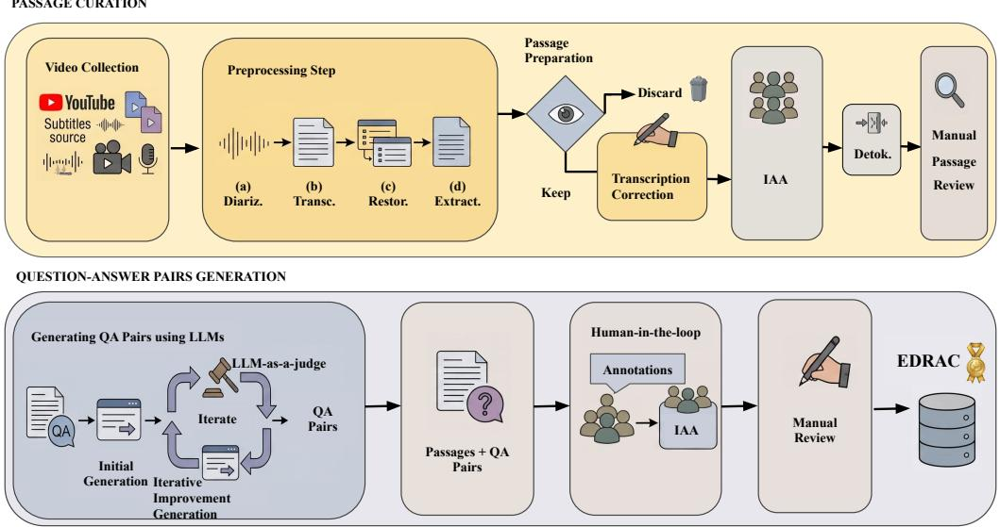  
Figure 1: The end-to-end data creation pipeline of EDRAC. The top panel outlines the passage curation workflow. The bottom panel illustrates the QA generation pipeline.

A central characteristic of EDRAC is its reliance on naturally occurring speech, unscripted and, in some cases, partially scripted spoken data captured in real-world settings, thereby preserving the linguistic and cultural subtleties of Arabic dialects without artificial modification.

To construct EDRAC, we designed a hybrid pipeline combining automated processing with human verification. The process involved two main stages: passage curation and QA pairs generation. In the first stage (see Figure 1), YouTube videos in dialectal Arabic were processed through speaker diarization, transcription alignment, text restoration, and passage extraction. This was followed by manual correction and review by native speakers of the dialects. In the second stage, the QA pairs were generated using an iterative LLM-assisted framework based on Gemini 2.5 pro, with multiple refinement steps to improve quality and reduce hallucinations. Figure 1 presents the complete pipeline spanning the two stages: passage curation and QA pairs generation.

The quality was ensured by an extensive manual annotation by a professional Language Service Provider: we provide annotator demographics, along with payment details in Appendix L. The development of comprehensive guidelines for both transcription correction and generated QAs was necessary, involving broad discussions with native speakers to ensure adequate handling of the linguistic nuances of Arabic dialects. The guidelines are available in Appendix J and Appendix K.

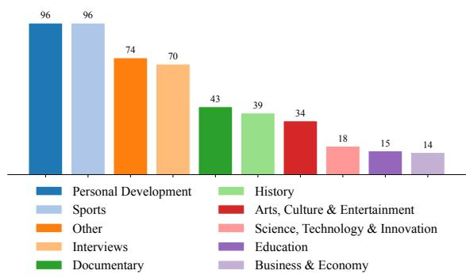  
Figure 2: Genre distribution counts for the passages across dialects.

## 4 Passage Curation

The Arabic speech processing community has already developed extensive conversational corpora of dialectal transcribed speech data. Notable datasets include ArzEn (Hamed et al., 2020), STAC (Zribi et al., 2015), MASC (Al-Fetyani et al., 2023) and Mixat (Al Ali and Aldarmaki, 2024). Nevertheless, these corpora were designed primarily for ASR or dialect identification and were thus not suitable for the purposes of our study.

Instead, we opted to curate a brand new multidialect transcription dataset, with post-editing focusing on the curation of reading comprehension material. We chose YouTube as our primary source for representative dialectal speech as it provided a broad variety of genres of audio content across the five dialects (see Figure 2) and also allowed us to leverage pre-existing automated transcriptions.

Video Collection Native speakers, who were instructed to select content representative of their dialects across a variety of genres, recommended an initial list of 7 channels for their dialect and subsequent revisions and additions as necessary (see Appendix I for the final list of channels).

Our collection was restricted to videos published between June 2024 and January 2026. Our target was 100 videos per dialect, but we sourced roughly 150 videos per dialect to allow for quality assurance filtering. We extracted the first six minutes of each video, which is equivalent to roughly 473 tokens per video passage (Table 2). Finally, we excluded videos containing toxic or sensitive content. We used existing YouTube subtitles as the video transcription source. Videos lacking pre-existing transcriptions were excluded.

Preprocessing steps The preprocessing pipeline consists of four steps: (a) Speaker diarization: we used the NVIDIA NeMo toolkit to perform speaker diarization on the extracted audio streams. This step segments the audio by speaker identity, ensuring that multi-speaker interactions—common in media—are preserved, (b) Transcription: in the transcription of speech, the tokens were timestamped to ensure alignment between the text and the original acoustic signal, (c) Restoring text structure: to convert fragmented ASR outputs into coherent prose, we implemented a hybrid strategy for structure restoration that involved a review stage (See Appendix E for details). The automatic restoration step solely determines punctuation and segment boundaries; the original transcript tokens remain unchanged, and (d) Text extraction: a clean-up step discarded any passages that exceeded the passage size limit of 500 words, had missing video links, vacuous content such as promotional content and social media material such as subscription or follow requests. Finally, we extract the passages for annotation.

Passage Preparation Our in-house native speakers performed a high-level review of the passages to ensure that there were no major issues.

Transcription Correction We created MS Excelbased forms for transcription correction, one passage per tab, segmented by paragraph and token-byline split to allow close scrutiny at the token level (see Appendix J for the annotation guidelines. We do not follow CODA (Habash et al., 2018)). On inspection, the quality of YouTube’s Dialectal Arabic transcriptions was not sufficient for our benchmark. As such, we included a human transcription correction stage. The annotators’ primary objective was to read the passage, listen to the corresponding video and correct any transcription issues. 27 annotators, representing the five dialects, collaborated in a correct-review workflow (demographics of the annotators are provided in Appendix L).<sup>3</sup>

Detokenization and Manual Passage Review The passages were then detokenized to restore their original structure. The final (corrected) set of transcribed passages then underwent an additional internal manual sanity check review (e.g., removing passages or QA pairs that were non-dialectal) before finalizing the curated passage dataset.

## 5 Question-Answer Pairs Generation

Our first attempt at QA generation involved a twoweek pilot study with in-house linguists. The task required extensive creative skills to ensure questions were not overly simple and could involve reasoning or deduction processes. This attempt proved so difficult and time-consuming that our next step was to explore the capability of an LLM in supporting QA generation for Arabic dialects.

## 5.1 Generating QA Pairs using LLMs

After a number of trials, Gemini-2.5-pro <sup>4</sup> proved to be the most reliable LLM available for automatically generating QA pairs for the dialectal passages produced in Section 4. Our initial attempts at QA pairs generation, which relied solely on a single prompt, resulted in model hallucinations (such as excessive use of MSA, and irrelevant content). To enhance the quality of the generated pairs, we introduced an iterative refinement loop. Our QA-pair generation pipeline therefore involves a three-step generate-revise framework that we outline here.

Step 1: Initial generation Given a passage, the model generates 10 QA pairs, based on a prompt devised over multiple iterative generate-review-revise rounds.<sup>5</sup> The prompt instructs the model to generate reading comprehension QA pairs relevant to the provided passage, in the five dialects (see Appendix B for the detailed prompt).

Step 2: LLM-as-a-judge for evaluation To mitigate hallucination issues from Step 1, the pipeline includes an LLM-as-a-judge to evaluate the generated pairs. This judge (also Gemini-2.5-pro) applies a fine-grained set of quality checks to the generated pairs to evaluate their quality following an approach similar to Kim et al. (2024) and Pombal et al. (2025). We instruct the model to verify if the questions are objective, unbiased, relevant, answerable and concise. We also enforce additional stylistic rules requiring questions to be in the third person and to avoid the use of linguistic or grammatical terms in the questions. We further impose additional criteria on the answers stipulating that they must be unambiguous and precise. For checks that are not met, the judge provides an explanation for the failure in addition to recommendations for improvement on the complexity of generated pairs. The full prompt is provided in Appendix C. QA pairs that fail Step 2 of the generation framework enter into an iterative improvement loop (Step 3).

Step 3: Iterative improvement generation The same model is again provided with: the passage, the failed pairs from Step 2, and more crucially, the judge’s feedback on each pair’s quality. The model is explicitly instructed to correct any issues flagged during Step 2, while preserving the dialect characteristics of the passage. Steps 2 and 3 are repeated for a maximum of five times, or until the evaluated pair passes all quality checks. See Appendix D for the full prompt.

<table><tr><td>Dialect Pass.</td><td></td><td></td><td>Toks Sents.</td><td>Par.</td><td></td><td>Tok/ Sent/ Par./ Pass. Pass. Pass</td><td></td></tr><tr><td>EGY</td><td>100</td><td>46,655</td><td>1,989</td><td>603</td><td>466.6</td><td>19.9</td><td>6.0</td></tr><tr><td>MOR</td><td>100</td><td>50,174</td><td>2,643</td><td>755</td><td>501.7</td><td>26.4</td><td>7.6</td></tr><tr><td>KSA</td><td>100</td><td>47,632</td><td>2,109</td><td>685</td><td>476.3</td><td>21.1</td><td>6.9</td></tr><tr><td>SYR</td><td>99</td><td>42,821</td><td>3,057</td><td>1,217</td><td>432.5</td><td>30.9</td><td>12.3</td></tr><tr><td>UAE</td><td>100</td><td>48,831</td><td>3,047</td><td>1,268</td><td>488.3</td><td>30.5</td><td>12.7</td></tr><tr><td>Overall</td><td></td><td>499 236,113 12,845</td><td></td><td>4,528</td><td></td><td>473.1725.74</td><td>9.07</td></tr></table>

Table 2: Post-review textual statistics and metrics across all dialects for passages, tokens, sentences and paragraphs.

## 5.2 Human-in-the-Loop

As benchmark data cannot be created through automated approaches alone, it is crucial to include a human-in-the-loop. This validation step enables assessment of Gemini 2.5 pro’s capability in generating QA pairs and also flagging of LLM-related issues (Huang et al., 2025), such as hallucinations and inaccuracies.

Dialectal Annotation Guidelines Manual evaluation of the generated QA pairs was based on defined criteria outlined in our annotation guidelines (see Appendix K). These guidelines were refined and finalized through an iterative process of pilot testing and revising. The first draft of the guidelines was tested in a pilot on Egyptian data, but differed significantly in terms of label categories, as it involved an attempt to generate QAs with various levels of difficulty - a categorization that proved difficult to define in terms of prompt instructions.

In the second pilot, three native Emirati speakers reviewed 10 automatically generated QA pairs across five passages.

<table><tr><td>&lt;Link to Guidelines&gt; </td><td></td><td></td><td>&lt;Link to Video&gt;</td></tr><tr><td colspan="4">Today&#x27;s conversation carries a different kind of impact. We are speaking in front of a journalist, and I consider you a truly professional journalist, highly capable, may God bless you. You possess a lifetime of experience; this long journey of more than 45 years in journalism deserves to be recognized. I also have many questions I&#x27;d like us to discuss in this field, from your beginnings in the mid-1970s until today. Of course, we have the ordinary definition of a journalist: someone who can report and write news. Journalism has changed today, Abu Mohammed. Journalists are sitting in offices now, while there is what we call the field journalist, and you have experience as a field journalist. Yes. Tell us, what&#x27;s the</td></tr><tr><td>Question List</td><td>Question Relevancy</td><td>QA Pair Naturalness</td><td>Is Answer Correct?</td></tr><tr><td>When did the speaker&#x27;s journalism career begin, and what characterized that period? It began in the mid-1970s, and that period was marked by the early years of the country&#x27;s</td><td>Relevant</td><td>Natural</td><td>Correct</td></tr><tr><td>How many years of experience does the speaker Abdullah have in journalism? </td><td>Relevant</td><td>Natural</td><td>Correct</td></tr><tr><td>According to Jamal, what is the difference between the traditional definition of a journalist and the journalists today? Traditionally, a journalist is someone who can report and write news, whereas today journalists</td><td>Relevant</td><td>Natural</td><td>Correct</td></tr><tr><td>Based on the speakers&#x27; remarks, what is the main difference between a field journalist and a journalist who works from an office? A field journalist is the source of everything new because they interact directly with people and real life, unlike today&#x27;s journalists, most of whom work from their offices.</td><td>Relevant</td><td>Natural</td><td>Correct</td></tr></table>

Figure 3: Example of the EDRAC Google Sheets annotation interface, showing a shortened snippet of the Arabic transcript segment, its associated question–answer pairs, annotation labels, and color-coded evidence spans to guide <sup>صحيميي</sup> <sup>و</sup> <sup>مص</sup>  <sup>ي</sup> <sup>يي</sup>  <sup>يعم</sup> <sup>معحي</sup> <sup>ب</sup> <sup>مبر</sup> <sup>بعس</sup> <sup>صحيينيويبهم</sup> <sup>يو</sup> <sup>من</sup>annotators. English translations are included only for reader clarity and are not shown to annotators.

The results and follow-up session revealed noticeable disagreement among annotators driven primarily by annotators’ regional linguistic variation and daily linguistic habits. Following the pilot, the guidelines were updated to improve the definition and categories of ‘naturalness’. We also added clearer explanation on what was acceptable as dialectal variations and how to handle codeswitching. At this stage, five different sets of guidelines were deemed more appropriate, one for each dialect. Each version differs only in the dialectspecific examples used.

Annotation Set-up Dialect teams of two were assigned 100 passages and their 10 corresponding QA pairs (1000 QA pairs per dialect team). Each annotator annotated 60 passages with an overlap of 20 to allow for an IAA study. In the annotation file, each generated QA pair is cross-referenced with automatic color-coding highlighted spans within the passage to support efficiency in finding the relevant section(s) of the passage. We also include a link to the video relevant to each passage. See Figure 3 for a visual example. The ultimate goal was to assess the LLM’s output in terms of relevancy, naturalness, and correctness, with an “ideal” result of Relevant, Natural and Correct labels.

1. Relevancy: Is the question relevant to the content of the passage? (Relevant, Irrelevant)

2. Naturalness: How well do the generated QA pairs represent the dialect as it is naturally spoken by native speakers? (Natural, Somewhat Awkward, Unnatural, Non-dialectal.)

3. Correctness: Does the answer meet the requirements of being factually accurate and supported directly by the passage, or concluded or inferred from information in the passage? (Correct, Incorrect, Invalid).

IAA As an additional measure of quality, we conduct inter-annotator agreement using Cohen’s Kappa coefficient (Cohen, 1960) on 20 passages per dialect. While the annotations achieved high observed agreement across the categories, the resulting Kappa scores remained comparatively low due to the highly skewed label distribution within our dataset (also known as the “Kappa Paradox” (Feinstein and Cicchetti, 1990)). We therefore calculated PABAK-OS scores (a measure used for linguistic analysis in Anzovino et al. (2018)). The results showed high agreement across dialects. See Appendix M for all results.

<table><tr><td>Dialect</td><td>Relevant</td><td>Natural</td><td>Correct</td></tr><tr><td>EGY</td><td>100%</td><td>96%</td><td>98%</td></tr><tr><td>MOR</td><td>98%</td><td>99%</td><td>96%</td></tr><tr><td>KSA</td><td>99%</td><td>95%</td><td>96%</td></tr><tr><td>SYR</td><td>97%</td><td>98%</td><td>90%</td></tr><tr><td>UAE</td><td>100%</td><td>98%</td><td>98%</td></tr></table>

Table 3: Pre-review label distribution summary. The three dimensions were evaluated independently.

Manual Review We performed a final round of manual reviews by in-house native speakers. Spot checks were carried out on the quality of annotations for each dialect. 209 QA pairs out of 5,000 (4.2%) were flagged. We classify the issues flagged into: (a) Fix (b) Discard (c) No change (see Table 9 in Appendix G for the statistics of the data, and Appendix N for an example of a flagged issue).

Therefore the Total Flagged is a very small percentage of the entire dialectal set of 5000 QA pairs. At this stage, 23 QA pairs were discarded, including one full passage entry, resulting in 499 passages. It is worth noting that a significantly low number of LLM-generated issues were flagged by our annotators. These issues generally related to incorrect answers, misinterpretation of the question, gender confusion (this affecting morphology of several tokens), partial correctness (e.g., only retrieving part of a list) and hallucinated answers (not found in the passage). The distribution of the “ideal” response labels (Relevant, Natural and Correct) for the pre-review generated pairs are shown in Table 3. Table 4 provides a summary of the types of errors encountered during the manual review.

The results of the manual review demonstrate two insights. First, Gemini 2.5 Pro can be reliably used in an iterative-improvement loop approach to generate these 5 dialectal varieties of Arabic. Second, we confirm the quality of the dataset.

<table><tr><td>Error Category</td><td>QA pairs %</td></tr><tr><td>Incorrect Annotation</td><td>1%</td></tr><tr><td>Language naturalness</td><td>&lt;1%</td></tr><tr><td>Model answer errors</td><td>&lt;1%</td></tr><tr><td>Question quality issues</td><td>&lt;0.1%</td></tr><tr><td>Cultural understanding errors</td><td>&lt;0.1%</td></tr><tr><td>Transcription quality issues</td><td>&lt;0.1%</td></tr></table>

Table 4: Pre-review percentage of QA error categories.

## 5.3 Data Challenges

Developing a high-quality dataset for DA comes with challenges, stemming from the language’s diglossic nature, the vast number of varieties, regional variation that is not well-documented, and attitudes towards these varieties.

One issue that influenced both the design of the guidelines and the annotation process is the orthographic variation among speakers of Arabic as there is no standardized orthography that is commonly adopted among speakers. Speakers’ spelling choices are influenced by the phonological representation of the word or MSA orthographic rules. In our guidelines, we emphasized that spelling variants are acceptable when there is no meaning change.

The definition of naturalness posed another challenge. The Emirati pilot (see Section 5.2) revealed a high disagreement among speakers. An underlying reason for judgment variations was the annotators’ own regional dialectal preferences, and assumptions about their dialect. This was noticeable in the ‘naturalness’ category. Additionally, each Arabic dialect has its own sub-varieties that can vary lexically and phonologically. Not all speakers are familiar with such sub-varieties, and may therefore be biased against them. From an annotation point of view, this means the annotators’ judgments can be biased and may not reflect the true nature of the dialects. The subjective judgments and regional attitudes directly impacted label distribution in the Emirati pilot. Annotators were often hesitant to label unfamiliar sub-varieties as ‘natural’. To counter this, our guidelines help annotators to look past their sub-variety bias. We have also emphasized that variation is a natural linguistic phenomenon across speakers.

Additionally, some of the passages contained high-register language characteristic of formal media contexts (e.g., news). Prestige bias led some annotators to regard such language as unnatural.

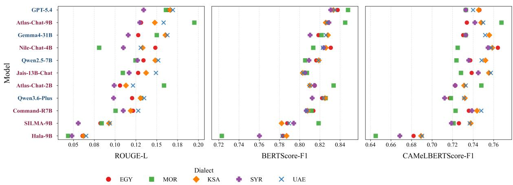  
Figure 4: Model performance across five Arabic dialects under three different evaluation metrics. Blue model names indicate general multilingual models, whereas Red model names indicate Arabic-focused models.

We noted in our guidelines that these forms reflect the linguistic nuances of the native dialect and should be labeled ‘natural’.

On the modeling side, we observed dialect mixing in an earlier attempt at generating QA pairs e.g., Syrian with Palestinian, Emirati with Saudi. This is not unusual, as models are often biased. We address this in our prompt by specifying both the dialect and the country where it is spoken.

## 6 Experimental Setup

We use the EDRAC dataset introduced in Section 3 to establish a benchmark and evaluate a set of Arabic-centric and multilingual LLMs on their ability to answer dialectal RC questions. In choosing these models, we focused on dialectal models Atlas-Chat-2B, Atlas-Chat-9B, Nile-Chat-4B, Hala-9B and Jais-13B-Chat that support Moroccan, Egyptian, Saudi and Emirati dialects, respectively. In addition, we evaluate a number of multilingual models that are both open-weight models (Qwen2.5-7B, Gemma4-31B and SILMA-9B) and closed-weight models (GPT-5.4 and Qwen3.6-Plus). Details are provided in Table 8 in Appendix F.

For the QA setup,<sup>6</sup> we used OpenRouter (Open-Router, 2026), an online API that provides a unified access to different models using one standard interface. The models were prompted with:

«Given the following passage, answer the accompanying question.

Passage: {passage}

Question: {question}

Answer:»

We provide the prompt to the models in English rather than Arabic. This aligns with the standard practice of using English as the language of the prompt, especially when benchmarking a highly diverse suite of both multilingual and Arabic-centric LLMs. For example, Aljagthami et al. (2025) and Dey et al. (2024) have demonstrated that models show a more consistent performance when prompted in English.

## 6.1 Evaluation Metrics

We report model performance on answering questions using three metrics: (1) ROUGE - a token-based metric (whitespace tokenization), (2) BERTScore model (mDeBERTa-based implementation), and (3) CAMeLBERTScore which is an Arabic-specific implementation. ROUGE (Lin, 2004) is typically used for the evaluation of text summarization and machine translation tasks (Chang et al., 2024). It is a token-based metric and can only capture exact lexical matches between the gold and generated texts.

We also report the performance using BERTScore-F1, which is better suited to measuring the semantic similarity. We evaluate with BERTScore (Zhang et al., 2020) using two different encoder-only language models: mDeBERTa, a multilingual variant of DeBERTaV3 (He et al., 2023), and CAMeLBERT (Inoue et al., 2021), a model fine-tuned for Arabic dialects. We use CAMeL-Lab/bert-base-arabic-camelbert-mix.

We provide results in Figure 4. The model order in the plot is based on average performance across dialects, under three metrics, sorted in descending order (1st row is the best performing model).

## 7 Results and Analysis

Figure 5 illustrates model aggregate performance on the EDRAC dataset across various dialects, evaluated using three distinct metrics (also see Appendix A for the results). According to ROUGE-L and BERTScore-F1, the flagship GPT-5.4 achieved the highest average performance across all dialects. While the model’s proprietary nature limits our analysis, we can only speculate that this advantage stems from its massive parameter size and extensive training data.

Among the Arabic-focused models, Atlas-Chat-9B achieved solid overall performance. Notably, the Atlas models exhibited exceptionally strong performance on the Moroccan dialect, which aligns with their Moroccan-focused training data. Furthermore, Nile-Chat-4B demonstrated remarkable efficiency, outperforming significantly larger Arabiccentric models such as Jais-13B-Chat, SILMA-9B, and Hala-9B despite its compact 4B parameter size.

While Gemma4-31B also delivered strong results, its massive scale makes it less practical for deployment, especially considering it was outperformed by the much smaller Atlas-Chat-9B in most scenarios. Conversely, Qwen3.6-Plus exhibited a degradation in performance compared to its predecessor, suggesting a weaker Arabic performance in this evaluation setting.

Lastly, we observed that standard metrics like ROUGE-L and BERTScore over-reward models for broad semantic similarity while failing to capture dialectal nuances, creating a misleading leaderboard that does not always accurately reflect true dialectal proficiency. For instance, when evaluated using the Arabic-specific CAMeLBERTScore-F1 metric, GPT-5.4 dropped from 1st to joint 5th with Qwen2.5-7B. This suggests that while the model generates semantically accurate responses, it struggles with dialectal constructions and specific lexical overlap.

## 7.1 Human Evaluations

We conducted human evaluations on two models to further investigate our findings. We selected 20 examples from GPT-5.4 output (best performing model) and 20 examples from Hala-9B output (worst performing model) for each of the dialects. To ensure a representative sample across genres, we selected two questions from 10 different passages within each dialectal set. We evaluate the model outputs on two dimensions: accuracy and naturalness (see Appendix O for annotation guidelines). The accuracy measures semantic equivalence with a reference answer. To avoid bias and lexical priming during evaluations, we do not provide the passages to the annotators.

<table><tr><td>Dialect</td><td>Rouge</td><td>BertScore</td><td>Accuracy</td><td>Naturalness</td></tr><tr><td>EGY</td><td>13%</td><td>82%</td><td>85%</td><td>32%</td></tr><tr><td>MOR</td><td>11%</td><td>85%</td><td>95%</td><td>50%</td></tr><tr><td>KSA</td><td>13%</td><td>81%</td><td>95%</td><td>25%</td></tr><tr><td>SYR</td><td>8%</td><td>79%</td><td>82%</td><td>42%</td></tr><tr><td>UAE</td><td>13%</td><td>81%</td><td>100%</td><td>5%</td></tr></table>

Table 5: Comparison of Automatic and Human Evaluation Scores Across Five Arabic Dialects. Human evaluation scores (Accuracy and Naturalness) are based on a 40-example sample per dialect drawn equally from GPT-5.4 and Hala-9B outputs.

Table 5 shows a clear discrepancy between automatic and human metrics. Standard metrics like ROUGE penalize lengthy or elaborate answers even when they are representative of accurate human responses. Conversely, while semanticsimilarity metrics like BERTScore show high scores across the board, they fail to capture critical issues with the "dialectness" of the generated text. For example, for some correct answers, the annotators also labeled the answer as non-dialectal.

## 8 Conclusion and Future Work

We introduced EDRAC, the first large-scale benchmark for dialectal Arabic machine reading comprehension and generative question answering across five Arabic dialects. EDRAC is grounded in naturally occurring spoken interactions and constructed through a scalable human–LLM collaborative pipeline of iterative generation, LLM-asa-judge evaluation, and human verification. Our experiments with Arabic-centric and multilingual LLMs reveal substantial gaps between semantic answer quality and dialectal fidelity, highlighting limitations of current evaluation metrics for dialectal Arabic. Our roadmap for building comparable resources can help other low-resource spoken varieties to address the challenge of data scarcity.

In future work, we plan to expand EDRAC to additional dialects and more challenging reasoning settings, including conversational and multi-hop QA. We also aim to investigate dialect-sensitive evaluation metrics and extend our framework to other low-resource spoken languages.

## Limitations

EDRAC covers five major Arabic dialects, but it does not capture the full linguistic diversity of the Arabic-speaking world, including finer-grained regional and sociolectal variation. In addition, although the dataset is grounded in naturally spoken interactions, some source content may still contain partial scripting or speaker self-monitoring typical of online media.

Our QA generation pipeline relies on LLMassisted generation and evaluation, which may introduce residual biases or stylistic artifacts despite multiple rounds of human verification and quality control. We also note that there are many highquality Arabic-centric models available that support Arabic, yet we limited our choice of models to a representative and diverse sample for the purposes of our study.

Finally, while we evaluate a diverse set of Arabiccentric and multilingual LLMs, the rapidly evolving landscape of language models means that future systems may exhibit different performance trends on the benchmark.

## Ethics and Broader Impact

EDRAC was constructed from publicly available YouTube content using only limited transcript excerpts necessary for the research objectives. The dataset is released under the CC BY-NC-SA 4.0 license for non-commercial use and is intended to be solely an evaluation benchmark. To preserve benchmark integrity, it should not be included in pretraining or fine-tuning data.

To reduce potential harms, we excluded videos containing sensitive, toxic, or explicit content during data collection and applied multiple layers of human review throughout the annotation pipeline. The dataset is designed to support research on dialectal Arabic NLP, particularly for underrepresented spoken varieties that are often overlooked in current language technologies.

At the same time, dialectal data may contain regional, social, or cultural biases that reflect naturally occurring speech. While we employed nativespeaker annotators and quality-control procedures to improve consistency and linguistic authenticity, residual biases and annotation subjectivity may still remain. In addition, the use of LLM-assisted QA generation may introduce stylistic artifacts or model-specific biases despite human verification.

We hope EDRAC contributes to more inclusive and representative Arabic NLP systems by encouraging research on dialect-aware language technologies and more robust evaluation methods for spoken language understanding. We used AI writing assistance within the scope of “Assistance purely with the language of the paper” described in the ACL Policy on Publication Ethics.

## Acknowledgments

This work was conducted as part of the IBM–MBZUAI AI Center of Excellence. The research is in part with support from Google.org and the Google Cloud Research Credits program for the Gemini Academic Program through a grant to New York University Abu Dhabi’s CAMeL Lab. The authors gratefully acknowledge the contributions of Amr Keleg and Samar Magdy for their assistance during the data curation process.

## References

Abdelrahman Abdallah, Mahmoud Kasem, Mahmoud Abdalla, Mohamed Mahmoud, Mohamed Elkasaby, Yasser Elbendary, and Adam Jatowt. 2024. ArabicaQA: A comprehensive dataset for Arabic question answering. In Proceedings ofthe 47th International ACM SIGIR Conference on Research and Development in Information Retrieval, SIGIR ’24, pages 2049–2059, New York, NY, USA. Association for Computing Machinery.

Mouath Abu-Daoud, Leen Kharouf, Omar El Hajj, Dana Samad, Mariam Al-Omari, Jihad Mallat, Khaled Saleh, Nizar Habash, and Farah Shamout. 2026. MedAraBench: Large-scale Arabic medical question answering dataset and benchmark. In International Conference on Learning Representations, volume 2026 of ICLR ’26, pages 13469–13496, Rio de Janeiro, Brazil.

Priyanka Agrawal, Chris Alberti, Fantine Huot, Joshua Maynez, Ji Ma, Sebastian Ruder, Kuzman Ganchev, Dipanjan Das, and Mirella Lapata. 2023. QAmeleon: Multilingual QA with only 5 examples. Transactions ofthe Associationfor Computational Linguistics, 11:1754–1771.

Maryam Khalifa Al Ali and Hanan Aldarmaki. 2024. Mixat: A data set of bilingual Emirati-English speech. In Proceedings ofthe 3rd Annual Meeting ofthe Special Interest Group on Under-resourced Languages @ LREC-COLING 2024, pages 222–226, Torino, Italia. ELRA and ICCL.

Mohammad Al-Fetyani, Muhammad Al-Barham, Gheith Abandah, Adham Alsharkawi, and Maha Dawas. 2023. MASC: Massive arabic speech corpus. In 2022 IEEE Spoken Language Technology Workshop (SLT), pages 1006–1013.

Rawan Al-Matham, Kareem Darwish, Raghad Al-Rasheed, Waad Alshammari, Muneera Alhoshan, Amal Almazrua, Asma Al Wazrah, Mais Alheraki, Firoj Alam, Preslav Nakov, Norah Alzahrani, Eman AlBilali, Nizar Habash, Abdelrahman El-Sheikh, Muhammad Elmallah, Haonan Li, Hamdy Mubarak, Mohamed Anwar, Zaid Alyafeai, and 24 others. 2025. BALSAM: A platform for benchmarking Arabic large language models. In Proceedings ofThe Third Arabic Natural Language Processing Conference, pages 258–277, Suzhou, China. Association for Computational Linguistics.

Aamer Aljagthami, Mohammed Banabila, Musab Alshehri, Mohammed Kabini, and Mohammad D. Alahmadi. 2025. Evaluating large language models for code translation: Effects of prompt language and prompt design. arXiv preprint arXiv:2509.12973.

Omar Alkaabi, Ahmed Alzubaidi, Hamza Alobeidli, Shaikha Alsuwaidi, Mohammed Alyafeai, Leen AlQadi, Basma El Amel Boussaha, and Hakim Hacid. 2026. Alyah: An Emirati Dialect Benchmark for Evaluating Arabic Large Language Models.

Sultan Alrowili and K Vijay-Shanker. 2023. ArTrivia: Harvesting Arabic Wikipedia to build a new Arabic question answering dataset. In Proceedings ofArabicNLP 2023, pages 191–207, Singapore (Hybrid). Association for Computational Linguistics.

Malik H. Altakrori, Nizar Habash, Teresa Lynn, Younes Samih, Abed Alhakim Freihat, Kirill Chirkunov, Muhammed AbuOdeh, Radu Florian, Preslav Nakov, and Alham Fikri Aji. 2026. DialectalArabicMMLU: Benchmarking dialectal capabilities in Arabic and multilingual language models. In Proceedings of the Fifteenth Language Resources and Evaluation Conference (LREC 2026), pages 3199–3219, Palma, Mallorca, Spain. European Language Resources Association (ELRA).

Raviteja Anantha, Svitlana Vakulenko, Zhucheng Tu, Shayne Longpre, Stephen Pulman, and Srinivas Chappidi. 2021. Open-Domain question answering goes conversational via question rewriting. In Proceedings ofthe 2021 Conference ofthe North American Chapter ofthe Associationfor Computational Linguistics: Human Language Technologies, pages 520–534, Online. Association for Computational Linguistics.

Maria Anzovino, Elisabetta Fersini, and Paolo Rosso. 2018. Automatic identification and classification of misogynistic language on Twitter. In International Conference on Applications of Natural Language to Information Systems, pages 57–64. Springer.

Lucas Bandarkar, Davis Liang, Benjamin Muller, Mikel Artetxe, Satya Narayan Shukla, Donald Husa, Naman Goyal, Abhinandan Krishnan, Luke Zettlemoyer, and Madian Khabsa. 2024. The Belebele Benchmark: A parallel reading comprehension dataset in 122 language variants. In Proceedings ofthe 62nd Annual Meeting of the Association for Computational Linguistics (Volume 1: Long Papers), pages 749–775,

Bangkok, Thailand. Association for Computational Linguistics.

Houda Bouamor, Nizar Habash, Mohammad Salameh, Wajdi Zaghouani, Owen Rambow, Dana Abdulrahim, Ossama Obeid, Salam Khalifa, Fadhl Eryani, Alexander Erdmann, and Kemal Oflazer. 2018. The MADAR Arabic dialect corpus and lexicon. In Proceedings ofthe Eleventh International Conference on Language Resources and Evaluation (LREC 2018), Miyazaki, Japan. European Language Resources Association (ELRA).

Yupeng Chang, Xu Wang, Jindong Wang, Yuan Wu, Linyi Yang, Kaijie Zhu, Hao Chen, Xiaoyuan Yi, Cunxiang Wang, Yidong Wang, Wei Ye, Yue Zhang, Yi Chang, Philip S. Yu, Qiang Yang, and Xing Xie. 2024. A survey on evaluation of large language models. ACM Trans. Intell. Syst. Technol., 15(3).

Jacob Cohen. 1960. A coefficient of agreement for nominal scales. Educational and psychological measurement, 20(1):37–46.

Abdelghani Dahou, Abdelhalim Hafedh Dahou, Mohamed Amine Cheragui, Amin Abdedaiem, Mohammed A. A. Al-Qaness, Mohamed Abd Elaziz, Ahmed A. Ewees, and Zhonglong Zheng. 2025. A survey on dialect Arabic processing and analysis: Recent advances and future trends. ACM Trans. Asian Low-Resour. Lang. Inf. Process., 24(8).

Kareem Darwish, Nizar Habash, Mourad Abbas, Hend Al-Khalifa, Huseein T. Al-Natsheh, Houda Bouamor, Karim Bouzoubaa, Violetta Cavalli-Sforza, Samhaa R. El-Beltagy, Wassim El-Hajj, Mustafa Jarrar, and Hamdy Mubarak. 2021. A panoramic survey of natural language processing in the Arab world. Commun. ACM, 64(4):72–81.

Krishno Dey, Prerona Tarannum, Md. Arid Hasan, Imran Razzak, and Usman Naseem. 2024. Better to Ask in English: Evaluation of Large Language Models on English, Low-resource and Cross-Lingual Settings. Preprint, arXiv:2410.13153.

Jacob Eisenstein. 2013. What to do about bad language on the internet. In Proceedings of the 2013 Conference of the North American Chapter of the Association for Computational Linguistics: Human Language Technologies, pages 359–369, Atlanta, Georgia. Association for Computational Linguistics.

AbdelRahim Elmadany, El Moatez Billah Nagoudi, and Muhammad Abdul-Mageed. 2023. Octopus: A multitask model and toolkit for Arabic natural language generation. In Proceedings of ArabicNLP 2023, pages 232–243, Singapore (Hybrid). Association for Computational Linguistics.

Ali Farghaly and Khaled Shaalan. 2009. Arabic natural language processing: Challenges and solutions. ACM Transactions on Asian Language Information Processing, 8(4).

Alvan R. Feinstein and Domenic V. Cicchetti. 1990. High agreement but low Kappa: I. The problems of two paradoxes. Journal of Clinical Epidemiology, 43(6):543–549.

Nizar Habash, Fadhl Eryani, Salam Khalifa, Owen Rambow, Dana Abdulrahim, Alexander Erdmann, Reem Faraj, Wajdi Zaghouani, Houda Bouamor, Nasser Zalmout, Sara Hassan, Faisal Al-Shargi, Sakhar Alkhereyf, Basma Abdulkareem, Ramy Eskander, Mohammad Salameh, and Hind Saddiki. 2018. Unified guidelines and resources for Arabic dialect orthography. In Proceedings of the Eleventh International Conference on Language Resources and Evaluation (LREC 2018), Miyazaki, Japan. European Language Resources Association (ELRA).

Injy Hamed, Ngoc Thang Vu, and Slim Abdennadher. 2020. ArzEn: A speech corpus for code-switched Egyptian Arabic-English. In Proceedings of the Twelfth Language Resources and Evaluation Conference, pages 4237–4246, Marseille, France. European Language Resources Association.

Hunzalah Hassan Bhatti and Firoj Alam. 2026. Beyond MCQ: An open-ended Arabic cultural QA benchmark with dialect variants. In Proceedings of the Fifteenth Language Resources and Evaluation Conference, pages 5215–5231, Palma, Mallorca, Spain. ELRA Language Resource Association.

Mariam E. Hassib, Nagwa El-Makky, and Marwan Torki. 2025. Open-domain Arabic conversational question answering with question rewriting. In Proceedings ofThe Third Arabic Natural Language Processing Conference, pages 84–96, Suzhou, China. Association for Computational Linguistics.

Pengcheng He, Jianfeng Gao, and Weizhu Chen. 2023. Debertav3: Improving deberta using electra-style pre-training with gradient-disentangled embedding sharing. Preprint, arXiv:2111.09543.

Lei Huang, Weijiang Yu, Weitao Ma, Weihong Zhong, Zhangyin Feng, Haotian Wang, Qianglong Chen, Weihua Peng, Xiaocheng Feng, Bing Qin, and Ting Liu. 2025. A survey on hallucination in large language models: Principles, taxonomy, challenges, and open questions. ACM Trans. Inf. Syst., 43(2).

Seonjeong Hwang, Yunsu Kim, and Gary Geunbae Lee. 2024. Explainable multi-hop question generation: An end-to-end approach without intermediate question labeling. In Proceedings of the 2024 Joint International Conference on Computational Linguistics, Language Resources and Evaluation (LREC-COLING 2024), pages 6855–6866, Torino, Italia. ELRA and ICCL.

Go Inoue, Bashar Alhafni, Nurpeiis Baimukan, Houda Bouamor, and Nizar Habash. 2021. The interplay of variant, size, and task type in Arabic pre-trained language models. In Proceedings of the Sixth Arabic Natural Language Processing Workshop, pages 92– 104, Kyiv, Ukraine (Virtual). Association for Computational Linguistics.

Abdullah Khered, Youcef Benkhedda, and Riza Batista-Navarro. 2025. Dial2MSA-Verified: A multi-dialect Arabic social media dataset for neural machine translation to Modern Standard Arabic. In Proceedings of the 4th Workshop on Arabic Corpus Linguistics (WACL-4), pages 50–62, Abu Dhabi, UAE. Association for Computational Linguistics.

Seungone Kim, Jamin Shin, Yejin Cho, Joel Jang, Shayne Longpre, Hwaran Lee, Sangdoo Yun, Seongjin Shin, Sungdong Kim, James Thorne, and Minjoon Seo. 2024. Prometheus: Inducing finegrained evaluation capability in language models. Preprint, arXiv:2310.08491.

Chin-Yew Lin. 2004. ROUGE: A package for automatic evaluation of summaries. In Text Summarization Branches Out, pages 74–81, Barcelona, Spain. Association for Computational Linguistics.

Zefeng Lin, Weidong Chen, Yan Song, and Yongdong Zhang. 2024. Prompting few-shot multi-hop question generation via comprehending type-aware semantics. In Findings of the Association for Computational Linguistics: NAACL 2024, pages 3730–3740, Mexico City, Mexico. Association for Computational Linguistics.

Hussein Mozannar, Elie Maamary, Karl El Hajal, and Hazem Hajj. 2019. Neural Arabic question answering. In Proceedings of the Fourth Arabic Natural Language Processing Workshop, pages 108–118, Florence, Italy. Association for Computational Linguistics.

El Moatez Billah Nagoudi, AbdelRahim Elmadany, and Muhammad Abdul-Mageed. 2022. AraT5: Textto-text transformers for Arabic language generation. In Proceedings of the 60th Annual Meeting of the Associationfor Computational Linguistics (Volume 1: Long Papers), pages 628–647, Dublin, Ireland. Association for Computational Linguistics.

OpenRouter. 2026. OpenRouter: Unified API for Large Language Models. https://openrouter.ai. Accessed: 2026-05-22.

Soufiyan Ouali and Said El Garouani. 2026. MedQA-MA: A Moroccan Arabic medical questionanswering dataset for virtual healthcare assistants and large language models. Data in Brief, 65:112537.

Aurelien Pellet, Marie Anna Puren, and Julien Perez. 2026. HistoriQA-ThirdRepublic: Multi-hop question answering corpus for historical research, parliamentary debates from the French third republic (1870-1940). In Proceedings of the Fifteenth Language Resources and Evaluation Conference (LREC 2026), pages 207–223, Palma, Mallorca, Spain. European Language Resources Association (ELRA).

José Pombal, Dongkeun Yoon, Patrick Fernandes, Ian Wu, Seungone Kim, Ricardo Rei, Graham Neubig, and Andr’e F. T. Martins. 2025. M-prometheus: A suite of open multilingual LLM judges. In Proceedings of the Second Conference on Language Modeling.

John W. Ratcliff and David E. Metzener. 1988. Pattern matching: The gestalt approach. Dr. Dobb’s Journal.

Siva Reddy, Danqi Chen, and Christopher D. Manning. 2019. CoQA: A conversational question answering challenge. Transactions ofthe Associationfor Computational Linguistics, 7:249–266.

Manuela Sanguinetti, Cristina Bosco, Lauren Cassidy, Özlem Çetinoglu, Alessandra Teresa Cignarella,˘ Teresa Lynn, Ines Rehbein, Josef Ruppenhofer, Djamé Seddah, and Amir Zeldes. 2020. Treebanking user-generated content: A proposal for a unified representation in Universal Dependencies. In Proceedings ofthe Twelfth Language Resources and Evaluation Conference, pages 5240–5250, Marseille, France. European Language Resources Association.

Abdellah Hamouda Sidhoum, M’hamed Mataoui, Faouzi Sebbak, and Kamel Smaïli. 2022. ACQAD: A Dataset for Arabic Complex Question Answering. In Atlantis Press Proceedings., Boumerdès, Algeria.

Romy A.N. van Drie, Roos M. Bakker, Daan L. Di Scala, and Maaike de Boer. 2026. QuALA-NL: Question & answer with legal attribution in Dutch. In Proceedings of the Fifteenth Language Resources and Evaluation Conference (LREC 2026), pages 674– 684, Palma, Mallorca, Spain. European Language Resources Association (ELRA).

Tianyi Zhang, Varsha Kishore, Felix Wu, Kilian Q. Weinberger, and Yoav Artzi. 2020. BERTScore: Evaluating text generation with BERT. In International Conference on Learning Representations, ICLR ’20.

Inès Zribi, Mariem Ellouze, Bilel Hamrouni, and Lamia H. Belguith. 2015. Spoken Tunisian Arabic corpus "STAC": Transcription and annotation. Research in Computing Science, 90:123–135.

## A Results

<table><tr><td></td><td colspan="3">EGY</td><td colspan="3">MOR</td><td colspan="3">KSA</td><td colspan="3">SYR</td><td colspan="3">UAE</td></tr><tr><td>Model</td><td>RL</td><td>BFP</td><td>BFC</td><td>RL</td><td>BFD</td><td>BFC</td><td>RL</td><td>BFD</td><td>BFC</td><td>RL</td><td>BFD</td><td>BFC</td><td>RL</td><td> $\mathbf { B F } _ { 1 } ^ { D }$ </td><td> $\mathbf { B } \mathbf { F } _ { 1 } ^ { C }$ </td></tr><tr><td>GPT-5.4</td><td>16.3</td><td>83.8</td><td>74.6</td><td>16.1</td><td>84.8</td><td>73.3</td><td>16.6</td><td>83.3</td><td>74.5</td><td>13.4</td><td>83.1</td><td>73.3</td><td>16.9</td><td>83.5</td><td>74.0</td></tr><tr><td>Qwen3.6-Plus</td><td>12.0</td><td>82.2</td><td>71.7</td><td>13.1</td><td>82.6</td><td>71.8</td><td>13.1</td><td>82.5</td><td>73.2</td><td>9.82</td><td>81.2</td><td>71.2</td><td>13.5</td><td>82.3</td><td>73.1</td></tr><tr><td>Qwen2.5-7B</td><td>13.4</td><td>81.6</td><td>73.7</td><td>12.5</td><td>80.5</td><td>72.4</td><td>14.8</td><td>81.9</td><td>75.2</td><td>12.7</td><td>80.9</td><td>73.6</td><td>15.2</td><td>81.9</td><td>74.8</td></tr><tr><td>Gemma4-31B</td><td>12.8</td><td>81.9</td><td>73.0</td><td>15.0</td><td>82.2</td><td>73.3</td><td>16.0</td><td>82.8</td><td>75.6</td><td>11.6</td><td>81.0</td><td>73.3</td><td>16.3</td><td>82.6</td><td>75.2</td></tr><tr><td>Jais-13B-Chat</td><td>12.8</td><td>80.5</td><td>73.9</td><td>10.9</td><td>80.7</td><td>72.8</td><td>13.7</td><td>80.3</td><td>75.5</td><td>11.7</td><td>80.5</td><td>74.5</td><td>14.9</td><td>80.3</td><td>75.7</td></tr><tr><td>SILMA-9B</td><td>8.24</td><td>78.8</td><td>72.6</td><td>8.39</td><td>81.9</td><td>72.1</td><td>9.26</td><td>78.2</td><td>73.8</td><td>5.58</td><td>79.4</td><td>71.9</td><td>9.36</td><td>78.9</td><td>73.7</td></tr><tr><td>Command-R7B</td><td>12.2</td><td>81.4</td><td>73.6</td><td>10.1</td><td>81.2</td><td>72.3</td><td>11.9</td><td>80.8</td><td>74.4</td><td>11.0</td><td>80.7</td><td>73.9</td><td>12.8</td><td>80.7</td><td>74.8</td></tr><tr><td>Nile-Chat-4B</td><td>14.8</td><td>83.1</td><td>76.4</td><td>8.09</td><td>81.3</td><td>72.5</td><td>13.3</td><td>82.6</td><td>75.9</td><td>11.0</td><td>82.4</td><td>75.5</td><td>13.1</td><td>82.3</td><td>75.8</td></tr><tr><td>Atlas-Chat-2B</td><td>10.6</td><td>81.5</td><td>72.3</td><td>15.9</td><td>83.4</td><td>74.8</td><td>11.3</td><td>81.0</td><td>73.1</td><td>9.90</td><td>81.5</td><td>72.3</td><td>12.1</td><td>81.0</td><td>73.3</td></tr><tr><td>Atlas-Chat-9B</td><td>13.1</td><td>82.7</td><td>73.4</td><td>19.5</td><td>84.5</td><td>76.8</td><td>14.8</td><td>82.6</td><td>74.8</td><td>13.0</td><td>82.9</td><td>74.2</td><td>15.9</td><td>82.7</td><td>75.0</td></tr><tr><td>Hala-9B</td><td>6.09</td><td>78.3</td><td>68.2</td><td>4.37</td><td>72.3</td><td>64.5</td><td>6.21</td><td>78.7</td><td>68.9</td><td>4.83</td><td>76.0</td><td>66.9</td><td>6.53</td><td>78.3</td><td>69.0</td></tr></table>

Table 6: Model Evaluation Results across Dialects. RL denotes ROUGE-L (whitespace tokenization); $\mathbf { B F } _ { 1 } ^ { D }$ denotes BERTScore-F1 (mDeBERTa); $\mathbf { B } \mathbf { F } _ { 1 } ^ { C }$ denotes CAMeLBERTScore-F1.

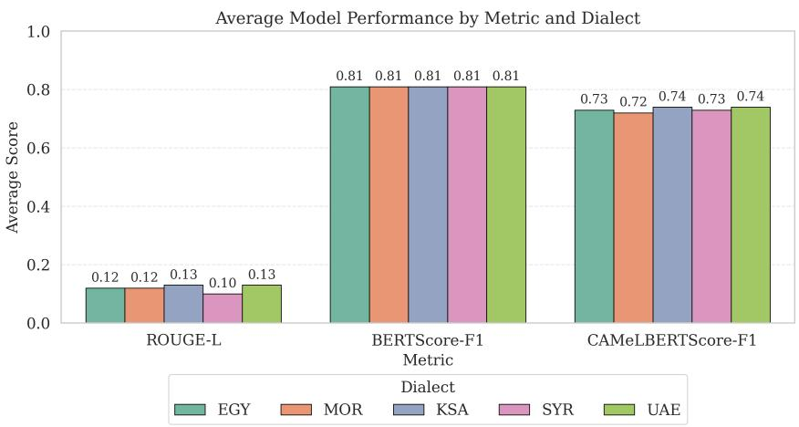  
Figure 5: Performance per dialect, using the average performance for all the models.

<table><tr><td>Model Name</td><td>EGY</td><td>MOR</td><td>KSA</td><td>SYR</td><td>UAE</td><td> $\mathbf { A v } \mathbf { g } .$  Rank ↑</td></tr><tr><td>GPT-5.4</td><td>1</td><td>2</td><td>1</td><td>2</td><td>1</td><td>1.4</td></tr><tr><td>Atlas-Chat-9B</td><td>3</td><td>1</td><td>3</td><td>1</td><td>3</td><td>2.2</td></tr><tr><td>Gemma4-31B</td><td>5</td><td>4</td><td>2</td><td>6</td><td>2</td><td>3.8</td></tr><tr><td>Qwen2.5-7B</td><td>4</td><td>6</td><td>4</td><td>4</td><td>4</td><td>4.4</td></tr><tr><td>Nile-Chat-4B</td><td>2</td><td>10</td><td>5</td><td>3</td><td>5</td><td>5.0</td></tr><tr><td>Jais-13B-Chat</td><td>6</td><td>7</td><td>6</td><td>5</td><td>6</td><td>6.0</td></tr><tr><td>Qwen3.6-Plus</td><td>8</td><td>5</td><td>7</td><td>9</td><td>7</td><td>7.2</td></tr><tr><td>Command-R7B</td><td>7</td><td>8</td><td>8</td><td>7</td><td>8</td><td>7.6</td></tr><tr><td>Atlas-Chat-2B</td><td>9</td><td>3</td><td>9</td><td>8</td><td>9</td><td>7.6</td></tr><tr><td>SILMA-9B</td><td>10</td><td>9</td><td>10</td><td>10</td><td>10</td><td>9.8</td></tr><tr><td>Hala-9B</td><td>11</td><td>11</td><td>11</td><td>11</td><td>11</td><td>11.0</td></tr></table>

Table 7: Model rankings across five Arabic dialects, sorted by the average rank (Lower is better).

## B QA Generation: Initial Prompt

```jsonl
combined_initial_prompt = ChatPromptTemplate.from_template(""" You are a linguist and
{passage_language} native speaker. You need to generate reading comprehension non-opinionated
question with precise, unambiguous answer, along with a list of exact quotes from the passage that
were used to form the answer. The questions should be based on understanding and interpreting the
text in the passage. A question can sometimes be derived partly through common knowledge in {country}
that is not explicitly present in the passage.
It is possible to either find the answer to this question directly in the text or to infer the
answer from the overall meaning of the passage. In order to answer an inferential question, pieces
of information in the passage may need to be connected, or the sequence of events may need to be
tracked. The answers to the generated questions must undergo all the following cases:
1.The answer must be found directly in the passage. It should match the passage closely in meaning
but does not need to be copied verbatim. Minor adjustments are allowed for pronoun consistency
(e.g., change “I did” to “he did” or “she did”), as well as slight rephrasing or morphological changes.
2. The question must be phrased strictly in the third person.
3.The answer must be inferred by piecing together information from different parts of the passage.
4.The answer must be inferred by interpreting the overall meaning of the passage.
You must not use a question similar to the previous questions. The answer to the question should not
be the same as the answer to previous questions.
Identify and extract the full quote(s) where the answer to the question is based.
The quotes must be exact, and the character indices of each quote within the passage must be provided.
The quotes must not include any extra details that are not explicitly in the answers Formulate
each question strictly in the third person. Questions and answers must be generated using ONLY the
{passage_language}. Your response must contain the question and answer only, or “N/A” if the question
cannot be created.
Keep each question short and concise.
The answer must be short.
IMPORTANT: The question, answer and extracted sentence must be in {passage_language}.Do not use MSA
or other dialects, otherwise you will be penalized $1000 per word.
Return your response in the following JSON format:
{{
"Question": "<your question in {passage_language} or N/A>",
"Answer": "<your answer in {passage_language} or N/A>",
"Quotes":[
{{
"text": "<your quote in {passage_language} or N/A>",
"start_char": <the starting character index of the quote in the passage as an integer, or
−1 if N/A>,
"end_char": <the ending character index of the quote in the passage as an integer, or
−1 if N/A>
}}
<sup>]</sup>}}
Passage:
{passage}
Previous Questions:
{previous_questions}
""")
```

## C QA Generation: LLM-as-a-Judge Prompt

combined\_judgement\_prompt = ChatPromptTemplate.from\_template("""   
You are {passage\_language} native speaker. You are evaluating a reading comprehension question and   
its answer based on the passage below, which is written in {passage\_language}. Your task is to set   
of critical criteria and nicetohave recommendations.   
Label these quality and formatting dimensions (True/False): - IsNonOpinionated: The question is   
objective and not based on personal opinion. - UnambiguousAnswer: The answer is clear and does not   
allow multiple interpretations. - IsUnbiased: The question is free from prejudice. - IsAnswerable:   
The question can be answered from the text with the allowed outside knowledge. - IsRelevant: The   
question is clearly related to the passage’s content. - IsInThirdPerson: The question is phrased   
strictly in the third person. - QuestionFreeFromLinguisticOrGrammarTerms: Grammar or linguistic terms   
are not used in the question. - IsShortQuestion: The question is 20 words or fewer. - IsPreciseAnswer:   
The answer does not contain unnecessary details or irrelevant information. - IsIn{passage\_language}:   
The question, answer and quotes must be in {passage\_language}.   
Critical: If any of the checks for boolean dimensions are false, describe how to fix it. NiceToHave:   
Suggest briefly how to increase the reasoning complexity of the question.   
Output your evaluation strictly as the following JSON schema. Return only the JSON object, nothing   
else.   
Provide evaluation strictly in JSON:   
{{   
"IsNonOpinionated": true|false,   
"IsNonOpinionated\_reason": "string",   
"UnambiguousAnswer": true|false,   
"UnambiguousAnswer\_reason": "string",   
"IsUnbiased": true|false,   
"IsUnbiased\_reason": "string",   
"IsAnswerable": true|false,   
"IsAnswerable\_reason": "string",   
"IsRelevant": true|false,   
"IsRelevant\_reason": "string",   
"IsInThirdPerson": true|false,   
"IsInThirdPerson\_reason": "string",   
"QuestionFreeFromLinguisticOrGrammarTerms": true|false,   
"QuestionFreeFromLinguisticOrGrammarTerms\_reason": "string",   
"IsShortQuestion": true|false,   
"IsShortQuestion\_reason": "string",   
"IsPreciseAnswer": true|false,   
"IsPreciseAnswer\_reason": "string",   
"IsIn{passage\_language}": true|false,   
"IsIn{passage\_language}\_reason": "string",   
"Recommendations": {{   
"Critical": "string", // string; empty if no critical issues   
"NiceToHave": "string" // string; suggestion to increase complexity   
}}   
}}   
Return only the JSON object, nothing else. Otherwise you will be penalized \$1000 per word.   
Passage:   
{passage}   
Question:   
{question}   
Answer: {answer}   
Quotes:   
{quotes}   
""")

## D QA Generation: Improvement Prompt

combined\_improvement\_prompt = ChatPromptTemplate.from\_template(“““You are a linguist and   
{passage\_language} native speaker. Revise the original\_question and original\_answer based on   
the provided judge feedback.Your primary mandate is to resolve all issues in Recommendations.Critical.   
Systematically correct every dimension flagged as false in the feedback, using the associated   
\_reason fields to guide your edits. You need to generate a new version of reading comprehension   
non-opinionated question with precise, unambiguous answer, along with a list of exact quotes from   
the passage that were used to form the answer. The questions should be based on understanding and   
interpreting the text in the passage. A question can sometimes be derived partly through common   
knowledge in {country} that is not explicitly present in the passage. It is possible to either find   
the answer to this question directly in the text or to infer the answer from the overall meaning of   
the passage. In order to answer an inferential question, pieces of information in the passage may   
need to be connected, or the sequence of events may need to be tracked. The answers to the generated   
questions must undergo all the following cases:   
1.The answer must be found directly in the passage. It should match the passage closely in meaning   
but does not need to be copied verbatim. Minor adjustments are allowed for pronoun consistency (e.g.,   
change “I did” to “he did” or “she did”), as well as slight rephrasing or morphological changes.   
2. The question must be phrased strictly in the third person. 3.The answer must be inferred by   
piecing together information from different parts of the passage. 4.The answer must be inferred by   
interpreting the overall meaning of the passage.   
Identify and extract the full quote(s) where the answer to the question is based. The quotes must be   
exact, and the character indices of each quote within the passage must be provided. The quotes must   
not include any extra details that are not explicitly in the answers Formulate each question strictly   
in the third person. Questions and answers must be generated using ONLY the {passage\_language}. Your   
response must contain the question and answer only, or “N/A” if the question cannot be created. Keep   
each question short and concise. The answer must be short.   
IMPORTANT: The question, answer and extracted sentence must be in {passage\_language}.Do not use MSA   
or other dialects, otherwise you will be penalized \$1000 per word.   
Return your response in the following JSON format: {{   
"Question   
”   
"<your question in {passage\_language} or N/A>   
"Answer":   
"<your answer in {passage\_language} or N/A>,   
"Quotes   
":[   
{{   
"text   
": "<your quote in {passage\_language} or N/A>,   
"start\_char": <the starting character index of the quote in the passage as an integer,   
or −1 if N/A>,   
"end\_char": <the ending character index of the quote in the passage as an integer,   
or −1 if N/A>   
}}   
]   
}}   
Passage:   
{passage}   
Original Question:   
{original\_question}   
Original Answer:   
{original\_answer}   
Original Quotes:   
{original\_quotes}   
Judge Feedback:   
{judge\_feedback}   
”””)

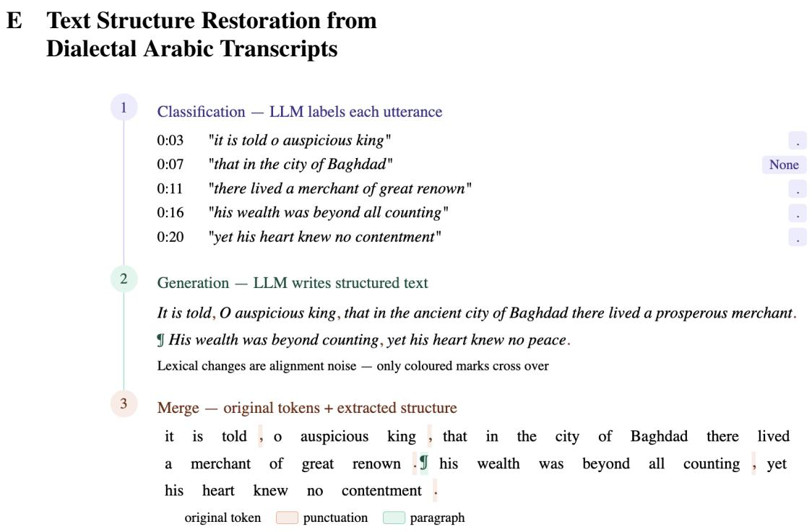  
Figure 6: Three-stage pipeline for restoring punctuation and paragraph structure from raw transcripts.

Given raw transcripts with utterances and timings, we restore this structure (sentence split, punctuation, paragraphs) in three stages, as shown in Figure 6.

Stage 1: Utterance-level classification The input transcript is represented as utterances (sequences of tokens) with speech timings. The LLM maps each utterance to a punctuation label or None. The list of utterances is presented to an LLM together with their time intervals, and the model assigns a punctuation label or None. As recent research shows, such a representation of the task is more natural for generation models than the tokenbased alternative. Results of classification allow establishing raw text boundaries based on non-verbal signs (pauses) and contextual information for the next steps.

Stage 2: Generation of structured text The utterances, along with labels, are concatenated and passed to the LLM, which generates coherent, punctuated, paragraph-structured text. This step allows the model to correct ambiguities – for example, a pause-final utterance initially marked as a full stop may become a comma when the following utterance begins a continuation clause, or a new paragraph may be inserted where a shift of topic is detected. In addition, the model adds punctuation within an utterance where two clauses run together in speech without a pause.

However, the generated text may differ lexically from the original (added words, dropped particles, paraphrases). Such differences are text noise that is cleaned in the next stage.

Stage 3: Merge with original tokens A sequence matching algorithm (Ratcliff and Metzener, 1988) is performed between the generated tokens and the original tokens. The alignment walks through the tokens in order, identifying the position of each punctuation mark and paragraph break relative to the nearest preceding original token. Then, only punctuation and paragraph markers are extracted and inserted at the corresponding positions in the original token stream.

## F Additional Details on the Experimental Setup

A list of the evaluated language models and their sizes is provided in Table 8. The sizes of GPT-5.4 and Qwen3.6-Plus models are not publicly disclosed. For most models, we used OpenRouter to perform inference, resulting in a total cost of approximately \$200. However, not all models were available on this platform, particularly the Arabiccentric ones. For those, we ran inference on a single NVIDIA RTX 6000.

<table><tr><td></td><td>Family</td><td>Model ID</td><td>Short Name</td><td>Size (B)</td><td>Ar</td><td>En</td></tr><tr><td>1</td><td>MBZUAI-Paris</td><td>Atlas-Chat-2B</td><td>Atlas-Chat-2B</td><td>2</td><td></td><td></td></tr><tr><td>2</td><td>MBZUAI-Paris</td><td>Atlas-Chat-9B</td><td>Atlas-Chat-9B</td><td>9</td><td></td><td></td></tr><tr><td>3</td><td>hammhOa</td><td>Hala-9B</td><td>Hala-9B</td><td>9</td><td></td><td></td></tr><tr><td>4</td><td>MBZUAI-Paris</td><td>Nile-Chat-4B</td><td>Nile-Chat-4B</td><td>4</td><td></td><td></td></tr><tr><td>5</td><td>inceptionai</td><td>Jais-13B-Chat</td><td>Jais-13B-Chat</td><td>13</td><td></td><td></td></tr><tr><td>6</td><td>Qwen</td><td>qwen3.6-plus</td><td>Qwen3.6-Plus</td><td>N/A</td><td></td><td></td></tr><tr><td>7</td><td>Qwen</td><td>Qwen2.5-7B-Instruct</td><td>Qwen2.5-7B</td><td>7</td><td></td><td></td></tr><tr><td>8</td><td>CohereLabs</td><td>c4ai-command-r7b-arabic-02-2025</td><td>Command-R7B</td><td>7</td><td></td><td></td></tr><tr><td>9</td><td>silma-ai</td><td>SILMA-9B-Instruct-v1.0</td><td>SILMA-9B</td><td>9</td><td></td><td></td></tr><tr><td>10</td><td>google</td><td>gemma-4-31B-it</td><td>Gemma4-31B</td><td>31</td><td></td><td></td></tr><tr><td>11</td><td>openai</td><td>GPT-5.4</td><td>GPT-5.4</td><td>N/A</td><td></td><td></td></tr></table>

Table 8: A list of the evaluated language models and their sizes.

## G Final dataset stats

<table><tr><td>Dialect</td><td>Initial Pairs</td><td>Flagged</td><td>Fix</td><td>Discard</td><td>No Change</td><td>Final Pairs</td></tr><tr><td>EGY</td><td>1000</td><td>41 (4.1%)</td><td>17</td><td>1</td><td>23</td><td>999</td></tr><tr><td>MOR</td><td>1000</td><td>31 (3.1%)</td><td>20</td><td>3</td><td>8</td><td>997</td></tr><tr><td>KSA</td><td>1000</td><td>55 (5.5%)</td><td>27</td><td>1</td><td>27</td><td>999</td></tr><tr><td>SYR</td><td>1000</td><td>60 (6.0%)</td><td>33</td><td>16</td><td>11</td><td>984</td></tr><tr><td>UAE</td><td>1000</td><td>22 (2.2%)</td><td>5</td><td>2</td><td>15</td><td>998</td></tr><tr><td>Total</td><td>5000</td><td>209 (4.2%)</td><td>102</td><td>23</td><td>84</td><td>4977</td></tr></table>

Table 9: Post-review reconciliation of the total number of QA pairs before and after review per dialect.

## H Genre Descriptions

<table><tr><td>Genre</td><td>Description</td></tr><tr><td>Personal Development</td><td>Focuses on everyday living, well-being, hobbies, and individual growth.</td></tr><tr><td>Sports</td><td>Athletic activities, organized games, and competitive event analysis.</td></tr><tr><td>History</td><td>Dedicated to exploring and preserving historical events and cultural backgrounds.</td></tr><tr><td>Interviews</td><td>First-person accounts, direct human interaction, and conversational dialogue.</td></tr><tr><td>Documentary</td><td>Non-fiction, real-world observation, and deep-dive reporting.</td></tr><tr><td></td><td>Arts, Culture &amp; Entertainment Creative performances, cultural trends, and media critique.</td></tr><tr><td>Science, Tech &amp; Innovation</td><td>Explores the natural world, scientific inquiry, and technological advancements.</td></tr><tr><td>Education</td><td>Educational texts, instructions, and publicly available information sharing.</td></tr><tr><td>Business &amp; Economy</td><td>Commerce, financial markets, macroeconomic theories, and business stories.</td></tr><tr><td>Other</td><td>News (Politics, Society), fiction (Drama, Comedy, Romance, Youth) etc.</td></tr></table>

Table 10: YouTube video genres in EDRAC.

Genre Distribution - Egyptian

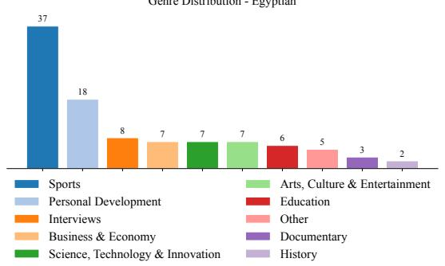  
Genre Distribution - Moroccan

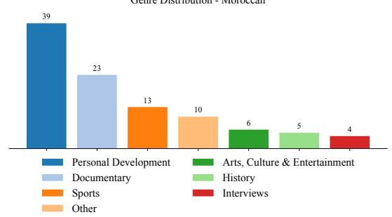

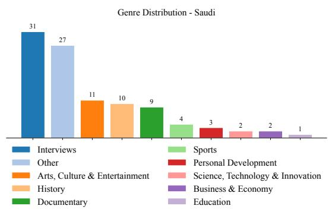

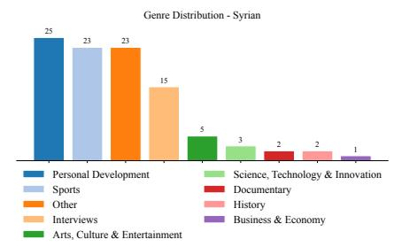

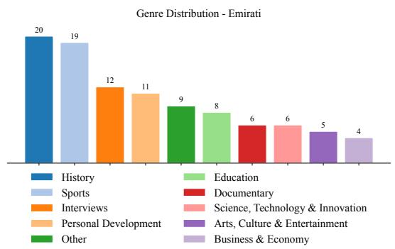  
Figure 7: Genre distribution by dialect: Egyptian, Moroccan, Saudi, Syrian and Emirati.

## I Channels per dialect

<table><tr><td></td><td>Dialect List of Channels</td></tr><tr><td>EGY</td><td>Ahmed Waheed, Al Nahar Drama, El-Podcasters  $\dot { \operatorname { \mathcal { S } } } \dot { \operatorname { \mathcal { N } } } \dot { \operatorname { \mathcal { S } } } \dot { \operatorname { \mathcal { S } } } \dot { \operatorname { \mathcal { S } } } \dot { \operatorname { \mathcal { V } } } ,$  Film Gamed, Kareem Esmail, MahmoudIsmailTV,</td></tr><tr><td></td><td>Mamdouh NasrAllah, Omar Khaled - Pharmastan-  $j = 1 0 , 1 0 ,$  ReadTube  $\lim \limits _ { s  \infty } s $  STUDIO 77, Sarah Abouelkhair,Sarah Hany, Sherif Nabil - &amp;</td></tr><tr><td></td><td> $\therefore \sin ^ { \circ } ,$  Waleed - , joo sport  $\therefore \sin 3 5 \sin 6$   $u ! \cup 1 \cup 2 i \pi 1 , s \cup 2 s \cup 1 \cup 2 i \pi 1$   $s ^ { 2 } + s ( s - L i ) s ^ { 3 } + ( 6 ) s ( s + 4 ) ( 2 ) s ( 2 ) s ( 3 ) s = 1 4 1$ </td></tr><tr><td></td><td>- Mokhbir Eqtisadi,  $\therefore 5 _ { 3 } , 、 , 、 , 、 , 、 1 , 、 ,$  Heba Abo Elkheir</td></tr><tr><td>MOR</td><td>BarbaRoss Hicham  $r ^ { L i s } u s s \cup r s \cup \ldots$  Farouk Life , Foot Maroc  $s _ { s } , \ldots , s _ { s } ,$  Hassan El Fad  </td></tr><tr><td></td><td>Traveler, OTMAN HANA /  $j \cup \dot { s } s ,$  Said Naciri</td></tr><tr><td></td><td> $s \sim 0 . 1 1$  Yassin Haro, ahssan patissier, elbachir L3aouni  $\sin \alpha \sin \alpha .$  soumamalak,</td></tr><tr><td></td><td> $\yen 123,456$ </td></tr><tr><td>KSA</td><td> $A l a a b - \ldots ( a ) ^ { \frac { q } { l } } ,$  SBC Channel,  $\sin \alpha , \sin \alpha \sin \alpha \sin \beta \cos \alpha \sin \beta \sin \alpha$ </td></tr><tr><td>SYR</td><td> $\therefore \sin 1$  , Al Mashhad Light  $\therefore \alpha \neq 1 ,$  Barhom m3arawi  $- \cos \theta ^ { \prime } + \infty + 9 0 \phi ,$  Boshe Tv, CHEF OMAR</td></tr><tr><td></td><td>Donia Stories -  $u \sin 1 ,$  Ghaith Marwan</td></tr><tr><td></td><td> $\sin \alpha \triangleq \pmb { \dot { \omega } } , \pmb { \dot { \omega } } , \pmb { \dot { \omega } } , \pmb { \dot { \omega } } , \pmb { \dot { \omega } } , \pmb { \dot { \omega } } ,$  Majed Haidar  $- d = 1 0 . 5$  NewDose -  $5 9 2 9 \div 3$  Rano&#x27;s Home , Sama Art International I  $\sin x ^ { \cdot } \in X \times \frac { \sin x } { \sin x }$  , Sara alwari  $\varepsilon \cup 1 5 , L , L ,$  Sherin Amara,</td></tr><tr><td></td><td>Syria TV, Syrian kitchen, Yala Story Plus,  - Althania,  $r \geq \phi ( s , s , s , s , s , s , s , s , s , s , s , s , s , s , s , s , s , s , s , s , s , s , s , s , s , s , s , s , s , s , s , s , s , s , s , s , s , s , s , s , s , s , s , s , s , s , s , s , s , s , s , s , s , s , s , s , s , s , s , s , s , s , s , s , s , s , s , s , s , s , s , s , s , s , s , s , s , s , s , s , s , s , s , s , s , s , s , s , s , s , s , s , s , s , s , s , s , s , s , s , s , s , s , s , s , s , s , s , s , s , s , s , s , s , s , s , s , s , s , s , s , s , s , s , s , s , s , s , s , s , s , s , s , s , s , s , s , s , s , s , s , s , s , s , s , s , s , s , s , s , s , s , s , s , s , s , s , s , s , s , s , s , s , s , s , s , s , s , s , s , s , s , s , s , s , s , s , s , s , s , s , s , s , s , s , s , s , s , s , s , s , s , s , s , s , s , s , s , s , s , s , s , s , s , s , s , s , s , s , s , s , s , s , s , s , s , s , s , s , s , s , s , s , s , s , s , s , s , s , s , s , s , s , s , s , s , s , s , s , s , s , s , s , s , s , s , s , s , s , s , s , s , s , s , s , s , s , s , s , s , s , s , s , s , s , s , s , s , s , s , s , s , s , s , s , s , s , s , s , s , s , s , s , s , s , s , s , s , s , s , s , s , s , s \ c , s , s , s , s , s , s , s , s , s , s , s \ c , s , s , s , s , s , s , s , s , s , s \ c , s , s , s \ c , s , s , s , s \ c , s , s , s \ c , s , s , s , s \ c , s , s , s \ c \ c , s , s \ c , s , s \ c \ c , s \ c , s , s \ c , s \ c , s , s \ c \ c , s \ c \ c , s \ c \ c \ c , s , s \ c \ c \ c , s \ c \ c \ c \ c \ c \ c \ c \ c \ c $ </td></tr><tr><td></td><td> $\therefore a = c$  Jalal &amp;Yasmin,Johina Home,</td></tr><tr><td></td><td>ria G ala  </td></tr><tr><td>UAE</td><td> $\sum \limits _ { n = 1 } ^ { \infty } b _ { q } f _ { n } ^ { \dagger }$  4042 Studios, Abu Dhabi TV , Hamdan Al-Ali, UAE FALCONS FEDERATION,  $\therefore \sin =$ </td></tr><tr><td></td><td>- Dubai TV,</td></tr><tr><td></td><td> $\sum \limits _ { m } w ( \lambda )$  Khaled Alkhaaldi,  $\mathsf { L } _ { \mathsf { J } }$  Ranoy7,</td></tr></table>

Table 11: Final list of YouTube Channels by Dialect.

## J Transcription Guidelines

This is the original guidelines PDF that was given to the annotators.

# Transcribed Speech Annotation Guidelines

To ensure consistency across all annotators, we developed Transcribed Speech Annotation Guidelines. The guidelines provide step-by-step instructions for annotations and highlight the importance of listening to the audio while reviewing the text. This is crucial to accurately capture the dialectal pronunciation of words that are orthographically similar to MSA. Annotators were instructed to skip passages with large missing segments of transcriptions and to adhere to a minimal post-editing policy with the goal of ensuring the text readability and comprehension. Prior to the annotation task, a group training session was held to present the guidelines to the annotators and explain the task in detail. Discussions were based on Egyptian examples as it is commonly understood among speakers of other dialects. Special attention was paid to the Arabic Orthographic Post-editing section of the guidelines that provides specific instructions on handling spelling variation among speakers.

This task requires you to review transcriptions of videos created by an automated transcription tool. Segments of YouTube videos have been transcribed into passages. You will need to listen to the video and read the context of the passage fully before determining what minimal fixes are required to make the text readable and understandable. Resolving ambiguous cases that can be (minimally) acceptable is encouraged.

## 1. Preparation

1. Open the YouTube link in column A.

2. Adjust playback speed to \~60% for accurate listening.

3. For a first pass, read the corresponding automated transcription for each paragraph in column A while listening to the audio. If a passage is missing larger chunks or entire sentences, then you should skip the entire passage and flag it in the name of the tab as Skipped.

4. Column B is a version of the transcription, where each word/token is presented on a separate line

5. Column C contains a copy of column B.

6. Proceed with the annotation task of post-editing the content of column C where necessary, following the guidelines below.

7. If a word that was not spoken was erroneously inserted into the transcription then remove it and leave the field in column C empty.

8. If a word needs to be fixed/ replaced, edit it in Column C.

9. If a word or words are missing, please insert them in the same cell of the previous word (see screenshots of the annotation process at the end of this document). If the missing words are at the beginning, insert them in the cell of the first word.

## General Guidelines

1. Follow the Arabic Orthographic Post-editing Guidelines closely

2. At times, you will find that the automated transcription incorrectly defaults to a MSA word. In these cases, conserve the speaker’s words (e.g., “ “ not “ (“ .

3. Include filler words if presented in speech, for example, $( \frac { \sin ^ { 2 } \alpha } { \cos \alpha } = \mathrm { i t }$ means, $( \dot { \omega } \div ) = \mathrm { j u s t , o n l y , }$ but, $\begin{array} { r } { ( \frac { \hat { \ddot { \mathbf { \sigma } } } } { \mathcal { G } } ) = } \end{array}$ to become; or as an adverb means already, $( \mathrm { \dot { \Sigma } \Psi _ { \mathrm { } } \Sigma _ { \mathrm { } } \mathbf { i } } ) = \mathrm { a n y w a y } )$

4. There is no need to try to transcribe onomatopoeic sounds. Instead, insert a description of the sound in curly brackets, e.g., {baby crying}, {man laughing}, etc.

5. Orthographic variation is expected across annotators, however, it is advised to maintain consistent spelling for recurring dialectal terms within one passage.

6. Play back any uncertain segments to confirm accuracy.

7. If the passage is missing some words or parts of a phrase, you can go ahead and add them..

<sup>بدن نريد</sup>8. It is strongly advised to slow down the speed of the video to help you to correctly identify potential errors in the transcription.

## Guidelines for Arabic Orthographic Post-editing of Automatic Speech Recognition Texts

The annotation data we focus on here is the output of automatic speech recognition (ASR) of Dialectal Arabic (DA) audio recordings. Since DA has no official orthography standards, Arabs writing in DA tend to use a set of variant spellings that either capture the utterance phonology primarily or are inspired by Modern Standard Arabic orthographic decisions (etymological or historical spelling) (Habash et al., 2018). While proposals to conventionally normalize dialectal spelling in NLP contexts have been proposed, e.g., CODA - (Habash et al., 2018), we opt here to take a simpler route that only addresses unacceptable ASR output, and apply a minimal post-editing policy to make the post-edited text comprehensible, while mimicking what a person might actually produce naturally. We only label unacceptable ASR output as “errors” and refer to other spelling decisions that vary from MSA or CODA standards as “variants”.

The two types of phenomena that will most likely capture the attention of a human post-editor performing this task are:

1. Acceptable Variants – These do not affect the understanding of the passage and do not require post-editing.

2. Unacceptable Errors – These impact readability and comprehension and must be post-edited by the annotators to minimally change into an Acceptable Variant form.

## 1. Acceptable Variants (Do Not Require Post-editing)

The following is a motivating example from Habash et al., (2018) showing 20+ spellings of the Egyptian Arabic word /mabi’ulha:š/ ‘he does not say it’ and their frequencies from a Google Search (September 29, 2017). Since all of these variants clearly indicate the intended meaning, they are all acceptable variants for the purpose of our task at hand. Note that the variations include different decisions on how to represent the glottal stop whose MSA cognate is /q/ ق, shortened long vowels, attaching or detaching the negation proclitic mA/m, etc.

<table><tr><td rowspan=1 colspan=1>Arabic Orthography</td><td rowspan=1 colspan=1>Arabic Transliteration</td><td rowspan=1 colspan=1>Frequency</td></tr><tr><td rowspan=1 colspan=1></td><td rowspan=1 colspan=1>mbyqwlhAš</td><td rowspan=1 colspan=1>≈26,000</td></tr><tr><td rowspan=1 colspan=1></td><td rowspan=1 colspan=1>mA byqwlhAš</td><td rowspan=1 colspan=1>≈13,000</td></tr><tr><td rowspan=1 colspan=1></td><td rowspan=1 colspan=1>mAbqlhAš, mbqwlhAšmbqlhAš, mA bqlhAš,mAbyqwlhAš</td><td rowspan=1 colspan=1>≤ 10,000</td></tr><tr><td rowspan=1 colspan=1> </td><td rowspan=1 colspan=1>mAbqwlhAš, mA bqwlhAš,mbyqlhAš, mA byqlhAš</td><td rowspan=1 colspan=1>≤ 1,000</td></tr><tr><td rowspan=1 colspan=1></td><td rowspan=1 colspan=1>mbýlhAš, mAbyýwlhAš,mA bywlhAš, mAbywlhAš</td><td rowspan=1 colspan=1>≤ 100</td></tr><tr><td rowspan=1 colspan=1> </td><td rowspan=1 colspan=1>mA bywlhAš, mAbýlhAš,mbywlhAš, mA byýlhAš,mAbýwlhAš, mA býlhAš,mA bwlhAš, mbýwlhAš,mbywlhAš, mAbwlhAš,mbwlhAš</td><td rowspan=1 colspan=1>≤ 10</td></tr></table>

We present below a list of common orthographic phenomena that we consider acceptable (unless in some context, they can lead the reader astray). Some of these are the result of letter shape similarity and other phonological similarities. Not all “similar letters” are acceptable variants: if they are visually similar but phonologically not similar, they are most likely errors. There is also the issue of commonality: some spelling variants are so common that they are acceptable because they are recognizable.

<table><tr><td rowspan=1 colspan=1>Variant Set Name</td><td rowspan=1 colspan=1>Variant Characters</td><td rowspan=1 colspan=1>Acceptable Variants Examples</td></tr><tr><td rowspan=1 colspan=1>Ta Marbuta /Ha</td><td rowspan=1 colspan=1> ${ \vec { \circ } } / \circ$ </td><td rowspan=1 colspan=1> $1 1 1 0 0 0 0 0 0 0 0 0 0 0 0 0 0 0 0 0 0 0 0 0 0 0 0 0 0 0$ </td></tr><tr><td rowspan=1 colspan=1>Alif Maqsura/Ya</td><td rowspan=1 colspan=1> $\Delta / \Delta$ </td><td rowspan=1 colspan=1> $1 0 1 \mu \approx 1 0 0 5 \mu / 1 0 1 \mu \approx 1 1 0 0 0 \mu L \mu$ </td></tr><tr><td rowspan=1 colspan=1>Alif Hamzas</td><td rowspan=1 colspan=1> $| \tilde { / | } / \tilde { | } / \tilde { | }$ </td><td rowspan=1 colspan=1></td></tr><tr><td rowspan=1 colspan=1>Hamza Forms</td><td rowspan=1 colspan=1> $1 / 1 / \uparrow / \uparrow \uparrow \uparrow \uparrow \uparrow$ </td><td rowspan=1 colspan=1>//</td></tr><tr><td rowspan=1 colspan=1>Etymological Variants</td><td rowspan=1 colspan=1> $\bullet / \{ \leq \int \limits _ { c } ^ { 0 } \sin \beta / \} / \dot { \leq }$ </td><td rowspan=1 colspan=1> $( \frac { 1 , 1 , 2 } { 2 } , \frac { 1 } { 2 } , 1 , 1 , 1 , 1 , 1 , 1 , 1 , 1 )$ </td></tr><tr><td rowspan=1 colspan=1>Etymological Variants</td><td rowspan=1 colspan=1> $\mathbf { b } / { \bar { \mathbf { \omega } } }$ </td><td rowspan=1 colspan=1></td></tr><tr><td rowspan=1 colspan=1>Etymological Variants</td><td rowspan=1 colspan=1> $\doteq / \dot { \hookrightarrow }$ </td><td rowspan=1 colspan=1> $1 0 0 \div 5 \cdots 0$ </td></tr><tr><td rowspan=1 colspan=1>Etymological Variants</td><td rowspan=1 colspan=1> $\cup \dot { } \ b { \geq } / \dot { } )$ </td><td rowspan=1 colspan=1></td></tr><tr><td rowspan=1 colspan=1>Etymological Variants</td><td rowspan=1 colspan=1> $\dot { \mathcal { I } } / \dot { \mathsf { a } } / \mathsf { a }$ </td><td rowspan=1 colspan=1> $\frac { 1 5 1 1 } { \cdot } \frac { 1 5 1 } { \cdot } \frac { 1 5 1 } { 2 }$  $\sin \alpha = \frac { 1 } { 5 } \times \sin 3 7 ^ { \circ } / \sin 3 7 ^ { \circ } \cos 3$ </td></tr><tr><td rowspan=1 colspan=1>Splits</td><td rowspan=1 colspan=1> $z \sim 6 5 6 4 . 0 6 s$ </td><td rowspan=1 colspan=1> $\sin x \cos x = \sin x \sin x \cos x \cos x \sin x$ </td></tr><tr><td rowspan=1 colspan=1>Merges</td><td rowspan=1 colspan=1> $Y _ { 6 } L _ { 1 } = L _ { 0 }$ </td><td rowspan=1 colspan=1> $\sin x / \sin x$ </td></tr><tr><td rowspan=1 colspan=1>Shortening &amp;Lengthening</td><td rowspan=1 colspan=1> $/ \leq 6 / 1 6 / s$ (long vowel spelling variantof short vowel spelling viaelided diacritics)</td><td rowspan=1 colspan=1>PoLoLe $y ^ { [ 1 ] } \sin ^ { 5 } \theta \sin x \cos y ^ { [ 1 ] } 1 \sin y ^ { 2 }$ </td></tr></table>

It is not possible to create a full, exact list of acceptable variants for all possible contexts, as some contexts can lead the reader to a different unintended meaning. For example, while Ta Marbuta and Ta Mamduda may be interchangeable safely in contexts like اره / ارة , they may not be in limited contexts like $/ \downarrow \downarrow . . . \downarrow 1 \uparrow \downarrow s \uparrow$

## 2. Unacceptable Errors (Require Correction by Post-editing)

These errors hinder readability and must be post-edited to make them Acceptable Variants. The general pattern is that the written form is so abnormal and so confusing that a reader cannot reasonably recover the intended meaning. <sup>ل</sup>ح<sup>ا</sup> <sub>ج</sub>مع<sub>ي</sub>ت <sup>ل</sup>ح<sup>ا</sup> <sub>ج</sub>مع<sub>ي</sub><sup>ة</sup>We list below the elementary types of these errors and then exemplify their combinations, which are numerous.

<table><tr><td colspan="1" rowspan="1">Error Type</td><td colspan="1" rowspan="1">Description</td><td colspan="1" rowspan="1">Original text</td><td colspan="1" rowspan="1">Corrected text</td></tr><tr><td colspan="1" rowspan="1">ElementaryCharacterOmission</td><td colspan="1" rowspan="1">The omission ofin thisinstance makes the wordunrecognisable</td><td colspan="1" rowspan="1"> $3 0 0 0 \dot { \omega } \Delta 0 \Delta q \Delta q \Delta q \Delta q \Delta q \Delta q \Delta q \Delta q \Delta q$ Africa hasmor than 3000</td><td colspan="1" rowspan="1"> $3 0 0 0 ~ \textcircled { \times } 3 5 1 \textcircled { \div } 5 \textcircled { \div } 3 1 \textcircled { \div } 2 0 1$ Africa hasmorethan 3000</td></tr><tr><td colspan="1" rowspan="1">ElementaryCharacterInsertion</td><td colspan="1" rowspan="1">The added Alif isconfusing</td><td colspan="1" rowspan="1">I hopewe see you next year</td><td colspan="1" rowspan="1">4I hope ywe see you next year</td></tr><tr><td colspan="1" rowspan="1">ElementaryCharacterSubstitution</td><td colspan="1" rowspan="1">Transcription uses wrongletters which leads todifferent meaning</td><td colspan="1" rowspan="1">There is a newly elected boardat Zamalek football Club, led byCounselor Galal Ibrahim. Atfirst, CounselorGararIbrahimasked them, "Where are wegoing to get the dollars from?"</td><td colspan="1" rowspan="1">There is a newly electedboard at Zamalek footballClub, led by CounselorGalal Ibrahim. At first,CounselorGalalIbrahimasked them, "Where are wegoing to get the dollarsfrom?"</td></tr><tr><td colspan="1" rowspan="1">ElementaryWord Splitting</td><td colspan="1" rowspan="1">is a single word,which once split breaks themeaning.</td><td colspan="1" rowspan="1">And what will happen to the onewho doesn'tad apt to theirsurroundings?</td><td colspan="1" rowspan="1">And what will happen to theone who doesn'tadapttotheir surroundings?</td></tr><tr><td colspan="1" rowspan="1">ElementaryWord Merging</td><td colspan="1" rowspan="1">is two separatewords and should not bejoined together, even indialect</td><td colspan="1" rowspan="1">EWe're going to talkaboutfootballin a completely different way.Let's start!</td><td colspan="1" rowspan="1">We're going to talkaboutfootballin a completelydifferent way. Let's start!</td></tr><tr><td colspan="1" rowspan="1">ElementaryIncorrectPunctuation</td><td colspan="1" rowspan="1">Automatic punctuationaddition leading toerroneous interpretation.</td><td colspan="1" rowspan="1">.CI don't even trust his own fatherto be with him; why should Itrust.him being with you,Ba'agar</td><td colspan="1" rowspan="1">I don't even trust his ownfather to be with him; whyshould I trust, him beingwith you, Ba'agar</td></tr><tr><td colspan="1" rowspan="1">ElementaryIncorrectSpeakerAssignment</td><td colspan="1" rowspan="1">Automatic speakerdiarization is incorrect.</td><td colspan="1" rowspan="1">** **62 - 45]**Speaker 1 **[45 - 62]What does he want, Mr.Hamzawy? He wants his rights.I have no objection, but he hasto divorce first.Her</td><td colspan="1" rowspan="1">[45 - 62** 1  **[45 - 62] **Speaker 1 **What does he want, Mr.Hamzawy? He wants hisrights. I have no objection,but he has to divorce first.</td></tr><tr><td colspan="1" rowspan="1"></td><td colspan="1" rowspan="1"></td><td colspan="1" rowspan="1">** 2 **[65 - 61]**Speaker 2** [61 - 65]Is a problem that could cause ushurt.**1 **67 - 64]**Speaker 1** [64 - 67]The headachethe headacheWhat is going on HamzawyBey?</td><td colspan="1" rowspan="1">[61 - 65]** 2  ****Speaker 2** [61 - 65]It is a problem that couldgive us a headache.[64 - 67** 1  ****Speaker 1** [64 - 67]Whatheadachewould itgive you, Mr. Hamzawy?</td></tr><tr><td colspan="1" rowspan="1">Complex ErrorCharacterinsertion andCharactersubstitution</td><td colspan="1" rowspan="1">Invalid/ jumbled spellings,as well as word splitting.This spelling corruptioncan often occur whenwords are incorrectly split.</td><td colspan="1" rowspan="1">And a generation of playerslater emerged, becomingtop-level stars, likeWalldSalahEl-Din.</td><td colspan="1" rowspan="1">And a generation of playerslater emerged, becomingtop-level stars, likeWalidSalah El-Din.</td></tr><tr><td colspan="1" rowspan="1">Complex ErrorWord Splittingand Characterinsertion</td><td colspan="1" rowspan="1">is a single word thatcannot be split, even indialect</td><td colspan="1" rowspan="1">And what will happen to theones who don'tad apptto theirsurroundings?</td><td colspan="1" rowspan="1">And what will happen to theones who don'tadapt totheir surroundings?</td></tr><tr><td colspan="1" rowspan="1">Complex ErrorWord Splittingand Charactersubstitution</td><td colspan="1" rowspan="1">Invalid/ jumbled spellings,as well as word splitting.This spelling corruptioncan often occur whenwords are incorrectly split.</td><td colspan="1" rowspan="1">So A will wa aituntil I buy agood camera</td><td colspan="1" rowspan="1">So I will waituntil I buy agood camera</td></tr><tr><td colspan="1" rowspan="1">Complex ErrorResolvableMeaningless orIllogicalSentences</td><td colspan="1" rowspan="1">Some sentences lackcoherence due to missingwords and should becorrected. In this case,annotators should relistento the original videocarefully and fill in themissing words to conveythe correct meaning of thesentence.</td><td colspan="1" rowspan="1">Oh mu Gud! Oh mu Gud! Ohmu Gud! Oh mu Gud!My ladyKaraya, somebody help me,somebody help me!</td><td colspan="1" rowspan="1">Oh my God! Oh my God!Oh My God! Oh my God!My lady Karama, somebodyhelp me, somebody help me!</td></tr><tr><td colspan="1" rowspan="1">Complex ErrorUnresolvable,Meaningless orIllogicalSentences</td><td colspan="1" rowspan="1">Too many errors resultingfrom multiple speakersoverlapping in the originalaudio. It would be quickerto transcribe this audiofrom scratch rather than</td><td colspan="1" rowspan="1">.</td><td colspan="1" rowspan="1">Passage should be flaggedfor removal.</td></tr><tr><td></td><td>post-edit this automated transcription.</td><td></td><td></td></tr></table>

## Screenshots of the Annotation Process

## 1. Starting point

<table><tr><td></td><td>A</td><td>B</td><td>c</td><td>D</td><td>E</td></tr><tr><td></td><td></td><td></td><td></td><td></td><td></td></tr><tr><td>1 2</td><td>YouTube Link Click here to watch the video</td><td>1 Original</td><td>Correction Guidelines:</td><td>Review </td><td>Comments</td></tr><tr><td></td><td></td><td></td><td>日Annotation_...</td><td></td><td></td></tr><tr><td>3 4</td><td>0[162 - 1]</td><td></td><td></td><td></td><td></td></tr><tr><td>5</td><td></td><td>2</td><td>L</td><td></td><td></td></tr><tr><td>6</td><td></td><td></td><td></td><td></td><td></td></tr><tr><td>7</td><td></td><td>心</td><td>心</td><td></td><td></td></tr><tr><td>8</td><td></td><td>山</td><td>此</td><td></td><td></td></tr><tr><td>9</td><td></td><td></td><td></td><td></td><td></td></tr><tr><td>10</td><td></td><td>ha</td><td>d</td><td></td><td></td></tr><tr><td>11</td><td></td><td>4</td><td>4</td><td></td><td></td></tr><tr><td>12</td><td></td><td>3</td><td>3</td><td></td><td></td></tr><tr><td>13</td><td></td><td>J</td><td>J4</td><td></td><td></td></tr><tr><td>14</td><td></td><td>3</td><td>3</td><td></td><td></td></tr><tr><td>15</td><td></td><td>j</td><td>j</td><td></td><td></td></tr><tr><td>16</td><td></td><td></td><td></td><td></td><td></td></tr><tr><td>17</td><td></td><td></td><td></td><td></td><td></td></tr><tr><td>18</td><td></td><td></td><td>E</td><td></td><td></td></tr><tr><td>19</td><td></td><td>E</td><td></td><td></td><td></td></tr><tr><td>20</td><td></td><td></td><td></td><td></td><td></td></tr><tr><td>21</td><td></td><td></td><td></td><td></td><td></td></tr><tr><td></td><td></td><td></td><td></td><td></td><td></td></tr></table>

## 2. Check out the video

<table><tr><td></td><td colspan="2">A</td><td>B</td><td>C</td><td>D</td><td>E</td></tr><tr><td>1</td><td colspan="2"></td><td>YouTube Link Original</td><td>Correction</td><td>Review</td><td>Comments</td></tr><tr><td>2</td><td colspan="2">Click here to watch the video</td><td></td><td>Guidelines: Annotation_...</td><td></td><td></td></tr><tr><td>3</td><td colspan="2"></td><td></td><td></td><td></td><td></td></tr><tr><td>4</td><td colspan="2">youtube.com</td><td>0*[162 - 1]</td><td></td><td></td><td></td></tr><tr><td>5</td><td colspan="2"></td><td></td><td>L 4</td><td></td><td></td></tr><tr><td></td><td colspan="2"></td><td>山</td><td></td><td></td><td></td></tr><tr><td>7</td><td colspan="2"></td><td>心</td><td>心</td><td></td><td></td></tr><tr><td></td><td colspan="2"></td><td></td><td></td><td></td><td></td></tr><tr><td>9</td><td colspan="2"></td><td></td><td></td><td></td><td></td></tr><tr><td>10</td><td colspan="2"></td><td></td><td></td><td></td><td></td></tr><tr><td>11</td><td colspan="2"></td><td>4</td><td></td><td></td><td></td></tr><tr><td>12</td><td colspan="2"></td><td></td><td>j J</td><td></td><td></td></tr><tr><td>13</td><td colspan="2">1 も</td><td>山</td><td></td><td></td><td></td></tr><tr><td>14</td><td colspan="2"></td><td>3</td><td>3</td><td></td><td></td></tr><tr><td>15</td><td colspan="2"></td><td>j</td><td></td><td></td><td></td></tr><tr><td>16</td><td colspan="2"></td><td></td><td></td><td></td><td></td></tr><tr><td>17</td><td colspan="2"></td><td>30</td><td>3七司</td><td></td><td></td></tr><tr><td>18</td><td colspan="2"></td><td>正</td><td></td><td></td><td></td></tr><tr><td>19</td><td colspan="2"></td><td>E</td><td>EY</td><td></td><td></td></tr><tr><td>20</td><td colspan="2"></td><td></td><td></td><td></td><td></td></tr><tr><td>21</td><td colspan="2"></td><td></td><td></td><td></td><td></td></tr></table>

## 3. Edits are marked automatically

<table><tr><td></td><td>A</td><td>B</td><td>c</td><td>D</td><td>E</td></tr><tr><td>1</td><td></td><td></td><td></td><td></td><td></td></tr><tr><td>2</td><td>YouTube Link Click here to watch the video</td><td>1 Original</td><td>Correction Guidelines:</td><td>Review</td><td>Comments</td></tr><tr><td></td><td></td><td></td><td>Annotation_...</td><td></td><td></td></tr><tr><td>3</td><td></td><td></td><td></td><td></td><td></td></tr><tr><td>4</td><td>0[162 -1]</td><td></td><td></td><td></td><td></td></tr><tr><td>5</td><td></td><td>L</td><td></td><td></td><td></td></tr><tr><td>6 7</td><td></td><td></td><td></td><td></td><td></td></tr><tr><td>8</td><td></td><td>心</td><td>心</td><td></td><td></td></tr><tr><td>9</td><td></td><td></td><td></td><td></td><td></td></tr><tr><td>10</td><td></td><td></td><td>s jinn</td><td></td><td></td></tr><tr><td>11</td><td></td><td>¿ </td><td></td><td></td><td></td></tr><tr><td>12</td><td></td><td></td><td></td><td></td><td></td></tr><tr><td>13</td><td></td><td>j</td><td>tividansplin l 山</td><td></td><td></td></tr><tr><td>14</td><td></td><td></td><td></td><td></td><td></td></tr><tr><td>15</td><td></td><td></td><td>,</td><td></td><td></td></tr><tr><td>16</td><td></td><td></td><td></td><td></td><td></td></tr><tr><td>17</td><td></td><td>3見司</td><td>—</td><td></td><td></td></tr><tr><td>18</td><td></td><td></td><td></td><td></td><td></td></tr><tr><td>19</td><td></td><td></td><td>E</td><td></td><td></td></tr><tr><td>20</td><td></td><td></td><td></td><td></td><td></td></tr><tr><td>21</td><td></td><td></td><td></td><td></td><td></td></tr></table>

## 4. Edit types: Do not add any type names. This annotated screenshot is for explaining how different types are handled.

<table><tr><td></td><td>A</td><td>B</td><td>C</td><td>D</td><td>E</td></tr><tr><td>1</td><td>YouTube Link</td><td>Original </td><td>Correction</td><td>Review</td><td>Comments</td></tr><tr><td>2</td><td>Click here to watch the video</td><td></td><td>Guidelines: 目Annotation_..</td><td></td><td></td></tr><tr><td>3</td><td></td><td></td><td></td><td></td><td></td></tr><tr><td>4</td><td>*0**[162 -1]</td><td></td><td></td><td></td><td></td></tr><tr><td>5 6</td><td></td><td>L </td><td></td><td>Deletion</td><td></td></tr><tr><td>7</td><td></td><td></td><td></td><td>Replacement</td><td></td></tr><tr><td></td><td></td><td>心 山</td><td>心</td><td></td><td></td></tr><tr><td>8 9</td><td></td><td>j</td><td>止</td><td></td><td></td></tr><tr><td>10</td><td></td><td></td><td>s</td><td></td><td></td></tr><tr><td>11</td><td></td><td></td><td></td><td></td><td></td></tr><tr><td>12</td><td></td><td>」</td><td>iden pian </td><td>Insertion</td><td></td></tr><tr><td>13</td><td></td><td></td><td></td><td></td><td></td></tr><tr><td>14</td><td></td><td></td><td></td><td>Replacement</td><td></td></tr><tr><td></td><td></td><td></td><td></td><td></td><td></td></tr><tr><td>15 16</td><td></td><td></td><td></td><td>Replacement</td><td></td></tr><tr><td></td><td></td><td>勢見</td><td></td><td></td><td></td></tr><tr><td>17</td><td></td><td></td><td></td><td>Merge</td><td></td></tr><tr><td>18</td><td></td><td></td><td>E</td><td></td><td></td></tr><tr><td>19 20</td><td></td><td></td><td></td><td></td><td></td></tr><tr><td>21</td><td></td><td></td><td></td><td></td><td></td></tr><tr><td></td><td></td><td></td><td></td><td></td><td></td></tr></table>

This is the original guidelines PDF that was given to the annotators.

# Reading Comprehension Q&A Pair Evaluations Annotation Guidelines (Emirati Arabic)

## Introduction

This task aims to evaluate the performance of LLMs in generating question-answer pairs in Emirati Arabic based on accompanying passages.

You are provided with a passage written in Emirati Arabic along with 10 associated, automatically generated question-answer (QA) pairs.

The passages are transcriptions of YouTube videos in Emirati Arabic. The segments provided for annotation correspond to the first six minutes of each video. The video link and the exact time intervals are included at the top of each passage. The ultimate purpose of the dataset we are creating is to evaluate LLM capabilities in handling dialectal varieties of Arabic.

Figure 1. illustrates the content of the annotation sheet.

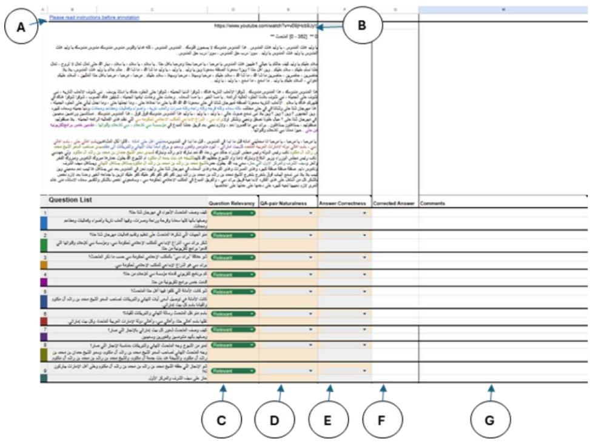

A. A link to the annotation guidelines (i.e. this document)

B. Video link

C. Question Relevancy label

D. QA Pair Naturalness label

E. Answer Correctness label

F. Corrected Answer field

G. Comment field

## QA Pair Review

Start by reading the passage while listening to the video. Next, read the question-answer (QA) pairs carefully Each QA-pair has an assigned colour that corresponds to a highlighted span in the passage. The span is intended to help you find the answer in the passage. (Note, however, that the highlighted spans in the passage were automatically generated. As such, the spans are not always accurate, and the answer may lie elsewhere.)

Bear in mind that the answer may be found in different ways:

• The answer can be found in one of the sentences that has been automatically highlighted.

• The answer can be found by piecing together information from multiple sentences (highlighted in the same colour).

• The answer does not lie in the corresponding highlighted sentence(s), but instead elsewhere in the passage.

The following passage presents the transcription of a video spoken in Emirati Arabic. The passage is predominantly in Emirati Arabic.

.

You are required to assess the quality of the QA-pairs through (1) Question Relevancy, (2) QA Pair Naturalness and (3) Answer Correctness:

## 1. Question Relevancy

1.1. Relevant: The question is relevant to the content of the passage.

<table><tr><td>Example (i) Q</td><td></td></tr><tr><td></td><td>Which entities did the speaker thank for organizing and presenting</td></tr><tr><td></td><td>the activities of the Hatta Winter Festival?</td></tr><tr><td>EN.</td><td></td></tr></table>

1.2. Irrelevant: The question is irrelevant in terms of the subject matter of the passage.

<table><tr><td>Example (ii)</td><td></td></tr><tr><td>Q</td><td>What are the most notable things His Highness Sheikh Hamdan has</td></tr><tr><td>EN.</td><td>done to support young people in Dubai?</td></tr></table>

## 2. QA Pair Naturalness

QA pair naturalness reflects how well the generated QA pairs represent Emirati Arabic as it is naturally spoken by native speakers. Here, Emirati Arabic refers to all sub-varieties of the dialect.

Naturalness should be evaluated with respect to both the question and the answer. If either of them sounds odd to Emirati speaker’s ear, such as being awkward, unnatural, or non-dialectal—then the entire question–answer pair should be marked accordingly.

## Variations

Note that QA pairs may contain spelling variations that either capture the utterance phonology primarily or are inspired by Modern Standard Arabic orthographic decisions (etymological or historical spelling) (Habash et al., 2018). Acceptable variations are those that do not cause the meaning to change.

Table 1 presents a list of common orthographic phenomena that we consider acceptable. Some of these are the result of letter shape similarity and other phonological similarities. Not all “similar letters” are considered acceptable variants: if they are visually similar but phonologically not similar, they are most likely errors.

There is also the feature of commonality: some spelling variants are so common that they are acceptable because they are recognizable. For example, both الغنيه and الغنية are common spelling variants that are acceptable because they are recognizable.

Note that it is not possible to create a full, exact list of acceptable variants for all possible contexts, as some contexts can lead the reader to a different unintended meaning. For example, while Ta Marbuta and Ta Mamduda may be interchangeable safely in contexts like الحاره جمعيت / الحارة جمعية (\`neighbourhood association’) , they may not be in limited contexts like الشباب حركت / الشباب حركة \`) the guys’ movement’ vs \`I moved the guys’).

<table><tr><td colspan="1" rowspan="1">Variant Set Name</td><td colspan="1" rowspan="1">Variant Characters</td><td colspan="1" rowspan="1">Dialectal Variants Examples</td></tr><tr><td colspan="1" rowspan="1">Ta Marbuta /Ha</td><td colspan="1" rowspan="1">6/0</td><td colspan="1" rowspan="1"></td></tr><tr><td colspan="1" rowspan="1">Alif Maqsura/Ya</td><td colspan="1" rowspan="1"></td><td colspan="1" rowspan="1">!!</td></tr><tr><td colspan="1" rowspan="1">Alif Hamzas</td><td colspan="1" rowspan="1">wyí</td><td colspan="1" rowspan="1"></td></tr><tr><td colspan="1" rowspan="1">Hamza Forms</td><td colspan="1" rowspan="1">/e/is/3</td><td colspan="1" rowspan="1"></td></tr><tr><td colspan="1" rowspan="1">EtymologicalVariants</td><td colspan="1" rowspan="1">E/e/is/3//3</td><td colspan="1" rowspan="1"></td></tr><tr><td colspan="1" rowspan="1">EtymologicalVariants</td><td colspan="1" rowspan="1">b/</td><td colspan="1" rowspan="1"></td></tr><tr><td colspan="1" rowspan="1">EtymologicalVariants</td><td colspan="1" rowspan="1"></td><td colspan="1" rowspan="1"></td></tr><tr><td colspan="1" rowspan="1">EtymologicalVariants</td><td colspan="1" rowspan="1">/心/</td><td colspan="1" rowspan="1"></td></tr><tr><td colspan="1" rowspan="1">EtymologicalVariants</td><td colspan="1" rowspan="1">///</td><td colspan="1" rowspan="1"></td></tr><tr><td colspan="1" rowspan="1">EtymologicalVariants</td><td colspan="1" rowspan="1">j//</td><td colspan="1" rowspan="1"></td></tr><tr><td colspan="1" rowspan="1">Splits</td><td colspan="1" rowspan="1"></td><td colspan="1" rowspan="1"></td></tr><tr><td colspan="1" rowspan="1">Merges</td><td colspan="1" rowspan="1"></td><td colspan="1" rowspan="1"></td></tr><tr><td></td><td></td><td></td></tr><tr><td>Shortening &amp; Lengthening</td><td>1/61g (long vowel spelling variant of short vowel spelling via elided diacritics)</td><td></td></tr></table>

Table 1: a list of acceptable orthographic variants

‘Naturalness’ is classified into the following labels and each QA-pair should be labelled accordingly.

2.1. Natural: The text reflects a written representation of typical speech spoken by a native speaker of Emirati Arabic without sounding foreign or disfluent. It can reflect a range of form

<table><tr><td>Example (iii)</td><td></td></tr><tr><td>Q</td><td></td></tr><tr><td>EN.</td><td>What was the responsibility entrustment to the people of Hatta, the speaker?</td></tr><tr><td>A</td><td></td></tr><tr><td>EN.</td><td>The entrustment was to convey the highest congratulations and blessings to His Highness Sheikh Mohammed bin Rashid Al Maktoum and the leadership on behalf of every Emirati household.</td></tr></table>

Natural code-switching between MSA and Emirati Arabic due to the lexical similarities is considered “natural”, as long as the text can be read fully in a dialectal voice or fully in an MSA voice. Common code-mixing where frequent MSA phrases or occasional borrowings from MSA is used for formality or terminology is also natural. Examples of MSA mixing - ٫ النصفي الصداع مُ عليك ٫ الساحقة األغلبيةمُ السال .Example (iv) illustrates a QA pair that is acceptable in both Emirati Arabic and MSA. The main difference lies in how the words are pronounced.

<table><tr><td>Example (iv)</td><td></td></tr><tr><td>Q</td><td></td></tr><tr><td>EN</td><td>How did the speaker describe the atmosphere at the Hatta Winter Festival?</td></tr><tr><td>A</td><td></td></tr><tr><td>EN</td><td>He described it as a place of pure happiness, joy, comfort, and pleasure, featuring fireworks, lights, events, restaurants, and shops.</td></tr></table>

Additionally, you may come across QA pairs where a high register of Emirati Arabic is used. Although this form is more common in news and interviews and is not typically used in everyday conversation, it still reflects the linguistic nuances of the native dialect and should be labeled ‘natural’. Example (v) represents a QA pair that contains a form of Emirati Arabic that is commonly used in media to be understood by a wide range of people.

<table><tr><td>Example (v)</td><td></td></tr><tr><td>Q</td><td> $t _ { 1 } ) = ( 1 + j + 1 ) ( 1 + j + 1 ) ( 1 + j + 1 ) ( 1 + j + 1 ) ( 1 + j + 1 ) ( 1 + j + 1 ) ( 1 + j + 1 )$ </td></tr><tr><td>EN</td><td>How did the speaker describe the feeling of every Emirati</td></tr><tr><td></td><td>household regarding the achievement that took place?</td></tr><tr><td>A EN</td><td>    He described them as proud, happy, and content.</td></tr></table>

Note that a “natural” sentence may not always reflect how you may speak yourself, but if you were to hear the sentence, you would understand it fully and perceive it as Emirati Arabic.

2.2. Somewhat awkward: It sounds a bit awkward, but native speakers of Emirati Arabic could still say it.

<table><tr><td>Example (vi)</td><td></td></tr><tr><td>Q</td><td>  </td></tr><tr><td>EN</td><td>What does the speaker mean by they don&#x27;t withdraw your money&#x27;? Is it a competition show, or what?</td></tr><tr><td>A</td><td>   </td></tr><tr><td>EN</td><td>It&#x27;s a competition program, he is just chatting casually when he says Al-Mandous is yours, they don&#x27;t withdraw your money.</td></tr></table>

2.3. Unnatural: The text contains disfluencies that would not be used by native speakers. It sounds like artificially created text or something a non-native speaker would say.

<table><tr><td colspan="2">Example (vii)</td></tr><tr><td>Q</td><td> </td></tr><tr><td>EN</td><td>How did the speaker describe the atmosphere inside the Hatta Winter Festival?</td></tr><tr><td></td><td> $\begin{array} { r l } { \textbf { A } } & { \qquad \overset { \mathrm { e 1 } , \mathrm { s i n h } } { \underset { \leq } { \sum } } \lambda _ { 2 } \overset { \mathrm { i } \lambda } { \underset { \leq } { \sum } } \lambda _ { 2 } \overset { \mathrm { i } \lambda } { \underset { \leq } { \sum } } \lambda _ { 3 } \overset { \mathrm { i } \lambda } { \underset { \leq } { \sum } } ( \overset { \lambda } { \underset { \leq } { \sum } } \lambda _ { 3 } ) \overset { \mathrm { i } \lambda } { \underset { \leq } { \sum } } ( \overset { \lambda } { \underset { \leq } { \sum } } \lambda _ { 2 } ) \overset { \mathrm { i } \lambda } { \underset { \leq } { \sum } } ( \overset { \lambda } { \underset { \leq } { \sum } } \lambda _ { 3 } ) \overset { \mathrm { i } \lambda } { \underset { \leq } { \sum } } \lambda _ { 3 } \overset { \mathrm { i } \lambda } { \underset { \leq } { \sum } } \lambda _ { 3 } \omega \overset { \mathrm { i } \lambda } { \underset { \leq } { \sum } } \lambda _ { 4 } \overset { \mathrm { i } \lambda } { \underset { \leq } { \sum } } \lambda _ { 4 } \omega \overset { \mathrm { i } \lambda } { \underset { \leq } { \sum } } \lambda _ { 3 } } \\ & { \qquad \overset { \mathrm { i } \lambda } { \underset { \leq } { \sum } } \lambda _ { 2 } \overset { \mathrm { i } \lambda } { \underset { \leq } { \sum } } ( \overset { \lambda } { \underset { \leq } { \sum } } \lambda _ { 2 } ) \overset { \mathrm { i } \lambda } { \underset { \leq } { \sum } } \lambda _ { 3 } \overset { \mathrm { i } \lambda } { \underset { \leq } { \sum } } \lambda _ { 3 } \overset { \mathrm { i } \lambda } { \underset { \leq } { \sum } } } \end{array}$ </td></tr><tr><td>EN</td><td>They described it as full of happiness, joy, and relaxation, with parades and cars. It also features fireworks, lights, drones, events, restaurants, and shops</td></tr></table>

2.4. Non-dialectical: The text is fully or predominantly written in MSA or in any dialect other than Emirati Arabic and there is no circumstance in which the text can be read in Emirati Arabic voice without sounding awkward.

Q كيف وصف المتحدث شعور كل بيت إماراتي باإلنجاز الذي حدث؟   
EN How did e speaker describe the feeling of every Emirati household   
A .وصفهم بأنهم متنومسين وفخورين وسعيدين   
EN He described them as proud, happy, and content.

## 3. Answer Correctness

## 3.1. Correct:

a. The answer is factually accurate and supported directly by the passage.

<table><tr><td colspan="2">Example (ix)</td></tr><tr><td>Q</td><td> $p ( i ) \sin ( \frac { \pi } { 2 } \pi ) = \pi \sin ( \frac { \pi } { 2 } ) o l o n ( i \pi \cos \frac { \pi } { 2 } ) o l o n ( i \pi \cos \frac { \pi } { 2 } )$ </td></tr><tr><td>EN</td><td>How many television programs did the Dubai Media Incorporated present from Hatta?</td></tr><tr><td>A</td><td>F  $\cdot \cot ^ { 2 } \frac { 2 \pi } { 2 } \pi \frac { 3 \pi } { 2 } \pi \frac { 2 \pi } { 2 } \pi \frac { 3 \pi } { 2 } \pi \frac { 2 \pi } { 2 } \pi \frac { 3 \pi } { 2 } \pi \frac { 2 \pi } { 2 } \pi \frac { 3 \pi } { 2 } \pi$ </td></tr><tr><td>EN</td><td>Five television programs were presented from Hatta.</td></tr></table>

OR

b. The answer is concluded or inferred from information in the passage.

## Example (x)

$1 0 0 0 \times 1 0 0 0 0 0 0 0 0 0 0 0 0 0 0 0 0 0 0 0 0 0 0 0 0$

EN What makes the people of Hatta feel such pride and happiness?

$$
\begin{array} { r l r } & { \Delta } & { \stackrel { \mathrm { d e s s } } { = } \langle \stackrel { \mathrm { d i f } } { \operatorname* { d i f } } \rangle \stackrel { \mathrm { d e s } } { = } \langle \stackrel { \mathrm { d e s } } { \operatorname* { d i f } } \rangle \stackrel { \mathrm { d e s } } { = } \langle \stackrel { \mathrm { d } } { \operatorname* { d i f } } \rangle \stackrel { \mathrm { d e s } } { = } \frac { \sum \mathrm { d i f } } { \operatorname* { d i f } } \left( \stackrel { \mathrm { d e s } } { \operatorname* { d i f } } \right) \stackrel { \mathrm { d e s } } { = } \frac { \sum \mathrm { d i f } } { \operatorname* { d i f } } \left( \stackrel { \mathrm { d e s } } { = } \frac { \mathrm { d e s } } { \operatorname* { d i f } } \right) \stackrel { \mathrm { d e s } } { = } } \end{array}
$$

Due to Sheikh Mohammed bin Rashid’s winning of the Sword of Honor, EN and their pride in all that he has accomplished

## 3.2. Incorrect:

a. The answer is factually wrong or incomplete.

## Example (xi)

$$
\sin C = \cos C \Rightarrow \cos C = \sin ( \frac { \sqrt { 3 } } { 2 } \cos ^ { 2 } \frac { \sqrt { 3 } } { 2 } \cos ^ { 2 } \frac { \sqrt { 3 } \cos ^ { 2 } \alpha } { 2 } ) \cos ( \frac { \sqrt { 3 } } { 2 } \cos \alpha ) \sin ( \frac { \sqrt { 3 } } { 2 } \cos \alpha ) \sin ( \frac { \sqrt { 3 } } { 2 } \alpha \cos \alpha ) \sin ( \frac { \sqrt { 3 } } { 2 } \alpha \cos \alpha )
$$

Who did the speaker thank for organizing and delivering the Hatta Winter EN Festival events?

$\tilde { \cup } \tilde { \bot } \tilde { \mu } { \dot { \mid } } \bar { \cup } \tilde { \cup } \tilde { \colon }$ حمدانبنمحمد $\dot { \pi } \dot { \mathcal { A } }$ صاحبالسموالشيخمحمد بنراشد آلمكتوم، وسمو A $1 1 0 \div 2 = 1 1$ محمد بنراشد بنمحمد بن $\tan ^ { 2 } 1 1 s \Leftrightarrow \sin 5 2$ هند بنتجمعة $a _ { i } \geq 1 1 , s _ { i } \geq s _ { i }$ $\rho \mathcal { S } _ { \mathcal { A } }$

His Highness Sheikh Mohammed bin Rashid Al Maktoum; His Highness Sheikh Hamdan bin Mohammed bin Rashid Al Maktoum; EN Sheikha Hind bint Juma Al Maktoum; and Sheikh Mohammed bin Rashid bin Mohammed bin Rashid Al Maktoum

If the answer is incorrect, and available in the passage, please provide the correct answer in the Corrected Answer column.

Example (xii)   
منوالجهاتالليشكرهاالمتحدثعلىتنظيموتقديم فعالياتمهرجانشتاحتا؟   
Q   
Who did the speaker thank for organizing and delivering the Hatta Winter   
EN. Festival events?   
شكر براند دبي، الذراع اإلبداعي للمكتب اإلعالمي لحكومة دبي، ومؤسسة دبي لإلعالم   
A وقنواتها اللي قدموا برامج تلفزيونية من حتا   
He thanked Brand Dubai, the creative arm of the Dubai Government   
Media Office, and Dubai Media Incorporated and its channels that   
EN   
presented television programs from Hatta.

## 3.3. Invalid:

a. The answer fails to address the question.

<table><tr><td colspan="2">Example (xiii)</td></tr><tr><td>Q</td><td> $\cos ^ { 2 } \alpha _ { 0 } \sin ^ { 2 } \alpha _ { 0 } \sin \alpha \geq 1 \ldots \cos \alpha _ { 1 } \sin ^ { n } \alpha _ { 2 } \sin \alpha _ { 1 } \sin ^ { n } \alpha _ { 2 } \sin \alpha _ { 2 } \sin \alpha _ { 3 } \sin \alpha _ { 2 } \sin \alpha _ { 3 } \sin \alpha _ { 2 } \sin \alpha _ { 3 } \sin \alpha _ { 2 } \alpha _ { 3 } \sin \alpha _ { 2 } \alpha _ { 3 } \sin \alpha _ { 3 } \alpha _ { 3 } \sin \alpha _ { 2 } \alpha _ { 3 } \sin \alpha _ { 2 } \alpha _ { 3 } \sin \alpha _ { 2 } \alpha _ { 3 } \sin \alpha _ { 3 } \alpha _ { 3 } \sin \alpha _ { 2 } \alpha _ { 3 } \sin \alpha _ { 2 } \alpha _ { 3 } \sin \alpha _ { 3 } \alpha _ { 3 } \sin \alpha _ { 2 } \alpha _ { 3 } \sin \alpha _ { 3 } \alpha _ { 3 } \sin \alpha _ { 2 } \alpha _ { 3 } \sin \alpha _ { 3 } \alpha _ { 3 } \sin \alpha _ { 3 } \alpha _ { 3 } \sin \alpha _ { 3 } \alpha _ { 3 } \alpha _ { 3 } \sin \alpha _ { 3 } \alpha _ { 3 } \alpha \sin \alpha _ { 3 } \alpha _ { 3 } \alpha _ { 3 }$ </td></tr><tr><td>EN</td><td>What is the relationship between Brand Dubai’ and the Dubai Government Media Office?</td></tr><tr><td>A</td><td></td></tr><tr><td>EN</td><td>Shopping festival at Dubai</td></tr></table>

OR

b. The question requires additional information (not in the passage) that is not common knowledge among the majority of native speakers of this dialect.

Example (xiv)

Q أ؟ <sub>ّ</sub>يالقبائلكانتتسكنمنطقةحتاقبلتوحيداإلمارات

EN Which tribes lived in the Hatta area before the unification of the UAE?

## Comments Section

Please add notes here if you need to highlight unclear cases or your motivation for a particular labelling decision.

## L Annotators’ Demographics

<table><tr><td>ID</td><td>Dataset</td><td>Native</td><td>Residence</td><td>Age</td><td>Gender</td><td>Degree</td><td>Task</td><td>Background</td></tr><tr><td>A1</td><td>EGY</td><td>EGY</td><td>EGY</td><td>30s</td><td>F</td><td>BA</td><td>A, R</td><td>LA, PT</td></tr><tr><td>A2</td><td>EGY</td><td>SYR</td><td>SYR</td><td>40s</td><td>F</td><td>PhD</td><td>A, R</td><td>CT</td></tr><tr><td>A3</td><td>EGY</td><td>EGY</td><td>EGY</td><td>30s</td><td>F</td><td>BA</td><td>A</td><td>LA, RA, CT</td></tr><tr><td>A4</td><td>EGY</td><td>EGY</td><td>EGY</td><td>30s</td><td>F</td><td>PhD</td><td>A,R</td><td>L, CL</td></tr><tr><td>A5</td><td>EGY</td><td>EGY</td><td>EGY</td><td>40s</td><td>F</td><td>MA</td><td>A,R</td><td>L, AL</td></tr><tr><td>A6</td><td>MOR</td><td>MOR</td><td>MOR</td><td>30s</td><td>F</td><td>BA</td><td>A</td><td>RA, LA</td></tr><tr><td>A7</td><td>MOR</td><td>MOR</td><td>MOR</td><td>30s</td><td>F</td><td>BA</td><td>A, R</td><td>LA</td></tr><tr><td>A8</td><td>MOR</td><td>MOR</td><td>MOR</td><td>40s</td><td>M</td><td>PhD</td><td>A</td><td>LA, RA, CT</td></tr><tr><td>A9</td><td>MOR</td><td>MOR</td><td>MOR</td><td>30s</td><td>M</td><td>MBA</td><td>A, R</td><td>CT, PT</td></tr><tr><td>A10</td><td>MOR</td><td>MOR</td><td>FR</td><td>30s</td><td>F</td><td>PhD</td><td>A,R</td><td>CS</td></tr><tr><td>A11</td><td>MOR</td><td>MOR</td><td>MOR</td><td>30s</td><td>F</td><td>BA</td><td>A,R</td><td>EL</td></tr><tr><td>A12</td><td>KSA</td><td>SYR</td><td>SYR</td><td>40s</td><td>M</td><td>BA</td><td>A, R</td><td>LA, RA, CT</td></tr><tr><td>A13</td><td>KSA</td><td>SYR</td><td>SYR</td><td>40s</td><td>F</td><td>BA</td><td>A, R</td><td>LA</td></tr><tr><td>A14</td><td>KSA</td><td>SYR</td><td>SYR</td><td>50s</td><td>F</td><td>BA</td><td>A</td><td>LA, PT</td></tr><tr><td>A15</td><td>KSA</td><td>KSA</td><td>KSA</td><td>30s</td><td>F</td><td>PhD</td><td>A,R</td><td>TR</td></tr><tr><td>A16</td><td>KSA</td><td>KSA</td><td>KSA</td><td>30s</td><td>F</td><td>PhD</td><td>A,R</td><td>CL</td></tr><tr><td>A17</td><td>SYR</td><td>SYR</td><td>SYR</td><td>40s</td><td>M</td><td>BA</td><td>A</td><td>LA, RA, CT</td></tr><tr><td>A18</td><td>SYR</td><td>SYR</td><td>SYR</td><td>20s</td><td>F</td><td>BA</td><td>A, R</td><td>CT, RA</td></tr><tr><td>A19</td><td>SYR</td><td>SYR</td><td>SYR</td><td>30s</td><td>F</td><td>BA</td><td>A, R</td><td>CT, PT</td></tr><tr><td>A20</td><td>SYR</td><td>SYR</td><td>SYR</td><td>40s</td><td>F</td><td>BA</td><td>A</td><td>LA, RA, PT</td></tr><tr><td>A21</td><td>SYR</td><td>SYR</td><td>UK</td><td>40s</td><td>M</td><td>MA</td><td>A,R</td><td>LA</td></tr><tr><td>A22</td><td>SYR</td><td>SYR</td><td>SYR</td><td>20s</td><td>M</td><td>MS</td><td>A,R</td><td>CS</td></tr><tr><td>A23</td><td>UAE</td><td>PAL</td><td>UAE</td><td>20s</td><td>M</td><td>BA</td><td>A, R</td><td>LA</td></tr><tr><td>A24</td><td>UAE</td><td>PAL</td><td>UAE</td><td>40s</td><td>M</td><td>BA</td><td>A</td><td>LA</td></tr><tr><td>A25</td><td>UAE</td><td>PAL</td><td>UAE</td><td>40s</td><td>F</td><td>BA</td><td>A, R</td><td>LA</td></tr><tr><td>A26</td><td>UAE</td><td>UAE</td><td>USA</td><td>40s</td><td>F</td><td>BA</td><td>A,R</td><td>LA</td></tr><tr><td>A27</td><td>UAE</td><td>UAE</td><td>UAE</td><td>20s</td><td>M</td><td>BA</td><td>A,R</td><td>CS</td></tr></table>

Table 12: Annotators’ demographics and roles for the transcription correction task. There are two roles: Annotate (A), and Review (R). The annotators’ background experience includes: Certified Teacher (CT), Private Tutor (PT), Linguistic Annotator (LA), and Research Assistant (RA). All annotators are native speakers of Arabic, and worked on their native dialect or dialects of a country where they have resided for more than 15 years (if they worked on a different dialect).

<table><tr><td>ID</td><td>Dataset</td><td>Native</td><td>Residence</td><td>Age</td><td>Gender</td><td>Degree</td><td>Task</td><td>Background</td></tr><tr><td>A1</td><td>EGY</td><td>EGY</td><td>EGY</td><td>30s</td><td>F</td><td>PhD</td><td>A,R</td><td>L, CL</td></tr><tr><td>A2</td><td>EGY</td><td>EGY</td><td>EGY</td><td>40s</td><td>F</td><td>MA</td><td>A,R</td><td>L, AL</td></tr><tr><td>A3</td><td>MOR</td><td>MOR</td><td>FR</td><td>30s</td><td>F</td><td>PhD</td><td>A,R</td><td>CS</td></tr><tr><td>A4</td><td>MOR</td><td>MOR</td><td>MOR</td><td>30s</td><td>F</td><td>BA</td><td>A,R</td><td>EL</td></tr><tr><td>A5</td><td>KSA</td><td>KSA</td><td>KSA</td><td>30s</td><td>F</td><td>PhD</td><td>A,R</td><td>CL</td></tr><tr><td>A6</td><td>KSA</td><td>KSA</td><td>KSA</td><td>20s</td><td>F</td><td>BA</td><td>A,R</td><td>CS</td></tr><tr><td>A7</td><td>SYR</td><td>SYR</td><td>UK</td><td>40s</td><td>M</td><td>MA</td><td>A,R</td><td>LA</td></tr><tr><td>A8</td><td>SYR</td><td>SYR</td><td>SYR</td><td>20s</td><td>M</td><td>MS</td><td>A,R</td><td>CS</td></tr><tr><td>A9</td><td>UAE</td><td>UAE</td><td>USA</td><td>40s</td><td>F</td><td>BA</td><td>A,R</td><td>LA</td></tr><tr><td>A10</td><td>UAE</td><td>UAE</td><td>UAE</td><td>20s</td><td>M</td><td>BA</td><td>A,R</td><td>CS</td></tr></table>

Table 13: Annotators’ demographics and roles for the QA annotation task. There are two roles: Annotate (A), and Review (R). The annotators’ educational background includes: Linguistics (L), Computational Linguistics (CL), Applied Linguistics (AL), English Linguistics (EL), Translation (TR) and Computer Science (CS). All annotators are native speakers of Arabic, and worked on their native dialect or dialects of a country where they have resided for more than 15 years (if they worked on a different dialect).

<table><tr><td>Task</td><td>Payment in USD</td></tr><tr><td>Transcription Correction</td><td>$3,540.0</td></tr><tr><td>QA Annotation</td><td>$4,330.0</td></tr></table>

Table 14: Annotators were paid \$15 an hour for each one of the tasks. In the table above, we provide the total amount of money in USD paid to the annotators per task.

## M IAA For QA

<table><tr><td></td><td></td><td>Cohen Kappa</td><td></td><td></td><td>Simple Agreement Majority Disagreement</td><td>Majority Agreement</td><td>PABAK-OS</td></tr><tr><td></td><td></td><td> ${ \bf P } _ { o }$ </td><td> ${ \bf P } _ { e }$ </td><td>Kappa(x)</td><td></td><td></td><td></td></tr><tr><td>EGY</td><td>Relevancy</td><td>1.00</td><td>1.00</td><td>undefined</td><td>0.00</td><td>1.00</td><td>1.00</td></tr><tr><td></td><td>Naturalness</td><td>0.93</td><td>0.93</td><td>0.00</td><td>0.08</td><td>0.93</td><td>0.93</td></tr><tr><td></td><td>Correctness</td><td>0.97</td><td>0.97</td><td>0.00</td><td>0.03</td><td>0.97</td><td>0.97</td></tr><tr><td>MOR</td><td>Relevancy</td><td>1.00</td><td>1.00</td><td>undefined</td><td>0.00</td><td>1.00</td><td>1.00</td></tr><tr><td></td><td>Naturalness</td><td>0.97</td><td>0.97</td><td>0.00</td><td>0.03</td><td>0.97</td><td>0.97</td></tr><tr><td>KSA</td><td>Correctness</td><td>0.98</td><td>0.98</td><td>0.00</td><td>0.01</td><td>0.98</td><td>0.99</td></tr><tr><td></td><td>Relevancy</td><td>1.00</td><td>1.00</td><td>undefined</td><td>0.00</td><td>1.00</td><td>1.00</td></tr><tr><td></td><td>Naturalness</td><td>0.92</td><td>0.90</td><td>0.15</td><td>0.08</td><td>0.91</td><td>0.94</td></tr><tr><td>SYR</td><td>Correctness</td><td>0.99</td><td>0.99</td><td>0.00</td><td>0.02</td><td>0.98</td><td>0.99</td></tr><tr><td></td><td>Relevancy</td><td>1.00</td><td>1.00</td><td>undefined</td><td>0.00</td><td>1.00</td><td>1.00</td></tr><tr><td></td><td>Naturalness</td><td>0.99</td><td>0.99</td><td>0.00</td><td>0.01</td><td>0.99</td><td>0.99</td></tr><tr><td>UAE</td><td>Correctness</td><td>0.80</td><td>0.73</td><td>0.26</td><td>0.19</td><td>0.80</td><td>0.97</td></tr><tr><td></td><td>Relevancy</td><td>1.00</td><td>1.00</td><td>undefined</td><td>0.00</td><td>1.00</td><td>1.00</td></tr><tr><td></td><td>Naturalness</td><td>0.81</td><td>0.82 0.97</td><td>-0.06</td><td>0.17</td><td>0.82</td><td>0.65</td></tr><tr><td></td><td>Correctness</td><td>0.98</td><td></td><td>0.33</td><td>0.01</td><td>0.98</td><td>0.99</td></tr></table>

Table 15: Inter-Annotator Agreement for QA Annotations. K is ‘undefined’ when $\mathrm { P } _ { o } = \mathrm { P } _ { e } = 1$

## N Example of a flagged issue

<table><tr><td>Dialect</td><td>Question</td><td>Answer</td><td>QA Pair Naturalness</td><td>Comments on the label by annotators</td><td>Suggested Correction</td></tr><tr><td>Emirati</td><td> $\lim \limits _ { i  \infty } i \sin ^ { i } i$   $\sin a = 0 \Rightarrow c \sin a = 0 .$ </td><td> $w ^ { \dot { \infty } 1 } \dot { s } ^ { \dagger } s \neq \infty 1 v ^ { \dot { \iota } }$   $\cos \alpha _ { 1 } = \sin ( 3 \beta ) = \sin ( \beta )$  ab lie  Lo!</td><td>Somewhat Awkward</td><td>the word &#x27; (Because) is not Emirati</td><td> $v ^ { \flat } | \dot { \rho } | ^ { 2 } \mathbin { \lrcorner } s ^ { \flat } \mathbin { \lrcorner } | \dot { \iota } |$   $\cos x _ { 1 } = \sin ( 3 \sqrt { 5 } - 1 ) \cos ($   $m ^ { \Delta L } = 4 \Delta L \cos \theta .$ </td></tr><tr><td></td><td>What was the first He asked his thing the speaker did to start collecting items for belongings, such as his museum?</td><td>mother about his deceased father&#x27;s his weapon and dagger, so that she could give them to him.</td><td></td><td></td><td>He asked his mother about his deceased father&#x27;s belongings, such as his weapon and dagger, because he wanted them.</td></tr></table>

Figure 8: Example of a flagged issue in Emirati Arabic by our annotators.

This is the original guidelines PDF that was given to the annotators for Egyptian Arabic.

# Human Evaluations Guidelines – Egyptian Arabic

## Task Overview

This task aims to evaluate the performance of LLMs in answering open-ended questions in Egyptian Arabic. At this stage we only provide the automatically generated answers (without the questions). The ultimate purpose of the dataset we are creating is to evaluate LLM capabilities in handling dialectal varieties of Arabic.

For each answer, you will assess the automatically generated answers on two dimensions:

(1) accuracy and (2) naturalness.

You will be provided with a spreadsheet that contains two tabs. The first is labeled as Model\_1, and the second tab is labeled Model\_2. The IDs and the reference answers are the same in both tabs, while the generated answers differ because they were generated by two different models (Model\_1 and Model\_2). In each tab, you’ll find five columns:

A. ID: The passage ID (you can disregard this)

B. Reference Answer (gold/correct answer)

C. Generated Answer (LLM generated answer by Model\_1 or Model\_2)

D. Accuracy (correct/incorrect answer)

E. Naturalness (natural, somewhat awkward, unnatural, or non-dialectal)

You’ll be evaluating 40 answers in total (20 per model). See detailed definitions of Accuracy and Naturalness below.

You are going to evaluate the generated answers on the dimensions: (1) Accuracy (col. D) (2) Naturalness (col. E). As defined below:

## 1. Accuracy

Each row includes two answers. First, read the reference answer (col. B) and the generated answer (col. C). Then for each generated answer, determine the correct label correct or incorrect or unsure:

An answer can be labeled as 'Correct’ - if it is:

a. factually accurate based on the reference answer

<table><tr><td colspan="2">Example (i)</td></tr><tr><td>A</td><td></td></tr><tr><td>B</td><td> </td></tr><tr><td>EN for A.</td><td>He considers it a natural feeling because it is instinctive, provided that it is mild, temporary, and y at intervals.</td></tr><tr><td>EN for B.</td><td>The speaker considers anger to be a natural and non-reprehensible emotion **if it is mild, temporary, and occurs at intervals**, such as when</td></tr></table>

a person sees a situation that bothers him, and he gets angry naturally, and then this anger disappears.

b. a paraphrasing of the reference answer

An answer can be marked ‘Incorrect’, if it is:

a. factually wrong given the reference answer

b. has missing information or is only partially correct (sometimes cut-off parts of the answers)

Unsure – not clear which option to choose from, below are examples:

a. mentions steps how it got to the answer

b. Added information that is not clear

## 2. Naturalness

In this part mark the generated answer as: natural, somewhat awkward, unnatural, non-dialectal, following the definitions below:

a. Natural: The text reflects a written representation of typical speech as spoken by a native speaker of Egyptian Arabic without sounding foreign or disfluent. Natural Egyptian Arabic can reflect a range of formality levels (from ‘chatting to friends’ to ‘talking to a senior manager’).

<table><tr><td colspan="2">Example (ii)</td></tr><tr><td>A</td><td></td></tr><tr><td>EN.</td><td>Adenosine receptors in the brain increase in number for them.</td></tr></table>

Due to the lexical similarities, code-switching between MSA and Egyptian Arabic is considered “natural”. While a text can be read fully in an MSA voice, it is considered “natural” as long as it can be read fully in a dialectal Egyptian Arabic voice. Common code-mixing where frequent MSA phrases or occasional borrowings from MSA is used for formality or terminology is also natural. .السالُم الصداع النصفي٫األغلبية الساحقة٫عليكُم- mixing MSA of Examples

Example (iii) illustrates an answer that is acceptable in both Egyptian Arabic and MSA. The main difference lies in how the words are pronounced.

<table><tr><td>Example (iii)</td><td></td></tr><tr><td>A</td><td>300 110</td></tr><tr><td>EN</td><td>From 110 milligrams to 300 milligrams.</td></tr></table>

Additionally, you may come across an Answer where a high register of Egyptian Arabic is used. Although this form is more common in news and interviews and is not typically used in everyday conversation, it still reflects the linguistic nuances of the native dialect and should be labelled ‘natural’. Example (iv) represents an Answer that contains a form of Egyptian Arabic that is commonly used in media to be understood by a wide range of people.

<table><tr><td>Example (iv)</td><td></td></tr><tr><td>A</td><td></td></tr><tr><td>EN</td><td>Its effectiveness decreases</td></tr></table>

Note that a “natural” sentence may not always reflect how you may speak yourself, but if you were to hear the sentence, you would understand it fully and perceive it as Egyptian Arabic.

b. Somewhat awkward: It sounds a bit awkward, but native speakers of Egyptian Arabic could still say it.

<table><tr><td>Example (v)</td><td></td></tr><tr><td>A</td><td></td></tr><tr><td>EN</td><td>Caffeine, my friend, is the most widely used psychoactive substance in the whole world.</td></tr></table>

c. Unnatural: The text contains disfluencies that would not be used by native speakers. It sounds like artificially created text or something a non-native speaker would say.

<table><tr><td colspan="2">Example (vi)</td></tr><tr><td>A</td><td></td></tr><tr><td>EN</td><td>Caffeine substance is the most widely used psychoactive substance in the whole world.</td></tr></table>

d. Non-dialectal: The text is fully or predominantly written in MSA or in any dialect other than Egyptian Arabic and there is no circumstance in which the text can be read in Egyptian Arabic voice without sounding awkward.

<table><tr><td colspan="2">Example (vii)</td></tr><tr><td>A</td><td></td></tr><tr><td>EN</td><td>Caffeine substance is the most widely used psychoactive substance in the whole world</td></tr></table>

We provide a drop-down menu for each one of the categories. For each one of the dimensions, choose one of the available options. Here is an example of a spreadsheet:

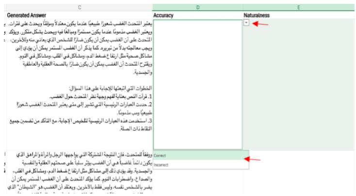