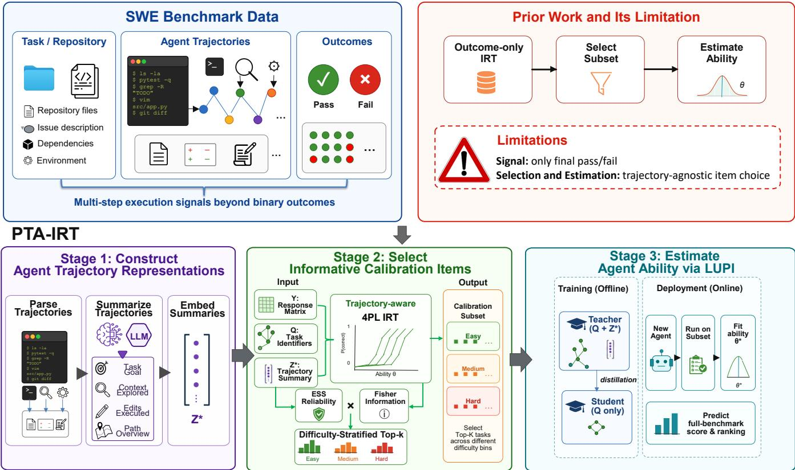
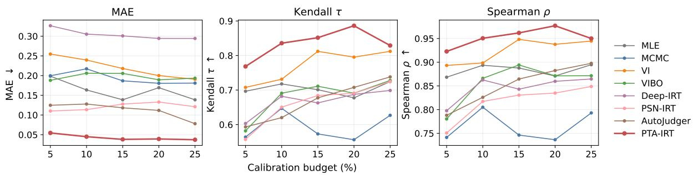
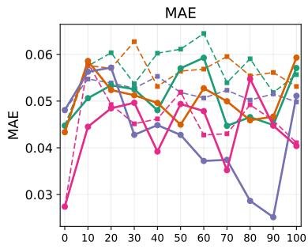
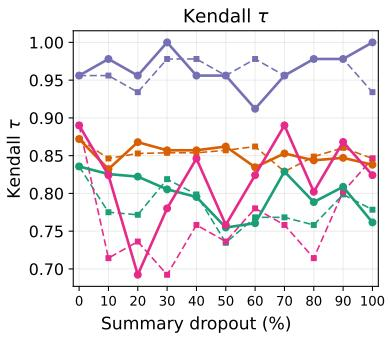
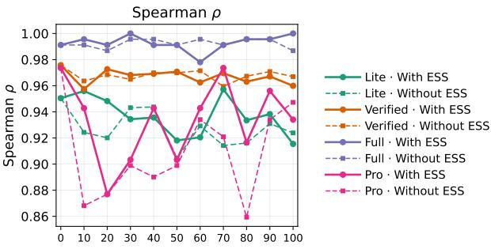

# Eficient SWE Agent Benchmarking via Trajectory-Aware Evaluation

Kefeng Duan1, Dewu Zheng1, Yanlin Wang1∗,

Xiwen Wang1, Ensheng Shi2, Xilin Liu2, Yuchi Ma2,

Jiachi Chen3, Mingwei Liu1, Zibin Zheng1

1School of Software Engineering, Sun Yat-sen University, Zhuhai, China

2Huawei Cloud Computing Technologies Co., Ltd., China

3College of Computer Science and Technology, Zhejiang University, Hangzhou, China {duankf, zhengdw5, wangxw86}@mail2.sysu.edu.cn, {wangylin36, liumw26, zhzibin}@mail.sysu.edu.cn {shiensheng, liuxilin3, mayuchi1}@huawei.com, chenjiachi@zju.edu.cn

## Abstract

Evaluating software engineering agents on realistic benchmarks is costly, since each task may require multi-step code exploration, modification, and test execution. Existing eficient evaluation methods select representative subsets to estimate full-benchmark performance, but are largely result-only: they fit historical pass/fail response matrices or static task semantics, discarding how agents solve problems. We propose PTA-IRT, a Privileged Trajectory-Aware Item Response Theory framework that fuses process and outcome signals. Historical execution trajectories supply process-level evidence beyond pass/fail, such as explored context, attempted edits, and solving paths, which PTA-IRT uses as privileged information for calibration subset selection and ability estimation. Under low calibration budgets, PTA-IRT consistently outperforms prior IRT baselines on score and ranking recovery across four SWE benchmarks. Code and data are publicly available at https://github.com/DeepSoftwareAnalytics/PTA-IRT.

## 1 Introduction

As Large Language Models (LLMs) are increasingly deployed as software engineering agents, more challenging benchmarks emerge to evaluate their ability to solve realworld software engineering tasks. However, these agentic benchmarks make evaluation substantially more expensive than conventional single-turn settings. Repository-level benchmarks require agents to reason over long horizons, explore codebases, invoke tools, edit source files, and execute tests. These multi-step interactions result in substantial inference costs and long evaluation cycles. For example, SWEbench contains more than 2,000 programming tasks; a single full-benchmark SWE-agent run has an estimated upperbound cost exceeding \$8,000 under a \$4-per-task limit, while the average cost on successfully resolved instances is \$1.59 for SWE-agent with GPT-4 Turbo [1, 2]. This motivates the central question of our work: can we evaluate a new agent on only a small budgeted subset of tasks while reliably recovering its performance and relative ranking on the full benchmark?

To address this question, prior work on eficient benchmarking introduces Item Response Theory (IRT) to select a small but representative subset of benchmark instances and use limited observations to estimate full-benchmark performance [3–6]. IRT-based methods fit historical response matrices to estimate item measurement characteristics and to infer a model’s latent ability from a limited set of observed responses. IRT therefore provides a promising framework for budgeted SWE agent evaluation. However, prior IRT methods for eficient benchmarking typically represent each task solely through its final pass/fail response, while a SWE agent’s outcome is produced through a multi-step trajectory of reasoning, context exploration, tool use, code editing, and verification. Reducing a trajectory to a binary outcome discards crucial process-level measurement signals about how an agent reaches success or failure, including what context it explores, which actions or edits it attempts, and where its problem-solving process breaks down.

To address this limitation, we propose PTA-IRT (Privileged Trajectory-Aware Item Response Theory), which incorporates historical agent trajectories as privileged information into IRT-based data selection and evaluation. PTA-IRT first converts trajectories into structured semantic summaries and uses them to learn trajectory-aware fourparameter logistic (4PL) item measurement characteristics. It then selects a dificulty-stratified calibration subset using trajectory-aware Fisher information and transfers measurement knowledge to an ability estimator through Learning Using Privileged Information (LUPI). Given a new agent, PTA-IRT executes only the selected calibration tasks and uses limited calibration observations to estimate its fullbenchmark performance and ranking.

To validate the efectiveness of PTA-IRT, we conduct experiments on four SWE benchmarks and compare it with prior IRT baselines. Our results show that:

• Under low calibration budgets, PTA-IRT consistently outperforms prior IRT baselines on score and ranking recovery.

• Privileged trajectory information is the source of these gains: outcome-only modeling or corrupted trajectory summaries weaken recovery.

• Structured trajectory summaries carry process signals beyond issue text and submitted patches, making budgeted evaluation more informative.

Our contributions are as follows:

<table><tr><td rowspan="2">Dimension</td><td colspan="2">Dataset curation</td><td colspan="4">Budgeted evaluation (subset→full)</td></tr><tr><td>Lite</td><td>Verified</td><td>Classical IRT</td><td>Deep/PSN-IRT</td><td>AutoJudger</td><td>PTA-IRT</td></tr><tr><td>Target domain</td><td>SWE</td><td>SWE</td><td>General</td><td>General</td><td>Multimodal</td><td>SWE</td></tr><tr><td>Observation signal</td><td></td><td></td><td>Pass/Fail</td><td>Pass/Fail</td><td>Pass/Fail</td><td>Pass/Fail+Agent Traj.</td></tr><tr><td>Modeling method</td><td>Heuristic rules Human judgment Parametric IRT</td><td></td><td></td><td>Neural IRT</td><td>IRT + LLM selection</td><td>Traj.-aware IRT</td></tr><tr><td>LLM involvement</td><td></td><td></td><td></td><td></td><td>Selects tasks</td><td>Summarizes traj.</td></tr><tr><td>Human involvement</td><td></td><td>Heavy</td><td></td><td></td><td></td><td></td></tr></table>

Table 1: Comparison of eficient benchmarking for SWE evaluation. Dataset curation: SWE-bench Lite and Verified are fixed smaller subsets filtered from SWE-bench (Lite: rule-based; Verified: human annotation). Budgeted evaluation recovers fullbenchmark scores from a calibration subset. “—” denotes not applicable / not involved.

• We formulate eficient SWE benchmarking as a budgeted subset-to-full evaluation problem under a realistic protocol in which a new agent is executed only on the calibration subset, while historical trajectories are used ofline for training.

• We introduce PTA-IRT, which incorporates historical agent trajectories as privileged information into IRTbased item selection and full-benchmark performance estimation.

• Extensive experiments on four SWE benchmarks show that PTA-IRT improves budgeted score and ranking recovery over prior IRT baselines.

## 2 Background

## 2.1 Related Work

Large language models and LLM-based agents have reshaped a wide range of software engineering tasks [7–9]. On code generation, they now cover function-level synthesis as well as repository-level completion, secure generation, and token-eficient decoding [10–18]. Code search and retrievalaugmented generation further connect natural-language intent to relevant code context [19–23]. Code summarization and comment generation recover intent from source context [24, 25], while retrieval-augmented commit message generation links edits to natural-language descriptions [26]. Issue resolution has become a central testbed for agentic software engineering, with systems that explore repositories, apply patches, and verify fixes against tests [1, 27–33]. Related directions include debugging, repository-level reasoning, code translation, and code review [34–37].

These advances have driven more demanding repositorylevel and agentic benchmarks, which require long-horizon reasoning, tool use, editing, and test execution [12, 13, 17, 18, 27, 29, 30, 36–39]. Such evaluations are substantially more expensive than conventional single-turn settings [10, 11].

Recent research therefore examines the eficiency and reliability of LLM benchmarks, with a growing interest in reducing evaluation cost through a smaller set of test instances [40– 42]. IRT provides a data-driven, item-level framework for this purpose [43]. By modeling agents’ responses across instances, IRT estimates item properties, such as dificulty and discriminability, together with the latent abilities of evaluated models.

In natural language processing, IRT was initially used to diagnose fundamental properties of datasets and test items, including item dificulty and discriminability [44]. More recently, its principles have been applied to eficient evaluation. Deep-IRT and PSN-IRT extend conventional IRT with neural architectures and more flexible response functions to model complex model–item interactions [3, 6]. In a diferent direction, AutoJudger proposes an agent-driven framework for eficient benchmarking of multimodal large language models [45].

However, IRT remains underexplored for SWE agent evaluation specifically, where agent–instance response data are sparse and trajectories are long. Instead, current SWE benchmarks still rely on rule-based filtering or human verification to reduce evaluation cost, as in the curated SWE-bench Lite and Verified subsets [27]. Table 1 contrasts these approaches along target domain, observation signal, modeling method, and human/LLM involvement.

## 2.2 Preliminary: Item Response Theory

IRT models the response behavior between respondents and items through respondents’ latent abilities and items measurement properties [46, 47]. In SWE agent evaluation, agents correspond to respondents, while benchmark instances correspond to items.

IRT uses an Item Characteristic Curve (ICC) to model the conditional probability of a correct response. Under the one-parameter logistic model, the probability that agent i successfully solves instance $j$ is defined as

$$
P ( X _ { i j } = 1 \mid \theta _ { i } ) = \frac { 1 } { 1 + \exp [ - ( \theta _ { i } - b _ { j } ) ] } ,\tag{1}
$$

where $\theta _ { i }$ denotes the latent ability of agent i and $b _ { j }$ denotes the dificulty parameter of instance $j .$

As IRT research advances, subsequent work incorporates additional item parameters, explores more expressive ICC functions, and adopts deep-learning approaches to improve its modeling capacity in complex evaluation settings [3, 6].

## 2.3 Preliminary: Learning Using Privileged Information

LUPI leverages additional information that is available during training but unavailable at test time [48, 49]. Formally, each training example is represented as $( \mathbf { x } , \mathbf { x } ^ { * } , y )$ , where x denotes the standard input, x∗ denotes privileged information, and y is the supervision signal. The goal of LUPI is to use x∗ during training to improve a predictor that relies only on x at inference time.

  
Figure 1: Limitations of prior work and an overview of PTA-IRT.

A neural realization of LUPI uses a teacher–student paradigm, in which the teacher accesses privileged information and transfers its knowledge to a student through distillation. The student then relies only on the standard input, without requiring privileged information at inference time [50–52].

In our setting, agent trajectories serve as privileged information, as they provide process-level evidence beyond binary responses. They are available for historical agent–item interactions, but are not required when estimating a new agent’s performance on the full benchmark from its responses on a calibration subset.

## 3 PTA-IRT

## 3.1 Overview

Evaluating a SWE agent on a full benchmark is costly. We study how to construct a small calibration subset from a full benchmark under a limited evaluation budget, and how to accurately estimate an agent’s full-benchmark performance using only its outcomes on this subset. As illustrated in Figure 1, PTA-IRT consists of three consecutive stages:

• Stage 1: Construct Agent Trajectory Representations. We compress heterogeneous and lengthy execution logs into comparable structured process summaries, preserving process-level evidence that binary pass/fail labels cannot capture.

• Stage 2: Select Informative Calibration Items. We fit a trajectory-aware 4PL IRT model, score tasks by Fisher information weighted by trajectory reliability, and select a dificulty-stratified calibration subset that is both informative and representative.

• Stage 3: Estimate Agent Ability via LUPI. On the same trajectory-aware 4PL backbone, a teacher–student objective transfers privileged process knowledge to a deployable student. At test time, we fit only a scalar ability on the calibration subset and extrapolate to the full benchmark.

## 3.2 Construct Agent Trajectory Representations

Raw agent trajectories contain lengthy commands, tool outputs, and intermediate messages that vary across agents and frameworks. We therefore build a trajectory parser to extract action steps from heterogeneous logs, and design a prompt protocol that compresses each historical trajectory into a structured process summary.

The summary has four fields: Task Goal, Context Explored, Edits Executed, and Path Overview. The summarization model receives the task description, extracted action steps, the benchmark reference patch, and the agent’s submitted patch. The reference patch serves to align task-relevant files, APIs, and change scope across heterogeneous trajectories, and is not treated as an outcome label. The protocol further instructs the summarizer to describe observable actions and edits, without inferring correctness or unobserved reasoning. This compression preserves process-level evidence absent from binary pass/fail labels.

We encode process summaries as ${ \cal Z } = \{ { \bf z } _ { i j } \}$ and use them together with the response matrix $Y = \{ y _ { i j } \}$ during ofline training. Under our protocol, a new agent is evaluated on the calibration subset to estimate full-benchmark performance, so process summaries are available for historical interactions during training but unavailable for unevaluated tasks at test time.

## 3.3 Select Informative Calibration Items

This stage constructs a calibration subset S that reduces uncertainty about agent ability while remaining representative of full-benchmark dificulty. Purely maximizing item information tends to select overly hard, mutually similar tasks and harms score recovery. We therefore select items by a trajectory-aware information score under dificulty stratification.

Trajectory-aware scorer. We fit a 4PL IRT model on historical agents A only. Each agent i has latent ability $\theta _ { i } ,$ and each task j has global parameters $( a _ { j } , b _ { j } , c _ { j } , d _ { j } )$ for discriminability, dificulty, guessing, and feasibility ceiling. Under these parameters, the response probability is

$$
p _ { i j } = c _ { j } + \left( d _ { j } - c _ { j } \right) \sigma \big ( a _ { j } ( \theta _ { i } - b _ { j } ) \big ) ,\tag{2}
$$

with $0 \leq c _ { j } < d _ { j } \leq 1$ . Architecturally, an agent encoder maps a one-hot agent identifier to $\theta _ { i }$ , an item encoder maps a one-hot item identifier to $( a _ { j } , b _ { j } , c _ { j } , d _ { j } )$ , and a summary encoder maps each privileged summary $\mathbf { z } _ { i j }$ to bounded residuals $( \Delta a _ { i j } , \Delta b _ { i j } ) = \alpha$ tanh $\left( g ( \mathbf { z } _ { i j } ) \right)$ . Each encoder is a twolayer multilayer perceptron (MLP). On cells with a usable summary $( m _ { i j } = 1 )$ , we form efective parameters

$$
\begin{array} { r l } & { a _ { i j } = a _ { j } + m _ { i j } \Delta a _ { i j } , \quad b _ { i j } = b _ { j } + m _ { i j } \Delta b _ { i j } , } \\ & { p _ { i j } = c _ { j } + \left( d _ { j } - c _ { j } \right) \sigma \big ( a _ { i j } ( \theta _ { i } - b _ { i j } ) \big ) . } \end{array}\tag{3}
$$

Here $( a _ { j } , b _ { j } , c _ { j } , d _ { j } )$ remain shared item parameters for the agent population. A process summary provides agent–item interaction evidence, which we inject as residuals on discriminability and dificulty, i.e., the parameters that govern the ability-linked transition of the item characteristic curve. In contrast, the asymptotes $c _ { j }$ and $d _ { j }$ encode structural bounds of the task and evaluation setting, namely chance success and feasibility limits. These bounds are properties of the item and harness rather than of a single solving path, so we do not make them trajectory-dependent.

Information-aware stratified selection. We score each task by how much its outcomes inform ability estimation, then select under dificulty-stratified budget allocation. The contribution of interaction $( i , j )$ is the 4PL Fisher information [53]

$$
I _ { i j } ( \theta _ { i } ) = \frac { a _ { i j } ^ { 2 } \big ( p _ { i j } - c _ { j } \big ) ^ { 2 } \big ( d _ { j } - p _ { i j } \big ) ^ { 2 } } { ( d _ { j } - c _ { j } ) ^ { 2 } p _ { i j } ( 1 - p _ { i j } ) } .\tag{4}
$$

Aggregating over A with ofline quality weights $\omega _ { i j }$ yields

$$
\begin{array} { l c l } { \displaystyle \mathrm { F i s h e r } ( j ) } & { = } & { \displaystyle \frac { \sum _ { i \in \mathcal { A } } \omega _ { i j } I _ { i j } ( \theta _ { i } ) } { \sum _ { i \in \mathcal { A } } \omega _ { i j } } , } \\ { \displaystyle \mathrm { E S S } ( j ) } & { = } & { \displaystyle \sum _ { i \in \mathcal { A } } m _ { i j } \omega _ { i j } , } \\ { \displaystyle \mathrm { I n f o } ( j ) } & { = } & { \displaystyle \mathrm { F i s h e r } ( j ) \cdot \log \bigl ( 1 + \mathrm { E S S } ( j ) \bigr ) . } \end{array}\tag{5}
$$

Here $m _ { i j } \in \{ 0 , 1 \}$ marks a usable process summary, and $\omega _ { i j } ~ \in ~ [ \bar { 0 } , 1 ]$ down-weights incomplete or malformed trajectory summaries. ESS(j) is the efective sample size of privileged evidence on item $j .$ Multiplying Fisher(j) by $\mathrm { { \bar { l } o g } } ( 1 + \mathrm { { E S S } } ( j ) )$ therefore reduces the score of items whose privileged evidence is of low quality.

Let $\begin{array} { r } { r _ { j } = \frac { 1 } { | \mathcal { A } | } \sum _ { i \in \mathcal { A } } y _ { i j } } \end{array}$ be the pass rate of task $j$ on historical agents only. We partition tasks into dificulty bins by $r _ { j } .$ allocate the budget k across bins in proportion to bin size, and within each bin select the tasks with the largest Info(j). The resulting subset $s$ therefore favors high-information items while covering easy-to-hard regimes, which is essential for recovering full-benchmark scores from a small calibration budget.

## 3.4 Estimate Agent Ability via LUPI

A new agent is evaluated only on the calibration subset S, and process summaries arise only after the agent is actually executed. Full-benchmark summaries are therefore unavailable at scoring time, which matches the LUPI setting. We design a teacher–student estimator on the same trajectory-aware 4PL backbone: privileged summaries supervise the teacher offline, while the student uses only identifiers and shared item parameters, estimates ability from $s ,$ , and extrapolates to all tasks.

Teacher–student training. The teacher and student share the agent, item, and summary encoders. The student predicts with global item parameters $( a _ { j } , b _ { j } , c _ { j } , d _ { j } )$ . The teacher predicts with trajectory-adjusted parameters $( a _ { i j } , b _ { i j } )$ , so the training objective depends on process-summary information. We minimize

$$
\begin{array} { r l } & { \mathcal { L } = \mathrm { B C E } ( p _ { i j } ^ { \mathrm { S } } , y _ { i j } ) } \\ & { \quad \quad + \lambda _ { \mathrm { t } } m _ { i j } \omega _ { i j } \mathrm { B C E } ( p _ { i j } ^ { \mathrm { T } } , y _ { i j } ) } \\ & { \quad \quad + \lambda _ { \mathrm { K L } } m _ { i j } \omega _ { i j } \mathrm { K L } \big ( p _ { i j } ^ { \mathrm { T } } \| p _ { i j } ^ { \mathrm { S } } \big ) } \\ & { \quad \quad + \lambda _ { \Delta } m _ { i j } \big ( \| \Delta a _ { i j } \| ^ { 2 } + \| \Delta b _ { i j } \| ^ { 2 } \big ) , } \end{array}\tag{6}
$$

where $p _ { i j } ^ { \mathrm { S } }$ and $p _ { i j } ^ { \mathrm { T } }$ are the student and teacher pass probabilities. The teacher and KL terms distill summary-conditioned measurements into the student. The residual penalty keeps $( \Delta a , \Delta b )$ small.

Test-time estimation. We freeze all network weights and fit a scalar ability θ on S by L-BFGS [54] from the observed outcomes, optionally with teacher distillation on ${ \mathcal { S } } .$ With θ∗ and the shared item parameters $( a _ { j } , b _ { j } , c _ { j } , d _ { j } )$ , the student predicts pass probabilities on every benchmark task and aggregates them into overall performance and ranking.

<table><tr><td>Benchmark</td><td># Tasks</td><td># Evaluated Models</td></tr><tr><td>SWE-bench Lite</td><td>300</td><td>35</td></tr><tr><td>SWE-bench Verified</td><td>500</td><td>70</td></tr><tr><td>SWE-bench Full</td><td>2,294</td><td>14</td></tr><tr><td>SWE-bench Pro</td><td>730</td><td>14</td></tr></table>

Table 2: Overview of the benchmarks and evaluated models.

## 4 Experimental Setup

## 4.1 Datasets

As shown in Table 2, we evaluate on four SWE-bench versions (Lite, Verified, Full, and Pro). Lite and Verified are curated subsets of Full [27]: Lite uses rule-based filtering toward more self-contained functional fixes, while Verified uses human annotation to remove underspecified or problematic instances. SWE-bench Pro [39] further extends SWEbench to long-horizon, multi-file enterprise-style tasks across broader repositories and languages. Because Lite and Verified are the community’s default reporting targets, they attract substantially more public agent submissions with parseable trajectories than Full or Pro. We therefore obtain denser model coverage on Lite and Verified, while Full and Pro emphasize larger task collections under sparser agent pools. We use each oficial release and retain all models with complete, successfully parsed trajectories.

## 4.2 Baselines

We compare PTA-IRT against a representative set of prior IRT baselines spanning classical IRT, neural IRT, and agent-driven selection. Classical baselines include Maximum Likelihood Estimation (MLE), Markov Chain Monte Carlo (MCMC) [55], Variational Inference (VI) [56], and VIBO [57]. Advanced methods include Deep-IRT [3] and PSN-IRT [6]. We additionally include AutoJudger [45], which combines IRT-based dificulty estimation with an LLM agent that adaptively selects calibration items.

## 4.3 Metrics

We adopt three metrics: Mean Absolute Error (MAE), Kendall’s τ, and Spearman’s $\rho .$

• MAE: the average deviation between predicted and ground-truth full-benchmark performance, $\begin{array} { r l } { \mathrm { M A E } } & { { } = } \end{array}$ $\begin{array} { r } { \frac { 1 } { N } \sum _ { i = 1 } ^ { N } | \hat { y } _ { i } - y _ { i } | } \end{array}$ , where $\hat { y } _ { i }$ and $y _ { i }$ are the predicted and ground-truth scores of model $i ,$ and N is the number of evaluated models.

• Kendall’s τ: pairwise ordinal agreement between the predicted and ground-truth rankings, $\begin{array} { r } { \tau = \frac { C - D } { \binom { N } { 2 } } } \end{array}$ , where $C$ and D are the numbers of concordant and discordant model pairs.

• Spearman’s $\rho \colon$ the global monotonic correlation between the predicted and ground-truth rankings, $\rho ~ =$ corr $( \mathrm { r a n k } ( \bar { \hat { \mathbf { y } } } ) , \mathrm { r a n k } ( \mathbf { y } ) )$ , where $\hat { \mathbf { y } }$ and $\mathbf { y }$ are the vectors of predicted and ground-truth performance.

## 4.4 Implementation Details

To ensure reliability, we use four-fold cross-validation: in each fold, 75% of the models are used for training and the remaining 25% for testing. Process summaries are generated with DeepSeek-V4-Flash1 and embedded with all-MiniLM-$\mathrm { L } 6  – \mathrm { v } 2 . ^ { 2 }$

## 5 Main Results

## 5.1 RQ1: Efectiveness of PTA-IRT

RQ1 examines how PTA-IRT performs under limited calibration budgets relative to prior IRT baselines. Table 3 reports the main comparison at a 10% budget on four SWE benchmarks, and Figure 2 evaluates budget sensitivity on SWE-bench Lite under 5–25% calibration.

Finding 1. With only 10% calibration, PTA-IRT consistently outperforms prior IRT baselines on both score recovery and ranking. As shown in Table 3, PTA-IRT is best on every MAE/τ/ρ column across the four SWE benchmarks, averaging $\mathrm { M A E ~ 0 . 0 4 1 \pm 0 . 0 1 5 , ~ \tau = 0 . 8 8 8 }$ , and $\rho = 0 . 9 7 3$ . This advantage holds under two complementary regimes. On Lite and Verified, where agent pools are dense, PTA-IRT attains the lowest MAE and the highest $\tau / \rho .$ . On Full and Pro, where task sets are large but agents are few, PTA-IRT likewise achieves the best score and ranking recovery.

Finding 2. PTA-IRT is robust across calibration budgets, and a small budget already yields practically useful ranking agreement. As shown in Figure 2, 5% calibration already gives τ = 0.768, within the practical range reported in prior analyses $[ 5 8 , 5 9 ] ( \tau \geq 0 . 7 - 0 \bar { . } 8 )$ . Raising the budget from 5% to 20% further improves ranking on Lite (τ: 0.768→0.886) and tends to lower MAE. PTA-IRT remains the best method across the full 5–25% range, underscoring the robustness of our approach under varying calibration budgets.

## 5.2 RQ2: Ablation Analysis of PTA-IRT

RQ2 examines the contribution of each component of PTA-IRT to recovering full-benchmark scores and rankings. Table 4 reports ablations at a 10% calibration budget. w/o Traj. scorer removes the summary encoder from the 4PL IRT used for informative selection. w/o LUPI drops teacher– student LUPI and estimates ability with the student model alone, without privileged summary supervision. + Top-K and + Clustering replace stratified information selection with global Top-K by information and pass-rate clustering, respectively.

Finding 3. Each component of PTA-IRT contributes to recovering full-benchmark scores and rankings. As shown in Table 4, the full configuration achieves the best average $\mathrm { M A E } / \tau / \rho$ . Removing the trajectory-aware scorer (w/o Traj. scorer) or LUPI (w/o LUPI) raises Avg MAE and lowers ranking agreement; the only local exception is a marginal MAE improvement on Verified without LUPI, which does not overturn the average. Replacing stratified selection with Top-K or clustering likewise worsens the average on both score and ranking.

<table><tr><td></td><td colspan="3">Lite</td><td colspan="3">Verified</td><td colspan="3">Full</td><td colspan="3">Pro</td><td colspan="3">Avg</td></tr><tr><td>Method</td><td>MAE↓</td><td>T↑</td><td>ρ↑</td><td>MAE↓</td><td>T↑</td><td> $\rho \uparrow$ </td><td>MAE↓</td><td>T↑</td><td> $\rho \uparrow$ </td><td>MAE↓</td><td>T↑</td><td> $\rho \uparrow$ </td><td>MAE↓</td><td>T↑</td><td> $\rho \uparrow$ </td></tr><tr><td>MLE</td><td>.164±.022</td><td>2.718</td><td>.894</td><td> $. 2 3 5 { \pm } . 0 4 5$ </td><td>.648</td><td>.831</td><td>.120±.056</td><td>.319</td><td>.424</td><td>.165±.039</td><td>.429</td><td>.675</td><td>.171±.041</td><td></td><td>.528.706</td></tr><tr><td>MCMC</td><td>.217±.048.647.805</td><td></td><td></td><td> $. 1 3 0 { \pm } . 0 4 1$ </td><td></td><td>.769.923</td><td>.073±.050</td><td></td><td>.780.921</td><td>.084±.041</td><td>.846</td><td>.952</td><td>.126±.045</td><td></td><td>.761.900</td></tr><tr><td>VI</td><td>.239±.027.731 .898</td><td></td><td></td><td> $. 1 4 2 { \pm } . 0 1 2$ </td><td></td><td>.855.967</td><td>.281±.140</td><td></td><td>.934.982</td><td>.226±.028</td><td>.868</td><td>.952</td><td>.222±.052</td><td>.847.950</td><td></td></tr><tr><td>VIBO</td><td>.206±.031</td><td></td><td></td><td>.691 .866.291±.036</td><td>.583.737</td><td></td><td>7.157±.069</td><td></td><td>.890.960</td><td>.211±.057</td><td>.692</td><td>.864</td><td>.216±.048</td><td>.714.857</td><td></td></tr><tr><td>Deep-IRT</td><td>.305±.145.682 .863</td><td></td><td></td><td> $. 1 9 1 \pm . 0 4 9$ </td><td></td><td>.724.909</td><td> $. 3 6 2 \pm . 1 2 0$ </td><td></td><td>.934.982</td><td>.289±.144</td><td>.692</td><td>.868</td><td>.287±.114.758.905</td><td></td><td></td></tr><tr><td>PSN-IRT</td><td> $. 1 1 4 \pm . 0 3 5$ </td><td>.650.817</td><td></td><td> $. 2 1 6 { \pm } . 0 4 5$ </td><td></td><td>.786.941</td><td> $. 1 9 8 \pm . 1 3 3$ </td><td></td><td>.758.921</td><td>.073±.013.692</td><td></td><td></td><td>.886.150±.057 .722 .891</td><td></td><td></td></tr><tr><td>AutoJudger</td><td> $. 1 2 8 { \pm } . 0 1 4$ </td><td></td><td>.620.826</td><td> $. 2 0 0 { \pm } . 0 1 1$ </td><td></td><td>.673.871</td><td> $. 1 5 1 { \pm } . 0 5 1$ </td><td></td><td>.626.736</td><td>6.120±.047.626</td><td></td><td>.807</td><td>.150±.031</td><td>.637.810</td><td></td></tr><tr><td>PTA-IRT</td><td>.045±.004.836.950</td><td></td><td></td><td> $\mathbf { \mathbf { . 0 4 3 \pm . 0 1 5 } }$ </td><td></td><td></td><td></td><td></td><td></td><td>.872 .976.048±.025 .956.991 .029±.017 .890 .974 .041±.015 .888 .973</td><td></td><td></td><td></td><td></td><td></td></tr></table>

Table 3: Comparison at a 10% calibration budget across four SWE benchmarks. Lower MAE and higher Kendall’s τ / Spearman’s ρ are better. Best values in each column are bolded (all ties are bolded). Values are rounded to three decimals with leading zeros omitted.

  
Figure 2: Budget sensitivity on SWE-bench Lite under 5–25% calibration. Each panel shows one metric (MAE, Kendall’s $\tau ,$ and Spearman’s ρ).

## 5.3 RQ3: Contribution of Trajectory Summaries

RQ3 examines the contribution of historical trajectory summaries to PTA-IRT. We apply summary dropout: a controlled fraction of train-summary embeddings is set to zero before retraining the trajectory-aware scorer and rebuilding the stratified calibration set S. We compare With ESS, which downweights corrupted cells, against Without ESS, which still feeds corrupted embeddings at full weight. Figure 3 reports MAE, Kendall’s τ, and Spearman’s $\rho$ on four SWE benchmarks under a 10% calibration budget.

Finding 4. Trajectory summaries improve recovery quality; their benefit comes from summary content rather than a vacuous privileged channel. As shown in Figure 3, increasing summary dropout generally weakens score recovery and ranking relative to the clean setting, though the curves are not strictly monotonic across benchmarks. At full dropout without ESS, Lite approaches the RQ2 ablation that removes the trajectory-aware scorer (MAE 0.056, τ = 0.778), indicating that the gains of PTA-IRT mainly come from summary content rather than merely having an unused summary pathway.

Finding 5. ESS efectively protects PTA-IRT when trajectory summaries are unreliable. Under the same dropout levels, With ESS stays closer to the clean setting than Without ESS on most benchmark–metric pairs. The protective gap is clearest at low-to-mid dropout (e.g., on Lite, Without ESS already falls to τ ≈0.735 at 50% dropout), where ESS can still downweight corrupted cells. At extreme dropout, both degrade as usable process signal disappears.

## 5.4 RQ4: Characteristics of Trajectory Summaries

RQ4 examines what distinctive structure trajectory summaries capture relative to issue text and submitted patches, and how that structure is organized across summary fields and same-item outcome pairs. We answer this with two complementary views: cross-channel similarity (Table 5) and sameitem outcome geometry (Table 6).

Cross-channel similarity. For each (agent, item) cell we compute cosine similarity between the process summary (and its four fields) and (i) the question embedding ${ \bf q } _ { j }$ and (ii) the submitted-answer embedding. As a control for question alignment, we also report $\Delta$ vs. randQ: the gap between similarity to the true question and the mean similarity to a randomly sampled question. Table 5 summarizes the results. Finding 6. Trajectory summaries exhibit a clear division of labor: Task Goal tracks the issue text, Edits Executed tracks the submitted patch, while Context Explored and Path Overview remain process-specific. Whole-summary similarity to the question (0.714) exceeds a random-question baseline by a large margin $\left( \Delta = + 0 . 4 7 3 \right)$ . Field-level scores reveal complementary roles rather than redundancy. Task Goal is closest to the question (0.776), which largely explains the high Summary↔Question score. Edits Executed is closest to the submitted answer (0.670), whereas Context Explored and Path Overview stay lower on both axes (≤ 0.533). A trajectory summary therefore combines question-facing goal understanding with edit-level content and independent exploration/path structure.

<table><tr><td rowspan="2">Method</td><td colspan="4">Lite</td><td colspan="4">Verified</td><td colspan="4">Full</td><td colspan="4">Pro</td><td colspan="4"> $\operatorname { A v g }$ </td></tr><tr><td>MAE↓</td><td></td><td>τ↑ ρ↑</td><td></td><td>MAE↓</td><td>T↑</td><td> $\rho \uparrow$ </td><td></td><td>MAE↓</td><td></td><td>τ↑ ρ↑</td><td></td><td>MAE↓</td><td>T↑</td><td> $\rho \uparrow$ </td><td></td><td>MAE↓</td><td>τ↑</td><td></td><td> $\rho \uparrow$ </td></tr><tr><td>PTA-IRT</td><td>.045±.004 .836.950</td><td></td><td></td><td></td><td>.043±.015 .872 .976.048±.025 .956.991 .029±.017 .890 .974 .041±.015.888 .973</td><td></td><td></td><td></td><td></td><td></td><td></td><td></td><td></td><td></td><td></td><td></td><td></td><td></td><td></td><td></td></tr><tr><td>w/o Traj. scorer</td><td> $. 0 5 5 { \pm } . 0 2 1 $ </td><td></td><td></td><td></td><td>.778 .930 .065±.008.860 .969 .048±.029.912 .982</td><td></td><td></td><td></td><td></td><td></td><td></td><td></td><td> $. 0 4 7 { \pm } . 0 1 0$ </td><td></td><td>.890.969</td><td></td><td></td><td> $. 0 5 4 \pm . 0 1 7$ </td><td>.860.963</td><td></td></tr><tr><td>w/o LUPI</td><td> $. 0 8 5 { \pm } . 0 0 4$ </td><td></td><td></td><td></td><td>.573 .755.042±.013.848.964.053±.032.802 .912 .092±.040.868.965</td><td></td><td></td><td></td><td></td><td></td><td></td><td></td><td></td><td></td><td></td><td></td><td> $. 0 6 8 { \pm } . 0 2 2$ </td><td></td><td>.773.899</td><td></td></tr><tr><td>+ Top-K + Clustering</td><td> $. 1 9 6 \pm . 0 3 1$ </td><td></td><td></td><td>.819.947.</td><td>.812.942 .193±.012 .752 .917</td><td></td><td></td><td></td><td> $. 2 2 8 { \pm } . 1 6 3$ </td><td></td><td></td><td>.934.982 .086±.025.802 .921</td><td></td><td></td><td></td><td></td><td> $. 1 7 6 { \pm } . 0 5 8$ </td><td></td><td>.825.941</td><td></td></tr></table>

Table 4: Ablation of PTA-IRT at a 10% calibration budget. Lower MAE and higher Kendall’s τ / Spearman’s $\rho$ are better. Best values in each column are bolded (all ties are bolded). Values are rounded to three decimals with leading zeros omitted.

  
Figure 3: Contribution of trajectory summaries under summary dropout (10% calibration). Solid lines: With ESS; dashed lines: Without ESS. Colors denote benchmarks.

<table><tr><td>Channel</td><td>↔Q</td><td> $ \mathrm { A n s } .$ </td><td>∆ randQ</td></tr><tr><td>Summary</td><td>0.714</td><td>0.638</td><td> $+ 0 . 4 7 3$ </td></tr><tr><td>Task Goal</td><td>0.776</td><td>0.532</td><td> $+ 0 . 5 8 7$ </td></tr><tr><td>Context Explored</td><td>0.502</td><td>0.533</td><td> $+ 0 . 3 1 4$ </td></tr><tr><td>Edits Executed</td><td>0.530</td><td>0.670</td><td> $+ 0 . 3 3 3$ </td></tr><tr><td>Path Overview</td><td>0.468</td><td>0.441</td><td> $+ 0 . 2 7 2$ </td></tr></table>

Table 5: Cross-channel cosine similarity on SWE-bench Verified. ∆ vs. randQ applies to the ↔ Question column.

Same-item outcome geometry. We next compare representations of successful and failed solving paths on the same task. For every item with multiple agents, we form agent pairs and report mean embedding distance (1 − cosine) for bothpass (PP), both-fail (FF), and pass–fail (PF) pairs, together with $\Delta _ { \mathrm { o u t } } = d ( \mathrm { P F } ) - \textstyle { \frac { 1 } { 2 } } \big ( d ( \mathrm { P \bar { P } } ) + d ( \mathrm { F F } ) \big )$ . A larger $\Delta _ { \mathrm { o u t } }$ indicates stronger outcome-related structure. Table 6 reports Answer, Summary, and the four summary fields.

Finding 7. Submitted answers concentrate outcome geometry, while trajectory summaries preserve process diversity. For answers, same-outcome successes are much closer than failures (PP 0.175 vs. FF 0.290), and $\Delta _ { \mathrm { o u t } } = 0 . 0 3 3$ . For full summaries, PP and FF distances remain close (0.143 vs. 0.163) and $\Delta _ { \mathrm { o u t } }$ is only 0.005; among fields, Context Explored, Edits Executed, and Path Overview keep large absolute distances (≥ 0.337), and Edits Executed shows the largest $\Delta _ { \mathrm { o u t } } ~ ( 0 . 0 2 0 )$ , consistent with its stronger answer alignment in Table 5. Thus pass/fail is expressed most directly in the final patch, whereas summaries retain heterogeneous solving paths that are not collapsed by binary labels and patches alone.

<table><tr><td>Channel</td><td>PP</td><td>FF</td><td>PF</td><td> $\Delta _ { \mathrm { o u t } }$ </td></tr><tr><td>Answer</td><td>0.175</td><td>0.290</td><td>0.265</td><td>0.033</td></tr><tr><td>Summary</td><td>0.143</td><td>0.163</td><td>0.158</td><td>0.005</td></tr><tr><td>Task Goal</td><td>0.127</td><td>0.147</td><td>0.141</td><td>0.003</td></tr><tr><td>Context Explored</td><td>0.337</td><td>0.387</td><td>0.372</td><td>0.010</td></tr><tr><td>Edits Executed</td><td>0.366</td><td>0.422</td><td>0.414</td><td>0.020</td></tr><tr><td>Path Overview</td><td>0.363</td><td>0.387</td><td>0.389</td><td>0.013</td></tr></table>

Table 6: Same-item pair distances on SWE-bench Verified. PP/FF/PF: both-pass / both-fail / pass–fail.

## 6 Conclusion

Evaluating SWE agents on full benchmarks is expensive because each task can require long-horizon exploration, editing, and testing. We present PTA-IRT, which treats historical execution trajectories as privileged information for eficient IRT-based evaluation. PTA-IRT builds structured trajectory summaries, selects a dificulty-stratified calibration subset with trajectory-aware measurement features, and estimates a new agent’s full-benchmark score and ranking from limited calibration observations via LUPI. Under low calibration budgets, PTA-IRT consistently outperforms prior IRT baselines on score and ranking recovery across four SWE benchmarks under our evaluation protocol, showing that privileged trajectory information makes budgeted SWE agent evaluation more informative.

## References

[1] John Yang, Carlos Jimenez, Alexander Wettig, Kilian Lieret, Shunyu Yao, Karthik Narasimhan, and Ofir Press. Swe-agent: Agent-computer interfaces enable automated software engineering. In A. Globerson, L. Mackey, D. Belgrave, A. Fan, U. Paquet, J. Tomczak, and C. Zhang, editors, Advances in Neural Information Processing Systems, volume 37, pages 50528–50652. Curran Associates, Inc., 2024. doi: 10.52202/079017- 1601.

[2] Sayash Kapoor, Benedikt Stroebl, Zachary S Siegel, Nitya Nadgir, and Arvind Narayanan. AI Agents That Matter. Transactions on Machine Learning Research, 2025.

[3] Emiko Tsutsumi, Ryo Kinoshita, and Maomi Ueno. Deep item response theory as a novel test theory based on deep learning. Electronics, 10(9), 2021. doi: 10.3390/electronics10091020.

[4] Felipe Maia Polo, Lucas Weber, Leshem Choshen, Yuekai Sun, Gongjun Xu, and Mikhail Yurochkin. tiny-Benchmarks: evaluating LLMs with fewer examples. In Ruslan Salakhutdinov, Zico Kolter, Katherine Heller, Adrian Weller, Nuria Oliver, Jonathan Scarlett, and Felix Berkenkamp, editors, Proceedings of the 41st International Conference on Machine Learning, volume 235 of Proceedings of Machine Learning Research, pages 34303–34326. PMLR, 21–27 Jul 2024.

[5] Alex Kipnis, Konstantinos Voudouris, Luca Schulze Buschof, and Eric Schulz. metabench - a sparse benchmark of reasoning and knowledge in large language models. In Y. Yue, A. Garg, N. Peng, F. Sha, and R. Yu, editors, International Conference on Learning Representations, volume 2025, pages 31734–31770, 2025.

[6] Hongli Zhou, Hui Huang, Ziqing Zhao, Lvyuan Han, Huicheng Wang, Kehai Chen, Muyun Yang, Wei Bao, Jian Dong, and Bing Xu. Lost in benchmarks? rethinking large language model benchmarking with item response theory. Proceedings of the AAAI Conference on Artificial Intelligence, 40(41):35085–35093, March 2026. doi: 10.1609/aaai.v40i41.40814.

[7] Yanlin Wang, Wanjun Zhong, Yanxian Huang, Ensheng Shi, Min Yang, Jiachi Chen, Hui Li, Yuchi Ma, Qianxiang Wang, and Zibin Zheng. Agents in software engineering: Survey, landscape, and vision. Automated Software Engineering, 32(2):70, 2025.

[8] Junwei Liu, Kaixin Wang, Yixuan Chen, Xin Peng, Zhenpeng Chen, Lingming Zhang, and Yiling Lou. Large language model-based agents for software engineering: A survey. ACM Trans. Softw. Eng. Methodol., March 2026. ISSN 1049-331X. doi: 10.1145/3796507. Just Accepted.

[9] Yanlin Wang, Kefeng Duan, Dewu Zheng, Ensheng Shi, Fengji Zhang, Yanli Wang, Jiachi Chen, Xilin Liu, Yuchi Ma, Hongyu Zhang, Qianxiang Wang, and Zibin Zheng. Towards an understanding of context utilization in code intelligence. ACM Comput. Surv., 58(11), April 2026. ISSN 0360-0300. doi: 10.1145/3797261.

[10] Mark Chen, Jerry Tworek, Heewoo Jun, Qiming Yuan, Henrique Ponde de Oliveira Pinto, Jared Kaplan, Harri Edwards, Yuri Burda, Nicholas Joseph, Greg Brockman, Alex Ray, Raul Puri, Gretchen Krueger, Michael Petrov, Heidy Khlaaf, Girish Sastry, Pamela Mishkin, Brooke Chan, Scott Gray, Nick Ryder, Mikhail Pavlov, Alethea Power, Lukasz Kaiser, Mohammad Bavarian, Clemens Winter, Philippe Tillet, Felipe Petroski Such, Dave Cummings, Matthias Plappert, Fotios Chantzis, Elizabeth Barnes, Ariel Herbert-Voss, William Hebgen Guss, Alex Nichol, Alex Paino, Nikolas Tezak, Jie Tang, Igor Babuschkin, Suchir Balaji, Shantanu Jain, William Saunders, Christopher Hesse, Andrew N. Carr, Jan Leike, Josh Achiam, Vedant Misra, Evan Morikawa, Alec Radford, Matthew Knight, Miles Brundage, Mira Murati, Katie Mayer, Peter Welinder, Bob McGrew, Dario Amodei, Sam McCandlish, Ilya Sutskever, and Wojciech Zaremba. Evaluating large language models trained on code, 2021.

[11] Naman Jain, Han, Alex Gu, Wen-Ding Li, Fanjia Yan, Tianjun Zhang, Sida Wang, Armando Solar-Lezama, Koushik Sen, and Ion Stoica. Livecodebench: Holistic and contamination free evaluation of large language models for code. In Y. Yue, A. Garg, N. Peng, F. Sha, and R. Yu, editors, International Conference on Learning Representations, volume 2025, pages 58791– 58831, 2025.

[12] Dewu Zheng, Yanlin Wang, Ensheng Shi, Xilin Liu, Yuchi Ma, Hongyu Zhang, and Zibin Zheng. Top general performance= top domain performance? domaincodebench: A multi-domain code generation benchmark. arXiv preprint arXiv:2412.18573, 2024.

[13] Dewu Zheng, Yanlin Wang, Ensheng Shi, Ruikai Zhang, Yuchi Ma, Hongyu Zhang, and Zibin Zheng. Humanevo: An evolution-aware benchmark for more realistic evaluation of repository-level code generation. In 2025 IEEE/ACM 47th International Conference on Software Engineering (ICSE), pages 1372–1384. IEEE, 2025.

[14] Yifan Li, Ensheng Shi, Dewu Zheng, Kefeng Duan, Jiachi Chen, and Yanlin Wang. Repomincoder: Improving repository-level code generation based on information loss screening. In Proceedings of the 15th Asia-Pacific Symposium on Internetware, pages 229– 238, 2024.

[15] Sicong Liu, Yanxian Huang, Mingwei Liu, Jiachi Chen, Ensheng Shi, Yuchi Ma, Hongyu Zhang, Yin Zhang, and Yanlin Wang. Shortcoder: Knowledge-augmented syntax optimization for token-eficient code generation, 2026.

[16] Ziyao Zhang, Chong Wang, Yanlin Wang, Ensheng Shi, Yuchi Ma, Wanjun Zhong, Jiachi Chen, Mingzhi Mao,

and Zibin Zheng. Llm hallucinations in practical code generation: Phenomena, mechanism, and mitigation. Proceedings of the ACM on Software Engineering, 2 (ISSTA):481–503, 2025.

[17] Yanlin Wang, Bowen Zhang, Yanli Wang, Daya Guo, Terry Yue Zhuo, Jiachi Chen, Mingwei Liu, Xingong Zhang, and Zibin Zheng. Arkrepobench: A repositorylevel code completion benchmark for harmonyos development. In Findings ofthe Associationfor Computational Linguistics: ACL 2026, pages 19409–19429, 2026.

[18] Yanlin Wang, Ziyao Zhang, Chong Wang, Xinyi Xu, Mingwei Liu, Yong Wang, Jiachi Chen, and Zibin Zheng. Realsec-bench: A benchmark for evaluating secure code generation in real-world repositories. In Findings ofthe Associationfor Computational Linguistics: ACL 2026, pages 35866–35883, 2026.

[19] Jing Gong, Yanghui Wu, Linxi Liang, Yanlin Wang, Jiachi Chen, Mingwei Liu, and Zibin Zheng. Cosqa+: Enhancing code search evaluation with a multi-choice benchmark and test-driven agents. IEEE Transactions on Software Engineering, 52(1):206–220, 2025.

[20] Yanlin Wang, Lianghong Guo, Ensheng Shi, Wenqing Chen, Jiachi Chen, Wanjun Zhong, Menghan Wang, Hui Li, Hongyu Zhang, Ziyu Lyu, et al. You augment me: Exploring chatgpt-based data augmentation for semantic code search. In 2023 IEEE International Conference on Software Maintenance and Evolution (ICSME), pages 14–25. IEEE, 2023.

[21] Wenchao Gu, Juntao Chen, Yanlin Wang, Tianyue Jiang, Xingzhe Li, Mingwei Liu, Xilin Liu, Yuchi Ma, and Zibin Zheng. What to retrieve for efective retrievalaugmented code generation? an empirical study and beyond. arXiv preprint arXiv:2503.20589, 2025.

[22] Tianyue Jiang, Yanli Wang, Yanlin Wang, Daya Guo, Ensheng Shi, Yuchi Ma, Jiachi Chen, and Zibin Zheng. Aligncoder: Aligning retrieval with target intent for repository-level code completion. In 2025 40th IEEE/ACM International Conference on Automated Software Engineering (ASE), pages 971–982. IEEE, 2025.

[23] Yanlin Wang, Jiadong Wu, Tianyue Jiang, Mingwei Liu, Jiachi Chen, Chong Wang, Ensheng Shi, Xilin Liu, Yuchi Ma, and Zibin Zheng. Draincode: Stealthy energy consumption attacks on retrieval-augmented code generation via context poisoning. In 2025 40th IEEE/ACM International Conference on Automated Software Engineering (ASE), pages 778–790. IEEE, 2025.

[24] Yanlin Wang, Ensheng Shi, Lun Du, Xiaodi Yang, Yuxuan Hu, Yanli Wang, Daya Guo, Shi Han, Hongyu Zhang, and Dongmei Zhang. Context-aware code summarization with multi-relational graph neural network. Automated Software Engineering, 32(1):19, 2025.

[25] Hanyang Guo, Xiangping Chen, Yuan Huang, Yanlin Wang, Xi Ding, Zibin Zheng, Xiaocong Zhou, and Hong-Ning Dai. Snippet comment generation based

on code context expansion. ACM Transactions on Software Engineering and Methodology, 33(1):1–30, 2023.

[26] Ensheng Shi, Yanlin Wang, Wei Tao, Lun Du, Hongyu Zhang, Shi Han, Dongmei Zhang, and Hongbin Sun. Race: Retrieval-augmented commit message generation. In Proceedings of the 2022 Conference on Empirical Methods in Natural Language Processing, pages 5520–5530, 2022.

[27] Carlos E Jimenez, John Yang, Alexander Wettig, Shunyu Yao, Kexin Pei, Ofir Press, and Karthik Narasimhan. Swe-bench: Can language models resolve real-world github issues? In B. Kim, Y. Yue, S. Chaudhuri, K. Fragkiadaki, M. Khan, and Y. Sun, editors, International Conference on Learning Representations, volume 2024, pages 54107–54157, 2024.

[28] Wei Tao, Yucheng Zhou, Yanlin Wang, Wenqiang Zhang, Hongyu Zhang, and Yu Cheng. Magis: Llmbased multi-agent framework for github issue resolution. Advances in Neural Information Processing Systems, 37:51963–51993, 2024.

[29] Lianghong Guo, Wei Tao, Runhan Jiang, Yanlin Wang, Jiachi Chen, Xilin Liu, Yuchi Ma, Mingzhi Mao, Hongyu Zhang, and Zibin Zheng. Omnigirl: A multilingual and multimodal benchmark for github issue resolution. Proceedings ofthe ACM on Software Engineering, 2(ISSTA):24–46, 2025.

[30] Lianghong Guo, Yanlin Wang, Caihua Li, Wei Tao, Pengyu Yang, Jiachi Chen, Haoyu Song, Duyu Tang, and Zibin Zheng. Swe data construction, automatically! Proceedings of the ACM on Software Engineering, 3 (FSE):525–546, 2026.

[31] Tianyue Jiang, Yanlin Wang, Xin He, Daya Guo, Jiachi Chen, Ming Wen, Ensheng Shi, Xilin Liu, Yuchi Ma, and Guanbin Li. Phoenixrepair: Rethinking repair strategy exploration in software agents, 2026.

[32] He Ye, Aidan ZH Yang, Chang Hu, Yanlin Wang, Tao Zhang, and Claire Le Goues. Adverintent-agent: Adversarial reasoning for repair based on inferred program intent. Proceedings of the ACM on Software Engineering, 2(ISSTA):1398–1420, 2025.

[33] Dewu Zheng, Ruizhe Ye, Yanlin Wang, Yang Ye, Hongyu Zhang, Ensheng Shi, Xilin Liu, Yuchi Ma, Jianxing Yu, and Zibin Zheng. Swe-prime: Fewer trajectories, better performance, 2026.

[34] Runchu Tian, Yining Ye, Yujia Qin, Xin Cong, Yankai Lin, Yinxu Pan, Yesai Wu, Hui Haotian, Liu Weichuan, Zhiyuan Liu, and Maosong Sun. DebugBench: Evaluating debugging capability of large language models. In Lun-Wei Ku, Andre Martins, and Vivek Srikumar, editors, Findings ofthe Associationfor Computational Linguistics: ACL 2024, pages 4173–4198, Bangkok, Thailand, August 2024. Association for Computational Linguistics. doi: 10.18653/v1/2024.findings-acl.247.

[35] Yanlin Wang, Suiquan Wang, Yanli Wang, Bowen Zhang, Daya Guo, Jiachi Chen, and Zibin Zheng. Reporeasoner: Evaluating repository-level code reasoning ability of long-context language models. Proceedings

of the ACM on Software Engineering, 3(FSE):2790– 2812, 2026.

[36] Yanli Wang, Yanlin Wang, Suiquan Wang, Daya Guo, Jiachi Chen, John Grundy, Xilin Liu, Yuchi Ma, Mingzhi Mao, Hongyu Zhang, et al. Repotransbench: A real-world multilingual benchmark for repositorylevel code translation. IEEE Transactions on Software Engineering, 2025.

[37] Dewu Zheng, Yanlin Wang, Xiwen Wang, Kefeng Duan, Hongyu Zhang, Xilin Liu, Yuchi Ma, and Zibin Zheng. From static to dynamic: Benchmarking realworld code review with mcr-bench, 2026.

[38] John Yang, Carlos E Jimenez, Alex Zhang, Kilian Lieret, Joyce Yang, Xindi Wu, Ori Press, Niklas Muennighof, Gabriel Synnaeve, Karthik Narasimhan, Diyi Yang, Sida Wang, and Ofir Press. Swe-bench multimodal: Do ai systems generalize to visual software domains? In Y. Yue, A. Garg, N. Peng, F. Sha, and R. Yu, editors, International Conference on Learning Representations, volume 2025, pages 2794–2829, 2025.

[39] Xiang Deng, Jef Da, Edwin Pan, Yannis Yiming He, Charles Ide, Kanak Garg, Niklas Laufer, Andrew Park, Nitin Pasari, Chetan Rane, Karmini Sampath, Maya Krishnan, Srivatsa Kundurthy, Sean Hendryx, Zifan Wang, Vijay Bharadwaj, Jef Holm, Raja Aluri, Chen Bo Calvin Zhang, Noah Jacobson, Bing Liu, and Brad Kenstler. Swe-bench pro: Can ai agents solve longhorizon software engineering tasks?, 2025.

[40] Yotam Perlitz, Elron Bandel, Ariel Gera, Ofir Arviv, Liat Ein-Dor, Eyal Shnarch, Noam Slonim, Michal Shmueli-Scheuer, and Leshem Choshen. Eficient benchmarking (of language models). In Kevin Duh, Helena Gomez, and Steven Bethard, editors, Proceedings of the 2024 Conference of the North American Chapter of the Association for Computational Linguistics: Human Language Technologies (Volume 1: Long Papers), pages 2519–2536, Mexico City, Mexico, June 2024. Association for Computational Linguistics. doi: 10.18653/v1/2024.naacl-long.139.

[41] Rajan Vivek, Kawin Ethayarajh, Diyi Yang, and Douwe Kiela. Anchor points: Benchmarking models with much fewer examples. In Yvette Graham and Matthew Purver, editors, Proceedings of the 18th Conference of the European Chapter of the Association for Computational Linguistics (Volume 1: Long Papers), pages 1576–1601, St. Julian’s, Malta, March 2024. Association for Computational Linguistics. doi: 10.18653/v1/ 2024.eacl-long.95.

[42] Peiwen Yuan, Yueqi Zhang, Shaoxiong Feng, Yiwei Li, Xinglin Wang, Jiayi Shi, Chuyi Tan, Boyuan Pan, Yao Hu, and Kan Li. Beyond one-size-fits-all: Tailored benchmarks for eficient evaluation. In Wanxiang Che, Joyce Nabende, Ekaterina Shutova, and Mohammad Taher Pilehvar, editors, Proceedings of the 63rd Annual Meeting of the Association for Computational Linguistics (Volume 1: Long Papers), pages 15591– 15615, Vienna, Austria, July 2025. Association for

Computational Linguistics. ISBN 979-8-89176-251- 0. doi: 10.18653/v1/2025.acl-long.759.

[43] Frederic M Lord and Melvin R Novick. Statistical theories ofmental test scores. IAP, 2008.

[44] John P. Lalor, Hao Wu, and Hong Yu. Building an evaluation scale using item response theory. In Jian Su, Kevin Duh, and Xavier Carreras, editors, Proceedings of the 2016 Conference on Empirical Methods in Natural Language Processing, pages 648–657, Austin, Texas, November 2016. Association for Computational Linguistics. doi: 10.18653/v1/D16-1062.

[45] Xuanwen Ding, Chengjun Pan, Zejun Li, Jiwen Zhang, Siyuan Wang, and Zhongyu Wei. AutoJudger: An agent-driven framework for eficient benchmarking of MLLMs. In Maria Liakata, Viviane P. Moreira, Jiajun Zhang, and David Jurgens, editors, Proceedings of the 64th Annual Meeting of the Association for Computational Linguistics (Volume 1: Long Papers), pages 15009–15034, San Diego, California, United States, July 2026. Association for Computational Linguistics. ISBN 979-8-89176-390-6. doi: 10.18653/v1/2026.acllong.685.

[46] Ronald K Hambleton and Hariharan Swaminathan. Item response theory: Principles and applications. Springer Science & Business Media, 2013.

[47] Bryce B Reeve and Peter Payers. Applying item response theory modelling for evaluating. Assessing quality of life in clinical trials: Methods and practice, 55, 2005.

[48] Vladimir Vapnik and Akshay Vashist. A new learning paradigm: Learning using privileged information. Neural Networks, 22(5):544–557, 2009. ISSN 0893-6080. doi: https://doi.org/10.1016/j.neunet.2009.06.042. Advances in Neural Networks Research: IJCNN2009.

[49] Viktoriia Sharmanska, Novi Quadrianto, and Christoph H. Lampert. Learning to rank using privileged information. In Proceedings of the 2013 IEEE International Conference on Computer Vision, ICCV ’13, page 825–832, USA, 2013. IEEE Computer Society. ISBN 9781479928408. doi: 10.1109/ICCV.2013.107.

[50] Vladimir Vapnik and Rauf Izmailov. Learning using privileged information: Similarity control and knowledge transfer. Journal of Machine Learning Research, 16(61):2023–2049, 2015.

[51] David Lopez-Paz, Léon Bottou, Bernhard Schölkopf, and Vladimir Vapnik. Unifying distillation and privileged information, 2016.

[52] Wonkyung Lee, Junghyup Lee, Dohyung Kim, and Bumsub Ham. Learning with privileged information for eficient image super-resolution. In Andrea Vedaldi, Horst Bischof, Thomas Brox, and Jan-Michael Frahm, editors, Computer Vision – ECCV 2020, pages 465– 482, Cham, 2020. Springer International Publishing. ISBN 978-3-030-58586-0.

[53] Frederic M Lord. Applications of Item Response Theory to Practical Testing Problems. ERIC, 1980.

[54] Dong C. Liu and Jorge Nocedal. On the limited memory bfgs method for large scale optimization. Mathematical Programming, 45(1):503–528, Aug 1989. ISSN 1436- 4646. doi: 10.1007/BF01589116.

[55] W. K. Hastings. Monte carlo sampling methods using markov chains and their applications. Biometrika, 57 (1):97–109, 04 1970. ISSN 0006-3444. doi: 10.1093/ biomet/57.1.97.

[56] Michael I. Jordan, Zoubin Ghahramani, Tommi S. Jaakkola, and Lawrence K. Saul. An introduction to variational methods for graphical models. Machine Learning, 37(2):183–233, Nov 1999. ISSN 1573-0565. doi: 10.1023/A:1007665907178.

[57] Mike Wu, Richard L Davis, Benjamin W Domingue, Chris Piech, and Noah Goodman. Variational item response theory: Fast, accurate, and expressive. International Educational Data Mining Society, 2020.

[58] Nelson F. Liu, Tony Lee, Robin Jia, and Percy Liang. Do question answering modeling improvements hold across benchmarks? In Anna Rogers, Jordan Boyd-Graber, and Naoaki Okazaki, editors, Proceedings of the 61st Annual Meeting of the Association for Computational Linguistics (Volume 1: Long Papers), pages 13186–13218, Toronto, Canada, July 2023. Association for Computational Linguistics. doi: 10.18653/v1/ 2023.acl-long.736.

[59] Kaiser Sun, Adina Williams, and Dieuwke Hupkes. The validity of evaluation results: Assessing concurrence across compositionality benchmarks. In Jing Jiang, David Reitter, and Shumin Deng, editors, Proceedings of the 27th Conference on Computational Natural Language Learning (CoNLL), pages 274–293, Singapore, December 2023. Association for Computational Linguistics. doi: 10.18653/v1/2023.conll-1.19.