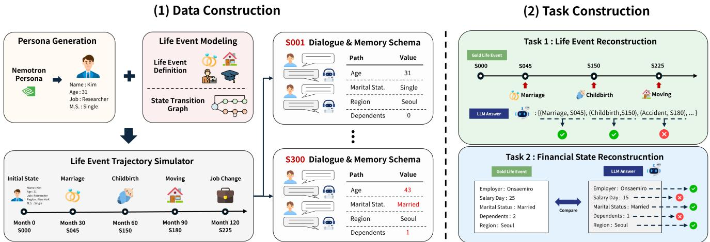
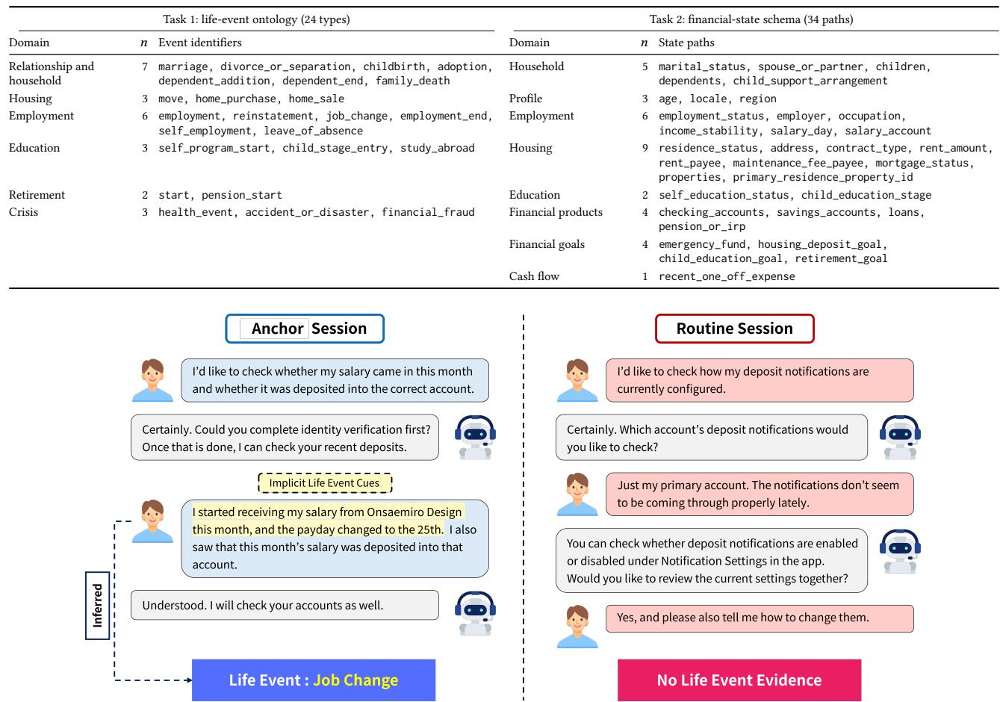
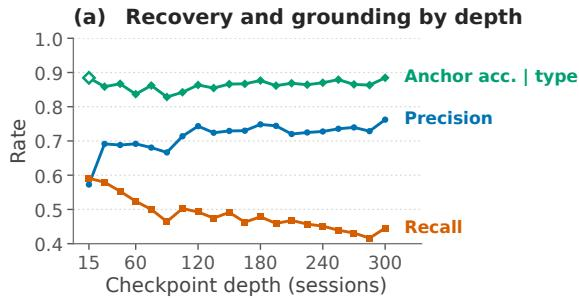
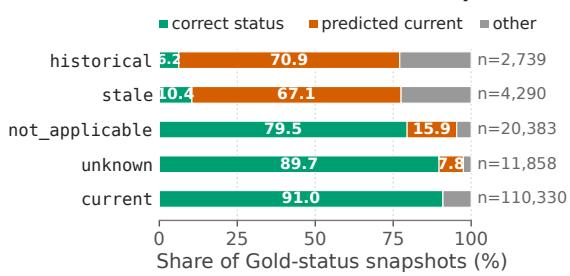

# FinLifeBench: Exhaustive Life-Event History and Financial-State Reconstruction from Longitudinal Banking Dialogue

Hangyeul Lee∗   
mikelee@snu.ac.kr   
Seoul National University   
Seoul, Republic of Korea

Sunmin Kim sunmin\_kim@snu.ac.kr Seoul National University Seoul, Republic of Korea

Juyoung Oh∗   
aven.j@lab.kakaobank.com   
KakaoBank   
Financial Tech Lab   
Seongnam, Republic of Korea   
Jaeik Park   
jaeiksan@snu.ac.kr   
Seoul National University   
Seoul, Republic of Korea   
Jungmin Son   
elena.son@lab.kakaobank.com   
KakaoBank   
Financial Tech Lab   
Seongnam, Republic of Korea   
Jaeyong Ko   
jyko22@snu.ac.kr   
Seoul National University   
Seoul, Republic of Korea   
Hyunkyu Kim   
conor.k@lab.kakaobank.com   
KakaoBank   
Financial Tech Lab   
Seongnam, Republic of Korea

Pilsung Kang† pilsung\_kang@snu.ac.kr Seoul National University Seoul, Republic of Korea

## Abstract

Repeated banking interactions require assistants to maintain com plete, current, and traceable customer records as life changes emerge incidentally in routine requests. Existing benchmarks emphasize question answering, bounded episodes, or targeted recall rather than exhaustive longitudinal reconstruction. We introduce Fin-LifeBench, which evaluates two tasks over the same cumulative dialogue: reconstructing every life-event instance with its firstestablishing session and reconstructing a complete 34-path finan cial state at consecutive checkpoints. The benchmark contains 6,000 eight-turn Korean banking sessions from 20 independent synthetic trajectories, with deterministic, exhaustive gold for 24 event types and 34 state paths and consensus quality assurance. Across eleven LLMs under a full-context condition, event–anchor recall falls from 0.591 at 15 sessions to 0.445 at 300. Errors are driven primarily by omitted events rather than poor anchor localization, while financialstate reconstruction frequently treats superseded or potentially outdated information as current; the best GCA@15 reaches 0.470. Performance on the two reconstruction tasks is only weakly associated. These results show that models can localize evidence for recovered events while still failing to maintain complete and temporally valid longitudinal records.

## CCS Concepts

• Computing methodologies → Discourse, dialogue and pragmatics; • Applied computing → Online banking.

## Keywords

longitudinal dialogue, conversational memory, life-event history reconstruction, financial-state reconstruction, benchmark

## 1 Introduction

Conversational interfaces are becoming increasingly common in digital finance [9, 10]. Across repeated interactions, routine requests may incidentally reveal life events that alter financial needs and invalidate recorded information [29]. A longitudinal assistant must identify these changes, retain their evidence, and update the customer’s state without relying on stale assumptions [2, 5, 25]. In finance, failures have direct service consequences: missed changes may suppress relevant support or recommendations, while stale household, employment, housing, or financial-obligation records can yield unsuitable guidance and contradictory treatment across later interactions. Reliable systems must therefore recover both what changed and which financial facts remain up-to-date, with evidence that makes each update traceable. Single-session success cannot establish this complete, current, and traceable record maintenance [28, 32].

Yet existing benchmarks largely leave this requirement untested. They emphasize financial question answering and retrieval [6, 7, 34], request-level understanding [4, 33], bounded state tracking [3], or targeted memory retrieval [14, 23, 30, 31]. Prior work establishes state-first generation, provenance-aware evolution, direct hiddenstate recovery, and lifecycle- or conflict-level memory diagnosis. To our knowledge, no prior benchmark requires generative, schemacomplete reconstruction ofboth a grounded life-event history and the corresponding structured financial state at repeated checkpoints.

To address this gap, we introduce FinLifeBench, a benchmark for information reconstruction in longitudinal financial dialogue. Each benchmark trajectory follows a curated, persona-conditioned sequence of life events, yielding deterministic gold annotations: a known life-event history, financial states, and corresponding evidence provenances. We define two reconstruction tasks from these annotations. Task 1 asks a model to reconstruct life-event history along with each first-establishing session. Task 2 asks it to

Table 1: Coverage of benchmark design and evaluation prop- erties. ✓ denotes direct coverage, △ related but indirect coverage, and ✗ no explicit coverage. Full-state reconstruction requires every schema field to be emitted at each checkpoint; benchmarks that query a sampled subset of fields, or that evaluate by multiple choice, receive △ or ✗. Life-event tracking requires events to be an evaluation target, not only a generative driver of state change.

<table><tr><td></td><td colspan="2">Data design</td><td colspan="2">Evaluation target</td><td>Domain</td></tr><tr><td>Benchmark</td><td>Implicit state- change inference</td><td>State-first trajectory generation</td><td>Life-event tracking</td><td>Full-state reconstruc- tion</td><td>Financial task</td></tr><tr><td>LoCoMo [23]</td><td>△</td><td>△</td><td>√</td><td>x</td><td>x</td></tr><tr><td>LoCoMo-Plus [20]</td><td>√</td><td>x</td><td>x</td><td>x</td><td>X</td></tr><tr><td>MemoryAgentBench [14]</td><td>X</td><td>x</td><td>x</td><td>x</td><td>X</td></tr><tr><td>LongMemEval [30]</td><td>△</td><td>x</td><td>△</td><td>x</td><td>x</td></tr><tr><td>PersonaMem [15]</td><td>V</td><td>△</td><td>△</td><td>x</td><td>x</td></tr><tr><td>AMemGym [16]</td><td>√</td><td>√</td><td>x</td><td>△</td><td>x</td></tr><tr><td>HorizonBench [19]</td><td></td><td></td><td>△</td><td>x</td><td>X</td></tr><tr><td>DynamicMem [31]</td><td>V</td><td></td><td>△</td><td>△</td><td>x</td></tr><tr><td>MEMPROBE [22]</td><td>x</td><td></td><td>x</td><td>Δ</td><td>x</td></tr><tr><td>FINLIFEBENCH</td><td>J</td><td></td><td>1</td><td>√</td><td>V</td></tr></table>

reconstruct the full financial state across 34 state paths. Figure 1 gives an overview of the framework.

Across eleven LLMs given the complete dialogue history available at each checkpoint, we find that the main challenge is maintaining a complete and temporally valid record. For life-event history reconstruction, models increasingly omit previously established events as the dialogue grows, even though they usually identify the correct anchor session for life events they had reconstructed. For financial-state reconstruction, models frequently treat superseded or potentially outdated information as still current. Moreover, model performance on the two tasks is only weakly associated.

Our contributions are threefold:

• We introduce FinLifeBench, a benchmark of 6,000 Korean banking sessions for reconstructing cumulative life-event history and financial state from long multi-session banking dialogues, with metrics for completeness, provenance, and temporal validity.

• We formulate two schema-complete reconstruction tasks over the same cumulative dialogue: (1) reconstructing every occurred life-event instance with its first-establishing session and (2) reconstructing all 34 financial-state paths at consecutive checkpoints.

• Through a systematic evaluation of eleven LLMs, we show that longitudinal reconstruction failures are not captured by a single notion of accuracy: incompleteness, evidence localization, and temporal-state maintenance behave diferently across the two reconstruction objectives.

## 2 Related Work

Long-horizon benchmarks cover recall, temporal reasoning, incremental updating, and evolving profiles. Table 1 compares representative works. Beyond these entries, MINTEval studies interference and forgetting, while CloneMem uses top-down coherent trajectories for evolving personal states [13, 17].

State-first construction with change-level provenance is by now standard [16, 19, 31]; what still varies is how much of the resulting state an evaluation actually inspects. HorizonBench is closest to our design. It generates dialogues from a structured mental-state graph and records the triggering event behind every preference change, and it reports that models across families anchor on pre-evolution values [19]. DynamicMem also builds state first, but keeps the traces implicit and scores profile completion at checkpoints [31]. AMem-Gym predefines both profiles and state-evolution trajectories, then lets the agent interact on-policy [16]. In each case the model is asked about part of the state: a sampled subset of fields, or a recognition choice among candidates. MemOps and MemConflict narrow the target further still, probing individual lifecycle operations [11] and query-conditioned temporal validity through retrieval-and-ranking diagnostics [27]. FinLifeBench asks for the whole record. At every checkpoint of every banking trajectory the model must emit each schema field generatively, and we score all of it at the pair and cell level, with no query to indicate where to look.

Task 2 has a direct analogue in MEMPROBE, which recovers a hidden 31-dimensional user state from the memory artifact an agent produces after interacting [22]. The input is what separates us: we reconstruct from the dialogue itself, at 20 consecutive checkpoints, and pair the state with a life-event history in which every instance is linked back to the session that first establishes it.

Retrieval and persistent-memory systems select, consolidate, and overwrite evidence through typically query-conditioned interfaces [8, 18, 26]. FinLifeBench instead provides every model with the same static dialogue prefix and evaluates exhaustive reconstruction; adapting these systems would require explicit coverage and statesynchronization mechanisms. Of-policy static prefixes are known to introduce reuse bias relative to on-policy interaction [16]; we use them so that all eleven models receive identical evidence, while leaving memory-management policies outside the evaluation scope.

## 3 FinLifeBench Dataset

FinLifeBench comprises 20 persona-conditioned trajectories, each with 300 banking sessions, 20 life-event instances, and state defined over a common 34-path schema, for 6,000 sessions in total. Fin-LifeBench follows a synthetic pipeline in which personas, initial financial states, and life-event trajectories are constructed before their Korean banking dialogues. This ordering ensures deterministic life-event histories, checkpoint states, and evidence provenance.

## 3.1 Persona and Life-Event Trajectory Generation

We draw 20 seed personas from NVIDIA’s Korean Nemotron Personas dataset [24]. The age-band quotas follow aggregate age distributions from KakaoBank’s digital banking service: four personas in their 20s, six in their 30s, six in their 40s, and four in their 50s. Raw personas are deterministically normalized into typed demographic, household, employment, housing, financial, and dialoguestyle fields, from which we instantiate the initial 34-path state and standing financial actions. State cells distinguish unknown from inapplicable values and retain revision histories.

The life-event ontology and financial-state schema are summarized in Table 2. Both focus on persistent, dialogue-recoverable information relevant to financial servicing: Task 1 captures life changes that may alter customer needs or invalidate prior records, whereas Task 2 represents profile fields whose values or validity may change accordingly. Their relationship is many-to-many: one event may update several state paths, and a path may be afected by diferent events. The two sides of the table are therefore independent inventories rather than row-wise mappings.

  
Figure 1: Overview of FinLifeBench construction and evaluation. A persona-conditioned life-event trajectory determines the longitudinal dialogues and financial-state histories. Task 1 reconstructs all event–anchor pairs, whereas Task 2 reconstructs the com lete financial state at each check oint.

We generate life-event trajectories from a finite-state transition graph, which keeps them internally consistent and reproducible across runs. Its edges encode two kinds of constraint: precedence, so that divorce cannot precede marriage, and minimum intervals between dependent events, such as the gap from pregnancy to childbirth. Recurrent events appear as loops, each carrying its own repeat limit and cooldown period. For each persona we select an entry point partway through the graph, so that trajectories begin mid-life rather than at a canonical origin, sample a subgraph reachable from that point, and linearize it into an ordered event sequence. The simulator then re-checks every transition against the evolving state and applies each admitted event to the life state, financial memory, and standing actions.

## 3.2 Dialogue Planning and Implementation

A deterministic planner converts each trajectory into 20 chronological windows of 15 sessions, for 300 sessions in total. Each window corresponds to one occurred event instance and contains exactly one anchor session: the first-establishing session for that instance. The remaining positions contain state-compatible non-anchor sessions. This controlled construction standardizes the amount and spacing of observable positive evidence.

Non-anchor sessions comprise routine sessions with no event or state update; hard negatives that resemble evidence but preserve the state; consequence follow-ups surfacing a downstream result of an established event; stale-recall follow-ups contrasting an old value with the current one; and cancellation evidence documenting withdrawal of a planned change that is not included in the gold lifeevent history. These categories test whether models distinguish new occurrences from ordinary activity, near misses, later references, and cancelled plans.

For each session, the planner fixes the banking task, cue placement and grounding, expected state operations, and evaluator-only provenance and safety constraints. Claude Sonnet 5 generated each session as an eight-turn mobile- or internet-banking conversation in which event evidence appears incidentally during the customer’s banking task. Candidates must pass deterministic schema, grounding, safety, output-contract, and semantic validation; invalid candidates are revised or regenerated within a fixed retry limit. Figure 2 contrasts a job-change anchor based on salary-source evidence with a routine session that supports neither a new event nor a state update.

## 3.3 Quality Control and Corpus Freezing

Quality control combines deterministic validation with exhaustive semantic review. Every plan and accepted session is checked for the eight-turn and digital-channel contracts, customer-turn grounding, event recoverability, state-update consistency, hard-negative noupdate behavior, assistant leakage, high-risk safety, and surfaceform diversity. A complete 300-session trajectory must pass these audits before full production.

All 6,000 sessions were annotated by Claude Opus 5 under a fixed seven-criterion rubric. Human efort was concentrated where it carries the most evidential weight rather than spread across exhaustive review. First, an automated screen for near-direct disclosure flagged 180 sessions (3.0% of the corpus); all 180 were manually revised by three annotators (two Ph.D.-level researchers and one banking practitioner) before the corpus was frozen. Second, the 400 anchor sessions were each reviewed in full by the same annotators, who assessed evidence leakage, item dificulty, and whether the target state was inferable from the dialogue alone; 15 sessions were revised or regenerated as a result. Domain validity of the rubric and schema was reviewed by three banking-industry practitioners. We will release the frozen corpus under the Apache License 2.0 together with its annotations, prompts, schema, and scoring code.

<table><tr><td></td><td>Task 1: life-event ontology (24 types)</td><td colspan="2">Task 2: financial-state schema (34 paths)</td></tr><tr><td>Domain</td><td>n Event identifiers</td><td>Domain</td><td>n State paths</td></tr><tr><td>Relationship and household</td><td>1 marriage, divorce_or_separation, childbirth, adoption, dependent_addition, dependent_end, family_death</td><td>Household</td><td>5 marital_status, spouse_or_partner, children, dependents, child_support_arrangement</td></tr><tr><td>Housing</td><td>3 move, home purchase, home sale</td><td>Profile</td><td>3 age, locale, region</td></tr><tr><td>Employment</td><td>6 employment, reinstatement, job_change, employment_end,</td><td>Employment</td><td>6 employment_status, employer, occupation,</td></tr><tr><td>Education</td><td>self_employment, leave_of_absence 3 self_program_start, child_stage_entry, study_abroad</td><td>Housing</td><td>income_stability, salary_day, salary_account 9 residence_status, address, contract_type, rent_amount,</td></tr><tr><td></td><td></td><td></td><td>rent_payee, maintenance_fee_payee, mortgage_status, properties, primary_residence_property_id</td></tr><tr><td>Retirement Crisis</td><td>2 start, pension_start 3 health_event, accident_or_disaster, financial_fraud</td><td>Education Financial products</td><td>2 self_education_status, child_education_stage 4 checking_accounts, savings_accounts, loans,</td></tr><tr><td></td><td></td><td></td><td>pension_or_irp</td></tr><tr><td></td><td></td><td>Financial goals</td><td>emergency_fund, housing_deposit_goal,</td></tr><tr><td></td><td></td><td>Cash flow</td><td>child_education_goal, retirement_goal</td></tr></table>

Table 2: Complete life-event ontology and financial-state schema. Model-visible labels are Korean.  
  
Figure 2: An anchor session (left) and a routine session (right). The left dialogue supports a job-change inference from changes in salary source and payday. Visual annotations are excluded from model input. Dialogue is shown in English translation; model input is Korean.

## 4 Benchmark Tasks

## 4.1 Task 1: Grounded Life-Event History Reconstruction

At each 15-session checkpoint $t \in \{ 1 5 , 3 0 , . . . , 3 0 0 \}$ }, Task 1 reconstructs the cumulative grounded life-event history:

$$
\mathcal { H } _ { t } = \{ \{ ( e _ { i } , a _ { i } ) \} \} _ { i = 1 } ^ { N _ { t } } , \qquad \widehat { \mathcal { H } } _ { t } = \{ \{ ( \widehat { e } _ { j } , \widehat { a } _ { j } ) \} \} _ { j = 1 } ^ { \widehat { N } _ { t } } .
$$

Here, $\mathcal { H } _ { t }$ and $\widehat { \mathcal { H } } _ { t }$ denote the gold and predicted multisets of event– anchor pairs, respectively. Each $e _ { i }$ is an occurred life-event type and $a _ { i }$ is the earliest model-visible session whose customer utterances establish that event instance; hats denote predicted quantities, and $N _ { t }$ and $\widehat { N } _ { t }$ are the gold and predicted numbers of event instances.

The model receives all � consecutive sessions through the checkpoint together with the life-event ontology. The prompt neither states $N _ { t }$ nor discloses the one-event-per-window construction rule.

## 4.2 Task 2: Complete Financial-State Reconstruction

At the same checkpoints, Task 2 reconstructs the complete financial state:

$$
\begin{array} { r l } & { S _ { t } = \left\{ p \mapsto ( v _ { p , t } , z _ { p , t } , E _ { p , t } ) : p \in \mathcal { P } \right\} , } \\ & { \widehat { S } _ { t } = \left\{ p \mapsto ( \widehat { v } _ { p , t } , \widehat { z } _ { p , t } , \widehat { E } _ { p , t } ) : p \in \mathcal { P } \right\} . } \end{array}
$$

where $\mathcal { P }$ is the set of 34 paths in Table 2. For each path $p , v _ { p , t } , z _ { p , t }$ and $E _ { p , t }$ denote the gold normalized value, validity status, and supporting model-visible session identifiers, respectively; hats denote their predicted counterparts. The request contains the rendered $S _ { 0 0 0 }$ state, all model-visible sessions through the checkpoint, all path names, and the machine-readable output schema. Paths whose checkpoint state difers from �000 require at least one evidence identifier, whereas paths equal to their �000 state require an empty evidence list. Paths with unknown or not\_applicable status may not be omitted, and each checkpoint is evaluated through a fresh request without earlier model predictions.

Gold states use five validity statuses derived from registered operations and revisions: current denotes the latest supported value; historical a superseded value; stale a value that is plausibly invalidated but not replaced; unknown the absence of establishing evidence; and not\_applicable a path excluded by the current state configuration. The model output schema additionally permits needs\_verification as an abstention status.

## 5 Experiments

## 5.1 Models and Inference Protocol

We evaluate eleven LLMs under a full-context condition, meaning that the client supplies every dialogue session through the model: GPT 5.6 Sol, GPT 5.6 Terra, and GPT 5.6 Luna; Claude Opus 4.8 and Claude Sonnet 4.6; Gemini 3.1 Pro and Gemini 3.5 Flash; Llama 4 Maverick; GPT-OSS 120B; Qwen 3.5 122B A10B; and Qwen 3.6 35B A3B. Each model produces 400 outputs per task, for 8,800 predictions in total.

All models receive the same dialogue sessions, taxonomy or schema, and output contract through fresh requests without future sessions or earlier predictions; fallbacks and output repair are disabled. Each of the 8,800 requests contains exactly the sessions visible at its checkpoint. The same input prompt may map to different input lengths across model tokenizer: 125k tokens under Claude tokenizer, 72k under GPT, 66k under Llama, and 64k under Qwen. Peak client-side context utilization is therefore 55.2% of the published endpoint limit at the tightest endpoint (GPT-OSS 120B, 131,072 tokens) and below 25% elsewhere; no constructed prefix exceeded the published context limit.

All models were queried between 2026-07-15 and 2026-08-01. We used provider-default sampling and a 20,000-token output cap for every request. Reasoning-capable models used ‘low’ reasoning setting. These settings are provider-defined and not calibrated across model families.

## 5.2 Evaluation Metrics

## 5.2.1 Task 1 Metrics.

Event–Anchor F1 (EA-F1). Event–Anchor F1 (EA-F1, ↑) is

$$
{ P } _ { t } = \frac { \vert \widehat { \mathcal { H } } _ { t } \cap _ { \mathrm { m } } \mathcal { H } _ { t } \vert } { \vert \widehat { \mathcal { H } } _ { t } \vert } , \quad { R } _ { t } = \frac { \vert \widehat { \mathcal { H } } _ { t } \cap _ { \mathrm { m } } \mathcal { H } _ { t } \vert } { \vert \mathcal { H } _ { t } \vert } , \quad \mathrm { E A { - } } \mathrm { F } 1 _ { t } = \frac { 2 { P } _ { t } R _ { t } } { { P } _ { t } + R _ { t } } ,\tag{1}
$$

where $\cap _ { \mathrm { m } }$ denotes multiset intersection. We set $P _ { t } = 0$ for an empty prediction; surplus duplicates remain false positives.

Exact History Match (EHM).. Exact History Match (EHM, ↑) is

$$
\mathrm { E H M } _ { t } = 1 \Big [ \widehat { \mathcal { H } } _ { t } = \mathcal { H } _ { t } \Big ] .\tag{2}
$$

## 5.2.2 Task 2 Metrics.

Granular Change Accuracy (GCA@15). Because most state paths remain unchanged between adjacent checkpoints, snapshot accuracy alone can obscure whether models apply required updates correctly. We therefore use GCA@15 (↑), applying Granular Change Accuracy [1] to transitions between checkpoints 15 sessions apart. Each path is treated as a slot and its normalized value–status pair as the slot value. GCA distinguishes correct updates from wrong-value, missed, and spurious changes.

Checkpoint State Accuracy (CSA). Checkpoint State Accuracy (CSA, ↑) measures cell-level snapshot correctness:

$$
\mathrm { C S A } _ { t } = \frac { 1 } { | \mathcal { P } | } \sum _ { \mathfrak { p } \in \mathcal { P } } \mathbf { 1 } \left[ ( \widehat { v } _ { \mathfrak { p } , t } , \widehat { z } _ { \mathfrak { p } , t } ) = ( v _ { \mathfrak { p } , t } , z _ { \mathfrak { p } , t } ) \right] , \qquad | \mathcal { P } | = 3 4 .\tag{3}
$$

Exact Snapshot Match (ESM). Exact Snapshot Match (ESM, ↑) is 1 only when all 34 predicted value–status pairs match gold at a checkpoint.

Evidence Recall (ER). GCA defines change relative to the preceding checkpoint, whereas evidence eligibility is defined relative to �000. Evidence Recall (ER, ↑) is computed over the 860 of 1,028 gold transition changes per model whose resulting snapshot carries a gold evidence identifier. The remaining 168 are reversions to their $S _ { 0 0 0 }$ value, for which the gold evidence list is empty under the snapshot contract, and are therefore excluded from ER. ER is recall-only and does not penalize surplus citations.

## 5.2.3 Shared Metric.

Schema Validity (SV). Schema Validity (SV, ↑) measures compliance with the task-specific output contract. For Task 1, valid outputs must be parseable and conform to the event–anchor schema. For Task 2, valid outputs must be parseable and contain exactly one record for each of the 34 state paths with a valid value type and status.

## 5.2.4 Analysis Metrics.

Completeness. We analyze checkpoint-wise precision and recall and fit per-model OLS regressions of predicted history size $\widehat { N } _ { t }$ on gold history size ��.

Type recovery and anchor localization. Type-only recall ignores anchors before multiset matching, while conditional anchor accuracy measures exact-anchor accuracy among type-recovered gold instances.

Evidence and temporal-validity diagnostics. Predicted session identifiers are joined post hoc to corpus event links to classify cited evidence. For Task 2, we report value, status, and joint accuracy separately.

Cross-task analysis. For each model and event instance, evaluation begins at the first checkpoint containing its gold anchor and continues while at least one gold state path remains attributed to that instance; a later overwrite ends the attribution. Task 1 requires the exact event–anchor pair, whereas Task 2 requires the correct value and status on all currently attributed paths, excluding evidence. Of 88,000 candidates, 46,200 are anchor-eligible and 22,583 retain at least one attributed path; zero-path groups are omitted and invalid outputs remain incorrect.

Aggregation and uncertainty. Scores are aggregated within trajectories and then across 20 trajectories; GCA@15 uses pooled transition counts. Confidence intervals use 10,000 shared trajectorycluster percentile-bootstrap resamples (seed 20260725), with checkpoints nested within trajectories. Rank intervals recompute modellevel EA-F1, GCA@15, and correlations for the fixed eleven-model set in each resample.

## 6 Results

## 6.1 Task 1: Life-Event History Coverage Declines with Depth

Gemini 3.1 Pro has the highest EA-F1 point estimate (0.748; Table 3). Between checkpoints 15 and 300, model-macro precision rises from 0.573 to 0.762, while recall falls from 0.591 to 0.445 and mean per-output EA-F1 falls from 0.579 to 0.532.1 Empty predictions decrease from 62 of 220 outputs (28.2%) to 5 of 220 (2.3%), while precision among non-empty outputs remains nearly unchanged (0.80 to 0.78). Thus, models increasingly return some event history but cover a decreasing share of the gold history: underprediction grows from 28.2% of model–trajectory outputs to 98.2%. Per-model OLS slopes average 0.524 but vary substantially: high-scoring models have slopes of 0.71–0.85 $( R ^ { 2 } \ge 0 . 8 2 )$ , whereas the weakest have slopes of 0.05–0.23 $( R ^ { 2 } \leq 0 . 1 4 )$

Separating event reconstruction from anchor localization shows that coverage is the dominant failure. Pooled type-only recall is 0.533 against 0.462 for full event–anchor pairs. Of 46,200 gold instances, 21,574 (46.7%) are missing outright, whereas 3,306 (7.2%) are type-recovered but assigned the wrong anchor, a 6.5-fold diference. Among 24,626 type-recovered instances, conditional anchor accuracy is 0.866. Across depth, it rises from 0.859 at checkpoint 30 to 0.884 at checkpoint 300 even as pair recall falls from 0.580 to 0.445 (Fig. 3a).

Of the 3,306 wrong-anchor cases, 1,129 (34.2%) cite a later session linked to the same event occurrence rather than the session that first establishes it. These cases are only 2.4% of all 46,200 gold instances; the median absolute ofset is 14 sessions, about one 15-session window.

Neither distractors nor the strict earliest-session criterion explains much of the gap. Predicted anchors rarely fall on distractor sessions: 90.2% of predicted pairs point to sessions linked to actual occurred events, hard negatives produce only 33 false positives per 10,000 exposures, and cancellation-anchor sessions are selected just 3 times among 27,467 predicted pairs. Allowing any session linked to the same event occurrence raises anchor accuracy among type-recovered instances only from 0.866 to 0.912.

## 6.2 Task 2: State Updates and Temporal Validity

Claude Opus 4.8 attains the highest GCA@15 and CSA point estimates (0.470 and 0.801); ESM peaks at 0.030 because all 34 cells must match. Although 92.44% of gold transitions are unchanged, Initial Copy reaches 0.669 CSA and 0.010 ESM but only 0.177 GCA@15. Of 11,308 changed transitions, models reconstruct 59.8% correctly; 18.9% remain unchanged, 20.5% are updated incorrectly, and 0.8% are invalid. Of 138,292 unchanged transitions, 74.0% are preserved, 13.9% remain previously wrong, 11.6% receive spurious updates, and 0.5% are invalid. Models thus both miss required changes and corrupt stable state.

(b) Gold-status outcome profile  
  
Figure 3: Diagnostics. (a) Model-macro event–anchor preci-sion, recall, and conditional anchor accuracy by checkpoint depth. Precision is zero for empty predictions. (b) Status outcomes over 149,600 snapshots; gold needs\_verification has no support and is omitted, although models predict it 1,449 times.

Across models, pooled errors in financial-state updates are dominated by spurious updates because unchanged cases outnumber changed cases by roughly 12:1, although misses are conditionally more frequent (18.9% vs. 11.6%).

Figure 3(b) exposes temporal-validity failure masked by pooled accuracy. Across 149,600 snapshots, value, status, and joint accuracy are 79.7%, 85.4%, and 73.0%. Yet current supplies 110,330 cases: always predicting it yields 73.8% status accuracy, so the observed score adds 11.6 points of lifecycle discrimination. Gold historical and stale recall is only 6.2% and 10.4%, with 70.9% and 67.1% predicted as current. Joint accuracy exceeds the 68.1% product-ofmarginals reference, indicating concentrated errors.

## 7 Analysis

## 7.1 Omission and Status Collapse Dominate Mis-grounding

The dominant failure mode difers by task. On Task 1, event coverage is the main bottleneck: pooled pair recall is 0.462, whereas conditional anchor accuracy reaches 0.866 once the event type is recovered. Every model leaves more gold pairs unmatched than it produces unmatched predictions, with missed:spurious ratios from 1.6:1 to 28.0:1. On Task 2, value recovery is substantially stronger (0.797) than lifecycle tracking, with recall of only 0.062 for historical and 0.104 for stale; pooled state-transition errors are dominated by spurious updates rather than missed changes.

Table 3: End-to-end results over 400 checkpoints per model and task. Bold and underlined values denote the best and second-best point estimates, respectively. Initial Copy has no life-event history or citations by construction, hence the dashes.
<table><tr><td rowspan="2">Model</td><td colspan="3">Task 1: life-event history</td><td colspan="4">Task 2: financial state</td></tr><tr><td>EA-F1 ↑ [95% CI]</td><td>EHM ↑</td><td>SV ↑</td><td>GCA@15 ↑ [95% CI]</td><td>CSA ↑</td><td>ER↑</td><td>SV ↑</td></tr><tr><td>Initial Copy</td><td></td><td>一</td><td>一</td><td>0.177</td><td>0.669</td><td>一</td><td>一</td></tr><tr><td>GPT 5.6 Sol</td><td>0.679 [0.614, 0.740]</td><td>0.068</td><td>1.000</td><td>0.413 [0.392, 0.433]</td><td>0.749</td><td>0.881</td><td>0.995</td></tr><tr><td>GPT 5.6 Terra</td><td>0.663 [0.605, 0.720]</td><td>0.065</td><td>0.993</td><td>0.411 [0.395, 0.428]</td><td>0.747</td><td>0.855</td><td>0.990</td></tr><tr><td>GPT 5.6 Luna</td><td>0.629 [0.576, 0.679]</td><td>0.065</td><td>0.993</td><td>0.461 [0.436, 0.484]</td><td>0.771</td><td>0.786</td><td>0.978</td></tr><tr><td>Claude Opus 4.8</td><td>0.534 [0.475, 0.586]</td><td>0.050</td><td>0.983</td><td>0.470 [0.443, 0.497]</td><td>0.801</td><td>0.848</td><td>0.965</td></tr><tr><td>Claude Sonnet 4.6</td><td>0.720 [0.658, 0.774]</td><td>0.083</td><td>0.998</td><td>0.379 [0.357, 0.402]</td><td>0.711</td><td>0.866</td><td>0.970</td></tr><tr><td>Gemini 3.1 Pro</td><td>0.748 [0.690, 0.799]</td><td>0.113</td><td>1.000</td><td>0.438 [0.418, 0.459]</td><td>0.767</td><td>0.851</td><td>0.988</td></tr><tr><td>Gemini 3.5 Flash</td><td>0.488 [0.441, 0.533]</td><td>0.053</td><td>0.995</td><td>0.412 [0.389, 0.435]</td><td></td><td>0.754 0.773</td><td>0.978</td></tr><tr><td>Qwen 3.5 122B A10B</td><td>0.641 [0.580, 0.697]</td><td>0.093</td><td>1.000</td><td>0.452 [0.436, 0.469] 0.435 [0.422, 0.449]</td><td></td><td>0.681 0.664</td><td>0.990</td></tr><tr><td>Qwen 3.6 35B A3B</td><td>0.473 [0.425, 0.518]</td><td>0.065 0.050</td><td>1.000 0.978</td><td>0.321 [0.298, 0.344]</td><td></td><td>0.699 0.574 0.393</td><td>0.998 0.963</td></tr><tr><td>Llama 4 Maverick</td><td>0.357 [0.309, 0.402] 0.124 [0.084, 0.167]</td><td>0.018</td><td>1.000</td><td>0.249 [0.223, 0.273]</td><td></td><td>0.672 0.674</td><td></td></tr><tr><td>GPT-0SS 120B</td><td></td><td></td><td></td><td></td><td></td><td>0.036</td><td>1.000</td></tr></table>

Conditional anchor accuracy remains high as pair recall falls, unlike the broad evidence-locatability degradation reported in longcontext position probes [12, 21]. This contrast further indicates that Task 1 failures arise primarily from omitted events rather than inability to localize evidence for recovered events.

## 7.2 The Two Reconstruction Objectives Are Only Weakly Associated

Across 22,583 matched observations (2,053 per model), both tasks are correct in 23.6%, both wrong in 33.2%, Task 1 only in 24.1%, and Task 2 only in 19.1%. Exact grounding neither guarantees correct attributed paths nor is necessary for recovery from later evidence.

For the fixed eleven-model set, EA-F1 and GCA@15 associate weakly: Spearman $\rho = 0 . 2 9 1$ [0.164, 0.409] and Kendall $\tau _ { b } = 0 . 1 6 4$ [0.091, 0.309], computed on pooled GCA@15. The association is carried by two influential points: leave-one-out over all eleven models drops � to 0.055 when either of the two weakest models is removed and reaches at most 0.430 otherwise. Mean absolute rank displacement between tasks is 3.1 of 11 positions.

These diferences are not explained by output-format failures. SV ranges from 0.978 to 1.000 for Task 1 and from 0.963 to 1.000 for Task 2, yet GCA@15 never exceeds 0.470; perfectly schemavalid GPT-OSS 120B reaches only 0.124 EA-F1, 0.249 GCA@15, and 0.036 ER. Together, the results indicate that event-history and financial-state reconstruction capture distinct aspects of longitudi nal reliability.

## 8 Limitations

The synthetic benchmark may not reproduce real distributions, ambiguity, or stakes; personas and event rates target coverage, not representativeness. Sessions were generated by Claude Sonnet 5 and audited by Claude Opus 5, neither of which is among the eleven evaluated models, so no evaluated model was scored on its own generations or judged by itself.

We supply static prefixes rather than letting systems manage their own memory, so we measure long-context reconstruction rather than memory-management policy. One event per 15-session window controls density but may reveal gold event cardinality to benchmark-aware systems. Because the dialogue is Korean, crossmodel diferences partly reflect Korean language proficiency. Evidence is scored separately from value and status. Comparisons are observational, and no downstream decision is evaluated.

## 9 Conclusion

Prior long-horizon benchmarks leave exhaustive, checkpoint-wise reconstruction of a grounded life-event history and a complete financial state untested. FinLifeBench separates completeness, provenance, and temporal validity for this requirement. Across eleven LLMs, the recurring failures are complementary rather than shared: life-event histories grow incomplete as the dialogue deepens even though recovered events are usually anchored to the correct session, whereas financial-state reconstruction both misses required updates and overwrites stable cells, and reports superseded or plausibly invalidated values as current. The best state reconstruction exceeds a dialogue-blind copy baseline yet remains far short of a usable record, and the two tasks show no robust rank association across models. Even accurately grounded outputs therefore require completeness and validity checks before they can serve as customer records.

## Ethics and Privacy Statement

The benchmark uses fictional personas and synthetic conversations; no real customer records are involved. The capability it measures—inferring life changes from incidental cues—is itself privacy-sensitive, and systems built on it should obtain consent before updating user profiles and require confirmation before consequential actions. Event rates in the corpus are design parameters, not population statistics, and must not be used for profiling, eligibility, or pricing.

## References

[1] Taha Aksu and Nancy Chen. 2024. Granular Change Accuracy: A More Accurate Performance Metric for Dialogue State Tracking. In Proceedings ofthe 2024 Joint International Conference on Computational Linguistics, Language Resources and Evaluation (LREC-COLING 2024). ELRA and ICCL, Torino, Italia, 7939–7948.

[2] Sanghwan Bae, Donghyun Kwak, Soyoung Kang, Min Young Lee, Sungdong Kim, Yuin Jeong, Hyeri Kim, Sang-Woo Lee, Woomyoung Park, and Nako Sung. 2022. Keep Me Updated! Memory Management in Long-term Conversations. In Findings ofthe AssociationforComputational Linguistics: EMNLP2022. Association for Computational Linguistics, Abu Dhabi, United Arab Emirates, 3769–3787. doi:10.18653/v1/2022.findings-emnlp.276

[3] Paweł Budzianowski, Tsung-Hsien Wen, Bo-Hsiang Tseng, Iñigo Casanueva, Stefan Ultes, Osman Ramadan, and Milica Gašić. 2018. MultiWOZ - A Large-Scale Multi-Domain Wizard-of-Oz Dataset for Task-Oriented Dialogue Modelling. In Proceedings of the 2018 Conference on Empirical Methods in Natural Language Processing. Association for Computational Linguistics, Brussels, Belgium, 5016– 5026. doi:10.18653/v1/D18-1547

[4] Iñigo Casanueva, Tadas Temčinas, Daniela Gerz, Matthew Henderson, and Ivan Vulić. 2020. Eficient Intent Detection with Dual Sentence Encoders. In Proceedings ofthe 2nd Workshop on Natural Language Processing for Conversational AI. Association for Computational Linguistics, Online, 38–45. doi:10.18653/v1/2020. nlp4convai-1.5

[5] Tiantian Chen, Jiaqi Lu, Ying Shen, and Lin Zhang. 2026. ES-MemEval: Bench marking Conversational Agents on Personalized Long-Term Emotional Support. In Proceedings ofthe ACM Web Conference 2026 (United Arab Emirates) (WWW ’26). Association for Computing Machinery, New York, NY, USA, 5810–5821. doi:10.1145/3774904.3792143

[6] Zhiyu Chen, Wenhu Chen, Charese Smiley, Sameena Shah, Iana Borova, Dylan Langdon, Reema Moussa, Matt Beane, Ting-Hao Huang, Bryan Routledge, and William Yang Wang. 2021. FinQA: A Dataset of Numerical Reasoning over Financial Data. In Proceedings ofthe 2021 Conference on Empirical Methods in Natural Language Processing. Association for Computational Linguistics, Online and Punta Cana, Dominican Republic, 3697–3711. doi:10.18653/v1/2021.emnlp main.300

[7] Zhiyu Chen, Shiyang Li, Charese Smiley, Zhiqiang Ma, Sameena Shah, and William Yang Wang. 2022. ConvFinQA: Exploring the Chain of Numerical Reasoning in Conversational Finance Question Answering. In Proceedings ofthe 2022 Conference on Empirical Methods in Natural Language Processing. Association for Computational Linguistics, Abu Dhabi, United Arab Emirates, 6279–6292. doi:10.18653/v1/2022.emnlp-main.421

[8] Prateek Chhikara, Dev Khant, Saket Aryan, Taranjeet Singh, and Deshraj Yadav. 2025. Mem0: Building Production-Ready AI Agents with Scalable Long-Term Memory. In ECAI 2025 - 28th European Conference on Artificial Intelligence, 25- 30 October 2025, Bologna, Italy - Including 14th Conference on Prestigious Applications of Intelligent Systems (PAIS 2025) (Frontiers in Artificial Intelligence and Applications, Vol. 413). IOS Press, Amsterdam, The Netherlands, 2993–3000. doi:10.3233/FAIA251160

[9] Xin Jie Chua, Jeraelyn Ming Li Tan, Jia Xuan Tan, Soon Chang Poh, Yi Xian Goh, Debbie Hui Tian Choong, Foong Chee Mun, Sze Jue Yang, and Chee Seng Chan. 2025. Banking Done Right: Redefining Retail Banking with Language-Centric AI. In Proceedings of the 2025 Conference on Empirical Methods in Natural Language Processing: Industry Track. Association for Computational Linguistics, Suzhou (China), 646–658. doi:10.18653/v1/2025.emnlp-industry.45

[10] Shailja Gupta, Rajesh Ranjan, and Surya Narayan Singh. 2025. Comprehensive Framework for Evaluating Conversational AI Chatbots. ArXiv abs/2502.06105 (2025).

[11] Xixuan Hao, Zeyu Zhang, Zehao Lin, Yihang Sun, Ziliang Guo, Xichong Zhang, Yuxuan Liang, Feiyu Xiong, and Zhiyu Li. 2026. MemOps: Benchmarking Life cycle Memory Operations in Long-Horizon Conversations. arXiv preprint

arXiv:2607.12893. arXiv:2607.12893 [cs.AI] doi:10.48550/arXiv.2607.12893

[12] Cheng-Ping Hsieh, Simeng Sun, Samuel Kriman, Shantanu Acharya, Dima Rekesh, Fei Jia, and Boris Ginsburg. 2024. RULER: What’s the Real Context Size of Your Long-Context Language Models?. In First Conference on Language Modeling.

[13] Sen Hu, Zhiyu Zhang, Yuxiang Wei, Xueran Han, Zhenheng Tang, Ronghao Chen, and Huacan Wang. 2026. CloneMem: Benchmarking Long-Term Memory for AI Clones. In Proceedings ofthe 64th Annual Meeting ofthe Association for Computational Linguistics (Volume 1: Long Papers). Association for Computational Linguistics, San Diego, California, United States, 33571–33602. doi:10.18653/v1/ 2026.acl-long.1549

[14] Yuanzhe Hu, Yu Wang, and Julian McAuley. 2026. Evaluating Memory in LLM Agents via Incremental Multi-Turn Interactions. The Fourteenth International Conference on Learning Representations (ICLR).

[15] Bowen Jiang, Zhuoqun Hao, Young Min Cho, Bryan Li, Yuan Yuan, Sihao Chen, Lyle Ungar, Camillo Jose Taylor, and Dan Roth. 2025. Know Me, Respond to Me: Benchmarking LLMs for Dynamic User Profiling and Personalized Responses at Scale. Second Conference on Language Modeling (COLM).

[16] Cheng Jiayang, Dongyu Ru, Lin Qiu, Yiyang Li, Xuezhi Cao, Yangqiu Song, and Xunliang Cai. 2026. AMemGym: Interactive Memory Benchmarking for Assistants in Long-Horizon Conversations. In The Fourteenth International Conference on Learning Representations.

[17] Hyunji Lee, Justin Chih-Yao Chen, Joykirat Singh, Zaid Khan, Elias Stengel-Eskin, and Mohit Bansal. 2026. MINTEval: Evaluating Memory under Multi-Target Interference in Long-Horizon Agent Systems. arXiv:2605.18565 [cs.CL]

[18] Patrick Lewis, Ethan Perez, Aleksandra Piktus, Fabio Petroni, Vladimir Karpukhin, Naman Goyal, Heinrich Küttler, Mike Lewis, Wen-tau Yih, Tim Rocktäschel, Sebastian Riedel, and Douwe Kiela. 2020. Retrieval-Augmented Generation for Knowledge-Intensive NLP Tasks. In Advances in Neural Information Processing Systems, Vol. 33. Curran Associates, Inc., Red Hook, NY, USA, 9459–9474.

[19] Shuyue Stella Li, Bhargavi Paranjape, Kerem Oktar, Zhongyao Ma, Gelin Zhou, Lin Guan, Na Zhang, Sem Park, Lin Chen, Diyi Yang, et al. 2026. Horizonbench: Long-horizon personalization with evolving preferences. arXiv preprint arXiv:2604.17283 (2026).

[20] Yifei Li, Weidong Guo, Lingling Zhang, Rongman Xu, Muye Huang, Hui Liu, Lijiao Xu, Yu Xu, and Jun Liu. 2026. Locomo-Plus: Beyond-Factual Cognitive Memory Evaluation Framework for LLM Agents. In Proceedings of the 64th Annual Meeting of the Association for Computational Linguistics (Volume 1: Long Papers). Association for Computational Linguistics, San Diego, California, United States, 25085–25100. doi:10.18653/v1/2026.acl-long.1150

[21] Nelson F. Liu, Kevin Lin, John Hewitt, Ashwin Paranjape, Michele Bevilacqua, Fabio Petroni, and Percy Liang. 2024. Lost in the Middle: How Language Models Use Long Contexts. Transactions ofthe Association for Computational Linguistics 12 (2024), 157–173. doi:10.1162/tacl\_a\_00638

[22] Enze Ma, Yufan Zhou, Wei-Chieh Huang, Jie Yang, Huanhuan Ma, Zixuan Wang, Chengze Li, Chunyu Miao, Philip S Yu, and Zhen Wang. 2026. MEMPROBE: Probing Long-Term Agent Memory via Hidden User-State Recovery. arXiv preprint arXiv:2606.24595 (2026).

[23] Adyasha Maharana, Dong-Ho Lee, Sergey Tulyakov, Mohit Bansal, Francesco Barbieri, and Yuwei Fang. 2024. Evaluating Very Long-Term Conversational Memory of LLM Agents. In Proceedings ofthe 62nd Annual Meeting ofthe Association for Computational Linguistics (Volume 1: Long Papers). Association for Computational Linguistics, Bangkok, Thailand, 13851–13870. doi:10.18653/v1/2024.acl-long.747

[24] NVIDIA. 2026. Nemotron-Personas-Korea. Hugging Face dataset. CC BY 4.0. https://huggingface.co/datasets/nvidia/Nemotron-Personas-Korea

[25] Kai Tzu-iunn Ong, Namyoung Kim, Minju Gwak, Hyungjoo Chae, Taeyoon Kwon, Yohan Jo, Seung-won Hwang, Dongha Lee, and Jinyoung Yeo. 2025. To wards Lifelong Dialogue Agents via Timeline-based Memory Management. In Proceedings ofthe 2025 Conference ofthe Nations ofthe Americas Chapter ofthe Association for Computational Linguistics: Human Language Technologies (Volume 1: Long Papers). Association for Computational Linguistics, Albuquerque, New Mexico, 8631–8661. doi:10.18653/v1/2025.naacl-long.435

[26] Charles Packer, Sarah Wooders, Kevin Lin, Vivian Fang, Shishir G. Patil, Ion Stoica, and Joseph E. Gonzalez. 2024. MemGPT: Towards LLMs as Operating Systems. arXiv:2310.08560 [cs.AI]

[27] Zhen Tao, Jinxiang Zhao, Peng Liu, Dinghao Xi, Yanfang Chen, Wei Xu, and Zhiyu Li. 2026. MemConflict: Evaluating Long-Term Memory Systems Under Memory Conflicts. arXiv preprint arXiv:2605.20926 (2026).

[28] Md Nayem Uddin, Kumar Shubham, Eduardo Blanco, Chitta Baral, and Gengyu Wang. 2026. From Recall to Forgetting: Benchmarking Long-Term Memory for Personalized Agents. In Findings ofthe Association for Computational Linguistics: ACL 2026. Association for Computational Linguistics, San Diego, California, United States, 26814–26841. doi:10.18653/v1/2026.findings-acl.1337

[29] Chien-Sheng Wu, Andrea Madotto, Zhaojiang Lin, Peng Xu, and Pascale Fung. 2020. Getting To Know You: User Attribute Extraction from Dialogues. In Proceedings of the Twelfth Language Resources and Evaluation Conference. European Language Resources Association, Marseille, France, 581–589.

[30] Di Wu, Hongwei Wang, Wenhao Yu, Yuwei Zhang, Kai-Wei Chang, and Dong Yu. 2025. LongMemEval: Benchmarking Chat Assistants on Long-Term Interactive Memory. In International Conference on Learning Representations, Vol. 2025. OpenReview.net, Singapore, 86809–86836.

[31] Wenya Xie, Shengming Zhou, Zelin Li, Pouya Parsa, Shuang Zhou, Xinheng Ding, Chinmay Arvind, Guanchu Wang, Vladimir Braverman, Ali Payani, Yantao Zheng, and Zirui Liu. 2026. DynamicMem: A Long-Horizon Memory Benchmark in Real-World Settings. arXiv:2606.22877 [cs.CL]

[32] Jing Xu, Arthur Szlam, and Jason Weston. 2022. Beyond Goldfish Memory: Long-Term Open-Domain Conversation. In Proceedings ofthe 60th Annual Meeting ofthe Association for Computational Linguistics (Volume 1: Long Papers). Association for Computational Linguistics, Dublin, Ireland, 5180–5197. doi:10.18653/v1/2022.acllong.356

[33] Jeongwoo Yoon, Onyu Park, Changhoe Hwang, Gwanghoon Yoo, Eric Laporte, and Jeesun Nam. 2022. Building Korean Linguistic Resource for NLU Data Generation ofBanking App CS Dialog System. In Proceedings ofthe FirstWorkshop on Pattern-based Approaches to NLP in the Age ofDeep Learning. International Conference on Computational Linguistics, Gyeongju, Republic of Korea, 29–37.

[34] Fengbin Zhu, Wenqiang Lei, Youcheng Huang, Chao Wang, Shuo Zhang, Jiancheng Lv, Fuli Feng, and Tat-Seng Chua. 2021. TAT-QA: A Question Answering Benchmark on a Hybrid of Tabular and Textual Content in Finance. In Proceedings ofthe 59th Annual Meeting ofthe Association for Computational Linguistics and the 11th International Joint Conference on Natural Language Processing (Volume 1: Long Papers). Association for Computational Linguistics, Online, 3277– 3287. doi:10.18653/v1/2021.acl-long.254