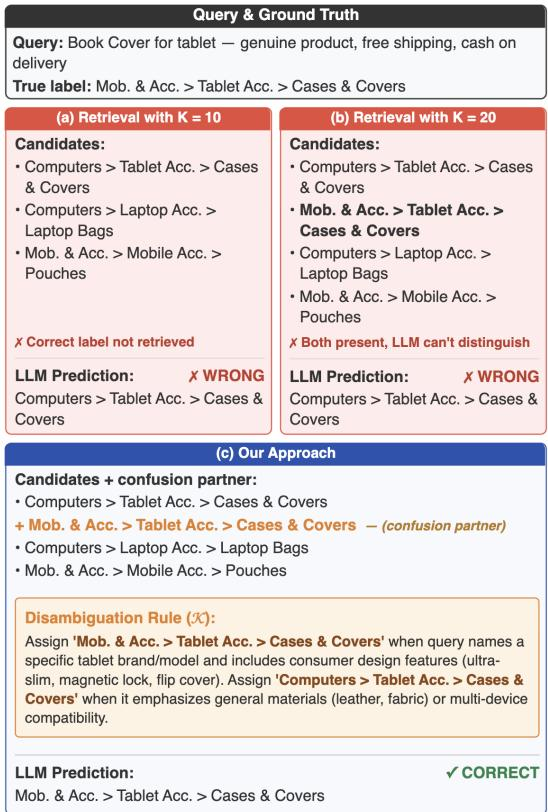
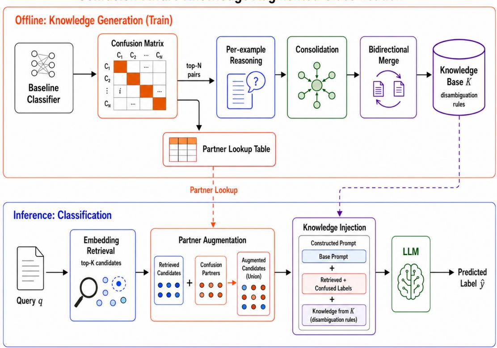
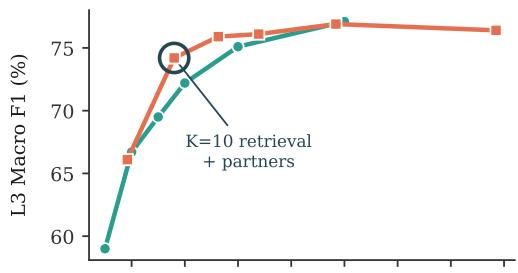
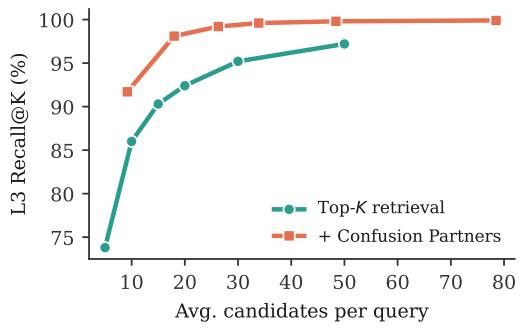
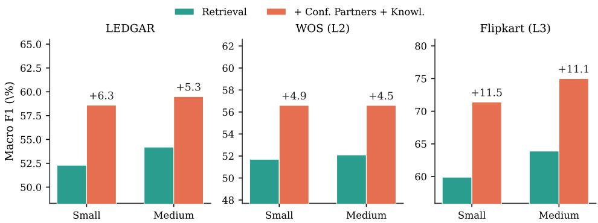
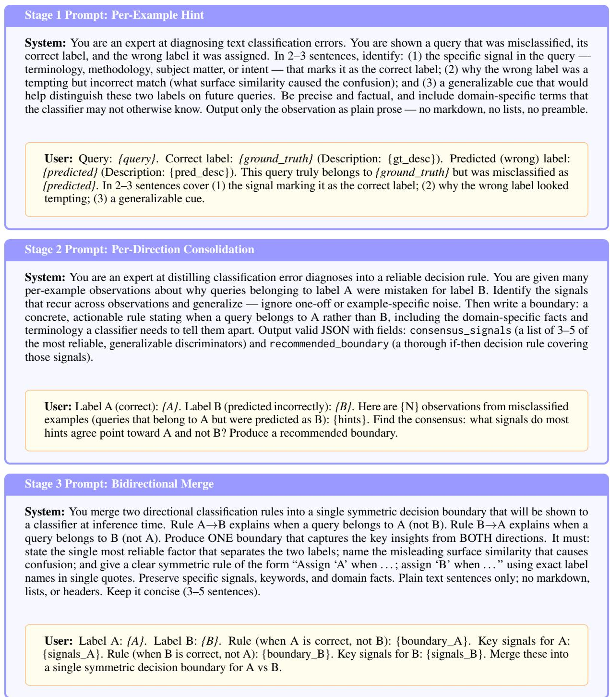
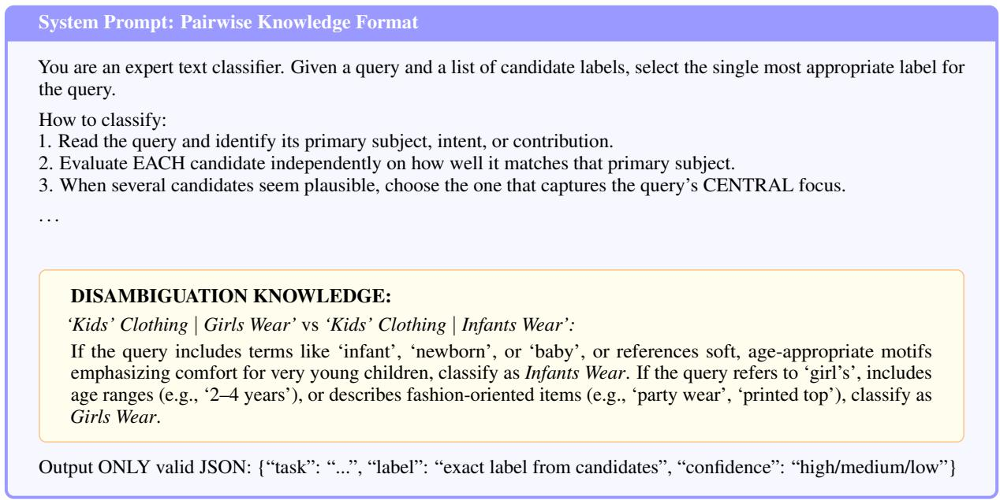
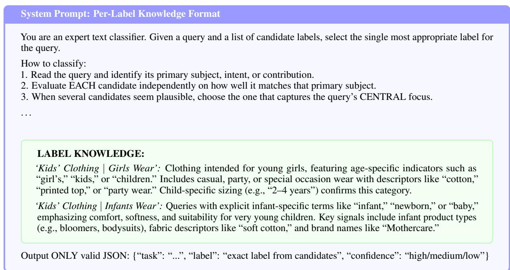

# From Confusion to Clarity: Confusion-Aware Retrieval and Knowledge Injection for Text Classification

Manish Gupta\* Chaitanya Giri\* Jayasimha Talur

Amazon {manishgp, girichai, talurj}@amazon.com

## Abstract

Large language models (LLMs) struggle to classify text into taxonomies with many semantically similar labels, as the distinctions are domain-specific and not captured by pretraining. To handle large label spaces, a common approach retrieves top-K candidate labels by embedding similarity and prompt the LLM to choose among them. However, top-K retrieval reduces the number of candidates but does not help the model tell similar ones apart. When two similar labels both appear as candidates, the model lacks the signal to choose correctly between them. We propose a framework that (1) identifies which label pairs the model struggles to distinguish, (2) expands the candidate set to include confusable labels, and (3) generates targeted rules to differentiate between similar candidates. The framework requires no fine-tuning, and the generated rules transfer to smaller, cheaper models. On three benchmarks (WOS, Flipkart, LEDGAR), our approach improves Macro F1 by up to 10.0pp over retrieval baselines, with smaller models (2B–20B) gaining up to 11.5pp via cross-model transfer.

## 1 Introduction

Classifying text into taxonomies with hundreds of semantically similar labels is a common industrial requirement, yet remains error-prone even for large language models. Product catalogs, customer service queues, and legal document taxonomies often involve labels that overlap in meaning, frequently organized into multi-level hierarchies. Misclassification in these settings directly degrades search relevance, ticket routing, and compliance filtering.

Large language models (LLMs) provide a zeroshot alternative to supervised classifiers: they require no task-specific training data and can interpret label semantics without fine-tuning. A common approach retrieves the top-K candidate labels by embedding similarity and prompts the LLM to select the best match from this reduced set.

  
Figure 1: Example illustrating the benefit of confusionaware knowledge augmentation. Confusion partners recover missing labels, while learned disambiguation rules help the LLM distinguish semantically similar candidate labels

However, zero-shot LLMs consistently underperform fine-tuned models on domain-specific taxonomies (Vajjala and Shimangaud, 2025; Loukas et al., 2023). The gap is widest when labels overlap in meaning and only taxonomy-specific conventions separate them: for example, distinguishing “Women’s Western Wear” from “Women’s Ethnic Wear” requires knowing how a particular catalog defines each category. Retrieval helps by narrowing the label space, but when two confusable labels both appear among candidates, the LLM still lacks the signal to choose correctly (Figure 1). Prior work addresses label ambiguity through tournament-style pairwise comparison (Lu et al., 2024) or taxonomy-structure injection (Zang et al., 2025). Neither analyzes which specific pairs the model gets wrong, nor generates targeted rules to fix those errors. By targeting the specific label pairs the model actually fails on, our approach directly addresses the root cause rather than relying on structural or generic signals.

This paper presents Confusion-Aware Knowledge Augmented Classification, a framework that: (1) identifies which label pairs the model struggles to distinguish by analyzing classification errors on a training set; (2) ensures both members of each problematic pair appear in the candidate set at inference time; and (3) generates targeted rules that tell the model how to differentiate between them.

We make the following contributions:

• A candidate augmentation strategy that uses confusion-matrix analysis to ensure systematically confused labels co-occur in the retrieval set.

• A three-stage knowledge generation pipeline that produces pairwise disambiguation rules from misclassified training examples.

• Empirical validation on three datasets and seven models (2B–32B) showing that pairwise disambiguation knowledge consistently improves F1 score, and that knowledge generated once by a large model transfers to smaller, cheaper classifiers without retraining.

## 2 Related Work

Our work draws on and extends ideas from LLMbased classification, retrieval augmentation, and prompt optimization.

LLMs for Text Classification. Zero-shot LLMs consistently underperform fine-tuned models on domain-specific classification (Vajjala and Shimangaud, 2025; Loukas et al., 2023). However, finetuned models require dedicated infrastructure per taxonomy and do not generalize robustly to outof-distribution inputs. This motivates inferencetime approaches: retrieval-based methods narrow the candidate set (Pattnaik et al., 2025; Tabatabaei et al., 2025; D’Oosterlinck et al., 2024), while others inject structural context such as knowledge graph subgraphs (Zang et al., 2025) or LLMgenerated taxonomy expansions (Paletto et al., 2024). These methods improve which labels reach the LLM; our work addresses what happens after retrieval, when similar labels co-occur and the model cannot distinguish them.

Prompt Optimization and Inference-Time Strategies. An alternative is optimizing the classification prompt itself. Opsahl-Ong et al. (2024) optimize instructions and demonstrations for multistage LLM programs. Agrawal et al. (2025) evolve prompts through reflective self-improvement. Lu et al. (2024) reduce label ambiguity through iterative pairwise comparison with hand-crafted descriptions, requiring multiple LLM calls per query. These methods improve prompting generically but do not analyze which specific label pairs cause errors. Our approach is error-informed: we identify problematic pairs from observed misclassifications, generate disambiguation rules specific to those pairs, and apply them in a single LLM call.

## 3 Methodology

Given a text query q and a label taxonomy ${ \mathcal { L } } =$ $\{ l _ { 1 } , \dots , l _ { N } \}$ with N labels, we formulate the task as assigning q to one label from L. In a zero-shot setting, the LLM receives the query alongside all N labels and their descriptions. As the taxonomy grows, the prompt may exceed the model’s context window, and when many labels overlap in meaning, the model struggles to distinguish between them without domain knowledge specific to the taxonomy. A common approach to mitigate the scale problem involves retrieving the top-K labels by embedding similarity, which reduces the candidate space but does not help the model distinguish between similar labels.

Our approach addresses these gaps in three phases (Figure 2): (1) augmenting the candidate set with labels the model has historically confused with retrieved ones, increasing the chance of correct label being present, (2) generating pairwise disambiguation rules offline from the classifier’s own errors, and (3) injecting these rules at inference time to supply the domain knowledge needed to distinguish between similar candidates. We describe each phase in detail below.

  
Figure 2: Overview of our framework. The offline phase (top) analyzes a baseline classifier’s confusion matrix to find systematically confused label pairs and generates pairwise disambiguation rules via a three-stage pipeline. The inference phase (bottom) retrieves candidates, augments with confusion partners, injects relevant rules, and predicts.

## 3.1 Confusion-Aware Retrieval

Standard top-K retrieval uses a general-purpose embedding model that may not reflect taxonomyspecific similarity. Two labels that are close within a taxonomy can be distant in embedding space, causing retrieval to surface one while missing the other. Increasing K recovers missing labels but also admits irrelevant candidates that degrade classification (Figure 4). We exploit a simple observation: if the model has previously misclassified label l as l′, this is direct evidence that both labels are plausible for similar queries and should appear together as candidates. We formalize this as confusion partners.

In order to identify which pair of labels the model confuses the most, we run the retrieval baseline on the training split and record the misclassifications $\hat { Y } _ { \mathrm { t r a i n } }$ . Each error in which the true label l is predicted as l′ increments a directed confusion count $c ( l  l ^ { \prime } )$ . We rank pairs by this count and select the smallest set P whose cumulative count covers at least $\tau \%$ of all training errors.

For each label l, we define its confusion partner PARTNER(l) as the label with the highest combined count of l being mistaken for l′ and vice versa, since either case indicates that the model cannot distinguish between the two labels (Algorithm 1, lines 1–3).

To increase the chance of the correct label being present, we augment our candidate set C by adding PARTNER(l) for each retrieved label $l \in \mathcal { C }$ (Algorithm 2, lines 1–2). This ensures both labels of a confused pair are present, but co-occurrence alone is not enough: the model still lacks the domainspecific signal needed to tell them apart.

## 3.2 Knowledge Generation

We generate disambiguation rules for each pair in $\mathcal { P }$ through a three-stage offline pipeline (Algorithm 1, lines 4–12; prompts in Appendix A.11).

Stage 1: Per-example reasoning. For every training query where l was misclassified as l′, we prompt an LLM: “What signal in this query indicates it belongs to l rather than $l ^ { \prime } ? ^ { \prime }$ This produces a set of per-example observations $O _ { l  l ^ { \prime } }$

Stage 2: Consolidation. Individual observations may be query-specific and noisy. We prompt an

<table><tr><td rowspan="2">Method</td><td>LEDGAR</td><td colspan="2">WOS</td><td colspan="3">Flipkart</td></tr><tr><td></td><td>L1</td><td>L2</td><td>L1</td><td>L2</td><td>L3</td></tr><tr><td>Zero-shot (all labels)</td><td>57.1</td><td>80.5</td><td>56.6</td><td>84.4</td><td>73.3</td><td>65.5</td></tr><tr><td>Few-shot†</td><td>57.8</td><td>77.6</td><td>55.0</td><td></td><td></td><td></td></tr><tr><td>MIPROv2 (Opsahl-Ong et al., 2024)</td><td>47.2</td><td>61.4</td><td>35.9</td><td>73.8</td><td>67.0</td><td>62.4</td></tr><tr><td>GEPA (Agrawal et al., 2025)</td><td>52.4</td><td>68.3</td><td>32.7</td><td>61.4</td><td>61.1</td><td>58.0</td></tr><tr><td>Retrieval (K=20)</td><td>56.3</td><td>78.4</td><td>52.4</td><td>91.0</td><td>81.8</td><td>72.3</td></tr><tr><td>Ours (Conf. Partners + Knowledge)</td><td> ${ \bar { \bf 5 8 . 9 } } ^ { * }$ </td><td>81.5*</td><td>57.7</td><td>92.5</td><td>84.4</td><td> $7 6 . 7 ^ { * }$ </td></tr></table>

Table 1: Macro F1 (%) on three datasets with Qwen3-32B. Best per column in bold; component ablation in Appendix A.8. †Exceeds the context window (351 labels + demonstrations). \*Our gain over the second-best method in that column is statistically significant $( p < 0 . 0 5$ , paired bootstrap; Appendix A.10).

LLM to distill $O _ { l  l ^ { \prime } }$ into a single directional rule $r _ { l  l ^ { \prime } }$ that captures the consensus signals (examples in Appendix A.12).

Stage 3: Bidirectional merge. Pairs confused in both directions yield two directional rules. We prompt an LLM to merge them into one symmetric rule. The result is a knowledge base K containing one disambiguation rule per pair in P.

## 3.3 Inference

Inference combines both components into a single LLM call: confusion partners ensure the right labels are present, and the generated rules tell the model how to choose among them. Given a query, we retrieve candidates C and expand them with confusion partners into C′ (Section 3.1). We then gather applicable rules ${ \mathcal { R } } \subseteq { \mathcal { K } } .$ inject them into the prompt alongside the candidate labels (Appendix A.14, Figure 7), and the LLM selects the final label yˆ from C′ (Algorithm 2).

## 4 Experiments

We evaluate five questions: (i) Do confusion partners and knowledge injection each improve over retrieval independently? (ii) Do they compose for additive gains across datasets? (iii) Does knowledge from a larger model transfer to smaller classifiers? (iv) Do confusion partners outperform simply increasing K? (v) Does pairwise knowledge outperform per-label alternatives?

## 4.1 Setup

Datasets. We evaluate on three publicly available benchmarks: $\mathbf { W O S } ^ { 1 }$ (Kowsari et al., 2017),

Flipkart†2 (PromptCloud, 2018), and LEDGAR3 (Chalkidis et al., 2022).
<table><tr><td>Dataset</td><td>Labels</td><td>Levels</td><td>Train</td><td>Test</td><td>Domain</td></tr><tr><td>LEDGAR</td><td>100</td><td>1</td><td>60k</td><td>10k</td><td>Legal</td></tr><tr><td>WOS</td><td>134</td><td>2</td><td>32.8k</td><td>9.5k</td><td>Academic</td></tr><tr><td>Flipkart</td><td>351</td><td>3</td><td>12.3k</td><td>3.8k</td><td>E-commerce</td></tr></table>

Table 2: Dataset statistics. WOS and Flipkart are hierarchical; LEDGAR is flat.

Models. Our main experiments use Qwen3-32B (Yang et al., 2025) as both the knowledge generator and the classifier. To test cross-model transfer, we use the larger Qwen3-235B (Yang et al., 2025) as the knowledge generator and apply its knowledge to smaller models: Ministral 3 3B and 8B (Liu et al., 2026), Qwen3.5-2B, 4B, and 9B (Qwen Team, 2026), and GPT-OSS-20B (Agarwal et al., 2025). We use Qwen3-Embedding-8B (Zhang et al., 2025) for retrieval in all experiments.

Hyperparameters. Retrieval returns K=10 candidates. Confusion pairs are selected as the fewest directed pairs covering $2 7 5 \%$ of training errors. Appendix A.4 reports the coverage sweep, and Appendix A.5 reports the resulting generation and inference costs. All LLM calls use temperature 0.4

## 5 Results

Table 1 compares our full approach against five baselines on all three datasets with Qwen3-32B; a component-wise ablation is deferred to Appendix A.8. Our method achieves the best Macro F1 in every column, with the largest margins on the deepest, most confusable level (Flipkart L3: +11.2pp over zero-shot and +4.4pp over the strongest baseline, retrieval at $K { = } 2 0 )$ . The gains over the second-best method are statistically significant on LEDGAR, WOS L1, and Flipkart L3 (paired bootstrap, $p < 0 . 0 5 ;$ Appendix A.10).

Baselines. Zero-shot (all labels in the prompt) is competitive at coarse levels but degrades sharply at fine granularity on the largest taxonomy (65.5 F1 on Flipkart L3). Few-shot edges out zero-shot only on LEDGAR (57.8 vs. 57.1); on WOS it is slightly worse at both levels, and it cannot be run on Flipkart, where the input prompt plus 351 labels exceed the context window. Prompt-optimization baselines operate over the full label set but do not match retrieval-augmented approaches on any column, suggesting that instruction tuning alone does not address the underlying confusion between similar labels. Our primary evaluation focuses on methods that keep the classifier fixed and adapt through inference-time context. We discuss this deployment choice and compare against fine-tuned models in Section 5.3.

Error decomposition. We decompose errors into two failure modes: retrieval misses (correct label absent from candidates) and LLM misses (correct label present but not selected). On Flipkart L3, retrieval at $K { = } 1 0$ misses the correct label 14% of the time. Adding confusion partners nearly eliminates this problem (recall: 86% → 98.1%), but introduces a trade-off: more confusable candidates means more LLM errors (15.5% → 21.9%). Knowledge injection addresses this, reducing LLM misses to 17.1%. The two mechanisms are therefore complementary by design. Table 3 detail these findings on Flipkart dataset. Refer A.9 for similar analysis across all datasets.

## 5.1 Analysis

Confusion partners vs. larger K. A natural alternative to confusion partners is simply retrieving more candidates. Figure 4 compares both strategies on Flipkart L3, plotting F1 and recall against average candidates per query. Confusion partners at $K { = } 1 0$ (18 candidates on average) achieve 74.2 F1 and 98.1% recall. Plain retrieval needs K=20 (20 candidates) to reach only 72.2 F1 and 92.4% recall, and K=50 to match the recall. The gap shows that adding labels the model is known to confuse is more effective than retrieving more labels indiscriminately.

<table><tr><td rowspan="2">Method</td><td colspan="2">Flipkart</td></tr><tr><td>L1</td><td>L2 L3</td></tr><tr><td>Retrieval (K=10)</td><td>97.8 94.2</td><td>86.0</td></tr><tr><td>+ Conf. Partners</td><td>99.9 99.2</td><td>98.1</td></tr><tr><td>Retrieval (K=20)</td><td>99.3 97.4</td><td>92.4</td></tr></table>

Table 3: Recall (%, ↑) on Flipkart dataset (Qwen3-32B): fraction of queries whose correct label is among the candidates. Knowledge injection leaves the candidate set unchanged and so does not affect recall.

  
Figure 4: L3 Macro F1 (top) and Recall@K (bottom) on Flipkart (Qwen3-32B) vs. average candidates per query. Discussion in Section 5.1.

Pairwise vs. per-label knowledge format. Our method presents knowledge as pairwise rules ("Label A vs. Label B: [rule]"). An alternative per-label format consolidates all rules for a given label into a single description of its distinguishing features, without naming specific confusers. Table 4 shows pairwise consistently wins. The advantage is that pairwise rules are contextual: the LLM sees both candidates and a rule tailored to exactly that comparison, rather than generic label descriptions that must work against any confuser. This echoes Lu et al. (2024), who find pairwise comparison more effective than independent label evaluation, though they rely on hand-crafted descriptions (examples of both formats in Appendix A.14).

  
Figure 3: Cross-model transfer: Macro F1 (%) at each dataset’s finest level for retrieval-only vs. our full approach, with all knowledge generated by Qwen3-235B. Gains (above each pair) hold across both size groups (Small: 2–4B; Medium: 8–20B) and all datasets.

<table><tr><td rowspan="2">Format</td><td colspan="2">L1</td><td colspan="2">L2</td><td colspan="2">L3</td></tr><tr><td>F1</td><td>Miss</td><td>F1</td><td>Miss</td><td>F1</td><td>Miss</td></tr><tr><td>No knowledge</td><td>90.8</td><td>6.2</td><td>81.9</td><td>13.3</td><td>74.2</td><td>21.9</td></tr><tr><td>Per-label</td><td>91.4</td><td>4.8</td><td>83.5</td><td>11.3</td><td>74.8</td><td>18.5</td></tr><tr><td>Pairwise (ours)</td><td>92.5</td><td>3.8</td><td>84.4</td><td>10.0</td><td>76.7</td><td>17.1</td></tr></table>

Table 4: Knowledge format ablation on Flipkart (Qwen3-32B); all rows use retrieval + confusion partners. F1: Macro F1 (↑); Miss: LLM miss rate (↓). Best per column in bold.

## 5.2 Cross-Model Knowledge Transfer

Small models are preferred for inference due to lower latency and cost, but they lack the capacity to generate high-quality disambiguation rules. We therefore generate rules offline with a large model and serve a small, fast model at inference time. We run each smaller model on the training set to identify its own confusion pairs; the large model then writes disambiguation rules for those pairs. We test this by generating all knowledge with Qwen3-235B and applying it to smaller models: Small (2–4B) and Medium (8–20B).

Table 16 confirms effective transfer. The pattern from Table 1 reproduces: partners improve recall, knowledge reduces selection errors, and the combination yields the largest gains. Small models improve by +11.5pp on Flipkart L3 over retrieval-only; Medium models by +11.1pp. Gains hold across all datasets including the flat taxonomy (LEDGAR: +6.3pp Small, +5.3pp Medium). These results indicate that the rules capture domain knowledge that transfers across model sizes, decoupling rule quality from inference cost. Appendix A.6 tests the stricter setting in which the same confusion pairs and rules are reused unchanged across classifiers.

## 5.3 Comparison with Fine-Tuning

A natural alternative to our inference-time approach is to use the same labeled data for fine-tuning. This process encodes taxonomy-specific information in model parameters, producing a separate model artifact that must be trained, deployed, and maintained for each taxonomy. Changes to the label space or input distribution require this lifecycle to be repeated. Our method instead targets teams that access foundational models through managed APIs rather than operate their own training and serving infrastructure. This deployment setting motivates our comparison with $\mathbf { M I P R O v } 2$ and GEPA, which optimize prompts without updating model weights. To complement this evaluation, we compare our method with fine-tuning under clean data and three conditions commonly encountered in production.

Specifically, we fine-tune ModernBERTbase (Warner et al., 2025) and RoBERTa-base (Liu et al., 2019) on Flipkart L3 and evaluate them alongside our framework under four settings: clean data, test-time perturbations, label noise, and data scarcity. The clean setting uses the complete training and test splits. In each robustness setting, we vary only the condition under study. Table 5 summarizes one representative setting for each condition. Appendix A.3 reports additional results and implementation details.

<table><tr><td>Setting</td><td>ModernBERT</td><td>RoBERTa</td><td>Ours</td></tr><tr><td>Clean data (complete)</td><td>80.0</td><td>81.7</td><td>76.7</td></tr><tr><td>Label noise (20%)</td><td>60.0</td><td>61.0</td><td>72.1</td></tr><tr><td>Data scarcity (10%, ~3/class)</td><td>23.2</td><td>31.8</td><td>70.2</td></tr><tr><td>Test-time perturbations (mean ∆)</td><td>-17.0</td><td>-9.0</td><td>-5.0</td></tr></table>

Table 5: Flipkart L3 Macro F1. Rows above the midrule are absolute scores. The final row is the mean change (∆) across nine test-time perturbations, where values closer to zero are better.

On clean data, ModernBERT and RoBERTa reach 80.0 and 81.7 Macro F1, compared with 76.7 for our framework. This advantage, however, does not persist across the robustness settings. With 20% of the training labels replaced, our framework retains 72.1 Macro F1, compared with 60.0 for ModernBERT and 61.0 for RoBERTa. With only 10% of the training examples, our framework reaches 70.2, compared with 23.2 and 31.8. Over nine perturbed test sets, our framework loses 5.0 points on average, while ModernBERT and RoBERTa lose 17.0 and 9.0 points. Fine-tuning performs best with clean, abundant data and a stable test distribution, but degrades sharply when these assumptions do not hold in production. Our framework retains substantially more accuracy without parameter updates.

## 5.4 Human Evaluation of Generated Rules

LLM-generated rules may contain unsupported or example-specific distinctions. Our pipeline mitigates this risk through Consolidation (Stage 2), which retains signals that recur across labeled examples, and Bidirectional Merge (Stage 3), which reconciles evidence from both confusion directions when available. These stages reduce examplespecific noise, but neither they nor downstream classification gains establish the correctness of individual rules. We therefore evaluate rule quality directly through human review.

We randomly sample 50 Flipkart rules generated by Qwen3-32B. For each rule, the authors review the generated rule alongside the two label paths and example queries from both labels. All three authors independently judge whether each rule correctly distinguishes the two labels in both directions and reject it if it is incorrect, misleading, incomplete, or unhelpful. Together, these assessments produce 150 judgments (Appendix A.7). On average, the three authors accept 87.3% of the sampled rules. High-stakes applications should nevertheless require domain-expert approval before generated

rules are deployed.

## 6 Conclusion

We presented a framework that turns LLM classification errors into targeted disambiguation rules, improving accuracy without fine-tuning. Two mechanisms work together: confusion partners ensure the right labels are present as candidates, and pairwise rules help the model choose between them. On three benchmarks, the approach improves Macro F1 by up to 10.0pp, and rules generated by a large model transfer to smaller classifiers for gains of up to 11.5pp. The framework requires only a onetime offline error analysis and generalizes across hierarchical and flat taxonomies.

## Limitations

The framework has two main limitations. First, the offline phase requires labeled training data and can generate rules only for confusion pairs observed in the baseline errors. If the taxonomy or the model’s confusion patterns change, the offline phase may need to be rerun for the affected pairs. Furthermore, extending pair coverage captures more confusions but also lengthens the inference prompt and increases cost, and we have not tested how this balance changes for multilingual inputs, substantially larger taxonomies, or temporal drift. Second, generated rules are not automatically verified. The Consolidation and Bidirectional Merge steps reduce noise from individual examples but do not guarantee that the resulting rule is correct. Although 87.3% of sampled rules met our criteria for correctness and usefulness, applications with serious consequences still require review by domain experts.

## References

Sandhini Agarwal, Lama Ahmad, Jason Ai, Sam Altman, Andy Applebaum, Edwin Arbus, Rahul K Arora, Yu Bai, Bowen Baker, Haiming Bao, and 1 others. 2025. gpt-oss-120b & gpt-oss-20b model card. arXiv preprint arXiv:2508.10925.

Lakshya A Agrawal, Shangyin Tan, Dilara Soylu, Noah Ziems, Rishi Khare, Krista Opsahl-Ong, Arnav Singhvi, Herumb Shandilya, Michael J Ryan, Meng Jiang, Christopher Potts, Koushik Sen, Alexandros G. Dimakis, Ion Stoica, Dan Klein, Matei Zaharia, and Omar Khattab. 2025. Gepa: Reflective prompt evolution can outperform reinforcement learning. Preprint, arXiv:2507.19457.

Ilias Chalkidis, Abhik Jana, Dirk Hartung, Michael Bommarito, Ion Androutsopoulos, Daniel Katz, and Nikolaos Aletras. 2022. LexGLUE: A benchmark dataset for legal language understanding in English. In Proceedings of the 60th Annual Meeting of the Associationfor Computational Linguistics (Volume 1: Long Papers), pages 4310–4330.

Karel D’Oosterlinck, Omar Khattab, Francois Remy, Thomas Demeester, Chris Develder, and Christopher Potts. 2024. In-context learning for extreme multi-label classification. arXiv preprint arXiv:2401.12178.

Kamran Kowsari, Donald E. Brown, Mojtaba Heidarysafa, Kiana Jafari Meimandi, Matthew S. Gerber, and Laura E. Barnes. 2017. HDLTex: Hierarchical deep learning for text classification. In Proceedings of the 16th IEEE International Conference on Machine Learning and Applications (ICMLA), pages 364–371.

Alexander H Liu, Kartik Khandelwal, Sandeep Subramanian, Victor Jouault, Abhinav Rastogi, Adrien Sadé, Alan Jeffares, Albert Jiang, Alexandre Cahill, Alexandre Gavaudan, and 1 others. 2026. Ministral 3. arXiv preprint arXiv:2601.08584.

Yinhan Liu, Myle Ott, Naman Goyal, Jingfei Du, Mandar Joshi, Danqi Chen, Omer Levy, Mike Lewis, Luke Zettlemoyer, and Veselin Stoyanov. 2019. RoBERTa: A robustly optimized BERT pretraining approach. arXiv preprint arXiv:1907.11692.

Lefteris Loukas, Ilias Stogiannidis, Odysseas Diamantopoulos, Prodromos Malakasiotis, and Stavros Vassos. 2023. Making LLMs worth every penny: Resource-limited text classification in banking. In Proceedings ofthe Fourth ACM International Conference on AI in Finance (ICAIF).

Zhenyi Lu, Jie Tian, Wei Wei, Xiaoye Qu, Yu Cheng, Wenfeng Xie, and Dangyang Chen. 2024. Mitigating boundary ambiguity and inherent bias for text classification in the era of large language models. In Findings of the Association for Computational Linguistics: ACL 2024, pages 7841–7864.

Edward Ma. 2019. NLP Augmentation. https:// github.com/makcedward/nlpaug. Version 1.1.11.

Krista Opsahl-Ong, Michael J. Ryan, Josh Purtell, David Broman, Christopher Potts, Matei Zaharia, and Omar Khattab. 2024. Optimizing instructions and demonstrations for multi-stage language model programs. In Proceedings ofthe 2024 Conference on Empirical Methods in Natural Language Processing (EMNLP).

Lorenzo Paletto, Valerio Basile, and Roberto Esposito. 2024. Label augmentation for zero-shot hierarchical text classification. In Proceedings of the 62nd Annual Meeting of the Association for Computational Linguistics (Volume 1: Long Papers), pages 7697– 7706.

Anup Pattnaik, Sasanka Vutla, Hamvir Dev, Jeevesh Nandan, and Cijo George. 2025. Scalable and cost effective high-cardinality classification with LLMs via multi-view label representations and retrieval augmentation. In Proceedings ofthe 2025 Conference on Empirical Methods in Natural Language Processing: Industry Track (EMNLP), pages 1955–1969, Suzhou (China). Association for Computational Linguistics.

PromptCloud. 2018. Flipkart products dataset. https://www.kaggle.com/datasets/ PromptCloudHQ/flipkart-products. Accessed: 2025.

Qwen Team. 2026. Qwen3.5: Towards native multimodal agents.

Seyed Amin Tabatabaei, Sarah Fancher, Michael Parsons, and Arian Askari. 2025. Can large language models serve as effective classifiers for hierarchical multi-label classification of scientific documents at industrial scale? In Proceedings of the 31st International Conference on Computational Linguistics: Industry Track (COLING), pages 163–174.

Sowmya Vajjala and Shwetali Shimangaud. 2025. Text classification in the LLM era – where do we stand? arXiv preprint arXiv:2502.11830.

Benjamin Warner, Antoine Chaffin, Benjamin Clavié, Orion Weller, Oskar Hallström, Said Taghadouini, Alexis Gallagher, Raja Biswas, Faisal Ladhak, Tom Aarsen, Griffin Thomas Adams, Jeremy Howard, and Iacopo Poli. 2025. Smarter, better, faster, longer: A modern bidirectional encoder for fast, memory efficient, and long context finetuning and inference. In Proceedings of the 63rd Annual Meeting of the Associationfor Computational Linguistics (Volume 1: Long Papers), pages 2526–2547.

An Yang, Anfeng Li, Baosong Yang, Beichen Zhang, Binyuan Hui, Bo Zheng, and 1 others. 2025. Qwen3 Technical Report. arXiv preprint arXiv:2505.09388.

Qianbo Zang, Igor Tchappi, Christophe Zgrzendek, Afshin Khadangi, and Johannes Sedlmeir. 2025. KG-HTC: Integrating knowledge graphs into LLMs for zero-shot hierarchical text classification. In Proceedings of the 28th European Conference on Artificial Intelligence (ECAI), pages 4121–4128.

Yanzhao Zhang, Mingxin Li, Dingkun Long, Xin Zhang, Huan Lin, Baosong Yang, Pengjun Xie, An Yang, Dayiheng Liu, Junyang Lin, Fei Huang, and Jingren Zhou. 2025. Qwen3 embedding: Advancing text embedding and reranking through foundation models. arXiv preprint arXiv:2506.05176.

## A Appendix

## A.1 Algorithms

Algorithm 1 details the offline knowledgegeneration pipeline (Section 3.2) and Algorithm 2 the augmented inference procedure (Section 3.3).

<table><tr><td rowspan="2">Method</td><td>LEDGAR</td><td colspan="2">WOS</td><td colspan="3">Flipkart</td></tr><tr><td></td><td>L1</td><td>L2</td><td>L1</td><td>L2</td><td>L3</td></tr><tr><td>Zero-shot (all labels)</td><td>57.1</td><td>80.5</td><td>56.6</td><td>84.4</td><td>73.3</td><td>65.5</td></tr><tr><td>+ Retrieval (K=10)</td><td>54.3</td><td>79.1</td><td>53.4</td><td>89.6</td><td>79.3</td><td>66.7</td></tr><tr><td>+ Confusion Partners</td><td>58.3</td><td>79.5</td><td>53.6</td><td>90.8</td><td>81.9</td><td>74.2</td></tr><tr><td>+ Knowledge</td><td>55.9</td><td>80.8</td><td>57.8</td><td>90.7</td><td>81.3</td><td>68.8</td></tr><tr><td>+ Confusion Partners + Knowledge</td><td>58.9</td><td>81.5</td><td>57.7</td><td>92.5</td><td>84.4</td><td>76.7</td></tr></table>

Table 6: Component ablation: Macro F1 (%) with Qwen3-32B, adding each component to the zero-shot baseline. + Knowledge applies knowledge without confusion partners; the last row (our full approach) combines both. Best per column in bold.

Algorithm 1 Knowledge Generation (Offline)   
Input: Baseline predictions $\hat { Y } _ { \mathrm { t r a i n } } ,$ coverage threshold τ,   
system prompts: promptreason, promptconsol., promptme   
Output: Knowledge base K, PARTNER(·)   
1: From $\hat { Y } _ { \mathrm { t r a i n } } .$ count misclassifications $c ( l  l ^ { \prime } )$ for all label   
pairs   
2: $\mathbf { \dot { \boldsymbol { \mathcal { P } } } } \gets$ fewest pairs by frequency covering $\geq \tau \%$ of total   
errors   
3: ∀ l: PARTNER $( l ) $ arg maxl′ $( c ( l  l ^ { \prime } ) + c ( l ^ { \prime }  l ) )$   
4: for each $( l  l ^ { \prime } ) \in \mathcal { P }$ do   
5: for each misclassified query q from pair $( l  l ^ { \prime } )$ do   
6: $O _ { l  l ^ { \prime } }  O _ { l {  } l ^ { \prime } } \cup \{ \mathrm { L L M } ( \mathrm { p r o m p } \hat { \mathrm { t } } _ { \mathrm { r e a s o n } } , ~ q , ~ l , ~ l ^ { \prime } ) \}$   
//per-example reasoning   
7: end for   
8: $r _ { l  l ^ { \prime } }  \mathrm { L L M } ( \mathrm { p r o m p t } _ { \mathrm { c o n s o l . } } , \ l , \ l ^ { \prime } , \ O _ { l  l ^ { \prime } } )$ //   
consolidate   
9: end for   
10: for each unordered pair $\{ l , l ^ { \prime } \}$ in P do   
11: if both $r _ { l  l ^ { \prime } }$ and $r _ { l ^ { \prime } \to l }$ exist then   
12: ${ \underset { \ldots } { K } } [ l , l ^ { ' } ] ^ { * } \longleftarrow \mathrm { L L M ( p r o m p t { \theta } _ { m e r g e } , ~ } l , ~ l ^ { \prime } , ~ r _ { l  l ^ { \prime } } , ~ r _ { l ^ { \prime }  l } )$   
// merge   
13: else   
14: $\kappa [ l , l ^ { \prime } ]$ ← the existing $r _ { l  l ^ { \prime } } \mathrm { o r } r _ { l ^ { \prime }  l }$   
15: end if   
16: end for

## A.2 Dataset Preprocessing

The Flipkart dataset is derived from a publicly available crawl of 20,000 product listings (PromptCloud, 2018). We retain only the first three levels of the category hierarchy, as deeper levels represent brand or product names rather than semantic categories, and the number of unique labels more than doubles beyond level 3. Labels with fewer than three samples are removed to enable stratified splitting. The final dataset contains 17,847 samples across 351 labels. WOS and LEDGAR are used as provided by their respective sources without additional preprocessing.

## A.3 Fine-Tuning Baselines

We first compare the methods using the complete, unmodified training and test splits. Table 7 re-

Algorithm 2 Augmented Inference   
Input: Query q, knowledge base K, PARTNER(·), promptclassify   
Output: Predicted label yˆ   
1: Retrieve top-K candidates C by embedding similarity   
$\mathfrak { Z } \colon \mathcal { C } ^ { \prime }  \mathcal { C } \cup \{ \mathrm { P A R T N E R } ( l ) \mid l \in \mathcal { C } \}$   
3: $\mathcal { R }  \{ \mathcal { K } [ l , l ^ { \prime } ] \mid l , l ^ { \prime } \in \dot { \mathcal { C } } ^ { \prime } , \mathcal { K } [ l , \dot { l ^ { \prime } } ]$ exists} // select rules   
4: $\hat { y } \gets \mathrm { L L M ( p r o m p t _ { c l a s s i f y } , ~ } q , ~ \bar { \mathcal { C } } ^ { \prime } , ~ \bar { \mathcal { R } } )$ // classify

ports Macro F1 at the finest level of each dataset after fine-tuning ModernBERT-base and RoBERTabase. These clean-data results provide the reference scores for the robustness experiments that follow.
<table><tr><td>Method</td><td>Flipkart L3</td><td></td><td>WOS L2 LEDGAR</td></tr><tr><td>ModernBERT</td><td>80.0</td><td>72.9</td><td>75.4</td></tr><tr><td>RoBERTa</td><td>81.7</td><td>80.4</td><td>78.1</td></tr><tr><td>Ours (Qwen3-32B)</td><td>76.7</td><td>57.7</td><td>58.9</td></tr></table>

Table 7: Macro F1 (%) at each dataset’s finest level. Fine-tuned models lead on clean, complete data.

Training details. The fine-tuned baselines use a linear classifier over the complete taxonomy path with the AdamW optimizer. Training uses early stopping over at most ten epochs, a maximum sequence length of 512, and a batch size of eight. The classification head uses ten times the pretrained model’s learning rate.

Robustness experiments. All robustness experiments use Flipkart L3. The test-time perturbation experiment keeps the training data fixed and modifies only the test queries. The label-noise and datascarcity experiments modify the training data while leaving the test set unchanged. Within each condition, every method uses the same perturbed queries, corrupted labels, or stratified training subset.

Test-time perturbations. We use nlpaug 1.1.11 (Ma, 2019) to introduce spelling errors at a 10% rate, word swaps and contextual insertion at 20%, and word deletion and contextual substitution at 15%. Keyboard augmentation changes characters in 5% of words with a 10% within-word rate. The combined condition applies light spelling, keyboard, and deletion noise. Query shortening keeps four to eight leading product-title tokens, and back-translation sends each query through English–German–English using Amazon Translate.5 Table 8 reports the change from each method’s clean score for all nine conditions.

<table><tr><td>Perturbation</td><td>ModernBERT</td><td>RoBERTa</td><td>Ours</td></tr><tr><td>Keyboard</td><td>-5.0</td><td>-2.0</td><td>-1.0</td></tr><tr><td>Spelling</td><td>-3.0</td><td>-2.0</td><td>-2.0</td></tr><tr><td>Word swap</td><td>-4.0</td><td>-1.0</td><td>-3.0</td></tr><tr><td>Word deletion</td><td>-8.0</td><td>-4.0</td><td>-4.0</td></tr><tr><td>Contextual insertion</td><td>-19.0</td><td>-5.0</td><td>-4.0</td></tr><tr><td>Contextual substitution</td><td>-29.0</td><td>-11.0</td><td>-7.0</td></tr><tr><td>Back-translation</td><td>-22.0</td><td>-11.0</td><td>-2.0</td></tr><tr><td>Combined noise</td><td>-9.5</td><td>-5.0</td><td>-3.0</td></tr><tr><td>Query shortening</td><td>-57.0</td><td>-43.0</td><td>-18.0</td></tr><tr><td>Mean</td><td>-17.0</td><td>-9.0</td><td>-5.0</td></tr></table>

Table 8: Robustness to test-time perturbations on Flipkart L3. Each score is the change in Macro F1 from that method’s clean result, in percentage points. Values closer to zero are better.

Label noise and data scarcity. For label noise, we sample the specified fraction of training examples and replace each selected gold label with a different label drawn uniformly from the other 350 classes. The fine-tuned models train on this corrupted split. Our framework applies the same example-to-label mapping when constructing its confusion pairs and rules. We evaluate all methods on the unchanged test set. For data scarcity, we draw stratified subsets of the training data. The fine-tuned models train on each subset, while our framework discovers its confusion pairs and generates its rules from the same subset.

Training set size and test-time perturbations. The preceding experiments vary training-set size and test queries separately. We next vary them together by evaluating all nine perturbed test sets at ten training fractions. At each fraction, our framework discovers the confusion pairs and regenerates the rules from the available training examples. Table 9 summarizes representative results for label noise, data scarcity, and their interaction with test-time perturbations. In the joint-robustness rows, each score is the mean Macro F1 across the nine perturbations. The resulting 270 evaluations show how additional labeled data affects robustness rather than performance only on the unchanged test set.

<table><tr><td>Experiment</td><td>Setting</td><td>ModernBERT</td><td>RoBERTa</td><td>Ours</td></tr><tr><td>Label noise</td><td>10% corrupted</td><td>68.4</td><td>67.4</td><td>73.4</td></tr><tr><td></td><td>20% corrupted</td><td>60.0</td><td>61.0</td><td>72.1</td></tr><tr><td></td><td>50% corrupted</td><td>41.8</td><td>40.9</td><td>70.1</td></tr><tr><td>Training data</td><td>10% (~3/class)</td><td>23.2</td><td>31.8</td><td>70.2</td></tr><tr><td></td><td>25% (~9/class)</td><td>44.0</td><td>47.7</td><td>69.9</td></tr><tr><td></td><td>50% (~18/class)</td><td>69.8</td><td>70.8</td><td>69.8</td></tr><tr><td>Joint robustness</td><td>10% training data</td><td>18.0</td><td>29.2</td><td>67.7</td></tr><tr><td></td><td>20% training data</td><td>32.2</td><td>42.7</td><td>68.5</td></tr><tr><td></td><td>50% training data</td><td>51.5</td><td>63.2</td><td>69.8</td></tr></table>

Table 9: Representative Flipkart L3 Macro F1 (%). Label noise and training data use the unchanged test set. Joint robustness reports the mean across nine perturbed test sets.

## A.4 Coverage Sensitivity

The coverage threshold controls how much of the observed training error is represented in the knowledge base. We rank directed confusion pairs by frequency and select the smallest set whose cumulative count reaches the threshold. Lower values retain only the most frequent confusions, while higher values admit rarer pairs and make more rules available at inference time.

We sweep the threshold from 10% to 90% on each dataset and observe a monotonic increase in Macro F1. Quality is highest at 90%, but broader coverage makes more rules eligible at inference time and increases the prompt size, so each coverage value carries both a quality and a cost. Table 10 uses 10% coverage as the reference. This row reports absolute Macro F1 and defines input-token use as 1.0×, while subsequent rows report relative Macro F1 gains and token multipliers. The token counts include the instructions, query, candidate labels, and injected rules, but exclude the one-time generation cost reported in Appendix A.5.

<table><tr><td rowspan="2">Coverage</td><td colspan="2">Flipkart L3</td><td colspan="2">WOS L2</td><td colspan="2">LEDGAR</td></tr><tr><td>F1</td><td>Tokens</td><td>F1</td><td>Tokens</td><td>F1</td><td>Tokens</td></tr><tr><td>10%</td><td>0.513</td><td>1.0×</td><td>0.519</td><td>1.0×</td><td>0.538</td><td>1.0×</td></tr><tr><td>25%</td><td>+2.9%</td><td>1.1×</td><td>+1.5%</td><td>1.6×</td><td>+1.1%</td><td>1.1×</td></tr><tr><td>50%</td><td>+8.8%</td><td>1.4×</td><td>+7.9%</td><td>3.2×</td><td>+2.4%</td><td>1.8×</td></tr><tr><td>75%</td><td>+21.2%</td><td>2.2×</td><td>+10.4%</td><td>6.0×</td><td>+8.0%</td><td>3.4×</td></tr><tr><td>90%</td><td>+31.4%</td><td>3.6×</td><td>+12.5%</td><td>8.8×</td><td>+12.5%</td><td>6.2×</td></tr></table>

Table 10: Sensitivity to confusion-pair coverage. At 10%, F1 is absolute and token use is normalized to 1.0×. Later rows show relative F1 gains and token multipliers.

We therefore use 75% as a cost-conscious operating point. Applications can move this threshold according to their accuracy and inference budgets.

## A.5 Knowledge Generation and Inference Cost

Our framework incurs costs at two points: one-time offline knowledge generation and online inference, where confusion partners and applicable rules increase the prompt length. Table 11 reports the measured token use for offline generation and the measured overhead at inference.

<table><tr><td colspan="6">One-time offline knowledge generation</td></tr><tr><td>Dataset</td><td></td><td>Errors</td><td>Pairs</td><td>Rules</td><td>Tokens (in / out)</td><td></td></tr><tr><td>WOS</td><td></td><td>11,363</td><td>750</td><td>658</td><td>10.09M / 1.95M</td><td></td></tr><tr><td></td><td>Flipkart LEDGAR</td><td>3,564</td><td>488</td><td>455</td><td>2.55M / 0.71M</td><td></td></tr><tr><td></td><td></td><td>19,528</td><td>750</td><td>643</td><td>12.56M / 2.96M</td><td></td></tr><tr><td colspan="7">Online inference, retrieval only → full approach Dataset Candidates</td></tr><tr><td></td><td colspan="2"></td><td>Rules</td><td colspan="2">Input tokens Latency (ms)</td><td></td></tr><tr><td>WOS</td><td colspan="2"> $1 0 . 0  1 9 . 7 $ </td><td>54.5</td><td colspan="2"> $1 , 4 0 2  1 0 , 1 4 4$ </td><td> $4 2 5  1 , 2 3 8$ </td></tr><tr><td>Flipkart</td><td colspan="2"> $1 0 . 0  1 8 . 0$ </td><td>28.3</td><td colspan="2"> $1 , 3 4 4  7 , 1 3 9$ </td><td> $4 2 9  8 7 9$ </td></tr><tr><td>LEDGAR</td><td colspan="2"> $1 0 . 0  1 9 . 5 $ </td><td>53.2</td><td colspan="2"> $1 , 1 8 9  9 , 2 4 8$ </td><td> $3 7 9  1 , 1 1 0$ </td></tr></table>

Table 11: Measured offline knowledge-generation cost and online inference overhead. Arrows compare retrieval-only inference with the full approach.

The offline phase processes 3,564 to 19,528 errors and produces 455 to 658 rules, consuming 3.26M to 15.52M tokens once per taxonomy. Mean rule length ranges from 85.0 to 91.8 words, with 90th percentiles from 104 to 115 words. At inference, the longer prompts increase median latency from 379–429 ms for retrieval only to 879–1,238 ms for the full approach. This is the principal cost of supplying the additional taxonomy-specific context while retaining a single classification call per query.

## A.6 Reusing a Fixed Knowledge Base

The transfer experiment in Section 5.2 discovers confusion pairs separately for each classifier, then uses Qwen3-235B to generate their rules. To test stricter reuse, we instead identify the pairs and generate the rules once with Qwen3-235B, then apply the resulting knowledge base unchanged to every classifier. Table 12 compares fixed reuse with model-specific pair discovery.

<table><tr><td>Classifier</td><td>Retrieval</td><td>Fixed knowledge</td><td>Model-specific knowledge</td></tr><tr><td>Ministral-3B</td><td>59.0</td><td>67.1</td><td>72.8</td></tr><tr><td>Ministral-8B</td><td>63.9</td><td>71.5</td><td>74.4</td></tr><tr><td>GPT-OSS-20B</td><td>64.8</td><td>75.2</td><td>73.0</td></tr><tr><td>Qwen3-32B</td><td>66.7</td><td>73.3</td><td>74.7</td></tr></table>

Table 12: Flipkart L3 Macro F1 (%). Fixed knowledge reuses one Qwen3-235B knowledge base unchanged. Model-specific knowledge discovers pairs for each classifier and uses Qwen3-235B to generate their rules.

Fixed reuse improves Macro F1 by 6.6 to 10.3 points over retrieval alone. Model-specific pairs perform better for three classifiers, while fixed reuse performs better for GPT-OSS-20B. Thus, one knowledge base transfers across classifiers, although model-specific error analysis usually adds further gains.

## A.7 Human Evaluation Protocol

We sample 50 rules from the Flipkart knowledge base. Each of the three authors independently reviews every rule, producing 150 judgments. For each item, the annotation interface shows the generated rule, the two complete label paths, up to five example queries from each label, and up to three misclassified queries from each direction with their per-example observations.

Each author judges whether the rule correctly and usefully distinguishes the labels in both directions. A rule is rejected if it is incorrect, misleading, incomplete, or unhelpful. Across the three authors, 87.3% of the rules meet this standard on average. Since this evaluation cannot guarantee the correctness of every rule, high-stakes applications should require domain-expert approval before deployment.

## A.8 Component Ablation

Table 6 isolates the contribution of each component by adding them incrementally to the zero-shot baseline, using Qwen3-32B on all three datasets. Retrieval narrows the label space; confusion partners ensure both members of each confused pair co-occur; knowledge injection supplies pairwise disambiguation rules. The full combination (the last row, equal to “Ours” in Table 1) yields the largest gains, and the two mechanisms are complementary: partners raise Recall@K while knowledge reduces selection errors among candidates (Section 5.1).

## A.9 Error Decomposition

Section 5.1 decomposes errors into recall and LLM misses. Table 13 reports recall and Table 14 the LLM miss rate, both across all three datasets (Qwen3-32B).

<table><tr><td rowspan="2">Method</td><td rowspan="2">LDG L1</td><td colspan="2">WOS</td><td colspan="3">Flipkart</td></tr><tr><td>L1</td><td>L2</td><td>L1</td><td>L2</td><td>L3</td></tr><tr><td>Retrieval (K=10) + Conf. Partners</td><td>81.7 92.8</td><td>95.1 98.5</td><td>83.4 90.2</td><td>97.8 99.9</td><td>94.2 99.2</td><td>86.0 98.1</td></tr></table>

Table 13: Recall (%, ↑) on all datasets (Qwen3-32B): fraction of queries whose correct label is among the candidates. Knowledge injection leaves the candidate set unchanged and so does not affect recall. LDG = LEDGAR.

The pattern is consistent: confusion partners raise recall at every level but also increase the LLM miss rate, while knowledge injection lowers the LLM miss rate at each retrieval setting.

<table><tr><td></td><td>LDG</td><td>WOS</td><td></td><td>Flipkart</td></tr><tr><td>Method</td><td>L1</td><td>L1 L2</td><td>L1</td><td>L2 L3</td></tr><tr><td>Retrieval (K=10)</td><td>16.6</td><td>17.8</td><td>31.95.5</td><td>10.8 15.5</td></tr><tr><td>+ Conf. Partners + Knowledge</td><td>24.9</td><td></td><td></td><td>20.938.86.213.3 21.9</td></tr><tr><td>+ Conf. Partners + Knowl.</td><td>14.2</td><td></td><td></td><td>15.7 26.5 3.9 8.5 13.1</td></tr><tr><td></td><td>22.5</td><td></td><td></td><td>18.7 34.0 3.8 10.0 17.1</td></tr></table>

Table 14: LLM miss rate (%, ↓) on all datasets (Qwen3- 32B): fraction of in-candidate queries the model classifies incorrectly. Best (lowest) per column in bold. LDG = LEDGAR.

## A.10 Statistical Significance

For each column of Table 1, we test whether our full approach (confusion partners + knowledge) significantly beats the second-best method in that column. We use a paired bootstrap on the test set: for $_ { B = 1 0 , 0 0 0 }$ resamples, we draw test instances with replacement (the same resample applied to both systems), recompute the Macro F1 difference on each resample, and report the 95% percentile confidence interval and a two-sided p-value for the null hypothesis of zero difference. Macro F1 is computed exactly as in the main results; point estimates come from an independent inference run and differ from Table 1 by at most 1.8 points due to the classifier’s non-determinism.

<table><tr><td>Column</td><td>2nd best</td><td>∆F1</td><td>95% CI</td><td>p</td></tr><tr><td>LEDGAR</td><td>Few-shot</td><td>+1.2</td><td>[+0.2, +2.2]</td><td>0.016</td></tr><tr><td>WOS L1</td><td>Zero-shot</td><td>+1.2</td><td>[+0.5, +1.9]</td><td>&lt; 0.001</td></tr><tr><td>WOS L2</td><td>Zero-shot</td><td>+0.3</td><td>[−0.7, +1.2]</td><td>0.600</td></tr><tr><td>Flipkart L1</td><td>Retrieval</td><td>+0.8</td><td>[−0.5, +2.5]</td><td>0.194</td></tr><tr><td>Flipkart L2</td><td>Retrieval</td><td>+0.6</td><td>[−1.0, +2.6]</td><td>0.360</td></tr><tr><td>Flipkart L3</td><td>Retrieval</td><td>+2.7</td><td>[+1.0, +5.5]</td><td>0.005</td></tr></table>

Table 15: Paired bootstrap significance (B=10,000, Qwen3-32B) of our full approach over the second-best method in each column of Table 1. ∆F1 is the Macro F1 gain; gains with $p < 0 . 0 5$ are marked \* in Table 1.

Table 15 reports the results. Our gains are significant on LEDGAR, WOS L1, and Flipkart L3, where the confidence interval excludes zero. On WOS L2 and the two coarse Flipkart levels, our method remains best but the margin over the second-best method is within sampling noise.

## A.11 Knowledge Generation Prompts

The knowledge base K is produced by the threestage pipeline of Algorithm 1. Figure 5 lists the system and user prompts used at each stage. All three stages are run once per dataset using the generator model (Qwen3-235B in our cross-model transfer experiments, Qwen3-32B otherwise).

## A.12 Generated Knowledge Examples

Figure 6 shows three disambiguation boundaries produced by the pipeline for confused pairs in the Flipkart dataset (Qwen3-32B). Each boundary is a symmetric rule that names the misleading surface similarity and gives the deciding signal for each label.

  
Figure 6: Three generated disambiguation boundaries for confused pairs on Flipkart (Qwen3-32B). Each is a symmetric rule injected into the classification prompt when both labels of the pair appear among candidates.

## A.13 Error Analysis

To understand the limits of the approach, we analyze the 737 residual errors (19% of test samples) produced by the best configuration from Table 1 (Qwen3-32B with partners + knowledge) on Flipkart at the finest granularity (L3). Table 17 categorizes these errors by source, and Table 18 lists the most frequent error pairs.

<table><tr><td>Error Category</td><td>Count</td><td>% of Errors</td></tr><tr><td>Retrieval miss</td><td>73</td><td>9.9%</td></tr><tr><td>Taxonomy inconsistency</td><td>153</td><td>20.8%</td></tr><tr><td>Semantic overlap (top pairs)</td><td>230</td><td>31.2%</td></tr><tr><td>Long-tail / other</td><td>281</td><td>38.1%</td></tr></table>

Table 17: Error breakdown for the full pipeline on Flipkart L3 (Qwen3-32B, 737 errors out of 3880 test samples).

<table><tr><td>Ground Truth (L3)</td><td>Predicted (L3)</td><td>N</td></tr><tr><td>Car Interior &amp; Exterior</td><td>Car Interior†</td><td>114</td></tr><tr><td>Western Wear</td><td>Fusion Wear</td><td>71</td></tr><tr><td>Western Wear</td><td>Leggings &amp; Jeggings</td><td>37</td></tr><tr><td>Ethnic Wear</td><td>Fusion Wear</td><td>32</td></tr><tr><td></td><td>Women&#x27;s Casual Shoes Men&#x27;s Casual Shoes</td><td>23</td></tr><tr><td colspan="2">Top 5 pairs total % of all errors</td><td>277</td></tr></table>

Table 18: Top 5 remaining error pairs at L3. †Labels in different L2 categories describing the same concept (taxonomy overlap). L2 paths omitted for space.

Three patterns emerge from the remaining errors:

Taxonomy inconsistency (153 errors, 20.8%). Labels that describe the same concept appear under different parent categories. The largest case (114 errors) involves Accessories & Spare parts → Car Interior & Exterior vs. Car Accessories → Car Interior. Similarly, Showpieces appears under near-identical parent paths with minor naming variations. These cases reflect taxonomy design choices that are difficult for any classifier to resolve from product text alone.

Genuine semantic overlap (230 errors, 31.2%). The Western Wear / Fusion Wear / Ethnic Wear cluster accounts for 155 of these. “Fusion Wear” by definition blends Western and Ethnic styles, making many items genuinely ambiguous. Our disambiguation rules reduce this confusion on test (from 112 errors with retrieval-only to 71 with the full pipeline for Western→Fusion alone), but a residual remains for items that are inherently multi-category. Gender-ambiguous footwear (Women’s vs. Men’s Casual Shoes) contributes another 36 errors.

## A.14 Knowledge Format Examples

We illustrate both knowledge formats using the confused pair Girls Wear vs. Infants Wear from the Flipkart dataset (351 labels, 3-level hierarchy). The pairwise format (Figure 7) presents both labels side-by-side with an explicit decision rule, while the per-label format (Figure 8) describes each label independently without direct contrast.

## A.15 Cross-Model Transfer Results

Table 16 reports the full per-size-group cross-model transfer results summarized in Section 5.1 and Figure 3.

<table><tr><td></td><td></td><td>LEDGAR</td><td colspan="2">WOS</td><td colspan="3">Flipkart</td></tr><tr><td>Size</td><td>Method</td><td></td><td>L1</td><td>L2</td><td>L1</td><td>L2</td><td>L3</td></tr><tr><td rowspan="5">Small (2–4B)</td><td>Zero-shot</td><td> $4 8 . 5 \ ( \pm 6 . 9 )$ </td><td> $7 8 . 1 \ ( \pm 2 . 4 )$ </td><td> $5 2 . 5 \ ( \pm 3 . 3 )$ </td><td> $7 5 . 5 \ : ( \pm 6 . 8 )$ </td><td> $6 4 . 1 \ ( \pm 7 . 3 )$ </td><td> $5 5 . 9 \ : ( \pm 7 . 0 )$ </td></tr><tr><td>+ Retrieval</td><td> $5 2 . 3 \ ( \pm 2 . 3 )$ </td><td> $7 8 . 9 \ ( \pm 0 . 9 )$ </td><td> $5 1 . 7 \ : ( \pm 2 . 0 )$ </td><td> $8 7 . 6 ( \pm 1 . 5 ) $ </td><td> $7 5 . 4 \ : ( \pm 1 . 8 )$ </td><td> $5 9 . 9 \ : ( \pm 2 . 2 ) $ </td></tr><tr><td>+ Conf. Partners</td><td> $5 4 . 6 \ : ( \pm 3 . 0 ) $ </td><td> $7 8 . 9 \ : ( \pm 1 . 0 ) $ </td><td> $5 1 . 2 \ : ( \pm 2 . 0 ) $ </td><td> $8 8 . 5 \ ( \pm 2 . 0 ) $ </td><td> $7 7 . 6 ( \pm 3 . 0 ) $ </td><td> $6 7 . 2 \ : ( \pm 3 . 8 )$ </td></tr><tr><td>+ Knowledge</td><td> $5 5 . 9 \ : ( \pm 1 . 2 ) $ </td><td> $8 0 . 8 \ ( \pm 0 . 7 ) $ </td><td> ${ \pm 6 . 6 ( \pm 1 . 0 ) }$ </td><td> $8 9 . 9 \ ( \pm 1 . 1 ) $ </td><td> $7 8 . 8 \ : ( \pm 1 . 8 )$ </td><td> $6 4 . 0 \left( \pm 1 . 8 \right)$ </td></tr><tr><td>+ Conf. Partners + Knowledge</td><td> ${ \pm } 8 . 6 \left( \pm 1 . 5 \right)$ </td><td> ${ \bf 8 1 . 0 } _ { ( \pm 0 . 8 ) }$ </td><td> ${ \pm 6 . 6 ( \pm 1 . 3 ) }$ </td><td> ${ \bf 9 1 . 0 } _ { ( \pm 1 . 7 ) }$ </td><td> ${ \bf 8 1 . 4 } \left( \pm 3 . 0 \right)$ </td><td> $7 { \bf 1 . 4 } \left( \pm 3 . 9 \right)$ </td></tr><tr><td rowspan="5">Medium (8–20B)</td><td>Zero-shot</td><td> $5 4 . 9 \ : ( \pm 4 . 2 ) $ </td><td> $7 9 . 4 ( \pm 2 . 2 ) $ </td><td> $5 5 . 0 ( \pm 3 . 4 ) $ </td><td> $8 4 . 6 ( \pm 3 . 1 ) $ </td><td> $7 3 . 4 ( \pm 2 . 9 )$ </td><td> $6 5 . 6 ( \pm 3 . 1 ) $ </td></tr><tr><td>+ Retrieval</td><td> $5 4 . 2 \ : ( \pm 1 . 6 ) $ </td><td> $7 8 . 4 \ : ( \pm 1 . 6 )$ </td><td> $5 2 . 1 \ ( \pm 3 . 3 )$ </td><td> $8 9 . 7 \ ( \pm 0 . 2 )$ </td><td> $7 8 . 6 ( \pm 0 . 5 ) $ </td><td> $6 3 . 9 \ : ( \pm 0 . 8 )$ </td></tr><tr><td>+ Conf. Partners</td><td> $5 7 . 1 \ ( \pm 2 . 0 ) $ </td><td> $7 8 . 2 ( \pm 2 . 0 ) $ </td><td> $5 1 . 9 \ ( \pm 4 . 3 )$ </td><td> $9 0 . 8 \ ( \pm 0 . 2 ) $ </td><td> $8 1 . 3 \ : ( \pm 0 . 3 )$ </td><td> $7 2 . 0 \ : ( \pm 0 . 6 )$ </td></tr><tr><td>+ Knowledge</td><td> $5 7 . 5 \ : ( \pm 0 . 3 )$ </td><td> $8 0 . 4 \ : ( \pm 0 . 3 )$ </td><td> $5 6 . 2 \ : ( \pm 0 . 8 )$ </td><td> $9 0 . 7 \ : ( \pm 0 . 5 )$ </td><td> $8 0 . 3 \ : ( \pm 1 . 5 )$ </td><td> $6 5 . 8 \ : ( \pm 0 . 6 )$ </td></tr><tr><td> $+ \mathrm { C o n f . P a r t n e r s } + \mathrm { K n o w l e d g e }$ </td><td> ${ \pm } 9 . 5 \ ( { \pm } 1 . 4 ) $ </td><td> ${ \bf 8 0 . 9 } \left( \pm 0 . 6 \right)$ </td><td> ${ \pm 6 . 6 ( \pm 1 . 4 ) }$ </td><td> ${ \bf 9 2 . 0 } _ { ( \pm 0 . 8 ) }$ </td><td> $8 3 . 7 \ : ( \pm 1 . 9 )$ </td><td> $7 5 . 0 ( \pm 1 . 9 )$ </td></tr></table>

Table 16: Cross-model transfer: Macro F1 (%) for knowledge generated by Qwen3-235B and applied to smaller classifiers, reported as mean (std) over each size group. Small: Ministral-3B, Qwen3.5-2B/4B; Medium: Ministral-8B, Qwen3.5-9B, GPT-OSS-20B.

  
Figure 5: The three system/user prompts used in the offline knowledge generation pipeline (Algorithm 1). The blue box is the system prompt; the highlighted inner box is the user message template with {placeholders}.

  
Figure 7: Classification prompt with pairwise knowledge for the confused pair Girls Wear vs. Infants Wear (Flipkart, Qwen3-32B). The highlighted block shows the contrastive disambiguation boundary injected into the system prompt.

  
Figure 8: Same prompt with per-label knowledge for the same pair (Flipkart, Qwen3-32B). Each label described independently without direct contrast.