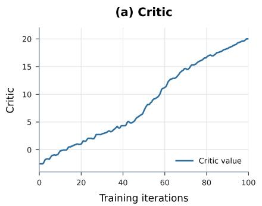
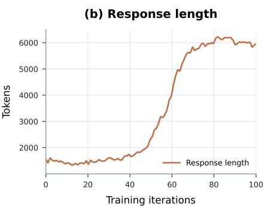
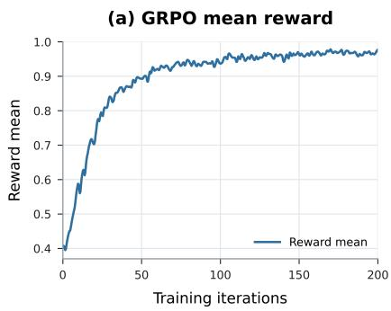
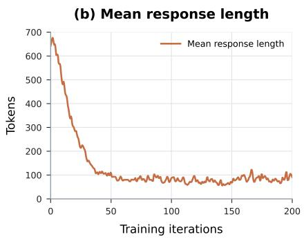
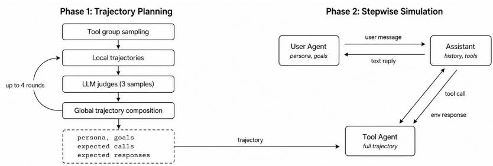

# From Production Traffic to Post-Training: Building a Self-Hosted LLM That Covers the Corporate Request Mix

Olga Tsymboi, Dmitrii Stoianov, Ramil Latypov, Danil Taranets, Daniil Dryabin, Mikhail Gashkov, Viktor Zelenkovskiy, Aleksandr Fida, Gleb Alektorov, Nikita Gulyakov Arthur Babkin, Aleksandr Medvedev, Pavel Gein, Anatolii Potapov

T-Tech

Correspondence: anatolii.s.potapov@gmail.com

## Abstract

Data-residency constraints force enterprises to self-host LLMs, but continuous adoption of newer models without decommissioning their predecessors expands the serving fleet, fragmenting a finite GPU pool. We consolidate traffic from over 200 internal applications onto a single model by closing quality gaps identified through production error analysis along three axes: instruction following, function-calling, and internal task distribution. Quality is tracked by offline benchmarks stratified to production traffic and scored by deterministic verifiers or calibrated LLM judges. Rather than optimising all objectives jointly, which introduces crossdomain reward interference, we train a separate GRPO expert per axis and merge them via two-stage SLERP. Each expert’s reward exposes a distinct failure mode, namely semantic collapse, over-calling, and verbosity hacking, each requiring a domain-specific fix. In nonreasoning mode the recipe surpasses a ∼7× larger by total parameters baseline on the inhouse Arena with 69.6 to 65.8, instruction following with 0.85 to 0.83, and function-calling with 0.79 to 0.77, while lifting general dialogue benchmarks. The model absorbs 50% of platform traffic, 116M requests per month, at a fraction of the serving cost.

## 1 Introduction

Recent open-weight LLMs have closed the quality gap with proprietary systems on typical enterprise workloads (Yang et al., 2025; Grattafiori et al., 2024; DeepSeek-AI et al., 2024), and under data-residency and regulatory constraints locally deployed models are often the only option (Wu et al., 2023; Pan et al., 2025). In a large enterprise, local deployment means one finite GPU pool shared by hundreds of applications. Each team picks the model that fits its task; switching later creates friction, new generations arrive quarterly while old models cannot be retired, and the effective price per token rises as the zoo fragments.

We consolidate traffic onto a single model by closing the gaps that prevent migration via dedicated post-training. The adapted model absorbs 50% of platform traffic, 116M requests per month from over 200 internal applications, six months after rollout and is cheap enough to update every production cycle. Because the long tail of applications is created and retired faster than any one accumulates enough traffic for reliable A/B testing, the model must retain broad capabilities for unseen workflows, making evaluation two-sided: diagnose and repair live weaknesses while preserving generalization.

Error analysis of production traffic surfaces three improvement axes. Instruction-following and formatting errors account for 37.9% of failures (Appendix A.1), making strict constraint satisfaction the largest single lever. Function calling is critical: tool-equipped requests account for ∼12% of traffic. A distributional gap remains between highfrequency task types and long-tail workflows on the one hand and public training distributions on the other. We address all three in a single post-training stage without regressing general capabilities and make three contributions.

This paper presents a methodology for building internal benchmarks from production traffic, scored by deterministic verifiers or calibrated LLM judges and validated against human annotators.

A modular post-training recipe trains a separate RL expert per weak axis and combines them by weight-space merging. Three reward-hacking failure modes that preclude joint multi-objective training are documented alongside the domain-specific fix each requires.

An open-weight checkpoint trained with the same recipe but without internal data is released1, on public benchmarks it scores close to the deployed version, confirming that the recipe, not proprietary data, drives the gains.

## 2 Related Work

Russian LLM development has mostly followed two directions: training Russian models from scratch (Kuratov and Arkhipov, 2019; Zmitrovich et al., 2024) and adapting multilingual backbones (Tikhomirov and Chernyshov, 2024; Nikolich et al., 2024; Stoianov et al., 2026; Mamedov et al., 2025). These efforts improved general Russian generation, but reproducible post-training recipes targeting agentic skills have not been published for this language. Our focus is not fluency, but reliable instruction execution, structured tool use, and stable multi-step behaviour.

Instruction following (IF) and function calling (FC). Both are often treated as languageindependent, but this breaks down in Russian. IF is harder to check: morphology, case, casing, punctuation, and free word order mean one Englishstyle rule has many valid Russian forms, so English IF verifiers from AutoIF (Dong et al., 2025), IF-Bench (Pyatkin et al., 2025), and VerIF (Peng et al., 2025) help as templates but cannot be reused as is. FC adds a schema constraint: prompts can be localized, but function names, parameter keys, and enumeration values are part of the API and must stay fixed. Recent multilingual tool-use work (Chen et al., 2025b; Luo et al., 2026) shows the failure is mostly here: errors come from execution-interface violations, not from misunderstanding intent, with parameter-value language mismatch the main failure mode, and inference-time fixes do not recover English-level performance. We therefore handle both axes at the data level, not at inference time: we generate data natively in Russian via schemaaware synthetic pipelines (Liu et al., 2024, 2025; Prabhakar et al., 2025; Xu et al., 2025) with the Tool-N1 reward (Zhang et al., 2026b).

Post-training recipe. Modern post-training pipelines like Tulu 3 (Lambert et al., 2025) and DeepSeek-R1 (Guo et al., 2025) build on RLHF (Ziegler et al., 2019; Ouyang et al., 2022) and use RLVR with GRPO and its variants (Schulman et al., 2017; Shao et al., 2024; Yu et al., 2025; Zheng et al., 2025). In our setting the reward signal is the bottleneck. IF, FC, and general chat each pull the model in a different direction, and each reward has a trivial shortcut. The same failure modes occur in multi-objective and rubric-based

RL (Ichihara et al., 2025; Gunjal et al., 2026; Huang et al., 2025; Liu et al., 2026; Shen et al., 2026; Zhang et al., 2026a), so joint training is fragile. We instead train one expert per skill and merge in weight space (Wortsman et al., 2022; Ilharco et al., 2023), a step now standard in large post-training systems (Grattafiori et al., 2024; Team Cohere et al., 2025; Dang et al., 2024).

Internal evaluation. Open benchmarks such as Arena-Hard (Li et al., 2025) and WildBench (Lin et al., 2025) provide reproducible scoring of openended chat. We extend this line with a stratified internal benchmark matched to production traffic.

## 3 In-house traffic and Arena

We build an internal benchmark from production LLM-platform traffic and score it with an automated Arena pipeline. The benchmark is constructed in two stages: first, a sampling stage that selects a diverse yet representative subset from ∼100k monthly queries, and second, a judging stage that routes each query through a task classifier and applies a task-specific evaluation scheme. The methodology is not limited to a one-month window, we use this interval because it aligns with our production cycle, but the pipeline applies to any period. We summarize two key takeaways below.

How to get diversity without drifting from production? We quantify diversity as the mean pairwise TF-IDF cosine distance and representativeness as the Jensen-Shannon distance from the production pool along four dimensions: queried model, prompt length, service, and task taxonomy. The two objectives are in tension because in-house traffic is dominated by templated requests, where variable fragments are substituted into a small set of prompt templates.

Standard approaches fail in opposite directions, as shown in Table 1. Uniform random sampling preserves the production distribution but inherits near-duplicate structure, while diversity-first methods: greedy max-min and #InsTag (Lu et al., 2024) pursue diversity at the expense of representativeness, distorting service distribution by treating templated near-duplicates as genuine diversity.

Our template-aware sampler masks variable tokens, groups near-identical normalized prompts via LSH (Broder, 1997), selects within each template by greedy max-min over variable spans, and allocates budget as count. It attains the highest prompt diversity, 0.953, while keeping JS distances substantially lower than pure diversity sampling, the only method that improves coverage without sacrificing representativeness.

<table><tr><td>Method</td><td>Dist.</td><td> $\mathbf { J S _ { m d l } }$ </td><td> $\mathbf { J S } _ { \mathbf { l e n } }$ </td><td> $\mathbf { J S _ { s v c } }$ </td><td> $\mathbf { J S _ { t a x } }$ </td></tr><tr><td>random</td><td>0.653</td><td>0.001</td><td>0.083</td><td>0.001</td><td>0.000</td></tr><tr><td>greedy max-min</td><td>0.944</td><td>0.403</td><td>0.295</td><td>0.683</td><td>0.019</td></tr><tr><td>#InsTag</td><td>0.874</td><td>0.342</td><td>0.181</td><td>0.479</td><td>0.145</td></tr><tr><td>template-based</td><td>0.953</td><td>0.122</td><td>0.098</td><td>0.281</td><td>0.015</td></tr></table>

Table 1: Sampling methods compared by average pairwise distance, Dist., higher is more diverse, and JS distance from the production pool for queried model $\mathbf { J } \mathbf { S } _ { \mathrm { m d l } } .$ , prompt length $\mathbf { J S } _ { \mathrm { l e n } } ,$ , service $\mathbf { J } { \boldsymbol { S } } _ { \mathrm { s v c } } .$ and task type $\mathbf { J } \mathbf { S } _ { \mathrm { t a x } } .$ , lower is closer to production.

Does one judging recipe fit all tasks? The answer is no. We score the benchmark with Arena-Hard-Auto (Li et al., 2025) using DeepSeek-V3- 0324 (DeepSeek-AI et al., 2024) as judge. A uniform side-by-side (SBS) judge agreed poorly with expert annotators, Cohen’s $\kappa = 0 . 6 2$ , and the disagreement tracks task type. On objective tasks such as classification and information extraction, the judge and the human should share a reference answer, on open-ended tasks such as summarization and content generation, “good” is underspecified and the two raters weigh different criteria.

We therefore route each request through an LLM task classifier, matching human consensus in 90.6 – 99.6% of cases (see Table 10), and judge each segment with its own scheme. Classification and information extraction, roughly 63.2% of traffic, are scored reference-based against gold answers generated by Kimi-K2.5 (Kimi Team et al., 2026) and verified by annotators, 97.7% and 85.2% accepted unmodified. Open-ended tasks keep pairwise SBS judging but augment it with per-example RubricHub-style checklists (Li et al., 2026) split into objective and subjective criteria, Appendix A.2. The best recipe is task-dependent, Table 12: summarization is judged best with the checklist as contextual guidance for a single SBS verdict, $\kappa = 0 . 6 8$ whereas content generation benefits from explicit per-criterion grading with an overall verdict, κ = 0.79.

Overall, the final task-specific pipeline substantially outperforms the uniform-SBS baseline, lifting κ from 0.63 to 0.88 on reference-based and from 0.57 to 0.72 on open-ended contentgeneration subtasks (Table 2).

<table><tr><td>Eval setup</td><td></td><td>Ref.-based Open-ended</td><td> $\mathbf { A v } \mathbf { g } .$ </td></tr><tr><td>Uniform SBS</td><td>0.63</td><td>0.57</td><td>0.62</td></tr><tr><td>Task-specific</td><td>0.88</td><td>0.72</td><td>0.85</td></tr></table>

Table 2: Cohen’s κ by task type for the initial uniform-SBS setup and the final task-specific pipeline. The average is weighted by the number of samples per task.

## 4 Training recipe

Our post-training recipe addresses three axes surfaced by production error analysis: instruction following, function calling, and alignment to the internal task distribution. The model builds on Qwen3-32B (Yang et al., 2025) with an adapted Cyrillic-dense tokenizer (Stoianov et al., 2026), which proved more efficient than the base one, and operates exclusively in non-reasoning mode due to production latency and generation-cost constraints. Training proceeds in three stages. First, a single combined SFT phase exposes the model to all target domains simultaneously, mixing in-house production, general-domain, instruction-following, and function-calling data. This joint checkpoint then serves as the shared starting point for all subsequent RL branches. We keep SFT shared rather than training and merging per-domain SFT experts: at the SFT stage a naive mixture of all domains retains per-domain quality (Table 3), so the extra experts and merge buy nothing, and a single combined stage is the simpler choice. Rather than optimizing one model against all three reward signals jointly, we fork the SFT checkpoint into three independent GRPO (Shao et al., 2024) runs, each trained to convergence on a domain-specific reward. The resulting expert checkpoints are combined into a single deployment model via two-stage sequential SLERP merging (Shoemake, 1985; Goddard et al., 2024).

General expert The general expert retains broad capabilities while aligning to the production task mix. This alignment has no single verifiable reward, and a reward model (RM) adapted to in-house preferences does not improve over the general one (Table 4), so we address it through the data rather than through a dedicated in-house expert. The data combines general-domain samples from a large open-source Russian instruction corpus (Stoianov et al., 2026), constituting roughly 80% of the mixture, with in-house samples drawn from production platform logs making up the remaining 20%. The in-house portion is sampled using the same strategy as the in-house Arena and decontaminated against benchmark data via Min-Hash. Completions are regenerated by Qwen3-235B-A22B-Instruct-2507, which serves both as a strong teacher and as a way to ensure homogeneous target distribution with the general-domain portion. For RL, we train a general RM on this corpus and run GRPO with two additions: a multiplicative length penalty that compares each response’s length to a prompt-specific baseline from Qwen3-235B-A22B-Instruct-2507, and an increased KL coefficient to constrain distribution drift (Appendix C).

IF expert Our in-house IF data appears in the general expert mix, but its diversity may be limited, hurting generalization to unseen constraints in the heterogeneous in-house distribution. Since this corpus was not designed for this capability, a dedicated general IF increment is needed. Training data come from a synthetic pipeline adapted from AutoIF to Russian. Starting from 54 handwritten seed constraints, LLM-based augmentation, consistency-based filtering of generated verifiers and test cases, and back-translation validation expand them to 43K verified constraints. Each constraint is attached to samples from this corpus via both user-level and system-level insertion, yielding 26K training examples with validated completions. During the GRPO we use a VerIF-style verifiable constraint-satisfaction reward. However, pure verifier-based training quickly exposed a rewardhacking failure mode (Skalse et al., 2022): the model learned to produce minimal, semantically empty completions that satisfied the formal checks. To fix this, we extend the VerIF-style reward with a prompt-specific reward-model quality correction. Completions that pass the verifier but score below the mean reward-model score over teacher completions on the same prompt receive a penalty. This preserves verifier-reward scalability while preventing semantic collapse (Appendix D).

Function-Calling Expert Human evaluation of FC platform logs points to two causes of score degradation: production tools are frequently documented in Russian, which is typically out-ofdistribution for English-centric models, and the model tends not to select the wrong function but rather fails to fill arguments in Russian. This holds for both Qwen3-32B and Qwen3-235B-A22B-Instruct-2507. Because open FC data and evaluation suites are overwhelmingly English-centric and machine translation of FC data is structurally unsafe, we generate FC training data natively in each language via a synthetic pipeline that builds a tool pool and a multi-turn dialogue pool from scratch, yielding 1.2M English and 300K Russian samples (Appendix E). The dialogue pipeline separates planning from simulation: a planner builds a trajectory with judge feedback, then three agents replay it under asymmetric visibility so training targets reflect realistic tool use rather than leaked references. SFT is a coarse warm-up, with the mixture stratified equally between tool-call and text targets and between English and Russian. For GRPO we use a binary Tool-N1 (Zhang et al., 2026b) exact-match reward, which admits a dominant exploit: when in doubt, emit a call. We correct this through the data distribution rather than the reward: injecting synthetic irrelevance counters over-calling, while the assistant text-target share is tuned separately for multi-turn accuracy. The resulting mixture is 70% English and 30% Russian, with 80% tool-call and 20% text targets per language and 10% synthetic irrelevance within the text share.

## 5 Evaluation

Benchmarks Since our primary focus is Russianlanguage evaluation, we mainly report Russianadapted versions of IFEval (Zhou et al., 2023), MultiChallenge (Deshpande et al., 2025), and BF-CLv3 (Patil et al., 2025), described in Appendix B, and Arena Hard Ru (T-Tech, 2025), WildChat Hard Ru (Kukushkin, 2025). We additionally report AceBench (Chen et al., 2025a) and τ2-bench (Barres et al., 2026) to probe tool-calling robustness across languages. English results, Arena Hard 2 (Li et al., 2025, 2024) and the original IFEval and MultiChallenge, appear in Appendix H.

The in-house benchmarks are designed to mirror our production distribution and comprise four tasks (Appendix A): the in-house Arena, described in Section 3; the in-house IFEval, which pairs deterministic verifiers with an LLM-judge loose metric; the in-house BFCL, which evaluates against humancurated references in AST mode; and SmartSearch, which measures function-calling within a multistep ReAct (Yao et al., 2023) loop over internal documents.

For the ablation studies in this section we report a subset, namely in-house Arena, Arena Hard Ru, ruIFEval, and ru/en BFCLv3, spanning all capability axes; full results across all benchmarks are reported for the final checkpoints.

Is a combined SFT stage sufficient across domains? Before proceeding to alignment, we investigated whether a single shared SFT model can match the per-domain quality of models trained exclusively on each domain. Table 3 shows that

<table><tr><td rowspan="2">Model</td><td colspan="2">Arena</td><td rowspan="2">ruIFEval</td><td colspan="2">BFCL</td></tr><tr><td>Ru-Hard</td><td>In-House</td><td>En</td><td>Ru</td></tr><tr><td>Qwen3-32B</td><td>85.76</td><td>59.49</td><td>0.770</td><td>63.13</td><td>54.03</td></tr><tr><td>+ Domain SFT</td><td>91.96</td><td>62.18</td><td>0.798</td><td>69.37</td><td>58.69</td></tr><tr><td>+ Shared SFT</td><td>92.45</td><td>66.00</td><td>0.787</td><td>68.59</td><td>58.18</td></tr></table>

Table 3: SFT ablation results. Domain SFT denotes a model trained on a single domain: general for the arena columns, instruction following for IFEval, and tool calling for the BFCL columns.

the shared SFT model closely matches the domainspecific experts across all three evaluation axes confirming that at the SFT stage a naive mixture of data from all domains is sufficient to retain per-domain quality. However, as discussed in the following sections, the same approach of simply combining data does not carry over to the GRPO stage.

Does the reward model need adaptation to inhouse data? To investigate this, we trained the reward model on mixtures of general-domain and inhouse preference pairs and compared them against the general-only reward model within the same GRPO pipeline. As shown in Table 4, adapting

<table><tr><td rowspan="2">Model</td><td colspan="2">Ru-Arena-Hard</td><td colspan="2">In-House Arena</td></tr><tr><td>Score</td><td>Avg. Len.</td><td>Score</td><td>Avg. Len.</td></tr><tr><td>Qwen3-32B</td><td>85.76</td><td>961</td><td>59.49</td><td>208</td></tr><tr><td>+ Shared SFT</td><td>92.45</td><td>1332</td><td>66.00</td><td>259</td></tr><tr><td>+ General GRPO</td><td>95.26</td><td>1261</td><td>70.73</td><td>286</td></tr><tr><td>+ GRPO w/ In-House RM</td><td>93.51</td><td>1261</td><td>68.58</td><td>362</td></tr></table>

Table 4: Ablation: effect of adapting the reward model to in-house data. The in-house-adapted RM does not improve over the general RM.

the reward model to in-house data does not yield improvements. Notably, the in-house RM variant produces substantially longer responses on the inhouse evaluation, averaging 362 tokens compared to 286, which suggests that the adapted model may have absorbed superficial stylistic biases from the in-house preference data. These results show that a well-trained general reward model already captures sufficient signal; naively mixing in-house preference pairs into the RM training set can introduce noise or distributional artifacts that slightly degrade performance. We therefore retained the generaldomain reward model in our final recipe.

Does single-domain GRPO transfer to other domains? When training separate GRPO experts for different capability domains, a practical concern is whether the alignment gains on the target domain carry over to other domains. To examine cross-domain transfer, we performed GRPO training on three separate domains, general, instruction following, and tool calling, each starting from the same shared SFT checkpoint. Table 5 demonstrates

<table><tr><td rowspan="2">Model</td><td colspan="2">Arena</td><td rowspan="2">ruIFEval</td><td colspan="2">BFCL</td></tr><tr><td></td><td>Ru-Hard In-House</td><td>En</td><td>Ru</td></tr><tr><td>Shared SFT</td><td>92.45</td><td>66.00</td><td>0.787</td><td>68.59</td><td>58.18</td></tr><tr><td>+ General (Gen.)</td><td>95.26</td><td>70.73</td><td>0.773</td><td>68.50</td><td>55.59</td></tr><tr><td>+ IF</td><td>94.88</td><td>64.34</td><td>0.827</td><td>68.19</td><td>59.78</td></tr><tr><td>+ FC</td><td>92.14</td><td>62.69</td><td>0.784</td><td>72.25</td><td>66.73</td></tr></table>

Table 5: Cross-domain transfer of single-domain GRPO experts, each trained from the shared SFT checkpoint.

that each expert improves on its own domain while the remaining domains see little to no benefit. The General GRPO expert lifts arena scores to 95.26 and 70.73, but IFEval and tool-calling metrics remain near the SFT baseline. The IF and FC GRPO experts exhibit the same behavior. This shows that single-domain GRPO alignment transfers poorly across domains: gains remain confined to the capability covered by the reward signal, and other domains are largely unaffected. To combine the improvements from all three domains, the final model was obtained by merging the three domain-specific experts into a single model.

Why merge instead of joint GRPO? An alternative is to optimise all domain rewards in a single joint GRPO run. We first study this at 8B, sweeping starting checkpoints, domain mixing ratios, and batching schedules (Table 23). The sweep reveals strong cross-domain interference: from the mixed-SFT checkpoint, jointly optimising the two verifiable-reward domains lifts instruction following (ruIFEval from 0.731 to 0.801) but pushes function calling below its starting point (BFCLv3 EN from 61.2 to 54.5); adding the general reward recovers function calling but collapses instruction following below the baseline (0.687); the only competitive configuration required a general-GRPO warm start and a 1.7× budget. We then ran the strongest configuration from each starting checkpoint at the 32B deployment scale (Table 8), under the same data and evaluation as the merge recipe. The 8B conclusion transfers: joint GRPO over the three rewards from the mixed-SFT checkpoint fails to hold all domains simultaneously, with BFCLv3 falling to 60.88 RU and 70.38 EN against 65.96 and 72.27 for the merge and ruIFEval to 0.770 against 0.799, while the general-GRPO warm start reaches parity with the merge only at the 1.7× budget. Joint training thus turns domain balance into a fragile hyperparameter search that must be repeated whenever a capability is added, whereas the merge recipe extends with one independently trained expert and an eval-only coefficient search. We therefore train one expert per reward and merge in weight space at the deployment scale (Tables 5, 7, 8 and 24).

<table><tr><td rowspan="2">Model</td><td colspan="2">Arena</td><td colspan="2">IFEval</td><td colspan="3">BFCL</td><td rowspan="2">ACE</td><td rowspan="2"> $\tau ^ { 2 }$ </td><td rowspan="2">SS</td><td rowspan="2"></td><td rowspan="2">ruMC ruWC</td><td rowspan="2"></td></tr><tr><td>Ru Hard</td><td>Inh.</td><td>Ru</td><td>Inh.</td><td>Ru</td><td>En</td><td>Inh.</td></tr><tr><td>T-pro-2.1 internal</td><td>93.87</td><td>69.57</td><td>0.799</td><td>0.85</td><td>65.96</td><td>72.27</td><td></td><td>0.79</td><td>73.50</td><td>37.60</td><td>0.557</td><td>34.1</td><td>80.7</td></tr><tr><td>T-pro-2.1 public</td><td>93.76</td><td>66.8</td><td>0.807</td><td>0.83</td><td>66.84</td><td></td><td>72.15</td><td>0.78</td><td>72.70</td><td>35.20</td><td>0.546</td><td>34.8</td><td>78.9</td></tr><tr><td>Qwen3-235B-A22B-Instruct-2507</td><td>96.87</td><td>65.83</td><td>0.803</td><td>0.83</td><td>64.42</td><td>72.13</td><td>0.77</td><td></td><td>70.20</td><td>40.97</td><td>0.669</td><td>46.2</td><td>85.1</td></tr><tr><td>T-Pro-2.0 (think)</td><td>87.04</td><td>61.17</td><td>0.687</td><td>0.63</td><td>50.40</td><td>64.38</td><td></td><td>0.67</td><td>63.80</td><td>34.97</td><td>0.537</td><td>31.9</td><td>68.5</td></tr><tr><td>T-Pro-2.0 (no-think)</td><td>90.36</td><td>57.46</td><td>0.693</td><td>0.54</td><td>47.47</td><td>59.73</td><td></td><td>0.68</td><td>61.20</td><td>24.97</td><td>0.447</td><td>27.8</td><td>76.4</td></tr><tr><td>Qwen3-32B (think)</td><td>87.28</td><td>60.46</td><td>0.774</td><td>0.79</td><td>57.33</td><td>69.19</td><td></td><td>0.67</td><td>65.00</td><td>39.27</td><td>0.491</td><td>31.5</td><td>59.6</td></tr><tr><td>Qwen3-32B (no-think)</td><td>85.76</td><td>59.49</td><td>0.770</td><td>0.67</td><td>54.03</td><td></td><td>63.13</td><td>0.71</td><td>54.60</td><td>31.53</td><td>0.478</td><td>29.3</td><td>52.0</td></tr></table>

Table 6: Comparison of models on Dialogue, Instruction Following, and Function Calling benchmarks. Inh.: in-house benchmarks; SS: SmartSearch F1R&G; ruMC/ruWC: Russian MultiChallenge / WildChat Hard Ru.
<table><tr><td rowspan="2">Merge order</td><td colspan="2">Arena</td><td rowspan="2">ruIFEval</td><td colspan="2">BFCL</td></tr><tr><td>Ru-Hard</td><td>In-House</td><td>En</td><td>Ru</td></tr><tr><td> $\mathrm { ( I F + F C ) + G e n . }$ </td><td> $9 3 . 3 7 \pm 0 . 6 8$ </td><td> ${ \bf 6 8 . 9 9 \pm 0 . 7 7 }$ </td><td> $\mathbf { 0 . 7 9 8 \pm 0 . 0 0 3 2 }$ </td><td> $7 2 . 1 9 \pm 0 . 3 9$ </td><td> ${ \bf 6 5 . 7 3 \pm 0 . 3 6 }$ </td></tr><tr><td> $\mathrm { ( I F + G e n . ) + F C }$ </td><td> $9 1 . 6 6 \pm 0 . 4 0$ </td><td> $6 5 . 0 5 \pm 0 . 6 6$ </td><td> $0 . 7 7 0 \pm 0 . 0 0 3 6$ </td><td> $6 7 . 8 3 \pm 0 . 4 4$ </td><td> $6 1 . 2 5 \pm 0 . 2 6$ </td></tr><tr><td> $\mathrm { ( F C + G e n . ) + I F }$ </td><td> $9 0 . 7 1 \pm 0 . 2 2$ </td><td> $6 5 . 9 9 \pm 0 . 5 7$ </td><td> $0 . 7 7 7 \pm 0 . 0 0 8 9$ </td><td> $7 0 . 0 9 \pm 0 . 2 8$ </td><td> $6 4 . 4 3 \pm 0 . 5 4$ </td></tr></table>

Table 7: Two-stage sequential SLERP merge orderings. Each entry is the mean ± standard deviation over five combinations of near-convergence expert checkpoints merged with identical coefficients.

<table><tr><td rowspan="2">Method</td><td colspan="2">Arena</td><td rowspan="2">ruIFEval</td><td colspan="2">BFCL</td></tr><tr><td>Ru-Hard In-House</td><td></td><td>En</td><td>Ru</td></tr><tr><td>Merge</td><td>93.87</td><td>69.57</td><td>0.799</td><td>72.27</td><td>65.96</td></tr><tr><td>Joint, from SFT</td><td>94.04</td><td>70.27</td><td>0.770</td><td>70.38</td><td>60.88</td></tr><tr><td>Joint, from Gen. GRPO†</td><td>94.65</td><td>70.45</td><td>0.786</td><td>72.06</td><td>65.29</td></tr></table>

Table 8: Joint multi-domain GRPO vs. expert merging at the 32B scale. † trained with a 1.7× larger budget than the other runs.

Does merging order matter? Because SLERP is non-associative, the order in which experts are composed affects the result. Merging the two verifiablereward experts first and then folding in the general expert outperformed the alternative orderings (Table 7) by more than the spread we measured across expert checkpoints. We chose that order empirically, by enumerating all combinations of the three experts. Appendix G reports further ablations on

the merging operator.

Results and Deployment Table 6 compares the final merged checkpoint with the base Qwen3-32B, T-Pro-2.0, and the ∼7× larger by total parameters Qwen3-235B-A22B-Instruct-2507. Our model is on par with or ahead of the larger model across the in-house Arena, 69.57 compared to 65.83, in-house BFCL, 0.79 to 0.77, ruBFCLv3, 65.96 to 64.42, and AceBench, 73.50 to 70.20, all in non-reasoning mode, at a fraction of the serving cost. On benchmarks where backbone scale dominates, namely ruMultiChallenge which probes longcontext memory and self-coherence and Smart-Search which requires open-ended retrieval and synthesis, the recipe substantially narrows the inherited gap: SmartSearch $F _ { 1 }$ improves from 0.478 to 0.557, surpassing both 32B-scale thinking-mode baselines, and ruWildChat rises from 52.0 to 80.7, within 4.4 points of the ∼7× larger model. The public checkpoint, trained with the same recipe but without the internal-data increment, scores close to the deployed version on all benchmarks except the in-house Arena, and is released as open weights. In production the merged checkpoint serves 116M requests per month, 45 average and 110 peak requests per second, from over 200 internal services on single-GPU FP8 replicas behind vLLM (Kwon et al., 2023), 16 to 48 pods, with 95th-percentile latency of 3.2 s and time-to-first-token of 0.3 s. Compared to the ∼7× larger baseline it matches on quality, the deployed model reduces per-token cost by 2.8 to 3.9× on input and output, and up to 4 to 9× for services that previously ran the largest platform models. The few rollbacks came from teams requiring frontier-scale agentic capabilities beyond a 32B dense model.

## 6 Conclusion

We presented a production-driven recipe for consolidating a fragmented self-hosted LLM fleet into a single deployment model. Traffic analysis across more than 200 internal applications identified three main gaps: instruction following, function calling, and alignment to the internal request distribution. Joint GRPO made these objectives interfere, so we trained one expert per axis from a shared SFT checkpoint and merged them with two-stage SLERP.

The main lesson is that enterprise post-training is easier to control when the objectives are modular. Each axis produced its own failure mode and each required a targeted fix. This separation makes the recipe easier to debug, audit, and extend.

Together with template-aware traffic sampling and task-specific judging calibrated against human annotators, the recipe gives a practical path from production error analysis to deployment. The final Qwen3-32B non-reasoning model is competitive on target deployment metrics while serving 116M monthly requests at lower cost. A public checkpoint trained without internal data shows similar public-benchmark gains, suggesting that the recipe accounts for much of the improvement.

## Limitations

Language and deployment scope. Our evaluation covers only Russian and English. The in-house benchmarks are built from Russian-language traffic of a single self-hosted corporate deployment, while English enters both the training mixtures and the corresponding evaluation sets. The methodology: traffic-stratified benchmarking, one RL expert per weak axis, and weight-space merging, is not inherently tied to these languages or to our organization, though we leave verification on other languages and domains to future work. All quantitative claims in this paper should therefore be read as validated for Russian and English only.

Reliance on LLM judges. Open-ended quality is scored by LLM judges calibrated against human annotators on our benchmark distribution. If the recipe is reused for another deployment, language, or benchmark distribution, judge quality should be re-calibrated against human annotations. A sensitivity study over four judges is reported in Appendix H.

Deployment and model-family scope. The deployment evidence comes from a single organization and a single self-hosted corporate platform, and all experiments use only the Qwen3 model family. Nothing in the recipe depends on the backbone, but we have not validated it on another family or in another organization.

## Ethical Statement

Data provenance, privacy, and decontamination. All in-house benchmarks are derived from logged traffic of an internal corporate LLM platform, processed entirely on self-hosted infrastructure under data-residency constraints; this is also why the system is deployed locally rather than through a third-party API. Records are deduplicated and anonymized, and variable spans such as numbers, identifiers, and long literals are masked during template extraction. No public or external end-user data is involved, and only internal work-related requests are used. We explicitly control for contamination between training and evaluation data: evaluation items are held out from the internal-data increment used to train the general expert, and exact and template-level duplicates are removed. The weak-axis experts are trained on synthetic data only, so internal traffic does not directly supervise them. This separation underpins our main claim: the improvements from the weak-axis experts and their weight-space merges are not explained by memorizing the same internal examples that appear in the benchmarks.

Human annotation. Gold answers, benchmark translations, and the task-specific verification procedures were validated and corrected by professional annotators and domain experts working as part of this project; their role was data validation and correction. In the judge-validation studies, each response pair was independently labeled by three annotators and the consensus taken as the majority vote. All annotation was performed on internal work-related data under the privacy and data-handling procedures described above.

Intended use and risks. The model is intended for internal enterprise assistance. Like any LLM, it can produce factually incorrect outputs or violate stated constraints; deterministic verifiers reduce but do not eliminate this risk. In particular, tool calls emitted by the model should be gated and validated before execution in production.

## References

Victor Barres, Honghua Dong, Soham Ray, Xujie Si, and Karthik Narasimhan. 2026. τ2-Bench: Evaluating Conversational Agents in a Dual-Control Environment. In Forty-third International Conference on Machine Learning.

Andrei Z. Broder. 1997. On the resemblance and containment of documents. In Compression and Complexity of SEQUENCES 1997, Positano, Amalfitan Coast, Salerno, Italy, June 11-13, 1997, Proceedings, pages 21–29. IEEE.

Chen Chen, Xinlong Hao, Weiwen Liu, Xu Huang, Xingshan Zeng, Shuai Yu, Dexun Li, Yuefeng Huang, Xiangcheng Liu, Xinzhi Wang, and Wu Liu. 2025a. ACEBench: A Comprehensive Evaluation of LLM Tool Usage. In Findings of the Association for Computational Linguistics: EMNLP 2025, pages 12970– 12998, Suzhou, China. Association for Computational Linguistics.

Yi-Chang Chen, Po-Chun Hsu, Chan-Jan Hsu, and Dashan Shiu. 2025b. Enhancing Function-Calling Capabilities in LLMs: Strategies for Prompt Formats, Data Integration, and Multilingual Translation. In Proceedings ofthe 2025 Conference ofthe Nations ofthe Americas Chapter ofthe Associationfor Computational Linguistics: Human Language Technologies (Volume 3: Industry Track), pages 99–111, Albuquerque, New Mexico. Association for Computational Linguistics.

John Dang, Shivalika Singh, Daniel D’souza, Arash Ahmadian, Alejandro Salamanca, Madeline Smith, Aidan Peppin, Sungjin Hong, Manoj Govindassamy, Terrence Zhao, Sandra Kublik, Meor Amer, Viraat Aryabumi, Jon Ander Campos, Yi-Chern Tan, Tom Kocmi, Florian Strub, Nathan Grinsztajn, Yannis Flet-Berliac, and 26 others. 2024. Aya Expanse: Combining Research Breakthroughs for a New Multilingual Frontier. Preprint, arXiv:2412.04261.

DeepSeek-AI, Aixin Liu, Bei Feng, Bing Xue, Bingxuan Wang, Bochao Wu, Chengda Lu, Chenggang Zhao, Chengqi Deng, Chenyu Zhang, Chong Ruan, Damai Dai, Daya Guo, Dejian Yang, Deli Chen, Dongjie Ji, Erhang Li, Fangyun Lin, Fucong Dai, and 181 others. 2024. DeepSeek-V3 Technical Report. Preprint, arXiv:2412.19437.

Kaustubh Deshpande, Ved Sirdeshmukh, Johannes Baptist Mols, Lifeng Jin, Ed-Yeremai Hernandez-Cardona, Dean Lee, Jeremy Kritz, Willow E. Primack, Summer Yue, and Chen Xing. 2025. MultiChallenge: A Realistic Multi-Turn Conversation Evaluation Benchmark Challenging to Frontier

LLMs. In Findings ofthe Associationfor Computational Linguistics: ACL 2025, pages 18632–18702, Vienna, Austria. Association for Computational Linguistics.

Guanting Dong, Keming Lu, Chengpeng Li, Tingyu Xia, Bowen Yu, Chang Zhou, and Jingren Zhou. 2025. Self-play with Execution Feedback: Improving Instruction-following Capabilities of Large Language Models. In The Thirteenth International Conference on Learning Representations, ICLR 2025, Singapore, April 24-28, 2025. OpenReview.net.

Yann Dubois, Percy Liang, and Tatsunori Hashimoto. 2024. Length-Controlled AlpacaEval: A Simple Debiasing of Automatic Evaluators. In First Conference on Language Modeling.

Leo Gao, John Schulman, and Jacob Hilton. 2023. Scaling Laws for Reward Model Overoptimization. In Proceedings of the 40th International Conference on Machine Learning, volume 202 of Proceedings of Machine Learning Research, pages 10835–10866. PMLR.

GLM-4.5 Team, Aohan Zeng, Xin Lv, Qinkai Zheng, Zhenyu Hou, Bin Chen, Chengxing Xie, Cunxiang Wang, Da Yin, Hao Zeng, Jiajie Zhang, Kedong Wang, Lucen Zhong, Mingdao Liu, Rui Lu, Shulin Cao, Xiaohan Zhang, Xuancheng Huang, Yao Wei, and 152 others. 2025. GLM-4.5: Agentic, Reasoning, and Coding (ARC) Foundation Models. Preprint, arXiv:2508.06471.

Charles Goddard, Shamane Siriwardhana, Malikeh Ehghaghi, Luke Meyers, Vladimir Karpukhin, Brian Benedict, Mark McQuade, and Jacob Solawetz. 2024. Arcee’s MergeKit: A Toolkit for Merging Large Language Models. In Proceedings ofthe 2024 Conference on Empirical Methods in Natural Language Processing: Industry Track, pages 477–485, Miami, Florida, US. Association for Computational Linguistics.

Google DeepMind. 2026. Gemini 3.1 Pro Model Card. Model card, https://deepmind.google/models/ model-cards/gemini-3-1-pro/.

Aaron Grattafiori, Abhimanyu Dubey, Abhinav Jauhri, Abhinav Pandey, Abhishek Kadian, Ahmad Al-Dahle, Aiesha Letman, Akhil Mathur, Alan Schelten, Alex Vaughan, Amy Yang, Angela Fan, Anirudh Goyal, Anthony Hartshorn, Aobo Yang, Archi Mitra, Archie Sravankumar, Artem Korenev, Arthur Hinsvark, and 540 others. 2024. The Llama 3 Herd of Models. Preprint, arXiv:2407.21783.

Maarten Grootendorst. 2022. BERTopic: Neural topic modeling with a class-based TF-IDF procedure. Preprint, arXiv:2203.05794.

Anisha Gunjal, Anthony Wang, Elaine Lau, Vaskar Nath, Yunzhong He, Bing Liu, and Sean Hendryx. 2026. Rubrics as Rewards: Reinforcement Learning Beyond Verifiable Domains. In International Conference on Learning Representations, pages 127924– 127945.

Daya Guo, Dejian Yang, Haowei Zhang, Junxiao Song, Peiyi Wang, Qihao Zhu, Runxin Xu, Ruoyu Zhang, Shirong Ma, Xiao Bi, Xiaokang Zhang, Xingkai Yu, Yu Wu, Z. F. Wu, Zhibin Gou, Zhihong Shao, Zhuoshu Li, Ziyi Gao, Aixin Liu, and 175 others. 2025. DeepSeek-R1 Incentivizes Reasoning in LLMs through Reinforcement Learning. Nature, 645(8081):633–638.

Zenan Huang, Yihong Zhuang, Guoshan Lu, Zeyu Qin, Haokai Xu, Tianyu Zhao, Ru Peng, Jiaqi Hu, Zhanming Shen, Xiaomeng Hu, Xijun Gu, Peiyi Tu, Jiaxin Liu, Wenyu Chen, Yuzhuo Fu, Zhiting Fan, Yanmei Gu, Yuanyuan Wang, Zhengkai Yang, and 2 others. 2025. Reinforcement Learning with Rubric Anchors. Preprint, arXiv:2508.12790.

Yuki Ichihara, Yuu Jinnai, Tetsuro Morimura, Mitsuki Sakamoto, Ryota Mitsuhashi, and Eiji Uchibe. 2025. MO-GRPO: Mitigating Reward Hacking of Group Relative Policy Optimization on Multi-Objective Problems. Preprint, arXiv:2509.22047.

Gabriel Ilharco, Marco Túlio Ribeiro, Mitchell Wortsman, Ludwig Schmidt, Hannaneh Hajishirzi, and Ali Farhadi. 2023. Editing models with task arithmetic. In The Eleventh International Conference on Learning Representations, ICLR 2023, Kigali, Rwanda, May 1-5, 2023. OpenReview.net.

Kimi Team, Tongtong Bai, Yifan Bai, Yiping Bao, S. H. Cai, Yuan Cao, Y. Charles, H. S. Che, Cheng Chen, Guanduo Chen, Huarong Chen, Jia Chen, Jiahao Chen, Jianlong Chen, Jun Chen, Kefan Chen, Liang Chen, Ruijue Chen, Xinhao Chen, and 307 others. 2026. Kimi K2.5: Visual Agentic Intelligence. Preprint, arXiv:2602.02276.

Alexander Kukushkin. 2025. wildchat-hard-ru. GitHub repository, https://github.com/kuk/ wildchat-hard-ru. Accessed 2026-08-25.

Yuri Kuratov and Mikhail Arkhipov. 2019. Adaptation of Deep Bidirectional Multilingual Transformers for Russian Language. In Computational Linguistics and Intellectual Technologies: Papers from the Annual International Conference “Dialogue” (2019), pages 333–339. Issue 18 (25).

Woosuk Kwon, Zhuohan Li, Siyuan Zhuang, Ying Sheng, Lianmin Zheng, Cody Hao Yu, Joseph Gonzalez, Hao Zhang, and Ion Stoica. 2023. Efficient Memory Management for Large Language Model Serving with PagedAttention. In Proceedings of the 29th Symposium on Operating Systems Principles, SOSP ’23, pages 611–626. ACM.

Nathan Lambert, Jacob Morrison, Valentina Pyatkin, Shengyi Huang, Hamish Ivison, Faeze Brahman, Lester James Validad Miranda, Alisa Liu, Nouha Dziri, Xinxi Lyu, Yuling Gu, Saumya Malik, Victoria Graf, Jena D. Hwang, Jiangjiang Yang, Ronan Le Bras, Oyvind Tafjord, Christopher Wilhelm, Luca Soldaini, and 4 others. 2025. Tülu 3: Pushing Frontiers in Open Language Model Post-Training. In Second Conference on Language Modeling.

Sunzhu Li, Jiale Zhao, Huimin Ren, Zhenlin Wei, Yang Zhou, Jingwen Yang, Shunyu Liu, Kaike Zhang, and Chen Wei. 2026. RubricHub: A Comprehensive and Highly Discriminative Rubric Dataset via Automated Coarse-to-Fine Generation. In Proceedings of the 64th Annual Meeting of the Association for Computational Linguistics (Volume 1: Long Papers), pages 31320–31344, San Diego, California, United States. Association for Computational Linguistics.

Tianle Li, Wei-Lin Chiang, Evan Frick, Lisa Dunlap, Tianhao Wu, Banghua Zhu, Joseph E. Gonzalez, and Ion Stoica. 2025. From Crowdsourced Data to Highquality Benchmarks: Arena-Hard and Benchbuilder Pipeline. In Proceedings of the 42nd International Conference on Machine Learning, volume 267 of Proceedings ofMachine Learning Research, pages 34209–34231. PMLR.

Tianle Li, Wei-Lin Chiang, Evan Frick, Lisa Dunlap, Banghua Zhu, Joseph E. Gonzalez, and Ion Stoica. 2024. From Live Data to High-Quality Benchmarks: The Arena-Hard Pipeline. LM-SYS Org blog post, https://lmsys.org/blog/ 2024-04-19-arena-hard/.

Bill Yuchen Lin, Yuntian Deng, Khyathi Raghavi Chandu, Abhilasha Ravichander, Valentina Pyatkin, Nouha Dziri, Ronan Le Bras, and Yejin Choi. 2025. WildBench: Benchmarking LLMs with Challenging Tasks from Real Users in the Wild. In The Thirteenth International Conference on Learning Representations, ICLR 2025, Singapore, April 24-28, 2025. OpenReview.net.

Tianci Liu, Ran Xu, Tony Yu, Ilgee Hong, Carl Yang, Tuo Zhao, and Haoyu Wang. 2026. OpenRubrics: Towards Scalable Synthetic Rubric Generation for Reward Modeling and LLM Alignment. In Proceedings ofthe 64th Annual Meeting ofthe Associationfor Computational Linguistics (Volume 1: Long Papers), pages 17417–17437, San Diego, California, United States. Association for Computational Linguistics.

Weiwen Liu, Xu Huang, Xingshan Zeng, Xinlong Hao, Shuai Yu, Dexun Li, Shuai Wang, Weinan Gan, Zhengying Liu, Yuanqing Yu, Zezhong Wang, Yuxian Wang, Wu Ning, Yutai Hou, Bin Wang, Chuhan Wu, Xinzhi Wang, Yong Liu, Yasheng Wang, and 8 others. 2025. ToolACE: Winning the Points of LLM Function Calling. In The Thirteenth International Conference on Learning Representations, ICLR 2025, Singapore, April 24-28, 2025. OpenReview.net.

Zuxin Liu, Thai Hoang, Jianguo Zhang, Ming Zhu, Tian Lan, Shirley Kokane, Juntao Tan, Weiran Yao, Zhiwei Liu, Yihao Feng, Rithesh Murthy, Liangwei Yang, Silvio Savarese, Juan Carlos Niebles, Huan Wang, Shelby Heinecke, and Caiming Xiong. 2024. APIGen: Automated PIpeline for Generating Verifiable and Diverse Function-Calling Datasets. In Advances in Neural Information Processing Systems, volume 37, pages 54463–54482. Curran Associates, Inc.

Keming Lu, Hongyi Yuan, Zheng Yuan, Runji Lin, Junyang Lin, Chuanqi Tan, Chang Zhou, and Jingren Zhou. 2024. #InsTag: Instruction Tagging for Analyzing Supervised Fine-tuning of Large Language Models. In The Twelfth International Conference on Learning Representations, ICLR 2024, Vienna, Austria, May 7-11, 2024. OpenReview.net.

Zheng Luo, T Pranav Kutralingam, Ogochukwu N. Okoani, Wanpeng Xu, Hua Wei, and Xiyang Hu. 2026. Lost in Execution: On the Multilingual Robustness of Tool Calling in Large Language Models. In Proceedings of the 64th Annual Meeting of the Association for Computational Linguistics (Volume 1: Long Papers), pages 44059–44077, San Diego, California, United States. Association for Computational Linguistics.

Valentin Mamedov, Evgenii Kosarev, Gregory Leleytner, Ilya Shchuckin, Valeriy Berezovskiy, Daniil Smirnov, Dmitry Kozlov, Sergei Averkiev, Lukyanenko Ivan, Aleksandr Proshunin, Ainur Israfilova, Ivan Baskov, Artem Chervyakov, Emil Shakirov, Mikhail Kolesov, Daria Khomich, Daria Latortseva, Sergei Porkhun, Yury Fedorov, and 14 others. 2025. GigaChat Family: Efficient Russian Language Modeling Through Mixture of Experts Architecture. In Proceedings of the 63rd Annual Meeting ofthe Associationfor Computational Linguistics (Volume 3: System Demonstrations), pages 93–106, Vienna, Austria. Association for Computational Linguistics.

Mistral AI. 2025. Mistral Large 3. Model card, https://huggingface.co/mistralai/ Mistral-Large-3-675B-Instruct-2512.

Aleksandr Nikolich, Konstantin Korolev, Sergei Bratchikov, Igor Kiselev, and Artem Shelmanov. 2024. Vikhr: The Family of Open-Source Instruction-Tuned Large Language Models for Russian. Preprint, arXiv:2405.13929.

NousResearch. 2024. hermes-functioncalling-v1. Hugging Face dataset, https: //huggingface.co/datasets/NousResearch hermes-function-calling-v1.

OpenAI. 2025. gpt-oss-120b & gpt-oss-20b Model Card. Preprint, arXiv:2508.10925.

Long Ouyang, Jeffrey Wu, Xu Jiang, Diogo Almeida, Carroll Wainwright, Pamela Mishkin, Chong Zhang, Sandhini Agarwal, Katarina Slama, Alex Ray, John Schulman, Jacob Hilton, Fraser Kelton, Luke Miller, Maddie Simens, Amanda Askell, Peter Welinder, Paul F Christiano, Jan Leike, and Ryan Lowe. 2022. Training language models to follow instructions with human feedback. In Advances in Neural Information Processing Systems, volume 35, pages 27730–27744. Curran Associates, Inc.

Guanzhong Pan, Vishal Chodnekar, Abinas Roy, and Haibo Wang. 2025. A Cost-Benefit Analysis of On-Premise Large Language Model Deployment: Breaking Even with Commercial LLM Services. In 2025

IEEE International Conference on Big Data (Big-Data), pages 2234–2239. IEEE.

Ryan Park, Rafael Rafailov, Stefano Ermon, and Chelsea Finn. 2024. Disentangling Length from Quality in Direct Preference Optimization. In Findings ofthe Associationfor Computational Linguistics: ACL 2024, pages 4998–5017, Bangkok, Thailand. Association for Computational Linguistics.

Shishir G. Patil, Huanzhi Mao, Fanjia Yan, Charlie Cheng-Jie Ji, Vishnu Suresh, Ion Stoica, and Joseph E. Gonzalez. 2025. The Berkeley Function Calling Leaderboard (BFCL): From Tool Use to Agentic Evaluation of Large Language Models. In Proceedings of the 42nd International Conference on Machine Learning, volume 267 of Proceedings ofMachine Learning Research, pages 48371–48392. PMLR.

Hao Peng, Yunjia Qi, Xiaozhi Wang, Bin Xu, Lei Hou, and Juanzi Li. 2025. VerIF: Verification Engineering for Reinforcement Learning in Instruction Following. In Proceedings of the 2025 Conference on Empirical Methods in Natural Language Processing, pages 30324–30339, Suzhou, China. Association for Computational Linguistics.

Akshara Prabhakar, Zuxin Liu, Ming Zhu, Jianguo Zhang, Tulika Manoj Awalgaonkar, Shiyu Wang, Zhiwei Liu, Haolin Chen, Thai Hoang, Juan Carlos Niebles, Shelby Heinecke, Weiran Yao, Huan Wang, Silvio Savarese, and Caiming Xiong. 2025. APIGen-MT: Agentic Pipeline for Multi-Turn Data Generation via Simulated Agent-Human Interplay. In Advances in Neural Information Processing Systems, volume 38. Curran Associates, Inc.

Valentina Pyatkin, Saumya Malik, Victoria Graf, Hamish Ivison, Shengyi Huang, Pradeep Dasigi, Nathan Lambert, and Hanna Hajishirzi. 2025. Generalizing Verifiable Instruction Following. In Advances in Neural Information Processing Systems, volume 38. Curran Associates, Inc.

Rafael Rafailov, Archit Sharma, Eric Mitchell, Christopher D Manning, Stefano Ermon, and Chelsea Finn. 2023. Direct Preference Optimization: Your Language Model is Secretly a Reward Model. In Advances in Neural Information Processing Systems 36, NeurIPS 2023, pages 53728–53741. Neural Information Processing Systems Foundation, Inc. (NeurIPS).

John Schulman, Filip Wolski, Prafulla Dhariwal, Alec Radford, and Oleg Klimov. 2017. Proximal Policy Optimization Algorithms. Preprint, arXiv:1707.06347.

Zhihong Shao, Peiyi Wang, Qihao Zhu, Runxin Xu, Junxiao Song, Xiao Bi, Haowei Zhang, Mingchuan Zhang, Y. K. Li, Y. Wu, and Daya Guo. 2024. DeepSeekMath: Pushing the Limits of Mathematical Reasoning in Open Language Models. Preprint, arXiv:2402.03300.

William F. Shen, Xinchi Qiu, Chenxi Whitehouse, Lisa Alazraki, Shashwat Goel, Francesco Barbieri, Timon Willi, Akhil Mathur, and Ilias Leontiadis. 2026. Rethinking Rubric Generation for Improving LLM Judge and Reward Modeling for Open-ended Tasks. Preprint, arXiv:2602.05125.

Guangming Sheng, Chi Zhang, Zilingfeng Ye, Xibin Wu, Wang Zhang, Ru Zhang, Yanghua Peng, Haibin Lin, and Chuan Wu. 2025. HybridFlow: A Flexible and Efficient RLHF Framework. In Proceedings of the Twentieth European Conference on Computer Systems, EuroSys ’25, pages 1279–1297. ACM.

Ken Shoemake. 1985. Animating rotation with quaternion curves. In Proceedings ofthe 12th annual conference on Computer graphics and interactive techniques - SIGGRAPH ’85, SIGGRAPH ’85, pages 245–254. ACM Press.

Prasann Singhal, Tanya Goyal, Jiacheng Xu, and Greg Durrett. 2024. A Long Way to Go: Investigating Length Correlations in RLHF. In First Conference on Language Modeling.

Joar Skalse, Nikolaus Howe, Dmitrii Krasheninnikov, and David Krueger. 2022. Defining and Characterizing Reward Hacking. In Advances in Neural Information Processing Systems 35, NeurIPS 2022, pages 9460–9471. Neural Information Processing Systems Foundation, Inc. (NeurIPS).

Dmitrii Stoianov, Danil Taranets, Olga Tsymboi, Ramil Latypov, Almaz Dautov, Vladislav Kruglikov, Nikita Surkov, German Abramov, Pavel Gein, Dmitry Abulkhanov, Mikhail Gashkov, Viktor Zelenkovskiy, Artem Batalov, Aleksandr Medvedev, and Anatolii Potapov. 2026. T-pro 2.0: An Efficient Russian Hybrid-Reasoning Model and Playground. In Proceedings of the 19th Conference of the European Chapter of the Association for Computational Linguistics (Volume 3: System Demonstrations), pages 297–319, Rabat, Morocco. Association for Computational Linguistics.

T-Tech. 2025. ru-arena-hard. Hugging Face dataset, https://huggingface.co/datasets/t-tech/ ru-arena-hard. Accessed 2025.

Team Cohere, Aakanksha, Arash Ahmadian, Marwan Ahmed, Jay Alammar, Yazeed Alnumay, Sophia Althammer, Arkady Arkhangorodsky, Viraat Aryabumi, Dennis Aumiller, Raphaël Avalos, Zahara Aviv, Sammie Bae, Saurabh Baji, Alexandre Barbet, Max Bartolo, Björn Bebensee, Neeral Beladia, Walter Beller-Morales, and 207 others. 2025. Command A: An Enterprise-Ready Large Language Model. Preprint, arXiv:2504.00698.

Mikhail Tikhomirov and Daniil Chernyshov. 2024. Facilitating Large Language Model Russian Adaptation with Learned Embedding Propagation. Journal of Language and Education, 10(4):130–145.

Yizhong Wang, Yeganeh Kordi, Swaroop Mishra, Alisa Liu, Noah A. Smith, Daniel Khashabi, and Hannaneh

Hajishirzi. 2023. Self-Instruct: Aligning Language Models with Self-Generated Instructions. In Proceedings ofthe 61st Annual Meeting ofthe Associationfor Computational Linguistics (Volume 1: Long Papers), pages 13484–13508, Toronto, Canada. Association for Computational Linguistics.

Mitchell Wortsman, Gabriel Ilharco, Samir Yitzhak Gadre, Rebecca Roelofs, Raphael Gontijo Lopes, Ari S. Morcos, Hongseok Namkoong, Ali Farhadi, Yair Carmon, Simon Kornblith, and Ludwig Schmidt. 2022. Model soups: averaging weights of multiple fine-tuned models improves accuracy without increasing inference time. In International Conference on Machine Learning, ICML 2022, 17-23 July 2022, Baltimore, Maryland, USA, volume 162 of Proceedings ofMachine Learning Research, pages 23965–23998. PMLR.

Shijie Wu, Ozan Irsoy, Steven Lu, Vadim Dabravolski, Mark Dredze, Sebastian Gehrmann, Prabhanjan Kambadur, David Rosenberg, and Gideon Mann. 2023. BloombergGPT: A Large Language Model for Finance. Preprint, arXiv:2303.17564.

Zhangchen Xu, Adriana Meza Soria, Shawn Tan, Anurag Roy, Ashish Sunil Agrawal, Radha Poovendran, and Rameswar Panda. 2025. TOUCAN: Synthesizing 1.5M Tool-Agentic Data from Real-World MCP Environments. Preprint, arXiv:2510.01179.

Prateek Yadav, Derek Tam, Leshem Choshen, Colin A. Raffel, and Mohit Bansal. 2023. TIES-Merging: Resolving Interference When Merging Models. In Advances in Neural Information Processing Systems 36: Annual Conference on Neural Information Processing Systems 2023, NeurIPS 2023, New Orleans, LA, USA, December 10 - 16, 2023.

An Yang, Anfeng Li, Baosong Yang, Beichen Zhang, Binyuan Hui, Bo Zheng, Bowen Yu, Chang Gao, Chengen Huang, Chenxu Lv, Chujie Zheng, Dayiheng Liu, Fan Zhou, Fei Huang, Feng Hu, Hao Ge, Haoran Wei, Huan Lin, Jialong Tang, and 41 others. 2025. Qwen3 Technical Report. Preprint, arXiv:2505.09388.

Shunyu Yao, Jeffrey Zhao, Dian Yu, Nan Du, Izhak Shafran, Karthik R. Narasimhan, and Yuan Cao. 2023. ReAct: Synergizing Reasoning and Acting in Language Models. In The Eleventh International Conference on Learning Representations, ICLR 2023, Kigali, Rwanda, May 1-5, 2023. OpenReview.net.

Junjie Ye, Changhao Jiang, Zhengyin Du, Yufei Xu, Xuesong Yao, Zhiheng Xi, Xiaoran Fan, Qi Zhang, Tao Gui, Xuanjing Huang, and Jiecao Chen. 2026. Feedback-Driven Tool-Use Improvements in Large Language Models via Automated Build Environments. In Findings of the Association for Computational Linguistics: ACL 2026, pages 2293–2323, San Diego, California, United States. Association for Computational Linguistics.

Qiying Yu, Zheng Zhang, Ruofei Zhu, Yufeng Yuan, Xiaochen Zuo, Yu Yue, Weinan Dai, Tiantian Fan, Gaohong Liu, Juncai Liu, Lingjun Liu, Xin Liu, Haibin Lin, Zhiqi Lin, Bole Ma, Guangming Sheng, Yuxuan Tong, Chi Zhang, Mofan Zhang, and 17 others. 2025. DAPO: An Open-Source LLM Reinforcement Learning System at Scale. In Advances in Neural Information Processing Systems, volume 38, pages 113222–113244. Curran Associates, Inc.

Junkai Zhang, Zihao Wang, Lin Gui, Swarnashree Mysore Sathyendra, Jaehwan Jeong, Victor Veitch, Wei Wang, Yunzhong He, Bing Liu, and Lifeng Jin. 2026a. Chasing the Tail: Effective Rubric-Based Reward Modeling for Large Language Model Post-Training. In International Conference on Learning Representations, pages 133430–133457.

Shaokun Zhang, Yi Dong, Jieyu Zhang, Jan Kautz, Bryan Catanzaro, Andrew Tao, Qingyun Wu, Zhiding Yu, and Guilin Liu. 2026b. Nemotron-Research-Tool-N1: Exploring Tool-Using Language Models with Reinforced Reasoning. In International Conference on Learning Representations, pages 91437–91453.

Yanli Zhao, Andrew Gu, Rohan Varma, Liang Luo, Chien-Chin Huang, Min Xu, Less Wright, Hamid Shojanazeri, Myle Ott, Sam Shleifer, Alban Desmaison, Can Balioglu, Pritam Damania, Bernard Nguyen, Geeta Chauhan, Yuchen Hao, Ajit Mathews, and Shen Li. 2023. PyTorch FSDP: Experiences on Scaling Fully Sharded Data Parallel. Proceedings ofthe VLDB Endowment, 16(12):3848–3860.

Chujie Zheng, Shixuan Liu, Mingze Li, Xiong-Hui Chen, Bowen Yu, Chang Gao, Kai Dang, Yuqiong Liu, Rui Men, An Yang, Jingren Zhou, and Junyang Lin. 2025. Group Sequence Policy Optimization. Preprint, arXiv:2507.18071.

Jeffrey Zhou, Tianjian Lu, Swaroop Mishra, Siddhartha Brahma, Sujoy Basu, Yi Luan, Denny Zhou, and Le Hou. 2023. Instruction-Following Evaluation for Large Language Models. Preprint, arXiv:2311.07911.

Daniel M. Ziegler, Nisan Stiennon, Jeffrey Wu, Tom B. Brown, Alec Radford, Dario Amodei, Paul Christiano, and Geoffrey Irving. 2019. Fine-Tuning Language Models from Human Preferences. Preprint, arXiv:1909.08593.

Dmitry Zmitrovich, Aleksandr Abramov, Andrey Kalmykov, Vitaly Kadulin, Maria Tikhonova, Ekaterina Taktasheva, Danil Astafurov, Mark Baushenko, Artem Snegirev, Tatiana Shavrina, Sergei S. Markov, Vladislav Mikhailov, and Alena Fenogenova. 2024. A Family of Pretrained Transformer Language Models for Russian. In Proceedings of the 2024 Joint International Conference on Computational Linguistics, Language Resources and Evaluation (LREC-COLING 2024), pages 507–524, Torino, Italia. ELRA and ICCL.

## A Internal benchmarks

## A.1 Production error analysis

To ground the choice of improvement axes, we sampled n=2,500 LLM-platform traffic responses and had three annotators assign each its single primary failure to one of six categories; inter-annotator agreement was Cohen’s $\kappa = 0 . 6 2$ and the category label was taken as the majority vote (Table 9).

Two observations motivate the IF axis. Classification is the largest single category (36.0%), but instruction-following failures, once formatting (21.0%) and non-format (16.9%) violations are combined, exceed it (37.9%) and are additionally checkable by deterministic verifiers, making them a natural target for a dedicated expert with a verifiable reward (Appendix D).

Second, the remaining categories either do not isolate into a single verifiable axis or are governed by factors a targeted post-training stage cannot move. Classification is a heterogeneous downstream symptom rather than a single capability: in the non-reasoning mode our deployment mandates for latency and cost, a misclassification rarely exposes a clean rewardable signal, so it does not form a domain expert the way IF and FC do. Knowledge-base errors track parametric capacity and long-context retention; they scale with the backbone and are addressed by general-domain training that reduces hallucination and improves helpfulness, not by a constraint-style reward: consistent with the residual gap to the ∼7× larger model on knowledge- and memory-heavy benchmarks (Section 6). Language-preference errors are minor for the bulk of production traffic and are likewise absorbed by the general expert.

This taxonomy covers text-reply failures; function-calling errors are analysed separately by human evaluation of tool-equipped logs, which form ∼12% of traffic (Table 10), and motivate the FC axis. That evaluation traces score degradation primarily to Russian-language tool descriptions, which lie out of distribution for English-centric base models, and to argument-filling errors in Russian rather than incorrect function selection, a pattern consistent across both Qwen3-32B and Qwen3- 235B-A22B-Instruct-2507.

## A.2 Inhouse Arena

## A.2.1 On benchmark data collection

This section specifies the greedy max-min and template-based sampling procedures summarized

<table><tr><td>Category</td><td>Share</td></tr><tr><td>Classification</td><td>36.0%</td></tr><tr><td>Formatting (IF)</td><td>21.0%</td></tr><tr><td>Instruction following, non-format</td><td>16.9%</td></tr><tr><td>Knowledge base</td><td>19.0%</td></tr><tr><td>Language preference</td><td>5.0%</td></tr><tr><td>Other</td><td>2.1%</td></tr></table>

Table 9: Failure-type distribution over a humanreviewed sample of n=2,500 in-house traffic responses, one primary failure per response $( \kappa = 0 . 6 2 )$ . Formatting denotes violations of structural, JSON-schema, or length constraints; the non-format row covers contentlevel instruction violations such as tone, role, enumeration, and lexical prohibitions.

## in Table 1.

Greedy max-min. Starting from a random seed, the sampler repeatedly adds the query whose minimum cosine distance to the already-selected set is largest, so every new pick is the one most dissimilar from all previous picks. This maximizes the minimum pairwise distance of the selected subset. Since production traffic contains large families of near-identical templated requests, the procedure must place a point in each family to avoid coverage gaps, spending budget on near-duplicates and pulling the sample toward rare queries far from the cluster centres.

Template-based sampling. A markdown-aware parser splits each prompt into structural segments. Within every segment we mask variable tokens such as numbers, opaque identifiers, and long string literals, which yields a normalized segment sequence. Near-identical sequences are grouped into templates via locality-sensitive hashing, and a majority vote gives one consensus template per group. Greedy max-min then runs within each template over the variable spans only, and the per-template budget scales as count so that frequent families neither vanish nor dominate. Unlike fixed-prefix grouping, this merges formatting variants of the same task and separates prompts whose prefixes coincide by chance.

## A.2.2 On benchmark methodology

Task taxonomy validation. Each request is assigned to the task taxonomy by an LLM classifier before annotation. On items where annotators reached a task-type consensus, the classifier label matched that consensus in 90.6 to 99.6% of cases across all four task types, lowest on information extraction, a small fraction of which borders classification. This confirms that the automatic labels reflect how experts categorize the same requests. The taxonomy is also stable over time: re-classifying an independent batch from a non-overlapping window with the same classifier leaves the task-type distribution essentially unchanged, with no category shifting by more than three percentage points (Table 10).

<table><tr><td>Category</td><td>Slice 1 Slice 2</td><td>∆pp</td><td>Acc.</td></tr><tr><td>Classification</td><td>55.5%</td><td>52.8% -2.7</td><td>99.6%</td></tr><tr><td>Summarization</td><td>8.6%</td><td>11.4% +2.8</td><td>97.8%</td></tr><tr><td>Information extraction</td><td>7.7%</td><td>10.7% +3.0</td><td>90.6%</td></tr><tr><td>Content generation</td><td>5.2%</td><td>3.7% -1.4</td><td>92.1%</td></tr><tr><td>Tool Calling</td><td>11.8%</td><td>11.9% +0.1</td><td></td></tr><tr><td>Other</td><td>11.3%</td><td>9.5% -1.8</td><td></td></tr></table>

Table 10: Primary task-type distribution on two independent slices of internal requests (LLM classifier labels) and the accuracy (Acc.) of each assigned label against human consensus (on items where annotators reached a consensus). Accuracy covers the four classifier task types only; Tool Calling is detected by a regular expression and Other is the residual category.

Task-type preservation under sampling. We also asked whether each sampling method preserves the task-type composition of production traffic, using the same taxonomy as in Table 10. Table 1 reports the Jensen–Shannon distance between the benchmark and its reference pool over primary task-type labels, lower is closer to production.

Uniform random and template-based sampling both keep the task-type distribution essentially aligned with production, 0 and 1.5% respectively. Greedy max-min introduces only a modest taxonomy shift, 1.9%, far smaller than its distortion of the service and model dimensions in Table 1. #InsTag departs sharply from the reference taxonomy, 14.5%: by prioritizing topically diverse queries it over-represents rare task categories, consistent with its elevated JS on the service and model dimensions. Template-based sampling is therefore the only configuration that both maximizes lexical diversity and preserves task-type, length, and service composition close to production.

Different scoring methodologies. For openended generative tasks (summarization, content generation) we keep pairwise SBS against a baseline, as in Arena-Hard, but augment it with explicit per-example criteria (Lin et al., 2025; Zhang et al.,

2026a; Li et al., 2026) covering instruction following, completeness, factual correctness, and formatting. We generate these checklists with Kimi-K2.5 in a RubricHub-style pipeline (Li et al., 2026) and split each item into objective criteria, grounded in the masked request template, and subjective criteria, grounded in the instance-specific variable spans.

To check that the criteria capture what actually drives a verdict, each annotator independently produced both per-criterion verdicts (pass, fail, not applicable) and a separate overall SBS verdict. Criteria were applicable in nearly all cases: annotators marked not applicable in under 2% of summarization and at most 0.4% of content-generation judgments. Reconstructing the overall verdict from per-criterion votes alone recovers almost perfect agreement with the human consensus and clearly beats an objective-only rule. We use an objectivethen-subjective Criteria Aggregation (Obj→Subj) rule: a response that fails any objective criterion loses outright, and the subjective criteria decide only when neither response is eliminated this way; per-annotator labels are then combined by majority over the three annotators. The gap from the full rule to the objective-only variant is largest on content generation, confirming that subjective criteria carry essential signal (Table 11).

<table><tr><td>Task</td><td>Aggregator</td><td>Cohen&#x27;s Kappa</td></tr><tr><td rowspan="2">Summ.</td><td>Criteria Agg (Obj→Subj)</td><td>0.85</td></tr><tr><td>Objective-only</td><td>0.72</td></tr><tr><td rowspan="2">Cont. gen.</td><td>Criteria Agg (Obj→Subj)</td><td>0.87</td></tr><tr><td>Objective-only</td><td>0.49</td></tr></table>

Table 11: Reconstructing the consensus overall SBS verdict from per-criterion annotator votes alone. The full criteria aggregator recovers almost perfect agreement; removing subjective criteria substantially degrades agreement, especially on content generation.

## A.2.3 Judge validation against human annotations

To assess the referee’s agreement with the annotators’ responses we adopt a naming scheme that makes three design dimensions explicit and keeps them disentangled: the prompt format, the decision source, and the aggregation rule:

• Baseline SBS: the original pairwise judge without generated criteria.

• Criteria-Guided SBS: gives the judge the full checklist as contextual guidance but asks for one

SBS verdict.

• Per-Criterion (Obj→Subj): asks the judge to grade model answers against all criteria in a single API call (evaluating each as Pass / Fail) and then aggregates those verdicts using the Criteria Agg. (Obj→Subj) rule.

• Per-Criterion + Overall Verdict: asks the judge to grade model answers against all criteria and then provide an arena-style overall verdict from the same structured call.

We validate these configurations against expert SBS annotations using DeepSeek-V3-0324 as the judge model.

All metrics in Table 12 are means over three independent runs. Following arena-style practice (Li et al., 2025), each response pair is judged twice per run, once in the original A/B order and once reversed, and the two verdicts are combined by numeric averaging, as in the Arena-Hard-Auto positional-bias correction. We report Cohen’s Kappa (κ) rather than raw accuracy because the SBS label distribution is imbalanced; κ is our primary metric.

<table><tr><td>Task</td><td>Judging method</td><td>κ</td></tr><tr><td>Summ.</td><td>Baseline SBS Criteria-Guided SBS Per-Crit. (Obj→Subj) Per-Crit. + Overall</td><td>0.61 0.68 0.53 0.58</td></tr><tr><td>Cont. gen.</td><td>Baseline SBS Criteria-Guided SBS Per-Crit. (Obj→Subj) Per-Crit. + Overall</td><td>0.49 0.55 0.70 0.79</td></tr><tr><td>Avg. Open-ended</td><td>Baseline SBS Task dependent</td><td>0.57 0.72</td></tr></table>

Table 12: Judge–human agreement for DeepSeek-V3- 0324. The Avg. Open-ended row reports a taskweighted average over the summarization and content generation tasks.

Compared to the baseline SBS judge, adding criteria substantially improves agreement: on summarization, Criteria-Guided SBS raises κ from 0.61 to 0.68; on content generation, Per-Criterion + Overall Verdict raises κ from 0.49 to 0.79 (Table 12).

As shown in Table 2, improvements are observed on both task slices. However, the reference-based κ values correspond to different evaluation targets (SBS preference compared to correctness against gold answers) yet both quantify judge–human agreement.

## A.3 Inhouse IFEval

Production assistants and support-style applications routinely impose explicit constraints on reply form: output format, length budgets, language, allowed and forbidden phrasings, templates, tone, and role-play rules. Public benchmarks like IFEval and IFBench (Pyatkin et al., 2025) probe constraint satisfaction under synthetic, predominantly English prompts unrepresentative of deployed traffic.

Construction. The benchmark reuses the AutoIF pipeline (Dong et al., 2025) for verifier generation and quality filtering. The only methodological difference is that AutoIF starts from a small set of hand-written seed instructions augmented by an LLM, whereas our prompts come directly from in-house traffic with no seeds — for each sampled prompt, an LLM extracts candidate constraints from scratch, and the AutoIF gates (executable verifier, cross-validation on independent test cases, back-check) are applied unchanged. Approximately 33% of sampled queries pass the pipeline, yielding a benchmark of 1,000 prompts with ∼1,800 validated verifiers. Because the source prompts are real support-style and structured-output requests, the constraint mix is shifted toward JSON-schema constraints — required key sets, per-field types and value ranges, single-JSON-only output, per-field length and language — alongside the IFEval-style prose categories.

## A.4 Inhouse BFCL

Existing benchmarks do not match the distribution of a production platform serving diverse internal teams. Tool-equipped requests make up 12% (see Table 10) of our traffic, spanning varied domains, toolset sizes, and description verbosity. We built a stratified benchmark matched to this distribution along four axes: domain, toolset size, dialogue stage, and trajectory depth, so that aggregate scores predict real deployed performance.

Construction. We follow the BFCL methodology in AST mode (Patil et al., 2025), with two adaptations for our production setting. First, tools in our LLM platform traffic are live systems owned by tenant teams; invoking them from a benchmark harness would trigger side effects, and most lack offline substitutes. We therefore evaluate in AST mode only, scoring predicted calls against references structurally and semantically rather than by executed outcome. Second, as in BFCL, references are human-curated: from 1,000 sampled examples, expert annotators produce valid (tool, argument, value) configurations and classify each argument as constrained (enum, numeric, boolean, or verbatim context string) or free-text (free-form natural language). Free-text arguments are scored on presence alone to avoid false negatives from paraphrastic variation.

Coverage filter. During curation, roughly 28% of sampled examples are dropped: cases where annotators could not agree on a stable acceptable set, or whose answer is entirely free-form text unverifiable under AST matching. This retention filter on benchmark ambiguity replaces the implicit filtering that hand-curated possible\_answers provide in BFCL, bounding the scorer’s false-positive rate at the cost of reduced coverage on the free-text-only slice of production traffic.

Metric. Each candidate call is scored against the curated acceptable set by a deterministic match function that emits per-component verdicts: callvs-text decision, chosen tool(set), required arguments presence, schema validity, and constrainedargument values. Each component is true, false, or not-scored when inapplicable (e.g. no values to check on a text-reply example); the headline example pass is the conjunction of all applicable components. No LLM judge is invoked at scoring time.

Limitations of the metric. Two limitations merit note. First, free-text argument values are excluded from value matching by construction; a model that hallucinates a plausible but incorrect free-text body is not penalised on this axis. Second, text replies are scored only on the call-vs-text decision, not on content. The residual gap to stricter expert-level evaluation including free-text quality is captured by the in-house dialogue arena (Section A.2).

## A.5 SmartSearch benchmark

Public benchmarks evaluate FC quality in isolation, but a production agent typically issues tool calls inside a longer retrieval-and-reasoning loop. To measure this regime on a realistic in-domain task, we introduce SmartSearch, a human-curated benchmark over internal corporate sources.

Data collection. Each evaluation sample is a query and source pair: the query is a naturallanguage information request authored by a domain expert annotator, and the source is the single internal wiki page that the annotator identified as containing sufficient information to answer it. Every query has exactly one canonical source by construction, which yields an unambiguous groundtruth reference; queries whose evidence was spread across multiple pages were excluded during annotation.

Tool space. The agent is given exactly two tools that wrap an internal smart-search service. The first is a search tool that returns a ranked set of text chunks for a query. The second is a page-QA tool that takes a free-form question about a specific wiki page and returns an answer; internally, a separate model instance with a clean context receives the full page content together with the question and answers it in a standard QA format, and that answer is returned as the tool result. Restricting the agent to these two tools lets the benchmark compare models on FC ability — query formulation, the choice between broad retrieval and targeted page-level questioning, and grounding of the final answer — rather than on tool-discovery behaviour.

Reference construction. For each sample, a golden answer is produced by prompting Qwen3- 235B-A22B-Thinking-2507 (Yang et al., 2025) on the full content of the reference page, and an atomic list of ground-truth claims is then extracted from the golden answer. Both the golden answer and the extracted claim list were reviewed by human annotators and corrected where necessary.

Metrics. Three metrics are reported. Recall measures the fraction of ground-truth claims that an LLM judge marks as present in the agent’s answer, with partial matches receiving half credit. The grounding of the answer is captured through two intermediate quantities over the claims the agent produces: Citation Coverage, the fraction of those claims that cite some source, and Citation Correctness, the fraction of the cited claims whose citation actually supports them. Grounded Rate combines the two, measuring the fraction of claims that are both cited and correctly supported. Recall and Grounded Rate are summarised by their harmonic mean, denoted F1R&G. All LLM-judge protocols were calibrated against independent human annotators: the initial Recall judge (Qwen3- 30B-A3B-2507-Thinking with the first version of the prompt) reached 85% agreement with the humans, and after error analysis — prompt revision, switching the judge model to Qwen3-Next-Instruct, and fixing the decoding temperature to 0 with a repetition penalty of 1.05 to avoid output loops — agreement rose to 95%. The judges used for Citation Coverage and Citation Correctness reached 92% agreement under the same protocol.

Evaluation regime. The agent operates in a Re-Act loop (Yao et al., 2023), interleaving thought, tool call, and observation steps until it emits a final answer with citations.

## B Adapted public benchmarks

## B.1 Russian IFEval

To evaluate instruction-following capabilities in Russian, we constructed ruIFEval, a Russian adaptation of the original English IFEval benchmark. We started from the original benchmark samples and manually translated them into Russian with the help of human annotators. During translation, we preserved the intent of each prompt and the structure of the tested instruction-following behavior, while adapting the wording to sound natural in Russian. This adaptation was relatively straightforward because IFEval is largely language-agnostic: most tasks rely on exact, verifiable constraints rather than language-specific morphology, such as case inflection or agreement.

In addition to translating the prompts, we also localized the constraint set used by the benchmark verifiers. These constraints cover different types of instruction-following requirements, such as formatting, keyword inclusion or exclusion, length restrictions, counting constraints, and structural requirements. When a constraint was languagedependent, we adapted it to the Russian setting rather than translating it literally. For example, constraints requiring an exact number of occurrences of a particular character were changed to use Cyrillic analogues, so that the verifier still tests the same type of behavior but in a linguistically appropriate way.

## B.2 Russian BFCLv3

Russian-language FC evaluation is poorly served by existing multilingual resources. AceBench (Chen et al., 2025a) extends to Chinese but not Russian, and MLCL (Luo et al., 2026) targets Chinese, Hindi, and Igbo. None offers a Russian split suitable for training-stage decisions in our setting. We therefore localised BFCLv3 into Russian. Unlike at training time, where the scale of the data rules out human verification, evaluation sets are small enough that translation combined with human verification and manual correction is tractable; the resulting set is what we refer to throughout this work as ruBFCLv3. The central concern of the localisation is the preservation of the unambiguity and solvability of each example: a translated user request, target answer, and tool descriptions must not introduce contradictions or new ambiguities. The user request and the associated tools are translated jointly with structured output, automatically generating a translation schema that preserves the original JSON structure of each tool. An ensemble of LLM judges then verifies translation correctness along two axes — absence of logical contradictions and completeness of translation across all semantically meaningful fields. The target answer is translated next, conditioned on the validated request and tools, and is itself verified by LLM judges. After this automatic pipeline, a panel of public models (Qwen3-8B, Qwen3-32B, Qwen3-235B-A22B-Instruct-2507, GLM-4.5, and GLM-4.6; GLM-4.5 Team et al., 2025) was scored on the resulting set, and examples on which model disagreement was abnormally high relative to the corresponding English example were flagged for human review and corrected manually. This human-in-the-loop step is what makes translation tractable for an evaluation set but prohibitively expensive at training-data scale.

## B.3 Russian MultiChallenge

We evaluate models on MultiChallenge (Deshpande et al., 2025), a multi-turn instructionfollowing benchmark targeting these long-horizon failures, using both the original English version and a Russian adaptation constructed for this work.

To measure the same capabilities in Russian, we construct a Russian version of MultiChallenge by translating all dialogues, preserving dialogue roles, turn order, evaluation axis, and binary pass criterion. Rubrics checking a translated surface string are translated; the remaining language-independent rubrics are kept in English so both versions share identical criteria.

Naive full-dialogue translation failed: models sometimes followed embedded instructions instead of translating, producing omissions and reference shifts. We therefore translate one turn at a time, providing preceding turns as context. This is especially important for RELIABLE VERSION EDIT-

ING, whose conversations are 2.4× longer on average (∼2,300 words, 13 turns).

For all subsets except RELIABLE VER-SION EDITING, we apply an iterative translate–verify–revise pipeline: a separate gemini-3.1-pro-preview (Google DeepMind, 2026) call checks each turn against the English source for preserved instructions, facts, references, and rubric conditions; flagged turns are revised for up to five rounds. Expert annotators then verified every translation. RELIABLE VERSION EDITING was translated entirely by annotators due to its greater complexity relative to other subsets.

After translating the dialogues, annotators manually reviewed every binary rubric. Most encode a semantic condition invariant to surface language and were kept in English, our multilingual judge, gemini-3.1-pro-preview, handles English rubrics reliably even when scoring Russian responses. A minority test a surface form, requiring a verbatim string (e.g. It’s important to note that”, $\mathrm { Y e s } ^ { , , , } / ^ { \star } \mathrm { N o } ^ { , \ast } )$ or forbidding a specific word—and had to be localized to match the Russian dialogue. In total, 44 of the 273 rubrics were localized—21 in INSTRUCTION RETENTION, 20 in RELIABLE VERSION EDITING, and 3 in SELF-COHERENCE, with none in INFERENCE MEMORY, consistent with that axis being purely semantic.

For both languages, models generate responses to the full multi-turn conversation, and only the final response is evaluated with the benchmark’s instance-level binary rubric. We keep decoding and judging settings identical across en and ru whenever possible, so that differences are not confounded by changes in the generation or evaluation setup.

## C General Expert

Mitigating response length increase. A persistent challenge during alignment was the tendency of trained models to produce increasingly longer responses, as the reward model exhibited a preference for verbose outputs (Singhal et al., 2024; Dubois et al., 2024). The ablation described below was conducted using Qwen3-8B, once the final recipe was established, it was applied to Qwen3-32B. Our initial DPO (Rafailov et al., 2023) runs, while improving quality on arena-based benchmarks, nearly doubled the average response length (from 1388 to 2064 tokens on Ru-arena-hard; see Table 13), and attempts to rebalance the training set by favoring shorter chosen answers (Park et al., 2024) had negligible effect. Switching to GRPO with only the reward model score as a signal exacerbated the problem: the model learned to hack the length-biased reward (Gao et al., 2023) by generating additional self-posed questions and answering them, drifting far from the initial policy’s distribution and rendering training ineffective (Figure 1). To address this, we combined two techniques. First, we introduced a multiplicative length penalty that transforms the reward score $R ( x , y )$ based on the ratio of the response length $L ( y )$ to a baseline length $L _ { 0 } ( x )$ defined as the response length of Qwen3- 235B-A22B-Instruct-2507:

<table><tr><td rowspan="2">Model</td><td colspan="2">Ru-Arena-Hard</td><td colspan="2">In-House Arena</td></tr><tr><td>Score</td><td> $\operatorname { A v g } .$  Len.</td><td>Score</td><td>Avg. Len.</td></tr><tr><td>Qwen3-8B</td><td>54.43</td><td>1116</td><td>52.23</td><td>221</td></tr><tr><td>+ SFT</td><td>74.92</td><td>1388</td><td>54.81</td><td>308</td></tr><tr><td>+ DPO</td><td>85.13</td><td>2064</td><td>57.44</td><td>384</td></tr><tr><td>+ DPO w/ Len. Rebal.</td><td>85.56</td><td>2010</td><td>57.05</td><td>375</td></tr><tr><td>+ GRPO w/ Len. Pen.</td><td>82.66</td><td>1274</td><td>59.09</td><td>362</td></tr><tr><td>+ GRPO w/ Len. &amp; KL</td><td>86.02</td><td>1220</td><td>58.31</td><td>320</td></tr></table>

Table 13: Ablation of alignment stages on Qwen3-8B. Score denotes win rate against the baseline; Avg. Len. is the mean response length in tokens. Len. Rebal. refers to rebalancing DPO training to favor shorter chosen responses. Len. Pen. and KL denote the multiplicative length penalty and increased KL divergence coefficient, respectively

$$
R ( x , y ) \mapsto R ( x , y ) { \big ( } 1 - \alpha ( x , y ) { \big ) }
$$

$$
\alpha ( x , y ) = \mathrm { s g n } \ R ( x , y ) \cdot \mathrm { c l i p } \left( \frac { \frac { L ( y ) } { L _ { 0 } ( x ) } -  { d _ { \mathrm { m i n } } } } {  { d _ { \mathrm { m a x } } } -  { d _ { \mathrm { m i n } } } } \right)
$$

where $d _ { \operatorname* { m i n } } ~ = ~ 0 . 1$ and $d _ { \mathrm { m a x } } ~ = ~ 0 . 3$ define the bounds of the penalized length deviation range. The sgn factor ensures correct behavior for both positive and negative reward values, which simpler additive or milder multiplicative variants failed to handle; all alternatives we tested still allowed the model to hack the reward. Second, we increased the KL penalty coefficient from 0.001 to 0.01 to constrain distribution drift (Ziegler et al., 2019); without this, the model stagnated in quality on our benchmarks despite rising reward scores, and also degraded on other experts’ domains, undermining the merged model. The combination of both techniques yielded a model that surpassed DPO in benchmark scores, achieving 86.02 compared to 85.56 on Ru-arena-hard and 58.31 compared to 57.05 on the in-house arena, while producing substantially shorter responses of 1220 compared to 2010 and 320 compared to 375 tokens, respectively, validating GRPO with joint length and KL regularization as the alignment method of choice.

  
Figure 1: Evolution of GRPO mean reward (left) and mean response length in tokens (right) over training steps. Without length and KL regularization, the model exploits the RM verbosity bias.

## D Instruction-Following Expert

## D.1 Data Creation

To build specialized IF training data, we used a synthetic data generation pipeline inspired by AutoIF (Dong et al., 2025), adapting it to Russian. This adaptation is necessary because many IF constraints are language-dependent and involve formatting, morphology, punctuation, lexical restrictions, and stylistic requirements. Therefore, all major components of the pipeline were generated and filtered in Russian. The pipeline largely follows the AutoIF data construction procedure, but we instantiate it for the Russian setting and report the concrete filtering thresholds, dataset sizes, and implementation details used in our experiments. We also highlight several practical modifications introduced to improve reproducibility and reduce degenerate or low-quality samples. The pipeline was designed around verifiable instructions whose compliance can be checked automatically by deterministic or semi-deterministic validation functions. The data creation process consisted of several stages.

Constraint generation. We started from 54 hand-written seed instruction types from IFEval, AutoIF, and IFBench (Zhou et al., 2023; Dong et al., 2025; Pyatkin et al., 2025), translated them into Russian, and covered formatting, lexical, structural, length, and multi-condition constraints. To expand the pool, we repeatedly sampled groups of five constraints as in-context examples and asked an LLM to generate five new verifiable constraints in the same format. This produced about 100k candidates.

Exact-match and semantic deduplication reduced them to 72k unique constraints.

Verifier and test-case generation. For each constraint, we generated 8 candidate validation functions and 3 synthetic test cases per function. The validators were evaluated against test cases with expected binary labels. We then applied consistencybased filtering. First, we removed test cases for which fewer than half of the validators produced the expected label, since such cases were likely ambiguous, mislabeled, or underspecified. Next, we re-estimated validator reliability on the remaining cases and removed functions that failed to execute or achieved accuracy below 0.5. Finally, we discarded a constraint if fewer than 3 validators or fewer than 5 test cases remained, and additionally required at least 2 positive and 2 negative test cases. After this stage, 50k constraints remained.

Back-translation validation. To improve semantic alignment between constraints and validators, we generated a natural-language instruction from each validation function and compared it with the original constraint using cosine similarity. If the similarity was below 0.6, the validator was removed. If more than 60% of validators for a constraint failed this check, or if all validators were removed, the whole constraint was discarded. This filtered out validators that implemented a different condition from the intended instruction and left 43k constraints.

Mapping constraints to SFT samples. Each remaining constraint was randomly attached to 3 SFT samples, producing 131k constraint-augmented samples. This allowed us to combine verifiable IF requirements with diverse underlying tasks instead of training only on synthetic standalone prompts. For each augmented sample, we generated a candidate response and scored it using the promptbased procedure from AutoIF, retaining only samples with the maximum score of 10. This left 62k samples.

Then we split these samples by constraint placement. For 20k samples, the constraint was inserted into the user instruction. To increase phrasing and positional diversity, we used three strategies: prepending the constraint, appending it, or rewriting the instruction so that the constraint was naturally integrated. The remaining 42k samples were system-level constraint samples, where the constraint was placed in the system instruction.

Completion generation and final selection. For each sample, we generated 8 candidate completions and scored them with the corresponding validators. We removed samples for which all completions had validation accuracy below 1, ensuring that each retained sample had at least one fully valid completion. The final dataset contained 10k user-level and 16k system-level constraint samples. For each retained sample, we additionally scored valid completions with our reward model and selected the best one.

## D.2 Training

We first added IF data during SFT, allowing the model to imitate validated completions in both userlevel and system-level settings. However, SFT only provides positive demonstrations and does not directly optimize strict constraint satisfaction under sampling.

As an alignment baseline, we also evaluated DPO on the same IF data. It did not improve IF metrics and increased the average response length by approximately 1.5x, suggesting that preference optimization may encourage verbosity without reliably improving verifiable compliance. This motivated us to move from preference-based alignment to RLVR-style training.

We used GRPO-style reinforcement learning with verifiable rewards. Each prompt was associated with validation functions checking whether the generated response satisfied the requested constraints, and the initial reward was based on verifierderived IF accuracy. This reward led to rapid gains in measured IF accuracy but also exposed reward hacking. The model learned to optimize validators directly instead of producing useful answers. Empirically, the average reward increased while the average response length sharply decreased, as shown in Figure 2. The model discovered shorter and less informative completions that satisfied formal checks but degraded answer usefulness.

A representative example, translated into English, is shown below. The system instruction requires an acrostic whose first letters spell “EXAM-PLE”. Instead of answering the user’s question, the model outputs only the required initials. This may satisfy the acrostic validator but is clearly unhelpful because it does not provide the requested answer.

System: Write the entire answer as an acrostic: the first letters of the lines must spell the word “EXAMPLE”.

User: One in five Americans suffers from allergies. In a random sample of 250 Americans, how many people would you expect to suffer from allergies?

Assistant:   
E   
X   
A   
M   
P   
L   
E

This behavior occurs because verification functions typically evaluate only whether a specific constraint is satisfied. They do not necessarily assess whether the response is complete, coherent, helpful, or semantically adequate. To address this issue, we evaluated several combinations of verifiable and semantic reward components, including stronger KL regularization, explicit length penalties, rewardmodel-based penalties, and an LLM-as-a-Judge penalty based on a 1–10 scoring prompt. Results are presented in Table 14.

Our final reward follows the IF-RLVR-style formulation (Pyatkin et al., 2025), extended with a reward-model-based quality correction. Let $V _ { i }$ be the verifiable reward for sample i, and $S _ { i }$ be the reward-model score of the generated completion. The final reward $R _ { i }$ is:

$$
R _ { i } = \left\{ \begin{array} { l l } { V _ { i } + 1 , } & { \mathrm { i f ~ } V _ { i } > 0 \mathrm { ~ a n d ~ } S _ { i } > \alpha _ { i } , } \\ { V _ { i } - 0 . 5 , } & { \mathrm { i f ~ } V _ { i } > 0 \mathrm { ~ a n d ~ } S _ { i } \leq \alpha _ { i } , } \\ { V _ { i } , } & { \mathrm { i f ~ } V _ { i } \leq 0 . } \end{array} \right.
$$

Here, $\alpha _ { i }$ is a prompt-specific reward-model threshold. Unlike the original formulation, which uses a fixed threshold from the reward-model score distribution, we compare each completion against a prompt-specific quality baseline. We tried experiments based on reference answers (RM / ref.), the current SFT model (RM / SFT), and a stronger teacher model (RM / 235B). The best results were obtained when $\alpha _ { i }$ was set to the average rewardmodel score of 8 completions from Qwen3-235B-Instruct-2507 on the same prompt. As shown in Table 14, the reward-model penalty with a promptspecific teacher baseline gave the strongest and most consistent improvements on ruIFEval. This reward design keeps verifier rewards precise and scalable, while the prompt-specific reward-model threshold penalizes formally valid but low-quality outputs.

  
Figure 2: GRPO mean rewards (left) and mean response length in tokens (right) by training steps.

<table><tr><td rowspan="2">Setup</td><td colspan="2">ruIFEval</td></tr><tr><td>P-S</td><td>P-L I-S I-L</td></tr><tr><td>Qwen3-8B 8B SFT</td><td>0.692 0.722 0.786 0.683 0.712 0.765</td><td>0.808 0.793</td></tr><tr><td>DPO Len. pen. Judge pen. RM / ref.</td><td>0.659 0.763 0.711 0.737 0.6730.7180.7640.797 0.707 0.7380.791 0.814</td><td>0.7500.790 0.794 0.817</td></tr></table>

Table 14: Alignment and reward ablation on ruIFEval for 8B model. P-S/P-L denote strict/loose prompt-level accuracy; I-S/I-L denote strict/loose instruction-level accuracy.

## E Function-Calling Expert

The FC expert targets four capabilities: selecting the correct tool from a heterogeneous pool, populating arguments with appropriate types, chaining dependent calls across turns, and abstaining when no available tool fits. Russian is a particular focus, since open FC training data and evaluation suites are overwhelmingly English-centric. The expert is evaluated on English BFCLv3, AceBench, $\tau ^ { 2 } \mathrm { . }$ bench and on ruBFCLv3 (Appendix B.2); these score the four capabilities jointly, with the multiturn subset (Table 15) the most direct measure of chaining. BFCLv3 additionally serves as the development benchmark throughout this appendix: all mixture and checkpoint decisions are made on it (ruBFCLv3 enters only the language-split sweep), whereas AceBench and $\tau ^ { 2 } .$ -bench enter no selection decision, so the per-stage gains on them (Table 18) are free of selection effects.

<table><tr><td>Model</td><td>BFCLv3 (en)</td><td>BFCLv3 (ru)</td></tr><tr><td>Qwen3-32B (no-think)</td><td>21.00</td><td>17.75</td></tr><tr><td>+ SFT</td><td>38.12</td><td>29.88</td></tr><tr><td>+ SFT + GRPO</td><td>42.88</td><td>37.12</td></tr></table>

Table 15: Multi-turn subset accuracy on BFCLv3 (en/ru) across the FC recipe stages. The multi-turn regime, which exercises dependent calls across turns, roughly doubles from base to the SFT-plus-GRPO stage.

## E.1 Data Creation

Limitations of existing data. FC data is generated synthetically rather than reused from open corpora, for three reasons. First, open FC data is English-only. Second, translating English FC data into Russian is structurally unsafe — function names, parameter keys, and enum values must remain untouched while user utterances and tool descriptions are rewritten, and the cross-references between an utterance and a selected enum value are routinely severed by translation; Chen et al. (2025b) document this for the English–Chinese setting, and Luo et al. (2026) identify parameter value language mismatch as a dominant multilingual FC failure mode. Third, open corpora are short, single-turn, shallow-schema, and narrow in domain. As a preliminary check, SFT was run from the base model on the union of public FC datasets — xLAM/APIGen (Liu et al., 2024), Hermes (Nous-Research, 2024), and ToolACE (Liu et al., 2025) — and evaluated against the base: training on the original English data gave no appreciable gain on English BFCLv3, and a machine-translated Russian version moved ruBFCLv3 by less than a point. Both the tool pool and the dialogue pool are therefore generated from scratch in each target language, following ToolACE, APIGen-MT (Prabhakar et al., 2025), and Toucan (Xu et al., 2025).

Tool generation. The tool pool is built in two stages. Seed topics are extracted from public FC datasets via BERTopic clustering (Grootendorst, 2022) and expanded from 15.5K to 33.5K through self-instruct (Wang et al., 2023) with inter-round MinHash deduplication (Broder, 1997); a topic is deliberately narrow (e.g. “UTF-8 string operations”) and serves as a diversity knob rather than a taxonomy. Then 15 tools per topic are generated by gpt-oss-120b (OpenAI, 2025) and passed through Merge (semantic deduplication), Refine (description and schema enrichment) (Ye et al., 2026), JSON-Schema validation, and a final Min-Hash pass; a function name and its required parameters are held invariant throughout, so all derived versions stay call-compatible. Description length is controlled separately: compression passes after Merge and after Refine populate the short end of the range — Refine in particular inflates descriptions — giving four length levels per tool. The Russian pool is generated natively rather than translated: the pipeline runs end-to-end in Russian (topics included); the few-shot seed exemplars are translated once by Qwen3-235B-A22B-Instruct-2507 with structured fields and literals held constant, then manually validated — tractable at exemplar scale, unlike at training-data scale; the Refine prompt is additionally constrained to keep description language consistent, since Russian tools otherwise drift back into English. After deduplication the English run yields 441K tool variants (unique tools × length levels) and the Russian run 456K; deduplication is applied within each language.

Dialogue generation. Single-pass generation exhibits three failure modes: task degeneration (the user is endowed with information only the tool can provide), mode collapse onto a few templates, and the absence of a reference against which hallucinated arguments can be detected. The pipeline (Figure 3) separates planning from execution to mitigate all three, in the spirit of APIGen-MT and

ToolACE: conditioning each trajectory on a randomly sampled tool group mitigates mode collapse, fixing the user goal and calls ahead is designed to preclude task degeneration, and the trajectory serves as the reference for checking assistant calls. The planner first builds local trajectories per tool group — persona, goal, expected calls with arguments, and expected environment responses each scored by three judge samples (drawn at high temperature to diversify critiques) over up to four revision rounds, then composes them into a global trajectory spanning the dialogue with a further such round. In Phase 2, three agents replay it under asymmetric visibility: the User Agent sees only persona and goals, the Assistant only history and available tools, and the Tool Agent — which alone has the full trajectory — validates each call and emits only what a real tool would return, never exposing the plan or its ground-truth arguments. User and assistant turns are each sampled multiple times and resolved by judge and majority voting respectively. Turns failing voting or validation are kept in context for later recovery but never used as training targets. All roles are filled by Qwen3- 235B-A22B-Instruct-2507, yielding 1.2M English and 300K Russian turn-level training samples, the Russian portion from a native-language run. The tools are not executable, so correctness rests on the planner’s reference rather than execution, and a single model family generates and validates the dialogue data (the tool pool comes from a different family, gpt-oss-120b). The evaluation is external to this pipeline — BFCLv3, AceBench, and τ2 are public, and ruBFCLv3 is human-verified — and the deployed merged model ends up ahead of the dialogue generator itself on ruBFCLv3 (65.96 vs. 64.42; Table 6).

## E.2 Training

The tool and dialogue pools feed two training stages, SFT then GRPO; this subsection describes the recipe and the ablations behind the GRPO mixture.

Model selection. The stages are studied in isolation: SFT is run on FC data only from the base model, and GRPO continues from that FC-SFT checkpoint, so each stage’s contribution can be attributed cleanly. This differs from the main recipe, where the FC expert branches from the shared multi-domain SFT, so the numbers here are not those of the deployed model. FC is composite, and in preliminary runs the 8B base responded inconsistently to SFT recipe changes, so SFT is studied directly on Qwen3-32B in no-think mode. The GRPO mixture search is run at 8B for cost. Two of its three axes — the text share and the irrelevance share — tune a behavioural bias rather than a capability, so unlike the capability gains from SFT their direction is expected to transfer to 32B, where it is re-verified (Table 19); the language split is a data-balance choice with no such transfer claim and is simply fixed at 8B.

  
Figure 3: Dialogue generation pipeline. A planner constructs a structured trajectory from a sampled tool group and refines it through up to four rounds of judge feedback. The trajectory is then handed to a three-agent stepwise simulation in which the User Agent, Assistant, and Tool Agent operate under asymmetric visibility; flagged erroneous assistant turns remain in context but are never used as training targets.

SFT. Each assistant turn is a separate training sample with loss on that turn only. SFT is treated as a coarse warm-up: the mixture is stratified 50/50 between tool-call and free-form text targets — avoiding both an over-representation of tool calls, which tends to suppress textual fluency, and of text, which dilutes the core skill — and 50/50 English– Russian, by downsampling the larger English pool. Samples are additionally stratified by total tooldescription length: in development runs, controlling for tool count alone still left performance variation across otherwise comparable dialogues, so total tool-description length serves as the difficulty signal, and the mixture is biased toward longerdescription samples while retaining short ones for coverage.

GRPO. GRPO uses a slice of each language pool reserved before the SFT mixture is drawn, disjoint from the SFT sample by construction, with the same length stratification. The reward is binary and follows Tool-N1 (Zhang et al., 2026b): for a tool-call target, the call is compared to ground truth as a multiset of (name, arguments) dictionaries, reward 1 on exact match and 0 otherwise; for a text target, reward 1 if and only if no tool call can be parsed. Text quality is not otherwise rewarded — the same opening the IF verifier left for empty completions — but no degenerate-text collapse appeared here: the reward is indifferent among non-call outputs and, unlike the IF verifier, gives minimal completions no advantage, so the SFT text distribution is simply preserved; refusal and interpretive-reply quality is out of scope and covered by the in-house arena. This binary reward admits a dominant exploit: when in doubt, emit a call. After the first GRPO runs the model defaults to this low-risk action and irrelevance detection suffers; the 32B direction check quantifies the effect — without injected irrelevance the subset sits at 78.3, versus 88.5 with it (Table 19). We correct this through the data distribution rather than the reward, which we leave untouched — more elaborate decompositions with separate format, syntax, and semantic components were explored in early iterations, but the extra terms added surface for reward hacking, so we retained plain exact match. We tune two knobs: the share of synthetic irrelevance cases, which counters over-calling and restores irrelevance detection, and the share of assistant text targets, which governs multi-turn accuracy. Irrelevance cases are constructed from existing samples by removing the ground-truth tool from the available pool and rewriting the target as a textual refusal — the no-applicable-tool case of abstention.

<table><tr><td>Configuration BFCLv3 (en, multi-turn subset)</td></tr><tr><td>Step 1a: assistant text share (no irrelevance)</td></tr><tr><td>20% 23.38 30% 19.37</td></tr><tr><td>50% 15.75</td></tr><tr><td>70% 11.62</td></tr><tr><td></td></tr><tr><td>Configuration Irrelevance Relevance</td></tr><tr><td>Step 1b: irrelevance share within 20% text</td></tr><tr><td>5% 79.78 83.33</td></tr><tr><td>10% 84.26 83.33</td></tr><tr><td>20% 79.16 83.33</td></tr><tr><td>30% 86.27 66.67</td></tr></table>

Table 16: GRPO Step 1 mixture sweep on English-only data, run on the 8B SFT checkpoint. Step 1a varies the share of assistant text responses with no synthetic irrelevance injected, scored on the multi-turn subset of BFCLv3 (en). Step 1b fixes the text share at the Step 1a setting (20%) and varies the irrelevance rate within the text responses, scored on the irrelevance and relevance subsets of BFCLv3 (en); the relevance subset is small (N=18 in BFCLv3), so its single-configuration differences should be read as trends, while the irrelevance subset is larger. Bold rows mark the configurations carried forward, not the per-column maxima.

<table><tr><td>EN-RU split</td><td>BFCLv3 (en)</td><td>BFCLv3 (ru)</td></tr><tr><td>40-60</td><td>60.22</td><td>55.44</td></tr><tr><td>50-50</td><td>59.12</td><td>56.71</td></tr><tr><td>60-40</td><td>59.44</td><td>57.22</td></tr><tr><td>70-30</td><td>62.62</td><td>57.05</td></tr></table>

Table 17: GRPO Step 2 sweep of the English–Russian split on the 8B SFT checkpoint, with the text share fixed at 20% and the irrelevance share at 10% within text (the Step 1b setting from Table 16). Bold marks the configuration carried forward, not the per-column maximum.

The mixture is tuned one axis at a time with the others fixed, first on English and then extended to Russian; throughout, we act on the sign and ordering of each axis rather than on point differences between adjacent configurations, which single runs per setting cannot support. Step 1a sweeps the assistant text share (Table 16); multi-turn accuracy is highest at the smallest tested share and falls monotonically as the share grows. We adopt 20% as a floor rather than a located optimum: shares below it were not searched, since the text targets are what supply abstention and interpretive-reply behaviour, and preserving them is a guardrail we impose rather than a trade-off we measured. Holding this fixed, Step 1b sweeps the synthetic-irrelevance fraction within the text targets; we take 10%, the interior peak of irrelevance detection across the 5– 20% range, and do not chase the higher value at 30%, where the small BFCLv3 relevance subset (N=18) loses three examples — a drop we cannot distinguish from noise but see no reason to risk. Step 2 then fixes both and sweeps the English– Russian split (Table 17). Russian varies by at most 1.8 points across the sweep — if anything trending slightly higher at lower Russian shares, which we read as noise — so the split is adopted as a default rather than a finding: 70-30, whose English advantage rests on a single configuration we do not over-read, keeps Russian within 0.2 of its sweep peak. The resulting GRPO mixture is 70% English and 30% Russian; within each language, 80% toolcall and 20% text targets; within text targets, 10% are synthesised irrelevance cases.

Because 8B signal does not always transfer to 32B, the sign of each operative axis is re-verified directly at 32B (Table 19); the magnitudes are not re-optimised there, and the 8B mixture is carried forward as a default — only the directions, which reproduce across scales and data pools, are loadbearing. Over-calling is an exploit of the reward structure, which is identical at both scales, so its direction carries even where the magnitude does not — Table 19 reproduces both signs at 32B. The reward stays minimal; behaviour is shaped through the mixture.

<table><tr><td>Model</td><td>BFCLv3 (en)</td><td>BFCLv3 (ru)</td><td>AceBench</td><td>&gt;2</td></tr><tr><td>Qwen3-32B (no-think)</td><td>63.13</td><td>54.03</td><td>54.60</td><td>31.53</td></tr><tr><td>+ SFT</td><td>69.37</td><td>58.69</td><td>67.80</td><td>35.20</td></tr><tr><td>+ SFT + GRPO</td><td>73.19</td><td>66.93</td><td>73.00</td><td>38.20</td></tr></table>

Table 18: Per-stage contribution of the FC recipe in isolation: base Qwen3-32B (no-think), FC-only SFT, then GRPO from that SFT checkpoint. These isolate each stage’s effect and are not the deployed model, which branches from the shared multi-domain SFT. Best values per column in bold.

Findings. The per-stage breakdown shows where in the recipe the gains arise (Table 18). On the English-side benchmarks (BFCLv3 en and AceBench) SFT accounts for the majority of the gain and GRPO adds a further increment, consistent with GRPO acting as a precision-tightening stage once the basic FC behaviour is in place.

On Russian BFCLv3 the pattern inverts, with GRPO contributing its largest single-stage gain — achieved despite the Russian share dropping from 50% at SFT to 30% at GRPO. We read this as the over-calling rebalancing rather than a languageshare effect: the Step 2 sweep (at 8B) moves ruBFCLv3 by at most 1.8 points as the Russian share varies from 60% to 30% (Table 17), so the share change cannot account for a gain of this size, whereas the rebalancing targets exactly the behaviours that move — abstention (Table 19) and multi-turn, with Russian multi-turn doubling over the recipe (Table 15). Gains on $\tau ^ { 2 }$ are more modest at every stage: it scores end-to-end success over a full session, whereas the per-turn reward optimises individual calls, not session outcomes; aligning the two is future work.

<table><tr><td>Text share</td><td>Overall</td><td>Multi-turn</td></tr><tr><td>30% 20%</td><td>68.9</td><td>38.0 44.8</td></tr><tr><td></td><td>70.7</td><td></td></tr><tr><td>Irrelevance share</td><td>Overall</td><td>Irrelevance</td></tr><tr><td></td><td></td><td></td></tr><tr><td>0% 10%</td><td>71.4</td><td>78.3</td></tr><tr><td></td><td>72.7</td><td>88.5</td></tr></table>

Table 19: Direction check of the two rebalancing axes at 32B on English BFCLv3 (best checkpoint by overall accuracy; the ordering is preserved under the mean over checkpoints), each axis swept independently on English data with the other settings fixed, so the Overall columns are not directly comparable across the two sub-tables. A smaller text share yields higher multi-turn accuracy, and injecting synthetic irrelevance raises irrelevance detection. These are direction-confirmation runs on intermediate data pools (snapshots predating the final regeneration round), scored on BFCLv3 alone; they verify the sign of each axis and are not the per-stage results in Table 18, which use the selected mixture and the full four-benchmark suite. Multi-turn here exceeds the final mixture’s (Table 15), partly since the selected mixture trades some English multi-turn for Russian coverage and irrelevance handling, and partly since the pools differ.

## F Training Setup

The SFT stage for the 32B model took 57 hours on 4 nodes with 8 H100 GPUs each. Training used gradient checkpointing, FSDP (Zhao et al., 2023), and sample packing into 32k-token contexts without truncation. The optimal fine-tuning hyperparameters are reported in Table 20.

GRPO training was performed using verl (Sheng et al., 2025). Each RL expert was trained on

<table><tr><td>Hyperparameter</td><td>Value</td></tr><tr><td>Max sequence length Global train batch size Device micro-batch size Epochs</td><td>32768 32 1 2</td></tr><tr><td>Precision Seed Optimizer Learning rate</td><td>bf16 17 AdamW  $1 \times 1 0 ^ { - 6 }$ </td></tr><tr><td>Adam  $\beta _ { 1 } , \beta _ { 2 }$  Adam € Weight decay Scheduler Warmup ratio Final LR multiplier</td><td> $0 . 9 , 0 . 9 5$   $1 \times 1 0 ^ { - 1 2 }$  0.0 Cosine 0.1</td></tr></table>

Table 20: Main SFT hyperparameters.

4 nodes with 8 H100 GPUs per node. The IF, General, and Tool experts took approximately 28, 40, and 62 hours, respectively. The main expertspecific differences were the reward functions, KL coefficients, sequence lengths, and the number of optimization steps, while the shared GRPO setup is reported in Table 22. The expert-specific hyperparameters are reported in Table 21.

<table><tr><td>Hyperparameter</td><td>General</td><td>IF</td><td>Tool-use</td></tr><tr><td>Max prompt length</td><td>1024</td><td>1024</td><td>8192</td></tr><tr><td>Max response length</td><td>4096</td><td>4096</td><td>8192</td></tr><tr><td>Max tokens / GPU</td><td>12288</td><td>12288</td><td>16896</td></tr><tr><td>KL loss coefficient</td><td>0.01</td><td>0.001</td><td>0.001</td></tr><tr><td>Total steps</td><td>150</td><td>100</td><td>200</td></tr><tr><td>Reward function</td><td>RM + length</td><td>Verifier + RM</td><td>Tool-call verifier</td></tr></table>

Table 21: Expert-specific GRPO hyperparameters.

<table><tr><td>Hyperparameter</td><td>Value</td></tr><tr><td>Train batch size</td><td>512</td></tr><tr><td>Rollouts per prompt (n)</td><td>8</td></tr><tr><td>PPO mini-batch size</td><td>64</td></tr><tr><td>PPO micro-batch size / GPU Learning rate</td><td>1 1 × 10 -6</td></tr><tr><td>Sampling temperature</td><td>1.0</td></tr><tr><td>Top-p PPO clipping range Entropy coefficient</td><td>1.0 [0.20, 0.28] 0</td></tr><tr><td>Gradient clipping</td><td>1.0</td></tr><tr><td>Rollout backend</td><td>vLLM (Kwon et al., 2023)</td></tr><tr><td>Tensor parallel size</td><td>4</td></tr><tr><td>Distributed strategy</td><td></td></tr><tr><td></td><td>FSDP2</td></tr><tr><td>Compute</td><td>4×8 GPUs</td></tr></table>

Table 22: Shared GRPO hyperparameters across all RL experts.

<table><tr><td rowspan="2">Configuration</td><td rowspan="2">ruIFEval</td><td colspan="2">BFCLv3</td><td colspan="2">Ru-arena-hard</td><td colspan="2">Inhouse arena</td></tr><tr><td>RU</td><td>EN</td><td>Score</td><td>Avg len</td><td>Score</td><td>Avg len</td></tr><tr><td>From mixed SFT</td><td></td><td></td><td></td><td></td><td></td><td></td><td></td></tr><tr><td>Baseline (mixed SFT)</td><td>0.731</td><td>53.12</td><td>61.18</td><td>74.92</td><td>1388</td><td>54.81</td><td>308</td></tr><tr><td> $\mathrm { F C } + \mathrm { I F }$ </td><td>0.801</td><td>49.00</td><td>54.51</td><td>84.04</td><td>1662</td><td>57.21</td><td>286</td></tr><tr><td> $\mathrm { F C } + \mathrm { I F } + \mathrm { g e n e r a l }$ </td><td>0.687</td><td>54.08</td><td>62.32</td><td>82.72</td><td>1243</td><td>62.41</td><td>295</td></tr><tr><td>FC + IF + general, 1-dom/batch</td><td>0.737</td><td>54.21</td><td>62.10</td><td>83.72</td><td>1284</td><td>61.1</td><td>296</td></tr><tr><td>From general GRPO</td><td></td><td></td><td></td><td></td><td></td><td></td><td></td></tr><tr><td>Baseline (general GRPO)</td><td>0.727</td><td>52.45</td><td>60.82</td><td>77.80</td><td>1266</td><td>58.31</td><td>270</td></tr><tr><td> $\mathrm { F C } ~ 8 0 \% + \mathrm { I F } ~ 2 0 \%$ </td><td>0.780</td><td>53.94</td><td>63.71</td><td>83.14</td><td>1540</td><td>59.03</td><td>258</td></tr><tr><td> $\mathrm { F C } 6 5 \% + \mathrm { I F } 3 5 \%$ </td><td>0.800</td><td>55.16</td><td>63.81</td><td>83.19</td><td>1630</td><td>61.57</td><td>306</td></tr><tr><td> $\mathrm { F C } ~ 5 0 \% + \mathrm { I F } ~ 5 0 \%$ </td><td>0.779</td><td>55.13</td><td>63.41</td><td>80.60</td><td>1419</td><td>60.50</td><td>255</td></tr><tr><td> $\mathrm { F C } 7 1 \% + \mathrm { I F } 2 9 \% ^ { \dag }$ </td><td>0.780</td><td>56.23</td><td>65.95</td><td>83.61</td><td>1634</td><td>61.68</td><td>283</td></tr><tr><td> $\mathbf { F C 7 1 \% + I F 2 9 \% }$  , with length penalty†</td><td>0.771</td><td>56.53</td><td>64.26</td><td>80.23</td><td>1256</td><td>61.85</td><td>253</td></tr></table>

† Trained with a 1.7× larger training budget than the other FC/IF mixing-ratio configurations.  
Table 23: Joint multi-domain GRPO sweep, run on Qwen3-8B for cost. The upper block starts from the mixed SFT checkpoint (FC+IF+general); the lower block starts from the general GRPO checkpoint trained on top of the same mixed SFT. 1-dom/batch denotes the schedule in which each batch contains samples from a single domain (no in-batch domain mixing); all other rows use in-batch mixing. Baseline rows report the starting checkpoint of each block.

## G Merging

The IF, FC, and general-domain experts come from three independent GRPO stages atop a shared SFT checkpoint, each with a domain-specific reward. Merging them is non-trivial: the three reward signals are structurally different, and joint multi-domain GRPO consistently degraded IF performance in preliminary experiments, as the model optimised the other rewards while relaxing strict constraint satisfaction. Conversely, prolonged single-domain RL caused noticeable regression on general-purpose benchmarks, making any single expert impractical as the production checkpoint directly. We therefore adopted a train-separately, merge-later strategy: forking from the shared SFT checkpoint into three independent GRPO runs, one per domain, then combining experts via SLERP of model weights. This section describes the merging procedure and the ablations used to settle on its configuration.

SLERP Merging We apply SLERP in two stages. First, the IF and FC experts are merged at coefficient $t _ { 1 } .$ , producing $\theta _ { \mathrm { I F + F C } }$ . This intermediate checkpoint is then merged with the general expert at coefficient $t _ { 2 } ,$ yielding $\theta _ { \mathrm { { m e r g e d } } }$ . We picked this ordering empirically: with three experts every combination can be tried, so we enumerated all of them and Table 7 reports the alternatives. The layer-wise SLERP coefficients were likewise chosen by grid search on validation splits, and we have no general rule for carrying either choice over to a different

set of experts.

Coefficient selection. Rather than a single scalar t per stage, we set the SLERP coefficient separately for different parameter groups within each layer. For the first-stage IF + FC merge we use a layer-wise schedule with distinct values for selfattention projections, MLP projections, and remaining parameters (embeddings, norms). Attention coefficients are swept across {0, 0.3, 0.5, 0.7, 1} per block, MLP coefficients follow the complementary pattern, and all other parameters use $t = 0 . 5$ . The second-stage merge with the general expert uses a uniform $t _ { 2 } = 0 . 8$ . All coefficients were chosen by grid search over the merged checkpoints.

Polishing stage. We experimented with a short SFT polish pass on $\theta _ { \mathrm { { m e r g e d } } }$ to recover surface-level formatting consistency that drifted after interpolation (e.g., occasional regressions in tool-call JSON formatting or structural markers in IF responses). Several small general-domain data mixtures were tried; the resulting checkpoints matched the unpolished merge on general metrics but consistently showed minor IF and FC regressions. Because the polish stage yielded no net improvement at extra compute cost, we excluded it from the final pipeline.

Joint RL and expert merging. As an alternative to expert merging, we explored joint multi-domain GRPO with IF and FC samples mixed in a single batch, each scored by its domain-specific verifier and the IF reward rescaled to match the FC range. Domain balance is thus controlled by the data mixing ratio rather than explicit reward weighting. We swept the starting checkpoint, either mixed SFT or general GRPO on top of it, the domain composition and batching schedule, single-domain per batch or in-batch mixing, and the FC/IF sampling ratio. Table 23 reports the full sweep. The strongest configuration was joint GRPO over the general GRPO checkpoint with a 71%/29% FC/IF ratio; as even this configuration required the warm start and a 1.7× budget while remaining sensitive to the mixing ratio, we also replicated this sweep at the 32B scale.

Sequential and joint multi-SLERP. As an alternative to the two-stage sequential merge, we evaluated a single-stage joint SLERP in which all three experts are combined simultaneously with weights wIF, wFC, wgen summing to one. The two variants are not equivalent, since SLERP is non-linear in the parameter vectors, and they make different implicit assumptions about how the three experts should be balanced. Table 24 compares the sequential variant used in Our model against joint multi-SLERP and TIES-Merging (Yadav et al., 2023) applied jointly to all three experts; for each method we report the best configuration found by the same grid search procedure described above.

<table><tr><td rowspan="2">Method</td><td colspan="2">Arena</td><td rowspan="2">ruIFEval</td><td colspan="2">BFCL</td></tr><tr><td>Ru-Hard</td><td>In-House</td><td>En</td><td>Ru</td></tr><tr><td>Joint multi-SLERP</td><td>92.15</td><td>64.42</td><td>0.781</td><td>70.84</td><td>64.41</td></tr><tr><td>Joint TIES-Merging</td><td>90.74</td><td>63.76</td><td>0.765</td><td>69.18</td><td>63.14</td></tr><tr><td>Seq. SLERP (Ours)</td><td>93.87</td><td>69.57</td><td>0.799</td><td>72.27</td><td>65.96</td></tr><tr><td>+ polish</td><td>94.12</td><td>68.10</td><td>0.795</td><td>71.83</td><td>65.40</td></tr></table>

Table 24: Comparison of merging strategies for combining three domain-specific experts (IF, FC, general). Each row reports the best configuration found via grid search over the method’s hyperparameters. Seq. SLERP is the two-stage sequential merge used in Our model; + polish adds a short SFT pass on top of it.

Effect of the polish stage. We evaluated several polish configurations, varying the data subset and training duration. Polished checkpoints performed comparably on general-domain benchmarks but showed consistent minor regressions on IFEval and BFCLv3 relative to the unpolished merge. Table 24 summarises the best polish configuration against the unpolished merge. Given no quality gain and additional compute overhead, the polish stage was dropped from the final recipe.

## H Additional Evaluations

MultiChallenge Tables 6 and 25 report Multi-Challenge average scores for six models in English and Russian. Qwen3-235B-A22B-Instruct-2507 leads in both languages with 43.6 and 46.2 respectively. Our model ranks second at 37.4 and 34.1, narrowly ahead of T-Pro-2.0 in thinking mode at 37.0 and 31.9. The two Qwen3-32B variants cluster around 30–31% regardless of thinking mode, while T-Pro-2.0 without thinking trails at 26.4 and 27.8. The English-Russian gap varies across models, ranging from a 5-point drop for T-Pro-2.0 think to a 2.6-point gain for Qwen3-235B, indicating that cross-lingual robustness in multi-turn instruction following is not uniform across models.

Sensitivity to the judge model The in-house Arena is scored by an LLM judge, so we rescored the cached generations with three additional judges: GLM-4.6, Mistral-Large-3-675B-Instruct-2512 (Mistral AI, 2025), and DeepSeek-V3.1-Terminus (DeepSeek-AI et al., 2024) (Table 27). We reused the same generations and ran each judge deterministically, so the comparison isolates the judge itself. Absolute scores move, but the ordering our claims rest on does not: the deployed checkpoint ranks first under every judge, the same three models take the top places in all four columns, and both of our checkpoints stay ahead of Qwen3- 32B in no-think mode. DeepSeek-V3, the judge behind the main results, is not from the Qwen family our checkpoints derive from, so it cannot prefer them out of family resemblance.

Inhouse IFEval Post-training produces a sharp Strict-IF improvement and a smaller but positive Loose-IF gain (Table 26). On Strict-IF, our model reaches 0.81 example-level and 0.89 constraintlevel accuracy, against 0.68 and 0.67 for base nothink Qwen3-32B, matching the seven-times-larger Qwen3-235B-A22B-Instruct-2507 at the same parameter count. T-Pro 2.0 sits well below both base model modes, being thinking-optimised T-Pro 2.0 recipe traded base-skill quality for chain-of-thought capability, while the our recipe restores and surpasses both. On Loose-IF, our model reaches 0.58, ahead of base no-think Qwen3-32B at 0.52 but below thinking-mode T-Pro 2.0 at 0.59 by a margin within judge noise, and well below Qwen3- 235B-A22B-Instruct-2507 at 0.66. The asymmetry is consistent with our reward design: the VerIFstyle verifier reward is by construction concentrated on code-verifiable constraints, and gains transfer cleanly to Strict-IF on real production distribution. Loose constraints like tone, role, and semantic prohibitions are not directly optimised by the verifier reward, and the residual gap to a much larger generalist model indicates the natural next direction for the recipe.

<table><tr><td rowspan="2"></td><td rowspan="2">IFEval</td><td rowspan="2">MultiChallenge</td><td colspan="2">Arena Hard 2</td></tr><tr><td>Hard</td><td>Creative</td></tr><tr><td>Ours</td><td>0.7872</td><td>37.4</td><td>60.8</td><td>70.4</td></tr><tr><td>Qwen3-235B-A22B-Instruct-2507</td><td>0.7798</td><td>43.6</td><td>71.0</td><td>87.4</td></tr><tr><td>T-Pro-2.0 (think)</td><td>0.7230</td><td>37.0</td><td>63.1</td><td>58.6</td></tr><tr><td>T-Pro-2.0 (no-think)</td><td>0.7023</td><td>26.4</td><td>46.2</td><td>62.8</td></tr><tr><td>Qwen3-32B (think)</td><td>0.7785</td><td>30.8</td><td>45.2</td><td>50.6</td></tr><tr><td>Qwen3-32B (no-think)</td><td>0.7770</td><td>31.5</td><td>32.3</td><td>41.8</td></tr></table>

Table 25: Comparison of models on English benchmarks.

<table><tr><td rowspan="2">Model</td><td colspan="2">Strict-IF</td><td rowspan="2">Loose-IF</td></tr><tr><td>ex.</td><td>constr.</td></tr><tr><td>Ours</td><td>0.81</td><td>0.89</td><td>0.58</td></tr><tr><td>Qwen3-235B-A22B-Instruct-2507</td><td>0.82</td><td>0.83</td><td>0.66</td></tr><tr><td>T-Pro-2.0 (think)</td><td>0.60</td><td>0.65</td><td>0.59</td></tr><tr><td>T-Pro-2.0 (no-think)</td><td>0.51</td><td>0.50</td><td>0.48</td></tr><tr><td>Qwen3-32B (think)</td><td>0.77</td><td>0.81</td><td>0.56</td></tr><tr><td>Qwen3-32B (no-think)</td><td>0.68</td><td>0.67</td><td>0.52</td></tr></table>

Table 26: In-house instruction-following benchmark results.

Inhouse BFCL Three observations from Table 28 are worth highlighting. Both modes of T-Pro 2.0 sit at the bottom of the leaderboard, scoring 0.67 and 0.68, below Qwen3-32B in both think and no-think configurations; T-Pro 2.0 was optimised primarily for chain-of-thought reasoning, and the thinking-mode bias comes at a measurable cost on single-step tool selection. Our updated recipe recovers and surpasses the base: the final model in no-think mode reaches an example pass of 0.79 at the same parameter count as Qwen3- 32B no-think at 0.71, matching the seven-timeslarger Qwen3-235B-A22B-Instruct-2507 at the top of the leaderboard, 0.79 to 0.77. The gain concentrates on the components our recipe targets directly, call-or-text decision at +9 points over base and tool/required-argument match at +12 points, while schema validity is saturated for all candidates at $\geq 0 . 9 7$ and constrained-value scores are flat across models. The component decomposition confirms this pattern: schema validity is uniformly high, 0.97 to 1.00, and uninformative, so the measured differences reflect the harder skills of deciding whether to call, routing to the correct tool, and supplying required arguments, which are exactly the skills the FC reward in Section E optimises.

SmartSearch Table 29 reports the SmartSearch results in a ReAct loop. Qwen3-235B-A22B-Instruct-2507 leads, reaching 0.551 recall, 0.852 grounded rate, and 0.669 F1 & . Our model ranks the second and improves over base no-think Qwen3-32B on every metric: recall from 0.350 to 0.434, grounded rate from 0.754 to 0.778, and $\mathrm { F l } _ { \mathrm { R \& G } }$ from 0.478 to 0.557. Despite running without reasoning, its $\mathrm { F l } _ { \mathrm { R \& G } }$ also exceeds both Qwen3- 32B and T-Pro-2.0 in their thinking modes (0.491 and 0.537), indicating that on this task the functioncalling recipe contributes more than test-time reasoning does for the baselines. With no task-specific training for this domain or tool setting, the result indicates that the general function-calling recipe transfers beyond static benchmarks to a realistic in-domain retrieval task.

<table><tr><td rowspan="2">Model</td><td colspan="4">Judge</td></tr><tr><td>DeepSeek-V3</td><td>GLM-4.6</td><td>Mistral-Large-3</td><td>DeepSeek-V3.1</td></tr><tr><td>T-Pro 2.1 (internal)</td><td>69.57</td><td>68.18</td><td>64.0</td><td>58.8</td></tr><tr><td>T-Pro 2.1 (public)</td><td>66.80</td><td>66.24</td><td>60.4</td><td>58.7</td></tr><tr><td>Qwen3-235B-A22B-Instruct-2507</td><td>65.83</td><td>67.85</td><td>63.4</td><td>58.2</td></tr><tr><td>T-Pro 2.0 (think)</td><td>61.17</td><td>62.20</td><td>58.5</td><td>52.3</td></tr><tr><td>T-Pro 2.0 (no-think)</td><td>57.46</td><td>60.59</td><td>59.0</td><td>47.3</td></tr><tr><td>Qwen3-32B (think)</td><td>60.46</td><td>63.08</td><td>57.8</td><td>54.8</td></tr><tr><td>Qwen3-32B (no-think)</td><td>59.49</td><td>62.67</td><td>59.1</td><td>53.8</td></tr></table>

Table 27: In-house Arena scores under four judges, computed on identical cached generations with deterministic judging. Best per column in bold, second best underlined.

<table><tr><td>Model</td><td>Ex.</td><td>Dec.</td><td>Tool</td><td>Req.</td><td>Sch.</td><td>Val.</td></tr><tr><td>Ours</td><td>0.79</td><td>0.88</td><td>0.73</td><td>0.73</td><td>0.98</td><td>0.80</td></tr><tr><td>Qwen3-235B</td><td>0.77</td><td>0.87</td><td>0.70</td><td>0.70</td><td>0.99</td><td>0.83</td></tr><tr><td>Qwen3-32B (no-think)</td><td>0.71</td><td>0.79</td><td>0.61</td><td>0.61</td><td>0.99</td><td>0.81</td></tr><tr><td>T-Pro 2.0 (no-think)</td><td>0.68</td><td>0.75</td><td>0.55</td><td>0.55</td><td>0.98</td><td>0.79</td></tr><tr><td>Qwen3-32B (think)</td><td>0.67</td><td>0.76</td><td>0.54</td><td>0.54</td><td>0.97</td><td>0.86</td></tr><tr><td>T-Pro 2.0 (think)</td><td>0.67</td><td>0.77</td><td>0.53</td><td>0.53</td><td>1.00</td><td>0.85</td></tr></table>

Table 28: In-house tool-calling benchmark. Ex. is the example-level pass rate; the remaining columns decompose it into call-vs-text decision (Dec.), tool(set) match (Tool), required-argument presence (Req.), schema validity (Sch.), and constrained-argument values (Val.). Free-text argument values and text-reply content are excluded from scoring by construction. Here Qwen3- 235B stands for Qwen3-235B-A22B-Instruct-2507.

<table><tr><td>Model</td><td>Recall</td><td>GR</td><td>F1R&amp;G</td></tr><tr><td>Ours</td><td>0.434</td><td>0.778</td><td>0.557</td></tr><tr><td>Qwen3-235B-A22B-Instruct-2507</td><td>0.551</td><td>0.852</td><td>0.669</td></tr><tr><td>T-Pro-2.0 (think)</td><td>0.409</td><td>0.780</td><td>0.537</td></tr><tr><td>T-Pro-2.0 (no-think)</td><td>0.316</td><td>0.769</td><td>0.447</td></tr><tr><td>Qwen3-32B (think)</td><td>0.360</td><td>0.773</td><td>0.491</td></tr><tr><td>Qwen3-32B (no-think)</td><td>0.350</td><td>0.754</td><td>0.478</td></tr></table>

Table 29: SmartSearch results in a ReAct loop, where GR denotes Grounded Rate.