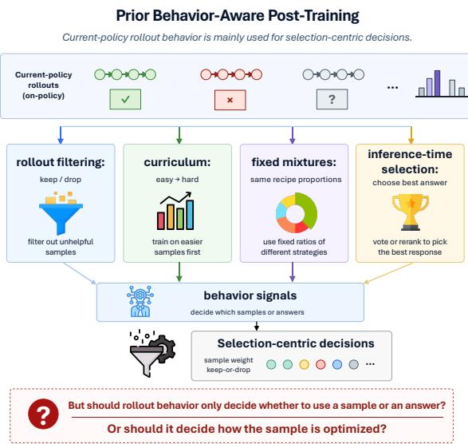
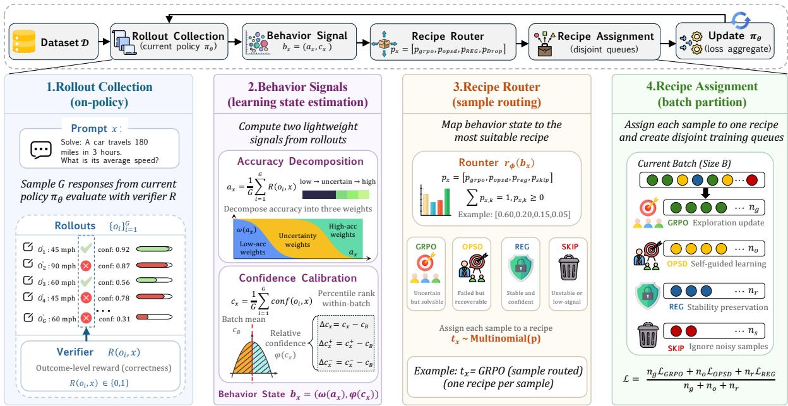
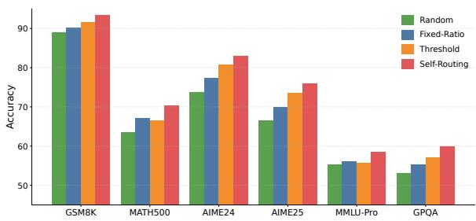
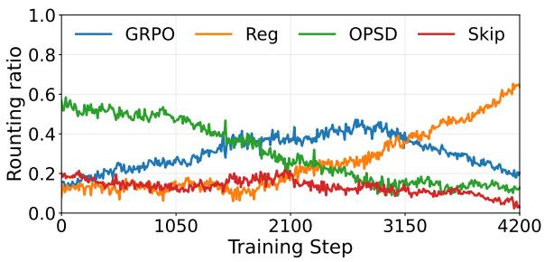

# From Rollouts to Recipes: Self-Contained Post-Training for LLMs

Yifei Li1,3,4 Lingling Zhang1,2,3\* Muye Huang1,3,4 Zihan Ma1,3 Jiashuai Liu1,3 Jun Liu1,2,3

1School of Computer Science and Technology, Xi’an Jiaotong University, China   
2National Engineering Research Center for Visual Information and Applications 3Shaanxi Province Key Laboratory of Big Data Knowledge Engineering 4Zhongguancun Academy, Beijing, China yifeilee@stu.xjtu.edu.cn, zhanglling@xjtu.edu.cn

## Abstract

Post-training large language models usually applies a single training recipe to all samples, even though the model’s own rollouts reveal different sample-level learning states. We propose Self-Routing, a behavior-conditioned posttraining framework that uses rollout correctness and confidence to decide how each sample should be optimized. Depending on its behavior state, a sample is routed to GRPO, on-policy self-distillation, regularization, or skipping, allowing training to adapt without external teachers, extra annotations, or additional sampling. Experiments on mathematical reasoning across Qwen3 and Qwen3.5 backbones show that Self-Routing consistently improves over uniform GRPO, uniform OPSD, fixed mixtures, and simpler routing baselines. Further analyses show that the routing distribution changes over training and reduces unnecessary updates on low-signal or already stable samples.

## 1 Introduction

Post-training is central to improving the reasoning ability of large language models (LLMs) on verifiable tasks such as mathematical reasoning, code generation, and program repair. In these settings, verifier-based reinforcement learning can use outcome rewards, such as answer correctness, test pass rates, or patch validity, without relying on large-scale chain-of-thought (CoT) annotations or human process supervision (Uesato et al., 2022; Le et al., 2022; Liu et al., 2023; Gehring et al., 2024; Wei et al., 2025). This makes naive RL / RLVR attractive when CoT data are scarce, noisy, or mismatched with the target model (DeepSeek-AI et al., 2025; Yu et al., 2026). Prior work has improved verifier-based post-training through reward design, advantage estimation, regularization, sampling, distillation, and hybrid objectives (Schulman et al., 2017; Shao et al., 2024; DeepSeek-AI et al., 2025;

  
Figure 1: Prior behavior-aware post-training mainly uses rollout signals for selection, such as filtering samples, scheduling curricula, mixing fixed recipes, or choosing inference-time answers.

Yu et al., 2026). Yet most methods still follow a global training recipe: they apply the same optimization mechanism, or a fixed objective mixture, to all samples in the dataset.

This global view overlooks the fact that rollouts already contain sample-level behavioral signals. Existing methods partially exploit this information: all-correct / all-wrong filtering skips samples whose rollouts provide no relative advantage signal (Yu et al., 2026; Shao et al., 2024), while entropy-, confidence-, or consistency-based voting and reranking can improve final answer quality without updating model parameters (Wang et al., 2022; Weng et al., 2022). These observations suggest that rollout behavior reflects the current learning state of each sample. Importantly, such signals are available during rollout generation itself, without extra annotation, external evaluators, or redundant inference.

A sample’s training value is therefore not a static property such as quality or difficulty. It depends on the model’s current rollout behavior and on the optimization signal applied to that sample. A sample with uniformly failed rollouts may provide little gradient for verifier-based RL, while on-policy distillation can still offer dense guidance on states visited by the current model. A sample with mixed correct and incorrect rollouts may be informative for RL, while a reliably solved sample may be better treated with a conservative objective. Samples that repeatedly fail with high confidence may be better skipped temporarily. We therefore view posttraining as a process from rollouts to recipes: rollouts expose local learning states, and these states can be converted into sample-level training recipes that decide both whether and how each sample should be optimized.

Based on this view, we propose self-contained behavior-conditioned routing. Unlike global recipes that fix an optimization mechanism and apply it uniformly, our approach assigns training actions according to each sample’s rollout behavior under the current model. Unlike distillation from external teachers, offline CoT traces, or fixed reference trajectories, our signals come from the model’s own on-policy rollouts, reducing the risk of mode-distribution mismatch between the imitated trajectories and the states actually visited by the current policy (Agarwal et al., 2023; Zhao et al., 2026). This forms a self-contained loop: the model reveals its learning states through rollouts, and training uses those states to decide subsequent updates.

In summary, our contributions are as follows:

• We identify a structural limitation of verifierbased post-training: global recipes cannot adapt to heterogeneous sample-level learning states revealed by current-policy rollouts.

• We propose self-contained behaviorconditioned routing, which turns rollout signals naturally produced during training into sample-level recipes without extra annotation, external evaluators, or additional sampling.

• We empirically show that different rollout behavior states benefit from different optimization mechanisms, and that behaviorconditioned routing improves over uniform GRPO, uniform OPSD, fixed objective mixtures, and filtering- or curriculum-based baselines.

## 2 Related Work

Verifier-Based Post-Training. Verifier-based post-training has been widely studied for verifiable tasks such as mathematical reasoning, code generation, and program repair, where final answers, unit tests, or execution feedback can provide outcome rewards (Kimi Team, 2025; Hu et al., 2025; Zhao et al., 2025a). Existing work mainly improves the reinforcement learning procedure itself, including PPO/GRPO/DAPO-style objectives, reward shaping, advantage estimation, KL regularization, length control, sampling strategies, and training stabilization (Hu et al., 2025; Kimi Team, 2025; Wang et al., 2025a; Xu et al., 2025). Other methods combine verifier rewards with distillation or supervised signals to mitigate the sparsity of outcome rewards (Zelikman et al., 2022; Zhang et al., 2025a; Hübotter et al., 2026). Relatedly, self specialized teacher distillation addresses the loss of general capabilities during target-only post-training without requiring a representative replay corpus (Li et al., 2026b). Beyond mathematical reasoning, related studies have also examined learning and evaluation in more complex agent settings, including long-horizon memory, cross-platform action transfer, and risk under task complexity (Li et al., 2026a; Yan et al., 2026a; Ma et al., 2025). Our work shares the same broad goal of improving model behavior through interaction and feedback, but focuses specifically on verifier-based post-training: rather than designing another global RL objective, we study how rollout states can route samples among different training actions.

Data Selection and Curriculum Learning. Data selection and curriculum learning adjust the training distribution according to sample quality, difficulty, loss, uncertainty, reward, or training stage (Wang et al., 2025b; Jiang et al., 2025; Zhao et al., 2025a). In RLVR, all-correct / all-wrong filtering is a common example: when all rollouts in a group are correct or all are incorrect, the sample provides little relative advantage signal and is skipped or down-weighted (Xu et al., 2025; Jiang et al., 2025). These methods mainly address which samples should be trained, or in what order and frequency they should appear. In contrast, our work asks a complementary question: given a sampled prompt and its rollouts, what optimization signal should be applied to it?

Rollout Uncertainty and On-Policy Signals. Rollout distributions and model-internal uncertainty signals have been used extensively to adapt inference-time reasoning. Self-consistency, majority voting, confidence-based selection, and entropyaware reranking use such signals for answer selection (Chen et al., 2023; Yao et al., 2023; Jiang et al., 2023; Zuo et al., 2025), while recent work further uses uncertainty and consistency to dynamically allocate reasoning computation (Yan et al., 2026b; Xu et al., 2026). On-policy learning and on-policy distillation reduce distribution mismatch by supervising states visited by the current policy rather than relying only on offline trajectories or fixed references (Tan et al., 2023). Onpolicy self-distillation goes one step further: its teacher signal comes from the model itself or its delayed/historical versions, which better matches the model’s reasoning style, length bias, and generation distribution than an external teacher (Hübotter et al., 2026; Zhang et al., 2025b). This is especially relevant for reasoning models, where different teachers may solve the same problem through substantially different intermediate patterns. We therefore use OPSD as a self-contained primitive for providing dense guidance under sparse rewards, and extend the use of rollout behavior from inference-time adaptation to training-time recipe routing.

## 3 Method

## 3.1 Overview

We study verifier-guided post-training on a fixed training set

$$
\boldsymbol { \mathcal { D } } = \{ x _ { j } \} _ { j = 1 } ^ { N } ,
$$

where each x denotes a prompt, problem, or instruction input. Starting from an initial policy $\pi _ { \theta _ { 0 } }$ the goal is to update the policy on D and evaluate it on held-out or related task distributions. GRPO, OPSD, and our method share the same data, rollout budget, and verifier feedback; they differ in how they use these signals to construct training updates.

Figure 2 illustrates our framework. At each training iteration, the current policy first generates onpolicy rollouts for each sample. We then estimate two behavior signals: rollout correctness and model confidence. These signals define a behavior state, which is passed to a recipe router. The router assigns each sample to one of four disjoint queues: GRPO, OPSD, REG, or SKIP. Finally, the active losses are aggregated to update the policy.

## 3.2 Rollout Collection

Given a sample $x \in \mathcal { D }$ , the current policy πθ generates G responses:

$$
o _ { i } \sim \pi _ { \theta } ( \cdot | x ) , \quad i = 1 , \ldots , G .
$$

An outcome-level verifier evaluates each response:

$$
R ( o _ { i } , x ) \in \{ 0 , 1 \} ,
$$

where $R ( o _ { i } , x ) ~ = ~ 1$ indicates that response $o _ { i }$ solves the task correctly.

The empirical rollout accuracy of sample x is

$$
a _ { x } = \frac { 1 } { G } \sum _ { i = 1 } ^ { G } R ( o _ { i } , x ) .
$$

This quantity measures how often the current policy solves x under repeated sampling. Since rollouts are collected from the current policy, $a _ { x }$ changes as training proceeds.

## 3.3 Behavior Signals

We use two lightweight signals to describe the learning state of each sample: accuracy decomposition and confidence calibration. The resulting behavior state is

$$
b _ { x } = ( \omega ( a _ { x } ) , \varphi ( c _ { x } ) ) .
$$

Accuracy decomposition. The scalar accuracy $a _ { x }$ is informative but coarse. A hard partition of $a _ { x }$ into low-, medium-, and high-accuracy regions would make routing unstable, especially when G is small and a single rollout can move a sample across a threshold. We therefore map $a _ { x }$ into three smooth membership scores:

$$
\begin{array} { c } { { l _ { x } = \displaystyle \exp \left( - \frac { ( a _ { x } - 0 ) ^ { 2 } } { 2 \sigma _ { l } ^ { 2 } } \right) , } } \\ { { m _ { x } = \displaystyle \exp \left( - \frac { ( a _ { x } - 0 . 5 ) ^ { 2 } } { 2 \sigma _ { m } ^ { 2 } } \right) , } } \\ { { h _ { x } = \displaystyle \exp \left( - \frac { ( a _ { x } - 1 ) ^ { 2 } } { 2 \sigma _ { h } ^ { 2 } } \right) . } } \end{array}
$$

After normalization,

$$
\omega ( a _ { x } ) = [ l , m , h ] = \frac { [ l _ { x } , m _ { x } , h _ { x } ] } { l _ { x } + m _ { x } + h _ { x } } .
$$

Here l, m, and h correspond to low-accuracy, uncertain, and high-accuracy components. The centers 0, 0.5, and 1 match the natural interpretation of samples that the model mostly fails, solves inconsistently, or solves reliably. In our implementation, we fix

$$
\sigma _ { l } = \sigma _ { h } = 0 . 1 8 , \quad \sigma _ { m } = 0 . 1 6 ,
$$

and do not tune them per dataset.

  
Figure 2: Overview of our behavior-aware recipe routing framework. For each training sample, the current policy collects on-policy rollouts, estimates behavior signals from verifier correctness and model confidence, routes the sample to one training recipe, and updates the policy using the aggregated losses from disjoint recipe queues.

Confidence calibration. For each response $o _ { i } =$ $( y _ { i , 1 } , \dots , y _ { i , T _ { i } } )$ , we estimate the model’s internal confidence from token-level predictive entropy. At position t, let

$$
p _ { \theta , t } ( \cdot ) = \pi _ { \theta } ( \cdot | x , y _ { i , < t } )
$$

be the next-token distribution. The token entropy is

$$
H _ { i , t } = - \sum _ { v \in \mathcal { V } } p _ { \theta , t } ( v ) \log p _ { \theta , t } ( v ) .
$$

The sequence-level uncertainty is

$$
\bar { H } ( o _ { i } , x ) = \frac { 1 } { T _ { i } } \sum _ { t = 1 } ^ { T _ { i } } H _ { i , t } .
$$

We convert uncertainty into confidence using batchlevel normalization:

$$
\mathrm { c o n f } ( o _ { i } , x ) = 1 - \mathrm { N o r m } _ { B } ( \bar { H } ( o _ { i } , x ) ) ,
$$

where NormB maps entropy values from rollouts in the current batch to [0, 1]. The sample-level confidence is

$$
c _ { x } = \frac { 1 } { G } \sum _ { i = 1 } ^ { G } \mathrm { c o n f } ( o _ { i } , x ) .
$$

Since raw confidence can vary with prompt length, task type, and batch composition, we calibrate it within the current batch. Let

$$
\bar { c } _ { B } = \frac { 1 } { | B | } \sum _ { x ^ { \prime } \in B } c _ { x ^ { \prime } } .
$$

The relative confidence is

$$
\Delta c _ { x } = c _ { x } - \bar { c } _ { B } .
$$

We normalize the confidence-related quantities and write

$$
\varphi ( c _ { x } ) = ( \widetilde { c } , \widetilde { c } ^ { + } , \widetilde { c } ^ { - } , \widetilde { \Delta c } ) ,
$$

where ec is normalized confidence, $\widetilde { c } ^ { + }$ and $\widetilde { c } ^ { - }$ indicate high- and low-confidence tendencies, and $\widetilde { \Delta c }$ denotes the calibrated deviation from the batch mean.

## 3.4 Recipe Router

The router maps the behavior state $b _ { x }$ to a recipe distribution

$$
p _ { x } = [ p _ { \mathrm { G R P O } } , p _ { \mathrm { O P S D } } , p _ { \mathrm { R E G } } , p _ { \mathrm { S K I P } } ] ,
$$

with

$$
\sum _ { k } p _ { x , k } = 1 , \quad p _ { x , k } \geq 0 .
$$

To keep the router interpretable, we first compute four routing scores. Given

$$
\omega ( a _ { x } ) = [ l , m , h ] ,
$$

we define

$$
\begin{array} { c } { { s _ { \mathrm { G R P O } } = m + h ( 1 - \widetilde { \Delta c } ) + l ( 1 - \widetilde { c } ) \cdot \widetilde { c } , } } \\ { { { } } } \\ { { s _ { \mathrm { O P S D } } = l ( 1 - \widetilde { c } ^ { - } ) , } } \end{array}
$$

$$
\begin{array} { c } { { s _ { \mathrm { R E G } } = h \cdot \widetilde { \Delta c } \cdot \widetilde { c } ^ { + } , } } \\ { { s _ { \mathrm { S K I P } } = l \cdot \widetilde { c } ^ { - } \cdot \widetilde { c } . } } \end{array}
$$

These assignments are motivated by preliminary diagnostics on Qwen3-4B. Mixed-correctness samples benefit more from GRPO, while low-accuracy, low-confidence samples favor OPSD. Stable solved samples show limited benefit from aggressive optimization, whereas confident failures benefit from neither active recipe. These observations motivate routing the corresponding states to GRPO, OPSD, REG, and SKIP, respectively. Full diagnostics are reported in Appendix H.

The scores are normalized into probabilities:

$$
p _ { x , k } = \frac { s _ { k } } { s _ { \mathrm { G R P O } } + s _ { \mathrm { O P S D } } + s _ { \mathrm { R E G } } + s _ { \mathrm { S K I P } } + \epsilon } .
$$

Then each sample is assigned to one recipe:

$$
t _ { x } \sim \mathrm { C a t e g o r i c a l } ( p _ { x } ) .
$$

Thus, each sample contributes to at most one training objective in a given iteration.

## 3.5 Recipe Assignment and Policy Update

According to $t _ { x } ,$ the current batch is partitioned into four disjoint queues:

$$
\mathcal { B } _ { g } , \mathcal { B } _ { o } , \mathcal { B } _ { r } , \mathcal { B } _ { s } ,
$$

corresponding to GRPO, OPSD, REG, and SKIP. Let their sizes be

$$
n _ { g } = | \mathcal { B } _ { g } | , \quad n _ { o } = | \mathcal { B } _ { o } | , \quad n _ { r } = | \mathcal { B } _ { r } | , \quad n _ { s } = | \mathcal { B } _ { s } | .
$$

GRPO. For samples in $B _ { g } .$ we use the standard GRPO objective. For a rollout $o _ { i }$ , let

$$
r _ { i } = R ( o _ { i } , x ) .
$$

We compute the group mean and standard deviation as

$$
\mu _ { x } = \frac { 1 } { G } \sum _ { i = 1 } ^ { G } r _ { i } ,
$$

$$
\sigma _ { x } = \left[ \frac { 1 } { G } \sum _ { i = 1 } ^ { G } ( r _ { i } - \mu _ { x } ) ^ { 2 } \right] ^ { 1 / 2 } .
$$

The group-relative advantage is

$$
A _ { i } = \frac { r _ { i } - \mu _ { x } } { \sigma _ { x } + \epsilon } .
$$

The policy ratio is

$$
\rho _ { i } = \frac { \pi _ { \theta } ( o _ { i } | x ) } { \pi _ { \theta _ { \mathrm { o l d } } } ( o _ { i } | x ) } .
$$

We use the clipped ratio

$$
\bar { \rho } _ { i } = \mathrm { c l i p } ( \rho _ { i } , 1 - \epsilon , 1 + \epsilon ) .
$$

The GRPO loss is

$$
\mathcal { L } _ { \mathrm { G R P O } } = - \mathbb { E } \left[ \operatorname* { m i n } ( \rho _ { i } A _ { i } , \bar { \rho } _ { i } A _ { i } ) \right] ,
$$

where the expectation is taken over $x \in B _ { g }$ and rollout index i.

OPSD. For samples in $B _ { o } .$ we use OPSD as a corrective learning recipe. The policy model acts as the student, while the same model conditioned on answer information acts as the teacher. Given the input x, the student’s current output, and the answer signal, the teacher produces a token-level target sequence

$$
y _ { x } ^ { T } = ( y _ { x , 1 } ^ { T } , \dots , y _ { x , T _ { x } } ^ { T } ) .
$$

The student learns this target by token-level imitation:

$$
\mathcal { L } _ { \mathrm { O P S D } } = - \frac { 1 } { \left| \mathcal { B } _ { o } \right| } \sum _ { x \in \mathcal { B } _ { o } } \sum _ { t = 1 } ^ { T _ { x } } \log \pi _ { \theta } \left( y _ { x , t } ^ { T } \mid x , y _ { x , < t } ^ { T } \right) .
$$

The teacher trajectory is generated once during offline preprocessing by prompting the same base model with the problem and its ground-truth answer, and is reused during training. Thus, OPSD requires no external teacher or additional CoT annotation, but assumes access to target answers in the verifiable post-training setting.

REG. For samples in $B _ { r }$ , we use a regularization objective. Since these samples already show reliable behavior, we constrain the updated policy to stay close to a reference policy:

$$
\mathcal { L } _ { \mathrm { R E G } } = \frac { 1 } { | \mathcal { B } _ { r } | } \sum _ { \boldsymbol { x } \in \mathcal { B } _ { r } } D _ { \mathrm { K L } } \left( \pi _ { \boldsymbol { \theta } } ( \cdot | \boldsymbol { x } ) \| \pi _ { \mathrm { r e f } } ( \cdot | \boldsymbol { x } ) \right) .
$$

Here $\pi _ { \mathrm { r e f } }$ can be the initial model, a pre-update checkpoint, or the old policy in the current iteration.

SKIP. Samples in $B _ { s }$ are ignored in the current update:

$$
\begin{array} { r } { \mathcal { L } _ { \mathrm { S K I P } } = 0 . } \end{array}
$$

The final training loss aggregates only active queues:

$$
\mathcal { L } = \frac { n _ { g } \mathcal { L } _ { \mathrm { G R P O } } + n _ { o } \mathcal { L } _ { \mathrm { O P S D } } + n _ { r } \mathcal { L } _ { \mathrm { R E G } } } { n _ { g } + n _ { o } + n _ { r } } .
$$

SKIP samples do not contribute gradients and are excluded from the denominator.

Table 1: Main results on ID mathematical reasoning and OOD general reasoning benchmarks. We report results across different Qwen3 and Qwen3.5 model scales. The best result in each column within the same model group is shown in bold, and the second-best result is underlined.
<table><tr><td rowspan="2">Model</td><td rowspan="2">Method</td><td colspan="4">ID Math Reasoning</td><td colspan="2">OOD General Reasoning</td><td rowspan="2">Avg.</td></tr><tr><td>GSM8K</td><td>MATH-500</td><td>AIME24</td><td>AIME25</td><td>MMLU-Pro</td><td>GPQA-diamond</td></tr><tr><td rowspan="4">Qwen3-0.6B</td><td>Base</td><td>65.8</td><td>35.7</td><td>11.6</td><td>8.7</td><td>23.4</td><td>20.6</td><td>27.6</td></tr><tr><td>Naive-GRPO</td><td>70.4</td><td>42.8</td><td>13.9</td><td>10.5</td><td>20.9</td><td>22.1</td><td>30.1</td></tr><tr><td>Naive-OPSD</td><td>71.6</td><td>44.1</td><td>13.5</td><td>11.4</td><td>21.5</td><td>21.7</td><td>30.6</td></tr><tr><td>Self-Routing</td><td>73.2</td><td>45.8</td><td>15.6</td><td>13.0</td><td>22.6</td><td>23.8</td><td>32.3</td></tr><tr><td rowspan="4">Qwen3-1.7B</td><td>Base</td><td>77.1</td><td>44.3</td><td>33.7</td><td>24.2</td><td>51.4</td><td>34.2</td><td>44.1</td></tr><tr><td>Naive-GRPO</td><td>81.6</td><td>50.4</td><td>39.6</td><td>29.8</td><td>47.9</td><td>37.8</td><td>47.9</td></tr><tr><td>Naive-OPSD</td><td>83.4</td><td>52.1</td><td>42.7</td><td>32.4</td><td>49.3</td><td>39.1</td><td>49.8</td></tr><tr><td>Self-Routing</td><td>86.8</td><td>55.9</td><td>46.3</td><td>36.7</td><td>50.6</td><td>42.5</td><td>53.1</td></tr><tr><td rowspan="4">Qwen3-4B</td><td>Base</td><td>82.3</td><td>54.4</td><td>66.9</td><td>54.1</td><td>59.2</td><td>49.3</td><td>61.0</td></tr><tr><td>Naive-GRPO</td><td>89.6</td><td>62.8</td><td>74.3</td><td>65.4</td><td>54.6</td><td>53.8</td><td>66.8</td></tr><tr><td>Naive-OPSD</td><td>93.5</td><td>66.1</td><td>79.4</td><td>70.2</td><td>56.4</td><td>56.7</td><td>70.4</td></tr><tr><td>Self-Routing</td><td>95.2</td><td>69.8</td><td>83.6</td><td>74.9</td><td>58.1</td><td>60.4</td><td>73.7</td></tr><tr><td rowspan="4">Qwen3.5-0.8B</td><td>Base</td><td>32.9</td><td>18.3</td><td>4.9</td><td>3.1</td><td>37.1</td><td>8.8</td><td>17.5</td></tr><tr><td>Naive-GRPO</td><td>38.6</td><td>22.7</td><td>6.8</td><td>4.7</td><td>33.8</td><td>11.3</td><td>19.6</td></tr><tr><td>Naive-OPSD</td><td>39.8</td><td>24.1</td><td>6.4</td><td>5.5</td><td>34.7</td><td>10.9</td><td>20.2</td></tr><tr><td>Self-Routing</td><td>43.1</td><td>26.8</td><td>8.6</td><td>7.3</td><td>36.0</td><td>13.6</td><td>22.6</td></tr><tr><td rowspan="4">Qwen3.5-2B</td><td>Base</td><td>69.1</td><td>44.2</td><td>24.1</td><td>17.3</td><td>57.4</td><td>31.5</td><td>40.6</td></tr><tr><td>Naive-GRPO</td><td>77.9</td><td>50.7</td><td>36.8</td><td>28.1</td><td>53.8</td><td>36.9</td><td>47.4</td></tr><tr><td>Naive-OPSD</td><td>80.8</td><td>54.3</td><td>42.5</td><td>32.6</td><td>55.1</td><td>39.7</td><td>50.8</td></tr><tr><td>Self-Routing</td><td>84.6</td><td>58.2</td><td>48.4</td><td>38.5</td><td>56.7</td><td>44.3</td><td>55.1</td></tr><tr><td rowspan="4">Qwen3.5-4B</td><td>Base</td><td>87.4</td><td>77.2</td><td>78.9</td><td>76.8</td><td>71.6</td><td>69.1</td><td>76.8</td></tr><tr><td>Naive-GRPO</td><td>91.3</td><td>81.7</td><td>84.2</td><td>82.5</td><td>66.8</td><td>72.3</td><td>79.8</td></tr><tr><td>Naive-OPSD</td><td>93.4</td><td>84.8</td><td>88.6</td><td>86.7</td><td>68.7</td><td>75.9</td><td>83.0</td></tr><tr><td>Self-Routing</td><td>96.1</td><td>88.3</td><td>93.2</td><td>91.4</td><td>70.9</td><td>79.6</td><td>86.6</td></tr></table>

## 4 Experiments

We evaluate whether behavior-conditioned selfrouting improves post-training over global recipes that apply the same objective to all samples. Our experiments answer four questions:

• Q1: Final performance. Does behaviorconditioned routing improve reasoning performance compared with uniform post-training recipes and fixed recipe mixtures?

• Q2: Efficiency. Does routing reduce wasted updates by assigning expensive or unstable recipes only to samples where they are useful?

• Q3: Routing strategy. Is the proposed behavior-conditioned routing better than simpler alternatives, such as random routing, fixed-proportion routing, or hard thresholdbased routing?

• Q4: Training dynamics. How does the recipe distribution change during training, and does it track the model’s changing samplelevel learning states?

## 4.1 Experimental Setup

Datasets. We use DAPO-Math-17K (Yu et al., 2026) as the training set for all post-training methods. For evaluation, we use four in-domain mathematical reasoning benchmarks and two out-ofdomain general reasoning benchmarks. The indomain benchmarks are GSM8K (Cobbe et al., 2021), MATH-500 (Hendrycks et al., 2021), AIME24 (Mathematical Association of America, 2024), and AIME25 (Mathematical Association of America, 2025), covering grade-school arithmetic, competition-style mathematics, and recent exam-level problems. For out-of-domain evaluation, we use GPQA (Rein et al., 2023) and MMLU-Pro (Wang et al., 2024) to test whether math posttraining transfers to broader reasoning tasks. We report the macro-average over all six evaluation benchmarks.

Models. We conduct experiments on Qwen3 (Yang et al., 2025) and Qwen3.5 (Team, 2026) models across small and medium scales. Specifically, we evaluate Qwen3-0.6B, Qwen3- 1.7B, Qwen3-4B, Qwen3.5-0.8B, Qwen3.5-2B, and Qwen3.5-4B. This setting tests whether selfrouting works across different model generations and base-model capabilities.

Baselines. For the main comparison, we include the base model without post-training, Naive-GRPO, and Naive-OPSD. Naive-GRPO applies GRPO uniformly to all training samples, while Naive-OPSD applies OPSD uniformly to all samples. These baselines test whether routing samples to different recipes improves over using a single global post-training recipe. Routing-specific baselines are discussed separately in Section 4.4, where all variants use the same recipe set and differ only in the routing rule. We additionally compare with DAPOstyle RL and PODS (Xu et al., 2025), representing stabilized RL training and rollout selection, respectively; these results are reported in Appendix J.

## 4.2 Main Results

Table 1 reports the main results on ID mathematical reasoning and OOD general reasoning benchmarks. Self-Routing achieves the highest average score across all evaluated backbones. The gains are most clear on ID math tasks, where Self-Routing consistently outperforms both Naive-GRPO and Naive-OPSD. For example, on Qwen3-4B, Self-Routing improves the average score from 61.0 to 73.7, exceeding Naive-GRPO and Naive-OPSD by 6.9 and 3.3 points, respectively. On Qwen3.5-4B, Self-Routing reaches 86.6 average score, compared with 79.8 for Naive-GRPO and 83.0 for Naive-OPSD.

The advantage of Self-Routing becomes larger as model capacity increases. On the smallest models, Naive-GRPO and Naive-OPSD still show mixed results on some individual benchmarks, such as AIME24 and GPQA-diamond, suggesting that weak models may not provide stable enough selfgenerated signals for OPSD to dominate in every case. For stronger backbones, OPSD becomes consistently better than GRPO, and Self-Routing further widens the margin. This trend supports our motivation that stronger models can benefit more from self-distillation and routing-based training.

For OOD general reasoning, we observe different behaviors on GPQA-diamond and MMLU-Pro. GPQA-diamond usually improves after mathoriented post-training, while MMLU-Pro drops compared with the base model. Although preserving MMLU-Pro performance is not the direct target of our method, Self-Routing shows the smallest degradation among all post-training methods and remains the second-best method after Base on every backbone. We conjecture that this smaller degradation may come from the conditional nature of Self-Routing: instead of applying a uniform mathoriented update to all training instances, it selects different self-improvement paths according to the model’s own outputs. This may reduce the influence of noisy or overly specialized training signals, leading to less drift from the base model’s original general-purpose behavior while still improving mathematical reasoning.

Stronger baselines and OOD transfer. On Qwen3-4B, Self-Routing also outperforms DAPOstyle RL and PODS, achieving 80.9/71.1/59.3 on ID math, OOD verifiable reasoning, and general evaluation. On SATBench, AutoLogi, and LiveCodeBench-v5, Self-Routing further obtains the best average score of 71.1. Full results are provided in Appendix J.

## 4.3 Efficiency Analysis

We provide a coarse-grained FLOPs estimate to analyze the training cost of different post-training recipes. Following the standard scaling-law approximation for Transformer language models, a forward pass costs approximately 2N FLOPs per token, while a training pass with forward and backward computation costs approximately 6N FLOPs per token (Kaplan et al., 2020; Hoffmann et al., 2022). Let N denote the number of model parameters, T the number of training steps, B the batch size, G the number of rollouts per sample, and L the average sequence length. We normalize all costs by NT BL and ignore sequence-length variation and implementation overhead. The Self-Routing branch ratios are obtained by integrating the routing curves in Figure 4, giving 30.8% GRPO, 30.4% OPSD, 25.5% REG, and 13.3% SKIP.

As shown in Table 2, Self-Routing is not intended as a wall-clock acceleration method under the current implementation. It is more expensive than Naive-OPSD because it retains multirollout behavior estimation and additionally applies GRPO-style updates to routed samples. However, it is less expensive than applying GRPO to all rollout groups. When G = 8, the normalized costs are 64.0 for Naive-GRPO, 24.0 for Naive-OPSD, and 34.7 for Self-Routing. The main efficiency benefit is therefore selective allocation: expensive optimization recipes are applied only to the subset of samples whose rollout behavior suggests that the corresponding training signal is useful.

<table><tr><td>Method</td><td>Normalized FLOPs</td></tr><tr><td>Naive-GRPO</td><td></td></tr><tr><td>Rollout GRPO update</td><td>2G 6G</td></tr><tr><td>Total</td><td>8G</td></tr><tr><td>Naive-OPSD Rollout</td><td></td></tr><tr><td>Teacher generation</td><td>2G 2</td></tr><tr><td>SFT update Total</td><td>6  $2 G + 8$ </td></tr><tr><td>Self-Routing Rollout</td><td></td></tr><tr><td></td><td>2G  $0 . 3 0 8 \times 6 G$ </td></tr><tr><td>GRPO update OPSD update REG update SKIP update</td><td> $0 . 3 0 4 \times ( 2 + 6 )$   $0 . 2 5 5 \times 6$ </td></tr></table>

Table 2: Coarse-grained training FLOPs estimation normalized by NTBL. We approximate inference as 2N FLOPs per token and training as 6N FLOPs per token. The Self-Routing ratios are obtained by integrating the routing curves in Figure 4.  
  
Figure 3: Ablation on routing strategies using Qwen3- 4B. We compare Self-Routing with three simpler routing baselines across ID mathematical reasoning and OOD general reasoning benchmarks.

## 4.4 Ablation on Routing Strategies

To verify the effectiveness of Self-Routing, we compare it with three simpler routing strategies on Qwen3-4B. Round-wise Random randomly selects one recipe for each training round and applies it to all samples in that round. Fixed-Ratio Random assigns samples within each round according to a fixed Reg:GRPO:OPSD:Skip ratio of 3:3:3:1. Accuracy-Based Routing first sorts samples by their current accuracy, then routes the lowest 30% to Reg, the next 30% to GRPO, the next 30% to OPSD, and the highest 10% to Skip. These baselines form a progression from recipe-level randomness, to fixed recipe mixing, and then to a simple sample-level routing rule.

As shown in Figure 3, the two random routing baselines perform poorly, suggesting that simply alternating or mixing recipes is not enough. Accuracy-Based Routing gives a much stronger result and even outperforms Naive-OPSD in the main table, which shows that sample-level routing signals are important. However, it still falls slightly behind Self-Routing across most benchmarks. This gap indicates that accuracy alone is not sufficient for recipe assignment: samples with the same correctness can differ in reasoning quality, confidence, stability, and optimization risk. By using richer behavior-conditioned signals, Self-Routing makes finer routing decisions and achieves the best final performance.

  
Figure 4: Routing ratios of different training recipes during Self-Routing training.

More targeted ablations further show that accuracy is the primary routing signal, while confidence calibration and the behavior-conditioned assignment provide complementary gains; see Appendix I.

## 4.5 Training Dynamics

Figure 4 illustrates the routing dynamics of Self-Routing on Qwen3-4B during training. In practice, we sample the routing decisions every ten training steps and aggregate them to obtain the counting ratio of each branch, which smooths out short-term fluctuations while preserving the overall trend. The figure shows that the routing distribution changes substantially as training proceeds, rather than staying fixed around a preset ratio.

At the early stage, OPSD accounts for the largest proportion, with a counting ratio above 0.5, while GRPO and Reg remain relatively low. As training continues, OPSD gradually decreases, while GRPO increases and reaches its peak in the middle stage, suggesting that more samples become suitable for reward-driven optimization after the model has acquired stronger reasoning behavior. In the later stage, Reg rises quickly and becomes the dominant branch, while both OPSD and GRPO decline; this may help constrain further policy drift after sufficient reasoning improvement has been obtained. The Skip branch remains relatively low throughout training and further decreases near the end, indicating that most samples can still provide useful training signals through one of the active branches.

## 5 Conclusion

We presented Self-Routing, a self-contained posttraining framework that turns the model’s own rollout behavior into sample-level training recipes. Instead of applying one objective to all data, Self-Routing uses rollout correctness and confidence to route each sample to GRPO, on-policy selfdistillation, regularization, or skipping. Experiments on mathematical reasoning show consistent gains over uniform GRPO, uniform OPSD, fixed mixtures, and simpler routing baselines across Qwen3 and Qwen3.5 backbones. The routing dynamics further show that different recipes become useful at different training stages. These results suggest that rollout behavior should guide not only which samples are used, but also how they are optimized.

## Limitations

Although our method demonstrates promising empirical improvements, several limitations remain. Our current study mainly focuses on the intuition that heterogeneous rollout states may benefit from different post-training strategies, and we validate this idea through empirical performance gains and behavioral observations. However, the work does not yet provide a sufficiently deep mechanistic or theoretical explanation for why certain rollout patterns align better with specific optimization signals. At present, the routing behavior is primarily supported by intuition and experimental evidence rather than a rigorous understanding of the underlying optimization dynamics, which remains an important direction for future research.

In addition, our training experiments are centered on mathematical reasoning. Although we observe transfer to SATBench, AutoLogi, and LiveCodeBench-v5, these benchmarks still primarily cover related verifiable reasoning tasks. It remains unclear whether the same routing paradigm generalizes to substantially different settings such as agent planning or open-ended instruction following.

Finally, it is important to note that our work is centered on the routing perspective itself rather than the optimization of individual training algorithms. We do not attempt to improve the internal designs of specific methods, such as reward engineering for GRPO-style reinforcement learning or trajectory/path refinement strategies for OPSD-like approaches. These algorithmic improvements are largely orthogonal to our objective. Instead, our focus is on exploring whether different optimization mechanisms should be assigned adaptively according to rollout states under a unified post-training framework.

## Ethical Considerations

In this work, we use AI-assisted tools to polish the writing and improve code quality. We plan to release our code and data to facilitate future research and reproducibility. For all environments, datasets, models, and external resources used in this work, we strictly follow their original usage terms and licensing agreements, and confirm that all artifacts are used solely for academic research purposes. In addition, several icons used in our figures are obtained from the FLATICON website.

## Acknowledgments

This work was supported by Fundamental and Interdisciplinary Disciplines Breakthrough Plan of the Ministry of Education of China (JYB2025XDXM116), National Natural Science Foundation of China (No. 62137002, 62293550, 62293553, 62293554, 62437002, 62477036, 62477037, 62192781), the Shaanxi Provincial Social Science Foundation Project (No. 2024P041), the Youth Innovation Team of Shaanxi Universities "Multi-modal Data Mining and Fusion", and Xi’an Jiaotong University City College Research Project (No. 2024Y01), and the Zhongguancun Academy (Grant No. 20240103).

## References

Rishabh Agarwal, Nino Vieillard, Yongchao Zhou, Piotr Stanczyk, Sabela Ramos, Matthieu Geist, and Olivier Bachem. 2023. On-policy distillation of language models: Learning from self-generated mistakes. arXiv preprint arXiv:2306.13649.

Xinyun Chen, Renat Aksitov, Uri Alon, Jie Ren, Kefan Xiao, Pengcheng Yin, Sushant Prakash, Charles Sutton, Xuezhi Wang, and Denny Zhou. 2023. Universal self-consistency for large language model generation. arXiv preprint arXiv:2311.17311.

Karl Cobbe, Vineet Kosaraju, Mohammad Bavarian, Mark Chen, Heewoo Jun, Lukasz Kaiser, Matthias Plappert, Jerry Tworek, Jacob Hilton, Reiichiro Nakano, Christopher Hesse, and John Schulman. 2021. Training verifiers to solve math word problems. arXiv preprint arXiv:2110.14168.

DeepSeek-AI, Daya Guo, Dejian Yang, Haowei Zhang, Junxiao Song, Peiyi Wang, Qihao Zhu, Runxin Xu, Ruoyu Zhang, Shirong Ma, et al. 2025. DeepSeek-R1: Incentivizing reasoning capability in LLMs via reinforcement learning. arXiv preprint arXiv:2501.12948.

Jonas Gehring, Kunhao Zheng, Jade Copet, Vegard Mella, Quentin Carbonneaux, Taco Cohen, and Gabriel Synnaeve. 2024. RLEF: Grounding code LLMs in execution feedback with reinforcement learning. arXiv preprint arXiv:2410.02089.

Dan Hendrycks, Collin Burns, Saurav Kadavath, Akul Arora, Steven Basart, Eric Tang, Dawn Song, and Jacob Steinhardt. 2021. Measuring mathematical problem solving with the MATH dataset. arXiv preprint arXiv:2103.03874.

Jordan Hoffmann, Sebastian Borgeaud, Arthur Mensch, Elena Buchatskaya, Trevor Cai, Eliza Rutherford, DDL Casas, Lisa Anne Hendricks, Johannes Welbl, Aidan Clark, et al. 2022. Training computeoptimal large language models. arXiv preprint arXiv:2203.15556, 10.

Jingcheng Hu, Yinmin Zhang, Qi Han, Daxin Jiang, Xiangyu Zhang, and Heung-Yeung Shum. 2025. Openreasoner-zero: An open source approach to scaling up reinforcement learning on the base model. arXiv preprint arXiv:2503.24290.

Jonas Hübotter, Frederike Lübeck, Lejs Behric, Anton Baumann, Marco Bagatella, Daniel Marta, Ido Hakimi, Idan Shenfeld, Thomas Kleine Buening, Carlos Guestrin, and Andreas Krause. 2026. Reinforcement learning via self-distillation. arXiv preprint arXiv:2601.20802.

Dongfu Jiang, Xiang Ren, and Bill Yuchen Lin. 2023. LLM-Blender: Ensembling large language models with pairwise ranking and generative fusion. In Proceedings ofthe 61st Annual Meeting ofthe Association for Computational Linguistics.

Guochao Jiang, Wenfeng Feng, Guofeng Quan, Chuzhan Hao, Yuewei Zhang, Guohua Liu, and Hao Wang. 2025. VCRL: Variance-based curriculum reinforcement learning for large language models. arXiv preprint arXiv:2509.19803.

Jared Kaplan, Sam McCandlish, Tom Henighan, Tom B Brown, Benjamin Chess, Rewon Child, Scott Gray, Alec Radford, Jeffrey Wu, and Dario Amodei. 2020. Scaling laws for neural language models. arXiv preprint arXiv:2001.08361.

Kimi Team. 2025. Kimi k1.5: Scaling reinforcement learning with LLMs. arXiv preprint arXiv:2501.12599.

Hung Le, Yue Wang, Akhilesh Deepak Gotmare, Silvio Savarese, and Steven C. H. Hoi. 2022. CodeRL: Mastering code generation through pretrained models and deep reinforcement learning. arXiv preprint arXiv:2207.01780.

Yifei Li, Weidong Guo, Lingling Zhang, Rongman Xu, Muye Huang, Hui Liu, Lijiao Xu, Yu Xu, and Jun Liu. 2026a. Locomo-plus: Beyond-factual cognitive memory evaluation framework for llm agents. In Proceedings of the 64th Annual Meeting of the Association for Computational Linguistics (Volume 1: Long Papers), pages 25085–25100.

Yifei Li, Rongman Xu, Lingling Zhang, Muye Huang, Zihan Ma, Jiashuai Liu, Hang Yan, and Heng Wang. 2026b. Self-specialized teachers for domain posttraining. Preprint, arXiv:2608.28647.

Jiate Liu, Yiqin Zhu, Kaiwen Xiao, Qiang Fu, Xiao Han, Wei Yang, and Deheng Ye. 2023. RLTF: Reinforcement learning from unit test feedback. arXiv preprint arXiv:2307.04349.

Zihan Ma, Dongsheng Zhu, Shudong Liu, Taolin Zhang, Junnan Liu, Qingqiu Li, Minnan Luo, Songyang Zhang, and Kai Chen. 2025. How brittle is agent safety? rethinking agent risk under intent concealment and task complexity. arXiv preprint arXiv:2511.08487.

Mathematical Association of America. 2024. 2024 american invitational mathematics examination. American Mathematics Competitions.

Mathematical Association of America. 2025. 2025 american invitational mathematics examination. American Mathematics Competitions.

Adam Paszke, Sam Gross, Francisco Massa, Adam Lerer, James Bradbury, Gregory Chanan, Trevor Killeen, Zeming Lin, Natalia Gimelshein, Luca Antiga, et al. 2019. Pytorch: An imperative style, high-performance deep learning library. Advances in neural information processing systems, 32.

David Rein, Betty Li Hou, Asa Cooper Stickland, Jackson Petty, Richard Yuanzhe Pang, Julien Dirani, Julian Michael, and Samuel R Bowman. 2023. Gpqa: A graduate-level google-proof q&a benchmark. arXiv preprint arXiv:2311.12022.

John Schulman, Filip Wolski, Prafulla Dhariwal, Alec Radford, and Oleg Klimov. 2017. Proximal policy optimization algorithms. arXiv preprint arXiv:1707.06347.

Zhihong Shao, Peiyi Wang, Qihao Zhu, Runxin Xu, Junxiao Song, Xiao Bi, Haowei Zhang, Mingchuan Zhang, YK Li, Yang Wu, et al. 2024. Deepseekmath: Pushing the limits of mathematical reasoning in open language models. arXiv preprint arXiv:2402.03300.

Shicheng Tan, Weng Lam Tam, Yuanchun Wang, Wenwen Gong, Shu Zhao, Peng Zhang, and Jie Tang.

2023. Gkd: A general knowledge distillation framework for large-scale pre-trained language model. In Proceedings of the 61st Annual Meeting of the Associationfor Computational Linguistics (Volume 5: Industry Track), pages 134–148.

Qwen Team. 2026. Qwen3.5-omni technical report. arXiv preprint arXiv:2604.15804.

Jonathan Uesato, Nate Kushman, Ramana Kumar, Francis Song, Noah Siegel, Lisa Wang, Antonia Creswell, Geoffrey Irving, and Irina Higgins. 2022. Solving math word problems with process- and outcomebased feedback. arXiv preprint arXiv:2211.14275.

Shenzhi Wang, Le Yu, Chang Gao, Chujie Zheng, Shixuan Liu, Rui Lu, Kai Dang, Xionghui Chen, Jianxin Yang, Zhenru Zhang, Yuqiong Liu, An Yang, Andrew Zhao, Yang Yue, Shiji Song, Bowen Yu, Gao Huang, and Junyang Lin. 2025a. Beyond the 80/20 rule: High-entropy minority tokens drive effective reinforcement learning for LLM reasoning. arXiv preprint arXiv:2506.01939.

Xuezhi Wang, Jason Wei, Dale Schuurmans, Quoc Le, Ed Chi, Sharan Narang, Aakanksha Chowdhery, and Denny Zhou. 2022. Self-consistency improves chain of thought reasoning in language models. arXiv preprint arXiv:2203.11171.

Yiping Wang, Qing Yang, Zhiyuan Zeng, Liliang Ren, Lucas Liu, Baolin Peng, Hao Cheng, Xuehai He, Kuan Wang, Jianfeng Gao, Weizhu Chen, Shuohang Wang, Simon Shaolei Du, and Yelong Shen. 2025b. Reinforcement learning for reasoning in large language models with one training example. arXiv preprint arXiv:2504.20571.

Yubo Wang, Xueguang Ma, Ge Zhang, Yuansheng Ni, Abhranil Chandra, Shiguang Guo, Weiming Ren, Aaran Arulraj, Xuan He, Ziyan Jiang, et al. 2024. Mmlu-pro: A more robust and challenging multi-task language understanding benchmark. Advances in Neural Information Processing Systems, 37:95266– 95290.

Yuxiang Wei, Olivier Duchenne, Jade Copet, Quentin Carbonneaux, Lingming Zhang, Daniel Fried, Gabriel Synnaeve, Rishabh Singh, and Sida I. Wang. 2025. SWE-RL: Advancing LLM reasoning via reinforcement learning on open software evolution. arXiv preprint arXiv:2502.18449.

Yixuan Weng, Minjun Zhu, Fei Xia, Bin Li, Shizhu He, Shengping Liu, Bin Sun, Kang Liu, and Jun Zhao. 2022. Large language models are better reasoners with self-verification. arXiv preprint arXiv:2212.09561.

Rongman Xu, Yifei Li, Tianzhe Zhao, Yanrui Wu, Bo Li, and Hang Yan. 2026. Dual-dimensional consistency: Balancing budget and quality in adaptive inferencetime scaling. arXiv preprint arXiv:2605.15100.

Yixuan Even Xu, Yash Savani, Fei Fang, and J. Zico Kolter. 2025. Not all rollouts are useful: Downsampling rollouts in LLM reinforcement learning. arXiv preprint arXiv:2504.13818.

Hang Yan, Zhangxuan Gu, Beitong Zhou, Jiaxuan Chen, Runze Li, Yusong Hu, Shuheng Shen, and Changhua Meng. 2026a. Maga: Multi-platform self-fusion of gui agents via structured action distillation. arXiv preprint arXiv:2607.29320.

Hang Yan, Fangzhi Xu, Rongman Xu, Yifei Li, Jian Zhang, Haoran Luo, Xiaobao Wu, Luu Anh Tuan, Haiteng Zhao, Qika Lin, et al. 2026b. Mur: Momentum uncertainty guided reasoning for large language models. In Proceedings of the 64th Annual Meeting of the Association for Computational Linguistics (Volume 1: Long Papers), pages 23078–23103.

An Yang, Anfeng Li, Baosong Yang, Beichen Zhang, Binyuan Hui, Bo Zheng, Bowen Yu, Chang Gao, Chengen Huang, Chenxu Lv, et al. 2025. Qwen3 technical report. arXiv preprint arXiv:2505.09388.

Shunyu Yao, Dian Yu, Jeffrey Zhao, Izhak Shafran, Thomas L. Griffiths, Yuan Cao, and Karthik Narasimhan. 2023. Tree of thoughts: Deliberate problem solving with large language models. arXiv preprint arXiv:2305.10601.

Qiying Yu, Zheng Zhang, Ruofei Zhu, Yufeng Yuan, Xiaochen Zuo, Yu Yue, Weinan Dai, Tiantian Fan, Gaohong Liu, Lingjun Liu, et al. 2026. Dapo: An open-source llm reinforcement learning system at scale. Advances in Neural Information Processing Systems, 38:113222–113244.

Eric Zelikman, Yuhuai Wu, Jesse Mu, and Noah D. Goodman. 2022. STaR: Bootstrapping reasoning with reasoning. arXiv preprint arXiv:2203.14465.

Xuechen Zhang, Zijian Huang, Yingcong Li, Chenshun Ni, Jiasi Chen, and Samet Oymak. 2025a. BREAD: Branched rollouts from expert anchors bridge SFT and RL for reasoning. arXiv preprint arXiv:2506.17211.

Zizhuo Zhang, Jianing Zhu, Xinmu Ge, Zihua Zhao, Zhanke Zhou, Xuan Li, Xiao Feng, Jiangchao Yao, and Bo Han. 2025b. Co-rewarding: Stable selfsupervised reinforcement learning for eliciting reasoning in large language models. arXiv preprint arXiv:2508.00410.

Andrew Zhao, Yiran Wu, Yang Yue, Tong Wu, Quentin Xu, Yang Yue, Matthieu Lin, Shenzhi Wang, Qingyun Wu, Zilong Zheng, and Gao Huang. 2025a. Absolute zero: Reinforced self-play reasoning with zero data. arXiv preprint arXiv:2505.03335.

Siyan Zhao, Zhihui Xie, Mengchen Liu, Jing Huang, Guan Pang, Feiyu Chen, and Aditya Grover. 2026. Self-distilled reasoner: On-policy selfdistillation for large language models. arXiv preprint arXiv:2601.18734.

Yuze Zhao, Jintao Huang, Jinghan Hu, Xingjun Wang,   
Yunlin Mao, Daoze Zhang, Zeyinzi Jiang, Zhikai   
Wu, Baole Ai, Ang Wang, et al. 2025b. Swift: a   
scalable lightweight infrastructure for fine-tuning. In   
Proceedings of the AAAI Conference on Artificial   
Intelligence, volume 39, pages 29733–29735.

Yuxin Zuo, Kaiyan Zhang, Li Sheng, Shang Qu, Ganqu Cui, Xuekai Zhu, Haozhan Li, Yuchen Zhang, Xinwei Long, Ermo Hua, Biqing Qi, Youbang Sun, Zhiyuan Ma, Lifan Yuan, Ning Ding, and Bowen Zhou. 2025. TTRL: Test-time reinforcement learn ing. arXiv preprint arXiv:2504.16084.

## A Self-Routing Algorithm

Algorithm 1 gives the full training procedure. All recipes share the same sampled batch and the same on-policy rollouts. The router only changes how each sample contributes to the update.

## B Implementation Details

We implement the training pipeline with ms-swift (Zhao et al., 2025b). The framework handles model loading, distributed training, rollout generation, and optimizer execution. We add the routing module as a lightweight layer between rollout collection and loss construction. This keeps the baseline recipes and Self-Routing under the same training backend: the same data loader, rollout interface, verifier calls, tokenizer, and checkpointing code are used across Naive-GRPO, Naive-OPSD, and Self-Routing.

For each sampled prompt, the current policy first generates G responses. The verifier returns a binary outcome reward for each response. The routing module then computes two signals: empirical rollout accuracy and entropy-based confidence. The router does not call an external teacher model, reward model, or data filter. OPSD targets are generated once during offline preprocessing by conditioning the same base model on the ground-truth answer, and are reused throughout training. GRPO and REG use the on-policy rollouts and reference policy already available in the training job.

Backend and execution. All experiments use ms-swift as the post-training launcher. The routing code is implemented as a recipe assignment module that writes four disjoint queues in each batch: GRPO, OPSD, REG, and SKIP. The update step reads these queues and applies the corresponding loss. This design also makes the ablation baselines easy to run, since random routing, fixed-ratio routing, and accuracy-only routing only replace the assignment rule.

Algorithm 1 Self-Routing Post-Training   
Require: Training set D, policy $\pi _ { \theta } .$ , verifier R,   
rollout count $G ,$ reference policy πref   
1: for training step $t = 1 , \dots , T$ do   
2: Sample a mini-batch $B \subset { \mathcal { D } }$   
3: for each sample $x \in B$ do   
4: Generate on-policy rollouts $\{ o _ { i } \} _ { i = 1 } ^ { G }$   
from $\pi _ { \boldsymbol { \theta } } ( \cdot | \boldsymbol { x } )$   
5: Evaluate each rollout with the verifier:   
$r _ { i } = R ( o _ { i } , x )$   
6: Compute rollout accuracy $a _ { x }$ =   
$\textstyle { \frac { 1 } { G } } \sum _ { i = 1 } ^ { G } r _ { i }$   
7: Estimate sample confidence $c _ { x }$ from   
token-level predictive entropy   
8: Build behavior state $b _ { x }$   
$( \omega ( a _ { x } ) , \phi ( c _ { x } ) )$   
9: Compute routing scores   
sGRPO, sOPSD, sREG, sSKIP   
10: Normalize scores into $p _ { x }$   
[pGRPO, pOPSD, pREG, pSKIP]   
11: Assign recipe $z _ { x } \sim$ Categorica $\left\lfloor \left( p _ { x } \right) \right.$   
12: end for   
13: Partition B into $B _ { g } , B _ { o } , B _ { r } , B _ { s }$ according   
to recipe assignments   
14: Compute $\mathcal { L } _ { \mathrm { G R P O } }$ on $B _ { g }$   
15: Compute $\mathcal { L } _ { \mathrm { { O P S D } } }$ on $B _ { o }$   
16: Compute $\mathcal { L } _ { \mathrm { R E G } }$ on $B _ { r }$   
17: Skip samples in $B _ { s }$   
18: Update $\pi _ { \theta }$ with   
$\mathcal { L } = \frac { | B _ { g } | \mathcal { L } _ { \mathrm { G R P O } } + | B _ { o } | \mathcal { L } _ { \mathrm { O P S D } } + | B _ { r } | \mathcal { L } _ { \mathrm { R E G } } } { | B _ { g } | + | B _ { o } | + | B _ { r } | } .$   
19: end for

Runtime environment. Training is conducted on a single node with 8 NVIDIA A100 GPUs. The codebase is built on PyTorch (Paszke et al., 2019) and uses the standard Hugging Face model/tokenizer interface through ms-swift. Multi-GPU execution, mixed-precision training, checkpoint saving, and distributed data loading are handled by the training backend. We keep the same runtime stack for all compared methods, so differences in the reported results do not come from different launchers or inference engines.

Reference policy. For the REG branch, we use a fixed reference policy during each update. In practice, this can be the initial model, the old policy before the current update, or a checkpoint selected by the training script. In our runs, the reference is passed through the same ms-swift model interface as the policy model, so no separate inference service is needed.

Verifier. For mathematical reasoning tasks, the verifier extracts the final answer and compares it with the ground-truth answer. We use the same verifier for rollout scoring, GRPO rewards, and evaluation-time correctness. This avoids giving Self-Routing a stronger correctness signal than the baselines.

## C Routing Hyperparameters

We keep the routing-related hyperparameters fixed across datasets and model scales. Each prompt uses $G = 8$ on-policy rollouts. The verifier reward is binary correctness, $R ( o , x ) \in \{ 0 , 1 \}$ . The accuracy membership centers are 0, 0.5, and 1, corresponding to low-accuracy, uncertain, and highaccuracy behavior states. We set $\sigma _ { l } = \sigma _ { h } = 0 . 1 8$ and $\sigma _ { m } = 0 . 1 6$

The confidence signal is the mean token-level predictive entropy of the generated response, normalized within the current training batch. The active recipe set contains GRPO, OPSD, and REG, while SKIP contributes no gradient in the current update. Recipe assignment uses categorical sampling from the normalized routing scores.

## D Training and Evaluation Configuration

We use DAPO-Math-17K as the training set and evaluate on GSM8K, MATH-500, AIME24, AIME25, MMLU-Pro, and GPQA-diamond. The reported average is the macro-average over these six benchmarks. The main baselines are Base, Naive-GRPO, and Naive-OPSD. The routing baselines are round-wise random routing, fixed-ratio random routing, and accuracy-based routing.

All training runs use the same ms-swift posttraining framework. Experiments are conducted on a single node with 8 NVIDIA A100 GPUs. The implementation is based on PyTorch and uses Hugging Face Transformers-compatible model and tokenizer APIs through ms-swift. The same runtime stack is used for Naive-GRPO, Naive-OPSD, routing baselines, and Self-Routing. No external reward model or extra annotation is used.

## E Recipe Assignment Rules

Each sample is then assigned to one recipe by categorical sampling. We use sampling rather than an argmax rule because the behavior estimates come from a finite rollout group. Sampling also prevents a large number of borderline samples from collapsing into the same branch early in training.

The branch meanings are as follows. GRPO handles samples whose rollouts contain enough variation to produce a useful relative reward signal. OPSD handles failed but recoverable samples, where dense imitation can give a stronger update than sparse outcome reward. REG handles samples that the model already solves with high confidence. SKIP removes samples whose current behavior provides little training signal for the active recipes.

## F FLOPs Estimate

We use the standard Transformer cost approximation: a forward pass costs about 2N FLOPs per token and a training pass with forward and backward computation costs about 6N FLOPs per token, where N is the parameter count. Let T denote training steps, B batch size, G rollouts per sample, and L average sequence length. After normalizing by NT BL, the main costs are:

$$
\mathrm { N a i v e \mathrm { - } G R P O } = 2 G + 6 G = 8 G ,
$$

$$
\mathrm { N a i v e - O P S D } = 2 G + 2 + 6 = 2 G + 8 .
$$

For Self-Routing, the measured average branch ratios are 30.8% GRPO, 30.4% OPSD, 25.5% REG, and 13.3% SKIP. Its normalized cost is therefore

$$
\begin{array} { r l } & { 2 G + 0 . 3 0 8 \cdot 6 G + 0 . 3 0 4 \cdot ( 2 + 6 ) + 0 . 2 5 5 \cdot 6 } \\ & { \qquad = 3 . 8 4 8 G + 3 . 9 6 2 . } \end{array}
$$

With $G = 8 ,$ the normalized costs are 64.0 for Naive-GRPO, 24.0 for Naive-OPSD, and 34.7 for Self-Routing. Self-Routing is not meant to be the cheapest recipe in this implementation. Its benefit is that expensive update types are assigned to a smaller subset of samples instead of every rollout group.

## G Additional Notes on Confidence Diagnostics

The confidence signal used by the router is computed from token-level entropy and normalized within the batch. We also ran auxiliary GSM8K diagnostics to check whether confidence and entropy behave differently on correct and incorrect responses. These diagnostics are not used for model selection. They serve as sanity checks for the routing signal.

Across the analyzed runs, correct responses often show slightly higher confidence and lower entropy than incorrect responses, though the gap varies by model family and scale. This supports using confidence as a secondary signal rather than as the only routing criterion. Accuracy alone captures whether the current policy can solve the sample; confidence adds information about how stable the model appears when producing those answers.

## H Router Motivation and Ablations

We conduct a preliminary diagnostic on Qwen3-4B to examine which optimization recipes are suitable for different rollout states. For each DAPO-Math-17K prompt, we sample eight rollouts and compute rollout accuracy a and normalized confidence c. We construct behavior-specific 50% training subsets and separately apply GRPO and OPSD.

Table 3: Diagnostic experiments motivating the behavior-to-recipe mapping. Results are ID Math / General.
<table><tr><td>Subset</td><td>Score</td><td>GRPO</td><td>OPSD</td></tr><tr><td>Random</td><td>random</td><td>70.9 / 53.8</td><td>74.8 / 55.6</td></tr><tr><td>Recoverable-low</td><td> $( 1 - a ) ( 1 - c )$ </td><td>71.8 / 53.7</td><td>76.9 / 56.1</td></tr><tr><td>Mixed-correctness</td><td> $a ( 1 - a )$ </td><td>76.2 / 55.8</td><td>75.5 / 55.5</td></tr><tr><td>Stable-solved</td><td>ac</td><td>70.6 /52.7</td><td>72.4 / 53.4</td></tr><tr><td>Overconfident-failure</td><td> $( 1 - a ) c$ </td><td></td><td>69.4 / 52.572.7 / 54.0</td></tr></table>

Mixed-correctness samples favor GRPO, consistent with the availability of reward contrast within the rollout group, whereas recoverable lowconfidence failures favor OPSD. Stable solved samples show little benefit from aggressive optimization, while confident failures perform poorly under both active recipes. These observations motivate the four routing branches. We therefore view the router as an interpretable empirical design rather than a theoretically optimal assignment rule.

## I Additional Router Ablations

Accuracy provides the strongest routing signal, as accuracy-only routing remains relatively close to Self-Routing while confidence-only routing degrades substantially. Confidence nevertheless provides complementary information, and removing either confidence calibration, behaviorconditioned assignment, or the conservative REG/SKIP branches consistently reduces performance.

Table 4: Ablations of the Self-Routing design on Qwen3-4B.
<table><tr><td>Variant</td><td>ID Math</td><td>OOD-V</td><td>General</td></tr><tr><td>Self-Routing</td><td>80.9</td><td>71.1</td><td>59.3</td></tr><tr><td>Accuracy-only</td><td>79.6</td><td>70.4</td><td>58.1</td></tr><tr><td>Confidence-only</td><td>74.2</td><td>67.6</td><td>54.8</td></tr><tr><td>w/o conf. calibration</td><td>79.0</td><td>70.0</td><td>57.2</td></tr><tr><td>w/o behavior assignment</td><td>77.8</td><td>69.0</td><td>56.4</td></tr><tr><td>w/o REG/SKIP</td><td>79.1</td><td>70.3</td><td>56.9</td></tr></table>

## J Additional Baselines and OOD Evaluation

Table 5: Additional evaluation on Qwen3-4B. OOD-V is the average over SATBench, AutoLogi, and LiveCodeBench-v5.
<table><tr><td>Method</td><td>ID Math OOD-V</td><td>General</td></tr><tr><td>Base</td><td>64.4 68.2</td><td>54.3</td></tr><tr><td>Naive-GRPO</td><td>73.0 68.5</td><td>54.2</td></tr><tr><td>Naive-OPSD</td><td>77.3 69.5</td><td>56.6</td></tr><tr><td>DAPO-style RL</td><td>75.6 69.1</td><td>55.5</td></tr><tr><td>PODS</td><td>74.8 69.1</td><td>55.4</td></tr><tr><td>Self-Routing</td><td>80.9 71.1</td><td>59.3</td></tr></table>