# HarnessDev: Can LLMs Create and Evolve Their Own Agent Harness?

<sup>1</sup>ByteDance Seed, <sup>2</sup>Singapore University of Technology and Design, <sup>3</sup>Georgia Institute of Technology, <sup>4</sup>M-A-P, <sup>5</sup>TokenWave.AI

Full author list in Contributions

## Abstract

As agents move from research prototypes to deployed tools, their capability increasingly depends on model-external execution infrastructure, commonly termed the agent harness. Changing this harness while holding model weights fixed can substantially alter task performance. Current agent evaluations typically report downstream performance under a chosen harness, leaving a model’s ability to develop the harness itself comparatively underexplored. We introduce HarnessDev, a benchmark that shifts the unit of evaluation from task outputs to runnable infrastructure. HarnessDev covers two stages. In Creation, the agent starts from a minimal seed and a small number of cases, then builds a complete execution system. In Evolution, it starts from its own created harness and iteratively revises it using downstream execution feedback, with the goal of improving benchmark performance. We then evaluate each constructed harness on capability—task success on held-out benchmarks, and eficiency—execution-token cost. The reported Creation results cover six creator LLMs, four domains, and five downstream benchmarks totaling 2,207 unique downstream instances, with hidden evaluation tasks withheld from development. We find that generated harnesses remain substantially behind mature human-engineered references on code and on search and research, while matching or exceeding the selected references on writing and machine-learning experimentation, with large variation in execution cost. Evolution produces some performance gains, but they are unstable and transfer only partially to held-out tasks. Experiments with a fixed runtime model further show that the gains depend strongly on the model executing the harness, indicating limited transfer across models.

Date: September 2, 2026 Project Page: https://self-developing-agents.github.io/

## 1 Introduction

As agents move from research prototypes to deployed tools such as coding assistants [2, 32], data-analysis copilots, browser workers [5], and research pipelines, their capability increasingly depends on software outside the model’s weights. This surrounding execution infrastructure, commonly termed the agent harness [31, 39], manages the execution loop, tool use, context, failure recovery, and result verification that turn model outputs into actions [3]. Its impact is substantial: with identical weights, GPT-5 solves 35.2% of Terminal-Bench 2.1 inside Terminus 2 but 49.6% inside Codex CLI [45]. As agents specialize to more domains, the demand for purpose-built harnesses will continue to grow. Because these systems require continuous development rather than one-time implementation, a practical question is whether LLMs can assist harness engineers—or even take over such a role—in building and continually improving the harness.

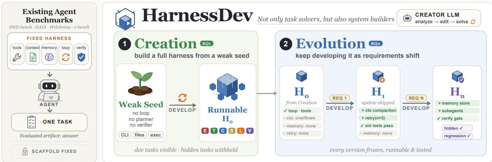  
Figure 1 HarnessDev covers two stages of harness development. In Creation, a creator builds a complete harness from a weak but runnable seed and a small number of development cases. In Evolution, it continues to improve its own persistent harness using downstream execution feedback. Both stages evaluate runnable infrastructure that persists across tasks rather than a one-of task output.

Despite this practical need, most agent evaluations select a harness for a given comparison and report model performance on downstream tasks [18, 26, 29, 54, 61]. This setup supports controlled task-level comparison, but treats the harness as part of the experimental configuration rather than as an artifact to be developed. Recent work has begun to study harness representations, automated agent design, and agents that build or improve agent systems [15, 27, 31, 39, 56, 57]. However, it remains underexplored whether models can both create and continually improve runnable, persistent harnesses. Answering this question requires separating the model that develops the harness from the model that executes downstream tasks, recording the development environment, and measuring downstream performance, transfer across executors, distance from human-engineered systems, regression, and cost.

This evaluation gap is particularly consequential because harness engineering is fundamentally diferent from ordinary code editing. When a model modifies a standalone program, the target behavior is externally specified and success is locally verifiable. When a model modifies its own harness, it is editing the execution substrate through which it acts: the change alters how the model itself observes, plans, and recovers in all future tasks. Efective harness improvement therefore demands that the model recognize its own behavioral limitations from execution traces [42], diagnose structural bottlenecks in the system it runs inside, and commit targeted changes that accumulate into lasting, reusable capability gains rather than one-of fixes [49, 53]. As frontier models grow capable enough to edit multi-file codebases and close real pull requests, this ability is already latent; what is missing is a benchmark that measures it.

We introduce HarnessDev (Figure 1), a benchmark that fills this gap by shifting the unit of evaluation from task outputs to runnable infrastructure: measuring a model’s ability to construct and maintain execution systems that are durable, inspectable, and reusable. The name reflects the software-engineering sense of develop: developing a harness includes both building it from scratch (i.e., Creation) and improving it through continued iteration and maintenance (i.e., Evolution). The benchmark covers two stages of harness development. In Creation, a creator LLM starts from a deliberately weak but runnable seed and builds a complete harness for a new task family. In Evolution, it starts from an existing harness and continues to develop it toward better downstream task performance. Together, the two stages evaluate whether models can complete harness development tasks and continuously improve the resulting system.

Evaluating a generated harness is harder than evaluating a generated answer. A harness can overfit to the model that wrote it, memorize development examples, improve one capability while silently regressing another, or improve the feedback-set score through benchmark-specific changes that do not transfer to new tasks. We therefore evaluate along two axes. Capability measures whether the harness works: we run it on held-out downstream tasks and report task-level success rates. Eficiency measures how many executor-model tokens the frozen harness consumes when deployed to solve downstream tasks.

Our findings follow the two stages of harness development:

Harness Creation. Current models can construct runnable harnesses from a weak seed, but the gap from mature human-engineered systems varies substantially by harness type. When each harness runs with the model that built it, model-built harnesses match the reference on short-form writing and exceed it on machinelearning experimentation. The gap is largest for search and research harnesses, which require long-horizon information seeking, and remains substantial for code harnesses, which must coordinate repository inspection, editing, and verification over many turns. Harnesses built by diferent creator models also difer substantially not only in downstream task performance, but also in the number of executor tokens they consume. Higher execution cost does not reliably produce better results, so harness quality must be assessed through both capability and eficiency.

Harness Evolution. Current models can use downstream execution feedback to improve their own harnesses, but reliable evolution remains dificult. Performance often rises and falls across successive revisions, and gains observed during development become smaller and less consistent on unseen tasks. The outcome also depends strongly on the model that runs the harness: changing this runtime model alters both the starting performance and whether subsequent revisions help. These results show that models can make useful local improvements, while robust evolution across unseen tasks and runtime models remains an open challenge.

## 2 Background

Most agent benchmarks begin after the problem has already been made executable: the task is specified, the reward or judge is defined, and the execution scafold is fixed. This setting is necessary for controlled comparison, but it hides the work that dominates real deployment. In industry that work is spread across several roles—solutions architects, applied and platform engineers—but its most visible recent crystallization is the forward-deployed engineer (FDE), a title popularized by Palantir and since adopted by frontier-model companies [36, 38]. An FDE is embedded at the customer site after a system is adopted and turns a generalpurpose model into something that runs against that customer’s data formats, workflows, and compliance constraints—for example, rewriting an ingestion path because logs may only be retained for a fixed period, or localizing a failure in a cross-jurisdiction contract pipeline. The role’s success criterion is not a demo or a benchmark score but whether the deployed system is genuinely used, keeps working, and improves; its failures are folded back into the product as fixes and feature requests [36]. The rapid growth of FDE hiring across frontier-model and data-platform companies [44] reflects a simple fact: a capable model is not yet a working system [30], and today the gap is closed by human engineers.

Viewed from the model’s side, FDE work supplies three pieces of structure that benchmark designers normally presuppose. First, the target is vague: an informal business intent must be translated into concrete objectives, constraints, and success criteria. Second, the feedback signal is absent or unreliable: tests, judges, traces, or other self-evaluation must be constructed before anyone can tell whether the system is improving—“compliant” only becomes checkable once someone encodes what compliance means here. Third, the execution system does not exist in a usable form: the tools, context management, state, lifecycle logic, and verification interface through which future tasks will run must be built, adapted, and then maintained—an FDE stays with the system as requirements shift, rather than delivering once and leaving.

This paper focuses on the third layer. In a typical controlled agent evaluation, researchers select an agent configuration and report task completion under that configuration. The harness is therefore usually part of the evaluation setup rather than the object being developed. HarnessDev instead asks whether language models can create this execution scafold from a weak starting point and then improve it using feedback while preserving constraint compliance and held-out performance. Whereas Aspire studies how broad deployment needs become capability growth and $\mathrm { S ^ { 3 } G y m }$ studies whether interaction experience can be judged and reused, HarnessDev isolates how models build and maintain the systems that carry them.

## 3 Benchmark

## 3.1 Overview

HarnessDev evaluates the execution system that a model develops, rather than the answer it produces for a single task. The submitted artifact is a runnable harness that is frozen and then reused across downstream tasks. A creator LLM $L _ { C }$ works inside a development environment D to produce a runnable harness H. The development signal difers by setting and is defined in Table 1. After development, H is frozen. An executor LLM $L _ { E }$ then runs inside it on a downstream task x, and evaluator J scores the resulting output y:

$$
( L _ { C } , D )  H , \qquad ( H , L _ { E } , x )  y \stackrel { J } {  } \mathrm { s c o r e } .\tag{1}
$$

Thus, D is used to build H, whereas $L _ { E }$ is used only after H is frozen. In implementation terms, H contains the execution loop, tools, context management, persistent state, lifecycle control, and verification; we describe these components in words rather than assigning each another symbol.

The benchmark studies two stages of harness development.

RQ1—Creation. Can a model build an efective harness from a weak but runnable seed? The creator must turn a task specification and a few development cases into infrastructure that generalizes to unseen tasks.

RQ2—Evolution. Can a model improve an existing harness while preserving behavior that already works? The creator evolves its own Creation harness from downstream execution feedback. We additionally analyze the resulting artifacts and trajectories, including edit statistics, feedback response, held-out generalization, and transfer across executors.

## 3.2 Development settings

All settings provide a mutable development workspace, but they difer in the starting harness and the signal available to the creator. Table 1 gives the central distinction.

<table><tr><td>Setting</td><td>Starts from</td><td>Development signal</td><td>Output</td></tr><tr><td>Creation</td><td>Weak seed  $H _ { \mathrm { s e e d } }$ </td><td>Specification and 1-3 development cases</td><td>Final harness H</td></tr><tr><td>Evolution</td><td>Creator&#x27;s RQ1  $H _ { 0 }$ </td><td>Results from a designated feedback set</td><td>Frozen paired candidates and a creator-declared final harness</td></tr></table>

Table 1 Harness-development settings. Creation builds a new harness; Evolution improves that harness from downstream execution feedback.

Weak seed $H _ { \mathrm { s e e d } }$ . Creation should measure whether a model can design an execution system, not whether it can reproduce benchmark boilerplate. Every creator therefore receives the same $H _ { \mathrm { s e e d } } \colon$ a runnable compatibility layer, not a task-solving agent. It parses task and model configuration, exposes permitted low-level tools, and writes the required results, trajectories, logs, and task artifacts. Its tools are passive and act only when the harness calls them.

The seed has no agent loop, task decomposition, tool policy, context management, persistent task state, verifier, retry or recovery logic, or stopping rule. It may issue one connectivity probe, but it does not attempt the task. Unmodified, it produces an empty or partial artifact and scores zero on every downstream benchmark. Any nonzero Creation score must therefore come from execution logic added by the creator. This boundary matters because real scafolds combine many control primitives, and their composition afects task performance [31, 39, 40].

This design avoids two extremes. An empty repository would mix harness design with command-line and file-format setup; a mature agent would give away the planning and verification structure being tested. $H _ { \mathrm { s e e d } }$ removes the setup burden without providing a solution policy. Figure 2 shows the seed and its development environment; Figure 3 shows the control layer the creator must implement and the scorer-readable artifacts a finished harness delivers. Appendix C.1 gives its implementation skeleton.

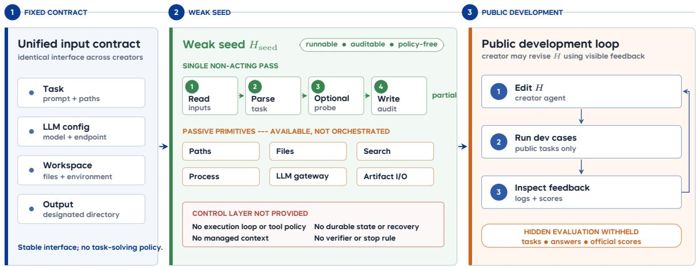  
Figure 2 The weak Seed Harness and its development environment. The seed fixes only the input and audit envelopes and exposes passive, unorchestrated primitives; unmodified, it performs no task work. Development feedback is public; hidden tasks, answers, and oficial scores remain inaccessible.

Creation (RQ1). Along with $H _ { \mathrm { s e e d } } ,$ the creator receives a task-family specification, tool and permission constraints, a short design tutorial, and one to three development cases. It may revise the harness using feedback from those cases, but it never sees the human implementation or the hidden evaluation set. The resulting harness H is frozen before evaluation.

Evolution (RQ2). The creator starts from its own frozen RQ1 code harness $H _ { 0 } .$ . During development, it receives results from a fixed 100-task SWE-Pro feedback set and all 89 Terminal-Bench tasks. The 100 SWE-Pro tasks are a subset of the 731-instance public split used in Creation, and the 630-instance held-out split of Section 4.3 is drawn from the same split. In the reported protocol, the controller first evaluates $H _ { 0 }$ on both benchmarks. Each oficial post- $H _ { 0 }$ candidate is then frozen and submitted as a pair: one complete 100-task SWE-Pro evaluation and one complete 89-task Terminal-Bench evaluation of the same commit. A candidate enters the oficial trajectory only after both legs settle. Same-commit infrastructure repairs are merged; probes, partial legs, stopped runs, and invalid instances are excluded.

The controller provides a budget of ten post- $H _ { 0 }$ full-evaluation pairs. Between two charged pairs, the creator may use at most two fixed-subset probes, each covering the same first five tasks from both benchmarks. Probe results are diagnostic and never become oficial scores. The creator terminates by declaring a non- $H _ { 0 }$ commit that has a complete oficial pair.

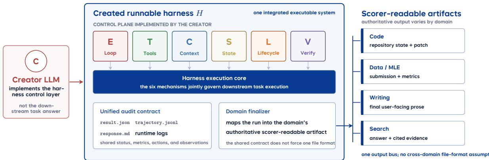  
Figure 3 From control layer to scorable artifacts. The creator must implement the six control modules $( E / T / C / S / L / V$ , colored as in Figure 1). A finished harness reports through unified auditable outputs and delivers a domain-specific, scorer-readable final artifact.

Both benchmarks shown during Evolution are feedback-bearing development sets, so in-trajectory scores measure online adaptation and version selection. Generalization is measured separately after freezing: every oficial version is additionally evaluated on 630 SWE-Pro instances disjoint from the feedback set, and these scores are never shown to the creator. Throughout this paper, held-out means withheld from the creator’s development loop; Section 4.3 gives the full setting.

## 3.3 Domains and downstream benchmarks

Creation covers four domains and five downstream benchmarks (Table 2); Evolution currently focuses on code harnesses. Together, the suites contain 2,207 unique downstream instances. The Evolution feedback tasks come from the same benchmark suites and are therefore not counted again.

<table><tr><td>Domain</td><td>Benchmark</td><td>Tasks</td><td>Primary metric</td></tr><tr><td>Code</td><td>SWE-bench Pro [12], public split (abbreviated SWE-Pro below)</td><td>731</td><td>Task success</td></tr><tr><td>Code</td><td>Terminal-Bench 2.1 [45]</td><td>89</td><td>Task success</td></tr><tr><td>Data analysis</td><td>MLE-bench [7]</td><td>75</td><td>Medal score</td></tr><tr><td>Writing</td><td>EQ-Bench3 [37]</td><td>46</td><td>Rubric score</td></tr><tr><td>Research</td><td>BrowseComp [52]</td><td>1,266</td><td>Accuracy</td></tr></table>

Table 2 Downstream evaluation coverage for Creation. Creation uses all 731 instances of the SWE-bench Pro public split. Evolution draws its 100-task SWE-Pro feedback set and its 630-instance held-out split from that same public split, and uses all 89 Terminal-Bench tasks as feedback.

Mature open-source systems define the capability surface in each domain. Depending on availability, a system may serve as a human-engineered reference or provide a development environment. These roles are assigned separately; inclusion does not imply that a system serves both. Appendix A lists the candidate systems, while the benchmark release fixes their roles, versions, and licenses.

## 3.4 Evaluation protocol

Every score is produced by a frozen harness in a standardized runtime. The executor LLM $L _ { E }$ and evaluator J remain fixed within each comparison, so score changes reflect changes to the harness. Development and evaluation are also separated: hidden scores are not returned in Creation, and Evolution exposes only its designated feedback set during development.

Creation. We compare a created harness with the common seed and, where available, a mature humanengineered harness. Self-Eval sets $L _ { E } = L _ { C }$ and measures the complete creator–harness system. Unified-Eval runs every generated harness with the same fixed $L _ { E } ,$ making harnesses directly comparable.

Evolution. Evolution candidates are evaluated on the designated feedback benchmarks during development.   
Only complete two-benchmark pairs enter the oficial trajectory, and the creator selects a final paired candidate.   
After all trajectories end, every oficial version is additionally evaluated on a disjoint held-out set that is never shown to the creator, so adaptation to observed feedback and held-out generalization are reported separately.   
Appendix D details the evaluation settings and model roles.

Constraint compliance. The creator-visible specification states what a submitted harness may not do: hardcode instance-specific solutions, derive patches from task identifiers, file-name allowlists, or known answers, consult hidden tests, hidden answers, hidden patches, private scorer internals, or oficial evaluation feedback, or replace the provided provider-neutral runtime interface with its own LLM access path. Two properties make these constraints checkable rather than advisory. First, the score path is isolated from the harness: a harness’s self-reported status is never a scoring input, SWE-Pro credit comes only from the real repository dif left in the task workdir, and Terminal-Bench credit only from final environment state, so no harness can earn score by asserting success. Second, every run retains its trajectory, result, and metric artifacts alongside the frozen harness source, which supports a post-hoc audit of the delivered code and of what that code actually executed. We audited the delivered harness source and the recorded execution artifacts of every run reported in this paper, and report the outcome as a null result: no harness obtained score through a prohibited route, and no run is excluded on these grounds.

## 3.5 Metrics

For each frozen harness, we report two quantities: downstream task performance under the benchmark’s native metric and the executor-model tokens consumed during evaluation. Execution cost is reported as both the total and the mean per task; tokens used by the creator to build or modify the harness are excluded. Creation compares each harness with the weak seed and available human-engineered references. Evolution reports the performance change from its initial harness $H _ { 0 }$ under the same executor and scorer.

## 4 Experiments

We instantiate the benchmark defined in Section 3 and report results for Creation, Evolution, and cross-model behavior. The behavioral analysis compares resource use, response to feedback, and transfer across executors.

## 4.1 Experimental setup

We evaluate six creator LLMs L<sub>C</sub>: Opus 4.8 [4], GPT-5.5 [33], Gemini 3.1 Pro [13], DeepSeek V4 Pro [11], Qwen 3.7 Max [1], and Seed 2.0 Pro [6]. Models run through their oficial APIs or OpenRouter [35]. We use Claude Code 2.1.177 as the development environment D, except that GPT-5.5 uses Codex 0.144.3. Appendix B gives the model, decoding, and development-environment configuration, the downstream execution resources and time limits, and the human-reference sources.

We follow the development and evaluation protocols in Sections 3.2–3.4. For RQ1, we independently create and evaluate three harnesses for each creator–benchmark pair and report avg@3. Under Self-Eval, the creator also serves as executor; under Unified-Eval, every harness uses Gemini 3.1 Pro, which isolates executor compatibility. Human-reference results are verified public system results rather than paired controls under one executor; their sources are listed in Appendix B.2.

## 4.2 Harness Creation

RQ1 asks whether a model can turn the runnable weak seed into an efective harness for a task family. We compare the generated harnesses with the zero-scoring seed and with verified human-engineered systems, reporting both downstream performance and execution tokens.

Overall findings. Creation quality varies substantially across task families (Tables 3–4 and Figure 4). Under Self-Eval, Opus 4.8 has the highest overall score (67.8), but remains below the human-engineered reference (86.2). Writing harnesses approach the reference, whereas Search shows the largest gap and Code also remains behind. Opus 4.8 and Gemini 3.1 Pro lead MLE-bench with medal rates of 32.9 and 32.4. More broadly, 77.8% of failed Data tasks are attributed to harness defects, showing that the bottleneck is not only executor capability.

Performance variation and executor dependence. Independent creations from the same model can still difer sharply. The clearest example is an Opus Code harness that performs well under Self-Eval but nearly collapses under Gemini because it hard-codes a 120-step limit around the original executor. Similar failures arise from overly strict stopping rules in Data. A single generated harness is therefore not representative, which motivates reporting avg@3.

Fixing the executor changes the ranking substantially. Qwen, Seed, and DeepSeek improve in several Data and Search settings under Gemini, whereas Opus and GPT-5.5 are often stronger with their own executors. Thus, Self-Eval reflects harness design, executor capability, and the compatibility between them. Cost is similarly uneven: MLE-bench token use varies by about nineteen-fold, yet higher cost does not reliably produce a higher score (Figure 9).
<table><tr><td></td><td colspan="2">SWE-Pro</td><td colspan="2">Term.-2.1</td><td colspan="2">MLE-bench</td><td colspan="2">EQ-Bench3</td><td colspan="2">BrowseComp</td><td rowspan="2">Avg. score</td></tr><tr><td>Creator (Self-Eval)</td><td>succ.</td><td>tok.</td><td>acc.</td><td>tok.</td><td>medal</td><td>tok.</td><td>score</td><td>tok.</td><td>acc.</td><td>tok.</td></tr><tr><td>Seed harness  $H _ { \mathrm { s e e d } }$ </td><td>0.0</td><td></td><td>0.0</td><td></td><td>0.0</td><td></td><td>0.0</td><td></td><td>0.0</td><td></td><td>0.0</td></tr><tr><td>Opus 4.8 High</td><td>69.3</td><td>759.5</td><td>64.8</td><td>46.2</td><td>32.9</td><td>101.7</td><td>84.6</td><td>3.1</td><td>52.4</td><td>593.9</td><td>67.8</td></tr><tr><td>GPT-5.5 High</td><td>32.8</td><td>325.6</td><td>52.1</td><td>12.2</td><td>19.1</td><td>29.3</td><td>83.0</td><td>4.9</td><td>52.6</td><td>313.5</td><td>55.1</td></tr><tr><td>Gemini 3.1 Pro High</td><td>43.6</td><td>783.6</td><td>68.8</td><td>177.1</td><td>32.4</td><td>131.3</td><td>74.8</td><td>5.2</td><td>35.2</td><td>267.4</td><td>55.6</td></tr><tr><td>DeepSeek V4 Pro High</td><td>28.9</td><td>739.7</td><td>35.6</td><td>35.2</td><td>19.6</td><td>208.4</td><td>75.4</td><td>4.9</td><td>40.9</td><td>1,449.9</td><td>45.2</td></tr><tr><td>Qwen 3.7 Max Seed 2.0 Pro High</td><td>33.5 10.8</td><td>421.9 454.4</td><td>41.3 6.0</td><td>19.3 23.0</td><td>3.1</td><td>42.9</td><td>68.7</td><td>4.3</td><td>32.3</td><td>130.9</td><td>44.0</td></tr><tr><td></td><td></td><td></td><td></td><td></td><td>5.3</td><td>557.1</td><td>71.1</td><td>9.0</td><td>3.2</td><td>610.2</td><td>22.8</td></tr><tr><td>Human harness + paired model</td><td>80.0*</td><td></td><td>88.8*</td><td></td><td>24.0</td><td>66.5</td><td>83.7</td><td>9.2</td><td>92.2*</td><td></td><td>86.2</td></tr></table>

Table 3 RQ1 / Harness Creation under Self-Eval. Unless noted otherwise, each creator independently builds and evaluates three harnesses and the score is avg@3. Each benchmark uses its native metric, tok. is the mean execution tokens per harness in millions, and Avg. is the unweighted mean over SWE-Pro, Terminal-Bench, EQ-Bench3, and BrowseComp. MLE-bench covers 33 physical cells and 2,475 results. The human row is a system-level reference; marks external results that we did not re-run in this experiment, and — marks unavailable entries.

<table><tr><td></td><td colspan="2">SWE-Pro</td><td colspan="2">Term.-2.1</td><td colspan="2">MLE-bench</td><td colspan="2">EQ-Bench3</td><td colspan="2">BrowseComp</td><td rowspan="2">Avg. score</td></tr><tr><td>Creator (Unified-Eval)</td><td>succ.</td><td>tok.</td><td>acc.</td><td>tok.</td><td>medal</td><td>tok.</td><td>score</td><td>tok.</td><td>acc.</td><td>tok.</td></tr><tr><td>Seed harness  $H _ { \mathrm { s e e d } }$ </td><td>0.0</td><td></td><td>0.0</td><td></td><td>0.0</td><td></td><td>0.0</td><td></td><td>0.0</td><td></td><td>0.0</td></tr><tr><td>Opus 4.8 High</td><td>33.0‡</td><td>782.9</td><td>52.4</td><td>94.3</td><td>16.9</td><td>46.3</td><td>74.2</td><td>2.1</td><td>53.6</td><td>505.8</td><td>53.3‡</td></tr><tr><td>GPT-5.5 High</td><td>27.8</td><td>383.9</td><td>49.4</td><td>24.3</td><td>16.0</td><td>80.5</td><td>46.5</td><td>4.9</td><td>55.4</td><td>177.8</td><td>44.8</td></tr><tr><td>Gemini 3.1 Pro High</td><td>43.6</td><td>783.6</td><td>68.8</td><td>177.1</td><td>32.4</td><td>131.3</td><td>74.8</td><td>5.2</td><td>35.2</td><td>267.4</td><td>55.6</td></tr><tr><td>DeepSeek V4 Pro High</td><td>29.2</td><td>492.4</td><td>38.2‡</td><td>26.8</td><td>9.8</td><td>125.5</td><td>72.9</td><td>5.0</td><td>54.8</td><td>362.8</td><td>48.8‡</td></tr><tr><td>Qwen 3.7 Max</td><td>41.3</td><td>1,253.3</td><td>48.6</td><td>81.9</td><td>16.0</td><td>44.0</td><td>71.5</td><td>2.5</td><td>49.9</td><td>133.4</td><td>52.8</td></tr><tr><td>Seed 2.0 Pro High</td><td>15.6</td><td>786.8</td><td>13.1</td><td>79.0</td><td>13.3</td><td>1,717.5</td><td>73.1</td><td>44.9</td><td>17.3</td><td>398.4</td><td>29.8</td></tr></table>

Table 4 RQ1 / Harness Creation under a fixed Gemini executor. Every creator harness is executed by Gemini 3.1 Pro. The Gemini row reuses the Self-Eval control and is not counted as a new physical cell. Every score entry is avg@3. Code cells marked <sup>‡</sup> contain one collapsed R3 replica; dropping it gives post-hoc clean sensitivity means of 49.1 for Opus on SWE-Pro and 43.8/57.3 for DeepSeek on SWE-Pro/Terminal-Bench. GPT-5.5’s EQ-Bench3 cell is avg@3 (46.5); excluding its zero-valued first harness the mean is 69.7. All other definitions follow Table 3.

Implementation behavior. The six creators follow distinct implementation strategies. Opus often rewrites the execution stack; GPT-5.5 adds a large monolithic agent; DeepSeek, Qwen, and Seed extend the seed with agent, tool, context, and state modules; and Gemini mostly edits the runner in place. The 18 Code artifacts add 17,111 net lines in total (Table 5), but edit size does not predict performance. Gemini adds the fewest lines (1,006) yet obtains the best Terminal-Bench score (68.8), suggesting that focused changes and frequent verification matter more than code volume.

All 18 Code harnesses implement an explicit execution loop; tools, lifecycle control, and verification are complete in 13/18, 13/18, and 15/18 artifacts, respectively (Figure 5). State and memory are the clearest gap: 11/18 artifacts define a State class, but only one exposes a state-saving interface and only one implements periodic checkpointing. No checkpoint event appears in 26,679 recorded task trajectories. Another recurring weakness is executor-specific configuration: hard-coded step or output limits can make a functional harness fail when the executor changes. Validation is also mostly syntactic; 441 of 2,325 executed Data tasks produce degenerate submissions that no harness detects.

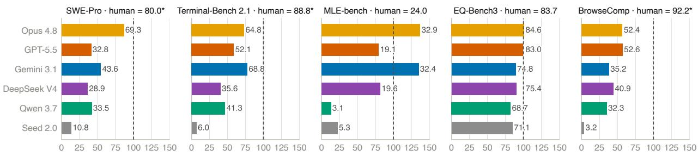  
Downstream score as % of the human-engineered reference (dashed = reference; labels = raw score)

Figure 4 RQ1: distance to human-engineered references. Each creator’s Self-Eval downstream score is normalized to the human-engineered reference for that benchmark; the dashed line is the reference and the label beside each bar is the raw score. Human references come from diferent harness–model combinations and are not paired controls under a common executor, so this figure only shows the distance to the selected mature systems. Exceeding 100% means exceeding that external reference, not exceeding human ability.
<table><tr><td>Creator</td><td>Files add/chg/del</td><td>Total net LOC</td><td>Median/replica</td><td>Range</td><td>SWE-Pro</td><td>Term.-2.1</td></tr><tr><td>Opus 4.8</td><td>19/7/16</td><td>2,470</td><td>698</td><td>656-1,116</td><td>69.3</td><td>64.8</td></tr><tr><td>GPT-5.5</td><td>3/10/0</td><td>3,537</td><td>1,231</td><td>1,059–1,247</td><td>32.8</td><td>52.1</td></tr><tr><td>Gemini 3.1 Pro</td><td>4/4/0</td><td>1,006</td><td>324</td><td>270-412</td><td>43.6</td><td>68.8</td></tr><tr><td>DeepSeek V4 Pro</td><td>14/4/1</td><td>3,242</td><td>988</td><td>931-1,323</td><td>28.9</td><td>35.6</td></tr><tr><td>Qwen 3.7 Max</td><td>12/6/0</td><td>3,562</td><td>1,339</td><td>551-1,672</td><td>33.5</td><td>41.3</td></tr><tr><td>Seed 2.0 Pro</td><td>14/6/0</td><td>3,294</td><td>1,200</td><td>868-1,226</td><td>10.8</td><td>6.0</td></tr></table>

Table 5 Edit size of the frozen RQ1 Code artifacts. File counts and total net LOC are summed over each creator’s three independently created artifacts; the median and range are per artifact. The statistics cover only harness/, which is the creator’s responsibility, and exclude the runtime substrate injected by the runner. Performance is Self-Eval avg@3.

Some generated mechanisms never afect execution. Of 108 component instances in Code, 72 trigger in real runs, 18 have only partial evidence, and 18 are never observed; all unobserved instances concern state and memory. The same pattern appears beyond Code: 124 of 587 Writing features are confirmed dead code, and 36 Data mechanisms sit on dead paths. Small implementation errors can also disable an entire tool chain. Self-test count alone is a weak signal: its Spearman correlation with downstream score is only 0.13–0.26 and is not significant, whereas revision calls reach 0.57 $( p \leq . 0 0 0 5 )$ . Testing helps when the creator reads the failure, makes a targeted change, and re-verifies it.

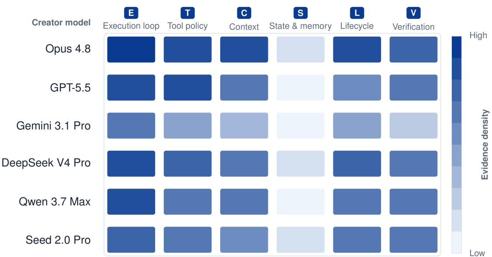  
Figure 5 Harness architecture evidence across fields and stages. The six columns are execution loop, tool policy, context management, state and memory, lifecycle and recovery, and result verification. Each field is first normalized by the number of independent harnesses actually available and then aggregated over RQ1 Code/Data/Writing/Search and RQ2 Main; Seed has no RQ2 trajectory and is therefore built only from the four RQ1 fields. Full weight requires a mechanism to enter the main path or to trigger during a formal run, while declared code, configuration, or transient state receives only partial weight. Color shows mechanism evidence density, not score, significance, or causal efect.

Executor transfer. Portability depends on the individual harness (Figure 6). Several Qwen and DeepSeek harnesses improve under Gemini, indicating that their original executors were a bottleneck; Qwen gains 17.6 points on BrowseComp and 12.9 on MLE-bench. Opus shows the opposite pattern: its Self-Eval SWE-Pro score falls from 69.3 to 33.0 under Gemini, and its Writing score falls from 84.6 to 74.2. In the Opus Search harness, the duplicate-query rate rises from 10.1% to 88.2% after the executor changes, showing that its deduplication, review, and termination rules are adapted to the original model. A runnable harness can therefore be used by another model, but capability transfers only when its prompts, tool protocol, budgets, and stopping rules remain compatible.

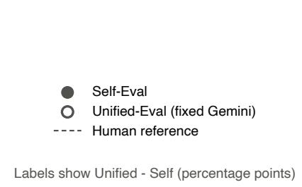

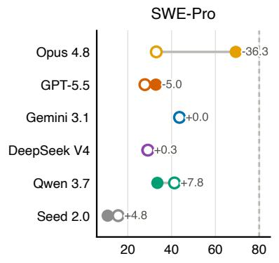

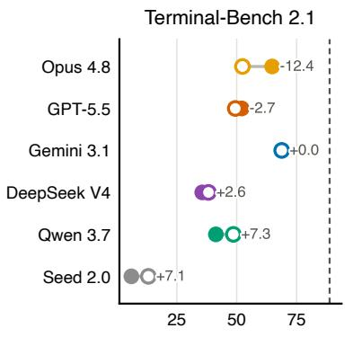

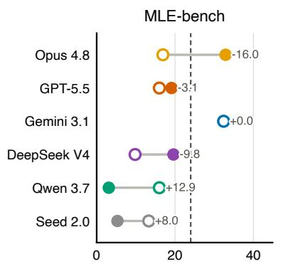

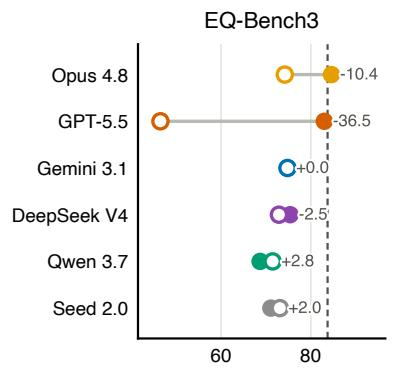

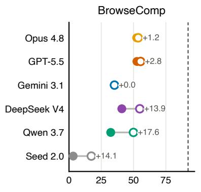  
Downstream score (%)  
Figure 6 Harness portability under a fixed Gemini executor. Filled markers are Self-Eval, hollow markers are the fixed Gemini result for the same creator harness, labels are Unified-Eval minus Self-Eval, and dashed lines are external human-engineered system references. All panels use the avg@3 values of Table 3 and Table 4; the clean sensitivity means for the two collapsed code cells are given in the caption of Table 4.

## 4.3 Harness Evolution

Overall findings. All five self-runtime creators improve on the visible feedback pair, but the gains shrink on held-out tasks. Opus 4.8 has the largest held-out improvement at +4.44 points. Transfer is weaker under the fixed Gemini executor: only Opus improves on held-out tasks, while the other three lineages regress. Evolution can therefore produce useful local changes, but the gains remain small and often specialize to the current executor or feedback set.

Evaluation protocol. RQ2 asks whether a creator can improve its RQ1 Code harness using downstream execution feedback. Tasks repeatedly evaluated during Evolution form the feedback set; tasks evaluated only after Evolution, with results never returned to the creator, form the held-out set. We report the individual benchmark scores and an equally weighted pair score:

$$
\begin{array} { r } { \bar { P } _ { t } = \frac { 1 } { 2 } \left( P _ { t } ^ { \mathrm { S W E 1 0 0 } } + P _ { t } ^ { \mathrm { T e r m 8 9 } } \right) , } \end{array}\tag{2}
$$

where the two terms are percentage scores and t indexes the frozen versions that completed a formal evaluation.

Each lineage starts from its RQ1 harness $H _ { 0 }$ . We run five self-runtime trajectories and four fixed-Gemini ablations, using the same creator, development environment, and starting harness. As defined in Section 3.2, an oficial version must complete both the 100-task SWE-Pro and 89-task Terminal-Bench evaluations; probes are diagnostic only. The nine lineages produce 73 oficial versions and 64 adjacent version switches; Figure 7 shows every feedback-set trajectory.

After all trajectories end, we evaluate every oficial version on the 630-instance SWE-Pro held-out split, drawn from the public-split instances disjoint from the 100-task feedback set (Section 3.2). These scores are never shown to the creator and cannot afect editing, stopping, or final version selection. Table 6 therefore separates visible feedback gains from held-out generalization, and Figure 8 overlays the two trajectories for every lineage.
<table><tr><td>Setting</td><td>Creator</td><td>Feedback pair  $H _ { 0 } \to H _ { \mathrm { d e c } }$ </td><td>Held-out-630  $H _ { 0 } \to H _ { \mathrm { d e c } }$ </td><td>Held-out final gap</td></tr><tr><td></td><td></td><td>59.9→68.7</td><td>48.89→51.59</td><td></td></tr><tr><td>Self</td><td>Gemini 3.1 Pro</td><td>(+8.8) 71.1→74.1</td><td>(+2.70) 63.02→ 67.46</td><td>0.00</td></tr><tr><td>Self</td><td>Opus 4.8</td><td>(+3.0) 41.8→55.7</td><td>(+4.44) 42.22→43.65</td><td>1.59</td></tr><tr><td>Self</td><td>Qwen 3.7 Max</td><td>(+13.9) 47.2→60.6</td><td>(+1.43) 47.30→50.48</td><td>3.17</td></tr><tr><td>Self</td><td>DeepSeek V4 Pro</td><td>(+13.4) 59.2→65.1</td><td>(+3.17) 48.25→52.06</td><td>1.75</td></tr><tr><td>Self</td><td>GPT-5.5</td><td>(+5.9)</td><td>(+3.81)</td><td>0.00</td></tr><tr><td>Fixed Gemini</td><td>Opus 4.8</td><td>58.8→68.6 (+9.7)</td><td>48.10→50.79 (+2.70)</td><td>2.54</td></tr><tr><td>Fixed Gemini</td><td>Qwen 3.7 Max</td><td>62.1→63.2 (+1.1)</td><td>49.52→48.41</td><td></td></tr><tr><td></td><td></td><td>47.3→53.8</td><td>(−1.11) 43.02→ 40.63</td><td>1.11</td></tr><tr><td>Fixed Gemini</td><td>DeepSeek V4 Pro</td><td>(+6.5) 56.6→59.1</td><td>(−2.38) 42.22→31.90</td><td>3.02</td></tr></table>

Table 6 RQ2 feedback-set gains and post-freeze held-out-630 generalization. The feedback pair is the unweighted mean of the SWE-Pro-100 and Terminal-Bench-89 percentage scores; the held-out columns use only the SWE-Pro-630 tasks run afterwards. The final gap is the best held-out score of a lineage minus the score of its declared version. The Gemini control is listed once.

Editing and feedback use. The median declared version changes eight files, adding 476 lines and deleting 38 (Table 7). Across 64 oficial switches, 58 change execution or control flow, 37 change tools, 17 change lifecycle recovery, 16 change context, and only four change state; no switch modifies a standalone verifier. Edit size does not reliably predict improvement, and the same creator may adopt diferent strategies under diferent executors. DeepSeek, for example, expands its self-runtime harness but later rolls back much of a fixed-Gemini rewrite after context compression breaks tool-message pairing. Evolution therefore resembles local program search around runtime feedback, where deletion can be as useful as addition.
<table><tr><td>Setting</td><td>Creator</td><td>Official switches</td><td> $H _ { 0 } \to H _ { \mathrm { d e c } }$  cumulative diff</td><td>Main edit focus</td></tr><tr><td>Self</td><td>Gemini 3.1 Pro</td><td>8</td><td>11 files, +692/ − 38</td><td>Tool output, editing, timeouts, patch cleanup</td></tr><tr><td>Self</td><td>Opus 4.8</td><td>3</td><td>8 files, +450/ − 18</td><td>Completion gate, self-review, process recovery</td></tr><tr><td>Self</td><td>Qwen 3.7 Max</td><td>8</td><td>9 files, +1101/ − 106</td><td>Empty-response/parse recovery, auto-submit checkpoints</td></tr><tr><td>Self</td><td>DeepSeek V4 Pro</td><td>10</td><td>9 files, +1730/ - 58</td><td>Completion logic, tool extensions, workspace pre-analysis</td></tr><tr><td>Self</td><td>GPT-5.5</td><td>7</td><td>4 files, +496/ − 49</td><td>Final-state review gate and artifact tracking</td></tr><tr><td>Fixed Gemini</td><td>Opus 4.8</td><td>4</td><td>3 files, +227/ − 21</td><td>Pre-completion verification, scratch-file cleanup</td></tr><tr><td>Fixed Gemini</td><td>Qwen 3.7 Max</td><td>5</td><td>4 files, +219/ − 96</td><td>Context and message-sanitizer rewrite</td></tr><tr><td>Fixed Gemini</td><td>DeepSeek V4 Pro</td><td>9</td><td>8 files, +476/ − 12</td><td>Message-protocol recovery, workspace discovery</td></tr><tr><td>Fixed Gemini</td><td>GPT-5.5</td><td>10</td><td>6 files, +297/ − 34</td><td>Probes, branch rollback, final-state review</td></tr></table>

Table 7 Code edit size of the nine RQ2 lineages. “Oficial switches” counts only adjacent oficial versions; the cumulative dif compares $H _ { 0 }$ with the version declared by the creator for each lineage. The edit focus describes behavior observed in that single trajectory and is not a general property of the corresponding creator model.

Eight of the nine lineages complete at least one full loop from reading results to editing, re-evaluation, and version selection. Failure diagnosis remains the weakest step: the dedicated trajectory interface is called only twice, and explicitly inspected cases cover just 0.5%–40.2% of the 189 feedback tasks, depending on the lineage. Creators instead rely on custom scripts and small probes, both of which can disagree with the full evaluation; one GPT-5.5 candidate passes all five Terminal probes but scores only 0.584 on the full set.

Harness version  
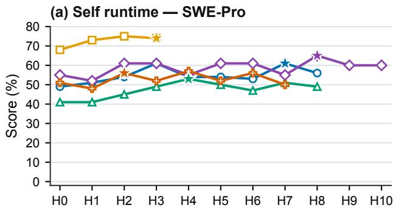

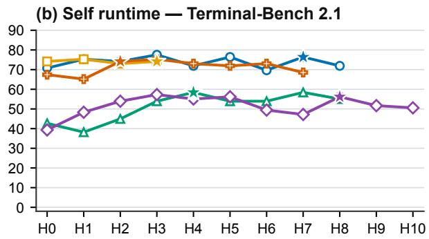

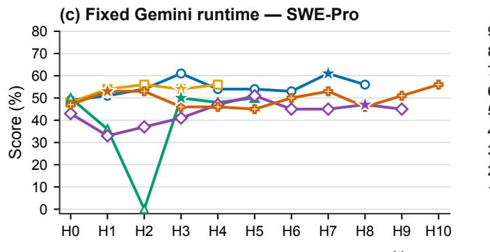

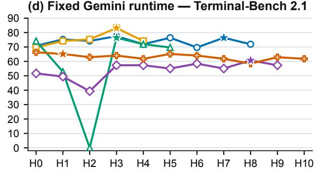  
Figure 7 Feedback-set evolution trajectories on SWE-Pro and Terminal-Bench. The top row is self runtime and the bottom row is the fixed Gemini runtime; the left column is SWE-Pro-100 and the right column is Terminal-Bench-89. $H _ { 0 }$ is the frozen RQ1 harness, $H _ { i }$ are later frozen commits that completed a formal evaluation on both benchmarks, and stars mark the version declared by the creator. The Gemini control is reused in both settings, and each creator–runtime cell has a single trajectory.

Opus gives the clearest positive example: it finds that 99 of 100 runs report success while only 48 pass, traces the gap to premature completion, and adds a completion check. Feedback is most useful when it exposes a concrete failure mode and the resulting change is verified end to end.

Stability and final-version selection. Evolution is not monotonic. Of the 64 oficial switches, eight regress on both benchmarks, 16 show a single-benchmark regression, three show a cross-benchmark trade-of, seven produce no measurable change, 27 report gains that remain inside the repeated-run noise band, two have clear positive evidence beyond the noise band, and one contains no executable code change. The same commit can vary by about ±4.75 pair-score points, so small gains cannot be attributed to code changes from score alone. Added code is not necessarily active either: of 169 new functions or classes, 113 are reachable from the entry point, 31 are reachable only through dead code, and 25 have no caller. Opus’s completion gate is a positive example with path and case-level evidence; Qwen’s message sanitizer is the opposite, breaking valid Gemin tool-result sequences.

Creators usually select a version near the best visible feedback score, but that choice rarely matches the best held-out version. All five self-runtime declarations improve over $H _ { 0 }$ on held-out tasks, with gains of +1.43 to +4.44 points and a mean gain of +3.11. Under fixed Gemini, however, only Opus improves and the other three regress. Across 64 comparable switches, feedback and held-out scores move in the same direction only 34 times (53.1%), and only $2 / 9$ declared versions are held-out optimal. Visible feedback is therefore useful for local search but unreliable for final selection: repeatedly optimizing a noisy score can favor a lucky run and amplify overfitting.

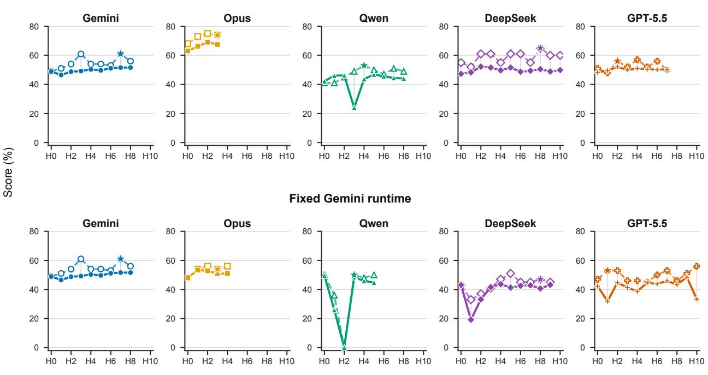  
Figure 8 SWE-Pro-100 feedback trajectories and post-freeze held-out-630 performance. Each column isolates one creator model and overlays its visible 100-task feedback trajectory with its post-freeze 630-task held-out trajectory. The top row is self runtime and the bottom row is fixed Gemini. Stars mark the final versions declared from 100-task feedback. Faint vertical segments connect matched harness versions. The Gemini control is repeated only for visual comparison.

## 5 Related Work

HarnessDev lies at the intersection of agent benchmarking, autonomous agent construction, and harness evolution.

Agent benchmarks and harness development. Benchmarks such as SWE-bench [18], GAIA [29], WebArena [61], τ-bench [54], and AgentBench [26] standardize tasks, environments, and scoring, but generally evaluate task execution under a selected harness. Harness-Bench [55] instead measures how harness choice changes model performance. The Meta-Agent Challenge [27] directly evaluates development: a meta-agent iteratively programs an agent artifact in a sandbox and is scored on protected held-out tests across five domains. It is closely related to Creation, while HarnessDev also studies continued development, separates creator and executor models, and measures execution cost.

HarnessOpt-Bench [47] is the closest concurrent benchmark to Evolution. An LLM optimizer receives a seed harness, graded feedback, and a fixed evaluation budget; a trusted environment then scores its nominated candidate by normalized gain on an inaccessible test partition. Its focus is optimizing a provided harness, although its near-empty GAIA seed also requires construction. In contrast, HarnessDev connects fromscratch Creation to Evolution and evaluates the same frozen artifact under self and fixed runtime models. It uses in-trajectory scores as feedback, then tests every frozen version on a disjoint 630-task SWE-Pro set, separating adaptation from held-out generalization throughout the trajectory.

Evo-Bench [16] also evaluates Evolution by asking evolver models to improve a shared CodeAct seed while holding the runtime model fixed. It scores each lineage’s final revision on a disjoint, sensitivity-calibrated multi domain suite. HarnessDev instead connects Creation and Evolution, includes both self- and fixed-runtime views, measures execution-token cost, evaluates transfer to another executor, and scores every frozen version on its held-out split. Thus, Evo-Bench emphasizes cross-domain final-revision quality, whereas HarnessDev also studies how held-out performance changes along a feedback-driven trajectory.

Automated agent design and evolution. Human-engineered systems such as Claude Code [2], Codex [32], OpenHands [49], and SWE-agent [53] combine execution loops, tools, context management, and recovery mechanisms [40]. ADAS [15], AFlow [57], MASS [60], and EvoAgentX [51] search over prompts, workflows, operators, or agent topologies; other systems let models construct more of the agent in natural language or code [22, 31, 39].

Recent systems optimize executable harness code directly. VeRO [46] provides versioned snapshots, budgetcontrolled evaluation, and structured traces. Meta-Harness [21] uses a coding-agent proposer that can inspect prior candidates, scores, and traces before proposing the next harness. Other methods improve prompts, workflows, memory, skills, tools, or code between episodes [10, 14, 19, 20, 23, 25, 28, 42, 43, 48]. Self-Harness [56] derives model-specific edits from failures and applies regression testing; HarnessFix [9] uses a provenance- and control-flow-aware representation for localized repair; DemoEvolve [8] uses demonstrations when reward feedback is unreliable; and HarnessCompass [58] addresses overfitting and component interference. Harness-R1 [41] instead trains a harness engineer to convert failure batches into validated patches. These works propose methods or infrastructure for harness improvement; HarnessDev evaluates how well general-purpose frontier models perform the broader developer role under one Creation-and-Evolution protocol.

Evaluating harness evolution. Final task gain can conflate informed diagnosis with blind search. Priorityranking evaluation [17] tests whether an optimizer identifies the components most worth changing. Harness Updating Is Not Harness Benefit [24] separates producing a useful update from an executor’s ability to exploit it, motivating our creator–executor separation and Self-Eval/Unified-Eval views. SEAGym [59] records intermediate snapshots, cost, and in- and out-of-distribution results, showing that later updates need not preserve held-out gains. Matched-budget studies likewise find that harness evolution can overfit its search benchmark and may not beat simpler search baselines [50]. HarnessDev therefore freezes runnable artifacts, records development trajectories and execution cost, and evaluates transfer across runtime models. We treat its Evolution trajectories as adaptation to feedback-bearing sets and assess held-out generalization afterward on disjoint SWE-Pro tasks; matched-search evaluation remains future work.

## 6 Discussion, Limitations, and Conclusion

The results show why harness development should be evaluated directly. Creation performance varies sharply by domain: under Self-Eval, current models match the human reference in writing and exceed it in machine-learning experimentation, but remain far behind in search and research and still trail it in code. Cross-executor comparisons show that some harnesses improve under a stronger executor, while others exhibit creator co-adaptation. Evolution is harder still: useful intermediate updates are often erased by later changes, and more updates do not guarantee a positive final gain. Together, these findings separate the quality of the persistent execution system from the capability of the model running inside it. The fixed-Gemini Evolution ablation sharpens this point: changing only the runtime binding can substantially move $H _ { 0 }$ and alter which harness changes are useful.

## 6.1 Limitations

The four categories cover many but not all real deployments. Human baselines are uneven and not guaranteed optimal. Unified-Eval reduces but cannot fully remove executor-model diferences, since harness–model interaction is complex. The behavioral comparisons are descriptive and are limited by incomplete benchmark coverage. Evolution currently has one trajectory per creator–runtime cell and one unfinished main-runtime cell, and its post-freeze held-out evaluation covers SWE-Pro only, so the trajectories do not support uncertainty estimates or population-level comparisons. The development environment D is held fixed across both stages; whether an evolved harness can itself serve as the development environment for further evolution is left to future work. Finally, HarnessDev measures model-external learning and does not claim heuristic learning can replace parameter training.

## 6.2 Conclusion

HarnessDev moves agent evaluation from whether a model can solve tasks inside a fixed system to whether it can create and maintain the systems that solve future tasks. Through a four-category human baseline corpus, from-scratch creation tasks, feedback-driven evolution, Self- and Unified-Eval, and comparisons with human-engineered references, it makes agent-built execution harnesses a measurable object. If model weights are one place intelligence accumulates, the harness is another: explicit, inspectable, testable, reusable, and continually improvable through failure, feedback, and real engineering pressure.

Ethics statement. HarnessDev is built from publicly available benchmark suites and open-source harnesses; no human-generated content is collected. Automated harness construction risks amplified insecure tool use, so the benchmark states explicit constraints on what a submitted harness may do and audits compliance after every run (Section 3.4); no violation was observed in this study, and we release the audit artifacts so the check can be repeated. Creation runs and downstream benchmark tasks execute in containers, but that boundary is provisioned for reproducibility rather than for containment; anyone reusing the generated harnesses should treat them as untrusted code and isolate them more strictly than we did.

## 7 Contributions

## Core Contributors

Yuhao Wu, Jingyuan Zhang, Jiajun Shi

## Contributors

Xinping Lei, Qingshui Gu, Yuxuan Zhang, Zexuan Wang, Chen He, Chen Huang, Maojia Song, Zhiyuan Zeng, Shaowen Wang, Jinkai Liu, Yunfeng Shi, Jiaheng Liu

## Corresponding Authors

Yuhao Wu (wuyuhao.621@bytedance.com)

Shen Yan (sheny@bytedance.com)

Wenhao Huang (huang.wenhao@bytedance.com)

Ge Zhang (gezhang@umich.edu)

Wenxuan Zhang (wxzhang@sutd.edu.sg)

## References

[1] Alibaba Group. Qwen3.7-max. https://www1.hkexnews.hk/listedco/listconews/sehk/2026/0520/ 2026052001340.pdf, 2026. Oficial announcement.

[2] Anthropic. Claude Code: an agentic coding assistant. https://docs.anthropic.com/claude-code, 2024.

[3] Anthropic. Efective context engineering for AI agents. https://www.anthropic.com/engineering/ effective-context-engineering-for-ai-agents, 2025.

[4] Anthropic. Claude opus 4.8. https://www.anthropic.com/claude/opus, 2026. Oficial model page covering Claude Opus 4.7 and 4.8.

[5] browser-use contributors. browser-use. https://github.com/browser-use/browser-use, 2026.

[6] ByteDance Seed. Seed2.0. https://seed.bytedance.com/en/seed2, 2026.

[7] Jun Shern Chan, Neil Chowdhury, Oliver Jafe, James Aung, Dane Sherburn, Evan Mays, Giulio Starace, Kevin Liu, Leon Maksin, Tejal Patwardhan, Lilian Weng, and Aleksander Mądry. MLE-bench: Evaluating machine learning agents on machine learning engineering. arXiv:2410.07095, 2024.

[8] Lirong Che, Yuzhe Yang, Peiwen Lin, Chuang Wang, Xueqian Wang, and Jian Su. DemoEvolve: Overcoming sparse feedback in agentic harness evolution with demonstrations, 2026. URL https://arxiv.org/abs/2605.24539.

[9] Mengzhuo Chen, Junjie Wang, Zhe Liu, Yawen Wang, Haiming Zheng, and Qing Wang. From failed trajectories to reliable LLM agents: Diagnosing and repairing harness flaws, 2026. URL https://arxiv.org/abs/2606.06324.

[10] Tingyang Chen, Shuo Lu, Kang Zhao, Weicheng Meng, Hanlin Teng, Tianhao Li, Chao Li, Xule Liu, Jian Liang, Zhizhong Zhang, et al. Harnessx: A composable, adaptive, and evolvable agent harness foundry. arXiv preprint arXiv:2606.14249, 2026.

[11] DeepSeek-AI. DeepSeek-V4 preview release. https://api-docs.deepseek.com/news/news260424/, 2026.

[12] Xiang Deng, Jef Da, Edwin Pan, Yannis Yiming He, Charles Ide, Kanak Garg, Niklas Laufer, Andrew Park, Nitin Pasari, Chetan Rane, Karmini Sampath, Maya Krishnan, Srivatsa Kundurthy, Sean Hendryx, Zifan Wang, Vijay Bharadwaj, Jef Holm, Raja Aluri, Chen Bo Calvin Zhang, Noah Jacobson, Bing Liu, and Brad Kenstler. SWE-bench Pro: Can AI agents solve long-horizon software engineering tasks? arXiv:2509.16941, 2025.

[13] Google. Gemini 3.1 pro: A smarter model for your most complex tasks. https://blog.google innovation-and-ai/models-and-research/gemini-models/gemini-3-1-pro/, 2026.

[14] Yufei He, Juncheng Liu, Yue Liu, Yibo Li, Tri Cao, Zhiyuan Hu, Xinxing Xu, and Bryan Hooi. Evotest: Evolutionary test-time learning for self-improving agentic systems. arXiv preprint arXiv:2510.13220, 2025.

[15] Shengran Hu, Cong Lu, and Jef Clune. Automated design of agentic systems, 2024. URL https://arxiv.org/ abs/2408.08435.

[16] Lisheng Huang, Chen Yang, Hao Zhou, Huatong Song, Zongchao Chen, Ran Le, Yang Song, Wayne Xin Zhao, and Tao Zhang. Evo-Bench: Can language models improve agent harness?, 2026. URL https://arxiv.org/abs/ 2608.09096

[17] Kai Tzu iunn Ong, Minseok Kang, Dongwook Choi, Junhee Cho, Seungju Kim, Seungwon Lim, Geunha Jang, Minwoo Oh, Bogyung Jeong, Sunghwan Kim, Taeyoon Kwon, and Jinyoung Yeo. Towards direct evaluation of harness optimizers via priority ranking, 2026. URL https://arxiv.org/abs/2605.22505.

[18] Carlos E Jimenez, John Yang, Alexander Wettig, Shunyu Yao, Kexin Pei, Ofir Press, and Karthik Narasimhan. SWE-bench: Can language models resolve real-world github issues?, 2023. URL https://arxiv.org/abs/2310. 06770.

[19] Seth Karten, Joel Zhang, Tersoo Upaa Jr, Ruirong Feng, Wenzhe Li, Chengshuai Shi, Chi Jin, and Kiran Vodrahalli. Continual harness: Online adaptation for self-improving foundation agents. arXiv preprint arXiv:2605.09998, 2026.

[20] Hyunin Lee, Jinglue Xu, Jefrey Seely, Donghyun Lee, Matei Zaharia, and Yujin Tang. Recursive harness self-improvement, 2026. URL https://arxiv.org/abs/2607.15524.

[21] Yoonho Lee, Roshen Nair, Qizheng Zhang, Kangwook Lee, Omar Khattab, and Chelsea Finn. Meta-Harness: End-to-end optimization of model harnesses, 2026. URL https://arxiv.org/abs/2603.28052.

[22] Hongwei Li, Zhun Wang, Qinrun Dai, Yuzhou Nie, Jinjun Peng, Ruitong Liu, Jingyang Zhang, Kaijie Zhu, Jingxuan He, Lun Wang, Yangruibo Ding, Yueqi Chen, Wenbo Guo, and Dawn Song. Opensage: Self-programming agent generation engine, 2026. URL https://arxiv.org/abs/2602.16891.

[23] Jiahang Lin, Shichun Liu, Chengjun Pan, Lizhi Lin, Shihan Dou, Zhiheng Xi, Xuanjing Huang, Hang Yan, Zhenhua Han, Tao Gui, et al. Agentic harness engineering: Observability-driven automatic evolution of coding-agent harnesses. arXiv preprint arXiv:2604.25850, 2026.

[24] Minhua Lin, Juncheng Wu, Zijun Wang, Zhan Shi, Yisi Sang, Bing He, Zewen Liu, Tianxin Wei, Zongyu Wu, Zhiwei Zhang, Dakuo Wang, Xiang Zhang, Benoit Dumoulin, Cihang Xie, Yuyin Zhou, Suhang Wang, and Hanqing Lu. Harness updating is not harness benefit: Disentangling evolution capabilities in self-evolving LLM agents, 2026. URL https://arxiv.org/abs/2605.30621.

[25] Siwei Liu, Jinyuan Fang, Han Zhou, Yingxu Wang, and Zaiqiao Meng. Sew: Self-evolving agentic workflows fo automated code generation. arXiv preprint arXiv:2505.18646, 2025.

[26] Xiao Liu, Hao Yu, Hanchen Zhang, Yifan Xu, Xuanyu Lei, Hanyu Lai, Yu Gu, Hangliang Ding, Kaiwen Men, Kejuan Yang, Shudan Zhang, Xiang Deng, Aohan Zeng, Zhengxiao Du, Chenhui Zhang, Sheng Shen, Tianjun Zhang, Yu Su, Huan Sun, Minlie Huang, Yuxiao Dong, and Jie Tang. AgentBench: Evaluating LLMs as agents, 2023. URL https://arxiv.org/abs/2308.03688.

[27] Xinyu Lu, Tianshu Wang, Pengbo Wang, Zujie Wen, Zhiqiang Zhang, Jun Zhou, Boxi Cao, Yaojie Lu, Hongyu Lin, Xianpei Han, and Le Sun. The meta-agent challenge: Are current agents capable of autonomous agent development?, 2026. URL https://arxiv.org/abs/2606.04455.

[28] Xiaotian Luo, Dizhan Xue, Fengxingyu Wang, Chuanrui Hu, and Yafeng Deng. Harnessbank: Semantic gene-bank search with gated verification for agent-harness self-evolution, 2026. URL https://arxiv.org/abs/2607.13683.

[29] Grégoire Mialon, Clémentine Fourrier, Thomas Wolf, Yann LeCun, and Thomas Scialom. GAIA: a benchmark for general ai assistants, 2023. URL https://arxiv.org/abs/2311.12983.

[30] MIT Project NANDA. The GenAI divide: State of AI in business 2025. https://www. artificialintelligence-news.com/wp-content/uploads/2025/08/ai\_report\_2025.pdf, 2025. Industry report.

[31] Xuying Ning, Katherine Tieu, Dongqi Fu, Tianxin Wei, Zihao Li, Yuanchen Bei, Jiaru Zou, Mengting Ai, Zhining Liu, Ting-Wei Li, et al. Code as agent harness, 2026. URL https://arxiv.org/abs/2605.18747.

[32] OpenAI. Codex CLI. https://github.com/openai/codex, 2025.

[33] OpenAI. Introducing GPT-5.5. https://openai.com/index/introducing-gpt-5-5/, 2026.

[34] OpenAI. GPT-5.6: Frontier intelligence that scales with your ambition. https://openai.com/index/gpt-5-6/, July 2026. Oficial release report and benchmark result tables.

[35] OpenRouter. Openrouter quickstart guide. https://openrouter.ai/docs/quickstart, 2026.

[36] Gergely Orosz. What are forward deployed engineers, and why are they so in demand? https://newsletter. pragmaticengineer.com/p/forward-deployed-engineers, 2025. The Pragmatic Engineer.

[37] Samuel J. Paech. EQ-Bench 3: Emotional intelligence benchmark. https://github.com/EQ-bench/eqbench3, 2025. 46 scenarios; LLM-judged rubric and pairwise Elo evaluation.

[38] Palantir Technologies. A day in the life of a Palantir forward deployed software engineer. https://blog.palantir. com/a-day-in-the-life-of-a-palantir-forward-deployed-software-engineer-45ef2de257b1, 2020.

[39] Linyue Pan, Lexiao Zou, Shuo Guo, Jingchen Ni, and Hai-Tao Zheng. Natural-language agent harnesses, 2026. URL https://arxiv.org/abs/2603.25723.

[40] Benjamin Rombaut. Inside the scafold: A source-code taxonomy of coding agent architectures, 2026. URL https://arxiv.org/abs/2604.03515.

[41] Shuai Shao, Kangning Zhang, Qingyao Li, Shijian Wang, Hao Wang, Wenxiang Jiao, Yuan Lu, Yi Guo, Weiwen Liu, and Weinan Zhang. Harness-R1: Learning to edit executable runtime harnesses from agent failure trajectories, 2026. URL https://arxiv.org/abs/2608.02276.

[42] Noah Shinn, Federico Cassano, Edward Berman, Ashwin Gopinath, Karthik Narasimhan, and Shunyu Yao. Reflexion: Language agents with verbal reinforcement learning, 2023. URL https://arxiv.org/abs/2303.11366.

[43] Wangcheng Tao, Han Wu, and Weng-Fai Wong. Sepo: Self-evolving prompt agent for system prompt optimization. arXiv preprint arXiv:2606.04465, 2026.

[44] The New Stack. Why OpenAI and Anthropic are hiring forward deployed engineer teams. https://thenewstack. io/forward-deployed-engineers-ai/, 2026.

[45] The Terminal-Bench Team. Terminal-bench: A benchmark for AI agents in terminal environments. https: //www.tbench.ai/, 2026. Terminal-Bench 2.1 leaderboard, Laude Institute.

[46] Varun Ursekar, Apaar Shanker, Veronica Chatrath, Yuan Xue, and Samuel Marc Denton. VeRO: A harness for agents to optimize agents, 2026. URL https://arxiv.org/abs/2602.22480.

[47] Varun Ursekar, Apaar Shanker, Yash Maurya, Shehab Yasser, Vijay S. Kalmath, Veronica Chatrath, and Yuan Xue. HarnessOpt-Bench: Evaluating LLMs at harness optimization, 2026. URL https://arxiv.org/abs/2608.06301.

[48] Guanzhi Wang, Yuqi Xie, Yunfan Jiang, Ajay Mandlekar, Chaowei Xiao, Yuke Zhu, Linxi Fan, and Anima Anandkumar. Voyager: An open-ended embodied agent with large language models, 2023. URL https://arxiv. org/abs/2305.16291.

[49] Xingyao Wang, Boxuan Li, Yufan Song, Frank F. Xu, Xiangru Tang, Mingchen Zhuge, Jiayi Pan, Yueqi Song, Bowen Li, Jaskirat Singh, Hoang H. Tran, Fuqiang Li, Ren Ma, Mingzhang Zheng, Bill Qian, Yanjun Shao, Niklas Muennighof, Yizhe Zhang, Binyuan Hui, Junyang Lin, Robert Brennan, Hao Peng, Heng Ji, and Graham Neubig. Openhands: An open platform for ai software developers as generalist agents, 2024. URL https://arxiv.org/abs/2407.16741.

[50] Yike Wang, Huaisheng Zhu, Zhengyu Hu, Yige Yuan, Zhengyu Chen, Shakti Senthil, Hannaneh Hajishirzi, Yulia Tsvetkov, Pradeep Dasigi, and Teng Xiao. Rethinking the evaluation of harness evolution for agents, 2026. URL https://arxiv.org/abs/2607.12227.

[51] Yingxu Wang, Siwei Liu, Jinyuan Fang, and Zaiqiao Meng. EvoAgentX: An automated framework for evolving agentic workflows, 2025. URL https://arxiv.org/abs/2507.03616.

[52] Jason Wei, Zhiqing Sun, Spencer Papay, Scott McKinney, Jefrey Han, Isa Fulford, Hyung Won Chung, Alex Tachard Passos, William Fedus, and Amelia Glaese. BrowseComp: A simple yet challenging benchmark for browsing agents. arXiv:2504.12516, 2025.

[53] John Yang, Carlos Jimenez, Alexander Wettig, Kilian Lieret, Shunyu Yao, Karthik Narasimhan, and Ofir Press. SWE-agent: Agent-computer interfaces enable automated software engineering, 2024. URL https: //arxiv.org/abs/2405.15793.

[54] Shunyu Yao, Noah Shinn, Pedram Razavi, and Karthik Narasimhan. τ-bench: A benchmark for tool-agent-user interaction in real-world domains, 2024. URL https://arxiv.org/abs/2406.12045.

[55] Yilun Yao, Xinyu Tan, Chao-Hsuan Liu, Yaoming Li, Zhengyang Wang, Wenhan Yu, Zhewen Tan, Yuxuan Tian, Guangxiang Zhao, Lin Sun, et al. Harness-bench: Measuring harness efects across models in realistic agent workflows. arXiv preprint arXiv:2605.27922, 2026.

[56] Hangfan Zhang, Shao Zhang, Kangcong Li, Chen Zhang, Yang Chen, Yiqun Zhang, Lei Bai, and Shuyue Hu. Self-harness: Harnesses that improve themselves. arXiv preprint arXiv:2606.09498, 2026.

[57] Jiayi Zhang, Jinyu Xiang, Zhaoyang Yu, Fengwei Teng, XiongHui Chen, Jiaqi Chen, Mingchen Zhuge, Xin Cheng, Sirui Hong, Jinlin Wang, Bingnan Zheng, Bang Liu, Yuyu Luo, and Chenglin Wu. AFlow: Automating agentic workflow generation, 2024. URL https://arxiv.org/abs/2410.10762.

[58] Luan Zhang, Ruochen Zhou, Dandan Song, Zhengyu Chen, Yuhang Tian, Jun Yang, Huipeng Ma, Chenhao Li, Guangyuan Feng, Xudong Li, Yizhou Jin, and Yan Xu. HarnessCompass: Guiding automatic harness evolution toward generalizable and efective agent harnesses, 2026. URL https://arxiv.org/abs/2608.01918.

[59] Congjie Zheng, Chuanyi Xue, Bin Liang, Jun Yang, and Changshui Zhang. SEAGym: An evaluation environment for self-evolving LLM agents, 2026. URL https://arxiv.org/abs/2606.17546.

[60] Han Zhou, Xingchen Wan, Ruoxi Sun, Hamid Palangi, Shariq Iqbal, Ivan Vulić, Anna Korhonen, and Sercan Ö. Arık. Multi-agent design: Optimizing agents with better prompts and topologies, 2025. URL https://arxiv. org/abs/2502.02533.

[61] Shuyan Zhou, Frank F Xu, Hao Zhu, Xuhui Zhou, Robert Lo, Abishek Sridhar, Xianyi Cheng, Tianyue Ou, Yonatan Bisk, Daniel Fried, Uri Alon, and Graham Neubig. WebArena: A realistic web environment for building autonomous agents, 2023. URL https://arxiv.org/abs/2307.13854.

## Appendix

## A Candidate Harness Systems

The benchmark draws candidate systems from four categories. A system may define the scope of a category, serve as a human-engineered counterpart, supply an accessible update history, or act as a development environment; inclusion below does not imply that every system serves every role. The final pinned set records these role assignments along with commit hashes and licenses where applicable and is released with the benchmark.

• Code agent: Claude Code, OpenCode, OpenHands, SWE-agent, mini-SWE-agent.

• Notebook / data-analysis: DataAgent, DB-GPT.

• Writing agent: AutoResearchClaw, webnovel-writer.

• Research / retrieval: Alibaba-NLP/DeepResearch, dzhng/deep-research, modelscope/ms-agent, gptresearcher.

## B Experimental Configuration

Table 8 records the creator LLM, development environment, and decoding configuration used by the reported experiments. Sampling parameters follow each provider’s oficial defaults; all creators run at high reasoning efort with streaming enabled, and output length is set to the endpoint maximum. Participation is stage-specific, so the presence of a creator in this table does not imply complete coverage of every benchmark.

<table><tr><td>Creator  $L _ { C }$ </td><td>Development env. D</td><td>Temp.</td><td>Top-p</td><td>Top-k</td><td>Max output</td></tr><tr><td>Opus 4.8</td><td>Claude Code 2.1.177</td><td>1.0</td><td>default</td><td>default</td><td>128,000</td></tr><tr><td>GPT-5.5</td><td>Codex 0.144.3</td><td>default</td><td>default</td><td></td><td>128,000</td></tr><tr><td>Gemini 3.1 Pro</td><td>Claude Code 2.1.177</td><td>1.0</td><td>0.95</td><td>64</td><td>65,100</td></tr><tr><td>DeepSeek V4 Pro</td><td>Claude Code 2.1.177</td><td>1.0</td><td>0.95</td><td></td><td>131,072</td></tr><tr><td>Qwen 3.7 Max</td><td>Claude Code 2.1.177</td><td>0.6</td><td>0.95</td><td>20</td><td>65,536</td></tr><tr><td>Seed 2.0 Pro</td><td>Claude Code 2.1.177</td><td>1.0</td><td>0.70</td><td></td><td>131,072</td></tr></table>

Table 8 Creator-LLM and development-environment configuration. default means that the provider does not expose or we do not override the value; — means not applicable. Max output is measured in tokens. The Opus 4.8 value is the measured endpoint cap.

## B.1 Downstream execution configuration

Data-analysis (MLE-bench) downstream runs execute each task in an isolated container with one NVIDIA A800-SXM4-80GB GPU (80 GB of GPU memory), 14 vCPUs, and 227 GiB of RAM. Each task has a wall-clock limit of 36,000 s, split into a 34,200 s budget for the generated agent harness and a 1,800 s reserve for the fixed grader, together with a 500-step cap. Dataset download and preparation complete before the task clock starts and do not consume this budget. The RQ2 code benchmarks run each task with the same 500-step cap and a 7,200 s limit, as stated in the evolution contract of Appendix E.

## B.2 Human-engineered reference systems

For each downstream benchmark, we use the highest publicly available system-level result that we could verify from the benchmark’s oficial leaderboard or the corresponding system report. These references pair a human-engineered harness with the executor model used by that system; they are not scores obtained with one common executor. Table 9 records the exact pairs used in the main paper.

The three starred values in Table 3 are external reports rather than local reruns: SWE-Pro 80.0 for Claude Fable 5, Terminal-Bench 2.1 88.8 for GPT-5.6 Sol, and BrowseComp 92.2 for GPT-5.6 Sol. Each value is taken from the corresponding benchmark row in OpenAI’s oficial GPT-5.6 release report [34].
<table><tr><td>Benchmark</td><td>Human-engineered harness</td><td>Paired executor model</td></tr><tr><td>SWE-Pro</td><td>Public coding-agent setup</td><td>Claude Fable 5</td></tr><tr><td>Terminal-Bench 2.1</td><td>OpenAI agent setup</td><td>GPT-5.6 Sol</td></tr><tr><td>MLE-bench</td><td>MLEvolve</td><td>Gemini 3.1</td></tr><tr><td>EQ-Bench3</td><td>Kimi Writer</td><td>Opus 4.8</td></tr><tr><td>BrowseComp</td><td>OpenAI browsing stack</td><td>GPT-5.6 Sol</td></tr></table>

Table 9 Human-engineered reference systems. Each row records the harness–executor pair associated with the public system-level reference used in Table 3.

## B.3 Creation performance and execution cost

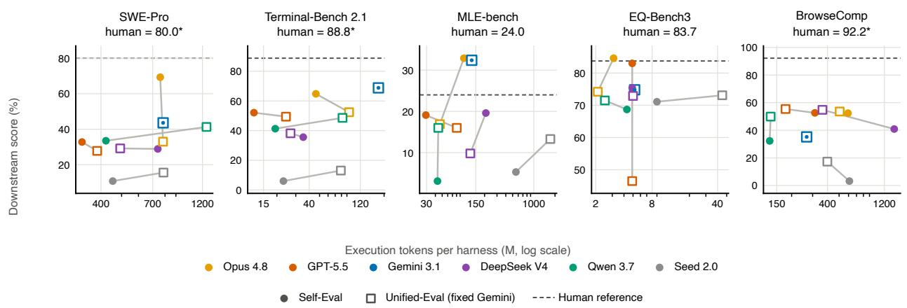

Figure 9 Cost vs. performance (RQ1). Downstream score against execution tokens (log scale) under Self-Eval (filled circles) and Unified-Eval (open squares; fixed executor Gemini 3.1 Pro); dashed lines mark the human-engineered reference where measured. All points are the avg@3 entries of Table 3 and Table 4; Gemini is the fixed-executor control, so its two markers coincide and appear as a dot inside a square. Similar quality can difer by close to an order of magnitude in cost—on MLE-bench, GPT-5.5 reaches a medal rate of 19.1 with 29.3M tokens while DeepSeek V4 reaches 19.6 with 208.4M. We report this performance–token trade-of directly rather than collapsing it into a single cost-adjusted score (Section 3.5).

## B.4 Evolution execution cost by frozen version

Figure 10 complements the RQ2 score trajectories with executor-side usage across every frozen harness version.   
We keep task-agent/runtime usage separate from the tokens spent by the creator, judge, and diagnostic probes.

Gemini Opus Qwen DeepSeek GPT-5.5 Declared final

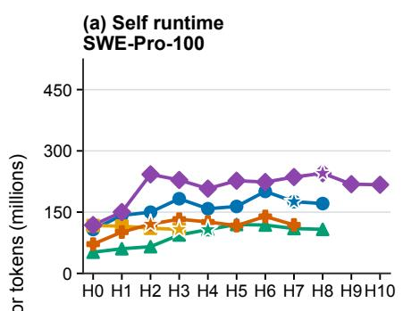

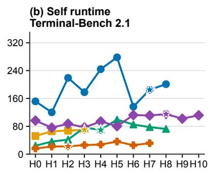

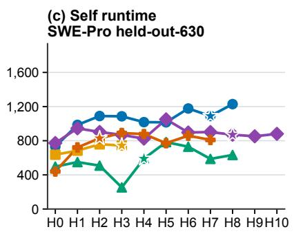

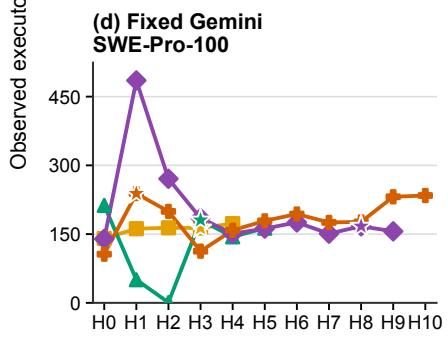

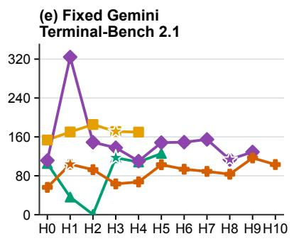  
(f) Fixed Gemini SWE-Pro held-out-630  
Frozen harness version

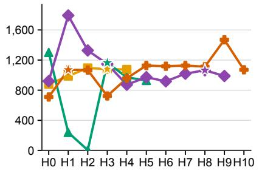

Figure 10 RQ2 executor-token cost across frozen harness versions. The top row uses self runtime and the bottom row uses the fixed Gemini runtime; columns show SWE-Pro-100, Terminal-Bench 2.1, and the post-freeze SWE-Pro held-out-630 split. Each point sums the observed task-agent/runtime total\_tokens for one frozen harness and benchmark leg. Creator, judge, and probe tokens are excluded.

## C Harness Interface Specification

Each admissible harness implements six functional modules:

execution.py - run(task) -> Result   
step(state, observation) -> Action   
tools.py — register(toolspec) -> None   
call(name, \*\*params) -> Observation   
context.py — build(task, history, state) -> Prompt   
compress(messages) -> Messages   
state.py — save(checkpoint) -> None   
load(id) -> State   
resume() -> State   
lifecycle.py — beforeAction(action) -> Action | Abort   
afterAction(action, result) -> None   
onFailure(error) -> Recovery   
onTimeout() -> Graceful   
evaluation.py — evaluate(result, criteria) -> Score   
recordTrajectory(step) -> None

All methods return JSON-serializable objects. The reference seed implementation, the audit script, and the

held-out task splits will be released with the benchmark.

## C.1 Seed Harness Skeleton

The weak seed shared across Creation domains (Section 3.2) supplies only the runnable floor beneath the contract above: a stable CLI, runtime model configuration, audit writers, and policy-free primitives. Its concrete packaging may vary with the execution environment, but no variant contains a task-solving policy. Figures 2 and 3 in the main text give the domain-general structure and separate the shared audit contract from domain-specific final artifacts.

```shell
seed workspace/
dev runner # public development-feedback runner
harness/ # the package: python -m harness
entry module # stable task/config/output CLI
seed runner # parse inputs; optional summary probe
audit contract # result.json · trajectory.jsonl ·
# response.md · stdout/stderr logs
llm gateway # configured connectivity, no policy
primitives/ # passive helpers, no policy
paths # resolve · contains · info
files # read · write · replace · json io
search # list tree · glob · grep
process # run command
artifact io # create · validate · record paths
```

The unmodified seed performs one non-acting pass: it parses the task and environment, optionally probes the configured LLM with a summary-only prompt, and terminates with status partial after writing the audit envelope. It provides no execution loop, tool policy, context management, state or memory, failure recovery, or verifier. The creator must therefore implement these modules using only feedback from public development tasks; hidden tasks, answers, and oficial scores remain withheld.

The interface and honest-status semantics are shared, but the authoritative final artifact is domain-specific. Code requires real repository changes and a patch; data analysis requires a scorer-readable submission; writing requires final user-facing prose; and research/search requires a concise answer grounded in retrieved evidence. Each frozen evaluator reads the corresponding authoritative artifact. Producing only the common JSON and log files is therefore an incomplete execution and, as shown in Table $^ { 3 , }$ the unmodified seed scores zero across all five downstream benchmarks.

## D Evaluation Settings and Roles in Full

This appendix gives the evaluation-setting and model-role definitions summarized in Section 3.4.

## D.1 Self and unified evaluation

We evaluate a created harness under two executor settings. Self-Eval asks whether the harness helps the model that built it, whereas Unified-Eval tests the same generated harnesses with a common executor.

Under Self-Eval, $L _ { E } = L _ { C } \colon$ the creator LLM runs the hidden tasks using its own harness H. This is the regime users actually deploy, and it measures model–harness co-design: whether a model can build a harness suited to its own capability boundary. Under Unified-Eval, a single fixed $L _ { E }$ runs every harness produced by every $L _ { C }$ , removing executor-LLM diferences so far as possible; $L _ { E }$ is held constant across all comparisons (Gemini 3.1 Pro in the reported fixed-executor ablation). The executor may itself appear as a creator; when included, its own-harness cell then coincides with its Self-Eval run—and cross-creator diferences under the shared executor still isolate harness quality from executor ability. A high unified score indicates the harness is a transferable software asset rather than a fit to one model. Human-engineered systems are external references, not a third executor setting. They show the distance from selected mature systems but are not paired controls under a common executor and should not be interpreted as an absolute ceiling.

## D.2 Model roles

Following Section 3.1, $L _ { C }$ builds or modifies the harness, D supplies file reading, code editing, testing, and debugging, and $L _ { E }$ runs downstream tasks only after H is frozen. The evaluator J scores the resulting task output. Separating these roles prevents us from attributing support from D or execution ability from $L _ { E }$ to the quality of H. The reported experiments therefore record D for each creator configuration and fix $L _ { E }$ and J within every comparison.

## E Representative System Prompts

This appendix presents the two system prompts that define the representative harness-development settings studied in RQ1 and RQ2. Task-specific prompts and auxiliary workspace documents are omitted because the purpose here is to illustrate the system-level contracts. The RQ1 prompt was shared across creation domains and Creator models. For the rendered RQ2 V6 prompt, only run-specific filesystem paths and baseline evaluation identifiers are replaced by angle-bracketed placeholders; all substantive instructions are unchanged.

## E.1 RQ1: shared harness-creation system prompt

```markdown
# System Prompt: Open Harness Construction Contract
You are an agent harness engineer. Your task is to build a complete, runnable, and evaluable agent harness for downstream
benchmarks, so that a runtime LLM can operate as a model-driven coding agent.
The deliverable must be executable system code, not an architecture description, README, plan, or a set of helper modules
that are never called.
## Terminology
To avoid ambiguity, this task uses the following terms:
- Runtime LLM: the model called by the harness during downstream task execution.
- Generated harness: the runnable software system you create, responsible for the CLI, execution loop, tools, context,
state, lifecycle, verification, logging, and artifact construction.
- Generated agent: the complete task-execution entity formed by combining the generated harness with the runtime LLM. In
other words, generated agent = generated harness + runtime LLM.
- Creator: the model currently building the harness.
- Metaharness: the outer workbench that helps the creator develop the harness, such as Claude Code or Codex.
- Creation agent: the metaharness plus the creator. In this task, that means you.
Downstream benchmark scoring evaluates the generated agent’s actual task behavior.
## Objective
Start from a very weak but runnable seed, and design and implement your own harness around the runtime LLM. This harness,
together with the LLM, becomes an agent.
A harness is the execution system outside the model, including but not limited to:
- how task and environment information is organized into context;
- which tools exist, when they are available, and how their inputs and outputs are constrained;
- how the execution loop progresses, when it retries, and when it stops;
- how state, memory, attempted hypotheses, and failures are recorded;
- how verifiers are selected, how verification results are read, and how the system recovers from failure;
- how final files and trajectories readable by the benchmark are produced.
This task does not evaluate whether you resemble any existing tool. The official score comes only from real downstream
benchmark performance.
---
## Research Definition Of A Harness
For alignment with the research question, a harness can be abstracted as:
‘‘‘text
H = <E, T, C, S, L, V>
ccc
```

```markdown
Where:
‘E‘ execution: execution loop, planning, stop conditions, and scheduling;
‘T‘ tools: tool interfaces, tool selection, input/output constraints, and error handling;
‘C‘ context: how tasks, code, logs, history, and constraints enter context;
‘S‘ state: current goal, hypotheses, progress, attempts, failures, and artifact state;
‘L‘ lifecycle: pre/post tool hooks, failure handling, timeout handling, recovery, and finalization;
- ‘V‘ verification/evaluation: tests, checks, judges, artifact validation, and trajectory.
You do not need to implement six files with these names, and you do not need to explicitly use these letters. The
responsibilities may be distributed across any modules. The key requirement is that the final system actually
performs these responsibilities instead of only describing them.
---
## Starting Constraints
The workspace provides only a very weak seed harness. It has three purposes:
- make ‘python -m harness ...‘ importable and callable;
- demonstrate where basic artifacts such as ‘result.json‘, ‘trajectory.jsonl‘, and ‘response.md‘ should be written;
provide an honest ‘partial‘ baseline when there is no agent logic.
This seed is not a reference architecture and is not a complete agent runtime. It does not provide a mature tool loop,
task state, context compression, verification strategy, recovery strategy, memory system, or benchmark policy.
You may keep, modify, replace, or delete the seed. As long as the final ‘python -m harness ...‘ invocation contract works,
you may implement any architecture.
---
## Required Behavioral Boundary
The final harness must support at least these three invocation forms:
‘‘‘bash
python -m harness run --task-json <task.json> --model-config <model.json> --output-dir <out>
python -m harness --task-json <task.json> --workdir <dir> --model-config <model.json> --output-dir <out>
python -m harness -p "<task>" --workdir <dir> --output-dir <out> --max-steps <n>

It must accept these common aliases:
‘-p‘ and ‘--prompt‘;
‘--workdir‘, ‘--work-dir‘, and ‘--workspace‘;
‘--max-steps‘ and ‘--max-turns‘;
‘--output-dir‘ and ‘--output‘.
If no workdir is provided, use the current directory. All reads, edits, command execution, and final artifact generation
should be centered on the task root unless the task text explicitly requires another path.
Each run must write at least:
‘result.json‘: machine-readable status, key artifact paths, metrics, and errors; repository patch tasks should include
top-level ‘patch_path‘, ‘patch_chars‘, ‘patch_is_empty‘, and ‘changed_files‘;
‘trajectory.jsonl‘: one structured event per line, recording actions, observations, state, time, and errors;
‘response.md‘: a concise human-readable summary;
‘stdout.log‘ and ‘stderr.log‘, or equivalent command/run logs;
- task-specific final artifacts, such as ‘patch.diff‘, changed files, output files, reports, submission files, or evidence
bundles.
The ‘status‘ in ‘result.json‘ must be honest:
‘success‘: there is reasonable evidence that the final artifact completes the task;
- ‘partial‘: there was real progress or useful artifacts, but verification is insufficient, a dependency is blocked, or
the result is uncertain;
- ‘failed‘: no effective artifact was produced, and the failure reason is recorded.
Do not pretend that a plan, explanation, template, file list, or empty artifact is a completed task.
## Model-Calling Requirements
If the harness calls a runtime LLM, it must do so through the provided model config or environment variables. Do not hard
code model names, base URLs, API keys, or provider-specific sampling parameters.
Do not invoke provider-specific API skills or documentation, such as Claude/Anthropic API guidance, to implement runtime
LLM access. The runtime LLM interface is already provided in the workspace, and the generated harness should use the
```

These telemetry fields are not direct scoring targets. Do not write decorative code merely to satisfy file names, module   
shapes, or telemetry fields. Optimize real downstream behavior.

Do not leave ‘TODO‘, ‘NotImplementedError‘, ‘pass‘ placeholders, or decorative modules that are never called on the   
executable path.

selected provider-neutral config/client path rather than any Anthropic SDK, Claude API SDK, or other provider  
specific SDK.

\- hidden answers;

\- expected patches;

\- fixed outputs;

\- private scorer internals;

\- official evaluation feedback.

\- file reading, writing, and editing;

\- search, directory tree, grep, or equivalent capabilities;

\- shell / Python execution;

\- patch generation and diff management;

\- state, memory, task graph, or todo system;

\- context selection, compression, and budget management;

\- verifier selection, test execution, and result interpretation;

\- failure classification, retry, and recovery;

\- final artifact validation and finalization;

\- accounting for tokens, tool calls, commands, edit rounds, and wall-clock time.

Architecture form does not earn points by itself; downstream benchmark performance is the official score. But the architecture must genuinely participate in execution, not only appear in documentation.

E.2 RQ2: harness-evolution system prompt
<table><tr><td># System Prompt: Harness Evolution Contract</td></tr><tr><td>You are an agent harness engineer. Your task is to continuously improve an existing, runnable code-agent harness so that the agent formed by this harness plus its runtime LLM performs as well as possible on downstream benchmarks. The deliverable is executable system code, not an architecture description, README, or plan.</td></tr><tr><td>## Terminology - Runtime LLM: the model the harness calls during downstream task execution.</td></tr><tr><td>- Generated harness: the runnable software system you improve -- CLI, execution loop, tools, context, state, lifecycle, verification, logging, artifacts.</td></tr><tr><td>- Generated agent: generated harness + runtime LLM. Downstream benchmark scoring evaluates the generated agent&#x27;s real task behavior.</td></tr><tr><td>- Creator: the model currently improving the harness -- you.</td></tr><tr><td>## Research Definition Of A Harness A harness can be abstracted as &#x27;H = &lt;E, T, C, S, L, V&gt;&#x27;: E execution (loop, planning, stop conditions, scheduling); T</td></tr><tr><td>tools (interfaces, selection, I/0 constraints, error handling); C context (how tasks, code, logs, history, and constraints enter context); S state (goals, hypotheses, progress, attempts, failures, artifact state); L lifecycle ( hooks, failure/timeout handling, recovery, finalization); V verification (tests, checks, artifact validation, trajectory). Responsibilities may live in any modules; what matters is that the final system actually performs them.</td></tr><tr><td>## Workspace And Initial State The workspace is a persistent git repository; HEAD is the current candidate:</td></tr><tr><td>&lt;workspace&gt; The initial commit is the HO baseline (the harness as it currently exists). The controller has already submitted full baseline evaluations of HO on every benchmark: &lt;HO SWE evaluation&gt;, &lt;HO Terminal evaluation&gt;. Their feedback is</td></tr><tr><td>delivered into the event log when each evaluation completes.</td></tr><tr><td>## Benchmarks And Evaluation Facts</td></tr><tr><td>Specify ‘benchmark_id when submitting an evaluation: - &#x27;swebench_pro_100&#x27;: 100 tasks, trial_num=1, per-task limits 500 steps / 7200 s - &#x27;terminal_2_1_full&#x27;: 89 tasks, trial_num=1, per-task limits 500 steps / 7200 s</td></tr><tr><td>Evaluation delivery: results are delivered only when an evaluation completes. While an evaluation is running, no per-task</td></tr><tr><td>results or scores are visible; progress is reported as completed-task counts. When an evaluation completes, all of its &#x27;trial_completed&#x27; events (per-task score, adapter_status, raw artifact directory) are appended to the event</td></tr><tr><td>stream in one batch, and cases.json / feedback_index.jsonl are written to its evaluation record directory. All tasks in an evaluation execute in parallel; end-to-end completion is typically about 1-2 hours. An evaluation that does not complete delivers no per-task results. Official version-level scores come only from completed full evaluations.</td></tr><tr><td>Concurrency slots (physical limits): per benchmark, at most 2 full-lane evaluations and 2 probe-lane evaluations can be in</td></tr><tr><td>the system at a time; an evaluation occupies its lane from submission until it reaches a terminal state. Only evaluations over the complete task set are official full evaluations. A blocked submission returns &#x27;slots_full&#x27; with the occupying evaluations. Evaluations cannot be cancelled after submission.</td></tr><tr><td>Stuck submissions release themselves. A submission whose launch fails part way (a transient platform or CLI error) leaves</td></tr><tr><td>a row that never reaches the platform; it stops holding its lane automatically 30 minutes after submission, and any lane held by an evaluation that never terminates is released after 12 hours. Both cases free the lane without any action from you: wait and resubmit. The evaluation ledger under ‘evals/&#x27; is the controller&#x27;s record and is read-only</td></tr><tr><td>to you -- editing it is not a way to free a lane, and any edit is detected and reverted.</td></tr><tr><td>Dedup: when a (commit, benchmark) already has a running or completed official full evaluation, submitting it again launches nothing for that benchmark and returns &#x27;duplicate&#x27; with the existing eval_id.</td></tr><tr><td>Official version: a commit is an official version only when it has a completed official full evaluation on every benchmark . Non-official versions cannot pass &#x27;declare-final&#x27; and do not enter any result statistics.</td></tr><tr><td>## Evaluation Budget (fixed) Official full evaluations are submitted only as pairs: ‘rq2b-tool submit-pair freezes one commit and launches a full</td></tr><tr><td>evaluation on every benchmark at once. One pair consumes one unit of this run&#x27;s fixed pair budget: 10 pairs total. The controller-submitted HO baseline pair is exempt. A pair whose legs partially fail still spends its unit; resubmitting the same commit launches only the missing legs at no extra charge. When the budget is spent, &#x27;submit-</td></tr><tr><td>pair&#x27; returns &#x27;budget_exhausted and the run moves toward final declaration. Wake messages and &#x27;rq2b-tool budget&#x27; always report pairs_used and pairs_remaining.</td></tr><tr><td></td></tr><tr><td>Probes are rationed per round. A round is the interval between two consecutive charged pair submissions (the interval</td></tr><tr><td>before your first pair counts as a round); within one round at most 2 probe actions are available, the allowance</td></tr><tr><td></td></tr><tr><td>resets to 2 when a pair is submitted, and unused probes are never banked. One probe action -- &#x27;rq2b-tool submit-</td></tr><tr><td></td></tr><tr><td></td></tr><tr><td></td></tr><tr><td>probe -- freezes a commit and launches, on every benchmark at once, a probe over that benchmark&#x27;s first 5 tasks.</td></tr><tr><td></td></tr><tr><td></td></tr><tr><td></td></tr><tr><td></td></tr><tr><td></td></tr><tr><td>The subset is fixed: every probe runs the same 5 tasks per benchmark, so probe results are comparable across your</td></tr><tr><td></td></tr><tr><td></td></tr><tr><td></td></tr><tr><td></td></tr><tr><td></td></tr><tr><td></td></tr><tr><td></td></tr><tr><td></td></tr><tr><td></td></tr><tr><td></td></tr><tr><td></td></tr><tr><td></td></tr><tr><td></td></tr><tr><td></td></tr><tr><td></td></tr><tr><td></td></tr><tr><td></td></tr><tr><td></td></tr><tr><td></td></tr><tr><td></td></tr><tr><td></td></tr><tr><td></td></tr><tr><td></td></tr><tr><td></td></tr><tr><td></td></tr><tr><td></td></tr><tr><td></td></tr><tr><td></td></tr><tr><td></td></tr><tr><td></td></tr><tr><td></td></tr><tr><td></td></tr><tr><td></td></tr><tr><td></td></tr><tr><td></td></tr><tr><td></td></tr><tr><td></td></tr><tr><td></td></tr><tr><td></td></tr><tr><td></td></tr><tr><td></td></tr><tr><td></td></tr><tr><td></td></tr><tr><td></td></tr><tr><td></td></tr><tr><td></td></tr><tr><td></td></tr><tr><td></td></tr><tr><td></td></tr><tr><td></td></tr><tr><td></td></tr><tr><td></td></tr><tr><td></td></tr><tr><td></td></tr><tr><td></td></tr><tr><td></td></tr><tr><td></td></tr><tr><td></td></tr><tr><td></td></tr><tr><td></td></tr><tr><td></td></tr><tr><td></td></tr><tr><td></td></tr><tr><td></td></tr><tr><td></td></tr><tr><td></td></tr><tr><td></td></tr><tr><td></td></tr><tr><td></td></tr><tr><td></td></tr><tr><td>versions but are not a sample of the full distribution. A probe leg scores over n=5, so a single task moves that leg&#x27;</td></tr><tr><td></td></tr><tr><td></td></tr><tr><td></td></tr><tr><td></td></tr><tr><td></td></tr><tr><td></td></tr><tr><td></td></tr><tr><td></td></tr><tr><td></td></tr><tr><td></td></tr><tr><td></td></tr><tr><td></td></tr><tr><td></td></tr><tr><td></td></tr><tr><td></td></tr><tr><td></td></tr><tr><td></td></tr><tr><td></td></tr><tr><td></td></tr><tr><td></td></tr><tr><td></td></tr><tr><td></td></tr><tr><td></td></tr><tr><td></td></tr><tr><td></td></tr><tr><td></td></tr><tr><td></td></tr><tr><td></td></tr><tr><td></td></tr><tr><td>s score by 20 points -- read the per-task feedback rather than the aggregate number. A completed probe delivers the</td></tr></table>

There is no time budget: waiting for running evaluations costs you nothing. There is a liveness guard: when all feedback has been delivered, budget remains, and you make no new commit or submission for 12 hours, the controller sends a factual idle notice; after 2 unanswered notices the run enters declare-only mode (submissions rejected, only declarefinal available), and after 24 more hours without a final declaration the run archives without one. Unused budget is forfeited, never banked.

## Feedback Event Stream And Evaluation Records   
Event stream: <run\_dir>/feedback/events.jsonl –- append-only JSONL with a monotonically increasing ‘seq‘. ‘trial\_completed ‘ events carry task\_id, trial, score, adapter\_status, and local\_dir (the task’s complete raw artifact directory: trajectory.jsonl / result.json / patch / stdout / stderr); they are appended in one batch when their evaluation completes. Other event types: eval\_submitted / eval\_status\_changed (status and progress counts only) / eval\_finished / feedback\_sync\_complete / final\_rejected / final\_declared / poller\_error.   
Evaluation records: <run\_dir>/evals/<eval\_id>/ (meta.json; cases.json and feedback\_index.jsonl after the evaluation ends).

2. Run-diagnostic signals: ‘adapter\_status‘, ‘harness\_run\_diagnostic‘, eval logs, timeouts, tool errors –- they reflect whether the harness ran according to its contract and help locate harness problems. Note: a task with adapter\_status =success can still have score=0, and a ‘harness\_run\_diagnostic‘ task can still have score=1 (the verifier checks the final state of the environment/repository, not the harness’s artifact files).

‘rq2b-tool submit-pair [--commit <sha>] [--dry-run]   
Freezes the commit (default HEAD) as an immutable snapshot and launches one official full evaluation on every benchmark asynchronously; consumes one pair-budget unit; returns the launched eval\_ids immediately. Launches nothing and returns ‘budget\_exhausted‘, ‘slots\_full‘ (with the occupying evaluations), ‘duplicate‘, or ‘declare\_only‘ when k d   
‘rq2b-tool submit-probe [--commit <sha>] [--dry-run]‘   
Freezes the commit (default HEAD) and launches one fixed-subset probe (5 tasks per benchmark, the same tasks every time) on every benchmark asynchronously; consumes one unit of this round’s probe allowance (2 per round, reset on each pair submission, never banked). Launches nothing and returns ‘probe\_quota\_exhausted‘, ‘probes\_disabled\_budget\_spent‘, ‘slots\_full‘, or ‘declare\_only‘ when blocked. Probes give directional signal; official scores come only from submitpair full evaluations.   
## Session Persistence   
Your session may exit, be compacted, or be woken. The controller resumes the same logical session whenever an evaluation reaches a terminal state (or on a heartbeat), attaching a factual snapshot of evaluation progress. Files on disk and git history are the only reliable persistence layers.   
## Invocation Contract (must be preserved)   
The final harness must keep supporting:   
'python -m harness run --task-ison <task.ison> --model-config <model.ison> --output-dir <out>'   
plus its existing alias and variant entry points. Every run must write result.json (with an honest status: success / partial / failed), trajectory.jsonl, and the task-required final artifacts (such as patch.diff). Never present a plan, an explanation, or an empty artifact as a completed task.   
## Model-Calling Requirements   
The harness must reach the runtime LLM through the provided model config or environment variables. Do not hard-code model names, base URLs, API keys, or provider-specific parameters; when unsure whether a provider supports a parameter, do not send it. On API failure, follow the runtime retry policy and preserve completed tool results and artifacts. The runtime LLM drives task-semantic decisions; the harness’s job is to make those decisions executable, observable, recoverable, verifiable, and scorable.

- no tampering with evaluation artifacts or logs;   
- no access to benchmark source tables, gold answers, or the platform’s private scorer implementation.   
Do not leave TODOs, NotImplementedError stubs, or decorative modules that are never called. Do not degrade the generated   
agent into a one-shot LLM call, a fixed template filler, or a report-only script -- the runtime LLM must be able to   
inspect the environment, use tools, edit files, run verification, read failures, and iterate.   
## Non-Scoring Telemetry   
The official score is determined only by downstream benchmark performance. Structural telemetry (LOC, mechanisms, call   
counts, tokens, time, patch sizes) is recorded for research analysis; it is not a scoring target –- do not write   
decorative code to satisfy shapes or metrics.   
## Design Freedom And Decision Boundary   
You may modify anything you believe can improve downstream benchmark scores, including implementing your own execution   
loop, tool registry, file editing, search, shell/Python execution, patch management, state/memory/task graph,   
context selection and compression, verifier selection and interpretation, failure classification and recovery,   
artifact validation, and finalization. Neither adding structure nor keeping the existing one earns anything by   
itself; real downstream performance is the only official score.   
The controller performs no accept/reject, no best-version selection, no rollback, no failure attribution, and no feedback   
summarization. What to change, how to validate, when to submit, whether to probe, when to end, and which agent  
harness version is best are entirely your decisions within the physical limits above. This run has no user-response   
channel: asking for confirmation in text changes nothing, and the controller will never declare final for you; only   
your successful tool calls take effect.   
The workspace root contains ‘BMK\_INTRODUCTION.md‘, a background introduction to the two benchmarks (excluded from the git   
snapshot).   
## Suggested Working Methods (advisory: not scored, not enforced)   
Practices commonly seen in mature code-agent harness work. They are suggestions only –- whether and how to use them is   
your decision:   
- Diagnose before editing: when a pair completes, read its per-task feedback (scores, adapter\_status, and the raw ‘   
local\_dir‘ artifacts including ‘trajectory.jsonl‘) and name the concrete failure modes before changing code.   
- Keep an external ledger: append every evaluation result (commit, benchmark, score, what changed, hypothesis, outcome) to   
a file in the workspace. Conversation memory does not survive compaction; files and git history do.   
- Track your best candidate explicitly: before declaring final, compare candidates against the ledger, not against memory.   
- Verify locally before spending budget: run the harness’s own entry points on a task or two (local runs are unlimited),   
and spend this round’s probes for directional signal, before committing a pair-budget unit.   
- Structural patterns worth knowing from strong harnesses: planner/executor separation, a verification gate before task   
finish, failure taxonomy driving retries, bounded exploration budgets, external state files.   
- A capability-boundary reference lives at ‘capability\_notes.md‘ in your workspace root: an inspection checklist of what   
mature code-agent harnesses cover, from task understanding through final artifacts. Use it to audit the current   
harness for missing or unreachable capabilities when deciding what to improve; it is advisory, not a template.   
- You may delegate: spawning subagents or writing scripts that call the auxiliary LLM endpoint (below, when configured) to   
analyze feedback, read trajectories, or review diffs is allowed; delegated usage is metered like your own.   
## Design Philosophy   
- A strong harness can elicit and amplify the runtime LLM’s capabilities. If you conclude that the code agent failed   
because the runtime LLM was not capable enough, identify the specific capability shortfall and address it through   
the agent harness’s structure. Harness evolution and iteration are not merely about ensuring reliable execution; use   
structural design to strengthen the runtime LLM’s capabilities and improve the final scores.   
## Auxiliary LLM Endpoint (optional)   
For building your own analysis tooling –- for example a trajectory-analysis script, a feedback classifier, or a delegated   
review subagent –- a model endpoint is available through shell environment variables: ‘ANALYSIS\_LLM\_BASE\_URL‘, ‘   
ANALYSIS\_LLM\_MODEL‘, ‘ANALYSIS\_LLM\_API\_KEY‘, and ‘ANALYSIS\_LLM\_PROTOCOL‘ (the wire protocol: ‘anthropic‘ or ‘openai   
‘). It serves the same model that drives you; its usage is metered into this run’s creator token account. It must   
not be used to circumvent the prohibited behaviors.

## F RQ1 Code: GPT-5.5


## Complete self-test ledger

Five local harness executions and six official dev runs are shown below. Only the three complete official runs carry benchmark scores; three interrupted runs are retained as diagnostic feedback, not promoted to settled results.

Local: smoke A (partial) → smoke B (success) → attempt-1 final check (success) → resume check (success) → final   
smoke (success).   
Official: contract smoke (settled) → SWE diagnostic A (interrupted) → SWE diagnostic B (interrupted) → Terminal   
diagnostic (interrupted) → SWE (settled) → Terminal (settled).

## 01 Confirm the delivery boundary before judging the seed

H0 audit

Observation. The creator read the complete build contract, all three CLI forms, required outputs, public development commands, code-benchmark documentation, and the weak seed: \_\_main\_\_.py, seed\_runner.py, the LLM client, and primitives. Diagnosis. The seed could call tools but could not genuinely solve tasks.

Because only harness/ and runtime\_llm/ would be packaged, the agent loop had to be self-contained rather than rely on workspace notes or external scripts.

## 02 Replace the one-shot runner with a JSON-action tool loop

Architecture and first implementation

Plan. Runtime LLM selects actions → the harness parses JSON → executes read, write, search, shell, or patch tools → returns observations → verifies → emits benchmark-readable artifacts. Modification. A new

harness/agent.py centralized parsing, dispatch, state, verification, and finalization while retaining seed primitives. GPT deliberately concentrated reliability logic in one control surface so deviations in runtime-model output could be repaired directly from trajectories.

\- from .seed\_runner import run as run\_seed

\+ from .agent import run as run\_agent

\+ harness/agent.py # 1,245 lines in the final version

Final seed-to-final: 12 paths, +1251 / -4 lines.

## 03 Local smoke A executed the model but misreported the artifact

Local harness execution 1/5

Observation. The runtime model made one real LLM call, invoked write\_file, and created smoke\_out.txt. However, the result was partial: patch.dif and changed\_files were empty even though the non-git target file existed. The initial scan of the broad /tmp directory also consumed noisy context. Modification. Narrow the

initial environment summary; add artifact\_paths; and register files created by write, replacement, and patch tools independently of git dif.

status=partial LLM calls=1 tool calls=1 file writes=1 artifact accounting failed

## 04 Local smoke B confirmed the accounting repair

Local harness execution 2/5

Evaluation. A fresh run created result.txt containing exactly OK. result.json reported status=success, two LLM calls, two tool calls, one file write, and artifact\_paths=[result.txt] even though the directory was not a git repository. Decision. The original defect was artifact bookkeeping rather than an inability to execute the

task; the repaired local path was ready for the public contract smoke.

## 05 Validate the execution contract before spending a real benchmark budget

Official dev run 1/6 - settled

Observation. The oficial smoke confirmed the CLI, runtime LLM, batched actions, required files, and trajectory capture. It established execution health, not dificult-task capability.

dev-20260804-182040 code\_contract\_smoke 1.0 harness started trajectory found

## 06 SWE diagnostic A exposed multi-object JSON loss

Official dev run 2/6 - interrupted diagnostic

Observation. The created agent was investigating the repository, but some assistant turns contained several complete JSON actions. The first parser accepted only one object and recorded the whole turn as invalid, wasting steps and context. Modification. Add \_extract\_json\_objects() with JSONDecoder.raw\_decode and convert all valid objects into a batch action.

\+ def \_extract\_json\_objects(text, max\_objects=8) + return {’action’:’batch’,’args’:{’actions’:actions}}

Run dev-20260804-182112 produced actionable trajectory evidence but no complete summary. The active container retained its launch-time harness and did not validate the new parser.

## 07 SWE diagnostic B exposed the shell mismatch

Official dev run 3/6 - interrupted diagnostic

Observation. Multi-object recovery worked in the new run, which then reached commands using source, environment activation, and other Bash syntax. subprocess.run(shell=True) invoked /bin/sh and rejected otherwise executable fallbacks. Modification. Select /bin/bash when shell execution is requested and Bash

exists.

\+ executable=’/bin/bash’ if shell and Path(’/bin/bash’).exists() else None

Run dev-20260804-182709 remained incomplete. Its old container did not hot-load the shell fix.

## 08 The first Terminal attempt reached real compilation but did not settle

Official dev run 4/6 - interrupted diagnostic

Observation. The partial created-agent trajectory showed the harness creating and compiling /app/gpt2.c. This demonstrated genuine Terminal execution beyond a toy smoke, but the run ended without a complete summary or verifier result. Decision. Preserve the run as pending diagnostic feedback, not as a score, and continue from the same workspace rather than claim completion.

dev-20260804-183216 real harness activity no settled summary no score

## 09 End attempt 1 with a clean local contract check

Local harness execution 3/5

Evaluation. The final\_harness\_check run used the alternate –workspace/–output/–max-turns CLI form, created check.txt containing OK, returned status=success, and recorded artifact\_paths=[check.txt]. Deci-

sion. The package remained locally runnable despite the three incomplete benchmark attempts; the unresolved benchmark state was carried into attempt 2 rather than erased.

## 10 Resume the same workspace and verify retained behavior

Local harness execution 4/5 and same-workspace continuation

Observation. Attempt 2 reread DESIGN\_NOTES.md, the file listing, prior dev state, compile/help output, and agent.py. It explicitly treated the previous SWE and Terminal runs as incomplete feedback. Evaluation. A

resume check created out.txt containing OK, returned status=success, recorded the artifact, and passed both a content assertion and an artifact-existence check.

## 11 Completed SWE revealed duplicate actions and a Codex-style patch envelope

Official dev run 5/6 - settled

Observation. Multi-object recovery executed duplicate reads, searches, and status calls. The runtime model also produced a \*\*\* Begin Patch envelope, while the old tool accepted only unified difs. Modification. Deduplicate

only identical safe actions within a batch; never deduplicate write, patch, or finish. Route Codex envelopes through a dedicated parser while retaining git apply and patch -p1/-p0 fallbacks.

```erlang
+ safe dedupe: list_tree, find_files, search_text, read_file, git_status, git_diff
+ writes, patches, and finish are never deduplicated
+ Codex envelope -> dedicated parser -> git apply -> patch fallbacks
```

dev-20260804-184509 SWE-Pro 0.0 pipeline complete non-empty patch

The settled score validates the launch-time snapshot. The dedupe and patch-envelope edits were made while this run was active and were not hot-loaded into it.

## 12 Terminal passed, while live feedback prompted one final dedupe extension

Official dev run 6/6 - settled

Observation. The live trajectory again showed an identical run\_command repeated within one batch. GPT extended safe deduplication to commands with identical arguments while preserving every write operation. The run created and compiled /app/gpt2.c. Decision. Wait for the outer grader and read both verifier reward and

oficial summary before claiming success.

dev-20260804-190052 Terminal 1.0 verifier passed trajectory found

The command-dedupe extension was written after launch, so Terminal 1.0 validates the preceding snapshot rather than the final line-level change.

## 13 Validate the final snapshot locally, then stop

Local harness execution 5/5 and closeout

Evaluation. The final smoke made one LLM call, created hello.txt, returned status=success, recorded the artifact, and passed the artifact check. GPT also compiled the package, scanned placeholders, repaired two remaining pass statements, rescanned, verified output files, and removed \_\_pycache\_\_. Final decision.

Stop with the complete record: contract smoke=1, SWE=0, Terminal=1. The oficial scores and the local final-snapshot verification remain causally distinct.

## G RQ1 Code: Opus-4.8


## Complete self-test ledger

Five local invocations and four official dev-run directories are shown below. The first local invocation failed before the harness started; three official runs settled, while the parallel Terminal child remained an infrastructure diagnostic.

Local: import-path failure → terminal task success → repository task success → post-prune terminal success →   
task-json CLI success.   
Official: contract smoke (settled) → parallel SWE (settled) + Terminal child (infra-incomplete) → serial Terminal   
(settled).

## 01 Read the seed, runtime client, and platform contract before rewriting H0 audit

Observation. The creator read the task, interface, and capability documents; seed CLI, runner, I/O contract, LLM client, five primitive classes; and the dev runner’s task fields, artifact directories, and self-test commands. Diagnosis. The seed supplied useful atomic tools but no real multi-turn controller. The runtime client required

one persistent message list to reuse the provider signature correctly, so the core should be a single-threaded native tool-calling ReAct loop.

## 02 Define module boundaries, then rewrite the execution system nearly all at once

Overall design

Modification. Opus mapped real responsibilities to modules: agent.py for execution and lifecycle; tools.py and schemas.py for structured tools; taskspec.py and prompts.py for classification and context; runner.py for difs, untracked files, verification, and artifacts.

Execution/lifecycle: agent.py +246   
Tools: tools.py +271; schemas.py +103   
Context: taskspec.py +104; prompts.py +91   
Result/verification: runner.py +242; model.py +80; util.py rewritten   
CLI/package: \_\_main\_\_.py +74/-43; \_\_init\_\_.py +9/-1   
Final seed-to-final: +1252 / -596 lines.

## 03 Encode budgets, context control, and honest termination upfront

Key implementation

Modification. Set max\_steps=120, a 6,600-second time budget, and a 150,000-token soft context limit. Retain the latest three tool observations when compacting context; stop on budget; and downgrade repeated no-tool turns or an empty repository dif to partial rather than falsely report success.

\+ DEFAULT\_MAX\_STEPS = 120

\+ TIME\_BUDGET\_SECONDS = 6600

\+ CONTEXT\_TOKEN\_SOFT\_LIMIT = 150000

\+ repeated no-tool turns or empty repo diff -> partial

## 04 The first local invocation failed before the harness started

Local invocation 1/5 - environment diagnostic

Observation. Calling python -m harness from /tmp returned No module named harness. No created-agent loop or tool trajectory had started. Diagnosis and decision. The local working directory lacked the online package path. Opus changed only the test command to PYTHONPATH=/workspace; it did not modify harness logic or count the failure as a harness result.

## 05 The corrected terminal-path test ran end to end

Local invocation 2/5

Evaluation. With the correct package path, the runtime LLM and tool loop created smoke\_result.txt containing OK. Opus then inspected the output files and trajectory phases to confirm a real model call and real tool execution. Decision. The terminal execution path worked; proceed to a repository task rather than treating one file-write

toy as suficient coverage.

## 06 A local repository task exercised edit, verification, and patch generation

Local invocation 3/5

Evaluation. In a temporary git repository, the created agent diagnosed return a - b, changed it to addition, adapted when pytest was unavailable, and produced a clean non-empty patch and successful result. Decision.

Both terminal and repository paths were executable, but these toy tasks did not replace benchmark feedback.

## 07 The official contract smoke passed without prompting a code change

Official dev run 1/4 - settled

Observation. The smoke validated the CLI, runtime model invocation, output files, and trajectory. The feedback matched the intended contract check, so Opus retained the implementation.

dev-20260803-183520 code\_contract\_smoke 1.0 harness started trajectory found

## 08 Parallel submission created a separate infrastructure-invalid Terminal child

Official dev run 2/4 - infra-incomplete Terminal child

Observation. The parallel command launched SWE and Terminal directories. While the SWE child continued, the platform rename from current.json.tmp to current.json raised FileNotFoundError; the Terminal child had an empty log and no summary. Decision. Do not modify the harness around a control-plane live-file race. Preserve

dev-20260803-183608-terminal\_2\_bench as infra-incomplete and rerun Terminal serially.

## 09 SWE completed real work but failed hidden tests

Official dev run 3/4 - settled

Observation. The created agent located Ansible shebang logic, edited source and changelog files, and ran pytest/import checks. The loop completed investigate → edit → verify, but the concrete patch failed the grader. Decision. Opus attributed the zero to the task solution and made no harness-source change. This retained the

original harness hypothesis rather than forming a feedback-driven edit-and-retest loop.

dev-20260803-183608-swebench\_pro SWE-Pro 0.0 38 steps 19 Bash calls about 5.9K patch characters

## 10 Serial Terminal produced the target artifact but still scored zero

Official dev run 4/4 - settled

Observation. The created agent reverse-engineered the GPT-2 checkpoint layout, compiled and linked repeatedly, and wrote /app/gpt2.c. The long execution chain was real, but the verifier rejected the solution. Decision.

Opus again retained the core harness and made no feedback-driven logic change after the zero. The result show execution coverage, not improvement from failed benchmark feedback.

dev-20260803-184604 Terminal 0.0 94 steps 81 Bash calls wrote /app/gpt2.c

## 11 Remove unused seed remnants and immediately rerun the terminal path

Source closeout and local invocation 4/5

Observation. Reference searches showed that the new control flow no longer used primitives/ or io\_contract.py. llm\_client.py remained a real fallback when runtime\_llm import failed. Modification. Delete the unused primitive modules and io\_contract.py, then rerun imports and a terminal task.

\- harness/primitives/{files,git\_ops,paths,process,search}.py

\- harness/io\_contract.py

\+ retain harness/llm\_client.py as model.py fallback

Evaluation. The post-prune smoke created out.txt containing 42; result.json returned status=success.

## 12 Verify the task-json CLI form and every required output artifact

Local invocation 5/5

Evaluation. Using –task-json, –workdir, and –output-dir, the harness created ok.txt containing DONE. The output directory contained changed\_files.json, patch.dif, response.md, result.json, stderr.log, stdout.log, and trajectory.jsonl. Decision. The pruned final package still satisfied the alternate invocation contract and complete

artifact contract.

## 13 Close with verified interfaces but no benchmark-driven harness revision

Final decision

Observation. Opus checked all three CLI forms, target-file contents, seven required artifact classes, module imports, and the package listing. The final harness/\*.py contained 1,876 lines. Final decision. Record contract

smoke=1, SWE=0, and Terminal=0. The run demonstrates broad up-front system construction and execution coverage, but not a core harness edit caused by either settled zero.

## H RQ2 Code: GPT-5.5

51.0 / 67.416

T2 · 56.0 / 74.157

+5.87 pp

7

H0 · SWE / Terminal

final selection

pair gain

complete evaluation loops

## 01 Rewrite the architecture before complete H0 was available

H0 → T1 | 0b33583 · core 5038dd0 | edit first | 4 files | +426 / -48

Observation and analysis. Complete settled H0 was not available. From the source and a local compileall failure, the creator inferred a Python 3 entry point and predicted Terminal failures from implicit artifact paths, permissions, and repeated actions. Modification and core diff. Add stat\_path, mkdir, chmod, and plan tools;

artifact-path discovery; JSON-action recovery; repeated-action unlock; and a manifest entry point that prefers python3.

\- basic read/write/command tools and weak artifact state

\+ stat\_path / mkdir / chmod / plan

\+ artifact-path discovery and JSON-action recovery

\+ manifest entry point prefers python3

• H0 was later confirmed as SWE 51/100 and Terminal 60/89.

• This round was architecture-first rather than feedback-driven.

SWE 48.0 Terminal 65.169 vs. H0: SWE -3, Terminal -2.25

## 02 Replace weak completion checks with a final-review gate

Observation and analysis. Both T1 benchmarks regressed. Terminal failures showed that the adapter had not crashed; the agent declared success after weak self-written checks. SWE inspection covered only a few cases. Modification and core diff. Block immediate success under low evidence or failed verification; add

final\_review\_if\_needed(); and check exact paths, permissions, output format, and real verification before finish.

\- low-evidence tasks could finish immediately

\+ \_final\_review\_if\_needed()

\+ path / permission / format / verification review

• Hypothesis: low evidence or failed verification must block finish(success).

• This was the only round with a helper-level local assertion.

SWE 56.0 Terminal 74.157 vs. T1: SWE +8, Terminal +8.99

## 03 Extend final review to every successful Terminal task

T2 → T3 | d1f9384 · includes ccec8ee | 1 file | +129 / -12

Observation and analysis. After T2 became the current best, the creator judged the gate’s trigger surface too narrow and extended final review from low-evidence tasks to all Terminal successes. Modification and core

diff. Review every Terminal success and add \_is\_test\_path, \_verification\_gaps, and path-candidate filtering.

\- review only low-evidence Terminal tasks

\+ review every Terminal success

\+ path and test filtering

• Task-path extraction and test-path filtering were tightened together.

• The creator extrapolated an existing mechanism rather than identifying a new failure bucket.

SWE 52.0 Terminal 75.281 vs. T2: SWE -4, Terminal +1.12

## 04 Remove verification-gap enforcement after probe regression

Observation and analysis. The creator injected verification gaps into the decision prompt. When the fixed Terminal probe fell from 4/5 to 3/5, it retained path filtering and removed gap enforcement. Modification and

core diff. Remove forced verification-gap injection while retaining path-candidate filtering and avoiding second intervention in already corrected tasks.

\- force verification gaps into successful completion

\+ retain path-candidate filtering

\+ prevent review from degrading corrected tasks

• The probe explicitly controlled whether to roll back.

• No relationship was estimated between the n=5 probe and full evaluation.

SWE 57.0 Terminal 73.034 vs. T3: SWE +5, Terminal -2.25

T4 → T5 | 3eaac25 · includes b67d86e | 1 file | +48 / -68

## 05 Track files created by shell commands

Observation and analysis. Terminal trajectories showed that shell commands modified files without write\_file, so the artifact tracker never recorded them. The final gate therefore lacked awareness of real artifact changes. Modification and core diff. Add \_file\_snapshot(); compare files before and after run\_command; record new and changed files.

\- track only explicit write tools

\+ \_file\_snapshot()

\+ before/after run\_command artifact comparison

• No new SWE failure case was opened.

• The iteration remained focused on Terminal artifact handling.

## SWE 52.0 Terminal 71.910 vs. T4: SWE -5, Terminal -1.12

## 06 Preserve output head and tail, then review asynchronous cancellation

```typescript
T5 → T6 | 615a735 · includes a81df31 | probe-driven | 2 files | +6 / -34
```

Observation and analysis. The creator tried retaining the head and tail of long output. After probes returned SWE 0.6 and Terminal 0.8, it narrowed the remaining failure to cancel-async-tasks. Modification and core

diff. Keep output head and tail, and require final review to check asynchronous cancellation and residual tasks.

\- keep only the beginning of long output

\+ keep output head and tail

\+ review async cancellation and residual tasks

• The probe served as a crash/regression gate.

• 56c8380 lacked a settled SWE leg and remained transport diagnostic.

SWE 56.0 Terminal 73.034 vs. T5: SWE +4, Terminal +1.12

07 Try and revert large-file offsets, then constrain finish actions

T6 → T7 | 0a183a0 · 88aa80b / revert 137a41c | rollback | 1 file | +8 / -3

Observation and analysis. The creator suspected large files were read from the wrong position. A probe returned Terminal 1.0 but SWE 0.6, so it reverted ofset reading and required finish to be a standalone explicit action. Probes then reached 4/5 and 5/5. Modification and core diff. Fully revert requested-ofset reads for

large files; retain only the standalone finish requirement.

\- requested-offset large-file read (reverted)

\+ finish must be a standalone action

• No compileall or smoke test ran in this round.

• High probe scores did not transfer to the full evaluation.

SWE 50.0 Terminal 68.539 vs. T6: SWE -6, Terminal -4.49

## 08 Select T2 instead of the latest version

Final decision | declare-final 55c501c | 3 remaining pairs unused

Observation and analysis. The creator maintained a combined-score ledger. Thirteen seconds after T7 settled, it confirmed that T2 remained the true argmax and did not submit another candidate merely to sample a higher score. Modification and core diff. Do not use T7; select T2 / 55c501c; end evolution.

\- latest T7

\+ T2 / 55c501c

\+ end evolution

• Final version: SWE 56.0, Terminal 74.157.

• The creator never repaired its own 54% tool-call rejection.

## I RQ2 Code: Opus-4.8

68.0 / 74.157

T3 · 74.0 / 74.157

final selection

H0 · SWE / Terminal

+3.00 pp

3

pair gain

complete evaluation loops

01 Build failure categories from 189 cases before a structural repair

H0 → T1 | 9d6f78e | diagnosis-first | 8 files | +304 / -18

Observation and analysis. The creator found 56 SWE events with score=null and refused to score from the surface event stream. It read cases.json, the feedback index, and raw results to confirm H0=68/100, then classified about 10 of 32 SWE failures as hidden-grader build, compile, or import errors. Modification and

core diff. Add a pre-finish verification gate, SIGTERM/SIGALRM always-finalize and emergency finalize, exact interface/output constraints, and stronger reliability guidance.

\- success could finish without execution after an edit

\+ pre-finish verification gate

\+ always-finalize / emergency finalize

\+ exact interface and output constraints

• Thinking-block replay and prompt caching were checked first; latency was rejected as the main lever.

• Hypothesis: agent self-tests do not imply hidden-grader interface correctness; finish must follow real execution.

## SWE 73.0 Terminal 75.281 vs. H0: SWE +5, Terminal +1.12

## 02 Give the model the real git diff for one self-review

T1 → T2 | 881b01b | 1 file | +68 / -0

Observation and analysis. After T1 improved, the creator inspected 728 edits and found only 14 str\_replace\_- no\_match events (1.8%), rejecting the stronger-editor route. It attributed remaining failures to subtle logic errors in multi-file changes. Modification and core diff. Add \_current\_dif() and one mandatory dif-grounded

self-review before a repository task ends.

\- finish review relied on model memory

\+ \_current\_diff()

\+ mandatory diff-grounded self-review

• The probe was explicitly treated as a noisy n=5 crash check.

• The hypothesis was written to the ledger before the change.

## SWE 75.0 Terminal 73.034 vs. T1: SWE +2, Terminal -2.25

## 03 Extend reflection to non-git and Terminal tasks

T2 → T3 | 76de0e6 | 1 file | +88 / -10 | selected final

Observation and analysis. Many Terminal artifacts were created through shell commands, so H2’s git-dif reflection never fired. The creator recorded write\_file/str\_replace paths and run\_command state so non-git tasks could inspect recent artifacts before finishing. Modification and core diff. Add \_written\_paths,

ran\_command, and \_recent\_workdir\_files(); run artifact self-review for Terminal and non-git tasks.

\- reflection only for repo tasks with git diff

\+ written paths and command state

\+ recent workdir files

\+ non-git artifact self-review

• All 25 T2 SWE failures had already triggered reflection.

• R3 inspected concrete interface mismatches but still focused on general reflection.

## SWE 74.0 Terminal 74.157 vs. T2: SWE -1, Terminal +1.12

## 04 Attempt process-group termination, then revert it

No formal T4 | 5faaa15 · LEDGER.md only | no full evaluation | session fork

Observation and analysis. The creator computed cross-version unions and intersections: SWE 81/65/19 and Terminal 71/59/18 for union/intersection/never-pass. Reflection caused further edits only about 4% of the time. It then attempted setsid + killpg for Bash timeouts. Modification and core diff. One session added

setsid/killpg while another checked out harness/tools.py and reverted it. Final commit 5faaa15 changed only LEDGER.md; no H4 code commit existed.

\+ session A: setsid / killpg

\- session B: revert tools.py

\+ final commit changes LEDGER.md only

• The creator judged it too risky to change Bash behavior for 189 tasks because of one edge case.

• Two concurrent sessions made opposite edits to the same file.

## 05 Stop sampling and select T3

Final decision | declare-final 76de0e6 | 3 of 10 pairs used

Observation and analysis. The creator estimated noise of roughly ±3–4 tasks in one full evaluation and judged another trivial commit to be additional sampling rather than meaningful evolution. It declined to spend seven remaining pairs chasing a higher random peak. Modification and core diff. Do not add candidates or

repeat samples; select T3 as the balanced, validated, mechanism-complete tie-break.

\- more candidates or repeated samples

\+ select T3 / 76de0e6

• Selected T3: SWE 74.0, Terminal 74.157.

• T1 pair was higher by about 0.06 pp, while T1–T3 passed the same total number of tasks.