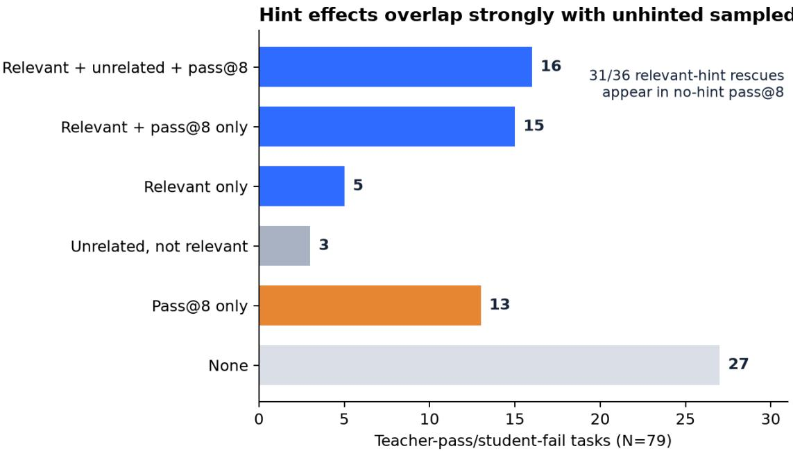
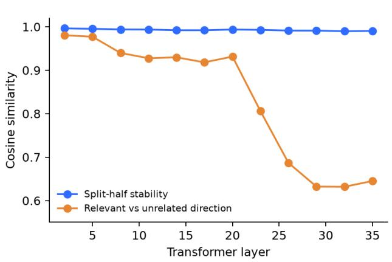
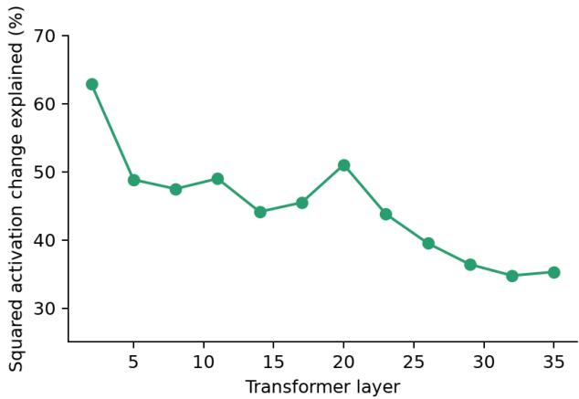
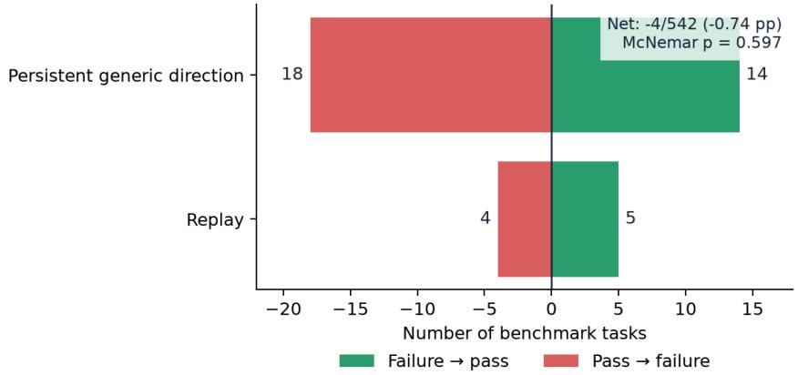
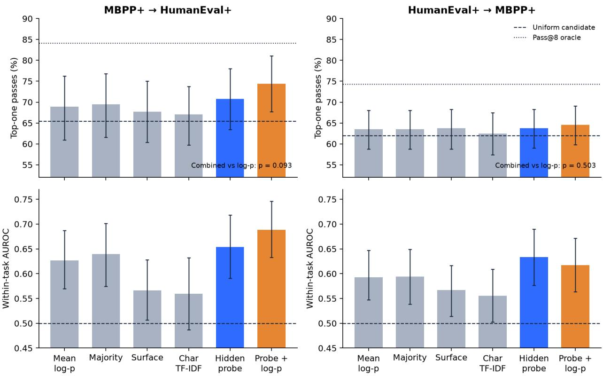
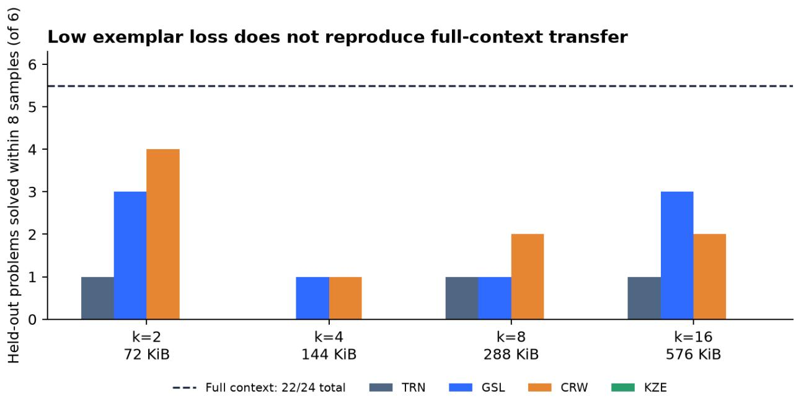

# Hints Help. But Do They Teach? Testing Skill Transfer in Code Generation

Will Badr scpg0807@leeds.ac.uk

## Abstract

When a hint turns a failing generated program into a passing one, does it supply missing information or help the model reach a solution it could already produce? We test these explanations on HumanEval+ and MBPP+ with executable evaluation. For Qwen2.5-3B-Instruct, an adaptive relevant-hint procedure rescues 36 of 79 selected failures; one unrelated hint rescues 19, while eight unhinted samples solve 46 and cover 31 of the 36 hint rescues. Phi-3.5-mini reproduces this pattern: 42 of 101 failures are rescued by relevant hints, 17 by an unrelated hint, and 57 by unhinted sampling, which covers 36 of the 42 rescues. Because the hint procedures use diferent attempt budgets, their diference does not isolate a semantic efect. Mechanistic tests on Qwen find a stable activation direction shared by relevant and unrelated hints. Persistent addition is associated with 14 rescues and 18 failures, with no detected net accuracy change, while the estimated advantage of learned low-rank interventions remains positive but imprecise. Full textual specifications solve 22 of 24 context-defined problems, compared with 5–11 for the tested virtual-KV prefixes. Post-generation hidden-state probes transfer across benchmarks with pooled AUROC 0.806 and 0.780, although their top-one selection advantage over token confidence is statistically unresolved. Overall, the adaptive relevant-hint procedure rescues failures under the implemented conditions, but most rescues are already accessible through sampling; the tested internal interventions do not establish task-general capability transfer.

## 1. Introduction

A code model fails, receives a short hint, and passes. This before-and-after result is often described as capability transfer, but it does not distinguish three explanations. The hint may supply missing information; added context may redirect generation toward a solution the model could already produce; or implementation level variation may change the output without any meaningful intervention efect. A pass/fail comparison alone cannot tell these cases apart.

HumanEval/117 makes the ambiguity concrete. The baseline program fails. The relevant hint, “Consider how the current implementation treats uppercase and lowercase letters diferently,” produces a passing program. Yet a length-matched unrelated hint about the modulus operator also produces a pass, and at least one of eight unhinted samples passes as well. The relevant hint may still guide generation more efectively; the pass transition alone cannot tell us whether it supplied inaccessible information.

We study the distinction in code generation, where functional correctness can be evaluated by execution rather than by a language-model judge. We begin with short teacher-generated hints on HumanEval+ and MBPP+, then test successively smaller internal representations: a vector added to hidden activations, low rank activation spaces, and short learned blocks of attention-memory vectors (virtual KV prefixes). At each stage, a control answers a narrower question. Replay measures pipeline instability. Unrelated hints measure generic prompt efects. Repeated no-hint sampling asks whether the rescued behavior already appears without a hint. Norm-matched random and shufled interventions test task specificity. Held-out tasks test transfer beyond the data used to construct a representation. Size-matched prefixes test whether training beats an untrained object of the same size.

Controls narrow the interpretation at every stage. Unrelated hints rescue many failures, and most relevanthint rescues also appear among eight unhinted samples. Relevant and unrelated hints induce nearly the same activation direction, whose full-benchmark deployment is associated with slightly more damage than rescue. Learned subspaces fit training deltas but have an imprecise held-out advantage over controls. Full context enables the synthetic procedures, whereas the tested KV-prefix objective fits its exemplars without consistent held-out transfer. These results are specific to the tested interventions; they do not establish a general impossibility.

Post-generation hidden states provide a separate positive result. A linear probe predicts functional correctness across benchmarks when all representation and hyperparameter choices are made on the source benchmark. Its top-one advantage over token confidence remains statistically unresolved, so we interpret the result as cross-benchmark correctness decodability rather than model self-knowledge.

Our contributions are:

1. A two-model behavioral audit of hint rescue. We compare relevant hints with unrelated hints and no-hint best-of-eight sampling on 79 selected Qwen failures and independently repeat the pattern on 101 selected Phi failures; replay is measured in the primary Qwen study.

2. A separation of geometric stability, behavioral change, and task specificity. We show that a stable activation direction is associated with changed outputs without improving aggregate accuracy or carrying a detectable held-out task-specific residual.

3. A controlled context-compression test. We contrast full specifications with trained and sizematched virtual-KV prefixes on context-defined procedural tasks, while reporting the limits of the empirical no-context gate.

4. A leakage-resistant correctness readout and reusable audit trail. We select probe representations on source-benchmark grouped folds, test both transfer directions against text and surface baselines, and release task-level ledgers and the reanalysis script.

Behavioral results cover Qwen and Phi; the mechanistic, compression, and correctness-readout analyses use Qwen only. The benchmarks contain short Python programs, and the prefix experiment tests one training objective. We therefore restrict our claims to these models, tasks, channels, and procedures.

## 2. Operational Definitions

We use the following operational definitions to keep behavioral access, intervention transfer, and correctness decoding distinct.

Rescue. A task is rescued by condition � when the baseline greedy completion fails the EvalPlus base and plus tests and the completion under � passes both.

Sampled support at budget �. A task is in the model’s sampled support at budget � when at least one of � no-hint samples passes. This is an empirical, budget-dependent definition; failure at finite � does not prove that success has zero probability.

Semantic hint advantage. The behavior attributable specifically to relevant content is the paired diference between relevant and attempt-, style-, length-, and seed-matched irrelevant hints. The present experiment includes unrelated hints but not every element of this matched estimand, so the observed 36- versus-19 diference is suggestive rather than a complete causal decomposition.

Intervention transfer. An activation object transfers when it is estimated without the evaluation task and improves held-out behavior relative to norm-, rank-, channel-, and compute-matched controls. High cosine stability or training-set energy capture alone is representational evidence, not transfer.

Context-defined procedure. A procedure is empirically context-dependent when repeated nocontext and unrelated-context attempts rarely succeed but a full specification and worked examples succeed. We avoid the stronger phrase “provably absent” unless the task construction makes success information-theoretically impossible without a randomized secret.

Correctness readout. A probe is a readout when it predicts the execution label from hidden states. A successful readout establishes decodability under its train/test protocol. It does not by itself establish that the base model uses the feature during generation.

## 3. Related Work

## 3.1 Task vectors and activation interventions

Hendel et al. [2023] and Todd et al. [2023] show that in-context demonstrations can induce compact task or function vectors whose addition reproduces behavior on controlled mappings. Activation Addition [Turner et al., 2023], Contrastive Activation Addition [Panickssery et al., 2023], and representation engineering [Zou et al., 2023] similarly use directions in activation space to steer high-level output properties. These results motivate our search for a compact representation of a helpful hint. Our setting difers in using long-form program generation, executable correctness, and task-level rescue and damage rather than only target-property change.

Causal eficacy is not suficient for faithful interpretation. Makelov et al. [2023] demonstrate that a subspace patch can change behavior through a pathway that does not faithfully localize the hypothesized feature. We add complementary controls: split-half re-estimation, relevant-versus-irrelevant directions, a positive-control test of the intervention channel, held-out task transfer, matched random and shufled interventions, and full-population net efects.

## 3.2 Prompt sensitivity, placebos, and resampling

Self-consistency [Wang et al., 2022] established the practical value of sampling multiple reasoning trajectories. Macar et al. [2025] argue that causal interpretation of reasoning also requires resampling rather than reliance on a single trajectory. Mukherjee et al. [2024] show that socio-demographic prompt efects can resemble responses to arbitrary placebo tokens, while Kim et al. [2026] find that untrained random soft prompts can broaden early-token diversity and improve pass@N. Luo et al. [2026] report that question-asking interventions depend strongly on self-consistency and can diagnose errors without reliably repairing them. These studies motivate our unrelated-hint, replay, and no-hint pass@8 controls. Code execution lets us measure whether each changed trajectory is functionally correct.

## 3.3 Context and compact skill representations

Gist tokens compress prompts using an attention-mask training scheme [Mu et al., 2023], while task and function vectors compress demonstrated mappings into activations. Petrov et al. [2023] characterize limitations of prompting and prefix tuning under specific architectural assumptions; Petrov et al. [2024] also establish universal approximation for suficiently large prefix constructions. The two results rule out a blanket theoretical claim that prefixes cannot represent new behavior.

Recent systems report positive skill storage using diferent substrates: Skill Neologisms learn soft vocabulary tokens [Berthon et al., 2026], LatentSkill produces weight-space LoRA adapters [Yu et al., 2026], and KV-Skill uses a learned interface to read external factorized operators [Han et al., 2026]. Our experiment is narrower. It tests whether a short, directly optimized virtual-KV prefix, trained with exemplar cross-entropy in a frozen model, preserves the behavior enabled by a textual specification and three examples.

## 3.4 Correctness signals and code selection

Language-model self-evaluation and hidden-state probing have revealed correctness- or truthfulness-related signals in multiple domains [Kadavath et al., 2022, Azaria and Mitchell, 2023, Burns et al., 2022]. Orgad et al. [2024] show that such signals need not transfer across datasets, making cross-benchmark evaluation important. More recent work probes arithmetic errors [Sun et al., 2025], chain-of-thought errors [Yuan et al., 2026], and code correctness [Di Cicco, 2026, Ribeiro et al., 2026]. Ashuach et al. [2026] further show that a model’s own hidden states do not always outperform peer-model states, cautioning against claims of privileged self-knowledge.

Candidate selection for code has traditionally relied on generated tests, execution agreement, or program clustering [Chen et al., 2022, To et al., 2024]. UCoder incorporates internal probing into unsupervised code-model training [Wu et al., 2026], while CASE uses task-grouped evaluation to show when hidden-state selection beats majority voting and exposes question-identity leakage in ordinary probe splits [Wang et al., 2026]. We use source-benchmark training and target-benchmark evaluation, execution labels from EvalPlus, and within-task ranking. Unlike probe-only studies, we evaluate correctness readout as the endpoint of the same controlled pipeline that tests hint rescue, sampled accessibility, and activation transfer.

## 4. Experimental Design

## 4.1 Models, benchmarks, and execution

The primary frozen student is Qwen2.5-3B-Instruct [Qwen Team et al., 2024]. We independently repeat the behavioral hint and sampling stages with Phi-3.5-mini-instruct [Abdin et al., 2024, Microsoft, 2024]. Qwen2.5-Coder-7B-Instruct [Hui et al., 2024] serves only as an instrument for identifying teacher-solvable student failures and producing minimal hints; we do not treat it as an oracle. We evaluate the 164 HumanEval tasks [Chen et al., 2021] and 378 MBPP tasks [Austin et al., 2021] augmented as HumanEval+ and MBPP+ by EvalPlus [Liu et al., 2023]. A program passes only when it satisfies both base and augmented tests. Unless stated otherwise, generation is greedy. Sampling experiments use temperature 0.8 and top-p 0.95. All activation, prefix, and correctness-readout results use the primary Qwen student.

The source runs used BF16, seed 42, batches of 12, left padding, and at most 512 new tokens on an NVIDIA GB10 Grace Blackwell system. The archived environment records Python 3.12.3, PyTorch 2.12.0+cu130, Transformers 5.9.0, EvalPlus 0.3.1, NumPy 2.2.6, SciPy 1.18.1, and scikit-learn 1.9.0. Each experimental stage has a timestamped run identifier, git commit, configuration, and summary in results/runs.jsonl. Because nominally identical greedy prompts sometimes change outcome under diferent batch compositions, we treat pipeline replay as an empirical control rather than assume determinism from the decoding rule.

The Qwen student passes 113 of 164 HumanEval+ tasks (68.9%) and 249 of 378 MBPP+ tasks (65.9%). The Phi student passes 108 (65.9%) and 224 (59.3%). The teacher passes 136 (82.9%) and 268 (70.9%), respectively. Intersecting teacher passes with student failures yields 79 selected Qwen failures (29 HumanEval+, 50 MBPP+) and 101 selected Phi failures (33, 68). These populations are selected specifically where the teacher passes and the student fails, so their rescue rates do not describe the full benchmarks; they also difer across students.

## 4.2 Hint intervention and behavioral controls

For each selected teacher-pass/student-fail task, the teacher produces an adaptive ladder of up to three minimal natural-language hints, typically no more than 23 words. The ladder proceeds from a light conceptual cue toward a more explicit cue and stops at the first pass. A task counts as rescued if any evaluated level passes. The unrelated control gives each selected task one level-1 hint generated for a diferent, alreadypassing task and chosen to be closest in token length to the relevant task’s successful or last attempted hint. Other controls are no-hint best-of-eight sampling at temperature 0.8 and top-p 0.95, plus replay of the original greedy prompt under changed batch composition.

The relevant ladder ofers one to three opportunities whereas the unrelated condition ofers one; the sampling control changes both opportunity count and decoding rule. The implemented comparisons therefore answer whether these procedures difer, not how much rescue is attributable specifically to semantic content.

## 4.3 Activation capture and intervention

Hidden states are captured from the post-block residual stream at every layer. The anchor is the aligned token at the end of a sufix whose token IDs are identical across conditions. For task � and layer ℓ, the hint delta is

$$
\Delta _ { i , \ell } = h _ { i , \ell } ^ { \mathrm { h i n t } } - h _ { i , \ell } ^ { \mathrm { b a s e } } .
$$

The unit mean hint direction is

$$
g _ { \ell } = \frac { \sum _ { i } \Delta _ { i , \ell } } { \left\| \sum _ { i } \Delta _ { i , \ell } \right\| _ { 2 } } ,
$$

and the reported per-delta energy fraction is the squared projection $( g _ { \ell } ^ { \top } \Delta _ { i , \ell } ) ^ { 2 } / \| \Delta _ { i , \ell } \| _ { 2 } ^ { 2 }$ , summarized across tasks. Persistent injection applies $h _ { \ell , t }  h _ { \ell , t } + \alpha g _ { \ell }$ at each decoding step � in the selected layer configuration. The full per-task oracle delta is the unprojected $\Delta _ { i , \ell }$ from the hinted run known to rescue evaluation task �; “oracle” denotes its dependence on that successful evaluation-task outcome.

We distinguish three tests. The first asks whether $g _ { \ell }$ is stable under split-half re-estimation. The second injects it persistently and evaluates both rescues and damage. The third patches the full oracle delta once at the aligned anchor as a positive-control test of single-position intervention. Random bases are matched to the learned intervention in rank and norm. Low-rank bases use three-fold held-out cross-fitting: within each split, the basis and layer/rank/strength configuration are fitted and selected using only the training tasks, then frozen for the held-out fold. Comparators are matched random bases and shufled task deltas. The generic-direction deployment is exploratory: its mean direction, layer, and strength were not all cross-fitted before full-benchmark evaluation.

## 4.4 Context-defined procedures and virtual-KV prefixes

We construct four procedural families: balanced-ternary notation, an eight-operation stack language, ordered string rewriting, and a keyed codec. Each family contains three worked exemplars and six held-out problems with hidden executable tests. We evaluate no context, an unrelated procedure’s context, and the full specification plus exemplars (approximately 800 tokens).

We then freeze the model and optimize virtual-KV prefixes of 2–16 tokens using exemplar cross-entropy. Each virtual token occupies 36,864 bytes in the tested implementation, so a prefix uses approximately 74–590 decimal kilobytes. We compare trained prefixes with untrained, random, shufled, and size-matched controls. Low training loss verifies exemplar fit; only held-out execution measures transfer.

## 4.5 Correctness readout and candidate selection

For each of 542 benchmark tasks, we draw eight samples, yielding 4,336 execution-labeled programs. HumanEval+ contributes 859 passing candidates among 1,312; MBPP+ contributes 1,875 among 3,024. We fit class-balanced, ℓ -regularized logistic probes to unit-normalized hidden states. Candidate representations span layers {8, 14, 20, 26, 32}, last-token or mean pooling, and $C \in \{ 0 . 1 , 1 , 1 0 \}$

All representation, regularization, and score-combination choices are made without target-benchmark labels. Five-fold GroupKFold on source-benchmark task identifiers selects the layer, pooling rule, and $C ,$ prioritizing source within-task AUROC, then source selection accuracy and pooled AUROC. The probeplus-log-probability weight is chosen from {0.25, 0.5, 1, 2, 4} using the source out-of-fold scores. The selected model is then fit to the full source benchmark and evaluated once on the other benchmark. We report both HumanEval+→MBPP+ and MBPP+→HumanEval+.

We compare the readout with mean token log-probability, exact-match majority frequency, 23 engineered code-surface features, and a character 3–5-gram TF-IDF classifier. Pooled AUROC compares all labeled candidates; within-task AUROC compares correct and incorrect candidates from the same task, reducing the contribution of between-task dificulty. Candidate selection uses no test execution at inference time, but training uses execution labels and inference still requires eight generations and white-box hidden-state access. We exclude an exploratory analysis that selected representations on the evaluation benchmark; every reported probe result uses source-only model selection in publication\_analysis.py.

## 4.6 Statistical reporting

Benchmark-task inference uses task as the unit, with generated samples and repeated interventions clustered within task. We use 1,000 task-bootstrap replicates for selector AUROC and accuracy intervals, 20,000 paired task-bootstrap replicates for subspace-control diferences, exact McNemar tests for binary paired outcomes [McNemar, 1947], and 95% Wilson intervals for individual binomial rates [Wilson, 1927]. Bootstrap intervals follow the task-resampling principle described by Efron and Tibshirani [1993]. Probe intervals condition on the realized source training set, source-selected model, and fixed eight-candidate target draw; they resample only target tasks. The random-subspace interval averages the five repeated interventions within each task and conditions on the realized folds and random bases. Procedure problems are nested within four families; the 24 problems do not support independent-family generalization. The subspace study is small (36 rescued tasks), so failure to reject a null is reported as no detected advantage, not evidence of equivalence. The publication reanalysis was written after the exploratory runs and is therefore robustness analysis rather than preregistered confirmation.

## 5. Most Hint Rescues Reappear Within Eight Unhinted Samples

Table 1 reports the principal behavioral controls on the selected teacher-pass/student-fail sets and the full Qwen benchmark.

Table 1. Behavioral outcomes. Intervals are 95% Wilson intervals. Replay rows apply only to the primary Qwen study.
<table><tr><td colspan="2">student and</td><td rowspan="2">rate</td><td rowspan="2">95% CI</td></tr><tr><td>quantity</td><td>count</td></tr><tr><td>Qwen: relevant-hint rescue</td><td>36/79</td><td>45.6%</td><td>[35.0, 56.5]</td></tr><tr><td>Qwen: unrelated-hint</td><td>19/79</td><td>24.1%</td><td>[16.0, 34.5]</td></tr><tr><td>rescue Qwen: no-hint best-of-8 success</td><td>46/79</td><td>58.2%</td><td>[47.2, 68.5]</td></tr><tr><td>Qwen: relevant rescues also solved</td><td>31/36</td><td>86.1%</td><td>[71.3, 93.9]</td></tr><tr><td>by best-of-8 Phi: relevant-hint</td><td>42/101</td><td>41.6%</td><td>[32.5, 51.3]</td></tr><tr><td>rescue Phi: unrelated-hint rescue</td><td>17/101</td><td>16.8%</td><td>[10.8, 25.3]</td></tr><tr><td>Phi: no-hint best-of-8 success</td><td>57/101</td><td>56.4%</td><td>[46.7, 65.7]</td></tr><tr><td>Phi: relevant rescues also solved</td><td>36/42</td><td>85.7%</td><td>[72.2, 93.3]</td></tr><tr><td>by best-of-8 Qwen: replay flips among all baseline</td><td>5/180</td><td>2.8%</td><td>[1.2, 6.3]</td></tr><tr><td>failures Qwen: replay flips</td><td></td><td></td><td></td></tr><tr><td>among all baseline passes</td><td>4/362</td><td>1.1%</td><td>[0.4, 2.8]</td></tr></table>

For Qwen, the observed ladder yields 36 rescues with relevant hints and 19 with unrelated hints. At the task level, 20 are rescued only by the relevant condition and 3 only by the unrelated condition (exact McNemar p = 0.00049). Phi shows 29 relevant-only and 4 unrelated-only tasks (p = 0.000011). These paired diferences establish reproducible diferences between the implemented procedures, not semantic-content efects: attempt counts and stopping rules are not matched.

The sampling control changes the capability interpretation more sharply. Eight no-hint samples solve 46 of 79 selected Qwen tasks and 57 of 101 selected Phi tasks. They include 31 of 36 and 36 of 42 relevant hint rescues, respectively. Thus, across both students, most observed rescues occur on tasks for which the unhinted model already produces a passing program within eight samples. This is evidence of accessibility under a modest sampling budget. It does not show that hinting and temperature sampling implement the same mechanism, nor does it explain the remaining five and six hint-only rescues.

On HumanEval+ as a whole, 77 of 164 tasks (47.0%) are mixed across eight samples, while 61 are always solved and 26 are never solved. The large mixed region makes one-shot before/after comparisons especially fragile near the competence boundary.

Finally, nominal replay flips 5 baseline failures and 4 baseline passes without changing prompt content. A separate replay deployment used for the rescued-36 mechanistic analysis produces 6 of 36 passes (16.7%). The latter is not a restriction of the full-benchmark replay run, in which 5 of 180 failures change to pass. The selected mechanistic population and separate deployment therefore have their own empirical replay reference.

  
Figure 1: Disjoint overlap patterns for the 79 selected Qwen failures. The relevant and unrelated conditions do not have matched attempt budgets; the figure emphasizes task identity rather than treating the three rates as independent.

## 6. Mechanistic Results: Stability Is Not Specificity

## 6.1 Hinting produces a stable but largely generic direction

Across layers, the mean hint-delta direction is extremely stable under the reported split-half re-estimation (cosine 0.992–0.996) and accounts for 35–63% of the energy of individual hint deltas. This is a highly reproducible geometric pattern under the tested protocol. It is not, however, specific to useful hint content: mean directions estimated from relevant and unrelated hints have cosine similarity around 0.98 in early and middle layers.

An initially promising late-layer relevance direction appeared to separate relevant from irrelevant interventions on the 36 rescued tasks (27.8% versus 16.7%). The contrast appeared only after selecting a layer and the enriched 36-task subset; its failure to replicate points to selection noise rather than a stable semantic direction.

Hinting induces a stable, mostly generic activation response  

  
Figure 2: The mean hint response is exceptionally stable under split-half re-estimation. Relevant and unrelated directions separate in late layers, but that late-layer contrast does not survive the causal robustness checks described below.

## 6.2 Persistent injection changes outcomes but not net accuracy

Persistent injection changes outcomes under the tested generation pipeline. On the 36 rescued tasks, 10 outputs pass under injection (27.8%, 95% Wilson CI [15.8, 44.0]) versus 6 under the separate replay deployment (16.7%, [7.9, 31.9]). Because the execution paths are not documented as identical and deterministic, the diference is not identified causally. Full-benchmark deployment also measures damage to baseline passes.

Table 2. Full-benchmark deployment of the generic direction. The net interval is a largesample paired-diference interval based on the 14 beneficial and 18 harmful discordant pairs.
<table><tr><td>transition</td><td>count</td><td>conditional rate</td><td>95% CI</td></tr><tr><td>baseline fail to pass</td><td>14/180</td><td>7.8%</td><td>[4.7, 12.6]</td></tr><tr><td>baseline pass to fail</td><td>18/362</td><td>5.0%</td><td>[3.2, 7.7]</td></tr><tr><td>net passing</td><td>-4/542</td><td>-0.74 percentage points</td><td>[-2.8, 1.3] percentage</td></tr><tr><td>programs</td><td></td><td></td><td>points*</td></tr></table>

Steering changes outcomes without a net accuracy gain  
  
Figure 3: Full-benchmark outcome transitions. Counts, rather than conditional percentages with diferent denominators, make the absence of net improvement visible.

The diferent conditional rates have diferent denominators. In absolute task counts, 18 passes are damaged and 14 failures are rescued. The transition imbalance is not statistically resolved (two-sided exact McNemar $p = 0 . 5 9 7 )$ ; this does not establish equivalence. On the full benchmark, persistent injection is associated with both fail-to-pass and pass-to-fail transitions, with no detected net accuracy change. This establishes behavioral perturbation under the tested protocol, not a treatment efect isolated from pipeline variation.

## 6.3 Single-position patching shows no detected efect in the tested channel

Patching the full per-task oracle rescue delta at the anchor position yields 6 of 36 passes (16.7%, 95% Wilson CI [7.9, 31.9]) for strengths $\alpha \in \{ 1 , 2 \}$ , equal to the separate replay count. Persistent injection of the same delta changes more outcomes descriptively. No efect beyond replay is detected at this anchor and these strengths. Equality of the observed counts is not evidence of equivalence; instead, the experiment fails to validate this anchor as a positive-control channel.

## 6.4 No held-out subspace advantage is detected

Three-fold held-out cross-fitting over the 36 rescued tasks produces the following outcomes:
<table><tr><td>condition</td><td>passes</td><td>rate</td><td>95% Wilson CI</td></tr><tr><td>learned low-rank</td><td>9/36</td><td>25.0%</td><td>[13.8, 41.1]</td></tr><tr><td>subspace replay</td><td>6/36</td><td>16.7%</td><td>[7.9, 31.9]</td></tr><tr><td>matched random</td><td>mean 5.8/36 across five</td><td>16.1%</td><td>repeated within task</td></tr><tr><td>subspaces</td><td>repeats</td><td></td><td></td></tr><tr><td>shuffled task deltas</td><td>5/36</td><td>13.9%</td><td>[6.1, 28.7]</td></tr></table>

Task-level paired comparisons yield +8.3 percentage points for learned minus replay (20,000-replicate task-bootstrap 95% CI [-2.8, 19.4]; exact McNemar � = 0.375), +8.9 points for learned minus the per-task mean of five matched-random runs ([-1.7, 20.6]), and +11.1 points for learned minus shufled ([0.0, 25.0]; exact $p = 0 . 2 1 9 )$ . These intervals are wide and do not demonstrate equivalence, particularly at $N = 3 6$ . The representational result points in the same direction: a training-estimated basis explains 64% of training delta energy but approximately 9% on held-out tasks. Residuals formed by removing the per-task placebo-direction component and leave-one-out ridge predictions show no detected improvement over their controls.

Under the tested ranks, layers, strengths, channel, and cross-validation protocol, the training-set subspace does not yield a detected task-specific transfer efect.

## 7. Cross-Benchmark Correctness Readout

The intervention experiments ask whether a compact state change can make the model execute a task-specific behavior. A complementary question is whether hidden states can rank behaviors the model has already generated.

Task-level candidate counts give a uniform-selection expectation of 107.4/164 (65.5%) on HumanEval+; 102/164 is the realized first-draw count, not that expectation. MBPP+ contains 1,875 passing candidates among 3,024, for a uniform-selection expectation of 234.4/378 (62.0%). Table 3 uses these denominators and source-only model selection.

Table 3. Cross-benchmark candidate selection. Bootstrap intervals resample target tasks; paired tests compare the combined selector with mean log-probability.
<table><tr><td>target (probe source)</td><td>uniform candidate, expected</td><td>mean log-p</td><td>hidden probe</td><td>probe + log-p</td><td>pass@8 oracle</td><td>paired p</td></tr><tr><td>MBPP+ → Hu-</td><td>107.4/164 (65.5%)</td><td>113 (68.9%)</td><td>116 (70.7%)</td><td>122 (74.4%) [67.7, 81.1]</td><td>138 (84.1%)</td><td>0.093</td></tr><tr><td>manEval+ HumanEval+ → MBPP+</td><td>234.4/378 (62.0%)</td><td>240 (63.5%)</td><td>241 (63.8%)</td><td>244 (64.6%) [59.8, 69.0]</td><td>281 (74.3%)</td><td>0.503</td></tr></table>

Source-selected hidden-state readouts transfer; top-one gains remain uncertain

  
Figure 4: Target-task selection after all probe and combination choices are made on the source benchmark. Error bars are 95% task-bootstrap intervals. Dashed lines show the expected accuracy of a uniformly chosen candidate; dotted lines show the target pass@8 oracle.

Both source benchmarks select layer 26, mean pooling, and � = 10. The hidden probe’s pooled AUROC is 0.806 (task-bootstrap 95% CI [0.750, 0.861]) on HumanEval+ and 0.780 ([0.742, 0.819]) on MBPP+. Within-task AUROC is lower but remains above chance: 0.654 ([0.591, 0.718]) and 0.634 ([0.577, 0.690]). For comparison, mean log-probability yields pooled/within-task AUROC 0.653/0.627 on HumanEval+ and 0.626/0.593 on MBPP+. The gap between pooled and within-task discrimination shows that task dificulty explains part, but not all, of the signal.

The surface controls narrow the interpretation further. A 23-feature syntax-and-length classifier reaches pooled/within-task AUROC 0.692/0.567 on HumanEval+ and 0.612/0.567 on MBPP+; a character TF-IDF classifier reaches 0.657/0.560 and 0.623/0.555. These surface baselines have lower point-estimate pooled AUROC than the hidden probe, although they carry substantial correctness information and do not exhaust possible textual confounds

Top-one selection is less decisive than sample discrimination. On HumanEval+, the source-selected combination produces nine more passing selections than confidence alone: 16 tasks improve and 7 worsen, giving exact McNemar $p = 0 . 0 9 3$ . On MBPP+, the diference is four tasks: 12 improve and 8 worsen, $p = 0 . 5 0 3$ . Within the shared eight-candidate ledgers, first-draw counts are 102/164 and 237/378, whereas uniform-selection expectations are 107.375 and 234.375. Separate greedy runs solve 113/164 and 249/378; comparisons with those runs are descriptive cross-protocol counts, not the paired selector comparisons in Table 3. Exact-match majority selects 114 and 240 passing programs, respectively. These results support cross-benchmark correctness-related decodability; they do not yet establish a reliable top-one improvement over confidence or greedy decoding.

Probe training consumes execution labels for 4,336 programs. Inference avoids test execution but still requires eight generations and white-box hidden-state access. A post-generation probe may exploit code length, termination, syntax, memorized error signatures, or other properties not represented by our controls. The result is therefore a transferable readout, not proof of privileged self-knowledge or causal use of the decoded feature during generation.

## 8. Compressing Context-Defined Procedures

The preceding benchmark tasks are often solved under sampling. To test a more explicit context gap, we construct four procedures defined by their supplied specifications and examples.

Across the four families, no-context generation solves at most 1 of 6 held-out problems per family despite 13 attempts per problem; an unrelated procedure’s context also solves at most 1 of 6. The full specification plus three worked exemplars solves 22 of 24 held-out problems (91.7%, 95% Wilson CI [74.2, 97.7]). This establishes a large empirical context efect under execution. It does not prove that the pretrained model assigns zero probability to success without context.

Trained virtual-KV prefixes reach exemplar loss at or below 0.05 but solve only 5–11 of 24 held-out problems, overlapping the range of untrained, random, and shufled controls. In a follow-up on the selected ordered-rewriting configuration with two virtual tokens, five perturbed-initialization seeds each solve the same 3 of 6 problems. Size-matched controls solve 2 of 6. The efective held-out unit remains six problems, not five seeds; the one-problem diference is insuficient evidence of procedure transfer.

This result is method-specific. The tested exemplar-cross-entropy virtual-KV scheme does not reproduce the full context on these four families, but other objectives, interfaces, lengths, and pretrained adapters may behave diferently. Without a method-positive control or context-distillation objective, the experiment does not isolate a limit of the representation class from a limit of the training recipe. Full per-family results and controls appear in Appendix B.

## 9. A Control Checklist for Capability-Transfer Claims

The experiments can be summarized by the interpretation each control changed.

<table><tr><td>proposed inference</td><td>required control</td><td>observation here</td><td>supported interpretation</td></tr><tr><td>a prompt caused a rescue</td><td>nominal replay on the same selected set</td><td>replay reaches 16.7% on the rescued-36 subset</td><td>subtract or model the selected-set instability floor</td></tr><tr><td>the hint's content caused the rescue</td><td>attempt- and style-matched irrelevant hints</td><td>unrelated hints rescue 19/79</td><td>generic conditioning is a substantial alternative; the semantic increment</td></tr><tr><td>rescue created a new capability</td><td>no-hint pass@k gate</td><td>pass@8 covers 31/36 hint rescues</td><td>is not yet identified most rescued tasks are already accessible within the tested sampling budget</td></tr><tr><td>a stable direction is semantically meaningful</td><td>split-half and relevant-vs-irrelevant</td><td>stability is high, but relevant and irrelevant</td><td>reproducibility does not imply content specificity</td></tr><tr><td>a steering vector improves the model</td><td>estimation report rescue and damage on the full</td><td>directions align 14 rescues, 18 damages</td><td>the direction perturbs behavior without</td></tr><tr><td>a patched subspace is causally informative</td><td>population positive-control channel validation</td><td>no effect beyond replay is detected for the full task-specific</td><td>detected net benefit the tested anchor was not validated as an effective causal channel</td></tr><tr><td>a learned subspace</td><td>held-out cross-fitting plus task-clustered</td><td>successful-hint difference at the tested anchor +8.3 points vs replay, CI [-2.8, 19.4]; +8.9 vs</td><td>estimates are too</td></tr><tr><td>a trained virtual-KV</td><td>random and shuffled controls size-matched controls</td><td>random, CI [-1.7, 20.6] 3/6 versus 2/6 in the</td><td>transfer or equivalence evidence is insufficient</td></tr><tr><td>prefix compresses a procedure</td><td>and held-out execution</td><td>selected-configuration follow-up</td><td>for transfer</td></tr><tr><td>a probe reveals correctness knowledge</td><td>source-only selection, cross-benchmark tests, and output-feature</td><td>pooled AUROC 0.806/0.780; paired</td><td>correctness-related information is decodable</td></tr></table>

Behavioral change, representational structure, intervention sensitivity, task specificity, generalization, and net utility are separate empirical claims. Each requires its own denominator and control.

## 10. Discussion

## 10.1 What the experiments support

First, a before-and-after hint rescue is a poor proxy for newly acquired capability on these benchmarks. Most relevant-hint rescues occur on tasks the unhinted student solves within eight samples, and unrelated hint also change many outcomes. Relevant content may contribute, but the present ladder does not isolate that contribution from unequal intervention opportunities or other prompt diferences.

Second, a representation can be real and reproducible without supporting the intended mechanistic interpretation. The generic hint direction is exceptionally stable and is behaviorally associated with changed outputs under persistent injection. Its alignment across relevant and irrelevant prompts and its negative full-benchmark net change make “task-specific capability vector” an unsupported label.

Third, the negative intervention results are method-specific. Single-position patching shows no detected efect at the tested anchor, while persistent injection changes outcomes. The learned subspace shows no detected held-out advantage, but the sample is small. The KV-prefix objective transfers little on the synthetic procedures, but other prefix lengths, objectives, pretrained interfaces, and weight-space methods may behave diferently.

Fourth, the post-generation readout transfers in both benchmark directions and has higher point-estimate AUROC than the tested confidence and surface baselines. Its top-one gain over confidence is not statistically resolved, and its observed MBPP+ count is below that of the separate greedy run. This readout does not turn a failure into a success; it can only help choose a success already present among the candidates.

## 10.2 Relation to concurrent work

Our results sit between positive work on task/function vectors and recent cautions about interpreting activation interventions. Function-vector studies demonstrate compact causal representations on controlled input-output mappings, while subspace-patching work shows that behavioral efects need not imply faithful localization. Our code experiments extend the control question to long-form generation with executable labels, but do not invalidate positive results in other task families.

Recent prompting and resampling work makes the behavioral controls especially important. Sociodemographic placebo experiments show that arbitrary prompt tokens can perturb outputs even when their content is irrelevant. Random soft prompts can broaden early token distributions and improve pass@N without learned content. Work on thought-branch resampling likewise argues that a single generated trajectory is insuficient for causal interpretation. Our setting difers in using functional code execution and in tracing the same ambiguity from prompts into activation interventions, but these results reinforce the need to compare content-bearing interventions with compute-matched perturbations and resampling.

The prefix result must also be read against both sides of the expressivity literature. Petrov et al. charac terize restrictions of prompting and prefix tuning under particular architectural conditions, while their later universal-approximation result shows that suficiently large constructions can be expressive in principle. Recent Skill Neologism, LatentSkill, and KV-Skill results report positive task storage using diferent substrates or learned interfaces. Our finding is therefore an empirical failure of one compact virtual-KV scheme on four context-defined procedures, not a theorem about prefix-class methods.

Finally, hidden-state correctness detection is now a crowded area. Prior and concurrent work reports truthfulness, reasoning-error, arithmetic-error, and code-correctness signals, including robustness and confound analyses. CASE shows that question-grouped evaluation is necessary to avoid question-identity leakage when comparing hidden-state selection with voting. UCoder uses internal probing as part of unsupervised code-model training, and peer-probe comparisons show that a model’s own states need not carry privileged correctness information in every domain. Our distinct evidence is the combination of EvalPlus execution labels, cross-benchmark training and testing, within-task comparisons, and direct candidate-selection utility in the same controlled study. We do not claim the first discovery of correctness decodability.

## 11. Limitations

Model scope. The behavioral hint/resampling pattern repeats in two student architectures, but the intervention, prefix, and probe results cover only Qwen2.5-3B-Instruct. This does not establish scale or broad architecture generality.

Benchmark scope and contamination. HumanEval+ and MBPP+ contain short Python problems and are widely used. Augmented tests improve outcome validity but do not remove possible benchmark exposure. A contamination-resistant, time-split, or newly authored benchmark would strengthen external validity.

Adaptive hint ladder. Up to three relevant-hint levels provide multiple chances for rescue, while the length-matched unrelated condition provides one. The no-hint pass@8 arm also uses a diferent decoding rule. Hints were generated during the experimental pipeline rather than frozen in a preregistered artifact before student evaluation.

Pipeline nondeterminism. Outcome changes under nominal replay complicate every small causal efect, especially after selection on rescued tasks. The archived runs do not use single-example batches, deterministic kernels, or identical execution paths across every intervention.

Exploratory multiplicity and power. Layer, rank, strength, pooling, and direction searches create multiple comparisons. Held-out cross-fitting protects the reported subspace test tasks, but the causal subset contains only 36 tasks. No prespecified smallest efect of interest or equivalence interval is reported.

Intervention scope. The point patch uses one anchor and two strengths. The persistent intervention and the low-rank construction test particular residual-stream channels. Null results cannot be generalized to other positions, heads, components, or learned interfaces.

Synthetic-procedure gate. Thirteen failed attempts do not prove absence, and some constructed rules may overlap with patterns in pretraining. The study does not use randomized secrets or per-instance rule permutations, and the virtual-KV experiment has one objective without a demonstrated method-positive

control.

Probe confounds and cost. Post-generation hidden states may encode surface artifacts correlated with correctness. The probe requires white-box access, eight generations, and execution-labeled training data. We add length/syntax and character TF-IDF baselines, task-clustered intervals, and paired selector tests, but omit stronger code encoders, static analyzers, peer-model states, residualized covariates, and external calibration tests.

## 12. Conclusion

Across two small models, relevant hints help under the implemented conditions, but no-hint sampling covers most successful rescues. In the primary Qwen mechanistic study, apparent capability transfer becomes substantially narrower under direct controls. A stable hint direction is associated with changed outputs, yet it is shared across relevant and irrelevant prompts and provides no detected net accuracy gain. Learned activation subspaces have positive but imprecise held-out estimates; compact virtual-KV prefixes remain far below the full-context condition. Post-generation hidden states have higher point-estimate AUROC than the tested baselines in both transfer directions, while their incremental top-one selection value remains preliminary.

A capability-transfer claim should report replay, matched placebos, the no-hint sampling boundary, causalchannel validation, held-out comparisons, and damage alongside rescue. Reporting these controls distinguishes interventions that merely change outputs from those that improve accuracy or transfer task-specific behavior.

## Data and Artifact Availability

A compact reproducibility artifact has been prepared for public archival deposit. It contains the full experimental source, configuration, dependency lock, run registry, task-level ledgers for baselines, hints, sampling gates, interventions, and procedures, 4,336 raw sampled programs and execution labels, cached probe representations, the independent Phi behavioral replication, the publication reanalysis, and all figures. Running python publication\_analysis.py --root . --output publication\_analysis

recreates the corrected statistics and figures without model inference. The compact review bundle omits approximately 5.9 GB of raw per-layer activation tensors and trained checkpoints retained in the authors’ full archive; these are required to rerun intervention construction, but not to reproduce any reported table, interval, paired test, or figure from the released ledgers and cached features. ARTIFACT\_MANIFEST.md maps every claim to its source files and records the limitation.

## Appendix A. Evidence and Reproduction Map

<table><tr><td>claim family</td><td>primary archived evidence</td><td>publication output</td></tr><tr><td>Qwen baselines and selected failures</td><td>results/baseline_summary_*.json, results/baseline_results_*.jsonl</td><td>Table 1 denominators</td></tr><tr><td>relevant and unrelated hints</td><td>results/hints_*.jsonl, results/controls_*.json,</td><td>Table 1, Figure 1</td></tr><tr><td>no-hint best-of-eight</td><td>results/rescued_*.json results/gate_results_humaneval+mbp</td><td>Table 1, Figure 1</td></tr><tr><td>Phi behavioral replication</td><td>p.json replication_phi/results/*, replicat</td><td>Table 1</td></tr><tr><td>geometry and causal interventions</td><td>ion_phi/behavioral_summary.json results/xray*.json, results/causal</td><td>Table 2, Figures 2–3</td></tr><tr><td>candidate selection</td><td>_cv_results_humaneval+mbpp.json, results/deploy_results_humaneval+m bpp.json data/samples_*.jsonl, cache/selfeat_*.npz, publication_an</td><td>Table 3, Figure 4</td></tr><tr><td>context-defined procedures</td><td>results/skillgaps.json, results/capsule_distill.json,</td><td>Appendix B</td></tr><tr><td>execution and software provenance</td><td>results/capsule_replication.json results/runs.jsonl, config.yaml, requirements.txt,</td><td>Methods and artifact audit</td></tr></table>

The main Qwen registry contains timestamped stages for smoke validation, baselines, hints, activation capture, subspace estimation, held-out causal evaluation, intervention deployment, resampling, candidate generation, probe analysis, procedure gating, prefix distillation, and replication. Each record contains the stage’s git commit. The Phi directory has a separate registry and source configuration. The corrected analysis uses seed 20260828 for bootstrap resampling and does not execute generated code or call a language model.

## Appendix B. Virtual-KV Results by Family

The four context-defined families are balanced-ternary notation (TRN), an eight-operation stack language (GSL), ordered string rewriting (CRW), and a keyed codec (KZE). Table B1 reports whether any of eight generated programs passes each held-out problem; all cells are counts out of six.

Table B1. Any-of-eight held-out success for trained virtual-KV prefixes and controls.
<table><tr><td>family</td><td>k=2</td><td>k=4</td><td>k=8</td><td>k=16</td><td>untrained context- init k=8</td><td>untrained random k=8</td><td>trained random- init k=8</td><td>shuffled prefix</td></tr><tr><td>TRN</td><td>1</td><td>0</td><td>1</td><td>1</td><td>1</td><td>0</td><td>0</td><td>1</td></tr><tr><td>GSL</td><td>3</td><td>1</td><td>1</td><td>3</td><td>1</td><td>1</td><td>1</td><td>1</td></tr><tr><td>CRW</td><td>4</td><td>1</td><td>2</td><td>2</td><td>2</td><td>1</td><td>1</td><td>1</td></tr><tr><td>KZE</td><td>0</td><td>0</td><td>0</td><td>0</td><td>0</td><td>0</td><td>0</td><td>0</td></tr></table>

The selected CRW k=2 follow-up uses fresh test cases and five perturbed initializations. Every run solves the same three of six cases; size-matched controls solve two. This is reproducible problem-level overlap, not five independent six-problem replications.

## Appendix C. Design Boundaries at a Glance

<table><tr><td>comparison</td><td>shared unit</td><td>opportunity/decoding match</td><td>identified interpretation</td></tr><tr><td>relevant vs unrelated hint</td><td>same selected task</td><td>no: adaptive one-to-three vs one greedy attempt</td><td>difference between implemented procedures; semantic increment not</td></tr><tr><td>relevant hint vs no-hint pass@8</td><td>same selected task</td><td>no: greedy hint ladder vs eight stochastic draws</td><td>isolated overlap with observed unhinted accessibility, not mechanistic</td></tr><tr><td>generic steering vs replay</td><td>benchmark task</td><td>same reported decoding settings, but batch/kernel paths not deterministic</td><td>equivalence associated outcome transitions beyond an empirical replay reference</td></tr><tr><td>learned subspace vs replay/shuffled/random</td><td>rescued task held out by fold</td><td>rank/norm matched; random interval conditions on realized</td><td>imprecise held-out advantage estimate, not equivalence</td></tr><tr><td>hidden readout vs confidence</td><td>same target task and eight candidates</td><td>bases yes for candidate pool; training/model-selection uncertainty conditioned on</td><td>paired top-one comparison on the realized candidate ledger</td></tr></table>

## References

Marah Abdin, Jyoti Aneja, Hany Awadalla, Ahmed Awadallah, Ammar Ahmad Awan, Nguyen Bach, Amit Bahree, Arash Bakhtiari, Jianmin Bao, Harkirat Behl, Alon Benhaim, Misha Bilenko, Johan Bjorck, Sebastien Bubeck, Martin Cai, Qin Cai, Vishrav Chaudhary, Dong Chen, Dongdong Chen, Weizhu Chen, Yen-Chun Chen, Yi-Ling Chen, Hao Cheng, Parul Chopra, Xiyang Dai, Matthew Dixon, Ronen Eldan, Victor Fragoso, Jianfeng Gao, Mei Gao, Min Gao, Amit Garg, Allie Del Giorno, Abhishek Goswami, Suriya Gunasekar, Emman Haider, Junheng Hao, Russell J. Hewett, Wenxiang Hu, Jamie Huynh, Dan Iter, Sam Ade Jacobs, Mojan Javaheripi, Xin Jin, Nikos Karampatziakis, Piero Kaufmann, Mahoud Khademi, Dongwoo Kim, Young Jin Kim, Lev Kurilenko, James R. Lee, Yin Tat Lee, Yuanzhi Li, Yunsheng Li, Chen Liang, Lars Liden, Xihui Lin, Zeqi Lin, Ce Liu, Liyuan Liu, Mengchen Liu, Weishung Liu, Xiaodong Liu, Chong Luo, Piyush Madan, Ali Mahmoudzadeh, David Majercak, Matt Mazzola, Caio Cesar Teodoro Mendes, Arindam Mitra, Hardik Modi, Anh Nguyen, Brandon Norick, Barun Patra, Daniel Perez-Becker, Thomas Portet, Reid Pryzant, Heyang Qin, Marko Radmilac, Liliang Ren, Gustavo de Rosa, Corby Rosset, Sambudha Roy, Olatunji Ruwase, Olli Saarikivi, Amin Saied, Adil Salim, Michael Santacroce, Shital Shah, Ning Shang, Hiteshi Sharma, Yelong Shen, Swadheen Shukla, Xia Song, Masahiro Tanaka, Andrea Tupini, Praneetha Vaddamanu, Chunyu Wang, Guanhua Wang, Lijuan Wang, Shuohang Wang, Xin Wang, Yu Wang, Rachel Ward, Wen Wen, Philipp Witte, Haiping Wu, Xiaoxia Wu, Michael Wyatt, Bin Xiao, Can Xu, Jiahang Xu, Weijian Xu, Jilong Xue, Sonali Yadav, Fan Yang, Jianwei Yang, Yifan Yang, Ziyi Yang, Donghan Yu, Lu Yuan, Chenruidong Zhang, Cyril Zhang, Jianwen Zhang, Li Lyna Zhang, Yi Zhang, Yue Zhang, Yunan Zhang, and Xiren Zhou. Phi-3 Technical Report: A Highly Capable Language Model Locally on Your Phone. arXiv preprint arXiv:2404.14219, 2024. URL https://arxiv.org/abs/2404.14219.

Tomer Ashuach, Shai Gretz, Yoav Katz, Yonatan Belinkov, and Liat Ein-Dor. Masked by Consensus: Disentangling Privileged Knowledge in LLM Correctness. arXiv preprint arXiv:2604.12373, 2026. URL https://arxiv.org/abs/2604.12373.

Jacob Austin, Augustus Odena, Maxwell Nye, Maarten Bosma, Henryk Michalewski, David Dohan, Ellen Jiang, Carrie Cai, Michael Terry, Quoc Le, and Charles Sutton. Program Synthesis with Large Language Models. arXiv preprint arXiv:2108.07732, 2021. URL https://arxiv.org/abs/2108.07732.

Amos Azaria and Tom Mitchell. The Internal State of an LLM Knows When It’s Lying. arXiv preprint arXiv:2304.13734, 2023. URL https://arxiv.org/abs/2304.13734.

Antonin Berthon, Nicolas Astorga, and Mihaela van der Schaar. Skill Neologisms: Towards Skill-based Continual Learning. arXiv preprint arXiv:2605.04970, 2026. URL https://arxiv.org/abs/2605.04970.

Collin Burns, Haotian Ye, Dan Klein, and Jacob Steinhardt. Discovering Latent Knowledge in Language Models Without Supervision. arXiv preprint arXiv:2212.03827, 2022. URL https://arxiv.org/abs/2212.0 3827.

Bei Chen, Fengji Zhang, Anh Nguyen, Daoguang Zan, Zeqi Lin, Jian-Guang Lou, and Weizhu Chen. CodeT: Code Generation with Generated Tests. arXiv preprint arXiv:2207.10397, 2022. URL https://arxiv.org/ abs/2207.10397.

  
Figure B1: Held-out any-of-eight success by trained virtual-KV prefix length. Each virtual token occupies 36 KiB in the tested implementation. The dashed line is the per-family mean for the full textual context (22/24 overall); controls are reported in Table B1.

Mark Chen, Jerry Tworek, Heewoo Jun, Qiming Yuan, Henrique Ponde de Oliveira Pinto, Jared Kaplan, Harri Edwards, Yuri Burda, Nicholas Joseph, Greg Brockman, Alex Ray, Raul Puri, Gretchen Krueger, Michael Petrov, Heidy Khlaaf, Girish Sastry, Pamela Mishkin, Brooke Chan, Scott Gray, Nick Ryder, Mikhail Pavlov, Alethea Power, Lukasz Kaiser, Mohammad Bavarian, Clemens Winter, Philippe Tillet, Fe lipe Petroski Such, Dave Cummings, Matthias Plappert, Fotios Chantzis, Elizabeth Barnes, Ariel Herbert-Voss, William Hebgen Guss, Alex Nichol, Alex Paino, Nikolas Tezak, Jie Tang, Igor Babuschkin, Suchir Balaji, Shantanu Jain, William Saunders, Christopher Hesse, Andrew N. Carr, Jan Leike, Josh Achiam, Vedant Misra, Evan Morikawa, Alec Radford, Matthew Knight, Miles Brundage, Mira Murati, Katie Mayer, Peter Welinder, Bob McGrew, Dario Amodei, Sam McCandlish, Ilya Sutskever, and Wojciech Zaremba. Evaluating Large Language Models Trained on Code. arXiv preprint arXiv:2107.03374, 2021. URL https://arxiv.org/abs/2107.03374.

Carlo Di Cicco. Code Correctness Signals in LLM Hidden States: Pre-Generation Probing and Repair Geometry. arXiv preprint arXiv:2606.14530, 2026. URL https://arxiv.org/abs/2606.14530.

Bradley Efron and Robert J. Tibshirani. An Introduction to the Bootstrap. Chapman & Hall/CRC, 1993.

Zhaowei Han, Xiang Zhang, Bing Han, Kai Liu, Danqi Hu, and Jie Liu. KV-Skill: Forging Expertise in the Model’s Native Language. arXiv preprint arXiv:2608.05475, 2026. URL https://arxiv.org/abs/2608.05475.

Roee Hendel, Mor Geva, and Amir Globerson. In-Context Learning Creates Task Vectors. arXiv preprint arXiv:2310.15916, 2023. URL https://arxiv.org/abs/2310.15916.

Binyuan Hui, Jian Yang, Zeyu Cui, Jiaxi Yang, Dayiheng Liu, Lei Zhang, Tianyu Liu, Jiajun Zhang, Bowen Yu, Keming Lu, Kai Dang, Yang Fan, Yichang Zhang, An Yang, Rui Men, Fei Huang, Bo Zheng, Yibo Miao, Shanghaoran Quan, Yunlong Feng, Xingzhang Ren, Xuancheng Ren, Jingren Zhou, and Junyang Lin. Qwen2.5-Coder Technical Report. arXiv preprint arXiv:2409.12186, 2024. URL https://arxiv.org abs/2409.12186.

Saurav Kadavath, Tom Conerly, Amanda Askell, Tom Henighan, Dawn Drain, Ethan Perez, Nicholas Schiefer, Zac Hatfield-Dodds, Nova DasSarma, Eli Tran-Johnson, Scott Johnston, Sheer El-Showk, Andy Jones, Nelson Elhage, Tristan Hume, Anna Chen, Yuntao Bai, Sam Bowman, Stanislav Fort, Deep Gan-

guli, Danny Hernandez, Josh Jacobson, Jackson Kernion, Shauna Kravec, Liane Lovitt, Kamal Ndousse, Catherine Olsson, Sam Ringer, Dario Amodei, Tom Brown, Jack Clark, Nicholas Joseph, Ben Mann, Sam McCandlish, Chris Olah, and Jared Kaplan. Language Models (Mostly) Know What They Know. arXiv preprint arXiv:2207.05221, 2022. URL https://arxiv.org/abs/2207.05221.

Heejun Kim, Seungpil Lee, Jewon Yeom, Jaewon Sok, Seonghyeon Park, Jeongjae Park, Taesup Kim, and Sundong Kim. From Noise to Diversity: Random Embedding Injection in LLM Reasoning. arXiv preprint arXiv:2605.11936, 2026. URL https://arxiv.org/abs/2605.11936.

Jiawei Liu, Chunqiu Steven Xia, Yuyao Wang, and Lingming Zhang. Is Your Code Generated by ChatGPT Really Correct? Rigorous Evaluation of Large Language Models for Code Generation. arXiv preprint arXiv:2305.01210, 2023. URL https://arxiv.org/abs/2305.01210.

Chu Fei Luo, Samuel Dahan, and Xiaodan Zhu. What Am I Missing? Question-Answering as Hidden State Probing. arXiv preprint arXiv:2605.31561, 2026. URL https://arxiv.org/abs/2605.31561.

Uzay Macar, Paul C. Bogdan, Senthooran Rajamanoharan, and Neel Nanda. Thought Branches: Interpreting LLM Reasoning Requires Resampling. arXiv preprint arXiv:2510.27484, 2025. URL https://arxiv.org/ab s/2510.27484.

Aleksandar Makelov, Georg Lange, and Neel Nanda. Is This the Subspace You Are Looking for? An Interpretability Illusion for Subspace Activation Patching. arXiv preprint arXiv:2311.17030, 2023. URL https://arxiv.org/abs/2311.17030.

Quinn McNemar. Note on the Sampling Error of the Diference Between Correlated Proportions or Percentages. Psychometrika, 12:153–157, 1947. doi: 10.1007/BF02295996.

Microsoft. Phi-3.5-mini-instruct Model Card. Hugging Face model card, 2024. URL https://huggingface.co /microsoft/Phi-3.5-mini-instruct.

Jesse Mu, Xiang Lisa Li, and Noah Goodman. Learning to Compress Prompts with Gist Tokens. arXiv preprint arXiv:2304.08467, 2023. URL https://arxiv.org/abs/2304.08467.

Sagnik Mukherjee, Muhammad Farid Adilazuarda, Sunayana Sitaram, Kalika Bali, Alham Fikri Aji, and Monojit Choudhury. Cultural Conditioning or Placebo? On the Efectiveness of Socio-Demographic Prompting. arXiv preprint arXiv:2406.11661, 2024. URL https://arxiv.org/abs/2406.11661.

Hadas Orgad, Michael Toker, Zorik Gekhman, Roi Reichart, Idan Szpektor, Hadas Kotek, and Yonatan Belinkov. LLMs Know More Than They Show: On the Intrinsic Representation of LLM Hallucinations. arXiv preprint arXiv:2410.02707, 2024. URL https://arxiv.org/abs/2410.02707.

Nina Panickssery, Nick Gabrieli, Julian Schulz, Meg Tong, Evan Hubinger, and Alexander Matt Turner. Steering Llama 2 via Contrastive Activation Addition. arXiv preprint arXiv:2312.06681, 2023. URL https://arxiv.org/abs/2312.06681.

Aleksandar Petrov, Philip H. S. Torr, and Adel Bibi. When Do Prompting and Prefix-Tuning Work? A Theory of Capabilities and Limitations. arXiv preprint arXiv:2310.19698, 2023. URL https://arxiv.org/ abs/2310.19698.

Aleksandar Petrov, Philip H. S. Torr, and Adel Bibi. Prompting a Pretrained Transformer Can Be a Universal Approximator. arXiv preprint arXiv:2402.14753, 2024. URL https://arxiv.org/abs/2402.14753.

Qwen Team, An Yang, Baosong Yang, Beichen Zhang, Binyuan Hui, Bo Zheng, Bowen Yu, Chengyuan Li, Dayiheng Liu, Fei Huang, Haoran Wei, Huan Lin, Jian Yang, Jianhong Tu, Jianwei Zhang, Jianxin Yang, Jiaxi Yang, Jingren Zhou, Junyang Lin, Kai Dang, Keming Lu, Keqin Bao, Kexin Yang, Le Yu, Mei Li, Mingfeng Xue, Pei Zhang, Qin Zhu, Rui Men, Runji Lin, Tianhao Li, Tianyi Tang, Tingyu Xia, Xingzhang Ren, Xuancheng Ren, Yang Fan, Yang Su, Yichang Zhang, Yu Wan, Yuqiong Liu, Zeyu Cui, Zhenru Zhang, and Zihan Qiu. Qwen2.5 Technical Report. arXiv preprint arXiv:2412.15115, 2024. URL https://arxiv.org/abs/2412.15115.

Francisco Ribeiro, Sohaila Abdulsattar, Renata Gonzalez, Mahmoud Kassem, and Sarah Nadi. On the Robustness of LLMs’ Internal Representation of Code Correctness. arXiv preprint arXiv:2608.08266, 2026. URL https://arxiv.org/abs/2608.08266.

Yuxuan Sun, Alessandro Stolfo, and Mrinmaya Sachan. Probing for Arithmetic Errors in Language Models. In Proceedings of EMNLP, 2025. URL https://aclanthology.org/2025.emnlp-main.411/.

Hung Quoc To, Minh Hoang Nguyen, and Nghi D. Q. Bui. Functional Overlap Reranking for Neural Code Generation. In Findings of ACL, 2024. URL https://aclanthology.org/2024.findings-acl.220/.

Eric Todd, Millicent L. Li, Arnab Sen Sharma, Aaron Mueller, Byron C. Wallace, and David Bau. Function Vectors in Large Language Models. arXiv preprint arXiv:2310.15213, 2023. URL https://arxiv.org/abs/ 2310.15213.

Alexander Matt Turner, Lisa Thiergart, Gavin Leech, David Udell, Juan J. Vazquez, Ulisse Mini, and Monte MacDiarmid. Steering Language Models With Activation Engineering. arXiv preprint arXiv:2308.10248, 2023. URL https://arxiv.org/abs/2308.10248.

Xuezhi Wang, Jason Wei, Dale Schuurmans, Quoc Le, Ed Chi, Sharan Narang, Aakanksha Chowdhery, and Denny Zhou. Self-Consistency Improves Chain of Thought Reasoning in Language Models. arXiv preprint arXiv:2203.11171, 2022. URL https://arxiv.org/abs/2203.11171.

Zhixiang Wang, Ziliang Hong, and Ulas Bagci. A decodability criterion predicts when hidden-state selection beats majority voting in large language models. arXiv preprint arXiv:2608.17124, 2026. URL https: //arxiv.org/abs/2608.17124.

Edwin B. Wilson. Probable Inference, the Law of Succession, and Statistical Inference. Journal of the American Statistical Association, 22(158):209–212, 1927. doi: 10.1080/01621459.1927.10502953.

Junda Wu et al. UCoder: Unsupervised Code Generation by Internal Probing of Large Language Models. In Findings of ACL, 2026. URL https://aclanthology.org/2026.findings-acl.277/.

Aofan Yu, Chenyu Zhou, Tianyi Xu, Zihan Guo, Rong Shan, Zhihui Fu, Jun Wang, Weiwen Liu, Yong Yu, Weinan Zhang, and Jianghao Lin. LatentSkill: From In-Context Textual Skills to In-Weight Latent Skills for LLM Agents. arXiv preprint arXiv:2606.06087, 2026. URL https://arxiv.org/abs/2606.06087.

Aojie Yuan, Zhiyuan Julian Su, Haiyue Zhang, Yi Nian, and Yue Zhao. Hidden Error Awareness in Chain-of-Thought Reasoning: The Signal Is Diagnostic, Not Causal. arXiv preprint arXiv:2605.09502, 2026. URL https://arxiv.org/abs/2605.09502.

Andy Zou, Long Phan, Sarah Chen, James Campbell, Phillip Guo, Richard Ren, Alexander Pan, Xuwang Yin, Mantas Mazeika, Ann-Kathrin Dombrowski, Shashwat Goel, Nathaniel Li, Michael J. Byun, Zifan Wang, Alex Mallen, Steven Basart, Sanmi Koyejo, Dawn Song, Matt Fredrikson, J. Zico Kolter, and Dan Hendrycks. Representation Engineering: A Top-Down Approach to AI Transparency. arXiv preprint arXiv:2310.01405, 2023. URL https://arxiv.org/abs/2310.01405.