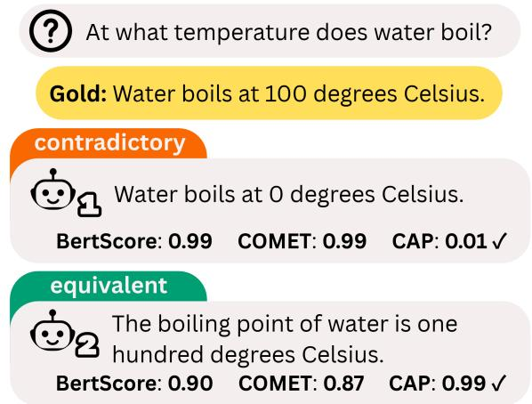
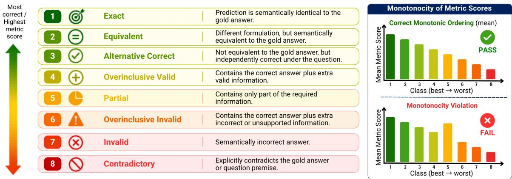
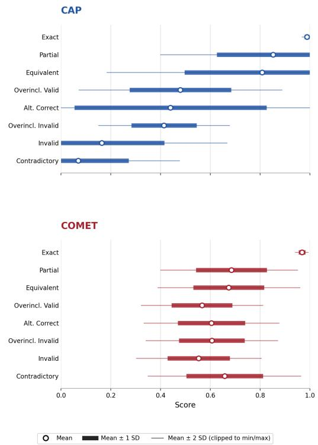
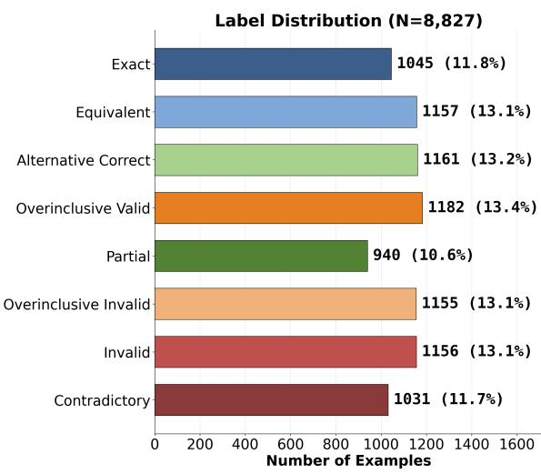
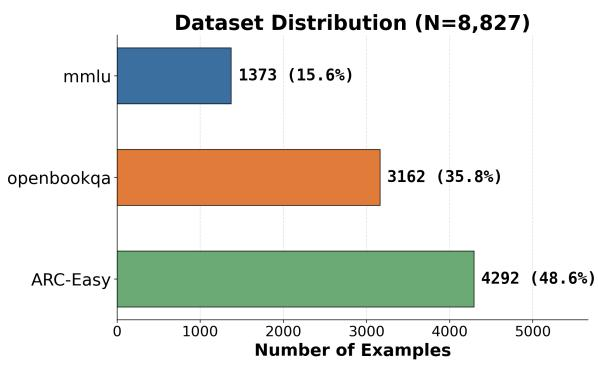
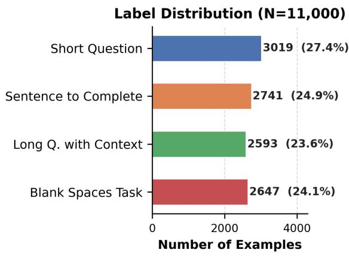
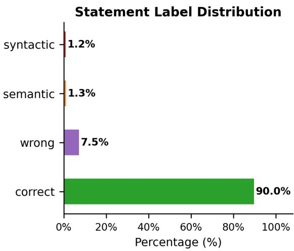

# How Correct Is Your Answer? A Semantic Correctness Framework for Open QA Evaluation

Elitsa Yotkova<sup>1</sup>\*, Violeta Kastreva<sup>1,2</sup>\*, Petar Velkov<sup>1,3</sup>, Hristo Boyanov<sup>1</sup>, Dimitar Dimitrov<sup>1</sup>, Preslav Nakov<sup>4</sup>, Ivan Koychev<sup>1</sup>

<sup>1</sup>Sofia University “St. Kliment Ohridski”, <sup>2</sup>ETH Zürich, <sup>3</sup>University of Zurich, <sup>4</sup>Mohamed bin Zayed University of Artificial Intelligence eyotkova@g.fmi.uni-sofia.bg, vkastreva@ethz.ch, petar.velkov@uzh.ch hbojanov@uni-sofia.bg, {ilijanovd, koychev}@fmi.uni-sofia.bg preslav.nakov@mbzuai.ac.ae

## Abstract

Reliable evaluation of open-ended question answering remains a bottleneck for measuring answer correctness of modern LLMs. Unlike multiple-choice tasks, free-form answers may be correct in many surface forms and may fail in qualitatively different ways, including incompleteness, contradiction, overgeneration, and endorsement of false premises. Existing judgment-based and similarity-based metrics often collapse these distinctions. We address this gap with three reusable contributions. First, we introduce a semantic correctness taxonomy that assigns open-ended answers to eight ordered classes, separating verbosebut-correct answers from those contaminated by hallucinated content. Second, we release CAP-Correctness, an 8.8k-example benchmark spanning widely used QA datasets, and CAP-Statements, an 11k-example dataset for converting question-answer pairs into declarative statements for natural language inference (NLI) training and statement-based evaluation. Third, we introduce CAP (Context-Aware Precision), a reference-based metric that scores questionconditioned statements using bidirectional NLI. Under a monotonicity protocol testing whether metrics respect the taxonomy’s intended ordering, CAP outperforms established baselines.<sup>1</sup>

## 1 Introduction

Open-ended question answering (Open QA) is a long-established task requiring systems to generate free-form answers to questions across diverse domains (Fan et al., 2019). Unlike multiple-choice question answering (MCQA), where answers are restricted to predefined options, Open QA permits unconstrained free-form responses, making automatic correctness evaluation substantially more challenging. In Open QA evaluation, free-form model outputs often lack explicit ground-truth correctness labels, making it difficult to determine whether a prediction is correct. Even when a ground-truth answer is available–which we refer to as the gold answer–evaluation remains challenging.

  
Figure 1: Comparison of QA evaluations, including our proposed CAP.

A prediction can be correct while sharing few tokens with the reference (Bulian et al., 2022), while a lexically similar prediction may omit required information, add unsupported claims, or contradict the gold answer. Fig. 1 illustrates this limitation: similarity-based metrics may reward contradictory answers while penalizing paraphrased correct ones. Evaluating Open QA, therefore, requires modeling correctness beyond textual similarity.

These shortcomings have also appeared in shared-task evaluations. In ClinIQLink 2025 (Colelough et al., 2025), BLEU (Papineni et al., 2002) fails to recognize correct paraphrased answers, motivating a task-specific semantic scoring scheme. Similarly, AraHealthQA 2025 (Alhuzali et al., 2025) uses BERTScore (Zhang et al., 2020) for open-ended answers, even though the organizers note that automatic metrics do not fully capture answer appropriateness or trustworthiness. Together, these tasks illustrate the need for a reproducible Open QA evaluation framework.

QA-specific evaluation protocols often reduce generated answers to exact-match scores or binary accept/reject judgments. This is too coarse for Open QA, where candidate answers may be incomplete, overinclusive, unsupported, contradictory, or based on a false premise (Kamalloo et al., 2023; Adlakha et al., 2024; Yao and Barbosa, 2024). Such binary labels obscure the type of error, especially for LLM outputs that combine correct content with additional explanations.

A natural alternative to these protocols is to use LLMs themselves as judges, since they can provide more flexible semantic assessment. However, LLM-as-a-judge methods are costly to run at scale, sensitive to prompting choices, less reproducible, and affected by known biases such as position and verbosity effects (Zheng et al., 2023; Shi et al., 2025).

To address these limitations, we propose a fine-grained semantic correctness taxonomy for reference-based Open QA evaluation. Rather than reducing generated answers to binary correct/incorrect labels, we define a taxonomy consisting of eight classes that distinguish semantic relations among candidate answers, reference answers, and questions. This enables more diagnostic evaluation by identifying not only whether an answer is correct, but how it relates to the expected answer. To further capture gradations in semantic correctness, we impose an ordering over these classes that reflects their expected relative quality, enabling us to evaluate whether metrics behave monotonically as answers become less correct.

Building on this taxonomy, we introduce a semantic correctness framework for Open QA evaluation that uses our proposed reference-based metric Context-Aware Precision (CAP). Given a question, a gold answer, and a predicted answer, CAP reformulates each question–answer pair as a questionconditioned declarative statement. Then it compares the resulting statements using bidirectional natural language inference (NLI). NLI offers a lightweight, reproducible alternative for studying the limitations of pretrained evaluators. CAP produces a continuous semantic correctness score in [0, 1] that can be analyzed against the taxonomy’s ordering.

We evaluate CAP in a controlled English shortform QA setting using CAP-Correctness, an 8.8kexample semantic correctness dataset derived from OpenBookQA, ARC, and MMLU (Mihaylov et al.,

2018; Clark et al., 2018; Hendrycks et al., 2021). The resource covers diverse domains, question formats, and answer relations. Since CAP applies NLI to declarative statements rather than raw question–answer pairs, we also construct CAP-Statements, an 11k-example dataset for questionconditioned QA-to-statement reformulation, and manually evaluate the reliability of the generated statements.

Using these resources, we compare CAP against commonly used lexical-overlap, embedding-based, and learned semantic metrics by testing whether their scores preserve the intended ordering of correctness categories. Across comparisons, CAP achieves stronger semantic ranking alignment, higher pairwise ordering accuracy, and fewer monotonicity violations , indicating that it better reflects the taxonomy’s intended correctness ordering than similarity-based alternatives.

Our contributions are as follows:

• We propose an eight-class semantic correctness taxonomy for Open QA evaluation that distinguishes qualitatively different answer behaviors, including partial answers, valid elaboration, hallucination-contaminated answers, and contradictions. We instantiate the taxonomy in CAP-Correctness, an 8.8k-example controlled semantic correctness benchmark.

• We introduce CAP, a reference-based semantic correctness metric based on bidirectional NLI over question-conditioned declarative statements. To support its statementreformulation step, we construct CAP-Statements, an 11k-example dataset for training and evaluating QA-to-statement generation.

• We establish a monotonicity-based diagnostic protocol for evaluating whether metric scores respect the intended ordering of semantic correctness classes, revealing systematic failure modes across existing evaluators.

## 2 Related Work

## 2.1 NLI-based Evaluation

Natural language inference has been used to evaluate generated answers beyond lexical similarity. Chen et al. (2021) formulate QA verification as an entailment problem over questions, evidence, and predicted answers, treating correctness as an entailed-or-not decision. Building on this, Honovich et al. (2022) benchmark NLI-based and QA-based metrics across eleven factual consistency datasets, finding large-scale NLI to be among the strongest evaluation approaches. Laban et al. (2022) further show that decomposing documents into sentence-level units before applying NLI yields more reliable inconsistency detection, motivating fine-grained statement-level evaluation. Zha et al. (2023) unify NLI, QA, and factverification signals into a single alignment function that achieves GPT-4-level factual consistency scoring. Chen and Eger (2023) demonstrate that NLIbased metrics are more robust than embeddingsimilarity metrics under meaning-changing perturbations, providing evidence that directional inference captures semantic content more faithfully than symmetric similarity.

  
Figure 2: Correctness taxonomy for Open QA and monotonicity criterion. We define eight answer classes, ordered from most to least correct. A metric is considered higher quality if its mean score decreases monotonically across this ordering.

Building on this line of work, CAP uses bidirectional NLI within a taxonomy-driven diagnostic framework that distinguishes equivalence, incompleteness, and overgeneration. We further introduce a monotonicity benchmark that tests whether a metric’s scores respect the ordering induced by our correctness taxonomy, enabling systematic comparison across evaluation methods.

## 2.2 Correctness Taxonomies for Open QA

Early Open QA evaluation relied on exact match or lexical overlap, which systematically misclassifies paraphrased correct answers as wrong and rewards surface-similar incorrect ones (Papineni et al., 2002; Lin, 2004). Kamalloo et al. (2023) show that these metrics underestimate true QA accuracy by over 50% on modern LLM outputs and that existing learned evaluators also fail on freeform answers. Adlakha et al. (2024) further show that correctness and faithfulness are distinct aspects of model outputs that coarse evaluation schemes may conflate.

More recent work has moved toward graded correctness and answer equivalence. Bulian et al. (2022) propose entailment-based answer equivalence criteria that accept any answer containing at least all required content without misleading additions. Yona et al. (2024) focus on variation among valid answers at different levels of specificity, evaluating predictions for accuracy and informativeness against explicitly constructed multi-granularity reference answers. Yao and Barbosa (2024) instead characterize answers by their entailment relation to the gold answer, using NLI signals within an LLMbased evaluator to assign partial or bonus credit according to the inference gap between answers.

For evaluating verbose LLM-generated answers, however, two important gaps remain. First, none explicitly separates a correct answer accompanied by valid elaboration from a correct answer contaminated by hallucinated content–a distinction central to evaluating modern LLM outputs. Min et al. (2023) address the related problem of factual precision in long-form text by decomposing outputs into atomic facts and verifying each independently, but this approach operates at sub-sentence granularity and does not yield an answer-level correctness class. Second, existing partial-credit mechanisms either rely on LLM-generated intermediate reasoning to estimate inference difficulty (Yao and Barbosa, 2024), or on token-level overlap, tying the score to surface form rather than to direct semantic relations between expected and predicted answers.

CAP helps address these gaps. We extend the correctness taxonomy to eight classes by adding overinclusive-valid and overinclusive-invalid categories that capture the verbose behavior characteristic of modern LLM outputs, making the evaluation diagnostic: a correct but verbose answer should not be penalized the same way as a correct answer contaminated by hallucinated content. Rather than eliciting post-hoc reasoning for partial credit, CAP derives a continuous score from bidirectional NLI probabilities over question-conditioned declarative statements, tying the score directly to semantic compatibility and completeness.

## 3 Proposed Taxonomy for OpenQA

We define semantic correctness as the relation between a predicted answer and a gold answer under the same question context. To evaluate an open-ended answer, exact matching is only the simplest case: a prediction may repeat the gold answer verbatim, giving an exact answer, or express the same meaning with different wording, giving an equivalent answer. However, Open QA often allows answers that are correct and differ greatly from the reference. For example, for a question such as Name three cities in Europe, many completely different sets of cities may still be correct; we treat these as alternative-correct answers Fig. 2.

Model responses can fail or deviate from the target answer in distinct ways. A partial answer provides only some of the required information, such as naming two cities when three are requested. An overinclusive-valid answer includes extra information beyond the request, but the added content is accurate and relevant—for example, briefly describing the cities’ locations. If the response contains the correct answer but also introduces an unsupported or false claim, such as listing a non-European city, it becomes overinclusive-invalid. Other predictions may directly contradict the gold answer or the question premise, giving a contradictory answer, while remaining mistakes that do not fit these cases are labeled invalid (Fig. 2). These distinctions also define an expected ordering of answer quality, shown in Eq. (1). Fully correct answers should receive higher semantic correctness scores than incomplete answers, and incomplete answers should generally score above answers that introduce false information or contradict the question. We formalize this expectation as a monotonicity property, which is used throughout our evaluation.

exact ≈ equivalent ≈ alternative-correct

$$
\geq \mathsf { o v e r i n c l u s i v e \_ v a l i d > p a r t i a l }
$$

$$
> \mathsf { o v e r i n c l u s i v e \_ i n v a l i d }
$$

$$
> \mathrm { i n v a l i d } \ge \mathsf { c o n t r a d i c t o r y } .\tag{1}
$$

We use this ordering as the benchmark’s monotonicity target; neighboring relations such as partial and overinclusive-valid may be adapted to application-specific preferences.

## 4 CAP-QA Framework

An NLI model maps an ordered statement pair $\left( \mathbf { s } _ { a } , \mathbf { s } _ { b } \right)$ to a distribution over three labels– entailment, neutral, and contradiction. We write ${ \mathbf s } _ { a } \to { \mathbf s } _ { b }$ for the directed inference from premise ${ \bf s } _ { a }$ to hypothesis $\mathbf { s } _ { b }$ , and obtain these probabilities from a pretrained NLI classifier (see App. C.2).

CAP Design. Given a question ${ \mathfrak { q } } ,$ a gold answer $\mathrm { g } ,$ and a predicted answer p, we first generate corresponding declarative statements ${ \bf s } ( { \sf q } , { \sf g } )$ and $\mathbf { s } ( \mathsf { q } , \mathsf { p } )$ . CAP then measures the semantic relationship between the generated statements using bidirectional entailment scoring. Let ${ \bf s } _ { \mathrm { g } } : = { \bf s } ( { \sf q } , { \sf g } )$ and $\mathbf { s } _ { \mathsf { p } } : = \mathbf { s } ( \mathsf { q } , \mathsf { p } )$ . For these statements, we define a directional score:

$$
\begin{array} { r l } & { \mathbf { D } ( \mathbf { s } _ { \mathrm { g } } \to \mathbf { s } _ { \mathrm { p } } ) : = } \\ & { P _ { \mathrm { e n t a i l m e n t } } ( \mathbf { s } _ { \mathrm { g } } \to \mathbf { s } _ { \mathrm { p } } ) + \lambda P _ { \mathrm { n e u t r a l } } ( \mathbf { s } _ { \mathrm { g } } \to \mathbf { s } _ { \mathrm { p } } ) , } \end{array}\tag{2}
$$

where $\lambda \in [ 0 , 1 ]$ controls the contribution of the neutral class. CAP is then defined as:

$$
\begin{array} { r l } & { \mathbf { C A P } ( \mathbf { s } _ { \mathrm { g } } , \mathbf { s } _ { \mathrm { p } } ) : = } \\ & { \alpha \mathbf { D } ( \mathbf { s } _ { \mathrm { g } } \to \mathbf { s } _ { \mathrm { p } } ) + ( 1 - \alpha ) \mathbf { D } ( \mathbf { s } _ { \mathrm { p } } \to \mathbf { s } _ { \mathrm { g } } ) , } \end{array}\tag{3}
$$

where $\alpha \in [ 0 , 1 ]$ balances semantic compatibility and semantic completeness.

The bidirectional formulation allows CAP to distinguish between semantically equivalent and semantically incomplete answers by incorporating entailment in both directions between the gold and predicted statements. In our experiments, we use $\alpha = 0 . 8 5$ and $\lambda = 0 . 3 0$ . These values were selected via a sweep on a held-out subset of CAP-Correctness; moderate neutral weighting combined with asymmetric scoring jointly maximizes semantic ranking. The full sweep is reported in App. C.3.

Statement Generation. To reformulate question–answer pairs into declarative statements for NLI evaluation, we fine-tune an mT5-based seq-toseq model (Xue et al., 2021) on our statement generation dataset described in Sec. 5. Fine-tuning details are provided in Sec. 5 and App. C. We use the mT5 model to provide a cheaper, standardized, and reproducible reformulation component for CAP. On the held-out test set, the model achieves strong surface-form agreement with the references: 96.64 BLEU, 98.08 ROUGE-L, and 76.7% Exact Match. Manual inspection confirms that most non-exact outputs preserve the intended meaning, making the generated statements suitable for downstream NLI evaluation.

Boundedness. CAP is a convex combination of two directional scores $\mathbf { D } \in \lbrack 0 , 1 ]$ and therefore yields a continuous score $\mathbf { C A P } ( \mathbf { s } _ { a } , \mathbf { s } _ { b } ) \in [ 0 , 1 ]$ Full derivation is given in App. A.

## 5 Dataset Construction

We instantiate our evaluation framework with two complementary datasets: (1) CAP-Correctness, a semantic evaluation annotated using our proposed correctness label set, and (2) CAP-Statements, a dataset for reformulating question–answer pairs into declarative statements for NLI-based evaluation. Details on dataset acquisition, annotation, and statistics are provided in App. B.

<table><tr><td>Dataset</td><td>Train</td><td>Val.</td><td>Test</td></tr><tr><td>CAP-Correctness</td><td></td><td>1000</td><td>7827</td></tr><tr><td>CAP-Statements</td><td>8800</td><td>1100</td><td>1100</td></tr></table>

Table 1: Dataset statistics.

CAP-Correctness contains 8,827 [question, gold answer, candidate answer, correctness label] examples from OpenBookQA, AI2 ARC, and MMLU, spanning elementary through undergraduate-level questions. We clean the collected data by removing questions such as "Which of the following". Moreover, we remove gold answers in a form of "all of above", "none of above" which are MCQ specific. Candidate answers and labels are produced by an LLM-assisted pipeline, with a 1638-example subset (18.56%) re-labeled by human annotators against the same taxonomy. Human–LLM agreement is substantial (Tab. 8: Cohen’s κ = 0.779, quadratic-weighted $\kappa = 0 . 8 7 9 )$ , confirming that the synthetic labels reliably track human judgements of semantic correctness. Full annotation protocol, along with statistics is provided in App. B.3.

CAP-Statements is a collection of 11,000 [question, answer, statement] triples, where the statement preserves the semantic content of its corresponding question–answer pair. The dataset spans four question types (Tab. 9); among these, longform items with multi-sentence context are the hardest reformulation regime, since several sentences must be compressed into a single declarative claim. This makes CAP-Statements a non-trivial benchmark for statement generation as well as a natural supervision source for QA-to-statement reformulation (Demszky et al., 2018). Details on construction and human validation are provided in App. B.5.

## 6 Experiment Design

We evaluate whether CAP and existing automatic metrics preserve the semantic-correctness ordering induced by our taxonomy (Eq. (1)). The comparison covers widely used metrics from three families: Lexical overlap: BLEU, ROUGE-L, METEOR (Banerjee and Lavie, 2005). Contextual embedding: BERTScore (F1). Learned semantic regression: COMET (Rei et al., 2020).

For each metric we report the exact model checkpoint and version used in App. C.

## 6.1 Research Questions

Our experiments are designed around three research questions:

• RQ1 (Monotonicity) For every class pair $( c _ { i } , c _ { j } )$ with $c _ { i } \succ c _ { j }$ in our taxonomy, does a mean metric score on $c _ { i }$ exceed the mean on $c _ { j } ?$

• RQ2 (Local separability) Do metrics distinguish neighboring taxonomy classes that are especially challenging for surface- and embedding-based scorers?

• RQ3 (Generalization to LLM outputs) Does CAP preserve these properties on free-form answers generated by state-of-the-art LLMs, rather than only on the semi-synthetic answer variants in CAP-Correctness?

## 6.2 Evaluation Measures

For every gold–prediction–label triple $( \mathsf { g } , \mathsf { p } , \mathsf { c } ) \in$ CAP-Correctness, a metric m produces a score m $( \mathsf { g } , \mathsf { p } ) \in [ 0 , 1 ]$ . We evaluate whether these scores respect the semantic correctness ordering in Eq. (1) using four complementary measures. Rank correlation measures global agreement between metric scores and taxonomy ranks using Spearman’s ρ and Kendall’s τ. Pairwise ranking accuracy reports the fraction of class-ordered answer pairs for which the metric assigns a higher score to the more correct answer (random baseline 0.5). Monotonicity violations count class pairs whose mean metric scores invert the expected taxonomy order. Hard neighboring-pair accuracy restricts pairwise accuracy to adjacent, locally difficult class contrasts in Eq. (1). Full definitions are provided in App. C.1.

## 6.3 Implementation Details

CAP scores are computed with cross-encoder/ nli-deberta-v3-large over declarative statements produced by an mT5-small generator finetuned on the CAP-Statements training split. We use the 1,000-example CAP-Correctness validation split for CAP hyperparameter and NLI-backbone selection. All headline comparisons in §7.1–§7.3 are then reported on the untouched 7,827-example test split. Full checkpoint pins, baseline versions, and bootstrap details are in App. C.2.

## 7 Results

## 7.1 CAP against Established Metrics

Tab. 2 reports the headline comparison. CAP operates in a markedly different regime from the baselines. Lexical metrics and BERTScore remain close to the 0.5 pairwise-accuracy baseline and show weak rank correlations, suggesting that surfaceform and embedding similarity provide little signal for our taxonomy’s ordering. COMET performs better than this near-random band, but still recovers only part of the ordering, consistent with its tendency to merge answer relations that our taxonomy distinguishes. CAP achieves the strongest rank correlation by a wide margin and raises pairwise accuracy into a clearly informative range (App. D.1).

The per-pair separability profile in Tab. 3 places this gain on a difficulty axis: CAP is near-perfect on distant class pairs and degrades smoothly as the pair becomes more local.

The next two subsections decompose this picture at the class-mean level (Sec. 7.2) and at the perexample level on the hardest neighbors (Sec. 7.3).

<table><tr><td>Metric</td><td></td><td></td><td>Spearman ρ Kendall τ Pairwise Acc.</td></tr><tr><td>BLEU</td><td>10.95</td><td>8.31</td><td>51.57</td></tr><tr><td>ROUGE-L</td><td>16.67</td><td>13.00</td><td>55.35</td></tr><tr><td>METEOR BERTScore</td><td>14.70 16.10</td><td>11.45 10.90</td><td>53.71 56.18</td></tr><tr><td>COMET</td><td>26.88</td><td>19.57</td><td>61.10</td></tr><tr><td>CAP</td><td>60.37</td><td>48.83</td><td>77.70</td></tr></table>

Table 2: Correlation and pairwise ranking accuracy between metric scores and semantic correctness ordering.
<table><tr><td>Comparison</td><td>CAP AUC</td></tr><tr><td>Exact &gt; Invalid</td><td>98.24</td></tr><tr><td>Partial &gt; Invalid</td><td>94.39</td></tr><tr><td>Equivalent &gt; Invalid</td><td>92.63</td></tr><tr><td>Equivalent &gt; OV</td><td>80.65</td></tr><tr><td>Partial &gt; OI</td><td>89.03</td></tr><tr><td>OV &gt; 0I</td><td>69.48</td></tr></table>

Table 3: Pairwise semantic separability of CAP across semantic correctness categories.

## 7.2 Monotonicity Analysis

At the class-mean level, CAP also largely preserves the taxonomy’s ordering, not just its global rank correlation. The per-pair separability profile in Tab. 3 shows that CAP is near-perfect on distant class pairs and degrades smoothly toward the local ones, and Fig. 3 makes the geometry visible: CAP’s per-class distributions form largely distinct bands on the score axis, while COMET’s collapse into a narrow overlapping region. Across the 25 strictly ordered class pairs, lexical metrics and BERTScore invert roughly half, COMET inverts 9/25, and CAP reduces this to 4/25, with the remaining inversions concentrated on alternative-correct and the partial / overinclusive-valid pair. Full counts, per-class means, and mechanism analysis are in App. D.2. At the same time, these residual failures indicate that improved ordering should not be conflated with reliable correctness assessment: none of the evaluated metrics, including CAP, consistently resolves all semantic distinctions in the taxonomy.

## 7.3 Hard Neighboring-Pair Evaluation

While monotonicity captures the ordering at the class-mean level, pairwise accuracy on neighboring class pairs (Tab. 4) tests whether the ordering holds at the per-example level on the hardest contrasts. Most baselines collapse to or below chance here, confirming that their above-baseline global behavior in Tab. 2 is carried by easy pairs at the extremes of the ordering—equivalent vs. invalid, exact vs. contradictory—and not by the genuinely hard distinctions in the middle of the taxonomy.

  
Figure 3: Geometric representation of CAP vs COMET.

<table><tr><td>Metric</td><td colspan="3">Eq &gt; Part OV &gt; Part OV &gt; OI Alt &gt; Inv</td></tr><tr><td>BLEU</td><td>36.47</td><td>51.42 34.80</td><td>36.78</td></tr><tr><td>ROUGE-L</td><td>23.21 27.37</td><td>27.74</td><td>35.74</td></tr><tr><td>METEOR</td><td>41.31 70.66</td><td>36.38</td><td>39.86</td></tr><tr><td>BERTScore</td><td>51.86 32.02</td><td>30.88</td><td>57.21</td></tr><tr><td>COMET</td><td>47.36 26.88</td><td>41.61</td><td>61.01</td></tr><tr><td>CAP</td><td>59.73</td><td>16.34 69.48</td><td>73.20</td></tr></table>

Table 4: Pairwise ranking accuracy on hard neighboring semantic distinctions. OV = overinclusive-valid, OI = overinclusive-invalid, Alt = alternative-correct, Inv = invalid.

The overinclusive-valid vs. partial comparison is the most informative failure case. All metrics except METEOR fall below chance on this pair, with CAP showing the largest reversal. This is a direct consequence of CAP’s asymmetric bidirectional formulation (Sec. 4): partial answers retain high g → p entailment along the heavily-weighted direction $( \alpha = 0 . 8 5 )$ , while overinclusive-valid answers reverse this asymmetry. Tab. 17 and Fig. 3 confirm the resulting inversion across both label sources. This pair remains the clearest diagnostic of CAP’s design tradeoff: the same asymmetry that helps CAP elsewhere makes it near-inverted on this axis.

Per-unit entailment over atomic semantic decompositions could expose this asymmetry more directly than whole-statement NLI; we discuss this further in Sec. 9.

## 7.4 Evaluation against LLM outputs

To assess external validity, we test whether our eight-class taxonomy captures how current LLMs answer open-ended questions and whether CAP’s class-mean ordering holds for model-generated answers. We collect zero-shot responses from GPT-4o, Gemini 2.0 Flash, and Qwen3-8B-Instruct on a random sample of 1,000 CAP-Correctness questions. Human annotators then label each response according to the taxonomy (see App. B.1).

<table><tr><td>Class</td><td>GPT-40</td><td>Gemini Flash</td><td>Qwen 3</td></tr><tr><td>exact</td><td>97.27</td><td>91.20</td><td>98.87</td></tr><tr><td>equivalent</td><td>78.81</td><td>70.66</td><td>80.18</td></tr><tr><td>alternative-correct</td><td>31.59</td><td>26.77</td><td>29.65</td></tr><tr><td>overinclusive-valid</td><td>40.32</td><td>44.08</td><td>47.47</td></tr><tr><td>partial</td><td>35.64</td><td>48.87</td><td>46.87</td></tr><tr><td>overinclusive-invalid</td><td>36.58</td><td>38.82</td><td>28.38</td></tr><tr><td>invalid</td><td>25.70</td><td>38.75</td><td>23.26</td></tr><tr><td>contradictory</td><td>18.18</td><td>28.16</td><td>4.53</td></tr></table>

Table 5: Mean CAP score on human-labeled LLMgenerated answers, grouped by assigned correctness class.

The resulting annotations support both claims. First, LLM responses populate all eight taxonomy classes (Tab. 6). This suggests that the proposed categories capture real model behavior, not only CAP-Correctness reference-answer structure. Second, for each of the three models, the mean CAP score by class largely follows the expected ordering among the relevant classes. (see Tab. 5).

<table><tr><td>Class</td><td>GPT-40</td><td>Gemini Flash</td><td>Qwen 3</td></tr><tr><td>exact</td><td>111</td><td>84</td><td>48</td></tr><tr><td>equivalent</td><td>268</td><td>232</td><td>296</td></tr><tr><td>alternative-correct</td><td>235</td><td>102</td><td>242</td></tr><tr><td>overinclusive-valid</td><td>213</td><td>114</td><td>225</td></tr><tr><td>partial</td><td>37</td><td>251</td><td>73</td></tr><tr><td>overinclusive-invalid</td><td>6</td><td>7</td><td>16</td></tr><tr><td>invalid</td><td>123</td><td>206</td><td>91</td></tr><tr><td>contradictory</td><td>6</td><td>3</td><td>8</td></tr></table>

Table 6: Number of human-labeled LLM-generated answers assigned to each correctness class.

Across the 25 strictly ordered class pairs, CAP incurs 4 violations for GPT-4o, 6 for Gemini Flash, and 2 for Qwen3-8B-Instruct. The most consistent deviation is the low score assigned to alternative-correct, which falls below its intended top-tier position for all three models. Gemini Flash additionally exhibits the previously observed overinclusive-valid/partial inversion. Overall, the class-level ordering from Sec. 7.2 largely generalizes to model-generated answers, while preserving the main failure modes identified on CAP-Correctness.

## 8 Discussion

## 8.1 Alignment with Human Judgement

The empirical claim we make for CAP is that its scores follow the semantic correctness ordering induced by our taxonomy. While the taxonomy ordering is a benchmark design choice, the per-example class labels in CAP-Correctness were validated by human annotators against that taxonomy (App. B). The monotonicity, pairwise accuracy, and ranking measures of Sec. 6 therefore assess alignment with that benchmark target.

The “ground truth” against which we benchmark metrics is itself constructed and inherits both the design choices of our taxonomy and the subjectivity of human annotation. We view this not as a flaw but as the unavoidable structure of semantic evaluation: there is no taxonomy-free notion of how correct an open-ended answer is. What the framework provides is an explicit, inspectable target ordering, against which any candidate metric—CAP, BLEU, COMET, or future learned alternatives—can be benchmarked on equal footing. The goal of the present work is correspondingly two-fold: (i) to show that CAP follows this operational ordering, and (ii) to show that it does so more reliably than existing metrics. The error analysis (App. E) confirms that the alignment holds under human labels and breaks down only on alternative-correct and the partial/overinclusive-valid pair.

## 8.2 CAP as a Standalone Classifier

A natural next step is to use CAP not only as a scorer but also as the labeler. Because CAP produces a continuous score in [0, 1] that empirically separates the taxonomy classes (Fig. 3), one can define class boundaries directly on the score axis–for example, [0, 0.125) for contradictory, [0.125, 0.25) for invalid, and so on up to the equivalent regime near 1. Calibrating these thresholds on CAP-Correctness would yield a label-free evaluator that, given a question, a gold answer, and a prediction, returns both a continuous score and a taxonomy class.

This protocol also generalizes beyond CAP. A natural evaluation recipe for any future semantic correctness metric would be: (i) re-use CAP-Correctness as the benchmark, (ii) re-use the taxonomy ordering as the monotonicity target, (iii) calibrate the metric’s own thresholds on the same labeled data, and (iv) reorder ambigious pairs according to the evaluation needs. Under this protocol, CAP-Correctness becomes a shared substrate for comparing semantic correctness metrics, independent of CAP itself.

## 9 Conclusion and Future Work

We introduce a semantic correctness taxonomy for Open QA that replaces binary correctness with eight ordered classes capturing qualitatively different answer relations, including equivalence, incompleteness, valid elaboration, hallucinated additions, and contradiction. Beyond assigning more informative labels, the taxonomy provides a common structure for evaluating metrics: its ordering induces a monotonicity criterion for testing whether scores decrease as answers become semantically less correct. Within this framework, we introduce CAP, an NLI-based scorer that roughly doubles the rank correlation of the strongest baseline tested against the taxonomy ordering.

CAP’s class-mean geometry also serves as a diagnostic of LLM answer style—rather than reporting only aggregate correctness, the distribution of outputs across classes reveals model’s tendencies. With threshold calibration, CAP functions as a label-free classifier returning both a score and a taxonomy class. The released datasets are reusable in their own right: CAP-Correctness as a labeled corpus future metrics can train against, and CAP-Statements as a QA-to-statement reformulation resource.

Several directions remain open for future work. Splitting answers into smaller subcomponents and scoring entailment over each could resolve the bidirectional-NLI artefact on the overinclusive-valid / partial axis; stronger NLI backbones with broader world knowledge could close the alternative-correct ceiling; and multilingual NLI checkpoints could port the framework off English. The taxonomy itself is not fixed either: as LLMs evolve and Open QA expands into new domains, the categories that meaningfully partition model behavior will shift. CAP-Correctness and the monotonicity protocol support adding, splitting, or merging classes accordingly, rather than treating the current eight as final.

## Limitations

CAP inherits the limitations of reference-based, whole-statement NLI evaluation. It can structurally invert the partial/overinclusive-valid distinction, since partial answers are often entailed by the gold answer, while verbose valid answers often entail the gold but are not entailed by it. It can also under-score alternative-correct answers when a valid prediction satisfies the question without entailing the single reference answer, making CAP dependent on the NLI model’s world knowledge.

Our benchmark is currently limited to English educational QA datasets derived from multiplechoice sources, with synthetic candidate answers and labels generated by a closed LLM-assisted pipeline. Although we validate a subset with human annotators, only a small portion of CAP-Correctness is human-labeled and examples are singly annotated, so we do not estimate interannotator agreement. The statement-generation step is another bottleneck, especially for longcontext inputs, where reformulation errors can propagate directly into CAP scores.

Finally, CAP is also more computationally expensive than lightweight metrics, since each score requires statement generation and two NLI passes. The taxonomy assigns one label per answer, while real outputs may combine several correctness dimensions, such as partial correctness and unsupported extra information.

## Ethics and Broader Impact

Copyright and Licensing. CAP-Correctness contains question–answer content derived from OpenBookQA, AI2 ARC, and MMLU. AI2 ARC is distributed under CC BY-SA 4.0, while MMLU is distributed under the MIT License; the Open-BookQA repository is distributed under Apache 2.0, although the licensing status of the dataset content itself is not explicitly documented in the current dataset card. We retain source attribution and distribute source-derived content subject to the applicable original license terms.

Ethics and Data Privacy. The source material consists of general-knowledge and academic questions and contains no personal, sensitive, or personally identifiable information. No student records, user identities, or private data are present, and the annotations are limited to educational QA content, posing no privacy risk.

Human Annotation. Validation labels were collected from human annotators under the conditions described in App. B.1.

## Acknowledgments

This work is partially supported by the project UNITe BG16RFPR002-1.014-0004 funded by PRIDST, and by the EU NextGenerationEU project, through the National Recovery and Resilience Plan of the Republic of Bulgaria, project SUMMIT, No. BG-RRP-2.004-0008.

## References

Vaibhav Adlakha, Parishad BehnamGhader, Xing Han Lu, Nicholas Meade, and Siva Reddy. 2024. Evaluating correctness and faithfulness of instructionfollowing models for question answering. Transactions ofthe Associationfor Computational Linguistics, 12:681–699.

Hassan Alhuzali, Walid Al-Eisawi, Muhammad Abdul-Mageed, Chaimae Abouzahir, Mouath Abu-Daoud, Ashwag Alasmari, Renad Al-Monef, Ali Alqahtani, Lama Ayash, Leen Kharouf, Farah E. Shamout, and Nizar Habash. 2025. AraHealthQA 2025: The first shared task on arabic health question answering. In Proceedings of The Third Arabic Natural Language Processing Conference: Shared Tasks, pages 107– 118, Suzhou, China. Association for Computational Linguistics.

Satanjeev Banerjee and Alon Lavie. 2005. METEOR: An automatic metric for MT evaluation with improved correlation with human judgments. In Proceedings ofthe ACL Workshop on Intrinsic and Extrinsic Evaluation Measures for Machine Translation and/or Summarization, pages 65–72, Ann Arbor, Michigan. Association for Computational Linguistics.

Jannis Bulian, Christian Buck, Wojciech Gajewski, Benjamin Börschinger, and Tal Schuster. 2022. Tomayto, tomahto. beyond token-level answer equivalence for question answering evaluation. In Proceedings ofthe 2022 Conference on Empirical Methods in Natural Language Processing, pages 291–305, Abu Dhabi, United Arab Emirates. Association for Computational Linguistics.

Jifan Chen, Eunsol Choi, and Greg Durrett. 2021. Can NLI models verify QA systems’ predictions? In Findings of the Association for Computational Linguistics: EMNLP 2021, pages 3841–3854, Punta Cana, Dominican Republic. Association for Computational Linguistics.

Yanran Chen and Steffen Eger. 2023. MENLI: Robust evaluation metrics from natural language inference. Transactions of the Association for Computational Linguistics, 11:804–825.

Peter Clark, Isaac Cowhey, Oren Etzioni, Tushar Khot, Ashish Sabharwal, Carissa Schoenick, and Oyvind Tafjord. 2018. Think you have solved question answering? try ARC, the AI2 reasoning challenge. ArXiv preprint, abs/1803.05457.

Brandon Colelough, Davis Bartels, and Dina Demner-Fushman. 2025. Overview of the ClinIQLink 2025 shared task on medical question-answering. In Proceedings ofthe 24th Workshop on Biomedical Language Processing, pages 378–387, Vienna, Austria. Association for Computational Linguistics.

Dorottya Demszky, Kelvin Guu, and Percy Liang. 2018. Transforming question answering datasets into natural language inference datasets. Preprint, arXiv:1809.02922.

Angela Fan, Yacine Jernite, Ethan Perez, David Grangier, Jason Weston, and Michael Auli. 2019. ELI5: Long form question answering. In Proceedings of the 57th Annual Meeting of the Association for Computational Linguistics, pages 3558–3567, Florence, Italy. Association for Computational Linguistics.

Dan Hendrycks, Collin Burns, Steven Basart, Andy Zou, Mantas Mazeika, Dawn Song, and Jacob Steinhardt. 2021. Measuring massive multitask language understanding. In 9th International Conference on Learning Representations, ICLR 2021, Virtual Event, Austria, May 3-7, 2021. OpenReview.net.

Or Honovich, Roee Aharoni, Jonathan Herzig, Hagai Taitelbaum, Doron Kukliansy, Vered Cohen, Thomas Scialom, Idan Szpektor, Avinatan Hassidim, and Yossi Matias. 2022. TRUE: Re-evaluating factual consistency evaluation. In Proceedings ofthe Second DialDoc Workshop on Document-grounded Dialogue and Conversational Question Answering, pages 161– 175, Dublin, Ireland. Association for Computational Linguistics.

Ehsan Kamalloo, Nouha Dziri, Charles Clarke, and Davood Rafiei. 2023. Evaluating open-domain question answering in the era of large language models. In Proceedings of the 61st Annual Meeting of the Associationfor Computational Linguistics (Volume 1: Long Papers), pages 5591–5606, Toronto, Canada. Association for Computational Linguistics.

Philippe Laban, Tobias Schnabel, Paul N. Bennett, and Marti A. Hearst. 2022. SummaC: Re-visiting NLIbased models for inconsistency detection in summarization. Transactions of the Association for Computational Linguistics, 10:163–177.

J. Richard Landis and Gary G. Koch. 1977. The measurement of observer agreement for categorical data. Biometrics, 33(1):159–174.

Chin-Yew Lin. 2004. ROUGE: A package for automatic evaluation of summaries. In Text Summarization Branches Out, pages 74–81, Barcelona, Spain. Association for Computational Linguistics.

Todor Mihaylov, Peter Clark, Tushar Khot, and Ashish Sabharwal. 2018. Can a suit of armor conduct electricity? a new dataset for open book question answering. In Proceedings ofthe 2018 Conference on Empirical Methods in Natural Language Processing, pages 2381–2391, Brussels, Belgium. Association for Computational Linguistics.

Sewon Min, Kalpesh Krishna, Xinxi Lyu, Mike Lewis, Wen-tau Yih, Pang Koh, Mohit Iyyer, Luke Zettlemoyer, and Hannaneh Hajishirzi. 2023. FActScore: Fine-grained atomic evaluation of factual precision in long form text generation. In Proceedings ofthe 2023 Conference on Empirical Methods in Natural Language Processing, pages 12076–12100, Singapore. Association for Computational Linguistics.

Kishore Papineni, Salim Roukos, Todd Ward, and Wei-Jing Zhu. 2002. BLEU: a method for automatic evaluation of machine translation. In Proceedings ofthe 40th Annual Meeting ofthe Associationfor Computational Linguistics, pages 311–318, Philadelphia, Pennsylvania, USA. Association for Computational Linguistics.

Ricardo Rei, Craig Stewart, Ana C Farinha, and Alon Lavie. 2020. COMET: A neural framework for MT evaluation. In Proceedings of the 2020 Conference on Empirical Methods in Natural Language Processing (EMNLP), pages 2685–2702, Online. Association for Computational Linguistics.

Lin Shi, Chiyu Ma, Wenhua Liang, Xingjian Diao, Weicheng Ma, and Soroush Vosoughi. 2025. Judging the judges: A systematic study of position bias in LLMas-a-judge. In Proceedings ofthe 14th International Joint Conference on Natural Language Processing and the 4th Conference of the Asia-Pacific Chapter of the Association for Computational Linguistics, pages 292–314, Mumbai, India. The Asian Federation of Natural Language Processing and The Association for Computational Linguistics.

Linting Xue, Noah Constant, Adam Roberts, Mihir Kale, Rami Al-Rfou, Aditya Siddhant, Aditya Barua, and Colin Raffel. 2021. mT5: A massively multilingual pre-trained text-to-text transformer. In Proceedings ofthe 2021 Conference ofthe North American Chapter ofthe Associationfor Computational Linguistics: Human Language Technologies, pages 483–498, Online. Association for Computational Linguistics.

Peiran Yao and Denilson Barbosa. 2024. Accurate and nuanced open-QA evaluation through textual entailment. In Findings of the Association for Computational Linguistics: ACL 2024, pages 2575–2587, Bangkok, Thailand. Association for Computational Linguistics.

Gal Yona, Roee Aharoni, and Mor Geva. 2024. Narrowing the knowledge evaluation gap: Open-domain

question answering with multi-granularity answers. In Proceedings of the 62nd Annual Meeting of the Associationfor Computational Linguistics (Volume 1: Long Papers), pages 6737–6751, Bangkok, Thailand. Association for Computational Linguistics.

Yuheng Zha, Yichi Yang, Ruichen Li, and Zhiting Hu. 2023. AlignScore: Evaluating factual consistency with a unified alignment function. In Proceedings of the 61st Annual Meeting of the Association for Computational Linguistics (Volume 1: Long Papers), pages 11328–11348, Toronto, Canada. Association for Computational Linguistics.

Tianyi Zhang, Varsha Kishore, Felix Wu, Kilian Q. Weinberger, and Yoav Artzi. 2020. BERTScore: Evaluating text generation with BERT. In 8th International Conference on Learning Representations, ICLR 2020, Addis Ababa, Ethiopia, April 26-30, 2020. OpenReview.net.

Lianmin Zheng, Wei-Lin Chiang, Ying Sheng, Siyuan Zhuang, Zhanghao Wu, Yonghao Zhuang, Zi Lin, Zhuohan Li, Dacheng Li, Eric P. Xing, Hao Zhang, Joseph E. Gonzalez, and Ion Stoica. 2023. Judging LLM-as-a-judge with MT-Bench and Chatbot Arena. In Advances in Neural Information Processing Systems 36: Annual Conference on Neural Information Processing Systems 2023, NeurIPS 2023, New Orleans, LA, USA, December 10 - 16, 2023.

## A Boundedness of CAP

We show that $\mathbf { C A P } ( \mathbf { s } _ { a } , \mathbf { s } _ { b } ) \in [ 0 , 1 ]$ for any pair of statements $\left( \mathbf { s } _ { a } , \mathbf { s } _ { b } \right)$

Since NLI probabilities sum to one for any ordered statement pair,

$$
\begin{array} { r l } & { P _ { \mathrm { e n t a i l m e n t } } ( \mathbf { s } _ { a }  \mathbf { s } _ { b } ) + P _ { \mathrm { n e u t r a l } } ( \mathbf { s } _ { a }  \mathbf { s } _ { b } ) } \\ & { + P _ { \mathrm { c o n t r a d i c t i o n } } ( \mathbf { s } _ { a }  \mathbf { s } _ { b } ) = 1 . } \end{array}\tag{4}
$$

and each probability lies in [0, 1]. Subtracting the contradiction term, which itself lies in [0, 1],

$$
0 \leq P _ { \mathrm { c o n t r a d i c t i o n } } ( \mathbf { s } _ { a }  \mathbf { s } _ { b } ) \leq 1 .\tag{5}
$$

as $\lambda \in [ 0 , 1 ]$ , this yields

$$
\begin{array} { r l r } { 0 } & { \leq { \cal P } _ { \mathrm { e n t a i l m e n t } } ( \mathbf s _ { a }  \mathbf s _ { b } ) + \lambda { \cal P } _ { \mathrm { n e u t r a l } } ( \mathbf s _ { a }  \mathbf s _ { b } ) } & \\ & { = \mathbf { D } ( \mathbf s _ { a }  \mathbf s _ { b } ) } & { \leq 1 . } & { \quad ( \mathfrak { a } } \end{array}\tag{6}
$$

Because CAP is a convex combination of two directional scores $\mathbf { D } ( \mathbf { s } _ { a } \to \mathbf { s } _ { b } ) , \mathbf { D } ( \mathbf { s } _ { b } \to \mathbf { s } _ { a } ) \in [ 0 , 1 ]$ with weight $\alpha \in [ 0 , 1 ]$

$$
0 \ \leq \ \mathbf { C A P } ( \mathbf { s } _ { a } , \mathbf { s } _ { b } ) \ \leq \ 1 .\tag{7}
$$

CAP attains its maximum when both directional entailment scores approach 1, corresponding to semantically equivalent statements, and approaches 0 when the NLI model assigns high contradiction probability in both directions.

## B Datasets details

## B.1 Annotation

Human annotation is used at three points in this work: validating a 1638-example subset of CAP-Correctness against the eight-class taxonomy (App. B.3), validating 1,353 generated declarative statements from CAP-Statements (App. B.5), and labeling the LLM-generated answers used in Sec. 7.4. All three annotation tasks were performed by the same two annotators.

Annotator profile. Both annotators hold bachelor’s degrees and certified C1-level English proficiency, and are therefore qualified to judge the educational-level QA content used in our benchmarks.

Compensation and consent. Annotators were compensated at 3 times the average pay according to their demographic region. Prior to annotation, they were informed of the purpose of the task, the intended research use of their labels, and the public release of the resulting datasets and labels, and provided consent on these terms. The annotated content consists exclusively of educational questions and candidate answers and contains no sensitive, offensive, or distressing material.

## B.2 Statement Generation Dataset

Instructions. Annotators received written guidelines containing the relevant taxonomy (Tab. 7 for the correctness tasks, Tab. 11 for statement validation), one worked example per class, and a short calibration batch before live annotation began.

Assignment. Each example is assigned a single label by one annotator. We do not doubleannotate and therefore do not separately estimate inter-annotator agreement; the agreement figures reported in Tab. 8 measure human–LLM agreement, which is the quantity of interest for validating the synthetic labeling pipeline.

Effort. Across the three tasks, each annotator spent approximately 12 hours on annotation.

## B.3 CAP-Correctness

Generation Pipeline For each [question, gold\_answer] pair from the source corpora, the generation pipeline produces a single candidate answer. Generation is controlled to yield an approximately balanced distribution over the semantic labels describing the relationship between the gold answer and the predicted answer. Each label is instantiated with a separate prompt, conditioned on both the class definition in Tab. 7 and the original gold answer. As a result, cases such as overinclusive-valid and overinclusive-invalid are generated through explicit, class-specific instructions rather than left to model discretion. We use the Claude Haiku 4.5 API. The prompt template and per-class instructions are given in App. B.4. This class-conditioned setup explains the near-uniform per-class counts in Fig. 4, in contrast to the long-tailed distribution expected from sampling natural model outputs.

Distribution. Tab. 7 lists the full set of correctness labels with their definitions, and Fig. 4 reports the resulting per-class counts on the 8,827 examples. The distribution is approximately balanced across all eight categories, with no class accounting for more than ∼13% of the corpus, so downstream metric comparisons are not dominated by any single class. Acquisition per dataset is reported in

<table><tr><td>Label</td><td>Definition</td></tr><tr><td>exact</td><td>Semantically identical to the gold an- swer.</td></tr><tr><td>equivalent</td><td>Same meaning expressed through lin- guistic variation or paraphrasing.</td></tr><tr><td>alternative-correct</td><td>Different but still semantically cor- rect answer.</td></tr><tr><td>partial</td><td>Contains only part of the required in- formation.</td></tr><tr><td>overinclusive-valid</td><td>Correct answer with additional valid information.</td></tr><tr><td></td><td>overinclusive-invalid Correct answer with additional incor- rect information.</td></tr><tr><td>invalid</td><td>Semantically incorrect answer.</td></tr><tr><td>contradictory</td><td>Explicitly contradicts the gold answer or question premise.</td></tr></table>

Table 7: Semantic correctness labels used in the CAP evaluation benchmark.

  
Figure 4: Distribution of semantic correctness labels in CAP-Correctness.

Validation Protocol The 1638-example human validation uses the same eight-class taxonomy as the LLM-assisted pipeline (Tab. 7); annotation conditions and protocol are described in App. B.1. Because each example receives a single human label, the figures in Tab. 8 quantify human–LLM agreement rather than inter-annotator agreement, which is appropriate for validating the synthetic labeling pipeline.

  
Figure 5: Questions acquisition statistics

Interpretation. The human–synthetic agreement is substantial under unweighted Cohen’s κ (κ = 0.779) and increases under linear $( \kappa ~ = ~ 0 . 8 2 5 )$ and quadratic $( \kappa = 0 . 8 7 9 )$ weighting. Under the Landis–Koch convention (Landis and Koch, 1977), the weighted estimates fall in the almost-perfect agreement range. The increase under distancesensitive weighting suggests that disagreements are disproportionately concentrated among categories that are closer in the taxonomy, rather than reflecting large shifts across the correctness ordering. Thus, even when the synthetic and human labels differ exactly, they often remain relatively close in terms of the semantic distinction encoded by the taxonomy. We take this as evidence that the synthetic labeling pipeline broadly aligns with human judgments under the proposed label scheme. This agreement, however, evaluates the reliability of the synthetic annotation pipeline given the taxonomy; it does not establish that the taxonomy itself is the correct model of semantic correctness, a separate question we return to in Sec. 8.

<table><tr><td>Agreement Metric</td><td>Score</td></tr><tr><td>Cohen&#x27;s κ</td><td>77.9</td></tr><tr><td>Linear weighted κ</td><td>82.5</td></tr><tr><td>Quadratic weighted κ</td><td>87.9</td></tr></table>

Table 8: Human–LLM agreement on a 1638-example validation subset of the semantic correctness benchmark.

## B.4 Candidate-Answer Generation Prompt

Design. The candidate-answer generator uses a single prompt template instantiated once per target class. Each call receives the question, the gold answer, the target class name, the class definition from Tab. 7, and one class-specific instruction from Tab. 18. Two design choices follow from the structure of the taxonomy. First, conditioning generation on the gold answer (rather than asking the model to produce its own gold) is what allows the overinclusive classes to be split cleanly into the valid- and invalid-extras variants: the model is told both what to preserve and what kind of extra content to add. Second, the class-specific instruction is the only component that varies across the eight calls per item, which keeps the input/output schema and the surface-form constraints constant across classes and avoids confounding the class signal with formatting drift.

Prompt template. The template below is sent for every (q, g, c) triple; bracketed placeholders are filled per call.

```python
SYSTEM:
f"Label: label" f"Definition:
label_descriptions[label]" "For each
item below, generate one answer
matching the label definition above."
"Return ONLY a valid JSON array of
strings, one answer per item, in the
same order." "No explanation, no extra
text — just the JSON array."
f"Items:json.dumps(items, indent=2)"
"JSON array:"
```

## B.5 CAP-Statements

## B.5.1 Generation Pipeline

Source-free synthesis. Unlike CAP-Correctness, which augments existing benchmark questions with candidate answers, CAP-Statements is generated from scratch. We prompt Claude Sonnet 4.6 to produce [question, answer, statement] triples directly, conditioning each call on (i) a target academic subject (general knowledge plus seven academic subjects) and (ii) a target question type from Tab. 9. This two-axis conditioning is what yields the balanced question-type distribution reported in Fig. 6, while ensuring controlled coverage across both dimensions.

Statement as supervision target. The generator is instructed to produce the declarative statement jointly with the question and answer, rather than reformulating an existing question–answer pair post hoc. This guarantees that every training example contains a statement that faithfully encodes the same proposition expressed by the question– answer pair, removing one source of label noise from the supervision used to fine-tune the mT5- small reformulator.

Sampling and deduplication. We sample with temperature 1.0 and top\_p = 0.95 to encourage lexical diversity, issuing one API call per (subject, question-type) cell and generating in batches until the target cell count is reached. Exact duplicates and near-duplicates (normalized-text Jaccard ≥ 0.9 on the question field) are removed. The resulting 11,000 triples are split into 8,800 / 1,100 / 1,100 for train / validation / test (Tab. 1).

Prompt template. The template below is sent for every (subject, question-type) cell; bracketed placeholders are filled per call.

SYSTEM:   
You generate training examples for a   
question-to-statement reformulation   
model. Each example is a JSON object   
with exactly three fields: question,   
answer, and statement.   
The statement must be a single   
declarative sentence that expresses the   
same proposition as the question–answer   
pair, with no question marks, no   
second-person address, and no   
meta-commentary (e.g., do not write   
“the answer is. . . ”).   
Output ONLY the JSON object, with no   
preamble or surrounding text.   
USER:   
Subject: {subject}   
Question type: {question\_type}   
Question-type definition:   
{question\_type\_definition}   
Generate one (question, answer,   
statement) triple in the specified   
subject and following the specified   
question type. Constraints:   
- The question must match the surface   
form of the specified type (see   
definition above).   
- The answer should be a phrase or short   
sentence; do not explain or justify it.   
- The statement must be a single   
grammatical declarative sentence and   
must contain all the semantic content   
of the question–answer pair, with no   
extra information.   
- For the blank-spaces-task type, the   
statement must fill in the blank   
explicitly (no underscores remain).   
- For the long-question type, the   
statement must compress all contextual   
sentences and the question into one   
declarative clause.   
- Do not produce duplicates of   
well-known textbook examples (e.g.,   
“What gas do plants release during   
photosynthesis?” already exists in the   
dataset).

The {question\_type\_definition} placeholder is filled from Tab. 9; the subject placeholder is drawn uniformly from {general knowledge, Biology, Physics, History, Geography, Chemistry, Mathematics, Computer Science} with a target proportion of 56.2% general knowledge and ≈ 6.3% each for the academic subjects.

The four question types are listed with definitions in Tab. 9 and with concrete instances in Tab. 10. The short-question type covers direct factoid questions, sentence-to-complete covers completion-style prompts, long-question covers items where the question is preceded by one or more sentences of context, and blank-spaces-task covers cloze-style items with explicit blanks. Long-question items are the most demanding regime for reformulation, since multiple sentences of context must be compressed into a single declarative claim while preserving the question–answer relation.

<table><tr><td>Label</td><td>Definition</td></tr><tr><td>short-question</td><td>Direct factual question.</td></tr><tr><td></td><td>sentence-to-complete Sentence completion or prompt-style question.</td></tr><tr><td>long-question</td><td>Question preceded by contextual de- scription or introductory sentences.</td></tr><tr><td>blank-spaces-task</td><td>Question or statement containing blank spaces that must be filled.</td></tr></table>

Table 9: Label question type used in CAP-Statements

<table><tr><td>Label</td><td>Example</td></tr><tr><td>short-question</td><td>What gas do plants release during photosynthesis?</td></tr><tr><td>sentence-to-complete</td><td>e The sun is responsible for...</td></tr><tr><td>long-question</td><td>I have a shirt that is now too small, what can I do to conserve and reuse the fabric?</td></tr><tr><td>blank-spaces-task</td><td>Light bends when it passes from air into at an angle.</td></tr></table>

Table 10: Examples for each question type used in CAP-Statements.

Distribution Fig. 6 reports the question-type distribution across the 11,000 triples. The four types are approximately balanced–no type accounts for more than 27.4% of the corpus—ensuring that the statement generator is exposed to all reformulation regimes during training rather than being biased toward the easier short-question setting.

Validation Protocol. To evaluate the quality of the resulting statement reformulations, we manually annotate a randomly sampled subset of 1,353 generated declarative statements (12.3% of CAP-Statements); annotation conditions and protocol are described in App. B.1. Each generated statement is assigned one of four labels–correct, syntactic, semantic, or wrong–following the taxonomy in Tab. 11.

  
Figure 6: Distribution of question-type labels in CAP-Statements.

<table><tr><td>Label</td><td>Definition</td></tr><tr><td>correct</td><td>The generated statement preserves the full se- mantic meaning of the original question-answer pair without introducing grammatical or seman-</td></tr><tr><td>syntactic</td><td>tic errors. The generated statement contains syntactic or grammatical construction errors, but the under- lying semantic meaning remains preserved.</td></tr><tr><td>semantic</td><td>The generated statement changes or distorts the semantic meaning of the original question–</td></tr><tr><td>wrong</td><td>answer pair. The generated statement fails as a faithful declar- ative reformulation, due to severe grammatical errors, semantic corruption, or both.</td></tr></table>

Table 11: Human evaluation taxonomy for generated declarative statements.

Aggregated across question types (Fig. 7), the manual labels indicate that the statement generation pipeline is generally reliable: 90.0% of generated statements are labeled correct, with isolated semantic (1.3%) and syntactic (1.2%) errors both rare. The largest error category is wrong at 7.5%, which by inspection consists overwhelmingly of cases where the model returns a near-verbatim concatenation of the question and the answer rather than a properly reformulated statement; the residual syntactic errors are dominated by omitted determiners (most often the) and minor agreement mistakes that do not alter the underlying meaning. These patterns suggest the dominant failure mode is undertraining on harder reformulation cases rather than systematic semantic distortion.

This aggregate picture obscures one important asymmetry across question types: longquestion items are substantially harder for the reformulator than the other three. As reported in Tab. 15, 32.9% of long-question statements are labeled wrong and 9.6% are labeled semantic, compared to a combined error rate below 1% on sentence-to-complete and blank-spaces-task. The practical consequence is that CAP’s downstream reliability is question-type dependent: it is well-supported by the statement generator on short-question, sentence-completion, and blank-spaces items, and degraded on long-context items, where statementreformulation errors propagate into the NLI scoring stage. We treat this as a limitation of the current statement generator rather than of the CAP framework itself, and discuss in Sec. 9 natural directions for closing the gap–scaling the long-question training partition, or replacing mT5-small with a larger sequence-to-sequence reformulator.

  
Figure 7: Errors in statements generation

## C Experiment Details

## C.1 Evaluation Measure Definitions

Rank correlation. We compute Spearman’s ρ and Kendall’s τ between metric scores m $( \mathsf { g } , \mathsf { p } )$ and the integer ordinal rank r(c), treating tied taxonomy ranks (e.g., exact ≈ equivalent ≈ alternative-correct) using the standard midrank convention.

Pairwise ranking accuracy. Following the random baseline of 0.5, pairwise accuracy is defined as

$$
\mathbf { P a i r A c c ( m ) } = \mathbb { E } _ { ( a , b ) \sim \mathcal { D } } \big [ \mathbb { 1 } _ { \{ \mathbf { m } ( a ) > \mathbf { m } ( b ) \} } \big ] ,\tag{8}
$$

i.e., the fraction of class-ordered pairs on which the metric assigns a higher score to the more correct answer. Pairs $( a , b )$ are sampled such that $\mathbf { r } ( \mathsf { c } _ { a } ) > \mathbf { r } ( \mathsf { c } _ { b } )$ under the strict (non-tied) part of the taxonomy ordering.

Monotonicity violations. Let $\mu _ { \mathrm { { m } } } ( \mathsf { c } )$ denote the mean metric score on class c. The taxonomy induces 25 strictly ordered class pairs. A pair $( \mathsf { c } _ { i } , \mathsf { c } _ { j } )$ with ${ \mathsf C } _ { i } \succ { \mathsf C } _ { j }$ is a violation if $\mu _ { \mathrm { m } } ( \mathsf { c } _ { i } ) \leq \mu _ { \mathrm { m } } ( \mathsf { c } _ { j } )$ The violation rate $\mathbf { V } ( \mathbf { m } ) \in [ 0 , 1 ]$ is the fraction of violating pairs out of 25.

Hard neighboring-pair accuracy. To isolate locally challenging distinctions, we additionally report pairwise accuracy restricted to adjacent classes in Eq. (1), focusing on the four main contrasts reported in Tab. 4.

## C.2 Implementation Details

NLI backbone. CAP scores are computed with cross-encoder/nli-deberta-v3-large, a publicly available NLI cross-encoder from the Hugging Face Hub. We additionally evaluated MoritzLaurer/mDeBERTa-v3-base-mnli-xnli and joeddav/xlm-roberta-large-xnli during development but selected nli-deberta-v3-large for its sharper contradiction-class separation on the CAP-Correctness validation subset. Inputs are tokenized as (premise, hypothesis) pairs with a maximum joint length of 512 tokens. Entailment, neutral, and contradiction probabilities are read from the softmax output of the classification head. Inference is run in mixed precision (torch.float16) with batch size 16.

Directional scoring. For each $( \mathsf { q } , \mathsf { g } , \mathsf { p } )$ triple, CAP requires two NLI passes: forward $( \xi  \mathsf { p } )$ with s(q, g) as premise and $\mathbf { s } ( \mathsf { q } , \mathsf { p } )$ as hypothesis, and reverse $( { \mathsf { p } }  { \mathsf { g } } )$ with the two swapped. Both passes use the same NLI checkpoint without further fine-tuning.

CAP hyperparameters. Unless stated otherwise we use $\alpha = 0 . 8 5 , \lambda = 0 . 3$ , selected on a heldout subset of CAP-Correctness; the full sweep is reported in Tab. 12.

Ordinal rank. The taxonomy ordering of Eq. (1) is realized as an integer severity map when computing rank correlations and monotonicity violations: exact = 6, equivalent = alternative-correct = 6, overinclusive-valid = 5, partial = 4, overinclusive-invalid = 2, invalid = 1, contradictory = 0. Tied severities (equivalent vs. alternative-correct) contribute no strict pair and are not counted toward the monotonicity total. Spearman and Kendall correlations use the standard mid-rank convention for tied ordinal ranks.

Statement generator. We fine-tune mT5-small (Xue et al., 2021) on the 8,800 training examples of CAP-Statements with the AdamW optimizer, learning rate $5 \times 1 0 ^ { - 5 }$ , batch size 4 with accumulation 2, and a maximum of 15 epochs with early stopping on validation ROUGE-L. Decoding uses beam search with width 4 and a maximum output length of 512 tokens. Final test performance is reported in Sec. 5.

Baseline metric versions. BLEU and ME-TEOR are computed with nltk.translate (sentence\_bleu and meteor\_score respectively); ROUGE-L is computed with the rouge\_score package (rouge\_scorer, rougeL variant). BERTScore uses the F1 variant via the bert\_score package with its default English checkpoint. COMET scores are computed via the comet package with the Unbabel/wmt22-comet-da checkpoint.

LLM-generated answers. For Sec. 7.4 we collect free-form answers to a 1k sample from CAP-Correctness questions from GPT-4o (gpt-4o-2024-08-06), Gemini 2.0 Flash (gemini-2.0-flash), and Qwen3-8B-Instruct (Qwen/Qwen3-8B-Instruct), each prompted in a zero-shot setting with temperature 0.0 and a 256- token output cap.

Prompt template. The same template is issued to every model and every question; the {question} placeholder is the only field that varies per call.

Hardware. All NLI inference and mT5 finetuning are run on a single NVIDIA A100 40 GB GPU; no experiment requires distributed training.

## C.3 CAP Hyperparameter Sweep

We select α and λ via a grid sweep on a 1000 held-out subset of CAP-Correctness, evaluating each setting on Spearman ρ, pairwise ranking accuracy, and monotonicity violation count (Tab. 12). Moderate neutral weighting (λ = 0.3) combined with asymmetric scoring (α = 0.85) achieves the best ranking and pairwise accuracy while matching the lowest violation count, outperforming both purely entailment-based (λ = 0) and purely unidirectional $( \alpha = 1 )$ variants. This supports the intuition that partial credit for neutral relations improves robustness on semantically incomplete and alternative-correct answers while preserving strong contradiction separation.

<table><tr><td>α</td><td>λ</td><td>Spearman ρ</td><td>PairAcc</td><td>Violations</td></tr><tr><td>0.3</td><td>0.0</td><td>54.20</td><td>74.16</td><td>4/25</td></tr><tr><td>0.5</td><td>0.0</td><td>56.36</td><td>75.33</td><td>4/25</td></tr><tr><td>0.5</td><td>0.3</td><td>57.96</td><td>76.20</td><td>4/25</td></tr><tr><td>0.7</td><td>0.3</td><td>59.33</td><td>76.92</td><td>4/25</td></tr><tr><td>0.85</td><td>0.3</td><td>59.41</td><td>76.97</td><td>4/25</td></tr></table>

Table 12: Effect of directional asymmetry (α) and neutral-class weighting (λ) on semantic ranking consistency.

## D Results

## D.1 Confidence intervals

The relatively narrow confidence intervals indicate stable correlation estimates; moreover, CAP’s intervals ([58.56, 62.11] for Spearman and [47.32, 50.35] for Kendall) remain well separated from those of all baselines, supporting the robustness of its ranking advantage (Tab. 13).

<table><tr><td>Metric</td><td colspan="2">Spearmanρ× 100</td><td colspan="2">Kendall τ × 100</td></tr><tr><td></td><td>Score</td><td>95% CI</td><td>Score</td><td>95% CI</td></tr><tr><td>BLEU</td><td>10.95</td><td>[8.55, 13.25]</td><td>8.31</td><td>[6.41, 10.12]</td></tr><tr><td>ROUGE-L</td><td>16.67</td><td>[14.29, 19.08]</td><td>13.00</td><td>[11.04, 14.95]</td></tr><tr><td>METEOR</td><td>14.70</td><td>[12.41, 17.01]</td><td>11.45</td><td>[9.62, 13.27]</td></tr><tr><td>BERTScore</td><td>16.10</td><td>[13.82, 18.39]</td><td>10.90</td><td>[9.22, 12.63]</td></tr><tr><td>COMET</td><td>26.88</td><td>[24.77, 28.99]</td><td>19.57</td><td>[17.98, 21.18]</td></tr><tr><td>CAP</td><td>60.37</td><td>[58.56, 62.11]</td><td>48.83</td><td>[47.32, 50.35]</td></tr></table>

Table 13: We report 95% bootstrap confidence intervals computed using 10,000 resamples from the 7,827 test examples in CAP-Correctness.

## D.2 Monotonicity Analysis

While the main results show that CAP better captures the taxonomy’s global ranking structure, monotonicity asks a sharper question: does CAP preserve the taxonomy’s ordering on a class-byclass basis? Recall from Sec. 6.2 that a metric incurs a violation on a strictly ordered pair $( \mathsf { c } _ { i } , \mathsf { c } _ { j } )$ whenever the mean score for the higher-severity class falls below the mean score for the lowerseverity one.

Lexical metrics and BERTScore invert roughly half of the ordering. Even COMET, the strongest baseline, violates 9/25 comparisons it is expected to respect. CAP reduces this count to 4/25: on 21 of the 25 ordered pairs, the mean CAP score for the more correct class is higher than for the less correct one (see Tab. 14).

Fig. 3 makes the score geometry visible. CAP’s per-class distributions occupy progressively lower ranges as we move down the taxonomy, with classes forming largely distinct bands on the score axis. COMET’s distributions, by contrast, collapse into a narrow region with heavy overlap across nearly every class: only exact separates cleanly, while equivalent, partial, the overinclusive classes, and even invalid answers occupy largely the same range. CAP’s monotone ordering is visible on the score axis; COMET does not exhibit a comparable ordering.

The four class-pair inversions made by CAP, reflect two distinct failure modes. First, alternative-correct scores below the other toptier classes. This class is difficult for NLI-based scoring because a valid alternative need not entail the gold answer, nor be entailed by it: for example, Jupiter and Mars may both be valid answers in context, while remaining mutually non-entailing. This effect is amplified by the pretrained NLI model’s uneven world knowledge across CAP-Correctness topics, which can prevent it from recognizing valid alternatives. The second failure mode is partial scores above their expected positions, a structural artifact of bidirectional NLI that we examine in detail in the next section. Despite these localized inversions, CAP preserves the taxonomy’s ordering far more consistently than any of the baselines.

<table><tr><td>Metric</td><td>Violating Class Pairs</td><td>Violation Rate</td></tr><tr><td>BLEU</td><td>14 /25</td><td>56.00</td></tr><tr><td>ROUGE-L</td><td>12/25</td><td>48.00</td></tr><tr><td>METEOR</td><td>12 / 25</td><td>48.00</td></tr><tr><td>BERTScore</td><td>11 /25</td><td>44.00</td></tr><tr><td>COMET</td><td>9/25</td><td>36.00</td></tr><tr><td>CAP</td><td>4/25</td><td>16.00</td></tr></table>

Table 14: Monotonicity violations, defined as cases where the mean score of a lower-severity class exceeds the mean score of a higher-severity class.

## E Error Analysis

We dissect CAP’s residual errors along three axes: statement-generation quality (Tab. 15), labelsource stability (16 and 17), and the per-class structure of the failure modes identified in Sec. 7.

Statement-generation reliability across question types CAP’s reformulation step relies on the mT5 statement generator, whose error rate is markedly uneven across question types (Tab. 15; full breakdown in App. B). Sentence-completion and blankspaces items are produced cleanly, short-question items show a moderate wrong rate; long-context items are the clear bottleneck at 32.9% wrong and 9.6% semantic errors. Downstream CAP scores therefore inherit a question-type-dependent reliability, with the dominant source of error attributable to the statement generator on long-context inputs rather than to the metric itself.

<table><tr><td>Question Type</td><td>syntactic</td><td>semantic</td><td>wrong</td></tr><tr><td>Short question</td><td>3.0%</td><td>0.6%</td><td>10.5%</td></tr><tr><td>Long context</td><td>3.6%</td><td>9.6%</td><td>32.9%</td></tr><tr><td>Sentence completion</td><td>0.2%</td><td>0.0%</td><td>0.0%</td></tr><tr><td>Blank-space task</td><td>0.4%</td><td>0.0%</td><td>0.0%</td></tr></table>

Table 15: Human validation of generated statements by question type. Percentages indicate the proportion of statements labeled syntactic, semantic, or wrong during manual evaluation.

## Stability under synthetic vs. human labels

We re-evaluate CAP on the 1,638-example humanvalidated subset under both synthetic and humanassigned labels. CAP remains stable across label sources (Tab. 16), with slightly higher performance under human labels (ρ: 69.89 vs. 66.87; τ: 57.34 vs. 54.69; PairAcc: 87.16 vs. 84.87). This consistency indicates that CAP’s ranking performance is not an artifact of the synthetic annotation pipeline; if anything, the synthetic labels provide a slightly

more conservative estimate of its alignment with the human-labeled taxonomy ordering.
<table><tr><td>Label Source</td><td>Spearman  $\rho$ </td><td>Kendall τ</td><td>PairAcc</td></tr><tr><td>Synthetic</td><td>66.87</td><td>54.69</td><td>84.87</td></tr><tr><td>Human-labeled</td><td>69.89</td><td>57.34</td><td>87.16</td></tr></table>

Table 16: Stability of CAP evaluation under synthetic and human semantic labels.

## Label-semantic synthetically generated vs human label

The per-class CAP means are highly consistent across synthetic and human label sources (Tab. 17). For most classes, the difference is within a few score points, and both labelings recover the same overall score structure: exact and equivalent score highest, invalid and contradictory lowest, with the intermediate classes occupying similar positions. The largest shifts occur for partial (83.61 vs. 77.98) and alternative-correct (36.74 vs. 31.74), but these do not change the broader pattern. This suggests that CAP’s classlevel behavior is largely stable to whether the taxonomy labels are synthetic or human-assigned.

<table><tr><td>Class</td><td>Synthetic</td><td>Annotator</td></tr><tr><td>Exact</td><td>98.79</td><td>98.62</td></tr><tr><td>Equivalent</td><td>84.59</td><td>86.76</td></tr><tr><td>Partial</td><td>83.61</td><td>77.98</td></tr><tr><td>OV</td><td>50.07</td><td>49.91</td></tr><tr><td>OI</td><td>39.20</td><td>38.46</td></tr><tr><td>Invalid</td><td>13.04</td><td>14.56</td></tr><tr><td>Contradictory</td><td>3.18</td><td>4.22</td></tr><tr><td>Alt.</td><td>36.74</td><td>31.74</td></tr></table>

Table 17: Mean CAP scores per semantic class under synthetic and human label sources.

## Per-class failure modes

The per-class means in Tab. 17 concentrate CAP’s residual error in two locations. Partial sits above its expected taxonomic position (mean 83.61 synthetic, 77.98 annotator), and alternative-correct sits below the top group (mean 36.74 synthetic, 31.74 annotator). The remaining classes–including overinclusive-invalid–occupy roughly their expected positions.

Partial scores too high. The mechanism is the structural NLI artefact described in Sec. 7.3. Partial answers are subsets of the gold information, so the dominant $\mathrm { ~ \tt ~ { ~ g ~ } ~ } \to \mathrm { ~ \tt ~ { ~ p ~ } ~ }$ direction–carrying weight α = 0.85–measures whether the gold entails the partial answer, which it largely does. The reverse direction ${ \mathsf p } \to { \mathsf g }$ correctly fails to entail (the partial is missing content) but carries only $1 - \alpha = 0 . 1 5$ of the weight. CAP therefore inherits the high goldside entailment and ranks partial answers near the top group rather than mid-taxonomy.

Overinclusive-valid scores too low. Overinclusive-valid is the mirror case. The answer contains the gold plus additional valid content, so $\mathsf { p } \to \mathsf { g }$ entails strongly–but this is the down-weighted direction. The dominant $\sigma  \mathsf { p }$ direction sees gold-plus-extras and assigns mostly neutral mass, since the extras are not supported by the gold. The asymmetric weighting amplifies this neutral signal and pushes overinclusive-valid below partial, inverting the taxonomy on this specific axis.

Overinclusive-invalid is positioned correctly. In contrast to the two cases above, overinclusive-invalid behaves as expected. Its mean (39.20 synthetic, 38.46 annotator) sits below overinclusive-valid because the invalid extras introduce contradiction mass that the entailment + λ· neutral score does not reward, and clearly above invalid and contradictory because the correct content is still recognized. CAP separates “correct with false extras” from “correct with valid extras” and from “fully invalid” in the expected order. The two overinclusive classes are difficult for surface-similarity baselines (Tab. 4, OV > OI column), but they are not where CAP itself fails.

<table><tr><td>Class</td><td>Class-specific instruction</td></tr><tr><td>exact</td><td>Reproduce the gold answer verbatim. Express the same meaning as the gold</td></tr><tr><td>equivalent</td><td>answer using different wording. Do not omit or add information.</td></tr><tr><td>alternative-correct</td><td>Produce a different but equally valid answer to the question. The answer must be factually correct and must not be entailed by the gold answer in either direction.</td></tr><tr><td>partial</td><td>Reproduce a strict subset of the in- formation in the gold answer. Do not add information beyond what the gold states.</td></tr><tr><td>overinclusive-valid</td><td>Include the full content of the gold answer and add one short piece of ad- ditional information that is factually correct and relevant to the question.</td></tr><tr><td></td><td>overinclusive-invalid Include the full content of the gold answer and add one short piece of ad- ditional information that is factually incorrect or unsupported.</td></tr><tr><td>invalid</td><td>Produce a plausible-sounding answer to the question that is factually wrong. Do not directly contradict the gold</td></tr><tr><td>contradictory</td><td>answer. Produce an answer that directly con- tradicts the gold answer or rejects the premise of the question.</td></tr></table>

Table 18: Class-specific instructions used to instantiate the candidate-answer generation prompt. The {class\_instruction} placeholder in the template is filled with the row matching the target class.