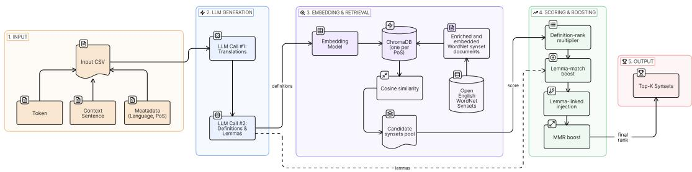
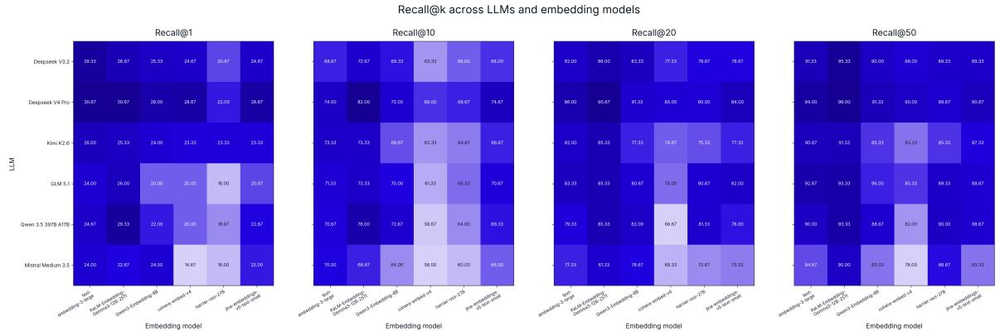

# Inspicio: Open-Vocabulary, LLM-Based Sense Retrieval for Historical Languages

Michele Ciletti

Department of Humanities, University of Foggia / Via Arpi 176, 71121 Foggia, Italy michele.ciletti@unifg.it

## Abstract

Word Sense Disambiguation has advanced rapidly for English and a handful of wellresourced modern languages, but it continues to assume the existence of a sense inventory and a word-to-sense mapping in the source language (Navigli, 2026). These assumptions break down for most historical and low-resource languages, whose dedicated WordNets are either incomplete or still under construction. We present INSPICIO, an open-vocabulary retrieval pipeline that links tokens in context to synsets of the Open English WordNet (McCrae et al., 2020) without requiring any source-language inventory or mapping. For each occurrence, an instruction-tuned LLM produces two English translations of the surrounding sentence, a small set of candidate dictionary-style definitions, and a few candidate English lemmas. These outputs drive a hybrid retrieval step that combines dense definition–synset similarity, sparse lemma matching, and Maximal Marginal Relevance re-ranking. We evaluate the pipeline across a 6 × 6 grid of LLMs and sentence-embedding models on a new bilingual set of manually annotated Latin and Ancient Greek perception verbs, on the PREMOVE dataset(Farina, 2025), and on a diachronic sample of Italian. The best configuration reaches 96% Recall@50 on the perception-verb test set, with each component contributing measurable gains, and remains competitive in the out-ofdomain and cross-lingual settings.

## 1 Introduction

Word Sense Disambiguation (WSD) has made considerable progress over the past decade, in particular thanks to contextualized representations and Large Language Models (Navigli, 2009; Bevilacqua et al., 2021; Bejgu et al., 2024; Navigli, 2026). Standard formulations of these tasks share a set of strong infrastructural assumptions: (i) a sense inventory is available for the language under analysis; (ii) the ambiguous spans to be disambiguated are either marked or can be reliably identified; and (iii) a word-to-sense mapping lists the candidate senses for each span. Under these conditions, modern systems are able to reach high accuracy on English and a considerable number of well-resourced languages.

For most of the world’s languages, and for nearly all historical ones, these assumptions hold only partially. Comprehensive WordNets remain restricted to a handful of contemporary languages, and the largest cross-lingual evaluation framework for WSD currently covers only eighteen of them, all modern (Pasini et al., 2021). Building Wordnets by hand is expensive; automatic transfer approaches, typically following the expand method (Vossen, 2004; Pianta et al., 2002), often inherit coverage gaps and noise from the source.

In this paper we present INSPICIO, a retrieval pipeline that performs open-vocabulary sense retrieval for historical and low-resource languages without relying on a sense inventory in the source language. Given a token in context, INSPICIO prompts an LLM to translate the surrounding sentence into English, to propose a small set of candidate English definitions for the target word, and to suggest a few English lemmas that could render it in that context. These outputs are then used to query an embedding index built over the Open English WordNet (OEWN, McCrae et al., 2020). Retrieval is hybrid: dense similarity between LLM-generated definitions and synset documents is combined with sparse, lemma-based lookups, and the merged pool is diversified through Maximal Marginal Relevance to counteract the well-known fine granularity of WordNet senses. The choice of English as a pivot derives from the fact that the OEWN is the most extensively populated lexical-semantic network of its kind (McCrae et al., 2020), and it is the same pivot adopted by several bootstrapping projects that aim to create new Wordnets, including both the Latin and Ancient

Greek WordNets (Minozzi, 2017; Bizzoni et al., 2014). The pipeline is otherwise language-agnostic and runs in a fully zero-shot regime, requiring no sense-annotated data in the source language and therefore being equally applicable to other historical or under-resourced languages.

We evaluate INSPICIO on a curated set of 150 perception-verb tokens in Latin and Ancient Greek, manually annotated with gold OEWN synsets, and additionally on PREMOVE (Farina, 2025), a diachronic dataset of preverbed motion verbs spanning eight centuries of Latin and Greek literature. Finally, we test it against a small diachronic dataset of old and modern Italian to test its performance in an alternative setting. Our experiments are organized around one main and three secondary research questions:

RQ1. Can an LLM-driven, gloss-guided retrieval pipeline produce a high-recall candidate pool of OEWN synsets for historical language tokens without any source-language sense inventory or word-to-sense mapping?

RQ2. How do the choice of generative LLM and the choice of sentence-embedding model interact in determining retrieval quality?

RQ3. What is the relative contribution of dense (definition-based) and sparse (lemma-based) retrieval, and does their combination recover senses that either component would miss in isolation?

RQ4. Does a pipeline tuned on a semantically focused case study generalize to a more heterogeneous, naturalistically distributed dataset and to new languages?

The code, prompts, and evaluation data described in this paper are released on GitHub.<sup>1</sup>

## 2 Background and Related Work

## 2.1 LLM-based Word-Sense Disambiguation

With the rise of large instruction-tuned LLMs, many researchers have asked whether these models, pretrained on broad text corpora, retain a finegrained understanding of word senses. Several studies have investigated this question in zero- and few-shot regimes (Kocon et al.´ , 2023; Yae et al., 2025; Kibria et al., 2024; Capone et al., 2024).

A few consistent patterns are clear: model scale correlates strongly with disambiguation accuracy; prompt design has a non-negligible effect; and even the strongest systems are imperfect on rare or contextually subtle senses. Meconi et al. (2025) evaluated a range of open- and closed-weight LLMs and found that top systems such as GPT-4o approach the performance of specialized supervised models, while still trailing expert human annotators. Basile et al. (2025) reported analogous findings on a multilingual definition-selection benchmark derived from XL-WSD, also showing that a finetuned medium-sized LLM can surpass much larger zero-shot ones. Targeted prompting strategies that inject glosses and elicit chain-of-thought reasoning yield further gains (Sumanathilaka et al., 2025).

## 2.2 Word-Sense Disambiguation for Historical Languages

WSD for historical languages has long been constrained by sparse annotated data, dictionary inventories of fine granularity, and limited cross-lingual transferability. The first systematic study for Latin is the experiment of Bamman and Burns (2020), who fine-tuned Latin BERT on a binary sense classification task derived from the Lewis and Short dictionary, restricted to the two most frequent senses of each headword. Lendvai and Wick (2022) extended this line of work with a larger sample of senses drawn from the Thesaurus Linguae Latinae.

The manually annotated Latin portion of the SemEval-2020 Lexical Semantic Change dataset (Schlechtweg et al., 2020; McGillivray et al., 2022) opened the way to more elaborate strategies. Ghinassi et al. (2024) propagated WSD annotations from English to Latin through a parallel corpus, showing that automatically obtained labels can usefully complement gold data, especially on underrepresented senses. Ghizzota et al. (2025) compared zero-shot and fine-tuned generative LLMs on the same resource and confirmed that mediumsized fine-tuned models can match or exceed much larger zero-shot ones. In a complementary direction, Ghizzota et al. (2026) integrated the dataset into a Linguistic Knowledge Graph and tested Graph Retrieval-Augmented Generation for sense prediction, finding that the benefit of structured authorial and lexical metadata depends substantially on model size.

Dedicated studies for Ancient Greek are still few. Recent work has explored corpus-based and transformer-based methods (Mercelis et al., 2025)

and proposed semi-automatic pipelines for populating the Ancient Greek WordNet through LLMassisted annotation (Marchesi et al., 2025). Crosslinguistic experiments on Latin and Greek have addressed specific lexical classes, including preverbed motion verbs (Farina and Ciletti, 2025) and geographical common nouns (Farina et al., 2026), with the latter explicitly anchoring Latin and Greek tokens to English WordNet synsets through LLMdriven annotation.

## 2.3 Open-Vocabulary Word-Sense Disambiguation

A separate strand of research has questioned the infrastructural assumptions of classical WSD. Bejgu et al. (2024) formalised Word Sense Linking as a task in which the spans to be disambiguated are identified directly in raw text and linked to a reference inventory, without relying on a pre-existing word-to-sense mapping. Their retriever-reader architecture shows that it is feasible for English, but its performance degrades sharply when the sourcelanguage mapping is incomplete—a situation that is the norm rather than the exception for historical languages.

A few generative approaches have pushed this idea further by abandoning closed inventories altogether. Bevilacqua et al. (2020) framed WSD as a gloss generation task. Meconi et al. (2025) subsequently reported that LLMs explain word meanings substantially more accurately when allowed to produce free-form definitions than when forced to select from a fixed candidate list, reaching up to 98% accuracy in their most permissive setting.

INSPICIO’s pipeline fits within this landscape by assuming neither a source-language inventory nor a word-to-sense mapping; it relies on an LLM to produce English-language hypotheses about meaning, and on a sentence embedding model to align them with the Open English WordNet. The final output is therefore expressed in terms of a stable and interpretable lexical-semantic resource, while leaving the source side entirely inventory-free.

## 3 Methodology

INSPICIO processes one token at a time. Given a row consisting of a target token, its dictionary lemma, the sentence in which it occurs, and a language tag, the pipeline returns a ranked list of OEWN synsets, together with the intermediate artifacts that produced the ranking. Figure 1 summarises the architecture, which we describe in the following subsections. Hyperparameter values are reported as we introduce them; they were selected through iterative inspection of outputs (Section 4).

## 3.1 Translation and Hypothesis Generation

The first two stages query a generative LLM in a fully zero-shot setting. The first call asks the model to produce two English translations of the input sentence: a literal one, which stays close to sourcelanguage word order and lexical choices, and a natural one, which is fluent in modern English. We use a relatively high temperature $( T = 1 . 0$ , except for when the documentation of specific models explicitly requires a different value) to encourage variation between the two outputs. This step creates a bridge to English without committing to a single translation strategy: literal renderings can preserve etymological cues that help recover compositional meanings, whereas natural ones can often surface idiomatic readings that could otherwise be lost.

The second call provides the LLM with the original sentence, the target token, its lemma, and the two translations, and asks for two outputs: between one and three English dictionary-style definitions of the target word in context, ordered by likelihood, and between one and five candidate English lemmas or short multiword expressions (e.g. make up, look at) that could render the token in that occurrence. The prompt explicitly addresses wellknown pitfalls of LLM-based sense generation in light of recent findings (Meconi et al., 2025): it instructs the model to define the verb itself rather than the verb-plus-negation, to include both literal and metaphorical readings when ambiguity is real, and to keep verb semantics distinct from argument semantics. We lower the temperature $( T = 0 . 8 ) \ : \mathrm { s o }$ that the lexicographic output remains stable while still allowing the model to surface multiple plausible senses. Definitions and lemmas are returned as JSON.

## 3.2 Embedding and Dense Retrieval

We build four separate OEWN indexes (McCrae et al., 2020), one for each part-of-speech covered by the OEWN itself (nouns, verbs, adjectives, adverbs), under the assumption that the target token has already been PoS-tagged. Our experiments take into consideration the verb partition. Each synset is represented as a short document concatenating its lemmas, gloss, examples, hypernyms, and lexname; this representation outperformed gloss-only and lemma-only variants in preliminary tests. The documents are encoded with a sentence-embedding model (Section 5 lists the models compared) and stored in a ChromaDB collection. All embeddings are $L _ { \mathrm { { 2 } - \mathrm { { n o r m a l i s e d } } } } .$ so dot products coincide with cosine similarities.

  
Figure 1: Architecture of the INSPICIO pipeline, showing the transition from zero-shot translation to dense and sparse OEWN synset retrieval.

For each LLM-generated definition d, we embed it with the same encoder used for the synsets and retrieve its top N = 50 nearest synsets from the index. The value of N was chosen large enough to reliably include the gold synset on a development subsample, while remaining adjustable for downstream merging.

## 3.3 Definition-Rank Decay Scoring

A given synset may appear in the top-N of more than one definition. We aggregate its dense contributions through a weighted sum that respects the order returned by the LLM:

$$
\mathrm { S _ { b a s e } } ( s ) = \sum _ { d = 1 } ^ { D } w _ { d } \cdot \cos ( { \bf e } _ { d } , { \bf e } _ { s } ) ,\tag{1}
$$

where D is the number of definitions returned (between one and three), $\mathbf { e } _ { d }$ and $\mathbf { e } _ { s }$ are the embeddings of definition d and synset s, and $w _ { d }$ is a rank-decay weight. We set $\mathbf { w } = ( 1 . 0 , 0 . 7 5 , 0 . 5 )$ , reflecting the prompt instruction that the first definition encodes the model’s most likely reading. The similarity is taken only over those definitions for which s entered the top-N pool; reusing the retrieval list, instead of re-encoding the full pool against every definition, gave comparable rankings at a fraction of the cost.

## 3.4 Sparse Lemma-Based Retrieval

In parallel with dense retrieval, the candidate English lemmas produced in the second LLM call are used to query a precomputed inverted index that maps each English lemma to the set of synsets containing it. This index is built once from the ChromaDB metadata and cached on disk. The lemma pool augments the dense one with synsets that may be semantically distant in embedding space, but lexically anchored through translation. Such synsets are common when the source-language token has an idiomatic English counterpart that no single definition captures fully.

## 3.5 Merging and Final Scoring

The dense and sparse pools are merged into a single candidate set. Each synset s receives a final score

$$
\begin{array} { r } { \mathrm { S } _ { \mathrm { f i n a l } } ( s ) = \left\{ \begin{array} { l l } { \mathrm { S } _ { \mathrm { b a s e } } ( s ) \cdot ( 1 + \gamma \cdot \mathbf { 1 } [ s \in \mathcal { L } ] ) } \\ { \quad \mathrm { i f } \mathrm { S } _ { \mathrm { b a s e } } ( s ) > 0 , } \\ { \quad \beta } \\ { \quad \mathrm { i f } \mathrm { S } _ { \mathrm { b a s e } } ( s ) = 0 \mathrm { a n d } s \in \mathcal { L } , } \end{array} \right. } \end{array}\tag{2}
$$

where L denotes the lemma-matched set, $\gamma = 0 . 8$ is a boost applied to synsets that are both densely and lexically supported, and $\beta = 0 . 6 5$ is a fixed fallback score for synsets retrieved only through the lemma index. The fallback prevents lemma-only candidates from being silently discarded, while keeping them below the dense-and-lemma combination in the ranking. The values of $\gamma$ and $\beta$ were tuned on the development sample. The merged pool is truncated to the top 500 synsets by $\mathrm { S _ { f i n a l } }$ before the next stage.

## 3.6 Diversification with Maximal Marginal Relevance

OEWN exhibits well-known granularity issues, with closely related senses often distinguished by subtle nuances (Bejgu et al., 2024; Navigli, 2026). A relevance-only ranking therefore tends to fill the top-K with near-duplicate senses of the dominant reading. We re-rank the merged pool with Maximal Marginal Relevance (Carbonell and Goldstein, 1998):

$$
\begin{array} { r l } & { \mathrm { M M R } ( s ) \ = \lambda \cdot \mathrm { S } _ { \mathrm { f i n a l } } ( s ) } \\ & { \phantom { \frac { 1 } { 2 } } - \ ( 1 - \lambda ) \cdot \underset { s ^ { \prime } \in S } { \operatorname* { m a x } } \cos ( \mathbf { e } _ { s } , \mathbf { e } _ { s ^ { \prime } } ) , } \end{array}\tag{3}
$$

where S is the set of already-selected synsets. We set $\lambda = 0 . 8 ,$ a relevance-leaning value that introduces enough diversity to break clusters of nearidentical senses while preserving the top of the ranking. The final list is truncated to $K = 5 0$

## 3.7 Output and Auditability

For every input token the pipeline writes a JSON record containing the two translations, the generated definitions and candidate lemmas, the top-K synsets with their final and base scores, the lemmamatch flag, and the per-definition contributions. Every prediction is therefore inspectable, which supports downstream lexicographic reuse: a curator who disagrees with the top-1 can trace which definition or lemma drove the result and decide whether to revise the prompt, the gloss, or even the gold annotation.

## 4 Data

## 4.1 A Bilingual Perception-Verb Evaluation Set

The scarcity of sense-annotated resources for Latin and Ancient Greek is a recurring obstacle in this line of work. For Latin, one of the only manually annotated datasets of any size that is mapped to a WordNet inventory is the Latin portion of the SemEval-2020 Lexical Semantic Change benchmark (Schlechtweg et al., 2020; McGillivray et al., 2022), whose mapping to LWN was added a posteriori. The PREMOVE dataset (Farina, 2025) contributes around 2,800 manually annotated tokens of Latin and Ancient Greek preverbed motion verbs, with senses encoded as OEWN synsets. No other comparably curated resources exist.

To support a focused evaluation of INSPICIO we built a new bilingual dataset of 150 perceptionverb tokens, with 72 Latin and 78 Ancient Greek instances. The tokens were sampled from the PRE-MOVE Base Corpus (Farina, 2025), which is balanced across periods, genres, and authors for both languages. This balancing carries over to our sample, which therefore spans Archaic to Late Greek and Early to Post-Classical Latin.

We targeted perception verbs for three reasons. First, verbs are a particularly polysemous part of speech, which makes them consistently challenging to disambiguate (Haber and Poesio, 2024). Second, perception verbs combine concrete sensory meanings with a rich layer of metaphorical and mentalstate extensions: Lat. video¯ and AGr. horáo¯ occur both in literal ‘see’ readings and in inferential ‘understand, realise’ ones, which makes them a natural stress test for a pipeline that must separate literal from figurative senses. Third, perception is a cognitively universal domain whose lexicalisations are well represented in the OEWN, whereas culturally specific items, often nouns (e.g. the Lat. consul), have no fitting synset and would force annotators to invent one or to refuse annotation. Lexical anchors were drawn from Levin (1993)’s class 30.1, excluding olfactory and gustatory verbs because of corpus sparsity: Lat. audio¯ / AGr. akoúo¯, Lat. video¯ / AGr. horáo¯, Lat. prefixed compounds in -spicio¯ / AGr. blépo¯, and Lat. sentio¯ / AGr. aisthánomai.

Annotation. Each occurrence was independently annotated by two annotators, both trained linguists with prior experience in semantic annotation. For every token, the annotators selected the most appropriate OEWN synset given the original context, with access to the full sentence and, when useful, to the surrounding passage. Disagreements were resolved after a round of review to produce a single gold synset per occurrence. Inter-annotator agreement was computed on the two-annotator labels using Cohen’s κ (Cohen, 1960; Artstein and Poesio, 2008) and reached $\kappa = 0 . 8 9 5$ , in the upper range of values typically reported for fine-grained WordNet annotation (Passonneau et al., 2010).

## 4.2 Out-of-Domain Evaluation: PREMOVE

To test whether the pipeline generalises beyond a curated, semantically narrow sample, we additionally evaluate on PREMOVE (Farina, 2025), a manually annotated, diachronic dataset of Latin and Ancient Greek preverbed motion verbs spanning the 8th century BCE to the 2nd century CE. Its sense annotations are encoded directly as OEWN synsets, which makes the resource immediately compatible with our setup. PREMOVE is narrow in scope, covering a single verb domain, but its tokens are naturalistically distributed: their frequency profile is Zipfian, metaphorical readings such as evenio ‘happen’ or invenio ‘find’ are well represented, and the genre and authorial range is as wide as that of our curated sample. It is therefore an informative stress test of a system tuned on a semantically

focused case study.

## 4.3 Cross-Lingual Test: Diachronic Italian

A final evaluation extends INSPICIO to a new language and a different temporal range. We collected 100 Italian motion-verb tokens from the diachronic MIDIA corpus (Iacobini and D’Achille, 2022), sampled so as to match, where possible, the Latin lemmas that appear in PREMOVE (e.g. Lat. incurro → It. incorrere). The two sets are therefore comparable at their lexical entry points, but differ sharply in semantic transparency: Italian descendants of Latin preverbed motion verbs have undergone substantial lexicalisation and figurative drift, so a much smaller proportion of their occurrences retains a literal motion reading. The temporal coverage of the Italian sample, from latemedieval to contemporary, puts additional pressure on the LLM’s ability to handle diachronic variation in a language for which pretraining data is unevenly distributed across periods.

Annotation followed the same protocol as for Latin and Ancient Greek, with two annotators selecting OEWN synsets in context. Cohen’s κ on the two-annotator labels reached 0.914.

## 5 Experiments and Results

We evaluate INSPICIO on the three datasets introduced in Section 4. The main experiment tests the pipeline on the perception-verb test set across different models, and is designed to address RQ1 and RQ2 jointly. The PREMOVE and Italian evaluations target RQ4, and a final ablation study addresses RQ3.

Models and Experimental Setup. We pair six instruction-tuned LLMs with six sentenceembedding models. The LLMs were chosen to cover the current state of the art among recent open-weights, high-parameter systems that support chain-of-thought reasoning, an ability that recent work has identified as a strong predictor of disambiguation accuracy (Farina, 2025): DeepSeek V3.2<sup>2</sup>, DeepSeek V4 Pro<sup>3</sup>, Kimi K2.6<sup>4</sup>, GLM 5.1<sup>5</sup>, Qwen 3.5 397B A17B<sup>6</sup>, and Mistral

Medium 3.5<sup>7</sup>. All models are queried through their official API providers with the default decoding parameters listed in their documentation; the prompts are identical across systems and are reported in Appendix A. The embedding models cover both closed and open systems, and were selected to span different training regimes and parameter counts: text-embedding-3-large<sup>8</sup>, KaLM-Embedding-Gemma3-12B-2511<sup>9</sup>, Qwen3- Embedding-8B<sup>10</sup>, Cohere Embed v4<sup>11</sup>, Harrier-OSS-27B<sup>12</sup>, and jina-embeddings-v5-text-small<sup>13</sup>. For the embedding models that supported it, we included a short query prompt (see Appendix A). All other pipeline hyperparameters (Section 3) are held fixed across runs. We report Recall@k at k ∈ {1, 10, 20, 50}, with k = 50 as the headline metric.

Perception Verbs. Table 1 reports Recall@50 for every ⟨LLM, embedding⟩ pair, and Figure 2 shows the corresponding heatmaps at k ∈ {1, 10, 20, 50}. The best combination is DeepSeek V4 Pro with KaLM-Embedding-Gemma3-12B, which reaches 96% Recall@50. KaLM is the strongest embedding for five of the six LLMs, while DeepSeek V4 Pro is the strongest LLM in four of the six embedding columns.

PREMOVE Case Study. We then apply the best combination to PREMOVE in order to test whether performance carries over to a more heterogeneous, naturalistically distributed sample. Recall@50 reaches 81.65% (Table 2), roughly 15 points below the perception-verb result. The gap is consistent with the broader semantic spread of motion verbs, the Zipfian sense distribution of the dataset, and the diachronic and metaphorical drift that affects preverbed forms (Farina and Ciletti, 2025).

Diachronic Italian. The same combination is finally evaluated on the diachronic Italian set (Table 2). Recall@50 reaches 91%, higher than the

PREMOVE result. The outcome is informative given the linguistic distance and diachronic shift involved: most descendants of Latin preverbed motion verbs have undergone substantial lexicalisation, and many tokens occur in figurative or grammaticalised readings that no longer involve literal motion; furthermore, the diachronic stratification of the data means that the tested tokens present widely different meanings across their occurrences in the dataset. Thus, the English-pivot strategy remains effective when the source language is itself well represented in the LLM’s pretraining.

Ablation Tests. We isolate the contribution of individual pipeline components through four ablation tests, run with the best combination on the perception-verb test set (Table 2). Removing the translation stage produces the sharpest drop, to 92%, indicating that the literal/natural translation pair contributes information that the gloss generator alone does not recover. However, such a performance gap may be acceptable in certain cases considering that only a single LLM call (where the model directly identifies candidate definitions and lemmas) is needed, halving the inference cost. Removing the lemma boost causes another drop, to 94%: dense and sparse retrieval recover synsets that neither component reaches in isolation, which answers positively to RQ3. Disabling the definition-rank decay (uniform weights across the three definitions) doesn’t seem to decrease performance, as well as disabling MMR. These two parameters are the most subject to model selection and data distribution: MMR can help surface rare senses, which may not always be needed, and definition-rank decay largely depends on the tendency of the LLM to generate relatively similar or markedly different definitions. We retain MMR in the default configuration, since it noticeably diversifies the top of the ranking without harming aggregate recall, and a diverse top-K is deemed preferable for downstream lexicographic inspection.

## 6 Discussion

## 6.1 Qualitative Error Analysis

A close reading of the cases in which the gold synset falls below the top-K shows a few recurring patterns. The pipeline rarely fails because the LLM misunderstands the sentence; more often, it produces a semantically appropriate definition that is nonetheless slightly different from the gold synset in OEWN’s fine-grained sense space. A representative example is Lat. provideo¯ in a context where the gold synset is oewn-01185006-v, glossed as “give what is desired or needed, especially support, food or sustenance”. The model returns the definition “make preparations to meet future needs by supplying necessary items”, which is paraphrastically close to the gold gloss but does not surface any of the synset’s lemmas (cater, ply, provide, supply). The candidate lemmas it does propose (provide for, make provision for, take care of, see to, arrange for) all match adjacent synsets, which then occupy higher positions in the ranking. This kind of failure is largely a granularity artefact of the type already noted by Bejgu et al. (2024) and Navigli (2026), and confirms that the lemma signal is complementary to the dense one rather than redundant: when both align, the gold synset surfaces more easily; when only the definition matches, the ranking is dominated by lexically similar neighbours.

Two systematic biases emerged during prompt development and were addressed before the final evaluation. The first concerns a failure in interpreting co-composition (Pustejovsky, 2012). In preliminary runs, the model tended to incorporate the semantics of the verb’s arguments into the definition of the verb itself: Lat. itero¯ in itero coni-¯ ugium (literally to repeat a marriage) was glossed as “to remarry”, although itero¯ simply means “to do again” and the marital reading arises entirely from coniugium. The second concerns negation, which the model occasionally treated as part of the verb’s lexical content, returning the antonymic sense for negated occurrences. Explicit prompt instructions to keep verb semantics separate from argument semantics, and to define the verb independently of any negation in its context, removed both biases on our development sample. The hybrid scoring scheme makes the pipeline more tolerant to residual noise of this kind: when the definition is mildly off, lemma overlap can still pull the correct synset into the top-K, and vice versa.

## 6.2 Future Perspectives

A natural next step is a second-stage reranker: an LLM-based judge that, given the top-K candidates and the original context, selects one or two definitive synsets. Comparable architectures have proven effective for historical languages (Ghizzota et al., 2025; Farina, 2025; Farina et al., 2026), and the high-recall pool produced by INSPICIO is well suited to a reranking stage of this type. The combination would close the gap between candidate retrieval and final disambiguation, while preserving the open-vocabulary character of the upstream pipeline.

<table><tr><td></td><td colspan="6">Embedding model</td></tr><tr><td>LLM</td><td>OpenAI 3-large</td><td>KaLM 12B</td><td>Qwen3 8B</td><td>Cohere v4</td><td>Harrier 27B</td><td>Jina v5</td></tr><tr><td>DeepSeek V3.2</td><td>91.33</td><td>95.33</td><td>90.00</td><td>88.00</td><td>89.33</td><td>89.33</td></tr><tr><td>DeepSeek V4 Pro</td><td>94.00</td><td>96.00</td><td>91.33</td><td>90.00</td><td>88.67</td><td>90.67</td></tr><tr><td>Kimi K2.6</td><td>90.67</td><td>91.33</td><td>85.33</td><td>83.33</td><td>85.33</td><td>87.33</td></tr><tr><td>GLM 5.1</td><td>92.67</td><td>93.33</td><td>86.00</td><td>85.33</td><td>89.33</td><td>88.67</td></tr><tr><td>Qwen 3.5</td><td>90.00</td><td>93.33</td><td>88.67</td><td>82.00</td><td>90.00</td><td>88.67</td></tr><tr><td>Mistral Medium 3.5</td><td>84.67</td><td>90.00</td><td>83.33</td><td>78.00</td><td>86.67</td><td>83.33</td></tr></table>

Table 1: Recall@50 (%) on the 150-token perception-verb test set, for every combination of LLM (rows) and sentence-embedding model (columns). The best cell is highlighted.

  
Figure 2: Recall@k heatmaps on the perception-verb test set, for $k \in \{ 1 , 1 0 , 2 0 , 5 0 \}$ . Rows correspond to LLMs and columns to embedding models. Cell shading maps to relative performance within each individual metric, darker colours indicate higher recall.

<table><tr><td>Configuration</td><td>Recall@50</td><td>Recall@20</td></tr><tr><td>Case Studies</td><td></td><td></td></tr><tr><td>PREMOVE</td><td>81.65</td><td>74.91</td></tr><tr><td>Diachronic Italian</td><td>91.00</td><td>84.00</td></tr><tr><td>Ablation Tests</td><td></td><td></td></tr><tr><td>Full pipeline</td><td>96.00</td><td>90.67</td></tr><tr><td>— translation stage</td><td>92.00</td><td>83.33</td></tr><tr><td>— definition-rank decay</td><td>96.00</td><td>90.00</td></tr><tr><td>— lemma boost</td><td>94.00</td><td>85.33</td></tr><tr><td>— MMR re-ranking</td><td>96.67</td><td>90.67</td></tr></table>

Table 2: Recall@50 (%) of the best combination (DeepSeek V4 Pro + KaLM-Embedding-Gemma3- 12B-2511) on the out-of-domain (PREMOVE) and cross-lingual (Italian) test sets, and ablations on the perception-verb set.

Once such a reranker is in place, the pipeline can act as a generator of silver-standard sense annotations for languages that currently lack any. Annotation propagation through automatic means has already been shown to complement gold data productively for historical languages (Ghinassi et al.,

2024); an open-vocabulary system would remove the requirement of an existing sense inventory in the source language. The resulting silver datasets, together with the intermediate artefacts that IN-SPICIO already logs, could in turn feed the bootstrapping of dedicated WordNets for these languages, along the lines of existing efforts behind the Latin and Ancient Greek WordNets (Marchesi et al., 2025; Santoro et al., 2025). The pipeline would thus contribute to building the very resources whose absence motivates it in the first place. It is important to stress that the pipeline is designed to work in a zero-shot setting, addressing real-world conditions where sense-annotated data may not be available for historical languages. However, supervised fine-tuning strategies may be explored where possible to further improve performance and linguistic understanding. Again, recent advances in agentic LLMs make it an interesting possibility to test the retrieval part of our pipeline in an unconstrained, autonomous setting.

## Limitations

Our evaluation focuses on verbs, which are a particularly polysemous part of speech (Haber and

Poesio, 2024). The architecture is agnostic to part of speech, and four OEWN indexes are already in place, but additional evaluations on nouns, adjectives, and adverbs would strengthen the generality of our findings.

The pipeline relies on LLM predictions at two consecutive stages, and is therefore stochastic. A misinterpretation produced at translation time can propagate to gloss generation and, from there, to retrieval. The translation stage in particular requires a relatively high sampling temperature, since the literal/natural pair is meant to expose lexical and stylistic variation. This design choice introduces a degree of run-to-run variability that more deterministic pipelines do not face. The auditability of the intermediate outputs partly mitigates this issue, in that any failure can be traced back to the specific stage at which it originated, but does not eliminate it.

Finally, routing through English is a deliberate compromise. The OEWN is the most extensively populated lexical-semantic resource of its kind (McCrae et al., 2020), and serves as the pivot of several bootstrapping projects for historical and low-resource languages (Minozzi, 2017; Bizzoni et al., 2014), but its inventory still reflects the lexicalisation patterns of contemporary English. Some source-language senses have no perfect English counterpart, and our pipeline can at best return the closest available synset in such cases. As discussed above, the natural mid-term solution is the incremental construction of dedicated sense inventories for the languages of interest, a process that INSPI-CIO itself can help support.

## Acknowledgments

## References

Ron Artstein and Massimo Poesio. 2008. Survey article: Inter-coder agreement for computational linguistics. Computational linguistics, 34(4):555–596.

David Bamman and Patrick J. Burns. 2020. Latin bert: A contextual language model for classical philology. Preprint, arXiv:2009.10053.

Pierpaolo Basile, Lucia Siciliani, Elio Musacchio, and Giovanni Semeraro. 2025. Exploring the word sense disambiguation capabilities of large language models. arXiv preprint arXiv:2503.08662.

Andrei Stefan Bejgu, Edoardo Barba, Luigi Procopio, Alberte Fernández-Castro, and Roberto Navigli. 2024. Word sense linking: Disambiguating outside the sandbox. In Findings ofthe Associationfor

Computational Linguistics: ACL 2024, pages 14332– 14347.

Michele Bevilacqua, Marco Maru, and Roberto Navigli. 2020. Generationary or “how we went beyond word sense inventories and learned to gloss”. In Proceedings ofthe 2020 Conference on Empirical Methods in Natural Language Processing (EMNLP), pages 7207–7221, Online. Association for Computational Linguistics.

Michele Bevilacqua, Tommaso Pasini, Alessandro Raganato, and Roberto Navigli. 2021. Recent trends in word sense disambiguation: A survey. In IJCAI, pages 4330–4338.

Yuri Bizzoni, Federico Boschetti, Harry Diakoff, Riccardo Del Gratta, Monica Monachini, and Gregory R Crane. 2014. The making of ancient greek wordnet. In LREC, volume 2014, pages 1140–1147.

Luca Capone, Serena Auriemma, Martina Miliani, Alessandro Bondielli, and Alessandro Lenci. 2024. Lost in disambiguation: How instruction-tuned LLMs master lexical ambiguity. In Proceedings of the Tenth Italian Conference on Computational Linguistics (CLiC-it 2024), pages 148–156, Pisa, Italy. CEUR Workshop Proceedings.

Jaime Carbonell and Jade Goldstein. 1998. The use of mmr, diversity-based reranking for reordering documents and producing summaries. In Proceedings ofthe 21st Annual International ACM SIGIR Conference on Research and Development in Information Retrieval, SIGIR ’98, page 335–336, New York, NY, USA. Association for Computing Machinery.

Jacob Cohen. 1960. A coefficient of agreement for nominal scales. Educational and psychological measurement, 20(1):37–46.

Andrea Farina. 2025. Premove–a diachronic dataset of ancient greek and latin annotated preverbed motion verbs.

Andrea Farina and Michele Ciletti. 2025. Probing preverbs: Evaluating large language models on latin and ancient greek preverbed motion verbs. Proceedings of Historical Languages and AI. March 5–6, 2026, Humboldt University Berlin (Germany).

Andrea Farina, Michele Ciletti, Barbara McGillivray, and Andrea Ballatore. 2026. Sense-based annotation of geographical nouns in ancient greek and latin: A diachronic study with llms. In Proceedings of the 10th Joint SIGHUM Workshop on Computational Linguistics for Cultural Heritage, Social Sciences, Humanities and Literature 2026, pages 266–279.

Iacopo Ghinassi, Simone Tedeschi, Paola Marongiu, Roberto Navigli, and Barbara McGillivray. 2024. Language pivoting from parallel corpora for word sense disambiguation of historical languages: A case study on Latin. In Proceedings of the 2024 Joint

International Conference on Computational Linguistics, Language Resources and Evaluation (LREC-COLING 2024), pages 10073–10084, Torino, Italia. ELRA and ICCL.

Eleonora Ghizzota, Pierpaolo Basile, Lucia Siciliani, and Giovanni Semeraro. 2025. The meaning of beatus: Disambiguating latin with contemporary ai models. In Proceedings of the Eleventh Italian Conference on Computational Linguistics (CLiC-it 2025), pages 469–479.

Eleonora Ghizzota, Paola Marongiu, Pierpaolo Basile, Stefano Ferilli, and Barbara McGillivray. 2026. Linguistic knowledge graphs for sense prediction: A case-study on latin. In Proceedings ofthe Fifteenth Language Resources and Evaluation Conference (LREC 2026), pages 10937–10952, Palma, Mallorca, Spain. European Language Resources Association (ELRA).

Janosch Haber and Massimo Poesio. 2024. Polysemy—evidence from linguistics, behavioral science, and contextualized language models. Computational Linguistics, 50(1):351–417.

Claudio Iacobini and Paolo D’Achille. 2022. Il corpus midia: concezione, realizzazione, impieghi. In Corpora e Studi Linguistici, pages 207–221, Milano. Officina.

Raihan Kibria, Sheikh Intiser Uddin Dipta, and Muhammad Abdullah Adnan. 2024. On functional competence of LLMs for linguistic disambiguation. In Proceedings ofthe 28th Conference on Computational Natural Language Learning, pages 143–160, Miami, FL, USA. Association for Computational Linguistics.

Jan Kocon, Igor Cichecki, Oliwier Kaszyca, Mateusz´ Kochanek, Dominika Szydło, Joanna Baran, Julita Bielaniewicz, Marcin Gruza, Arkadiusz Janz, Kamil Kanclerz, Anna Kocon, Bartłomiej Koptyra, Wik-´ toria Mieleszczenko-Kowszewicz, Piotr Miłkowski, Marcin Oleksy, Maciej Piasecki, Łukasz Radlinski,´ Konrad Wojtasik, Stanisław Wo´zniak, and Przemysław Kazienko. 2023. Chatgpt: Jack of all trades, master of none. Information Fusion, 99:101861.

Piroska Lendvai and Claudia Wick. 2022. Finetuning Latin BERT for word sense disambiguation on the thesaurus linguae latinae. In Proceedings ofthe Workshop on Cognitive Aspects ofthe Lexicon, pages 37– 41, Taipei, Taiwan. Association for Computational Linguistics.

Beth Levin. 1993. English verb classes and alternations: A preliminary investigation. University of Chicago press.

Beatrice Marchesi, Annachiara Clementelli, Andrea Maurizio Mammarella, Silvia Zampetta, Erica Biagetti, Luca Brigada Villa, Virginia Mastellari, Riccardo Ginevra, Claudia Roberta Combei, and Chiara Zanchi. 2025. Towards the semi-automated population of the ancient greek wordnet. In Proceedings of the Eleventh Italian Conference on Computational Linguistics (CLiC-it 2025), pages 647–658.

John Philip McCrae, Alexandre Rademaker, Ewa Rudnicka, and Francis Bond. 2020. English wordnet 2020: Improving and extending a wordnet for english using an open-source methodology. In proceedings ofthe LREC 2020 workshop on multimodal WordNets (MMW2020), pages 14–19.

Barbara McGillivray, Daria Kondakova, Annie Burman, Francesca Dell’Oro, Helena Bermúdez Sabel, Paola Marongiu, and Manuel Márquez Cruz. 2022. A new corpus annotation framework for latin diachronic lexical semantics. Journal ofLatin Linguistics, 21(1):47– 105.

Domenico Meconi, Simone Stirpe, Federico Martelli, Leonardo Lavalle, and Roberto Navigli. 2025. Do large language models understand word senses? In Proceedings of the 2025 Conference on Empirical Methods in Natural Language Processing, pages 33897–33916, Suzhou, China. Association for Computational Linguistics.

Wouter Mercelis, Toon Van Hal, and Alek Keersmaekers. 2025. Tongue, Language or Noise? Word Sense Disambiguation in Ancient Greek with Corpus-Based Methods, pages 813–828. De Gruyter.

Stefano Minozzi. 2017. Latin wordnet, una rete di conoscenza semantica per il latino e alcune ipotesi di utilizzo nel campo dell’information retrieval. Strumenti digitali e collaborativi per le Scienze dell’Antichita, 14:123–134.

Roberto Navigli. 2009. Word sense disambiguation: A survey. ACM computing surveys (CSUR), 41(2):1– 69.

Roberto Navigli. 2026. Is word sense disambiguation dead in the llm era? In Proceedings ofthe AAAI Conference on Artificial Intelligence, volume 40, pages 39753–39762.

Tommaso Pasini, Alessandro Raganato, and Roberto Navigli. 2021. Xl-wsd: An extra-large and crosslingual evaluation framework for word sense disambiguation. In Proceedings of the AAAI Conference on Artificial Intelligence, volume 35, pages 13648– 13656.

R. Passonneau, Ansaf Salleb-Aouissi, Vikas Bhardwaj, and Nancy Ide. 2010. Word sense annotation of polysemous words by multiple annotators. Proceedings of the Language Resources and Evaluation Conference.

Emanuele Pianta, Luisa Bentivogli, and Christian Girardi. 2002. Multiwordnet: developing an aligned multilingual database. In First international conference on global WordNet, pages 293–302.

James Pustejovsky. 2012. Co-composition ality in grammar. In Wolfram Hinzen, Edouard Machery, and Markus Werning, editors, The Oxford Handbook of Compositionality. Oxford University Press.

"natural": "string"   
}}

Daniela Santoro, Beatrice Marchesi, Silvia Zampetta, Marco Del Tredici, Erica Biagetti, Eleonora Litta, Claudia Roberta Combei, Stefano Rocchi, Tullio Facchinetti, and Riccardo Ginevra. 2025. Exploring latin wordnet synset annotation with llms. In Proceedings ofthe 13th Global Wordnet Conference, pages 66–76.

Dominik Schlechtweg, Barbara McGillivray, Simon Hengchen, Haim Dubossarsky, and Nina Tahmasebi. 2020. SemEval-2020 task 1: Unsupervised lexical semantic change detection. In Proceedings of the Fourteenth Workshop on Semantic Evaluation, pages 1–23, Barcelona (online). International Committee for Computational Linguistics.

T. G. D. K. Sumanathilaka, Nicholas Micallef, and Julian Hough. 2025. Can llms assist with ambiguity? a quantitative evaluation of various large language models on word sense disambiguation. Preprint, arXiv:2411.18337.

PTJM Vossen. 2004. Eurowordnet: a multilingual database of autonomous and language-specific wordnets connected via inter-lingual-index. international journal of Lexicography, 17(2):161–174.

Jung H Yae, Nolan C Skelly, Neil C Ranly, and Phillip M LaCasse. 2025. Leveraging large language models for word sense disambiguation. Neural Computing and Applications, 37(6):4093–4110.

## A Prompts

This appendix presents the complete prompt templates used for all models, formatted in Markdown for clarity and reproducibility. Three prompts are presented: the translation prompt, the definition and lemma generation prompt, and the embedding prompt (only used with models that supported it).

## A.1 Translation Prompt

You are an expert translator specializing in {language}.

\# TASK: Translate the given sentence into English in TWO ways:

1. a literal translation that stays close to the source wording

2. a natural translation that sounds fluent in modern English

Focus on correctly representing the literal and metaphorical meanings of specific words.

\# OUTPUT: Return ONLY valid JSON with exactly these keys:

```twig
{{
"literal": "string",
```

No commentary, no markdown, no extra keys.

## A.2 Definition and Lemma Generation Prompt

You are an expert lexicographer and linguist specializing in {language} semantics.

\# TASK:

You will be given:

\- a target token

\- its dictionary lemma

\- the original sentence it occurs in

\- TWO proposed English translations of the sentence - one literal, one natural.

Using all of this context, produce:

1. 1 to 3 possible English dictionary-style definitions of the target word in this context, ordered by likelihood (most likely first). Each definition must be a phrase that fully captures and explains the sense. Example: "she ran all the way home" -> "move rapidly from one place to another"

2. 1 to 5 candidate English lemmas or short expressions (1–2 words, e.g. "make up", "go out") that could translate the token in this context.

\# GUIDELINES:

\- Be specific and detailed enough to distinguish senses.

\- Account for negation: define the verb’s meaning, not its truth value. Example: "she didn’t run" -> "move at a speed faster than a walk", not "stand still".

\- Account for metaphorical meanings: when in doubt, include both literal and metaphorical definitions. Example: "she saw a risk in his plan" -> "perceive a situation mentally" works better than "perceive by sight".

\- Beware of distinguishing the actual meaning of a verb from those of its arguments.

\- Examples: "He shed a few tears" -> "let fall, emit" is the right choice, not "cry", which would absorb the meaning of "tears".

\- However, "She threw a party" -> "organize an event" is appropriate, just like "She caught a cold" -> "get struck by an illness", as those are actual meanings conveyed by the verbs.

\- Avoid unnecessary contextual information: "She ate the cake gleefully" -> "take in food", not "take in food in a joyous manner".

- However, "He devoured the cake"   
-> "eat quickly and hungrily" is correct,   
because the specific manner of eating   
is a core semantic feature inherently   
lexicalized in the verb itself.

- If there is genuine ambiguity,   
include multiple definitions; otherwise   
output 1.

\- Keep outputs precise and consistent.

\# OUTPUT:

Return ONLY valid JSON with exactly these keys:

"definitions": ["def1", "def2",   
"def3"],

"candidate\_lemmas": ["lemma1",   
"lemma2", "lemma3", "lemma4", "lemma5"]   
}}

No commentary, no markdown, no extra keys.

## A.3 Embedding Prompt

Given a dictionary definition, retrieve the WordNet synset that best matches its meaning.