# Instella-MoE Technical Report

Jiang Liu ⋆▲, Sudhanshu Ranjan ▲, Prakamya Mishra ▲, Yonatan Dukler ▲, Gowtham Ramesh ▲, Jialian Wu, Ximeng Sun, Wen Xie, Chaojun Hou, Vikram Appia, Zhenyu Gu, Zicheng Liu ▲, Emad Barsoum

⋆ Project lead ▲ Core contributors

In this work, we introduce Instella-MoE, a fully open Mixture-of-Experts (MoE) language model with 16 billion total parameters and 2.8 billion active parameters per token, trained entirely from scratch on AMD Instinct™ MI300X and MI325X GPUs. Instella-MoE combines a sparsely activated MoE design with architectural and system-level innovations, including Gated Multi-head Latent Attention (Gated MLA) and FarSkip-Collective connectivity, enabling eficient large-scale training and inference. The model is developed through a multi-stage pipeline comprising pre-training, mid-training, long-context extension, supervised fine-tuning with feedback-driven data curation, direct preference optimization, and reinforcement learning with Multi-Teacher On-Policy Distillation. Instella-MoE achieves an average score of 76.7 across standard pre-training benchmarks, outperforming prior fully open models including OLMo-3-7B, SmolLM3-3B, and OLMoE-1B-7B, while remaining competitive with open-weight MoE and dense baselines at comparable active-parameter scales, including Moonlight-16B-A3B and Qwen3.5-4B. After post-training, our final Think checkpoint achieves an average score of 73.2 across instruction-following, reasoning, math, coding, and chat benchmarks, outperforming both fully open and open-weight models with comparable or larger active-parameter counts in our evaluation. To support transparent and reproducible research, we release the complete Instella-MoE model flow, including model weights, training configurations, data mixtures, and training code. Together, these contributions establish Instella-MoE a strong, fully open foundation for eficient, high-performing MoE models and reproducible research.

$$
\therefore { \mathrm { ~  ~ \sigma ~ } } _ { \mathrm { { M o d e l s } } } \quad \mathrm { ~  ~ \Omega ~ } _ { \mathrm { { C o d e } } } \quad \quad \pmb { \sigma } _ { \mathrm { { B l o g } } }
$$

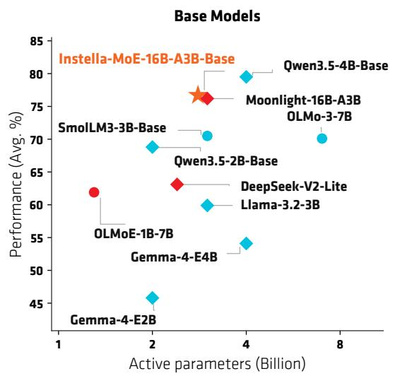

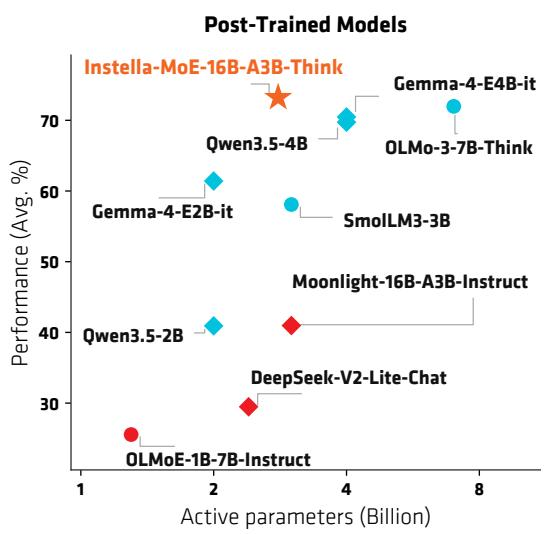  
Figure 1: Performance vs. active parameters. Left: base models. Right: post-trained models. Color distinguishes MoE and dense architectures; marker shape distinguishes fully open and open-weight models.

## Contents

2 Instella-MoE   
2.1.1 Architecture Overview   
2.1.2 Gated Multi-head Latent Attention   
2.1.3 FarSkip-Collective Connectivity   
2.2 Training Pipeline Overview   
2.3 Training Infrastructure   
2.4 Pre-training .   
2.5 Mid-training . . 9   
2.6 Long-Context Extension 9   
2.7 Supervised Fine-Tuning 11   
2.8 Direct Preference Optimization 13   
2.9 Reinforcement Learning 13   
2.9.1 RL Infrastructure 14   
2.9.2 IF-specialized RL 14   
2.9.3 Multi-Teacher On-Policy Distillation . 15   
3 Results 16   
3.1 Base Model 16   
3.2 Post-Trained Model . 17   
3.3 Ablation Studies 18   
3.3.1 Architecture Ablation . 18   
3.3.2 Reinforcement Learning Ablation 18   
3.4 Training Eficiency 19   
4 Conclusion 19   
Acknowledgements 20   
A Overlapped Implementation of Instella-MoE 26   
B SFT Data Curation Details 26   
C Training Data Details 28

## 1 Introduction

The rapid advancement of artificial intelligence (AI), driven in large part by large language models (LLMs) (Gemini Team, 2026; OpenAI, 2026; Anthropic, 2026), has accelerated progress toward artificial general intelligence and transformed society at large. However, much of this progress continues to be led by proprietary releases (e.g., GPT-5.6 (OpenAI, 2026), Claude Fable 5 (Anthropic, 2026), Gemini 3.1 Pro (Gemini Team, 2026), and Muse Spark (Meta Superintelligence Labs, 2026)), where model weights and architecture are not released and training data, methods, and evaluation protocols remain opaque. While these models have set new state-of-the-art performance, their closed nature hinders scientific understanding, reproducibility, and equitable access.

In response, leading AI labs have increasingly released open-weight models whose trained parameters are available under permissive licenses. Recent systems such as GLM-5.3 (Z.ai Team, 2026), Qwen3.8-Max (Qwen Team, 2026b), Kimi K3 (Moonshot AI, 2026), Gemma 4 (Gemma Team, 2026), DeepSeek-V4 (DeepSeek-AI, 2026), Llama 4 (Meta AI, 2025), and Mistral Large 3 (Mistral AI, 2025) demonstrate that high-performing models are increasingly available outside proprietary labs. Yet most of these releases remain open-weight rather than fully open: their pre-training corpora, preprocessing pipelines, and complete training recipes are either undisclosed or only partially documented. As a result, researchers cannot fully reproduce results, audit potential data contamination, or study how architectural and data choices interact at scale.

At the same time, sparsely activated Mixture-of-Experts (MoE) architectures have become a central strategy for improving the cost–performance trade-of of large language models (Muennighof et al., 2025; Meta AI, 2025; DeepSeek-AI, 2026; Qwen Team, 2026b). By activating only a small subset of parameters per token, MoE models can achieve the representational capacity of much larger dense models while keeping per-token compute closer to that of a smaller dense baseline. This design now appears across leading open-weight systems (Qwen Team, 2026b; DeepSeek-AI, 2026; Moonshot AI, 2026; Z.ai Team, 2026). Despite these advances, fully open MoE models with competitive performance and complete training transparency remain comparatively rare. OLMoE (Muennighof et al., 2025) established an important baseline with 6.9B total parameters and 1.3B active parameters, while Marco-MoE (Jiang et al., 2026) extended fully open sparse training to multilingual settings through dense-checkpoint upcycling.

In this work, we introduce Instella-MoE, a fully open Mixture-of-Experts language model with 16 billion total parameters and 2.8 billion active parameters per token, trained entirely from scratch on AMD Instinct™ MI300X and MI325X GPUs. Instella-MoE combines a decoder-only MoE architecture with two key innovations: Gated Multi-head Latent Attention (Gated MLA), which augments Multi-head Latent Attention (MLA) (DeepSeek-AI, 2024b) with a lightweight gating mechanism (Qiu et al., 2025) to improve model expressivity, and FarSkip-Collective (Dukler et al., 2026), an MoE connectivity pattern that overlaps expertparallel communication with computation to improve the eficiency of both training and inference.

We train Instella-MoE using a multi-stage pipeline spanning pre-training, mid-training, long-context extension, supervised fine-tuning, direct preference optimization, and reinforcement learning. Pre-training uses 7.1 trillion tokens from high-quality open corpora, including web text, mathematics, and code. During midtraining, we train on curated STEM- and reasoning-focused mixtures and combine checkpoints from multiple data-mixture variants through model souping. We then extend the context length from 4K to 64K tokens using general and domain-targeted long-context mixtures, together with YaRN RoPE scaling (Peng et al., 2024) and document masking. Starting from the resulting base checkpoint, post-training proceeds in three stages: (i) supervised fine-tuning (SFT) with feedback-driven data curation targeting model weaknesses; (ii) direct preference optimization (DPO) (Rafailov et al., 2023) on contrastive preference data, with the auxiliary loadbalancing loss and router bias updates disabled to reduce expert-routing drift; and (iii) reinforcement learning (RL) focused on instruction following, followed by Multi-Teacher On-Policy Distillation (MOPD) (Ma et al., 2026). The entire training pipeline is implemented on AMD hardware using the open-source Primus (AMD AI Brain, 2025) and Miles (RadixArk, 2025) frameworks.

With only 2.8B active parameters per token, the Instella-MoE base checkpoint achieves an average score of 76.7 across standard pre-training benchmarks. It outperforms prior fully open models, including OLMo-3- 7B (Olmo et al., 2025), SmolLM3-3B (Bakouch et al., 2025), and OLMoE-1B-7B (Muennighof et al., 2025), while remaining competitive with open-weight MoE and dense baselines with comparable or larger activeparameter counts, including Moonlight-16B-A3B (Liu et al., 2025b), Gemma-4-E4B (Gemma Team, 2026), and Qwen3.5-4B (Qwen Team, 2026a). After the full post-training pipeline, our final Think checkpoint achieves an average score of 73.2 across instruction-following, reasoning, math, coding, and chat benchmarks, outperforming the fully open OLMo-3-7B-Think (72.0) as well as the open-weight models Gemma-

4-E4B (70.5) and Qwen3.5-4B (69.7), and yielding the strongest overall post-trained result in our comparison. These quality gains are complemented by architectural and system-level eficiency improvements, with FarSkip-Collective increasing pre-training throughput by 12.7% through overlapping expert-parallel communication, while expert-parallel serving with SGLang raises time-to-first-token throughput by up to 39.2%.

In line with prior fully open model releases (Groeneveld et al., 2024; OLMo et al., 2024; Olmo et al., 2025; Ben Allal et al., 2024; Allal et al., 2025; Bakouch et al., 2025; Liu et al., 2025a; Wang et al., 2025; Sun et al., 2025), we release the complete Instella-MoE model flow: checkpoints from every major training stage— pre-training, mid-training, long-context extension, SFT, DPO, and RL—together with training configurations (Table 3), data mixtures (Table 4), training code, and evaluation protocols. The complete release enables the community to reproduce, audit, and extend every stage of MoE model development on AMD platforms, supporting transparent benchmarking and further research into fully open language models.

To summarize, our contributions are fourfold:

• Instella-MoE, a fully open MoE model with 16B total parameters and 2.8B active parameters per token, trained entirely from scratch on AMD Instinct GPUs, featuring Gated MLA for enhanced attention expressivity and FarSkip-Collective for eficient model training and inference.

• A complete multi-stage training pipeline, spanning pre-training, mid-training, long-context extension, SFT with feedback-driven data curation, DPO, and instruction-following RL followed by MOPD.

• State-of-the-art fully open performance, with the base checkpoint averaging 76.7 on pre-training benchmarks and the final Think checkpoint averaging 73.2 on post-training benchmarks, both matching or outperforming fully open and open-weight baselines at comparable active-parameter scales.

• Full transparency and reproducibility, through the release of stage-by-stage model weights, training recipes, data mixtures, training code, and evaluation protocols.

## 2 Instella-MoE

## 2.1 Model Architecture

## 2.1.1 Architecture Overview

Instella-MoE-16B-A3B is a text-only, decoder-only Transformer (Vaswani et al., 2017) with 27 layers, of which 26 are sparsely activated Mixture-of-Experts (MoE) layers (Shazeer et al., 2017), giving a total of 16B parameters and 2.8B active parameters per token. The MoE layers follow the standard shared-plus-routed expert design and dispatch each token to 6 of 64 routed experts alongside 2 shared experts. During pretraining and mid-training, we add a one-layer Multi-Token Prediction (MTP) head to support an auxiliary training objective. Instella-MoE extends the standard sparse-MoE architecture (DeepSeek-AI, 2024b;a; Liu et al., 2025b) with two innovations: Gated Multi-head Latent Attention (Gated MLA) to improve model quality and FarSkip-Collective to improve compute eficiency. Gated MLA augments MLA (DeepSeek-AI, 2024b) with an input-conditioned output gate (Qiu et al., 2025) that modulates individual attention-output chan nels (Sec. 2.1.2). FarSkip-Collective (Dukler et al., 2026) modifies the layer connectivity to let attention and expert-parallel communication overlap with independent computation in the layer (Sec. 2.1.3). Figure 2 provides an overview of the architecture, and Table 1 lists the model hyperparameters.

Mixture-of-Experts Layers. Instella-MoE follows the fine-grained, shared-plus-routed design of DeepSeek-V3 (DeepSeek-AI, 2024a), with the first decoder layer retained as a dense feed-forward network. Each of the remaining 26 MoE layers dispatches every token to the top K=6 of N=64 routed experts of intermediate size 1,408, alongside two shared experts implemented as a single fused feed-forward network of intermediate size 2,816. The router weights of the selected experts are scaled by 2.5 following DeepSeek-V3.

Load balancing. Our primary expert load-balance mechanism follows the bias-based loss-free balancing in (DeepSeek-AI, 2024a), where per-expert bias is added to the router score used for top-K selection but not to the mixture weights. The bias is updated between steps toward the target load at a rate of $1 \times 1 0 ^ { - 3 }$ This adjusts the top-K assignments without introducing gradients from an auxiliary objective. We also use a sequence-level auxiliary load-balancing loss with coeficient $1 \times 1 0 ^ { - 4 }$ as a secondary regularizer. During direct preference optimization, we freeze the bias updates and set the auxiliary-loss coeficient to zero to limit routing drift (Sec. 2.8).

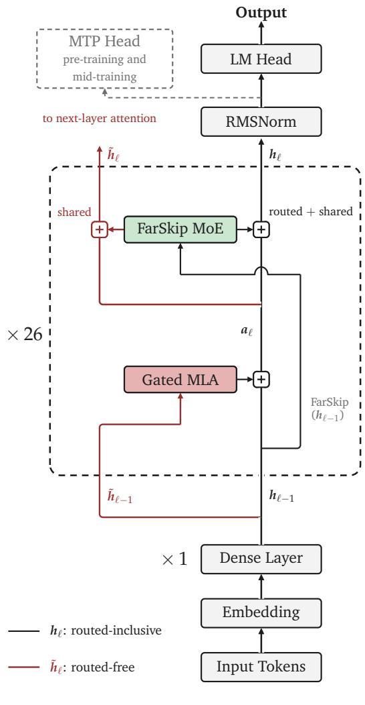  
(a) Overall architecture

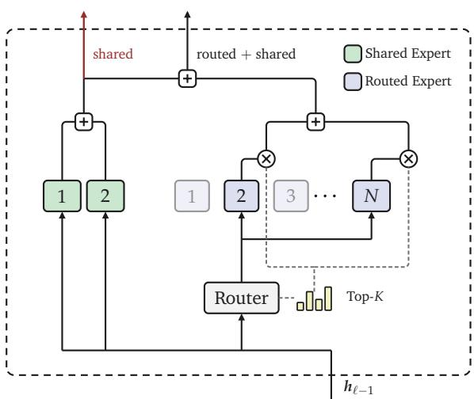  
(b) FarSkip MoE

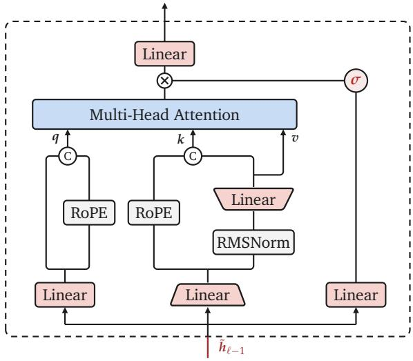  
(c) Gated MLA  
Figure 2: Instella-MoE-16B-A3B architecture. (a) Overall architecture. FarSkip-Collective allows the Dispatch and Combine all-to-all collectives to overlap with attention and shared-expert computation. The MTP head is attached during pre-training and mid-training. (b) FarSkip-Collective MoE block. The MoE block returns both the shared and routed+shared experts explicitly. (c) Simplified Gated MLA block. An inputconditioned sigmoid gate modulates the per-head attention outputs before the output projection.

Multi-Token Prediction. Following prior work (Gloeckle et al., 2024; DeepSeek-AI, 2024a), we attach a single Multi-Token Prediction (MTP) module during pre-training and mid-training. In addition to the standard next-token objective, the module predicts one additional future token at each position, providing a richer training signal. We weight the MTP loss by 0.3 during pre-training and reduce it to 0.1 during mid-training. The module is disabled during long-context extension and is not used at inference.

## 2.1.2 Gated Multi-head Latent Attention

Multi-head Latent Attention (MLA) (DeepSeek-AI, 2024b) compresses each token’s key–value states into a low-rank latent representation to reduce the KV-cache footprint. Standard MLA passes the concatenated perhead outputs of scaled dot-product attention directly through an output projection. Gated MLA retains the

Table 1: Architecture hyperparameters of Instella-MoE-16B-A3B.
<table><tr><td>Parameter</td><td>Value</td></tr><tr><td>Backbone</td><td></td></tr><tr><td>Total / active parameters</td><td>16B/2.8B</td></tr><tr><td>Decoder layers</td><td>27 (1 dense + 26 MoE)</td></tr><tr><td>Hidden size</td><td>2,048</td></tr><tr><td>Tokenizer / vocabulary size</td><td>DeepSeek-V3 / 128,896</td></tr><tr><td>Context length (base / extended)</td><td>4,096 / 65,536</td></tr><tr><td>Attention Attention type</td><td></td></tr><tr><td>Attention heads</td><td>Gated MLA</td></tr><tr><td></td><td>16</td></tr><tr><td>KV latent rank</td><td>512</td></tr><tr><td>QK dimensions (content / RoPE) Value-head dimension</td><td>96/32</td></tr><tr><td></td><td>128</td></tr><tr><td>Mixture-of-Experts</td><td></td></tr><tr><td>Routed experts  $N /$  active per token K Shared experts</td><td>64/6 2</td></tr><tr><td>Routed expert FFN size</td><td>1,408</td></tr><tr><td>Fused shared-expert FFN size</td><td>2,816</td></tr><tr><td>Router top-K scaling factor</td><td>2.5</td></tr><tr><td>Connectivity</td><td>FarSkip-Collective</td></tr><tr><td></td><td></td></tr><tr><td>Other Normalization</td><td>RMSNorm</td></tr><tr><td></td><td></td></tr><tr><td>Activation</td><td>SwiGLU</td></tr><tr><td>Positional embedding</td><td>RoPE</td></tr><tr><td>Auxiliary objective</td><td>MTP (1 layer; pre-training and mid-training)</td></tr></table>

low-rank key–value factorization but inserts an input-conditioned gate between the attention output and the output projection (Figure 2(c)).

Following the best-performing configuration of Qiu et al. (2025), we use a multiplicative, sigmoid-activated element-wise gate. Let $\boldsymbol { x } _ { t } \in \mathbb { R } ^ { d }$ be the RMSNorm-normalized layer input and $\pmb { \hat { o } } _ { t } \in \mathbb { R } ^ { H d _ { v } }$ the concatenated output of scaled dot-product attention, with H heads of value dimension $d _ { v }$ . The Gated MLA output is

$$
y _ { t } = \mathbf { W } _ { o } \left[ \operatorname { S i g m o i d } ( \mathbf { W } _ { g } \pmb { x } _ { t } ) \odot \hat { \pmb { o } } _ { t } \right] .\tag{1}
$$

Here, $\pmb { W } _ { g } \in \mathbb { R } ^ { H d _ { v } \times d }$ is the gate projection and ${ \bf W } _ { o }$ is the attention output projection. The gate allows each token to modulate individual value channels within each head. In our controlled 200B-token ablation, Gated MLA improves the average score from 49.86 to 50.33 over vanilla MLA, with the largest gains on MMLU and code generation (Table 13).

## 2.1.3 FarSkip-Collective Connectivity

Expert parallelism (EP) is crucial for sparse MoE deployment. In Instella-MoE, we address its communication overhead through aggressive computation–communication overlap. Concretely, the MoE layer is implemented in four main stages: router score computation, Dispatch, expert computation, and Combine. The router stage computes the expert routing map. Next the Dispatch stage uses the map to send the relevant tokens to the corresponding GPUs via an all-to-all communication call. After dispatching finishes, the GPUs compute the expert activations for their corresponding tokens. Lastly, the computed expert activations are mapped back to the original GPU placement via Combine, which runs an additional all-to-all communication call. With this sequence of operations, Dispatch relies on the previous layer and the Combine call depends on the expert computation to finish. This set of MoE layer dependencies makes it so that neither all-to-all communication call can be overlapped with computation in the standard MoE architecture implementation. To resolve this, with FarSkip-Collective we modify the transformer architecture to remove these dependencies and therefore enable overlapping of the Dispatch and Combine communication calls with computation that is not dependent on the communication output. In particular, with FarSkip-Collective the entire attention computation and shared expert computations become non-dependent and can therefore be overlapped with the Dispatch and Combine calls. We review the standard MoE and FarSkip-Collective architectures below.

Denote the output activation of a network after k layers by $h _ { k } ,$ and the ith sub-block (layer) of a standard Transformer by $f _ { i }$ . The standard Transformer output $h _ { k }$ is computed as

$$
h _ { k } = f _ { 1 } ( h _ { 0 } ) + f _ { 2 } ( h _ { 1 } ) + \cdot \cdot \cdot + f _ { k } ( h _ { k - 1 } ) .\tag{2}
$$

Here the $f _ { i }$ alternate between MLP / MoE blocks and Attention blocks and include normalization as part of the computation. For large models, producing $f _ { i }$ can involve blocking communication which stops $h _ { k }$ from being used as an input to $f _ { k + 1 }$ until $h _ { k }$ is communicated between the GPUs – leading to idle computation resources. We propose to use an available activation instead, denoted as $\hat { h } _ { k } ,$ to be used as input to $f _ { k + 1 }$ and compute the next layer while the communication collective is producing $h _ { k } .$ . With this approach, $h _ { k + 1 }$ is updated with $h _ { k }$ once it is ready; however, the communication of $h _ { k }$ can be overlapped over the duration of the computation of $f _ { k + 1 } ( \hat { h } _ { k } )$

$$
\begin{array} { r l } & { h _ { k + 1 } = h _ { k } + f _ { k + 1 } ( \hat { h } _ { k } ) } \\ & { \qquad = f _ { 1 } ( h _ { 0 } ) + f _ { 2 } ( \hat { h } _ { 1 } ) + \cdot \cdot \cdot + f _ { k + 1 } ( \hat { h } _ { k } ) } \end{array}\tag{3}
$$

Like the standard transformer in Eq. (2), all computed activations appear in the final hidden states in Eq. (3). Comparing $\hat { h } _ { k }$ with $h _ { k } ,$ , one can consider the partial or outdated activation $\hat { h } _ { k }$ as an activation produced by omitting summands of the full activation sum. To maintain model capabilities while improving hardware performance, FarSkip-Collective is designed to allow for full communication overlapping arising from Dispatch, Combine, and the Attention block while incurring the most minimal activation omission in $\hat { h } _ { k }$ as compared with $h _ { k } .$ . Concretely, to allow for Dispatch to overlap with the attention block, the input to the Dispatch call must not depend on the attention output, so we set

$$
\begin{array} { r } { \mathrm { m o e - i n } _ { k } : = \hat { h } _ { k } ( \mathrm { m o e } ) = h _ { k - 1 } . } \end{array}
$$

This allows Dispatch and routing to initiate as soon as the previous layer’s Combine finishes producing the tokens, and has the property that propagation is delayed by at most one layer. For the attention input, only the routed experts need to be communicated after expert computation, and they are therefore the only terms omitted from the attention input

$$
\mathrm { a t m - i n } _ { k } : = \hat { h } _ { k } ( \mathrm { a t t n } ) = h _ { k - 2 } + \mathrm { a t t n - o u t } _ { k - 1 } + \mathrm { s h a r e d - e x p - o u t } _ { k - 1 } .
$$

This input to attention allows for overlapping the routed expert Combine with both shared expert computation and the first part of attention computation. Lastly, any Attention block communication is overlapped during routed-expert computation. Put together, without any pipelining, FarSkip-Collective increases the overlap window of Dispatch and Combine to be the full layer duration, with the exception of the router and routedexpert computations.

For Instella-MoE, we run large-scale architectural ablations to evaluate the capabilities of Instella-MoE with the FarSkip-Collective architecture and observe comparable performance relative to standard MoE connectivity. In particular, we train Instella-MoE (+FarSkip) for 200B pre-training tokens and ablate the architecture while fixing all training settings and seeds against Instella-MoE without FarSkip-Collective. In Table 13 we observe that the Instella-MoE (+FarSkip) variant achieves 50.38 average performance compared to 50.33 average performance when ablating the FarSkip-Collective connectivity with the standard transformer. In Appendix A we describe the implementation techniques that enable communication-overlapped training and inference of Instella-MoE on AMD GPUs.

## 2.2 Training Pipeline Overview

Instella-MoE is trained from scratch through the multi-stage pipeline shown in Figure 3, which progressively builds capability from broad language understanding to long-context processing, instruction following, alignment, and reasoning. Base-model training comprises 7.1T-token pre-training at 4K context length (Sec. 2.4), ∼100B-token mid-training on STEM- and reasoning-focused mixtures combined by model souping (Sec. 2.5), and a two-stage extension of the context window from 4K to 64K that produces the Instella-MoE-16B-A3B-Base model (Sec. 2.6). Post-training initializes from that base model and applies supervised fine-tuning with feedback-driven data curation (Sec. 2.7), direct preference optimization with delta learning (Sec. 2.8), and instruction-following RL followed by multi-teacher on-policy distillation (Sec. 2.9), producing Instella-MoE-16B-A3B-Think. We release the checkpoint of every training stage (Table 2) together with the per-stage hyperparameters (Table 3) and data mixtures (Table 4).

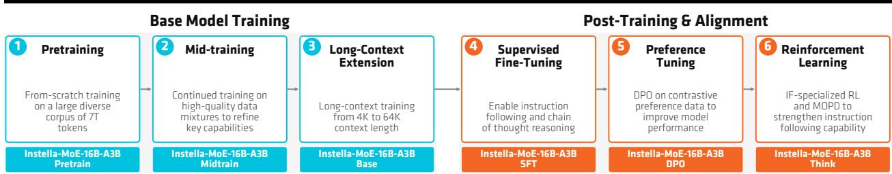  
Figure 3: Instella-MoE training pipeline. Base-model training spans pre-training, mid-training, and longcontext extension; post-training and alignment span SFT, preference tuning (DPO), and reinforcement learning.

Table 2: Released Instella-MoE checkpoints. We open-source weights from every major training stage to support reproducible model research.
<table><tr><td>Checkpoint</td><td>Stage</td><td>Description</td></tr><tr><td>Instella-MoE-16B-A3B-Pretrain</td><td>Pre-training</td><td>From-scratch MoE checkpoint after 7.1T-token pre-training.</td></tr><tr><td>Instella-MoE-16B-A3B-Midtrain</td><td>Mid-training</td><td>STEM- and reasoning-sharpened checkpoint produced through model souping.</td></tr><tr><td>Instella-MoE-16B-A3B-Base</td><td>Long-context</td><td>Final base model after 64K long-context extension.</td></tr><tr><td>Instella-MoE-16B-A3B-SFT</td><td>SFT</td><td>Instruction-tuned checkpoint with chain-of-thought capability.</td></tr><tr><td>Instella-MoE-16B-A3B-DPO</td><td>DPO</td><td>Preference-tuned checkpoint with delta learning.</td></tr><tr><td>è Instella-MoE-16B-A3B-Think</td><td>RL</td><td>Final Think checkpoint after IF-RL and MOPD.</td></tr></table>

## 2.3 Training Infrastructure

All stages up to and including DPO run in the open-source Primus framework (AMD AI Brain, 2025) on its Megatron-LM (Shoeybi et al., 2019) backend using ROCm on AMD Instinct MI300X and MI325X GPUs. These stages use expert parallelism (EP=8) over the 64 routed experts, tensor parallelism, FlashAttention (Dao, 2024), and bfloat16 mixed precision; they also overlap gradient and parameter communication with computation. Pre-training and mid-training additionally overlap the expert-parallel all-to-all collectives using the FarSkip-Collective implementation described in Appendix A.

Reinforcement learning is performed with Miles (RadixArk, 2025; Zhu et al., 2025), an open-source PyTorchnative stack for large-scale RL post-training built on the slime ecosystem. Miles pairs a Megatron-LM learner with a pool of SGLang (Zheng et al., 2024) rollout engines under Ray-based multi-node orchestration and supports both asynchronous of-policy and synchronous on-policy rollout loops. Our two RL stages use these modes, respectively. We run Miles with Primus as the policy-training backend and SGLang as the rollout backend; Sec. 2.9 details the resulting actor–learner configuration.

## 2.4 Pre-training

We train Instella-MoE from scratch on 7.1 trillion tokens using a context length of 4,096 and a global batch size of 4,096. We use the AdamW optimizer with $\beta _ { 1 } = 0 . 9 , \beta _ { 2 } = 0 . 9 5 \ /$ , a weight decay of 0.1, and a WSD learning-rate scheduler with a peak learning rate of $4 \times 1 0 ^ { - 4 }$ , a minimum learning rate o $\circled { 4 } \times 1 0 ^ { - 5 }$ , and 2,000 warmup iterations. Figure 4 shows the pre-training dynamics: after a short warmup, the learning rate stays at its $4 \times 1 0 ^ { - 4 }$ peak for the bulk of training before decaying in the final phase, while the cross-entropy loss drops sharply early on and then decreases steadily to roughly 1.7 by the end of the 7.1T-token run.

The pre-training mixture emphasizes high-quality open corpora spanning web text, mathematics, code, and science. We utilize Nemotron-CC-v2 (Su et al., 2025; NVIDIA, 2025) for web data; Nemotron-CC-Mathv1 (Karimi Mahabadi et al., 2025), MegaMath (Zhou et al., 2025a), and FineMath (Lozhkov et al., 2024) for mathematics; RefineCode (Huang et al., 2025) and Nemotron-Pretraining-Code-v1 (NVIDIA, 2025) for code; Nemotron-Pretraining-SFT-v1 (NVIDIA, 2025) for curated pre-training SFT-style data; and TxT360 (Tang et al., 2024) for other domains. We tokenize all corpora with the DeepSeek-V3 tokenizer (DeepSeek-AI, 2024a). During this stage, the MTP objective is active.

Table 3: Training hyperparameters by stage. All stages use expert parallelism (EP=8), bfloat16 mixed precision, and the Primus and Miles training stack unless otherwise noted.
<table><tr><td>Stage</td><td>Tokens / Data</td><td>Seq. Len.</td><td>Global BS</td><td>Peak LR</td><td>LR Schedule</td><td>Key Settings</td></tr><tr><td>Pre-training</td><td>7.1T</td><td>4,096</td><td>4,096</td><td> $4 \times 1 0 ^ { - 4 }$ </td><td>WSD</td><td>MTP, EOD masking, FarSkip</td></tr><tr><td>Mid-training</td><td>~100B</td><td>4,096</td><td>1,024</td><td> $2 \times 1 0 ^ { - 4 }$ </td><td>Linear</td><td>3 mixture variants + souping</td></tr><tr><td>Long-ctx Stage 1</td><td>~194B</td><td>65,536</td><td>128</td><td> $2 \times 1 0 ^ { - 4 }$ </td><td>Linear</td><td>YaRN (θ=8M), doc masking</td></tr><tr><td>Long-ctx Stage 2</td><td>~20B</td><td>65,536</td><td>128</td><td> $1 \times 1 0 ^ { - 4 }$ </td><td>Linear</td><td>STEM-targeted data mix</td></tr><tr><td>SFT</td><td>~2.9M ex.</td><td>32,768</td><td>128</td><td> $1 \times 1 0 ^ { - 4 }$ </td><td>Linear</td><td>2 epochs, seq packing, feedback-driven curation</td></tr><tr><td>DPO</td><td>150K pairs</td><td>16,384</td><td>256</td><td> $8 \times 1 0 ^ { - 8 }$ </td><td>Linear</td><td> $\beta { = } 5 . 0 , 0 . 7 5$  epoch</td></tr><tr><td>IF-RL</td><td>29.8K prompts</td><td>16,384 rollout</td><td>512</td><td> $1 \times 1 0 ^ { - 6 }$ </td><td>Constant</td><td>GRPO + DAPO + R3, 1,400 steps</td></tr><tr><td>MOPD</td><td>On-policy</td><td>16,384 rollout</td><td>512</td><td> $1 \times 1 0 ^ { - 6 }$ </td><td>Constant</td><td>Domain-routed teachers</td></tr></table>

Table 4: Training data by stage. All pre-training and mid-training corpora are drawn from publicly documented open datasets.
<table><tr><td>Stage</td><td>Primary Data Sources</td><td>License</td></tr><tr><td>Pre-training</td><td>Nemotron-CC-v2; Nemotron-Pretraining-SFT-v1; Nemotron-CC-Math-v1; Mega- Source- Math; FineMath; RefineCode; Nemotron-Pretraining-Code-v1; TxT360</td><td>dependent</td></tr><tr><td>Mid-training</td><td>Dolma 3 Dolmino 100B (web, code, math, science, instruction, reasoning)</td><td>ODC-BY-1.0</td></tr><tr><td>Long-context</td><td>Dolma 3 Longmino 100B (Stage 1); Dolma 3 Dolmino 100B mix and full pool math- Source- /code/reasoning subsets; Instella-GSM8K-synthetic (Stage 2)</td><td>dependent</td></tr><tr><td>SFT</td><td>Dolci-Think-SFT-7B; Nemotron-Cascade-2 (math, science); Nemotron-SFT- Source- Competitive-Programming-v2</td><td>dependent</td></tr><tr><td>DPO</td><td>Dolci-Think-DPO-7B preference pairs</td><td>Source- dependent</td></tr><tr><td>RL</td><td>Dolci-Think-RL-7B (IF RLVR Mixture)</td><td>Source- dependent</td></tr></table>

## 2.5 Mid-training

After pre-training, we perform mid-training on Dolma 3 Dolmino 100B (Olmo et al., 2025) to sharpen math, code, STEM, and reasoning capabilities. We train three mid-training variants (v1, v2, v3) that share the same Dolma 3 Dolmino 100B base mixture and difer only in a few STEM/reasoning subsets: v1 uses the original Dolmino 100B mix; v2 replaces the STEM-Heavy Crawl subset with its full version from the Dolma 3 Dolmino pool; and v3 additionally pulls in the full-pool subsets for MegaMatt, General Reasoning Mix, Math Meta-Reasoning, and Code Meta-Reasoning, expanding the mixture from ∼100B to ∼104B tokens (Table 22). Each variant is trained with a peak learning rate of $2 \times 1 0 ^ { - 4 }$ , a global batch size of 1,024, and linear learningrate decay. The three resulting checkpoints are combined via equal-weight model souping to produce Instella-MoE-16B-A3B-Midtrain, which outperforms each individual variant (Table 5). The MTP objective remains active during this stage.

## 2.6 Long-Context Extension

After mid-training, the context length of Instella-MoE-Midtrain is extended from 4K to 64K tokens through continued pre-training on AMD Instinct MI325X accelerators. The two-stage recipe first adapts the model to the full 64K context length using a diverse set of long-context data; Stage 2 then rebalances the training mixture to recover mathematics, code, and reasoning capabilities that can regress during Stage 1. The checkpoint produced at the end of Stage 2 is Instella-MoE-16B-A3B-Base (Tables 10 and 11), and subsequent post-training stages initialize from this model and inherit the extended context window.

For long-context extension, we increase the RoPE base to $\theta = 8 \times 1 0 ^ { 6 }$ and apply YaRN scaling (Peng et al., 2024) to maintain attention stability at 64K. Starting with this stage, we also disable the MTP head to reduce activation memory at long sequence lengths. Ablations show that retaining $\theta = 1 0 , 0 0 0$ without YaRN yields substantially worse length utilization; consequently, YaRN is used throughout both extension stages. Training samples are constructed by packing multiple documents into fixed 64K sequences. To prevent spurious cross document dependencies, document masking is applied: attention is blocked across document boundaries and position indices restart at each new document.

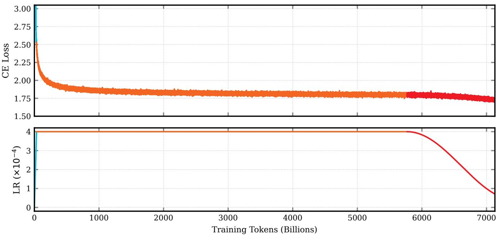  
Figure 4: Pre-training dynamics of Instella-MoE-16B-A3B over 7.1T tokens. Top: training cross-entropy (CE) loss. Bottom: WSD learning-rate schedule with a peak of $4 \times 1 0 ^ { - 4 }$

Table 5: Mid-training model souping. Comparison of the Instella-MoE-16B-A3B mid-training variants and their equal-weight model soup. HE+ denote HumanEval+.
<table><tr><td>Model</td><td>ARC-E</td><td>ARC-C</td><td>BoolQ</td><td>SciQ</td><td>PIQA</td><td>HSwag</td><td>WG</td><td>OBQA</td><td>MMLU</td><td>GSM8K</td><td>HE+</td><td>MBPP+</td><td>Average</td></tr><tr><td>Instella-MoE-16B-A3B-Pretrain</td><td>93.96</td><td>83.47</td><td>86.30</td><td>93.21</td><td>79.45</td><td>82.38</td><td>85.91</td><td>80.00</td><td>68.71</td><td>70.92</td><td>55.95</td><td>53.15</td><td>77.78</td></tr><tr><td>Instella-MoE-16B-A3B-Midtrain-v1</td><td>93.84</td><td>84.90</td><td>84.90</td><td>93.71</td><td>82.00</td><td>82.09</td><td>87.09</td><td>83.60</td><td>68.95</td><td>77.82</td><td>56.86</td><td>55.00</td><td>79.23</td></tr><tr><td>Instella-MoE-16B-A3B-Midtrain-v2</td><td>94.88</td><td>85.60</td><td>84.80</td><td>94.22</td><td>83.93</td><td>81.50</td><td>86.41</td><td>83.80</td><td>69.31</td><td>71.21</td><td>59.30</td><td>54.30</td><td>79.11</td></tr><tr><td>Instella-MoE-16B-A3B-Midtrain-v3</td><td>94.63</td><td>85.83</td><td>86.00</td><td>94.45</td><td>85.19</td><td>81.26</td><td>85.85</td><td>84.40</td><td>69.69</td><td>75.93</td><td>58.54</td><td>54.95</td><td>79.73</td></tr><tr><td>Instella-MoE-16B-A3B-Midtrain</td><td>95.11</td><td>87.26</td><td>86.50</td><td>94.55</td><td>86.03</td><td>82.27</td><td>87.42</td><td>86.20</td><td>70.90</td><td>77.05</td><td>59.91</td><td>57.60</td><td>80.90</td></tr></table>

Stage 1: Long-document adaptation. Stage 1 resumes from the soup-merged mid-training checkpoint and trains on Dolma 3 Longmino 100B (Olmo et al., 2025), a mixture of OCR-derived science PDFs, long web pages, synthetic long-context aggregation tasks, and mid-training-quality subsets intended to limit catastrophic forgetting of general skills. Training uses ∼194B tokens at a sequence length of 64K, with a peak learning rate of $2 \times 1 0 ^ { - 4 }$ and linear decay to zero. As shown in Table 11, the resulting checkpoint, Instella-MoE-16B-A3B-Long-Stage1, uses long inputs efectively: across the 8K–64K sweep, it scores 44.7, 44.9, 44.4, and 41.0 on HELMET and averages 83.9 on RULER, outperforming the OLMo-3-7B model. Short-context STEM ability, however, regresses: GSM8K falls from 77.1 after mid-training to 62.8, and HumanEval+ falls from 59.9 to 55.0 (Tables 10 and 5). Recovering this ability is the purpose of Stage 2.

Stage 2: STEM recovery. Stage 2 initializes from the Stage 1 checkpoint and runs for an additional ∼20B tokens with a peak learning rate of $1 \times 1 0 ^ { - 4 }$ that decays linearly. Those tokens are sampled from a curated 37.32B-token STEM mixture (Table 7) built from Dolma 3 Dolmino (Olmo et al., 2025) and Instella-GSM8Ksynthetic (Liu et al., 2025a). The mixture includes instructional math, competition-style math, synthetic math reasoning, code corpora, code-reasoning traces, and short chain-of-thought rewrites. We pack samples into 64K sequences with the same document-boundary masking as Stage 1.

We evaluate four Stage 2 mixtures that vary the degree of STEM upsampling relative to general text. General recovery retains a broad distribution and improves GSM8K only modestly (64.5), with limited gains on coding. Math recovery increases math emphasis and restores GSM8K to 80.5, but incompletely recovers code performance (HumanEval+ 57.6). STEM-intensive further upweights math and code (GSM8K 81.0,

Table 6: Long-context extension hyperparameters. Both stages use a sequence length of 64K with document-boundary masking and YaRN RoPE $( \theta = 8 \times 1 0 ^ { 6 } )$
<table><tr><td></td><td>Stage 1</td><td>Stage 2</td></tr><tr><td>Initialization</td><td>Mid-training (soup-merged)</td><td>Stage 1 checkpoint</td></tr><tr><td>Training data</td><td>Dolma 3 Longmino 100B</td><td>37.32B STEM mixture</td></tr><tr><td>Sequence length</td><td>64K</td><td>64K</td></tr><tr><td>Global batch size</td><td>128</td><td>128</td></tr><tr><td>Training steps</td><td>23,071</td><td>2,400</td></tr><tr><td>Peak learning rate</td><td> $2 \times 1 0 ^ { - 4 }$ </td><td> $1 \times 1 0 ^ { - 4 }$ </td></tr><tr><td></td><td>Learning rate schedule Linear decay, 200-step warmup</td><td>Linear decay</td></tr><tr><td>MTP head Expert parallelism</td><td>disabled 8-way</td><td>disabled 8-way</td></tr></table>

Table 7: Stage 2 STEM mixture (37.32B tokens). Subsets are drawn from Dolma 3 Dolmino 100B, the full Dolma 3 Dolmino pool, or Instella-GSM8K-synthetic.
<table><tr><td>Domain</td><td>Source</td><td>Tokens</td></tr><tr><td rowspan="5">Mathematics</td><td>Instructional math (Dolmino)</td><td>10.7B 5.62B</td></tr><tr><td>Competition math Synthetic math (MegaMatt)</td><td>3.88B</td></tr><tr><td></td><td></td></tr><tr><td>Short math reasoning (Mind)</td><td>898M</td></tr><tr><td>Short math reasoning (PoT) GSM8K-style synthetic data</td><td>241M 329M</td></tr><tr><td>Code</td><td>Instructional and competition code</td><td>10.0B</td></tr><tr><td rowspan="3">Reasoning</td><td>General reasoning traces</td><td>2.48B</td></tr><tr><td>Rewritten full-thought chains</td><td>850M</td></tr><tr><td>Math meta-reasoning</td><td>1.05B</td></tr><tr><td>Total</td><td>Code meta-reasoning</td><td>1.27B 37.32B</td></tr></table>

HumanEval+ 64.5) with a trade-of in long-context length-sweep performance. STEM-balanced gives the best STEM recovery, restoring GSM8K to 81.5 and HumanEval+ to 65.7, at the cost of a modest long-context regression relative to Stage 1 (a decline in the HELMET average from 43.7 to 41.5 and in the RULER average from 83.9 to 79.4; Table 11). We therefore adopt the STEM-balanced checkpoint as Instella-MoE-16B-A3B-Base.

Training Details. Long-context extension at 64K on a 16B-parameter MoE is memory- and communicationintensive. The 64 routed experts are sharded across eight GPUs with expert parallelism, the sequence dimension is partitioned with context parallelism so each device holds a slice of the 64K activations, and full activation recomputation with bfloat16 mixed precision is used to fit a micro-batch size of one per step. Unlike the earlier 4K-context stages, the 64K-context training does not overlap forward and backward communication, and optimizer state is reinitialized for continued training at the new sequence length. Table 6 summarizes the training hyperparameters.

## 2.7 Supervised Fine-Tuning

We initialize the SFT model from the long-context base model and train it in two phases. The phase-1 mixture combines the general Dolci-Think-SFT-7B dataset (Olmo et al., 2025) (∼2.27M records) with three targeted skill slices: 300K math samples from Nemotron-Cascade-2 (Yang et al., 2026), ∼161K Python competitiveprogramming samples from Nemotron-SFT-Competitive-Programming-v2 (NVIDIA, 2026), and ∼197K science samples from Nemotron-Cascade-2 (Table 24). We convert every source to a shared {"messages": [...]} format, drop system messages, and retain assistant reasoning traces. We also drop any conversation longer than 32,768 tokens when tokenized with the DeepSeek-V3 chat template. Training uses sequence packing at a context length of 32K with a peak learning rate of $1 \times 1 0 ^ { - 4 }$ and runs for two epochs.

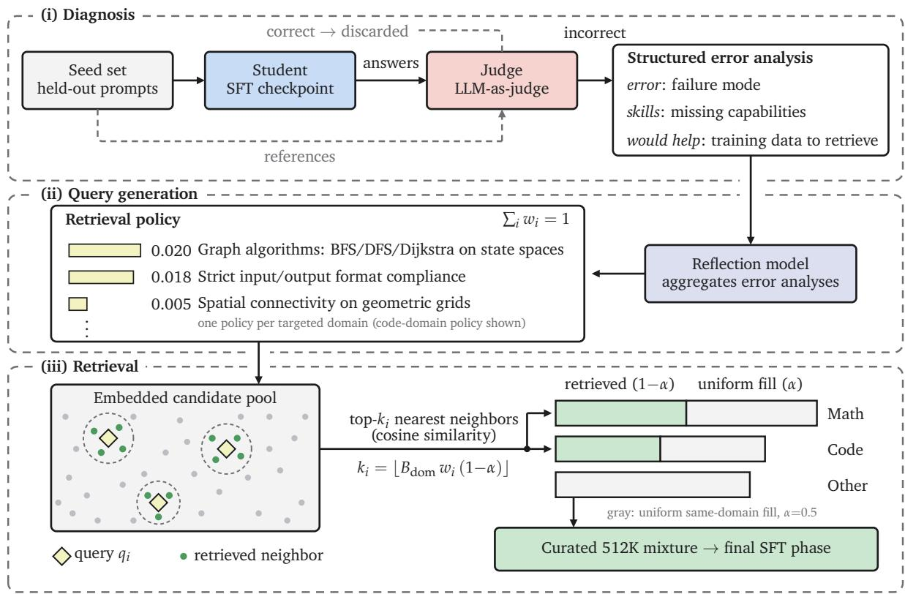  
Figure 5: Feedback-driven data curation for the final SFT phase. (i) The student answers questions from a held-out seed set, and a judge model scores each response against the reference answer; correct responses are dropped, and each failure is turned into a structured error analysis naming the failure mode, the missing skills, and the training data that would close the gap. (ii) A larger reflection model aggregates the analyses for a domain into a retrieval policy: a set of queries with weights summing to one. (iii) Each query retrieves its allocated $k _ { i }$ examples from the per-domain budget $B _ { \mathrm { d o m } }$ through nearest-neighbor search in the shared embedding space of the candidate pool. Uniform same-domain sampling fills the remaining α share of each targeted-domain budget and the entire budget for the non-targeted other domain. The total budget B = 512K is split across domains in the proportions of the base mixture, as reflected by the difering bar lengths.

Feedback-driven data curation. Once gains from the core mixture saturate, we run a final phase on 512K examples selected by an error-driven procedure rather than by uniform sampling. We partition the pool into three domains—mathematics, code, and other—and split a fixed selection budget across them. For the two targeted domains, mathematics and code, we select data using a three-stage pipeline (Figure 5). (i) Diagnosis: we run the student on a held-out seed set and use an LLM as a judge to score each response against a reference answer; for every incorrect response, the judge model then produces a structured error analysis that includes a description of what training data would help address the error. (ii) Query generation: a larger reflection model aggregates these error analyses into a set of weighted retrieval queries, with weights normalized to sum to one. (iii) Retrieval: we allocate each query its weighted share of the selection budget and retrieve that many nearest neighbors from the pool by embedding similarity. Compared to uniform sampling at the same budget, this improves average performance across our evaluation suite by 1.5 points (Table 8), with the largest gains on instruction following, competition math, and code generation. A parallel line of work, STAT (He et al., 2025), also targets a student’s weaknesses through teacher-diagnosed errors. It relies on a predefined skill taxonomy to drive selection. In our method, the teacher provides free-form error feedback, which we convert into retrieval queries over a large candidate pool. More details about the implementation are provided in Appendix B.

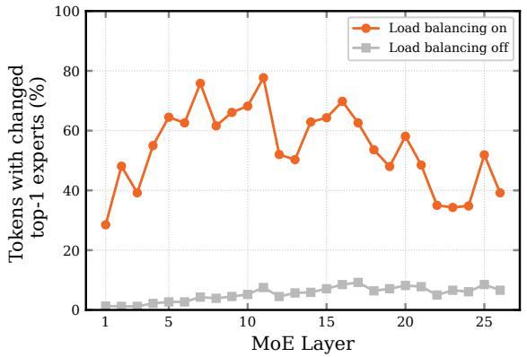

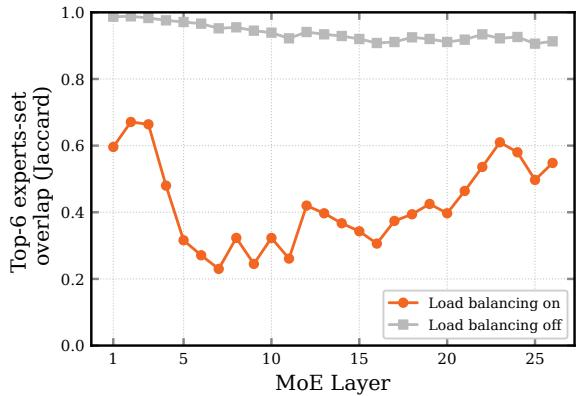  
Figure 6: Expert routing drift during DPO. Two otherwise identical DPO runs, difering only in whether load balancing remains enabled, are compared against the SFT model across 26 MoE layers. Left: fraction of tokens whose top-1 expert difers from SFT. Right: Jaccard overlap between top-6 dispatched experts and those of SFT. Routing stays close to SFT when load balancing is disabled, and difers substantially when enabled.

Table 8: Final-phase SFT data selection. Both runs anneal the same phase-1 model on 512K examples drawn from the same candidate pool and difer only in how those examples are selected. Feedback-driven curation improves the eleven-benchmark average by 1.5 points, with the largest gains on IFEval (+4.8), AIME25 (+3.6), and LCB (+3.2). HE+ and LCB denote HumanEval+ and LiveCodeBench. Per column, the best score is bold.
<table><tr><td>Selection</td><td>AGIEval</td><td>AIME24</td><td>AIME25</td><td>BBH</td><td>HE+</td><td>GPQA</td><td>IFEval</td><td>LCB</td><td>MBPP+</td><td>MATH</td><td>MMLU</td><td>Avg</td></tr><tr><td>Uniform sampling</td><td>79.86</td><td>78.02</td><td>67.71</td><td>74.04</td><td>85.45</td><td>58.00</td><td>76.71</td><td>45.53</td><td>61.59</td><td>94.77</td><td>79.70</td><td>72.85</td></tr><tr><td>Feedback-driven curation</td><td>81.33</td><td>77.50</td><td>71.35</td><td>74.34</td><td>86.77</td><td>59.38</td><td>81.51</td><td>48.74</td><td>61.64</td><td>94.67</td><td>80.82</td><td>74.37</td></tr></table>

## 2.8 Direct Preference Optimization

Starting from the curated SFT checkpoint, we apply DPO (Rafailov et al., 2023) using the Dolci-Think-DPO-7B preference dataset (Olmo et al., 2025), which is built on the idea of delta learning (Geng et al., 2025): what drives preference tuning is the quality gap between the chosen and rejected responses rather than the absolute quality of either, so each pair contrasts a Qwen3-32B thinking trace (Yang et al., 2025) with a much weaker Qwen3-0.6B trace and remains informative even when continued imitation of the chosen traces alone would no longer provide a useful training signal. When run naively, DPO converges, yet the resulting model’s accuracy is lower than that of the SFT checkpoint on downstream benchmarks. We do not observe this behavior when applying the same recipe to a dense model. We also note that the DPO stage operates at a substantially lower learning rate than pre-training and SFT, while the MoE auxiliary loadbalancing loss and router bias updates are configured for those higher-learning-rate regimes. Motivated by these observations, we disable both load-balancing mechanisms during DPO. As shown in Figure 6, when load balancing is enabled, the top-1 expert difers from that of SFT for 54% of tokens on average and the top-6 expert-set overlap is 0.42, compared with 5% and 0.94, respectively, when load balancing is disabled. With these adjustments, DPO improves helpfulness and response quality while preserving reasoning.

## 2.9 Reinforcement Learning

To obtain our final Think checkpoint, we apply reinforcement learning (RL) to the DPO model using Miles (RadixArk, 2025; Zhu et al., 2025). Because the DPO model already performs strongly on math and general reasoning, we restrict the RL objective to instructionfollowing (IF) and then use an on-policy distillation stage to incorporate those gains into the DPO model without eroding its other capabilities. The two-stage recipe is illustrated in Figure 7: Stage 1 is IF-specialized RL with verifiable rewards (RLVR), which produces an IF expert, and Stage 2 is Multi-Teacher On-Policy Distillation (MOPD), which distills knowledge from that expert and the DPO model into the student, with the DPO model acting as a self-anchor.

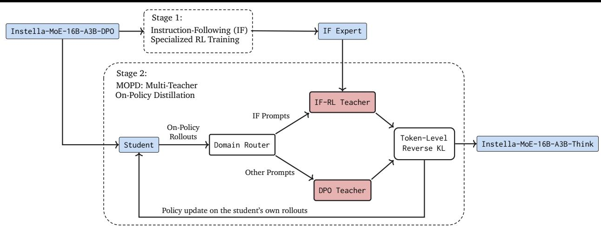  
Figure 7: Instella-MoE-16B-A3B RL training pipeline. Stage 1 performs IF-specialized RL to obtain an IF expert. Stage 2 applies Multi-Teacher On-Policy Distillation (MOPD): a domain router routes the student’s IF rollouts to the IF-RL teacher and all other rollouts to the frozen DPO teacher, and the student is updated on its own on-policy rollouts using a token-level reverse-KL objective.

## 2.9.1 RL Infrastructure

Both stages use a disaggregated actor–learner design built on Miles (RadixArk, 2025; Zhu et al., 2025): rollouts are produced by a pool of SGLang (Zheng et al., 2024) inference engines, while the policy is optimized in Megatron-LM (Shoeybi et al., 2019). After every optimizer step, the updated weights are streamed back to the rollout engines. We run the IF-RL stage (Section 2.9.2) fully asynchronously, which allows generation to overlap with gradient computation in a single-step of-policy regime. For the MOPD stage (Section 2.9.3), we train synchronously and on-policy, since the teacher scoring makes each update depend on the current student. Each run uses three nodes with 24 GPUs, split into 8 GPUs for the learner (expert parallelism, EP=8, with a distributed optimizer) and 16 GPUs for two parallel SGLang rollout engines (each TP=8, EP=8, with data-parallel attention). The rollout engines generate responses of up to 16K tokens.

MoE-aware train/inference consistency. A subtlety specific to the MoE architecture is that the SGLang rollout and the Megatron training forward pass can route tokens to diferent experts, so the training-time log-probabilities log πtrain need not match those under which the tokens were sampled. We address this at two levels. First, we enable Rollout Routing Replay (R3) (Ma et al., 2025), which fixes the expert-assignment decisions made during sampling by recording and replaying them inside the training forward pass. With this approach, log πtrain is evaluated along the exact expert path that generated each token. Second, we apply token-level truncated importance sampling (TIS) (Yao et al., 2025) to correct residual numerical mismatch between the inference and training engines, with per-token ratios clamped to a bounded range (Table 9).

## 2.9.2 IF-specialized RL

In the first stage, we train the DPO model for 1,400 rollout steps on the IF-RLVR subset of Dolci-Think-RL-7B (Olmo et al., 2025), whose prompts carry verifiable instruction-following constraints in the style of IFEval (Zhou et al., 2023) and IFBench (Pyatkin et al., 2025). Each step samples 64 prompts × 8 responses = 512 rollouts (global batch size 512), decoding at temperature 1.0 with a maximum response length of 16,384 tokens. We additionally use partial rollouts (Zhou et al., 2025b): long-tail decodes that do not finish within a step are recycled into the next step, with the stale (of-policy) tokens masked out of the loss. This approach substantially improves throughput at these response lengths. For this stage, we use Adam $( \beta _ { 1 } = 0 . 9 , \beta _ { 2 } = 0 . 9 9 9 )$ with a constant learning rate of $1 \times 1 0 ^ { - 6 }$ , weight decay 0, and gradient clipping of 1.0, and monitor IFEval and IFBench every 50 steps (evaluated with a temperature of 0.6 and top-p of 0.95). This yields an IF expert with markedly stronger instruction-following behavior than our DPO model.

Our core objective is Group Relative Policy Optimization (GRPO) (Shao et al., 2024), augmented with a set of now-standard improvements drawn from DAPO (Yu et al., 2025) and Dr. GRPO (Liu et al., 2025c). For a prompt x, we sample a group of G responses $\{ y _ { i } \} _ { i = 1 } ^ { G }$ from the rollout policy and optimize

$$
\mathcal { I } ( \theta ) = \frac { 1 } { \sum _ { i = 1 } ^ { G } | y _ { i } | } \sum _ { i = 1 } ^ { G } \sum _ { t = 1 } ^ { | y _ { i } | } w _ { i , t } \operatorname* { m i n } \Bigl ( r _ { i , t } A _ { i , t } , \mathrm { c l i p } \bigl ( r _ { i , t } , 1 - \varepsilon _ { \mathrm { l o w } } , 1 + \varepsilon _ { \mathrm { h i g h } } \bigr ) A _ { i , t } \Bigr ) ,
$$

where $r _ { i , t } = { \frac { \pi _ { \theta } ( y _ { i , t } \mid x , y _ { i , < t } ) } { \pi _ { \theta _ { \mathrm { o l d } } } ( y _ { i , t } \mid x , y _ { i , < t } ) } }$ is the policy ratio, $w _ { i , t }$ is the truncated importance-sampling weight that corrects the mismatch between the rollout and learner policies, and the advantage is computed group-relative with mean-centering only, $A _ { i , t } = R ( x , y _ { i } ) - \operatorname* { m e a n } ( \{ R ( x , y _ { j } ) \} _ { i = 1 } ^ { G } )$ , where R is the verifier reward described below. The specific modifications to vanilla GRPO, all of which we use, are:

• Zero-gradient signal filtering. Groups in which all G responses receive identical reward have zero advantage and contribute no gradient; we discard them (Yu et al., 2025).

• Active sampling. To keep a constant, fully informative batch size despite this filtering, we oversample prompts (128 per step) and continue sampling until the batch is filled with groups with nonzero reward variance, exploiting the asynchronous rollout pool so the learner never waits.

• Token-level loss. The loss is normalized by the total number of tokens in the batch rather than being normalized per sequence, removing the length bias that underweights long reasoning traces (Yu et al., 2025).

• No KL penalty. We drop the KL-to-reference term (and reference model) entirely, which permits larger policy movement without destabilizing training (Yu et al., 2025; Liu et al., 2025c).

• Clip-higher. We decouple the PPO clip bounds, using $\varepsilon _ { \mathrm { l o w } } = 0 . 2$ and $\varepsilon _ { \mathrm { h i g h } } = 0 . 2 7 2$ to preserve probability mass on exploratory low-probability tokens (Yu et al., 2025).

• No standard-deviation normalization. Advantages are mean-centered but not divided by the group reward standard deviation, removing the dificulty bias whereby very easy or very hard prompts receive inflated advantages (Liu et al., 2025c).

• We use Truncated importance sampling (TIS) and Rollout Routing Replay (R3) (Yao et al., 2025; Ma et al., 2025) for train/inference consistency, as described above.

Verifier-based reward design. Rewards are scaled to the [0, 10] range and are produced by deterministic verifiers rather than a learned reward model. This design avoids reward hacking on long reasoning traces. Instruction-following responses are graded by a sequence of constraint-checking functions. Following the IF-RLVR recipe of Pyatkin et al. (2025) (also adopted by OLMo 3 (Olmo et al., 2025)), we assign partial credit as the fraction of constraints satisfied rather than as an all-or-nothing score. This enriches the training signal and eases credit assignment on multi-constraint prompts. The IF constraint verifier drives Stage 1 training and is also used for evaluation (IFEval/IFBench); during evaluation, however, we adopt the strict criterion, awarding credit only when all of a prompt’s constraints are satisfied. MOPD replaces the scalar reward with a teacher-log-probability signal and therefore does not use these verifiers during training. Before any verifiable credit is assigned, we apply a think-format gate: a response earns a reward only if it contains a well-formed reasoning block (<think> . . . </think>); the reasoning trace is then stripped and only the final-answer span is scored, preventing malformed or non-reasoning outputs from receiving credit.

## 2.9.3 Multi-Teacher On-Policy Distillation

IF-specialized RL yields an IF expert that excels at instruction following but regresses on math and reasoning benchmarks (Table 14). We apply MOPD (Ma et al., 2026) to integrate the instruction-following capability of the IF expert into the DPO model while preserving the DPO model’s other capabilities. Specifically, we distill on the student’s own on-policy rollouts over a domain-tagged mixture of Dolci-Think-RL-7B prompts (an even split between IF and general prompts; 128 prompts × 4 samples = 512 responses per step; maximum response length 16K tokens), routing each rollout to a frozen teacher. Each teacher is served through an independent SGLang endpoint; the prompt’s domain determines which teacher scores the student’s sampled tokens. Instruction-following prompts are scored by the IF-RL teacher, while all remaining prompts $( \mathrm { e . g . }$ math, code, and general) are scored by the frozen DPO model itself. The student is initialized from the DPO model, so on the non-IF domains the teacher is the student’s own initialization, which results in an advantage that is approximately zero early in training and acts as a self-anchoring regularizer that preserves math and general capability while the IF-domain signal drives learning. Concretely, we adopt an on-policy distillation objective in which the per-token advantage is the teacher–student log-probability gap:

Table 9: Reinforcement learning hyperparameters for the two Think RL stages.
<table><tr><td></td><td>Stage 1: IF-RL</td><td>Stage 2: MOPD</td></tr><tr><td>Objective</td><td>GRPO (verifiable IF reward)</td><td>On-policy distillation (reverse KL)</td></tr><tr><td>Initialization</td><td>DPO checkpoint</td><td>DPO checkpoint</td></tr><tr><td>Data</td><td>Dolci-Think-RL IF-RLVR subset</td><td>Dolci-Think-RL IF/general mix (50% IF)</td></tr><tr><td>Prompts × samples</td><td> $6 4 \times 8$ </td><td> $1 2 8 \times 4$ </td></tr><tr><td>Global batch size</td><td>512</td><td>512</td></tr><tr><td>Max response length</td><td>16,384</td><td>16,384</td></tr><tr><td>Sampling</td><td>T=1.0 (top-p default)</td><td> $T { = } 1 . 0 , { \mathrm { t o p } } { \cdot } p { = } 1 . 0$ </td></tr><tr><td>Learning rate</td><td> $1 \times 1 0 ^ { - 6 } \ \mathrm { ( c o n s t a n t ) }$ </td><td> $1 \times 1 0 ^ { - 6 }$  (constant, 30-step warmup)</td></tr><tr><td>Adam  $( { \bar { \beta } } _ { 1 } , \beta _ { 2 } )$ </td><td>(0.9, 0.999)</td><td>(0.9, 0.95)</td></tr><tr><td>Clip  $( \varepsilon _ { \mathrm { l o w } } , \varepsilon _ { \mathrm { h i g h } } )$ </td><td>(0.2, 0.272)</td><td></td></tr><tr><td>Importance cǐip (TIS)</td><td>[0.5, 1.5]</td><td>[0.5, 2.0]</td></tr><tr><td>KL/ entropy</td><td>0/0</td><td>0/0</td></tr><tr><td>MoE routing</td><td>R3 replay</td><td>R3 replay</td></tr><tr><td>Rollout mode</td><td>asynchronous, partial rollouts</td><td>synchronous, on-policy</td></tr></table>

Table 10: Base model performance on standard pre-training benchmarks. HSwag, WG, OBQA, HE+, and MATH denote HellaSwag, WinoGrande, OpenBookQA, HumanEval+, and Minerva MATH, respectively. Long-Stage1 is the intermediate checkpoint after long-context Stage 1, before STEM recovery. Per column, the best score is bold and the second-best is underlined.
<table><tr><td>Model</td><td>ARC-E</td><td>ARC-C</td><td>BoolQ</td><td>SciQ</td><td>PIQA</td><td>HSwag</td><td>WG</td><td>OBQA</td><td>MMLU</td><td>GSM8K</td><td>HE+</td><td>MBPP+</td><td>MATH</td><td>Avg</td></tr><tr><td colspan="10">Open-Weight Models</td><td colspan="7"></td></tr><tr><td>Llama-3.2-3B</td><td>85.3</td><td>71.2</td><td>74.2</td><td>87.1</td><td>74.1</td><td>77.0</td><td>83.0</td><td>67.0</td><td>57.5</td><td>30.2</td><td>31.0</td><td></td><td>32.4</td><td>8.7</td><td>59.9</td></tr><tr><td>Gemma-4-E2B</td><td>53.2</td><td>41.7</td><td>78.9</td><td>39.6</td><td>53.4</td><td>47.5</td><td>61.2</td><td>74.8</td><td>59.2</td><td></td><td>24.0</td><td>22.0</td><td>31.0</td><td>9.4</td><td>45.8</td></tr><tr><td>Gemma-4-E4B</td><td>48.8</td><td>37.9</td><td>87.2</td><td>43.5</td><td>50.2</td><td>52.9</td><td>63.4</td><td>85.2</td><td>70.9</td><td></td><td>56.4</td><td>44.5</td><td>42.5</td><td>20.6</td><td>54.1</td></tr><tr><td>Qwen3.5-2B-Base</td><td>93.7</td><td>84.4</td><td>85.8</td><td>91.9</td><td>76.7</td><td>68.4</td><td>78.3</td><td>77.4</td><td>65.5</td><td>67.2</td><td></td><td>34.9</td><td>37.8</td><td>32.5</td><td>68.8</td></tr><tr><td>Qwen3.5-4B-Base</td><td>97.5</td><td>93.1</td><td>89.8</td><td>95.4</td><td>87.1</td><td>77.1</td><td>84.6</td><td>89.4</td><td>77.3</td><td>84.4</td><td></td><td>55.8</td><td>53.0</td><td>48.3</td><td>79.5</td></tr><tr><td>DeepSeek-V2-Lite</td><td>87.6</td><td>74.8</td><td>81.7</td><td>88.3</td><td>71.4</td><td>80.8</td><td>84.8</td><td>72.4</td><td>58.8</td><td></td><td>38.9</td><td>32.5</td><td>32.4</td><td>15.6</td><td>63.1</td></tr><tr><td>Moonlight-16B-A3B</td><td>95.3</td><td>85.4</td><td>85.9</td><td>94.2</td><td>81.8</td><td>82.5</td><td>85.6</td><td>82.2</td><td>71.3</td><td></td><td>85.6</td><td>52.1</td><td>45.7</td><td>43.0</td><td>76.2</td></tr><tr><td colspan="10">Fully Open Models</td><td colspan="7"></td></tr><tr><td>OLMoE-1B-7B 69.2</td><td>84.4</td><td></td><td></td><td>83.9</td><td>87.0 73.5</td><td>79.9</td><td></td><td>84.1 79.0</td><td></td><td>62.5</td><td>51.0</td><td>14.5</td><td>20.4</td><td>15.2</td><td>61.9</td></tr><tr><td>SmolLM3-3B-Base</td><td>90.9</td><td>79.8</td><td>83.8</td><td>90.1</td><td>73.9</td><td>77.8</td><td>84.4</td><td>77.4</td><td>62.6</td><td></td><td>69.7</td><td>37.8</td><td>49.2</td><td>39.6</td><td>70.5</td></tr><tr><td>OLMo-3-7B</td><td>93.6</td><td>84.8</td><td>63.9</td><td>92.8</td><td>80.2</td><td>77.7</td><td>85.7</td><td>69.6</td><td>56.4</td><td></td><td>74.6</td><td>48.0</td><td>43.8</td><td>40.2</td><td>70.1</td></tr><tr><td>Instella-MoE-16B-A3B-Long-Stage1</td><td>93.6</td><td>83.9</td><td>84.1</td><td>93.3</td><td>82.7</td><td>80.1</td><td>86.0</td><td>82.2</td><td>68.9</td><td></td><td>62.8</td><td>55.0</td><td>52.7</td><td>39.1</td><td>74.2</td></tr><tr><td>Instella-MoE-16B-A3B-Base</td><td>93.6</td><td>83.8</td><td>84.7</td><td>93.6</td><td>83.8</td><td>79.2</td><td>86.5</td><td>81.2</td><td>67.8</td><td></td><td>81.5</td><td>65.7</td><td>52.5</td><td>43.0</td><td>76.7</td></tr></table>

$$
A _ { t } = \log \pi _ { \mathrm { t e a c h e r } } ( y _ { t } \mid y _ { < t } , x ) - \log \pi _ { \mathrm { s t u d e n t } } ( y _ { t } \mid y _ { < t } , x ) .\tag{4}
$$

The expectation of this gap under the student’s on-policy distribution corresponds to a token-level reverse-KL objective between the student and the domain-routed teacher. Teacher log-probabilities are obtained by scoring the student’s sampled tokens (no teacher generation), and the domain router selects $\pi _ { \mathrm { t e a c h e r } }$ per sample from {π , π }. This objective is optimized within the same GRPO/importance-sampling machinery (importance ratios truncated to [0.5, 2.0], no KL term, and no entropy bonus). As shown in Table 14, MOPD recovers most of the IF expert’s instruction-following gains while maintaining DPO-level performance on math, code, MMLU (Hendrycks et al., 2021a), and AGIEval (Zhong et al., 2024).

## 3 Results

## 3.1 Base Model

We evaluate Instella-MoE-16B-A3B-Base on ARC-Challenge (ARC-C) (Clark et al., 2018), ARC-Easy (ARC-E) (Clark et al., 2018), BoolQ (Clark et al., 2019), HellaSwag (HSwag) (Zellers et al., 2019), PIQA (Bisk et al.,

Table 11: Long-context evaluation on HELMET and RULER at context lengths up to 64K tokens. Long-Stage1 is the intermediate checkpoint after long-context Stage 1, before STEM recovery. Per column, the best score is bold and the second-best is underlined.
<table><tr><td rowspan="2">Model</td><td colspan="5">HELMET</td><td rowspan="2"></td><td colspan="5">RULER</td></tr><tr><td>8K</td><td>16K</td><td>32K</td><td>64K</td><td>Avg</td><td>8K</td><td>16K</td><td>32K</td><td>64K</td><td>Avg</td></tr><tr><td colspan="10">Open-Weight Models</td><td></td><td></td><td></td></tr><tr><td>Llama-3.2-3B</td><td>42.5</td><td>42.6</td><td>38.4</td><td></td><td>35.0</td><td>39.6</td><td>0.0</td><td>0.0</td><td>0.0</td><td>0.0</td><td>0.0</td></tr><tr><td>Gemma-4-E2B</td><td>44.7</td><td>42.7</td><td>41.2</td><td></td><td>40.6</td><td>42.3</td><td>87.4</td><td>85.0</td><td>82.0</td><td>78.0</td><td>83.1</td></tr><tr><td>Gemma-4-E4B</td><td>45.0</td><td>43.7</td><td>42.9</td><td></td><td>43.6</td><td>43.8</td><td>91.3</td><td>92.2</td><td>89.6</td><td>84.7</td><td>89.4</td></tr><tr><td>Qwen3.5-2B-Base</td><td>45.6</td><td>44.5</td><td>44.5</td><td></td><td>42.5</td><td>44.3</td><td>90.9</td><td>87.7</td><td>83.0</td><td>83.0</td><td>86.1</td></tr><tr><td>Qwen3.5-4B-Base</td><td>52.2</td><td>50.9</td><td>48.7</td><td></td><td>48.8</td><td>50.2</td><td>88.1</td><td>90.4</td><td>90.8</td><td>87.1</td><td>89.1</td></tr><tr><td>DeepSeek-V2-Lite</td><td>37.9</td><td>35.7</td><td></td><td>28.3</td><td>27.5</td><td>32.4</td><td>76.8</td><td>72.0</td><td>58.7</td><td>51.1</td><td>64.6</td></tr><tr><td>Moonlight-16B-A3B</td><td>44.4</td><td>1.0</td><td></td><td>1.0</td><td>1.5</td><td>12.0</td><td>89.5</td><td>0.0</td><td>0.1</td><td>0.0</td><td>22.4</td></tr><tr><td colspan="10">Fully Open Models</td><td colspan="2"></td></tr><tr><td>OLMoE-1B-7B</td><td>0.4</td><td>1.6</td><td>3.0</td><td>3.2</td><td></td><td>2.1</td><td>0.2</td><td>0.0</td><td>0.0</td><td>0.0</td><td>0.1</td></tr><tr><td>SmolLM3-3B-Base</td><td>40.9</td><td>39.2</td><td>36.3</td><td>34.2</td><td></td><td>37.6</td><td>84.8</td><td>82.1</td><td>76.4</td><td>71.0</td><td>78.6</td></tr><tr><td>OLMo-3-7B</td><td>47.1</td><td>45.0</td><td>41.8</td><td></td><td>38.4</td><td>43.1</td><td>90.6</td><td>84.2</td><td>78.1</td><td>67.8</td><td>80.2</td></tr><tr><td>Instella-MoE-16B-A3B-Long-Stage1</td><td>44.7</td><td>44.9</td><td>44.4</td><td></td><td>41.0</td><td>43.7</td><td>89.3</td><td>86.2</td><td>83.6</td><td>76.4</td><td>83.9</td></tr><tr><td>Instella-MoE-16B-A3B-Base</td><td>44.7</td><td>43.1</td><td>41.9</td><td></td><td>36.2</td><td>41.5</td><td>86.2</td><td>82.8</td><td>77.9</td><td>70.8</td><td>79.4</td></tr></table>

2020), SciQ (Welbl et al., 2017), WinoGrande (WG) (Sakaguchi et al., 2020), OpenBookQA (OBQA) (Mihaylov et al., 2018), MMLU (Hendrycks et al., 2021a), GSM8K (Cobbe et al., 2021), HumanEval+ (HE+) and MBPP+ (Liu et al., 2023), and Minerva MATH (Lewkowycz et al., 2022). Unless otherwise noted, we follow the evaluation protocols described in our Hugging Face model cards and use OLMES-style settings for base models (Gu et al., 2025).

As shown in Table 10 and Figure 1 (left), Instella-MoE-16B-A3B-Base attains an average score of 76.7, the strongest among all fully open models—well ahead of SmolLM3-3B (Bakouch et al., 2025) (70.5), OLMo-3- 7B (Olmo et al., 2025) (70.1), and OLMoE-1B-7B (Muennighof et al., 2025) (61.9). It leads all evaluated models on WinoGrande (86.5) and delivers strong coding results (HumanEval+ 65.7), with balanced performance across knowledge, reasoning, math, and code. Notably, it achieves these results while activating only 2.8B parameters per token, outperforming fully open dense models such as OLMo-3-7B that activate more than twice as many parameters.

Instella-MoE is also highly competitive with leading open-weight models: it surpasses Moonlight-16B-A3B (Liu et al., 2025b) (76.2) on average while being fully open, and trails only Qwen3.5-4B-Base (Qwen Team, 2026a) (79.5), which activates more parameters per token.

Long-Context Evaluation. We evaluate long-context capability on HELMET (Yen et al., 2025) and RULER (Hsieh et al., 2024) at context lengths up to 64K tokens. HELMET evaluates retrieval-augmented generation (Natural Questions (Kwiatkowski et al., 2019), TriviaQA (Joshi et al., 2017), HotpotQA (Yang et al., 2018)), needle-in-a-haystack recall, and long-document QA (InfiniteBench (Zhang et al., 2024), NarrativeQA (Kočisk\`y et al., 2018)).

As shown in Table 11, Instella-MoE-16B-A3B-Base achieves a HELMET average of 41.5 and a RULER average of 79.4 at context lengths up to 64K tokens. On RULER, Instella-MoE is competitive with OLMo-3-7B (80.2) and edges out SmolLM3-3B (78.6), indicating that the two-stage long-context training recipe, which combines Longmino with domain-targeted data, transfers efectively to retrieval-style long-context tasks.

The intermediate Long-Stage1 checkpoint scores higher on both long-context suites, with HELMET and RULER averages of 43.7 and 83.9, respectively, so the Stage 2 STEM mixture trades part of the long-context headroom for short-context capability. We consider this an appropriate trade-of for a general-purpose base model, since the same stage lifts GSM8K from 62.8 to 81.5 and HumanEval+ from 55.0 to 65.7 (Table 10).

## 3.2 Post-Trained Model

We evaluate our post-trained checkpoints on instruction-following, reasoning, and chat benchmarks, including AGIEval (Zhong et al., 2024), AIME24/25, BBH (Suzgun et al., 2023), GPQA (Rein et al., 2024), Hu manEval+ and MBPP+ (Liu et al., 2023), IFEval (Zhou et al., 2023), LiveCodeBench (LCB) (Jain et al.,

Table 12: Post-trained checkpoint results on standard benchmarks. HE+ and LCB denote HumanEval+ and LiveCodeBench, respectively. Per column, the best score is bold and the second-best is underlined.
<table><tr><td>Model</td><td>AGIEval</td><td>AIME24</td><td>AIME25</td><td>BBH</td><td>HE+</td><td>GPQA</td><td>IFEval</td><td>LCB</td><td>MBPP+</td><td>MATH</td><td>MMLU</td><td>AlpacaEval 2</td><td>Avg</td></tr><tr><td colspan="10">Open-Weight Models</td><td></td><td></td><td></td><td></td></tr><tr><td>Gemma-4-E2B (think)</td><td>74.99</td><td>48.33</td><td>32.08</td><td>72.80</td><td>62.32</td><td>46.21</td><td>86.88</td><td>46.74</td><td>63.10</td><td>86.65</td><td>76.49</td><td>40.28</td><td>61.41</td></tr><tr><td>Gemma-4-E4B (think)</td><td>83.53</td><td>60.31</td><td>42.92</td><td>76.79</td><td>89.63</td><td>50.22</td><td>87.80</td><td>57.58</td><td>65.82</td><td>92.52</td><td>83.59</td><td>54.90</td><td>70.47</td></tr><tr><td>Qwen3.5-2B</td><td>74.25</td><td>6.87</td><td>11.46</td><td>70.47</td><td>48.35</td><td>50.22</td><td>37.52</td><td>8.19</td><td>30.21</td><td>48.09</td><td>76.10</td><td>29.35</td><td>40.92</td></tr><tr><td>Qwen3.5-4B</td><td>90.20</td><td>58.44</td><td>51.88</td><td>77.21</td><td>85.30</td><td>69.64</td><td>64.51</td><td>40.22</td><td>60.13</td><td>85.67</td><td>87.09</td><td>66.49</td><td>69.73</td></tr><tr><td>DeepSeek-V2-Lite-Chat Moonlight-16B-A3B-Instruct</td><td>54.29</td><td>0.21 5.62</td><td>0.31</td><td>39.86</td><td>44.76</td><td>28.12</td><td>46.77</td><td>6.15</td><td>41.48</td><td>24.35</td><td>58.53</td><td>8.90</td><td>29.48</td></tr><tr><td></td><td>64.66</td><td></td><td>3.23</td><td>53.77</td><td>66.77</td><td>33.26</td><td>46.21</td><td>14.52</td><td>49.07</td><td>63.13</td><td>70.06</td><td>21.39</td><td>40.97</td></tr><tr><td colspan="10">Fully Open Models</td><td></td><td></td><td></td><td></td></tr><tr><td>OLMoE-1B-7B-Instruct</td><td>44.06</td><td>0.83</td><td>0.00</td><td>33.27</td><td>20.98</td><td>26.56</td><td>67.10</td><td>2.89</td><td>34.58</td><td>19.05</td><td>47.56</td><td>9.70</td><td>25.55</td></tr><tr><td>SmolLM3-3B</td><td>68.40</td><td>47.81</td><td>38.75</td><td>65.70</td><td>78.84</td><td>39.51</td><td>70.43</td><td>29.78</td><td>60.05</td><td>90.19</td><td>74.18</td><td>33.39</td><td>58.09</td></tr><tr><td>OLMo-3-7B-Think-SFT</td><td>78.26</td><td>75.21</td><td>64.27</td><td>74.80</td><td>88.17</td><td>44.42</td><td>81.89</td><td>42.99</td><td>63.47</td><td>94.67</td><td>76.91</td><td>46.66</td><td>69.31</td></tr><tr><td>OLMo-3-7B-Think-DPO</td><td>81.62</td><td>75.31</td><td>66.46</td><td>72.09</td><td>90.00</td><td>44.87</td><td>77.26</td><td>45.93</td><td>64.47</td><td>95.48</td><td>79.09</td><td>45.19</td><td>69.81</td></tr><tr><td>OLMo-3-7B-Think</td><td>81.50</td><td>75.00</td><td>69.17</td><td>69.67</td><td>89.88</td><td>45.54</td><td>90.39</td><td>51.94</td><td>64.84</td><td>95.24</td><td>79.07</td><td>51.39</td><td>71.97</td></tr><tr><td>Instella-MoE-16B-A3B-SFT</td><td>81.33</td><td>77.50</td><td>71.35</td><td>74.34</td><td>86.77</td><td>59.38</td><td>81.51</td><td>48.74</td><td>61.64</td><td>94.67</td><td>80.82</td><td>40.92</td><td>71.58</td></tr><tr><td>Instella-MoE-16B-A3B-DPO</td><td>81.51 82.50</td><td>77.40</td><td>73.23</td><td>74.77</td><td>86.52 87.90</td><td>62.72</td><td>77.08</td><td>53.39</td><td>61.98</td><td>94.92</td><td>81.74</td><td>46.80</td><td>72.67</td></tr><tr><td>Instella-MoE-16B-A3B-Think</td><td></td><td>76.90</td><td>73.40</td><td>74.80</td><td></td><td>61.20</td><td>83.70</td><td>54.30</td><td>62.00</td><td>94.80</td><td>81.30</td><td>45.81</td><td>73.22</td></tr></table>

Table 13: Architecture ablation. Efect of the Gated MLA output gate and FarSkip-Collective connectivity, measured after 200B tokens (Nemotron-CC, 48K steps). Vanilla is plain MLA with standard expert-parallel connectivity. Gated MLA drives the accuracy improvement, and adding FarSkip-Collective maintains average accuracy similar to that of Gated MLA while enabling the communication-overlap eficiency gains. HE+ denotes HumanEval+. Per column, the best score is bold and the second-best is underlined; all results are from a single run.
<table><tr><td>Model</td><td>ARC-C</td><td>ARC-E</td><td>BoolQ</td><td>HSwag</td><td>MMLU</td><td>OBQA</td><td>PIQA</td><td>SciQ</td><td>WG</td><td>BBH</td><td>GSM8K</td><td>MATH</td><td>GPQA</td><td>HE+</td><td>MBPP+</td><td>Avg</td></tr><tr><td>Vanilla (MLA)</td><td>43.34</td><td>70.79</td><td>64.50</td><td>69.98</td><td>39.02</td><td>39.40</td><td>78.45</td><td>92.40</td><td>63.77</td><td>38.26</td><td>32.22</td><td>24.54</td><td>23.44</td><td>21.95</td><td>45.77</td><td>49.86</td></tr><tr><td>Gated MLA</td><td>43.94</td><td>70.33</td><td>65.72</td><td>69.23</td><td>43.28</td><td>41.00</td><td>78.24</td><td>90.50</td><td>62.35</td><td>35.37</td><td>30.93</td><td>23.26</td><td>25.22</td><td>26.83</td><td>48.68</td><td>50.33</td></tr><tr><td>Gated MLA + FarSkip</td><td>44.62</td><td>69.91</td><td>68.04</td><td>69.47</td><td>41.86</td><td>40.60</td><td>79.00</td><td>90.90</td><td>62.19</td><td>35.54</td><td>31.39</td><td>22.34</td><td>26.79</td><td>23.78</td><td>49.21</td><td>50.38</td></tr></table>

2025), MATH (Hendrycks et al., 2021b), MMLU (Hendrycks et al., 2021a), and AlpacaEval 2 (Dubois et al.,   
2024).

As shown in Table 12 and Figure 1 (right), SFT equips the base model with instruction-following and chain-ofthought capabilities using the Dolci-Think and Nemotron mixtures, achieving an average score of 71.6. Our MoE-specific router stabilization recipe enables DPO to further improve helpfulness and response quality, raising the average to 72.7 while preserving reasoning performance. Our final Think checkpoint reaches an average of 73.2, the strongest fully open post-trained result in our comparison at 2.8B active parameters.

## 3.3 Ablation Studies

## 3.3.1 Architecture Ablation

To evaluate the contribution of the Gated MLA output gate and FarSkip-Collective connectivity, we run a controlled architectural ablation at a 200B-token budget on the Nemotron-CC (Su et al., 2025) dataset, using Vanilla MLA with standard expert-parallel connectivity as the baseline. We use LM-Eval-Harness (Gao et al., 2024) for evaluation. As shown in Table 13, Gated MLA improves the average from 49.86 to 50.33 (+0.47), with the clearest gains on code (HumanEval+ +4.9, MBPP+ +2.9), MMLU (+4.3), and GPQA (+1.8). In corporating FarSkip-Collective connectivity achieves a similar average accuracy of 50.38 while delivering the communication-overlap eficiency gains reported in Figure 8.

## 3.3.2 Reinforcement Learning Ablation

We obtain our final Think checkpoint by applying a two-stage RL recipe to the DPO checkpoint (Section 2.9). Table 14 summarizes the ablation. IF-specialized RL alone improves IFEval from 77.1 to 84.1 but regresses on AIME24/25 and GPQA. Multi-Teacher On-Policy Distillation (MOPD) recovers most of the IF expert’s instruction-following gain (IFEval 83.7) while maintaining DPO-level performance on math, code, MMLU, and AGIEval, yielding the highest 11-benchmark ablation average of 75.7. This indicates that domain-routed on-policy distillation is an efective strategy for adding targeted RL capabilities to MoE models without catastrophic forgetting in other domains.

Table 14: RL ablation results. IF-RL improves instruction following but regresses on math and reasoning benchmarks; MOPD recovers most of the instruction-following gains while preserving DPO-level performance elsewhere. HE+ and LCB denote HumanEval+ and LiveCodeBench, respectively. Per column, the best score is bold and the second-best is underlined.
<table><tr><td>Stage</td><td>AGIEval</td><td>AIME24</td><td>AIME25</td><td>BBH</td><td>HE+</td><td>GPQA</td><td>IFEval</td><td>LCB</td><td>MBPP+</td><td>MATH</td><td>MMLU</td><td>Avg</td></tr><tr><td>DPO</td><td>81.5</td><td>77.4</td><td>73.2</td><td>74.8</td><td>86.5</td><td>62.7</td><td>77.1</td><td>53.4</td><td>62.0</td><td>94.9</td><td>81.7</td><td>75.0</td></tr><tr><td>IF-RL</td><td>81.3</td><td>74.3</td><td>65.2</td><td>75.0</td><td>85.5</td><td>60.9</td><td>84.1</td><td>51.5</td><td>63.2</td><td>92.1</td><td>81.3</td><td>74.0</td></tr><tr><td>MOPD</td><td>82.5</td><td>76.9</td><td>73.4</td><td>74.8</td><td>87.9</td><td>61.2</td><td>83.7</td><td>54.3</td><td>62.0</td><td>94.8</td><td>81.3</td><td>75.7</td></tr></table>

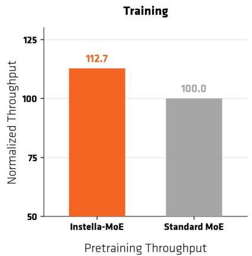

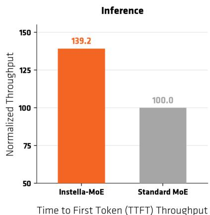  
Figure 8: Instella-MoE-16B-A3B training and inference throughput. Left: pre-training throughput, normalized to a standard MoE expert-parallel training baseline (12.7% improvement). Right: inference time-tofirst-token (TTFT) throughput under expert parallelism (39.2% improvement).

## 3.4 Training Eficiency

Beyond benchmark accuracy, Instella-MoE is designed for eficient training and serving on AMD hardware. FarSkip-Collective overlap yields a 12.7% pre-training throughput improvement over the standard expertparallel baseline architecture. At inference, SGLang serving with expert parallelism raises time-to-first-token (TTFT) throughput by 39.2% (Figure 8) by overlapping model communication with computation.These system-level optimizations complement the parameter eficiency of the MoE architecture by removing the significant communication overhead of MoEs and harnessing the eficiency of the sparse architecture with 2.8B active parameters per token.

## 4 Conclusion

We present Instella-MoE-16B-A3B, a fully open Mixture-of-Experts language model trained entirely on openly available data, using open-source code and AMD Instinct GPU infrastructure. With 16 billion total parameters and 2.8 billion active parameters per token, Instella-MoE combines the eficiency of sparse MoE architectures with architectural and system-level innovations—Gated Multi-head Latent Attention and FarSkip-Collective connectivity—to achieve performance competitive with both fully open and open-weight baselines while keeping per-token compute close to that of a dense 3B-class model.

The Instella-MoE release spans the complete model flow: pre-training, mid-training, long-context extension, supervised fine-tuning, direct preference optimization, and reinforcement learning. Instella-MoE-16B-A3B-Base achieves state-of-the-art performance among fully open models in our evaluation, with an average score of 76.7 across standard pre-training benchmarks, and our final Think checkpoint delivers the strongest overall post-trained results in our comparison. Alongside model weights from every training stage, we release training configurations, data mixtures, evaluation protocols, and training code built on the Primus and Mile frameworks.

Instella-MoE demonstrates that transparency and strong performance can coexist in modern sparse MoE systems. By open-sourcing a complete pipeline for training an MoE model from scratch on AMD hardware, we aim to support reproducible research, community-driven innovation, and further advances in eficient open language modeling.

## Acknowledgements

We are deeply grateful to the LLM360 team and the Miles team for their invaluable support throughout the development of our model. We dedicate this work to the memory of Zicheng Liu, whose vision and leadership continue to inspire our team.

## References

Loubna Ben Allal, Anton Lozhkov, Elie Bakouch, Gabriel Martín Blázquez, Guilherme Penedo, Lewis Tun stall, Andrés Marafioti, Hynek Kydlíček, Agustín Piqueres Lajarín, Vaibhav Srivastav, Joshua Lochner, Caleb Fahlgren, Xuan-Son Nguyen, Clémentine Fourrier, Ben Burtenshaw, Hugo Larcher, Haojun Zhao, Cyril Zakka, Mathieu Morlon, Colin Rafel, Leandro von Werra, and Thomas Wolf. SmolLM2: When Smol Goes Big – Data-Centric Training of a Small Language Model. arXiv preprint arXiv:2502.02737, 2025. URL https://arxiv.org/abs/2502.02737.

Training at Scale (TAS) Team AMD AI Brain. Primus: A Lightweight, Unified Training Framework for Large Models on AMD GPUs. https://github.com/AMD-AGI/Primus, 2025.

Anthropic. Claude Fable 5 and Claude Mythos 5, 2026. URL https://www.anthropic.com/news/ claude-fable-5-mythos-5.

Elie Bakouch, Loubna Ben Allal, Anton Lozhkov, Nouamane Tazi, Lewis Tunstall, Carlos Miguel Patiño, Edward Beeching, Aymeric Roucher, Aksel Joonas Reedi, Quentin Gallouédec, Kashif Rasul, Nathan Habib, Clémentine Fourrier, Hynek Kydlicek, Guilherme Penedo, Hugo Larcher, Mathieu Morlon, Vaibhav Srivas tav, Joshua Lochner, Xuan-Son Nguyen, Colin Rafel, Leandro von Werra, and Thomas Wolf. SmolLM3: smol, multilingual, long-context reasoner. https://huggingface.co/blog/smollm3, 2025.

Loubna Ben Allal, Anton Lozhkov, and Elie Bakouch. SmolLM: Blazingly Fast and Remarkably Powerful, July 2024. URL https://huggingface.co/blog/smollm.

Yonatan Bisk, Rowan Zellers, Ronan Le Bras, Jianfeng Gao, and Yejin Choi. PIQA: Reasoning about Physical Commonsense in Natural Language. In AAAI, 2020.

Christopher Clark, Kenton Lee, Ming-Wei Chang, Tom Kwiatkowski, Michael Collins, and Kristina Toutanova. BoolQ: Exploring the Surprising Dificulty of Natural Yes/No Questions. In NAACL, 2019.

Peter Clark, Isaac Cowhey, Oren Etzioni, Tushar Khot, Ashish Sabharwal, Carissa Schoenick, and Oyvind Tafjord. Think you have Solved Question Answering? Try ARC, the AI2 Reasoning Challenge. arXiv preprint arXiv:1803.05457, 2018. URL https://arxiv.org/abs/1803.05457.

Karl Cobbe, Vineet Kosaraju, Mohammad Bavarian, Mark Chen, Heewoo Jun, Lukasz Kaiser, Matthias Plap pert, Jerry Tworek, Jacob Hilton, Reiichiro Nakano, Christopher Hesse, and John Schulman. Training Verifiers to Solve Math Word Problems. arXiv preprint arXiv:2110.14168, 2021. URL https://arxiv.org abs/2110.14168.

Tri Dao. FlashAttention-2: Faster Attention with Better Parallelism and Work Partitioning. In ICLR, 2024.

DeepSeek-AI. DeepSeek-V3 Technical Report. arXiv preprint arXiv:2412.19437, 2024a. URL https://arxiv. org/abs/2412.19437.

DeepSeek-AI. DeepSeek-V2: A Strong, Economical, and Eficient Mixture-of-Experts Language Model. arXiv preprint arXiv:2405.04434, 2024b. URL https://arxiv.org/abs/2405.04434.

DeepSeek-AI. DeepSeek-V4: Towards Highly Eficient Million-Token Context Intelligence, 2026. URL https: //huggingface.co/deepseek-ai/DeepSeek-V4-Pro.

Yann Dubois, Balázs Galambosi, Percy Liang, and Tatsunori B. Hashimoto. Length-Controlled AlpacaEval: A Simple Way to Debias Automatic Evaluators. In COLM, 2024.

Yonatan Dukler, Guihong Li, Deval Shah, Jiang Liu, Vikram Appia, and Emad Barsoum. FarSkip-Collective: Unhobbling Blocking Communication in Mixture ofExperts Models. arXiv preprint arXiv:2511.11505, 2026. URL https://arxiv.org/abs/2511.11505.

Leo Gao, Jonathan Tow, Baber Abbasi, Stella Biderman, Sid Black, Anthony DiPofi, Charles Foster, Laurence Golding, Jefrey Hsu, Alain Le Noac’h, Haonan Li, Kyle McDonell, Niklas Muennighof, Chris Ociepa, Jason Phang, Laria Reynolds, Hailey Schoelkopf, Aviya Skowron, Lintang Sutawika, Eric Tang, Anish Thite, Ben Wang, Kevin Wang, and Andy Zou. The language model evaluation harness, 07 2024. URL https://zenodo. org/records/12608602.

Gemini Team. Gemini 3.1 Pro Model Card, 2026. URL https://deepmind.google/models/model-cards/ gemini-3-1-pro/.

Gemma Team. Gemma 4: Our Most Intelligent Open Models, 2026. URL https://deepmind.google/models gemma/gemma-4/.

Scott Geng, Hamish Ivison, Chun-Liang Li, Maarten Sap, Jerry Li, Ranjay Krishna, and Pang Wei Koh. The Delta Learning Hypothesis: Preference Tuning on Weak Data can Yield Strong Gains. arXiv preprint arXiv:2507.06187, 2025. URL https://arxiv.org/abs/2507.06187.

Fabian Gloeckle, Badr Youbi Idrissi, Baptiste Rozière, David Lopez-Paz, and Gabriel Synnaeve. Better & Faster Large Language Models via Multi-token Prediction. arXiv preprint arXiv:2404.19737, 2024. URL https: //arxiv.org/abs/2404.19737.

Dirk Groeneveld, Iz Beltagy, Evan Walsh, Akshita Bhagia, Rodney Kinney, Oyvind Tafjord, Ananya Jha, Hamish Ivison, Ian Magnusson, Yizhong Wang, Shane Arora, David Atkinson, Russell Authur, Khyathi Chandu, Arman Cohan, Jennifer Dumas, Yanai Elazar, Yuling Gu, Jack Hessel, Tushar Khot, William Merrill, Jacob Morrison, Niklas Muennighof, Aakanksha Naik, Crystal Nam, Matthew Peters, Valentina Pyatkin, Abhilasha Ravichander, Dustin Schwenk, Saurabh Shah, William Smith, Emma Strubell, Nishant Subramani, Mitchell Wortsman, Pradeep Dasigi, Nathan Lambert, Kyle Richardson, Luke Zettlemoyer, Jesse Dodge, Kyle Lo, Luca Soldaini, Noah Smith, and Hannaneh Hajishirzi. OLMo: Accelerating the Science of Language Models. In ACL, 2024.

Yuling Gu, Oyvind Tafjord, Bailey Kuehl, Dany Haddad, Jesse Dodge, and Hannaneh Hajishirzi. OLMES: A Standard for Language Model Evaluations. In NAACL Findings, 2025.

Yinghui He, Abhishek Panigrahi, Yong Lin, and Sanjeev Arora. Skill-Targeted Adaptive Training. arXiv preprint arXiv:2510.10023, 2025. URL https://arxiv.org/abs/2510.10023.

Dan Hendrycks, Collin Burns, Steven Basart, Andy Zou, Mantas Mazeika, Dawn Song, and Jacob Steinhardt. Measuring Massive Multitask Language Understanding. In ICLR, 2021a.

Dan Hendrycks, Collin Burns, Saurav Kadavath, Akul Arora, Steven Basart, Eric Tang, Dawn Song, and Jacob Steinhardt. Measuring Mathematical Problem Solving With the MATH Dataset. In NeurIPS, 2021b.

Cheng-Ping Hsieh, Simeng Sun, Samuel Kriman, Shantanu Acharya, Dima Rekesh, Fei Jia, Yang Zhang, and Boris Ginsburg. RULER: What’s the Real Context Size of Your Long-Context Language Models? In COLM, 2024.

Siming Huang, Tianhao Cheng, Jason Klein Liu, Weidi Xu, Jiaran Hao, Liuyihan Song, Yang Xu, Jian Yang, Jiaheng Liu, Chenchen Zhang, Linzheng Chai, Ruifeng Yuan, Xianzhen Luo, Qiufeng Wang, YuanTao Fan, Qingfu Zhu, Zhaoxiang Zhang, Yang Gao, Jie Fu, Qian Liu, Houyi Li, Ge Zhang, Yuan Qi, Xu Yinghui, Wei Chu, and Zili Wang. OpenCoder: The Open Cookbook for Top-Tier Code Large Language Models. In ACL, 2025.

Naman Jain, King Han, Alex Gu, Wen-Ding Li, Fanjia Yan, Tianjun Zhang, Sida Wang, Armando Solar-Lezama, Koushik Sen, and Ion Stoica. LiveCodeBench: Holistic and Contamination Free Evaluation of Large Language Models for Code. In ICLR, 2025.

Fan Jiang, Yu Zhao, Chenyang Lyu, Tianqi Shi, Yichao Du, Feihu Jiang, Longyue Wang, and Weihua Luo. Marco-MoE: Open Multilingual Mixture-of-Expert Language Models with Eficient Upcycling. arXiv preprint arXiv:2604.25578, 2026. URL https://arxiv.org/abs/2604.25578.

Mandar Joshi, Eunsol Choi, Daniel S Weld, and Luke Zettlemoyer. Triviaqa: A large scale distantly supervised challenge dataset for reading comprehension. In ACL, 2017.

Rabeeh Karimi Mahabadi, Sanjeev Satheesh, Shrimai Prabhumoye, Mostofa Patwary, Mohammad Shoeybi, and Bryan Catanzaro. Nemotron-CC-Math: A 133 Billion-Token-Scale High Quality Math Pretraining Dataset. arXiv preprint arXiv:2508.15096, 2025. URL https://arxiv.org/abs/2508.15096.

Tomáš Kočisk\`y, Jonathan Schwarz, Phil Blunsom, Chris Dyer, Karl Moritz Hermann, Gábor Melis, and Edward Grefenstette. The narrativeqa reading comprehension challenge. Transactions of the Association for Computational Linguistics, 6:317–328, 2018.

Tom Kwiatkowski, Jennimaria Palomaki, Olivia Redfield, Michael Collins, Ankur Parikh, Chris Alberti, Danielle Epstein, Illia Polosukhin, Jacob Devlin, Kenton Lee, et al. Natural questions: a benchmark for question answering research. Transactions of the Association for Computational Linguistics, 7:453–466, 2019.

Aitor Lewkowycz, Anders Andreassen, David Dohan, Ethan Dyer, Henryk Michalewski, Vinay Ramasesh, Ambrose Slone, Cem Anil, Imanol Schlag, Theo Gutman-Solo, et al. Solving quantitative reasoning problems with language models. In NeurIPS, 2022.

Jiang Liu, Jialian Wu, Xiaodong Yu, Yusheng Su, Prakamya Mishra, Gowtham Ramesh, Sudhanshu Ranjan, Chaitanya Manem, Ximeng Sun, Ze Wang, Pratik Prabhanjan Brahma, Zicheng Liu, and Emad Barsoum. Instella: Fully Open Language Models with Stellar Performance. arXiv preprint arXiv:2511.10628, 2025a. URL https://arxiv.org/abs/2511.10628.

Jiawei Liu, Chunqiu Steven Xia, Yuyao Wang, and Lingming Zhang. Is Your Code Generated by ChatGPT Really Correct? Rigorous Evaluation of Large Language Models for Code Generation. In NeurIPS, 2023.

Jingyuan Liu, Jianlin Su, Xingcheng Yao, Zhejun Jiang, Guokun Lai, Yulun Du, Yidao Qin, Weixin Xu, Enzhe Lu, Junjie Yan, Yanru Chen, Huabin Zheng, Yibo Liu, Shaowei Liu, Bohong Yin, Weiran He, Han Zhu, Yuzhi Wang, Jianzhou Wang, Mengnan Dong, Zheng Zhang, Yongsheng Kang, Hao Zhang, Xinran Xu, Yutao Zhang, Yuxin Wu, Xinyu Zhou, and Zhilin Yang. Muon is Scalable for LLM Training. arXiv preprint arXiv:2502.16982, 2025b. URL https://arxiv.org/abs/2502.16982.

Zichen Liu, Changyu Chen, Wenjun Li, Penghui Qi, Tianyu Pang, Chao Du, Wee Sun Lee, and Min Lin. Understanding r1-zero-like training: A critical perspective. arXiv preprint arXiv:2503.20783, 2025c. URL https://arxiv.org/abs/2503.20783.

Anton Lozhkov, Loubna Ben Allal, Elie Bakouch, Leandro von Werra, and Thomas Wolf. FineMath: the Finest Collection of Mathematical Content, 2024. URL https://huggingface.co/datasets/HuggingFaceTB/ finemath.

Wenhan Ma, Hailin Zhang, Liang Zhao, Yifan Song, Yudong Wang, Zhifang Sui, and Fuli Luo. Stabilizing MoE Reinforcement Learning by Aligning Training and Inference Routers. arXiv preprint arXiv:2510.11370, 2025. URL https://arxiv.org/abs/2510.11370.

Wenhan Ma, Jianyu Wei, Liang Zhao, Hailin Zhang, Bangjun Xiao, Lei Li, Qibin Yang, Bofei Gao, Yudong Wang, Rang Li, et al. Mopd: Multi-teacher on-policy distillation for capability integration in llm posttraining. arXiv preprint arXiv:2606.30406, 2026. URL https://arxiv.org/abs/2606.30406.

Meta AI. The Llama 4 Herd: The Beginning of a New Era of Natively Multimodal AI Innovation, 2025. URL https://ai.meta.com/blog/llama-4-multimodal-intelligence/.

Meta Superintelligence Labs. Introducing Muse Spark: Scaling Towards Personal Superintelligence, 2026. URL https://ai.meta.com/blog/introducing-muse-spark-msl/.

Todor Mihaylov, Peter Clark, Tushar Khot, and Ashish Sabharwal. Can a Suit of Armor Conduct Electricity? A New Dataset for Open Book Question Answering. In EMNLP, 2018.

Mistral AI. Introducing Mistral 3, 2025. URL https://mistral.ai/news/mistral-3/.

Moonshot AI. Kimi K3: Open Frontier Intelligence. arXiv preprint arXiv:2607.24653, 2026. URL https: //arxiv.org/abs/2607.24653.

Niklas Muennighof, Luca Soldaini, Dirk Groeneveld, Kyle Lo, Jacob Morrison, Sewon Min, Weijia Shi, Evan Pete Walsh, Oyvind Tafjord, Nathan Lambert, Yuling Gu, Shane Arora, Akshita Bhagia, Dustin Schwenk, David Wadden, Alexander Wettig, Binyuan Hui, Tim Dettmers, Douwe Kiela, Ali Farhadi, Noah A. Smith, Pang Wei Koh, Amanpreet Singh, and Hannaneh Hajishirzi. OLMoE: Open Mixture-of-Experts Language Models. In ICLR, 2025.

NVIDIA. NVIDIA Nemotron Nano 2: An Accurate and Eficient Hybrid Mamba-Transformer Reasoning Model. arXiv preprint arXiv:2508.14444, 2025. URL https://arxiv.org/abs/2508.14444.

NVIDIA. Nemotron-SFT-Competitive-Programming-v2, 2026. URL https://huggingface.co/datasets/ nvidia/Nemotron-SFT-Competitive-Programming-v2.

Team OLMo, Pete Walsh, Luca Soldaini, Dirk Groeneveld, Kyle Lo, Shane Arora, Akshita Bhagia, Yuling Gu, Shengyi Huang, Matt Jordan, Nathan Lambert, Dustin Schwenk, Oyvind Tafjord, Taira Ander son, David Atkinson, Faeze Brahman, Christopher Clark, Pradeep Dasigi, Nouha Dziri, Michal Guerquin, Hamish Ivison, Pang Wei Koh, Jiacheng Liu, Saumya Malik, William Merrill, Lester James V. Miranda, Jacob Morrison, Tyler Murray, Crystal Nam, Valentina Pyatkin, Aman Rangapur, Michael Schmitz, Sam Skjonsberg, David Wadden, Christopher Wilhelm, Michael Wilson, Luke Zettlemoyer, Ali Farhadi, Noah A. Smith, and Hannaneh Hajishirzi. 2 OLMo 2 Furious. arXiv preprint arXiv:2501.00656, 2024. URL https://arxiv.org/abs/2501.00656.

Team Olmo, Allyson Ettinger, Amanda Bertsch, Bailey Kuehl, David Graham, David Heineman, Dirk Groen eveld, Faeze Brahman, Finbarr Timbers, Hamish Ivison, et al. Olmo 3. arXiv preprint arXiv:2512.13961, 2025. URL https://arxiv.org/abs/2512.13961.

OpenAI. GPT-5.6 System Card, 2026. URL https://deploymentsafety.openai.com/gpt-5-6.

Bowen Peng, Jefrey Quesnelle, Honglu Fan, and Enrico Shippole. YaRN: Eficient Context Window Extension of Large Language Models. In ICLR, 2024.

Valentina Pyatkin, Saumya Malik, Victoria Graf, Hamish Ivison, Shengyi Huang, Pradeep Dasigi, Nathan Lambert, and Hannaneh Hajishirzi. Generalizing verifiable instruction following. NeurIPS, 2025.

Zihan Qiu, Zekun Wang, Bo Zheng, Zeyu Huang, Kaiyue Wen, Songlin Yang, Rui Men, Le Yu, Fei Huang, Suozhi Huang, Dayiheng Liu, Jingren Zhou, and Junyang Lin. Gated Attention for Large Language Models: Non-linearity, Sparsity, and Attention-Sink-Free. arXiv preprint arXiv:2505.06708, 2025. URL https:// arxiv.org/abs/2505.06708.

Qwen Team. Qwen3.5: Towards Native Multimodal Agents, February 2026a. URL https://qwen.ai/blog? id=qwen3.5.

Qwen Team. Qwen3.8-Max: A New Bar for Coding and Cowork, 2026b. URL https://www.alibabacloud. com/blog/qwen3-8-max-a-new-bar-for-coding-and-cowork\_603421.

Team RadixArk. Miles: A PyTorch-Native Stack for Large-Scale LLM RL Post-Training. https://github.com/ radixark/miles, 2025.

Rafael Rafailov, Archit Sharma, Eric Mitchell, Christopher D Manning, Stefano Ermon, and Chelsea Finn. Direct Preference Optimization: Your Language Model is Secretly a Reward Model. In NeurIPS, 2023.

David Rein, Betty Li Hou, Asa Cooper Stickland, Jackson Petty, Richard Yuanzhe Pang, Julien Dirani, Julian Michael, and Samuel R. Bowman. GPQA: A Graduate-Level Google-Proof Q&A Benchmark. In COLM, 2024.

Keisuke Sakaguchi, Ronan Le Bras, Chandra Bhagavatula, and Yejin Choi. WinoGrande: An Adversarial Winograd Schema Challenge at Scale. In AAAI, 2020.

Zhihong Shao, Peiyi Wang, Qihao Zhu, Runxin Xu, Junxiao Song, Xiao Bi, Haowei Zhang, Mingchuan Zhang, Y. K. Li, Y. Wu, and Daya Guo. DeepSeekMath: Pushing the Limits of Mathematical Reasoning in Open Language Models. arXiv preprint arXiv:2402.03300, 2024. URL https://arxiv.org/abs/2402.03300.

Noam Shazeer, Azalia Mirhoseini, Krzysztof Maziarz, Andy Davis, Quoc Le, Geofrey Hinton, and Jef Dean. Outrageously Large Neural Networks: The Sparsely-Gated Mixture-of-Experts Layer. arXiv preprint arXiv:1701.06538, 2017. URL https://arxiv.org/abs/1701.06538.

Mohammad Shoeybi, Mostofa Patwary, Raul Puri, Patrick LeGresley, Jared Casper, and Bryan Catanzaro. Megatron-lm: Training multi-billion parameter language models using model parallelism. arXiv preprint arXiv:1909.08053, 2019. URL https://arxiv.org/abs/1909.08053.

Dan Su, Kezhi Kong, Ying Lin, Joseph Jennings, Brandon Norick, Markus Kliegl, Mostofa Patwary, Mohammad Shoeybi, and Bryan Catanzaro. Nemotron-CC: Transforming Common Crawl into a Refined Long-Horizon Pretraining Dataset. In ACL, 2025.

Ximeng Sun, Aditya Singh, Gowtham Ramesh, Jiang Liu, Ze Wang, Sudhanshu Ranjan, Pratik Prabhanjan Brahma, Prakamya Mishra, Jialian Wu, Xiaodong Yu, Yusheng Su, Emad Barsoum, and Zicheng Liu. Instella-VL-1B: First AMD Vision Language Model, March 2025. URL https://huggingface.co/amd/ Instella-VL-1B.

Mirac Suzgun, Nathan Scales, Nathanael Schärli, Sebastian Gehrmann, Yi Tay, Hyung Won Chung, Aakanksha Chowdhery, Quoc V. Le, Ed H. Chi, Denny Zhou, and Jason Wei. Challenging BIG-Bench Tasks and Whether Chain-of-Thought Can Solve Them. In ACL Findings, 2023.

Liping Tang, Nikhil Ranjan, Omkar Pangarkar, Xuezhi Liang, Zhen Wang, Li An, Bhaskar Rao, Linghao Jin, Huijuan Wang, Zhoujun Cheng, Suqi Sun, Cun Mu, Victor Miller, Xuezhe Ma, Yue Peng, Zhengzhong Liu, and Eric P. Xing. TxT360: A Top-Quality LLM Pre-training Dataset Requires the Perfect Blend, 2024. URL https://huggingface.co/spaces/LLM360/TxT360.

Ashish Vaswani, Noam Shazeer, Niki Parmar, Jakob Uszkoreit, Llion Jones, Aidan N Gomez, Łukasz Kaiser, and Illia Polosukhin. Attention is all you need. In NeurIPS, 2017.

Ze Wang, Hao Chen, Benran Hu, Jiang Liu, Ximeng Sun, Jialian Wu, Yusheng Su, Xiaodong Yu, Emad Barsoum, and Zicheng Liu. Instella-T2I: Pushing the Limits of 1D Discrete Latent Space Image Generation. arXiv preprint arXiv:2506.21022, 2025. URL https://arxiv.org/abs/2506.21022.

Johannes Welbl, Nelson F. Liu, and Matt Gardner. Crowdsourcing Multiple Choice Science Questions. In WNUT, 2017.

An Yang, Anfeng Li, Baosong Yang, Beichen Zhang, Binyuan Hui, Bo Zheng, Bowen Yu, Chang Gao, Chengen Huang, Chenxu Lv, et al. Qwen3 Technical Report. arXiv preprint arXiv:2505.09388, 2025. URL https: //arxiv.org/abs/2505.09388.

Zhilin Yang, Peng Qi, Saizheng Zhang, Yoshua Bengio, William W Cohen, Ruslan Salakhutdinov, and Christopher D Manning. HotpotQA: A dataset for diverse, explainable multi-hop question answering. In EMNLP, 2018.

Zhuolin Yang, Zihan Liu, Yang Chen, Wenliang Dai, Boxin Wang, Sheng-Chieh Lin, Chankyu Lee, Yangyi Chen, Dongfu Jiang, Jie He, Renjie Pi, Grace Lam, Nayeon Lee, Alexander Bukharin, Mohammad Shoeybi, Bryan Catanzaro, and Wei Ping. Nemotron-Cascade 2: Post-Training LLMs with Cascade RL and Multi-Domain On-Policy Distillation. arXiv preprint arXiv:2603.19220, 2026. URL https://arxiv.org/abs/2603.19220.

Feng Yao, Liyuan Liu, Dinghuai Zhang, Chengyu Dong, Jingbo Shang, and Jianfeng Gao. Your Eficient RL Framework Secretly Brings You Of-Policy RL Training, aug 2025. URL https://fengyao.notion.site/ of-policy-rl.

Howard Yen, Tianyu Gao, Minmin Hou, Ke Ding, Daniel Fleischer, Peter Izsak, Moshe Wasserblat, and Danqi Chen. Helmet: How to evaluate long-context language models efectively and thoroughly. In ICLR, 2025.

Qiying Yu, Zheng Zhang, Ruofei Zhu, Yufeng Yuan, Xiaochen Zuo, Yu Yue, Weinan Dai, Tiantian Fan, Gaohong Liu, Lingjun Liu, Xin Liu, Haibin Lin, Zhiqi Lin, Bole Ma, Guangming Sheng, Yuxuan Tong, Chi Zhang, Mofan Zhang, Wang Zhang, Hang Zhu, Jinhua Zhu, Jiaze Chen, Jiangjie Chen, Chengyi Wang, Hongli Yu, Yuxuan Song, Xiangpeng Wei, Hao Zhou, Jingjing Liu, Wei-Ying Ma, Ya-Qin Zhang, Lin Yan, Mu Qiao, Yonghui Wu, and Mingxuan Wang. DAPO: An Open-Source LLM Reinforcement Learning System at Scale. arXiv preprint arXiv:2503.14476, 2025. URL https://arxiv.org/abs/2503.14476.

Z.ai Team. GLM-5.3: Frontier Coding with Emergent Cyber Capabilities, 2026. URL https://z.ai/blog/ glm-5.3.

Rowan Zellers, Ari Holtzman, Yonatan Bisk, Ali Farhadi, and Yejin Choi. HellaSwag: Can a Machine Really Finish Your Sentence? In ACL, 2019.

Xinrong Zhang, Yingfa Chen, Shengding Hu, Zihang Xu, Junhao Chen, Moo Hao, Xu Han, Zhen Thai, Shuo Wang, Zhiyuan Liu, et al. ∞ Bench: Extending long context evaluation beyond 100k tokens. In ACL, 2024.

Lianmin Zheng, Liangsheng Yin, Zhiqiang Xie, Chuyue Sun, Jef Huang, Cody H Yu, Shiyi Cao, Christos Kozyrakis, Ion Stoica, Joseph E Gonzalez, et al. Sglang: Eficient execution of structured language model programs. In NeurIPS, 2024.

Wanjun Zhong, Ruixiang Cui, Yiduo Guo, Yaobo Liang, Shuai Lu, Yanlin Wang, Amin Saied, Weizhu Chen, and Nan Duan. Agieval: A human-centric benchmark for evaluating foundation models. In NAACL Findings, 2024.

Fan Zhou, Zengzhi Wang, Nikhil Ranjan, Zhoujun Cheng, Liping Tang, Guowei He, Zhengzhong Liu, and Eric P. Xing. MegaMath: Pushing the Limits of Open Math Corpora. In COLM, 2025a.

Jefrey Zhou, Tianjian Lu, Swaroop Mishra, Siddhartha Brahma, Sujoy Basu, Yi Luan, Denny Zhou, and Le Hou. Instruction-Following Evaluation for Large Language Models. arXiv preprint arXiv:2311.07911, 2023. URL https://arxiv.org/abs/2311.07911.

Yuzhen Zhou, Jiajun Li, Yusheng Su, Gowtham Ramesh, Zilin Zhu, Xiang Long, Chenyang Zhao, Jin Pan, Xiaodong Yu, Ze Wang, Kangrui Du, Jialian Wu, Ximeng Sun, Jiang Liu, Qiaolin Yu, Hao Chen, Zicheng Liu, and Emad Barsoum. APRIL: Active Partial Rollouts in Reinforcement Learning to Tame Long-tail Generation. arXiv preprint arXiv:2509.18521, 2025b. URL https://arxiv.org/abs/2509.18521.

Zilin Zhu, Chengxing Xie, Xin Lv, and slime Contributors. slime: An LLM post-training framework for RL Scaling. https://github.com/THUDM/slime, 2025. GitHub repository. Corresponding author: Xin Lv.

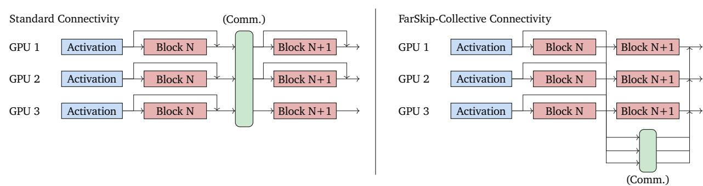  
Figure 9: FarSkip-Collective connectivity (Dukler et al., 2026). FarSkip-Collective modifies the connectivity between sub-blocks to avoid waiting for communication collectives. Computation continues with available activations, partial (e.g., Block N output) or outdated (e.g., Activation).

## A Overlapped Implementation of Instella-MoE

Instella-MoE employs FarSkip-Collective connectivity, which overlaps communication with computation by passing outdated and partial activations into MoE and attention layers (Figure 9), reducing communication bubbles while maintaining model accuracy. To explicitly achieve communication overlap during Instella-MoE training with FarSkip-Collective, we develop a custom model implementation that modularly enforces hardware overlap while avoiding custom kernels for portability. We go over our implementation techniques below.

On GPU hardware, communication-computation overlap ensures computation continues throughout the workload while communication is running simultaneously. This improves utilization and relies on sharing CUs between communication and computation kernels during runtime. The standard approach to implementing overlap is relying on the asynchronous launching behavior of kernels via torch.distributed’s async\_op=True flag that will yield back after queuing the kernel. This is coupled with .wait() barriers that are used for safe access of the communicated tensors. We use this approach during the forward pass as we explicitly order the model operations to maximize overlap. Nonetheless, during the backward pass, using torch.autograd makes explicit operator ordering and .wait() calls inaccessible. To resolve this we use the approach proposed by Dukler et al. (2026) (see Appendix C therein), developing race-safe asynchronous backward communication operations and combining them with sequence number re-prioritization using the Sequence Number API.1 Benchmarking our overlapped implementation during pre-training against the standard connectivity variant, we achieve a 12.7% training speed-up (Figure 8).

For inference, we implement communication-overlapped expert-parallel generation with support for both tensor-parallel attention and data-parallel attention to support Instella-MoE’s Gated-MLA-based attention. In addition to overlapping, by aggregating communication we are able to sum and communicate combined tensors, which allows us to further reduce the total communication volume. Using our implementation we raise time-to-first-token (TTFT) throughput by 39.2% by overlapping communication when serving Instella-MoE using 8×MI325X GPUs (Figure 8). The exact overlapped implementation code is included and documented in our release github.com/AMD-AGI/Instella-MoE.

## B SFT Data Curation Details

We provide additional details on the feedback-driven final-stage data curation introduced in the main text. We first present representative teacher error analyses and the retrieval queries derived from them, then describe how these queries are converted into selected training examples, and finally specify the underlying data splits and selection budget.

Error analyses and policies: each seed problem that the student answers incorrectly is passed to the judge model, which returns a structured error analysis whose fields record the failure mode, the skills the student lacks, and a description of the training data that would address the gap. Tables 15 and 16 report two such analyses, one for a mathematics problem and one for a coding problem, with the student’s response summarized rather than reproduced verbatim. Within each domain, the reflection model aggregates these per-problem analyses into a policy: a set of retrieval queries whose weights are normalized to one and collectively define the target distribution for selection. Table 17 shows five queries sampled at random from each targeted-domain policy, with those queries sorted by weight.

Table 15: Teacher error analysis (mathematics). Structured analysis produced by the judge model for a representative reasoning failure. The analysis is presented here under the consolidated fields domain, complexity, error, skills, would help, and summary; the problem statement is shown only for context.
<table><tr><td colspan="2">Problem (reference answer 503). The probability that a set of three distinct vertices chosen at random from among the vertices of a regular n-gon determine an obtuse triangle is  $\frac { 9 3 } { 1 2 5 }$  . Find the sum of all possible values of n</td></tr><tr><td>Domain</td><td>math → combinatorics and geometry → Determining the probability that three randomly chosen vertices of a regular n-gon form an obtuse triangle by analyzing arc lengths and using symmetry, then solving for n given a specific probability value</td></tr><tr><td>Complexity</td><td>Multi-step: requires understanding geometric properties of cyclic polygons, distinguishing between acute, right, and obtuse triangles based on arc measures, deriving general formulas for the number of obtuse triangles in terms of n for both even and odd cases, setting up and solving rational equations, and verifying solutions against constraints.</td></tr><tr><td>Error</td><td>Incorrect approach and incomplete reasoning: focused on a specific small case (hexagon) instead of generalizing, made counting errors, misapplied angle formulas, failed to derive the correct general formula, and did not solve for n</td></tr><tr><td>Skills</td><td>The student lacks the ability to generalize from a specific example to a general formula, does not understand the relationship between central arcs and inscribed angles in a circle, fails to recognize that only one angle in a triangle can be obtuse and that it corresponds to the largest arc opposite it, and does not know how to count triangles lying on a semicircle or subtract right triangles appropriately. Additionally, the student does not know how to set up and solve equations involving binomial coefficients and rational expressions to find integer solutions.</td></tr><tr><td>Would help</td><td>Problems involving probability of triangle types in regular polygons with step-by-step solutions that derive general formulas using symmetry and arc-length arguments, especially those that distinguish between even and odd n, explain the connection between inscribed angles and arcs, and show how to count configurations on semicircles. Examples should include worked derivations of the number of obtuse triangles as a function of  $n ,$  followed by solving equations like  $3 ( n - 3 ) / ( 4 ( n - 2 ) ) = 9 3 / 1 2 5 $ </td></tr><tr><td>Summary</td><td>The student incorrectly focused on a specific case  $\left( n = 6 \right)$  and attempted to manually count obtuse triangles by examining arcs, but failed to generalize the method to arbitrary n. They made errors in counting pairs and misapplied geometric principles, such as incorrectly relating arc length to angle measure. The reasoning never led to a general formula for the number of obtuse triangles, nor did it result in solving the equation for n. The correct approach requires deriving separate formulas for odd and even n based on semicircle containment and right triangle counts, then solving the resulting rational equations. The student&#x27;s work is incomplete, inconsistent, and does not reach the correct values of n or their sum.</td></tr></table>

From queries to selected examples: each targeted-domain policy is a list of retrieval queries with nonnegative weights that sum to one. Selection uses a two-level allocation of the 512K budget B. First, B is split across domains in the same proportions as the base mixture, giving a per-domain budget $B _ { \mathrm { d o m } } .$ . Within a targeted domain, a query with weight $w _ { i }$ retrieves $\lfloor B _ { \mathrm { d o m } } w _ { i } ( 1 - \alpha ) \rfloor$ nearest neighbors from the pool by cosine similarity in a shared embedding space. Because the weights sum to one, the retrieved examples account for approximately a $( 1 - \alpha )$ share of the domain budget after integer rounding; the remaining budget is filled with random same-domain examples. This random component preserves coverage and prevents the mixture from collapsing onto the retrieved neighborhoods. We use $\alpha = 0 . 5$ . The non-targeted other domain has no policy, so its entire budget is filled by random sampling within that domain.

Data splits and budget: the curation operates over four disjoint sets that mirror the stages of the pipeline. Diagnosis and query generation run on a held-out seed set of problems paired with reference answers: for mathematics we use AIME problems through 2022, and for coding we use problems drawn from the Nemotron pool. To measure the efect of curation without leakage, a separate scoring set is reserved for evaluation and never enters selection. Retrieval then draws from the full instruction-tuning training pool. We remove any content that overlaps with either the seed set or the scoring set so that neither diagnostic nor evaluation prob lems can be reselected, and we drop any example longer than 32K tokens before embedding. The examples returned by retrieval, together with the random same-domain fill described above, form the curated set: the final 512K mixture used for the last SFT phase, which contains the same number of samples per domain as the base mixture.

Table 16: Teacher error analysis (coding). Structured analysis produced by the judge model for a repre sentative reasoning failure, presented under the same consolidated fields as Table 15; the problem statement is shown only for context.
<table><tr><td colspan="2">Problem. A dog starts at  $x = 0$  and runs right at unit speed past n bowls at  $x = 1 , \ldots , n ;$  bowl i becomes edible only at time  $t _ { i } .$  On reaching a hot bowl the dog may wait until  $t _ { i }$  (delaying every later bowl) or skip it and continue. Maximize the number of bowls eaten within T seconds.</td></tr><tr><td>Domain</td><td>algorithmic problem solving → dynamic programming with greedy optimization and binary search → strategic decision-making in a time-constrained sequential process where the choice to skip a valid option may enable a better overall outcome, requiring a non-greedy, globally optimal strategy rather than a local greedy one</td></tr><tr><td>Complexity</td><td>multi-step with backtracking and optimization: requires recognizing that a greedy approach of eating every valid bowl immediately is suboptimal, understanding the trade-off between waiting at a bowl and skipping it to reach more bowls later, and implementing a binary search with heap-based feasibility checking to efficiently evaluate the maximum number of bowls that can</td></tr><tr><td>Error</td><td>be eaten under constraints incorrect greedy assumption and failure to model strategic skipping decisions the student lacks the ability to recognize that optimal solutions in sequential decision problems</td></tr><tr><td>Skills</td><td>with time constraints may require skipping seemingly beneficial options to achieve a better long-term outcome. They also lack familiarity with advanced techniques such as binary search over answers combined with heap-based maintenance of critical values (like  $t _ { j } - j )$  to simulate optimal skipping strategies. Additionally, they fail to understand how the timing of arrival and cooling interacts with the decision to wait or skip.</td></tr><tr><td>Would help</td><td>problems involving optimal scheduling with trade-offs between immediate action and future opportunities, especially those requiring binary search on answer combined with heap or priority queue data structures to maintain state for feasibility checks. Examples should include scenarios where skipping a valid option enables a better overall result, such as minimum time to complete tasks with dependencies and cooldowns&#x27; or &#x27;maximize number of jobs with deadlines and processing times&#x27;. Worked solutions should explicitly compare greedy vs. optimal strategies and demonstrate why greedy fails in certain cases.</td></tr><tr><td>Summary</td><td>The student incorrectly assumes that eating every bowl for which max(  $\mathop { i } + 1 , t _ { i } \mathop { ) } < T$  is optimal, failing to recognize that skipping an early valid bowl might allow the dog to eat more bowls later by avoiding delays. This greedy approach ignores the strategic trade-off between waiting at a bowl (which delays the dog) and skipping it (which may enable reaching more bowls within the time limit). The correct solution uses binary search on the number of bowls and a heap to track the k — 1 smallest values of  $( t _ { j } - j )$  in the prefix, which helps determine whether skipping certain bowls leads to a better overall outcome. The student&#x27;s reasoning is limited to local validity checks and does not account for the global impact of skipping decisions, leading to a fundamentally flawed strategy.</td></tr></table>

Curation prompts: for reproducibility, we reproduce the prompts used by the pipeline verbatim. The judge model runs the correctness-verification prompt (Table 18) and, on incorrect responses, one of two erroranalysis prompts—a general one (Table 19) and a coding-specific one (Table 20). The reflection model runs the policy prompt (Table 21) that turns the aggregated error analyses into weighted retrieval queries.

## C Training Data Details

We provide additional details on the data mixtures used across the training stages. All corpora are drawn from publicly available open-source datasets.

Pre-training. The 7.1T-token pre-training corpus comprises web data, mathematics data, code data, curated SFT-style data, and data from other domains: Nemotron-CC-v2 (Su et al., 2025; NVIDIA, 2025) (web); Nemotron-CC-Math-v1 (Karimi Mahabadi et al., 2025), MegaMath (Zhou et al., 2025a), and Fine-Math (Lozhkov et al., 2024) (mathematics); RefineCode (Huang et al., 2025) and Nemotron-Pretraining-

Table 17: Sample retrieval queries. Five queries drawn at random from each targeted-domain policy.
<table><tr><td>Domain</td><td>Weight</td><td>Query</td></tr><tr><td rowspan="5">Math</td><td>0.017</td><td>Coordinate geometry problems involving polygons with area equality constraints, fixed side alignments on triangle edges, or intersection conditions, requiring use of shoelace formula, vector dot products, and solving systems of equations derived from geometric constraints</td></tr><tr><td>0.009</td><td>Complex number geometry problems involving regular polygons inscribed in circles, roots of unity, rotational symmetries, and magnitude calculations of vector sums, requiring trigonometric identities and algebraic manipulation of complex expressions</td></tr><tr><td>0.009</td><td>Prime factorization analysis and divisor counting, including odd and even divisor separation and unordered factorization counting</td></tr><tr><td>0.007</td><td>Digit constraint problems including 9&#x27;s complement methods, counting numbers with specific digit properties, avoiding zero digits, and optimization over digit assignments</td></tr><tr><td>0.005</td><td>Diophantine equation problems involving counting positive integer solutions to linear equations with bounds, constraints on digit sums, and modular restrictions</td></tr><tr><td rowspan="5">Code</td><td>0.020</td><td>Graph algorithms focusing on BFS for shortest paths in state spaces, DFS for connectivity and component analysis, and Dijkstra&#x27;s algorithm for weighted shortest paths. Include problems with mathematical state spaces involving rational numbers, grid-based movement, and tree structures. Emphasize proper implementation of visited sets, queue</td></tr><tr><td>0.018</td><td>management, and path reconstruction. Strict input/output format compliance problems emphasizing precise input handling (preserving whitespace and avoiding premature .strip()), exact output string templates, JSON structure validation, and adherence to specific message formats. Include tasks where output formatting is as critical as algorithmic correctness, such as</td></tr><tr><td>0.005</td><td>exact word counts, specific capitalization rules, and structured data output. Spatial graph connectivity problems defined on geometric grids where adjacency depends on Manhattan distance, same-row or same-column proximity, or visibility lines. Include problems requiring sorting of coordinates by x or y values and connecting only</td></tr><tr><td>0.003</td><td>spatially adjacent points, avoiding abstract bipartite graph misrepresentations. Prolog and logic programming: predicate chaining, transformation pipelines (named_to_op_expr, prefix token conversion), compound term handling, and constraint</td></tr><tr><td>0.003</td><td>logic programming without direct recursion. Web application development using frameworks like Streamlit including API integration, HTTP requests, JSON response parsing, and interactive UI components. Include data persistence, state management across sessions, and responsive layout implementation.</td></tr></table>

Table 18: Judge prompt. System prompt used by the LLM-as-judge to verify a student response against the reference answer.  
You are a strict answer verifier. You will see a question, a reference (gold) solution, and a   
student’s solution. Determine whether the student arrived at the correct final answer or output.   
The task may be math, coding, science, instruction following, creative writing, or anything else.   
Judge correctness based on the task type:   
- Math/science: equivalent final answers count as correct (0.5 = 1/2, etc.)   
- Code: output must be functionally equivalent (ignore whitespace, variable names)   
- Instruction following: the student must satisfy the stated requirements   
- Open-ended: use the reference as a guide; accept reasonable equivalents   
Respond with EXACTLY one JSON object on a single line:   
{"correct": true} or {"correct": false, "reason": "<brief explanation>"}

Table 19: Error-analysis prompt (general). System prompt used by the judge model to produce a structured error analysis for an incorrect response.

You are analyzing why a student AI model produced a wrong answer. The task could be math, coding,   
science, instruction following, creative writing, or anything else. Given the question, reference   
solution, and the student’s incorrect output, provide detailed structured feedback. Be verbose and   
descriptive in every field — write in natural language, not just labels.   
Respond with EXACTLY one JSON object:   
{   
"domain": "<broad area: math, code, science, instruction\_following, creative, general, etc.>",   
"sub\_domain": "<specific sub-field within the domain, e.g. ’combinatorics and counting’, ’dynamic   
programming’, ’thermodynamics’, ’output format compliance’>",   
"concept": "<describe the specific concept or skill being tested in plain English, e.g. ’applying   
the inclusion-exclusion principle to count overlapping sets’, ’handling recursive base cases in tree   
traversal’, ’following multi-part formatting instructions precisely’>",   
"reasoning\_complexity": "<describe what level of reasoning this task requires and why, e.g.   
’multi-step: requires setting up equations from word problem, solving the system, then verifying   
constraints’, ’single-step: direct formula application’, ’multi-step with backtracking: requires   
trying cases and eliminating invalid ones’>",   
"error\_type": "<describe what went wrong in a short phrase, e.g. ’confused area formula with   
circumference formula’, ’off-by-one in loop boundary and wrong conditional ordering’, ’ignored   
explicit bullet point and verb-first requirements’>",   
"skills\_lacking": "<describe in detail what knowledge or abilities the student is missing, e.g. ’the   
student needs a firmer grasp of when to apply πr2 vs 2πr, and more generally how to distinguish   
between area and perimeter formulas across shapes’>",   
"what\_would\_help": "<describe what kind of training data would help the student get better at this,   
written as a description suitable for retrieving similar examples from a large pool, e.g. ’geometry   
problems that require choosing between area, perimeter, and volume formulas for circles, rectangles,   
and spheres, with explicit worked solutions showing formula selection reasoning’>",   
"summary": "<2-4 sentence detailed explanation of what went wrong, why the student’s approach   
failed, and what the correct approach would have been>"   
}

Code-v1 (NVIDIA, 2025) (code); Nemotron-Pretraining-SFT-v1 (NVIDIA, 2025) (curated pre-training SFTstyle data); and the TxT360 (Tang et al., 2024) subsets (other domains, including arxiv, dm\_maths, europarl, freelaw, hackernews, pg19, phil\_papers, pubmed, s2orc, stackexchange, ubuntu\_irc, uspto, and wikipedia).

Mid-training variants. The three mid-training variants share the Dolma 3 Dolmino 100B (Olmo et al., 2025) base mixture and difer only in a few STEM/reasoning subsets, as summarized in Table 22. All other subsets are identical across the variants.

Long-context Stage 2. The Stage 2 mixture is a 37.32B-token curated blend of math, code, and reasoning data drawn from the Dolma 3 Dolmino 100B mix, the full Dolma 3 Dolmino pool (Olmo et al., 2025), and Instella-GSM8K-synthetic (Liu et al., 2025a). Table 23 reports the mixture at the level of individual source datasets, whereas Table 7 in the main text groups the same 37.32B tokens by domain.

SFT Phase 1. The phase-1 SFT mixture combines a general instruction-following dataset with three targeted skill slices spanning mathematics, code, and science (Table 24). In Phase 2, the model is annealed on the feedback-driven curated 512K-example mixture described in Appendix B, which is selected from a candidate pool comprising Dolci-Think-SFT-7B (Olmo et al., 2025), Nemotron-SFT-Competitive-Programmingv2 (NVIDIA, 2026), and Nemotron-Cascade-2 (Yang et al., 2026).

Post-training preference and RL data. DPO uses the contrastive preference pairs from Dolci-Think-DPO-7B (Olmo et al., 2025). RL uses Dolci-Think-RL-7B: the IF-RL stage trains the instruction-following expert on the IF RLVR Mixture (the IF\_multi\_constraints slice), and the MOPD stage mixes the IF RLVR Mixture with the general prompts at an IF fraction of 0.5, with each prompt domain-tagged so the domain router sends it to either the IF-RL teacher or the frozen DPO anchor teacher.

Table 20: Error-analysis prompt (coding). Coding-specific variant of the error-analysis prompt, used by the judge model for problems in the code domain.  
You are analyzing why a student AI model produced a wrong answer on a CODING task. All tasks in this   
set require writing code to solve — including scripts, automation, API usage, data processing, file   
manipulation, web development, and system administration tasks. Even if a task looks like   
"instruction following", the solution requires functional code.   
Given the question, reference solution, and the student’s incorrect output, provide detailed   
structured feedback focused on the coding skills needed. Be verbose and descriptive in every field —   
write in natural language, not labels.   
Respond with EXACTLY one JSON object:   
{   
"domain": "code",   
"sub\_domain": "<specific coding sub-field, e.g. ’string processing’, ’file I/O and scripting’, ’API   
integration’, ’data parsing and transformation’, ’web scraping’, ’command-line tool usage’,   
’database queries’, ’text encoding and Unicode handling’>",   
"concept": "<describe the specific coding concept or skill being tested, e.g. ’reading CSV files and   
computing column statistics with pandas’, ’writing a bash script to recursively process files with   
pandoc’, ’implementing UTF-16 endianness detection by analyzing byte order marks’>",   
"reasoning\_complexity": "<describe what level of coding reasoning this task requires, e.g.   
’multi-step: requires parsing input format, building data structure, applying transformation,   
formatting output’, ’single-step: direct library call with correct parameters’>",   
"error\_type": "<describe what went wrong in coding terms, e.g. ’wrong library function used for file   
traversal’, ’failed to handle edge case in string encoding’, ’produced pseudocode instead of   
executable code’, ’incorrect regex pattern for parsing’>",   
"skills\_lacking": "<describe what coding knowledge or abilities the student is missing, e.g. ’the   
student needs practice with Python’s os.walk for recursive directory traversal and subprocess for   
calling external tools’>",   
"what\_would\_help": "<describe what kind of coding training data would help, e.g. ’Python scripts   
that automate file format conversion using subprocess and os.path, with complete working examples   
showing error handling and edge cases’>",   
"summary": "<2-4 sentence explanation of what went wrong in coding terms — what the code should have   
done, what the student produced instead, and what coding approach would have been correct>"   
}

Table 21: Reflection (policy) prompt. System prompt used by the reflection model to turn aggregated error analyses into a weighted retrieval policy.

You are optimizing a data selection policy for training a student AI model.   
The policy is a list of (prompt, weight) pairs:   
- Each "prompt" describes what kind of training data to select from a large pool via embedding   
similarity search.   
- The "weight" controls what fraction of the training budget goes to that prompt.   
- Weights must sum to <= 1.0. The remainder is filled with randomly selected data.   
Based on the error analytics provided, propose a data selection policy. You should:   
- ADD prompts to cover the error patterns observed   
- ADJUST weights to reflect how frequently each pattern appears   
Guidelines:   
- Focus on what recurs across errors. A prompt can target a recurring domain (e.g. "contract law   
case analysis"), a recurring skill (e.g. "multi-step unit conversions"), or both if the cluster is   
tight enough (e.g. "thermodynamics with unit conversions between energy systems").   
- Each prompt should cover MULTIPLE related errors, not a single problem.   
- Aim for ∼25 prompts. Together they should cover all the major error clusters, not just the most   
frequent ones.   
- Look at the error examples to identify PATTERNS, not individual failures.   
- Give higher weights to patterns that appear more frequently in the errors.   
- Each prompt should describe training data in terms of TOPIC (e.g. "number theory", "graph   
algorithms"), SKILLS (e.g. "modular arithmetic, CRT"), and COMPLEXITY (e.g. "multi-step reasoning   
with case analysis"). Avoid vague or meta-skill prompts like "write correct code", "ensure proper   
formatting", or "verify final answers".   
Explain your reasoning, then provide the policy as a JSON array:   
[   
{"prompt": "description of desired training data", "weight": 0.XX},   
...   
]

Table 22: Mid-training data-mixture variants. Token counts for the STEM/reasoning subsets that difer across the three mid-training variants; all remaining Dolma 3 Dolmino 100B subsets are unchanged. Full pool lists the size of each subset in the full Dolma 3 Dolmino pool for reference.
<table><tr><td>Type</td><td>Source</td><td>v1</td><td>v2</td><td>v3</td><td>Full pool</td></tr><tr><td>Math (synth) Web pages</td><td>MegaMatt</td><td>1.73B</td><td>1.73B</td><td>3.88B</td><td>3.88B</td></tr><tr><td rowspan="5">Thinking (synth)</td><td>STEM-Heavy Crawl</td><td>4.99B</td><td>5.21B</td><td>5.21B</td><td>5.21B</td></tr><tr><td>General Reasoning Mix</td><td>1.87B</td><td>1.87B</td><td>2.48B</td><td>2.48B</td></tr><tr><td>Math Meta-Reasoning</td><td>381M</td><td>381M</td><td>1.05B</td><td>1.05B</td></tr><tr><td>Code Meta-Reasoning</td><td>459M</td><td>459M</td><td>1.27B</td><td>1.27B</td></tr><tr><td>All other subsets</td><td>unchanged</td><td>unchanged</td><td>unchanged</td><td></td></tr><tr><td colspan="2">Total mix</td><td>99.95B</td><td>100.17B</td><td>104.41B</td><td></td></tr></table>

Table 23: Long-context Stage 2 data mixture. Token counts per subset for the curated 37.32B-token math/code/reasoning mixture. Source indicates whether the subset is drawn from the Dolma 3 Dolmino 100B mix, the full Dolma 3 Dolmino pool, or Instella-GSM8K-synthetic.
<table><tr><td>Type</td><td>Dataset</td><td>Source</td><td>Tokens</td></tr><tr><td rowspan="7">Math</td><td>dolmino-math</td><td>100B mix</td><td>10.7B</td></tr><tr><td>cranemath</td><td>100B mix</td><td>5.62B</td></tr><tr><td>megamatt</td><td>Full pool</td><td>3.88B</td></tr><tr><td>tinymath-mind</td><td>100B mix</td><td>898M</td></tr><tr><td>tinymath-pot</td><td>100B mix</td><td>241M</td></tr><tr><td>instella-gsm8k-synthetic</td><td>Instella-GSM8K</td><td>329M</td></tr><tr><td>cranecode</td><td>100B mix</td><td>10.0B</td></tr><tr><td rowspan="5">Code Thinking</td><td>general_reasoning_mix</td><td></td><td></td></tr><tr><td>omr-rewrite-fullthoughts</td><td>Full pool 100B mix</td><td>2.48B</td></tr><tr><td></td><td></td><td>850M</td></tr><tr><td>math-meta-reasoning</td><td>Full pool</td><td>1.05B</td></tr><tr><td>code-meta-reasoning</td><td>Full pool</td><td>1.27B</td></tr></table>

Table 24: SFT Phase 1 data mixture. Record counts and the capability contributed by each source. Mathematics records are reservoir-sampled from Nemotron-Cascade-2 with reasoning prefixes stripped; all competitive-programming records that survive the 32K-token filter are retained; and science records are sampled from Nemotron-Cascade-2.
<table><tr><td>Domain</td><td>Source</td><td>Records</td><td>Contribution</td></tr><tr><td>General</td><td>Dolci-Think-SFT-7B</td><td>~2.27M</td><td>General instruction-following base</td></tr><tr><td>Math</td><td>Nemotron-Cascade-2 (math)</td><td>300K</td><td>Math; reservoir-sampled with the reasoning prefix stripped</td></tr><tr><td rowspan="2">Code</td><td>Nemotron-SFT-Competitive- Programming-v2 (Python)</td><td>~161K</td><td>Coding; all records surviving the 32K-token filter</td></tr><tr><td>Nemotron-Cascade-2 (science)</td><td>~197K</td><td>Science reasoning and question an-</td></tr><tr><td>Science</td><td></td><td></td><td>swering</td></tr></table>