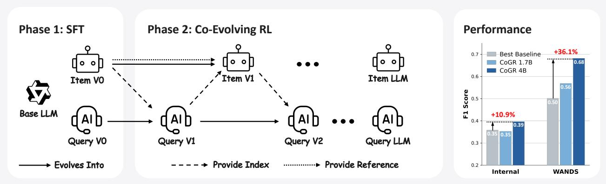
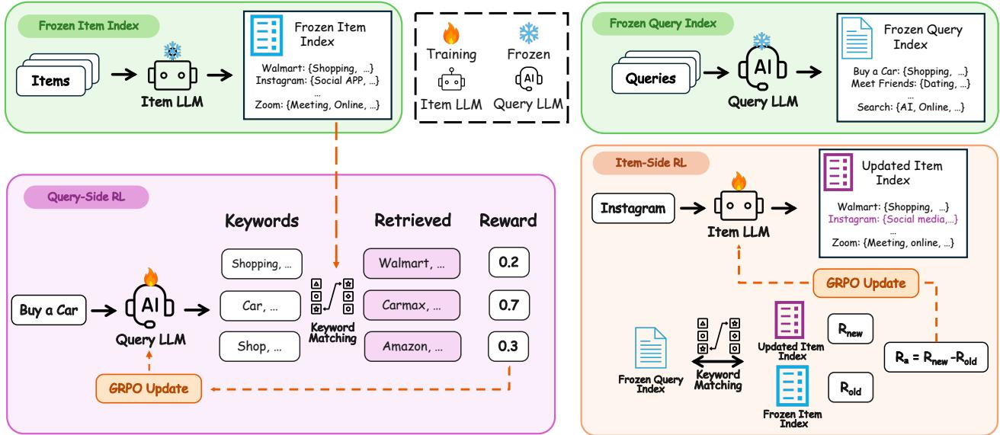
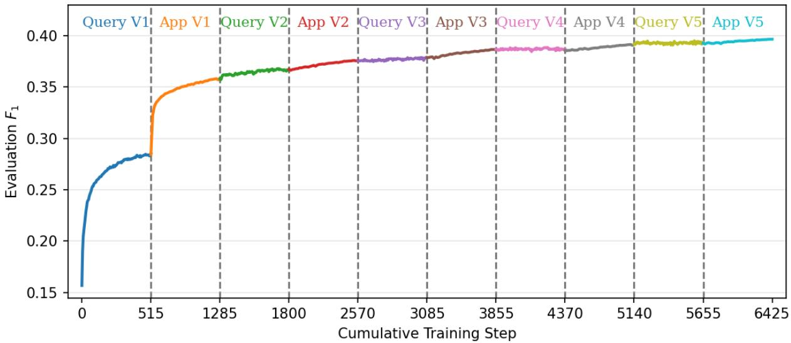
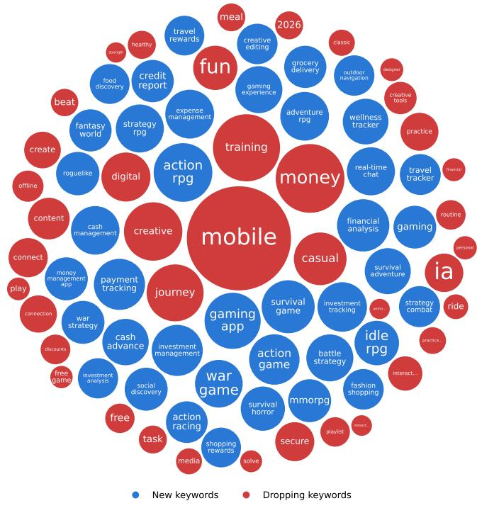
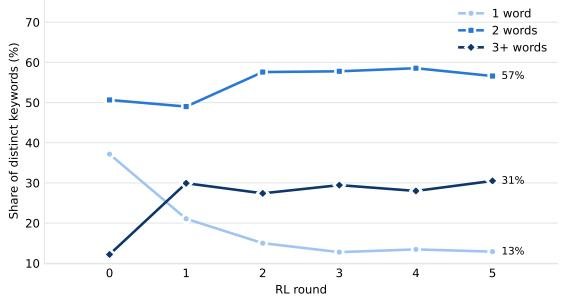
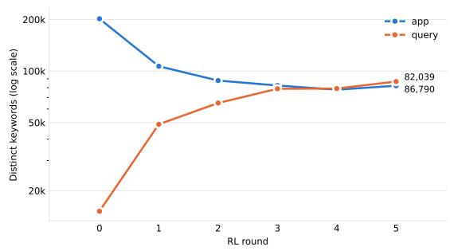
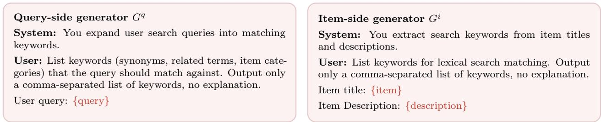

# It Takes Two to Match: Co-Evolving Generative Retriever with Reinforcement Learning

Runpeng Dai1,2,‡, Kaili Huang2, Changsung Kang2, Ciya Liao2

1University of North Carolina at Chapel Hill 2Apple

Retrieval is the first stage of modern search and advertising systems, selecting a candidate set from a large item universe for downstream ranking and auction. Recent work increasingly leverages LLMs to improve retrieval through query expansion, data synthesis, and retrieval-feedback training. However, the generative component is typically used for query-side augmentation, while final matching is still delegated to a downstream retriever. We introduce CoGR, a retrieval framework that instead trains LLMs to directly construct retrieval representations on both query and item sides. Each generator produces a compact set of keywords, which are matched directly through an inverted index, preserving compatibility with existing keyword-based retrieval infrastructure. CoGR uses a two-stage training pipeline. Supervised fine-tuning first establishes an aligned keyword space, after which co-evolving reinforcement learning alternately optimizes the query- and item-side generators with GRPO against the opposite side’s frozen index. Both sides optimize the same query-to-item retrieval $F _ { 1 }$ objective: the query side receives retrieval $F _ { 1 }$ directly, while the item side receives a counterfactual marginal reward measuring the change in query-side $F _ { 1 }$ caused by its generated keywords. Across 10 representative sparse, dense, and generative baselines, CoGR achieves the best performance on both an internal APP Marketplace dataset and the public WANDS benchmark, improving $F _ { 1 }$ over the strongest baseline by 10.9% and 36.1%, respectively. Further analysis shows stable co-evolution and increasingly aligned query–item keyword spaces over training.

Correspondence: Runpeng Dai: runpeng@unc.edu; Ciya Liao: ciya.liao@apple.com

## 1 Introduction

Retrieval is the first stage of modern search and recommendation systems. Given a query, it selects a candidate set from a large item universe for downstream ranking and auction. This stage is consequential because its errors are largely irreversible. An item not retrieved cannot be recovered by later models while irrelevant candidates increase the burden on downstream stages. An efective retriever must therefore maintain broad coverage while keeping the candidate set precise, reflecting the fundamental trade-of between recall and precision (Chowdhury, 2010).

Classical lexical retrieval methods such as BM25 (Robertson and Zaragoza, 2009) match queries and items through explicit terms and inverted indexes. Within this paradigm, keyword-based retrieval is especially prevalent in sponsored search, where advertisers directly bid on keywords. However, lexical representations can be limited in capturing deeper semantic relationships. To move beyond exact lexical overlap, dense retrieval maps queries and items into a shared continuous representation space and matches them through vector similarity (Karpukhin et al., 2020; Xiong et al., 2020; Ni et al., 2022). More recently, generative retrieval ofers another alternative by directly generating semantic identifiers, replacing similarity-based matching with autoregressive prediction (Tay et al., 2022; Wang et al., 2022; Sun et al., 2023; Zeng et al., 2024a). However, generative retrieval often depends heavily on identifier design and faces challenges in decoding scalability and generalization (Li et al., 2025b).

  
Figure 1 The overall CoGR training pipeline and performance. CoGR consists a SFT stage and a co-evolving RL stage looping between Item and Query LLMs. CoGR achieves strong performance gains on both internal APP marketplace and public item search benchmarks.

Recent work has explored the use of LLMs for retrieval, leveraging their strong capabilities in semantic understanding. Earlier approaches prompt LLMs for query expansion, data synthesis, or keyword generation to improve retrieval (Gao et al., 2023; Wang et al., 2023a; Ma et al., 2023; Liu et al., 2025). More recent methods further train LLMs using feedback from downstream retrievers (Jiang et al., 2025a; Li et al., 2025a; Yao et al., 2025). However, these methods typically train generator of one side, most often the query side and they still rely on a separate downstream retriever for matching. This raises a natural question: can we instead train LLMs to jointly construct retrieval representations for both sides and directly match queries and items in the resulting representation space?

To this end, we propose CoGR, a retrieval framework that trains separate LLMs to generate keywords for queries and items. Given a query or an item, the corresponding generator produces a compact set of keywords, and retrieval is performed directly by matching the generated keyword sets through an inverted index. The generated keywords thus serve directly as retrieval representations. This design also preserves compatibility with existing keyword-based retrieval infrastructure.

The key challenge is to align the two generated keyword spaces so that semantically relevant query–item pairs can be reliably matched. CoGR addresses this with a two-stage training pipeline consisting of supervised fine-tuning (SFT) followed by co-evolving reinforcement learning (RL). The SFT stage establishes an aligned initialization by constructing query-side targets from the keywords of relevant items. Starting from this initialization, we alternately optimize the query- and item-side generators with GRPO (Shao et al., 2024). The query-side generator is rewarded directly by the retrieval $F _ { 1 }$ induced by its generated keywords, while the item-side generator receives a counterfactual marginal reward that measures the change in the same query-side $F _ { 1 }$ objective caused by replacing its keyword set. During each update, the index produced by the opposite side is kept frozen, allowing each generator to optimize against a fixed retrieval environment while the two keyword spaces progressively co-evolve.

Empirically, we compare CoGR against 10 representative baselines spanning sparse, dense, and generative retrieval. On both the internal APP Marketplace dataset and the public WANDS product-search benchmark (Chen et al., 2022), CoGR achieves the best overall retrieval performance, improving $F _ { 1 }$ over the strongest baseline by 10.9% and 36.1%, respectively. We further find that alternating query–item optimization is dynamically stable, that co-evolving both sides is important for strong performance, and that the generated keyword spaces become increasingly specific and aligned over training.

## 2 Method

## 2.1 Overview

Retrieval is a fundamental task for modern search systems. Given a query q, the goal is to retrieve the set of relevant items from a fixed item universe I. Depending on the scenario, the item may be an advertisement, an app, a product, or a document.

Our method generates keywords for both queries and items and performs keyword-based matching. We train two separate keyword generators: query-side and item-side generators $G ^ { q } , G ^ { i }$ . Given a query $q \in \mathcal { Q }$ and an item $i \in \mathcal { T } ,$ , the two generators produce sets of keywords, denoted by $S _ { q } = G ^ { q } ( q )$ and $S _ { i } = G ^ { i } ( i )$ , respectively. Then we get the retrieved item set $I _ { \mathrm { r e t } } ( q ) = \{ i : ( S _ { q } \cup \{ q \} ) \cap ( S _ { i } \cup \{ i \} ) \bar { \neq } \emptyset \}$ , containing items whose keyword sets overlap. To enable retrieval ranking, we treat each side’s keyword set as a bag of words and rank the retrieved items by their BM25 score.

CoGR contains two stages, as illustrated in Figure 2. First, a supervised fine-tuning (SFT) stage initializes both generators. Then, a reinforcement-learning stage alternately updates the query-side and item-side generators to optimize retrieval quality.

## 2.2 Phase 1 — Initialization with Supervised Fine-tuning

Phase 1 of CoGR serves two purposes. First, it establishes an aligned keyword space between the query and item generators. Second, it provides RL with a meaningful initialization, ensuring suficient initial recall to produce informative reward signals rather than requiring exploration from scratch.

Algorithm 1 SFT initialization of both sides.   
Require: Query and item sets $\mathcal { Q } , \mathcal { T } ,$ base LLM $G _ { 0 }$   
budgets $M , N$   
1: for all items $i \in \mathcal { Z }$ do   
2: $S _ { i }  M$ keywords sampled from $G _ { 0 } ( i )$   
3: end for   
4: for all queries $q \in \mathcal { Q }$ do   
5: $B _ { q }  \uplus _ { i \in \mathrm { r e l } ( q ) } S _ { i }$ ▷ multiset   
6: $S _ { q } \gets \mathrm { t o p } { - } N$ most frequent keywords of $B _ { q }$   
7: end for   
8: $G _ { \mathrm { S F T } } ^ { q }  \mathrm { S F T } ( G _ { 0 } ; \{ ( q , S _ { q } ) \} _ { q \in \mathcal { Q } } )$   
9: $G _ { \mathrm { S F T } } ^ { i }  \mathrm { S F T } ( G _ { 0 } ; \{ ( i , S _ { i } ) \} _ { i \in \mathbb { Z } } )$

The SFT data construction is summarized in Algorithm 1. We first use the original LLM to generate M item-side keywords for each item $i ,$ obtaining an initial keyword set $S _ { i }$ . We then construct query-side targets using the relevance labels. For each query q, we collect relevant items, pool their initial item-side keywords, and select the top-N most frequent keywords as the queryside target keyword set $S _ { q }$ . This construction ties each query-side keyword to keywords associated with its relevant items, thereby creating keyword overlap between relevant query–item pairs. Finally, we train the queryside generator $G ^ { q }$ on $\{ ( q , S _ { q } ) \}$ } and the item-side generator $G ^ { i }$ on $\{ ( i , S _ { i } ) \}$ with SFT, yielding the initialized policies $G _ { \mathrm { S F T } } ^ { q }$ and $G _ { \mathrm { S F T } } ^ { i }$

## 2.3 Phase 2 — Co-Evolving Reinforcement Learning

After SFT, the RL stage further optimizes the two generators directly for retrieval quality. We adopt an alternating training paradigm: the query-side and item-side generators are updated in turn, while the inverted index constructed from the other side is kept frozen. This allows each generator to be optimized against a fixed retrieval environment rather than a moving target. In this section, we first introduce the specific reward design for each side, and then describe the alternating procedure that couples the two generators.

Query-Side RL. Given the item indexes generated by the frozen item-side LLM, query-side RL optimizes the query-side generator to improve retrieval quality. For each query $q \in \mathcal { Q }$ , the query-side generator produces a keyword set $S _ { q }$ . The generated keywords are then matched against the item indexes to obtain the retrieved item set $I _ { \mathrm { r e t } } ( q )$ . Ideally, the retrieved set should cover as many relevant items in rel(q) while including as few irrelevant items as possible. We therefore use the $F _ { 1 }$ score to evaluate retrieval quality:

$$
P ( q ) = \frac { \left| \mathrm { r e l } ( q ) \cap I _ { \mathrm { r e t } } ( q ) \right| } { \left| I _ { \mathrm { r e t } } ( q ) \right| } , \qquad R ( q ) = \frac { \left| \mathrm { r e l } ( q ) \cap I _ { \mathrm { r e t } } ( q ) \right| } { \left| \mathrm { r e l } ( q ) \right| } , \qquad F _ { 1 } \left( I _ { \mathrm { r e t } } ( q ) , \mathrm { r e l } ( q ) \right) = \frac { 2 P ( q ) R ( q ) } { P ( q ) + R ( q ) } .\tag{2.1}
$$

  
Figure 2 Co-evolving reinforcement learning in CoGR. Training alternates between query-side and item-side optimization, with the opposite-side index kept frozen during each stage. Left: Query-side RL. The item LLM from the previous round constructs a frozen item index. For each query, the query LLM samples keyword sets, retrieves items through keyword matching, and is optimized with GRPO using the resulting retrieval $F _ { 1 }$ as reward. Right: Itemside RL. The updated query LLM constructs a frozen query index. For each sampled keyword set $S _ { i }$ , we construct a counterfactual item index by replacing only the reference keywords of item i while leaving all other items unchanged. The item LLM is optimized with GRPO using the resulting marginal contribution to query-side retrieval quality, as defined in Equation 2.3.

In industrial retrieval systems, both precision and recall are closely tied to business outcomes. Precision reflects the system’s ability to filter out irrelevant items and therefore directly afects the user experience. Recall measures the coverage of relevant candidates passed to downstream ranking and bidding stages and is thus closely related to potential revenue. The $F _ { 1 }$ score balances these two objectives and serves as a good reward signal.

To constrain the number of generated keywords, we further impose a maximum keyword budget $K _ { \mathrm { m a x } }$ . A sampled keyword set receives a reward of 0 if it exceeds the budget constraint:

$$
\mathcal { R } _ { q } ( S _ { q } ) = \left\{ \begin{array} { l l } { F _ { 1 } \big ( I _ { \mathrm { r e t } } ( q ) , \mathrm { r e l } ( q ) \big ) , } & { | S _ { q } | \leq K _ { \mathrm { m a x } } , } \\ { 0 , } & { | S _ { q } | > K _ { \mathrm { m a x } } . } \end{array} \right.\tag{2.2}
$$

Following the GRPO training paradigm (Shao et al., 2024), we sample multiple keyword sets for each query and compute a terminal reward for each rollout. The rewards are then normalized within each rollout group to obtain relative advantage signals for optimizing the query-side generator.

Item-Side RL. Item-side RL aims to improve query-to-item retrieval by refining item keywords. Given a candidate keyword set $S _ { i }$ for item $i ,$ we evaluate its quality by the change it induces in the overall retrieval quality.1 This requires isolating the contribution of $S _ { i }$ from those of all other items.

Specifically, at the beginning of each item-side update round, we freeze the query-side index and take the current item-side index as the reference state. We then construct a counterfactual index by replacing only the reference keywords of item i with $S _ { i }$ , while leaving the keywords of all other items unchanged. For each query $q ,$ let $I _ { \mathrm { r e t } } ^ { \mathrm { r e f } } ( q )$ and $I _ { \mathrm { r e t } } ^ { \mathrm { c a n d } } ( q ; S _ { i } )$ denote the retrieved item sets under the reference and counterfactual indexes, respectively. We define the item-side reward as

$$
\mathcal { R } _ { i } ( S _ { i } ) = \{ \underbrace { \sum _ { q \in \mathcal { Q } } F _ { 1 } \big ( I _ { \mathrm { r e t } } ^ { \mathrm { c a n d } } ( q ; S _ { i } ) , \mathrm { r e l } ( q ) \big ) } _ { R _ { \mathrm { n e w } } } - \underbrace { \sum _ { q \in \mathcal { Q } } F _ { 1 } \big ( I _ { \mathrm { r e t } } ^ { \mathrm { r e f } } ( q ) , \mathrm { r e l } ( q ) \big ) } _ { R _ { \mathrm { o l d } } } , \quad \mathrm { i f ~ } | S _ { i } | \leq K _ { \mathrm { m a x } } ,\tag{2.3}
$$

The first term in equation 2.3 measures the aggregate retrieval quality under the counterfactual index, while the second measures that under the reference index. Their diference therefore isolates the efect attributable to $S _ { i } .$ . This diference-based formulation also enables eficient reward computation, as queries whose $F _ { 1 }$ scores remain unchanged cancel out in equation 2.3. Rather than running retrieval and computing $F _ { 1 }$ for every query, we use the query-side inverted index together with cached query retrieval results to identify the afected queries and calculate only their contributions. We provide further implementation details in Appendix D.

Co-Evolving & Discussion. Phase 2 of CoGR is an iterative approach between query-side and item-side RL starting from the post-SFT models. The first query-side RL phase uses the $G _ { S F T }$ as index target. In later stages, each side is optimized against an index built by the latest model on the other side. This creates a co-evolution process in which the two generators progressively adapt to each other’s keyword space and jointly evolve to improve the retrieval quality. The overall loop is summarized in Algorithm 2.

Algorithm 2 Co-evolving RL loop.   
1: Initialize: Build item index $\mathcal { T } _ { 0 } ^ { a }$ from $G _ { \mathrm { S F T } } ^ { a }$   
2: for iteration $i = 1 , 2 , \dots$ do   
3: Train $G _ { i } ^ { q }$ against frozen item index $\mathcal { T } _ { i - 1 } ^ { a }$   
4: Build query index $\mathcal { T } _ { i } ^ { q }$ from $G _ { i } ^ { q }$   
5: Train Gai against frozen query index $\mathcal { T } _ { i } ^ { q }$   
6: Build item index $\mathcal { T } _ { i } ^ { a }$ from $G _ { i } ^ { a }$   
7: end for

The framework also ofers considerable flexibility. The same reward design can also be used with other RL algorithms such as PPO (Schulman et al., 2017). In applications where precision and recall have diferent business priorities, the standard $F _ { 1 }$ reward can also be replaced by a weighted F-measure (Van Rijsbergen, 1979). Unless otherwise specified, we use the standard $F _ { 1 }$ score throughout this work.

## 3 Experiment Setting

## 3.1 Datasets

We evaluate our method on two industrial search datasets. The first is an internal APP marketplace search dataset consisting of de-identified, randomly sampled user queries. Each item corresponds to an application and is represented by its title and description. The second is WANDS (Chen et al., 2022), a public productsearch dataset from Wayfair, where each item corresponds to a product and is likewise represented by its title and description. Both datasets provide categorical relevance annotations for (query, item) pairs, which we binarize into relevant and irrelevant classes (see Appendix A for details). We split the data only along the query dimension while retaining the full item universe for both training and validation, so that performance on validation set reflects generalization to unseen queries. Dataset statistics, including the number of relevant items per query, are summarized in Table 1. We focus on these datasets because practical retrieval often involves many relevant items per query. In contrast, many conventional information retrieval datasets typically provide much sparser relevance annotations and thus less faithfully reflect this many-to-many setting.

Table 1 Key statistics of our Internal APP marketplace search (Internal) dataset and WANDS dataset.
<table><tr><td>Dataset</td><td>Queries (Train / Evaluation)</td><td></td><td>Item universe</td><td>Relevant items per query</td></tr><tr><td>Internal</td><td></td><td>13,500 / 1,500</td><td>39,600 Applications</td><td>≈1,000</td></tr><tr><td>WANDS</td><td>430  / 50</td><td></td><td>42,994 Products</td><td>≈200</td></tr></table>

## 3.2 Baseline Methods

We compare CoGR against three representative families of retrieval baselines, selecting widely used methods from each category. Additional implementation details are provided in Appendix B.

• Sparse (lexical) retrieval, which scores query–item matches over sparse term representations. We include the classical BM25 (Robertson and Zaragoza, 2009) and the learned sparse retriever SPLADE-v2 (Formal et al., 2022).

• Dense retrieval, which maps queries and items into a shared embedding space and retrieves items based on nearest-neighbor similarity. We include DPR (Karpukhin et al., 2020) and ANCE (Xiong et al., 2020). To provide a stronger dense baseline at a model scale comparable to CoGR, we additionally evaluate Qwen3-Embedding-4B (Yang et al., 2025) in both zero-shot and ANCE-finetuned settings.

• Generative retrieval, which directly generates item identifiers using a sequence model. We include DSI (Tay et al., 2022), DSI-QG (Zhuang et al., 2022), and RIPOR (Zeng et al., 2024a). We further include DeepRetrieval (Jiang et al., 2025a), which trains a query-rewriting language model with reinforcement learning and is therefore closely related to our query-side RL formulation.

## 3.3 Training Setup

We instantiate two separate generators, one for the query side and one for the item side, using the same backbone architecture at each model scale: Qwen3-4B-Instruct for CoGR-4B and Qwen3-1.7B for CoGR 1.7B. Both Phase 1 and Phase 2 use the same prompt template shown in Figure 5. We directly generate keywords without chain-of-thought prompting to avoid additional inference overhead. In Phase 1 (SFT), we set the query-side top-N to 15 and the item-side keyword budget M to 10. In Phase 2 (co-evolving RL), we train both generators with GRPO (Shao et al., 2024) using the verl framework (Sheng et al., 2024), with the generated keyword set capped at $K _ { \operatorname* { m a x } } = 3 0$ on both sides. We alternate query- and item-side optimization for five rounds, training the query generator for 10 GRPO epochs and the item generator for 5 epochs per round. Unless otherwise specified, subsequent analyses use CoGR-4B. Additional training and implementation details are provided in Appendix B.

## 4 Experimental Results

## 4.1 Main Results

The main results are reported in Table 2, with additional results at diferent retrieval cutofs provided in Appendix C. Table 2 reports precision, recall, and $F _ { 1 }$ , together with MRR, NDCG, and precision, recall, and $F _ { 1 }$ at the top-100 cutof, while Table 7 provides corresponding results at cutofs of 10 and 1000. For CoGR, retrieval rankings are obtained using BM25 over the generated keywords, as described in Section 2.1. For the precision, recall, and $F _ { 1 }$ scores of baseline methods, we sweep over retrieval cutofs on the training set, select the cutof that yields the best training $F _ { 1 } .$ , and report the corresponding performance on the validation dataset. Overall, CoGR consistently achieves the highest $F _ { 1 }$ score, demonstrating a clear advantage over strong baselines. The key observations of Table 2 are as follows:

• CoGR achieves the strongest and most consistent performance across datasets, obtaining the best overall $F _ { 1 }$ on both datasets, with scores of 0.396 and 0.682, respectively. Among the baselines, dense retrieval is comparatively more stable across the two datasets, with ANCE-Qwen4B consistently serving as the strongest baseline. In contrast, sparse retrieval performs substantially worse on the more challenging Internal dataset, while generative retrieval baselines degrade notably on the smaller and simpler WANDS dataset.

• The co-evolving design of CoGR is necessary for strong retrieval performance. CoGR substantially outperforms both $\mathrm { \check { C } o G R ^ { \ast } }$ and DeepRetrieval, which optimize only the query-side keyword generator or query rewriter while keeping the item-side representations fixed. This consistent gap indicates that improving only the query-side representation is insuficient, and that jointly adapting the query and item keyword spaces is important for learning a well-aligned retrieval system.

Table 2 Retrieval performance on the validation datasets. Columns sufixed with @100 (MRR@100, NDCG@100, P@100, R@100, $F _ { 1 } @ 1 0 0 )$ are computed on the top-100 retrieved items, while $P , R ,$ and $F _ { 1 }$ are the macro-averaged precision, recall, and $F _ { 1 }$ over the full retrieved set.  denotes that the Item-side parameters are frozen. The best value in each column within a dataset is shown in bold. Metrics at cutofs 10 and 1000 are reported in Appendix C.
<table><tr><td>Dataset</td><td>Type</td><td>Method</td><td>MRR@100</td><td>NDCG@100</td><td>P@100</td><td>R@100</td><td> $F _ { 1 } @ 1 0 0$ </td><td>P</td><td>R</td><td> $F _ { 1 }$ </td></tr><tr><td rowspan="10">Internal</td><td>Sparse</td><td>BM25 SPLADE-v2</td><td>0.6728 0.5741</td><td>0.2654 0.3365</td><td>0.3630 0.4152</td><td>0.0377 0.0588</td><td>0.0611 0.0943</td><td>0.2453 0.2706</td><td>0.1141 0.4486</td><td>0.1056 0.3019</td></tr><tr><td rowspan="2"></td><td></td><td></td><td></td><td></td><td></td><td></td><td></td><td></td><td></td></tr><tr><td>Qwen3-4B emb. DPR</td><td>0.7255</td><td>0.4102</td><td>0.4436</td><td>0.0638</td><td>0.1022</td><td>0.2310</td><td>0.2689</td><td>0.2191 0.2700</td></tr><tr><td rowspan="3">Dense</td><td>ANCE</td><td>0.5037 0.6158</td><td>0.2860 0.3866</td><td>0.3532 0.4544</td><td>0.0504 0.0636</td><td>0.0807 0.1026</td><td>0.2408 0.2671</td><td>0.4058 0.4396</td><td>0.2971</td></tr><tr><td>ANCE-Qwen4B</td><td>0.7572</td><td>0.4879</td><td>0.5691</td><td>0.0818</td><td>0.1312</td><td>0.3756</td><td>0.4354</td><td>0.3575</td></tr><tr><td></td><td></td><td></td><td></td><td></td><td></td><td></td><td></td><td></td></tr><tr><td rowspan="6">Generative Retrieval</td><td>DSI</td><td>0.6323 0.6644</td><td>0.3393</td><td>0.4234</td><td>0.0581</td><td>0.0935</td><td>0.2882</td><td>0.4790</td><td>0.3220</td></tr><tr><td>DSI-QG RIPOR</td><td>0.6719</td><td>0.3560 0.4146</td><td>0.4413</td><td>0.0599</td><td>0.0966 0.1100</td><td>0.2901</td><td>0.4814</td><td>0.3241</td></tr><tr><td>DeepRetrieval 4B</td><td>0.7454</td><td>0.4437</td><td>0.4975 0.5128</td><td>0.0674 0.0715</td><td>0.1159</td><td>0.3371 0.2907</td><td>0.3793</td><td>0.3167</td></tr><tr><td> $\mathbf { C o G R ^ { * } 1 . 7 B }$ </td><td>0.6450</td><td></td><td></td><td></td><td></td><td></td><td>0.3333</td><td>0.2750</td></tr><tr><td>CoGR 1.7B</td><td>0.7055</td><td>0.3575 0.4456</td><td>0.4310 0.5244</td><td>0.0588 0.0739</td><td>0.0958 0.1190</td><td>0.3177 0.3523</td><td>0.2289 0.4169</td><td>0.2399</td></tr><tr><td> $\mathbf { C o G R ^ { * } 4 B }$ </td><td>0.7020</td><td>0.3958</td><td>0.4694</td><td>0.0661</td><td>0.1066</td><td>0.3335</td><td>0.2459</td><td>0.3527 0.2617</td></tr><tr><td rowspan="10">WANDS</td><td></td><td>CoGR 4B</td><td>0.7667</td><td>0.4930</td><td>0.5844</td><td>0.0844</td><td>0.1349</td><td>0.3976</td><td>0.4569</td><td>0.3963</td></tr><tr><td rowspan="2">Sparse</td><td>BM25</td><td>0.8575</td><td>0.7047</td><td>0.6508</td><td>0.4092</td><td>0.4263</td><td>0.4768</td><td>0.6149</td><td>0.4418</td></tr><tr><td>SPLADE-v2</td><td>0.9090</td><td>0.7872</td><td>0.7340</td><td>0.4506</td><td>0.4678</td><td>0.5914</td><td>0.6050</td><td>0.4903</td></tr><tr><td rowspan="4">Dense</td><td>Qwen3-4B emb.</td><td>0.6471</td><td></td><td></td><td></td><td></td><td></td><td></td><td></td></tr><tr><td>DPR</td><td>0.8861</td><td>0.4718 0.7259</td><td>0.4270</td><td>0.2572</td><td>0.2599 0.4222</td><td>0.3371 0.5612</td><td>0.3408</td><td>0.2634</td></tr><tr><td>ANCE</td><td>0.8903</td><td>0.7333</td><td>0.6794</td><td>0.4071 0.4000</td><td>0.4218</td><td>0.5731</td><td>0.5581</td><td>0.4520</td></tr><tr><td>ANCE-Qwen4B</td><td>0.9085</td><td>0.7955</td><td>0.6932 0.7506</td><td>0.4498</td><td>0.4717</td><td>0.6136</td><td>0.5485</td><td>0.4554</td></tr><tr><td rowspan="7">Generative Retrieval</td><td>DSI</td><td>0.5862</td><td>0.4706</td><td></td><td></td><td></td><td></td><td>0.6092</td><td>0.5012</td></tr><tr><td>DSI-QG</td><td>0.8517</td><td>0.6594</td><td>0.4620 0.6270</td><td>0.2396 0.3659</td><td>0.2527 0.3867</td><td>0.3994 0.5051</td><td>0.3468</td><td>0.2890</td></tr><tr><td>RIPOR</td><td>0.7905</td><td>0.5966</td><td>0.5704</td><td>0.3044</td><td>0.3283</td><td>0.4760</td><td>0.5044 0.4205</td><td>0.4023</td></tr><tr><td>DeepRetrieval 4B</td><td>0.8592</td><td>0.7029</td><td>0.6473</td><td>0.4072</td><td>0.4234</td><td>0.4802</td><td>0.6155</td><td>0.3595 0.4431</td></tr><tr><td> $\mathbf { C o G R ^ { * } 1 . 7 B }$ </td><td>0.8332</td><td>0.4652</td><td>0.5945</td><td>0.2123</td><td>0.2686</td><td>0.5073</td><td>0.3751</td><td></td></tr><tr><td>CoGR 1.7B</td><td>0.8903</td><td>0.6701</td><td>0.8398</td><td>0.3339</td><td>0.4236</td><td>0.7325</td><td>0.5503</td><td>0.3664</td></tr><tr><td> $\mathbf { C o G R ^ { * } 4 B }$ </td><td></td><td></td><td></td><td></td><td>0.3554</td><td>0.5691</td><td></td><td>0.5685</td></tr><tr><td></td><td>CoGR 4B</td><td>0.8111 0.9225</td><td>0.5710 0.7146</td><td>0.6494 0.8417</td><td>0.2941 0.4059</td><td>0.4778</td><td>0.7940</td><td>0.4696 0.6885</td><td>0.4662 0.6819</td></tr></table>

## 4.2 Co-evolving Dynamics

Figure 3 shows the validation $F _ { 1 }$ over the alternating RL process, starting from the SFT-initialized generators. The metric increases approximately from 0.16 before co-evolving to approximately 0.40 after five rounds of co-evolving alternation. The largest gain occurs in the first round of training, where RL begins to align the two generated keyword spaces. Subsequent query- and item-side updates provide smaller but steady improvements.

## 4.3 Ablation on Training Design

We ablate three design choices in CoGR: the marginal item-side reward in Equation 2.3, the use of separate query- and item-side generators, and the SFT initialization in Phase 1. Specifically, Transposed $F _ { 1 }$ replaces the marginal item-side reward with a symmetric itemcentric retrieval objective. Analogous to the query-side reward in Equation 2.2, we treat each item as a query and measure how well it retrieves its relevant queries:

$$
\begin{array} { r } { \mathcal { R } _ { i } ^ { \mathrm { t r a n s } } ( S _ { i } ) = \left\{ \begin{array} { l l } { F _ { 1 } \big ( Q _ { \mathrm { r e t } } ( i ) , \mathrm { r e l } ( i ) \big ) , } & { | S _ { i } | \leq K _ { \mathrm { m a x } } , } \\ { 0 , } & { | S _ { i } | > K _ { \mathrm { m a x } } , } \end{array} \right. } \end{array}
$$

Table 3 Ablation of training design choices on the Internal dataset. All experiments use Qwen3-4B as the base model.
<table><tr><td>Variant</td><td>P</td><td>R</td><td> $F _ { 1 }$ </td></tr><tr><td>Transposed  $F _ { 1 }$ </td><td>0.3482</td><td>0.4462</td><td>0.3743</td></tr><tr><td>Shared generator</td><td>0.3678</td><td>0.4635</td><td>0.3798</td></tr><tr><td>No SFT</td><td>0.3800</td><td>0.4283</td><td>0.3751</td></tr><tr><td>CoGR (full)</td><td>0.3976</td><td>0.4569</td><td>0.3963</td></tr></table>

  
Figure 3 Evaluation $F _ { 1 }$ over cumulative training steps on the Internal dataset, starting from the SFT-initialized generators. Training alternates between query-side and item-side RL phases and labels V1–V5 denote the successive co-evolving rounds on each side. Evaluation $F _ { 1 }$ increases from approximately 0.16 before co-evolving RL to 0.40 after five rounds of alternation.

where $Q _ { \mathrm { r e t } } ( i )$ denotes the set of queries retrieved for item i, and rel(i) denotes the set of queries relevant to i. Shared generator uses a single generator for both query- and item-side keyword generation, so the co-evolving procedure alternately updates the same checkpoint for the two roles while maintaining separate reference policies. No SFT removes the Phase 1 initialization and starts co-evolving RL directly from the base Qwen3-4B checkpoint.

As shown in Table 3, all three variants underperform the full CoGR model, supporting the efectiveness of each design choice. At the same time, all variants remain stable and achieve reasonable retrieval performance, suggesting that the overall co-evolving framework is robust to these alternative training configurations.

## 4.4 Analysis of Keyword Evolution

In this section, we examine how the keyword space evolves during co-evolving RL. We compare the keyword distributions produced by the post-SFT generators with those obtained during five rounds of RL training as summarized in Figure 4.

The first trend is that the learned keywords become increasingly specific. Co-evolving RL consistently reduces the prevalence of broad unigrams while increasing the use of more descriptive multi-word phrases. As shown in Figure 4a, keywords that are removed during training are often generic terms such as “mobile” and “fun”, whereas newly introduced keywords tend to be longer and more informative. This pattern is further supported by Figure 4b: the proportion of unigrams decreases from 37% to 13%, while the proportion of phrases containing three or more words increases from 12% to 31%.

We also find that the query- and item-side keyword spaces become more balanced over the course of training. As shown in Figure 4c, the item-side vocabulary contracts during the early RL rounds, while the query-side vocabulary expands. The two keyword spaces then gradually converge to a similar number of unique keywords after approximately three to four rounds. This suggests that co-evolving RL not only refines the specificity of individual keywords, but also progressively aligns the query- and item-side vocabularies.

## 4.5 Ablation on Additional Information

  
(a)

(b)  
  
(c)  
Figure 4 Keyword vocabulary dynamics under co-evolving RL on the Internal dataset. (a) Keywords added (blue) and dropped (red) between the post-SFT vocabulary and that after five RL rounds; bubble area is proportional to the number of entities associated with each n-gram. (b) Distribution of distinct n-grams by length across training rounds. (a) and (b) are computed over the union of query- and item-side keywords. (c) Number of distinct indexed n-grams on the item (app) and query sides across rounds, shown on a log scale.

We further study how retrieval quality depends on the textual information available to each generator. The default item-side input contains both the application title and description; we either remove the description or augment the query-side prompt with search results from the existing search system.

Table 4 shows that richer context improves both sides of the system. Removing item descriptions reduces $F _ { 1 }$ from 0.3963 to 0.3759, confirming that descriptions provide important lexical cues for items whose titles alone are underspecified. Conversely, adding search results substantially improves both precision and recall, raising $F _ { 1 }$ to 0.4379. As illustrated by the examples in Table $^ { 8 , }$ the gain primarily comes from resolving ambiguous, misspelled, entity-centric, or non-English queries before keyword generation. These results suggest that CoGR benefits naturally from external semantic information.

Table 4 Ablation on the information available to each generator. − description leaves the item side with the title only, and + search results additionally places search results in the query-side prompt. The experiments are performed on Internal data with Qwen3- 4B-Instruct as the base model.
<table><tr><td>Variant</td><td>P</td><td>R</td><td> $F _ { 1 }$ </td></tr><tr><td>CoGR (default)</td><td>0.3976</td><td>0.4569</td><td>0.3963</td></tr><tr><td>- Description</td><td>0.3875</td><td>0.4204</td><td>0.3759</td></tr><tr><td>+ Search Results</td><td>0.4381</td><td>0.5002</td><td>0.4379</td></tr></table>

## 5 Related Works

Sparse and Dense Retrieval. Classical sparse retrieval uses lexical matching, such as TF–IDF and BM25 (Robertson and Zaragoza, 2009), while learned sparse methods retain the inverted-index interface but learn term weights or lexical expansions, including docTTTTTquery (Nogueira et al., 2019), DeepCT/DeepImpact (Dai and Callan, 2020; Mallia et al., 2021), uniCOIL (Lin and Ma, 2021), and SPLADE (Formal et al., 2021, 2022). Dense retrieval follows the two-tower paradigm, with representative methods including DPR (Karpukhin et al., 2020), ANCE (Xiong et al., 2020) with ANN-mined hard negatives, RocketQA (Qu et al., 2021) with improved negative sampling and denoising, and GTR (Ni et al., 2022) with scaled pretrained encoders. Sparse and dense retrieval remain widely used paradigms in large-scale retrieval systems.

Generative Retrieval. Generative retrieval replaces nearest-neighbor search with autoregressive generation of document identifiers. One line uses numeric identifiers. DSI (Tay et al., 2022; Zhuang et al., 2022) assigns documents semantic IDs and trains a sequence-to-sequence model to generate them from queries; NCI (Wang et al., 2022) improves this framework with query augmentation and prefix-aware decoding. Later methods learn or optimize identifiers rather than fixing them beforehand: GENRET (Sun et al., 2023) jointly learns document tokenization and retrieval, ASI (Yang et al., 2023) and MEVI (Zhang et al., 2023) explore learned document indexing, while RIPOR (Zeng et al., 2024a) constructs identifiers from retrieval-oriented quantized representations and optimizes relevance across identifier prefixes.

A parallel line uses lexical identifiers in the pretrained vocabulary space. GENRE (De Cao et al., 2020) uses document titles, SEAL (Bevilacqua et al., 2022) uses document substrings with constrained generation, and MINDER (Li et al., 2023) combines multiple lexical views. More recent work moves beyond fixed lexical identifiers: GLEN (Lee et al., 2023) and NOVO (Wang et al., 2023b) learn lexical identifiers from retrieval supervision, while ACID (Li et al., 2024a) constructs abstractive identifiers such as generated keyphrases or summaries. Orthogonal to identifier design, prior work also improves generative retrieval through rankingor relevance-aligned objectives (Li et al., 2024b; Zhou et al., 2023; Mekonnen et al., 2025; Tang et al., 2024), knowledge distillation (Zhou et al., 2024), and decoding strategies such as PAG (Zeng et al., 2024b).

LLMs and RL for Retrieval. Recent work incorporates LLMs into retrieval by leveraging their generation capabilities to improve query representations. Prompting-based methods generate pseudo-documents, hypothetical answers, or rewritten queries that are subsequently consumed by sparse or dense retrievers (Gao et al., 2023; Wang et al., 2023a; Ma et al., 2023; Shen et al., 2024; Lei et al., 2024; Liu et al., 2025). More recently, reinforcement learning with verifiable rewards (RLVR) has demonstrated strong empirical efectiveness across a range of domains (Guo et al., 2025; Dai et al., 2026), motivating its application to retrieval optimization. DeepRetrieval (Jiang et al., 2025a) trains an LLM query generator directly from retrieval-metric rewards, while subsequent work extends this paradigm to downstream RAG utility, query reformulation, and retrievalaugmented search agents (Jiang et al., 2025b; Qin et al., 2025; Ouyang et al., 2025; Jin et al., 2025). Related work further couples generation and retrieval by jointly training LLM-based query expansion and two-tower dense representations (Li et al., 2025a; Yao et al., 2025).

CoGR instead focuses on co-evolving generative lexical retrieval, jointly training keyword generators on both the query and item sides. The generated keywords directly serve as the retrieval index. The two generators are alternately optimized toward a shared retrieval objective, allowing the lexical representations to co-adapt over training. This formulation is also related in spirit to recent advances in self-evolving LLM systems (Huang et al., 2026a,b), where interacting roles improve against each other’s evolving behavior.

## 6 Conclusion

We introduced CoGR, a co-evolving generative retrieval framework that trains LLMs to directly construct keyword-based retrieval representations on both query and item sides. By combining an aligned SFT initialization with alternating GRPO optimization against a frozen opposite-side index, CoGR enables the two keyword spaces to progressively co-adapt under a shared retrieval $F _ { 1 }$ objective. Experiments on both an internal APP Marketplace dataset and WANDS demonstrate consistent gains over strong sparse, dense, and generative baselines.

More broadly, our work demonstrates the feasibility of a co-evolving keyword-matching framework in which query- and item-side representations are jointly adapted through retrieval feedback. This framework leaves several directions for future work. First, the reward can be extended beyond relevance metrics such as $F _ { 1 }$ to downstream business objectives, including irrelevant ads percentage and revenue gain. Second, our current ranking stage uses BM25 over the generated keywords. Designing stronger retrieval ranking could further improve the overall retrieval quality.

## References

Michele Bevilacqua, Giuseppe Ottaviano, Patrick Lewis, Scott Yih, Sebastian Riedel, and Fabio Petroni. Autoregressive search engines: Generating substrings as document identifiers. Advances in Neural Information Processing Systems, 35:31668–31683, 2022.

Yan Chen, Shujian Liu, Zheng Liu, Weiyi Sun, Linas Baltrunas, and Benjamin Schroeder. Wands: Dataset for product search relevance assessment. In European Conference on Information Retrieval, pages 128–141. Springer, 2022.

Gobinda G Chowdhury. Introduction to modern information retrieval. Facet publishing, 2010.

Runpeng Dai, Tong Zheng, Run Yang, Kaixian Yu, and Hongtu Zhu. R1-re: Cross-domain relation extraction with rlvr. In Proceedings of the 64th Annual Meeting of the Association for Computational Linguistics (Volume 1: Long Papers), pages 34387–34401, 2026.

Zhuyun Dai and Jamie Callan. Context-aware term weighting for first stage passage retrieval. In Proceedings of the 43rd International ACM SIGIR conference on research and development in Information Retrieval, pages 1533–1536, 2020.

Nicola De Cao, Gautier Izacard, Sebastian Riedel, and Fabio Petroni. Autoregressive entity retrieval. arXiv preprint arXiv:2010.00904, 2020.

Thibault Formal, Benjamin Piwowarski, and Stéphane Clinchant. Splade: Sparse lexical and expansion model for first stage ranking. In Proceedings of the 44th international ACM SIGIR conference on research and development in information retrieval, pages 2288–2292, 2021.

Thibault Formal, Carlos Lassance, Benjamin Piwowarski, and Stéphane Clinchant. From distillation to hard negative sampling: Making sparse neural ir models more efective. In Proceedings of the 45th international ACM SIGIR conference on research and development in information retrieval, pages 2353–2359, 2022.

Luyu Gao, Xueguang Ma, Jimmy Lin, and Jamie Callan. Precise zero-shot dense retrieval without relevance labels. In Proceedings of the 61st Annual Meeting of the Association for Computational Linguistics (Volume 1: Long Papers), pages 1762–1777, 2023.

Daya Guo, Dejian Yang, Haowei Zhang, Junxiao Song, Peiyi Wang, Qihao Zhu, Runxin Xu, Ruoyu Zhang, Shirong Ma, Xiao Bi, et al. Deepseek-r1: Incentivizing reasoning capability in llms via reinforcement learning. arXiv preprint arXiv:2501.12948, 2025.

Chengsong Huang, Haolin Liu, Tong Zheng, Runpeng Dai, Langlin Huang, Jinyuan Li, Zongxia Li, Zhepei Wei, Yu Meng, and Jiaxin Huang. G-zero: Self-play for open-ended generation from zero data. arXiv preprint arXiv:2605.09959, 2026a.

Chengsong Huang, Wenhao Yu, Xiaoyang Wang, Hongming Zhang, Zongxia Li, Ruosen Li, Jiaxin Huang, Haitao Mi, and Dong Yu. R-zero: Self-evolving reasoning llm from zero data. In International Conference on Learning Representations, volume 2026, pages 130770–130790, 2026b.

Pengcheng Jiang, Jiacheng Lin, Lang Cao, Runchu Tian, SeongKu Kang, Zifeng Wang, Jimeng Sun, and Jiawei Han. Deepretrieval: Hacking real search engines and retrievers with large language models via reinforcement learning. arXiv preprint arXiv:2503.00223, 2025a.

Pengcheng Jiang, Xueqiang Xu, Jiacheng Lin, Jinfeng Xiao, Zifeng Wang, Jimeng Sun, and Jiawei Han. s3: You don’t need that much data to train a search agent via rl. In Proceedings of the 2025 Conference on Empirical Methods in Natural Language Processing, pages 21610–21628, 2025b.

Bowen Jin, Hansi Zeng, Zhenrui Yue, Jinsung Yoon, Sercan Arik, Dong Wang, Hamed Zamani, and Jiawei Han. Search-r1: Training llms to reason and leverage search engines with reinforcement learning. arXiv preprint arXiv:2503.09516, 2025.

Vladimir Karpukhin, Barlas Oguz, Sewon Min, Patrick Lewis, Ledell Wu, Sergey Edunov, Danqi Chen, and Wen tau Yih. Dense passage retrieval for open-domain question answering. In Proceedings of the 2020 conference on empirical methods in natural language processing (EMNLP), pages 6769–6781, 2020.

Sunkyung Lee, Minjin Choi, and Jongwuk Lee. Glen: Generative retrieval via lexical index learning. In Proceedings of the 2023 Conference on Empirical Methods in Natural Language Processing, pages 7693–7704, 2023.

Yibin Lei, Yu Cao, Tianyi Zhou, Tao Shen, and Andrew Yates. Corpus-steered query expansion with large language models. In Proceedings of the 18th Conference of the European Chapter of the Association for Computational Linguistics (Volume 2: Short Papers), pages 393–401, 2024.

Alan Li, Daniel Cheng, Phillip Keung, Jungo Kasai, and Noah A Smith. Summarization-based document ids for generative retrieval with language models. In Proceedings of the First Workshop on Advancing Natural Language Processing for Wikipedia, pages 126–135, 2024a.

Chaofan Li, Jianlyu Chen, Yingxia Shao, Chaozhuo Li, Quanqing Xu, Defu Lian, and Zheng Liu. Reinforced ir: A self-boosting framework for domain-adapted information retrieval. In Proceedings of the 63rd Annual Meeting of the Association for Computational Linguistics (Volume 1: Long Papers), pages 22061–22073, 2025a.

Xiaoxi Li, Jiajie Jin, Yujia Zhou, Yuyao Zhang, Peitian Zhang, Yutao Zhu, and Zhicheng Dou. From matching to generation: A survey on generative information retrieval. ACM Transactions on Information Systems, 43(3):1–62, 2025b.

Yongqi Li, Nan Yang, Liang Wang, Furu Wei, and Wenjie Li. Multiview identifiers enhanced generative retrieval. In Proceedings of the 61st Annual Meeting of the Association for Computational Linguistics (Volume 1: Long Papers), pages 6636–6648, 2023.

Yongqi Li, Nan Yang, Liang Wang, Furu Wei, and Wenjie Li. Learning to rank in generative retrieval. In Proceedings of the AAAI Conference on Artificial Intelligence, volume 38, pages 8716–8723, 2024b.

Jimmy Lin and Xueguang Ma. A few brief notes on deepimpact, coil, and a conceptual framework for information retrieval techniques. arXiv preprint arXiv:2106.14807, 2021.

Tongtong Liu, Zhaohui Wang, Meiyue Qin, Zenghui Lu, Xudong Chen, Yuekui Yang, and Peng Shu. Real-time ad retrieval via llm-generative commercial intention for sponsored search advertising. In Proceedings of the 2025 Conference on Empirical Methods in Natural Language Processing, pages 28936–28948, 2025.

Xinbei Ma, Yeyun Gong, Pengcheng He, Hai Zhao, and Nan Duan. Query rewriting in retrieval-augmented large language models. In Proceedings of the 2023 conference on empirical methods in natural language processing, pages 5303–5315, 2023.

Antonio Mallia, Omar Khattab, Torsten Suel, and Nicola Tonellotto. Learning passage impacts for inverted indexes. In Proceedings of the 44th international ACM SIGIR conference on research and development in information retrieval, pages 1723–1727, 2021.

Kidist Amde Mekonnen, Yubao Tang, and Maarten de Rijke. Lightweight and direct document relevance optimization for generative information retrieval. In Proceedings of the 48th International ACM SIGIR Conference on Research and Development in Information Retrieval, pages 1327–1338, 2025.

Jianmo Ni, Chen Qu, Jing Lu, Zhuyun Dai, Gustavo Hernandez Abrego, Ji Ma, Vincent Zhao, Yi Luan, Keith Hall, Ming-Wei Chang, et al. Large dual encoders are generalizable retrievers. In Proceedings of the 2022 Conference on Empirical Methods in Natural Language Processing, pages 9844–9855, 2022.

Rodrigo Nogueira, Jimmy Lin, and AI Epistemic. From doc2query to doctttttquery. Online preprint, 6(2):1–3, 2019.

Yichen Ouyang, Lu Wang, Fangkai Yang, Pu Zhao, Chenghua Huang, Jianfeng Liu, Bochen Pang, Yaming Yang, Yuefeng Zhan, Hao Sun, et al. Token-level proximal policy optimization for query generation. In Proceedings of the 2025 Conference on Empirical Methods in Natural Language Processing, pages 31184–31198, 2025.

Xubo Qin, Jun Bai, Jiaqi Li, Zixia Jia, and Zilong Zheng. Reinforced query reasoners for reasoning-intensive retrieval tasks. In Proceedings of the 2025 Conference on Empirical Methods in Natural Language Processing, pages 21261– 21274, 2025.

Yingqi Qu, Yuchen Ding, Jing Liu, Kai Liu, Ruiyang Ren, Wayne Xin Zhao, Daxiang Dong, Hua Wu, and Haifeng Wang. Rocketqa: An optimized training approach to dense passage retrieval for open-domain question answering. In Proceedings of the 2021 conference of the North American chapter of the association for computational linguistics: human language technologies, pages 5835–5847, 2021.

Stephen Robertson and Hugo Zaragoza. The probabilistic relevance framework: Bm25 and beyond. Foundations and trends® in information retrieval, 4(1-2):1–174, 2009.

John Schulman, Filip Wolski, Prafulla Dhariwal, Alec Radford, and Oleg Klimov. Proximal policy optimization algorithms. arXiv preprint arXiv:1707.06347, 2017.

Zhihong Shao, Peiyi Wang, Qihao Zhu, Runxin Xu, Junxiao Song, Xiao Bi, Haowei Zhang, Mingchuan Zhang, YK Li, Yang Wu, et al. Deepseekmath: Pushing the limits of mathematical reasoning in open language models. arXiv preprint arXiv:2402.03300, 2024.

Tao Shen, Guodong Long, Xiubo Geng, Chongyang Tao, Yibin Lei, Tianyi Zhou, Michael Blumenstein, and Daxin Jiang. Retrieval-augmented retrieval: Large language models are strong zero-shot retriever. In Findings of the Association for Computational Linguistics: ACL 2024, pages 15933–15946, 2024.

Guangming Sheng, Chi Zhang, Zilingfeng Ye, Xibin Wu, Wang Zhang, Ru Zhang, Yanghua Peng, Haibin Lin, and Chuan Wu. Hybridflow: A flexible and eficient rlhf framework. arXiv preprint arXiv: 2409.19256, 2024.

Weiwei Sun, Lingyong Yan, Zheng Chen, Shuaiqiang Wang, Haichao Zhu, Pengjie Ren, Zhumin Chen, Dawei Yin, Maarten Rijke, and Zhaochun Ren. Learning to tokenize for generative retrieval. Advances in Neural Information Processing Systems, 36:46345–46361, 2023.

Yubao Tang, Ruqing Zhang, Jiafeng Guo, Maarten de Rijke, Wei Chen, and Xueqi Cheng. Generative retrieval meets multi-graded relevance. Advances in neural information processing systems, 37:72790–72817, 2024.

Yi Tay, Vinh Tran, Mostafa Dehghani, Jianmo Ni, Dara Bahri, Harsh Mehta, Zhen Qin, Kai Hui, Zhe Zhao, Jai Gupta, et al. Transformer memory as a diferentiable search index. Advances in neural information processing systems, 35:21831–21843, 2022.

C Van Rijsbergen. Information retrieval: theory and practice. In Proceedings of the joint IBM/University of Newcastle upon tyne seminar on data base systems, volume 79, pages 1–14. Butterworth-Heinemann Oxford, UK, 1979.

Liang Wang, Nan Yang, and Furu Wei. Query2doc: Query expansion with large language models. In Proceedings of the 2023 Conference on Empirical Methods in Natural Language Processing, pages 9414–9423, 2023a.

Yujing Wang, Yingyan Hou, Haonan Wang, Ziming Miao, Shibin Wu, Qi Chen, Yuqing Xia, Chengmin Chi, Guoshuai Zhao, Zheng Liu, et al. A neural corpus indexer for document retrieval. Advances in Neural Information Processing Systems, 35:25600–25614, 2022.

Zihan Wang, Yujia Zhou, Yiteng Tu, and Zhicheng Dou. Novo: Learnable and interpretable document identifiers for model-based ir. In Proceedings of the 32nd ACM International Conference on Information and Knowledge Management, pages 2656–2665, 2023b.

Lee Xiong, Chenyan Xiong, Ye Li, Kwok-Fung Tang, Jialin Liu, Paul Bennett, Junaid Ahmed, and Arnold Overwijk. Approximate nearest neighbor negative contrastive learning for dense text retrieval. arXiv preprint arXiv:2007.00808, 2020.

An Yang, Anfeng Li, Baosong Yang, Beichen Zhang, Binyuan Hui, Bo Zheng, Bowen Yu, Chang Gao, Chengen Huang, Chenxu Lv, et al. Qwen3 technical report. arXiv preprint arXiv:2505.09388, 2025.

Tianchi Yang, Minghui Song, Zihan Zhang, Haizhen Huang, Weiwei Deng, Feng Sun, and Qi Zhang. Auto search indexer for end-to-end document retrieval. In Findings of the Association for Computational Linguistics: EMNLP 2023, pages 6955–6970, 2023.

Sijia Yao, Pengcheng Huang, Zhenghao Liu, Yu Gu, Yukun Yan, Shi Yu, and Ge Yu. ExpandR: Teaching dense retrievers beyond queries with LLM guidance. In Christos Christodoulopoulos, Tanmoy Chakraborty, Carolyn Rose, and Violet Peng, editors, Proceedings of the 2025 Conference on Empirical Methods in Natural Language Processing, pages 19036–19054, Suzhou, China, November 2025. Association for Computational Linguistics. ISBN 979-8-89176-332-6. doi: 10.18653/v1/2025.emnlp-main.963. URL https://aclanthology.org/2025.emnlp-main.963/.

Hansi Zeng, Chen Luo, Bowen Jin, Sheikh Muhammad Sarwar, Tianxin Wei, and Hamed Zamani. Scalable and efective generative information retrieval. In Proceedings of the ACM Web Conference 2024, pages 1441–1452, 2024a.

Hansi Zeng, Chen Luo, and Hamed Zamani. Planning ahead in generative retrieval: Guiding autoregressive generation through simultaneous decoding. In Proceedings of the 47th International ACM SIGIR Conference on Research and Development in Information Retrieval, pages 469–480, 2024b.

Hailin Zhang, Yujing Wang, Qi Chen, Ruiheng Chang, Ting Zhang, Ziming Miao, Yingyan Hou, Yang Ding, Xupeng Miao, Haonan Wang, et al. Model-enhanced vector index. Advances in Neural Information Processing Systems, 36: 54903–54917, 2023.

Yujia Zhou, Zhicheng Dou, and Ji-Rong Wen. Enhancing generative retrieval with reinforcement learning from relevance feedback. In Proceedings of the 2023 Conference on Empirical Methods in Natural Language Processing, pages 12481–12490, 2023.

Yujia Zhou, Jing Yao, Zhicheng Dou, Yiteng Tu, Ledell Wu, Tat-Seng Chua, and Ji-Rong Wen. Roger: Rankingoriented generative retrieval. ACM Transactions on Information Systems, 42(6):1–25, 2024.

Shengyao Zhuang, Houxing Ren, Linjun Shou, Jian Pei, Ming Gong, Guido Zuccon, and Daxin Jiang. Bridging the gap between indexing and retrieval for diferentiable search index with query generation. arXiv preprint arXiv:2206.10128, 2022.

## A Relevance Label Details

Both datasets provide categorical relevance labels for query–item pairs, which we convert into binary relevance labels for constructing the gold set. For the Internal dataset, labels are assigned by an internal LLM-as-ajudge on a five-level scale: excellent, good, acceptable, poor, and bad. We treat pairs rated acceptable or better as relevant, and all remaining pairs, including unlabelled pairs, as irrelevant. For WANDS (Chen et al., 2022), human annotators provide three-level labels: Exact, Partial, and Irrelevant. Following the same binary construction, we treat Exact and Partial as relevant, and treat Irrelevant and unlabelled pairs as irrelevant.

## B Training Details

## B.1 Prompts

The prompts used in phase 1 and 2 training are shown in Figure 5.

  
Figure 5 Prompts used to fine-tune the query-side (Gq) and item-side (Gi) generators.

## B.2 Hyperparameters

We use the default sampling hyperparameters recommended for Qwen for Phase 1 Item keyword initialization (Section 2.2), as well as for model evaluation and index construction in Phase 2 (Section 2.3). During RL training, we instead use unconstrained stochastic sampling to encourage exploration. The decoding hyperparameters for each setting are summarized in Table 5. For GRPO training, we use 8 NVIDIA B200 GPUs. The key hyperparameters for query- and item-side optimization are summarized in Table 6. We adopt a fully online RL setup, generating fresh rollouts from the current policy at each update to avoid of-policy training.

Table 5 Decoding hyperparameters used for RL rollouts, initialization, evaluation, and index construction.
<table><tr><td>Setting</td><td>Temp.</td><td>top-p</td><td>top-k</td><td>min-p</td></tr><tr><td>RL rollout</td><td>1.0</td><td>1.0</td><td>-1</td><td>0</td></tr><tr><td>Initialization / Evaluation / Indexing</td><td>0.7</td><td>0.8</td><td>20</td><td>0</td></tr></table>

Table 6 GRPO hyperparameters for item-side and query-side training. Hyperparameter names follow the original verl configuration fields.
<table><tr><td>Hyperparameter</td><td>Item side</td><td>Query side</td></tr><tr><td>Advantage estimator</td><td>GRPO</td><td>GRPO</td></tr><tr><td>optim.lr</td><td>10-6</td><td>10-6</td></tr><tr><td>rollout.n</td><td>8</td><td>8</td></tr><tr><td>train_batch_size</td><td>256</td><td>512</td></tr><tr><td>ppo_mini_batch_size</td><td>256</td><td>512</td></tr><tr><td>ppo_micro_batch_size_per_gpu</td><td>32</td><td>64</td></tr><tr><td>n_gpus_per_node</td><td>8</td><td>8</td></tr><tr><td>max_response_length</td><td>512</td><td>512</td></tr><tr><td>use_kl_loss</td><td>False</td><td>False</td></tr><tr><td>Epochs</td><td>5</td><td>10</td></tr></table>

## B.3 Efficient Implementation of Item-Side Reward

Naively computing the item-side reward in Eq. 2.3 would require rebuilding the item index and rerunning retrieval over all queries for every sampled item-side rollout. We avoid this cost by exploiting the fact that each counterfactual rollout changes the representation of only a single item.

At the beginning of each item-side training round, we cache the retrieval state under the frozen reference item index. For each query q, we store the number of retrieved items, the number of true positives, and the number of relevant items:

$$
\begin{array} { r } { n _ { q } ^ { \mathrm { r e t } } = \left| \mathcal { Z } _ { \mathrm { r e t } } ^ { \mathrm { r e f } } ( q ) \right| , \quad n _ { q } ^ { \mathrm { t p } } = \left| \mathcal { Z } _ { \mathrm { r e t } } ^ { \mathrm { r e f } } ( q ) \cap \mathrm { r e l } ( q ) \right| , \quad n _ { q } ^ { \mathrm { r e l } } = \left| \mathrm { r e l } ( q ) \right| . } \end{array}
$$

The reference $F _ { 1 }$ score can then be computed directly from these cached counts:

$$
F _ { 1 } ^ { \mathrm { r e f } } ( q ) = \frac { 2 n _ { q } ^ { \mathrm { t p } } } { n _ { q } ^ { \mathrm { r e t } } + n _ { q } ^ { \mathrm { r e l } } } .
$$

We additionally cache, for each item i, the set of queries that retrieve it under its reference keyword set, denoted by $\mathcal { Q } _ { i } ^ { \mathrm { r e f } }$ . Given a newly sampled keyword set $S _ { i } .$ , we perform a single lookup against the frozen query-side inverted index to obtain the set of queries matched by the candidate item representation, denoted by $\mathcal { Q } _ { i } ^ { \mathrm { c a n d } }$ . Only queries for which the retrieval status of item i changes can contribute to the reward. The afected query set is therefore

$$
\mathcal { Q } _ { i } ^ { \Delta } = \mathcal { Q } _ { i } ^ { \mathrm { c a n d } } \triangle \mathcal { Q } _ { i } ^ { \mathrm { r e f } } .
$$

For each afected query $q ,$ replacing the keyword set of a single item can only add or remove item i from the retrieved set. Its candidate $F _ { 1 }$ score can therefore be updated directly from the cached counts:

$$
F _ { 1 } ^ { \mathrm { c a n d } } ( q ) = \left\{ \begin{array} { l l } { \displaystyle \frac { 2 \left( n _ { q } ^ { \mathrm { t p } } + \mathbb { I } [ i \in \mathrm { r e l } ( q ) ] \right) } { n _ { q } ^ { \mathrm { r e t } } + 1 + n _ { q } ^ { \mathrm { r e l } } } , } & { q \in \mathcal { Q } _ { i } ^ { \mathrm { c a n d } } \setminus \mathcal { Q } _ { i } ^ { \mathrm { r e f } } , } \\ { \displaystyle \frac { 2 \left( n _ { q } ^ { \mathrm { t p } } - \mathbb { I } [ i \in \mathrm { r e l } ( q ) ] \right) } { n _ { q } ^ { \mathrm { r e t } } - 1 + n _ { q } ^ { \mathrm { r e l } } } , } & { q \in \mathcal { Q } _ { i } ^ { \mathrm { r e f } } \setminus \mathcal { Q } _ { i } ^ { \mathrm { c a n d } } . } \end{array} \right.
$$

All unafected queries have identical reference and candidate $F _ { 1 }$ scores and therefore cancel in the referencesubtracted objective. The item-side reward can thus be computed only over the afected queries:

$$
R _ { i } ( S _ { i } ) = \sum _ { q \in \mathcal { Q } _ { i } ^ { \Delta } } \left( F _ { 1 } ^ { \operatorname { c a n d } } ( q ) - F _ { 1 } ^ { \operatorname { r e f } } ( q ) \right) .
$$

As a result, each sampled item-side rollout requires only one lookup against the frozen query-side index, followed by constant-time $F _ { 1 }$ updates for the afected queries. This avoids rebuilding the full counterfactual index or rerunning query-to-item retrieval over the entire query set for every rollout.

## C Retrieval Metrics at Additional Cutoffs

Table 7 Held-out query-side retrieval metrics at cutofs 10 and 1000, using the same method grouping as Table 2. denotes that the Item-side parameters are frozen. The best value in each column within a dataset is shown in bold.
<table><tr><td>Dataset</td><td>Type</td><td>Method</td><td>MRR@10</td><td>NDCG@10</td><td>P@10</td><td>R@10</td><td>F1@10</td><td>MRR@1000</td><td>NDCG@1000</td><td>P@1000</td><td>R@1000</td><td>F1@1000</td></tr><tr><td rowspan="10">Internal</td><td rowspan="2">Sparse</td><td>BM25 SPLADE-v2</td><td>0.6682 0.5683</td><td>0.3281 0.2660</td><td>0.4815 0.4471</td><td>0.0066 0.0069</td><td>0.0128 0.0133</td><td>0.6729 0.5744</td><td>0.1640 0.3938</td><td>0.2453 0.3054</td><td>0.1141 0.3523</td><td>0.1056 0.2895</td></tr><tr><td></td><td></td><td></td><td></td><td></td><td></td><td></td><td></td><td></td><td></td><td></td></tr><tr><td rowspan="2">Dense</td><td>Qwen3-4B emb.</td><td>0.7212</td><td>0.4185</td><td>0.5653</td><td>0.0091 0.0057</td><td>0.0176 0.0110</td><td>0.7256 0.5041</td><td>0.3339 0.3466</td><td>0.2310 0.2677</td><td>0.2689</td><td>0.2191</td></tr><tr><td>DPR ANCE</td><td>0.4955 0.6109</td><td>0.2250 0.3348</td><td>0.3793 0.5156</td><td></td><td></td><td></td><td>0.4023</td><td>0.3062</td><td>0.3132 0.3490</td><td>0.2551 0.2888</td></tr><tr><td rowspan="2"></td><td>ANCE-Qwen4B</td><td>0.7544</td><td>0.4261</td><td>0.6445</td><td>0.0079 0.0104</td><td>0.0153 0.0201</td><td>0.6161 0.7573</td><td>0.4989</td><td>0.3756</td><td>0.4354</td><td>0.3575</td></tr><tr><td></td><td></td><td></td><td></td><td></td><td></td><td></td><td></td><td></td><td></td><td></td></tr><tr><td rowspan="7"></td><td>DSI</td><td>0.6265</td><td>0.2838</td><td>0.4846</td><td>0.0069</td><td>0.0134</td><td>0.6325</td><td>0.4113</td><td>0.3201</td><td>0.3738</td><td>0.3053</td></tr><tr><td>DSI-QG RIPOR</td><td>0.6597</td><td>0.3020</td><td>0.5121</td><td>0.0073</td><td>0.0141</td><td>0.6647</td><td>0.4172</td><td>0.3234</td><td>0.3753</td><td>0.3077</td></tr><tr><td></td><td>0.6671 0.7422</td><td>0.3460</td><td>0.5527</td><td>0.0079</td><td>0.0155</td><td>0.6722</td><td>0.4370</td><td>0.3371</td><td>0.3793</td><td>0.3167</td></tr><tr><td>DeepRetrieval 4B</td><td></td><td>0.4044</td><td>0.6154</td><td>0.0097</td><td>0.0187</td><td>0.7456</td><td>0.3992</td><td>0.2907</td><td>0.3333</td><td>0.2750</td></tr><tr><td> $\mathbf { C o G R ^ { * } 1 . 7 B }$ </td><td>0.6402</td><td>0.3111</td><td>0.5046</td><td>0.0076</td><td>0.0147</td><td>0.6452</td><td>0.2747</td><td>0.3251</td><td>0.2068</td><td>0.2302</td></tr><tr><td>CoGR 1.7B</td><td>0.7019</td><td>0.3888</td><td>0.5966</td><td>0.0092</td><td>0.0177</td><td>0.7057</td><td>0.4146</td><td>0.3806</td><td>0.3408</td><td>0.3296</td></tr><tr><td> $\mathbf { C o G R ^ { * } 4 B }$  CoGR 4B</td><td>0.6990 0.7643</td><td>0.3578 0.4198</td><td>0.5695 0.6576</td><td>0.0090 0.0106</td><td>0.0173 0.0202</td><td>0.7022 0.7668</td><td>0.2985 0.4621</td><td>0.3431 0.4269</td><td>0.2232 0.3810</td><td></td><td>0.2517 0.3716</td></tr><tr><td rowspan="10"></td><td rowspan="2">Sparse</td><td>BM25</td><td>0.8556</td><td>0.7314</td><td>0.7816</td><td>0.0564</td><td>0.1006</td><td>0.8575</td><td>0.7907</td><td>0.3149</td><td>0.8330</td><td>0.3806</td></tr><tr><td>SPLADE-v2</td><td>0.9090</td><td>0.7861</td><td>0.8780</td><td>0.0636</td><td>0.1125</td><td>0.9091</td><td>0.8530</td><td>0.2732</td><td>0.8818</td><td>0.3384</td></tr><tr><td rowspan="2"></td><td></td><td>0.6442</td><td>0.5129</td><td>0.5780</td><td>0.0456</td><td>0.0800</td><td>0.6476</td><td>0.5478</td><td>0.1759</td><td>0.5915</td><td>0.2150</td></tr><tr><td>Qwen3-4B emb. DPR</td><td>0.8850</td><td>0.7539</td><td>0.8460</td><td>0.0631</td><td>0.1113</td><td>0.8861</td><td>0.8199</td><td>0.2692</td><td>0.8662</td><td>0.3318</td></tr><tr><td rowspan="7">Dense</td><td>ANCE</td><td>0.8900</td><td>0.7617</td><td>0.8580</td><td>0.0640</td><td>0.1125</td><td>0.8905</td><td>0.8133</td><td>0.2726</td><td>0.8467</td><td>0.3334</td></tr><tr><td>ANCE-Qwen4B</td><td>0.9067</td><td>0.7816</td><td>0.8620</td><td>0.0603</td><td>0.1072</td><td>0.9085</td><td>0.8591</td><td>0.2785</td><td>0.8883</td><td>0.3447</td></tr><tr><td>DSI</td><td>0.5814</td><td></td><td></td><td></td><td></td><td></td><td></td><td></td><td></td><td></td></tr><tr><td>DSI-QG</td><td>0.8517</td><td>0.4717</td><td>0.5580</td><td>0.0343 0.0548</td><td>0.0606 0.0972</td><td>0.5867 0.8521</td><td>0.5782 0.7474</td><td>0.2244 0.2544</td><td>0.6451</td><td>0.2632</td></tr><tr><td>RIPOR</td><td>0.7902</td><td>0.6827 0.6476</td><td>0.7800 0.7500</td><td>0.0514</td><td>0.0907</td><td>0.7907</td><td>0.6857</td><td>0.2416</td><td>0.7891 0.7259</td><td>0.3067 0.2889</td></tr><tr><td>DeepRetrieval 4B</td><td>0.8550</td><td>0.7320</td><td>0.7857</td><td>0.0570</td><td>0.1016</td><td>0.8592</td><td>0.7956</td><td>0.3280</td><td>0.8354</td><td>0.3915</td></tr><tr><td rowspan="7">Generative Retrieval</td><td></td><td></td><td></td><td></td><td></td><td></td><td></td><td></td><td></td><td></td><td></td></tr><tr><td> $\mathbf { C o G R ^ { * } 1 . 7 B }$ </td><td>0.8315</td><td>0.6089</td><td>0.7236</td><td>0.0468</td><td>0.0841</td><td>0.8333</td><td>0.4293</td><td>0.5336</td><td>0.3713</td><td>0.3726</td></tr><tr><td>CoGR1.7B</td><td>0.8903</td><td>0.7427</td><td>0.8391</td><td>0.0589</td><td>0.1050</td><td>0.8903</td><td>0.6188</td><td>0.7787</td><td>0.5515</td><td>0.5814</td></tr><tr><td> $\mathbf { C o G R ^ { * } 4 B }$ </td><td>0.8079</td><td>0.6462</td><td>0.7408</td><td>0.0527</td><td>0.0941</td><td>0.8111</td><td>0.5184</td><td>0.5848</td><td>0.4736</td><td>0.4732</td></tr><tr><td>C₀GR 4B</td><td>0.9209</td><td>0.7537</td><td>0.8655</td><td>0.0595</td><td>0.1062</td><td>0.9225</td><td>0.7075</td><td>0.8115</td><td>0.6633</td><td>0.6703</td></tr><tr><td></td><td></td><td></td><td></td><td></td><td></td><td></td><td></td><td></td><td></td><td></td></tr></table>

## D Example Generated Keywords

Table 8 shows how the generated keywords change over the alternating rounds, and how they change again when each side is given additional information beyond the query string or the item title: online search hints on the query side (Table 8a) and the application description on the item side (Table 8b).

## E Baseline Methods

We compare against three families of retrieval baselines, with the base model used for each method summarized in Table 9. For all trainable baselines, we follow their standard training setups and use the same query- and item-side information available to CoGR whenever applicable, including the same item title and description fields and aligned prompting inputs. This ensures that performance diferences are not driven by additional textual information or task-specific prompt engineering.

For unconstrained precision, recall, and $F _ { 1 } { \mathrm { . } }$ , we tune the retrieval cutof on the training split by selecting the value that

maximizes training $F _ { 1 } .$ , and then apply this fixed cutof to the validation dataset. Checkpoints are selected according to their validation $F _ { 1 }$ under the same protocol. Unless otherwise specified, trained baselines use 8 GPUs with distributed data parallelism and otherwise follow their standard optimization configurations.

Table 9 Base models used for each baseline.
<table><tr><td>Baseline</td><td>Base model</td></tr><tr><td>BM25</td><td></td></tr><tr><td>DPR ANCE SPLADE-v2 Qwen3-4B emb. ANCE-Qwen4B</td><td>bert-base-multilingual-uncased roberta-base naver/splade_v2_max Qwen3-Embedding-4B Qwen3-Embedding-4B</td></tr><tr><td>DSI</td><td>mT5-base</td></tr><tr><td>DSI-QG</td><td>mT5-base</td></tr><tr><td>RIPOR</td><td>mT5-base</td></tr><tr><td>DeepRetrieval</td><td>Qwen3-4B-Instruct-2507</td></tr></table>

Table 8 Example generated keywords before and after co-evolving RL, and with additional information at the input.  
(a) Query side. Round-5 keywords are also shown for a prompt that additionally contains online search hints for the query.  
(b) Item side. Round-5 keywords are also shown for a prompt that additionally contains the application description.
<table><tr><td rowspan=1 colspan=3>Query        w/o Search           w/ Search</td><td rowspan=1 colspan=1></td><td rowspan=1 colspan=3>Application           w/o Desc.        w Desc.</td></tr><tr><td rowspan=1 colspan=3>family search album, anniversary,   genealogy, family</td><td rowspan=1 colspan=1></td><td rowspan=1 colspan=3>10000000             10000000, 1000   rpg, dungeon</td></tr><tr><td rowspan=1 colspan=3>birthday, birthdays,  history, genealogy</td><td rowspan=1 colspan=1></td><td rowspan=1 colspan=3>crawler, puzzle,</td></tr><tr><td rowspan=1 colspan=3>digital, photo, search, app, family calendar,</td><td rowspan=1 colspan=1></td><td rowspan=1 colspan=3>action rpg,</td></tr><tr><td rowspan=3 colspan=3>sharing, tracker, ...    ancestry, family tree,•解压软件      relaxation,            archive, compress,</td><td rowspan=1 colspan=1></td><td rowspan=1 colspan=3>roguelike,</td></tr><tr><td rowspan=1 colspan=1></td><td rowspan=1 colspan=3>adventure,...</td></tr><tr><td rowspan=1 colspan=1></td><td rowspan=1 colspan=3>Compound Quest     crypto,            compound words,</td></tr><tr><td rowspan=1 colspan=3>mindfulness,          compression, extract,</td><td rowspan=1 colspan=1></td><td rowspan=1 colspan=3>decentralized     word puzzles,</td></tr><tr><td rowspan=1 colspan=3>meditation,           extractor, file, files,</td><td rowspan=1 colspan=4>finance, dapp,    vocabulary</td></tr><tr><td rowspan=1 colspan=3>relaxation app, stressmanager, rar, unzip,</td><td rowspan=1 colspan=4>yield farming,    building, spelling</td></tr><tr><td rowspan=1 colspan=3>relief, puzzle game,   zip, ...</td><td rowspan=1 colspan=4>blockchain       skills, reading</td></tr><tr><td rowspan=1 colspan=3>mental health, ...</td><td rowspan=1 colspan=1></td><td rowspan=1 colspan=3>skills, esl</td></tr><tr><td rowspan=1 colspan=3>zenless       mindfulness,          action, adventure,</td><td rowspan=1 colspan=1></td><td rowspan=1 colspan=1></td><td rowspan=1 colspan=1></td><td rowspan=1 colspan=1>learning, picture</td></tr><tr><td rowspan=1 colspan=2>meditation,</td><td rowspan=1 colspan=1>battle, combat,</td><td rowspan=1 colspan=2></td><td rowspan=1 colspan=1></td><td rowspan=1 colspan=1>match</td></tr><tr><td rowspan=1 colspan=2>relaxation,</td><td rowspan=1 colspan=1>defense, fantasy,</td><td rowspan=1 colspan=2>Ultra Plunge Tracker</td><td rowspan=1 colspan=1>dive, dive log</td><td rowspan=1 colspan=1>cold plunge,</td></tr><tr><td rowspan=1 colspan=3>meditation app,      royale, rpg, ...</td><td rowspan=1 colspan=3>diving, swim</td><td rowspan=1 colspan=1>sauna, steam</td></tr><tr><td rowspan=1 colspan=3>mental health,</td><td rowspan=1 colspan=4>room, ice bath,</td></tr><tr><td rowspan=1 colspan=3>mindfulness app,</td><td rowspan=1 colspan=4>heart rate,</td></tr><tr><td rowspan=1 colspan=2>stress relief, ...</td><td rowspan=1 colspan=1></td><td rowspan=1 colspan=3></td><td rowspan=1 colspan=1>recovery,</td></tr><tr><td rowspan=1 colspan=2>duch bros     action, multiplayer,</td><td rowspan=1 colspan=1>burger, coffee, deals,</td><td rowspan=1 colspan=3></td><td rowspan=1 colspan=1>wellness, ai</td></tr><tr><td rowspan=1 colspan=2>action game, arcade</td><td rowspan=1 colspan=1>delivery, drink, fast,</td><td rowspan=1 colspan=3></td><td rowspan=1 colspan=1>coach,</td></tr><tr><td rowspan=1 colspan=1></td><td rowspan=1 colspan=1>game, adventure</td><td rowspan=1 colspan=1>food, local, order,</td><td rowspan=1 colspan=3></td><td rowspan=1 colspan=1>hyperbaric</td></tr><tr><td rowspan=2 colspan=1></td><td rowspan=1 colspan=1>game, action shooter,</td><td rowspan=1 colspan=1>pizza, ...</td><td rowspan=1 colspan=3></td><td rowspan=1 colspan=1>chamber</td></tr><tr><td rowspan=1 colspan=1>arcade, action rpg, ...</td><td rowspan=1 colspan=1></td><td rowspan=1 colspan=2>Life is Slow</td><td rowspan=1 colspan=1>life is slow, slow</td><td rowspan=1 colspan=1>nature,</td></tr><tr><td rowspan=7 colspan=7>relaxation,nature game,nature therapy</td></tr><tr><td rowspan=1 colspan=1>nature</td></tr><tr><td rowspan=1 colspan=1>simulation,</td></tr><tr><td rowspan=1 colspan=1>puzzle,</td></tr><tr><td rowspan=1 colspan=1>relaxation,</td></tr><tr><td rowspan=1 colspan=1>nature theme,</td></tr><tr><td rowspan=1 colspan=1>adventure,</td></tr></table>