# Joint Training Is Not Enough: Conditioned Cross-Granularity Training for Multimodal Document Understanding

Chengguang Gan1 Yunhao Liang2 Hanjun Wei2 Qinghao Zhang3 Shiwen Ni4

1Independent Researcher, 2University of Chinese Academy of Sciences 3Department of Information Convergence Engineering, Pusan National University, South Korea 4Shenzhen University of Advanced Technology Correspondence: chengguangg1024@gmail.com

## Abstract

The Mutual Reinforcement Effect (MRE) asks whether a fine, span-level and a coarse, document-level task help each other when one model handles both. We test it in multimodal document understanding on three corpora, two of receipts and one of scanned business forms, comparing single-task, joint and conditioned training, which puts one granularity’s gold output in the other’s prompt during training only. We build Doc-MRE, an annotation layer pairing gold field extraction (point) with four document-level facets (line), from a three-judge LLM committee under a pre-registration, val idated by blind re-annotation. One predicate, fixed in advance: at a shared recipe, a regime reinforces if it beats the matched single-task model on both granularities. Mixed joint train ing, the arrangement prior MRE work assumes, reinforces on no corpus at the main scale: it is below both single-task models on CORD and trades one granularity for the other on the two others, as single-task tuning does. Condi tioned training reinforces on two of the three, CORD (+0.5 point, +4.8 line) and the forms corpus (+7.2 point, +11.0 line), resolvably on the coarse side and directionally on the fine one, and trades on WildReceipt; at that recipe no alternative measurably beats it on either side anywhere. Two byte-identical-prompt controls separate content from format: shuffled condi tioning destroys the coarse-side skill but costs the fine side far less, and a neutral-content con trol reproduces the whole fine-side gain on Wil dReceipt, which is therefore prompt structure but buys nothing resolvable on the other two. On the forms corpus conditioning buys collapse avoidance: mixed training and the neutral con trol both assign the majority semantic label to all 50 test documents; only conditioning recovers the gold distribution. Probes find the infor mation decodable under every regime with no resolvable increase under conditioning.

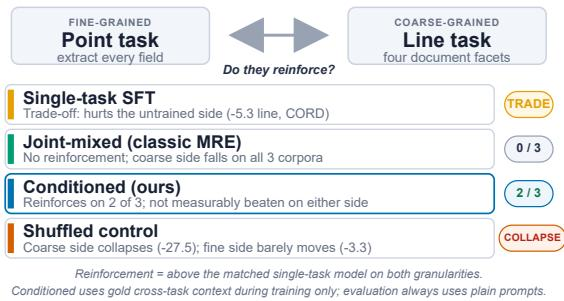  
Figure 1: Four arrangements of the same task pair, judged by one predicate: reinforces means above the matched single-task model on both granularities. Only conditioned training does so, on two of three corpora; filling the same prompt with another document’s content collapses the coarse side.

## 1 Introduction

Document understanding asks one model for answers at two granularities. A receipt, for example, supports a fine task, extracting every field instance on the page (the point task), and a coarse task, judging document-level properties such as the kind of store and the payment method (the line task). The Mutual Reinforcement Effect (MRE) line of work (Gan et al., 2025) conjectures that these granularities reinforce each other when a single model handles both: knowing the document type constrains which fields to expect, and extracted fields settle document-level questions that would otherwise require guessing.

Whether this reinforcement actually arrives, and what training arrangement produces it, has not been tested with matched controls in the document setting. We do so here on three corpora, two of receipts and one of scanned business forms (Jaume et al., 2019). We fix the predicate once, in the form the conjecture asserts it: a regime reinforces if it is above the matched single-task model on both granularities, and trades if it is above on one and below on the other. Every claim below is stated against that reference and against the untuned model, we never switch reference within a comparison, and every regime is trained with one shared recipe whose sensitivity we then measure.

Mixed joint training, the arrangement prior MRE work assumes, reinforces on no corpus at the main scale (Figure 1). On CORD it is below both single-task models (−2.6 point, −0.5 line); on WildReceipt and FUNSD it trades, buying the fine side and losing the coarse side resolvably (−2.5 and −4.0). Single-task tuning trades harder still, costing the untrained granularity 5.3 line points on CORD with every prediction still well formed. Conditioned training, in which the prompt for each task carries the gold output of the other during training only while both prompts are plain at test, reinforces on two of the three corpora, CORD (+0.5 point, +4.8 line) and FUNSD (+7.2 point, +1.9 once both arms must parse, and +11.0 line), with the coarse side resolvable in both and the fine side directional; on WildReceipt it trades, its coarse side sitting 1.2 points below line-only tuning within the paired interval. At that recipe no alternative beats it measurably on either side of any corpus.

Four controls pin down what drives the gain, and they disagree across corpora. Shuffled conditioning, identical in format but filled from a different document, destroys the coarse-side skill and costs the fine side far less, 3.3 points on CORD against 27.5. Neutral conditioning, identical in format but with uninformative placeholders, is the decisive one: on WildReceipt it reproduces the whole fineside gain, so that gain is prompt structure rather than content, whereas on CORD and FUNSD it buys nothing resolvable and the real content is worth a further +4.3 and +17.0 line points. On FUNSD mixed training and the neutral control both collapse the semantic facet to its majority class for all 50 test documents at that recipe, in three seeds, while conditioning recovers the gold distribution: the sharpest content effect we observe. A step-matched control doubling single-task epochs moves nothing, and three retraining seeds hold the gains fixed.

We also ask what conditioned training changes inside the model, and report it as descriptive. Layerwise probes with selectivity controls (Hewitt and Liang, 2019) find the cross-granularity information decodable under every regime, zero-shot included, with no increase under conditioning that we can resolve, so the gain is not injection. Input-side interventions and gradient attribution are consistent with a readout-level account but do not establish one, and three of the four instruments share a prompt-format confound with the effect they measure, which the neutral control bounds for one of them.

Our contributions are:

• A controlled negative and a partial repair. Under one predicate fixed in advance, mixed joint training reinforces on none of three corpora at the main scale and single-task tuning trades one granularity for the other, while conditioned training reinforces on two, trades on the third, and at that recipe is never measurably beaten on either side.

• An analysis battery reported with its nulls. Four instruments (selectivity-controlled probes, input interventions, gradient attribution against a lexical null, and a modality ablation), each with its control. Conditioning adds no decodable cross-granularity information over zero-shot while mixed co-training removes some; the input-side instruments are consistent with a readout-level account without establishing it, and three of the four run in formats only the conditioned model was trained on.

• Doc-MRE. An annotation layer over 991 CORD receipts, 400 WildReceipt receipts and 199 FUNSD business documents, pairing gold field extraction with four document-level facets and directional evidence links, annotated by a three-judge LLM committee under a pre-registration and validated by blind human re-annotation.

## 2 Related Work

Mutual Reinforcement Effect. The MRE line conjectures bidirectional gains from jointly modeling fine and coarse IE tasks, and its multimodal instantiation M-MRE (Gan et al., 2025) extends the setting to vision-language models, reporting that transfer between granularities is not automatic. We move the question to document understanding, where the two granularities share one page and gold evidence links between them can be annotated, and we replace the joint-training assumption with a controlled comparison of training regimes. Our results revise the default reading of this line: on CORD mixed training produces no reinforcement, and where reinforcement appears at all it is larger and more consistent when trained for explicitly through conditioning.

Learning with privileged information. Conditioned training instantiates learning using privileged information (Vapnik and Vashist, 2009; Lopez-Paz et al., 2015) in prompt space: trainingtime inputs carry signal unavailable at test time. Context distillation (Snell et al., 2022) internalizes prompt content into weights, intermediate-task transfer (Phang et al., 2018) orders tasks rather than conditioning them, and rationale-based distillation (Hsieh et al., 2023) conditions on teacher-written explanations. Our setting differs in structure: the privileged signal is the gold output of a second task the same model must also learn, the conditioning runs in both directions at once, and the teacher string is a label the model itself produces at test time, not an external rationale. Our controls speak to this. A wrong context is far worse than none on the coarse side, and a byte-identical neutral arm shows the transferred quantity to be the content itself on CORD but the prompt structure on WildReceipt. A distillation reading predicts neither dissociation.

Negative transfer in multi-task learning. That naive task mixing can hurt is documented for both classic multi-task learning (Caruana, 1997; Standley et al., 2020) and gradient-surgery remedies (Yu et al., 2020). Our results add a diagnosis for the document-understanding instance (the information survives; its use does not) and a remedy that changes only the training data.

Document understanding and probing. CORD (Park et al., 2019), WildReceipt (Sun et al., 2021) and FUNSD (Jaume et al., 2019) supply gold field annotations; document-AI systems such as LayoutLMv3 (Huang et al., 2022) and Donut (Kim et al., 2022) compete on extraction itself; we hold one backbone fixed, compare training arrangements, and add facet labels and evidence links on top of the existing benchmarks. Our analysis tools follow the probing literature, linear probes (Alain and Bengio, 2016) with control tasks (Hewitt and Liang, 2019), the caution that decodable is not used (Elazar et al., 2021), gradient saliency (Simonyan et al., 2013), and LLM-committee annotation (Zheng et al., 2023).

## 3 The Doc-MRE Benchmark

## 3.1 Task pair

Each instance is a document image I with gold fields $\begin{array} { r c l } { Y _ { \mathrm { P T } } } & { = } & { \{ ( c _ { k } , t _ { k } ) \} _ { k = 1 } ^ { m } } \end{array}$ , categorytext pairs from the source dataset, and four document-level facet labels $\begin{array} { r c l } { y _ { \mathrm { L N } } } & { = } & { \left( y _ { f } \right) _ { f \in \mathcal { F } } } \end{array}$ with $\begin{array} { r l r } { \mathcal { F } } & { { } = } & { \{ s \mathrm { t o r e \_ t y p e } } \end{array}$ , payment\_method, has\_discount, has\_surcharge}. store\_type is semantic (five classes, judged holistically); the other three are structural, anchored in specific field types. The anchoring does not make the line task a lookup over the point output: a symbolic oracle mapping gold fields to the structural facets reaches line accuracy .811 on CORD and .690 on WildReceipt (Appendix B), below zero-shot and below every 8B regime trained on the line task except the shuffled control.

The point task maps $( I , x _ { \mathrm { P T } } )  \hat { Y } _ { \mathrm { P T } }$ , a JSON list of field instances, scored by exact-match multiset F1 after whitespace and case normalization:

$$
\begin{array} { r } { \mathsf { F } 1 = \frac { 2 P R } { P + R } , } \\ { P = \frac { | \hat { Y } _ { \mathrm { P T } } \cap Y _ { \mathrm { P T } } | } { | \hat { Y } _ { \mathrm { P T } } | } , \qquad R = \frac { | \hat { Y } _ { \mathrm { P T } } \cap Y _ { \mathrm { P T } } | } { | Y _ { \mathrm { P T } } | } , } \end{array}\tag{1}
$$

where ⊓ is multiset intersection over (c, t) pairs. The line task maps $( I , x _ { \mathrm { L N } } ) \to \hat { y } _ { \mathrm { L N } } .$ , scored by macro accuracy over facets, Acc $\begin{array} { r } { \mathbf { \mu } = \frac { 1 } { | \mathcal { F } | } \sum _ { f } \mathbf { 1 } [ \hat { y } _ { f } = y _ { f } ] } \end{array}$

## 3.2 Construction

Point labels are the source datasets’ gold annotations, unchanged. Line labels and directional evidence links, the set $E _ { f } \subseteq Y _ { \operatorname { P T } }$ of field instances that evidence facet $f ,$ are produced by a three-judge LLM committee (GPT-5.5, Claude Sonnet, Gemini Pro) under a fixed schema, aggregated by majority vote. Writing $y _ { f } ^ { ( j ) }$ for judge $j ^ { \dagger } \mathbf { s }$ label,

$$
\begin{array} { r } { y _ { f } = \arg \operatorname* { m a x } _ { v } \sum _ { j = 1 } ^ { 3 } \mathbf { 1 } \Big [ y _ { f } ^ { ( j ) } = v \Big ] , } \end{array}\tag{2}
$$

kept only when the winning count is at least two, and the evidence link set keeps the field instances named by at least two judges, $E _ { f } = \{ e \in Y _ { \mathrm { P T } }$ $| \{ j : e \in E _ { f } ^ { ( j ) } \} | \ge 2 \}$ . Samples where any facet lacks a majority are dropped (nine in CORD, none in WildReceipt). Committee agreement is high: per-facet majority 99–100% and Fleiss κ .846–.978 on CORD, .830–.948 on WildReceipt. Evidencelink pairwise Jaccard ranges .49–.98, so links are used only for analysis, never as training targets.

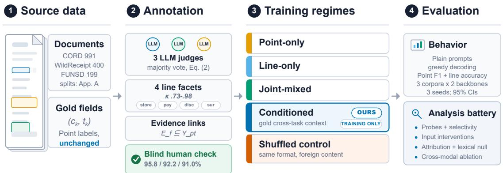  
Figure 2: Overview. (1) Source documents keep their gold field annotations as point labels. (2) A three-judge LLM committee adds four document-level facets and directional evidence links by majority vote; blind human re-annotation validates the labels at 95.8%, 92.2% and 91.0% agreement on the three corpora. (3) Five training regimes arrange the same task pair differently; only CONDITIONED sees gold cross-granularity context, and only during training; the shuffled control keeps its format but swaps in another document’s content. (4) All models are evaluated with plain prompts on three corpora, two backbones and three seeds, then analyzed with a four-instrument battery.

Blind human validation. Three annotators independently re-labeled 100 unseen receipts from the CORD training pool without access to committee labels, following a written guide (Appendix K); the human label per facet is their majority vote. Agreement with the committee majority is 95.8% over 400 CORD facet decisions (κ .836–.980); the 17 disagreements concentrate in store\_type boundary cases, consistent with that facet’s lower committee κ. The same protocol reaches 92.2% (κ .69– .95) on the full WildReceipt test set and 91.0% on FUNSD’s, the residual in has\_surcharge, where photographed tax and service lines are harder to read. The nine no-majority CORD samples stay out of every split and ship separately with humanconsensus labels. The CORD sample comes from the training pool, so it bounds annotation noise rather than test-set noise; on the other two the validated set is the test set. The resulting label noise, roughly 4%, is identical for all regimes, since every comparison is paired on the same labels.

## 4 Training Regimes

All regimes fine-tune the same backbone (Qwen3- VL-8B-Instruct (Bai et al., 2025); 4B in Appendix F) with identical LoRA (Hu et al., 2022) and optimization settings (Appendix A), on the same 794 CORD training receipts, with loss on answer tokens only. Writing θ for the adapted parameters, the regimes differ only in how the two tasks are

arranged:

$$
\begin{array} { r l r } & { } & { \mathcal { L } _ { \sf P T } = - \log p _ { \theta } ( Y _ { \sf P T } \mid I , x _ { \sf P T } ) \quad ( \sf P O I N T - O N L Y ) } \\ & { } & { \mathcal { L } _ { \sf L N } = - \log p _ { \theta } ( y _ { \mathrm { L N } } \mid I , x _ { \mathrm { L N } } ) \quad \quad \quad \quad \quad \quad \quad \quad \quad \quad \quad \quad } \\ & { } & { \mathcal { L } _ { \sf M I X } = \mathcal { L } _ { \sf P T } + \mathcal { L } _ { \sf L N } \quad \quad \quad \quad \quad \quad \quad \quad \quad \quad \quad \quad \quad \quad \quad \quad \quad \quad \quad } \\ & { } & { \mathcal { L } _ { \sf O N E } = - \log p _ { \theta } ( y _ { \mathrm { L N } } , Y _ { \sf P T } \mid I , x _ { \sf J O I N T } ) \quad \quad \quad \quad \quad \quad \quad \quad } \\ & { } & { \quad \quad \quad \quad \quad \quad \quad \quad \quad \quad \quad \quad \quad \quad \quad \quad \quad \quad \quad \quad \quad \quad \quad \quad \quad \quad \quad \quad \quad \quad \quad \quad \quad \quad \quad \quad \quad \quad \quad \quad \quad \quad \quad \quad \quad \quad \quad } \\ & { } & { \quad \quad \quad \quad \quad \quad \quad \quad \quad \quad \quad \quad \quad \quad \quad \quad \quad \quad \quad \quad \quad \quad \quad \quad \quad \quad \quad \quad \quad \quad \quad \quad \quad \quad \quad \quad \quad \quad \quad \quad \quad \quad \quad } \\ & { } & { \quad \quad \quad \quad \quad \quad \quad \quad \quad \quad \quad \quad \quad \quad \quad \quad \quad \quad \quad \quad \quad \quad \quad \quad \quad \quad \quad \quad \quad \quad \quad \quad \quad \quad \quad \quad \quad \quad \quad \quad \quad } \\ & { } & { \quad \quad \quad \quad \quad \quad \quad \quad \quad \quad \quad \quad \quad \quad \quad \quad \quad \quad \quad \quad \quad \quad \quad \quad \quad \quad \quad \quad \quad \quad \quad \quad \quad \quad \quad \quad } \\ & { } &  \quad \quad \quad \quad \quad \quad \quad \quad \quad \quad \quad \quad \quad \quad \quad \quad \quad \quad \quad \quad \quad \quad \quad \quad \quad  \end{array}
$$

JOINT-MIXED is the classic MRE arrangement, both tasks as separate examples in one mixed dataset; JOINT-ONEPASS asks for both outputs in a single pass. The conditioned regime places the gold output of the other granularity in the prompt, during training only:

$$
\begin{array} { r l } & { \mathcal { L } _ { \mathrm { C O N D } } = - \log p _ { \theta } ( Y _ { \mathrm { P T } } \mid I , x _ { \mathrm { P T } } , g ( y _ { \mathrm { L N } } ) ) } \\ & { \quad \quad \quad - \log p _ { \theta } ( y _ { \mathrm { L N } } \mid I , x _ { \mathrm { L N } } , h ( Y _ { \mathrm { P T } } ) ) , } \end{array}\tag{3}
$$

where g renders the facet labels as a stated hypothesis and h renders the field list as context, both with an instruction to trust the image over the context (Appendix I). At evaluation time every model, including CONDITIONED, receives the same plain prompts; no gold context is ever available at test time.

Two controls keep the conditioning format and change its content. For sample i, COND.- SHUFFLED trains on $g ( y _ { \mathrm { L N } } ^ { \pi ( i ) } )$ and $h ( Y _ { \mathrm { P T } } ^ { \pi ( i ) } )$ from a different document π(i), so the slot is filled but wrong; COND.-NEUTRAL fills the same slots with uninformative placeholders, so the template is byteidentical and the slot asserts nothing. The second is what bounds a format-level contribution, since the first changes both the content and its truth. POINT-ONLY and LINE-ONLY see half as many examples as JOINT-MIXED and CONDITIONED (equal pertask supervision); a step-matched control doubling their epochs changes point F1 by −0.1 and line accuracy by −0.5 points, so this budget difference explains none of what follows.

<table><tr><td rowspan=1 colspan=1>Regime             Point Line</td><td rowspan=1 colspan=1>Line acc by facetstore paydisc sur</td></tr><tr><td rowspan=1 colspan=1>majority                   .639ZERO-SHOT         .555.912</td><td rowspan=2 colspan=1>.424 .636.899.596.869.919.909.949.828 .808.879.919</td></tr><tr><td rowspan=1 colspan=1>POINT-ONLY        .804.859</td></tr><tr><td rowspan=1 colspan=1>LINE-ONLY         .480.899</td><td rowspan=7 colspan=1>.869.838 .919 .970.838 .808 .939 .990.848 .798.939.990.899.949.960.980.929.949.980.990.879.960.949.990.848.808.919.990.869 .808 .929 .980.869.828.919.960</td></tr><tr><td rowspan=1 colspan=1>JOINT-MIXED       .778.894</td></tr><tr><td rowspan=1 colspan=1>JOINT-ONEPASS     .795.894</td></tr><tr><td rowspan=1 colspan=1>CONDITIONED      .808.947</td></tr><tr><td rowspan=1 colspan=1>PIPELINE            .804 .962</td></tr><tr><td rowspan=1 colspan=1>COND.-FIELDS      .793.944</td></tr><tr><td rowspan=1 colspan=1>COND.-HYPO       .774.891SEQUENTIAL pt→ln.801.896SEQUENTIAL In→pt.804.894</td></tr><tr><td rowspan=1 colspan=1>COND.-NEUTRAL   .787.904COND.-SHUFFLED   .776.672</td><td rowspan=1 colspan=1>.889 .798 .949 .980.586.636 .899 .566</td></tr></table>

Table 1: CORD test (n=99, seed 0) with per-facet line accuracy. Bold marks, in the two headline columns only, the best value in the column and every value whose paired difference from it has a 95% CI including zero (intervals in Appendix B); nothing else is bolded and per-facet columns are unbolded. Every per-facet value is k/99, so one receipt is 1.01 points. PIPELINE (Appendix C) conditions each task on the other’s stage-1 predicted output at train and test, so unlike every other row it needs two forward passes.

## 5 Main Results

Single-task tuning damages the other granularity. Relative to zero-shot, POINT-ONLY drops line accuracy from .912 to .859 (−5.3 points, CI $[ - 8 . 8 , - 2 . 0 ] )$ and LINE-ONLY drops point F1 from .555 to .480 (−7.6, [−11.0, −4.4]). Single-task tuning also specializes the output format (POINT-ONLY collapses to .032 F1 in an unseen joint output format), so we checked whether the damage is that artifact. On the coarse side it is not: all 99 of POINT-ONLY’s line outputs parse with legal values, so the loss lies entirely in the answers. On the fine side it partly is: over the receipts both models parsed, LINE-ONLY’s loss is −5.5 [−8.3, −2.9] rather than −7.6, and on WildReceipt it does not survive the correction $( - 0 . 6 , \ [ - 1 . 9 , + 0 . 8 ] )$ , so we scope fine-side damage to CORD. Both survive retraining at 2×10−5 (Appendix A), and Section 6 shows the information survives where the

behaviour does not.

Joint training recovers neither side. JOINT-MIXED, the arrangement prior MRE work assumes, sits below POINT-ONLY on point (.778 vs .804) and below LINE-ONLY on line (.894 vs .899, Table 1). The single-pass variant JOINT-ONEPASS behaves the same, and retraining all three arms at $2 \times 1 0 ^ { - 5 }$ reproduces it (−3.3 point, −0.3 line). Co-training prevents the worst of the cross-task damage but produces no reinforcement here; the pair already interferes before any training (Appendix G).

Conditioned training reinforces, asymmetrically. CONDITIONED gains +4.8 points on line over LINE-ONLY ([2.3, 7.3]), +5.3 over JOINT-MIXED ([2.5, 8.1]), and +3.5 over zero-shot ([1.0, 6.1]), while matching POINT-ONLY on point (+0.5, [−1.8, +2.6]) and beating JOINT-MIXED there (+3.0, [1.1, 5.2]). Three full retraining seeds reproduce the pattern (Table 2).

Where the line gain comes from, and what it is not. Among the five pre-registered regimes CONDITIONED is best on three of four facets and within one receipt on has\_surcharge (Table 1); COND.-FIELDS, post hoc, is one receipt above it on payment\_method. The gain is uneven: payment\_method alone carries 11.1 of the 19.2 facet points separating CONDITIONED from LINE-ONLY, where LINE-ONLY is itself 8.1 below zeroshot, so more than half of the macro figure is a baseline’s self-damage on one facet.

This matters because our symbolic oracle recovers three of the four facets from the gold field list (.929, .919, .970) and store\_type only at its majority class. An account in which conditioning teaches that rule rather than a cross-granularity dependency predicts the pattern above, so we test store\_type alone (Appendix B). On CORD it is not excluded, CONDITIONED’s advantage over zero-shot, LINE-ONLY and the neutral control being +3.0, +3.0 and +1.0, none resolvable; on WildReceipt it is, +5.0 over both JOINT-MIXED and COND.-NEUTRAL ([1.0, 10.0]). The positive claim therefore lives on the semantic facet rather than in CORD’s macro average, as the third domain makes explicit.

One direction carries the gain, and it is the one pointing at the headroom. Conditioning runs in both directions at once, so we split it: COND.- FIELDS conditions only the line task on the gold field list, COND.-HYPO only the point task on the gold facets, each leaving the other prompt plain. On each dataset exactly one half does the work, and it is the half feeding the side that gains. On CORD it is fields-to-facets: COND.-FIELDS reaches line .944, +5.1 over JOINT-MIXED ([2.3, 8.1]) and indistinguishable from full conditioning (−0.3, [−1.8, +1.5]), while COND.-HYPO adds nothing to point (−0.4, [−2.5, +1.8]). On WildReceipt it is the reverse: COND.-HYPO reaches point .596, +7.0 over JOINT-MIXED ([3.2, 10.9]) and indistinguishable from full conditioning (−0.5, [−5.0, +3.8]), while COND.-FIELDS adds nothing to line (−2.0, [−5.2, +1.0]). Half the recipe is therefore sufficient on either dataset, and the useful half is not the one the zero-shot pilot identified (Appendix G).

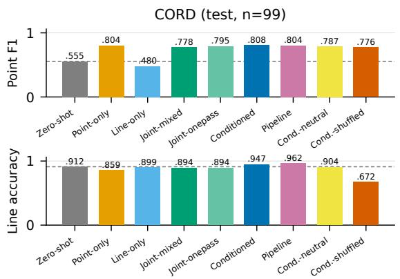

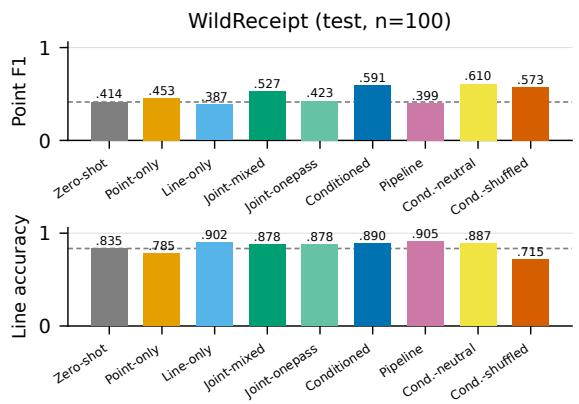  
Figure 3: Point F1 (top) and line accuracy (bottom) on CORD and WildReceipt test sets, 8B backbone, plain prompts at evaluation. Dashed line marks zero-shot. No single-forward-pass baseline measurably beats CONDITIONED on either side. The two rightmost bars are controls: COND.-NEUTRAL fills the same slots with uninformative placeholders, COND.-SHUFFLED with another document’s content.

Two controls separate content from format. COND.-SHUFFLED keeps the prompt shape and fills it from a different receipt. Its line accuracy collapses to .672, 27.5 points below CONDITIONED (Table 1), and to .715 on WildReceipt, so on the coarse side a wrong context is far worse than none. The fine side is far less affected: .776 on CORD, 3.3 points below CONDITIONED ([−5.1, −1.5]), and .573 on WildReceipt, 1.8 below it within the interval ([−7.1, +3.6]). COND.-NEUTRAL, whose template is byte-identical, is what separates content from format.

The two datasets dissociate. On CORD the neutral slot buys nothing resolvable while CON-DITIONED exceeds it by +4.3 line ([1.5, 6.8]) and +2.2 point ([0.6, 4.0]), so content carries the gain. On WildReceipt the fine side reverses: COND.- NEUTRAL reaches point .610, +8.3 over JOINT-

<table><tr><td></td><td>Point F1</td><td>Line Acc</td></tr><tr><td colspan="2">Seeds 0/1/2 (CORD test, 8B) CONDITIONED .808/.799/.815.947/.947/.944 JOINT-MIXED</td><td>.778/.795/.782.894/.889/.884</td></tr><tr><td>POINT-ONLY Dev split (n=98, 8B)</td><td>.804/.784/.788.859/.866/.866</td><td></td></tr><tr><td>ZERO-SHOT / POINT-ONLY LINE-ONLY / JOINT-MIXED</td><td>.559 / .822 .473 / .787</td><td>.913 / .842 .883 / .870</td></tr><tr><td>CONDITIONED</td><td>.824</td><td>.941</td></tr><tr><td>4B backbone (CORD test)</td><td></td><td></td></tr><tr><td>ZERO-SHOT / POINT-ONLY LINE-ONLY / JOINT-MIXED .726</td><td>.456 / .730 .302 / .746</td><td>.912 / .881 .768 / .770</td></tr></table>

Table 2: Robustness checks: three CORD retraining seeds, the dev split, and the 4B backbone. Bold marks the best value per block and column among the regimes shown, seed 0 only; at 4B JOINT-MIXED leads on point (.746 against CONDITIONED’s .726, −2.0 [−4.5, +0.4]).

MIXED ([4.2, 12.8]) against CONDITIONED’s +6.4, and CONDITIONED is indistinguishable from it (−1.9, [−7.0, +2.8]), as is COND.-HYPO. There prompt structure does the work.

Robustness. Intervals that also resample training seeds change no headline conclusion (Appendix B; the CORD line gain becomes +6.0 [2.5, 9.4]). Seeds and the dev split hold the ordering fixed, CONDITIONED leading both sides on dev (Tables 2 and 3); arms outside those seed blocks are single runs.

Two standard alternatives do not produce the gain. Two familiar arrangements fail in different ways (Appendix C). A two-stage pipeline leads the CORD line column, but only at twice the inference cost, and it collapses where extraction is hardest (WildReceipt point .399, 19 below CONDI-TIONED). Sequential transfer (Phang et al., 2018) costs nothing extra and removes the cross-task damage, holding point at .801 against LINE-ONLY’s .480, but gains nothing on line: both orders land below zero-shot while CONDITIONED exceeds them by +5.1 and +5.3. The damage is an ordering artefact; the gain is not.

<table><tr><td>WildReceipt (n=100)</td><td>Point F1</td><td>Line Acc</td></tr><tr><td>ZERO-SHOT</td><td>.414</td><td>.835</td></tr><tr><td>POINT-ONLY</td><td>.453/.441/.379</td><td>.785/.780/.775</td></tr><tr><td>LINE-ONLY</td><td>.387/.398/.387</td><td>.903/.890/.878</td></tr><tr><td>JOINT-MIXED</td><td></td><td>.527/.535/.506.878/.878/.843</td></tr><tr><td>JOINT-ONEPASS</td><td>.423</td><td>.878</td></tr><tr><td>CONDITIONED</td><td></td><td>.591/.558/.571 .890/.878/.880</td></tr><tr><td>PIPELINE</td><td>.399</td><td>.905</td></tr><tr><td>COND.-SHUFFLED</td><td>.573</td><td>.715</td></tr><tr><td>COND.-FIELDS</td><td>.521</td><td>.858</td></tr><tr><td>COND.-HYPO</td><td>.596</td><td>.858</td></tr><tr><td>COND.-NEUTRAL</td><td>.610</td><td>.888</td></tr></table>

Table 3: WildReceipt replication, seeds 0/1/2 (seed 0 is the pre-registered run and carries the CIs; LINE-ONLY, JOINT-ONEPASS and PIPELINE are post-hoc additions). Bold marks the best value in each column and every value within its paired interval, on seed 0; the other two seeds carry no interval and are never bolded. On line PIPELINE (.905) and LINE-ONLY (.903) lead CONDI-TIONED and on point COND.-NEUTRAL (.610) does, all three within the interval, which is the finding of Section 5. CONDITIONED vs JOINT-MIXED: point +6.4 [1.8, 11.1], line +1.2 [−1.5, 4.0]; CONDITIONED vs ZERO-SHOT line +5.5 [1.8, 9.2]; POINT-ONLY line damage replicates (−5.0).

Replication on a second dataset and backbone. Under a pre-registered protocol (Appendix L) we rebuilt the benchmark on WildReceipt, English receipts under a different twelve-category schema, with the CORD recipe unchanged. CONDITIONED leads every pre-registered regime on point (+6.4 over JOINT-MIXED, [1.8, 11.1]) and sits within the paired interval of the best line regime, while two post-hoc arms are nominally higher on point with unresolvable differences (Table 3). Unlike on CORD, plain mixing buys the point side (+7.4 over an unstable POINT-ONLY, +2.0 once both models must parse) but pays 2.5 line points against LINE-ONLY ([−4.8, −0.5]), which does not selfdamage here: mixing trades one granularity for the other. Scored on the full 467-image test split, which needs no new annotation on the fine side, the fine-side contrasts hold and tighten (Appendix A). At 4B (Appendix F) the coarse-side pattern amplifies, LINE-ONLY and JOINT-MIXED falling 14 points below zero-shot on line with CONDITIONED alone above it. It is also the one configuration of six in which mixed training clears both matched singletask models, by +1.5 point and +0.3 line, neither resolvable and both over damaged baselines.

<table><tr><td>FUNSD (n=50)</td><td>Point F1 Line Acc doc_type</td><td></td><td></td></tr><tr><td>ZERO-SHOT</td><td>.117</td><td>.915</td><td>.900</td></tr><tr><td>POINT-ONLY</td><td>.358</td><td>.905</td><td>.940</td></tr><tr><td>LINE-ONLY</td><td>.232</td><td>.810</td><td>.560</td></tr><tr><td>JOINT-MIXED</td><td>.426</td><td>.770</td><td>.520</td></tr><tr><td>CONDITIONED</td><td>.430</td><td>.920</td><td>1.000</td></tr><tr><td>COND.-FIELDS</td><td>.431</td><td>.935</td><td>1.000</td></tr><tr><td>COND.-HYPO</td><td>.298</td><td>.810</td><td>.520</td></tr><tr><td>COND.-NEUTRAL</td><td>.402</td><td>.750</td><td>.520</td></tr><tr><td>COND.-SHUFFLED</td><td>.408</td><td>.650</td><td>.520</td></tr></table>

Table 4: Third domain: scanned business forms, official split, seed 0 at the shared recipe; seed replications and a learning-rate and epoch sweep are in Table 8, and JOINT-ONEPASS (.421/.875/.820) is omitted for space. The majority doc\_type is .520, and at this recipe JOINT-MIXED and both content-free controls assign it to all 50 documents in every seed, while CONDITIONED recovers the gold distribution. Bold marks the best value in each column and every value within its paired interval; on line that is four of the eight arms, so the coarse side separates the collapsed arms from the rest and not CONDITIONED from the untuned model.

Which side gains flips across datasets. What holds at the shared recipe is the first half of the dominance pattern: no alternative regime measurably beats CONDITIONED on either side, the one exception in the study being mixed training on FUNSD’s fine side at the lower rate (+9.1, [2.2, 16.3]). The converse is weaker: every pre-registered alternative falls measurably behind on at least one side, but four post-hoc arm-corpus pairs fall behind on neither, PIPELINE and COND.-FIELDS on CORD, COND.-NEUTRAL on WildReceipt and COND.- FIELDS again on FUNSD, all eight intervals including zero (Appendix B).

A third genre, and a collapse that conditioning prevents. Both corpora above are receipts, so we repeated the study on FUNSD, 199 scanned 1990s business documents whose gold entities give the fine task and whose four coarse facets the same committee annotated (Appendix E). What it adds is not a larger gain but a failure conditioning prevents (Table 4). Against the untuned model CON-DITIONED’s coarse accuracy is +0.5, one facet decision in 200: no aggregate coarse-side gain. What differs is the baselines: under the shared recipe only conditioning and its fields-to-facets half reach zero-shot on the coarse side, and on the semantic facet JOINT-MIXED assigns the majority doc\_type to all 50 documents where zero-shot reaches .900, while CONDITIONED recovers the gold distribution exactly. Three seeds hold both sides fixed, with doc\_type 1.000/.960/.980 against .520 every time (Table 8). The neutral control collapses identically (+17.0, [12.0, 22.5]): the conditioning content, not the filled slot, protects the facet.

Two controls change how to read it. It is not a task-proportion artefact: oversampling the coarse task two and four times leaves doc\_type at the majority label (+0.0). It is a learning-rate effect: at 2×10−5 mixed training recovers to .890 line and .880 doc\_type, neither resolvably below zero-shot, while four epochs makes it worse (.700). Conditioning is unmoved by the rate (.910) and beats the best-tuned mixed arm on the semantic facet at either rate, +12.0 ([4.0, 22.0]) from its own recipe and +8.0 ([2.0, 16.0]) at the lower one; the macro margins, +3.0 and +2.0, resolve only at the first. At the lower rate no regime reinforces on FUNSD against single-task models retrained there, and on CORD conditioning trades rather than reinforces (−1.4 point, +3.8 line): mixed training’s failure survives the change on both corpora and conditioning’s repair does not. Two pre-registered outcomes also went against us (Appendix E).

## 6 What the Analysis Battery Shows

Four instruments, each with its own control, reported as descriptive. Three run in a prompt format only the conditioned arms saw in training; only the probes run on plain prompts (Appendices B and D).

Encoding. Probes on one task’s plain prompt, with a random-label control task (Hewitt and Liang, 2019), recover the other task’s labels under every regime (selectivity .36–.46 at the cross-validated layer on three facets; the fourth is skewed and uses balanced accuracy). CONDITIONED adds nothing over zero-shot that we can resolve, +2.0 [−4.0, +8.1] on store\_type, so an injection account is unnecessary rather than impossible; JOINT-MIXED probes 9.1 below it there ([1.0, 17.2]). On two other facets CONDITIONED itself decodes below zero-shot.

Use. Supplying the point task with a gold or corrupted hypothesis (Table 7) makes three of six fine-tuned regimes sensitive while zero-shot is not. So does COND.-NEUTRAL, more strongly than CONDITIONED (+2.2 [1.1, 3.3] against +1.5 [0.4, 2.6]), though its slots asserted nothing in training: the instrument measures format exposure, not learned use of cross-granularity content. Against each model’s own plain prompt the two dissociate. COND.-NEUTRAL gains from a gold hypothesis (+1.1, [0.2, 2.1]); CONDITIONED does not (−0.4, [−1.6, +0.8]) and is harmed by a corrupted one (−1.9, [−3.0, −0.7]). That is what internalization predicts, an external hypothesis being redundant for a model that already encodes it, but distractibility predicts the harm as well and these instruments cannot separate them.

Attribution and modality. Gradient attribution concentrates on the annotated evidence above a count-matched null for every model, and on the two facets that survive the lexical null CONDITIONED is highest (store\_type 1.88 → 2.47, paired median difference over zero-shot +0.59 [0.30, 0.78]). It is not separable from JOINT-MIXED there, but it exceeds the neutral control on both facets (+0.139 and +0.222 paired median lift, both excluding zero), so unlike the intervention this instrument is not reproduced by format alone. CONDITIONED is also the only regime reading the facets better from the field list than from the image alone (+1.0 [−1.5, +3.8], all others negative): a reversal of which channel dominates, not a broken route, unresolvable against zero-shot (+2.8 [−1.0, +6.3]) and with format familiarity predicting its sign.

What this does and does not support. The instruments bound injection below their own resolution but do not establish a readout mechanism: patching was inconclusive (Appendix H) and the format confound is bounded for two of the three that share it, in opposite directions. The readout reading is the one we favour, not a result.

## 7 Conclusion

Mutual reinforcement does not come free with joint training: across three corpora mixed co-training clears both single-task models nowhere at the main scale, while conditioning does on two and trades on the third.

## Limitations

Our evidence covers two receipt corpora and one corpus of scanned business forms, one VLM family at two scales and LoRA fine-tuning; full fine-tuning and further genres are left open, and the FUNSD corpus has 149 training and 50 test documents, so its intervals are correspondingly wide, with three seeds run only for mixed, conditioned and the neutral control. The mechanism claim is deliberately scoped: three of the four analysis instruments share a prompt-format confound with the effect they measure, so we report the battery as descriptive and leave a representation-level account to future work. Line labels come from an LLM committee, and blind human re-annotation bounds their noise at roughly 4% on CORD, 8% on WildReceipt and 9% on FUNSD; because every regime comparison is paired on identical labels, that noise shifts absolute levels rather than the reported contrasts. Test sets hold 50–100 documents, so per-facet and crossregime contrasts are reported as point estimates and only the contrasts listed in Appendix B carry intervals. Finally, conditioned training presumes the other granularity’s gold labels exist at training time; where they must first be produced, as ours were, the cost of the recipe includes that annotation step.

## Ethics Statement

All three source corpora are public research datasets used under their research terms, and we redistribute no images: Doc-MRE ships as an annotation layer keyed to the original file identifiers. Human validation was carried out by three projectaffiliated annotators working independently from a written guide per facet schema, the receipt one reproduced in Appendix K, with no crowd workers employed.

## References

Guillaume Alain and Yoshua Bengio. 2016. Understanding intermediate layers using linear classifier probes. arXiv preprint arXiv:1610.01644.

Shuai Bai, Yuxuan Cai, Ruizhe Chen, Keqin Chen, Xionghui Chen, Zesen Cheng, Lianghao Deng, Wei Ding, Chang Gao, Chunjiang Ge, et al. 2025. Qwen3- vl technical report. arXiv preprint arXiv:2511.21631.

Rich Caruana. 1997. Multitask learning. Machine learning, 28(1):41–75.

Yanai Elazar, Shauli Ravfogel, Alon Jacovi, and Yoav Goldberg. 2021. Amnesic probing: Behavioral explanation with amnesic counterfactuals. Transactions of the Association for Computational Linguistics, 9:160– 175.

Chengguang Gan, Zhixi Cai, Yanbin Wei, Yunhao Liang, Shiwen Ni, and Tatsunori Mori. 2025. M-MRE: Extending the mutual reinforcement effect to multimodal information extraction. arXiv preprint arXiv:2504.17353.

John Hewitt and Percy Liang. 2019. Designing and interpreting probes with control tasks. In Proceedings of the 2019 conference on empirical methods in natural language processing and the 9th international joint conference on natural language processing (emnlp-ijcnlp), pages 2733–2743.

Cheng-Yu Hsieh, Chun-Liang Li, Chih-Kuan Yeh, Hootan Nakhost, Yasuhisa Fujii, Alex Ratner, Ranjay Krishna, Chen-Yu Lee, and Tomas Pfister. 2023. Distilling step-by-step! outperforming larger language models with less training data and smaller model sizes. In Findings of the Association for Computational Linguistics: ACL 2023, pages 8003–8017.

Edward J Hu, Yelong Shen, Phillip Wallis, Zeyuan Allen-Zhu, Yuanzhi Li, Shean Wang, Liang Wang, and Weizhu Chen. 2022. LoRA: Low-rank adaptation of large language models. In International Conference on Learning Representations.

Yupan Huang, Tengchao Lv, Lei Cui, Yutong Lu, and Furu Wei. 2022. Layoutlmv3: Pre-training for document ai with unified text and image masking. In Proceedings of the 30th ACM international conference on multimedia, pages 4083–4091.

Guillaume Jaume, Hazim Kemal Ekenel, and Jean-Philippe Thiran. 2019. FUNSD: A dataset for form understanding in noisy scanned documents. In 2019 International Conference on Document Analysis and Recognition Workshops (ICDARW), volume 2, pages 1–6. IEEE.

Geewook Kim, Teakgyu Hong, Moonbin Yim, JeongYeon Nam, Jinyoung Park, Jinyeong Yim, Wonseok Hwang, Sangdoo Yun, Dongyoon Han, and Seunghyun Park. 2022. Ocr-free document understanding transformer. In European Conference on Computer Vision, pages 498–517. Springer.

David Lopez-Paz, Léon Bottou, Bernhard Schölkopf, and Vladimir Vapnik. 2015. Unifying distillation and privileged information. arXiv preprint arXiv:1511.03643.

Seunghyun Park, Seung Shin, Bado Lee, Junyeop Lee, Jaeheung Surh, Minjoon Seo, and Hwalsuk Lee. 2019. CORD: a consolidated receipt dataset for post-OCR parsing. In Workshop on document intelligence at NeurIPS, volume 2019, page 5.

Jason Phang, Thibault Févry, and Samuel R Bowman. 2018. Sentence encoders on stilts: Supplementary training on intermediate labeled-data tasks. arXiv preprint arXiv:1811.01088.

Karen Simonyan, Andrea Vedaldi, and Andrew Zisserman. 2013. Deep inside convolutional networks: Visualising image classification models and saliency maps. arXiv preprint arXiv:1312.6034.

Charlie Snell, Dan Klein, and Ruiqi Zhong. 2022. Learning by distilling context. arXiv preprint arXiv:2209.15189.

Trevor Standley, Amir Zamir, Dawn Chen, Leonidas Guibas, Jitendra Malik, and Silvio Savarese. 2020. Which tasks should be learned together in multi-task learning? In International conference on machine learning, pages 9120–9132. PMLR.

Hongbin Sun, Zhanghui Kuang, Xiaoyu Yue, Chenhao Lin, and Wayne Zhang. 2021. Spatial dualmodality graph reasoning for key information extraction. arXiv preprint arXiv:2103.14470.

Vladimir Vapnik and Akshay Vashist. 2009. A new learning paradigm: Learning using privileged information. Neural networks, 22(5-6):544–557.

Tianhe Yu, Saurabh Kumar, Abhishek Gupta, Sergey Levine, Karol Hausman, and Chelsea Finn. 2020. Gradient surgery for multi-task learning. Advances in neural information processing systems, 33:5824– 5836.

Lianmin Zheng, Wei-Lin Chiang, Ying Sheng, Siyuan Zhuang, Zhanghao Wu, Yonghao Zhuang, Zi Lin, Zhuohan Li, Dacheng Li, Eric Xing, et al. 2023. Judging llm-as-a-judge with mt-bench and chatbot arena. Advances in neural information processing systems, 36:46595–46623.

## A Training and Evaluation Details

All runs use Qwen3-VL-8B-Instruct (Appendix F: 4B) with LoRA rank 64, α 128, which makes 174.6M of the 8.94B parameters trainable (1.95%), dropout 0.05 on all attention and MLP projections, bf16, learning rate 10−4 with a onecycle schedule, batch size 1 with gradient accumulation 8, two epochs, loss on answer tokens only. POINT-ONLY/LINE-ONLY see 794 examples, JOINT-MIXED/CONDITIONED/COND.- SHUFFLED 1,588 (equal per-task supervision); the step-matched control trains POINT-ONLY/LINE-ONLY four epochs: point .803 vs .804, line .894 vs .899, both within noise. A learning-rate control retrains every CORD arm at 2×10−5. LINE-ONLY reaches line .894, still below zero-shot, so the selfdamage of line-only tuning is not a recipe artifact; POINT-ONLY reaches point .775 and JOINT-MIXED .743 point and .891 line, leaving mixed training below both matched single-task models again (−3.3 [−7.3, +0.6] fine, −0.3 [−1.5, +1.0] coarse) exactly as at $1 0 ^ { - 4 } \ ( - 2 . 6 , - 0 . 5 )$ . Conditioning at 10−4 leads the best-tuned mixed arm on line by $+ 5 . 6 \ [ 3 . 0 , 8 . 1 ]$ . Retrained at $2 \times 1 0 ^ { - 5 }$ itself it reaches point .761 and line .932, which against the single-task arms at that rate is −1.4 [−5.3, +2.6] on the fine side, −2.5 [−5.0, −0.1] once both models must parse, and +3.8 [1.0, 6.6] on the coarse side. It therefore trades at the lower rate where it reinforces at the shared one, the same pattern as on FUNSD, so the reinforcement result is a property of the recipe on both corpora while the failure of mixed training is not. Evaluation is greedy decoding with plain prompts; WildReceipt (300 train, 100 test) and FUNSD (149 train, 50 test) reuse the CORD recipe with no per-corpus tuning, per the pre-registration; The fine side also scales to WildReceipt’s whole official test split, 467 images after the same filter, which needs no new coarse annotation: point F1 is .592 for CONDITIONED, .536 for JOINT-MIXED, .435 for POINT-ONLY and .398 for LINE-ONLY, and the contrasts the paper rests on hold with intervals roughly half as wide: CON-DITIONED−JOINT-MIXED +5.6 [3.5, 7.6], CON-DITIONED−POINT-ONLY +15.6 [12.8, 18.4] and JOINT-MIXED−POINT-ONLY +10.1 [7.7, 12.5]. Parse rates on that split are 339/467 for POINT-ONLY, 418/467 for LINE-ONLY, 401/467 for JOINT-MIXED and 414/467 for CONDITIONED, and the same correction applied above gives +4.7 [3.4, 5.9] on 383 samples, +7.3 [5.8, 8.8] on 322 and +2.8 [1.8, 3.8] on 325. The first 100 indices of that split are the set reported in Table 3, byte for byte, and reproduce its numbers exactly. The WildReceipt seed replications, the LINE-ONLY, JOINT-ONEPASS and PIPELINE regimes, and the shuffled and neutral-content controls were added after the pre-registered run and are reported as post-hoc robustness checks.

All experiments ran on a single server with eight RTX PRO 6000 GPUs (96 GB each); every training or evaluation job fits on one GPU, and jobs were parallelized across the cards. One regime trains in 20–60 GPU-minutes; the complete study, all regimes, seeds, backbones, corpora, the recipe controls and the analysis battery, totals roughly 160 GPU-hours. LLM-committee annotation for all three corpora cost under \$40 of API usage.

## B Additional Result Detail

Headline intervals. CORD test, paired bootstrap, 10k resamples: CONDITIONED−LINE-ONLY line +4.8 [2.3, 7.3]; CONDITIONED−JOINT-MIXED line +5.3 [2.5, 8.1]; CONDITIONED−ZERO-SHOT line +3.5 [1.0, 6.1]; CONDITIONED−POINT-ONLY point +0.5 [−1.8, +2.6]; CONDI-TIONED−JOINT-MIXED point +3.0 [1.1, 5.2];

<table><tr><td>Facet</td><td>bf16</td><td>fp32</td><td></td><td>overlap non-lex. lift</td></tr><tr><td>store_type</td><td>1.88/2.471.94/2.47</td><td></td><td>9%</td><td>1.90/2.45</td></tr><tr><td>has_surcharge</td><td>1.10/1.551.17/1.54</td><td></td><td>5%</td><td>1.17/1.54</td></tr><tr><td>has_discount</td><td>1.31/1.511.41/1.87</td><td></td><td>14%</td><td>1.41/1.87</td></tr><tr><td>payment</td><td>1.16/1.221.16/1.31</td><td></td><td>68%</td><td>1.00/0.99</td></tr></table>

Table 5: Attribution validity checks (median lift, zeroshot/CONDITIONED; all four regimes in Figure 5). A float32 recomputation moves the two surviving facets by at most .07 and has\_discount, whose n is 12, by .36. “Overlap” is the fraction of evidence fields whose text lexically overlaps the answer; “non-lex. lift” recomputes lift on non-overlapping evidence only. payment\_method fails the null and is excluded.

CONDITIONED−JOINT-ONEPASS point +1.3 $[ - 1 . 1 , + 3 . 7 ] ;$ ; POINT-ONLY−ZERO-SHOT line $- 5 . 3 [ - 8 . 8 , - 2 . 0 ] ;$ LINE-ONLY−ZERO-SHOT point −7.5 [−11.0, −4.4]. The largest contrasts (both damage effects, the CORD line gains, WR point over POINT-ONLY) sit far from their interval boundaries; the smaller ones $( + 3 . 0 , + 3 . 5 , + 6 . 4 )$ sit closer, and we treat them as supporting rather than load-bearing.

Pipeline contrasts. CONDITIONED−PIPELINE line: CORD −1.5 [−3.5, +0.3], WildReceipt −1.5 [−4.5, +1.5]; CONDITIONED−PIPELINE point: CORD +0.4 [−2.0, +2.6], WildReceipt +19.2 [13.6, 25.0]. PIPELINE, added post hoc like the other arms in this paragraph, leads CONDITIONED on line; LINE-ONLY on WildReceipt line, JOINT-MIXED on 4B point, and COND.-NEUTRAL and COND.-HYPO on WildReceipt point also lead it nominally. Every one of these intervals includes zero.

Parse-rate correction of the fine-side gains. The fine-side damage claim is reported on the subset both models parse (Section 5); the same correction belongs on the gains wherever the arms differ in parse rate. On CORD they barely do, every trained arm parsing 99 of 99, so every CORD gain is identical corrected and uncorrected and that corpus carries no format component; the only CORD figure the correction moves is the line-only damage, −7.6 to −5.5, which Section 5 already reports. On WildReceipt the arms differ by more than the gains are large (.930 zero-shot, .750 POINT-ONLY, .860 JOINT-MIXED, .880 CONDITIONED). Restricting each contrast to samples both arms parsed: CONDITIONED−JOINT-MIXED +6.4 [1.8, 11.1] becomes +6.1 [3.2, 9.1] on 81 samples, CONDI-TIONED−POINT-ONLY +13.8 [7.6, 19.9] becomes +8.7 [5.4, 12.1] on 70, JOINT-MIXED−POINT-ONLY +7.4 [2.7, 12.1] becomes +2.0 [0.4, 3.6] on 72, and POINT-ONLY−ZERO-SHOT +3.9 $[ - 2 . 7 , + 1 0 . 7 ]$ becomes +15.8 [11.1, 20.5] on 69, that last one having been masked by POINT-ONLY’s own parse failures. Every contrast keeps its sign and every one that was resolvable stays resolvable, so no verdict changes; the headline moves by 0.3 points and two secondary numbers shrink by a third and by three quarters. The one contrast whose sign does move is CONDITIONED against COND.-NEUTRAL, −1.9 [−7.0, +2.8] raw and +1.2 [−0.5, +3.1] corrected, and since neither interval excludes zero the two arms are indistinguishable under either reading, which is what the claim about the neutral slot reproducing that gain rests on. On FUNSD the arms differ too (34/50 POINT-ONLY, 41/50 JOINT-MIXED, 43/50 CONDITIONED, 40/50 COND.-NEUTRAL) and the corrected figures are CONDITIONED−POINT-ONLY $+ 7 . 2 ~ [ - 0 . 7 , + 1 4 . 8 ] { \mathrm { ~ t o ~ } } + 1 . 9 ~ [ - 1 . 5 , + 5 . 8 ]$ on 31 samples, CONDITIONED−JOINT-MIXED $+ 0 . 4 \left[ - 3 . 3 , + 4 . 2 \right] \mathrm { t o } - 1 . 3 \left[ - 4 . 2 , + 1 . 2 \right]$ on 40, and JOINT-MIXED−POINT-ONLY +6.8 [−0.5, +14.2] to +1.7 [−1.5, +5.2] on 32. None of those was resolvable before the correction and none is after, which is why the paper reports FUNSD’s fine side as directional throughout; the corrected CONDI-TIONED−POINT-ONLY figure is still positive, so the reinforcement verdict on that corpus does not turn on the correction.

Human-label rescoring (WildReceipt). Scoring every regime against the three-annotator human consensus instead of the committee majority lowers line accuracy by 2.3 to 4.5 points everywhere: ZERO-SHOT .835 → .803, POINT-ONLY .785 → .740, LINE-ONLY .903 → .880, JOINT-MIXED .878→.840, JOINT-ONEPASS .878→.840, CONDITIONED .890 → .853, PIPELINE .905 → .873, COND.-SHUFFLED .715 → .690, COND.- FIELDS .858 → .815, COND.-HYPO .858 → .820 and COND.-NEUTRAL .887→.855. Two orderings change: PIPELINE is above LINE-ONLY under the committee labels and below it under the human ones, and CONDITIONED falls 0.2 points below COND.-NEUTRAL, which the committee labels put 0.3 the other way. The contrasts CONDITIONED depends on widen rather than narrow, CONDI-TIONED−LINE-ONLY from −1.3 [−4.5, +1.8] to −2.8 [−6.2, +0.8] and CONDITIONED−PIPELINE from −1.5 [−4.5, +1.5] to −2.0 [−5.0, +1.0], so the no-loss claim on that side is weaker against human labels while remaining unresolvable.

<table><tr><td>Probe target</td><td>ZERO-SHOT CONDITIONED</td><td></td><td>others</td></tr><tr><td>store_type</td><td>.44</td><td>.46</td><td>.41/.44/.38</td></tr><tr><td>payment_method</td><td>.44</td><td>.39</td><td>.41/.36/.37</td></tr><tr><td>has_surcharge</td><td>.45</td><td>.44</td><td>.43/.45/.46</td></tr></table>

Table 6: Probe selectivity (accuracy minus a randomlabel control probe, both at the layer chosen by train-side cross-validation) for line facets decoded from pointtask states; the last column lists POINT-ONLY/LINE-ONLY/JOINT-MIXED in that order. Selecting the layer on the test side instead inflates individual cells by up to .10, so the cross-validated layer is what we report. All regimes clear the control by a wide margin on all three facets and the spread across regimes, .36 to .46, is smaller than that inflation. Selectivity is uninformative for has\_discount, whose marginal-preserving control scores .873 against an .899 majority; balanced accuracy is reported for it instead (Appendix B).

Direction arms. COND.-FIELDS and COND.- HYPO are built by recombining rows already present in the CONDITIONED and JOINT-MIXED training files, so no prompt is regenerated: COND.- FIELDS takes CONDITIONED’s field-conditioned line examples plus JOINT-MIXED’s plain point examples, COND.-HYPO takes CONDITIONED’s hypothesis-conditioned point examples plus JOINT-MIXED’s plain line examples. Both keep 1,588 examples, the same images, the same targets and equal per-task supervision, so the only difference from CONDITIONED is that one direction’s context slot is removed; a per-image assertion checks that the conditioned and plain rows of a task carry identical targets. CORD: COND.-FIELDS point .793, line .944; COND.-HYPO point .775, line .891. Contrasts: COND.-FIELDS−JOINT-MIXED line +5.1 [2.3, 8.1]; COND.-FIELDS−CONDITIONED line −0.3 [−1.8, +1.5]; COND.-HYPO−JOINT-MIXED point −0.4 [−2.5, +1.8]; CONDITIONED−COND.- FIELDS point +1.5 [0.0, +3.0]. WildReceipt, where the roles swap: COND.-HYPO point .596, line .858; COND.-FIELDS point .521, line .858; COND.-HYPO−JOINT-MIXED point +7.0 [3.2, 10.9]; CONDITIONED−COND.-HYPO point −0.5 [−5.0, +3.8]; COND.-FIELDS−JOINT-MIXED line −2.0 [−5.2, +1.0]; CONDI-TIONED−COND.-FIELDS line +3.3 [1.0, 5.5]; COND.-HYPO−COND.-NEUTRAL point −1.4 [−4.5, +1.2].

Sequential transfer. Each arm continues training an existing single-task adapter on the other task’s data with the recipe otherwise unchanged, which is the STILTs arrangement (Phang et al., 2018) applied to our pair. CORD: point after line (SEQUENTIAL ln→pt) point .804, line .894; line after point (SEQUENTIAL pt→ln) point .801, line .897. Contrasts against the single-task models: ln→pt point +0.1 [−2.4, +2.5] and line +3.5 [0.0, +7.3] against POINT-ONLY; pt→ln point +32.2 [27.5, 36.9] against LINE-ONLY and line −0.3 [−2.0, +1.8] against LINE-ONLY. Against CONDITIONED: line −5.3 [−8.3, −2.5] and −5.1 [−7.8, −2.3] for the two orders, point −0.7 [−2.6, +1.3] for pt→ln.

Facet decomposition and the oracle account. store\_type is the only coarse facet our symbolic rule cannot beat its majority class on, so it isolates the part of the coarse task that field derivability cannot explain. CORD store\_type accuracy: ZERO-SHOT .869, POINT-ONLY .828, LINE-ONLY .869, JOINT-MIXED .838, JOINT-ONEPASS .848, CONDITIONED .899, COND.-FIELDS .879, COND.-HYPO .849, COND.-NEUTRAL .889, COND.-SHUFFLED .586, PIPELINE .929. Paired against CONDITIONED: ZERO-SHOT +3.0 [−3.0, +9.1], LINE-ONLY +3.0 [−4.0, +10.1], JOINT-MIXED +6.1 [−1.0, +13.1], COND.-NEUTRAL +1.0 [−5.1, +7.1], POINT-ONLY +7.1 [1.0, 14.1], COND.-SHUFFLED +31.3 [21.2, 41.4], PIPELINE −3.0 [−8.1, +1.0]. WildReceipt store\_type: ZERO-SHOT .840, POINT-ONLY .830, LINE-ONLY .870, JOINT-MIXED .860, CONDITIONED .910, COND.-NEUTRAL .860, COND.-HYPO .870, COND.-FIELDS .910, COND.- SHUFFLED .590, PIPELINE .940; paired against CONDITIONED: JOINT-MIXED +5.0 [1.0, 10.0], COND.-NEUTRAL +5.0 [1.0, 10.0], POINT-ONLY +8.0 [1.0, 15.0], ZERO-SHOT +7.0 [0.0, 15.0], LINE-ONLY +4.0 [0.0, 9.0], PIPELINE −3.0 [−7.0, +1.0]. On CORD the oracle account is not excluded; on WildReceipt it is.

Neutral-content arm. COND.-NEUTRAL is built by replacing only the conditioning slot of every CONDITIONED training example, so the templates are byte-identical outside that slot. The hypothesis slot becomes store\_type=unknown, payment\_method=unknown,   
has\_discount=unknown,

has\_surcharge=unknown: unknown rather than a real value such as has\_discount=no, which would be false for many receipts and would make the arm adversarial rather than neutral. The fieldlist slot keeps its line count and its - category: text shape with every category and text replaced by a constant placeholder, since masking only the texts would leave the categories in place and the presence of a sub\_total.tax\_price line already implies has\_surcharge=yes. Training and evaluation follow the CONDITIONED recipe unchanged. CORD: point .787, line .904; CONDI-TIONED−COND.-NEUTRAL point +2.2 [0.6, 4.0], line +4.3 [1.5, 6.8]; COND.-NEUTRAL−JOINT-MIXED point +0.9 [−0.7, +2.5], line +1.0 [−0.3, +2.5]. WildReceipt: point .610, line .888; CONDITIONED−COND.-NEUTRAL point −1.9 [−7.0, +2.8], line $+ 0 . 3 \ [ - 2 . 8 , + 3 . 2 ]$ ; COND.- NEUTRAL−JOINT-MIXED point +8.3 [4.2, 12.8], line +1.0 [−0.5, +2.5].

<table><tr><td></td><td colspan="3">point F1 under</td><td colspan="4">paired contrast (CI)</td></tr><tr><td>Regime</td><td>plain</td><td>gold</td><td>corrupt</td><td>gold – corrupt</td><td>gold − plain</td><td></td><td>corrupt — plain</td></tr><tr><td>ZERO-SHOT</td><td>.555</td><td>.558</td><td>.564</td><td> $- 0 . 7 \left[ - 3 . 0 , + 1 . 8 \right]$ </td><td> $+ 0 . 2 \ [ - 2 . 6 , + 3 . 1 ]$ </td><td></td><td>+0.9 [−2.2, +3.8]</td></tr><tr><td>POINT-ONLY</td><td>.804</td><td>.814</td><td>.795</td><td> $+ 1 . { \overset { \cdot } { 9 } } \left. 0 . 7 , 3 . 3 \right. { \overset { \cdot } { } }$ </td><td> $+ 1 . 0 \left\lceil - 0 . 7 , + 2 . 8 \right\rceil$ </td><td></td><td>−0.9 [−2.8, +0.8]</td></tr><tr><td>LINE-ONLY</td><td>.480</td><td>.488</td><td>.479</td><td> $+ 0 . 9 \ : [ - 2 . 5 , + 4 . 3 ]$ </td><td> $+ 0 . 8 \left[ - 2 . 8 , + 4 . 3 \right]$ </td><td></td><td> $- 0 . 1 \left[ - 4 . 3 , + 3 . 9 \right]$ </td></tr><tr><td>JOINT-MIXED</td><td>.778</td><td>.789</td><td>.770</td><td>+2.0 [0.5, 3.8]</td><td> $+ 1 . 1 \left[ - 0 . 5 , + 3 . 2 \right]$ </td><td></td><td> $- 0 . 8 \left[ - 2 . 6 , + 1 . 0 \right]$ </td></tr><tr><td>JOINT-ONEPASS</td><td>.795</td><td>.803</td><td>.792</td><td></td><td> $+ 0 . 8 \left[ - 0 . 9 , + 2 . 7 \right]$ </td><td></td><td> $- 0 . 3 \left[ - 2 . 7 , + 1 . 8 \right]$ </td></tr><tr><td>CONDITIONED</td><td>.808</td><td>.805</td><td>.790</td><td> $\begin{array} { c } { { + 1 . 1 \left[ - \mathrm { } 0 . 8 , + 3 \bar { . } 4 \right] } } \\ { { + 1 . 5 \left[ 0 . 4 , 2 . 6 \right] } } \end{array}$ </td><td> $- 0 . 4 \left[ - 1 . 6 , + 0 . 8 \right]$ </td><td></td><td> $- 1 . 9 \ \dot { [ - 3 . 0 , - 0 . 7 ] }$ </td></tr><tr><td>COND.-SHUFFLED</td><td>.776</td><td>.773</td><td>.773</td><td> $+ 0 . 0 \ [ - 0 . 4 , + 0 . { \dot { 5 } } ]$ </td><td> $- 0 . 2 \left[ - 1 . 3 , + 0 . 8 \right]$ </td><td></td><td> $- 0 . 3 \left[ - 1 . 4 , + 0 . 8 \right]$ </td></tr><tr><td>COND.-NEUTRAL</td><td>.787</td><td>.798</td><td>.776</td><td> $+ 2 . { \overset { . } { 2 } } \left[ 1 . 1 , 3 . 3 \right]$ </td><td>+1.1 [0.2, 2.1]</td><td></td><td> $- 1 . 1 \left[ - 2 . 4 , + 0 . 2 \right]$ </td></tr></table>

Table 7: Point-side input interventions (point F1), all eight regimes. Sensitivity is F1(gold) − F1(corrupted), paired per sample. Three of the six fine-tuned regimes are individually sensitive; LINE-ONLY and JOINT-ONEPASS are not, and COND.-SHUFFLED, trained on systematically wrong context, has learned to ignore the slot entirely (+0.0). Read against each model’s own plain prompt only two intervals are resolvable, both bolded: CONDITIONED is harmed by a corrupted hypothesis and COND.-NEUTRAL, which saw the format without the content, is helped by a gold one. The sensitivity column additionally excludes zero for POINT-ONLY, JOINT-MIXED and COND.-NEUTRAL. Direct between-regime contrasts stay within noise (Appendix B).

Format-collapse control. Because single-task tuning specializes the output format, we separate malformed output from wrong output using the saved generations. On the CORD line task POINT-ONLY parses 99/99 with all four keys present and all values inside the allowed set (zero-shot also 99/99), so its −5.3 loss contains no formatting component. On the CORD point task LINE-ONLY parses 93/99 against zero-shot’s 97/99; over the 92 receipts both parsed, LINE-ONLY− ZERO-SHOT is −5.5 [−8.3, −2.9] against −7.6 [−11.0, −4.4] on all 99. On WildReceipt the same correction moves LINE-ONLY− ZERO-SHOT from $- 2 . 7 \ [ - 6 . 0 , + 0 . 3 ] \ \mathrm { t o } \ - 0 . 6 \ [ - 1 . 9 , + 0 . 8 ]$ over the 86 receipts both parsed, so we do not claim fineside damage there.

Seed-aware intervals. Each replicate resamples training seeds with replacement independently per arm and test samples with replacement, so the interval carries both sources of variance (single-seed → seed-aware). CORD: CONDI-TIONED−LINE-ONLY line +4.8 [2.3, 7.3]→+6.0 [2.5, 9.4]; CONDITIONED−JOINT-MIXED line +5.3 [2.5, 8.1] → +5.7 [2.5, 8.8]; CONDI-TIONED−ZERO-SHOT line +3.5 [1.0, 6.1]→+3.5 [1.0, 6.0]; CONDITIONED−POINT-ONLY point +0.5 [−1.8, +2.6] → +1.6 [−0.7, +4.0]; CONDITIONED−JOINT-MIXED point +3.0 [1.1, 5.2]→+2.2 [0.3, 4.3]. WildReceipt: CONDI-TIONED−JOINT-MIXED point +6.4 [1.8, 11.1]→ +5.1 [0.9, 9.6]; CONDITIONED−POINT-ONLY point +13.8 [7.6, 19.9] → +14.9 [8.8, 21.7]; CONDITIONED−JOINT-MIXED line +1.2 $[ - 1 . 5 , + 4 . 0 ] ~  ~ + 1 . 7 ~ [ - 1 . 5 , + 4 . 9 ]$ ; CONDI-TIONED−ZERO-SHOT line $+ 5 . 5 \ [ 1 . 8 , 9 . 2 ]  + 4 . 7$ [1.4, 8.3]; CONDITIONED−LINE-ONLY line $- 1 . 2 \ [ - 4 . 5 , + 1 . 8 ] \to - 0 . 8 \ [ - 3 . 9 , + 2 . 3 ]$ . Every interval that excluded zero still excludes it and every interval that spanned zero still spans it. LINE-ONLY has two CORD seeds and ZERO-SHOT is deterministic, so those contrasts resample one arm only.

Probe control task and the skewed facet. The control task permutes the training labels, preserving each facet’s marginal. That is the standard construction but it is uninformative on a facet whose majority class dominates: for has\_discount (majority .899) the permuted control reaches .853–.873 across regimes, so $\operatorname { a c c } - \operatorname { a c c } _ { \operatorname { c t r l } }$ collapses to ≤ .04 by construction.

With labels drawn uniformly over the two classes instead, selectivity is +.36 to +.42. Held-out accuracy, balanced accuracy and the permuted control for the facet: ZERO-SHOT .909/.772/.873, POINT-ONLY .899/.633/.869, LINE-ONLY .909/.683/.873, JOINT-MIXED .879/.578/.853, CONDITIONED .859/.566/.873. The facet is decodable above chance in every regime and CONDITIONED is not above ZERO-SHOT on it, consistent with the other three facets.

Probe cross-regime contrasts. Paired over the 99 test receipts at the cross-validated layer, store\_type: CONDITIONED−ZERO-SHOT +2.0 [−4.0, +8.1], CONDITIONED−JOINT-MIXED +9.1 [1.0, 17.2].

Mechanism-battery intervals. Intervention sensitivity, direct paired contrasts against zeroshot: POINT-ONLY +2.6 [−0.2, +5.3], JOINT-MIXED +2.6 [−0.5, +6.2], CONDITIONED +2.1 [−0.3, +4.6]. Gold hypothesis against plain prompt, within model: POINT-ONLY +1.0 [−0.7, +2.8], JOINT-MIXED +1.1 [−0.6, +3.2], CONDITIONED −0.4 [−1.6, +0.8]. Modality, fields-only minus image-only: CONDITIONED +1.0 [−1.5, +3.8], all other regimes negative; CONDITIONED minus zero-shot difference of gaps +2.8 [−1.0, +6.3]. Attribution, paired difference of median lift CONDITIONED minus zero-shot: store\_type +0.59 [0.30, 0.78], has\_surcharge +0.45 [0.26, 0.69]. 4B contrasts: CONDITIONED−JOINT-MIXED point −2.0 [−4.5, +0.4], CONDITIONED−POINT-ONLY point −0.5 [−3.1, +2.2], CONDITIONED−ZERO-SHOT line +2.8 [+0.5, +5.1], CONDITIONED−LINE-ONLY line +17.2 [12.9, 21.5].

Probe robustness. Probes are scikit-learn logistic regressions with L2 regularisation at C = 0.5, a maximum of 2000 iterations, and standardised features, fitted on the last-token hidden state of every fourth decoder layer. Cross-validated (5-fold, train-side) layer selection with 20 train-bootstrap refits; accuracy at the held-out layer (refit sd): store\_type ZERO-SHOT .748 (.022), POINT-ONLY .707 (.037), LINE-ONLY .737 (.026), JOINT-MIXED .677 (.029), CONDITIONED .768 (.027); payment\_method .929/.929/.879/.879/.889 (sd .020–.027); has\_surcharge .929/.899/.939/.919/.939 (sd .014–.017). Test-side best-layer selection inflates individual cells by up to .12 (JOINT-MIXED store\_type), so the main text reports the held-out numbers.

Symbolic rule baseline. An oracle over gold point fields, using the annotation guide’s constraint rules (CORD: cash/change fields → cash, credit card field → card, e-money field → e\_money, several → mixed, none → unknown; discount or void fields → discount; tax or service fields → surcharge; majority class for store\_type) reaches per-facet accuracy .424/.929/.919/.970 and line accuracy .811 on CORD test. On WildReceipt only has\_surcharge is field-derivable (tax or tips present → surcharge, .860; all other facets at majority class), for line accuracy .690. Both sit below zero-shot (.912/.835), and CONDITIONED exceeds the oracle by 13.6 and 20.0 points.

Self-conditioning at test time. Conditioning CONDITIONED on its own predicted fields lifts CORD line accuracy from .947 to .955 (gold fields .965); on the WildReceipt point task its own predicted hypotheses give .550 and gold hypotheses .551, both below the plain prompt’s .591.

## C Pipeline Baseline

The two-stage pipeline replaces CONDITIONED’s gold conditioning context with a stage-1 model’s predicted context, at both training and test. Stage-1 is the trained single-task model (POINT-ONLY for fields, LINE-ONLY for facets); stage-2 is a fresh LoRA trained, with prompts byte-identical to CON-DITIONED’s, on those predictions rather than gold labels. At test the same stage-1 model produces the context for stage-2. Stage-1 predictions on the training set match test-set quality (CORD line .888, point .813; WildReceipt line .905, point .408), so the pipeline conditions on genuinely predicted, not memorized, context; on WildReceipt the point extractor degenerates on roughly a third of receipts, and stage-2 learns to fall back on the image, which is why the pipeline’s line side is unharmed while its point side collapses. Per-facet WildReceipt line accuracy for the pipeline is .94/.80/.95/.93 (store\_type/payment/discount/surcharge).

## D Attribution and Modality

The remaining two instruments both run the line task with fields in context, which is CONDI-TIONED’s own training template and out of distribution for every other regime. We report them with that asymmetry stated, because it is a live alternative explanation for any gap they show. We backpropagate each facet answer’s log-probability to the token embeddings and aggregate the gradient norm over each field’s span; writing $a ( e )$ for the mean attribution density on field e, the evidence lift for facet f is

Cross-modal ablation (line task)  
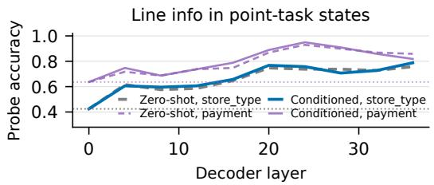

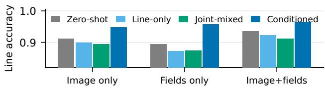  
Figure 4: Left: layer-wise probe accuracy for line information in point-task states, zero-shot (dashed) vs CONDI-TIONED (solid), dotted lines mark the majority baselines (.42 store\_type, .64 payment\_method); decodability rises with depth. Right: line accuracy by input modality. CONDITIONED is the only model for which the field text alone beats the image alone, and fusion is superadditive for all.

$$
\begin{array} { r } { \operatorname* { l i f t } _ { f } = \frac { \frac { 1 } { | E _ { f } | } \sum _ { e \in E _ { f } } a ( e ) } { \frac { 1 } { | Y _ { \mathrm { P T } } | } \sum _ { e \in Y _ { \mathrm { P T } } } a ( e ) } , } \end{array}\tag{4}
$$

the density on annotated evidence relative to all fields, with lift = 1 as the count-matched null. Two checks discipline it (Table 5): a float32 recomputation moves the surviving facets by at most .07 while shifting the twelve-sample has\_discount by .36, and a lexical-overlap null recomputes lift on evidence sharing no tokens with the answer, which payment\_method fails (68% overlap, residual 1.00) and store\_type and has\_surcharge survive.

The neutral-content control bounds how much of this is format exposure: its median lift is 2.385 on store\_type and 1.231 on has\_surcharge, so it reproduces 86% of CONDITIONED’s gain over zero-shot on the first facet and 29% on the second, and CONDITIONED exceeds it on both by paired median differences of +0.139 [0.040, 0.293] and +0.222 [0.060, 0.420]. On the surviving facets every model attributes above the null and CON-DITIONED attributes most sharply (store\_type 1.88 → 2.47, has\_surcharge 1.10 → 1.55; paired median-lift differences over zero-shot +0.59 [0.30, 0.78] and +0.45 [0.26, 0.69]), and its top attributed field is annotated evidence for .87 of samples against a .17 chance rate. The instrument does not, however, separate CONDITIONED from JOINT-MIXED, which is level with it on store\_type and above it on has\_discount (Figure 5), so attribution sharpness cannot by itself explain why JOINT-MIXED fails behaviourally. Because the links come from LLM judges we read the alignment as convergent validity rather than as validation of either side.

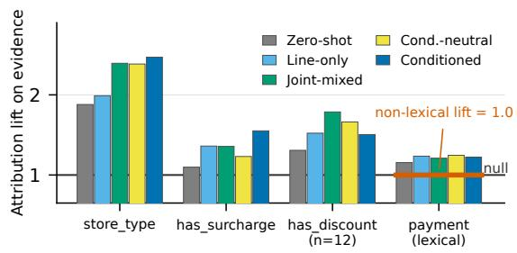  
Figure 5: Median attribution lift on annotated evidence fields (1.0 = count-matched null). payment\_method is shown for completeness but fails the lexicaloverlap null; has\_discount has n=12. Lift is above the null for every regime; CONDITIONED is highest on has\_surcharge, level with JOINT-MIXED on store\_type and below it on has\_discount. COND.- NEUTRAL bounds the format contribution: it reproduces most of CONDITIONED’s store\_type gain over zeroshot and little of its has\_surcharge gain.

Under three input conditions, image only, gold field text only, and both (Figure 4, right), fusion is superadditive for every model, and the regimes separate on the text channel: field text alone is the weaker channel for zero-shot, LINE-ONLY and JOINT-MIXED (.87–.89, below image-only) and the stronger one for CONDITIONED (.957 vs .947, +1.0 paired, [−1.5, +3.8]). The direction is consistent across facets but the gap is not resolvable, and format familiarity predicts the same sign, so we report the channel reversal as a description of CONDITIONED’s behaviour rather than as evidence about its representations.

## E Third Domain: FUNSD

FUNSD is 199 scanned 1990s business documents (fax cover sheets, memoranda, progress reports, questionnaires) in the official 149/50 split. The fine task reuses the corpus’s own gold entity annotations, decoded from word-level BIO into (category, text) pairs over {header, question, answer} and scored with the same multiset F1; a median document carries 36 entities. The receipt facets do not transfer, so the coarse task uses four new ones with the same shape as the receipt schema, one semantic facet judged holistically and three structural facets anchored in specific field types: doc\_type (fax\_cover, memo\_letter, report, form\_questionnaire, other), has\_checkbox, has\_cc\_field and has\_unfilled\_field. Gates, success criteria and a declared direction prediction were fixed before any label was aggregated. Both pre-registered outcomes are reported as they fell. The primary criterion, conditioned line accuracy at least equal to every other trained regime, passes on the pre-registered regime set (.920 against .770, .905 and .810) and fails once the post-hoc COND.- FIELDS ablation counts (.935), exactly as on WildReceipt. The declared direction prediction is refuted: we predicted the gain on the side with more headroom, here the fine side at a zero-shot F1 of .117 against a coarse accuracy of .915, and it appeared on the coarse side. We report it refuted rather than reinterpreting the ordering afterwards. The 50 test documents are human-validated in full at 91.0% agreement.

Seeds and recipe sweep. Table 8 reports every FUNSD arm we trained. Three seeds separate the two central arms on the coarse side without overlap, and the paired contrasts at seeds 1 and $2 \ { \mathrm { a r e } } \ + 1 6 . 0 \ [ 1 1 . 0 , 2 1 . 0 ] \ { \mathrm { a n d } } \ + 1 5 . 0 \ [ 1 0 . 0 , 2 0 . 5 ]$ on line, +44.0 [30.0, 58.0] and +46.0 [32.0, 60.0] on doc\_type. The fine side does not separate consistently: −1.1 [−8.1, +5.9] at seed 1 and +7.3 [0.8, 14.1] at seed 2. Pooling the seeds into the two-level bootstrap used for the other two corpora, which resamples seeds and then documents, gives CONDITIONED−JOINT-MIXED line +15.3 [10.7, 20.3] and doc\_type +46.0 [32.0, 60.0], and CONDITIONED−COND.- NEUTRAL line +18.9 [13.2, 25.2] with the same doc\_type interval, so the coarse-side result does not rest on the single run in Table 4. The recipe sweep is reported in Section 5; the two arms that move it are mixed training at $2 \times 1 0 ^ { - 5 }$ , which recovers, and at four epochs, which degrades further, so the direction of the recipe effect is not simply an amount of training.

Mixing ratio. Repeating the line rows of the mixed training set two and four times, changing nothing else, lifts macro coarse accuracy from .770 to .805 in both arms (+3.5, [1.0, 6.5]) through the three structural facets, and leaves doc\_type at the majority label for all 50 documents in both, +0.0 [0.0, 0.0] against the balanced arm. The fine side pays for the reweighting, .426 falling to .359 and .369. Both arms stay 11.0 coarse points and 38.0 doc\_type points below the untuned model, so the collapse is not an artefact of the task proportion.

The predicate at the second learning rate. Read against single-task models retrained at $2 \times 1 0 ^ { - 5 }$ rather than at $1 0 ^ { - 4 } ,$ , mixed training still does not reinforce: it is above matched POINT-ONLY on the fine side (+3.1, [−1.4, +7.9]) and below matched LINE-ONLY on the coarse side (−2.5, [−5.5, +0.5]), so it trades there as it does at the shared rate. Conditioning does not reinforce at that rate either, sitting below both matched arms (−6.0 [−13.8, +1.5] fine, −0.5 [−3.5, +2.5] coarse), and mixed training leads it there on the fine side by +9.1 [2.2, 16.3], the only arm in the study that resolvably beats conditioning on either side of any corpus. The four arms cluster on the coarse side, .890 to .926 against zero-shot’s .915, which is why both the collapse and its repair are reported as properties of the shared recipe on this corpus.

The committee gate passed on both splits: perfacet majority 100% everywhere, Fleiss κ .734– .957 on the test split and .754–.910 on the training split, and no facet with a majority class above 90%. Three annotators then relabelled all 50 test documents blind, at 91.0% agreement with the committee (κ .96 has\_checkbox, .89 has\_unfilled\_field, .79 doc\_type, .57 has\_cc\_field); has\_cc\_field is the least reliable facet and its low κ reflects both genuine ambiguity and an 82% base rate. Training reuses the CORD recipe unchanged. One caveat is specific to this corpus: because the facet space is coarse, a shuffled hypothesis coincides with the document’s own labels for 8.7% of training examples, so the shuffled arm is a weaker control here than on the receipts; the field-list slot never coincides.

<table><tr><td>FUNSD arm</td><td>Point F1</td><td>Line Acc</td><td>doc_type</td></tr><tr><td>JOINT-MIXED seeds 0/1/2</td><td>.426/.401/.372</td><td>.770/.755/.765</td><td>.520/.520/.520</td></tr><tr><td>JOINT-MIXED lr  $2 \times 1 0 ^ { - 5 }$ </td><td>.417</td><td>.890</td><td>.880</td></tr><tr><td>JOINT-MIXED four epochs</td><td>.433</td><td>.700</td><td>.520</td></tr><tr><td>JOINT-MIXED line rows 2×</td><td>.359</td><td>.805</td><td>.520</td></tr><tr><td>JOINT-MIXED line rows 4×</td><td>.369</td><td>.805</td><td>.520</td></tr><tr><td>CONDITIONED seeds 0/1/2</td><td>.430/.390/.445</td><td>.920/.915/.915</td><td>1.000/.960/.980</td></tr><tr><td> $\mathrm { C O N D I T I O N E D } \mathrm { l r } 2 { \times } 1 0 ^ { - 5 }$ </td><td>.325</td><td>.910</td><td>.960</td></tr><tr><td>COND.-NEUTRAL seeds 0/1</td><td>.402/.369</td><td>.750/.705</td><td>.520/.520</td></tr><tr><td> $\mathrm { P O I N T - O N L Y } \mathrm { l r } 2 { \times } 1 0 ^ { - 5 }$ </td><td>.386</td><td>.920</td><td>.920</td></tr><tr><td> $\operatorname { L I N E - O N L Y } \operatorname { l r } 2 \times 1 0 ^ { - 5 }$ </td><td>.165</td><td>.915</td><td>.960</td></tr></table>

Table 8: FUNSD seed replications and recipe sweep, all at $n { = } 5 0 .$ . Seed 0 is the run reported in Table 4. The last block gives the single-task arms retrained at the second rate, without which the arms at that rate have no matched reference. Nothing is bolded here: the arms differ in recipe as well as in regime, so a single best-in-column would compare across two changes at once.

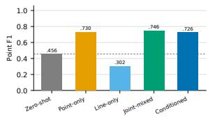

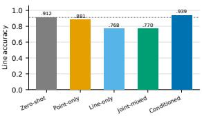  
Figure 6: Five-regime replication on Qwen3-VL-4B, CORD test, identical recipe. Line-side pattern amplifies: LINE-ONLY and JOINT-MIXED fall 14 points below zero-shot on the line task itself, CONDITIONED alone stays above it. Point side: JOINT-MIXED .746 exceeds CONDITIONED . $. 7 2 6 \ ( - 2 . 0 \ [ - 4 . 5 , + 0 . 4 ] )$ and POINT-ONLY .730 sits 0.5 above it $( [ - 3 . 1 , + 2 . 2 ] )$ , so the pointside advantage of conditioning is specific to 8B and its point-side no-loss holds only within noise at 4B; the line advantage holds at both scales (+2.8 [0.5, 5.1] over zero-shot).

## F Second Backbone (Qwen3-VL-4B)

The 4B recipe reuses 8B hyperparameters without tuning; the amplified self-damage of LINE-ONLY/JOINT-MIXED at 4B may partly reflect that choice, which does not affect the ordering conclusion.

## G Zero-Shot Pilot and Iterative Loop

Before training we measured the same task pair zero-shot on 198 CORD training receipts. Singlepass joint prompting interferes (line .869 vs .897 single-task; −7.7 points on store\_type); an iterative loop, hypothesis → conditioned extraction → field-conditioned re-judgment, recovers part of it (line +2.15 over joint, [0.1, 4.3]), with the gain coming from the hypothesis-to-extraction direction (+2.4 point F1) while the reverse direction was flat and a second iteration degraded. Training-time results in the main text mirror this inference-time asymmetry. The loop costs four generations against one for joint prompting; we did not run a computematched sampling control, and treat the pilot as motivation rather than a method claim.

## H Activation Patching (Inconclusive)

We attempted a representation-level test: transplant the last-prompt-token residual state at layers 16/20/24/28 (and the band) from the CONDI-TIONED model into LINE-ONLY or zero-shot during a scored five-way store\_type choice, with a random-donor control. No configuration moved recipient accuracy or agreement with the donor. The scoring protocol itself proved unreliable, the donor’s forced-prefix accuracy (.495) falls far below its free-generation accuracy (.899), so this null is uninformative about localization in either direction, and no representation-level conclusion is drawn from it.

## I Annotation Pipeline and Prompts

Committee. Each judge receives the receipt image and the gold field list (id, category, text per instance), and returns the four facets, per-facet evidence field ids, a constraint-applicability flag, and per-facet confidences as JSON. Judges never see one another’s outputs; aggregation is per-facet majority vote, and evidence links keep the ids named by at least two judges. Per-sample cost averaged \$0.014 across the three judges.

## Judge system prompt (verbatim).

You are annotating a receipt image for a document-understanding dataset. You are given the receipt image and its gold

\- store\_type: judge HOLISTICALLY from store name, menu-item semantics, and overall layout. cafe\_beverage = primarily drinks; bakery\_dessert = baked goods / desserts; retail\_convenience = packaged goods / non-prepared food retail; restaurant = prepared meals; other = unclear or none.

\- payment\_method: cash (cash/change fields), card (credit/debit), e\_money, mixed (multiple methods), unknown.

\- has\_discount: yes if any discount, void, promo, or negative amount reduces the bill.

\- has\_surcharge: yes if tax and/or service charge is ADDED to the bill.

\- evidence: for each facet, the field ids (ONLY from the provided list) supporting your value. Use [] when no listed field supports it (e.g. store\_type judged from the image alone).

\- constraint\_table\_applies: true iff these expectations hold on this receipt: payment=cash implies cash & change fields present; has\_discount=yes implies a discount/void field present; has\_surcharge=yes implies a tax/service field present.

Rules: NEVER invent field ids. Judge only from the image and the provided fields. Output raw JSON, no markdown.

## Task prompts (verbatim). Point:

Extract ALL key information fields from this receipt image. Allowed categories: {ontology}. Return ONLY a JSON array, one entry per field instance in reading order: [{"category": "...", "text": "..."}]. Copy text EXACTLY as printed.

## Line:

Classify this receipt on 4 document-level   
facets. Return ONLY JSON:   
{"store\_type": "...", "payment\_method":   
"...", "has\_discount": "yes|no",   
"has\_surcharge": "yes|no"}   
store\_type: judge holistically (store   
name, item semantics, layout).   
payment\_method:   
how the bill was paid. has\_discount: any

discount/void/promo reduces the bill. has\_surcharge: tax and/or service charge added.

## Conditioned-training templates (g, h in Eq. 3, verbatim). Point side prefix:

Document-level hypothesis for this   
receipt: store\_type=...,   
payment\_method=...,   
has\_discount=..., has\_surcharge=... .   
Use it as context (e.g. expected payment/ discount/surcharge fields), but trust the image over the hypothesis. Fields extracted from this receipt:   
- category: text   
Using BOTH the image and these fields, classify this receipt on 4 document-level facets. ...

COND.-SHUFFLED uses byte-identical templates whose hypothesis and field list come from document π(i), a deterministic shift of the training index.

## J Dataset Examples

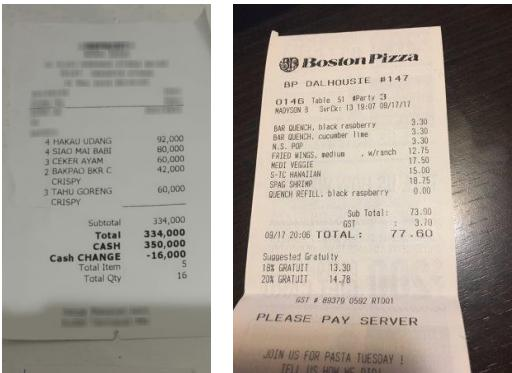  
Figure 7: Example receipts: CORD (left, Indonesian) and WildReceipt (right, English).

## Doc-MRE record for the CORD example (fields abridged):

fields: [   
{"id":"menu.nm#0","text":"1PC KFI"}, {"id":"menu.cnt#0","text":"1"}, {"id":"menu.price#0","text":"12,500"}, ... 8 more field instances .. {"id":"total.total\_price#0", "text":"25,000"}, {"id":"total.cashprice#0", "text":"50,000"}, {"id":"total.changeprice#0", "text":"25,000"}]   
line labels: {"store\_type":"restaurant", "payment\_method":"cash", "has\_discount":"no","has\_surcharge":"no"}   
evidence: {"store\_type":["menu.nm#0"], "payment\_method":["total.cashprice#0", "total.changeprice#0"], "has\_discount":[], "has\_surcharge":[]}

WildReceipt records use the twelve-category schema (store\_name, prod\_item, subtotal, tax, tips, total, etc.); document-level distributions differ markedly from CORD (payment unknown on half the receipts, surcharge present on 68%), which is what makes it a useful second schema.

## K Human Annotation: Guide and Interface

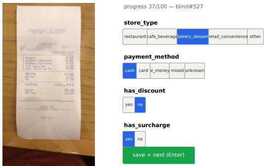  
Figure 8: The annotation interface (blind mode): receipt image with click-to-zoom on the left; the four facet button groups, keyboard shortcuts, and save-and-next on the right. In blind mode no committee label is ever displayed and options start unselected.

The guide given to annotators, translated from the working copy:

Protocol. Judge each receipt independently from the image alone; accuracy over speed (20–40 seconds per receipt); all four facets required before saving; no discussion of individual samples.

Decision rules. store\_type: judge from store name, items sold, and layout together; mixed businesses by the dominant category on the ticket (a coffee shop selling one cake is still cafe\_beverage); when name and items conflict, items win. payment\_method: only lines showing the actual payment count; advertised payment options do not; a change line implies cash; QRIS counts as e-money. has\_discount: any discount, promo, voucher, void, or negative amount; a zero-amount discount line counts as no. has\_surcharge: any separately listed tax (TAX/PAJAK/PB1/PPN) or service charge; “prices include tax” with no separate line counts as no.

Vocabulary. Indonesian receipt terms: TUNAI = cash, KEMBALI/KEMBALIAN = change, PB1/PPN = tax, DISKON/POTONGAN = discount, and OVO/GoPay/DANA/ShopeePay/QRIS are ewallets.

Fallbacks. If undecidable: store\_type = other, payment\_method = unknown; for the two binary facets, absence of visible evidence means no.

## L Pre-registration of the WildReceipt Replication

Before any WildReceipt annotation was aggregated we fixed: a quality gate (three-judge majority $\geq 8 0 \%$ and κ ≥ .70 on every facet, else the dataset is excluded with the gate reported), the success criteria (primary: CONDITIONED line ≥ every other trained regime, direction consistent with CORD; secondary: CONDITIONED point ≥ JOINT-MIXED), and the analysis plan (CORD recipe unchanged, seed 0, paired bootstrap CIs). The gate passed (majority 100% on all facets, κ .830–.948). The secondary criterion passed (CONDITIONED point +6.4 over JOINT-MIXED, [1.8, 11.1]). The primary criterion passed on the pre-registered regime set (CONDITIONED line .890 against JOINT-MIXED .878 and POINT-ONLY .785), but fails once the post-hoc arms are counted: LINE-ONLY reaches .903 and PIPELINE .905, both above CONDI-TIONED. We therefore report the primary criterion as failed and restate the WildReceipt finding as follows: CONDITIONED matches the best line regime within the paired interval (−1.5 against PIPELINE, [−4.5, +1.5]) and leads every pre-registered singleforward-pass regime on point, while two post-hoc arms, COND.-NEUTRAL (.610) and COND.-HYPO (.596), are nominally higher on point with unresolvable differences $( - 1 . 9 \left[ - 7 . 0 , + 2 . 8 \right]$ and −0.5 $[ - 5 . 0 , + 3 . 8 ] )$ . The direction-flip observation is labeled post-hoc.