Knowledge Distillation (forward KL)

# Knowledge Distillation During Mid-Training Favors Reasoning over Factual Recall

Jacqueline He1,2, Howard Yen³, Shuyue Stella Li1,2, Margaret Li², Hanqing Zeng¹, Yinglong Xia¹, Benyu Zhang¹, Zhuokai Zhao¹ Qiang Zhang¹, Pang Wei Koh², Luke Zettlemoyer1,2, Wen-tau Yih¹

1Meta AI, 2University of Washington, 3Princeton University

Logit-based knowledge distillation (KD) is used to train smaller language models (LMs) via supervision from stronger teachers, but whether its benefits are consistent across training stages remains unclear. Through controlled experiments, we find that forward Kullback-Leibler (KL) distillation—the standard KD formulation—with post-trained teachers behaves fundamentally differently during mid-training, an intermediate phase of self-supervised learning on curated corpora. Surprisingly, while forward KD simultaneously improves reasoning and factual recall during pre-training relative to standard next-token prediction (NTP), it instead slows factual recall acquisition during mid-training despite continued reasoning gains. We trace this stage dependence to an asymmetry in teacher confidence across data domains and the student's evolving knowledge state: teachers are more confident on procedural than knowledge-intensive data, while students acquire low-entropy factual knowledge earlier in training. To mitigate this imbalance, we propose SwITCH DISTILLATION, a simple mid-training objective that distills on tokens where the teacher is confident, using teacher predictive entropy as a lightweight routing signal, and otherwise falls back to cross-entropy. SwITCH DISTILLATION consistently outperforms existing distillation objectives across teacher sizes. Relative to standard NTP, it achieves 1.61–1.71× the reasoning performance and 1.13–1.19× the knowledge and commonsense performance while preserving 96.7–96.8% of factual recall. Crucially, these benefits persist after post-training: SwITCH DISTILLATION closes the factual recall gap while maintaining 1.25-1.32× and 1.13–1.20× gains in reasoning and knowledge and commonsense, respectively.

Date: September 2, 2026

Correspondence: Jacqueline He at jyyh@cs.washington.edu Code: https://github.com/facebookresearch/midtraining-distillation

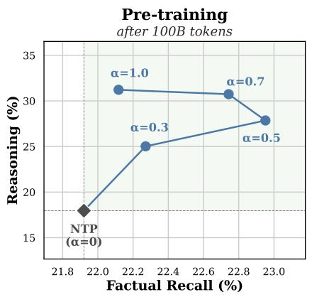

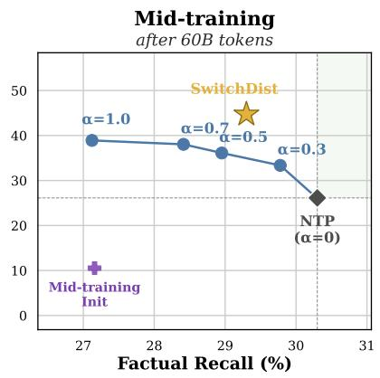

∞Meta

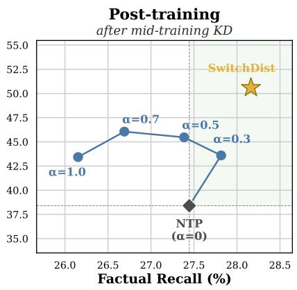  
Figure 1 Knowledge distillation (KD) generally improves reasoning, but its effect on factual recall changes across training stages. Using an OLMo-2 1B student and 7B-Instruct teacher, we sweep the distillation strength α, which interpolates between NTP (α = 0) and forward-KL distillation. Distillation improves both reasoning and factual recall during pre-training (left), but favors reasoning at the expense of factual recall during mid-training (middle). SWITCH DISTILLATION (★) mitigates this imbalance and Pareto-dominates NTP after post-training (right).

## 1 Introduction

Modern language models (LMs) increasingly rely on a dedicated mid-training stage between pre-training and post-training, in which self-supervised next-token prediction continues on a smaller, high-quality corpus curated to improve capabilities such as factuality, reasoning, coding, and instruction following (Grattafiori et al., 2024; Allal et al., 2025; Walsh et al., 2025; Liu et al., 2026; Meta Superintelligence Labs, 2026). Because mid-training uses far fewer tokens than pre-training, extracting more learning signal from each token becomes especially important. Knowledge distillation (KD) (Bucilu et al., 2006; Hinton et al., 2015) offers a natural approach by augmenting ground-truth next-token supervision with the richer predictive distribution of a stronger teacher, typically through minimizing the forward Kullback-Leibler divergence between teacher and student predictive distributions (Gu et al., 2024; Zhong et al., 2024). Yet despite its growing use in frontier language modeling pipelines (Team Gemma et al., 2025; Meta Superintelligence Labs, 2026), KD has been studied almost exclusively in pre-training and post-training (Busbridge et al., 2025; Lu and Liu, 2026; Agarwal et al., 2024), leaving it unclear whether its benefits transfer to the relatively nascent mid-training stage.

Surprisingly, we find that knowledge distillation behaves qualitatively differently in mid-training than in pre-training. Using the OLMo-2 ecosystem (Walsh et al., 2025), one of the most recent fully open model families with intermediate checkpoints, training recipes, and multiple model scales, we conduct controlled pre-training and mid-training experiments with 1B students. As Figure 1 shows, increasing distillation strength (α) generally improves reasoning across training stages, but its effect on factual recall differs sharply While traditional forward-KL distillation improves both reasoning and factual recall over vanilla next-token prediction (NTP) during pre-training, its reasoning gains are accompanied by comparatively lower factual recall during mid-training. We refer to this phenomenon as the reasoning-recall tradeoff.

This tradeoff is remarkably robust: across teacher sizes, KL directions, and interpolation coefficients, no KD objective Pareto-dominates NTP during mid-training. We track this behavior to an interaction between teacher confidence, the student's evolving knowledge state, and the distillation objective. To begin, our teachers exhibit substantially lower predictive entropy on procedural data, such as math and instruction-following, than on unstructured data such as general web text; lower entropy is also strongly correlated with higherquality supervision. Students acquire factual knowledge associated with lower teacher entropy earlier during pre-training, such that facts have not been learned at the start of mid-training receive disproportionately weak teacher supervision. Finally, as teacher entropy rises, KD increasingly attenuates the ground-truth learning signal relative to NTP. Together, these effects explain why distillation preferentially accelerates reasoning while slowing factual acquisition during mid-training.

Motivated by this analysis, we propose SwITCH DiSTILLATION, a drop-in mid-training objective that uses teacher predictive entropy to route each token between distillation and next-token prediction. Because this routing signal is computed from the teacher logits already required for KD, SwITCH DiSTILLATION incurs minimal additional computation. Across 7B and 13B teachers, SwITCH DISTILLATION substantially improves the reasoning-recall tradeoff. With an OLMo-2 7B Instruct teacher, for example, SwITCH DISTILLATION improves average reasoning performance by 71% and knowledge and commonsense performance by 19% over NTP, while reducing factual recall by just 1 percentage point. Given that the purpose of mid-training is to provide a strong prior for alignment, we show that SwITCH DISTILLATION's gains persist through post-training; reasoning remains 32% higher, knowledge tasks improve by 20%, and the factual recall gap closes entirely.

Our contributions are threefold:

1. Empirical finding: We uncover a robust reasoning-recall tradeoff unique to mid-training: distillation improves reasoning while slowing factual acquisition relative to NTP.

2. Explanatory analysis: We explain this tradeoff through the interaction between teacher confidence, student learning dynamics, and the distillation objective, showing that unlearned facts at mid-training disproportionately receive weak teacher supervision.

3. Mid-training objective: Our analysis naturally motivates SwITCH DISTILLATION, which routes tokens between KD and NTP using teacher predictive entropy. Our method substantially mitigates the tradeoff across teacher sizes and retains its gains after post-training.

## 2 Background

## 2.1 Preliminaries

Language modeling. Given a token sequence $\mathbf { x } ~ = ~ ( x _ { 1 } , \dots , x _ { N } )$ and an auto-regressive language model distribution $p _ { \theta }$ , standard next-token prediction minimizes the expected cross-entropy loss

$$
\mathcal { L } _ { \mathrm { C E } } = \mathbb { E } _ { ( \mathbf { x } , n ) } \left[ - \log p _ { \theta } ( x _ { n } \mid x _ { < n } ) \right] ,\tag{1}
$$

where $x _ { n }$ is the target next token and the expectation is over training sequences and token positions.

Knowledge distillation. Logit-based knowledge distillation (KD) trains a student to match the output distribution of a vocabulary-compatible teacher (Hinton et al., 2015; Busbridge et al., 2025):

$$
\mathcal { L } _ { \mathrm { K D } } = ( 1 - \alpha ) \mathcal { L } _ { \mathrm { C E } } + \alpha \mathcal { L } _ { \mathrm { K L } } ,\tag{2}
$$

where $\alpha \in [ 0 , 1 ]$ controls the distillation strength. Let $p _ { T } ^ { \tau } ( \cdot \mid x _ { < n } )$ and $p _ { S } ^ { \tau } ( \cdot \mid x _ { < n } )$ denote the next-token distributions scaled by temperature $\tau > 0$ for a teacher $T$ and student $S ,$ respectively. Standard KD instantiates ${ \mathcal { L } } _ { \mathrm { K I } }$ , using the forward KL (FKL) divergence (Kullback and Leibler, 1951):

$$
\mathcal { L } _ { \mathrm { F K L } } = \tau ^ { 2 } \mathbb { E } _ { ( \mathbf { x } , n ) } \left[ \sum _ { v \in \mathcal { V } } p _ { T } ^ { \tau } ( v \mid x _ { < n } ) \log \frac { p _ { T } ^ { \tau } ( v \mid x _ { < n } ) } { p _ { S } ^ { \tau } ( v \mid x _ { < n } ) } \right] .\tag{3}
$$

Recent work has advocated for distillation using the reverse KL (RKL) divergence, which discourages student mass on the teacher's low-probability regions (Agarwal et al., 2024; Gu et al., 2024):

$$
\mathcal { L } _ { \mathrm { R K L } } = \tau ^ { 2 } \mathbb { E } _ { ( \mathbf { x } , n ) } \left[ \sum _ { v \in \mathcal { V } } p _ { S } ^ { \tau } ( v \mid x _ { < n } ) \log \frac { p _ { S } ^ { \tau } ( v \mid x _ { < n } ) } { p _ { T } ^ { \tau } ( v \mid x _ { < n } ) } \right] .\tag{4}
$$

Throughout this paper, we instantiate ${ \mathcal { L } } _ { \mathrm { K L } }$ as either $\mathcal { L } _ { \mathrm { F K L } }$ or $\mathcal { L } _ { \mathrm { R K L } }$ , corresponding to forward-KL distillation (FKD) and reverse-KL distillation (RKD), respectively

## 2.2 Experimental Setup

Training regimes. We build on the open-source OLMo-2 ecosystem (Walsh et al., 2025). We pre-train and mid-train on Dolmino Mix 1124, a data mixture of filtered DCLM web text, FLAN instruction-following data, Dolmino Math, peS2o, Wikipedia (including Wikibooks), and Stack Exchange. For pre-training, we initialize 1B students from random weights and train beyond Chinchilla optimality for 100B tokens (Hoffmann et al., 2022). For mid-training, we initialize from the OLMo-2 1B Stage 1 checkpoint, already pre-trained on 4T tokens, and continue training for 60B tokens.

Teacher models. Post-trained models are increasingly used as teachers for reference-based language modeling in recent research (Goyal et al., 2026; Huang et al., 2026; Jin et al., 2026; Tan et al., 2026) and frontier LLM pipelines (Team Gemma et al., 2025; Meta Superintelligence Labs, 2026). Their stronger instruction-following and reasoning abilities make them natural choices for capability transfer. Accordingly, we employ OLMo-2 1B Instruct, 7B Instruct, and 13B Instruct as teachers.

Evaluation. We evaluate with the standardized OLMES (Gu et al., 2025) harness, grouping benchmark tasks into REAsONING (generative problem solving), FACTUAL RECALL (generative retrieval of factual knowledge), KNOWLEDGE & CoMMONSENSE (multiple choice world knowledge and commonsense reasoning), and INSTRUCTION FOLLOwING (post-training only). We report macro-averages within each task group unless otherwise noted, and focus our stage-dependent analysis on REASONING and FACTUAL RECALL. See Table 7 for full task suite and evaluation settings.

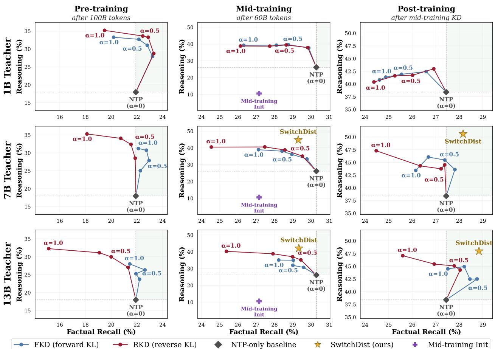  
Figure 2Knowledge distillation exhibits a reasoning-recall tradeoff that falls below the NTP frontier during mid-training.SWITCH DISTILLATION mitigates this tradeoff, and yields Pareto improvements over NTP after post-training. Rows correspond to 1B, 7B, and 13B teachers. We sweep over the distillation weight α for forward KL and reverse KL distillation; ◆ denotes the NTP baseline (α = 0), and mid-training panels show the pre-trained student at initialization.

## 3 Characterizing Mid-Training Distillation

Figure 2 compares reasoning and factual recall across distillation strength $( \alpha \in [ 0 . 0 , 0 . 3 , 0 . 5 , 0 . 7 , 1 . 0 ] )$ , KL direction (forward and reverse), training regime (pre-training and mid-training), and Instruct teacher size (1B, 7B, and 13B).1

Increasing distillation strength consistently shifts performance toward reasoning. Across teacher sizes and KL directions, increasing the contribution of the teacher (via larger α) generally moves the operating point toward higher reasoning performance, with diminishing returns at stronger distillation. This trend holds across both pre-training and mid-training, suggesting that the teacher reliably imparts reasoning-relevant behavior even when the teacher has already acquired substantial knowledge. This is consistent with recent work showing that knowledge distillation is particularly conducive for transferring reasoning capabilities from stronger teachers (Kim and Baek, 2026).

The effect of distillation on factual recall is stage-dependent. During pre-training (Figure 2 left), moderate forward-KL distillation tends to improve factual recall alongside reasoning, yielding Pareto improvements over standard NTP across teacher sizes. At stronger distillation strengths, however, factual recall begins to decline, especially under reverse KL. During mid-training (Figure 2 middle), the pattern changes such that no

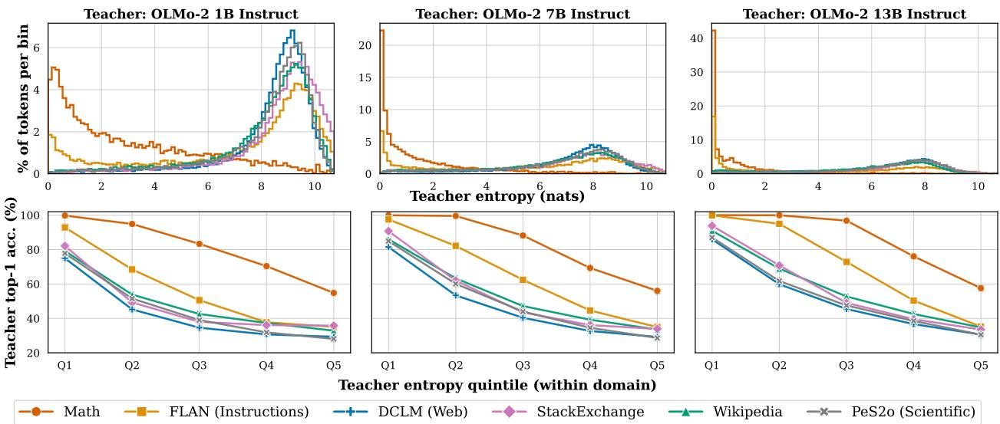  
Figure 3 Low teacher entropy identifies tokens for which teacher supervision is most reliable. Top: Across teacher sizes, procedural domains (e.g., math, instruction-following) concentrate at lower teacher predictive entropy than unstructured domains. Bottom: For each domain, lower entropy tokens exhibit substantially higher teacher top-1 agreement with the ground-truth token. Q1: lowest entropy; Q5: highest entropy.

KD operating point outperforms NTP on factual recall even as reasoning improves. This recall deficit is not merely transient: after applying the same standard post-training procedure to all mid-trained checkpoints, without further distillation (Figure 2, right), the factual-recall gap relative to NTP narrows or reverses for larger teachers, while the reasoning gains from distillation persist.

Thus, the reasoninq-recall tradeoff changes qualitatively once distillation is applied to a knowledgeable student In pre-training, teacher supervision can move the student beyond the NTP frontier, improving reasoning without sacrificing factual recall. In mid-training, the same objective instead traces a frontier that often falls below NTP in factual recall: additional reasoning is gained at the expense of slower knowledge acquisition The consistency of this effect across teacher sizes and KL directions suggests that it is not simply a consequence of teacher capacity or a particular divergence objective. Rather, it points to an interaction between teacher distribution and the student's existing knowledge, which we explore in the next section.

## 4 Why Does the Reasoning-Recall Tradeoff Occur?

We attribute KD's stage-dependent behavior to the interaction of three factors: (i) the teacher's predictive confidence, (ii) the student's existing knowledge state, and (iii) the optimization dynamics induced by distillation. We study each factor in turn below.

## 4.1 Teacher supervision is asymmetric across data domains

We begin by asking whether teacher supervision is uniformly reliable across the training corpus. Using OLMo-2 Instruct 1B, 7B, and 13B as teachers, we compute token-level predictive entropy on randomly sampled Dolmino documents. Teacher entropy varies systematically across domains (Figure 3, top): procedural domains (e.g., math and instruction-following) exhibit substantially lower entropy than knowledge-intensive ones.2 Domain-level differences alone, however, do not establish that predictive entropy reflects supervision quality. We find that teacher predictive entropy is indicative of correctness within each domain, where correctness is defined as agreement with the ground-truth corpus token. In Figure 3 (bottom), the probability that the teacher's top-1 prediction equals the ground-truth token decreases monotonically across entropy quintiles for every data domain and teacher size, showing that teacher entropy is predictive of supervision quality.

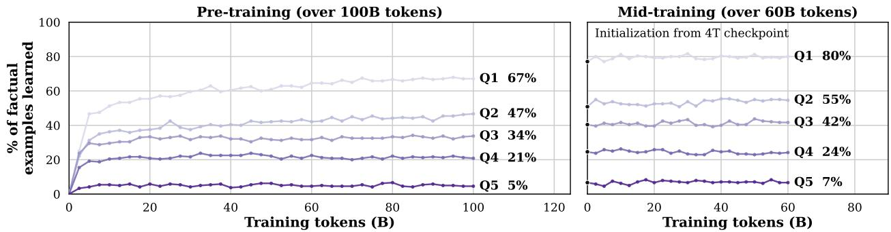  
Figure 4 Unresolved facts become concentrated at higher teacher entropy (larger quintiles). Lower-entropy facts are acquired earlier during pre-training; by mid-training initialization (after 4T tokens), unresolved facts are concentrated in the highest-entropy quintiles. Q1: lowest entropy; Q5: highest entropy. Results for other teacher sizes are in §D.3.

Together, these results show that teacher supervision is asymmetric across domains: distillation receives confident, lower-entropy supervision on tokens from procedural domains, but substantially more diffuse, higher-entropy supervision on tokens from knowledge-intensive ones. This asymmetry may bias distillation toward reasoning over factual recall.

## 4.2 Teacher entropy predicts factual acquisition under next-token prediction

Given qualitatively consistent trends across teacher sizes, we use OLMo-2 7B Instruct as a representative teacher for the remaining analysis; corresponding 1B and 13B results are in App. D.3.

We track factual acquisition across intermediate checkpoints from the course of NTP training on our FACTUAL RECALL evaluation tasks (TriviaQA, Natural Questions, and SimpleQA). For each example, we teacher-force the prompt to the first answer token and measure (i) the teacher entropy at that position and (ii) whether the student's top-1 prediction matches any gold answer alias. Teacher entropy is used only to stratify factual examples; students are trained purely with NTP.

As shown in Figure 4, teacher entropy strongly predicts factual acquisition: by the end of pre-training, the student has learned 67% of facts in the lowest-entropy quintile (Q1), and only 5% in the highest (Q5), with intermediate quintiles progressing monotonically. By the start of mid-training, this stratification has largely saturated, leaving unresolved factual knowledge concentrated in the highest-entropy quintiles, which is precisely where teacher supervision is least confident.

## 4.3 Knowledge distillation attenuates factual supervision

Having characterized the teacher's predictive confidence and the student's knowledge state, we next examine their interaction through the distillation objective. Using the entropy-stratified factual recall examples from §4.2, we trace three cascading effects: (i) the teacher's probability assigned to that token, (ii) the supervision placed on the token under forward and reverse KD, and (iii) the resulting factual recall difference between KD and NTP. Across all three analyses, higher teacher entropy consistently corresponds to progressively weaker factual supervision and worse performance.

First, teacher probability on the ground-truth token strictly decreases with predictive entropy (Figure 5a) meaning that the teacher places less weight on the correct answer as entropy increases.

We next measure the gradient norm of the ground-truth logit, g, which captures how strongly the objective reinforces the correct next token. Because g depends on both teacher and student distributions, we consider two student initializations representing the start of pre- and mid-training: random initialization and the 4T-token checkpoint, respectively. We compute the ratio of the gold-token gradient under FKD (gFkD) or RKD (gRKD) to NTP (gNTP).3 Ratios below 1 indicate weaker ground-truth supervision than NTP. Both FKD and RKD increasingly attenuate ground-truth supervision as teacher entropy rises, reaching approximately 0.5× NTP for the highest-entropy facts (Figure 5b).

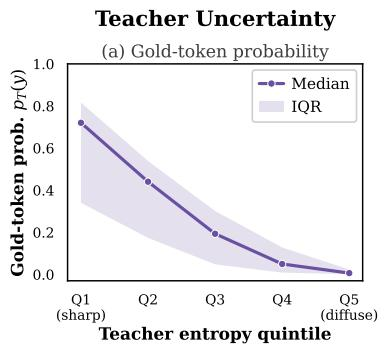

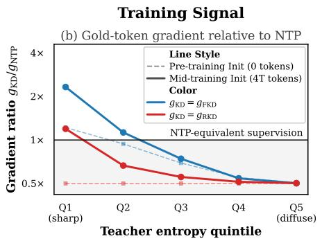

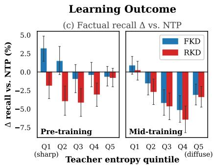

Figure 5High teacher entropy provides weaker supervision for factual acquisition, reducing factual recall. After stratifying factual recall examples into teacher-entropy quintiles using an OLMo-2 7B Instruct teacher, we observe that highest teacher entropy tokens (a) have lower teacher probability, which (b) produces weaker optimization signal via gradient updates during KD, and (c) results in lower downstream factual recall. Q1: lowest entropy; Q5: highest entropy  
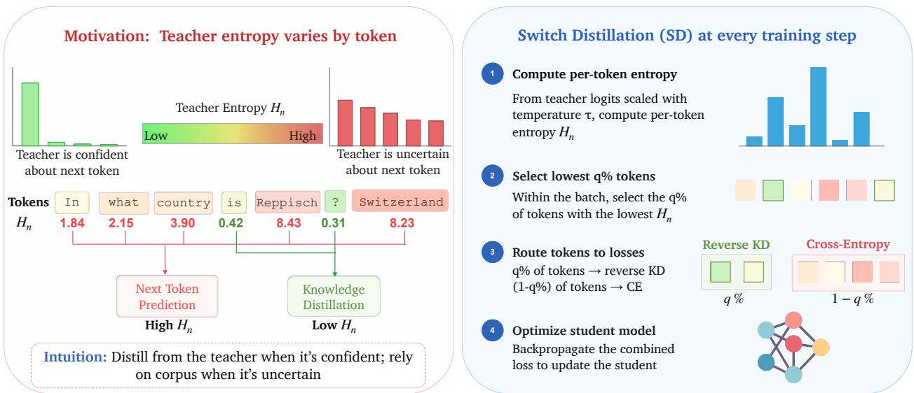  
Figure 6 SwITCH DisTILLATioN overview. Left: Teacher predictive entropy varies substantially across tokens, providing a signal for when teacher supervision is reliable and therefore ought to be used. Right: At each training step, SwITCí DisTILLATioN computes per-token teacher entropy and routes the lowest-entropy q% of tokens to reverse-KL distillation (teacher supervision), while training the remaining tokens with cross-entropy (corpus supervision).

To connect this weakened gradient signal to downstream acquisition, we compare KD and NTP factual recall within each entropy quintile (Figure 5c). After pre-training, FKD outperforms NTP on low-entropy facts (Q1–Q2), but this advantage disappears as entropy rises; RKD underperforms NTP across all quintiles at this stage. During mid-training, this effect is substantially stronger: low-entropy facts have largely already been acquired, leaving unresolved facts concentrated in high-entropy regions where KD provides the weakest supervision. Consequently, both FKD and RKD incur their largest factual recall deficits on high-entropy facts.

## 5 SWITCH DISTILLATION Improves the Reasoning-Recall Tradeoff

Evidence thus far suggests that teacher supervision is not equally beneficial across all tokens: teacher predictions tend to be concentrated on procedural reasoning trajectories but more diffuse on factual payload tokens. This suggests that a uniform distillation objective may be suboptimal during mid-training, and that teacher supervision should be applied only at token positions where it is most reliable. To this end, we introduce SWITCH DISTILLATION (Figure 6). Formally, let

$$
H _ { n } = - \sum _ { v \in \mathcal { V } } p _ { \mathrm { T } } ^ { ( \tau ) } ( v \mid x _ { < n } ) \log p _ { \mathrm { T } } ^ { ( \tau ) } ( v \mid x _ { < n } )\tag{5}
$$

denote the entropy of the teacher distribution T (scaled with temperature $\tau ,$ and with vocabulary V) at token position n. We route the lowest-q% of in-batch tokens by $H _ { n }$ to the reverse KL loss,4 defining $S _ { q } = \bigl \{ n : H _ { n } \leq \mathrm { Q u a n t i l e } _ { q } ( \{ H _ { n } \} ) \bigr \}$ , the set of tokens assigned to distillation. Reverse KL is particularly well-suited to low-entropy teacher predictions as its mode-seeking behavior reinforces the teacher's preferred continuation. We optimize the following objective

$$
\mathcal { L } ^ { \mathrm { S w r r c u D i s r } } = \tau ^ { 2 } \frac { 1 } { \left| \mathcal { S } _ { q } \right| } \sum _ { n \in \mathcal { S } _ { q } } \mathrm { R K L } \Big ( p _ { \mathrm { S } , n } ^ { ( \tau ) } \left\| p _ { \mathrm { T } , n } ^ { ( \tau ) } \right) + \frac { 1 } { \left| \bar { \mathcal { S } } _ { q } \right| } \sum _ { n \not \in \mathcal { S } _ { q } } \mathcal { L } _ { \mathrm { C E } , n } ,\tag{6}
$$

where $\bar { \cal S } _ { q }$ denotes the complement of $ { \boldsymbol { S } } _ { q }$ over supervised tokens.5 Note that SwITCH DISTILLATION adds only negligible entropy and quantile computations beyond standard online KD, requiring no additional parameters or model forward passes.

## 6 SWITCH DISTILLATION Experiments

## 6.1 Experimental setup

We evaluate SwITCH DISTILLATION under the same mid-training setup as in §2.2, and consider OLMo-2 7B Instruct and 13B Instruct as teacher models. Our baselines include standard next-token prediction (NTP), as well as forward and reverse knowledge distillation (FKD and RKD, respectively) at $\alpha = 0 . 5$ , which empirically provides the best balance between factual recall and reasoning. We also compare against token-routing KD (TRKD) (Goyal et al., 2026). TRKD applies forward-KL distillation to high-entropy tokens while retaining CE on all tokens, whereas SwITCH DiSTILLATION hard-switches between reverse-KL on low-entropy tokens and CE otherwise.6

## 6.2 SWITCHDISTILLATION improves reasoning while preserving factual recall

Table 1 compares SwITCH DISTILLATION against mid-training baselines. Across both teacher sizes, SwITCH DISTILLATION achieves the strongest REAsONING, improving the macro-average from 26.1% under NTP to 44.7%/42.1% with the 7B and 13B teachers, while remaining the KD baseline closest to NTP on FACTUAL RECALL (29.3%/29.3% vs. 30.3%). SWITCH DISTILLATION also achieves the strongest KNOWLEDGE & CoMMONSENSE performance (49.3%/46.5%). We further note that distillation with the 7B teacher generally outperforms the 13B teacher. This observation corroborates existing work showing that a large size difference between teacher and student—defined as the capacity gap—may reduce distillation effectiveness (Mirzadeh et al., 2019; Panigrahi et al., 2024; Busbridge et al., 2025).

## 6.3 SWITCHDISTILLATION's benefits persist through post-training

We next ask whether SwITCH DISTILLATION's mid-training gains are sustained after post-training, as stronger base models do not necessarily translate to stronger final models after alignment (Springer et al., 2025; Lu and Liu, 2026; Watts et al., 2026). We apply OLMo-2 1B's four-stage post-training pipeline—supervised fine-tuning (SFT), direct preference optimization (DPO), and two rounds of reinforcement learning with verifiable rewards (RLVR1, RLVR2)—to each mid-trained model and report final performance in Table 2.7

Post-training improves reasoning across all methods, and SwITCH DISTILLATION remains the strongest method on the REAsoNING task group, significantly outperforming the strongest competing baseline for each task. With the 7B teacher, SwITCH DISTILLATION's macro-average increases from 44.7% to 50.6% after post-training; with the 13B teacher, it increases from 42.1% to 48.0%. Consistent with prior work showing that post-training can degrade factual recall and broader knowledge (Gekhman et al., 2024; Ghosal et al., 2024; Yuan et al., 2024; Kaplan et al., 2026), we observe modest degradation in KNOWLEDGE & CoMMONSENSE and FACTUAL RECALL. However, SWITCH DISTILLATION is the most robust: despite entering post-training with a small factual-recall deficit relative to NTP, it forgets the least and finishes with the highest FACTUAL RECALL macro-average.

Table 1 Full downstream results after mid-training. The NTP baseline is duplicated because it has no teacher $( T = \mathrm { N } / \mathrm { A } )$ and therefore serves as the shared reference for both teacher size blocks. Bold denotes the best result per teacher block, and \* indicates a statistically significant improvement over the strongest competing baseline $( p < 0 . 0 5$ paired bootstrap). Benchmark names are abbreviated; see Table 7 for full task names.
<table><tr><td></td><td></td><td colspan="6">Reasoning</td><td colspan="3">| Factual Recall </td><td colspan="6">Knowledge &amp; Commonsense</td></tr><tr><td>T</td><td>Method|</td><td>|GSM8K</td><td>GSM-S</td><td>GSM+ BBH DROP MATH|TQA</td><td></td><td></td><td></td><td></td><td>NQ</td><td>SQA|</td><td>MMLU MMLU-P</td><td></td><td>ARC-C</td><td>OBQA</td><td>Wino</td><td>AGI</td></tr><tr><td></td><td>N/A NTP</td><td>40.4</td><td>29.8</td><td>23.1</td><td>29.9</td><td>29.8</td><td>3.8</td><td>56.7*</td><td>25.5</td><td>8.7</td><td>43.6</td><td>15.5</td><td>51.1</td><td>51.8</td><td>51.4</td><td>34.1</td></tr><tr><td>7B</td><td>FKD</td><td>57.8</td><td>42.6</td><td>36.2</td><td>30.6</td><td>41.9</td><td>7.6</td><td>53.9</td><td>24.6</td><td>8.4</td><td>49.5</td><td>18.7</td><td>61.9</td><td>61.8</td><td>51.5</td><td>38.6</td></tr><tr><td>7B</td><td>RKD</td><td>62.1</td><td>46.2</td><td>39.2</td><td>31.6</td><td>43.1</td><td>10.4</td><td>53.1</td><td>24.1</td><td>8.4</td><td>50.1</td><td>18.9</td><td>62.5</td><td>62.8</td><td>52.5</td><td>39.3</td></tr><tr><td>7B</td><td>TRKD</td><td>52.5</td><td>36.9</td><td>31.0</td><td>30.3</td><td>36.8</td><td>5.6</td><td>54.0</td><td>24.1</td><td>7.8</td><td>47.9</td><td>17.4</td><td>58.9</td><td>60.0</td><td>51.2</td><td>37.5</td></tr><tr><td>7B</td><td>SD</td><td>69.7*</td><td>55.3*</td><td>46.1*</td><td>32.8*</td><td>49.6*</td><td>14.8*</td><td>54.9</td><td>24.6</td><td>8.4</td><td>51.6*</td><td>19.8*</td><td>64.7*</td><td>64.2</td><td>53.8</td><td>41.5*</td></tr><tr><td></td><td>N/A NTP</td><td>40.4</td><td>29.8</td><td>23.1</td><td>29.9</td><td>29.8</td><td>3.8</td><td>56.7*</td><td>25.5</td><td>8.7</td><td>43.6</td><td>15.5</td><td>51.1</td><td>51.8</td><td>51.4</td><td>34.1</td></tr><tr><td>13B</td><td>FKD</td><td>52.7</td><td>37.9</td><td>31.8</td><td>29.4</td><td>33.1</td><td>6.4</td><td>54.2</td><td>24.7</td><td>8.1</td><td>47.5</td><td>16.3</td><td>55.3</td><td>56.2</td><td>51.2</td><td>36.2</td></tr><tr><td>13B</td><td>RKD</td><td>59.2</td><td>48.7</td><td>37.4</td><td>31.4</td><td>37.3</td><td>8.0</td><td>53.4</td><td>24.0</td><td>8.5</td><td>48.4</td><td>17.3</td><td>57.8</td><td>60.0</td><td>51.0</td><td>38.3</td></tr><tr><td>13B</td><td>TRKD</td><td>47.8</td><td>32.7</td><td>28.4</td><td>29.3</td><td>34.0</td><td>5.6</td><td>53.8</td><td>24.2</td><td>8.3</td><td>45.7</td><td>15.4</td><td>53.0</td><td>56.6</td><td>50.7</td><td>35.2</td></tr><tr><td>13B</td><td>SD</td><td>66.0*</td><td>54.8*</td><td>42.2*</td><td>31.6</td><td>45.8*</td><td>12.0*</td><td>54.1</td><td>24.9</td><td>9.0</td><td>48.5</td><td>17.7</td><td>58.5</td><td>63.8*</td><td>51.2</td><td>39.2</td></tr></table>

Table 2 Full downstream results after applying a standard post-training pipeline to each mid-training method. Notation and significance testing follow Table 1.
<table><tr><td></td><td></td><td colspan="6">Reasoning</td><td colspan="3">|Factual Recall</td><td colspan="6">Knowledge &amp; Commonsense</td><td>|Inst.</td></tr><tr><td>T</td><td>Method|</td><td>GSM8K</td><td>GSM-S</td><td></td><td>GSM+ BBH DROP</td><td></td><td>MATH</td><td>TQA</td><td>NQ</td><td>SQA| MMLU</td><td>MMLU-P</td><td></td><td>ARC-C</td><td>OBQA</td><td>Wino</td><td>AGI</td><td>IFE</td></tr><tr><td></td><td>N/A NTP</td><td>67.0</td><td>46.8</td><td>40.6</td><td>31.1</td><td>32.7</td><td>12.6</td><td>53.3</td><td>21.6</td><td>7.5</td><td>32.3</td><td>16.6</td><td>52.4</td><td>52.4</td><td>51.4</td><td>32.3</td><td>62.1</td></tr><tr><td>7B</td><td>FKD</td><td>76.2</td><td>56.4</td><td>51.6</td><td>33.8</td><td>38.4</td><td>18.0</td><td>51.9</td><td>22.2</td><td>8.1</td><td>42.2</td><td>18.6</td><td>60.2</td><td>57.4</td><td>51.5</td><td>38.0</td><td>64.7</td></tr><tr><td>7B</td><td>RKD</td><td>73.8</td><td>53.4</td><td>49.5</td><td>31.6</td><td>40.5</td><td>17.6</td><td>51.8</td><td>21.9</td><td>7.9</td><td>46.2</td><td>18.0</td><td>61.1</td><td>53.0</td><td>51.2</td><td>37.1</td><td>61.6</td></tr><tr><td>7B</td><td>TRKD</td><td>70.7</td><td>52.9</td><td>46.3</td><td>31.8</td><td>36.8</td><td>14.4</td><td>51.7</td><td>22.3</td><td>8.0</td><td>40.9</td><td>17.4</td><td>59.0</td><td>53.6</td><td>51.5</td><td>35.6</td><td>65.2</td></tr><tr><td>7B</td><td>SD</td><td>79.8*</td><td>65.0*</td><td>52.7*</td><td>35.6*</td><td>48.2*</td><td>22.4*</td><td>53.6</td><td>22.7</td><td>8.2</td><td>48.1*</td><td>19.8*</td><td>62.6</td><td>59.4</td><td>54.6*</td><td>39.6*</td><td>69.5*</td></tr><tr><td></td><td>N/A NTP</td><td>67.0</td><td>46.8</td><td>40.6</td><td>31.1</td><td>32.7</td><td>12.6</td><td>53.3</td><td>21.6</td><td>7.5</td><td>32.3</td><td>16.6</td><td>52.4</td><td>52.4</td><td>51.4</td><td>32.3</td><td>62.1</td></tr><tr><td>13B</td><td>FKD</td><td>72.1</td><td>54.3</td><td>46.5</td><td>31.4</td><td>35.7</td><td>14.6</td><td>54.1</td><td>23.2</td><td>8.0</td><td>36.1</td><td>18.1</td><td>55.0</td><td>56.4</td><td>51.2</td><td>35.9</td><td>64.9</td></tr><tr><td>13B</td><td>RKD</td><td>75.1</td><td>58.1</td><td>49.3</td><td>33.3</td><td>38.7</td><td>16.0</td><td>53.9</td><td>22.3</td><td>7.7</td><td>38.2</td><td>17.0</td><td>56.0</td><td>55.2</td><td>51.1</td><td>36.6</td><td>64.1</td></tr><tr><td>13B</td><td>TRKD</td><td>69.6</td><td>48.5</td><td>42.6</td><td>31.5</td><td>34.6</td><td>12.2</td><td>53.9</td><td>22.2</td><td>8.2</td><td>37.0</td><td>17.3</td><td>55.4</td><td>54.0</td><td>51.3</td><td>33.6</td><td>64.1</td></tr><tr><td>13B</td><td>SD</td><td>77.8*</td><td>62.8*</td><td>51.8*</td><td>33.3</td><td>42.8*</td><td>19.6*</td><td>54.2</td><td>24.1</td><td>8.4</td><td>43.1*</td><td>18.1</td><td>56.5</td><td>59.0</td><td>52.5</td><td>38.1</td><td>67.1</td></tr></table>

## 6.4 Ablations

We further ablate the design choices to SwITCH DISTILLATION using the OLMo-2 7B Instruct teacher and report mid-training macro-averages in Table 3 (per-task results in App. E.2).

Table 3Ablation results. The first row reports SWITCH DISTILLATION's absolute performance across task groups; subsequent rows report relative changes from other design choices. All results are from mid-training.
<table><tr><td>Method / Ablation</td><td>Reasoning</td><td>Factual Recall</td><td>Knowledge</td></tr><tr><td>SWITCH DISTILLATION</td><td>44.7</td><td>29.3</td><td>49.3</td></tr><tr><td colspan="4">Distillation Objective</td></tr><tr><td>SWITCH DISTILLATIONFKL</td><td>-2.9</td><td>-0.2</td><td>-1.4</td></tr><tr><td colspan="4">Routing Policy</td></tr><tr><td>Teacher-Correct Routing</td><td>-4.4</td><td>-5.1</td><td>-1.0</td></tr><tr><td>Oracle Domain Routing</td><td>-7.2</td><td>-1.3</td><td>-2.3</td></tr><tr><td>Random Routing</td><td>-6.5</td><td>-0.8</td><td>-2.0</td></tr><tr><td colspan="4">Supervision Objective</td></tr><tr><td>Always CE</td><td>-0.3</td><td>+0.1</td><td>-0.6</td></tr><tr><td>Teacher Top-1 Labels</td><td>-6.4</td><td>+1.3</td><td>-2.8</td></tr></table>

We examine three design choices using the OLMo-2 7B Instruct teacher: KL direction, replacing RKL with FKL (SwITCH DISTILLATION w/ FKL); routingsignal, replacing teacher entropy with whether the teacher's top-1 prediction matches the ground-truth target (Teacher-Correct Routing), whether the token comes from a procedural domain such as MATH or FLAN (Oracle Domain Routing), or a random mask of equivalent sparsity (Random Routing); and supervision objective, retaining CE on all tokens (Always CE), or replacing soft distillation with the teacher's top-1 predictions (Teacher Top-1 Labels) for the lowest-entropy tokens.

Replacing reverse KL with forward KL modestly reduces REASONING (-2.9%) and KNOWLEDGE & CoMMON-SENSE (-1.4%), with little change to FACTUAL RECALL (-0.2%). We hypothesize that reverse KL better exploits the sharp, low-entropy teacher distributions selected by our routing strategy, whereas forward KL diffuses its supervision across the teacher's low-probability tail. Alternative routing signals consistently underperform teacher entropy, while Always CE has little effect. Finally, Teacher Top-1 Labels improves FACTUAL RECALL (+1.3%) at the expense of REASONING (-6.4%) and KNOWLEDGE & COMMONSENSE (-2.8%). Together, these results identify entropy-based routing as the primary driver of SwITCH DiSTILLATION's gains, while soft teacher distributions provide useful supervision beyond top-1 predictions.

## 6.5 Related Work

Mid-training and its origins. Modern foundation model development has converged on mid-training as a distinct stage between pre-training and post-training, during which models are further optimized in a self-supervised fashion on curated data mixtures (Zhang et al., 2025; Liu et al., 2026). While mid-training has its roots in continued pre-training, its modern formulation emphasizes capability-focused data mixtures designed to better prime models for subsequent post-training (Gururangan et al., 2020).

Recent work has indicated that surfacing post-training capabilities earlier during mid-training can further strengthen desirable downstream attributes; carefully designed mid-training recipes have been found to particularly benefit subsequent reinforcement learning (Wang et al., 2025; Huang et al., 2026; Liu et al., 2026; Tan et al., 2026). To date, most of the mid-training literature employs the standard next-token prediction objective. We revisit knowledge distillation in this setting and uncover a previously uncharacterized reasoning-recall tradeoff.

Data-efficient language modeling. As the growth of compute is on track to outpace the supply of organic web text, high-quality human-written data is becoming increasingly scarce for language model training (Kim et al., 2026b). This impending constraint has motivated a body of work on data-efficient language modeling. Prior approaches have largely pursued data efficiency by improving the training corpus itself through curation, augmentation, selection, or mixture optimization (Gunasekar et al., 2023; Xie et al., 2023b,a; Lin et al., 2024; Maini et al., 2024; Nguyen et al., 2025; Chen et al., 2026; Kim et al., 2026a), often with guidance from stronger reference models. More broadly, Kim et al. (2026b) argue that algorithmic interventions such as ensembling or self-distillation may soon serve as important avenues for tackling the data wall. We study this algorithmic perspective at the mid-training stage, which necessitates substantially higher-quality data than large-scale pre-training while consuming orders of magnitude more tokens than post-training. Our approach is complementary to these data-centric methods: rather than modifying the training corpus, we improve how supervision is extracted from each observed token

Knowledge distillation across training stages. Knowledge distillation broadly encompasses both hard (sequence-level) distillation, in which a teacher generates synthetic training sequences for subsequent next-token prediction (Kim and Rush, 2016), and soft (logit-based) distillation, in which the student is trained to match the teacher's predictions by minimizing its distributional divergence (Hinton et al., 2015). We focus on the latter, whose role has been studied extensively during language model pre-training and post-training.

In the pre-training setting, Busbridge et al. (2025) derive scaling laws for language model distillation and characterize compute-optimal teacher-student configurations under fixed compute budgets. Goyal et al. (2026) show that pre-training distillation improves test-time scaling at the cost of in-context learning and propose token-routing KD (TRKD) to mitigate this degradation. While TRKD targets in-context learning during pre-training, SwITCH DISTILLATION addresses the reasoning-recall tradeoff that emerges during mid-training Finally, Cha and Cho (2025) show that generative distillation induces a precision-recall tradeoff, whereby lower-entropy teachers produce sharper but lower-coverage students.

Recent work has revisited the standard KD formula in the post-training setting. MiniLLM, for one, advocates reverse-KL distillation to improve generative capabilities of LMs, while subsequent work proposes adaptive combinations of forward and reverse KL to exploit their distinct optimization behaviors (Gu et al., 2024; Wu et al., 2025). Reverse-KL distillation is used for on-policy knowledge distillation, a relatively new post-training paradigm in which the student is trained on its own sampled trajectories under teacher guidance (Agarwal et al., 2024). Entropy-Aware On-Policy Distillation (EOPD) likewise proposes to adapt on-policy knowledge distillation using teacher predictive entropy as a signal to interpolate between reverse and forward KL for high-entropy teacher distributions (Jin et al., 2026). Among prior work, EOPD is conceptually closest to SwITCH DISTILLATION, but differs in both training regime and use of entropy: EOPD operates during post-training on student-generated trajectories and always applies teacher-based distillation, adapting the KL objective as teacher uncertainty varies. In contrast, SwITCH DiSTILLATION operates at the self-supervised mid-training stage on fixed tokens and uses entropy to determine whether to obtain supervision from the corpus or the teacher model.

Collectively, these works establish knowledge distillation as an effective supervision strategy during pre-training and post-training. We extend this line of work to the emerging mid-training regime and show that KD exhibits a fundamentally different tradeoff. This behavior consequently motivates a stage-specific adaptation of the standard distillation objective.

## 7 Discussion

Enabling language models to learn more from a fixed data pool remains a longstanding challenge, typically addressed by improving training data quality. We identify a complementary direction: improving how existing tokens are learned during mid-training, where high-quality tokens are scarce and expensive. We argue that knowledge distillation should not be stage-agnostic: while the standard formulation is effective during pre-training, it exhibits fundamentally different behavior during mid-training, where teacher uncertainty and student knowledge interact to produce a reasoning-recall tradeoff. By explicitly accounting for this interaction, SwITCH DISTILLATION consistently improves reasoning while largely preserving factual recall in a token-matched setting. More broadly, our findings suggest that objectives themselves ought to be stage-aware. While we study mid-training, this principle may extend to other phases where the student's knowledge has substantially evolved, such as late-stage or continual pre-training. We hope our findings motivate further investigation into stage-aware optimization methods for data-efficient language modeling.

## Acknowledgments

We thank Emmy Liu, Ishaan Watts, Millicent Li, and Jacob Mitchell Springer (in alphabetical order) for helpful technical discussions about this project, and Hamish Ivison for discussions about OLMo-2 training.

## References

Rishabh Agarwal, Nino Vieillard, Yongchao Zhou, Piotr Stanczyk, Sabela Ramos, Matthieu Geist, and Olivier Bachem. On-policy distillation of language models: Learning from self-generated mistakes, 2024. https://arxiv.org/abs/2306. 13649.

Loubna Ben Allal, Anton Lozhkov, Elie Bakouch, Gabriel Martin Blazquez, Guilherme Penedo, Lewis Tunstall, Andrés Marafioti, Agustín Piqueres Lajarín, Hynek Kydlíček, Vaibhav Srivastav, Joshua Lochner, Caleb Fahlgren, Xuan Son NGUYEN, Ben Burtenshaw, Clémentine Fourrier, Haojun Zhao, Hugo Larcher, Mathieu Morlon, Cyril Zakka, Colin Raffel, Leandro Von Werra, and Thomas Wolf. SmolLM2: When smol goes big — datacentric training of a fully open small language model. In Second Conference on Language Modeling, 2025. https: //openreview.net/forum?id=3JiCl2A14H.

Allen Institute for AI. Open instruct: Allenai's post-training codebase. https://github.com/allenai/open-instruct, 2025. Accessed: 2026-07-28.

Cristian Bucilu, Rich Caruana, and Alexandru Niculescu-Mizil. Model compression. In Proceedings of the 12th ACM SIGKDD International Conference on Knowledge Discovery and Data Mining, KDD '06, page 535–541, New York, NY, USA, 2006. Association for Computing Machinery. ISBN 1595933395. doi: 10.1145/1150402.1150464. https://doi.org/10.1145/1150402.1150464.

Dan Busbridge, Amitis Shidani, Floris Weers, Jason Ramapuram, Etai Littwin, and Russell Webb. Distillation scaling laws. In Forty-second International Conference on Machine Learning, 2025. https://openreview.net/forum?id= 1nEBAkpfb9.

Sungmin Cha and Kyunghyun Cho. Why knowledge distillation works in generative models: A minimal working explanation. In D. Belgrave, C. Zhang, H. Lin, R. Pascanu, P. Koniusz, M. Ghassemi, and N. Chen, editors, Advances in Neural Information Processing Systems, volume 38, pages 30017–30037. Curran Associates, Inc., 2025. https:// proceedings.neurips.cc/paper\_files/paper/2025/file/2b13864517555dd14f492abdce0469f3-Paper-Conference.pdf

Mayee F Chen, Tyler Murray, David Heineman, Matt Jordan, Hannaneh Hajishirzi, Christopher Re, Luca Soldaini, and Kyle Lo. Olmix: A framework for data mixing throughout LM development. In Forty-third International Conference on Machine Learning, 2026. https://openreview.net/forum?id=8pO13azhbL.

Peter Clark, Isaac Cowhey, Oren Etzioni, Tushar Khot, Ashish Sabharwal, Carissa Schoenick, and Oyvind Tafjord. Think you have solved question answering? try arc, the ai2 reasoning challenge, 2018. https://arxiv.org/abs/1803.05457.

Karl Cobbe, Vineet Kosaraju, Mohammad Bavarian, Mark Chen, Heewoo Jun, Lukasz Kaiser, Matthias Plappert, Jerry Tworek, Jacob Hilton, Reiichiro Nakano, Christopher Hesse, and John Schulman. Training verifiers to solve math word problems, 2021. https://arxiv.org/abs/2110.14168.

Dheeru Dua, Yizhong Wang, Pradeep Dasigi, Gabriel Stanovsky, Sameer Singh, and Matt Gardner. Drop: A reading comprehension benchmark requiring discrete reasoning over paragraphs, 2019. https://arxiv.org/abs/1903.00161.

Zorik Gekhman, Gal Yona, Roee Aharoni, Matan Eyal, Amir Feder, Roi Reichart, and Jonathan Herzig. Does fine-tuning LLMs on new knowledge encourage hallucinations? In Yaser Al-Onaizan, Mohit Bansal, and Yun-Nung Chen, editors, Proceedings of the 2024 Conference on Empirical Methods in Natural Language Processing, pages 7765–7784, Miami, Florida, USA, November 2024. Association for Computational Linguistics. doi: 10.18653/v1/2024.emnlp-main.444. https://aclanthology.org/2024.emnlp-main.444/.

Gaurav Rohit Ghosal, Tatsunori Hashimoto, and Aditi Raghunathan. Understanding finetuning for factual knowledge extraction. In Forty-first International Conference on Machine Learning, 2024. https://openreview.net/forum?id= cPsn9AcOYh.

Sachin Goyal, David Lopez-Paz, and Kartik Ahuja. Distilled pretraining: A modern lens of data, in-context learning and test-time scaling. In The Fourteenth International Conference on Learning Representations, 2026. https://openreview.net/forum?id=PNm2dl7HcY

Aaron Grattafiori, Abhimanyu Dubey, Abhinav Jauhri, Abhinav Pandey, Abhishek Kadian, Ahmad Al-Dahle, Aiesha Letman, Akhil Mathur, Alan Schelten, Alex Vaughan, Amy Yang, Angela Fan, Anirudh Goyal, Anthony Hartshorn, Aobo Yang, Archi Mitra, Archie Sravankumar, Artem Korenev, Arthur Hinsvark, Arun Rao, Aston Zhang, Aurelien Rodriguez, Austen Gregerson, Ava Spataru, Baptiste Roziere, Bethany Biron, Binh Tang, Bobbie Chern, Charlotte Caucheteux, Chaya Nayak, Chloe Bi, Chris Marra, Chris McConnell, Christian Keller, Christophe Touret, Chunyang Wu, Corinne Wong, Cristian Canton Ferrer, Cyrus Nikolaidis, Damien Allonsius, Daniel Song, Danielle Pintz, Danny Livshits, Danny Wyatt, David Esiobu, Dhruv Choudhary, Dhruv Mahajan, Diego Garcia-Olano, Diego

Perino, Dieuwke Hupkes, Egor Lakomkin, Ehab AlBadawy, Elina Lobanova, Emily Dinan, Eric Michael Smith Filip Radenovic, Francisco Guzmán, Frank Zhang, Gabriel Synnaeve, Gabrielle Lee, Georgia Lewis Anderson, Govind Thattai, Graeme Nail, Gregoire Mialon, Guan Pang, Guillem Cucurell, Hailey Nguyen, Hannah Korevaar Hu Xu, Hugo Touvron, Iliyan Zarov, Imanol Arrieta Ibarra, Isabel Kloumann, Ishan Misra, Ivan Evtimov, Jack Zhang, Jade Copet, Jaewon Lee, Jan Geffert, Jana Vranes, Jason Park, Jay Mahadeokar, Jeet Shah, Jelmer van der Linde, Jennifer Billock, Jenny Hong, Jenya Lee, Jeremy Fu, Jianfeng Chi, Jianyu Huang, Jiawen Liu, Jie Wang Jiecao Yu, Joanna Bitton, Joe Spisak, Jongsoo Park, Joseph Rocca, Joshua Johnstun, Joshua Saxe, Junteng Jia, Kalyan Vasuden Alwala, Karthik Prasad, Kartikeya Upasani, Kate Plawiak, Ke Li, Kenneth Heafield, Kevin Stone, Khalid El-Arini, Krithika Iyer, Kshitiz Malik, Kuenley Chiu, Kunal Bhalla, Kushal Lakhotia, Lauren Rantala-Yeary Laurens van der Maaten, Lawrence Chen, Liang Tan, Liz Jenkins, Louis Martin, Lovish Madaan, Lubo Malo, Lukas Blecher, Lukas Landzaat, Luke de Oliveira, Madeline Muzzi, Mahesh Pasupuleti, Mannat Singh, Manohar Paluri Marcin Kardas, Maria Tsimpoukelli, Mathew Oldham, Mathieu Rita, Maya Pavlova, Melanie Kambadur, Mike Lewis, Min Si, Mitesh Kumar Singh, Mona Hassan, Naman Goyal, Narjes Torabi, Nikolay Bashlykov, Nikolay Bogoychev Niladri Chatterji, Ning Zhang, Olivier Duchenne, Onur Çelebi, Patrick Alrassy, Pengchuan Zhang, Pengwei Li, Petar Vasic, Peter Weng, Prajjwal Bhargava, Pratik Dubal, Praveen Krishnan, Punit Singh Koura, Puxin Xu, Qing He, Qingxiao Dong, Ragavan Srinivasan, Raj Ganapathy, Ramon Calderer, Ricardo Silveira Cabral, Robert Stojnic, Roberta Raileanu, Rohan Maheswari, Rohit Girdhar, Rohit Patel, Romain Sauvestre, Ronnie Polidoro, Roshan Sumbaly, Ross Taylor, Ruan Silva, Rui Hou, Rui Wang, Saghar Hosseini, Sahana Chennabasappa, Sanjay Singh Sean Bell, Seohyun Sonia Kim, Sergey Edunov, Shaoliang Nie, Sharan Narang, Sharath Raparthy, Sheng Shen Shengye Wan, Shruti Bhosale, Shun Zhang, Simon Vandenhende, Soumya Batra, Spencer Whitman, Sten Sootla Stephane Collot, Suchin Gururangan, Sydney Borodinsky, Tamar Herman, Tara Fowler, Tarek Sheasha, Thomas Georgiou, Thomas Scialom, Tobias Speckbacher, Todor Mihaylov, Tong Xiao, Ujjwal Karn, Vedanuj Goswami Vibhor Gupta, Vignesh Ramanathan, Viktor Kerkez, Vincent Gonguet, Virginie Do, Vish Vogeti, Vítor Albiero Vladan Petrovic, Weiwei Chu, Wenhan Xiong, Wenyin Fu, Whitney Meers, Xavier Martinet, Xiaodong Wang Xiaofang Wang, Xiaoqing Ellen Tan, Xide Xia, Xinfeng Xie, Xuchao Jia, Xuewei Wang, Yaelle Goldschlag, Yashesh Gaur, Yasmine Babaei, Yi Wen, Yiwen Song, Yuchen Zhang, Yue Li, Yuning Mao, Zacharie Delpierre Coudert Zheng Yan, Zhengxing Chen, Zoe Papakipos, Aaditya Singh, Aayushi Srivastava, Abha Jain, Adam Kelsey, Adam Shajnfeld, Adithya Gangidi, Adolfo Victoria, Ahuva Goldstand, Ajay Menon, Ajay Sharma, Alex Boesenberg, Alexei Baevski, Allie Feinstein, Amanda Kallet, Amit Sangani, Amos Teo, Anam Yunus, Andrei Lupu, Andres Alvarado Andrew Caples, Andrew Gu, Andrew Ho, Andrew Poulton, Andrew Ryan, Ankit Ramchandani, Annie Dong, Annie Franco, Anuj Goyal, Aparajita Saraf, Arkabandhu Chowdhury, Ashley Gabriel, Ashwin Bharambe, Assaf Eisenman Azadeh Yazdan, Beau James, Ben Maurer, Benjamin Leonhardi, Bernie Huang, Beth Loyd, Beto De Paola, Bhargavi Paranjape, Bing Liu, Bo Wu, Boyu Ni, Braden Hancock, Bram Wasti, Brandon Spence, Brani Stojkovic, Brian Gamido, Britt Montalvo, Carl Parker, Carly Burton, Catalina Mejia, Ce Liu, Changhan Wang, Changkyu Kim, Chao Zhou, Chester Hu, Ching-Hsiang Chu, Chris Cai, Chris Tindal, Christoph Feichtenhofer, Cynthia Gao, Damon Civin, Dana Beaty, Daniel Kreymer, Daniel Li, David Adkins, David Xu, Davide Testuggine, Delia David, Devi Parikh, Diana Liskovich, Didem Foss, Dingkang Wang, Duc Le, Dustin Holland, Edward Dowling, Eissa Jamil Elaine Montgomery, Eleonora Presani, Emily Hahn, Emily Wood, Eric-Tuan Le, Erik Brinkman, Esteban Arcaute Evan Dunbar, Evan Smothers, Fei Sun, Felix Kreuk, Feng Tian, Filippos Kokkinos, Firat Ozgenel, Francesco Caggioni, Frank Kanayet, Frank Seide, Gabriela Medina Florez, Gabriella Schwarz, Gada Badeer, Georgia Swee, Gil Halpern, Grant Herman, Grigory Sizov, Guangyi, Zhang, Guna Lakshminarayanan, Hakan Inan, Hamid Shojanazeri, Han Zou, Hannah Wang, Hanwen Zha, Haroun Habeeb, Harrison Rudolph, Helen Suk, Henry Aspegren, Hunter Goldman, Hongyuan Zhan, Ibrahim Damlaj, Igor Molybog, Igor Tufanov, Ilias Leontiadis, Irina-Elena Veliche, Itai Gat, Jake Weissman, James Geboski, James Kohli, Janice Lam, Japhet Asher, Jean-Baptiste Gaya, Jeff Marcus, Jeff Tang, Jennifer Chan, Jenny Zhen, Jeremy Reizenstein, Jeremy Teboul, Jessica Zhong, Jian Jin, Jingyi Yang Joe Cummings, Jon Carvill, Jon Shepard, Jonathan McPhie, Jonathan Torres, Josh Ginsburg, Junjie Wang, Kai Wu, Kam Hou U, Karan Saxena, Kartikay Khandelwal, Katayoun Zand, Kathy Matosich, Kaushik Veeraraghavan, Kelly Michelena, Keqian Li, Kiran Jagadeesh, Kun Huang, Kunal Chawla, Kyle Huang, Lailin Chen, Lakshya Garg Lavender A, Leandro Silva, Lee Bell, Lei Zhang, Liangpeng Guo, Licheng Yu, Liron Moshkovich, Luca Wehrstedt Madian Khabsa, Manav Avalani, Manish Bhatt, Martynas Mankus, Matan Hasson, Matthew Lennie, Matthias Reso, Maxim Groshev, Maxim Naumov, Maya Lathi, Meghan Keneally, Miao Liu, Michael L. Seltzer, Michal Valko, Michelle Restrepo, Mihir Patel, Mik Vyatskov, Mikayel Samvelyan, Mike Clark, Mike Macey, Mike Wang Miquel Jubert Hermoso, Mo Metanat, Mohammad Rastegari, Munish Bansal, Nandhini Santhanam, Natascha Parks, Natasha White, Navyata Bawa, Nayan Singhal, Nick Egebo, Nicolas Usunier, Nikhil Mehta, Nikolay Pavlovich Laptev, Ning Dong, Norman Cheng, Oleg Chernoguz, Olivia Hart, Omkar Salpekar, Ozlem Kalinli, Parkin Kent Parth Parekh, Paul Saab, Pavan Balaji, Pedro Rittner, Philip Bontrager, Pierre Roux, Piotr Dollar, Polina Zvyagina Prashant Ratanchandani, Pritish Yuvraj, Qian Liang, Rachad Alao, Rachel Rodriguez, Rafi Ayub, Raghotham Murthy, Raghu Nayani, Rahul Mitra, Rangaprabhu Parthasarathy, Raymond Li, Rebekkah Hogan, Robin Battey Rocky Wang, Russ Howes, Ruty Rinott, Sachin Mehta, Sachin Siby, Sai Jayesh Bondu, Samyak Datta, Sara Chugh Sara Hunt, Sargun Dhillon, Sasha Sidorov, Satadru Pan, Saurabh Mahajan, Saurabh Verma, Seiji Yamamoto

Sharadh Ramaswamy, Shaun Lindsay, Shaun Lindsay, Sheng Feng, Shenghao Lin, Shengxin Cindy Zha, Shishir Patil, Shiva Shankar, Shuqiang Zhang, Shuqiang Zhang, Sinong Wang, Sneha Agarwal, Soji Sajuyigbe, Soumith Chintala, Stephanie Max, Stephen Chen, Steve Kehoe, Steve Satterfield, Sudarshan Govindaprasad, Sumit Gupta, Summer Deng, Sungmin Cho, Sunny Virk, Suraj Subramanian, Sy Choudhury, Sydney Goldman, Tal Remez, Tamar Glaser, Tamara Best, Thilo Koehler, Thomas Robinson, Tianhe Li, Tianjun Zhang, Tim Matthews, Timothy Chou, Tzook Shaked, Varun Vontimitta, Victoria Ajayi, Victoria Montanez, Vijai Mohan, Vinay Satish Kumar, Vishal Mangla, Vlad Ionescu, Vlad Poenaru, Vlad Tiberiu Mihailescu, Vladimir Ivanov, Wei Li, Wenchen Wang, Wenwen Jiang, Wes Bouaziz, Will Constable, Xiaocheng Tang, Xiaojian Wu, Xiaolan Wang, Xilun Wu, Xinbo Gao, Yaniv Kleinman, Yanjun Chen, Ye Hu, Ye Jia, Ye Qi, Yenda Li, Yilin Zhang, Ying Zhang, Yossi Adi, Youngjin Nam, Yu, Wang, Yu Zhao, Yuchen Hao, Yundi Qian, Yunlu Li, Yuzi He, Zach Rait, Zachary DeVito, Zef Rosnbrick, Zhaoduo Wen, Zhenyu Yang, Zhiwei Zhao, and Zhiyu Ma. The llama 3 herd of models, 2024. https://arxiv.org/abs/2407.21783.

Yuling Gu, Oyvind Tafjord, Bailey Kuehl, Dany Haddad, Jesse Dodge, and Hannaneh Hajishirzi. OLMES: A standard for language model evaluations. In Luis Chiruzzo, Alan Ritter, and Lu Wang, editors, Findings of the Association for Computational Linguistics: NAACL 2025, pages 5020–5048, Albuquerque, New Mexico, April 2025. Association for Computational Linguistics. ISBN 979-8-89176-195-7. doi: 10.18653/v1/2025.findings-naacl.282. https://aclanthology.org/2025.findings-naacl.282/.

Yuxian Gu, Li Dong, Furu Wei, and Minlie Huang. MiniLLM: Knowledge distillation of large language models. In The Twelfth International Conference on Learning Representations, 2024. https://openreview.net/forum?id= 5h0qf7IBZZ

Suriya Gunasekar, Yi Zhang, Jyoti Aneja, Caio César Teodoro Mendes, Allie Del Giorno, Sivakanth Gopi, Mojan Javaheripi, Piero Kauffmann, Gustavo de Rosa, Olli Saarikivi, Adil Salim, Shital Shah, Harkirat Singh Behl, Xin Wang, Sébastien Bubeck, Ronen Eldan, Adam Tauman Kalai, Yin Tat Lee, and Yuanzhi Li. Textbooks are all you need, 2023. https://arxiv.org/abs/2306.11644.

Suchin Gururangan, Ana Marasović, Swabha Swayamdipta, Kyle Lo, Iz Beltagy, Doug Downey, and Noah A. Smith. Don't stop pretraining: Adapt language models to domains and tasks. In Dan Jurafsky, Joyce Chai, Natalie Schluter, and Joel Tetreault, editors, Proceedings of the 58th Annual Meeting of the Association for Computational Linguistics, pages 8342–8360, Online, July 2020. Association for Computational Linguistics. doi: 10.18653/v1/2020.acl-main.740. https://aclanthology.org/2020.acl-main.740/.

Dan Hendrycks, Collin Burns, Steven Basart, Andy Zou, Mantas Mazeika, Dawn Song, and Jacob Steinhardt. Measuring massive multitask language understanding, 2021. https://arxiv.org/abs/2009.03300.

Geoffrey Hinton, Oriol Vinyals, and Jeff Dean. Distilling the knowledge in a neural network, 2015. https://arxiv.org/ abs/1503.02531.

Jordan Hoffmann, Sebastian Borgeaud, Arthur Mensch, Elena Buchatskaya, Trevor Cai, Eliza Rutherford, Diego de Las Casas, Lisa Anne Hendricks, Johannes Welbl, Aidan Clark, Tom Hennigan, Eric Noland, Katie Millican, George van den Driessche, Bogdan Damoc, Aurelia Guy, Simon Osindero, Karen Simonyan, Erich Elsen, Jack W. Rae, Oriol Vinyals, and Laurent Sifre. Training compute-optimal large language models, 2022. https://arxiv.org/ abs/2203.15556.

Junjie Huang, Jiarui Qin, Di Yin, Weiwen Liu, Yong Yu, Xing Sun, and Weinan Zhang. Remit: Rl-guided mid-training for iterative llm evolution, 2026. https://arxiv.org/abs/2602.03075.

Hugging Face Team. Smollm3: smol, multilingual, long-context reasoner. https://huggingface.co/blog/smollm3, 2025.

IBM Research. Granite 3.3 language models. https://huggingface.co/ibm-granite/granite-3.3-8b-instruct, 2025. Accessed:2026-08-18.

Woogyeol Jin, Taywon Min, Yongjin Yang, Dennis Wei, Yi Zhou, Swanand Ravindra Kadhe, Nathalie Baracaldo, and Kimin Lee. Entropy-aware on-policy distillation of language models, 2026. https://arxiv.org/abs/2603.07079.

Mandar Joshi, Eunsol Choi, Daniel Weld, and Luke Zettlemoyer. TriviaQA: A large scale distantly supervised challenge dataset for reading comprehension. In Regina Barzilay and Min-Yen Kan, editors, Proceedings of the 55th Annual Meeting of the Association for Computational Linguistics (Volume 1: Long Papers), pages 1601– 1611, Vancouver, Canada, July 2017. Association for Computational Linguistics. doi: 10.18653/v1/P17-1147. https://aclanthology.org/P17-1147/.

Guy Kaplan, Zorik Gekhman, Zhen Zhu, Lotem Rozner, Yuval Reif, Swabha Swayamdipta, Derek Hoiem, and Roy Schwartz. Why fine-tuning encourages hallucinations and how to fix it, 2026. https://arxiv.org/abs/2604.15574.

Konwoo Kim, Suhas Kotha, Yejin Choi, Tatsunori Hashimoto, Nick Haber, and Percy Liang. Data-efficient pre-training by scaling synthetic megadocs, 2026a. https://arxiv.org/abs/2603.18534.

Konwoo Kim, Suhas Kotha, Percy Liang, and Tatsunori Hashimoto. Pre-training under infinite compute. In The Fourteenth International Conference on Learning Representations, 2026b. https://openreview.net/forum?id= ck0aZTAnwK.

Minsang Kim and Seung Jun Baek. Explain in your own words: Improving reasoning via token-selective dual knowledge distillation. In The Fourteenth International Conference on Learning Representations, 2026. https: //openreview.net/forum?id=zph7e5JaXc.

Yoon Kim and Alexander M. Rush. Sequence-level knowledge distillation, 2016. https://arxiv.org/abs/1606.07947.

S. Kullback and R. A. Leibler. On information and sufficiency. Ann. Math. Statist., 22(1):79–86, 1951.

Tom Kwiatkowski, Jennimaria Palomaki, Olivia Redfield, Michael Collins, Ankur Parikh, Chris Alberti, Danielle Epstein, Illia Polosukhin, Jacob Devlin, Kenton Lee, Kristina Toutanova, Llion Jones, Matthew Kelcey, Ming-Wei Chang, Andrew M. Dai, Jakob Uszkoreit, Quoc Le, and Slav Petrov. Natural questions: A benchmark for question answering research. Transactions of the Association for Computational Linguistics, 7:452–466, 2019. doi: 10.1162/tacl\_a\_00276. https://aclanthology.org/Q19-1026/.

Margaret Li, Sneha Kudugunta, Danielle Rothermel, and Luke Zettlemoyer. Slicing and dicing: Configuring optimal mixtures of experts, 2026. https://arxiv.org/abs/2605.11689.

Qintong Li, Leyang Cui, Xueliang Zhao, Lingpeng Kong, and Wei Bi. GSM-plus: A comprehensive benchmark for evaluating the robustness of LLMs as mathematical problem solvers. In Lun-Wei Ku, Andre Martins, and Vivek Srikumar, editors, Proceedings of the 62nd Annual Meeting of the Association for Computational Linguistics (Volume 1: Long Papers), pages 2961–2984, Bangkok, Thailand, August 2024. Association for Computational Linguistics. doi: 10.18653/v1/2024.acl-long.163. https://aclanthology.org/2024.acl-long.163/.

Hunter Lightman, Vineet Kosaraju, Yura Burda, Harri Edwards, Bowen Baker, Teddy Lee, Jan Leike, John Schulman, Ilya Sutskever, and Karl Cobbe. Let's verify step by step. arXiv preprint arXiv:2305.20050, 2023.

Zhenghao Lin, Zhibin Gou, Yeyun Gong, Xiao Liu, yelong shen, Ruochen Xu, Chen Lin, Yujiu Yang, Jian Jiao, Nan Duan, and Weizhu Chen. Not all tokens are what you need for pretraining. In The Thirty-eighth Annual Conference on Neural Information ProcessingSystems, 2024. https://openreview.net/forum?id=0NMzBwqaAJ.

Emmy Liu, Graham Neubig, and Chenyan Xiong. Midtraining bridges pretraining and posttraining distributions, 2026. https://arxiv.org/abs/2510.14865.

Taiming Lu and Zhuang Liu. Strong teacher not needed? on distillation in llm pretraining, 2026. https://arxiv.org/ abs/2605.23857.

Pratyush Maini, Skyler Seto, Richard Bai, David Grangier, Yizhe Zhang, and Navdeep Jaitly. Rephrasing the web: A recipe for compute and data-efficient language modeling. In Lun-Wei Ku, Andre Martins, and Vivek Srikumar, editors, Proceedings of the 62nd Annual Meeting of the Association for Computational Linguistics (Volume 1: Long Papers), pages 14044–14072, Bangkok, Thailand, August 2024. Association for Computational Linguistics. doi: 10.18653/v1/2024.acl-long.757. https://aclanthology.org/2024.acl-long.757/.

Meta Superintelligence Labs. Introducing muse glimmer: An open agentic model that runs on your device. https: //research.meta.ai/blog/introducing-muse-glimmer-open-agentic-model, August 2026. Accessed: 2026-08-12.

Todor Mihaylov, Peter Clark, Tushar Khot, and Ashish Sabharwal. Can a suit of armor conduct electricity? a new dataset for open book question answering, 2018. https://arxiv.org/abs/1809.02789.

Iman Mirzadeh, Keivan Alizadeh, Hooman Shahrokhi, Oncel Tuzel, Samy Bengio, and Mehrdad Farajtabar. Gsmsymbolic: Understanding the limitations of mathematical reasoning in large language models, 2025. https://arxiv. org/abs/2410.05229.

Seyed-Iman Mirzadeh, Mehrdad Farajtabar, Ang Li, Nir Levine, Akihiro Matsukawa, and Hassan Ghasemzadeh. Improved knowledge distillation via teacher assistant, 2019. https://arxiv.org/abs/1902.03393.

Thao Nguyen, Yang Li, Olga Golovneva, Luke Zettlemoyer, Sewoong Oh, Ludwig Schmidt, and Xian Li. Recycling the web: A method to enhance pre-training data quality and quantity for language models. In Second Conference on Language Modeling, 2025. https://openreview.net/forum?id=lkjhBdz3rn.

Team Olmo, :, Allyson Ettinger, Amanda Bertsch, Bailey Kuehl, David Graham, David Heineman, Dirk Groeneveld. Faeze Brahman, Finbarr Timbers, Hamish Ivison, Jacob Morrison, Jake Poznanski, Kyle Lo, Luca Soldaini,

Matt Jordan, Mayee Chen, Michael Noukhovitch, Nathan Lambert, Pete Walsh, Pradeep Dasigi, Robert Berry, Saumya Malik, Saurabh Shah, Scott Geng, Shane Arora, Shashank Gupta, Taira Anderson, Teng Xiao, Tyler Murray, Tyler Romero, Victoria Graf, Akari Asai, Akshita Bhagia, Alexander Wettig, Alisa Liu, Aman Rangapur, Chloe Anastasiades, Costa Huang, Dustin Schwenk, Harsh Trivedi, Ian Magnusson, Jaron Lochner, Jiacheng Liu, Lester James V. Miranda, Maarten Sap, Malia Morgan, Michael Schmitz, Michal Guerquin, Michael Wilson, Regan Huff, Ronan Le Bras, Rui Xin, Rulin Shao, Sam Skjonsberg, Shannon Zejiang Shen, Shuyue Stella Li Tucker Wilde, Valentina Pyatkin, Will Merrill, Yapei Chang, Yuling Gu, Zhiyuan Zeng, Ashish Sabharwal, Luke Zettlemoyer, Pang Wei Koh, Ali Farhadi, Noah A. Smith, and Hannaneh Hajishirzi. Olmo 3, 2026. https: //arxiv.org/abs/2512.13961.

Abhishek Panigrahi, Bingbin Liu, Sadhika Malladi, Andrej Risteski, and Surbhi Goel. Progressive distillation induces an implicit curriculum, 2024. https://arxiv.org/abs/2410.05464.

Keisuke Sakaguchi, Ronan Le Bras, Chandra Bhagavatula, and Yejin Choi. Winogrande: An adversarial winograd schema challenge at scale, 2019. https://arxiv.org/abs/1907.10641.

Noam Shazeer, Azalia Mirhoseini, Krzysztof Maziarz, Andy Davis, Quoc Le, Geoffrey Hinton, and Jeff Dean. Outrageously large neural networks: The sparsely-gated mixture-of-experts layer, 2017. https://arxiv.org/abs/1701. 06538.

Jacob Mitchell Springer, Sachin Goyal, Kaiyue Wen, Tanishq Kumar, Xiang Yue, Sadhika Malladi, Graham Neubig, and Aditi Raghunathan. Overtrained language models are harder to fine-tune. In Forty-second International Conference on Machine Learning, 2025. https://openreview.net/forum?id=YW6edSufht.

Mirac Suzgun, Nathan Scales, Nathanael Schärli, Sebastian Gehrmann, Yi Tay, Hyung Won Chung, Aakanksha Chowdhery, Quoc V Le, Ed H Chi, Denny Zhou, , and Jason Wei. Challenging big-bench tasks and whether chain-of-thought can solve them. arXiv preprint arXiv:2210.09261, 2022

Ellen Xiaoqing Tan, Jack Lanchantin, Shehzaad Dhuliawala, Danwei Li, Thao Nguyen, Jing Xu, Ping Yu, Ilia Kulikov, Sainbayar Sukhbaatar, Jason Weston, Xian Li, and Olga Golovneva. Self-improving pretraining: using post-trained models to pretrain better models, 2026. https://arxiv.org/abs/2601.21343

Team Gemma, Aishwarya Kamath, Johan Ferret, Shreya Pathak, Nino Vieillard, Ramona Merhej, Sarah Perrin Tatiana Matejovicova, Alexandre Ramé, Morgane Rivière, Louis Rouillard, Thomas Mesnard, Geoffrey Cideron Jean bastien Grill, Sabela Ramos, Edouard Yvinec, Michelle Casbon, Etienne Pot, Ivo Penchev, Gaël Liu, Francesco Visin, Kathleen Kenealy, Lucas Beyer, Xiaohai Zhai, Anton Tsitsulin, Robert Busa-Fekete, Alex Feng, Noveen Sachdeva, Benjamin Coleman, Yi Gao, Basil Mustafa, Iain Barr, Emilio Parisotto, David Tian, Matan Eyal, Colin Cherry, Jan-Thorsten Peter, Danila Sinopalnikov, Surya Bhupatiraju, Rishabh Agarwal, Mehran Kazemi, Dan Malkin, Ravin Kumar, David Vilar, Idan Brusilovsky, Jiaming Luo, Andreas Steiner, Abe Friesen, Abhanshu Sharma Abheesht Sharma, Adi Mayrav Gilady, Adrian Goedeckemeyer, Alaa Saade, Alex Feng, Alexander Kolesnikov, Alexei Bendebury, Alvin Abdagic, Amit Vadi, András György, André Susano Pinto, Anil Das, Ankur Bapna, Antoine Miech. Antoine Yang, Antonia Paterson, Ashish Shenoy, Ayan Chakrabarti, Bilal Piot, Bo Wu, Bobak Shahriari, Bryce Petrini, Charlie Chen, Charline Le Lan, Christopher A. Choquette-Choo, CJ Carey, Cormac Brick, Daniel Deutsch Danielle Eisenbud, Dee Cattle, Derek Cheng, Dimitris Paparas, Divyashree Shivakumar Sreepathihalli, Doug Reid, Dustin Tran, Dustin Zelle, Eric Noland, Erwin Huizenga, Eugene Kharitonov, Frederick Liu, Gagik Amirkhanyan, Glenn Cameron, Hadi Hashemi, Hanna Klimczak-Plucińska, Harman Singh, Harsh Mehta, Harshal Tushar Lehri. Hussein Hazimeh, Ian Ballantyne, Idan Szpektor, Ivan Nardini, Jean Pouget-Abadie, Jetha Chan, Joe Stanton, John Wieting, Jonathan Lai, Jordi Orbay, Joseph Fernandez, Josh Newlan, Ju yeong Ji, Jyotinder Singh, Kat Black, Kathy Yu, Kevin Hui, Kiran Vodrahalli, Klaus Greff, Linhai Qiu, Marcella Valentine, Marina Coelho, Marvin Ritter. Matt Hoffman, Matthew Watson, Mayank Chaturvedi, Michael Moynihan, Min Ma, Nabila Babar, Natasha Noy, Nathan Byrd, Nick Roy, Nikola Momchev, Nilay Chauhan, Noveen Sachdeva, Oskar Bunyan, Pankil Botarda, Paul Caron, Paul Kishan Rubenstein, Phil Culliton, Philipp Schmid, Pier Giuseppe Sessa, Pingmei Xu, Piotr Stanczyk, Pouya Tafti, Rakesh Shivanna, Renjie Wu, Renke Pan, Reza Rokni, Rob Willoughby, Rohith Vallu, Ryan Mullins. Sammy Jerome, Sara Smoot, Sertan Girgin, Shariq Iqbal, Shashir Reddy, Shruti Sheth, Siim Põder, Sijal Bhatnagar, Sindhu Raghuram Panyam, Sivan Eiger, Susan Zhang, Tianqi Liu, Trevor Yacovone, Tyler Liechty, Uday Kalra, Utku Evci, Vedant Misra, Vincent Roseberry, Vlad Feinberg, Vlad Kolesnikov, Woohyun Han, Woosuk Kwon, Xi Chen, Yinlam Chow, Yuvein Zhu, Zichuan Wei, Zoltan Egyed, Victor Cotruta, Minh Giang, Phoebe Kirk, Anand Rao, Kat Black, Nabila Babar, Jessica Lo, Erica Moreira, Luiz Gustavo Martins, Omar Sanseviero, Lucas Gonzalez, Zach Gleicher, Tris Warkentin, Vahab Mirrokni, Evan Senter, Eli Collins, Joelle Barral, Zoubin Ghahramani, Raia Hadsell, Yossi Matias, D. Sculley, Slav Petrov, Noah Fiedel, Noam Shazeer, Oriol Vinyals, Jeff Dean, Demis Hassabis. Koray Kavukcuoglu, Clement Farabet, Elena Buchatskaya, Jean-Baptiste Alayrac, Rohan Anil, Dmitry, Lepikhin, Sebastian Borgeaud, Olivier Bachem, Armand Joulin, Alek Andreev, Cassidy Hardin, Robert Dadashi, and Léonard Hussenot. Gemma 3 technical report, 2025. https://arxiv.org/abs/2503.19786.

Mathurin Videau, Badr Youbi Idrissi, Daniel Haziza, Luca Wehrstedt, Jade Copet, Olivier Teytaud, and David Lopez-Paz. Meta Lingua: A minimal PyTorch LLM training library, 2024. https://github.com/facebookresearch/lingua

Evan Pete Walsh, Luca Soldaini, Dirk Groeneveld, Kyle Lo, Shane Arora, Akshita Bhagia, Yuling Gu, Shengyi Huang, Matt Jordan, Nathan Lambert, Dustin Schwenk, Oyvind Tafjord, Taira Anderson, David Atkinson, Faeze Brahman, Christopher Clark, Pradeep Dasigi, Nouha Dziri, Allyson Ettinger, Michal Guerquin, David Heineman Hamish Ivison, Pang Wei Koh, Jiacheng Liu, Saumya Malik, William Merrill, Lester James Validad Miranda, Jacob Morrison, Tyler Murray, Crystal Nam, Jake Poznanski, Valentina Pyatkin, Aman Rangapur, Michael Schmitz, Sam Skjonsberg, David Wadden, Christopher Wilhelm, Michael Wilson, Luke Zettlemoyer, Ali Farhadi, Noah A. Smith, and Hannaneh Hajishirzi. 2 OLMo 2 furious (COLM's version). In Second Conference on Language Modeling, 2025. https://openreview.net/forum?id=2ezugTT9kU.

Yubo Wang, Xueguang Ma, Ge Zhang, Yuansheng Ni, Abhranil Chandra, Shiguang Guo, Weiming Ren, Aaran Arulraj, Xuan He, Ziyan Jiang, Tianle Li, Max Ku, Kai Wang, Alex Zhuang, Rongqi Fan, Xiang Yue, and Wenhu Chen Mmlu-pro: a more robust and challenging multi-task language understanding benchmark. In Proceedings of the 38th International Conference on Neural Information Processing Systems, NIPS '24, Red Hook, NY, USA, 2024. Curran Associates Inc. ISBN 9798331314385.

Zengzhi Wang, Fan Zhou, Xuefeng Li, and Pengfei Liu. Octothinker: Mid-training incentivizes reinforcement learning scaling, 2025. https://arxiv.org/abs/2506.20512.

Ishaan Watts, Catherine Li, Sachin Goyal, Jacob Mitchell Springer, and Aditi Raghunathan. Sharpness-aware pretraining mitigates catastrophic forgetting, 2026. https://arxiv.org/abs/2605.02105.

Jason Wei, Nguyen Karina, Hyung Won Chung, Yunxin Joy Jiao, Spencer Papay, Amelia Glaese, John Schulman, and William Fedus. Measuring short-form factuality in large language models, 2024. https://arxiv.org/abs/2411.04368.

Taiqiang Wu, Chaofan Tao, Jiahao Wang, Runming Yang, Zhe Zhao, and Ngai Wong. Rethinking Kullback-Leibler divergence in knowledge distillation for large language models. In Owen Rambow, Leo Wanner, Marianna Apidianaki, Hend Al-Khalifa, Barbara Di Eugenio, and Steven Schockaert, editors, Proceedings of the 31st International Conference on Computational Linguistics, pages 5737–5755, Abu Dhabi, UAE, January 2025. Association for Computational Linguistics. https://aclanthology.org/2025.coling-main.383/.

Sang Michael Xie, Hieu Pham, Xuanyi Dong, Nan Du, Hanxiao Liu, Yifeng Lu, Percy Liang, Quoc V Le, Tengyu Ma, and Adams Wei Yu. Doremi: Optimizing data mixtures speeds up language model pretraining. In Advances in Neural Information Processing Systems (NeurIPS), volume 36, 2023a. https://papers.nips.cc/paper\_files/paper/ 2023/hash/dcba6be91359358c2355cd920da3fcbd-Abstract-Conference.html.

Sang Michael Xie, Shibani Santurkar, Tengyu Ma, and Percy Liang. Data selection for language models via importance resampling. In Thirty-seventh Conference on Neural Information Processing Systems, 2023b. https://openreview. net/forum?id=uPSQv0leAu

An Yang, Anfeng Li, Baosong Yang, Beichen Zhang, Binyuan Hui, Bo Zheng, Bowen Yu, Chang Gao, Chengen Huang, Chenxu Lv, Chujie Zheng, Dayiheng Liu, Fan Zhou, Fei Huang, Feng Hu, Hao Ge, Haoran Wei, Huan Lin, Jialong Tang, Jian Yang, Jianhong Tu, Jianwei Zhang, Jianxin Yang, Jiaxi Yang, Jing Zhou, Jingren Zhou, Junyang Lin, Kai Dang, Keqin Bao, Kexin Yang, Le Yu, Lianghao Deng, Mei Li, Mingfeng Xue, Mingze Li, Pei Zhang, Peng Wang, Qin Zhu, Rui Men, Ruize Gao, Shixuan Liu, Shuang Luo, Tianhao Li, Tianyi Tang, Wenbiao Yin, Xingzhang Ren, Xinyu Wang, Xinyu Zhang, Xuancheng Ren, Yang Fan, Yang Su, Yichang Zhang, Yinger Zhang, Yu Wan Yuqiong Liu, Zekun Wang, Zeyu Cui, Zhenru Zhang, Zhipeng Zhou, and Zihan Qiu. Qwen3 technical report, 2025. https://arxiv.org/abs/2505.09388.

Jiaqing Yuan, Lin Pan, Chung-Wei Hang, Jiang Guo, Jiarong Jiang, Bonan Min, Patrick Ng, and Zhiguo Wang. Towards a holistic evaluation of llms on factual knowledge recall, 2024. https://arxiv.org/abs/2404.16164.

Charlie Zhang, Graham Neubig, and Xiang Yue. On the interplay of pre-training, mid-training, and rl on reasoning language models, 2025. https://arxiv.org/abs/2512.07783.

Qihuang Zhong, Liang Ding, Li Shen, Juhua Liu, Bo Du, and Dacheng Tao. Revisiting knowledge distillation for autoregressive language models. In Lun-Wei Ku, Andre Martins, and Vivek Srikumar, editors, Proceedings of the 62nd Annual Meeting of the Association for Computational Linguistics (Volume 1: Long Papers), pages 10900–10913, Bangkok, Thailand, August 2024. Association for Computational Linguistics. doi: 10.18653/v1/2024.acl-long.587 https://aclanthology.org/2024.acl-long.587/.

Wanjun Zhong, Ruixiang Cui, Yiduo Guo, Yaobo Liang, Shuai Lu, Yanlin Wang, Amin Saied, Weizhu Chen, and Nan

Duan. Agieval: A human-centric benchmark for evaluating foundation models, 2023. https://arxiv.org/abs/2304 06364.

Jeffrey Zhou, Tianjian Lu, Swaroop Mishra, Siddhartha Brahma, Sujoy Basu, Yi Luan, Denny Zhou, and Le Hou. Instruction-following evaluation for large language models, 2023. https://arxiv.org/abs/2311.07911.

## Appendix

A General 20   
A.1 Limitations 20   
A.2 AI Usage Statement 20   
A.3 Reproducibility Statement 20   
B SWITCH DISTILLATION Details 21   
B.1 Pseudocode 21   
B.2 Ablating q . 21   
C Experimental Details 22   
C.1 Training setup 22   
C.2 Evaluation tasks 22   
C.3 Analysis methodology 22   
D Supplementary Analyses 25   
D.1 How generalizable is the mid-training tradeoff across model families? 25   
D.2 How generalizable is teacher supervision asymmetry? 25   
D.3 Robustness across teacher sizes 26   
D.4 Forward and reverse KL exhibit different optimization geometry. 26   
D.5 SwITCH DISTILLATION accelerates reasoning acquisition during mid-training 27   
E Full Results 28   
E.1 Intermediate post-training results 28   
E.2 Ablation mid-training results 28

## A General

## A.1 Limitations

Our main experiments are conducted with the OLMo-2 recipe, which enables controlled and replicable experimentation across pre-training, mid-training, and post-training. We provide supplementary evidence that our findings extend beyond this setting: the stage-dependent tradeoff exhibited by KD also appears in the SmolLM2 family (App. D.1), while similar asymmetries in teacher supervision emerge across teachers from different training stages and model families (App. D.2). Broader controlled validation is difficult because studying stage-dependent distillation requires access not only to model weights, but also to intermediate preand mid-training checkpoints, the corresponding mid-training data mixture, and sufficiently complete training recipes to reproduce the transition between stages. Very few model families currently release this full stack. As a result, our controlled experiments focus on OLMo-2, with SmolLM2 and cross-family teacher analyses providing complementary evidence for generality

Similarly, we adopt competitive defaults wherever possible: while our student model sizes are relatively small (1B parameters), we train substantially beyond Chinchilla-optimal token budgets, and distill from Instruct models that outperform their base counterparts both as standalone models and as teachers. We do not exhaustively ablate these experimental choices, as doing so would require substantial additional compute and prior work has already characterized several of these dimensions; for example, increasing the teacher-student capacity gap can impair distillation effectiveness (Mirzadeh et al., 2019). Our experiments instead focus compute on isolating how distillation behavior changes across training stages and objectives.

Exploring better strategies for selective distillation is an interesting future extension. SwITCH DISTILLATION routes supervision using teacher predictive entropy, a simple primitive that requires no additional supervision or parameters. While our proposed algorithm is cheap and effective, richer and more expressive strategies (i.e., a learned router network, analogous to those employed by Mixture-of-Expert architectures (Shazeer et al., 2017; Li et al., 2026)) may better capture when and where teacher supervision is beneficial. As SwITCH DisTILLATioN arises from our study on how best to leverage teacher supervision conditional on fixed data, it may be broadly compatible with approaches that instead optimize the data pool itself.

Finally, while we develop and evaluate SwITCH DISTILLATION as a mid-training strategy, our tradeoff analysis suggests that it may be beneficial more broadly whenever factual acquisition slows under teacher supervision. In particular, we hypothesize that SwITCH DISTILLATION may also improve upon standard KD during late-stage pre-training, when the student has already acquired much of the easily transferred knowledge from the teacher. Characterizing when standard KD ceases to yield Pareto improvements and begins to induce such a tradeoff is an important future direction.

## A.2 AI Usage Statement

We used generative AI tools in this work for lightweight assistance with copy-editing the manuscript, creating and improving the presentation of scientific figures, debugging implementations, and automating our training and evaluation scripts. We did not use any generative AI for methodological or experimental design, the analysis and interpretation of results, or the identification of relevant prior work. All AI-assisted code, figures, and text were manually reviewed before use. We take full responsibility for the final content of this work. including text, claims or artifacts produced with the assistance of generative AI.

## A.3 Reproducibility Statement

All our experiments are conducted using open-source training and evaluation stacks, with publicly available models and datasets. We provide complete training configuration, hyperparameter, and evaluation details in App. C. Moreover, SwITCH DiSTILLATION requires only a minimal modification to standard knowledge distillation; we describe the mechanics of it in considerable detail in §5, and provide the pseudocode in App. B.1.

Algorithm 1 SWITCH DISTILLATION   
Input: Student model $p _ { S }$ , teacher model $p _ { T }$ , local token batch $x _ { 1 : B } .$ routing quantile $q \in ( 0 , 1 )$ , temperature τ   
Output: Training loSS LSwITCH DIsTILLATION   
1: $B _ { \mathrm { t o k } } $ all valid next-token positions in $x _ { 1 : B } .$ with target $y _ { n }$ at each position n   
2: $z _ { T } , z _ { S } \gets \mathrm { F o r w a r d } ( p _ { T } , x _ { 1 : B } )$ , Forward $\scriptstyle { \left| \left( p _ { S } , x _ { 1 : B } \right) \right. }$ Teacher and student logits   
Compute softened distributions used for logit-based distillation.   
3: $p _ { T , n } ^ { ( \tau ) }  \mathrm { s o f t m a x } ( z _ { T } ^ { n } / \tau )$ for all $n \in B _ { \mathrm { t o k } }$   
4: $p _ { S , n } ^ { ( \tau ) }  \mathrm { s o f t m a x } ( z _ { S } ^ { n } / \tau )$ for all $n \in B _ { \mathrm { t o k } }$   
Score tokens by teacher predictive entropy and route by quantile.   
5: $\begin{array} { r } { H _ { n } \gets - \sum _ { v \in \mathcal { V } } p _ { T , n } ^ { ( \tau ) } ( v ) \log p _ { T , n } ^ { ( \tau ) } ( v ) } \end{array}$ for all $n \in B _ { \mathrm { t o k } }$   
6: $S _ { q } \gets \{ n \in \mathcal { B } _ { \mathrm { t o k } } : H _ { n } \leq \mathrm { Q u a n t i l e } _ { q } ( \{ H _ { n ^ { \prime } } : n ^ { \prime } \in \mathcal { B } _ { \mathrm { t o k } } \} ) \}$ Route low-entropy tokens to KD   
7: $\bar { S _ { q } }  B _ { \mathrm { t o k } } \backslash S _ { q }$   
Compute separately normalized RKL and CE objectives.   
8:   
$\mathcal { L } _ { \mathrm { R K L } }  \frac { \tau ^ { 2 } } { | S _ { q } | } \sum _ { n \in S _ { q } } { \mathrm { K L } } \Big ( p _ { S , n } ^ { ( \tau ) } \| p _ { T , n } ^ { ( \tau ) } )$   
9:   
$\mathcal { L } _ { \mathrm { C E } }  \frac { 1 } { | \bar { \mathcal { S } } _ { q } | } \sum _ { n \in \bar { \mathcal { S } } _ { q } } [ - \log p _ { S } ( y _ { n } \mid x _ { < n } ) ]$   
10: LSWITCH DISTILLATION $ \mathcal { L } _ { \mathrm { { R K L } } } + \mathcal { L } _ { \mathrm { { C E } } }$   
11: return ${ \mathcal { L } } _ { \mathrm { S w I T C H } }$ DISTILLATION

Table 4Downstream results for SWITCHDISTILLATION at routing thresholds $q \in \{ 1 0 \% , 2 0 \% , 3 0 \% \}$ . Bold denotes the best result per teacher block.
<table><tr><td></td><td></td><td colspan="7">Reasoning</td><td colspan="4">Factual Recall</td><td colspan="7">Knowledge &amp; Commonsense</td></tr><tr><td>T</td><td>Method |</td><td></td><td>|GSM8K GSM-S GSM+ BBH DROP MATH|</td><td></td><td></td><td></td><td></td><td>Avg.</td><td></td><td></td><td></td><td></td><td>|TQA NQ SQA|Avg.|MMLU MMLU-P ARC-C OBQA Wino AGI|</td><td></td><td></td><td></td><td></td><td></td><td>Avg.</td></tr><tr><td>7B</td><td>q = 10%|</td><td></td><td>61.6</td><td>48.8</td><td>39.4 32.5</td><td>50.2</td><td></td><td>11.4</td><td>|40.6|</td><td>53.7 23.9</td><td>8.6</td><td>|28.7|</td><td>50.6</td><td>19.0</td><td>62.0</td><td></td><td>63.8</td><td>55.540.4</td><td>|48.5</td></tr><tr><td>7B</td><td>q = 20%</td><td>69.7</td><td>55.3</td><td>46.1</td><td>32.8</td><td>49.6</td><td>14.8</td><td></td><td>44.7</td><td>54.924.6</td><td>8.4</td><td>29.3</td><td>51.6</td><td>19.8</td><td>64.7</td><td>64.2</td><td></td><td>53.841.5</td><td>49.3</td></tr><tr><td>7B</td><td>q = 30%</td><td></td><td>69.8</td><td>54.1</td><td>45.6 33.8</td><td>47.2</td><td></td><td>13.0</td><td>43.9</td><td>54.7 25.3</td><td>8.8</td><td>29.6</td><td>51.0</td><td>19.5</td><td>63.5</td><td>62.4</td><td></td><td>53.040.7</td><td>48.4</td></tr><tr><td></td><td>13B q = 10%|</td><td></td><td>62.1</td><td>49.6</td><td>38.3 28.6</td><td>44.2</td><td></td><td>7.8</td><td>|38.5|</td><td>52.2 23.1</td><td>9.2</td><td>|28.1</td><td>46.8</td><td>17.1</td><td>55.5</td><td>59.6</td><td></td><td>52.7 37.9|</td><td>|45.0</td></tr><tr><td></td><td> $1 3 \mathrm { B } q = 2 0 \%$ </td><td></td><td>66.0</td><td>54.8</td><td>42.2 31.6</td><td>45.8</td><td></td><td>12.0</td><td>42.1</td><td>54.1 24.9</td><td>9.0</td><td>29.3</td><td>48.5</td><td>17.7</td><td>58.5</td><td>63.8</td><td></td><td>51.2 39.2</td><td>46.5</td></tr><tr><td></td><td> $1 3 \mathrm { B } q = 3 0 \%$ </td><td></td><td>66.0</td><td>53.1</td><td>42.9 32.5</td><td>44.4</td><td></td><td>11.0</td><td>41.6</td><td>54.2 24.78.6</td><td></td><td>29.2</td><td>49.0</td><td>18.4</td><td>60.9</td><td>63.6</td><td></td><td>52.9 38.7</td><td>47.2</td></tr></table>

## B SWITCH DISTILLATION Details

## B.1 Pseudocode

We provide the pseudocode for SwITCH DISTILLATION in Alg. 1.

## B.2 Ablating q

We sweep the routing threshold $q \in \{ 1 0 \% , 2 0 \% , 3 0 \% \}$ for both the 7B and 13B teacher settings. Table 4 shows per-task results; overall, we choose $q = 2 0 \%$ as the default routing threshold across teacher sizes, as it provides the highest reasoning performance, while remaining competitive or best on factual recall and knowledge & commonsense. Performance is relatively stable between $q = 2 0 \%$ and $q = 3 0 \%$ , suggesting that the method is not highly sensitive to the precise routing threshold.

Table 5 1B student architecture. We follow the OLMo-2 1B model configuration from Walsh et al. (2025).
<table><tr><td>SETTING</td><td>VALUE</td></tr><tr><td>Architecture</td><td>OLMo-2 1B (Olmo2ForCausalLM)</td></tr><tr><td>Hidden dimension</td><td>2048</td></tr><tr><td>Transformer layers</td><td>16</td></tr><tr><td>Attention heads</td><td>16</td></tr><tr><td>KV heads</td><td>16 (full multi-head attention)</td></tr><tr><td>FFN intermediate dimension</td><td>8192</td></tr><tr><td>Normalization</td><td>RMSNorm (€ = 10−6)</td></tr><tr><td>QK normalization</td><td>Enabled</td></tr><tr><td>Positional encoding</td><td>RoPE (θ = 500,000)</td></tr><tr><td>Maximum sequence length</td><td>4096</td></tr><tr><td>Weight tying</td><td>Disabled</td></tr><tr><td>Parameters</td><td>1,484,613,632</td></tr></table>

## C Experimental Details

## C.1 Training setup

All our experiments make use of open-source code, checkpoints, and data. We use the lingua (Videau et al., 2024) framework for pre-training and mid-training, and the open-instruct (Allen Institute for AI, 2025) repository for post-training.

We run pre-training, mid-training, and all stages of post-training except DPO on 32 NVIDIA H200 Tensor Core GPUs across 4 nodes; DPO is conducted on a single node. For efficient distillation, our 7B and 13B teachers are loaded in FP8 quantization, while 1B teachers are kept in BF16; we find that teacher quantization does not substantially affect the predictive entropy ranking of tokens. We set our distillation temperature to $\tau = 2$

Student model architecture. We provide architecture details for our 1B student model in Table 5.

Training hyperparameters. We provide pre-training and mid-training hyperparameters in Table 6. For posttraining, we defer hyperparameter choices to the official setup from Walsh et al. (2025), with the exception of a lower learning rate (5e−6) during supervised fine-tuning. We find that the catastrophic forgetting of factual knowledge is most pronounced during SFT. Consistent with recommendations from prior work, a smaller learning rate mitigates this loss (Springer et al., 2025), although it comes at the cost of slightly weaker reasoning performance overall.

## C.2 Evaluation tasks

Table 7 shows the evaluation tasks used in this paper. We adopt the same defaults (e.g., few-shot exemplars, sampling strategy) as Gu et al. (2025).

## C.3 Analysis methodology

Teacher supervision analysis. For each teacher we score the same 240 Dolmino documents (40 per domain, sampled with a fixed seed), yielding 107,555 token-level next-token predictions per teacher, decomposed by domain as 25,981 from DCLM, 22,514 from Wikipedia, 16,692 from StackExchange, 16,599 from PeS2o, 12,886 from Math, and 12,883 from FLAN. All three teachers therefore probe identical positions; in other words, between- and within-teacher comparisons share the same support.

Gold-answer gradient analysis. In §4.3, we analyze the gradients induced by the NTP, FKD, and RKD training objectives with respect to the ground-truth token. We provide full derivations for each objective.

Table 6 Hyperparameters for pre-training and mid-training.
<table><tr><td>SETTING</td><td>PRE-TRAINING</td><td>MID-TRAINING</td></tr><tr><td>Training steps</td><td>48,000</td><td>28,800</td></tr><tr><td>Training tokens</td><td>100.7B</td><td>60.4B</td></tr><tr><td>Peak learning rate</td><td> $4 \times 1 0 ^ { - 4 }$ </td><td> $7 . 4 5 \times 1 0 ^ { - 5 }$ </td></tr><tr><td>Learning rate schedule</td><td>Cosine</td><td>Linear decay</td></tr><tr><td>Minimum LR ratio</td><td>0.1</td><td>0.0</td></tr><tr><td>Warmup</td><td>4,000 steps</td><td>None</td></tr><tr><td>Initialization</td><td>Random</td><td>OLMo-2-0425-1B-stage1-4001B</td></tr><tr><td></td><td colspan="2">Shared</td></tr><tr><td>Global batch size</td><td colspan="2">2,097,152 tokens/step</td></tr><tr><td>Optimizer</td><td colspan="2">AdamW</td></tr><tr><td> $\beta _ { 1 } , \beta _ { 2 }$ </td><td colspan="2">(0.9, 0.95)</td></tr><tr><td>Weight decay</td><td colspan="2">0.1</td></tr><tr><td>Gradient clipping</td><td colspan="2">1.0</td></tr></table>

Table 7 Evaluation tasks used for mid-training (Mid) and post-training (Post). We follow the standard evaluation settings used in the OLMES evaluation harness (Gu et al., 2025).
<table><tr><td>Category</td><td>Format</td><td>Tasks</td><td>Mid</td><td>Post</td></tr><tr><td>REASONING</td><td>Generation</td><td>GSM8K (Cobbe et al., 2021), GSM-Symbolic (Mirzadeh et al., 2025), GSM-Plus (Li et al., 2024), BBH (Suzgun et al., 2022), DROP (Dua et al., 2019), MATH (Lightman</td><td>√</td><td>√</td></tr><tr><td>FACTUAL RECALL</td><td>Generation</td><td>et al., 2023) TriviaQA (Joshi et al., 2017), Natural Ques- tions (Kwiatkowski et al., 2019), SimpleQA (Wei et al., 2024)</td><td>√</td><td></td></tr><tr><td>KNOWLEDGE &amp; COMMONSENSE</td><td>Multiple choice</td><td>MMLU (Hendrycks et al., 2021), MMLU-Pro (Wang et al., 2024), ARC-Challenge (Clark et al., 2018), Open- BookQA (Mihaylov et al., 2018), WinoGrande (Sak- aguchi et al., 2019), AGIEval (Zhong et al., 2023)</td><td>√</td><td></td></tr><tr><td>INSTRUCTION FOLLOWING</td><td>Generation</td><td>IFEval (Zhou et al., 2023)</td><td></td><td>√</td></tr></table>

Let A denote the set of accepted answer tokens (e.g., if a prompt is "Name a European capital: ", then A might include the accepted tokens $\{ " \mathrm { P a r i s } ^ { \prime \prime }$ , "London", "Berlin"}). We define the gold-answer gradient g as the negative gradient of some loss $\mathcal { L }$ with respect to the student logits corresponding to the set A:

$$
g = - { \frac { \partial { \mathcal { L } } } { \partial z _ { S , A } } } , \quad { \mathrm { w h e r e } } \quad { \frac { \partial } { \partial z _ { S , A } } } = \sum _ { y \in A } { \frac { \partial } { \partial z _ { S , y } } } .\tag{7}
$$

Intuitively, $g$ is a scalar that measures the strength of the learning signal induced by $\mathcal { L }$ on all accepted answer tokens in $A ;$ larger values of g correspond to stronger pressure to increase the probability of the correct answer. We next derive the closed forms of $g$ for the training objectives in our study: gNTP, gFKD, and gRKD.

Deriving gNTp. Recall that the NTP objective is the standard cross-entropy loss $( \mathcal { L } _ { \mathrm { C E } } )$ . Let $p _ { S } ^ { \tau } \ =$ softmax $( z _ { S } / \tau )$ denote the student distribution at temperature τ. The cross-entropy term is computed at τ=1 against the observed next token $y ^ { \star }$ . By the construction of our probe, we guarantee that $y ^ { \star } \in A$ Since $\mathcal { L } _ { \mathrm { C E } } = - \log p _ { S } ^ { 1 } ( y ^ { \star } )$ and that, using the standard Jacobian of the log-softmax, $\begin{array} { r } { \frac { \partial \log p _ { S } ^ { 1 } ( y ^ { \star } ) } { \partial z _ { S , j } } = \delta _ { j y ^ { \star } } - p _ { S } ^ { 1 } ( j ) } \end{array}$

for any arbitrary student logit $z _ { S , j }$

$$
g _ { \mathrm { N T P } } = - \sum _ { y \in A } \frac { \partial \mathcal { L } _ { \mathrm { C E } } } { \partial z _ { S , y } }\tag{8}
$$

$$
= - \sum _ { y \in A } \left( p _ { S } ^ { 1 } ( y ) - \delta _ { y y ^ { \star } } \right)\tag{9}
$$

$$
= - \sum _ { y \in A } p _ { S } ^ { 1 } ( y ) + \sum _ { y \in A } \delta _ { y y ^ { \star } }\tag{10}
$$

$$
= 1 - p _ { S } ^ { 1 } ( A ) .\tag{11}
$$

Intuitively, this gradient represents the probability mass still missing from the accepted answer set. The cross-entropy loss pulls these logits upward until $p _ { S } ^ { 1 } ( A ) = 1$ . Note that this target is absolute and does not depend on any reference teacher.

Deriving gFKD. We next examine the FKD objective, which consists of a convex combination of the forward KL (FKL) loss and the cross-entropy loss as weighted by $\alpha \in [ 0 , 1 ]$

Let us tackle the FKL loss first, which depends on a reference teacher T. Recall that the FKL equation is, by definition, $\begin{array} { r } { \mathrm { K L } ( p _ { T } ^ { \tau } \| p _ { S } ^ { \tau } ) = \sum _ { \boldsymbol { u } } p _ { T } ^ { \tau } ( \boldsymbol { y } ) \log p _ { T } ^ { \tau } ( \boldsymbol { y } ) - \sum _ { \boldsymbol { u } } p _ { T } ^ { \tau } ( \boldsymbol { y } ) \log p _ { S } ^ { \tau } ( \boldsymbol { y } ) } \end{array}$ , with $p _ { T } ^ { \tau }$ as the teacher distribution and $p _ { S } ^ { \tau }$ as the student distribution, both scaled by temperature τ. Since the teacher distribution $p _ { T } ^ { \tau }$ is fixed with respect to the student logits $z _ { S }$ , the first term is constant and has zero derivative, and only the second term $- \sum y _ { T } ^ { \tau } ( y )$ log $p _ { S } ^ { \tau } ( y )$ contributes to the gradient.

Using the standard Jacobian of the log-softmax, $\begin{array} { r } { \frac { \partial \log p _ { S } ^ { \tau } ( y ) } { \partial z _ { S , j } } = \frac { 1 } { \tau } \big ( \delta _ { y j } - p _ { S } ^ { \tau } ( j ) \big ) } \end{array}$ , and the observation that $\begin{array} { r } { \sum _ { y } p _ { T } ^ { \tau } ( y ) = 1 } \end{array}$ 2

$$
\frac { \partial \mathrm { K L } ( p _ { T } ^ { \tau } \| p _ { S } ^ { \tau } ) } { \partial z _ { S , j } } = - \sum _ { y } p _ { T } ^ { \tau } ( y ) \frac { 1 } { \tau } \big ( \delta _ { y j } - p _ { S } ^ { \tau } ( j ) \big )\tag{12}
$$

$$
= \frac { 1 } { \tau } \big ( p _ { S } ^ { \tau } ( j ) - p _ { T } ^ { \tau } ( j ) \big ) .\tag{13}
$$

Summing the negative gradients over $y \in A$ and combining with the cross-entropy term in the full FKD objective $\mathcal { L } _ { \mathrm { F K D } } = ( 1 - \alpha ) \mathcal { L } _ { \mathrm { C E } } + \alpha \tau ^ { 2 } \mathrm { K L } ( p _ { T } ^ { \tau } \| p _ { S } ^ { \tau } )$ , where the $\tau ^ { 2 }$ cancels one factor of $1 / \tau$ , leads to

$$
g _ { \mathrm { F K D } } = - \sum _ { y \in A } \frac { \partial \mathcal { L } _ { \mathrm { F K D } } } { \partial z _ { S , y } }\tag{14}
$$

$$
= \underbrace { ( 1 - \alpha ) { \bigl ( } 1 - p _ { S } ^ { 1 } ( A ) { \bigr ) } } _ { \mathrm { C E ~ t e r m } } + \underbrace { \alpha \tau { \bigl ( } p _ { T } ^ { \tau } ( A ) - p _ { S } ^ { \tau } ( A ) { \bigr ) } } _ { \mathrm { F K L ~ t e r m } } .\tag{15}
$$

Comparing against gNTP, observe that the distillation term replaces the cross-entropy's target of 1 with $p _ { T } ^ { \tau } ( A )$ , the teacher's probability mass on the accepted answer set. Consequently, the supervision it supplies is bounded: the gradient stops pushing the student upward once it matches the mass the teacher itself places there.

Deriving gRKD. We now examine the RKD objective, which substitutes the Forward KL divergence with the Reverse KL divergence, RKI $\begin{array} { r } { . ( p _ { S } ^ { \tau } \| p _ { T } ^ { \tau } ) = \sum _ { y } p _ { S } ^ { \tau } ( y ) \log \frac { p _ { S } ^ { \tau } ( y ) } { p _ { T } ^ { \tau } ( y ) } } \end{array}$ . To find the gradient with respect to any arbitrary student logit $z _ { S , j }$ , we apply the product rule and the softmax Jacobian $\begin{array} { r } { \frac { \partial p _ { S } ^ { \tau } ( y ) } { \partial z _ { S , j } } = \frac { 1 } { \tau } p _ { S } ^ { \tau } ( y ) \bigl ( \delta _ { y j } - p _ { S } ^ { \tau } ( j ) \bigr ) } \end{array}$ •·

$$
\frac { \partial \mathrm { R K L } ( p _ { S } ^ { \tau } \| p _ { T } ^ { \tau } ) } { \partial z _ { S , j } } = \sum _ { y } \frac { \partial p _ { S } ^ { \tau } ( y ) } { \partial z _ { S , j } } \left( \log \frac { p _ { S } ^ { \tau } ( y ) } { p _ { T } ^ { \tau } ( y ) } + 1 \right)\tag{16}
$$

$$
= \frac { 1 } { \tau } \sum _ { y } p _ { S } ^ { \tau } ( y ) \left( \delta _ { y j } - p _ { S } ^ { \tau } ( j ) \right) \left( \log \frac { p _ { S } ^ { \tau } ( y ) } { p _ { T } ^ { \tau } ( y ) } + 1 \right) .\tag{17}
$$

Because the sum of probabilities is 1, the gradient of that sum is zero $\begin{array} { r } { ( \sum _ { y } \frac { \partial p _ { S } ^ { \tau } ( y ) } { \partial z _ { S , j } } \cdot 1 = 0 ) } \end{array}$ , causing the +1 term to vanish. Distributing the remaining terms yields:

$$
\frac { \partial \mathrm { R K L } ( p _ { S } ^ { \tau } \| p _ { T } ^ { \tau } ) } { \partial z _ { S , j } } = \frac { 1 } { \tau } \left[ p _ { S } ^ { \tau } ( j ) \log \frac { p _ { S } ^ { \tau } ( j ) } { p _ { T } ^ { \tau } ( j ) } - p _ { S } ^ { \tau } ( j ) \sum _ { y } p _ { S } ^ { \tau } ( y ) \log \frac { p _ { S } ^ { \tau } ( y ) } { p _ { T } ^ { \tau } ( y ) } \right]\tag{18}
$$

$$
= \frac { 1 } { \tau } p _ { S } ^ { \tau } ( j ) \Big ( \log \frac { p _ { S } ^ { \tau } ( j ) } { p _ { T } ^ { \tau } ( j ) } - \mathrm { R K L } ( p _ { S } ^ { \tau } | | p _ { T } ^ { \tau } ) \Big ) .\tag{19}
$$

Summing the negative gradients over $y \in A$ and combining with the cross-entropy term under the full RKD objective $\mathcal { L } _ { \mathrm { R K D } } = ( 1 - \alpha ) \mathcal { L } _ { \mathrm { C E } } + \alpha \tau ^ { 2 } \operatorname { R K L } ( p _ { S } ^ { \tau } \| p _ { T } ^ { \tau } )$ , we obtain:

$$
\begin{array} { r l } & { g _ { \mathrm { R K D } } = - \displaystyle \sum _ { y \in A } \frac { \partial \mathcal { L } _ { \mathrm { R K D } } } { \partial z _ { S , y } } } \\ & { \quad = \underbrace { ( 1 - \alpha ) \big ( 1 - p _ { S } ^ { 1 } ( A ) \big ) } _ { \mathrm { C E ~ t e r m } } - \underbrace { \alpha \tau \displaystyle \sum _ { y \in A } p _ { S } ^ { \tau } ( y ) \Big ( \log \frac { p _ { S } ^ { \tau } ( y ) } { p _ { T } ^ { \tau } ( y ) } - \mathrm { R K L } ( p _ { S } ^ { \tau } \| p _ { T } ^ { \tau } ) \Big ) } _ { \mathrm { R K L ~ t e r m } } . } \end{array}\tag{20}
$$

(21)

## D Supplementary Analyses

## D.1 How generalizable is the mid-training tradeoff across model families?

Our main experiments use the OLMo-2 model family and training pipeline. To test whether this observed midtraining tradeoff is generalizable, we move off OLMo-2 entirely and repeat our tradeoff analysis with SmolLM: namely, a substantially smaller SmolLM2 360M student, a SmolLM2 1.7B Instruct teacher (Allal et al., 2025), and SmolLM3 Stage-3 training data (Hugging Face Team, 2025). In line with our main experiments, we train for 100B tokens during pre-training and 60B tokens during mid-training, using the same SmolLM3 Stage-3 data in both stages, and retain the same evaluation setup. We also include SwITCH DiSTILLATION at mid-training (keeping the same routing threshold $q = 2 0 \% )$ 1

Despite noisier and less monotonic tradeoff curves at this substantially smaller scale, we recover the same qualitative behavior (Figure 7): during pre-training, moderate forward KL distillation admits Pareto improvements in both reasoning and factual recall over NTP. During mid-training, however, standard forward and reverse KL improve reasoning only at the expense of factual recall. SwITCH DISTILLATION is able to mitigate this tradeoff at mid-training, jointly improving reasoning and factual recall over NTP.

These results suggest that the stage-dependent behavior of distillation, as well as the benefit of SwITCH DiSTILLATION, extends beyond the OLMo-2 model and data ecosystem.

## D.2 How generalizable is teacher supervision asymmetry?

One of our main findings is that teacher supervision is asymmetric across domains using the OLMo-2 Instruct models as teachers; specifically, tokens from procedural domains (math, instruction-following) tend to have lower teacher entropy than those from knowledge-intensive domains. Here, we ask whether this phenomenon generalizes across training stages and model families.

Across training stages. Figure 9 repeats the analysis using four additional open-weight model families. To quantify the separation, we report the receiver operating characteristic area under the curve (ROC AUC) with 95% CI. The ROC AUC quantifies how well teacher entropy distinguishes procedural (Math and FLAN) from knowledge-intensive (DCLM, Wikipedia, StackExchange, and PeS2o) domains using the teacher predictive entropy of tokens. More specifically, an ROC AUC of x indicates that a randomly selected procedural token has lower teacher entropy than a randomly selected knowledge-intensive token with probability x; 0.5 is random chance.

Across all 12 stage-size cells, the ROC AUC stays within [0.744, 0.826] (with 95% CI width $\leq 0 . 0 0 5 )$ , i.e., the entropy gap between procedural and knowledge-intensive tokens is a pretraining-era property that neither

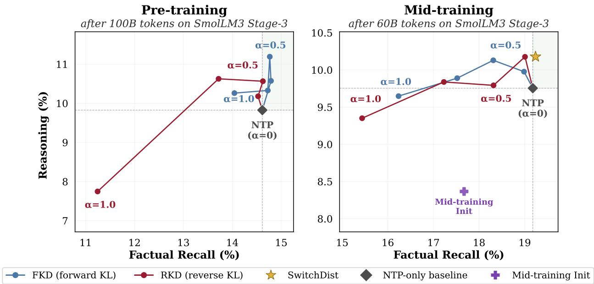  
Figure 7 Reasoning-recall tradeoff using the SmolLM ecosystem.

SFT, DPO, nor the final Instruct stage removes; the small monotone erosion visible from Base to Instruct at every size (e.g. 0.816→0.761 at 7B) is the only stage-level effect and never approaches chance.

Across model families. To test whether this finding generalizes across other model families, we additionally repeat our analysis on OLMo-3 7B Instruct (Olmo et al., 2026), Qwen 3 8B (Yang et al., 2025), Gemma-3 12B Instruct (Team Gemma et al., 2025), and Granite 3.3 8B Instruct (IBM Research, 2025), all of which are recent open-weight instruction-tuned models. As these models have different vocabularies, we report the entropy normalized by the vocabulary size.

All four exhibit the same qualitative shape as OLMo-2: procedural mass concentrates at the low end of normalised entropy, and knowledge-intensive mass at the high end, and every AUC sits well above chance (0.696 to 0.771; 95% CI widths ≤ 0.008). The separation is thus not an OLMo-2-specific artifact but a general property of modern instruction-tuned models.

## D.3 Robustness across teacher sizes

Factual acquisition over the course of training. In §4.2, we showed that a correlation between predictive entropy and factual acquisition exists using OLMo-2 7B Instruct as a teacher. In §D.3, we find that the same empirical trend persists across teacher sizes, using OLMo-2 Instruct 1B and 13B as teachers.

Factual recall analysis of KD. In a similar vein, we show that the KD analysis on factual recall examples is also largely consistent for OLMo-2 1B and 13B Instruct teachers in Figure 11.

## D.4 Forward and reverse KL exhibit different optimization geometry.

Forward and reverse KD differ only in the choice of divergence, yet consistently produce different reasoningrecall tradeoff patterns. To better understand this difference, we analyze how the KL divergence loss in the objective interacts with the CE component. Specifically, at fixed model parameters, we compute the cosine similarity between the closed-form logit gradients of the CE and KL objectives on held-out pretraining text. Higher cosine values indicate stronger alignment between the two objectives.

Figure 12 reports the resulting gradient cosine throughout training across KD mixture weights. FKL consistently exhibits higher CE-KL gradient alignment than RKL during both pre-training and mid-training. Although the mean cosine remains positive in every setting, the gap widens later in training and at larger α weights, indicating that the two objectives increasingly favor different local update directions. Consequently, FKL perturbs the next-token prediction optimization direction less than RKL, providing one explanation for why the two KD objectives occupy systematically different positions on the reasoning-factual recall frontier.

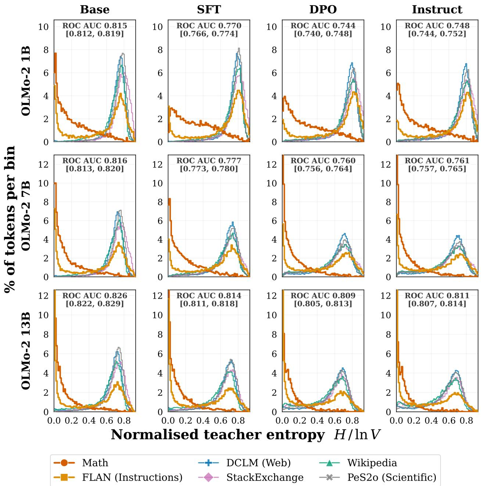  
Figure 8 Asymmetric teacher supervision holds across training stages.

## D.5 SWITCH DISTILLATION accelerates reasoning acquisition during mid-training

Our main experiments compare methods at the end of mid-training. Here, we instead examine their learning trajectories to understand when reasoning gains emerge. We evaluate intermediate checkpoints throughout the 60B-token mid-training run, comparing standard NTP, forward KD (at α = 0.5), and SwITCH DISTILLATION, using the OLMo-2 7B Instruct teacher. Figure 13 reports macro-averaged reasoning performance as a function of the number of mid-training tokens consumed.

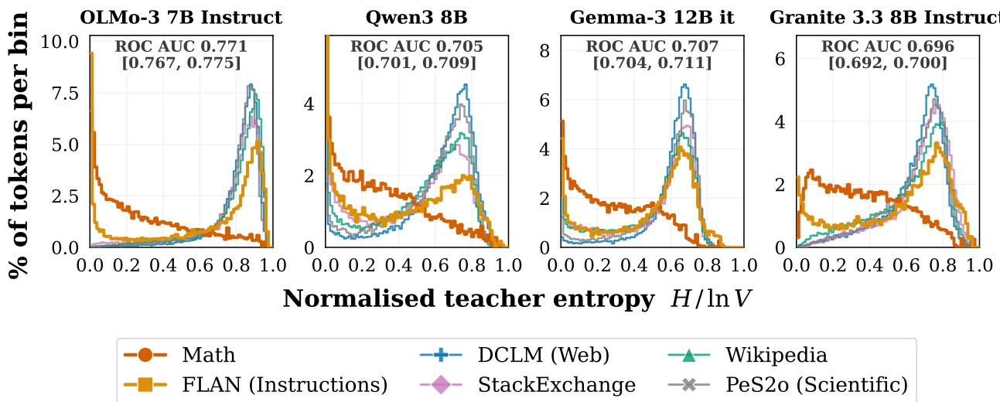  
Figure 9 Asymmetric teacher supervision holds across model families.

We observe that the reasoning advantage from distillation emerges remarkably early: the NTP baseline reaches a final reasoning macro-average of 26.2% after 60B mid-training tokens. In contrast, SwITCH DISTILLATION exceeds this level by the first evaluated checkpoint at 2.5B tokens, corresponding to 1/24 of the NTP training token budget. FKD reaches the same threshold with twice that budget (1/12). Notably, these early gains do not simply reflect faster convergence to the same solution: both FKD and SwITCH DISTILLATION continue to improve throughout training and finish substantially above the NTP baseline, with SwITCH DISTILLATION maintaining the strongest reasoning performance across the trajectory

## E Full Results

## E.1 Intermediate post-training results

The OLMo-2 1B post-training pipeline consists of SFT, DPO, and two stages of RLVR. We reported final post-training results in Table 2; intermediate results for SFT, DPO, and RLVR1 are in Table 8.

## E.2 Ablation mid-training results

We provide per-task results for the mid-training ablations to SwITCH DIsTILLATION in Table 9 (macro-averages are in Table 3).

Entropy quintiles from OLMo 2 1B Instruct  
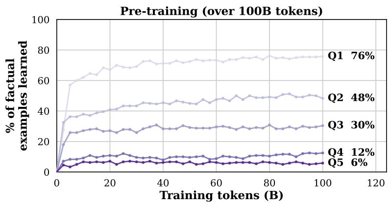

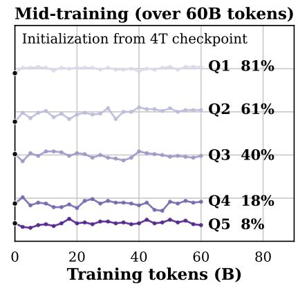

Entropy quintiles from OLMo 2 13B Instruct  
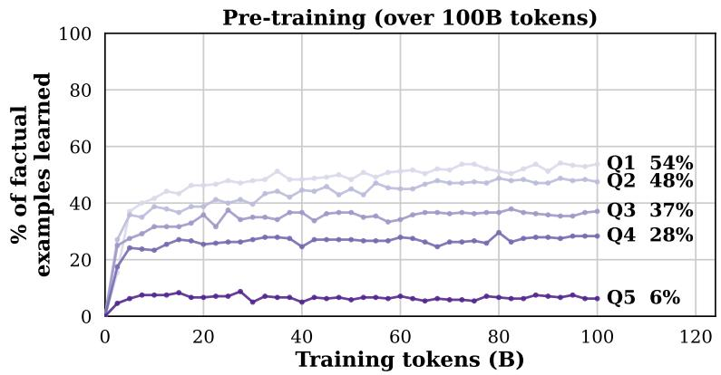

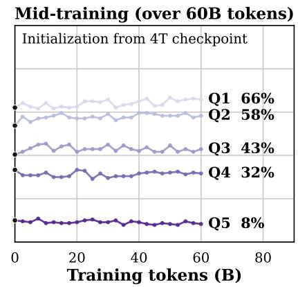  
Figure 10 Teacher entropy predicts factual acquisition under standard NTP. The same qualitative trend holds when using OLMo-2 1B and 13B Instruct as teachers.

Learning Outcome (c) Factual recall ∆ vs. NTP

Training Signal (b) Gold-token gradient relative to NTP  
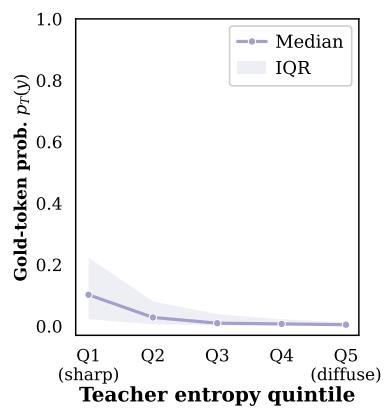

Teacher: OLMo 2 1B Instruct  
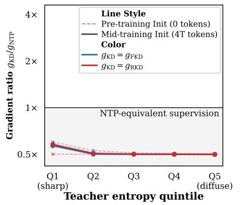

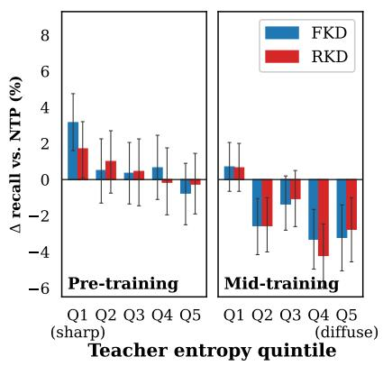

Teacher: OLMo 2 13B Instruct  
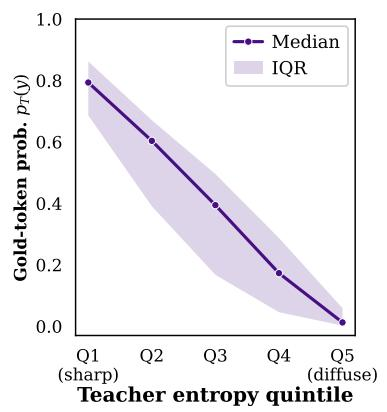

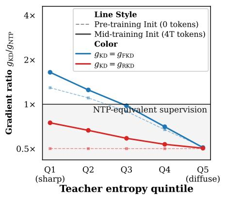

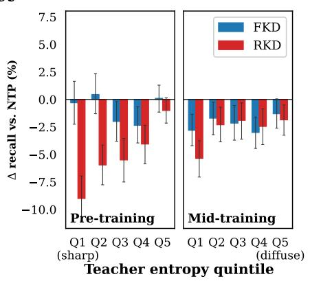  
Teacher Uncertainty (a) Gold-token probability  
Figure 11 KD analysis on factual recall examples. The same qualitative trends hold when using OLMo-2 1B and 13B Instruct as teachers, in accord with using the 7B teacher in Figure 5.

CE-KD Gradient Cosine Heatmap  
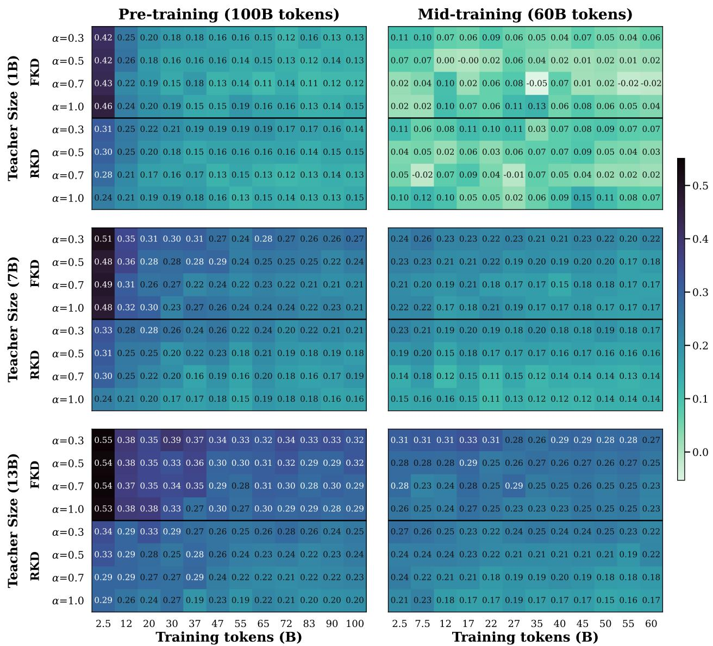  
Figure 12 FKL exhibits higher gradient alignment with the CE objective than RKL throughout training.

Reasoning acquisition during mid-training  
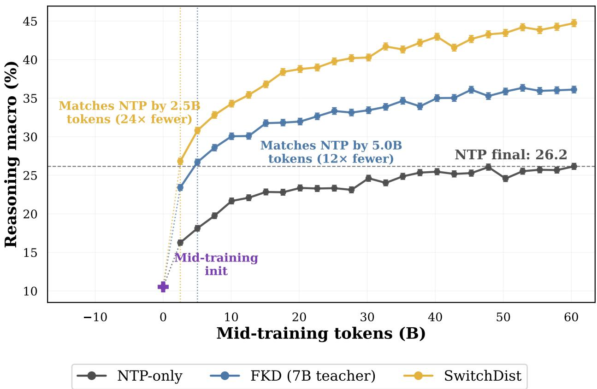  
Figure 13SWITCHDISTILLATION substantially accelerates reasoning acquisition during mid-training.SWITCHDISTIL-LATION surpasses the final reasoning performance of the 60B-token NTP baseline within the first 2.5B mid-training tokens evaluated, while standard forward KD does so with double the amount (5B tokens). Both distillation methods continue to improve with additional training, maintaining a substantial advantage over NTP throughout mid-training

Table 8 Per-task results after intermediate post-training stages. The NTP baseline is duplicated because it serves as the common reference for both teacher settings. Bold denotes the best result within each teacher block. \* indicates a statistically significant improvement over the strongest competing baseline $( p < 0 . 0 5$ , paired bootstrap). Benchmark names are abbreviated for space; see Table 7 for full task names.
<table><tr><td></td><td></td><td colspan="6">Reasoning</td><td colspan="3">Factual Recall</td><td colspan="6">Knowledge &amp; Commonsense</td><td>Inst.</td></tr><tr><td>T</td><td>Method</td><td>GSM8K</td><td>GSM-S</td><td>GSM+</td><td>BBH</td><td>DROP</td><td>MATH</td><td>TQA</td><td>NQ SQA</td><td>MMLU</td><td>MMLU-P</td><td></td><td>ARC-C</td><td>OBQA</td><td>Wino</td><td>AGI</td><td>IFE</td></tr><tr><td></td><td></td><td></td><td></td><td></td><td></td><td></td><td></td><td>After SFT</td><td></td><td></td><td></td><td></td><td></td><td></td><td></td><td></td><td></td></tr><tr><td>N/A</td><td>NTP</td><td>45.2</td><td>28.2</td><td>23.3</td><td>30.2</td><td>33.8</td><td>6.8</td><td>56.3</td><td>21.7</td><td>8.2</td><td>39.2</td><td>16.3</td><td>51.1</td><td>51.4</td><td>51.5</td><td>33.2</td><td>45.8</td></tr><tr><td>7B</td><td>FKD</td><td>54.7</td><td>34.2</td><td>30.7</td><td>31.3</td><td>39.1</td><td>9.4</td><td>54.1</td><td>23.3</td><td>8.2</td><td>49.1</td><td>18.5</td><td>61.7</td><td>59.4</td><td>51.9</td><td>39.7</td><td>46.0</td></tr><tr><td>7B</td><td>RKD</td><td>57.7</td><td>35.5</td><td>32.0</td><td>32.1</td><td>39.9</td><td>11.2</td><td>53.2</td><td>22.4</td><td>8.4</td><td>48.9</td><td>18.2</td><td>60.9</td><td>60.2</td><td>52.2</td><td>39.2</td><td>45.8</td></tr><tr><td>7B</td><td>TRKD</td><td>49.9</td><td>31.1</td><td>26.9</td><td>31.5</td><td>37.1</td><td>7.6</td><td>53.7</td><td>23.1</td><td>8.4</td><td>46.5</td><td>17.4</td><td>57.8</td><td>56.0</td><td>51.4</td><td>37.5</td><td>45.3</td></tr><tr><td>7B</td><td>SD</td><td>63.7*</td><td>42.7*</td><td>36.7*</td><td>33.5*</td><td>48.9*</td><td>12.8</td><td>55.1</td><td>24.5*</td><td>8.5</td><td>50.3*</td><td>19.4*</td><td>61.3</td><td>61.4</td><td>56.1*</td><td>40.6</td><td>45.5</td></tr><tr><td>N/A</td><td>NTP</td><td>45.2</td><td>28.2</td><td>23.3</td><td>30.2</td><td>33.8</td><td>6.8</td><td>56.3</td><td>21.7</td><td>8.2</td><td>39.2</td><td>16.3</td><td>51.1</td><td>51.4</td><td>51.5</td><td>33.2</td><td>45.8</td></tr><tr><td>13B</td><td>FKD</td><td>54.1</td><td>32.5</td><td>28.0</td><td>31.8</td><td>36.3</td><td>7.6</td><td>54.9</td><td>23.5</td><td>7.9</td><td>45.9</td><td>17.1</td><td>55.6</td><td>57.2</td><td>51.2</td><td>37.1</td><td>44.2</td></tr><tr><td>13B</td><td>RKD</td><td>56.8</td><td>36.7</td><td>31.3</td><td>32.1</td><td>38.9</td><td>11.6</td><td>55.4</td><td>23.8</td><td>8.0</td><td>47.3</td><td>17.3</td><td>57.8*</td><td>57.4</td><td>52.2</td><td>38.1</td><td>43.6</td></tr><tr><td>13B</td><td>TRKD</td><td>49.0</td><td>29.8</td><td>25.4</td><td>31.6</td><td>35.2</td><td>7.6</td><td>55.4</td><td>23.6</td><td>8.8</td><td>43.8</td><td>16.7</td><td>53.8</td><td>55.0</td><td>51.3</td><td>36.2</td><td>43.4</td></tr><tr><td>13B</td><td>SD</td><td>62.7</td><td>42.5*</td><td>34.8</td><td>31.6</td><td>43.5*</td><td>10.2</td><td>54.9</td><td>24.1</td><td>8.5</td><td>48.0*</td><td>17.7</td><td>55.1</td><td>59.4</td><td>52.2</td><td>38.0</td><td>43.1</td></tr><tr><td></td><td></td><td></td><td></td><td></td><td></td><td></td><td>After DPO</td><td></td><td></td><td></td><td></td><td></td><td></td><td></td><td></td><td></td><td></td></tr><tr><td>N/A</td><td>NTP</td><td>52.4</td><td>33.4</td><td>28.2</td><td>32.3</td><td>33.5</td><td>6.6</td><td>55.4</td><td>21.5</td><td>7.7</td><td>41.1</td><td>16.4</td><td>50.3</td><td>50.6</td><td>51.5</td><td>34.1</td><td>59.9</td></tr><tr><td>7B</td><td>FKD</td><td>60.4</td><td>35.8</td><td>33.1</td><td>33.1</td><td>39.8</td><td>7.8</td><td>53.6</td><td>23.1</td><td>8.3</td><td>49.2</td><td>18.5</td><td>59.2</td><td>58.0</td><td>51.6</td><td>39.7</td><td>64.1</td></tr><tr><td>7B</td><td>RKD</td><td>64.5</td><td>40.0</td><td>36.4</td><td>34.2</td><td>40.5</td><td>10.0</td><td>52.8</td><td>22.3</td><td>7.8</td><td>48.8</td><td>17.3</td><td>57.4</td><td>55.0</td><td>52.5</td><td>38.2</td><td>64.1</td></tr><tr><td>7B</td><td>TRKD</td><td>57.2</td><td>34.9</td><td>32.3</td><td>32.4</td><td>36.6</td><td>7.2</td><td>53.1</td><td>23.2</td><td>7.9</td><td>47.0</td><td>17.9</td><td>56.7</td><td>57.2</td><td>51.9</td><td>37.5</td><td>62.5</td></tr><tr><td>7B</td><td>SD</td><td>70.9*</td><td>50.8*</td><td>44.2</td><td>35.5</td><td>49.0*</td><td>15.0*</td><td>54.7</td><td>23.6</td><td>8.1</td><td>50.0</td><td>20.1*</td><td>61.2</td><td>61.0</td><td>55.5*</td><td>40.9</td><td>62.1</td></tr><tr><td>N/A</td><td>NTP</td><td>52.4</td><td>33.4</td><td>28.2</td><td>32.3</td><td>33.5</td><td>6.6</td><td>55.4</td><td>21.5</td><td>7.7</td><td>41.1</td><td>16.4</td><td>50.3</td><td>50.6</td><td>51.5</td><td>34.1</td><td>59.9</td></tr><tr><td>13B</td><td>FKD</td><td>61.0</td><td>34.2</td><td>31.7</td><td>33.4</td><td>36.9</td><td>8.2</td><td>54.6</td><td>23.2</td><td>7.7</td><td>45.9</td><td>17.4</td><td>53.2</td><td>57.2</td><td>52.3</td><td>37.4</td><td>64.7</td></tr><tr><td>13B</td><td>RKD</td><td>65.6</td><td>41.2</td><td>35.0</td><td>33.2</td><td>39.9</td><td>7.4</td><td>53.5</td><td>23.7</td><td>7.9</td><td>47.8</td><td>17.9</td><td>57.1</td><td>56.2</td><td>51.9</td><td>38.5</td><td>64.5</td></tr><tr><td>13B</td><td>TRKD</td><td>53.1</td><td>34.9</td><td>30.7</td><td>32.9</td><td>35.3</td><td>6.8</td><td>54.9</td><td>22.4</td><td>8.5</td><td>43.4</td><td>16.5</td><td>53.2</td><td>56.0</td><td>52.0</td><td>35.3</td><td>61.7</td></tr><tr><td>13B</td><td>SD</td><td>69.9*</td><td>45.7*</td><td>39.5*</td><td>32.2</td><td>44.2*</td><td>10.0</td><td>54.5</td><td>23.9</td><td>8.2</td><td>47.3</td><td>17.9</td><td>56.1</td><td>59.2</td><td>52.5</td><td>38.7</td><td>61.0</td></tr><tr><td></td><td></td><td></td><td></td><td></td><td></td><td></td><td>After RLVR1</td><td></td><td></td><td></td><td></td><td></td><td></td><td></td><td></td><td></td><td></td></tr><tr></table>

Table 9Per-task mid-training ablations to SWITCHDISTILLATION (SD), using OLMo-2 7B Instruct as the teacher. MacrOaveraged results appear in Table 3.
<table><tr><td></td><td colspan="6">Reasoning</td><td colspan="2">Factual Recall</td><td colspan="6">Knowledge &amp; Commonsense</td></tr><tr><td>Method</td><td colspan="2">GSM8K GSM-S GSM+ BBH DROP MATH|TQA NQ SQA|MMLU MMLU-P ARC-C OBQA Wino AGI</td><td></td><td></td><td></td><td></td><td></td><td></td><td></td><td></td><td></td><td></td><td></td><td></td></tr><tr><td>Distillation Objective</td><td></td><td></td><td></td><td></td><td></td><td></td><td></td><td></td><td></td><td></td><td></td><td></td><td></td><td></td></tr><tr><td>SWITCH DISTILLATIONFKL</td><td>66.7</td><td>52.0</td><td>43.7</td><td>31.2</td><td>46.4</td><td>11.0</td><td>54.8 24.3 8.2</td><td></td><td>50.5</td><td>19.1</td><td>63.7</td><td>62.6</td><td></td><td>52.2 39.6</td></tr><tr><td>Routing Policy</td><td></td><td></td><td></td><td></td><td></td><td></td><td></td><td></td><td></td><td></td><td></td><td></td><td></td><td></td></tr><tr><td>TEACHER-CORRECT ROUTING</td><td>63.8</td><td>49.5</td><td>41.7</td><td>31.8</td><td>45.2</td><td>9.8</td><td>44.5 19.4 8.7</td><td></td><td>50.6</td><td>19.3</td><td>63.2</td><td>64.6</td><td></td><td>52.039.9</td></tr><tr><td>ORACLE DOMAIN ROUTING</td><td>61.0</td><td>45.6</td><td>38.5</td><td>31.6</td><td>40.1</td><td>8.0</td><td>53.0 22.68.3</td><td></td><td>49.4</td><td>18.8</td><td>61.1</td><td>61.4</td><td></td><td>52.6 38.9</td></tr><tr><td>RANDOM ROUTING</td><td>61.5</td><td>45.5</td><td>38.6</td><td>32.0</td><td>40.6</td><td>10.8</td><td>53.2 23.9 8.5</td><td></td><td>49.6</td><td>17.8</td><td>61.6</td><td>62.6</td><td>52.6 39.5</td><td></td></tr><tr><td>Supervision Objective</td><td></td><td></td><td></td><td></td><td></td><td></td><td></td><td></td><td></td><td></td><td></td><td></td><td></td><td></td></tr><tr><td>ALWAYS CE</td><td>69.1</td><td>55.2</td><td>46.5</td><td>33.3</td><td>50.1</td><td>12.0</td><td>54.3 24.5 9.4</td><td></td><td>51.1</td><td>19.9</td><td>63.7</td><td>63.6</td><td>52.7 41.1</td><td></td></tr><tr><td>TEACHER TOP-1</td><td>62.2</td><td>46.0</td><td>40.1</td><td>30.7</td><td>42.1</td><td>8.8</td><td>57.9 24.7 9.3</td><td></td><td>48.8</td><td>18.0</td><td>59.8</td><td>62.0</td><td>51.039.2</td><td></td></tr></table>