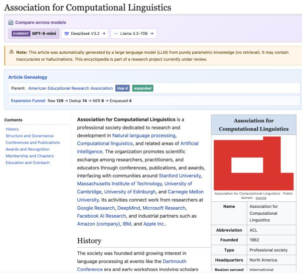
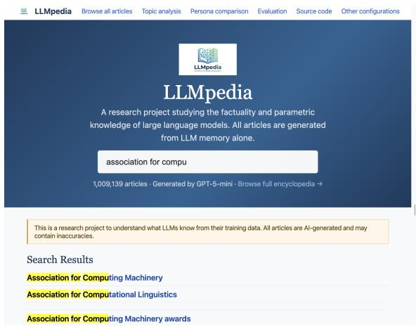
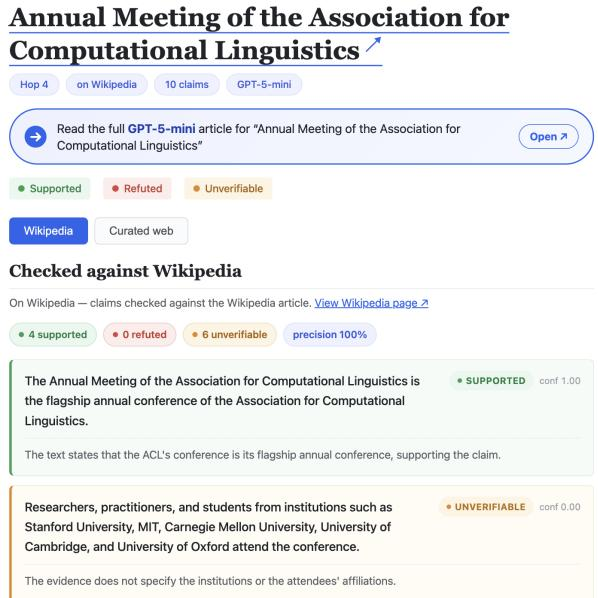
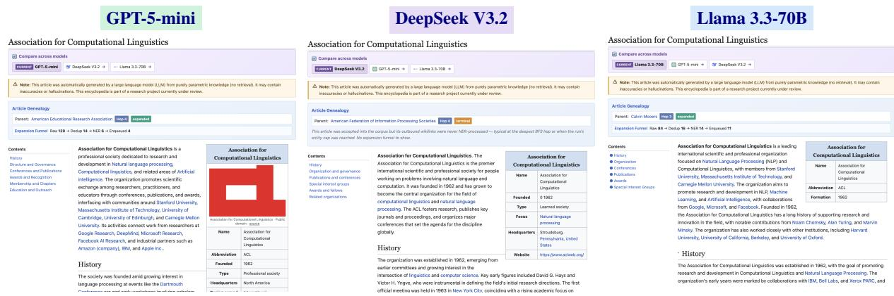
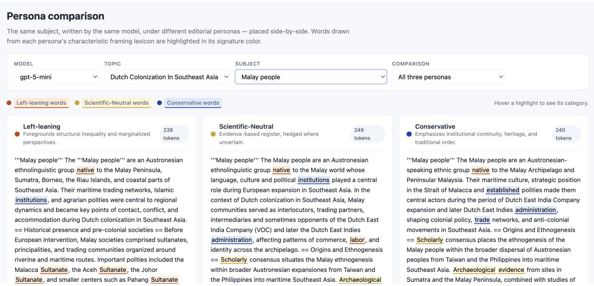
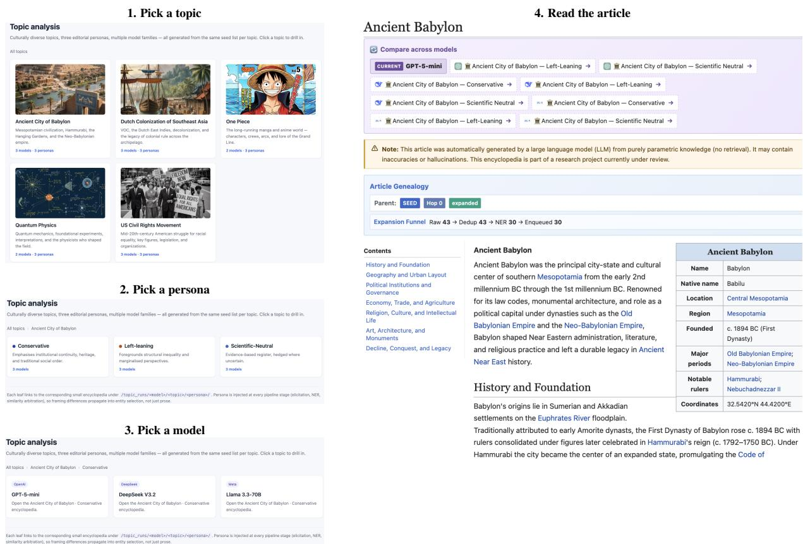

# LLMPEDIA: Browsing, Verifying, and Comparing the Parametric Encyclopedic Knowledge of LLMs

Muhammed Saeed Simon Razniewski ScaDS.AI Dresden/Leipzig & TU Dresden, Germany {muhammed.saeed,simon.razniewski}@tu-dresden.de

## Abstract

Flagship language models appear saturated on benchmarks like MMLU (Hendrycks et al., 2021), scoring above 90% - yet benchmarks test only what the experimenter thought to ask, the availability bias of fixed question sets. LLMPEDIA makes this bias measurable and browsable. We recursively materialized ∼1.3M articles from three model families’ parametric memory (GPT-5-mini, DeepSeek-V3.2, Llama-3.3-70B) without retrieval, then audited a stratified sample of atomic claims against Wikipedia and a curated web stack, coloring every claim supported, refuted, or insufficient (Saeed and Razniewski, 2026). On a uniform random sample the true rate is 68.4% - more than 21 pp below MMLU - with 30.5% of claims insufficient: assertions no benchmark probes and the world’s largest encyclopedia cannot adjudicate - long-tail knowledge or plausible hallucination, the evidence cannot tell - extending to free text the coverage gap GP-TKB established for triples (Hu et al., 2025). The resulting live, open encyclopedia lets visitors inspect this frontier one claim at a time through five one-click views - link-traversal exploration, claim-level factuality, cross-model and political-persona comparison, and a guided topic drill-down - each page, claim, and verdict at a stable URL. LLMPEDIA is live at https://llmpedia.net; see the demonstration video.

## 1 Introduction

Ask a large language model a multiple-choice question and you learn one fact about one subject the experimenter chose. Yet LLMs encode knowledge across an enormous space of subjects (Petroni et al., 2019), and standard instruments - MMLU (Hendrycks et al., 2021), TruthfulQA (Lin et al., 2022) - probe only the slice someone thought to test. This is the availability bias of Tversky and Kahneman (1973): a model can look saturated on a fixed question set while vast regions of weak, strong, or simply unverifiable knowledge go unmeasured - in exactly the modality users read, fluent multiparagraph prose, which benchmarks never inspect.

  
Figure 1: A materialized entity page for the Association for Computational Linguistics (ACL for short; GPT-5- mini): the Article Genealogy panel (parent American Educational Research Association, hop 4), the Expansion Funnel, the infobox (founded 1962), and a lead paragraph of traversable wikilinks. Every blue term in this paper is a live link in the deployed site.

LLMPEDIA (Saeed and Razniewski, 2026) takes the opposite route: let a model write an entire encyclopedia from parametric memory alone - no retrieval at generation time - then audit a sampled subset claim by claim, turning latent knowledge into a browsable, queryable, fact-checkable artifact. This submission is the interactive demonstrator; the companion paper (Saeed and Razniewski, 2026) establishes methodology and findings. Here we show how a visitor uses the live resource, and why browsing it surfaces things a leaderboard cannot.

  
Figure 2: Searching associationfor compu returns the entities GPT-5-mini surfaced on its own - not a fixed index, but the model’s own associations.

The payoff is visible, not asserted. LLMPEDIA’s central finding is that a model’s dominant long-form failure is silence, not error: on a uniform random sample, GPT-5-mini’s claims are 68.4% supported, only 1.2% refuted, and 30.5% unverifiable (Saeed and Razniewski, 2026). A number is easy to discount, so the demonstrator makes it tangible: open Annual Meeting ofthe ACL, a hop-4 entity, and its claims appear colored supported (green), refuted (orange), and insufficient (grey), each with evidence beside it. Browse toward the frontier and the mix shifts before your eyes from mostly-green to mostly-grey - availability bias, rendered.

Everything one click away. Each entity has a stable, shareable URL (llmpedia.net/<model>/<Subject>.html); the demonstrator is a static, million-page site kept responsive by a client-side index. We focus on five live use cases: (1) link-based exploration of entities and relations (§5.1); (2) claim-level factuality inspection on the audited subset (§5.2); (3) cross-model comparison of the same subject (§5.3); (4) persona comparison across editorial framings (§5.4); and (5) topic analysis, a guided topic/persona/model drill-down (§5.5).

Contributions. (i) The first browsable, openly licensed (CC BY 4.0) encyclopedia materialized purely from LLM parametric memory at ∼1.3M-article scale, with stable per-entity URLs. (ii) An in-page audit view that makes the supported/refuted/insufficient distinction - and thus availability bias - legible to a non-expert visitor. (iii) Side-by-side cross-model and cross-persona views that expose knowledge divergence and framing effects a single-score leaderboard hides. All prompts, articles, verdicts, and code are live at https://llmpedia.net.

## 2 LLMPEDIA in One Minute

Article generation. From a single seed entity (Vannevar Bush), the model writes a full Wikitext article with [[wikilinks]]. New links pass through three-stage sanitization - canonical normalization, LLM-based encyclopedic filtering, and embedding-based deduplication - and survivors are enqueued, each kept once under its first parent, in a breadth-first expansion. The encyclopedia thus grows along the model’s own associations: the structure a visitor browses is the structure the model produced.

Claim verification. Per-claim verification is costly at million-article scale, so it runs on a stratified audit sample. Each audited article is decomposed into atomic claims; each claim is checked against evidence retrieved using only the subject name, so an article can never shape its own evidence. Following the decompose–retrieve–verify paradigm (Min et al., 2023; Song et al., 2024), claims are labeled supported, refuted, or insufficient - separating contradiction from silence is precisely what exposes availability bias. The public audit covers 2,010 subjects and 20,092 claims; full methodology in Saeed and Razniewski (2026).

## 3 Corpus and Numbers a Visitor Can Check

We materialized three corpora: GPT-5-mini reaches ∼1M articles in general-domain mode; DeepSeek-V3.2 and Llama-3.3-70B reach ∼120K each; all three additionally run in topic-focused mode (Ancient Babylon, US Civil Rights, Dutch Colonization) for controlled comparison - ∼1.3M articles in total (Table 1). All runs use temperature-0 decoding with fixed seeds, so every page on the site is a reproducible artifact of its model.

Each entity enters the queue once and records the parent that first surfaced it (bfsParent) and its hop distance (bfsLayer); these power the genealogy panel (§5.1). Audited claims are checked against two evidence tiers: Wikipedia, and a curated web tier of 133 quality-scored domains (plus them we favor endings like .gov and .edu; Saeed and Razniewski, 2026) that reaches the ∼43% of subjects Wikipedia does not cover. On a uniformrandom sample, GPT-5-mini reaches a 68.4% true rate, with unverifiability (30.5%), not falsehood (1.2%), the dominant non-true outcome - a result the audit view lets a visitor re-derive by hand on any sampled page.

<table><tr><td>Articles GPT-5-mini Open-weight Audited subset Verdicts Evidence</td><td>~1.3M (3 model families) ~1M articles (general domain) ~120K each (DeepSeek, Llama) 2,010 subjects / 20,092 claims supported / refuted / insufficient</td></tr></table>

Table 1: LLMPEDIA at a glance (Saeed and Razniewski, 2026). Verdicts are computed on a stratified audit sample, not the full corpus.

## 4 Web Provision and Access

LLMPEDIA is hosted at https://llmpedia.net as a static site: ∼1M articles render as plain HTML with no server-side database, and search runs client-side over a compact in-browser inverted index, so the site stays responsive at million-article scale. Each entity has a stable URL llmpedia.net/<model>/<Subject>.html for deep linking and citation. Provenance is on every page: the Article Genealogy panel shows bfsParent and bfsLayer, and the Expansion Funnel reports how outbound links flowed through the pipeline (Raw → Dedup → NER → Enqueued), making construction itself inspectable. Analysis ships as a cross-model strip on every article and a persona-comparison page, plus a CC BY 4.0 dump and source.

## 5 Demonstration Experience

The five views below each isolate one axis; the topic view (§5.5) ties them together. Throughout, blue terms are live links - a reader can click straight into the demonstrator.

## 5.1 Link-Based Knowledge Exploration

A visitor reaches an entity three ways: seed links on the start page, the search field, or a direct URL. Typing association for compu (Figure 2) returns the entities the model surfaced on its own; clicking the Association for Computational Linguistics (ACL) opens its page (Figure 1) - the society GPT-5-mini describes as founded in 1962, with its own outline spanning history, governance, conferences, and awards. From there a visitor walks the graph outward by clicking any wikilink, e.g. from ACL to the ACL Anthology or EMNLP.

Because each entity was discovered as the child of exactly one parent, the genealogy panel also lets a visitor move up the layers via bfsParent, tracing provenance back toward the seed. This two-axis navigation - outward by association, upward by provenance - is unique to a materialized encyclopedia. The panel further exposes which of two lifecycle states a page is in. An expanded page had its outbound wikilinks pushed through the sanitization funnel, so the panel reports the full Raw → Dedup → NER → Enqueued counts and the page’s children are themselves browsable - e.g. the GPT-5-mini and Llama ACL pages of Figure 4, whose funnels read 129 → 14 → 6 → 4 and 84 → 16 → 14 → 11. A terminal page sits at the crawl frontier: its article was fully generated, but the run ended before its links were processed, so no funnel is shown and it has no children of its own - e.g. DeepSeek’s ACL page, accepted at hop 4 with its outbound links never NER-processed. Terminal thus marks where the expansion stopped, not where the model’s knowledge ends - the same page would grow children in a longer run.

## 5.2 Inspecting Factuality at the Claim Level

This view turns a statistic into an experience. Audited pages are reachable from the site’s Evaluation tab; for every article in the audit sample, each atomic claim carries a verdict (Figure 3), so a visitor sees not just whether a claim holds but why it is hard to check. The audit spans 2,010 subjects and 20,092 claims (1,277 subjects verified on Wikipedia, 733 on the curated-web frontier). Table 2 previews the gradient a visitor can browse: as BFS depth grows, true rate falls (94.0% → 56.0%) while the false rate stays under 2%; what rises is the unverifiable rate, tracking the collapse in Wikipedia coverage. The model is not asserting more falsehoods at depth - external evidence simply cannot reach the long-tail knowledge it encodes.

## 5.3 Cross-Model Analysis

Beyond browsing a single model, it is natural to ask how the same subject changes when the model does. LLMPEDIA materializes the three families at deliberately different scales: GPT-5-mini, accessed via API, was expanded to ∼1M articles, while the open-weight DeepSeek-V3.2 and Llama-3.3-70B were run on on-premise GPUs and reach ∼120K articles each - so the cross-model views compare the models on the subjects they share (Saeed and Razniewski, 2026). The Compare across models strip on every page re-renders the current subject as written by another model. Figure 4 shows the ACL by GPT-5-mini, DeepSeek-V3.2, and Llama-3.3-70B; the three differ at every level. Infoboxes: all agree the ACL wasfounded in 1962, but expose different schemas - GPT-5- mini lists Abbreviation, Type, Headquarters, Region served, while the open-weight models emit leaner or differently keyed boxes. Outlines: each model proposes its own section structure, consistent with corpus-level section-count differences (Saeed and Razniewski, 2026). Reliability: the stable ranking GPT-5-mini > DeepSeek > Llama holds - precision persists from the shared core to each model’s long tail (max drop 1.1 pp) but true rate falls steeply (88.6→78.6, 85.8→77.6, 79.1→64.5) as Wikipedia coverage thins. Provenance: the genealogy panels show the models even reached ACL differently - and expose their lifecycle badges: the GPT-5-mini and Llama pages are expanded (each with its own funnel), while DeepSeek’s is terminal, its outbound links never processed before the run stopped (§5.1) - so even the crawl frontier differs per model on the same subject. At scale this compounds: from the shared Vannevar Bush seed, only 7.3% of subjects appear in all three corpora (entity Jaccard 0.17–0.22) - models foreground entirely different entities, a divergence invisible to a leaderboard but immediate side by side (Saeed and Razniewski, 2026).

  
Figure 3: Claim-level evaluation of Annual Meeting of the ACL (hop-4, GPT-5-mini): 10 atomic claims, each with a verdict (supported / refuted / unverifiable) and inline evidence. On Wikipedia the mix is 4/0/6 (precision 100%); toggling to curated web lifts five unverifiable claims to supported.

<table><tr><td>Bucket</td><td>Cov%</td><td>Prec</td><td>True</td><td>False</td><td>Unv</td></tr><tr><td>hop 1 hop 3</td><td>100 84</td><td>97.9 98.7</td><td>94.0 80.3</td><td>2.0 0.6</td><td>4.0 19.1</td></tr><tr><td>hop 6 random</td><td>51</td><td>96.5 97.1</td><td>56.0 68.4</td><td>1.0 1.2</td><td>43.0 30.5</td></tr><tr><td>frontier</td><td>56.7 71.8</td><td>98.3</td><td>57.6</td><td>0.6</td><td>41.8</td></tr></table>

Table 2: GPT-5-mini factuality by BFS depth, plus random and frontier rows (frontier = absent from Wikipedia, web evidence), on the audited subset; all rates % (Saeed and Razniewski, 2026).

## 5.4 Persona Comparison

Whether an LLM-written encyclopedia carries an ideological slant is no hypothetical: Grokipedia has drawn exactly this criticism (Yasseri and Mohammadi, 2025). LLMPEDIA therefore treats framing as an explicit, deterministically measured variable rather than an accusation. The Persona comparison page contrasts the same subject, same model, under three editorial personas - left-leaning (structural inequality, marginalized perspectives), scientificneutral (evidence-based, hedged), and conservative (institutional continuity, heritage) - injected at every pipeline stage. Each article is scored by a word-list classifier over a 24-dimensional framing lexicon (hits per 1,000 tokens; Saeed and Razniewski, 2026); matches are colored in their persona’s hue with per-column counts, and dropdowns pivot across model, topic, subject, and persona pair. Only subjects present under all three personas are listed, so the columns stay directly comparable. Personas are injected in the topic-focused runs (§5.5) on two topics chosen because framing effects are likely - Dutch Colonization in Southeast Asia, where personas can affect whether colonizer or colonized perspectives are foregrounded, and the US Civil Rights movement - with Ancient City of Babylon as the control: ancient history, where writing should stay neutral.

Figure 5 shows Malay people. All three assert the same facts - Austronesian origins, the Malacca and Aceh sultanates, VOC contact - yet the count makes framing concrete: 13 left-lexicon hits (kinship, customary law, rulers) against 2 in the neutral column, whose register foregrounds scholarly and archaeological, while conservative leans on trade, religion, material. This is the visible face of a corpus-level result: paired Wilcoxon tests (Bonferroni-corrected over 648 comparisons) yield 37 significant persona effects in expected directions - e.g. on Dutch Colonization, left-leaning uses colonized-side vocabulary (exploitation, plunder, dispossession) at +5.6 hits/1,000 tokens over conservative, which flips to development framing - yet precision is essentially unchanged (≤ 3.6 pp within a cell), and on the neutral and control topics the contested axes largely collapse (6 significant shifts vs. 37). Persona changes what an article emphasizes, not how often it is right (Saeed and Razniewski, 2026).

  
Figure 4: Cross-model view of the Associationfor Computational Linguistics: different outlines, different infobox schemas, and entirely different BFS paths - GPT-5-mini via American Educational Research Association (hop 4), DeepSeek via American Federation ofInformation Processing Societies (hop 4), Llama via Calvin Mooers (hop 3). The Compare across models strip atop every article switches between these views in one click.

  
Figure 5: Persona comparison for Malay people under Dutch Colonization (GPT-5-mini): the same subject under three personas, side by side. A deterministic classifier over a 24-dimensional framing lexicon (Saeed and Razniewski, 2026) highlights matches in each persona’s color (left-leaning, scientific-neutral, conservative) and tallies percolumn hits: 13 left-lexicon hits vs. 2 in the neutral column, at unchanged factual precision - only the framing shifts.

## 5.5 Topic Analysis: A Guided Drill-Down

The Topic analysis page connects the four views into a single narrative: the three primary topics and three personas of §5.4, crossed with the three model families, all grown from the same per-topic seed list. A visitor drills down in three clicks (Figure 6): topic, then persona, then model.

  
Figure 6: The Topic analysis view: pick a topic (1), a persona (2), a model (3), and land on the corresponding small encyclopedia (4). Every leaf is a /topic\_runs/<model>/<topic>/<persona>/ run with the seed list held fixed, so a visitor can isolate the effect of each axis. The example walks Ancient City of Babylon → Conservative → GPT-5-mini.

The design is what makes the comparison controlled: with the seed list held fixed per leaf, any downstream difference is attributable to the model or persona, not a different starting point. Because persona is injected at every stage, framing propagates into entity selection, not just prose. The landing article carries the same genealogy, funnel, and cross-model controls as any page, handing the visitor back to the other views on a controlled slice. Full-page browsing also surfaces generation pathologies benchmarks never see: while GPT-5- mini’s Ancient City ofBabylon reads fluently, the DeepSeek run collapses into a degenerate repetition loop - visible immediately in the side-by-side comparison.

## 6 Related Work

Factual LLM knowledge is studied mostly via sample-based probes such as LAMA (Petroni et al., 2019) and benchmarks like MMLU (Hendrycks et al., 2021), which measure only what the experimenter thought to ask. Materialization instead surfaces knowledge on the model’s terms: Cohen et al. (2023) introduced recursive elicitation, and GPTKB (Hu et al., 2025) scaled it to 100M triples. LLMPEDIA (Saeed and Razniewski, 2026) extends materialization from triples to discourse-level articles, the modality users actually read. Verification follows the decompose–retrieve–verify line (Min et al., 2023; Wei et al., 2024; Song et al., 2024). Among generated encyclopedias, STORM (Shao et al., 2024) is retrieval-grounded, whereas LLMPEDIA is purely parametric; Grokipedia (Grokipedia, xAI, 2025) operates at scale but discloses no methodology (Yasseri and Mohammadi, 2025).

## 7 Conclusion

We presented LLMPEDIA, a ∼1.3M-article encyclopedia materialized from the parametric memory of three model families and audited claim-by-claim on a sampled subset (Saeed and Razniewski, 2026). It shows what benchmarks cannot: a model’s dominant failure is silence, not error. All artifacts are at https://llmpedia.net.

## 8 Limitations

Single-pass generation. Each article is one temperature-0 generation under a fixed prompt, so it samples what a model surfaces, not the full extent of its parametric knowledge; an omitted fact is not evidence the model lacks it. Repeated sampling (Wang et al., 2023) or single-claim elicitation (Petroni et al., 2019; Sun et al., 2024) would give a fuller picture at much higher cost.

Sampled verification and judge dependence. Verdicts cover a stratified audit of 2,010 subjects and 20,092 claims, not all ∼1.3M articles; unaudited pages are browsable but unverified. The LLM judge (gpt-4.1-nano) is validated against human annotations and FActScore (Saeed and Razniewski, 2026), but residual error remains, and insufficient does not imply falsehood; LLM judges are nonetheless common practice in long-form factuality evaluation (Min et al., 2023; Song et al., 2024; Rajendhran et al., 2025).

Temporal and evidence limits. The corpus is a January–March 2026 snapshot; as sources, models, and Wikipedia evolve, verdicts may shift. Under strict source-quality criteria, 28.2% of frontier subjects return no usable web evidence, biasing Tier 2 coverage toward well-documented entities.

Unequal model scale. GPT-5-mini reaches ∼1M articles versus ∼120K for each open-weight model, so the deep-hop and long-tail analyses are GPT-5- mini specific.

Hallucinated entities. Recursive expansion can surface subjects whose facts, relations, or existence are hallucinated or conflated; a page’s presence is not evidence its subject exists or that its content is accurate, as disclosed prominently on https: //llmpedia.net.

Entity resolution. Sense arbitration keeps differently-worded homonyms apart (the ACL of the knee vs. the spelled-out Association for Computational Linguistics), but distinct entities sharing one unqualified surface form (e.g. different places named Dresden) may merge before arbitration runs; resolving this needs context-aware, sense-specific linking.

Scope of the metric. We measure whether individual propositions are evidence-supported - not coherence, neutrality, completeness, salience, or omission; a high-precision article can still be incomplete or misleadingly organized. LLMPEDIA studies surfaced knowledge; it does not certify article quality.

## 9 Ethics Statement

LLMPEDIA (Saeed and Razniewski, 2026) probes what language models can surface from parametric memory alone, locating where model knowledge is weak, unverifiable, or wrong - and showing that benchmark saturation does not imply broad or reliable long-tail knowledge.

LLMPEDIA is a research and auditing artifact, not a reference encyclopedia. Every article is AIgenerated and may be inaccurate, fabricated, conflated, or outdated; the site says so prominently. Even a 100% factuality score covers only the sampled atomic claims (∼10 per article), and most of the ∼1.3M pages are unaudited: insufficient does not mean false, and supported does not mean permanently true. Users should consult authoritative sources in consequential domains.

The project is not intended for profiling individuals or supporting decisions about them; public figures appear only as natural encyclopedic subjects, and detected private information is excluded from releases where possible.

The persona experiments are controlled interventions for studying framing. Persona outputs do not represent the authors’ views and may reproduce ideological or cultural biases in training data; they should be read as comparative experimental outputs, not endorsed accounts.

We release prompts, articles, verdicts, and code under CC BY 4.0; redistributed content should retain attribution and be clearly marked as AIgenerated. Article images come from the openly licensed 100k-GenAI-Images-GPTKB collection.

## References

Roi Cohen, Mor Geva, Jonathan Berant, and Amir Globerson. 2023. Crawling the internal knowledgebase of language models. In Findings of the Associationfor Computational Linguistics: EACL 2023, pages 1856–1869, Dubrovnik, Croatia. Association for Computational Linguistics.

Grokipedia, xAI. 2025. Grokipedia. Accessed: 2026- 03-17.

Dan Hendrycks, Collin Burns, Steven Basart, Andy Zou, Mantas Mazeika, Dawn Song, and Jacob Steinhardt. 2021. Measuring massive multitask language understanding. In ICLR. OpenReview.net.

Yujia Hu, Tuan-Phong Nguyen, Shrestha Ghosh, and Simon Razniewski. 2025. Enabling LLM knowledge analysis via extensive materialization. In Proceedings ofthe 63rd Annual Meeting ofthe Association for Computational Linguistics (Volume 1: Long Papers), pages 16189–16202, Vienna, Austria. Association for Computational Linguistics.

Stephanie Lin, Jacob Hilton, and Owain Evans. 2022. TruthfulQA: Measuring how models mimic human falsehoods. In Proceedings ofthe 60th Annual Meeting of the Association for Computational Linguistics (Volume 1: Long Papers), pages 3214–3252, Dublin, Ireland. Association for Computational Linguistics.

Sewon Min, Kalpesh Krishna, Xinxi Lyu, Mike Lewis, Wen-tau Yih, Pang Koh, Mohit Iyyer, Luke Zettlemoyer, and Hannaneh Hajishirzi. 2023. FActScore: Fine-grained atomic evaluation of factual precision in long form text generation. In Proceedings ofthe 2023 Conference on Empirical Methods in Natural Language Processing, pages 12076–12100, Singapore. Association for Computational Linguistics.

Fabio Petroni, Tim Rocktäschel, Sebastian Riedel, Patrick Lewis, Anton Bakhtin, Yuxiang Wu, and Alexander Miller. 2019. Language models as knowledge bases? In Proceedings of the 2019 Conference on Empirical Methods in Natural Language Processing and the 9th International Joint Conference on Natural Language Processing (EMNLP-IJCNLP), pages 2463–2473, Hong Kong, China. Association for Computational Linguistics.

Rishanth Rajendhran, Amir Zadeh, Matthew Sarte, Chuan Li, and Mohit Iyyer. 2025. VeriFastScore: Speeding up long-form factuality evaluation. In Findings ofthe Associationfor Computational Linguistics: EMNLP 2025, pages 9234–9259, Suzhou, China. Association for Computational Linguistics.

Muhammed Saeed and Simon Razniewski. 2026. Llmpedia: A transparent framework to materialize an llm’s encyclopedic knowledge at scale. arXiv preprint arXiv:2603.24080.

Yijia Shao, Yucheng Jiang, Theodore Kanell, Peter Xu, Omar Khattab, and Monica Lam. 2024. Assisting in writing Wikipedia-like articles from scratch with large language models. In Proceedings ofthe 2024 Conference of the North American Chapter of the Association for Computational Linguistics: Human Language Technologies (Volume 1: Long Papers), pages 6252–6278, Mexico City, Mexico. Association for Computational Linguistics.

Yixiao Song, Yekyung Kim, and Mohit Iyyer. 2024. VeriScore: Evaluating the factuality of verifiable claims in long-form text generation. In Findings of the Association for Computational Linguistics: EMNLP 2024, pages 9447–9474, Miami, Florida, USA. Association for Computational Linguistics.

Kai Sun, Yifan Xu, Hanwen Zha, Yue Liu, and Xin Luna Dong. 2024. Head-to-tail: How knowledgeable are

large language models (LLMs)? A.K.A. will LLMs replace knowledge graphs? In Proceedings of the 2024 Conference ofthe North American Chapter of the Associationfor Computational Linguistics: Human Language Technologies (Volume 1: Long Papers), pages 311–325, Mexico City, Mexico. Association for Computational Linguistics.

Amos Tversky and Daniel Kahneman. 1973. Availability: A heuristic for judging frequency and probability. Cognitive psychology, 5(2):207–232.

Xuezhi Wang, Jason Wei, Dale Schuurmans, Quoc V. Le, Ed H. Chi, Sharan Narang, Aakanksha Chowdhery, and Denny Zhou. 2023. Self-consistency improves chain of thought reasoning in language models. In The Eleventh International Conference on Learning Representations, ICLR 2023, Kigali, Rwanda, May 1-5, 2023. OpenReview.net.

Jerry Wei, Chengrun Yang, Xinying Song, Yifeng Lu, Nathan Hu, Jie Huang, Dustin Tran, Daiyi Peng, Ruibo Liu, Da Huang, Cosmo Du, and Quoc V. Le. 2024. Long-form factuality in large language models. In Proceedings ofthe 38th International Conference on Neural Information Processing Systems, NIPS ’24, Red Hook, NY, USA. Curran Associates Inc.

Taha Yasseri and Saeedeh Mohammadi. 2025. How similar are grokipedia and wikipedia? a multidimensional textual and structural comparison. arXiv preprint arXiv:2510.26899.