# Membership Inference in Fine-tuned Diffusion Language Models via Token-level Memorization Asymmetry

Shengfang Zhai<sup>1</sup>\*, Leo Marchyok<sup>2</sup>, Yuling Shi<sup>3</sup>, Huanran Chen<sup>4</sup>, Yinpeng Dong<sup>4</sup>, Jiaheng Zhang<sup>1</sup>, Sanghyun Hong<sup>2</sup>

<sup>1</sup> National University of Singapore, <sup>2</sup> Oregon State University <sup>3</sup> Shanghai Jiao Tong University, <sup>4</sup> College of AI, Tsinghua University

## Abstract

Diffusion language models (DLMs) have recently emerged as an alternative modeling paradigm to autoregressive LMs, offering advantages such as parallel generation and bidirectional context modeling. Despite growing interest in their generative capabilities, the privacy risks of DLMs remain underexplored. We identify a phenomenon termed token-level memorization asymmetry through theoretical analysis of diffusion training dynamics. Building on this finding, we propose Q-SKEW, a quantile-weighted skewness-based indicator for membership inference on finetuned DLMs. Experiments across multiple fine-tuning datasets and models show that our method outperforms existing baselines. Moreover, we show that Q-SKEW can also facilitate other privacy violations, such as PII extraction attacks. Our findings reveal a previously underexplored privacy attack surface and highlight the need for systematic privacy evaluation of DLMs.

## 1 Introduction

Diffusion language models (DLMs) (Nie et al., 2025; Bie et al., 2025; Ye et al., 2025) are emerging as a compelling alternative to autoregressive (AR) generation. Recent advances demonstrate that diffusion can be successfully adapted from continuous domains to text, leading to practical systems such as Gemini Diffusion (Google DeepMind, 2025), SEED Diffusion (Song et al., 2025), and a growing body of work from both academia (Nie et al., 2025) and industry (Inception Labs, 2025). Unlike AR models, which strictly generate tokens sequentially, DLMs generate text through iterative denoising processes that refine entire sequences over multiple steps. This paradigm offers capabilities that AR modeling does not naturally support, including flexible decoding (De Bortoli et al., 2025), global sequence refinement (Nie et al., 2025), and improved controllability over generation dynamics (Li et al., 2022), making diffusion an attractive generation paradigm other than next-token generation.

Driven by ongoing research efforts, state-of-theart DLMs gradually achieve generative capabilities comparable to those of AR models, both in opensource models (Bie et al., 2025) and in commercial SaaS services (Inception Labs, 2025). However, few studies investigate the privacy issues of DLMs as a new language model architecture. In this paper, we mainly focus on Membership Inference (MI), which aims to determine whether a given data point is used to train the target model. On one hand, a malicious adversary can leverage this technique to violate the model privacy (Shokri et al., 2017). On the other hand, membership inference can also be used for unauthorized data auditing (DeAlcala et al., 2024).

A series of studies have developed membership inference methods against common (autoregressive) language models (Yeom et al., 2018), or the (vision) diffusion models. However, applying these methods to diffusion language models poses significant challenges. First, DLMs adopt an any-order denoising training objective rather than a single fixed left-to-right decomposition, which acts as an implicit Monte Carlo data augmentation mechanism and reduces exact sample memorization (Ni et al., 2025). Second, the diffusion training process introduces randomness for each token, since different tokens are masked with different probabilities. This fundamentally breaks methods based on lower-tail token scores, such as MinK (Shi et al., 2023) and Min-K++ (Zhang et al., 2024). Third, membership inference methods on vision diffusion models (Ho et al., 2020) show degraded performance on DLMs due to the transition of the state space from continuous to discrete.

To address this challenge, we conduct an indepth analysis of diffusion training dynamics and find that the model’s single-step memorization gain for each token is inversely proportional to the mask ratio during diffusion training process. Based on this, we theoretically derive the property of tokenlevel memorization asymmetry and accordingly propose a skewness-based MI indicator: Quantileweighted Skewness (Q-SKEW) of the sample tokens. Our method can effectively distinguish member sets from non-member sets from a data distribution perspective, beyond the memorization at the individual sample level. We conduct experiments across different finetuning objectives, dataset domains, and types of diffusion language models, including both base and instruction-tuned diffusion language models. Q-SKEW outperforms baselines on average, and this superiority remains consistent across different training epochs, with an average AUC improvement of more than 10%. Furthermore, we show that the skewness indicator can also enhance the effectiveness of PII (Personally Identifiable Information) extraction.

Notably, there is a concurrent work SAMA (Chen et al., 2026) which also focuses on membership inference. Our work differs in two aspects: (1) we propose a new indicator beyond memorization at the individual sample level, and (2) our evaluation covers both instruction fine-tuning and domain fine-tuning (same training objective with pretraining), rather than only domain fine-tuning as in prior works (Fu et al., 2024a; Chen et al., 2026). Our method consistently outperforms theirs in both settings.

In summary, our contributions are:

• We are the first to identify an inverse relationship between mask ratio and token memory gain, and theoretically characterize Token-level Memorization Asymmetry.

• We propose Q-SKEW, a novel membership inference indicator based on the inverse maskratio phenomenon that outperforms baselines across datasets and training settings.

• We provide a new perspective on privacy risks in DLMs, showing that skewness also improves PII extraction and highlighting fundamental differences from AR models.

## 2 Background and Related Work

## 2.1 Diffusion Language Models

Unlike traditional autoregressive generation, diffusion language models (DLMs) recover data from a fully masked state through iterative denoising. Currently, successful large-scale DLMs are based on the discrete masked diffusion model architecture. Taking this as an example, we formalize the training and inference processes of DLMs as follows. Let $\mathbf { x } _ { 0 } = ( x _ { 0 } ^ { 1 } , x _ { 0 } ^ { 2 } , \ldots , x _ { 0 } ^ { L } )$ denotes a sample of the training set $\mathcal { D } _ { \mathrm { t r a i n } } ,$ consisting of L discrete tokens, where $x _ { 0 } ^ { i } \in \mathcal { V }$ . The diffusion process is defined on an extended vocabulary $\mathcal { V } ^ { + } = \mathcal { V } \cup \{ [ M \mathsf { A } S \mathsf { K } ] \}$ that includes a mask token. The forward diffusion process in DLMs is defined as a Markov chain that gradually replaces tokens with mask tokens. Then we can derive a closed-form solution to sample the state $\mathbf { x } _ { t }$ directly at timestep t:

$$
\begin{array} { r } { q ( x _ { t } ^ { i } | x _ { 0 } ^ { i } ) = \left\{ \begin{array} { l l } { 1 - \bar { \alpha } _ { t } } & { \mathrm { i f ~ } x _ { t } ^ { i } = \lceil \mathsf { M A S K } \rceil } \\ { \bar { \alpha } _ { t } } & { \mathrm { i f ~ } x _ { t } ^ { i } = x _ { 0 } ^ { i } } \\ { 0 } & { \mathrm { o t h e r w i s e } , } \end{array} \right. } \end{array}
$$

where $\bar { \alpha } _ { t }$ denotes the cumulative probability that a token remains unmasked at timestep t. Then the parameterized denoiser $p _ { \theta } ( \mathbf { x } _ { 0 } \mid \mathbf { x } _ { t } )$ is trained using the following masked-position denoising objective:

$$
\mathcal { L } _ { \mathrm { D L M } } ( \theta ) = \mathbb { E } _ { t , { \mathbf { x } _ { 0 } } , { \mathbf { x } _ { t } } } \left[ \frac { 1 } { | \mathcal { M } _ { t } | } \sum _ { i \in \mathcal { M } _ { t } } - \log p _ { \theta } ( x _ { 0 } ^ { i } | \mathbf { x } _ { t } ) \right]\tag{1}
$$

where $t \sim \mathcal { U } ( 1 , T ) , { \bf x } _ { 0 } \sim \mathcal { D } _ { \mathrm { t r a i n } }$ , and $\mathcal { T } _ { t } = \{ i \ \}$ $x _ { t } ^ { i } = [ \mathsf { M A S K } ] \}$ denotes indices of masked tokens in timestamp t. During the inference process, the model θ starts from a fully masked sequence $\mathbf { x } _ { T } ,$ and performs the following update steps through iterative sampling until $t = 0 \mathrm { : }$

$$
\mathbf { x } _ { t - 1 } \sim p _ { \theta } ( \mathbf { x } _ { t - 1 } | \mathbf { x } _ { t } ) .
$$

## 2.2 Membership Inference

Membership inference aims to determine whether a given data sample belongs to the member set (training data) of a target model (Shokri et al., 2017). This task is widely regarded as a core method for quantifying privacy risks or auditing unauthorized data usage (DeAlcala et al., 2024). For generative models, the high number of parameters results in significant fine-tuning overhead. Hence, existing effective membership inference mainly falls under query-based methods, which typically require a gray-box setting, i.e., obtaining output logits.

Membership inference on DMs. Beyond the security concerns (Zhai et al., 2023, 2024b, 2025, 2026), privacy studies on DMs have primarily focused on membership inference (MI). However, they mainly focus on visual (continuous) diffusion models (Ho et al., 2020). In the grey-box setting, these methods examine the characteristics of diffusion models and design various metrics to determine member and non-member sets, such as: (1) estimation errors of deterministic forward process (Duan et al., 2023; Kong et al., 2024), (2) probability fluctuations in the presence of perturbations (Fu et al., 2024b); (3) likelihood discrepancy with different inputs (Zhai et al., 2024a), et al.

Membership inference on LLMs. Many studies explore membership inference for LLMs (Yeom et al., 2018; Shi et al., 2023; Zhang et al., 2024). In the fine-tuning scenario, due to the open availability of base models, methods for LLMs typically involve an additional assumption: the attacker has access to reference models. Watson et al. (2022) firstly introduces this assumption and proposes Calibration Attack. SPV-MIA (Fu et al., 2024a) leverages self-prompting to construct reference models, leading to more precise inference. Similarly, the concurrent work, SAMA (Chen et al., 2026), conducts membership inference on diffusion language models (DLMs) following the same setting. In contrast to our work, their empirical approach lacks theoretical analysis of the difference between DLMs and traditional AR language models, leading to less effectiveness in practice (Tab. 1, Tab. 2).

## 3 Methodology

## 3.1 Threat Model

In this work, we consider an adversary that aims to infer whether a given data record was used to train the target model $\theta _ { \mathrm { t a r } }$ . Since the pre-training process primarily utilizes crawled public data and is implemented by only a few third-party institutions, we focus on the fine-tuning stage, which is generally recognized as the stage that is most susceptible to privacy or copyright risks (Yu et al.; Fu et al., 2024a; Chen et al., 2026).

We strictly follow the mainstream setting of query-based membership inference (Shi et al., 2023; Zhang et al., 2024; Duan et al., 2023; Watson et al., 2022), where the adversary can only access the output logits of the target model $\theta _ { \mathrm { t a r } }$ , without having access to the model weights or gradients. The formalization is:

$$
\mathcal { A } ( \mathbf { x } , \theta _ { \mathrm { t a r } } ) = \mathbb { 1 } \left[ \mathcal { A } ^ { \prime } ( \mathbf { x } , \theta _ { \mathrm { t a r } } ) > \tau \right] ,
$$

where $\mathcal { A } ^ { \prime }$ denotes an indicator function that reflects membership information, and τ denotes a tunable decision threshold. Following the stateof-the-art reference-based membership inference methods (Meng et al., 2025; Watson et al., 2022; Fu et al., 2024a; Huang et al., 2025), we further assume that the adversary has access to an unfinetuned reference model $\theta _ { \mathrm { r e f } }$ . Then, a more precise strategy of membership inference can be formalized as:

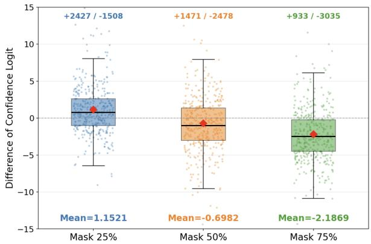  
Figure 1: Violin and jitter plots of confidence logit differences before and after training. A smaller mask ratio results in a higher memorization gain for the token post-training.

$$
\mathcal { A } ( \mathbf { x } , \theta _ { \mathrm { t a r } } ) = \mathbb { 1 } \left[ \mathcal { A } ^ { \prime } ( \mathbf { x } , \theta _ { \mathrm { t a r } } , \theta _ { \mathrm { r e f } } ) > \tau \right] .
$$

Note that this setup is easily achievable for membership inference on fine-tuning scenarios due to the availability of open-sourced base models. And we further consider a weaker assumption involving misaligned reference models in Section 4.3.

Fine-tuning setups. Notably, previous membership inference methods on fine-tuned language models (Fu et al., 2024a; Chen et al., 2026) consider only domain fine-tuning, which shares the same training objective as the pretraining stage and utilizes a fixed training block size, such as 64, 128, or 256 tokens. However, we emphasize that these evaluation setups are limited: ❶ they do not represent the fine-tuning scenarios for instructiontuning, which constitute the primary fine-tuning paradigm. ❷ they may lead to an inflated illusion of membership inference success by failing to account for the variable-length nature of instruction-tuning datasets. Therefore, in our experiments, we evaluate both domainfine-tuning (DFT) and instruction fine-tuning (IFT) scenarios to align with real-world scenarios (Section 4).

## 3.2 Token-level Memorization Asymmetry

The training process of DLMs distinguishes them from AR language models and thereby introduces unique characteristics. In this part, we provide a formal proof characterizing the distributional differences of token-level memorization between member (training) data $\mathbf { x } \in \mathcal { D } _ { t r a i n }$ and non-member (test) data $\mathbf { x } \in \mathcal { D } _ { t e s t }$

Let x be a sequence of tokens $\mathbf { x } = ( w _ { 1 } , \dots , w _ { L } )$ in the training set $\mathscr { D } _ { t r a i n }$ . We consider a diffusion language model $\theta _ { K }$ trained for K epochs on $\mathscr { D } _ { t r a i n }$ and $\theta _ { 0 }$ denotes the original version that has not yet been trained. Since the model’s memorization of training data gradually accumulates as the training progresses, we define the memorization gain $\mathcal { G } _ { w _ { i } }$ during the training process as the cumulative reduction in loss. For the i-th token $w _ { i }$ in sequence $\mathbf { x } ,$ we have:

$$
\mathcal { G } _ { w _ { i } } : = \mathcal { L } ( w _ { i } ; \theta _ { 0 } ) - \mathcal { L } ( w _ { i } ; \theta _ { K } ) = \sum _ { k = 1 } ^ { K } \delta _ { w _ { i } , k } ,\tag{2}
$$

where the $\delta _ { w _ { i } , k }$ denotes the memory gain (i.e. marginal loss reduction) for token $w _ { i }$ at epoch k. Member set analysis. For the member sample ${ \textbf { x } } \in$ $\mathcal { D } _ { t r a i n }$ , a global mask rate $\beta _ { k } \sim U ( 0 , 1 )$ is sampled at the training epoch k. Let $m _ { w _ { i } , k } \in \{ 0 , 1 \}$ denotes the binary indicator whether token $w _ { i }$ is masked (and thus trained) at epoch $k ^ { 1 } !$

$$
P ( m _ { w _ { i } , k } = 1 \mid \beta _ { k } ) = \beta _ { k } .
$$

In the diffusion training progress, we find the increase in token memorization is associated with the masking ratio. Insightfully, low-β steps may lead to more concentrated gradient updates, resulting in stronger single-step memory gain for $w _ { i }$ . Hence, we propose the following assumption:

Assumption 3.1. (Inverse Mask-Ratio Scaling) We posit that the magnitude of the memory gain, when a token is selected, is a function of the mask rate:

$$
\delta _ { w _ { i } , k } = m _ { w _ { i } , k } \cdot \phi ( w _ { i } , \beta _ { k } ) ,
$$

where $\phi : ( 0 , 1 )  \mathbb { R } ^ { + }$ denotes the update strength function reflected by the loss and is strictly monotonically decreasing.

To validate Theorem 3.1, we fine-tuned LLaDA (Nie et al., 2025) on the XSUM (Narayan et al., 2018) dataset for four epochs. During training, we set the mask ratio to three fixed values, 0.25, 0.50, and 0.75, with a fixed mask template for each data sample, instead of using a random mask ratio. After training, we utilize the prediction confidence to estimate the memorization of individual tokens. It is evident from Fig. 1 that a lower mask ratio leads to more significant token memorization on average under the same number of training epochs. We leave more experiments in Section B for validation. Therefore, for a member datapoint x, the single-step gain $\delta _ { w _ { i } , k }$ obviously follows a zero-inflated mixture distribution. We then derive the shape properties of the cumulative gain ${ \mathcal { G } } .$

Theorem 3.2. (Proof in Section A.1) Let G be the memorization gain for token-level in the training set. For any finite number of epochs $K \geq 1$ , the distribution of $\mathcal { G } _ { w _ { i } }$ is strictly right-skewed:

$$
S k e w ( \mathcal { G } _ { w _ { i } } ) = \frac { \mathbb { E } \left[ ( \mathcal { G } _ { w _ { i } } - \mathbb { E } [ \mathcal { G } _ { w _ { i } } ] ) ^ { 3 } \right] } { \sigma ( \mathcal { G } _ { w _ { i } } ) ^ { 3 } } > 0\tag{3}
$$

We further analyze and demonstrate in Section A.2 that this skewness specifically represents a long-tail distribution.

Non-member set analysis. For the non-member sample $\begin{array} { r } { \textbf { x } \notin \mathcal { D } _ { t r a i n } , \mathcal { G } _ { w _ { i } } \ = \ \sum _ { k = 1 } ^ { K } \epsilon _ { i , k } , } \end{array}$ , where $\epsilon _ { w _ { i } , k }$ represents stochastic generalization noise. Without the zero-inflated selection mechanism and the monotonic inverse mask-ratio amplification assumed for members, the resulting distribution typically exhibits much weaker asymmetry. In practice, this value is often close to zero when the aggregated fluctuations are approximately symmetric: Skew $( \mathcal { G } _ { w _ { i } } ) \approx 0$ . Recalling Eq. (1), we define the following for diffusion language models:

$$
\mathcal { L } ( w _ { i } ; \theta ) : = \mathbb { E } _ { t , \mathbf { x } _ { 0 } , \mathbf { x } _ { t } } \left[ - \log p _ { \theta } ( w _ { i } \mid \mathbf { x } _ { t } ) \right] ,
$$

where $\mathbf { x } _ { t }$ denote the noisy sequence of x at timestep t. We use $\Delta _ { w _ { i } }$ as the empirical estimator of the memorization gain $\mathcal { G } _ { w _ { i } }$ :

$$
\begin{array} { r l } & { \Delta _ { w _ { i } } \left( \theta _ { \mathrm { t a r } } , \theta _ { \mathrm { r e f } } \right) : = } \\ & { \underbrace { \mathbb { E } _ { t , \mathbf { x } _ { t } } \left[ - \log { p _ { \theta _ { \mathrm { r e f } } } \left( w _ { i } \mid \mathbf { x } _ { t } \right) } \right] } _ { \mathrm { M e m o r i z a t i o n ~ o f ~ R e f e r e n c e ~ M o d e l } } - \underbrace { \mathbb { E } _ { t , \mathbf { x } _ { t } } \left[ - \log { p _ { \theta _ { \mathrm { t a r } } } \left( w _ { i } \mid \mathbf { x } _ { t } \right) } \right] } _ { \mathrm { M e m o r i z a t i o n ~ o f ~ T a r g e t ~ M o d e l } } . } \end{array}\tag{4}
$$

Assuming the reference model approximates the untrained state, i.e. $\theta _ { \mathrm { r e f } } \approx \theta _ { 0 }$ , and the target model is the trained state, i.e. $\theta _ { \mathrm { t a r } } = \theta _ { K }$ after K epoch training, the $\Delta _ { w _ { i } } ( \theta _ { \mathrm { t a r } } , \theta _ { \mathrm { r e f } } )$ shares the same distribution properties (Theorem 3.2). Hence, the following equation holds:

$$
\begin{array} { r l } & { \mathrm { S k e w } ( \{ \Delta _ { w _ { \mathrm { m e m b e r } , i } } \left( \theta _ { \mathrm { t a r } } , \theta _ { \mathrm { r e f } } \right) \mid i \in \{ 1 , \dots , L \} \} ) } \\ & { \quad > 0 \approx \mathrm { S k e w } ( \{ \Delta _ { w _ { \mathrm { n o n - m e m b e r } , i } } \left( \theta _ { \mathrm { t a r } } , \theta _ { \mathrm { r e f } } \right) \mid i \in \{ 1 , \dots , L \} \} ) } \end{array}
$$

```latex
Algorithm 1 Quantile-weighted Skewness with
Cyclic Sampling
Input: sample $\mathbf { x } ~ = ~ ( w _ { 1 } , \ldots , w _ { L } ) ,$ target model $p \theta _ { \mathrm { t a r } } ,$
reference model $p _ { \theta _ { \mathrm { r e f } } } , { \mathrm { c y c l i } }$ c rounds ${ \mathrm { ~  ~ \cdot ~ } } _ { R } ,$ mask ratio $\rho ,$ band
width $h ,$ decision threshold $\tau _ { \mathrm { m i a } }$
Output: membership prediction zˆ and inference score $a \mathbf { x }$
$s _ { \mathbf { x } } \gets \emptyset$
$b \gets \operatorname* { m a x } ( 1 , \lfloor \rho L \rfloor )$
for $r = 1 , \ldots , R$ do
$\pi ^ { ( r ) } \gets$ Permutation $( \{ 1 , \ldots , L \} )$
Partition $\pi ^ { ( r ) }$ into disjoint subsets $\{ \mathcal { M } _ { r , 1 } , . . . , \mathcal { M } _ { r , m } \}$
with $| \mathcal { M } _ { r , j } | \approx b$
for $j = 1 , \dots ,$ m do
$\mathbf { \bar { \mathcal { M } } } \gets \mathbf { \mathcal { M } } _ { r , j }$
Construct the unmasked context $\mathbf { x } _ { \mathcal { M } ^ { c } }$
for each $i \in \mathcal { M }$ do
$\ell _ { i , \mathcal { M } } ^ { \mathrm { r e f } } \gets - \log p _ { \theta _ { \mathrm { r e f } } } ( w _ { i } \mid \mathbf { x } _ { \mathcal { M } ^ { c } } )$
$\ell _ { i , { M } } ^ { \mathrm { t a r } } \gets - \log p _ { \theta _ { \mathrm { t a r } } } ( w _ { i } \mid \mathbf { x } _ { \mathcal { M } ^ { c } } )$
$\Delta _ { i , \mathcal { M } } \gets \ell _ { i , \mathcal { M } } ^ { \mathrm { r e f } } - \ell _ { i , \mathcal { M } } ^ { \mathrm { t a r } }$
$S _ { \mathbf { x } }  S _ { \mathbf { x } } \cup \{ \Delta _ { i , \mathcal { M } } \}$
end for
end for
end for
$\tilde { S } _ { \mathbf { x } } \gets \mathrm { M e d i a n } ( S _ { \mathbf { x } } )$
$\sigma _ { \mathbf { x } } \gets \operatorname { S t d } ( S _ { \mathbf { x } } )$
for each $s \in S _ { \mathbf { x } }$ do
$F ( s ) \gets \mathrm { E } \overleftrightarrow { \mathrm { C D F } } ( s ; S _ { \mathbf { x } } )$
Compute $W ( s )$ using Eq. (9)
end for
$\begin{array} { r } { \bar { W }  \frac { 1 } { | S _ { \mathbf { x } } | } \sum _ { s \in \mathcal { S } _ { \mathbf { x } } } W ( s ) } \end{array}$
$\begin{array} { r } { \frac { 1 } { | \mathcal { S } _ { \mathbf { x } } | } \sum _ { s \in \mathcal { S } _ { \mathbf { x } } } \mathbf { \overbar { W } } ( s ) \cdot ( s - \tilde { \mathcal { S } } _ { \mathbf { x } } ) } \end{array}$
$a _ { \mathbf { x } } \gets$ σ ·W<sup>¯</sup>
$\hat { z } \gets \mathbb { 1 } [ a _ { \mathbf { x } } > \tau _ { \mathrm { m i a } } ]$
return $\hat { z } , a _ { \mathbf { x } }$
```

where $w _ { \mathrm { m e m b e r } , i }$ and $w _ { \mathrm { n o n - m e m b e r } , i }$ denote the tokens of the member set and non-member set samples, respectively. We define:

$$
\mathbb { I } ( \mathbf { x } , \theta _ { \mathrm { t a r } } , \theta _ { \mathrm { r e f } } ) = \mathrm { S k e w } \big ( \{ \Delta _ { w _ { i } } ( \theta _ { \mathrm { t a r } } , \theta _ { \mathrm { r e f } } ) | i \in \{ 1 , \dots , L \} \big )
$$

where $\mathbf { x } = ( w _ { 1 } , \dots , w _ { L } )$ . For a given data sample x, a reference model $\theta _ { \mathrm { r e f } } .$ , and a target model $\theta _ { \mathrm { t a r } }$ , the indicator function $\mathbb { I } ( \mathbf { x } , \theta _ { \mathrm { t a r } } , \theta _ { \mathrm { r e f } } )$ serves as a metric for membership inference. Intuitively, if $\mathbb { I } ( \mathbf { x } , \theta _ { \mathrm { t a r } } , \theta _ { \mathrm { r e f } } )$ exceeds a threshold $\tau ,$ , the sample x is likely from the member set; otherwise, it belongs to the non-member set.

## 3.3 Quantile-weighted Skewness with Cyclic Sampling

In practice, we (1) calculate the loss difference for every individual mask sampling instead of the mathematical expectation, increasing the set size for distribution estimation; (2) design a cyclic sampling method to replace the random Monte Carlo sampling of t, eliminating the randomness in scenarios with a low number of samples, ensuring coverage uniformity; (3) design a more robust metric based on Eq. (3), to distinguish between the member set and the non-member set. We provide the entire MI progress in Algorithm 1.

Token-level Memorization Score. Let x = $( w _ { 1 } , \dots , w _ { L } )$ be an input sequence. For any mask subset $\mathcal { M } \subset \{ 1 , \ldots , L \}$ sampled from the masking corruption process, we define the instance loss difference $\Delta _ { w _ { i } , { \mathcal { M } } }$ for a masked token $w _ { i } \left( i \in \mathcal { M } \right)$ as:

$$
\begin{array} { r l } & { \Delta _ { i , \mathcal { M } } : = \left[ - \log p _ { \theta _ { \mathrm { r e f } } } ( w _ { i } \mid \mathbf { x } _ { \mathcal { M } ^ { c } } ) \right] } \\ & { \qquad - \left[ - \log p _ { \theta _ { \mathrm { t a r } } } ( w _ { i } \mid \mathbf { x } _ { \mathcal { M } ^ { c } } ) \right] , } \end{array}\tag{5}
$$

where $\mathbf { x } _ { \mathcal { M } ^ { c } }$ denotes the context provided by unmasked tokens.

Cyclic Sampling. To mitigate the stochastic variance inherent in Monte Carlo sampling and ensure uniform token coverage, we employ a Cyclic Sampling strategy. Instead of random replacement, we perform R full-coverage round sampling. In the r-th rounds, we generate a random permutation of indices $\pi ^ { ( r ) } = \operatorname { P e r m u t a t i o n } ( \{ 1 , \ldots , L \} )$ This permutation is partitioned into a sequence of disjoint batches $\mathbf { B } ^ { ( r ) } = \{ \mathcal { M } _ { r , 1 } , . . . , \mathcal { M } _ { r , m } \}$ , such that $\cup _ { j } { \mathcal { M } } _ { r , j } = \{ 1 , \ldots , L \}$ and $\mathcal { M } _ { r , j } \cap \mathcal { M } _ { r , j ^ { \prime } } = \emptyset$ where each batch has size $| { \mathcal { M } } | \approx \rho L$ . The final memorization set aggregates the scores from all disjoint batches across all cycles:

$$
\mathcal { S } _ { \mathbf { x } } = \bigcup _ { r = 1 } ^ { R } \bigcup _ { j = 1 } ^ { m } \left\{ \Delta _ { i , \mathcal { M } _ { r , j } } \mid i \in \mathcal { M } _ { r , j } \right\} .\tag{6}
$$

Quantile-weighted Skewness. In practice, extreme outliers can significantly inflate the mean of the entire set, making it difficult to distinguish between member and non-member samples. Therefore, we consider the median-based metric following Pearson’s Second Skewness Coefficient:

$$
\frac { \mu ( \mathcal { S } _ { \mathbf { x } } ) - \tilde { \mathcal { S } } _ { \mathbf { x } } } { \sigma ( \mathcal { S } _ { \mathbf { x } } ) } ,\tag{7}
$$

where $\tilde { \mathcal { S } } _ { \mathbf { x } }$ denotes the median of $\mathcal { S } _ { \mathbf { x } }$ . Since different quantiles exhibit varying impacts on membership inference accuracy, we further define the Quantileweighted Skewness (Q-SKEW):

$$
\begin{array} { r l } & { \mathcal { A } ^ { \prime } ( x , \theta _ { \mathrm { t a r } } , \theta _ { \mathrm { r e f } } ) : = } \\ & { \qquad f _ { \mathrm { Q S k e w } } ( \mathbf { x } ) = \frac { \frac { 1 } { \left| \mathcal { S } _ { \mathbf { x } } \right| } \sum _ { s \in \mathcal { S } _ { \mathbf { x } } } W ( s ) \cdot ( s - \tilde { \mathcal { S } } _ { \mathbf { x } } ) } { \sigma ( \mathcal { S } _ { \mathbf { x } } ) \cdot \bar { W } } , } \end{array}\tag{8}
$$

where $\bar { W }$ is a normalization factor:

$$
\bar { W } = \frac { 1 } { | S _ { \mathbf { x } } | } \sum _ { s \in S _ { \mathbf { x } } } W ( s ) .
$$

Table 1: The main experiment results of membership inference on diffusion language models on domain fine-tuning tasks (DFT). We bold the best results, and our method is marked in grey.
<table><tr><td></td><td colspan="3">Arxiv (DFT)</td><td colspan="3">WikiText (DFT)</td><td colspan="3">XSUM (DFT)</td></tr><tr><td></td><td>AUC</td><td>TPR@10%FPR</td><td>TPR@1%FPR</td><td>AUC</td><td>TPR@10%FPR</td><td>TPR@1%FPR</td><td>AUC</td><td>TPR@10%FPR</td><td>TPR@1%FPR</td></tr><tr><td>Loss</td><td>61.3</td><td>16.4</td><td>5.0</td><td>60.3</td><td>17.1</td><td>2.0</td><td>61.1</td><td>15.8</td><td>1.7</td></tr><tr><td>Min-K%</td><td>64.5</td><td>24.1</td><td>2.7</td><td>62.5</td><td>24.0</td><td>8.7</td><td>65.8</td><td>29.0</td><td>4.8</td></tr><tr><td>Min-K%++</td><td>66.4</td><td>29.0</td><td>1.3</td><td>56.9</td><td>16.2</td><td>2.3</td><td>61.2</td><td>27.3</td><td>12.0</td></tr><tr><td>Calibration</td><td>59.1</td><td>22.7</td><td>5.3</td><td>56.9</td><td>19.7</td><td>2.0</td><td>56.4</td><td>16.8</td><td>2.0</td></tr><tr><td>SecMIDLM</td><td>58.0</td><td>18.8</td><td>2.0</td><td>62.4</td><td>26.0</td><td>1.7</td><td>64.8</td><td>31.7</td><td>17.3</td></tr><tr><td>SAMA</td><td>70.2</td><td>34.5</td><td>17.6</td><td>70.3</td><td>36.4</td><td>17.2</td><td>71.0</td><td>40.5</td><td>18.2</td></tr><tr><td>Q-Skew</td><td>83.4</td><td>66.1</td><td>50.6</td><td>80.3</td><td>57.7</td><td>39.7</td><td>80.7</td><td>63.6</td><td>47.2</td></tr></table>

Table 2: The main experiment results of membership inference on diffusion language models on instruction finetuning (IFT) tasks. We highlight the important values as Tab. 1.
<table><tr><td></td><td colspan="3">MedQA (IFT)</td><td colspan="3">Alpaca (IFT)</td><td colspan="3">Tulu-3 (IFT)</td></tr><tr><td></td><td>AUC</td><td>TPR@10%FPR</td><td>TPR@1%FPR</td><td>AUC</td><td>TPR@10%FPR</td><td>TPR@1%FPR</td><td>AUC</td><td>TPR@10%FPR</td><td>TPR@1%FPR</td></tr><tr><td>Loss</td><td>57.3</td><td>18.8</td><td>2.7</td><td>57.4</td><td>14.7</td><td>1.0</td><td>54.9</td><td>12.0</td><td>2.3</td></tr><tr><td>Min-K%</td><td>60.7</td><td>16.2</td><td>3.0</td><td>67.3</td><td>27.6</td><td>3.0</td><td>57.2</td><td>11.3</td><td>3.3</td></tr><tr><td>Min-K%++</td><td>49.7</td><td>8.7</td><td>2.3</td><td>59.6</td><td>21.2</td><td>1.7</td><td>55.1</td><td>13.0</td><td>2.7</td></tr><tr><td>Calibration</td><td>55.6</td><td>17.1</td><td>1.0</td><td>61.7</td><td>20.3</td><td>5.0</td><td>60.1</td><td>15.9</td><td>2.6</td></tr><tr><td>SecMIDLM</td><td>54.0</td><td>11.7</td><td>2.3</td><td>51.2</td><td>15.0</td><td>4.7</td><td>56.8</td><td>12.3</td><td>3.3</td></tr><tr><td>SAMA</td><td>65.1</td><td>26.0</td><td>3.2</td><td>69.1</td><td>31.0</td><td>11.2</td><td>59.7</td><td>12.1</td><td>3.7</td></tr><tr><td>Q-Skew</td><td>72.8</td><td>31.6</td><td>6.7</td><td>81.4</td><td>61.4</td><td>41.6</td><td>67.2</td><td>13.7</td><td>4.3</td></tr></table>

To mitigate the influence of outliers and focus on informative regions, we formulate the weight function $W ( s )$ using the empirical cumulative distribution function (ECDF):

$$
\begin{array} { r } { W ( s ) = \exp \left( - \frac { ( F ( s ) - 0 . 1 5 ) ^ { 2 } } { 2 h ^ { 2 } } \right) + \exp \left( - \frac { ( F ( s ) - 0 . 8 5 ) ^ { 2 } } { 2 h ^ { 2 } } \right) , } \end{array}\tag{9}
$$

where $F ( s ) \in [ 0 , 1 ]$ represents the quantile position of s within $\begin{array} { r } { { \cal { S } } _ { \bf { x } } , } \end{array}$ and h is a bandwidth hyperparameter (set to 0.1 in experiment). By anchoring weights at the 15th and 85th percentiles, this metric captures distributional asymmetry while remaining robust to long-tailed distributions.

## 4 Experiments

Models and Datasets. To validate the generalizability of our method, we broadly consider mainstream open-source DLMs, including LLaDA-8B-Base (GSAI-ML, 2025a), LLaDA-8B-Instruct (GSAI-ML, 2025b), Dream-Base-7B (Dream-org, 2024a), and Dream-Instruct-7B (Dream-org, 2024b), under two fine-tuning settings: domain fine-tuning (DFT) and instruction fine-tuning (IFT), as described in Section 3.1. We also broadly consider six datasets from diverse domains. Specifically, for (1) domain finetuning (DFT), we finetune the Base DLMs with ArXiv (RealTimeData, 2025a), WikiText (RealTimeData, 2025b), and XSUM (Narayan et al., 2018) datasets.

And for (2) instruction finetuning (IFT), we finetune the Instruct DLMs with MedQA (Li et al., 2023), Alpaca (Taori et al., 2023), and Tulu-3 (Lambert et al., 2025) datasets.

Note that we do not consider MIMIR (Duan et al., 2024b) used in (Chen et al., 2026), because the training (member) and test (non-member) sets in MIMIR already exhibit a prior discrepancy within the original model, making it unsuitable for evaluating fine-tuning scenarios. We detail the validation in Section D.1.

Baselines. We consider a broad range of membership inference baselines from the following sources: ❶ adaptations of methods targeting traditional auto-regressive language models: Loss (Yeom et al., 2018), Min-K% (Shi et al., 2023), Min-K%++ (Zhang et al., 2024), Calibration (Watson et al., 2021); ❷ adaptations of methods targeting (vision) diffusion models<sup>2</sup>: SecMI (Duan et al., 2023); and ❸ one concurrent work: SAMA (Chen et al., 2026). We detail the rationale for baseline selection and the adaptation design from their original target models to DLMs in Appendix C.

Metrics. We consider the widely used evaluation metrics, including the area under the receiver operating characteristic curve (AUC), the True Positive Rate when the False Positive Rate of 10% and 1% (TPR@10%FPR, TPR@1%FPR), following previous works (Carlini et al., 2022; Duan et al., 2023; Fu et al., 2024a; Chen et al., 2026).

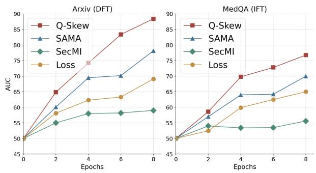

Table 3: The MI performance on XSUM with Dream-Base-7B for domain fine-tuning and on Tulu-3 with Dream-7B-Instruct for instruction fine-tuning. We high light the important values as Tab. 1.
<table><tr><td></td><td colspan="3">XSUM (DFT)</td><td colspan="3">Tulu-3 (IFT)</td></tr><tr><td></td><td>AUC</td><td>TPR@10%</td><td>TPR@1%</td><td>AUC</td><td>TPR@10%</td><td>TPR@1%</td></tr><tr><td>Loss</td><td>55.0</td><td>10.4</td><td>2.2</td><td>52.7</td><td>10.2</td><td>2.1</td></tr><tr><td>MinK</td><td>57.1</td><td>12.0</td><td>2.7</td><td>53.6</td><td>10.7</td><td>2.5</td></tr><tr><td>MinK++</td><td>56.4</td><td>11.2</td><td>3.0</td><td>51.8</td><td>8.9</td><td>2.0</td></tr><tr><td>Calibration</td><td>53.6</td><td>9.5</td><td>2.1</td><td>55.1</td><td>12.0</td><td>2.7</td></tr><tr><td>SecMIDLM</td><td>57.5</td><td>12.8</td><td>3.5</td><td>53.4</td><td>9.8</td><td>2.3</td></tr><tr><td>SAMA</td><td>60.7</td><td>14.5</td><td>4.4</td><td>54.8</td><td>11.1</td><td>2.8</td></tr><tr><td>Q-Skew</td><td>63.4</td><td>15.0</td><td>4.2</td><td>59.1</td><td>12.7</td><td>3.1</td></tr></table>

Implementation. We conduct three independent runs and report the average of each metric to reduce random error. We uniformly train for 6 epochs with a batch size of 16. We also consider other training settings in Section 4.2. For all methods, we apply 16 denoising steps per sample to ensure consistent computational complexity. When calculating the token-level memorization score, we set $\rho = 0 . 3 5$ for calculating Eq. (5), as this noise level maximizes the distinction between the member and nonmember sets. We also conduct ablation studies to show the effectiveness of each component of our method in Section 4.4.

## 4.1 Main Results

We evaluate our method (denoted as Q-SKEW) and the baselines on LLaDA-8B-Base (GSAI-ML, 2025a) and LLaDA-8B-Instruct (GSAI-ML, 2025b) across various datasets and report the results in Tab. 1 and Tab. 2. Experimental results show that our method consistently outperforms the baselines across different datasets and DLMs, and training settings, including domain fine-tuning and instruction fine-tuning.

Besides the LLaDA series, we conduct additional evaluations using the Dream-7B series models, including Dream-Base-7B (Dream-org, 2024a) and Dream-Instruct-7B (Dream-org, 2024b) on XSUM (Narayan et al., 2018) for domain finetuning and Tulu-3 (Lambert et al., 2025) for instruction fine-tuning, respectively. The results show that our method still achieves the best overall performance among all baselines. Note that, compared with the LLaDA series models, the Dream series models exhibit lower vulnerability in membership inference. A similar observation is also reported in concurrent work (Chen et al., 2026).

Figure 2: Effectiveness under different training epochs.  
Table 4: Performance of membership inference methods under a weaker assumption: using misaligned reference models
<table><tr><td rowspan="2"></td><td colspan="3">Base DLM</td></tr><tr><td>AUC</td><td>TPR@10</td><td>TPR@1</td></tr><tr><td>Golden Reference</td><td>83.4</td><td>66.1</td><td>50.6</td></tr><tr><td>Instruction Reference</td><td>78.4 (-5.0)</td><td>55.5 (-10.7)</td><td>45.5 (-5.1)</td></tr><tr><td>Para-modification</td><td>78.4 (-5.0)</td><td>60.0 (-6.2)</td><td>45.0 (-5.6)</td></tr><tr><td>SAMA (w/ Ref)</td><td>70.2</td><td>34.4</td><td>17.6</td></tr><tr><td colspan="4"></td></tr><tr><td></td><td colspan="3">Instruction DLM</td></tr><tr><td></td><td>AUC</td><td>TPR@10</td><td>TPR@1</td></tr><tr><td>Golden Reference</td><td>72.8</td><td>31.6</td><td>6.7</td></tr><tr><td>Base Reference</td><td>71.5 (-1.3)</td><td>32.0 (+0.4)</td><td>6.0 (-0.7)</td></tr><tr><td>Para-modification</td><td>70.0 (-2.8)</td><td>25.0 (-6.6)</td><td>2.5 (-4.2)</td></tr><tr><td>SAMA (w/ Ref)</td><td>65.1</td><td>26.0</td><td>3.2</td></tr></table>

## 4.2 Performance on Various Training Epochs

As fine-tuning progresses, the model’s memorization of the training data gradually increases. In practical scenarios, the number of fine-tuning steps by the model trainer varies. Membership inference methods that more effectively reveal membership information across different steps are considered superior (Zhai et al., 2024a; Lian et al., 2025). We evaluate the effectiveness of the membership inference method across different training epochs in Fig. 2. Experimental results demonstrate that our method consistently outperforms the baselines across different training steps.

## 4.3 Weaker Assumption of Reference Models

Although it is reasonable to assume that the MI adversary can access an opensource unfinetuned reference model in the finetuning setting, we additionally consider the effectiveness of our method when the used reference model is misaligned. We consider the following three alternative strategies when the unfinetuned model corresponding to the target model is unavailable: (1) Use an unfinetuned base model as a substitute for the unfinetuned instruction model. (2) Use an unfinetuned instruction model as a substitute for the unfinetuned base model. (3) Use a model that has been fine-tuned on other perturbed data as a substitute for the unfinetuned model.

Table 5: Performance of ablation studies on the domain finetuning task.
<table><tr><td></td><td>AUC</td><td>TPR@10%FPR</td><td>TPR@1%FPR</td></tr><tr><td>Q-Skew</td><td>80.3</td><td>57.7</td><td>39.7</td></tr><tr><td>w/o Cyclic Sampling</td><td>78.5</td><td>53.0</td><td>37.0</td></tr><tr><td>w/o Skewness Information</td><td>77.6</td><td>54.3</td><td>34.0</td></tr><tr><td>w/o quantile weighting</td><td>78.2</td><td>55.0</td><td>33.4</td></tr></table>

We test the situation of domain fine-tuning on the ArXiv dataset and instruction fine-tuning on the MedQA dataset. In Tab. 4, while the membership inference performance of our method exhibits a slight decline when the reference model is misaligned, this decrease is minor, and our approach still outperforms the best baseline. We provide the justification of the assumption that the adversary can access a reference model, although it may not be fully aligned with the target model, in $\mathbf { A p } \cdot$ pendix E.

## 4.4 Ablation Studies

We conduct an ablation study on the domain finetuning task using WikiText (RealTimeData, 2025b). We consider the following settings: (1) without the cyclic sampling strategy. (2) replacing the skewness calculation with the mean value. (3) using the skewness metric without quantile weighting. The experimental results in Tab. 5 show that each component in the method is effective.

## 5 Increase in Privacy Risks Beyond MIAs

Previously, we showed that our skewness metric improves membership inference attacks. We now consider a complementary privacy risk in generative language models: data reconstruction attacks (Carlini et al., 2018, 2023; Hayes et al., 2024; Biderman et al., 2023; Lee et al., 2022; Ippolito et al., 2023; Wang et al., 2026). Specifically, we investigate whether Q-SKEW, designed to capture the distributional difference between seen and unseen tokens—can be effective in extracting personally identifiable information (PII).

## 5.1 Threat Model

We consider a PII reconstruction adversary (Lukas et al., 2023; Meng et al., 2025; Nakka et al., 2024; Kim et al., 2023) who is given a training record with PII redacted and aims to recover the redacted tokens via queries to the target model. For example, given the PII-redacted record “Insurance Member ID: [REDACTED]”, the objective is to reconstruct the true value “XJ45-7831-92”. The adversary can generate candidate PII values and rank them.

## 5.2 PII Reconstruction for DLMs

PII reconstruction attacks have been widely studied for autoregressive language models, where attackers query the model and identify memorized sequences via high conditional probabilities. However, these approaches do not directly apply to DLMs. (1) DLMs generate tokens through iterative denoising rather than left-to-right prediction, and thus do not expose conditional probabilities of the form $P ( x _ { t } \mid x _ { < t } )$ . (2) Prior attacks rely on directly prompting models to reproduce memorized sequences, whereas DLMs reconstruct tokens within partially noisy contexts, making such generation-based extraction less reliable.

Candidate-based PII Extraction. To adapt existing approaches, we formulate PII extraction as a candidate ranking problem. Given a context containing a masked PII record and candidate PII items $\{ z _ { 1 } , z _ { 2 } , \dots , z _ { k } \}$ , the attacker aims to identify the most likely memorized candidate. Candidates are generated via random remasking across $N = 6 4$ independent denoising process. Each candidate $z _ { i }$ is inserted into the masked position, and its plausibility is estimated by computing the cross-entropy loss $l _ { C E }$ under stochastic masking. This likelihoodbased ranking serves as a baseline.

Incorporating Our Skewness Score. Previous likelihood-based ranking provides a strong baseline for PII extraction by measuring the reconstruction loss of candidate completions. However, this approach primarily reflects the overall sequence likelihood under the model’s language prior, which can cause different candidates to appear similarly plausible. For example, PII records such as “john.doe@gmail.com” and “alice.bob@gmail.com” may both receive similar $l _ { C E }$ values because common tokens like “gmail.com” are strongly supported by the language prior. As a result, the ranking may be dominated by generic token probabilities rather than signals of memorization. Our skewness score (tokenlevel asymmetry) in contrast, captures localized reconstruction behavior and can highlight asymmetries that arise from memorized sequences. This makes it a complementary signal for candidate ranking. To combine the strengths of both signals, we compute a weighted score:

$$
\begin{array} { r l } & { \mathrm { S c o r e } ( z _ { i } ) = - \left( 1 - \alpha \right) \cdot Z ( l _ { C E } ( z _ { i } ) ) } \\ & { \qquad + \left( \alpha \right) \cdot Z ( \mathrm { S k e w } _ { \mathrm { P e a r s o n 2 } } ( z _ { i } ) ) } \end{array}
$$

where Z denotes z-score normalization. In practice, an adversary may have access to a few training records and use them to estimate an effective α. We show the impact of α in Appendix F.1. To better capture localized memorization effects, we compute skewness over a contextual span of length X centered on the PII record. For example, when X = 20, the span includes 8 preceding tokens, the 5 PII tokens, and 7 following tokens. For each candidate sequence, we generate masked variants by randomly masking 35% of tokens. We repeat this process for 4–16 batches. Token-level loss differences are computed across these masked variants and aggregated to estimate the final score.

## 5.3 Evaluation

We evaluate our attacks on two types of PII: phone numbers and email addresses. We use the TREC dataset (Wu et al., 2006), which contains 174,299 records, split into 78k, 78k, and 17k examples for training, validation, and testing, respectively. Consistent with our membership inference setup, we fine-tune the LLaDA-8B-Base model on the training set. We identify PII instances applying regular expressions that match email addresses and phone numbers, and randomly sample 50 unique email addresses and 50 unique phone numbers as targets. The attacker generates candidate PII by inserting 20 mask tokens at the target location within a record and running 64 independent diffusion processes to fill them, then selects the most likely candidate using the attack signals defined in §5.2.

Metrics and Baselines. For our baseline, we use cross entropy loss as the candidate-scoring mechanism. We compute the cross-entropy loss over the candidate PII tokens for each candidate in a set, and then rank them. Our attack success metric, top-1 accuracy, measures the proportion of targets in which the ground-truth PII achieves the highest rank. Following prior work, we report top-1 accuracy as a value between 0 and 100. In the case of cross-entropy loss we expect the ground-truth PII to have a lower loss compared to the candidates. In contrast, we expect the ground-truth PII to have a higher skewness relative to other candidates.

Table 6: ASR (%) of our attack methods on LLaDA-8B-Base for phone numbers and email addresses. Higher is better. The best results on Combine-0.1 are in bold.
<table><tr><td rowspan="2">Our Attacks</td><td rowspan="2">Signal</td><td colspan="2">ASR (%)</td></tr><tr><td>Phone</td><td>Email</td></tr><tr><td>Ranking</td><td>CE</td><td>30 [15/50]</td><td>20 [10/50]</td></tr><tr><td>Mask only PII</td><td>Q-SKEW</td><td>22 [11/50]</td><td>16 [8/50]</td></tr><tr><td>Mask only context</td><td>Q-SKEW</td><td>10[5/50]</td><td>8[4/50]</td></tr><tr><td>Combine-0.1</td><td>Both</td><td>34 [17/50]</td><td>24 [12/50]</td></tr></table>

Results. Table 6 shows our results. We compare four attacks: cross-entropy (CE)-based ranking (Ranking), two skewness-based variants that mask either only PII tokens (Mask only PII) or only context tokens (Mask only context), and a combined method (Combine-0.1) that integrates CE and skewness signals. The skewness-based method names reflect whether the randomly masked tokens are applied to PII or context tokens. The value 0.1 denotes the α value used to combine the two (see Appendix F.1 for details on how we select α).

We show that CE-based ranking serves as a strong baseline, achieving 30% and 20% ASR on phone numbers and emails. Skewness-based methods alone performs worse (10–22% ASR on phone numbers and 8–16% on emails), reflecting that PII reconstruction is primarily a ranking task rather than pure inference. However, combining CE with skewness produces the best results, improving ASR to 34% for phone numbers and 24% for emails. This suggests that the skewness helps mitigate the influence of strong language priors acquired during pre-training, which can bias CE-based ranking. Additional qualitative analysis supporting this claim is in Appendix F.2, and more ablation studies are in Appendix F.1 due to space limits.

## 6 Conclusion

In this paper, we first define the token-level memorization asymmetry. Based on this, we theoretically derive an MI method for fine-tuned DLMs that outperforms existing baselines across datasets and setups. Furthermore, we demonstrate that our method facilitates PII reconstruction. Our work indicates that, due to differences in the training process, DLMs exhibit distinct characteristics from autoregressive (AR) LLMs, encouraging the community to focus on the unique privacy risks of DLMs.

## Limitations

While our method advances the privacy-violating attacks such as membership inference and PII extraction in diffusion language models, several limitations remain. First, because publicly available open source diffusion language models that are suitable for training are still limited, we mainly evaluate our method on current mainstream models. Moreover, diffusion language models are developing rapidly. More diverse diffusion architectures and training mechanisms may emerge in the future, and the generalization ability of our method to such future models remains unknown.

## Impact Statement

This work advances our understanding of privacy risks in DLMs, an emerging class of generative models. The proposed attack, Q-SKEW, is intended as an auditing tool to assess and mitigate privacy risks, rather than to facilitate misuse. We believe that exposing this vulnerability is a necessary step toward developing effective privacy defenses and informing the responsible deployment of DLMs. More broadly, this work underscores the importance of evaluating privacy guarantees in emerging model architectures and encourages the development of privacy-preserving training and inference techniques for diffusion-based models.

## References

Stella Biderman, USVSN Sai Prashanth, Lintang Sutawika, Hailey Schoelkopf, Quentin Gregory Anthony, Shivanshu Purohit, and Edward Raff. 2023. Emergent and predictable memorization in large language models. In Thirty-seventh Conference on Neural Information Processing Systems.

Tiwei Bie, Maosong Cao, Kun Chen, Lun Du, Mingliang Gong, Zhuochen Gong, Yanmei Gu, Jiaqi Hu, Zenan Huang, Zhenzhong Lan, and 1 others. 2025. Llada2. 0: Scaling up diffusion language models to 100b. arXiv preprint arXiv:2512.15745.

Nicholas Carlini, Steve Chien, Milad Nasr, Shuang Song, Andreas Terzis, and Florian Tramer. 2022. Membership inference attacks from first principles. In 2022 IEEE symposium on security and privacy (SP), pages 1897–1914. IEEE.

Nicholas Carlini, Daphne Ippolito, Matthew Jagielski, Katherine Lee, Florian Tramer, and Chiyuan Zhang. 2023. Quantifying memorization across neural language models. In The Eleventh International Conference on Learning Representations.

Nicholas Carlini, Chang Liu, Úlfar Erlingsson, Jernej Kos, and Dawn Xiaodong Song. 2018. The secret sharer: Evaluating and testing unintended memorization in neural networks. In USENIX Security Symposium.

Yuetian Chen, Kaiyuan Zhang, Yuntao Du, Edoardo Stoppa, Charles Fleming, Ashish Kundu, Bruno Ribeiro, and Ninghui Li. 2026. Membership inference attacks against fine-tuned diffusion language models. In The Fourteenth International Conference on Learning Representations.

Valentin De Bortoli, Alexandre Galashov, Arthur Gretton, and Arnaud Doucet. 2025. Accelerated diffusion models via speculative sampling. In International Conference on Machine Learning, pages 12590–12631. PMLR.

Daniel DeAlcala, Aythami Morales, Julian Fierrez, Gonzalo Mancera, Ruben Tolosana, and Javier Ortega-Garcia. 2024. Is my data in your ai model? membership inference test with application to face images. arXiv preprint arXiv:2402.09225.

Dream-org. 2024a. Dream-v0-base-7b. https:// huggingface.co/Dream-org/Dream-v0-Base-7B. Accessed: 2026-05-24.

Dream-org. 2024b. Dream-v0-instruct-7b. https://huggingface.co/Dream-org/ Dream-v0-Instruct-7B. Accessed: 2026-05- 24.

Jinhao Duan, Fei Kong, Shiqi Wang, Xiaoshuang Shi, and Kaidi Xu. 2023. Are diffusion models vulnerable to membership inference attacks? In International Conference on Machine Learning, pages 8717–8730. PMLR.

Michael Duan, Anshuman Suri, Niloofar Mireshghallah, Sewon Min, Weijia Shi, Luke Zettlemoyer, Yulia Tsvetkov, Yejin Choi, David Evans, and Hannaneh Hajishirzi. 2024a. Do membership inference attacks work on large language models? arXiv preprint arXiv:2402.07841.

Michael Duan and 1 others. 2024b. Mimir dataset. https://huggingface.co/datasets/ iamgroot42/mimir. Accessed: 2026-03-17.

Wenjie Fu, Huandong Wang, Chen Gao, Guanghua Liu, Yong Li, and Tao Jiang. 2024a. Membership inference attacks against fine-tuned large language models via self-prompt calibration. Advances in Neural Information Processing Systems, 37:134981–135010.

Wenjie Fu, Huandong Wang, Liyuan Zhang, Chen Gao, Yong Li, and Tao Jiang. 2024b. A probabilistic fluctuation based membership inference attack for diffusion models. Preprint, arXiv:2308.12143.

Google DeepMind. 2025. Gemini diffusion. https:// deepmind.google/models/gemini-diffusion/. Accessed: 2026-03-16.

GSAI-ML. 2025a. Llada-8b-base. https:// huggingface.co/GSAI-ML/LLaDA-8B-Base. Accessed: 2026-03-17.

GSAI-ML. 2025b. Llada-8b-instruct. https:// huggingface.co/GSAI-ML/LLaDA-8B-Instruct. Accessed: 2026-03-17.

Jamie Hayes, Marika Swanberg, Harsh Chaudhari, Itay Yona, and Ilia Shumailov. 2024. Measuring memorization in language models via probabilistic extraction. In North American Chapter of the Association for Computational Linguistics.

Jonathan Ho, Ajay Jain, and Pieter Abbeel. 2020. Denoising diffusion probabilistic models. Advances in neural information processing systems, 33:6840– 6851.

Zhiheng Huang, Yannan Liu, Daojing He, and Yu Li. 2025. Df-mia: A distribution-free membership inference attack on fine-tuned large language models. In Proceedings ofthe AAAI Conference on Artificial Intelligence, volume 39, pages 343–351.

Inception Labs. 2025. Introducing mercury, our general chat diffusion large language model. https://www.inceptionlabs.ai/blog/ introducing-mercury-our-general-chat-model. Accessed: 2026-03-16.

Daphne Ippolito, Florian Tramer, Milad Nasr, Chiyuan Zhang, Matthew Jagielski, Katherine Lee, Christopher Choquette Choo, and Nicholas Carlini. 2023. Preventing generation of verbatim memorization in language models gives a false sense of privacy. In Proceedings ofthe 16th International Natural Language Generation Conference, pages 28–53, Prague, Czechia. Association for Computational Linguistics.

Siwon Kim, Sangdoo Yun, Hwaran Lee, Martin Gubri, Sungroh Yoon, and Seong Joon Oh. 2023. ProPILE: Probing privacy leakage in large language models. In Thirty-seventh Conference on Neural Information Processing Systems.

Fei Kong, Jinhao Duan, RuiPeng Ma, Heng Tao Shen, Xiaoshuang Shi, Xiaofeng Zhu, and Kaidi Xu. 2024. An efficient membership inference attack for the diffusion model by proximal initialization. In The Twelfth International Conference on Learning Representations.

Nathan Lambert, Jacob Morrison, Valentina Pyatkin, Shengyi Huang, Hamish Ivison, Faeze Brahman, Lester James V. Miranda, Alisa Liu, Nouha Dziri, Shane Lyu, Yuling Gu, Saumya Malik, Victoria Graf, Jena D. Hwang, Jiangjiang Yang, Ronan Le Bras, Oyvind Tafjord, Chris Wilhelm, Luca Soldaini, and 4 others. 2025. Tulu 3: Pushing frontiers in open language model post-training. Preprint, arXiv:2411.15124.

Katherine Lee, Daphne Ippolito, Andrew Nystrom, Chiyuan Zhang, Douglas Eck, Chris Callison-Burch, and Nicholas Carlini. 2022. Deduplicating training

data makes language models better. In Proceedings of the 60th Annual Meeting of the Association for Computational Linguistics (Volume 1: Long Papers), pages 8424–8445, Dublin, Ireland. Association for Computational Linguistics.

Xiang Li, John Thickstun, Ishaan Gulrajani, Percy S Liang, and Tatsunori B Hashimoto. 2022. Diffusionlm improves controllable text generation. Advances in neural information processing systems, 35:4328– 4343.

Yunxiang Li, Zihan Li, Kai Zhang, Ruilong Dan, Steve Jiang, and You Zhang. 2023. Chatdoctor: A medical chat model fine-tuned on a large language model meta-ai (llama) using medical domain knowledge. Cureus, 15(6).

Puwei Lian, Yujun Cai, Songze Li, and Bingkun Bao. 2025. Unveiling impact of frequency components on membership inference attacks for diffusion models. arXiv preprint arXiv:2505.20955.

Nils Lukas, A. Salem, Robert Sim, Shruti Tople, Lukas Wutschitz, and Santiago Zanella-B’eguelin. 2023. Analyzing leakage of personally identifiable information in language models. 2023 IEEE Symposium on Security and Privacy (SP), pages 346–363.

Wenlong Meng, Guo Zhenyuan, Lenan Wu, Chen Gong, Wenyan Liu, Weixian Li, Chengkun Wei, and Wenzhi Chen. 2025. Rr: Unveiling llm training privacy through recollection and ranking. In Findings of the Associationfor Computational Linguistics: ACL 2025, pages 17383–17397.

Krishna Kanth Nakka, Ahmed Frikha, Ricardo Mendes, Xue Jiang, and Xuebing Zhou. 2024. PII-compass: Guiding LLM training data extraction prompts towards the target PII via grounding. In Proceedings of the Fifth Workshop on Privacy in Natural Language Processing, pages 63–73, Bangkok, Thailand. Association for Computational Linguistics.

Shashi Narayan, Shay B Cohen, and Mirella Lapata. 2018. Don’t give me the details, just the summary! topic-aware convolutional neural networks for extreme summarization. In Proceedings of the 2018 conference on empirical methods in natural language processing, pages 1797–1807.

Jinjie Ni, Qian Liu, Longxu Dou, Chao Du, Zili Wang, Hang Yan, Tianyu Pang, and Michael Qizhe Shieh. 2025. Diffusion language models are super data learners. arXiv preprint arXiv:2511.03276.

Shen Nie, Fengqi Zhu, Zebin You, Xiaolu Zhang, Jingyang Ou, Jun Hu, Jun Zhou, Yankai Lin, Ji-Rong Wen, and Chongxuan Li. 2025. Large language diffusion models. arXiv preprint arXiv:2502.09992.

RealTimeData. 2025a. Realtimedata arxiv alltime dataset. https://huggingface.co/datasets/ RealTimeData/arxiv\_alltime. Accessed: 2026- 03-17.

RealTimeData. 2025b. Realtimedata wikitext alltime dataset. https://huggingface.co/datasets/ RealTimeData/wikitext\_alltime. Accessed: 2026-03-17.

Weijia Shi, Anirudh Ajith, Mengzhou Xia, Yangsibo Huang, Daogao Liu, Terra Blevins, Danqi Chen, and Luke Zettlemoyer. 2023. Detecting pretraining data from large language models. arXiv preprint arXiv:2310.16789.

Reza Shokri, Marco Stronati, Congzheng Song, and Vitaly Shmatikov. 2017. Membership inference attacks against machine learning models. In 2017 IEEE symposium on security and privacy (SP), pages 3–18. IEEE.

Yuxuan Song, Zheng Zhang, Cheng Luo, Pengyang Gao, Fan Xia, Hao Luo, Zheng Li, Yuehang Yang, Hongli Yu, Xingwei Qu, and 1 others. 2025. Seed diffusion: A large-scale diffusion language model with highspeed inference. arXiv preprint arXiv:2508.02193.

Rohan Taori, Ishaan Gulrajani, Tianyi Zhang, Yann Dubois, Xuechen Li, Carlos Guestrin, Percy Liang, and Tatsunori B. Hashimoto. 2023. Stanford alpaca: An instruction-following llama model. https:// github.com/tatsu-lab/stanford\_alpaca.

Yuhao Wang, Wenjie Qu, Shengfang Zhai, Yanze Jiang, Liu Zichen, Yue Liu, Yinpeng Dong, and Jiaheng Zhang. 2026. Silent leaks: Implicit knowledge extraction attack on rag systems. In International Conference on Learning Representations, volume 2026, pages 24150–24191.

Lauren Watson, Chuan Guo, Graham Cormode, and Alex Sablayrolles. 2021. On the importance of difficulty calibration in membership inference attacks. arXiv preprint arXiv:2111.08440.

Lauren Watson, Chuan Guo, Graham Cormode, and Alexandre Sablayrolles. 2022. On the importance of difficulty calibration in membership inference attacks. In International Conference on Learning Representations.

Yejun Wu, Douglas W. Oard, and Ian Soboroff. 2006. An exploratory study of the w3c mailing list test collection for retrieval of emails with pro/con argument. In International Conference on Email and Anti-Spam.

Jiacheng Ye, Zhihui Xie, Lin Zheng, Jiahui Gao, Zirui Wu, Xin Jiang, Zhenguo Li, and Lingpeng Kong. 2025. Dream 7b: Diffusion large language models. arXiv preprint arXiv:2508.15487.

Samuel Yeom, Irene Giacomelli, Matt Fredrikson, and Somesh Jha. 2018. Privacy risk in machine learning: Analyzing the connection to overfitting. In 2018 IEEE 31st computer security foundations symposium (CSF), pages 268–282. IEEE.

Da Yu, Saurabh Naik, Arturs Backurs, Sivakanth Gopi, Huseyin A Inan, Gautam Kamath, Janardhan Kulkarni, Yin Tat Lee, Andre Manoel, Lukas Wutschitz,

and 1 others. Differentially private fine-tuning of language models. In International Conference on Learning Representations.

Shengfang Zhai, Huanran Chen, Yinpeng Dong, Jiajun Li, Qingni Shen, Yansong Gao, Hang Su, and Yang Liu. 2024a. Membership inference on text-to-image diffusion models via conditional likelihood discrepancy. Advances in Neural Information Processing Systems, 37:74122–74146.

Shengfang Zhai, Yinpeng Dong, Qingni Shen, Shi Pu, Yuejian Fang, and Hang Su. 2023. Text-to-image diffusion models can be easily backdoored through multimodal data poisoning. In Proceedings of the 31st ACM International Conference on Multimedia, pages 1577–1587.

Shengfang Zhai, Xiaoyang Ji, Yuling Shi, Haoran Gao, Fanyu Meng, Yan Zeng, Yuejian Fang, Yinpeng Dong, and Jiaheng Zhang. 2026. Baddlm: Backdooring diffusion language models with diverse targets. arXiv preprint arXiv:2605.09397.

Shengfang Zhai, Jiajun Li, Yue Liu, Huanran Chen, Zhihua Tian, Wenjie Qu, Qingni Shen, Ruoxi Jia, Yinpeng Dong, and Jiaheng Zhang. 2025. Efficient inputlevel backdoor defense on text-to-image synthesis via neuron activation variation. In 2025 IEEE/CVF International Conference on Computer Vision (ICCV), pages 15182–15193. IEEE.

Shengfang Zhai, Weilong Wang, Jiajun Li, Yinpeng Dong, Hang Su, and Qingni Shen. 2024b. Discovering universal semantic triggers for text-to-image synthesis. arXiv preprint arXiv:2402.07562.

Jingyang Zhang, Jingwei Sun, Eric Yeats, Yang Ouyang, Martin Kuo, Jianyi Zhang, Hao Frank Yang, and Hai Li. 2024. Min-k%++: Improved baseline for detecting pre-training data from large language models. arXiv preprint arXiv:2404.02936.

Xingyu Zhu, Beier Zhu, Yi Tan, Shuo Wang, Yanbin Hao, and Hanwang Zhang. 2024. Enhancing zeroshot vision models by label-free prompt distribution learning and bias correcting. Advances in Neural Information Processing Systems, 37:2001–2025.

## A Theoretical Analysis

## A.1 Proof of Theorem 3.2

Proof of Theorem 3.2. For brevity, we omit the token index $w _ { i }$ for the single-epoch memory gain and denote it as $\delta$ Consider the random variable for a single epoch $\delta = m \cdot \phi ( \beta )$ (subscripts omitted for brevity). The marginal probability of a token being selected is $P ( m = 1 ) = \mathbb { E } [ \beta ] = 0 . 5$ . Conditioned on selection $( m = 1 )$ , the probability density of the mask rate becomes:

$$
f _ { \beta | m = 1 } ( \beta ) = 2 \beta .
$$

Let $V$ be a random variable drawn from this conditional distribution, representing the update magnitude when a token is selected, i.e., $V = \phi ( \beta ) | _ { m = 1 }$ We can thus rewrite the unconditional update as $\delta = J \cdot V$ , where the indicator J ∼ Bernoulli(0.5) is independent of $V$

To determine skewness, we analyze the third central moment $\mu _ { 3 } ( \delta )$ . Using the definition of moments for this mixture:

$$
\mu _ { 3 } ( \delta ) = \frac { 1 } { 4 } \left( 2 \mathbb { E } [ V ^ { 3 } ] - 3 \mathbb { E } [ V ] \mathbb { E } [ V ^ { 2 } ] + ( \mathbb { E } [ V ] ) ^ { 3 } \right)
$$

Applying the AM-GM Inequality and Lyapunov’s Inequality:

$$
( \mathbb { E } [ V ^ { 3 } ] ) ^ { 1 / 3 } \geq ( \mathbb { E } [ V ^ { 2 } ] ) ^ { 1 / 2 } ,
$$

and given that $\phi ( \beta )$ is non-constant (implying $\operatorname { V a r } ( V ) > 0 )$ , we obtain the strict inequality:

$$
\begin{array} { r l } & { 2 \mathbb { E } [ V ^ { 3 } ] + ( \mathbb { E } [ V ] ) ^ { 3 } > 3 \mathbb { E } [ V ] \mathbb { E } [ V ^ { 2 } ] } \\ & { \implies \mu _ { 3 } ( \delta ) > 0 } \end{array}
$$

To extend this to the cumulative gain $\mathcal { G } _ { w _ { i } } ~ =$ $\textstyle \sum _ { k = 1 } ^ { K } \delta _ { k }$ , we note that within a short fine-tuning window, the model parameters evolve smoothly, i.e., $\theta _ { k + 1 } \approx \theta _ { k }$ . Thus, the token selection mechanism, the mask-rate distribution, and the shape of the update function $\phi ( \beta )$ do not drift significantly across nearby epochs. Based on this, we assume for analytical tractability that the token-level updates $\delta _ { k }$ are locally approximately independent and identically distributed (locally approximately i.i.d.) across epochs within this window. Then the skewness of the sum scales by $K ^ { - 1 / 2 }$ , preserving the positive asymmetry:

$$
S k e w ( \mathcal { G } _ { w _ { i } } ) = \frac { 1 } { \sqrt { K } } S k e w ( \delta ) > 0 .
$$

Note that in this proof, we assume approximately i.i.d. token-level updates across epochs. We further provide an analysis without this approximate i.i.d. assumption in Appendix A.3.

## A.2 Long Tail Analysis

Remark A.1 (Mechanism of Tail Formation). While Theorem 3.2 proves asymmetry, the specific "heavy-tailed" shape arises from the interaction between the sampling probability and the update strength. Consider the probability density function (PDF) $f _ { V } ( v )$ of the update magnitude $V$ . By the change of variables, $f _ { V } ( v ) \ =$ $\begin{array} { r } { f _ { \beta | m = 1 } ( \phi ^ { - 1 } ( v ) ) \cdot | \frac { d \beta } { d v } | } \end{array}$ . Since $f _ { \beta | m = 1 } ( \beta ) = 2 \beta$ we have:

$$
f _ { V } ( v ) \propto \beta ( v ) \cdot \left| \frac { d \beta } { d v } \right|
$$

Since $\phi ( \beta )$ is monotonically decreasing, high memory gains (large v) correspond to low mask rates (small $\beta )$ . Crucially, as $v  \infty , \beta  0$ . This implies that the probability weight term $\beta ( v )$ vanishes for large memory updates. Physically, this means extreme memorization events are structurally rare: they require a low $\beta$ to generate a large gradient, but low $\beta$ inherently reduces the probability of the token being sampled. This probabilistic suppression forces the density to decay, preventing the formation of a high-value mode (bimodality) and instead forming a monotonically decaying long tail.

## A.3 A Non-i.i.d. Extension of the Skewness Analysis

The proof in Appendix A.1 uses a locally approximately i.i.d. approximation to transfer the positive skewness of single-epoch memory gains to the cumulative gain across epochs. This approximation leads to a clean analytical argument, but it is slightly stronger than what holds in practice. In this part, we relax the locally i.i.d. assumption and analyze the more general case in which epoch-wise token-level updates may be dependent. Although this setting no longer yields the same closed-form skewness scaling, the decomposition below shows why the positive-skewness tendency should generally persist unless cross-epoch dependence introduces a dominant negative third-order contribution. More generally, for a fixed token $w _ { i }$ , let:

$$
\mathcal { G } _ { w _ { i } } = \sum _ { k = 1 } ^ { K } \delta _ { w _ { i } , k } , \qquad \widetilde { \delta } _ { w _ { i } , k } = \delta _ { w _ { i } , k } - \mathbb { E } [ \delta _ { w _ { i } , k } ] .
$$

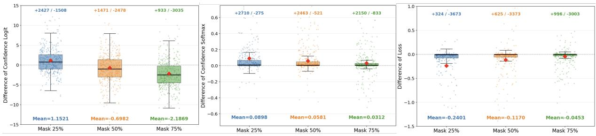  
Figure 3: Inverse Mask-Ratio Scaling phenomenon with different metrics on XSUM (Narayan et al., 2018) datasets.

Without assuming independence across epochs, the third central moment of the cumulative gain can be written as:

$$
\mu _ { 3 } ( \mathcal { G } _ { w _ { i } } ) = \mathbb { E } \left[ \left( \sum _ { k = 1 } ^ { K } \widetilde { \delta } _ { w _ { i } , k } \right) ^ { 3 } \right] .
$$

Expanding this term gives:

marginal contribution. This non-dominance relation can be written as:

$$
\mu _ { 3 } ( \mathcal { G } _ { w _ { i } } ) = \sum _ { k = 1 } ^ { K } \mathbb { E } \left[ \widetilde { \delta } _ { w _ { i } , k } ^ { 3 } \right] + C _ { w _ { i } , K } ,
$$

which implies $\mu _ { 3 } ( \mathcal { G } _ { w _ { i } } ) > 0$ . Since $\mathrm { V a r } ( \mathcal { G } _ { w _ { i } } ) > 0$ under the non-degeneracy assumption, we have:

$$
C _ { w _ { i } , K } > - \sum _ { k = 1 } ^ { K } \mathbb { E } \left[ \widetilde { \delta } _ { w _ { i } , k } ^ { 3 } \right] ,
$$

where

$$
\begin{array} { r l } & { C _ { w _ { i } , K } = 3 \underset { 1 \leq a , b \leq K } { \sum } \mathbb { E } \Bigl [ \widetilde { \delta } _ { w _ { i } , a } ^ { 2 } \widetilde { \delta } _ { w _ { i } , b } \Bigr ] } \\ & { \qquad + 6 \underset { 1 \leq a < b < c \leq K } { \sum } \mathbb { E } \Bigl [ \widetilde { \delta } _ { w _ { i } , a } \widetilde { \delta } _ { w _ { i } , b } \widetilde { \delta } _ { w _ { i } , c } \Bigr ] . } \end{array}
$$

The first term captures the marginal third central moments of the epoch-wise gains. Under the per-epoch zero-inflated inverse mask-ratio mechanism, and under the finite third-moment and nondegeneracy assumptions stated in Appendix A.1, these marginal third central moments are positive. The second term $C _ { w _ { i } , K }$ captures the mixed thirdorder central moments across epochs.

This decomposition clarifies the role of dependence across epochs. Dependence alone does not invalidate the argument. The conclusion would fail only if the epoch-wise gains show strong negative third-order dependence. We do not expect this to be common in our fine-tuning setting. The denoising objective and member examples stay the same across nearby checkpoints, while the mask pattern is resampled in each epoch. As a result, zero-inflated token selection and low-mask-ratio amplification are still the main sources of asymmetry.

Motivated by the finite fine-tuning window considered in our setting, we expect the mixed thirdorder contribution not to overwhelm the positive

$$
\operatorname { S k e w } ( \mathcal { G } _ { w _ { i } } ) = \frac { \mu _ { 3 } ( \mathcal { G } _ { w _ { i } } ) } { \operatorname { V a r } ( \mathcal { G } _ { w _ { i } } ) ^ { 3 / 2 } } > 0 .
$$

## B Validation of Inverse Mask-Ratio Scaling Assumption

We use different metrics to estimate the memorization of individual tokens, including prediction confidence, with or without softmax, and token-level loss. We present the experimental results using violin plots with jitter plots (Fig. 3). It is evident that a lower mask ratio leads to more significant token memorization on average under the same number of training epochs, across different metrics.

To further validate the broad applicability of the inverse mask-ratio scaling assumption, we further extend our experiments to different data domains, including ArXiv (RealTimeData, 2025a) and WikiText (RealTimeData, 2025b), and increase the dataset size from 125 samples to 1,000 samples. As shown in Fig. 4, the experimental results show that this assumption widely holds across different data domains and data scales.

## C Implementation of MIA Baselines

To the best of our knowledge, SAMA (Chen et al., 2026) is currently the only MI method specifically designed for diffusion language models. Therefore, we further include AR-LM MI methods and MI methods for vision diffusion models that can be transferred to DLMs as baselines under the same threat models (Section 3.1). Overall, our baselines include three categories: (1) AR-LM MI baselines:

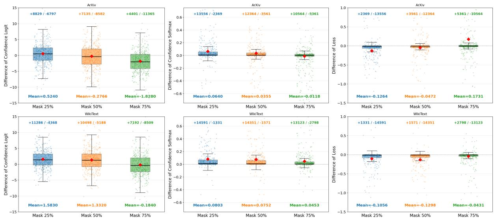  
Figure 4: Validation under general domain: the inverse mask-ratio scaling phenomenon under different metrics on larger-scale ArXiv (RealTimeData, 2025a) and WikiText (RealTimeData, 2025b) datasets.

Loss (Yeom et al., 2018), Min-K%(Shi et al., 2023), Min-K%++(Zhang et al., 2024), and Calibration (Watson et al., 2021); (2) diffusion vision model MI baselines: SecMI (Duan et al., 2023); and (3) DLMspecific baselines: SAMA (Chen et al., 2026).

To ensure fairness, all baselines are evaluated under the same settings and computing budget, including the same member and non-member splits, the same target and reference access, the same ROC-based metrics, and the same denoisingstep budget of 16 forward passes for each sample. ❶ For the DLM-specific baseline, we strictly follow the settings in its original paper. ❷ For baselines adapted from AR-LMs or vision diffusion models, we adapt them to DLMs as closely as possible. ❸ For SAMA (Chen et al., 2026) we strictly follow the original settings in the paper. Below, we describe how we implement each baseline.

## C.1 AR-LM MI Baselines Adapted for DLMs

Loss (Yeom et al., 2018). We use the same denoising ratio as our method to compute the DLM loss. We then average the loss over 16 denoising runs, which means that the loss is computed 16 times. A smaller average loss indicates that the sample is more likely to belong to the member set.

Min-K% (Shi et al., 2023) and Min-K%++ (Zhang et al., 2024). Following the original papers, we compute the Min-K% and Min-K%++ scores from token-level log-likelihoods at each denoising step, using the same denoising ratio as our method. For Min-K%, we average the loglikelihoods of the bottom 20% tokens. For Min-

K%++, we first apply vocabulary-level normalization and then average the bottom 20% normalized token scores. Finally, we average the score over 16 denoising runs. A higher score indicates that the sample is more likely to belong to the member set.

Calibration (Watson et al., 2021). Following the original paper, we use a reference model to calibrate sample difficulty. Specifically, we compute the difference between the average loss of the reference model and that of the target model on masked tokens, averaged over 16 denoising runs, and use this difference as the Calibration score. A larger score means that the target model has a lower loss than the reference model on the sample, so the sample is more likely to belong to the member set.

## C.2 (Vision) Diffusion MI Baselines adapted for DLMs

SecMI (Duan et al., 2023). Following the original paper, we strictly compute the prior difference between steps (t+1) and (t). A lower reconstruction error indicates a higher membership probability, because the model can better reconstruct the tokens it has memorized during training. In the original paper, t is set to 100 steps out of 1000. For DLMs, we set the masking ratio to 10% to remain consistent with the original paper.

PIA (Kong et al., 2024). We do not adapt PIA because this method relies on a derived formula that extrapolates the result as t approaches 0. For DLMs, this derivation does not hold.

Table 7: Performance of Loss MI on unfinetuned models with MIMIR datasets. The high AUC values indicate that LLaDA model possesses a strong prior on the MIMIR training (member) set, which leads to a hallucination of membership inference success.
<table><tr><td>Dataset</td><td>AUC</td><td>TPR@10%FPR</td><td>TPR@1%FPR</td></tr><tr><td>Arxiv</td><td>0.70</td><td>0.32</td><td>0.05</td></tr><tr><td>Github</td><td>0.81</td><td>0.47</td><td>0.07</td></tr><tr><td>Hackernews</td><td>0.56</td><td>0.18</td><td>0.02</td></tr><tr><td>Pile_cc</td><td>0.53</td><td>0.13</td><td>0.02</td></tr><tr><td>Pubmed_central</td><td>0.65</td><td>0.22</td><td>0.01</td></tr><tr><td>Wikipedia_(en)</td><td>0.63</td><td>0.28</td><td>0.05</td></tr><tr><td>Average</td><td>0.64</td><td>0.27</td><td>0.04</td></tr></table>

CLiD (Zhai et al., 2024a). We do not adapt CLiD because it is designed for conditional vision diffusion models that take both text and images as input, which does not match the setting of DLMs.

## D Dataset Selection

## D.1 Hallucination of MI Success on MIMIR Dataset in Previous Works.

Note that the evaluation of membership inference (MI) on fine-tuned models differs fundamentally from that on pre-trained models (Duan et al., 2024a). For MI on pre-trained language models, researchers perform no additional training and utilize data from distinct release periods (Duan et al., 2024b) to detect whether the model memorized specific samples. In contrast, evaluation data for MI during the fine-tuning stage must ensure that the model possesses equivalent prior knowledge for both member and non-member samples. This consistency ensures that MI success stems from actual memory extraction rather than internal model priors. We note that a concurrent work (Chen et al., 2026) fine-tunes LLaDA-8B-Base on MIMIR (Duan et al., 2024b) to evaluate its MI performance. However, MIMIR is specifically designed for pretraining MI analysis. We evaluate the unfinetuned LLaDA on the MIMIR dataset using a loss-based MI method and report the results in Tab. 7. We find that the model exhibits strong inherent priors on MIMIR even without any fine-tuning. This bias suggests that seemingly successful MI results may be independent of the inference method itself, making MIMIR unsuitable for evaluating MI during the fine-tuning phase.

## D.2 Our Dataset Selection

To ensure a fair evaluation, we utilize recently collected data (RealTimeData, 2025a,b) for the Arxiv and Wiki datasets to guarantee that the model has no prior knowledge of the training or test sets. For the other dataset in Section 4, we clean the samples to prevent leakage between member and nonmember sets and to ensure that model internal priors or bias (Zhu et al., 2024) remain consistent.

## E Justification of Accessing Reference Models in Logit-based Settings.

In our paper, we follow the standard setting in membership inference (Yeom et al., 2018; Shi et al., 2023; Zhang et al., 2024; Duan et al., 2023; Kong et al., 2024; Zhai et al., 2024a; Chen et al., 2026; Fu et al., 2024a), where the attacker can access the logits of the target model (known as logit-based methods). In addition, we assume that the adversary can access a reference model, although it may not be fully aligned with the target model, following (Chen et al., 2026; Fu et al., 2024a).

In this part, we justify the scenario where the attacker can access a reference model under the logit-based threat model: (1) Knowing the architecture of the target model is natural under the logit-based setting. Models with different architectures usually employ different tokenizers, output dimensions, and token representations. For example, LLaDA (Nie et al., 2025) and Dream (Ye et al., 2025) use completely different tokenizers and token representations. Therefore, under the logitbased setting, an MI adversary can naturally infer the architecture of the target model and then select the corresponding reference model. (2) Given the model architecture, it is easy to obtain either the non fine-tuned base model or a structurally identical but misaligned reference model. Since our method targets the fine-tuning stage, the corresponding base models are usually open-source. Therefore, once the MI adversary knows the architecture of the target model, it can easily obtain the corresponding non fine-tuned base model. Moreover, our experiments show that our method remains effective even when the reference model parameters are perturbed through additional finetuning (Section 4.3).

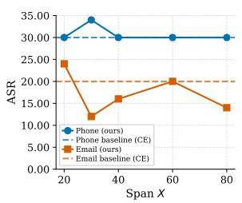

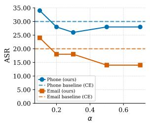

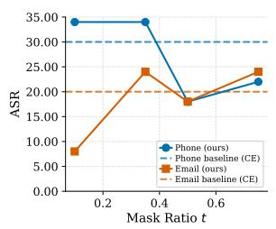

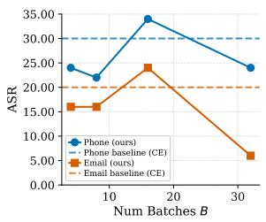  
Figure 5: Ablation results of LLaDA for PII extraction. Dashed lines denote the CE-based (Ranking) method.

## F Additional Results on PII Extraction

## F.1 Ablation Study

Hyperparameter Investigation. We investigate four hyperparameters affecting our combined lossskewness score and report the resulting ASR for LLaDA in Fig. 5. From left to right, the plots vary: (1) the token span X used for skewness calculation, (2) the weighting parameter α, (3) the masking ratio t, and (4) the number of masking batches B. We observe only a weak relationship between token span X and ASR, although emails show some improvement between spans of 20 and 30. Increasing α consistently reduces ASR across both PII types, highlighting the importance of the cross-entropy loss signal in the combined score. For mask ratio t, the effect is strongly PII-dependent. Higher mask ratios reduce ASR for phone numbers, but substantially improve performance for emails compared to lower ratios such as 0.1. Finally, for the number of masking batches B, both very small and very large values degrade performance. We hypothesize that excessively large B values reduce the skewness of loss differences, weakening the membership signal.

Table 8: ASR@k (%) of different attack methods on LLaDA-8B-Base for phone numbers and email addresses. Higher is better. Best results per column are in bold.
<table><tr><td rowspan="2">Our Attacks</td><td rowspan="2">Signal</td><td colspan="3">Phone</td><td colspan="3">Email</td></tr><tr><td>@1</td><td>@3</td><td>@5</td><td>@1</td><td>@3</td><td>@5</td></tr><tr><td>Ranking</td><td>CE</td><td>30</td><td>42</td><td>44</td><td>20</td><td>36</td><td>42</td></tr><tr><td>Mask only PII</td><td>Q-SKEW</td><td>22</td><td>36</td><td>42</td><td>16</td><td>28</td><td>34</td></tr><tr><td>Mask only context</td><td>Q-SKEW</td><td>10</td><td>22</td><td>26</td><td>8</td><td>10</td><td>14</td></tr><tr><td>Combine-0.1</td><td>Both</td><td>34</td><td>38</td><td>42</td><td>24</td><td>44</td><td>52</td></tr></table>

Top-K candidate Ranking. In Table 8, we show the top-k accuracy of different ranking methods where k is either 1, 3, or 5. Surprisingly for phone numbers, Ranking narrowly beats Combine-0.1 for values of k larger than 1. Interestingly, the topk accuracy advantage over Ranking in the case of emails improves drastically when k is equal to 5, with over 50% accuracy, the highest of any method and any value of k. Unsurprisingly, Mask only PII and Mask only context perform worse by comparison, similar to the top-1 accuracy.

Setting α. We assume that an attacker with partial knowledge of the fine-tuning dataset could reasonably approximate an effective α for the lossskewness combined attack.

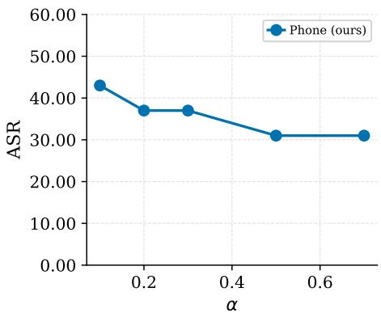  
Figure 6: Impact of choosing α in (0, 1) on LLaDA for phone PII reconstruction, showing strong performance even with a small hold-out set. Higher is better.

In this scenario, we assume that the attacker has access to a small set of full, un-redacted records from the training dataset. In addition, we assume that they can interact with the target model the same way as when they target the unknown PII. To simulate this attacker, we select 16 records containing phone PII, and do a sweep of the α hyperparameter across Combine attacks. Critically, these 16 records form a hold-out set that does not overlap with the set of target records and PIIs used in the main evaluation. Fig. 6 shows that with only a small hold-out sample of target records, an α value of 0.1 leads to the highest ASR.

## F.2 Qualitative analysis.

Our Combine-0.1 score achieves higher top-1 accuracy across multiple settings, although skewness alone never outperforms Ranking. We attribute this to the two methods recovering different subsets of PIIs. For email targets reconstructed only by Ranking, the true PIIs tend to be shorter and closer to natural language, suggesting that pretraining priors may bias loss toward these patterns. In contrast, targets reconstructed only by skewness tend to be longer and more structured (Fig. 7), which may also explain the consistently higher attack success rate on phone numbers.

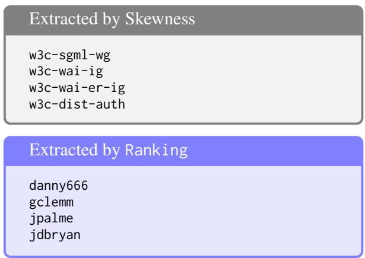

Figure 7: Examples of email IDs extracted exclusively by each candidate-scoring method.  
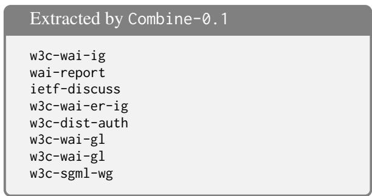  
Figure 8: Examples of email IDs extracted under Combine-0.1 but not Ranking.

For target emails extracted by Combine-0.1 but not Ranking, Fig. 8 shows that the skewness component helps recover more structured identifiers, reinforcing the trend observed in Fig. 7. For phone targets reconstructed only by Ranking, candidate sets are generally larger, highlighting the strength of loss for distinguishing correct in-context training data from a large non-training set. In contrast, skewness-only reconstructions tend to produce smaller but more token-diverse candidate sets (Fig. 9). These skewness-only targets are also typically longer, aligning with prior observations that longer contexts increase memorization in autoregressive models (Carlini et al., 2023).

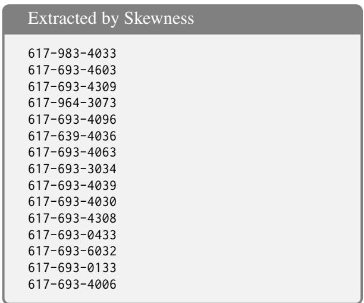

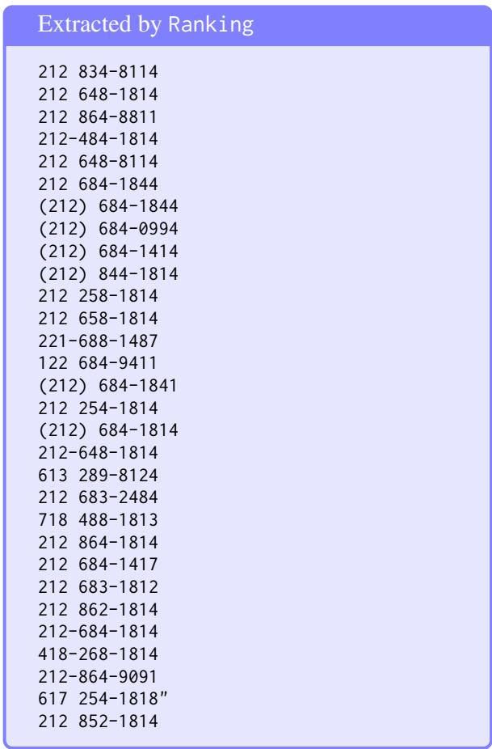  
Figure 9: Examples of candidate sets for targets extracted exclusively by a given scoring method.