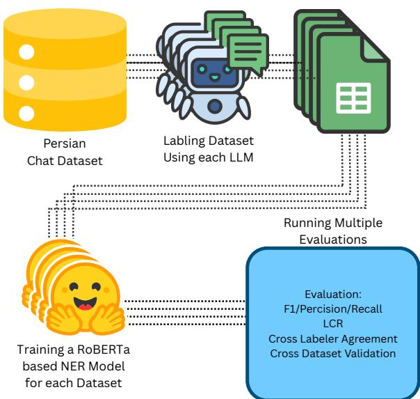
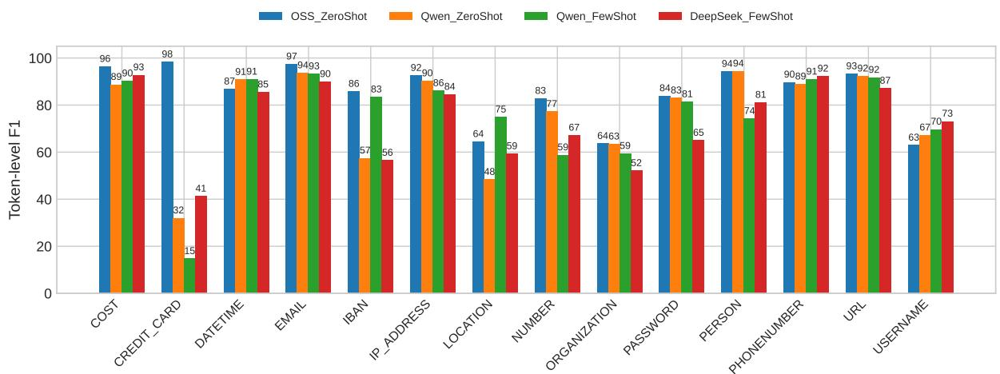
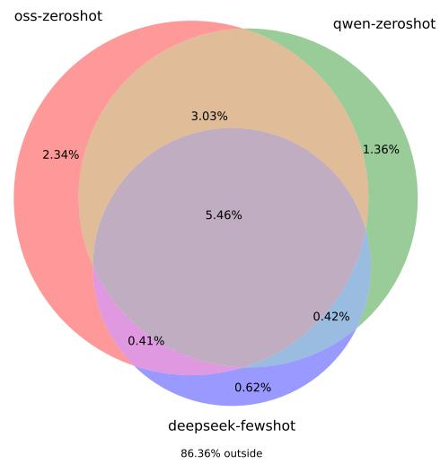

# PersianAnonymizer: Evaluating LLM-Labeled Training for Eficient NER-based Anonymization in Persian

Mohammad Hossein Shalchian<sup>1</sup>, Mostafa Amiri<sup>2</sup>, Amir Mahdi Sadeghzadeh<sup>1</sup>

<sup>1</sup>Sharif University of Technology

mo.shalchian@sharif.edu, sadeghzadeh@sharif.edu

<sup>2</sup>University of Tehran

mostafa.amiri@ut.ac.ir

## Abstract

We target practical anonymization of Persian customer chats by training a compact NER model from LLM-labeled supervision and selecting the best labeler for deployment. We compare three instruction-tuned LLMs—DEEPSEEK-V3-0324, GPT-OSS-120B, and QWEN3-235B-A22B-INSTRUCT-2507—to produce span annotations under a shared JSON protocol, yielding four corpora (OSS\_ZeroShot, Qwen\_ZeroShot, Qwen\_FewShot, DeepSeek\_FewShot). A MATINAROBERTA-based token-classifier is trained per corpus and evaluated with token-level Precision/Recall/F1 (overall and per-class). We also report Label Coverage Recall (LCR), the proportion of gold non-O tokens predicted as non-O, and quantify cross-labeler behavior via a token-level Venn on test annotations. Finally, we contrast test-set annotation latency of the LLMs on H200 nodes with the trained NER’s test-time labeling on a single RTX 3090. Results show that supervision from OSS\_ZeroShot yields the strongest macro-F1 and LCR, while the resulting NER labels an entire 40K-message test set in 2 minutes on one consumer GPU. This establishes a practical path to high-quality, low-cost anonymization for Persian industrial data.

Keywords: Named Entity Recognition, Text Anonymization, Persian, Low-Resource, LLM-labeled Supervision, Industrial Chats, Personally Identifiable Information

## 1. Introduction

Organizations increasingly rely on large language models (LLMs) to analyze customer chats and to automate responses, yet these interactions routinely contain personally identifiable information (PII) and, in some domains, protected health information (PHI). Sharing raw messages with thirdparty or closed-source models raises privacy and compliance concerns (e.g., GDPR), and even aligned language models can memorize and surface snippets from their training data, exacerbating leakage risks (gdp, 2016; Carlini et al., 2021; Shokri et al., 2017). A natural mitigation is to anonymize inputs before any downstream processing.

A straightforward path is to ask an LLM to perform anonymization directly; however, production use often encounters a cost–latency– privacy trade-of: high-capacity models demand multi-GPU resources and vendor exposure, while smaller open models may not deliver the needed quality within tight latency budgets. In contrast, a compact token-classification NER model, once trained, can anonymize at scale with low, predictable inference cost—provided that we can obtain reliable supervision for the domain.

Recent practice leverages LLMs as labelers to bootstrap task models, reducing human annotation overhead (Zhang et al., 2023). For Persian, NER resources exist but are comparatively limited and not tailored to industrial chat anonymization.

  
Figure 1: Overall research pipeline: from raw Persian chat data labeling by multiple LLMs to NER training and multi-stage evaluation.

Moreover, to our knowledge there is no systematic comparison of which LLM produces supervision that yields the most learnable Persian NER for anonymization scenarios, nor an analysis that balances accuracy with deployment-time eficiency. Recent evidence also documents persistent performance gaps for LLMs in Persian and the need for targeted evaluation, underscoring the importance of our Persian-focused study. (Abaskohi et al., 2024) Multilingual backbones (e.g., XLM-RoBERTa) (Conneau et al., 2020) have advanced transfer to lower-resource languages, but the choice of supervising labeler remains a critical— and underexplored—factor for downstream quality and throughput.

In this paper We compare three instructiontuned LLMs as automatic labelers for Persian anonymization NER and train a compact NER per labeler. We evaluate token-level precision/recall/F1 (overall and per-class), cross-labeler agreement on test annotations, and end-to-end efficiency. Our results show that labels from one model yield the most learnable supervision, while the resulting NER achieves fast, single-GPU anonymization suitable for industrial deployment. The remainder of this paper is organized as follows: Section 2 reviews related work on anonymization, LLM-assisted labeling, and Persian NER. Section 3 describes dataset construction and annotation procedures, while Section 4 outlines the NER training setup. Section 5 presents the evaluation results and cross-dataset validation. Finally, Sections 6–8 discuss conclusions, limitations, and ethical considerations.

## 2. Related Work

## 2.1. Text Anonymization and De-identification with NER

Automatic de-identification commonly frames protected attributes, such as PHI and PII, as named entities and applies sequence labeling to mask them prior to downstream processing. Recent work stresses generalization challenges across domains and institutions, even with strong transformer baselines (Yue and Zhou, 2023). Practical pipelines increasingly combine high-recall NER with conservative post-processing to reduce residual leakage (Kocaman et al., 2023). Closer to our goal—substituting costly LLM inference at deployment—“LLMs-in-the-loop” pipelines train compact task-specific models on LLM-labeled corpora for de-identification across languages (Gunay et al., 2024). Cross-domain analyses of pseudonymization indicate that PII tagsets vary substantially across application areas and recommend a core-plus-domain-specific schema, which aligns with our operational label design for Persian chats. (Szawerna et al., 2024) Our schema emphasizes high-utility PII types (e.g., URL, PHONE, EMAIL) while retaining general entities (PERSON-/ORG/LOC) necessary for robust anonymization. Our study follows this pragmatic line but, to our knowledge, is among the first to quantify (i) which LLM yields the most learnable Persian labels for anonymization and (ii) the throughput gains of the resulting NER at inference time.

## 2.2. LLMs as NER Labelers (Silver Data)

LLMs have been used to synthesize labels that subsequently train smaller, task-specific models. Beyond fully synthetic text, a prominent direction is using LLMs as annotators over real data, with prompt design, example retrieval, and active acquisition to mitigate noise and cost (Zhang et al., 2023). Complementary strategies such as active learning can further reduce supervision cost for transformer-based NER while retaining accuracy. (Vacareanu et al., 2024) To counter label noise inherent to weak or distantly supervised settings, robust training with strong-label-guided lottery mechanisms has shown efectiveness and is conceptually compatible with LLM-labeled pipelines. (Ma et al., 2024) For NER specifically, formatting the task to better match generative interfaces and adding self-verification substantially improves label usability, yet pure LLM inference still lags strong supervised baselines and can be resourceintensive (Wang et al., 2025). Our work adopts this “LLM-as-labeler, NER-for-inference’’ paradigm but focuses on Persian chat data for anonymization, comparing multiple LLM labelers under a unified pipeline and evaluating via downstream learnability and coverage.

## 2.3. Persian NER

Persian NER has a long tail of resources and models. Early corpora such as PERSONER (Poostchi et al., 2016) and PEYMA (Shahshahani et al., 2018) established baselines, later complemented by BERT-based systems adapted to Persian morphology and domain specifics (Mohseni and Tebbifakhr, 2019; Taher et al., 2020). Large Persian PLMs (e.g., ParsBERT) further boosted sequence labeling in standard settings (Farahani et al., 2021). However, most prior Persian NER eforts target generic entity extraction; work that specifically builds Persian anonymization NER from LLMlabeled industrial data and analyzes cross-LLM label quality and inference throughput, remains unaddressed. We address this gap by comparing multiple LLM labelers and selecting the NER trained on the most learnable supervision for practical anonymization at scale.

## 3. Dataset Construction

## 3.1. Overview

We construct a large-scale Persian anonymization corpus consisting of 265,000 rows, where each row is a single user message from an organizational chat stream.<sup>1</sup> Messages are short, informal, and often include personally identifiable information (PII) such as names, phone numbers, email addresses, URLs, payment identifiers, and freeform references to dates, addresses, and organizations. Our goal is to obtain span-level named entity annotations suitable for training NER models used in privacy-preserving anonymization.

## 3.2. Label Set and Tagging Scheme

We adopt a BIO tagging scheme over a taskspecific PII-oriented label set. In this scheme, each token is tagged as B- (beginning of an entity), I- (inside an entity), or O (outside any entity). The complete tag vocabulary is:

• Entity types (without BIO prefixes): COST, CREDIT\_CARD, DATETIME, EMAIL, IBAN, IP\_ADDRESS, LOCATION, NUMBER, ORGANIZATION, PASSWORD, PERSON, PHONENUMBER, URL, USERNAME.

• Tags: for each type we use B- and I- prefixes, plus the outside tag O.

This design focuses on PII-bearing or PII-adjacent categories that are common in Persian customer support logs. The label set balances coverage (for operational anonymization) with practical learnability (for downstream NER).

## 3.3. LLM-Based Annotation Pipeline

We annotated the corpus using three instructiontuned LLM labelers under an identical prompting and parsing protocol:

• DEEPSEEK-V3-0324

• GPT-OSS-120B

• QWEN3-235B-A22B-INSTRUCT-2507

For each message (one row), we passed a standardized prompt that (i) defines the entity schema and guidelines, (ii) requests JSON-formatted output with explicit entity spans, and (iii) enforces strict formatting via a parsed-API contract. The LLM returns a structure with the raw text and a list of entities, each specified by surface phrase and a canonical ner\_type. A typical response schema is:

```jsonl
{
"text": "<original message>",
"named_entities": [
{
```

<sup>1</sup>All content is confidential; only anonymized and minimal snippets are shown in figures for illustration. No raw customer data is released.

```jsonl
"phrase": "...",
"ner_type": "<PERSON>"
},
{
"phrase": "...",
"ner_type": "<URL>"
},
...
]
}
```

As an illustrative example, for a Persian sentence referring to two people:

"سرکار خانم قربانی - سرکار خانم اسدی از توجه شما متشکرم."   
sarkār khānom Ghorbāni – sarkār khānom Asadi az tavajjoh-e shomā motshakeram.   
‘Ms. Ghorbani – Ms. Asadi, thank you for your attention.’

the LLM may return:

{   
سرکارخانمقربانی-سرکارخانماسدیازتوجه":"text"   
,"شما متشکرم.   
"named\_entities": [   
{"phrase": " قربانی ", " ner\_type": "<   
PERSON>"},   
{"phrase": " اسدی ", " ner\_type": "<   
PERSON>"}   
]   
}

We used the same prompt template and schema across the three labelers to ensure comparability.

## 3.4. Prompting Regimes and Final Datasets

To examine the efect of instruction conditioning on label quality, we experimented with both zeroshot and few-shot prompting regimes. The same schema and output contract described in §3.3 were used for all labelers, but the stability of JSONformatted outputs varied across models:

• GPT-OSS-120B: Only the zero-shot configuration produced stable, fully parseable annotations. In the few-shot setting, a large portion of responses violated the JSON schema and could not be recovered, so this variant was discarded.

• QWEN3-235B-A22B-INSTRUCT-2507: Both zero-shot and few-shot prompting successfully generated valid annotations and were retained for downstream training.

• DEEPSEEK-V3-0324: Only the few-shot configuration was usable. Zero-shot outputs frequently failed to comply with the required format and were excluded.

Consequently, our study comprises four final LLM-labeled datasets:

1. OSS\_ZeroShot

2. Qwen\_ZeroShot

3. Qwen\_FewShot

4. DeepSeek\_FewShot

All datasets were post-processed and normalized into the same token-level BIO format described in §3.5, ensuring consistent label semantics for subsequent NER training and evaluation.

## 3.5. Tokenization, Alignment, and Recovery of Missing Spans

To convert span-level outputs to token-level BIO tags, we (i) tokenize each message, and (ii) align LLM-provided phrase spans to token boundaries using a deterministic regex-based matcher with normalization. Alignment accounts for Persian punctuation, quotes, and common tokenization artifacts (e.g., joined quotes or clitics). When a span crosses multiple tokens, the first token receives B-<TYPE> and the remaining tokens receive I-<TYPE>; non-entity tokens are tagged O.

Occasionally, an entity phrase generated by the LLM did not appear verbatim in the original message—an expected artifact of the probabilistic generation process. In these cases, we applied a fuzzy substring matching strategy: the system searched for sub-sequences in the original text with a similarity score of at least 0.6 (60%) to the predicted phrase. Entities recovered through this fuzzy matching accounted for fewer than 5% of all annotations. After recovery, over 99% of LLMidentified entities were successfully located and aligned in text. The remaining 1% unmatched cases mostly corresponded to spurious tokens in other scripts (e.g., stray English or Chinese fragments generated by the model), a failure mode that systematically characterized by Marchisio et al. (2024).

An example projection for the earlier sentence is shown below (abridged):

$$
\begin{array} { r l } { \mathsf { t o k e n s } = } & { [ ^ { \mathrm { { u } } } , ] \mathsf { S } _ { \mathcal { S } ^ { \mathsf { a m } ^ { 1 1 } } } , ^ { \mathrm { { u } } } \rho \mathsf { a } \mathsf { L } \mathsf { \bar { s } } ^ { \mathrm { { u } } } , ^ { \mathrm { { u } } } \mathsf { U } _ { \mathsf { \bar { s } } } \mathsf { U } _ { \mathsf { \bar { s } } } \mathsf { \bar { s } } ^ { \mathrm { { u } } } , ^ { \mathrm { u } } = ^ { \mathrm { { u } } } , } \\ & { ^ { \mathrm { { u } } } , ^ { \mathrm { { u } } } , ^ { \mathrm { { u } } } , ^ { \mathrm { { u } } } \rho \mathsf { a } \mathsf { U } _ { \rho } ^ { \mathrm { { u } } } , ^ { \mathrm { { u } } } \rho \mathsf { a } \mathsf { L } \mathsf { \bar { s } } ^ { \mathrm { { u } } } , ^ { \mathrm { { u } } } \mathsf { \bar { s } } ^ { \mathrm { { \bar { s } } } \omega \mathsf { U } ^ { \mathrm { { u } } } } , \quad \mathsf { \bar { s } } \cdot \mathsf { \bar { s } } . ] } \\ { \mathsf { n e r \_ t a g s } = } & { [ ^ { \mathrm { { u } } } \mathsf { B \mathrm { - { P E R S O N } ^ { \mathrm { { u } } } } } , ^ { \mathrm { { u } } } \mathrm { { I \mathrm { - P E R S O N } ^ { \mathrm { { u } } } } } , ^ { \mathrm { u } } ] \mathsf { \bar { s } } \mathbb { I } _ { \mathsf { \bar { s } } } } \\ & { \quad \quad \quad \quad \quad \quad \quad \quad \mathrm { { P E R S O N } ^ { \mathrm { { u } } } , ^ { \mathrm { { u } } } \mathsf { O } ^ { \mathrm { { u } } } , } } \\ &  ^ { \mathrm { { u } } } \mathsf  B \mathrm { - { P E R S O N } ^ { \mathrm { { u } } } } , ^ { \mathrm { u } } \mathrm  \bar { I } \mathrm { - P E R S O N } ^ { \mathrm { { u } } } , ^ { \mathrm { u } } \mathrm  \end{array}
$$

This process yields labeled corpora in token classification format, suitable for fine-tuning NER models.

## 3.6. Annotation Eficiency and Resource Usage

All large-scale annotations were executed on identical hardware nodes equipped with 8 H200 (140 GB) GPUs per node. For each model, we launched as many parallel instances as available memory permitted:

• DEEPSEEK-V3-0324: one instance (8 GPUs)

• QWEN3-235B-A22B-INSTRUCT-2507: two instances (each using 4 GPUs)

• GPT-OSS-120B: four instances (each using 2 GPUs)

Each full dataset consisted of 225,000 training and 40,000 test messages. Table 1 reports the total annotation time for each labeler under the parsed-API setup.

<table><tr><td rowspan=1 colspan=1>Labeler</td><td rowspan=1 colspan=1>Instances</td><td rowspan=1 colspan=1>Train</td><td rowspan=1 colspan=1>Test</td></tr><tr><td rowspan=1 colspan=1>DeepSeek</td><td rowspan=1 colspan=1>1</td><td rowspan=1 colspan=1>92 min</td><td rowspan=1 colspan=1>22 min</td></tr><tr><td rowspan=1 colspan=1>Qwen</td><td rowspan=1 colspan=1>2</td><td rowspan=1 colspan=1>36 min</td><td rowspan=1 colspan=1>6.5 min</td></tr><tr><td rowspan=1 colspan=1>OSS</td><td rowspan=1 colspan=1>4</td><td rowspan=1 colspan=1>16 min</td><td rowspan=1 colspan=1>4min</td></tr></table>

Table 1: Annotation times for each LLM labeler on 225K training and 40K test messages (8×H200 140 GB nodes). Models used were DeepSeek-V3-0324, Qwen3-235B-A22B-Instruct-2507, and GPT-OSS-120B. Parsed-API retries occurred for all labelers but remained under 5%.

These measurements provide a consistent baseline for later comparison with the much faster inference of the fine-tuned NER models reported in Sections 4 and 5.

## 3.7. Cross-Labeler Sample Comparison (Qualitative)

Before large-scale training, we qualitatively inspected a shared subset of messages to assess agreement patterns among the three labelers. The following anonymized Persian examples illustrate typical agreement and divergence cases.

1. ًآی پی10.11.12.13رابهدامنه "سلاملطفا ir.exampleمتصلکنید." salām lotfān IP 10.11.12.13 rā be dā- mane example.ir motasel konid. ‘Please connect the IP 10.11.12.13 to the domain example.ir.

LLM Annotations. All three labelers (GPT-OSS-120B, QWEN3-235B-A22B-INSTRUCT-2507, DEEPSEEK-V3-0324) correctly identified the personal greeting token as PERSON, the numeric string as IP\_ADDRESS, and the web domain as URL. Boundary consistency was nearly perfect, showing strong convergence on structured identifiers.

2. "سرویس اینترنت مبین نت استان کهگیلویه و بویراحمد فعال است." service internet Mobin Net ostān Kohgiluye va Boyer-Ahmad fa‘āl ast. ‘The Mobin Net internet service is active in Kohgiluyeh and Boyer-Ahmad province.’

LLM Annotations. GPT-OSS-120B and QWEN3-235B-A22B-INSTRUCT-2507 labeled کهگیلویه” and ORGANIZATION as” مبین نت” بویراحمد و“ as LOCATION, maintaining clear boundaries between organization and place. DEEPSEEK-V3-0324, in contrast, extended the ORGANIZATION tag to include tokens like “ استان “, merging the locative phrase into the organizational span, which is not an optimal decision as it may obscure certain sentencelevel information. Boundary decisions are a well-known fragility in NER—small perturbations near entity edges can induce large drops—so boundary-consistent supervision is crucial for stable generalization. (Yang et al., 2024)

3. ًباشماره09123456789 "سلاملطفا تماس بگیرید و به آقای رضایی اطلاع دهید." salām lotfān bā shomāre 09123456789 tamās begirid va be āghāye Rezā‘i etelā dahid. ‘Please call the number 09123456789 and inform Mr. Rezaei.’

LLM Annotations. All models consistently detected the phone number as PHONENUMBER and the person name “ رضایی “ as PERSON. GPT-OSS-120B additionally marked “ آقای “ as part of the person span, while QWEN3-235B-A22B-INSTRUCT-2507 and DEEPSEEK-V3-0324 left it untagged, showing a subtle divergence in boundary treatment for titles.

4. و ً برای گزارش با کدهای 456120 "لطفا 456128 اقدام فرمایید." lotfān barāye gozāresh bā kod-hāye 456120 va 456128 eghdām farmāyid. ‘Please proceed with the report using codes 456120 and 456128.’

LLM Annotations. All three labelers correctly identified both numeric strings as NUMBER entities with precise boundaries and no false positives. This case illustrates near-perfect cross-model agreement on clear numerical tokens.

These examples demonstrate that while all models perform robustly on explicit numeric and technical entities, variation arises primarily in the interpretation of institutional or locative expressions. These qualitative diferences informed our downstream evaluation, where model learnability serves as a proxy for label consistency and quality across Persian anonymization corpora.

## 4. Training

We fine-tune a token-classification model based on MATINAROBERTA (Bourbour Hosseinbeigi et al., 2025), which itself is derived from XLM-RoBERTa Large (Conneau et al., 2020). A linear classification head is (re)initialized to match the BIO tag inventory described in §3. All four LLM-labeled corpora (OSS\_ZeroShot, Qwen\_ZeroShot, Qwen\_FewShot, DeepSeek\_FewShot) are trained with identical hyperparameters to ensure comparability.

Data splits. For each corpus, we use the provided train portion (225K messages) and construct a stratified development split by holding out 10% of the training data. The corresponding test portion (40K messages) is kept untouched for final reporting.

Optimization and schedule. We train with AdamW (Loshchilov and Hutter, 2019), learning rate 2 10−<sup>5</sup>, linear warmup (fixed steps), mixed precision (FP16), and gradient clipping. Batch size is kept constant across runs, and training proceeds up to 6 epochs with early stopping computed on the held-out development split using the seqeval library (Nakayama, 2018). Each run is executed on a single RTX 3090 (24 GB) and takes about 4 hours.(Table 2)

Table 2: Training hyperparameters used identically across the four corpora.
<table><tr><td rowspan=1 colspan=1>Setting</td><td rowspan=1 colspan=1>Value</td></tr><tr><td rowspan=1 colspan=1>Backbone</td><td rowspan=1 colspan=1>MATINAROBERTA</td></tr><tr><td rowspan=1 colspan=1>Head</td><td rowspan=1 colspan=1>Linear          token-classification    overBIO tags</td></tr><tr><td rowspan=1 colspan=1>Optimizer</td><td rowspan=1 colspan=1>AdamW</td></tr><tr><td rowspan=1 colspan=1>Learning rate</td><td rowspan=1 colspan=1>2 × 10−5; linear decay;fixed warmup steps</td></tr><tr><td rowspan=1 colspan=1>Batch / Precision</td><td rowspan=1 colspan=1>Fixed per run; FP16</td></tr><tr><td rowspan=1 colspan=1>Max epochs</td><td rowspan=1 colspan=1>6 (early stopping ondev macro-F1)</td></tr><tr><td rowspan=1 colspan=1>Max sequence length</td><td rowspan=1 colspan=1>256</td></tr><tr><td rowspan=1 colspan=1>Hardware</td><td rowspan=1 colspan=1>1 ×RTX 3090 (24 GB);about 4h per run</td></tr></table>

Table 3: Macro-averaged token-level results and Label Coverage Recall (LCR, %).
<table><tr><td rowspan=1 colspan=1>Model (Trained on)</td><td rowspan=1 colspan=1>Macro P</td><td rowspan=1 colspan=1>Macro R</td><td rowspan=1 colspan=1>Macro F1</td><td rowspan=1 colspan=1>LCR (%)</td></tr><tr><td rowspan=1 colspan=1>NER_OSS (OSS_ZeroShot)</td><td rowspan=1 colspan=1>0.849</td><td rowspan=1 colspan=1>0.858</td><td rowspan=1 colspan=1>0.851</td><td rowspan=1 colspan=1>90.04</td></tr><tr><td rowspan=1 colspan=1>NER_Qwen (Qwen_ZeroShot)</td><td rowspan=1 colspan=1>0.782</td><td rowspan=1 colspan=1>0.751</td><td rowspan=1 colspan=1>0.762</td><td rowspan=1 colspan=1>89.99</td></tr><tr><td rowspan=1 colspan=1>NER_Qwen (Qwen_FewShot)</td><td rowspan=1 colspan=1>0.763</td><td rowspan=1 colspan=1>0.769</td><td rowspan=1 colspan=1>0.756</td><td rowspan=1 colspan=1>89.93</td></tr><tr><td rowspan=1 colspan=1>NER_DeepSeek (DeepSeek_FewShot)</td><td rowspan=1 colspan=1>0.768</td><td rowspan=1 colspan=1>0.720</td><td rowspan=1 colspan=1>0.733</td><td rowspan=1 colspan=1>80.04</td></tr></table>

  
Figure 2: Per-class token-level F1 for the four NER models trained on OSS\_ZeroShot, Qwen\_ZeroShot, Qwen\_FewShot, and DeepSeek\_FewShot. Higher bars indicate better class-wise performance; note that low-support types (e.g., CREDIT\_CARD, IBAN) exhibit higher variance and should be interpreted cautiously.

  
Figure 3: Token-level overlap of non-O annotations across the three LLM-labeled test sets: GPT-OSS-120B, QWEN3-235B-A22B-INSTRUCT-2507 (zeroshot), and DEEPSEEK-V3-0324 (few-shot). Values denote percentage of total tokens.

## 5. Evaluation

Protocol. We evaluate the four NER models trained on the LLM-labeled corpora (OSS\_ZeroShot, Qwen\_ZeroShot,

Qwen\_FewShot, DeepSeek\_FewShot) using token-level counts: for each entity type, gold tokens are those labeled as a non-O tag in the test set, and predictions are computed from the model’s token outputs. We report per-class Precision/Recall/F1 and aggregate macro score. In addition, we introduce Label Coverage Recall (LCR)—the proportion of gold non-O tokens that are predicted as non-O by the model (higher is better). Overall accuracy including O is reported but not emphasized, as it can be misleadingly high in skewed token distributions. Beyond in-domain tests, we also conduct a cross-dataset validation on the PEYMA benchmark (Shahshahani et al., 2018), comparing our best NER (trained on OSS\_ZeroShot) against the widely used PARSBERT-NER (Farahani et al., 2021). We map overlapping labels (person, organization, location, date/time datetime, money cost), ignore BIO prefixes, and evaluate both models on the shared-label slices of each test set.

## 5.1. Comparison of Trained NER Models

Table 3 summarizes macro-averaged Precision/Recall/F1 and the Label Coverage Recall (LCR) across the four NER models. As seen, the model trained on OSS\_ZeroShot achieves the highest macro-F1 and the strongest LCR, indicating both higher class-balanced quality and broader coverage of entity-bearing tokens.

Per-class analysis. Figure 2 (grouped bars) breaks down token-level F1 by entity type for the four models. Broadly, high-frequency technical identifiers such as URL, IP\_ADDRESS, EMAIL, and PHONENUMBER show consistently strong performance across models, while LOCATION and ORGANIZATION remain comparatively challenging—a known pain point in informal Persian where institutional and locative cues may intertwine.

Some entity types appear very rarely in our test data. For example, CREDIT\_CARD and IBAN each occur only a few dozen times across all datasets (from about 30 examples in OSS to fewer than 200 in Qwen). Because of this small sample size, the reported F1 values for these classes are not statistically reliable and can fluctuate with minor prediction changes. In our target domain— organizational support tickets—such entities are uncommon, so weaker stability on them is not a major concern for the anonymization system as a whole.

Overall, the OSS\_ZeroShot-trained NER not only tops macro-F1 but also attains the best LCR, reflecting better entity-token coverage. The two Qwen variants cluster next, with Qwen\_ZeroShot slightly ahead in macro-F1, and DeepSeek\_FewShot trails due to weaker recall on several mid/high-frequency categories (e.g., ORGANIZATION, NUMBER).

## 5.2. Cross-Dataset Validation on PEYMA and Our Test Set

We align overlapping tags between our schema and PEYMA (Shahshahani et al., 2018) by mapping money COST, date/time DATETIME, and keeping PERSON, ORGANIZATION, LOCATION. BIO prefixes are ignored. We then evaluate (i) ParsBERT-NER (Farahani et al., 2021) and (ii) our NER\_OSS (trained only on OSS\_ZeroShot) on both PEYMA and OSS-labeled test sets, each restricted to the shared-label slice. For ParsBERT on PEYMA, both date and time tags are merged into a single DATETIME category.

On PEYMA dataset, PARSBERT-NER unsurprisingly leads across most categories and macro averages, due to being trained on multiple datasets including PEYMA. Notably, our NER\_OSS attains stronger COST recall and F1, showing competitive transfer on a numeric/structured type.

Conversely, on our OSS-labeled test set (restricted to shared labels), NER\_OSS dominates across the board, with particularly large recall gaps on DATETIME and ORGANIZATION. PARSBERT-NER maintains a slight edge in PERSON precision, but overall performance is constrained by low recall—consistent with domain mismatch and the absence of our data in its training mix. Taken together, these two evaluations show expected on-domain advantage for each model, but also support our choice of NER\_OSS as the practical anonymizer for our deployment scenario.

## 5.3. Cross-Labeler Agreement on Test Sets (Token-Level Venn)

To examine how consistently the large language models labeled tokens during test-set annotation, we compared the three principal labelers: GPT-OSS-120B, QWEN3-235B-A22B-INSTRUCT-2507 (zero-shot), and DEEPSEEK-V3-0324 (few-shot). For this analysis, we took the respective test sets produced by each LLM and computed, at the token level, whether each token was assigned a non-O label by each labeler. In other words, we treat every token predicted as part of any entity (regardless of its specific class) as a “labeled” token, and every O as “unlabeled.” The resulting binary indicators across the three datasets yield a 3-set overlap pattern visualized as a Venn diagram in Figure 3.

Table 6 summarizes the distribution of tokenlabeling coverage and overlap percentages.

Roughly 13.6% of all tokens received a non-O label from at least one LLM. The highest overlap region (5.46%) corresponds to tokens that all three labelers agreed were part of some entity, while exclusive regions (e.g., only-GPT-OSS-120B 2.34%) reveal labeler-specific biases. Overall, GPT-OSS-120B labeled the largest fraction of tokens, and its intersections with the other two models dominate the shared areas—consistent with its broader coverage observed in Section 5.1. In contrast, DEEPSEEK-V3-0324 contributed relatively few unique labeled tokens (0.62%), confirming that it was the most conservative labeler among the three. This overlap pattern highlights that while the models converge on many clear entity tokens, a considerable proportion of potential entities remain model-specific, underscoring heterogeneity in LLM-based annotation behavior.

## 5.4. Practical Throughput: NER vs. LLM Labeling

While the large language models required substantial multi-GPU resources to annotate the test sets (§3.6), the fine-tuned NERs perform inference extremely fast. Each trained model labels the entire 40K-message test set in roughly 2 minutes on a single RTX 3090 (24 GB), compared to tens of minutes on multi-node H200 setups for the original LLMs. This demonstrates that high-quality anonymization can be achieved with a lightweight model at a fraction of the computational cost— ofering a practical balance between label fidelity and deployment eficiency.

Table 4: Cross-dataset evaluation on PEYMA (shared labels). Higher is better.
<table><tr><td rowspan="2">Label</td><td colspan="3">NER OSS</td><td colspan="3">ParsBERT-NER</td><td rowspan="2"></td></tr><tr><td>P</td><td>R</td><td>F1</td><td>P</td><td>R</td><td>F1</td></tr><tr><td>COST</td><td>0.9570</td><td>0.9468</td><td>0.9519</td><td>1.0000</td><td>0.8370</td><td>0.9112</td><td></td></tr><tr><td>DATETIME</td><td>0.8409</td><td>0.6743</td><td>0.7484</td><td>0.9570</td><td>0.7334</td><td>0.8295</td><td></td></tr><tr><td>LOCATION</td><td>0.7842</td><td>0.8530</td><td>0.8172</td><td>0.9482</td><td>0.9916</td><td>0.9694</td><td></td></tr><tr><td>ORGANIZATION</td><td>0.8332</td><td>0.7066</td><td>0.7647</td><td>0.9573</td><td>0.9645</td><td>0.9609</td><td></td></tr><tr><td>PERSON</td><td>0.8470</td><td>0.9503</td><td>0.8957</td><td>0.9917</td><td>0.9905</td><td>0.9911</td><td></td></tr><tr><td>Macro avg.</td><td>0.8525</td><td>0.8262</td><td>0.8356</td><td>0.9708</td><td>0.9034</td><td>0.9324</td><td></td></tr></table>

Table 5: Cross-dataset evaluation on OSS-labeled test set (shared labels). Higher is better.
<table><tr><td rowspan="2">Label</td><td colspan="3">NER_OSS</td><td colspan="3">ParsBERT-NER</td></tr><tr><td>P</td><td>R</td><td>F1</td><td>P</td><td>R</td><td>F1</td></tr><tr><td>COST</td><td>0.9847</td><td>0.9840</td><td>0.9844</td><td>0.9620</td><td>0.0816</td><td>0.1504</td></tr><tr><td>DATETIME</td><td>0.9045</td><td>0.9241</td><td>0.9142</td><td>0.6846</td><td>0.0786</td><td>0.1411</td></tr><tr><td>LOCATION</td><td>0.6789</td><td>0.6726</td><td>0.6757</td><td>0.3619</td><td>0.4025</td><td>0.3811</td></tr><tr><td>ORGANIZATION</td><td>0.6666</td><td>0.6257</td><td>0.6455</td><td>0.5934</td><td>0.2101</td><td>0.3103</td></tr><tr><td>PERSON</td><td>0.9298</td><td>0.9651</td><td>0.9471</td><td>0.9352</td><td>0.5308</td><td>0.6772</td></tr><tr><td>Macro avg.</td><td>0.8329</td><td>0.8343</td><td>0.8334</td><td>0.7074</td><td>0.2607</td><td>0.3320</td></tr></table>

<table><tr><td>Subset (labelers)</td><td>Percent (%)</td></tr><tr><td>Only GPT-OSS (Zero-Shot) Only Qwen3 (Zero-Shot) Only DeepSeek (Few-Shot) GPT-OSS ∩ Qwen3 GPT-OSS ∩ DeepSeek Qwen3 ∩ DeepSeek GPT-OSS ∩ Qwen3 ∩ DeepSeek None (all o)</td><td>2.34 1.36 0.62 3.03 0.41 0.42 5.46 86.36</td></tr></table>

Table 6: Token-level overlap of non-O labels across the three LLM-labeled test sets. Percentages are computed over all tokens in the union of test corpora.

## 6. Conclusion

Our findings indicate that supervision from OSS\_ZeroShot consistently yields the most learnable Persian anonymization NER, balancing class-wise quality (macro-F1) with broad entitytoken coverage (LCR). The token-level Venn further shows sizable but incomplete cross-labeler agreement, suggesting that labeler heterogeneity remains a meaningful source of variance. Practically, a compact NER trained on this supervision labels a 40K-message test set in 2 minutes on a single RTX 3090—making privacy-preserving preprocessing feasible under tight latency and cost budgets. For deployment, we recommend prioritizing OSS-labeled supervision and complementing the NER with lightweight heuristics for challenging types (e.g., ORG/LOC boundary cues) where recall matters most. Future work includes human audits on sampled segments, agreement-aware label consolidation, and evaluating transfer to adjacent Persian domains.

## 7. Ethics Statement

All chat data were processed under explicit organizational authorization for research on privacypreserving anonymization. The data were used solely for non-commercial, internal research; no raw customer messages are released. All examples shown in the paper are anonymized: identifying strings are replaced with semantically similar surrogates, and any potentially sensitive details are removed or perturbed.

Because of confidentiality and data-protection commitments, the underlying chat datasets cannot be shared. We may release the trained NER model checkpoint(s) since the model is taskspecific (token classification) and does not generate text; this reduces the risk of reproducing original messages. We further ensured that no raw texts are embedded in code, logs, or artifacts released with the paper.

## 8. Limitations

Our study has several limitations. (i) Recall is not perfect. Although overall LCR is high, recall is lower on certain categories (e.g., ORGANIZATION, LOCATION), and boundary errors persist in informal, code-mixed contexts. (ii) Sparse classes. Some entity types (e.g., CREDIT\_CARD, IBAN) have very few instances; their per-class F1 is variance-prone and should be interpreted with caution. This reflects our target domain (enterprise support tickets) rather than an inherent weakness of the approach. (iii) Label noise and evaluation scope. Supervision is produced by LLMs; while downstream learnability is a useful proxy, we lack large-scale human adjudication. Our token-level Venn aggregates all non-O labels and ignores type identity, so it measures coverage overlap rather than class agreement. (iv) Domain specificity. Data come from a single organizational setting; performance may degrade under distribution shift (diferent industries, styles, or policies).

## 9. Bibliographical References

2016. Regulation (eu) 2016/679 (general data protection regulation). Oficial Journal of the European Union L 119, pp. 1–88.

Amirhossein Abaskohi, Sara Baruni, Mostafa Masoudi, Nesa Abbasi, Mohammad Hadi Babalou, Ali Edalat, Sepehr Kamahi, Samin Mahdizadeh Sani, Nikoo Naghavian, Danial Namazifard, Pouya Sadeghi, and Yadollah Yaghoobzadeh. 2024. Benchmarking large language models for persian: A preliminary study focusing on chatgpt. In Proceedings of the 2024 Joint International Conference on Computational Linguistics, Language Resources and Evaluation (LREC-COLING 2024), pages 2189– 2203, Torino, Italia. ELRA and ICCL.

Sara Bourbour Hosseinbeigi, Sina Asghari, Mohammad Ali Seif Kashani, Mohammad Hossein Shalchian, and Mohammad Amin Abbasi. 2025. Advancing retrieval-augmented generation for persian: Development of language models, comprehensive benchmarks, and best practices for optimization.

Nicholas Carlini, Florian Tramèr, Eric Wallace, Matthew Jagielski, Ariel Herbert-Voss, Katherine Lee, Adam Roberts, Tom B. Brown, Dawn Song, Úlfar Erlingsson, Alina Oprea, and Colin Rafel. 2021. Extracting training data from large language models. In 30th USENIX Security Symposium (USENIX Security 21), pages 2633–2650.

Alexis Conneau, Kartikay Khandelwal, Naman Goyal, Vishrav Chaudhary, Guillaume Wenzek, Francisco Guzmán, Edouard Grave, Myle

Ott, Luke Zettlemoyer, and Veselin Stoyanov. 2020. Unsupervised cross-lingual representation learning at scale. In Proceedings ofthe 58th Annual Meeting of the Association for Computational Linguistics, pages 8440–8451, Online. Association for Computational Linguistics.

Mohammad Mahdi Farahani, Naser Ghassemi, Mohammad Ali Farahani, et al. 2021. Parsbert: Transformer-based model for persian language understanding. Neural Computing and Applications.

Murat Gunay, Bunyamin Keles, and Raife Hizlan. 2024. Llms-in-the-loop part 2: Expert small ai models for anonymization and de-identification of phi across multiple languages. arXiv preprint arXiv:2412.10918.

Veysel Kocaman, Jing Zhang, Muazzam Karim, Hongfang Luo, Zexian He, Michael Schröder, Ziyang Liu, Adam Barker, Enrico Saad, Sheng He, et al. 2023. Beyond accuracy: Toward a trustworthy de-identification system for clinical text across languages. In ML4H 2023.

Ilya Loshchilov and Frank Hutter. 2019. Decoupled weight decay regularization. In International Conference on Learning Representations.

Zhiyuan Ma, Jintao Du, Changhua Meng, and Weiqiang Wang. 2024. Enhancing distantly supervised named entity recognition with strong label guided lottery training. In Proceedings of the 2024 Joint International Conference on Computational Linguistics, Language Resources and Evaluation (LREC-COLING 2024), pages 5922– 5929, Torino, Italia. ELRA and ICCL.

Kelly Marchisio, Wei-Yin Ko, Alexandre Bérard, Théo Dehaze, and Sebastian Ruder. 2024. Understanding and mitigating language confusion in LLMs. In Proceedings of the 2024 Conference on Empirical Methods in Natural Language Processing, pages 6653–6677, Miami, Florida, USA. Association for Computational Linguistics.

Mahdi Mohseni and Amirhossein Tebbifakhr. 2019. Morphobert: a persian ner system with bert and morphological analysis. In Proceedings of the Workshop on Natural Language Processing and Speech Processing (NSURL).

Hiroki Nakayama. 2018. seqeval: A python framework for sequence labeling evaluation. https: //github.com/chakki-works/seqeval. Version as accessed for this work.

Hanieh Poostchi, Ehsan Zare Borzeshi, Mohammad Abdous, and Massimo Piccardi. 2016. Personer: Persian named-entity recognition. In

Proceedings of COLING 2016, the 26th International Conference on Computational Linguistics: Technical Papers, pages 3381–3389, Osaka, Japan.

Fatemeh Shahshahani, Hossein Sameti, Mehrnoush Shamsfard, et al. 2018. Peyma: A tagged corpus for persian named entities. arXiv preprint arXiv:1801.09936.

Reza Shokri, Marco Stronati, Congzheng Song, and Vitaly Shmatikov. 2017. Membership inference attacks against machine learning models. In 2017 IEEE Symposium on Security and Privacy (SP), pages 3–18.

Maria Irena Szawerna, Simon Dobnik, Therese Lindström Tiedemann, Ricardo Muñoz Sánchez, Xuan-Son Vu, and Elena Volodina. 2024. Pseudonymization categories across domain boundaries. In Proceedings of the 2024 Joint International Conference on Computational Linguistics, Language Resources and Evaluation (LREC-COLING 2024), pages 13303–13314, Torino, Italia. ELRA and ICCL.

Ehsan Taher, S. A. Hoseini, and M. Shamsfard. 2020. Beheshti-ner: Persian named entity recognition using bert. In Proceedings of the Workshop on Natural Language Processing and Speech Processing (NSURL).

Robert Vacareanu, Enrique Noriega-Atala, Gus Hahn-Powell, Marco A. Valenzuela-Escarcega, and Mihai Surdeanu. 2024. Active learning design choices for NER with transformers. In Proceedings of the 2024 Joint International Conference on Computational Linguistics, Language Resources and Evaluation (LREC-COLING 2024), pages 321–334, Torino, Italia. ELRA and ICCL.

Shuhe Wang, Yuxian Meng, Rongbin Ouyang, Jiwei Li, et al. 2025. Gpt-ner: Adapting large language models for named entity recognition with generation and self-verification. In Findings of NAACL 2025.

Yifei Yang, Hongqiu Wu, and Hai Zhao. 2024. Attack named entity recognition by entity boundary interference. In Proceedings of the 2024 Joint International Conference on Computational Linguistics, Language Resources and Evaluation (LREC-COLING 2024), pages 1734– 1744, Torino, Italia. ELRA and ICCL.

Xiang Yue and Shuang Zhou. 2023. Phicon: Improving generalization of clinical text deidentification models via data augmentation. In

Proceedings of the 2023 Conference on Empirical Methods in Natural Language Processing (EMNLP). Association for Computational Linguistics.

Ruoyu Zhang, Yanzeng Li, Yongliang Ma, Ming Zhou, and Lei Zou. 2023. Llmaaa: Making large language models as active annotators. In Findings of EMNLP 2023, pages 13088–13103.

## 10. Language Resource References

DeepSeek AI. 2025. DeepSeek-V3-0324. Used for dataset annotation (few-shot).

Cohere. 2025. Qwen3-235B-A22B-Instruct-2507. Used for dataset annotation (zero/few-shot).

Alexis Conneau et al. 2020. XLM-RoBERTa: A Strong Baseline for Cross-lingual Understanding. Base multilingual transformer used for Matina.

Farahani, Mohammad Mahdi and Ghassemi, Naser and Farahani, Mohammad Ali and others. 2021. ParsBERT: Transformer-based Model for Persian Language Understanding. Used model for evaluation.

Sara Bourbour Hosseinbeigi and Sina Asghari and Mohammad Ali Seif Kashani and Mohammad Hossein Shalchian and Mohammad Amin Abbasi. 2025. MatinaRoberta: A Persian Language Model Derived from XLM-RoBERTa. Pretrained model used as NER backbone.

OpenAI. 2024. GPT-OSS-120B. Used for dataset annotation (zero-shot).

Anonymous Organization. 2025. Persian Industrial Chat Corpus. Confidential industrial dataset; non-public; used under authorization.

Shahshahani, Fatemeh and Sameti, Hossein and Shamsfard, Mehrnoush and others. 2018. PEYMA: A Tagged Corpus for Persian Named Entities. Used dataset for evaluation.