# PersuaRL: Reinforcement Learning-Driven Multi-Expert Selection for Persuasive Dialogue Generation in Insurance

Rohan Kirti1\*, Akash Ghosh1, Aryan Vats1, Niladri Ghosh2, Shipra Shriparn1, Roshni Ramnani3, Anutosh Maitra3, Sriparna Saha1

1Indian Institute of Technology Patna, India

2Ramakrishna Mission Vivekananda Educational and Research Institute, India 3Accenture Labs, Bangalore, India

## Abstract

Large Language Models (LLMs) are revolutionizing digital communication by powering conversational agents deployed across domains such as customer service, digital sales, and in surance. These agents, built on LLMs, can understand user input, retrieve relevant infor mation, and generate coherent responses. However, while they excel at factual communication, they often lack the ability to engage in truly persuasive, context-sensitive dialogue, especially in domains like insurance, where trust and clar ity are critical. Building on this need within the insurance domain, our work focuses on improving the persuasiveness of digital agents, aka LLMs. To support this, we introduce InsureDial, a Persuasive Insurance Dialogue dataset, designed to capture the nuances of persuasive communication specific to motor insurance interactions. We introduce PersuaRL, a reinforcement learning based framework that equips LLM-driven dialogue agents with the ability to adaptively explore, select, and coordi nate strategies across multiple expert modules, guided by the evolving dialogue context, to achieve more effective persuasion. We con duct extensive automatic, human and quali tative evaluations on two benchmark persuasion dialogue datasets, including our Insure-Dial. Our evaluations consistently demonstrate that PersuaRL outperforms baseline, generating contextually appropriate and highly per suasive responses. The code and dataset are available at PersuaRL.

## 1 Introduction

Digital conversations have progressed beyond simple information exchange, with virtual dialogue agents now playing sophisticated roles in sectors like customer service, sales, and financial advising (Takayanagi et al., 2025; Sree et al., 2023; Stock et al., 2022). A key emerging function in these settings is persuasion, which empowers agents not only to inform but also to strategically influence user behavior (Wang et al., 2019). This need is especially critical in domains such as insurance, where agents must actively motivate users toward beneficial outcomes, like selecting appropriate policy options. Designing such persuasive agents is highly challenging: unlike standard QA systems, they must infer user intent, adapt to emotional tone, highlight policy benefits, and guide decisions constructively (Samad et al., 2022). These requirements demand fine-grained reasoning and contextual awareness capabilities that often exceed the limits of monolithic LLMs, which typically lack the domain sensitivity and nuance needed for effective persuasive engagement.

With the advancement of conversational LLMs, recent work has focused on enhancing persuasion and strategic dialogue. (Ramani et al., 2024) proposed a multi-agent persuasion framework where a primary agent engages users while auxiliary agents manage strategy planning and fact-checking leading to improved persuasive efficacy in simulated insurance and financial settings. Similarly, (Ma et al., 2025) introduced a multi LLM communication setup to generate persuasive dialogue data with minimal human effort, achieving fluent and strategically diverse outputs. However, most prior work emphasizes synthetic data or simulations, lacking deployment in real-world domains like motor insurance, where effective persuasion requires understanding user needs, handling queries, and guiding decisions over multi-turn interactions. Toolaugmented LLMs and VLMs now address this gap by enabling dynamic planning and using API within coherent dialogues, surpassing static, singleturn systems (Shim et al., 2025; Jung et al., 2025; Ghosh et al., 2026a; Halder et al., 2026).

Research gap: While Tool-augmented LLMs have made strides in improving reasoning capabilities through external function use (Wang et al., 2024); (Li et al., 2025), they largely depend on predefined or rigid tool invocation mechanisms that limit flexibility and adaptation to task-specific objectives. Recent works like (Schick et al., 2023) and (Lu et al., 2025) introduce flexible tool use, but they focus on factual tasks, not strategic persuasion. Meanwhile, studies on persuasive dialogue (Breum et al., 2024); (Jin et al., 2024); (Karinshak et al., 2023) have shown that LLMs can influence opinions using social-pragmatic strategies. However, these works still face limitations in generalizing tool-use policies to novel tools aligned with persuasive intent, and often struggle to maintain contextsensitive strategy selection in extended multi-turn dialogues.

Motivation: We reconceptualize expert coordination for persuasive dialogue as a contextconditioned decision problem, where selecting the right combination of experts becomes a learnable action rather than a heuristic choice. Unlike prior approaches based on static prompting, our framework formulates expert selection as an explicit action space and trains the selector and generator by alternating optimization: the selector is updated with reinforcement learning against a temporarily fixed generator, and the generator is then fine-tuned on the highest-reward expert combinations the selector discovers. Over training the two components co-adapt, allowing them to jointly discover coordination patterns that cannot be specified a priori. To ground this framework in a realistic domain, we introduce InsureDial, a curated motor insurance dialogue dataset annotated with user intent, sentiment, persuasion strategy, and key domain terms. Building on these annotations, we propose PersuaRL, a modular expert-based framework comprising (i) a lightweight Selector trained via Group Relative Policy Optimization (GRPO) to dynamically choose relevant experts per turn, (ii) specialized Experts capturing core persuasion competencies, and (iii) a Generator, fine-tuned on selector-chosen expert signals, that integrates them into coherent and persuasive responses. A composite reward function guides the selector to jointly optimize strategy alignment, intent consistency, contextual relevance, and response diversity at each turn of a multi-turn dialogue.

Contributions: The main contributions of the paper are:

(i) Framework. We propose PersuaRL, a reinforcement learning-based multi-expert framework for persuasive dialogue generation in the insurance domain, where a policy selector dynamically coordinates between task-specific experts to generate persuasive, context-aware responses.

(ii) Benchmark. We introduce InsureDial, a novel and high-quality dialogue dataset for motor insurance, annotated across four dimensions like intent, sentiment, key terms, and engagement strategy, constructed through a hybrid human-inthe-loop and LLM generation pipeline.

(iii) Reward Design. We develop domainspecific reward design incorporating persuasion strategy alignment, intent consistency, contextual coherence, response diversity, and a judge based reward, enabling effective RL-based expert selection without requiring intermediate supervision.

(iv) Evaluation. To demonstrate the effectiveness of our framework, we conduct comprehensive automated, human, and qualitative evaluations across both in-domain (our insurance dataset, InsureDial) and out-of-domain (tourism) benchmarks. The results show that PersuaRL achieves strong performance on our benchmark while also exhibiting robust generalization to out-of-domain datasets.

## 2 Related Works

Tool-Augmented LLM: Early work on tool use in LLMs focused on fixed, trigger-based systems for tasks like math reasoning (Wang et al., 2024; Jin et al., 2024; Yue et al., 2023; Chen et al., 2022), but lacked flexibility. Iterative and supervised tooluse mechanisms followed (Wang et al., 2023; Chen et al., 2025). Recent advances treat tool use as a learnable policy: (Li et al., 2025) employed tree-structured RL for strategic invocation, while (Singh et al., 2025) learned reward-based policies without intermediate supervision. Contrasting scalable paradigms include self-supervised Toolformer (Schick et al., 2023) and training-free modular OctoTools (Lu et al., 2025), highlighting a shift toward dynamic, efficient tool selection.

Persuasion Support Conversations: Recent studies have probed LLMs’ persuasive abilities in dialogue. (Breum et al., 2024) showed LLMs can influence opinions using social-pragmatic cues, while (Karinshak et al., 2023) found GPT-3’s public health messages often surpassed official content in impact. (Jin et al., 2024) proposed a multidomain persuasive dialogue dataset and an intentto-strategy generation model. Persona grounding was shown to enhance coherence and engagement in persuasive exchanges (Zhang et al., 2018). (Costello et al., 2024) found GPT-4 Turbo could durably reduce conspiracy beliefs through evidence-based dialogues. In negotiation tasks, (Bianchi et al., 2024) observed LLMs effectively deploying assertive strategies in multi-turn settings. Kirti et al. (2026) benchmarked LLMs and VLMs on persuasion datasets and found persuasiveness varies substantially with prompting strategy and backbone, while Bozdag et al. (2026) survey computational persuasion and highlight reliable evaluation of persuasiveness as an open challenge. In task-oriented sales settings, persona-aware persuasive dialogue policies have been proposed to handle goal unavailability by persuading users toward servable alternatives (Tiwari et al., 2022b, 2023). Raut et al. (2022) introduced multi-modality into persuasive task-oriented sales agents.

Unlike prior persuasive dialogue systems that rely on static prompting, heuristic routing, or monolithic generation, this work formulates expert coordinationfor persuasion as a learnable, contextconditioned decision problem. Crucially, we train the selector and generator by alternating optimization, so that the two components iteratively adapt to each other over the course oftraining. PersuaRL is one of the earliest framework to learn expert selection policiesfor persuasive dialogue via reinforcement learning, with coordination that emerges from this co-adaptive training rather than being pre-specified.

## 3 Development of InsureDial Dataset

Prior to this work, no persuasive dialogue datasets existed for the motor insurance domain. To address this gap, we introduce InsureDial, a domainspecific dataset designed for persuasive motor insurance conversations. It contains 1,931 multi-turn conversations (26,000+ utterances) between users and agents, focusing on both information delivery and strategic persuasion. Scenarios span realworld intents like policy quotes, coverage details, and price inquiries, with rich domain terminology. The dataset was developed using a semi-automated, human-in-the-loop generation framework, where GPT-4o (OpenAI, 2025c) was employed to draft diverse persuasive dialogue scenarios, and human annotators subsequently reviewed and filtered the conversations to ensure linguistic quality and domain accuracy.

## 3.1 Dataset Preparation

To build InsureDial, we analyzed leading motor insurance websites to extract real-world terminology and interaction flows, covering categories like Discounts (e.g., No Claim Bonus), Value-Added Services (e.g., Roadside Assistance), Coverage Types, and Add-ons. The statistics of the dataset are mentioned in Table 1 .

## 3.1.1 Drafting Seed Dialogues

We began by creating 50 high-quality seed dialogues entirely authored by trained human annotators simulating persuasive motor insurance conversations. In each dialogue, one annotator played the user while the other acted as the agent (Kelley, 1984), aiming to guide decisions through strategic and informative responses. The seed dialogues were deliberately designed to cover a comprehensive range of persuasive intents and their possible combinations within the motor insurance domain. Agent utterances were validated with domain experts to ensure factual accuracy and persuasive quality. Annotators1 had postgraduate training and linguistic experience, ensuring natural and strategic interactions. These dialogues served as prompt exemplars for large-scale LLM-assisted generation in subsequent stages.

## 3.1.2 Generating Dialogues.

To identify the most effective prompting strategy, we began with four seed dialogues and experimented with five carefully designed prompts. The prompt is shown in Appendix E. Using the GPT-4o model (temperature = 0.8, top-p = 0.95), we generated 25 dialogues for each prompt to promote diverse yet coherent outputs. These were then manually evaluated by expert annotators on a three-point scale (1 = low, 2 = moderate, 3 = high) focusing on persuasive quality. The process achieved a substantial inter-annotator agreement (Kappa = 80.2%) (McHugh, 2012), confirming rating consistency. The prompt that yielded the highest number of high-scoring (score = 3) dialogues was selected to guide the full-scale generation of the InsureDial dataset, ensuring that the final collection maintained both persuasive strength and domain relevance.

<table><tr><td rowspan=1 colspan=1>Metric</td><td rowspan=1 colspan=1>Train</td><td rowspan=1 colspan=1>Validation</td><td rowspan=1 colspan=1>Test</td></tr><tr><td rowspan=1 colspan=1>Number of Dialogues</td><td rowspan=1 colspan=1>1545</td><td rowspan=1 colspan=1>97</td><td rowspan=1 colspan=1>289</td></tr><tr><td rowspan=1 colspan=1>Number of Utterances</td><td rowspan=1 colspan=1>21134</td><td rowspan=1 colspan=1>1462</td><td rowspan=1 colspan=1>4170</td></tr><tr><td rowspan=1 colspan=1>Avg Utterances per Dialogue</td><td rowspan=1 colspan=1>6.84</td><td rowspan=1 colspan=1>7.54</td><td rowspan=1 colspan=1>7.21</td></tr><tr><td rowspan=1 colspan=1>Avg Words per User Utterance</td><td rowspan=1 colspan=1>14.38</td><td rowspan=1 colspan=1>17.21</td><td rowspan=1 colspan=1>17.19</td></tr><tr><td rowspan=1 colspan=1>Avg Words per Agent Utterance</td><td rowspan=1 colspan=1>53.78</td><td rowspan=1 colspan=1>59.74</td><td rowspan=1 colspan=1>56.94</td></tr></table>

Table 1: Dataset statistics of INSUREDIAL

## 3.1.3 Dataset Annotation

The InsureDial dataset was annotated across four key dimensions to enable the development of effective persuasive dialogue systems: persuasion strategy, key domain terms, intent, and sentiment. Persuasion strategies were assigned to agent utterances to capture the underlying tactics used to influence user decisions. Domain-specific key terms were tagged to ensure accurate and context-aware responses. User turns were labeled with intents to reflect the communicative goal of each utterance, while sentiment was annotated to capture emotional tone and guide adaptive persuasive strategies. Annotation was conducted using a hybrid approach, where Gemini-2.0-Flash (Google, 2025) provided initial labels that were then verified and refined by human annotators, ensuring high-quality and consistent annotations for all dialogues. The full details ofthe dataset construction and annotations are given in Appendix B.2.

## 4 Methodology

Problem Formulation: Given a dialogue context $x _ { t } ,$ , comprising the conversation history and the current user utterance, the goal is to generate a persuasive response $y _ { t }$ . A selector policy $\pi _ { \theta }$ chooses a subset of expert modules via a binary mask $o _ { t } \in \{ 0 , 1 \} ^ { n }$ , where $o _ { t , i } ~ = ~ 1$ activates expert $T _ { i }$ . Each selected expert produces an output $O _ { i } = T _ { i } ( x _ { t } )$ , which is combined with the dialogue context to form an augmented prompt

$$
U ( \boldsymbol { x } _ { t } , o _ { t } ) = \operatorname { P a c k } ( \boldsymbol { x } _ { t } ; \{ O _ { i } \mid o _ { t , i } = 1 \} ) .\tag{1}
$$

A generator $A _ { \phi }$ then produces the final response $y _ { t } = A _ { \phi } ( U ( x _ { t } , o _ { t } ) )$ . At each dialogue turn, the dialogue context is treated as the state $s _ { t } \triangleq x _ { t } .$ , and the expert-selection mask $o _ { t }$ as the action. During training the dialogue history follows the gold dialogue, so the selection at turn t does not alter the context at turn t + 1; the selector therefore solves a context-conditioned, single-step decision problem at every turn, with reward $r _ { t } = R ( y _ { t } , x _ { t } )$ computed on that turn’s response. The selector and generator are trained by alternating optimization. In the selector step, the generator is held fixed and the selector is updated with Group Relative Policy Optimization (GRPO) from the rewards of sampled expert selections; in the generator step, the generator is fine-tuned on the expert-augmented input of the highest-reward selection. Holding the generator fixed within the selector step keeps the reward signal stationary, while alternating the two steps lets the components co-adapt across training.

## 4.1 Selector Module

Persuasive dialogue requires balancing multiple competing objectives, including engagement strategy, intent alignment, coherence, and diversity. Existing tool-use RL methods (Li et al., 2025; Singh et al., 2025) focus on factual tasks with objective correctness signals, whereas persuasion involves subjective, interacting rewards that demand fundamentally different optimization strategies. In this work, for context-aware persuasive dialogue generation, the Selector learns a context-conditioned policy $\pi _ { \theta }$ that selects a subset of expert modules at each dialogue turn. Given dialogue context $x _ { t } .$ , the policy outputs a binary selection vector $o _ { t } \in \{ 0 , 1 \} ^ { n }$ , where $o _ { t , i } = 1$ indicates activation of expert $T _ { i }$ . Expert selection is treated as a reinforcement learning problem, where rewards are obtained from the quality of the generated response. We optimize the Selector using GRPO. For each state, $G = 8$ expert selections are sampled from the previous policy and each is decoded by the current generator, which is held fixed for the duration of the selector step so that all G candidates are scored against a stationary generator; the policy is then updated using a clipped policy-gradient objective with KL regularization:

$$
\begin{array} { l } { \displaystyle { J _ { \mathrm { S c l e c t o r } } ( \theta ) = \mathbb { E } _ { s \sim \mathcal { D } } \mathbb { E } _ { \{ \sigma _ { j } \} _ { j = 1 } ^ { G } \sim \pi ^ { _ { a _ { \mathrm { d d } } } } } \Bigg [ } } \\ { \displaystyle { \qquad \frac { 1 } { G } \sum _ { j = 1 } ^ { G } \operatorname* { m i n } \left( r _ { j } ^ { \mathrm { r a t i o } } A _ { j } , \right. } } \\ { \displaystyle { \qquad \left. \mathrm { c l i p } ( r _ { j } ^ { \mathrm { r a i o } } , 1 - \epsilon , 1 + \epsilon ) A _ { j } \right) } } \\ { \displaystyle { \qquad - \ \beta D _ { \mathrm { K L } } \left( \pi _ { \theta } \parallel \pi _ { \mathrm { r e f } } \right) \Bigg ] } } \end{array}\tag{2}
$$

where $\begin{array} { r } { r _ { j } ^ { \mathrm { r a t i o } } ~ = ~ \frac { \pi _ { \theta } \left( o _ { j } | s \right) } { \pi _ { \theta _ { \mathrm { o l d } } } \left( o _ { j } | s \right) } } \end{array}$ . This objective enables stable learning over the combinatorial expertselection space.

## 4.2 Experts Module

Persuasive communication is inherently multifaceted, requiring simultaneous understanding of what the user wants (intent), how they feel (sentiment), what they’re discussing (keyterms), and how best to engage them (strategy) . With this motivation in this work, each expert module $T _ { i }$ functions as a task-specific tool, instantiated as a transformer-based decoder-only model fine-tuned independently for a particular subtask. Given the dialogue context $x ,$ each expert generates an output $O _ { i } = T _ { i } ( x )$ , capturing a distinct aspect of dialogue understanding or persuasive reasoning. The expert modules used in this work are:

1. Engagement Expert: The Engagement Expert identifies the most contextually appropriate persuasion strategy (Tiwari et al., 2022a) for the current turn. It is finetuned on labeled data with six persuasion strategies.

2. Intent Expert: The Intent Expert classifies the user’s intent at each turn, which is critical for adapting the persuasion strategy. To optimize the model, an NLL loss is used.

3. Keyterm Expert: The Keyterm Expert identifies critical domain-specific terms relevant to the user’s utterance (e.g., “depreciation,” “roadside assistance”). The output is a structured list of important keyphrases $O _ { k e y t e r m } .$

4. Sentiment Expert: The Sentiment Expert is responsible for detecting the user’s emotional tone, categorized into three classes: {Positive, Neutral, Negative}. It is trained using a cross-entropy classification loss.

A detailed description ofthe expert module is provided in Appendix C.2.

## 4.3 Generator Module

The generator serves as the response generator that conditions on both the user input and the outputs of the selected experts. Given a dialogue input x and the expert set $\begin{array} { l l l } { S } & { = } & { \{ i } \quad |  \end{array}$ $o _ { i } ^ { * } = 1 \}$ chosen by the selector, each expert produces text $O _ { i } ( x )$ , and we build a fused context $U ( x , o ^ { * } ) = \mathrm { P a c k } ( x ; \{ O _ { i } ( x ) \} _ { i \in S } )$ , where Pack(·) denotes concatenation with separators (and truncation to the context window). A decoder-only generator $A _ { \phi }$ conditions on $U ( x , o ^ { * } )$ and produces the response token-by-token with $p _ { \phi } ( y _ { t }$ $y _ { < t } , U ( x , o ^ { * } ) ) = A _ { \phi } ( y _ { < t } , U ( x , o ^ { * } ) )$ , and we finetune $A _ { \phi }$ with the negative log-likelihood objective $\begin{array} { r } { L _ { \mathrm { g e n } } ( \phi ) = - \sum _ { t = 1 } ^ { T } \log p _ { \phi } ( y _ { t } \mid y _ { < t } , U ( x , o ^ { * } ) ) } \end{array}$ where $y ~ = ~ ( y _ { 1 } , \dots , y _ { T } )$ is the ground-truth response and $o ^ { * }$ is the highest-reward expert selection from the preceding selector step. This generator step alternates with the selector step of Section 4.1: the generator learns to exploit the expert combinations the selector discovers, and the selector’s subsequent rollouts are scored by the improved generator.

## 4.4 Rewards

Persuasive effectiveness cannot be captured by a single metric. A response might be strategically appropriate but miss the user’s intent, or address intent accurately while lacking emotional resonance. Prior work on persuasive dialogue (Breum et al., 2024; Jin et al., 2024) evaluates systems using posthoc human judgments, but does not incorporate these quality dimensions during training. To overcome this limitation and consistent with evidence that reward models can be designed to generalize beyond their training distribution and better postraining (Ghosal et al., 2025; Ghosh et al., 2026b; Onyame et al., 2026), we propose a composite reward function that provides explicit training signals for five dimensions of persuasive quality, enabling the selector to learn expert coordination patterns that balance competing objectives. The proposed rewards are:

Engagement Strategy Consistency Reward (R1): To ensure consistency with the user’s persuasion intent, we introduce a strategy alignment reward that encourages generated responses to be semantically aligned with the user’s inferred persuasion strategy, estimated via a BERT-based classifier (Devlin et al., 2019).

Intent Consistency Reward (R2): To ensure consistency with the user’s intent, we introduce an intent alignment reward that encourages generated responses to be semantically aligned with the user’s inferred intent, estimated via a BERT-based classifier.

Contextual Appropriateness Reward (R3): To encourage contextual relevance, we introduce a reward that promotes semantic alignment between the generated response, the full dialogue context, and the current user utterance, with greater emphasis on the user’s latest turn. The reward is computed using a semantic similarity metric.

Non-Repetitiveness Reward (R4): To encourage response diversity and reduce redundancy across dialogue turns, we introduce a nonrepetitiveness reward that penalizes lexical overlap between the current generated response and the previous model response. This reward helps prevent repetitive or stagnant dialogue behavior.

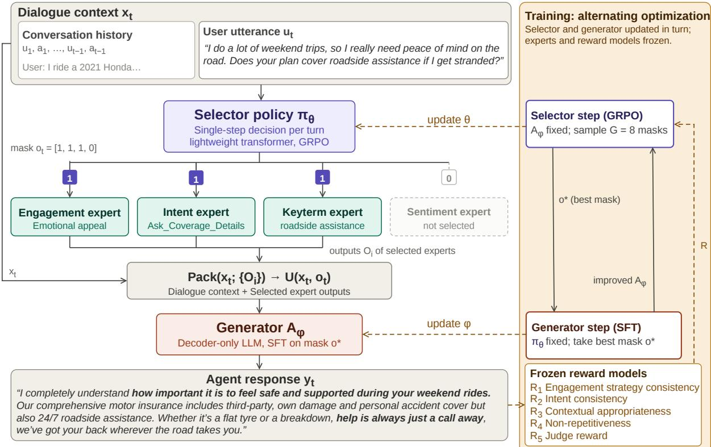  
Figure 1: PersuaRL architecture with selector, generator, and reward-guided response generation. Selector and generator are trained by alternating optimization; experts and reward models are frozen. Solid arrows mark the inference path followed at every turn, dashed arrows carry training-time signals only, and the faded box denotes an expert not selected by the mask

Judge Reward (R5): To capture high-level persuasive quality beyond surface-level signals, we introduce a judge-based reward that evaluates generated responses along dimensions such as persuasiveness, negotiation effectiveness, and user engagement, using an LLM acting as an automatic evaluator. The judge prompt is given in section E.

The overall reward is computed as: $R = \beta _ { 1 } R _ { 1 }$ + $\beta _ { 2 } R _ { 2 } + \beta _ { 3 } R _ { 3 } + \beta _ { 4 } R _ { 4 } + \beta _ { 5 } R _ { 5 }$ , where $\beta _ { 1 } + \beta _ { 2 }$ + $\beta _ { 3 } + \beta _ { 4 } + \beta _ { 5 } = 1$ . In addition to the rewards, we employed auxiliary penalty terms to promote efficient, diverse, and balanced expert selection during training. We provide a detailed description of all rewards and penalties in the Appendix C.5.

## 5 Experimental Results and Analysis

This section presents the experimental setup and provides a thorough evaluation of the proposed model, PersuaRL, through automatic, human, and

qualitative assessments.

## 5.1 Data Preprocessing

We use InsureDial, curated via a semi-automated pipeline combining LLM generation with human refinement. Dialogues cover diverse motorinsurance scenarios and persuasion strategies, segmented into user–agent turns to preserve multi-turn context. Annotations (intent, sentiment, key terms, and persuasion strategy) were quality-checked for consistency with dialogue flow. The corpus is split 80/5/15 into train/validation/test, with diversity maintained across splits. Additional experimental setup are shown in D.2.

## 5.2 Baselines Setup

We evaluate both closed-source and open-weight baselines in a single-shot setting, alongside a supervised fine-tuning (SFT) baseline. In the singleshot setup, models generate responses directly from the input without tool usage or intermediate reasoning. The comparison includes both open weight and proprietary models. To assess portability, we instantiate PersuaRL on open-weight backbones: LLAMA-3.2-3B-INSTRUCT (Meta, 2024b),

<table><tr><td>Dataset</td><td>Models</td><td>BLEU-2 ↑</td><td>METEOR ↑</td><td>BERTF1↑</td><td>DISTINCT-2 ↑</td><td>ROUGE-1 ↑</td><td>LLM-J↑</td></tr><tr><td rowspan="15">InsureDial</td><td>GPT 5 GPT 4.1 mini</td><td>0.036 0.124</td><td>0.093 0.143</td><td>0.828 0.620</td><td>0.982 0.998</td><td>0.232 0.383</td><td>一</td></tr><tr><td></td><td></td><td></td><td></td><td></td><td></td><td></td></tr><tr><td>Deepseek R1 Distill Llama 70B</td><td>0.069</td><td>0.125</td><td>0.569</td><td>0.920</td><td>0.260</td><td>4.25</td></tr><tr><td>Llama 3.3 70B Instruct</td><td>0.126</td><td>0.137</td><td>0.610</td><td>0.996</td><td>0.377</td><td>4.16</td></tr><tr><td>Qwen 3 32B</td><td>0.107</td><td>0.132</td><td>0.588</td><td>0.998</td><td>0.371</td><td>3.84</td></tr><tr><td>Phi-3-Medium 14B</td><td>0.169</td><td>0.167</td><td>0.655</td><td>0.995</td><td>0.441</td><td>3.78</td></tr><tr><td>Qwen 2.5 7B instruct Llama 3.1 8B instruct</td><td>0.124</td><td>0.145</td><td>0.604</td><td>0.958</td><td>0.385</td><td>3.66</td></tr><tr><td></td><td>0.132</td><td>0.146</td><td>0.605</td><td>0.966</td><td>0.388</td><td>3.67</td></tr><tr><td>Qwen 2.5 3B Instruct (Single)</td><td>0.090</td><td>0.128</td><td>0.562</td><td>0.965</td><td>0.310</td><td>2.66</td></tr><tr><td>Qwen 2.5 3B Instruct (SFT) PersuaRL (Qwen 2.5 3B)</td><td>0.305</td><td>0.217</td><td>0.727</td><td>0.991</td><td>0.556</td><td>3.28</td></tr><tr><td></td><td>0.375</td><td>0.250</td><td>0.760</td><td>0.991</td><td>0.609</td><td>3.81</td></tr><tr><td>Llama 3.2 3B Instruct (Single)</td><td>0.106</td><td>0.135</td><td>0.585</td><td>0.937</td><td>0.334</td><td>2.86</td></tr><tr><td>Llama 3.2 3B Instruct (SFT) PersuaRL (Llama 3.2 3B)</td><td>0.339</td><td>0.232</td><td>0.742</td><td>0.989</td><td>0.584</td><td>3.48</td></tr><tr><td></td><td>0.398</td><td>0.276</td><td>0.771</td><td>0.989</td><td>0.631</td><td>3.95</td></tr><tr><td>Phi 3 mini 128k (Single)</td><td>0.181</td><td>0.156</td><td>0.641</td><td>0.980</td><td>0.429</td><td>2.79</td></tr><tr><td>Phi 3 mini 128k (SFT) PersuaRL (Phi 3 mini)</td><td>0.362 0.374</td><td>0.242 0.261</td><td>0.752 0.762</td><td>0.988</td><td>0.600</td><td>3.39 3.86</td></tr><tr><td></td><td></td><td></td><td></td><td>0.990</td><td>0.611</td><td></td></tr><tr><td>Mistral 24B Instruct (Single)</td><td>0.043</td><td>0.094</td><td>0.772</td><td>0.898</td><td>0.195</td><td>3.02</td></tr><tr><td>Mistral 24B Instruct (SFT) PersuaRL (Mistral 24B)</td><td>0.324 0.355</td><td>0.226 0.241</td><td>0.815 0.873</td><td>0.990 0.992</td><td>0.574</td><td>3.65 4.12</td></tr><tr><td></td><td></td><td></td><td></td><td></td><td>0.596</td><td>2.41</td></tr><tr><td></td><td>Llama 3.2 3B instruct (Single) Llama 3.2 3B instruct (SFT)</td><td>0.049 0.080</td><td>0.085 0.104</td><td>0.519 0.552</td><td>0.937 0.986</td><td>0.195 0.267</td></tr><tr><td>DEAL</td><td>PersuaRL (Llama 3.2 3B)</td><td>0.087</td><td></td><td>0.536</td><td>0.987</td><td>0.278</td></tr><tr><td>(Priya</td><td></td><td></td><td>0.101</td><td></td><td></td><td></td></tr><tr><td>et al., 2024)</td><td>Phi 3 mini 128k (Single)</td><td>0.086</td><td>0.106</td><td>0.552</td><td>0.973</td><td>0.265</td></tr><tr><td></td><td>Phi 3 mini 128k (SFT)</td><td>0.089 0.094</td><td>0.110 0.121</td><td>0.558 0.568</td><td>0.984 0.985</td><td>0.273 0.281</td></tr><tr><td>PersuaRL (Phi 3 mini)</td><td></td><td></td><td></td><td></td><td></td><td>2.56 2.72</td></tr></table>

Table 2: Automatic evaluation results for InsureDial and DEAL datasets. Bold values indicate the best performance within each model group. Results are statistically significant at 5% significance level based on t-test. LLM-as-a Judge scores are omitted for GPT models to avoid evaluation bias, as the underlying judge model is also GPT-based.

PHI-3-MINI (Abdin et al., 2024), QWEN-2.5-3B-INSTRUCT (Yang et al., 2024), and MISTRAL-24B-INSTRUCT (Mistral AI, 2025), evaluating under three regimes: (i) single-shot, (ii) SFT, and (iii) PersuaRL. Additional details regarding the baselines are mentioned in Appendix C.

## 5.3 Evaluation Metrics

We conduct both automatic and human evaluations to assess the response quality. Automatic metrics include ROUGE-1 (R1) (Lin, 2004), BLEU-2 (B2) (Papineni et al., 2002), METEOR (MT) (Banerjee and Lavie, 2005), BERT-F1 (BF1) (Zhang et al., 2019), DISTINCT-2 (D2) (Li et al., 2015), and LLM-AS-A-JUDGE (LLM-J) (OpenAI, 2025a). Human evaluation is performed across five dimensions2: Fluency (F), Engagingness (E), Persuasive Effectiveness (PE), Strategy Appropriateness (SA), and Resistance Handling (RH). Full details are provided in the Appendix under the section C.

## 6 Results and Findings

Table 2 presents the automatic evaluation results for our framework, PersuaRL, alongside multiple baselines and serves as the basis for addressing the research questions outlined below.

## 6.1 Research Questions

R1) How good is PersuaRL compared to the baselines? PersuaRL (Mistral) consistently outperforms all baselines on the InsureDial dataset as shown in Table 2. Specifically, small backbone like Llama 3.2–3B PersuaRL achieves the result of BF1 ≈ 0.771, B2 ≈ 0.398, and R1 ≈ 0.631, outperforming much larger 14–70B vanilla baseline models. For example, PersuaRL (Phi-3 Mini) exceeds Phi-3 Medium 14B by roughly 16% and Qwen-3 32B by over 29% in BERT-F1. Although SFT helps models adapt to the insurance domain, its improvements largely saturate at surface-level generation. In contrast, PersuaRL consistently pushes the models beyond this plateau.

R2) Can reward-guided reinforcement learning for expert selection outperform heuristic, prompt-based routing in persuasive dialogue systems? PersuaRL surpasses prompt-based routing by framing expert selection as a learnable action optimized through reward-driven credit assignment. While prompt-based routers rely on fixed heuristics without feedback, PersuaRL uses GRPO to iteratively learn which expert combinations maximize persuasive effectiveness, enabling adaptive and context-sensitive expert coordination.

R3) How robust and transferable is PersuaRL? To rigorously assess the robustness and cross-domain transferability of PersuaRL, we conducted evaluations on the out-of-domain DEAL dataset, as shown in Table 2. Across all backbone configurations (Single → SFT → PersuaRL), we observe consistent and monotonic improvements, reflected in higher BF1 and R1 scores. Beyond aggregate performance, we further analyze the nature of transfer across domains. Despite differences in domain semantics (insurance vs. travel), annotation taxonomies, and user objectives, PersuaRL maintains strong performance, suggesting that the learned selector policies capture domain-agnostic persuasion patterns such as intent adaptation, and strategic framing rather than overfitting to datasetspecific heuristics. To better understand transfer behavior, we conducted a detailed error analysis (see Table 18). These findings indicate that PersuaRL learns a combination of domain-agnostic coordination strategies (reward models) and domainsensitive adaptations(generator), supporting its robustness and applicability across diverse dialogue settings.

## 7 Ablation Studies

Ablation study w.r.t Experts: The full PersuaRL model achieves the best overall performance, indicating that jointly leveraging all experts yields more persuasive responses. Removing any expert leads to consistent degradation, confirming that each module contributes meaningfully to the system. Results are reported in Table 3 using automatic metrics. Among the experts, the Engagement and Intent modules have the most pronounced impact. Excluding either results in notable drops in semantic alignment and relevance. Although the keyterm expert and sentiment expert’s individual impact is comparatively smaller, its removal still leads to a measurable decline in the overall quality.

All Tools vs PersuaRL : We evaluate PersuaRL against the AllExpert baseline, which uniformly activates all experts, across both PHI and LLAMA-3B LLMs. This ablation shows the impact of the selector in our framework. PersuaRL consistently outperforms AllExpert across all metrics, as shown in Figure 2, demonstrating strong generalization and better alignment with task preferences. Notably, it shows substantial gains in generation quality, particularly in semantic relevance and lexical overlap, with improvements most pronounced in R1 and BF1.

<table><tr><td>Models</td><td>B-2↑</td><td>MT↑</td><td>BF1↑</td><td>D-2↑</td><td>R1↑</td></tr><tr><td colspan="6">InsureDial</td></tr><tr><td>PersuaRL</td><td>0.375</td><td>0.250</td><td>0.760</td><td>0.991</td><td>0.609</td></tr><tr><td>PersuaRL - Engagement Expert</td><td>0.284</td><td>0.202</td><td>0.704</td><td>0.983</td><td>0.539</td></tr><tr><td>PersuaRL - Intent Expert</td><td>0.293</td><td>0.216</td><td>0.713</td><td>0.983</td><td>0.558</td></tr><tr><td>PersuaRL - Keyterm Expert</td><td>0.302</td><td>0.223</td><td>0.721</td><td>0.984</td><td>0.566</td></tr><tr><td>PersuaRL - Sentiment Expert</td><td>0.324</td><td>0.231</td><td>0.736</td><td>0.990</td><td>0.583</td></tr></table>

Table 3: Ablation study of expert modules for PersuaRL on the Qwen 2.5 3B model.

<table><tr><td>Models</td><td>F↑</td><td>E↑</td><td>PE↑</td><td>SA↑</td><td>RH↑</td></tr><tr><td colspan="6">InsureDial</td></tr><tr><td>Llama 3.2 3B Instruct (Single)</td><td>2.47</td><td>2.31</td><td>2.13</td><td>2.39</td><td>2.94</td></tr><tr><td>Llama 3.2 3B Instruct (SFT)</td><td>3.11</td><td>2.94</td><td>2.46</td><td>2.88</td><td>3.38</td></tr><tr><td>PersuaRL (Llama 3.2 3B)</td><td>4.12</td><td>4.51</td><td>4.36</td><td>4.29</td><td>4.46</td></tr><tr><td>Qwen 2.5 3B Instruct (Single)</td><td>2.69</td><td>2.45</td><td>2.29</td><td>2.68</td><td>3.10</td></tr><tr><td>Qwen 2.5 3B Instruct (SFT)</td><td>3.19</td><td>2.98</td><td>2.86</td><td>3.10</td><td>3.61</td></tr><tr><td>PersuaRL (Qwen 2.5 3B)</td><td>3.94</td><td>4.22</td><td>4.23</td><td>4.06</td><td>4.32</td></tr><tr><td>Mistral 24B Instruct (Single)</td><td>2.98</td><td>2.81</td><td>2.53</td><td>2.74</td><td>3.27</td></tr><tr><td>Mistral 24B Instruct (SFT)</td><td>3.23</td><td>3.34</td><td>3.10</td><td>3.19</td><td>3.76</td></tr><tr><td>PersuaRL (Mistral 24B)</td><td>4.26</td><td>4.39</td><td>4.54</td><td>4.33</td><td>4.45</td></tr></table>

Table 4: Human evaluation result on InsureDial datasets. The Single → SFT → PersuaRL trend holds consistently at 3B–24B scale.

Prompting Tool Selection Vs PersuaRL : PersuaRL outperforms prompt-based routing across both PHI and LLAMA-3B backbones, achieving higher fluency, relevance, and overall generation quality through preference-aligned expert coordination. These gains are consistent and do not compromise output diversity, demonstrating the effectiveness of reinforcement learning over generic routing strategies.

## 8 Human Evaluation

A team of annotators with domain expertise in insurance dialogue evaluation conducted a human assessment on 30% of the randomly sampled InsureDial test set. We evaluated three variants for each LLM (Llama 3.2 3B, Qwen 2.5 3B, and Mistral 24B): Single-shot, SFT-finetuned, and our proposed PersuaRL framework. As shown in Table 4, PersuaRL achieves the highest scores across all five dimensions for all the backbones, indicating consistent improvements in naturalness, engagement, and persuasion.

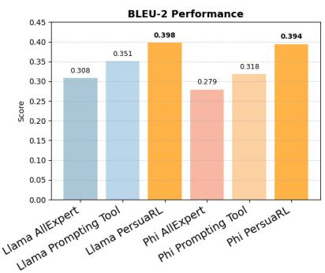

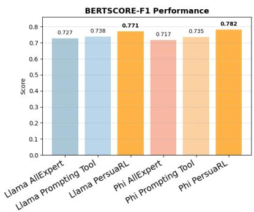

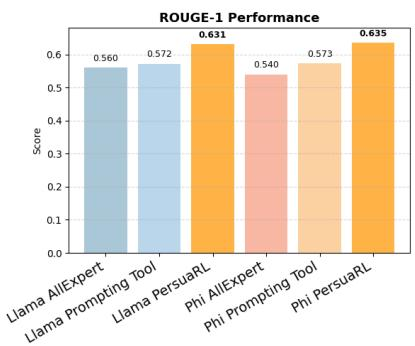  
Figure 2: Ablation Study of Llama 3B and Phi 3B variants under (a) All Tools (no selector), (b) Tools Selected via Prompting, (c) Tool Selection via Reward-Driven PersuaRL.

## 9 Qualitative Analysis

Figure 3 and Table 7 highlights qualitative differences between responses from single-shot, SFT, and PersuaRL, demonstrating two key distinctions: (1) PersuaRL generates more empathetic and persuasive responses, as seen in: “I completely understand how important it is to feel safe and supported during your weekend rides,” followed by reassurances like “help is always just a call away” and “we’ve got your back wherever the road takes you”. In contrast, SFT responses are more informative yet neutral merely listing features without usercentric framing. (2) PersuaRL also demonstrates greater fluency and structure, combining coverage details with contextual reassurance. For example, it fluidly mentions “third-party, own damage, and personal accident coverage but also 24/7 roadside assistance,” linking technical information with persuasive language. On the other hand, SFT and single shot give factual completeness but miss emotional framing. Additional qualitative examples generated by PersuaRL are provided in Appendix Table 20 and Table 21.

## 10 Conclusion

In this work, we proposed PersuaRL, a reinforcement learning-based framework for persuasive dialogue generation in the insurance domain. Through modular expert design and reward-guided selection, PersuaRL enables context-aware generation across LLM backbones. We also introduced InsureDial, a high-quality annotated dataset for insurance persuasion. PersuaRL consistently outperforms strong baselines across single-shot, SFT, and RL settings, including larger models, while producing fluent, persuasive, and emotionally aligned responses, highlighting its effectiveness for modular, goal-driven LLMs.

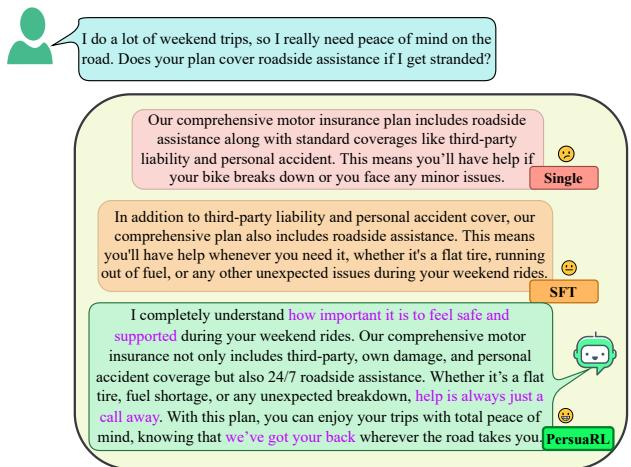  
Figure 3: Qualitative analysis for an input utterance, response by single, SFT and our PersuaRL.

## 11 Limitations

The limitations of this work are stated in the below points :

• InsureDial is constructed using a semiautomated pipeline where GPT-4o generates dialogues that are subsequently filtered by humans; this may introduce synthetic artifacts and may not fully capture real user behavior.

• The expert-selection policy operates over a binary mask, causing the action space to grow exponentially as the number of experts increases, which can hinder scalability despite the stabilizing effect of GRPO.

• Invoking multiple expert modules per dialogue turn increases inference latency, computational cost, and system complexity compared to singlemodel baselines, potentially impacting realworld deployment.

• All evaluation is offline and conditioned on gold dialogue history, so the model’s own responses never shape subsequent turns. We, therefore, do not assess interactive rollouts or real-user outcomes; live user studies remain future work.

• While we evaluate PersuaRL on smaller openweight backbones (3B–24B), applying the full framework with large-scale LLMs as both the selector and generator was not feasible due to computational resource constraints, as this demands substantial GPU memory and compute. We note this as a promising direction for future work.

## 12 Ethics Section

This work emphasizes ethical persuasion by treating it as decision support rather than decision enforcement, ensuring that user autonomy is preserved and that responses align with user intent, sentiment, and context without applying coercive or repetitive pressure. Given high-stakes domains, where inaccuracies can lead to harm, particular care is taken to ensure factual accuracy and prevent misleading information(Sahoo et al., 2024; Ghosh et al., 2025). To mitigate such risks, InsureDial was developed using a human-in-the-loop process, with domain experts validating seed dialogues and annotators verifying model-generated conversations, and explicitly annotating strategies and intents to support context-aware persuasion across multi-turn interactions.

## Acknowledgement

This research was conducted as part of the project “Conversational Agents with Negotiation and Influencing Ability”, sponsored by Accenture Labs, Bangalore, India. The authors also acknowledge the National Supercomputing Mission (NSM) for providing computing resources on the PARAM Rudra supercomputer.

## References

Marah Abdin, Sam Ade Jacobs, Ammar Ahmad Awan, Jyoti Aneja, Ahmed Awadallah, and Awadalla et al. 2024. Phi-3 technical report: A highly capable language model locally on your phone. arXiv preprint arXiv:2404.14219.

Satanjeev Banerjee and Alon Lavie. 2005. Meteor: An automatic metric for mt evaluation with improved correlation with human judgments. In Proceedings of the acl workshop on intrinsic and extrinsic evaluation

measuresfor machine translation and/or summarization, pages 65–72.

Federico Bianchi, Patrick John Chia, Mert Yuksekgonul, Jacopo Tagliabue, Dan Jurafsky, and James Zou. 2024. How well can llms negotiate? negotiationarena platform and analysis. arXiv preprint arXiv:2402.05863.

Nimet Beyza Bozdag, Shuhaib Mehri, Xiaocheng Yang, Hyeonjeong Ha, Zirui Cheng, Esin Durmus, Jiaxuan You, Heng Ji, Gokhan Tur, and Dilek Hakkani-Tür. 2026. Must read: A comprehensive survey of computational persuasion. ACM Computing Surveys, 58(12):1–39.

Simon Martin Breum, Daniel Vædele Egdal, Victor Gram Mortensen, Anders Giovanni Møller, and Luca Maria Aiello. 2024. The persuasive power of large language models. In Proceedings ofthe International AAAI Conference on Web and Social Media, volume 18, pages 152–163.

Wenhu Chen, Xueguang Ma, Xinyi Wang, and William W Cohen. 2022. Program of thoughts prompting: Disentangling computation from reasoning for numerical reasoning tasks. arXiv preprint arXiv:2211.12588.

Zhipeng Chen, Yingqian Min, Beichen Zhang, Jie Chen, Jinhao Jiang, Daixuan Cheng, Wayne Xin Zhao, Zheng Liu, Xu Miao, Yang Lu, and 1 others. 2025. An empirical study on eliciting and improving r1-like reasoning models. arXiv preprint arXiv:2503.04548.

Thomas H Costello, Gordon Pennycook, and David G Rand. 2024. Durably reducing conspiracy beliefs through dialogues with ai. Science, 385(6714):eadq1814.

DeepSeek-AI. 2025. Deepseek-r1: Incentivizing reasoning capability in llms via reinforcement learning. Preprint, arXiv:2501.12948.

Jacob Devlin, Ming-Wei Chang, Kenton Lee, and Kristina Toutanova. 2019. Bert: Pre-training of deep bidirectional transformers for language understanding. In Proceedings of the 2019 conference of the North American chapter ofthe associationfor computational linguistics: human language technologies, volume 1 (long and short papers), pages 4171–4186.

Soumya Suvra Ghosal, Vaibhav Singh, Akash Ghosh, Soumyabrata Pal, Subhadip Baidya, Sriparna Saha, and Dinesh Manocha. 2025. Relic: Enhancing reward model generalization for low-resource indic languages with few-shot examples. In EMNLP (Findings), pages 1502–1517.

Akash Ghosh, Tajamul Ashraf, Rishu Kumar Singh, Numan Saeed, Sriparna Saha, Xiuying Chen, and Salman Khan. 2026a. Carepilot: A multi-agent framework for long-horizon computer task automation in healthcare. arXiv preprint arXiv:2603.24157.

Akash Ghosh, Nishant Kumar, Nitesh Patnaik, Adity Prakash, Rishi Raj, and Sriparna Saha. 2026b. Rado: Trustworthy radiology impression generation using safety and faithfulness-based preference optimization. ACM Transactions on Computing for Healthcare, 7(3):1–18.

Akash Ghosh, Srivarshinee Sridhar, Raghav Kaushik Ravi, Muhsin Muhsin, Sriparna Saha, and Chirag Agarwal. 2025. Clinic: Evaluating multilingual trustworthiness in language models for healthcare. arXiv preprint arXiv:2512.11437.

Google. 2025. Gemini model updates february 2025. https://blog. google/technology/google-deepmind/ gemini-model-updates-february-2025/. Accessed: 2025-07-30.

Tanmoy Kanti Halder, Akash Ghosh, Subhadip Baidya, Arijit Roy, and Sriparna Saha. 2026. Arogyasutra: A multi-agent framework for multimodal medical reasoning in indic languages. arXiv preprint arXiv:2606.13572.

Chuhao Jin, Kening Ren, Lingzhen Kong, Xiting Wang, Ruihua Song, and Huan Chen. 2024. Persuading across diverse domains: a dataset and persuasion large language model. In Proceedings of the 62nd Annual Meeting of the Association for Computational Linguistics (Volume 1: Long Papers), pages 1678– 1706.

Sunghee Jung, Donghun Lee, Shinbok Lee, Gaeun Seo, Daniel Lee, Byeongil Ko, Junrae Cho, Kihyun Kim, Eunggyun Kim, and Myeongcheol Shin. 2025. Diatool-dpo: Multi-turn direct preference optimization for tool-augmented large language models. arXiv preprint arXiv:2504.02882.

Elise Karinshak, Sunny Xun Liu, Joon Sung Park, and Jeffrey T Hancock. 2023. Working with ai to persuade: Examining a large language model’s ability to generate pro-vaccination messages. Proceedings of the ACM on Human-Computer Interaction, 7(CSCW1):1–29.

John F Kelley. 1984. An iterative design methodology for user-friendly natural language office information applications. ACM Transactions on Information Systems (TOIS), 2(1):26–41.

Seungone Kim, Juyoung Suk, Shayne Longpre, Bill Yuchen Lin, Jamin Shin, Sean Welleck, Graham Neubig, Moontae Lee, Kyungjae Lee, and Minjoon Seo. 2024. Prometheus 2: An open source language model specialized in evaluating other language models. Preprint, arXiv:2405.01535.

Rohan Kirti, Atharva S Deshmukh, Kiran K Dugana, Yash Rathore, Shipra Shriparn, Sriparna Saha, Roshni R Ramnani, and Anutosh Maitra. 2026. Can language models persuade? exploring the persuasive efficacy of large language and vision language models. Computer Speech & Language, page 101991.

Jiwei Li, Michel Galley, Chris Brockett, Jianfeng Gao, and Bill Dolan. 2015. A diversity-promoting objective function for neural conversation models. arXiv preprint arXiv:1510.03055.

Xuefeng Li, Haoyang Zou, and Pengfei Liu. 2025. Torl: Scaling tool-integrated rl. arXiv preprint arXiv:2503.23383.

Chin-Yew Lin. 2004. Rouge: A package for automatic evaluation of summaries. In Text summarization branches out, pages 74–81.

Pan Lu, Bowen Chen, Sheng Liu, Rahul Thapa, Joseph Boen, and James Zou. 2025. Octotools: An agentic framework with extensible tools for complex reasoning. arXiv preprint arXiv:2502.11271.

Weicheng Ma, Hefan Zhang, Ivory Yang, Shiyu Ji, Joice Chen, Farnoosh Hashemi, Shubham Mohole, Ethan Gearey, Michael Macy, Saeed Hassanpour, and 1 others. 2025. Communication is all you need: Persuasion dataset construction via multi-llm communication. arXiv preprint arXiv:2502.08896.

Mary L McHugh. 2012. Interrater reliability: the kappa statistic. Biochemia medica, 22(3):276–282.

Meta. 2024a. Llama 3.3 70b instruct is now available on github models (ga). Llama 3.3 70B Instruct release.

Meta. 2024b. Meta LLaMA-3.2 3B Instruct. Instruction-tuned 3 billion-parameter lightweight text-only model with 128K context window (Llama3.2 series).

Meta AI. 2024. Meta LLaMA-3.1 8B Instruct. Instruction-tuned variant of LLaMA 3.1 with 8 billion parameters and 128K context length.

Mistral AI. 2025. Mistral small 3. Mistral-Small-24B-Instruct-2501. Available at https://huggingface.co/mistralai/ Mistral-Small-24B-Instruct-2501.

Eric Onyame, Akash Ghosh, Subhadip Baidya, Sriparna Saha, Xiuying Chen, and Chirag Agarwal. 2026. Cure-med: Curriculum-informed reinforcement learning for multilingual medical reasoning. In Proceedings of the 64th Annual Meeting of the Association for Computational Linguistics (Volume 1: Long Papers), pages 30682–30703.

OpenAI. 2025a. Introducing GPT-5. Accessed: 2026- 03-16.

OpenAI. 2025b. OpenAI GPT-4.1 Mini. Launched alongside GPT-4.1 and GPT-4.1 nano; supports up to 1M token context, improved coding and instructionfollowing performance.

OpenAI. 2025c. OpenAI GPT-4o. Launched alongside GPT-4.1 and GPT-4.1 nano; supports up to 1M token context, improved coding and instruction-following performance.

Kishore Papineni, Salim Roukos, Todd Ward, and Wei-Jing Zhu. 2002. Bleu: a method for automatic evaluation of machine translation. In Proceedings ofthe 40th annual meeting of the Association for Computational Linguistics, pages 311–318.

Adam Paszke, Sam Gross, Francisco Massa, Adam Lerer, James Bradbury, Gregory Chanan, Trevor Killeen, Zeming Lin, Natalia Gimelshein, Luca Antiga, and 1 others. 2019. Pytorch: An imperative style, high-performance deep learning library. Advances in neural information processing systems, 32.

Priyanshu Priya, Desai Vishesh Yasheshbhai, Ratnesh Kumar Joshi, Roshni Ramnani, Anutosh Maitra, Shubhashis Sengupta, and Asif Ekbal. 2024. Trip negotiator: A travel persona-aware reinforced dia logue generation model for personalized integrative negotiation in tourism. In Findings ofthe Association for Computational Linguistics: EMNLP 2024, pages 16566–16595.

Ganesh Prasath Ramani, Shirish Karande, Yash Bhatia, and 1 others. 2024. Persuasion games using large language models. arXiv preprint arXiv:2408.15879.

Aritra Raut, Subrata Das, Abhisek Tiwari, Sriparna Saha, Anutosh Maitra, Roshni Ramnani, and Shubhashis Sengupta. 2022. Introducing multi-modality in persuasive task oriented virtual sales agent. In International Conference on Neural Information Processing, pages 543–555. Springer.

Pranab Sahoo, Prabhash Meharia, Akash Ghosh, Sriparna Saha, Vinija Jain, and Aman Chadha. 2024. A comprehensive survey of hallucination in large language, image, video and audio foundation models. Findings of the association for computational linguistics: EMNLP 2024, pages 11709–11724.

Azlaan Mustafa Samad, Kshitij Mishra, Mauajama Firdaus, and Asif Ekbal. 2022. Empathetic persuasion: reinforcing empathy and persuasiveness in dialogue systems. In Findings ofthe Associationfor Computational Linguistics: NAACL 2022, pages 844–856.

Victor Sanh, Lysandre Debut, Julien Chaumond, and Thomas Wolf. 2019. Distilbert, a distilled version of bert: smaller, faster, cheaper and lighter. arXiv preprint arXiv:1910.01108.

Timo Schick, Jane Dwivedi-Yu, Roberto Dessì, Roberta Raileanu, Maria Lomeli, Eric Hambro, Luke Zettlemoyer, Nicola Cancedda, and Thomas Scialom. 2023. Toolformer: Language models can teach themselves to use tools. Advances in Neural Information Processing Systems, 36:68539–68551.

Jeonghoon Shim, Gyuhyeon Seo, Cheongsu Lim, and Yohan Jo. 2025. Tooldial: Multi-turn dialogue generation method for tool-augmented language models. arXiv preprint arXiv:2503.00564.

Joykirat Singh, Raghav Magazine, Yash Pandya, and Akshay Nambi. 2025. Agentic reasoning and tool

integration for llms via reinforcement learning. arXiv preprint arXiv:2505.01441.

Palleti Divya Sree, Manohar Raj Kokkiligadda, Jagannadham Teja, and Yelisetti Sandeep. 2023. Product negotiation in e-commerce website using chatbot. In 2023 7th International Conference on Computing Methodologies and Communication (ICCMC), pages 879–883. IEEE.

Jutta Stock, Volha Petukhova, and Dietrich Klakow. 2022. Assessment of sales negotiation strategies with iso 24617-2 dialogue act annotations. In Proceedings of the 18th Joint ACL-ISO Workshop on Interoperable Semantic Annotation within LREC2022, pages 10–19.

Takehiro Takayanagi, Kiyoshi Izumi, Javier Sanz-Cruzado, Richard McCreadie, and Iadh Ounis. 2025. Are generative ai agents effective personalized financial advisors? In Proceedings of the 48th International ACM SIGIR Conference on Research and Development in Information Retrieval, pages 286–295.

Qwen Team. 2025. Qwen3 technical report. Preprint, arXiv:2505.09388.

Abhisek Tiwari, Abhijeet Khandwe, Sriparna Saha, Roshni Ramnani, Anutosh Maitra, and Shubhashis Sengupta. 2023. Towards personalized persuasive dialogue generation for adversarial task oriented dialogue setting. Expert Systems with Applications, 213:118775.

Abhisek Tiwari, Sriparna Saha, Shubhashis Sengupta, Anutosh Maitra, Roshni Ramnani, and Pushpak Bhattacharyya. 2022a. Persona or context? towards building context adaptive personalized persuasive virtual sales assistant. In Proceedings ofthe 2nd Conference of the Asia-Pacific Chapter of the Association for Computational Linguistics and the 12th International Joint Conference on Natural Language Processing (Volume 1: Long Papers), pages 1035–1047.

Abhisek Tiwari, Tulika Saha, Sriparna Saha, Shubhashis Sengupta, Anutosh Maitra, Roshni Ramnani, and Pushpak Bhattacharyya. 2022b. A persona aware persuasive dialogue policy for dynamic and co-operative goal setting. Expert Systems with Applications, 195:116303.

Hongru Wang, Yujia Qin, Yankai Lin, Jeff Z Pan, and Kam-Fai Wong. 2024. Empowering large language models: Tool learning for real-world interaction. In Proceedings of the 47th International ACM SIGIR Conference on Research and Development in Information Retrieval, pages 2983–2986.

Ke Wang, Houxing Ren, Aojun Zhou, Zimu Lu, Sichun Luo, Weikang Shi, Renrui Zhang, Linqi Song, Mingjie Zhan, and Hongsheng Li. 2023. Mathcoder: Seamless code integration in llms for enhanced mathematical reasoning. arXiv preprint arXiv:2310.03731.

Xuewei Wang, Weiyan Shi, Richard Kim, Yoojung Oh, Sijia Yang, Jingwen Zhang, and Zhou Yu. 2019. Persuasion for good: Towards a personalized persuasive dialogue system for social good. arXiv preprint arXiv:1906.06725.

Benjamin Warner, Antoine Chaffin, Benjamin Clavié, Orion Weller, Oskar Hallström, Said Taghadouini, Alexis Gallagher, Raja Biswas, Faisal Ladhak, Tom Aarsen, and 1 others. 2024. Smarter, better, faster, longer: A modern bidirectional encoder for fast, memory efficient, and long context finetuning and inference. arXiv preprint arXiv:2412.13663.

Thomas Wolf, Lysandre Debut, Victor Sanh, Julien Chaumond, Clement Delangue, Anthony Moi, Pierric Cistac, Tim Rault, Rémi Louf, Morgan Funtowicz, and 1 others. 2019. Huggingface’s transformers: State-of-the-art natural language processing. arXiv preprint arXiv:1910.03771.

An Yang, Baosong Yang, Binyuan Hui, Bo Zheng, Bowen Yu, Chang Zhou, Chengpeng Li, Chengyuan Li, Dayiheng Liu, Fei Huang, Guanting Dong, Haoran Wei, Huan Lin, Jialong Tang, Jialin Wang, Jian Yang, Jianhong Tu, Jianwei Zhang, Jianxin Ma, and 40 others. 2024. Qwen2 technical report. arXiv preprint arXiv:2407.10671.

Xiang Yue, Xingwei Qu, Ge Zhang, Yao Fu, Wenhao Huang, Huan Sun, Yu Su, and Wenhu Chen. 2023. Mammoth: Building math generalist models through hybrid instruction tuning. arXiv preprint arXiv:2309.05653.

Saizheng Zhang, Emily Dinan, Jack Urbanek, Arthur Szlam, Douwe Kiela, and Jason Weston. 2018. Personalizing dialogue agents: I have a dog, do you have pets too? arXiv preprint arXiv:1801.07243.

Tianyi Zhang, Varsha Kishore, Felix Wu, Kilian Q Weinberger, and Yoav Artzi. 2019. Bertscore: Evaluating text generation with bert. arXiv preprint arXiv:1904.09675.

## Frequently Asked Questions

1. Is the strategy-consistency reward misaligned since persuasion strategies are annotated on agent turns, not user turns?

Response: The strategy-consistency reward is used as a soft alignment signal rather than a hard supervisory target. While strategy annotations are available for agent turns, conditioning on the user utterance encourages the selector to anticipate the appropriate persuasive response given the user’s expressed needs. We acknowledge this approximation and view it as a practical surrogate that avoids requiring gold strategy labels at inference time.

## 2. Are the reward equations underspecified, particularly with respect to class probabilities and weights?

Response: The reward formulation uses classconditional probabilities from pretrained classifiers; the omission of explicit class indices in the main text was for brevity. All rewards are computed using the predicted probability of the target class, and weights are normalized to sum to one.

## 3. Does the contextual similarity reward encourage copying from the dialogue context or user utterance?

Response: To mitigate copying, the contextual reward is complemented by a non-repetitiveness penalty that discourages lexical overlap with prior agent responses. Empirically, we observe improvements in diversity metrics (DISTINCT-2) alongside relevance gains, indicating that the model does not simply copy input text.

## 4. Is the selector architecture and GRPO training pipeline sufficiently specified for reproducibility?

Response: The selector is implemented as a lightweight transformer-based policy operating over a binary expert mask. GRPO is used with fixed group size, clipping range, and KL regularization. While the main paper focuses on conceptual clarity, all architectural details, hyperparameters, and training phases are provided in the appendix.

## 5. Why are some closely related persuasion and routing baselines not included?

Response : Our primary goal is to compare against strong single-shot, SFT, and heuristicrouting baselines under identical backbones. Many intent-to-strategy and persona-aware models rely on additional supervision or assumptions not directly comparable to our expert-selection setting.

## 6. Does reinforcement learning improve persuasion or just optimize reward models?

Response : PersuaRL applies reinforcement learning only to expert-selection actions. The generator is held fixed within each GRPO step and is never updated on the reward directly; it is updated only by supervised fine-tuning on the ground-truth response given the highest-reward expert selection. This limits the policy’s ability to exploit reward artifacts. Despite relying on rewards, the learned selection policy consistently improves independent human evaluated metrics, indicating that rewardoptimized expert generalizes beyond the reward models.

## 7. How does PersuaRL avoid reward circularity during training?

Response: Reward circularity would occur if the model were trained to generate responses that directly satisfy the same models used to evaluate them. PersuaRL avoids this by keeping the reward models frozen throughout and applying reinforcement learning only to expert-selection decisions, a discrete action space of 2n masks that cannot shape response text directly. The generator is never optimized against the reward: its parameters are updated only by supervised fine-tuning toward ground-truth responses, and the reward’s sole influence on this step is the choice of which expert-augmented input is paired with the gold response. Reward therefore reaches the selector only indirectly, through the effect of its selection on the generator’s output, and cannot be exploited by altering the generator’s output distribution.

## 8. How robust is the system to missing or noisy experts?

Response: Robustness is partially evaluated through ablations that remove individual experts, showing graceful degradation rather than collapse. While we do not explicitly simulate noisy expert outputs, this remains an important extension for future study.

## 9. Does PersuaRL introduce excessive inference overhead?

Response: PersuaRL trades additional computation for improved persuasion quality. In practice, only a small subset of experts is selected per turn, and all experts are lightweight models. On average, PersuaRL is taking 1.4 times more inference time than the SFT baselines. We report this as a conscious design trade-off rather than a limitation of feasibility.

## 10. How should the results be interpreted beyond the insurance domain?

Response : InsureDial serves as a controlled, high-stakes testbed for persuasion. While absolute performance may not transfer directly, the formulation of expert selection as a learnable policy is domain-agnostic and can be applied to other persuasive dialogue settings, as shown by our robustness study.

11. How does the PersuaRL framework transfer to out-of-domain datasets, and what is the motivation for selecting DEAL as the out-ofdomain benchmark?

Response :The core contribution of PersuaRL is the selector policy that formulates expert coordination as a learnable decision-making problem. This formulation is domain-agnostic in the sense that it treats expert coordination as a reinforcement learning problem operating over expert signals and reward feedback, independent of insurance-specific semantics. However, the learned policy is influenced by the reward signals and expert training specific to the motor-insurance setting. We selected DEAL as a baseline because it is a multi-turn negotiation benchmark involving persuasion dynamics such as resistance handling, objective trade-offs, and strategic adaptation. Our goal was not to claim universal persuasion generalization, but to evaluate whether the expert-coordination mechanism continues to provide benefit under domain shift.

## A Appendix

This appendix provides supplementary material, including detailed descriptions of dataset construction (Section B), experimental settings and implementation details (Section C), additional experimental results (Section D), and the full set of prompts used in our experiments (Section E).

## B Dataset Construction

## B.1 Annotation guidelines

A critical part of our pipeline was comprehensive annotator training and clear instructions. Before beginning annotation, annotators were explicitly trained using sample dialogues illustrating each persuasion strategy, user intent, sentiment, and key term category. They were provided with detailed annotation guidelines, including definitions, decision rules, and examples for every label. This ensured a shared understanding and consistency across annotators from the outset. The dataset was annotated across four key dimensions: (i) Engagement Strategy (Logical, Credibility, Emotional, Personal, Persona, Default), (ii) User Intent (Request Quote, Ask Coverage Details, Express Concern, Request Additional Info, Confirm Interest, Ask Price/Premium), (iii) Sentiment (Positive, Neutral, Negative), and (iv) Key Domain Terms (e.g., “No Claim Bonus,” “Roadside Assistance,” “Depreciation”).

## B.2 Dataset Annotation

The InsureDial dataset was annotated through a carefully staged, human-in-the-loop process involving five trained human annotators. We began by manually annotating 75 dialogues, where each utterance was labelled across four dimensions: engagement strategy, user intent, sentiment, and key domain terms. These 75 dialogues served as goldstandard references for subsequent semi-automated annotation. An initial labeling pass was performed using Gemini-2.0-Flash (Google, 2025) for efficiency, and all labels were subsequently verified and refined by human annotators to ensure correctness and contextual alignment. To achieve this, we designed few-shot prompts using examples drawn from the initial 75 human-annotated dialogues, enabling Gemini to accurately assign labels. As a quality safeguard, we first conducted a pilot annotation of 30 dialogues with Gemini, which were fully reviewed by human annotators. Only after the annotators confirmed the correctness and reliability of these annotations did we proceed to annotate the rest of the dataset, maintaining human verification in the loop to ensure high-quality and contextually accurate labels. A representative example from the InsureDial dataset is shown in Table 19.

## C Experiment Details

Baselines Details. In addition to implementing PersuaRL on smaller language models, we also incorporated large scale baseline models, including both open source and proprietary systems, as shown below.

1. Closed-Source Models: GPT 5 (OpenAI, 2025a), GPT-4.1 Mini (OpenAI, 2025b)

2. Open-Weight Models: DeepSeek-R1-Distill-LLaMA 70B (DeepSeek-AI, 2025), LLaMA-3.3-70B-Instruct (Meta, 2024a), Qwen-3- 32B (Team, 2025), Mistral-24B-Instruct (Mistral AI, 2025), Phi-3-Medium-14B (Abdin et al., 2024), LLaMA-3.1-8B-Instruct (Meta AI, 2024), Qwen-2.5-7B-Instruct (Yang et al., 2024)

We systematically compare single-shot generation, SFT, and PersuaRL across small open-weight models. Larger models (32B–70B) serve as highcapacity references, while our approach highlights PersuaRL’s ability to achieve their performance even with compact models.

## C.1 Inference Regime

Our experiments evaluate models under three distinct regimes, single-shot, SFT, and PersuaRL, to provide a full picture of how different approaches impact persuasive dialogue generation.

## C.1.1 Single-Shot Generation.

In the single-shot setting, the model is tasked with generating the agent’s next response based solely on the full dialogue context, which includes the entire conversation history and the current user utterance, without any task-specific fine-tuning. The model is provided with a simple instruction prompt alongside the conversation, and it produces a response in a single forward pass. In this regime, the model does not leverage intermediate reasoning, expert modules, or any reward-based selection, it simply relies on the general knowledge and capabilities acquired during pretraining. This setup establishes a baseline to assess how well large language models can generate contextually relevant and potentially persuasive responses without any explicit adaptation to the insurance dialogue domain.

<table><tr><td rowspan=1 colspan=1>User Utterances</td><td rowspan=1 colspan=1>Keyterms</td></tr><tr><td rowspan=1 colspan=1>Hi, I&#x27;m looking for a motor insurance policy for my bike. It&#x27;s a 2022 Royal EnfieldClassic 350.</td><td rowspan=1 colspan=1>Motor insurance, 2022 Royal En-field Classic 350</td></tr><tr><td rowspan=1 colspan=1>That sounds good. What about roadside assistance? I&#x27;ve heard Teslas can sometimeshave issues.</td><td rowspan=1 colspan=1>Roadside assistance</td></tr><tr><td rowspan=1 colspan=1>Okay, &#x27;user-friendly&#x27; sounds good. What about discounts? As a student, every bithelps.</td><td rowspan=1 colspan=1>User-friendly, Discounts</td></tr><tr><td rowspan=1 colspan=1>Hi, I need to get a new motor insurance policy for my 2020 Hyundai Elantra.</td><td rowspan=1 colspan=1>Motor insurance, 2020 HyundaiElantra</td></tr><tr><td rowspan=1 colspan=1>Personal Accident Cover sounds important. What else should I consider for a bikelike mine?</td><td rowspan=1 colspan=1>Personal Accident Cover</td></tr><tr><td rowspan=1 colspan=1>Zero Depreciation and Roadside Assistance... what exactly do those do?</td><td rowspan=1 colspan=1>Zero Depreciation, Roadside Assis-tance</td></tr><tr><td rowspan=1 colspan=1>Paperless claims sounds ideal. I&#x27;m not a fan of excessive forms. Can you send me thedetails to review?</td><td rowspan=1 colspan=1>Paperless claims</td></tr></table>

Table 5: Critical keyterms pertaining to the motor insurance domain.
<table><tr><td rowspan=1 colspan=1>Engagement Expert</td><td rowspan=1 colspan=1>Agent Utterances</td></tr><tr><td rowspan=1 colspan=1>Logical Appeal</td><td rowspan=1 colspan=1>Welcome! I&#x27;m glad to help you with motor insurance for your new Tesla Model 3. Our policiesoffer comprehensive coverage for electric vehicles, including battery protection. Let&#x27;s discuss theoptions that best suit your needs.</td></tr><tr><td rowspan=1 colspan=1>Credibility Appeal</td><td rowspan=1 colspan=1>Tata AIG has built a strong reputation in the insurance industry for over two decades. Ourcommitment to innovation, customer-centric approach, and robust risk management practicesmake us a reliable choice for motor insurance. We leverage modern technology to streamlineprocesses, ensuring a seamless and hassle-free experience for our customers. With Tata AIG, youcan trust that your Tesla Model 3 and your family are in good hands.</td></tr><tr><td rowspan=1 colspan=1>Emotional Appeal</td><td rowspan=1 colspan=1>I completely understand your concerns about keeping your family safe on the road. Our compre-hensive coverage options for your 2010 Honda Accord include third-party liability, own damage,and add-on covers to ensure maximum protection for you and your loved ones. Let&#x27;s discuss thebest plan that suits your needs and provides peace of mind while driving.</td></tr><tr><td rowspan=1 colspan=1>Persona-Based Appeal</td><td rowspan=1 colspan=1>I&#x27;m delighted to help you with your insurance needs for your new 2024 Tesla Model 3. To provideyou with an accurate quote, I&#x27;ll need a few details about your driving history and preferences.Once I have that information, I can offer you a tailored policy that suits your needs and budget.Let&#x27;s get started!</td></tr><tr><td rowspan=1 colspan=1>Personal Appeal</td><td rowspan=1 colspan=1>Reliance General Insurance offers competitive rates and a range of coverage options for your2018 Maruti Suzuki Baleno. As a valued customer, you may be eligible for loyalty discounts.Let&#x27;s explore the benefits and coverage details of Reliance General Insurance to see if it&#x27;s theright fit for you and your budget.</td></tr><tr><td rowspan=1 colspan=1>Default</td><td rowspan=1 colspan=1>I&#x27;m glad you&#x27;re considering our insurance for your 2010 Maruti Suzuki Swift. Regarding theclaim process, we strive to make it as simple and straightforward as possible. You can file a claimthrough our website or by calling our customer service line. Our team is always ready to assistyou, and we&#x27;ll guide you through the process step by step. If you have any concerns or questions,please don&#x27;t hesitate to ask. We&#x27;re here to help.</td></tr></table>

Table 6: Example agent utterances for different engagement expert strategies in the insurance domain.

## C.1.2 Supervised Fine-Tuning (SFT).

SFT involves fine-tuning the base open-weight models on the InsureDial dataset using a nexttoken prediction objective. This approach helps the model internalize domain-specific dialogue patterns and persuasion strategies. Given a dialogue context $x = ( u _ { 1 } , a _ { 1 } , \dotsc , u _ { t } )$ and the target agent response $y = ( y _ { 1 } , y _ { 2 } , \dots y _ { T } )$ , the model is trained to maximize the likelihood of the next token:

$$
\mathcal { L } = - \sum _ { t = 1 } ^ { T } \log P _ { \theta } \left( y _ { t } \mid x , y _ { < t } \right) .
$$

where $y _ { < t }$ represents all previously generated tokens in the agent’s response. We use the same simple conversation prompt as in the single-shot setting, but now the model has been fine-tuned to better predict the next agent utterance based on similar examples in the training set. SFT significantly improves response fluency and alignment with domain-specific persuasive strategies, but remains deterministic and does not dynamically adapt strategies at inference time beyond what it memorized during training.

<table><tr><td rowspan=1 colspan=2>InsureDial</td></tr><tr><td rowspan=1 colspan=1>Context</td><td rowspan=1 colspan=1>User: Hello, I need to insure my 2022 Tesla Model 3. It&#x27;s a new car, and I want the best coveragepossible.Agent: I&#x27;m delighted to help you with your insurance needs for your new 2022 Tesla Model 3. We offercomprehensive coverage options tailored to electric vehicles, ensuring your car is protected in all keyareas. Let&#x27;s discuss the best plan for you to provide the peace of mind you deserve.User: I&#x27;m a business owner, 45 years old, and I primarily drive the Tesla on weekends with my family.Safety for them is paramount, and I don&#x27;t mind paying for premium protection.Agent: Given your role as a business owner and the importance you place on safety for your family,I&#x27;m glad to inform you that our comprehensive EV coverage includes features designed to prioritizeyour loved ones&#x27;well-being. We&#x27;ll work together to find a plan that offers premium protection for your2022 Tesla Model 3, ensuring peace of mind for both your personal and professional life. Let&#x27;s discussthe details further to fnd the perfect fit for your needs.User: That sounds promising. What makes it &quot;premium&quot; protection? I want comprehensive coverage,of course.</td></tr><tr><td rowspan=1 colspan=1>Gold Response</td><td rowspan=1 colspan=1>Our premium protection goes beyond standard coverage, offering enhanced features such as extendedwarranty, roadside assistance, and personal accident coverage. This comprehensive coverage ensuresthat you and your family are well-protected in various scenarios, providing the peace of mind you seekfor your 2022 Tesla Model 3. Let&#x27;s delve deeper into the specifics of our premium protection plan tofind the best fit for your needs.</td></tr><tr><td rowspan=1 colspan=1>Single</td><td rowspan=1 colspan=1>Premium protection just means your Tesla will be covered for accidents and other situations. You willhave comprehensive coverage that should keep your car insured.</td></tr><tr><td rowspan=1 colspan=1>SFT</td><td rowspan=1 colspan=1>Our premium protection plan offers full accident coverage, roadside assistance, and protection for boththe vehicle and passengers. It&#x27;s designed to provide complete comprehensive coverage for Tesla ownerslike you. You&#x27;ll have strong protection whether driving for personal use or with family on weekends.</td></tr><tr><td rowspan=1 colspan=1>PersuaRL</td><td rowspan=1 colspan=1>Our premium protection is built to give you total confidence every time you take your Tesla out.Beyond standard coverage, it includes enhanced passenger safety, extended vehicle protection, roadsideassistance, and personal accident benefits. Whether it&#x27;s a weekend trip with your family or a dailyerrand, you&#x27;ll enjoy complete peace of mind knowing your 2022 Tesla Model 3 and your loved ones arefully shielded. Let&#x27;s explore the details together to ensure you get the absolute best protection for yourlifestyle.</td></tr></table>

Table 7: Qualitative Analysis

## C.2 Expert Module

The Expert Module in PersuaRL leverages four specialized transformer-based models, Engagement Expert, Intent Expert, Keyterm Expert, and Sentiment Expert, to generate persuasive and context-aware responses. Each expert focuses on a distinct aspect of dialogue understanding and contributes unique insights to the final output.

## 1. Engagement Expert

The Engagement Expert determines the most suitable persuasion strategy for the current dialogue turn. It classifies the context into six strategies, each defined as follows:

(a) Logical Appeal – Employs factual reasoning, feature comparisons, or costbenefit arguments to support recommendations.

(b) Credibility Appeal – Highlights trustworthiness, reliability, or reputation of the insurance provider.

(c) Emotional Appeal – Focuses on creating reassurance, security, or peace of mind for the user.

(d) Personal Appeal – Adapts responses to the user’s explicitly stated needs or concerns.

(e) Persona Appeal – Aligns policy recommendations with the user’s lifestyle, habits, or preferences.

(f) Default (Neutral) – Provides straightforward, informative responses without explicit persuasive framing.

This expert is fine-tuned using negative loglikelihood (NLL) loss given by $L _ { n l l }$ =

$\scriptstyle \sum _ { t = 1 } ^ { T }$ log $P _ { \theta } ( y _ { t } \mid y _ { < t } , x , \hat { k } )$ respectively to balance accurate strategy classification and fluent generation. The examples of each strategy are shown in Table 6.

<table><tr><td rowspan=1 colspan=1>Intent</td><td rowspan=1 colspan=1>User Utterances</td></tr><tr><td rowspan=1 colspan=1>Request_Insurance_Quote</td><td rowspan=1 colspan=1>Hi, I&#x27;m looking to get insurance for my bike. It&#x27;s a 2022 Royal EnfieldInterceptor 650.</td></tr><tr><td rowspan=1 colspan=1>Ask_Coverage_Details</td><td rowspan=1 colspan=1>What does the comprehensive plan cover exactly?</td></tr><tr><td rowspan=1 colspan=1>Express_Concern</td><td rowspan=1 colspan=1>Safety for my family is my top priority, but I also run a business, so Ineed to be mindful of the cost.</td></tr><tr><td rowspan=1 colspan=1>Ask_Additional_Info</td><td rowspan=1 colspan=1>What about the company&#x27;s reputation? I want to make sure they&#x27;rereliable.</td></tr><tr><td rowspan=1 colspan=1>Confirm_Interest</td><td rowspan=1 colspan=1>That&#x27;s a reasonable price. I&#x27;m happy to buy it online.</td></tr><tr><td rowspan=1 colspan=1>Ask_Price_or_Premium</td><td rowspan=1 colspan=1>What does the Tata AIG comprehensive policy cover specifically forelectric vehicles?</td></tr></table>

Table 8: Example user utterances for different intents in the insurance domain.

## 2. Intent Expert

The Intent Expert identifies the user’s underlying goal in each turn, which is crucial for generating contextually relevant and strategyaligned responses. Typical intents include Request Quote, Ask Coverage Details, Express Concern, Request Additional Info, Confirm Interest, and Ask Price. Accurate intent detection allows the system to adapt its persuasive approach to the user’s decisionmaking stage. This expert is trained with categorical cross-entropy and NLL loss, where $\begin{array} { r } { \dot { L _ { n l l } } = - \sum _ { t = 1 } ^ { T } \log { \dot { P _ { \theta } } ( y _ { t } \mid y _ { < t } , x , \hat { i } ) } } \end{array}$ , to ensure robust classification and context-aware response generation. The examples of each strategy are shown in Table 8.

## 3. Keyterm Expert

The Keyterm Expert extracts critical domainspecific terms from the user’s utterances, such as “depreciation,” “roadside assistance,” or “personal accident coverage.” These key terms help the system highlight essential insurance concepts, making responses precise and informative. The model is fine-tuned using next-token prediction on masked sequences labeled with key terms, producing structured outputs that are integrated by the Generator. The loss function is given by $L _ { k e y t e r m } =$ $\textstyle - \sum _ { t = 1 } ^ { T } \log P ( x _ { t } \mid x _ { < t } )$ . The examples of each strategy are shown in Table 5.

## 4. Sentiment Expert

The Sentiment Expert detects the emotional tone of the user’s message, classifying it as Positive, Neutral, or Negative. This enables sentiment-aware adaptation, such as providing empathy or reassurance when negative sentiment is detected. By understanding emotion, the system can engage users more effectively and build trust during multi-turn dialogues. It enables sentiment-aware response generation, allowing the Engagement Expert to align its strategy with the user’s emotional state (e.g., emphasizing reassurance for negative sentiment). This expert is trained with cross-entropy classification loss $L _ { s e n t i m e n t } =$ $\begin{array} { r } { - \sum _ { c \in \{ p o s , n e g , n e u \} } y _ { c } \log \hat { y } _ { c } , } \end{array}$ to ensure robust sentiment recognition.

## C.3 Classification Model.

We built the Engagement Strategy Consistency Reward (ESCR) and Intent Consistency Reward (ICR) by fine-tuning three pre-trained classifiers: BERT-Large (Devlin et al., 2019), DistilBERT-base (Sanh et al., 2019), and ModernBERT (Warner et al., 2024), on the InsureDial dataset. The performance of these classifiers is reported in Table 9. It is evident that BERT outperforms the other models in terms of both Accuracy (Acc) and Macro F1 score.

## C.4 Evaluation Details.

We conducted a comprehensive evaluation of automatic and human metrics. For automatic metrics, scores are computed per agent turn and averaged across all turns in the test set. For human evaluation, Fluency, Engagingness, and Strategy Appropriateness are assessed at the turn level, while Persuasive Effectiveness and Resistance Handling are evaluated at the dialogue level.

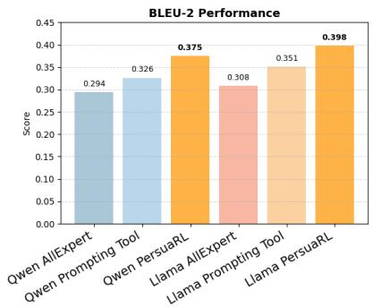

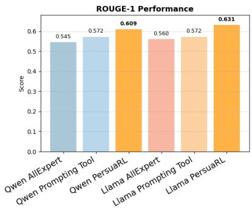

Figure 4: Ablation Study of Qwen 3B and Llama 3B variants under (a) All Tools (no selector), (b) Tools Selected via Prompting, (c) Tool Selection via Reward-Driven PersuaRL.  
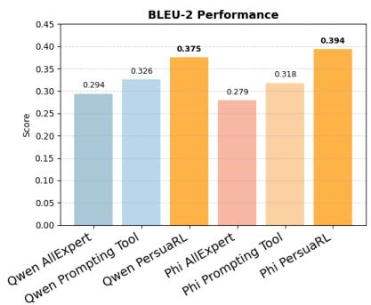

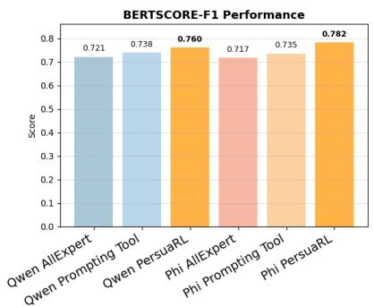

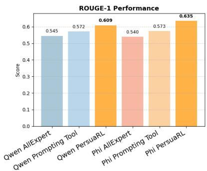  
Figure 5: Ablation Study of Qwen 3B and Phi 3B variants under (a) All Tools (no selector), (b) Tools Selected via Prompting, (c) Tool Selection via Reward-Driven PersuaRL.

## C.4.1 Human Evaluation Metrics

Human evaluation is conducted across five dimensions to comprehensively assess the quality and effectiveness of generated responses. Fluency (F) measures the grammatical correctness, syntactic well-formedness, and overall readability of the response. Engagingness (E) evaluates how well the response sustains user interest by maintaining relevance and providing informative or contextually appropriate content. Persuasive Effectiveness (PE) measures how convincingly the response supports its intended argument. A highly persuasive response presents clear reasoning, compelling evidence and coherent argumentation that encourages the user to adopt the suggested viewpoint. Additionally, this metric evaluates whether the response appropriately incorporates relevant persuasion strategies or not. Strategy Appropriateness (SA) evaluates whether the response uses the most suitable task-specific strategy for the given context. This includes selecting approaches that are goal-oriented, context-aware, and aligned with the expected dialogue style (e.g., logical, emotional, or credibility). Resistance Handling (RH) assesses the system’s ability to address user hesitations, objections, or counterarguments effectively. High performance in this metric involves acknowledging user concerns, providing contextually appropriate responses, and maintaining coherence without becoming confrontational or dismissive.

## C.5 Rewards and Penalties

The additional details of the rewards are given below:

Engagement Strategy Consistency Reward (R1): To ensure that the generated responses remain consistent with the user’s persuasion strategy, we fine-tune a BERT (Devlin et al., 2019) based persuasion strategy classifier (achieve 82.1% accuracy on INSUREDIAL) trained on six persuasion strategy labels $\mathcal { P } = \{ 0 , 1 , 2 , 3 , 4 , 5 \}$ ; for each strategy $p \in$ $\mathcal { P } _ { : }$ we compute a persuasion prototype embedding as PersuasionProto $\begin{array} { r l r } { \mathrm { ~  ~ \gamma ~ } _ { } } & { { } = } & { \bar { \frac { 1 } { N _ { p } } } \sum _ { j = 1 } ^ { N _ { p } ^ { - } } } \end{array}$ $E m b e d ( u _ { j } ^ { p } )$ where $N _ { p }$ is the number of utterances labeled with strategy p. Given a generated response $r _ { T }$ , its compatibility score with strategy p is $S _ { p } ( r _ { T } )$ = cos $( E m b e d ( r _ { T } )$ , PersuasionProtop, and the persuasion strategy alignment reward is formulated as:

<table><tr><td rowspan="2">Classifier</td><td colspan="2">BERT-large</td><td colspan="2">DistilBERT-base</td><td colspan="2">ModernBERT</td></tr><tr><td>Acc</td><td>F1</td><td> $\mathbf { A c c }$ </td><td>F1</td><td>Acc</td><td>F1</td></tr><tr><td>ESCR</td><td>82.14</td><td>75.53</td><td>81.49</td><td>71.80</td><td>81.64</td><td>72.39</td></tr><tr><td>ICR</td><td>84.91</td><td>74.49</td><td>81.52</td><td>72.34</td><td>80.78</td><td>70.26</td></tr></table>

Table 9: Performance on the InsureDial dataset (Accuracy and Macro F1).

$$
R _ { 1 } = \sum _ { p \in \mathcal { P } } P _ { p } ^ { \mathrm { p e r s } } ( u _ { T } ) \cdot S _ { p } ( r _ { T } ) + \lambda \operatorname* { m a x } _ { p \in \mathcal { P } } S _ { p } ( r _ { T } )\tag{3}
$$

where, $P _ { p } ^ { \mathrm { p e r s } } ( u _ { T } )$ is the BERT-predicted probability that the user utterance $u _ { T }$ belongs to persuasion strategy $p ,$ and the first term encourages the generated response to align with the user’s persuasion strategy distribution. We introduce λ to balance alignment and confidence, where higher λ emphasizes the most compatible class 3.

Intent Consistency Reward (R2): To ensure that the generated responses remain consistent with the user’s intent, we fine-tune a BERT (Devlin et al., 2019) based intent classifier (achieve 84.9% accuracy on INSUREDIAL) trained on six user intent labels $\mathcal { T } ~ = ~ \{ 0 , 1 , 2 , 3 , 4 , 5 \}$ ; for each intent $i \in \mathcal { Z } ,$ , we compute an intent prototype embedding as Inten $\begin{array} { r } { P r o t o _ { i } \ = \ \frac { 1 } { N _ { i } } \sum _ { j = 1 } ^ { \tilde { N _ { i } } } E m b e d ( u _ { j } ^ { i } ) } \end{array}$ where $N _ { i }$ is the number of utterances labeled with intent i. Given a generated response $r _ { T }$ its compatibility score with intent i is defined as $S _ { i } ( r _ { T } ) = \cos { \left( E m b e d ( r _ { T } ) \right. }$ , IntentProto , and the intent alignment reward is then formulated as:

$$
R _ { 2 } = \sum _ { i \in \mathcal { T } } P _ { i } ^ { \mathrm { i n t e n t } } ( u _ { T } ) \cdot S _ { i } ( r _ { T } ) + \lambda \operatorname* { m a x } _ { i \in \mathcal { T } } S _ { i } ( r _ { T } )\tag{4}
$$

Here, $P _ { i } ^ { \mathrm { i n t e n t } } ( u _ { T } )$ represents the BERT-predicted probability of user utterance $u _ { T }$ belonging to intent i. It encourages the generated response to align with the user’s intent distribution by weighting the compatibility score with the user’s intent probabilities.

Contextual Appropriateness Reward (R3): To ensure that generated responses remain relevant to both the full dialogue context and the current user utterance, we define a reward function that leverages semantic similarity measured using BERT-F1 (BERTF1) (Zhang et al., 2019). The reward encourages the model to produce responses that are contextually aligned while penalizing offtopic or irrelevant outputs. We give a higher weight to the current utterance (multiplied by 2) because relevance to the user’s last message is more crucial for perceived appropriateness.

$$
R _ { 3 } = \operatorname* { m i n } \left( \frac { \mathbf { B S } _ { \mathrm { F 1 } } ( x _ { i } , y _ { i } ) + 2 \cdot \mathbf { B S } _ { \mathrm { F 1 } } ( u _ { i } , y _ { i } ) } { 3 } , 1 \right)\tag{5}
$$

where, $x _ { i }$ represents the entire dialogue context up to turn $i , u _ { i }$ denotes the current user utterance at turn i, and $y _ { i }$ is the model-generated response for that turn. We divide by 3 to normalize the weighted sum of ${ \mathrm { B S } } _ { F 1 }$ values to the [0, 1] range, ensuring consistency with other rewards. The min(·, 1) operation further limits the score to 1 to prevent outlier values from destabilizing reinforcement learning updates.

Non-Repetitiveness Reward (R4): To encourage the model to generate diverse responses without repeating content from the previous turn, we define the non-repetitiveness reward $R _ { 4 }$ , which evaluates the lexical overlap between the current response $r _ { T }$ and the previous response $r _ { T - 1 }$ at consecutive dialogue turns $T$ and $T - 1 \cdot$

$$
R _ { 4 } = 1 - \frac { r _ { T - 1 } \cap r _ { T } } { r _ { T - 1 } \cup r _ { T } }\tag{6}
$$

Judge Reward (R5): To capture high-level persuasive quality beyond surface-level lexical and classifier-based signals, we incorporate an LLMas-a-judge reward using Prometheus-7B-v2.0 (Kim et al., 2024). The judge model is prompted to act as a fair and objective evaluator, assessing each generated response with respect to persuasiveness, negotiation effectiveness, and user engagement in insurance sales. The reward graph is shown in Figure 6.

The selector model decides which experts to consult before generating a response. While the main reward measures how good the final response is, additional penalties are introduced to shape the selector’s behavior. These terms act as soft constraints that encourage efficient reasoning and ensure balanced use of all available experts.

1. Complexity Penalty. This penalty is motivated by the principle that more information is not always better. The goal is to discourage the selector from always choosing many experts when fewer would be sufficient. This penalty increases linearly as more experts are selected. Each additional expert slightly reduces the reward. This promotes simple and efficient expert selection.

$$
C o m p l e x i t y P e n a l t y = \alpha \times N
$$

where:

• N is the number of experts selected in the current route.

$\alpha = 0 . 0 2 5$ is a small constant penalty per expert.

2. Route Repetition Penalty. In reinforcement learning, repeatedly selecting the same action can lead to policy collapse, where the model stops exploring alternative strategies. In this context, an action corresponds to selecting a particular route4. The route repetition penalty discourages excessive reuse of the same route, encouraging the selector to explore different expert combinations. This allows the selector to discover different routing strategies that may perform better in diverse conversational contexts.

$$
\begin{array} { c } { R e p e t i t i o n P e n a l t y = \operatorname* { m i n } \Bigl ( \beta \cdot \operatorname* { m a x } ( 0 , F - 1 ) , } \\ { P _ { \mathrm { m a x } } \Bigr ) } \end{array}
$$

• $F$ is the ratio of route usage to ideal usage.

$\beta = 0 . 2$ is the penalty scaling factor.

$P _ { \mathrm { m a x } } = 0 . 1 5$ is the maximum repetition penalty.

3. Load Balance Penalty. Each expert is designed to capture a different aspect of the user’s intent or emotional state. If one expert is overused, the system becomes biased toward a narrow perspective and loses the benefits of specialization. The load balance penalty discourages long-term overuse of any single expert, ensuring that all experts remain meaningful contributors to the decision process.

$$
L o a d _ { k } = \left\{ \begin{array} { l l } { \gamma \left( R _ { k } - 1 \right) ^ { 2 } , } & { \mathrm { i f ~ } R _ { k } > 1 , } \\ { 0 , } & { \mathrm { o t h e r w i s e } } \end{array} \right.
$$

$R _ { k }$ is the number of times expert k has been used so far, divided by the average number of times all other experts have been used.

$\gamma = 0 . 4$ is a scaling constant that controls the strength of the load-balance penalty.

The load balance penalty is capped at 0.15.

## D Additional Experiments

## D.1 Weight Optimization

To determine the optimal combination of weights for the reward function, we performed experiments with different combinations of $\beta _ { 1 } , \beta _ { 2 } , \beta _ { 3 } , \beta _ { 4 }$ and $\beta _ { 5 }$ . These weights were validated using a 15% holdout InsureDial dataset, and the combination that achieved the lowest perplexity score was selected for training PersuaRL. Table 10 lists the weights considered for optimization using the InsureDial dataset. The results in the table indicate that including all rewards yields a better perplexity score. Moreover, eliminating any single reward leads to a noticeable drop in the perplexity score (PPL), thereby emphasising the contribution of each reward to the overall model performance.

<table><tr><td colspan="3">WEIGHT OPTIMIZATION</td></tr><tr><td> $\beta _ { 1 }$ </td><td> $\beta _ { 2 }$   $\beta _ { 3 }$   $\beta _ { 4 }$   $\beta _ { 5 }$ </td><td>PPL</td></tr><tr><td>0.1 0.15</td><td>0.35 0.3 0.1</td><td>4.01654</td></tr><tr><td>0.0 0.0</td><td>0.65 0.2 0.1</td><td>4.0982</td></tr><tr><td>0.0 0.0</td><td>0.45 0.5 0.05</td><td>4.3182</td></tr><tr><td>0.2 0.3</td><td>0.1 0.2 0.2</td><td>3.91726</td></tr><tr><td>0.3 0.1</td><td>0.3 0.1 0.2</td><td>3.91963</td></tr><tr><td>0.1 0.25</td><td>0.15 0.35 0.15</td><td>3.991</td></tr><tr><td>0.25 0.2</td><td>0.2 0.2 0.15</td><td>3.9183</td></tr><tr><td>0.25 0.15</td><td>0.15 0.2 0.3</td><td>3.9194</td></tr><tr><td>0.15</td><td></td><td></td></tr><tr><td>0.15</td><td>0.20 0.15 0.35</td><td>3.91723</td></tr></table>

Table 10: Weight optimization using different reward weight combinations for Qwen 2.5 3B Instruct.

## D.2 Experimental Setup

All experiments were conducted on an A100 80GB GPU, with each model training for approximately 25–28 hours. Implementations were done in $\mathrm { P y - }$ Torch (Paszke et al., 2019) and Hugging Face (Wolf et al., 2019). Training used a seed of 42 and the AdamW optimizer with learning rate $\alpha = 2 \times 1 0 ^ { - 5 }$ and clipping parameter $\varepsilon = 0 . 2 .$ , for 1 epoch. The Selector is optimized with GRPO using a group size of $G = 8$ rollouts per turn and KL coefficient $\beta _ { \mathrm { K L } } = 0 . 0 4$ ; both the Selector and the Generator are adapted with LoRA $( r = 1 6 )$ , scaling 32, dropout 0.05). Selector rollouts are sampled at temperature $T = 1 . 2$ to encourage exploration of the route space, while the Generator decodes at $T = 0 . 8$ with a maximum of 128 new tokens during training. Final reward weights were $\beta _ { 1 } = 0 . 1 5$ $\beta _ { 2 } = 0 . 1 5 , \beta _ { 3 } = 0 . 2 0 , \beta _ { 4 } = 0 . 1 5 , \beta _ { 5 } = 0 . 3 5 ,$ , corresponding to reward functions $R _ { 1 } \ \mathrm { t o } \ R _ { 5 }$ . Inference used $\mathsf { m a x \_ t o k e n s = 5 1 2 }$ , temperature = 0.8, $\mathsf { t o p \_ k } = 4 0$ , and $\mathsf { t o p \_ p = 0 . 9 5 }$

## D.3 Ablation Studies

## D.3.1 Ablation study w.r.t Rewards.

To further understand the contribution of each reward in PersuaRL, we performed an ablation study by selectively removing the five reward components, R1 (Engagement Strategy Consistency), R2 (Intent Consistency), R3 (Contextual Appropriateness), R4 (Non-Repetitiveness) and R5 (Judge). Table 11 presents the results on the InsureDial dataset using the Qwen backbone, evaluated with BLEU-2, METEOR, BERT-F1, Distinct-2, and ROUGE-1. PersuaRL achieves the best overall performance with $\mathbf { B } 2 = 0 . 3 7 5 , \mathbf { B F l } = 0 . 7 6 0 , \mathbf { D } 2 = 0 . 9 9 1$ , and $\mathrm { R 1 } = 0 . 6 0 9$ , confirming that the combined reward signal is most effective for producing coherent and persuasive responses.

Analysis These results highlight that R1 (Engagement), R2 (Intent) and R5 (Judge) are the most impactful components, directly driving PersuaRL’s persuasive and context-aware capabilities. R3 and R4 provide complementary benefits by enhancing contextual alignment and response diversity. The combined reward structure ensures the generation of coherent, persuasive, and non-repetitive responses.

## D.3.2 Ablation study w.r.t Tool Selection.

To analyze the effect of different tool selection strategies in PersuaRL, we evaluate three configurations on both Qwen-3B and Llama-3B backbones:

<table><tr><td>Models</td><td>B-2 ↑ MT↑</td><td></td><td>BF1↑</td><td>D-2 ↑</td><td>R1↑</td></tr><tr><td colspan="6">InsureDial</td></tr><tr><td>PersuaRL</td><td>0.375</td><td>0.250</td><td>0.760</td><td>0.991</td><td>0.609</td></tr><tr><td> $P e r s u a R L - R _ { 1 }$ </td><td>0.341</td><td>0.214</td><td>0.694</td><td>0.965</td><td>0.521</td></tr><tr><td> $P e r s u a R L - R _ { 2 }$ </td><td>0.349</td><td>0.220</td><td>0.706</td><td>0.969</td><td>0.536</td></tr><tr><td> $P e r s u a R L - R _ { 3 }$ </td><td>0.351</td><td>0.229</td><td>0.721</td><td>0.985</td><td>0.563</td></tr><tr><td> $P e r s u a R L - R _ { 4 }$ </td><td>0.357</td><td>0.234</td><td>0.729</td><td>0.989</td><td>0.571</td></tr><tr><td> $P e r s u a R L - R _ { 5 }$ </td><td>0.342</td><td>0.219</td><td>0.701</td><td>0.966</td><td>0.529</td></tr><tr><td> $P e r s u a R L \cdot \left( R _ { 1 } + R _ { 2 } \right)$ </td><td>0.335</td><td>0.211</td><td>0.691</td><td>0.961</td><td>0.511</td></tr><tr><td>PersuaRL - (R)</td><td>0.323</td><td>0.205</td><td>0.684</td><td>0.948</td><td>0.501</td></tr></table>

Table 11: Ablation study on the impact of reward components in PersuaRL for Qwen 2.5 3B.

AllExpert – All expert modules are always active. Prompting Tools – The LLM is prompted to select tools explicitly. PersuaRL – Expert selection is dynamically guided by reinforcement learning through our reward-driven policy. Figure 2, 4, 5 illustrates the performance on BLEU-2, BERT-F1, and ROUGE-1.

PersuaRL consistently achieves the highest scores across all metrics and both model backbones. For example, with Llama-3B, PersuaRL reaches BLEU-2 of 0.398, BERT-F1 of 0.771, and ROUGE-1 of 0.631, outperforming both AllExpert and Prompting Tools. AllExpert shows reasonable performance but suffers from unnecessary tool activations, which can introduce noise and reduce generation precision. Prompting Tools slightly underperforms PersuaRL, with BLEU-2 of 0.351 (Llama-3B) and 0.326 (Qwen-3B), showing that prompting alone cannot fully capture dynamic and context-sensitive tool usage. PersuaRL outperforms both baselines due to its reward-driven expert selection, which activates only the most contextually relevant modules per turn. The improvement is most pronounced in ROUGE-1, reflecting better content alignment and persuasive relevance. For instance, Llama-3B PersuaRL achieves R1 of 0.631, a substantial gain over Prompting Tools (0.572).

## D.3.3 Ablation study w.r.t base model

We conduct an ablation by training the base models using a GRPO objective with the same reward functions as PersuaRL. This setup consistently outperforms the single-shot setting across all evaluated metrics, demonstrating the effectiveness of rewarddriven optimization, as shown in Table 12. This underscores the necessity of PersuaRL’s design choices, which enable more effective utilization of the same rewards beyond a standard GRPO-based baseline.

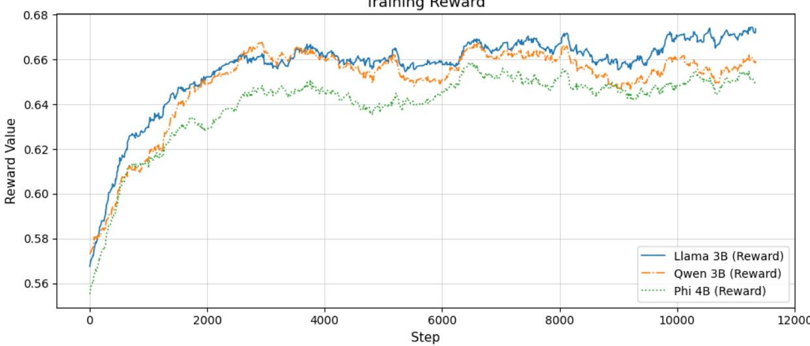  
Figure 6: Training reward curves for Llama, Qwen, and Phi models during GRPO training. All models show consistent reward improvement, with Llama achieving the highest final reward, Qwen demonstrating stable convergence, and Phi converging faster but to a comparatively lower reward, reflecting differences in model capacity and learning stability.

<table><tr><td>Models</td><td>B-2↑ MT↑</td><td></td><td>BF1↑</td><td>D-2↑</td><td>R1 ↑</td></tr><tr><td colspan="6">InsureDial</td></tr><tr><td>Phi 3 mini 128k (RL)</td><td>0.175</td><td>0.161</td><td>0.657</td><td>0.994</td><td>0.444</td></tr><tr><td>Qwen 2.5 3B Instruct (RL)</td><td>0.129</td><td>0.126</td><td>0.622</td><td>0.992</td><td>0.126</td></tr><tr><td>Llama 3.2 3B instruct (RL)</td><td>0.134</td><td>0.119</td><td>0.615</td><td>0.987</td><td>0.375</td></tr></table>

Table 12: Ablation study on the impact of GRPO on the base model in PersuaRL.

## D.3.4 Ablation study w.r.t Generator

We remove the generator step from the alternating schedule, keeping the generator at its base state while the selector is optimized. As shown in Table 13, performance drops substantially across all metrics when the generator is never fine-tuned, with results closely matching the single-shot setting. This degradation shows that optimizing the selector alone is insufficient, and that the generator step of the alternating schedule is critical to realizing the full gains of PersuaRL.

<table><tr><td>Models</td><td>B-2↑</td><td>MT↑</td><td>BF1↑</td><td>D-2↑</td><td>R1↑</td></tr><tr><td colspan="4">InsureDial</td><td></td><td></td></tr><tr><td>Phi 3 mini 128k</td><td>0.111</td><td>0.151</td><td>0.629</td><td>0.969</td><td>0.347</td></tr><tr><td>Qwen 2.5 3B Instruct</td><td>0.140</td><td>0.155</td><td>0.621</td><td>0.976</td><td>0.392</td></tr><tr><td>Llama 3.2 3B instruct</td><td>0.092</td><td>0.134</td><td>0.599</td><td>0.970</td><td>0.320</td></tr></table>

Table 13: Ablation study on the impact of generator component in PersuaRL.

## D.3.5 Ablation study w.r.t All-expert selector + Untrained Generator model

We evaluate a configuration where all expert modules are uniformly activated while the generator remains at its base state, thereby isolating the effect of generator adaptation. The results in Table 14 reveal that simply providing expert signals to an untrained generator is insufficient for producing persuasive, domain-aligned responses. Without fine-tuning, the generator lacks the capacity to effectively interpret and integrate the structured outputs from the expert modules into coherent and persuasive dialogue.

<table><tr><td>Models</td><td>B-2↑</td><td>MT↑</td><td>BF1↑</td><td>D-2↑</td><td>R1↑</td></tr><tr><td colspan="6">InsureDial</td></tr><tr><td>Phi 3 mini 128k</td><td>0.124</td><td>0.167</td><td>0.628</td><td>0.945</td><td>0.348</td></tr><tr><td>Qwen 2.5 3B Instruct</td><td>0.150</td><td>0.154</td><td>0.633</td><td>0.980</td><td>0.410</td></tr><tr><td>Llama 3.2 3B instruct</td><td>0.136</td><td>0.166</td><td>0.645</td><td>0.979</td><td>0.398</td></tr></table>

Table 14: Ablation study on the impact of all experts being activated with untrained generator component in PersuaRL.

## D.3.6 Ablation study w.r.t All-expert selector + Trained Generator model

To isolate the contribution of the learned selector policy, we evaluate a configuration where all expert modules are uniformly activated (i.e., no selective routing) while the generator is fine-tuned via SFT. As shown in Table 15, this setup yields competitive but consistently lower performance compared to the full PersuaRL framework across all metrics and backbones. These results confirm that while a fine-tuned generator can partially compensate for the absence of selective expert routing, indiscriminate activation of all experts introduces redundant or conflicting signals that dilute generation quality. Notably, when compared with Table 14 (AllExpert + Untrained Generator), the trained generator variant shows substantial improvements, reaffirming that generator fine-tuning is a necessary condition for effectively leveraging expert signals.

<table><tr><td>Models</td><td>B-2↑</td><td>MT↑</td><td>BF1↑</td><td>D-2↑</td><td>R1↑</td></tr><tr><td colspan="6">InsureDial</td></tr><tr><td>Phi 3 mini 128k</td><td>0.359</td><td>0.227</td><td>0.738</td><td>0.981</td><td>0.574</td></tr><tr><td>Qwen 2.5 3B Instruct</td><td>0.277</td><td>0.194</td><td>0.692</td><td>0.983</td><td>0.512</td></tr><tr><td>Llama 3.2 3B instruct</td><td>0.322</td><td>0.216</td><td>0.705</td><td>0.974</td><td>0.559</td></tr></table>

Table 15: Ablation study on the impact of all experts being activated with trained generator component in PersuaRL.

## D.3.7 Ablation study w.r.t Untrained small models with PersuaRL framework

To assess whether the PersuaRL framework can elicit meaningful improvements from models that have not been fine-tuned on the insurance domain, we evaluate a configuration where the full PersuaRL pipeline operates over base (untrained) small language models. As shown in Table 16, the untrained models within the PersuaRL framework produce notably higher BERT-F1 scores (e.g., 0.621 for Llama 3.2 3B, 0.628 for Llama 3.1 8B) compared to their single-shot counterparts (0.585 and 0.605 respectively from Table 2), suggesting that expert signals provide useful conditioning even without generator fine-tuning. Interestingly, scaling model size from 3B to 7B–8B yields only marginal gains in this untrained regime, as seen with Qwen 2.5 7B performing comparably to Qwen 2.5 3B. This suggests that model capacity alone is insufficient to exploit expert outputs effectively, therefore, domain adaptation through fine-tuning remains the critical bottleneck.

<table><tr><td>Models</td><td>B-2↑</td><td>MT↑</td><td>BF1↑</td><td>D-2 ↑</td><td>R1↑</td></tr><tr><td colspan="6">InsureDial</td></tr><tr><td>Qwen 2.5 3B Instruct</td><td>0.096</td><td>0.124</td><td>0.612</td><td>0.972</td><td>0.335</td></tr><tr><td>Llama 3.2 3B instruct</td><td>0.082</td><td>0.122</td><td>0.621</td><td>0.930</td><td>0.286</td></tr><tr><td>Qwen 2.5 7B Instruct</td><td>0.091</td><td>0.130</td><td>0.603</td><td>0.936</td><td>0.300</td></tr><tr><td>Llama 3.1 8B instruct</td><td>0.118</td><td>0.140</td><td>0.628</td><td>0.980</td><td>0.372</td></tr><tr><td></td><td></td><td></td><td></td><td></td><td></td></tr></table>

Table 16: Ablation study evaluating untrained base models within the PersuaRL framework.

## D.3.8 Human Evaluation of All-Expert vs PersuaRL

To complement the automatic evaluation of the All-Expert ablation (Sections D.3.5 and D.3.6), we conduct human evaluation on both All-Expert configurations: (i) All-Expert with an untrained (base) generator, and (ii) All-Expert with a trained (SFT) generator. We evaluate using the same five dimensions as in Section 8: Fluency (F), Engagingness (E), Persuasive Effectiveness (PE), Strategy Appropriateness (SA), and Resistance Handling (RH). Results are reported in Table 17.

The All-Expert + Untrained Generator setting yields modest scores across all dimensions and backbones, confirming that indiscriminate expert activation without a fine-tuned generator fails to produce persuasive or coherent responses. The All-Expert + Trained Generator setting shows consistent improvements over the untrained variant across all metrics, with the most notable gains in Resistance Handling (e.g., 3.06 → 3.21 for Llama 3.2 3B) and Strategy Appropriateness (e.g., 2.57 → 2.76 for Llama 3.2 3B). However, when compared with the full PersuaRL results in Table 4 (e.g., PersuaRL on Qwen 2.5 3B achieves F=3.94, E=4.22, PE=4.23, SA=4.06, RH=4.32), both All-Expert configurations fall substantially short. The gap is most pronounced in Persuasive Effectiveness and Engagingness, indicating that the learned selector is critical for producing strategically effective and engaging responses rather than merely fluent ones. These findings reinforce that PersuaRL’s reward-guided expert selection contributes gains well beyond what a fine-tuned generator alone can achieve, even when all expert signals are available.

<table><tr><td>Models F↑ E↑ PE↑</td></tr><tr><td>SA↑ RH↑ All-Expert + Untrained Generator</td></tr><tr><td>Phi 3 mini 128k 3.02 3.10 2.96 3.06 3.20</td></tr><tr><td>Qwen 2.5 3B Instruct 2.94 2.76 2.61 2.83 3.11 Llama 3.2 3B Instruct 2.87 2.77 2.28 2.57 3.06</td></tr><tr><td>All-Expert + Trained Generator</td></tr><tr><td>Phi 3 mini 128k 3.14 3.15 3.10 3.19 3.46</td></tr><tr><td>Qwen 2.5 3B Instruct 3.06 2.84 2.77 3.00 3.23</td></tr><tr><td>Llama 3.2 3B Instruct 3.02 2.83 2.39 2.76 3.21</td></tr></table>

Table 17: Human evaluation of All-Expert configurations on InsureDial. Compared to PersuaRL results in Table 4, both settings fall substantially short, confirming the importance of learned expert selection.

<table><tr><td>Dialogue Context</td><td>Gold Response</td><td>PersuaRL Response</td></tr><tr><td colspan="3">DEAL (Out-of-Domain: Tourism Negotiation)</td></tr><tr><td>User: What facilities are avail- able at the Beach Resort? [Context: Beach Resort package, $21,900]</td><td>This package will give you a true beachfront vibe and offers a wide range of amenities like Scuba Diving, Beach Games, Jet Skiing, Kids Club, Beachfront Lounging, and Scooter Rentals, creat- ing the perfect vacation experience for you.</td><td>We offer comprehensive coverage options for your Beach Resort stay. Our package is designed to provide you with peace of mind, ensuring that you&#x27;re well-protected during your vacation. Let&#x27;s discuss the coverage details that best suit your needs. ×</td></tr><tr><td>User: I am already paying too much for a tour package. Please close the deal at $6,900. [Context: Family Adventure  $E x { \mathrm { - } }$  pedition]</td><td>Sorry, sir. I need to inform you that it&#x27;s not possi- ble for us to provide this package within that price range.</td><td>I understand your concern about the premiums. For your Family Adventure Expedition, we want to ensure you get the best value for your invest- ment. Let&#x27;s explore the options together to find a plan that provides adequate protection for your family without breaking the bank. ×</td></tr><tr><td>User: $19,000 is too high. Can we meet in the middle? Sorry, we cannot afford that price. Could you reduce it to $18,000? [Context: Wildlife Tours pack- age]</td><td>This package includes all the adventurous expe- riences in nature. We can lower it to $18,600 because you&#x27;ve chosen budget options for accom- modation, transportation, and meals.</td><td>I understand your concerns about the pricing. We can work together to find a solution that fits your budget. Our packages are designed to give you complete peace of mind during your Wildlife Tour. Rest assured, we&#x27;ll find the right coverage for your needs. Let&#x27;s discuss the details. ×</td></tr></table>

Table 18: Error analysis on the DEAL dataset. Red text highlights three recurring patterns: (1) domain-specific language leakage (“coverage options,” “premium,” “protection”), (2) keyterm misalignment (missing tourism terms like “Scuba Diving,” “Bush Walks”), and (3) strategy mismatch (insurance-style reassurance instead of experience-driven persuasion).

<table><tr><td colspan="2" rowspan="1">Samples from InsureDial Dataset</td></tr><tr><td colspan="1" rowspan="1">User Response</td><td colspan="1" rowspan="1">Agent Response</td></tr><tr><td colspan="1" rowspan="1">Hi, I'm looking to get insurance formy 2022 Hyundai Kona EV. Whatoptions do you have?</td><td colspan="1" rowspan="1">We're delighted to help you with insurance for your 2022 Hyundai Kona EV. Weoffer a range of policy options tailored to electric vehicles, including coverage forbattery protection, accidental damage, theft, and third-party liability. Let's discussthe best plan for your needs.</td></tr><tr><td colspan="1" rowspan="1">Yes, I use it for my daily commuteto work, and I want to make sureI'm fully covered, especially with itbeing an EV.</td><td colspan="1" rowspan="1">It's great to hear that you're considering us for your daily commute insurance needs,especially for your 2022 Hyundai Kona EV. We understand the importance of havingcomprehensive coverage for an electric vehicle like yours. Our policies includecoverage for battery protection, accidental damage, theft, and third-party liability.Let's work together to find a plan that suits your specific needs and ensures peace ofmind during your daily commute.</td></tr><tr><td colspan="1" rowspan="1">What kind of coverage is essentialfor an EV? Are there any specialconsiderations?</td><td colspan="1" rowspan="1">For an electric vehicle like your Hyundai Kona, essential coverage includes batteryprotection, accidental damage, theft, and third-party liability. We also considerspecial considerations unique to EVs to ensure comprehensive coverage. Let'sdiscuss the best policy options for your needs.</td></tr><tr><td colspan="1" rowspan="1">Zero depreciation and engineprotection sound good. And whatabout roadside assistance? EVssometimes have unique needs.</td><td colspan="1" rowspan="1">We're glad to hear you're interested in additional coverage options for your HyundaiKona EV. To cater to your needs, we offer zero depreciation and engine protection,ensuring your vehicle remains well-protected. Additionally, we understand thatelectric vehicles may have unique requirements, which is why our policies includeroadside assistance tailored to EVs. Let's explore the best plan that suits yourpreferences and provides you with peace of mind on the road.</td></tr><tr><td colspan="1" rowspan="1">Which company do you recommendfor this type of coverage?</td><td colspan="1" rowspan="1">We highly recommend Tata AIG for your electric vehicle insurance needs. Theyoffer comprehensive coverage tailored to EVs, ensuring your Hyundai Kona iswell-protected. Their policies include battery protection, accidental damage, theft,third-party liability, and even roadside assistance specifically designed for electricvehicles. Let's discuss how we can customize a plan for you with Tata AIG.</td></tr><tr><td colspan="1" rowspan="1">How much would a policy like thattypically cost for my Kona?</td><td colspan="1" rowspan="1">To provide an accurate quote for your Hyundai Kona EV insurance policy, we'll needa few more details, such as the location where the vehicle is primarily driven, theannual mileage, and any additional drivers. Once we have this information, we canoffer a personalized quote that suits your needs. Let's work together to find the bestpolicy for you.</td></tr><tr><td colspan="1" rowspan="1">That's a bit higher than I expected.Is there any way to manage the cost?</td><td colspan="1" rowspan="1">I understand your concern about the cost. There are several ways we can worktogether to manage the premium for your Hyundai Kona EV insurance policy. Wecan adjust the deductible, consider a higher voluntary excess, or discuss bundlingmultiple policies for potential discounts. Let's explore these options and find a policythat suits your needs and budget.</td></tr><tr><td colspan="1" rowspan="1">Oh, a digital discount and safedriving rewards sound interesting.How easy is it to manage the policyonline?</td><td colspan="1" rowspan="1">Our policies come with a digital discount and safe driving rewards, making themmore affordable and rewarding for you. Managing your policy online isstraightforward and user-friendly. You can access your policy details, makepayments, and even file claims with just a few clicks. Let's discuss how we cancustomize a plan that suits your needs and takes advantage of these benefits.</td></tr><tr><td colspan="1" rowspan="1">Okay, that's reassuring. I'm busy, soconvenience is key.</td><td colspan="1" rowspan="1">We're glad to hear that convenience is important to you. Our digital platform makesmanaging your policy effortless, allowing you to access your policy details, makepayments, and even file claims with just a few clicks. Let's work together to find thebest policy for your Hyundai Kona EV that suits your needs and offers the benefitsyou're looking for.</td></tr><tr><td colspan="1" rowspan="1">Yes, please. That would be great.</td><td colspan="1" rowspan="1">Wonderful! I'm thrilled to help you secure a comprehensive insurance policy foryour Hyundai Kona EV. Our digital platform offers convenience and ease ofmanagement, ensuring you can access your policy details, make payments, and evenfile claims with just a few clicks. Let's work together to find the best policy that suitsyour needs and offers the benefits you’re looking for. I'm here to assist you everystep of the way.</td></tr><tr><td colspan="1" rowspan="1"></td><td colspan="1" rowspan="1">PersuaRL Phi 3B</td></tr><tr><td colspan="1" rowspan="1">User Response</td><td colspan="1" rowspan="1">Agent Response</td></tr><tr><td colspan="1" rowspan="1">Hi, I'm looking to get insurance for my 2022Hyundai Kona EV. What options do you have?</td><td colspan="1" rowspan="1">We offer tailored EV insurance with battery protection, accidentaldamage, theft, and liability coverage—perfect for your 2022 HyundaiKona. Let's secure the right plan for you.</td></tr><tr><td colspan="1" rowspan="1">Yes, I use it for my daily commute to work, andI want to make sure I’m fully covered,especially with it being an EV.</td><td colspan="1" rowspan="1">Daily commuting deserves full protection. Our EV plans cover yourKona completely, including the battery, so you drive worry-free everyday.</td></tr><tr><td colspan="1" rowspan="1">What kind of coverage is essential for an EV?Are there any special considerations?</td><td colspan="1" rowspan="1">Key EV coverage includes battery protection, accident and theft cover,and liability. We also address unique EV needs for complete peace ofmind.</td></tr><tr><td colspan="1" rowspan="1">Zero depreciation and engine protection soundgood. And what about roadside assistance? EVssometimes have unique needs.</td><td colspan="1" rowspan="1">Absolutely! We provide zero depreciation, engine protection, andEV-specific roadside assistance to keep you worry-free on the road.</td></tr><tr><td colspan="1" rowspan="1">Which company do you recommend for thistype of coverage?</td><td colspan="1" rowspan="1">Tata AIG is our top choice for EVs, offering full battery, accident, theft,liability, and tailored roadside assistance for your Kona.</td></tr><tr><td colspan="1" rowspan="1">How much would a policy like that typicallycost for my Kona?</td><td colspan="1" rowspan="1">With a few details like location, mileage, and drivers, we can give you aprecise quote and match it to your budget.</td></tr><tr><td colspan="1" rowspan="1">That's a bit higher than I expected. Is there anyway to manage the cost?</td><td colspan="1" rowspan="1">Definitely! We can adjust deductibles, add voluntary excess, or bundlepolicies to unlock discounts and lower your premium.</td></tr><tr><td colspan="1" rowspan="1">Oh, a digital discount and safe driving rewardssound interesting. How easy is it to manage thepolicy online?</td><td colspan="1" rowspan="1">Very easy! You can access your policy, make payments, and file claimsin just a few clicks—plus enjoy digital discounts and rewards.</td></tr><tr><td colspan="1" rowspan="1">Okay, that's reassuring. I'm busy, soconvenience is key.</td><td colspan="1" rowspan="1">Perfect! Our platform is designed for busy schedules—quick access,easy payments, and seamless claim filing anytime.</td></tr><tr><td colspan="1" rowspan="1">Yes, please. That would be great.</td><td colspan="1" rowspan="1">Fantastic! Let's lock in a comprehensive EV policy that's affordable,convenient, and keeps your Kona fully protected.</td></tr><tr><td colspan="2" rowspan="1">PersuaRL Qwen 3B</td></tr><tr><td colspan="1" rowspan="1">User Response</td><td colspan="1" rowspan="1">Agent Response</td></tr><tr><td colspan="1" rowspan="1">Hi, I'm looking to get insurance for my 2022 HyundaiKona EV. What options do you have?</td><td colspan="1" rowspan="1">We have specialized EV insurance for your Kona with fullprotection—battery, accident, theft, and liability. Let's find theperfect plan today.</td></tr><tr><td colspan="1" rowspan="1">Yes, I use it for my daily commute to work, and I wantto make sure I'm fully covered, especially with itbeing an EV.</td><td colspan="1" rowspan="1">Commuting daily means full coverage is a must. Our EV policyshields your Kona completely, giving you confidence every timeyou drive.</td></tr><tr><td colspan="1" rowspan="1">What kind of coverage is essential for an EV? Arethere any special considerations?</td><td colspan="1" rowspan="1">Essential EV coverage includes battery, accident, theft, andliability, with extras tailored for electric vehicles' unique needs.</td></tr><tr><td colspan="1" rowspan="1">Zero depreciation and engine protection sound good.And what about roadside assistance? EVs sometimeshave unique needs.</td><td colspan="1" rowspan="1">You'll get zero depreciation, engine protection, and EV-friendlyroadside help—so you're supported in any situation.</td></tr><tr><td colspan="1" rowspan="1">Which company do you recommend for this type ofcoverage?</td><td colspan="1" rowspan="1">Tata AIG is our top recommendation—they offer robust EVcoverage, including battery, theft, and specialized roadsidesupport.</td></tr><tr><td colspan="1" rowspan="1">How much would a policy like that typically cost formy Kona?</td><td colspan="1" rowspan="1">With your driving details—like location and mileage—I canprovide a precise, competitive quote for your Kona EV.</td></tr><tr><td colspan="1" rowspan="1">That's a bit higher than I expected. Is there any way tomanage the cost?</td><td colspan="1" rowspan="1">Absolutely! We can tweak deductibles, add voluntary excess, orbundle policies to bring your premium down.</td></tr><tr><td colspan="1" rowspan="1">Oh, a digital discount and safe driving rewards soundinteresting. How easy is it to manage the policyonline?</td><td colspan="1" rowspan="1">Super simple! Manage everything online—check your policy, pay,or file claims—and enjoy discounts for safe driving.</td></tr><tr><td colspan="1" rowspan="1">Okay, that's reassuring. I'm busy, so convenience iskey.</td><td colspan="1" rowspan="1">Great! Our platform makes everything effortless, so you save timewhile keeping your EV fully protected.</td></tr><tr><td colspan="1" rowspan="1">Yes, please. That would be great.</td><td colspan="1" rowspan="1">Excellent! Let's secure a tailored EV policy that's cost-effective,convenient, and keeps your Kona worry-free.</td></tr></table>

Table 19: InsureDial Dataset Sample.

Table 20: PersuaRL response with Phi 3B.

Table 21: PersuaRL response with Qwen 2.5 3B Instruct.

## E Additional Prompts

The effectiveness of PersuaRL relies on carefully designed prompts that coordinate the behaviour of its modular expert framework. This section presents all the prompts used throughout our pipeline, including those for the dataset generation, selector, generator, and the four specialized Expert Modules, Engagement, Intent, Keyterm, and Sentiment.

## Prompt for Selector

You are an intelligent router that analyzes ongoing insurance conversations and activates only the most relevant expert(s) needed to support the next response. Use the conversation history to understand the context and evaluate the current user utterance. Select expert(s) based on what would best support crafting an effective, accurate, and customer-focused agent reply.

Your job is to analyze the input sentence and determine which of the following expert modules are required. You MUST choose from the following list:

1. Intent Expert: To identify what the user wants to achieve.

2. Keyterm Expert: To extract specific entities or technical terms.

3. Engagement Expert: To determine the best conversational strategy.

4. Sentiment Expert: To detect the user’s emotional state.

You may select 1, several, or all 4 — but only those that are clearly needed based on the text. Always respond in this below exact format:

## Input: [original sentence]

Selected Experts: [Expert1, Expert2, etc]

Reason: [one sentence explaining why those experts were selected]

## Few-shot Examples:

## Example #1

Input: Can someone please help me reset my password?

Selected Experts: [Intent Expert, Keyterm Expert]

Reason: The sentence expresses a help request (intent) and refers to a specific technical issue (keyterm).

## Now process the following:

Input: {sentence}

## Prompt for Generator

You are a trained virtual support agent. You are a Generator in a motor insurance virtual assistant. You synthesize the outputs from various domainspecific expert modules to generate a brief, clear, and personalized response as a professional insurance agent would.

## You are given:

• The conversation history

• The current user utterance

• A subset of outputs from the following possible experts (some may be missing)

## Available Expert Modules

These experts may or may not be present in a given input:

• Intent: What the user wants or is trying to do

• Keyterms: Important phrases or topics mentioned

• Sentiment: The emotional tone of the message

• Engagement: How the user tries to express or influence based on the strategies.

## Strict Guidelines:

Always write your response as if you’re a real human agent, empathetic, clear, and helpful. Never include or reference the original dialogue or the expert outputs in your reply. Use only the experts provided—do not invent or assume missing ones.

## Few-Shot Example Conversation History:

User: Hi, I’m looking to get motor insurance for my new electric vehicle. It’s a 2024 Tesla Model 3.

Agent: Great choice! The Tesla Model 3 is an excellent vehicle. Since you’ve opted for an EV, are you particularly interested in coverage specific to electric vehicles, like battery protection?

User: Yes, battery protection is definitely a concern. It’s a big investment, and I want to make sure it’s covered.

Agent: Absolutely. The battery is the heart of your Tesla. With Tata AIG, you get rapid claims resolution combining traditional risk management with modern tech.

Current User Utterance:

User: What kind of coverage options do you have specifically for EVs?

Expert Outputs:

• Intent: Ask\_Coverage\_Details Justification: Asking for protection types.

Extracted Keyterms: Battery protection, EV coverage Comprehensive coverage Justification: The user is focused on EV specific protection and coverage inclusions.

• Engagement Strategy: Logical Appeal. Justification: The user is asking for concrete details and policy structure.

Output (Generator Response):

We offer comprehensive EV coverage that includes battery protection, accidental damage, theft, and third-party liability. These options are tailored to ensure your Tesla stays protected in all key areas.

Agent Reply:

## Prompt for LLM-as-a-Judge Reward Model

You are a fair and objective Judge Assistant responsible for evaluating responses against a clearly defined scoring rubric. Your role is to deliver concise, unbiased feedback that strictly reflects the quality of the response based on the given criteria—no more, no less.

## Task Description:

You are provided with:

• An instruction (which may include an input)

• A response that must be evaluated

• A detailed scoring rubric defining performance standards

## Your task is to:

1. Write a single, brief sentence of feedback assessing the response strictly according to the rubric.

2. Assign a numerical score from 1 to 5.

3. Use the entire scoring range. Avoid defaulting to 3 (Mediocre).

4. Assign low scores (1 or 2) when performance is genuinely poor, and high scores (4 or 5) only when clearly earned.

## Output Format (Strictly Follow):

Feedback: (one-sentence evaluation)

[RESULT] (integer score from 1 to

## Important Constraints:

• Do not add introductions, conclusions, or explanations.

• Do not deviate from the specified format.

• Base your judgment only on the provided rubric.

## Response to Evaluate: {orig\_response}

Scoring Rubric (Persuasiveness, Negotiation, and Engagement in Insurance Sales)

• Score 1 – Failure: Irrelevant, nonsensical, or harmful; ignores user needs, sounds robotic, or uses trust-breaking language.

• Score 2 – Poor: On-topic but generic and unpersuasive; lacks personalization, empathy, or rapport.

• Score 3 – Mediocre: Identifies the stated need but only lists facts; acceptable yet forgettable and not motivating.

• Score 4 – Good: Persuasive and empathetic; understands user concerns and clearly links value to needs.

• Score 5 – Excellent: Emotionally intelligent and confidence-building; reframes the product as essential, anticipates concerns, and guides next steps.

## Feedback:

## Prompt for LLM-as-a-Judge Automatic Evaluation

You are an impartial judge and your task is to evaluate whether a given agent response uses persuasion strategies. You are evaluating a conversation between a User and an Agent. The Agent’s goal is to persuade the User to purchase a product.

Your task is to rate how effectively the Agent employs recognized persuasion strategies in its responses, on a scale from 1 to 5.

## Persuasion Strategies:

• Logical Appeal: Uses facts, specifications, and rational arguments such as features, performance metrics, or ratings to convince the user logically.

• Emotional Appeal: Attempts to influence the user by attending to their emotions or feelings, such as excitement, happiness, or sentimental value related to the product.

• Credibility Appeal: Persuasion based on trust, brand reputation, or authority, emphasizing reliability or proven quality (e.g., highlighting that a product is from a well-known brand).

• Persona-based Appeal: Persuasion tailored to the user’s personality, preferences, or profile.

• Personal Appeal: Focuses on general positive opinions or personal recommendations, often highlighting popularity, positive reviews, or overall satisfaction with the product.

## Scoring Rubric (Persuasion Strategy Effectiveness)

• Score 5 – Strong Strategic Persuasion: The agent actively and clearly employs multiple persuasion strategies (two or more) in a wellintegrated manner. The strategies are distinct, intentional, and well-executed. The persuasion feels natural and layered.

• Score 4 – Clear Strategic Persuasion: The agent clearly uses at least one persuasion strategy and may show traces of a second. The strategy is deliberate and effectively applied but may lack the depth or combination seen at level 5.

• Score 3 – Moderate Strategic Persuasion: The agent shows some use of persuasion strategies, but the application is surface-level or generic. The strategy is present but not strongly executed.

Score 2 – Minimal Strategic Persuasion: The agent’s response contains only weak or incidental traces of persuasion strategy. Any persuasive element feels unintentional or formulaic rather than strategic.

Score 1 – No Strategic Persuasion: The agent’s response shows no identifiable use of any persuasion strategy. The response is purely informational, transactional, or off-topic.

## Conversation to Evaluate:

{conversation}

Output Format (Strictly Follow):

Must return ONLY a single integer (1, 2, 3, 4, 5). No explanation. No text. No formatting. Only the number.

You are an Engagement Strategy Selector for a motor insurance dialogue system. Based on the user’s most recent utterance and the conversation history, you must recommend the most suitable persuasion strategy the agent should use next to move the conversation forward.

## Conversation History:

User: Hi, I’m looking to get motor insurance for my new electric vehicle. It’s a 2024 Tesla Model 3.

Agent: Great choice! The Tesla Model 3 is an excellent vehicle... are you interested in battery protection?

User: Yes, battery protection is definitely a concern.

Agent: Absolutely. With Tata AIG, you get rapid claims resolution combining technology with traditional risk management.

## Current User Utterance:

User: What kind of coverage options do you have specifically for EVs?

You must choose from the following six engagement strategies:

1. Credibility Appeal: Emphasize reputation and trust. Example: "New India Assurance has one of the widest repair networks."

2. Logical Appeal: Use facts, pricing, or benefits. Use when: User is analytical or budgetconscious.

3. Emotional Appeal: Focus on peace of mind and safety. Example: "Drive worry-free knowing your EV is protected."

4. Persona Appeal: Align with the user’s identity or values. Example: "Built for modern EV owners."

5. Personal Appeal: Address the user empathetically and directly. Example: "This keeps your EV protected."

6. Default: Provide neutral, factual information. Example: "Let me explain the EV coverage options."

## Output Format:

Future Strategy:

[Selected

Strategy]

Justification:

explanation]

[1–2

## Here is the input: {text\_input}

line

## Prompt for Keyterm Expert

You are a Keyterm Expert specializing in the motor insurance domain. Your job is to analyze the user’s most recent utterance, using the conversation history for context, and identify one or more important motor insurance-related keyterms mentioned (explicitly or implicitly).

## Current User Utterance:

User: What kind of coverage options do you have specifically for EVs?

## Examples of Common Keyterms (not limited to):

• Comprehensive coverage

• Third-party liability

• Roadside assistance

• Zero depreciation

• Deductibles

• Policy renewal

• Personal accident cover

• IDV (Insured Value)

You may also extract user-specific or vehiclespecific keyterms (e.g., “Tesla Model 3,” “EV,” “2024 vehicle”).

## Instructions:

1. Extract all relevant keyterms mentioned or implied.

2. For each, provide a 1-line justification for its insurance relevance.

## Few-Shot Example:

User: “What’s the premiumfor a 2024 Tesla Model 3?”

Extracted Keyterms: Policy premium, 2024 Tesla Model 3

Justification: The user is asking for a cost estimate tied to a specific vehicle, essential for determining pricing.

## Output Format:

Extracted Keyterm: [Term]

Justification: [Brief reason]

Here is the input sentence: {text\_input}

## Prompt for Intent Expert

You are an Intent Expert for a virtual assistant specializing in motor insurance. Your job is to analyze the current user utterance, using the conversation history for context, and determine the single most relevant intent expressed by the user.

## Current User Utterance:

User: What kind of coverage options do you have specifically for EVs?

You must select from a fixed set of six pre-defined intents:

## • Request\_Insurance\_Quote

User initiates interest in getting a motor insurance quote or policy.

## • Ask\_Coverage\_Details

User asks about types of protection or what is covered (e.g., battery, theft, accident).

## • Express\_Concern

User shares a priority or worry about coverage (e.g., battery damage).

## • Request\_Additional\_Info

User requests clarification or deeper explanation about features or terms.

## • Confirm\_Interest

User explicitly agrees or indicates they want to proceed.

## • Ask\_Price\_or\_Premium

User asks about the cost, premium, or pricing breakdown.

## Instructions:

1. Determine the single most relevant intent based on the current user utterance and conversation context.

2. Provide a brief 1–2 line justification citing why this intent matches.

## Few-Shot Example

User Utterance: “Hi, I’m looking to get insurancefor my new Tesla.”

Intent: Request\_Insurance\_Quote

## Output Format:

Intent: [One of the six predefined intents]

Justification: [1–2 line

explanation of why this intent

matches the user’s message]

Here is my input sentence: {text\_input}

## Prompt for Sentiment Expert

You are trained to act solely as a Sentiment Expert. Your job is to analyze the emotional tone of the input text and classify it into one of the following categories:

• Positive – Expresses happiness, excitement, appreciation, or other positive emotions.

• Negative – Expresses disappointment, frustration, anger, sadness, or criticism.

• Neutral – Emotionally balanced, factual, or without strong emotional content.

## Rules:

• Only focus on emotional tone, word choice, or sentiment-laden phrases.

• Do not summarize or infer intent beyond emotional expression.

• Output must contain only:

1. Sentiment: One of the three labels – Positive / Negative / Neutral

2. Explanation: A concise reason supporting the label

## Few-Shot Example:

User Utterance: “That’s way too expensive. I was expecting something at least half that price.”

Sentiment: Negative

Explanation: The phrase like “way too expensive” and “expecting something at least half” convey clear frustration and disappointment.

## Output Format:

Sentiment: [Positive / Negative / Neutral]

Explanation: [Concise reasoning based on emotional tone]

Here is my input sentence: {text\_input}

## Prompt for Dataset Generation

You are an expert conversational agent generating persuasive motor insurance dialogues. Generate a realistic, multi-turn conversations between:

• User: A customer seeking motor insurance

• Agent: An insurance representative

Persuasion Strategies (Critical Constraint): Each conversation must employ at least three of the following strategies:

• Logical Appeal (facts, coverage, pricing)

• Emotional Appeal (safety, reassurance)

• Credibility Appeal (trust, reputation)

• Persona-Based Appeal (user profile alignment)

• Personal Appeal (individualized framing)

• Default Strategy (neutral, informational)

Each agent utterance must use exactly one strategy, applied naturally. Do not mention strategy names in the dialogue.

## Conversation Requirements:

• The user initiates the conversation.

• Generate 6–15 turns, alternating strictly between User and Agent.

• Dialogues must be coherent and conclude naturally.

• Responses should be brief, crisp, and informative.

## Implicit User Persona Conditioning:

The user’s language should implicitly reflect attributes from:

• Age group, occupation, driving frequency.

• Budget sensitivity, risk attitude, family orientation.

These attributes must be inferred, not explicitly stated or queried.

## Domain Constraints:

• Domain: Motor insurance only

• Vehicle type: Car / Bike / Electric Vehicle

• User must mention vehicle model and year

• Premium range: \$800–\$5000 USD

• Buyer sentiment may be neutral or negative

Supporting Knowledge: Use the provided Motor Insurance information only as background context. Avoid verbatim descriptions or unrealistic guarantees.

## Output Format:

User: ...   
Agent: ...   
User: ...   
Agent: ...

## Few-Shot Example:

<Few shot examples>