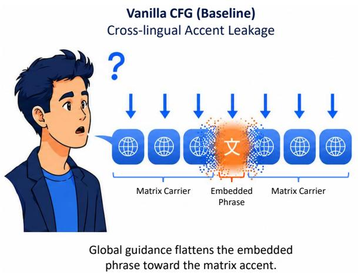
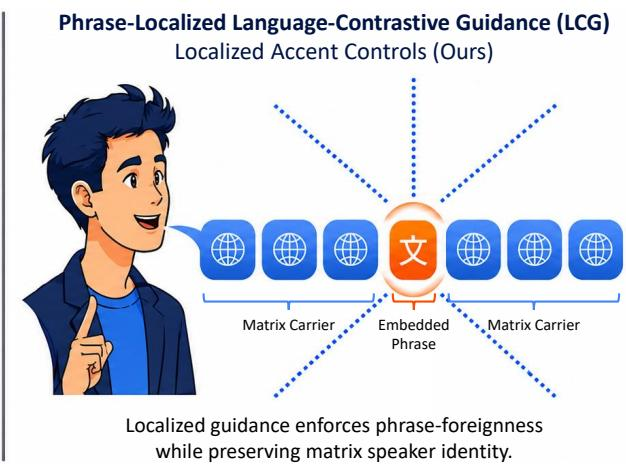
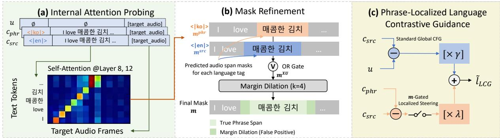
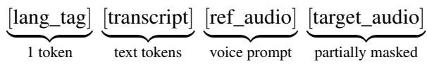
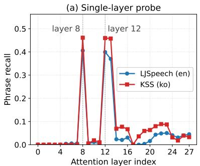
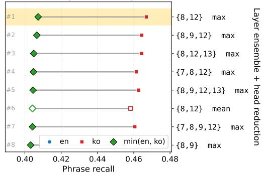
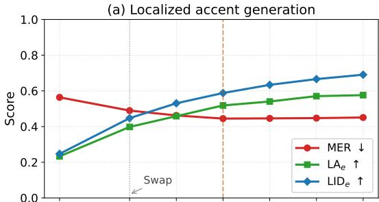
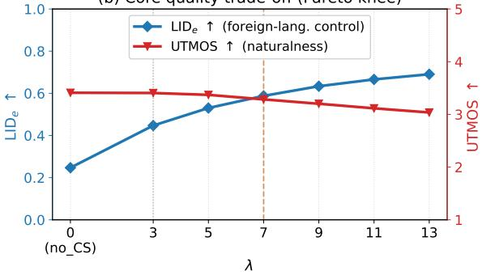
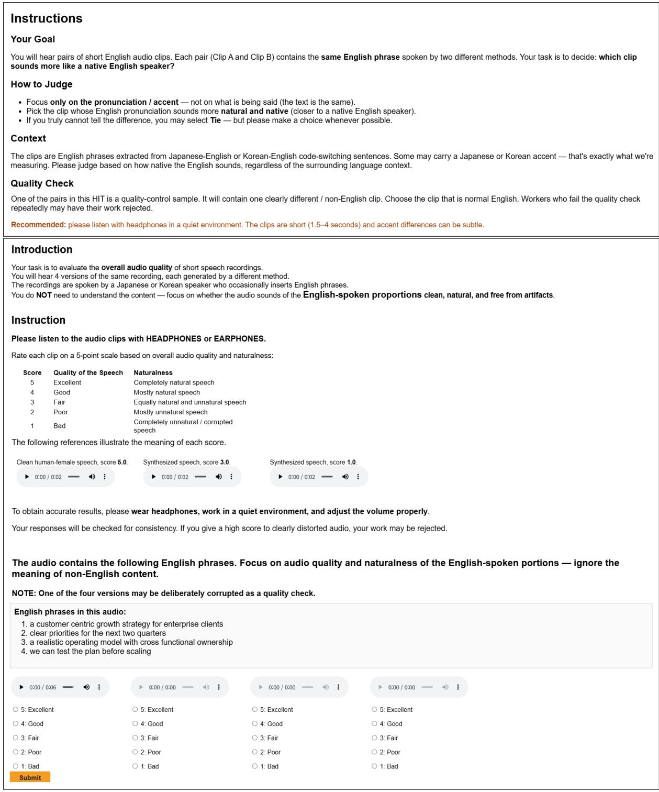

# Phrase-Localized Language-Contrastive Guidance: Training-Free Localized Accent Control for Code-Switching Text-to-Speech

Che Hyun Lee1 Sangkwon Park1 Donghun Kang1 Dongwook Lee2 Youngho Cho2 Heeseung Kim3† Sungroh Yoon1,2,4†

1Department of Electrical and Computer Engineering, Seoul National University   
2Interdisciplinary Program in Artificial Intelligence, Seoul National University 3Department of Artificial Intelligence, University of Seoul 4AIIS, ASRI, INMC, and ISRC, Seoul National University

## Abstract

Current speech synthesis struggles with codeswitching, which mixes a foreign language phrase into a primary language utterance, causing the phrase to be spoken with the primary language’s accent rather than its native one. We propose Phrase-Localized Language-Contrastive Guidance (LCG), a training-free inference framework that restores a native accent to code-switched phrases in cross-lingual textto-speech. LCG replaces the single language guidance applied across the whole utterance with a separate guidance for each region, so each part is guided by its own language. To choose where to apply this localized guidance, we propose a self-attention probing technique that finds the phrase boundaries without external alignments. Together, these components generate speech in which each region carries the accent of its own language, requiring no fine-tuning or auxiliary models. Across diverse language pairs, LCG robustly increases the nativeness of the code-switched phrase while suppressing accent leakage, and preserving overall speaker identity and naturalness. \*

## 1 Introduction

The emergence of zero-shot multilingual textto-speech (TTS) foundation models has enabled high-fidelity cross-lingual voice cloning without task-specific fine-tuning (Anastassiou et al., 2024; Casanova et al., 2024; Du et al., 2024; Wang et al., 2025; Zhang et al., 2023b; Zhu et al., 2026). Trained on massive multilingual datasets, these models successfully transfer a speaker’s identity to unseen languages. However, despite the remarkable capacity, they still suffer from severe cross-lingual accent leakage resulting in an unnatural foreign accent when the language of the reference voice prompt does not match the target text.

This leakage becomes acute in intra-utterance code-switching (CS) (Sitaram et al., 2020), where a primary language (matrix carrier) and a foreign insertion (embedded phrase) mix within a single sentence (Myers-Scotton, 1993). A robust CS TTS system must maintain carrier fluency and speaker consistency while pronouncing the foreign phrase with a native accent (Cao et al., 2020; Qiang et al., 2021). This is inherently challenging because the speaker’s voice profile locks the model into a primary language, making it difficult to shift pronunciation styles for just a specific, localized segment.

This accent bottleneck stems from two interconnected issues. First, zero-shot voice cloning inherently entangles speaker identity with the prompt’s native language habits, making it difficult to separate voice characteristics from foreign pronunciation. Second, while Classifier-Free Guidance (CFG) (Ho and Salimans, 2021) is widely adopted to improve text adherence and audio quality, it heavily amplifies this reference voice bias globally. Because standard CFG applies a uniform scale across the entire sequence, it cannot apply stronger or weaker guidance to specific segments (Shen et al., 2024). Instead, as in Fig. 1, it overrides local language transitions, aggressively flattening the embedded phrase’s accent into the matrix carrier.

Notably, this accent leakage persists even in massive multilingual models like OmniVoice (Zhu et al., 2026), a discrete diffusion language model (DLM)-based TTS model that supports over 600 languages. To resolve this bottleneck, we introduce a training-free, inference-time localized guidance framework. Unlike prior methods that apply CFG only to predetermined, selected tokens (Zheng and Maleki, 2026), our framework operates on frame-level span masks dynamically derived from internal self-attention probing to achieve precise acoustic control. Building on this, we propose Phrase-Localized Language-Contrastive Guidance (LCG). LCG transposes contrastive steering onto localized audio sequences by swapping language tags over the refined boundaries. This localized control integrates seamlessly with the bi-directional denoising process of discrete diffusion models, which naturally absorbs minor mask spillovers while keeping the matrix carrier and speaker identity intact.

  
Figure 1: Conceptual illustration of cross-lingual accent leakage and localized control. (Left) The unguided Baseline flattens the foreign embedded phrase into the matrix carrier language accent, causing mispronunciation and acoustic distortion around the embedded segment. (Right) Our proposed LCG framework applies localized guidance over the self-derived phrase boundaries, enforcing authentic native pronunciation while preserving the surrounding matrix carrier quality and speaker identity.

In summary, our main contributions are threefold: (1) we formalize the Phrase-Localized LCG framework, which mathematically decouples the language-steering scale from global guidance to enable independent accent control, (2) we introduce a training- and module-free phrase localization method via internal attention probing, showing that an expanded recall masking strategy aligns naturally with DLMs to absorb minor boundary errors while keeping the carrier clean, and (3) we construct and open-source a balanced, 1,200- utterance synthetic code-switching benchmark corpus spanning 12 directions across 5 languages to facilitate reproducible research. Extensive evaluations show that LCG robustly enforces native accents across all directions, maximizing foreign accent clarity while preserving global naturalness.

## 2 Related Works

Multilingual and Code-Switching Speech Synthesis. Recently, multilingual foundation models clone speaker identities remarkably well across unseen single-language tracks (Chen et al., 2025c; Casanova et al., 2024; Du et al., 2024; Fan et al., 2026; Peng et al., 2024; Wang et al., 2025; Zhang et al., 2023b; Zhu et al., 2026). However, they frequently struggle when multiple languages mix dynamically within a single sentence (Sitaram et al., 2020). Traditional code-switching TTS (CS TTS) approaches address this by baking capabilities directly into model weights via bilingual posteriorgrams (Cao et al., 2020), cross-lingual embeddings (Qiang et al., 2021), multi-stage synthetic fine-tuning (Xu et al., 2024), or specialized diffusion architectures (Cho et al., 2022; Kim, 2024; Chen et al., 2024, 2025b,a; Yang et al., 2024; Pamisetty and Shree, 2026). More recently, contemporary large-scale frameworks such as X-Voice (Xu et al., 2026) attempt to alleviate accent leakage via dual-level language injection architectures; however, these methods rely on massive multilingual corpus fine-tuning and, as explicitly acknowledged in Xu et al. (2026), still struggle to optimize intra-sentential code-switching constructs. Conversely, our framework is entirely inference-only and training-free, evaluated on a balanced 1,200- utterance corpus that specifically targets dense multi-word phrasal insertions rather than the unmanaged or single-word alternations dominant in prior zero-shot benchmarks (Lyu et al., 2010; Paik et al., 2026; Xie et al., 2026; Ugan et al., 2025).

Inference-Time Control and Spatial CFG. Classifier-Free Guidance (CFG) (Ho and Salimans, 2021) is the standard test-time knob for diffusion-based speech generation (Ju et al., 2024; Le et al., 2023; Liu et al., 2023), and has recently been extended to discrete language model decoding (Sanchez et al., 2023; Zheng and Maleki, 2026). Crucially, however, standard speech-side frameworks apply the guidance scalar uniformly across the entire sequence, lacking the spatial resolution to manage localized phonetic shifts. While contemporary scaling efforts like X-Voice (Xu et al., 2026) introduce decoupled CFG paths, their optimization operates globally across the temporal generation axis (timesteps) via decay schedules, failing to isolate localized structural boundaries. While regionconditioned steering is widely utilized in text-toimage spatial masks (Liu et al., 2022; Shen et al., 2024; Brooks et al., 2023; Zhang et al., 2023a), no prior work brings a localized, frame-level spatial guidance paradigm into discrete non-autoregressive speech LMs (Wang et al., 2025; Zhu et al., 2026). Our proposed Phrase-Localized LCG framework fills this gap with zero training cost, deriving tracking masks dynamically from internal self-attention paths while executing contrastive cross-lingual tag swaps natively at runtime.

  
Figure 2: Overall architecture of the proposed training-free localized guidance framework. An intra-utterance code-switching script mixing an English matrix carrier $( ^ { 6 6 } \mathrm { I ~ l o v e ^ { 7 } } )$ with an embedded Korean phrase (“매콤한 $\mathrm { \ 7 k } \bar { \mathrm { \gtrsim } } \mathrm { \rceil } ^ { \mathrm { \bullet } }$ , meaning “spicy kimchi”) illustrates the pipeline. (a) Internal Attention Probing: Audio-to-text frame alignments are extracted from decoder layers $( L _ { 8 } , L _ { 1 2 } )$ under language-conditioned source $( m ^ { \mathrm { s r c } } )$ and foreign phrase $( m ^ { \mathrm { p h r } } )$ prefixes to derive the raw phrase mask m. (b) Mask Refinement: Resolves alignment shifts via a dual-tag mask union $( m ^ { \mathrm { { s r c } } } \vee m ^ { \mathrm { { p h r } } } )$ followed by a symmetric margin dilation $( k = 4 )$ to maximize boundary recall. (c) Phrase-Localized Language-Contrastive Guidance: Synthesizes the final logits $l _ { \mathrm { L C G } }$ by utilizing m as a localized gating switch, decoupling the independent language-steering scale (λ) from the global text guidance scale (γ).

## Attention Probing and Sequence Alignment.

Attention in TTS traditionally serves to align text tokens with acoustic frames, evolving from soft matrices (Wang et al., 2017; Shen et al., 2018) to hard monotonic searches (Kim et al., 2020, 2021) and forced-alignment pipelines (McAuliffe et al., 2017). Concurrently, attention probing in language modeling remains a passive, post-hoc diagnostic tool. Our work departs from this setup by closing the loop between probing and dynamic sequence conditioning. Instead of relying on external tools, we dynamically extract implicit alignments from the DLM’s internal self-attention layers during the forward pass to establish a localized phrase mask. Crucially, the iterative, bi-directional denoising process of discrete diffusion samplers naturally acts as a buffer that absorbs minor boundary mask errors, ensuring rigorous phrase-foreignness without inducing acoustic or identity discontinuities.

## 3 Method

Our training-free inference framework controls cross-lingual accents by guiding the logits of a pretrained discrete diffusion language model (DLM). As illustrated in the macro pipeline in Fig. 2, the operational layout is split into three sequential stages: (a) frame-level mask extraction via self-attention probing (Sec. 3.2), (b) asymmetric boundary expansion to optimize recall (Sec. 3.3), and (c) localized scale adjustment via independent languagecontrastive steering (Sec. 3.4).

## 3.1 Problem Statement & Preliminaries

OmniVoice (Zhu et al., 2026) is a discrete DLMbased text-to-speech (TTS) framework capable of synthesizing over 600 languages. Operating over an audio codec vocabulary, it iteratively unmasks an acoustic sequence over $T = 3 2$ steps. At each generation step, the model input is configured as the concatenation of control and data streams:

(1)

where auxiliary control tokens and sequence delimiters are omitted for brevity (Zhu et al., 2026). Based on this prefix, the model predicts vocabulary logits for the masked regions. To maximize speech naturalness and text adherence, OmniVoice utilizes Classifier-Free Guidance (CFG) (Ho and Salimans,

2021) via a two-pass conditional and unconditional inference step. Standard CFG at scale $\gamma$ combines these logits as:

$$
\tilde { l } = c _ { \mathrm { s r c } } + \gamma ( c _ { \mathrm { s r c } } - u ) ,\tag{2}
$$

where $c _ { \mathrm { s r c } }$ represents the primary languageconditioned logit and u denotes the unconditional logit where the prefix tokens are entirely dropped.

However, pretrained cross-lingual frameworks inherently suffer from cross-lingual accent leakage during intra-utterance code-switching (CS) setups comprising a matrix carrier (primary language) and a foreign embedded phrase. When conditioned on a single global language tag, the standard guidance scale $\gamma$ in Eq. 2 uniformly biases every acoustic frame toward $c _ { \mathrm { s r c } } ,$ , aggressively flattening the embedded phrase’s accent into the matrix carrier and collapsing localized phrase-foreignness. To circumvent this limitation without fine-tuning, we introduce a third, parallel phrase language-conditioned logit $( c _ { \mathrm { p h r } } )$ that swaps the input language tag to match the embedded phrase, enabling independent accent steering. The full algebraic integration of $c _ { \mathrm { p h r } }$ is detailed in Sec. 3.4.

## 3.2 Phrase Localization via Self-Attention

To apply localized foreignness control, we dynamically extract a per-frame binary mask m ∈ $\{ 0 , 1 \}$ }Nframes over the target acoustic sequence during the forward pass, bypassing the need for auxiliary alignment models (Fig. 2(a)). Specifically, for each generated acoustic frame a, we monitor the self-attention weights within the decoder layers and isolate the text token index receiving the maximum weight via an argmax operation. If this argmax token falls within the character span of the embedded phrase, we set $m [ a ] = 1$ ; otherwise, $m [ a ] = 0$

To determine the optimal layers for this tracking, we analyze a typologically distinct pilot set comprising Korean (KSS) (Park, 2018) and English (LJSpeech) (Ito and Johnson, 2017) utterances, which mitigates script-specific bias and isolates domain-agnostic alignment traits. As illustrated in Fig. 3, our empirical layer-wise probing reveals two critical network properties: alignment tracking spikes sharply and exclusively within the middecoder layers (Fig. 3(a)), and a multi-layer ensemble of $\{ L _ { 8 } , L _ { 1 2 } \}$ combined with head-wise maxpooling consistently maximizes the worst-case boundary recall across both domains (Fig. 3(b)).

  
(b) Multi-layer ensemble probe

  
Figure 3: Attention probe exploration on the KSS and LJSpeech pilot sets. (a) Single-layer probe: Recall across 28 decoder layers, showing sharp, languageagnostic alignment tracking spikes at $L _ { 8 }$ and $L _ { 1 2 }$ . (b) Multi-layer ensemble: Comparison of top configurations and head reductions. The Rank-1 setup $( \{ L _ { 8 } , L _ { 1 2 } \}$ max, highlighted in yellow) maximizes worst-case boundary recall, denoted by the rightmost joint minimum (min(en, ko), green diamond).

Asymmetric Alignment Error Tolerance. The selection of our attention configuration is governed by a stark precision-recall asymmetry inherent to localized steering. A false negative (recall loss) is catastrophic: any missed frame within the embedded phrase region defaults to the matrix accent, triggering an irreversible phrase-foreignness collapse. Conversely, a false positive (precision loss) is benign, as accidental steering over the matrix carrier region is easily overridden by the dominant textual context of the surrounding matrix carrier language tokens. Furthermore, since self-attention patterns dynamically shift across generation timesteps, any transient alignment errors are naturally smoothed out and corrected over the course of the iterative denoising process. This asymmetric operational tolerance justifies prioritizing inclusive boundary coverage over tight precision, directly motivating the explicit mask refinement strategies in Sec. 3.3.

## 3.3 Mask Refinement

While the raw argmax mask $m ^ { \mathrm { s r c } }$ , obtained by applying primary language-conditioning to the mask m from Sec. 3.2, is highly precise near the center of the embedded phrase, it tends to be conservative at the boundaries. Based on the asymmetric alignment error tolerance (Sec. 3.2), we introduce two zerooverhead refinement strategies to aggressively maximize mask recall (Fig. 2(b)): we sequence these operations by first computing a dual-tag union and subsequently applying a margin dilation.

Dual-Tag Mask Union. During inference, our framework computes self-attention tensors for multiple conditional logits at once. The standard matrix-conditioned logit yields the mask $m ^ { \mathrm { s r c } }$ using the original matrix carrier tag, whereas the phrase language-conditioned logit substitutes it with the embedded phrase tag to compute an alternative mask $m _ { \mathrm { p h r } }$ via the same argmax procedure in Sec. 3.2. Because switching the global language token slightly shifts the self-attention alignment tracks at the boundaries, we merge these complementary profiles via an elementwise logical union:

$$
m ^ { \mathrm { X U } } = m ^ { \mathrm { s r c } } \lor m ^ { \mathrm { p h r } } .\tag{3}
$$

This union effectively captures boundary frames missed by either individual tag path. Since both attention tensors are already computed during the parallel conditional forward logits, this refinement introduces no additional computational overhead.

Margin Dilation. To account for residual boundary frames after union, we subsequently apply a symmetric graded dilation to the union mask. For $s = 1 , \ldots , k$ we expand the current mask to its ±sframe neighborhood, so that the successive radii accumulate into a single max-filter of triangular radius:

$$
\begin{array} { r } { m [ a ] = \displaystyle \operatorname* { m a x } _ { | \delta | \leq r _ { k } } m ^ { \mathrm { X U } } [ a + \delta ] , } \\ { r _ { k } = \displaystyle \sum _ { s = 1 } ^ { k } s = \frac { k ( k + 1 ) } { 2 } . } \end{array}\tag{4}
$$

Empirically, $k = 4 ,$ , an effective ±10-frame window, maximizes boundary coverage, denoted as M4+XU. As in Fig. 2(b), the over-expanded false positive zones resulting from this dilation inevitably spill over into the surrounding matrix carrier region. However, these transient boundary errors are safely insulated and naturally neutralized within the diffusion model’s iterative denoising buffer, preserving global matrix carrier naturalness while unlocking unconstrained local foreignness.

## 3.4 Language-Contrastive Guidance

Given the refined binary frame mask m, we introduce a position-wise guidance formulation to guide the logit at each denoising step. We first consider an intuitive baseline framework, termed Swap, which assigns the phrase-conditioned logit $c _ { \mathrm { p h r } }$ inside the masked acoustic regions $( m [ a ] = 1 )$ and defaults to the matrix-conditioned logit $c _ { \mathrm { s r c } }$ outside them $( m [ a ] = 0 )$ . Incorporating this routing into the standard CFG layout yields:

$$
\tilde { l } _ { \mathrm { s w a p } } = \tilde { c } + \gamma ( \tilde { c } - u ) ,\tag{5}
$$

where $\tilde { c } = \left( 1 { - } m \right) c _ { \mathrm { s r c } } { + } m c _ { \mathrm { p h r } }$ . Being conceptually straightforward, Swap introduces native phonetics to offer accent improvements.

However, its capacity to inject a distinct foreign accent remains inherently constrained. Because the global acoustic and textual context is dominated by the matrix carrier, a more flexible control mechanism is required to amplify the language-specific guidance within the localized embedded phrase region. To rectify this architectural limitation, we algebraically decompose Eq. 5 by expanding c˜:

$$
\begin{array} { r l } & { \tilde { l } _ { \mathrm { s w a p } } ~ = ~ \underbrace { \left[ c _ { \mathrm { s r c } } + \gamma \big ( c _ { \mathrm { s r c } } - u \big ) \right] } _ { \mathrm { B a s e l i n e ~ ( S t a n d a r d ~ G l o b a l ~ C F G ) } } } \\ & { ~ \qquad + ~ m ~ \underbrace { \left( 1 + \gamma \right) } _ { \mathrm { I m p l i c i t ~ s c a l e } } \left( c _ { \mathrm { p h r } } - c _ { \mathrm { s r c } } \right) . } \end{array}\tag{6}
$$

Eq. 6 reveals that Swap is mathematically equivalent to maintaining the standard matrix-language CFG globally, while injecting a localized corrective vector pointing in the direction of $( c _ { \mathrm { p h r } } - c _ { \mathrm { s r c } } )$ which represents the direct cross-lingual contrast between the two language conditions. Crucially, however, Swap rigidly couples the magnitude of this contrastive injection to the global text guidance scale via the fixed coefficient (1 + γ).

To break this rigid coupling and enable customizable accent enforcement over the target acoustic segments, we propose Phrase-Localized Language-Contrastive Guidance (LCG). We substitute the coupled implicit scale with an independent control parameter λ:

$$
\tilde { l } _ { \mathrm { L C G } } = [ c _ { \mathrm { s r c } } + \gamma ( c _ { \mathrm { s r c } } - u ) ] + m \lambda ( c _ { \mathrm { p h r } } - c _ { \mathrm { s r c } } ) .\tag{7}
$$

As in Fig. 2(c), LCG mathematically decouples the language-steering force from the global text guidance scale γ. By routing the contrastive direction $( c _ { \mathrm { p h r } } - c _ { \mathrm { s r c } } )$ through an m-gated localized steering switch, LCG directly scales the phonetic steering intensity over the masked frames. Adjusting λ unlocks a significantly stronger, independent guiding effect compared to the coupled Swap framework, driving the gated frames toward the authentic native pronunciation of the embedded phrase language without destabilizing the global matrix carrier.

<table><tr><td rowspan="3"></td><td colspan="6">Linguistic Accuracy &amp; Accent Pronunciation</td><td colspan="6">Acoustic Quality &amp; Speaker Consistency</td></tr><tr><td colspan="2">MER↓</td><td colspan="2"> $\mathrm { L A } _ { e } \uparrow$ </td><td colspan="2"> $\mathrm { L I D } _ { e } \uparrow$ </td><td colspan="2">UTMOS↑</td><td colspan="2">SIM↑</td><td colspan="2"> $\mathrm { S I M } _ { m  e } \uparrow$ </td></tr><tr><td>base</td><td>ours</td><td>base</td><td>ours</td><td>base</td><td>ours</td><td>base</td><td>ours</td><td>base</td><td>ours</td><td>base</td><td>ours</td></tr><tr><td>EN → JA</td><td>0.623</td><td>0.403</td><td>0.000</td><td>0.580</td><td>0.043</td><td>0.900</td><td>4.450</td><td>4.060</td><td>0.960</td><td>0.941</td><td>0.895</td><td>0.890</td></tr><tr><td>JA → EN</td><td>0.312</td><td>0.233</td><td>0.816</td><td>0.906</td><td>0.664</td><td>0.807</td><td>3.270</td><td>3.280</td><td>0.977</td><td>0.973</td><td>0.977</td><td>0.977</td></tr><tr><td>EN → KO</td><td>0.337</td><td>0.111</td><td>0.494</td><td>0.887</td><td>0.585</td><td>0.993</td><td>4.370</td><td>3.710</td><td>0.949</td><td>0.926</td><td>0.842</td><td>0.833</td></tr><tr><td>KO → EN</td><td>0.385</td><td>0.371</td><td>0.592</td><td>0.718</td><td>0.355</td><td>0.486</td><td>3.290</td><td>3.340</td><td>0.976</td><td>0.975</td><td>0.974</td><td>0.972</td></tr><tr><td>DE → JA</td><td>0.746</td><td>0.460</td><td>0.011</td><td>0.485</td><td>0.073</td><td>0.632</td><td>3.570</td><td>3.520</td><td>0.975</td><td>0.970</td><td>0.979</td><td>0.975</td></tr><tr><td>JA → DE</td><td>0.742</td><td>0.655</td><td>0.333</td><td>0.644</td><td>0.423</td><td>0.712</td><td>3.070</td><td>2.990</td><td>0.974</td><td>0.972</td><td>0.980</td><td>0.982</td></tr><tr><td>DE → KO</td><td>0.525</td><td>0.320</td><td>0.029</td><td>0.578</td><td>0.073</td><td>0.721</td><td>3.530</td><td>3.400</td><td>0.979</td><td>0.977</td><td>0.983</td><td>0.980</td></tr><tr><td>KO → DE</td><td>0.555</td><td>0.499</td><td>0.182</td><td>0.350</td><td>0.188</td><td>0.390</td><td>3.210</td><td>3.160</td><td>0.975</td><td>0.975</td><td>0.976</td><td>0.975</td></tr><tr><td>FR → JA</td><td>0.747</td><td>0.607</td><td>0.005</td><td>0.130</td><td>0.026</td><td>0.191</td><td>2.960</td><td>2.890</td><td>0.985</td><td>0.982</td><td>0.988</td><td>0.986</td></tr><tr><td>JA → FR</td><td>0.683</td><td>0.644</td><td>0.203</td><td>0.468</td><td>0.378</td><td>0.687</td><td>3.060</td><td>3.050</td><td>0.972</td><td>0.974</td><td>0.980</td><td>0.981</td></tr><tr><td> $\mathrm { F R }  \mathrm { K O }$ </td><td>0.534</td><td>0.460</td><td>0.111</td><td>0.409</td><td>0.140</td><td>0.473</td><td>2.890</td><td>2.830</td><td>0.984</td><td>0.983</td><td>0.987</td><td>0.987</td></tr><tr><td> $\mathrm { K O }  \mathrm { F R }$ </td><td>0.576</td><td>0.572</td><td>0.022</td><td>0.064</td><td>0.017</td><td>0.063</td><td>3.260</td><td>3.190</td><td>0.975</td><td>0.976</td><td>0.973</td><td>0.975</td></tr><tr><td>12-dir Overall ∆ (Ours − Base)</td><td>0.564</td><td>0.445 -0.119</td><td>0.233</td><td>0.518 +0.285</td><td>0.247</td><td>0.588 +0.341</td><td>3.411 -0.126</td><td>3.285</td><td>0.973</td><td>0.969 -0.004</td><td>0.961</td><td>0.959</td></tr></table>

Table 1: Comprehensive Headline Comparison. Performance of the vanilla unguided baseline (base) versus our final configuration $( \mathsf { M } 4 + \mathsf { X } \mathsf { U } , \lambda = 7 )$ across all twelve code-switching directions. The final block summarizes the macro-average performance across the entire 12-direction evaluation corpus.

## 4 Experimental Setup

## 4.1 Datasets & Evaluation Corpora

To benchmark CS TTS, we construct a balanced, 1,200-utterance synthetic CS evaluation corpus generated via a pipeline utilizing $\mathtt { g p t - 5 . 5 - 2 0 2 6 - } \mathtt { 0 4 - } 2 3$ with xhigh reasoning effort. The corpus spans five languages (English, German, French, Japanese, Korean) perfectly balanced across twelve directional tasks (six Latin ↔ JK language pairs evaluated bi-directionally, 100 utterances each). Each utterance contains 3–5 dense, technical, or literary embedded phrases (mean ${ \sim } 3 . 6 , { \sim } 6$ words, ∼35 characters) spanning 18 domains and 6 distinct stylistic registers. To ensure speaker continuity and isolate accent leakage from identity artifacts, each directional task is synthesized using a single fixed, high-fidelity monolingual matrix carrier reference voice prompt systematically selected from standard speech repositories.

## 4.2 Comparison Systems

We evaluate our framework along three architectural axes that map to our proposed mechanics:

(i) Guidance Strength. We evaluate the impact of the contrastive scaling factor λ in Eq. 7. Fixing the global text guidance scale at its default value $( \gamma = 2 . 0 )$ , we sweep $\lambda \in \{ 0 , 3 , 5 , 7 , 9 , 1 1 , 1 3 \}$ to track localized accent amplification, where $\lambda = 0$ corresponds to the unguided Baseline (no localized accent control), while $\lambda = 3$ matches the coupled Swap baseline (Eq. 6).

(ii) Mask Refinement. Holding guidance at $\lambda \ = \ 7 .$ we evaluate the spatial precision-recall grid by sweeping combinations of morphological margin expansion $k \in \{ 0 , 2 , 4 \}$ (effective radii $r _ { k } ~ \in ~ \{ 0 , 3 , 1 0 \} )$ and the dual-tag logical union ∈ {off, on} (Sec. 3.3).

(iii) Mask Source. We benchmark our runtime, module-free Probed Attention Mask (with M4+XU refinement) against an offline, oracle ForcedAligner-derived Mask extracted via an auxiliary Qwen3-ForcedAligner-0.6B (Shi et al., 2026).

## 4.3 Evaluation Metrics

Acoustic segments are indexed via Qwen3- ForcedAligner strictly for region-aware evaluation, where subscripts $m$ and e denote the segmented matrix carrier and embedded phrase regions, respectively.

Objective Metrics. We track alignment and speaker naturalness using: (1) Mixed Error Rate $\mathrm { ( M E R } _ { m } .$ , MERe, MER) (Lyu et al., 2010; Ugan et al., 2025) via Whisper-large-v3 (Radford et al., 2023) with language-forced decoding, computed as Word Error Rate (WER) for Latin scripts and Character Error Rate (CER) for Japanese and Korean embedded phrases; (2) Language Accuracy $( \mathrm { L A } _ { e } )$ and Identification Confidence $( \mathrm { L I D } _ { e } )$ over isolated embedded audio clips, where $\mathrm { L A } _ { e }$ tracks the ratio of segments where Whisper correctly transcribes the target embedded phrase language script during unconstrained decoding, while $\mathrm { L I D } _ { e }$ measures Whisper’s language posterior probability; (3) Speaker Similarity via WavLM-base-plus-sv (Chen et al., 2022), evaluating reference-to-output similarity (SIM) and intra-utterance matrix-to-embedded consistency $( \mathrm { S I M } _ { m  e } ) ;$ ; and (4) Predicted utterance naturalness via UTMOS (Saeki et al., 2022).

(b) Core quality trade-off (Pareto knee)  
  
Figure 4: Localized guidance parameter sweep on the M4+XU configuration. Panel (a) captures the saturation effect of the native pronunciation metrics beyond $\lambda = 7 .$ . Panel (b) details the trade-off between foreign accent enforcement $\left( \mathrm { L I D } _ { e } \right)$ and global speech naturalness (UTMOS), maximizing their Pareto envelope at $\lambda = 7$

Subjective Metrics. To validate actual human perceptual performance, we conduct crowdsourced listening tests tracking two distinct axes: (1) Global Quality MOS over complete utterances to verify overall acoustic naturalness, and (2) Phrase Nativeness AB Preference over isolated segments to evaluate the perceived authenticity of the target foreign accent. The comprehensive crowdsourcing setup, step-by-step filtering protocols, task instructions, and deep methodological rationales are detailed in Appendix A.

<table><tr><td>Metric</td><td>base</td><td>gt (Oracle)</td><td>M4+XU (Ours)</td></tr><tr><td>MER↓</td><td>0.564</td><td>0.472</td><td>0.445</td></tr><tr><td>MERm (Matrix) ↓</td><td>0.539</td><td>0.525</td><td>0.505</td></tr><tr><td>MERe (Embed.) ↓</td><td>0.548</td><td>0.365</td><td>0.329</td></tr><tr><td> $\mathrm { L A } _ { e } \uparrow$ </td><td>0.233</td><td>0.459</td><td>0.518</td></tr><tr><td> $\mathrm { L I D } _ { e } \uparrow$ </td><td>0.247</td><td>0.526</td><td>0.588</td></tr><tr><td>UTMOS↑</td><td>3.411</td><td>3.333</td><td>3.285</td></tr><tr><td>SIM↑</td><td>0.973</td><td>0.972</td><td>0.969</td></tr></table>

Table 2: Mask Source and Boundary Recall Analysis. Comparative evaluation at $\lambda = 7$ between the unguided baseline (base), the precision-anchored offline forcedalignment oracle (gt), and our method (M4+XU). Metrics represent the macro-average over all twelve directional language pairs.

## 5 Results

We evaluate our framework across four dimensions: macro headline performance (Sec. 5.1), spatial masking boundaries (Sec. 5.2), localized steering scaling regimes (Sec. 5.3), and human perceptual preferences (Sec. 5.4).

## 5.1 Headline Comparison

Table 1 details performance across all twelve crosslingual tasks. Averaged globally (12-dir Overall), our proposed LCG (λ = 7) dramatically reduces the Mixed Error Rate (MER) from 0.564 to 0.445 while more than doubling the embedded phrase language accuracy $( \mathrm { L A } _ { e } = 0 . 2 3 3  0 . 5 1 8 )$ and boosting identification confidence $\left( \mathrm { L I D } _ { e } ~ = \right.$ $0 . 2 4 7 ~  ~ 0 . 5 8 8 )$ . Crucially, this localized foreign accent injection incurs negligible degradation to global speaker identity preservation (SIM) and intra-utterance speaker consistency $( \mathrm { S I M } _ { m  e } )$ Per-direction, the cross-lingual steering force is most pronounced in English-matrix configurations (EN → JA/KO), effectively countering the Baseline’s tendency to forcefully assimilate foreign inserts into the dominant matrix accent.

## 5.2 Spatial Localization: Mask Source and Refinement

We justify our spatial localization design by analyzing mask alternatives (Table 2) and refinement configurations (Table 3) at a fixed scale of $\lambda = 7 .$

Mask Source Paradox. As in Table 2, our dynamic LCG (λ = 7) outperforms the precisionheavy offline forced-alignment oracle (gt), achieving lower linguistic errors $\mathrm { ( M E R ~ = ~ } 0 . 4 4 5$ vs. 0.472) and superior script capture $( \mathrm { L A } _ { e } = 0 . 5 1 8$ vs. 0.459). This paradox confirms our asymmetric error tolerance hypothesis (Sec. 3.2). While offline forced-alignment truncates boundaries to maximize precision, it sacrifices transitional frame recall at code-switching junctions, triggering localized pronunciation collapse. Our refined attention mask achieves the optimal boundary recall balance without external model overhead.

<table><tr><td>Setup</td><td>MER↓  $\mathrm { L A } _ { e } \uparrow$ </td><td> $\mathrm { L I D } _ { e } \uparrow$ </td><td>人 UTMOS↑</td></tr><tr><td>no_CS (Baseline)</td><td>0.564</td><td>0.233 0.247</td><td>3.411</td></tr><tr><td> $k = 0 ( \mathsf { b a s e } )$ </td><td>0.455</td><td>0.499</td><td>0.568 3.325</td></tr><tr><td> $k = 0 + \mathsf { X } \mathsf { U }$ </td><td>0.452</td><td>0.493 0.570</td><td>3.329</td></tr><tr><td> $k = 2$ </td><td>0.455</td><td>0.514 0.587</td><td>3.305</td></tr><tr><td> $k = 2 + \mathsf { X } \mathsf { U }$ </td><td>0.447</td><td>0.517 0.582</td><td>3.304</td></tr><tr><td> $k = 4$ </td><td>0.450</td><td>0.509</td><td>0.584 3.288</td></tr><tr><td> $\pmb { k } = 4 + \mathsf { X U } \left( \mathbf { O } \mathbf { u } \mathbf { r } \mathbf { s } \right)$ </td><td>0.445</td><td>0.518</td><td>0.588 3.285</td></tr></table>

Table 3: Mask Refinement Ablation Study. Performance comparison across varying margin expansion widths $( k \in \{ 0 , 2 , 4 \} )$ and the integration of the dualtag logical union (XU) at a fixed guidance scale of $\lambda = 7$ Metrics represent the macro-average over all twelve directional language pairs.

Refinement Ablation. Table 3 tracks the spatial optimization trajectory. Progressing from a raw argmax mask $( k \ : = \ : 0 )$ to our dilated setup $( k = 4 + \mathsf { X U } )$ minimizes linguistic tracking errors $( \mathrm { M E R } = 0 . 4 5 5  0 . 4 4 5 )$ . Integrating the dual-tag logical union (XU) acts as a zero-overhead boundary stabilizer that accommodates text-alignment track shifts across parallel tag conditions, cementing M4+XU as our optimal configuration. Notably, performance is largely insensitive to the exact radius: widening $r _ { k }$ from 3 to 10 moves MER by only 0.002 and $\mathrm { L I D } _ { e }$ by 0.006, which directly supports our claim that the iterative denoising process absorbs over-dilation rather than propagating it into the matrix carrier.

## 5.3 Localized Guidance Intensity (λ-Sweep)

We analyze the impact of the contrastive scaling factor by sweeping $\lambda \in \{ 0 , 3 , 5 , 7 , 9 , 1 1 , 1 3 \}$ on the M4+XU gating foundation (Fig. 4). As mapped in (a), foreign accent metrics $( \mathrm { L A } _ { e } , \mathrm { L I D } _ { e } )$ show a distinct logarithmic saturation trend, rising sharply up to $\lambda = 7$ before flattening. Conversely, (b) reveals that predicted speech naturalness (UTMOS) undergoes linear degradation as λ escalates, with a sharp drop-off past λ = 7. Notably, setting λ = 3 mathematically replicates the coupled Swap baseline, confirming that decoupled scaling is mandatory for unconstrained steering. The functional optimization knee sits cleanly at $\lambda = 7 ,$ , maximizing foreign accent enforcement while preserving global acoustic naturalness within acceptable thresholds, which is further validated as highly manageable through our informal listening tests.

<table><tr><td>Metric / System</td><td>Overall</td></tr><tr><td>Global Quality MOS (5-point)</td><td></td></tr><tr><td>Base  $( \lambda = 0 )$ </td><td> $4 . 0 0 7 \pm 0 . 1 1 0$ </td></tr><tr><td> $\operatorname { S w a p } \left( \lambda = 3 \right)$   $\mathrm { L C G } \left( \mathrm { O u r s , } \lambda = 7 \right)$ </td><td> $3 . 9 6 7 \pm 0 . 0 9 2$   $3 . 9 3 1 \pm 0 . 0 9 2$ </td></tr><tr><td></td><td></td></tr><tr><td>Phrase Nativeness AB Pref. (Ours vs. Base)</td><td></td></tr><tr><td>Ours wins</td><td>292 (59.8%)</td></tr><tr><td>Base wins</td><td>95 (19.5%)</td></tr><tr><td>Tie</td><td>101 (20.7%)</td></tr></table>

Table 4: Human perceptual evaluation results for global speech quality (5-point MOS ↑) and local phrase nativeness preference (AB Test ↑). The preference rate reported in the text excludes ties.

## 5.4 Human Perceptual Evaluation

We conduct two human listening tests via Amazon Mechanical Turk over JA → EN and KO → EN directions to verify our automated proxies with verified native English validators (Table 4), where detailed results are shown in Appendix A.

Phrase Nativeness Preference. In blind forcedchoice preference tests on isolated embedded acoustic segments, native speakers overwhelmingly favored our framework over the unguided Baseline $( \lambda = 0 )$ , yielding a decisive overall preference rate of 75.5% across 488 ratings (75.7% for JA → EN and 75.2% for KO → EN). This confirms that independent language-contrastive scaling successfully delivers authentic native pronunciation to natives.

Global Quality MOS. Complete utterance evaluations on a 5-point scale demonstrate a highly stable human naturalness profile $( 3 . 9 3 1 \pm 0 . 0 9 2$ for Ours vs. $4 . 0 0 7 \pm 0 . 1 1 0$ for Baseline), with a numerically small drop $( < 0 . 0 8 )$ , with overlapping 95% CIs. This crucial perceptual gate clarifies that while data-driven MOS estimators (UTMOS) penalize code-switched acoustic transitions as out-ofdistribution (OOD) anomalies, human ears perceive the contextual flow as natural, verifying that LCG safely bypasses accent leakage without global quality degradation.

## 6 Conclusion

In this paper, we introduced a training- and modulefree inference framework to mitigate cross-lingual accent leakage in phrase-level code-switching. By extracting dynamic masks from self-attention layers and introducing Phrase-Localized Language-Contrastive Guidance (LCG), our method successfully decouples localized accent control from global text guidance without any model retraining. Objective and human evaluations on a balanced 1,200-utterance 12-direction benchmark confirm that LCG robustly enforces native accents. Crucially, our expanded masking aligns naturally with the iterative denoising process of discrete diffusion models to absorb minor boundary errors, offering a light, zero-training-cost, and scalable alternative for controllable cross-lingual speech synthesis.

## Acknowledgments

This work was supported by the National Research Foundation of Korea (NRF) grant funded by the Korea government (MSIT) [No. 2022R1A3B1077720], the BK21 FOUR program of the Education and Research Program for Future ICT Pioneers, Seoul National University in 2024, Institute of Information & Communications Technology Planning & Evaluation (IITP) grant funded by the Korea government (MSIT) [NO. RS-2021-II211343, Artificial Intelligence Graduate School Program (Seoul National University), NO. RS-2022-II220959], Samsung Electronics Co., Ltd. (IO231120-07949-01 and Mobile eXperience(MX) Business), and NVIDIA Academic Grant Program.

## Limitations

While our framework enables training-free, inference-time accent control for code-switching TTS, several limitations remain.

First, because our primary objective centers on precise diagnostic evaluation rather than large-scale dataset scaling, our evaluation corpus is relatively constrained in absolute volume, comprising 1,200 utterances. Furthermore, while this benchmark covers major high-resource language pairs, its typological and linguistic coverage is not exhaustive; consequently, the cross-lingual phonological transfer behavior of LCG within deeply low-resource or structurally divergent language families remains an open question.

Second, the proposed framework is tightly coupled with discrete diffusion language model (DLM)

backbones. While logit-level contrastive steering could empirically be applied to autoregressive (AR) speech generation models, whether such localized interventions would generalize robustly or conversely exacerbate autoregressive error accumulation remains unverified, thereby bounding the immediate extensibility of our method to alternative model paradigms. Its inputs are also constrained: LCG requires the character span of the embedded phrase, which is often derivable automatically from Unicode script boundaries or a language identifier for same-script mixing, but must otherwise be supplied.

Finally, our evaluation relies on synthetically authored code-switching scripts paired with monolingual reference voices. Although we implemented a two-stage pipeline to produce diverse topics and realistic stylistic registers, these synthetic text structures may still deviate from organic real-world behaviors. Appendix E partially addresses this by applying LCG to human-authored code-switching transcripts, where the same ordering holds as on our synthetic benchmark. The gains carry over to the single-word insertions that dominate natural code-switching, albeit with a narrower margin and noisier phrase-level measurements over such short segments. We therefore expect the method to remain effective on real-world inputs, while its stability across the full diversity of spontaneous conversational code-switching may vary. Relatedly, such speech is often accented toward the matrix language, so native-like rendering can be viewed as a design target rather than a universal ideal; in our framework the degree of nativeness remains a perapplication choice, as λ is continuous and λ = 0 recovers the baseline.

## Ethical Considerations

While Phrase-Localized LCG significantly enhances localized accent control for code-switching speech synthesis, we acknowledge the potential ethical implications regarding voice misuse and cultural representation. The capacity for precise, training-free foreign accent steering could theoretically be exploited by malicious actors to create highly deceptive multi-lingual deepfakes. Additionally, aggressive scaling of the contrastive vector (λ) can inadvertently generate over-exaggerated phonetic patterns or stereotypical accent caricatures that risk causing cultural insensitivity.

## References

Philip Anastassiou, Jiawei Chen, Jitong Chen, Yuanzhe Chen, Zhuo Chen, Ziyi Chen, Jian Cong, Lelai Deng, Chuang Ding, Lu Gao, Mingqing Gong, Peisong Huang, Qingqing Huang, Zhiying Huang, Yuanyuan Huo, Dongya Jia, Chumin Li, Feiya Li, Hui Li, and 27 others. 2024. Seed-tts: A family of highquality versatile speech generation models. Preprint, arXiv:2406.02430.

Tim Brooks, Aleksander Holynski, and Alexei A. Efros. 2023. Instructpix2pix: Learning to follow image editing instructions. In Proceedings of the IEEE/CVF Conference on Computer Vision and Pattern Recognition (CVPR), pages 18392–18402.

Yuewen Cao, Songxiang Liu, Xixin Wu, Shiyin Kang, Peng Liu, Zhiyong Wu, Xunying Liu, Dan Su, Dong Yu, and Helen Meng. 2020. Code-switched speech synthesis using bilingual phonetic posteriorgram with only monolingual corpora. In ICASSP 2020 - 2020 IEEE International Conference on Acoustics, Speech and Signal Processing (ICASSP), pages 7619–7623.

Edresson Casanova, Kelly Davis, Eren Gölge, Görkem Göknar, Iulian Gulea, Logan Hart, Aya Aljafari, Joshua Meyer, Reuben Morais, Samuel Olayemi, and Julian Weber. 2024. XTTS: a Massively Multilingual Zero-Shot Text-to-Speech Model. In Interspeech 2024, pages 4978–4982.

Ke Chen, Zhihua Huang, Liang He, and Yonghong Yan. 2025a. Unitdiff: A unit-diffusion model for codeswitching speech synthesis. IEEE Signal Processing Letters, 32:1051–1055.

Ke Chen, Zhihua Huang, Liang He, and Yonghong Yan. 2025b. Zcs-cdiff: A zero-shot code-switching tts system with conformer-based diffusion model. In ICASSP 2025 - 2025 IEEE International Conference on Acoustics, Speech and Signal Processing (ICASSP), pages 1–5.

Ke Chen, Zhihua Huang, Kexin Lu, and Yonghong Yan. 2024. Cosdiff: Code-switching tts model based on a multi-task ddim. In 2024 IEEE International Conference on Multimedia and Expo (ICME), pages 1–6.

Sanyuan Chen, Chengyi Wang, Zhengyang Chen, Yu Wu, Shujie Liu, Zhuo Chen, Jinyu Li, Naoyuki Kanda, Takuya Yoshioka, Xiong Xiao, Jian Wu, Long Zhou, Shuo Ren, Yanmin Qian, Yao Qian, Jian Wu, Michael Zeng, Xiangzhan Yu, and Furu Wei. 2022. Wavlm: Large-scale self-supervised pre-training for full stack speech processing. IEEE J. Sel. Top. Signal Process., 16(6):1505–1518.

Sanyuan Chen, Chengyi Wang, Yu Wu, Ziqiang Zhang, Long Zhou, Shujie Liu, Zhuo Chen, Yanqing Liu, Huaming Wang, Jinyu Li, Lei He, Sheng Zhao, and Furu Wei. 2025c. Neural codec language models are zero-shot text to speech synthesizers. IEEE Transactions on Audio, Speech and Language Processing, 33:705–718.

Hyunjae Cho, Wonbin Jung, Junhyeok Lee, and Sang Hoon Woo. 2022. SANE-TTS: Stable And Natural End-to-End Multilingual Text-to-Speech. In Interspeech 2022, pages 1–5.

Zhihao Du, Yuxuan Wang, Qian Chen, Xian Shi, Xiang Lv, Tianyu Zhao, Zhifu Gao, Yexin Yang, Changfeng Gao, Hui Wang, and 1 others. 2024. Cosyvoice 2: Scalable streaming speech synthesis with large language models. arXiv preprint arXiv:2412.10117.

Xiaoyu Fan, Huizhi Xie, Wei Zou, and Yunzhang Chen. 2026. Llada-tts: Unifying speech synthesis and zeroshot editing via masked diffusion modeling. Preprint, arXiv:2603.26364.

Yitian Gong, Botian Jiang, Yiwei Zhao, Yucheng Yuan, Kuangwei Chen, Yaozhou Jiang, Cheng Chang, Dong Hong, Mingshu Chen, Ruixiao Li, Yiyang Zhang, Yang Gao, Hanfu Chen, Ke Chen, Songlin Wang, Xiaogui Yang, Yuqian Zhang, Kexin Huang, ZhengYuan Lin, and 7 others. 2026. Moss-tts technical report. Preprint, arXiv:2603.18090.

Jonathan Ho and Tim Salimans. 2021. Classifier-free diffusion guidance. In NeurIPS 2021 Workshop on Deep Generative Models and Downstream Applications.

Keith Ito and Linda Johnson. 2017. The lj speech dataset. https://keithito.com/ LJ-Speech-Dataset/.

Zeqian Ju, Yuancheng Wang, Kai Shen, Xu Tan, Detai Xin, Dongchao Yang, Eric Liu, Yichong Leng, Kaitao Song, Siliang Tang, Zhizheng Wu, Tao Qin, Xiangyang Li, Wei Ye, Shikun Zhang, Jiang Bian, Lei He, Jinyu Li, and sheng zhao. 2024. Naturalspeech 3: Zero-shot speech synthesis with factorized codec and diffusion models. In Forty-first International Conference on Machine Learning.

Changhwan Kim. 2024. ClariTTS: Feature-ratio Normalization and Duration Stabilization for Codemixed Multi-speaker Speech Synthesis. In Interspeech 2024, pages 3400–3404.

Jaehyeon Kim, Sungwon Kim, Jungil Kong, and Sungroh Yoon. 2020. Glow-tts: A generative flow for text-to-speech via monotonic alignment search. In Advances in Neural Information Processing Systems, volume 33, pages 8067–8077. Curran Associates, Inc.

Jaehyeon Kim, Jungil Kong, and Juhee Son. 2021. Conditional variational autoencoder with adversarial learning for end-to-end text-to-speech. In Proceedings ofthe 38th International Conference on Machine Learning, volume 139 of Proceedings of Machine Learning Research, pages 5530–5540. PMLR.

Goro Kobayashi, Tatsuki Kuribayashi, Sho Yokoi, and Kentaro Inui. 2020. Attention is not only a weight: Analyzing transformers with vector norms. In Proceedings of the 2020 Conference on Empirical Methods in Natural Language Processing (EMNLP), pages 7057–7075, Online. Association for Computational Linguistics.

Matthew Le, Apoorv Vyas, Bowen Shi, Brian Karrer, Leda Sari, Rashel Moritz, Mary Williamson, Vimal Manohar, Yossi Adi, Jay Mahadeokar, and Wei-Ning Hsu. 2023. Voicebox: Text-guided multilingual universal speech generation at scale. In Thirty-seventh Conference on Neural Information Processing Systems.

Haohe Liu, Zehua Chen, Yi Yuan, Xinhao Mei, Xubo Liu, Danilo Mandic, Wenwu Wang, and Mark D Plumbley. 2023. AudioLDM: Text-to-audio generation with latent diffusion models. In Proceedings of the 40th International Conference on Machine Learning, volume 202 of Proceedings ofMachine Learning Research, pages 21450–21474. PMLR.

Nan Liu, Shuang Li, Yilun Du, Antonio Torralba, and Joshua B Tenenbaum. 2022. Compositional visual generation with composable diffusion models. In Computer Vision–ECCV 2022: 17th European Conference, Tel Aviv, Israel, October 23–27, 2022, Proceedings, Part XVII, pages 423–439. Springer.

Dau-Cheng Lyu, Tien-Ping Tan, Eng Siong Chng, and Haizhou Li. 2010. SEAME: a Mandarin-English code-switching speech corpus in south-east asia. In Interspeech 2010, pages 1986–1989.

Michael McAuliffe, Michaela Socolof, Sarah Mihuc, Michael Wagner, and Morgan Sonderegger. 2017. Montreal Forced Aligner: Trainable Text-Speech Alignment Using Kaldi. In Interspeech 2017, pages 498–502.

Carol Myers-Scotton. 1993. Duelling Languages: Grammatical Structure in Codeswitching. Oxford University Press.

Frederico S. Oliveira, Edresson Casanova, Arnaldo Candido Junior, Anderson S. Soares, and Arlindo R. Galvão Filho. 2023. Cml-tts: A multilingual dataset for speech synthesis in low-resource languages. In Text, Speech, and Dialogue, pages 188–199, Cham. Springer Nature Switzerland.

Gio Paik, Yongbeom Kim, Soungmin Lee, Sangmin Ahn, and Chan Woo Kim. 2026. HiKE: Hierarchical evaluation framework for Korean-English codeswitching speech recognition. In Findings of the Association for Computational Linguistics: EACL 2026, pages 673–681, Rabat, Morocco. Association for Computational Linguistics.

Giridhar Pamisetty and Atul Shree. 2026. Ipacue-tts: Integrating prosody and articulatory cues in conditional flow matching for multilingual zero-shot tts. In ICASSP 2026 - 2026 IEEE International Conference on Acoustics, Speech and Signal Processing (ICASSP), pages 18642–18646.

Kyubyong Park. 2018. KSS Dataset: Korean Single Speaker Speech Dataset. https: //www.kaggle.com/datasets/bryanpark/ korean-single-speaker-speech-dataset.

Kyubyong Park and Thomas Mulc. 2019. CSS10: A Collection of Single Speaker Speech Datasets for 10 Languages. In Interspeech 2019, pages 1566–1570.

Puyuan Peng, Po-Yao Huang, Shang-Wen Li, Abdelrahman Mohamed, and David Harwath. 2024. Voice-Craft: Zero-shot speech editing and text-to-speech in the wild. In Proceedings ofthe 62nd Annual Meeting of the Association for Computational Linguistics (Volume 1: Long Papers), pages 12442–12462, Bangkok, Thailand. Association for Computational Linguistics.

Chunyu Qiang, Jianhua Tao, Ruibo Fu, Zhengqi Wen, Jiangyan Yi, Tao Wang, and Shiming Wang. 2021. Text enhancement for paragraph processing in endto-end code-switching tts. In 2021 12th International Symposium on Chinese Spoken Language Processing (ISCSLP), pages 1–5.

Alec Radford, Jong Wook Kim, Tao Xu, Greg Brockman, Christine Mcleavey, and Ilya Sutskever. 2023. Robust speech recognition via large-scale weak supervision. In Proceedings ofthe 40th International Conference on Machine Learning, volume 202 of Proceedings ofMachine Learning Research, pages 28492–28518. PMLR.

Takaaki Saeki, Detai Xin, Wataru Nakata, Tomoki Koriyama, Shinnosuke Takamichi, and Hiroshi Saruwatari. 2022. UTMOS: UTokyo-SaruLab System for VoiceMOS Challenge 2022. In Interspeech 2022, pages 4521–4525.

Guillaume Sanchez, Honglu Fan, Alexander Spangher, Elad Levi, Pawan Sasanka Ammanamanchi, and Stella Biderman. 2023. Stay on topic with classifierfree guidance. Preprint, arXiv:2306.17806.

Dazhong Shen, Guanglu Song, Zeyue Xue, Fu-Yun Wang, and Yu Liu. 2024. Rethinking the Spatial Inconsistency in Classifier-Free Diffusion Guidance . In 2024 IEEE/CVF Conference on Computer Vision and Pattern Recognition (CVPR), pages 9370–9379, Los Alamitos, CA, USA. IEEE Computer Society.

Jonathan Shen, Ruoming Pang, Ron J. Weiss, Mike Schuster, Navdeep Jaitly, Zongheng Yang, Zhifeng Chen, Yu Zhang, Yuxuan Wang, Rj Skerrv-Ryan, Rif A. Saurous, Yannis Agiomvrgiannakis, and Yonghui Wu. 2018. Natural tts synthesis by conditioning wavenet on mel spectrogram predictions. In 2018 IEEE International Conference on Acoustics, Speech and Signal Processing (ICASSP), pages 4779–4783.

Xian Shi, Xiong Wang, Zhifang Guo, Yongqi Wang, Pei Zhang, Xinyu Zhang, Zishan Guo, Hongkun Hao, Yu Xi, Baosong Yang, Jin Xu, Jingren Zhou, and Junyang Lin. 2026. Qwen3-asr technical report. arXiv preprint arXiv:2601.21337.

Sunayana Sitaram, Khyathi Raghavi Chandu, Sai Krishna Rallabandi, and Alan W Black. 2020. A survey of code-switched speech and language processing. Preprint, arXiv:1904.00784.

Enes Yavuz Ugan, Ngoc-Quan Pham, Leonard Bärmann, and Alex Waibel. 2025. Pier: A novel metric for evaluating what matters in code-switching. In ICASSP 2025-2025 IEEE International Conference on Acoustics, Speech and Signal Processing (ICASSP), pages 1–5. IEEE.

Yuancheng Wang, Haoyue Zhan, Liwei Liu, Ruihong Zeng, Haotian Guo, Jiachen Zheng, Qiang Zhang, Xueyao Zhang, Shunsi Zhang, and Zhizheng Wu. 2025. MaskGCT: Zero-shot text-to-speech with masked generative codec transformer. In The Thirteenth International Conference on Learning Representations.

Yuxuan Wang, R.J. Skerry-Ryan, Daisy Stanton, Yonghui Wu, Ron J. Weiss, Navdeep Jaitly, Zongheng Yang, Ying Xiao, Zhifeng Chen, Samy Bengio, Quoc Le, Yannis Agiomyrgiannakis, Rob Clark, and Rif A. Saurous. 2017. Tacotron: Towards End-to-End Speech Synthesis. In Interspeech 2017, pages 4006– 4010.

Peng Xie, Xingyuan Liu, Yequan Bie, Tsz Wai Chan, Yangqiu Song, Yang Wang, Hao Chen, and Kani Chen. 2026. Switchlingua: The first large-scale multilingual and multi-ethnic code-switching dataset. In The Thirty-ninth Annual Conference on Neural Information Processing Systems Datasets and Benchmarks Track.

Jing Xu, Daxin Tan, Jiaqi Wang, and Xiao Chen. 2024. Enhancing code-switched text-to-speech synthesis capability in large language models with only monolingual corpora. 2025 IEEE Automatic Speech Recognition and Understanding Workshop (ASRU), pages 1–8.

Rixi Xu, Qingyu Liu, Haitao Li, Yushen Chen, Zhikang Niu, Yunting Yang, Jian Zhao, Ke Li, Berrak Sisman, Qinyuan Cheng, Xipeng Qiu, Kai Yu, and Xie Chen. 2026. X-voice: Enabling everyone to speak 30 languages via zero-shot cross-lingual voice cloning. arXiv preprint arXiv:2605.05611.

Huai-Zhe Yang, Chia-Ping Chen, Shan-Yun He, and Cheng-Ruei Li. 2024. Bilingual and Code-switching TTS Enhanced with Denoising Diffusion Model and GAN. In Interspeech 2024, pages 4938–4942.

Lvmin Zhang, Anyi Rao, and Maneesh Agrawala. 2023a. Adding conditional control to text-toimage diffusion models. In Proceedings of the IEEE/CVF International Conference on Computer Vision (ICCV), pages 3836–3847.

Ziqiang Zhang, Long Zhou, Chengyi Wang, Sanyuan Chen, Yu Wu, Shujie Liu, Zhuo Chen, Yanqing Liu, Huaming Wang, Jinyu Li, Lei He, Sheng Zhao, and Furu Wei. 2023b. Speak foreign languages with your own voice: Cross-lingual neural codec language modeling. arXiv.

John Zheng and Farhad Maleki. 2026. Selective classifier-free guidance for zero-shot text-to-speech. Preprint, arXiv:2509.19668.

Han Zhu, Lingxuan Ye, Wei Kang, Zengwei Yao, Liyong Guo, Fangjun Kuang, Zhifeng Han, Weiji Zhuang, Long Lin, and Daniel Povey. 2026. Omnivoice: Towards omnilingual zero-shot text-tospeech with diffusion language models. arXiv preprint arXiv:2604.00688.

## A Additional Details on Human Evaluation

## A.1 Crowdsourcing Setup and Evaluation Protocols

All human perceptual annotations were crowdsourced via the Amazon Mechanical Turk (AMT) platform, strictly localized to native Englishproficient geographic regions. Individual tasks were purposefully structured to minimize rater fatigue, utilizing a single-stage validation filter executed at the individual HIT level: any submission containing an incorrect answer on the embedded quality-check item was systematically discarded from our final post-filtered analysis. Given that the AMT workforce predominantly consists of native English speakers, our human evaluation was selectively conducted on English-inclusive codeswitched utterances. The complete worker-facing instructions for both tasks are shown in Fig. 5.

Global Quality MOS Protocol. Raters were directed to listen to all four audio samples associated with a given code-switched text prompt (representing Baseline, Swap, LCG, and a low-quality anchor) and rate each file on a 5-point scale (Excellent / Good / Fair / Poor / Bad). The judgment criteria mandated prioritizing overall speech naturalness, prosodic continuity, and the absence of processing anomalies. A total of $N = 2 7 5$ valid full-utterance HITs across 199 unique native English workers were secured after filtering.

Phrase Nativeness AB Protocol. To strictly isolate phonetic accent steering from token generation failures, the comparison pairs were curated exclusively from the oracle subset where all candidate configurations achieved perfect language accuracy $( \mathrm { L A } _ { e } = 1 )$ . Workers were presented with a target English text phrase and two short isolated audio segments (A and B) both intended to express that phrase. Raters answered the forced-choice question: “Which clip sounds more like a native English speaker?” utilizing three response options (Clip A / Clip B / Tie). Instructions clarified that both segments share identical lexical text, isolating the judgment to accent authenticity rather than content. We secure 122 valid HITs from 101 unique workers, translating to 488 total pair-level preference ratings.

Worker Compensation and Research Disclosure. The introductory dashboard explicitly disclosed to all participants that the audio assets were synthetic samples generated for a cross-lingual codeswitching text-to-speech research study, and that the collected annotations would be utilized strictly to evaluate perceptual quality and accent nativeness. Each assignment was compensated at a rate of \$0.10–\$0.20 per HIT based on task complexity, where an expected completion time is 30–120 seconds per task. Participation in any HIT was entirely voluntary, and no demographic attributes or personally identifiable information (PII) were collected at any stage of the study.

## A.2 Methodological Rationale for the Two-Track Design

Evaluating code-switching (CS) speech synthesis via a single global naturalness metric often conflates distinct perceptual dimensions. To resolve this, we implement the decoupled, two-track subjective evaluation protocol detailed above, driven by two primary methodological requirements:

(i) Quality MOS supplements an unreliable automatic proxy. Automatic naturalness estimators such as UTMOS (Saeki et al., 2022) are trained predominantly on monolingual, singlelanguage speech distributions. Consequently, they tend to treat the dense, localized acoustic and phonetic transitions characteristic of intra-utterance code-switching as out-of-distribution (OOD) artifacts, frequently penalizing well-rendered foreign phrases as synthesis anomalies. Conducting a complete-utterance MOS with native listeners allows us to cross-verify that scaling up our localized accent control vector $( \lambda = 7 )$ does not inadvertently compromise global prosodic flow, transition smoothness, or carrier speaker identity.

(ii) AB Test on the $\mathrm { L A } _ { e } = 1$ subset isolates the perceptual signal of accent control. An absolute category rating (MOS) on isolated phrase segments inherently conflates two orthogonal axes: generation stability (i.e., whether the system successfully synthesized intelligible speech tokens) and phonetic nativeness (i.e., whether the realized pronunciation sounds authentic to native ears). By pre-screening our evaluation set to an oracle subset where all comparison systems achieve perfect language accuracy $( \mathrm { L A } _ { e } = 1 )$ , we effectively eliminate the generation success variance. Forced-choice AB testing over this cleansed distribution then probes exclusively the residual accent-nativeness preference, isolating the precise phonetic steering force that LCG is engineered to modulate.

<table><tr><td>Direction</td><td>System Configuration</td><td>Valid HITs (N)</td><td>Quality MOS</td><td>95% CI</td></tr><tr><td rowspan="3"> $\mathbf { J A }  \mathbf { E N } ( \mathbf { R a t e r s } = 1 1 1 )$ </td><td> $\mathrm { V a n i l l a } \mathrm { C F G } \left( \lambda = 0 \right)$ </td><td>136</td><td>3.787</td><td>±0.162</td></tr><tr><td> $\mathrm { S w a p } \mathrm { B a s e l i n e } ( \lambda = 3 )$ </td><td>136</td><td>3.728</td><td>±0.130</td></tr><tr><td> $\mathrm { L C G } \left( \mathrm { O u r s , } \lambda = 7 \right)$ </td><td>136</td><td>3.757</td><td>±0.142</td></tr><tr><td rowspan="3"> $\mathrm { K O }  \mathrm { E N } ( \mathrm { R a t e r s } = 1 1 6 )$ </td><td> $\mathrm { V a n i l l a } \mathrm { C F G } \left( \lambda = 0 \right)$ </td><td>139</td><td>4.223</td><td>±0.140</td></tr><tr><td> $\mathrm { S w a p } \mathrm { B a s e l i n e } ( \lambda = 3 )$ </td><td>139</td><td>4.201</td><td>±0.119</td></tr><tr><td> $\mathrm { L C G } \left( \mathrm { O u r s , } \lambda = 7 \right)$ </td><td>139</td><td>4.101</td><td>±0.112</td></tr><tr><td rowspan="3"> $\mathrm { O v e r a l l } \ ( \mathrm { R a t e r s } = 1 9 9 )$ </td><td> $\mathrm { V a n i l l a } \mathrm { C F G } \left( \lambda = 0 \right)$ </td><td>275</td><td>4.007</td><td>±0.110</td></tr><tr><td> $\mathrm { S w a p } \mathrm { B a s e l i n e } ( \lambda = 3 )$ </td><td>275</td><td>3.967</td><td>±0.092</td></tr><tr><td> $\mathrm { L C G } \left( \mathrm { O u r s , } \lambda = 7 \right)$ </td><td>275</td><td>3.931</td><td>±0.092</td></tr></table>

Table 5: Detailed Quality MOS results per language direction after quality-check item filtering. All three code-switching execution patterns are statistically indistinguishable due to overlapping 95% confidence intervals, demonstrating that LCG preserves global carrier naturalness.
<table><tr><td>Direction</td><td>Total Pairs (N)</td><td>Ours Wins</td><td>Vanilla Wins</td><td>Tie</td><td>Ours Pref. Rate (excl. Tie)</td></tr><tr><td> $\mathrm { J A } \to \mathrm { E N }$ </td><td>237</td><td>134</td><td>43</td><td>60</td><td>75.7%</td></tr><tr><td> $\mathrm { K O } \to \mathrm { E N }$ </td><td>251</td><td>158</td><td>52</td><td>41</td><td>75.2%</td></tr><tr><td>Overall</td><td>488</td><td>292</td><td>95</td><td>101</td><td>75.5%</td></tr></table>

Table 6: Detailed Phrase Nativeness AB Test results evaluated over the oracle $\mathrm { L A } _ { e } = 1$ phrase subset. Our proposed localized guidance framework is preferred over the unguided baseline by a substantial margin across all language configurations $( p < 0 . 0 0 1 )$ .

## A.3 Quality MOS Test: Per-Direction Analysis

The comprehensive per-direction results for fullutterance naturalness are detailed in Table 5. Crucially, a directional breakdown confirms that across both the JA → EN and KO → EN tasks, the global speech naturalness scores of our proposed configuration $( \mathsf { M } 4 + \mathsf { X } \mathsf { U } , \lambda = 7 )$ remain statistically indistinguishable from both the unguided baseline (λ = 0) and the coupled Swap $( \lambda ~ = ~ 3 )$ . The overlapping 95% confidence intervals across all evaluation branches empirically validate our spatial isolation thesis: restricting the language-contrastive steering force to dynamically probed attention boundaries successfully insulates the unswitched matrix regions from acoustic degradation.

## A.4 Phrase Nativeness AB Test: Per-Direction Analysis

Table 6 outlines the directional performance profiles for localized phrase nativeness. The empirical results demonstrate that regardless of the source matrix language direction, our framework is overwhelmingly preferred by native validators for rendering more authentic and native-like phrasal pronunciations. Specifically, our configuration secures a decisive preference rate of 75.7% in the JA →

EN track and 75.2% in the KO → EN track, culminating in a robust 75.5% overall preference margin. This language-agnostic consistency is highly statistically significant $( z = 1 0 . 0 1$ against a chance performance of 50%, $p \ < \ 0 . 0 0 1 )$ , proving that LCG successfully overrides host-language accent assimilation across structurally distinct typological environments.

## B Implementation Details

Our framework is built on the public 0.81 Bparameter k2-fsa/OmniVoice discrete DLM backbone (28 decoder layers, 8-codebook codec) (Zhu et al., 2026). Sampling executes over $T = 3 2$ iterative denoising steps under a default CFG scale of γ = 2. Our core LCG configuration operates at $\lambda = 7$ with M4+XU refinement, selected as the optimal operational knee that balances aggressive localized language steering and global acoustic/speaker stability. All other parameters mirror the baseline OmniVoice environment.

## C Runtime Cost of Attention Extraction

LCG operates by reading an internal signal, the decoder’s self-attention weights, during the forward pass. This imposes one practical constraint at deployment: fused attention kernels such as FlashAttention and SDPA never materialize the full attention matrix and therefore do not return attention weights. Recovering them requires either recomputing attention outside the fused kernel or falling back to an eager implementation, and our mask extraction takes the latter route. All guidance conditions compared in this paper are run on the same eager backend, so the reported contrasts are backend-fair. We note that the OmniVoice reference implementation runs on SDPA rather than FlashAttention, so we benchmark against SDPA.

<table><tr><td>Condition</td><td>Backend</td><td>RTF↓</td><td>Time (s)</td><td>vs. SDPA</td></tr><tr><td>Baseline</td><td>SDPA</td><td>0.024</td><td>0.89</td><td>1.00×</td></tr><tr><td>Baseline</td><td>eager</td><td>0.038</td><td>1.43</td><td>1.61×</td></tr><tr><td>LCG (λ=7)</td><td>eager</td><td>0.053</td><td>2.01</td><td>2.26×</td></tr></table>

Table 7: Synthesis cost by attention backend, over 50 utterances of ∼38 s audio. “Time” is the mean wall-clock synthesis time per utterance, excluding model load and I/O; “vs. SDPA” is its ratio to the SDPA baseline, computed from unrounded measurements. LCG requires the eager backend because it consumes attention weights.

To quantify the deployment cost, we time 50 benchmark utterances (25 JA → EN and 25 KO → EN; the identical utterances across all conditions, mean duration 37.7 s) on a single NVIDIA B200 GPU in bfloat16, using the decoding configuration of the main experiments (T = 32 steps, γ = 2, and λ = 7 with M4+XU for LCG). Two warmup utterances per condition are excluded from the timing. We report the real-time factor (RTF), the wall-clock synthesis time divided by the duration of the generated audio, together with the absolute synthesis time per utterance. Table 7 summarizes the results.

The total 2.26× overhead decomposes into 1.61× from the eager backend and 1.40× from the third guidance branch. The latter sits below the 1.5× FLOPs that one additional branch would imply, indicating that mask extraction itself introduces minimal computational burden. In absolute terms LCG still synthesizes about 19× faster than real time, costing +1.1 s per ∼38 s utterance. The eager cost is also reducible in principle: only 2 of the 28 decoder layers are probed, so fused kernels could be retained for the remaining 26.

## D Robustness to the Attention Weighting

LCG derives its phrase mask from where each acoustic frame attends within the transcript, so its correctness rests on attention being a faithful alignment signal. A line of work on model interpretability cautions against reading attention this way: raw attention weights can overstate a token’s contribution when the corresponding value vectors are small in norm (Kobayashi et al., 2020), and attention sinks can further concentrate weight on positions that carry little content.

<table><tr><td rowspan="2"></td><td colspan="3">Phrase recall ↑</td><td rowspan="2">Rank-1</td></tr><tr><td>Weighting en</td><td>ko</td><td>worst</td></tr><tr><td>raw α (ours)</td><td>0.407</td><td>0.467</td><td>0.407</td><td>{8, 12}, max</td></tr><tr><td> $\alpha \| W _ { O } v \|$ </td><td>0.408</td><td>0.469</td><td>0.408</td><td>{8, 12}, max</td></tr></table>

Table 8: Phrase-mask recall under raw versus valuenorm-weighted attention, on the English (LJSpeech) and Korean (KSS) pilot sets. “worst” is the worst-case recall across the two domains, the criterion used for configuration selection; “Rank-1” is the configuration that criterion selects among the twelve re-scored comparators.

Three properties of our setup limit this concern. (i) We use attention as a text-to-audio alignment signal, following its classical role in TTS and ASR alignment, rather than as a general measure of token attribution. (ii) The argmax is restricted to transcript token columns, so typical sink positions such as sequence-initial control tokens are excluded by construction. (iii) The layer/head configuration was not chosen a priori but selected empirically by recall against forced-alignment ground truth, as shown in Sec. 3.2.

Rather than rest on these properties alone, we test the concern directly. We re-scored twelve layer/head configurations from our sweep, including the top-ranked one, under the value-norm weighting $\alpha \cdot \| W _ { O } v \|$ of Kobayashi et al. (2020), computed per head before any head or layer pooling. Scoring follows the Fig. 3 setup: KSS and LJSpeech pilot sets, N = 100 utterances each, with masks scored against forced-alignment ground truth.

Two observations follow from Table 8. First, the selection is unchanged: $\{ L _ { 8 } , L _ { 1 2 } \}$ with head-max pooling remains rank-1 in worst-case recall across this comparator set under both weightings. Second, recall at our operating point is nearly identical under the two weightings, so raw attention costs no recall in this setting, and the residual difference is far smaller than the boundary tolerance that the margin dilation already provides.

<table><tr><td>Regime</td><td>Condition</td><td>MER↓</td><td> $\mathrm { M E R } _ { e } \downarrow$ </td><td> $\mathrm { L A } _ { e } \uparrow ( 9 5 \% \mathrm { C I } )$ </td><td> $\mathrm { L I D } _ { e } \uparrow$ </td><td>UTMOS ↑</td><td>SIM↑</td></tr><tr><td rowspan="3">Long-phrasal  $( \geq 4 \mathrm { - w o r d } )$ </td><td>Baseline  $( \lambda { = } 0 )$ </td><td>0.492</td><td>0.284</td><td> $0 . 1 9 6 \pm 0 . 0 7 4$ </td><td>0.158</td><td>3.84</td><td>0.970</td></tr><tr><td>Swap (λ=3)</td><td>0.477</td><td>0.257</td><td> $0 . 2 9 0 \pm 0 . 0 8 5$ </td><td>0.217</td><td>3.87</td><td>0.969</td></tr><tr><td> $\mathrm { L C G } \left( \lambda \mathrm { { = } } 7 , \mathrm { o u r s } \right)$ </td><td>0.433</td><td>0.232</td><td> $\pm 0 . 3 5 8 \pm 0 . 0 9 0$ </td><td>0.311</td><td>3.87</td><td>0.969</td></tr><tr><td rowspan="3">Single-word</td><td>Baseline (λ=0)</td><td>0.201</td><td>0.898</td><td> $0 . 2 1 7 \pm 0 . 0 7 9$ </td><td>0.140</td><td>3.76</td><td>0.969</td></tr><tr><td>Swap (λ=3)</td><td>0.197</td><td>0.980</td><td> $0 . 3 0 2 \pm 0 . 0 8 9$ </td><td>0.198</td><td>3.77</td><td>0.968</td></tr><tr><td> $\mathrm { L C G } \left( \lambda { = } 7 , \mathrm { o u r s } \right)$ </td><td>0.203</td><td>0.943</td><td> ${ \bf 0 . 3 6 3 \pm 0 . 0 9 3 }$ </td><td>0.225</td><td>3.76</td><td>0.969</td></tr><tr><td rowspan="3"> $\mathsf { A l l } \left( N = 2 0 0 \right)$ </td><td>Baseline  $( \lambda { = } 0 )$ </td><td>0.346</td><td>0.591</td><td> $0 . 2 0 6 \pm 0 . 0 5 4$ </td><td>0.149</td><td>3.80</td><td>0.970</td></tr><tr><td> $\operatorname { S w a p } \left( \lambda { = } 3 \right)$ </td><td>0.337</td><td>0.618</td><td> $0 . 2 9 6 \pm 0 . 0 6 1$ </td><td>0.208</td><td>3.82</td><td>0.969</td></tr><tr><td> $\mathrm { L C G } \left( \lambda { = } 7 , \mathrm { o u r s } \right)$ </td><td>0.318</td><td>0.587</td><td> ${ \bf 0 . 3 6 0 \pm 0 . 0 6 5 }$ </td><td>0.268</td><td>3.81</td><td>0.969</td></tr></table>

Table 9: Evaluation on human-authored Korean–English code-switching transcripts, 100 utterances per stratum. The ordering Baseline < Swap < LCG holds on both embedded-phrase nativeness metrics $( \mathrm { L A } _ { e }$ and $\mathrm { L I D } _ { e } )$ in both strata, while UTMOS and speaker similarity remain flat. One single-word candidate was dropped during sampling: its baseline rendition drives the ASR into a repetition loop $( \mathrm { M E R } _ { e } = 4 8 $ against a one-word reference), which alone would raise that stratum’s baseline MER by $\approx 0 . 4 7$ . The exclusion is conservative, since it improves the baseline, and it affects only $\mathrm { M E R } _ { e }$

## E Evaluation on Human-Authored Code-Switching Text

Our evaluation in the main experiments uses a synthetic benchmark: a mixed-language text corpus, with the speech under evaluation always synthesized by the systems being compared. We chose synthetic text because it lets us control the factors that matter for diagnosing a model’s codeswitching behavior: dense multi-word phrasal insertions, balanced coverage of all twelve directions, controlled phrase density and position, and a fixed reference voice per direction. To verify that the effect is not an artifact of that choice and that it carries over to real-world inputs, we repeat the evaluation on human-authored code-switching transcripts.

We use Korean–English mixed-speech transcripts of real conversations†, from which we sample two strata of 100 utterances: long-phrasal (≥ 4-word English insertions, matching our benchmark’s dense-insertion regime) and single-word (the regime that dominates natural code-switching). Only the transcripts are used; no recorded audio enters the pipeline. All other settings match the main paper: the same backbone, the ko → en reference voice, γ = 2, M4+XU, and $\lambda \in \{ 0 , 3 , 7 \}$ , all scored with the identical evaluation pipeline.

The trend replicates on real-world text (Table 9): the ordering is identical (Baseline $< \mathsf { S w a p } <$ LCG) on both embedded-phrase nativeness metrics $( \mathrm { L A } _ { e }$ and $\mathrm { L I D } _ { e } )$ in both strata, with LCG raising embedded-phrase language accuracy over the baseline by +0.154 overall, while UTMOS stays flat and speaker similarity is unchanged. The gain is largest in the long-phrasal regime, consistent with our claim that dense multi-word insertions are where accent leakage is most severe. The single-word regime, which occurs most often in natural code-switching, remains noisier: its sub-second segments make language identification unreliable and $\mathrm { M E R } _ { e }$ unstable, but LCG still improves embedded-phrase accuracy there, if by a smaller margin.

<table><tr><td>System (12-direction overall)</td><td>MER↓</td><td> $\mathrm { L A } _ { e } \uparrow$ </td><td> $\mathrm { L I D } _ { e } \uparrow$ </td></tr><tr><td>MOSS-TTS-v1.5 (8B)</td><td>0.584</td><td>0.280</td><td>0.302</td></tr><tr><td>OmniVoice baseline (0.81B)</td><td>0.564</td><td>0.233</td><td>0.247</td></tr><tr><td> $+ \operatorname { L C G } { ( \lambda { = } 7 , \mathrm { o u r s } ) }$ </td><td>0.445</td><td>0.518</td><td>0.588</td></tr></table>

Table 10: System-level reference comparison on the full 1,200-utterance benchmark. Note that this result is a cross-backbone reference point, not a mechanismisolating comparison.

## F Reference Comparison with an External System

To compare the effect of our training-free, inference-time guidance against an external TTS system, we additionally evaluate MOSS-TTS-v1.5 (8B) (Gong et al., 2026), a recently released model that documents code-switching as a supported capability and covers all five of our languages. We synthesize all 1,200 benchmark utterances with the official checkpoint, using zero-shot cloning from the same per-direction reference voices, the matrix language passed as its single utterance-level language parameter (the same conditioning granularity as our unguided baseline), and the model-card default decoding settings. Scoring uses our identical evaluation pipeline.

<table><tr><td rowspan=1 colspan=2>Category  Name (with Link)</td><td rowspan=1 colspan=1>License</td></tr><tr><td rowspan=1 colspan=1>Model</td><td rowspan=1 colspan=1>OmniVoice (Zhu et al., 2026)Whisper-large-v3 (Radford et al., 2023)WavLM-base-plus-sv (Chen et al., 2022)UTMOS (Saeki et al., 2022)Qwen3-ForcedAligner-0.6B (Shi et al., 2026)MOSS-TTS-v1.5 (Gong et al., 2026)</td><td rowspan=1 colspan=1>Apache-2.0Apache-2.0CC BY-SA 3.0MITApache-2.0Apache-2.0</td></tr><tr><td rowspan=1 colspan=1>Dataset</td><td rowspan=1 colspan=1>LJSpeech (Ito and Johnson, 2017)KSS Dataset (Park, 2018)CML-TTS (Oliveira et al., 2023)CSS10 (Park and Mulc, 2019)</td><td rowspan=1 colspan=1>Public DomainCC BY-NC-SA 4.0CC BY 4.0Apache-2.0</td></tr></table>

Table 11: Software licenses and hyperlinked references of the models and datasets utilized in this work.  
is limited to paraphrasing and spell-checking the authors’ original writing.

Despite being roughly 10× larger and labeled with code-switching as a capability, MOSS-TTS lands near our unguided baseline on embeddedphrase nativeness (LAe 0.280 vs. 0.233; LIDe 0.302 vs. 0.247), suggesting that global utterancelevel language conditioning does not by itself resolve accent leakage regardless of model scale. Its performance is also highly uneven across directions: LA reaches 0.59 to 0.88 on the four English– Japanese/Korean directions, approaching our λ = 7 configuration on EN → KO (0.884 vs. 0.887), but stays below 0.21 on the eight directions involving German or French, at or below the level of our unguided baseline. LCG, by contrast, raises nativeness consistently across all twelve directions on the same backbone. As the two systems differ in backbone and training data, we read this as a reference point rather than a controlled comparison.

## G Licenses

Table 11 outlines the licensing specifications for datasets and models leveraged in this work. The Korean–English mixed-speech transcripts used in Appendix E are additionally used under a researchuse agreement; we therefore report aggregate results only. Every other asset is publicly accessible for research purposes and was utilized strictly within academic boundaries. Furthermore, each component dataset was rigorously curated for research applications and contains no personally identifiable information (PII) or offensive content.

## H Usage of AI Assistant

This paper is written with the help of AI assistant, Gemini, ChatGPT, and Claude. The help provided

  
Figure 5: Worker-facing instructions for the two human evaluation tasks. (Top) Phrase Nativeness AB test: raters compare two isolated segments of the same English phrase and choose which sounds more native, with an explicit instruction to judge pronunciation rather than content. (Bottom) Global Quality MOS test: raters hear four full-utterance renditions of the same code-switched prompt and score each on a 5-point scale, with three labeled reference clips provided to anchor the scale. Each task embeds its own quality check: a pair containing one clearly non-English clip in the AB test, and a deliberately corrupted rendition among the four versions in the MOS test.