# Polish ModernBERT: The Long and Short of Polish Language Understanding

Michał Perełkiewicz∗, Sławomir Dadas, Rafał Poswiata, Małgorzata Gr˛ebowiec´ National Information Processing Institute, Warsaw, Poland {mperelkiewicz,sdadas,rposwiata,mgrebowiec}@opi.org.pl ∗Corresponding author

## Abstract

Encoder-only Transformers remain effective for discriminative and representation-learning tasks, yet Polish encoders still largely rely on BERT/RoBERTa-style architectures. We introduce Polish ModernBERT, a family of four Polish encoders available at Base and Large scales, each with 512-token and 8K context variants. We adapt the ModernBERT pretraining recipe through staged selection experiments and release a long-context benchmark covering legal topic classification, ideological decision direction prediction, factual-consistency assessment over literary plot summaries, and humanrights violation assessment. Across 30 tasks, Polish ModernBERT achieves the best overall performance among the evaluated Polish encoders, reaching 83.99 and 85.11 for the Base-8K and Large-8K models, respectively. On long-context tasks, the 8K variants improve over matched Polish RoBERTa-8K baselines from 67.47 to 77.15 and from 75.88 to 78.49 at the Base and Large scales, respectively. The Base-8K model achieves this gain with 22% fewer parameters (149M vs. 190M). Efficiency measurements in representative inference setups show lower peak memory usage and latency than matched Polish RoBERTa baselines in both 512-token and 8K settings. Polish ModernBERT-8K-Base additionally achieves the best result on a Polish retrieval benchmark among the evaluated encoders below 300M parameters.

## 1 Introduction

Recent progress in NLP has been driven largely by decoder-only large language models. Encoder-only Transformers, however, remain a competitive and computationally efficient choice for discriminative and representation-learning applications, including text classification, dense retrieval, cross-encoder reranking, and sentence representation learning. Recent architectures such as MosaicBERT (Portes et al., 2023), Modern-BERT (Warner et al., 2025), and NeoBERT (Breton et al., 2025) demonstrate that BERT-style models can be further improved through updated architectural choices, training recipes, and optimized implementations.

Access to these advances remains uneven across languages. Although ModernBERT-style architectures have recently been extended to several languages and multilingual settings (Pellicer and Rinaldo, 2026; Shmidman et al., 2025; Marone et al., 2025; Boizard et al., 2025), many languages continue to rely primarily on earlier BERT (Devlin et al., 2019) and RoBERTa (Liu et al., 2019) architectures. This limitation is particularly relevant for morphologically rich languages such as Polish, for which language-specific tokenization and monolingual pretraining can provide better lexical coverage and stronger downstream representations.

Existing Polish encoders include HerBERT (Mroczkowski et al., 2021), Polish RoBERTa-v2 (Dadas et al., 2020b), and Polish RoBERTa-8K (Dadas et al., 2026). Although these models remain strong reference points, to our knowledge, no previous Polish encoder family combines a ModernBERT-based architecture with both Base and Large model scales and 512-token and 8K context lengths.

To address this gap, we introduce Polish Modern-BERT1, a family of four Polish encoder models covering Base and Large scales and maximum context lengths of 512 and 8,192 tokens. We adapt the ModernBERT pretraining recipe to Polish through staged recipe selection, corpus refinement, and long-context continuation. We additionally introduce the LongContext benchmark2, a five-task Polish evaluation suite for long-document understanding.

Across 30 downstream tasks, Polish ModernBERT achieves stronger aggregate performance than prior Polish encoders, with particularly strong gains on longdocument understanding. The Base-8K model improves over the matched Polish RoBERTa-8K baseline by 9.68 points while using 22% fewer parameters, and the Large-8K variant achieves the best overall score among the evaluated Polish encoders. The models also reduce inference latency and peak memory usage relative to matched RoBERTa baselines and achieve strong performance on a Polish retrieval benchmark.

Our contributions are as follows: (i) we introduce a ModernBERT-based encoder family for Polish, covering Base and Large scales and 512-token and 8K context lengths, and will release all four checkpoints publicly upon publication; (ii) we adapt the ModernBERT pretraining setup through a staged procedure encompassing recipe selection, corpus refinement, and long-context continuation; (iii) we introduce LongContext, a fivetask Polish benchmark specifically designed to evaluate long-document understanding beyond the standard 512-token context window, covering legal topic and decision-direction prediction, human-rights violation assessment, and factual-consistency assessment over literary plot summaries; and (iv) we provide an extensive evaluation against Polish and multilingual encoders and retrieval models, together with inference-efficiency measurements showing favorable quality–cost trade-offs.

## 2 Related Work

BERT (Devlin et al., 2019) established encoder-only Transformers as a central architecture for discriminative NLP. Subsequent models improved different aspects of the original framework: RoBERTa (Liu et al., 2019) demonstrated the importance of data scale and an optimized pretraining recipe, ELECTRA (Clark et al., 2020) introduced replaced-token detection as a more sampleefficient alternative to masked language modeling, and DeBERTa (He et al., 2020) proposed disentangled attention and enhanced position representations.

Long-document encoders such as Longformer (Beltagy et al., 2020) and BigBird (Zaheer et al., 2020) extended the context length of BERT-style models through sparse attention mechanisms. More recent work has revisited the broader encoder design by incorporating architectural, training, and implementation advances developed for later Transformer systems. MosaicBERT (Portes et al., 2023) focuses on efficient pretraining, while ModernBERT (Warner et al., 2025) and NeoBERT (Breton et al., 2025) combine updated architectural choices with optimized implementations and native support for contexts of up to 8,192 and 4,096 tokens, respectively.

Multilingual encoders such as mBERT (Devlin et al., 2019; Pires et al., 2019) and XLM-R (Conneau et al., 2019) established strong baselines for cross-lingual transfer. More recently, multilingual encoders have also been revisited using modern architectural and training choices. EuroBERT (Boizard et al., 2025) introduces a family of encoders covering European and widely spoken global languages with native 8K-token support, while mmBERT (Marone et al., 2025) scales modern encoder pretraining to a massively multilingual setting. Nevertheless, sharing a fixed model capacity across many languages can limit performance for individual languages, particularly when they are morphologically rich or underrepresented in the pretraining mixture (Conneau et al., 2019; Hu et al., 2020; Ruder et al., 2021).

This limitation has motivated complementary work on language-focused modern encoders, including Modern-LiBERTa for Ukrainian (Haltiuk and Smywinski-Pohl´ , 2025), NeoDictaBERT for Hebrew (Shmidman et al., 2025), Finnish-centered Modern-BERT models (Reunamo et al., 2025), TabiBERT for Turkish (Türker et al., 2025), and NorBERTo for Brazilian Portuguese (Pellicer and Rinaldo, 2026).

For Polish, prominent general-purpose encoder families include HerBERT (Mroczkowski et al., 2021) and Polish RoBERTa (Dadas et al., 2020b). Polish RoBERTa-8K (Dadas et al., 2026) further extends this line of work to long-document processing through continued pretraining of a RoBERTa-based model. Despite these developments, Polish still lacks a modern encoder family covering multiple model scales and both standard- and long-context settings.

## 3 Polish ModernBERT

## 3.1 Model Family and Architecture

All Polish ModernBERT variants retain the core ModernBERT architecture (Warner et al., 2025), including rotary positional embeddings, GeGLU feed-forward layers, pre-normalization, and alternating global and local sliding-window attention.

The model family varies primarily along two axes: model capacity and context length, with tokenizer design coupled to model scale. We release Base and Large models with maximum context lengths of 512 and 8,192 tokens. The 512-token models are pretrained from scratch on Polish data. The corresponding 8K variants are initialized from these checkpoints and undergo continued pretraining for long-context processing. During context extension, the global RoPE θ is increased from 10,000 to 160,000, while the local RoPE configuration remains unchanged.

The 512-token variants target conventional short-text processing and lower-cost inference, whereas the 8K variants are intended for document-level tasks. Within each model scale, the two context variants share the same architecture, tokenizer, and parameter count. Table 1 summarizes their configurations.

Table 1: Polish ModernBERT configurations. Slashseparated values denote the 512- and 8K-token variants, respectively.
<table><tr><td>Property</td><td>Base</td><td>Large</td></tr><tr><td>Context</td><td>512 / 8,192</td><td>512 / 8,192</td></tr><tr><td>Vocabulary</td><td>50,008</td><td>128,256</td></tr><tr><td>Byte fallback</td><td>No</td><td>Yes</td></tr><tr><td>Layers</td><td>22</td><td>28</td></tr><tr><td>Hidden size</td><td>768</td><td>1,024</td></tr><tr><td>FFN size</td><td>1,152</td><td>2,624</td></tr><tr><td>GLU size</td><td>2,304</td><td>5,248</td></tr><tr><td>Attention heads</td><td>12</td><td>16</td></tr><tr><td>Global attention</td><td>Every 3rd</td><td>Every 3rd</td></tr><tr><td>Local window</td><td>128</td><td>128</td></tr><tr><td>Global RoPE θ</td><td>10,000/160,000</td><td>10,000/160,000</td></tr><tr><td>Local RoPE θ</td><td>10,000</td><td>10,000</td></tr><tr><td>Parameters</td><td>149M</td><td>475M</td></tr><tr><td>Non-embedd. params</td><td>111M</td><td>343M</td></tr></table>

Tokenization The Base variants use the 50K SentencePiece Unigram tokenizer adopted from Polish RoBERTa-v2 (Dadas et al., 2020b). We extend its original vocabulary from 50,001 to 50,008 entries by adding seven unused tokens, making the vocabulary size divisible by eight and aligning the embedding matrix with hardware-friendly tensor dimensions. As shown in Table 10, the tokenizer provides broad coverage across most evaluation datasets, with higher unknown-token rates concentrated primarily in noisy user-generated and social-media text.

For the Large variants, we train a new SentencePiece Unigram tokenizer (Kudo and Richardson, 2018) with a total vocabulary of 128,256 entries, including byte-level fallback symbols. The larger vocabulary is designed to provide finer segmentation of rare, domain-specific, and morphologically complex Polish word forms, while byte fallback guarantees that arbitrary input strings can be represented without unknown tokens. We use this tokenizer only for the Large variants, for which the additional embedding parameters constitute a smaller proportion of the overall model capacity.

## 3.2 Pretraining Corpus

The main Polish ModernBERT pretraining corpus comprises 44.5B tokens from three sources: a curated Polish corpus, a Polish subset of Common Crawl, and a filtered Polish subset of FineTranslations (Penedo et al., 2026). Table 2 summarizes the post-processing size of each component, while a domain-level breakdown is provided in Appendix A.1.

The curated component contains Polish-language documents collected from publicly available web sources and existing text collections. It covers encyclopedic, scientific, educational, legal, parliamentary, literary, question–answer, consumer-review, news, discussionforum, and general web content.

We include Polish documents extracted from the October 2019 Common Crawl snapshot (CC-MAIN-2019-43) to broaden the coverage of web language and long-tail lexical phenomena.

We also use Polish text from the pol\_Latn subset of FineTranslations, a multilingual dataset derived from FineWeb2 and released by Hugging Face.3 We retain documents with edu\_score\_raw > 1.24, where edu\_score\_raw is a document-level educationalquality score provided with the dataset, with higher values indicating higher estimated quality. The threshold corresponds to approximately the top 25% of the Polish subset. To increase the representation of long-form content, we additionally retain documents longer than 2,000 tokens regardless of this score. These documents remain subject to the shared cleaning and quality-filtering pipeline. Documents admitted through this length-based criterion account for approximately 27% of the retained FineTranslations component, or 3.3B of 12.4B tokens.

Table 2: Post-cleaning pretraining-corpus statistics. Token counts use the Base tokenizer; annealing statistics reflect the upsampled mixture.
<table><tr><td>Corpus / mixture</td><td>Text size</td><td>Tokens</td></tr><tr><td>Main pretraining corpus</td><td></td><td></td></tr><tr><td>Curated Polish corpus</td><td>70 GB</td><td>15.8B</td></tr><tr><td>Common Crawl</td><td>70 GB</td><td>16.3B</td></tr><tr><td>FineTranslations</td><td>57 GB</td><td>12.4B</td></tr><tr><td>Total main pretraining data</td><td>197 GB</td><td>44.5B</td></tr><tr><td>Stage-specific mixtures</td><td></td><td></td></tr><tr><td>Annealing corpus</td><td>86 GB</td><td>18.6B</td></tr><tr><td>Context-extension corpus</td><td>127 GB</td><td>28.2B</td></tr></table>

Stage-specific mixtures. In addition to the main pretraining corpus, we construct two mixtures for specific stages of training. The annealing corpus is derived from the curated Polish corpus by upsampling selected components, including Wikipedia, legal texts, and consumer reviews. It is used during the final 512-token pretraining stage to increase the proportion of encyclopedic, legal, and opinion-oriented content. The contextextension corpus combines the curated Polish corpus with the FineTranslations component, including the additionally retained long documents. It is used for continued pretraining with sequences of up to 8,192 tokens and increases the representation of long-form content during context extension. Both mixtures are constructed from the cleaned and deduplicated source corpora and therefore do not introduce additional unique pretraining data.

Corpus cleaning. Following source-specific extraction, all corpus components undergo a shared cleaning and filtering pipeline comprising sentence segmentation, punctuation and whitespace normalization, URL removal, sentence-level language identification, heuristic and classifier-based quality filtering, and KenLMbased perplexity filtering. Documents shorter than 500 characters are removed. We subsequently apply exact and near-duplicate removal across the corpus components.

After cleaning and deduplication, approximately 0.1% of documents are reserved as a held-out maskedlanguage-modeling validation set and excluded from all pretraining stages. Full preprocessing and deduplication details are provided in Appendix A.2.

## 3.3 Training Procedure

The final pretraining schedule was selected through a compute-aware staged procedure initialized from the original ModernBERT recipe (Warner et al., 2025). As an initial baseline, we directly adapted the original configuration to Polish. This baseline achieved lower average KLEJ validation performance than the configurations identified through the subsequent recipe search; its training setup and downstream results are reported in Appendix B.1.

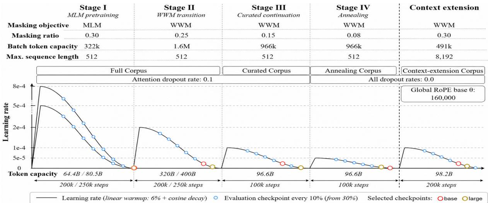  
Figure 1: Polish ModernBERT pretraining schedule. The models are trained in four 512-token stages followed by 8K continuation. Blue markers denote evaluated checkpoints; red/gold markers denote selected Base/Large checkpoints. Slash-separated values correspond to Base / Large variants.

Recipe selection was conducted on the Base model. At each stage, we varied a small subset of factors—the learning-rate schedule, masking objective and ratio, corpus mixture, or peak learning rate—while keeping the remaining configuration fixed. Intermediate checkpoints were evaluated using the average KLEJ validation score, and the best-performing checkpoint was propagated to the subsequent stage. The selected recipe was then transferred to the Large variants. Following the original ModernBERT settings, Stage I used peak learning rates of 8 × 10−4 and 5 × 10−4 for Base and Large, respectively. For Large, Stages I–II were each extended by 50K steps to accommodate the greater model capacity and vocabulary size. The evaluated configurations and validation results are provided in Appendix B.2.

Overall schedule. Figure 1 summarizes the resulting training trajectory. The models undergo four 512-token pretraining stages, followed by long-context continuation from the selected Stage IV checkpoints. Across the 512-token stages, training progresses from token-level MLM on the full corpus to whole-word masking on the full, curated, and annealing corpora, with progressively lower masking ratios and peak learning rates. The final 512-token checkpoints initialize the corresponding 8K variants, which undergo continued pretraining on the context-extension corpus after increasing the global RoPE base from 10,000 to 160,000.

Each stage uses dynamic masking and its own learning-rate schedule, comprising 6% linear warmup followed by cosine decay (Loshchilov and Hutter, 2016). At each stage transition, the optimizer and scheduler states are reinitialized, yielding stage-wise cosine restarts aligned with changes in the masking objective, masking ratio, or corpus mixture.

Token accounting. The token budgets shown in Figure 1 denote nominal capacity before excluding padding tokens. With sequence unpadding, non-padding tokens account for approximately 56% of this capacity during 512-token pretraining and 16% during context extension. Along the trajectories leading to the selected checkpoints, the Base and Large models process approximately 271.4B and 344.1B non-padding tokens, respectively, during 512-token pretraining, followed by approximately 11.0B and 12.6B tokens during context extension.

Implementation and compute. We use the official ModernBERT implementation released by the original authors4, including sequence unpadding, optimized attention kernels, and Megatron-style parameter initialization. Training is performed with Composer 0.30.0 using distributed data parallelism across eight NVIDIA GH200 GPUs on two HPC nodes. We optimize all models with decoupled StableAdamW (Wortsman et al., 2023; Loshchilov and Hutter, 2017) and use BF16 mixed precision throughout pretraining.

Full optimizer settings, checkpoint-selection criteria, stage-wise hyperparameters, and token budgets are provided in Appendix B.2.

## 4 Evaluation

The evaluation suite comprises 30 Polish NLU tasks organized into four groups: nine KLEJ tasks, six FinBench tasks, ten additional tasks grouped under Other Tasks, and the five-task LongContext benchmark. KLEJ was introduced by Rybak et al. (2020), whereas FinBench and the original nine-task Other Tasks group were introduced by Dadas et al. (2026). In this work, we extend the latter group with one additional task and introduce the LongContext benchmark.

KLEJ covers sentiment analysis (POLEMO2.0-IN, POLEMO2.0-OUT, and AR), named-entity type classification (NKJP-NER), harmful-content detection (CBD), and semantic-relation tasks (CDSC-E, CDSC-R, DYK, and PSC). FinBench evaluates financial-domain understanding through topic classification of short and long banking texts (BANKING-SHORT and BANKING-LONG), intent detection (BANKING77), sentiment analysis (FPB and STOOQ), and multi-label topic classification (GCN). The ten additional tasks grouped under Other Tasks broaden the evaluation to semantic relations (PPC, SICK-E, and SICK-R), thematic classification (8TAGS and EURLEX), sentiment and emotion analysis (IMDB and TWITTEREMO), harmful-content and manipulation detection (BAN-PL and MIPD), and sequence labeling (NKJP-NER\*).

LongContext specifically targets document understanding beyond the standard 512-token context window. It comprises tasks selected or constructed to evaluate long-document processing and distinguish between standard- and extended-context encoders.

NKJP-NER\*. NKJP-NER\* is a sequence-labeling task derived from the Polish National Corpus and included among Other Tasks. Unlike the KLEJ NKJP-NER formulation, which recasts the data as single-label classification, it preserves the original sequence-labeling setup5. Using the same underlying texts and annotations, we evaluate 512-token models on sentence-level inputs and 8K models on full documents. Both variants are treated as one task and evaluated using micro-averaged entitylevel F1. This setup evaluates each model under its intended input regime and should not be interpreted as a controlled comparison of context length alone.

The complete list of tasks, prediction formulations, domains, and primary metrics is provided in Table 9. Test-set sizes and token-length statistics are reported in Table 10.

## 4.1 LongContext Benchmark

We introduce LongContext, a five-task Polish benchmark for document understanding beyond the standard 512-token context window. It comprises SCOTUS-DOM, SCOTUS-DEC, ECTHR-PL-AVA, ECTHR-PL-VA, and BOOKSUMMARY. LongContext is restricted to tasks selected or constructed specifically to evaluate longdocument processing; datasets with long inputs that belong to established benchmark groups remain in their original groups for comparability with prior work.

The benchmark combines translated legal tasks with a specially constructed task evaluating factual consistency between distant parts of a document. All source datasets are based on publicly available English-language resources and were translated into Polish using GLM-4.66. We manually spot-checked 50 randomly sampled examples from each LongContext task. A single annotator assessed whether the translated text was coherent and preserved the information required for the corresponding prediction task. For BookSummary, the inspection additionally covered claim grammaticality, unambiguity, and consistency with the assigned label. This inspection was intended as a quality-control check rather than a comprehensive human validation of the benchmark.

The inspection revealed a small number of degenerate outputs containing repetitive generation loops. We therefore applied automatic corpus-wide filters to remove such cases and other anomalously long outputs.

SCOTUS. We derive two tasks from the publicly available SCOTUS dataset of United States Supreme Court opinions7 (Spaeth et al., 2020). SCOTUS-DOM is an 11-class task predicting the legal issue area of a case, whereas SCOTUS-DEC is a binary task predicting whether the ideological direction associated with the decision is liberal or conservative. The tasks use the same court opinions but evaluate complementary aspects of legal document understanding. Their inputs are particularly long: 74.5% of the test examples exceed 4K tokens when tokenized with the Polish ModernBERT Base tokenizer.

ECtHR-PL. We construct ECTHR-PL from the European Court of Human Rights dataset introduced by Chalkidis et al. (2021).8 For each case, we concatenate the sentences and paragraphs describing its facts into a single document. We remove cases whose concatenated factual descriptions exceed 32,000 characters to exclude extreme-length outliers and keep the inputs within practical processing limits. The remaining documents are translated into Polish. Using the labels provided in the original dataset, we define two multi-label classification tasks: ECTHR-PL-AVA predicts the articles of the European Convention on Human Rights alleged to have been violated, whereas ECTHR-PL-VA predicts the articles that the Court found to have been violated.

BookSummary. We construct BOOKSUMMARY from a public collection of approximately 25.7K Englishlanguage plot summaries.9 To obtain sufficiently long inputs, we retain the longest 25% of the summaries, translate them into Polish, and divide them into 70%/10%/20% training, validation, and test splits. For each summary, GLM-4.6 is prompted to generate a two- or three-sentence claim supported by the document, with a preference for facts appearing in the second half of the summary. The claim is then prepended to the summary. Half of the claims are supported by the corresponding summary, while the remaining half are modified by GLM-4.6 to be plausible but factually inconsistent. The resulting balanced binary classification task requires the model to relate a claim at the beginning of the input to supporting or contradicting evidence that typically appears later in the summary. The

Table 3: Base-scale encoder results across 30 tasks. Boldface marks the best score in each row, while underlining marks the best score within each context-length group. Averages are unweighted macro-averages across tasks. Superscripts denote architecture families: BBERT, RRoBERTa, MModernBERT, and LLlama-inspired encoder; (m) denotes multilingual models. POLEMO-IN/OUT denote the in- and out-of-domain POLEMO2.0 variants. NKJP-NER\* uses sentence-level inputs for 512-token models and document-level inputs for 8K models.
<table><tr><td rowspan="2"></td><td colspan="4">512 tokens</td><td colspan="4">8K tokens</td></tr><tr><td>XLM-RoBERTaR(m) base (278M)</td><td>HerBERTB base (124M)</td><td>pl-RoBERTa-v2R base (124M)</td><td>pl-ModernBERTM base (149M)</td><td>EuroBERTL(m) 210m (212M)</td><td>mmBERTM(m) small (140M)</td><td>pl-RoBERTa-8KR base (190M)</td><td>pl-ModernBERT-8KM base (149M)</td></tr><tr><td>KLEJ</td><td></td><td></td><td></td><td></td><td></td><td></td><td></td><td></td></tr><tr><td>NKJP-NER</td><td>92.37</td><td>94.13</td><td>94.32</td><td>94.38</td><td>84.17</td><td>90.99</td><td>94.16</td><td>94.49</td></tr><tr><td>CDSC-E</td><td>93.50</td><td>94.22</td><td>94.05</td><td>94.66</td><td>92.64</td><td>93.34</td><td>94.54</td><td>94.46</td></tr><tr><td>CDSC-R</td><td>93.38</td><td>93.84</td><td>94.64</td><td>94.11</td><td>88.40</td><td>90.47</td><td>94.90</td><td>94.06</td></tr><tr><td>CBD</td><td>60.84</td><td>66.36</td><td>70.57</td><td>68.56</td><td>51.06</td><td>50.02</td><td>69.35</td><td>71.40</td></tr><tr><td>POLEMO-IN</td><td>90.80</td><td>90.50</td><td>90.97</td><td>92.88</td><td>88.28</td><td>89.36</td><td>91.27</td><td>92.14</td></tr><tr><td>POLEMO-OUT</td><td>79.27</td><td>77.94</td><td>79.11</td><td>83.77</td><td>73.44</td><td>76.88</td><td>81.26</td><td>83.04</td></tr><tr><td>DYK</td><td>65.02</td><td>68.82</td><td>70.38</td><td>66.90</td><td>36.41</td><td>48.28</td><td>69.35</td><td>67.28</td></tr><tr><td>PSC</td><td>97.91</td><td>98.94</td><td>98.88</td><td>97.79</td><td>95.30</td><td>97.10</td><td>98.90</td><td>97.68</td></tr><tr><td>AR Average</td><td>87.06 84.46</td><td>87.74 85.83</td><td>87.83</td><td>88.53</td><td>84.73</td><td>84.59</td><td>88.05</td><td>88.46</td></tr><tr><td></td><td></td><td></td><td>86.75</td><td>86.84</td><td>77.16</td><td>80.11</td><td>86.86</td><td>87.00</td></tr><tr><td>FinBench</td><td></td><td></td><td></td><td></td><td></td><td></td><td></td><td></td></tr><tr><td>Banking-Short</td><td>77.34</td><td>78.35</td><td>78.75</td><td>80.41</td><td>73.72</td><td>73.86</td><td>79.79</td><td>80.08</td></tr><tr><td>Banking-Long</td><td>82.65</td><td>85.09 87.29</td><td>85.03</td><td>87.29 91.85</td><td>86.34</td><td>85.13</td><td>86.99</td><td>87.16</td></tr><tr><td>Banking77</td><td>85.10 82.76</td><td>83.11</td><td>88.26 83.55</td><td>83.20</td><td>91.15 78.52</td><td>88.97 81.77</td><td>89.27 83.63</td><td>91.66</td></tr><tr><td>FPB GCN</td><td>94.38</td><td>94.73</td><td>95.02</td><td>94.87</td><td>94.71</td><td>94.61</td><td>94.87</td><td>83.40 94.83</td></tr><tr><td>Stooq</td><td>76.53</td><td>73.33</td><td>80.25</td><td>84.08</td><td>69.81</td><td>74.05</td><td>81.32</td><td>83.03</td></tr><tr><td>Average</td><td>83.13</td><td>83.65</td><td>85.14</td><td>86.95</td><td>82.38</td><td>83.07</td><td>85.98</td><td>86.69</td></tr><tr><td>Other Tasks</td><td></td><td></td><td></td><td></td><td></td><td></td><td></td><td></td></tr><tr><td></td><td></td><td></td><td></td><td></td><td></td><td></td><td></td><td></td></tr><tr><td>8TAGS</td><td>76.15</td><td>77.81</td><td>78.03</td><td>80.69</td><td>72.17</td><td>74.41</td><td>79.21</td><td>80.86</td></tr><tr><td>BAN-PL</td><td>90.71</td><td>91.71 57.65</td><td>92.19 58.58</td><td>93.10 67.11</td><td>88.89</td><td>90.37</td><td>92.62</td><td>93.08</td></tr><tr><td>MIPD</td><td>54.30 81.76</td><td>84.16</td><td>87.05</td><td>84.40</td><td>64.96 66.54</td><td>66.95 80.10</td><td>64.39 86.02</td><td>68.03</td></tr><tr><td>PPC</td><td>83.98</td><td>85.17</td><td>86.71</td><td>86.31</td><td></td><td></td><td></td><td>85.70</td></tr><tr><td>SICK-E</td><td>73.79</td><td>77.82</td><td>82.58</td><td>83.16</td><td>75.34</td><td>84.35</td><td>86.31</td><td>86.61</td></tr><tr><td>SICK-R</td><td>65.19</td><td>67.41</td><td>66.46</td><td>69.02</td><td>52.13</td><td>66.38</td><td>83.16</td><td>83.77</td></tr><tr><td>TwitterEMO</td><td>88.12</td><td>90.21</td><td>91.06</td><td>92.05</td><td>61.93 91.36</td><td>63.23</td><td>68.75 95.02</td><td>69.52</td></tr><tr><td>IMDB EURLEX</td><td>72.60</td><td>75.37</td><td>74.51</td><td>79.31</td><td>79.00</td><td>92.10 78.36</td><td>79.12</td><td>94.40</td></tr><tr><td>NKJP-NER*</td><td>84.36</td><td>85.49</td><td>85.41</td><td>85.54</td><td>84.76</td><td>83.82</td><td>88.97</td><td>79.61</td></tr><tr><td>Average</td><td>77.10</td><td>79.28</td><td>80.26</td><td>82.07</td><td>73.71</td><td>78.01</td><td>82.36</td><td>89.21 83.08</td></tr><tr><td>Short Ctx Avg</td><td>81.19</td><td>82.69</td><td>83.77</td><td>84.96</td><td>77.03</td><td>79.98</td><td></td><td></td></tr><tr><td>LongContext</td><td></td><td></td><td></td><td></td><td></td><td></td><td>84.85</td><td>85.36</td></tr><tr><td>SCOTUS-Dom</td><td>75.36</td><td>78.80</td><td>79.12</td><td>82.81</td><td>83.45</td><td></td><td>79.26</td><td></td></tr><tr><td>SCOTUS-Dec</td><td>61.46</td><td>65.59</td><td>69.86</td><td>70.74</td><td>76.23</td><td>79.83 60.98</td><td>63.20</td><td>84.48 77.79</td></tr><tr><td>BookSummary</td><td>78.53</td><td>81.12</td><td>85.02</td><td>83.71</td><td>82.27</td><td>82.58</td><td>88.96</td><td>90.22</td></tr><tr><td>ECtHR-PL-AVA</td><td>22.04</td><td>43.90</td><td>33.65</td><td>61.42</td><td>62.47</td><td>60.26</td><td>64.66</td><td>68.01</td></tr><tr><td>ECtHR-PL-VA</td><td>16.38</td><td>40.26</td><td>20.65</td><td>59.29</td><td>57.09</td><td>61.45</td><td>41.28</td><td>65.27</td></tr><tr><td>Long Ctx Avg</td><td>50.75</td><td>61.93</td><td>57.66</td><td>71.59</td><td>72.30</td><td>69.02</td><td>67.47</td><td>77.15</td></tr><tr><td>Overall Average</td><td>76.12</td><td>79.23</td><td>79.42</td><td>82.73</td><td>76.24</td><td>78.15</td><td>81.95</td><td>83.99</td></tr></table>

BookSummary-specific part of the manual spot-check additionally assessed claim grammaticality, unambiguity, and consistency with the assigned label. The claimgeneration prompts are provided in Appendix E.2.

Most test examples in each of the three dataset families exceed the 512-token limit; full length distributions are reported in Table 10.

## 4.2 Baselines

We compare Polish ModernBERT with established Polish encoder models, including HerBERT (Mroczkowski et al., 2021), Polish RoBERTa-v2 (Dadas et al., 2020b), and Polish RoBERTa-8K (Dadas et al., 2026), using Base and Large variants where available. We also include XLM-RoBERTa (Conneau et al., 2019) as an established multilingual encoder, together with the more recent EuroBERT (Boizard et al., 2025) and mmBERT (Marone et al., 2025), both of which provide native long-context support. On the LongContext benchmark, 512-token models serve as practical truncation baselines. Because the compared model families also differ in architecture and pretraining setup, these results should not be interpreted as a controlled ablation of context length alone.

Retrieval baselines. For retrieval evaluation, we use the Polish Information Retrieval Benchmark (PIRB) (Dadas et al., 2024), a suite of 41 Polish text-retrieval tasks. We compare Polish ModernBERT with Polish RoBERTa-8K, EuroBERT, and mmBERT. These encoder models are fine-tuned and evaluated using a shared contrastive-learning protocol. We additionally include Qwen3-Embedding-0.6B (Zhang et al., 2025), BGE-M3 (Chen et al., 2024), Jina-Embeddings-V5- Text-Small (Akram et al., 2026), Multilingual-E5-Large (Yu et al., 2025), and Snowflake-Arctic-Embed-L-v2.0 (Wang et al., 2024) as external reference points. These dedicated embedding models differ in their training data, objectives, and optimization procedures and are therefore not treated as controlled baselines.

## 4.3 Fine-Tuning and Evaluation Protocol

For the 30 tasks in KLEJ, FinBench, Other Tasks, and LongContext, we follow the fine-tuning protocol used for Polish RoBERTa and Polish RoBERTa-8K (Dadas et al., 2020b, 2026). We fine-tune each model–task configuration using five random seeds and report the mean test performance according to the task’s primary metric. To quantify run-to-run variability, Table 15 reports aggregate mean scores and sample standard deviations across the same five runs for the principal matched Polish-model comparisons.

Table 4: Large-scale encoder results across 30 tasks. Formatting and notation follow Table 3.
<table><tr><td rowspan="2"></td><td colspan="4">512 tokens</td><td colspan="4">8K tokens</td></tr><tr><td>XLM-RoBERTaR(m) large (560M)</td><td>HerBERTB large (355M)</td><td>pl-RoBERTa-v2R large (435M)</td><td>pl-ModernBERTM large (475M)</td><td>EuroBERTL(m) 610m (610M)</td><td>mmBERTM(m) base (307M)</td><td>pl-RoBERTa-8KR large (443M)</td><td>pl-ModernBERT-8KM large (475M)</td></tr><tr><td>KLEJ</td><td></td><td></td><td></td><td></td><td></td><td></td><td></td><td></td></tr><tr><td>NKJP-NER</td><td>94.68</td><td>96.07</td><td>95.75</td><td>95.05</td><td>89.59</td><td>92.34</td><td>95.64</td><td>94.38</td></tr><tr><td>CDSC-E</td><td>94.40</td><td>94.78</td><td>94.16</td><td>94.60</td><td>89.48</td><td>93.72</td><td>94.28</td><td>94.68</td></tr><tr><td>CDSC-R</td><td>94.75</td><td>95.01</td><td>95.25</td><td>95.14</td><td>91.14</td><td>93.12</td><td>95.33</td><td>94.47</td></tr><tr><td>CBD</td><td>66.91</td><td>70.21</td><td>73.10</td><td>72.60</td><td>54.58</td><td>52.55</td><td>73.23</td><td>71.47</td></tr><tr><td>POLEMO-IN</td><td>92.47</td><td>91.39</td><td>93.55</td><td>93.38</td><td>90.89</td><td>90.22</td><td>93.05</td><td>93.05</td></tr><tr><td>POLEMO-OUT</td><td>81.78</td><td>81.66</td><td>83.81</td><td>84.41</td><td>78.42</td><td>78.38</td><td>83.64</td><td>84.78</td></tr><tr><td>DYK</td><td>73.16</td><td>73.31</td><td>74.87</td><td>73.28</td><td>42.61</td><td>64.24</td><td>74.05</td><td>74.63</td></tr><tr><td>PSC</td><td>98.91</td><td>98.85</td><td>98.37</td><td>98.81</td><td>98.03</td><td>96.83</td><td>98.56</td><td>98.47</td></tr><tr><td>AR</td><td>88.53</td><td>89.23</td><td>89.36</td><td>89.07</td><td>86.19</td><td>87.16</td><td>88.91</td><td>88.88</td></tr><tr><td>Average</td><td>87.29</td><td>87.83</td><td>88.69</td><td>88.48</td><td>80.10</td><td>83.17</td><td>88.52</td><td>88.31</td></tr><tr><td>FinBench</td><td></td><td></td><td></td><td></td><td></td><td></td><td></td><td></td></tr><tr><td>Banking-Short</td><td>71.56</td><td>81.80</td><td>81.69</td><td>82.07</td><td>78.04</td><td>77.33</td><td>81.99</td><td>81.94</td></tr><tr><td>Banking-Long</td><td>85.97</td><td>86.64</td><td>87.89</td><td>88.40</td><td>88.59</td><td>86.41</td><td>88.35</td><td>88.89</td></tr><tr><td>Banking77</td><td>92.86</td><td>92.76</td><td>92.45</td><td>92.96</td><td>92.04</td><td>90.69</td><td>92.74</td><td>92.62</td></tr><tr><td>FPB</td><td>84.99 95.00</td><td>84.99 95.25</td><td>85.26 95.04</td><td>84.80</td><td>81.69</td><td>82.78</td><td>85.42</td><td>84.60</td></tr><tr><td>GCN</td><td>82.26</td><td>82.53</td><td>85.07</td><td>95.08 85.77</td><td>94.86 81.43</td><td>94.91 82.04</td><td>94.97 84.41</td><td>94.88</td></tr><tr><td>Stooq Average</td><td>85.44</td><td>87.33</td><td>87.90</td><td>88.18</td><td>86.11</td><td>85.69</td><td>87.98</td><td>84.02</td></tr><tr><td></td><td></td><td></td><td></td><td></td><td></td><td></td><td></td><td>87.83</td></tr><tr><td>Other Tasks</td><td></td><td></td><td></td><td></td><td></td><td></td><td></td><td></td></tr><tr><td>8TAGS</td><td>79.74</td><td>81.16</td><td>81.64</td><td>82.50</td><td>75.32</td><td>76.43</td><td>81.44</td><td>82.24</td></tr><tr><td>BAN-PL</td><td>92.73</td><td>93.25</td><td>93.80</td><td>94.00</td><td>89.39</td><td>90.91</td><td>93.99</td><td>93.51</td></tr><tr><td>MIPD</td><td>67.57</td><td>66.79</td><td>67.27</td><td>68.28</td><td>70.88</td><td>69.17</td><td>68.50</td><td>68.99</td></tr><tr><td>PPC</td><td>87.92</td><td>89.78</td><td>89.96</td><td>88.04</td><td>78.56</td><td>83.86</td><td>89.48</td><td>87.20</td></tr><tr><td>SICK-E</td><td>87.70</td><td>87.33</td><td>88.33</td><td>87.88</td><td>82.03</td><td>86.58</td><td>88.96</td><td>87.47</td></tr><tr><td>SICK-R</td><td>83.47</td><td>84.37</td><td>85.93</td><td>84.69</td><td>67.77</td><td>75.32</td><td>86.54</td><td>84.91</td></tr><tr><td>TwitterEMO</td><td>70.16</td><td>70.51</td><td>70.70</td><td>70.20</td><td>65.50</td><td>66.26</td><td>70.60</td><td>70.35</td></tr><tr><td>IMDB</td><td>91.44 79.43</td><td>93.55 79.68</td><td>94.36</td><td>93.77</td><td>93.70</td><td>93.77</td><td>96.03</td><td>95.93</td></tr><tr><td>EURLEX NKJP-NER*</td><td>86.23</td><td>87.79</td><td>79.19 84.62</td><td>79.84 86.84</td><td>79.79 86.53</td><td>78.98</td><td>79.77</td><td>79.76</td></tr><tr><td>Average</td><td>82.64</td><td>83.42</td><td>83.58</td><td>83.60</td><td>78.95</td><td>86.67 80.80</td><td>87.36</td><td>88.66</td></tr><tr><td>Short Ctx Avg</td><td>84.98</td><td></td><td></td><td></td><td></td><td></td><td>84.27</td><td>83.90</td></tr><tr><td></td><td></td><td>85.95</td><td>86.46</td><td>86.46</td><td>81.08</td><td>82.83</td><td>86.69</td><td>86.43</td></tr><tr><td>LongContext</td><td></td><td></td><td></td><td></td><td></td><td></td><td></td><td></td></tr><tr><td>SCOTUS-Dom</td><td>81.03</td><td>82.49</td><td>83.01</td><td>83.83</td><td>84.20</td><td>82.32</td><td>83.99</td><td>85.78</td></tr><tr><td>SCOTUS-Dec BookSummary</td><td>61.72 83.43</td><td>67.91 84.59</td><td>72.46 87.47</td><td>71.39 86.54</td><td>76.25 91.91</td><td>70.97 87.31</td><td>68.73 93.11</td><td>78.21 91.74</td></tr><tr><td>ECtHR-PL-AVA</td><td>58.63</td><td>60.23</td><td>58.33</td><td>64.62</td><td>68.49</td><td>62.93</td><td>68.29</td><td>69.48</td></tr><tr><td>ECtHR-PL-VA</td><td>54.55</td><td>56.07</td><td>51.17</td><td>61.50</td><td>65.97</td><td>63.69</td><td>65.27</td><td>67.24</td></tr><tr><td>Long Ctx Avg</td><td>67.87</td><td>70.26</td><td>70.49</td><td>73.58</td><td>77.36</td><td>73.44</td><td>75.88</td><td>78.49</td></tr><tr><td>Overall Average</td><td>82.13</td><td>83.33</td><td>83.80</td><td>84.31</td><td>80.46</td><td>81.27</td><td>84.89</td><td>85.11</td></tr></table>

The common training setup comprises 10 epochs (1 for CBD), a batch size of 32, 6% linear warm-up, and polynomial learning-rate decay. Base models use a peak learning rate of $1 \times 1 0 ^ { - 5 }$ . For Large models, we compare peak learning rates of $1 \times 1 0 ^ { - 5 }$ and $3 \times 1 0 ^ { - 5 }$ on the validation set and use $3 \times 1 0 ^ { - 5 }$ for the final test evaluation. Models with standard and extended context lengths use maximum sequence lengths of 512 and 8,192 tokens, respectively, with longer inputs truncated to the corresponding limit. All task metrics are reported on a 0–100 scale.

## 5 Results

## 5.1 Encoder Performance

Tables 3 and 4 report results for the Base- and Largescale models, respectively. At the Base scale, Polish ModernBERT achieves the strongest aggregate performance in both context settings. The 512-token model obtains a short-context average of 84.96, improving over Polish RoBERTa-v2 by 1.19 points, with the largest gains outside LongContext observed on FinBench and Other Tasks. Its 8K counterpart further increases the short-context average to 85.36 and achieves the highest overall score of 83.99. Aggregate means and run-to-run variability for the matched Polish models are reported in Table 15.

The gains are also broad at the task level. Considering both context variants, a Polish ModernBERT model attains the best Base-scale result on 17 of the 25 tasks outside LongContext, including 6 of 9 KLEJ tasks, 4 of 6 FinBench tasks, and 7 of 10 Other Tasks. The comparable short-context averages of the 512-token and 8K variants suggest that context extension does not degrade aggregate performance outside the dedicated LongContext benchmark. At the Large scale, Polish ModernBERT-512 and Polish RoBERTa-v2 obtain the same short-context average of 86.46. Among the 512-token models, Polish ModernBERT achieves the strongest FinBench and Other Tasks averages, while trailing Polish RoBERTa-v2 by only 0.21 points on KLEJ. The 8K variant reaches the highest overall score of 85.11 while retaining a short-context average comparable to Polish RoBERTa-8K (86.43 vs. 86.69). Across both context variants, the Large family provides the best result on 9 of the 25 tasks outside LongContext, with its strongest performance concentrated in FinBench and Other Tasks. Established Polish baselines nevertheless remain stronger on several KLEJ tasks.

On NKJP-NER\*, both Polish 8K model families outperform their corresponding 512-token variants. At the Base scale, Polish RoBERTa improves from 85.41 to 88.97, while Polish ModernBERT improves from 85.54 to 89.21. At the Large scale, the corresponding gains are from 84.62 to 87.36 and from 86.84 to 88.66, respectively. Polish ModernBERT-8K achieves the highest score at both scales.

Across the two scale-specific comparisons, a Polish ModernBERT variant attains the highest task-level score in 35 of 60 cases, compared with 19 for the Polish RoBERTa family. Polish ModernBERT also substantially outperforms the recent multilingual EuroBERT and mmBERT variants in aggregate, underscoring the competitiveness of Polish-specific pretraining relative to modern multilingual encoders.

## 5.2 Long-Context Performance

The Polish ModernBERT-8K variants attain the best score in 9 of the 10 LongContext task–scale comparisons. At the Base scale, the 8K model reaches an average of 77.15, improving over the corresponding 512- token variant by 5.56 points and over Polish RoBERTa-8K by 9.68 points. It ranks first on all five tasks and achieves this improvement over Polish RoBERTa-8K with 22% fewer parameters (149M vs. 190M).

At the Large scale, context extension improves the Polish ModernBERT average from 73.58 to 78.49. The resulting model exceeds Polish RoBERTa-8K-Large by 2.61 points and ranks first on four of five tasks; the only exception is BOOKSUMMARY, where Polish RoBERTa-8K obtains the highest score. The largest gains over the corresponding 512-token variants are observed on SCOTUS-DEC, BOOKSUMMARY, and the two ECTHR-PL tasks.

The gains are considerably smaller on existing datasets that contain long examples but were not designed specifically to evaluate long-document processing. Across BANKING-LONG, MIPD, IMDB, and EURLEX, the average improvement of the Polish ModernBERT-8K models over their corresponding 512- token variants is 0.86 points at the Base scale and 0.82 points at the Large scale, compared with 5.56 and 4.91 points on LongContext. This contrast supports distinguishing datasets that contain long inputs from tasks selected or constructed specifically to stress longdocument processing. To further examine how model performance changes with input length, we report a bucket-level analysis for all LongContext tasks in Appendix C.3. The corresponding figures are shown in Figures 2 and 3, while the number of examples in each bucket is reported in Table 14.

## 5.3 Inference Efficiency

Polish ModernBERT provides favorable quality– efficiency trade-offs. All measurements were conducted using the same inference setup on a single NVIDIA H100 GPU; complete results are reported in Appendix D.

In the 512-token setting, Polish ModernBERT-Base improves the short-context average over Polish RoBERTa-v2-Base from 83.77 to 84.96, while reducing latency by 26% and peak GPU memory usage by 54%. At the Large scale, the models obtain the same short-context average of 86.46, but Polish ModernBERT reduces latency from 1.29 to 0.69 ms per sample and peak GPU memory usage from 3,604 to 2,946 MB, corresponding to reductions of 47% and 18%, respectively.

The efficiency gains persist in the 8K setting. Relative to Polish RoBERTa-8K-Base, Polish ModernBERT-8K-Base reduces peak GPU memory usage by 24% and latency by 6%, while improving the LongContext average from 67.47 to 77.15. At the Large scale, Polish ModernBERT-8K reduces memory usage by 21% and latency by 25%, while increasing the corresponding score from 75.88 to 78.49.

## 5.4 Retrieval Performance

We additionally evaluate retrieval performance on PIRB, a comprehensive Polish benchmark comprising 41 retrieval datasets. The encoder models are fine-tuned using a shared contrastive-learning protocol, with results reported in Table 5. Dedicated multilingual embedding models are included as external reference points in Appendix E.1, as they rely on different training data, objectives, and optimization protocols. We follow the pooling, normalization, similarity, and evaluation settings of the original PIRB protocol (Dadas et al., 2024).

Table 5: Mean NDCG@10 on PIRB across 41 datasets. Bold marks the best encoder within each size group.
<table><tr><td>Model NDCG@10</td></tr><tr><td>Smaller models (&lt;300M params)</td></tr><tr><td>mmBERT-small (140M) 48.25 EuroBERT-210 (212M) 52.14 pl-RoBERTa-8K-base (190M) 54.10 pl-ModernBERT-8K-base (149M) 55.36</td></tr><tr><td>Larger models (&gt;300M params)</td></tr><tr><td>mmBERT-base (307M) 52.39 EuroBERT-610M (610M) 56.52 pl-RoBERTa-8K-large (443M) 58.42 pl-ModernBERT-8K-large (475M) 58.16</td></tr></table>

## 6 Conclusion

We introduced Polish ModernBERT, a family of four Polish encoders covering Base and Large scales and 512-token and 8K context lengths, together with a staged pretraining procedure and a new five-task longcontext benchmark. Across 30 downstream tasks, the proposed models achieve the strongest overall performance among the evaluated Polish encoders, with particularly large gains on long-document understanding. Polish ModernBERT-8K-Base outperforms the matched Polish RoBERTa-8K baseline by 9.68 points on Long-Context while using 22% fewer parameters (149M vs. 190M). The models also provide favorable inference efficiency, while Polish ModernBERT-8K-Base achieves the best PIRB result among the evaluated encoders below 300M parameters. These results show that modern, language-focused encoder architectures remain effective and computationally attractive for Polish language understanding and representation learning.

## Limitations

Language scope. Our experiments focus exclusively on Polish. Although the staged pretraining procedure proved effective in this setting, its effectiveness may not transfer directly to languages with different linguistic properties, data availability, or tokenizer requirements. Evaluating the same procedure across additional languages would be necessary to establish its broader generality.

Evaluation coverage. The evaluation suite is dominated by classification tasks, particularly single-label classification, and includes only one sequence-labeling task. Although this setup follows earlier evaluations of Polish encoders (Dadas et al., 2026), it does not fully represent the range of applications for encoder models, such as reranking, span extraction, semantic search, or structured prediction. Broader evaluation across these task types would provide a more complete assessment of model capabilities.

Translated and generated evaluation data. Most LongContext tasks are derived from machine-translated English datasets, while BookSummary additionally relies on LLM-generated claims. Although we manually spot-checked 50 examples from each task and filtered degenerate outputs, this assessment was conducted by a single annotator and was intended as a quality-control check rather than a comprehensive human validation. Translation artifacts, model-specific generation patterns, or occasional label inconsistencies may therefore remain.

Moreover, four LongContext tasks are derived from publicly available English datasets, and their source documents and labels may have appeared in the pretraining data of some evaluated models. Translating the datasets into Polish reduces direct lexical overlap but does not eliminate the possibility of cross-lingual data contamination. BookSummary uses newly generated claims, although its underlying plot summaries are also publicly available. A larger-scale evaluation involving multiple annotators and agreement measurements, as well as the development of originally Polish long-document datasets, would strengthen the benchmark.

LongContext domain coverage. LongContext is weighted toward legal documents, reflecting an important real-world setting in which long-context processing is particularly relevant. However, this domain concentration may limit the generalizability of the benchmark conclusions. Future extensions should include additional long-document domains, such as finance, science, administration, and news.

Model-scale comparisons. The Base and Large variants use different tokenizers. Consequently, differences between model scales reflect both model capacity and tokenization and should not be interpreted as a controlled scaling study.

## Ethical Considerations

The models and benchmarks introduced in this work are intended for research on Polish language understanding and document representation. Several LongContext tasks are derived from publicly available legal and human-rights datasets. Although these resources contain court documents, the released benchmark follows the structure of the corresponding public source datasets and is not intended for identifying individuals or making decisions about specific cases.

Machine translation and LLM-based claim generation may introduce systematic linguistic or factual artifacts. Moreover, performance on legal and human-rights classification tasks should not be interpreted as evidence that the models are suitable for autonomous legal decisionmaking. Model outputs may reflect biases present in the pretraining and evaluation data and should be independently verified in high-stakes applications.

Because the legal source documents may contain names or other identifying details already present in the public source datasets, the released benchmark should not be used for identifying individuals or profiling specific cases.

## Acknowledgments

This work was supported by the Gaia AI Factory project, funded by the European Union under Grant Agreement No. 101314359 through the EuroHPC Joint Undertaking (EuroHPC JU).

We gratefully acknowledge Polish high-performance computing infrastructure PLGrid (HPC Center: ACK Cyfronet AGH) for providing computer facilities and support within computational grant no. PLG/2025/018315

## References

Mohammad Kalim Akram, Saba Sturua, Nastia Havriushenko, Quentin Herreros, Michael Günther, Maximilian Werk, and Han Xiao. 2026. jinaembeddings-v5-text: Task-targeted embedding distillation. arXiv preprint arXiv:2602.15547.

Zachary Ankner, Naomi Saphra, Davis Blalock, Jonathan Frankle, and Matthew Leavitt. 2024. Dynamic masking rate schedules for MLM pretraining. In Proceedings of the 18th Conference of the European Chapter of the Association for Computational Linguistics (Volume 2: Short Papers), pages 477–487, St. Julian’s, Malta. Association for Computational Linguistics.

Iz Beltagy, Matthew E. Peters, and Arman Cohan. 2020. Longformer: The long-document transformer. ArXiv, abs/2004.05150.

Stanisław Bogdanowicz, Hanna Cwynar, Aleksandra Zwierzchowska, Cezary Klamra, Witold Kieras, and´ Łukasz Kobylinski. 2023. Twitteremo: Annotating´

emotions and sentiment in polish twitter. In International Conference on Computational Science, pages 212–220. Springer.

Nicolas Boizard, Hippolyte Gisserot-Boukhlef, Duarte M. Alves, André Martins, Ayoub Hammal, Caio Corro, Céline Hudelot, Emmanuel Malherbe, Etienne Malaboeuf, Fanny Jourdan, Gabriel Hautreux, João Alves, Kevin El-Haddad, Manuel Faysse, Maxime Peyrard, Nuno M. Guerreiro, Patrick Fernandes, Ricardo Rei, and Pierre Colombo. 2025. Eurobert: Scaling multilingual encoders for european languages. Preprint, arXiv:2503.05500.

Lola Le Breton, Quentin Fournier, Mariam El Mezouar, John X. Morris, and Sarath Chandar. 2025. Neobert: A next-generation bert. Preprint, arXiv:2502.19587.

Iñigo Casanueva, Tadas Temcinas, Daniela Gerz,ˇ Matthew Henderson, and Ivan Vulic. 2020.´ Efficient intent detection with dual sentence encoders. In Proceedings of the 2nd Workshop on Natural Language Processingfor Conversational AI, pages 38–45, Online. Association for Computational Linguistics.

Ilias Chalkidis, Manos Fergadiotis, Prodromos Malakasiotis, and Ion Androutsopoulos. 2019. Large-scale multi-label text classification on EU legislation. In Proceedings ofthe 57th Annual Meeting ofthe Association for Computational Linguistics, pages 6314– 6322, Florence, Italy. Association for Computational Linguistics.

Ilias Chalkidis, Manos Fergadiotis, Dimitrios Tsarapatsanis, Nikolaos Aletras, Ion Androutsopoulos, and Prodromos Malakasiotis. 2021. Paragraph-level rationale extraction through regularization: A case study on european court of human rights cases. In Proceedings of the Annual Conference of the North American Chapter of the Association for Computational Linguistics, Mexico City, Mexico. Association for Computational Linguistics.

Jianlyu Chen, Shitao Xiao, Peitian Zhang, Kun Luo, Defu Lian, and Zheng Liu. 2024. M3- embedding: Multi-linguality, multi-functionality, multi-granularity text embeddings through selfknowledge distillation. In Findings of the association for computational linguistics: ACL 2024, pages 2318–2335.

Kevin Clark, Minh-Thang Luong, Quoc V. Le, and Christopher D. Manning. 2020. ELECTRA: Pretraining text encoders as discriminators rather than generators. In ICLR.

Alexis Conneau, Kartikay Khandelwal, Naman Goyal, Vishrav Chaudhary, Guillaume Wenzek, Francisco Guzmán, Edouard Grave, Myle Ott, Luke Zettlemoyer, and Veselin Stoyanov. 2019. Unsupervised cross-lingual representation learning at scale. arXiv preprint arXiv:1911.02116.

Yiming Cui, Wanxiang Che, Ting Liu, Bing Qin, and Ziqing Yang. 2021. Pre-training with whole word masking for chinese bert. IEEE/ACM Trans. Audio, Speech and Lang. Proc., 29:3504–3514.

Sławomir Dadas. 2022. Training effective neural sentence encoders from automatically mined paraphrases. In 2022 IEEE International Conference on Systems, Man, and Cybernetics (SMC), pages 371–378. IEEE.

Sławomir Dadas and Małgorzata Gr˛ebowiec. 2024. Assessing generalization capability of text ranking models in polish. In International Conference on Artificial Intelligence and Soft Computing, pages 37–49. Springer.

Slawomir Dadas, Michał Perełkiewicz, and Rafał Poswiata. 2020a.´ Evaluation of sentence representations in Polish. In Proceedings of the Twelfth Language Resources and Evaluation Conference, pages 1674–1680, Marseille, France. European Language Resources Association.

Sławomir Dadas, Michał Perełkiewicz, and Rafał Poswiata. 2020b. Pre-training polish transformer- ´ based language models at scale. In International Conference on Artificial Intelligence and Soft Computing, pages 301–314. Springer.

Slawomir Dadas, Michał Perełkiewicz, and Rafał Poswiata. 2024.´ PIRB: A comprehensive benchmark of Polish dense and hybrid text retrieval methods. In Proceedings of the 2024 Joint International Conference on Computational Linguistics, Language Resources and Evaluation (LREC-COLING 2024), pages 12761–12774, Torino, Italia. ELRA and ICCL.

Sławomir Dadas, Rafał Poswiata, Marek Kozłowski,´ Małgorzata Gr˛ebowiec, Michał Perełkiewicz, Paweł Klimiuk, and Przemysław Boruta. 2026. Longcontext encoder models for polish language understanding. Preprint, arXiv:2603.12191.

Jacob Devlin, Ming-Wei Chang, Kenton Lee, and Kristina Toutanova. 2019. BERT: Pre-training of deep bidirectional transformers for language understanding. In Proceedings of the 2019 Conference of the North American Chapter of the Association for Computational Linguistics: Human Language Technologies, Volume 1 (Long and Short Papers), pages 4171–4186, Minneapolis, Minnesota. Association for Computational Linguistics.

Angela Fan, Yacine Jernite, Ethan Perez, David Grangier, Jason Weston, and Michael Auli. 2019. Eli5: Long form question answering. In Proceedings ofthe 57th annual meeting of the association for computational linguistics, pages 3558–3567.

Mykola Haltiuk and Aleksander Smywinski-Pohl. 2025.´ On the path to make Ukrainian a high-resource language. In Proceedings of the Fourth Ukrainian Natural Language Processing Workshop (UNLP 2025), pages 120–130, Vienna, Austria (online). Association for Computational Linguistics.

Pengcheng He, Xiaodong Liu, Jianfeng Gao, and Weizhu Chen. 2020. DeBERTa: Decodingenhanced BERT with Disentangled Attention. CoRR, abs/2006.03654.

Kenneth Heafield. 2011. Kenlm: Faster and smaller language model queries. In Proceedings ofthe sixth workshop on statistical machine translation, pages 187–197.

Junjie Hu, Sebastian Ruder, Aditya Siddhant, Graham Neubig, Orhan Firat, and Melvin Johnson. 2020. XTREME: A Massively Multilingual Multitask Benchmark for Evaluating Cross-lingual Generalization. Preprint, arXiv:2003.11080.

Armand Joulin, Edouard Grave, Piotr Bojanowski, Matthijs Douze, Hérve Jégou, and Tomas Mikolov. 2016. Fasttext.zip: Compressing text classification models. arXiv preprint arXiv:1612.03651.

Armand Joulin, Edouard Grave, Piotr Bojanowski, and Tomas Mikolov. 2017. Bag of tricks for efficient text classification. In Proceedings of the 15th Conference ofthe European Chapter ofthe Association for Computational Linguistics: Volume 2, Short Papers, pages 427–431, Valencia, Spain. Association for Computational Linguistics.

Daniel Khashabi, Amos Ng, Tushar Khot, Ashish Sabharwal, Hannaneh Hajishirzi, and Chris Callison-Burch. 2021. Gooaq: Open question answering with diverse answer types. In Findings ofthe Association for Computational Linguistics: EMNLP 2021, pages 421–433.

Łukasz Kobylinski, Maciej Ogrodniczuk, Piotr Rybak,´ Piotr Przybyła, Piotr P˛ezik, Agnieszka Mikołajczyk, Wojciech Janowski, Michał Marcinczuk, and Alek-´ sander Smywinski-Pohl. 2023. Poleval 2022/23 chal-´ lenge tasks and results. In 2023 18th Conference on Computer Science and Intelligence Systems (FedC-SIS), pages 1243–1250. IEEE.

Jan Kocon, Piotr Miłkowski, and Monika Zasko-´ Zielinska. 2019. Multi-level sentiment analysis of ´ polemo 2.0: Extended corpus of multi-domain consumer reviews. In Proceedings of the 23rd Conference on Computational Natural Language Learning (CoNLL), pages 980–991.

Anna Kolos, Inez Okulska, Kinga Gł ˛abinska, Agnieszka´ Karlinska, Emilia Wisnios, Paweł Ellerik, and Andrzej Prałat. 2024. BAN-PL: A Polish dataset of banned harmful and offensive content from wykop.pl web service. In Proceedings of the 2024 Joint International Conference on Computational Linguistics, Language Resources and Evaluation (LREC-COLING 2024), pages 2107–2118, Torino, Italia. ELRA and ICCL.

Taku Kudo and John Richardson. 2018. SentencePiece: A simple and language independent subword tokenizer and detokenizer for neural text processing. In Proceedings of the 2018 Conference on Empirical Methods in Natural Language Processing: System Demonstrations, pages 66–71, Brussels, Belgium. Association for Computational Linguistics.

Yinhan Liu, Myle Ott, Naman Goyal, Jingfei Du, Mandar Joshi, Danqi Chen, Omer Levy, Mike Lewis, Luke Zettlemoyer, and Veselin Stoyanov. 2019. RoBERTa: A Robustly Optimized BERT Pretraining Approach.

Shayne Longpre, Gregory Yauney, Emily Reif, Katherine Lee, Adam Roberts, Barret Zoph, Denny Zhou, Jason Wei, Kevin Robinson, David Mimno, and Daphne Ippolito. 2024. A pretrainer’s guide to training data: Measuring the effects of data age, domain coverage, quality, & toxicity. In Proceedings ofthe 2024 Conference ofthe North American Chapter ofthe Associationfor Computational Linguistics: Human Language Technologies (Volume 1: Long Papers), pages 3245–3276, Mexico City, Mexico. Association for Computational Linguistics.

Ilya Loshchilov and Frank Hutter. 2016. SGDR: Stochastic Gradient Descent with Restarts. ArXiv, abs/1608.03983.

Ilya Loshchilov and Frank Hutter. 2017. Decoupled Weight Decay Regularization. In International Conference on Learning Representations.

Andrew Maas, Raymond E Daly, Peter T Pham, Dan Huang, Andrew Y Ng, and Christopher Potts. 2011. Learning word vectors for sentiment analysis. In Proceedings of the 49th annual meeting of the association for computational linguistics: Human language technologies, pages 142–150.

Pekka Malo, Ankur Sinha, Pekka Korhonen, Jyrki Wallenius, and Pyry Takala. 2014. Good debt or bad debt: Detecting semantic orientations in economic texts. Journal of the Association for Information Science and Technology, 65(4):782–796.

Michał Marcinczuk, Marcin Ptak, Adam Radziszewski, and Maciej Piasecki. 2013. Open dataset for development of polish question answering systems. In Proceedings of the 6th Language & Technology Conference: Human Language Technologies as a Challenge for Computer Science and Linguistics, Wydawnictwo Poznanskie, Fundacja Uniwersytetu im. Adama Mickiewicza.

Marc Marone, Orion Weller, William Fleshman, Eugene Yang, Dawn Lawrie, and Benjamin Van Durme. 2025. mmBERT: A Modern Multilingual Encoder with Annealed Language Learning. Preprint, arXiv:2509.06888.

Arkadiusz Modzelewski, Giovanni Da San Martino, Pavel Savov, Magdalena Anna Wilczynska, and´ Adam Wierzbicki. 2024. MIPD: Exploring manipulation and intention in a novel corpus of Polish disinformation. In Proceedings ofthe 2024 Conference on Empirical Methods in Natural Language Processing, pages 19769–19785, Miami, Florida, USA. Association for Computational Linguistics.

Robert Mroczkowski, Piotr Rybak, Alina Wróblewska, and Ireneusz Gawlik. 2021. HerBERT: Efficiently pretrained transformer-based language model for Polish. In Proceedings of the 8th Workshop on Balto-Slavic Natural Language Processing, pages 1–10, Kyiv, Ukraine. Association for Computational Linguistics.

Maciej Ogrodniczuk and Mateusz Kopec. 2014.´ The Polish summaries corpus. In Proceedings ofthe Ninth

International Conference on Language Resources and Evaluation (LREC’14), pages 3712–3715, Reykjavik, Iceland. European Language Resources Association (ELRA).

Team OLMo, Pete Walsh, Luca Soldaini, Dirk Groeneveld, Kyle Lo, Shane Arora, Akshita Bhagia, Yuling Gu, Shengyi Huang, Matt Jordan, Nathan Lambert, Dustin Schwenk, Oyvind Tafjord, Taira Anderson, David Atkinson, Faeze Brahman, Christopher Clark, Pradeep Dasigi, Nouha Dziri, and 24 others. 2025. 2 olmo 2 furious. Preprint, arXiv:2501.00656.

Lucas F. A. O. Pellicer and Guilherme Rinaldo. 2026. NorBERTo: A ModernBERT model trained for Portuguese with 331 billion tokens corpus. In Proceedings ofthe 17th International Conference on Computational Processing ofPortuguese (PROPOR 2026) - Vol. 1, pages 183–193, Salvador, Brazil. Association for Computational Linguistics.

Guilherme Penedo, Hynek Kydlícek, Amir Hossein Kar-ˇ garan, and Leandro von Werra. 2026. Finetranslations. https://huggingface.co/datasets/ HuggingFaceFW/finetranslations.

Telmo Pires, Eva Schlinger, and Dan Garrette. 2019. How multilingual is multilingual BERT? In Proceedings of the 57th Annual Meeting of the Association for Computational Linguistics, pages 4996–5001.

Jacob Portes, Alexander Trott, Sam Havens, Daniel King, Abhinav Venigalla, Moin Nadeem, Nikhil Sardana, Daya Khudia, and Jonathan Frankle. 2023. MosaicBERT: A Bidirectional Encoder Optimized for Fast Pretraining. In Advances in Neural Information Processing Systems, volume 36, pages 3106–3130. Curran Associates, Inc.

Adam Przepiórkowski, Rafał L. Górski, Marek Łazinski,´ and Piotr P˛ezik. 2010. Recent developments in the National Corpus of Polish. In Proceedings of the Seventh International Conference on Language Resources and Evaluation (LREC’10), Valletta, Malta. European Language Resources Association (ELRA).

Michal Ptaszynski, Agata Pieciukiewicz, and Paweł Dybała. 2019. Results of the PolEval 2019 Shared Task 6 : first dataset and Open Shared Taskfor automatic cyberbullying detection in Polish Twitter, page 89–110. Polska Akademia Nauk.

Steven J. Rennie, Vaibhava Goel, and Samuel Thomas. 2014. Annealed dropout training of deep networks. In 2014 IEEE Spoken Language Technology Workshop (SLT), pages 159–164.

Akseli Reunamo, Laura-Maria Peltonen, Hans Moen, and Sampo Pyysalo. 2025. Pretraining Finnish ModernBERTs. Preprint, arXiv:2511.09213.

Sebastian Ruder, Noah Constant, Jan Botha, Aditya Siddhant, Orhan Firat, Jinlan Fu, Pengfei Liu, Junjie Hu, Dan Garrette, Graham Neubig, and Melvin Johnson. 2021. XTREME-R: Towards more challenging and nuanced multilingual evaluation. In Proceedings ofthe 2021 Conference on Empirical Methods in

Natural Language Processing, pages 10215–10245, Online and Punta Cana, Dominican Republic. Association for Computational Linguistics.

Piotr Rybak. 2023. Maupqa: Massive automaticallycreated polish question answering dataset. In Proceedings ofthe 9th Workshop on Slavic Natural Language Processing 2023 (SlavicNLP 2023), pages 11– 16.

Piotr Rybak, Robert Mroczkowski, Janusz Tracz, and Ireneusz Gawlik. 2020. KLEJ: Comprehensive benchmark for Polish language understanding. In Proceedings ofthe 58th Annual Meeting ofthe Associationfor Computational Linguistics, pages 1191– 1201, Online. Association for Computational Linguistics.

Shaltiel Shmidman, Avi Shmidman, and Moshe Koppel. 2025. NeoDictaBERT: Pushing the Frontier of BERT models for Hebrew. Preprint, arXiv:2510.20386.

Ankur Sinha and Tanmay Khandait. 2021. Impact of news on the commodity market: Dataset and results. In Future ofInformation and Communication Conference, pages 589–601. Springer.

Harold J. Spaeth, Lee Epstein, Andrew D. Martin, Jeffrey A. Segal, Theodore J. Ruger, Sara C. Benesh, and Michael J. Nelson. 2020. Supreme court database, version 2020 release 01. Available at https://scdb. la.psu.edu/data/2020-release-01/.

Melik¸sah Türker, A. Ebrar Kiziloglu, Onur Güngör, and Susan Üsküdarli. 2025. TabiBERT: A large-scale modernbert foundation model and unified benchmarking framework for turkish. ArXiv, abs/2512.23065.

Liang Wang, Nan Yang, Xiaolong Huang, Linjun Yang, Rangan Majumder, and Furu Wei. 2024. Multilingual e5 text embeddings: A technical report. arXiv preprint arXiv:2402.05672.

Benjamin Warner, Antoine Chaffin, Benjamin Clavié, Orion Weller, Oskar Hallström, Said Taghadouini, Alexis Gallagher, Raja Biswas, Faisal Ladhak, Tom Aarsen, Griffin Thomas Adams, Jeremy Howard, and Iacopo Poli. 2025. Smarter, better, faster, longer: A modern bidirectional encoder for fast, memory efficient, and long context finetuning and inference. In Proceedings of the 63rd Annual Meeting of the Associationfor Computational Linguistics (Volume 1: Long Papers), pages 2526–2547, Vienna, Austria. Association for Computational Linguistics.

Guillaume Wenzek, Marie-Anne Lachaux, Alexis Conneau, Vishrav Chaudhary, Francisco Guzmán, Armand Joulin, and Edouard Grave. 2020. CCNet: Extracting high quality monolingual datasets from web crawl data. In Proceedings of the Twelfth Language Resources and Evaluation Conference, pages 4003–4012, Marseille, France. European Language Resources Association.

Alexander Wettig, Tianyu Gao, Zexuan Zhong, and Danqi Chen. 2023. Should you mask 15% in masked language modeling? In Proceedings of the 17th

Conference of the European Chapter of the Associationfor Computational Linguistics, pages 2985–3000, Dubrovnik, Croatia. Association for Computational Linguistics.

Konrad Wojtasik, Kacper Wołowiec, Vadim Shishkin, Arkadiusz Janz, and Maciej Piasecki. 2024. BEIR-PL: Zero shot information retrieval benchmark for the Polish language. In Proceedings ofthe 2024 Joint International Conference on Computational Linguistics, Language Resources and Evaluation (LREC-COLING 2024), pages 2149–2160.

Mitchell Wortsman, Tim Dettmers, Luke Zettlemoyer, Ari Morcos, Ali Farhadi, and Ludwig Schmidt. 2023. Stable and low-precision training for large-scale vision-language models. In Proceedings ofthe 37th International Conference on Neural Information Processing Systems, NIPS ’23, Red Hook, NY, USA. Curran Associates Inc.

Alina Wróblewska and Katarzyna Krasnowska-Kieras.´ 2017. Polish evaluation dataset for compositional distributional semantics models. In Proceedings ofthe 55th Annual Meeting ofthe Associationfor Computational Linguistics (Volume 1: Long Papers), pages 784–792.

Puxuan Yu, Luke Merrick, Gaurav Nuti, and Daniel F Campos. 2025. Arctic-embed 2.0: Multilingual retrieval without compromise. In Second Conference on Language Modeling.

Manzil Zaheer, Guru Guruganesh, Avinava Dubey, Joshua Ainslie, Chris Alberti, Santiago Ontanon, Philip Pham, Anirudh Ravula, Qifan Wang, Li Yang, and Amr Ahmed. 2020. Big bird: transformers for longer sequences. In Proceedings ofthe 34th International Conference on Neural Information Processing Systems, NIPS ’20, Red Hook, NY, USA. Curran Associates Inc.

Yanzhao Zhang, Mingxin Li, Dingkun Long, Xin Zhang, Huan Lin, Baosong Yang, Pengjun Xie, An Yang, Dayiheng Liu, Junyang Lin, and 1 others. 2025. Qwen3 embedding: Advancing text embedding and reranking through foundation models. arXiv preprint arXiv:2506.05176.

## A Corpus Composition and Cleaning

## A.1 Domain Composition

To characterize the diversity of the pretraining data, we estimate the domain composition of the main corpus after cleaning and deduplication. Documents are assigned to topical categories using a lightweight multinomial Naive Bayes classifier operating on lemmatized document tokens represented as TF–IDF-weighted bag-ofwords features. The classifier was trained on approximately 15 GB of Polish text assembled from public sources that could be mapped to specific domains and achieved 78% validation accuracy.

Because several fine-grained labels are closely related and the classifier provides only approximate domain assignments, we aggregate them into broader categories to obtain more robust and interpretable corpus-level estimates. For reporting, predicted document-level labels are aggregated into the eight broad categories shown in Table 6, and category shares are computed by token count. The original classifier predicts 19 fine-grained domains, which are aggregated as follows: technology and social networks into Technology / Internet; science and engineering and biomedicine into Science /Biomedicine; humanities and social sciences, history, religion, and art into Humanities; finance and e-commerce into Finance / Commerce; lifestyle and entertainment, food, sport, and automotive content into Lifestyle; and housing and construction, agriculture, and other content into Home / Other. News remains a separate category, while law is reported under Law / Public Affairs.

The resulting statistics should therefore be interpreted as approximate corpus-level estimates rather than manual document-level annotations. No single domain dominates the token-weighted corpus. Common Crawl contains a larger share of news and technology-related content, while the curated corpus contains higher proportions of legal, scientific, and humanities text; FineTranslations is more evenly distributed across news, technology, science, and humanities.

Table 6: Approximate domain composition of the main pretraining corpus after cleaning and deduplication. Values denote token percentages within each corpus component; the Total column is computed as a token-weighted average using the component sizes reported in Table 2. Curated denotes the curated Polish corpus, CC denotes Common Crawl, and FineTran denotes FineTranslations.

<table><tr><td>Domain</td><td>Curated</td><td>CC</td><td>FineTran</td><td>Total</td></tr><tr><td>News</td><td>8.0</td><td>28.0</td><td>20.0</td><td>18.7</td></tr><tr><td>Technology / Internet</td><td>10.0</td><td>25.0</td><td>18.0</td><td>17.7</td></tr><tr><td>Science / Biomedicine</td><td>20.0</td><td>10.0</td><td>18.0</td><td>15.8</td></tr><tr><td>Law / Public Affairs</td><td>22.0</td><td>6.0</td><td>8.0</td><td>12.2</td></tr><tr><td>Humanities</td><td>18.0</td><td>8.0</td><td>14.0</td><td>13.2</td></tr><tr><td>Finance / Commerce</td><td>7.0</td><td>10.0</td><td>8.0</td><td>8.4</td></tr><tr><td>Lifestyle</td><td>8.0</td><td>9.0</td><td>6.0</td><td>7.8</td></tr><tr><td>Home / Other</td><td>7.0</td><td>4.0</td><td>8.0</td><td>6.2</td></tr></table>

## A.2 Corpus Cleaning

All corpus components are processed with a shared cleaning and filtering pipeline. Documents are first segmented into sentences using NLTK-based sentence segmentation extended with Polish abbreviation lists. We then apply punctuation and whitespace normalization based on CCNet-style rules (Wenzek et al., 2020) and remove URLs. Sentences longer than 100 characters with less than 40% alphabetic characters are discarded, and documents shorter than 500 characters are removed.

Language filtering is performed at the sentence level with a FastText-based language-identification model (Joulin et al., 2017, 2016). Sentences not assigned to Polish with sufficient confidence are removed, while the threshold is kept low to avoid discarding valid Polish sentences that may be difficult to classify reliably.

We additionally apply classifier-based quality filtering. The quality filter is a lightweight binary randomforest classifier implemented with scikit-learn. It uses 23 numeric features describing character-, word-, and sentence-level statistics of each document, including the proportion of letters, digits, whitespace and punctuation, capitalization patterns, word-length statistics, sentence-length statistics, and repetition features. The classifier was trained on 2,520 manually labeled Polish documents, consisting of 1,417 high-quality and 1,103 low-quality examples, using an 80/20 train–validation split. It achieved 96% validation accuracy. Documents classified as low quality are removed from the corpus.

Finally, we apply KenLM-based perplexity filtering (Heafield, 2011). Perplexity is computed with a lightweight statistical language model, and documents exceeding the selected perplexity threshold are discarded. This step is intended to remove documents with abnormal language-model scores, including noisy extraction artifacts, poorly encoded texts, and other lowquality content that may not be captured by the preceding filters.

Deduplication After cleaning, we apply exact and near-duplicate removal. Exact duplicates are removed using SHA-256 document hashes stored in a Bloom filter, which provides a memory-efficient way to track previously observed documents at corpus scale.

Near-duplicate removal is based on MinHash localitysensitive hashing. Each document is converted into a set of unique word trigrams, represented with a 128-permutation MinHash signature. Candidate nearduplicate pairs are retrieved with LSH and grouped when their estimated Jaccard similarity exceeds 0.7. Within each near-duplicate cluster, we retain the document with the highest available quality score. If no quality score is available, we retain the earliest processed document. The final deduplicated corpus is then used to construct the main pretraining corpus and the stage-specific mixtures described in Section 3.2.

## B Recipe-Selection Experiments

## B.1 Direct Transfer of the ModernBERT Recipe

As an initial baseline, we trained a Polish ModernBERT-Base-8K model by directly adapting the original ModernBERT pretraining recipe (Warner et al., 2025). The baseline followed the original sequence of main pretraining, long-context continuation, and final learning-rate annealing as closely as possible, while using the same cleaned Polish data sources as the final models.

This experiment was intended to test whether the original recipe could be transferred to Polish without additional recipe selection. We therefore did not apply the staged modifications introduced in our final schedule, including the four-stage 512-token curriculum, stagespecific corpus refinement, progressive masking-ratio reduction, and independently restarted learning-rate schedules.

Table 7: Validation performance of the direct-transfer ModernBERT recipe, averaged over five fine-tuning runs.
<table><tr><td>Task group</td><td>Average</td></tr><tr><td>KLEJ (9 tasks)</td><td>83.76</td></tr><tr><td>FinBench (6 tasks)</td><td>83.69</td></tr><tr><td>KLEJ + FinBench (15 tasks)</td><td>83.73</td></tr></table>

As shown in Table 7, the direct-transfer baseline achieved 83.76 on KLEJ, 83.69 on FinBench, and 83.73 on the combined 15-task development suite. While this represents a strong initial baseline, the staged search identified configurations with higher validation performance, motivating the final recipe-selection procedure described in Appendix B.2.

## B.2 Pretraining Recipe Selection

Common training settings. Unless stated otherwise, all stages use decoupled StableAdamW (Wortsman et al., 2023; Loshchilov and Hutter, 2017) with $\beta _ { 1 } =$ $0 . 9 , \ \beta _ { 2 } \ = \ 0 . 9 8 , \ \epsilon \ = \ 1 0 ^ { - 6 }$ , and weight decay $1 0 ^ { - 6 }$ Bias and normalization parameters are excluded from weight decay. Training uses BF16 mixed precision and dynamic masking. At each stage transition, only the selected model parameters are carried over; the optimizer and learning-rate scheduler states are reinitialized. The data loader is also reinitialized with a new random seed, yielding a new document order, while masks are sampled dynamically throughout training. Gradient clipping with a threshold of 1.0 is applied in all stages except Stage I. Embedding and MLP dropout are disabled throughout training. Unless stated otherwise, the selected configuration at each stage uses an independently initialized cosine schedule with 6% linear warm-up.

Checkpoint selection. Intermediate checkpoints are evaluated every 10% of the stage budget, starting at 30%. For each checkpoint and task, validation scores are averaged over five fine-tuning runs; the resulting tasklevel scores are then macro-averaged across KLEJ. For each configuration, we report the highest KLEJ average observed across its evaluated checkpoints. The bestperforming configuration and checkpoint within each stage are propagated to the subsequent stage. Table 8 summarizes the explored configurations and selected variants.

Stage I: optimization schedule. We retained the original ModernBERT Base token-level MLM objective, masking probability of 0.30, and peak learning rate of $8 \times 1 0 ^ { - 4 }$ (Warner et al., 2025). We compared warmup– stable–decay schedules with decay phases covering the final 5%, 10%, and 15% of training against cosine decay with 6% linear warm-up. All remaining settings were fixed. The corresponding average KLEJ scores were

Table 8: Recipe-selection experiments conducted on the Base model. Each stage starts from the checkpoint selected in the preceding stage. For each configuration, we report the highest KLEJ validation average observed across the evaluated checkpoints; task-level scores are averaged over five fine-tuning runs before macro-averaging across KLEJ. Bold indicates the configuration selected for continuation. For WSD variants, the percentage denotes the fraction of the stage allocated to learning-rate decay.
<table><tr><td>Stage</td><td>Variant</td><td>Corpus</td><td>Objective</td><td>Masking</td><td>Peak LR</td><td>Attn. dropout</td><td>Avg. KLEJ</td></tr><tr><td>I</td><td>WSD-5%</td><td>Full</td><td>MLM</td><td>0.30</td><td> $8 \times 1 0 ^ { - 4 }$ </td><td>0.10</td><td>82.87</td></tr><tr><td>I</td><td>WSD-10%</td><td>Full</td><td>MLM</td><td>0.30</td><td> $8 \times 1 0 ^ { - 4 }$ </td><td>0.10</td><td>83.05</td></tr><tr><td>I</td><td>WSD-15%</td><td>Full</td><td>MLM</td><td>0.30</td><td> $8 \times 1 0 ^ { - 4 }$ </td><td>0.10</td><td>83.18</td></tr><tr><td>I</td><td>Cosine</td><td>Full</td><td>MLM</td><td>0.30</td><td> $8 \times 1 0 ^ { - 4 }$ </td><td>0.10</td><td>83.42</td></tr><tr><td>ⅡI</td><td>MLM-30</td><td>Full</td><td>MLM</td><td>0.30</td><td> $2 \times 1 0 ^ { - 4 }$ </td><td>0.10</td><td>83.88</td></tr><tr><td>ⅡI</td><td>MLM-15</td><td>Full</td><td>MLM</td><td>0.15</td><td> $2 \times 1 0 ^ { - 4 }$ </td><td>0.10</td><td>84.16</td></tr><tr><td>Ⅱ</td><td>WWM-25</td><td>Full</td><td>WWM</td><td>0.25</td><td> $2 \times 1 0 ^ { - 4 }$ </td><td>0.10</td><td>84.48</td></tr><tr><td>Ⅱ</td><td>WWM-15</td><td>Full</td><td>WWM</td><td>0.15</td><td> $2 \times 1 0 ^ { - 4 }$ </td><td>0.10</td><td>84.29</td></tr><tr><td>ⅢI</td><td>Full-corpus continuation</td><td>Full</td><td>WWM</td><td>0.25</td><td> $1 \times 1 0 ^ { - 4 }$ </td><td>0.10</td><td>84.72</td></tr><tr><td>ⅢI</td><td>Curated corpus</td><td>Curated</td><td>WWM</td><td>0.25</td><td> $1 \times 1 0 ^ { - 4 }$ </td><td>0.10</td><td>85.39</td></tr><tr><td>ⅢI</td><td>Curated + lower masking</td><td>Curated</td><td>WWM</td><td>0.15</td><td> $1 \times 1 0 ^ { - 4 }$ </td><td>0.10</td><td>85.62</td></tr><tr><td>IV</td><td>Annealing</td><td>Annealing</td><td>WWM</td><td>0.08</td><td> $5 \times 1 0 ^ { - 5 }$ </td><td>0.10</td><td>86.62</td></tr><tr><td>IV</td><td>Annealing without dropout</td><td>Annealing</td><td>WWM</td><td>0.08</td><td> $5 \times 1 0 ^ { - 5 }$ </td><td>0.00</td><td>87.00</td></tr></table>

82.87, 83.05, 83.18, and 83.42, respectively. Cosine decay performed best and was retained for the subsequent stages.

Recipe selection was conducted on Base for 200K steps, with a nominal token budget of 64.4B. The selected schedule was transferred to Large using the original ModernBERT Large peak learning rate of $5 \times 1 0 ^ { - 4 }$ and 250K steps, corresponding to a nominal token budget of 80.5B. The final Stage I checkpoints initialized Stage II.

Stage II: masking objective and ratio. Stage II compared token-level MLM with masking probabilities of 0.30 and 0.15 against whole-word masking (WWM) with probabilities of 0.25 and 0.15 (Cui et al., 2021). The corresponding average KLEJ scores were 83.88, 84.16, 84.48, and 84.29. WWM with a masking probability of 0.25 performed best and was selected for Stage III. This comparison was motivated by prior evidence that the optimal masking rate can depend on the objective and training stage (Wettig et al., 2023; Ankner et al., 2024).

All Stage II variants used the full pretraining corpus, maximum sequence length of 512, attention dropout of 0.1, and batch token capacity of approximately 1.6M. We restarted the learning-rate schedule with 6% linear warm-up and cosine decay, reducing the common peak learning rate to $2 \times 1 0 ^ { - 4 }$ for both Base and Large. The stage ran for 200K steps for Base and 250K steps for Large, corresponding to nominal token budgets of 320B and 400B tokens. The selected checkpoints occurred at 80% and 90% of the respective stage budgets.

Stage III: corpus and masking refinement. Stage III evaluated the transition from the full corpus to the curated corpus and a lower WWM probability. Continuing on the full corpus with WWM probability 0.25 yielded an average KLEJ score of 84.72. Replacing it with the curated corpus increased the score to 85.39, while additionally reducing the masking probability to 0.15 produced 85.62. The latter configuration was selected for Stage IV. These experiments were motivated by evidence that corpus quality and composition can substantially affect pretraining outcomes (Longpre et al., 2024).

The stage used a maximum sequence length of 512, attention dropout of 0.1, a batch token capacity of approximately 966K, and a peak learning rate of 1 $\times 1 0 ^ { - 4 }$ Training continued for 100K steps, corresponding to a nominal budget of 96.6B tokens. The selected checkpoints occurred at 70% of the stage budget for Base and 90% for Large.

Stage IV: annealing. The final 512-token stage introduced the annealing corpus, reduced the WWM probability from 0.15 to 0.08, and lowered the peak learning rate from $1 \times 1 0 ^ { - 4 } \mathrm { ~ t o ~ 5 ~ } \times 1 0 ^ { - 5 }$ This late-stage refinement follows related pretraining strategies used in ModernBERT and OLMo 2 (Warner et al., 2025; OLMo et al., 2025). The complete annealing configuration obtained an average KLEJ score of 86.62, compared with 85.62 for the selected Stage III checkpoint. Because the corpus, masking probability, and learning rate were modified jointly, this comparison measures the effect of the complete annealing configuration rather than isolating individual factors.

We subsequently compared attention dropout values of 0.1 and 0.0 (Rennie et al., 2014), while keeping the corpus, objective, masking ratio, learning rate, and training budget fixed. The corresponding average KLEJ scores were 86.62 and 87.00, respectively. Zero attention dropout was selected. The stage used a batch token capacity of approximately 966K and ran for 100K steps, corresponding to a nominal budget of 96.6B tokens. The selected checkpoint occurred at the end of training for Base and at 90% of the stage budget for Large. These checkpoints constitute the final 512-token models.

Context extension. The selected Stage IV checkpoints initialized the 8K variants. We retained the tokenizer, architecture, and pretrained parameters, increased the maximum sequence length from 512 to 8,192, and changed the global RoPE base from 10,000 to 160,000; the local RoPE base remained 10,000. Context extension used the dedicated long-context corpus, WWM with a masking probability of 0.30, and zero dropout. The schedule was restarted with a peak learning rate of $1 \times 1 0 ^ { - 4 }$ , 6% linear warm-up, and cosine decay. The stage used a batch token capacity of approximately 491K and ran for 200K steps, corresponding to a nominal budget of 98.2B tokens. The selected checkpoints occurred at 70% and 80% of the stage budget for Base and Large, respectively.

## C Evaluation Details

This appendix provides additional details on the evaluation datasets, task formulations, dataset splits, and the analysis of model performance across input-length ranges.

## C.1 Task Overview

The evaluation suite comprises 30 tasks drawn from four benchmark groups: KLEJ, FinBench, Other Tasks, and LongContext. These tasks cover diverse formulations and domains, including classification, regression, sequence labeling, semantic similarity, finance, social media, legal documents, and literary texts. Tables 12 and 13 report macro-averaged performance grouped by task type and domain, respectively. Table 9 summarizes the complete task set together with the task type, domain, and primary evaluation metric.

Table 10 reports the number of test examples, tokenlength statistics, long-input shares, and unknown-token rates for all evaluation datasets. These statistics support the distinction between standard short-context tasks, datasets containing some long inputs, and the LongContext tasks designed to evaluate document-level processing.

## C.2 LongContext and NKJP-NER\* Dataset Splits

Table 11 summarizes the dataset splits used for the LongContext benchmark and the document-level NKJP-NER\* analysis. For SCOTUS and ECtHR-PL, we retain the original train, validation, and test splits after translation and filtering. For BookSummary, we retain the longest 25% of summaries and split the resulting set into approximately 70%/10%/20% training, validation, and test partitions. NKJP-NER-SENT and NKJP-NER-DOC are derived from the same underlying NKJP texts and annotations, but differ in sentence- and documentlevel segmentation; no separate validation split is used for these variants.

## C.3 Performance by Input Length

To complement the aggregate LongContext results, we analyze performance as a function of input length. For each task, test examples are grouped into four length buckets, and the mean task score is computed separately within each bucket. Input lengths are measured using the tokenizer of polish-roberta-base-v2 for all models, ensuring that each example is assigned to the same bucket across model comparisons.

The SCOTUS tasks use wider ranges because their examples are more evenly distributed across longer input sequences, whereas BookSummary and the ECtHR tasks contain a larger proportion of shorter examples. Table 14 reports the number and proportion of test examples assigned to each bucket. Figures 2 and 3 present the corresponding performance breakdowns for Baseand Large-scale models.

Length-dependent trends. The bucket-level results show that the relative performance of Polish Modern-BERT is particularly consistent at the Base scale. Descriptively, it achieves the highest mean score in 18 of the 20 task–bucket comparisons for Base models, compared with 9 of 20 comparisons at the Large scale. The advantages at the Large scale are therefore more task-dependent, partly because the corresponding Polish RoBERTa and EuroBERT baselines are already strong.

The SCOTUS tasks do not exhibit a monotonic decline with increasing input length. On SCOTUS-Dom, scores generally increase for the intermediate-length buckets, and Polish ModernBERT-8K-Base obtains the highest score in three of the four ranges. The Largescale results are more mixed: Polish RoBERTa-8K performs best in the 2K–4K and 4K–6K buckets, while Polish ModernBERT-8K achieves the strongest result for inputs longer than 6K. On SCOTUS-Dec, Polish ModernBERT-8K-Base leads in all four buckets. The Large variant leads in three buckets and is effectively tied with EuroBERT-610 in the 2K–4K range.

A clearer length-related degradation is observed on BookSummary and the ECtHR tasks. On BookSummary, Polish ModernBERT-8K-Base leads for inputs up to 2K tokens, whereas Polish RoBERTa-8K-Base performs best in the longest bucket. At the Large scale, Polish RoBERTa-8K obtains the highest score in all four BookSummary ranges, although the difference from Polish ModernBERT-8K remains small for inputs longer than 2K tokens. On both ECtHR tasks, Polish ModernBERT-8K-Base provides the strongest results across all length buckets. The Large-scale comparison is less uniform, but Polish ModernBERT remains competitive and obtains the best result in the longest ECtHR-PL-AVA bucket.

These patterns indicate that input length alone does not fully explain task difficulty: the SCOTUS results vary non-monotonically across buckets, whereas Book-Summary and ECtHR show more systematic declines for longer inputs. The results should also be interpreted together with the bucket sizes reported in Table 14, particularly for the longest BookSummary range, which contains only 101 test examples.

Table 9: Overview of evaluation tasks grouped by benchmark source. Type and domain labels are used for aggregate analyses; metrics denote the primary score reported for each task.
<table><tr><td>Task</td><td>Type</td><td>Domain</td><td>Metric</td></tr><tr><td>KLEJ Benchmark (Rybak et al., 2020)</td><td></td><td></td><td></td></tr><tr><td>NKJP-NER (Przepiórkowski et al., 2010)</td><td>single-label</td><td>mixed</td><td>Accuracy</td></tr><tr><td>CDSC-E (Wróblewska and Krasnowska-Kieraś, 2017)</td><td>single-label</td><td>semantics</td><td>Accuracy</td></tr><tr><td>CDSC-R (Wróblewska and Krasnowska-Kieraś, 2017)</td><td>regression</td><td>semantics</td><td>Spearman</td></tr><tr><td>CBD (Ptaszynski et al., 2019)</td><td>single-label</td><td>social media</td><td>Binary F1</td></tr><tr><td>POLEMO-IN (Kocon et al., 2019)</td><td>single-label</td><td>reviews</td><td>Accuracy</td></tr><tr><td>POLEMO-OUT (Kocon et al., 2019)</td><td>single-label</td><td>reviews</td><td>Accuracy</td></tr><tr><td>DYK (Marcinczuk et al., 2013) PSC (Ogrodniczuk and Kopeć, 2014)</td><td>single-label</td><td>mixed</td><td>Binary F1</td></tr><tr><td>AR (Rybak et al., 2020)</td><td>single-label</td><td>news</td><td>Binary F1</td></tr><tr><td></td><td>regression</td><td>reviews</td><td>1 − wMAE</td></tr><tr><td>FinBench (Dadas et al., 2026)</td><td></td><td></td><td></td></tr><tr><td>Banking-Short (Dadas et al., 2026)</td><td>single-label</td><td>finance</td><td>Accuracy</td></tr><tr><td>Banking-Long (Dadas et al., 2026)</td><td>single-label</td><td>finance</td><td>Accuracy</td></tr><tr><td>Banking77 (Casanueva et al., 2020)</td><td>single-label</td><td>finance</td><td>Accuracy</td></tr><tr><td>FPB (Malo et al., 2014)</td><td>single-label</td><td>finance</td><td>Accuracy</td></tr><tr><td>GCN (Sinha and Khandait, 2021)</td><td>multi-label</td><td>finance</td><td>Weighted F1</td></tr><tr><td>Stooq (Dadas et al., 2026)</td><td>single-label</td><td>finance</td><td>Accuracy</td></tr><tr><td>Other Tasks (Dadas et al., 2026)</td><td></td><td></td><td></td></tr><tr><td>8TAGS (Dadas et al., 2020a)</td><td>single-label</td><td>soc. media</td><td>Accuracy</td></tr><tr><td>BAN-PL (Kolos et al., 2024)</td><td>single-label</td><td>soc. media</td><td>Accuracy</td></tr><tr><td>MIPD (Modzelewski et al., 2024)</td><td>multi-label</td><td>news</td><td>Weighted F1</td></tr><tr><td>PPC (Dadas, 2022)</td><td>single-label</td><td>semantics</td><td>Accuracy</td></tr><tr><td>SICK-E (Dadas et al., 2020a)</td><td>single-label</td><td>semantics</td><td>Accuracy</td></tr><tr><td>SICK-R (Dadas et al., 2020a)</td><td>regression</td><td>semantics</td><td>Spearman</td></tr><tr><td>TwitterEMO (Bogdanowicz et al., 2023)</td><td>multi-label</td><td>soc. media</td><td>Weighted F1</td></tr><tr><td>IMDB (Maas et al., 2011)</td><td>single-label</td><td>reviews</td><td>Accuracy</td></tr><tr><td>EURLEX (Chalkidis et al., 2019)</td><td>multi-label</td><td>law</td><td>Weighted F1</td></tr><tr><td>NKJP-NER* (Przepiórkowski et al., 2010)</td><td>seq label</td><td>mixed</td><td>entity-1vl micro-F1</td></tr><tr><td>LongContext (our)</td><td></td><td></td><td></td></tr><tr><td>SCOTUS-Dom (Spaeth et al., 2020)</td><td>single-label</td><td>law</td><td>Accuracy</td></tr><tr><td>SCOTUS-Dec (Spaeth et al., 2020)</td><td>single-label</td><td>law</td><td>Accuracy</td></tr><tr><td>BookSummary</td><td>single-label</td><td></td><td></td></tr><tr><td>ECtHR-PL-AVA (Chalkidis et al., 2021)</td><td>multi-label</td><td>literature law</td><td>Accuracy Weighted F1</td></tr><tr><td>ECtHR-PL-VA (Chalkidis et al., 2021)</td><td>multi-label</td><td>law</td><td>Weighted F1</td></tr></table>

## D Efficiency Analysis

We provide additional efficiency measurements for all evaluated encoder models. For each model, we report peak GPU memory usage, per-sample latency, and the corresponding average task score.

Measurement setup. All measurements were conducted on a single NVIDIA H100 GPU using BF16 precision. We used a batch size of 256 for the 512-token measurements on POLEMO2.0-IN and a batch size of 64 for the long-context measurements on SCOTUS-Dom. Each measurement was repeated five times, and we report the mean throughput and peak GPU memory usage across repetitions. GPU operations were synchronized before and after each timed region. Peak memory usage was measured using torch.cuda.max\_memory\_allocated() after resetting the peak-memory statistics. The timed region covered model inference and excluded tokenization. Within each setting, all compared models were evaluated on the same examples under an otherwise identical inference configuration.

Per-sample latency was derived as the inverse of throughput and expressed in milliseconds per sample. The 512-token measurements are based on POLEMO2.0-IN, whereas the long-context measurements are based on SCOTUS-Dom. Tables 17 and 18 provide the numerical results, while Figure 4 visualizes the quality–efficiency trade-offs.

Short-context models. In the 512-token setting, pl-ModernBERT-base achieves the lowest latency and peak memory usage among all evaluated short-context models, while also obtaining the highest average score among the base-size models. Compared with pl-RoBERTa-v2-base, it improves the average score from 83.77 to 84.96, reduces latency from 0.65 to 0.48 ms per sample, and lowers peak memory usage from 2,344 to 1,084 MB.

Table 10: Token-length statistics for the evaluation datasets, computed on the test splits using the Polish RoBERTav2 Base tokenizer used to train the Polish ModernBERT Base models. Test size denotes the number of test examples. Input length denotes the number of tokens per test example. Long-input share denotes the percentage of test examples exceeding each token-length threshold, and UNK denotes the percentage of tokenized pieces mapped to the unknown token. Slash-separated task names indicate tasks sharing the same input texts.
<table><tr><td rowspan="2">Dataset</td><td rowspan="2">Test size</td><td colspan="4">Input length (tokens)</td><td colspan="4">Long-input share (%)</td><td rowspan="2">UNK (%)</td></tr><tr><td>Mean</td><td>Median</td><td>P95</td><td>Max</td><td>&gt; 512</td><td>&gt; 1K</td><td>&gt; 2K</td><td>&gt; 4K</td></tr><tr><td colspan="10">KLEJ</td></tr><tr><td>NKJP-NER</td><td>2018</td><td>23</td><td>20</td><td>48</td><td>1003</td><td>0.1</td><td>0.0</td><td>0.0</td><td>0.0</td><td>1.2</td></tr><tr><td>POLEMO2.0-IN</td><td>722</td><td>183</td><td>163</td><td>381</td><td>719</td><td>1.5</td><td>0.0</td><td>0.0</td><td>0.0</td><td>1.3</td></tr><tr><td>POLEMO2.0-OUT</td><td>483</td><td>152</td><td>143</td><td>279</td><td>1894</td><td>0.4</td><td>0.2</td><td>0.0</td><td>0.0</td><td>1.5</td></tr><tr><td>CBD</td><td>2000</td><td>31</td><td>30</td><td>54</td><td>80</td><td>0.0</td><td>0.0</td><td>0.0</td><td>0.0</td><td>10.7</td></tr><tr><td>CDSC-E / CDSC-R</td><td>1000</td><td>36</td><td>35</td><td>54</td><td>90</td><td>0.0</td><td>0.0</td><td>0.0</td><td>0.0</td><td>0.1</td></tr><tr><td>DYK</td><td>1029</td><td>68</td><td>57</td><td>142</td><td>450</td><td>0.0</td><td>0.0</td><td>0.0</td><td>0.0</td><td>2.2</td></tr><tr><td>AR</td><td>1006</td><td>107</td><td>95</td><td>196</td><td>474</td><td>0.0</td><td>0.0</td><td>0.0</td><td>0.0</td><td>1.1</td></tr><tr><td>PSC</td><td>1078</td><td>212</td><td>189</td><td>376</td><td>543</td><td>0.7</td><td>0.0</td><td>0.0</td><td>0.0</td><td>0.9</td></tr><tr><td colspan="10">FinBench</td></tr><tr><td>Banking-Short</td><td>2800</td><td>16</td><td>16</td><td>26</td><td>50</td><td>0.0</td><td>0.0</td><td>0.0</td><td>0.0</td><td>2.0</td></tr><tr><td>Banking-Long</td><td>2800</td><td>548</td><td>377</td><td>1593</td><td>7014</td><td>36.7</td><td>12.5</td><td>2.4</td><td>0.3</td><td>1.9</td></tr><tr><td>Banking77</td><td>3080</td><td>21</td><td>18</td><td>46</td><td>132</td><td>0.0</td><td>0.0</td><td>0.0</td><td>0.0</td><td>2.1</td></tr><tr><td>FPB</td><td>970</td><td>47</td><td>43</td><td>85</td><td>141</td><td>0.0</td><td>0.0</td><td>0.0</td><td>0.0</td><td>2.1</td></tr><tr><td>GCN</td><td>2264</td><td>19</td><td>18</td><td>31</td><td>51</td><td>0.0</td><td>0.0</td><td>0.0</td><td>0.0</td><td>0.8</td></tr><tr><td>Stooq</td><td>363</td><td>95</td><td>79</td><td>194</td><td>611</td><td>0.3</td><td>0.0</td><td>0.0</td><td>0.0</td><td>0.8</td></tr><tr><td colspan="10">Other tasks</td></tr><tr><td>8TAGS</td><td>4372</td><td>20</td><td>17</td><td>38</td><td>100</td><td>0.0</td><td>0.0</td><td>0.0</td><td>0.0</td><td>1.8</td></tr><tr><td>BAN-PL</td><td>4000</td><td>47</td><td>27</td><td>137</td><td>3036</td><td>0.3</td><td>0.0</td><td>0.0</td><td>0.0</td><td>1.9</td></tr><tr><td>EURLEX</td><td>5000</td><td>2258</td><td>687</td><td>9508</td><td>243863</td><td>65.1</td><td>34.3</td><td>18.3</td><td>10.1</td><td>2.2</td></tr><tr><td>IMDB</td><td>2000</td><td>1244</td><td>1145</td><td>1896</td><td>4509</td><td>100.0</td><td>67.5</td><td>1.2</td><td>0.2</td><td>2.9</td></tr><tr><td>MIPD PPC</td><td>1521</td><td>1156</td><td>790</td><td>3027</td><td>17098</td><td>77.0</td><td>37.7</td><td>10.8</td><td>2.8</td><td>2.3</td></tr><tr><td></td><td>1000</td><td>21</td><td>18</td><td>40</td><td>99</td><td>0.0</td><td>0.0</td><td>0.0</td><td>0.0</td><td>0.6</td></tr><tr><td>SICK-E / SICK-R</td><td>4906</td><td>20</td><td>18</td><td>34</td><td>66</td><td>0.0</td><td>0.0</td><td>0.0</td><td>0.0</td><td>0.1</td></tr><tr><td>TwitterEMO</td><td>4000</td><td>40</td><td>34</td><td>80</td><td>224</td><td>0.0</td><td>0.0</td><td>0.0</td><td>0.0</td><td>7.3</td></tr><tr><td>NKJP-NER-SENT</td><td>36079</td><td>15</td><td>12</td><td>36</td><td>214</td><td>0.0</td><td>0.0</td><td>0.0</td><td>0.0</td><td>0.0</td></tr><tr><td>NKJP-NER-DOC</td><td>1828</td><td>295</td><td>278</td><td>340</td><td>2676</td><td>1.1</td><td>1.1</td><td>0.3</td><td>0.0</td><td>0.0</td></tr><tr><td colspan="10">LongContext</td></tr><tr><td>SCOTUS-Dom / Dec</td><td>931</td><td>5534</td><td>6572</td><td>7758</td><td>57573</td><td>95.4</td><td>91.8</td><td>86.9</td><td>74.5</td><td>2.9</td></tr><tr><td>BookSummary</td><td>1248</td><td>1057</td><td>871</td><td>2423</td><td>5916</td><td>87.9</td><td>38.7</td><td>8.1</td><td>0.3</td><td>1.9</td></tr><tr><td>ECtHR-PL-AVA / VA</td><td>819</td><td>1454</td><td>1219</td><td>3172</td><td>6363</td><td>83.4</td><td>58.6</td><td>23.3</td><td>2.4</td><td>1.8</td></tr></table>

Table 11: Split sizes for LongContext datasets and NKJP-NER\* variants. A dash indicates that no separate validation split is used.
<table><tr><td>Task</td><td>Train</td><td>Valid</td><td>Test</td><td>Total</td></tr><tr><td>SCOTUS-Dom</td><td>7,413</td><td>912</td><td>931</td><td>9,256</td></tr><tr><td>SCOTUS-Dec</td><td>7,413</td><td>912</td><td>931</td><td>9,256</td></tr><tr><td>BookSummary</td><td>4,460</td><td>620</td><td>1,248</td><td>6,328</td></tr><tr><td>ECtHR-PL-AVA</td><td>7,367</td><td>834</td><td>819</td><td>9,020</td></tr><tr><td>ECtHR-PL-VA</td><td>7,367</td><td>834</td><td>819</td><td>9,020</td></tr><tr><td>NKJP-NER-SENT NKJP-NER-DOC</td><td>85,628 18,473</td><td>一 一</td><td>36,079 1,828</td><td>121,707 20,301</td></tr></table>

At the Large scale, pl-ModernBERT-large matches the average score of pl-RoBERTa-v2-large at 86.46, while reducing latency from 1.29 to 0.69 ms per sample and peak memory usage from 3,604 to 2,946 MB. This corresponds to approximately 47% lower latency, or equivalently about 1.9× higher throughput, while preserving the same average task performance.

Long-context models. The long-context results show a similar trend. pl-ModernBERT-8K-base reaches a long-context average score of 77.15, outperforming pl-RoBERTa-8K-base by 9.68 points, while also using less memory and slightly lower latency. Among larger longcontext models, pl-ModernBERT-8K-large obtains the highest long-context average score of 78.49. Compared with pl-RoBERTa-8K-large, it improves the score by 2.61 points, reduces latency from 28.97 ms to 21.69 ms per sample, and decreases peak memory usage from 22,166 MB to 17,554 MB.

## E Retrieval experiments

One of the common applications of encoder-only models is dense text retrieval. We therefore evaluate how Polish ModernBERT performs in this setting relative to other encoders supporting Polish. We first apply contrastive fine-tuning to all models using a training corpus composed of Polish retrieval datasets. We then evaluate the resulting models on PIRB (Dadas et al., 2024), a comprehensive Polish retrieval benchmark spanning 41 datasets. PIRB consolidates previously introduced evaluation suites, including BEIR-PL (Wojtasik et al., 2024), MaupQA (Rybak, 2023), and PolEval-2022 retrieval challenge (Kobylinski et al.´ , 2023), and extends them with 10 new datasets.

Table 12: Macro-average performance grouped by task type. Averages are computed over 20 single-label, 6 multi-label, 3 regression, and 1 sequence-labeling tasks. Best results within each model-scale block are shown in bold; underlined values indicate the best result among models using the same context length.
<table><tr><td></td><td colspan="4">512 tokens</td><td colspan="4">8K tokens</td></tr><tr><td>Task type</td><td>XLM-RoBERTa(m)</td><td>HerBERT</td><td>pl-RoBERTa-v2</td><td>pl-ModernBERT</td><td>EuroBERT(m)</td><td>mmBERT(m)</td><td>pl-RoBERTa-8K</td><td>pl-ModernBERT</td></tr><tr><td>Base models</td><td></td><td></td><td></td><td></td><td></td><td></td><td></td><td></td></tr><tr><td>single-label</td><td>81.01</td><td>82.63</td><td>84.16</td><td>84.98</td><td>77.85</td><td>79.72</td><td>84.52</td><td>85.95</td></tr><tr><td>multi-label</td><td>54.15</td><td>63.22</td><td>58.14</td><td>71.84</td><td>67.45</td><td>70.07</td><td>66.34</td><td>74.21</td></tr><tr><td>regression</td><td>84.74</td><td>86.47</td><td>88.35</td><td>88.60</td><td>75.09</td><td>80.48 83.82</td><td>88.70</td><td>88.76 89.21</td></tr><tr><td>sequence labeling</td><td>84.36</td><td>85.49</td><td>85.41</td><td>85.54</td><td>84.76</td><td></td><td>88.97</td><td></td></tr><tr><td>Large models</td><td></td><td></td><td></td><td></td><td></td><td></td><td></td><td></td></tr><tr><td>single-label</td><td>84.28</td><td>85.75</td><td>86.85</td><td>86.70</td><td>81.84</td><td>82.98</td><td>87.05</td><td>87.28</td></tr><tr><td>multi-label</td><td>70.89</td><td>71.42</td><td>70.28</td><td>73.25</td><td>74.25</td><td>72.29</td><td>71.98</td><td>75.12</td></tr><tr><td>regression</td><td>88.92</td><td>89.54</td><td>90.18</td><td>89.63</td><td>81.70</td><td>85.20</td><td>90.26</td><td>89.42</td></tr><tr><td>sequence labeling</td><td>86.23</td><td>87.79</td><td>84.62</td><td>86.84</td><td>86.53</td><td>86.67</td><td>87.36</td><td>88.66</td></tr></table>

Table 13: Macro-average performance grouped by domain. Averages are computed over 3 mixed-domain, 5 semantic, 4 social-media, 4 review, 6 financial, 2 news, 5 legal, and 1 literary task. Best available results within each model-scale block are shown in bold; underlined values indicate the best available result among models using the same context length.
<table><tr><td></td><td colspan="4">512 tokens</td><td colspan="4">8K tokens</td></tr><tr><td>Domain</td><td>XLM-RoBERTa(m)</td><td>HerBERT</td><td>pl-RoBERTa-v2</td><td>pl-ModernBERT</td><td>EuroBERT(m)</td><td>mmBERT(m)</td><td>pl-RoBERTa-8K</td><td>pl-ModernBERT</td></tr><tr><td colspan="9">Base models</td></tr><tr><td>mixed</td><td>80.58</td><td>82.81</td><td>83.37</td><td>82.27</td><td>68.45</td><td>74.36</td><td>84.16</td><td>83.66</td></tr><tr><td>semantics</td><td>85.28</td><td>87.04</td><td>89.01</td><td>88.53</td><td>75.01</td><td>82.93</td><td>88.99</td><td>88.92</td></tr><tr><td>social media</td><td>73.22</td><td>75.82</td><td>76.81</td><td>77.84</td><td>68.51</td><td>69.51</td><td>77.48</td><td>78.71</td></tr><tr><td>reviews</td><td>86.31</td><td>86.60</td><td>87.24</td><td>89.31</td><td>84.45</td><td>85.73</td><td>88.90</td><td>89.51</td></tr><tr><td>finance</td><td>83.13</td><td>83.65</td><td>85.14</td><td>86.95</td><td>82.38</td><td>83.07</td><td>85.98</td><td>86.69</td></tr><tr><td>news</td><td>76.1</td><td>78.3</td><td>78.73</td><td>82.45</td><td>80.13</td><td>82.03</td><td>81.65</td><td>82.86</td></tr><tr><td>law literature</td><td>49.57 78.53</td><td>60.78 81.12</td><td>55.56 85.02</td><td>70.71</td><td>68.56</td><td>67.29</td><td>62.50</td><td>75.03 90.22</td></tr><tr><td></td><td></td><td></td><td></td><td>83.71</td><td>82.27</td><td>82.58</td><td>88.96</td><td></td></tr><tr><td colspan="9">Large models</td></tr><tr><td>mixed</td><td>84.69</td><td>85.72</td><td>85.08</td><td>85.06</td><td>72.91</td><td>81.08</td><td>85.68</td><td>85.89</td></tr><tr><td>semantics</td><td>89.65</td><td>90.25</td><td>90.73</td><td>90.07</td><td>81.80</td><td>86.52</td><td>90.92</td><td>89.75</td></tr><tr><td>social media</td><td>77.38</td><td>78.78</td><td>79.81</td><td>79.83</td><td>71.20</td><td>71.54</td><td>79.81</td><td>79.39</td></tr><tr><td>reviews</td><td>88.55</td><td>88.96</td><td>90.27</td><td>90.16</td><td>87.30</td><td>87.38</td><td>90.41</td><td>90.66</td></tr><tr><td>finance</td><td>85.44</td><td>87.33</td><td>87.90</td><td>88.18</td><td>86.11</td><td>85.69</td><td>87.98</td><td>87.82</td></tr><tr><td>news</td><td>83.24</td><td>82.82</td><td>82.82</td><td>83.55</td><td>84.45</td><td>83.00</td><td>83.53</td><td>83.73</td></tr><tr><td>law</td><td>67.07</td><td>69.28</td><td>68.83</td><td>72.24</td><td>74.94</td><td>71.34</td><td>70.11</td><td>76.09</td></tr><tr><td>literature</td><td>83.43</td><td>84.59</td><td>87.47</td><td>86.54</td><td>91.91</td><td>87.31</td><td>93.11</td><td>91.74</td></tr></table>

Because PIRB includes datasets containing long documents, we restricted the comparison to models supporting a context length of 8K tokens. The fine-tuning corpus comprised 12 datasets. Nine of these were training splits from datasets included in Polish BEIR (Wojtasik et al., 2024): MS MARCO, SciFact, SciDocs, Natural Questions, NFCorpus, HotpotQA, FiQA, FEVER, and ArguAna. We additionally included Polish translations of ELI5 (Fan et al., 2019) and GooAQ (Khashabi et al., 2021), as well as the Polish ZnanyLekarz dataset (Dadas and Gr˛ebowiec, 2024). In total, the corpus contained approximately 4.5 million queries and more than 15 million passages. We fine-tuned each model for 10 epochs using contrastive learning with in-batch negatives and a batch size of 1024. We used a learning rate scheduler with 200 warmup steps, a maximum learning rate of $2 \times 1 0 ^ { - 6 }$ , and linear decay.

For each model, we report the mean NDCG@10 score across all 41 retrieval datasets. Table 5 presents the encoders fine-tuned using our shared contrastive-learning protocol, divided into two size groups using 300M parameters as the cutoff. Table 19 provides additional context through external PIRB results for dedicated multilingual embedding models, including Qwen3-Embedding (Zhang et al., 2025), BGE-M3 (Chen et al., 2024), Jina-Embeddings-V5 (Akram et al., 2026), Multilingual-E5 (Yu et al., 2025), and Snowflake-Arctic (Wang et al., 2024).

Under the shared fine-tuning protocol, the monolingual Polish encoders outperform the multilingual mmBERT and EuroBERT models in both size groups. Among the smaller models, Polish ModernBERT-8K-Base achieves the highest score, outperforming Polish RoBERTa-8K-Base by 1.26 NDCG@10 points (55.36 vs. 54.10). At the larger scale, the two Polish encoders obtain comparable results, with Polish RoBERTa-8K-Large slightly outperforming Polish ModernBERT-8K-Large by 0.26 points (58.42 vs. 58.16).

Table 14: Input-length bucket definitions and test-set distributions for the SCOTUS, BookSummary, and ECtHR-PL LongContext tasks. SCOTUS-Dom and SCOTUS-Dec share the same input documents, as do ECtHR-PL-AVA and ECtHR-PL-VA; therefore, example counts are reported jointly for each task pair.
<table><tr><td>Dataset</td><td>Bucket</td><td>N</td><td>Share (%)</td></tr><tr><td rowspan="3">SCOTUS-Dom/Dec</td><td>≤2K</td><td>122</td><td>13.10</td></tr><tr><td>2K-4K</td><td>115</td><td>12.35</td></tr><tr><td>4K-6K &gt;6K</td><td>154 540</td><td>16.54 58.00</td></tr><tr><td rowspan="4">BookSummary</td><td>≤512</td><td>151</td><td>12.10</td></tr><tr><td>512-1K</td><td>614</td><td>49.20</td></tr><tr><td>1K-2K</td><td>382</td><td>30.61</td></tr><tr><td>&gt;2K</td><td>101</td><td>8.09</td></tr><tr><td rowspan="4">ECtHR-PL-AVA/VA</td><td>≤512</td><td>136</td><td>16.61</td></tr><tr><td>512-1K</td><td>203</td><td>24.79</td></tr><tr><td>1K-2K</td><td>289</td><td>35.29</td></tr><tr><td>&gt;2K</td><td>191</td><td>23.32</td></tr></table>

The fine-tuned Polish encoders also compare favorably with dedicated multilingual embedding models. The Polish models were adapted using only the shared contrastive-learning procedure, whereas dedicated embedding models may rely on more elaborate multistage pipelines involving retrieval-oriented pretraining, knowledge distillation, or additional training data. Nevertheless, both larger Polish encoders outperform all dedicated embedding baselines included in the comparison except Snowflake-Arctic-Embed-L-v2.0, which achieves the highest overall score of 59.22.

## E.1 Reference Embedding Models

We additionally report dedicated multilingual embedding models as external reference points for the PIRB score range. These models are not treated as directly comparable baselines because they differ from the shared-protocol encoders in training data, objectives, and evaluation setup. As shown in Table 19, their scores range from 50.71 to 59.22 NDCG@10, with Snowflake-Arctic-Embed-L-v2.0 obtaining the highest result.

## E.2 BookSummary Claim-Generation Prompts

The BookSummary task was constructed using a twostage generation procedure. First, GLM-4.6 generated a short claim supported by the corresponding plot summary, with an explicit preference for information appearing in the second half of the document. Second, the model transformed the supported claim into a closely matched but factually inconsistent claim. Because the documents and generated claims were in Polish, both prompts were executed in Polish. English translations are provided below for readability, followed by the original Polish prompts used during dataset construction. The English versions were not used for generation. The placeholders {{doc}} and {{claim}} denote the plot summary and the previously generated supported claim, respectively.

## E.2.1 Supported-Claim Generation English translation.

## System message.

Based on the document below, generate one short claim consisting of 2–3 sentences. Requirements:

• The claim must be consistent with the content of the document.

• The claim should concern one or two facts from the document.

• The claim should consist of 2–3 sentences.

• The claim must be unambiguous and verifiable solely on the basis of the document.

• Do not use external knowledge.

• Do not quote the document verbatim.

• The claim should describe important information from the document.

• Whenever possible, focus the claim on facts appearing in the second half of the document.

• Return only the claim, without any additional comments.

## User message.

{{doc}}

## Original Polish prompt.

## System message.

Na podstawie ponizszego dokumentu wygeneruj˙ jedno krótkie, 2–3 zdaniowe twierdzenie. Wymagania:

• Twierdzenie musi byc zgodne z tre ´ sci ˛a doku-´ mentu.

• Twierdzenie powinno dotyczyc jednego lub´ dwóch faktów z artykułu.

• Twierdzenie powinno miec długo´ s´c 2 lub 3´ zdan.´

• Twierdzenie musi byc jednoznaczne i´ mozliwe do zweryfikowania wył ˛acznie na˙ podstawie dokumentu.

• Nie nalezy u ˙ zywa ˙ c wiedzy zewn˛etrznej.´

• Nie nalezy cytowa ˙ c dokumentu dosłownie.´

• Twierdzenie powinno opisywac istotn ˛a infor-´ macj˛e z dokumentu.

• Postaraj si˛e, jesli to mo ´ zliwe, ˙ zeby twierdze- ˙ nie skupiało si˛e na faktach z drugiej połowy dokumentu.

• Zwróc wył ˛acznie tre ´ s´c twierdzenia bez do-´ datkowych komentarzy.

User message.

{{doc}}

## E.2.2 Unsupported-Claim Generation English translation.

System message. Based on the document and the provided claim, generate a new false claim that is highly similar to the original one but inconsistent with the content of the document. Requirements:

• Preserve a similar length, style, and structure.

• The claim should still consist of 2–3 sentences.

Table 15: Mean scores and sample standard deviations across five fine-tuning runs for the principal matched Polishmodel comparisons. Aggregate scores are computed independently for each random seed and then summarized across seeds. All metrics are reported on a 0–100 scale. Boldface marks the higher mean within each matched RoBERTa–ModernBERT pair.
<table><tr><td>Model</td><td>Short-context Avg LongContext Avg</td><td></td><td>Overall Avg</td></tr><tr><td>Base scale</td><td></td><td></td><td></td></tr><tr><td>pl-RoBERTa-v2-base</td><td> $8 3 . 7 7 \pm 0 . 1 8$ </td><td> $5 7 . 6 6 \pm 1 . 8 7$ </td><td> $7 9 . 4 2 \pm 0 . 3 5$ </td></tr><tr><td>pl-ModernBERT-base</td><td> ${ \bf 8 4 . 9 6 \pm 0 . 2 1 }$ </td><td> ${ \bf 7 1 . 5 9 \pm 1 . 7 4 }$ </td><td> ${ \bf 8 2 . 7 3 \pm 0 . 3 4 }$ </td></tr><tr><td>pl-RoBERTa-8K-base</td><td> $8 4 . 8 5 \pm 0 . 2 2$ </td><td> $6 7 . 4 7 \pm 1 . 4 1$ </td><td> $8 1 . 9 5 \pm 0 . 3 0$ </td></tr><tr><td>pl-ModernBERT-8K-base</td><td> ${ \bf 8 5 . 3 6 \pm 0 . 2 1 }$ </td><td> ${ \bf 7 7 . 1 5 \pm 1 . 3 8 }$ </td><td> ${ \bf 8 3 . 9 9 \pm 0 . 2 9 }$ </td></tr><tr><td>pl-RoBERTa-v2-large</td><td> ${ \bf 8 6 . 4 6 \pm 0 . 2 4 }$ </td><td> $7 0 . 4 9 \pm 1 . 9 2$ </td><td> $8 3 . 8 0 \pm 0 . 3 8$ </td></tr><tr><td>pl-ModernBERT-large</td><td> ${ \bf 8 6 . 4 6 \pm 0 . 2 5 }$ </td><td> ${ \bf 7 3 . 5 8 \pm 1 . 8 1 }$ </td><td> ${ \bf 8 4 . 3 1 \pm 0 . 3 7 }$ </td></tr><tr><td> $\mathrm { p l - R o B E R T a - 8 K \mathrm { - } l a r g e }$ </td><td> ${ \bf 8 6 . 6 9 \pm 0 . 1 8 }$ </td><td> $7 5 . 8 8 \pm 1 . 6 0$ </td><td> $8 4 . 8 9 \pm 0 . 3 1$ </td></tr><tr><td> $\mathrm { p l - M o d e r n B E R T - 8 K - l a r g e }$ </td><td> $8 6 . 4 3 \pm 0 . 2 0$ </td><td> ${ \bf 7 8 . 4 9 \pm 1 . 7 6 }$ </td><td> ${ \bf 8 5 . 1 1 \pm 0 . 3 4 }$ </td></tr></table>

Table 16: Performance by input length across all LongContext tasks. Each cell reports the mean score and standard deviation across the available fine-tuning runs. Boldface marks the highest mean within each model-scale group for a given length bucket. Bucket definitions and example counts are provided in Table 14.
<table><tr><td>Task</td><td>Length</td><td colspan="4">Base scale</td><td colspan="4">Large scale</td></tr><tr><td></td><td></td><td>EuroBERT 210m</td><td>mmBERT small</td><td>pl-RoBERTa 8K-base</td><td>pl-ModernBERT 8K-base</td><td>EuroBERT 610m</td><td>mmBERT base</td><td>pl-RoBERTa 8K-large</td><td>pl-ModernBERT 8K-large</td></tr><tr><td>SCOTUS-DOM</td><td>≤2K</td><td>80.99 ± 2.62</td><td> $7 5 . 9 0 \pm 4 . 9 4$ </td><td> $7 5 . 7 4 \pm 3 . 2 1$ </td><td> ${ \bf 8 1 . 1 5 \pm 2 . 3 9 }$ </td><td> ${ \bf 8 2 . 7 9 \pm 2 . 1 5 }$ </td><td> $8 0 . 1 7 \pm 1 . 8 7$ </td><td> $7 9 . 6 7 \pm 2 . 0 4$ </td><td>80.33 ± 2.17</td></tr><tr><td></td><td>2K-4K 4K-6K</td><td>83.31 ± 2.17</td><td>77.22 ± 2.71</td><td>77.74 ± 1.80</td><td> $8 0 . 3 5 \pm 2 . 6 5$ </td><td> $7 9 . 1 3 \pm 2 . 2 5$ </td><td> $7 9 . 3 0 \pm 2 . 2 5$ </td><td> ${ \bf 8 4 . 7 0 \pm 2 . 5 8 }$ </td><td>80.58 ± 0.50</td></tr><tr><td></td><td></td><td>85.97 ± 2.54</td><td>80.78 ± 3.24</td><td>84.03 ± 1.34</td><td> ${ \bf 8 7 . 0 1 \pm 1 . 7 8 }$ </td><td> $8 5 . 0 6 \pm 3 . 1 5$ </td><td> $8 4 . 8 0 \pm 3 . 8 6$ </td><td> ${ \bf 9 0 . 6 5 \pm 0 . 8 7 }$ </td><td>85.28 ± 0.99</td></tr><tr><td></td><td>&gt;6K</td><td>84.41 ± 1.18</td><td>79.18 ± 0.81</td><td> $7 9 . 4 4 \pm 0 . 4 1$ </td><td> ${ \bf 8 5 . 3 7 \pm 0 . 7 3 }$ </td><td> $8 5 . 3 7 \pm 1 . 7 5$ </td><td> $8 3 . 5 9 \pm 1 . 2 3$ </td><td> $8 4 . 4 1 \pm 0 . 6 2$ </td><td> $\mathbf { 8 6 . 3 0 \pm 1 . 0 3 }$ </td></tr><tr><td>SCOTUS-DEC</td><td>≤2K</td><td>76.72 ± 1.70</td><td>73.16 ± 2.16</td><td>67.76 ± 4.94</td><td> ${ \bf 7 9 . 7 8 \pm 4 . 2 1 }$ </td><td>78.14 ± 3.31</td><td>76.89 ± 1.96</td><td>75.00 ± 1.42</td><td>81.64 ± 5.46</td></tr><tr><td></td><td>2K-4K</td><td>75.83 ± 3.95</td><td>61.96 ± 2.60</td><td>62.32 ± 1.00</td><td>77.10 ± 2.80</td><td>78.84 ± 3.62</td><td>70.43 ± 3.89</td><td>70.22 ± 2.05</td><td>78.78 ± 6.42</td></tr><tr><td></td><td>4K-6K</td><td>73.12 ± 2.37</td><td>56.65 ± 1.34</td><td>63.20 ± 3.07</td><td>74.68 ± 1.30</td><td>69.48 ± 1.30</td><td>65.84 ± 4.70</td><td>63.96 ± 3.29</td><td>72.47 ± 4.94</td></tr><tr><td></td><td>&gt;6K</td><td>77.11 ± 2.19</td><td>59.72 ± 0.49</td><td>63.40 ± 2.71</td><td>77.47 ± 3.85</td><td>77.22 ± 2.67</td><td>71.22 ± 2.31</td><td>67.36 ± 1.50</td><td>78.97 ± 6.48</td></tr><tr><td>BOOKSUMMARY</td><td>≤512</td><td>82.94 ± 5.93</td><td>84.24 ± 0.56</td><td>90.90 ± 0.83</td><td>92.98 ± 1.73</td><td>93.64 ± 1.37</td><td>89.67 ± 2.91</td><td>93.91 ± 0.86</td><td>93.25 ± 1.78</td></tr><tr><td></td><td>512-1K</td><td>84.00 ± 4.28</td><td>85.08 ± 0.45</td><td>90.47 ± 0.60</td><td>92.08 ± 0.42</td><td>93.78 ± 0.89</td><td>89.19 ± 1.57</td><td>95.18 ± 0.84</td><td>93.03 ± 0.67</td></tr><tr><td></td><td>1K-2K</td><td>80.04 ± 4.70</td><td>82.51 ± 1.02</td><td> $8 7 . 5 0 \pm 1 . 4 4$ </td><td> ${ \bf 8 8 . 4 8 \pm 0 . 4 9 }$ </td><td>90.47 ± 1.80</td><td>86.75 ± 1.26</td><td>91.52 ± 1.24</td><td>89.22 ± 1.16</td></tr><tr><td></td><td>&gt;2K</td><td>79.21 ± 1.40</td><td>65.15 ± 4.34</td><td> $\mathbf { 8 2 . 4 3 \pm 1 . 6 9 }$ </td><td> $8 0 . 4 0 \pm 1 . 9 0 $ </td><td>83.37 ± 2.66</td><td>74.46 ± 3.00</td><td>85.35 ± 2.26</td><td>84.95 ± 3.98</td></tr><tr><td>ECTHR-PL-AVA</td><td>≤512</td><td>68.32 ± 0.49</td><td>62.68 ± 2.93</td><td>67.98 ± 1.37</td><td> ${ \bf 7 5 . 1 6 \pm 1 . 3 9 }$ </td><td>72.01 ± 1.60</td><td>67.52 ± 1.26</td><td>74.02 ± 1.40</td><td>72.42 ± 0.23</td></tr><tr><td></td><td>512-1K</td><td>63.28 ± 1.56</td><td>59.72 ± 3.26</td><td>66.91 ± 0.66</td><td> ${ \bf 6 8 . 1 3 \pm 1 . 4 0 }$ </td><td>68.57 ± 1.82</td><td>63.28 ± 2.68</td><td>69.17 ± 2.17</td><td>71.63 ± 2.15</td></tr><tr><td></td><td>1K-2K &gt;2K</td><td>62.90 ± 1.26</td><td>61.00 ± 1.09</td><td> $6 4 . 3 4 \pm 1 . 2 1$ </td><td> ${ \bf 6 7 . 9 9 \pm 0 . 7 2 }$ </td><td> ${ \bf 6 9 . 8 1 \pm 1 . 2 9 }$ </td><td>64.13 ± 1.27</td><td> $6 7 . 5 6 \pm 0 . 5 7$ </td><td>69.32 ± 1.01</td></tr><tr><td></td><td></td><td>57.19 ± 2.00</td><td>56.97 ± 1.39</td><td>60.35 ± 0.50</td><td> ${ \bf 6 4 . 2 8 \pm 0 . 6 4 }$ </td><td> $6 3 . 5 8 \pm 1 . 2 1$ </td><td>59.34 ± 1.79</td><td> $6 4 . 3 6 \pm 0 . 5 2$ </td><td>65.33 ± 1.51</td></tr><tr><td>ECTHR-PL-VA</td><td>≤512</td><td>61.31 ± 3.07</td><td>65.63 ± 0.80</td><td>53.60 ± 3.86</td><td> ${ \bf 7 1 . 6 5 \pm 2 . 1 4 }$ </td><td> $6 9 . 8 1 \pm 2 . 6 7$ </td><td> $6 8 . 8 0 \pm 4 . 0 7$ </td><td> $6 9 . 4 9 \pm 3 . 2 7$ </td><td> ${ \bf 7 1 . 3 3 \pm 3 . 1 6 }$ </td></tr><tr><td></td><td>512-1K</td><td>59.07 ± 1.73</td><td>62.07 ± 2.52</td><td>41.96 ± 3.44</td><td> ${ \bf 6 6 . 5 7 \pm 1 . 7 7 }$ </td><td>68.31 ± 2.83</td><td> $6 5 . 8 2 \pm 3 . 2 9$ </td><td> $6 7 . 9 1 \pm 0 . 9 8$ </td><td>69.97 ± 1.99</td></tr><tr><td></td><td>1K-2K</td><td>57.71 ± 2.25</td><td> $6 2 . 9 5 \pm 1 . 3 7$ </td><td>40.00 ± 1.61</td><td> ${ \bf 6 6 . 9 2 \pm 1 . 1 6 }$ </td><td> $6 6 . 7 5 \pm 2 . 2 3$ </td><td> $6 3 . 6 1 \pm 1 . 5 1$ </td><td> $6 5 . 3 7 \pm 0 . 9 7$ </td><td>67.01 ± 1.50</td></tr><tr><td></td><td>&gt;2K</td><td>51.04 ± 3.52</td><td>55.52 ± 2.28</td><td>33.70 ± 1.72</td><td>56.96 ± 1.48</td><td> ${ \bf 6 2 . 1 9 \pm 1 . 4 8 }$ </td><td>57.88 ± 2.37</td><td> $5 9 . 2 8 \pm 2 . 5 9$ </td><td>60.92 ± 1.56</td></tr></table>

• The factual inconsistency should be easy to verify using the passages of the document to which the supported claim refers.

• The inconsistency should not be limited to a single fact, but should more broadly contradict the facts stated in the original claim.

• Do not introduce new information unrelated to the document.

• Do not explain the introduced changes.

Return only the new claim.

User message.

Document: {{doc}}

• Zachowaj podobn ˛a długos´c, styl i struktur˛e.´

Original claim: {{claim}} • Twierdzenie powinno nadal składac si˛e z 2–3´ zdan.´

• Fałszywos´c twierdzenia powinna by ´ c łatwo ´ zweryfikowana na podstawie fragmentów tresci dokumentu, do których odnosi si˛e´ prawdziwe twierdzenie.

• Fałszywos´c nie powinna dotyczy ´ c jednego´ faktu, ale raczej powinna szerzej zaprzeczac´ faktom w oryginalnym twierdzeniu.

• Nie dodawaj nowych informacji, które nie s ˛a zwi ˛azane z dokumentem.

• Nie wyjasniaj wprowadzonych zmian.´

Zwróc wył ˛acznie nowe twierdzenie.´

## Original Polish prompt.

System message. Na podstawie dokumentu oraz podanego twierdzenia wygeneruj nowe, fałszywe twierdzenie, które b˛edzie bardzo podobne do oryginalnego, ale b˛edzie niezgodne z tresci ˛a dokumentu.´ Wymagania:

User message.

Dokument: {{doc}}

Oryginalne twierdzenie: {{claim}}

Table 17: Efficiency measurements for 512-token encoder models. Latency denotes per-sample latency derived from throughput on POLEMO2.0-IN, and memory denotes the observed peak memory usage during inference. The final column reports the average over the short-context tasks.
<table><tr><td>Model</td><td>Memory [MB]</td><td>Latency [ms/sample]</td><td>Short-context avg.</td></tr><tr><td>XLM-RoBERTa-base</td><td>2,764</td><td>0.71</td><td>81.19</td></tr><tr><td>HerBERT-base</td><td>1,784</td><td>0.74</td><td>82.69</td></tr><tr><td>pl-RoBERTa-v2-base</td><td>2,344</td><td>0.65</td><td>83.77</td></tr><tr><td>pl-ModernBERT-base</td><td>1,084</td><td>0.48</td><td>84.96</td></tr><tr><td>XLM-RoBERTa-large</td><td>4,144</td><td>1.50</td><td>84.98</td></tr><tr><td>HerBERT-large</td><td>3,304</td><td>1.49</td><td>85.95</td></tr><tr><td>pl-RoBERTa-v2-large</td><td>3,604</td><td>1.29</td><td>86.46</td></tr><tr><td>pl-ModernBERT-large</td><td>2,946</td><td>0.69</td><td>86.46</td></tr></table>

Table 18: Efficiency measurements for long-context encoder models. Latency denotes per-sample latency derived from throughput on SCOTUS-Dom, and memory denotes the observed peak GPU memory usage during inference. The final column reports the average over the five LongContext tasks.
<table><tr><td>Model</td><td>Memory [MB]</td><td>Latency [ms/sample]</td><td>LongContext avg.</td></tr><tr><td>EuroBERT-210m</td><td>14,286</td><td>22.57</td><td>72.30</td></tr><tr><td>mmBERT-small</td><td>8,546</td><td>12.12</td><td>69.02</td></tr><tr><td>pl-RoBERTa-8K-base</td><td>12,208</td><td>14.91</td><td>67.47</td></tr><tr><td>pl-ModernBERT-8K-base</td><td>9,250</td><td>13.98</td><td>77.15</td></tr><tr><td>EuroBERT-610m</td><td>19,670</td><td>57.63</td><td>77.36</td></tr><tr><td>mmBERT-base</td><td>11,500</td><td>17.04</td><td>73.44</td></tr><tr><td>pl-RoBERTa-8K-large</td><td>22,166</td><td>28.96</td><td>75.88</td></tr><tr><td>pl-ModernBERT-8K-large</td><td>17,554</td><td>21.69</td><td>78.49</td></tr></table>

Table 19: Mean NDCG@10 on PIRB for dedicated multilingual embedding models.
<table><tr><td>Model</td><td>NDCG@10</td></tr><tr><td>Qwen3-Embedding-0.6B (596M)</td><td>50.71</td></tr><tr><td>BGE-M3 (568M)</td><td>55.98</td></tr><tr><td>Jina-Embeddings-V5-Text-Small (677M)</td><td>57.19</td></tr><tr><td>Multilingual-E5-Large (560M)</td><td>57.29</td></tr><tr><td>Snowflake-Arctic-Embed-L-v2.0 (568M)</td><td>59.22</td></tr></table>

SCOTUS-Dec Base models  
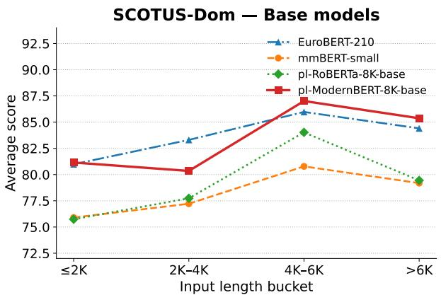  
(a) SCOTUS-DOM: Base models.

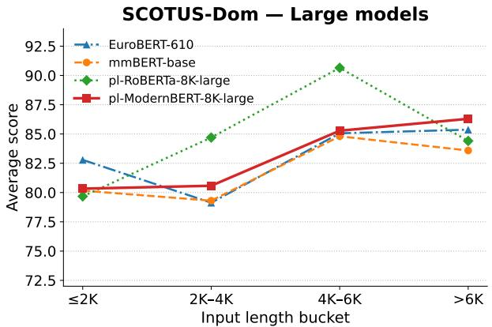  
(b) SCOTUS-DOM: Large models.

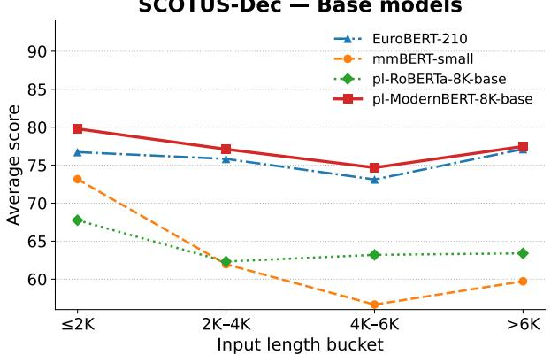  
(c) SCOTUS-DEC: Base models.

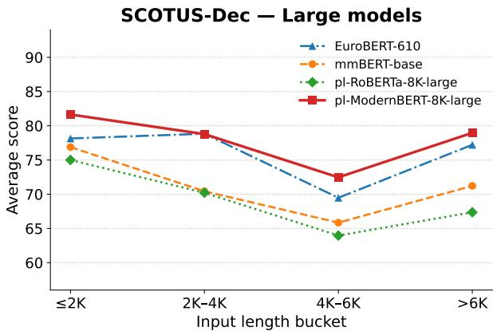  
(d) SCOTUS-DEC: Large models.

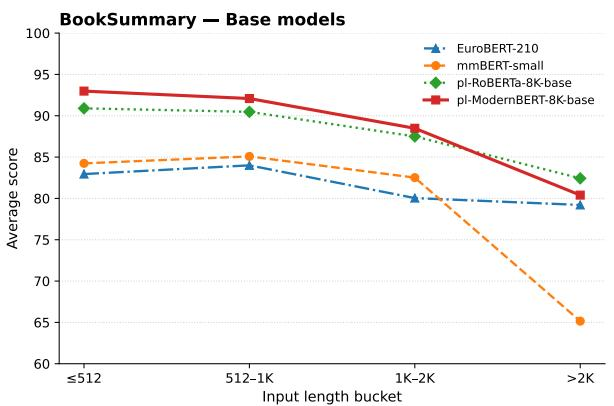  
(e) BOOKSUMMARY: Base models.

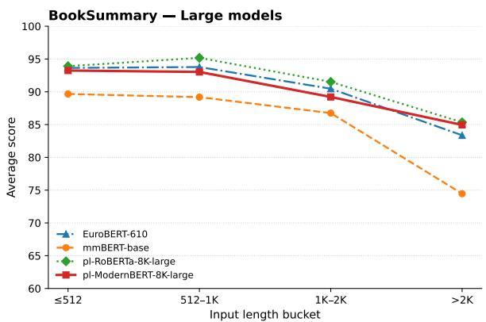  
(f) BOOKSUMMARY: Large models.  
Figure 2: Performance by input length on the SCOTUS-Dom, SCOTUS-Dec, and BookSummary LongContext tasks. Each point shows the mean test score for examples within the corresponding length bucket. Results are presented separately for Base and Large models. Bucket definitions and example counts are provided in Table 14.

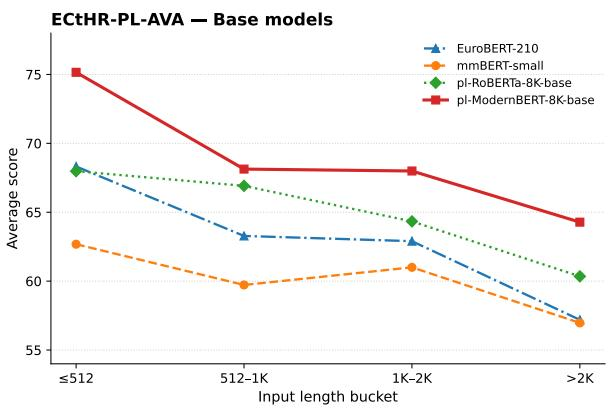  
(a) ECTHR-PL-AVA: Base models.

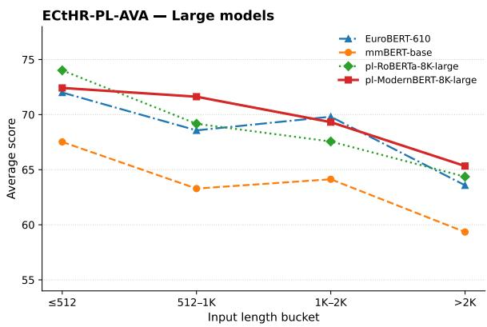  
(b) ECTHR-PL-AVA: Large models.

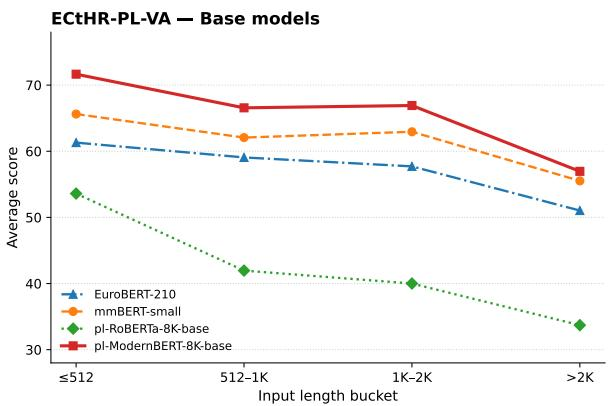  
(c) ECTHR-PL-VA: Base models.

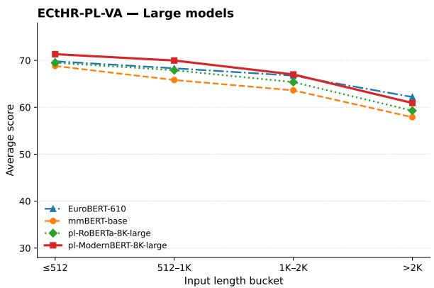  
(d) ECTHR-PL-VA: Large models.  
Figure 3: Performance by input length on the ECtHR-PL-AVA and ECtHR-PL-VA LongContext tasks. Each point shows the mean test score for examples within the corresponding length bucket. Results are presented separately for Base and Large models. Bucket definitions and example counts are provided in Table 14, and detailed results with variability across runs are reported in Table 16.

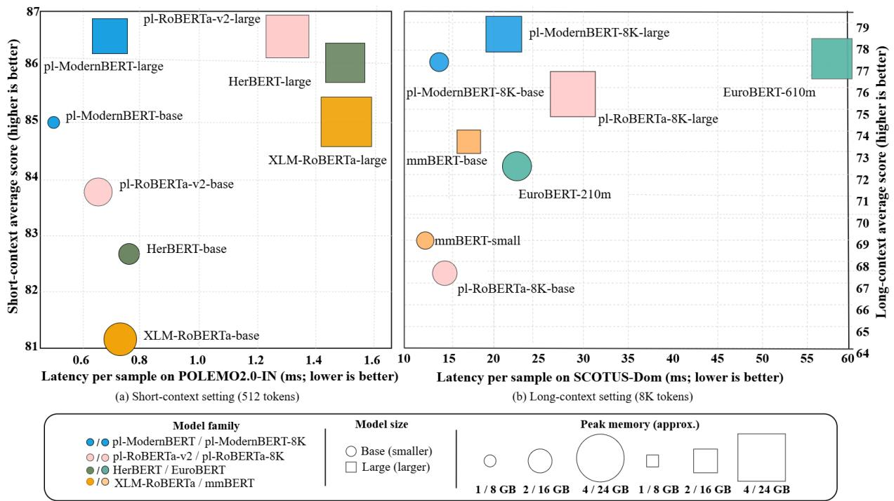  
Figure 4: Quality–efficiency trade-offs for the evaluated encoder models on Polish tasks. The x-axis shows latency per sample (lower is better), the y-axis shows the average task score (higher is better), marker size reflects peak memory usage, and marker shape distinguishes Base and Large variants. Panel (a) presents short-context results, while panel (b) shows long-context results. Marker sizes are scaled separately for the two panels; slash-separated model-family names and memory labels correspond to panels (a) and (b), respectively.