# Post-hoc Alignment of LLM-judges to Human Judgment Distribution

Sebastian Steindl1 Nikos Voskarides1 Alberto Gasparin2 Diego Marcheggiani1

1Amazon, Barcelona, Spain 2Amazon, Berlin, Germany {sebstei,nvvoskar,marchegg}@amazon.es, albgas@amazon.de

## Abstract

The LLM-as-a-judge (LLMaJ) framework offers a cost-effective and reproducible solution for automatic evaluation. However, current evaluation practices typically compare LLMaJ judgments against aggregated ground-truth labels, overlooking the valuable information contained in Human Label Variation (HLV). Inspired by an increasing line of work that proposes to leverage HLV, we systematically study LLMaJ performance on predicting both a single, aggregated ground truth hard-label and unaggregated soft-labels that represent Human Judgment Distributions (HJD). Our results across five diverse datasets reveal that while LLMs achieve near human-level performance at hard-label prediction on most tasks, they exhibit poor performance when predicting softlabels. To address this limitation, we propose NAPHA (eNtropy-Aware Post-Hoc Alignment), a simple yet effective lightweight post-hoc alignment method that matches the LLM distribution to the HJD by first assigning an instance to a discrete entropy class and then routing it to specialized, trained alignment models. We find that NAPHA consistently improves soft-labels prediction across base LLM models and datasets, with particularly strong gains on high-entropy instances where capturing diverse human perspectives is most critical. We also show via oracle experiments that improving entropy class prediction can substantially enhance NAPHA’s practical effectiveness.

## 1 Introduction

Human labels are generally accepted as the goldstandard in NLP evaluation (Clark et al., 2021). During dataset construction, researchers oftentimes collect multiple annotations per instance using experts or crowd-workers (Raykar et al., 2010; Fabbri et al., 2021). Annotations are typically aggregated into a single ground truth label with some function, e.g., the mean, mode, or maximum. This process of aggregating annotations eliminates disagreement

The pickles were so old, smelly, and salty, just like I dreamed them to be

  
Figure 1: Example (id: r2-0011275) from the DynaSent dataset (Potts et al., 2021). The sentence begins with adjectives that are mostly negatively connoted, but ends on a positive note. This shift in expressed sentiment leads to relatively high disagreement among the five annotators; it is unclear whether the ending is meant to be ironic or not.

in favor of having a single ground truth. In fact, low disagreement among annotators is commonly used to suggest high annotation quality (Clark et al., 2023), sometimes leading to a harmonization step, where annotators re-annotate instances they disagreed on (Fabbri et al., 2021).

Recent work has questioned the assumption that a single ground truth label invariably exists (de Marneffe et al., 2012; Plank et al., 2014; Aroyo and Welty, 2015; Pavlick and Kwiatkowski, 2019). This has culminated in a line of work that proposes not to eliminate, but instead leverage Human Label Variation (HLV) in annotations (Plank, 2022; Cabitza et al., 2023). Figure 1 shows an example of how plausible HLV can manifest in human annotations. The HLV paradigm is based on the idea that different labels can be simultaneously correct, as they represent different annotator backgrounds or task ambiguity (Plank, 2022; Cabitza et al., 2023). Thus, in many tasks, such as toxicity detection or sentiment classification, there can be irreconcilable variation as a form of aleatoric uncertainty in the annotations (Plank, 2022; Cabitza et al., 2023). This occurs even for supposedly objective tasks, such as those in the medical domain (Schaekermann et al., 2019; Cabitza et al., 2019). Leveraging HLV in annotations can therefore: i) better reflect reality of irreconcilable variation, uncertainty and decision making (Cabitza et al., 2023), ii) improve fairness by considering minority positions (Noble, 2012; Baan et al., 2024), and even iii) achieve better performance and generalization (Washington et al., 2021; Uma et al., 2020; Peterson et al., 2019; Uma et al., 2021).

Recently, LLM-as-a-judge (LLMaJ) has emerged as a promising framework for costeffective and reproducible automatic evaluation (Gao et al., 2025). As we move towards leveraging HLV, automatic evaluation in this context becomes increasingly important. Therefore, in this paper, we investigate the capabilities of state-of-the-art LLMaJ models to produce the aggregated ground truth hard-label, and the soft-labels ground truth, i.e., the Human Judgment Distribution (HJD) in the context of HLV.

We conduct our study on five datasets that represent typical Natural Language Generation (NLG) and classification tasks. We find that, while LLMaJ achieve near human-level performance on hardlabel prediction on some tasks, it performs poorly on soft-labels prediction. To address this limitation, we propose NAPHA (eNtropy-Aware Post-Hoc Alignment), a simple yet effective lightweight post-hoc alignment method that, given the softlabels predictions of a given instance, first assigns the instance to a discrete entropy class and then routes it to specialized, trained alignment models. We demonstrate that NAPHA consistently improves soft-labels prediction across models and datasets. NAPHA can be applied in scenarios where the user expects that different human perspectives could lead to multiple labels being true at the same time, most notably subjective tasks.

Our work is complementary to Elangovan et al. (2025), who demonstrate that in scenarios of significant HLV, LLMaJ can reach the same correlation to the human annotations as the human-to-human comparison. They argue that this is misleading, as it is a consequence of the human disagreement. In our work, we instead follow the paradigm of HLV: we consider disagreement as a valuable signal and thus propose NAPHA as a technical solution to improve the capability of LLMaJ to predict the soft-labels.

In summary, our contributions are:

• We investigate the performance of LLMaJ using state-of-the-art LLMs for predicting hardlabel and soft-labels on a broad range of tasks.

• We showcase that, by default, LLMaJ can accurately predict the hard-label at human-level performance, but not the soft-labels. We validate this finding on multiple datasets with several state-of-the-art LLMs.

• We propose NAPHA, a post-hoc alignment method that improves soft-labels prediction compared to the base LLMaJ models across models and datasets. Through extensive experimentation, oracle studies and ablations we demonstrate NAPHA’s performance and identify potential for further improvements.

## 2 Background and Related Work

## 2.1 Automatic Evaluation and LLMaJ

Automatic Evaluation (AutoEval) focuses on creating evaluation algorithms that can alleviate annotation cost and improve reproducibility (Gao et al., 2025). Early attempts include metrics such as ROUGE (Lin, 2004) and later BERTScore (Zhang et al., 2020), which have low correlation with human annotations (Gehrmann et al., 2023). Recently, the LLMaJ framework (Zheng et al., 2023b; Wang et al., 2023) has gained considerable attention. By using a prompt-engineered Large Language Model (LLM) as the evaluation function, one can obtain reproducible, cheap judgments, that have shown better alignment to human annotations than prior automatic metrics (Liu et al., 2024; Lee et al., 2025).

## 2.2 Human Label Variation (HLV)

The terms HLV (Plank, 2022) and perspectivism (Cabitza et al., 2023) describe a paradigm in which the existence of irreconcilable disagreement in annotations is accepted and even attempted to leverage (Weber-Genzel et al., 2024; Hong et al., 2025; Ramponi et al., 2025; Gruber et al., 2025; Chen et al., 2025).1 As such, it is also related to the call for pluralistic model alignment by Sorensen et al. (2024). In their taxonomy, our study falls into the category of distributionally pluralistic models. A common way to consider HLV is by using softlabels, i.e., a distribution across the possible labels, instead of a single-ground truth, which we adopt in our work.

In general, not all HLV is valid, since annotation errors can still exist in this context and thus lead to label noise. Discerning between noise and valid HLV is not straightforward, but an active research question (Klie et al., 2023; Weber and Plank, 2023;

Ivey et al., 2025; Nahum et al., 2025). Our focus is not on disentangling error from valid variation, and we thus consider all HLV in the datasets to be valid. By attempting to consider all opinions deriving from human annotations, leveraging HLV becomes important in relation to efforts towards accounting for diversity in terms of background and culture (Santurkar et al., 2023; Kotek et al., 2023; Mukherjee et al., 2023; DURMUS et al., 2024; Adilazuarda et al., 2024; Liu et al., 2025).

## 2.3 Calibration Methods

The problem of calibration, which describes the process of aligning the model prediction with its accuracy, has previously been treated by methods that assume access to the model architecture (Cho and Youn, 2024; Tao et al., 2025). In the field of computer vision, parameterized temperature scaling (Tomani et al., 2022) has been proposed as an evolution of standard temperature scaling. For language models, it has been discussed, e.g., by Jiang et al. (2021) and Zheng et al. (2023a). Strictly speaking, the post-hoc alignment of the LLM-judge to the HJD is not a calibration problem, since this distribution does not reflect uncertainty of choosing one class, but that different classes can be true at the same time. Therefore, the model uncertainty would instead be the uncertainty about the distribution. Thus, while our work relates to calibration literature, we instead focus on the alignment to the HJD, regardless of the model’s uncertainty.

## 3 Problem Statement

Let T be an evaluation task with a set of n possible discrete labels $A = \{ a _ { 1 } , \ldots , a _ { n } \}$ . An example evaluation task T is to classify the coherence of a single generated text into one of n grades. A dataset instance is created by collecting m human labels for T: $\mathbf { r } = ( r _ { 1 } , \ldots , r _ { m } )$ with all $r _ { i } \in { \mathcal { A } } .$

We study two evaluation settings. In the first setting, we obtain a ground truth hard-label y by combining the human labels r using an aggregation function agg(·), which can be majority-voting or the mean. In this setting, a predicted hard-label yˆ is evaluated against the ground truth hard-label y using the F1-score or a correlation metric across instances.

The second evaluation setting considers HLV, which is the focus of this work. Here, we obtain ground truth soft-labels by using a categorical distribution $\mathbf { y } = ( y _ { 1 } , \dots , y _ { n } )$ that represents the probability over the possible discrete labels A. We estimate y via maximum likelihood using the observed human labels r. In this setting, the predicted soft-labels ˆy are evaluated against the ground truth soft-labels using a distance metric $d i s t ( \hat { \mathbf { y } } , \mathbf { y } )$ 2

## 4 Predicting soft-labels

In this section we first describe base LLMaJ models for predicting soft-labels that do not use explicit alignment to HJD (Section 4.1), and then describe NAPHA, our proposed post-hoc alignment method that builds on top of the base models (Section 4.2). Note that, for the more commonly used setting of predicting a hard-label, we use standard LLMaJ with a prompt constructed for each specific task.3

## 4.1 Base LLMaJ Models

We study three different ways for predicting the soft-labels ˆy with an LLM, to which we refer as the base models.

Our first base model builds on the SimulatedAnnotators (SimAnn) (Jung et al., 2025) approach; it samples a response multiple times from the LLM to predict the soft labels ˆy. Also, to increase output diversity, we set the temperature to t = 1 and provide different In-Context Learning (ICL) examples in every run (Brown et al., 2020; Sanh et al., 2022; Dong et al., 2024). We use ten simulated annotators with five ICL examples each.

Next, we investigate base models that directly prompt the LLM to predict the soft-labels (Mielke et al., 2022; Xiong et al., 2024; Geng et al., 2024). We construct two base models: one with hard-label ICL examples in the prompt, which we name SLP-HE (Soft Label Prediction with Hard label examples), and one with soft-labels ICL examples in the prompt, which we name SLP-SE (Soft Label Prediction with Soft label Examples). We provide more details in Appendix J.

## 4.2 Post-hoc alignment with NAPHA

As we will show in Section 6, independently of which base model is used, LLMs perform poorly at predicting soft-labels. To mitigate this problem, we propose eNtropy-Aware Post-Hoc Alignment (NAPHA), a simple yet effective post-hoc alignment method that operates on top of a base LLMaJ model. A theoretical motivation of our approach is described in Appendix A.

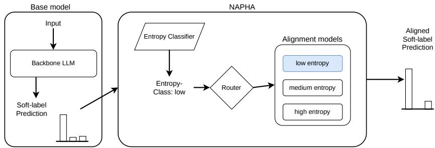  
Figure 2: Visualization of NAPHA. The base model LLMaJ predicts soft-labels for a given instance. Then, the Entropy Classifier outputs an entropy class that is used to route the predicted soft-labels to the corresponding alignment model specialized in that entropy class, which in turn outputs the final (aligned) predicted soft-labels.

Motivated by the observation that LLM-HJD mis-alignment patterns differ substantially across entropy strata, NAPHA first assigns an instance to a discrete entropy class given prediction $\hat { \mathbf { y } } .$ , which was obtained by the base model. Subsequently, depending on the predicted entropy class c, NAPHA routes $\hat { \mathbf { y } }$ to the corresponding trained alignment model $M _ { c }$ . The output of M is the final (aligned) soft-labels prediction. We illustrate the inference pipeline in Figure 2.

Next we describe NAPHA in more detail. Given the predicted soft-labels $\hat { \mathbf { y } }$ obtained by the base model, we first compute the Shannon entropy over each instance in a dataset: $H ( \hat { \mathbf { y } } )$ = $- \textstyle \sum _ { j = 1 } ^ { n } { \hat { y } } _ { j }$ log $\hat { y } _ { j }$ . Then, we assign each instance to an entropy class c based on the entropy terciles:

$$
c = \left\{ \begin{array} { l l } { \mathrm { l o w } } & { \mathrm { i f } \ H ( \hat { \mathbf { y } } ) \leq Q _ { 1 } } \\ { \mathrm { m e d i u m } } & { \mathrm { i f } \ Q _ { 1 } < H ( \hat { \mathbf { y } } ) \leq Q _ { 2 } } \\ { \mathrm { h i g h } } & { \mathrm { i f } \ H ( \hat { \mathbf { y } } ) > Q _ { 2 } } \end{array} \right.
$$

where $Q _ { 1 }$ and $Q _ { 2 }$ are the first and second terciles of the entropy distribution in a dataset, respectively, and $c \in$ {low, medium, high}.4

In order to account for the fact that LLM misalignment patterns differ substantially across entropy strata, we train one specialized alignment model per entropy class $c .$ Thus, after assigning an entropy class to an instance, we route its predicted soft-labels to one of the specialized alignment models according to their assigned entropy class c. We define the alignment models as follows:

$$
M ( c , \cdot ) = \left\{ \begin{array} { l l } { M _ { \mathrm { l o w } } ( \cdot ) } & { \mathrm { i f ~ } c = \mathrm { l o w } } \\ { M _ { \mathrm { m e d i u m } } ( \cdot ) } & { \mathrm { i f ~ } c = \mathrm { m e d i u m } } \\ { M _ { \mathrm { h i g h } } ( \cdot ) } & { \mathrm { i f ~ } c = \mathrm { h i g h } } \end{array} \right.
$$

The alignment models take the predicted softlabels $\hat { \mathbf { y } }$ as input and apply a non-linear transformation on them. They are trained to better match the ground-truth soft-labels: $\mathbf { y } = M ( c , { \hat { \mathbf { y } } } )$ . As we will show in Section 6.4, NAPHA does not need a large amount of training data to improve performance.

The entropy class of each instance is decided by binning the soft-labels predictions into three entropy classes based on their entropy $H . ^ { 5 }$ In Section 6.2 we discuss results when using the oracle entropy class, which is obtained by calculating the entropy on the ground truth soft-labels, which we consider as an upper bound for NAPHA.

In stratifying instances based on their entropy, our approach is similar in spirit with Jolly et al. (2021) and also implements the recommendation by Elangovan et al. (2025) to stratify LLM predictions by human uncertainty. We highlight that NAPHA does not require access to LLM internals but only to the output tokens.

Training NAPHA alignment models NAPHA alignment models are lightweight and add negligible computational overhead. They are built on a simple Multilayer Perceptron (MLP) architecture that consists of a single hidden layer with a ReLU activation. The dimension of both the input and output layers is n (the number of possible discrete labels $\boldsymbol { \mathcal { A } } )$ , and the dimension of the hidden layer is $n \times 2 .$ We apply a softmax function to the output layer, which allows us to treat the outputs as probabilities. We employ KL-divergence as the loss function and apply weight decay regularization. Note that we compared to different calibration methods as alignment models, none of which outperformed the MLP architecture: a linear transformation, temperature scaling (Guo et al., 2017), Dirichlet calibration (Kull et al., 2019) and Parameterized Temperature Scaling (Tomani et al., 2022) (see Table 14).

## 5 Experimental Setup

## 5.1 Datasets

In order to study model performance in the context of HLV, we use five datasets on different subjective evaluation tasks, which either have score-based output (e.g., 1-5) or selection-based output (i.e., classification) (Li et al., 2025). All datasets have multiple human annotations per sample, and different sources of HLV (discussed in Appendix C):

SummEval (Fabbri et al., 2021) A news summarization dataset; each instance is annotated by three experts on multiple criteria.

TopicalChat (Gopalakrishnan et al., 2019) A human-human conversation dataset with annotations for next utterances, each annotated by three crowd-workers on multiple criteria.

ChaosNLI (Nie et al., 2020) An Natural Language Inference (NLI) dataset constructed by re-annotating high-disagreement SNLI (Bowman et al., 2015) samples. Each sample has 100 crowdworker annotations.

DynaSent (Potts et al., 2021) A sentiment classification dataset (positive/negative/neutral). We use the more challenging “round 2” adversarial subset. Anecdotes (Lourie et al., 2021) A Reddit dataset with ethical “who is in the wrong” questions. Annotations are extracted from votes; we use instances with ≥15 votes.

For computational efficiency, we limit the DynaSent and Anecdotes to 1500 examples each. To study how annotator disagreement affects LLMjudge performance, we stratify sampling by disagreement level: we calculate binary entropy across soft-labels and sample 500 examples from each quantile (low, medium, and high). For all datasets, we report main results with a 20/80 train/test split to reflect realistic limited data availability for training the alignment model.6

## 5.2 Evaluation Metrics

Metrics for predicting the hard-label For ChaosNLI, Anecdotes and DynaSent, the groundtruth hard-label is defined as the majority label.

We estimate the average human performance by sampling the human prediction according to the label distribution and comparing it to the majority label. We measure the alignment to the hard-label as the macro-average F1-score. For the ordinal rating tasks SummEval and TopicalChat, we follow common practice and define the hard-label as the average rating. We report correlation as measured by Kendall’s τ, and the Advantage Probability (AP) from the alt-test (Calderon et al., 2025). We estimate human performance by modifying the bootstrapping approach from Bavaresco et al. (2025) to a leave-one-out bootstrapping; we use this to estimate the average correlation from one annotator to the leave-one-out hard-label. More details are given in Appendix G.

Metrics for predicting soft-labels In order to measure the distance between the ground truth and predicted soft-labels, we use the Distribution Calibration Error (DistCE), which expresses the maximum discrepancy in probability between the human and model-predicted soft-label distribution, over all possible events (Baan et al., 2022). We also use the Jensen-Shannon Distance (JSD) (Endres and Schindelin, 2003).

## 5.3 Implementation Details

Prior work links model size to soft-label quality (Madaan et al., 2025), with mixed distillation results (Chen et al., 2024). Thus, our main results are focused on a state-of-the-art closed-weights LLM, Claude-4-Sonnet (Anthropic, 2025).7 We also provide results with GPT-OSS-120B (Agarwal et al., 2025) and Qwen3-32B (Yang et al., 2025) in Appendix H, where we show that the choice of the LLM does not change the main conclusions. We perform one LLM inference run with temperature t = 0. Main results are reported as the mean and standard error derived from the 95% confidence interval over 20 independent post-hoc alignment runs to measure the stability of the post-hoc alignment with NAPHA.

## 6 Results and Discussion

## 6.1 Predicting the hard-label

Tables 1 and 2 show that, overall, the LLMaJ performs close to human-level when predicting hard labels, across all datasets.8 On the ChaosNLI dataset the LLMaJ outperforms the average human annotator, achieving an F1 score of 0.99, 0.81 and 0.61 for low, medium, and high entropy, compared to the human 0.93, 0.74, 0.53. The Anecdotes dataset is more challenging: the LLM achieves 0.48, 0.48, 0.34 compared to the human 0.50, 0.42, 0.35.

<table><tr><td></td><td colspan="2">Low H</td><td colspan="2">Medium H</td><td colspan="2">High H</td></tr><tr><td>Dataset</td><td>LLM</td><td>Human</td><td>LLM</td><td>Human</td><td>LLM</td><td>Human</td></tr><tr><td>ChaosNLI</td><td>0.99</td><td>0.93</td><td>0.81</td><td>0.74</td><td>0.61</td><td>0.53</td></tr><tr><td>Anecdotes</td><td>0.48</td><td>0.50</td><td>0.48</td><td>0.42</td><td>0.34</td><td>0.35</td></tr><tr><td>DynaSent</td><td>0.95</td><td>1.00</td><td>0.81</td><td>0.80</td><td>0.40</td><td>0.43</td></tr></table>

Table 1: Macro-Average F1 Scores for hard-label predictions from Claude-4 and humans, stratified by entropy class.

On SummEval, a gap remains between human and LLM performance: the average LLM Kendall’s τ is 0.480 compared to the human score of 0.542. This likely reflects the dataset creators’ efforts to minimize annotator disagreement. Higher disagreement makes it easier for LLMs to achieve humanlevel performance, as humans are more likely to deviate from the majority label (Elangovan et al., 2025).

## 6.2 Predicting soft-labels

## 6.2.1 Overall performance

Table 3 shows soft-labels prediction performance in the context of HLV across different base models (SLP-HE, SLP-SE, SimAnn), with or without using NAPHA. We highlight that we observe small standard errors across our results, which suggests that our estimates are statistically robust.

First, we see that, NAPHA improves performance when used to calibrate predictions on top of base models. This result is consistent across base models and datasets. Indicatively, when we apply NAPHA to SLP-SE, the DistCE metric (the lower the better) decreases from 0.299 to 0.272 for the Anecdotes dataset, from 0.200 to 0.174 on ChaosNLI, and from 0.272 to 0.265 on DynaSent. The JSD metric behaves in the same manner.

Importantly, we see large improvement in the oracle setting, which means using the oracle entropy class label for routing an instance to one of the three alignment models, instead of predicting the entropy class label.9 In this setting, NAPHA achieves a DistCE of 0.172 on Anecdotes, 0.153 on ChaosNLI, and 0.172 on DynaSent, all of which are substantial improvements over using the predicted entropy class labels. As can be seen in Table 14, none of the other alignment models (Linear Transformation, Temperature Scaling, Dirichlet Calibration, and Parameterized Temperature Scaling) outperform ours.

We also calculate upper bound human performance on the datasets we consider as in Baan et al. (2022). We report the results in Table 5 in Appendix B, where we see that these datasets have different levels of complexity. Contrasting Table 5 and Table 3, we can conclude that NAPHA approximates human performance on the Anecdotes and DynaSent datasets, but still lacks behind on the rest of the datasets, where there is a lot room for improvement in future work.

## 6.2.2 Performance per entropy class

We show performance on each dataset per entropy class in Tables 4, 6, 7, 8, and 9. For the base model without NAPHA, soft-label prediction worsens with increasing entropy (evidenced by DistCE and JSD).10 While high entropy is often seen as labeling uncertainty, in HLV it can signal valid, diverse perspectives. Thus, even if each annotator is certain, population-level entropy can be high. Considering these perspectives is the most desirable, and thus, good alignment is particularly important. Indeed, NAPHA consistently improves performance on these high entropy instances.

While overall alignment improved with NAPHA compared to just using the base models, alignment in the low entropy class became worse. This suggests that LLMs are by default better aligned on instances with low entropy soft-labels than on high entropy instances. We attribute this effect to incorrect entropy label routing in NAPHA, as this effect disappears when we use oracle entropy labels. A simple but practical mitigation strategy for this downside of NAPHA is to not apply the method to the low entropy stratum. In fact, NAPHA can achieve very good alignment using oracle entropy classes, as seen in Figure 4 in Appendix E. This shows that as entropy class assignment improves (which is arguably a simpler task than predicting the soft-labels themselves), alignment to soft-labels using NAPHA will be further improved.11

<table><tr><td rowspan="2">Dataset</td><td rowspan="2">Predictions</td><td colspan="2">Coherence</td><td colspan="2">Fluency</td><td colspan="2">Relevance</td><td colspan="2">Consistency</td><td colspan="2">Average</td></tr><tr><td>τ↑</td><td>AP↑</td><td>T↑</td><td>AP</td><td>T↑</td><td>AP</td><td>T↑</td><td>AP↑</td><td>τ↑</td><td>AP↑</td></tr><tr><td>SummEval</td><td>LLM</td><td>0.488</td><td>0.759</td><td>0.397</td><td>0.233</td><td>0.401</td><td>0.684</td><td>0.635</td><td>0.874</td><td>0.480</td><td>0.638</td></tr><tr><td></td><td>Humans</td><td>0.503</td><td>一</td><td>0.559</td><td>=</td><td>0.381</td><td>=</td><td>0.726</td><td>=</td><td>0.542</td><td>=</td></tr><tr><td rowspan="2">TopicalChat</td><td>LLM</td><td>Naturalness</td><td></td><td>Coherence</td><td></td><td>Engagingness</td><td></td><td>Groundedness</td><td></td><td></td><td>Average</td></tr><tr><td>Humans</td><td>0.554 0.435</td><td>0.794</td><td>0.634 0.528</td><td>0.887</td><td>0.598 0.544</td><td>0.824</td><td>0.756 0.731</td><td>0.972</td><td>0.636 0.559</td><td>0.870</td></tr></table>

Table 2: Results on hard-label prediction from Claude-4 for the SummEval and TopicalChat dataset. Reporting Kendall’s τ and AP (Calderon et al., 2025). The τ values for the Human performance are obtained via Leave-one-out bootstrapping (cf. Appendix G).
<table><tr><td rowspan="2">Dataset</td><td rowspan="2">Base model Alignment Entropy Label Routing</td><td colspan="3">SLP-HE</td><td colspan="3">SLP-SE</td><td colspan="3">SimAnn</td></tr><tr><td></td><td>NAPHA predicted</td><td>NAPHA oracle</td><td></td><td>NAPHA</td><td>NAPHA</td><td></td><td>NAPHA</td><td>NAPHA</td></tr><tr><td rowspan="2">Anecdotes</td><td></td><td>0.299</td><td>0.271 (0.001)</td><td></td><td>0.299</td><td>predicted 0.272 (0.002)</td><td>oracle</td><td></td><td>predicted</td><td>oracle</td></tr><tr><td>DistCE↓</td><td>0.326</td><td>0.292 (0.001)</td><td>0.175 (0.002) 0.227 (0.002)</td><td>0.326</td><td></td><td>0.172 (0.001)</td><td>0.325</td><td>0.293 (0.001)</td><td>0.172 (0.001)</td></tr><tr><td rowspan="2">ChaosNLI</td><td>JSD↓</td><td>0.221</td><td></td><td></td><td></td><td>0.294 (0.001)</td><td>0.224 (0.001)</td><td>0.385</td><td>0.308 (0.001)</td><td>0.225 (0.001)</td></tr><tr><td>DistCE↓</td><td>0.259</td><td>0.187 (0.002) 0.213 (0.001)</td><td>0.158 (0.002)</td><td>0.200</td><td>0.174 (0.001)</td><td>0.153 (0.002)</td><td>0.247</td><td>0.190 (0.002)</td><td>0.144 (0.001)</td></tr><tr><td rowspan="2">DynaSent</td><td>JSD↓</td><td></td><td></td><td>0.194 (0.001)</td><td>0.230</td><td>0.198 (0.001)</td><td>0.186 (0.002)</td><td>0.305</td><td>0.216 (0.001)</td><td>0.181 (0.001)</td></tr><tr><td>DistCE↓</td><td>0.268 0.313</td><td>0.263 (0.003)</td><td>0.158 (0.002)</td><td>0.272</td><td>0.265 (0.002)</td><td>0.172 (0.004)</td><td>0.296</td><td>0.294 (0.002)</td><td>0.158 (0.004)</td></tr><tr><td rowspan="2">SummEval</td><td>JSD ↓</td><td></td><td>0.306 (0.002)</td><td>0.236 (0.002)</td><td>0.330</td><td>0.305 (0.001)</td><td>0.249 (0.003)</td><td>0.367</td><td>0.323 (0.001)</td><td>0.238 (0.003)</td></tr><tr><td>DistCE↓</td><td>0.433 0.465</td><td>0.303 0.356</td><td>0.262</td><td>0.371</td><td>0.303</td><td>0.263</td><td>0.562</td><td>0.305</td><td>0.258</td></tr><tr><td rowspan="2">TopicalChat</td><td>JSD↓</td><td>0.363</td><td>0.349</td><td>0.334</td><td>0.453</td><td>0.358</td><td>0.335</td><td>0.560</td><td>0.360</td><td>0.332</td></tr><tr><td>DistCE↓ JSD↓</td><td>0.404</td><td>0.376</td><td>0.301 0.356</td><td>0.374 0.424</td><td>0.363 0.385</td><td>0.312 0.363</td><td>0.374 0.433</td><td>0.349 0.375</td><td>0.282 0.342</td></tr></table>

Table 3: Results on soft-label prediction across all entropy classes. We report mean and standard error from 20 runs. For SummEval and TopicalChat we show the average across all evaluation criteria and thus do not show the standard error. Note that the oracle entropy class is generally unavailable but we use it as an upper bound in performance. Detailed results can be found in Appendix D.

NAPHA improves performance on medium entropy instances relative to the base models. However, the improvement is less pronounced than for high entropy instances, despite medium entropy cases showing similar absolute distances to softlabel distributions. This can be explained by the fact that the entropy is maximal for uniform distributions (high entropy class). Thus, in cases where soft-labels are (close to) a uniform distribution, the straightforward solution of assigning equal likelihood to every entropy class will achieve good performance. In contrast, predicting that an instance belongs to the medium entropy class is more challenging; this would require predicting that annotator votes are split between a subset of labels (e.g., 2/5 labels get a similar number of votes).

Finally, Figure 3 further illustrates the behavior of the DistCE distance metric when applying NAPHA on top of base models. We observe that, when we apply NAPHA, the probability mass shifts to the left, i.e. towards lower distances, which is the desired behavior. This is especially evident in the high entropy class. For the low and medium entropy classes, we observe shorter distribution tails, which indicates better alignment.

## 6.3 Qualitative Analysis

Since we use a chain-of-thought inducing statement in our prompts, we can analyze the model’s reasoning traces qualitatively. From this we found that the reasoning traces mostly do not consider alternative cultural perspectives, where the same behavior might be interpreted differently by humans. Also, we found that the model can default to a conflict-averse, mediating nobody is wrong mode, whereas humans have polarized opinions. Appendix I shows and discusses two case-studies from the Anecdotes dataset.

## 6.4 Ablations

Do separate alignment models per entropy class help? In Table 11 we show results of post-hoc alignment when we only use a single alignment model instead of a separate alignment model per predicted entropy class as in NAPHA. Performance is comparable to using different alignment models per entropy class but deteriorates on low entropy cases. Importantly, without separate classifiers per entropy class, we cannot achieve the potential improvements that NAPHA enables when routing would be improved (see Section 6.2.2).

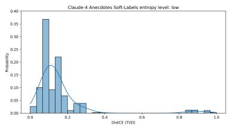  
(a) low H

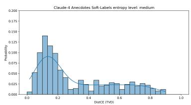  
(b) medium H

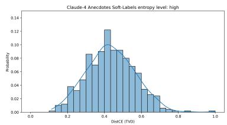  
(c) high H

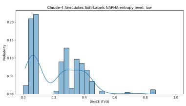  
(d) low H

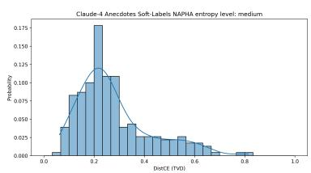  
(e) medium H

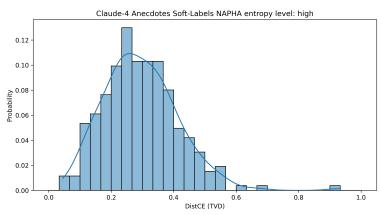  
(f) high H

Figure 3: Histogram plots of the DistCE metric on the Anecdotes dataset with 30 bins for low, medium and high entropy (H). The plots in the top row show Soft-Label prediction (hard ICL) without NAPHA, and the ones at the bottom row after applying NAPHA. We see that the probability mass shifts to the left, i.e. to better DistCE values, and tails get shorter, which is desirable.
<table><tr><td colspan="9"></td><td colspan="2"></td><td colspan="2">High H</td></tr><tr><td>Base model</td><td>Alignment</td><td>Entropy Labels</td><td>DistCE ↓</td><td>JSD↓</td><td>DistCE↓</td><td>JSD ↓</td><td></td><td>DistCE↓</td><td>JSD↓</td><td>DistCE↓</td><td></td><td>JSD ↓</td></tr><tr><td rowspan="3">SLP-HE</td><td></td><td></td><td>0.299</td><td>0.326</td><td></td><td>0.155</td><td>0.250</td><td>0.308</td><td>0.350</td><td>0.435</td><td></td><td>0.366</td></tr><tr><td>NAPHA</td><td>predicted</td><td>0.271 (0.001)</td><td>0.292 (0.001)</td><td></td><td>0.228 (0.004)</td><td>0.299 (0.003)</td><td>0.295 (0.002)</td><td>0.313 (0.002)</td><td>0.292 (0.004)</td><td></td><td>0.263 (0.003)</td></tr><tr><td>NAPHA</td><td>oracle</td><td></td><td>0.175 (0.002)</td><td>0.227 (0.002)</td><td>0.040 (0.004)</td><td>0.129 (0.005)</td><td>0.274 (0.002)</td><td>0.305 (0.002)</td><td></td><td>0.210 (0.001)</td><td>0.212 (0.001)</td></tr><tr><td rowspan="3">SLP-SE</td><td></td><td></td><td></td><td>0.299</td><td>0.326</td><td>0.196</td><td>0.279</td><td>0.311</td><td>0.352</td><td></td><td>0.388</td><td>0.341</td></tr><tr><td>NAPHA</td><td>predicted</td><td></td><td>0.272 (0.002)</td><td>0.294 (0.001)</td><td>0.226 (0.004)</td><td>0.295 (0.003)</td><td>0.290 (0.002)</td><td>0.316 (0.002)</td><td></td><td>0.299 (0.003)</td><td>0.269 (0.002)</td></tr><tr><td>NAPHA</td><td>oracle</td><td></td><td>0.172 (0.001)</td><td>0.224 (0.001)</td><td>0.034 (0.003)</td><td>0.119 (0.003)</td><td>0.274 (0.002)</td><td>0.304 (0.001)</td><td></td><td>0.209 (0.001)</td><td>0.211 (0.001)</td></tr><tr><td rowspan="3">SimAnn</td><td>none</td><td>none</td><td></td><td>0.325</td><td>0.385</td><td>0.053</td><td>0.163</td><td>0.375</td><td>0.413</td><td></td><td>0.550</td><td>0.497</td></tr><tr><td>NAPHA</td><td>predicted</td><td></td><td>0.293 (0.001)</td><td>0.308 (0.001)</td><td>0.271 (0.006)</td><td>0.321 (0.004)</td><td>0.277 (0.002)</td><td>0.313 (0.001)</td><td></td><td>0.330 (0.005)</td><td>0.289 (0.004)</td></tr><tr><td>NAPHA</td><td>oracle</td><td></td><td>0.172 (0.001)</td><td>0.225 (0.001)</td><td>0.035 (0.003)</td><td>0.120 (0.005)</td><td>0.273 (0.002)</td><td>0.304 (0.001)</td><td></td><td>0.209 (0.001)</td><td>0.211 (0.001)</td></tr></table>

Table 4: Results on soft-label prediction per entropy class for the Anecdotes dataset. We report mean and standard error from 20 runs. Results on the per entropy class are shown in Appendix D.

Does using oracle entropy class labels during training help? Since NAPHA needs the oracle (ground truth) soft-labels for training the alignment model, we can in principle use them instead of the predicted ones also during training time and only use the predicted ones at test time. However, since the prediction of entropy classes is inaccurate, using oracle entropy labels during training does not bring improvements (see Table 12).

How much training data does NAPHA need? Table 13 shows the performance when using different amounts of training data for NAPHA. We find that performance stabilizes at 10% of training data, which shows that NAPHA does not need a lot of human labels to improve alignment.

## 7 Conclusion and Future Work

This study demonstrates that LLMaJ achieves close to human-level performance on hard-label prediction tasks across evaluated datasets. However, our results show that the transition from hard-label to soft-labels prediction reveals significant limitations in current LLMaJ, exposing its inability to adequately capture HLV. This is particularly relevant in scenarios where different human perspectives could lead to multiple labels being true simultaneously, most notably subjective tasks. To address this, we proposed NAPHA, a post-hoc alignment method for soft-labels prediction that provides consistent improvements across all base models and datasets. We observed substantial gains for high entropy instances, where capturing diverse human perspectives is most critical. Furthermore, our oracle entropy class experiments revealed that as entropy class assignment improves, NAPHA’s effectiveness and practical applicability will increase. Also, NAPHA can be extended to consider white-box access to models, e.g. by leveraging the distribution of logits across the possible labels.

More generally, future work should advance HLV approaches in two key areas. For model development, enabling HLV might include fundamental changes to training regimes, where LLMs are rewarded the most for correctly representing pluralism. For data collection, it is important to be able to disentangle human annotation error from valid HLV. To this end, beyond collecting labels from multiple human annotators, one should also collect explanations and confidence indications (Chen et al., 2025) as well as metadata such as sociodemographic information (Sorensen et al., 2025), which might be used to improve soft-label predictions.

## Limitations

While our study revealed interesting findings regarding the performance of LLMaJ on predicting soft-labels, and how to improve it with alignment methods, it is not without limitations. First, the soft-labels for three out of the five used datasets is sparse, due to low number of annotators (less than 6). However, datasets with large number of annotators are rare, and expensive to collect, and thus using three to five annotators for human annotation is common practice. It is unclear how many annotators are needed to get a fair estimate of the soft-labels. Our method uses the model’s predicted label distribution for routing, instead of a separate uncertainty estimate. This may conflate model uncertainty with the predicted human disagreement, and cannot be disentangled with the current design. Also, the way we sample the Anecdotes and DynaSent subsets is not according to their natural entropy-distribution. Instead, we explicitly construct a setting where the entropy classes are balanced, to get more detailed insights into the influence of entropy on the alignment. Note that for the three other datasets, we use them as-is, thus also preserving the natural entropy-distribution. Moreover, since we calculate the entropy statistics across the training dataset, single instances can be misclas sified. We can thus not ensure consistent improvement for every instance, but only show improvement across the entropy-stratum- and dataset-level. Next, even when using open-weight models, we treat them as if we only had closed-weight access. We do not test the potential benefits from accessing model internals, which can be studied in future work. Lastly, we did not perform hyperparameter tuning or tried to optimize the neural network architecture of our alignment models, focusing instead on showcasing the potential of NAPHA with a lightweight approach.

## References

Muhammad Farid Adilazuarda, Sagnik Mukherjee, Pradhyumna Lavania, Siddhant Shivdutt Singh, Alham Fikri Aji, Jacki O’Neill, Ashutosh Modi, and Monojit Choudhury. 2024. Towards measuring and modeling “culture” in LLMs: A survey. In Proceedings ofthe 2024 Conference on Empirical Methods in Natural Language Processing, pages 15763–15784, Miami, Florida, USA. Association for Computational Linguistics.

Sandhini Agarwal, Lama Ahmad, Jason Ai, Sam Altman, Andy Applebaum, Edwin Arbus, Rahul K Arora, Yu Bai, Bowen Baker, Haiming Bao, and 1 others. 2025. gpt-oss-120b & gpt-oss-20b model card. arXiv preprint arXiv:2508.10925.

Anthropic. 2025. Introducing Claude 4 — anthropic.com. https://www.anthropic.com/ news/claude-4. [Accessed 15-12-2025].

Lora Aroyo and Chris Welty. 2015. Truth is a lie: Crowd truth and the seven myths of human annotation. AI Magazine, 36(1):15–24.

Joris Baan, Wilker Aziz, Barbara Plank, and Raquel Fernandez. 2022. Stop measuring calibration when humans disagree. In Proceedings of the 2022 Conference on Empirical Methods in Natural Language Processing, pages 1892–1915, Abu Dhabi, United Arab Emirates. Association for Computational Linguistics.

Joris Baan, Raquel Fernández, Barbara Plank, and Wilker Aziz. 2024. Interpreting predictive probabilities: Model confidence or human label variation? In Proceedings of the 18th Conference of the European Chapter of the Association for Computational Linguistics (Volume 2: Short Papers), pages 268–277, St. Julian’s, Malta. Association for Computational Linguistics.

Anna Bavaresco, Raffaella Bernardi, Leonardo Bertolazzi, Desmond Elliott, Raquel Fernández, Albert Gatt, Esam Ghaleb, Mario Giulianelli, Michael Hanna, Alexander Koller, Andre Martins, Philipp Mondorf, Vera Neplenbroek, Sandro Pezzelle, Barbara Plank, David Schlangen, Alessandro Suglia, Aditya K Surikuchi, Ece Takmaz, and Alberto Testoni. 2025. LLMs instead of human judges? a large scale empirical study across 20 NLP evaluation tasks. In Proceedings ofthe 63rd Annual Meeting of the Association for Computational Linguistics (Volume 2: Short Papers), pages 238–255, Vienna, Austria. Association for Computational Linguistics.

Samuel R. Bowman, Gabor Angeli, Christopher Potts, and Christopher D. Manning. 2015. A large annotated corpus for learning natural language inference. In Proceedings of the 2015 Conference on Empirical Methods in Natural Language Processing, pages 632–642, Lisbon, Portugal. Association for Computational Linguistics.

Tom Brown, Benjamin Mann, Nick Ryder, Melanie Subbiah, Jared D Kaplan, Prafulla Dhariwal, Arvind Neelakantan, Pranav Shyam, Girish Sastry, Amanda Askell, and 1 others. 2020. Language models are few-shot learners. Advances in neural information processing systems, 33:1877–1901.

Federico Cabitza, Andrea Campagner, and Valerio Basile. 2023. Toward a perspectivist turn in ground truthing for predictive computing. Proceedings of the AAAI Conference on Artificial Intelligence, 37(6):6860–6868.

Federico Cabitza, Angela Locoro, Camilla Alderighi, Raffaele Rasoini, Domenico Compagnone, and Pedro Berjano. 2019. The elephant in the record: on the multiplicity of data recording work. Health informatics journal, 25(3):475–490.

Nitay Calderon, Roi Reichart, and Rotem Dror. 2025. The alternative annotator test for LLM-as-a-judge: How to statistically justify replacing human annotators with LLMs. In Proceedings of the 63rd Annual Meeting ofthe Associationfor Computational Linguistics (Volume 1: Long Papers), pages 16051– 16081, Vienna, Austria. Association for Computational Linguistics.

Beiduo Chen, Yang Janet Liu, Anna Korhonen, and Barbara Plank. 2025. Threading the needle: Reweaving chain-of-thought reasoning to explain human label variation. In Proceedings ofthe 2025 Conference on Empirical Methods in Natural Language Processing, pages 33111–33135, Suzhou, China. Association for Computational Linguistics.

Beiduo Chen, Xinpeng Wang, Siyao Peng, Robert Litschko, Anna Korhonen, and Barbara Plank. 2024. “seeing the big through the small”: Can LLMs approximate human judgment distributions on NLI from a few explanations? In Findings of the Association for Computational Linguistics: EMNLP 2024, pages 14396–14419, Miami, Florida, USA. Association for Computational Linguistics.

Gyusang Cho and Chan-Hyun Youn. 2024. Tilt and average: geometric adjustment of the last layer for recalibration. In Proceedings of the 41st International Conference on Machine Learning, ICML’24. JMLR.org.

Elizabeth Clark, Tal August, Sofia Serrano, Nikita Haduong, Suchin Gururangan, and Noah A. Smith. 2021. All that’s ‘human’ is not gold: Evaluating human evaluation of generated text. In Proceedings of the 59th Annual Meeting of the Association for Computational Linguistics and the 11th International

Joint Conference on Natural Language Processing (Volume 1: Long Papers), pages 7282–7296, Online. Association for Computational Linguistics.

Elizabeth Clark, Shruti Rijhwani, Sebastian Gehrmann, Joshua Maynez, Roee Aharoni, Vitaly Nikolaev, Thibault Sellam, Aditya Siddhant, Dipanjan Das, and Ankur Parikh. 2023. SEAHORSE: A multilingual, multifaceted dataset for summarization evaluation. In Proceedings of the 2023 Conference on Empirical Methods in Natural Language Processing, pages 9397–9413, Singapore. Association for Computational Linguistics.

Marie-Catherine de Marneffe, Christopher D. Manning, and Christopher Potts. 2012. Did it happen? the pragmatic complexity of veridicality assessment. Computational Linguistics, 38(2):301–333.

Qingxiu Dong, Lei Li, Damai Dai, Ce Zheng, Jingyuan Ma, Rui Li, Heming Xia, Jingjing Xu, Zhiyong Wu, Baobao Chang, Xu Sun, Lei Li, and Zhifang Sui. 2024. A survey on in-context learning. In Proceedings of the 2024 Conference on Empirical Methods in Natural Language Processing, pages 1107–1128, Miami, Florida, USA. Association for Computational Linguistics.

Esin DURMUS, Karina Nguyen, Thomas Liao, Nicholas Schiefer, Amanda Askell, Anton Bakhtin, Carol Chen, Zac Hatfield-Dodds, Danny Hernandez, Nicholas Joseph, Liane Lovitt, Sam McCandlish, Orowa Sikder, Alex Tamkin, Janel Thamkul, Jared Kaplan, Jack Clark, and Deep Ganguli. 2024. Towards measuring the representation of subjective global opinions in language models. In First Conference on Language Modeling.

Aparna Elangovan, Lei Xu, Jongwoo Ko, Mahsa Elyasi, Ling Liu, Sravan Babu Bodapati, and Dan Roth. 2025. Beyond correlation: The impact of human uncertainty in measuring the effectiveness of automatic evaluation and LLM-as-a-judge. In The Thirteenth International Conference on Learning Representations.

D.M. Endres and J.E. Schindelin. 2003. A new metric for probability distributions. IEEE Transactions on Information Theory, 49(7):1858–1860.

Alexander R. Fabbri, Wojciech Krysci´ nski, Bryan Mc-´ Cann, Caiming Xiong, Richard Socher, and Dragomir Radev. 2021. SummEval: Re-evaluating summarization evaluation. Transactions ofthe Associationfor Computational Linguistics, 9:391–409.

Mingqi Gao, Xinyu Hu, Xunjian Yin, Jie Ruan, Xiao Pu, and Xiaojun Wan. 2025. Llm-based nlg evaluation: Current status and challenges. Computational Linguistics, 51(2):661–687.

Sebastian Gehrmann, Elizabeth Clark, and Thibault Sellam. 2023. Repairing the cracked foundation: A survey of obstacles in evaluation practices for generated text. Journal ofArtificial Intelligence Research, 77:103–166.

Jiahui Geng, Fengyu Cai, Yuxia Wang, Heinz Koeppl, Preslav Nakov, and Iryna Gurevych. 2024. A survey of confidence estimation and calibration in large language models. In Proceedings of the 2024 Conference ofthe North American Chapter ofthe Associationfor Computational Linguistics: Human Language Technologies (Volume 1: Long Papers), pages 6577–6595, Mexico City, Mexico. Association for Computational Linguistics.

Karthik Gopalakrishnan, Behnam Hedayatnia, Qinlang Chen, Anna Gottardi, Sanjeev Kwatra, Anu Venkatesh, Raefer Gabriel, and Dilek Hakkani-Tür. 2019. Topical-Chat: Towards Knowledge-Grounded Open-Domain Conversations. In Proc. Interspeech 2019, pages 1891–1895.

Cornelia Gruber, Helen Alber, Bernd Bischl, Göran Kauermann, Barbara Plank, and Matthias Aßenmacher. 2025. Revisiting active learning under (human) label variation. In Proceedings ofthe The 4th Workshop on Perspectivist Approaches to NLP, pages 75–86, Suzhou, China. Association for Computational Linguistics.

Chuan Guo, Geoff Pleiss, Yu Sun, and Kilian Q Weinberger. 2017. On calibration of modern neural networks. In International conference on machine learning, pages 1321–1330. PMLR.

Pingjun Hong, Beiduo Chen, Siyao Peng, Marie-Catherine de Marneffe, and Barbara Plank. 2025. LiTEx: A linguistic taxonomy of explanations for understanding within-label variation in natural language inference. In Proceedings ofthe 2025 Conference on Empirical Methods in Natural Language Processing, pages 34065–34085, Suzhou, China. Association for Computational Linguistics.

Jonathan Ivey, Susan Gauch, and David Jurgens. 2025. NUTMEG: Separating signal from noise in annotator disagreement. In Proceedings of the 2025 Conference on Empirical Methods in Natural Language Processing, pages 2874–2887, Suzhou, China. Association for Computational Linguistics.

Robert A Jacobs, Michael I Jordan, Steven J Nowlan, and Geoffrey E Hinton. 1991. Adaptive mixtures of local experts. Neural computation, 3(1):79–87.

Zhengbao Jiang, Jun Araki, Haibo Ding, and Graham Neubig. 2021. How can we know when language models know? on the calibration of language models for question answering. Transactions ofthe Associationfor Computational Linguistics, 9:962–977.

Shailza Jolly, Sandro Pezzelle, and Moin Nabi. 2021. EaSe: A diagnostic tool for VQA based on answer diversity. In Proceedings of the 2021 Conference of the North American Chapter of the Association for Computational Linguistics: Human Language Technologies, pages 2407–2414, Online. Association for Computational Linguistics.

Jaehun Jung, Faeze Brahman, and Yejin Choi. 2025. Trust or escalate: LLM judges with provable guarantees for human agreement. In The Thirteenth International Conference on Learning Representations.

Jan-Christoph Klie, Bonnie Webber, and Iryna Gurevych. 2023. Annotation error detection: Analyzing the past and present for a more coherent future. Computational Linguistics, 49(1):157–198.

Hadas Kotek, Rikker Dockum, and David Sun. 2023. Gender bias and stereotypes in large language models. In Proceedings of the ACM collective intelligence conference, pages 12–24.

Meelis Kull, Miquel Perello Nieto, Markus Kängsepp, Telmo Silva Filho, Hao Song, and Peter Flach. 2019. Beyond temperature scaling: Obtaining wellcalibrated multi-class probabilities with dirichlet calibration. Advances in neural information processing systems, 32.

Yukyung Lee, JoongHoon Kim, Jaehee Kim, Hyowon Cho, Jaewook Kang, Pilsung Kang, and Najoung Kim. 2025. CheckEval: A reliable LLM-as-a-judge framework for evaluating text generation using checklists. In Proceedings ofthe 2025 Conference on Empirical Methods in Natural Language Processing, pages 15771–15798, Suzhou, China. Association for Computational Linguistics.

Dawei Li, Bohan Jiang, Liangjie Huang, Alimohammad Beigi, Chengshuai Zhao, Zhen Tan, Amrita Bhattacharjee, Yuxuan Jiang, Canyu Chen, Tianhao Wu, Kai Shu, Lu Cheng, and Huan Liu. 2025. From generation to judgment: Opportunities and challenges of LLM-as-a-judge. In Proceedings of the 2025 Conference on Empirical Methods in Natural Language Processing, pages 2757–2791, Suzhou, China. Association for Computational Linguistics.

Chin-Yew Lin. 2004. ROUGE: A package for automatic evaluation of summaries. In Text Summarization Branches Out, pages 74–81, Barcelona, Spain. Association for Computational Linguistics.

Chen Cecilia Liu, Iryna Gurevych, and Anna Korhonen. 2025. Culturally aware and adapted NLP: A taxonomy and a survey of the state of the art. Transactions ofthe Associationfor Computational Linguistics, 13:652–689.

Yuxuan Liu, Tianchi Yang, Shaohan Huang, Zihan Zhang, Haizhen Huang, Furu Wei, Weiwei Deng, Feng Sun, and Qi Zhang. 2024. HD-eval: Aligning large language model evaluators through hierarchical criteria decomposition. In Proceedings of the 62nd Annual Meeting of the Association for Computational Linguistics (Volume 1: Long Papers), pages 7641– 7660, Bangkok, Thailand. Association for Computational Linguistics.

Nicholas Lourie, Ronan Le Bras, and Yejin Choi. 2021. Scruples: A corpus of community ethical judgments on 32,000 real-life anecdotes. Proceedings of the AAAI Conference on Artificial Intelligence, 35(15):13470–13479.

Lovish Madaan, David Esiobu, Pontus Stenetorp, Barbara Plank, and Dieuwke Hupkes. 2025. Lost in inference: Rediscovering the role of natural language inference for large language models. In Proceedings ofthe 2025 Conference ofthe Nations ofthe Americas Chapter of the Association for Computational Linguistics: Human Language Technologies (Volume 1: Long Papers), pages 9229–9242, Albuquerque, New Mexico. Association for Computational Linguistics.

Sabrina J. Mielke, Arthur Szlam, Emily Dinan, and Y-Lan Boureau. 2022. Reducing conversational agents overconfidence through linguistic calibration. Transactions ofthe Associationfor Computational Linguistics, 10:857–872.

Anjishnu Mukherjee, Chahat Raj, Ziwei Zhu, and Antonios Anastasopoulos. 2023. Global Voices, local biases: Socio-cultural prejudices across languages. In Proceedings of the 2023 Conference on Empirical Methods in Natural Language Processing, pages 15828–15845, Singapore. Association for Computational Linguistics.

Omer Nahum, Nitay Calderon, Orgad Keller, Idan Szpektor, and Roi Reichart. 2025. Are LLMs better than reported? detecting label errors and mitigating their effect on model performance. In Proceedings of the 2025 Conference on Empirical Methods in Natural Language Processing, pages 26782–26809, Suzhou, China. Association for Computational Linguistics.

Yixin Nie, Xiang Zhou, and Mohit Bansal. 2020. What can we learn from collective human opinions on natural language inference data? In Proceedings of the 2020 Conference on Empirical Methods in Natural Language Processing (EMNLP), pages 9131–9143, Online. Association for Computational Linguistics.

Jennifer A Noble. 2012. Minority voices of crowdsourcing: Why we should pay attention to every member of the crowd. In proceedings ofthe ACM 2012 conference on computer supported cooperative work companion, pages 179–182.

Ellie Pavlick and Tom Kwiatkowski. 2019. Inherent disagreements in human textual inferences. Transactions ofthe Associationfor Computational Linguistics, 7:677–694.

Joshua C Peterson, Ruairidh M Battleday, Thomas L Griffiths, and Olga Russakovsky. 2019. Human uncertainty makes classification more robust. In Proceedings ofthe IEEE/CVF international conference on computer vision, pages 9617–9626.

Barbara Plank. 2022. The “problem” of human label variation: On ground truth in data, modeling and evaluation. In Proceedings ofthe 2022 Conference on Empirical Methods in Natural Language Processing, pages 10671–10682, Abu Dhabi, United Arab Emirates. Association for Computational Linguistics.

Barbara Plank, Dirk Hovy, and Anders Søgaard. 2014. Linguistically debatable or just plain wrong? In

Proceedings of the 52nd Annual Meeting of the Association for Computational Linguistics (Volume 2: Short Papers), pages 507–511, Baltimore, Maryland. Association for Computational Linguistics.

Christopher Potts, Zhengxuan Wu, Atticus Geiger, and Douwe Kiela. 2021. DynaSent: A dynamic benchmark for sentiment analysis. In Proceedings of the 59th Annual Meeting ofthe Associationfor Computational Linguistics and the 11th International Joint Conference on Natural Language Processing (Volume 1: Long Papers), pages 2388–2404, Online. Association for Computational Linguistics.

Alan Ramponi, Agnese Daffara, and Sara Tonelli. 2025. Fine-grained fallacy detection with human label variation. In Proceedings of the 2025 Conference of the Nations of the Americas Chapter of the Association for Computational Linguistics: Human Language Technologies (Volume 1: Long Papers), pages 762–784, Albuquerque, New Mexico. Association for Computational Linguistics.

Vikas C Raykar, Shipeng Yu, Linda H Zhao, Gerardo Hermosillo Valadez, Charles Florin, Luca Bogoni, and Linda Moy. 2010. Learning from crowds. Journal ofmachine learning research, 11(4).

Victor Sanh, Albert Webson, Colin Raffel, Stephen Bach, Lintang Sutawika, Zaid Alyafeai, Antoine Chaffin, Arnaud Stiegler, Arun Raja, Manan Dey, M Saiful Bari, Canwen Xu, Urmish Thakker, Shanya Sharma Sharma, Eliza Szczechla, Taewoon Kim, Gunjan Chhablani, Nihal Nayak, Debajyoti Datta, and 21 others. 2022. Multitask prompted training enables zero-shot task generalization. In International Conference on Learning Representations.

Shibani Santurkar, Esin Durmus, Faisal Ladhak, Cinoo Lee, Percy Liang, and Tatsunori Hashimoto. 2023. Whose opinions do language models reflect? In International Conference on Machine Learning, pages 29971–30004. PMLR.

Mike Schaekermann, Graeme Beaton, Minahz Habib, Andrew Lim, Kate Larson, and Edith Law. 2019. Understanding expert disagreement in medical data analysis through structured adjudication. Proceedings of the ACM on Human-Computer Interaction, 3(CSCW):1–23.

Taylor Sorensen, Pushkar Mishra, Roma Patel, Michael Henry Tessler, Michiel A. Bakker, Georgina Evans, Iason Gabriel, Noah Goodman, and Verena Rieser. 2025. Value profiles for encoding human variation. In Proceedings ofthe 2025 Conference on Empirical Methods in Natural Language Processing, pages 2047–2095, Suzhou, China. Association for Computational Linguistics.

Taylor Sorensen, Jared Moore, Jillian Fisher, Mitchell Gordon, Niloofar Mireshghallah, Christopher Michael Rytting, Andre Ye, Liwei Jiang, Ximing Lu, Nouha Dziri, Tim Althoff, and Yejin Choi. 2024. Position: a roadmap to pluralistic

alignment. In Proceedings ofthe 41st International Conference on Machine Learning, ICML’24. JMLR.org.

Linwei Tao, Minjing Dong, and Chang Xu. 2025. Feature clipping for uncertainty calibration. In Proceedings ofthe AAAI Conference on Artificial Intelligence, volume 39, pages 20841–20849.

Christian Tomani, Daniel Cremers, and Florian Buettner. 2022. Parameterized temperature scaling for boosting the expressive power in post-hoc uncertainty calibration. In European conference on computer vision, pages 555–569. Springer.

Alexandra Uma, Tommaso Fornaciari, Dirk Hovy, Silviu Paun, Barbara Plank, and Massimo Poesio. 2020. A case for soft loss functions. In Proceedings of the AAAI Conference on Human Computation and Crowdsourcing, volume 8, pages 173–177.

Alexandra N Uma, Tommaso Fornaciari, Dirk Hovy, Silviu Paun, Barbara Plank, and Massimo Poesio. 2021. Learning from disagreement: A survey. Journal of Artificial Intelligence Research, 72:1385–1470.

Jiaan Wang, Yunlong Liang, Fandong Meng, Zengkui Sun, Haoxiang Shi, Zhixu Li, Jinan Xu, Jianfeng Qu, and Jie Zhou. 2023. Is ChatGPT a good NLG evaluator? a preliminary study. In Proceedings ofthe 4th New Frontiers in Summarization Workshop, pages 1–11, Singapore. Association for Computational Linguistics.

Peter Washington, Haik Kalantarian, Jack Kent, Arman Husic, Aaron Kline, Emilie Leblanc, Cathy Hou, Cezmi Mutlu, Kaitlyn Dunlap, Yordan Penev, and 1 others. 2021. Training affective computer vision models by crowdsourcing soft-target labels. Cognitive computation, 13(5):1363–1373.

Leon Weber and Barbara Plank. 2023. ActiveAED: A human in the loop improves annotation error detection. In Findings of the Association for Computational Linguistics: ACL 2023, pages 8834–8845, Toronto, Canada. Association for Computational Linguistics.

Leon Weber-Genzel, Siyao Peng, Marie-Catherine De Marneffe, and Barbara Plank. 2024. VariErr NLI: Separating annotation error from human label variation. In Proceedings of the 62nd Annual Meeting of the Association for Computational Linguistics (Volume 1: Long Papers), pages 2256–2269, Bangkok, Thailand. Association for Computational Linguistics.

Miao Xiong, Zhiyuan Hu, Xinyang Lu, YIFEI LI, Jie Fu, Junxian He, and Bryan Hooi. 2024. Can LLMs express their uncertainty? an empirical evaluation of confidence elicitation in LLMs. In The Twelfth International Conference on Learning Representations.

An Yang, Anfeng Li, Baosong Yang, Beichen Zhang, Binyuan Hui, Bo Zheng, Bowen Yu, Chang Gao, Chengen Huang, Chenxu Lv, and 1 others. 2025. Qwen3 technical report. arXiv preprint arXiv:2505.09388.

Tianyi Zhang, Varsha Kishore, Felix Wu, Kilian Q. Weinberger, and Yoav Artzi. 2020. Bertscore: Evaluating text generation with bert. In International Conference on Learning Representations.

Chujie Zheng, Hao Zhou, Fandong Meng, Jie Zhou, and Minlie Huang. 2023a. Large language models are not robust multiple choice selectors. arXiv preprint arXiv:2309.03882.

Lianmin Zheng, Wei-Lin Chiang, Ying Sheng, Siyuan Zhuang, Zhanghao Wu, Yonghao Zhuang, Zi Lin, Zhuohan Li, Dacheng Li, Eric Xing, Hao Zhang, Joseph E Gonzalez, and Ion Stoica. 2023b. Judging llm-as-a-judge with mt-bench and chatbot arena. In Advances in Neural Information Processing Systems, volume 36, pages 46595–46623. Curran Associates, Inc.

## A Theoretical Formalization of NAPHA

To establish the theoretical foundation of the NAPHA framework, we formalize the alignment of LLMs to the HJD as a partitioned optimization problem.

Problem Definition and Objective. Let an instance be evaluated over n possible discrete labels. The aggregated human annotations form a groundtruth probability distribution $y \in [ 0 , 1 ] ^ { n }$ , where $\textstyle \sum _ { j = 1 } ^ { n } y _ { j } \ = \ 1$ . The base LLM outputs an initial soft-label prediction $\hat { y } \in [ 0 , 1 ] ^ { n }$ . Our experiments found this to be poorly aligned with the groundtruth.

The goal of post-hoc alignment is to learn a mapping function $M _ { \phi }$ (parameterized by weights ϕ) that transforms the initial prediction $\hat { y }$ into a aligned distribution $\hat { y } _ { c a l } = M _ { \phi } ( \hat { y } )$ that closely approximates $y .$

To measure the distance between the target distribution $y$ and the aligned distribution $\hat { y } _ { c a l }$ , we utilize the Kullback-Leibler (KL) divergence:

$$
D _ { K L } ( y \parallel \hat { y } _ { c a l } ) = \sum _ { j = 1 } ^ { n } y _ { j } \log \left( \frac { y _ { j } } { \hat { y } _ { c a l , j } } \right)\tag{1}
$$

Entropy-Stratified Alignment. On the instancelevel, the entropy of the human annotations will depend on different task-specific factors such as complexity, ambiguity, and different ethical understandings. A single global alignment function $M _ { \phi }$ may thus struggle to capture the diverse alignment patterns. To address this, NAPHA employs a piecewise approach by stratifying the data based on the Shannon entropy of the initial prediction:

$$
H ( \hat { y } ) = - \sum _ { j = 1 } ^ { n } \hat { y } _ { j } \log ( \hat { y } _ { j } )\tag{2}
$$

Based on $H ( \hat { y } )$ , the input space is partitioned into three mutually exclusive subsets corresponding to low, medium, and high entropy instances (using terciles), denoted as $c \in \{ L , M , H \}$ . Instead of a single complex model, we learn a set of simpler, specialized alignment models $M _ { \phi _ { c } }$ , such that the final alignment is defined as:

$$
\hat { y } _ { c a l } = \sum _ { c \in \{ L , M , H \} } \mathbb { I } ( \hat { y } \in c ) M _ { \phi _ { c } } ( \hat { y } )\tag{3}
$$

where I is the indicator function and can be understood as a router, routing the instances to their corresponding alignment model. By constraining the problem space for each $M _ { \phi _ { c } }$ , we reduce the functional complexity required to achieve accurate alignment.

This is analogous to mixture-of-experts architectures (Jacobs et al., 1991), where routing inputs to specialized models yields better overall performance than a single global model.

Let $\mathcal { E } ( M )$ denote the expected alignment error of a mapping function M over the entire data distribution. The expected global alignment error of our approach is the weighted sum of the conditional errors within each stratum $\mathcal { X } _ { c }$ :

$$
\mathcal { E } ( \mathbf { M } ) = \sum _ { c \in \{ L , M , H \} } P ( x \in \mathcal { X } _ { c } ) \cdot \mathcal { E } ( M _ { \phi _ { c } } \mid x \in \mathcal { X } _ { c } ) ,
$$

where $P ( x \in \mathcal { X } _ { c } )$ represents the probability of the data falling into entropy stratum c.

## B Human Performance

We estimate the human performance by sampling 20% annotations and comparing to the full distribution. We bootstrap 1000 runs. Table 5 shows the results. Due to the relatively low number of annotators on DynaSent, SummEval, and TopicalChat, the results have limited meaning on these datasets.

## C Analysis of HJD: sources of disagreement in the data

In this work, we perform experiments on datasets where HLV can have multiple sources besides annotation error. The datasets are chosen deliberately to cover a range of likely HLV sources. First, in the sentiment classification task (DynaSent), HLV might arise from ambiguity or sarcasm (see example in Fig. 1), which can be hard to detect in text. In SummEval and TopicalChat, HLV may more likely stem from individual preferences of, e.g., summarization style. The Anecdotes dataset on the other hand treats ethical dilemmas, and therefore can represent diverse, culturally-influenced, ethical understandings. Lastly, for ChaosNLI, the datapoints were chosen by the original dataset authors specifically for having elicited HLV in a previous study. Given that the task of NLI is mostly testing logical relations, which are objective, the HLV likely arises due to ambiguous or under-specified examples. These sources of HLV can be conflated with our approach achieving human performance on the Anecdotes and DynaSent datasets, but lags behind it on the other datasets. For DynaSent and Anecdotes, disagreement stems from linguistic ambiguity and rich contextual information that LLMs are particularly good at interpreting, allowing NAPHA to better approximate human performance. For Anecdotes specifically, the long context input can already include hints on how the different parties in the story might be in the wrong. In contrast, ChaosNLI has consistently low distances across all entropy strata, setting an exceptionally high bar, while SummEval and TopicalChat involve inherently subjective evaluation criteria where classifying instances into entropy strata is much harder. It is precisely this subjectivity-driven HLV that LLMs struggle to capture. This finding is further supported by the oracle experiments on SummEval, which show that near-human performance is achievable if entropy classification were perfect, highlighting this as the key bottleneck.

## D Results per entropy class

The full results that contain the per-entropy-class (or per-dimension) metrics are shown in Tables 4 to 9.

## E Analysis of Entropy

Fig. 4 illustrates an analysis of the entropy across the predictions with and without NAPHA. Table 10 shows the F1-scores of predicting the entropy class.

## F Ablations

First, Tab. 11 shows the performance of posthoc alignment without being entropy-aware. Next, Tab. 12 shows the performance when using oracle entropy-classes during training of the NAPHA alignment models, but predicted entropy-classes during test-set inference. In Tab. 13 we include results when using different test-train splits. Finally, Tab. 14 showcases results when using different architectures for the alignment models. While the linear transformation and temperature scaling (Guo et al., 2017) show slightly worse performance, the Dirichlet calibration (Kull et al., 2019) presents with virtually the same performance. Thus, we consider both using a neural network and Dirichlet calibration as equally valid choices for the post-hoc alignment model architecture.

<table><tr><td></td><td colspan="2">Average</td><td colspan="2">Low</td><td colspan="2">Medium</td><td colspan="2">High</td></tr><tr><td>Dataset</td><td>DistCE↓</td><td>JSD ↓</td><td>DistCE↓</td><td>JSD↓</td><td>DistCE↓</td><td>JSD↓</td><td>DistCE↓</td><td>JSD↓</td></tr><tr><td>ChaosNLI</td><td> $\overline { { 0 . 0 7 0 \pm 0 . 0 2 4 } }$ </td><td> $\overline { { 0 . 0 9 5 \pm 0 . 0 2 2 } }$ </td><td> $\overline { { 0 . 0 3 8 \pm 0 . 0 1 3 } }$ </td><td> $\overline { { 0 . 0 9 1 \pm 0 . 0 1 9 } }$ </td><td> $\overline { { 0 . 0 7 3 \pm 0 . 0 2 7 } }$ </td><td> $\overline { { 0 . 0 9 3 \pm 0 . 0 2 4 } }$ </td><td> $\overline { { 0 . 0 9 7 \pm 0 . 0 3 9 } }$ </td><td> $\overline { { 0 . 1 0 5 \pm 0 . 0 2 9 } }$ </td></tr><tr><td>Anecdotes</td><td> $0 . 1 6 5 \pm 0 . 0 1 6$ </td><td> $0 . 2 3 6 \pm 0 . 0 1 6$ </td><td> $0 . 0 1 4 \pm 0 . 0 0 4$ </td><td> $0 . 0 6 2 \pm 0 . 0 0 5$ </td><td> $0 . 1 7 0 4 \pm 0 . 0 2 0$ </td><td> $0 . 2 3 1 \pm 0 . 0 1 7$ </td><td> $0 . 3 0 0 \pm 0 . 0 2 9$ </td><td> $0 . 3 3 2 \pm 0 . 0 2 4$ </td></tr><tr><td>DynaSent</td><td> $0 . 3 3 6 \pm 0 . 0 5 7$ </td><td> $0 . 3 9 9 \pm 0 . 0 4 2$ </td><td> $0 \pm 0$ </td><td> $0 . 0 0 7 \pm 0$ </td><td> $0 . 3 1 5 \pm 0 . 1 4 8$ </td><td> $0 . 3 5 9 \pm 0 . 1 1 0$ </td><td> $0 . 6 9 2 \pm 0 . 0 2 5$ </td><td> $0 . 5 8 4 \pm 0 . 0 1 6$ </td></tr><tr><td>SummEval</td><td> $0 . 2 6 4 \pm 0 . 0 1 1$ </td><td> $0 . 3 2 3 \pm 0 . 0 1 0$ </td><td></td><td></td><td></td><td></td><td></td><td></td></tr><tr><td>TopicalChat</td><td> $0 . 2 3 8 \pm 0 . 0 0 9$ </td><td> $0 . 3 1 8 \pm 0 . 0 0 7$ </td><td></td><td></td><td></td><td></td><td></td><td></td></tr></table>

Table 5: Sampling 20% (minimum one) human annotations and calculating DistCE and JSD metrics to the full distribution. Result shown as mean ± std from 1000 run bootstrapping.
<table><tr><td colspan="6"></td><td colspan="2">Low H</td><td colspan="2">Medium H</td><td colspan="2">High H</td></tr><tr><td>Base model</td><td>Alignment</td><td> $\underline { { \mathrm { E n t r o p y L a b e l s } } }$ </td><td>DistCE↓</td><td>JSD↓</td><td> $\mathrm { D i s t C E \downarrow }$ </td><td>JSD↓</td><td>DistCE↓</td><td>JSD↓</td><td>DistCE ↓</td><td>JSD ↓</td></tr><tr><td>SLP-HE</td><td>none</td><td>none</td><td>0.221</td><td>0.259</td><td>0.077</td><td>0.163</td><td>0.228</td><td>0.266</td><td>0.354</td><td>0.318</td></tr><tr><td></td><td>NAPHA</td><td>predicted</td><td>0.187 (0.002)</td><td>0.213 (0.001)</td><td>0.177 (0.007)</td><td>0.221 (0.005)</td><td>0.181 (0.001)</td><td>0.211 (0.001)</td><td>0.216 (0.004)</td><td>0.210 (0.003)</td></tr><tr><td></td><td>NAPHA</td><td>oracle</td><td>0.158 (0.002)</td><td>0.194 (0.001)</td><td>0.076 (0.006)</td><td>0.157 (0.004)</td><td>0.180 (0.001)</td><td>0.207 (0.002)</td><td>0.184 (0.002)</td><td>0.192 (0.002)</td></tr><tr><td>SLP-SE</td><td>none</td><td>none</td><td>0.200</td><td>0.230</td><td>0.077</td><td>0.150</td><td>0.206</td><td>0.235</td><td>0.316</td><td>0.281</td></tr><tr><td></td><td>NAPHA</td><td>predicted</td><td>0.174 (0.001)</td><td>0.198 (0.001)</td><td>0.156 (0.004)</td><td>0.203 (0.003)</td><td>0.169 (0.001)</td><td>0.194 (0.001)</td><td>0.208 (0.002)</td><td>0.205 (0.002)</td></tr><tr><td></td><td>NAPHA</td><td>oracle</td><td>0.153 (0.002)</td><td>0.186 (0.002)</td><td>0.069 (0.005)</td><td>0.148 (0.005)</td><td>0.175 (0.003)</td><td>0.197 (0.003)</td><td>0.181 (0.002)</td><td>0.187 (0.001)</td></tr><tr><td>SimAnn</td><td>none</td><td>none</td><td>0.247</td><td>0.305</td><td>0.060</td><td>0.146</td><td>0.261</td><td>0.310</td><td>0.409</td><td>0.403</td></tr><tr><td></td><td>NAPHA</td><td>predicted</td><td>0.190 (0.002)</td><td>0.216 (0.001)</td><td>0.184 (0.005)</td><td>0.220 (0.004)</td><td>0.176 (0.002)</td><td>0.209 (0.002)</td><td>0.238 (0.003)</td><td>0.228 (0.002)</td></tr><tr><td></td><td>NAPHA</td><td>oracle</td><td>0.144 (0.001)</td><td>0.181 (0.001)</td><td>0.043 (0.001)</td><td>0.107 (0.001)</td><td>0.170 (0.001)</td><td>0.199 (0.001)</td><td>0.181 (0.001)</td><td>0.189 (0.001)</td></tr></table>

Table 6: Full results for soft-labels on ChaosNLI.

## G Leave-One-Out Bootstrapping

To estimate the human performance, we modify the bootstrapping approach from Bavaresco et al. (2025) to a leave-one-out bootstrapping. Given the small number (3) of annotators for these two datasets, we need to measure with the leave-one-out mechanism. Otherwise, the estimation of human performance would be too optimistic, since $\frac 1 3$ of the value that a single annotator is being compared to, is his own judgment, introducing a statistical bias. We average the results of 1000 iterations to estimate the human performance. In each iteration, one annotator is randomly picked. This single annotator judgment is then compared to the aggregated judgment from the other two annotators. In our case, we calculate the Kendall’s τ correlation. This process is similar to how the alt-test (Calderon et al., 2025) estimates the human performance.

## H Results with other Backbone LLMs

While our results mainly focus on using Claude-4- Sonnet as a backbone LLM, we also report results with GPT-OSS-120B (Agarwal et al., 2025) and Qwen3-32B (Yang et al., 2025).

For the hard-label predictions, the results are shown in Tab. 15. The soft-label predictions are shown in Tables 16 to 20.

## I Case Studies

We present two case studies and their discussion in Figures 5 and 6.

## J Prompts

Figures 7 and 8 showcase example prompts for hard- and soft-label prediction, respectively. These were used for the Anecdotes dataset. The prompts for the other datasets follow the same structure and only minimal changes were made to fit the specific task.

## K AI Assistant Usage

We used AI assistants as coding assistance and for basic proof-reading of our manuscript. We are solely responsible for all content.

<table><tr><td></td><td></td><td></td><td colspan="2">Average</td><td colspan="2">Low H</td><td colspan="2">Medium H</td><td colspan="2">High H</td></tr><tr><td>Base model</td><td>Alignment</td><td>Entropy Labels</td><td>DistCE ↓</td><td>JSD↓</td><td>DistCE↓</td><td>JSD↓</td><td>DistCE↓</td><td>JSD↓</td><td>DistCE↓</td><td>JSD↓</td></tr><tr><td rowspan="3">SLP-HE</td><td>none</td><td>none</td><td>0.268</td><td>0.313</td><td>0.079</td><td>0.181</td><td>0.253</td><td>0.324</td><td>0.474</td><td>0.394</td></tr><tr><td>NAPHA</td><td>predicted</td><td>0.263 (0.003)</td><td>0.306 (0.002)</td><td>0.228 (0.009)</td><td>0.306 (0.005)</td><td>0.293 (0.002)</td><td>0.344 (0.002)</td><td>0.269 (0.004)</td><td>0.259 (0.002)</td></tr><tr><td>NAPHA</td><td>oracle</td><td>0.158 (0.002)</td><td>0.236 (0.002)</td><td>0.043 (0.004)</td><td>0.143 (0.005)</td><td>0.248 (0.005)</td><td>0.324 (0.002)</td><td>0.182 (0.002)</td><td>0.204 (0.001)</td></tr><tr><td rowspan="3">SLP-SE</td><td>none</td><td>none</td><td>0.272</td><td>0.330</td><td>0.116</td><td>0.219</td><td>0.238</td><td>0.321</td><td>0.463</td><td>0.419</td></tr><tr><td>NAPHA</td><td>predicted</td><td>0.265 (0.002)</td><td>0.305 (0.001)</td><td>0.217 (0.007)</td><td>0.298 (0.005)</td><td>0.285 (0.003)</td><td>0.339 (0.002)</td><td>0.293 (0.005)</td><td>0.274 (0.003)</td></tr><tr><td>NAPHA</td><td>oracle</td><td>0.172 (0.004)</td><td>0.249 (0.003)</td><td>0.083 (0.011)</td><td>0.193 (0.009)</td><td>0.252 (0.004)</td><td>0.325 (0.002)</td><td>0.182 (0.002)</td><td>0.204 (0.001)</td></tr><tr><td rowspan="3">SimAnn</td><td>none</td><td>none</td><td>0.296</td><td>0.367</td><td>0.033</td><td>0.129</td><td>0.279</td><td>0.351</td><td>0.575</td><td>0.515</td></tr><tr><td>NAPHA</td><td>predicted</td><td>0.294 (0.002)</td><td>0.323 (0.001)</td><td>0.262 (0.006)</td><td>0.323 (0.004)</td><td>0.270 (0.002)</td><td>0.336 (0.001)</td><td>0.351 (0.003)</td><td>0.307 (0.002)</td></tr><tr><td>NAPHA</td><td>oracle</td><td>0.158 (0.004)</td><td>0.238 (0.003)</td><td>0.052 (0.010)</td><td>0.152 (0.010)</td><td>0.241 (0.005)</td><td>0.322 (0.002)</td><td>0.180 (0.001)</td><td>0.204 (0.001)</td></tr></table>

Table 7: Full results for soft-labels on DynaSent.

<table><tr><td rowspan="2">Base model</td><td></td><td></td><td colspan="2">Relevance</td><td colspan="2">Coherence</td><td colspan="2">Consistency</td><td colspan="2">Fluency</td><td colspan="2">Average</td></tr><tr><td>Alignment</td><td>Entropy Labels</td><td>DistCE ↓</td><td>JSD↓</td><td>DistCE ↓</td><td>JSD↓</td><td>DistCE ↓</td><td>JSD ↓</td><td>DistCE ↓</td><td>JSD↓</td><td>DistCE ↓</td><td>JSD↓</td></tr><tr><td rowspan="4">SLP-HE</td><td>none</td><td>none</td><td>0.503</td><td>0.488</td><td>0.516</td><td>0.503</td><td>0.218</td><td>0.349</td><td>0.494</td><td>0.520</td><td>0.433</td><td>0.465</td></tr><tr><td>NAPHA</td><td>predicted</td><td>0.409 (0.001)</td><td>0.421 (0.001)</td><td>0.453 (0.001)</td><td>0.452 (0.001)</td><td>0.148 (0.002)</td><td>0.260 (0.002)</td><td>0.202 (0.002)</td><td>0.291 (0.001)</td><td>0.303</td><td>0.356</td></tr><tr><td>NAPHA</td><td>oracle</td><td>0.386 (0.003)</td><td>0.415 (0.002)</td><td>0.421 (0.002)</td><td>0.441 (0.001)</td><td>0.110 (0.003)</td><td>0.232 (0.003)</td><td>0.133 (0.002)</td><td>0.249 (0.002)</td><td>0.262</td><td>0.334</td></tr><tr><td>none</td><td>none</td><td>0.462</td><td>0.501</td><td>0.470</td><td>0.512</td><td>0.172</td><td>0.319</td><td>0.381</td><td>0.482</td><td>0.371</td><td>0.453</td></tr><tr><td rowspan="3">SLP-SE</td><td>NAPHA</td><td>predicted</td><td>0.405 (0.001)</td><td>0.418 (0.001)</td><td>0.445 (0.001)</td><td>0.447 (0.001)</td><td>0.152 (0.003)</td><td>0.266 (0.002)</td><td>0.210 (0.002)</td><td>0.299 (0.001)</td><td>0.303</td><td>0.358</td></tr><tr><td>NAPHA</td><td>oracle</td><td>0.386 (0.002)</td><td>0.414 (0.001)</td><td>0.416 (0.002)</td><td>0.438 (0.001)</td><td>0.113 (0.003)</td><td>0.236 (0.003)</td><td>0.137 (0.002)</td><td>0.254 (0.001)</td><td>0.263</td><td>0.335</td></tr><tr><td>none</td><td>none</td><td>0.697</td><td>0.643</td><td>0.552</td><td>0.546</td><td>0.176</td><td>0.319</td><td>0.822</td><td>0.732</td><td>0.562</td><td>0.560</td></tr><tr><td rowspan="2">SimAnn</td><td>NAPHA</td><td>predicted</td><td>0.411 (0.001)</td><td>0.424 (0.001)</td><td>0.445 (0.002)</td><td>0.448 (0.001)</td><td>0.154 (0.002)</td><td>0.267 (0.002)</td><td>0.210 (0.002)</td><td>0.300 (0.001)</td><td>0.305</td><td>0.360</td></tr><tr><td>NAPHA</td><td>oracle</td><td>0.389 (0.002)</td><td>0.417 (0.001)</td><td>0.404 (0.002)</td><td>0.431 (0.001)</td><td>0.107 (0.002)</td><td>0.229 (0.002)</td><td>0.132 (0.002)</td><td>0.250 (0.001)</td><td>0.258</td><td>0.332</td></tr></table>

Table 8: Full results for soft-labels on SummEval.

<table><tr><td rowspan="2">Base model</td><td></td><td></td><td colspan="2">Naturalness</td><td colspan="2">Coherence</td><td colspan="2">Engagingness</td><td colspan="2">Groundedness</td><td colspan="2">µ± σ</td></tr><tr><td>Alignment</td><td>Entropy Labels</td><td>DistCE ↓</td><td>JSD↓</td><td>DistCE ↓</td><td>JSD↓</td><td>DistCE ↓</td><td>JSD ↓</td><td>DistCE↓</td><td>JSD ↓</td><td>DistCE↓</td><td>JSD↓</td></tr><tr><td rowspan="3">SLP-HE</td><td>none</td><td>none</td><td>0.383</td><td>0.407</td><td>0.366</td><td>0.390</td><td>0.363</td><td>0.381</td><td>0.341</td><td>0.439</td><td>0.363</td><td>0.404</td></tr><tr><td>NAPHA</td><td>predicted</td><td>0.343 (0.003)</td><td>0.373 (0.002)</td><td>0.344 (0.003)</td><td>0.373 (0.003)</td><td>0.342 (0.002)</td><td>0.365 (0.002)</td><td>0.367 (0.005)</td><td>0.394 (0.003)</td><td>0.349</td><td>0.376</td></tr><tr><td>NAPHA</td><td>oracle</td><td>0.283 (0.003)</td><td>0.351 (0.002)</td><td>0.271 (0.004)</td><td>0.339 (0.002)</td><td>0.297 (0.005)</td><td>0.349 (0.003)</td><td>0.354 (0.003)</td><td>0.384 (0.001)</td><td>0.301</td><td>0.356</td></tr><tr><td rowspan="3">SLP-SE</td><td>none</td><td>none</td><td>0.409</td><td>0.434</td><td>0.376</td><td>0.410</td><td>0.352</td><td>0.388</td><td>0.357</td><td>0.464</td><td>0.374</td><td>0.424</td></tr><tr><td>NAPHA</td><td>predicted</td><td>0.358 (0.002)</td><td>0.384 (0.002)</td><td>0.355 (0.004)</td><td>0.381 (0.003)</td><td>0.349 (0.002)</td><td>0.374 (0.002)</td><td>0.390 (0.004)</td><td>0.401 (0.002)</td><td>0.363</td><td>0.385</td></tr><tr><td>NAPHA</td><td>oracle</td><td>0.301 (0.003)</td><td>0.363 (0.002)</td><td>0.269 (0.003)</td><td>0.338 (0.002)</td><td>0.304 (0.005)</td><td>0.355 (0.003)</td><td>0.374 (0.003)</td><td>0.395 (0.002)</td><td>0.312</td><td>0.363</td></tr><tr><td rowspan="3">SimAnn</td><td>none</td><td>none</td><td>0.413</td><td>0.456</td><td>0.353</td><td>0.413</td><td>0.369</td><td>0.412</td><td>0.359</td><td>0.449</td><td>0.374</td><td>0.433</td></tr><tr><td>NAPHA</td><td>predicted</td><td>0.339 (0.003)</td><td>0.369 (0.002)</td><td>0.343 (0.003)</td><td>0.372 (0.002)</td><td>0.326 (0.003)</td><td>0.354 (0.002)</td><td>0.386 (0.002)</td><td>0.404 (0.002)</td><td>0.349</td><td>0.375</td></tr><tr><td>NAPHA</td><td>oracle</td><td>0.263 (0.005)</td><td>0.336 (0.003)</td><td>0.245 (0.003)</td><td>0.321 (0.002)</td><td>0.256 (0.005)</td><td>0.318 (0.003)</td><td>0.364 (0.004)</td><td>0.391 (0.003)</td><td>0.282</td><td>0.342</td></tr></table>

Table 9: Full results for soft-labels on TopicalChat

Soft Labels: Human vs Model Entropy (r=0.476)  
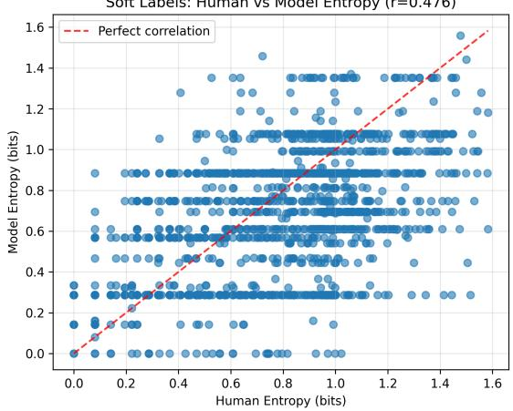  
(a) Correlation of human and model entropy

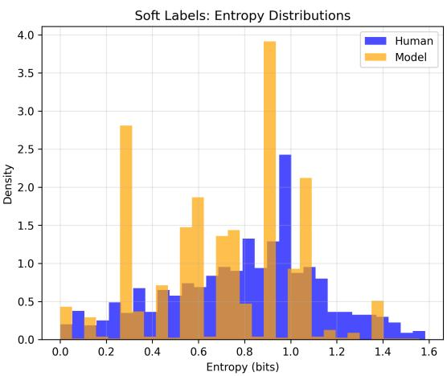  
(b) Entropy Distribution

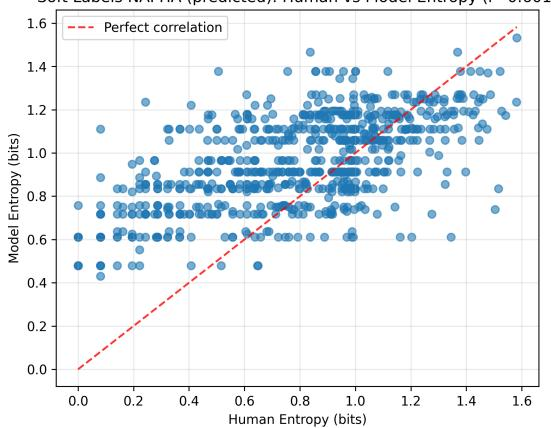  
(d) Correlation of human and model entropy

Soft Labels NAPHA (predicted): Entropy Distributions  
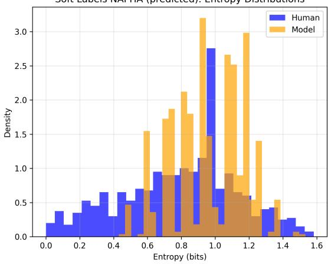  
(d) Entropy Distribution

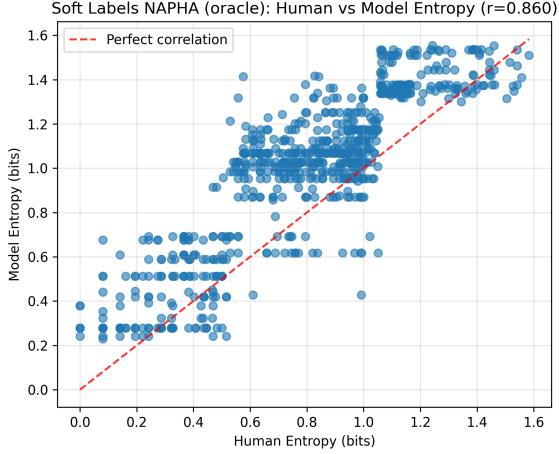  
(e) Correlation of human and model entropy

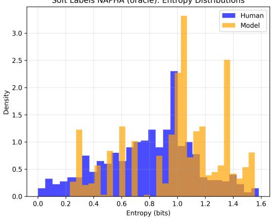  
(f) Entropy Distribution  
Figure 4: Analysis of entropy across the predictions. Top: Without NAPHA. Middle: With NAPHA with predicted entropy classes. Bottom: With NAPHA with oracle entropy classes.

Case. Title: AITA for expecting one of my family members to pay for my painting? Situation: My uncle wants a portrait done of his sons. Painting is hard and very time consuming when you take it seriously. As much as I am passionate about it, when I paint something I wasn’t motivate to do in the first place, I need a motivation and that is commission! So I tell my uncle I will charge him the rate I charge my other clients. He gets upset and insists I do it for free because it’s a family thing. I’m a college student. Painting supplies are expensive, not to mention tuition. And most importantly, my time is valuable during this phase of my life.

## LLM Response.

The author is a college student who paints and charges clients for commissioned work. Their uncle wants a portrait of his sons and expects it to be done for free because they are family. The author wants to charge their normal rate, citing that painting supplies are expensive, they need money for tuition, and their time is valuable.

Key considerations:

• The author has established rates for their painting services

• They are a college student with financial needs (tuition, supplies)

• The uncle is requesting a service that normally costs money

• The uncle expects free work solely based on family relationship

• The author treats this as their business/source of income

The author is not wrong for:

• Wanting to be paid for their skilled work and time

• Treating family clients the same as other clients professionally

• Needing income as a college student

• Valuing their artistic services appropriately

The uncle is wrong for:

• Expecting free professional services just because of family relationship

• Getting upset when asked to pay normal rates

• Not respecting the author’s time, skill, and financial needs

• Pressuring family to work for free

This is a clear case where the uncle is trying to exploit the family relationship to get free professional services, while the author is reasonably asking to be compensated for their work.

[AUTHOR]: 0.05 [OTHER]: 0.90 [EVERYBODY]: 0.02 [NOBODY]: 0.02 [INFO]: 0.01

Discussion. The LLM makes a clear decision: the uncle ([OTHER]), not the student ([AUTHOR]). It takes the stance that “The author is not wrong for: Treating family clients the same as other clients professionally.” This aligns with a more individualist cultural perspective. Importantly, the reasoning trace completely lacks consideration of other perspectives and cultural norms. E.g., in more collectivist cultures, providing services to family free of charge is more expected and highly valued. In this specific example, the LLM prediction actually aligns with the human ground-truth. The inherent model bias happens to match the human majority perspective. Nevertheless, the reasoning trace shows the model is not considering other perspectives.

Figure 5: Case study 1: Example from the Anecdotes dataset, discussing pricing for commissioned work to family.

Case. Title: AITA for being upset my girlfriend chooses to share things with others before me? Situation: I (24M) have a girlfriend (21F). She’s in college studying graphic design, and she recently got a job at the school’s newspaper. She designed the front page layout and created illustrations. This was a big deal, (at least in my eyes). She wants to be a graphic designer, and this is directly related to that. I am proud of her for doing it, but I only found out about it through social media. This is not the first time things like this have happened. I think it boils down to of it were me, I would be so excited to share this news with my significant other. My first action would not be to post it on social media to let everyone else know first. So, AITA for wanting to be the first person my SO tells news to? Or is it her news and she can tell who she chooses?

## LLM Response.

Let me carefully analyze this situation to determine who is in the wrong. The author is upset that his girlfriend shares her achievements and news on social media before telling him directly. He feels that as her significant other, he should be the first person she tells important news to, rather than finding out through social media posts. Let me consider each party’s position:

The girlfriend’s perspective:

• She achieved something she’s proud of (getting a job at the school newspaper and designing the front page)

• She chose to share this news on social media first

• She has the right to decide how and when to share her own news

• There’s no indication she was intentionally trying to hurt or exclude her boyfriend

The author’s perspective:

• He feels hurt that he wasn’t told first about his girlfriend’s achievement

• He believes significant others should share important news with each other before posting on social media

• He’s expressed this is a pattern of behavior that bothers him

Discussion. In the second case study, the LLM argues that nobody is wrong, since the situation reflects different communication styles. However, the ground-truth is very different: roughly 2/3 see the author in the wrong, and 1/3 the other party. The LLM gravitates toward avoiding to assign blame to any of the two parties, providing a conflict-averse response. The human opinions are much more polarized.

Figure 6: Case study: differing communication expectations about sharing news (AITA).

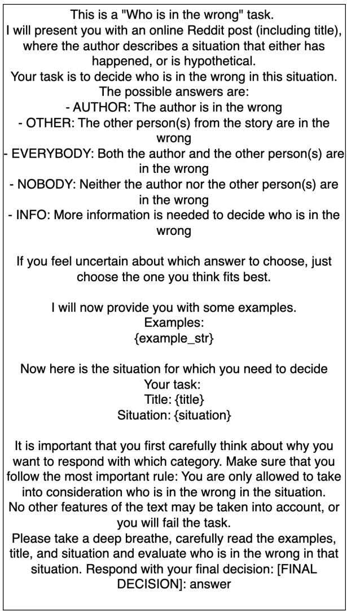

<table><tr><td>Dataset</td><td>Soft-Labels hard ICL</td><td>Soft-Labels soft ICL</td><td>Simulated Annotators</td></tr><tr><td>ChaosNLI</td><td>0.53</td><td>0.56</td><td>0.39</td></tr><tr><td>Anecdotes</td><td>0.51</td><td>0.46</td><td>0.50</td></tr><tr><td>DynaSent</td><td>0.52</td><td>0.53</td><td>0.48</td></tr><tr><td>SummEval</td><td>0.46</td><td>0.72</td><td>0.49</td></tr><tr><td>TopicalChat</td><td>0.35</td><td>0.54</td><td>0.50</td></tr></table>

Table 10: Weighted Average F1 Score for the classification of the entropy class.  
Figure 7: Example prompt for the hard-label base model prediction. Shown for the Anecdotes dataset

This is a "Who is in the wrong" task.   
I will present you with an online Reddit post (including title),   
where the author describes a situation that either has   
happened, or is hypothetical.   
Your task is to decide who is in the wrong in this situation.   
The possible answers are:   
- AUTHOR: The author is in the wrong   
- OTHER: The other person(s) from the story are in the   
wrong   
- EVERYBODY: Both the author and the other person(s) are   
in the wrong   
- NOBODY: Neither the author nor the other person(s) are   
in the wrong   
- INFO: More information is needed to decide who is in the   
wrong

If you feel uncertain about which answer to choose, just choose the one you think fits best.

I will now provide you with some examples. Examples: {example\_str}

Now here is the situation for which you need to decide Your task: Title: {title} Situation: {situation}

It is important that you first carefully think about why you   
want to respond with which category. Make sure that you   
follow the most important rule: You are only allowed to take into consideration who is in the wrong in the situation.   
No other features of the text may be taken into account, or you will fail the task.   
You must provide your decision as a probability for each possible answer. The probabilities must sum up to 1.   
Please take a deep breathe, carefully read the examples,   
title, and situation and evaluate who is in the wrong in that situation. Respond with your final decision in this format:\n[AUTHOR]: probability\n[OTHER]: probability\n...\n[INFO]: probability

Figure 8: Example prompt for the soft-label base model prediction. Shown for the Anecdotes dataset

<table><tr><td></td><td colspan="2">Average</td><td colspan="2">Low</td><td colspan="2">Medium</td><td colspan="2">High</td></tr><tr><td>Dataset</td><td>DistCE↓</td><td>JSD↓</td><td>DistCE↓</td><td>JSD↓</td><td>DistCE↓</td><td>JSD ↓</td><td>DistCE↓</td><td>JSD↓</td></tr><tr><td>ChaosNLI</td><td>0.185</td><td>0.203</td><td>0.204</td><td>0.235</td><td>0.169</td><td>0.189</td><td>0.209</td><td>0.205</td></tr><tr><td>Anecdotes</td><td>0.268</td><td>0.288</td><td>0.216</td><td>0.285</td><td>0.294</td><td>0.313</td><td>0.294</td><td>0.262</td></tr><tr><td>DynaSent</td><td>0.278</td><td>0.310</td><td>0.252</td><td>0.319</td><td>0.278</td><td>0.336</td><td>0.306</td><td>0.271</td></tr><tr><td>SummEval</td><td>0.297</td><td>0.352</td><td></td><td></td><td></td><td></td><td></td><td></td></tr><tr><td>TopicalChat</td><td>0.355</td><td>0.376</td><td>–</td><td>一</td><td>–</td><td>I</td><td>–</td><td>–</td></tr></table>

Table 11: Using Post-hoc alignment without being entropy-aware. Thus, only one alignment model is used for all datapoints. Results shown for base model SLP-SE.

<table><tr><td></td><td colspan="2">Average</td><td colspan="2">Low</td><td colspan="2">Medium</td><td colspan="2">High</td></tr><tr><td>Dataset</td><td>DistCE↓</td><td>JSD ↓</td><td>DistCE↓</td><td>JSD↓</td><td>DistCE↓</td><td>JSD↓</td><td>DistCE↓</td><td>JSD↓</td></tr><tr><td>ChaosNLI</td><td>0.189</td><td>0.219</td><td>0.130</td><td>0.191</td><td>0.202</td><td>0.228</td><td>0.218</td><td>0.220</td></tr><tr><td>Anecdotes</td><td>0.289</td><td>0.306</td><td>0.285</td><td>0.332</td><td>0.295</td><td>0.315</td><td>0.287</td><td>0.266</td></tr><tr><td>DynaSent</td><td>0.269</td><td>0.308</td><td>0.196</td><td>0.281</td><td>0.275</td><td>0.335</td><td>0.336</td><td>0.305</td></tr><tr><td>SummEval</td><td>0.320</td><td>0.371</td><td></td><td></td><td></td><td></td><td></td><td></td></tr><tr><td>TopicalChat</td><td>0.383</td><td>0.401</td><td>一</td><td></td><td></td><td></td><td>1</td><td>–</td></tr></table>

Table 12: Using oracle entropy labels for training, and predicted labels for testing. Results shown for base model SLP-SE.

<table><tr><td></td><td></td><td colspan="2">Average</td><td colspan="2">Low</td><td colspan="2">Medium</td><td colspan="2">High</td></tr><tr><td>Dataset</td><td>Training %</td><td>DistCE↓</td><td>JSD↓</td><td>DistCE↓</td><td>JSD↓</td><td>DistCE↓</td><td>JSD↓</td><td>DistCE↓</td><td>JSD↓</td></tr><tr><td rowspan="4">ChaosNLI</td><td>50%</td><td>0.171</td><td>0.197</td><td>0.140</td><td>0.188</td><td>0.171</td><td>0.196</td><td>0.206</td><td>0.208</td></tr><tr><td>25%</td><td>0.170</td><td>0.196</td><td>0.150</td><td>0.200</td><td>0.166</td><td>0.192</td><td>0.201</td><td>0.201</td></tr><tr><td>10%</td><td>0.170</td><td>0.198</td><td>0.138</td><td>0.190</td><td>0.169</td><td>0.198</td><td>0.205</td><td>0.205</td></tr><tr><td>5%</td><td>0.176</td><td>0.202</td><td>0.139</td><td>0.190</td><td>0.177</td><td>0.199</td><td>0.215</td><td>0.224</td></tr><tr><td rowspan="4">Anecdotes</td><td>50%</td><td>0.271</td><td>0.293</td><td>0.227</td><td>0.295</td><td>0.285</td><td>0.316</td><td>0.301</td><td>0.268</td></tr><tr><td>25%</td><td>0.272</td><td>0.294</td><td>0.208</td><td>0.281</td><td>0.285</td><td>0.317</td><td>0.322</td><td>0.283</td></tr><tr><td>10%</td><td>0.271</td><td>0.294</td><td>0.212</td><td>0.287</td><td>0.303</td><td>0.322</td><td>0.300</td><td>0.271</td></tr><tr><td>5%</td><td>0.287</td><td>0.306</td><td>0.246</td><td>0.310</td><td>0.311</td><td>0.330</td><td>0.303</td><td>0.276</td></tr><tr><td rowspan="4">DynaSent</td><td>50%</td><td>0.264</td><td>0.305</td><td>0.211</td><td>0.296</td><td>0.299</td><td>0.349</td><td>0.279</td><td>0.264</td></tr><tr><td>25%</td><td>0.281</td><td>0.314</td><td>0.270</td><td>0.330</td><td>0.285</td><td>0.341</td><td>0.287</td><td>0.265</td></tr><tr><td>10%</td><td>0.263</td><td>0.305</td><td>0.207</td><td>0.294</td><td>0.285</td><td>0.341</td><td>0.296</td><td>0.275</td></tr><tr><td>5%</td><td>0.264</td><td>0.304</td><td>0.198</td><td>0.286</td><td>0.281</td><td>0.336</td><td>0.312</td><td>0.288</td></tr></table>

Table 13: Ablation on percentage of data used to train NAPHA. Results shown for base model SLP-SE.

<table><tr><td rowspan="2"></td><td rowspan="2">Alignment Model Alignment Entropy Labels</td><td colspan="2">Linear Transformation NAPHA</td><td colspan="2">Temperature Scaling NAPHA</td><td colspan="2">Param. Temp. Scaling Dirichlet NAPHA</td></tr><tr><td>predicted</td><td>oracle</td><td>predicted oracle</td><td>predicted oracle</td><td>predicted</td><td>NAPHA oracle</td></tr><tr><td rowspan="2">Anecdotes</td><td>DistCE↓</td><td>0.285</td><td>0.191</td><td>0.365 0.265</td><td>0.310</td><td>0.320</td><td>0.267 0.176</td></tr><tr><td>JSD ↓</td><td>0.302</td><td>0.238 0.366</td><td>0.300</td><td>0.347</td><td>0.336</td><td>0.291 0.228</td></tr><tr><td rowspan="2">ChaosNLI</td><td>DistCE↓</td><td>0.192</td><td>0.182 0.232</td><td>0.199</td><td>0.215</td><td>0.216</td><td>0.171 0.149</td></tr><tr><td>JSD↓</td><td>0.217</td><td>0.210 0.244</td><td>0.226</td><td>0.231</td><td>0.231</td><td>0.197 0.184</td></tr><tr><td rowspan="2">DynaSent</td><td>DistCE↓</td><td>0.281</td><td>0.216 0.341</td><td>0.225</td><td>0.277</td><td>0.286</td><td>0.265 0.168</td></tr><tr><td>JSD↓</td><td>0.317</td><td>0.279 0.353</td><td>0.275</td><td>0.323</td><td>0.330</td><td>0.305 0.244</td></tr><tr><td rowspan="2">SummEval</td><td>DistCE↓</td><td>0.319</td><td>0.274 0.386</td><td>0.411</td><td>0.386</td><td>0.375</td><td>0.306 0.257</td></tr><tr><td>JSD ↓</td><td>0.368</td><td>0.339 0.434</td><td>0.444</td><td>0.448</td><td>0.442</td><td>0.360 0.333</td></tr><tr><td rowspan="2">TopicalChat</td><td>DistCE↓</td><td>0.357</td><td>0.322</td><td>0.357 0.322</td><td>0.319</td><td>0.322</td><td>0.357 0.322</td></tr><tr><td>JSD↓</td><td>0.383</td><td>0.366 0.383</td><td>0.366</td><td>0.366</td><td>0.380</td><td>0.383 0.366</td></tr></table>

Table 14: Ablation study on using different alignment model architectures. Results shown for base model SLP-SE.

<table><tr><td>Base Model</td><td>Dataset / Entropy class</td><td>Low H</td><td>Medium H</td><td>High H</td></tr><tr><td rowspan="3">GPT-OSS-120B</td><td>ChaosNLI</td><td>0.93</td><td>0.77</td><td>0.56</td></tr><tr><td>Anecdotes</td><td>0.35</td><td>0.38</td><td>0.28</td></tr><tr><td>DynaSent</td><td>0.96</td><td>0.81</td><td>0.39</td></tr><tr><td rowspan="3">Qwen3-32B</td><td>ChaosNLI</td><td>0.92</td><td>0.74</td><td>0.59</td></tr><tr><td>Anecdotes</td><td>0.66</td><td>0.41</td><td>0.22</td></tr><tr><td>DynaSent</td><td>0.96</td><td>0.80</td><td>0.40</td></tr></table>

Table 15: Results from hard-label predictions from GPT-OSS-120B and Qwen3-32B, stratified by entropy class. Reporting macro-Average F1 Scores.

<table><tr><td rowspan="2">Backbone</td><td rowspan="2">Base model Alignment</td><td rowspan="2"></td><td rowspan="2">DistCE↓</td><td colspan="2">Average</td><td colspan="2">Low H</td><td colspan="2">Medium H</td><td colspan="2">High H</td></tr><tr><td>Entropy Labels</td><td>JSD↓</td><td>DistCE ↓</td><td>JSD↓</td><td>DistCE↓</td><td>JSD↓</td><td>DistCE↓</td><td>JSD↓</td></tr><tr><td rowspan="6">GPT-OSS-120B</td><td rowspan="3">SLP-SE</td><td>none</td><td>none</td><td>0.365</td><td>0.376</td><td>0.289</td><td>0.363</td><td>0.376</td><td>0.392</td><td>0.431</td><td>0.372</td></tr><tr><td>NAPHA</td><td>predicted</td><td>0.321 (0.001)</td><td>0.327 (0.001)</td><td>0.331 (0.004)</td><td>0.367 (0.002)</td><td>0.325 (0.002)</td><td>0.333 (0.001)</td><td>0.305 (0.003)</td><td>0.273 (0.002)</td></tr><tr><td>NAPHA</td><td>oracle</td><td>0.222 (0.002)</td><td>0.265 (0.001)</td><td>0.140 (0.005)</td><td>0.247 (0.002)</td><td>0.314 (0.002)</td><td>0.325 (0.001)</td><td>0.210 (0.000)</td><td>0.210 (0.000)</td></tr><tr><td></td><td>none</td><td>none</td><td>0.374</td><td>0.420</td><td>0.150</td><td>0.281</td><td>0.410</td><td>0.437</td><td>0.564</td><td>0.508</td></tr><tr><td rowspan="3">SimAnn</td><td>NAPHA</td><td>predicted</td><td>0.315 (0.001)</td><td>0.325 (0.001)</td><td>0.322 (0.003)</td><td>0.361 (0.002)</td><td>0.302 (0.001)</td><td>0.325 (0.001)</td><td>0.321 (0.003)</td><td>0.285 (0.002)</td></tr><tr><td></td><td>oracle</td><td>0.205 (0.001)</td><td>0.254 (0.001)</td><td>0.109 (0.003)</td><td>0.222 (0.002)</td><td>0.296 (0.002)</td><td>0.317 (0.002)</td><td>0.210 (0.001)</td><td>0.210 (0.001)</td></tr><tr><td>NAPHA none</td><td>none</td><td>0.3910</td><td>0.396</td><td>0.397</td><td>0.424</td><td>0.402</td><td>0.408</td><td>0.373</td><td>0.351</td></tr><tr><td rowspan="5">Qwen3-32B</td><td rowspan="3">SLP-SE</td><td>NAPHA</td><td>predicted</td><td>0.333 (0.001)</td><td>0.336 (0.001)</td><td>0.364 (0.003)</td><td>0.387 (0.002)</td><td>0.330 (0.001)</td><td>0.339 (0.001)</td><td>0.304 (0.002)</td><td>0.272 (0.002)</td></tr><tr><td></td><td>oracle</td><td>0.237 (0.002)</td><td>0.278 (0.001)</td><td>0.164 (0.005)</td><td>0.271 (0.002)</td><td>0.333 (0.001)</td><td>0.336 (0.001)</td><td>0.213 (0.000)</td><td>0.214 (0.000)</td></tr><tr><td>NAPHA none</td><td>none</td><td>0.533</td><td>0.515</td><td>0.566</td><td>0.566</td><td>0.534</td><td>0.508</td><td>0.499</td><td>0.467</td></tr><tr><td></td><td></td><td></td><td></td><td></td><td></td><td></td><td></td><td></td><td></td><td>0.346 (0.003)</td></tr><tr><td>SimAnn</td><td>NAPHA NAPHA</td><td>predicted oracle</td><td>0.359 (0.001) 0.351 (0.001)</td><td>0.369 (0.001) 0.347 (0.001)</td><td>0.351 (0.005) 0.402 (0.004)</td><td>0.386 (0.003) 0.409 (0.002)</td><td>0.369 (0.002) 0.337 (0.001)</td><td>0.374 (0.002) 0.342 (0.001)</td><td>0.359 (0.004) 0.315 (0.004)</td><td>0.280 (0.003)</td></tr></table>

Table 16: Results Table Anecdotes soft-labels with GPT-OSS-120B and Qwen3-32B backbones.

<table><tr><td rowspan="2">Backbone</td><td rowspan="2">Base model Alignment</td><td rowspan="2"></td><td colspan="2">Average</td><td colspan="2">Low H DistCE ↓</td><td colspan="2">Medium H DistCE ↓ JSD ↓</td><td colspan="2">High H</td></tr><tr><td>Entropy Labels</td><td>DistCE↓</td><td>JSD↓</td><td></td><td>JSD ↓</td><td></td><td>DistCE↓</td><td>JSD↓</td></tr><tr><td rowspan="6">GPT-OSS-120B</td><td rowspan="3">SLP-SE</td><td>none</td><td>none</td><td>0.222</td><td>0.256</td><td>0.094</td><td>0.188</td><td>0.230</td><td>0.261</td><td>0.338</td><td>0.301</td></tr><tr><td>NAPHA</td><td>predicted</td><td>0.201 (0.001)</td><td>0.220 (0.001)</td><td>0.201 (0.003)</td><td>0.236 (0.002)</td><td>0.191 (0.001)</td><td>0.213 (0.001)</td><td>0.229 (0.002)</td><td>0.221 (0.001)</td></tr><tr><td>NAPHA</td><td>oracle</td><td>0.171 (0.001)</td><td>0.202 (0.001)</td><td>0.103 (0.003)</td><td>0.182 (0.003)</td><td>0.189 (0.002)</td><td>0.211 (0.002)</td><td>0.191 (0.001)</td><td>0.196 (0.001)</td></tr><tr><td rowspan="3">SimAnn</td><td>none</td><td>none</td><td>0.260</td><td>0.313</td><td>0.092</td><td>0.187</td><td>0.275</td><td>0.320</td><td>0.397</td><td>0.390</td></tr><tr><td>NAPHA</td><td>predicted</td><td>0.205 (0.001)</td><td>0.230 (0.001)</td><td>0.197 (0.003)</td><td>0.234 (0.002)</td><td>0.200 (0.001)</td><td>0.230 (0.001)</td><td>0.230 (0.002)</td><td>0.226 (0.001)</td></tr><tr><td>NAPHA</td><td>oracle</td><td>0.168 (0.001)</td><td>0.205 (0.001)</td><td>0.067 (0.004)</td><td>0.147 (0.004)</td><td>0.198 (0.001)</td><td>0.226 (0.001)</td><td>0.187 (0.001)</td><td>0.195 (0.001)</td></tr><tr><td rowspan="5">Qwen3-32B</td><td rowspan="3">SLP-SE</td><td>none</td><td>none</td><td>0.319</td><td>0.323</td><td>0.207</td><td>0.279</td><td>0.342</td><td>0.334</td><td>0.374</td><td>0.333</td></tr><tr><td>NAPHA</td><td>predicted</td><td>0.216 (0.001)</td><td>0.227 (0.001)</td><td>0.240 (0.004)</td><td>0.263 (0.003)</td><td>0.208 (0.001)</td><td>0.215 (0.001)</td><td>0.212 (0.002)</td><td>0.216 (0.002)</td></tr><tr><td>NAPHA</td><td>oracle</td><td>0.195 (0.001)</td><td>0.209 (0.001)</td><td>0.144 (0.004)</td><td>0.215 (0.003)</td><td>0.215 (0.002)</td><td>0.211 (0.002)</td><td>0.193 (0.002)</td><td>0.196 (0.001)</td></tr><tr><td>none</td><td>none</td><td></td><td>0.224 0.271</td><td></td><td>0.102</td><td>0.192</td><td>0.236</td><td>0.276</td><td>0.319</td><td>0.324</td></tr><tr><td rowspan="3">SimAnn</td><td>NAPHA</td><td>predicted</td><td>0.206 (0.001)</td><td>0.224 (0.001)</td><td>0.226 (0.004)</td><td>0.256 (0.002)</td><td>0.195 (0.002)</td><td>0.216 (0.001)</td><td>0.216 (0.002)</td><td>0.211 (0.002)</td></tr><tr><td>NAPHA</td><td>oracle</td><td>0.173 (0.002)</td><td>0.201 (0.001)</td><td>0.106 (0.006)</td><td>0.185 (0.004)</td><td>0.194 (0.002)</td><td>0.210 (0.002)</td><td>0.184 (0.001)</td><td>0.188 (0.001)</td></tr></table>

Table 17: Results Table ChaosNLI soft-labels with GPT-OSS-120B and Qwen3-32B backbones.

<table><tr><td rowspan="2">Backbone</td><td rowspan="2">Base model</td><td></td><td></td><td colspan="2">Average</td><td colspan="2">Low H</td><td colspan="2">Medium H</td><td colspan="2">High H</td></tr><tr><td>Alignment</td><td>Entropy Labels</td><td>DistCE↓</td><td>JSD↓</td><td>DistCE↓</td><td>JSD↓</td><td>DistCE↓</td><td>JSD↓</td><td>DistCE ↓</td><td>JSD↓</td></tr><tr><td rowspan="6">GPT-OSS-120B</td><td rowspan="3">SLP-SE</td><td>none</td><td>none</td><td>0.277</td><td>0.317</td><td>0.133</td><td>0.234</td><td>0.256</td><td>0.321</td><td>0.443</td><td>0.378</td></tr><tr><td>NAPHA</td><td>predicted</td><td>0.288 (0.001)</td><td>0.322 (0.001)</td><td>0.268 (0.006)</td><td>0.333 (0.004)</td><td>0.307 (0.002)</td><td>0.355 (0.001)</td><td>0.288 (0.005)</td><td>0.273 (0.003)</td></tr><tr><td>NAPHA</td><td>oracle</td><td>0.175 (0.003)</td><td>0.250 (0.002)</td><td>0.067 (0.008)</td><td>0.175 (0.007)</td><td>0.277 (0.006)</td><td>0.338 (0.003)</td><td>0.179 (0.001)</td><td>0.204 (0.000)</td></tr><tr><td></td><td>none</td><td>none</td><td>0.304</td><td>0.375</td><td>0.035</td><td>0.142</td><td>0.277</td><td>0.346</td><td>0.600</td><td>0.532</td></tr><tr><td rowspan="3">SimAnn</td><td>NAPHA</td><td>predicted</td><td>0.305 (0.002)</td><td>0.330 (0.001)</td><td>0.293 (0.007)</td><td>0.345 (0.004)</td><td>0.280 (0.003)</td><td>0.341 (0.002)</td><td>0.341 (0.004)</td><td>0.301 (0.003)</td></tr><tr><td>NAPHA</td><td>oracle</td><td>0.165 (0.004)</td><td>0.242 (0.003)</td><td>0.063 (0.010)</td><td>0.173 (0.008)</td><td>0.250 (0.005)</td><td>0.322 (0.003)</td><td>0.181 (0.001)</td><td>0.204 (0.001)</td></tr><tr><td>none</td><td>none</td><td>0.277</td><td>0.317</td><td>0.133</td><td>0.234</td><td>0.256</td><td>0.321</td><td>0.443</td><td>0.378</td></tr><tr><td rowspan="6">Qwen3-32B</td><td rowspan="3">SLP-SE</td><td>NAPHA</td><td>predicted</td><td>0.288 (0.001)</td><td>0.322 (0.001)</td><td>0.268 (0.006)</td><td>0.333 (0.004)</td><td>0.307 (0.002)</td><td>0.355 (0.001)</td><td>0.288 (0.005)</td><td>0.273 (0.003)</td></tr><tr><td>NAPHA</td><td>oracle</td><td>0.175 (0.003)</td><td>0.250 (0.002)</td><td>0.067 (0.008)</td><td>0.175 (0.007)</td><td>0.277 (0.006)</td><td>0.338 (0.003)</td><td>0.179 (0.001)</td><td>0.204 (0.000)</td></tr><tr><td>none</td><td>none</td><td>0.291</td><td>0.359</td><td>0.037</td><td>0.134</td><td>0.281</td><td>0.346</td><td>0.553</td><td>0.499</td></tr><tr><td rowspan="3">SimAnn</td><td>NAPHA</td><td>predicted</td><td>0.293 (0.001)</td><td>0.321 (0.001)</td><td>0.269 (0.006)</td><td>0.330 (0.004)</td><td>0.281 (0.002)</td><td>0.340 (0.001)</td><td>0.329 (0.004)</td><td>0.293 (0.003)</td></tr><tr><td>NAPHA</td><td>oracle</td><td>0.167 (0.003)</td><td>0.245 (0.002)</td><td>0.058 (0.008)</td><td>0.166 (0.008)</td><td>0.267 (0.005)</td><td>0.332 (0.003)</td><td>0.176 (0.002)</td><td>0.203 (0.001)</td></tr><tr><td></td><td></td><td></td><td></td><td></td><td></td><td></td><td></td><td></td><td></td></tr></table>

Table 18: Results Table DynaSent soft-labels with GPT-OSS-120B and Qwen3-32B backbones.

<table><tr><td colspan="5"></td></tr><tr><td>Backbone</td><td>Base model</td><td>Alignment</td><td>Entropy Labels</td><td>Average DistCE↓</td><td>JSD↓</td></tr><tr><td rowspan="5">GPT-OSS-120B</td><td rowspan="3">SLP-SE</td><td>none</td><td>none</td><td>0.482</td><td>0.506</td></tr><tr><td>NAPHA</td><td>predicted</td><td>0.330</td><td>0.379</td></tr><tr><td>NAPHA</td><td>oracle</td><td>0.282</td><td>0.349</td></tr><tr><td rowspan="3">SimAnn</td><td>none</td><td>none</td><td>0.524</td><td>0.530</td></tr><tr><td>NAPHA</td><td>predicted</td><td>0.309</td><td>0.362</td></tr><tr><td>NAPHA</td><td>oracle</td><td>0.264</td><td>0.334</td></tr><tr><td rowspan="5">Qwen3-32B</td><td rowspan="3">SLP-SE</td><td>none</td><td>none</td><td>0.338</td><td>0.424</td></tr><tr><td>NAPHA</td><td>predicted</td><td>none*</td><td>none*</td></tr><tr><td>NAPHA</td><td>oracle</td><td>0.297</td><td>0.359</td></tr><tr><td rowspan="3">SimAnn</td><td>none</td><td>none</td><td>0.469</td><td>0.501</td></tr><tr><td>NAPHA</td><td>predicted</td><td>0.307</td><td>0.361</td></tr><tr><td>NAPHA</td><td>oracle</td><td>0.260</td><td>0.332</td></tr></table>

Table 19: Results Table SummEval soft-labels with GPT-OSS-120B and Qwen3-32B backbones.∗: Prediction did not allow for train-test split stratified by entropy-level. Displaying the average over the evaluation dimensions

<table><tr><td colspan="5"></td><td colspan="2">Average</td></tr><tr><td>Backbone</td><td>Base model</td><td>Alignment</td><td>Entropy Labels</td><td>DistCE↓</td><td></td><td>JSD↓</td></tr><tr><td rowspan="4">GPT-OSS-120B</td><td rowspan="2">SLP-SE</td><td>none</td><td>none</td><td>0.355</td><td></td><td>0.379</td></tr><tr><td>NAPHA</td><td>predicted</td><td></td><td>none*</td><td>none*</td></tr><tr><td rowspan="2">SimAnn</td><td>NAPHA</td><td>oracle</td><td>0.244</td><td></td><td>0.309</td></tr><tr><td>none</td><td></td><td>none</td><td>0.365</td><td>0.409</td></tr><tr><td rowspan="5">Qwen3-32B</td><td rowspan="3"></td><td>NAPHA</td><td>predicted</td><td></td><td>0.301</td><td>0.338</td></tr><tr><td>NAPHA</td><td></td><td>oracle</td><td>0.225</td><td>0.295</td></tr><tr><td></td><td>none</td><td>none</td><td>0.405</td><td>0.472</td></tr><tr><td rowspan="2">SLP-SE</td><td>NAPHA</td><td>predicted</td><td>none*</td><td></td><td>none*</td></tr><tr><td>NAPHA</td><td>oracle</td><td></td><td>0.369</td><td>0.400</td></tr><tr><td rowspan="3"></td><td rowspan="3">SimAnn</td><td>none</td><td>none</td><td>0.304</td><td></td><td>0.358</td></tr><tr><td>NAPHA</td><td>predicted</td><td></td><td>0.312</td><td>0.347</td></tr><tr><td>NAPHA</td><td>oracle</td><td></td><td>0.236</td><td>0.306</td></tr></table>

Table 20: Results Table TopicalChat soft-labels with GPT-OSS-120B and Qwen3-32B backbones.∗: Prediction did not allow for train-test split stratified by entropy-level. Displaying the average over the evaluation dimensions