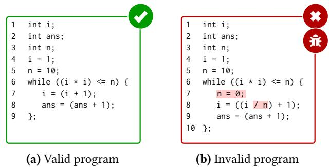
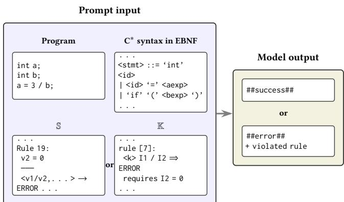
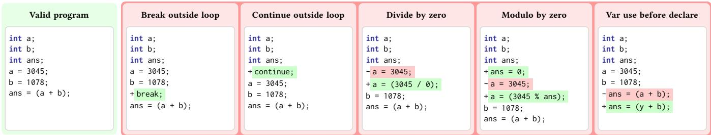
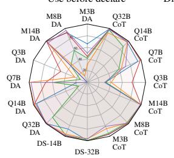
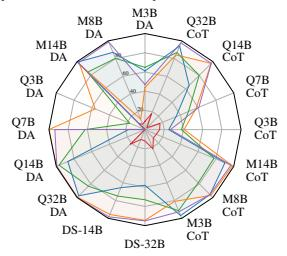
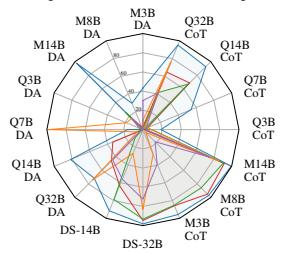
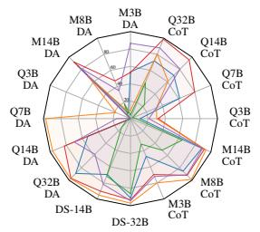
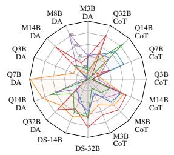
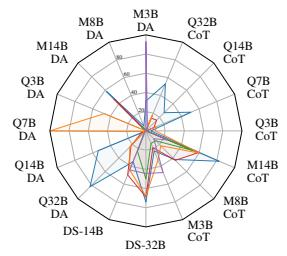

# Predicting Program Exit Code with LLMs and Programming Language Semantics

Lara Marinov The University of Texas at Austin Austin, USA marinov@utexas.edu

Aditya Thimmaiah The University of Texas at Austin Austin, USA auditt@utexas.edu

Junyi Jessy Li The University of Texas at Austin Austin, USA jessy@utexas.edu

Jayanth Srinivasa Cisco Research San Francisco, USA jasriniv@cisco.com

## Abstract

Large language models (LLMs) have shown proficiency in various software engineering tasks, such as code generation and translation. However, a key limitation in their performance may be their (lack of) understanding of programminglanguage semantics. Even when explicit semantics are given, it remains unclear whether LLMs apply those rules or lean on priors learned during pre-training instead. We study if LLMs lean on priors or given semantics with a novel task–Program Executability Prediction (PrEx)–that asks models to predict whether a program is semantically valid or invalid (and, if invalid, which formal rule it violates) given the program’s syntax and operational semantics. Because PrEx requires both valid and invalid programs, we build a dataset with systematically generated invalid transformations derived from valid programs. We evaluate open-source coding LLMs under two semantic formalisms and two semantic shifts across Human Written, LLM-Translated, and Fuzzer-Generated program splits. Our findings show that LLMs lean on pre-training priors rather than systematically applying the given rules, performing especially poorly on modified semantics and degrading further as program complexity increases. PrEx is available at htps://github.com/EngineeringSoftware/prex.

CCS Concepts: • General and reference → Empirical studies; • Theory of computation → Operational semantics; • Computing methodologies → Machine learning.

Keywords: Operational Semantics, K Framework, Program Executability Prediction, Large Language Models

Milos Gligoric The University of Texas at Austin Austin, USA gligoric@utexas.edu

ACM Reference Format: Lara Marinov, Aditya Thimmaiah, Jayanth Srinivasa, Junyi Jessy Li, and Milos Gligoric. 2026. Predicting Program Exit Code with

LLMs and Programming Language Semantics. In Proceedings of the 2nd ACM SIGPLAN International Workshop on Language Models and Programming Languages (LMPL ’26), October 4–9, 2026, Oakland, CA, USA. ACM, New York, NY, USA, 12 pages. htps://doi.org/10. 1145/3843750.3843842

## 1 Introduction

LLMs have become widely used in software engineering, demonstrating remarkable proficiency in tasks like code generation [11, 24, 31], code translation [26, 43], bug fixing [15, 22], and summarizing complex codebases [23, 27, 38]. However, despite their practical success, it remains unclear to what extent these models truly comprehend the underlying semantics of the programs they process.

Much of an LLM’s apparent coding ability seems to come from sophisticated pattern matching and the memorization of vast amounts of training data, rather than an inherent ability to logically simulate program execution [29, 44]. For example, consider a scenario where an LLM is presented with a standard sorting algorithm. Because the model has previously encountered this exact structure many times, it can easily summarize its purpose, generate missing lines of code, or predict the final outcome [8, 36]. However, if we introduce a subtle change to the program, such as slightly modifying the loop bounds, obfuscating variable names, or redefining how the comparison operator works, and ask the model to predict the result, it frequently fails [41]. Instead of systematically tracing the data flow step-by-step as an interpreter would, the model often falls back on its priors and simply guesses the standard sorted output [4, 28]. Such a situation clearly reveals a gap between rote memorization and genuine, systematic semantic reasoning.

Recent work introduced PLSemanticsBench [39] and established a framework for evaluating LLMs’ semantic understanding through three tasks: predicting final variable states (PredState), identifying the formal semantic rules applied during execution (PredRule), and generating step-bystep execution traces (PredTrace) [39]. Evaluations revealed that current LLMs struggle significantly across all three of these tasks. Because PLSemanticsBench presented a set of complex evaluations where models needed to articulate intermediate steps and output long execution traces, the models’ uniformly low performance leaves an open question regarding exactly where their capability threshold is. To determine whether these failures are in-part due to the natural multi-step complexity of the tasks presented in PLSemanticsBench or a fundamental inability to reason about semantics, we establish a more foundational baseline that separates trace generation from semantic judgment. Building on this premise, we present PrEx: a task that asks models, given a program and formal programming language semantics, to predict whether execution succeeds or halts with a semantic error—and, when it fails, which rule was violated. The required output is deliberately small with just a discrete executability verdict rather than a long trace but the evaluation is not: we pair each valid program with invalid counterparts produced by semantics-aware invalid transformations, vary program source and structural complexity across three splits, and probe rule-following under alternate semantic formalisms and shifts. This design lets us ask whether models systematically apply the supplied rules or instead continue to rely on memorized priors.

Dataset. We build on the valid C<sup>∗</sup> programs from PLSemanticsBench and extend them with semantically invalid transformations required by PrEx. Invalid programs are generated from valid programs using a semantics-aware transformation procedure that applies one of five errors: breakoutside-loop, continue-outside-loop, divide-by-zero, modulo by-zero, and variable-use-before-declare. Each valid program has a matched invalid counterpart in every error category. Programs come from three splits—Human-Written, LLM-Translated, and Fuzzer-Generated—with average length and complexity increasing across splits. Together, these design choices let us test whether semantic reasoning generalizes across program sources and complexity levels, not just memorized coding patterns.

Semantic formalisms. We evaluate models under two semantic formalisms: small-step operational semantics (S) and the K-framework (K). S defines execution through finer granularity inference rules, where each rule represents one atomic computation step [34]. K instead uses coarser rewriting rules that transform program configurations in larger chunks, relying on built-in rewriting to handle intermediate expression reduction [35]. We include both to test whether an LLM’s ability to apply provided semantics depends on rule granularity or persists across formalisms.

Semantic shifts. We also evaluate models under two semantic shifts, KeywordSwap and KeywordObf, that alter the meaning of selected symbols while keeping execution defined by the provided formal rules. KeywordSwap interchanges the meanings of familiar operator symbols (e.g., + denotes subtraction), requiring models to override pre-trained associations and follow the supplied semantics. KeywordObf replaces standard operators and keywords with novel singletoken symbols, removing recognizable cues from pre-training while preserving the same underlying rules. Together, these conditions test whether LLMs can reason from explicitly provided semantics rather than from their prior knowledge.

  
Figure 1. Valid and invalid PrEx task examples.

We evaluate open-source LLMs designed for coding tasks and enhanced reasoning using both non-chain-of-thought and chain-of-thought (CoT) reasoning. Our findings indicate that even on the simpler task (PrEx) of predicting program exit codes, LLMs continue to lean on priors learned during pre-training rather than systematically applying the supplied formal rules. Performance is especially poor under KeywordSwap and KeywordObf, where models must override familiar symbol meanings to follow the provided semantics. Accuracy also degrades significantly on the LLM-Translated and Fuzzer-Generated splits compared to Human-Written, indicating that semantic reasoning does not generalize well as structural complexity increases.

## 2 Task Description

In traditional program interpretation, the semantic analyzer identifies semantic errors in the input program, typically following parsing [1, 2]. As a step towards our long term goal–evaluating whether LLMs can function as interpreters– in this paper, we tasked LLMs with detecting semantic errors.

We not only provide the model with a program it is expected to analyze but also supply the formal semantics of the language, including the inference rules that govern valid and invalid executions, thereby encouraging it to reason about semantic correctness. If an LLM identifies a program as semantically invalid, it is further instructed to specify the rule that formalizes the error, assessing its understanding of the programming language semantics. Consequently, we test not only if these models can identify a program as semantically invalid, but also if they lean on priors learned in their training data or on the semantics provided to them.

To illustrate the task, consider the example in Figure 1 of a C<sup>∗</sup> program which calculates the integer square root of the variable �. The program in Figure 1a is semantically valid and contains no rule violations, so an LLM successfully performing PrEx should classify it as valid, based on semantic reasoning over the inference rules rather than needing to simulate a full step-by-step execution. In contrast, Figure 1b shows an invalid variant of the same base program. Because line 8 of the invalid program contains a division-by-zero error, an LLM should successfully classify the program as invalid and accurately specify the violated rule.

## 3 Methodology

This section describes our experimental setup for PrEx. We describe the C<sup>∗</sup> programming language (Section 3.1), the semantic formalisms used to specify program behavior (S and K; Section 3.2), semantic shifts that test whether models follow provided rules or pre-training priors (KeywordSwap and KeywordObf; Section 3.3), and the full prompt given to models (Section 3.4). The C<sup>∗</sup> language, semantic formalisms, and semantics shifts are introduced in PLSemanticsBench [39], but we recap them here together with the full prompt used for PrEx.

## 3.1 C<sup>∗</sup> Language

We evaluate models on programs written in C<sup>∗</sup>, a small imperative language with C-like syntax. The complete EBNF grammar used in our experiments is given in Figure 2. We use the same C<sup>∗</sup> language as PLSemanticsBench.

## 3.2 Semantic Formalisms

We evaluate the models using two distinct semantic formalisms: Small-step operational semantics (S) and the Kframework (K). We use both formalisms to understand how the granularity and style of formal rules afect an LLM’s ability to correctly reason about the programs it is given and to discover if presenting the semantic rules in a particular formulization maximizes the model’s adherence to them.

Small-step operational semantics (S). S is a fine-grained semantic formalism, where each rule represents one atomic computation [34]. Execution happens through repeated rule applications as expressions are broken down into tiny constituent parts and resolved one by one. Rules are written in Gentzen-style inference notation [9], with premises and side conditions written above the bar and conclusions below.

Table 1 shows a subset (due to the space reasons) of the S rules used in our experiments. To illustrate how the S formalism handles both valid execution and error states, we highlight several key rules. Rules 1 and 2 form a complementary pair describing variable lookup: Rule 1 defines successful evaluation when a variable is bound in the current state, while Rule 2 states that attempting to evaluate an undeclared variable results in an error. Similarly, Rules 18 and 19 describe the division operation, distinguishing between valid integer division and a division-by-zero error. Rule 9 highlights the fine-grained, small-step nature of the formalism by explicitly defining the addition transition only after both operands have been fully reduced to values.

```lisp
1 <program > ::= <stmt_list >
2 <stmt_list > ::= (<stmt > ';')*
3 <stmt > ::= 'int ' <id >
4 | <id > '=' <aexp >
5 | 'if ' '(' <bexp > ')' '{' <stmt_list > '}'
'else ' '{' <stmt_list > '}'
6 | 'while ' '(' <bexp > ')' '{' <stmt_list > '
}'
7 | 'loop ' '(' <bexp > ')' '{' <stmt_list > '}
8 | 'halt '
9 | 'continue '
10 | 'break '
11 | 'LE '
12 <aexp > ::= <id >
13 | <literal >
14 | '(' <aexp >? <mathop > <aexp > ')'
15 <bexp > ::= '(' <bool > ')'
16 | '(' <aexp > <relop > <aexp > ')'
17 | '(' <lognot > <bexp > ')'
18 | '(' <bexp > <logicalop > <bexp > ')'
19 <bool > ::= 'true ' | 'false '
20 < mathop > ::= '+' | '-' | '*' | '/' | '%'
21 <relop > ::= '<' | ' <=' | '>' | ' >=' | '== ' | '!= '
22 <lognot > ::= '!'
23 <logicalop > ::= '&& ' | '|| '
24 <id > ::= <letter > (< letter > | <digit >)*
25 <literal > ::= <digit >+
```  
Figure 2. Complete syntax of C<sup>∗</sup> in EBNF (<letter> and <digit> rules are omitted and have their usual definitions).

K-framework. The K-framework is a coarser, rewritingbased framework [35, 40]. K-framework semantics evaluate code in slightly larger, higher-level chunks rather than atomic steps. Table 2 shows a subset of the K-framework rules used in our experiments, paralleling the S rules.

Like the S formalism, Rules 1 and 2 from K form a pair describing variable lookup. Rule 1 defines successful evaluation when a variable maps to a value in the current program state, and Rule 2 states that attempting to evaluate an undeclared variable stops execution. Likewise, Rules 6 and 7 (Table 2) parallel S Rules 18 and 19 (Table 1) to handle division. Rule 6 defines valid integer division when the right operand is not zero, and Rule 7 defines the error for division by zero.

The primary diference between the two formalisms is how they handle intermediate computations, which is best illustrated by the addition operation. In the S formalism, Rule 9 dictates the addition of two values, but its strictly small-step nature means this rule only applies after separate, explicitly defined atomic steps have reduced the operands into discrete values first. In contrast, the K semantics uses its built-in rewriting to handle this operand reduction implicitly. So, the corresponding Rule 3 for K encapsulates the addition evaluation into a single, coarser rewrite step, evaluating the expression once both operands are values.

Table 1. Some S-semantics rules of the C<sup>∗</sup> language.
<table><tr><td>Rule</td><td>Formalization</td><td>Description</td></tr><tr><td>Rule 1</td><td> $\sigma ( \boldsymbol { \mathsf { x } } ) = \boldsymbol { \mathsf { v } }$   $\langle \mathbf { x } , \sigma , \chi \rangle  \mathbf { v }$ </td><td>If a variable is associated with a value in the current program state, then evaluating it yields that value.</td></tr><tr><td rowspan="2">Rule 2</td><td> $\sigma ( \boldsymbol { \times } ) = \bot$ </td><td rowspan="2">If a variable has no associated value in the current program state, then attempting to evaluate it results in an error and the program execution stops</td></tr><tr><td> $\overline { { \langle \mathrm { x } , \sigma , \chi \rangle  \langle \mathsf { E R R 0 R } , \sigma , \chi \rangle } }$ </td></tr><tr><td rowspan="2">Rule 9</td><td> $\mathsf { v } 3 = \mathsf { v } 1 \ + \ \mathsf { v } 2$ </td><td>When both operands of a ‘+ expression are values, the result is obtained by</td></tr><tr><td> $\overline { { \langle \mathsf { v } 1 \ + \ \mathsf { v } 2 , \sigma , \chi \rangle \to \mathsf { v } 3 } }$ </td><td>adding those two values. When both operands of a / expression are values</td></tr><tr><td rowspan="2">Rule 18</td><td> $\mathsf { v } 2 \neq \emptyset \qquad \mathsf { v } 3 = \mathsf { v } 1 \ / \ \mathsf { v } 2$ </td><td rowspan="2">and the right operand value is not zero, the result is obtained by integer division of the left operand</td></tr><tr><td> $\langle { \mathsf { v } } 1 \ / \ \mathsf { v } 2 , \sigma , \chi \rangle \to { \mathsf { v } } 3$ </td></tr><tr><td rowspan="2">Rule 19</td><td> $\mathsf { v } \mathsf { 2 } = \mathsf { 0 }$ </td><td rowspan="2">When both operands of a W expression are values and the right operand value is zero, then an error occurs and the program execution</td></tr><tr><td> $\overline { { \langle { \mathsf { v } } 1 \ \prime \ { \mathsf { v } } 2 , \sigma , \chi \rangle \to \langle { \mathsf { E R P R } } , \sigma , \chi \rangle } }$ </td></tr></table>

  
Figure 3. Overview of the PrEx prompt: the model receives the C<sup>∗</sup> grammar, semantic rules (S or K), and a program, and must predict executability.

## 3.3 Semantic Shifts

We use two semantic shifts, KeywordSwap and KeywordObf, to test whether models can trace programs using explicitly provided rules rather than relying on their prior knowledge.

Table 2. Some K-semantics rules of the C<sup>∗</sup> language.
<table><tr><td>Rule</td><td>Formalization</td><td>Description</td></tr><tr><td>Rule 1</td><td> $\angle { \mathrm { k } } > { \mathrm { X } } { \mathrm { : I d } } \Rightarrow { \mathrm { I } } \ldots < / { \mathrm { k } } >$   ${ < } \mathrm { s t a t e } > \ldots \mathrm { X } \mapsto \mathrm { I } \ldots { < } / \mathrm { s t a t e } >$   $< \mathrm { r u l e s } > \mathrm { L } \Longrightarrow \mathrm { L } \mathrm { L i s t I t e m ( ~ ^ { \circ } R u l e ~ 1 ^ { \circ } ) } < / \mathrm { r u l e s } >$ </td><td>If a variable is associated with a value in the current program state, then evaluating it yields that value.</td></tr><tr><td>Rule 2</td><td> $\operatorname { \ k } \operatorname { > X } \operatorname { : } \operatorname { I d } \implies \{ \operatorname { E R R O R } \} < / \mathrm { k } \operatorname { > }$   ${ \mathrm { < s t a t e > R h o : M a p < } } / { \mathrm { s t a t e > } }$   $< \mathrm { r u l e s } > \mathrm { L } \Longrightarrow \mathrm { L } \ \hat { \mathrm { L i s t I t e m ( } ^ { \mathrm { c } } \mathrm { R u l e } \ 2 ^ { \mathrm { p } } ) } < / \mathrm { r u l e s } >$   $\mathrm { r e q u i r e s ~ n o t B o o l } \left( \mathrm { X } \mathrm { i n \_ k e y s ( R h o ) } \right)$ </td><td>associated value in the current program state, then attempting to evaluate it results in an error and the program execution stops immediately.</td></tr><tr><td>Rule 3</td><td> $< \mathrm { k } > \mathrm { I } 1 \left\{ \mathrm { P L U S \_ O P } \right\} \mathrm { I } 2 \implies \mathrm { I } 1 + \mathrm { I n t } \mathrm { I } 2 \\dots < / \mathrm { k } >$   $< \mathrm { r u l e s } > \mathrm { L } \Longrightarrow \mathrm { L } \mathrm { L i } \mathrm { \dot { s } t I t e m ( \mathrm { ^ \mathrm { c } R u l e \ 3 ^ { \circ } ) } } < / \mathrm { r u l e s } >$ </td><td>When both operands of a ‘+ expression are values, the result is obtained by adding those two values.</td></tr><tr><td>Rule 6</td><td> $\{ \mathrm { D I V \_ O P } \} \mathrm { I } 2 \Longrightarrow \mathrm { I } 1 / \mathrm { I n t } \mathrm { I } 2 \ldots < / \mathrm { k } >$  &lt;k&gt; I1 &lt;rules&gt; L ⇒ L ListItem(“Rule 6”) &lt;/rules&gt; requires I2 ≠ Int 0</td><td>/ expression are values and the right operand value is not zero, the result is obtained by integer division of the left operand value by the right operand</td></tr><tr><td>Rule 7</td><td> $< \mathrm { k } > \mathrm { I } 1 \left\{ \mathrm { D I V \_ O P } \right\} \mathrm { I } 2 \implies \left\{ \mathrm { E R R O R } \right\} \dots < / \mathrm { k } >$  &lt;rules&gt; L ⇒ L ListItem(“Rule 7”) &lt;/rules&gt; requires I2 = Int 0</td><td>expression are values and the right operand value is zero, then an error occurs and the program execution stops immediately.</td></tr></table>

KeywordSwap. KeywordSwap reassigns the semantic meanings of selected operator symbols to their counterparts (Table 3). For example, addition (+) and subtraction (-) are interchanged, such that the + symbol dictates subtraction. To reason correctly, models must strictly condition on the provided rules and override pre-trained semantic associations.

KeywordObf. KeywordObf replaces standard operator and keyword symbols with novel single-token symbols (Table 3). For instance, an expression using the ★ symbol is executed as addition. The KeywordObf condition ensures models can apply explicitly defined rules in the absence of recognizable patterns from prior exposure. Unlike PLSemanticsBench whose symbols are tokenized into multiple tokens by LLMs, we use a diferent set of symbols that are each one token. Ensuring each novel symbol maps to a single token prevents artificial inflation of the prompt length, reduces overall token overhead, and minimizes the risk of introducing unintended syntactic complexities that might confuse the model.

## 3.4 Full Prompt

For each program, we provide the model with the C<sup>∗</sup> syntax in EBNF, the semantic rules (S or K), and the program itself. Figure 3 summarizes this prompt structure. The model must predict whether the program is executable (##success##) or semantically invalid (##error##), and when invalid, identify the violated rule. For non-reasoning models, we evaluate both direct-answer and CoT using only variants with minor changes to this prompt (CoT is told to provide the reasoning).

Table 3. Transformations applied to the standard semantics to derive the nonstandard KeywordSwap and KeywordObf.
<table><tr><td>Type</td><td>Assignment</td><td></td><td>Arithmetic</td><td></td><td></td><td></td><td></td><td></td><td>Relational</td><td></td><td></td><td></td><td>Logical</td><td></td><td></td><td></td><td>Keyword</td><td></td><td></td></tr><tr><td>Standard</td><td>=</td><td>+</td><td>=</td><td>大</td><td>/</td><td>%</td><td>&lt;=</td><td>&gt;</td><td>&gt;=</td><td>==</td><td>!=</td><td>!</td><td>&amp;&amp;</td><td>II</td><td>if-else</td><td>while</td><td>halt</td><td>break</td><td>continue</td></tr><tr><td>KeywordSwap</td><td>=</td><td>=</td><td>+</td><td>/</td><td>*</td><td>%</td><td>&gt;=</td><td>&lt;</td><td>&lt;=</td><td>!=</td><td>==</td><td>!</td><td>II</td><td>&amp;&amp;</td><td>if-else</td><td>while</td><td>halt</td><td>break</td><td>continue</td></tr><tr><td>KeywordObf</td><td>€</td><td>★</td><td>▲</td><td>$</td><td>□</td><td></td><td>∇</td><td>©</td><td>♡</td><td>◆</td><td>V</td><td>O</td><td>◇</td><td>△</td><td>▶-￥</td><td>N</td><td>き</td><td>√</td><td>√</td></tr></table>

\* Swaps the semantics of standard operator/keyword symbols; \*\* Assigns semantics of standard operators/keywords to novel single-token symbols.

Table 4. Program size in lines of code (LOC) and token counts measured by the GPT-4o tokenizer per dataset split.
<table><tr><td></td><td></td><td colspan="3">LOC</td><td colspan="3">Tokens</td></tr><tr><td>Split</td><td># programs</td><td>Min</td><td>Median</td><td>Max</td><td>Min</td><td>Median</td><td>Max</td></tr><tr><td>Human-Written</td><td>162</td><td>4</td><td>19</td><td>80</td><td>18</td><td>81</td><td>351</td></tr><tr><td>LLM-Translated</td><td>165</td><td>8</td><td>106</td><td>597</td><td>33</td><td>538</td><td>2,092</td></tr><tr><td>Fuzzer-Generated</td><td>164</td><td>85</td><td>786</td><td>1,961</td><td>982</td><td>9,081</td><td>22,239</td></tr></table>

## 4 Dataset Construction

The set of programs used in our evaluation are comprised of three splits: Human-Written, LLM-Translated, and Fuzzer-Generated. We use the same valid programs as PLSemanticsBench and extend their dataset with invalid programs, because PrEx requires both valid and invalid programs. We obtain these invalid programs by applying semantics-aware transformations to valid programs, so that each invalid counterpart is derived directly from a matched valid one with consistent style and complexity.

Human-Written. The Human-Written split of C<sup>∗</sup> programs are manually adapted from C++ programs sourced from LeetCode, HumanEval, CodeContests, and MBPP [3, 7, 18, 19, 45]. For each program, a single public test case and its corresponding oracle is selected.

LLM-Translated. The LLM-Translated split of C<sup>∗</sup> programs are C++ programs translated to C<sup>∗</sup> by LLMs. The C++ programs are sourced from CodeForces solutions published to HuggingFace [33]. Qwen2.5-Coder 32B is prompted with the C<sup>∗</sup> syntax, semantics, the C++ solution, and one public test case to generate a valid C<sup>∗</sup> program, and answers are filtered for successful test execution using the K-framework.

Fuzzer-Generated. The Fuzzer-Generated split of C<sup>∗</sup> programs are constructed with a depth-controlled, semanticsaware, grammar-based fuzzer [13, 42]. The fuzzer picks statements from assign, if-else, while, break, continue, halt using depth-tapered probabilites to reduce the chance of generating new nested if/while blocks.

Table 4 shows program length across the three splits. Median lines of code (LOC) increases from Human-Written to LLM-Translated to Fuzzer-Generated. Even the shortest Fuzzer-Generated program is longer than the longest Human-Written program. We start with 491 valid programs<sup>††</sup>. These programs are transformed to create 2455 semantically invalid programs. The transformation process uses an ANTLR-based parser-visitor to apply the five predefined transformations to each valid program, corresponding to the five semantic error rules under S and K formalizations. These transformations introduce specific semantic errors: 1) inserting a break outside a loop, 2) inserting a continue outside a loop, 3) division by zero, 4) modulo by zero, and 5) using an undeclared variable. Each invalid program is generated by applying one random transformation rule to a valid C<sup>∗</sup> program, ensuring each violates exactly one semantic error rule. For each valid program, we generate one corresponding semantically invalid program in each of the five error categories. Figure 4 illustrates these transformations on a shared valid program.

Table 5. Introduced semantic errors and corresponding rules.
<table><tr><td rowspan="2">Executability Semantic error type</td><td rowspan="2"></td><td colspan="2">Corresponding Rule</td><td rowspan="2"></td><td rowspan="2">Count Percentage</td></tr><tr><td>K</td><td>S</td></tr><tr><td>success</td><td></td><td></td><td>一</td><td>491</td><td>16.7%</td></tr><tr><td>error</td><td>Break outside loop</td><td>34</td><td>73</td><td>491</td><td>16.7%</td></tr><tr><td>error</td><td>Continue outside loop</td><td>31</td><td>76</td><td>491</td><td>16.7%</td></tr><tr><td>error</td><td>Divide by zero</td><td>7</td><td>19</td><td>491</td><td>16.7%</td></tr><tr><td>error</td><td>Modulo by zero</td><td>9</td><td>23</td><td>491</td><td>16.7%</td></tr><tr><td>error</td><td>Variable use before declare</td><td>2</td><td>2</td><td>491</td><td>16.7%</td></tr></table>

Table 5 shows the type ofsemantic errors introduced, their corresponding rules under S and K formalizations, and the number of programs in the dataset that violate each rule. The percentages are computed over the full set of 2946 programs.

## 5 Experiments and Results

We benchmark models under three settings by providing: the standard semantics and the unmodified program, KeywordSwap semantics and the transformed program, and KeywordObf semantics and the transformed program. Ground truths labels are derived from the transformation procedure. Valid programs are labeled ##success##, and each semantically invalid variant is labeled ##error## with the corresponding violated rule. We evaluate open-source LLMs designed for coding tasks and enhanced reasoning ability on

  
Figure 4. Example of a valid program and semantically invalid programs with their corresponding error categories.

PrEx, including models in the Qwen [16], DeepSeek [12], and Ministral [21] families. For non-reasoning models, we experiment with both CoT and non-CoT prompting. We run each model three times per configuration and report the mean accuracy across runs. Configurations are

$$
\begin{array} { r l } & { \{ \mathbb { S } , \mathbb { K } \} \times \{ S t a n d a r d , K e y w o r d S w a p , K e y w o r d O b f \} } \\ & { \qquad \times \{ \mathrm { n o n } - C o T , C o T \} . } \end{array}
$$

Because reasoning models generate chain-of-thought traces by default, we evaluate them under one prompting condition only and do not run separate CoT and non-CoT variants.

Tables 6–8 summarize model performance on PrEx across the three dataset splits.

## 5.1 Performance Across Dataset Splits

Across all models, performance consistently drops between Human-Written and the other two splits, especially Fuzzer-Generated.

Each of Tables 6, 7, and 8 reports PrEx accuracy on one dataset split (Human-Written, LLM-Translated, and Fuzzer-Generated, respectively). Within each table, results are orga nized by semantics formalism: K semantics and S semantics (two groups of columns). For each formalism, we show accuracy under the three semantic shift configurations: Standard, KeywordSwap, and KeywordObf. Standard uses the unmodified programs; KeywordSwap and KeywordObf use the corresponding modified programs with swapped symbols and new symbols, respectively. For KeywordSwap and KeywordObf, we show, in parenthesis, percentage drop/increase compared to the Standard shift.

DeepSeek-Qwen 32B, Ministral 3 14B-CoT, and Qwen2.5- Coder 32B-CoT achieve the strongest Human-Written accuracy among all evaluated models (Table 6), but all three still degrade on other splits. On LLM-Translated programs (Table 7), mean accuracy—averaged across the six K/S and semantic-shift columns in each model’s row—falls by 2.9, 8.7, and 8.6 percentage points (pp) respectively when comparing to Human-Written (Table 6). On Fuzzer-Generated programs (Table 8) the decline is even sharper, with mean drops of 19pp, 24.8pp, and 33.3pp computed the same way across Tables 8 and 6. The largest single-configuration drop reaches 55pp for

Qwen2.5-Coder 14B-CoT on KeywordObf semantics under K where it falls from 78% to 23% (Qwen2.5-Coder 14B-CoT row and KeywordObf column under K semantics in Tables 6 and 8).

This performance drop extends beyond the best three performing models: every “capable model” (mean Human-Written accuracy ≥ 45%) loses substantial accuracy on Fuzzer-Generated programs, with mean drops ranging from 13pp to 40pp (median 24pp). Qwen2.5-Coder 14B has a smaller absolute drop under non-CoT which drops by only 13.5pp on average (the Qwen2.5-Coder 14B row averaged across all six K/S and semantic-shift columns when comparing Tables 8 and 6), but its Human-Written accuracy is much lower (mean 53.8%, the same six-column average in Table 6). Somewhat diferently, DeepSeek-Qwen 14B does not perform as well on Human-Written (mean 77.5% vs. 88.7%–82.5%; each the six-column row average in Table 6) yet its mean Fuzzer-Generated drop is 3.2pp below the top-three average (again averaged over the six columns in Tables 8 and 6), and no configuration falls more than 29pp (its largest drop is at Table 6/DeepSeek-Qwen 14B/K/KeywordObf, from 81% to 51% in Table 8, vs. up to 55pp at Table 6/Qwen2.5-Coder 14B-CoT/K/KeywordObf above).

## 5.2 Performance on KeywordSwap and KeywordObf

Moving from Standard to KeywordSwap or KeywordObf semantics substantially reduces accuracy across models. On Human-Written programs (Table 6), KeywordObf is consistently harder than KeywordSwap: across all models, median accuracy falls by 19pp under KeywordSwap versus 32pp under KeywordObf (each median is the drop from Standard to KeywordSwap or KeywordObf, taken over all model rows and K/S formalisms in Table 6).

The top three Human-Written models (DeepSeek-Qwen 32B, Ministral 3 14B-CoT, and Qwen2.5-Coder 32B-CoT) incur mean semantic-shift drops of 15.2pp, 14.8pp, and 23.3pp, respectively (each averaged over {K, S} × {KeywordSwap, KeywordObf} in Table 6).

The largest Human-Written drop reaches 59pp (Ministral 3 14B under K, KeywordObf falls from 90% to 32%, Table 6), and the largest drop among the top three is Qwen2.5-Coder

Table 6. PrEx accuracy on Human-Written programs.
<table><tr><td rowspan="2">Models</td><td colspan="3">K-semantics</td><td colspan="3">S-semantics</td></tr><tr><td>Standard</td><td>KeywordSwap (pp)</td><td>KeywordObf (pp)</td><td>Standard</td><td>KeywordSwap (pp)</td><td>KeywordObf (pp)</td></tr><tr><td>Random</td><td>18</td><td>18 (000)</td><td>16 (-02)</td><td>18</td><td>18 (000)</td><td>16(-02)</td></tr><tr><td>MINISTRAL 3 3B</td><td>61</td><td>47(-14)</td><td>14(-47)</td><td>46</td><td>41 (-05)</td><td>21 (-25)</td></tr><tr><td>MINISTRAL 3 8B</td><td>77</td><td>66 (-11)</td><td>24(-53)</td><td>69</td><td>55 (-14)</td><td>20(-49)</td></tr><tr><td>MINISTRAL 3 14B</td><td>90</td><td>75(-15)</td><td>32(-58)</td><td>87</td><td>78(-09)</td><td>45(-42)</td></tr><tr><td>QWEN2.5-CODER 3B</td><td>44</td><td>23 (-21)</td><td>7(-37)</td><td>23</td><td> $2 8 \left( + 0 5 \right)$ </td><td>18 (-05)</td></tr><tr><td>QWEN2.5-CODER 7B</td><td>45</td><td> $2 2 \left( - 2 3 \right)$ </td><td>6(-39)</td><td>55</td><td> $3 5 \left( - 2 0 \right)$ </td><td> $2 1 \left( - 3 4 \right)$ </td></tr><tr><td>QWEN2.5-CODER 14B</td><td>64</td><td> $4 1 \left( - 2 3 \right)$ </td><td>26(-38)</td><td>83</td><td> $7 4 \left( - 0 9 \right)$ </td><td> $3 7 \left( - 4 6 \right)$ </td></tr><tr><td>QWEN2.5-CODER 32B</td><td>70</td><td> $5 7 \left( - 1 3 \right)$ </td><td>39(-31)</td><td>92</td><td> $7 1 \left( - 2 1 \right)$ </td><td>45(-47)</td></tr><tr><td>DEEPSEEK-QWEN 14B</td><td>91</td><td> $6 9 \left( - 2 2 \right)$ </td><td> $8 1 \left( - 1 0 \right)$ </td><td>92</td><td> $7 1 \left( - 2 1 \right)$ </td><td>61(-31)</td></tr><tr><td>DEEPSEEK-QWEN 32B</td><td>99</td><td> $7 7 \left( - 2 2 \right)$ </td><td> $9 8 \left( - 0 1 \right)$ </td><td>98</td><td> $7 1 \ : ( - 2 7 )$ </td><td> $8 8 \left( - 1 0 \right)$ </td></tr><tr><td>MINISTRAL 3 3B-CoT</td><td>94</td><td> $7 6 \left( - 1 8 \right)$ </td><td> $5 4 \left( - 4 0 \right)$ </td><td>89</td><td> $7 5 \left( - 1 4 \right)$ </td><td> $6 4 \left( - 2 5 \right)$ </td></tr><tr><td>MINISTRAL 3 8B-CoT</td><td>99</td><td> $7 9 \left( - 2 0 \right)$ </td><td> $7 7 \left( - 2 2 \right)$ </td><td>97</td><td> $7 8 \left( - 1 9 \right)$ </td><td> $6 4 \left( - 3 3 \right)$ </td></tr><tr><td> $\mathrm { M I N I S T R A L \thinspace 3 \thinspace 1 4 B { - } C o T }$ </td><td>99</td><td> $7 9 \left( - 2 0 \right)$ </td><td> $9 1 \left( - 0 8 \right)$ </td><td>99</td><td> $7 8 ( - 2 1 )$ </td><td> ${ \pmb 8 9 } \left( - 1 0 \right)$ </td></tr><tr><td> $\mathrm { Q w e N 2 . 5 – C o D E R 3 B – C o T }$ </td><td>32</td><td> $2 5 \left( - 0 7 \right)$ </td><td> $1 6 \left( - 1 6 \right)$ </td><td>33</td><td> $2 7 \left( - 0 6 \right)$ </td><td> $1 7 \left( - 1 6 \right)$ </td></tr><tr><td> $\mathrm { Q w e N 2 . 5 – C o D E R 7 B – C o T }$ </td><td>69</td><td> $4 9 \left( - 2 0 \right)$ </td><td> $3 2 \left( - 3 7 \right)$ </td><td>71</td><td> $4 6 \left( - 2 5 \right)$ </td><td> $2 6 \left( - 4 5 \right)$ </td></tr><tr><td> $\mathrm { Q w e n 2 . 5 - C o D E R 1 4 B - C o T }$ </td><td>96</td><td> $7 4 \left( - 2 2 \right)$ </td><td> $7 8 \left( - 1 8 \right)$ </td><td>93</td><td> $7 1 \left( - 2 2 \right)$ </td><td> $5 5 \left( - 3 8 \right)$ </td></tr><tr><td> $\mathrm { Q w e n 2 . 5 - C o D E R 3 2 B - C o T }$ </td><td>99</td><td> ${ \bf 8 1 } ( - 1 8 )$ </td><td> $7 2 ( - 2 7 )$ </td><td>97</td><td> $7 8 ( - 1 9 )$ </td><td> $6 8 \left( - 2 9 \right)$ </td></tr></table>

32B-CoT on S, KeywordObf, which loses 29pp (from 97% to 68%, Table 6). Interestingly, DeepSeek-Qwen 32B is an outlier under KeywordObf on K, dropping only 2pp (from 99 to 98, Table 6) while its S drop is 10pp (Table 6).

On Fuzzer-Generated programs (results shown in Table 8), absolute semantic-shift drops remain large for the strongest models (e.g., Qwen2.5-Coder 32B-CoT loses 38.3pp on average), but the KeywordObf versus KeywordSwap gap narrows to 5.3pp on average (means of 26.3pp vs. 21pp) because the baseline standard accuracy is already much lower.

## 5.3 Rule Identification Performance by Error Type

Figure 5 breaks down per-error-type accuracy on invalid C<sup>∗</sup> programs under S for all evaluated models.

The top row shows Human-Written programs and the bottom row shows Fuzzer-Generated programs; polygons shrink substantially on the bottom row, reflecting the splitwise accuracy drop in Table 8. Each radar axis is one model; a colored polygon that stays near the outer ring indicates reliable identification of that semantic error type across models. Across configurations, keyword-dependent errors (continueoutside-loop and break-outside-loop) shrink inward more under KeywordObf than arithmetic and scoping errors (divideby-zero, modulo-by-zero, and variable-use-before-declare). Under KeywordSwap, divide-by-zero accuracy drops relative to Standard semantics, suggesting pretraining bias toward standard division.

## 5.4 Things That the Models Get Right

On Human-Written programs (Table 6), all three models are already strong under Standard (Table 6), and our inspection confirms that most remaining failures are subtle rather than a significant misunderstanding ofthe programs. When a model does fail on Human-Written, it typically still recognizes the relevant error category (e.g., that a break statement is illegal outside a loop), even if it cites the wrong rule number within that category.

## 5.5 Main Failure Modes by Dataset Split

The main failure modes difer by dataset split in ways that explain the accuracy drops reported in the previous subsections. Across all 6 configurations, Human-Written failures are relatively rare (661-1028 incorrect predictions per model out of 5,832 programs) and are split between false successes (509–779) and wrong-rule confusions (63–169). In contrast, Fuzzer-Generated and LLM-Translated failures are both more frequent and structurally diferent.

Human-Written. False success is the most common failure mode for DeepSeek-Qwen 32B and Qwen2.5-Coder 32B-CoT on Human-Written (549 and 779 cases respectively, aggregated across configurations). Wrong-rule errors are less frequent but when they do occur, models confuse nearby rules within the same error family, especially continue-outsideloop vs. break-outside-loop (Rules 76 vs. 73 under S) and adjacent arithmetic-error rules.

LLM-Translated and Fuzzer-Generated. On programs from the LLM-Translated split (Table 7), false success is very frequent. For example, DeepSeek-Qwen 32B produces 695 false-success errors out of 822 total failures across configurations, suggesting that models often treat translated C-like code as executable even when it violates the supplied $C ^ { * }$ semantics. On Fuzzer-Generated programs (Table 8), false success remains common (372–1484 cases per model), but wrong-rule (597–1003) and false-error (341–453) predictions become much more frequent as well. The most common missed rules are modulo-by-zero, break-outside-loop, and variable-use-before-declare. Malformed outputs are also more frequent on LLM-Translated and Fuzzer-Generated, especially for Ministral 3 14B-CoT.

Table 7. PrEx accuracy on LLM-Translated programs.
<table><tr><td rowspan="2">Models</td><td colspan="3">K-semantics</td><td colspan="3">S-semantics</td></tr><tr><td>Standard</td><td>KeywordSwap (pp)</td><td>KeywordObf (pp)</td><td>Standard</td><td>KeywordSwap (pp)</td><td>KeywordObf (pp)</td></tr><tr><td>Random</td><td>16</td><td>16 (000)</td><td>16 (000)</td><td>16</td><td>16 (000)</td><td>16 (000)</td></tr><tr><td>MINISTRAL 3 3B</td><td>44</td><td>33 (-11)</td><td>10 (-34)</td><td>41</td><td>31 (-10)</td><td>18(-23)</td></tr><tr><td>MINISTRAL 3 8B</td><td>74</td><td>59(-15)</td><td>22(-52)</td><td>62</td><td>48 (-14)</td><td>19(-43)</td></tr><tr><td>MINISTRAL 3 14B</td><td>80</td><td>69 (-11)</td><td>29 (-51)</td><td>76</td><td>68 (-08)</td><td>32(-44)</td></tr><tr><td>QWEN2.5-CODER 3B</td><td>35</td><td>18 (-17)</td><td>16 (-19)</td><td>21</td><td>23 (+02)</td><td>18 (-03)</td></tr><tr><td>QWEN2.5-CODER 7B</td><td>44</td><td>18 (-26)</td><td>8(-36)</td><td>44</td><td>25 (-19)</td><td>19(-25)</td></tr><tr><td>QWEN2.5-CODER 14B</td><td>55</td><td>39(-16)</td><td>20(-35)</td><td>74</td><td>69 (-05)</td><td>29(-45)</td></tr><tr><td>QWEN2.5-CODER 32B</td><td>60</td><td>45(-15)</td><td>29 (-31)</td><td>88</td><td>65 (-23)</td><td>38(-50)</td></tr><tr><td>DEEPSEEK-QWEN 14B</td><td>90</td><td>71 (-19)</td><td>77(-13)</td><td>88</td><td>69(-19)</td><td>60(-28)</td></tr><tr><td>DEEPSEEK-QWEN 32B</td><td>98</td><td>75(-23)</td><td>92 (-06)</td><td>97</td><td>70 (-27)</td><td>83 (-14)</td></tr><tr><td>MINISTRAL 3 3B-CoT</td><td>88</td><td>67 (-21)</td><td>42 (-46)</td><td>88</td><td>69 (-19)</td><td>48(-40)</td></tr><tr><td>MINISTRAL 3 8B-CoT</td><td>96</td><td>78(-18)</td><td>66(-30)</td><td>96</td><td>78(-18)</td><td>54(-42)</td></tr><tr><td>MINISTRAL 3 14B-CoT</td><td>97</td><td>78(-19)</td><td>81 (-16)</td><td>88</td><td>71 (-17)</td><td>68(-20)</td></tr><tr><td>QWEN2.5-CoDER 3B-CoT</td><td>29</td><td>18 (-11)</td><td>14(-15)</td><td>31</td><td>25(-06)</td><td>16(-15)</td></tr><tr><td>QWEN2.5-CoDER 7B-CoT</td><td>58</td><td>36 (-22)</td><td>23 (-35)</td><td>59</td><td>37 (-22)</td><td>26(-33)</td></tr><tr><td>QWEN2.5-CoDER 14B-CoT</td><td>86</td><td>68(-18)</td><td>48 (-38)</td><td>85 95</td><td>67(-18) 77 (-18)</td><td>37(-48)</td></tr><tr><td>QWEN2.5-CODER 32B-CoT</td><td>95</td><td>75 (-20)</td><td>52 (-43)</td><td></td><td></td><td>49 (-46)</td></tr></table>

Table 8. PrEx accuracy on Fuzzer-Generated programs.
<table><tr><td rowspan="2">Models</td><td colspan="3">K-semantics</td><td colspan="3">S-semantics</td></tr><tr><td>Standard</td><td>KeywordSwap (pp)</td><td>KeywordObf (pp)</td><td>Standard</td><td>KeywordSwap (pp)</td><td>KeywordObf (pp)</td></tr><tr><td>Random</td><td>17</td><td>17 (000)</td><td>16(-01)</td><td>17</td><td>17 (000)</td><td>16(-01)</td></tr><tr><td>MINISTRAL 3 3B</td><td>24</td><td>26 (+02)</td><td>14(-10)</td><td>29</td><td>17(-12)</td><td>15(-14)</td></tr><tr><td>MINISTRAL 3 8B</td><td>43</td><td>30 (-13)</td><td>17 (-26)</td><td>35</td><td>26 (-09)</td><td>17 (-18)</td></tr><tr><td>MINISTRAL 3 14B</td><td>65</td><td>37(-28)</td><td>24(-41)</td><td>71</td><td>31 (-40)</td><td>27(-44)</td></tr><tr><td>QWEN2.5-CODER 3B</td><td>19</td><td>16 (-03)</td><td>12(-07)</td><td>20</td><td>20 (000)</td><td>19(-01)</td></tr><tr><td>QWEN2.5-CODER 7B</td><td>21</td><td>17 (-04)</td><td>16 (-05)</td><td>17</td><td>17 (000)</td><td>17 (000)</td></tr><tr><td>QWEN2.5-CODER 14B</td><td>58</td><td>30 (-28)</td><td>25 (-33)</td><td>65</td><td>39 (-26)</td><td>26(-39)</td></tr><tr><td>QWEN2.5-CODER 32B</td><td>51</td><td>26(-25)</td><td>28 (-23)</td><td>69</td><td>36(-33)</td><td>34(-35)</td></tr><tr><td>DEEPSEEK-QWEN 14B</td><td>78</td><td>43 (-35)</td><td>51 (-27)</td><td>78</td><td>42(-36)</td><td>37(-41)</td></tr><tr><td>DEEPSEEK-QWEN 32B</td><td>89</td><td>58(-31)</td><td>68(-21)</td><td>90</td><td>57 (-33)</td><td>57(-33)</td></tr><tr><td>MINISTRAL 3 3B-CoT</td><td>55</td><td>29(-26)</td><td>28(-27)</td><td>49</td><td>30 (-19)</td><td>24(-25)</td></tr><tr><td>MINISTRAL 3 8B-CoT</td><td>82</td><td>48 (-34)</td><td>40 (-42)</td><td>82</td><td>45 (-37)</td><td>37(-45)</td></tr><tr><td>MINISTRAL 3 14B-CoT</td><td>88</td><td>54(-34)</td><td>66(-22)</td><td>76</td><td>51 (-25)</td><td>52(-24)</td></tr><tr><td>QWEN2.5-CoDER 3B-CoT</td><td>20</td><td>14 (-06)</td><td>14(-06)</td><td>22</td><td>18 (-04)</td><td>13 (-09)</td></tr><tr><td>QWEN2.5-CoDER 7B-CoT</td><td>47</td><td>31 (-16)</td><td>22(-25)</td><td>38 69</td><td>25(-13)</td><td>25(-13)</td></tr><tr><td>QWEN2.5-CODER 14B-CoT</td><td>68</td><td>47 (-21)</td><td>23 (-45) 24(-49)</td><td>77</td><td>45 (-24) 44(-33)</td><td>22(-47)</td></tr><tr><td>QWEN2.5-CoDER 32B-CoT</td><td>73</td><td>48 (-25)</td><td></td><td></td><td></td><td>29(-48)</td></tr></table>

Overall, PrEx accuracy is highest on short Human-Written programs under Standard semantics but drops sharply on Fuzzer-Generated and LLM-Translated splits, under KeywordSwap and KeywordObf shifts, and on keyword-based error types such as continue-outside-loop and break-outsideloop. The split-wise and semantic-shift declines in Tables 6– 8 and Figure 5 coincide with systematic failure modes. On Human-Written, remaining errors are relatively rare and tend toward wrong-rule confusions within the same error family; on Fuzzer-Generated and LLM-Translated, false success is more common, with models frequently declaring invalid programs executable despite the supplied C<sup>∗</sup> semantics. Taken together, these results suggest that current LLMs lean on pre-training priors rather than systematically applying the provided formal semantics even for execution prediction.

## 6 Qualitative Study

The quantitative results in Section 5 report rule-level accuracy aggregated over all programs and runs. To understand how models fail, we complement those aggregates with a qualitative pass over the three strongest PrEx models (DeepSeek-Qwen 32B, Qwen2.5-Coder 32B-CoT, and Ministral 3 14B-CoT). We only consider programs in the Human-Written split. We classify every misprediction into one of 4 failure modes:

• False success: predicts ##success## for invalid program.

• False error: predicts ##error## for valid program.

• Wrong rule: correctly predicts invalidity but cites a different violated rule than the ground truth.

• Malformed output: the model response does not contain a parseable <ans> tag.

  
(a) Human-Written, Standard, S-semantics

  
(b) Human-Written, KeywordSwap, S-semantics

  
(c) Human-Written, KeywordObf, S-semantics

  
(d) Fuzzer-Generated, Standard, S-semantics

  
(e) Fuzzer-Generated, KeywordSwap, S-semantics

  
Figure 5. Per-error-type accuracy on invalid C<sup>∗</sup> programs across all evaluated models under S-semantics. The top row shows Human-Written programs and the bottom row shows Fuzzer-Generated programs (Standard, KeywordSwap, and KeywordObf configurations). Radar axes are models and each colored polygon is a semantic error type. Radial grid lines mark accuracy percentages, using the same rule-level criterion as Tables 6 and 8.

Table 9. Minimal Human-Written PrEx failures under Ssemantics (seed 42). Both programs are 5 lines long. Highlighted lines introduce the semantic error. Even on these small examples, top models may predict the correct invalidity but cite the wrong rule.
<table><tr><td>Program</td><td>Expected Model</td><td></td><td>Predicted</td></tr><tr><td>int ans; int a; continue; +</td><td>Invalid; Rule 76</td><td>QWEN2.5- CODER (continue- 32B-CoT</td><td>Predicted invalid but cited Rule 73 (break-outside-</td></tr><tr><td>a = 156; ans = (a * a);</td><td>outside- loop) Invalid;</td><td>DEEPSEEK-</td><td>loop) instead of Rule 76 (wrong rule) Predicted invalid by</td></tr><tr><td>int ans; int a; ans = 0; + a = (156 % ans);</td><td>Rule 23 (modulo- by-zero)</td><td>QWEN 32B</td><td>modulo-by-zero, but cited Rule 24 instead of Rule 23</td></tr></table>

This taxonomy uses the same rule-level criterion as the main accuracy tables: a prediction counts as correct only when both executability and the violated rule (on invalid programs) match the ground truth.

For each of the 6 PrEx configurations (K/S × Standard/ KeywordSwap/KeywordObf), we select the 2 smallest (by line count) non-empty failing programs for each top model and inspect the full model responses. The goal is not to cherry-pick hard cases, but to examine minimal counterexamples of programs where even short, explicit code still triggers systematic errors. Table 9 shows 2 of the shortest Human-Written failures under S-semantics (5 lines each). Both programs are semantically invalid for a single, localized reason; neither requires deep control-flow reasoning.

In the first example, continue appears at the top level with an empty control stack, violating Rule 76. DeepSeek-Qwen 32B and Ministral 3 14B-CoT identify this correctly, but Qwen2.5-Coder 32B-CoT predicts invalid while citing Rule 73 (break-outside-loop) instead. This matches the pererror-type pattern in Figure 5, where continue-outside-loop and break-outside-loop identification degrades more than arithmetic errors.

In the second example, ans is initialized to 0 and then used as a modulo divisor. All three models predict invalid and the correct error type (modulo-by-zero), but DeepSeek-Qwen 32B cites Rule 24 rather than Rule 23 (Rule 24 is an unrelated unary expression rule). The model therefore applies the right semantic reasoning (modulo-by-zero) but maps it to a neighboring rule in the S specification. Such of-by-one rule citations still count as incorrect under our metric even when the natural-language explanation is essentially right.

## 7 Related Work

LLM-Based predictive execution. A growing body ofwork asks whether LLMs can simulate program execution without running code. Lyu et al. [25] treat LLMs as direct code executors, feeding snippets to the model and evaluating the returned outputs on LeetCode programs. Ni et al. [30] introduced NExT, a self-training approach that teaches LLMs to inspect execution traces and reason about run-time behavior via CoT rationales, improving program repair on MBPP and HumanEval. Li et al. [20] proposed PredEx, a predictive executor for Python that combines program analysis with LLM prompting to predict full execution traces and static runtime errors. Patel et al. [32] enabled LLMs to act as predictive interpreters by autonomously navigating a program’s control-flow graph and tracking variable states at branching points to simulate execution and statically detect runtime errors. Le et al. [17] proposed CodeFlow, a learned CFG-based model that combines static control-flow structure with dynamic dependencies extracted from execution traces to predict code coverage and localize runtime errors. These methods improve predictive execution through specialized training, program analysis, or learned graph models, but they evaluate implicit language semantics on real-world pro grams rather than testing whether models follow explicitly supplied formal rules.

Evaluating execution and runtime behavior. Complementary work evaluates code execution reasoning through benchmarks and empirical studies on real-world programs. Gu et al. [10] introduced CRUXEval, a benchmark of short Python functions with paired input–output examples and two tasks: predicting the output given an input or the input given an output. Chen et al. [5] proposed REval, a framework that extends this line of evaluation to intermediate runtime behavior (code coverage, program state, execution path, and final output) and to incremental consistency across these dependent sub-tasks. Hora [14] studied a related applied setting, asking GPT-4 to predict pass/fail outcomes for Python Standard Library test cases without execution. These evaluations measure reasoning under familiar Python semantics; none supplies an explicit operational rule set in the prompt. Our PrEx task is simpler than REval’s multi-step runtime behavior reasoning, but adds matched valid/invalid C<sup>∗</sup> programs, user-provided S and K semantics, and KeywordSwap/KeywordObf shifts to diagnose whether predictions follow the given rules or priors.

Semantics, identifiers, and formal properties. Other work examines whether LLMs reason from program logic or from surface cues and formal semantic properties. Wang et al. [41] showed that replacing variable, method, and function names with nonsense or misleading identifiers substantially degrades CodeBERT performance on code analysis tasks, indicating that models rely heavily on identifier semantics rather than logic alone. Sultan et al. [37] evaluated frontier LLMs on SV-Comp termination tasks, finding that models can approach specialized verifiers in termination classification yet frequently fail to produce machine-valid witness proofs. Chen et al. [6] applied LLMs to dead code elimination, using a small classifier to locate suspect lines and a fine-tuned model to judge, explain, and patch unreachable or unused code. The naming results motivate our semantic-shift conditions: KeywordSwap and KeywordObf perturb familiar symbol meanings to test whether models condition on provided rules rather than pre-trained associations. Together with the termination and dead-code studies, they highlight that LLM “understanding” of code semantics remains fragile; PrEx ofers a controlled executability baseline in which success requires applying supplied formal rules to predict whether execution succeeds or violates a specific rule.

## 8 Conclusion

We introduced Program Executability Prediction (PrEx), a task that asks models, when given a program and formal programming language semantics, to predict whether execution succeeds or halts on a semantic error and, when it fails, which rule was violated. Through PrEx, we can evaluate whether LLMs apply explicitly provided programminglanguage semantics or fall back on pre-training priors. Building on valid C<sup>∗</sup> programs from PLSemanticsBench, we extended the benchmark with invalid programs produced by five semantics-aware invalid transformations, and evaluated open-source coding LLMs under S and K formalisms, KeywordSwap and KeywordObf semantic shifts, and three program data splits (Human-Written, LLM-Translated, and Fuzzer-Generated). We find that current models struggle to follow the supplied semantics. Accuracy is highest on short Human-Written programs under standard semantics, but drops sharply under semantic shifts and on longer, structurally complex LLM-Translated and Fuzzer-Generated programs. Our results show that LLMs do not yet reliably reason from supplied formal semantics and still heavily rely on patterns learned in their pre-training.

## Acknowledgments

We thank Cheng Ding, Ivan Grigorik, Yan Levin, Tong-Nong Lin, Karl Palmskog, Samuel Yuan, Linghan Zhong, and the anonymous reviewers for helpful feedback and discussions. Computational resources were provided by the Texas Advanced Computing Center (TACC<sup>†</sup>) at the University of Texas at Austin, and AMD (University Program AI & HPC Cluster). This work was supported in part by the U.S. National Science Foundation (NSF) Nos. CCF-2217696, CCF-2313027, CCF-2403036; the NSF–Simons AI Institute for Cosmic Origins (CosmicAI<sup>‡</sup>) funded by NSF award AST-2421782; the Simons Foundation (MPS-AI-00010515); and a sponsored research award from Cisco. Any opinions, findings, conclusions or recommendations expressed in this material are those of the authors and do not necessarily reflect the views of the sponsoring entities.

## References

[1] Alfred V. Aho, Monica S. Lam, Ravi Sethi, and Jefrey D. Ullman. 2006. Compilers: Principles, Techniques, and Tools (2nd Edition). Addison-Wesley Longman Publishing Co., Inc., USA.

[2] Andrew W. Appel. 1997. Modern Compiler Implementation in ML: Basic Techniques. Cambridge University Press, USA.

[3] Jacob Austin, Augustus Odena, Maxwell Nye, Maarten Bosma, Henryk Michalewski, David Dohan, Ellen Jiang, Carrie Cai, Michael Terry, Quoc Le, et al. 2021. Program synthesis with large language models. arXiv preprint arXiv:2108.07732 (2021). doi:10.48550/arXiv.2108.07732

[4] Shir Bernstein, David Beste, Daniel Ayzenshteyn, Lea Schonherr, and Yisroel Mirsky. 2026. Trust me, i know this function: hijacking LLM static analysis using bias. In NDSS. doi:10.14722/ndss.2026.242066

[5] Junkai Chen, Zhiyuan Pan, Xing Hu, Zhenhao Li, Ge Li, and Xin Xia. 2025. Reasoning runtime behavior of a program with LLM: How far are we?. In ICSE. 1869–1881. doi:10.1109/icse55347.2025.00012

[6] Minyu Chen, Guoqiang Li, Ling-I Wu, and Ruibang Liu. 2025. DCE-LLM: Dead code elimination with large language models. In NAACL. 9942–9955. doi:10.18653/v1/2025.naacl-long.501

[7] Mark Chen, Jerry Tworek, Heewoo Jun, Qiming Yuan, Henrique Ponde De Oliveira Pinto, Jared Kaplan, Harri Edwards, Yuri Burda, Nicholas Joseph, Greg Brockman, et al. 2021. Evaluating large language models trained on code. arXiv preprint arXiv:2107.03374 (2021). doi:10.48550/ arXiv.2107.03374

[8] Djiré Albérick Euraste, Abdoul Kader Kaboré, Jordan Samhi, Earl T. Barr, Jacques Klein, and Tegawendé F. Bissyandé. 2026. Learned or memorized? Quantifying memorization advantage in code LLMs. In ICSE. doi:10.48550/arXiv.2604.13997

[9] Gerhard Gentzen. 1964. Investigations into logical deduction. American philosophical quarterly 1, 4 (1964), 288–306.

[10] Alex Gu, Baptiste Rozière, Hugh James Leather, Armando Solar-Lezama, Gabriel Synnaeve, and Sida Wang. 2024. CRUXEval: A benchmark for code reasoning, understanding and execution. In ICML. 16568– 16621. doi:10.48550/arXiv.2401.03065

[11] Daya Guo, Canwen Xu, Nan Duan, Jian Yin, and Julian McAuley. 2023. LongCoder: a long-range pre-trained language model for code completion. In ICML. doi:10.48550/arXiv.2306.14893

[12] Daya Guo, Dejian Yang, Haowei Zhang, Junxiao Song, Ruoyu Zhang, Runxin Xu, Qihao Zhu, Shirong Ma, Peiyi Wang, Xiao Bi, et al. 2025. Deepseek-R1: Incentivizing reasoning capability in llms via reinforcement learning. Nature (2025), 633–638. doi:10.1038/s41586-025-09422-z

[13] HyungSeok Han, DongHyeon Oh, and Sang Kil Cha. 2019. CodeAlchemist: Semantics-aware code generation to find vulnerabilities in JavaScript engines. In NDSS. doi:10.14722/ndss.2019.23263

[14] Andre Hora. 2024. Predicting test results without execution. In FSE Companion. 542–546. doi:10.1145/3663529.3663794

[15] Soneya Binta Hossain, Nan Jiang, Qiang Zhou, Xiaopeng Li, Wen-Hao Chiang, Yingjun Lyu, Hoan Nguyen, and Omer Tripp. 2024. A deep dive into large language models for automated bug localization and repair. FSE (2024), 1471 – 1493. doi:10.1145/3660773

[16] Binyuan Hui, Jian Yang, Zeyu Cui, Jiaxi Yang, Dayiheng Liu, Lei Zhang, Tianyu Liu, Jiajun Zhang, Bowen Yu, Keming Lu, et al. 2024. Qwen2.5- coder technical report. arXiv preprint arXiv:2409.12186 (2024). doi:10. 48550/arXiv.2409.12186

[17] Cuong Chi Le, Hoang Nhat Phan, Huy Nhat Phan, Tien N. Nguyen, and Nghi D. Q. Bui. 2025. CodeFlow: Program behavior prediction with dynamic dependencies learning. In FORGE. 192–203. doi:10.1109/ forge66646.2025.00029

[18] LeetCode. 2024. LeetCode Online Judge. Accessed: 2025-05-16. htps: //leetcode.com

[19] Yujia Li, David Choi, Junyoung Chung, Nate Kushman, Julian Schrittwieser, Rémi Leblond, Tom Eccles, James Keeling, Felix Gimeno, Agustin Dal Lago, Thomas Hubert, Peter Choy, Cyprien de Masson d’Autume, Igor Babuschkin, Xinyun Chen, Po-Sen Huang, Johannes Welbl, Sven Gowal, Alexey Cherepanov, James Molloy, Daniel J. Mankowitz, Esme Sutherland Robson, Pushmeet Kohli, Nando de Freitas, Koray Kavukcuoglu, and Oriol Vinyals. 2022. Competitionlevel code generation with AlphaCode. Science (2022), 1092–1097. doi:10.1126/science.abq1158

[20] Yi Li, Hridya Dhulipala, Aashish Yadavally, Xiaokai Rong, Shaohua Wang, and Tien N. Nguyen. 2025. Blended analysis for predictive execution. (2025), 2987 – 3008. doi:10.1145/3729402

[21] Alexander H. Liu, Kartik Khandelwal, Sandeep Subramanian, Victor Jouault, Abhinav Rastogi, Adrien Sadé, Alan Jefares, Albert Jiang, Alexandre Cahill, Alexandre Gavaudan, Alexandre Sablayrolles, Amélie Héliou, Amos You, Andy Ehrenberg, Andy Lo, Anton Eliseev, Antonia Calvi, Avinash Sooriyarachchi, Baptiste Bout, Baptiste Rozière, Baudouin De Monicault, Clémence Lanfranchi, Corentin Barreau, Cy prien Courtot, Daniele Grattarola, Darius Dabert, Diego de las Casas, Elliot Chane-Sane, Faruk Ahmed, Gabrielle Berrada, Gaëtan Ecrepont, Gauthier Guinet, Georgii Novikov, Guillaume Kunsch, Guillaume Lam ple, Guillaume Martin, Gunshi Gupta, Jan Ludziejewski, Jason Rute, Joachim Studnia, Jonas Amar, Joséphine Delas, Josselin Somerville Roberts, Karmesh Yadav, Khyathi Chandu, Kush Jain, Laurence Aitchi son, Laurent Fainsin, Léonard Blier, Lingxiao Zhao, Louis Martin, Lu cile Saulnier, Luyu Gao, Maarten Buyl, Margaret Jennings, Marie Pellat, Mark Prins, Mathieu Poirée, Mathilde Guillaumin, Matthieu Dinot, Matthieu Futeral, Maxime Darrin, Maximilian Augustin, Mia Chiquier, Michel Schimpf, Nathan Grinsztajn, Neha Gupta, Nikhil Raghuraman, Olivier Bousquet, Olivier Duchenne, Patricia Wang, Patrick von Platen, Paul Jacob, Paul Wambergue, Paula Kurylowicz, Pavankumar Reddy Muddireddy, Philomène Chagniot, Pierre Stock, Pravesh Agrawal, Quentin Torroba, Romain Sauvestre, Roman Soletskyi, Rupert Menneer, Sagar Vaze, Samuel Barry, Sanchit Gandhi, Siddhant Waghjale, Siddharth Gandhi, Soham Ghosh, Srijan Mishra, Sumukh Aithal, Szy mon Antoniak, Teven Le Scao, Théo Cachet, Theo Simon Sorg, Thibaut Lavril, Thiziri Nait Saada, Thomas Chabal, Thomas Foubert, Thomas Robert, Thomas Wang, Tim Lawson, Tom Bewley, Tom Bewley, Tom Edwards, Umar Jamil, Umberto Tomasini, Valeriia Nemychnikova, Van Phung, Vincent Maladière, Virgile Richard, Wassim Bouaziz, Wen-Ding Li, William Marshall, Xinghui Li, Xinyu Yang, Yassine El Ouahidi, Yihan Wang, Yunhao Tang, and Zaccharie Ramzi. 2026. Ministral 3. doi:10.48550/arXiv.2601.08584

[22] Yizhou Liu, Pengfei Gao, Xinchen Wang, Jie Liu, Yexuan Shi, Zhao Zhang, and Chao Peng. 2024. MarsCode agent: AI-native automated bug fixing. doi:10.48550/arXiv.2409.00899

[23] Vadim Lomshakov, Andrey Podivilov, Sergey Savin, Oleg Baryshnikov, Alena Lisevych, and Sergey Nikolenko. 2024. ProConSuL: Project context for code summarization with LLMs. In EMNLP. 866–880. doi:10. 18653/v1/2024.emnlp-industry.65

[24] Shuai Lu, Nan Duan, Hojae Han, Daya Guo, Seung-won Hwang, and Alexey Svyatkovskiy. 2022. ReACC: A retrieval-augmented code completion framework. In ACL. 6227–6240. doi:10.18653/v1/2022.acllong.431

[25] Chenyang Lyu, Lecheng Yan, Rui Xing, Wenxi Li, Younes Samih, Tianbo Ji, and Longyue Wang. 2024. Large language models as code executors: an exploratory study. doi:10.48550/arXiv.2410.06667

[26] Marcos Macedo, Yuan Tian, Pengyu Nie, Filipe R. Cogo, and Bram Adams. 2025. INTERTRANS: Leveraging transitive intermediate translations to enhance LLM-based code translation. In ICSE. 1153–1164. doi:10.1109/ICSE55347.2025.00236

[27] Vladimir Makharev and Vladimir Ivanov. 2025. Code summarization beyond function level. In LLM4Code. 153–160. doi:10.1109/ LLM4Code66737.2025.00024

[28] Emanuele La Malfa, Christoph Weinhuber, Orazio Torre, Fangru Lin, Samuele Marro, Anthony Cohn, Nigel Shadbolt, and Michael Wooldridge. 2024. Code simulation challenges for large language models. doi:10.48550/arXiv.2401.09074

[29] Matthieu Meeus, Anil Ramakrishna, Matthew Grange, Zheng Xu, and Luca Melis. 2026. Detecting functional memorization in code language models. In ICML. doi:10.48550/arXiv.2606.12764

[30] Ansong Ni, Miltiadis Allamanis, Arman Cohan, Yinlin Deng, Kensen Shi, Charles Sutton, and Pengcheng Yin. 2024. NEXT: teaching large language models to reason about code execution. In ICML. 37929 – 37956. doi:10.48550/arXiv.2404.14662

[31] Erik Nijkamp, Bo Pang, Hiroaki Hayashi, Lifu Tu, Huan Wang, Yingbo Zhou, Silvio Savarese, and Caiming Xiong. 2023. CodeGen: An open large language model for code with multi-turn program synthesis. In ICLR. doi:10.48550/arXiv.2203.13474

[32] Smit Patel, Aashish Yadavally, Hridya Dhulipala, and Tien N. Nguyen. 2025. Planning a large language model for static detection of runtime errors in code snippets. In ICSE. 872–884. doi:10.1109/ICSE55347.2025. 00102

[33] Guilherme Penedo, Anton Lozhkov, Hynek Kydlíček, Loubna Ben Allal, Edward Beeching, Agustín Piqueres Lajarín, Quentin Gallouédec, Nathan Habib, Lewis Tunstall, and Leandro von Werra. 2025. Code Forces. htps://huggingface.co/datasets/open-r1/codeforces.

[34] Gordon D. Plotkin. 2004. A structural approach to operational semantics. J. Log. Algebraic Methods Program. (2004), 17–139.

[35] Grigore Ros<sub>,</sub> u and Traian Florin S<sub>,</sub> erbănută. 2010. An overview of the K semantic framework. The Journal ofLogic and Algebraic Programming 79, 6 (2010), 397–434.

[36] Adam Štorek, Mukur Gupta, Samira Hajizadeh, Prashast Srivastava, and Suman Jana. 2026. Sense and sensitivity: examining the influence of semantic recall on long context code understanding. In ACL. 480– 498. doi:10.18653/v1/2026.acl-long.19

[37] Oren Sultan, Jordi Armengol-Estapé, Pascal Kesseli, Julien Vanegue, Dafna Shahaf, Yossi Adi, and Peter O’Hearn. 2026. LLMs versus the halting problem: Characterizing program termination reasoning. In EMNLP. doi:10.48550/arXiv.2601.18987

[38] Weisong Sun, Yun Miao, Yuekang Li, Hongyu Zhang, Chunrong Fang, Yi Liu, Gelei Deng, Yang Liu, and Zhenyu Chen. 2025. Source code summarization in the era of large language models. In ICSE. 1882–1894. doi:10.1109/ICSE55347.2025.00034

[39] Aditya Thimmaiah, Jiyang Zhang, Jayanth Srinivasa, Junyi Jessy Li, and Milos Gligoric. 2026. LLMs lean on priors, not programming language semantics. doi:10.48550/arXiv.2510.03415

[40] Runtime Verification. 2025. K: A Framework for Formal Semantics. Accessed: 2025-03-25. htps://github.com/runtimeverification/k

[41] Zhilong Wang, Lan Zhang, Chen Cao, Nanqing Luo, Xinzhi Luo, and Peng Liu. 2024. How does naming afect LLMs on code analysis tasks?. In JSEA. 803–816. doi:10.4236/jsea.2024.1711044

[42] Xuejun Yang, Yang Chen, Eric Eide, and John Regehr. 2011. Finding and understanding bugs in C compilers. In PLDI. 283—-294.

[43] Zhen Yang, Fang Liu, Zhongxing Yu, Jacky Wai Keung, Jia Li, Shuo Liu, Yifan Hong, Xiaoxue Ma, Zhi Jin, and Ge Li. 2024. Exploring and Unleashing the Power of Large Language Models in Automated Code Translation. In FSE. 1585–1608. doi:10.1145/3660778

[44] Zhou Yang, Zhipeng Zhao, Chenyu Wang, Jieke Shi, Dongsun Kim, Donggyun Han, and David Lo. 2024. Unveiling memorization in code models. In ICSE. 1 – 13. doi:10.1145/3597503.3639074

[45] Qinkai Zheng, Xiao Xia, Xu Zou, Yuxiao Dong, Shan Wang, Yufei Xue, Lei Shen, Zihan Wang, Andi Wang, Yang Li, et al. 2023. Codegeex: A pre-trained model for code generation with multilingual benchmarking on humaneval-x. In KDD. 5673–5684. doi:10.1145/3580305.3599790

Received 2026-07-10; accepted 2026-08-14