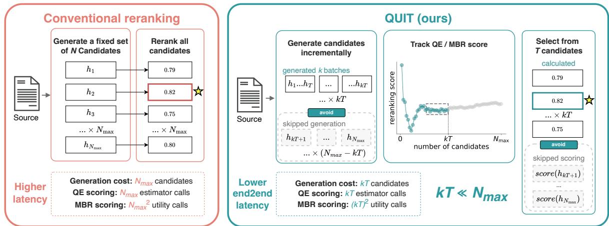
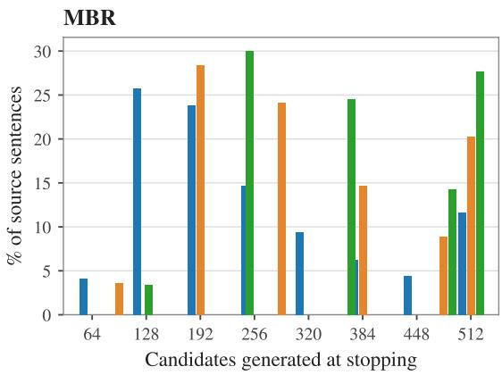
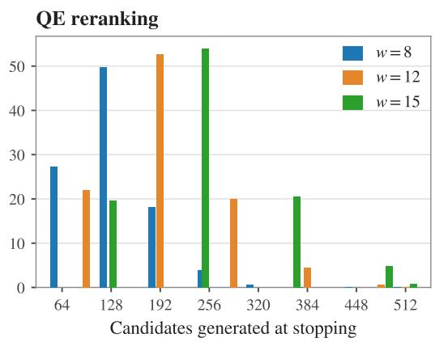
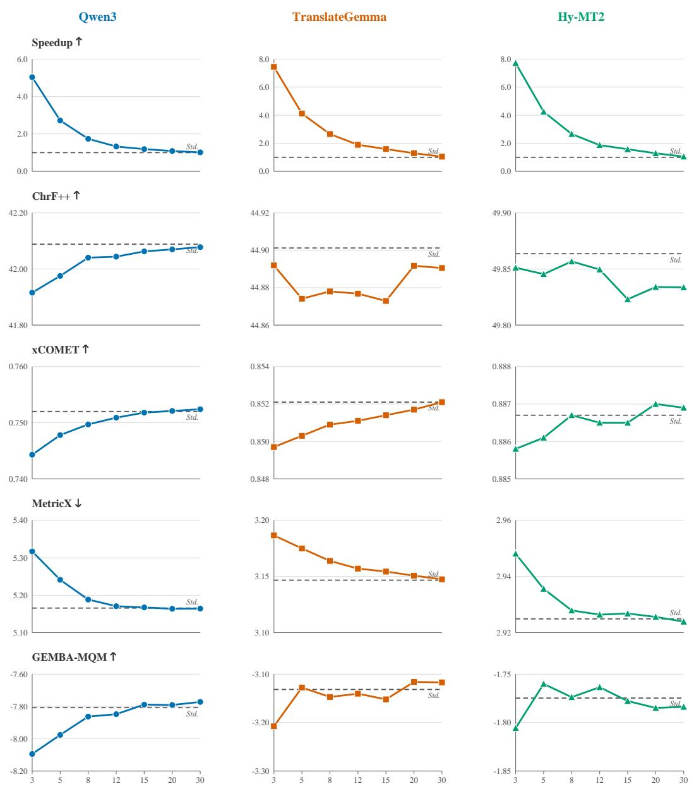
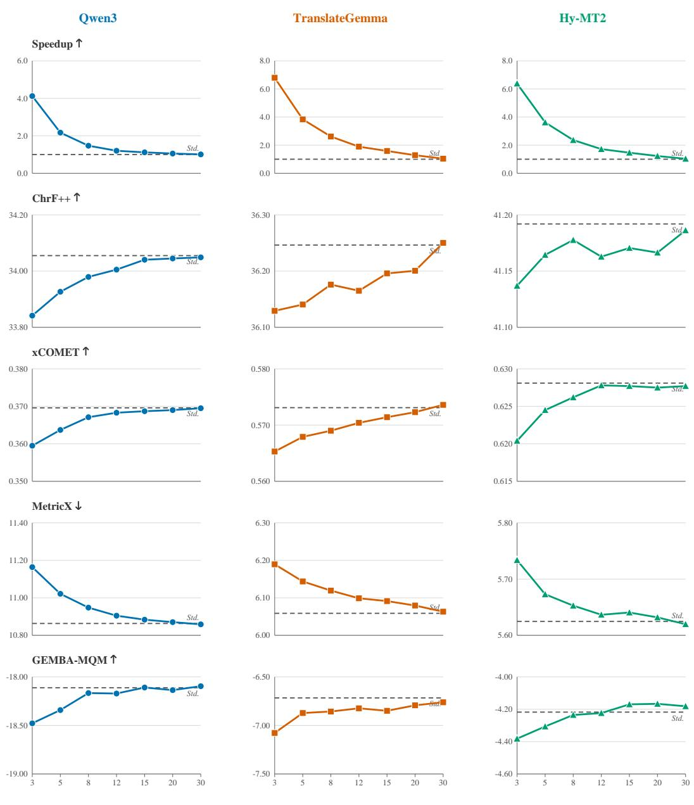
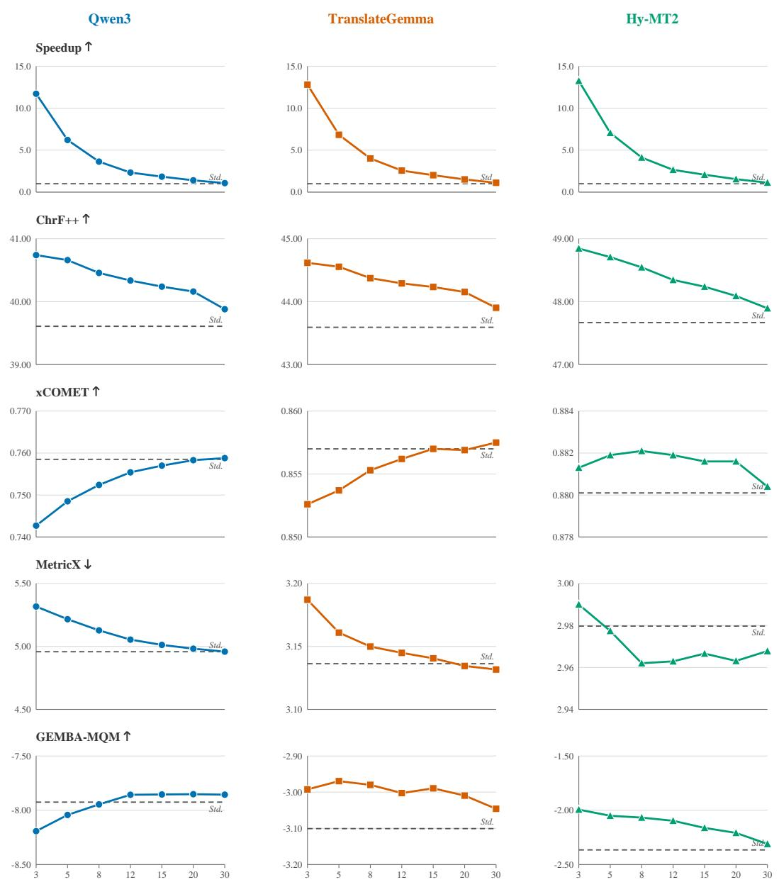
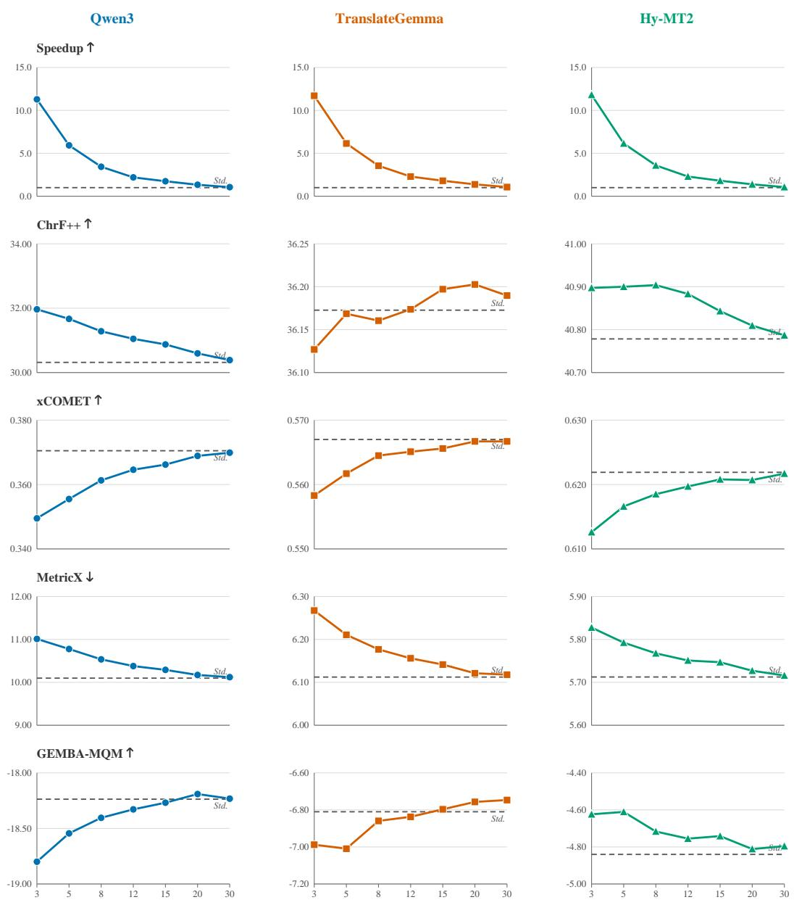

# Quit While You’re Ahead: QUIT for Efficient Candidate Generation in Machine Translation Reranking

Guangyu Chen\*1, Boxuan Lyu\*1,

Hidetaka Kamigaito2, Kotaro Funakoshi1, and Manabu Okumura1

1Institute of Science Tokyo, 2Nara Institute of Science and Technology {co\_gy,lyu,funakoshi,oku}@lr.first.iir.isct.ac.jp kamigaito.h@is.naist.jp

## Abstract

Reranking methods, such as Minimum Bayes Risk (MBR) decoding and Quality Estimation (QE) reranking, are widely used in modern neural machine translation (NMT) to select an output from a set of candidate hypotheses. However, the performance gains come at the cost of high inference latency. Existing acceleration methods target MBR decoding and reduce only reranking computation, leaving QE reranking unaddressed and candidate generation—which can be the larger computational bottleneck—largely untouched. In this work, we propose QUIT (Quantifying Uncertainty for Incremental Termination), a novel early-stopping strategy for the entire generation–reranking pipeline. Viewing candidate generation as a sequential decision under uncertainty, QUIT incrementally generates and reranks candidates, stopping when the highest estimated quality in the candidate set stabilizes. Comprehensive experiments on three NMT models across 19 language pairs show that QUIT yields end-to-end speedups of 1.47–2.66× for MBR and 3.43–4.12× for QE reranking while preserving translation quality within prespecified equivalence margins.

## 1 Introduction

Reranking is increasingly common in modern neural machine translation (NMT): a reranker selects the final output from a set of hypotheses generated by an NMT model. Reranking offers two advantages: (1) it bypasses model probability scores, which have been shown to correlate poorly with translation quality (Eikema and Aziz, 2020; Freitag et al., 2022), and (2) it flexibly adapts output selection to different inference-time objectives without requiring model retraining (Saunders et al., 2022). In recent WMT General Translation Shared Tasks, nearly all top-performing systems have used reranking during inference or for training-data construction (Kocmi et al., 2024, 2025). The predominant approaches are Minimum Bayes Risk (MBR) decoding (Kumar and Byrne, 2004; Tromble et al., 2008; Eikema and Aziz, 2020, 2022; Freitag et al., 2022; Fernandes et al., 2022) and Quality Estimation (QE) reranking (Fernandes et al., 2022), along with their variants.

Despite its effectiveness, reranking is computationally expensive because it generates many hypotheses and repeatedly invokes the reranker. While several methods have recently been proposed to accelerate MBR decoding (Cheng and Vlachos, 2023; Vamvas and Sennrich, 2024; Deguchi et al., 2024), they are specific to MBR and optimize only the reranking stage, without reducing the need for large candidate sets. To the best of our knowledge, no acceleration method has been developed for QE reranking. As large language model (LLM)-based NMT systems become more common, generating candidates with these large models can cost substantially more than reranking them.

An effective early-stopping signal must quantify how likely further candidate generation and reranking are to improve the current decision. We measure this uncertainty by how much the best available quality changes as the candidate set expands: when further expansion yields little improvement, the system can stop with low risk. At inference time, however, such quality information— for example, an evaluation metric computed against a human reference—is unavailable. We therefore propose QUIT (Quantifying Uncertainty for Incremental Termination), an uncertainty-guided early-stopping strategy for the entire generation– reranking pipeline. QUIT generates candidates incrementally (e.g., eight at a time) and updates their reranking scores. It uses recent variation in the best score as a practical uncertainty proxy and stops when that variation falls below a prespecified threshold. It therefore reduces both candidategeneration and reranking costs.

  
Figure 1: Overview of conventional reranking and QUIT. Conventional reranking generates the full candidate set and scores every candidate, whereas QUIT generates candidates incrementally, tracks the best reranking score, and stops once that score stabilizes. It thereby avoids generating and scoring unused candidates and reduces end-to-end latency.

Across three NMT models and the WMT24 (Kocmi et al., 2024) and WMT25 test sets, spanning 19 language pairs, QUIT achieves end-toend speedups of 1.47–2.66× for MBR and 3.43– 4.12× for QE reranking while remaining statistically equivalent to the unaccelerated baseline on nearly all external quality metrics. These results show that adaptive candidate generation is key to reducing end-to-end reranking latency.

## 2 NMT Reranking

Given a source sentence $s ,$ an NMT model with parameters θ defines a distribution $P _ { \theta } ( \cdot \mid s )$ over the hypothesis space H. Standard decoding approximately selects the most probable hypothesis, alfithough model probability is not always well aligned with translation quality. Reranking decouples hypothesis generation from final selection: a generation method, such as beam search or sampling, first constructs a candidate set ${ \mathcal { C } } = \{ h _ { 1 } , \ldots , h _ { N } \} \subset { \mathcal { H } }$ of size N, after which an external decision rule assigns each candidate a score. Let $s _ { r } ( h ; s , \mathcal { C } )$ denote a generic reranking score assigned to candidate $h \in { \mathcal { C } }$ for source s, with higher values indicating greater preference. The selected translation $\hat { y } _ { \eta }$ is

$$
\hat { y } _ { r } = \underset { h \in \mathcal { C } } { \operatorname { a r g m a x } } s _ { r } ( h ; s , \mathcal { C } ) .\tag{1}
$$

This separation makes it possible to select translations according to criteria that better reflect human preferences and to change the inference-time objective without retraining the NMT model. Performance, however, depends on both the coverage of C and the accuracy of the reranking score. A larger candidate set is more likely to contain a highquality translation, but it increases both generation and reranking costs. The following subsections introduce two widely used decision rules: Minimum Bayes Risk (MBR) decoding and Quality Estimation (QE) reranking.

## 2.1 Minimum Bayes Risk Decoding

MBR decoding instantiates the generic score $s _ { r }$ as an expected-utility score sMBR. Let ${ \boldsymbol { \mathcal { S } } } =$ $\{ h _ { s } ^ { ( m ) } \} _ { m = 1 } ^ { \bar { M } }$ denote M independently sampled support hypotheses, where $h _ { s } ^ { ( m ) } \sim P _ { \theta } ( \cdot \mid s )$ , and let $u ( h , h _ { s } )$ denote the utility of candidate h when a support hypothesis $h _ { s } \in \mathcal { S }$ serves as a pseudoreference. The Monte Carlo MBR score and the corresponding selected output are

$$
s _ { \mathrm { M B R } } ( h ; \mathcal { S } ) = \frac { 1 } { | S | } \sum _ { h _ { s } \in S } u ( h , h _ { s } ) ,\tag{2}
$$

$$
{ \hat { y } } _ { \mathrm { M B R } } = \operatorname * { a r g m a x } _ { h \in { \mathcal { C } } } s _ { \mathrm { M B R } } ( h ; { \mathcal { S } } ) .\tag{3}
$$

Here, sMBR plays the role of $s _ { r }$ in Equation 1. This uniform average is the standard Monte Carlo approximation to the expectation under the model distribution. In standard MBR decoding, the candidate and support sets are often identical, $\mathrm { i } . \mathrm { e } . , \mathcal { C } = \mathcal { S }$ Neural evaluation metrics can be used as u, allowing selection to target translation quality more directly than model probability. This benefit comes with a substantial computational cost: scoring all candidate–support pairs requires $\vert { \mathcal { C } } \vert \vert { \mathcal { S } } \vert$ utility evaluations and becomes quadratic in the candidate-set size when ${ \mathcal { C } } = { \mathcal { S } }$

## 2.2 Quality Estimation Reranking

QE predicts translation quality from the source sentence and a hypothesis without access to a reference translation. It instantiates $s _ { r }$ as a reference-free score $s _ { \mathrm { Q E } } ( h ; s )$ , which denotes the predicted quality of candidate h given the source sentence s and does not depend on the other candidates in C. The QE-selected output is

$$
\hat { y } _ { \mathrm { Q E } } = \underset { h \in \mathcal { C } } { \mathrm { a r g m a x } } s _ { \mathrm { Q E } } ( h ; s ) .\tag{4}
$$

Unlike MBR, QE reranking scores each candidate independently against the source and therefore requires |C| reranker evaluations. Nevertheless, both methods conventionally generate the full candidate set before making a decision. They therefore use the full candidate budget regardless of the stability of the current reranking decision. QUIT addresses this limitation by adaptively determining when to stop expanding the candidate set for each source sentence.

## 3 Proposed Method: QUIT

Conventional reranking generates a fixed-size candidate set before selecting an output. Let $N _ { \mathrm { m a x } }$ denote the maximum candidate budget. QUIT instead constructs this set incrementally and may stop before it is complete. Candidates are generated in batches of $k ,$ so after generation step i, a total of ik candidates have been generated. Assuming that k divides $N _ { \mathrm { m a x } }$ , the candidate count grows as

$$
0 < k < 2 k < \cdots < N _ { \mathrm { m a x } } .\tag{5}
$$

For $i \in \{ 1 , \ldots , N _ { \operatorname* { m a x } } / k \}$ , define the partial candidate set after step i as

$$
\mathcal { C } _ { i } = \{ h _ { 1 } , \ldots , h _ { i k } \} , \qquad | \mathcal { C } _ { i } | = i k .\tag{6}
$$

Thus, these sets are nested:

$$
\mathcal { C } _ { 1 } \subset \mathcal { C } _ { 2 } \subset \cdots \subset \mathcal { C } _ { N _ { \mathrm { m a x } } / k } .\tag{7}
$$

Let $s _ { r }$ be any reranking function for which higher scores are better. Let $\hat { y } _ { i }$ denote the translation selected after generation step i:

$$
\hat { y } _ { i } = \underset { h \in \mathcal { C } _ { i } } { \operatorname { a r g m a x } } s _ { r } ( h ; s , \mathcal { C } _ { i } ) .\tag{8}
$$

We view this sequential expansion as a decision under uncertainty: at each step, the system must determine whether the current candidate set is sufficient or further candidates are likely to improve the decision.

Algorithm 1: QUIT   
1 procedure QUIT(s, sr, k, w, α, Nmax)   
▷ Initialize the candidate set   
and score buffer   
2 C ← ∅   
3 R ← [ ]   
4 i ← 0   
5 while ik $< N _ { \mathrm { m a x } }$ do   
6 i ← i + 1   
7 Generate k new candidates and add   
them to C   
8 yˆ ← argmax sr(h; s, C)   
h∈C   
9 R ← max sr(h; s, C)   
h∈C   
10 Append R to R   
11 if |R| = w then   
12 ∆ ← maxR − minR   
13 if $\Delta \leq \alpha$ then   
14 return yˆ   
15 else   
▷ Start a new   
non-overlapping   
window   
16 R ← [ ]   
17 return yˆ

Uncertainty Criterion Ideally, we would have access to a reference-based quality function $q ( h , y _ { s } ^ { \mathrm { r e f } } )$ that evaluates any candidate h against a human reference $y _ { s } ^ { \mathrm { r e f } }$ , with higher scores indicating better translation quality. The best reference-based quality available in the candidate set at step i would then be

$$
Q _ { i } ( s ) : = \operatorname* { m a x } _ { h \in \mathcal { C } _ { i } } q ( h , y _ { s } ^ { \mathrm { r e f } } ) .\tag{9}
$$

Given a window size w, let

$$
\boldsymbol { B _ { b } } = \{ ( b - 1 ) w + 1 , \ldots , b w \}\tag{10}
$$

denote the b-th non-overlapping window of generation steps, where $b \in \{ 1 , \dots , \lfloor N _ { \operatorname* { m a x } } / ( k w ) \rfloor \}$ . The trajectory $\{ Q _ { i } ( s ) \}$ shows how the best referencebased quality changes as the candidate set expands. We measure its within-window variation by the range

$$
\Delta _ { b } ^ { Q } ( s ) = \operatorname* { m a x } _ { j \in \mathcal { B } _ { b } } Q _ { j } ( s ) - \operatorname* { m i n } _ { j \in \mathcal { B } _ { b } } Q _ { j } ( s ) .\tag{11}
$$

A large $\Delta _ { b } ^ { Q } ( s )$ indicates that additional candidates continue to improve the best available quality and hence that stopping is risky, whereas a small value indicates low uncertainty. Thus, a value below the threshold indicates that the best available quality remained stable as the candidate set grew, providing a natural stopping signal. Given a convergence threshold $\alpha ,$ the ideal stopping step is

$$
T = \operatorname* { m i n } \left\{ b w : \Delta _ { b } ^ { Q } ( s ) \leq \alpha \right\} ,\tag{12}
$$

and QUIT returns $\hat { y } _ { T }$ . If the condition is never met, generation continues until the full budget $N _ { \mathrm { m a x } }$ is reached, and QUIT returns $\hat { y } _ { N _ { \mathrm { m a x } } / k }$

Practical Proxy At inference time, the human reference—and therefore the oracle uncertainty $\Delta _ { b } ^ { Q } ( s )$ —is unavailable. QUIT instead tracks the best reranking score:

$$
R _ { i } ( s ) : = \operatorname* { m a x } _ { h \in \mathcal { C } _ { i } } s _ { r } ( h ; s , \mathcal { C } _ { i } ) .\tag{13}
$$

We use this score as a practical proxy for the best reference-based quality:

$$
Q _ { i } ( s ) \approx R _ { i } ( s ) .\tag{14}
$$

This induces the reference-free uncertainty proxy:

$$
\Delta _ { b } ^ { R } ( s ) = \operatorname* { m a x } _ { j \in \mathcal { B } _ { b } } R _ { j } ( s ) - \operatorname* { m i n } _ { j \in \mathcal { B } _ { b } } R _ { j } ( s ) .\tag{15}
$$

Replacing $\Delta _ { b } ^ { Q } ( s )$ with $\Delta _ { b } ^ { R } ( s )$ in the criterion above yields the practical form of QUIT, which stops at the first window for which $\Delta _ { b } ^ { R } ( s ) \leq$ α and is summarized in Algorithm 1.

## 4 Experiments

## 4.1 Experimental Setup

Datasets and NMT Models We used the complete test sets from the WMT24 (Kocmi et al., 2024) and WMT25 (Kocmi et al., 2025) General Translation Shared Tasks, which together cover 19 language pairs. We evaluated three NMT models from two categories. Qwen3 (Qwen3-8B) (Yang et al., 2025) is a general-purpose LLM without translation-specific fine-tuning, whereas TranslateGemma (translategemma-12b-it) (Finkelstein et al., 2026) and Hy-MT2 (Hy-MT2-30B-A3B) (Zheng et al., 2026) are translation-specialized models. For each source sentence, we set the maximum candidate budget to $N _ { \mathrm { m a x } } = 5 1 2$ and used ancestral sampling with a temperature of 1.2.

Acceleration Baselines For MBR, we additionally compared against PruneMBR (Cheng and Vlachos, 2023) and PMBR (Trabelsi et al., 2024), which accelerate MBR computation while retaining the full budget.

QUIT Hyperparameters We fixed the generation batch size at $k \ = \ 8$ and the convergence threshold $\alpha = 1 0 ^ { - 3 } .$ , and evaluated window sizes w ∈ {3, 5, 8, 12, 15, 20, 30}. The main results report w ∈ {8, 12, 15}, with complete results provided in Appendix A. An ablation of α is reported in Appendix C.

Rerankers We considered two reranking paradigms that are widely used in NMT: MBR decoding and QE reranking. For MBR, we used COMET-22 (wmt22-comet-da) (Rei et al., 2022a) as the pairwise utility function; for QE reranking, we used CometKiwi-22 (wmt22-cometkiwi-da) (Rei et al., 2022b) as the QE model. Because newer rerankers are substantially larger, evaluating them at our experimental scale would be prohibitively expensive; we therefore excluded them.

Quality Evaluation We evaluated translation quality using three complementary classes of automatic metrics that correlate strongly with human judgments. We used ChrF++ (Popovic´, 2015) as a surface-form metric; xCOMET (XCOMET-XXL) (Guerreiro et al., 2024) and MetricX (metricx-24-hybrid-xl-v2p6) (Juraska et al., 2024) as learned neural metrics; and GEMBA (GEMBA-MQM) (Kocmi and Federmann, 2023), instantiated with Gemma-4-31B (gemma-4-31B-it) (Team et al., 2026), as an LLMbased metric. Because GEMBA is methodologically distinct from the COMET-family rerankers, it provides an independent check and reduces the risk that the evaluator favors outputs optimized by a similar metric. We also report the COMET-22 and CometKiwi-22 reranking scores to measure how closely early stopping preserves each reranker’s preferences. To verify that these efficiency gains do not come at a practically meaningful cost in quality, we additionally ran paired-bootstrap TOST equivalence tests (Schuirmann, 1987) with 10,000 resamples against the unaccelerated baseline for every metric. For each metric, we defined $\sigma$ as the baseline segment-level standard deviation and used equivalence margins of 0.05σ and, as a stricter criterion, 0.02σ.

<table><tr><td>NMT Model</td><td>Reranker Acceleration</td><td></td><td>Speedup ↑ Rerank. ↑</td><td></td><td>ChrF++ ↑ xCOMET ↑ MetricX ↓ GEMBA ↑</td><td></td><td></td><td></td></tr><tr><td rowspan="10">Qwen3</td><td rowspan="5">MBR</td><td>Unaccelerated (512)</td><td>1.00</td><td>.8357</td><td>42.09</td><td>.7520</td><td>5.17</td><td>-7.81</td></tr><tr><td>PruneMBR</td><td>1.05</td><td> $. 8 3 5 5 ^ { \dagger \dagger }$ </td><td> $4 2 . 0 7 ^ { \dagger \dagger }$ </td><td> $. 7 5 1 9 ^ { \dagger \dagger }$ </td><td> $5 . 1 7 ^ { \dagger \dagger }$ </td><td> $- 7 . 7 7 ^ { \dag \dag }$ </td></tr><tr><td>PMBR</td><td>1.03</td><td> $. 8 3 5 2 ^ { \dagger \dagger }$ </td><td> $4 2 . 1 1 ^ { \dagger \dagger }$ </td><td> $. 7 5 1 6 ^ { \dagger \dagger }$ </td><td> $5 . 1 7 ^ { \dagger \dagger }$ </td><td> $- 7 . 7 9 ^ { \dagger \dagger }$ </td></tr><tr><td>QUIT (w = 8)</td><td>1.74</td><td> $. 8 3 4 4 ^ { \dagger \dagger }$ </td><td> $4 2 . 0 4 ^ { \dag \dag }$ </td><td> $. 7 4 9 7 ^ { \dagger \dagger }$ </td><td> $5 . 1 9 ^ { \dagger \dagger }$ </td><td> $- 7 . 8 6 ^ { \dag \dag }$ </td></tr><tr><td> $\mathrm { Q U I T } \left( w = 1 2 \right)$ </td><td>1.33</td><td> $. 8 3 5 2 ^ { \dagger \dagger }$ </td><td> $4 2 . 0 4 ^ { \dag \dag }$ </td><td> $. 7 5 0 9 ^ { \dag \dag }$ </td><td> $5 . 1 7 ^ { \dagger \dagger }$ </td><td> $- 7 . 8 5 ^ { \dagger \dagger }$ </td></tr><tr><td></td><td>QUIT (w = 15)</td><td>1.19</td><td> $. 8 3 5 5 ^ { \dagger \dagger }$ </td><td> $4 2 . 0 6 ^ { \dag \dag }$ </td><td> $. 7 5 1 8 ^ { \dagger \dagger }$ </td><td> $5 . 1 7 ^ { \dagger \dagger }$ </td><td> $- 7 . 7 9 ^ { \dagger \dagger }$ </td></tr><tr><td rowspan="4">QE</td><td>Unaccelerated (512)</td><td>1.00</td><td>.8223</td><td>39.61</td><td>.7585</td><td>4.96</td><td>-7.93</td></tr><tr><td>QUIT (w = 8)</td><td>3.64</td><td>.8133</td><td> $4 0 . 4 6 ^ { \dagger }$ </td><td> $. 7 5 2 4 ^ { \dagger }$ </td><td> $5 . 1 3 ^ { \dagger }$ </td><td> $- 7 . 9 5 ^ { \dag \dag }$ </td></tr><tr><td> $\mathrm { Q U I T } \left( w = 1 2 \right)$ </td><td>2.33</td><td>.8165</td><td> $4 0 . 3 4 ^ { \dagger }$ </td><td> $. 7 5 5 4 ^ { \dagger \dagger }$ </td><td> $5 . 0 5 ^ { \dagger }$ </td><td> $- 7 . 8 6 ^ { \dag \dag }$ </td></tr><tr><td> $\mathrm { Q U I T } \left( w = 1 5 \right)$ </td><td>1.84</td><td>.8180</td><td> $4 0 . 2 4 ^ { \dagger }$ </td><td> $. 7 5 7 0 ^ { \dagger \dagger }$ </td><td> $5 . 0 1 ^ { \dag \dag }$ </td><td> $- 7 . 8 5 ^ { \dagger \dagger }$ </td></tr><tr><td rowspan="9">TranslateGemma</td><td rowspan="6">MBR</td><td>Unaccelerated (512)</td><td>1.00</td><td>.8570</td><td>44.90</td><td>.8521</td><td>3.15</td><td>-3.13</td></tr><tr><td>PruneMBR</td><td>1.04</td><td> $. 8 5 7 0 ^ { \dagger \dagger }$ </td><td> $4 4 . 8 8 ^ { \dagger \dagger }$ </td><td> $. 8 5 2 0 ^ { \dagger \dagger }$ </td><td> $3 . 1 5 ^ { \dagger \dagger }$ </td><td> $- 3 . 1 2 ^ { \dag \dag }$ </td></tr><tr><td>PMBR</td><td>1.03</td><td> $. 8 5 6 6 ^ { \dag \dag }$ </td><td> $4 4 . 9 1 ^ { \dag \dag }$ </td><td> $. 8 5 1 8 ^ { \dagger \dagger }$ </td><td> $3 . 1 5 ^ { \dagger \dagger }$ </td><td> $- 3 . 1 4 ^ { \dag \dagger }$ </td></tr><tr><td> $\mathrm { Q U I T } \left( w = 8 \right)$ </td><td>2.66</td><td> $. 8 5 6 6 ^ { \dag \dag }$ </td><td> $4 4 . 8 8 ^ { \dagger \dagger }$ </td><td> $. 8 5 0 9 ^ { \dag \dag }$ </td><td> $3 . 1 6 ^ { \dag \dag }$ </td><td> $- 3 . 1 5 ^ { \dag \dag }$ </td></tr><tr><td> $\mathrm { Q U I T } \left( w = 1 2 \right)$ </td><td>1.89</td><td> $. 8 5 6 8 ^ { \dagger \dagger }$ </td><td> $4 4 . 8 8 ^ { \dagger \dagger }$ </td><td> $. 8 5 1 1 ^ { \dagger \dagger }$ </td><td> $3 . 1 6 ^ { \dag \dag }$ </td><td> $- 3 . 1 4 ^ { \dag \dagger }$ </td></tr><tr><td>QUIT (w = 15)</td><td>1.59</td><td> $. 8 5 6 9 ^ { \dagger \dagger }$ </td><td> $4 4 . 8 7 ^ { \dagger \dagger }$ </td><td> $. 8 5 1 4 ^ { \dagger \dagger }$ </td><td> $3 . 1 5 ^ { \dagger \dagger }$ </td><td> $- 3 . 1 5 ^ { \dag \dag }$ </td></tr><tr><td rowspan="3">QE</td><td>Unaccelerated (512)</td><td>1.00</td><td>.8376</td><td> $4 3 . 5 9$ </td><td>.8570</td><td> $3 . 1 4$ </td><td>-3.10</td></tr><tr><td>QUIT (w = 8)</td><td>4.01</td><td>.8327</td><td> $4 4 . 3 7 ^ { \dagger }$ </td><td> $. 8 5 5 3 ^ { \dagger \dagger }$ </td><td> $3 . 1 5 ^ { \dagger \dagger }$ </td><td> $- 2 . 9 8 ^ { \dagger }$ </td></tr><tr><td> $\mathrm { Q U I T } \left( w = 1 2 \right)$ </td><td>2.57</td><td>.8344</td><td> $4 4 . 2 9 ^ { \dagger }$ </td><td> $. 8 5 6 2 ^ { \dag \dag }$ </td><td> $3 . 1 4 ^ { \dag \dagger }$ </td><td> $- 3 . 0 0 ^ { \dag }$ </td></tr><tr><td rowspan="9">MBR</td><td rowspan="6"></td><td> $\mathrm { Q U I T } \left( w = 1 5 \right)$ </td><td>2.02</td><td>.8352†</td><td> $4 4 . 2 3 ^ { \dagger }$ </td><td> $. 8 5 7 0 ^ { \dagger \dagger }$ </td><td> $3 . 1 4 ^ { \dag \dagger }$ </td><td> $- 2 . 9 9 ^ { \dagger }$ </td></tr><tr><td>Unaccelerated (512) PruneMBR</td><td>1.00</td><td>.8731</td><td> $4 9 . 8 6$ </td><td>.8867</td><td>2.92</td><td>-1.77</td></tr><tr><td></td><td>1.02</td><td> $. 8 7 3 2 ^ { \dagger \dagger }$ </td><td> $4 9 . 8 7 ^ { \dagger \dagger }$ </td><td> $. 8 8 6 8 ^ { \dagger \dagger }$ </td><td> $2 . 9 2 ^ { \dagger \dagger }$ </td><td> $- 1 . 7 9 ^ { \dagger \dagger }$ </td></tr><tr><td>PMBR</td><td>1.02</td><td> $. 8 7 2 8 ^ { \dagger \dagger }$ </td><td> $4 9 . 8 7 ^ { \dagger \dagger }$ </td><td> $. 8 8 6 6 ^ { \dag \dag }$ </td><td> $2 . 9 3 ^ { \dagger \dagger }$ </td><td> $- 1 . 7 9 ^ { \dagger \dagger }$ </td></tr><tr><td> $\mathrm { Q U I T } \left( w = 8 \right)$ </td><td>2.66</td><td> $. 8 7 2 8 ^ { \dagger \dagger }$ </td><td> $4 9 . 8 6 ^ { \dag \dag }$ </td><td> $. 8 8 6 7 ^ { \dagger \dagger }$ </td><td> $2 . 9 3 ^ { \dagger \dagger }$ </td><td> $- 1 . 7 7 ^ { \dag \dag }$ </td></tr><tr><td> $\mathrm { Q U I T } \left( w = 1 2 \right)$   $\mathrm { Q U I T } \left( w = 1 5 \right)$ </td><td>1.87 1.58</td><td> $. 8 7 3 0 ^ { \dagger \dagger }$ </td><td> $4 9 . 8 5 ^ { \dagger \dagger }$   $4 9 . 8 2 ^ { \dagger \dagger }$ </td><td> $. 8 8 6 5 ^ { \dagger \dagger }$   $. 8 8 6 5 ^ { \dagger \dagger }$ </td><td> $2 . 9 3 ^ { \dagger \dagger }$   $2 . 9 3 ^ { \dagger \dagger }$ </td><td> $- 1 . 7 6 ^ { \dag \dag }$ </td></tr><tr><td></td><td></td><td></td><td> $. 8 7 3 0 ^ { \dagger \dagger }$ </td><td></td><td></td><td></td><td> $- 1 . 7 8 ^ { \dag \dag }$ </td></tr><tr><td rowspan="4">QE</td><td>Unaccelerated (512)</td><td>1.00</td><td>.8366</td><td> $4 7 . 6 7 $ </td><td>.8801</td><td>2.98</td><td>-2.37</td></tr><tr><td> $\mathrm { Q U I T } \left( w = 8 \right)$   $\mathrm { Q U I T } \left( w = 1 2 \right)$ </td><td>4.12 2.65</td><td>.8317</td><td> $4 8 . 5 4 ^ { \dagger }$   $4 8 . 3 4 ^ { \dagger }$ </td><td> $. 8 8 2 1 ^ { \dagger \dagger }$   $. 8 8 1 9 ^ { \dagger \dagger }$ </td><td> $2 . 9 6 ^ { \dag \dag }$   $2 . 9 6 ^ { \dag \dag }$ </td><td>-2.07 -2.10</td></tr><tr><td> $\mathrm { Q U I T } \left( w = 1 5 \right)$ </td><td></td><td>.8332 .8340†</td><td> $4 8 . 2 4 ^ { \dagger }$ </td><td> $. 8 8 1 6 ^ { \dagger \dagger }$ </td><td> $2 . 9 7 ^ { \dagger \dagger }$ </td><td>-2.16†</td></tr><tr><td></td><td>2.08</td><td></td><td></td><td></td><td></td><td></td></tr></table>

Table 1: Main results on WMT24. The reranking score is COMET-22 for MBR and CometKiwi-22 for QE. † marks scores that are statistically equivalent to the unaccelerated baseline within a prespecified margin of 0.05σ, and †† marks equivalence within a stricter margin of 0.02σ. No indicator is shown when a score is better than the unaccelerated baseline. Speedup is measured end to end relative to that baseline.

Efficiency Evaluation For efficiency, we report end-to-end speedup relative to unaccelerated reranking. End-to-end time includes both candidate generation and reranking, and the accelerated and unaccelerated systems were measured under identical hardware conditions.

## 4.2 Experimental Results

is the maximum over the candidate set, it is nondecreasing with candidate-set size and therefore inherently favors the full 512-candidate set. Increasing the window size to 12 or 15 traded part of this speedup for reranking and evaluation scores closer to those of the unaccelerated baseline. In contrast, PruneMBR and PMBR reached at most 1.05× end-to-end speedup because candidate generation remained unchanged. Overall, QUIT provides substantial end-to-end speedups while preserving translation quality relative to the unaccelerated baseline.

Tables 1 and 2 summarize the main quality– efficiency trade-off on the two test suites. The smallest reported window size, $w = 8 ,$ , yielded the largest speedups: 1.47–2.66× for MBR and 3.43– 4.12× for QE across the evaluated model–test-set combinations. The corresponding translations were statistically equivalent to the unaccelerated baseline on nearly all external quality metrics, with several scores even improving over the baseline. Some QE reranking scores did not pass the equivalence test; however, because the reported score

## 5 Discussion

## 5.1 Does the stopping signal capture uncertainty?

Here, we directly examine whether QUIT’s inference-time signal $\Delta _ { b } ^ { R } ( s )$ captures the uncerwhere $\mathrm { { A U C } _ { \mathrm { { u n s } } } }$ is the area under the rejection curve induced by $\Delta _ { b } ^ { R } ( s )$ , and $\mathrm { A U C } _ { \mathrm { o r a c l e } }$ and $\mathrm { A U C } _ { \mathrm { r n d } }$ are obtained from the oracle and random rankings, respectively. A value of 1 indicates oracleequivalent risk ranking, whereas 0 indicates random ranking; Appendix D summarizes the evaluation procedure.

<table><tr><td>NMT Model</td><td>Reranker Acceleration</td><td></td><td>Speedup ↑ Rerank. ↑</td><td></td><td>ChrF++ ↑ xCOMET ↑ MetricX↓</td><td></td><td></td><td>GEMBA ↑</td></tr><tr><td rowspan="10">Qwen3</td><td rowspan="5">MBR</td><td>Unaccelerated (512)</td><td>1.00</td><td>.7345</td><td>34.06</td><td>.3696</td><td>10.86</td><td>-18.11</td></tr><tr><td>PruneMBR</td><td>1.02</td><td> $. 7 3 4 4 ^ { \dagger \dagger }$ </td><td> $3 4 . 0 4 ^ { \dag \dag }$ </td><td> $. 3 6 9 2 ^ { \dagger \dagger }$ </td><td> $1 0 . 8 6 ^ { \dagger \dagger }$ </td><td> $- 1 8 . 1 0 ^ { \dag \dag }$ </td></tr><tr><td>PMBR</td><td>1.01</td><td> $. 7 3 3 9 ^ { \dagger \dagger }$ </td><td> $3 4 . 0 7 ^ { \dagger \dagger }$ </td><td> $. 3 6 8 9 ^ { \dagger \dagger }$ </td><td> $1 0 . 8 8 ^ { \dagger \dagger }$ </td><td> $- 1 8 . 1 7 ^ { \dagger \dagger }$ </td></tr><tr><td>QUIT (w = 8)</td><td>1.47</td><td> $. 7 3 2 2 ^ { \dagger \dagger }$ </td><td> $3 3 . 9 8 ^ { \dagger \dagger }$ </td><td> $. 3 6 7 1 ^ { \dagger \dagger }$ </td><td> $1 0 . 9 5 ^ { \dagger \dagger }$ </td><td> $- 1 8 . 1 7 ^ { \dagger \dagger }$ </td></tr><tr><td>QUIT (w = 12)</td><td>1.20</td><td> $. 7 3 3 6 ^ { \dagger \dagger }$ </td><td> $3 4 . 0 1 ^ { \dag \dag }$ </td><td> $. 3 6 8 3 ^ { \dagger \dagger }$ </td><td> $1 0 . 9 0 ^ { \dagger \dagger }$ </td><td> $- 1 8 . 1 7 ^ { \dagger \dagger }$ </td></tr><tr><td></td><td>QUIT (w = 15)</td><td>1.12</td><td> $. 7 3 4 0 ^ { \dagger \dagger }$ </td><td> $3 4 . 0 4 ^ { \dag \dag }$ </td><td> $. 3 6 8 7 ^ { \dagger \dagger }$ </td><td> $1 0 . 8 8 ^ { \dagger \dagger }$ </td><td> $- 1 8 . 1 1 ^ { \dag \dagger }$ </td></tr><tr><td rowspan="4">QE</td><td>Unaccelerated (512)</td><td>1.00</td><td>.7106</td><td>30.32</td><td>.3705</td><td>10.10</td><td>-18.24</td></tr><tr><td>QUIT (w = 8)</td><td>3.43</td><td>.6935</td><td>31.28</td><td> $. 3 6 1 3 ^ { \dagger }$ </td><td>10.54</td><td> $- 1 8 . 4 0 ^ { \dagger }$ </td></tr><tr><td>QUIT (w = 12)</td><td>2.19</td><td>.6996</td><td> $3 1 . 0 5 ^ { \dagger }$ </td><td> $. 3 6 4 6 ^ { \dagger }$ </td><td>10.38</td><td> $- 1 8 . 3 3 ^ { \dagger }$ </td></tr><tr><td>QUIT (w = 15)</td><td>1.74</td><td>.7029</td><td> $3 0 . 8 7 ^ { \dagger }$ </td><td> $. 3 6 6 2 ^ { \dagger }$ </td><td>10.29†</td><td> $- 1 8 . 2 7 ^ { \dag \dag }$ </td></tr><tr><td rowspan="9">TranslateGemma</td><td rowspan="6">MBR</td><td>Unaccelerated (512)</td><td>1.00</td><td>.8129</td><td>36.25</td><td>.5731</td><td>6.06</td><td>-6.72</td></tr><tr><td>PruneMBR</td><td>1.01</td><td> $. 8 1 2 9 ^ { \dagger \dagger }$ </td><td> $3 6 . 2 5 ^ { \dag \dag }$ </td><td> $. 5 7 3 5 ^ { \dagger \dagger }$ </td><td> $6 . 0 6 ^ { \dag \dag }$ </td><td> $- 6 . 7 2 ^ { \dag \dag }$ </td></tr><tr><td>PMBR</td><td>1.01</td><td> $. 8 1 2 5 ^ { \dagger \dagger }$ </td><td> $3 6 . 2 2 ^ { \dag \dag }$ </td><td> $. 5 7 1 7 ^ { \dagger \dagger }$ </td><td> $6 . 0 8 ^ { \dag \dag }$ </td><td> $- 6 . 8 5 ^ { \dagger }$ </td></tr><tr><td> $\mathrm { Q U I T } \left( w = 8 \right)$ </td><td>2.61</td><td> $. 8 1 1 2 ^ { \dagger \dagger }$ </td><td> $3 6 . 1 8 ^ { \dag \dag }$ </td><td> $. 5 6 9 0 ^ { \dagger }$ </td><td> $6 . 1 2 ^ { \dagger }$ </td><td> $- 6 . 8 6 ^ { \dag }$ </td></tr><tr><td> $\mathrm { Q U I T } \left( w = 1 2 \right)$ </td><td>1.89</td><td> $. 8 1 1 9 ^ { \dagger \dagger }$ </td><td> $3 6 . 1 6 ^ { \dag \dag }$ </td><td> $. 5 7 0 4 ^ { \dag \dag }$ </td><td> $6 . 1 0 ^ { \dag \dag }$ </td><td> $- 6 . 8 2 ^ { \dagger }$ </td></tr><tr><td>QUIT (w = 15)</td><td>1.59</td><td> $. 8 1 2 3 ^ { \dagger \dagger }$ </td><td> $3 6 . 2 0 \dot { ^ { 1 } } \dot { ^ { 1 } }$ </td><td> $. 5 7 1 4 ^ { \dagger \dagger }$ </td><td> $6 . 0 9 ^ { \dag \dag }$ </td><td> $- 6 . 8 5 ^ { \dagger }$ </td></tr><tr><td rowspan="4">QE</td><td>Unaccelerated (512)</td><td>1.00</td><td>.7721</td><td>36.17</td><td>.5670</td><td>6.11</td><td>-6.81</td></tr><tr><td>QUIT (w = 8)</td><td>3.55</td><td>.7657</td><td> $3 6 . 1 6 ^ { \dag \dag }$ </td><td> $. 5 6 4 5 ^ { \dagger \dagger }$ </td><td> $6 . 1 8 ^ { \dagger }$ </td><td> $- 6 . 8 6 ^ { \dag }$ </td></tr><tr><td> $\mathrm { Q U I T } \left( w = 1 2 \right)$ </td><td>2.29</td><td>.7680</td><td> $3 6 . 1 7 ^ { \dagger \dagger }$ </td><td> $. 5 6 5 1 ^ { \dag \dag }$ </td><td> $6 . 1 6 ^ { \dag \dag }$ </td><td> $- 6 . 8 4 ^ { \dag \dag }$ </td></tr><tr><td> $\mathrm { Q U I T } \left( w = 1 5 \right)$ </td><td>1.80</td><td>.7692†</td><td> $3 6 . 2 0 \dot { ^ { 1 } } \dot { ^ { 1 } }$ </td><td> $. 5 6 5 6 ^ { \dag \dag }$ </td><td> $6 . 1 4 ^ { \dag \dagger }$ </td><td> $- 6 . 8 0 ^ { \dag \dag }$ </td></tr><tr><td rowspan="9">Hy-MT2</td><td rowspan="6">MBR</td><td>Unaccelerated (512)</td><td>1.00</td><td>.8298</td><td>41.19</td><td>.6281</td><td>5.62</td><td>-4.22</td></tr><tr><td>PruneMBR</td><td>1.01</td><td> $. 8 2 9 8 ^ { \dagger \dagger }$ </td><td> $4 1 . 2 0 ^ { \dag \dag }$ </td><td> $. 6 2 7 8 ^ { \dagger \dagger }$ </td><td> $5 . 6 2 ^ { \dagger \dagger }$ </td><td> $- 4 . 1 9 ^ { \dagger \dagger }$ </td></tr><tr><td>PMBR</td><td>1.01</td><td> $. 8 2 9 4 ^ { \dagger \dagger }$ </td><td> $4 1 . 1 9 ^ { \dagger \dagger }$ </td><td> $. 6 2 7 9 ^ { \dagger \dagger }$ </td><td> $5 . 6 3 ^ { \dagger \dagger }$ </td><td> $- 4 . 1 6 ^ { \dag \dag }$ </td></tr><tr><td>QUIT (w = 8)</td><td>2.36</td><td> $. 8 2 8 9 ^ { \dagger \dagger }$ </td><td> $4 1 . 1 8 ^ { \dagger \dagger }$ </td><td> $. 6 2 6 2 ^ { \dagger \dagger }$ </td><td> $5 . 6 5 ^ { \dagger \dagger }$ </td><td> $- 4 . 2 4 ^ { \dag \dag }$ </td></tr><tr><td>QUIT (w = 12)</td><td>1.72</td><td> $. 8 2 9 2 ^ { \dagger \dagger }$ </td><td> $4 1 . 1 6 ^ { \dag \dag }$ </td><td> $. 6 2 7 8 ^ { \dagger \dagger }$ </td><td> $5 . 6 4 ^ { \dagger \dagger }$ </td><td> $- 4 . 2 2 ^ { \dagger \dagger }$ </td></tr><tr><td>QUIT (w = 15)</td><td>1.46</td><td> $. 8 2 9 5 ^ { \dagger \dagger }$ </td><td> $4 1 . 1 7 ^ { \dagger \dagger }$ </td><td> $. 6 2 7 7 ^ { \dagger \dagger }$ </td><td> $5 . 6 4 ^ { \dagger \dagger }$ </td><td> $- 4 . 1 7 ^ { \dagger \dagger }$ </td></tr><tr><td></td><td>Unaccelerated (512)</td><td>1.00</td><td>.7786</td><td>40.78</td><td>.6219</td><td>5.71</td><td>-4.84</td></tr><tr><td rowspan="4">QE</td><td>QUIT (w = 8)</td><td>3.59</td><td>.7725</td><td> $4 0 . 9 0 ^ { \dagger \dagger }$ </td><td> $. 6 1 8 5 ^ { \dagger }$ </td><td> $5 . 7 7 ^ { \dagger }$ </td><td> $- 4 . 7 2 ^ { \dagger }$ </td></tr><tr><td>QUIT (w = 12)</td><td>2.29</td><td>.7747</td><td> $4 0 . 8 8 ^ { \dagger \dagger }$ </td><td> $. 6 1 9 7 ^ { \dagger \dagger }$ </td><td> $5 . 7 5 ^ { \dagger \dagger }$ </td><td> $- 4 . 7 6 ^ { \dag }$ </td></tr><tr><td>QUIT (w = 15)</td><td>1.81</td><td>.7759†</td><td> $4 0 . 8 4 ^ { \dagger \dagger }$ </td><td> $. 6 2 0 8 ^ { \dagger \dagger }$ </td><td> $5 . 7 5 ^ { \dagger \dagger }$ </td><td> $- 4 . 7 4 ^ { \dagger }$ </td></tr><tr><td></td><td></td><td></td><td></td><td></td><td></td><td></td></tr></table>

Table 2: Main results on WMT25. The reporting conventions follow Table 1.

Table 3 reports pooled PRR for $w = 8$ across WMT24 and WMT25, all three NMT models, and two independently computed quality metrics, xCOMET and GEMBA. For both MBR and QE reranking, all PRR values are well above

$$
\mathrm { P R R } = \frac { \mathrm { A U C } _ { \mathrm { r n d } } - \mathrm { A U C } _ { \mathrm { u n s } } } { \mathrm { A U C } _ { \mathrm { r n d } } - \mathrm { A U C } _ { \mathrm { o r a c l e } } } ,\tag{16}
$$

tainty represented by the reference-based quality variation $\Delta _ { b } ^ { Q } ( s )$ . Following the predictionrejection ratio (PRR) framework (Vashurin et al., 2025), we treat each source–window pair as an instance, $\Delta _ { b } ^ { Q } ( s )$ as its early-stopping risk, and $\Delta _ { b } ^ { R } ( s )$ as the uncertainty score used to rank instances. We compute PRR as

0, the value corresponding to random ranking. Thus, $\Delta _ { b } ^ { R } ( s )$ consistently ranks instances by their reference-based early-stopping risk substantially better than random ranking, supporting its use as a practical uncertainty proxy.

## 5.2 Where does QUIT stop?

Figure 2 shows that QUIT allocates markedly different candidate budgets across source sentences and reranking paradigms. For QE with $w = 8 ,$ approximately three-quarters of the sentences stop after generating at most 128 candidates, and nearly all stop by 256 candidates. In contrast, the MBR stopping positions are spread across the entire budget: only about 30% stop by 128 candidates, while roughly 12% reach 512 candidates. This difference is consistent with the two reranking objectives. Once a QE score has been computed for a candidate, it is unaffected by later candidates, so the running best score can stabilize quickly. In MBR, however, expanding the support set changes the expected-utility score of every candidate, allowing the best score and selected hypothesis to remain sensitive to new samples for longer. For MBR, the proportion of sentences that reach the full budget consequently rises from about 12% at w = 8 to 20% at $w = 1 2$ and 28% at $w = 1 5$ These adaptive, sentence-level allocations explain why smaller window sizes deliver larger average speedups, whereas larger window sizes preserve behavior closer to that of the unaccelerated baseline by spending more computation on difficult or slowly stabilizing examples.

<table><tr><td rowspan="2">Test set</td><td rowspan="2">NMT model</td><td colspan="2">QE</td><td colspan="2">MBR</td></tr><tr><td>xCOMET</td><td>GEMBA</td><td>xCOMET</td><td>GEMBA</td></tr><tr><td>WMT24</td><td>Qwen3</td><td>0.946</td><td>0.919</td><td>0.754</td><td>0.729</td></tr><tr><td>WMT24</td><td>Hy-MT2</td><td>0.949</td><td>0.937</td><td>0.740</td><td>0.770</td></tr><tr><td>WMT24</td><td>TranslateGemma</td><td>0.949</td><td>0.937</td><td>0.692</td><td>0.696</td></tr><tr><td>WMT25</td><td>Qwen3</td><td>0.923</td><td>0.860</td><td>0.699</td><td>0.573</td></tr><tr><td>WMT25</td><td>Hy-MT2</td><td>0.930</td><td>0.916</td><td>0.688</td><td>0.762</td></tr><tr><td>WMT25</td><td>TranslateGemma</td><td>0.925</td><td>0.911</td><td>0.712</td><td>0.728</td></tr><tr><td>Average</td><td></td><td>0.937</td><td>0.913</td><td>0.714</td><td>0.710</td></tr></table>

Table 3: Pooled PRR for $w = 8 .$ xCOMET and GEMBA are used to compute the reference-based quality variation $\Delta _ { b } ^ { Q } ( s )$ . Higher values indicate that $\Delta _ { b } ^ { R } ( s )$ more closely recovers the oracle ranking of early-stopping risk; 1 denotes oracle-equivalent ranking and 0 denotes random ranking.

  
Figure 2: Distribution of candidate-set sizes when QUIT stops for MBR and QE reranking. Bars show the percentage of source sentences for each window size. The bar at 512 includes sentences for which generation reaches the full candidate budget.

## 5.3 Where do the efficiency gains come from?

Table 4 separates the cost of candidate generation from that of MBR reranking. For unaccelerated MBR, candidate generation requires 53.52 seconds per segment on average, compared with only 1.40 seconds for reranking. Generation is therefore 38.3× as expensive and accounts for 97.5% of the 54.92-second end-to-end runtime. This imbalance explains why reranking-only acceleration has little end-to-end effect. PMBR and PruneMBR reduce reranking to 0.53 and 0.33 seconds, respectively, but both retain the full 53.52-second generation cost; their end-to-end times therefore remain at 54.05 and 53.85 seconds. In contrast, QUIT (w = 8) lowers generation to 24.69 seconds and reranking to 0.43 seconds, yielding an end-to-end time of 25.13 seconds. Of the 29.80 seconds that QUIT saves over unaccelerated MBR, 28.83 seconds come from candidate generation, directly confirming that early termination addresses the dominant cost in contemporary LLM-based NMT. Larger window sizes delay stopping: at w = 12 and w = 15, generation rises to 33.06 and 38.04 seconds, while total runtime rises to 33.73 and 38.87 seconds, quantifying the efficiency side of the quality–efficiency trade-off observed in the main results.

<table><tr><td rowspan="3">Method</td><td rowspan="3">w</td><td colspan="3">Time per segment (s) ↓</td></tr><tr><td>Gen.</td><td>Rerank.</td><td>Total</td></tr><tr><td rowspan="2"></td><td rowspan="2">53.52</td><td rowspan="2">1.40</td></tr><tr><td rowspan="3">Unaccelerated MBR PMBR</td></tr><tr><td>8</td><td>0.53</td><td>54.92</td></tr><tr><td></td><td>53.52</td><td>54.05</td></tr><tr><td>PruneMBR</td><td>一</td><td>53.52</td><td>0.33 53.85</td></tr><tr><td>QUIT</td><td>8 12</td><td>24.69</td><td>0.43 25.13</td></tr><tr><td>QUIT</td><td></td><td>33.06</td><td>0.67 33.73</td></tr><tr><td>QUIT</td><td>15</td><td>38.04</td><td>0.83 38.87</td></tr></table>

Table 4: Average component-wise MBR runtime per source segment. Times are pooled over WMT24 and WMT25 and the three NMT models, weighting each test set by its number of source segments. Complete aggregate wall-clock times are given in Appendix E.

## 6 Related Work

Reranking for NMT Although selecting the candidate with the highest model probability is a natural decoding strategy, NMT model probability is often poorly aligned with translation quality (Stahlberg and Byrne, 2019; Ott et al., 2018; Freitag et al., 2022), motivating the use of external criteria for output selection. Against this background, MBR decoding, a decision rule widely studied in statistical machine translation, has been revisited for NMT. Early work on neural MBR decoding typically used surface-form metrics (Eikema and Aziz, 2020, 2022), such as sentence-level BLEU (Papineni et al., 2002) or ChrF (Popovic´, 2015, 2017), as utility functions for comparing candidates with sampled pseudo-references. As learned metrics have shown stronger agreement with human judgments, more recent work has increasingly adopted neural metrics as MBR utilities, allowing the decision rule to capture semantic similarity beyond lexical overlap (Freitag et al., 2022; Fernandes et al., 2022; Lyu et al., 2025; Kamigaito et al., 2025). In parallel, advances in referencefree QE have enabled QE reranking, which directly scores each source–hypothesis pair and selects the highest-scoring candidate without relying on pseudo-references (Fernandes et al., 2022).

Efficient Methods for NMT Reranking Despite their effectiveness, both MBR decoding and QE reranking can be prohibitively expensive in latencysensitive settings because they conventionally require a large, fully generated candidate set. Existing efficiency methods have focused primarily on MBR decoding by reducing the number or cost of utility-function evaluations, for example by pruning or approximating candidate–support comparisons (Trabelsi et al., 2024; Deguchi et al., 2024; Cheng and Vlachos, 2023; Jinnai and Ariu, 2024). These methods optimize the reranking stage but generally retain the full budget. This limitation is increasingly consequential as LLM-based NMT systems grow larger: candidate generation can dominate end-to-end inference time, even when reranking is performed naively. Moreover, QE reranking avoids MBR’s quadratic pairwise comparisons but still pays the generation and scoring costs for every candidate in the fixed budget. To the best of our knowledge, QUIT is the first acceleration method for NMT reranking that adaptively terminates candidate generation and thereby reduces both candidate-generation and reranking costs.

## 7 Conclusions and Future Work

We introduced QUIT, an uncertainty-guided earlystopping method that jointly reduces candidategeneration and reranking costs. Across three NMT models and 19 language pairs, QUIT substantially reduced end-to-end latency while preserving translation quality within the tested equivalence margins.

Future work will explore early-stopping criteria that do not require manually specified hyperparameters and evaluate the effectiveness of QUIT on tasks beyond machine translation.

## Limitations

First, although our experiments cover three NMT models and 19 language pairs from WMT24 and WMT25, our conclusions remain tied to these models and test distributions. The observed speedups depend on the relative costs of candidate generation and reranking, which are influenced by model size and data characteristics. If candidate generation becomes substantially cheaper in future NMT systems, reranking may instead dominate end-to-end latency, and the speedups achieved by QUIT could differ considerably from those reported here.

Second, QUIT assumes that the candidate set can be generated incrementally, with newly sampled candidates appended to the existing set. This assumption does not hold directly for generation procedures such as beam search, in which hypotheses are jointly expanded and the resulting candidate sets are not necessarily nested. Adapting QUIT to such procedures requires further investigation.

Finally, the practical uncertainty proxy in Eqs. 13–15 assumes that reranking scores obtained from different candidate sets are comparable. Although this assumption holds for the reranking methods considered in our experiments, future reranking objectives may produce scores whose scales vary with the candidate set. In such cases, the current stopping criterion may require score normalization or calibration.

## References

Julius Cheng and Andreas Vlachos. 2023. Faster minimum Bayes risk decoding with confidence-based pruning. In Proceedings of the 2023 Conference on Empirical Methods in Natural Language Processing, pages 12473–12480, Singapore. Association for Computational Linguistics.

Hiroyuki Deguchi, Yusuke Sakai, Hidetaka Kamigaito, Taro Watanabe, Hideki Tanaka, and Masao Utiyama. 2024. Centroid-based efficient minimum Bayes risk decoding. In Findings ofthe Associationfor Computational Linguistics ACL 2024, pages 11009–11018, Bangkok, Thailand and virtual meeting. Association for Computational Linguistics.

Bryan Eikema and Wilker Aziz. 2020. Is MAP decoding all you need? the inadequacy of the mode in neural machine translation. In Proceedings ofthe 28th International Conference on Computational Linguistics, pages 4506–4520, Barcelona, Spain (Online). International Committee on Computational Linguistics.

Bryan Eikema and Wilker Aziz. 2022. Sampling-based approximations to minimum Bayes risk decoding for neural machine translation. In Proceedings of the 2022 Conference on Empirical Methods in Natural Language Processing, pages 10978–10993, Abu Dhabi, United Arab Emirates. Association for Computational Linguistics.

Patrick Fernandes, António Farinhas, Ricardo Rei, José G. C. de Souza, Perez Ogayo, Graham Neubig, and Andre Martins. 2022. Quality-aware decoding for neural machine translation. In Proceedings of the 2022 Conference of the North American Chapter of the Association for Computational Linguistics: Human Language Technologies, pages 1396–1412, Seattle, United States. Association for Computational Linguistics.

Mara Finkelstein, Isaac Caswell, Tobias Domhan, Jan-Thorsten Peter, Juraj Juraska, Parker Riley, Daniel Deutsch, Geza Kovacs, Cole Dilanni, Colin Cherry, Eleftheria Briakou, Elizabeth Nielsen, Jiaming Luo, Kat Black, Ryan Mullins, Sweta Agrawal, Wenda Xu, Erin Kats, Stephane Jaskiewicz, and 2 others. 2026. Translategemma technical report. Preprint, arXiv:2601.09012.

Markus Freitag, David Grangier, Qijun Tan, and Bowen Liang. 2022. High quality rather than high model probability: Minimum Bayes risk decoding with neural metrics. Transactions ofthe Associationfor Computational Linguistics, 10:811–825.

Nuno M. Guerreiro, Ricardo Rei, Daan van Stigt, Luisa Coheur, Pierre Colombo, and André F. T. Martins.

2024. xcomet: Transparent machine translation evaluation through fine-grained error detection. Transactions ofthe Associationfor Computational Linguistics, 12:979–995.

Yuu Jinnai and Kaito Ariu. 2024. Hyperparameter-free approach for faster minimum Bayes risk decoding. In Findings of the Association for Computational Linguistics: ACL 2024, pages 8547–8566, Bangkok, Thailand. Association for Computational Linguistics.

Juraj Juraska, Daniel Deutsch, Mara Finkelstein, and Markus Freitag. 2024. MetricX-24: The Google submission to the WMT 2024 metrics shared task. In Proceedings of the Ninth Conference on Machine Translation, pages 492–504, Miami, Florida, USA. Association for Computational Linguistics.

Hidetaka Kamigaito, Hiroyuki Deguchi, Yusuke Sakai, Katsuhiko Hayashi, and Taro Watanabe. 2025. Diversity explains inference scaling laws: Through a case study of minimum Bayes risk decoding. In Proceedings of the 63rd Annual Meeting of the Associationfor Computational Linguistics (Volume 1: Long Papers), pages 29060–29094, Vienna, Austria. Association for Computational Linguistics.

Tom Kocmi, Ekaterina Artemova, Eleftherios Avramidis, Rachel Bawden, Ondˇrej Bojar, Konstantin Dranch, Anton Dvorkovich, Sergey Dukanov, Mark Fishel, Markus Freitag, Thamme Gowda, Roman Grundkiewicz, Barry Haddow, Marzena Karpinska, Philipp Koehn, Howard Lakougna, Jessica Lundin, Christof Monz, Kenton Murray, and 10 others. 2025. Findings of the WMT25 general machine translation shared task: Time to stop evaluating on easy test sets. In Proceedings of the Tenth Conference on Machine Translation, pages 355–413, Suzhou, China. Association for Computational Linguistics.

Tom Kocmi, Eleftherios Avramidis, Rachel Bawden, Ondˇrej Bojar, Anton Dvorkovich, Christian Federmann, Mark Fishel, Markus Freitag, Thamme Gowda, Roman Grundkiewicz, Barry Haddow, Marzena Karpinska, Philipp Koehn, Benjamin Marie, Christof Monz, Kenton Murray, Masaaki Nagata, Martin Popel, Maja Popovic, and 3 others. 2024.´ Findings of the WMT24 general machine translation shared task: The LLM era is here but MT is not solved yet. In Proceedings ofthe Ninth Conference on Machine Translation, pages 1–46, Miami, Florida, USA. Association for Computational Linguistics.

Tom Kocmi and Christian Federmann. 2023. GEMBA-MQM: Detecting translation quality error spans with GPT-4. In Proceedings of the Eighth Conference on Machine Translation, pages 768–775, Singapore. Association for Computational Linguistics.

Shankar Kumar and Bill Byrne. 2004. Minimum bayesrisk decoding for statistical machine translation. In Proceedings of the Human Language Technology Conference of the North American Chapter of the Association for Computational Linguistics: HLT-NAACL 2004, pages 169–176.

Boxuan Lyu, Hidetaka Kamigaito, Kotaro Funakoshi, and Manabu Okumura. 2025. Unveiling the power of source: Source-based minimum Bayes risk decoding for neural machine translation. In Proceedings of the 63rd Annual Meeting of the Association for Computational Linguistics (Volume 1: Long Papers), pages 2976–2994, Vienna, Austria. Association for Computational Linguistics.

Myle Ott, Michael Auli, David Grangier, and Marc’Aurelio Ranzato. 2018. Analyzing uncertainty in neural machine translation. In International Conference on Machine Learning.

Kishore Papineni, Salim Roukos, Todd Ward, and Wei-Jing Zhu. 2002. Bleu: a method for automatic evaluation of machine translation. In Proceedings ofthe 40th Annual Meeting ofthe Associationfor Computational Linguistics, pages 311–318, Philadelphia, Pennsylvania, USA. Association for Computational Linguistics.

Maja Popovic. 2015.´ chrF: character n-gram F-score for automatic MT evaluation. In Proceedings ofthe Tenth Workshop on Statistical Machine Translation, pages 392–395, Lisbon, Portugal. Association for Computational Linguistics.

Maja Popovic. 2017. ´ chrF++: words helping character n-grams. In Proceedings of the Second Conference on Machine Translation, pages 612–618, Copenhagen, Denmark. Association for Computational Linguistics.

Ricardo Rei, José G. C. de Souza, Duarte Alves, Chrysoula Zerva, Ana C Farinha, Taisiya Glushkova, Alon Lavie, Luisa Coheur, and André F. T. Martins. 2022a. COMET-22: Unbabel-IST 2022 submission for the metrics shared task. In Proceedings of the Seventh Conference on Machine Translation (WMT), pages 578–585, Abu Dhabi, United Arab Emirates (Hybrid). Association for Computational Linguistics.

Ricardo Rei, Marcos Treviso, Nuno M. Guerreiro, Chrysoula Zerva, Ana C Farinha, Christine Maroti, José G. C. de Souza, Taisiya Glushkova, Duarte Alves, Luisa Coheur, Alon Lavie, and André F. T. Martins. 2022b. CometKiwi: IST-unbabel 2022 submission for the quality estimation shared task. In Proceedings ofthe Seventh Conference on Machine Translation (WMT), pages 634–645, Abu Dhabi, United Arab Emirates (Hybrid). Association for Computational Linguistics.

Danielle Saunders, Rosie Sallis, and Bill Byrne. 2022. First the worst: Finding better gender translations during beam search. In Findings of the Association for Computational Linguistics: ACL 2022, pages 3814– 3823, Dublin, Ireland. Association for Computational Linguistics.

Donald J. Schuirmann. 1987. A comparison of the two one-sided tests procedure and the power approach for assessing the equivalence of average bioavailability. Journal ofPharmacokinetics and Biopharmaceutics, 15:657–680.

Felix Stahlberg and Bill Byrne. 2019. On NMT search errors and model errors: Cat got your tongue? In Proceedings of the 2019 Conference on Empirical Methods in Natural Language Processing and the 9th International Joint Conference on Natural Language Processing (EMNLP-IJCNLP), pages 3356– 3362, Hong Kong, China. Association for Computational Linguistics.

Gemma Team, Sherif El Abd, Vaibhav Aggarwal, Robin Algayres, Alek Andreev, Olivier Bachem, Ian Ballantyne, Cormac Brick, Victor Carbune, Michelle˘ Casbon, Mayank Chaturvedi, Aditya Chawla, Victor Cotruta, Alice Coucke, Phil Culliton, Robert Dadashi, Lucas Dixon, Mohamed Elhawaty, Utku Evci, and 304 others. 2026. Gemma 4 technical report. Preprint, arXiv:2607.02770.

Firas Trabelsi, David Vilar, Mara Finkelstein, and Markus Freitag. 2024. Efficient minimum bayes risk decoding using low-rank matrix completion algorithms. In The Thirty-eighth Annual Conference on Neural Information Processing Systems.

Roy Tromble, Shankar Kumar, Franz Och, and Wolfgang Macherey. 2008. Lattice Minimum Bayes-Risk decoding for statistical machine translation. In Proceedings of the 2008 Conference on Empirical Methods in Natural Language Processing, pages 620–629, Honolulu, Hawaii. Association for Computational Linguistics.

Jannis Vamvas and Rico Sennrich. 2024. Linear-time minimum Bayes risk decoding with reference aggregation. In Proceedings of the 62nd Annual Meeting of the Association for Computational Linguistics (Volume 2: Short Papers), pages 790–801, Bangkok, Thailand. Association for Computational Linguistics.

Roman Vashurin, Ekaterina Fadeeva, Artem Vazhentsev, Lyudmila Rvanova, Daniil Vasilev, Akim Tsvigun, Sergey Petrakov, Rui Xing, Abdelrahman Sadallah, Kirill Grishchenkov, Alexander Panchenko, Timothy Baldwin, Preslav Nakov, Maxim Panov, and Artem Shelmanov. 2025. Benchmarking uncertainty quantification methods for large language models with LM-polygraph. Transactions ofthe Associationfor Computational Linguistics, 13:220–248.

An Yang, Anfeng Li, Baosong Yang, Beichen Zhang, Binyuan Hui, Bo Zheng, Bowen Yu, Chang Gao, Chengen Huang, Chenxu Lv, Chujie Zheng, Dayiheng Liu, Fan Zhou, Fei Huang, Feng Hu, Hao Ge, Haoran Wei, Huan Lin, Jialong Tang, and 41 others. 2025. Qwen3 technical report. Preprint, arXiv:2505.09388.

Mao Zheng, Zheng Li, Tao Chen, Bo Lv, Mingrui Sun, Mingyang Song, Jinlong Song, Hong Huang, Decheng Wu, Hai Wang, Yifan Song, Yanfeng Chen, and Guanwei Zhang. 2026. Hy-mt2: A family of fast, efficient and powerful multilingual translation models in the wild. Preprint, arXiv:2605.22064.

## A Complete Window-size Sweep

Figures 3–6 report the complete sweep over w ∈ {3, 5, 8, 12, 15, 20, 30} for every test set, NMT model, and reranking paradigm. We show endto-end speedup and all reference-based evaluation metrics reported in the main tables, while omitting the reranking score. Solid lines show QUIT; gray dashed lines show the corresponding unaccelerated MBR or QE baseline. The speedup baseline is 1× in every panel.

WMT24: Complete MBR Window-size Sweep  
  
Window size w solid: QUIT dashed: Standard MBR

Figure 3: Complete MBR window-size sweep on WMT24. Gray dashed lines mark the per-model unaccelerated MBR performance; the gray dashed line in the speedup panel marks the 1× unaccelerated baseline.

  
Window size w solid: QUIT dashed: Standard MBR

Figure 4: Complete MBR window-size sweep on WMT25, following the conventions of Figure 3.

WMT24: Complete QE Window-size Sweep  
  
Window size w solid: QUIT dashed: Standard QE

Figure 5: Complete QE window-size sweep on WMT24. Gray dashed lines mark the per-model unaccelerated QE performance; the gray dashed line in the speedup panel marks the 1× unaccelerated baseline.

WMT25: Complete QE Window-size Sweep  
  
Window size w solid: QUIT dashed: Standard QE

Figure 6: Complete QE window-size sweep on WMT25, following the conventions of Figure 5.

## B Budget-matched Fixed-size Baseline

We compare QUIT at $w \in \{ 8 , 1 2 , 1 5 \}$ and the default $\alpha = 1 0 ^ { - 3 }$ with a fixed-budget baseline, Fixed-$N ^ { * }$ , which generates and reranks only the first $N ^ { * }$ candidates. For each test set, NMT model, reranker, and window size, we select $N ^ { * }$ from among multiples of eight to match $\mathrm { Q u r r } { \mathbf { \dot { s } } }$ end-to-end cost as closely as possible. We otherwise follow the evaluation setup in Section 4.1 and use paired-bootstrap 95% confidence intervals to compare the two methods.

Tables $5 - 7$ report the complete results. The two methods achieve nearly identical speedups by construction. Across most evaluation metrics, their quality differences are not significant; the significant differences that remain are small and show no consistent winner.

This comparison favors Fixed-N∗ because $N ^ { * }$ is selected post hoc for each test set, NMT model, and reranker to match the cost of a QUIT configuration that has already passed the equivalence tests. By contrast, QUIT uses a single shared $( w , \alpha )$ configuration and makes reference-free, sentence-level stopping decisions while matching the performance of these carefully tuned $\mathrm { F i x e d } { \cdot } N ^ { \ast }$ baselines. Indeed, the oracle $N ^ { * }$ varies from 128 to 352 for $w = 8$ and from 248 to 456 for $w = 1 5$ . These results suggest that a shared, adaptive convergence criterion can replace reference-dependent, settingspecific candidate-budget tuning.

<table><tr><td>Block</td><td>Reranker System</td><td></td><td>Speedup</td><td>Rerank.</td><td></td><td>ChrF++ xCOMET</td><td>MetricX</td><td>GEMBA</td></tr><tr><td rowspan="6">WMT24 Qwen3</td><td rowspan="3">MBR</td><td>Unaccelerated (512)</td><td>1.00</td><td>.8357</td><td>42.09</td><td>.7520</td><td>5.17</td><td>-7.81</td></tr><tr><td>QUIT</td><td>1.74</td><td>.8344</td><td>42.04</td><td>.7497</td><td>5.19</td><td>-7.89</td></tr><tr><td>Fixed  $( N ^ { * } = 3 0 4 )$ </td><td>1.73</td><td>.8340</td><td>41.99</td><td>.7499</td><td>5.20</td><td>-7.87</td></tr><tr><td rowspan="3"></td><td>Unaccelerated (512)</td><td>1.00</td><td>.8223</td><td>39.61</td><td>.7585</td><td>4.96</td><td>-7.94</td></tr><tr><td>QUIT</td><td>3.64</td><td>.8133</td><td>40.46</td><td>.7524</td><td>5.13</td><td>-7.96</td></tr><tr><td> $\operatorname { F i x e d } \left( N ^ { * } = 1 4 4 \right)$ </td><td>3.56</td><td>.8143</td><td>40.19</td><td>.7529</td><td>5.13</td><td>-8.02</td></tr><tr><td rowspan="6">WMT24 TranslateGemma</td><td rowspan="3">MBR</td><td>Unaccelerated (512)</td><td>1.00</td><td>.8570</td><td>44.90</td><td>.8521</td><td>3.15</td><td>-3.17</td></tr><tr><td>QUIT</td><td>2.66</td><td>.8566</td><td>44.88</td><td>.8509</td><td>3.16</td><td>-3.18</td></tr><tr><td>Fixed  $( N ^ { * } = 2 0 0 )$ </td><td>2.64</td><td>.8564</td><td>44.91</td><td>.8511</td><td>3.16</td><td>-3.18</td></tr><tr><td rowspan="3">QE</td><td>Unaccelerated (512)</td><td>1.00</td><td>.8376</td><td>43.59</td><td>.8570</td><td>3.14</td><td>-3.12</td></tr><tr><td>QUIT</td><td>4.01</td><td>.8327</td><td>44.37</td><td>.8553</td><td>3.15</td><td>-3.01</td></tr><tr><td>Fixed  $( N ^ { * } = 1 2 8 )$ </td><td>4.00</td><td>.8333</td><td>44.19</td><td>.8549</td><td>3.15</td><td>-3.02</td></tr><tr><td rowspan="6">WMT24 Hy-MT2</td><td rowspan="3">MBR</td><td>Unaccelerated (512)</td><td>1.00</td><td>.8731</td><td>49.86</td><td>.8867</td><td>2.92</td><td>-1.81</td></tr><tr><td>QUIT</td><td>2.66</td><td>.8728</td><td>49.86</td><td>.8867</td><td>2.93</td><td>-1.79</td></tr><tr><td>Fixed  $( N ^ { * } = 2 0 0 )$ </td><td>2.62</td><td>.8728</td><td>49.87</td><td>.8864</td><td>2.93</td><td>-1.78</td></tr><tr><td rowspan="3">QE</td><td>Unaccelerated (512)</td><td>1.00</td><td>.8366</td><td>47.67</td><td>.8801</td><td>2.98</td><td>-2.39</td></tr><tr><td>QUIT</td><td>4.12</td><td>.8317</td><td>48.54</td><td>.8821</td><td>2.96</td><td>-2.08</td></tr><tr><td>Fixed  $( N ^ { * } = 1 2 8 )$ </td><td>4.00</td><td>.8323</td><td>48.29</td><td>.8811</td><td>2.98</td><td>-2.13</td></tr><tr><td rowspan="6">WMT25 Qwen3</td><td rowspan="3">MBR</td><td>Unaccelerated (512)</td><td>1.00</td><td>.7345</td><td>34.06</td><td>.3696</td><td>10.86</td><td>-18.11</td></tr><tr><td>QUIT</td><td>1.47</td><td>.7322</td><td>33.98</td><td>.3671</td><td>10.95</td><td>-18.21</td></tr><tr><td>Fixed  $( N ^ { * } = 3 5 2 )$ </td><td>1.46</td><td>.7328</td><td>34.03</td><td>.3670</td><td>10.93</td><td>-18.27</td></tr><tr><td rowspan="3">QE</td><td>Unaccelerated (512)</td><td>1.00</td><td>.7106</td><td>30.32</td><td>.3705</td><td>10.10</td><td>-18.25</td></tr><tr><td>QUIT</td><td>3.43</td><td>.6935</td><td>31.28</td><td>.3613</td><td>10.54</td><td>-18.43</td></tr><tr><td>Fixed  $( N ^ { * } = 1 5 2 )$ </td><td>3.37</td><td>.6948</td><td>31.29</td><td>.3617</td><td>10.51</td><td>-18.36</td></tr><tr><td rowspan="6">WMT25 TranslateGemma</td><td rowspan="3">MBR</td><td>Unaccelerated (512)</td><td>1.00</td><td>.8129</td><td>36.25</td><td>.5731</td><td>6.06</td><td>-6.78</td></tr><tr><td>QUIT</td><td>2.61</td><td>.8112</td><td>36.18</td><td>.5690</td><td>6.12</td><td>-6.89</td></tr><tr><td>Fixed  $( N ^ { * } = 2 0 0 )$ </td><td>2.58</td><td>.8113</td><td>36.15</td><td>.5700</td><td>6.11</td><td>-6.88</td></tr><tr><td rowspan="3">QE</td><td>Unaccelerated (512)</td><td>1.00</td><td>.7721</td><td>36.17</td><td>.5670</td><td>6.11</td><td>-6.83</td></tr><tr><td>QUIT</td><td>3.55</td><td>.7657</td><td>36.16</td><td>.5645</td><td>6.18</td><td>-6.89</td></tr><tr><td> $\operatorname { F i x e d } \left( N ^ { * } = 1 4 4 \right)$ </td><td>3.56</td><td>.7662</td><td>36.19</td><td>.5650</td><td>6.18</td><td>-6.96</td></tr><tr><td rowspan="6">WMT25 Hy-MT2</td><td rowspan="3">MBR</td><td>Unaccelerated (512)</td><td>1.00</td><td>.8298</td><td>41.19</td><td>.6281</td><td>5.62</td><td>-4.25</td></tr><tr><td>QUIT</td><td>2.36</td><td>.8289</td><td>41.18</td><td>.6262</td><td>5.65</td><td>-4.23</td></tr><tr><td>Fixed  $( N ^ { * } = 2 1 6 )$ </td><td>2.38</td><td>.8290</td><td>41.20</td><td>.6264</td><td>5.66</td><td>-4.15</td></tr><tr><td rowspan="3">QE</td><td>Unaccelerated (512)</td><td>1.00</td><td>.7786</td><td>40.78</td><td>.6219</td><td>5.71</td><td>-4.92</td></tr><tr><td>QUIT</td><td>3.59</td><td>.7725</td><td>40.90</td><td>.6185</td><td>5.77</td><td>-4.75</td></tr><tr><td>Fixed  $( N ^ { * } = 1 4 4 )$ </td><td>3.56</td><td>.7730</td><td>40.89</td><td>.6187</td><td>5.76</td><td>-4.79</td></tr><tr><td rowspan="6">WMT24 TranslateGemma</td><td rowspan="3">MBR</td><td>Unaccelerated (512)</td><td>1.00</td><td>.8570</td><td>44.90</td><td>.8521</td><td>3.15</td><td>-3.17</td></tr><tr><td>QUIT</td><td>1.89</td><td>.8568</td><td>44.88</td><td>.8511</td><td>3.16</td><td>-3.18</td></tr><tr><td>Fixed  $( N ^ { * } = 2 8 0 )$ </td><td>1.87</td><td>.8568</td><td>44.91</td><td>.8515</td><td>3.16</td><td>-3.15</td></tr><tr><td rowspan="3">QE</td><td>Unaccelerated (512)</td><td>1.00</td><td>.8376</td><td>43.59</td><td>.8570</td><td>3.14</td><td>-3.12</td></tr><tr><td>QUIT</td><td>2.57</td><td>.8344</td><td>44.29</td><td>.8562</td><td>3.14</td><td>-3.03</td></tr><tr><td>Fixed  $( N ^ { * } = 2 0 0 )$ </td><td>2.56</td><td>.8347</td><td>44.10</td><td>.8561</td><td>3.15</td><td>-3.06</td></tr><tr><td rowspan="6">WMT24 Hy-MT2</td><td rowspan="3">MBR</td><td>Unaccelerated (512)</td><td>1.00</td><td>.8731</td><td>49.86</td><td>.8867</td><td>2.92</td><td>-1.81</td></tr><tr><td>QUIT</td><td>1.87</td><td>.8730</td><td>49.85</td><td>.8865</td><td>2.93</td><td>-1.80</td></tr><tr><td>Fixed  $( N ^ { * } = 2 8 0 )$ </td><td>1.86</td><td>.8731</td><td>49.85</td><td>.8868</td><td>2.93</td><td>-1.77</td></tr><tr><td rowspan="3">QE</td><td>Unaccelerated (512)</td><td>1.00</td><td>.8366</td><td>47.67</td><td>.8801</td><td>2.98</td><td>-2.39</td></tr><tr><td>QUIT</td><td>2.65</td><td>.8332</td><td>48.34</td><td>.8819</td><td>2.96</td><td>-2.12</td></tr><tr><td>Fixed  $( N ^ { * } = 1 9 2 )$ </td><td>2.67</td><td>.8337</td><td>48.05</td><td>.8810</td><td>2.97</td><td>-2.19</td></tr><tr><td rowspan="6">WMT25 Qwen3</td><td rowspan="3">MBR</td><td>Unaccelerated (512)</td><td>1.00</td><td>.7345</td><td>34.06</td><td>.3696</td><td>10.86</td><td>-18.11</td></tr><tr><td>QUIT Fixed</td><td>1.20</td><td>.7336</td><td>34.01</td><td>.3683</td><td>10.90</td><td>-18.22</td></tr><tr><td> $( N ^ { * } = 4 2 4 )$ </td><td>1.21</td><td>.7334</td><td>34.05</td><td>.3687</td><td>10.91</td><td>-18.19</td></tr><tr><td rowspan="3">QE</td><td>Unaccelerated (512)</td><td>1.00</td><td>.7106</td><td>30.32</td><td>.3705</td><td>10.10</td><td>-18.25</td></tr><tr><td>QUIT Fixed</td><td>2.19</td><td>.6996</td><td>31.05</td><td>.3646</td><td>10.38</td><td>-18.36</td></tr><tr><td> $( N ^ { * } = 2 3 2 )$ </td><td>2.21</td><td>.7006</td><td>31.02</td><td>.3652</td><td>10.36</td><td>-18.29</td></tr><tr><td rowspan="6">WMT25 TranslateGemma</td><td rowspan="3">MBR</td><td>Unaccelerated (512)</td><td>1.00</td><td>.8129</td><td>36.25</td><td>.5731</td><td>6.06</td><td>-6.78</td></tr><tr><td>QUIT</td><td>1.89</td><td>.8119</td><td>36.16</td><td>.5704</td><td>6.10</td><td>-6.84</td></tr><tr><td>Fixed  $( N ^ { * } = 2 7 2 )$ </td><td>1.89</td><td>.8120</td><td>36.16</td><td>.5706</td><td>6.09</td><td>-6.85</td></tr><tr><td rowspan="3">QE</td><td>Unaccelerated (512)</td><td>1.00</td><td>.7721</td><td>36.17</td><td>.5670</td><td>6.11</td><td>-6.83</td></tr><tr><td>QUIT</td><td>2.29</td><td>.7680</td><td>36.17</td><td>.5651</td><td>6.16</td><td>-6.88</td></tr><tr><td>Fixed  $( N ^ { * } = 2 2 4 )$ </td><td>2.29</td><td>.7684</td><td>36.17</td><td>.5650</td><td>6.14</td><td>-6.89</td></tr><tr><td rowspan="6">WMT25 Hy-MT2</td><td rowspan="3">MBR</td><td>Unaccelerated (512)</td><td>1.00</td><td>.8298</td><td>41.19</td><td>.6281</td><td>5.62</td><td>-4.25</td></tr><tr><td>QUIT</td><td>1.72</td><td>.8292</td><td>41.16</td><td>.6278</td><td>5.64</td><td>-4.23</td></tr><tr><td>Fixed  $( N ^ { * } = 2 9 6 )$ </td><td>1.74</td><td>.8294</td><td>41.19</td><td>.6281</td><td>5.63</td><td>-4.20</td></tr><tr><td rowspan="3">QE</td><td>Unaccelerated (512)</td><td>1.00</td><td>.7786</td><td>40.78</td><td>.6219</td><td>5.71</td><td>-4.92</td></tr><tr><td>QUIT</td><td>2.29</td><td>.7747</td><td>40.88</td><td>.6197</td><td>5.75</td><td>-4.82</td></tr><tr><td>Fixed  $( N ^ { * } = 2 2 4 )$ </td><td>2.29</td><td>.7751</td><td>40.88</td><td>.6198</td><td>5.76</td><td>-4.82</td></tr><tr><td rowspan="6">WMT24 TranslateGemma</td><td rowspan="3">MBR</td><td>Unaccelerated (512)</td><td>1.00</td><td>.8570</td><td>44.90</td><td>.8521</td><td>3.15</td><td>-3.17</td></tr><tr><td>QUIT</td><td>1.59</td><td>.8569</td><td>44.87</td><td>.8514</td><td>3.15</td><td>-3.17</td></tr><tr><td>Fixed  $( N ^ { * } = 3 2 8 )$ </td><td>1.59</td><td>.8570</td><td>44.92</td><td>.8517</td><td>3.15</td><td>-3.15</td></tr><tr><td rowspan="3">QE</td><td>Unaccelerated (512)</td><td>1.00</td><td>.8376</td><td>43.59</td><td>.8570</td><td>3.14</td><td>-3.12</td></tr><tr><td>QUIT</td><td>2.02</td><td>.8352</td><td>44.23</td><td>.8570</td><td>3.14</td><td>-3.01</td></tr><tr><td>Fixed  $( N ^ { * } = 2 5 6 )$ </td><td>2.00</td><td>.8356</td><td>44.02</td><td>.8562</td><td>3.15</td><td>-3.06</td></tr><tr><td rowspan="6">WMT24 Hy-MT2</td><td rowspan="3">MBR</td><td>Unaccelerated (512)</td><td>1.00</td><td>.8731</td><td>49.86</td><td>.8867</td><td>2.92</td><td>-1.81</td></tr><tr><td>QUIT</td><td>1.58</td><td>.8730</td><td>49.82</td><td>.8865</td><td>2.93</td><td>-1.81</td></tr><tr><td>Fixed  $( N ^ { * } = 3 2 8 )$ </td><td>1.58</td><td>.8732</td><td>49.85</td><td>.8871</td><td>2.92</td><td>-1.79</td></tr><tr><td rowspan="3">QE</td><td>Unaccelerated (512)</td><td>1.00</td><td>.8366</td><td>47.67</td><td>.8801</td><td>2.98</td><td>-2.39</td></tr><tr><td>QUIT</td><td>2.08</td><td>.8340</td><td>48.24</td><td>.8816</td><td>2.97</td><td>-2.18</td></tr><tr><td>Fixed  $( N ^ { * } = 2 4 8 )$ </td><td>2.06</td><td>.8345</td><td>47.94</td><td>.8809</td><td>2.97</td><td>-2.21</td></tr><tr><td rowspan="6">WMT25 Qwen3</td><td rowspan="3">MBR</td><td>Unaccelerated (512)</td><td>1.00</td><td>.7345</td><td>34.06</td><td>.3696</td><td>10.86</td><td>-18.11</td></tr><tr><td>QUIT Fixed</td><td>1.12</td><td>.7340</td><td>34.04</td><td>.3687</td><td>10.88</td><td>-18.13</td></tr><tr><td> $( N ^ { * } = 4 5 6 )$ </td><td>1.13</td><td>.7339</td><td>34.07</td><td>.3689</td><td>10.89</td><td>-18.15</td></tr><tr><td rowspan="3">QE</td><td>Unaccelerated (512)</td><td>1.00</td><td>.7106</td><td>30.32</td><td>.3705</td><td>10.10</td><td>-18.25</td></tr><tr><td>QUIT Fixed</td><td>1.74</td><td>.7029</td><td>30.87</td><td>.3662</td><td>10.29</td><td>-18.29</td></tr><tr><td> $( N ^ { * } = 2 9 6 )$ </td><td>1.73</td><td>.7038</td><td>30.81</td><td>.3670</td><td>10.26</td><td>-18.23</td></tr><tr><td rowspan="6">WMT25 TranslateGemma</td><td rowspan="3">MBR</td><td>Unaccelerated (512)</td><td>1.00</td><td>.8129</td><td>36.25</td><td>.5731</td><td>6.06</td><td>-6.78</td></tr><tr><td>QUIT</td><td>1.59</td><td>.8123</td><td>36.20</td><td>.5714</td><td>6.09</td><td>-6.85</td></tr><tr><td>Fixed  $( N ^ { * } = 3 2 8 )$ </td><td>1.57</td><td>.8122</td><td>36.19</td><td>.5713</td><td>6.08</td><td>-6.81</td></tr><tr><td rowspan="3">QE</td><td>Unaccelerated (512)</td><td>1.00</td><td>.7721</td><td>36.17</td><td>.5670</td><td>6.11</td><td>-6.83</td></tr><tr><td>QUIT</td><td>1.80</td><td>.7692</td><td>36.20</td><td>.5656</td><td>6.14</td><td>-6.85</td></tr><tr><td>Fixed  $( N ^ { * } = 2 8 8 )$ </td><td>1.78</td><td>.7695</td><td>36.20</td><td>.5660</td><td>6.14</td><td>-6.82</td></tr><tr><td rowspan="6">WMT25 Hy-MT2</td><td rowspan="3">MBR</td><td>Unaccelerated (512)</td><td>1.00</td><td>.8298</td><td>41.19</td><td>.6281</td><td>5.62</td><td>-4.25</td></tr><tr><td>QUIT</td><td>1.46</td><td>.8295</td><td>41.17</td><td>.6277</td><td>5.64</td><td>-4.19</td></tr><tr><td>Fixed  $( N ^ { * } = 3 5 2 )$ </td><td>1.46</td><td>.8296</td><td>41.18</td><td>.6280</td><td>5.64</td><td>-4.23</td></tr><tr><td rowspan="3">QE</td><td>Unaccelerated (512)</td><td>1.00</td><td>.7786</td><td>40.78</td><td>.6219</td><td>5.71</td><td>-4.92</td></tr><tr><td>QUIT</td><td>1.81</td><td>.7759</td><td>40.84</td><td>.6208</td><td>5.75</td><td>-4.82</td></tr><tr><td>Fixed  $( N ^ { * } = 2 8 0 )$ </td><td>1.83</td><td>.7761</td><td>40.85</td><td>.6206</td><td>5.73</td><td>-4.80</td></tr></table>

Table 5: Budget-matched comparison for $w = 8 ,$ Boldface indicates that a value is significantly better than the corresponding value for the other method under paired-bootstrap 95% confidence intervals. Lower MetricX scores are better; higher scores are better for all other metrics.

Table 6: Budget-matched comparison for w = 12, following the conventions of Table 5.

Table 7: Budget-matched comparison for $w = 1 5 ,$ following the conventions of Table 5.

## C Convergence-threshold Ablation

We evaluate $\alpha \in \{ 1 0 ^ { - 6 } , 1 0 ^ { - 5 } , 1 0 ^ { - 4 } , 1 0 ^ { - 3 } , 1 0 ^ { - 2 } \}$ with $w \in \{ 8 , 1 2 , 1 5 \}$ on the complete WMT24 and WMT25 test sets, while keeping all other settings unchanged from Section 4.1. We report the mean number of generated candidates, the proportion of sentences that reach the 512-candidate limit, end-to-end speedup, and the same reranking and translation quality metrics as in the main experiments.

Tables 8–13 show macro-averages over the six test-set–model combinations. We use pairedbootstrap tests with 10,000 resamples against both the default $\alpha = 1 0 ^ { - 3 }$ and the unaccelerated baseline. The final column reports how many of the 30 test-set–model–metric comparisons are significantly worse or better than the default. MetricX is sign-reversed for testing but reported in its original lower-is-better orientation. “Rerank.” denotes the COMET-22 score for MBR and the CometKiwi-22 score for QE.

For MBR, $\alpha = 1 0 ^ { - 3 }$ lies at a clear knee. Tightening it by one order of magnitude causes more than 80% of sources to reach the full budget and reduces speedup to approximately 1×, without any significant improvement over the unaccelerated baseline. Relaxing it to $1 0 ^ { - 2 }$ more than doubles speedup relative to the default, but yields significantly worse values in 20–21 of the 30 comparisons; the mean effect remains small at approximately −0.01σ.

QE is structurally less sensitive to small positive thresholds. Its signal is a running maximum, so a window with no new maximum has a range of exactly zero and triggers stopping for any $\alpha > 0$ Consequently, even $\alpha ~ = ~ 1 0 ^ { - 6 }$ retains much of the speedup. A detectable but small degradation, approximately −0.006σ on average, emerges only when the threshold is relaxed to $1 0 ^ { - 2 }$ . Overall, behavior changes smoothly across the tested range, indicating that QUIT does not require fine-grained threshold tuning.

<table><tr><td>α</td><td>N</td><td>Full (%)</td><td>Speedup</td><td>Rerank.</td><td>ChrF++</td><td>xCOMET</td><td>MetricX</td><td>GEMBA</td><td> ${  { n _ { \downarrow } } } / {  { n _ { \uparrow } } }$ </td></tr><tr><td> $1 0 ^ { - 6 }$ </td><td>504</td><td>98.1</td><td>1.00</td><td>.8239</td><td>41.39</td><td>.6770</td><td>5.63</td><td>-6.97</td><td>0/20</td></tr><tr><td> $1 0 ^ { - 5 }$ </td><td>504</td><td>98.1</td><td>1.00</td><td>.8239</td><td>41.39</td><td>.6770</td><td>5.63</td><td>-6.97</td><td>0/20</td></tr><tr><td> $1 0 ^ { - 4 }$ </td><td>481</td><td>82.6</td><td>1.06</td><td>.8239</td><td>41.38</td><td>.6770</td><td>5.63</td><td>-6.97</td><td>0/20</td></tr><tr><td> $\mathbf { 1 0 ^ { - 3 } }$ </td><td>252</td><td>12.1</td><td>2.25</td><td>.8227</td><td>41.35</td><td>.6749</td><td>5.67</td><td>-7.03</td><td></td></tr><tr><td> $1 0 ^ { - 2 }$ </td><td>95</td><td>0.0</td><td>5.83</td><td>.8198</td><td>41.30</td><td>.6716</td><td>5.74</td><td>-7.16</td><td>21/0</td></tr></table>

Table 8: α ablation for MBR with $w = 8 .$ “Full $( \% ) ^ { \dag }$ is the percentage of source sentences that reach 512 candidates; $n _ { \downarrow } / n _ { \uparrow }$ counts comparisons that are significantly worse/better than the default.

<table><tr><td>α</td><td>N</td><td>Full (%)</td><td>Speedup</td><td>Rerank.</td><td>ChrF++</td><td>xCOMET</td><td>MetricX</td><td>GEMBA</td><td> ${  { n _ { \downarrow } } } / {  { n _ { \uparrow } } }$ </td></tr><tr><td> $1 0 ^ { - 6 }$ </td><td>505</td><td>98.4</td><td>1.00</td><td>.8239</td><td>41.39</td><td>.6770</td><td>5.63</td><td>-6.97</td><td>0/19</td></tr><tr><td> $1 0 ^ { - 5 }$ </td><td>505</td><td>98.3</td><td>1.00</td><td>.8239</td><td>41.39</td><td>.6770</td><td>5.63</td><td>-6.97</td><td>0/19</td></tr><tr><td> $1 0 ^ { - 4 }$ </td><td>499</td><td>91.6</td><td>1.02</td><td>.8239</td><td>41.38</td><td>.6770</td><td>5.63</td><td>-6.97</td><td>0/18</td></tr><tr><td> $\mathbf { 1 0 ^ { - 3 } }$ </td><td>331</td><td>20.7</td><td>1.65</td><td>.8233</td><td>41.35</td><td>.6758</td><td>5.65</td><td>-7.02</td><td></td></tr><tr><td> $1 0 ^ { - 2 }$ </td><td>143</td><td>0.0</td><td>3.84</td><td>.8212</td><td>41.32</td><td>.6732</td><td>5.71</td><td>-7.10</td><td>20/0</td></tr></table>

Table 9: α ablation for MBR with $w = 1 2 ,$ following Table 8.

<table><tr><td>α</td><td> $\overline { { N } }$ </td><td>Full (%)</td><td>Speedup</td><td>Rerank.</td><td>ChrF++</td><td>xCOMET</td><td>MetricX</td><td>GEMBA</td><td> ${  { n _ { \downarrow } } } / {  { n _ { \uparrow } } }$ </td></tr><tr><td> $1 0 ^ { - 6 }$ </td><td>506</td><td>98.5</td><td>1.00</td><td>.8239</td><td>41.39</td><td>.6770</td><td>5.63</td><td>-6.97</td><td>0/16</td></tr><tr><td> $1 0 ^ { - 5 }$ </td><td>506</td><td>98.5</td><td>1.00</td><td>.8239</td><td>41.39</td><td>.6770</td><td>5.63</td><td>-6.97</td><td>0/16</td></tr><tr><td> $1 0 ^ { - 4 }$ </td><td>503</td><td>95.1</td><td>1.01</td><td>.8239</td><td>41.39</td><td>.6770</td><td>5.63</td><td>-6.97</td><td>0/16</td></tr><tr><td> $\mathbf { 1 0 ^ { - 3 } }$ </td><td>376</td><td>27.8</td><td>1.42</td><td>.8235</td><td>41.36</td><td>.6762</td><td>5.64</td><td>-7.00</td><td></td></tr><tr><td> $1 0 ^ { - 2 }$ </td><td>179</td><td>0.1</td><td>3.06</td><td>.8218</td><td>41.35</td><td>.6741</td><td>5.69</td><td>-7.06</td><td>20/0</td></tr></table>

Table 10: α ablation for MBR with $w = 1 5 ,$ , following Table 8.

<table><tr><td>α</td><td>N</td><td>Full (%)</td><td>Speedup</td><td>Rerank.</td><td>ChrF++</td><td>xCOMET</td><td>MetricX</td><td>GEMBA</td><td> ${  { n _ { \downarrow } } } / {  { n _ { \uparrow } } }$ </td></tr><tr><td> $1 0 ^ { - 6 }$ </td><td>144</td><td>0.0</td><td>3.41</td><td>.7852</td><td>40.29</td><td>.6727</td><td>5.62</td><td>-7.19</td><td>0/8</td></tr><tr><td> $1 0 ^ { - 5 }$ </td><td>144</td><td>0.0</td><td>3.41</td><td>.7852</td><td>40.29</td><td>.6727</td><td>5.62</td><td>-7.19</td><td>0/8</td></tr><tr><td> $1 0 ^ { - 4 }$ </td><td>142</td><td>0.0</td><td>3.45</td><td>.7852</td><td>40.29</td><td>.6726</td><td>5.62</td><td>-7.19</td><td>1/8</td></tr><tr><td> $\mathbf { 1 0 ^ { - 3 } }$ </td><td>133</td><td>0.0</td><td>3.72</td><td>.7849</td><td>40.29</td><td>.6723</td><td>5.62</td><td>-7.19</td><td></td></tr><tr><td> $1 0 ^ { - 2 }$ </td><td>97</td><td>0.0</td><td>5.25</td><td>.7834</td><td>40.32</td><td>.6711</td><td>5.65</td><td>-7.21</td><td>14/2</td></tr></table>

Table 11: α ablation for QE with $w = 8 ,$ following the conventions of Table 8.

<table><tr><td>α</td><td>N</td><td>Full (%)</td><td>Speedup</td><td>Rerank.</td><td>ChrF++</td><td>xCOMET</td><td>MetricX</td><td>GEMBA</td><td> ${  { n _ { \downarrow } } } / {  { n _ { \uparrow } } }$ </td></tr><tr><td> $1 0 ^ { - 6 }$ </td><td>225</td><td>0.4</td><td>2.18</td><td>.7880</td><td>40.17</td><td>.6739</td><td>5.57</td><td>-7.19</td><td>1/7</td></tr><tr><td> $1 0 ^ { - 5 }$ </td><td>225</td><td>0.4</td><td>2.18</td><td>.7880</td><td>40.17</td><td>.6739</td><td>5.57</td><td>-7.19</td><td>1/7</td></tr><tr><td> $1 0 ^ { - 4 }$ </td><td>223</td><td>0.3</td><td>2.21</td><td>.7880</td><td>40.17</td><td>.6738</td><td>5.57</td><td>-7.19</td><td>1/7</td></tr><tr><td> $\mathbf { 1 0 ^ { - 3 } }$ </td><td>208</td><td>0.1</td><td>2.39</td><td>.7877</td><td>40.18</td><td>.6738</td><td>5.57</td><td>-7.19</td><td></td></tr><tr><td> $1 0 ^ { - 2 }$ </td><td>151</td><td>0.0</td><td>3.38</td><td>.7863</td><td>40.19</td><td>.6725</td><td>5.60</td><td>-7.20</td><td>13/0</td></tr><tr><td> $1 0 ^ { - 6 }$ </td><td>284</td><td>2.5</td><td>1.73</td><td>.7894</td><td>40.10</td><td>.6749</td><td>5.55</td><td>-7.17</td><td>1/9</td></tr><tr><td> $1 0 ^ { - 5 }$ </td><td>284</td><td>2.5</td><td>1.73</td><td>.7894</td><td>40.10</td><td>.6749</td><td>5.55</td><td>-7.17</td><td>1/8</td></tr><tr><td> $1 0 ^ { - 4 }$ </td><td>282</td><td>2.2</td><td>1.75</td><td>.7894</td><td>40.10</td><td>.6749</td><td>5.55</td><td>-7.17</td><td>1/9</td></tr><tr><td> $\mathbf { 1 0 ^ { - 3 } }$ </td><td>263</td><td>1.0</td><td>1.88</td><td>.7892</td><td>40.10</td><td>.6747</td><td>5.55</td><td>-7.17</td><td></td></tr><tr><td> $1 0 ^ { - 2 }$ </td><td>192</td><td>0.1</td><td>2.66</td><td>.7878</td><td>40.13</td><td>.6738</td><td>5.57</td><td>-7.18</td><td>12/3</td></tr></table>

Table 12: α ablation for QE with $w = 1 2 .$ , following Table 8.

Table 13: α ablation for QE with $w = 1 5 ,$ , following Table 8.

<table><tr><td rowspan="2">Method</td><td rowspan="2">w</td><td colspan="2">Qwen3</td><td colspan="2">TranslateGemma</td><td colspan="2">Hy-MT2</td></tr><tr><td>Generation</td><td>Reranking</td><td>Generation</td><td>Reranking</td><td>Generation</td><td>Reranking</td></tr><tr><td>QUIT</td><td>3</td><td>55,125.1</td><td>1,140.17</td><td>44,194.7</td><td>729.717</td><td>62,264</td><td>513.179</td></tr><tr><td>QUIT</td><td>5</td><td>100,523</td><td>3,719.60</td><td>79,026.1</td><td>2,216.81</td><td>112,471</td><td>1,618.09</td></tr><tr><td>QUIT</td><td>8</td><td>155,297</td><td>7,524.66</td><td>121,476</td><td>4,395.06</td><td>178,592</td><td>3,587.20</td></tr><tr><td>QUIT</td><td>12</td><td>202,580</td><td>10,963.6</td><td>169,529</td><td>7,143.55</td><td>253,174</td><td>6,200.59</td></tr><tr><td>QUIT</td><td>15</td><td>225,530</td><td>12,749.1</td><td>201,717</td><td>9,021.52</td><td>299,299</td><td>8,053.21</td></tr><tr><td>QUIT</td><td>20</td><td>246,466</td><td>14,558.6</td><td>246,847</td><td>11,795.0</td><td>365,539</td><td>10,868.0</td></tr><tr><td>QUIT</td><td>30</td><td>262,880</td><td>16,181.4</td><td>304,428</td><td>15,520.8</td><td>446,931</td><td>14,798.9</td></tr><tr><td>Unaccelerated MBR</td><td>8</td><td>266,352</td><td>16,803.0</td><td>317,548</td><td>16,803.0</td><td>467,484</td><td>16,803.0</td></tr><tr><td>PMBR</td><td></td><td>266,352</td><td>7,301.66</td><td>317,548</td><td>6,079.76</td><td>467,484</td><td>5,497.37</td></tr><tr><td>PruneMBR</td><td></td><td>266,352</td><td>2,978.32</td><td>317,548</td><td>4,977.67</td><td>467,484</td><td>8,002.77</td></tr></table>

Table 14: Complete candidate-generation and MBR reranking wall-clock times (seconds) on WMT24 with a maximum budget of 512 candidates.

## D PRR Evaluation

We report PRR for $w = 8 ,$ , treating each source– window pair as one instance. For each instance, the reference-based early-stopping risk is $\Delta _ { b } ^ { Q } ( s )$ computed separately with xCOMET and GEMBA, and the inference-time uncertainty score is $\Delta _ { b } ^ { R } ( s )$ We pool instances within each test-set–model– reranker–quality-metric combination.

To construct the uncertainty rejection curve, we rank instances by $\Delta _ { b } ^ { R } ( s )$ and progressively remove those with the highest predicted risk, recording the mean $\Delta _ { b } ^ { Q } ( s )$ of the retained instances. The oracle curve ranks instances directly by $\Delta _ { b } ^ { Q } ( s )$ , while the random baseline retains the overall mean risk. We integrate these curves and compute PRR with Eq. 16. xCOMET covers all instances, and valid GEMBA scores are available for at least 99% of instances in every setting.

Tables 14 and 15 report the complete wall-clock measurements underlying Table 4. Generation denotes candidate-generation time and reranking denotes MBR reranking time; both are measured in seconds. The aggregate measurements cover 12,010 source segments per model for WMT24 and 5,232 per model for WMT25; the per-segment averages in Table 4 pool all 51,726 segment–model runs.

## E Component-wise Runtime

<table><tr><td rowspan="2">Method</td><td rowspan="2">w</td><td colspan="2">Qwen3</td><td colspan="2">TranslateGemma</td><td colspan="2">Hy-MT2</td></tr><tr><td>Generation</td><td>Reranking</td><td>Generation</td><td>Reranking</td><td>Generation</td><td>Reranking</td></tr><tr><td>QUIT</td><td>3</td><td>107,026</td><td>530.372</td><td>76,505.1</td><td>283.198</td><td>121,034</td><td>316.009</td></tr><tr><td>QUIT</td><td>5</td><td>202,400</td><td>1,818.97</td><td>135,144</td><td>806.749</td><td>213,211</td><td>869.407</td></tr><tr><td>QUIT</td><td>8</td><td>297,718</td><td>3,641.88</td><td>197,999</td><td>1,478.28</td><td>326,227</td><td>1,706.51</td></tr><tr><td>QUIT</td><td>12</td><td>363,642</td><td>5,136.86</td><td>273,125</td><td>2,525.07</td><td>447,977</td><td>2,862.44</td></tr><tr><td>QUIT</td><td>15</td><td>390,797</td><td>5,846.22</td><td>325,003</td><td>3,377.58</td><td>525,377</td><td>3,775.98</td></tr><tr><td>QUIT</td><td>20</td><td>414,240</td><td>6,550.99</td><td>400,981</td><td>4,812.30</td><td>626,408</td><td>5,093.12</td></tr><tr><td>QUIT</td><td>30</td><td>432,436</td><td>7,183.47</td><td>495,210</td><td>6,833.80</td><td>744,970</td><td>6,900.09</td></tr><tr><td>Unaccelerated MBR</td><td>8</td><td>435,665</td><td>7,320.00</td><td>514,263</td><td>7,320.00</td><td>767,318</td><td>7,320.00</td></tr><tr><td>PMBR</td><td>一</td><td>435,665</td><td>3,030.74</td><td>514,263</td><td>2,637.34</td><td>767,318</td><td>2,741.44</td></tr><tr><td>PruneMBR</td><td>一</td><td>435,665</td><td>284.149</td><td>514,263</td><td>295.944</td><td>767,318</td><td>423.401</td></tr></table>

Table 15: Complete candidate-generation and MBR reranking wall-clock times (seconds) on WMT25 with a maximum budget of 512 candidates.