# Ready to Speak: Aligning LLMs for TTS-Friendly Text Generation

Thibaut Thonet, Jos Rozen, Laurent Besacier

NAVER LABS Europe

{thibaut.thonet,jos.rozen,laurent.besacier}@naverlabs.com

## Abstract

Current Large Language Models (LLMs) are primarily optimized for written text, often producing outputs that are grammatically correct and helpful yet poorly suited for spoken delivery via Text-to- Speech (TTS). In this work, we study how to make LLMs natively generate TTS-friendly text, which we frame as a preference alignment problem: instead of relying on downstream rewriting modules, we directly align LLMs to generate text optimized for spoken delivery. We introduce two preference datasets spanning diferent target domains, CORA and Recipe, which contain paired TTS-friendly and TTS-unfriendly responses. We further propose an evaluation suite combining a pattern-based heuristic metric, a TTS→ASR evaluation pipeline, and a MUSHRA listening study with human judges. Our experiments compare the recently proposed Feature-aware Sampling and Tuning (FaST) framework – leveraging interpretable features instead of a black-box reward model – against an array of alignment baselines on the TTS-friendly generation task. Notably, we found that FaST achieves the best overall tradeof between TTS-friendliness and helpfulness across various settings. We also identified a strong correlation between our diferent metrics, highlighting the ability to reliably assess TTS-friendliness via an eficient heuristic.

## 1. Introduction

Currently, LLMs are primarily trained using textual data and preferences, which results in grammatically correct text that however might not be optimized for spoken delivery by Text-to-Speech (TTS) systems. The generation of text suitable for TTS synthesis presents unique challenges beyond traditional natural language genera- tion tasks. Text must be optimized not only for semantic correctness and fluency, but also for characteristics that govern spoken delivery – which we refer to as TTS- friendliness.

We frame TTS-friendly text generation as a preference alignment problem: rather than relying on post-hoc rewriting modules to perform so-called text normalization [21,25], we directly align an LLM to produce outputs ready for spoken delivery. This is practically motivated: post-processing adds noticeable latency, re- quires complete sentences before it can run, and is inherently tied to the specific tokenization and input format of each TTS system. Producing TTS-friendly outputs directly simplifies the architecture, reduces la- tency, lowers inference costs, and yields text that can be consumed by any TTS system out of the box.

Concretely, we define TTS-friendliness through a short, interpretable rule set and measurable objectives, and study how well existing alignment techniques can sat- isfy it. A key challenge is that TTS-friendliness is multiobjective: a response must avoid TTS-unfriendly surface forms (symbols, abbreviations, raw URLs, compact numeric notation) while remaining factually correct and helpful. We show that preference alignment methods can efectively address this challenge, even in low-data regimes with as few as 10 training examples.

The contributions of this paper are as follows. (1) Problem framing: we formalize TTS-friendly text generation as a preference alignment problem, with a concise rule set and measurable objectives. (2) Dataset curation: we introduce two preference datasets: CORA, a synthetic Cofee ORdering Assistant benchmark tar- geting conversational responses, and Recipe, derived from a large cooking recipe corpus targeting procedural descriptions – each containing paired TTS-friendly and TTS-unfriendly responses covering symbols, abbrevia- tions, numeric shorthands, and raw URLs. (3) Metric suite: we propose and validate a heuristic score and a TTS→ASR round-trip pipeline, confirming their agreement with human judgments via a MUSHRA listening study. (4) Method comparison: we adopt FaST [18], replacing black-box reward models with interpretable features, and compare it against prompting, SFT, DPO, GRPO, and RFT on two datasets and two data regimes (10 vs. 100 samples). FaST achieves the best TTSfriendliness/helpfulness tradeof, outperforming base- lines with as few as 10 examples.1

The rest of the paper covers related work (Section 2), datasets and metrics (Section 3), method and baselines (Section 4), experimental setup and results (Sections 5– 6), metric validation (Section 7), and conclusion (Section 8).

## 2. Related Work

## 2.1. LLM Alignment and Control for Speech Generation

A foundational approach to generating speech-friendly text is instruction-tuning LLMs specifically for spoken delivery. Cho et al. [3] introduce the concept of “speechworthy” text generation, demonstrating that LLMs can be tuned to produce text optimized for TTS applications. Separately, preference alignment has been applied to improve the acoustic outputs of TTS systems themselves: Tian et al. [19] show its benefits for LLM-based TTS decoders; Hussain et al. [7] combine it with classifier-free guidance; and Zhang et al. [24] leverage it to enhance zero-shot TTS intelligibility across challenging domains. However, these works optimize the TTS component and rely on human auditory preference datasets, leaving the text side of the pipeline largely unaddressed. In contrast, we focus on aligning the LLM to natively generate TTS-friendly text, independently of the downstream TTS system.

Beyond alignment, Samuel et al. [14] propose continu-ous signals to control LLM generation for fine-grained spoken characteristics, sharing our focus on the text generation side though requiring architectural modifi- cations. Domain-specific challenges are addressed by Hyeon et al. [8] for mathematical documents, while Xie et al. [23] provide a broader survey of controllable speech synthesis in the LLM era.

## 2.2. Constrained Text Generation and Captioning

Constrained text generation is relevant to TTS-friendly generation, as both require satisfying explicit require- ments on form while preserving content. Xie et al. [22] generate audio descriptions under strict constraints us- ing a training-free VLM-based approach. Hirsch and Tal [6] address length control in image captioning with limited data via constrained decoding strategies. Cardei et al. [2] integrate hard constraints directly into the de-noising process of discrete difusion models, providing inspiration for constraint-aware text generation. More broadly, Duran and Aytekin [4] show that optimizing text for a specific consumption context improves utility beyond fluency alone.

## 2.3. Discussion

The works reviewed above highlight two gaps. First, ex- isting alignment work predominantly targets the acous- tic output of TTS systems, treating the upstream text as fixed. Cho et al. [3] is a notable exception, yet their work addresses broad speech-suitability rather than the fine-grained properties (numeric formatting, abbreviation density, conversational tone) that determine reliable synthesis across TTS engines. Moreover, their human annotations conflate helpfulness and speech- worthiness, making it dificult to isolate the contribu- tion of each dimension. We address both limitations by framing TTS-friendly text generation as a prefer- ence alignment problem with explicit, disentangled objectives, operating upstream of any TTS system. Second, existing approaches rely on costly and subjective human auditory judgments. Constraint-aware methods [2,6] show that interpretable objectives can guide generation efectively, but have not been applied to TTS- friendliness. We bridge this gap by grounding alignment in interpretable text-level features that serve simulta- neously as evaluation metrics and as a guide to build synthetic preference datasets, enabling multi-objective control in a low-data regime.

## 3. Datasets & Evaluation Metrics

Datasets We conduct our study on two datasets spanning distinct domains and text styles. CORA is a synthetic question-answering dataset for a cofee-shop as- sistant, targeting conversational responses and con- structed to highlight several types of TTS-unfriendly content (symbols, acronyms, prices, time expressions, email addresses, URLs, etc.). Recipe is based on the publicly available RecipeNLG2 dataset [1] (originally containing 2.2M cooking recipes), targeting procedural descriptions. From this corpus, we sample a pool of 300 recipes. Each instance in both datasets includes a TTS-friendly (chosen) and a TTS-unfriendly (rejected) response, used for preference alignment. For every dataset, we generate five random train/validation/test splits from this shared pool; the per-fold sizes are listed in Table 1. Sizes are deliberate: they match a deploy- ment scenario with only a few preference tuples per domain and, as no public benchmark existed, both datasets had to be built from scratch. Synthetic-corpus diversity also saturates beyond a few hundred items, so larger test pools would add cost without sharpening the evaluation. App. B (Table 7) shows one illustrative ⟨context, chosen, rejected⟩ tuple per dataset.

<table><tr><td>Dataset</td><td>Total</td><td>Train</td><td>Validation</td><td>Test</td></tr><tr><td>CORA</td><td>262</td><td>100</td><td>81</td><td>81</td></tr><tr><td>Recipe</td><td>300</td><td>100</td><td>100</td><td>100</td></tr></table>

Table 1: Number of distinct preference tuples in each dataset and per-fold sizes. The same pool is reshufled across 5 folds (Train + Val + Test = Total in each fold).

Metrics Our experimental evaluation jointly quantifies task helpfulness and TTS-friendliness, and we ana- lyze the trade-of between these two objectives through-out the paper. We deliberately measure helpfulness on the target tasks rather than general-purpose capabili- ties, which matter less for the domain-specific use cases we consider (e.g., cofee-shop assistance, cooking guid ance).

Our heuristic TTS-friendliness metric is a pattern-based score on a 1–5 scale (higher meaning more TTSfriendly) that penalizes surface-level TTS-unfriendly elements such as symbols, abbreviations, URLs, email addresses, and poorly formatted prices, times, or quan- tities. The exact regular expressions, weights, length normalization, and 1–5 mapping are detailed in App. C.

The TTS→ASR metric measures TTS-friendliness through a synthesis-transcription round-trip: a TTS- friendly text should be trivially speakable and its au- dio should transcribe back to the original text. Con- cretely, each response is synthesized with Kyutai Pocket TTS [12] (voice alba, 24 kHz, on CPU) and transcribed back with Wav2Vec2-large [5]. Character and Word Error Rates (CER, WER) are then computed against the original text; lower scores indicate more TTS-friendly text, as problematic elements are expected to degrade synthesis and increase transcription errors.

A Helpfulness metric on a 1–5 scale, assessed by GPT-4o-mini, complements the TTS-friendliness score by evaluating factual correctness and the extent to which the user’s request is addressed, independently of stylis- tic considerations. The metric follows the rubric-based LLM-judge paradigm [10, 11, 17], which has been shown to correlate strongly with human judgments when models are provided with explicit scoring criteria. For the Recipe dataset, we use the preferred response from each preference tuple (i.e., the TTS-friendly variant) as a reference in the judge prompt, thereby anchoring the 1–5 helpfulness score. In contrast, CORA questions are more open-ended, making it dificult to define a single canonical reference answer; we there- fore adopt a reference-free evaluation. To ensure that judgments remain well-grounded in this setting, the prompt first decomposes the user request into a set of atomic requirements, evaluates the degree to which each requirement is satisfied by the candidate response, and only then assigns an overall 1–5 helpfulness score. Full prompt templates are provided in App. H.

## 4. Method

We frame TTS-friendly text generation as a preference alignment problem in which an LLM must generate responses that are optimized for spoken delivery by downstream TTS systems. We also wish that the gener-ated answers preserve their helpfulness. Rather than relying on common alignment frameworks based on traditional, monolithic reward models, we adopt the recently proposed Feature-aware Sampling and Tuning framework [18] – FaST – to tackle TTS-friendly gener-ation. FaST was originally introduced for personalized preference alignment in a low-data regime, using inter- pretable high-level features and a lightweight reward formulation.

Our adoption of FaST is motivated by three observations. First, many properties that influence TTS-friendliness – such as abbreviation usage, numeric formatting, sen- tence structure, or conversational tone – can be de- scribed through explicit and interpretable features. Sec- ond, TTS-friendliness is inherently multi-objective: im-proving listenability should not excessively degrade informativeness or helpfulness. Third, it may be costly and challenging to obtain a large-scale preference dataset that reflects TTS-friendly and TTS-unfriendly behaviors in the domain of interest. FaST naturally supports this setting by leveraging a parameter-scarce Feature-aware Reward Model defined as a weighted combination of automatically discovered, interpretable features – rather than relying on a traditional, black- box reward model that is often overparameterized for low-data settings.

## 4.1. Feature-aware Sampling and Tuning

Our method follows the FaST framework [18] which operates in four steps: (i) feature discovery, (ii) featurewise response scoring, (iii) feature weight learning, and (iv) sampling-and-tuning alignment.

Feature discovery. First, a set of high-level features is automatically discovered from the questions and as- sociated options in the preference dataset. In practice, this is done by simply prompting an LLM with all the preference tuples (or a subset of them) in its context and requesting a list of � features that globally capture the contrasting properties of the diferent options as- sociated to the same question. This yields high-level descriptors that capture salient stylistic and structural properties of the text. This procedure also has the ben- efit of providing highly interpretable features that fa- cilitate transparency. We show in Table 3 a sample of the features discovered by applying this methodology to CORA; the full set of features for CORA and Recipe is also detailed in App. G.

Feature-wise response scoring. Once the features are identified, each response in the training preference set is scored independently along every feature dimen- sion using LLM-based feature functions $\{ \phi _ { f } \} _ { f = 1 } ^ { F }$ . For a question � and a response $y , \phi _ { f } ( x , y )$ returns a score between 1 and 5 describing how prevalent feature � is for response � in the context of question �. In prac- tice, $\phi _ { f }$ is implemented by prompting an LLM using the question, the response and the description of the feature generated in the discovery step. Importantly, $\phi _ { f }$ is frozen and thus require no parameter learning.

Feature weight learning. Given the feature-wise scores, the Feature-aware Reward Model (FaRM) is defined as a linear combination of feature functions: $\begin{array} { r } { R _ { \mathrm { F a R M } } ( x , y ) = \sum _ { f = 1 } ^ { F } \lambda _ { f } \phi _ { f } ( x , y ) } \end{array}$ where $\lambda _ { f }$ is the learned weight associated with feature $f .$ Unlike traditional re- ward models, FaRM contains only a very small number of learned parameters – one scalar per feature. This makes the method particularly attractive in low-data settings and provides strong interpretability. The fea- ture weights $\{ \lambda _ { f } \} _ { f = 1 } ^ { F }$ are learned from preference anno- tations, maximizing the likelihood of assigning higher rewards to preferred responses using a Bradley-Terry style objective. This formulation allows FaRM to explicitly capture trade-ofs between the competing objectives implicitly expressed in the preferences. For instance, in the context of CORA, the learned reward simultane- ously favors conversational phrasing and spelled-out numbers while penalizing excessive abbreviations or symbol usage.

Alignment via sampling and tuning. The final step of FaST consists in fine-tuning an LLM so that it gen-erates high-reward outputs. The approach used con- sists of an iterative sampling-and-tuning procedure that repeats three steps: (i) the model samples multiple candidate responses for each prompt; (ii) candidate responses are ranked using FaRM; (iii) the generation model is fine-tuned using the highest-ranked responses, via either DPO [13] or supervised fine-tuning (SFT) . The former yields Online-DPO, and the latter Rejectionsampling Fine-Tuning (RFT) – our focus here, as it was shown to give strong results in Thonet et al. [18].

## 4.2. Baselines

We compare FaST against a range of baselines covering prompting, supervised fine-tuning, reward-model-free preference alignment as well as alignment based on a traditional reward model.

• Zeroshot: The base LLM is directly used with a prompt that only describes the task (cofee-shop assistance and cooking recipe description for CORA and Recipe, respectively) without mentioning the TTS-friendliness requirement.

• Prompting: The base LLM is prompted with the task description and a list of requirements seeking to boost the outputs’ TTS-friendliness. The prompt used is detailed in App. H.

• SFT: The model is fine-tuned on the preferred (“chosen”) responses from the preference datasets using standard supervised learning.

• DPO: The model is aligned with Direct Preference Optimization [13] using pairwise preferences between chosen and rejected responses, without training an explicit reward model.

• GRPO-RM: The model is fine-tuned via the Group Relative Policy Optimization technique [16] using a traditional reward model trained beforehand on the preference data.

• RFT-RM: This approach is a rejection-sampling fine-tuning baseline following the same sampling- and-tuning procedure as FaST, but using a tradi- tional reward model instead of the feature-based FaRM. The reward model is the same as for GRPO-RM.

Additionally, we define the Oracle as the approach that returns the TTS-friendly (i.e., “chosen”) responses di-rectly from the preference datasets. This serves as an approximate upper bound on achievable performance.

## 5. Experimental Setup

Our experiments study the performance of the com- pared approaches with respect to the proposed heuris- tic TTS-friendliness $\mathrm { m e t r i c } ^ { \bar { 3 } }$ as well as the Helpfulness metric based on an LLM-judge. We conduct our experi-ments on the CORA and Recipe datasets introduced in this paper and consider two data regimes: using only 10 training samples or the full training set (100 samples). These two settings were defined to roughly match the low-data scenarios introduced in Thonet et al. [18]. The validation and test sets used for the evaluation both contain 81 samples for CORA and 100 samples for Recipe. Each experiment is replicated 5 times on a diferent train/validation/test split, and one response is generated per context. Every reported number av-erages over validation and test sets across all 5 folds – efectively 162 (CORA) and 200 (Recipe) utterances per fold – resulting in a total of 810 and 1000 utterances evaluated per approach, respectively.

We use Qwen3-4B4 as the base model in our experiments (and also report results for SmolLM3-3B in App. F.1), with its reasoning abilities disabled. Qwen3- 4B was adopted as well to implement the feature func- tions of FaST. In this approach, we used 40 features,5 that were discovered by prompting GPT-5.16 with the original feature discovery prompt proposed by Thonet et al. [18]. The context of the prompt integrated the training set – either 10 or 100 samples depending on the setting. The hyperparameters of the diferent ap- proaches are described in App. D.

## 6. Results

## 6.1. Preference Prediction Results

We first compare the ability of the feature-aware re- ward model (FaRM) and that of the traditional reward model (RM) to predict the preferences (i.e., the chosen response over the rejected one) on CORA and Recipe. The results on the full and 10-sample training sets are reported in Table 2. The numbers correspond to the average of the validation and test accuracies, over the 5 splits. The overall high accuracy suggests that the TTS- friendly response is relatively easy to distinguish from the TTS-unfriendly one. This confirms that the prefer- ence datasets provide a strong training signal. In most cases, FaRM and RM obtain comparable accuracies – with however only 40 learned parameters for the former and 4B for the latter. We nonetheless note that FaRM was able to maintain a 0.9+ accuracy in the 10-sample setting of CORA while RM got substantially degraded compared to the full training setting. This is likely due to FaRM’s high-parameter eficiency compared to RM.

## 6.2. Generation Results

Next, we study the generation performance of all meth- ods across the two datasets (CORA and Recipe) and under both training regimes (10-sample and full-data settings). Figure 1 reports the results based on Qwen3- 4B as the generation model, using the tradeof between

<table><tr><td>Approach</td><td>Train size</td><td>CORA Acc. ↑</td><td>Recipe Acc. ↑</td></tr><tr><td>RM</td><td>100 (full)</td><td>0.996</td><td>0.998</td></tr><tr><td>FaRM</td><td>100 (full)</td><td>0.984</td><td>0.914</td></tr><tr><td>RM</td><td>10</td><td>0.871</td><td>0.946</td></tr><tr><td>FaRM</td><td>10</td><td>0.960</td><td>0.941</td></tr></table>

Table 2: Preference prediction results for reward mod- els trained on the full training set or from 10 training samples. The reported numbers correspond to the av- erage of the validation and test accuracies (higher is better).

TTS-friendliness and helpfulness as the primary evalua- tion criterion. In complement, we provide results with another model family, SmolLM3-3B, in App. F.1.

FaST achieves the best overall tradeof between TTS-friendliness and helpfulness. Across nearly all experimental conditions, FaST lies on or near the Pareto frontier, consistently achieving strong TTS-friendliness scores while maintaining high helpfulness. In contrast to methods that improve one objective at the expense of the other, FaST provides a more balanced score for both dimensions. This behavior is particularly visi- ble on CORA, where FaST simultaneously improves TTS-friendliness and preserves helpfulness relative to Prompting and other preference-based baselines (DPO, GRPO-RM, RFT-RM). On Recipe, FaST still maintains competitive helpfulness while achieving among the highest TTS-friendliness scores (only beaten by SFT on the full setting and Prompting on the 10-sample setting).

FaST outperforms baselines based on the classical reward model. GRPO-RM and RFT-RM, which rely on a traditional reward model, are consistently outper- formed by FaST across datasets and training regimes. In particular, FaST achieves higher TTS-friendliness while also preserving or improving helpfulness. These results suggest that relying on a feature-based reward model with very few learned parameters – as it is the case in FaST – provides an efective training signal for TTSfriendliness, unlike a traditional reward model with a large number of learned parameters. Interestingly, this observation nuances the preference prediction results (see Section 6.1), which showed that RM was always able to achieve high classification accuracy on validation and test. Therefore, while RM may be able to general- ize on a classification task, the properties captured by its weights may not fully relate with those properties desirable for TTS-friendliness. In contrast, the features from FaRM explicitly capture such properties as we will describe in Section 6.3.

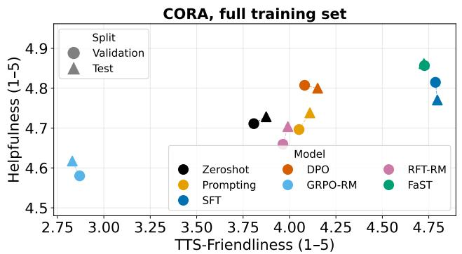

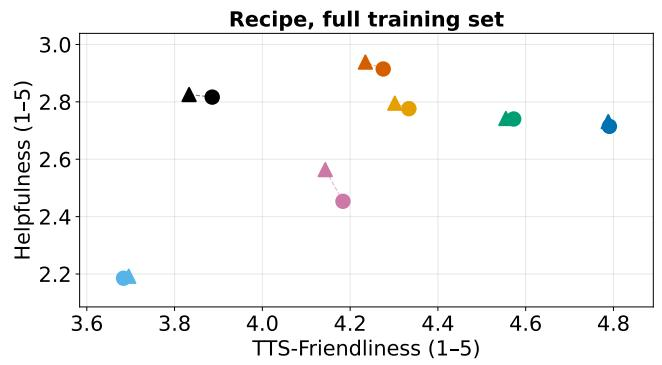

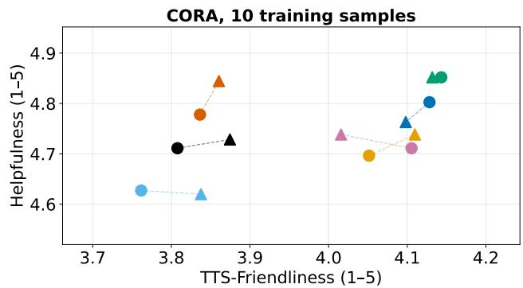

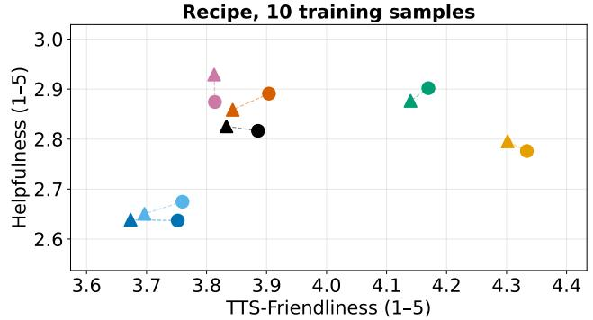  
Figure 1: Comparison of generation approaches on the tradeof between heuristic TTS-friendliness and Helpfulness (top-right is better). The base model used is Qwen3-4B. To improve readability, the x-axis and y-axis have been adjusted for each plot based on visible data points; they are not identical across the full-set and 10-sample settings.

Prompting alone is insuficient for reliable TTS-friendly generation. Although prompting the model to generate TTS-friendly text provides some gains over the Zeroshot baseline, it underperforms FaST in most settings. The gap is especially pronounced on CORA, where FaST simultaneously achieve higher TTS-friendliness and Helpfulness. Therefore, while prompting may intuitively appear as a natural option for enforcing TTS-friendliness, the results suggest that it is dificult to achieve this property through prompting alone. Instead, we observe clear benefits from explicit alignment or fine-tuning procedures, and in particular from FaST and SFT.

FaST shines in low-data regimes; SFT sufices otherwise. The advantages of FaST are most pronounced when only a small number of training samples is avail- able. In the 10-sample setting, FaST consistently out-performs other finetuning-based approaches (namely, SFT, DPO, GRPO-RM, and RFT-RM). This trend is espe-cially clear on the Recipe dataset, where SFT exhibits a noticeable degradation in both dimensions while FaST remains comparatively stable. These results suggest that FaST is more sample-eficient and can leverage limited preference information more efectively than competing approaches. In contrast, when the full train- ing set is available (100 training samples), standard supervised fine-tuning becomes highly competitive and provides a strong tradeof between TTS-friendliness and Helpfulness. This goes in line with previous find- ings [26] which showed that supervised fine-tuning from a few hundreds high-quality samples is often suf- ficient to obtain strong alignment performance.

## 6.3. Analysis

Features discovered by FaST. A key advantage of using FaST over traditional reward models is its inter- pretability. In our use-case, TTS-friendliness is decom- posed into a set of explicit high-level features with inde- pendently learned weights. This provides direct insight into which properties are most associated with TTS- friendly generation in our datasets. Table 3 presents the top-10 features discovered on CORA (using the full training set) and their learned weights. We also pro-vide in App. G the full list of features discovered on CORA and Recipe (see Tables 13 and 14). The learned weights align closely with the intuitive principles of TTS- friendly text. Features associated with compact written format such as use\_of\_numeric\_formatting (−0.50), abbreviation\_density (−0.32), or technical\_code\_reference (−0.18) receive strongly negative weights, supporting the intuition that symbolic notation and com- pressed forms are detrimental to spoken delivery. In contrast, conversational and speech-oriented proper- ties such as natural\_conversational\_tone (+0.33) and use\_of\_spelled\_out\_numbers (+0.33) are positively re-warded, which is also aligned with expectations. Over- all, the discovered features provide an interpretable characterization of the linguistic properties associated with improved TTS-friendliness on CORA’s preference dataset.

<table><tr><td>Feature</td><td>Weight</td></tr><tr><td>use_of_numeric_formatting</td><td>-0.50</td></tr><tr><td>natural_conversational_tone</td><td>0.33</td></tr><tr><td>use_of_spelled_out_numbers</td><td>0.33</td></tr><tr><td>abbreviation_density</td><td>-0.32</td></tr><tr><td>external referral</td><td>-0.24</td></tr><tr><td>friendliness</td><td>0.23</td></tr><tr><td>descriptive_sensory_language</td><td>0.19</td></tr><tr><td>professional_polish</td><td>0.18</td></tr><tr><td>technical_code_reference enthusiasm</td><td>-0.18 0.17</td></tr></table>

Table 3: Top-10 features discovered by FaST on CORA and their learned weights. Features are ordered by the magnitude of their weight in absolute value. Feature descriptions are provided in Table 13.

Generated samples. Generated samples further illustrate the qualitative diferences between the diferent approaches. As shown in Table 4 for CORA, FaST and SFT tend to produce responses that are more natural to read aloud, favoring spelled-out numbers, conver- sational phrasing, while avoiding dense symbolic or abbreviated formats that are less suitable for TTS. In contrast, other methods often retain written-style con- ventions such as compact numeric expressions, which can negatively impact spoken delivery despite remain- ing factually correct. We provide additional generated samples in App. F.4 (see Table 12).

## 6.4. Comparison against Text Normalization

As motivated in Section 1, our work focuses on direct TTS-friendly generation instead of a two-step proce- dure consisting of generating a first TTS-unfriendly response, and then rewriting it using a text normal- ization approach. To provide a comparison of these two paradigms, we experimented with PolyNorm [21], a few-shot LLM-based text normalization method. We adopted Qwen3-4B as the prompted model and ap-plied PolyNorm to the Zeroshot output to normalize it. We report heuristic TTS-friendliness, Helpfulness and Latency for Zeroshot, PolyNorm and FaST in Table 5.

These results confirm that a dedicated text normaliza- tion stage can greatly improve the TTS-friendliness of the original Zeroshot response. This however comes at the cost of a doubled inference time due to the two required generation steps – the initial response gen- eration and the rewriting step. In comparison, FaST achieves a highly competitive TTS-friendliness score in a single inference step, significantly reducing latency.

## 7. Validating our Heuristic Metric as a Reliable TTS-friendliness Proxy

Throughout our experiments, we rely on the Heuristic metric as the primary evaluation signal given its low cost. We now validate this choice by showing it is a re- liable proxy for the more expensive TTS→ASR pipeline and human judgments.

## 7.1. Comparison with the TTS→ASR Metric

We compare the Heuristic and TTS→ASR metrics across the outputs of five representative approaches on both CORA and Recipe.

Protocol. For each dataset, we score the test utterances of the first split produced by five systems (Oracle, Zeroshot, Prompting, DPO, FaST), yielding 5×81 = 405 rated utterances on CORA and 5 × 100 = 500 on Recipe. We then compute, separately for each dataset, the Spearman rank correlation between the Heuristic score and each TTS→ASR metric (CER, WER), both at the utterance level (pooled across systems) and at the system level (correlation of per-system means, � = 5).

Discussion. The Heuristic and TTS→ASR metrics produce closely matching system rankings in Table 6: identical on CORA (Oracle > FaST > DPO > Prompting > Zeroshot, yielding a perfect system-level Spearman � = −1.00) and difering only by a single DPO/Prompting swap on Recipe (� = −0.90). The utterance-level pooled Spearman correlations are strong and negative on both datasets: �Heur-CER = −0.71 and �Heur-WER = −0.68 on CORA, � = 405; �Heur-CER = −0.80 and �Heur-WER = −0.71 on Recipe, � = 500 (all � ≪ 0.001).7 We conclude that the Heuristic score is a cheap and re- liable proxy for the empirical TTS→ASR metric on both datasets.

## 7.2. Validation via Human Judges

We complement the empirical TTS→ASR analysis with a MUSHRA-style [9] listening test conducted on the Prolific crowdsourcing platform.8 We adapted the pro- tocol to our setting: standard MUSHRA evaluates audio encoding or synthesis quality, whereas we hold the TTS engine and the voice constant across systems and ask participants to judge the listenability of the spoken content itself (i.e., how naturally the response is rendered when read aloud). The full protocol, hosting setup, and quality-control rules are detailed in App. A.

<table><tr><td colspan="2">CORA</td></tr><tr><td colspan="2">Context: How much is the banana bread slice?</td></tr><tr><td colspan="2">Responses:</td></tr><tr><td>Oracle:</td><td>The banana bread slice costs three dollars and forty-five cents. It&#x27;s a delicious option with a brown butter drizzle that pairs wonderfully with our coffee selections.</td></tr><tr><td>Zeroshot:</td><td>The banana bread slice is $3.45.</td></tr><tr><td>Prompting: SFT:</td><td>The banana bread slice costs $3.45. The banana bread slice is three dollars and forty-five cents. It comes with a delightful brown butter</td></tr><tr><td></td><td>drizzle.</td></tr><tr><td>DPO: GRPO-RM:</td><td>The banana bread slice is $3.45 and comes with a brown butter drizzle. It&#x27;s a perfect pairing for a morning or afternoon treat! The Banana Bread Slice with Brown Butter Drizzle is priced at $3.45. I&#x27;ll place your order for the</td></tr><tr><td></td><td>Banana Bread Slice with Brown Butter Drizzle. Your coffee will be ready for you at the coffeehouse.</td></tr><tr><td>RFT-RM: FaST:</td><td>The banana bread slice is $3.45. A banana bread slice with a brown butter drizzle is three point forty-five dollars.</td></tr></table>

Table 4: Example generations from the diferent approaches on the CORA dataset.
<table><tr><td rowspan="2">Approach</td><td colspan="3">CORA</td><td colspan="3">Recipe</td></tr><tr><td>TTS-friendliness ↑</td><td>Helpfulness ↑</td><td>Latency ↓</td><td>TTS-friendliness ↑</td><td>Helpfulness ↑</td><td>Latency ↓</td></tr><tr><td>Zeroshot</td><td>3.84</td><td>4.72</td><td>1.6</td><td>3.86</td><td>2.82</td><td>4.4</td></tr><tr><td>PolyNorm</td><td>4.92</td><td>4.72</td><td>3.4</td><td>4.88</td><td>2.75</td><td>8.5</td></tr><tr><td>FaST</td><td>4.73</td><td>4.86</td><td>1.6</td><td>4.56</td><td>2.74</td><td>4.4</td></tr></table>

Table 5: Comparison of the heuristic TTS-friendliness, Helpfulness, and Latency of FaST, the text normalization baseline PolyNorm, and Zeroshot on CORA and Recipe. Latency corresponds to the average generation time for a single response, in seconds. Higher is better for TTS-friendliness and Helpfulness; lower is better for Latency.

<table><tr><td rowspan="2">Approach</td><td colspan="3">CORA</td><td colspan="3">Recipe</td></tr><tr><td>Heur ↑</td><td>CER↓</td><td>WER↓</td><td>Heur ↑</td><td>CER↓</td><td>WER↓</td></tr><tr><td>Oracle</td><td>4.838</td><td>0.051</td><td>0.260</td><td>4.799</td><td>0.044</td><td>0.228</td></tr><tr><td>FaST</td><td>4.648</td><td>0.077</td><td>0.297</td><td>4.512</td><td>0.066</td><td>0.253</td></tr><tr><td>DPO</td><td>4.010</td><td>0.141</td><td>0.377</td><td>4.079</td><td>0.117</td><td>0.297</td></tr><tr><td>Prompt.</td><td>3.999</td><td>0.206</td><td>0.478</td><td>4.324</td><td>0.123</td><td>0.349</td></tr><tr><td>Zeroshot</td><td>3.836</td><td>0.228</td><td>0.523</td><td>3.763</td><td>0.170</td><td>0.420</td></tr></table>

Table 6: Per-model means sorted by CORA CER (� = 81 per model on CORA, � = 100 on Recipe). Heur: higher is better; CER/WER: lower is better.

From the CORA test split we sampled 20 questions and synthesized each system’s response with Kyutai Pocket TTS using a single fixed voice. For each question, par ticipants rated the Oracle reference and three shufled generated answers (Prompting, DPO, FaST) on a 0–100 slider.9 The study was carried out in two Prolific batches and reached � = 14 valid raters after quality control.

Figure 2 reports, for each system, the distribution of per-participant mean ratings across the 20 trials. The Oracle is rated near the top of the scale (mean 94.7, 95% CI [92.5, 96.8]), confirming that partici-pants used the slider as intended. The ranking ob- tained on the trained systems is consistent with the automatic metrics reported in Section 7.1: FaST is rated highest (68.3, [58.5, 76.8]), ahead of DPO (55.9, [46.3, 65.8]) and Prompting (51.4, [42.8, 59.9]). We confirm pairwise contrasts between compared systems with paired Wilcoxon signed-rank tests on the per- participant means: FaST > DPO (mean diference of +12.4, � = 0.003), FaST > Prompting (+16.9, � = 0.001). App. A further reports a strong correlation between the heuristic metric and human MUSHRA rat- ings.

## 8. Conclusion

We introduced the problem of TTS-friendly text genera- tion through LLM alignment, motivated by the obser- vation that current language models are optimized pri- marily for written text rather than spoken delivery. To support research in this setting, we proposed two prefer- ence datasets – CORA and Recipe – spanning the cofee ordering and cooking domains, together with an eval- uation suite combining a heuristic metric, TTS→ASR evaluation, and a study with human judges. Our ex-periments across datasets and settings demonstrated that the recent feature-based FaST approach overall achieves the best tradeof between TTS-friendliness and helpfulness, with particularly strong gains when only a handful of training samples are available. Additionally, we showed that our heuristic metric is strongly corre- lated with the TTS→ASR metric and human judgments, which suggests that TTS-friendliness can be eficiently assessed using pattern-based heuristics. This opens up applications where such metric could be directly uti- lized as a reward model, similarly to recent work on reinforcement learning from verifiable rewards [20]. More broadly, our results highlight the importance of optimizing language generation not only for readabil- ity and helpfulness, but also for downstream spoken interaction, paving the way toward more natural and accessible voice-based conversational assistants.

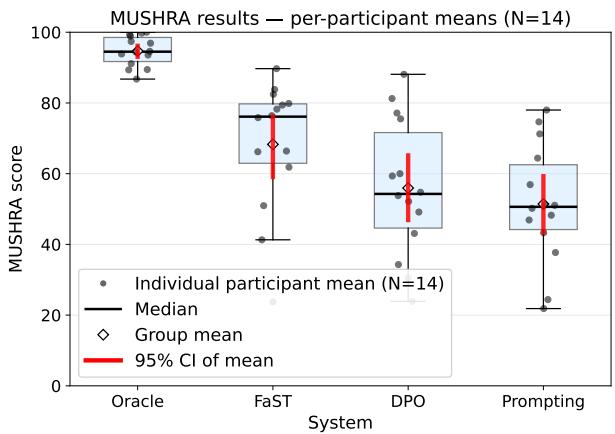  
Figure 2: MUSHRA listening test: per-participant mean rating per system. Boxes show the median and inter- quartile range across participants; black dots are indi- vidual participants; the white diamond marks the group mean; the red bar is the 95% bootstrap confidence in- terval of the mean. Sample size: � = 14 human judges.

## Limitations

Response length. FaST overall tends to generate longer responses than other approaches, as evidenced by the average response lengths shown in Table 10 (see App. F.2). Given that TTS-unfriendly responses are typically shorter and more compact while TTS-friendly responses tend to be more verbose, FaST has learned to associate response length with TTS-friendliness. This is reflected in Tables 13 and 14 which report the fea- tures discovered by FaST on CORA and Recipe, respectively: the features conciseness and brevity carry negative weights (respectively, −0.12 and −0.25). While longer responses are not inherently bad for TTS, this bias toward verbosity may not be desirable in all appli- cations. This could be easily addressed in practice by manually setting the weight of the conciseness or brevity feature to zero – or even to a small positive value to further penalize length. App. F.3 details an experiment which supports the validity of this fix.

Dataset, domain, and language coverage. As no established benchmark for TTS-friendly text generation exists, we had to construct both datasets from scratch, which required non-trivial efort even with synthetic generation pipelines. Our experiments are further lim- ited to English and two domains; some TTS-unfriendly patterns may vary across languages and domains such as medical, legal, or technical content. Extending our approach to a broader range of languages and domains would require building additional preference data to improve out-of-the-box applicability.

Generalization to larger LLMs. Our empirical study is constrained to 3B/4B-parameter models, which rep- resent the largest configurations that our computational budget permitted us to fine-tune on a single GPU within the time requirements imposed by the alignment pro- cedures. Nonetheless, our evaluation encompasses two distinct model families (Qwen3-4B and SmolLM3-3B), and FaST exhibits consistently competitive performance across both, indicating that the observed efect is un- likely to be model-specific. Whether this behavior per- sists at larger model scales remains an open question.

Generalization to diferent TTS systems. Our MUSHRA evaluation relies on a single TTS engine, which limits the strength of our claim regarding en- gine independence. Our objective, however, is to as-sess and improve the intrinsic TTS-compatibility of the LLM-generated text itself, independently of any partic- ular downstream synthesizer. This focus is motivated by the substantial variability in normalization front- ends across TTS systems, as well as the tendency of lightweight engines to employ considerably simpler pre- processing pipelines. Rather than tuning to a specific system, we aim to generate text that is easier to synthe- size for a broad range of TTS engines. This decoupling between text generation and synthesis is particularly critical in settings where only compact models are avail- able, such as embedded TTS in robotics.

Cascade architecture assumption. Our work tar-gets cascade LLM→TTS architectures – the dominant paradigm for voice-based dialogue systems. End-to- end speech LLMs that directly generate speech tokens are an emerging alternative to which our framework does not directly apply. We believe however that align- ing spoken-delivery quality via interpretable text-level features could be adapted to guide intermediate repre- sentations in speech LLMs, and leave this extension to future work.

## Ethical Considerations

Human listening study. We ran a MUSHRA listening study on Prolific with � = 14 participants who passed our quality-control checks. Participants gave informed consent via the Prolific study listing (which declared the task as academic research) and via the platform’s Participant Terms accepted at registration. Each participant was paid £12 for an estimated 40-minute task (≈ £18/h), above both the UK National Living Wage and Prolific’s recommended minimum; participants whose submissions failed our post-hoc quality-control checks were nevertheless paid in full. No personally identify- ing information, demographic data, or audio recording from the participant were collected; we recorded only the per-trial slider ratings, per-trial timestamps, the anonymous Prolific ID (used only to release payment, never redistributed), and an optional free-text com-ment. The task – listening to short synthetic speech clips and moving 0–100 sliders – involves no sensi- tive content, no deception, no biometric data, and no personal information; we judged that it does not fall within the scope of mandatory ethics review. Full in- structions, screenshots of the interface, and detailed quality-control criteria are provided in App. A.

Dataset. The conversational stimuli are taken from CORA, a synthetic customer-service dataset created for this paper. CORA contains no real user data, no person-ally identifying information, and no sensitive content.

External LLM judge. One of our scoring methods relies on a black-box call to OpenAI’s GPT-4o-mini API to rate the helpfulness of generated text. Only the model-generated assistant responses are sent to the API; no participant data, no human-written text from the dataset beyond the released synthetic stimuli, and no other identifying information are transmitted. We treat the API as a scoring service and do not fine-tune or train on its outputs.

TTS engine and dual use. The audio stimuli are synthesised with Kyutai Pocket TTS, a publicly released model, using a single fixed voice (alba) for all systems and all utterances. No individual’s voice is cloned or imitated. Making AI-generated responses more natural when spoken aloud is intended for voice-assistant and accessibility use cases; we do not see a specific misuse risk beyond that already inherent to publicly available TTS systems.

Use of AI assistants. Beyond their role as LLM judges and dataset construction tools described above, AI as- sistants were used during the preparation of this work to support code writing and the drafting of certain passages of this paper. In all cases, AI-generated sug- gestions were reviewed, edited, and validated by the authors; no content was incorporated without human oversight, and the assistants were never used in a fully automated fashion. The authors take full responsibility for the content of this paper.

## References

[1] Michał Bień, Michał Gilski, Martyna Maciejewska, Wojciech Taisner, Dawid Wisniewski, and Agnieszka Lawrynowicz. RecipeNLG: A cooking recipes dataset for semi-structured text generation. In Proceedings of the 13th International Conference on Natural Language Generation, pages 22–28, 2020. 2

[2] Michael Cardei, Jacob K. Christopher, Thomas Hartvigsen, Brian R. Bartoldson, Bhavya Kailkhura, and Ferdinando Fioretto. Constrained discrete difusion. In Proceedings ofthe 39th Conference on Neural Information Processing Systems, 2025. 2

[3] Hyundong Justin Cho, Nicolaas Paul Jedema, Leonardo F. R. Ribeiro, Karishma Sharma, Pedro Szekely, Alessan- dro Moschitti, Ruben Janssen, and Jonathan May. Speechworthy instruction-tuned language models. In Proceedings of the 2024 Conference on Empirical Methods in Natural Language Processing, pages 10652–10670, 2024. 2

[4] Mehmet Samet Duran and Tevfik Aytekin. Beyond one-size-fits-all summarization: Customizing summaries for diverse users, 2025. 2

[5] Facebook AI Research. wav2vec2-lar e-960hlv60-self. https://huggingface.co/facebook/ wav2vec2-large-960h-lv60-self, 2021. HuggingFace model card. 3

[6] Elad Hirsch and Ayellet Tal. CLID: Controlled-length image descriptions with limited data. In Proceedings of the 2024 IEEE/CVF Winter Conference on Applications of Computer Vision, 2024. 2

[7] Shehzeen Samarah Hussain, Paarth Neekhara, Xuesong Yang, Edresson Casanova, Subhankar Ghosh, Roy Fejgin, Mikyas T. Desta, Rafael Valle, and Jason Li. Koel-TTS: Enhancing LLM based speech generation with prefer- ence alignment and classifier free guidance. In Proceedings of the 2025 Conference on Empirical Methods

in Natural Language Processing, pages 21219–21234, 2025. 2

[8] Sieun Hyeon, Kyudan Jung, Nam-Joon Kim, Hyun Gon Ryu, and Jaeyoung Do. MathReader: Text-to-speech for mathematical documents, 2025. 2

[9] International Telecommunication Union. Method for the Subjective Assessment of Intermediate Quality Level of Audio Systems. Recommendation ITU-R BS.1534-3, International Telecommunication Union, Radiocommu- nication Sector (ITU-R), 2015. 7, 12

[10] Seungone Kim, Jamin Shin, Yejin Cho, Joel Jang, Shayne Longpre, Hwaran Lee, Sangdoo Yun, Seongjin Shin, Sungdong Kim, James Thorne, and Minjoon Seo. Prometheus: Inducing fine-grained evaluation capabil- ity in language models. In Proceedings of the 12th International Conference on Learning Representations, 2024. 3

[11] Seungone Kim, Juyoung Suk, Shayne Longpre, Bill Yuchen Lin, Jamin Shin, Sean Welleck, Graham Neubig, Moontae Lee, Kyungjae Lee, and Minjoon Seo. Prometheus 2: An open source language model specialized in evaluating other language models. In Proceedings of the 2024 Conference on Empirical Methods in Natural Language Processing, pages 4334–4353, 2024. 3

[12] Kyutai Labs. Pocket TTS: A compact CPU-friendly streaming text-to-speech model. https://github.com/ kyutai-labs/pocket-tts, 2025. Software release. 3

[13] Rafael Rafailov, Archit Sharma, Eric Mitchell, Christo-pher D. Manning, Stefano Ermon, and Chelsea Finn. Direct preference optimization: Your language model is secretly a reward model. In Proceedings of the 37th Conference on Neural Information Processing Systems, 2023. 4

[14] Vinay Samuel, Harshita Diddee, Yiming Zhang, and Daphne Ippolito. CIE: Controlling language model text generations using continuous signals. In Proceedings of the 2025 Conference on Empirical Methods in Natural Language Processing, pages 3815–3825, 2025. 2

[15] Michael Schoefler, Sarah Bartoschek, Fabian-Robert Stöter, Marlene Roß, Susanne Westphal, Bernd Edler, and Jürgen Herre. webMUSHRA — A comprehensive framework for web-based listening tests. Journal of Open Research Software, 6(1):8, 2018. 12

[16] Zhihong Shao, Peiyi Wang, Qihao Zhu, Runxin Xu, Junxiao Song, Xiao Bi, Haowei Zhang, Mingchuan Zhang, Y. K. Li, Y. Wu, and Daya Guo. DeepSeekMath: Pushing the limits of mathematical reasoning in open language models, 2024. 4

[17] Thibaut Thonet, Laurent Besacier, and Jos Rozen. ELITR-Bench: A meeting assistant benchmark for long-context language models. In Proceedings of the 31st International Conference on Computational Linguistics, pages 407–428, 2025. 3

[18] Thibaut Thonet, Germán Kruszewski, Jos Rozen, Pierre Erbacher, and Marc Dymetman. FaST: Feature-aware sampling and tuning for personalized preference align- ment with limited data. In Proceedings of the 2025

Conference on Empirical Methods in Natural Language Processing, pages 9341–9370, 2025. 1, 3, 4, 5, 16, 19

[19] Jinchuan Tian, Chunlei Zhang, Jiatong Shi, Hao Zhang, Jianwei Yu, Shinji Watanabe, and Dong Yu. Preference alignment improves language model-based TTS. In Proceedings of the 2025 IEEE International Conference on Acoustics, Speech and Signal Processing, pages 1–5, 2025. 2

[20] Xumeng Wen, Zihan Liu, Shun Zheng, Shengyu Ye, Zhirong Wu, Yang Wang, Zhijian Xu, Xiao Liang, Junjie Li, Ziming Miao, Jiang Bian, and Mao Yang. Reinforcement learning with verifiable rewards implicitly incentivizes correct reasoning in base LLMs. In Proceedings of the 14th International Conference on Learning Representations, 2026. 9

[21] Michel Wong, Ali Alshehri, Sophia Kao, and Haotian He. PolyNorm: Few-shot llm-based text normalization for text-to-speech. In Proceedings of the 2025 Conference on Empirical Methods in Natural Language Processing (Industry Track), pages 77–85, 2025. 1, 7, 16, 18

[22] Junyu Xie, Tengda Han, Max Bain, Arsha Nagrani, Eshika Khandelwal, Gül Varol, Weidi Xie, and Andrew Zis- serman. Shot-by-shot: Film-grammar-aware training- free audio description generation. In Proceedings of the 2025 IEEE/CVF International Conference on Computer Vision, pages 16503–16513, 2025. 2

[23] Tianxin Xie, Yan Rong, Pengfei Zhang, Wenwu Wang, and Li Liu. Towards controllable speech synthesis in the era of large language models: A systematic survey. In Proceedings of the 2025 Conference on Empirical Methods in Natural Language Processing, pages 764–791, 2025. 2

[24] Xueyao Zhang, Yuancheng Wang, Chaoren Wang, Ziniu Li, Zhuo Chen, and Zhizheng Wu. Advancing zero-shot text-to-speech intelligibility across diverse domains via preference alignment. In Proceedings of the 63rd Annual Meeting of the Association for Computational Linguistics (Volume 1: Long Papers), pages 12251–12270, 2025. 2

[25] Yang Zhang, Travis M. Bartley, Mariana Graterol-Fuenmayor, Vitaly Lavrukhin, Evelina Bakhturina, and Boris Ginsburg. A chat about boring problems: Study- ing gpt-based text normalization. In Proceedings of the 2024 IEEE International Conference on Acoustics, Speech and Signal Processing, pages 10921–10925, 2024. 1, 18

[26] Chunting Zhou, Pengfei Liu, Puxin Xu, Srini Iyer, Jiao Sun, Yuning Mao, Xuezhe Ma, Avia Efrat, Ping Yu, Lili Yu, Susan Zhang, Gargi Ghosh, Mike Lewis, Luke Zettlemoyer, and Omer Levy. LIMA: Less is more for alignment. In Proceedings of the 37th Conference on Neural Information Processing Systems, 2023. 6

A. Details on MUSHRA Tests with Prolific Stimuli. We sampled 20 candidate questions from CORA’s test set (from the first split, which contains a total of 81 unique questions in the test set). For each question, four responses were synthesized with Kyu- tai Pocket TTS10 using a single fixed voice: the chosen response (Oracle, used as the labeled reference) and the outputs of three systems (Prompting, DPO, FaST). To comply with the webMUSHRA equal-duration re-quirement, each set of four clips was zero-padded with trailing silence to match the longest clip in the set.

Protocol. The study was implemented with the web-MUSHRA framework [15]. Each trial presented one question, the labeled reference (Oracle), and four anonymous, shufled conditions (Prompting, DPO, FaST, and Oracle again for quality control); the participant rated each clip on a 0–100 slider.

We adapted the ITU-R BS.1534 MUSHRA protocol [9] to our setting because our evaluation target difers from the original methodology. The standard was designed to assess the quality of audio coding or synthesis (diferent encoders/synthesizers applied to the same source), whereas in our experiment the synthesizer and voice are constant across systems and what difers is the text produced by each system. The participants are there- fore asked to rate how naturally and intelligibly the spoken response answers the question (i.e. the listenability of the textual response when rendered as speech) rather than the perceived quality of the audio itself. Our main deviation from the standard is the removal of the 3.5 kHz low-pass anchor, which is irrelevant here: our independent variable is the spoken message, not audio encoding quality.

All other MUSHRA conventions are preserved. In particular, each trial presents the Oracle reference both as a labeled clip at the top left of the page (for explicit comparison) and as a hidden anonymous copy mixed with the three system outputs, yielding four shufled anonymous conditions to be rated on 0–100 sliders (Prompting, DPO, FaST, and Oracle). The hidden refer-ence doubles as a built-in attention check: participants’ contributions whose ratings of this clip fall below 80 on more than 20% of trials are excluded from our study. The remaining conventions (continuous slider, simultaneous playback of all conditions, equal duration via silence-padding, and per-trial shufling) are unchanged. The study was hosted on an inhouse server running Apache and a small Python backend.

Instructions shown to participants. The exact text rendered on the welcome page (Figure 3) is reproduced below.

Welcome to this listening test. In this study you will rate how naturally and intelligibly AI-generated responses sound when spoken aloud. There are 20 trials in total. Estimated duration: 30–40 minutes.

What you are evaluating. All audio clips are produced by the same text-to-speech system with the same voice. What difers between clips is the spoken message generated by diferent AI systems. You are therefore evaluating the quality of the spoken message, not the voice or TTS engine.

How each trial works. (1) Read the context question shown at the top of the trial. (2) Listen to the Reference clip first – this is the gold-standard answer; the reference is also hidden among the clips to be rated, and the matching anonymous clip should receive a score close to 100. (3) Listen to each of the other clips, in full, before switching. (4) Rate each clip from 0 (completely unintelligible or unnatural) to 100 (perfectly natural and clear) by dragging the sliders. (5) You may replay any clip as many times as you like.

What to focus on. Is the response easy to follow? Does it sound fluent and natural when spoken? Are there awkward phrases, repetitions or hard-tounderstand segments? The spoken responses may difer in content and even in meaning – this is expected. Your role is not to judge which answer is most correct or relevant, but how naturally and fluently each response is delivered when spoken aloud.

Setup. Please use headphones in a quiet environment throughout the test.

Note on silence. Some clips may be followed by a few seconds of silence at the end. This is a technical artefact of the test setup and must be completely ignored. Please rate only the spoken content.

Each MUSHRA trial (Figure 4) repeated a one-sentence reminder: “Rate how naturally and intelligibly each spoken response answers this question. All clips use the same voice – only the content difers. The hidden reference is the gold (best) answer – rate it near 100. Stop any clip that is still playing before you press play on another.”

Participant pool and reward. The Prolific study tar-geted English-as-first-language participants for a re- ward of £12 (≈ £18/hour). Each participant rated all 20 questions × 4 conditions in a single session (estimated to approximately 40 minutes).

Consent and data use. Two consent mechanisms apply. First, Prolific workers explicitly accept the plat- form’s Participant Terms at registration, which autho- rize their submitted responses to be used by researchers for the studies they take. Second, the welcome page (Figure 3) described the purpose of the study, the nature of the stimuli, and the requirement to use headphones in a quiet environment; clicking through the page con- stituted informed consent. The data recorded for each participant consist solely of the per-trial slider ratings, per-trial timestamps, the anonymous Prolific ID (used only to release payment, not redistributed), and the op- tional free-text comment collected on the final page. No personally identifying information, demographic data, or audio recording from the participant is collected.

  
Figure 3: Welcome and instructions page shown to participants at the start of the MUSHRA listening test.

Ethics. The study was not submitted to an institutional review board: the task (listening to short synthetic speech clips and moving 0–100 sliders) involves no sensitive content, no deception, no biometric data, and no personal information. Participants could with- draw at any moment without penalty, and all of them, including those who failed the quality-control checks described in the next section, were paid above both the UK National Living Wage and Prolific’s recommended minimum. The underlying conversational stimuli are derived from the synthetic CORA dataset created for this paper.

Quality control. Three automatic checks were ap-plied to each submission:

• Hidden-reference check: the labelled reference clip must be rated ≥ 80 on more than 80% of the 20

trials (fail otherwise).

• Engagement check: the three anonymous conditions must not all carry identical scores on more than 20% of trials (fail otherwise).

• Time flag: mean time per trial must lie in [5, 300] seconds (flagged, not excluded).

Two-batch collection. The study was launched in two batches to eventually reach 14 participants who passed quality control (QC). Batch 1 (2026-05-12) recruited 15 participants; 11 passed QC and 4 failed the hidden-reference check. All 15 were paid as per Pro- lific’s good-faith policy, but the 4 failing submissions were excluded from analysis. Batch 2 (2026-05-13) was a top-up of 5 participants, with batch-1 participants excluded via Prolific prescreening. Of the 5 submissions, 1 failed the hidden-reference QC check and 1 was an accidental double-submission (identical scores and session UUID); the remaining 3 passed QC. The combined valid sample after QC therefore contains � = 14 participants (11 from batch 1, 3 from batch 2).

Heuristic vs Human MUSHRA correlation. As a final sanity check, we examine the agreement between the cheap and automatic Heuristic TTS-friendliness score (introduced in Section 3) and the human ratings collected here. For each of the 20 utterances and each of the 4 systems we compute the mean MUSHRA rating across the � = 14 approved participants and pair it with the Heuristic score of the corresponding spoken text (Figure 5). The pooled Spearman correlation across the $4 \times 2 0 = 8 0$ (utterance, system) pairs is $\rho = + 0 . 8 4$ $( p \ll 0 . 0 0 1 )$ ; per-system correlations are $\rho _ { \mathrm { F a S T } } = + 0 . 7 4$ $\rho _ { \mathrm { D P O } } = + 0 . 7 4$ (both $p \ < \ 0 . 0 0 1 )$ , $\rho _ { \mathrm { P r o m p t i n g } } = + 0 . 5 4$ $( p = 0 . 0 1 4 )$ , and $\rho _ { \mathrm { O r a c l e } } = + 0 . 1 3$ (non-significant – a ceiling efect, since the human-written reference has near-maximal Heuristic and MUSHRA scores on every trial). This confirms the Heuristic metric as a reliable predictor of how naturally a spoken message is per- ceived when rendered by an of-the-shelf TTS system.

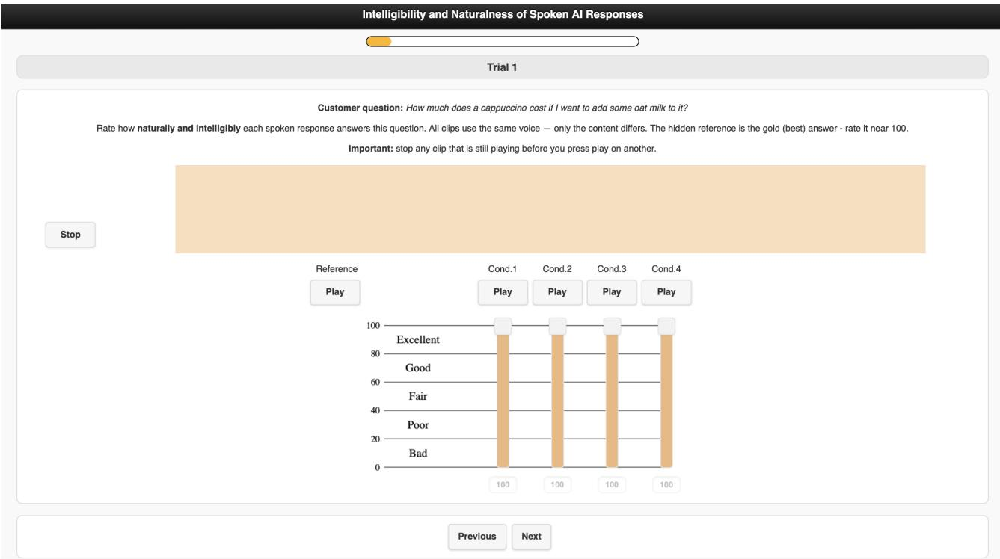  
Figure 4: Example MUSHRA trial. The question from CORA is shown at the top; the labeled Reference (Oracle) clip is on the left; the four anonymous, shufled conditions (Prompting, DPO, FaST, and hidden Oracle) are rated on 0–100 sliders.

## B. Dataset Examples

Table 7 shows one illustrative example per dataset with its associated TTS-friendliness and helpfulness scores.

## C. Details on the Heuristic TTS-Friendliness Metric

Given a candidate text $t ,$ the proposed heuristic metric script counts several surface patterns known to be prob- lematic for TTS, aggregates their length-normalised frequencies into a risk value, and maps it to a 1–5 score (higher meaning more TTS-friendly). Each class � is matched by a Python regex with a fixed weight $w _ { k }$ (Table 8).

Score. For each class $k ,$ let $n _ { k }$ be the number of non- overlapping matches of regex � in � and $m _ { k }$ the to- tal number of characters they cover (Python re, case-sensitive defaults; classes are scored independently, so overlaps between classes are allowed). Let $L \ =$ max(|�|, 20), the floor of 20 preventing very short texts from being over-penalized. The per-class score, the aggregate risk, and the final 1–5 score are defined as follows:

$$
\begin{array} { r } { s _ { k } = w _ { k } \left( n _ { k } + 0 . 2 5 \frac { m _ { k } } { L } \right) , } \end{array}\tag{1}
$$

$$
\mathrm { R } = \frac { \sum _ { k } s _ { k } } { 1 + L / 2 0 0 } ,\tag{2}
$$

$$
\begin{array} { r } { S _ { \mathrm { H } \mathrm { E U R } } = 5 - 4 \frac { \mathrm { R } } { \mathrm { R } + 2 } \ \in \ [ 1 , 5 ] . } \end{array}\tag{3}
$$

The count $n _ { k }$ rewards how often a risky pattern appears, the fraction $m _ { k } / L$ how much of the text it covers. The $1 + L / 2 0 0$ denominator limits accumulation in long answers. The final map saturates at 5 when no risky pattern is present $\left( \mathbb { R } \right. = \left. 0 \right)$ and approaches 1 as risk grows, so higher scores mean TTS-friendlier text.

Calibration. The weights, the 0.25 coverage coeficient, the floor �≥20 and the $1 + L / 2 0 0$ normalizer were set by inspection on a small held-out sample so that plain natural-language answers score close to 5 and a single URL or equation drops the score by at least one full point. No evaluation set from the paper was used for tuning. The exact script to compute the heuristic score will be released for reproducibility.

<table><tr><td>Dataset</td><td>Context</td><td>Type</td><td>Response</td><td>TTS-friendliness ↑</td><td>Helpfulness ↑</td></tr><tr><td rowspan="2">CORA</td><td rowspan="2">Before I order, could you confirm if the cardamom maple latte is available throughout the day?</td><td>chosen</td><td>Yes, our cardamom maple latte is avail- able all day from six in the morning until eight in the evening. This seasonal spe- cial is a popular choice, especially with its delightful cinnamon dusting. Feel free to pair it with one of our freshly</td><td>5.00</td><td>5</td></tr><tr><td>rejected</td><td>baked pastries for a complete treat. Yes, the cardamom maple latte is avail- able all day during our store hours from 6:00 AM to 8:00 PM. For more details, visit coffeehouse.com/menu. Pairing it with a pastry is a great idea. Check cof- feehouse.com/order for pastries.</td><td>2.51</td><td>5</td></tr><tr><td></td><td>How should I cook Neapolitan Pork Chops Here is the list of ingredients for this recipe: - 6 (1/2-inch thick) pork chops - 1/2 tsp. pepper - 1/2 tsp. oregano - 1 (14 oz.) can Italian tomatoes - 1 Tbsp. olive oil - 1/2 tsp. garlic powder - 1/4 tsp. sugar - 1/2 c. sliced olives</td><td>chosen</td><td>Sprinkle six pork chops, which are each one half inch thick, with one half tea- spoon of pepper and one half teaspoon of oregano, then brown them in one ta- blespoon of olive oil. Next, add one can of Italian tomatoes, which is fourteen ounces, and let the mixture simmer for thirty minutes, or until the chops are tender. Finally, stir in one half cup of sliced olives and serve the dish over noo-</td><td>5.00</td><td></td></tr><tr><td colspan="2"></td><td>dles. rejected</td><td>Sprinkle 6 (1/2-inch thick) pork chops with 1/2 tsp. pepper, 1/2 tsp. oregano, and 1/2 tsp. garlic powder; brown in 1 Tbsp. olive oil. Add 1 (14 oz.) can Italian tomatoes; simmer for 30 minutes, or until chops are tender. Stir in 1/2 c. sliced olives and serve over noodles.</td><td>2.29</td><td>4</td></tr></table>

Table 7: One illustrative ⟨context question, chosen response, rejected response⟩ tuple from each dataset. We also report the TTS-friendliness and Helpfulness score for each response.

Per-trial evolution: Heuristic (rescaled) vs Human (MUSHRA mean score)  
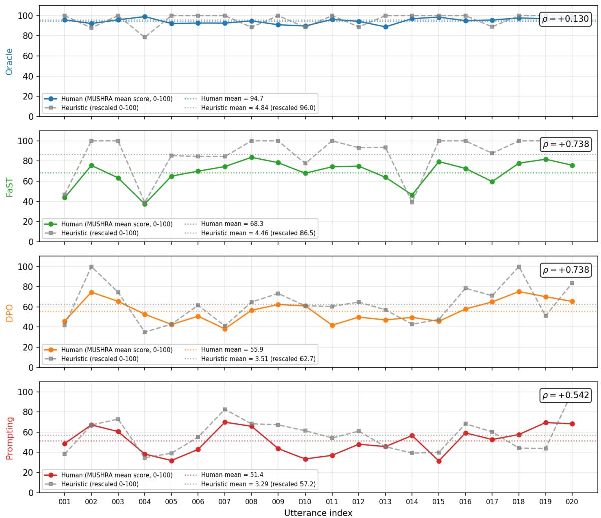  
Figure 5: Per-trial Heuristic (rescaled to 0–100) and Human MUSHRA mean score across the 20 utterances of the listening study, one panel per system. The Spearman � between the two series is reported in each panel; dotted lines show the per-system means across the 20 trials.

## D. Hyperparameters and Baseline Details

The hyperparameters used in our experiments are de- tailed in Table 9. They are directly based on the hyper- parameters used in Thonet et al. [18], which we found to yield satisfactory results in our pilot experiments on CORA and Recipe.

For the PolyNorm baseline [21] discussed in Section 6.4, given the absence of public code, we re-implemented the approach using the prompt provided in the paper and used English examples from PolyNorm-Bench11 as few-shot examples. To roughly match the number of few-shot examples specified in the paper, we selected 4 examples for each of the 27 categories, resulting in a 108-shot setting.

## E. Computational Infrastructure

The fine-tuning of the generation models and the tradi- tional reward model (RM) was conducted on a single A100 GPU. The training on the five data splits took between 1 hour and 10 hours for CORA, and between 2 hours and 20 hours for Recipe – these numbers de- pending both on the approach and the data regime (10 vs. 100 training samples). The weight learning of the feature-aware reward model (FaRM) was done on CPU only, given the very small number of parameters to learn (equal to the number of features � = 40).

## F. Additional Results

## F.1. Generation Results with SmolLM3-3B

The results obtained with SmolLM3-3B12 (Figure 6) are broadly aligned with the trends observed with Qwen3-

<table><tr><td>Class k</td><td>Regex</td><td>Wk</td></tr><tr><td>acronym_caps</td><td>[A-Z]{2,}</td><td>0.5</td></tr><tr><td>numbers</td><td>\b\d+(?:[\.,]\d+)?\b</td><td>0.5</td></tr><tr><td>url_like</td><td> $( \mathsf { h t t p s 2 : } / / \mid \mathsf { w w w } \setminus . \mid [ \mathsf { A } - \mathsf { Z a } - \mathsf { z } \theta - 9 ] + \setminus . [ \mathsf { A } - \mathsf { Z a } - \mathsf { z } ] \{ 2 , \} ) ( / \setminus \mathsf { S } \star ) \uparrow$ </td><td>1.0</td></tr><tr><td></td><td>mix_alphanum_punct[A-Za-z0-9]+[-_/:.][A-Za-z0-9]+</td><td>0.5</td></tr><tr><td>symbols</td><td> $[ \setminus \setminus \star \setminus + \setminus = \setminus \setminus | \setminus \ @ \setminus \# \setminus \$ 8 \top$ </td><td>0.5</td></tr><tr><td>equation</td><td> $[ \mathsf { A } - \mathsf { Z } \mathsf { a } - \mathsf { z } ] \backslash s \star = \backslash s \star [ { \ @ \mathsf { A } \sqcap \mathsf { S } } ] +$ </td><td>1.0</td></tr></table>

Table 8: Regexes and weights for the Heuristic TTS-Friendliness metric. URL- and equation-like patterns are weighted twice as much, being the most disruptive for naive TTS front-ends. Emails, code identifiers, file paths, dates, rices and units are ca tured indirectl b combinations of url\_like, mix\_alphanum\_punct, numbers, and symbols.

Approach Hyperparameters   
Reward model training   
RM learning\_rate = 1.41e-5, batch\_size = 16, num\_train\_epochs = 2   
FaRM learning\_rate = 0.1, max\_iter = 500, tolerance = 0.1   
Generation model fine-tuning   
SFT learning\_rate = 1.41e-5, batch\_size = 16, num\_train\_epochs = 10   
DPO learning\_rate = 5.0e-6, batch\_size = 16, num\_train\_epochs = 10, beta = 0.1   
GRPO num\_samples = 10, train\_temperature = 1.2, train\_top\_p = 0.9, learning\_rate = 1.41e-5, batch\_size   
= 16, num\_train\_iters = 5, num\_train\_epochs = 5, beta = 0.01   
RFT num\_samples = 10, train\_temperature = 1.2, train\_top\_p = 0.9, learning\_rate = 1.41e-5, batch\_size   
= 16, num\_train\_iters = 5, num\_train\_epochs\_per\_iter = 5   
Evaluation   
Sampling eval\_temperature = 0.7, eval\_top\_k = 20, eval\_top\_p = 0.8, max\_length = 1024  
Table 9: Hyperparameters adopted for reward model training, generation model fine-tuning, and evaluation.

4B in Figure 1, suggesting that the competitiveness of FaST is not tied to a single model family.13 Across both CORA and Recipe, FaST again provides one of the strongest overall tradeofs between TTS-friendliness and Helpfulness.

On CORA, FaST remains consistently near the Pareto frontier in both the 10-sample and full-data settings, achieving among the highest TTS-friendliness scores while preserving strong helpfulness. The Recipe dataset exhibits a slightly diferent pattern. While FaST re- mains highly competitive in the full-training setting, we note a degradation when 10 training samples are used. We hypothesize that this could be due to the fact that the random set of 10 training samples might con- tain examples with a weak training signal (i.e., a low contrast between the TTS-friendly and TTS-unfriendly responses). Nonetheless, we observe that in this case

FaST was still able to improve its TTS-friendliness score over SFT, suggesting that the features captured by FaST overall helped produce samples more appropriate for spoken delivery.

## F.2. Comparison of Generation Lengths

Table 10 compares the length of the responses generated by the diferent approaches on CORA and Recipe. The length is measured by the number of characters in the generated response, which we average over all the validation and test responses. As pointed out in our Limitations section, we can observe that FaST tends to output responses that are overall lengthier than most approaches. This may be explained by the fact that FaST’s discovered features and learned weights asso- ciate conciseness and brevity as negatively correlated with TTS-friendliness (see Tables 13 and 14). This, in turn, is likely caused by the fact that TTS-unfriendly responses are overall shorter due to their more compact formatting and high abbreviation usage.

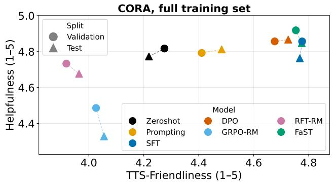

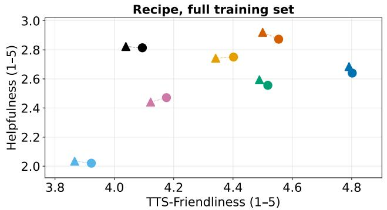

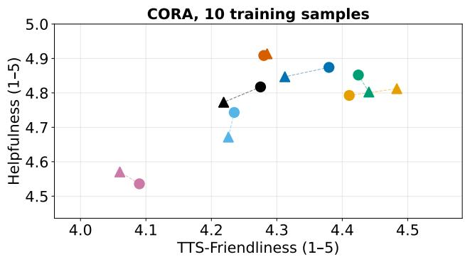

Recipe, 10 training samples  
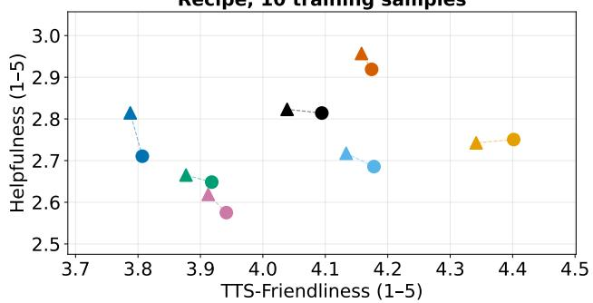  
Figure 6: Comparison of generation approaches on the tradeof between TTS-Friendliness and Helpfulness (top-right is better). The base model used is SmolLM3-3B. To improve readability, the x-axis and y-axis have been adjusted for each plot based on visible data points; they are not identical across the full-set and 10-sample settings.

## F.3. Verbosity Control in FaST

To address FaST’s length issue discussed in our Limitations section and in App. F.2, we investigate the suggested trick which consists in manually editing the weight of the feature controlling verbosity. This fea- ture corresponds to conciseness on CORA and brevity on Recipe (see Tables 13 and 14), which both carry negative weights: −0.12 and −0.25, respectively. We thus compare FaST in its default version (with the full training set and using Qwen3-4B as the base model) against the variant where we zero out the conciseness feature, on the CORA dataset. The results are reported in Table 11. These results confirm that our suggested fix works as intended, notably reducing the generation length while preserving the TTS-friendliness heuristic score. We also note that it might be possible to further reduce the generation length by using a small positive weight for the conciseness feature, instead of setting it to zero – although this might lead to penalizing TTS- friendliness if the magnitude of the positive weight is chosen too large.

## F.4. Generated Samples

We provide in Table 12 the samples generated by the dif- ferent approaches on one context for the Recipe dataset.

## G. Discovered Features

Tables 13 and 14 report the full sets of features discov- ered by FaST on CORA and Recipe respectively, together with their learned weights. The description associated to each feature in the table was discovered automat- ically during the feature discovery step of FaST (see Section 4.1 for more details). Across both datasets, the sign and magnitude of the weights align closely with the linguistic properties known to afect TTS per- formance [21, 25]. Features capturing compact written conventions – such as use\_of\_numeric\_formatting (−0.50 on CORA) and numeral\_symbol\_usage (−0.45 on Recipe) – receive strongly negative weights, which is consistent with the sensitivity of TTS systems to sym- bols, digits, and abbreviations that lack a canonical spo- ken form. Conversely, features associated with natural spoken delivery – natural\_conversational\_tone (+0.33) and narrative\_prose\_style (+0.76 on Recipe) – are positively rewarded, reflecting the expectation that fluent, prose-like text is more likely to be associated with TTS- friendliness in our preference datasets.

The features discovered on the two datasets also high- light diferent patterns that reveal domain-specific phe- nomena. On CORA, external\_referral (−0.24) and technical\_code\_reference (−0.18) carry meaningful negative weights, capturing the tendency of written customer- service responses to include URLs, email addresses, and identifiers that are challenging for TTS systems. On Recipe, abbreviation\_density (−0.58) and parenthetical\_annotation (−0.35) dominate, reflecting the heavily compressed shorthand notation typical of recipe writ- ing (e.g., 1 Tbsp., 1/2 tsp.). The fact that FaST recovers these domain-specific patterns automatically – without any domain-specific engineering – further supports the use of feature-based reward models for TTS-friendly generation across heterogeneous domains.

<table><tr><td>Approach</td><td>CORA Gen. length</td><td>Recipe Gen. length</td></tr><tr><td></td><td>Training-free</td><td></td></tr><tr><td>Zeroshot</td><td>185.6</td><td>480.9</td></tr><tr><td>Prompting</td><td>178.9</td><td>547.6</td></tr><tr><td>Oracle</td><td>231.0</td><td>813.0</td></tr><tr><td></td><td>10 training samples</td><td></td></tr><tr><td>SFT</td><td>205.2</td><td>571.4</td></tr><tr><td>DPO</td><td>242.9</td><td>552.3</td></tr><tr><td>GRPO-RM</td><td>183.4</td><td>512.4</td></tr><tr><td>RFT-RM</td><td>172.0</td><td>568.1</td></tr><tr><td>FaST</td><td>254.7</td><td>1333.4</td></tr><tr><td></td><td>100 training samples</td><td></td></tr><tr><td>SFT</td><td></td><td></td></tr><tr><td>DPO</td><td>221.0</td><td>681.6</td></tr><tr><td></td><td>292.3</td><td>733.4</td></tr><tr><td>GRPO-RM</td><td>1339.2</td><td>1028.4</td></tr><tr><td>RFT-RM</td><td>205.6</td><td>694.0</td></tr><tr><td>FaST</td><td>434.5</td><td>901.9</td></tr></table>

Table 10: Average generation lengths on the validation and test sets combined. The length is measured as the number of characters in the generated response.

<table><tr><td>Approach</td><td>Gen. length</td><td>TTS-friendliness</td></tr><tr><td>FaST (default)</td><td>434.6</td><td>4.73</td></tr><tr><td>FaST  $( \lambda _ { c o n c i s e n e s s } = 0 )$ </td><td>335.6</td><td>4.74</td></tr></table>

Table 11: Impact of zeroing out the conciseness fea- ture weight in FaST, in terms of generation length and heuristic TTS-friendliness score.

## H. Prompts

We provide here the main prompts used in our experi- ments. These prompts have been adapted to the CORA and Recipe datasets from the prompts originally defined in Thonet et al. [18].

• FaRM-related prompts: Table 15 describes the prompts used for response scoring with prompted LLM-based feature functions.

• Generation prompts: Tables 16, 17, and 18 contain the system prompts, the Zeroshot prompts (also used to sample candidate responses in GRPO and RFT), and the Prompting approach prompts, respectively.

• Evaluation prompts: Table 20 provides the prompts used to estimate the helpfulness of the responses via an LLM judge.

<table><tr><td>Recipe</td><td></td></tr><tr><td colspan="2">Context: How should I cook Neapolitan Pork Chops</td></tr><tr><td colspan="2">Here is the list of ingredients for this recipe:</td></tr><tr><td colspan="2">- 6 (1/2-inch thick) pork chops</td></tr><tr><td colspan="2">- 1/2 tsp. pepper</td></tr><tr><td colspan="2">- 1/2 tsp. oregano</td></tr><tr><td colspan="2">- 1 (14 oz.) can Italian tomatoes</td></tr><tr><td colspan="2">- 1 Tbsp. olive oil</td></tr><tr><td colspan="2">- 1/2 tsp. garlic powder</td></tr><tr><td colspan="2">- 1/4 tsp. sugar</td></tr><tr><td colspan="2">- 1/2 c. sliced olives</td></tr><tr><td colspan="2">Responses: Zeroshot: Heat olive oil in a large skillet over medium-high heat. Add pork chops and sear until golden brown</td></tr><tr><td></td><td>on both sides, about 3–4 minutes per side. Remove chops and set aside. In the same skillet, add garlic powder, oregano, pepper, and sugar; stir to coat. Add sliced olives and tomatoes, then bring to a simmer. Return pork chops to the skillet, cover, and cook for 10–12 minutes, or until pork is tender and internal temperature reaches 145℉. Serve warm. First, preheat your oven to 375 degrees Fahrenheit. Place the pork chops on a baking sheet. Add</td></tr><tr><td></td><td>one tablespoon of olive oil to the chops. Season the pork chops with one-half teaspoon of pepper, one-half teaspoon of oregano, one-half teaspoon of garlic powder, and one-quarter teaspoon of sugar. Add the sliced olives to the baking sheet. Pour the Italian tomatoes over the pork chops and olives. Bake the pork chops for 25 minutes. Check the chops to make sure they are cooked through. Serve warm.</td></tr><tr><td>SFT:</td><td>Preheat your oven to three hundred fifty degrees. In a shallow dish, place six one half inch thick pork chops, then season them with one half teaspoon of pepper, one half teaspoon of oregano, and one half teaspoon of garlic powder. In a three quart casserole dish, combine one can, or fourteen ounces, of Italian tomatoes, one tablespoon of olive oil, one quarter teaspoon of sugar, and one half cup of sliced olives, stirring well. Place the pork chops in the tomato mixture and bake for one</td></tr><tr><td colspan="2">DPO:</td></tr><tr><td>GRPO-RM:</td><td>2 minutes until they soften slightly. Pour in the canned Italian tomatoes and stir to combine, then bring the mixture to a gentle simmer. Return the pork chops to the skillet, nestling them into the sauce, and bake for 15 to 20 minutes, or until the pork is cooked through and reaches an internal temperature of 145℉. Serve warm, with the sauce clinging to the chops. Warm oven to 400F. Heat olive oil in a large skillet over medium heat. Add pork chops and season generously with pepper, oregano, and garlic powder; cook 3-4 minutes per side until golden and slightly crisp. In the meantime, crush Italian tomatoes with a fork, and add to the skillet along</td></tr><tr><td></td><td>until tomatoes break down into a thick sauce. Add the pork chops to the sauce, and cook 5 minutes more, until the sauce is heated through and the chops are warmed. Remove chops from skillet and let rest 5 minutes before serving. Avoid overcooking, as pork chops can dry out easily. The sauce will thicken as it cools, so serve slightly warm or at room temperature. Use a meat thermometer to ensure the internal temperature reaches 145℉, then rest before serving. This method ensures juicy, flavorful pork chops with a rich, tomato-based sauce.</td></tr><tr><td></td><td>small bowl, mix one half teaspoon of pepper, one half teaspoon of oregano, one half teaspoon of garlic powder, one quarter teaspoon of sugar, and one cup of sliced olives. Sprinkle two-thirds of this mixture over the pork chops, season the tops of the chops with the remaining seasoning, and dot with one tablespoon of olive oil. Cover and bake at four hundred degrees Fahrenheit for thirty minutes. In a separate bowl, combine one can of Italian tomatoes and the remaining seasoning,</td></tr><tr><td>FaST:</td><td>pour this over the pork chops, and continue baking for an additional fifteen minutes. Pat six pork chops dry, then season both sides with salt, pepper, oregano, and garlic powder. In a large skillet, heat olive oil over medium-high heat until shimmering; add pork chops and sear until golden and crusty on both sides, about 3 minutes per side. Remove chops and add sliced</td></tr></table>

Table 12: Example generations from multiple approaches for the Recipe dataset.

<table><tr><td>Feature</td><td>Weight</td><td>Description</td></tr><tr><td>use_of_numeric_formatting</td><td>-0.50</td><td>How much does the response rely on digits, symbols, and compact numeric notation such as $5.25, 6:00 AM, or +$0.50?</td></tr><tr><td>natural_conversational_tone</td><td>0.33</td><td>How natural and conversational does the response sound in customer-facing dialogue?</td></tr><tr><td>use_of_spelled_out_numbers</td><td>0.33</td><td>How much does the response prefer fully written-out numbers and amounts in prose?</td></tr><tr><td>abbreviation_density</td><td>-0.32</td><td>How much does the response use abbreviations, shorthand, or compressed forms such as w/, FYI, ASAP, etc., or St.?</td></tr><tr><td>external_referral</td><td>-0.24</td><td>How much does the response redirect the user to external resources such as websites,</td></tr><tr><td>friendliness</td><td>0.23</td><td>apps, email, or phone instead of answering fully in place? How friendly and welcoming is the response?</td></tr><tr><td>descriptive_sensory_language</td><td>0.19</td><td>How much does the response use sensory or evocative language about taste, texture,</td></tr><tr><td>professional_polish</td><td>0.18</td><td>aroma, or experience? How polished and professional is the wording of the response?</td></tr><tr><td>technical_code_reference</td><td>-0.18</td><td>How much does the response include internal-looking identifiers such as SKU, item</td></tr><tr><td>enthusiasm</td><td>0.17</td><td>IDs, or order codes? How much positive energy or enthusiasm does the response convey?</td></tr><tr><td>follow_up_engagement</td><td>0.16</td><td>How much does the response invite the user to continue the interaction with a follow-</td></tr><tr><td>policy_grounding</td><td>-0.15</td><td>up question or offer of help? How much does the response reflect operational rules, constraints, or store policy</td></tr><tr><td>conciseness</td><td></td><td>language?</td></tr><tr><td>detail_richness</td><td>-0.12 0.11</td><td>How concise is the response while still remaining understandable? How much descriptive or supporting detail does the response provide?</td></tr><tr><td>persuasive_recommendation_style</td><td>0.11</td><td>How strongly does the response try to encourage interest, purchase, or further</td></tr><tr><td>accuracy_signal_for_menu_facts</td><td>-0.11</td><td>engagement? How much does the response present concrete menu facts in a way that appears</td></tr><tr><td>customer_service_orientation</td><td>0.11</td><td>precise and dependable? How strongly does the response reflect a service-oriented mindset focused on helping</td></tr><tr><td>fee_transparency</td><td>0.10</td><td>the customer smoothly? How clearly does the response explain extra charges, add-on costs, or total pricing</td></tr><tr><td>time_specificity</td><td></td><td>implications? How explicitly does the response provide concrete times, hours, or timing constraints?</td></tr><tr><td>promotional_language</td><td>-0.10 0.10</td><td>How much does the response use promotional or marketing-style phrasing about</td></tr><tr><td>recommendation_strength</td><td>0.09</td><td>products or the store experience? How strongly does the response make a recommendation rather than simply listing</td></tr><tr><td>self_containment</td><td>0.09</td><td>options? How self-contained is the response, meaning the user can act on it without needing</td></tr><tr><td>clarity_of_wording</td><td></td><td>another source?</td></tr><tr><td>response_formality</td><td>0.09 0.09</td><td>How easy is the response to understand on first reading? How formal is the style of the response?</td></tr><tr><td>urgency_emphasis</td><td>-0.08</td><td>How much does the response stress acting quickly or time sensitivity?</td></tr><tr><td>redundancy_level</td><td>-0.08</td><td>How much does the response repeat information unnecessarily within the same</td></tr><tr><td></td><td></td><td>answer?</td></tr><tr><td>procedural clarity contextual_helpfulness</td><td>0.07 0.07</td><td>How clearly does the response explain a process, policy, or sequence of actions? How well does the response tailor its content to the situation implied by the user's</td></tr><tr><td></td><td></td><td>context, such as first-time visit, warm day, or dietary need? How specifically does the response describe the item, including ingredients, prepara-</td></tr><tr><td>menu_item_specificity</td><td>0.05</td><td>tion, or characteristics?</td></tr><tr><td>price_specificity customization_support</td><td>-0.05</td><td>How explicitly does the response provide exact pricing information when relevant? How much does the response support modifications, substitutions, or personalized</td></tr><tr><td></td><td>0.05</td><td>options?</td></tr><tr><td>location_specificity comparative_guidance</td><td>-0.04</td><td>How specifically does the response describe a place, address, or directions? How much does the response help compare alternatives based on preferences or use</td></tr><tr><td></td><td>0.04</td><td>cases?</td></tr><tr><td>appropriateness_of_extra_information actionability</td><td>0.04</td><td>How appropriate and useful are any extra details beyond the core answer?</td></tr><tr><td>grammatical_cleanliness</td><td>-0.03 0.02</td><td>How actionable is the response in telling the user what to do next? How grammatically clean and well-formed is the response?</td></tr><tr><td>hedging_vs_certainty</td><td>0.02</td><td>How confidently does the response present its information rather than hedging or</td></tr><tr><td></td><td></td><td>sounding tentative?</td></tr><tr><td>completeness_of_response direct_answer_relevance</td><td>0.01</td><td>To what extent does the response cover all parts of the user's request? How directly does the response answer the user's specific question or request without</td></tr><tr><td></td><td>0.00</td><td>drifting to unrelated details?</td></tr><tr><td>dietary_accommodation_clarity</td><td>0.00</td><td>How clearly does the response address dietary needs such as vegan, dairy-free, or gluten-free requirements?</td></tr><tr><td>narrative_prose_style</td><td>0.76</td><td>To what extent is the choice written in full natural-language prose rather than recipe shorthand?</td></tr><tr><td>abbreviation_density</td><td>-0.58</td><td>How heavily does the choice rely on abbreviations, symbols, and shorthand format- ting?</td></tr><tr><td>numeral_symbol_usage</td><td>-0.45</td><td>To what extent does the choice present quantities with numerals and symbols rather than spelled-out words?</td></tr><tr><td>parenthetical_annotation</td><td>-0.35</td><td>How much does the choice use parenthetical clarifications or side notes?</td></tr><tr><td>brevity</td><td>-0.25</td><td>How concise is the wording of the choice?</td></tr><tr><td>measurement_unit_variety</td><td>0.19</td><td>How varied and explicit are the measurement units used in the choice?</td></tr><tr><td>editorial_commentary</td><td>0.18</td><td>How much does the choice include comments, tips, opinions, or asides beyond core</td></tr><tr><td>redundancy_level</td><td>0.14</td><td>instructions? How much does the choice repeat information that could have been stated more</td></tr><tr><td>readability_simplicity</td><td>-0.13</td><td>compactly? How easy is the choice to read quickly and parse at a glance?</td></tr><tr><td>technique explanation</td><td>0.12</td><td>How much does the choice explain cooking techniques or methods beyond simply</td></tr><tr><td>formal_recipe_register</td><td>-0.12</td><td>naming them? How strongly does the choice follow a conventional formal recipe register?</td></tr><tr><td>equipment_guidance</td><td>0.10</td><td>How much does the choice specify cookware, appliances, or tools to use?</td></tr><tr><td>formatting_compactness</td><td>-0.09</td><td>How compressed is the formatting of the choice overall?</td></tr><tr><td>serving_guidance</td><td>0.09</td><td>How much does the choice include serving, plating, or accompaniment suggestions?</td></tr><tr><td>precision_of_language</td><td>-0.09</td><td>How exact and unambiguous is the wording of the choice overall?</td></tr><tr><td>ingredient precision</td><td>-0.08</td><td>How precise are the ingredient quantities, measurements, and specifications in the</td></tr><tr><td>beginner_friendliness</td><td>-0.08</td><td>choice? How accessible is the choice for a novice cook?</td></tr><tr><td>expert_assumption</td><td>0.08</td><td>How much does the choice assume the reader already understands recipe conventions</td></tr><tr><td>conversational tone</td><td>0.07</td><td>and cooking basics? How conversational or personable is the tone of the choice?</td></tr><tr><td>temperature_specificity</td><td>-0.06</td><td>How specifically does the choice state cooking temperatures or heat levels?</td></tr><tr><td>doneness_guidance</td><td>0.05</td><td>How much does the choice help the reader judge when the food is properly cooked?</td></tr><tr><td>ingredient_order_clarity</td><td>-0.05</td><td>How clearly does the choice present ingredients in the order they are used?</td></tr><tr><td>yield_information</td><td>0.04</td><td>How much does the choice specify yield, servings, or portion count?</td></tr><tr><td>alternative_method_coverage</td><td>-0.04</td><td>How much does the choice mention alternate cooking methods or fallback ap-</td></tr><tr><td>optional_variation_content</td><td>-0.03</td><td>proaches? How much does the choice include optional ingredients, substitutions, or alternative</td></tr><tr><td>ingredient preparation detail</td><td>-0.03</td><td>methods? How much detail does the choice provide about prep states such as chopped, peeled,</td></tr><tr><td>make_ahead_orientation</td><td>0.03</td><td>drained, softened, or toasted? How much does the choice support advance preparation, chilling, marinating, or</td></tr><tr><td>brand_specificity</td><td></td><td>storage planning? How strongly does the choice rely on named brands or proprietary products?</td></tr><tr><td>action_verb_density</td><td>-0.02 -0.02</td><td>How action-oriented is the choice in its phrasing?</td></tr><tr><td>safety caution level</td><td>-0.02</td><td>How much does the choice include food safety or cautionary advice?</td></tr><tr><td>ingredient_contextualization</td><td>0.02</td><td>How much does the choice contextualize ingredients with examples, alternatives, or</td></tr><tr><td></td><td></td><td>explanatory labels?</td></tr><tr><td>sensory_cue_usage process_completeness</td><td>-0.01 -0.01</td><td>How much does the choice use sensory cues such as color, texture, aroma, or sound? How complete is the recipe process from preparation through finishing?</td></tr><tr><td>storage_guidance</td><td>0.01</td><td>How much does the choice explain how long or how to store the finished item or</td></tr><tr><td>finishing_step_emphasis</td><td>0.01</td><td>intermediate preparation? How much attention does the choice give to final steps such as garnishing, cooling:</td></tr><tr><td></td><td></td><td>resting, glazing, or topping?</td></tr><tr><td>specialized_terminology instructional_detail</td><td>0.01 0.00</td><td>How much does the choice use specialized culinary vocabulary or technical terms? How much step-by-step procedural detail does the choice provide?</td></tr><tr><td>time_specificity</td><td>0.00</td><td>How specifically does the choice state cooking, resting, marinating, or chilling times?</td></tr><tr><td>structural_cohesion</td><td>0.00</td><td>How well organized and internally coherent is the choice as a complete recipe</td></tr></table>

Table 13: Features discovered by FaST on CORA and their learned weights. Features are ordered by the magnitude of their corresponding weight in absolute value.

Table 14: Features discovered by FaST on Recipe and their learned weights. Features are ordered by the magnitude of their corresponding weight in absolute value.

<table><tr><td>CORA</td><td>Recipe</td></tr><tr><td colspan="2">System prompt</td></tr><tr><td>You are a scoring assistant that evaluates responses generated by an AI coffee ordering assistant.</td><td>You are a scoring assistant that evaluates responses generated by an AI cooking assistant.</td></tr><tr><td colspan="2">User prompt</td></tr><tr><td rowspan="2">You will be given a question that can be submitted to an AI coffee ordering assistant, and a response that attempts to answer this question. Your job is to rate the response based on the following criterion: {attribute_desc}. Score the response on a scale from 1 to 5 where 1 means {attr_min} and 5 means {attr_max}. Here are the question and the related response:</td><td>You will be given a question that can be submitted to an AI cooking assistant, and a response that attempts to answer this question. Your job is to rate the response based on the</td></tr><tr><td>following criterion: {attribute_desc}. Score the response on a scale from 1 to 5 where 1 means {attr_min} and 5 means {attr_max}. Here are the question and the related response:</td></tr><tr><td># Question: {context} # Response: {response}</td><td># Question: {context} # Response: {response}</td></tr><tr><td>Answer by outputting a number from 1 to 5 (and nothing</td><td>Answer by outputting a number from 1 to 5 (and nothing</td></tr><tr><td>else). Score:</td><td>else).</td></tr><tr><td></td><td>Score:</td></tr><tr><td>You are an AI coffee ordering assistant that writes responses to answer user questions.</td><td>You are an AI cooking assistant that writes recipe descriptions to answer user cooking queries.</td></tr><tr><td>Your responses should be based on the following information about the coffee ordering service you are managing.</td><td></td></tr><tr><td>COFFEE HOUSE MENU:</td><td></td></tr><tr><td>- Espresso - Rich shot with caramel crema. $3.25 (double shot +$1.00)</td><td></td></tr><tr><td>- Americano - Espresso topped with hot water. $3.50 - Latte - Smooth espresso with steamed milk; flavors: vanilla,</td><td></td></tr><tr><td>hazelnut, caramel. $4.75 - Cappuccino - Equal parts espresso, steamed milk, and foam</td><td></td></tr><tr><td>dusted with cocoa. $4.50 - Flat White - Velvety espresso with micro-foamed milk. $4.25</td><td></td></tr><tr><td>- Cold Brew - 18-hour steeped coffee served over ice; add oat milk or sweet cream. $4.95</td><td></td></tr><tr><td>- Mocha - Espresso, chocolate syrup, steamed milk, whipped cream finish. $5.00</td><td></td></tr><tr><td>- Tea Latte - Breakfast black tea with steamed oat milk and honey. $4.15</td><td></td></tr><tr><td>- Bakery Pairings - Fresh bakes delivered at 6am daily: - Almond croissant with toasted almonds. $3.95</td><td></td></tr><tr><td>- Blueberry muffin with lemon zest glaze. $3.25</td><td></td></tr><tr><td>- Banana bread slice with brown butter drizzle. $3.45 - Seasonal Special - Cardamom maple latte with cinnamon</td><td></td></tr><tr><td></td><td></td></tr><tr><td>dust. $5.25</td><td></td></tr><tr><td></td><td></td></tr><tr><td>Store hours: 6:00 AM to 8:00 PM daily</td><td></td></tr><tr><td>Milk alternatives: oat milk, almond milk, soy milk (add</td><td></td></tr><tr><td>$0.50)</td><td></td></tr><tr><td>Loyalty program: Sign up at coffeehouse.com/rewards</td><td></td></tr><tr><td></td><td></td></tr><tr><td>Order ahead: Use app or visit coffeehouse.com/order</td><td></td></tr><tr><td>Contact: support@coffeehouse.com or call 555-CAFE</td><td></td></tr></table>

Table 15: Feature function prompts for CORA (left) and Recipe (right). These prompts are used to obtain featurewise response scores. The feature is specified by the fields attribute\_desc (overall description of the feature), attr\_min (description of the minimum score) and attr\_max (description of the maximum score) generated in the feature discovery step.

Table 16: System prompts used for generation on CORA (left) and Recipe (right).

<table><tr><td>CORA</td><td>Recipe</td></tr><tr><td colspan="2">Zeroshot user prompt</td></tr><tr><td>You will be given a question asked by a user of a coffee ordering service. Your job is to write a response using the style of your choice (including wording and formatting). The length of your response can range from a single sentence to a short paragraph. Do not include any introduction, preamble, explanation or conclusion - only the direct response to the</td><td>You will be given a query from a user asking how to prepare a certain recipe. Your job is to write the steps of the requested recipe preparation using the style of your choice (including wording and formatting). The length of your response can range from a single sentence to a short paragraph. Do not include any introduction, preamble, explanation, conclusion</td></tr><tr><td>question. Here is the question:</td><td>or list of ingredients/utensils - only the description of the recipe steps.</td></tr><tr><td># Question: {context}</td><td>Here is the user query:</td></tr><tr><td># Response:</td><td># Question: {context} # Response:</td></tr><tr><td colspan="2">Prompting approach user prompt</td></tr><tr><td>You will be given some requirements on the response formu- lation, and a question. Your job is to write a response to the question while aligning as closely as possible with the pro- vided requirements. The length of your response can range from a single sentence to a short paragraph. Do not include any introduction, preamble, explanation or conclusion - only the direct response to the question. Here are the requirements on the response formulation:</td><td>You will be given some requirements on the response formu- lation, and a user cooking query asking how to prepare a certain recipe. Your job is to write the steps of the requested recipe preparation while aligning as closely as possible with the provided requirements. The length of your response can range from a single sentence to a short paragraph. Do not include any introduction, preamble, explanation, conclusion or list of ingredients/utensils - only the description of the</td></tr><tr><td>{profile_desc}</td><td>recipe steps. Here are the requirements on the response formulation:</td></tr><tr><td>Here is the question:</td><td>{profile_desc}</td></tr><tr><td># Question: {context} # Response:</td><td>Here is the user query:</td></tr><tr><td></td><td></td></tr><tr><td></td><td># Question: {context} # Response:</td></tr></table>

Table 17: Zeroshot generation prompts for CORA (left) and Recipe (right). These prompts are used to generate responses in the Zeroshot approach and sample candidate responses for GRPO and RFT.

Table 18: Prompting approach generation prompts for CORA (left) and Recipe (right). These prompts condition response generation on TTS-friendliness requirements listed in profile\_desc, detailed in Table 19.

<table><tr><td>TTS-friendliness requirements for the Prompting approach</td></tr><tr><td>The text response should be suitable and understandable if this response is uttered to a human user via Text-to-Speech. In other words, the response should be &quot;speech-friendly&quot;. Here is a list of rules describing what constitutes a speech-friendly text:</td></tr><tr><td>R1: Prefer short, simple sentences R2: One main idea per sentence</td></tr><tr><td>R3: Use explicit discourse markers (“first&quot;, “however&quot;)</td></tr><tr><td>R4: Avoid references to written form (“see above&quot;, “as shown below&quot;) R5: Prefer common, easily pronounced words</td></tr><tr><td>R6: Avoid long sequences of similar sounds / tongue twisters</td></tr><tr><td>R7: Limit code-switching / foreign terms</td></tr><tr><td>R8: Expand Latin abbreviations (e.g., i.e., etc.) R9: Write numbers how they should be spoken</td></tr></table>

Table 19: TTS-friendliness requirements for the Prompting approach, used as the profile\_desc field in the user prompt (see Table 18).

<table><tr><td>Reference-free judge (CORA)</td><td>Reference-based judge (Recipe)</td></tr><tr><td>You are evaluating whether an assistant&#x27;s response ade- quately addresses a user&#x27;s question.</td><td>You are evaluating whether an assistant&#x27;s response correctly and helpfully answers a user question.</td></tr><tr><td>You will be given:</td><td>You will be given:</td></tr><tr><td>- A user question (CONTEXT)</td><td>- A user question (CONTEXT) - A reference answer (REFERENCE) considered correct and</td></tr><tr><td>- A generated answer (GENERATED) to evaluate Follow these steps before scoring:</td><td>helpful</td></tr><tr><td>STEP 1 - Identify the key requests or questions the user is making in CONTEXT (there may be one or several).</td><td>- A generated answer (GENERATED) to evaluate Rate the GENERATED answer on a scale from 1 to 5 based</td></tr><tr><td>STEP 2 - For each request, determine whether GENERATED plausibly addresses it. You are NOT checking factual accu-</td><td>SOLELY on factual correctness and helpfulness: 5 - Excellent: Fully and correctly answers the question, con-</td></tr><tr><td>racy - only whether the answer attempts to respond to each request.</td><td>sistent with the reference 4 - Good: Mostly correct, minor omissions or slight differ-</td></tr><tr><td>STEP 3 - Assign a score 1-5 based on overall coverage and coherence.</td><td>ences, nothing misleading 3 - Acceptable: Partially answers the question, some inaccu-</td></tr><tr><td>5 - Excellent: All user requests are addressed, answer is</td><td>racies or irrelevant additions 2 - Poor: Mostly incorrect or misses the point, significant</td></tr><tr><td>coherent and complete 4 - Good: Most requests addressed, minor omission or slight</td><td>factual divergence from reference</td></tr><tr><td>tangent 3 - Acceptable: Some requests addressed but at least one</td><td>1 - Bad: Wrong, completely off-topic, or introduces false/harmful information</td></tr><tr><td>clearly missed or only vaguely touched 2 - Poor: Most requests ignored or the answer is largely</td><td>CRITICAL RULES: - A response that sounds natural and fluent but gives</td></tr><tr><td>off-topic 1 - Bad: Complete non-sequitur, gibberish, self-contradictory,</td><td>WRONG or INCOMPLETE information must score LOW</td></tr><tr><td>or obviously broken output CRITICAL RULES:</td><td>- A response that sounds robotic or unnatural but gives COR- RECT and COMPLETE information must score HIGH - Do NOT reward or penalize based on style, tone, format-</td></tr><tr><td>- A response that sounds natural and fluent but ignores part of the question must score LOW</td><td>ting, or how &quot;speech-friendly&quot; the answer sounds - Only ask: does the generated answer correctly and help-</td></tr><tr><td>- A response that sounds robotic or unnatural but addresses all requests must score HIGH</td><td>fully respond to the user&#x27;s question?</td></tr><tr><td>- Do NOT reward or penalize based on style, tone, format-</td><td>CONTEXT: {context} REFERENCE: {preferred_choice}</td></tr><tr><td>ting, or how &quot;speech-friendly&quot; the answer sounds</td><td>GENERATED: {generated choice}</td></tr><tr><td>- Do NOT penalize for factual errors - you cannot verify facts</td><td></td></tr><tr><td>without a reference</td><td>REASONING: -&lt;one sentence explaining your score&gt;</td></tr><tr><td>- Only ask: does the generated answer attempt to address</td><td>SCORE: &lt;single integer 1-5&gt;</td></tr><tr><td>ALL of the user&#x27;s requests?</td><td></td></tr><tr><td></td><td></td></tr><tr><td>CONTEXT: {context}</td><td></td></tr><tr><td>GENERATED: {generated choice}</td><td></td></tr><tr><td></td><td></td></tr><tr><td>STEP 1 - User requests: &lt;list the key requests, one per line&gt;</td><td></td></tr><tr><td></td><td></td></tr><tr><td>STEP 2 - Coverage: &lt;for each request: addressed / partially</td><td></td></tr><tr><td>addressed / not addressed&gt;</td><td></td></tr></table>

Table 20: Prompts used for helpfulness evaluation. The reference-free judge (left) evaluates whether the generated response addresses the user’s requests without relying on factual verification, while the reference-based judge (right) evaluates correctness and helpfulness relative to a reference answer. The former is used for the CORA dataset, while the latter is used for the Recipe dataset.