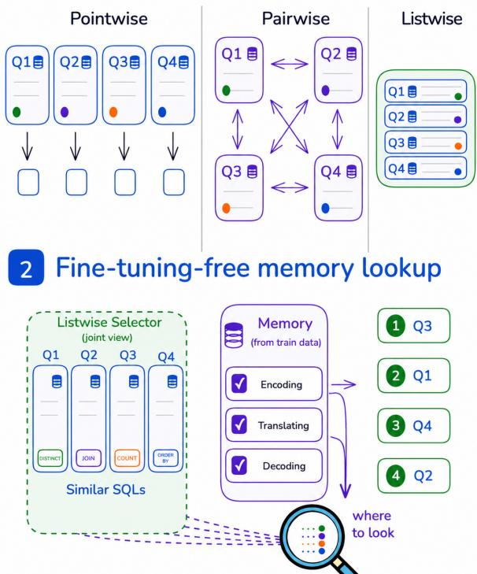
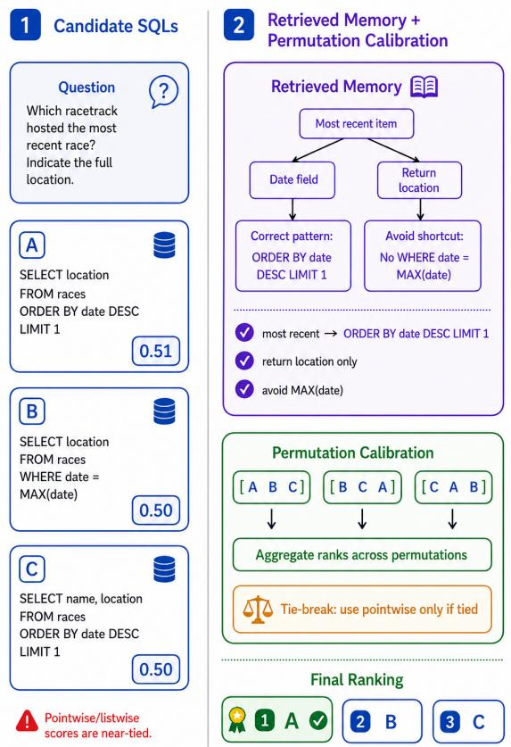
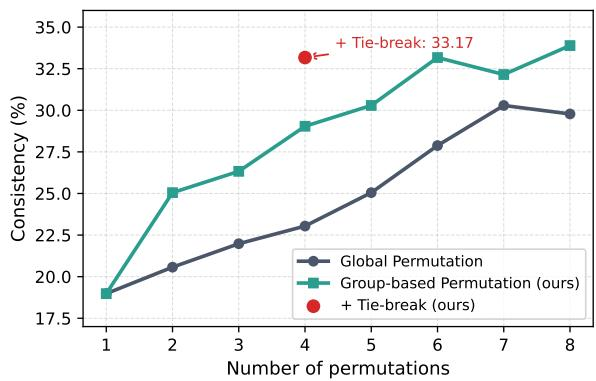

# Replacing Training with Memory: Listwise Selection for Text-to-SQL

Yeonseok Jeong1, Soyoung Yoon1, Seongjun Lee2, Seung-won Hwang1\* IPAI, Seoul National University1, KAIST2 {jys3136, soyoung.yoon, seungwonh}@snu.ac.kr epaksa@kaist.ac.kr

## Abstract

Modern Text-to-SQL systems often follow generate-execute-select pipelines, generating multiple candidate queries then selecting the best one. Listwise selection, by jointly comparing multiple candidates, has been widely adopted, but fine-tuning listwise selectors is costly. We thus propose a fine-tuning-free listwise selector. We replace two major finetuning objectives with inference-time strategies: (1) learning selection criteria as ordering and (2) mitigating positional bias. First, we build reusable structured memories instead of learning selection behavior as model parameters. Given a question, MAP-SQL retrieves memories distilled from training data that encode how natural language maps to schema elements, SQL operations, and expected outputs. These memories serve as explicit decision criteria for evaluating candidates in a listwise manner. Second, to mitigate ordering bias of listwise selectors, we aggregate rankings across multiple input permutations, with inference cost optimized by execution results and pointwise scoring. Our approach improves selection accuracy while maintaining efficiency and compatibility with existing large language models. Across Text-to-SQL benchmarks, it produces more stable selection without fine-tuning and fewer unnecessary comparisons than existing methods. On BIRD-dev, it outperforms the previous stateof-the-art selector-based method R3-SQL by 2.02 execution accuracy points on average using the same candidate sets, with 2.92× fewer tokens.1

## 1 Introduction

Modern Text-to-SQL systems (Sheng and Shuai, 2025; Dönder et al., 2025; Liu et al., 2026) increasingly follow a generate–execute–select pipeline, where multiple SQL candidates are produced and a selector chooses the best one (Li et al., 2025; Yao

## 1 Selector choices

  
Figure 1: Overview of our proposed SQL selection. Our method uses (1) a listwise selector to jointly compare SQL candidates and (2) fine-tuning-free memory lookup to better capture subtle SQL differences.

et al., 2026; Wang et al., 2025). Figure 1 illustrates such a pipeline: four candidate queries are generated and then evaluated by a selector. Depending on how many candidates are evaluated at a time, selectors can be categorized as pointwise (Agrawal and Nguyen, 2025; Tritto et al., 2026), pairwise (Pourreza et al., 2025; Bai et al., 2025), or listwise. Pointwise selectors score candidates independently and miss cross-candidate differences, while pairwise selectors compare candidates more directly but require $O ( n ^ { 2 } )$ comparisons. Listwise selection avoids exhaustive quadratic pairwise comparisons by evaluating multiple candidates jointly, allowing it to capture subtle differences that pointwise or pairwise methods may miss (Sun et al., 2023).

However, this benefit comes at a cost, as finetuning listwise selectors is costly. Each training example involves multiple SQL queries and their execution results, resulting in long input contexts and high computational overhead. As this makes learned listwise selection difficult to scale, our approach replaces the two main roles of fine-tuning with inference-time strategies.

First, fine-tuning provides selection criteria that guide ranking decisions. We replace this by constructing structured memories, as illustrated in Figure 1(2), distilled from training data. Each memory encodes how natural language maps to schema elements, SQL operations, and expected outputs. Given a test question, we retrieve relevant memories and use them as explicit decision criteria for listwise candidate comparison.

Second, fine-tuning aims to mitigate a wellknown positional bias in listwise selection, known as “lost-in-the-middle” bias (Liu et al., 2024; Tang et al., 2024). We instead address this at inference time by aggregating rankings across multiple input permutations, with a cost-aware design that leverages execution signals and selective pointwise scoring.

By combining these two components, we present Memory and Permutation for Listwise SQL selection (MAP-SQL). Our approach eliminates the need for additional fine-tuning while retaining the benefits of joint candidate comparison. In this paper, fine-tuning-free means that MAP-SQL does not update selector parameters. It still uses pretrained models and labeled question–SQL pairs to construct retrieval memories.

Our approach is simple, efficient, and compatible with off-the-shelf language models, making it practical for real-world Text-to-SQL systems. On BIRD-dev (Li et al., 2024), Spider-test (Yu et al., 2018), and EHRSQL (Lee et al., 2022), our method improves over the previous state-of-the-art selector R3-SQL by 2.02, 0.53, and 0.68 execution accuracy points on average when both methods use the same candidate pools. Our method also requires 6.54×, 6.85×, and 7.29× fewer selector calls and 2.92×, 2.12×, and 4.16× fewer tokens on the three benchmarks.

## 2 Related Work

We review existing selection paradigms and their training objectives. Lastly, we present our distinc-

tions of fine-tuning-free approaches.

## 2.1 Selector Paradigms in Text-to-SQL

Recent Text-to-SQL systems include a selection step after generating multiple SQL candidates to improve performance at test time. Majority voting (Sheng and Shuai, 2025) selects the most frequent execution outcome, but a larger incorrect group can dominate a smaller correct one. Pointwise selectors (Agrawal and Nguyen, 2025; Tritto et al., 2026) score each candidate independently. This lacks comparative insights across candidates, leading to inconsistent scoring and suboptimal performance (Long et al., 2025). Pairwise selectors (Pourreza et al., 2025; Wang et al., 2025) compare all pairs of candidates within the candidate set. However, the number of comparisons grows quadratically with the candidate set, making it computationally inefficient. XiYan-SQL (Liu et al., 2026) adopts a listwise selector that compares all candidates within a window simultaneously. MCS-SQL (Lee et al., 2025a) performs multiple-choice selection without selector fine-tuning. It sorts candidates before presenting them to the selector. In this work, however, the challenges of listwise selection and potential improvements to address them have not been explored.

## 2.2 Training for Listwise Reranking and Positional Bias

Existing listwise selectors require training to encode selection behavior in model parameters. However, jointly considering a long list of generations requires expensive training on candidate queries and execution results. In addition, long inputs expose the model to positional bias, commonly known as the “lost-in-the-middle” problem (Liu et al., 2024). $\mathrm { R ^ { 3 } } \mathrm { - } \mathrm { S Q I }$ (Han et al., 2026) addresses positional bias in training by using a pointwise selector as a tie-breaker when the pairwise selector cannot confidently distinguish between candidates. Delaying bias mitigation to inference time through self-consistency can incur up to $O ( n ! )$ calls in principle (Tang et al., 2024; Zeng et al., 2026). Although optimization strategies for relevance ranking have been studied (Lee et al., 2025b), no such work has addressed our target problem.

## 2.3 Our Distinction: Inference-time Strategies

We identify two key roles of fine-tuning: finetuning selection criteria and mitigating positional bias, and show that both can be replaced by inference-time memory retrieval and permutation aggregation. First, for memory retrieval, we draw on the framework of Deng et al. (2022), which decomposes the disconnect between natural language and SQL structure into encoding (understanding natural language semantics), translating (mapping those semantics to SQL), and decoding (generating executable SQL). To address this challenge, PAS-SQL (Kong et al., 2026) extracts question structures and maps each question phrase to database schemas, then uses both to generate SQL. Second, for optimizing permutation aggregation, we leverage execution feedbacks to group candidates with same results to drastically reduce permutation space from O(n!) to $O ( g ! )$ , where g denotes the number of groups such that $g \ll n$

Unlike prior work, MAP-SQL uses retrieved selection criteria and permutes candidates only within execution-result groups, with confidencebased comparison. This design improves both accuracy and efficiency over the corresponding baselines.

## 3 Problem Setup

Input. We start with a natural language question x, database schema S, and retrieved memories M. A candidate generator produces a set of SQL candidates $C = \lbrace q _ { i } \rbrace _ { i = 1 } ^ { n } . ^ { 2 }$ Each SQL query $q _ { i }$ is executed to produce an execution result $e _ { i }$ (result table, empty result, or error), which is also provided as input to the selector with $q _ { i }$ . Each execution result is computed once and cached for reuse across all sliding windows and permutations.

Output. Our selector chooses a single SQL query $\hat { q } \in C$ that maximizes correctness (measured by execution match).

We evaluate execution accuracy (exact match) across benchmarks, with BIRD as the primary benchmark (Li et al., 2024). We additionally measure efficiency, by the number of selector LLM calls per question (or input tokens per question).

## 4 Proposed Method

In this section, we present MAP-SQL, a finetuning-free listwise selection framework that replaces training with inference-time strategies. Specifically, we use memory retrieval (Section 4.1) to provide selection criteria and permutationbased aggregation to mitigate positional bias (Section 4.2).

  
Figure 2: Overview of our fine-tuning-free listwise selection framework. Given a question, multiple SQL candidates are generated. To select, the selector retrieves structured memories that provide explicit criteria for validating candidate queries (e.g., schema grounding, ordering patterns, and constraints). To address positional bias, candidates are evaluated across multiple permutations and their rankings are aggregated, with a pointwise tie-break when needed.

## 4.1 Fine-tuning-free Selection with Memory

As an alternative to training a selector, we may store the full selection history (Packer et al., 2023; Lee et al., 2026), but using histories is difficult under limited context. Instead, we propose generating a compact memory, avoiding the need for selector fine-tuning.

Step 1: Memory Generation. To select the correct candidate, the selector must verify whether the semantic gap (Guo et al., 2022; Kong et al., 2026) between x and qi is resolved. We therefore store how natural language expressions map to SQL operations and schema elements as reusable memories:

$$
M = \{ m _ { j } \} _ { j = 1 } ^ { | { \mathcal { D } } | } , \quad m _ { j } = f _ { \mathrm { m e m } } ( x _ { j } , S _ { j } , q _ { j } ^ { * } ) ,\tag{1}
$$

where $f _ { \mathrm { m e m } }$ generates $m _ { j }$ from $( x _ { j } , S _ { j } , q _ { j } ^ { * } )$ using the prompt in Figure $5 . { } ^ { 3 }$ Borrowing terms from Deng et al. (2022), each memory $m _ { j }$ is organized into three groups:

• Encoding captures how natural language phrases are grounded to the database schema and conditions.

• Translating captures how the grounded meaning is converted into SQL operations.

• Decoding captures how the final SQL output should be formed and validated.

Figure 2 illustrates an example in which the generated candidates are superficially similar, making them difficult for a listwise selector to distinguish. The retrieved memory supplies complementary criteria across the three groups: an encoding criterion for the relevant date field, a translating criterion such as ORDER BY ... DESC LIMIT 1 for recency, and a decoding criterion specifying that the location should be returned. Together, these criteria guide the selector toward the correct SQL candidate. Definitions of the memory keys in each group are provided in Table 1.

Step 2: Memory Retrieval. Each memory is generated from a question in the training set, so we retrieve memories based on the similarity of the question. Given a test question x, we retrieve the top-k most relevant memories using a dense retriever:

$$
\mathcal { T } ^ { * } = \underset { | \mathcal { I } | = k } { \arg \mathrm { t o p } } - k \sin ( \mathbf { h } _ { x } , \mathbf { h } _ { x _ { j } } ) ,\tag{2}
$$

where $\mathbf { h } _ { x }$ and $\mathbf { h } _ { x _ { j } }$ are dense embeddings of x and $x _ { j }$ . Rather than fixing k, we include as many memories as fit within the context limit of the selector to provide diverse perspectives for selection. The retrieved memories $\mathcal { M } ( \boldsymbol { x } ) = \{ m _ { j } \} _ { j \in \mathcal { T } ^ { * } }$ are prepended to the prompt.

Step 3: Listwise selection. After retrieval, we initialize a candidate order and apply listwise reranking using the retrieved memories. We set the initial order by placing candidates with more frequent execution results first, as majority voting (Sheng and Shuai, 2025) is a reliable prior for correctness. We apply a sliding window of size w and stride s from back to front.4 For each window $W _ { t }$ , the selector produces a local ranking:

$$
\pi _ { t } = f _ { \mathrm { l i s t } } ( x , S , \mathcal { M } ( x ) , \{ ( q _ { i } , e _ { i } ) \} _ { q _ { i } \in W _ { t } } ) ,\tag{3}
$$

and updates the order by $R [ W _ { t } ]  \pi _ { t }$ . The retrieved memories $\mathcal M ( x )$ are included once per prompt. This allows the selector to verify all candidates in the window against the same specifications simultaneously.

## 4.2 Fine-tuning-free Bias Mitigation with Permutation

To reduce positional bias without selector finetuning, we aggregate selection results across multiple candidate orderings. Prior permutation-based methods (Zeng et al., 2026; Lee et al., 2025b) mitigate positional bias by evaluating candidates across multiple orderings. Our goal is to mitigate positional bias. However, they require a large number of such evaluations to be effective, e.g., up to $O ( n ! )$ permutations. Thus, we propose a method that reduces positional bias efficiently with far fewer runs. Table 6 confirms that preserving the between-group ordering leads to better accuracy and less positional bias than prior methods.

We first partition candidates into groups based on execution outcomes, treating each group as a unit during permutation. This reduces the permutation space from individual candidates to groups, e.g., $O ( g ! )$ , typically $g \ll n . ^ { 5 }$ We then consider individual elements only when distinguishing between groups is necessary.

This two-level strategy significantly reduces the number of required permutations while preserving the ability to resolve fine-grained differences between competing candidates.

Group-Based Permutation. We propose a group-based permutation strategy to reduce the number of required selection runs. As in Step 3 of Section 4.1, we group candidates by their execution results and place larger groups first. Prior method (Tang et al., 2024) shuffles all candidates globally because they lack a reliable prior over candidate importance, requiring more runs for stable results. In Text-to-SQL, majority voting serves as a strong prior for correctness. Preserving this signal avoids noisy rankings from uninformative orderings. We therefore fix the ordering between groups and shuffle only within each group.

<table><tr><td>Group</td><td>Specification Key</td><td>Description</td><td>Covered SQL Keywords / Con- structs</td></tr><tr><td rowspan="3">Encoding</td><td>schema_grounding</td><td>Maps question phrases to tables/columns, (All table and column references.) including confusable ones.</td><td></td></tr><tr><td>join_path</td><td>Specifies required join paths and join JOIN, INNER JOIN, LEFT JOIN, CROSS types between tables.</td><td>JOIN</td></tr><tr><td>filter_semantics</td><td>Identifies WHERE conditions and NULL- WHERE, IN, LIKE, BETWEEN, IS NULL, related predicates.</td><td>IS NOT NULL</td></tr><tr><td rowspan="3">Translating</td><td>aggregation</td><td>Defines grouping columns, aggregate GROUP BY, HAVING, COUNT, SUM, AVG, functions, and HAVING conditions.</td><td>MIN, MAX, DISTINCT</td></tr><tr><td>ordering_and_scope</td><td>Specifies ordering direction and row- ORDER BY, ASC, DESC, LIMIT, OFFSET count constraints.</td><td></td></tr><tr><td></td><td>conditional_and_null Describes conditional branching and null- CASE, safe value expressions.</td><td>IIF, COALESCE, IFNULL, NULLIF</td></tr><tr><td rowspan="2">Decoding</td><td>output_form</td><td>Specifies result shape, return columns, SELECT, DISTINCT and value format.</td><td></td></tr><tr><td>query_constraints</td><td>Meta-level constraints to avoid spurious (Meta-level; no specific SQL syntax.) joins or wrong aggregations.</td><td></td></tr><tr><td></td><td>extra_keywords</td><td>when empty.</td><td>Covers advanced SQLite constructs be- All other SQL keywords and con- yond the core keys. Also included as [] structs not covered by the core keys above.</td></tr></table>

Table 1: Specification keys and their roles in the Encoding–Translating–Decoding framework for Text-to-SQL selection.

We rerank candidates by their average rank and apply a confidence estimation procedure to determine whether the top-1 candidate is better than the top-2 candidate. For each candidate $c _ { i } .$ , we compute the average rank $\mu _ { i }$ across K runs:

$$
\mu _ { i } = \frac { 1 } { K } \sum _ { k = 1 } ^ { K } r _ { i } ^ { ( k ) }\tag{4}
$$

where $r _ { i } ^ { ( k ) }$ is the rank of $c _ { i }$ in the k-th run, and candidates are sorted by $\mu _ { i }$ in ascending order. Let a and b denote the top-1 and top-2 candidates after sorting. We estimate confidence using pairwise rank differences $d _ { a , b } ^ { ( k ) } = r _ { b } ^ { ( k ) } - r _ { a } ^ { ( k ) }$ and compute the confidence score $P ( a > b ) { \mathrm { a s } } ! { } ^ { 6 }$

$$
P ( a > b ) = T _ { K - 1 } \left( \frac { \bar { d } _ { a , b } } { s _ { a , b } / \sqrt { K } } \right) ,\tag{5}
$$

where $\bar { d } _ { a , b }$ and $s _ { a , b }$ are the mean and standard deviation of $\{ d _ { a , b } ^ { ( k ) } \}$ , and $T _ { K - 1 } ( \cdot )$ is the CDF of Student’s t-distribution with K−1 degrees of freedom. A tie is declared when $P ( a > b ) < \tau . ^ { 7 }$

Tie-Breaking with Pointwise Selector. When a tie is declared, we can resolve it using a pointwise selector as an optional secondary step. We score only the tied candidates independently using a pointwise reward model and select the one with the higher score. Since the pointwise selector is invoked only when a tie occurs, the dominant computational path remains listwise operations.

## 5 Experiments

## 5.1 Experimental Setup

Benchmarks. We evaluate on three Text-to-SQL benchmarks: BIRD-dev (Li et al., 2024), Spidertest (Yu et al., 2018), and EHRSQL (Lee et al., 2022). BIRD is our primary benchmark, consisting of 1,534 development queries over large-scale, realistic databases. Spider-test is a widely used cross-domain Text-to-SQL benchmark consisting of 2,147 queries, while EHRSQL contains 1,008 questions in the electronic health record domain.

Metrics. We report execution accuracy (Acc.), which measures whether the predicted SQL produces the same result as the gold SQL. We also report the average number of LLM calls (Calls) and input tokens per query (Tokens) to assess computational efficiency.

<table><tr><td rowspan="3">Generator</td><td colspan="6">Agentar-Scale-SQL-Generation-32B</td><td colspan="6">Arctic-Text2SQL-R1-7B</td></tr><tr><td colspan="3">n=8</td><td colspan="3">n=32</td><td colspan="3">n=8</td><td colspan="3">n=32</td></tr><tr><td>Acc. ↑ Calls ↓</td><td></td><td>Tokens↓</td><td>Acc. ↑</td><td>Calls ↓ Tokens ↓</td><td></td><td>Acc. ↑</td><td>Calls ↓ Tokens</td><td></td><td></td><td></td><td>Acc. ↑ Calls ↓ Tokens ↓</td></tr><tr><td>Baselines</td><td></td><td></td><td></td><td></td><td></td><td></td><td></td><td></td><td></td><td></td><td></td><td></td></tr><tr><td>greedy</td><td>69.95</td><td></td><td></td><td>69.95</td><td></td><td></td><td>68.19</td><td></td><td></td><td>68.19</td><td></td><td></td></tr><tr><td>majority voting (Sheng and Shuai, 2025)</td><td>71.38</td><td></td><td></td><td>70.93</td><td></td><td></td><td>70.08</td><td></td><td></td><td>69.95</td><td></td><td></td></tr><tr><td>Single Selector</td><td></td><td></td><td></td><td></td><td></td><td></td><td></td><td></td><td></td><td></td><td></td><td></td></tr><tr><td>pointwise (Agrawal and Nguyen, 2025)</td><td>71.45</td><td>8.00</td><td>16,793</td><td>71.71</td><td>32.00</td><td>67,299</td><td>70.27</td><td>8.00</td><td>16,798</td><td>70.47</td><td>32.00</td><td>67,168</td></tr><tr><td>pairwise (Pourreza et al., 2025)</td><td>71.25</td><td>6.11</td><td>14,251</td><td>71.06</td><td>129.93</td><td>309,564</td><td>69.30</td><td>9.71</td><td>23,498</td><td>68.12</td><td>184.59</td><td>443,713</td></tr><tr><td>listwise w/ Memory (ours)</td><td>72.23</td><td>0.71</td><td>3,347</td><td>72.75</td><td>4.72</td><td>22,190</td><td>71.90</td><td>1.12</td><td>5,147</td><td>72.10</td><td>5.91</td><td>27,440</td></tr><tr><td>Multiple Selectors</td><td></td><td></td><td></td><td></td><td></td><td></td><td></td><td></td><td></td><td></td><td></td><td></td></tr><tr><td>R3-SQL (not trained) (Han et al., 2026)</td><td>71.51</td><td>14.11</td><td>31,044</td><td>71.97</td><td>161.93</td><td>376,863</td><td>69.36</td><td>17.71</td><td>40,295</td><td>69.56</td><td>216.59</td><td>510,881</td></tr><tr><td>MAP-SQL (ours)</td><td>72.62</td><td>2.97</td><td>15,765</td><td>73.08</td><td>19.04</td><td>98,234</td><td>72.16</td><td>4.65</td><td>23,567</td><td>72.62</td><td>23.85</td><td>122,985</td></tr></table>

Table 2: Full results across generation and selection strategies on BIRD-dev. Acc. = execution accuracy (%). Calls = # calls. Tokens = # tokens. ‘–’ = not reported or not applicable.
<table><tr><td>Dataset</td><td colspan="6">Spider-test</td><td colspan="6">EHRSQL</td></tr><tr><td></td><td colspan="3">n=8</td><td colspan="3">n=32</td><td colspan="3">n=8</td><td colspan="3">n=32</td></tr><tr><td></td><td>Acc. ↑ Calls ↓</td><td></td><td>Tokens ↓ Acc. ↑ Calls ↓</td><td></td><td></td><td>Tokens ↓</td><td>Acc. ↑</td><td></td><td>Calls ↓ Tokens ↓</td><td>Acc. ↑</td><td>Calls ↓</td><td>Tokens ↓</td></tr><tr><td>Baselines</td><td></td><td></td><td></td><td></td><td></td><td></td><td></td><td></td><td></td><td></td><td></td><td></td></tr><tr><td>greedy</td><td>86.40</td><td></td><td></td><td>86.40</td><td></td><td></td><td>36.52</td><td></td><td></td><td>36.52</td><td></td><td></td></tr><tr><td>majority voting (Sheng and Shuai, 2025)</td><td>87.07</td><td>一</td><td></td><td>87.02</td><td>一</td><td></td><td>38.10</td><td></td><td></td><td>39.59</td><td>一</td><td></td></tr><tr><td>Single Selector</td><td></td><td></td><td></td><td></td><td></td><td></td><td></td><td></td><td></td><td></td><td></td><td></td></tr><tr><td>pointwise (Agrawal and Nguyen, 2025)</td><td>86.88</td><td>8.00</td><td>4,848</td><td>86.72</td><td>32.00</td><td>19,399</td><td>38.79</td><td>8.00</td><td>24,611</td><td>43.52</td><td>32.00</td><td>98,579</td></tr><tr><td>pairwise (Pourreza et al., 2025)</td><td>86.83</td><td>4.54</td><td>4,191</td><td>86.63</td><td>74.40</td><td>69,682</td><td>38.23</td><td>22.61</td><td>74,708</td><td>43.67</td><td>408.11</td><td>1,341,930</td></tr><tr><td>listwise w/ Memory (ours)</td><td>87.36</td><td>0.57</td><td>1,377</td><td>87.40</td><td>3.13</td><td>7,612</td><td>39.08</td><td>2.11</td><td>10,340</td><td>44.20</td><td>9.84</td><td>48,060</td></tr><tr><td>Multiple Selectors</td><td></td><td></td><td></td><td></td><td></td><td></td><td></td><td></td><td></td><td></td><td></td><td></td></tr><tr><td>R3-SQL (not trained) (Han et al., 2026)</td><td>87.21</td><td>12.54</td><td>9,040</td><td>86.82</td><td>106.40</td><td>89,081</td><td>39.25</td><td>30.61</td><td>99,319</td><td>44.03</td><td></td><td>440.11 1,440,510</td></tr><tr><td>MAP-SQL (ours)</td><td>87.49</td><td>2.38</td><td>6,013</td><td>87.59</td><td>12.63</td><td>32,659</td><td>39.93</td><td>8.77</td><td>49,516</td><td>44.71</td><td>39.70</td><td>228,070</td></tr></table>

Table 3: Results on Spider-test and EHRSQL using Arctic-Text2SQL-R1-7B as the generator. Acc. = execution accuracy (%). Calls = # calls. Tokens = # tokens. ‘–’ = not reported or not applicable.

Baselines. We compare against three selection baselines: pointwise, pairwise, and a multipleselector approach using both (e.g. R3-SQL and MAP-SQL). For the pointwise selector, we use Contextual-RM-32B (Agrawal and Nguyen, 2025)8, a strong reward model trained from Qwen2.5-Coder-32B-Instruct and released by Contextual-SQL. For the pairwise selector, we follow the approach of CHASE-SQL (Pourreza et al., 2025). In this method, candidates with identical execution results are grouped and not compared against each other, and only cross-group pairs are compared, by using the prompt in Figure 8. The final ranking of pairwise is obtained by aggregating these pairwise outcomes. For $\mathbf { R } ^ { 3 } .$ SQL (Han et al., 2026), we reproduce its selection algorithm by using the same generator and selector as ours, since neither CHASE-SQL nor $\mathrm { R ^ { 3 } } { \cdot } \mathrm { S Q L }$ has released their original models. This follows the same evaluation protocol as R3-SQL, which also uses a shared selector to isolate the contribution of the selection algorithm for fair comparison. For all listwise and pairwise components, we use Qwen3-Coder-30B-A3B-Instruct9 as the selector. For MAP-SQL, Contextual-RM-32B is used only for optional tie-breaking. Appendix A reports results without tie-breaking and with Qwen3-Coder-30B-A3B-Instruct as the tie-breaker.

Generators. We use two SQL generators to assess robustness across different candidate pools: Agentar-Scale-SQL-Generation-32B (Wang et al., 2025) and Arctic-Text2SQL-R1-7B (Yao et al., 2026). For each question, we generate either n=8 or n=32 candidates and evaluate selection performance on top of these fixed candidate pools.

## 5.2 Implementation Details

Memory Retrieval. We generate memories from training questions following the procedure described in Section 4.1. At inference time, we retrieve the top-k most relevant memories using bgem3 (Chen et al., 2024) as the dense retriever, based on question similarity. Rather than fixing k, we include as many memories as fit within the selector’s context limit. For BIRD and Spider, we construct the memory bank from each benchmark’s training split.Because EHRSQL does not provide a training split, we use a memory bank constructed from the combined BIRD and Spider training splits.

Selection Prompts. The listwise selector uses the prompt template shown in Figure 7.

Experimental Infrastructure. All experiments are conducted on a single node equipped with 1 NVIDIA RTX PRO 6000 GPU.

## 5.3 Experimental Results

Tables 2 and 3 present the results across all benchmarks. Our method consistently outperforms all baselines in accuracy while requiring substantially fewer LLM calls and input tokens.

Accuracy. Our full method achieves the highest execution accuracy across all settings. On BIRD-dev with Agentar-32B and n=32, it reaches 73.08%, outperforming $\mathrm { R ^ { 3 } } { \cdot } \mathrm { S Q L }$ by 1.11 points and pairwise by 2.02 points. The gains are consistent across both generators and both candidate pool sizes. Notably, our single listwise selector already surpasses $\mathbb { R } ^ { \mathrm { 3 } }$ -SQL in most settings, despite $\mathrm { R ^ { 3 } } \mathrm { - } \mathrm { S Q I }$ combining multiple selectors.

Efficiency. Our listwise selector reduces computational cost significantly compared to pairwise and $\mathrm { R ^ { 3 } } \mathrm { - } \mathrm { S Q L }$ . On BIRD-dev with n=32, pairwise requires on average 184.59 calls and 443,713 tokens per query with Arctic-R1-7B, whereas our listwise selector uses only 5.91 calls and 27,440 tokens. Compared to $\mathrm { R ^ { 3 }  – S Q L }$ , our full method uses 9.07× fewer calls and 4.16× fewer tokens in the same setting. On EHRSQL with $n { = } 3 2$ , the token reduction is even more pronounced: pairwise consumes over 1.3M tokens per query, while our listwise selector requires only 48,060.

Generalization. On Spider-test and EHRSQL, our method also outperforms all baselines. With n=32 on Spider-test, our full method achieves 87.59% accuracy, surpassing $\mathbb { R } ^ { 3 } .$ -SQL by 0.77 points using 8.43× fewer calls. On EHRSQL with n=32, our method reaches 44.71%, improving over R3-SQL by 0.68 points while requiring 11.09× fewer calls. These results confirm that the advantage of listwise selection holds beyond the primary benchmark.

<table><tr><td>Method</td><td>Agentar</td><td>Arctic</td></tr><tr><td>MAP-SQL</td><td>72.62</td><td>72.16</td></tr><tr><td>w/o Permutation</td><td>72.23</td><td>71.90</td></tr><tr><td>w/o Memory</td><td>71.94</td><td>71.74</td></tr><tr><td>w/o Memory &amp; Permutation</td><td>71.64</td><td>71.32</td></tr></table>

Table 4: Ablation study on BIRD-dev with $n { = } 8$ candidates generated by Agentar-Scale-SQL-Generation-32B (Agentar) and Arctic-Text2SQL-R1-7B (Arctic). We report execution accuracy (%).

## 6 Analysis

## 6.1 Ablation Study

To verify the contribution of each component in our method, we conduct an ablation study on BIRDdev with $n \ = \ 8$ candidates. Our full system consists of two components: memory retrieval, which provides structured selection criteria, and permutation-based aggregation, which mitigates positional bias. As shown in Table 4, the full MAP-SQL system achieves the best performance on both generators, with 72.62 on Agentar-Scale-SQL-Generation-32B (Wang et al., 2025) (Agentar) and 72.16 on Arctic-Text2SQL-R1-7B (Arctic) (Yao et al., 2026). Removing either component consistently lowers accuracy, which shows that both components contribute to the final selection performance.

The two components provide complementary benefits. Without Permutation, the average accuracy decreases from 72.39 to 72.07, resulting in a drop of 0.32 points. Without Memory, the average accuracy decreases to 71.84, resulting in a larger drop of 0.55 points.

## 6.2 Memories with a Strong Code Selector

One concern is that a strong agentic code model may already form memory-like criteria during its own reasoning. Table 5 shows that explicit retrieved memories still help. With a gpt-5.1-codex-mini selector, accuracy rises from 71.90% to 72.23% for Agentar-32B and from 70.01% to 70.40% for Arctic-R1-7B.

The gain is modest, but it is consistent across both generators. This suggests that the memory complements the selector’s internal reasoning rather than duplicating it. It is closer to a retrieved evaluation template than to open-ended memory. The selector does not revisit past trajectories or maintain long interaction histories. Instead, it receives a short structured criterion set once and applies it to the current candidate list.

<table><tr><td>Generator</td><td>Listwise</td><td>+ Memory</td></tr><tr><td>Agentar-32B</td><td>71.90</td><td>72.23 (+0.33)</td></tr><tr><td>Arctic-R1-7B</td><td>70.01</td><td>70.40 (+0.39)</td></tr></table>

Table 5: Memory gains on BIRD-dev with a gpt-5.1-codex-mini selector and n=8 candidates per query.

## 6.3 Mitigating Positional Bias

We examine whether our method selects the same candidate regardless of the order in which candidates are presented. To this end, we provide the model with two candidate sets that contain the same candidates but in different orderings and measure how often the model selects the same candidate from both. We refer to this agreement rate as consistency and separately measure whether the agreed-upon selection is actually correct, which we call consistency & correct. We set the candidate set size to $n = 8$ . As a reference, random selection yields a consistency of 12.58%. Each compared method applies permutations according to its own strategy before aggregating the final selection.

Table 6 demonstrates that each component of our aggregation method contributes to mitigating positional bias. The baseline listwise method achieves a consistency of 18.98%, only modestly above the random baseline. Adding global permutation improves this to 23.04%, but the gain remains limited. Group-based permutation, by contrast, raises consistency substantially to 29.04%, a gain of 6.0 percentage points over global permutation. The tie-break strategy further pushes consistency to 33.17% with a corresponding consistency & correct of 22.63%. These results show that both components contribute meaningfully and that group-based permutation accounts for the larger share of the improvement.

Figure 3 further reveals how the two permutation strategies behave as the number of permutations increases. Global permutation yields lower consistency throughout and improves only slowly with more permutations. Group-based permutation achieves higher consistency from the start and saturates more quickly. This faster saturation is because group-based permutation avoids noisy orderings that can mislead the model. The tie-break strategy makes this even more efficient. At four permutations, applying the tie-break reaches 33.17%, which is comparable to running group-based permutation eight times without it. The tie-break thus achieves the benefit of doubling the number of permutations without requiring additional inference.

<table><tr><td>Method</td><td>Consistency (%)↑</td><td>Consistency &amp; Correct (%) ↑</td></tr><tr><td>Random</td><td>12.58</td><td>8.67</td></tr><tr><td>Listwise</td><td>18.98</td><td>11.46</td></tr><tr><td>+ Global Permutation</td><td>23.04</td><td>14.18</td></tr><tr><td>+ Group-based Permutation (ours)</td><td>29.04</td><td>19.18</td></tr><tr><td>+ Tie-break (ours)</td><td>33.17</td><td>22.63</td></tr></table>

Table 6: Positional-bias analysis with shuffled initial candidate orders $( n = 8 )$ . Group-based permutation and tie-break strategies improve selection consistency while mitigating positional bias.

  
Figure 3: Consistency under different numbers of permutations. Group-wise permutation improves selection consistency over global permutation, and the tie-break strategy further improves consistency at four permutations.

## 6.4 Comparison with a Fine-Tuned Selector

To assess whether fine-tuning-free selection can match fine-tuned selectors, we compare MAP-SQL against the reported result of $\mathbf { R } ^ { 3 } .$ -SQL (Han et al., 2026) using its fine-tuned selector. Since the finetuned selector of $ { \mathrm { R ^ { 3 } } }  { - }  { \mathrm { S Q I } }$ is not publicly released, we rely on its reported result: 71.84% execution accuracy on BIRD-dev with OmniSQL-7B (Li et al., 2025) as the generator and n=32 candidates.

As shown in Table 7, MAP-SQL achieves 71.90% with OmniSQL-7B, slightly surpassing this figure without selector fine-tuning. This result suggests that our inference-time strategies are sufficient to reach a comparable level of selection quality to a trained selector.

<table><tr><td>Method</td><td>Acc.</td></tr><tr><td>majority voting</td><td>68.45</td></tr><tr><td>R³-SQL (fine-tuned)</td><td>71.84</td></tr><tr><td>MAP-SQL</td><td>71.90</td></tr></table>

Table 7: Comparison with a fine-tuned selector on BIRD-dev using n=32 candidates generated by OmniSQL-7B. We report execution accuracy (%).

## 7 Conclusion

We present MAP-SQL, and (1) show that listwise selection outperforms pairwise and pointwise baselines for SQL candidate selection. The selector contrasts SQL structures, execution outcomes, and schema usage across multiple candidates in a single call. We also (2) show that retrieved memories further improve listwise selection. With a strong code-focused selector, the gain remains consistent across multiple generators. (3) Listwise selection reduces call complexity from O(N2) to O(N)–O(N log N), using up to 27.92× fewer input tokens per query than pairwise selection in our experiments.

## Limitations

We believe there is still room for improvement on applying advanced coordination techniques for listwise selection, other than just using sliding windows, such as TourRank (Chen et al., 2025), or Setbased ranking (Zhuang et al., 2024). We leave the exploration of more advanced coordination strategies as future work.

The overall execution accuracy (70–72%) lags behind SOTA systems using proprietary models (75–76%), partly due to generator quality rather than selection strategy. Our results characterize selector performance on the same candidate pools rather than end-to-end SOTA performance on BIRD.

For enterprise-scale databases with hundreds of tables, we assume upstream schema linking to prune the schema before generation and selection (Talaei et al., 2024), while schema-scale context management itself is beyond the scope of our selector.

We focus on Text-to-SQL because it is a challenging listwise selection setting involving long schemas, execution results, and multiple candidate SQL queries. Exploring whether our memoryguided selection and group-based permutation generalize beyond Text-to-SQL is left for future work.

## Acknowledgements

This work was supported by the National Research Foundation of Korea (NRF) grant funded by the Korea government (MSIT) (No. RS-2024- 00414981), the MSIT (Ministry of Science and ICT), Korea, under the ITRC (Information Technology Research Center) support program (IITP-2025- 2020-0-01789) supervised by the IITP (Institute for Information & Communications Technology Planning & Evaluation), and Institute of Information & communications Technology Planning & Evaluation (IITP) grant funded by the Korea government(MSIT) [NO.RS-2021-II211343, Artificial Intelligence Graduate School Program (Seoul National University)].

## References

Sheshansh Agrawal and Thien Nguyen. 2025. Opensourcing the best local text-to-sql system.

Jiayuan Bai, Xuan-guang Pan, Chongyang Tao, and Shuai Ma. 2025. Judgesql: Reasoning over sql candidates with weighted consensus tournament. arXiv preprint arXiv:2510.15560.

Shuaichen Chang, Jun Wang, Mingwen Dong, Lin Pan, Henghui Zhu, Alexander Hanbo Li, Wuwei Lan, Sheng Zhang, Jiarong Jiang, Joseph Lilien, Steve Ash, William Yang Wang, Zhiguo Wang, Vittorio Castelli, Patrick Ng, and Bing Xiang. 2023. Dr.Spider: A diagnostic evaluation benchmark towards text-to-SQL robustness. In The Eleventh International Conference on Learning Representations.

Jianlyu Chen, Shitao Xiao, Peitian Zhang, Kun Luo, Defu Lian, and Zheng Liu. 2024. M3- embedding: Multi-linguality, multi-functionality, multi-granularity text embeddings through selfknowledge distillation. In Findings of the Association for Computational Linguistics: ACL 2024, pages 2318–2335, Bangkok, Thailand. Association for Computational Linguistics.

Yiqun Chen, Qi Liu, Yi Zhang, Weiwei Sun, Xinyu Ma, Wei Yang, Daiting Shi, Jiaxin Mao, and Dawei Yin. 2025. Tourrank: Utilizing large language models for documents ranking with a tournament-inspired strategy. In Proceedings of the ACM Web Conference 2025.

Naihao Deng, Yulong Chen, and Yue Zhang. 2022. Recent advances in text-to-sql: A survey of what we have and what we expect. In Proceedings of the 29th International conference on computational linguistics, pages 2166–2187.

Yusuf Denizay Dönder, Derek Hommel, Andrea W Wen-Yi, David Mimno, and Unso Eun Seo Jo. 2025. Cheaper, better, faster, stronger: Robust text-to-sql without chain-of-thought or fine-tuning. Preprint, arXiv:2505.14174.

Mengfei Guo, Yufeng Chen, Jinan Xu, and Yujie Zhang. 2022. Kg-sql: Hybrid knowledge-guided semantic understanding for text-to-sql. In 2022 4th International Conference on Natural Language Processing (ICNLP), pages 409–413. IEEE.

Hojae Han, Yeonseok Jeong, Seung-won Hwang, Zhewei Yao, and Yuxiong He. 2026. R3-sql: Ranking reward and resampling for text-to-sql. In Findings ofthe Associationfor Computational Linguistics: ACL 2026, pages 43257–43275.

Yonghui Kong, Hongbing Hu, Dan Zhang, Zhaohui Xu, and Wei Wang. 2026. Bridging the gap: transforming natural language questions into sql queries via abstract query pattern and contextual schema markup. In ICASSP 2026-2026 IEEE International Conference on Acoustics, Speech and Signal Processing (ICASSP), pages 16902–16906. IEEE.

Dohyeon Lee, Yeonseok Jeong, and Seung-Won Hwang. 2026. Beyond markovian forgetfulness: Episodic memory for reasoning-intensive retrieval. In Proceedings of the 64th Annual Meeting of the Associationfor Computational Linguistics (Volume 1: Long Papers), pages 37266–37280.

Dongjun Lee, Choongwon Park, Jaehyuk Kim, and Heesoo Park. 2025a. MCS-SQL: Leveraging multiple prompts and multiple-choice selection for textto-SQL generation. In Proceedings ofthe 31st International Conference on Computational Linguistics, pages 337–353, Abu Dhabi, UAE. Association for Computational Linguistics.

Gyubok Lee, Hyeonji Hwang, Seongsu Bae, Yeonsu Kwon, Woncheol Shin, Seongjun Yang, Minjoon Seo, Jong-Yeup Kim, and Edward Choi. 2022. Ehrsql: A practical text-to-sql benchmark for electronic health records. Advances in Neural Information Processing Systems, 35:15589–15601.

Youngwon Lee, Seung-won Hwang, Daniel F Campos, Filip Gralinski, Zhewei Yao, and Yuxiong He. 2025b. Inference scaling for bridging retrieval and augmented generation. In Findings of the Association for Computational Linguistics: NAACL 2025, pages 7324–7339.

Haoyang Li, Shang Wu, Xiaokang Zhang, Xinmei Huang, Jing Zhang, Fuxin Jiang, Shuai Wang, Tieying Zhang, Jianjun Chen, Rui Shi, and 1 others. 2025. Omnisql: Synthesizing high-quality text-to-sql data at scale. arXiv preprint arXiv:2503.02240.

Jinyang Li, Binyuan Hui, Ge Qu, Jiaxi Yang, Binhua Li, Bowen Li, Bailin Wang, Bowen Qin, Ruiying Geng, Nan Huo, and 1 others. 2024. Can LLM already serve as a database interface? A BIg bench for largescale database grounded text-to-SQLs. Advances in Neural Information Processing Systems, 36.

Nelson F Liu, Kevin Lin, John Hewitt, Ashwin Paranjape, Michele Bevilacqua, Fabio Petroni, and Percy Liang. 2024. Lost in the middle: How language models use long contexts. Transactions ofthe association for computational linguistics, 12:157–173.

Yifu Liu, Yin Zhu, Yingqi Gao, Zhiling Luo, Xiaoxia Li, Xiaorong Shi, Yuntao Hong, Jinyang Gao, Yu Li, Bolin Ding, and Jingren Zhou. 2026. Xiyan-sql: A novel multi-generator framework for text-to-sql. IEEE Transactions on Knowledge and Data Engineering, 38(4):2474–2487.

Kehan Long, Shasha Li, Chen Xu, Jintao Tang, and Ting Wang. 2025. Precise zero-shot pointwise ranking with llms through post-aggregated global context information. In Proceedings ofthe 48th International ACM SIGIR Conference on Research and Development in Information Retrieval, pages 2384–2394.

Charles Packer, Sarah Wooders, Kevin Lin, Vivian Fang, Shishir G Patil, Ion Stoica, and Joseph E Gonzalez. 2023. Memgpt: Towards llms as operating systems. arXiv preprint arXiv:2310.08560.

Mohammadreza Pourreza, Hailong Li, Ruoxi Sun, Yeounoh Chung, Shayan Talaei, Gaurav Tarlok Kakkar, Yu Gan, Amin Saberi, Fatma Ozcan, and Sercan O Arik. 2025. CHASE-SQL: Multi-path reasoning and preference optimized candidate selection in text-to-SQL. In The Thirteenth International Conference on Learning Representations.

Lei Sheng and Xu Shuai Shuai. 2025. Csc-sql: Corrective self-consistency in text-to-sql via reinforcement learning. In Proceedings of the 14th International Joint Conference on Natural Language Processing and the 4th Conference ofthe Asia-Pacific Chapter of the Associationfor Computational Linguistics, pages 1473–1496.

Weiwei Sun, Lingyong Yan, Xinyu Ma, Shuaiqiang Wang, Pengjie Ren, Zhumin Chen, Dawei Yin, and Zhaochun Ren. 2023. Is chatgpt good at search? investigating large language models as re-ranking agents. In Proceedings of the 2023 conference on empirical methods in natural language processing, pages 14918–14937.

Shayan Talaei, Mohammadreza Pourreza, Yu-Chen Chang, Azalia Mirhoseini, and Amin Saberi. 2024. CHESS: Contextual harnessing for efficient SQL synthesis. arXiv preprint arXiv:2405.16755.

Raphael Tang, Crystina Zhang, Xueguang Ma, Jimmy Lin, and Ferhan Türe. 2024. Found in the middle: Permutation self-consistency improves listwise ranking in large language models. In Proceedings of the 2024 Conference of the North American Chapter ofthe Associationfor Computational Linguistics: Human Language Technologies (Volume 1: Long Papers), pages 2327–2340.

Mattia Tritto, Giuseppe Farano, Dario Di Palma, Gaetano Rossiello, Dharmashankar Subramanian, Fedelucio Narducci, and Tommaso Di Noia. 2026.

Gradesql: Outcome reward models for intelligent text-to-sql generation from llms. Journal of Intelligent Information Systems, pages 1–24.

Pengfei Wang, Baolin Sun, Xuemei Dong, Yaxun Dai, Hongwei Yuan, Mengdie Chu, Yingqi Gao, Xiang Qi, Peng Zhang, and Ying Yan. 2025. Agentar-scale-sql: Advancing text-to-sql through orchestrated test-time scaling. arXiv preprint arXiv:2509.24403.

Zhewei Yao, Guoheng Sun, Łukasz Borchmann, Zheyu Shen, Minghang Deng, Bohan Zhai, Hao Zhang, Ang Li, and Yuxiong He. 2026. Arctic-text2sql-r1: Simple rewards, strong reasoning in text-to-sql. In Findings of the Association for Computational Linguistics: ACL 2026, pages 26966–26995.

Tao Yu, Rui Zhang, Kai Yang, Michihiro Yasunaga, Dongxu Wang, Zifan Li, James Ma, Irene Li, Qingning Yao, Shanelle Roman, and 1 others. 2018. Spider: A large-scale human-labeled dataset for complex and cross-domain semantic parsing and text-to-sql task. In Proceedings of the 2018 conference on empirical methods in natural language processing, pages 3911–3921.

Yifan Zeng, Ojas Tendolkar, Raymond Baartmans, Qingyun Wu, Lizhong Chen, and Huazheng Wang. 2026. LLM-rankfusion: Mitigating intrinsic inconsistency in LLM-based ranking. Transactions on Machine Learning Research.

Shengyao Zhuang, Honglei Zhuang, Bevan Koopman, and Guido Zuccon. 2024. A setwise approach for effective and highly efficient zero-shot ranking with large language models. In Proceedings of the 47th International ACM SIGIR Conference on Research and Development in Information Retrieval, pages 38–47.

## Appendices

## A Additional Experiments

We provide additional experiments to validate MAP-SQL from several perspectives. We first examine whether $\mathbf { M A P - S Q I }$ depends on a separate pointwise reward model for tie-breaking (Section A.1). We then evaluate whether the gains over $\mathrm { \bf R } ^ { 3 } { \cdot } \mathrm { \bf S } \mathrm { Q I }$ are statistically reliable and consistent across different candidate pools (Sections A.2 and A.3). We also compare MAP-SQL with the sorted-list selection strategy of MCS-SQL (Section A.4). Finally, we evaluate the robustness of question-based memory retrieval when the wording of a question changes (Section A.5).

## A.1 Effect of Pointwise Tie-Breaking

We evaluate whether MAP-SQL depends on a separate pointwise reward model for tie-breaking. We use BIRD-dev (Li et al., 2024) with n=8 candidates generated by Agentar-Scale-SQL-Generation-32B (Wang et al., 2025). We compare the results with $\mathrm { \bf R ^ { 3 } } \mathrm { - } \mathrm { \bf S } \mathrm { Q } \mathrm { \bf L }$ (Han et al., 2026) under the same setting. We evaluate three configurations of MAP-SQL. The first configuration does not use tie-breaking. The second configuration reuses Qwen3-Coder-30B-A3B-Instruct10 with a pointwise prompt. The third configuration uses Contextual-RM-32B (Agrawal and Nguyen, 2025) as the pointwise tie-breaker.

Table 8 shows that MAP-SQL remains competitive without a separate pointwise model. Without tie-breaking, MAP-SQL achieves 72.23% execution accuracy. This result is higher than the 71.51% of $\mathbb { R } ^ { 3 } .$ -SQL in the same setting. Using Qwen3- Coder for tie-breaking improves the accuracy to 72.42%. This configuration reuses the same selector and does not require an additional reward model. Using Contextual-RM-32B further improves the accuracy to 72.62%. These results show that the pointwise reward model is an optional accuracy enhancement. It is not required by the core method.

## A.2 Statistical Reliability of MAP-SQL improvements

We evaluate whether the accuracy gains over $\mathbb { R } ^ { 3 } .$ SQL are reliable at the question level. We use the n=32 settings from our main experiments. The evaluation covers BIRD-dev, Spider-test (Yu et al.,

<table><tr><td>Method</td><td>Acc.</td></tr><tr><td> $\mathrm { R } ^ { 3 } { \cdot } \mathrm { S Q L }$ </td><td>71.51</td></tr><tr><td>MAP-SQL w/o tie-breaking</td><td>72.23</td></tr><tr><td>MAP-SQL + Qwen3-Coder tie-break</td><td>72.42</td></tr><tr><td>MAP-SQL + Contextual-RM tie-break</td><td>72.62</td></tr></table>

Table 8: Tie-breaking ablation on BIRD-dev with n=8 candidates generated by Agentar-Scale-SQL-Generation-32B. Qwen3-Coder denotes Qwen3-Coder-30B-A3B-Instruct. Contextual-RM denotes Contextual-RM-32B. We report execution accuracy (%).

2018), and EHRSQL (Lee et al., 2022). The candidate pools are generated by Agentar and Arctic-Text2SQL-R1-7B (Yao et al., 2026). Both methods are evaluated on the same candidate pool. We use a paired bootstrap to estimate a 95% confidence interval for the difference in execution accuracy. We also use the exact McNemar test to compare questions for which the two methods have different correctness outcomes.

Table 9 shows significant improvements in both BIRD settings and in Spider. Their confidence intervals exclude zero. Their exact McNemar test $p \mathrm { - }$ -values are also below 0.05. The EHRSQL confidence interval includes zero. Its p-value is 0.125. We therefore treat the EHRSQL improvement from this candidate pool as inconclusive. The other three settings provide statistical support for the improvement of MAP-SQL over $ { \mathrm { R ^ { 3 } } }  { - }  { \mathrm { S Q L } }$ 1.

## A.3 Robustness Across Randomly Generated Candidate Pools

The preceding analysis evaluates both methods on a fixed candidate pool. We further evaluate whether the comparison with $\mathbb { R } ^ { 3 }$ -SQL depends on a particular candidate pool. We generate three candidate pools with random seeds 42, 43, and 44. Each pool contains n=32 candidates. Both selectors are evaluated on every pool. We report the mean execution accuracy and the sample standard deviation across the three pools.

Table 10 shows that MAP-SQL has higher mean execution accuracy in every dataset and generator setting. This pattern also holds for EHRSQL despite the inconclusive result from the single candidate pool in Table 9. These results show that the improvement is consistent across the three generated candidate pools.

<table><tr><td>Dataset</td><td>Generator</td><td>R3-SQL Acc.</td><td>MAP-SQL Acc.</td><td>95% CI for ∆ Acc.</td><td>Exact McNemar p</td></tr><tr><td>BIRD-dev</td><td>Agentar-Scale-SQL-Generation-32B</td><td>71.97</td><td>73.08</td><td>[0.20, 2.02]</td><td>0.021</td></tr><tr><td>BIRD-dev</td><td>Arctic-Text2SQL-R1-7B</td><td>69.56</td><td>72.62</td><td>[1.76, 4.37]</td><td>&lt; 0.001</td></tr><tr><td>Spider-test</td><td>Arctic-Text2SQL-R1-7B</td><td>86.82</td><td>87.59</td><td>[0.14, 1.39]</td><td>0.023</td></tr><tr><td>EHRSQL</td><td>Arctic-Text2SQL-R1-7B</td><td>44.03</td><td>44.71</td><td>[-0.06, 1.43]</td><td>0.125</td></tr></table>

Table 9: Statistical significance of MAP-SQL over $\mathtt { R } ^ { 3 }$ -SQL with n=32 candidates. We report paired bootstrap 95% confidence intervals for the execution accuracy difference and exact McNemar test p-values.

<table><tr><td>Dataset</td><td>Generator</td><td> $\mathbf { R } ^ { 3 } \mathbf { - S Q L }$ </td><td> $\mathbf { M A P - S Q L }$ </td></tr><tr><td>BIRD-dev</td><td>Agentar-32B</td><td> $7 1 . 8 2 \pm 0 . 1 6$ </td><td> ${ \bf 7 3 . 0 1 \pm 0 . 3 6 }$ </td></tr><tr><td>BIRD-dev</td><td>Arctic-R1-7B</td><td> $6 9 . 7 3 \pm 0 . 2 0$ </td><td> ${ \bf 7 2 . 3 4 \pm 0 . 2 5 }$ </td></tr><tr><td>Spider-test</td><td>Arctic-R1-7B</td><td> $8 6 . 9 2 \pm 0 . 1 0$ </td><td> ${ \bf 8 7 . 8 9 \pm 0 . 2 6 }$ </td></tr><tr><td>EHRSQL</td><td>Arctic-R1-7B</td><td> $4 3 . 8 6 \pm 0 . 4 5$ </td><td> ${ \bf 4 5 . 2 8 \pm 0 . 5 2 }$ </td></tr></table>

Table 10: Robustness across candidate pools generated with seeds 42, 43, and 44 for $n { = } 3 2 .$ . We report mean execution accuracy and sample standard deviation.
<table><tr><td>Method</td><td>BIRD-dev BIRD-dev Spider-test EHRSQL Agentar</td><td>Arctic</td><td>Arctic</td><td>Arctic</td></tr><tr><td>MCS-SQL</td><td>71.51</td><td>70.47</td><td>86.97</td><td>39.25</td></tr><tr><td>MAP-SQL</td><td>72.62</td><td>72.16</td><td>87.49</td><td>39.93</td></tr></table>

Table 11: Comparison with the MCS-SQL (Lee et al., 2025a) sorted-list strategy using n=8 candidates. We report execution accuracy (%).

## A.4 Comparison with MCS-SQL

We compare our group-based permutation strategy with the sorted-list strategy of MCS-SQL (Lee et al., 2025a). The official implementation of MCS-SQL was not publicly available when we conducted this experiment. We therefore reproduce its multiple-choice selection strategy. We use Qwen3- Coder-30B-A3B-Instruct as the selector for both methods. Both methods also use the same n=8 candidate pools. This setup isolates the difference between the two selection strategies.

Table 11 shows that MAP-SQL achieves higher execution accuracy in all four settings. The improvement appears with both generators on BIRDdev. The same pattern also appears on Spider-test and EHRSQL. These results show that group-based permutation performs better than the reproduced sorted-list strategy under the same selector and candidate pools.

## A.5 Robustness on Dr.Spider

We evaluate whether question-based memory retrieval remains effective when the wording of a question changes. Our retriever uses bge-m3 (Chen et al., 2024) to retrieve memories based on question similarity. We use the nine natural-language question perturbations from Dr.Spider (Chang et al., 2023). These perturbations change how the original questions are expressed while preserving their intended meaning. All methods use n=8 candidates generated by Arctic-Text2SQL-R1-7B. We report accuracy before perturbation as Pre. We report accuracy after perturbation as Post. Drop is calculated as Pre minus Post.

<table><tr><td>Method</td><td>Pre ↑ Post ↑</td><td>Drop ↓</td></tr><tr><td>greedy</td><td>89.54 76.22</td><td>13.32</td></tr><tr><td>majority voting</td><td>89.23 76.43</td><td>12.80</td></tr><tr><td>pointwise</td><td>89.93 76.66</td><td>13.27</td></tr><tr><td>pairwise</td><td>89.56 76.13</td><td>13.43</td></tr><tr><td>listwise w/o Memory</td><td>90.13 77.06</td><td>13.13</td></tr><tr><td>listwise w/ Memory (ours)</td><td>90.52 77.80</td><td>12.72</td></tr></table>

Table 12: Average execution accuracy (%) across the nine natural-language question perturbations of Dr.Spider with n=8 candidates generated by Arctic-Text2SQL-R1-7B. Drop is calculated as Pre minus Post.

Table 12 shows that listwise selection with memory achieves the highest Post accuracy of 77.80%. It also has the smallest Drop at 12.72 points. Listwise selection without memory reaches 77.06% after perturbation. Its Drop is 13.13 points. These results show that the retrieved memories remain useful when questions are expressed with different wording. They also show that question-based retrieval remains robust when the intended meaning is preserved but the wording changes.

Taken together, these experiments support the reliability and robustness of the reported improvements. The gains over $\mathrm { \bf R } ^ { 3 } { \mathrm { - } } \mathrm { \bf S } \mathrm { Q I }$ receive statistical support in three of the four fixed-pool settings and remain consistent across the three generated candidate pools. The results also show that MAP-SQL remains competitive without a separate pointwise reward model and outperforms the reproduced MCS-SQL strategy in all four evaluated settings.

Finally, the Dr.Spider results show that retrieved memories remain useful when questions are expressed with different wording.

## B Additional Examples and Prompts

## B.1 Memory Examples and Generation Prompt

Our memory design follows the Encoding, Translating, and Decoding decomposition of Deng et al. (2022). Figure 4 shows an example memory generated from a training question and its gold SQL. Figures 5 and 6 show the generation prompt and an example of how the retrieved memory guides listwise selection.

## B.2 Selection Prompts

We provide the full prompts used for listwise and pairwise selection. Figure 7 shows the prompt used by our listwise selector. Figure 8 shows the pairwise prompt used for the CHASE-SQL-style baseline (Pourreza et al., 2025).

## C Usage of AI Assistants

We utilized ChatGPT to improve the clarity and grammatical accuracy of the writing. It provided suggestions for rephrasing sentences and correcting grammatical errors to make the text flow more naturally.

Example of Retrieved Memory Used for Listwise Selection   
Question:   
How many athletes from region 151 have won a medal?   
Database Schema (relevant subset):   
CREATE TABLE competitor\_event (   
event\_id INTEGER,   
competitor\_id INTEGER,   
medal\_id INTEGER,   
FOREIGN KEY (competitor\_id) REFERENCES games\_competitor(id)   
);   
CREATE TABLE games\_competitor (   
id INTEGER,   
person\_id INTEGER,   
PRIMARY KEY (id),   
FOREIGN KEY (person\_id) REFERENCES person(id)   
);   
CREATE TABLE person\_region (   
person\_id INTEGER,   
region\_id INTEGER   
);   
Specification (JSON):   
{   
"schema\_grounding": {   
"mappings": [   
"athletes -> person\_region.person\_id",   
"region 151 -> person\_region.region\_id = 151",   
"won a medal -> competitor\_event.medal\_id != 4"   
]   
},   
"join\_path": {   
"paths": [   
"competitor\_event --(competitor\_id)--> games\_competitor",   
"games\_competitor --(person\_id)--> person\_region"   
],   
"join\_types": ["INNER", "INNER"]   
"conditions": ["person\_region.region\_id = 151", "competitor\_event.medal\_id != 4"]   
},   
"aggregation": {   
"group\_by\_columns": [],   
"aggregate\_functions": "COUNT(person\_region.person\_id)"],   
"distinct\_within\_aggregate": "false"   
},   
"output\_form": {   
"result\_shape": "single\_value",   
"return\_columns": ["COUNT(person\_region.person\_id)"],   
"distinct": "false",   
"format": "number"   
},   
"query\_constraints": {   
"avoid\_unnecessary\_distinct": "true", "avoid\_extra\_join": "true",   
"avoid\_wrong\_aggregation\_column": "true", "avoid\_extra\_filter": "true",   
"prefer\_schema\_defined\_columns": "true"   
},   
"extra\_keywords": []   
}  
Figure 4: Example of an LLM-generated memory derived from a training question–SQL pair.

Prompt Template for Memory Generation   
You are an expert in Text-to-SQL reasoning.   
Analyze the given natural language question, database schema, and correct SQL query.   
Generate a structured specification memory that helps an LLM select the correct SQL query   
among multiple candidates.   
INPUT   
[Question]   
{question}   
[Database Schema]   
{schema}   
[Correct SQL Query]   
{gold\_sql}   
[Detected Extra SQLite Constructs in Gold SQL]   
The following keywords / functions were found in the correct SQL.   
You MUST populate "extra\_keywords" with one entry per detected keyword.   
Detected: {detected\_extra\_keywords}   
OUTPUT FORMAT   
Return a single flat JSON object.   
IMPORTANT RULES:   
- Include a key ONLY when its corresponding SQL construct actually appears in the correct SQL.   
Omit keys entirely when they are not relevant.   
"extra\_keywords" is ALWAYS included. Use [] when no extra keywords are detected.   
{   
"schema\_grounding": {   
"mappings": ["question phrase -> table.column", ...]   
},   
"join\_path": {   
"paths": ["tableA --(fk)--> tableB"],   
"join\_types": ["INNER | LEFT | CROSS | ..."]   
},   
"filter\_semantics": {   
"conditions": ["column op value, e.g. release\_year = 1945, price BETWEEN 10 AND 50"],   
},   
"aggregation": {   
"group\_by\_columns": ["col1"],   
"aggregate\_functions": ["COUNT(\*)", "SUM(amount)"],   
"having\_condition": "e.g. COUNT(\*) > 3",   
"distinct\_within\_aggregate": "true | false"   
},   
"ordering\_and\_scope": {   
"order\_by": ["col ASC | DESC"], "limit": "N", "offset": "M"   
},   
"conditional\_and\_null": {   
"construct": "CASE | IIF | COALESCE | IFNULL | NULLIF", ...   
},   
"output\_form": {   
"result\_shape": "single\_value | single\_row | multiple\_rows",   
"format": "number | year | text | id | boolean | percentage | custom", ...   
},   
"query\_constraints": {   
"avoid\_unnecessary\_distinct": "true | false", ...   
},   
"extra\_keywords": [{"keyword": "X", "usage": "one sentence on how it is used in this query"}, ...   
]   
}  
Figure 5: Prompt template used for memory generation.

Qualitative Example — memory resolves three near-tied candidates for one question   
Question (CODEBASE\_COMMUNITY): Among posts by Harvey Motulsky and Noah Snyder, which one has higher   
popularity?   
Retrieved memory (most relevant of the k retrieved; green = decisive):   
{   
"schema\_grounding": { "mappings": ["reviewer -> ProductReview.ReviewerName"] },   
"output\_form": { "result\_shape": "single\_row",   
"return\_columns": [ "ProductReview.ReviewerName" ], "format": "text" },   
"query\_constraints": { "avoid\_extra\_filter": "true", "prefer\_schema\_defined\_columns": "true" }   
}   
Candidates (all execute; they disagree on what to return)   
(A) SELECT u.DisplayName . GROUP BY u.DisplayName ORDER BY SUM(p.ViewCount) DESC; ⇒ Harvey   
Motulsky   
(B) SELECT p.Title ... ORDER BY p.ViewCount DESC LIMIT 1; ⇒ "Power of Holm’s ...   
(C) SELECT u.DisplayName, SUM(p.ViewCount) ... GROUP BY u.DisplayName ...; ⇒ Harvey Motulsky |   
23065   
Listwise output: (A) > (C) > (B) > · · · (A selected)   
memory.output\_form: return only the queried entity’s name (A) DisplayName ✓ a person (B) Title × a post (C) +SUM × extra column   
first-stage rank 18 =⇒ final rank 1  
Figure 6: Memory resolves three near-tied candidates. For a single question, three candidates all execute and return a plausible value, so execution alone cannot rank them: (A) returns a display name (Harvey Motulsky), (B) returns a post title ("Power of Holm’s ..."), and (C) returns a name together with its view count (Harvey Motulsky, 23065). The question asks which of the two people is more popular, so the answer should be a single person’s name. The retrieved memory’s output\_form field prescribes returning exactly the queried entity’s name column—mirroring its twin “Which reviewer ... → ReviewerName”—which selects (A) over the post-valued (B) and the over-specified (C); conditioning the listwise selector on the memory promotes (A) from rank 18/32 to the top.

Full Prompt Template for Listwise SQL Selection   
Prompt template:   
Given the db info and question, there are {num\_candidates} candidate queries.   
Compare all candidates, analyze the differences in their queries and execution results.   
{score\_instruction}   
Based on the original question and the provided database info, rank them based on their correctness.   
\*\*\*\*\*\*\*\*\*\*\*\*\*\*\*\*\*\*\*\*\*\*\*\*\*\*   
Database Schema   
{schema}   
\*\*\*\*\*\*\*\*\*\*\*\*\*\*\*\*\*\*\*\*\*\*\*\*\*\*   
Question: {question}   
Evidence: {hint}   
\*\*\*\*\*\*\*\*\*\*\*\*\*\*\*\*\*\*\*\*\*\*\*\*\*\*   
Candidate A   
\`\`\`sql   
{candidate\_A\_sql}   
Execution result:   
{candidate\_A\_execution\_result}   
{optional\_consensus\_or\_judge\_score\_A}   
\*\*\*\*\*\*\*\*\*\*\*\*\*\*\*\*\*\*\*\*\*\*\*\*\*\*   
Candidate B   
\`\`\`sql   
{candidate\_B\_sql}   
Execution result:   
{candidate\_B\_execution\_result}   
{optional\_consensus\_or\_judge\_score\_B}   
\*\*\*\*\*\*\*\*\*\*\*\*\*\*\*\*\*\*\*\*\*\*\*\*\*\*   
Candidate {last\_label}   
\`\`\`sql   
{candidate\_last\_sql}   
Execution result:   
{candidate\_last\_execution\_result}   
{optional\_consensus\_or\_judge\_score\_last}   
\*\*\*\*\*\*\*\*\*\*\*\*\*\*\*\*\*\*\*\*\*\*\*\*\*\*   
\*\*\*\*\*\*\*\*\*\*\*\*\*\*\*\*\*\*\*\*\*\*\*\*\*\*   
Rank the passages in descending order of correctness to the query.   
The most correct query identifier should be placed first.   
Output ONLY letter identifiers in the format of, e.g., [A] > [B] > ... .   
Do NOT say any word or explain.   
Ranking:  
Figure 7: Full prompt template used by the listwise SQL reranker. Candidate SQLs, execution results, optional scores, and retrieved memory sections are filled at runtime before the model is asked to output a ranking such as [A] > [B] > ...

Full Prompt Template for Pairwise SQL Selection   
Prompt template:   
Given the DB info and question, there are two candidate queries.   
There is correct one and incorrect one, compare the two candidate answers,   
analyze the differences of the query and the result.   
{score\_instruction}   
Based on the original question and the provided database info, choose the correct one.   
\*\*\*\*\*\*\*\*\*\*\*\*\*\*\*\*\*\*\*\*\*\*\*\*\*\*   
Database Schema   
{schema}   
\*\*\*\*\*\*\*\*\*\*\*\*\*\*\*\*\*\*\*\*\*\*\*\*\*\*   
Question: {question}   
Evidence: {hint}   
\*\*\*\*\*\*\*\*\*\*\*\*\*\*\*\*\*\*\*\*\*\*\*\*\*\*   
Candidate A   
\`\`\`sql   
{candidate\_a}   
Execution result:   
{result\_a}{score\_text\_a}{judge\_text\_a}   
\*\*\*\*\*\*\*\*\*\*\*\*\*\*\*\*\*\*\*\*\*\*\*\*\*\*   
Candidate B   
\`\`\`sql   
{candidate\_b}   
Execution result:   
{result\_b}{score\_text\_b}{judge\_text\_b}   
\*\*\*\*\*\*\*\*\*\*\*\*\*\*\*\*\*\*\*\*\*\*\*\*\*\*   
Output ONLY "A" or "B" to indicate the correct candidates.   
Do NOT say anything or explain.   
Correct Answer:  
Figure 8: Full prompt template used by the pairwise SQL reranker. For each non-identical pair of candidate execution results, the model compares two SQL queries and returns exactly A or B.