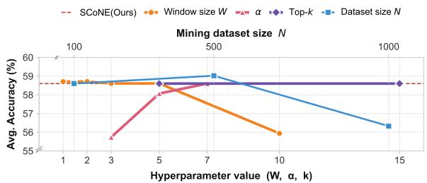
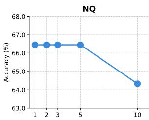
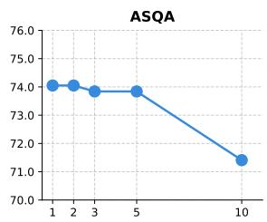
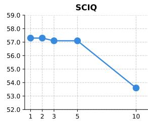
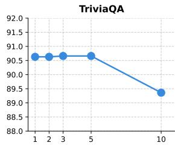
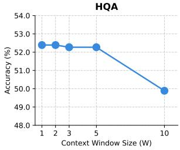
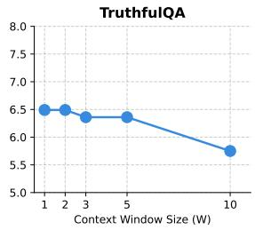
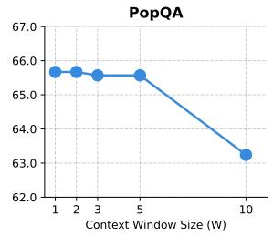

# SCoNE: Selective Context-aware Neuron Editing for Robust Retrieval-Augmented Generation

Chaewon Kim Seo Yeon Park\*

Hanyang University {rud14dns, seoyeonpark}@hanyang.ac.kr

## Abstract

Retrieval-Augmented Generation (RAG) is highly sensitive to retrieval noise: when retrieved documents mix informative and irrelevant context, LLMs are easily distracted, leading to hallucinations. To overcome this, we propose SCoNE (Selective Context-aware Neuron Editing), a training-free model editing approach that improves retrieval noise robustness by selectively strengthening contextaware FFN neurons that are identified by both high attribution and high cross-input variability. SCoNE requires only a small number of mining samples, no fine-tuning, and no inferencetime overhead. Across various knowledgeintensive question-answering benchmarks and two LLM backbones, SCoNE consistently outperforms competitive baseline methods. Our code is available at https://github.com/ HYU-ARK-Lab/SCoNE.

## 1 Introduction

While Large Language Models (LLMs) have achieved remarkable success, they remain prone to hallucinations in knowledge-intensive tasks (Wang and Yu, 2025; Huang et al., 2025). Retrieval-Augmented Generation (RAG) (Lewis et al., 2020) mitigates this by grounding outputs in externally retrieved evidence. However, the effectiveness of RAG is heavily dependent on the quality of retrieved documents, which retrieval systems cannot always guarantee. In realistic settings, retrievers return a mixture of relevant, partially relevant, and irrelevant documents for the same query, and LLMs are known to be easily distracted by such retrieval noise, often degrading rather than improving their answers (Yoran et al., 2024; Shi et al., 2023).

Existing approaches to retrieval noise robustness span several paradigms, including prompt engineering, retrieved-context refinement and fine-tuning.

While solutions such as introducing additional modules (e.g., reranker, compressor) are flexible, they introduce additional components into the RAG pipeline, which can lead to cascading errors across each stage (Asai et al., 2024; Yoran et al., 2024) and substantial inference-time latency (An et al., 2025). In contrast, directly fine-tuning the generator to be robust against retrieval noise avoids such pipeline overhead and has therefore emerged as a promising direction (Yoran et al., 2024; Wu et al., 2025). However, fine-tuning-based methods inherit the well-known drawbacks of gradient-based adaptation: catastrophic forgetting, substantial compute requirements, and the need for carefully curated training data. A natural question arises: can retrieval noise robustness be achieved without retraining the model?

Model editing offers a promising alternative paradigm. By directly modifying a small number of parameters, editing methods provide finegrained control over model behavior without the cost of fine-tuning. However, existing model editing methods fundamentally assume that the target knowledge to be edited is known in advance (Meng et al., 2022, 2023). This assumption does not hold in Retrieval-Augmented Generation (RAG), where retrieved contexts are inherently open-ended and dynamically vary across queries. In RAG, the model cannot anticipate which facts will appear in the retrieved documents at inference time. Hence, rather than fixing a specific parametric knowledge, RAG requires an adaptive approach to constrain the model’s behavior in response to whatever context is retrieved at inference, regardless of its specific content. This challenge is further complicated by the realistic nature of retrieval itself; even for a single query, some documents directly support the answer, others are partially relevant, and others are entirely irrelevant. For this, a method that not only makes the model responsive to context, but selectively responsive to a context (i.e., engaging with informative documents while remaining unaffected by noisy ones) is necessarily required.

Building on this insight, we propose SCoNE (Selective Context-aware Neuron Editing) for RAG, which is a model editing method to enhance robustness for retrieval noise. SCoNE identifies selectively context-aware neurons by jointly requiring high attribution and high cross-input variability, and strengthens them at inference time. Our method requires only 100 mining samples from a single dataset (HotpotQA), no fine-tuning, and no inference-time overhead beyond standard RAG. Across various benchmarks, SCoNE consistently outperforms strong competitive baselines, demonstrating that lightweight editing, when guided by the right neuron selection criterion, can match or exceed the effectiveness of heavyweight fine-tuning pipelines. Similarly, Shi et al. (2024a) adopt a knowledge-agnostic approach but identify contextaware neurons based on attribution strength alone. While this criterion is effective in their singlecontext setting, RAG presents multiple retrieved documents containing both informative and distracting evidence simultaneously. Here, a neuron may receive high attribution simply because it responds broadly to any retrieved content, potentially reflecting sensitivity to surface-level patterns rather than informative evidence. Thus, attribu tion strength alone is insufficient for identifying neurons that specifically mediate useful evidence utilization in noisy retrieval settings. Our redefini tion of context-aware neurons addresses this gap by complementing attribution strength with crossinput variability, making the criterion more suitable for RAG’s heterogeneous, multi-document setting.

## 2 Method

Problem Setup. Consider a neuron mining dataset of size N, sampled from the training split of HotpotQA (Yang et al., 2018), $\begin{array} { r l } { \mathcal { D } } & { { } = } \end{array}$ $\{ ( q , \mathcal { C } , a ) _ { t } \} _ { t = 1 } ^ { N }$ , where the t-th instance consists of a query $q _ { t }$ , its ground-truth answer ${ { a } _ { t } } ,$ and an associated context set $\mathcal { C } _ { t } \ = \ \{ c _ { m } ^ { g } \} _ { m = 1 } ^ { M } \cup \{ c _ { k } ^ { d } \} _ { k = 1 } ^ { K }$ Here, $\{ c _ { m } ^ { g } \} _ { m = 1 } ^ { M }$ denote the gold contexts that directly support $a _ { t } .$ , while $\{ c _ { k } ^ { d } \} _ { k = 1 } ^ { \bar { K } }$ are distractor contexts that do not entail the answer. Our goal is to characterize, for each instance, how individual FFN neurons engage with such mixed evidence during inference. To this end, we define two complementary measures, attribution and variability, computed over the course of inference.

## 2.1 Neuron Mining

Attribution. Prior work has shown that factual knowledge is localized in specific FFN neurons (Dai et al., 2022; Geva et al., 2021). We hypothesize that neurons responsible for processing retrieved contextual information also reside in FFNs, and seek to identify those that engage with retrieved evidence during RAG inference. Following Shi et al. (2024a), we estimate the attribution of each FFN neuron n via Integrated Gradients (Sundararajan et al., 2017), but extend their singlecontext formulation to the multi-context RAG setting where gold and distractor evidence co-occur. For each instance $( q , \mathcal { C } , a ) _ { t } \in \mathcal { D }$ , we quantify how individual FFN neurons contribute to the model’s prediction when the query is presented together with its full context set $\mathcal { C } _ { t } = \{ c _ { m } ^ { \bar { g } } \} _ { m = 1 } ^ { M } \cup \{ c _ { k } ^ { \bar { d } } \} _ { k = 1 } ^ { K } ,$ which contains both gold and distractor contexts. Specifically, we formulate the attribution score calculation as follows: let $v ( q _ { t } )$ denote the activation of neuron n when the model is given the query alone, and let $v ( q _ { t } , \mathcal { C } _ { t } )$ denote its activation when the query is augmented with the full context set $\mathcal { C } _ { t }$ The attribution score is then defined as follows:

$$
\begin{array} { r } { \mathrm { A t t r } ( n ; \mathrm { ~ } q _ { t } , \mathcal { C } _ { t } ) = \big ( v ( \mathrm { ~ } q _ { t } , \mathcal { C } _ { t } ) - v ( \mathrm { ~ } q _ { t } ) \big ) \qquad } \\ { \qquad \times \int _ { \alpha = 0 } ^ { 1 } \frac { \partial P ( a \mid q _ { t } , \mathcal { C } _ { t } , v _ { \alpha } ) } { \partial v _ { \alpha } } d \alpha , } \end{array}\tag{1}
$$

where $v _ { \alpha } = v ( q _ { t } ) + \alpha \big ( v ( q _ { t } , \mathcal { C } _ { t } ) - v ( q _ { t } ) \big )$ linearly interpolates between the query-only and the queryplus-context activations for $\alpha \in [ 0 , 1 ]$ . In practice, the integral is approximated by a 20-step Riemann sum.

Variability. Attribution alone, however, cannot distinguish between two qualitatively different neuron behaviors: neurons that selectively respond to specific contexts and neurons that activate uniformly regardless of context content. Only the former captures the content-level selectivity required in the heterogeneous multi-document setting of RAG. To capture this context selectivity, we measure how a neuron’s attribution varies across different query-context instances. Concretely, let $\mathrm { A t t r } ^ { ( t ) } ( n _ { j } ^ { \bar { l } } )$ denote the attribution of the $j \mathrm { - t h }$ intermediate neuron in the l-th FFN layer for the t-th instance $( q , \mathcal { C } , a ) _ { t } \in \mathcal { D }$ . The variability score is defined as the deviation of the current attribution from its running average over the preceding W instances:

<table><tr><td></td><td>NQ</td><td>ASQA</td><td>SCIQ</td><td>TriviaQA</td><td>HQA</td><td>TruthfulQA</td><td>PopQA</td><td>Avg.</td></tr><tr><td colspan="7">Llama-3-8B-Instruct</td><td></td><td></td></tr><tr><td>RAG (Lewis et al., 2020)</td><td>62.81</td><td>68.78</td><td>54.10</td><td>88.65</td><td>46.55</td><td>4.90</td><td>60.17</td><td>55.14</td></tr><tr><td>RetRobust (Yoran et al., 2024)</td><td>62.71</td><td>69.62</td><td>53.10</td><td>88.53</td><td>46.39</td><td>5.14</td><td>60.64</td><td>55.16</td></tr><tr><td>PA-RAG (Wu et al., 2025)</td><td>68.06</td><td>73.73</td><td>56.80</td><td>90.18</td><td>50.41</td><td>3.79</td><td>64.19</td><td>58.17</td></tr><tr><td>CAD (Shi et al., 2024b)</td><td>64.12</td><td>68.99</td><td>48.50</td><td>87.81</td><td>46.77</td><td>3.55</td><td>62.21</td><td>54.56</td></tr><tr><td>IRCAN (Shi et al., 2024a)</td><td>64.65</td><td>71.41</td><td>54.00</td><td>89.67</td><td>50.11</td><td>5.51</td><td>63.65</td><td>57.00</td></tr><tr><td>SCoNE (Ours)</td><td>66.44</td><td>73.84</td><td>57.10</td><td>90.66</td><td>52.27</td><td>6.36</td><td>65.57</td><td>58.89</td></tr><tr><td>Qwen-2.5-7B-Instruct</td><td></td><td></td><td></td><td></td><td></td><td></td><td></td><td></td></tr><tr><td>RAG (Lewis et al., 2020)</td><td>62.25</td><td>69.09</td><td>54.90</td><td>86.98</td><td>45.54</td><td>6.24</td><td>58.54</td><td>54.79</td></tr><tr><td>RetRobust (Yoran et al., 2024)</td><td>60.73</td><td>67.19</td><td>53.90</td><td>86.83</td><td>44.41</td><td>5.51</td><td>57.48</td><td>53.72</td></tr><tr><td>PA-RAG (Wu et al., 2025)</td><td>60.45</td><td>68.35</td><td>52.90</td><td>87.54</td><td>48.00</td><td>6.00</td><td>56.65</td><td>54.27</td></tr><tr><td>CAD (Shi et al., 2024b)</td><td>61.83</td><td>69.62</td><td>51.50</td><td>85.62</td><td>43.88</td><td>4.04</td><td>58.84</td><td>53.62</td></tr><tr><td>IRCAN (Shi et al., 2024a)</td><td>62.25</td><td>68.78</td><td>54.20</td><td>87.28</td><td>45.86</td><td>6.00</td><td>58.82</td><td>54.74</td></tr><tr><td>SCoNE (Ours)</td><td>63.24</td><td>69.94</td><td>56.20</td><td>88.16</td><td>47.00</td><td>5.63</td><td>60.04</td><td>55.74</td></tr></table>

Table 1: Accuracy comparison across QA benchmarks using Llama-3-8B-Instruct (top) and Qwen-2.5-7B-Instruct (bottom). Bold scores are best in each dataset, and underlined scores are the second-best results.

$$
V ^ { ( t ) } ( n _ { j } ^ { l } ) = \left| \mathrm { A t t r } ^ { ( t ) } ( n _ { j } ^ { l } ) - \frac { 1 } { W } \sum _ { m = t - W } ^ { t - 1 } \mathrm { A t t r } ^ { ( m ) } ( n _ { j } ^ { l } ) \right|\tag{2}
$$

where $W$ denotes the number of preceding instances used to compute the running average. We compute this score over a fixed traversal order of the mining set $\mathcal { D } _ { : }$ so that the sliding window captures local variation in the neuron’s attribution across neighboring instances in the traversal.

High-Attribution and Variability Neuron Selection. Neurons with both high attribution and high variability are considered context-aware: they contribute strongly to the current context while responding differently across inputs. Hence, we select the neurons as follows: For each sample $( q , \mathcal { C } , a ) _ { t }$ , we construct $\mathbf { \mathcal { A } } ^ { ( t ) }$ and $B ^ { ( t ) }$ , containing the top-50 neurons ranked by attribution and variability, respectively, restricted to neurons with positive attribution scores.1 Their intersection $\mathsf { \tilde { C } } ^ { ( t ) } = \mathcal { A } ^ { ( t ) } \cap B ^ { ( t ) }$ forms the locally selected neurons for sample t. We then aggregate the selection frequency of each neuron across all samples and choose the top-k most frequent neurons as the final context-aware neuron set. For scale, we treat each layer-specific FFN dimension as a distinct neuron. Llama-3-8B-Instruct contains $3 2 \times 1 4 { , } 3 3 6 =$ 458,752 such neurons. Each of the top-50 sets $\mathbf { \mathcal { A } } ^ { ( t ) }$ and $B ^ { ( t ) }$ corresponds $\mathrm { { t o } \approx 0 . 0 1 0 9 \% }$ of all layer-specific FFN neurons. With $k = 5$ , the final neuron set therefore contains ≈ 0.0011% of all layer-specific FFN neurons.

## 2.2 Neuron Enhancement

Once context-aware neurons are identified, we amplify their contribution at inference time to better leverage informative retrieved evidence. For each selected neuron $n _ { i } ^ { l } ,$ we scale its corresponding FFN weight as follows: $\hat { W } ( n _ { i } ^ { l } ) = \boldsymbol { \alpha } \cdot \boldsymbol { W } ( n _ { i } ^ { l } )$ , where α controls the enhancement strength.

## 3 Experimental Setup

Neuron Mining Dataset. We sample the first 100 instances from the HotpotQA (Yang et al., 2018) training split for neuron mining. We set the number of gold-content $M = 2 .$ , and the distractor context $K = 8$

Evaluation Dataset. We use the dev splits provided by BERGEN (Rau et al., 2024) for NQ (Kwiatkowski et al., 2019), ASQA (Stelmakh et al., 2022), SCIQ (Welbl et al., 2017), TriviaQA (Joshi et al., 2017), HotpotQA (Yang et al., 2018), TruthfulQA (Lin et al., 2022), PopQA (Mallen et al., 2023). All retrieval documents are sourced from the KILT (Petroni et al., 2021) Wikipedia $\mathrm { d u m p } ^ { 2 }$ , and we retrieve top-5 documents per question using SPLADE-v3 (Lassance et al., 2024).

Baselines. We compare SCoNE against representative RAG baselines: RAG (Lewis et al., 2020); RetRobust (Yoran et al., 2024) and PA-RAG (Wu et al., 2025) for generator fine-tuning; and CAD (Shi et al., 2024b) and IRCAN (Shi et al., 2024a) for inference-time intervention at the decoding and parameter level, respectively.

<table><tr><td></td><td colspan="3">Relevant</td><td colspan="3">Irrelevant</td></tr><tr><td>Llama-3-8B-Instruct</td><td>NQ</td><td>SCIQ</td><td>HQA</td><td>NQ</td><td>SCIQ</td><td>HQA</td></tr><tr><td>RAG (Lewis et al., 2020)</td><td>78.04</td><td>73.61</td><td>72.75</td><td>4.43</td><td>8.36</td><td>15.16</td></tr><tr><td>PA-RAG (Wu et al., 2025)</td><td>85.29</td><td>78.60</td><td>81.26</td><td>2.04</td><td>5.69</td><td>13.43</td></tr><tr><td>IRCAN (Shi et al., 2024a)</td><td>80.44</td><td>73.75</td><td>76.88</td><td>4.09</td><td>7.69</td><td>18.02</td></tr><tr><td>SCoNE (Ours)</td><td>82.00</td><td>78.03</td><td>79.53</td><td>6.81</td><td>8.03</td><td>19.59</td></tr></table>

Table 2: The comparison of accuracy on Relevant and Irrelevant subsets.

Implementation Details. Our experiments are performed using the RAG framework provided by BERGEN (Rau et al., 2024), which offers a realistic RAG pipeline. We use Llama-3-8B-Instruct (Llama Team, 2024) and Qwen-2.5-7B-Instruct (Yang et al., 2024) as the generator LLM, and SPLADE-v3 (Lassance et al., 2024) as the retriever. For retrieval, we use the KILT Wikipedia dump3, preprocessed into non-overlapping 100- word chunks, and retrieve five documents per question. All experiments are conducted on a single NVIDIA H200 GPU. For fair comparison, both IRCAN and our method identify neurons from the same neuron mining dataset D. Details of D are provided in A.1. We set the enhancement strength α = 7, select the top-k context-aware neurons where k = 5, and the window size W = 3.

## 4 Results

Main Results. Table 1 reports the main results. Accuracy is measured using the Match score, which checks whether the gold answer appears as a substring of the generated output. SCoNE achieves the best overall performance with Llama-3-8B-Instruct, ranking first on six of seven datasets and improving over RAG by 3.75% on average. Compared to finetuning baselines, SCoNE outperforms RetRobust by 3.73% and remains within 0.72% of PA-RAG despite requiring no additional training. Against intervention-based baselines, SCoNE surpasses CAD on all datasets and improves over IRCAN by up to 3.1% on SCIQ using Llama-3-8b-Instruct, suggesting that our variability-based criterion identifies neurons more selectively responsive to retrieved context than attribution alone. A similar trend holds with Qwen-2.5-7B-Instruct as the generator, where SCoNE consistently outperforms IRCAN across most benchmarks. SCoNE achieves the best average accuracy, demonstrating its effectiveness across different generators. This advantage is also preserved under LLM-based evaluation (Appendix A.4). We confirm that SCoNE’s improvements stem from neuron selection: randomly selected neurons remain on par with vanilla RAG (Appendix A.5). We further verify that these gains are robust to the choice of mining sample, with accuracy remaining stable across different 100-example samples from HotpotQA (Appendix A.6).

<table><tr><td>Measure</td><td>NQ</td><td>SCIQ</td><td>HQA</td></tr><tr><td>Variance / Std.</td><td>63.52</td><td>54.70</td><td>50.25</td></tr><tr><td>Mean Absolute Deviation (MAD)</td><td>64.61</td><td>54.10</td><td>50.27</td></tr><tr><td>SCoNE</td><td>66.44</td><td>57.10</td><td>52.27</td></tr></table>

Table 3: The comparison of the proposed variability with order-invariant measures for neuron selection on Llama-3-8B-Instruct.

Relevant vs. Irrelevant Context Analysis. To examine whether our method exhibits contextdependent behavior with retrieved contexts, we divide each evaluation set into two subsets: Relevant, where at least one retrieved document contains the gold answer, and Irrelevant, otherwise. As shown in Table 2, SCoNE consistently improves over RAG and IRCAN on the relevant subset across all datasets. While PA-RAG achieves the highest accuracy on the relevant subset, SCoNE demonstrates stronger robustness under irrelevant contexts, outperforming all baselines, including vanilla RAG, on NQ and HQA. This robustness holds under a controlled noise experiment (Appendix A.12). Notably, SCoNE surpasses IRCAN on both the Relevant and Irrelevant subsets, suggesting that incorporating cross-input variability beyond attribution strength helps identify neurons that selectively engage with informative evidence. This selectivity is reflected in their activation patterns across different retrieved-evidence compositions (Appendix A.11).

Comparison of Variability Measures Our variability measure in Eq. 2 uses an unsigned running residual and thus depends on example order. We compare it with three order-invariant alternatives— variance, standard deviation, and mean absolute deviation (MAD)—computed over the full set of attribution scores for each neuron, irrespective of their traversal order. With all other settings fixed, Table 3 shows that SCoNE consistently outperforms these measures across all three datasets on Llama-3-8B-Instruct. Variance and standard deviation yield identical results because they induce the same neuron ranking and select the same top-5 neurons. Overall, the results suggest that SCoNE’s running-residual formulation provides a more effective variability signal for identifying selective

<table><tr><td>Selection</td><td>NQ</td><td>SCIQ</td><td>HotpotQA</td></tr><tr><td>Attr-only</td><td>64.61</td><td>54.10</td><td>50.27</td></tr><tr><td>Var-only</td><td>63.52</td><td>54.70</td><td>50.25</td></tr><tr><td>Attr+Var (SCoNE)</td><td>66.44</td><td>57.10</td><td>52.27</td></tr></table>

Table 4: The comparison of neuron selection criteria on Llama-3-8B-Instruct.

## context-aware neurons.

Ablation on Neuron Selection Criteria To isolate the contribution of cross-input variability beyond attribution alone, we compare three neuronselection strategies while keeping all other settings identical: Attr-only, Var-only, and Attr+Var (SCoNE). In Table 4 Attr+Var consistently outperforms Attr-only by 1.83, 3.00, and 2.00% on NQ, SCIQ, and HotpotQA, respectively. Var-only is insufficient by itself, whereas its combination with attribution consistently yields the best performance. This demonstrates that variability provides a complementary and substantive signal for neuron identification.

Hyperparameter Analysis. We conduct ablation studies on the enhancement strength α, context window size W, neuron mining dataset size N, and the number of selected neurons k using Llama-3-8B-Instruct. The result is shown in Figure 1.4 Performance improves monotonically with α, peaking at α = 7, and remains stable across small-to-moderate W, N, and k. Overall, while extreme hyperparameter values (e.g., W = 10 or N = 1000) degrade performance, the default SCoNE configuration denoted as SCoNE (Ours) consistently achieves the best or near-best performance, validating our design choices.5

## 5 Related Work

Retrieval Noise Robustness in RAG. Prior work has addressed retrieval noise in Retrieval-Augmented Generation (RAG) through prompt engineering (Zhou et al., 2023), analyses of retrieved-context composition (Cuconasu et al., 2024), retrieved-context refinement, and finetuning. Retrieved-context refinement includes reranking and compression (Glass et al., 2022; Xu et al., 2024), with recent approaches further exploring compact clue selection (Zhang et al.,

  
Figure 1: Ablation study on key hyperparameters using Llama-3-8B-Instruct. Results are averaged across NQ, SCIQ, and HotpotQA.

2026a), reinforcement-learning-based evidence extraction (Zhao et al., 2026), and attention-based context compression (Zhang et al., 2026b). Finetuning approaches instead adapt the generator itself to improve robustness against retrieval noise. Yoran et al. (2024) train the generator on mixtures of relevant and irrelevant contexts, while Wu et al. (2025) align it via multi-perspective preference optimization. More recently, Wu et al. (2026) incorporate conflict signals into multi-stage learning to improve robustness against conflicting retrieved knowledge.

Model Editing for Context Utilization. Model editing modifies model parameters to alter knowledge or behavior without additional training. Methods typically target specific knowledge known in advance (Meng et al., 2022, 2023). Recent studies have extended model-level interventions toward knowledge-agnostic control of contextual knowledge utilization. Shi et al. (2024a) perform neuronlevel model editing by identifying and reweighting context-aware neurons based on attribution strength, enabling knowledge-agnostic adaptation to contextual knowledge. SCoNE builds on this knowledge-agnostic, neuron-level perspective for noisy multi-document RAG, where informative and distracting contexts coexist. It therefore complements attribution strength with cross-input variability to identify selectively context-responsive neurons.

## 6 Conclusion

We present SCoNE, a framework that improves RAG robustness to retrieval noise by selectively enhancing context-aware neurons, identified through attribution strength and cross-input variability. Experiments across various benchmarks show that SCoNE matches or surpasses strong baselines, demonstrating that variability-based neuron mining provides a practical criterion.

## Limitations

While the selected neurons transfer effectively across diverse benchmarks, several limitations remain. In this work, neuron mining is performed using samples from HotpotQA only, and it remains unclear how the characteristics of the mining dataset influence the selected neuron set and downstream behavior. For example, using more challenging QA datasets may lead to different neuron distributions and transfer properties. In addition, our current setting relies on contexts containing both gold-content and distractor-content. Therefore, it remains unclear how neuron selection would differ under cleaner retrieval settings containing only gold supporting documents. Investigating how mining dataset composition and retrieval conditions affect neuron mining and robustness remains an important direction for future work.

## Acknowledgments

This work was supported by the National Research Foundation of Korea (NRF) grant funded by the Korea government (MSIT) (RS-2025-24535182 and RS-2026-25498006).

## References

Yuwei An, Yihua Cheng, Seo Jin Park, and Junchen Jiang. 2025. Hyperrag: Enhancing qualityefficiency tradeoffs in retrieval-augmented generation with reranker kv-cache reuse. arXiv preprint arXiv:2504.02921.

Akari Asai, Zeqiu Wu, Yizhong Wang, Avirup Sil, and Hannaneh Hajishirzi. 2024. Self-RAG: Learning to retrieve, generate, and critique through self-reflection. In The Twelfth International Conference on Learning Representations.

Peter Clark, Isaac Cowhey, Oren Etzioni, Tushar Khot, Ashish Sabharwal, Carissa Schoenick, and Oyvind Tafjord. 2018. Think you have solved question answering? try arc, the AI2 reasoning challenge. CoRR, abs/1803.05457.

Florin Cuconasu, Giovanni Trappolini, Federico Siciliano, Simone Filice, Cesare Campagnano, Yoelle Maarek, Nicola Tonellotto, and Fabrizio Silvestri. 2024. The power of noise: Redefining retrieval for rag systems. In Proceedings of the 47th International ACM SIGIR Conference on Research and Development in Information Retrieval, SIGIR ’24, page 719–729, New York, NY, USA. Association for Computing Machinery.

Damai Dai, Li Dong, Yaru Hao, Zhifang Sui, Baobao Chang, and Furu Wei. 2022. Knowledge neurons in

pretrained transformers. In Proceedings ofthe 60th Annual Meeting of the Association for Computational Linguistics (Volume 1: Long Papers), pages 8493– 8502, Dublin, Ireland. Association for Computational Linguistics.

Leo Gao, Jonathan Tow, Baber Abbasi, Stella Biderman, Sid Black, Anthony DiPofi, Charles Foster, Laurence Golding, Jeffrey Hsu, Alain Le Noac’h, Haonan Li, Kyle McDonell, Niklas Muennighoff, Chris Ociepa, Jason Phang, Laria Reynolds, Hailey Schoelkopf, Aviya Skowron, Lintang Sutawika, and 5 others. 2024. The language model evaluation harness.

Mor Geva, Roei Schuster, Jonathan Berant, and Omer Levy. 2021. Transformer feed-forward layers are keyvalue memories. In Proceedings ofthe 2021 Conference on Empirical Methods in Natural Language Processing, pages 5484–5495, Online and Punta Cana, Dominican Republic. Association for Computational Linguistics.

Michael Glass, Gaetano Rossiello, Md Faisal Mahbub Chowdhury, Ankita Naik, Pengshan Cai, and Alfio Gliozzo. 2022. Re2G: Retrieve, rerank, generate. In Proceedings ofthe 2022 Conference ofthe North American Chapter of the Association for Computational Linguistics: Human Language Technologies, pages 2701–2715, Seattle, United States. Association for Computational Linguistics.

Lei Huang, Weijiang Yu, Weitao Ma, Weihong Zhong, Zhangyin Feng, Haotian Wang, Qianglong Chen, Weihua Peng, Xiaocheng Feng, Bing Qin, and Ting Liu. 2025. A survey on hallucination in large language models: Principles, taxonomy, challenges, and open questions. ACM Transactions on Information Systems, 43(2):1–55.

Mandar Joshi, Eunsol Choi, Daniel Weld, and Luke Zettlemoyer. 2017. TriviaQA: A large scale distantly supervised challenge dataset for reading comprehension. In Proceedings of the 55th Annual Meeting of the Associationfor Computational Linguistics (Volume 1: Long Papers), pages 1601–1611, Vancouver, Canada. Association for Computational Linguistics.

Tom Kwiatkowski, Jennimaria Palomaki, Olivia Redfield, Michael Collins, Ankur Parikh, Chris Alberti, Danielle Epstein, Illia Polosukhin, Jacob Devlin, Kenton Lee, Kristina Toutanova, Llion Jones, Matthew Kelcey, Ming-Wei Chang, Andrew M. Dai, Jakob Uszkoreit, Quoc Le, and Slav Petrov. 2019. Natural questions: A benchmark for question answering research. Transactions ofthe Associationfor Computational Linguistics, 7:452–466.

Carlos Lassance, Hervé Déjean, Thibault Formal, and Stéphane Clinchant. 2024. Splade-v3: New baselines for splade. arXiv preprint arXiv:2403.06789.

Patrick Lewis, Ethan Perez, Aleksandra Piktus, Fabio Petroni, Vladimir Karpukhin, Naman Goyal, Heinrich Küttler, Mike Lewis, Wen-tau Yih, Tim Rocktäschel, Sebastian Riedel, and Douwe Kiela. 2020.

Retrieval-augmented generation for knowledgeintensive nlp tasks. In Advances in Neural Information Processing Systems, volume 33, pages 9459– 9474. Curran Associates, Inc.

Stephanie Lin, Jacob Hilton, and Owain Evans. 2022. TruthfulQA: Measuring how models mimic human falsehoods. In Proceedings ofthe 60th Annual Meeting ofthe Associationfor Computational Linguistics (Volume 1: Long Papers), pages 3214–3252, Dublin, Ireland. Association for Computational Linguistics.

Alisa Liu and Jiacheng Liu. 2023. The memotrap dataset.

AI @ Meta Llama Team. 2024. The llama 3 herd of models. Preprint, arXiv:2407.21783.

Alex Mallen, Akari Asai, Victor Zhong, Rajarshi Das, Daniel Khashabi, and Hannaneh Hajishirzi. 2023. When not to trust language models: Investigating effectiveness of parametric and non-parametric memories. In Proceedings of the 61st Annual Meeting of the Association for Computational Linguistics (Volume 1: Long Papers), pages 9802–9822, Toronto, Canada. Association for Computational Linguistics.

Kevin Meng, David Bau, Alex Andonian, and Yonatan Belinkov. 2022. Locating and editing factual associations in gpt. In Advances in Neural Information Processing Systems, volume 35, pages 17359–17372. Curran Associates, Inc.

Kevin Meng, Arnab Sen Sharma, Alex Andonian, Yonatan Belinkov, and David Bau. 2023. Mass editing memory in a transformer. The Eleventh International Conference on Learning Representations (ICLR).

Fabio Petroni, Aleksandra Piktus, Angela Fan, Patrick Lewis, Majid Yazdani, Nicola De Cao, James Thorne, Yacine Jernite, Vladimir Karpukhin, Jean Maillard, Vassilis Plachouras, Tim Rocktäschel, and Sebastian Riedel. 2021. KILT: a benchmark for knowledge intensive language tasks. In Proceedings ofthe 2021 Conference of the North American Chapter of the Associationfor Computational Linguistics: Human Language Technologies, pages 2523–2544, Online. Association for Computational Linguistics.

David Rau, Hervé Déjean, Nadezhda Chirkova, Thibault Formal, Shuai Wang, Stéphane Clinchant, and Vassilina Nikoulina. 2024. BERGEN: A benchmarking library for retrieval-augmented generation. In Findings ofthe Associationfor Computational Linguistics: EMNLP 2024, pages 7640–7663, Miami, Florida, USA. Association for Computational Linguistics.

Dan Shi, Renren Jin, Tianhao Shen, Weilong Dong, Xinwei Wu, and Deyi Xiong. 2024a. Ircan: Mitigating knowledge conflicts in llm generation via identifying and reweighting context-aware neurons. Advances in Neural Information Processing Systems, 37:4997– 5024.

Freda Shi, Xinyun Chen, Kanishka Misra, Nathan Scales, David Dohan, Ed H Chi, Nathanael Schärli, and Denny Zhou. 2023. Large language models can be easily distracted by irrelevant context. In Proceedings ofthe 40th International Conference on Machine Learning, volume 202, pages 31210–31227. PMLR.

Weijia Shi, Xiaochuang Han, Mike Lewis, Yulia Tsvetkov, Luke Zettlemoyer, and Wen-tau Yih. 2024b. Trusting your evidence: Hallucinate less with contextaware decoding. In Proceedings of the 2024 Conference of the North American Chapter of the Association for Computational Linguistics: Human Language Technologies (Volume 2: Short Papers), pages 783–791, Mexico City, Mexico. Association for Computational Linguistics.

Ivan Stelmakh, Yi Luan, Bhuwan Dhingra, and Ming-Wei Chang. 2022. ASQA: Factoid questions meet long-form answers. In Proceedings ofthe 2022 Conference on Empirical Methods in Natural Language Processing, pages 8273–8288, Abu Dhabi, United Arab Emirates. Association for Computational Linguistics.

Mukund Sundararajan, Ankur Taly, and Qiqi Yan. 2017. Axiomatic attribution for deep networks. In Proceedings of the 34th International Conference on Machine Learning, volume 70, pages 3319–3328. PMLR.

Shuai Wang and Yinan Yu. 2025. iQUEST: An iterative question-guided framework for knowledge base question answering. In Proceedings ofthe 63rd Annual Meeting of the Association for Computational Linguistics (Volume 1: Long Papers), pages 15616– 15628, Vienna, Austria. Association for Computational Linguistics.

Johannes Welbl, Nelson F. Liu, and Matt Gardner. 2017. Crowdsourcing multiple choice science questions. In Proceedings ofthe 3rd Workshop on Noisy Usergenerated Text, pages 94–106, Copenhagen, Denmark. Association for Computational Linguistics.

Haiyan Wu, Chenchen Wang, Chaoqun Sun, Chengxiong Lu, Zhiqiang Zhang, and Yanhong Chen. 2026. Conflict-aware rag: Multi-stage learning with conflict signals for robust retrieval-augmented generation. In Proceedings of the ACM Web Conference 2026, WWW ’26, page 2114–2125, New York, NY, USA. Association for Computing Machinery.

Jiayi Wu, Hengyi Cai, Lingyong Yan, Hao Sun, Xiang Li, Shuaiqiang Wang, Dawei Yin, and Ming Gao. 2025. PA-RAG: RAG alignment via multiperspective preference optimization. In Proceedings ofthe 2025 Conference ofthe Nations ofthe Americas Chapter of the Association for Computational Linguistics: Human Language Technologies (Volume 1: Long Papers), pages 9091–9112, Albuquerque, New Mexico. Association for Computational Linguistics.

Fangyuan Xu, Weijia Shi, and Eunsol Choi. 2024. RE-COMP: improving retrieval-augmented lms with context compression and selective augmentation. In The

Twelfth International Conference on Learning Representations, ICLR 2024, Vienna, Austria, May 7-11, 2024. OpenReview.net.

An Yang, Baosong Yang, Beichen Zhang, Binyuan Hui, Bo Zheng, Bowen Yu, Chengyuan Li, Dayiheng Liu, Fei Huang, Haoran Wei, Huan Lin, Jian Yang, Jianhong Tu, Jianwei Zhang, Jianxin Yang, Jiaxi Yang, Jingren Zhou, Junyang Lin, Kai Dang, and 23 others. 2024. Qwen2.5 technical report. arXiv preprint arXiv:2412.15115.

Zhilin Yang, Peng Qi, Saizheng Zhang, Yoshua Bengio, William Cohen, Ruslan Salakhutdinov, and Christopher D. Manning. 2018. HotpotQA: A dataset for diverse, explainable multi-hop question answering. In Proceedings of the 2018 Conference on Empirical Methods in Natural Language Processing, pages 2369–2380, Brussels, Belgium. Association for Computational Linguistics.

Ori Yoran, Tomer Wolfson, Ori Ram, and Jonathan Berant. 2024. Making retrieval-augmented language models robust to irrelevant context. In The Twelfth International Conference on Learning Representations, ICLR 2024, Vienna, Austria, May 7-11, 2024. OpenReview.net.

Rowan Zellers, Ari Holtzman, Yonatan Bisk, Ali Farhadi, and Yejin Choi. 2019. HellaSwag: Can a machine really finish your sentence? In Proceedings of the 57th Annual Meeting ofthe Associationfor Computational Linguistics, pages 4791–4800, Florence, Italy. Association for Computational Linguistics.

Qianchi Zhang, Hainan Zhang, Liang Pang, Yongxin Tong, Hongwei Zheng, and Zhiming Zheng. 2026a. Less is more: Compact clue selection for efficient retrieval-augmented generation reasoning. In Proceedings ofthe ACM Web Conference 2026, WWW ’26, page 1971–1982, New York, NY, USA. Association for Computing Machinery.

Yong Zhang, Heng Li, Yanwen Huang, Ning Cheng, Yang Guo, Yun Zhu, Yanmeng Wang, Shaojun Wang, and Jing Xiao. 2026b. Sentinel: Decoding context utilization via attention probing for efficient llm context compression. Preprint, arXiv:2505.23277.

Xinping Zhao, Shouzheng Huang, Yan Zhong, Xinshuo Hu, Meishan Zhang, Baotian Hu, and Min Zhang. 2026. Learning to extract rational evidence via reinforcement learning for retrieval-augmented generation. In Findings of the Association for Computa tional Linguistics: ACL 2026, pages 15934–15956, San Diego, California, United States. Association for Computational Linguistics.

Wenxuan Zhou, Sheng Zhang, Hoifung Poon, and Muhao Chen. 2023. Context-faithful prompting for large language models. In Findings of the Association for Computational Linguistics: EMNLP 2023, pages 14544–14556, Singapore. Association for Computational Linguistics.

## A Appendix

## A.1 Neuron Mining Dataset Setting

For neuron mining, we use the first 100 samples from the HotpotQA training distractor split (Yang et al., 2018). To simulate a realistic RAG setting where multiple retrieved documents are provided as input, we convert each sample into the contextprovided prompt format shown in Table 5, where all documents in the sample are directly used as the input context without an additional retriever. The corresponding prompt format without retrieved context is shown in Table 6.

Input Format With Retrieved Context   
System: Your task is to extract relevant information   
from provided documents and to answer questions as   
briefly as possible.   
User:   
Background:   
Document 1: [title] [sentences]   
Document 2: [title] [sentences]   
..   
Document N: [title] [sentences]   
Question: [question]  
Table 5: Input prompt format with retrieved context, used for attribution score computation.

Input Format Without Retrieved Context   
System: Answer the questions as briefly as possible.   
User: Question: [question]  
Table 6: Input prompt format without retrieved context, used for attribution score computation.

## A.2 Baseline Implementation Details

To ensure a consistent comparison, for PA-RAG, we use the authors’ publicly released Llama-3-8B-Instruct checkpoint and reproduce the method on Qwen-2.5-7B-Instruct using their training recipe. For RetRobust, we reproduce results on LLaMA-3-8B-Instruct and Qwen-2.5-7B-Instruct using the authors’ training recipe. For CAD, we set α = 0.5. For IRCAN, we use the same backbone as SCoNE and select the top 20 neurons by attribution as the candidate pool, with α = 7 and k = 5 final neurons.

Inference Input Format   
System: You are a helpful assistant. Your task is to   
extract relevant information from provided documents   
and to answer questions as briefly as possible.   
User:   
Background:   
Document 1: ...   
Document 2: ...   
.   
Document 5: ...   
Question: [question]

Table 7: Input prompt format used for inference-time RAG.
<table><tr><td>Method</td><td>SCIQ</td><td>NQ</td><td>HQA</td></tr><tr><td>RAG</td><td>67.00</td><td>57.03</td><td>52.14</td></tr><tr><td>PA-RAG</td><td>60.80</td><td>55.66</td><td>52.21</td></tr><tr><td>CAD</td><td>59.40</td><td>56.75</td><td>47.12</td></tr><tr><td>IRCAN</td><td>67.80</td><td>57.81</td><td>54.70</td></tr><tr><td>SCoNE (Ours)</td><td>67.90</td><td>58.69</td><td>54.39</td></tr></table>

Table 8: LLM-based evaluation results on Llama-3-8B-Instruct using GPT-5-mini as the judge.

## A.3 Inference-Time RAG Prompt

The prompt format used for inference-time RAG generation is shown in Table 7. The “Background” section consists of the top-5 documents retrieved by the retriever.

## A.4 LLM-based Evaluation

We evaluate model outputs using GPT-5-mini as an LLM judge on NQ, SCIQ, and HotpotQA with Llama-3-8B-Instruct. We use the LLM-as-a-judge evaluation protocol provided by Rau et al. (2024). As shown in Table 8, SCoNE achieves the highest average score and the best performance on two of the three datasets.

## A.5 Random Neuron Selection

To test whether SCoNE ’s gains depend on neuron selection, we select five random neurons and apply the identical enhancement strength on Llama-3-8B-Instruct. As shown in Table 9, random neuron selection yields performance comparable to vanilla RAG across all three datasets. In contrast, SCoNE, using the same strength, achieves the best performance across datasets, suggesting that neuron selection drives the gain.

<table><tr><td>Method</td><td>NQ</td><td>SCIQ</td><td>HQA</td><td>Avg.</td></tr><tr><td>Random (seed 42)</td><td>62.71</td><td>54.10</td><td>46.68</td><td>54.50</td></tr><tr><td>Random (seed 77)</td><td>62.53</td><td>53.90</td><td>46.70</td><td>54.38</td></tr><tr><td>Random (seed 99)</td><td>62.46</td><td>54.10</td><td>46.48</td><td>54.35</td></tr><tr><td>Random (seed 512)</td><td>62.99</td><td>53.80</td><td>46.45</td><td>54.41</td></tr><tr><td>Random (seed 256)</td><td>62.81</td><td>53.90</td><td>46.54</td><td>54.42</td></tr><tr><td>RAG</td><td>62.81</td><td>54.10</td><td>46.55</td><td>54.49</td></tr><tr><td>SCoNE</td><td>66.44</td><td>57.10</td><td>52.27</td><td>58.60</td></tr></table>

Table 9: Random-neuron control experiment on Llama-3-8B-Instruct. Each random selection uses the same number of neurons $k = 5$ and enhancement strength α = 7 as SCoNE.
<table><tr><td>Mining Set</td><td>Accuracy</td></tr><tr><td>First 100 (Ours)</td><td>52.27</td></tr><tr><td>Seed 11</td><td>53.75</td></tr><tr><td>Seed 55</td><td>53.14</td></tr><tr><td>Seed 741</td><td>52.77</td></tr><tr><td>Seed 333</td><td>52.64</td></tr><tr><td>Seed 512</td><td>52.54</td></tr><tr><td>Seed 150</td><td>52.50</td></tr><tr><td>Seed 421</td><td>52.48</td></tr><tr><td>Seed 107</td><td>52.46</td></tr><tr><td>Seed 909</td><td>52.39</td></tr><tr><td> $\mathbf { A v g . } \pm \mathbf { S t d . }$ </td><td> $5 2 . 6 9 \pm 0 . 4 4$ </td></tr></table>

Table 10: Sensitivity to the choice of neuron-mining examples on HotpotQA using Llama-3-8B-Instruct. The first row uses the initial 100 training examples, while the remaining rows use 100 examples randomly sampled with different seeds.

## A.6 Sensitivity to Mining Samples

We show that SCoNE maintains its performance across different sets of 100 examples used for mining. The seed only determines which 100 examples are drawn from the HotpotQA training split. We therefore mined neurons with various random seeds on Llama-3-8B-Instruct and evaluated on HotpotQA. As shown in Table 10, match accuracy remains stable across seeds $( 5 2 . 6 9 \pm 0 . 4 4 )$

## A.7 Effect of Enhancement Strength and Number of Selected Neurons

We additionally evaluate different enhancement strengths $\alpha ~ \in ~ \{ 3 , 5 , 7 \}$ and top-k values $k \in$ {5, 15} on NQ, HotpotQA, and SCIQ using Llama-3-8B-Instruct. Larger enhancement strengths generally lead to better performance, with $\alpha = 7$ achieving the strongest overall results. We also observe that $k = 5$ and $k = 1 5$ yield comparable performance, suggesting that the neurons most important for selective context utilization are already concentrated within a small set of top-ranked neurons.

<table><tr><td rowspan="2">α</td><td colspan="2">NQ</td><td colspan="2">SCIQ</td><td colspan="2">HQA</td></tr><tr><td>k=5</td><td>k=15</td><td>k=5</td><td>k=15</td><td>k=5</td><td>k=15</td></tr><tr><td>3</td><td>63.80</td><td>63.27</td><td>53.50</td><td>54.00</td><td>49.91</td><td>49.57</td></tr><tr><td>5</td><td>65.81</td><td>65.67</td><td>56.20</td><td>58.00</td><td>52.20</td><td>52.66</td></tr><tr><td>7</td><td>66.44</td><td>66.02</td><td>57.10</td><td>57.70</td><td>52.27</td><td>52.09</td></tr></table>

Table 11: Effect of enhancement strength α and top-k neuron mining.
<table><tr><td>Pool Size</td><td>HQA</td><td>SCIQ NQ</td></tr><tr><td colspan="3">Llama-3-8B-Instruct</td></tr><tr><td>Top-20</td><td>52.46 57.90</td><td>66.55</td></tr><tr><td rowspan="2">Top-50 Top-80</td><td>52.27 57.10</td><td>66.44</td></tr><tr><td>50.25 54.70</td><td>63.52</td></tr><tr><td colspan="3">Qwen-2.5-7B-Instruct</td></tr><tr><td>Top-20</td><td>46.04 53.90</td><td>62.50</td></tr><tr><td>Top-50</td><td>47.00 56.20</td><td>63.24</td></tr><tr><td>Top-80</td><td>46.04 53.90</td><td>62.50</td></tr></table>

Table 12: Effect of candidate pool size.

## A.8 Effect of Candidate Pool Size

To validate the choice of 50 candidate neurons, we vary the size of $A ^ { ( t ) }$ and $B ^ { ( t ) }$ over {20, 50, 80} before taking their intersection. Table 12 reports the results on HotpotQA, SCIQ, and NQ using Llama-3-8B-Instruct and Qwen-2.5-7B-Instruct.

We observe that Top-20 is marginally higher than Top-50 by 0.1-0.8 points on Llama-3-8B-Instruct, but on Qwen-2.5-7B-Instruct, Top-50 is best on all three datasets by 0.7-2.3 points, so Top-50 offers the best overall trade-off. Top-20 and top-80 select the same final neuron set; therefore, they yield identical scores.

## A.9 Effect of Context Window Size

We vary the context window size $W \in$ {1, 2, 3, 5, 10} used to compute attribution variability. As shown in Figure 2, performance remains stable across small and moderate window sizes $( W = 1 , 2 , 3 , 5 )$ , while a large window $( W = 1 0 )$ consistently degrades performance across datasets. We additionally observe that the mined neuron sets are highly similar across different window sizes. In particular, the selected neurons for W = 1 and W = 2 are identical, and those for W = 3 and W = 5 are also identical. Even for W = 10, the selected neuron set differs from the other settings by at most one neuron. Despite these highly similar neuron sets, performance differences remain relatively small for practical window sizes, with degradation mainly observed at $W = 1 0 .$

  
Figure 2: Performance sensitivity to context window size W.

## A.10 Effect of Neuron Mining Dataset Size

We additionally analyze the effect of neuronmining dataset size by selecting neurons using $N \in \{ 1 0 0 , 5 0 0 , 1 0 0 0 \}$ samples from HotpotQA on Llama-3-8B-Instruct. Table 13 reports the performance on NQ, SCIQ, and HotpotQA.

We observe that increasing the number of neuron-mining samples does not necessarily improve downstream performance. In particular, N = 100 and N = 500 yield comparable results, while performance drops when using $N = 1 0 0 0 .$ despite requiring substantially more mining data. The selected neurons also exhibit considerable overlap across different sample sizes. These results suggest that context-aware neurons can be identified with relatively small mining sets.

<table><tr><td># Samples</td><td>NQ</td><td>SCIQ</td><td>HQA</td><td>Overlap</td></tr><tr><td>100</td><td>66.44</td><td>57.10</td><td>52.27</td><td></td></tr><tr><td>500</td><td>66.94</td><td>57.50</td><td>52.63</td><td>3/5</td></tr><tr><td>1000</td><td>64.61</td><td>54.10</td><td>50.28</td><td>3/5</td></tr></table>

Table 13: Effect of neuron mining dataset size on HotpotQA using LLaMA-3-8B-Instruct. Overlap indicates the percentage of shared neurons compared to the 100- sample setting.
<table><tr><td rowspan="2">Gold Pos.</td><td rowspan="2">Method</td><td colspan="4"># Distractors (N)</td></tr><tr><td>0</td><td>2</td><td>4</td><td>8</td></tr><tr><td rowspan="3">First</td><td>RAG</td><td>81.0</td><td>79.4</td><td>77.8</td><td>77.4</td></tr><tr><td>SCoNE</td><td>84.2</td><td>83.6</td><td>82.2</td><td>81.9</td></tr><tr><td>∆</td><td>+3.2</td><td>+4.2</td><td>+4.4</td><td>+4.5</td></tr><tr><td rowspan="3">Shuffle</td><td>RAG</td><td>81.0</td><td>79.2</td><td>77.4</td><td>75.2</td></tr><tr><td>SCoNE</td><td>84.2</td><td>83.6</td><td>81.4</td><td>80.5</td></tr><tr><td>∆</td><td>+3.2</td><td>+4.4</td><td>+4.0</td><td>+5.3</td></tr><tr><td rowspan="3">Last</td><td>RAG</td><td>81.0</td><td>79.8</td><td>78.0</td><td>75.7</td></tr><tr><td>SCoNE</td><td>84.2</td><td>82.5</td><td>83.1</td><td>81.6</td></tr><tr><td>∆</td><td>+3.2</td><td>+2.7</td><td>+5.1</td><td>+5.9</td></tr></table>

Table 14: Controlled noise experiment on 1000 HotpotQA validation examples across different golddocument positions. Each context contains two gold documents and N distractors.

## A.11 Validation of Selective Context-Aware Neurons.

We hypothesize that a selective context-aware neuron should respond systematically to the composition of retrieved evidence. As gold documents are progressively replaced by distractors, its activation should also change progressively. Accordingly, the activation under the mixed condition should lie between those under the gold-only and distractor-only conditions. To validate this hypothesis, we analyze the selected neurons on n held-out HotpotQA samples. We use two sample sizes, n = 1, 000 and 5, 000. For each neuron, we measure the mean activation at the final input position before answer generation under three context settings: GG, containing two gold documents; GD, containing one gold and one distractor; and DD, containing two distractors.

## A.12 Controlled Noise Experiments

We evaluate robustness under controlled levels of noise. On the HotpotQA validation split, we construct each context with 2 gold documents and N distractor documents, where $N \in \{ 0 , 2 , 4 , 8 \}$ . We keep the same selected neurons and the same 1000 samples across all noise levels, and we vary the gold documents’ position: first, shuffle, last. Table 14 shows that vanilla RAG drops steadily as distractors are added. SCoNE degrades more slowly, and its gain grows with noise compared to vanilla RAG. This indicates that SCoNE mitigates performance degradation under accumulating distractors. The effect remains largely invariant to the position of gold documents, suggesting that the improvement is not sensitive to gold-document position.

<table><tr><td>Neuron</td><td>GG</td><td>GD</td><td>DD</td><td>|GG - DD|</td></tr><tr><td>n = 1,000 30@3382</td><td>6.848</td><td>6.387 -3.433</td><td>5.887</td><td>0.961</td></tr><tr><td>27@8140 30@5035 21@12666</td><td>-3.373 0.188 -0.152</td><td>0.168 -0.122</td><td>-3.513 0.163 -0.124</td><td>0.140 0.025 0.028</td></tr><tr><td>13@2158</td><td>-1.568</td><td>-1.415</td><td>-1.170</td><td>0.398</td></tr><tr><td>n = 5,000</td><td></td><td></td><td></td><td></td></tr><tr><td>30@3382</td><td>6.870</td><td>6.392</td><td>5.900</td><td>0.970</td></tr><tr><td>27@8140</td><td>-3.380</td><td></td><td></td><td></td></tr><tr><td></td><td></td><td>-3.430</td><td>-3.495</td><td>0.115</td></tr><tr><td>30@5035</td><td>0.187</td><td>0.168</td><td>0.164</td><td>0.024</td></tr><tr><td>21@12666</td><td>-0.153</td><td>-0.123</td><td></td><td></td></tr><tr><td>13@2158</td><td>-1.563</td><td>-1.412</td><td>-0.124 -1.176</td><td>0.029 0.387</td></tr></table>

Table 15: Mean activations of the five selected neurons under gold-only (GG), mixed gold-distractor (GD), and distractor-only (DD) contexts. The notation l@i denotes the i-th intermediate neuron in the l-th FFN layer.

Table 15 shows that across both evaluation sizes, four of the five neurons exhibit a graded activation pattern in which GD lies between GG and DD. This indicates that their activations systematically track the composition of supporting and distracting evidence rather than responding uniformly to retrieved context. The activation patterns and |GG − DD| gaps remain nearly unchanged between n = 1, 000 and n = 5, 000, indicating that the observed patterns are stable and are not driven by a small evaluation sample. These results suggest that cross-input variability-based mining identifies neurons that selectively respond to the composition of retrieved evidence, supporting their characterization as selective context-aware neurons.

## A.13 Evaluation on Out-of-Domain Tasks.

We evaluate SCoNE on three out-of-domain tasks using the lm-evaluation-harness to assess whether neuron enhancement affects performance beyond QA: HellaSwag (Zellers et al., 2019), ARC-Challenge (Clark et al., 2018), and MemoTrap (Liu and Liu, 2023). Table 16 compares SCoNE with vanilla RAG and IRCAN. On HellaSwag and ARC-Challenge, both IRCAN and SCoNE remain close to RAG, with only small changes on both backbones. On MemoTrap, SCoNE improves clearly over both RAG and IRCAN on Llama-3-8B-Instruct.

<table><tr><td>Method</td><td>HellaSwag</td><td>ARC-Challenge</td><td>MemoTrap</td></tr><tr><td colspan="4">Llama-3-8B-Instruct</td></tr><tr><td>RAG</td><td>78.19</td><td>62.20</td><td>49.15</td></tr><tr><td>IRCAN</td><td>77.04 (-1.15)</td><td>60.58 (-1.62)</td><td>58.12 (+8.97)</td></tr><tr><td>SCoNE (Ours)</td><td>76.55 (-1.64)</td><td>59.04 (-3.16)</td><td>65.71 (+16.56)</td></tr><tr><td colspan="4">Qwen-2.5-7B-Instruct</td></tr><tr><td>RAG</td><td>81.00</td><td>65.70</td><td>66.56</td></tr><tr><td>IRCAN</td><td>81.00 (0.00)</td><td>66.13 (+0.43)</td><td>66.99 (+0.43)</td></tr><tr><td>SCoNE (Ours)</td><td>80.61 (-0.39)</td><td>65.27 (-0.43)</td><td>68.06 (+1.50)</td></tr></table>

Table 16: Accuracy comparison across out-of-domain benchmarks using Llama-3-8B-Instruct (top) and Qwen-2.5-7B-Instruct (bottom).

On Qwen-2.5-7B-Instruct, where RAG already performs strongly, all edited variants remain close to it. Overall, neuron enhancement does not cause severe degradation of general ability, and its effect varies by task rather than uniformly harming out-of-domain performance.

## A.14 Experimental Details of Out-of-Domain Tasks

Out-of-Domain results are obtained with the Eluther AI LM Evaluation Harness (Gao et al., 2024). HellaSwag and ARC-Challenge are run 5-shot and scored by length-normalized accuracy (acc\_norm), while MemoTrap is run zero-shot and scored by accuracy (acc).