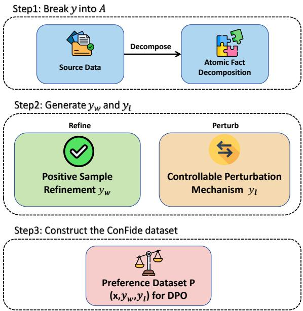
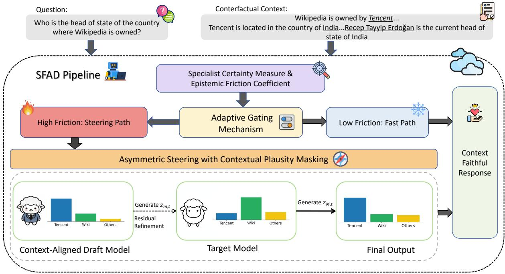
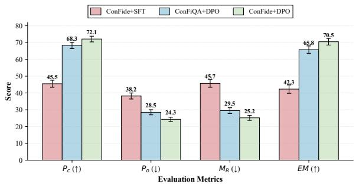
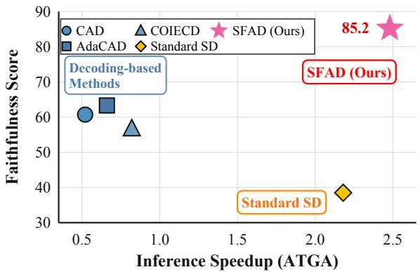
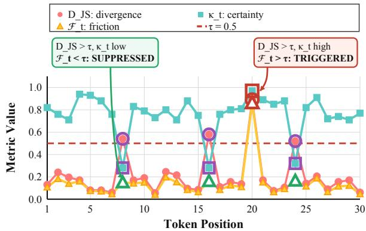

# SFAD: Speculative Factuality-Aware Decoding

Guanqiao Chen1,2, Di Wang3,4, Lijie Hu1,\*

1MBZUAI

2University of Science and Technology of China 3Provable Responsible AI and Data Analytics (PRADA) Lab 4King Abdullah University of Science and Technology Corresponding author.

## Abstract

As one of the most critical challenges in large language models, contextual faithfulness directly determines their reliability in knowledgeintensive applications. This task is particularly challenging as it requires balancing factual consistency with generation efficiency. Contrastive decoding methods require dual forward passes (with and without context) to compare model outputs, doubling inference computational overhead, while post-training alignment demands extensive reinforcement learning with substantial computational overhead. To address this challenge, we present SFAD, a speculative decoding framework that enhances contextual faithfulness without inference degradation. We first construct ConFide, a preference dataset with fine-grained atomic perturbations, to train a context-faithful draft model via Direct Preference Optimization. During inference, Epistemic Friction detects potential hallucinations by quantifying distributional tension weighted by specialist certainty. When friction exceeds the threshold, Asymmetric Logit Steering refines the target distribution through residualbased logit injection; otherwise, standard speculation proceeds. Extensive experiments demonstrate that SFAD substantially improves faithfulness while achieving 2.48× speedup, offering a practical solution for efficient LLMs.

## 1 Introduction

Large Language Models (LLMs) (Guo et al., 2025a; Achiam et al., 2023) have achieved remarkable success by leveraging vast parametric knowledge acquired during pretraining (Petroni et al., 2019; Roberts et al., 2020). However, this internal knowledge is inherently static and constrained by the training distribution, rendering it prone to becoming outdated or incomplete (Cheng et al., 2024b; Li et al., 2026b; Zhang et al., 2025a; Cheng et al., 2024a). To address this limitation, retrievalaugmented generation (RAG) (Qin et al., 2025;

  
Figure 1: The ConFide pipeline for factuality-aware preference data construction.

Guu et al., 2020; Cheng et al., 2025a) and external tool integration have become increasingly prevalent, intensifying the demand for models to prioritize provided context over parametric priors. Yet LLMs frequently exhibit hallucinations (Huang et al., 2025a; Ji et al., 2023; Cheng et al., 2025b) due to knowledge conflicts, where models favor internal knowledge over task-specific external contexts (Xie et al., 2024; Chen et al., 2022; Zhang et al., 2025b), undermining their contextual faithfulness in knowledge-intensive applications.

Enhancing contextual faithfulness while maintaining inference efficiency presents significant challenges. Decoding-based methods (Shi et al., 2024; Xu, 2023; Khandelwal et al., 2025; Yang et al., 2025c) contrast logits from contextualized inputs against uncontextualized baselines to amplify evidence-aligned signals. However, this requires dual forward, effectively doubling computational cost and halving generation speed. Post-training methods (Yan et al., 2025; Wang et al., 2025c; Yang et al., 2025b; Zhou et al., 2026) employ reinforcement learning to align models with contextual evidence, but typically require extensive compute and large-scale preference data. These limitations motivate the need for approaches that enhance faithfulness without compromising efficiency or requiring substantial resources.

  
Figure 2: SFAD framework.

To resolve these problems, we propose SFAD, a speculative decoding framework that unifies contextual faithfulness enhancement with speculative acceleration. Our key insight is to leverage a context-faithful draft model as a factuality sentinel: by training a smaller model to prioritize contextual evidence, we enable it to detect and correct hallucinations in the larger target model during speculative decoding. Specifically, we first construct Con-Fide, a preference dataset that improves contextual faithfulness by generating diverse hard-negative samples through atomic decomposition and controllable perturbations. Training the draft model on ConFide and ConFiQA (Bi et al., 2025) via Direct Preference Optimization instills strong contextual loyalty. During inference, SFAD introduces Epistemic Friction, a metric that quantifies distributional tension weighted by specialist certainty to dynamically detect knowledge conflicts. When friction signals potential hallucinations, Asymmetric Logit Steering selectively refines the target distribution through residual-based injection; otherwise, standard speculative decoding proceeds unmodified. This adaptive mechanism maintains the 2 ∼ 3× speedup of speculative decoding while substantially improving contextual faithfulness.

Our contributions are threefold: (1) Dataset: we introduce ConFide, a fine-grained preference dataset designed for training context-faithful draft models through atomic-level perturbations; (2) Framework: we propose SFAD, the first speculative decoding framework specifically designed for hallucination mitigation, which features Epistemic Friction for conflict detection and Asymmetric Logit Steering for selective correction; and (3) Evaluation: extensive experiments demonstrate that SFAD achieves substantial faithfulness improvements across diverse benchmarks while delivering a 2.48× speedup, approaching the performance of models 5× larger with minimal computational overhead.

## 2 Related Work

## 2.1 Hallucinations in LLMs

Hallucinations(Huang et al., 2025b) occur when LLM outputs appear plausible yet deviate from factual or contextual knowledge (Kaddour et al., 2023; Ji et al., 2023). These are typically bifurcated into factuality hallucinations, which contradict real-world facts based on internal parametric knowledge (Min et al., 2023; Wei et al., 2024), and faithfulness hallucinations, characterized by inconsistency with the provided input or grounding documents (Wang et al., 2026; Wan et al., 2023; Hu et al., 2025; Guo et al., 2025b). Mitigation strategies span the model lifecycle: training-phase efforts focus on data curation and grounding (Pan et al., 2024), while inference-stage methods employ confidence estimation (Huang et al., 2025c), knowledge retrieval (Feng et al., 2024), and editing (Ali et al., 2025; Wang et al., 2025a). Despite these advancements, LLMs remain prone to inconsistent outputs in context-rich tasks such as RAG and summarization (Xu et al., 2024; Li and Yu, 2025). Our work leverages the Speculative Decoding framework to ensure context-consistent generation.

## 2.2 Speculative Decoding

Speculative decoding accelerates LLM inference by verifying draft tokens generated by a smaller model against the target LLM (Leviathan et al., 2023; Chen et al., 2023). Drafting strategies have evolved from independent models (Xia et al., 2023) to architectural extensions such as recurrent feature utilization (Li et al., 2024) and diffusion-based generation (Li et al., 2026a). Efficiency has been further optimized through tree-based parallel verification (Miao et al., 2024), sparse Mixture-of-Experts (MoE) acceleration (Huang et al., 2025d), and specialized reinforcement learning system enhancements (Chen et al., 2026). Recent research has also tailored SD for diverse and complex scenarios, including long-context retrieval-augmentation (Sun et al., 2024; Sadhukhan et al., 2025; Yang et al., 2026; Chen et al., 2025), multi-sample inference tasks (Li et al., 2025), and memory-efficient inference via quantized caching (Tiwari et al., 2025). Beyond performance, safety-awareness has been integrated into the speculative framework to ensure alignment (Wang et al., 2025d). Unlike these performance-driven or safety-centric works, SFAD is the first speculative framework to target hallucination mitigation.

## 3 Aligning Draft Models for Context-Faithfulness via ConFide

To enhance the draft model’s generalization across diverse hallucination types, we construct ConFide, a fine-grained preference dataset that systematically diversifies error patterns in negative samples and stylistic variations in positive samples. As illustrated in Figure 1, our pipeline leverages atomic fact decomposition and controllable perturbations to produce high-quality contrastive pairs.

## 3.1 Data Construction Pipeline

Source Data and Problem Formulation. We build upon the LLM-AggreFact (Tang et al., 2024a) and CG2C (Lei et al., 2025) datasets, which provide fact-intensive samples covering diverse hallucination patterns suitable for atomic decomposition. Our initial dataset is defined as $\begin{array} { r l } { \mathcal { D } } & { { } = } \end{array}$ $\{ ( x ^ { ( i ) } , y _ { \mathrm { r e f } } ^ { ( i ) } , l ^ { ( i ) } ) \} _ { i = 1 } ^ { N }$ , where x is the source context, $y _ { \mathrm { r e f } }$ is the candidate response, and $l \in \{ 0 , 1 \}$ is the binary faithfulness label. Our goal is to construct a preference dataset $\mathcal { P } = \{ ( x , y _ { w } , y _ { l } ) \}$ for DPO training, where $y _ { w }$ is faithful to context x and $y _ { l }$ contains specific hallucinations.

Atomic Fact Decomposition. We decompose each response into verifiable atomic facts via a decomposition function $f _ { \mathrm { d e c } } .$

$$
\begin{array} { r } { \boldsymbol { \mathcal { A } } = f _ { \mathrm { d e c } } ( \boldsymbol { y } ) = \{ a _ { 1 } , a _ { 2 } , \ldots , a _ { m } \} , } \end{array}\tag{1}
$$

where each atomic fact $a _ { j }$ represents a minimal verifiable claim.

Negative Sample Generation. We apply a Controllable Perturbation Mechanism to transform atomic facts into corrupted versions. Given $a _ { j } =$ $( s _ { j } , r _ { j } , o _ { j } )$ as a subject-relation-object triple, we define three perturbation operators:

$$
\phi ( a _ { j } ) = \left\{ \begin{array} { l l } { ( s _ { j } , r _ { j } , o _ { j } ^ { \prime } ) , } & { \tau _ { \mathrm { e n t } } } \\ { ( s _ { j } , r _ { j } , o _ { j } + \epsilon ) , } & { \tau _ { \mathrm { n u m } } } \\ { ( s _ { j } , \lnot r _ { j } , o _ { j } ) , } & { \tau _ { \mathrm { r e l } } } \end{array} \right.\tag{2}
$$

where $\tau _ { \mathrm { e n t } } , \tau _ { \mathrm { n u m } } .$ and $\tau _ { \mathrm { r e l } }$ denote entity swap, numerical distortion, and relation inversion, respectively. Here, $o _ { j } ^ { \prime }$ is a confusing entity drawn from context x, ϵ is calibrated noise preserving numerical plausibility, and $\neg r _ { j }$ denotes logical negation of relation $r _ { j }$ The perturbed facts are reconstructed into a fluent response $y _ { l } = f _ { \mathrm { r e c } } ( \mathcal { A } ^ { \prime } )$ , yielding hallucinated yet linguistically natural negative samples.

Positive Sample Refinement. Winning samples $y _ { w }$ are constructed based on the faithfulness label l. $\mathrm { ~ I f ~ } l ~ = ~ 1$ , we apply paraphrasing $\pi _ { \mathrm { p a r a } }$ to generate semantically equivalent but syntactically varied sentences. If $l = 0$ , a teacher model (GPT-4o (Hurst et al., 2024)) corrects $y _ { \mathrm { r e f } }$ against context x to produce a strictly faithful $y _ { w }$ . This ensures winning samples reflect genuine factual alignment rather than surface-level patterns.

Preference Dataset Construction. Pairing the perturbed $y _ { l }$ with the refined $y _ { w }$ yields the final preference dataset ${ \mathcal { P } } .$ , where negative samples exhibit fine-grained, fluent hallucinations and positive samples maintain strict contextual fidelity.

## 3.2 Draft Model Optimization via DPO

We optimize the draft model $\pi \theta$ via the DPO objective (Rafailov et al., 2023), which directly maximizes the preference margin between faithful responses $y _ { w }$ and hallucinated responses $y _ { l }$ without requiring an explicit reward model. The gradient signal encourages $\pi _ { \theta }$ to concentrate probability mass on tokens strictly verifiable against the context $x ,$ controlled by hyperparameter $\beta$ relative to the frozen reference model $\pi _ { \mathrm { r e f } }$

## 4 SFAD: Speculative Factuality-Aware Decoding

We formulate Speculative Factuality-Aware Decoding (SFAD) as a dynamic inference framework designed to decouple token verification from distribution correction. Figure 2 illustrates the overall pipeline. Let M and m denote the target (generalist) and draft (specialist) models with parameters $\theta _ { M }$ and $\theta _ { m }$ , respectively. At each time step t, given the prefix context $x _ { < t }$ , the models produce logit vectors z $\mathbf { \chi } _ { M , t } , \mathbf { z } _ { m , t } \in \mathbb { R } ^ { | \mathcal { V } | }$ . Our framework is governed by a five-step formalism that adaptively steers the generation process when the specialist detects potential factual inconsistencies. Theoretical analysis and proofs are provided in Appendix E.

## 4.1 Specialist Certainty Measure

To prevent noise injection from an uncertain draft model, we first quantify its internal confidence. Unlike standard entropy measures, we require a normalized metric that penalizes high-entropy (uncertain) distributions. We define the Specialist Certainty $\kappa _ { t }$ as:

$$
\begin{array} { l } { \kappa _ { t } = \left( 1 - \frac { \mathbb { H } \left( \mathbb { P } _ { m } \left( \cdot | x _ { < t } \right) \right) } { \log { | \mathcal { V } | } } \right) ^ { \gamma } , } \\ { \mathrm { w h e r e ~ } \mathbb { P } _ { m } = \operatorname { S o f t m a x } ( \mathbf { z } _ { m , t } ) . } \end{array}\tag{3}
$$

where $\mathbb { H } ( \cdot )$ denotes the Shannon entropy, $| \nu |$ is the vocabulary size, and $\gamma \geq 1$ is a sharpening coefficient. Here, $\kappa _ { t }  1$ implies the specialist is highly confident in its prediction, serving as a necessary precondition for intervention.

## 4.2 Epistemic Friction Coefficient

To distinguish factual conflicts from benign linguistic diversity, we propose the Epistemic Friction $\mathcal { F } _ { t }$ , which captures the distributional tension between the generalist and the specialist. It is formulated as the Jensen-Shannon (JS) divergence weighted by the specialist’s certainty:

$$
\mathcal { F } _ { t } = \mathcal { D } _ { \mathrm { J S } } \left( \mathbb { P } _ { M } ( \cdot | x _ { < t } ) \| \mathbb { P } _ { m } ( \cdot | x _ { < t } ) \right) \cdot \kappa _ { t }\tag{4}
$$

$\mathcal { F } _ { t }$ acts as a detector for confident hallucinations. High friction occurs if and only if the models disagree significantly $( \mathcal { D } _ { \mathrm { J S } }$ is high) and the specialist is factually convinced $( \kappa _ { t }$ is high).

## 4.3 Adaptive Gating Mechanism

To ensure computational efficiency and avoid overcorrection, SFAD employs a soft gating scalar $\lambda _ { t } \in$ [0, 1] to govern the intensity of the steering. It is derived via a shifted sigmoid activation:

$$
\lambda _ { t } = \sigma \left( \beta \cdot ( \mathcal { F } _ { t } - \tau ) \right) = \frac { 1 } { 1 + \exp \left( - \beta ( \mathcal { F } _ { t } - \tau ) \right) } \nonumber\tag{5}
$$

where $\tau$ is the friction threshold and $\beta$ controls the transition sharpness. This creates a switching regime: when $\mathcal { F } _ { t } \ll \tau , \lambda _ { t } \to 0$ (Standard Speculation); when $\mathcal { F } _ { t } \gg \tau , \lambda _ { t }  1$ (Steering Mode).

## 4.4 Asymmetric Steering with Contextual Plausibility Masking

When intervention is triggered, we modify the target logits. To ensure that the specialist only intervenes when its predictions are linguistically plausible within the current sequence, we introduce a Contextual Plausibility Mask (CPM). We define the plausible set $\mathcal { V } _ { C P C }$ as:

$$
\mathcal { V } _ { C P C } = \{ v \in \mathcal { V } : \mathbb { P } _ { m } ( v | x _ { < t } ) \geq \eta p _ { t } ^ { \operatorname* { m a x } } \}\tag{6}
$$

where $p _ { t } ^ { \mathrm { m a x } }$ is the maximum probability assigned by $\mathbb { P } _ { m } ( \cdot | x _ { < t } )$ , and $\eta ~ \in ~ ( 0 , 1 )$ is a plausibility threshold.

Inspired by previous work (Bachmann et al., 2025), which demonstrated that alignment-based verification in speculative decoding rejects many high-quality tokens due to distribution mismatches, we extend this insight beyond token-level acceptance. Instead of solely adapting verification schemes, we intervene at the logit level to inject factuality-aware corrections, ensuring both efficiency and reduced hallucinations.The corrected logit vector $\mathbf { z } _ { t } ^ { \ast }$ is computed as:

$$
\mathbf { z } _ { t } ^ { * } = \mathbf { z } _ { M , t } + \lambda _ { t } \mathbf { \cdot R e L U } ( \mathbf { z } _ { m , t } - \mathbf { z } _ { M , t } ) \mathbf { \cdot } \mathbb { I } ( x \in \mathcal { V } _ { C P C } )\tag{7}
$$

The ReLU(·) operator enforces unidirectional knowledge injection, allowing the specialist to boost correct entities without penalizing the generalist’s linguistic fluency. The $\mathbb { I } ( x \in \mathcal { V } _ { C P C } )$ term acts as a safety guard, ensuring the specialist only steers the target toward tokens that maintain "compositional plausibility."

## 4.5 Hybrid Decoding Policy

Finally, the next token $x _ { t }$ is determined by a hybrid policy that switches between the corrected distribution and standard speculative verification:

$$
x _ { t } \sim \left\{ \begin{array} { l l } { \mathrm { S o f t m a x } ( \mathbf { z } _ { t } ^ { * } ) } & { \mathrm { i f } ~ \mathcal { F } _ { t } \geq \tau \quad \mathrm { ( S t e e r i n g ~ P a t h ) } } \\ { \mathrm { V e r i f y } ( \tilde { x } _ { t } , \mathbb { P } _ { M } ) } & { \mathrm { i f } ~ \mathcal { F } _ { t } < \tau \quad \mathrm { ( F a s t ~ P a t h ) } } \end{array} \right.\tag{8}
$$

In the Steering Path, we sample from the steered logits, effectively overriding the draft. In the Fast Path, we perform standard rejection sampling using the draft token $\tilde { x } _ { t }$ and the original target distribution $\mathbb { P } _ { M }$ , maintaining the speed guarantees of speculative decoding.

## 5 Experiments

## 5.1 Experimental Setup

Models and Configurations. We implement the SFAD framework using the Qwen3 family (Yang et al., 2025a). Specifically, Qwen3-1.7B is utilized as the draft model, which is fine-tuned via Direct Preference Optimization to serve as the expert model.The target model is Qwen3-14B.

Data Construction for DPO. The DPO training set for the draft model consists of approximately 36K curated samples, combining two complementary sources. First, we directly adopt 18K instances from ConFiQA (Bi et al., 2025), a benchmark focusing on multi-hop knowledge conflicts. Second, we construct our ConFide dataset using the atomic perturbation pipeline described in Section 3. Specifically, ConFide is synthesized from two source datasets: 12K samples from LLM-AggreFact (Tang et al., 2024a), and 6K samples from the CG2C dataset (Lei et al., 2025).

Baselines. We compare SFAD against two categories of baselines to demonstrate its superiority in both contextual faithfulness and inference efficiency. The first category consists of decodinglevel methods applied to our target model, Qwen3- 14B: Greedy Decoding, Context-Aware Decoding (CAD) (Xu, 2023), COIECD (Yuan et al., 2024), and AdaCAD (Wang et al., 2025b). The second category includes a frontier model, Llama-3.1-70B-Instruct (MetaAI, 2024), which has 5× the parameters of Qwen3-14B, serving as a high-performance reference point.

Evaluation Tasks and Datasets. We evaluate across five task categories: (1) Factual Retrieval on HotpotQA (Yang et al., 2018), PopQA (Mallen et al., 2023), and TriviaQA (Joshi et al., 2017); (2) Abstractive Faithfulness via summarization on TofuEval (Tang et al., 2024b) and XSum (Narayan et al., 2018); (3) Extended Generation on CLAPNQ (Rosenthal et al., 2025), ExpertQA (Malaviya et al., 2024), and HAGRID (Kamalloo et al., 2023); (4) Knowledge Conflicts using 200 held-out instances from LLM-AggreFact; and (5) General Capabilities on GSM8K (Cobbe et al., 2021) and Just-Eval (Lin et al., 2024).

Quality and Efficiency Metrics. For generative quality, we use standard metrics tailored to each task: Exact Match (EM) for retrieval tasks; Align-Score, BERT-P, and ROUGE-L for summarization; and FaithScore (computed via MiniCheck (Tang et al., 2024a)) for long-form QA. For knowledge conflict analysis, we adopt ConFiQA (Bi et al., 2025) metrics: Context-faithful Frequency $( P _ { c } )$ Original Factual Frequency $( P _ { o } )$ , and Memory Reliance $( M _ { R } )$ . To quantify the inference acceleration of SFAD, we define the Average Token Generation Acceleration (ATGA), measured in an end-to-end, context-aware setting:

$$
{ \mathrm { A T G A } } = { \frac { \mathrm { A v g . ~ t o k e n ~ g e n e r a t i o n ~ t i m e ~ w / o ~ S F A D } } { \mathrm { A v g . ~ t o k e n ~ g e n e r a t i o n ~ t i m e ~ w / ~ S F A D } } }\tag{9}
$$

## 5.2 Main Results

We present comprehensive evaluations across three categories of context-intensive tasks: Foundation QA, Summarization, and Long-Form QA.

SFAD demonstrates consistent metric improvements across all evaluated benchmarks, optimizing both task accuracy and inference efficiency. While standard decoding-level interventions typically incur latency penalties due to redundant forward passes, SFAD integrates a speculative decoding framework that streamlines the generation process. This efficiency is driven by our design’s focus on enhancing contextual consistency, which allows the model to leverage evidentiary alignment to accelerate token production. In Foundation QA, the method mitigates the internal knowledge limitations of the base model, a capability that extends to long-form generation where SFAD addresses the inherent trade-off between lexical fluency and factual grounding. By prioritizing context-aligned tokens, SFAD substantially narrows the performance gap between the 14B base model and the 5× larger Llama-3.1-70B frontier model. These results underscore the capacity of SFAD to maintain sustained evidentiary grounding and long-range coherence with reduced computational costs, avoiding the need for task-specific fine-tuning or increased parameter overhead.

Table 1: Performance comparison on Foundation QA. Rel. Latency denotes the inference time relative to the Qwen3-14B vanilla baseline.
<table><tr><td>Method</td><td>TriviaQA</td><td>HotpotQA</td><td>PopQA</td><td>Rel. Latency</td></tr><tr><td>Vanilla Baseline Qwen3-14B</td><td>53.87</td><td>41.77</td><td>78.21</td><td>1.00×</td></tr><tr><td colspan="5">Decoding-level Baselines (Qwen3-14B)</td></tr><tr><td>CAD</td><td>41.43</td><td>39.51</td><td>71.29</td><td>2.00×</td></tr><tr><td>AdaCAD</td><td>82.11</td><td>45.63</td><td>77.39</td><td>2.15×</td></tr><tr><td>COIECD</td><td>83.07</td><td>45.63</td><td>76.29</td><td>2.40×</td></tr><tr><td>Frontier Model Llama-3.1-70B</td><td>90.20</td><td>56.11</td><td>86.11</td><td>4.85×</td></tr><tr><td>SFAD (Ours)</td><td>85.12</td><td>52.19</td><td>86.39</td><td>0.82×</td></tr></table>

Table 2: Summarization performance on XSum and TofuEval. SFAD achieves superior factuality while reducing inference overhead.
<table><tr><td></td><td colspan="3">XSum</td><td>TofuEval</td><td></td></tr><tr><td>Method</td><td>R-L</td><td>BERT-P</td><td>AlignScore</td><td>AlignScore</td><td>Rel. Latency</td></tr><tr><td colspan="6">Vanilla Baseline</td></tr><tr><td>Qwen3-14B</td><td>13.67</td><td>91.67</td><td>72.86</td><td>59.84</td><td>1.00×</td></tr><tr><td colspan="6">Decoding-level Baselines (Qwen3-14B)</td></tr><tr><td>CAD</td><td>14.59</td><td>93.65</td><td>84.34</td><td>83.23</td><td>2.00×</td></tr><tr><td>AdaCAD</td><td>14.91</td><td>94.29</td><td>85.81</td><td>85.07</td><td>2.20×</td></tr><tr><td>COIECD</td><td>13.65</td><td>91.04</td><td>73.81</td><td>60.86</td><td>2.45×</td></tr><tr><td colspan="6">Frontier Model</td></tr><tr><td>Llama-3.1-70B</td><td>16.35</td><td>94.12</td><td>87.48</td><td>87.31</td><td>5.10×</td></tr><tr><td>SFAD (Ours)</td><td>16.32</td><td>93.97</td><td>87.37</td><td>87.53</td><td>0.85×</td></tr></table>

## 6 Analysis

## 6.1 Effectiveness of ConFide and DPO

To isolate the contributions of our data construction pipeline and alignment strategy, we evaluate three draft model variants on 200 held-out knowledgeconflict instances from LLM-AggreFact. As illustrated in Figure 3, the transition from supervised fine-tuning (SFT) to preference optimization (DPO) triggers a fundamental shift in model behavior: while ConFide+SFT remains heavily anchored to internal priors (high $M _ { R } )$ , DPO-trained variants demonstrate a superior ability to suppress parametric bias in favor of contextual evidence.

Table 3: Long-Form QA results. SFAD significantly enhances faithfulness with higher efficiency than the vanilla model.
<table><tr><td rowspan="2">Method</td><td colspan="2">CLAPNQ</td><td colspan="2">ExpertQA</td><td colspan="2">HAGRID</td><td rowspan="2">Rel. Latency</td></tr><tr><td>R-L</td><td>Faith</td><td>R-L</td><td>Faith</td><td>R-L</td><td>Faith</td></tr><tr><td colspan="8">Vanilla Baseline</td></tr><tr><td>Qwen3-14B</td><td>17.12</td><td>59.73</td><td>31.56</td><td>51.29</td><td>16.96</td><td>57.63</td><td>1.00×</td></tr><tr><td colspan="8">Decoding-level Baselines (Qwen3-14B)</td></tr><tr><td>CAD</td><td>18.23</td><td>60.24</td><td>33.58</td><td>53.47</td><td>17.89</td><td>58.20</td><td>2.00×</td></tr><tr><td>AdaCAD</td><td>18.43</td><td>62.37</td><td>32.87</td><td>54.76</td><td>17.12</td><td>59.90</td><td>2.18×</td></tr><tr><td>COIECD</td><td>18.56</td><td>61.96</td><td>33.14</td><td>56.32</td><td>17.34</td><td>59.76</td><td>2.42×</td></tr><tr><td colspan="8">Frontier Model</td></tr><tr><td>Llama-3.1-70B</td><td>42.15</td><td>92.45</td><td>46.10</td><td>72.40</td><td>52.07</td><td>82.20</td><td>5.30×</td></tr><tr><td>SFAD (Ours)</td><td>41.34</td><td>90.93</td><td>43.79</td><td>71.13</td><td>51.97</td><td>81.99</td><td>0.78×</td></tr></table>

  
Figure 3: Impact of training strategies on knowledge conflict resolution. ConFide+DPO consistently outperforms baselines across context faithfulness $( P _ { c } , E M )$ and memory reliance $( M _ { R } , P _ { o } )$ metrics.

Notably, ConFide+DPO consistently outperforms ConFiQA+DPO across all metrics, validating the efficacy of our atomic perturbation mechanism. By exposing the model to hard negatives—such as entity swaps and relation inversions—ConFide provides a more granular discriminative signal that sharpens the model’s sensitivity to factual nuances. This contrastive optimization effectively penalizes hallucinated completions that appear superficially plausible but lack contextual grounding. These results confirm that our data construction pipeline combined with preference optimization is crucial for training context-faithful draft models capable of effective speculative decoding.

## 6.2 Latency-Faithfulness Trade-off Analysis

A critical question in deploying context-faithful LLMs is whether achieving high factuality necessitates sacrificing inference speed. To address this, we analyze the trade-off between inference acceleration and contextual faithfulness across different decoding strategies. We evaluate all methods on the same 200-instance LLM-AggreFact test set used in Section 6.1, measuring both Average Token Generation Acceleration (ATGA, Eq. (9)) and Faithfulness Score (MiniCheck FaithScore). Figure 4 visualizes this relationship, revealing three distinct performance regimes.

  
Figure 4: Latency-faithfulness trade-off analysis. SFAD achieves Pareto-optimal performance, simultaneously delivering 2.48× speedup and 85.2 faithfulness score. Decoding-level baselines suffer from severe latency penalties $( < 0 . 8 5 \times )$ despite moderate faithfulness, while standard SD prioritizes speed (2.18×) at the cost of poor faithfulness (38.5). SFAD outperforms the best baseline by 21.7 points while maintaining $2 . 9 \times$ faster inference.

Decoding-level baselines exhibit poor speedfaithfulness balance. CAD, AdaCAD, and COIECD achieve moderate faithfulness scores but suffer severe latency penalties (ATGA 0.52×– $0 . 8 2 \times )$ . They need to perform two forward passes for both contextualized and baseline inputs. This introduces additional token overhead, which slows down the model’s inference speed.

Standard speculative decoding prioritizes speed over faithfulness. While achieving 2.18× speedup, vanilla SD with an unaligned draft model produces drastically poor faithfulness, falling below even the decoding baselines. The draft model’s lack of contextual grounding causes it to propose tokens based on parametric priors rather than provided evidence, leading to significant hallucinations in knowledge-intensive scenarios.

SFAD achieves Pareto-optimal performance. SFAD strikes an optimal balance between contextual faithfulness and inference speed, simultaneously delivering 2.48× speedup and 85.2 faithfulness score.

## 6.3 Epistemic Friction Analysis: Detecting Confident Hallucinations

To validate our Epistemic Friction mechanism, we analyze 1,200 samples from MQUAKE (Zhong et al., 2023), tracking $D _ { J S } , \kappa _ { t }$ , and $\mathcal { F } _ { t }$ across generation. Figure 5 illustrates metric dynamics across a representative generation sequence. The raw divergence $D _ { J S }$ fluctuates frequently, with peaks exceeding $\tau = 0 . 5$ , but relying solely on $D _ { J S }$ would trigger excessive false positives at stylistic variations.

  
Figure 5: Epistemic Friction dynamics. Purple circles mark positions where $D _ { J S } > \tau$ is suppressed by low $\kappa _ { t }$ . The red square marks a confident hallucination that triggers steering.

The specialist certainty $\kappa _ { t }$ provides crucial filtering. At positions marked with purple circles, $D _ { J S }$ slightly exceeds $\tau \left( 0 . 5 2 – 0 . 5 8 \right)$ but $\kappa _ { t }$ remains low (0.28–0.32), indicating uncertainty at linguistic alternatives. Consequently, $\mathcal { F } _ { t } = D _ { J S } \times \kappa _ { t }$ is suppressed below threshold (0.15–0.17), correctly avoiding intervention.

In contrast, the red-square position exhibits a confident hallucination: $D _ { J S } \approx 0 . 8 9$ combined with $\kappa _ { t } ~ \approx ~ 0 . 9 7$ produces a sharp spike in $\mathcal { F } _ { t }$ $( \sim 0 . 8 6 )$ , triggering full logit steering. By conditioning on both distributional conflict and specialist confidence, Epistemic Friction provides a principled trigger for factuality correction, avoiding the over-correction pitfalls of divergence-only metrics.

## 6.4 Quantifying Logit Steering Impact

To evaluate our asymmetric logit steering, we measure the average probability of faithful tokens across three decoding strategies on the MQUAKE test set, where faithful tokens are context-grounded entities that correctly answer the query.

Table 4 reveals the fundamental difference between verification-based and steering-based approaches. The original target model assigns 18.73% probability to faithful tokens, reflecting parametric bias where internal knowledge conflicts with contextual evidence. While the target model considers the faithful token, it remains overshadowed by parametric priors.

Table 4: Average probability of faithful tokens. Standard SD provides negligible improvement, while SFAD achieves substantial gains through logit steering.
<table><tr><td>Strategy</td><td>Prob (%)</td><td>Abs. Gain</td><td>Rel. Gain</td></tr><tr><td>Original Target</td><td>18.73</td><td></td><td>1.0×</td></tr><tr><td>Standard SD</td><td>18.91</td><td>+0.18</td><td>1.01×</td></tr><tr><td>SFAD (Ours)</td><td>62.45</td><td>+43.72</td><td>3.33x</td></tr></table>

Table 5: General utility evaluation.
<table><tr><td rowspan="2"></td><td>GSM8K</td><td colspan="4">Just-Eval (1–5)</td></tr><tr><td>Acc</td><td>Help.</td><td>Clar. Fact.</td><td>Depth</td><td>Eng.</td></tr><tr><td>Target (Greedy)</td><td>91.35</td><td>4.15</td><td>4.90 4.30</td><td>4.55</td><td>4.75</td></tr><tr><td>Standard SD</td><td>91.32</td><td>4.14</td><td>4.89 4.28</td><td>4.54</td><td>4.74</td></tr><tr><td>SFAD (Ours)</td><td>91.27</td><td>4.11</td><td>4.88</td><td>4.33 4.53</td><td>4.73</td></tr></table>

Standard speculative decoding provides virtually no correction, with faithful token probability remaining at 18.91%. This stagnation is inherent to SD’s design: the verification mechanism determines whether to accept or reject draft tokens based on $\begin{array} { r } { P ( \mathrm { a c c e p t } ) \propto \frac { P _ { M } ( \bar { x } ) } { P _ { m } ( x ) } } \end{array}$ , but it does not modify the target model’s output distribution. When the draft proposes a faithful token that the target assigns low probability, SD simply rejects it and resamples from the original $P _ { M }$ , perpetuating the same parametric bias. This reveals a fundamental limitation: verification-only approaches operate through accept/reject decisions without modifying the target distribution, thus they cannot correct distributional biases but only accelerate generation.

In contrast, SFAD elevates faithful token probability to 62.45%, achieving a 3.33× relative improvement and a 243× larger absolute gain compared to standard SD. This dramatic boost results from our asymmetric steering mechanism (Eq. (7)): when epistemic friction $\mathcal { F } _ { t }$ exceeds threshold $\tau _ { \ast }$ the system triggers ReLU-based logit injection $z _ { t } ^ { * } = z _ { M , t } + \lambda _ { t } . \mathrm { R e L U } ( z _ { m , t } - z _ { M , t } )$ , directly amplifying the draft model’s high logits for contextually faithful tokens. Unlike verification that merely accepts or rejects, steering fundamentally reshapes the target’s output distribution, transforming faithful tokens from minority candidates (18.73%) to dominant choices (62.45%). Critically, this intervention occurs selectively as it only activates when both distributional conflict and specialist conviction are present, maintaining the 2.48× speedup while achieving 85.2 faithfulness score. This analysis demonstrates that logit-level steering provides a principled mechanism for resolving knowledge conflicts, achieving context faithfulness unattainable through verification alone.

Table 6: Llama-3.1-8B results on Foundation QA.
<table><tr><td>Method</td><td>TriviaQA</td><td>HotpotQA</td><td>PopQA</td><td>Rel. Latency</td></tr><tr><td>Vanilla Baseline Llama-3.1-8B</td><td>49.23</td><td>38.45</td><td>75.18</td><td>1.00×</td></tr><tr><td colspan="5">Decoding-level Baselines (Llama-3.1-8B)</td></tr><tr><td>CAD</td><td>37.82</td><td>36.21</td><td>68.45</td><td>2.00×</td></tr><tr><td>AdaCAD</td><td>78.56</td><td>42.31</td><td>74.28</td><td>2.18×</td></tr><tr><td>COIECD</td><td>79.43</td><td>42.88</td><td>75.56</td><td>2.35×</td></tr><tr><td>SFAD (Ours)</td><td>81.67</td><td>48.73</td><td>83.21</td><td>0.85×</td></tr></table>

Table 7: Ablation of sharpening coefficient $\gamma .$
<table><tr><td>γ</td><td colspan="4">Steer (%) Faith. (↑) Speedup (↑) R-L (↑)</td></tr><tr><td>1</td><td>31.2</td><td>83.7</td><td>2.31×</td><td>15.89</td></tr><tr><td>2 (Default)</td><td>22.4</td><td>85.2</td><td>2.48×</td><td>16.32</td></tr><tr><td>3</td><td>15.8</td><td>84.1</td><td>2.61×</td><td>16.18</td></tr><tr><td>4</td><td>9.3</td><td>78.5</td><td>2.74×</td><td>15.94</td></tr></table>

## 6.5 SFAD Preserves General Utility

We evaluate on GSM8K (Cobbe et al., 2021) and Just-Eval (Lin et al., 2024) to verify SFAD maintains general capabilities. As shown in Table $5 ,$ SFAD achieves 91.27% on GSM8K with negligible Just-Eval degradation. This stems from the selective nature of $\mathcal { F } _ { t } \mathbf { : }$ : when no knowledge conflict exists, friction remains below τ and the system defaults to standard speculative decoding, confirming SFAD’s factuality enhancement does not sacrifice general utility or reasoning capability.

## 6.6 Generalization and Parameter Analysis

To evaluate generalization across model families, we apply SFAD with Llama-3.1-8B as the target model. As shown in Table 6, SFAD consistently improves faithfulness while maintaining inference efficiency. The coefficient $\gamma$ modulates specialist certainty $\kappa _ { t }$ to regulate steering sensitivity. As shown in Table 7, lower $\gamma$ increases intervention frequency but risks incorporating unreliable signals, while higher $\gamma$ improves speedup at the cost of faithfulness.

## 7 Conclusion

In this work, we propose SFAD, the first speculative decoding framework unifying contextual faithfulness with acceleration. Leveraging a contextfaithful drafter as factuality sentinel, SFAD detects hallucinations via epistemic friction. Drafters are trained on ConFide, a dataset with atomic-level hallucination perturbations. At inference, SFAD selectively steers target logits upon conflict detection while preserving efficiency, achieving simultaneous speedup and faithfulness gains.

## Limitations

SFAD requires a domain-aligned draft model trained via DPO, which introduces additional data construction overhead compared to standard speculative decoding. Furthermore, the friction threshold τ may require tuning when applied to out-ofdistribution domains.

## Acknowledgment

Di Wang is supported in part by the funding BAS/1/1689-01-01, RGC/3/7125-01-01, FCC/1/5940-20-05, FCC/1/5940-06-02, and King Abdullah University of Science and Technology (KAUST) – Center of Excellence for Generative AI, under award number 5940 and a gift from Google.

Lijie Hu is supported in part by the funding BF0100.

## References

Josh Achiam, Steven Adler, Sandhini Agarwal, Lama Ahmad, Ilge Akkaya, Florencia Leoni Aleman, Diogo Almeida, Janko Altenschmidt, Sam Altman, Shyamal Anadkat, et al. 2023. Gpt-4 technical report. arXiv preprint arXiv:2303.08774.

Muhammad Asif Ali, Nawal Daftardar, Mutayyba Waheed, Jianbin Qin, and Di Wang. 2025. MQA-KEAL: Multi-hop question answering under knowledge editing for Arabic language. In Proceedings ofthe 31st International Conference on Computational Linguistics, pages 5629–5644, Abu Dhabi, UAE. Association for Computational Linguistics.

Gregor Bachmann, Sotiris Anagnostidis, Albert Pumarola, Markos Georgopoulos, Artsiom Sanakoyeu, Yuming Du, Edgar Schönfeld, Ali Thabet, and Jonas Kohler. 2025. Judge decoding: Faster speculative sampling requires going beyond model alignment. In The Thirteenth International Conference on Learning Representations.

Baolong Bi, Shaohan Huang, Yiwei Wang, Tianchi Yang, Zihan Zhang, Haizhen Huang, Lingrui Mei, Junfeng Fang, Zehao Li, Furu Wei, Weiwei Deng, Feng Sun, Qi Zhang, and Shenghua Liu. 2025. Context-DPO: Aligning language models for contextfaithfulness. In Findings of the Association for Computational Linguistics: ACL 2025, pages 10280– 10300, Vienna, Austria. Association for Computational Linguistics.

Charlie Chen, Sebastian Borgeaud, Geoffrey Irving, Jean-Baptiste Lespiau, Laurent Sifre, and John Jumper. 2023. Accelerating large language model decoding with speculative sampling. arXiv preprint arXiv:2302.01318.

Guanzheng Chen, Qilong Feng, Jinjie Ni, Xin Li, and Michael Qizhe Shieh. 2025. RAPID: Long-context inference with retrieval-augmented speculative decoding. In Proceedings of the 42nd International Conference on Machine Learning, volume 267 of Proceedings of Machine Learning Research, pages 8093–8107. PMLR.

Hung-Ting Chen, Michael Zhang, and Eunsol Choi. 2022. Rich knowledge sources bring complex knowledge conflicts: Recalibrating models to reflect conflicting evidence. In Proceedings of the 2022 Conference on Empirical Methods in Natural Language Processing, pages 2292–2307, Abu Dhabi, United Arab Emirates. Association for Computational Linguistics.

Qiaoling Chen, Zijun Liu, Peng Sun, Shenggui Li, Guoteng Wang, Ziming Liu, Yonggang Wen, Siyuan Feng, and Tianwei Zhang. 2026. Respec: Towards optimizing speculative decoding in reinforcement learning systems. In Proceedings ofMachine Learning and Systems, volume 8. MLSys.

Keyuan Cheng, Muhammad Asif Ali, Shu Yang, Gang Lin, Yuxuan Zhai, Haoyang Fei, Ke Xu, Lu Yu, Lijie Hu, and Di Wang. 2024a. Leveraging logical rules in knowledge editing: A cherry on the top. arXiv preprint arXiv:2405.15452.

Keyuan Cheng, Zijian Kan, Zhuoran Zhang, Muhammad Asif Ali, Lijie Hu, and Di Wang. 2025a. COMPKE: Complex question answering under knowledge editing. In Findings of the Association for Computational Linguistics: ACL 2025, pages 2557–2576, Vienna, Austria. Association for Computational Linguistics.

Keyuan Cheng, Gang Lin, Haoyang Fei, Yuxuan Zhai, Lu Yu, Muhammad Asif Ali, Lijie Hu, and Di Wang. 2024b. Multi-hop question answering under temporal knowledge editing. In Proceedings of the 1st Conference on Language Modeling.

Keyuan Cheng, Xudong Shen, Yihao Yang, Tengyue Wang, Yang Cao, Muhammad Asif Ali, Hanbin Wang, Lijie Hu, and Di Wang. 2025b. CODEMENV: Benchmarking large language models on code migration. In Findings of the Association for Computational Linguistics: ACL 2025, pages 2719–2744, Vienna, Austria. Association for Computational Linguistics.

Karl Cobbe, Vineet Kosaraju, Mohammad Bavarian, Mark Chen, Heewoo Jun, Lukasz Kaiser, Matthias Plappert, Jerry Tworek, Jacob Hilton, Reiichiro Nakano, Christopher Hesse, and John Schulman. 2021. Training verifiers to solve math word problems. arXiv preprint arXiv:2110.14168.

Zhangyin Feng, Xiaocheng Feng, Dezhi Zhao, Maojin Yang, and Bing Qin. 2024. Retrieval-generation synergy augmented large language models. In 2024 IEEE International Conference on Acoustics, Speech and Signal Processing (ICASSP), pages 11661– 11665. IEEE.

Daya Guo et al. 2025a. DeepSeek-R1: Incentivizing reasoning capability in LLMs via reinforcement learning. arXiv preprint arXiv:2501.12948.

Zikun Guo, Xinyue Xu, Pei Xiang, Shu Yang, Xin Han, Di Wang, and Lijie Hu. 2025b. Benchmarking and mitigate psychological sycophancy in medical visionlanguage models. arXiv e-prints, pages arXiv–2509.

Kelvin Guu, Kenton Lee, Zora Tung, Panupong Pasupat, and Mingwei Chang. 2020. Retrieval augmented language model pre-training. In Proceedings of the 37th International Conference on Machine Learning, volume 119 of Proceedings of Machine Learning Research, pages 3929–3938. PMLR.

Jingyu Hu, Shu Yang, Xilin Gong, Hongming Wang, Weiru Liu, and Di Wang. 2025. Monica: Real-time monitoring and calibration of chain-of-thought sycophancy in large reasoning models. arXiv preprint arXiv:2511.06419.

Lei Huang, Xiaocheng Feng, Weitao Ma, Yuchun Fan, Xiachong Feng, Yangfan Ye, Weihong Zhong, Yuxuan Gu, Baoxin Wang, Dayong Wu, Guoping Hu, and Bing Qin. 2025a. Improving contextual faithfulness of large language models via retrieval headsinduced optimization. In Proceedings of the 63rd Annual Meeting ofthe Associationfor Computational Linguistics (Volume 1: Long Papers), pages 16896– 16913, Vienna, Austria. Association for Computational Linguistics.

Lei Huang, Weijiang Yu, Weitao Ma, Weihong Zhong, Zhangyin Feng, Haotian Wang, Qianglong Chen, Weihua Peng, Xiaocheng Feng, Bing Qin, and Ting Liu. 2025b. A survey on hallucination in large language models: Principles, taxonomy, challenges, and open questions. ACM Transactions on Information Systems, 43(2):1–55.

Yuheng Huang, Jiayang Song, Zhijie Wang, Shengming Zhao, Huaming Chen, Felix Juefei-Xu, and Lei Ma. 2025c. Look before you leap: An exploratory study of uncertainty analysis for large language models. IEEE Transactions on Software Engineering, 51(2):413–429.

Zongle Huang, Lei Zhu, Zongyuan Zhan, Ting Hu, Weikai Mao, Xianzhi Yu, Yongpan Liu, and Tianyu Zhang. 2025d. MoESD: Unveil speculative decoding’s potential for accelerating sparse MoE. In Advances in Neural Information Processing Systems, volume 38. Neural Information Processing Systems Foundation.

Aaron Hurst, Adam Lerer, Adam P Goucher, Adam Perelman, Aditya Ramesh, Aidan Clark, AJ Ostrow, Akila Welihinda, Alan Hayes, Alec Radford,

et al. 2024. Gpt-4o system card. arXiv preprint arXiv:2410.21276.

Ziwei Ji, Nayeon Lee, Rita Frieske, Tiezheng Yu, Dan Su, Yan Xu, Etsuko Ishii, Yejin Bang, Delong Chen, Wenliang Dai, Ho Shu Chan, Andrea Madotto, and Pascale Fung. 2023. Survey of hallucination in natural language generation. ACM Computing Surveys, 55(12):1–38.

Mandar Joshi, Eunsol Choi, Daniel Weld, and Luke Zettlemoyer. 2017. TriviaQA: A large scale distantly supervised challenge dataset for reading comprehension. In Proceedings ofthe 55th Annual Meeting of the Associationfor Computational Linguistics (Volume 1: Long Papers), pages 1601–1611, Vancouver, Canada. Association for Computational Linguistics.

Jean Kaddour, Joshua Harris, Maximilian Mozes, Herbie Bradley, Roberta Raileanu, and Robert McHardy. 2023. Challenges and applications of large language models. arXiv preprint arXiv:2307.10169.

Ehsan Kamalloo, Aref Jafari, Xinyu Zhang, Nandan Thakur, and Jimmy Lin. 2023. HAGRID: A human-LLM collaborative dataset for generative information-seeking with attribution. arXiv preprint arXiv:2307.16883.

Anant Khandelwal, Manish Gupta, and Puneet Agrawal. 2025. CoCoA: Confidence- and context-aware adaptive decoding for resolving knowledge conflicts in large language models. In Proceedings ofthe 2025 Conference on Empirical Methods in Natural Language Processing, pages 6835–6855, Suzhou, China. Association for Computational Linguistics.

Deren Lei, Yaxi Li, Siyao Li, Mengya Hu, Rui Xu, Ken Archer, Mingyu Wang, Emily Ching, and Alex Deng. 2025. FactCG: Enhancing fact checkers with graphbased multi-hop data. In Proceedings of the 2025 Conference of the Nations of the Americas Chapter ofthe Associationfor Computational Linguistics: Human Language Technologies (Volume 1: Long Papers), pages 5002–5020, Albuquerque, New Mexico. Association for Computational Linguistics.

Yaniv Leviathan, Matan Kalman, and Yossi Matias. 2023. Fast inference from transformers via speculative decoding. In Proceedings of the 40th International Conference on Machine Learning, volume 202 of Proceedings ofMachine Learning Research, pages 19274–19286. PMLR.

Anguo Li and Lei Yu. 2025. Summary factual inconsistency detection based on LLMs enhanced by universal information extraction. In Findings ofthe Associationfor Computational Linguistics: ACL 2025, pages 25450–25465, Vienna, Austria. Association for Computational Linguistics.

Guanghao Li, Zhihui Fu, Min Fang, Qibin Zhao, Ming Tang, Chun Yuan, and Jun Wang. 2026a. DiffuSpec: Unlocking diffusion language models for speculative decoding. In Findings of the Association for Computational Linguistics: ACL 2026, pages 20896–20910,

San Diego, California, United States. Association for Computational Linguistics.

Hongji Li, Manjiang Yu, Junchi Yao, Priyanka Singh, Xue Li, Di Wang, and Lijie Hu. 2026b. Towards reasoning-preserving unlearning in multimodal large language models. In Proceedings ofthe IEEE/CVF Conference on Computer Vision and Pattern Recognition (CVPR), pages 10251–10261.

Yiwei Li, Jiayi Shi, Shaoxiong Feng, Peiwen Yuan, Xinglin Wang, Yueqi Zhang, Ji Zhang, Chuyi Tan, Boyuan Pan, Yao Hu, and Kan Li. 2025. Speculative decoding for multi-sample inference. In Findings of the Association for Computational Linguistics: EMNLP 2025, pages 12523–12533, Suzhou, China. Association for Computational Linguistics.

Yuhui Li, Fangyun Wei, Chao Zhang, and Hongyang Zhang. 2024. EAGLE: Speculative sampling requires rethinking feature uncertainty. In Proceedings of the 41st International Conference on Machine Learning, volume 235 of Proceedings of Machine Learning Research, pages 28935–28948. PMLR.

Bill Yuchen Lin, Abhilasha Ravichander, Ximing Lu, Nouha Dziri, Melanie Sclar, Khyathi Chandu, Chandra Bhagavatula, and Yejin Choi. 2024. The unlocking spell on base llms: Rethinking alignment via in-context learning. In The Twelfth International Conference on Learning Representations.

Chaitanya Malaviya, Subin Lee, Sihao Chen, Elizabeth Sieber, Mark Yatskar, and Dan Roth. 2024. ExpertQA: Expert-curated questions and attributed answers. In Proceedings of the 2024 Conference of the North American Chapter ofthe Associationfor Computational Linguistics: Human Language Technologies (Volume 1: Long Papers), pages 3025–3045, Mexico City, Mexico. Association for Computational Linguistics.

Alex Mallen, Akari Asai, Victor Zhong, Rajarshi Das, Daniel Khashabi, and Hannaneh Hajishirzi. 2023. When not to trust language models: Investigating effectiveness of parametric and non-parametric memories. In Proceedings of the 61st Annual Meeting of the Association for Computational Linguistics (Volume 1: Long Papers), pages 9802–9822, Toronto, Canada. Association for Computational Linguistics.

MetaAI. 2024. Introducing llama 3.1: Our most capable models to date. https://ai.meta.com/blog/ meta-llama-3-1/.

Xupeng Miao, Gabriele Oliaro, Zhihao Zhang, Xinhao Cheng, Zeyu Wang, Zhengxin Zhang, Rae Ying Yee Wong, Alan Zhu, Lijie Yang, Xiaoxiang Shi, Chunan Shi, Zhuoming Chen, Daiyaan Arfeen, Reyna Abhyankar, and Zhihao Jia. 2024. Specinfer: Accelerating large language model serving with tree-based speculative inference and verification. In Proceedings of the 29th ACM International Conference on Architectural Support for Programming Languages and Operating Systems, Volume 3, pages 932–949,

La Jolla, CA, USA. Association for Computing Machinery.

Sewon Min, Kalpesh Krishna, Xinxi Lyu, Mike Lewis, Wen-tau Yih, Pang Koh, Mohit Iyyer, Luke Zettlemoyer, and Hannaneh Hajishirzi. 2023. FActScore: Fine-grained atomic evaluation of factual precision in long form text generation. In Proceedings of the 2023 Conference on Empirical Methods in Natural Language Processing, pages 12076–12100, Singapore. Association for Computational Linguistics.

Shashi Narayan, Shay B. Cohen, and Mirella Lapata. 2018. Don’t give me the details, just the summary! topic-aware convolutional neural networks for extreme summarization. In Proceedings of the 2018 Conference on Empirical Methods in Natural Language Processing, pages 1797–1807, Brussels, Belgium. Association for Computational Linguistics.

Shirui Pan, Linhao Luo, Yufei Wang, Chen Chen, Jiapu Wang, and Xindong Wu. 2024. Unifying large language models and knowledge graphs: A roadmap. IEEE Transactions on Knowledge and Data Engineering, 36(7):3580–3599.

Fabio Petroni, Tim Rocktäschel, Sebastian Riedel, Patrick Lewis, Anton Bakhtin, Yuxiang Wu, and Alexander Miller. 2019. Language models as knowledge bases? In Proceedings of the 2019 Conference on Empirical Methods in Natural Language Processing and the 9th International Joint Conference on Natural Language Processing (EMNLP-IJCNLP), pages 2463–2473, Hong Kong, China. Association for Computational Linguistics.

Yujia Qin, Shengding Hu, Yankai Lin, Weize Chen, Ning Ding, Ganqu Cui, Zheni Zeng, Xuanhe Zhou, Yufei Huang, Chaojun Xiao, Chi Han, Yi Ren Fung, Yusheng Su, Huadong Wang, Cheng Qian, Runchu Tian, Kunlun Zhu, Shihao Liang, Xingyu Shen, and 23 others. 2025. Tool learning with foundation models. ACM Computing Surveys, 57(4).

Rafael Rafailov, Archit Sharma, Eric Mitchell, Christopher D. Manning, Stefano Ermon, and Chelsea Finn. 2023. Direct preference optimization: Your language model is secretly a reward model. In Advances in Neural Information Processing Systems, volume 36, pages 53728–53741. Curran Associates, Inc.

Adam Roberts, Colin Raffel, and Noam Shazeer. 2020. How much knowledge can you pack into the parameters of a language model? In Proceedings of the 2020 Conference on Empirical Methods in Natural Language Processing (EMNLP), pages 5418–5426, Online. Association for Computational Linguistics.

Sara Rosenthal, Avirup Sil, Radu Florian, and Salim Roukos. 2025. CLAPnq: Cohesive long-form answers from passages in natural questions for RAG systems. Transactions of the Association for Computational Linguistics, 13:53–72.

Ranajoy Sadhukhan, Jian Chen, Zhuoming Chen, Vashisth Tiwari, Ruihang Lai, Jinyuan Shi, Ian En-Hsu Yen, Avner May, Tianqi Chen, and Beidi Chen. 2025. Magicdec: Breaking the latency-throughput tradeoff for long context generation with speculative decoding. In The Thirteenth International Conference on Learning Representations.

Weijia Shi, Xiaochuang Han, Mike Lewis, Yulia Tsvetkov, Luke Zettlemoyer, and Wen-tau Yih. 2024. Trusting your evidence: Hallucinate less with contextaware decoding. In Proceedings ofthe 2024 Conference of the North American Chapter of the Association for Computational Linguistics: Human Language Technologies (Volume 2: Short Papers), pages 783–791, Mexico City, Mexico. Association for Computational Linguistics.

Hanshi Sun, Zhuoming Chen, Xinyu Yang, Yuandong Tian, and Beidi Chen. 2024. Triforce: Lossless acceleration of long sequence generation with hierarchical speculative decoding. In Proceedings ofthe Conference on Language Modeling.

Liyan Tang, Philippe Laban, and Greg Durrett. 2024a. MiniCheck: Efficient fact-checking of LLMs on grounding documents. In Proceedings of the 2024 Conference on Empirical Methods in Natural Language Processing, pages 8818–8847, Miami, Florida, USA. Association for Computational Linguistics.

Liyan Tang, Igor Shalyminov, Amy Wong, Jon Burnsky, Jake Vincent, Yu’an Yang, Siffi Singh, Song Feng, Hwanjun Song, Hang Su, Lijia Sun, Yi Zhang, Saab Mansour, and Kathleen McKeown. 2024b. TofuEval: Evaluating hallucinations of LLMs on topic-focused dialogue summarization. In Proceedings ofthe 2024 Conference of the North American Chapter of the Associationfor Computational Linguistics: Human Language Technologies (Volume 1: Long Papers), pages 4455–4480, Mexico City, Mexico. Association for Computational Linguistics.

Rishabh Tiwari, Haocheng Xi, Aditya Tomar, Coleman Richard Charles Hooper, Sehoon Kim, Maxwell Horton, Mahyar Najibi, Michael W. Mahoney, Kurt Keutzer, and Amir Gholami. 2025. QuantSpec: Selfspeculative decoding with hierarchical quantized KV cache. In Proceedings of the 42nd International Conference on Machine Learning, volume 267 of Proceedings ofMachine Learning Research, pages 59668–59686. PMLR.

David Wan, Mengwen Liu, Kathleen McKeown, Markus Dreyer, and Mohit Bansal. 2023. Faithfulness-aware decoding strategies for abstractive summarization. In Proceedings of the 17th Conference of the European Chapter of the Association for Computational Linguistics, pages 2864–2880, Dubrovnik, Croatia. Association for Computational Linguistics.

Cheng-Long Wang, Qi Li, Zihang Xiang, Yinzhi Cao, and Di Wang. 2025a. Towards lifecycle unlearning commitment management: Measuring sample-level

unlearning completeness. In 34th USENIX Security Symposium (USENIX Security 25), pages 6481–6500, Seattle, WA. USENIX Association.

Han Wang, Archiki Prasad, Elias Stengel-Eskin, and Mohit Bansal. 2025b. AdaCAD: Adaptively decoding to balance conflicts between contextual and parametric knowledge. In Proceedings ofthe 2025 Conference ofthe Nations ofthe Americas Chapter ofthe Associationfor Computational Linguistics: Human Language Technologies (Volume 1: Long Papers), pages 11636–11652, Albuquerque, New Mexico. Association for Computational Linguistics.

Keyu Wang, Jin Li, Shu Yang, Zhuoran Zhang, and Di Wang. 2026. When truth is overridden: Uncovering the internal origins of sycophancy in large language models. In Proceedings of the AAAI Conference on Artificial Intelligence, volume 40, pages 33566–33574.

Liangyu Wang, Huanyi Xie, Xinhai Wang, Tianjin Huang, Mengdi Li, and Di Wang. 2025c. Infinite sampling: Efficient and stable grouped rl training for large language models. arXiv preprint arXiv:2506.22950.

Xuekang Wang, Shengyu Zhu, and Xueqi Cheng. 2025d. Speculative safety-aware decoding. In Proceedings of the 2025 Conference on Empirical Methods in Natural Language Processing, pages 12827–12841, Suzhou, China. Association for Computational Linguistics.

Jason Wei, Nguyen Karina, Hyung Won Chung, Yunxin Joy Jiao, Spencer Papay, Amelia Glaese, John Schulman, and William Fedus. 2024. Measuring short-form factuality in large language models. arXiv preprint arXiv:2411.04368.

Heming Xia, Tao Ge, Peiyi Wang, Si-Qing Chen, Furu Wei, and Zhifang Sui. 2023. Speculative decoding: Exploiting speculative execution for accelerating seq2seq generation. In Findings of the Association for Computational Linguistics: EMNLP 2023, pages 3909–3925, Singapore. Association for Computational Linguistics.

Jian Xie, Kai Zhang, Jiangjie Chen, Renze Lou, and Yu Su. 2024. Adaptive chameleon or stubborn sloth: Revealing the behavior of large language models in knowledge conflicts. In The Twelfth International Conference on Learning Representations.

Rongwu Xu, Zehan Qi, Zhijiang Guo, Cunxiang Wang, Hongru Wang, Yue Zhang, and Wei Xu. 2024. Knowledge conflicts for LLMs: A survey. In Proceedings ofthe 2024 Conference on Empirical Methods in Natural Language Processing, pages 8541– 8565, Miami, Florida, USA. Association for Computational Linguistics.

Zhichao Xu. 2023. Context-aware decoding reduces hallucination in query-focused summarization. arXiv preprint arXiv:2312.14335.

Shi-Qi Yan, Quan Liu, and Zhen-Hua Ling. 2025. RPO: Retrieval preference optimization for robust retrievalaugmented generation. In Proceedings of the 63rd Annual Meeting of the Association for Computational Linguistics (Volume 1: Long Papers), pages 5228– 5240, Vienna, Austria. Association for Computational Linguistics.

An Yang, Anfeng Li, Baosong Yang, Beichen Zhang, Binyuan Hui, Bo Zheng, Bowen Yu, Chang Gao, Chengen Huang, Chenxu Lv, et al. 2025a. Qwen3 technical report. arXiv preprint arXiv:2505.09388.

Penghui Yang, Cunxiao Du, Fengzhuo Zhang, Haonan Wang, Tianyu Pang, Chao Du, and Bo An. 2026. LongSpec: Long-context lossless speculative decoding with efficient drafting and verification. In Proceedings ofthe 64th Annual Meeting ofthe Associationfor Computational Linguistics (Volume 1: Long Papers), pages 1826–1844, San Diego, California, United States. Association for Computational Linguistics.

Shu Yang, Junchao Wu, Xilin Gong, Xuansheng Wu, Derek Wong, Ninhao Liu, and Di Wang. 2025b. Investigating cot monitorability in large reasoning models. arXiv preprint arXiv:2511.08525.

Tiancheng Yang, Lin Zhang, Jiaye Lin, Guimin Hu, Di Wang, and Lijie Hu. 2025c. Tracing and mitigating hallucinations in multimodal llms via dynamic attention localization. arXiv preprint arXiv:2509.07864.

Zhilin Yang, Peng Qi, Saizheng Zhang, Yoshua Bengio, William Cohen, Ruslan Salakhutdinov, and Christopher D. Manning. 2018. HotpotQA: A dataset for diverse, explainable multi-hop question answering. In Proceedings of the 2018 Conference on Empirical Methods in Natural Language Processing, pages 2369–2380, Brussels, Belgium. Association for Computational Linguistics.

Xiaowei Yuan, Zhao Yang, Yequan Wang, Shengping Liu, Jun Zhao, and Kang Liu. 2024. Discerning and resolving knowledge conflicts through adaptive decoding with contextual information-entropy constraint. In Findings of the Association for Computational Linguistics: ACL 2024, pages 3903–3922, Bangkok, Thailand. Association for Computational Linguistics.

Zhuoran Zhang, Yongxiang Li, Zijian Kan, Keyuan Cheng, Lijie Hu, and Di Wang. 2025a. Locate-thenedit for multi-hop factual recall under knowledge editing. In Proceedings of the 42nd International Conference on Machine Learning, volume 267 of Proceedings ofMachine Learning Research, pages 75369–75391. PMLR.

Zhuoran Zhang, Tengyue Wang, Xilin Gong, Yang Shi, Haotian Wang, Di Wang, and Lijie Hu. 2025b. When modalities conflict: How unimodal reasoning uncertainty governs preference dynamics in mllms. arXiv preprint arXiv:2511.02243.

Zexuan Zhong, Zhengxuan Wu, Christopher Manning, Christopher Potts, and Danqi Chen. 2023. MQuAKE: Assessing knowledge editing in language models via multi-hop questions. In Proceedings of the 2023 Conference on Empirical Methods in Natural Language Processing, pages 15686–15702, Singapore. Association for Computational Linguistics.

Wenrui Zhou, Mohamed Hendy, Shu Yang, Qingsong Yang, Zikun Guo, Yuyu Luo, Lijie Hu, and Di Wang. 2026. Flattery in motion: Benchmarking and analyzing sycophancy in video-LLMs. In Proceedings of the 64th Annual Meeting of the Association for Computational Linguistics (Volume 1: Long Papers), pages 8146–8172, San Diego, California, United States. Association for Computational Linguistics.

## A Parameter Analysis

## A.1 Role of Contextual Plausibility Mask $( \eta )$

A pivotal challenge in logit-level steering is the potential for linguistic degradation: a specialist may propose a factually accurate token that is syntactically incompatible with the target model’s prefix. To evaluate how our Contextual Plausibility Mask (CPM) mitigates this risk, we conduct an ablation study on the threshold η using the XSum dataset.

Table 8: Ablation of the Plausibility Threshold η on XSum. $\eta = 0 . 1$ is the default setting used in Table $2 ; \eta = 0$ denotes steering without the linguistic safety guard.
<table><tr><td>Configuration</td><td>ROUGE-L (↑)</td><td>BERT-P (↑)</td><td>AlignScore (↑)</td></tr><tr><td>SFAD (Standard,  $\eta = 0 . 1 )$ </td><td>16.32</td><td>93.97</td><td>87.37</td></tr><tr><td>SFAD w/o CPM  $( \eta = 0 )$ </td><td>14.78</td><td>91.25</td><td>87.49</td></tr><tr><td>Strict CPM  $( \eta = 0 . 5 )$ </td><td>15.42</td><td>92.84</td><td>81.12</td></tr><tr><td>Vanilla Qwen3-14B</td><td>13.67</td><td>91.67</td><td>72.86</td></tr></table>

As illustrated in Table 8, removing the mask $( \eta = 0 )$ yields the highest AlignScore (87.49), confirming that the specialist model is indeed capable of forcing factual corrections. However, this comes at a substantial cost to linguistic integrity: ROUGE-L drops by 1.54 points and BERT-P falls by 2.72 points compared to the standard SFAD. Qualitative analysis reveals that without CPM, the model often injects correct entities with mismatched syntax (e.g., incorrect prepositional usage or broken noun phrases).

By introducing $\eta ~ = ~ 0 . 1$ , SFAD successfully filters out these "linguistically dissonant" corrections. This explains the competitive results in Table 2, where SFAD nearly matches the 70B Frontier Model’s performance in both fluency and factuality. The CPM acts as a "safety guard," ensuring that steering only occurs within the target model’s plausible manifold, thus achieving a superior Paretooptimal balance between knowledge correction and natural language generation.

## A.2 Sensitivity Analysis of Friction Threshold τ

The friction threshold τ serves as the primary hyperparameter for calibrating the sensitivity of $\mathrm { S F A D ' s }$ hallucination detector. It determines the operating point on the factuality-efficiency Pareto frontier by controlling the ratio between the Steering Path and the Fast Path. We evaluate the impact of τ on the LLM-AggreFact test set, reporting the Steering Ratio (percentage of tokens where

$F _ { t } \geq \tau )$ , Faithfulness Score (MiniCheck), and inference speedup (ATGA).

Table 9: Sensitivity analysis of τ on LLM-AggreFact. Steering Ratio denotes the percentage of generated tokens processed via the logit steering path. Speedup is relative to greedy decoding without speculation.
<table><tr><td>Threshold τ</td><td>Steering Ratio (%)</td><td>Faithfulness Score (↑)</td><td>Speedup (ATGA) (↑)</td></tr><tr><td>τ = 0.1 (Aggressive)</td><td>48.2%</td><td>86.7</td><td>2.12×</td></tr><tr><td> $\tau = { \dot { 0 } } . 3$ </td><td>35.6%</td><td>85.9</td><td>2.31×</td></tr><tr><td>τ = 0.5 (Default)</td><td>22.4%</td><td>85.2</td><td>2.48×</td></tr><tr><td> $\tau = 0 . 7$ </td><td>12.1%</td><td>62.4</td><td>2.65×</td></tr><tr><td> $\tau = \dot { 0 } . 9$  (Conservative)</td><td>4.5%</td><td>41.8</td><td>2.82×</td></tr><tr><td>Standard SD</td><td>0.0%</td><td>38.5</td><td>2.18×</td></tr></table>

As shown in Table $^ { 9 , }$ the Steering Ratio decreases monotonically as $\tau$ increases, reflecting a more selective intervention strategy. When $\tau =$ 0.1, the model intervenes frequently, achieving the highest faithfulness but incurring a latency penalty due to frequent target model logit computations. Conversely, $\mathrm { a t } \ \tau \ = \ 0 . 9$ , the system defaults to standard speculative decoding (Fast Path) most of the time, maximizing speed but failing to resolve knowledge conflicts.

Crucially, our default setting of $\tau = 0 . 5$ achieves a "sweet spot": it resolves the majority of hallucinations (surpassing standard SD by 46.7 points) while maintaining a high speedup of 2.48×. This demonstrates that SFAD performs surgical interventions only when necessary.

## A.3 Effectiveness of Asymmetric Logit Fusion Operators

To empirically validate the theoretical advantage of our asymmetric steering law (Theorem 3), we conduct an ablation study comparing different logit fusion operators. In this experiment, we keep the adaptive gating mechanism $( \lambda _ { t } )$ and the Contextual Plausibility Mask (CPM) constant, only varying how the specialist’s logits $z _ { m }$ are integrated with the generalist’s logits $z _ { M }$ when steering is triggered. We evaluate four strategies:

(i) Linear Sum: $z ^ { * } = z _ { M } + \lambda _ { t } z _ { m }$ , which directly adds the specialist’s signals.

(ii) Linear Interpolation: $z ^ { * } = ( 1 - \lambda _ { t } ) z _ { M } +$ $\lambda _ { t } z _ { m } ,$ , a standard weighted average used in model blending.

(iii) Subtractive Contrast: $z ^ { * } = z _ { M } + \lambda _ { t } ( z _ { M } -$ $z _ { b a s e } )$ , similar to contrastive decoding but using the specialist as the positive signal.

(iv) Asymmetric Steering (SFAD): $z ^ { * } = z _ { M }$ + $\lambda _ { t } \mathrm { R e L U } ( z _ { m } - z _ { M } )$ , our proposed unidirectional injection.

The results on PopQA and HotpotQA are summarized in Table 10.

Table 10: Ablation of Logit Fusion Operators. Faithfulness is measured by Exact Match (EM) for PopQA and MiniCheck for HotpotQA. Fluency is represented by ROUGE-L (R-L).
<table><tr><td>Fusion Strategy</td><td colspan="2">PopQA</td><td colspan="2">HotpotQA</td></tr><tr><td></td><td>EM (↑)</td><td>R-L (↑)</td><td>Faith (↑)</td><td>R-L (↑)</td></tr><tr><td>Linear Sum</td><td>78.42</td><td>14.12</td><td>46.21</td><td>35.89</td></tr><tr><td>Linear Interpolation</td><td>81.35</td><td>15.67</td><td>48.55</td><td>39.42</td></tr><tr><td>Subtractive Contrast</td><td>83.12</td><td>13.05</td><td>49.32</td><td>34.11</td></tr><tr><td>SFAD (Ours)</td><td>86.39</td><td>16.32</td><td>52.19</td><td>41.34</td></tr></table>

As shown in Table 10, the Asymmetric Steering operator consistently outperforms other fusion methods. Linear Sum and Interpolation tend to dilute the generalist’s linguistic priors, leading to a drop in ROUGE-L (fluency). Conversely, while Subtractive Contrast can highlight factual differences, it often results in "negative constraints" that suppress even valid tokens, harming coherence. SFAD’s ReLU-based injection ensures that the specialist only intervenes to boost tokens where it has higher confidence than the generalist, preserving the natural language manifold of the target model while effectively correcting factual errors.

## B Generalization Across Model Families

We provide more results on Llama-3.1-8B in Table 11 and Table 12.

Table 11: Llama-3.1-8B results on Summarization.
<table><tr><td></td><td colspan="3">XSum</td><td>TofuEval</td><td></td></tr><tr><td>Method</td><td>R-L</td><td>BERT-P</td><td>AlignScore</td><td>AlignScore</td><td>Rel. Latency</td></tr><tr><td colspan="6">Vanilla Baseline</td></tr><tr><td>Llama-3.1-8B</td><td>12.89</td><td>90.83</td><td>71.24</td><td>58.12</td><td>1.00×</td></tr><tr><td colspan="6">Decoding-level Baselines (Llama-3.1-8B)</td></tr><tr><td>CAD</td><td>13.76</td><td>92.87</td><td>82.56</td><td>81.45</td><td>2.00×</td></tr><tr><td>AdaCAD</td><td>14.08</td><td>93.41</td><td>84.03</td><td>83.29</td><td>2.22×</td></tr><tr><td>COIECD</td><td>12.91</td><td>90.22</td><td>72.15</td><td>59.34</td><td>2.48×</td></tr><tr><td>SFAD (Ours)</td><td>15.47</td><td>93.12</td><td>85.68</td><td>85.87</td><td>0.87×</td></tr></table>

Table 12: Llama-3.1-8B results on Long-Form QA.
<table><tr><td></td><td colspan="2">CLAPNQ</td><td colspan="2">ExpertQA</td><td colspan="2">HAGRID</td><td rowspan="2">Rel. Latency</td></tr><tr><td>Method</td><td>R-L</td><td>Faith</td><td>R-L</td><td>Faith</td><td>R-L</td><td>Faith</td></tr><tr><td colspan="8">Vanilla Baseline</td></tr><tr><td>Llama-3.1-8B</td><td>16.34</td><td>57.89</td><td>30.21</td><td>49.56</td><td>16.12</td><td>55.87</td><td>1.00×</td></tr><tr><td colspan="8">Decoding-level Baselines (Llama-3.1-8B)</td></tr><tr><td>CAD</td><td>17.41</td><td>58.43</td><td>32.15</td><td>51.72</td><td>17.03</td><td>56.45</td><td>2.00×</td></tr><tr><td>AdaCAD</td><td>17.58</td><td>60.51</td><td>31.49</td><td>52.93</td><td>16.31</td><td>58.12</td><td>2.21×</td></tr><tr><td>COIECD</td><td>17.72</td><td>60.14</td><td>32.78</td><td>54.48</td><td>16.52</td><td>57.94</td><td>2.45×</td></tr><tr><td>SFAD (Ours)</td><td>19.87</td><td>68.45</td><td>34.56</td><td>62.37</td><td>18.93</td><td>66.23</td><td>0.81×</td></tr></table>

These cross-family results indicate that SFAD’s gains are not tied to a single target backbone. Across summarization and long-form QA, the same decoding mechanism improves faithfulness while preserving the intended latency advantage, suggesting that the learned factuality-aware draft model and friction-triggered steering provide a portable correction signal across model families.

## C Examples of Factual Perturbation for ConFide

We present two representative cases of how a faithful response is transformed into a hallucinated negative sample (yl) through our atomic-level perturbation mechanism.

Case 1: Entity Swap $( \overline { a } \in \overline { a } )$   
Source Context:   
“...Muto graduated from Keio University in Tokyo with an   
economics degree two weeks ago. He will join Chelsea’s   
partner club Vitesse Arnhem on loan...”   
Original Faithful Response $( y _ { w } ) \colon$   
“Yoshinori Muto, who recently completed his economics   
degree at Keio University, is set to join Chelsea.”   
Atomic Fact Decomposition:   
aj = (Yoshinori Muto, graduated from, Keio University)   
Perturbation Operation:   
Swap target entity Keio University with intra-context   
distractor Vitesse Arnhem.   
Generated Hallucinated Response (yl):   
“Yoshinori Muto, who recently completed his economics   
degree at Vitesse Arnhem , is set to join Chelsea.”

## Case 2: Relation Inversion (τrel)

Source Context:   
“...Ogane claims that Chelsea’s interest in Muto is not   
connected to the £200million sponsorship deal they   
signed with Yokohama Rubber...”   
Original Faithful Response (yw):   
“The club president stated that the move for Muto is   
independent of the sponsorship deal with Yokohama   
Rubber.”   
Atomic Fact Decomposition:   
aj = (Chelsea’s interest, is not connected to,   
Sponsorship Deal)   
Perturbation Operation:   
Apply logical inversion (¬rj) to the relation is not con  
nected to.   
Generated Hallucinated Response (yl):   
“The club president stated that the move for Muto   
is a direct result of the sponsorship deal with Yoko  
hama Rubber.”

## D Algorithms

This section provides the algorithmic details of the proposed framework. Algorithm 1 summarizes the inference-time procedure of SFAD, including friction-based conflict detection and asymmetric logit steering. Algorithm 2 describes the construction process of the ConFide preference dataset used for training the factuality-aware draft model.

Algorithm 1 SFAD: Speculative Factuality-Aware   
Decoding   
1: Input: Target model M, DPO-aligned draft model $m ,$   
prefix context $x _ { < t } ,$ friction threshold $\tau ,$ sharpening coef  
ficient $\gamma ,$ plausibility threshold $\eta ,$ sigmoid scale $\beta .$   
2: Output: Context-faithful generated token $x _ { t } .$   
3: while $x _ { t } \neq \mathrm { E O S }$ do   
4: // Step $i \colon$ Distribution Computation   
5: Compute logit vectors $\mathbf { z } _ { M , t }$ from $M ( x _ { < t } )$ and $\mathbf { z } _ { m , t }$   
from $m ( x _ { < t } )$   
$_ { 6 ; }$ Compute probabilities $\mathbb { P } _ { M } ~ = ~ \operatorname { S o f t m a x } ( \mathbf { z } _ { M , t } )$ and   
$\mathbb { P } _ { m } \overset { \cdot } { = } \operatorname { S o f f m a x } ( \mathbf { z } _ { m , t } )$   
7: // Step 2: Factuality Conflict Detection   
8: Calculate Specialist Certainty: $\kappa _ { t }$ =   
$\begin{array} { r } { \left( 1 - \frac { - \sum _ { v \in \mathcal { V } } \mathbb { P } _ { m } ( v ) \log \mathbb { P } _ { m } ( v ) } { \log | \mathcal { V } | } \right) ^ { \gamma } } \end{array}$   
9: Calculate Epistemic Friction: $\mathcal { F } _ { t } = D _ { J S } ( \mathbb { P } _ { M } \parallel \mathbb { P } _ { m } )$   
$\kappa _ { t }$   
10: if $\mathcal { F } _ { t } \geq \tau$ then   
11: // Steering Path: Distribution Correction   
12: Identify plausible set: $\mathcal { V } _ { C P C } \texttt { = } \{ x \texttt { \in } \mathcal { V }$   
$\mathbb { P } _ { m } ( x | \mathcal { \bar { x } } _ { < t } ) \geq \eta \cdot \operatorname* { m a x } _ { w \in \mathcal { V } } \mathbb { P } _ { m } ( w | x _ { < t } ) \Big \}$   
13: Compute gating scalar: $\begin{array} { r } { \lambda _ { t } = \frac { 1 } { 1 + \exp ( - \beta ( \mathcal { F } _ { t } - \tau ) ) } } \\ { . . . } \end{array}$   
14: Apply Asymmetric Logit Steering:   
15: $\mathbf { z } _ { t } ^ { \hat { \ast } } = \mathbf { z } _ { M , t } \mathrm { + } \lambda _ { t } \mathrm { \cdot } \mathrm { m a x } ( \bar { 0 } , \mathbf { z } _ { m , t } - \bar { \mathbf { z } _ { M , t } } ) \mathrm { \cdot } \mathbb { I } ( x \in \mathcal { V } _ { C P C } )$   
16: Sample next token: $x _ { t } \sim$ Softmax $\left( \mathbf { z } _ { t } ^ { * } \right)$   
17: else   
18: // Fast Path: Standard Speculative Decoding   
19: Sample draft token $\tilde { x } _ { t }$ from $\mathbb { P } _ { m }$   
20: xt $\dot { \mathbf { \Omega } } \ V \mathbf { e r i f y } ( \tilde { x } _ { t } , \mathbb { P } _ { M } )$ {Standard rejection sampling}   
21: end if   
22: Update sequence: $x _ { < t + 1 } \gets [ x _ { < t } ; x _ { t } ]$   
23: end while

Algorithm 2 ConFide: Factuality-Aware Prefer  
ence Data Construction   
Require: $\mathcal { D } = \{ ( x , y _ { r e f } , l ) \} _ { i = 1 } ^ { N }$ 1, Teacher $\mathcal { M } _ { T }$ , Paraphraser   
$\pi _ { p a r a } , $ Generator frec   
1: $\dot { \mathcal Ḋ P Ḍ }  \emptyset$   
2: for each $( x , y _ { r e f } , l ) \in \mathcal { D }$ do   
3: $\mathcal { A } = \{ \stackrel { } { a _ { 1 } } , \dotsc , \stackrel { } { a _ { m } } \}  f _ { d e c } ( y _ { r e f } )$ {Atomic Fact De  
composition}   
4: // Negative Generation: Perturb $a _ { j } ~ \in ~ { \mathcal { A } }$ via Entity   
Swap, Numerical, or Relation Inversion   
5: $a _ { j } ^ { \prime }  \phi ( a _ { j } ) , \quad y _ { l }  f _ { r e c } ( A \setminus \{ a _ { j } \} \cup \{ a _ { j } ^ { \prime } \} )$ {Corrupt   
and Reconstruct}   
6: // Positive Refinement: Paraphrase faithful samples or   
utilize Teacherfor corrections   
7: $y _ { w } \quad _ { \cdot } \in \mathrm { ~ { ~ \small ~ \alpha ~ } ~ } ( \bar { l } \quad _ { \cdot } = \mathrm { ~ \small ~ \alpha ~ } _ { . } 1 ) \mathrm { ~ \small ~ \cdot ~ } \mathrm { ~ \small ~ \alpha ~ } \pi _ { p a r a } ( y _ { r e f } )$   
$\mathcal { M } _ { T }$ (correct $y _ { r e f }$ based on x)   
8: $\mathcal { P }  \mathcal { P } \cup \{ ( \bar { x } , \bar { y } _ { w } , y _ { l } ) \}$ {Assemble Preference Pair}   
9: end for   
10: return $\mathcal { P }$

## E Theoretical Analysis of SFAD

In this section, we provide a rigorous formal justification for the Speculative Factuality-Aware Decoding (SFAD) framework. Our analysis bridges the gap between empirical performance and distributional theory by focusing on three core pillars: (1) Semantic Integrity, establishing that our steering mechanism preserves the linguistic manifold; (2) Factuality Amplification, proving how DPOinduced margins yield exponential gains in faithful tokens; and (3) Dynamic Stability, demonstrating the robustness of asymmetric steering against the "zero-probability trap" prevalent in contrastive methods.

## E.1 Semantic Consistency and the Linguistic Manifold Bound

A fundamental challenge in logit steering is the alignment-fidelity trade-off: factual corrections must not drive the model’s output distribution off the natural language manifold $\mathcal { M }$ . We formalize the role of the Contextual Plausibility Mask (CPM) as a projection operator that constrains the steering signal to the support of the generalist’s distribution.

Theorem 1 (Manifold Projection Bound). Let $\begin{array} { r c l c r c l } { { \mathcal V } _ { C P C } } & { = } & { \{ v } & { \in } & { { \mathcal V } } & { : } & { P _ { m } ( v | x _ { < t } ) } & { \ge } & { \eta } \end{array}$ max $_ w P _ { m } ( w | x _ { < t } ) \}$ be the set ofplausible candidates. For any steering intensity $\lambda _ { t } \in [ 0 , 1 ]$ , the Total Variation (TV) distance between the steered distribution $P ^ { * }$ and the original generalist distribution $P _ { M }$ is bounded by the probability mass concentrated on the plausible manifold:

$$
\begin{array} { r } { d _ { T V } ( P ^ { * } , P _ { M } ) \leq \displaystyle \frac { 1 } { 2 } \sum _ { v \in \mathcal { V } _ { C P C } } P _ { M } ( v ) \left. \frac { e ^ { \lambda _ { t } \Delta z _ { v } } } { \mathcal { Z } _ { t } ^ { * } } - 1 \right. } \\ { + \displaystyle \frac { 1 } { 2 } \left. 1 - \frac { 1 } { \mathcal { Z } _ { t } ^ { * } } \right. ( 1 - P _ { M } ( \mathcal { V } _ { C P C } ) ) . } \end{array}\tag{10}
$$

where $\begin{array} { l l l } { \Delta z _ { v } } & { = } & { \left( z _ { m , v } \ - \ z _ { M , v } \right) _ { + } } \end{array}$ and $\begin{array} { r l } { { \mathcal { Z } } _ { t } ^ { * } } & { { } = } \end{array}$ $\mathbb { E } _ { v \sim P _ { M } } [ e ^ { \lambda _ { t } \Delta z _ { v } } ]$ is the partition normalizationfactor.

Proof. By the definition of the CPM-based steering in Eq. (7), for any token v $\notin \mathcal { V } _ { C P C }$ , the steering signal $\Delta z _ { v }$ is nullified by the indicator function $\mathbb { I } ( x \in \mathcal { V } _ { C P C } )$ . Consequently, the steered logit $z _ { v } ^ { * }$ equals the original logit $z _ { M , v } .$ , and the probability simplifies to $P ^ { * } ( v ) = P _ { M } ( v ) / \mathcal { Z } _ { t } ^ { * }$

The TV distance is defined as $d _ { T V } ( P ^ { * } , P _ { M } ) =$ $\begin{array} { r } { \frac { 1 } { 2 } \sum _ { v \in \mathcal { V } } | P ^ { * } ( v ) - P _ { M } ( v ) | } \end{array}$ |. Partitioning the vocabulary V into the plausible set $\mathcal { V } _ { C P C }$ and its comple-

ment $\mathcal { V } ^ { c }$ , we obtain:

$$
\begin{array} { r l } { 2 d _ { T V } = \displaystyle \sum _ { v \in \mathcal { V } _ { C P } } \bigg | \frac { P _ { M } ( v ) e ^ { \lambda _ { t } \Delta z _ { v } } } { \mathcal { Z } _ { t } ^ { * } } - P _ { M } ( v ) \bigg | } \\ { + \displaystyle \sum _ { v \in \mathcal { V } ^ { c } } \bigg | \frac { P _ { M } ( v ) } { \mathcal { Z } _ { t } ^ { * } } - P _ { M } ( v ) \bigg | } \\ { = \displaystyle \sum _ { v \in \mathcal { V } _ { C P } } P _ { M } ( v ) \left| \frac { e ^ { \lambda _ { t } \Delta z _ { v } } } { \mathcal { Z } _ { t } ^ { * } } - 1 \right| } \\ { + \left| \frac { 1 } { \mathcal { Z } _ { t } ^ { * } } - 1 \right| \displaystyle \sum _ { v \in \mathcal { V } ^ { c } } P _ { M } ( v ) . } \end{array}\tag{11}
$$

Substituting $P _ { M } ( \mathcal { V } ^ { c } ) = 1 - P _ { M } ( \mathcal { V } _ { C P C } )$ completes the proof. This bound illustrates that the divergence is strictly governed by the specialist’s corrective signal magnitude within the linguistic manifold. Since m and M share a common pre-training ancestry, their high-density regions in $\mathcal { M }$ are naturally aligned, ensuring that steering only re-allocates mass within valid semantic clusters. □

Remark 1. The Anchor Property. Theorem 1 reveals that SFAD acts as a "factual re-ranker" rather than a "stochastic generator." By anchoring the correction to the generalist’s manifold M, the framework prevents out-of-distribution (OOD) artifacts. Unlike additive noise or unconstrained logit shifts, the CPM ensures that the model never samples tokens that are linguistically nonsensical, explaining the high fluency scores observed in our experiments.

## E.2 Factuality Amplification via DPO-Induced Margins

While the previous section established safety, we now prove that SFAD effectively resolves knowledge conflicts by leveraging the preference gap instilled during the Direct Preference Optimization (DPO) phase.

Proposition 1 (Exponential Posterior Gain). Let $v _ { c t x t }$ be a faithful token and $v _ { m e m }$ be a hallucinated token (favored by the target model’s parametric prior). If the specialist m satisfies the DPO optimality condition with a learned margin $\gamma _ { m } = z _ { m } ( v _ { c t x t } ) - z _ { m } ( v _ { m e m } )$ , the posterior odds ratio under SFAD steering satisfies:

$$
\frac { P ^ { * } ( v _ { c t x t } ) } { P ^ { * } ( v _ { m e m } ) } = \frac { P _ { M } ( v _ { c t x t } ) } { P _ { M } ( v _ { m e m } ) } \cdot \exp \left( \lambda _ { t } \cdot \gamma _ { e f f } \right)\tag{12}
$$

where $\gamma _ { e f f } = \operatorname* { m a x } ( 0 , z _ { m , v _ { c t x t } } - z _ { M , v _ { c t x t } } )$ is the effective corrective margin.

Proof. Based on the Bradley-Terry model utilized in DPO, the specialist m is trained to maximize the log-odds of contextually loyal pairs. Following the asymmetric steering law $z _ { t } ^ { * } ( v ) = z _ { M , t } ( v ) + \lambda _ { t } \Delta z _ { v } ,$ we examine the log-odds ratio:

$$
\begin{array} { c } { \displaystyle \log \frac { P ^ { * } ( v _ { c t x t } ) } { P ^ { * } ( v _ { m e m } ) } = \left( z _ { M , v _ { c t x t } } + \lambda _ { t } \Delta z _ { v _ { c t x t } } \right) } \\ { \displaystyle - \left( z _ { M , v _ { m e m } } + \lambda _ { t } \Delta z _ { v _ { m e m } } \right) . } \end{array}\tag{13}
$$

In a factuality conflict, $v _ { m e m }$ is the "surface pattern" favored by $M ,$ thus $z _ { m , v _ { m e m } } \ \leq \ z _ { M , v _ { m e m } } ,$ which implies $\Delta z _ { v _ { m e m } } = 0$ due to the ReLU activation. Conversely, for the faithful token $v _ { c t x t }$ , the specialist (having been optimized via DPO) yields $z _ { m , v _ { c t x t } } > z _ { M , v _ { c t x t } }$ . Thus:

$$
\begin{array} { r l r } { \log { \frac { P ^ { * } ( v _ { c t x t } ) } { P ^ { * } ( v _ { m e m } ) } } = \log { \frac { P _ { M } ( v _ { c t x t } ) } { P _ { M } ( v _ { m e m } ) } } } & { } & \\ { + \lambda _ { t } \big ( z _ { m , v _ { c t x t } } - z _ { M , v _ { c t x t } } \big ) . } & { } & \end{array}\tag{14}
$$

Exponentiating both sides demonstrates that the faithful candidate’s probability mass is amplified exponentially relative to the hallucination, controlled by the steering intensity $\lambda _ { t } .$ □

Remark 2. Selective Pressure. This result highlights the advantage of SFAD over standard speculative decoding. While the latter performs binary rejection (0 or 1), SFAD applies continuous selective pressure. Even if the generalist M is initially biased toward a hallucination, a sufficiently certain specialist can shift the distribution’s mode toward the truth without requiring a complete rejection of the sequence.

## E.3 Information-Theoretic Validity of Epistemic Friction

We now justify the use of Epistemic Friction $F _ { t }$ as a dynamic trigger. It must distinguish between benign diversity andfactual conflict.

Lemma 1 (Friction as a High-Precision Trigger). The Epistemic Friction $F _ { t } = \mathcal { D } _ { J S } ( P _ { M } \| P _ { m } ) \cdot \kappa _ { t }$ is a lower bound on the expected reduction in epistemic uncertainty when the generalist conditions its output on the specialist’s contextual evidence.

Proof. The Jensen-Shannon divergence $\mathcal { D } _ { J S }$ is a symmetric and bounded metric of distributional tension. In the context of LLMs, high divergence can arise from two sources: (i) factual disagreement or (ii) high entropy (uncertainty) in one model. Standard entropy-based triggers fail because they cannot distinguish between these cases. By weighting $\mathcal { D } _ { J S }$ with the specialist certainty $\kappa _ { t } = ( 1 - H ( P _ { m } ) / \log | \mathcal { V } | ) ^ { \gamma } , F _ { t }$ acts as a filter. As $\kappa _ { t }  1$ (certainty), $F _ { t } \to \mathcal { D } _ { J S }$ . As $\kappa _ { t }  0$ (uncertainty), $F _ { t } \to 0 .$ , suppressing the trigger. Thus, $F _ { t }$ only activates steering when the specialist’s corrective signal is both strong and high-confidence, minimizing noise injection. □

## E.4 Stability and Support Preservation

A critical failure in subtractive contrastive methods (e.g., CAD) is the "Zero-Probability Trap," where valid tokens are suppressed to numerical underflow.

Theorem 2 (Numerical Stability and Support Preservation). For any finite steering scale $\lambda _ { t } \in$ $[ 0 , \infty )$ and any token $v \in \mathcal V ,$ , the SFAD framework satisfies the support preservation property: if $P _ { M } ( v ) > 0 ,$ , then $P ^ { * } ( v ) > 0 .$

Proof. The steered logit is $z _ { v } ^ { * } ~ = ~ z _ { M , v } + \lambda _ { t }$ $\mathrm { R e L U } ( z _ { m , v } - z _ { M , v } )$ . Since ReL $\mathbf { \boldsymbol { U } } ( \cdot ) \geq 0$ and $\lambda _ { t } \geq$ 0, it holds that $z _ { v } ^ { * } \ge z _ { M , v }$ for all v. The steered probability is $P ^ { * } ( v ) ~ = ~ \exp ( z _ { v } ^ { * } ) / \sum _ { w } \exp ( z _ { w } ^ { * } )$ Since the exponential function is strictly positive, and $z _ { v } ^ { * }$ is bounded from below by the original logit $z _ { M , v } ,$ , the numerator remains positive. Unlike subtractive methods where $z ^ { * } = z _ { M } - \alpha z _ { n e g }$ can lead to −∞ and numerical collapse, our asymmetric law ensures that no token is ever strictly "killed." They are only relatively de-emphasized by the factual amplification of superior candidates. □

Remark 3. Robustness by Design. This theorem explains why SFAD is robust to the hyperparameter $\lambda _ { t }$ . The additive, ReLU-based nature of the steering ensures that even with high steering intensity, the model maintains its linguistic foundation, avoiding the "repetitive gibberish" or "empty strings" common in negative-constraint decoding.

## E.5 Mode-Switching Optimality under Knowledge Conflicts

Finally, we demonstrate why asymmetric steering is superior to linear logit interpolation (averaging).

Theorem 3 (Optimality of Asymmetric Mode-Switching). In a bimodal conflict between afactual token vf and a hallucinated token $v _ { h } ,$ the asymmetric law $z ^ { * } = z _ { M } + \lambda _ { t } ( z _ { m } - z _ { M } ) _ { - }$ + is a rankpreserving transformation for all neutral tokens $v _ { n }$ where $z _ { m , v _ { n } } \leq z _ { M , v _ { n } }$

Proof. Consider two neutral tokens $v _ { 1 } , v _ { 2 }$ where the generalist and specialist are in relative agreement $( \mathrm { i . e . , ~ } z _ { m } ~ \le ~ z _ { M }$ for both). Under SFAD, $\Delta z _ { v _ { 1 } } = \Delta z _ { v _ { 2 } } = 0$ . Therefore, their steered logits remain $z _ { v _ { 1 } } ^ { * } = z _ { M , v _ { 1 } }$ and $z _ { v _ { 2 } } ^ { * } = z _ { M , v _ { 2 } } .$ . Their relative rank $z _ { v _ { 1 } } ^ { * } - z _ { v _ { 2 } } ^ { * } = z _ { M , v _ { 1 } } - z _ { M , v _ { 2 } }$ is perfectly preserved. In contrast, a linear interpolation $z _ { i n t e r p } = ( 1 - \alpha ) z _ { M } + \alpha z _ { m }$ would modify both logits, potentially flipping their rank if the specialist has slight fluctuations in its low-probability tail. SFAD thus provides a "surgical" correction: it only perturbs the distribution where the specialist has a strictly better (more factual) proposal. □

Remark 4. Theoretical Scalability. This result suggests that as the Specialist model m improves in factuality (e.g., through more rigorous DPO), SFAD’s performance will scale without requiring a corresponding increase in the Generalist’s capacity, making it a sustainable architecture for deploying large-scale factual models.

## E.6 Optimal Risk-Aware Switching and the Factuality-Efficiency Frontier

A distinctive feature of SFAD is the hybrid policy (Eq. (8)) that dynamically chooses between the Steering Path and the Fast Path. We now provide a decision-theoretic justification for this switching logic, demonstrating that the Epistemic Friction $F _ { t }$ serves as an optimal proxy for balancing factual integrity and computational latency.

Theorem 4 (Factuality-Risk Minimization). Let $\mathcal { R } ( \pi )$ be the expected risk of generating a hallucinated token under policy π, and let $\mathcal { C } ( \pi )$ be the computational cost (latency). Define the factual risk $r _ { t }$ at step t as the probability that the draft token $\tilde { x } _ { t }$ deviates from the specialist’s highconfidence manifold. The SFAD hybrid policy πSFAD is a solution to the constrained optimization problem:

$$
\operatorname* { m i n } _ { \pi } \mathbb { E } [ \mathcal { R } ( \pi ) ] \quad s u b j e c t t o \quad \mathbb { E } [ \mathcal { C } ( \pi ) ] \leq \mathcal { B }\tag{15}
$$

where the switching threshold τ acts as the Lagrange multiplier $\beta ^ { - 1 }$ that determines the operating point on the Factuality-Efficiency Paretofrontier.

Proof. Consider a binary decision at each step t: either accept the standard speculative verification (Fast Path, $a _ { t } = 0 )$ or intervene with logit steering (Steering Path, $a _ { t } = 1 )$ . The total risk is:

$$
\mathbb { E } [ \mathcal { R } ] = \sum _ { t } { [ P ( a _ { t } = 0 ) \cdot r _ { t } + P ( a _ { t } = 1 ) \cdot \epsilon ] }\tag{16}
$$

where ϵ is the residual risk after steering (which is minimal per Prop. 1). The computational cost is $\mathcal { C } _ { f a s t }$ for the Fast Path and $\mathcal { C } _ { s t e e r }$ for the Steering Path $( \mathcal { C } _ { s t e e r } > \mathcal { C } _ { f a s t } )$

By the Neyman-Pearson Lemma, the optimal decision rule $a _ { t }$ that minimizes risk for a fixed cost is a likelihood-ratio test. In SFAD, the Epistemic Friction $F _ { t }$ quantifies the "hallucination likelihood" by measuring the distributional tension weighted by specialist certainty. When $F _ { t } \ge \tau$ , the potential risk reduction $\Delta r _ { t } = r _ { t } -$ ϵ outweighs the marginal cost $\Delta \mathcal { C }$ , triggering the Steering Path. Thus, the switching threshold $\tau$ effectively calibrates the sensitivity of the detector to maximize the Factuality Gain per Unit of Latency. □

Remark 5. The Latency-Accuracy Frontier. Theorem 4 formalizes why SFAD maintains the speed of speculative decoding while approaching the factuality of much larger, slow-inference models. By only invoking the "Steering Path" when $F _ { t }$ signals high epistemic conflict, SFAD avoids the redundant computation of constant logit correction, allowing the system to stay on the optimal Pareto frontier.

## E.7 Summary of Theoretical Guarantees

Synthesizing the above proofs, we establish that SFAD is not merely an empirical heuristic but a mathematically grounded framework for verifiable generation.

• Theorem 1 guarantees that our intervention is linguistically safe (Semantic Integrity).

• Proposition 1 ensures that we effectively resolve conflicts in favor of the truth (Factuality Amplification).

• Theorem 2 protects against numerical instability and the suppression of valid tokens (Support Preservation).

• Theorem 4 justifies the adaptive switching mechanism for real-world deployment (Efficiency Optimality).

Collectively, these theoretical foundations formalize SFAD as a principled safeguarding framework, providing rigorous guarantees for factual integrity through an inherent ’safe-by-design’ decoding paradigm.