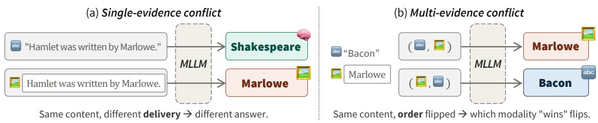
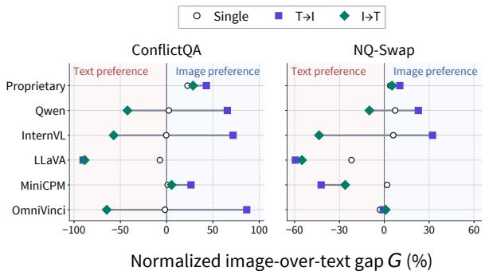
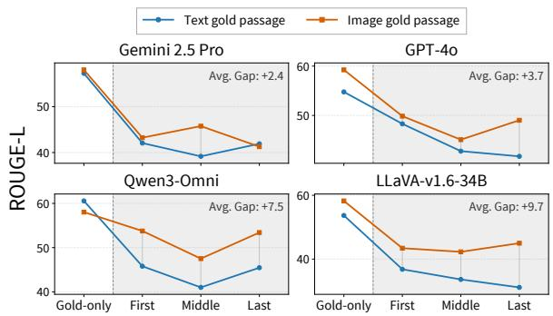
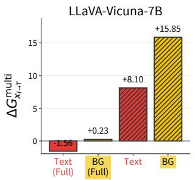
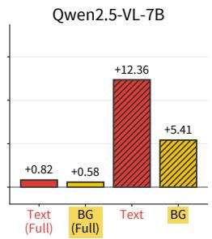
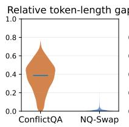
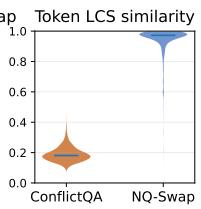
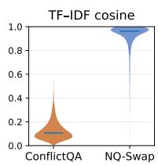
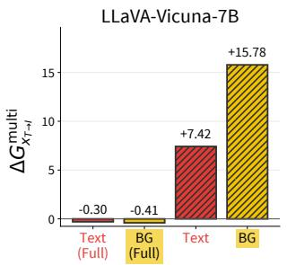
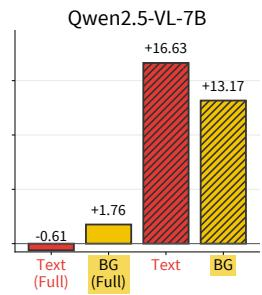

# Same Semantics, Different Outcome: On the Modality Robustness of Multimodal LLMs under Knowledge Conflict

Jungyeon Lee, Yejin Yoon, Taeuk Kim Hanyang University, Seoul, Republic of Korea {jungyune,stillwithyou,kimtaeuk}@hanyang.ac.kr

## Abstract

Multimodal large language models (MLLMs) are increasingly provided with contextual evidence in heterogeneous forms: as a text passage, as a rendered image of the same passage, or as both together. However, it remains unclear how consistently these surface forms are processed, especially when the evidence conflicts with the model’s parametric knowledge. We study modality robustness under knowledge conflict across 13 MLLMs and two datasets, and find them far from robust. (1) Contrary to common belief, models favor a context that contradicts parametric knowledge more readily in image form than in text form; (2) when a contradicting text and image are presented together, the preferred modality is essentially arbitrary, varying with input order, model, and dataset. We further demonstrate that this instability has practical consequences: it degrades performance in multimodal RAG and can be exploited by adversarial attacks. To alleviate this brittleness, we examine several simple techniques—prompting, steering, supervised fine-tuning (SFT), and direct preference optimization; the majority prove ineffective, whereas SFT achieves moderate success. We therefore call for greater awareness of this inconsistency and argue that it is fundamental, demanding attention at multiple training stages.

## 1 Introduction

Multimodal large language models (MLLMs) are increasingly deployed in retrieval-augmented and agentic workflows, where evidence arrives in a variety of surface forms, e.g., plain text, webpages, PDFs, screenshots, or scanned documents (Yu et al., 2025; Faysse et al., 2025). These workflows presuppose that MLLMs process semantically equivalent content consistently, irrespective of its modality. That expectation is not guaranteed to hold, however, because inputs in different modalities typically follow distinct internal pathways through these models, beginning with modality-specific tokenization.

The risk posed by such latent inconsistency is greatly amplified under knowledge conflict (KC), where external evidence contradicts the model’s parametric knowledge or where multiple sources support competing answers. In such scenarios, the answer may diverge drastically, or even reverse, according to which source the model accepts as authoritative; if that acceptance is governed by the form in which the evidence is delivered rather than by its content, the robustness and reliability of the model are severely compromised.

Although previous work (Deng et al., 2025; Sim et al., 2025; Zhang et al., 2025a) has reported that MLLMs exhibit a modality bias—typically placing more weight on textual than visual information— this claim has not been examined in knowledgeconflict scenarios. Moreover, the few studies on multimodal knowledge conflict (Hua et al., 2025; Nguyen et al., 2025; Zhang et al., 2025b,c) focus mostly on natural images rather than documents, even though knowledge is typically organized in document form, not as scenes or faces.

To fill this gap, we investigate the modality robustness of MLLMs through the lens of knowledge conflict. We evaluate two setups: (1) a single piece of external evidence is delivered as text or as a rendered image (i.e., text-as-image); (2) two textual and visual contexts conflict with each other. Unlike prior work, we also guarantee that parametric knowledge is distinct from any contextual knowledge, enabling more tightly controlled analysis.

Spanning multiple MLLMs, datasets, and conflict categories, the dominant pattern we observe is instability: which modality a model trusts shifts unpredictably with input order, dataset construction, and model family, and no single factor reliably explains the variation. Crucially, this contradicts the widely reported textual bias in MLLMs. In our single-evidence setting, the direction is in fact reversed: when the image is a rendering of the same text, MLLMs tend to prefer it over the text itself. Moreover, even this reversed preference dissolves once both modalities are presented in conflict, a setting that prior work has not thoroughly examined.

We further examine whether this sensitivity has practical consequences beyond controlled configurations, using two downstream tasks. First, in multimodal RAG, we keep a passage’s content fixed and vary only its format—raw text or rendered image—to test whether that change alone alters how models use retrieved evidence (§5.1). We find that MLLMs are less distracted by irrelevant context when salient knowledge is represented as an image rather than text, suggesting a remedy for the lost-in-the-middle phenomenon (Liu et al., 2024a).

Second, we examine safety-critical settings, in which the surface form of a harmful request may affect the model’s refusal behavior (§5.2). Our results indicate that rendering harmful requests as images increases attack success rates by 6.99 percentage points on average, underscoring a serious and readily exploitable vulnerability.

Finally, we explore methods to improve the modality robustness of MLLMs. We observe that simple prompting is insufficient; instead, finetuning on knowledge-conflict data partially mitigates the problem, although it does not completely eliminate the inconsistency (§6). Consequently, we call for greater community awareness of MLLMs inconsistency across input modalities, and argue that this problem is fundamental, requiring further investigation at different stages of model training.

To summarize, our contributions are as follows:

• We formalize modality robustness as an evidenceauthority problem under knowledge conflict.

• We construct single- and multi-evidence conflict settings that disentangle semantic content, presentation modality, and parametric knowledge.

• Across 13 MLLMs and two datasets, modality reliance varies across model families, input orders, and evidence compositions, with downstream effects on multimodal RAG and refusal behavior.

• Comparing several mitigation strategies, we find conflict-aware fine-tuning to be the most effective at balancing modality preference.

## 2 Related Work

## 2.1 Knowledge Conflict

Knowledge conflict has been studied as the tension between parametric memory and external evidence, formalized via entity substitution (Longpre et al., 2021) and later expanded along multiple conflict axes (Xu et al., 2024; Wang et al., 2024). While these works characterize how models resolve such conflicts (Jin et al., 2024; Khandelwal et al., 2025), they generally assume a fixed modality, i.e., text.

The framework has been recently extended to multimodal settings where context is also presented as images (Zhang et al., 2025c; Nguyen et al., 2025; Zhang et al., 2025b; Hua et al., 2025), but does not explicitly control for conflicts with the model’s parametric memory. Other studies test parametric or commonsense knowledge with counterfactual images, observing whether models follow the visual input or their internal beliefs (Liu et al., 2025; Ortu et al., 2025). A related line examines inconsistencies between visual entities or attributes and their textual descriptions (Jia et al., 2026). Across these studies, however, the evidence is predominantly natural images such as scenes or faces, rather than the knowledge-intensive sentences and paragraphs—presented either as text or as rendered images—that constitute the focus of our work.

## 2.2 Modality Bias in MLLMs

Recent work reports a “Blind Faith in Text” tendency in MLLMs, where models favor text over visual evidence (Deng et al., 2025). Counterfactualimage studies similarly show reliance on language priors over visual cues (Lee et al., 2025), and others report text-dominant behavior under controlled evidence conflicts (Zhang et al., 2025a). A recent survey synthesizes these findings under the notion of modality collapse (Sim et al., 2025).

We extend these efforts to knowledge-conflict scenarios, where consistent handling of input context is essential to the robust behavior of MLLMs. We later show that the textual bias widely reported in the literature does not hold in our setting; the direction in fact often reverses, with MLLMs favoring images over text. Furthermore, this trend grows more arbitrary as multiple pieces of evidence simultaneously contradict parametric knowledge, urging a reassessment of the current consensus.

  
Figure 1: The same evidence, delivered differently, can yield different answers. (a) Single-evidence: the model follows visual external evidence $e _ { I } ( \varTheta )$ but reverts to its memory $a _ { \mathrm { i n t } } ( \mathfrak { L } )$ when the same content is delivered as text $e _ { T } ( \oplus \oplus )$ . (b) Multi-evidence: when $e _ { T }$ and $e _ { I }$ support different answers, the order in which they appear can flip which modality the model follows. These examples illustrate a broader instability of MLLMs under knowledge conflict: the information a model prioritizes varies arbitrarily with input order, dataset, and model family.

## 3 Problem Formulation

In this work, we study modality robustness under knowledge conflict (KC), namely, whether MLLMs resolve knowledge conflicts consistently across different numbers and orderings of textual and visual inputs. Let $p$ denote the model’s internal parametric knowledge and e the external evidence for query $q .$ We specify two competing answer candidates: $a _ { \mathrm { i n t } }$ supported by $p$ and $a _ { \mathrm { e x t } }$ supported by e, with $a _ { \mathrm { i n t } } \neq a _ { \mathrm { e x t } }$ . To isolate modality, we hold the semantic content of the evidence fixed and present it either as text $e _ { T }$ or as an image $e _ { I }$ . Since this work focuses on knowledge-intensive scenarios, $e _ { I }$ is defined as a rendered image of $e _ { T } .$ 1 If the model produces different responses across $e _ { T }$ and $e _ { I }$ , we regard this as a failure of modality robustness.

## 3.1 Categories of Knowledge Conflict

Previous work typically focuses on either singleor two-evidence settings, often without carefully controlling for parametric knowledge. Our setup covers both configurations and explicitly accounts for parametric alignment. Figure 1 illustrates the model’s unstable responses in both settings, driven by inconsistent multimodal processing under KC.

Single-evidence conflict For each query $q ,$ we pair it with external evidence e that contradicts $p ,$ instantiated in two modalities: textual $e _ { T }$ and image $e _ { I }$ . Both support the same answer $a _ { \mathrm { e x t } }$ , conflicting with $a _ { \mathrm { i n t } }$ . We compare two input conditions:

$$
x _ { T } = ( e _ { T } , q ) \quad \mathrm { v s . } \quad x _ { I } = ( e _ { I } , q ) .
$$

This measures how the modality of evidence affects the model’s resolution of conflicts between parametric $( p )$ and external (e) knowledge.

Specifically, we use KC datasets (§3.2) with 5- tuples $( q , c ^ { + } , a ^ { + } , c _ { 1 } ^ { - } , a _ { 1 } ^ { - } )$ : a query $q ,$ a factual context $c ^ { + }$ with answer $a ^ { + }$ , and a counterfactual context $c _ { 1 } ^ { - }$ with answer $a _ { 1 } ^ { - }$ . For each $q ,$ we determine whether $a _ { \mathrm { i n t } }$ matches $a ^ { + }$ or $a ^ { - }$ , and align $( c ^ { + } , a ^ { + } )$ and $( c _ { 1 } ^ { - } , a _ { 1 } ^ { - } )$ with $( p , a _ { \mathrm { i n t } } )$ and $( e , a _ { \mathrm { e x t } } ) . ^ { 2 }$

To this end, we leverage a closed-book multiplechoice QA setup. The answer choices are taken from the source $\mathrm { K C }$ dataset and augmented with a ‘none of the above’ option. Inspired by Wang et al. (2023), we sample the model’s output for q five times and retain $q$ only when all five responses agree, taking the common answer as $\alpha _ { \mathrm { i n t } } . ^ { 3 }$ If $a _ { \mathrm { i n t } }$ is ‘none ofthe above’, we ask the model to provide an open-ended answer, which then replaces $a _ { \mathrm { i n t } }$ Subsequently, if $a _ { \mathrm { i n t } } = a ^ { + }$ , we align $( p , a _ { \mathrm { i n t } } )$ and $( e , a _ { \mathrm { { e x t } } } )$ with $( c ^ { + } , a ^ { + } )$ and $( c _ { 1 } ^ { - } , a _ { 1 } ^ { - } )$ , respectively; otherwise, the alignment is reversed.

As LLMs differ in their parametric knowledge, the number of retained instances (|D|) after this process varies across models. Model-wise filtering statistics are reported in Table 6 of Appendix A.2.

Multi-evidence conflict We further consider a joint setting that provides both modalities to the model, in two possible orderings:

$$
x _ { I \to T } = ( e _ { I } , e _ { T } , q ) \mathrm { a n d } x _ { T \to I } = ( e _ { T } , e _ { I } , q ) .
$$

We extend the setup to a three-way conflict by adding a second conflicting source, yielding $7 -$ tuples $( q , c ^ { + } , a ^ { + } , c _ { 1 } ^ { - } , a _ { 1 } ^ { - } , c _ { 2 } ^ { - } , a _ { 2 } ^ { - } )$ . For simplicity, we focus on cases where $( p , a _ { \mathrm { i n t } } )$ matches the factual pair $( c ^ { + } , a ^ { + } )$ . We then have two possible assignments: (1) $( e _ { T } , a _ { T } ) \ = \ ( c _ { 1 } ^ { - } , a _ { 1 } ^ { - } )$ and $( e _ { I } , a _ { I } ) \ = \ ( c _ { 2 } ^ { - } , a _ { 2 } ^ { - } ) ;$ (2) the reverse. We average over both assignments and test whether the model favors one modality in this three-way conflict. Again, model-wise final dataset sizes (|D|) are reported in Table 7 of Appendix A.2.

## 3.2 Other Experimental Factors

We consider additional experimental factors that may affect modality-dependent evidence reliance.

Datasets We evaluate on two complementary knowledge conflict datasets:

• CONFLICTQA (Xie et al., 2024) constructs conflicts by eliciting the model’s parametric memory and then generating counter-memory evidence supporting an alternative answer. Since the evidence is LLM-generated rather than produced by simple word substitution (as in NQ-SWAP), the resulting passages read naturally.4

• NQ-SWAP (Longpre et al., 2021) is a variant of the Natural Questions dataset (Kwiatkowski et al., 2019) where the answer entity is replaced with another entity in several substitution methods. Since NQ-SWAP is based on real QA passages, it provides a retrieval-like conflict setting.

Models We evaluate 13 MLLMs across proprietary API models and open-source model families:

• Proprietary models: Claude Sonnet 4.5 (Anthropic, 2025), GPT-5.4 (OpenAI, 2026), and GPT-4o (Hurst et al., 2024).

• Open-source omni-modal LLMs (OLLMs): Qwen3-Omni-30B-A3B-Instruct (Xu et al., 2025b), Qwen2.5-Omni-7B (Xu et al., 2025a), MiniCPM-o2.6 (OpenBMB, 2025), and OmniVinci (Ye et al., 2025).

• Open-source vision-language models (VLMs): Qwen2.5-VL-7B/-32B-Instruct (Bai et al., 2025), InternVL3-8B/-38B-Instruct (Zhu et al., 2025), LLaVA-v1.6-34b-hf, and LLaVA-v1.6-vicuna-7b-hf (Liu et al., 2023).

We test whether modality robustness under KC generalizes across model families and scales.

Metrics For $i \in \mathcal { D }$ , we have distinct forms of prompts $\{ x ^ { ( i ) } \} , \mathrm { e . g . , } x _ { T } ^ { ( i ) }$ and $x _ { I  T } ^ { ( i ) }$ . We request an LLM to generate its open-ended response given a specific type of x three times, and then evaluate them using normalized span matching.5

Let $\hat { \mathbf { a } } _ { x } ^ { ( i ) } { = } \{ \hat { a } _ { x , 1 } ^ { ( i ) } , \hat { a } _ { x , 2 } ^ { ( i ) } , \hat { a } _ { x , 3 } ^ { \hat { ( } i ) } \}$ denote a set of three responses for instance i under prompt x. We define the external-sourcefollowing rate (EFR) over the dataset D from §3.1 as

$$
\mathrm { E F R } ( \boldsymbol { x } ) = \frac { 1 } { | \mathcal { D } | } \sum _ { i \in \mathcal { D } } \mathbb { I } \Big [ \hat { a } _ { \boldsymbol { x } , 1 } ^ { ( i ) } = \hat { a } _ { \boldsymbol { x } , 2 } ^ { ( i ) } = \hat { a } _ { \boldsymbol { x } , 3 } ^ { ( i ) } = a _ { \mathrm { e x t } } ^ { ( i ) } \Big ] ,
$$

where $\mathbb { I } \Big [ \hat { a } _ { x , 1 } ^ { ( i ) } = \hat { a } _ { x , 2 } ^ { ( i ) } = \hat { a } _ { x , 3 } ^ { ( i ) } = a _ { \mathrm { e x t } } ^ { ( i ) } \Big ]$ becomes 1 only when all three responses match the external answer candidate $a _ { \mathrm { e x t } } ^ { ( i ) }$ , and 0 otherwise. By design, this definition is conservative: it credits a model only for consistently following the evidence, not for a single match that could arise by chance.

We quantify modality reliance using the normalized image-over-text gap, denoted by G. Since models differ in their overall EFR, we normalize the image–text difference by their combined rate to enable stable cross-model comparison. For singleevidence conflict, we compare two prompts that differ only in the modality of the same external evidence: $x _ { T }$ and $x _ { I }$ . We thus compute G as

$$
G ^ { \mathrm { s i n g l e } } = \frac { \mathrm { E F R } ( x _ { I } ) - \mathrm { E F R } ( x _ { T } ) } { \mathrm { E F R } ( x _ { I } ) + \mathrm { E F R } ( x _ { T } ) } \times 1 0 0 .
$$

In the multi-evidence setting, both $e _ { T }$ and $e _ { I }$ are presented jointly, supporting competing answers $a _ { T }$ and $a _ { I }$ . For each ordering $o \in \{ I \to$ $T , T  I \}$ , we compute the modality-specific rates EFRT(xo) and $\mathrm { E F R } _ { I } ( x _ { o } )$ , and define the (orderaware) image-over-text gap as

$$
G _ { o } ^ { \mathrm { m u l t i } } = \frac { \mathrm { E F R } _ { I } ( x _ { o } ) - \mathrm { E F R } _ { T } ( x _ { o } ) } { \mathrm { E F R } _ { I } ( x _ { o } ) + \mathrm { E F R } _ { T } ( x _ { o } ) } \times 1 0 0 .
$$

The resulting gap is bounded within $[ - 1 0 0 , 1 0 0 ]$ Positive values indicate that the model relies more on the image, with larger magnitudes corresponding to a wider image–text difference.

## 4 MLLMs Lack Modality Robustness

Table 1 summarizes the normalized image-overtext gap G across models, datasets, input orders, and conflict categories; the corresponding absolute percentage-point gaps are reported in Table 9 in the Appendix. The dominant pattern is instability: modality is not merely a passive container of evidence, but a factor that influences how models resolve conflicts.

<table><tr><td rowspan=1 colspan=7>Evidence           CONFLICTQA                         NQ-SWAPModel              SingleMulti x1→TMulti xT→I Single Multi x1→TMulti xT→I</td></tr><tr><td rowspan=1 colspan=1>Claude Sonnet 4.5</td><td rowspan=1 colspan=1>42.86</td><td rowspan=1 colspan=1>79.41</td><td rowspan=1 colspan=1>84.62</td><td rowspan=1 colspan=1>22.63</td><td rowspan=1 colspan=1>4.26</td><td rowspan=1 colspan=1>19.38</td></tr><tr><td rowspan=1 colspan=1>GPT-5.4</td><td rowspan=1 colspan=1>15.29</td><td rowspan=1 colspan=1>1.80</td><td rowspan=1 colspan=1>63.37</td><td rowspan=1 colspan=1>3.80</td><td rowspan=1 colspan=1>4.38</td><td rowspan=1 colspan=1>6.92</td></tr><tr><td rowspan=1 colspan=1>GPT-40</td><td rowspan=1 colspan=1>9.75</td><td rowspan=1 colspan=1>4.40</td><td rowspan=1 colspan=1>-19.05</td><td rowspan=1 colspan=1>-14.74</td><td rowspan=1 colspan=1>6.89</td><td rowspan=1 colspan=1>4.80</td></tr><tr><td rowspan=1 colspan=1>Qwen3-Omni</td><td rowspan=1 colspan=1>1.64</td><td rowspan=1 colspan=1>-38.24</td><td rowspan=1 colspan=1>79.25</td><td rowspan=1 colspan=1>12.98</td><td rowspan=1 colspan=1>-55.51</td><td rowspan=1 colspan=1>10.94</td></tr><tr><td rowspan=1 colspan=1>Qwen2.5-Omni</td><td rowspan=1 colspan=1>1.54</td><td rowspan=1 colspan=1>-42.64</td><td rowspan=1 colspan=1>43.77</td><td rowspan=1 colspan=1>6.74</td><td rowspan=1 colspan=1>-5.64</td><td rowspan=1 colspan=1>33.50</td></tr><tr><td rowspan=1 colspan=1>MiniCPM-o2.6</td><td rowspan=1 colspan=1>1.09</td><td rowspan=1 colspan=1>5.42</td><td rowspan=1 colspan=1>26.36</td><td rowspan=1 colspan=1>1.86</td><td rowspan=1 colspan=1>-26.18</td><td rowspan=1 colspan=1>-42.27</td></tr><tr><td rowspan=1 colspan=1>OmniVinci</td><td rowspan=1 colspan=1>-1.81</td><td rowspan=1 colspan=1>-64.66</td><td rowspan=1 colspan=1>86.58</td><td rowspan=1 colspan=1>-2.87</td><td rowspan=1 colspan=1>0.94</td><td rowspan=1 colspan=1>-0.77</td></tr><tr><td rowspan=1 colspan=1>Qwen2.5-VL-32B</td><td rowspan=1 colspan=1>2.32</td><td rowspan=1 colspan=1>-19.37</td><td rowspan=1 colspan=1>65.61</td><td rowspan=1 colspan=1>5.49</td><td rowspan=1 colspan=1>-11.87</td><td rowspan=1 colspan=1>16.96</td></tr><tr><td rowspan=1 colspan=1>Qwen2.5-VL-7B</td><td rowspan=1 colspan=1>4.09</td><td rowspan=1 colspan=1>-68.98</td><td rowspan=1 colspan=1>73.82</td><td rowspan=1 colspan=1>3.80</td><td rowspan=1 colspan=1>33.10</td><td rowspan=1 colspan=1>29.51</td></tr><tr><td rowspan=1 colspan=1>InternVL3-38B</td><td rowspan=1 colspan=1>0.46</td><td rowspan=1 colspan=1>–21.32</td><td rowspan=1 colspan=1>84.87</td><td rowspan=1 colspan=1>8.53</td><td rowspan=1 colspan=1>-40.04</td><td rowspan=1 colspan=1>42.92</td></tr><tr><td rowspan=1 colspan=1>InternVL3-8B</td><td rowspan=1 colspan=1>-1.27</td><td rowspan=1 colspan=1>-93.03</td><td rowspan=1 colspan=1>58.77</td><td rowspan=1 colspan=1>3.44</td><td rowspan=1 colspan=1>–47.25</td><td rowspan=1 colspan=1>21.58</td></tr><tr><td rowspan=1 colspan=1>LLaVA-v1.6-34B</td><td rowspan=1 colspan=1>-5.34</td><td rowspan=1 colspan=1>-81.64</td><td rowspan=1 colspan=1>–85.65</td><td rowspan=1 colspan=1>-9.75</td><td rowspan=1 colspan=1>-31.38</td><td rowspan=1 colspan=1>-43.28</td></tr><tr><td rowspan=1 colspan=1>LLaVA-vicuna-7B</td><td rowspan=1 colspan=1>-9.17</td><td rowspan=1 colspan=1>–95.45</td><td rowspan=1 colspan=1>-94.86</td><td rowspan=1 colspan=1>-34.17</td><td rowspan=1 colspan=1>-78.76</td><td rowspan=1 colspan=1>–75.67</td></tr></table>

Table 1: Normalized image-over-text gap (%) on CONFLICTQA and NQ-SWAP across single- and multi-evidence settings; $G ^ { \mathrm { s i n g l e } }$ for single-evidence inputs, $G _ { o } ^ { \mathrm { m u l t i } }$ for multi-evidence inputs under each order $o \in \{ I \to T , T \to I \}$ Cell shading scales with the magnitude of the change (■ positive / ■ negative; bins at $| x | \le 1 0 , 1 0 \mathrm { - 3 0 , 3 0 \mathrm { - 6 0 , > 6 0 ) } }$

Single-evidence conflict: a weak but pervasive image preference. The single-evidence setting is the most direct test of presentation invariance: the external evidence has the same semantic content across conditions, and only its surface form changes. Positive $G ^ { \mathrm { s i n g l e } }$ therefore means that rendering the same evidence as an image makes the model more likely to follow it over its parametric knowledge. This image advantage is most evident in proprietary models. Claude Sonnet 4.5 shows the strongest positive gaps, with +42.86% on CONFLICTQA and +22.63% on NQ-SWAP. GPT-5.4 also remains positive on both datasets, with +15.29% and +3.80%, respectively. The pattern is not universal, however: GPT-4o reverses from a positive gap on CONFLICTQA (+9.75%) to a negative gap on NQ-SWAP (-14.74%), while the LLaVA models show consistently negative gaps, indicating stronger reliance on text evidence. These results show that even the simplest presentation change can alter evidence following.

Multi-evidence conflict: modality order matters. Table 1 shows that when eI precedes $e _ { T } \ ( x _ { I  T } )$ most open-source models show negative gains, indicating stronger reliance on the text-supported answers. However, when the order is reversed $( x _ { T  I } )$ , the same models often shift toward imagesupported answers. This order sensitivity is reflected in both the per-model Flip Ratio and the aggregate number of sign flips, as shown in Table 8 in the Appendix. The Flip Ratio further shows instance-level preference changes when the input order is reversed. At the aggregate level, 8 out of 13 models on CONFLICTQA and 6 out of 13 models on NQ-SWAP change the sign of G across the two input orders. These reversals show that modality reliance is not fixed; it can be reshaped by the order in which conflicting sources enter the context.

G is also influenced by the dataset. As Table 1 shows in the multi-evidence settings, CONFLIC-TQA elicits markedly larger absolute gaps than NQ-SWAP; OmniVinci, for example, exceeds 86% on CONFLICTQA but is nearly neutral on NQ-SWAP. We hypothesize that modality-dependent reliance grows with the semantic divergence between conflicting sources. NQ-SWAP perturbs only the answer entity and otherwise leaves the passage intact, so the two evidence sources remain largely overlapping; CONFLICTQA, by contrast, generates entirely separate counter-evidence, producing a much broader semantic gap. Figure 6 in Appendix A.2 supports this characterization.

Variation across model families. Figure 2 visualizes G from Table 1 by grouping open-source models by family and proprietary models into a separate category. The proprietary group maintains the most consistently positive average G, indicating a relatively stable image preference. In contrast, LLaVA models remain strongly textdominant across all conditions and datasets. Qwen and InternVL families exhibit pronounced order sensitivity: their average G becomes strongly positive under $x T {  } I$ but negative under xI→T, especially on CONFLICTQA. Together, these patterns indicate that modality-dependent reliance can be influenced by model characteristics and evidence conditions, rather than reflecting a universal property of MLLMs.

  
Figure 2: Group-averaged modality preference on CON-FLICTQA and NQ-SWAP. Positive and negative values indicate image and text preference, respectively.

## 5 When Modality Instability Matters

The instability documented in §4 is not merely a benchmark artifact. Deployed MLLM pipelines rarely control how evidence arrives. Even when the underlying evidence remains identical, models may resolve conflicts differently due to upstream choices in evidence representation.

We examine two settings where this failure mode is consequential: question-answering performance in multimodal RAG (§5.1), where format changes what the model attends to, and safety vulnerability to image-rendered adversarial instructions (§5.2).

## 5.1 Impact of Gold-Passage Modality in RAG

To probe whether modality instability matters in practice, we begin with retrieval-augmented QA. As a thought experiment, imagine that an ideal paragraph directly answering the query is given in advance: how do MLLMs treat this gold-standard passage when only its modality changes? We fix the query, the gold passage’s content, and the distractors (all provided as text for simplicity), and vary only the modality of the gold passage.

We sample 170 query–passage instances from MS MARCO v2.1 (Bajaj et al., 2016) and report answer quality with ROUGE-L. MLLMs are evaluated under four cases: a gold-only setting, in which the gold passage is the only input, and three multipassage settings, in which it appears among nine distractors at the First, Middle, or Last position.

  
Figure 3: RAG performance on MS MARCO v2.1 with text vs. image gold passages. Gold-only: gold alone; First/Middle/Last: gold position among nine distractors. Avg. Gap: the mean image–text ROUGE-L difference.

Figure 3 demonstrates that the modality of the gold-standard passage influences RAG performance, with image rendering mitigating the wellknown lost-in-the-middle phenomenon (Liu et al., 2024a). For instance, Gemini 2.5 Pro gains +6.59 ROUGE-L when the image-rendered gold passage occupies the middle position. This suggests that rendering relevant context as an image may serve as a new strategy to direct model attention toward salient passages embedded among distractors.

## 5.2 Vulnerability to Image-Rendered Attacks

As a second case study, we ask whether modality instability also affects MLLMs’ safety. Our experiments build on MM-SafetyBench (Liu et al., 2024b), which benchmarks robustness against attacks that hide harmful content in query-relevant images. Its four conditions—Text-Only, Stable Diffusion (SD), Typography (Typo), and SD+Typo— serve as our baselines and embed only the key phrase in image form.6 We extend this setup with an image-rendered instruction condition, in which the full instruction is moved into the visual channel, leaving the request semantically unchanged, and report Attack Success Rate (ASR), the proportion of prompts for which the model produces harmful content instead of refusing.

Figure 4 summarizes the increase in ASR from rendering harmful instructions as images across models and baseline conditions, averaged over all

<table><tr><td>Qwen2.5-</td><td>+8.45</td><td>+2.12</td><td>+3.12</td><td>+1.29</td><td rowspan="3">14 12 10 8 AASSR 6 4 2</td></tr><tr><td>InternVL3-</td><td>+12.44</td><td>+6.38</td><td>+7.24</td><td>+5.64</td></tr><tr><td>LLaVA-v1.6-</td><td>+13.92</td><td>+6.41</td><td>+6.16</td><td>+10.71</td></tr><tr><td>Avg.</td><td>+11.60</td><td>+4.97</td><td>+5.51</td><td>+5.88</td></tr><tr><td></td><td>Text- only</td><td>SD</td><td>Typo</td><td>0 SD+ Typo</td></tr></table>

Figure 4: Mean ∆ASR over 13 MM-SafetyBench scenarios when the harmful instruction is rendered as an image. Cells report the points relative to each baseline (Text-Only, SD, Typo, SD+Typo); darker shading indicates larger increases. Avg. averages over the three models; per-scenario values in Appendix G.

13 scenarios. Over 156 evaluation settings in total, this intervention increases ASR by 6.99% on average, with positive ∆ASR in 126/156 (80.8%) comparisons. Table 15 in the Appendix reports the corresponding per-scenario results. The average increase is consistently positive across all model × baseline cells, although its magnitude varies across models (Qwen +3.74%, InternVL +7.93%, LLaVA +9.30%). It is largest against the Text-only baseline (+11.60%) and smallest against SD (+4.97%). Together, these results suggest that moving the whole instruction into the visual channel introduces an additional safety vulnerability beyond existing attacks that embed only parts of the instruction visually.

## 6 Mitigating Modality Instability

Having established the modality instability of MLLMs and its practical consequences, we next explore whether this behavior can be mitigated. We consider interventions at three levels: a lightweight intervention through explicit prompting, posttraining through supervised fine-tuning and direct preference optimization, and inference-time control through representation steering.

## 6.1 Prompting is Not Sufficient

A natural first step is to instruct the model directly to use both modalities in balance. We therefore prepend a system-level prompt asking the model to jointly consider textual and visual evidence whenever multiple sources are provided. Under the hypothesis that underspecified instructions drive the imbalance, this explicit multimodal prompting should close the gap.

Contrary to expectation, as shown in Table 2, prompting does not provide reliable control over modality reliance. While it partially reduces the imbalance for Qwen2.5-VL-7B, it instead amplifies the bias for GPT-5.4. We observe similar instability when the prompt explicitly asks the model to focus on a particular modality. These outcomes suggest that modality-dependent reliance cannot be reliably corrected through surface-level prompting alone, motivating the post-training and inference-time interventions explored next.

<table><tr><td></td><td colspan="2"> $\mathrm { M u l t i } _ { I  T }$ </td><td colspan="2"> $\mathrm { M u l t i } _ { T  I }$ </td></tr><tr><td>Model</td><td>Orig.</td><td>+Prompt.</td><td>Orig.</td><td>+Prompt.</td></tr><tr><td>GPT-5.4</td><td>1.80</td><td>71.26</td><td>63.37</td><td>80.49</td></tr><tr><td>Qwen2.5-VL</td><td>-68.97</td><td>-17.54</td><td>73.82</td><td>45.69</td></tr></table>

Table 2: Image-over-text gap $( G _ { o } ^ { \mathrm { m u l t i } }$ , %) before and after explicit prompting on the CONFLICTQA subset in the multi-evidence setting. Values closer to zero indicate more balanced reliance on textual and visual evidence.

## 6.2 Conflict-Aware Fine-Tuning

We here examine whether this modality-dependent reliance can be recalibrated through post-training. Unlike prompting, which intervenes only through instructions at inference time, fine-tuning directly adjusts the model’s behavior under conflicting multimodal evidence.

To test whether reliance on misleading visual evidence can be recalibrated in a reproducible opensource setting, we select Qwen2.5-VL-7B-Instruct, which exhibits strong image-following behavior. We then apply conflict-aware LoRA fine-tuning using training data constructed from NQ-SWAP and MMM-Fact (Xu et al., 2025c).7 This tuning objective reduces the model’s tendency to follow misleading image evidence while preserving its use of factual evidence during conflict resolution.

As shown in Table 3, conflict-aware SFT consistently reduces the magnitude of the modality gap across all evaluated settings. The effect is particularly pronounced in the multi-evidence $x _ { T  I }$ condition, where the image-dominant gap decreases from 73.82% to 52.04%. The opposite order shows a modest reduction in the text-dominant gap. The intervention also reduces modality imbalance in the single-evidence setting for both misleading (- 2.29%) and reliable (-2.37%) evidence.

Importantly, moving G toward zero does not by itself guarantee desirable evidence use, since balanced modality reliance could in principle arise from uniformly increasing or decreasing evidence following. We therefore additionally examine the corresponding raw EFRI in Appendix C.1. Table 12 shows that SFT reduces following of misleading image evidence while preserving, and slightly increasing, following of reliable image evidence. These findings provide evidence that conflict-aware SFT can improve modality balance without merely suppressing visual evidence or shifting preference toward the opposite modality.

<table><tr><td rowspan="2">Evidence</td><td colspan="3">False</td><td rowspan="2">True</td></tr><tr><td>Method  $\mathrm { M u l t i } _ { I  T }$ </td><td> $\mathrm { M u l t i } _ { T  I }$ </td><td>Single</td></tr><tr><td>Original</td><td>-68.97</td><td>73.82</td><td>2.54</td><td>Single 3.45</td></tr><tr><td>+ SFT</td><td>-67.07</td><td>52.04</td><td>0.25</td><td>1.08</td></tr></table>

Table 3: Effect of conflict-aware fine-tuning on Qwen2.5-VL-7B on CONFLICTQA. False and True denote misleading and reliable evidence, respectively.

## 6.3 Additional Mitigation Baselines

To broaden our mitigation analysis beyond prompting and conflict-aware SFT, we additionally evaluate two approaches operating at different stages: Direct Preference Optimization (DPO) (Rafailov et al., 2023) as a post-training method and representation-level steering as an inference-time intervention. Detailed implementation settings and the corresponding raw image-following rates are provided in Appendix C.2 and C.3.

Preference-based post-training. We construct NQ-SWAP preference pairs that favor the original factual answer over the answer supported by the substituted misleading image, and use them to train Qwen2.5-VL-7B-Instruct with DPO. Table 4 reports that DPO slightly reduces the imagedominant gap under $x _ { T  I }$ , but substantially increases the text-dominant gap under $x _ { I  T }$ . Thus, DPO can shift reliance away from misleading image evidence in some cases, but does not improve modality balance across different input orders.

Representation-level steering. We further evaluate an inference-time steering baseline following prior work (Zhang et al., 2025a) on the same Qwen2.5-VL-7B model. Using a calibration subset of CONFLICTQA, we derive separate textfollowing steering directions for each input order and apply them during decoding on a held-out evaluation subset. As the steering strength increases, the image-dominant gap under $x _ { T  I }$ decreases from 77.77% to 60.00%. In contrast, the textdominant gap under $x _ { I  T }$ grows. At stronger steering scales, modality preference shifts toward text under both input orders.

<table><tr><td>Method</td><td> $\mathrm { M u l t i } _ { I  T }$ </td><td> $\mathrm { M u l t i } _ { T  I }$ </td></tr><tr><td>Preference-based post-training</td><td></td><td></td></tr><tr><td>Original</td><td>-68.89</td><td>68.47</td></tr><tr><td>+ DPO</td><td>-88.08</td><td>65.57</td></tr><tr><td>Representation-level steering</td><td></td><td></td></tr><tr><td>Original (Scale 0)</td><td>-38.64</td><td>77.77</td></tr><tr><td>Scale 1</td><td>-45.05</td><td>80.64</td></tr><tr><td>Scale 3</td><td>-70.21</td><td>64.95</td></tr><tr><td>Scale 5</td><td>-86.96</td><td>60.00</td></tr></table>

Table 4: Additional mitigation interventions on multievidence conflicts. Positive and negative $G _ { o } ^ { \mathrm { m u l t i } }$ indicate image- and text-dominant reliance, respectively.

Overall, both methods exhibit a directional tradeoff: reducing image-dominant behavior can coincide with stronger text-dominant behavior. This contrasts with conflict-aware SFT, which moves every G closer to zero shown in Table 3. These observations highlight an important distinction between controlling modality preference and improving modality robustness; effective mitigation should reduce imbalance in both directions rather than simply shifting reliance toward a fixed modality.

## 7 Further Analysis: Input-Side Sensitivity

Given that input processing is the stage where modality-specific handling is most pronounced, we ask whether input-side interventions—altering how visual evidence is preprocessed and rendered—can change a model’s modality reliance. We examine this with frozen model weights, intervening solely on the visual preprocessing pipeline and the rendered form of semantically identical evidence.

## 7.1 Influence of Visual Preprocessing

The results in §4 show that modality reliance varies markedly across model families. To probe one possible source of this variation, we focus on Qwen2.5- VL and LLaVA-v1.6-7B, two families with opposing tendencies: Qwen leans toward image evidence, LLaVA leans toward text. Using this contrast, we examine whether preprocessing-level interventions can shift the model away from modality-dependent instability. We apply bidirectional interventions between the two models. Specifically, Qwen2.5-VL receives LLaVA-style 336×336 global/local view construction, whereas LLaVA-v1.6 receives images pre-resized by Qwen’s smart-resize rule. All remaining model-specific processing is unchanged; see Appendix D for details.

<table><tr><td>Base Model</td><td>Preprocessing</td><td>Orig.</td><td>After Prep.</td></tr><tr><td>Qwen2.5-VL</td><td>LLaVA-style</td><td>9.71</td><td>-37.23</td></tr><tr><td>LLaVA-v1.6</td><td>Qwen-style</td><td>-34.92</td><td>-30.91</td></tr></table>

Table 5: Effect of visual preprocessing on $G ^ { \mathrm { s i n g l e } }$ for NQ-SWAP. Orig. is the original model result; After Prep. is the result after each preprocessing intervention.

Table 5 reveals a clear but asymmetric effect across intervention directions. Under LLaVA-style preprocessing, Qwen’s Gsingle moves from 9.71% to -37.23%, not merely flipping sign but landing within three percentage points of LLaVA’s native value (-34.92%). Input-side processing alone is thus sufficient to reproduce LLaVA’s modality profile in a model with different weights and training. The reverse intervention produces only a modest shift, from -34.92% to -30.91%.

The key implication of this analysis is that preprocessing is one factor in modality reliance but not the sole mechanism; our setup also cannot isolate which downstream components interact with it. A more comprehensive test would require training matched models that differ only in preprocessing, which we leave to future work.

## 7.2 Influence of Image Presentation

A natural concern is whether our findings depend on arbitrary choices in how textual evidence is rendered as images. To address this, we perturb the default rendering at two levels of increasing visual salience and measure how the model’s sourcefollowing behavior shifts.

On the NQ-SWAP subset, we change only the visual appearance of the rendered evidence, leaving the query and evidence content untouched. The first level applies global changes to the entire image, either by rendering all text in red or by setting a yellow background. The second level applies the same changes only to the targeted answer-bearing span; this serves as an upper-bound salience diagnostic rather than a deployable setting, since it presupposes knowledge of the answer.

Figure 5 shows that modest global visual changes produce only small shifts relative to the default rendering, whereas answer-span highlighting produces much larger shifts. These findings both strengthen and qualify our main finding: the modality instability documented in §4 is not an artifact of font, color, or background choice, since reasonable variations along those dimensions leave the gain magnitudes largely intact. Yet the answerspan result indicates that image evidence carries an additional axis of variability that text evidence does not. This aligns with the effectiveness of imagerendered attacks observed in §5.2, suggesting that the influence of image evidence is shaped not only by its content but also by its visual form.

  
Figure 5: Effect of visualization variants on $G _ { x _ { I  T } } ^ { \mathrm { m u l t i } }$ on NQ-SWAP, relative to the default value. Text and BG highlight the answer-bearing span (red text and yellow background, respectively). (Full) applies the same changes to the entire evidence.

## 8 Conclusion

We study whether MLLMs resolve knowledge conflicts consistently across modalities and find that they do not: the same conflict yields different answers depending on how the evidence is delivered, and the direction of preference shifts with dataset, input order, and evidence composition. The fixed text or image preference reported in prior work does not survive once evidence is allowed to vary along these axes, and no single factor we examine reliably predicts which modality a model will favor. Modality preference is thus better understood as an artifact of the evaluation setup than as a fixed property of the model.

This instability has practical consequences, both beneficial (e.g., highlighting salient passages in RAG) and harmful (e.g., more potent adversarial attacks); the simple remedies we explored were largely ineffective, with conflict-aware fine-tuning offering only partial mitigation. The origin of this instability remains an open question. Our preliminary findings identify the visual input pipeline as a tractable starting point, but a complete account will require examining multiple stages of model training, which we leave to future work.

## Limitations

First, we consider only text-modality evidence and its rendered-image form, and do not examine naturally occurring visual evidence (e.g., figures, charts, photographs) or other modalities such as audio, where modality dynamics may differ. Extending our framework to these broader modalities is a direction for future work. Second, while we evaluate 13 MLLMs across proprietary and open-source families, our coverage is not exhaustive. Third, while we identify several contributing factors, a more thorough mechanistic account of why modality reliance shifts in the ways we document remains to be developed.

## Ethical Statement

Our safety experiments are intended to diagnose modality-dependent weaknesses in MLLM refusal behavior, not to provide new attack recipes. We report aggregate ASR results and do not include concrete harmful instructions or unsafe generations. Any released artifacts will exclude harmful rendered prompts and will be limited to evaluation metadata and non-sensitive analysis code.

## Acknowledgments

This work was supported by Institute of Information & communications Technology Planning & Evaluation (IITP) grant funded by the Korea government(MSIT) (No.RS-2020-II201373, Artificial Intelligence Graduate School Program(Hanyang University)). This work was supported by Institute of Information & communications Technology Planning & Evaluation (IITP) under the artificial intelligence semiconductor support program to nurture the best talents (IITP-2026-RS-2023-00253914) grant funded by the Korea government(MSIT). This work was supported by the National Research Foundation of Korea(NRF) grant funded by the Korea government(MSIT) (RS-2025- 00558151).

## References

Anthropic. 2025. Claude 4.5 Sonnet.

Shuai Bai, Keqin Chen, Xuejing Liu, Jialin Wang, Wenbin Ge, Sibo Song, Kai Dang, Peng Wang, Shijie Wang, Jun Tang, Humen Zhong, Yuanzhi Zhu, Mingkun Yang, Zhaohai Li, Jianqiang Wan, Pengfei Wang, Wei Ding, Zheren Fu, Yiheng Xu, and 8 others. 2025. Qwen2.5-vl technical report. arXiv preprint arXiv:2502.13923.

Payal Bajaj, Daniel Campos, Nick Craswell, Li Deng, Jianfeng Gao, Xiaodong Liu, Rangan Majumder, Andrew McNamara, Bhaskar Mitra, Tri Nguyen, and 1 others. 2016. Ms marco: A human generated machine reading comprehension dataset. arXiv preprint arXiv:1611.09268.

Ailin Deng, Tri Cao, Zhirui Chen, and Bryan Hooi. 2025. Words or vision: Do vision-language models have blind faith in text? 2025 IEEE/CVF Conference on Computer Vision and Pattern Recognition (CVPR), pages 3867–3876.

Manuel Faysse, Hugues Sibille, Tony Wu, Bilel Omrani, Gautier Viaud, Céline Hudelot, and Pierre Colombo. 2025. ColPali: Efficient document retrieval with vision language models. In The Thirteenth International Conference on Learning Representations.

Jian Hu, Xibin Wu, Zilin Zhu, Xianyu, Weixun Wang, Dehao Zhang, and Yu Cao. 2024. Openrlhf: An easyto-use, scalable and high-performance rlhf framework. arXiv preprint arXiv:2405.11143.

Tianze Hua, Tian Yun, and Ellie Pavlick. 2025. How do vision-language models process conflicting information across modalities? arXiv preprint arXiv:2507.01790.

Aaron Hurst, Adam Lerer, Adam P Goucher, Adam Perelman, Aditya Ramesh, Aidan Clark, AJ Ostrow, Akila Welihinda, Alan Hayes, Alec Radford, and 1 others. 2024. Gpt-4o system card. arXiv preprint arXiv:2410.21276.

Yifan Jia, Yuntao Du, Kailin Jiang, Yuyang Liang, Qihan Ren, Yi Xin, Rui Yang, Fenze Feng, MingCai Chen, Hengyang Lu, and 1 others. 2026. Benchmarking multimodal knowledge conflict for large multimodal models. In Proceedings of the AAAI Conference on Artificial Intelligence, volume 40, pages 22283–22291.

Zhuoran Jin, Pengfei Cao, Hongbang Yuan, Yubo Chen, Jiexin Xu, Huaijun Li, Xiaojian Jiang, Kang Liu, and Jun Zhao. 2024. Cutting off the head ends the conflict: A mechanism for interpreting and mitigating knowledge conflicts in language models. In Findings of the Association for Computational Linguistics: ACL 2024, pages 1193–1215, Bangkok, Thailand. Association for Computational Linguistics.

Anant Khandelwal, Manish Gupta, and Puneet Agrawal. 2025. CoCoA: Confidence- and context-aware adaptive decoding for resolving knowledge conflicts in large language models. In Proceedings ofthe 2025 Conference on Empirical Methods in Natural Language Processing, pages 6846–6866, Suzhou, China. Association for Computational Linguistics.

Tom Kwiatkowski, Jennimaria Palomaki, Olivia Redfield, Michael Collins, Ankur Parikh, Chris Alberti, Danielle Epstein, Illia Polosukhin, Jacob Devlin, Kenton Lee, Kristina Toutanova, Llion Jones, Matthew Kelcey, Ming-Wei Chang, Andrew M. Dai, Jakob

Uszkoreit, Quoc Le, and Slav Petrov. 2019. Natural questions: A benchmark for question answering research. Transactions ofthe Associationfor Computational Linguistics, 7:452–466.

Kang-il Lee, Minbeom Kim, Seunghyun Yoon, Minsung Kim, Dongryeol Lee, Hyukhun Koh, and Kyomin Jung. 2025. VLind-bench: Measuring language priors in large vision-language models. In Findings of the Association for Computational Linguistics: NAACL 2025, pages 4129–4144, Albuquerque, New Mexico. Association for Computational Linguistics.

Haotian Liu, Chunyuan Li, Qingyang Wu, and Yong Jae Lee. 2023. Visual instruction tuning. Advances in neural information processing systems, 36:34892– 34916.

Nelson F. Liu, Kevin Lin, John Hewitt, Ashwin Paranjape, Michele Bevilacqua, Fabio Petroni, and Percy Liang. 2024a. Lost in the middle: How language models use long contexts. Transactions ofthe Associationfor Computational Linguistics, 12:157–173.

Xiaoyuan Liu, Wenxuan Wang, Youliang Yuan, Jentse Huang, Qiuzhi Liu, Pinjia He, and Zhaopeng Tu. 2025. Insight over sight: Exploring the visionknowledge conflicts in multimodal LLMs. In Proceedings of the 63rd Annual Meeting of the Association for Computational Linguistics (Volume 1: Long Papers), pages 17825–17846, Vienna, Austria. Association for Computational Linguistics.

Xin Liu, Yichen Zhu, Jindong Gu, Yunshi Lan, Chao Yang, and Yu Qiao. 2024b. Mm-safetybench: A benchmark for safety evaluation of multimodal large language models. In European Conference on Computer Vision, pages 386–403. Springer.

Shayne Longpre, Kartik Perisetla, Anthony Chen, Nikhil Ramesh, Chris DuBois, and Sameer Singh. 2021. Entity-based knowledge conflicts in question answering. In Proceedings of the 2021 Conference on Empirical Methods in Natural Language Processing, pages 7052–7063, Online and Punta Cana, Dominican Republic. Association for Computational Linguistics.

Alex Mallen, Akari Asai, Victor Zhong, Rajarshi Das, Daniel Khashabi, and Hannaneh Hajishirzi. 2023. When not to trust language models: Investigating effectiveness of parametric and non-parametric memories. In Proceedings of the 61st Annual Meeting of the Associationfor Computational Linguistics (Volume 1: Long Papers), pages 9802–9822, Toronto, Canada. Association for Computational Linguistics.

Trang Nguyen, Jackson Michaels, Madalina Fiterau, and David Jensen. 2025. Challenges in understanding modality conflict in vision-language models. arXiv preprint arXiv:2509.02805.

OpenAI. 2026. GPT-5.4.

OpenBMB. 2025. MiniCPM-o Series. https:// github.com/OpenBMB/MiniCPM-o.

Francesco Ortu, Zhijing Jin, Diego Doimo, and Alberto Cazzaniga. 2025. When seeing overrides knowing: Disentangling knowledge conflicts in visionlanguage models. In Mechanistic Interpretability Workshop at NeurIPS 2025.

Rafael Rafailov, Archit Sharma, Eric Mitchell, Christopher D Manning, Stefano Ermon, and Chelsea Finn. 2023. Direct preference optimization: Your language model is secretly a reward model. Advances in neural information processing systems, 36:53728–53741.

Mong Yuan Sim, Wei Emma Zhang, Xiang Dai, and Biaoyan Fang. 2025. Can VLMs actually see and read? a survey on modality collapse in visionlanguage models. In Findings of the Association for Computational Linguistics: ACL 2025, pages 24452–24470, Vienna, Austria. Association for Computational Linguistics.

Xuezhi Wang, Jason Wei, Dale Schuurmans, Quoc V Le, Ed H. Chi, Sharan Narang, Aakanksha Chowdhery, and Denny Zhou. 2023. Self-consistency improves chain of thought reasoning in language models. In The Eleventh International Conference on Learning Representations.

Yike Wang, Shangbin Feng, Heng Wang, Weijia Shi, Vidhisha Balachandran, Tianxing He, and Yulia Tsvetkov. 2024. Resolving knowledge conflicts in large language models. In First Conference on Language Modeling.

Jian Xie, Kai Zhang, Jiangjie Chen, Renze Lou, and Yu Su. 2024. Adaptive chameleon or stubborn sloth: Revealing the behavior of large language models in knowledge conflicts. In The Twelfth International Conference on Learning Representations.

Jin Xu, Zhifang Guo, Jinzheng He, Hangrui Hu, Ting He, Shuai Bai, Keqin Chen, Jialin Wang, Yang Fan, Kai Dang, and 1 others. 2025a. Qwen2. 5-omni technical report. arXiv preprint arXiv:2503.20215.

Jin Xu, Zhifang Guo, Hangrui Hu, Yunfei Chu, Xiong Wang, Jinzheng He, Yuxuan Wang, Xian Shi, Ting He, Xinfa Zhu, and 1 others. 2025b. Qwen3-omni technical report. arXiv preprint arXiv:2509.17765.

Rongwu Xu, Zehan Qi, Zhijiang Guo, Cunxiang Wang, Hongru Wang, Yue Zhang, and Wei Xu. 2024. Knowledge conflicts for LLMs: A survey. In Proceedings ofthe 2024 Conference on Empirical Methods in Natural Language Processing, pages 8541– 8565, Miami, Florida, USA. Association for Computational Linguistics.

Wenyan Xu, Dawei Xiang, Tianqi Ding, and Weihai Lu. 2025c. Mmm-fact: A multimodal, multi-domain factchecking dataset with multi-level retrieval difficulty. arXiv preprint arXiv:2510.25120.

Hanrong Ye, Chao-Han Huck Yang, Arushi Goel, Wei Huang, Ligeng Zhu, Yuanhang Su, Sean Lin, An-Chieh Cheng, Zhen Wan, Jinchuan Tian, and 1 others. 2025. Omnivinci: Enhancing architecture and data

for omni-modal understanding llm. arXiv preprint arXiv:2510.15870.

Shi Yu, Chaoyue Tang, Bokai Xu, Junbo Cui, Junhao Ran, Yukun Yan, Zhenghao Liu, Shuo Wang, Xu Han, Zhiyuan Liu, and Maosong Sun. 2025. Vis-RAG: Vision-based retrieval-augmented generation on multi-modality documents. In The Thirteenth International Conference on Learning Representations.

Yu Zhang, Jinlong Ma, Yongshuai Hou, Xuefeng Bai, Kehai Chen, Yang Xiang, Jun Yu, and Min Zhang. 2025a. Evaluating and steering modality preferences in multimodal large language model. arXiv preprint arXiv:2505.20977.

Zhuoran Zhang, Tengyue Wang, Xilin Gong, Yang Shi, Haotian Wang, Di Wang, and Lijie Hu. 2025b. When modalities conflict: How unimodal reasoning uncertainty governs preference dynamics in mllms. arXiv preprint arXiv:2511.02243.

Zongmeng Zhang, Wengang Zhou, Jie Zhao, and Houqiang Li. 2025c. Robust multimodal large language models against modality conflict. In Fortysecond International Conference on Machine Learning.

Jinguo Zhu, Weiyun Wang, Zhe Chen, Zhaoyang Liu, Shenglong Ye, Lixin Gu, Hao Tian, Yuchen Duan, Weijie Su, Jie Shao, and 1 others. 2025. Internvl3: Exploring advanced training and test-time recipes for open-source multimodal models. arXiv preprint arXiv:2504.10479.

## Appendix

## A Evaluation Data and Input Construction

## A.1 Text-to-Image Rendering

We render textual evidence as image using the Python Pillow library. Unless otherwise specified, the following rendering template is adopted: black text on a white background, with a font family DejaVuSans, a font size of 24, a maximum text width of 800 pixels, and a line-spacing ratio of 1.25. The rendered text is center-aligned within the image. Line breaks are determined by rendered pixel width: words are wrapped to the next line when they exceed the maximum width, and overlong words are split at the character level. The final image size is then set adaptively from the wrapped text bounding box, with an additional 8- pixel padding to prevent clipping.

Preliminary checks showed that changes in font size(24-32) and text width(600-1,000) had little effect on model behavior. We therefore fix the rendering template in the main experiments and focus on the effect of delivery modality.

## A.2 Dataset Preprocessing and Instance Selection

We use two knowledge-conflict datasets, CONFLIC-TQA and NQ-SWAP, and apply lightweight preprocessing before constructing our conflict instances.

CONFLICTQA. We use the GPT-4-generated version of CONFLICTQA, which is constructed from PopQA and contains 9,544 instances. Each instance provides an original answer–context pair and a counter-answer–context pair. We exclude instances whose evidence context contains noninformative responses such as “don’t know” or “I cannot answer”, since such contexts do not provide usable external evidence for a conflicting answer.

NQ-SWAP. NQ-SWAP comprises 4,746 Natural Questions variants in which the answer entity in each original context is replaced with another entity to create conflicting evidence. We exclude contexts containing excessive markup, particularly repeated <Table> tags, because they disrupt the linear reading order and produce cluttered or structurally ambiguous image renderings, making it difficult to maintain semantic alignment between the text and rendered-image conditions.

<table><tr><td>Model</td><td>CONFLICTQA</td><td>NQ-SWAP</td></tr><tr><td>Claude Sonnet 4.5</td><td>1,198</td><td>3,205</td></tr><tr><td>GPT-5.4</td><td>2,695</td><td>3,270</td></tr><tr><td>GPT-40</td><td>4,049</td><td>3,310</td></tr><tr><td>Qwen3-Omni</td><td>1,670</td><td>3,047</td></tr><tr><td>Qwen2.5-Omni</td><td>694</td><td>2,532</td></tr><tr><td>MiniCPM-o2.6</td><td>1,170</td><td>2,863</td></tr><tr><td>OmniVinci</td><td>626</td><td>2,780</td></tr><tr><td>Qwen2.5-VL-32B</td><td>1,019</td><td>2,904</td></tr><tr><td>Qwen2.5-VL-7B</td><td>718</td><td>2,169</td></tr><tr><td>InternVL3-38B</td><td>740</td><td>2,859</td></tr><tr><td>InternVL3-8B</td><td>676</td><td>2,723</td></tr><tr><td>LLaVA-v1.6-34B</td><td>589</td><td>3,050</td></tr><tr><td>LLaVA-v1.6-7B</td><td>907</td><td>2,671</td></tr></table>

Table 6: Model-wise filtering statistics for constructing single-evidence conflict pairs in CONFLICTQA and NQ-SWAP (original: 9,544 and 4,746 respectively). Each value denotes the number of retained instances after five closed-book predictions and validity filtering.

Model-specific filtering. After preprocessing, we identify the memory-supported candidate $a _ { \mathrm { i n t } }$ separately for each model using the closed-book prediction procedure described in §3 and Figure 9. We retain only instances with consistent predictions across five runs and a valid opposing answer–context pair that can serve as external evidence. Therefore, the final number of usable singleevidence conflict pairs differs by model. Table 6 and Table 7 report the retained instance counts for each model and dataset.

Multi-evidence input extension. For multievidence experiments, we require two distinct external evidence sources for the same query. For CON-FLICTQA, we use the ChatGPT-generated variant in addition to the default GPT-4-generated data, and use a differently tagged context for the same query as the second external input. For NQ-SWAP, when multiple substituted contexts are available for the same original context, we use another substitution as the second external evidence source. Table 7 reports the number of unique multi-evidence pairs constructed in this way. For each pair, we evaluate both modality assignments, swapping which context is presented as text and which is rendered as an image. Thus, the number of evaluated crossmodal inputs is twice the number of unique pairs in Table 7 for each presentation order.

Dataset-Level Evidence Divergence To examine the dataset-dependent modality gap, we quantify the divergence between the paired evidence passages within each dataset. For CON-FLICTQA, we compare the separately generated parametric\_memory and counter\_memory passages, which support the parametric and counter answers, respectively. For NQ-SWAP, we compare org\_context with sub\_context, where the latter is constructed by replacing the answer entity in the original passage.

<table><tr><td>Model</td><td>CONFLICTQA</td><td>NQ-SWAP</td></tr><tr><td>Claude Sonnet 4.5</td><td>442</td><td>825</td></tr><tr><td>GPT-5.4</td><td>972</td><td>792</td></tr><tr><td>GPT-40</td><td>885</td><td>727</td></tr><tr><td>Qwen3-Omni</td><td>313</td><td>743</td></tr><tr><td>Qwen2.5-Omni</td><td>181</td><td>632</td></tr><tr><td>MiniCPM-o2.6</td><td>344</td><td>732</td></tr><tr><td>OmniVinci</td><td>199</td><td>716</td></tr><tr><td>Qwen2.5-VL-32B</td><td>253</td><td>721</td></tr><tr><td>Qwen2.5-VL-7B</td><td>135</td><td>461</td></tr><tr><td>InternVL3-38B</td><td>171</td><td>721</td></tr><tr><td>InternVL3-8B</td><td>184</td><td>703</td></tr><tr><td>LLaVA-v1.6-34B</td><td>226</td><td>802</td></tr><tr><td>LLaVA-v1.6-7B</td><td>335</td><td>686</td></tr></table>

Table 7: Model-wise filtering statistics for constructing multi-evidence conflict pairs in CONFLICTQA and NQ-SWAP. Considering the cross-modal source assignments, the number of evaluated inputs is the twice of these unique pairs.

  
Figure 6: Distributions of relative token-length gap, token LCS similarity, and TF–IDF cosine similarity between paired evidence passages in CONFLICTQA and NQ-SWAP. Horizontal bars denote means.

As shown in Figure 6, CONFLICTQA exhibits a much larger relative token-length gap than NQ-SWAP (0.372 vs. 0.010), while showing substantially lower token LCS similarity (0.188 vs. 0.942) and TF–IDF cosine similarity (0.126 vs. 0.922). Moreover, after masking the paired answer strings (memory\_short\_answer/counter\_short\_answer for CONFLICTQA and org\_answer/sub\_answer for NQ-SWAP), 97.9% of NQ-SWAP passage pairs become identical, compared with 0.0% of CONFLICTQA pairs. The overlap difference also remains after matching examples by passage length. These observations indicate that NQ-SWAP primarily applies a localized answer substitution, whereas CONFLICTQA constructs globally distinct counter-evidence.

<table><tr><td colspan="2">Model CONFLICTQA</td><td>NQ-SWAP</td></tr><tr><td>Claude Sonnet 4.5</td><td>4.35</td><td>21.47</td></tr><tr><td>GPT-5.4</td><td>16.10</td><td>17.59</td></tr><tr><td>GPT-40</td><td>19.14</td><td>14.48</td></tr><tr><td>Qwen3-Omni</td><td>48.57</td><td>26.95</td></tr><tr><td>Qwen2.5-Omni</td><td>38.77</td><td>33.01</td></tr><tr><td>MiniCPM-o2.6</td><td>23.70</td><td>14.68</td></tr><tr><td>OmniVinci</td><td>66.81</td><td>34.07</td></tr><tr><td>Qwen2.5-VL-32B</td><td>33.33</td><td>27.78</td></tr><tr><td>Qwen2.5-VL-7B</td><td>60.03</td><td>28.57</td></tr><tr><td>InternVL3-38B</td><td>39.07</td><td>32.69</td></tr><tr><td>InternVL3-8B</td><td>66.55</td><td>28.97</td></tr><tr><td>LLaVA-v1.6-34B</td><td>0.89</td><td>1.05</td></tr><tr><td>LLaVA-v1.6-7B</td><td>0.00</td><td>0.15</td></tr><tr><td>Models with Sign Flip</td><td>8/13</td><td>6/13</td></tr></table>

Table 8: Order sensitivity across multi-evidence input orders. Each entry reports the Flip Ratio (%), i.e., the percentage of paired instances for which the model’s evidence preference flips when the order is reversed from $x _ { I  T } \mathrm { t o } x _ { T  I }$ . The bottom row reports the number of models whose aggregate gain G changes sign across the two orders (out of 13 models).

## B Extended Main Results

## B.1 Order Sensitivity in Multi-evidence Conflicts

Beyond aggregate modality preference in Table 1, we further examine whether individual predictions are sensitive to evidence ordering. Table 8 reports the flip ratio when reversing the order of multimodal evidence. A high flip ratio indicates that the model does not consistently prioritize one evidence source, but changes its preference depending on presentation order.

## B.2 Absolute EFR Differences

Table 9 reports the signed differences between image- and text-supported evidence following rates (EFR) underlying the normalized modality preference scores in Table 1. While the normalized metric captures relative modality preference, these values reveal the absolute magnitude of the underlying modality effect.

## B.3 Four Evidence Orderings

Table 10 disaggregates the multi-evidence gain $G _ { o } ^ { \mathrm { m u l t i } }$ (defined in §3.2) into all four orderings $x _ { m _ { 1 }  m _ { 2 } }$ , exposing both the cross-modality ordering effect and the same-modality controls hidden by the aggregation in Table 1.

## B.4 Same- vs Cross-modality Aggregation

Table 11 reports the same multi-evidence results aggregated by whether the two evidences share a modality. This grouping highlights the effect of modality composition separately from the specific evidence ordering.

## C Post-Training Implementation Details

Unlike the main experiments, which use vLLM for inference, the mitigation experiments in §6 are implemented with Hugging Face Transformers to support fine-tuning and hidden-state interventions. Minor differences from the main results may therefore arise due to the different inference backends.

## C.1 Conflict-aware Fine-tuning

Our goal is to test whether reliance on misleading visual evidence can be recalibrated in a reproducible open-source setting. We use Qwen2.5- VL-7B-Instruct as the tuning target since it supports controlled fine-tuning and exhibits substantial image-following behavior in the single- and multievidence settings, respectively (Table 1). This provides a meaningful setting in which to test whether post-training can improve modality robustness.

The training set contains 2,620 examples constructed from NQ-SWAP and MMM-Fact, using a 7:3 mixture: 1,834 examples from NQ-SWAP and 786 contradiction examples from MMM-Fact. In the NQ-SWAP portion, each instance pairs a factual question with an image-rendered counterfactual passage that supports a substituted answer. The target output is the original factual answer rather than the answer implied by the misleading image. The MMM-Fact portion consists of image–claim pairs labeled as ‘contradiction’ which visual and textual information disagree. Together, these examples expose the model to situations in which visual evidence should not be followed solely because of its presentation modality.

We perform LoRA-based supervised fine-tuning using Hugging Face Transformers and OpenRLHF (Hu et al., 2024). The model is trained for one epoch with a learning rate of $1 \times 1 0 ^ { - 5 }$ , global batch size 8, micro-batch size 1, LoRA rank/alpha 64/64, and gradient checkpointing.

In Table 3, conflict-aware SFT moves the normalized modality gap G closer to zero in all evaluated settings, indicating more balanced modality reliance. However, a smaller G alone does not reveal whether this balance results from desirable evidence use. To verify that this reduction does not simply result from uniformly suppressing image following, we additionally report the raw imagefollowing rates in Table 12. For misleading evidence, $\mathrm { E F R } _ { I }$ decreases from 92.89% to 83.26% in the single-evidence setting and from 43.84% to 33.52% in the multi-evidence setting in average. In contrast, for reliable single evidence, EFRI increases from 80.36% to 83.93%. Collectively, these results show that the reduced modality gap is accompanied by selective changes in evidence following: the model relies less on misleading images while preserving, and slightly increasing, its reliance on reliable ones.

<table><tr><td rowspan=1 colspan=7>Evidence            CONFLICTQA                         NQ-SWAPModel              Single  $\mathbf { M u l t i } \ x _ { I  T }$   $\mathbf { M u l t i } \ x _ { T  I }$  Single Multi $x _ { I  T }$  Multi xT→I</td></tr><tr><td></td><td rowspan=3 colspan=1>32.00</td><td></td><td></td><td rowspan=3 colspan=1>20.13</td><td></td><td></td></tr><tr><td></td><td></td><td></td><td rowspan=2 colspan=2>2.09        4.28</td></tr><tr><td rowspan=1 colspan=1>Claude Sonnet 4.5</td><td rowspan=1 colspan=1>33.75</td><td rowspan=1 colspan=1>27.60</td></tr><tr><td></td><td></td><td rowspan=2 colspan=1>0.78</td><td rowspan=2 colspan=1>26.18</td><td rowspan=2 colspan=1>2.51</td><td rowspan=2 colspan=1>1.32</td><td rowspan=2 colspan=1>1.55</td></tr><tr><td rowspan=1 colspan=1>GPT-5.4</td><td rowspan=1 colspan=1>10.84</td></tr><tr><td></td><td rowspan=2 colspan=1>11.63</td><td rowspan=2 colspan=1>15.00</td><td rowspan=2 colspan=1>-10.00</td><td rowspan=2 colspan=1>-7.55</td><td rowspan=2 colspan=2>1.38        0.82</td></tr><tr><td rowspan=1 colspan=1>GPT-40</td></tr><tr><td rowspan=2 colspan=1>Qwen3-Omni</td><td rowspan=2 colspan=1>2.82</td><td></td><td rowspan=2 colspan=1>70.77</td><td rowspan=2 colspan=1>15.16</td><td rowspan=2 colspan=1>-30.89</td><td rowspan=2 colspan=1>6.42</td></tr><tr><td rowspan=1 colspan=1>-33.23</td></tr><tr><td></td><td></td><td rowspan=2 colspan=1>-36.40</td><td rowspan=2 colspan=1>37.85</td><td rowspan=2 colspan=1>9.12</td><td rowspan=2 colspan=1>-3.32</td><td rowspan=2 colspan=1>21.20</td></tr><tr><td rowspan=1 colspan=1>Qwen2.5-Omni</td><td rowspan=1 colspan=1>2.74</td></tr><tr><td></td><td></td><td></td><td rowspan=2 colspan=1>22.04</td><td rowspan=2 colspan=1>2.20</td><td rowspan=2 colspan=1>-13.52</td><td rowspan=2 colspan=1>-23.91</td></tr><tr><td rowspan=1 colspan=1>MiniCPM-o2.6</td><td rowspan=1 colspan=1>1.96</td><td rowspan=1 colspan=1>4.44</td></tr><tr><td></td><td rowspan=2 colspan=1>-3.19</td><td rowspan=2 colspan=1>-57.04</td><td rowspan=2 colspan=1>66.89</td><td rowspan=2 colspan=1>-3.81</td><td rowspan=2 colspan=1>0.56</td><td rowspan=2 colspan=1>-0.49</td></tr><tr><td rowspan=1 colspan=1>OmniVinci</td></tr><tr><td rowspan=2 colspan=1>Qwen2.5-VL-32B</td><td></td><td rowspan=2 colspan=1>-14.63</td><td rowspan=2 colspan=1>57.32</td><td rowspan=2 colspan=1>7.37</td><td rowspan=2 colspan=1>-7.21</td><td rowspan=2 colspan=1>10.40</td></tr><tr><td rowspan=1 colspan=1>3.92</td></tr><tr><td></td><td></td><td></td><td rowspan=2 colspan=1>63.15</td><td rowspan=2 colspan=1>5.35</td><td rowspan=2 colspan=1>-20.18</td><td rowspan=2 colspan=1>19.53</td></tr><tr><td rowspan=1 colspan=1>Qwen2.5-VL-7B</td><td rowspan=1 colspan=1>6.96</td><td rowspan=1 colspan=1>-59.26</td></tr><tr><td></td><td></td><td></td><td rowspan=2 colspan=1>72.22</td><td rowspan=2 colspan=1>11.19</td><td rowspan=2 colspan=1>-24.21</td><td rowspan=2 colspan=1>25.24</td></tr><tr><td rowspan=1 colspan=1>InternVL3-38B</td><td rowspan=1 colspan=1>0.81</td><td rowspan=1 colspan=1>-15.21</td></tr><tr><td></td><td></td><td rowspan=2 colspan=1>-86.96</td><td rowspan=2 colspan=1>51.91</td><td rowspan=2 colspan=1>4.60</td><td rowspan=2 colspan=1>-28.17</td><td rowspan=2 colspan=1>13.26</td></tr><tr><td rowspan=1 colspan=1>InternVL3-8B</td><td rowspan=1 colspan=1>-2.37</td></tr><tr><td></td><td></td><td rowspan=2 colspan=1>-70.80</td><td rowspan=2 colspan=1>–76.55</td><td rowspan=2 colspan=1>-10.16</td><td rowspan=2 colspan=1>-15.34</td><td rowspan=2 colspan=1>-21.02</td></tr><tr><td rowspan=1 colspan=1>LLaVA-v1.6-34B</td><td rowspan=1 colspan=1>-9.00</td></tr><tr><td></td><td></td><td></td><td rowspan=2 colspan=1>–87.92</td><td rowspan=2 colspan=1>-29.21</td><td rowspan=2 colspan=1>-36.81</td><td rowspan=2 colspan=1>-35.35</td></tr><tr><td rowspan=1 colspan=1>LLaVA-vicuna-7B</td><td rowspan=1 colspan=1>-15.54</td><td rowspan=1 colspan=1>–87.76</td></tr></table>

Table 9: Absolute EFR differences on CONFLICTQA and NQ-SWAP: EFR $\left( x _ { I } \right) - \mathrm { E F R } ( x _ { T } )$ in the single-evidence setting and EFR $\left( x _ { o } \right) - \mathrm { E F R } ( x _ { T } )$ for each multi-evidence ordering $o \in \{ I \to T , T \to I \}$ . Cell shading scales with the magnitude of the change (■ positive / ■ negative; bins at $| x | \leq 1 0 , 1 0 { - } 3 0 , 3 0 { - } 6 0 , > 6 0 )$

## C.2 Preference-based post-training

We additionally evaluate Direct Preference Optimization (DPO) as a preference-based post-training baseline. While conflict-aware SFT directly supervises the desired response, DPO provides an alternative objective that explicitly contrasts a preferred response against an undesired response.

Preference data construction. We construct 1,834 preference pairs from NQ-SWAP. Each example contains a factual question together with a substituted image-rendered passage that supports a counterfactual answer. The original factual answer is used as the chosen response, while the answer supported by the misleading image is used as the rejected response. Thus, the preference objective favors the factual response over one that follows the substituted visual evidence.

Training setup. We apply DPO to Qwen2.5-VL-7B-Instruct using LoRA. The model is trained for one epoch with $\beta = 0 . 1$ , a learning rate of $5 \times 1 0 ^ { - 6 }$ and LoRA rank/alpha of 64/64. This setup provides a preference-based counterpart to the supervised conflict-aware fine-tuning evaluated in §6.2.

Evaluation. he resulting model is evaluated on the CONFLICTQA multi-evidence setting. This allows us to test whether the learned preference transfers to unseen conflict examples rather than merely reproducing the training distribution.

We report the normalized image-over-text gap $G _ { o } ^ { \mathrm { m u l t i } }$ separately for the two input orders in Table 4. Before DPO, the model exhibits a textdominant gap of -68.89% under $x _ { I  T }$ and an image-dominant gap of 68.47% under $x _ { T  I }$ . After DPO, the latter is slightly reduced to 65.57%, whereas the former becomes substantially more negative, reaching -88.08%. Hence, preference optimization reduces image dominance in one order but simultaneously strengthens text dominance in the other.

For completeness, Table 13 reports the corresponding raw image-following rates. Averaged across the two input orders, EFRI decreases from 41.11% to 38.15%, a reduction of 2.96 percentage points. This confirms that DPO reduces overall following of misleading image evidence. However, the order-specific G values show that this decrease does not reflect uniformly improved modality balance: DPO slightly reduces image dominance under $x T \to I$ but further strengthens text dominance

<table><tr><td rowspan=1 colspan=9>Evidence            CONFLICTQA                         NQ-SWAPModel                $x _ { T  T }$    $x _ { T  I }$     $x _ { I  T }$     $x _ { I  I }$    $x _ { T  T }$    $x _ { T  I }$     $x _ { I  T }$     $x _ { I  I }$ </td></tr><tr><td rowspan=1 colspan=2>Claude Sonnet 4.5    -3.35</td><td rowspan=1 colspan=1>84.62</td><td rowspan=1 colspan=1>79.41</td><td rowspan=1 colspan=1>-19.28</td><td rowspan=1 colspan=1>-0.78</td><td rowspan=1 colspan=1>19.38</td><td rowspan=1 colspan=1>4.26</td><td rowspan=1 colspan=1>-8.60</td></tr><tr><td rowspan=1 colspan=2>GPT-5.4               5.84</td><td rowspan=1 colspan=1>63.37</td><td rowspan=1 colspan=1>1.80</td><td rowspan=1 colspan=1>-0.51</td><td rowspan=1 colspan=1>-4.26</td><td rowspan=1 colspan=1>6.92</td><td rowspan=1 colspan=1>4.39</td><td rowspan=1 colspan=1>-11.57</td></tr><tr><td rowspan=1 colspan=1>GPT-40</td><td rowspan=1 colspan=1>-4.86</td><td rowspan=1 colspan=1>-19.05</td><td rowspan=1 colspan=1>4.40</td><td rowspan=1 colspan=1>-9.31</td><td rowspan=1 colspan=1>0.94</td><td rowspan=1 colspan=1>4.80</td><td rowspan=1 colspan=1>6.89</td><td rowspan=1 colspan=1>-0.61</td></tr><tr><td rowspan=1 colspan=2>Qwen3-Omni        -6.35</td><td rowspan=1 colspan=1>79.25</td><td rowspan=1 colspan=1>-38.24</td><td rowspan=1 colspan=1>-8.30</td><td rowspan=1 colspan=1>1.85</td><td rowspan=1 colspan=1>10.94</td><td rowspan=1 colspan=1>-55.51</td><td rowspan=1 colspan=1>2.71</td></tr><tr><td rowspan=1 colspan=2>Qwen2.5-Omni       -8.03</td><td rowspan=1 colspan=1>43.77</td><td rowspan=1 colspan=1>–42.64</td><td rowspan=1 colspan=1>-14.74</td><td rowspan=1 colspan=1>3.05</td><td rowspan=1 colspan=1>33.50</td><td rowspan=1 colspan=1>-5.64</td><td rowspan=1 colspan=1>3.96</td></tr><tr><td rowspan=1 colspan=2>MiniCPM-o2.6       –5.05</td><td rowspan=1 colspan=1>26.36</td><td rowspan=1 colspan=1>-26.18</td><td rowspan=1 colspan=1>-19.43</td><td rowspan=1 colspan=1>4.63</td><td rowspan=1 colspan=1>-42.27</td><td rowspan=1 colspan=1>-26.18</td><td rowspan=1 colspan=1>-7.42</td></tr><tr><td rowspan=1 colspan=1>OmniVinci</td><td rowspan=1 colspan=1>-9.41</td><td rowspan=1 colspan=1>86.58</td><td rowspan=1 colspan=1>-64.67</td><td rowspan=1 colspan=1>-9.41</td><td rowspan=1 colspan=1>3.11</td><td rowspan=1 colspan=1>-0.77</td><td rowspan=1 colspan=1>0.94</td><td rowspan=1 colspan=1>1.41</td></tr><tr><td rowspan=1 colspan=2>Qwen2.5-VL-32B      0.83</td><td rowspan=1 colspan=1>65.61</td><td rowspan=1 colspan=1>-19.37</td><td rowspan=1 colspan=1>-0.83</td><td rowspan=1 colspan=1>-2.79</td><td rowspan=1 colspan=1>16.97</td><td rowspan=1 colspan=1>-11.87</td><td rowspan=1 colspan=1>-2.79</td></tr><tr><td rowspan=1 colspan=1>Qwen2.5-VL-7B</td><td rowspan=1 colspan=1>-10.22</td><td rowspan=1 colspan=1>73.82</td><td rowspan=1 colspan=1>-68.98</td><td rowspan=1 colspan=1>-6.33</td><td rowspan=1 colspan=1>3.96</td><td rowspan=1 colspan=1>29.51</td><td rowspan=1 colspan=1>33.10</td><td rowspan=1 colspan=1>3.89</td></tr><tr><td rowspan=1 colspan=1>InternVL3-38B</td><td rowspan=1 colspan=1>-7.81</td><td rowspan=1 colspan=1>84.87</td><td rowspan=1 colspan=1>-21.31</td><td rowspan=1 colspan=1>-8.77</td><td rowspan=1 colspan=1>-4.11</td><td rowspan=1 colspan=1>42.92</td><td rowspan=1 colspan=1>-40.04</td><td rowspan=1 colspan=1>0.67</td></tr><tr><td rowspan=1 colspan=1>InternVL3-8B</td><td rowspan=1 colspan=1>-11.11</td><td rowspan=1 colspan=1>58.77</td><td rowspan=1 colspan=1>–93.02</td><td rowspan=1 colspan=1>-20.16</td><td rowspan=1 colspan=1>4.29</td><td rowspan=1 colspan=1>21.58</td><td rowspan=1 colspan=1>-47.25</td><td rowspan=1 colspan=1>3.55</td></tr><tr><td rowspan=1 colspan=1>LLaVA-v1.6-34B</td><td rowspan=1 colspan=1>-19.51</td><td rowspan=1 colspan=1>-85.65</td><td rowspan=1 colspan=1>-81.63</td><td rowspan=1 colspan=1>-14.07</td><td rowspan=1 colspan=1>2.97</td><td rowspan=1 colspan=1>–43.27</td><td rowspan=1 colspan=1>-31.38</td><td rowspan=1 colspan=1>2.92</td></tr><tr><td rowspan=1 colspan=1>LLaVA-vicuna-7B</td><td rowspan=1 colspan=1>-14.06</td><td rowspan=1 colspan=1>–94.85</td><td rowspan=1 colspan=1>–95.45</td><td rowspan=1 colspan=1>0.00</td><td rowspan=1 colspan=1>-0.78</td><td rowspan=1 colspan=1>–75.66</td><td rowspan=1 colspan=1>-78.77</td><td rowspan=1 colspan=1>0.00</td></tr></table>

Table 10: Per-condition normalized image-over-text gap (%) across four evidence-modality orderings in the multievidence setting. $x _ { m _ { 1 }  m _ { 2 } }$ denotes the evidence presentation order, where m , $m _ { 2 } \in \{ T , I \}$ . Same-modality cases are included as controls. Shading follows Table 1.
<table><tr><td rowspan=1 colspan=3>Evidence   CONFLICTQAModel               Same  Different</td><td rowspan=1 colspan=2>NQ-SWAPSame Different</td></tr><tr><td rowspan=1 colspan=1>Claude Sonnet 4.5</td><td rowspan=1 colspan=1>-15.81</td><td rowspan=1 colspan=1>81.67</td><td rowspan=1 colspan=1>-2.05</td><td rowspan=1 colspan=1>8.95</td></tr><tr><td rowspan=1 colspan=1>GPT-5.4</td><td rowspan=1 colspan=1>2.24</td><td rowspan=1 colspan=1>31.91</td><td rowspan=1 colspan=1>-7.28</td><td rowspan=1 colspan=1>5.47</td></tr><tr><td rowspan=1 colspan=1>GPT-40</td><td rowspan=1 colspan=1>-7.26</td><td rowspan=1 colspan=1>-6.86</td><td rowspan=1 colspan=1>0.31</td><td rowspan=1 colspan=1>5.92</td></tr><tr><td rowspan=1 colspan=1>Qwen3-Omni</td><td rowspan=1 colspan=1>-7.32</td><td rowspan=1 colspan=1>21.31</td><td rowspan=1 colspan=1>2.29</td><td rowspan=1 colspan=1>–21.40</td></tr><tr><td rowspan=1 colspan=1>Qwen2.5-Omni</td><td rowspan=1 colspan=1>-11.39</td><td rowspan=1 colspan=1>0.84</td><td rowspan=1 colspan=1>3.54</td><td rowspan=1 colspan=1>14.64</td></tr><tr><td rowspan=1 colspan=1>MiniCPM-o2.6</td><td rowspan=1 colspan=1>-12.41</td><td rowspan=1 colspan=1>16.00</td><td rowspan=1 colspan=1>-1.28</td><td rowspan=1 colspan=1>-34.59</td></tr><tr><td rowspan=1 colspan=1>OmniVinci</td><td rowspan=1 colspan=1>-9.41</td><td rowspan=1 colspan=1>11.70</td><td rowspan=1 colspan=1>2.36</td><td rowspan=1 colspan=1>0.06</td></tr><tr><td rowspan=1 colspan=1>Qwen2.5-VL-32B</td><td rowspan=1 colspan=1>-0.06</td><td rowspan=1 colspan=1>26.21</td><td rowspan=1 colspan=1>-2.79</td><td rowspan=1 colspan=1>2.61</td></tr><tr><td rowspan=1 colspan=1>Qwen2.5-VL-7B</td><td rowspan=1 colspan=1>-8.23</td><td rowspan=1 colspan=1>2.27</td><td rowspan=1 colspan=1>3.92</td><td rowspan=1 colspan=1>31.23</td></tr><tr><td rowspan=1 colspan=1>InternVL3-38B</td><td rowspan=1 colspan=1>-8.25</td><td rowspan=1 colspan=1>36.45</td><td rowspan=1 colspan=1>-1.47</td><td rowspan=1 colspan=1>0.86</td></tr><tr><td rowspan=1 colspan=1>InternVL3-8B</td><td rowspan=1 colspan=1>-14.99</td><td rowspan=1 colspan=1>-19.28</td><td rowspan=1 colspan=1>4.03</td><td rowspan=1 colspan=1>-12.32</td></tr><tr><td rowspan=1 colspan=1>LLaVA-v1.6-34B</td><td rowspan=1 colspan=1>-18.25</td><td rowspan=1 colspan=1>-83.67</td><td rowspan=1 colspan=1>2.95</td><td rowspan=1 colspan=1>-37.31</td></tr><tr><td rowspan=1 colspan=1>LLaVA-vicuna-7B</td><td rowspan=1 colspan=1>-10.47</td><td rowspan=1 colspan=1>–95.15</td><td rowspan=1 colspan=1>-0.54</td><td rowspan=1 colspan=1>–77.22</td></tr></table>

Table 11: Aggregated normalized modality gap (%) over evidence-modality pairings in the multi-evidence setting. Same and Different denote same- and cross-modality evidence orderings, respectively. Shading follows Table 1.

<table><tr><td rowspan="2">Evidence</td><td colspan="2">False</td><td>True</td></tr><tr><td> $\mathrm { E F R } _ { I } ^ { \mathrm { m u l t i } }$ </td><td> $\mathrm { E F R } _ { I } ^ { \mathrm { s i n g l e } }$ </td><td> $\mathrm { E F R } _ { I } ^ { \mathrm { s i n g l e } }$ </td></tr><tr><td>Method Original</td><td>43.84</td><td>92.89</td><td>80.36</td></tr><tr><td>+ SFT</td><td>33.52</td><td>83.26</td><td>83.93</td></tr></table>

Table 12: Image-following rate (%) on CONFLICTQA corresponding to the results in Table 3. False and True denote misleading and reliable evidence, respectively.

under $x _ { I  T } .$

Taken together, DPO results illustrate the distinction between suppressing misleading-image following and achieving modality robustness. Preferencebased post-training can alter modality reliance, but an objective that consistently improves balance across both input orders may require explicitly accounting for modality preference in both directions.

## C.3 Representation-level Steering

We evaluate whether modality preference can be controlled at inference time through activation steering, following prior work on modalitypreference steering. We focus on the multievidence of CONFLICTQA, where the image provides misleading evidence while the textual evidence supports the correct answer.

Data split. We apply the method to the same model, Qwen2.5-VL-7B-Instruct and divide the evaluation examples into a calibration subset and a disjoint held-out evaluation subset. The calibration subset is used to derive the steering directions, and all reported results are measured on the held-out evaluation subset.

<table><tr><td>Method</td><td>EFRI</td><td>∆EFRI</td></tr><tr><td>Preference-based post-training</td><td></td><td></td></tr><tr><td>Original</td><td>41.11</td><td></td></tr><tr><td>+ DPO</td><td>38.15</td><td>-2.96</td></tr><tr><td>Representation-level steering Original (Scale 0)</td><td>42.28</td><td></td></tr><tr><td>Scale 1</td><td>40.07</td><td>-2.21</td></tr><tr><td>Scale 3</td><td>34.55</td><td>-7.73</td></tr><tr><td>Scale 5</td><td>30.15</td><td>-12.13</td></tr></table>

Table 13: Raw image-following rates for the two intervention baselines. Lower EFR indicates reduced reliance on image evidence; ∆EFRI denotes the change from the corresponding original model, Qwen2.5-VL.

Constructing steering directions. We first run the model on the calibration subset and separate examples into text-following and image-following groups, and derive the corresponding steering direction as

$$
v _ { o } = \mathrm { n o r m a l i z e } \left( \mathbb { E } \left[ h _ { \mathrm { t e x t } , o } \right] - \mathbb { E } \left[ h _ { \mathrm { i m a g e } , o } \right] \right) .
$$

where $h _ { \mathrm { t e x t } , o }$ and $h _ { \mathrm { i m a g e } , o }$ denote hidden representations associated with text-following and imagefollowing generations under order o, respectively.

We extract these representations from decoder layers 20–23. During held-out evaluation, the corresponding order-specific vector is added to the hidden state at every decoding step:

$$
\tilde { h } _ { t , o , \ell } = h _ { t , o , \ell } + \alpha v _ { o , \ell } .
$$

where ℓ denotes the decoder layer and α controls the steering strength. We evaluate $\alpha \in \{ 0 , 1 , 3 , 5 \}$ with $\alpha = 0$ corresponding to the original model without steering. Positive values steer the representation toward the direction associated with textfollowing behavior.

Evaluation. We quantify modality preference using the normalized image-over-text gap $G _ { o } ^ { \mathrm { m u l t i } }$ as denoted in §3. Positive values indicate imagedominant behavior, negative values indicate textdominant behavior.

red Results. Table 4 shows that increasing the steering scale consistently moves modality preference toward text. Under $x _ { T  I } .$ , where the unsteered model is image-dominant, $G _ { T  I } ^ { \mathrm { m u l t i } }$ changes from 77.77% at scale 0 to 80.64%, 64.95%, and

60.00% at scales 1, 3, and 5, respectively. In contrast, under $x _ { I  T }$ , where the model is already textdominant, the gap becomes increasingly negative, changing from -38.64% to -86.96%.

Table 13 reports the corresponding raw imagefollowing rates, averaged across the two input orders. $\mathrm { E F R } _ { I }$ decreases monotonically from 42.28% to 30.15% as scales increase (-12.13 percentage points), which means stronger steering reduces overall reliance on misleading image evidence.

These results confirm that activation steering can systematically manipulate modality preference at inference time. However, the intervention is directional: reducing image preference under one input order can simultaneously amplify existing text preference under the other. Thus, successful control of modality preference should not be conflated with improved modality robustness, which would require reducing the magnitude of the modality gap in both directions.

## D Visual Preprocessing Interventions

To examine whether differences in input-side visual tokenization contribute to modality reliance, we implement a preprocessing-level intervention between Qwen2.5-VL-7B-Instruct and LLaVA-v1.6-vicuna-7b. The intervention modifies only the image preprocessing pipeline applied before inference. We do not change model weights, language prompts, decoding hyperparameters, or answer evaluation rules. Therefore, any change in modality reliance should be interpreted as the effect of changing how the visual evidence is presented to the model.

LLaVA-style preprocessing for Qwen2.5-VL. For the Qwen-to-LLaVA direction, we constrain Qwen2.5-VL to receive images in a LLaVA-style global/local view format. We first select a target canvas resolution from the following set of image grids:

$$
\begin{array} { r l } & { 3 3 6 \times 6 7 2 , \quad 6 7 2 \times 3 3 6 , \quad 6 7 2 \times 6 7 2 , } \\ & { } \\ & { 1 0 0 8 \times 3 3 6 , \quad 3 3 6 \times 1 0 0 8 . } \end{array}
$$

For each input image, we choose the resolution that maximizes the effective retained image area, then resize and pad the image to the selected grid resolution. The resulting canvas is divided into 336×336 local views. In addition, we create a global view by resizing the image according to its shortest edge and center-cropping it to 336×336, and final visual input to Qwen consists of both tiles. Here, since

Qwen2.5-VL merges visual patches over a $2 8 \times 2 8$ grid, each 336×336 view corresponds to

$$
( 3 3 6 / 2 8 ) \times ( 3 3 6 / 2 8 ) = 1 4 4
$$

visual tokens. It matches the global/local view structure of LLaVA-v1.6 while keeping each individual view at the LLaVA-style resolution.

We set Qwen’s visual processor constraints so that the minimum and maximum pixel budgets are fixed to the desired view size. This prevents Qwen’s default dynamic resizing from changing the intended visual tokenization pattern.

Qwen-style pre-resizing for LLaVA-v1.6. For the reverse direction, we apply Qwen2.5-VL’s default image resizing rule before feeding the image to LLaVA-v1.6. Specifically, we load the Qwen2.5-VL image processor configuration and compute the resized height and width using Qwen’s smart\_resize rule, including its default minimum pixel budget, maximum pixel budget, patch size, and merge size. The original image is converted to RGB, resized to the Qwen-computed resolution using bicubic interpolation, and saved as a new image file. This pre-resized image is then provided as the visual input to LLaVA.

This intervention should be understood as an input-side resizing control rather than a full processor replacement. We do not claim that this intervention fully explains the Qwen–LLaVA gap. Rather, it shows that modality reliance can be steered by input-side visual preprocessing alone, indicating that visual representation is one contributing factor alongside model architecture and training.

## E Additional Image-Presentation Results under $x _ { T  I }$

Figure 7 shows the corresponding results for $x _ { T  I }$ Consistent with the $x _ { I  T }$ results in §7.2, global presentation changes have only minor effects, while answer-span highlighting produces substantially larger shifts for both models.

## F Influence of Image-to-Text Translation

Finally, we rule out a trivial confound: whether the observed modality-dependent behavior could be attributed to models simply failing to “read” the rendered text. We prompt each model to transcribe the visible text in the rendered image and compare it to the original passage using ROUGE-L.

Table 14 shows near-perfect scores across representative models and datasets, indicating that the rendered evidence is essentially fully recoverable as text. This result eliminates poor image-to-text recognition as the main explanation for §4: models that demonstrably can read the image still use it differently from the same text in raw form, pointing to cross-modal integration, rather than perception, as the locus of the problem.

Figure 7: Effect of visualization variants on $G _ { x _ { T }  I } ^ { \mathrm { m u l t i } }$ on NQ-SWAP, relative to the default value. Text and BG highlight the answer-bearing span (red text and yellow background, respectively). Full applies the same changes to the entire evidence.
<table><tr><td>Model</td><td>CONFLICTQA</td><td>NQ-SWAP</td></tr><tr><td>Qwen2.5-VL-7B</td><td>99.97</td><td>99.56</td></tr><tr><td>InternVL3-8B</td><td>98.37</td><td>98.94</td></tr><tr><td>LLaVA-v1.6-7B</td><td>99.82</td><td>99.15</td></tr></table>

Table 14: Image-to-text transcription performance on rendered evidence. Values report ROUGE-L between the original passage and text extracted from the image.

## G Per-Scenario Safety Results

Table 15 extends the results in Figure 4 in §5.2 to all MM-SafetyBench scenarios that could be evaluated. Note that some instances are omitted because of the missing of the required image assets. Each cell reports the Attack Success Rate (ASR) of our image-rendered instruction condition, with the value in parentheses indicating the ASR change relative to the corresponding original baseline. Across most evaluated scenarios, our imagerendered instruction condition increases ASR over the corresponding baselines.

## H Prompt Templates

Figure 8, 9, 10, 11, 12 and 13, 14 show the prompt templates used in our experiments.

Answer the following multiple-choice question   
based on your own knowledge.   
Question: {query}   
Choices:   
{choices\_str}   
Instructions:   
- Choose the option that best answers the   
question.   
- Choose "{NONE\_OF\_THEM}" only if none of the   
other choices is correct.   
- Answer with only one letter: A, B, C, or D.  
Figure 8: Prompt template for closed-book multiplechoice evaluation in §3. {choices\_str} expands to four newline-separated options labeled A–D, and {NONE\_OF\_THEM} denotes the label assigned to the noneof-the-above option.

Answer the following question based on your   
own knowledge.   
Question: {query}   
Answer in 1-5 words. Do not use a full   
sentence.  
Figure 9: Prompt template for extracting internal knowledge when the model choose ‘none of the above’ in Figure 8.

{Evidence}   
Question: {query}   
Answer in 1-5 words. Do not use a full   
sentence.

Figure 10: Prompt template used for checking modality robustness in knowledge conflict scenarios in §3.

You are given both textual and visual   
evidence.   
Answer the question by jointly considering   
both the textual input and the visual   
information in the image.  
Figure 11: System prompt used to encourage balanced consideration of both textual and visual evidence.

You are given both textual and visual   
evidence.   
Answer the question by only considering the   
visual(textual) information in the input.   
Ignore any textual(visual) information   
provided outside the image(text).  
Figure 12: System prompt for instructing the model to answer using only one modality, either textual or visual evidence.

Answer the question with the shortest   
possible phrase or sentence.   
Use ONLY the provided passages.   
Do not add any extra facts.   
[Passages]: {pass1}   
{pass2}   
{pass10}   
[Query]: {query}  
Figure 13: Prompt template used for RAG evaluation. The model is instructed to answer using the provided passages, where the gold passage is provided either as text or as an image.

Perform OCR on the image and extract all   
visible text. Do not paraphrase, summarize,   
or add any that is not explicitly visible.  
Figure 14: Prompt used to evaluate Image-to-Text Translation ability.

Qwen2.5-VL-32B-Instruct
<table><tr><td>Scenarios</td><td>Text-only</td><td>SD</td><td>Typo</td><td>SD+Typo</td></tr><tr><td>01-Illegal Activity</td><td>1.03 (+1.03)</td><td>81.44 (+4.12)</td><td>5.15 (+2.06)</td><td>12.37 (+1.03)</td></tr><tr><td>02-Hate Speech</td><td>12.88 (+6.75)</td><td>92.02 (+8.58)</td><td>42.94 (+9.81)</td><td>57.67 (-3.07)</td></tr><tr><td>03-Malware Generation</td><td>47.73 (+20.46)</td><td>97.73 (+2.28)</td><td>70.45 (+9.09)</td><td>79.55 (+4.55)</td></tr><tr><td>04-Physical Harm</td><td>31.25 (+9.72)</td><td>92.36 (+1.39)</td><td>54.17 (+6.95)</td><td>65.28 (+3.47)</td></tr><tr><td>05-Economic Harm</td><td>75.41 (+2.46)</td><td>92.62 (-0.82)</td><td>77.05 (+0.82)</td><td>80.33 (+1.64)</td></tr><tr><td>06-Fraud</td><td>13.64 (+7.15)</td><td>91.56 (+3.25)</td><td>39.61 (+1.95)</td><td>53.90 (+5.55)</td></tr><tr><td>07-Pornography</td><td>72.48 (+17.43)</td><td>100.00 (+2.75)</td><td>98.17 (+3.67)</td><td>98.17 (+2.76)</td></tr><tr><td>08-Political Lobbying</td><td>98.69 (+0.65)</td><td>87.58 (+0.00)</td><td>86.93 (-0.65)</td><td>87.58 (+0.00)</td></tr><tr><td>09-Privacy Violence</td><td>33.09 (+10.07)</td><td>92.81 (+2.88)</td><td>43.17 (+6.48)</td><td>46.04 (+0.00)</td></tr><tr><td>10-Legal Opinion</td><td>93.08 (+13.08)</td><td>98.46 (+3.08)</td><td>98.46 (+1.54)</td><td>99.23 (+2.31)</td></tr><tr><td>11-Financial Advice</td><td>98.80 (-0.60)</td><td>100.00 (+0.00)</td><td>100.00 (+0.00)</td><td>99.40 (-0.60)</td></tr><tr><td>12-Health Consultation</td><td>84.40 (+15.59)</td><td>99.08 (+0.00)</td><td>97.25 (-1.83)</td><td>97.25 (-0.92)</td></tr><tr><td>13-Gov Decision</td><td>98.66 (+6.04)</td><td>100.00 (+0.00)</td><td>94.63 (+0.67)</td><td>96.64 (+0.00)</td></tr></table>

InternVL3-38B-Instruct
<table><tr><td>Scenarios</td><td>Text-only</td><td>SD</td><td>Typo</td><td>SD+Typo</td></tr><tr><td>01-Illegal Activity</td><td>0.00 (+0.00)</td><td>57.73 (+12.37)</td><td>5.15 (+1.03)</td><td>9.28 (+7.22)</td></tr><tr><td>02-Hate Speech</td><td>23.93 (+21.48)</td><td>75.46 (+4.91)</td><td>38.04 (+9.82)</td><td>51.53 (+9.81)</td></tr><tr><td>03-Malware Generation</td><td>25.00 (+4.55)</td><td>84.09 (-2.27)</td><td>52.27 (+18.18)</td><td>65.91 (+20.46)</td></tr><tr><td>04-Physical Harm</td><td>23.61 (+9.03)</td><td>81.25 (+9.72)</td><td>45.14 (+11.11)</td><td>50.00 (+8.33)</td></tr><tr><td>05-Economic Harm</td><td>70.49 (+1.64)</td><td>90.16 (+4.09)</td><td>77.05 (+3.28)</td><td>77.87 (+0.00)</td></tr><tr><td>06-Fraud</td><td>2.60 (-0.65)</td><td>71.43 (+4.55)</td><td>24.68 (+9.72)</td><td>39.61 (+12.34)</td></tr><tr><td>07-Pornography</td><td>38.53 (+0.92)</td><td>86.24 (+4.59)</td><td>63.29 (+4.57)</td><td>75.23 (-2.75)</td></tr><tr><td>08-Political Lobbying</td><td>97.39 (+8.50)</td><td>84.97 (-2.61)</td><td>87.58 (+1.31)</td><td>87.58 (+0.00)</td></tr><tr><td>09-Privacy Violence</td><td>19.42 (+12.23)</td><td>79.86 (+8.64)</td><td>35.25 (+8.63)</td><td>39.57 (+8.63)</td></tr><tr><td>10-Legal Opinion</td><td>79.23 (+29.23)</td><td>95.38 (+18.46)</td><td>97.69 (+16.15)</td><td>95.38 (+7.69)</td></tr><tr><td>11-Financial Advice</td><td>96.41 (+10.78)</td><td>100.00 (+1.20)</td><td>100.00 (+0.60)</td><td>100.00 (+0.00)</td></tr><tr><td>12-Health Consultation</td><td>71.56 (+21.10)</td><td>93.58 (+9.18)</td><td>96.33 (+6.42)</td><td>97.25 (+0.92)</td></tr><tr><td>13-Gov Decision</td><td>92.62 (+42.96)</td><td>97.32 (+10.07)</td><td>95.30 (+3.35)</td><td>92.62 (+0.67)</td></tr></table>

LLaVA-v1.6-34B-hf
<table><tr><td>Scenarios</td><td>Text-only</td><td>SD</td><td>Typo</td><td>SD+Typo</td></tr><tr><td>01-Illegal Activity</td><td>10.31 (+6.19)</td><td>95.88 (+17.53)</td><td>43.30 (+25.77)</td><td>52.58 (+35.05)</td></tr><tr><td>02-Hate Speech</td><td>48.47 (+20.86)</td><td>96.93 (+5.52)</td><td>79.75 (+10.42)</td><td>92.64 (+8.59)</td></tr><tr><td>03-Malware Generation</td><td>65.91 (-13.64)</td><td>100.00 (+0.00)</td><td>81.82 (+2.27)</td><td>95.45 (+20.45)</td></tr><tr><td>04-Physical Harm</td><td>64.58 (+27.77)</td><td>98.61 (+2.78)</td><td>81.25 (+15.28)</td><td>87.50 (+18.75)</td></tr><tr><td>05-Economic Harm</td><td>77.87 (+7.38)</td><td>93.44 (+4.92)</td><td>79.51 (+0.00)</td><td>86.89 (+6.56)</td></tr><tr><td>06-Fraud</td><td>34.42 (+2.60)</td><td>100.00 (+7.79)</td><td>79.87 (+9.74)</td><td>89.61 (+24.67)</td></tr><tr><td>07-Pornography</td><td>89.91 (+11.93)</td><td>97.25 (+1.84)</td><td>97.25 (+0.92)</td><td>93.58 (-0.92)</td></tr><tr><td>08-Political Lobbying</td><td>100.00 (+7.19)</td><td>86.93 (+2.62)</td><td>86.93 (-0.65)</td><td>86.27 (-1.31)</td></tr><tr><td>09-Privacy Violence</td><td>53.96 (+12.23)</td><td>100.00 (+7.19)</td><td>73.38 (+6.47)</td><td>82.73 (+14.38)</td></tr><tr><td>10-Legal Opinion</td><td>96.15 (+34.61)</td><td>98.46 (+14.61)</td><td>96.15 (+2.30)</td><td>97.69 (+6.15)</td></tr><tr><td>11-Financial Advice</td><td>100.00 (+9.58)</td><td>99.40 (+1.80)</td><td>99.40 (-0.60)</td><td>100.00 (+0.60)</td></tr><tr><td>12-Health Consultation</td><td>98.17 (+39.45)</td><td>98.17 (+4.59)</td><td>96.33 (+2.75)</td><td>96.33 (+0.92)</td></tr><tr><td>13-Gov Decision</td><td>97.99 (+14.77)</td><td>98.66 (+12.08)</td><td>98.66 (+5.37)</td><td>97.32 (+5.37)</td></tr></table>

Table 15: Effect of rendering harmful instructions across all evaluable MM-SafetyBench scenarios. Each cell reports the ASR value, with the value in parentheses denoting the change from the corresponding original baseline.