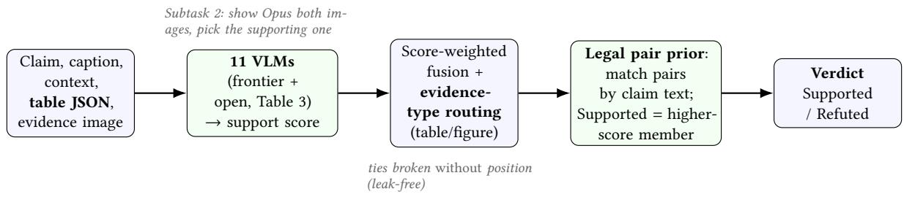
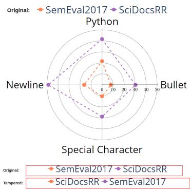

# SciTrue: Reliable Scientific Claim Validation with Frontier and Open Language Models at the NTCIR SciClaimEval Task

Qiming Bao∗   
University of Auckland   
New Zealand   
qiming.bao@auckland.ac.nz

Siyuan Wang The Chinese University of Hong Kong Hong Kong siyuanwang1997@gmail.com

Neşet Özkan TAN∗ University of Auckland New Zealand neset.tan@auckland.ac.nz

Mark Gahegan   
University of Auckland   
New Zealand   
m.gahegan@auckland.ac.nz

## Abstract

We describe the SciTrue team’s participation in both subtasks of the NTCIR-19 SciClaimEval task [26], which asks systems to verify scientific claims against the tables and figures of a paper. Rather than tuning a single model, we benchmark eleven frontier and open multimodal models under one honest, per-sample protocol and combine them with light, transparent post-processing. On the oficial, blind test leaderboard (Section 5), SciTrue placed first by a clear margin in three of the four evidence-category/subtask combinations, and tied for first on the primary metric in the fourth. Three findings explain the result. First, strong instruction-tuned models are already competitive: Claude Opus 4.8 and Gemma-4-31B each exceed the strongest public baseline (o4-mini), and GPT-5.5 and Claude Fable 5 lead both subtasks (97.7 on Subtask 2). Second, the task’s pairing structure is the largest lever: a leak-free pair prior that recovers the Supported/Refuted pairing from the claim text alone (a visible field) and assigns Supported to the higher-confidence evidence raises Subtask-1 pair-accuracy from 72.2 to 93.5, far more than any model swap or ensemble weighting. Third, a case-by-case audit finds that most residual errors are visually-undetectable label-mapping swaps or dataset label noise, so measured accuracy understates the true ability and the fixable-by-modeling headroom is small. Controlled fine-tuning, distillation, and agentic consistency-checking support the same conclusions, and we document throughout a measurement leak—label information reaching a system through the packaging of the data rather than its content—in which the released file ordering encodes the label, including one instance that briefly misled our own pipeline.

## Keywords

scientific claim verification, vision-language models, ensembling, fact-checking

## Team Name

SciTrue

## Subtasks

Subtask 1 (Claim Label Prediction) and Subtask 2 (Claim Evidence Prediction).

## 1 Introduction

The quantitative backbone of a scientific paper lives in its tables and figures, and a claim’s credibility often hinges on whether it faithfully reflects that evidence. As submission volume and AIassisted writing grow, automatically checking claims against the underlying evidence is an increasingly practical need, a multimodal counterpart to textual and tabular fact-checking [6, 33, 34]. The NTCIR-19 SciClaimEval task [26] evaluates exactly this: Subtask 1 labels requires participants to label each claim as Supported/Refuted given one table or figure; Subtask 2 requires participants to correctly identify which of two evidence images supports the claim. Team SciTrue entered both, and we omit further task background, as it is described in detail by the overview paper [26]. Our guiding observation is that, with today’s instruction-tuned vision-language models, the bottleneck is no longer raw image reading but how predictions are combined and how the task’s structure can be teased out and used. This splits into three coupled questions: (1) which models to trust, (2) how to fuse them, (3) how to exploit the Supported/Refuted pairing, studied under one honest protocol and leading to five contributions:

• a uniform, honest per-sample benchmark of eleven frontier and open multimodal models, on which Opus 4.8 and Gemma-4-31B both surpass the o4-mini baseline;

• a leak-free pair prior that recovers claim pairs from text and turns two absolute judgments into one relative ranking, lifting pair-accuracy to 93.5;

• a documented measurement-leak correction: positionbased tie-breaks inflate dev scores but do not transfer to the pair-hidden test set, so we report only leak-free numbers;

• a fine-tuning study and failure audit showing most residual errors are visually-undetectable label swaps or dataset noise, not a perception gap, leaving little headroom for better modeling; and

• an agentic consistency checker that cross-references the evidence image against the claim’s source paper to catch tampering the ensemble misses, and a distillation study showing this behavior partially transfers to small open VLMs via QLoRA.

## 2 Related Work

Claim verification and fact-checking. Automated fact-checking is studied extensively in the textual setting, from open-domain verification over Wikipedia [33] to scientific claims against abstracts [34] and structured tables [6]. A parallel line of work asks where the claims themselves come from and how a verifier should justify its verdict: claims can be generated automatically from multi-choice questions [28] or extracted directly from the full text of scientific papers [31], and verification can be framed so that the reasoning chain, not only the label, is faithful to the retrieved evidence [32]. Our team name comes from SciTrue [27], a deployed system for evidence-grounded claim verification in science, and this body of work is surveyed and extended in [29]. The SciClaimEval challenge extends the setting beyond the text of the paper to include figures and tables, i.e. a multimodal regime and related to recent eforts to benchmark VLMs as fact-checkers [35]. Like table fact verification [6], it is contrastive: each claim pairs with original and minimally tampered evidence, which we exploit directly.

Chart/table understanding and vision-language models. Reasoning over a figure means reading axes, legends, and panels and comparing trends, probed by chart/plot QA [18] and document/table understanding [19] benchmarks. A common approach first converts the image evidence to a structured form [12, 16] then reasons over text; we instead pass the oficial structured table data as an auxiliary channel and rely on native visual reasoning for figures. The VLMs we draw on span instruction-tuned [17] architectures through today’s open and frontier families: Gemma [9], Qwen-VL [4, 24, 25], GLM-V [11], InternVL [36], Llama-3.2-Vision [8], GPT-4 [21], Claude [1], and o4-mini [22]. We benchmark eleven models drawn from these families under one protocol rather than committing to a single model.

Reliability, fusion, and benchmark quality. Demanding benchmarks from VQA [3] to expert-level [39] multimodal reasoning have driven progress, supported by fragility research based on grounding failures [15] and on LLMs proving weaker abstract reasoners than their fluency suggests [10]; the SciClaimEval challenge adds further focus, since a model that faithfully reads a tampered-butinternally-consistent image is correct about the image yet wrong about the claim. Our post-processing draws on reasoning-plusacting [38], multi-sample/model aggregation [13], and low-rank adaptation [7, 14, 37]. Our contribution is less a new technique than showing that a structure-aware prior dominates all of them here. Our failure audit also echoes work on pervasive test-set label errors [20]: many of our “failures” are mislabeled or visuallyundetectable manipulations, not model weakness.

## 3 Task and Data

SciClaimEval draws claims and evidence from research papers across three domains: machine learning, natural language processing, and biomedicine (PeerJ). Each evidence item is a table or a figure, provided as a PNG; for tables the organizers also release the underlying structured data (LaTeX/HTML/JSON). In Subtask 1 (Claim Label Prediction) a system labels a claim as Supported or Refuted given one evidence item; the development set has 747 claims and the test set 917. Crucially, the data are contrastive: a claim is paired with its original evidence (Supported) and a minimally tampered copy (Refuted), so the development set forms 352 such pairs (plus a few supported-only singletons). The primary metric is pairaccuracy: a pair counts as correct only if both members are labeled correctly, which rewards systems that genuinely discriminate the tampering rather than guessing a marginal. In Subtask 2 (Claim Evidence Prediction) a system is shown two evidence images and selects the one that supports the claim (352 development / 436 test samples, scored by accuracy). We abbreviate the development set as dev and pair-accuracy as pair-acc throughout. The test labels and the pairing field are withheld; results are returned by the challenge organizers only after the competition has ended.

## 4 Methods

Figure 1 summarises our system. We deliberately avoid task-specific training in the main pipeline and instead compose strong of-theshelf models with three transparent operations: score-level fusion, evidence-type routing, and a pair prior derived from the dataset’s construction. Each operation reads only felds released for both splits: the ensemble’s support scores, the evidence type fag evi\_type (for routing), and the claim text (for pair matching). Each is published for the test split as well as the development split. None of the three operations touches claim\_id\_pair, which the organizers withhold at test time, or the order in which rows appear in the development file. The gains are therefore reproducible on the blind test set rather than artefacts of the development release. We describe each component below, followed by the controlled finetuning study and the evaluation protocol used to assess accuracy.

## 4.1 Models and inference

We evaluate multimodal models spanning frontier and open systems. The frontier tier is Anthropic’s Claude Opus 4.8 [1] (queried through its CLI, requiring no local GPU), the OpenAI o4-mini [22] baseline reported by the organizers, and two models we evaluated once they became available, later incorporated into additional submitted runs (Section 5.1): OpenAI’s GPT-5.5 [23] and Anthropic’s Claude Fable 5 [2], the latter also queried through its CLI. The open tier covers four families run locally on A100-80GB GPUs: Google’s Gemma-4 [9] (31B and the E4B variant); the Qwen visionlanguage line, namely Qwen3-VL [24] (8B and the 30B-A3B mixtureof-experts), the newer Qwen3.5/Qwen3.6 multimodal models [25] (9B, 35B-A3B, and the latest 35B-A3B), and Qwen2.5-VL [4] (used for the fine-tuning study); and Zhipu’s GLM-4.6V-Flash [11]. For completeness the organizers’ baselines also include InternVL3.5 [36] and Llama-3.2-Vision [8]. Every model receives the claim, the caption, the surrounding context when the dataset marks it necessary, and the evidence image; for tables we additionally supply the oficial structured table data as an auxiliary text channel. Each model is prompted to return a JSON verdict with a support score in [0, 1], which we use both as the label and as the confidence weight for fusion. We recover the verdict from the last balanced JSON object in the output, repairing quote and backslash errors, and fall back to thresholding the score at 0.5 when no object parses.

Implementation. Every model receives the same system prompt. It casts the model as a scientific fact-checker, directs it to read axis labels, legends, sub-figure tags and exact cell values, to attend to comparison words (highest, outperforms, increases) and to metric direction, and to reply with only a JSON object carrying a brief reasoning field, a support score in [0, 1], and a label. No few-shot examples are given and the prompt is never tuned per model, so diferences across the eleven systems reflect the models rather than the prompting. We disable the extended reasoning trace on the Qwen3.5 and Qwen3.6 models, which is three to four times faster and made a full development sweep feasible on shared hardware; all other models run in their default configuration. Images are resized where needed to keep memory within budget on shared GPUs (1536px longest side for the Transformers-based models, Qwen’s native min/max-pixel budget for the Qwen line, 1568px for Opus; GPT-5.5/GPT-5.6 Sol are sent unresized); large MoE models are sharded across two GPUs, with 8-bit quantisation where a model would otherwise not fit. Opus 4.8 runs through its CLI, reading images from disk, needing no local accelerator. Across the eleven models the score-threshold fallback fres on well under one output in twenty. All models see identical inputs, and every raw response is stored, so fusion, routing, and the pair prior are computed afterwards from those stored responses rather than by re-querying the models. Reproducing our results requires neither GPUs nor API access.

  
Figure 1: The SciTrue Subtask-1 pipeline: eleven models each provide a support score; we fuse the strongest, route by evidence type, and apply a leak-free pair prior turning two absolute judgments into one relative ranking. Subtask 2 is handled directly by Opus 4.8.

## 4.2 Honest per-sample evaluation

A subtle pitfall shapes how we report every number. The development file lists each claim pair with the Supported member first (claim ids are assigned sequentially, S then R). Consequently, any post-processing that resolves a pair by row position—a tie-break that defaults to the first member, say, or always presenting the first member as “image 1” to a comparison model—is not reading the evidence at all. It is recovering the gold label, the ground-truth answer distributed with the development set, from the row order alone. Such a rule scores well on the development set while measuring nothing: the test set withholds claim\_id\_pair and does not guarantee the same ordering, so the advantage disappears the moment it is scored. We therefore adopt a strict rule: all reported numbers are raw per-sample predictions, and wherever the pair prior must break a tie it does so without using position. The ordering is a leak in the standard sense: it carries label information through the packaging of the data rather than its content, so a system can score well without performing the task. We quantify its size in Section 5, and we keep the one method that benefits from ordering (pairwise-gated fusion) as a separate, clearly-labeled submission rather than our headline result.

## 4.3 Ensembling and evidence-type routing

We fuse models at the score level by summing their (sign-oriented) support scores. Curating the three strongest models clearly beats pooling all of them, as the weaker models inject noise rather than useful diversity. Moreover, almost every model we tested is markedly weaker on figures than on tables (the newest frontier model is the exception), and the per-type rankings difer. We exploit this with evidence-type routing: table evidence is scored by Opus 4.8, Gemma-4-31B, GPT-5.5 and Fable 5, and figure evidence by those four plus GLM-4.6V-Flash, which is competitive on figures alone. Because evi\_type is released for the test split as well as the development split, the same rule applies unchanged to the blind test set.

## 4.4 Legal pair prior

By construction, most claims appear twice: once with the original evidence (labeled Supported) and once with a tampered version of the same evidence (labeled Refuted). The organizers hide the pairing field (claim\_id\_pair) in the test set, but the two members share identical claim text. Grouping the development claims by exact claim string therefore recovers the pairing exactly—352 of 352 two-member groups, each with one Supported and one Refuted member, identical to the hidden field—while using only a visible input. Formally, for a recovered pair (�, �) with ensemble support scores $s _ { a } , s _ { b }$ , we predict $\hat { y } _ { a } = \operatorname { S u p p o r t e d }$ , �ˆ� = Refuted if $s _ { a } > s _ { b }$ and the reverse otherwise. This replaces two absolute judgments (“does this evidence support the claim?”) with one relative judgment (“which of the two better supports it?”), which the models answer far more reliably—especially for under-specified claims that are hard to adjudicate in isolation. The ∼43 unpaired, supported-only claims (texts that appear once) are labeled Supported. We stress that the prior is permitted under the task rules: it uses the claim text (a visible field) and the publicly documented one-Supportedone-Refuted construction, never the hidden pairing.

## 4.5 Pairwise comparison and gating (and a position-bias caveat)

For pairs where the ensemble is inconclusive, we also tried a direct Subtask-2-style comparison: show Opus both sets of evidence and ask which supports the claim. This is used only when the ensemble margin is small (gated fusion). On dev this appeared to reach 96.9 pair-acc, but a swapped-order probe revealed a ∼15-point bias toward “image 1” (97% in the original order vs. 82% when the Supported member is image 2). Assuming the same construction convention holds on test as on dev (§4.2)—unverifiable, since test carries no labels—this inflation most plausibly reflects ordering, not verification skill; we therefore submit gated fusion only as a separate run (Run 1.5) and keep the leak-free pair prior as our primary result. An order-balanced version (ask both orders, commit only if they agree) is the proper de-biased form.

## 4.6 Image-versus-paper consistency check

Since most residual errors (§6) are self-consistent label-mapping swaps with no in-image signal, and each claim’s source paper is provided (paper\_path), we built an agentic checker that retrieves the paper excerpt most lexically/numerically overlapping with the claim/caption (the four best-scoring paragraphs, truncated to 700 characters each). Learned attention ofers an alternative to this lexical heuristic [30]; we did not pursue it, since the relevant passage already fell inside that window. The checker then asks Claude Opus 4.8 (via CLI, with file-system Read access to the image) whether the image and excerpt are consistent, reframing verification as tamper detection rather than the “does this evidence support the claim” framing that weakened our negative-result retrieval experiment (§5). Used alone, it is a noisy classifier (it both recovers failures and disturbs some already-correct pairs), so we add its score as a supplementary signal on top of the routed ensemble rather than replacing it.

## 4.7 Distilling the consistency check

To test whether this “read image, cross-check paper, flag contradiction” behavior can be taught to an open model rather than requiring Claude at inference, we collect the checker’s structured traces (what the image shows, what the paper says, consistency, verdict) on the LoRA train fold, keep only traces whose verdict matches gold, and QLoRA-fine-tune two open VLMs—Qwen3.5-9B and Gemma-4-31B [9]—to reproduce them from the same inputs (claim, caption, retrieved excerpt, evidence image). We evaluate on a held-out fold (72 pairs, disjoint from the LoRA fold) against the same zero-shot model and the Claude teacher, scoring uncovered/tied pairs at half credit (unlike the strict pair-accuracy used elsewhere).

## 4.8 LoRA fine-tuning (dev cross-validation)

SciClaimEval has no training split, so to study fine-tuning honestly we partition the development set 80/20 (train/held-out), keeping both pair members in the same fold to avoid leakage (596 train, 151 held-out). We QLoRA-fine-tune Qwen2.5-VL-7B [4] (4-bit NF4, LoRA adapters of rank 16, � = 32, dropout 0.05 on the attention/MLP projections, training only the assistant label token, two epochs on one A100-80GB), reading the “Supported”-vs-“Refuted” next-token probability as the support score, and evaluate on the held-out fold against the identical model used zero-shot (the same adapter, disabled).

Table 1: Final oficial leaderboard (organizers, 2026-08-02). Primary metric: pair-accuracy (Subtask 1), accuracy (Subtask 2). ‡ = tie, no published tie-break rule.
<table><tr><td>Subtask</td><td>Category</td><td>SciTrue</td><td>Runner-up</td><td>Result</td></tr><tr><td>1</td><td>JSON</td><td>98.4</td><td>93.2 (Black Socks)</td><td>1st</td></tr><tr><td>1</td><td>TeX/HTML</td><td>98.4</td><td>97.7 (Bonn-Juelich)</td><td>1st</td></tr><tr><td>1</td><td>PNG</td><td>98.2</td><td>98.2 (Bonn-Juelich)</td><td>tied 1st</td></tr><tr><td>2</td><td>PNG</td><td>98.4</td><td>98.2 (Bonn-Juelich)</td><td>1st</td></tr></table>

## 5 Experiments and Results

Setup. We evaluate on the full development set (747 Subtask-1 claims, 352 Subtask-2 pairs) with the oficial metrics; Subtask-1’s primary metric is pair-accuracy (both members of a pair correct), reported alongside macro-F1. Open models run locally on A100- 80GB GPUs through Hugging Face Transformers, while Opus 4.8 is queried through its CLI without a local GPU. All scores are raw persample predictions; we apply no pair-forcing that would key on the file ordering (Sec. 4.2). As a sanity check, our run of Qwen3-VL-8B reproduces the oficial baseline, confirming the harness. Oficial test results. The organizers found our original Subtask-1 tabletype prompts were not pure PNG (they included injected structureddata text), disqualifying them from a PNG-only category (Subtask 2 always was PNG-only). We resubmitted five true PNG-only Subtask-1 runs (§5.1), scored on 2026-08-02: Claude Fable 5 alone reached 98.01 macro-F1 / 98.15 pair-accuracy, the best of the five, with the 5- model ensemble close behind (97.79/97.92). Fable 5 and GPT-5.6 Sol (each alone) transfer cleanly from their same-protocol dev numbers (95.3/95.7 and 95.3/96.0 respectively), confirming a small dev→test gap once pair-forcing protocol is held fixed.

Final oficial leaderboard. The organizers published the full leaderboard at https://sciclaimeval.github.io on 2026-08-02: three evidenceinput categories for Subtask 1 (PNG, JSON, TeX/HTML, reflecting the resubmission split above) and one for Subtask 2 (Table 1). SciTrue placed first, by a clear margin, in three of the four: Subtask-1 JSON (98.4 pair-acc vs. 93.2 runner-up), Subtask-1 TeX/HTML (98.4 vs. 97.7), and Subtask-2 PNG (98.4 vs. 98.2). In the fourth, Subtask-1 PNG, our top run ties Bonn-Juelich Informatics at 98.2 on the primary pair-accuracy metric (no tie-break rule is published, so we report a tie rather than claim a win) while leading all four secondary metrics (98.0 vs. 97.2). A 3-of-4 clear win, tied on the primary metric in the fourth, is strong blind-test validation of this paper’s dev-set findings.

## 5.1 Submitted runs

We submitted several runs per subtask (the form permits multiple, and a new run does not overwrite earlier ones); each is named by its method so the leaderboard can distinguish them. Table 2 lists every submitted run with its dev score. Our original primary (reportable) runs were the leak-free pair prior for Subtask 1 and Opus-4.8 for Subtask 2. We also submitted a position-leveraged variant (Run 1.5) as a separate, clearly-labeled run: it exploits the claim-id ordering artifact rather than verification skill and is not our headline result. As GPT-5.5 and Claude Fable 5 became available to us, we submitted additional runs incorporating each (Runs 1.6–1.7, 2.3–2.4), discussed in Section 5.1.

Post-deadline PNG-only extension (Runs 1.8–1.12, Subtask 1 only). Under a short organizer-granted extension (§5) we reran Subtask 1 with the structured-data channel removed for table-type claims and a newly available model, GPT-5.6 Sol [23], and submitted five true PNG-only runs (Table 2, rows 1.8–1.12; oficial test scores discussed in §5).

Single models (Table 3). Opus 4.8 and Gemma-4-31B both exceed o4-mini; our Qwen3-VL-8B (71.5/45.2) reproduces its oficial baseline (72.1/46.9), validating the harness. The newest open model we tested, Qwen3.6-35B-A3B, is the second-strongest open system (82.5 F1 / 66.2 pair-acc), ahead of Qwen3.5-35B-A3B and surpassing o4-mini on Subtask 2 (92.0).

The newestfrontier models. OpenAI’s GPT-5.x line [23] and Anthropic’s Claude Fable 5 [2] became available after our original runs (Runs 1.1–1.5, 2.1–2.2 in Table 2); we evaluated both on the full development set and submitted additional runs incorporating each (Runs 1.6–1.7, 2.3–2.4). GPT-5.5 reaches 84.5 F1 / 69.9 pair-acc on Subtask 1 and 97.4 on Subtask 2 (vs. 92.6 for Opus, our original Subtask-2 run), with a table-vs-figure gap of only +2.5 (Table 4), far below every model in our original runs (+5 to +14). Swapping it into the routed ensemble lifts the leak-free pair prior from 93.5 to 95.6 (Run 1.6).

Claude Fable 5 is stronger still (86.3 F1 / 74.4 pair-acc on Subtask 1, 97.7 on Subtask 2, Table 3) and has the smallest table-vsfigure gap of any model we tested (+1.8). Reaching this number required catching our own mistake: an initial pass, computed from our pipeline’s own prediction file, read an implausible 99.4 pair-acc; that file turned out to use the hidden claim\_id\_pair field for pairforcing and to silently default failed API calls to a low-confidence label, rather than reflecting genuinely per-sample, per-model judg ments. A model-specific usage cap also required an automated retry loop across several hours to reach full coverage. The corrected, fullycovered number is strong but in line with GPT-5.5 rather than an outlier. We view this episode as a useful, if uncomfortable, illustra tion of this paper’s broader warning (Section 5): even a solution built around honest, leak-free evaluation can be misled by its own tooling, and every number in this paper that could not be crosschecked this way deserves the same scrutiny. Adding Fable 5 to the GPT-5.5-augmented routed ensemble raises the leak-free pair prior from 95.6 to 96.2 on all 352 pairs, a smaller marginal gain than GPT-5.5’s own, consistent with diminishing returns as the ensemble’s members grow individually stronger and more correlated.

Tables vs. figures (Table 4). Every model is weaker on figures than on tables, by 1.8 to 14.4 points. The gap is by far the smallest for the two newest frontier models (Fable 5 +1.8, GPT-5.5 +2.5) and largest for the smaller open ones (Qwen3-VL-30B +14.4, Gemma-4-E4B +11.4), indicating that figure understanding is exactly where capability is still increasing—and where the latest models pull ahead. The per-type ranking also reshufles—for example, GLM-4.6V-Flash reads figures nearly as well as much larger models despite a lower overall rank. Because the manipulation types that fool models (leg end and category swaps; Section 6) occur in figures, this is also where most of our residual errors concentrate, and it is exactly the signal evidence-type routing exploits.

Table 6: Where the pair prior’s gain comes from (dev, 3-model ensemble). Same-label = both members got the same absolute label, unresolvable without relative comparison.
<table><tr><td>Outcome</td><td>Pairs</td><td>%</td></tr><tr><td>Already correct (honest)</td><td>253</td><td>71.9%</td></tr><tr><td>Fixed by relative comparison</td><td>80</td><td>22.7%</td></tr><tr><td>Still wrong after correction</td><td>19</td><td>5.4%</td></tr></table>

Ensembling and the pair prior (Table 5). Score-weighted fusion of the three strongest models reaches 72.2 pair-acc, and evidence-type routing 73.0; pooling all 8 models available at the time of these runs is worse (66.2), as the weaker systems add noise rather than diversity. The choice of fusion rule matters little—majority vote, score-weighting, reliability-weighting, and an exhaustive subset search all land at 72.2, and only evidence-type routing improves on them. The legal pair prior is the decisive step, lifting pair-accuracy to 93.5 (leak-free; the leaky position-tie-break variant reads 94.9). The gain holds across domains (pair-acc 95.8 ML, 94.5 NLP, 89.4 PeerJ), with the biomedical split being the most challenging, consistent with its denser tables and figures. Subtask 2 is already a pairwise selection task; a three-model fusion edges out Opus alone by a small margin (93.5 vs. 92.9, both refreshed post-§5).

Why relative comparison works (Table 6). The gain is concentrated: 71.9% of pairs are already correct under honest prediction; in 27.3%, both members get the same absolute label (unresolvable by any threshold), and correcting only these recovers 94.6% pairaccuracy—indistinguishable from correcting all 352. A global threshold sweep instead gains at most 0.5 points (71.9→72.4, oracle-tuned), ruling out simple recalibration. Errors here are biased—models default to “Supported” twice as often as “Refuted” when confused (65 vs. 31)—and the 19 pairs relative comparison cannot fix concentrate in the manipulation types already flagged as visually undetectable (§6): legend/category swaps fail three times more often than cellvalue edits, mostly in figures.

Subtask 2. The two subtasks reward diferent recipes. Subtask 2 already presents both evidence images and asks which supports the claim—structurally the same relative judgment that our pair prior reconstructs for Subtask 1. Here Opus 4.8 is strong on its own (92.9 accuracy, vs. 88.9 for the best open model and 85.2 for the o4-mini baseline); a three-model fusion improves on it by a small margin (93.5), a gain that postdates our original submission. We therefore submitted Opus directly for Subtask 2 and reserved fusion for Subtask 1, where the models are more complementary. The contrast also explains why our Subtask-1 pair prior works: it imports exactly the relative-comparison formulation that makes Subtask 2 tractable.

Fine-tuning. On the held-out fold, QLoRA fine-tuning lifts Qwen2.5- VL-7B from 77.8 to 84.7 pair-acc (+6.9 over zero-shot), a substantial gain for a few hundred training pairs and a single A100. Yet the tuned 7B still trails the training-free ensemble+prior (93.1 on the same pairs) by a wide margin. Fine-tuning is a viable, cheap route to a competent standalone model, but still does not provide the

Table 2: All submitted runs (dev; pair-forced, matching what each file submits). Pair = Subtask-1 pair-accuracy; Acc = Subtask-2 accuracy. † = position-leveraged (not headline). Runs 1.8–1.12 are the post-deadline PNG-only resubmissions (§5.1).
<table><tr><td>Run / method</td><td>Subtask</td><td>Dev</td></tr><tr><td>1.1-1.4 Opus+Gemma+Qwen3.5-35B ensemble + routing + legal pair prior + singletons (leak-free; full progression</td><td>1</td><td>93.5 pair (F1 95.2)</td></tr><tr><td>in Table 5) 1.5 + pairwise-gated fusion †</td><td>1</td><td>96.9 pair</td></tr><tr><td>1.6 + GPT-5.5 (leak-free)</td><td>1</td><td>95.6 pair</td></tr><tr><td>1.7 + Claude Fable 5 (leak-free) [best main-track]</td><td>1</td><td>96.2 pair</td></tr><tr><td>1.8 Claude Fable 5 alone, PNG-only</td><td>1</td><td>95.7 pair</td></tr><tr><td>1.9-1.11 + GPT-5.5 / + Fable 5 / + GPT-5.6 Sol ensembles, PNG-only (leak-free)</td><td>1</td><td></td></tr><tr><td>1.12 GPT-5.6 Sol alone, PNG-only [latest]</td><td>1</td><td>96.0 pair</td></tr><tr><td>2.1 Opus-4.8</td><td>2</td><td>92.6 acc</td></tr><tr><td>2.2 Opus+Gemma-4-31B+GLM-4.6V</td><td>2</td><td>92.9 acc</td></tr><tr><td>2.3 GPT-5.5 alone</td><td>2</td><td>97.4 acc</td></tr><tr><td>2.4 Claude Fable 5 alone [latest]</td><td>2</td><td>97.7 acc</td></tr></table>

Table 3: Single-model dev results (honest per-sample). “ours” = run by us; numbers refreshed 2026-08-02 after fixing two harness bugs (§5), moving a few models by 1–5 points. ∗GPT-5.6 Sol, added later for Subtask-1 only (§5.1), is not among the eleven both-subtasks models.
<table><tr><td>Model</td><td>Src</td><td>T1 F1</td><td>T1 Pair</td><td>T2 Acc</td></tr><tr><td>Claude Fable 5</td><td>ours</td><td>86.3</td><td>74.4</td><td>97.7</td></tr><tr><td>GPT-5.6 Sol*</td><td>ours</td><td>84.5</td><td>70.2</td><td></td></tr><tr><td>GPT-5.5</td><td>ours</td><td>84.5</td><td>69.9</td><td>97.4</td></tr><tr><td>Gemma-4-31B-it</td><td>ours</td><td>84.5</td><td>69.9</td><td>88.9</td></tr><tr><td>Claude Opus 4.8</td><td>ours</td><td>82.9</td><td>67.6</td><td>92.9</td></tr><tr><td>04-mini</td><td>official</td><td>82.9</td><td>68.2</td><td>85.2</td></tr><tr><td>Qwen3.6-35B-A3B</td><td>ours</td><td>82.5</td><td>66.2</td><td>92.0</td></tr><tr><td>GLM-4.6V-Flash</td><td>ours</td><td>79.6</td><td>60.8</td><td>83.2</td></tr><tr><td>Qwen3.5-35B-A3B</td><td>ours</td><td>79.5</td><td>61.1</td><td>86.1</td></tr><tr><td>Qwen3-VL-30B-A3B</td><td>official</td><td>76.0</td><td>54.8</td><td>54.3</td></tr><tr><td>Gemma-4-E4B-it</td><td>ours</td><td>75.6</td><td>52.6</td><td>68.8</td></tr><tr><td>Qwen3.5-9B</td><td>ours</td><td>73.0</td><td>48.3</td><td>81.8</td></tr><tr><td>Qwen3-VL-8B</td><td>official</td><td>72.1</td><td>46.9</td><td>56.2</td></tr><tr><td>Qwen3-VL-8B</td><td>ours</td><td>71.5</td><td>45.2</td><td>63.9</td></tr><tr><td>Qwen3-VL-30B-A3B</td><td>ours</td><td>71.2</td><td>46.0</td><td>66.5</td></tr><tr><td>InternVL3.5-38B</td><td>official</td><td>67.8</td><td>40.1</td><td>54.5</td></tr><tr><td>Llama-3.2-11B-Vision</td><td>official</td><td>48.6</td><td>10.8</td><td>34.7</td></tr></table>

best results—the headroom lies in scale, error-diverse fusion, and the pairing structure, consistent with our broader finding that the residual dificulty is structural, not a matter of model adaptation.

Image-versus-paperconsistency check. Adding the checker’s score (Section 4.6) to the routed ensemble covers 184 of 352 pairs (the remainder have no paper excerpt with enough lexical/numeric overlap to retrieve) and lifts pair-accuracy from 93.5 to 93.6, or from 95.6 to 95.9 once GPT-5.5 is included. The gain is modest in aggregate because most residual errors are the visually-undetectable swaps identified in Section 6, where the source paper’s prose often does not reveal the true label-to-curve mapping either; but on failures where the paper text does state the relevant number, the checker recovers them by catching an explicit image/paper contradiction (e.g., a table cell reads 80.52% in the image while the paper states

Table 4: Subtask-1 accuracy by evidence type, for all models we ran (refreshed 2026-08-02; see Table 3). Every model is weaker on figures, the gap widens for smaller models, and rankings shift—motivating evidence-type routing.
<table><tr><td>Model</td><td>Table</td><td>Figure</td><td>Gap</td></tr><tr><td>Gemma-4-31B</td><td>87.3</td><td>79.6</td><td>+7.7</td></tr><tr><td>Claude Fable 5</td><td>87.1</td><td>85.3</td><td>+1.8</td></tr><tr><td>Claude Opus 4.8</td><td>86.3</td><td>77.4</td><td>+8.9</td></tr><tr><td>GPT-5.5</td><td>85.5</td><td>83.0</td><td>+2.5</td></tr><tr><td>Qwen3.6-35B-A3B</td><td>84.9</td><td>78.1</td><td>+6.8</td></tr><tr><td>Qwen3.5-35B-A3B</td><td>82.4</td><td>74.3</td><td>+8.1</td></tr><tr><td>GLM-4.6V-Flash</td><td>81.5</td><td>76.2</td><td>+5.3</td></tr><tr><td>Gemma-4-E4B</td><td>79.7</td><td>68.3</td><td>+11.4</td></tr><tr><td>Qwen3.5-9B</td><td>76.6</td><td>66.8</td><td>+9.8</td></tr><tr><td>Qwen3-VL-30B-A3B</td><td>76.3</td><td>61.9</td><td>+14.4</td></tr><tr><td>Qwen3-VL-8B</td><td>75.3</td><td>64.5</td><td>+10.8</td></tr></table>

Table 5: Subtask-1 ablation (dev). Fusion and routing add a point or two; the legal pair prior is decisive. “All-model” fusion is worse than the curated trio; the last row adds GPT-5.5 (Run 1.6).
<table><tr><td>Method</td><td>Macro-F1</td><td>Pair-Acc</td></tr><tr><td>Best single model at the time (Gemma-4-31B)</td><td>84.5</td><td>69.9</td></tr><tr><td>3-model score fusion</td><td>85.4</td><td>72.2</td></tr><tr><td>+ evidence-type routing</td><td>85.9</td><td>73.0</td></tr><tr><td>All-model fusion</td><td>82.9</td><td>66.2</td></tr><tr><td>+ legal pair prior</td><td>95.2</td><td>93.5</td></tr><tr><td>+ GPT-5.5 (Run 1.6)</td><td>95.7</td><td>95.6</td></tr></table>

85.52%). This turns our earlier negative result (retrieved context degraded accuracy when used to answer the claim directly) into a positive one, once the same text is used to check consistency instead.

Distilling the consistency check. On the held-out fold (Section 4.7), distillation raises Qwen3.5-9B from 51.4 to 62.5 pair-acc (+11.1) and Gemma-4-31B from 49.3 to 55.6 (+6.3), showing that some of the “cross-check the paper” behavior transfers to a small open model via a modest number of QLoRA examples. Both students still trail the Claude teacher (77.1 on the same pairs, 84.1 on the 41/72 it actually covers) by a wide margin, so this is a partial distillation rather than a drop-in replacement; closing the gap is left to future work.

Measurement leak and de-biasing. The position bias identified in §4.5 also inflates the pair prior itself: with position-based tiebreaking, it reads 94.9 pair-acc, essentially the same ∼15-point leak as the gated-fusion probe. Removing position from the tie-break drops this to 93.5, which we report as our headline; the gated variant remains a separate, labeled run (§4.5).

Negative results. Two “more information” fixes reduced accuracy: feeding retrieved paper context to the context-dependent pairs (92.2→84.3) and a legend-mapping prompt that asks the model to transcribe the legend before judging. Both fail for the same reason— the manipulation is inside the evidence, while external/explicit text describes the un-tampered original and thereby masks the tampering. This is the empirical counterpart of the audit in Section 6: the hard cases are self-consistent edits with no in-image signal, so adding context cannot help and often actively misleads.

## 6 Failure Analysis

To understand where the remaining headroom lies, we audited the Subtask-1 failures case by case, comparing each claim against both the original and the tampered image.1 They fall into three groups. (i) Visually-undetectable label-mapping swaps (most of the errors): a legend or category axis is relabeled to produce an internally consistent chart, so the manipulation is a valid refutation that nonetheless leaves no in-image trace—the gold label is correct, but no image-only model can detect it. (ii) Dataset label noise: cases where the tampering does not actually falsify the claim, so the “Refuted” label is questionable; we confirmed several by hand (e.g. one pair whose only edit makes a �-value more sig nificant while leaving the efect direction unchanged, so the claim still holds) and reported the three clearest cases to the organizers, who confirmed the issue and indicated the afected samples would be removed from the development set via a public announcement; every dev number in this paper (747/352) predates that removal.2 (iii) A smaller number of genuine model misses on visible edits the model should have caught (e.g. a row swap that does flip a “best method” comparison). Two consequences follow. First, measured accuracy understates true ability, because some “errors” are mislabeled and others are undetectable by construction. Second, the fixable-by-better-modeling fraction is small: most of the residual is visually-undetectable manipulation or benchmark noise rather than a perception gap. This also explains our negative results: when the alteration is internal and self-consistent, supplying more text (a retrieved paragraph, a legend-reading prompt) only reinforces the tampered evidence rather than exposing it.

Breaking the errors down by manipulation type (Table 7) sharp ens the picture: the model is very strong at catching swapped or flipped graphs and altered cell values (92–100%), but degrades exactly where the edit rewires the label-to-value mapping (legend/category swaps, 80–89%). A swapped legend or category axis produces a chart that is internally coherent—if the green curve is relabeled “Mistral,” the green curve genuinely is Mistral in that image—so there is no in-image signal of tampering. This is also why figures trail tables: legends/category axes exist only in figures, which carry a traceless tamper mode, whereas a tampered table cell is just a wrong value checkable against the structured data we supply. We conclude that the remaining errors are not a perception problem solvable by higher resolution or better prompting, but would require an external consistency check (e.g. comparing the rendered figure against the structured data), which we leave to future work.

Table 7: Pair-accuracy by tampering type. The model handles value/structure edits well, but label-mapping swaps (legends, category axes) are the weak spot—visually self-consistent.
<table><tr><td>Manipulation type</td><td>Pair-acc</td><td>n</td></tr><tr><td>Graph swap</td><td>100.0</td><td>10</td></tr><tr><td>Change cell values</td><td>96.7</td><td>183</td></tr><tr><td>Graph flip</td><td>92.5</td><td>20</td></tr><tr><td>Swap rows / columns</td><td>92.5</td><td>53</td></tr><tr><td>Legend swap</td><td>88.9</td><td>63</td></tr><tr><td>Category swap</td><td>80.4</td><td>23</td></tr></table>

  
Figure 2: An invisible legend swap (pair val\_fig\_0154/0155, a radar chart of formatting robustness). Top: the original chart (gold Supported); the geometrically identical tampered copy is omitted. Botom: the legend zoom—orange is SemEval2017 in the original but SciDocsRR in the tampered copy (red boxes), with the Python/ Bullet axis labels likewise swapped. The points never move, so the relabeling leaves no geometric trace, and all three ensemble models assign both members the same label—a genuine ceiling, not a perception error.

A second case (val\_fig\_0093/0094) swaps the GAT/APPNP legend entries across just 0.3% of pixels, otherwise pixel-identical— the same undetectable pattern. Visible edits like graph-flip and value-change (Table 7, 92–100%) are usually recoverable: a biomedical pair (val\_fig\_0288/0289) shifts two boxed groups from ≈100 to ≈350–680, which the ensemble still misranks—a perception slip, not the legend-swap blind spot.

## 7 Discussion and Limitations

Structure beats scale, honestly measured. Exploiting the task’s pairing structure (+21 points, leak-free per §5) dwarfs every model swap or fine-tuning efort, but only once position-based leakage is removed—a hazard for any task with order-encoded labels. Our audit (§6) finds most “errors” are visually-undetectable or mislabeled, not genuine misses; organizers confirmed and removed the cases we reported, corroborating a dataset artifact. A cleaner consistency check would re-render the chart from structured data for a direct pixel/value comparison [16]; our checker’s verify-then-decide logic could itself be a learned training-time prior [5], and the pairwise comparison’s position bias also calls for an order-balanced fix (§5). Our pipeline is cheap and transparent (no local accelerator for the frontier model, one A100-80GB per open model, no training). Limitations: the pair prior assumes the one-Supported-one-Refuted construction holds on test (unverifiable without labels), and several open models ran non-thinking, understating them slightly.

## 8 Conclusions

SciTrue’s entry to NTCIR-19 SciClaimEval combines a frontier-plusopen ensemble, evidence-type routing, and a leak-free pair prior (recovered from the claim text alone) to reach 93.5 pair-accuracy on the development set. Adding GPT-5.5 and Claude Fable 5 (the strongest single models on both subtasks) raises this to 96.2, after catching a pair-forcing bug in our own pipeline (§5.1). These dev set findings held up on the blind oficial test: SciTrue placed first, by a clear margin, in three of four categories, tying for first in the fourth (Subtask-1 PNG, 98.2). A controlled fine-tuning study and failure audit confirm most residual errors are a benchmark ceiling, not model weakness; an agentic checker recovers some, partially distilling into small open VLMs. We also document and correct a measurement leak in which the released ordering encodes the label, and hope these findings are useful to future participants.3

## References

[1] Anthropic. 2024. The Claude 3 Model Family: Opus, Sonnet, Haiku. Anthropic Technical Report (2024). Claude Opus 4.8 model card, https://www.anthropic.com.

[2] Anthropic. 2026. Claude Fable 5. https://www.anthropic.com. Model release announcement and system card, June 2026.

[3] Stanislaw Antol, Aishwarya Agrawal, Jiasen Lu, Margaret Mitchell, Dhruv Batra, C. Lawrence Zitnick, and Devi Parikh. 2015. VQA: Visual Question Answering. In ICCV.

[4] Shuai Bai and others (Qwen Team). 2025. Qwen2.5-VL Technical Report. arXiv preprint arXiv:2502.13923 (2025).

[5] Qiming Bao, Xiaoxuan Fu, and Michael Witbrock. 2025. Conflict-Aware Fusion: Mitigating Logic Inertia in Large Language Models via Structured Cognitive Priors. arXiv preprint arXiv:2512.06393 (2025).

[6] Wenhu Chen, Hongmin Wang,Jianshu Chen, Yunkai Zhang, Hong Wang, Shiyang Li, Xiyou Zhou, and William Yang Wang. 2020. TabFact: A Large-scale Dataset for Table-based Fact Verification. In ICLR.

[7] Tim Dettmers, Artidoro Pagnoni, Ari Holtzman, and Luke Zettlemoyer. 2023. QLoRA: Eficient Finetuning of Quantized LLMs. In NeurIPS.

[8] Abhimanyu Dubey and others (Meta AI). 2024. The Llama 3 Herd of Models. arXiv preprint arXiv:2407.21783 (2024).

[9] Gemma Team, Google DeepMind. 2024. Gemma: Open Models Based on Gemini Research and Technology. arXiv preprint arXiv:2403.08295 (2024).

[10] Gaël Gendron, Qiming Bao, Michael Witbrock, and Gillian Dobbie. 2024. Large Language Models Are Not Strong Abstract Reasoners. In Proceedings ofthe Thirty-Third International Joint Conference on Artificial Intelligence (IJCAI).

[11] GLM-V Team, Zhipu AI. 2025. GLM-4.5V and the GLM-V Family of Vision-Language Models. Zhipu AI Technical Report (2025). https://github.com/zai-org.

[12] Jonathan Herzig, Paweł Krzysztof Nowak, Thomas Müller, Francesco Piccinno, and Julian Eisenschlos. 2020. TaPas: Weakly Supervised Table Parsing via Pretraining. In ACL.

[13] Geofrey Hinton, Oriol Vinyals, and Jef Dean. 2015. Distilling the Knowledge in a Neural Network. arXiv preprint arXiv:1503.02531 (2015).

[14] Edward J. Hu, Yelong Shen, Phillip Wallis, Zeyuan Allen-Zhu, Yuanzhi Li, Shean Wang, Lu Wang, and Weizhu Chen. 2022. LoRA: Low-Rank Adaptation of Large Language Models. In ICLR.

[15] Yifan Li, Yifan Du, Kun Zhou, Jinpeng Wang, Wayne Xin Zhao, and Ji-Rong Wen. 2023. Evaluating Object Hallucination in Large Vision-Language Models. In EMNLP.

[16] Fangyu Liu, Julian Martin Eisenschlos, Francesco Piccinno, Syrine Krichene, Chenxi Pang, Kenton Lee, Mandar Joshi, Wenhu Chen, Nigel Collier, and Yasemin Altun. 2023. DePlot: One-shot visual language reasoning by plot-to-table transla tion. In Findings ofACL.

[17] Haotian Liu, Chunyuan Li, Qingyang Wu, and Yong Jae Lee. 2023. Visual Instruction Tuning. In NeurIPS.

[18] Ahmed Masry, Do Xuan Long, Jia Qing Tan, Shafiq Joty, and Enamul Hoque. 2022. ChartQA: A Benchmark for Question Answering about Charts with Visual and Logical Reasoning. In Findings ofACL.

[19] Minesh Mathew, Dimosthenis Karatzas, and C.V. Jawahar. 2021. DocVQA: A Dataset for VQA on Document Images. In WACV.

[20] Curtis G. Northcutt, Anish Athalye, and Jonas Mueller. 2021. Pervasive Label Errors in Test Sets Destabilize Machine Learning Benchmarks. In NeurIPS Datasets and Benchmarks.

[21] OpenAI. 2023. GPT-4 Technical Report. arXiv preprint arXiv:2303.08774 (2023).

[22] OpenAI. 2025. OpenAI o3 and o4-mini System Card. https://openai.com. System card.

[23] OpenAI. 2026. GPT-5 and the GPT-5.x Model Family. https://openai.com. Model release notes and system cards.

[24] Qwen Team, Alibaba. 2025. Qwen3 and Qwen3-VL. https://github.com/QwenLM. Technical report and model cards.

[25] Qwen Team, Alibaba. 2026. Qwen3.5 and Qwen3.6 Multimodal Models. https: //github.com/QwenLM. Model cards.

[26] SciClaimEval Organizers. 2026. SciClaimEval: Cross-modal Claim Verification in Scientific Papers. NTCIR-19 Pilot Task; arXiv:2602.07621 (2026).

[27] Neşet Tan, Minghao Li, and Mark Gahegan. 2026. SciTrue: Evidence-Grounded Claim Verification in Science. In Proceedings ofthe 19th Conference ofthe European Chapter of the Association for Computational Linguistics (Volume 3: System Demonstrations). 397–404.

[28] Neset Tan, Trung Nguyen, Josh Bensemann, Alex Peng, Qiming Bao, Yang Chen, Mark Gahegan, and Michael Witbrock. 2023. Multi2Claim: Generating Scientific Claims from Multi-Choice Questions for Scientific Fact-Checking. In Proceedings of the 17th Conference of the European Chapter of the Association for Computational Linguistics. 2652–2664.

[29] Neşet Özkan Tan. 2025. Explainable and Automated Scientific Fact-Checking with Neural Networks. Ph. D. Dissertation. University of Auckland.

[30] Neşet Özkan Tan, Alex Yuxuan Peng, Joshua Bensemann, Qiming Bao, Tim Hartill, Mark Gahegan, and Michael Witbrock. 2023. Input-length-shortening and text generation via attention values. arXiv preprint arXiv:2303.07585 (2023).

[31] Neşet Özkan Tan, Niket Tandon, Oyvind Tafjord, Michael Witbrock, Peter Clark, and Mark Gahegan. 2026. Echoes of Citations: Automated Extraction of Claims from Full Scientific Papers. In Proceedings ofthe AAAI Symposium Series, Vol. 8. 568–576.

[32] Neşet Özkan Tan, Niket Tandon, David Wadden, Oyvind Tafjord, Mark Gahegan, and Michael Witbrock. 2024. Faithful Reasoning over Scientific Claims. In Proceedings ofthe AAAI Symposium Series, Vol. 3. 263–272.

[33] James Thorne, Andreas Vlachos, Christos Christodoulopoulos, and Arpit Mittal. 2018. FEVER: a Large-scale Dataset for Fact Extraction and VERification. In NAACL-HLT.

[34] David Wadden, Shanchuan Lin, Kyle Lo, Lucy Lu Wang, Madeleine van Zuylen, Arman Cohan, and Hannaneh Hajishirzi. 2020. Fact or Fiction: Verifying Scientific Claims. In EMNLP.

[35] Shengkang Wang et al. 2024. MFC-Bench: Benchmarking Multimodal Fact-Checking with Large Vision-Language Models. arXiv preprint arXiv:2406.11288 (2024).

[36] Weiyun Wang and others (OpenGVLab). 2025. InternVL3.5: Advancing Open-Source Multimodal Models in Versatility, Reasoning, and Eficiency. arXiv preprint arXiv:2508.18265 (2025).

[37] Xiaojun Xiao, Sen Shen, Qiming Bao, Hongfei Rong, Kairui Liu, Zhongsheng Wang, and Jiamou Liu. 2024. CoRA: Optimizing Low-Rank Adaptation with Common Subspace of Large Language Models. arXiv preprint arXiv:2409.02119 (2024).

[38] Shunyu Yao, Jefrey Zhao, Dian Yu, Nan Du, Izhak Shafran, Karthik Narasimhan, and Yuan Cao. 2023. ReAct: Synergizing Reasoning and Acting in Language Models. In ICLR.

[39] Xiang Yue et al. 2024. MMMU: A Massive Multi-discipline Multimodal Understanding and Reasoning Benchmark for Expert AGI. In CVPR.