# Some Emotions Run Deeper: Layer-wise Probing and Causal Intervention in Large Language Models

Tian Fang1, Gaël Guibon1,2, Davide Buscaldi1

1Université Sorbonne Paris Nord, CNRS, Laboratoire d’Informatique de Paris Nord, LIPN 2LORIA, CNRS, Université de Lorraine {fang,guibon,buscaldi}@lipn.fr

## Abstract

Emotion is expressed in text along a wide spectrum, from surface lexical cues to inferences entangled with content. Most layer-wise analyses of emotion in LLMs use a single corpus, leaving open whether the depth at which emotion becomes accessible is a property of the model or also of the text source. We investigate this across three datasets spanning different degrees of explicitness and contextualization in emotion expression (Twitter posts, Reddit comments, and autobiographical narratives) and eight 1B–9B open-weight LLMs from the Llama, Qwen, and Granite families. We combine layer-wise probing with offline feature scaling and online forward interventions, transfer analyses, and an early-exit classifier. We find that (i) the best probing layer shifts systematically across corpora, from inputadjacent layers to over half model depth, and this ordering persists after matching label-bylength-bin distributions; (ii)across the evaluated settings, forward-pass interventions on probe-selected bands reduce test accuracy by 5– 6 points more than same-width random bands (q < 0.01); (iii) selected bands transfer across datasets and emotion categories, suggesting partially shared affective information rather than strictly per-emotion substrates; and (iv) probeselected early-exit representations outperform full-depth exits by 6.9 percentage points on average.

## 1 Introduction

Large language models are increasingly used in affect-sensitive settings, including emotion classification, emotional support, and broader tests of emotional intelligence (Sabour et al., 2024; Wang et al., 2023; Kang et al., 2024). Although prior evaluations show that LLMs can recognize and respond to emotional content at the output level, less is known about how affective information is organized internally: whether it becomes accessible at a fixed depth in decoder-only LLMs, or varies with the kind of text being processed.

This question matters because emotion is expressed differently across text sources. In short social-media posts, affect often appears through surface cues such as lexical markers, emotion hashtags, emoji/emoticons, punctuation, or conventional phrases (Mohammad and Kiritchenko, 2015; Mohammad and Bravo-Marquez, 2017; Dresner and Herring, 2010). In longer comments and autobiographical narratives, it may instead be conveyed implicitly through situations, appraisals, causal structure, or pragmatic inference (Balahur et al., 2011; Hofmann et al., 2020; Troiano et al., 2023; Scherer and Wallbott, 1994).

Layer-wise probing is a natural tool for locating where emotion becomes accessible in LLM representations (Alain and Bengio, 2017; Belinkov, 2022). Prior work shows that linguistic, semantic, and factual information peak at different transformer depths (Tenney et al., 2019; Rogers et al., 2020; Geva et al., 2023), and that sentiment and emotion are most detectable in early-to-mid Llama layers (Di Palma et al., 2025). Whether this affective pattern generalizes across model families and text sources remains unclear. Because decodability alone does not imply functional relevance (Hewitt and Liang, 2019; Belinkov, 2022), we pair probing with intervention-based perturbations and early-exit readout (Fan et al., 2020; Sajjad et al., 2023; McGrath et al., 2023; Xin et al., 2020).

We study where emotion-sensitive information becomes accessible in decoder-only LLMs, and whether probe-selected layers are merely diagnostic or also useful for intervention and readout. We analyze eight open-weight LLMs from three families (Llama, Qwen, and Granite; 1B–9B parameters) on three stylistically different English emotion corpora: Emotion/CARER, GoEmotions, and ISEAR. We restrict them to the shared labels fear, joy, anger, and sadness, use frozen representations with fixed deterministic pooling and linear probes, and evaluate selected layer bands through online intervention, offline feature scaling, transfer analyses, and early-exit classification. Figure 1 summarizes the pipeline.

Our main findings are fourfold:

• Emotion depth varies systematically with dataset source: Emotion/CARER peaks near input-adjacent layers, GoEmotions is intermediate and diffuse, and ISEAR peaks much deeper.

• Probe-selected bands are causally engaged in the probe-mediated readout, as online interventions disrupt prediction more than samewidth unrelated controls.

• Transfer depends on the evaluation setting, with stronger sharing under intervention than under early-exit readout.

• Probe-selected bands support compact readout: across the evaluated settings, selected early exits outperform, on average, full-depth exits and control exits based on random, lowsensitivity, or transferred layers under the same linear-probe protocol.

Together, these results show that affective information is localized enough to be causally disrupted and efficiently exploited, but its depth and generalizability are not universal: they depend on what kind of text is being processed, which model family is used, and how the representation is decoded.

## 2 Related Work

Our work draws on three lines of prior research: emotion understanding in large language models, layer-wise probing of model representations, and layer-level interventions together with their use for efficient inference.

Emotion Understanding in Language Models. Discrete emotion categorization is a long-standing NLP task, grounded in psychological theories of basic emotions (Ekman, 1992; Plutchik, 1980). A growing body of work has evaluated large language models on emotion classification across narrative, social-media, and dialogue domains (e.g., Wang et al., 2023; Sabour et al., 2024), generally reporting strong end-to-end performance. This literature characterizes what an LLM predicts rather than how the prediction arises from internal representations. We complement these benchmark-driven results with a representation-level probing analysis of decoder-only LLMs, treating internal hidden states as the unit of study.

Layer-wise Probing. Probing classifiers (Alain and Bengio, 2017; Belinkov, 2022) have become a standard methodology for analyzing information encoded in intermediate representations of neural language models. Hewitt and Liang (2019) argue that probes should be as simple as possible, typically linear, so that findings reflect representation quality rather than probe capacity. Layerwise analyses on BERT-style models have consistently found that lower layers tend to capture surface and syntactic features while higher layers encode more abstract semantic information (Tenney et al., 2019; Rogers et al., 2020). Related forms of depth-structured processing have also been observed for factual recall in decoder-only language models (Geva et al., 2023). Beyond linguistic and factual content, probing has also been used to localize numerical reasoning (Wallace et al., 2019), spatial and temporal knowledge (Gurnee and Tegmark, 2024), and high-level concept directions such as truthfulness in instruction-tuned models (Marks and Tegmark, 2024). The most directly related work, Di Palma et al. (2025), probes sentiment and emotion in the Llama family to identify an effective probe-and-pooling combination, reporting that affective information is most detectable in the early-to-mid layers. Our focus is on how emotion is organized across multiple model families, datasets, and individual emotion categories, validated through causal interventions.

Layer-level Interventions and Efficient Inference. While probing identifies what information is decodable from representations, it does not establish whether that information plays a causal role in model behavior. A complementary line of work tests causal contribution by intervening on internal representations. Layer-level interventions, which ablate, drop, or perturb entire layers and measure the behavioral consequence (Fan et al., 2020; Sajjad et al., 2023; McGrath et al., 2023), are particularly suited to questions about whether information at a given depth is causally required for a downstream task.

A second line of work leverages the layerorganized structure of transformers for inferencetime efficiency. Early-exit methods (Schwartz et al., 2020; Xin et al., 2020; Schuster et al., 2022) learn policies that halt computation at an intermediate layer when an input is sufficiently easy, trading accuracy for compute. In the emotion setting, Di Palma et al. (2025) apply this idea to Llama via SENTRILLAMA, which truncates the model at a single probe-identified layer. We extend this direction by comparing layer bands of varying width to test whether a contiguous multi-layer band outperforms single-layer selection, and by evaluating cross-dataset transfer of selected bands.

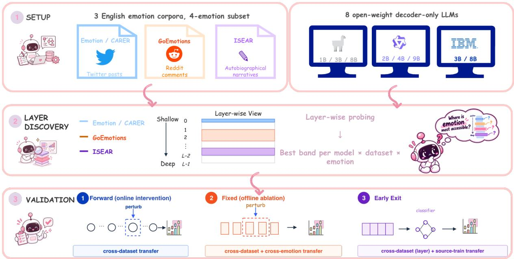  
Figure 1: Overview of our experimental pipeline. We localize emotion-sensitive layer bands with layer-wise probing, then evaluate them through online intervention, offline feature scaling, transfer analyses, and early-exit classification.

## 3 Preliminaries

Datasets. We evaluate on three publicly available emotion-classification corpora loaded from HuggingFace: Emotion (Saravia et al., 2018), Twitter posts labeled with six emotions; ISEAR (Scherer and Wallbott, 1994), autobiographical narratives elicited via emotion-recall questionnaires across seven emotional categories; and GoEmotions (Demszky et al., 2020), Reddit comments labeled with 27 fine-grained emotions plus neutral. From each corpus, we retain the shared target labels fear, joy, anger, and sadness, and discard examples shorter than six whitespace tokens. For GoEmotions, we additionally keep only single-label examples whose sole label is one of the four target emotions. We then construct stratified splits with seed 42: 80/10/10 for Emotion and ISEAR, and 70/15/15 for the resulting smaller GoEmotions subset. Emotion is capped at 1,500 examples per emotion before splitting. Table 1 gives per-split sizes; additional dataset statistics and corpus-cue diagnostics are reported in Appendix A.

Models. We probe eight open-weight decoder-only large language models from HuggingFace across

<table><tr><td>Dataset</td><td>Train</td><td>Val</td><td>Test</td><td>Total</td></tr><tr><td>Emotion (CARER)</td><td>4,800</td><td>600</td><td>600</td><td>6,000</td></tr><tr><td>ISEAR</td><td>3,234</td><td>402</td><td>408</td><td>4,044</td></tr><tr><td>GoEmotions</td><td>2,147</td><td>459</td><td>463</td><td>3,069</td></tr></table>

Table 1: Dataset sizes after restriction to the fouremotion subset and stratified splitting (80/10/10 for Emotion and ISEAR; 70/15/15 for GoEmotions).

three families:

• Llama: Llama-3.2-1B-Instruct, Llama-3.2-3B-Instruct, Llama-3.1-8B-Instruct (Grattafiori et al., 2024)

• Qwen: Qwen-3.5-2B, Qwen-3.5-4B, Qwen-3.5- 9B (Qwen Team, 2026)

• Granite: Granite-4.1-3B, Granite-4.1-8B (IBM Research, 2026)

Pooling and Probing. Our work does not aim to identify the optimal pooling function or probe classifier for emotion probing, a question recently studied at length by Di Palma et al. (2025). For the main experiments, we restrict pooling to fixed, deterministic operations applied identically across models, layers, and datasets. We use a validationonly, greedy two-stage pilot to select a common pooling–probe configuration. First, using a linear SVM on Llama-3.2-3B-Instruct and the Emotion validation split, we compare last-token, mean, and concat(mean, max, min) pooling across the four target emotions; a smaller ablation additionally confirms that the concatenated representation outperforms max or min pooling alone. Second, with concat fixed, we compare linear SVM, logistic regression, and MLP probes. Logistic regression provides the strongest overall combination of validation performance, simplicity, and stability, although the MLP is marginally better in some individual cells. The selected pooling and probe choices are also favored in a cross-family sanity check for fear on Qwen-3.5-4B.

As reported in Appendix B, a learned singlehead attention-pooling baseline can perform strongly at favorable shallow-layer settings, but is substantially more sensitive to layer, random seed, and optimization hyperparameters, with some deeper-layer runs collapsing to zero validation F1. We therefore retain the non-parametric pooling configuration. After this validation-only pilot, we fix a StandardScaler–LogisticRegression pipeline $( C = 1 . 0$ , max\_iter=5000, random\_state=42) on top of concat(mean, max, min) pooling for all main analyses.

## 4 Where and How do emotions reside in LLMs?

Before intervention, we first localize where emotion information is linearly decodable in frozen LLM representations. For each dataset, model, target emotion, and layer, we train a probe on the training split and evaluate it on validation only. Because models have different depths, we report normalized depth, $( \ell + 1 ) / L$ , where ℓ is the zeroindexed layer and L is the total number of layers. This analysis localizes where emotion information is linearly decodable; causal relevance is assessed later through fixed and online interventions.

Dataset source style shifts emotion-cue depth. Figure 2 shows normalized-depth profiles across datasets and model families. The main pattern is dataset-driven. Emotion peaks very early, with mean best relative depth 0.066 and median depth 0.036; GoEmotions is more intermediate and diffuse, with mean best depth 0.219; and ISEAR peaks much later, with mean and median depths 0.590 and 0.598. This ordering persists on lengthmatched subsets, with mean best relative depths of 0.131, 0.288, and 0.642 for Emotion, GoEmotions, and ISEAR, respectively. Thus, short social-mediastyle posts expose emotion cues early, whereas autobiographical ISEAR narratives require deeper processing.

Peak shape also differs across datasets. Figure 3 shows mean validation F1 with IQR shading over normalized depth. Emotion is early and sharply concentrated: layers within 0.01 F1 of the peak span only 0.073 normalized depth on average, or about 2.1 raw layers. GoEmotions is much more diffuse (0.316 depth; 9.0 layers), while ISEAR is later and moderately broad (0.193 depth; 5.9 layers). Thus, datasets differ not only in peak location, but also in signal concentration.

Emotions differ in difficulty and stability. Joy is the most consistently decodable emotion, ranking first in all three datasets and in 19/24 dataset– model contexts. Sadness is usually hardest, ranking last on Emotion and ISEAR and in 17/24 dataset– model contexts, although it rises to second on GoEmotions. Fear is competitive on Emotion and ISEAR but weakest on GoEmotions, while anger is usually intermediate.

OvR patterns hold under a four-class probe. Because later interventions require target-emotionspecific bands, our main layer-wise analysis uses one-vs-rest probes. As a sanity check, we also train a four-class multinomial probe at each layer. Across 24 dataset–model pairs, four-class best depth strongly agrees with the mean $_ \mathrm { O v R }$ best depth $( r \ : = \ : 0 . 8 5 )$ , and 87.5% of four-class best layers fall within the range of the four emotionspecific OvR best layers. Full results are in Appendix C.

Implications for intervention. These results motivate the intervention design in the next sections. First, because best depth varies systematically by dataset, layer selection must be performed on validation data within each dataset rather than using a universal raw layer index. Second, because the high-F1 region can be narrow or broad depending on the dataset, we test multiple band widths rather than a single best layer only. Third, if emotionsensitive regions capture general emotional information, bands selected for one emotion or dataset should have measurable effects beyond their original selection context; we therefore test this hypothesis through transfer experiments.

## 5 Causal Intervention on Emotion-Sensitive Layer Bands

The layer-wise analysis (§4) shows that emotion is linearly decodable at dataset-dependent depths. We next ask whether these regions matter for downstream readout. We test this with two complementary interventions: an online intervention that scales activations during the forward pass, and an offline intervention that scales the cached frozenfeature representation. The online experiment provides the stronger causal evidence because the perturbation can propagate through later layers; the offline experiment checks whether the same bands matter in the static representation used by the probe.

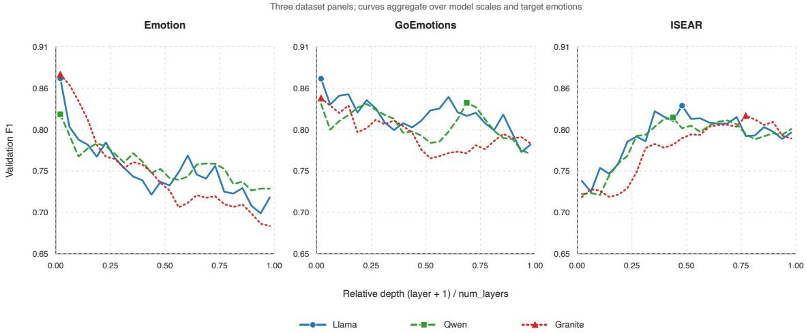  
Figure 2: Layer-wise emotion decodability over normalized depth. Each panel corresponds to a dataset, and each curve aggregates validation F1 over model scales and target emotions within a model family. Across families, Emotion peaks early, GoEmotions is broader and intermediate, and ISEAR peaks later.

For each model, dataset, target emotion, and band width $w ~ \in ~ \{ 1 , 2 , 3 , 4 \}$ , we take the validationselected emotion band from the layer-wise analysis. We compare it against a same-width transfer band selected for the same emotion on the other dataset, an unrelated non-overlapping band, and an unmodified baseline. During evaluation, a multiplicative hook scales the hidden states in the band by $\alpha \in \{ 0 . 0 , 0 . 5 , 1 . 5 \} ; \alpha = 0$ removes the band, $\alpha = 0 . 5$ attenuates it, and $\alpha = 1 . 5$ amplifies it. Both intervention experiments evaluate Emotion and ISEAR.

<table><tr><td></td><td>W1</td><td>W2</td><td>W3</td><td>W4</td></tr><tr><td>α = 0.0</td><td> $- 8 . 2 ^ { * }$ </td><td> $- 1 3 . 4 ^ { * * * }$ </td><td>-7.4</td><td> $- 1 0 . 8 ^ { * * }$ </td></tr><tr><td> $\alpha = 0 . 5$ </td><td> ${ } ^ { - 8 . 4 ^ { * } }$ </td><td>-6.2</td><td>-6.6</td><td>-9.1</td></tr><tr><td> $\alpha = 1 . 5$ </td><td> $- 2 . 1$ </td><td>-0.5</td><td>-2.0</td><td>+1.7</td></tr></table>

Table 2: Forward specificity: selected-band minus unrelated-band accuracy delta, in percentage points. Negative values mean selected bands are more disruptive. Stars use BH-FDR-corrected sign tests: $^ { * } q < 0 . 0 5 .$ $^ { * * } q < 0 . 0 1 , { ^ { * * * } q } < 0 . 0 0 1$

## 5.1 Setup

All intervention claims use test-set predictions. We store per-example predictions for each condition and compute paired correctness contrasts within matched settings. Aggregate claims are summarized over settings with bootstrap confidence intervals, sign tests, Wilcoxon signed-rank tests, and BH-FDR correction within each comparison family.

## 5.2 Online intervention: main effect and specificity

Across all 768 forward settings, scaling the emotion-selected band causes a large accuracy drop relative to baseline (−26.6 percentage points, $q < 0 . 0 0 1 )$ . The unrelated-band control is also disruptive (−20.5 points), showing that mid-forward perturbations are not harmless. The key comparison is therefore specificity: selected bands are more disruptive than unrelated same-width bands by −6.1 points overall $( q < 0 . 0 0 1 )$ . At the strongest intervention, α = 0, this specificity reaches −8.2, $- 1 3 . 4 , - 7 . 4 .$ , and −10.8 points for widths 1–4, respectively (Table 2). Thus, the layers identified by validation probing are not merely decodable; perturbing them affects the downstream readout more than perturbing arbitrary regions of the same size.

Cross-dataset transfer. Transfer bands, selected for the same emotion on the other dataset, produce nearly the same disruption as own-dataset bands. The own-vs-transfer difference is small and not reliable overall (−1.2 points, n.s.), while transfer bands are still more disruptive than unrelated bands (−4.9 points, $q < 0 . 0 0 1 $ ). A complementary $2 \times 2$ probe–band transfer control (Appendix G) compares target- and source-trained LogReg probes under own and transferred bands. The own–transfer difference remains approximately −1.2 points under either probe, and the probe-by-band interaction is negligible (−0.06 points, n.s.), indicating that the near-equivalence of own and transferred bands is not an artifact of retaining the target-trained readout. This supports partial cross-dataset sharing: an

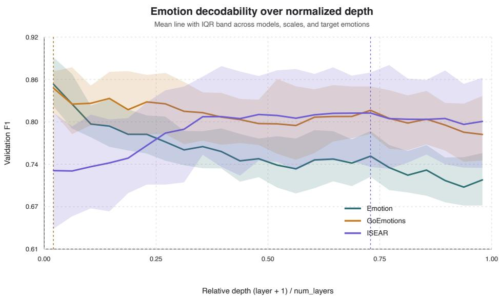  
Figure 3: Dataset-level mean validation F1 over normalized depth, with IQR shading across models, scales, and target emotions. Emotion is early and sharp; GoEmotions is broader, more diffuse; ISEAR peaks substantially later.

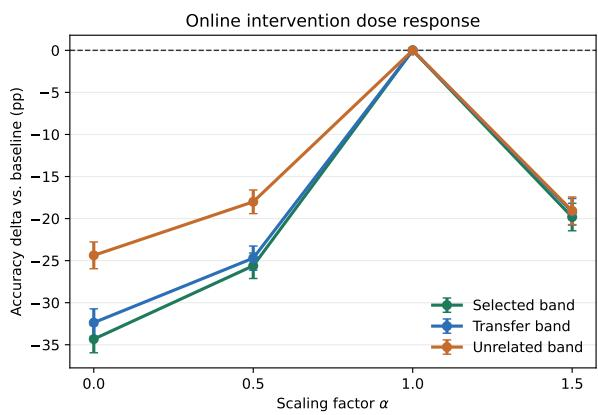  
Figure 4: Online intervention dose response. On average, selected and transferred emotion bands are more disruptive than unrelated same-width bands, especially when $\alpha < 1$ . Values are test accuracy deltas relative to the unmodified baseline. The α = 1 point denotes the unmodified baseline and is shown only for reference.

ISEAR-selected fear band, for example, can remain causally relevant during an Emotion forward pass, although the match is not exact.

Moderators. The specificity gap is strongest for Llama (−7.8 points) and Qwen (−9.3 points), both significant after correction, but not for Granite (+1.2 points, n.s.). Dataset also matters. On Emotion, selected bands are reliably more disruptive than unrelated bands (−7.7 points, $q \ < \ 0 . 0 0 1 )$ with significant specificity at every width. On ISEAR, the same contrast is smaller (−4.5 points) and less stable. In contrast, transfer-vs-unrelated is strongest on ISEAR (−12.2 points), suggesting that deeper narrative-style cues may be more compatible with transferred bands.

## 5.3 Offline feature scaling

The offline intervention applies the same scaling operation after feature extraction, directly to the cached representation read by the probe. It therefore tests representational usefulness, not causal computation inside the transformer. Offline scaling reproduces the main disruption effect but with weaker specificity: own-band scaling reduces accuracy by −12.2 points relative to baseline $( q <$ 0.001), while unrelated and low-sensitivity bands also reduce accuracy by −11.3 and −10.8 points. The selected-vs-unrelated contrast is only −0.8 points and is not reliable. A complementary $2 \times 2$ probe–band transfer control shows that the own– transfer difference remains similarly small under source-trained and target-trained probes (+0.6 vs. +0.7 points), with a negligible probe-by-band interaction (−0.07 points, n.s.; Appendix G). This contrast between online and offline results suggests that the causal evidence comes primarily from intervening during the forward computation, not merely from editing the final feature vector.

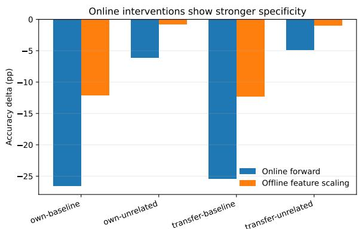  
Figure 5: Online vs. offline intervention effects. Both settings show large disruption relative to baseline, but selected-vs-unrelated specificity is much clearer online. In the offline setting, transfer pools the available transfer conditions; own-vs-baseline and own-vs-unrelated are directly comparable across settings.

Cross-emotion transfer. The offline setting additionally lets us test cross-emotion transfer: scaling a band selected for a different emotion on the same dataset. $\operatorname { A t } \alpha = 0 .$ , cross-emotion transfer is almost as disruptive as the own-emotion band (−15.2 vs. −15.9 points). Fear is the most vulnerable target (−16.8), joy the most robust (−13.1), and sadness is the most disruptive source (−16.5 on average). These patterns are exploratory, but they suggest that selected bands encode shared affective structure rather than completely emotion-specific modules.

## 6 Early Exit from Emotion-Sensitive Bands

The intervention results show that emotion-selected bands are functionally important for the probemediated readout. We next ask the constructive question: can these bands support downstream classification without running the full transformer?

Setup. For each of the eight models and the two datasets evaluated here (Emotion and ISEAR), we consider target-emotion bands of widths $w ~ \in ~ \{ 1 , 2 , 3 , 4 \}$ For each condition, we train a separate 4-class multinomial logisticregression head on the corresponding target-dataset training representations. Features concatenate concat(mean,max,min) pooled states across the layers in the band. For selected, random, lowsensitivity, and cross-dataset transfer bands, the forward pass stops after the final layer of the band. The full-depth control runs the complete transformer and uses the same-width band comprising the final w layers. As above, all aggregate significance tests use matched test-set predictions with BH-FDR correction.

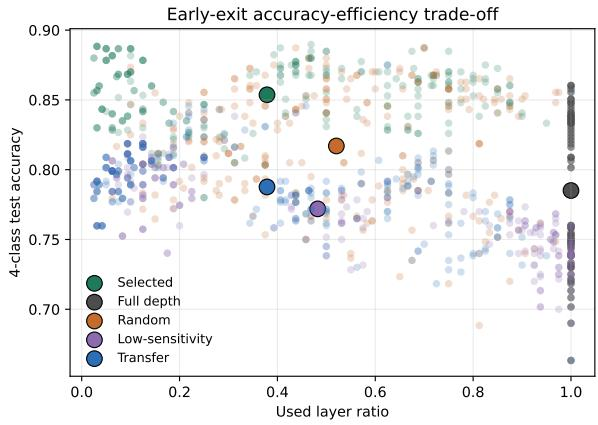  
Figure 6: Early-exit accuracy-efficiency trade-off. Each small point is a model–dataset–emotion–width setting; large points show condition means. Selected bands achieve higher accuracy while using fewer layers than full-depth representations.

Selected bands outperform full depth and controls. Selected early exits outperform full-depth representations by +6.9 accuracy points overall $( q < 0 . 0 0 1 )$ . They also outperform random bands (+3.7), low-sensitivity bands (+8.2), and transferred bands (+6.6), all with $q < 0 . 0 0 1$ . These comparisons rule out the trivial explanation that any intermediate representation works equally well: the validation-selected emotion bands are consistently better readout points for the lightweight classifier.

Bandwidth. Early-exit gains are not monotonic in bandwidth. Width 1 gives the largest selected-vsfull-depth gain (+7.8 points), width 3 is the weakest (+5.9), and width 4 partially recovers (+6.5). This matches the layer-wise picture: when emotion cues are concentrated, a narrow band can capture the useful signal without adding off-peak features; when cues are more distributed, wider bands add capacity but with diminishing returns.

Early-exit transfer. Early exit exposes two notions of transfer. Layer transfer uses a band selected on the other dataset, while fitting a separate classifier on target-dataset training examples for the representations from that band. These transferred bands roughly match full depth overall (+0.3 points, n.s.) but remain below target-selected exits by 6.6 points. The effect is asymmetric: transfer exits help on Emotion relative to full depth (+3.7 points) but hurt on ISEAR (−3.2 points). Sourcetrain transfer also changes the classifier training data. In that setting, source-selected bands slightly outperform target-selected bands under the sourcetrained head (+1.2 points, q < 0.01), suggesting that exit quality depends both on where emotion is encoded and on which representation the classifier was trained to read.

Frozen-encoder comparison. We also compare selected early-exit LLM representations with frozen RoBERTa-base and DeBERTa-v3-base representations under the same logistic-regression protocol. We keep all encoders frozen because our goal is to evaluate where emotion-related information is already available in pretrained representations, rather than how much performance can be obtained after task-specific parameter updates. Fully fine-tuning an encoder can reshape its internal representations, making it less directly comparable to the layer-localization and early-exit setting studied here. Selected LLM exits outperform frozen RoBERTa by +15.8 points and frozen De-BERTa by +21.5 points overall (Table 15). This is a frozen-representation comparison which shows that the selected LLM bands provide a strong task representation under a lightweight head.

Moderators. The dataset selection is the strongest moderator. Selected-vs-full-depth gain is +11.3 points on Emotion but only +2.5 on ISEAR, consistent with Emotion’s shallow and concentrated layer-wise profile. Model family also matters: Granite shows the largest gain (+8.8), followed by Llama (+6.9) and Qwen (+5.5).

## 7 Discussion

Overall, emotion-sensitive information is localizable enough for intervention and early readout, but its layer-wise organization varies with emotion expression and readout setting.

Emotion depth reflects how affect is expressed. The clearest pattern is that the best emotion layers shift with dataset source and style. This supports a more nuanced view than the claim that affective information simply lives in early layers. Early layers are sufficient for CARER-like short posts, where emotion is often marked by lexical or conventional cues. In contrast, ISEAR narratives require deeper representations, plausibly because the emotion must be inferred from events, appraisals, and causal context. GoEmotions falls between these cases, with a broader and less sharply localized profile. Thus, the depth of emotion decodability should be treated as an empirical property of the input distribution, not only as a property of the model.

Intervention and readout reveal different notions of usefulness. The online intervention results show that probe-selected bands are not only diagnostic: perturbing them disrupts downstream prediction more than matched unrelated bands. However, the offline scaling results are less specific, which suggests that the causal role of a band depends on its participation in the forward computation, not only on the final cached feature vector. Early-exit results add a constructive perspective: some intermediate bands are better readout points than the final layer under a lightweight classifier. Together, these findings separate three questions that are often conflated: where emotion is decodable, where it is causally involved, and where it is easiest to read out.

Transfer is shared but readout-dependent. Transfer results show that emotion-sensitive regions are not strictly dataset-specific or labelspecific. Bands selected on one dataset can remain disruptive on another, and different-emotion bands can affect the same target. At the same time, early-exit transfer is weaker, indicating that a useful causal region is not necessarily an optimal readout point for a classifier trained in a different setting. This distinction helps explain why transfer appears stronger in intervention than in early-exit classification: the former tests whether a region matters during computation, while the latter tests whether a trained classifier can use that region effectively.

Implications. These results suggest that affective information in LLMs is organized at a band level rather than at a single universal layer. Future analyses of emotion in LLMs should therefore report not only whether emotion is decodable, but also the dataset source, model family, layer-selection criterion, and readout mechanism under which the claim holds.

## 8 Conclusion

This paper examined whether emotion in decoderonly LLMs has a fixed layer-wise location, or whether its organization varies with the kind of text being processed. Our results support the latter. Emotion information is not uniformly shallow, nor does it occupy a single universal layer across models and datasets. Instead, the depth and breadth of emotion-sensitive bands vary systematically with dataset style and model family.

These bands are not merely correlational artifacts of a linear probe. They can be causally perturbed through forward intervention and reused as compact early-exit representations, while their cross-dataset and cross-emotion transfer suggests shared affect-sensitive regions rather than isolated label-specific modules.

Taken together, our findings recast emotion representation as a depth-sensitive and contextdependent property of pretrained LLMs. This view helps explain why prior layer-wise analyses can disagree across datasets, and suggests that future work on affective behavior in LLMs should treat where emotion is represented as part of the empirical question, not as a fixed architectural fact.

## Limitations

Our analysis combines layer-wise probing, causal intervention, and early-exit experiments on eight open-weight decoder-only LLMs and three English emotion corpora under a fixed pooling and probe configuration. Several aspects of this design constrain the generality of our conclusions.

Dataset and language scope. We restrict our analysis to three English-language corpora (Emotion/CARER, ISEAR, GoEmotions) and to the fouremotion intersection of their original label sets: fear, joy, anger, and sadness. Other emotions such as surprise, disgust, shame, guilt, and love are not analyzed here. All three sources are English and largely Western, so the dataset-depth ordering we observe may not generalize to other languages, cultural contexts, or finer-grained emotion taxonomies.

Model scope. We probe eight open-weight decoder-only LLMs from three families (Llama, Qwen, Granite) between 1B and 9B parameters. We do not evaluate closed-weight models, base non-instruction-tuned checkpoints, or much larger open models. The model-family and scale patterns should therefore be read as descriptive findings within this open-weight range, not as universal claims about all decoder-only LLMs.

Methodological choices. All main experiments keep model parameters frozen and use deterministic pooling with a linear probe. This design is intentional: our goal is to study where emotion-related information is already available in pretrained representations, rather than how much task-specific performance can be obtained after updating model parameters. Fully fine-tuning an encoder or decoder could substantially reshape internal representations, making it less directly comparable to the layer-localization and early-exit setting studied here. A learnable attention-pooling baseline can reach higher absolute F1 in pilot runs, but it introduces additional training instability and capacity differences, making representation comparisons harder to interpret. Our interventions also operate at a coarse contiguous layer-band granularity. Finer-grained approaches such as activation patching, direction-level editing, nullspace projection, or neuron-level interventions could localize affective computation more precisely.

Finding-level caveats. Forward specificity is significant for Llama and Qwen but not Granite. Offline feature scaling reproduces the main disruption direction but does not show reliable selected-vsunrelated specificity, consistent with our view that online intervention is the stronger causal diagnostic. Cross-emotion transfer (Table 11) suggests shared affective bands rather than strict per-emotion modules. The early-exit width effect is non-monotonic, and our explanation in terms of selectivity versus capacity remains exploratory. Source-train transfer is consistent with a classifier–band alignment hypothesis, but does not prove it.

Statistical and reproducibility caveats. We compute per-setting paired correctness contrasts from per-example test predictions. Aggregate claims are summarized across settings using bootstrap confidence intervals, sign tests, Wilcoxon signed-rank tests, and BH-FDR correction within each comparison family. Per-setting McNemar tests are available in the supplementary CSVs. We do not apply more conservative family-wise correction across every comparison in the paper. Finally, ISEAR is loaded through a community-uploaded HuggingFace dataset, so exact ISEAR-specific reproducibility depends on that source remaining un-

changed.

## Acknowledgments

This work has received support from the investment programme "France 2030" as part of the IdEx programme (ANR-18-IDEX-0001) implemented by Université Paris Cité, under which the inIdEx project EFL is conducted.

## References

Guillaume Alain and Yoshua Bengio. 2017. Understanding intermediate layers using linear classifier probes.

Alexandra Balahur, Jesús M. Hermida, and Andrés Montoyo. 2011. Detecting implicit expressions of sentiment in text based on commonsense knowledge. In Proceedings ofthe 2nd Workshop on Computational Approaches to Subjectivity and Sentiment Analysis (WASSA 2.011), pages 53–60, Portland, Oregon. Association for Computational Linguistics.

Yonatan Belinkov. 2022. Probing classifiers: Promises, shortcomings, and advances. Computational Linguistics, 48(1):207–219.

Dorottya Demszky, Dana Movshovitz-Attias, Jeongwoo Ko, Alan Cowen, Gaurav Nemade, and Sujith Ravi. 2020. GoEmotions: A dataset of fine-grained emotions. In Proceedings of the 58th Annual Meeting of the Associationfor Computational Linguistics, pages 4040–4054, Online. Association for Computational Linguistics.

Dario Di Palma, Alessandro De Bellis, Giovanni Servedio, Vito Walter Anelli, Fedelucio Narducci, and Tommaso Di Noia. 2025. LLaMAs have feelings too: Unveiling sentiment and emotion representations in LLaMA models through probing. In Proceedings of the 63rd Annual Meeting of the Association for Computational Linguistics (Volume 1: Long Papers), pages 6124–6142, Vienna, Austria. Association for Computational Linguistics.

Eli Dresner and Susan C. Herring. 2010. Functions of the nonverbal in cmc: Emoticons and illocutionary force. Communication Theory, 20(3):249–268.

Paul Ekman. 1992. An argument for basic emotions. Cognition and Emotion, 6(3-4):169–200.

Angela Fan, Edouard Grave, and Armand Joulin. 2020. Reducing transformer depth on demand with structured dropout. In International Conference on Learning Representations.

Mor Geva, Jasmijn Bastings, Katja Filippova, and Amir Globerson. 2023. Dissecting recall of factual associations in auto-regressive language models. In Proceedings ofthe 2023 Conference on Empirical Methods in Natural Language Processing, pages 12216–12235,

Singapore. Association for Computational Linguistics.

Aaron Grattafiori, Abhimanyu Dubey, Abhinav Jauhri, Abhinav Pandey, Abhishek Kadian, Ahmad Al-Dahle, Aiesha Letman, Akhil Mathur, Alan Schelten, Alex Vaughan, Amy Yang, Angela Fan, Anirudh Goyal, Anthony Hartshorn, Aobo Yang, Archi Mitra, Archie Sravankumar, Artem Korenev, Arthur Hinsvark, and 542 others. 2024. The llama 3 herd of models. Preprint, arXiv:2407.21783.

Wes Gurnee and Max Tegmark. 2024. Language models represent space and time. In The Twelfth International Conference on Learning Representations.

John Hewitt and Percy Liang. 2019. Designing and interpreting probes with control tasks. In Proceedings ofthe 2019 Conference on Empirical Methods in Natural Language Processing and the 9th International Joint Conference on Natural Language Processing (EMNLP-IJCNLP), pages 2733–2743, Hong Kong, China. Association for Computational Linguistics.

Jan Hofmann, Enrica Troiano, Kai Sassenberg, and Roman Klinger. 2020. Appraisal theories for emotion classification in text. In Proceedings of the 28th International Conference on Computational Linguistics, pages 125–138, Barcelona, Spain (Online). International Committee on Computational Linguistics.

IBM Research. 2026. Introducing the ibm granite 4.1 family of models. https://research.ibm.com/ blog/granite-4-1-ai-foundation-models.

Dongjin Kang, Sunghwan Kim, Taeyoon Kwon, Seungjun Moon, Hyunsouk Cho, Youngjae Yu, Dongha Lee, and Jinyoung Yeo. 2024. Can large language models be good emotional supporter? mitigating preference bias on emotional support conversation. In Proceedings of the 62nd Annual Meeting of the Associationfor Computational Linguistics (Volume 1: Long Papers), pages 15232–15261, Bangkok, Thailand. Association for Computational Linguistics.

Samuel Marks and Max Tegmark. 2024. The geometry of truth: Emergent linear structure in large language model representations of true/false datasets. In First Conference on Language Modeling.

Thomas McGrath, Matthew Rahtz, Janos Kramar, Vladimir Mikulik, and Shane Legg. 2023. The hydra effect: Emergent self-repair in language model computations. Preprint, arXiv:2307.15771.

Saif Mohammad and Felipe Bravo-Marquez. 2017. Emotion intensities in tweets. In Proceedings ofthe 6th Joint Conference on Lexical and Computational Semantics (\*SEM 2017), pages 65–77, Vancouver, Canada. Association for Computational Linguistics.

Saif M. Mohammad and Svetlana Kiritchenko. 2015. Using hashtags to capture fine emotion categories from tweets. Comput. Intell., 31(2):301–326.

Robert Plutchik. 1980. A general psychoevolutionary theory of emotion. In Robert Plutchik and Henry Kellerman, editors, Emotion: Theory, Research, and Experience, volume 1, pages 3–33. Academic Press.

Qwen Team. 2026. Qwen3.5: Towards native multimodal agents.

Anna Rogers, Olga Kovaleva, and Anna Rumshisky. 2020. A primer in BERTology: What we know about how BERT works. Transactions ofthe Association for Computational Linguistics, 8:842–866.

Sahand Sabour, Siyang Liu, Zheyuan Zhang, June Liu, Jinfeng Zhou, Alvionna Sunaryo, Tatia Lee, Rada Mihalcea, and Minlie Huang. 2024. EmoBench: Evaluating the emotional intelligence of large language models. In Proceedings of the 62nd Annual Meeting of the Association for Computational Linguistics (Volume 1: Long Papers), pages 5986–6004, Bangkok, Thailand. Association for Computational Linguistics.

Hassan Sajjad, Fahim Dalvi, Nadir Durrani, and Preslav Nakov. 2023. On the effect of dropping layers of pretrained transformer models. Comput. Speech Lang., 77(C).

Elvis Saravia, Hsien-Chi Toby Liu, Yen-Hao Huang, Junlin Wu, and Yi-Shin Chen. 2018. CARER: Contextualized affect representations for emotion recognition. In Proceedings of the 2018 Conference on Empirical Methods in Natural Language Processing, pages 3687–3697, Brussels, Belgium. Association for Computational Linguistics.

Klaus R. Scherer and Harald G. Wallbott. 1994. Evidence for universality and cultural variation of differential emotion response patterning. Journal of Personality and Social Psychology, 66(2):310–328.

Tal Schuster, Adam Fisch, Jai Gupta, Mostafa Dehghani, Dara Bahri, Vinh Q. Tran, Yi Tay, and Donald Metzler. 2022. Confident adaptive language modeling. In Advances in Neural Information Processing Systems.

Roy Schwartz, Gabriel Stanovsky, Swabha Swayamdipta, Jesse Dodge, and Noah A. Smith. 2020. The right tool for the job: Matching model and instance complexities. In Proceedings of the 58th Annual Meeting ofthe Associationfor Computational Linguistics, pages 6640–6651, Online. Association for Computational Linguistics.

Ian Tenney, Dipanjan Das, and Ellie Pavlick. 2019. BERT rediscovers the classical NLP pipeline. In Proceedings ofthe 57th Annual Meeting ofthe Associationfor Computational Linguistics, pages 4593– 4601, Florence, Italy. Association for Computational Linguistics.

Enrica Troiano, Laura Oberländer, and Roman Klinger. 2023. Dimensional modeling of emotions in text with appraisal theories: Corpus creation, annotation reliability, and prediction. Computational Linguistics, 49(1):1–72.

Eric Wallace, Yizhong Wang, Sujian Li, Sameer Singh, and Matt Gardner. 2019. Do NLP models know numbers? probing numeracy in embeddings. In Proceedings of the 2019 Conference on Empirical Methods in Natural Language Processing and the 9th International Joint Conference on Natural Language Processing (EMNLP-IJCNLP), pages 5307–5315, Hong Kong, China. Association for Computational Linguistics.

Xuena Wang, Xueting Li, Zi Yin, Yue Wu, and Jia Liu. 2023. Emotional intelligence of large language models. Journal of Pacific Rim Psychology, 17:18344909231213958.

Ji Xin, Raphael Tang, Jaejun Lee, Yaoliang Yu, and Jimmy Lin. 2020. DeeBERT: Dynamic early exiting for accelerating BERT inference. In Proceedings of the 58th Annual Meeting of the Association for Computational Linguistics, pages 2246–2251, Online. Association for Computational Linguistics.

## A Dataset Statistics and Corpus-Cue Diagnostics

This appendix reports the per-emotion sample distribution underlying the aggregate dataset sizes in Table 1.

Corpus-cue diagnostics. The three corpora share the same four target labels but differ in source, elicitation procedure, and surface-cue profile. To make cue rates comparable despite differences in text length, we compute these diagnostics on the label-by-length-bin matched training subsets. Each dataset contributes 1,909 matched training examples. Table 4 reports percentages macro-averaged across the four target emotions.

Operational definitions. Texts are lowercased and tokenized using an alphabetic word pattern that preserves internal apostrophes. An exact targetlabel word is present when the gold-label token itself (e.g.,fear for a fear example) occurs in the text. The emotion-lexicon indicator records whether at least one token belongs to the union of our handspecified fear, joy, anger, and sadness lexicons. A first-person feel-form frame requires one of {feel, feels, feeling, felt} to occur within three tokens after a first-person subject such as I or we. Secondperson reference records the presence of a secondperson pronoun or common informal variant. The temporal-marker indicator uses a predefined list of temporal words and phrases, such as when, after, during, and at that moment. The past-event proxy records either a predefined irregular-past form (e.g., was, had, or felt) or a token longer than three characters ending in -ed. Full word and phrase lists are provided with the released diagnostic code.

<table><tr><td>Dataset</td><td>Split</td><td>Fear</td><td>Joy</td><td>Anger</td><td>Sadness</td><td>Total</td></tr><tr><td rowspan="3">Emotion (CARER)</td><td>Train</td><td>1,200</td><td>1,200</td><td>1,200</td><td>1,200</td><td>4,800</td></tr><tr><td>Val</td><td>150</td><td>150</td><td>150</td><td>150</td><td>600</td></tr><tr><td>Test</td><td>150</td><td>150</td><td>150</td><td>150</td><td>600</td></tr><tr><td rowspan="3">ISEAR</td><td>Train</td><td>823</td><td>816</td><td>831</td><td>764</td><td>3,234</td></tr><tr><td>Val</td><td>102</td><td>102</td><td>103</td><td>95</td><td>402</td></tr><tr><td>Test</td><td>104</td><td>102</td><td>105</td><td>97</td><td>408</td></tr><tr><td rowspan="3">GoEmotions</td><td>Train</td><td>321</td><td>604</td><td>644</td><td>578</td><td>2,147</td></tr><tr><td>Val</td><td>68</td><td>129</td><td>138</td><td>124</td><td>459</td></tr><tr><td>Test</td><td>70</td><td>130</td><td>138</td><td>125</td><td>463</td></tr></table>

Table 3: Per-emotion sample counts in the four-emotion splits of each dataset.

The cue profiles do not form a single monotonic continuum. Exact-label mentions increase from Emotion to ISEAR, whereas emotion-lexicon coverage peaks for GoEmotions and first-person feel/felt frames are most frequent in Emotion. We therefore treat dataset source as a multidimensional property of the input distribution rather than as a scalar measure of linguistic complexity.

## B Pooling and Probe Selection Pilot

This appendix details the two-step greedy selection protocol used to fix the pooling function and probe classifier. All reported numbers are validation F1 at the best-performing layer per (emotion, pooling, probe) cell.

Step 1: Pooling selection. We fix the probe to a linear SVM on Llama-3.2-3B-Instruct and scan all layers of the Emotion validation split for each of the four target emotions, comparing last-token, mean, and concat(mean, max, min) pooling (Table 5). concat is the strongest non-parametric option on all four emotions, outperforming last-token by 24 to 35 F1 points and mean by 2 to 8 F1 points.

Max/min ablation. To verify that the concat advantage is not driven by the max or min component alone, we additionally compare concat against max and min pooling on fear and joy with the same Llama-3B linear SVM probe (Table 6). concat remains the strongest option in both cases.

Cross-family pooling sanity check. We replicate the pooling comparison on Qwen-3.5-4B for fear (one emotion only). The ranking is consistent with Llama-3B: concat (F1 0.822) is strongest, followed by mean (0.795) and last-token (0.536).

Step 2: Probe selection. With concat(mean, max, min) pooling fixed, we compare three lightweight probes on the same Llama-3B fouremotion validation setup: linear SVM, logistic regression, and a one-hidden-layer MLP (Table 7). Logistic regression is the strongest probe on fear and joy and competitive on anger and sadness (within 0.01 F1 of the best); we adopt it as the fixed analysis probe because it is also simpler and more stable than the MLP alternative.

Cross-family probe sanity check. We replicate the probe comparison on Qwen-3.5-4B for fear: linear SVM 0.843, logreg 0.847, MLP 0.832. Logistic regression is again the strongest probe.

Verification: learned attention pooling. As a verification of our restriction to non-parametric pooling, we evaluate a single-head learnable attention pooling layer followed by a linear classification head, trained end-to-end with cross-entropy on the Llama-3.2-3B-Instruct Emotion validation split. We use the same random seed (42) as our main experiments, a fixed learning rate of $\eta = 0 . 0 0 3$ , and sweep over weight decay $\{ 0 , 1 0 ^ { - 4 } , 1 0 ^ { - 3 } \}$ at each of six representative layers ({0, 3, 4, 20, 23, 26}), yielding 72 runs in total.

Table 8 reports F1 per (layer, emotion) averaged across the three weight decay values. At layer 0, attention pooling reaches strong F1 on all four emotions, but training collapses in 10 of the 24 (layer, emotion) cells at this seed: joy fails from layer 3 onward, fear from layer 20, and most emotions are reduced to F1 = 0 by layer 23. The mean F1 across the 24 cells is 0.51, well below the concat baseline mean of 0.85.

For completeness, when we cherry-pick the best (layer, weight decay) per emotion at this seed, the best-case mean F1 reaches 0.96 (fear 0.957, joy 0.963, anger 0.946, sadness 0.961), exceeding concat on each emotion. Achieving this best-case in practice would require either layer-by-layer collapse screening or multi-seed retries to find a configuration that converges, neither of which is feasible at the scale of our main experiments (8 models × 3 datasets × all transformer layers). In contrast, concat(mean, max, min) pooling is fully deterministic and applies uniformly without retuning. This per-layer instability also reflects the methodological cost of introducing learned parameters in the pooling stage: per-layer F1 measures not only the representation but also whether the attention parameters successfully trained at that layer.

<table><tr><td>Cue (% of matched texts)</td><td>Emotion</td><td>GoEmotions</td><td>ISEAR</td></tr><tr><td>Exact target-label word</td><td>0.7</td><td>1.7</td><td>4.8</td></tr><tr><td>Any heuristic emotion-lexicon cue</td><td>31.0</td><td>41.1</td><td>22.0</td></tr><tr><td>First-person feel/felt frame</td><td>75.8</td><td>2.4</td><td>7.7</td></tr><tr><td>Second-person reference</td><td>6.0</td><td>23.5</td><td>1.3</td></tr><tr><td>Temporal marker</td><td>14.9</td><td>12.8</td><td>62.4</td></tr><tr><td>Past-event proxy</td><td>56.9</td><td>43.4</td><td>82.9</td></tr></table>

Table 4: Corpus-cue diagnostics on label-by-length-bin matched training subsets, macro-averaged across the four target emotions. These string-pattern diagnostics are descriptive proxies rather than linguistic annotations.

<table><tr><td>Pooling</td><td>Fear</td><td>Joy</td><td>Anger</td><td>Sadness</td><td>Mean</td></tr><tr><td>last-token</td><td>0.554</td><td>0.628</td><td>0.551</td><td>0.494</td><td>0.557</td></tr><tr><td>mean</td><td>0.829</td><td>0.876</td><td>0.794</td><td>0.743</td><td>0.811</td></tr><tr><td>concat</td><td>0.908</td><td>0.880</td><td>0.836</td><td>0.766</td><td>0.848</td></tr></table>

Table 5: Step-1 pooling pilot on Llama-3.2-3B-Instruct, Emotion validation split, linear SVM probe. Best-layer F1 per emotion.
<table><tr><td>Pooling</td><td>Fear</td><td>Joy</td></tr><tr><td>concat</td><td>0.908</td><td>0.880</td></tr><tr><td>max</td><td>0.878</td><td>0.818</td></tr><tr><td>min</td><td>0.843</td><td>0.836</td></tr></table>

Table 6: Max/min ablation on Llama-3.2-3B-Instruct, Emotion validation split, linear SVM probe.

## C Additional Layer-Wise Analyses

This appendix provides supplementary analyses for Section 4. All results are computed from validationonly layer-wise probing outputs. The main paper reports the condensed dataset- and family-level patterns; here we include the full one-vs-rest profiles, the four-class consistency check, cross-emotion correlations, and additional descriptive summaries.

Full normalized-depth profiles. Figure 7 shows the full 3 × 3 family-by-dataset normalized-depth view. This is the expanded version of Figure 2. The same dataset-level ordering remains visible within model families: Emotion peaks early, GoEmotions is broader and intermediate, and ISEAR peaks later.

Emotion-specific layer-wise profiles. Figures 8, 9, and 10 show the normalized-depth profiles separately for each target emotion. These figures provide the detailed curves underlying the dataset-level summaries in the main text.

<table><tr><td>Probe</td><td>Fear</td><td>Joy</td><td>Anger</td><td>Sadness</td><td>Mean</td></tr><tr><td>linear SVM</td><td>0.885</td><td>0.858</td><td>0.833</td><td>0.777</td><td>0.838</td></tr><tr><td>logreg</td><td>0.903</td><td>0.900</td><td>0.837</td><td>0.800</td><td>0.860</td></tr><tr><td>MLP</td><td>0.893</td><td>0.858</td><td>0.845</td><td>0.812</td><td>0.852</td></tr></table>

Table 7: Step-2 probe pilot on Llama-3.2-3B-Instruct, Emotion validation split, concat(mean, max, min) pooling. Best-layer F1 per emotion.

<table><tr><td>Layer</td><td>Fear</td><td>Joy Anger</td><td>Sadness</td></tr><tr><td>0</td><td>0.95 0.96</td><td>0.93</td><td>0.93</td></tr><tr><td>3</td><td>0.94 0.00</td><td>0.94</td><td>0.96</td></tr><tr><td>4</td><td>0.59</td><td>0.00</td><td>0.94 0.94</td></tr><tr><td>20</td><td>0.00</td><td>0.00 0.94</td><td>0.92</td></tr><tr><td>23</td><td>0.00</td><td>0.00 0.92</td><td>0.00</td></tr><tr><td>26</td><td>0.00</td><td>0.00 0.40</td><td>0.00</td></tr></table>

Table 8: Per-(layer, emotion) F1 of attention pooling at η = 0.003, seed 42, averaged across three weight decay values. Zero entries indicate training collapse.

OvR versus four-class consistency. Figure 11 compares the best relative depth from the four-class multinomial probe against the mean best relative depth from the four one-vs-rest probes. Across all 24 dataset–model pairs, the correlation is r = 0.85, and 87.5% of four-class best layers fall within the range spanned by the four one-vs-rest best layers. This supports using one-vs-rest probes for targetspecific band selection.

## D Forward Intervention Significance Details

The forward master CSV contains 768 matched test settings (8 models × 2 datasets × 4 emotions × 4 widths × 3 alpha values). For each comparison, we compute paired correctness contrasts from per-example predictions, then summarize across settings with bootstrap confidence intervals, sign tests, Wilcoxon signed-rank tests, and BH-FDR correction.

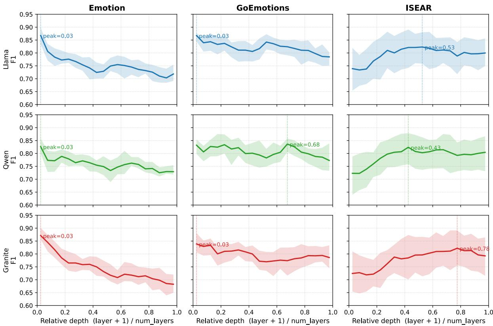  
Figure 7: Full family-by-dataset normalized-depth profiles. Each panel aggregates validation F1 over model scales and target emotions within one model family and dataset.

<table><tr><td>Comparison</td><td>n</td><td>Mean ∆acc</td></tr><tr><td>Own vs. baseline</td><td>768</td><td> $- 2 6 . 6 ^ { * * * }$ </td></tr><tr><td>Transfer vs. baseline</td><td>768</td><td> $- 2 5 . 4 ^ { * * * }$ </td></tr><tr><td>Unrelated vs. baseline</td><td>768</td><td> $- 2 0 . 5 ^ { * * * }$ </td></tr><tr><td>Own vs. transfer</td><td>768</td><td> $- 1 . 2$ </td></tr><tr><td>Own vs. unrelated</td><td>768</td><td> $- 6 . 1 ^ { * * * }$ </td></tr><tr><td>Transfer vs. unrelated</td><td>768</td><td> $- 4 . 9 ^ { * * * }$ </td></tr></table>

Table 9: Forward intervention aggregate effects in percentage points. Stars indicate BH-FDR-corrected significance.

## E Offline Feature-Scaling Significance Details

The offline master CSV mirrors the forward setup but applies scaling to cached representations. It contains own/control settings plus cross-dataset and cross-emotion transfer settings. Because the transformer is not re-run after the edit, this analysis supports representational usefulness but is weaker causal evidence than the online intervention.

<table><tr><td>Comparison</td><td>n</td><td>Mean  $\overline { { \Delta \mathrm { a c c } } }$ </td></tr><tr><td>Own vs. baseline</td><td>768</td><td> $- 1 2 . 2 ^ { * * * }$ </td></tr><tr><td>Transfer vs. baseline</td><td>3072</td><td> $- 1 2 . 3 ^ { \ast \ast \ast }$ </td></tr><tr><td>Unrelated vs. baseline</td><td>768</td><td> $- 1 1 . 3 ^ { \ast \ast \ast }$ </td></tr><tr><td>Low-sensitivity vs. baseline</td><td>768</td><td> $- 1 0 . 8 ^ { * * * }$ </td></tr><tr><td>Own vs. unrelated</td><td>768</td><td>-0.8</td></tr><tr><td>Own vs. low-sensitivity</td><td>768</td><td>-1.3</td></tr><tr><td>Transfer vs. own</td><td>3072</td><td>-0.1</td></tr><tr><td>Transfer vs. unrelated</td><td>3072</td><td>-1.0</td></tr></table>

Table 10: Offline feature-scaling aggregate effects in percentage points. Main disruption effects are reliable, but selected-band specificity is weak.

## F Early Exit Significance Details

The early-exit master CSV combines target-trained controls, cross-dataset layer-transfer runs, and source-trained transfer runs. All reported tests use matched test-set predictions and BH-FDR correction within comparison families.

## G Joint Probe and Layer-Band Transfer

The main transfer experiments change the selected layer band while retaining the probe trained on the target dataset. To determine whether the resulting transfer effects depend on this target-trained readout, we conduct a $2 \times 2$ probe–band transfer control. We independently vary:

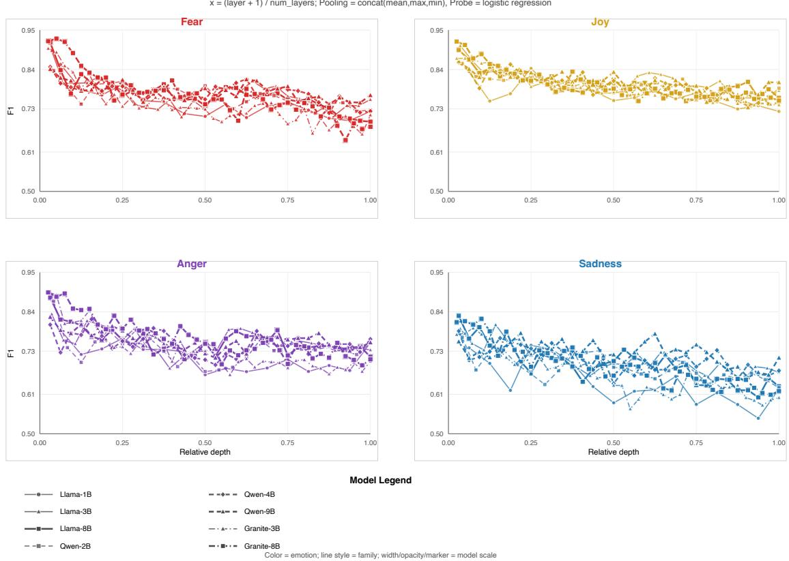  
Figure 8: Emotion dataset: emotion-specific layer-wise validation F1 over normalized depth.

<table><tr><td>Target / Source</td><td>Anger</td><td>Fear</td><td>Joy</td><td>Sad.</td><td>Mean</td></tr><tr><td>Anger</td><td></td><td> $- \ - 1 4 . 9 \ - 1 4 . 6 \ - 1 6 . 6 \ - 1 5 . 4$ </td><td></td><td></td><td></td></tr><tr><td>Fear</td><td>-17.0</td><td></td><td>-16.7</td><td>-16.8</td><td>-16.8</td></tr><tr><td>Joy</td><td>-11.2</td><td>-12.0</td><td></td><td>-16.1</td><td>-13.1</td></tr><tr><td>Sad.</td><td>-14.3</td><td>-16.4</td><td>-15.7</td><td></td><td>-15.5</td></tr><tr><td>Mean</td><td>-14.2</td><td>-14.5</td><td>-15.7</td><td>-16.5</td><td></td></tr></table>

Table 11: Offline cross-emotion transfer at $\alpha = 0 ,$ in accuracy points. Row is the target probe; column is the emotion used to select the perturbed source band.
<table><tr><td>Comparison</td><td>n</td><td>Mean ∆acc</td></tr><tr><td>Selected vs. full depth</td><td>256</td><td> $+ 6 . 9 ^ { * * * }$ </td></tr><tr><td>Selected vs. random</td><td>256</td><td> $+ 3 . 7 ^ { * * * }$ </td></tr><tr><td>Selected vs. low-sensitivity</td><td>256</td><td> $+ 8 . 2 ^ { * * * }$ </td></tr><tr><td>Selected vs. transfer</td><td>256</td><td> $+ 6 . 6 ^ { * * * }$ </td></tr><tr><td>Transfer vs. full depth</td><td>256</td><td>+0.3</td></tr></table>

Table 12: Early-exit aggregate effects in percentage points. Positive values mean the first condition is more accurate.

1. the probe-training dataset: target-trained versus source-trained logistic regression; and

2. the intervened band: the target dataset’s own band versus the same-emotion band selected on the source dataset.

<table><tr><td>Stratum</td><td>n</td><td>Selected vs. full depth</td></tr><tr><td>Emotion</td><td>128</td><td> $+ 1 1 . 3 ^ { * * * }$ </td></tr><tr><td>ISEAR</td><td>128</td><td> $+ 2 . 5 ^ { * * * }$ </td></tr><tr><td>Granite</td><td>64</td><td> $+ 8 . 8 ^ { * * * }$ </td></tr><tr><td>Llama</td><td>96</td><td> $+ 6 . 9 ^ { * * * }$ </td></tr><tr><td>Qwen</td><td>96</td><td> $+ 5 . 5 ^ { * * * }$ </td></tr></table>

Table 13: Early-exit selected-vs-full-depth gain by dataset and model family, in accuracy points.

<table><tr><td>Width</td><td>Selected vs. full depth 1</td><td>Selected vs. random</td></tr><tr><td>1</td><td> $+ 7 . 8 ^ { * * * }$ </td><td> $+ 4 . 5 ^ { * * * }$ </td></tr><tr><td>2</td><td> $+ 7 . 2 ^ { * * * }$ </td><td> $+ 3 . 8 ^ { * * * }$ </td></tr><tr><td>3</td><td> $+ 5 . 9 ^ { * * * }$ </td><td> $+ 2 . 7 ^ { * * * }$ </td></tr><tr><td>4</td><td> $+ 6 . 5 ^ { * * * }$ </td><td> $+ 3 . 6 ^ { * * * }$ </td></tr></table>

Table 14: Early-exit gains by band width, in accuracy points.

Both probes are evaluated on the target test set. The source-trained probe, including its StandardScaler, is fitted exclusively on the paired source dataset and applied to the target examples without refitting. We run the same $2 \times 2$ design for both the online forward intervention and the offline cached-feature intervention, covering eight models, both transfer directions (Emotion↔ISEAR), four emotions, four band widths, and three intervention strengths, for 768 matched settings per experiment.

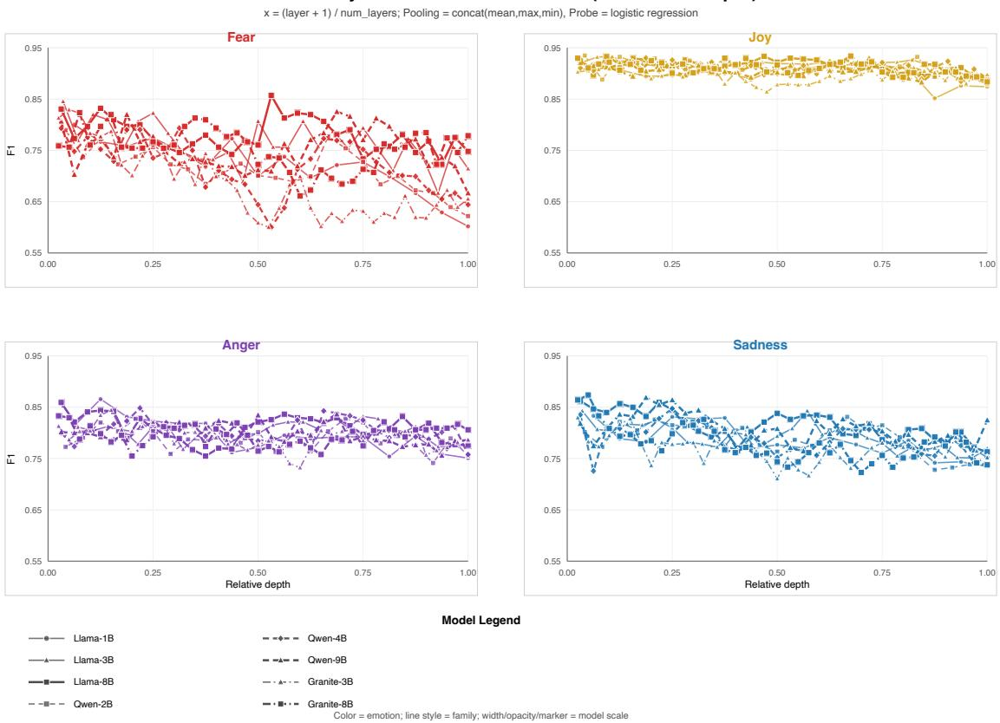  
Figure 9: GoEmotions: emotion-specific layer-wise validation F1 over normalized depth.

<table><tr><td>Baseline</td><td>n</td><td>Selected LLM exit gain</td></tr><tr><td>Frozen RoBERTa-base</td><td>256</td><td>+15.8***</td></tr><tr><td>Frozen DeBERTa-v3-base</td><td>256</td><td>+21.5***</td></tr></table>

Table 15: Frozen encoder baseline comparison under the same logistic-regression readout.

For probe $p \in \{ \mathrm { s o u r c e } , \mathrm { t a r g e t } \}$ , we define its within-probe band preference as

$$
D _ { p } = \operatorname { A c c } ( p , \operatorname { o w n } \operatorname { b a n d } ) - \operatorname { A c c } ( p , \operatorname { t r a n s f e r r e d } \operatorname { b a n d } )
$$

and the probe-by-band interaction as

$$
I = D _ { \mathrm { s o u r c e } } - D _ { \mathrm { t a r g e t } } .
$$

A nonzero interaction would indicate that the relative effect of the two bands depends on which dataset trained the readout.

The source-trained probes have lower unmodified target-test accuracy than the target-trained probes (approximately 71.9% versus 88.9% online, and 70.7% versus 88.9% offline), confirming a meaningful cross-dataset readout cost. Nevertheless, both own and transferred bands remain disruptive under the source-trained probe. More importantly, the own–transfer difference is small under both probes, and none of the probe-by-band interactions is retained by the model-clustered analysis.

These results separate two forms of transfer. Transferring the linear readout reduces absolute target-domain performance, showing that the complete decision boundary is not dataset invariant. In contrast, the relative similarity between own and transferred layer bands remains stable across probe ,choices. The main layer-transfer result is therefore not an artifact of keeping the target-trained logistic regression fixed. This supports partial sharing of emotion-sensitive layer locations while also indicating dataset-specific readout geometry.

Unrelated-band comparisons are computed only within a given probe. We do not use them for crossprobe interactions when the source- and targetprobe runs contain different randomly selected unrelated bands.

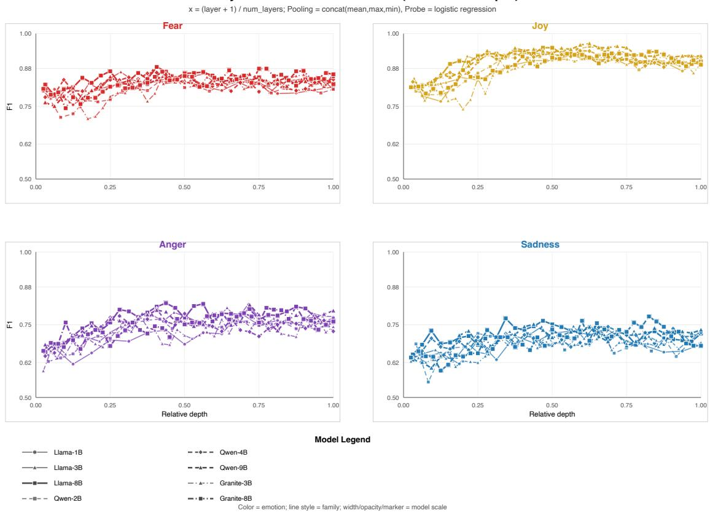  
Figure 10: ISEAR: emotion-specific layer-wise validation F1 over normalized depth.

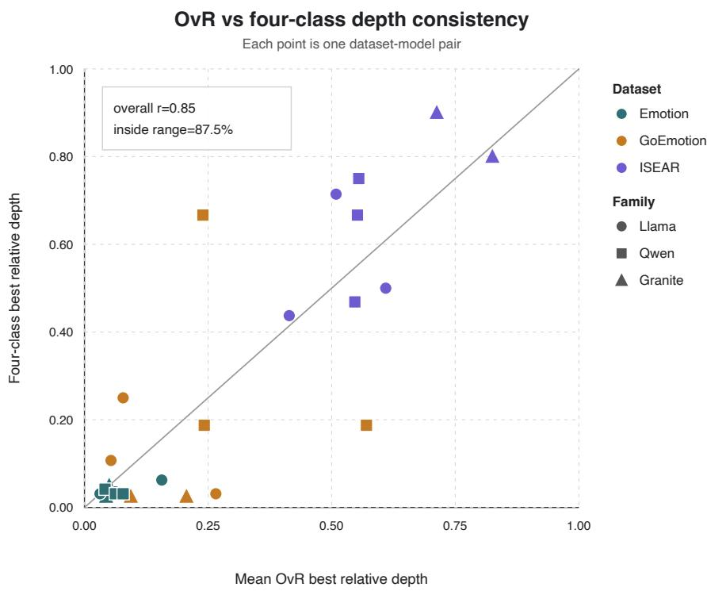  
Figure 11: Consistency between one-vs-rest and four-class layer-wise probes. Each point is a dataset–model pair.

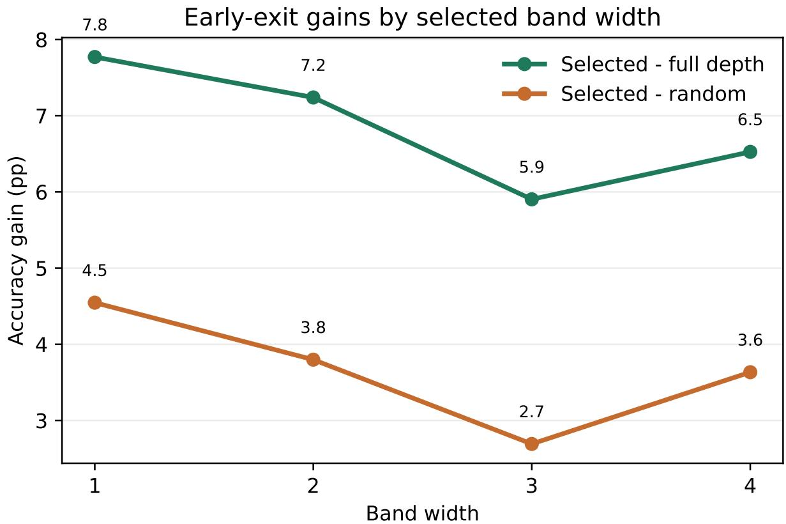  
Figure 12: Early-exit gains by band width. Selected bands outperform both full-depth and random controls at every width, with the largest gain at width 1.

<table><tr><td>Intervention</td><td>Metric</td><td>Probe</td><td>Own-Baseline</td><td>Transfer-Baseline</td><td>Own-Transfer</td></tr><tr><td rowspan="5">Online</td><td>Accuracy</td><td>Source</td><td>-16.31</td><td>-15.09</td><td>-1.22</td></tr><tr><td>Accuracy</td><td>Target</td><td>-26.59</td><td>-25.42</td><td>-1.16</td></tr><tr><td>F1</td><td>Source</td><td>-21.68</td><td>-22.07</td><td>+0.38</td></tr><tr><td>F1</td><td>Target</td><td>-35.44</td><td>-36.37</td><td>+0.92</td></tr><tr><td>Accuracy</td><td>Source</td><td>-6.79</td><td>-7.43</td><td>+0.64</td></tr><tr><td rowspan="4">Offline</td><td>Accuracy</td><td>Target</td><td>-12.12</td><td>-12.82</td><td>+0.71</td></tr><tr><td>F1</td><td>Source</td><td>-10.17</td><td>-9.76</td><td>-0.40</td></tr><tr><td>F1</td><td>Target</td><td>-14.34</td><td>-15.44</td><td>+1.11</td></tr><tr><td></td><td></td><td></td><td></td><td></td></tr></table>

Table 16: Joint probe–band transfer results, averaged over the 768 matched settings. Values are percentage-point differences. Within both source- and target-trained probes, own and transferred bands produce similar effects, although absolute disruption is larger under the target-trained probe.

<table><tr><td>Intervention / Metric</td><td>Interaction</td><td>Setting q</td><td>Model-cluster q</td></tr><tr><td>Online Accuracy</td><td>-0.06</td><td>.572</td><td>.992</td></tr><tr><td>Online F1</td><td>-0.54</td><td>.162</td><td>.844</td></tr><tr><td>Offline Accuracy</td><td>-0.07</td><td>.278</td><td>.977</td></tr><tr><td>Offline F1</td><td>-1.51</td><td>.019</td><td>.885</td></tr></table>

Table 17: Probe-by-band interactions in percentage points. Setting q values use BH-FDR-corrected sign tests over the prespecified setting grid; model-cluster q values use exact sign-flip tests over the eight model means. The offline F1 interaction appears under the setting-level analysis but is not retained after model clustering.