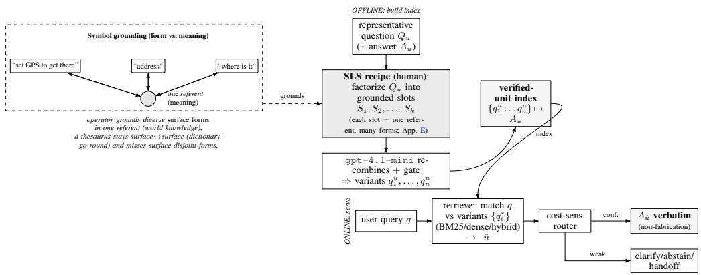

# Staged Linguistic Seeding: Grounded Query Expansion for Verified-Unit QA in AI Contact Centers

Hyeonseop Yoon   
OpenMined; MaumAI, Inc.   
Seoul, South Korea   
hyeonseopy@acm.org

Jeong-Eun Park\* Independent Researcher Seoul, South Korea 20181053@dongduk.ac.kr

## Abstract

Customer-service QA in an AI contact center (AICC) runs under deployment constraints that benchmark QA misses: tight voice-hotline latency and a high cost for unsupported or wrong automatic answers. We deploy a system that answers only from a closed set of verified QA units: it returns a retrieved unit verbatim, or routes to clarify/abstain/handoff. The index is enriched offline by staged linguistic seeding (SLS): a human authors a per-unit worldgrounded slot recipe, gpt-4.1-mini renders it into variants, and a light human gate filters them, one methodology reused across both domains, so inference stays a single retrieval pass with no query-time generation. On held-out query variants (in-distribution recipe reformulations) from two industrial domains, SLS is the dominant retrieval lever, lifting hybrid R@1 to 0.881/0.930 (+0.27/+0.34); the gain holds across all five retrievers we test. The win is the design, not the volume: at the same gpt-4.1-mini, SLS beats a budgetmatched doc2query by +0.20/+0.32, and a cross-provenance control provides additional evidence of transfer across generated-query distributions; the embedding choice is secondary. Verified-unit answering also removes free-form generation’s unsupported-content surface (7– 13% vs. ≈0%). We report this as an honest application study, including negative results.

## 1 Introduction

Large language models and retrieval-augmented generation (RAG) dominate standard QA benchmarks (Lewis et al., 2020). But a production AI contact center (AICC), long automated with virtual agents (Gilbert et al., 2005) and increasingly built on LLM agents (Choubey et al., 2025), imposes constraints those benchmarks never test, especially on a voice hotline. The cost of errors is asymmetric. A confident but unsupported answer to an already-frustrated caller is far more damaging than a clarifying question or a handoff to a human agent (Banerjee et al., 2023; Yu et al., 2020). Latency makes this harder. On a live voice line the budget is tight, so query-time generation (a per-call LLM round trip of roughly a second) is impractical. Our deployment goal is concrete: relieve human agents, not replace them, keeping a safe escape to a person without escalating every ambiguous case.

RAG is the default response, because it grounds answers in approved references. But grounding the retriever is not enough: as long as a freeform generator is licensed to emit text, it can overextend even correct evidence and assert unsupported claims (Niu et al., 2024). We measure this directly. Over the same retrieved evidence, free-form RAG answers are judged unsupported in 7–13% of cases (gpt-4o judge). This residual persists even on correct evidence, and we did not find it tunable to zero; removing generation from the serving path eliminates it by construction.

We built and deployed a verified-unit QA system that excludes generation entirely. It answers only from a closed set of human-verified QA units (each a representative question, a verified answer, and a unit identifier), returning a retrieved unit’s answer verbatim, or routing to clarify, abstain, or handoff. Nothing is generated at serve time, so unsupported answers are zero by construction. But removing the generator opens a new gap. Callers phrase one need in countless ways, while each unit ships with a single representative question. Without a querytime paraphraser, the full linguistic distance between user-query diversity and the curated answer set falls on retrieval. Our core contribution, Staged Linguistic Seeding (SLS), closes that gap offline. A human authors a per-unit, world-grounded slot recipe; gpt-4.1-mini renders it into candidate variants; a light human gate keeps or drops each one. The recipe injects domain knowledge, the LLM supplies surface variety, and the seeding axes and prompt are reused unchanged across both domains. Everything runs offline, so inference stays a single retrieval pass with zero added serving cost.

This is an application paper. We built a verified pipeline that addresses two production constraints (unpredictable generation and tight latency), and we give empirical evidence for why it works on two real anonymized enterprise domains, with the core gain (and a closed-set leakage pitfall) replicating on a public benchmark. Our contributions, ordered by impact, are:

1. A generation-free verified-unit pipeline in production use. We built a closed-set QA system, in production use at an AICC (≈74k requests, ≈89% contained), over two anonymized domains (AUTO, 90 units; ELEC, 229 units; 319 verified units and 7,947 query variants in total), evaluated with a unitattribution metric (gold unit id at R@1) on leakage-controlled held-out query variants (Rashkin et al., 2021); a faithfulness study quantifies the unsupported-content surface it removes (≈ 0% vs. 7–13% for free-form RAG on identical evidence).

2. SLS is the dominant retrieval lever, and we isolate why. Offline expansion lifts hybrid (BM25+BGE-M3) R@1 to 0.881 (ELEC) and 0.930 (AUTO), +0.27/+0.34 over a single representative question, and the gain holds across all five retrievers (Robertson and Zaragoza, 2009; Chen et al., 2024). A matched-budget control isolates the cause: with the same gpt-4.1-mini, SLS beats a budget-matched doc2query by +0.20/+0.32 and every automatic baseline (doc2query, HyDE, query2doc) by at least +0.20/+0.29 (Nogueira et al., 2019; Gao et al., 2022; Wang et al., 2023). The lever is the seeding design, not the model, the augmentation family, or the volume of text. Serving stays a single pass (∼14 ms hybrid vs. ∼1 s for query-time generation).

3. The mechanism is consistent with broader phrasing coverage. A cross-provenance control shows asymmetric transfer: the SLS index is 0.146 below doc2query on doc2query-heldout queries, whereas the doc2query index is 0.399 below SLS on SLS-held-out queries. Because the resulting index sizes differ, we treat this control as suggestive rather than volume-controlled. A symbol-grounding analysis sharpens this: 49% of held-out AUTO queries share zero content words with the canonical question, and SLS lifts that surfacedisjoint half by +0.59, the gain decaying monotonically to +0.01 as phrasings approach full overlap (Harnad, 1990).

4. External validity and honest negatives. Both protocol-level findings (the expansion gain and a closed-set self-retrieval leakage pitfall) replicate, in sign and more modestly, on the public Quora Question Pairs benchmark (Iyer et al., 2017; Lewis et al., 2021), beyond our in-house logs. The embedding choice is secondary: neither a larger Qwen3 (Zhang et al., 2025) nor a Korean-specialized fine-tune beats off-the-shelf BGE-M3. Finally, a class-balanced router on non-leaky retrieval-confidence features recovers the rare clarify/abstain/handoff actions (action macro-F1 0.36→0.51), but stays bounded by heuristic labels.

## 2 Related Work

Closed-set / FAQ retrieval. Answering from a fixed set of verified question–answer units is the FAQ-retrieval setting (Sakata et al., 2019; Mass et al., 2020); Mass et al. (2020) expand FAQ entries with generated questions. We add a unit-ID attribution metric, leakage-controlled held-out-query evaluation, and an explicit non-answer action space on real two-domain enterprise logs. Restricting the emitted answer to a closed, approved set (as in constrained generation over a fixed candidate set (De Cao et al., 2021) and verified-quote answering with abstention (Menick et al., 2022)) makes nonfabrication a property of the answer space, not the generator.

Grounded retrieval and attribution. Retrieval alone does not prevent unsupported claims (Lewis et al., 2020; Rashkin et al., 2021; Gao et al., 2023; Es et al., 2023; Saad-Falcon et al., 2023), and RAGTruth (Niu et al., 2024) documents hallucination even on correct context. We instantiate attribution-style evaluation (Rashkin et al., 2021) as unit-ID recovery and restrict the answer surface to verified units.

Query expansion and offline augmentation. doc2query, query2doc, and HyDE show that LLMgenerated text can improve retrieval, though unevenly and not on every retriever (Nogueira et al., 2019; Wang et al., 2023; Gao et al., 2022; Jagerman et al., 2023; Riabi et al., 2021). Following EnrichIndex (Chen et al., 2025), recent work (Ma et al., 2025; Su et al., 2025) moves this enrichment offline, atop a long classical query-expansion lineage (Rocchio, 1971; Lv and Zhai, 2010; Carpineto and Romano, 2012; Azad and Deepak, 2017; Bhogal et al., 2007; Massai, 2022). Our expansion (SLS, §5) is offline doc2query-style enrichment, but it is seeded by a world-grounded slot recipe under a reusable methodology rather than by singleshot model output, then gated by a light human check; such linguistically motivated, in-distribution augmentation can pay off, particularly in lowerresource settings (Groshan et al., 2025), and no generation happens at serving time.

Retriever families. The main retriever families (BM25, SPLADE, BGE-M3, and the dense Qwen3 (Robertson and Zaragoza, 2009; Formal et al., 2021; Chen et al., 2024; Karpukhin et al., 2020; Zhang et al., 2025)) span the lexical–semantic spectrum; we take one representative from each and compare them under a single verified-unit protocol.

Abstention and routing. Treating refusal and handoff as first-class actions is the premise of selective classification, refusal tuning, escalation, and cost-sensitive decision theory (Geifman and El-Yaniv, 2017; Zhang et al., 2024; Kirichenko et al., 2025; Yu et al., 2020; Banerjee et al., 2023; Elkan, 2001), whereas LLM routing and cascades instead target models (Ong et al., 2025; Chen et al., 2023). Our actions route the query out of the automatic system under asymmetric costs.

## 3 Problem Setup

Given a human query x, a verified QAunit index $\begin{array} { r l r } { T } & { { } = } & { \{ t _ { i } \} } \end{array}$ and optional metadata, the system chooses an action a ∈ {ANSWER, CLARIFY, ABSTAIN, HANDOFF}. When $a \ = \ \mathbf { \Gamma } _ { \mathbf { A N S W E R } }$ , it returns the answer of a selected unit $t _ { i } ,$ so that the retrieval target is the unit identifier rather than a generated string. Each unit is stored as $t _ { i } = ( \mathrm { u n i t . i d } , q _ { i } , y _ { i } )$ , where $q _ { i }$ is a representative question and yi a verified answer: the stored record is the implementation object, while the verified QA unit is the conceptual grounding boundary.

Why verified units bound the failure surface. Let $i ^ { \star }$ be the gold unit for query $x ,$ let $\begin{array} { r l } { \hat { \boldsymbol { \imath } } } & { { } = } \end{array}$ arg maxi score $( x , t _ { i } )$ be the retrieved top-1 unit, and let $\rho ~ = ~ \mathrm { P r } [ \mathit { \hat { \iota } } ~ \ne ~ \mathit { i } ^ { \star } ] ~ = ~ 1 - \mathrm { R } \mathsf { \mathsf { Q } } \mathrm { 1 }$ be the retrieval-error rate. Call an answer unsupported, $U ( a ) ~ = ~ 1$ , if it asserts content not present in the retrieved evidence $E ( x )$ . A free-form answer $a = g ( x , E ( x ) )$ from a generator $g$ can be unsupported even when the evidence is correct, at a rate $\eta = \mathrm { P r } [ U ( a ) \mid \hat { \imath } = i ^ { \star } ] > 0$ (documented by RAGTruth (Niu et al., 2024); we measure $\eta { \approx } 0 . 1 2$ in §6). Its unsupported rate is therefore

$$
\mathrm { P r } _ { \mathrm { f r e e } } [ U ] = \left( 1 - \rho \right) \eta + \rho \eta ^ { \prime } > 0 ,\tag{1}
$$

where $\eta ^ { \prime } > 0$ is the unsupported rate under wrong evidence. Verified-unit answering instead returns $a = y _ { \hat { \imath } }$ , the human-verified text of a retrieved unit, so the answer is always an element of the evidence and cannot introduce new claims:

$$
\begin{array} { r } { a \in \{ y _ { i } : t _ { i } \in E ( x ) \} \implies \operatorname* { P r } _ { \mathrm { o u r s } } [ U ] = 0 , } \\ { \operatorname* { P r } _ { \mathrm { o u r s } } [ \mathrm { e r r o r } ] = \rho . } \end{array}\tag{2}
$$

Comparing (1) and (2), the verified-unit design removes the open-ended generation-error term η and leaves a single measurable retrieval-error term $\rho ~ = ~ 1 - \mathbb { R } \mathbb { 2 } 1$ , on whose low-confidence part the router (§6) declines to answer. This is “nonfabrication by construction”: we eliminate not wrong answers (a wrong unit can be retrieved) but unsupported ones.

## 4 Data Construction

The project uses real enterprise QA logs from two anonymized deployments, AUTO (automotive) and ELEC (consumer-electronics). These are not benchmark pairs: rows include short turns, incomplete intent, domain shorthand, greetings, URL/image prompts, and many queries whose correct action is clarify, abstain, or handoff. From these real logs we derive two artifacts.

(a) Verified units with query-expansion variants (retrieval study). The core asset is a curated FAQ in which each verified unit carries a verified answer together with query variants produced by SLS (§5) and seeded from the representative question and the phrasings real users and operators recorded in the logs. Because the variants are an output of the protocol rather than hand-authored strings, their per-unit count in the full pre-split pool (5–113; indexed-only counts of 3–79 in App. D) tracks the question’s linguistic variability. This yields 319 verified units (229 ELEC, 90 AUTO) and 7,947 query variants, whose held-out portion forms our leakage-free test set of real-log-seeded variants (held-out protocol variants, not raw logged utterances). The protocol was applied to both domains; the explicit authoring recipe is retained for AUTO (App. E), while for ELEC, owing to data-retention constraints, only the deployed variants remain.

(b) Operational log with action labels (routing study). For routing we use a larger operational set of 6,000 clustered human queries with heuristic action labels (Table 6), built by cleaning and deduplicating raw logs, clustering similar questions, and assigning answerability/routing labels. Retrieval is therefore measured on the held-out variants from (a), and routing on the labeled log (b).

Data governance. Because the logs are enterprise data, we report only aggregate statistics, anonymized examples, and unit IDs; raw user text remains access-controlled. Privacy is part of the system boundary, not an appendix detail.

## 5 System

Verified-unit retrieval. Figure 1 overviews the system: offline index construction by staged linguistic seeding (a human operator grounds each unit’s representative question in world-grounded slots, which gpt-4.1-mini recombines into the indexed variants) and online verified-unit retrieval with cost-sensitive routing. We compare one retriever per family over the same verified QA units, spanning the lexical–semantic spectrum: BM25 (Robertson and Zaragoza, 2009) as the sparse baseline; the dense-only Qwen3 embedding (Zhang et al., 2025); and BGE-M3 (Chen et al., 2024) in between, a multi-functional encoder (dense, sparse, and multi-vector modes) of which we use the dense mode. The hybrid linearly combines per-query min–max-normalized BM25 and BGE-M3 scores at equal weight. For the dense component we use the official BGE-M3 checkpoint, more robust on this corpus than the available domain-adapted alternative (§6).

Offline query expansion: staged linguistic seeding (SLS). For each verified unit the index stores either the representative question (RAW) or that question plus expansion variants (AUG). The variants are produced offline by staged linguistic seeding (Figure 1), which separates what is reused from what is authored per unit. Reused across units and both domains are (i) seeding axes, a fixed specification of the linguistic and world-grounded forms to cover (synonyms, homonyms, syllable and lemma/stem forms, and the eojeol, the Korean space-delimited token)—together with a single fixed prompt conditioning gpt-4.1-mini (the same model the automatic baselines use) on those axes. Per unit, a human then authors a worldgrounded slot recipe that factorizes the representative question into grounded slots along these axes; (ii) gpt-4.1-mini renders it into candidate strings, which (iii) a light human gate keeps or drops against a fixed rubric. The durable asset is the recipe (from which the indexed variants are regenerable on demand), not the 7,947 output strings. SLS is thus doc2query-style (Nogueira et al., 2019) in structure; the lever is the human, world-grounded seeding distribution (§6), and inference stays a single retrieval pass.

Cost-sensitive routing (the policy we test). Retrieval alone is insufficient when a query is incomplete, unsupported, or risky, so we add a cost-sensitive decision over non-leaky retrievalconfidence features (per-family top/top-2 scores, margins, cross-family agreement), selecting the expected-cost-minimizing action under a cost matrix where a wrong answer costs far more than a clarification (a threshold gate is the one-scalar special case). We estimate it with a classbalanced gradient-boosted classifier and report it as a bounded secondary study (§6, App. B).

## 6 Experiments

Metrics and protocol. The primary metric is unit recall at rank 1 (R@1) against each variant’s gold source unit (gold unit id); we also report R@3 and R@15. For the retrieval study, for each verified unit we randomly hold out 30% of its query variants as test queries that are never indexed, and index the remaining variants (AUG) or only the single representative question (RAW). Because the test phrasing is never in the index, the protocol is leakage-free at the string level. This yields 1,468 held-out ELEC and 915 held-out AUTO test queries over the 319 units. Because held-out and indexed variants are drawn from the same per-unit pool, the test is in-distribution (Lewis et al., 2021): it measures generalization to unseen phrasings of each unit’s recipe, not transfer to an independent query stream (on AUTO, 49% of held-out queries share no content word with the representative question). A cross-provenance control provides suggestive evidence that the gains are not solely due to this provenance match. A fully independent organic test is unavailable by construction: raw call transcripts are not retained, and operational logs carry routing-action labels rather than unit-level gold, since most organic queries do not map to a single verified unit (Table 6, 59% non-answer).

  
Figure 1: System overview. Offline, a human operator factorizes each verified unit’s representative question $Q _ { u }$ into world-grounded slots—symbol grounding: diverse surface forms tied to one referent, a link a thesaurus cannot make (it stays surface↔surface)—and gpt-4.1-mini recombines the slots into the indexed variants $q _ { 1 } ^ { u } \dots q _ { n } ^ { u }$ . Online, a user query q is matched against the variants (not the canonical question), and a cost-sensitive router returns the verified answer verbatim or escalates. The grounded variants bridge the gap between curated canonical questions and the surface-disjoint ways real users phrase the same intent (§7).

A leakage check. Querying a unit with its own indexed representative question trivially inflates R@1 (up to ≈ 8× for BM25); our held-out-variant protocol avoids this by construction; no test phrasing is ever indexed (audit in App. A).

Staged linguistic seeding is the dominant lever. Table 1 reports R@1 on the held-out query variants (App. F traces these back to the per-domain data statistics). Across both domains and all retrievers, offline SLS expansion is the dominant gain: the hybrid rises from 0.609 → 0.881 on ELEC (+0.272) and 0.588 → 0.930 on AUTO (+0.342); BM25 gains most (+0.351/+0.426), and the gain holds across the full lexical–semantic spectrum (SPLADE +0.219/+0.253, Qwen3 +0.135/+0.168, dense +0.123/+0.202). The best configuration is hybrid+expansion (0.881/0.930), with R@3 0.973/0.981. Every gain is significant by a paired bootstrap (10k resamples, n=1,468/915): hybrid +0.272 (95% CI [+0.247, +0.297]) $/ + 0 . 3 4 2 [ + 0 . 3 0 9 , + 0 . 3 7 5 ]$ BM25 +0.351 [+0.324, +0.378] / +0.426 [+0.392, +0.461]; dense +0.123 [+0.101, +0.144] / +0.202 [+0.175, +0.231]. No interval includes zero. Because queries from one unit are not independent, we also report a cluster (per-unit) bootstrap that resamples whole units rather than queries: intervals widen, as expected, but every gain remains significant, and the smallest-domain headline —AUTO hybrid +0.342—survives even at its 90 units (cluster 95% CI [+0.291, +0.390]).

<table><tr><td></td><td colspan="3">Elec</td><td colspan="3">Auto</td></tr><tr><td>Retriever</td><td>RAW</td><td>+AUG</td><td>∆</td><td>RAW</td><td>+AUG</td><td>∆</td></tr><tr><td>BM25 (lexical)</td><td>0.471</td><td>0.822</td><td>+0.351</td><td>0.480</td><td>0.906</td><td>+0.426</td></tr><tr><td>SPLADE-ko (learned sparse)</td><td>0.627</td><td>0.846</td><td>+0.219</td><td>0.640</td><td>0.893</td><td>+0.253</td></tr><tr><td>Dense BGE-M3 (official)</td><td>0.717</td><td>0.840</td><td>+0.123</td><td>0.661</td><td>0.863</td><td>+0.202</td></tr><tr><td>Dense Qwen3-4B</td><td>0.690</td><td>0.825</td><td>+0.135</td><td>0.674</td><td>0.842</td><td>+0.168</td></tr><tr><td>Dense (fine-tuned, ours)</td><td>0.623</td><td>0.779</td><td>+0.156</td><td>0.591</td><td>0.814</td><td>+0.223</td></tr><tr><td>Hybrid (BM25+BGE-M3)</td><td>0.609</td><td>0.881</td><td>+0.272</td><td>0.588</td><td>0.930</td><td>+0.342</td></tr></table>

Table 1: R@1 on held-out query variants (Elec n=1,468, Auto n=915; 319 units), across the lexical– semantic spectrum: lexical BM25, learned-sparse SPLADE, dense BGE-M3 and Qwen3-4B, and the lexical+semantic hybrid. RAW indexes one representative question per unit; +AUG additionally indexes the unit’s deployed SLS variants. Offline SLS expansion is the dominant lever in every family (hybrid +0.272/+0.342; BM25 +0.351/+0.426; SPLADE +0.219/+0.253; Qwen3 +0.135/+0.168), and the hybrid is best. A larger Qwen3-4B and our own finetuned checkpoint (dragonkue/BGE-m3-ko further fine-tuned on NEMOTRON-PERSONAS-KOREA persona pairs) do not exceed the official BGE-M3, and the finetuned one trails it throughout, despite starting from a Korean-specialized base (Appendix G). Test phrasings are never indexed, so the setting is leakage-free.

The embedding choice is secondary to the expansion. Down the RAW columns, dense (0.66– 0.72) beats BM25 (0.47–0.48): the low RAW recall is expected: the representative question is an expert-prepared canonical form that real phrasings rarely match lexically (the form–meaning gap, §7), and a semantic retriever only partly bridges it. With expansion, BM25 catches up (0.82–0.91) and the hybrid is best, so which embedding one picks becomes secondary to the expansion. Across the spectrum the off-the-shelf official BGE-M3 is strongest: a larger Qwen3-4B does not exceed it (AUG 0.825/0.842 vs. 0.840/0.863), and a Koreanspecialized fine-tune (App. G) underperforms it in every cell. This is not a training failure but evidence for the protocol: neither a larger model nor extra generic in-domain data closes the gap that grounded expansion does; the gap is coverage of unseen phrasings, not embedding capacity.

The lever is the seeding design, not the volume: a matched-budget control. A natural objection is that any generated expansion would help, or that our gain merely buys more effort per unit. We test both with an offline-vs-online comparison on the same held-out queries (Table 2): SLS vs. of fline automatic expansion (doc2query (Nogueira et al., 2019), EnrichIndex (Chen et al., 2025)) and query-time online augmentation (HyDE (Gao et al., 2022), query2doc (Wang et al., 2023)), all of them generated by the same gpt-4.1-mini that SLS uses (prompts in App. H). SLS dominates every automatic method by a wide margin: hybrid R@1 0.881/0.930 vs. the best automatic baseline 0.685/0.639, a +0.20/+0.29 gap, at zero querytime generation cost. The decisive evidence is the matched-budget control: when the automatic baseline generates the same number of questions per unit as SLS (“doc2query N-matched”; Table 2); i.e. the same generator at the same perunit budget, it reaches only 0.685/0.611, only +0.001/+0.038 above the 6-shot version and far below SLS (matched gap +0.196 [+0.162, +0.230] / +0.319 [+0.240, +0.398], per-unit cluster bootstrap). The gain is therefore not bought by indexing more text: with the generator and budget fixed, the only difference is how the variants are seeded: the world-grounded recipe, not the model, the augmentation family, or the volume. (This also retires an earlier “reverse-HyDE” patch whose apparent +0.023 gain was a leakage artifact.)

Cross-provenance control: asymmetric transfer across generated-query distributions. Because the held-out queries are themselves SLS variants, the matched-budget gap could reflect index–test provenance match (a recognized inflation source (Lewis et al., 2021)), not coverage. We probe this with a cross-provenance control on AUTO (answerin-index). After holding out doc2query variants for testing, the resulting index sizes differ (16.4 doc2query vs. 23.5 SLS variants/unit), so this comparison does not remove index-volume as a possible contributor: on doc2query’s own held-out queries the SLS index reaches 0.652, within 0.146 of doc2query’s own index (0.798); but on SLS’s held-out queries the doc2query index reaches only 0.531, 0.399 below SLS’s 0.930 (hybrid R@1; the asymmetry is robust across BM25/dense). The home-field advantage is thus strongly asymmetric: SLS transfers to doc2query’s distribution better than the reverse. This is consistent with broader phrasing coverage, but the unequal index sizes mean the control is suggestive rather than a causal isolation of provenance or volume.

<table><tr><td>Augmentation</td><td>side</td><td>Query-time generation?</td><td>Elec</td><td>Auto</td></tr><tr><td>none (RAW)</td><td></td><td>no</td><td>0.609</td><td>0.588</td></tr><tr><td>doc2query (6-shot)</td><td>offline</td><td>no</td><td>0.647</td><td>0.610</td></tr><tr><td>doc2query (N-matched)</td><td>offline</td><td>no</td><td>0.685</td><td>0.611</td></tr><tr><td>EnrichIndex</td><td>offline</td><td>no</td><td>0.662</td><td>0.616</td></tr><tr><td>HyDE</td><td>online</td><td>yes</td><td>0.650</td><td>0.576</td></tr><tr><td>query2doc</td><td>online</td><td>yes</td><td>0.663</td><td>0.639</td></tr><tr><td>ŠLS (ours)</td><td>offline</td><td>no</td><td>0.881</td><td>0.930</td></tr></table>

Table 2: Offline-vs-online augmentation comparison, hybrid R@1 on the same held-out query variants (319 units). All methods, including SLS, use the same gpt-4.1-mini. Automatic expansions lift RAW only modestly; the matched-budget control (“doc2query N-matched”—the same generator producing the same number of questions per unit as SLS) reaches only 0.685/0.611, at most +0.038 above the 6-shot version. SLS (staged linguistic seeding) dominates by +0.20/+0.29 over the best automatic baseline (online or offline), at zero query-time generation cost. With the generator and the per-unit budget held fixed, the gap is attributable to the seeded recipe, not the model or the volume of generated text.

Offline expansion adds no serving cost. Because the variants are attached at index time, serving is a single retrieval pass: on one NVIDIA H100 (Intel Xeon 8480C for BM25), median retrieval latency is 0.7/13/14 ms for BM25/dense BGE-M3/hybrid, whereas query-time HyDE/query2doc add a gpt-4.1-mini call at 1.0–1.4 s, two orders of magnitude more.

External validity. Because our data is proprietary, we replicate both protocol-level findings on the public Quora Question Pairs set (Iyer et al., 2017): the leakage pitfall reappears and the expansion gain replicates on lexical/hybrid retrieval but dilutes on a near-ceiling dense baseline (numbers in App. C).

<table><tr><td>Answering arm (same correct evidence, n=136)</td><td>Unsupported</td><td>Covers gold</td></tr><tr><td>Free-form RAG (gpt-4o-mini)</td><td>7.4%</td><td>74.3%</td></tr><tr><td>Free-form RAG (gpt-4.1-mini)</td><td>13.2%</td><td>80.9%</td></tr><tr><td>Verified-unit (ours)</td><td>0.7%†</td><td>81.6%</td></tr></table>

Table 3: Faithfulness on the correct-retrieval subset (n=136): two free-form generators vs. verified-unit answering over the same top-5 evidence (a single gpt-4o judge scoring unsupported-content and gold-coverage). Verified-unit is unsupported-free by construction (†0.7% is one residual judge-noise flag on verbatim text). Paired McNemar on unsupported: $p { = } 0 . 0 1 2 / 7 . 6 { \times } 1 0 ^ { - 5 }$

Routing: a bounded secondary result. Weak-evidence queries should be routed (clarify/abstain/handoff) rather than answered. A class-balanced gradient-boosted classifier on non-leaky retrieval-confidence features lifts action macro-F1 from 0.36 to 0.51 (0.45 using retrieval features only, avoiding circularity) and recovers the rare abstain/handoff actions; but the deployable signal is the binary selective-answering slice, the four-way result is bounded by heuristic, genuinely subjective labels (κ≤0.09 on re-annotation by a question-only gpt-5 and a human) and by features that indicate whether but not why to escalate. We thus report routing as a bounded secondary study; full numbers, the cost–coverage curve, and Table 5 are in App. B.

Does verified-unit answering reduce hallucination? We compare two answering arms on 150 answerable queries given the same top-5 retrieved units: free-form RAG (a generator writes the answer) vs. verified-unit answering (return the top-1 unit’s answer verbatim), judged by an independent gpt-4o for unsupported claims and gold coverage. On the correct-retrieval subset (n=136), free-form introduces unsupported content in 7.4% (4o-mini)–13.2% (4.1-mini) of answers, whereas verified-unit answering is unsupported-free by construction (a residual 0.7% is one judge-noise flag on verbatim text; Table 3). This reduction is significant (paired McNemar p=0.012, $7 . 6 { \times } 1 0 ^ { - 5 } )$ , and because gold coverage is comparable (81.6% vs. 74.3%/80.9%), the gain comes from eliminating the unsupportedgeneration surface rather than from coverage. As noted, the judge is LLM-based with no human adjudication (§8).

## 7 Discussion

Why human-authored expansion outperforms learned query generation. A learned query generator (doc2query) or a thesaurus operates over surface form: the distributional co-occurrence captured by word statistics (Firth, 1957). But many real reformulations are not lexical variants: the AUTO query “how do I set my GPS to get there?” requests a dealership’s address yet shares no content word with “where is the showroom?” (Figure 1). The link is world knowledge (a navigation destination is an address), so recovering it means passing through the referent, which a lexical resource cannot do. This is a gap between surface form and meaning (an instance of symbol grounding, Harnad, 1990).

Our protocol supplies this grounding by construction (Figure 1): an operator factorizes the representative question into orthogonal worldgrounded slots (explicit for AUTO, App. E; for ELEC only the deployed variants survive), and the language model recombines these grounded units, sampling within the operator-defined manifold rather than guessing it, unlike free-form generation, which crowds near the seed or drifts offtarget.

This account predicts where the gain should land. On AUTO, 49% of held-out queries share zero content words with their unit’s representative question, so a surface match to that canonical form cannot reach them (BM25 R@1 0.28 on this disjoint half). Indexing the staged-seeding variants lifts exactly this half from 0.28 to 0.87 (+0.59); the gain then falls monotonically with surface overlap: +0.34 for partially-overlapping queries (n=378) and +0.01 for the fully-overlapping ones already near ceiling (n=91). The gain thus concentrates on the surfacedisjoint, world-knowledge-dependent reformulations the account predicts, and the matched-budget and matched-budget control (§6) show that automatic expansion at the same model and budget does not recover them; the cross-provenance result provides complementary, but index-size-confounded, evidence of asymmetric transfer. We are careful about causality: this shows a lexical resource cannot reproduce the expansion, not that a human beats an LLM generator (which also has world knowledge), the active ingredient is the world-grounded recipe, not the language-model call that renders it.

## 8 Limitations

Our faithfulness judge (§6) is LLM-based with no human adjudication, so the absolute unsupported rate is judge- and generator-dependent (7– 17%); the relative reduction, significant on correctretrieval cases, is the robust finding. The retrieval study covers only 319 verified units (AUTO just 90), so we report per-query and cluster bootstrap CIs. Our retrieval/faithfulness study is offline, without controlled A/B, and latency is a single-query microbenchmark. The routing result rests on heuristic, subjective labels $( \kappa { \le } 0 . 0 9$ on re-annotation) and features that bound per-action scores, so we present the four-way router as forward-looking and report only the binary answer-vs-escalate slice as deployable. We have not yet run a gate-only ablation (steps (i)–(ii) without the step-(iii) gate) to separate the human gate from the seeding design, nor quantified human authoring effort; the recipe is a one-offoffline asset that should amortize against the recurring cost of a wrong answer, but a precise cost– benefit accounting and scaling to far larger FAQ sets remain future work. The ELEC recipe was not retained, so recipe-level analysis (§7) is AUTOonly, though expansion was applied to both domains and gains hold across both; raw logs remain access-controlled. Most fundamentally, the worldgrounded recipe is presently human-authored; automatically inducing this factorization is the central open problem, and until then operator authoring is what bridges the curated-question/real-user gap.

## 9 Ethics

The data come from enterprise logs; we report only aggregated statistics, anonymized examples, and unit IDs, and keep raw logs access-controlled. The method is not a truth guarantee (a wrong retrieved unit can still produce a wrong response), so deployments should log unit IDs, confidence, and action decisions for audit.

## 10 Conclusion

We presented a verified-unit QA pipeline for AI contact centers: answers are bounded to verified units; weak-evidence cases are routed, not fabricated. Its lever is staged linguistic seeding that lifts hybrid R@1 to 0.881/0.930 (+0.27/+0.34) across two domains; the matched-budget control attributes the main gain to the seeding design, while crossprovenance evaluation shows suggestive asymmetric transfer; verified-unit answering removes the

unsupported-generation surface (≈ 0 vs. 7–13%).   
Inducing the recipe automatically remains open.

## Acknowledgments

We thank Dong-su Kim, Chief of MaumAI’s AICC Division, and Won-Chang Shin, Technical Leader, for their encouragement and support throughout this work.

## References

Hiteshwar Kumar Azad and Akshay Deepak. 2017. Query expansion techniques for information retrieval: A survey. arXiv preprint arXiv:1708.00247.

Debayan Banerjee, Mathis Poser, Christina Wiethof, Varun Shankar Subramanian, Richard Paucar, Eva A. C. Bittner, and Chris Biemann. 2023. A system for human-AI collaboration for online customer support. arXiv preprint arXiv:2301.12158.

Jagdev Bhogal, Alan MacFarlane, and Peter Smith. 2007. A review of ontology based query expansion. Information Processing & Management, 43(4):866– 886.

Claudio Carpineto and Giovanni Romano. 2012. A survey of automatic query expansion in information retrieval. ACM Computing Surveys, 44(1):1–50.

Jianlv Chen, Shitao Xiao, Peitian Zhang, Kun Luo, Defu Lian, and Zheng Liu. 2024. BGE M3-Embedding: Multi-lingual, multi-functionality, multi-granularity text embeddings through self-knowledge distillation. arXiv preprint arXiv:2402.03216.

Lingjiao Chen, Matei Zaharia, and James Zou. 2023. FrugalGPT: How to use large language models while reducing cost and improving performance. arXiv preprint arXiv:2305.05176.

Peter Baile Chen, Tomer Wolfson, Michael Cafarella, and Dan Roth. 2025. EnrichIndex: Using LLMs to enrich retrieval indices offline. arXiv preprint arXiv:2504.03598.

Prafulla Kumar Choubey, Xiangyu Peng, Shilpa Bhagavath, Caiming Xiong, Shiva Kumar Pentyala, and Chien-Sheng Wu. 2025. Turning conversations into workflows: A framework to extract and evaluate dialog workflows for service AI agents. arXiv preprint arXiv:2502.17321.

Nicola De Cao, Gautier Izacard, Sebastian Riedel, and Fabio Petroni. 2021. Autoregressive entity retrieval. In International Conference on Learning Representations (ICLR).

dragonkue. 2024. BGE-m3-ko: a Korean-adapted BGE-M3 retrieval model. Hugging Face model, a Korean-adapted BGE-M3 continued-trained on undisclosed Korean data. https://huggingface. co/dragonkue/BGE-m3-ko.

Charles Elkan. 2001. The foundations of cost-sensitive learning. In Proceedings ofthe Seventeenth International Joint Conference on Artificial Intelligence.

Shahul Es, Jithin James, Luis Espinosa-Anke, and Steven Schockaert. 2023. RAGAS: Automated evaluation of retrieval augmented generation. arXiv preprint arXiv:2309.15217.

John R. Firth. 1957. A synopsis of linguistic theory, 1930–1955. In Studies in Linguistic Analysis, pages 1–32. Blackwell.

Thibault Formal, Benjamin Piwowarski, and Stephane Clinchant. 2021. SPLADE: Sparse lexical and expansion model for first stage ranking. In Proceedings ofthe 44th International ACM SIGIR Conference on Research and Development in Information Retrieval.

Luyu Gao, Xueguang Ma, Jimmy Lin, and Jamie Callan. 2022. Precise zero-shot dense retrieval without relevance labels. arXiv preprint arXiv:2212.10496.

Tianyu Gao, Howard Yen, Jiatong Yu, and Danqi Chen. 2023. Enabling large language models to generate text with citations. arXiv preprint arXiv:2305.14627.

Yonatan Geifman and Ran El-Yaniv. 2017. Selective classification for deep neural networks. In Advances in Neural Information Processing Systems.

M. Gilbert, J. G. Wilpon, and B. Stern. 2005. Intelligent virtual agents for contact center automation. IEEE Signal Processing Magazine.

Ray Groshan, Michael Ginn, and Alexis Palmer. 2025. Is linguistically-motivated data augmentation worth it? In Proceedings of the 63rd Annual Meeting of the Associationfor Computational Linguistics.

Stevan Harnad. 1990. The symbol grounding problem. Physica D: Nonlinear Phenomena, 42(1–3):335–346.

Shankar Iyer, Nikhil Dandekar, and Kornel Csernai.´ 2017. First Quora dataset release: Question pairs. https://quoradata.quora.com/ First-Quora-Dataset-Release-Questio

Rolf Jagerman, Honglei Zhuang, Zhen Qin, and Michael Bendersky. 2023. Query expansion by prompting large language models. arXiv preprint arXiv:2305.03653.

Vladimir Karpukhin, Barlas Oguz, Sewon Min, Patrick Lewis, Ledell Wu, Sergey Edunov, Danqi Chen, and Wen-tau Yih. 2020. Dense passage retrieval for opendomain question answering. In Proceedings of the 2020 Conference on Empirical Methods in Natural Language Processing.

Polina Kirichenko, Mark Ibrahim, Kamalika Chaudhuri, and Samuel J. Bell. 2025. Abstentionbench: Reasoning LLMs fail on unanswerable questions. arXiv preprint arXiv:2506.09038.

Patrick Lewis, Ethan Perez, Aleksandra Piktus, Fabio Petroni, Vladimir Karpukhin, Naman Goyal, Heinrich Kuttler, Mike Lewis, Wen-tau Yih, Tim Rocktaschel, Sebastian Riedel, and Douwe Kiela. 2020. Retrieval-augmented generation for knowledgeintensive NLP tasks. In Advances in Neural Information Processing Systems.

Patrick Lewis, Pontus Stenetorp, and Sebastian Riedel. 2021. Question and answer test-train overlap in opendomain question answering datasets. In Proceedings of the 16th Conference of the European Chapter of the Associationfor Computational Linguistics: Main Volume, pages 1000–1008. Association for Computational Linguistics.

Yuanhua Lv and ChengXiang Zhai. 2010. Positional relevance model for pseudo-relevance feedback. In Proceedings of the 33rd International ACM SIGIR Conference on Research and Development in Information Retrieval, pages 579–586.

Xueguang Ma, Xi Victoria Lin, Barlas Oguz, Jimmy Lin, Wen-tau Yih, and Xilun Chen. 2025. DRAMA: Diverse augmentation from large language models to smaller dense retrievers. arXiv preprint arXiv:2502.18460.

Yosi Mass, Boaz Carmeli, Haggai Roitman, and David Konopnicki. 2020. Unsupervised FAQ retrieval with question generation and BERT. In Proceedings of the 58th Annual Meeting of the Association for Computational Linguistics.

Lorenzo Massai. 2022. Evaluation of semantic relations impact in query expansion-based retrieval systems. arXiv preprint arXiv:2203.16230.

Jacob Menick, Maja Trebacz, Vladimir Mikulik, John Aslanides, Francis Song, Martin Chadwick, Mia Glaese, Susannah Young, Lucy Campbell-Gillingham, Geoffrey Irving, and Nat McAleese. 2022. Teaching language models to support answers with verified quotes. arXiv preprint arXiv:2203.11147.

Cheng Niu, Yuanhao Wu, Juno Zhu, Siliang Xu, Pa KaShun Shum, Randy Zhong, Juntong Song, and Tong Zhang. 2024. RAGTruth: A hallucination corpus for developing trustworthy retrieval-augmented language models. In Proceedings of the 62nd Annual Meeting ofthe Associationfor Computational Linguistics.

Rodrigo Nogueira, Wei Yang, Jimmy Lin, and Kyunghyun Cho. 2019. Document expansion by query prediction. arXiv preprint arXiv:1904.08375.

NVIDIA. 2025. Nemotron-Personas-Korea: synthetic Korean personas. Hugging Face dataset. https://huggingface.co/datasets/ nvidia/Nemotron-Personas-Korea.

Isaac Ong, Amjad Almahairi, Vincent Wu, Wei-Lin Chiang, Tianhao Wu, Joseph E. Gonzalez, M. Waleed Kadous, and Ion Stoica. 2025. RouteLLM: Learning

to route LLMs with preference data. In International Conference on Learning Representations.

Hannah Rashkin, Vitaly Nikolaev, Matthew Lamm, Lora Aroyo, Michael Collins, Dipanjan Das, Slav Petrov, Gaurav Singh Tomar, Iulia Turc, and David Reitter. 2021. Measuring attribution in natural language generation models. arXiv preprint arXiv:2112.12870.

Arij Riabi, Thomas Scialom, Rachel Keraron, Benoˆıt Sagot, Djame Seddah, and Jacopo Staiano. 2021.´ Synthetic data augmentation for zero-shot crosslingual question answering. In Proceedings of the 2021 Conference on Empirical Methods in Natural Language Processing, pages 7016–7030.

Stephen Robertson and Hugo Zaragoza. 2009. The probabilistic relevance framework: BM25 and beyond. Foundations and Trends in Information Retrieval, 3(4):333–389.

Joseph Rocchio. 1971. Relevance feedback in information retrieval. In The SMART Retrieval System, pages 313–323.

Jon Saad-Falcon, Omar Khattab, Christopher Potts, and Matei Zaharia. 2023. ARES: An automated evaluation framework for retrieval-augmented generation systems. arXiv preprint arXiv:2311.09476.

Wataru Sakata, Tomohide Shibata, Ribeka Tanaka, and Sadao Kurohashi. 2019. FAQ retrieval using queryquestion similarity and BERT-based query-answer relevance. In Proceedings ofthe 42nd International ACM SIGIR Conference on Research and Development in Information Retrieval.

Weihang Su, Yichen Tang, Qingyao Ai, Junxi Yan, Changyue Wang, Hongning Wang, Ziyi Ye, Yujia Zhou, and Yiqun Liu. 2025. Parametric retrieval augmented generation. arXiv preprint arXiv:2501.15915.

Liang Wang, Nan Yang, and Furu Wei. 2023. Query2doc: Query expansion with large language models. arXiv preprint arXiv:2303.07678.

Shi Yu, Yuxin Chen, and Hussain Zaidi. 2020. A financial service chatbot based on deep bidirectional transformers. arXiv preprint arXiv:2003.04987.

Hanning Zhang, Shizhe Diao, Yong Lin, Yi R. Fung, Qing Lian, Xingyao Wang, Yangyi Chen, Heng Ji, and Tong Zhang. 2024. R-Tuning: Instructing large language models to say ‘i don’t know’. In Proceedings ofthe 2024 Conference ofthe North American Chapter of the Association for Computational Linguistics.

Yanzhao Zhang, Mingxin Li, Dingkun Long, Xin Zhang, Huan Lin, Baosong Yang, Pengjun Xie, An Yang, Dayiheng Liu, Junyang Lin, Fei Huang, and Jingren Zhou. 2025. Qwen3 Embedding: Advancing text embedding and reranking through foundation models. arXiv preprint arXiv:2506.05176.

<table><tr><td>R@1 (6,000 log queries)</td><td>BM25</td><td>Dense</td><td>Hybrid</td></tr><tr><td>Leaky (question-bearing index)</td><td>0.863</td><td>0.570</td><td>0.873</td></tr><tr><td>Honest (answer-only index)</td><td>0.103</td><td>0.222</td><td>0.160</td></tr></table>

Table 4: Answer-only leakage audit on one consistent run over the 6,000 clustered operational-log queries (distinct from the 319 verified units). Indexing the representative question and querying with it (“leaky”) vs. indexing the answer only (“honest”). Inflation is up to ≈8× for BM25 and 2.6–5.5× across families; the headline result (Table 1) instead uses held-out query variants, which never appear in the index.

## A The Question-Identity Leakage Audit

An earlier indexing protocol of ours was leaky. Indexing each unit as “question: ⟨representative question⟩; answer: ⟨answer⟩” (the question and answer fields are Korean in the deployment) and then querying with that same representative question makes retrieval match a query to its own indexed copy. On the full set of 6,000 clustered operational-log queries, the leaky questionbearing index scores BM25/dense/hybrid R@1 0.863/0.570/0.873, but only 0.103/0.222/0.160 once the question field is removed, an inflation of roughly 8× for BM25 and 2.6–5.5× across families (Table 4). Closed-set FAQ evaluations in which test queries coincide with indexed representative questions should be read with this inflation in mind; our held-out-variant protocol avoids it because the test phrasing is never in the index.

## B Routing: Full Results

We treat routing as a cost-sensitive decision over the non-leaky evidence vector z (per-family top and top-2 scores, margins, ratios, cross-family top-unit agreement). A class-balanced gradientboosted classifier reaches macro-F1 0.51 (5-fold 0.487±0.027) and recovers the rare actions (abstain/handoff F1 0.41/0.39, up from 0.13/0.17 for a Gaussian naive-Bayes baseline on the same features; Table 5); using retrieval features only (to avoid circularity with the surface cues that define the heuristic labels), it still reaches 0.45.

Cost–coverage. Under an asymmetric cost matrix (we adopt the illustrative ratio that a wrong auto-answer costs 20× a clarification) and honest retrieval (answer-only hit@1≈0.13), the expected-cost-minimizing policy is conservative: it auto-answers < 1% of queries at a 0% unsafeanswer rate (mean cost 1.10 vs. 16.5 for alwaysanswer). Ranking answerable queries by predicted retrieval-correctness, the top 10% are answerable at precision 0.65 (vs. a 0.13 base rate), falling to 0.34 at 30% and 0.24 at 50% coverage.

<table><tr><td>F1 by action</td><td>answer</td><td>clarify</td><td>abstain</td><td>handoff</td><td>macro-F1</td></tr><tr><td>Gaussian NB (same features)</td><td>0.61</td><td>0.51</td><td>0.13</td><td>0.17</td><td>0.36</td></tr><tr><td>Balanced GBM, retrieval-only</td><td>0.62</td><td>0.54</td><td>0.28</td><td>0.38</td><td>0.45</td></tr><tr><td>Balanced GBM, all features</td><td>0.66</td><td>0.58</td><td>0.41</td><td>0.39</td><td>0.51</td></tr></table>

Table 5: Action routing on the operational log (test n=1,200; non-leaky multi-family retrieval features). Class-balanced gradient boosting lifts macro-F1 from 0.36 (Gaussian NB on the same features) to 0.51 (all features) / 0.45 (retrieval-only, the circularity-free number) and recovers the rare ABSTAIN/HANDOFF actions.
<table><tr><td>Action label</td><td>Auto</td><td>Elec</td><td>Total</td><td>Share</td></tr><tr><td>answer</td><td>1,533</td><td>922</td><td>2,455</td><td>40.9%</td></tr><tr><td>non-answer subtotal</td><td>2,067</td><td>1,478</td><td>3,545</td><td>59.1%</td></tr><tr><td>clarify</td><td>1,497</td><td>857</td><td>2,354</td><td>39.2%</td></tr><tr><td>handoff</td><td>446</td><td>578</td><td>1,024</td><td>17.1%</td></tr><tr><td>abstain</td><td>124</td><td>43</td><td>167</td><td>2.8%</td></tr><tr><td>Total human queries</td><td>3,600</td><td>2,400</td><td>6,000</td><td>100.0%</td></tr></table>

Table 6: Operational routing log with 6,000 human queries across two domains. Labels are heuristic routing labels derived from rule-based buckets over answer content, not human-adjudicated gold labels. Non-answer actions account for 59.1% of the log, and abstain is rare (2.8%), which makes rare-action recovery central to the routing analysis (§6).

Two ceilings. (i) The action labels are heuristic, not adjudicated: on a 300-query sample, a question-only gpt-5 and a human re-annotation barely agree with them (κ=0.06/0.04) or with each other (κ=0.09), and skew in opposite directions, so the four-way boundary is genuinely subjective. (ii) Retrieval-confidence features separate ANSWER from escalate but carry little signal for why to escalate, bounding four-way F1 independent of label quality. The defensible result is therefore the binary selective-answering slice; the four-way router, with human-adjudicated labels and intent-bearing features, is left to future work.

## C External Validity: Quora Question Pairs

Because our enterprise data is proprietary, we replicate both protocol-level findings on Quora Question Pairs (Iyer et al., 2017) (800 clusters as “units”, 1,470 held-out paraphrases, with each cluster’s other phrasings serving as the expansion). The leakage pitfall reappears: an indexed phrasing gives R@1 1.000 versus 0.81–0.94 on held-out paraphrases, and the expansion effect carries over to lexical and hybrid retrieval (BM25 +0.124, hybrid +0.053; cluster-bootstrap significant), while a near-ceiling dense retriever on this clean set dilutes slightly (−0.026). Expansion helps most where single-representative matching is weakest, exactly as on our enterprise logs. This QQP study is the fully public, reproducible portion of our work; we will release its replication code and derived data, together with our pipeline code and the fine-tuned checkpoint, upon acceptance. The release pins the exact dated snapshot identifier and decoding parameters for every OpenAI call (gpt-4.1-mini for SLS rendering and the automatic baselines; gpt-4o and gpt-4o-mini for judging), so the SLS variants and judge labels regenerate deterministically.

Verified answer: “⟨dealership⟩ is located at   
⟨address⟩.” (anonymized)   
Seeding axes (step i): location-noun synonyms   
(region / location / address / lot-number), inflec  
tional and honorific endings, and spacing (eojeol)   
segmentation of the representative question—the   
fixed seed specification handed to the generator.   
Accepted variants (steps ii–iii, sample): “Where   
are you located?”; “Can you tell me the address?”;   
“What is the lot number?”; “How can I find the   
location?”—each realizing one or more of the   
step-(i) seed axes in the original Korean.   
Held-out test queries (never indexed): “Please   
tell me the location.”; “What is the address of the   
showroom?”; “Where is it located?”

## D Dataset Statistics

Table 7 reports per-domain statistics for asset (a), the verified units and their indexed queryexpansion variants. Lengths are measured on the original Korean text (characters; and eojeols, the space-delimited tokens of Korean).

Production deployment. The system is in live production on both domains: AUTO since early 2025 (∼18 months) and ELEC since mid 2025 (∼12 months). Over these windows it has served 24,126 AUTO requests (excluding reservationmanagement transactions) and 50,172 ELEC requests, routing 3,423 and 4,724 respectively to a human agent: a containment (no-handoff) rate of 85.8% and 90.6% (89.0% combined, over 74,298 requests). Containment is a deflection measure, not a correctness guarantee (non-handoff may include user abandonment), and we report no controlled before/after.

<table><tr><td></td><td>AUTO</td><td>ELEC</td></tr><tr><td>Verified units</td><td>90</td><td>229</td></tr><tr><td>Held-out test queries</td><td>915</td><td>1,468</td></tr><tr><td>Indexed variants</td><td>2,114</td><td>3,450</td></tr><tr><td>Indexed variants / unit (mean; min-max)</td><td>23.5 (6–79)</td><td>15.1 (3–41)</td></tr><tr><td>Answer length (chars; mean, max)</td><td>80, 193</td><td>137,903</td></tr><tr><td>Rep. question length (chars; mean)</td><td>19</td><td>21</td></tr><tr><td>Variant length (eojeols; mean)</td><td>5.1</td><td>5.5</td></tr></table>

Table 7: Per-domain statistics of the verified-unit corpus (asset (a)). AUTO has more variants per unit and shorter, more templated answers; ELEC has more units and much longer answers (up to 903 characters).

## E An Example Verified Unit

The example below is from AUTO, anonymized and translated from Korean. It traces one representative question through staged linguistic seeding: the seeding axes that step (i) applies, a sample of the step (ii) generations that the step (iii) acceptance gate kept in the index, and the held-out test queries (never indexed) the system is evaluated on.

Representative question: “What region are you in?”

## F How the Data Explains the Results

The statistics in Appendix D and the example in Appendix E account for the main retrieval findings. First, a representative question is short (mean 19–21 characters) and fixes a single surface form, whereas held-out queries restate the same intent with different content words and inflections; singlerepresentative matching (RAW) therefore misses most of them, and the 15–24 indexed variants per unit close exactly this gap. This is why AUG lifts R@1 so sharply, and why the purely lexical BM25 gains the most (it keys directly on the added word forms). Second, AUTO reaches a higher AUG R@1 (0.930) than ELEC (0.881): it has more variants per unit (23.5 vs. 15.1), fewer units (90 vs. 229), and shorter, more templated answers (mean 80 vs. 137 characters), so its units are more densely covered and more separable. Third, ELEC answers are much longer (mean 137, max 903 characters), giving a free-form generator more room to add unsupported detail; verbatim verified-unit answering returns the exact text and stays unsupported-free, consistent with the faithfulness result (§6).

## G Domain-Adapted Checkpoint: Training Details and Korean Competence

The “Dense (fine-tuned, ours)” row in Table 1 is our own checkpoint, reported as a negative result. We deliberately did not start from the vanilla official model: the base is dragonkue/BGE-m3-ko (dragonkue, 2024), the official BAAI/bge-m3 continued-trained on additional, undisclosed Korean data. This base is Korean-specialized and is documented to improve over the official model on Korean retrieval—its model card reports +0.09 nDCG on a Korean (financial) AutoRAG benchmark over the official checkpoint (with a smaller −0.02 on MIRACL-Wikipedia, i.e. a domain-specific Korean gain). On top of it we fine-tune with the sentence-transformers MultipleNegativesRankingLoss

(in-batch-negative contrastive) on (query, positive-document) pairs built from NEMOTRON-PERSONAS-KOREA (NVIDIA, 2025): 4×H100, 3 epochs, per-device batch size 8 with gradient accumulation 4, learning rate 2×10−5, warmup ratio 0.1, weight decay 0.01, bf16. The resulting checkpoint is itself a competent Korean retriever (AutoRAG MRR 0.78, Hit@10 0.95; MIRACL mRR 0.58), so its underperformance on our closed-unit customer-service units (Table 1) is a genuine domain-transfer failure, not a weak-model artifact: starting from a strong Korean base and adding persona fine-tuning still does not beat the off-the-shelf official BGE-M3 with offline SLS expansion. The checkpoint will be released upon acceptance.

## H Baseline Generation Prompts

Every automatic expansion baseline in Table 2 uses the same gpt-4.1-mini as SLS, is written natively in Korean, and is given contact-center framing matched to the task; the Korean originals ship with our code release. English glosses:

• doc2query (index-side, from the answer): “Given a contact-center FAQ answer, generate six Korean questions a real customer might ask to obtain this answer; output JSON only.” Conditioned on the unit’s answer (first 1,200 characters). “N-matched” uses the identical prompt with the per-unit count raised to match SLS.

• EnrichIndex (index-side, enriched passage): “Expand the given FAQ answer so it is easier to retrieve: include key terms, synonyms, expressions users might use, and related subtopics, in one 2–4 sentence paragraph; do not invent new facts—ground it in the answer.”

• HyDE (query-side, hypothetical answer): “For the following customer question, write a hypothetical short Korean answer (1–2 sentences) a contact center might give.”

• query2doc (query-side, expanded query): “Expand the following customer question to aid retrieval by appending related expressions and key terms of the same intent, in 2–3 sentences.”

Because every baseline is Korean-native and contact-center-framed under the same generator, the SLS advantage in Table 2 is not an artifact of prompt language or domain framing.