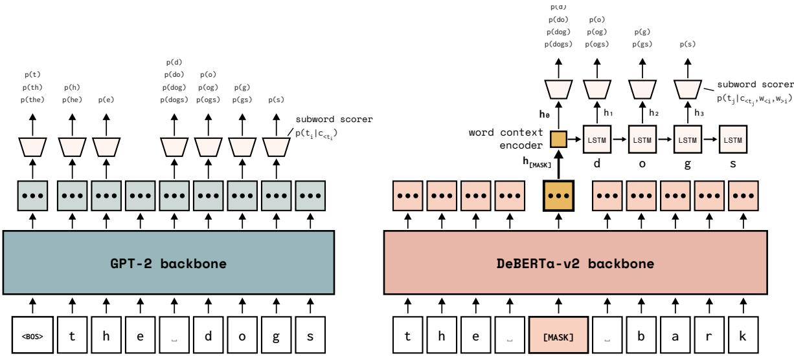
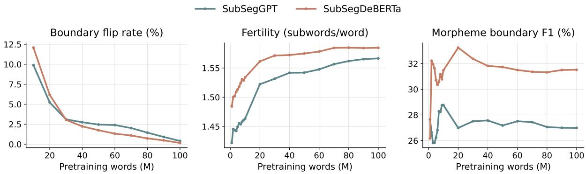
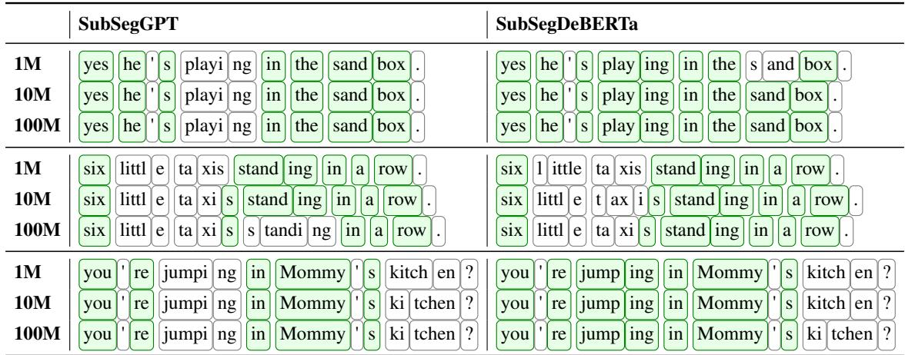

# Subword Segmental BabyLMs: Learning to Tokenise for Sample-Efficient Pretraining

Francois Meyer Department of Computer Science University of Cape Town francois.meyer@uct.ac.za

## Abstract

In the standard LM training pipeline, subword tokenisation is applied as a preprocessing step. Subword segmental language modelling is an alternative paradigm in which tokenisation is learned during training, allowing the model to discover subword units that optimise its training objective. In this paper, we present our submission to the 2026 BabyLM Challenge, for which we develop two new subword segmental LMs: SubSegGPT and SubSegDe-BERTa. SubSegGPT is a decoder-only model that learns tokenisation during autoregressive pretraining. SubSegDeBERTa is an encoderbased model that jointly learns to generate and tokenise masked words. We train both for the STRICT and STRICT-SMALL tracks. Our top submission to STRICT is SubSegDeBERTa, which achieves notable gains in zero-shot evaluation. Our top submission to STRICT-SMALL is SubSegGPT, which outperforms tokenisationbased baselines. Our results show that learnable subword tokenisation can improve sampleefficiency for BabyLM pretraining. We analyse the subword learning dynamics of our models and find that tokenisation gradually converges on subword units that balance morphological alignment and fine-grained segmentation.

## 1 Introduction

Current language model (LM) training is developmentally implausible in many ways, one of which is its reliance on subword tokenisation. The subwords produced by standard tokenisers do not reliably align with morpheme boundaries (Batsuren et al., 2024). Moreover, the dominant paradigm of applying a fixed tokeniser during preprocessing does not mirror child language learning, as humans are not born pre-equipped with a fixed lexical vocabulary. Instead, children incrementally learn to segment speech into meaningful units during language acquisition (Jusczyk, 1999).

From a more practical, performance-driven perspective, standard NLP tokenisation poses problems for data-efficient modelling. The algorithms behind tokenisers like BPE (Sennrich et al., 2016) and ULM (Kudo, 2018) learn subword boundaries based on frequency-based objectives, with no guarantee that the resulting units are optimal for LM learnability. Given sufficient training data, neural LMs are robust to sub-optimal tokenisation. However, in small data settings, this may further compound the difficulty of learning generalisable linguistic representations.

By restricting tokenisation to preprocessing, LMs are bound to a pre-determined tokenisation scheme. Alternatively, tokenisation can be cast as a learnable component of language modelling, to be continually optimised during training. This is the motivation behind subword segmental modelling (Meyer and Buys, 2022), which unifies tokenisation and language modelling in an end-to-end trainable framework. Instead of determining subword boundaries before training, subword segmental modelling marginalises over all possible tokenisations of a sentence and allows the model to learn which subword units optimise its LM training objective.

In this paper, we present our submission1 to the 2026 BabyLM Challenge, for which we develop2 two new Subword Segmental LMs: SubSegGPT and SubSegDeBERTa. SubSegGPT is a decoderonly subword segmental architecture with a GPT-2 (Radford et al., 2019) backbone. It combines subword segmental modelling with more modern, GPTstyle conventions in decoder LM design and implementation. SubSegDeBERTa is a novel, encoderbased architecture and the first instantiation of subword segmental modelling for masked language modelling. It jointly learns to generate and tokenise masked words during training, conditioned on bidirectional context from a DeBERTa-v2 backbone (He et al., 2021).

  
Figure 1: The architectures of SubSegGPT (left) and SubSegDeBERTa (right). Both encode character-level context, which is passed to a subword segment scorer to condition next-subword probabilities. Subword probabilities are passed to a dynamic programming algorithm that marginalises over all possible tokenisations.

We train our models for the STRICT (100M words) and STRICT-SMALL (10M words) tracks and evaluate on the official evaluation pipeline, which includes zero-shot evaluations, finetuning tasks, and human likeness tests. We compare our models to equivalent tokenisation-based BabyLM baselines, based on respectively GPT-2 and DeBERTa-v2, to isolate the effect of learning tokenisation over fixed tokenisation.

In the STRICT track, SubSegDeBERTa and Sub-SegGPT outperform tokenisation-based baselines on average across NLP tasks. SubSegDeBERTa is our strongest submission to STRICT, improving average zero-shot performance by 3.16 points over GPT-2. In STRICT-SMALL, SubSegGPT outperforms baselines, but SubSegDeBERTa does not. Our two models are complementary: SubSegDe-BERTa is highly competitive in the STRICT track, while SubSegGPT is better suited to the more data-constrained STRICT-SMALL setting. On human likeness tasks, our models exhibit little resemblance to human language acquisition and are outperformed by tokenisation-based baselines.

Lastly, we analyse the subword learning dynamics of SubSegGPT and SubSegDeBERTa. We compare learned subword units over the course of training, tracking fertility and morpheme boundary F1. Both models undergo an initial period of rapid tokenisation change, followed by stabilised learning trajectories that converge on higher fertility (shorter subwords) and limited alignment with morpheme boundaries, which we support with a qualitative analysis of tokenised child-directed speech.

## 2 Background

## 2.1 Learning Tokenisation During Training

Without being motivated by developmental plausibility, several works have explored learning to segment language inputs during training, for tasks such as handwriting recognition (Kong et al., 2016), speech recognition (Wang et al., 2017), and translation (Kreutzer and Sokolov, 2018). These efforts equip models with the ability to discover optimal segmentation units for a given task, rather than relying on a pre-determined segmentation scheme.

Sun and Deng (2018) propose the segmental language model (SLM): an LSTM LM that computes the likelihood of a sentence by marginalising over all possible segmentations of the character sequence. Their aim is not improved performance, but rather unsupervised word segmentation for Chinese, which lacks explicit word boundaries. Kawakami et al. (2019) augment the SLM with a lexicon of high-frequency segments, improving unsupervised word segmentation. Downey et al. (2022) propose the masked SLM, a bi-directional, transformer-based SLM that outperforms recurrent SLMs on unsupervised word discovery. SLMs are trained on raw character sequences without word boundaries (whitespaces) and, as a by-product of optimising the LM training objective, they partially recover word-level segmentation.

Meyer and Buys (2022) propose the subword segmental language model (SSLM), which adapts the SLM to model subword tokenisation. SSLM assumes access to word boundaries, constrains segments to subword units (they cannot cross word boundaries), and learns subword tokenisation to optimise the LM training objective. The original SSLM (Meyer and Buys, 2022) is LSTM-based (Hochreiter and Schmidhuber, 1997). Meyer and Buys (2025) propose a transformer (Vaswani et al., 2017) SSLM, primarily as a tool to study subword learning dynamics. For both models, evaluation is limited to the Nguni languages: low-resource, agglutinative languages, for which tokenisation was hypothesised to have an outsized impact. SSLM outperformed tokenisation-based LMs on perplexity and sequence-to-sequence tasks, and performed strongly as an unsupervised morpheme segmenter.

It is unknown whether learnable subword tokenisation can improve pretraining sample-efficiency beyond the narrow linguistic scope of previous work. The BabyLM Challenge provides the ideal setting to test this. We propose two new SSLM variants, SubSegGPT and SubSegDeBERTa, which incorporate learnable subword tokenisation into modern, BabyLM-style architectures. Understanding our models requires familiarity with the subword segmental framework, so in the next subsection we provide a technical overview of SSLM.

## 2.2 Subword Segmental Language Modelling

SSLM (Meyer and Buys, 2022) establishes a framework for learning tokenisation during training. Any LM architecture can be adapted to the framework, removing its reliance on a fixed tokeniser. The key idea is that tokenisation is cast as a latent variable, inferred jointly with model parameters to optimise the LM objective. Adapting a model for subword segmental modelling requires augmenting its architecture with additional subnetworks, which we describe for our models in Section 3, and adopting the training algorithm of Meyer and Buys (2022), which we now summarise.

For a training sequence S, SSLM still minimises the standard LM loss $\mathcal { L } ( \theta ) = - \log p ( S )$ . However, whereas a vanilla LM computes $p ( S )$ with the chain rule over a single pre-determined subword token sequence, SSLM computes $p ( S )$ as

$$
p ( S ) = \sum _ { T \in \pi ( S ) } p ( T ) ,\tag{1}
$$

where $\pi ( S )$ is the set of all candidate tokenisations of S: every possible way that the sequence of words S can be segmented into subword units (word boundaries are enforced, so subword units cannot span across whitespaces). Each $p ( T )$ is still computed with the chain rule over the token sequence $T$ , but the overall sequence probability $p ( S )$ now incorporates multiple potential tokenisations of the training example $S .$

Marginalising over $\pi ( S )$ is intractable for long sequences, so SSLM introduces two constraints:

1. Subword segments cannot exceed a maximum character length $L ,$ which is a hyperparameter.

2. In computing the probability of a candidate tokenisation $T = \{ t _ { 1 } , t _ { 2 } , . . . , t _ { | T | } \}$ with the chain rule, each next-token probability is conditioned on the untokenised autoregressive (preceding) character-level context, so

$$
p ( T ) = \prod _ { i = 1 } ^ { | T | } p ( t _ { i } | t _ { < i } ) \approx \prod _ { i = 1 } ^ { | T | } p ( t _ { i } | c _ { < t _ { i } } ) ,\tag{2}
$$

where $c _ { < t _ { i } }$ is the character sequence in S that precedes $t _ { i } .$ . This approximation discards tokenisation history, but enables tractable conditioning via a character-level context encoder.

Finally, to compute Equation 1 efficiently, Meyer and Buys (2022) use a dynamic programming algorithm that iteratively computes $p ( S _ { 1 : k } )$ , the marginal probability of the sequence up to each character position k, for $k = 1 , . . . , | S |$ (we refer the reader to Meyer and Buys (2022) for a detailed presentation of the algorithm).

## 3 Models

The modelling assumptions and training algorithm outlined above describe the generative model of the subword segmental framework. Parameterising this with a neural architecture requires a model capable of computing $p ( t _ { i } | c _ { < t _ { i } } )$ for any subword token $t _ { i }$ and a mechanism for conditioning this probability on the character-level context $c _ { < t _ { i } }$ . A vanilla LM cannot assign probabilities to arbitrary subwords, so Meyer and Buys (2022) augment the standard autoregressive architecture to enable this. Their methodology can be followed to adapt any architecture for subword segmental modelling. Doing so requires building an architecture with two components: an encoder that computes representations for a character-level context c and a subword segment scorer that computes $p ( t | c )$ for any subword t.

In this section, we present SubSegGPT and Sub-SegDeBERTa, two new SSLMs that adapt respectively GPT-2 (Radford et al., 2019) and DeBERTav2 (He et al., 2021) for learnable subword tokenisation. Their architectures are visualised in Figure 1.

## 3.1 SubSegGPT

SubSegGPT is a decoder-only SSLM with a GPT-2 backbone. It is a straightforward adaptation of the original, LSTM-based SSLM (Meyer and Buys, 2022) to GPT-style language modelling and makes use of the same training algorithm outlined in Section 2.2. We now describe its architecture, which closely mirrors the transformer-based SSLM of Meyer and Buys (2025), but is parameterised by the GPT-2 architecture to incorporate more recent architectural conventions and match the setup of competitive decoder-based BabyLMs.

## 3.1.1 Character-level history encoder

To compute $p ( t _ { i } | c _ { < t _ { i } } )$ we need to encode $c _ { < t _ { i } }$ , the full character sequence preceding the subword segment t . We encode $c _ { < t _ { i } }$ with a character-level GPT-2 backbone (excluding the language modelling head), using the final-layer output embedding $\mathbf { h } _ { < t _ { i } }$ of the last character before $t _ { i }$ to represent the sequence history and to condition next-subword probabilities $p ( t _ { i } | \mathbf { h } _ { < t _ { i } } )$

## 3.1.2 Subword segment scorer

We follow previous SSLMs in computing $p ( t _ { i } | c _ { < t _ { i } } )$ as a mixture of two subword probabilities,

$$
\begin{array} { r } { p ( t _ { i } | c _ { < t _ { i } } ) = \lambda p _ { \mathrm { l e x } } ( t _ { i } | c _ { < t _ { i } } ) + \qquad } \\ { ( 1 - \lambda ) p _ { \mathrm { c h a r } } ( t _ { i } | c _ { < t _ { i } } ) , } \end{array}\tag{3}
$$

where $\lambda \in ( 0 , 1 )$ is a mixture coefficient, dynamically computed for each subword with a sigmoidactivated linear projection of $\mathbf { h } _ { < t _ { i } }$

$p _ { \mathrm { l e x } } ( t _ { i } | c _ { < t _ { i } } )$ is a language modelling head that maps $\mathbf { h } _ { < t _ { i } }$ to a probability distribution over a fixed subword lexicon containing the V most frequent subwords in the training corpus (the lexicon size V is a pre-specified hyperparameter). $p _ { \mathrm { c h a r } } ( t _ { i } | c _ { < t _ { i } } )$ is a small decoder subnetwork, parameterised by a 1-layer character-level LSTM,3 that generates subword segment $t _ { i }$ one character at a time and computes the subword probability as a chain rule product of individual character probabilities. It is conditioned on the sequence history by initialising the LSTM hidden state as $\mathbf { h } _ { < t _ { i } }$

The lexicon layer $p _ { \mathrm { l e x } }$ and character decoder pchar play complementary roles in next-subword prediction. $p _ { \mathrm { l e x } }$ directly computes probabilities of frequent subwords, such as common morphemes and words, but cannot handle infrequent, out-oflexicon segments. By contrast, $p _ { \mathrm { c h a r } }$ can assign probabilities to arbitrary subword segments by composing them character by character, covering rare and previously unseen subwords. The mixture gate λ learns to balance their contributions dynamically, based on the character-level context h ${ < } t _ { i }$

The mixture-based subword segment scorer enables SubSegGPT to compute $p ( t _ { i } | c _ { < t _ { i } } )$ for any candidate subword segment $t _ { i }$ at any position in a training sequence. These probabilities (top of Figure 1) are passed to the dynamic programming algorithm of Section 2.2, which efficiently computes the marginal (Equation 1) via the probabilities of all candidate tokenisations (Equation 2). SubSegGPT is trained end-to-end by minimising the negative log-likelihood, jointly optimising autoregressive language modelling and subword tokenisation.

## 3.2 SubSegDeBERTa

We propose SubSegDeBERTa, an encoder-based, masked SSLM with a DeBERTa-v2 backbone. Meyer and Buys (2022) introduce subword segmental modelling for decoder-only LMs. Their framework is inherently autoregressive, so its extension to masked language modelling is non-trivial. In SubSegDeBERTa, we develop the first masked SSLM, incorporating learnable subword tokenisation into encoder-based pretraining. We encode bi-directional character-level context with a DeBERTa-v2 backbone, randomly mask a subset of input words, and jointly learn to generate and tokenise masked words into subword units.

## 3.2.1 Character-level context encoder

We randomly mask a fixed proportion of words in each training sequence. We define words as whitespace-delimited character sequences and restrict subword segments to span within word boundaries. If a word is sampled for masking, we replace its entire character sequence with a single [MASK] token (as shown in Figure 1 for the masked word “dogs”). Our bi-directional encoder is a characterlevel DeBERTa-v2 architecture that produces finallayer output embeddings for all characters, including [MASK] tokens.

## 3.2.2 Masked word scorer

In vanilla MLMs, the final-layer representation h[MASK] is used to predict the masked token. In Sub-SegDeBERTa, the masked word is not predicted as a single token. Instead, we generate masked words subword segmentally i.e. by marginalising over all possible subword tokenisations of a masked word.

Suppose we mask the $i ^ { \mathrm { t h } }$ word in a sentence, denoted by $w _ { i }$ and consisting of characters $c _ { 1 } , c _ { 2 } , . . . , c _ { | w _ { i } | }$ . During training, we maximise

$$
p ( w _ { i } | w _ { < i } , w _ { > i } ) = \sum _ { T \in \pi ( w _ { i } ) } p ( T | w _ { < i } , w _ { > i } ) ,\tag{4}
$$

where $\pi ( w _ { i } )$ is the set of all candidate tokenisations of $w _ { i }$ , and word probabilities are conditioned on bi-directional context (all words to the left $w _ { < i }$ and right $w _ { > i }$ of the target word). The probability of each tokenisation $T = \{ t _ { 1 } , t _ { 2 } , . . . , t _ { | T | } \}$ is computed with the chain rule as

$$
p ( T | w _ { < i } , w _ { > i } ) = \prod _ { j = 1 } ^ { | T | } p ( t _ { j } | c _ { < t _ { j } } , w _ { < i } , w _ { > i } ) ,\tag{5}
$$

so this component of SubSegDeBERTa is autoregressive: masked word generation is conditioned on bi-directional context beyond the word $( w _ { < i } , w _ { > i } )$ , but within the word it is conditioned on left-to-right context $( c _ { < t _ { j } }$ is the character sequence preceding subword segment $t _ { j }$ within word $w _ { i } )$

To compute the marginal of Equation 4 efficiently, we use the same dynamic programming algorithm discussed in Section 2.2 and introduce the same simplifying assumptions: we limit the length of $t _ { j }$ to a pre-specified maximum number of characters and condition on untokenised character-level context, although here the context is bi-directional (Section 3.2.1). To compute the subword probability $p ( t _ { j } | c _ { < t _ { j } } , w _ { < i } , w _ { > i } )$ , we use the same mixture model as SubSegGPT (Section 3.1.2). However, the masked LM setting introduces a complication that requires additional subnetworks.

The GPT-2 backbone of SubSegGPT outputs contextual representations for each character in an input sequence. These representations are passed to the subword segment scorer and are used to condition next-subword probabilities at any position in the character sequence (including subword segments that start mid-word, such as “gs” in “dogs”, on the left of Figure 1). The DeBERTa backbone of SubSegDeBERTa outputs contextual representations for all characters in a sequence except masked words, whose characters are replaced by a single [MASK] token. h[MASK] encodes the bidirectional context $( w _ { < i } , w _ { > i } )$ , but provides only a single representation per masked word. To score subword segments at each position within $w _ { i }$ , we additionally need per-position representations that encode the autoregressive within-word history $c _ { < t _ { j } }$

To address this, we introduce a word context encoder to encode the context at every character in word $w _ { i }$ (its role is visualised in Figure 1). This is a 1-layer character-level LSTM that processes the target word’s characters $c _ { 1 } , c _ { 2 } , . . . , c _ { | w _ { i } | }$ left-toright, conditioned on $\mathbf { h } _ { \mathsf { [ M A S K ] } }$ in two ways: we initialise its hidden state as a learned projection of h[MASK] and concatenate h[MASK] to input character embeddings at every step. This produces a sequence of per-position context representations $\mathbf h _ { k } \ = \ \mathrm { L S T M } ( c _ { k } , \mathbf h _ { [ \mathsf { M A S K } ] } )$ , that encode the bidirectional context $( w _ { < i } , w _ { > i } )$ via $\mathbf { h } _ { \mathsf { [ M A S K ] } }$ and the within-word history $( c _ { < t _ { j } } )$ via LSTM recurrence. This provides a contextual representation $\mathbf { h } _ { k }$ for every character position in $w _ { i }$ , which is used to condition $p ( t _ { j } | c _ { < t _ { j } } , w _ { < i } , w _ { > i } )$ for any subword segment $t _ { j }$ in $w _ { i } .$ , as shown for all possible subwords in the word $\mathrm { \ " { d o g s } } ^ { \mathrm { , * } }$ , on the right of Figure 1.

To compute these probabilities, we use the same mixture model as the SubSegGPT subword segment scorer (Equation 3), with $\mathbf { h } _ { k }$ passed as conditioning context, instead of $\mathbf { h } _ { < t _ { i } }$ . The dynamic programming algorithm of Section 2.2 computes the masked word marginal (Equation 4) via the probabilities of all candidate tokenisations (Equation 5). SubSegDeBERTa is trained end-to-end by minimising the negative log-likelihood of masked words, jointly optimising masked language modelling and subword tokenisation.

## 4 Experimental Setup

## 4.1 Pretraining

We follow the guidelines of the 2026 BabyLM Challenge (Choshen et al., 2026) to pretrain Sub-SegGPT and SubSegDeBERTa for STRICT and STRICT-SMALL. We use the text-only datasets released by the organisers and pretrain for 10 epochs.

To test the impact of learnable tokenisation, we compare our models to fixed-tokenisation BabyLMs based on the corresponding backbone architectures and trained on the same data. For Sub-SegGPT, we use the GPT-2 (Radford et al., 2019) baselines released by the BabyLM Challenge organisers. For SubSegDeBERTa, we pretrain our own

<table><tr><td>Track</td><td>Model</td><td>BLiMP</td><td>BLiMP Sup.</td><td>EWoK</td><td>Entity</td><td>COMPS</td><td>PIQA</td><td>Avg.</td></tr><tr><td></td><td>Random chance</td><td>50.00</td><td>50.00</td><td>50.00</td><td>20.00</td><td>50.00</td><td>37.50</td><td>42.92</td></tr><tr><td rowspan="4">STRICT</td><td>GPT-2</td><td>74.73</td><td>65.00</td><td>54.37</td><td>16.91</td><td>55.85</td><td>36.62</td><td>50.58</td></tr><tr><td>SubSegGPT</td><td>78.22</td><td>64.78</td><td>51.72</td><td>16.12</td><td>53.75</td><td>40.15</td><td>50.79</td></tr><tr><td>DeBERTa</td><td>73.95</td><td>64.20</td><td>52.35</td><td>17.46</td><td>53.13</td><td>35.30</td><td>49.40</td></tr><tr><td>SubSegDeBERTa</td><td>78.22</td><td>68.73</td><td>55.39</td><td>22.28</td><td>57.77</td><td>40.02</td><td>53.74</td></tr><tr><td rowspan="4">STRICT-SMALL</td><td>GPT-2</td><td>65.23</td><td>57.25</td><td>50.63</td><td>19.1</td><td>51.81</td><td>35.09</td><td>46.52</td></tr><tr><td>SubSegGPT</td><td>68.80</td><td>62.77</td><td>49.76</td><td>20.48</td><td>50.51</td><td>30.67</td><td>47.17</td></tr><tr><td>DeBERTa</td><td>63.78</td><td>59.94</td><td>50.28</td><td>19.67</td><td>50.88</td><td>35.28</td><td>46.64</td></tr><tr><td>SubSegDeBERTa</td><td>64.68</td><td>60.56</td><td>50.99</td><td>17.89</td><td>51.28</td><td>33.74</td><td>46.52</td></tr></table>

Table 1: Results for zero-shot tasks in the BabyLM evaluation pipeline. Best result per track is boldfaced.

DeBERTa-v2 (He et al., 2021) models as baselines, matching the backbone architectural configurations of SubSegDeBERTa for comparability. Table 4 in the appendix details our baseline setup.

## 4.2 Hyperparameters

Our backbone architectures match the size of the BabyLM GPT-2 baseline, which corresponds to BASE configurations of GPT-2 and DeBERTa. We tune pretraining hyperparameters as detailed in Appendix A. Our backbone architectures are characterbased, so their embedding matrices contribute negligibly to overall parameter count. However, our subnetworks for subword segment scoring introduce additional parameters. The model sizes and hyperparameter settings of our submissions and baselines are reported in Tables 4 and 5 in the appendix.

## 4.3 Evaluation

We evaluate on the official 2026 BabyLM Challenge evaluation pipeline, which includes three types of tasks (full list in Appendix B). (1) Zeroshot tasks test linguistic knowledge directly from model probabilities via minimal pair evaluations. (2) Finetuning tasks test natural language understanding on (Super)GLUE (Wang et al., 2018, 2019) with task-specific finetuning. (3) Humanlikeness tasks evaluate how well model predictions align with human psycholinguistic data (we report these results in Appendix D, as neither our models nor baselines perform well on these tasks).

## 4.4 Evaluating Subword Segmental LMs

The BabyLM evaluation pipeline is designed for standard LM architectures. To evaluate our models on finetuning tasks, we can apply the pipeline without change (final-layer representations are passed to classification heads). However, for zeroshot tasks, the pipeline expects per-position logits, which our models do not emit: SubSegGPT outputs a per-sentence marginal (Equation 1) and Sub-SegDeBERTa outputs a per-word marginal (Equation 4). We implement model-specific wrappers that transform our outputs into the quantities required for each task. We leave the official pipeline unchanged, except for one line of code (see Appendix C.1 for details). Appendix C describes the wrappers we implement to evaluate our models.

## 5 Results

Table 1 reports zero-shot results. In the STRICT track, SubSegDeBERTa achieves the highest scores across most tasks, comfortably outperforming the strongest baseline, GPT-2. SubSegGPT also outperforms both tokenisation-based baselines, suggesting that at this scale (10 epochs over 100M words) learning tokenisation during pretraining reliably improves sample-efficiency of intrinsic linguistic knowledge acquisition.

In the STRICT-SMALL track, the relative performances of our two models are reversed. Sub-SegGPT outperforms SubSegDeBERTa and, on average, outperforms both baselines. Performance is more mixed across individual tasks – largely because, for most tasks, all models fail to reach above-chance performance. On the only two tasks where models reliably outperform chance, Sub-SegGPT achieves large performance gains over its tokenisation-based equivalent, GPT-2 (+3.57 for BLiMP and +5.52 for BLiMP Supplement). Sub-SegDeBERTa does not outperform DeBERTa in the STRICT-SMALL track, but reaches similar performance levels on average.

Overall, these results suggest that the benefits of learnable tokenisation are scale-dependent. In the extremely low-resource setting, where even abovechance zero-shot performance is challenging, Sub-SegGPT already offers gains. SubSegDeBERTa requires a larger data scale for its sample-efficiency to take effect, but under those conditions it produces even more reliable gains than SubSegGPT. The relative underperformance of SubSegDeBERTa in the STRICT-SMALL track might be due to its MLM objective, which provides a sparser training signal than autoregressive modelling. SubSegDeBERTa is only trained to generate a proportion of words in each sequence, whereas SubSegGPT is trained to generate every word in the corpus.

<table><tr><td>Track</td><td>Model</td><td>BoolQ</td><td>MNLI</td><td>MRPC</td><td>MultiRC</td><td>QQP</td><td>RTE</td><td>WSC</td><td>Avg.</td></tr><tr><td></td><td>Majority class</td><td>64.04</td><td>35.70</td><td>68.14</td><td>57.55</td><td>62.78</td><td>53.96</td><td>61.54</td><td>57.67</td></tr><tr><td rowspan="4">STRICT</td><td>GPT-2</td><td>69.66</td><td>60.76</td><td>85.34</td><td>65.92</td><td>71.56</td><td>57.55</td><td>63.46</td><td>67.75</td></tr><tr><td>SubSegGPT</td><td>64.59</td><td>58.21</td><td>84.51</td><td>66.38</td><td>72.34</td><td>60.43</td><td>63.46</td><td>67.13</td></tr><tr><td>DeBERTa</td><td>72.66</td><td>62.59</td><td>84.80</td><td>68.15</td><td>78.64</td><td>66.19</td><td>63.46</td><td>70.93</td></tr><tr><td>SubSegDeBERTa</td><td>71.44</td><td>60.80</td><td>90.54</td><td>67.16</td><td>75.16</td><td>64.03</td><td>63.46</td><td>70.37</td></tr><tr><td rowspan="4">STRICT-SMALL</td><td>GPT-2</td><td>67.71</td><td>49.84</td><td>81.37</td><td>65.76</td><td>61.67</td><td>56.83</td><td>63.46</td><td>63.81</td></tr><tr><td>SubSegGPT</td><td>64.83</td><td>54.65</td><td>85.71</td><td>65.64</td><td>71.23</td><td>60.43</td><td>63.46</td><td>66.56</td></tr><tr><td>DeBERTa</td><td>67.52</td><td>47.29</td><td>70.59</td><td>67.53</td><td>70.17</td><td>56.83</td><td>61.54</td><td>63.07</td></tr><tr><td>SubSegDeBERTa</td><td>68.93</td><td>45.78</td><td>81.93</td><td>65.80</td><td>62.94</td><td>56.83</td><td>65.38</td><td>63.94</td></tr></table>

Table 2: Results for finetuning tasks in the BabyLM evaluation pipeline. Best result per track is boldfaced.

Table 2 reports results for text classification and entailment tasks from the (Super)GLUE benchmark. With task-specific finetuning, the benefits of subword segmental pretraining diminish. In the STRICT track, neither of our models consistently outperform their baselines. Among all the models we tested, DeBERTa achieves the highest average performance. At the scale of 100M words, conventional encoder-only pretraining with fixed subword tokenisation, combined with downstream finetuning, is sufficient for natural language understanding tasks. In the STRICT-SMALL track, SubSegGPT again achieves the best performance overall, as it did in zero-shot evaluation. This supports our claim that SubSegGPT provides better sample-efficiency when pretraining data is severely limited, and that this pretraining sample-efficiency transfers to improved downstream finetuning.

## 6 Analysing Subword Learning

In SubSegGPT and SubSegDeBERTa, we can study subword tokenisation as a learnable component of language modelling: equipped with the ability to learn tokenisation, how do subword boundaries evolve over pretraining and what are the linguistic properties of the final subword units?

## 6.1 Subword Learning Dynamics

We compare tokenisations of the 2022 SIGMOR-PHON English test set (Batsuren et al., 2022) across regular interval checkpoints (every 1M words until 10M words, every 10M words until 100M words). To extract the learned tokenisation of a sentence, we use the Viterbi algorithm to extract the highest-probability tokenisation (replacing the sum in Equations 1 and 4 with an argmax).

For each checkpoint, we quantify the properties of its subwords with three metrics. (1) Boundary flip rate measures the rate of change in tokenisation as the fraction of possible subword boundaries that change from one checkpoint to the next. (2) Fertility (Ács, 2019) is the average number of subwords per word, reflecting the granularity of subword tokenisation. (3) Morpheme boundary identification F1 measures the overlap between learned subword boundaries and ground truth morpheme boundaries, as annotated in the SIGMORPHON dataset.

Figure 2 plots the learning dynamics of SubSeg-GPT and SubSegDeBERTa during STRICT-SMALL pretraining. The two models exhibit similar learning trajectories. After an initial period of rapid changes, subword learning gradually stabilises and converges on a settled tokenisation scheme. This convergence is characterised by a steady increase in fertility: words are tokenised into more subword units. As a comparison, the fertility of the BabyLM baseline tokeniser (16k-vocabulary BPE) on this dataset is 1.23, so our models learn more aggressive segmentation. The subword boundaries of both models shift towards greater alignment with morphological boundaries. This alignment remains weak compared to a dedicated unsupervised morphological segmenter like Morfessor (Smit et al., 2014), which achieves 42.9% F1 on the same evaluation set, but is well above random boundary insertion at the same fertility as our models, which would achieve around 11.6% F1.

## 6.2 Qualitative Analysis

The subword units learned by SubSegGPT and Sub-SegDeBERTa reflect the tokenisation demands of sample-efficient language modelling. Our quantitative analysis suggests that this balances linguistic plausibility (partial morphological alignment) against frequency-based criteria (finer-grained segmentation). To study this trade-off qualitatively, Table 3 presents CHILDES (MacWhinney, 2000) utterances tokenised by our models, highlighting subwords corresponding to morphemes.

  
Figure 2: Subword learning dynamics of SubSegGPT and SubSegDeBERTa during STRICT-SMALL pretraining.

  
Table 3: Learned subword tokenisations of CHILDES utterances across STRICT-SMALL pretraining checkpoints, showing how subword boundaries evolve and highlighting subwords that correspond to morphemes.

The examples show several instances of our models discovering morphemes as subword units, such as suffixes (“–ing”, “–s”) and compound constituents (“sand–box”). They also show instances of morphologically unsound tokenisation, some of which are model-specific: SubSegGPT performs worse as a morphological segmenter (see Figure 2) and this is reflected in examples like “playi–ng” and “jumpi–ng”. Other morphological violations can be attributed to biases introduced by our architecture design (e.g. our mixture model for subword generation) and constraints imposed by modelling assumptions. For example, subword segments cannot exceed 5 characters, so words like “kitchen” and “little” cannot be left untokenised. Removing these constraints would allow us to study truly unrestricted subword learning, but marginalising over unbounded segment lengths is computationally infeasible in our current setup.

## 7 Conclusion

We present two new models that learn subword tokenisation during training to optimise their pretraining objectives: SubSegGPT for autoregressive language modelling and SubSegDeBERTa for masked language modelling. Our models excel at different scales: SubSegDeBERTa is our most competitive submission in the STRICT track and SubSegGPT performs strongly in the STRICT-SMALL track. By combining the SSLM framework with current best practices in sample-efficient pretraining, we show that SSLMs are effective beyond the low-resource, agglutinative languages for which they were originally proposed. More generally, our findings suggest reconsidering tokenisation conventions and identify end-to-end subword modelling as a promising future direction for BabyLM research.

## 8 Limitations

A disadvantage of subword segmental modelling is the additional computational complexity introduced by its training algorithm. Marginalising over several tokenisations requires more computations than using a single tokenisation, so Sub-SegGPT and SubSegDeBERTa have much longer training times than fixed-tokenisation BabyLMs (A100 GPU hours are listed in Table 4 in the appendix). For example, training SubSegDeBERTa required approximately 5× the A100 GPU hours of DeBERTa. Our aim is sample-efficiency (better performance with the same pretraining data budget), but this comes at the cost of compute-efficiency (more training FLOPs and longer training times).

## References

Khuyagbaatar Batsuren, Gábor Bella, Aryaman Arora, Viktor Martinovic, Kyle Gorman, Zdenek Žabokrt-ˇ ský, Amarsanaa Ganbold, Šárka Dohnalová, Magda Ševcíková, Kateˇ ˇrina Pelegrinová, Fausto Giunchiglia, Ryan Cotterell, and Ekaterina Vylomova. 2022. The SIGMORPHON 2022 shared task on morpheme segmentation. In Proceedings of the 19th SIGMOR-PHON Workshop on Computational Research in Phonetics, Phonology, and Morphology, pages 103–116, Seattle, Washington. Association for Computational Linguistics.

Khuyagbaatar Batsuren, Ekaterina Vylomova, Verna Dankers, Tsetsuukhei Delgerbaatar, Omri Uzan, Yuval Pinter, and Gábor Bella. 2024. Evaluating subword tokenization: Alien subword composition and oov generalization challenge. Preprint, arXiv:2404.13292.

Tyler A. Chang, Catherine Arnett, et al. 2026. Global piqa: Evaluating commonsense reasoning across 100+ languages and cultures. Preprint, arXiv:2510.24081.

Tyler A. Chang and Benjamin K. Bergen. 2022. Word acquisition in neural language models. Transactions of the Association for Computational Linguistics, 10:1–16.

Leshem Choshen, Ryan Cotterell, Mustafa Omer Gul, Jaap Jumelet, Tal Linzen, Aaron Mueller, Suchir Salhan, Raj Sanjay Shah, Alex Warstadt, and Ethan Gotlieb Wilcox. 2026. Babylm turns 4 and goes multilingual: Call for papers for the 2026 babylm workshop. Preprint, arXiv:2602.20092.

Christopher Clark, Kenton Lee, Ming-Wei Chang, Tom Kwiatkowski, Michael Collins, and Kristina Toutanova. 2019. BoolQ: Exploring the surprising difficulty of natural yes/no questions. In Proceedings of the 2019 Conference of the North American Chapter ofthe Associationfor Computational Linguistics:

Human Language Technologies, Volume 1 (Long and Short Papers), pages 2924–2936, Minneapolis, Minnesota. Association for Computational Linguistics.

Andrea Gregor de Varda, Marco Marelli, and Simona Amenta. 2024. Cloze probability, predictability ratings, and computational estimates for 205 English sentences, aligned with existing EEG and reading time data. Behavior Research Methods, 56:5190– 5213.

William B. Dolan and Chris Brockett. 2005. Automatically constructing a corpus of sentential paraphrases. In Proceedings ofthe Third International Workshop on Paraphrasing (IWP2005).

C.m. Downey, Fei Xia, Gina-Anne Levow, and Shane Steinert-Threlkeld. 2022. A masked segmental language model for unsupervised natural language segmentation. In Proceedings of the 19th SIGMOR-PHON Workshop on Computational Research in Phonetics, Phonology, and Morphology, pages 39–50, Seattle, Washington. Association for Computational Linguistics.

Danilo Giampiccolo, Bernardo Magnini, Ido Dagan, and Bill Dolan. 2007. The third PASCAL recognizing textual entailment challenge. In Proceedings of the ACL-PASCAL Workshop on Textual Entailment and Paraphrasing, pages 1–9, Prague. Association for Computational Linguistics.

Pengcheng He, Xiaodong Liu, Jianfeng Gao, and Weizhu Chen. 2021. Deberta: Decoding-enhanced bert with disentangled attention. In International Conference on Learning Representations.

Sepp Hochreiter and Jürgen Schmidhuber. 1997. Long short-term memory. Neural computation, 9(8):1735– 1780.

Anna A. Ivanova, Aalok Sathe, Benjamin Lipkin, Unnathi U. Kumar, Setayesh Radkani, Thomas H. Clark, Carina Kauf, Jennifer Hu, R. T. Pramod, Gabriel Grand, Vivian C. Paulun, Maria Ryskina, Ekin Akyürek, Ethan G. Wilcox, Nafisa Rashid, Leshem Choshen, Roger Levy, Evelina Fedorenko, Joshua Tenenbaum, and Jacob Andreas. 2025. Elements of world knowledge ( EWoK ): A cognition-inspired framework for evaluating basic world knowledge in language models. Transactions ofthe Associationfor Computational Linguistics, 13:1245–1270.

Peter W. Jusczyk. 1999. How infants begin to extract words from speech. Trends in Cognitive Sciences, 3(9):323–328.

Kazuya Kawakami, Chris Dyer, and Phil Blunsom. 2019. Learning to discover, ground and use words with segmental neural language models. In Proceedings of the 57th Annual Meeting of the Association for Computational Linguistics, pages 6429–6441, Florence, Italy. Association for Computational Linguistics.

Daniel Khashabi, Snigdha Chaturvedi, Michael Roth, Shyam Upadhyay, and Dan Roth. 2018. Looking beyond the surface: A challenge set for reading comprehension over multiple sentences. In Proceedings ofthe 2018 Conference ofthe North American Chapter ofthe Associationfor Computational Linguistics: Human Language Technologies, Volume 1 (Long Papers), pages 252–262, New Orleans, Louisiana. Association for Computational Linguistics.

Najoung Kim and Sebastian Schuster. 2023. Entity tracking in language models. In Proceedings ofthe 61st Annual Meeting of the Association for Computational Linguistics (Volume 1: Long Papers), pages 3835–3855, Toronto, Canada. Association for Computational Linguistics.

Lingpeng Kong, Chris Dyer, and Noah A. Smith. 2016. Segmental recurrent neural networks. In 4th International Conference on Learning Representations, ICLR 2016, San Juan, Puerto Rico, May 2-4, 2016, Conference Track Proceedings.

Julia Kreutzer and Artem Sokolov. 2018. Learning to segment inputs for NMT favors character-level processing. In Proceedings of the 15th International Conference on Spoken Language Translation, pages 166–172, Brussels. International Conference on Spoken Language Translation.

Taku Kudo. 2018. Subword regularization: Improving neural network translation models with multiple subword candidates. In Proceedings ofthe 56th Annual Meeting of the Association for Computational Linguistics (Volume 1: Long Papers), pages 66–75, Melbourne, Australia. Association for Computational Linguistics.

Hector J Levesque, Ernest Davis, and Leora Morgenstern. 2011. The Winograd schema challenge. In AAAI Spring Symposium: Logical Formalizations of Commonsense Reasoning, volume 46, page 47.

Brian MacWhinney. 2000. The CHILDES Project: Tools for Analyzing Talk, 3 edition. Lawrence Erlbaum Associates, Mahwah, NJ.

Francois Meyer and Jan Buys. 2022. Subword segmental language modelling for nguni languages. In Findings ofthe Associationfor Computational Linguistics: EMNLP 2022, pages 6636–6649, Abu Dhabi, United Arab Emirates. Association for Computational Linguistics.

Francois Meyer and Jan Buys. 2025. The learning dynamics of subword segmentation for morphologically diverse languages. In Proceedings ofthe 14th International Joint Conference on Natural Language Processing and the 4th Conference of the Asia-Pacific Chapter of the Association for Computational Linguistics, pages 647–661, Mumbai, India. The Asian Federation of Natural Language Processing and The Association for Computational Linguistics.

Kanishka Misra, Julia Rayz, and Allyson Ettinger. 2023. COMPS: Conceptual minimal pair sentences for testing robust property knowledge and its inheritance in pre-trained language models. In Proceedings ofthe 17th Conference ofthe European Chapter ofthe Associationfor Computational Linguistics, pages 2928– 2949, Dubrovnik, Croatia. Association for Computational Linguistics.

Alec Radford, Jeff Wu, Rewon Child, David Luan, Dario Amodei, and Ilya Sutskever. 2019. Language models are unsupervised multitask learners.

Julian Salazar, Davis Liang, Toan Q. Nguyen, and Katrin Kirchhoff. 2020. Masked language model scoring. In Proceedings of the 58th Annual Meeting of the Associationfor Computational Linguistics, pages 2699–2712, Online. Association for Computational Linguistics.

David Samuel. 2024. Berts are generative in-context learners. In Proceedings of the 38th International Conference on Neural Information Processing Systems, NIPS ’24, Red Hook, NY, USA. Curran Associates Inc.

Rico Sennrich, Barry Haddow, and Alexandra Birch. 2016. Neural machine translation of rare words with subword units. In Proceedings of the 54th Annual Meeting of the Association for Computational Linguistics (Volume 1: Long Papers), pages 1715–1725, Berlin, Germany. Association for Computational Linguistics.

Peter Smit, Sami Virpioja, Stig-Arne Grönroos, and Mikko Kurimo. 2014. Morfessor 2.0: Toolkit for statistical morphological segmentation. In Proceedings ofthe Demonstrations at the 14th Conference ofthe European Chapter ofthe Associationfor Computational Linguistics, pages 21–24, Gothenburg, Sweden. Association for Computational Linguistics.

Zhiqing Sun and Zhi-Hong Deng. 2018. Unsupervised neural word segmentation for Chinese via segmental language modeling. In Proceedings ofthe 2018 Conference on Empirical Methods in Natural Language Processing, pages 4915–4920, Brussels, Belgium. Association for Computational Linguistics.

Ashish Vaswani, Noam Shazeer, Niki Parmar, Jakob Uszkoreit, Llion Jones, Aidan N Gomez, Ł ukasz Kaiser, and Illia Polosukhin. 2017. Attention is all you need. In Advances in Neural Information Processing Systems, volume 30. Curran Associates, Inc.

Alex Wang, Yada Pruksachatkun, Nikita Nangia, Amanpreet Singh, Julian Michael, Felix Hill, Omer Levy, and Samuel R. Bowman. 2019. SuperGLUE: a stick ier benchmark for general-purpose language understanding systems. Curran Associates Inc., Red Hook, NY, USA.

Alex Wang, Amanpreet Singh, Julian Michael, Felix Hill, Omer Levy, and Samuel R. Bowman. 2018.

GLUE: A multi-task benchmark and analysis platform for natural language understanding. In Proceedings of the 2018 EMNLP Workshop BlackboxNLP: Analyzing and Interpreting Neural Networksfor NLP, pages 353–355, Brussels, Belgium. Association for Computational Linguistics.

Chong Wang, Yining Wang, Po-Sen Huang, Abdelrahman Mohamed, Dengyong Zhou, and Li Deng. 2017. Sequence modeling via segmentations. In Proceedings ofthe 34th International Conference on Machine Learning - Volume 70, page 3674–3683. JMLR.org.

Alex Warstadt, Alicia Parrish, Haokun Liu, Anhad Mohananey, Wei Peng, Sheng-Fu Wang, and Samuel R. Bowman. 2020. BLiMP: A benchmark of linguistic minimal pairs for English. In Proceedings of the Society for Computation in Linguistics 2020, pages 409–410, New York, New York. Association for Computational Linguistics.

Adina Williams, Nikita Nangia, and Samuel R. Bowman. 2018. A broad-coverage challenge corpus for sentence understanding through inference. In Proceedings ofthe 2018 Conference ofthe North American Chapter ofthe Associationfor Computational Linguistics: Human Language Technologies, Volume 1 (Long Papers), pages 1112–1122, New Orleans, Louisiana. Association for Computational Linguistics.

Judit Ács. 2019. Exploring BERT’s vocabulary.

## A Hyperparameters

During development, we tuned pretraining hyperparameters by comparing performance on the FAST evaluation pipeline, which samples subsets of the zero-shot BabyLM evaluation datasets. Among standard pretraining hyperparameters, we tuned the learning rate, batch size, warmup ratio, and masking ratio (for SubSegDeBERTa). Among hyperparameters unique to subword segmental modelling, we tuned the maximum subword segment length and the subword lexicon size (the number of top-frequency character n-grams to include in the lexicon subword scorer).

We did not perform a full grid search. Instead, we started with the BabyLM baseline hyperparameters as our default setup and varied one hyperparameter at a time. This revealed that changing certain hyperparameters (batch size, warmup ratio, and maximum segment length beyond 5 characters) had little effect on performance, while others (learning rate, masking ratio, and subword lexicon size) were influential. We subsequently experimented with different learning rates (1e-3, 1e-4, 5e-4), masking ratios (0.15, 0.3, 0.4, 0.5), and subword lexicon sizes (5k, 10k, 20k, 40k), conducting most experiments in the STRICT-SMALL setting due to its faster pretraining iterations, with more limited experimentation in the STRICT setting. The hyperparameters of our final submissions are reported in Tables 4 and 5.

## B Evaluation Tasks

The official 2026 BabyLM Challenge evaluation pipeline contains three types of tasks for the STRICT and STRICT-SMALL tracks.

1. Zero-shot: BLiMP (Warstadt et al., 2020), BLiMP Supplement, EWoK (Ivanova et al., 2025), COMPS (Misra et al., 2023), Entity Tracking (Kim and Schuster, 2023), and the English subset of Global PIQA (Chang et al., 2026) (a hidden task announced shortly before the deadline).

2. Finetuning: BoolQ (Clark et al., 2019), MultiRC (Khashabi et al., 2018), RTE (Giampiccolo et al., 2007), WSC (Levesque et al., 2011), MRPC (Dolan and Brockett, 2005), QQP, and MNLI (Williams et al., 2018).

3. Human likeness: Reading correlations (de Varda et al., 2024) are computed based on self-paced reading times and eye tracking data. Age-of-acquisition scores (Chang and Bergen, 2022) are computed by tracking word surprisal across pretraining checkpoints and comparing learning curves to child vocabulary acquisition data.

## C Evaluation Wrappers

Because our models do not output per-position logits over a fixed subword vocabulary, they cannot be evaluated directly with the official BabyLM zeroshot and human likeness evaluation pipelines. Here we describe the wrappers we implement to transform the outputs of SubSegGPT and SubSegDe-BERTa (marginal probabilities) into the quantities required by each evaluation task.

## C.1 SubSegGPT

Zero-shot tasks compare log-probabilities of minimal pair sentences. The evaluation pipeline computes this by summing per-position logprobabilities over the tokens in a sentence. Sub-SegGPT computes the log-probability of a full sentence, which we transform to per-character log-probability estimates by dividing the sentence log-probability by the number of characters in a sentence. This ensures that the per-position logprobabilities summed by the evaluation pipeline add up to the true sentence log-probability, enabling valid minimal pair comparisons. To force the evaluation pipeline to compare full sentence logprobabilities, rather than only the log-probabilities of the differing spans between minimal pairs, we disable sentence masking in the official pipeline.4

<table><tr><td>Hyperparameter</td><td>GPT-2</td><td>SubSegGPT</td><td>DeBERTa-v2</td><td>SubSegDeBERTa</td></tr><tr><td></td><td>STRICT/SMALL</td><td>STRICT/SMALL</td><td>STRICT/SMALL</td><td>STRICT/SMALL</td></tr><tr><td>A100 training</td><td></td><td>85h/16h</td><td>17h/2h</td><td>80h/9h</td></tr><tr><td>Parameters</td><td>98.4M</td><td>95.8/103.1M</td><td>113.2M</td><td>140.4/116.9M</td></tr><tr><td>Layers</td><td>12</td><td>12</td><td>12</td><td>12</td></tr><tr><td>Hidden size</td><td>768</td><td>768</td><td>768</td><td>768</td></tr><tr><td>FF size</td><td>3,072</td><td>3,072</td><td>3,072</td><td>3,072</td></tr><tr><td>Attention heads</td><td>12</td><td>12</td><td>12</td><td>12</td></tr><tr><td>Dropout</td><td>0.1</td><td>0.1</td><td>0.1</td><td>0.1</td></tr><tr><td>Vocabulary size</td><td>16,384</td><td></td><td>16,384</td><td></td></tr><tr><td>Sequence length</td><td>512</td><td>1,024</td><td>512</td><td>1,024</td></tr><tr><td>Learning rate</td><td>5e-5</td><td>5e-4</td><td>5e-5</td><td>5e-4</td></tr><tr><td>LR scheduler</td><td>cosine</td><td>cosine</td><td>cosine</td><td>cosine</td></tr><tr><td>Warmup ratio</td><td>0.01</td><td>0.1</td><td>0.01</td><td>0.1</td></tr><tr><td>Weight decay</td><td>0</td><td>0.01</td><td>0</td><td>0.01</td></tr><tr><td>Gradient clipping</td><td>1.0</td><td>1.0</td><td>1.0</td><td>1.0</td></tr><tr><td>Masking ratio</td><td>一</td><td></td><td>0.3</td><td>0.3/0.4</td></tr><tr><td>Batch size</td><td>16</td><td>16</td><td>16</td><td>16</td></tr></table>

Table 4: Backbone architecture configurations and training hyperparameters for our submissions and baselines.

<table><tr><td rowspan="2"></td><td colspan="2">SubSegGPT</td><td colspan="2">SubSegDeBERTa</td></tr><tr><td>STRICT</td><td>SMALL</td><td>STRICT</td><td>SMALL</td></tr><tr><td>Char vocab</td><td>742</td><td>416</td><td>744</td><td>418</td></tr><tr><td>Lexicon size</td><td>10k</td><td>20k</td><td>40k</td><td>10k</td></tr><tr><td>Max segment</td><td>5</td><td>5</td><td>5</td><td>5</td></tr><tr><td colspan="2">Char decoder LSTM</td><td></td><td></td><td></td></tr><tr><td rowspan="2">– hidden size – layers</td><td>256</td><td>256</td><td>256</td><td>256</td></tr><tr><td>1</td><td>1</td><td>1</td><td>1</td></tr><tr><td>– embedding</td><td>128</td><td>128</td><td>128</td><td>128</td></tr><tr><td colspan="2">Word context encoder LSTM</td><td></td><td></td><td></td></tr><tr><td colspan="2">– hidden size – layers</td><td></td><td>768 1</td><td>768</td></tr></table>

Table 5: Configurations for subnetworks unique to subword segmental LMs.

Human-likeness tasks require word-level surprisal, − log p(wi | w<i) which vanilla LMs compute by summing subword token log-probabilities.

We instead derive this as

$$
\log p ( w _ { i } \mid w _ { < i } ) = \log p ( w _ { \leq i } ) - \log p ( w _ { < i } ) ,\tag{6}
$$

where both terms on the right are computed as full sequence marginals (Equation 1) using our dynamic programming algorithm.

## C.2 SubSegDeBERTa

For MLMs, the BabyLM pipeline scores sentences with pseudo-log-likelihood (Salazar et al., 2020), masking each subword token in turn and summing the log-probabilities over tokens in a sentence. Sub-SegDeBERTa lends itself naturally to this type of evaluation, as it computes the probability of a masked word (Equation 4), which can be used for cloze-style scoring. For zero-shot tasks we mask each word in turn and sum the marginal of each word to compute the pseudo-log-likelihood of a sentence. For human-likeness tasks, we mirror the BabyLM pipeline, which estimates word surprisal $- \log p ( w _ { i } \mid w _ { < i } )$ in MLMs by masking the target word at the end of its context, so the model conditions only on preceding words. For reading time evaluation, we match the official evaluation pipeline by applying multi-mask ending (Samuel, 2024): appending three trailing [MASK] tokens to obtain a less restricted sentence continuation prediction.

## D Human-Likeness Results

Neither of our models exhibits strong correlations with human psycholinguistic data, as shown in Table 7. Read scores are positive, so incorporating word-level surprisal from our models does slightly improve reading time prediction regression, but baseline surprisals lead to greater improvements than SubSegGPT and SubSegDeBERTa. AoA scores are zero or negative for all the models we tested, which shows that model word acquisition patterns exhibit no correlation with child acquisition data.

<table><tr><td>SubSegDeBERTa</td><td colspan="13">SubSegGPT</td></tr><tr><td>1M</td><td>there</td><td>aren</td><td>t any</td><td>gra</td><td>ham</td><td>crack</td><td>ers</td><td>sweet</td><td>ie</td><td>there</td><td>aren</td><td>t</td><td>any</td><td>gra</td><td>ham</td><td>crack ers</td><td>sweet</td><td>ie</td></tr><tr><td>10M</td><td>there</td><td>aren</td><td>1 t</td><td>any</td><td>g raham</td><td></td><td>crack</td><td>ers sweet</td><td>ie ·</td><td>there</td><td>aren</td><td>1 t</td><td>any</td><td>gra</td><td>ham</td><td>crack</td><td>ers sweet</td><td>ie</td></tr><tr><td>50M</td><td>there</td><td>aren</td><td>1 t</td><td>any</td><td>g raham</td><td></td><td>crack ers</td><td>sweet</td><td>ie</td><td>there</td><td>aren</td><td>t</td><td>any</td><td>gra ham</td><td></td><td>crack er</td><td>s sweet</td><td>ie</td></tr><tr><td>100M</td><td>there</td><td>aren</td><td>0 t</td><td>any</td><td>g raham</td><td></td><td>crack ers</td><td>sweet</td><td>ie</td><td>there</td><td>aren</td><td>， t</td><td>any</td><td>gra</td><td>ham</td><td>crack</td><td>er s S</td><td>weet ie</td></tr><tr><td>1M</td><td>they 1</td><td>re</td><td>runni</td><td>ng</td><td>down</td><td>the</td><td>stair s •</td><td></td><td></td><td>they</td><td>1 re</td><td>runni</td><td>ng</td><td>down</td><td>the</td><td>stair s</td><td>•</td><td></td></tr><tr><td>10M</td><td>they</td><td>re</td><td>runni</td><td>ng</td><td>down</td><td>the</td><td>stair S ·</td><td></td><td></td><td>they</td><td>re</td><td>runn</td><td>ing</td><td>down</td><td>the</td><td>stair S</td><td></td><td></td></tr><tr><td>50M</td><td>they</td><td>1 re</td><td>runni</td><td>ng</td><td>down</td><td>the</td><td>stair S</td><td>•</td><td></td><td>they</td><td>re</td><td>runn</td><td>ing</td><td>down</td><td>the</td><td>s tairs</td><td></td><td></td></tr><tr><td>100M</td><td>they</td><td>1 re</td><td>runni</td><td>ng</td><td>down</td><td>the</td><td>stair s</td><td></td><td></td><td>they</td><td>1 re</td><td>runn</td><td>ing</td><td>down</td><td>the</td><td>s tairs</td><td></td><td></td></tr><tr><td>1M</td><td>I m</td><td>putti</td><td>ng</td><td>icing</td><td>on</td><td>them</td><td></td><td colspan="7">I 1 putti m ting</td><td>ing on</td><td>them</td><td></td><td></td></tr><tr><td>10M</td><td>I 1 m</td><td>putti</td><td>ng</td><td>icing</td><td>on</td><td>them</td><td></td><td colspan="7">I 1 m put 1 m put</td><td>ing on</td><td>them</td><td></td><td></td></tr><tr><td>50M</td><td>I 1 m</td><td>putti</td><td>ng</td><td>icing</td><td>on</td><td>them</td><td></td><td colspan="7">I</td><td>cing on</td><td>them</td><td></td><td></td></tr><tr><td>100M</td><td>I 1 m</td><td>putti</td><td>ng</td><td>icing</td><td>on</td><td>them</td><td></td><td></td><td></td><td>I 1</td><td>m put</td><td>ting</td><td>ting i</td><td>cing on</td><td></td><td>them</td><td></td><td></td></tr><tr><td>1M did [you] find</td><td colspan="10">the littl e red bicyc le ?</td><td colspan="7">did [you] find the 1 ittle red bi cycle ?</td><td></td></tr><tr><td>10M</td><td>did</td><td>[you]</td><td>find</td><td>the</td><td>littl e</td><td>red</td><td>b icycl</td><td>e ?</td><td></td><td>did</td><td>[you]</td><td>find</td><td>the</td><td>littl e</td><td>red</td><td>bi</td><td>cycle ?</td><td></td></tr><tr><td>50M</td><td>did</td><td>[you]</td><td>find</td><td>the</td><td>littl e</td><td>red</td><td>b icycl</td><td>e ?</td><td></td><td>did</td><td>[you]</td><td>find</td><td>the</td><td>littl</td><td>e red</td><td>bi</td><td>cycle ?</td><td></td></tr><tr><td>100M</td><td>did</td><td>[you]</td><td>find</td><td>the</td><td>littl</td><td>e (red</td><td>b</td><td>icycl e ?</td><td></td><td>did</td><td>[you]</td><td>find</td><td>the</td><td>littl</td><td>e red</td><td>bi</td><td>cycle ?</td><td></td></tr><tr><td>1M</td><td>I m</td><td>dec</td><td>orati</td><td>ng</td><td>the</td><td>cooki</td><td>es</td><td></td><td></td><td>I</td><td>m d</td><td>ecor</td><td>ating</td><td>the</td><td>cooki</td><td>es</td><td></td><td></td></tr><tr><td>10M</td><td>I 1 m</td><td>de</td><td>cora</td><td>ting</td><td>the</td><td>c</td><td>ookie s</td><td>•</td><td></td><td>I 1</td><td>m dec</td><td>orat</td><td>ing</td><td>the</td><td>cooki</td><td>es •</td><td></td><td></td></tr><tr><td>50M</td><td>I m</td><td>de</td><td>cora</td><td>ting</td><td>the</td><td>c</td><td>ookie S</td><td>•</td><td></td><td>I 1</td><td>m d</td><td>ecor</td><td>ating</td><td>the</td><td>c ookie</td><td>s •</td><td></td><td></td></tr><tr><td>100M</td><td>I m</td><td>dec</td><td>orati</td><td>ng</td><td>the</td><td>c</td><td>ookie s</td><td>•</td><td></td><td>I 1 m</td><td>d</td><td>ecor</td><td>ating</td><td>the</td><td>c ookie</td><td>s •</td><td></td><td></td></tr></table>

Table 6: Learned subword tokenisations of CHILDES utterances across STRICT-SMALL pretraining checkpoints, showing how subword boundaries evolve and highlighting subwords that correspond to morphemes.

<table><tr><td>Track</td><td>Model</td><td>Read</td><td>AoA</td></tr><tr><td rowspan="5">STRICT</td><td>GPT-2</td><td>6.93</td><td>-11.58</td></tr><tr><td>SubSegGPT</td><td>1.56</td><td>0.00</td></tr><tr><td>DeBERTa</td><td>4.76</td><td>0.00</td></tr><tr><td>SubSegDeBERTa</td><td>2.47</td><td>-20.47</td></tr><tr><td>GPT-2</td><td>5.63</td><td>-12.15</td></tr><tr><td rowspan="4">STRICT-SMALL</td><td>SubSegGPT</td><td>2.21</td><td>0.00</td></tr><tr><td>DeBERTa</td><td>4.17</td><td>0.00</td></tr><tr><td></td><td></td><td></td></tr><tr><td>SubSegDeBERTa</td><td>2.22</td><td>0.00</td></tr></table>

Table 7: Results for human likeness tasks. Read reports by how much (%) model word surprisal improves human reading time prediction. AoA reports correlation between model and child word acquisition.