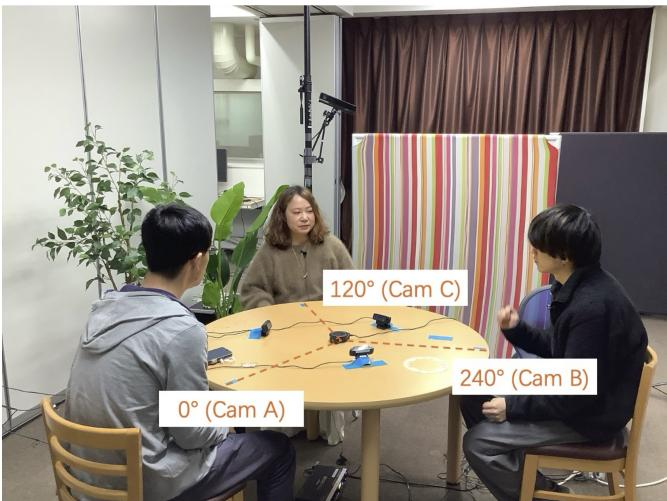
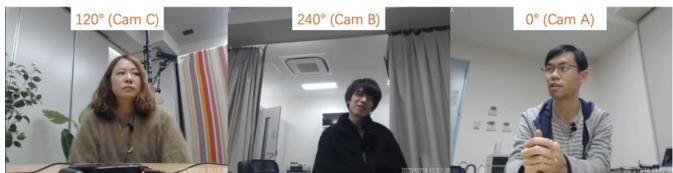

# TEIDAN: A Multilingual Multiparty Dialogue Corpus

Taiga Mori Graduate School of Informatics, Kyoto University Japan

Koji Inoue Graduate School of Informatics, Kyoto University Japan

Divesh Lala Graduate School of Informatics, Kyoto University Japan

Mikey Elmers Graduate School of Informatics, Kyoto University Japan

Tatsuya Kawahara Graduate School of Informatics, Kyoto University Japan

## Abstract

Multi-party interaction is a central setting for human communication and a necessary target for human-agent interaction systems that must participate in group conversation. Yet available corpora often focus on meetings, task-oriented interaction, text-based interaction, or acted scenarios, and fewer resources support crosslinguistic comparison ofspontaneous face-to-face triadic discussion. This paper presents TEIDAN, a multilingual multimodal corpus that currently consists ofJapanese and English three-party conversations. TEIDAN records groups of three participants discussing open-ended topics with individual pin microphones, a microphone array, and participant-facing cameras, and provides IPU-based transcripts for both language portions. Earlier studies used subsets of the Japanese portion for task-specific benchmarks in multi-party dialogue modeling; in contrast, this paper presents TEIDAN as a corpus resource spanning both Japanese and English, with planned expansion to additional languages. We describe the collection design, participants, recording setup, transcription format, and corpus statistics, and provide preliminary analyses to illustrate how TEI-DAN can support research on turn-taking, addressee recognition, and multimodal grounding in human-human and human-agent interaction.

## CCS Concepts

• Human-centered computing → Empirical studies in HCI.

## Keywords

multiparty dialogue, multimodal corpus, multilingual corpus, humanagent interaction

## ACM Reference Format:

Taiga Mori, Koji Inoue, Mikey Elmers, Divesh Lala, and Tatsuya Kawahara. 2026. TEIDAN: A Multilingual Multiparty Dialogue Corpus. In Companion ofthe INTERNATIONAL CONFERENCE ONMULTIMODAL INTERACTION (ICMI Companion ’26), October 05–09, 2026, Napoli, Italy. ACM, New York, NY, USA, 8 pages. https://doi.org/10.1145/3776591.3836650


## 1 Introduction

Dialogue systems have made rapid progress in dyadic interaction, but everyday conversation rarely takes place in a strictly one-toone channel. People coordinate attention, stance, and floor rights in groups; they respond to previous speakers, invite particular listeners to speak, and sometimes address the group as a whole. These phenomena are especially important for spoken dialogue systems and embodied agents that are expected to join human groups without interrupting or ignoring the intended recipient of an utterance.

Prior work on multi-party interaction has shown that turn-taking depends on both linguistic and non-linguistic cues, including lexical forms, gaze, body orientation, and the local sequential organization of conversation. Existing resources include text-based or online multiparty conversation [14], as well as corpora collected in meetings and smart rooms [1, 12], situated or task-oriented interaction [7, 13], team or game dialogue [5, 8], and human-robot interaction [18]. These resources are valuable, but natural face-to-face multiparty corpora with multimodal recordings remain limited, especially when the interaction is open-ended rather than task-driven or scenario-based. For Japanese, naturally occurring three-party casual conversation has been studied using a chat corpus [3]. However, to our knowledge, there is still no multilingual corpus that supports comparable analysis of spontaneous face-to-face triadic interaction across languages.

The TEIDAN corpus was designed to address this gap. Preliminary studies have used subsets of the Japanese portion as benchmarks for addressee recognition, next-speaker prediction, and voice activity projection [2, 6, 11]. These studies demonstrated that stateof-the-art language, multimodal, and spoken-dialogue models still struggle with the social organization of three-party talk. However, they treated TEIDAN primarily as task data for model evaluation, and they did not provide a standalone description of the corpus as a multilingual multimodal resource.

This paper fills that role by presenting TEIDAN as a corpus in its own right. For the Japanese portion, we follow the more recent corpus description and statistics in prior work [11]: the corpus contains 12 groups and 36 sessions. We then add a newly collected English portion designed with a parallel triadic discussion protocol. The resulting corpus currently contains 69 sessions, 57 unique participants, and 9 hours 46 minutes 57 seconds of multimodal interaction. Our goal is not only to provide more data, but to ofer a comparable resource for examining which properties of multi-party interaction are shared across languages and which may depend on language, culture, or participant relationships. Although the current release focuses on Japanese and English, TEIDAN is designed as an extensible multilingual corpus, and future collections may add further languages under the same basic protocol. The main contributions of this paper are:

Table 1: TEIDAN corpus overview. The upper section shows design choices shared across both portions; the lower section shows language-specific properties.
<table><tr><td></td><td>Japanese</td><td>English</td></tr><tr><td>Domain</td><td>open-ended discussion</td><td></td></tr><tr><td>Modalities</td><td>pin mic, array mic, video</td><td></td></tr><tr><td>Transcription unit</td><td>IPU (≥200 ms)</td><td></td></tr><tr><td>Language</td><td>Japanese</td><td>English</td></tr><tr><td>Participants (unique)</td><td>24</td><td>33</td></tr><tr><td>Participant slots</td><td>36</td><td>33</td></tr><tr><td>Participant relationship</td><td>acquainted</td><td>strangers</td></tr><tr><td>Groups</td><td>12</td><td>11</td></tr><tr><td>Topics per group</td><td>3</td><td></td></tr><tr><td>Sessions</td><td>36</td><td>33</td></tr><tr><td>Duration</td><td>3:39:10</td><td>6:07:46</td></tr></table>

• the first corpus-level description ofTEIDAN as a multilingual multimodal resource for spontaneous three-party discussion;

• a newly documented English extension that enables crosslinguistic and cross-cultural comparison with the Japanese portion;

• a summary of the multimodal recording setup, topic design, participant characteristics, transcript format, and corpus statistics; and

• preliminary quantitative and qualitative analyses illustrating how the corpus can support research on turn-taking, addressee recognition, next-speaker prediction, and multi modal grounding.

Table 1 provides a side-by-side overview of the two portions, highlighting the shared design and the language-specific properties discussed in the following sections.

## 2 Method

## 2.1 Corpus Design

TEIDAN consists of face-to-face discussions among triads. Each group contains three participants seated around a round table. The design intentionally avoids a strict task objective: participants are given broad prompts and are asked to discuss their opinions rather than solve a game or produce a single correct answer. This design follows the corpus description in prior work [11]: unlike meeting corpora or task-oriented interaction data, TEIDAN captures spontaneous opinion exchange where floor management and participation emerge from the interaction itself.

The Japanese corpus covers six open-ended topics [11]: “If Japan were to relocate its capital, where would it be?” (city); “If you could bring only one item to a deserted island, what would it be?” (island); “Where would you go if you were to travel this week?” (travel); “For a day of, would you go to the sea, mountains, or city?” (outdoor); “What is the most important thing in life?” (life); and “How would you travel between Kyoto and Tokyo?” (trans). The English corpus uses three open-ended topics corresponding to topics in the Japanese corpus: “If you could bring only one item to a deserted island, what would it be?” (island); “Where would you go if you were to travel, and what would you do there?” (travel); and “What is more important to you: family, life experiences, or money?” (life). These three shared topic themes support cross-linguistic comparison under comparable discussion prompts.

## 2.2 Participants

The Japanese corpus was collected from students and faculty members in the same laboratory. The 12 groups were formed from 24 unique participants, so some individuals appear in more than one group. The participants were therefore already acquainted with one another before recording, and many pairs share prior interaction history before the sessions. This familiarity is an important property of the Japanese data: the conversations include interaction among people who share an institutional context and can rely on prior interpersonal knowledge.

The English corpus was collected from foreign-national residents of Japan who were recruited through a stafing agency. Before recording, they completed a questionnaire covering age, gender, country of origin, and language background. The participants were native or near-native speakers of English and met one another for the first time at the recording. They represented 13 nationalities: USA (13), India (3), Philippines (3), Malaysia (3), UK (2), South Africa (2), Argentina (1), Australia (1), Canada (1), Ireland (1), New Zealand (1), Singapore (1), and Turkey (1). Thus, the English data difers from the Japanese data not only in language and cultural background, but also in the participants’ pre-existing relationship. This contrast is part of the corpus design, but it also means that cross-linguistic comparisons should be interpreted carefully: observed diferences may reflect participant relationship and recruitment context as well as language or cultural background. Nevertheless, the questionnaire metadata make it possible to examine interactional patterns in relation to speakers’ diverse backgrounds and to conduct detailed analyses within the English portion.

## 2.3 Recording Setup

Both language portions use a multimodal recording setup. Participants wear individual pin microphones so that each speaker’s speech can be captured separately. A microphone array records the shared acoustic scene, and cameras record the participants’ faces. Figure 1 shows the recording layout from top and front views. In the Japanese setup, each participant is recorded by a participant-facing camera and individual pin microphone [6, 11]. Documentation for the corpus also records the direction-of-arrival (DOA) configuration of the microphone array: for sessions 01 to 12, DOA labels at 0, 120, and 240 degrees correspond to cameras A, C, and B, respectively. These labels are intended to support source separation and multimodal alignment.

The English corpus was collected on September 18 and 19 and September 25, 2025. Before recording, participants completed a language background questionnaire and signed a consent form granting permission to publicly release, transfer, or license the recorded audio and video data for research on speech recognition, enhancement, and dialogue systems. The consent form included opt-out options allowing individual participants to restrict redistribution of video, or of both audio and video. Eleven groups were recorded, with 33 unique participants in total. Each group discussed three topics in a randomized order, yielding 33 sessions.



(a) Top view  
  
(b) Front view  
Figure 1: Recording setup used for TEIDAN.

## 2.4 Transcription

The corpus follows a transcription format based on the Corpus of Spontaneous Japanese (CSJ) [9], and the same convention is applied to both language portions. An inter-pausal unit (IPU) is a speech segment bounded by pauses of at least 200 ms. When a pause of 200 ms or more occurs within a word, the unit boundary is not split; instead, the pause position is recorded with a P tag. Non-linguistic vocalizations, namely laughter ({LAUGH}) and coughing ({COUGH}), constitute independent IPUs even when temporally adjacent to speech. Each IPU entry records start and end times in seconds and a speaker label (A, B, or C).

Japanese transcripts provide two parallel columns per line: a base orthographic form and a phonetic form in katakana, separated by &. English transcripts record the base form only. Both languages share the same set of inline tags: backchannels $( \mathbb { I } \ \cdot \ . \ . )$ , fillers $( \mathsf { F } \mathrm { ~ \cdot ~ } \mathrm { ~ \cdot ~ } )$ , self-interruptions ${ ( \mathsf { D } \mathrm { ~ . ~ . ~ . ~ } ) }$ , and uncertain or inaudible portions $( ? \ . \ . \ . \ )$ . Participant-identifying proper nouns are anonymized with an N tag. Both the Japanese and English corpora have been fully transcribed using this format.

Session identifiers encode language, group, and topic. For example, J01\_city denotes the Japanese conversation from group 01 on the city topic. English sessions use the same convention with the language prefix E. Within each session, participants are labeled A, B, and C.

## 3 Statistics

The Japanese statistics follow the 12-group subset used in prior work [11]. The 12 groups were drawn from 24 unique participants, with some individuals appearing in more than one group. Each group participated in three approximately 5 to 7 minute sessions, each corresponding to one topic, yielding 36 sessions and 3 hours 39 minutes 10 seconds of data. The English portion contains 11 groups and 33 unique participants. Each English group discussed three topics, yielding 33 sessions. Table 2 lists the per-session durations and IPU counts for both language portions.

## 4 Preliminary Analysis

## 4.1 Quantitative Analysis

To illustrate the kinds of analyses supported by TEIDAN, we conducted a preliminary comparison of the organization of turns and turn-taking in the Japanese and English portions. This analysis provides a descriptive comparison of the two corpus portions; it does not treat individual IPUs or pseudo-turns as independent samples for inferential testing. As described above, the TEIDAN transcripts mark backchannels with the I tag and non-linguistic vocalizations such as laughter and coughing with dedicated tags. Because our focus is on floor-holding turns, we first excluded IPUs consisting of backchannels or non-linguistic vocalizations. For each session, we then sorted the remaining IPUs by start time and merged each sequence of consecutive IPUs produced by the same speaker into a single pseudo-turn. Thus, after filtering, an intervening IPU afects the pseudo-turn boundary only when it is produced by a diferent speaker. This procedure reduced the English portion from 17,370 total IPUs to 10,097 retained IPUs and then to 4,851 pseudo-turns; the corresponding counts for the Japanese portion were 12,384 total IPUs, 7,348 retained IPUs, and 4,748 pseudo-turns. Table 3 summarizes the resulting IPU and pseudo-turn statistics.

The English portion contains more than 1.3 times as many substantive IPUs as the Japanese portion (10,097 vs. 7,348), but the number of pseudo-turns is almost the same across languages (4,851 vs. 4,748). This pattern is likely related to the number of IPUs that constitute each turn: English pseudo-turns contain more than 1.3 times as many IPUs on average as Japanese pseudo-turns (2.08 vs. 1.55). As a result, English turns are also more than 1.5 times longer on average than Japanese turns (4.65 vs. 2.95 seconds). The maximum English pseudo-turn lasts 188 seconds, indicating that the corpus includes cases where a single speaker holds the floor for more than three minutes. These preliminary results show a clear diference in turn organization between the English and Japanese portions of TEIDAN. Because IPUs and pseudo-turns produced within the same group are interactionally related, the pooled statistics should be interpreted as corpus-level descriptive diferences rather than as an inferential test of population-level diferences between English and Japanese conversation.

Table 2: Per-session duration and IPU counts. The three values in the IPU column give speaker A, B, and C counts respectively.
<table><tr><td>Session</td><td>Time</td><td>IPU (A/B/C)</td><td>Session</td><td>Time</td><td>IPU (A/B/C)</td></tr><tr><td colspan="6">Japanese (36 sessions)</td></tr><tr><td>J01_city</td><td>6:14</td><td>65/81/137</td><td>J07_life</td><td>5:34</td><td>97/79/150</td></tr><tr><td>J01_island</td><td>6:37</td><td>89/112/134</td><td>J07_outdoor</td><td>5:43</td><td>114/97/155</td></tr><tr><td>J01_travel</td><td>8:10</td><td>97/99/165</td><td>J07_trans</td><td>5:53</td><td>98/99/185</td></tr><tr><td>J02_city</td><td>5:51</td><td>76/94/98</td><td>J08_life</td><td>6:55</td><td>98/93/101</td></tr><tr><td>J02_island</td><td>6:22</td><td>119/133/94</td><td>J08_outdoor</td><td>5:40</td><td>85/74/87</td></tr><tr><td>J02_travel</td><td>5:20</td><td>96/106/110</td><td>J08_trans</td><td>5:58</td><td>60/62/107</td></tr><tr><td>J03_city</td><td>6:15</td><td>81/123/128</td><td>J09_life</td><td>6:40</td><td>104/113/147</td></tr><tr><td>J03_island</td><td>7:28</td><td>106/161/156</td><td>J09_outdoor</td><td>5:30</td><td>88/118/139</td></tr><tr><td>J03_travel</td><td>5:41</td><td>115/129/118</td><td>J09_trans</td><td>5:41</td><td>86/117/148</td></tr><tr><td>J04_city</td><td>5:48</td><td>146/142/123</td><td>J10_life</td><td>5:37</td><td>96/87/149</td></tr><tr><td>J04_island</td><td>5:51</td><td>138/126/153</td><td>J10_outdoor</td><td>5:48</td><td>118/81/161</td></tr><tr><td>J04_travel</td><td>5:39</td><td>115/116/94</td><td>J10_trans</td><td>5:52</td><td>117/81/151</td></tr><tr><td> $\mathrm { J 0 5 \_ c i t y }$ </td><td>5:19</td><td>108/119/95</td><td>J11_life</td><td>6:27</td><td>96/124/135</td></tr><tr><td>J05_island</td><td>5:30</td><td>121/164/101</td><td>J11_outdoor</td><td>6:39</td><td>139/148/122</td></tr><tr><td>J05_travel</td><td>5:01</td><td>100/144/110</td><td>J11_trans</td><td>5:47</td><td>133/122/140</td></tr><tr><td>J06_city</td><td>6:13</td><td>86/92/93</td><td>J12_life</td><td>6:29</td><td>79/86/149</td></tr><tr><td>J06_island</td><td>6:17</td><td>127/113/137</td><td>J12_outdoor</td><td>5:41</td><td>108/106/135</td></tr><tr><td>J06_travel</td><td>6:13</td><td>112/75/143</td><td>J12_trans</td><td>7:10</td><td>150/111/144</td></tr><tr><td colspan="6">English (33 sessions)</td></tr><tr><td>E01_life</td><td>11:50</td><td>247/138/113</td><td>E07_life</td><td>11:13</td><td>225/125/152</td></tr><tr><td>E01_island</td><td>10:26</td><td>255/132/99</td><td>E07_island</td><td>9:01</td><td>229/161/172</td></tr><tr><td>E01_travel</td><td>10:26</td><td>194/127/159</td><td>E07_travel</td><td>10:08</td><td>237/160/142</td></tr><tr><td>E02_life</td><td>10:25</td><td>170/207/232</td><td>E08_life</td><td>11:39</td><td>108/119/237</td></tr><tr><td>E02_island</td><td>10:43</td><td>208/197/240</td><td>E08_island</td><td>12:15</td><td>98/142/260</td></tr><tr><td>E02_travel</td><td>10:17</td><td>165/222/223</td><td>E08_travel</td><td>11:59</td><td>127/173/248</td></tr><tr><td>E03_life</td><td>11:05</td><td>142/92/136</td><td>E09_life</td><td>12:23</td><td>130/163/209</td></tr><tr><td>E03_island</td><td>9:55</td><td>151/96/196</td><td>E09_island</td><td>10:15</td><td>151/149/178</td></tr><tr><td>E03_travel</td><td>12:02</td><td>178/90/212</td><td>E09_travel</td><td>11:17</td><td>192/153/183</td></tr><tr><td>E04_life</td><td>11:12</td><td>151/75/155</td><td>E10_life</td><td>11:13</td><td>170/172/129</td></tr><tr><td>E04_island</td><td>11:31</td><td>160/230/218</td><td>E10_island</td><td>10:30</td><td>178/204/165</td></tr><tr><td>E04_travel</td><td>10:01</td><td>128/125/177</td><td>E10_travel</td><td>11:56</td><td>186/192/160</td></tr><tr><td> $\mathrm { E 0 5 \_ l i f e }$ </td><td>12:11</td><td>188/235/278</td><td>E11_life</td><td>10:33</td><td>173/124/179</td></tr><tr><td>E05_island</td><td>10:58</td><td>191/269/345</td><td>E11_island</td><td>11:51</td><td>148/164/221</td></tr><tr><td>E05_travel</td><td>11:20</td><td>195/278/280</td><td>E11_travel</td><td>12:44</td><td>142/139/163</td></tr><tr><td> $\mathrm { E 0 6 \_ l i f e }$ </td><td>10:21</td><td>89/89/142</td><td></td><td></td><td></td></tr><tr><td>E06_island</td><td>10:31</td><td>203/166/210</td><td></td><td></td><td></td></tr><tr><td>E06_travel</td><td>13:19</td><td>200/123/217</td><td></td><td></td><td></td></tr><tr><td>Avg. (J)</td><td>6:05</td><td>344</td><td>Total (J)</td><td>3:39:10</td><td>12,384</td></tr><tr><td>Avg. (E)</td><td>11:08</td><td>526</td><td>Total (E)</td><td>6:07:46</td><td>17,370</td></tr><tr><td> $\operatorname { A v g } .$  (all)</td><td>8:30</td><td>431</td><td>Total (all)</td><td>9:46:57</td><td>29,754</td></tr></table>

Table 3: Corpus-level IPU and pseudo-turn statistics after excluding backchannel and non-linguistic IPUs. All duration values are in seconds.
<table><tr><td rowspan="3">Language</td><td colspan="4">IPU</td><td colspan="5">Pseudo-turn</td></tr><tr><td>n</td><td>Mean</td><td>Min</td><td>Max</td><td>n</td><td>Mean</td><td>Min</td><td>Max</td><td>IPUs/turn</td></tr><tr><td>English</td><td>10,097</td><td>1.93</td><td>0.063</td><td>12.2</td><td>4,851</td><td>4.65</td><td>0.065</td><td>188.0</td><td>2.08</td></tr><tr><td>Japanese</td><td>7,348</td><td>1.67</td><td>0.127</td><td>18.6</td><td>4,748</td><td>2.95</td><td>0.140</td><td>97.4</td><td>1.55</td></tr></table>

## 4.2 Qualitative Analysis

We further provide qualitative examples to show how the corpus can support close analysis of turn construction in multimodal multiparty interaction. We first show a typical case observed in the English portion. In the following excerpt, the participants are discussing what is most important in life. However, as noted above, backchannels are excluded.

Excerpt 1. E06\_life 6:26.414–9:37.017 01 A: . . . if you’re lucky, life experiences, 02 I think life experiences and/or family, 03 I think are, are your, your main goals. 04 Or they are, if you’re lucky anyway. 05 If you, if you don’t have to worry that much about 06 putting a roof over your head or your kid’s head, 07 (L whatever L) (?). 08 C: It’s interesting, you know, 09 you say, some people say, like, 10 you’re the sum of all your memories. . . . 11 And that’s where the idea of family comes in. . . . 12 I wanna share my entire life with these people. 13 And that itself gives you more joys. . . . 14 It’s more the everyday life that you’re building 15 towards the relationship or the stronger bond 16 with these individuals 17 who are gonna outlive you and all your memories.

In the larger turn from which lines 01 to 07 are excerpted, partic ipant A describes, based on their own life, why they place the greatest value on life experiences. While A is developing this opinion, the other participants do not take the floor, although briefbackchannels may occur; A therefore holds the floor from the beginning to the end of the opinion statement. This is the longest pseudo-turn reported above, lasting 187.956 seconds. The next speaker is C. At the beginning of C’s turn, C comments on A’s preceding opinion with “It’s interesting,” and then continues by presenting their own view. The other participants likewise do not take the floor during C’s opinion statement, so C also holds the floor for 172.594 seconds. In this way, the English conversations often show a pattern in which one participant takes a relatively long turn to present an opinion, while the other participants rarely take the floor during that turn, regardless of whether they agree or disagree. After one participant has presented an opinion, the next speaker may begin their own turn by briefly commenting on the preceding opinion before moving into their own contribution.

The next excerpt illustrates a typical pattern in the Japanese portion. Here, too, the participants are discussing what is most important in life.

Excerpt 2. J09\_life 1:10.550–1:39.220 01 C:なるほど(N吉田)さんはどうですか I see. How about you, Yoshida-san? 02 A: (F まー)難しいですけど(F まー)お金 Well, it is dificult, but, well, money   
→03C: やっぱり After all. 04 A: がやっぱり大事かなとは思いますけど is probably important after all, I think.   
→05 C: (F ま)何だかんだ言ってね確かに Well, when all is said and done, yes, certainly. 06 A: (F まー)お金がないと(F まー) Well, ifyou do not have money, well, 07 留学とかもできない you cannot even do things like study abroad   
→08 B: (L (I まあ) L)(L それ言われたらそうですね L) Well, if you put it that way, that is true.   
→09 C: 確かにね確かに That’s true, yes, true. 10 A: なってしまうんで it ends up being like that, so 11 (F $\ddagger - ) ( \mathrm { F } \gtrsim \mathcal { O } - ) \neq \lambda \in \setminus \ \mp \ \mathcal { D }$ well, um, how should I put it, 12 C: そっか I see. 13 A: めちゃくちゃ(F その)富を集める必要はない I do not think it is necessary to accumulate 14 とは思うんですけど an extreme amount ofwealth, but 15 $\$ 2$ after all, in order to live, 16 (D ヒツヨ)最低限は必要というか you need, or rather, at least the minimum.

Immediately before this excerpt, B had stated that life experiences were the most important thing, using their own short-term study abroad experience as an example. In response, C asks A for an opinion in line 01. A begins to state their opinion in line 02. At the end of line 02, A says ‘お金’ (‘money’) while shifting their gaze from no specific recipient to C. Line 02 could be grammatically complete at that point. However, given that A is the youngest participant in the group and uses polite forms elsewhere, ending the utterance there would sound too abrupt; one might expect a polite ending such as ‘だと思います’ (‘I think’). Thus, A’s utterance still sounds incomplete. The final syllable of ‘お金’ (‘money’) is also lengthened. Given that the utterance is still in progress, this can be interpreted as a try-marking-like practice [15, 17]. What appears to be tested here, however, is not C’s recognition of a referent, but rather C’s stance toward the opinion that money is important.

Indeed, in line 03, C takes the turn with ‘やっぱり’ (‘after all’). This expression displays an anticipation of A’s view, and C behaves cooperatively toward A, although not necessarily by ofering full agreement. This also suggests that C treats A as seeking C’s stance. A then resumes the turn in line 04 in a way that syntactically continues from line 02, completing the utterance. In response, C displays partial agreement with A in line 05. During this sequence, B does not yet show any clearly cooperative response to A. A then takes the turn again from line 06. At this point, A shifts their gaze from no specific recipient to B and says that without money one cannot even study abroad, thereby referring to B’s immediately preceding experience while emphasizing the importance of money. A also appears to produce beat gestures, soliciting agreement from B. In fact, immediately after A finishes line 07, B partially agrees with A for the first time in line 08. C then also agrees with A again in line 09. As in line 02, line 07 is grammatically complete, but it again sounds too abrupt as a possible turn ending; for example, a polite expression such as $c \phi \neq ( 1 ) \phi \phi > 0$ (‘isn’t that so?’) could be expected after it. Thus, A is still projected to continue speaking. After B and C agree with A, A resumes the turn from line 10 in a way that syntactically connects to line 07 and completes the statement of their opinion.

In this way, the Japanese discussions often include cases in which participants present their opinions step by step, moving forward while seeking agreement or empathy from other participants along the way. Participants also use cultural norms such as polite-form endings, together with syntactic structure, to project that they will take the turn again while creating space for other participants to respond.

The next excerpt is another typical example from the Japan ese portion. In this excerpt, the participants are discussing where Japan’s capital should be moved if it were relocated from Tokyo.

```latex
Excerpt 3. J01_city 2:51.380–3:49.560
01 A:いや(Fあの)僕大阪がいいって思ってる点が
Well, um, the reason I think Osaka is good is
02 $\frac { 1 } { 2 } = 2 \frac { 1 } { 2 } > 2$
there is one more point,
03 それが(F あの)
and that is, um,
04 都市計画
the city planning,
05 道路道路や鉄道網ってのが
the roads, roads and railway networks,
06 非常に直線的で分かりやすい
are very straight and easy to understand,
07 構造をしているっていうのが
that they have that kind ofstructure.
→08 C: (F あ)御堂筋とか
Ah, like Midosuji?
09 A: そうです
Exactly.
10 (Fあのー)東京の地下鉄の路線図(F あの)
Um, the Tokyo subway route map, um,
11 ご覧になったことご覧になったこと
you have seen it, you have seen it,
12 あると思うんですけど
I think you probably have, but
13 (F えーっと)かなりもう
Uh, it is already quite
14 ぐねぐねと曲がってて
winding and twisting,
15 複雑怪奇じゃないですか
and extremely complicated, right?
16 $\frac { 1 } { 4 } \div ( ( 1 - ) ) \xrightarrow { 2 } \supset 0 + \frac { 1 } { 2 } \times ( ( 1 - 2 - 2 ) ( \mathrm { D } \mathrm {  ~ } \mathrm { \scriptstyle \mathrm { \cdot } } ) ( \mathrm { D } \mathrm {  ~ } \mathrm { \scriptstyle \mathrm { \cdot } } )$
Right, uhm, not like that, uh, s-, s-,
17 $- \mathcal { F } \mathcal { \vec { \mathrm { ~ C ~ } } } ( \mathrm { F } \ \not \gg \mathcal { O } ) - )$
whereas, um,
18 大阪はこう縦横に揃った
Osaka is, like, aligned vertically and horizontally,
→19 C: (F あー)なんとか筋(D ナン)
Ah, something-suji, some-
```

→20 なんとか筋線みたいな   
like some-suji line.   
21 A: $( 1 ) ( 2 - 7 ) \div 7$   
Um, yes,   
22 $z \dot { 7 } ( 1 )$ た都市計画をしている...   
it has that kind ofcity planning. . .   
23 $\cdots + 1 \leq n = 7 - 1 \leq 1 \leq n - 1 1$   
. . . after all, as a city,   
24 $1 2 \times 2 \times 2 = 3 x + 2 \times 2 \times 2 = 3 x$   
what makes it superior, I think.

From line 01, A begins to present their opinion that Osaka would be a good choice. By line 07, A has given as a reason that Osaka’s roads and railways are linear and easy to understand. At line 07, A’s utterance is syntactically incomplete and is clearly not a transitionrelevance place (TRP) [16]. Nevertheless, C takes the turn in line 08, saying ‘御堂筋 $\gamma _ { \parallel ^ { \vphantom { \parallel } } } ,$ (‘like Midosuji?’). Midosuji refers to a straight north-south road and subway line in Osaka. C’s utterance is formally a confirmation question, and A indeed responds with $4 \geq - 7 \frac { 1 } { 9 }$ (‘Exactly’) in line 09. While responding to C, A resumes the turn. After referring to the Tokyo railway map, A contrasts it with Osaka’s railway lines. Immediately after A says $ \infty , \forall x \in \bar { \mathcal { 1 } }$ 縦横に揃 $\supset \hbar \bar { \ z } ^ { , }$ (‘Osaka is, like, aligned vertically and horizontally’) in line 18, C again takes the turn in line 19 at a position that is not a TRP. In lines 19 and 20, C says $\cos \angle E D C = A B - A B - \sqrt { 2 } - \sqrt { 2 } \times \sqrt { 2 } = 1 2 \sqrt { 2 }$ (‘like some-suji line’). Osaka’s urban layout is often described as a grid, with roads running straight north-south and east-west; the northsouth roads are called suji. As in line 08, C’s utterance is formally a confirmation question. In line 21, A responds with $, z , . , . , .$ and then continues to present their opinion to the end.

Why, then, does C take the turn at these points, even though A’s utterance has not reached a TRP? The simplest interpretation is that, because A has not named specific roads or railway lines, C asks a question in order to check their own understanding. However, C is from Osaka and is therefore expected to know the geography of Osaka better than the other participants. Moreover, the intonation of C’s utterances in lines 08 and 19-20 is falling, or at least does not clearly rise. Given this, C’s utterances can also be understood not as questions asked for C’s own understanding, but as concrete examples that support A’s claim, or as resources for helping B, the third participant, understand A’s point. In fact, the utterances in lines 08 and 19-20 are maximally compact, minimizing the interruption to A’s ongoing turn. In the video, immediately after these utterances, B can also be seen nodding while looking at A, displaying understanding.

Seen in this way, C’s utterances in lines 08 and 19–20 are not intrusive interruptions into A’s turn, but rather cooperative actions oriented to A and A’s ongoing activity. Thus, in Japanese conversations, listeners sometimes take brief turns even at non-TRP positions in order to support the current speaker.

## 5 Discussion

The preliminary analyses illustrate how TEIDAN can support crosslinguistic and multimodal investigation of turn-taking. The quantitative comparison shows a clear diference between the English and Japanese portions in the number of IPUs per pseudo-turn and the mean duration of pseudo-turns. The magnitude of the observed diference is substantial at the level ofthe pooled corpus statistics, although the present descriptive analysis does not quantify variation between groups or support population-level inference. The qualitative examples then show how such diferences can be examined in detail: the English excerpt illustrates extended floor-holding during opinion statements, whereas the Japanese excerpts show compact listener contributions embedded in the ongoing development of another participant’s turn. Thus, the corpus enables researchers to move between corpus-level statistics and close sequential analysis of multimodal interaction.

These observations suggest that language and culture may afect the organization ofturns and turn-taking. In particular, the Japanese examples suggest a more collaborative organization of participation: speakers build their opinions incrementally, and listeners provide compact responses, candidate understandings, or supportive examples before the main speaker’s turn has reached completion. This does not simply mean that Japanese participants speak less. Rather, the shorter pseudo-turns observed in the Japanese portion may reflect an interactional orientation toward maintaining alignment with co-participants.

This pattern is consistent with broader accounts of Japanese interaction as high-context communication, in which shared back ground, timing, and implicit coordination play an important role [4]. It is also compatible with work on cultural models of the self, which characterizes Japanese culture as emphasizing interdependent self construal and attention to relations with others [10]. From this perspective, the Japanese speakers and listeners appear to jointly shape the progress of an opinion statement, with listeners contributing in ways that support the speaker’s ongoing activity while keeping their own turns compact.

At the same time, these observations should not be interpreted as isolating language or culture as independent causal factors. The Japanese and English portions difer not only in language, but also in participant relationship: the Japanese participants were acquainted members of the same laboratory, whereas the English participants were strangers recruited for the recording. These diferences may also afect how actively listeners enter an ongoing turn or how long speakers hold the floor. TEIDAN’s value is that it makes such comparisons observable in a shared multimodal format, enabling future work to examine how linguistic resources, embodied be havior, participant relationships, and cultural norms jointly shape multi-party interaction.

## 6 Conclusion

We presented TEIDAN, a multilingual multimodal corpus of spon taneous three-party dialogue in Japanese and English. Unlike prior studies that used subsets oftheJapanese data for task-specific bench marks, this paper provides a corpus-level account of the collection protocol, participant characteristics, recording setup, transcription format, and statistics across both language portions. TEIDAN currently contains 69 sessions of open-ended face-to-face discussion with individual audio, array audio, video, and IPU-based transcripts.

The preliminary analyses illustrated the kinds of questions that TEIDAN can support, linking corpus-level statistics with close sequential analysis of turn-taking and multimodal listener behavior.

These analyses should be read as demonstrations of the corpus’s potential rather than as definitive claims about language or culture, especially because the Japanese and English portions also difer in participant relationship. Future work will enrich the corpus with annotations for conversational phenomena such as addressees and transition-relevance places (TRPs), making it applicable to a wider range of model-building tasks for multi-party dialogue and humanagent interaction. We are also considering releasing the dataset under conditions that respect participant consent and privacy, and plan to expand the corpus to additional languages.

## Acknowledgments

This work was supported by JST Moonshot R&D JPMJPS2011 and JST PRESTO JPMJPR24I4.

## Safe and Responsible Innovation Statement

The corpus contains recordings ofhuman participants and therefore requires careful handling of privacy and consent. All participants signed consent forms before recording, granting permission to publicly release, transfer, or license the recorded audio and video data for research on speech recognition, enhancement, and dialogue systems. The consent form included opt-out options allowing in dividual participants to restrict redistribution of video, or of both audio and video; corpus release must respect these per-participant restrictions. Public examples should be anonymized where possible, and any use beyond the stated research purpose should be separately disclosed. Models trained or evaluated on TEIDAN should be analyzed for potential diferences across language groups, because cross-cultural comparison can otherwise reinforce overgeneralized assumptions about conversational behavior.

## References

[1] Jean Carletta. 2007. Unleashing the Killer Corpus: Experiences in Creating the Multi-Everything AMI Meeting Corpus. Language Resources and Evaluation 41 (2007), 181–190.

[2] Mikey Elmers, Koji Inoue, Divesh Lala, and Tatsuya Kawahara. 2025. Triadic Multiparty Voice Activity Projection for Turn-taking in Spoken Dialogue Systems. arXiv preprint arXiv:2507.07518 (2025)

[3] Mika Enomoto, Yasuharu Den, and Yuichi Ishimoto. 2020. A Conversation-Analytic Annotation of Turn-Taking Behavior in Japanese Multi-Party Conversation and its Preliminary Analysis. In Proceedings ofthe Twelfth Language Resources and Evaluation Conference. European Language Resources Association, Marseille, France, 644–652.

[4] Edward T Hall. 1976. Beyond culture. Anchor.

[5] Hayley Hung and Gokul Chittaranjan. 2010. The IDIAP Wolf Corpus: Exploring Group Behaviour in a Competitive Role-Playing Game. In Proceedings ofthe 18th ACM International Conference on Multimedia. ACM, Firenze, Italy, 879–882.

[6] Koji Inoue, Divesh Lala, Mikey Elmers, Keiko Ochi, and Tatsuya Kawahara. 2025. An LLM Benchmark for Addressee Recognition in Multi-modal Multi-party Dialogue. In Proceedings of the 15th International Workshop on Spoken Dialogue Systems Technology. 330–334.

[7] Dimosthenis Kontogiorgos, Vanya Avramova, Simon Alexanderson, Patrik Jonell, Catharine Oertel, Jonas Beskow, Gabriel Skantze, and Joakim Gustafson. 2018. A Multimodal Corpus for Mutual Gaze and Joint Attention in Multiparty Situated Interaction. In Proceedings of the Eleventh International Conference on Language Resources and Evaluation. European Language Resources Association, Miyazaki, Japan, 119–127.

[8] Diane Litman, Susannah Paletz, Zahra Rahimi, Stefani Allegretti, and Caitlin Rice. 2016. The Teams Corpus and Entrainment in Multi-party Spoken Dialogues. In Proceedings of the 2016 Conference on Empirical Methods in Natural Language Processing. Association for Computational Linguistics, Austin, Texas, 1421–1431

[9] Kikuo Maekawa et al. 2003. Corpus of Spontaneous Japanese: Its Design and Evaluation. In Proceedings ofthe ISCA and IEEE Workshop on Spontaneous Speech Processing and Recognition, Vol. 2003. ISCA and IEEE, Tokyo, Japan, 7–12.

[10] Hazel R Markus and Shinobu Kitayama. 1991. Culture and the self: Implications for cognition, emotion, and motivation. Psychological review 98, 2 (1991), 224.

[11] Taiga Mori, Koji Inoue, Divesh Lala, Keiko Ochi, and Tatsuya Kawahara. 2026. Analysing Next Speaker Prediction in Multi-Party Conversation Using Multimodal Large Language Models. In Proceedings of the 16th International Workshop on Spoken Dialogue System Technology. 83–94.

[12] Djamel Mostefa, Nicolas Moreau, Khalid Choukri, Gerasimos Potamianos, Stephen M. Chu, Ambrish Tyagi, Josep R. Casas, Jordi Turmo, Luca Cristoforetti, Francesco Tobia, et al. 2007. The CHIL Audiovisual Corpus for Lecture and Meeting Analysis Inside Smart Rooms. Language Resources and Evaluation 41 (2007), 389–407.

[13] Fumio Nihei, Yukiko I. Nakano, Yuki Hayashi, Hung-Hsuan Hung, and Shogo Okada. 2014. Predicting Influential Statements in Group Discussions Using Speech and Head Motion Information. In Proceedings ofthe 16th International Conference on Multimodal Interaction. ACM, Istanbul, Turkey, 136–143.

[14] Justine Reverdy, Sam O’Connor Russell, Louise Duquenne, Diego Garaialde, Benjamin R. Cowan, and Naomi Harte. 2022. RoomReader: A Multimodal Corpus

of Online Multiparty Conversational Interactions. In Proceedings of the Thirteenth Language Resources and Evaluation Conference. European Language Resources Association, Marseille, France, 2517–2527

[15] Harvey Sacks and Emanuel A Scheglof. 1979. Two preferences in the organization ofreference to persons in conversation and their interaction. Everyday language: Studies in ethnomethodology (1979), 15–21.

[16] Harvey Sacks, Emanuel A Scheglof, and Gail Jeferson. 1974. A simplest systematics for the organization of turn-taking for conversation. language 50, 4 (1974), 696–735.

[17] Emanuel A Scheglof. 2007. Sequence organization in interaction: A primer in conversation analysis I. Vol. 1. Cambridge university press.

[18] Kalin Stefanov and Jonas Beskow. 2016. A Multi-party Multi-modal Dataset for Focus of Visual Attention in Human-Human and Human-Robot Interaction. In Proceedings ofthe Tenth International Conference on Language Resources and Evaluation. European Language Resources Association, Portorož, Slovenia, 4440– 4444.