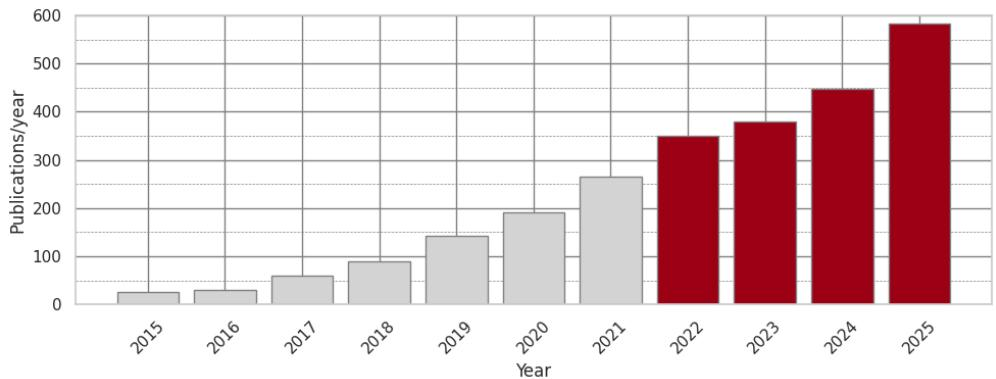
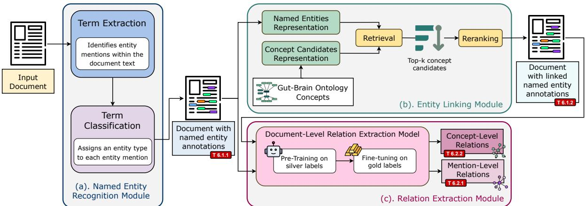

# TWIX: a Two-Stage Approach for End-To-End Named Entity Recognition and Relation Extraction

Marco Martinelli1,\*,†, Laura Menotti1,\*,†

1Department of Information Engineering, University of Padova, Padova, Italy

## Abstract

The exponential growth of scientific publications calls for automatic Information Extraction (IE) systems to support knowledge discovery. In this context, the GutBrainIE benchmark evaluates Named Entity Recognition (NER), Named Entity Recognition and Disambiguation (NERD), and Relation Extraction (RE) systems in the gut-brain axis domain. We propose Two-stage Workflow for Information eXtraction (TWIX), an end-to-end IE pipeline featuring three interconnected modules, each leveraging a two-stage framework to solve all four GutBrainIE subtasks. Evaluation on the development and test sets shows that our method substantially outperforms the baseline by a wide margin, while also ranking first among all participant submissions across all subtasks. These results indicate that the proposed two-stage pipeline efectively improves both precision and recall in practical settings.

## Keywords

Named Entity Recognition, Named Entity Linking, Named Entity Recognition and Disambiguation, Relation Extraction, Natural Language Processing, Information Extraction, Gut-Brain Axis

## 1. Introduction

Recent biomedical research increasingly links the gut microbiota to neurological and psychiatric diseases and disorders, including Parkinson’s disease, Alzheimer’s disease, Multiple Sclerosis, mood disorders, and mental health conditions more broadly [1, 2, 3, 4]. This growing interest is reflected in the rapid expansion of the scientific literature on the gut-brain axis. As shown in Figure 1, the number of PubMed publications in this area more than doubled between 2020 and 2025, increasing from around 300 to more than 700 articles per year. While this trend highlights the relevance of the field, it also creates a substantial challenge for clinicians and researchers, who must identify, interpret, and connect relevant findings across a rapidly growing body of unstructured scientific texts [5].

Automatic IE systems can support knowledge discovery in this setting by transforming unstructured biomedical text into structured information. In this context, the GutBrainIE challenge provides a benchmark of PubMed abstracts focused on the gut-brain axis and its implications for Parkinson’s disease, Alzheimer’s disease, Multiple Sclerosis, and mental health. The dataset includes annotations for entity mentions, concept-level links, and semantic relations, and defines four subtasks of increasing complexity: NER, requiring systems to detect and classify biomedical entity mentions; NERD, extending NER by linking each mention to a concept from biomedical reference vocabularies; Mention-level RE (M-RE), requiring the extraction of semantic relations between entity mentions; and Concept-level RE (C-RE), which abstracts RE from surface mentions to linked biomedical concepts.

All subtasks are framed in an end-to-end setting, where the test documents are released without ground-truth annotations. As a consequence, when approached with modular IE pipelines, downstream tasks depend on the predictions produced by upstream components. For instance, M-RE requires entity mentions predicted by an upstream NER module, while C-RE requires linked entity mentions produced by an upstream NERD module. This setting makes error propagation a central issue: false positives or incorrect predictions in earlier stages can directly afect the performance of subsequent modules.

  
Figure 1: Annual number of PubMed publications related to the gut–brain axis, retrieved on May 27, 2026 using the query adopted to populate the GutBrainIE 2026 collection: ((gut) AND (microbiota OR microbiome)) AND (dementia OR Alzheimer OR multiple sclerosis OR Amyotrophic lateral sclerosis). Red bars highlight years with more than 300 records.

To address this challenge, we propose Two-stage Workflow for Information eXtraction (TWIX), a precision-oriented IE pipeline composed of three interconnected modules, each following a twostage strategy. The NER module adopts an Extract First Classify Later (EFCL) architecture, where candidate mentions are first extracted without assigning entity labels and then validated and classified by a separate component. This design introduces two filtering steps, reducing false positive mentions before they are passed to downstream modules. The Named Entity Linking (NEL) module follows a retrieve-and-rerank strategy: a retriever first selects the top-� candidate concepts for each mention, and a reranker then selects the most likely concept in context. Finally, the RE module builds on ATLOP, the architecture used in the oficial baseline, but modifies the training procedure by first pre-training on larger, lower-quality data and then fine-tuning on smaller, higher-quality annotations [6].

Experimental results on the development set show that our architecture substantially outperforms standard baselines and competitive approaches inspired by top-performing systems from the 2025 edition of GutBrainIE [7]. Results on the test set further confirm the efectiveness of TWIX, with our system ranking first across all four subtasks. Moreover, the performance gap with respect to the second-best system increases across the subtasks, suggesting that the precision-oriented design is particularly beneficial in reducing error propagation in end-to-end IE settings. We share the codebase in GitHub at: https://github.com/MMartinelli-hub/GBIE26\_TWIX/.

The remainder of the paper is organized as follows. Section 2 discusses the related work guiding the design of TWIX. Section 3 describes the GutBrainIE data and subtasks. Section 4 presents the proposed architecture and its modules. Section 5 reports the development-set experiments and component-level analyses. Section 6 presents and discusses the oficial test-set results. Finally, Section 7 concludes the paper and outlines future research directions.

## 2. Related Work

End-to-end NER and RE are commonly addressed through either pipeline or joint architectures. Pipeline approaches decompose the task into separate stages, first identifying entity mentions and then predicting relations over candidate entity pairs derived from the NER output [8, 9]. Joint and multi-task models, instead, model entities and relations simultaneously, with the goal of reducing error propagation between subtasks [10, 11, 12]. Although pipeline architectures may sufer from propagation errors, recent work has shown that simple and well-engineered pipelines remain highly competitive, while also making it easier to analyze the contribution and limitations of individual components [8]. Following this line, we adopt a modular pipeline design, which allows us to explicitly study and control error

Table 1  
Statistics of the GutBrainIE collections. For each collection, the table reports the number of documents, the total number of annotated entities, the average number of entities per document, the total number of annotated relations, and the average number of relations per document.
<table><tr><td>Collection</td><td># Docs</td><td># Entities</td><td>Ents/Doc</td><td># Relations</td><td>Rels/Doc</td></tr><tr><td>Train Gold</td><td>639</td><td>20,530</td><td>32.13</td><td>8,556</td><td>13.39</td></tr><tr><td>Train Silver</td><td>811</td><td>26,134</td><td>32.22</td><td>10,907</td><td>13.45</td></tr><tr><td>Train Silver 2025</td><td>499</td><td>15,275</td><td>30.61</td><td>10,616</td><td>21.27</td></tr><tr><td>Train Bronze</td><td>2,972</td><td>89,987</td><td>30.28</td><td>29,692</td><td>9.99</td></tr><tr><td>Development Set</td><td>80</td><td>2,521</td><td>31.51</td><td>1,261</td><td>15.76</td></tr></table>

propagation across NER, NEL, and RE modules.

For NER, the most common approach formulates the task as token classification, typically using a pretrained transformer encoder followed by a token-level classification head [13]. This was also the dominant strategy in the 2025 edition of the GutBrainIE challenge [7]. However, several works have shown that extending this standard formulation can improve efectiveness, for example by incorporating external resources or by introducing auxiliary training objectives [14, 15]. More recently, [16] proposed a two-stage NER strategy in which entities are first extracted and then tagged. While their approach is implemented through Large Language Model (LLM)-based prompting, we adapt the same general principle to supervised biomedical transformer models, formulating entity extraction as token classification and entity tagging as sequence classification.

For NEL, similarity-based architectures are widely adopted. These methods represent mentions and candidate concepts in a shared space and select the concept most similar to the mention in context [17, 18]. A common design follows a retrieve-and-rerank strategy inspired by Information Retrieval (IR): a retriever first selects a ranked top-� subset ofcandidate concepts from the full vocabulary, and a reranker then performs a more accurate contextual disambiguation over this reduced candidate set [19]. Dual encoders are commonly used for eficient retrieval, while cross encoders are often employed for reranking due to their ability to jointly model the mention context and candidate concept description [18, 17]. In this work, we follow this two-stage NEL paradigm by combining a retriever and a reranker.

State-of-the-Art Document-Level Relation Extraction (DocRE) models feature sequence-based approaches that treat documents as a sequence of tokens and learn contextual representations for all entity pairs. Early approaches using CNNs and LSTMs struggled with long-range dependencies [20]. Transformer-based models leveraging contextual embeddings, such as BERT, markedly improve the task and are now standard in DocRE [21]. A key transformer-based model, which is also the baseline of the Relation Extraction subtasks, is ATLOP [6]. ATLOP introduces an adaptive threshold for entitydependent multi-label classification and localized context pooling to improve the prediction of precise triples.

## 3. Data and Task Description

The GutBrainIE challenge is based on a collection of titles and abstracts of biomedical articles retrieved from PubMed, focusing on the gut-brain interplay and its implications for neurological and mental diseases. The dataset provides annotations for entity mentions, concept-level links, and relations, supporting the development and evaluation of IE systems able to extract structured biomedical knowledge from unstructured scientific texts.

The corpus covers 13 entity types, including general biomedical categories, such as anatomical location, bacteria, chemical, and drug, as well as categories more specific to the gut-brain axis, such as microbiome and dietary supplement. The schema also includes entities related to experimental settings, such as biomedical technique and statistical technique. Entity mentions are linked to concept identifiers from six standardized biomedical vocabularies, together with a custom GutBrainIE ontology used for mentions that cannot be mapped to existing resources [5].

Relations are defined between annotated entities and are associated with one of 17 relation predicates. Since several predicates can connect diferent combinations of entity types, and the same pair of entity types may be associated with diferent predicates, the schema defines 55 distinct relation triples, corresponding to combinations of subject label, predicate, and object label.

The released data are organized into collections reflecting diferent levels of annotation quality. The Gold collection contains expert-curated annotations. The Silver collections contain annotations produced by trained students under expert supervision, including both the current Silver collection and the Silver 2025 collection from the previous edition, for which concept-level annotations were automatically generated. The Bronze collection contains fully automatic annotations produced using fine-tuned GLiNER for NER and fine-tuned ATLOP for RE [22, 6]. Table 1 reports the main statistics for each collection.

The challenge proposes four subtasks, grouped into two main families: entity extraction and normalization, and relation extraction [23, 24]. In Subtask 6.1.1 (NER), participants are given PubMed titles and abstracts and are asked to identify entity mentions and classify them into one of the 13 predefined categories. Each entity mention is represented through its category, location in the document, and character ofsets:

(entityCategory ; entityLocation ; startOfset; endOfset).

Subtask 6.1.2 (NERD) extends NER by requiring each predicted entity mention to be linked to a concept identifier from the GutBrainIE reference resources. Predictions therefore include the mention information together with the corresponding concept URI:

(entityCategory ; entityLocation ; startOfset; endOfset; conceptURI).

In Subtask 6.2.1 (M-RE), participants are asked to identify relations between specific entity mentions within a document. Each prediction specifies the subject mention, relation predicate, and object mention:

(subjectMention ; relationPredicate ; objectMention).

Finally, Subtask 6.2.2 (C-RE) abstracts RE from surface mentions to linked biomedical concepts. Each prediction specifies the subject concept, its category, the relation predicate, the object concept, and its category:

(subjectConceptURI ; subjectCategory ; relationPredicate ; objectConceptURI ; objectCategory).

For each subtask, the test set contains only the PubMed identifier, title, and abstract of each document, and participants are required to produce predictions in the format defined for the corresponding subtask.

All submitted runs are evaluated using Precision (�), Recall (�), and $F _ { 1 }$ score, computed with both macro- and micro-averaging. For the NER and NERD subtasks, labels correspond to the 13 entity categories, while for the two RE subtasks they correspond to relation triples defined by subject label, predicate, and object label. The oficial leaderboard uses micro-averaged $F _ { 1 }$ as the reference metric, since it better accounts for the strong class imbalance characterizing both entity labels and relation predicates.

## 4. Methodology

Figure 2 presents TWIX, reporting its main components and modules involved. The pipeline is composed of three interconnected modules, addressing NER, NEL, and RE, respectively. The first module performs NER over the titles and abstracts of GutBrainIE documents. We address NER through an EFCL architecture, a two-stage design in which a Term Extraction (TE) component first identifies candidate entity mentions in the input text, and a Term Classification (TC) component then validates these candidates and assigns one of the GutBrainIE entity labels to each of them. The second module addresses NEL. It receives the documents together with the entity mentions predicted by the NER module and links each mention to a concept from the GutBrainIE reference resources. This module also follows a two-stage strategy: first, a retriever selects a set of candidate concepts for each mention; then, a reranker scores these candidates in context and selects the most likely concept as the final prediction. The third module performs RE over the annotated documents, featuring a two-stage training built upon ATLOP. In particular, the RE module is pre-trained for a few epochs on noisy labels and then finetuned on high-quality annotations.

  
Figure 2: The TWIX architecture including: (a) Named Entity Recognition module; (b) Entity Linking Module; (c) Relation Extraction module

## 4.1. Selection of Pretrained Transformers

We used pretrained transformer models for both the NER and NEL tasks. Given the highly specialized terminology and complex language of GutBrainIE documents, we focused on models pretrained on biomedical corpora, which are better suited to capture the linguistic and semantic characteristics of this collection.

We selected a total of seven transformer-based Language Models (LMs):

• BioLinkBERT-base and BioLinkBERT-large, which are pretrained on PubMed abstracts and incorporate citation-link information during pretraining [25];

• BiomedNLP-BiomedBERT-base-uncased-abstract and BiomedNLP-BiomedBERT-large-uncased-abs which are BERT-based models trained from scratch on PubMed abstracts [26]. We also included BiomedNLP-BiomedBERT-large-uncased-abstract-fulltext, a variant trained on both PubMed abstracts and full-text articles;

• BiomedNLP-BiomedElectra-base-uncased-abstract and BiomedNLP-BiomedElectra-large-uncased-abstract, which are ELECTRA-based models trained from scratch on PubMed abstracts [26].

The selection was guided by the results obtained by team GutInstincts in the 2025 edition of the GutBrainIE challenge. Since these models achieved the best results in their experiments, we did not consider additional pretrained transformers [27].

## 4.2. Named Entity Recognition (NER) Module

The first module of TWIX, shown in Figure 2a, performs the identification and classification of entity mentions in the input documents. Instead of formulating NER as a single-step classification problem, we adopt an EFCL architecture, inspired by the approach proposed in [16]. While [16] implements EFCL through prompt-based LLMs, our approach implements a similar principle using fine-tuned biomedical transformers. Specifically, our EFCL module is a two-stage sequential architecture composed of a TE module followed by a TC module. The rationale is to separate mention detection from entity type assignment: the TE module first identifies candidate spans that may correspond to relevant biomedical mentions, while the TC module subsequently validates each candidate span and assigns it an entity type.

We frame TE as a token classification task using the Beginning-Inside-Outside (BIO) tagging schema [28]. Diferently from standard NER, however, the label set does not include the 13 entity types defined by GutBrainIE. Instead, it contains a single generic term label. Each token is therefore assigned one of three possible tags: B-term, indicating the beginning of a candidate term; I-term, indicating that the token is inside a candidate term; or O, indicating that the token does not belong to any candidate term. The architecture consists of a pretrained biomedical transformer LM followed by a token-level classification head. Given an input sequence, the transformer produces a contextualized representation for each token, which is then passed to a dense layer that independently predicts a probability distribution over the possible BIO tags. Since the TE module only distinguishes candidate terms from non-term tokens, the classification head has three output units, corresponding to B-term, I-term, and O. After inference, consecutive tokens predicted as B-term or I-term are merged into candidate term spans.

The candidate spans produced by the TE module are then passed to the TC module, which we formulate as a sequence classification task. For each candidate term, the model receives as input the document text with the candidate span enclosed between two special markers, [E1] and [/E1]. The hidden representation corresponding to the [E1] marker is extracted and passed through a dense classification head. The classifier predicts either one of the GutBrainIE entity labels or a special not an entity class. Candidate terms assigned to not an entity are discarded, while the remaining ones are retained as final entity mentions with the label predicted by the classifier.

This two-stage design makes the NER module more conservative than a standard single-step classifier. A false positive span can be filtered out at two diferent points: first, by not being extracted by the TE module, and second, by being rejected by the TC module through the not an entity class. As a result, our EFCL architecture is explicitly designed to improve precision, while still allowing the TE component to operate with high recall over potentially relevant biomedical terms. Ideally, our architecture should preserve recall, since the entities filtered out by a generic entity/non-entity classifier (as used in the TE component) should largely overlap with those removed by a more fine-grained classifier.

## 4.3. Named Entity Linking (NEL) Module

The entity mentions extracted and classified by the NER module are passed to the NEL module, whose goal is to assign each mention to a concept identifier from the biomedical resources defined in GutBrainIE. As shown in Figure 2b, we model NEL as a two-stage pipeline composed of a candidate retriever followed by a reranker. Given an entity mention � occurring in a textual context �, the retriever first selects a ranked set of the top-� candidate concepts from the reference vocabularies. The reranker then scores these candidates in context and selects the most likely concept as the final prediction.

We implemented this module using the entity-linkings library, a unified framework for NEL that provides multiple candidate retrievers and reranking models, allowing diferent combinations of methods to be tested within the same pipeline [29].

Candidate Retrieval. For the retrieval stage, we experimented with dual-encoder and text embedding models [18, 30]. Both approaches follow the same general principle: the mention and each candidate concept are mapped into a shared vector space, and candidates are ranked according to the similarity between their representations. The main diference between the two retrievers is in how these representations are computed.

Let � be an entity mention occurring in context �, and let $c _ { i }$ be a candidate concept. We represent each concept $c _ { i }$ by a textual description $d ( c _ { i } )$ obtained by concatenating its preferred name and, when available, its definition or description from the corresponding knowledge base. The retriever computes a score $s _ { r } ( e , c _ { i } )$ for each candidate concept and returns the candidates with the highest scores.

In the dual-encoder setting, the mention and the candidate concept are encoded separately, either by two diferent transformer encoders or by two branches of the same encoder. We use $f _ { \theta } ^ { m }$ to indicate the mention encoder and $f _ { \theta } ^ { c }$ to denote the candidate concept encoder. The mention representation is obtained by inserting special markers around the mention in its context, similarly to the TC module:

$$
m ( e ) = m _ { b } \ [ { \tt E 1 } ] \ e \ [ / \mathrm { E 1 } ] \ m _ { a } ,
$$

where $m _ { b }$ and $m _ { a }$ indicate the portions of context before and after the mention, respectively. The hidden representation of the [E1] marker is used as the mention vector:

$$
\mathbf { y } _ { e } = f _ { \theta } ^ { m } ( m ( e ) ) .
$$

The candidate concept is encoded separately from its textual description:

$$
\begin{array} { r } { { \bf y } _ { c _ { i } } = f _ { \theta } ^ { c } ( d ( c _ { i } ) ) . } \end{array}
$$

The retrieval score is then computed as the dot product between the mention and concept vectors:

$$
s _ { r } ( e , c _ { i } ) = \mathbf { y } _ { e } ^ { \top } \mathbf { y } _ { c _ { i } } .
$$

The model is trained with a contrastive objective that increases the score of the correct concept while decreasing the scores of negative candidates [31]. Given a batch of � mention-concept pairs $\{ ( e _ { j } , c _ { j } ) \} _ { j = 1 } ^ { B }$ , the other concepts in the batch are used as in-batch negatives. The loss for a mention $e _ { j }$ is computed as:

$$
\mathcal { L } _ { r } ( e _ { j } , c _ { j } ) = - \log \frac { \exp ( s _ { r } ( e _ { j } , c _ { j } ) ) } { \displaystyle \sum _ { k = 1 } ^ { B } \exp ( s _ { r } ( e _ { j } , c _ { k } ) ) } .
$$

In addition to random in-batch negatives, the entity-linkings library also supports hard negatives, obtained by retrieving highly ranked but incorrect candidates for each training example. At inference time, retrieval is performed as a maximum inner-product search between the mention vector and the vectors of candidate concepts [18].

Text embedding retrievers follow the same scoring and ranking logic, but difer in how representations are obtained. Instead of using separate mention-side and concept-side encoders, both the mention context and the candidate concept description are encoded with a shared text embedding model $g _ { \boldsymbol { \theta } } \colon$

$$
\mathbf { y } _ { e } = g _ { \theta } ( m ( e ) ) , \qquad \mathbf { y } _ { c _ { i } } = g _ { \theta } ( d ( c _ { i } ) ) .
$$

The score is again computed as:

$$
s _ { r } ( e , c _ { i } ) = \mathbf { y } _ { e } ^ { \top } \mathbf { y } _ { c _ { i } } .
$$

Thus, dual encoders and text embedding retrievers are operationally very similar at inference time, as both rank candidate concepts by vector similarity. Their diference mainly concerns how the embedding space is learned and how mention and concept representations are produced [30].

Candidate Reranking. For the reranking stage, we used cross-encoder models [17]. Diferently from retrievers, which encode mentions and concepts independently, a cross encoder jointly encodes each mention-candidate pair. Given a mention � in context � and a candidate concept $c _ { i }$ , we build the input sequence:

$$
x ( e , c _ { i } ) = [ \mathrm { C L S } ] ~ m _ { b } ~ [ \mathrm { E 1 } ] ~ e ~ [ \ / \mathrm { / E 1 } ] ~ m _ { a } ~ [ \mathrm { S E P } ] ~ d ( c _ { i } ) ~ [ \mathrm { S E P } ] .
$$

This sequence is passed to a transformer encoder, and the final hidden representation of the [CLS] token is used as the contextual representation of the mention-candidate pair:

$$
\mathbf { h } _ { e , c _ { i } } = f _ { \theta } ^ { c e } ( x ( e , c _ { i } ) ) _ { [ \mathrm { C L S } ] } .
$$

Each candidate is then assigned a reranking score:

$$
s _ { c e } ( e , c _ { i } ) = \mathbf { w } ^ { \top } \mathbf { h } _ { e , c _ { i } } + b ,
$$

where $\mathbf { w }$ and � are learned parameters. Given the candidate set $C _ { k } ( e )$ returned by the retriever for mention $e ,$ the reranker defines a probability distribution over candidates:

$$
p ( c _ { i } \mid e , C _ { k } ( e ) ) = \frac { \exp ( s _ { c e } ( e , c _ { i } ) ) } { \displaystyle \sum _ { c _ { j } \in C _ { k } ( e ) } \exp ( s _ { c e } ( e , c _ { j } ) ) }
$$

The model is trained with a softmax cross-entropy loss over the retrieved candidate set, maximizing the probability assigned to the correct concept [17]. At inference time, the selected concept is:

$$
\hat { c } = \arg \operatorname* { m a x } _ { c _ { i } \in C _ { k } ( e ) } s _ { c e } ( e , c _ { i } ) .
$$

For both retrieval and reranking, we experimented with two pretrained biomedical transformers: BioLinkBERT-base and BiomedNLP-BiomedBERT-base-uncased-abstract [25, 26]. These models were selected as lightweight biomedical backbones, balancing domain specialization and computational cost.

## 4.4. Relation Extraction (RE) Module

The RE module shown in Figure 2c takes the entities predicted by the NER or NEL module and identified triples within the document. When considering entity annotations from the NER module (Figure 2a), the RE module solves the Mention-Level RE subtask. On the other hand, when considering entity concepts predicted by the NEL module (Figure 2b) the RE module performs Concept-Level RE.

We propose a two-stage training of the oficial baseline, i.e. ATLOP [6]. ATLOP is a transformerbased DocRE model exploiting localized context pooling and an adaptive threshold for multi-label classification. Our two-stage training is inspired by DREEAM’s architecture [32], a teacher-student model based on ATLOP. In DREEAM, the student model is trained in two steps. Firstly, a short pretraining phase initialize the weights of the networks exploiting distantly supervised data and weakly supervised labels predicted by the teacher model. Subsequently, the student model is finetuned on the manual dataset to learn precise predictions. Thus, our RE module features ATLOP firstly pre-trained on a large-scale (but noisy) set of documents for a small number of epochs and then fine tuned on a high-quality dataset. We employed RoBERTa-large as the transformer backbone of ATLOP.

## 5. Experiments and Results

## 5.1. Setup

Training and inference jobs for NER and NEL are conducted on a MacStudio equipped with a M3 ultra chip and 512 GB of VRAM, while RE jobs are done on a High Performance Computing (HPC) cluster, with jobs allocated access to one Nvidia A40 and 64 GB of RAM.

In terms of training data, the EFCL NER module uses both silver and gold folds, while the NEL module uses only the gold fold. The RE module leverages gold, silver, and bronze annotations.

For what concerns training hyper-parameters, TE is trained using the AdamW optimizer for 30 epochs with a batch size of 16 and a learning rate of $2 \cdot 1 0 ^ { - 5 }$ [33], and for each document titles and abstracts are concatenated to a single sequence For what concerns the TC modules, these are trained for 10 epochs with a batch size of 16 and a learning rate of $1 0 ^ { - 6 }$ . In the training of TC modules, we also introduced synthetically generated negative samples. For each positive example of the training and dev sets we introduced a negative sample, making the model more robust in detecting false positives predicted by the upstream Term Extractor. These negative samples can have a length comprised from 1 to 5 words.

Table 2  
Micro-averaged NER performance on the development set for the seven selected pretrained biomedical transformers, evaluated under the standard token-classification formulation. Performance is reported in terms of Precision (�), Recall (�), and $F _ { 1 }$ score, and runs are sorted by decreasing $F _ { 1 }$ . Best results for each metric are bolded and second-best results are underlined.
<table><tr><td>Model</td><td> $P$ </td><td>R</td><td> $F _ { 1 }$ </td></tr><tr><td>BiomedNLP-BiomedBERT-base-uncased-abstract-fulltext</td><td>0.8009</td><td>0.8235</td><td>0.8120</td></tr><tr><td>BioLinkBERT-base</td><td>0.7972</td><td>0.8267</td><td>0.8117</td></tr><tr><td>BiomedNLP-BiomedBERT-large-uncased-abstract</td><td>0.7877</td><td>0.8314</td><td>0.8090</td></tr><tr><td>BiomedNLP-BiomedElectra-large-uncased-abstract</td><td>0.8070</td><td>0.8096</td><td>0.8083</td></tr><tr><td>BiomedNLP-BiomedBERT-base-uncased-abstract</td><td>0.8159</td><td>0.8001</td><td>0.8079</td></tr><tr><td>BioLinkBERT-large</td><td>0.7783</td><td>0.8259</td><td>0.8014</td></tr><tr><td>BiomedNLP-BiomedElectra-base-uncased-abstract</td><td>0.7791</td><td>0.8171</td><td>0.7977</td></tr></table>

For NEL, retrievers and rerankers were trained with diferent hyperparameter settings. Retriever models were trained for 5 epochs with a training batch size of 16, an evaluation batch size of 32, and no gradient accumulation. The number of soft negatives for each positive mention-concept pair was fixed to 10, while no hard negatives were used during retriever training. Reranker models were trained for 4 epochs with a training batch size of 8, an evaluation batch size of $^ { 1 6 , }$ and gradient accumulation over 2 steps. For each mention, the reranker received up to 20 candidate concepts produced by the retrieval stage, with candidate retrieval performed using a batch size of 32.

The RE module is trained the AdamW optimizer with a batch size of 4 and a learning rate of $5 \cdot 1 0 ^ { - 5 }$ We tested diferent number of epochs both for the pre-training and fine-tuning phase and kept the best model based on the highest micro-F1 on the development dataset. We also tried two dataset splits, the first considers as distant data the silver and bronze-standard annotations $( ^ { \mathfrak { c } } \mathrm { d i s t a n t \_ s b " } )$ and the gold-standard annotations (“manual $\underline { { \mathbf { \Pi } } } \mathbf { g } ^ { \dag } \mathbf { \Pi } )$ as high-quality dataset. The second considers as distant data the bronze-standard annotations (“distant\_b") and the silver and gold-standard annotations as high-quality dataset $( ^ { \circ } \mathrm { { m a n u a 1 } _ { - } \mathrm { { g s } ^ { \prime \prime } } } )$

## 5.2. Experiments on the Development Dataset

This Section presents the experimental results obtained on the development set across all subtasks. These results motivated the selection of the final runs submitted to the GutBrainIE challenge for evaluation on the test set. All results are computed using the oficial evaluation script provided by the challenge organizers. We report component-level analyses aimed at isolating the contribution and limitations of individual modules. In particular, we evaluate the TE module independently by measuring span detection performance, and we assess the TC, NEL, and RE modules provided with ground-truth entity mentions instead of predictions from upstream components. These analyses allow us to better understand how errors propagate across TWIX and to identify the main bottlenecks afecting downstream performance. Throughout the analysis, we focus on micro-averaged metrics, which better account for the strong class imbalance characterizing both entity labels and relation predicates.

## 5.2.1. Named Entity Recognition

We evaluated three families of approaches for the NER subtask on the development set: (i) standard transformer-based NER models framed as token classification, (ii) post-processing ensembles of these NER models, and (iii) our proposed two-stage EFCL architecture. The models in (i) were trained with the same hyper-parameters used for the TE modules (see Section 5.1). This comparison is motivated by the results of the previous GutBrainIE edition, where transformer-based NER systems and ensemble strategies proved to be among the most efective approaches for entity recognition, where biomedical transformer models and ensemble strategies proved to be among the most efective solutions for entity recognition [7, 34, 27]. Therefore, we use these models as reference systems against which to assess the

benefits of our EFCL design.

The standard NER baselines follow the classical token-classification formulation with the BIO tagging schema [28]. Each model consists of a pretrained biomedical transformer followed by a dense classification head predicting B-<label>, I-<label>, or O tags for each token. Consecutive tokens are merged into an entity mention when a B-<label> tag is followed by consecutive I-<label> tags associated with the same entity label. When an I-<label> tag follows a tag associated with a diferent entity type, it is treated as the beginning of a new entity mention.

Table 2 reports the performance of the seven selected biomedical transformers. Overall, the results show that no model clearly outperforms the others. The best model, BiomedNLP-BiomedBERT-base-uncased-abstract-fulltext, reaches a micro-averaged $F _ { 1 }$ of 0.8120, while the lowest-scoring model, BiomedNLP-BiomedElectra-base-uncased-abstract, obtains 0.7977. The diference between the best and worst model is therefore only 0.0143 $F _ { 1 }$ points, indicating that, under this standard token-classification setting, model choice alone has a limited impact. A similar pattern can be observed for precision and recall: some models are slightly more recall-oriented, such as BiomedNLP-BiomedBERT-large-uncased-abstract, while others obtain slightly higher precision, such as BiomedNLP-BiomedBERT-base-uncased-abstract. However, these diferences do not translate into a clearly superior model.

We then evaluated post-processing majority-voting ensembles of these standard NER models [27]. In this setting, predictions produced by diferent models are combined after inference, without modifying the underlying architectures. We considered ensembles of diferent sizes, ranging from two to seven models. A predicted entity mention is retained when it is predicted by the majority of the models included in the ensemble, requiring an exact match in terms of start ofset, end ofset, and entity label. Table 3 reports the top eight majority-voting ensembles under micro-averaged $F _ { 1 }$ score.

Consistently with the results observed in the previous edition of GutBrainIE, ensembling substantially improves over individual transformer models [7]. The best ensemble obtains 0.8462 $F _ { 1 }$ , corresponding to an absolute improvement of 0.0342 over the best single-model baseline. This improvement is mainly given by a large increase in Precision, which rises from 0.8009 for the best single model to 0.8835 for the best ensemble, while recall remains comparable. This confirms that majority voting is efective in filtering out predictions that are not consistently supported across models. At the same time, the analysis of the best ensemble configurations shows that the improvement is not driven by a single clearly superior backbone. Among the configurations reaching the highest $F _ { 1 }$ values, the most recurrent models are BioLinkBERT-base, BiomedNLP-BiomedBERT-base-uncased-abstract, and BiomedNLP-BiomedBERT-large-uncased-abstract, but several other models also appear in competitive combinations. Moreover, the best results are obtained mostly with ensembles of size four or five, indicating that adding more models does not necessarily lead to better performance [27].

Finally, Table 4 reports the top 15 configurations (under micro- $F _ { 1 } )$ ) obtained with our proposed EFCL architecture, described in Section 4.2. The full results are reported in Table 14 in the Appendix. Our twostage TE+TC design consistently outperforms both standard NER models and majority-voting ensembles. The best configurations, obtained with BiomedNLP-BiomedBERT-large-uncased-abstract as term extractor and either BiomedNLP-BiomedBERT-large-uncased-abstract or BiomedNLP-BiomedBERT-base-uncased-abstract-fulltext as term classifier, reach a micro-averaged $F _ { 1 }$ of 0.8925. This corresponds to an absolute improvement of 0.0805 over the best single transformer-based NER model and 0.0463 over the best majority-voting ensemble.

The main gains of the EFCL architecture come from precision. The best TE+TC configuration obtains 0.9544 precision, compared with 0.8009 for the best single model and 0.8835 for the best ensemble. This behavior is consistent with the design of the proposed architecture. In the standard NER setting, each token is directly assigned an entity label or the O label by a single model. In contrast, EFCL introduces two sequential filtering decisions. First, the TE module decides whether a span should be extracted as a candidate term. Then, the TC module assigns an entity type to the candidate term or discards it by predicting the not an entity class. As a consequence, false positive spans can be removed at two diferent stages of the pipeline, which explains the strong increase in precision. Importantly, this precision gain does not come at the cost of lower recall: the best TE+TC system obtains a recall of 0.8382, which is also higher than both the best single model and the best ensemble.

Micro-averaged NER performance of the top eight majority-voting ensembles on the development set. The Size column reports the number of models included in the ensemble, while the Models column lists the corresponding pretrained transformer backbones. Performance is reported in terms of precision $( P ) _ { : }$ recall $( R ) _ { : }$ , and $F _ { 1 }$ score, with runs sorted by decreasing $F _ { 1 }$ . Best results for each metric are bolded and second-best results are underlined.
<table><tr><td>ID Size</td><td>Models</td><td></td><td>R</td><td> $F _ { 1 }$ </td><td></td></tr><tr><td>1</td><td>4</td><td>BioLinkBERT-base</td><td>0.8835</td><td>0.8120</td><td>0.8462</td></tr><tr><td></td><td></td><td>BiomedNLP-BiomedBERT-base-uncased-abstract-fulltext</td><td></td><td></td><td></td></tr><tr><td></td><td></td><td>BiomedNLP-BiomedBERT-base-uncased-abstract</td><td></td><td></td><td></td></tr><tr><td></td><td></td><td>BiomedNLP-BiomedBERT-large-uncased-abstract</td><td></td><td></td><td></td></tr><tr><td>2</td><td>5</td><td>BioLinkBERT-large</td><td>0.8623</td><td>0.8294</td><td>0.8455</td></tr><tr><td></td><td></td><td>BiomedNLP-BiomedBERT-base-uncased-abstract</td><td></td><td></td><td></td></tr><tr><td></td><td></td><td>BiomedNLP-BiomedBERT-large-uncased-abstract</td><td></td><td></td><td></td></tr><tr><td></td><td></td><td>BiomedNLP-BiomedElectra-base-uncased-abstract</td><td></td><td></td><td></td></tr><tr><td></td><td></td><td>BiomedNLP-BiomedElectra-large-uncased-abstract</td><td></td><td></td><td></td></tr><tr><td>3</td><td></td><td>BioLinkBERT-base</td><td></td><td></td><td></td></tr><tr><td></td><td>6</td><td>BiomedNLP-BiomedBERT-base-uncased-abstract-fulltext</td><td>0.8761</td><td>0.8163</td><td>0.8452</td></tr><tr><td></td><td></td><td>BiomedNLP-BiomedBERT-base-uncased-abstract</td><td></td><td></td><td></td></tr><tr><td></td><td></td><td>BiomedNLP-BiomedBERT-large-uncased-abstract</td><td></td><td></td><td></td></tr><tr><td></td><td></td><td>BiomedNLP-BiomedElectra-base-uncased-abstract</td><td></td><td></td><td></td></tr><tr><td></td><td></td><td>BiomedNLP-BiomedElectra-large-uncased-abstract</td><td></td><td></td><td></td></tr><tr><td></td><td></td><td></td><td></td><td></td><td></td></tr><tr><td>4</td><td>5</td><td>BioLinkBERT-base</td><td>0.8591</td><td>0.8318</td><td>0.8452</td></tr><tr><td></td><td></td><td>BioLinkBERT-large</td><td></td><td></td><td></td></tr><tr><td></td><td></td><td>BiomedNLP-BiomedBERT-base-uncased-abstract-fulltext</td><td></td><td></td><td></td></tr><tr><td></td><td></td><td>BiomedNLP-BiomedBERT-base-uncased-abstract</td><td></td><td></td><td></td></tr><tr><td></td><td></td><td>BiomedNLP-BiomedBERT-large-uncased-abstract</td><td></td><td></td><td></td></tr><tr><td>5</td><td>5</td><td>BioLinkBERT-base</td><td></td><td></td><td>0.8569 0.8338 0.8452</td></tr><tr><td></td><td></td><td>BioLinkBERT-large</td><td></td><td></td><td></td></tr><tr><td></td><td></td><td>BiomedNLP-BiomedBERT-base-uncased-abstract-fulltext</td><td></td><td></td><td></td></tr><tr><td></td><td></td><td>BiomedNLP-BiomedBERT-large-uncased-abstract</td><td></td><td></td><td></td></tr><tr><td></td><td></td><td>BiomedNLP-BiomedElectra-large-uncased-abstract</td><td></td><td></td><td></td></tr><tr><td>6</td><td>4</td><td>BioLinkBERT-base</td><td>0.8946 0.8009</td><td></td><td>0.8451</td></tr><tr><td></td><td></td><td>BiomedNLP-BiomedBERT-base-uncased-abstract-fulltext</td><td></td><td></td><td></td></tr><tr><td></td><td></td><td>BiomedNLP-BiomedBERT-base-uncased-abstract</td><td></td><td></td><td></td></tr><tr><td></td><td></td><td>BiomedNLP-BiomedElectra-large-uncased-abstract</td><td></td><td></td><td></td></tr><tr><td>7</td><td></td><td>BioLinkBERT-base</td><td></td><td></td><td></td></tr><tr><td></td><td>4</td><td>BiomedNLP-BiomedBERT-base-uncased-abstract</td><td>0.8909</td><td>0.8036</td><td>0.8450</td></tr><tr><td></td><td></td><td>BiomedNLP-BiomedBERT-large-uncased-abstract</td><td></td><td></td><td></td></tr><tr><td></td><td></td><td>BiomedNLP-BiomedElectra-large-uncased-abstract</td><td></td><td></td><td></td></tr><tr><td>8</td><td></td><td></td><td></td><td></td><td></td></tr><tr><td></td><td>4</td><td>BioLinkBERT-base</td><td>0.8827</td><td>0.8092</td><td>0.8444</td></tr><tr><td></td><td></td><td>BiomedNLP-BiomedBERT-base-uncased-abstract</td><td></td><td></td><td></td></tr><tr><td></td><td></td><td>BiomedNLP-BiomedBERT-large-uncased-abstract</td><td></td><td></td><td></td></tr><tr><td></td><td></td><td>BiomedNLP-BiomedElectra-base-uncased-abstract</td><td></td><td></td><td></td></tr></table>

To better understand the contribution of the two components, we also evaluated the TE and TC modules separately. For TE, we compared predicted spans against the ground-truth entities of the development set while ignoring entity labels, thus measuring the ability of the extractor to identify relevant mention boundaries independently of the downstream classification step. Results are reported in Table 5. As observed for standard NER, all seven biomedical transformers obtain competitive results, with no model clearly dominating the others. The best configuration, based on

## Table 4

Micro-averaged NER performance on the development set for the proposed EFCL architecture. Each row reports a combination of TE and TC models, with runs sorted by decreasing $F _ { 1 }$ score. Performance is reported in terms of precision (�), recall (�), and $F _ { 1 }$ score. Best results for each metric are bolded and second-best results are underlined.
<table><tr><td>ID</td><td>Term Extractor Model</td><td>Term Classifier Model</td><td>P</td><td>R</td><td> $F _ { 1 }$ </td></tr><tr><td>1</td><td>BiomedNLP-BiomedBERT-large-uncased-abstract</td><td>BiomedNLP-BiomedBERT-large-uncased-abstract</td><td>0.9544</td><td>0.8382</td><td>0.8925</td></tr><tr><td>2</td><td>BiomedNLP-BiomedBERT-large-uncased-abstract</td><td>BiomedNLP-BiomedBERT-base-uncased-abstract-fulltext</td><td>0.9544</td><td>0.8382</td><td>0.8925</td></tr><tr><td>3</td><td>BiomedNLP-BiomedBERT-large-uncased-abstract</td><td>BiomedNLP-BiomedBERT-base-uncased-abstract</td><td>0.9507</td><td>0.8346</td><td>0.8889</td></tr><tr><td>4</td><td>BiomedNLP-BiomedBERT-large-uncased-abstract</td><td>BioLinkBERT-large</td><td>0.9494</td><td>0.8338</td><td>0.8879</td></tr><tr><td>5</td><td>BiomedNLP-BiomedBERT-large-uncased-abstract</td><td>BioLinkBERT-base</td><td>0.9485</td><td>0.8326</td><td>0.8868</td></tr><tr><td>6</td><td>BiomedNLP-BiomedBERT-large-uncased-abstract</td><td>BiomedNLP-BiomedElectra-base-uncased-abstract</td><td>0.9476</td><td>0.8326</td><td>0.8864</td></tr><tr><td>7</td><td>BioLinkBERT-base</td><td>BiomedNLP-BiomedBERT-large-uncased-abstract</td><td>0.9472</td><td>0.8322</td><td>0.8860</td></tr><tr><td>8</td><td>BiomedNLP-BiomedElectra-large-uncased-abstract</td><td>BiomedNLP-BiomedBERT-large-uncased-abstract</td><td>0.9516</td><td>0.8259</td><td>0.8843</td></tr><tr><td>9</td><td>BiomedNLP-BiomedBERT-large-uncased-abstract</td><td>BiomedNLP-BiomedElectra-large-uncased-abstract</td><td>0.9574</td><td>0.8207</td><td>0.8838</td></tr><tr><td>10</td><td>BioLinkBERT-base</td><td>BiomedNLP-BiomedBERT-base-uncased-abstract-fulltext</td><td>0.9511</td><td>0.8255</td><td>0.8838</td></tr><tr><td>11</td><td>BiomedNLP-BiomedBERT-base-uncased-abstract-fulltext</td><td>BiomedNLP-BiomedBERT-large-uncased-abstract</td><td>0.9535</td><td>0.8219</td><td>0.8828</td></tr><tr><td>12</td><td>BiomedNLP-BiomedElectra-large-uncased-abstract</td><td>BiomedNLP-BiomedBERT-base-uncased-abstract-fulltext</td><td>0.9561</td><td>0.8199</td><td>0.8828</td></tr><tr><td>13</td><td>BiomedNLP-BiomedBERT-base-uncased-abstract-fulltext</td><td>BiomedNLP-BiomedBERT-base-uncased-abstract-fulltext</td><td>0.9531</td><td>0.8215</td><td>0.8824</td></tr><tr><td>14</td><td>BioLinkBERT-large</td><td>BiomedNLP-BiomedBERT-base-uncased-abstract-fulltext</td><td>0.9572</td><td>0.8159</td><td>0.8809</td></tr><tr><td>15</td><td>BioLinkBERT-base</td><td>BiomedNLP-BiomedElectra-large-uncased-abstract</td><td>0.9479</td><td>0.8227</td><td>0.8809</td></tr></table>

## Table 5

Micro-averaged span-detection performance of the TE module on the development set. Runs are sorted by decreasing $F _ { 1 }$ score. Performance is reported in terms of precision (�), recall (�), and $F _ { 1 }$ score. Best results for each metric are bolded and second-best results are underlined
<table><tr><td>Term Extractor Model</td><td>P</td><td>R</td><td> $F _ { 1 }$ </td></tr><tr><td>BiomedNLP-BiomedBERT-large-uncased-abstract</td><td>0.8324</td><td>0.8786</td><td>0.8549</td></tr><tr><td>BiomedNLP-BiomedBERT-base-uncased-abstract-fulltext</td><td>0.8420</td><td>0.8624</td><td>0.8520</td></tr><tr><td>BioLinkBERT-large</td><td>0.8501</td><td>0.8528</td><td>0.8515</td></tr><tr><td>BiomedNLP-BiomedElectra-large-uncased-abstract</td><td>0.8429</td><td>0.8580</td><td>0.8504</td></tr><tr><td>BiomedNLP-BiomedElectra-base-uncased-abstract</td><td>0.8505</td><td>0.8485</td><td>0.8495</td></tr><tr><td>BioLinkBERT-base</td><td>0.8254</td><td>0.8683</td><td>0.8463</td></tr><tr><td>BiomedNLP-BiomedBERT-base-uncased-abstract</td><td>0.8600</td><td>0.8286</td><td>0.8440</td></tr></table>

BiomedNLP-BiomedBERT-large-uncased-abstract, reaches 0.8549 $F _ { 1 }$ , but the remaining models are close, with the lowest score still equal to 0.8440. This confirms that the selected transformers behave similarly also when the task is reduced to label-agnostic Term Extraction (TE).

We then evaluated the TC module in isolation by providing it with ground-truth entity mentions from the development set. After inference, mentions classified as not an entity were removed, and the remaining predictions were evaluated against the gold labels. Results are reported in Table 6. Also in this setting the seven models obtain very similar scores, with all configurations reaching an $F _ { 1 }$ higher than 0.93. Nevertheless, consistently with the results obtained with the full EFCL pipeline, the best-performing models belong to the BiomedBERT family. In particular, BiomedNLP-BiomedBERT-large-uncased-abstract and BiomedNLP-BiomedBERT-base-uncased-abstract-fulltext obtain the two highest $F _ { 1 }$ scores for both the isolated TC module and the full merged architecture. This suggests that, although all selected biomedical transformers are competitive, BiomedBERT-based models provide the most stable performance in both stages of the proposed architecture.

Overall, these results support the choice of the EFCL architecture as our final NER module. Although standard biomedical transformers provide strong and stable baselines, their performance remains clustered in a narrow range. Ensembling improves efectiveness, especially by increasing Precision, but

## Table 6

Micro-averaged entity classification performance of the TC module on the development set. The classifier is provided with ground-truth entity mentions and evaluated on its ability to assign the correct GutBrainIE entity label. Runs are sorted by decreasing $F _ { 1 }$ score. Performance is reported in terms of precision (�), recall (�), and $F _ { 1 }$ score. Best results for each metric are bolded and second-best results are underlined.
<table><tr><td>Term Classifier Model</td><td> $P$ </td><td>R</td><td> $F _ { 1 }$ </td></tr><tr><td>BiomedNLP-BiomedBERT-large-uncased-abstract</td><td>0.9485</td><td>0.9349</td><td>0.9417</td></tr><tr><td>BiomedNLP-BiomedBERT-base-uncased-abstract-fulltext</td><td>0.9488</td><td>0.9338</td><td>0.9412</td></tr><tr><td>BiomedNLP-BiomedBERT-base-uncased-abstract</td><td>0.9451</td><td>0.9290</td><td>0.9370</td></tr><tr><td>BiomedNLP-BiomedElectra-large-uncased-abstract</td><td>0.9436</td><td>0.9290</td><td>0.9362</td></tr><tr><td>BioLinkBERT-base</td><td>0.9409</td><td>0.9290</td><td>0.9349</td></tr><tr><td>BiomedNLP-BiomedElectra-base-uncased-abstract</td><td>0.9404</td><td>0.9270</td><td>0.9337</td></tr><tr><td>BioLinkBERT-large</td><td>0.9428</td><td>0.9226</td><td>0.9326</td></tr></table>

remains clearly below our two-stage approach. The proposed EFCL design better matches the needs of the GutBrainIE NER task, where avoiding incorrect entity predictions is crucial because downstream NEL and RE modules directly depend on the quality of the extracted mentions.

## 5.2.2. Named Entity Recognition and Disambiguation (Subtask 6.1.2)

The NERD subtask extends NER by requiring each predicted entity mention to be linked to a concept identifier. In TWIX, this task is addressed by applying the NEL module to the entity mentions produced by an upstream NER system. The NEL module always assigns exactly one concept to each entity mention it receives. Therefore, it does not perform any additional filtering or correction of the upstream NER predictions. As a consequence, the final NERD performance depends both on the quality of the extracted entity mentions and on the ability of the NEL module to assign the correct concept.

To isolate the performance of the NEL component from possible bottlenecks introduced by NER, we evaluated the NEL configurations on the development set using ground-truth entity mentions, similarly to what we have done to assess the efectiveness of the TC module in isolation. This setting allows us to estimate the linking performance under gold entity boundaries and labels, without errors propagated from the upstream NER module. Since the input entities exactly match the ground truth and the NEL module assigns one concept to each of them, Precision, Recall, and $F _ { 1 }$ coincide: each wrong concept assignment produces one false positive and one false negative, while each correct assignment produces one true positive.

As described in Section 4, our NEL module is composed of two sequential components: a retriever and a reranker. The retriever produces a ranked list of the top-� candidate concepts for each entity mention, with � = 10 in our experiments. The reranker then selects the most probable concept among these candidates. We experimented with two retriever families, namely dual encoders and text embedding models, as detailed in Section 4.3. For the reranking stage, we employed cross-encoder models.

Given the results obtained for NER, where no pretrained transformer clearly outperformed the others, we restricted NEL experiments to two base biomedical transformers: BiomedNLP-BiomedBERT-base-uncased-abstract, reported as BiomedBERT, and BioLinkBERT-base, reported as BioLinkBERT. We selected the base versions to limit training and inference costs, since NEL is computationally more demanding than NER: candidate retrieval requires encoding mentions and concepts, while reranking requires evaluating mention-candidate pairs with a cross encoder.

Table 7 reports the development-set results obtained by all tested retriever-reranker configurations. Overall, the diferences among configurations are small. The best result is obtained by using a text embedding retriever based on BiomedBERT and a cross-encoder reranker also based on BiomedBERT, reaching a micro-averaged $F _ { 1 }$ of 0.8036. However, several other configurations obtain very similar results, with most scores clustered around 0.80. The diference between the best and worst configuration is only 0.0119 $F _ { 1 }$ points, suggesting that neither the retriever family nor the specific transformer backbone has a strong impact in this setting.

Table 7  
Micro-averaged NERD performance on the development set obtained by providing the NEL module with ground truth entity mentions. This setting isolates concept-linking performance from upstream NER errors. Since each input mention is linked to exactly one concept, and no mentions are added or removed, Precision $( P )$ , Recall (�), and $F _ { 1 }$ score coincide. Runs are sorted by decreasing $F _ { 1 }$ . Best results for each metric are bolded and second-best results are underlined.
<table><tr><td>Retriever</td><td>Retriever Model</td><td>Reranker</td><td>Reranker Model</td><td> $P$ </td><td> $R$ </td><td> $F _ { 1 }$ </td></tr><tr><td rowspan="3">Text Embedding</td><td>BiomedBERT</td><td>Cross Encoder Cross Encoder</td><td>BiomedBERT BioLinkBERT</td><td>0.8036 0.8017</td><td>0.8036 0.8017</td><td>0.8036 0.8017</td></tr><tr><td>BioLinkBERT</td><td>Cross Encoder</td><td>BiomedBERT</td><td>0.7933</td><td>0.7933</td><td>0.7933</td></tr><tr><td></td><td>Cross Encoder Cross Encoder</td><td>BioLinkBERT BiomedBERT</td><td>0.7917</td><td>0.7917</td><td>0.7917</td></tr><tr><td rowspan="2">Dual Encoder</td><td>BiomedBERT</td><td>Cross Encoder</td><td>BioLinkBERT</td><td>0.8017 0.8013</td><td>0.8017 0.8013</td><td>0.8017 0.8013</td></tr><tr><td>BioLinkBERT</td><td>Cross Encoder Cross Encoder</td><td>BiomedBERT BioLinkBERT</td><td>0.8017 0.7941</td><td>0.8017 0.7941</td><td>0.8017 0.7941</td></tr></table>

Based on these results, we selected a compact set of NEL configurations for the final test submissions. Since all configurations performed similarly, we fixed the retriever family to text embedding and the reranker family to cross encoder, while varying the transformer backbone used by each component. This produced four NEL configurations: BiomedBERT-BiomedBERT, BiomedBERT-BioLinkBERT, BioLinkBERT-BiomedBERT, and BioLinkBERT-BioLinkBERT. We then combined these four linking configurations with the six best NER configurations obtained with our two-stage EFCL architecture, resulting in 24 submitted runs for the NERD subtask.

## 5.2.3. Relation Extraction

We evaluate ATLOP on the development dataset in the mention-level and concept-level RE task. We test diferent datasets diferent number of epochs for pre-training and fine-tuning. To isolate the performance of the RE module from the possible bottleneck derived from the NER and NERD modules, we leverage the entity annotations in the development ground truth. Tables report the micro-averaged results.

Table 8 reports the results on the development dataset for task 6.2.1 (mention-level RE). Changing the training dataset and the number of epochs influences the model’s precision, but has not efect on recall. Given the same number of epochs for pre-training and fine-tuning, exploiting the gold annotations as manual dataset (“manual $\underline { { \mathbf { \Pi } } } \mathbf { g } ^ { \mathfrak { " } } )$ and the silver and bronze as distant (“manual\_sb") yields superior precision than using gold and silver annotations as manual dataset (“manual\_gs") and the bronze as distant (“manual\_b"). This shows that silver and bronze annotations are useful for pre-training, but gold annotations have a stronger impact on the quality of the predictions. Given the same training dataset, the best performing configuration is the one with the highest number of training epochs. Thus, we can conclude that longer training is beneficial to the model’s precision. The results on the development dataset for task 6.2.2 (concept-level RE) reported in Table 9 confirm the same trend.

## 6. Submission Results

## 6.1. Named Entity Recognition (Subtask 6.1.1)

For the NER subtask, we submitted three groups of runs: the seven single-model transformer-based NER systems, the top eight majority-voting ensembles selected on the development set, and the top eight configurations of our EFCL architecture. Table 10 reports the micro-averaged results obtained on the oficial test set, together with the oficial baseline provided by the organizers.

Table 8  
Micro-averaged mention-Level RE performance on the development dataset. We report the training dataset (“Training Data"), the number of training epochs for the pre-training (“Pre-Training") and fine-tuning phase (“Fine-Tuning"). Best results are bolded and the second-best results are underlined.
<table><tr><td>Training Data</td><td>Pre-Training</td><td>Fine-Tuning</td><td> $P$ </td><td> $R$ </td><td> $F _ { 1 }$ </td></tr><tr><td>distant_sb</td><td>2</td><td>10</td><td>0.7865</td><td>0.4205</td><td>0.5481</td></tr><tr><td>manual_g</td><td>5</td><td>50</td><td>0.7878</td><td>0.4205</td><td>0.5484</td></tr><tr><td></td><td>10</td><td>100</td><td>0.8870</td><td>0.4205</td><td>0.5706</td></tr><tr><td>distant_b</td><td>2</td><td>10</td><td>0.7789</td><td>0.4205</td><td>0.5462</td></tr><tr><td>manual_gs</td><td>5</td><td>50</td><td>0.7291</td><td>0.4205</td><td>0.5334</td></tr><tr><td></td><td>10</td><td>100</td><td>0.7664</td><td>0.4205</td><td>0.5431</td></tr></table>

Table 9

Micro-averaged concept-Level RE performance on the development dataset. We report the training dataset (“Training Data"), the number of training epochs for the pre-training (“Pre-Training") and fine-tuning phase (“Fine-Tuning"). Best results are bolded and the second-best results are underlined.
<table><tr><td>Training Data</td><td>Pre-Training</td><td>Fine-tuning</td><td> $P$ </td><td> $R$ </td><td> $F _ { 1 }$ </td></tr><tr><td>distant_sb</td><td>2</td><td>10</td><td>0.7912</td><td>0.4263</td><td>0.5541</td></tr><tr><td>manual_g</td><td>5</td><td>50</td><td>0.7945</td><td>0.4263</td><td>0.5549</td></tr><tr><td></td><td>10</td><td>100</td><td>0.8773</td><td>0.4263</td><td>0.5738</td></tr><tr><td>distant_b</td><td>2</td><td>10</td><td>0.7762</td><td>0.4263</td><td>0.5505</td></tr><tr><td>manual_gs</td><td>5</td><td>50</td><td>0.7359</td><td>0.4263</td><td>0.5399</td></tr><tr><td></td><td>10</td><td>100</td><td>0.7657</td><td>0.4263</td><td>0.5477</td></tr></table>

The results confirm the trends already observed on the development set. Single-model transformerbased NER systems obtain performances close to the baseline, with only BioLinkBERT-base marginally outperforming it. Specifically, BioLinkBERT-base reaches a micro-averaged $F _ { 1 }$ of 0.8008, compared with 0.7996 obtained by the baseline. All the other single-model runs remain slightly below the baseline, with $F _ { 1 }$ scores ranging between 0.7808 and 0.7968. This confirms that, in this setting, simply replacing the baseline with a biomedical transformer fine-tuned as a standard token classifier does not provide a substantial advantage.

Majority-voting ensembles provide a clearer improvement. The best ensemble run, ensemble5, obtains a micro-averaged $F _ { 1 }$ of 0.8244, corresponding to an absolute improvement of 0.0248 over the baseline and 0.0236 over the best single-model NER run. This improvement is mostly driven by precision, which increases from 0.7782 for the baseline to 0.8639 for the best ensemble. This behavior is coherent with the majority-voting strategy, since predictions need to be supported by multiple models in order to be retained, reducing the number of false positives. However, the recall of ensemble systems remains generally below the baseline, showing that this gain in precision is obtained at the cost of discarding some correct mentions.

The best results are obtained by our EFCL architecture. All eight submitted EFCL runs outperform both the baseline and all ensemble configurations by a large margin. The best run, merged6, which combines BiomedBERT-large-uncased-abstract as term extractor with BiomedBERT-large-uncased-abstract as term classifier, obtains a micro-averaged precision of 0.9548, recall of 0.8058, and $F _ { 1 }$ of 0.8740. This corresponds to an absolute improvement of 0.0744 $F _ { 1 }$ points over the baseline and 0.0496 over the best ensemble run. Importantly, the performance gain is again mainly due to Precision: compared with the baseline, the best EFCL system improves Precision by 0.1766 points, while Recall decreases only moderately, from 0.8221 to 0.8058. This result is consistent with the intended precision-oriented behavior behind the EFCL architecture, as discussed in Section 4.2. Indeed, across all submitted EFCL configurations, Precision is always above 0.93.

Considering the oficial leaderboard with one best run per team, our best submission is also the best-performing NER run overall, reaching the highest micro-averaged $F _ { 1 }$ score. This shows that the proposed TE+TC strategy is not only more efective than our internal single-model and ensemble baselines, but also competitive with respect to the systems submitted by other participating teams.

Table 10  
Micro-averaged NER results on the oficial test set. Runs with IDs starting with merged correspond to our two-stage EFCL architecture, where the system description reports the TE model on the left and the TC model on the right. Runs with IDs starting with ensemble correspond to majority-voting ensembles selected from the best development-set configurations, while runs with IDs starting with ner correspond to standard single-model transformer-based NER systems. The oficial baseline is highlighted.
<table><tr><td>Run ID</td><td>System Description</td><td> $P$ </td><td>R</td><td> $F _ { 1 }$ </td></tr><tr><td>merged6</td><td>BiomedBERT-large-uncased-abstract-W-BiomedBERT-large-uncased-abstract</td><td>0.9548</td><td>0.8058</td><td>0.8740</td></tr><tr><td>merged5</td><td>BiomedBERT-large-uncased-abstract-W-BiomedBERT-base-uncased-abstract-fulltext</td><td>0.9543</td><td>0.8058</td><td>0.8738</td></tr><tr><td>merged1</td><td>BioLinkBERT-base-W-BiomedBERT-large-uncased-abstract</td><td>0.9546</td><td>0.8021</td><td>0.8717</td></tr><tr><td>merged3</td><td>BiomedBERT-large-uncased-abstract-W-BioLinkBERT-large</td><td>0.9508</td><td>0.8021</td><td>0.8701</td></tr><tr><td>merged4</td><td>BiomedBERT-large-uncased-abstract-W-BiomedBERT-base-uncased-abstract</td><td>0.9478</td><td>0.8002</td><td>0.8678</td></tr><tr><td>merged2</td><td>BiomedBERT-large-uncased-abstract-W-BioLinkBERT-base</td><td>0.9456</td><td>0.7984</td><td>0.8658</td></tr><tr><td>merged8</td><td>BiomedElectra-large-uncased-abstract-W-BiomedBERT-large-uncased-abstract</td><td>0.9618</td><td>0.7835</td><td>0.8636</td></tr><tr><td>merged7</td><td>BiomedBERT-large-uncased-abstract-W-BiomedElectra-base-uncased-abstract</td><td>0.9372</td><td>0.7910</td><td>0.8579</td></tr><tr><td>ensemble5</td><td>majority-k5-combo0383</td><td>0.8639</td><td>0.7884</td><td>0.8244</td></tr><tr><td>ensemble7</td><td>majority-k4-combo0216</td><td>0.8600</td><td>0.7898</td><td>0.8234</td></tr><tr><td>ensemble8</td><td>majority-k4-combo0215</td><td>0.8587</td><td>0.7906</td><td>0.8232</td></tr><tr><td>ensemble6</td><td>majority-k4-combo0196</td><td>0.8807</td><td>0.7713</td><td>0.8224</td></tr><tr><td>ensemble4</td><td>majority-k5-combo0376</td><td>0.8416</td><td>0.8036</td><td>0.8221</td></tr><tr><td>ensemble1</td><td>majority-k4-combo0194</td><td>0.8657</td><td>0.7809</td><td>0.8211</td></tr><tr><td>ensemble3</td><td>majority-k6-combo0698</td><td>0.8599</td><td>0.7850</td><td>0.8208</td></tr><tr><td>ensemble2</td><td>majority-k5-combo0537</td><td>0.8603</td><td>0.7832</td><td>0.8199</td></tr><tr><td>ner1</td><td>BioLinkBERT-base</td><td>0.7891</td><td>0.8128</td><td>0.8008</td></tr><tr><td>BASELINE GLiNER</td><td></td><td>0.7782</td><td>0.8221</td><td>0.7996</td></tr><tr><td>ner3</td><td>BiomedBERT-base-uncased-abstract</td><td>0.8046</td><td>0.7891</td><td>0.7968</td></tr><tr><td>ner4</td><td>BiomedBERT-base-uncased-abstract-fulltext</td><td>0.7807</td><td>0.7917</td><td>0.7862</td></tr><tr><td>ner5</td><td>BiomedBERT-large-uncased-abstract</td><td>0.7710</td><td>0.7976</td><td>0.7841</td></tr><tr><td>ner6</td><td>BiomedElectra-base-uncased-abstract</td><td>0.7665</td><td>0.7984</td><td>0.7821</td></tr><tr><td>ner2</td><td>BioLinkBERT-large</td><td>0.7682</td><td>0.7958</td><td>0.7817</td></tr><tr><td>ner7</td><td>BiomedElectra-large-uncased-abstract</td><td>0.7723</td><td>0.7895</td><td>0.7808</td></tr></table>

## 6.2. Named Entity Recognition and Disambiguation (Subtask 6.1.2)

For the NERD subtask, we submitted 24 runs obtained by combining the six best NER configurations selected on the development set with the four NEL configurations discussed in Section 5.2.2. All six upstream NER systems are based on our two-stage EFCL architecture. For NEL, we fixed the architecture to a text embedding retriever followed by a cross-encoder reranker, varying the transformer backbone used by the two components between BiomedBERT and BioLinkBERT, as explained in Section 5.2.2. Table 11 reports the micro-averaged results obtained by our submitted runs on the oficial test set, together with the oficial baseline.

The results show a large improvement over the baseline across all submitted runs. The best run, 24merged6, combines the best upstream EFCL configuration with a BiomedBERT-based text embedding retriever and a BiomedBERT-based cross-encoder reranker. It obtains a micro-averaged Precision of 0.7527, Recall of 0.6353, and $F _ { 1 }$ of 0.6890. Compared with the oficial baseline, which obtains 0.4398 $F _ { 1 }$ this corresponds to an absolute improvement of 0.2492 $F _ { 1 }$ points. All submitted runs remain well above the baseline, with scores ranging from 0.6797 to 0.6890.

Table 11  
Micro-averaged NERD results on the oficial test set. Each run combines one of the six best EFCL NER configurations with one of the four selected NEL configurations. The Run ID column identifies the NEL configuration, while the NER column reports the upstream NER configuration used to extract entity mentions. The Retriever and Reranker columns report, respectively, the text-embedding retriever and cross-encoder reranker models used in the NEL module. Performance is reported in terms of precision (�), recall (�), and $F _ { 1 }$ score, with runs sorted by decreasing �1. The oficial baseline is highlighted.
<table><tr><td>Run ID</td><td>NER</td><td>Retriever</td><td>Reranker</td><td>P</td><td>R</td><td> $F _ { 1 }$ </td></tr><tr><td>24</td><td>merged6</td><td>BiomedBERT</td><td>BiomedBERT</td><td>0.7527</td><td>0.6353</td><td>0.6890</td></tr><tr><td>16</td><td>merged4</td><td>BiomedBERT</td><td>BiomedBERT</td><td>0.7511</td><td>0.6342</td><td>0.6877</td></tr><tr><td>20</td><td>merged5</td><td>BiomedBERT</td><td>BiomedBERT</td><td>0.7511</td><td>0.6342</td><td>0.6877</td></tr><tr><td>4</td><td>merged1</td><td>BiomedBERT</td><td>BiomedBERT</td><td>0.7530</td><td>0.6327</td><td>0.6876</td></tr><tr><td>12</td><td>merged3</td><td>BiomedBERT</td><td>BiomedBERT</td><td>0.7509</td><td>0.6334</td><td>0.6872</td></tr><tr><td>3</td><td>merged1</td><td>BiomedBERT</td><td>BioLinkBERT</td><td>0.7517</td><td>0.6316</td><td>0.6864</td></tr><tr><td>23</td><td>merged6</td><td>BiomedBERT</td><td>BioLinkBERT</td><td>0.7492</td><td>0.6323</td><td>0.6858</td></tr><tr><td>8</td><td>merged2</td><td>BiomedBERT</td><td>BiomedBERT</td><td>0.7489</td><td>0.6323</td><td>0.6857</td></tr><tr><td>1</td><td>merged1</td><td>BioLinkBERT</td><td>BioLinkBERT</td><td>0.7503</td><td>0.6305</td><td>0.6852</td></tr><tr><td>15</td><td>merged4</td><td>BiomedBERT</td><td>BioLinkBERT</td><td>0.7480</td><td>0.6316</td><td>0.6849</td></tr><tr><td>19</td><td>merged5</td><td>BiomedBERT</td><td>BioLinkBERT</td><td>0.7480</td><td>0.6316</td><td>0.6849</td></tr><tr><td>7</td><td>merged2</td><td>BiomedBERT</td><td>BioLinkBERT</td><td>0.7471</td><td>0.6308</td><td>0.6841</td></tr><tr><td>11</td><td>merged3</td><td>BiomedBERT</td><td>BioLinkBERT</td><td>0.7474</td><td>0.6305</td><td>0.6840</td></tr><tr><td>21</td><td>merged6</td><td>BioLinkBERT</td><td>BioLinkBERT</td><td>0.7466</td><td>0.6301</td><td>0.6834</td></tr><tr><td>17</td><td>merged5</td><td>BioLinkBERT</td><td>BioLinkBERT</td><td>0.7458</td><td>0.6297</td><td>0.6829</td></tr><tr><td>13</td><td>merged4</td><td>BioLinkBERT</td><td>BioLinkBERT</td><td>0.7454</td><td>0.6294</td><td>0.6825</td></tr><tr><td>5</td><td>merged2</td><td>BioLinkBERT</td><td>BioLinkBERT</td><td>0.7454</td><td>0.6294</td><td>0.6825</td></tr><tr><td>2</td><td>merged1</td><td>BioLinkBERT</td><td>BiomedBERT</td><td>0.7472</td><td>0.6279</td><td>0.6824</td></tr><tr><td>9</td><td>merged3</td><td>BioLinkBERT</td><td>BioLinkBERT</td><td>0.7456</td><td>0.6290</td><td>0.6823</td></tr><tr><td>22</td><td>merged6</td><td>BioLinkBERT</td><td>BiomedBERT</td><td>0.7453</td><td>0.6290</td><td>0.6822</td></tr><tr><td>18</td><td>merged5</td><td>BioLinkBERT</td><td>BiomedBERT</td><td>0.7432</td><td>0.6275</td><td>0.6805</td></tr><tr><td>10</td><td>merged3</td><td>BioLinkBERT</td><td>BiomedBERT</td><td>0.7434</td><td>0.6271</td><td>0.6803</td></tr><tr><td>14</td><td>merged4</td><td>BioLinkBERT</td><td>BiomedBERT</td><td>0.7428</td><td>0.6271</td><td>0.6801</td></tr><tr><td>6</td><td>merged2</td><td>BioLinkBERT</td><td>BiomedBERT</td><td>0.7423</td><td>0.6268</td><td>0.6797</td></tr><tr><td>BASELINE</td><td>GLiNER</td><td>3-stage</td><td></td><td>0.4281</td><td>0.4522</td><td>0.4398</td></tr></table>

As observed on the development set in Section 5.2.2, the four NEL configurations lead to very similar results. The performance range among our 24 runs is narrow, with less than one $F _ { 1 }$ point between the best and the lowest-scoring submission. This confirms that, once the retriever–reranker architecture is fixed, changing the transformer backbone between BiomedBERT and BioLinkBERT has only a limited impact. The best-performing configurations tend to use BiomedBERT in both the retriever and reranker, but the diference with the other combinations remains small.

These results should be interpreted by considering the strong dependency of NERD on the upstream NER module. Since our NEL component assigns exactly one concept to every entity mention it receives, it cannot recover entity mentions missed by NER, neither it can remove incorrectly extracted spans. Therefore, the final NERD score reflects both mention extraction quality and concept assignment quality. For this reason, while our best run also ranks first in the oficial NERD leaderboard when considering the best submission per team, we cannot conclude from the final NERD score alone that our NEL module is better than those of other participants. Nevertheless, the fact that our margin over the second-best team is larger in NERD than in NER suggests that the proposed linking module preserves and possibly amplifies the advantage obtained by the upstream EFCL architecture.

Table 12  
Micro-averaged Mention-Level RE results on the oficial test set. Column “NER" reports the Run ID of the configuration used to predict the entity annotations (see Table 10 for details on the configurations). Row “Pre-Train" reports the pre-training configuration. For instance, “sb10" refers to ATLOP pre-trained for 10 epochs on the silver and bronze annotations. Row “Finetune" reports the finetuning configuration. For instance, “g100" refers to ATLOP finetuned for 100 epochs on the gold annotations. Runs are listed on descending order of $F _ { 1 }$ .
<table><tr><td>Run ID</td><td>NER</td><td>Pre-Train</td><td>Fine-Tune</td><td>P</td><td>R</td><td> $F _ { 1 }$ </td></tr><tr><td>mre10</td><td>merged4</td><td>sb10</td><td>g100</td><td>0.8996</td><td>0.4651</td><td>0.6132</td></tr><tr><td>mre11</td><td>merged5</td><td>sb10</td><td>g100</td><td>0.8996</td><td>0.4651</td><td>0.6132</td></tr><tr><td>mre8</td><td>merged2</td><td>sb10</td><td>g100</td><td>0.8996</td><td>0.4651</td><td>0.6132</td></tr><tr><td>mre7</td><td>merged1</td><td>sb10</td><td>g100</td><td>0.8974</td><td>0.4651</td><td>0.6127</td></tr><tr><td>mre9</td><td>merged3</td><td>sb10</td><td>g100</td><td>0.8821</td><td>0.4651</td><td>0.6091</td></tr><tr><td>mre12</td><td>merged6</td><td>sb10</td><td>g100</td><td>0.8811</td><td>0.4651</td><td>0.6088</td></tr><tr><td>mre13</td><td>merged1</td><td>sb5</td><td>g50</td><td>0.8726</td><td>0.4651</td><td>0.6068</td></tr><tr><td>mre14</td><td>merged2</td><td>sb5</td><td>g50</td><td>0.8715</td><td>0.4651</td><td>0.6065</td></tr><tr><td>mre17</td><td>merged5</td><td>sb5</td><td>g50</td><td>0.8715</td><td>0.4651</td><td>0.6065</td></tr><tr><td>mre16</td><td>merged4</td><td>sb5</td><td>g50</td><td>0.8695</td><td>0.4651</td><td>0.6060</td></tr><tr><td>mre20</td><td>merged2</td><td>sb2</td><td>g10</td><td>0.8612</td><td>0.4651</td><td>0.6040</td></tr><tr><td>mre22</td><td>merged4</td><td>sb2</td><td>g10</td><td>0.8612</td><td>0.4651</td><td>0.6040</td></tr><tr><td>mre23</td><td>merged5</td><td>sb2</td><td>g10</td><td>0.8612</td><td>0.4651</td><td>0.6040</td></tr><tr><td>mre19</td><td>merged1</td><td>sb2</td><td>g10</td><td>0.8582</td><td>0.4651</td><td>0.6032</td></tr><tr><td>mre15</td><td>merged3</td><td>sb5</td><td>g50</td><td>0.8511</td><td>0.4651</td><td>0.6015</td></tr><tr><td>mre21</td><td>merged3</td><td>sb2</td><td>g10</td><td>0.8511</td><td>0.4651</td><td>0.6015</td></tr><tr><td>mre24</td><td>merged6</td><td>sb2</td><td>g10</td><td>0.8481</td><td>0.4651</td><td>0.6007</td></tr><tr><td>mre18</td><td>merged6</td><td>sb5</td><td>g50</td><td>0.8471</td><td>0.4651</td><td>0.6005</td></tr><tr><td>mre5</td><td>merged5</td><td>b2</td><td>gs10</td><td>0.8374</td><td>0.4651</td><td>0.5980</td></tr><tr><td>mre1</td><td>merged1</td><td>b2</td><td>gs10</td><td>0.8354</td><td>0.4651</td><td>0.5975</td></tr><tr><td>mre2</td><td>merged2</td><td>b2</td><td>gs10</td><td>0.8354</td><td>0.4651</td><td>0.5975</td></tr><tr><td>mre4</td><td>merged4</td><td>b2</td><td>gs10</td><td>0.8335</td><td>0.4651</td><td>0.5970</td></tr><tr><td>mre3</td><td>merged3</td><td>b2</td><td>gs10</td><td>0.8259</td><td>0.4651</td><td>0.5951</td></tr><tr><td>mre6</td><td>merged6</td><td>b2</td><td>gs10</td><td>0.8222</td><td>0.4651</td><td>0.5941</td></tr><tr><td>BASELINE</td><td>GLiNER</td><td></td><td>ATLOP</td><td>0.4444</td><td>0.3453</td><td>0.3886</td></tr></table>

Overall, the test-set results support the design decisions made on the development set. The two-stage TE+TC architecture provides high-quality entity mentions, while the retriever-reranker NEL module assigns concepts with stable performance across model combinations. The resulting end-to-end NERD pipeline substantially outperforms the oficial baseline and achieves the best score among participating systems.

## 6.3. Mention-Level RE (Subtask 6.2.1)

For mention-level RE, we submitted 24 runs obtained by combining the six best NERD configurations selected based on the best micro-F1 on the development dataset (see Table 4), and the four best mentionlevel RE based on the highest micro-F1 on the developmenet dataset (see Table 8). Table 12 reports the micro-averaged performance of our model on the mention-level RE subtask. Overall, all our runs show a significant improvement with respect to the baseline, especially in precision. Compared to the baseline, our best run doubles in precision and reports an improvement of 11 points in recall and 22 points in F1. On average, our model yields a precision gain of +93.5%, +34.7% in recall, and +55.3% F1. The test-set results corroborate the findings observed on the development set: our model is precision-oriented, increasing the number of epochs produces more precise predictions. As for the development dataset, the best performing RE model is pre-trained on the silver and bronze annotations for 10 epochs and finetuned on the gold dataset for 100 epochs. Under this configuration, three NER models produce identical outcomes; all three are within the top-4 for the NER subtask. The results on the test dataset are not deteriorated with respect to those on the development dataset, demonstrating that our end-to-end approach leverages strong NER models that do not propagate noise to the RE module.

## 6.4. Concept-Level RE (Subtask 6.2.2)

For C-RE, we submitted 24 runs obtained by combining the six best M-RE configurations, selected according to micro-averaged $F _ { 1 }$ on the development set (see Table 8), with the four NEL configurations discussed in Section 5.2.2, which are the same used in the runs submitted for the NERD subtask (see Section 6.2). The selected M-RE configurations were all trained using either the 10-epoch pre-training and 100-epoch fine-tuning setting, or the 5-epoch pre-training and 50-epoch fine-tuning setting.

Table 13 reports the micro-averaged performance of our model on the C-RE subtask. All our runs report a significant improvement with respect to the baseline. The precision ranges from 47.03% to 49.03%, more than three times higher than the baseline precision, registering an average improvement of +244% compared to the baseline. The recall ranges from 26.91% to 26.09%, more than double the baseline recall, reporting an average percentage gain of +106%. The F1 score ranges from 34.75% to 33.56%, 2.5 times higher than the baseline F1, corresponding to an average increase of +155%.

Table 13  
Micro-averaged Concept-Level RE results on the oficial test set. Column $\ " \Nu \mathsf { E } \mathsf { R } + \mathsf { R } \mathsf { E } "$ reports the Run ID of the configuration used to predict the entity annotations and perform relation extraction (see Table 12 for details on the configurations). Row “Retriever" reports the retriever configuration. For instance, “textemb-BiomedBERT" refers to the text embedding retriever using retriever model BiomedBERT. Row “Reranker" reports the reranker configuration. For instance, “crossenc-BioLinkBERT" refers to the cross encoder reranker using BioLinkBERT as reranker model. Runs are listed on descending order of $F _ { 1 }$
<table><tr><td>Run ID</td><td>NER+RE</td><td>Retriever</td><td>Reranker</td><td> $P$ </td><td>R</td><td> $F _ { 1 }$ </td></tr><tr><td>11mre12</td><td>mre12</td><td>textemb-BiomedBERT</td><td>crossenc-BioLinkBERT</td><td>0.4903</td><td>0.2691</td><td>0.3475</td></tr><tr><td>15mre7</td><td>mre7</td><td>textemb-BiomedBERT</td><td>crossenc-BioLinkBERT</td><td>0.4903</td><td>0.2691</td><td>0.3475</td></tr><tr><td>19mre8</td><td>mre8</td><td>textemb-BiomedBERT</td><td>crossenc-BioLinkBERT</td><td>0.4903</td><td>0.2691</td><td>0.3475</td></tr><tr><td>23mre9</td><td>mre9</td><td>textemb-BiomedBERT</td><td>crossenc-BioLinkBERT</td><td>0.4903</td><td>0.2691</td><td>0.3475</td></tr><tr><td>12mre12</td><td>mre12</td><td>textemb-BiomedBERT</td><td>crossenc-BiomedBERT</td><td>0.4895</td><td>0.2691</td><td>0.3473</td></tr><tr><td>16mre7</td><td>mre7</td><td>textemb-BiomedBERT</td><td>crossenc-BiomedBERT</td><td>0.4895</td><td>0.2691</td><td>0.3473</td></tr><tr><td>20mre8</td><td>mre8</td><td>textemb-BiomedBERT</td><td>crossenc-BiomedBERT</td><td>0.4895</td><td>0.2691</td><td>0.3473</td></tr><tr><td>24mre9</td><td>mre9</td><td>textemb-BiomedBERT</td><td>crossenc-BiomedBERT</td><td>0.4895</td><td>0.2691</td><td>0.3473</td></tr><tr><td>3mre10</td><td>mre10</td><td>textemb-BiomedBERT</td><td>crossenc-BioLinkBERT</td><td>0.4888</td><td>0.2691</td><td>0.3471</td></tr><tr><td>7mre11</td><td>mre11</td><td>textemb-BiomedBERT</td><td>crossenc-BioLinkBERT</td><td>0.4888</td><td>0.2691</td><td>0.3471</td></tr><tr><td>4mre10</td><td>mre10</td><td>textemb-BiomedBERT</td><td>crossenc-BiomedBERT</td><td>0.4881</td><td>0.2691</td><td>0.3469</td></tr><tr><td>8mre11</td><td>mre11</td><td>textemb-BiomedBERT</td><td>crossenc-BiomedBERT</td><td>0.4881</td><td>0.2691</td><td>0.3469</td></tr><tr><td>10mre12</td><td>mre12</td><td>textemb-BioLinkBERT</td><td>crossenc-BiomedBERT</td><td>0.4814</td><td>0.2658</td><td>0.3425</td></tr><tr><td>14mre7</td><td>mre7</td><td>textemb-BioLinkBERT</td><td>crossenc-BiomedBERT</td><td>0.4814</td><td>0.2658</td><td>0.3425</td></tr><tr><td>18mre8</td><td>mre8</td><td>textemb-BioLinkBERT</td><td>crossenc-BiomedBERT</td><td>0.4814</td><td>0.2658</td><td>0.3425</td></tr><tr><td>22mre9</td><td>mre9</td><td>textemb-BioLinkBERT</td><td>crossenc-BiomedBERT</td><td>0.4814</td><td>0.2658</td><td>0.3425</td></tr><tr><td>2mre10</td><td>mre10</td><td>textemb-BioLinkBERT</td><td>crossenc-BiomedBERT</td><td>0.4799</td><td>0.2658</td><td>0.3422</td></tr><tr><td>6mre11</td><td>mre11</td><td>textemb-BioLinkBERT</td><td>crossenc-BiomedBERT</td><td>0.4799</td><td>0.2658</td><td>0.3422</td></tr><tr><td>13mre7</td><td>mre7</td><td>textemb-BioLinkBERT</td><td>crossenc-BioLinkBERT</td><td>0.4717</td><td>0.2609</td><td>0.3360</td></tr><tr><td>17mre8</td><td>mre8</td><td>textemb-BioLinkBERT</td><td>crossenc-BioLinkBERT</td><td>0.4717</td><td>0.2609</td><td>0.3360</td></tr><tr><td>21mre9</td><td>mre9</td><td>textemb-BioLinkBERT</td><td>crossenc-BioLinkBERT</td><td>0.4717</td><td>0.2609</td><td>0.3360</td></tr><tr><td>9mre12</td><td>mre12</td><td>textemb-BioLinkBERT</td><td>rossenc-BioLinkBERT</td><td>0.4717</td><td>0.2609</td><td>0.3360</td></tr><tr><td>1mre10</td><td>mre10</td><td>textemb-BioLinkBERT</td><td>crossenc-BioLinkBERT</td><td>0.4703</td><td>0.2609</td><td>0.3356</td></tr><tr><td>5mre11</td><td>mre11</td><td>textemb-BioLinkBERT</td><td>crossenc-BioLinkBERT</td><td>0.4703</td><td>0.2609</td><td>0.3356</td></tr><tr><td>BASELINE</td><td colspan="4">GLiNER + ATLOP</td><td>0.1403 0.1292</td><td></td><td>0.1345</td></tr></table>

## 7. Conclusion

We proposed TWIX, a precision-oriented IE pipeline to solve the four GutBrainIE subtasks. TWIX consists of three interconnected modules, addressing NER, NEL, and RE. The NER module features an EFCL architecture, designed to first identify candidate entity mentions and assign an entity type to each mention in a subsequent step. The NEL module follows a retrieve-and-rerank strategy: a retriever first selects the top-� candidate concepts for each mention, and a reranker then selects the most likely concept in context. The RE module builds upon ATLOP and leverages a two-stage training framework, pre-training the model on noisy labels and finetuning it on high-quality annotations. Results on the test dataset shows that our architecture systematically improves the baseline performance. The top-5 performing NER models confirms the EFCL architecture is efective for the subtask; precision is improved by eight points compared to the baseline (87.40% vs 79.96%). The NERD module demonstrates to be efective by almost doubling the baseline performance in all configurations. The RE module shows a significant improvement both in mention-level RE (F1 from 38.86% to 61.32%) and concept-level RE (F1 increases from 13.45% to 34.75%).

## Acknowledgments

This work has received funding from the HEREDITARY Project as part of the European Union’s Horizon Europe research and innovation programme under grant agreement No GA 101137074. Views and opinions expressed are, however, those of the authors only and do not necessarily reflect those of the European Union. Neither the European Union nor the granting authority can be held responsible.

## Declaration on Generative AI

During the preparation of this work, the authors used ChatGPT, Grammarly, and Comet in order to: Improve writing style, and Formatting assistance. After using these tools/services, the authors reviewed and edited the content as needed and take full responsibility for the publication’s content.

## References

[1] M. Carabotti, A. Scirocco, M. A. Maselli, C. Severi, The gut-brain axis: interactions between enteric microbiota, central and enteric nervous systems, Annals of gastroenterology: quarterly publication of the Hellenic Society of Gastroenterology 28 (2015) 203.

[2] S. Ghaisas, J. Maher, A. Kanthasamy, Gut microbiome in health and disease: Linking the microbiome–gut–brain axis and environmental factors in the pathogenesis of systemic and neurodegenerative diseases, Pharmacology & therapeutics 158 (2016) 52–62.

[3] J. Appleton, The gut-brain axis: influence of microbiota on mood and mental health, Integrative Medicine: A Clinician’s Journal 17 (2018) 28.

[4] J. F. Cryan, K. J. O’Riordan, K. Sandhu, V. Peterson, T. G. Dinan, The gut microbiome in neurological disorders, The Lancet Neurology 19 (2020) 179–194.

[5] M. Martinelli, S. Marchesin, V. Bonato, G. Di Nunzio, N. Ferro, O. Irrera, L. Menotti, F. Vezzani, G. Silvello, A Domain-Specific Curated Benchmark for Entity and Document-Level Relation

Extraction, in: Findings of the Association for Computational Linguistics: EACL 2026, 2026, pp. 5693–5711.

[6] W. Zhou, K. Huang, T. Ma, J. Huang, Document-Level Relation Extraction with Adaptive Thresholding and Localized Context Pooling, in: Proceedings of the AAAI Conference on Artificial Intelligence, 2021.

[7] M. Martinelli, G. Silvello, V. Bonato, G. Di Nunzio, N. Ferro, O. Irrera, S. Marchesin, L. Menotti, F. Vezzani, et al., Overview of GutBrainIE@ CLEF 2025: Gut-Brain Interplay Information Extraction, in: CEUR WORKSHOP PROCEEDINGS, volume 4038, CEUR-WS, 2025, pp. 65–98.

[8] Z. Zhong, D. Chen, A frustratingly easy approach for entity and relation extraction, in: Proceedings of the 2021 conference of the North American chapter of the association for computational linguistics: human language technologies, 2021, pp. 50–61.

[9] Z. Yan, Z. Jia, K. Tu, An empirical study of pipeline vs. joint approaches to entity and relation extraction, in: Proceedings of the 2nd Conference of the Asia-Pacific Chapter of the Association for Computational Linguistics and the 12th International Joint Conference on Natural Language Processing (Volume 2: Short Papers), 2022, pp. 437–443.

[10] G. Bekoulis, J. Deleu, T. Demeester, C. Develder, Joint entity recognition and relation extraction as a multi-head selection problem, Expert Systems with Applications 114 (2018) 34–45.

[11] Y.-M. Shang, H. Huang, X. Mao, Onerel: Joint entity and relation extraction with one module in one step, in: Proceedings of the AAAI conference on artificial intelligence, volume 36, 2022, pp. 11285–11293.

[12] I. Stepanov, O. Lukashov, M. Shtopko, V. Kalyanarangan, GLiNER-Relex: A Unified Framework for Joint Named Entity Recognition and Relation Extraction, arXiv preprint arXiv:2605.10108 (2026).

[13] R. Vacareanu, E. Noriega-Atala, G. Hahn-Powell, M. A. Valenzuela-Escárcega, M. Surdeanu, Active learning design choices for NER with transformers, in: Proceedings of the 2024 Joint International Conference on Computational Linguistics, Language Resources and Evaluation (LREC-COLING 2024), 2024, pp. 321–334.

[14] Y. Tong, Y. Chen, X. Shi, A multi-task approach for improving biomedical named entity recognition by incorporating multi-granularity information, in: Findings of the Association for Computational Linguistics: ACL-IJCNLP 2021, 2021, pp. 4804–4813.

[15] Z. Fu, Y. Su, Z. Meng, N. Collier, Biomedical named entity recognition via dictionary-based synonym generalization, in: Proceedings of the 2023 Conference on Empirical Methods in Natural Language Processing, 2023, pp. 14621–14635.

[16] D. Shlyk, S. Montanelli, M. Mesiti, L. Hunter, Mind Your Steps in Biomedical Named Entity Recognition: First Extract, Tag Afterwards, in: V. Danilova, M. Kurfalı, Y. Söderfeldt, J. Reed, A. Burchell (Eds.), Proceedings of the 1st Workshop on Linguistic Analysis for Health (HeaLing 2026), Association for Computational Linguistics, Rabat, Morocco, 2026, pp. 127–141.

[17] L. Logeswaran, M.-W. Chang, K. Lee, K. Toutanova, J. Devlin, H. Lee, Zero-Shot Entity Linking by Reading Entity Descriptions, in: A. Korhonen, D. Traum, L. Màrquez (Eds.), Proceedings of the 57th Annual Meeting of the Association for Computational Linguistics, Association for Computational Linguistics, Florence, Italy, 2019, pp. 3449–3460.

[18] L. Wu, F. Petroni, M. Josifoski, S. Riedel, L. Zettlemoyer, Scalable Zero-shot Entity Linking with Dense Entity Retrieval, in: B. Webber, T. Cohn, Y. He, Y. Liu (Eds.), Proceedings of the 2020 Conference on Empirical Methods in Natural Language Processing (EMNLP), Association for Computational Linguistics, Online, 2020, pp. 6397–6407.

[19] R. Nogueira, K. Cho, Passage Re-ranking with BERT, arXiv preprint arXiv:1901.04085 (2019).

[20] Y. Yao, D. Ye, P. Li, X. Han, Y. Lin, Z. Liu, Z. Liu, L. Huang, J. Zhou, M. Sun, DocRED: A Large-Scale Document-Level Relation Extraction Dataset, in: Proceedings of the 57th Annual Meeting of the Association for Computational Linguistics, Association for Computational Linguistics, 2019, pp. 764–777.

[21] J. Devlin, M.-W. Chang, K. Lee, K. Toutanova, Bert: Pre-training of deep bidirectional transformers for language understanding, in: Proceedings of the 2019 conference of the North American chapter of the association for computational linguistics: human language technologies, volume 1 (long

and short papers), 2019, pp. 4171–4186.

[22] U. Zaratiana, N. Tomeh, P. Holat, T. Charnois, GLiNER: Generalist Model for Named Entity Recognition using Bidirectional Transformer, in: K. Duh, H. Gomez, S. Bethard (Eds.), Proceedings of the 2024 Conference of the North American Chapter of the Association for Computational Linguistics: Human Language Technologies (Volume 1: Long Papers), Association for Computational Linguistics, Mexico City, Mexico, 2024, pp. 5364–5376.

[23] A. Nentidis, G. Katsimpras, A. Krithara, M. Krallinger, M. Rodríguez-Ortega, E. Rodriguez-López, N. Loukachevitch, I. Rozhkov, E. Tutubalina, D. Dimitriadis, G. Tsoumakas, G. Giannakoulas, A. Bekiaridou, A. Samaras, G. M. Di Nunzio, N. Ferro, S. Marchesin, M. Martinelli, G. Silvello, G. Paliouras, Overview of BioASQ 2026: The fourteenth BioASQ Challenge on Large-Scale Biomedical Semantic Indexing and Question Answering, in: M. Hagen, M. Potthast, B. Stein, P. Schaer, E. Zangerle, S. MacAvaney, J. M. Struß, A. Barrón-Cedeño, A. G. Seco de Herrera, E. Sanchez Salido (Eds.), Experimental IR Meets Multilinguality, Multimodality, and Interaction. Proceedings of the Seventeenth International Conference of the CLEF Association (CLEF 2026), Lecture Notes in Computer Science, Springer, 2026.

[24] M. Martinelli, V. Bonato, G. M. Di Nunzio, G. Faggioli, N. Ferro, O. Irrera, B. Kantz, S. Marchesin, L. Menotti, S. Merlo, R. Michelotto, G. Tussardi, F. Vezzani, P. Waldert, G. Silvello, Overview of GutBrainIE@CLEF 2026: Gut-Brain Interplay Information Extraction, in: E. Sanchez Salido, A. Barrón-Cedeño, A. G. Seco de Herrera, S. MacAvaney, J. M. Struß (Eds.), CLEF 2026 Working Notes, 2026.

[25] M. Yasunaga, J. Leskovec, P. Liang, LinkBERT: Pretraining Language Models with Document Links, in: Association for Computational Linguistics (ACL), 2022.

[26] Y. Gu, R. Tinn, H. Cheng, M. Lucas, N. Usuyama, X. Liu, T. Naumann, J. Gao, H. Poon, Domainspecific language model pretraining for biomedical natural language processing, ACM Transactions on Computing for Healthcare (HEALTH) 3 (2021) 1–23.

[27] L. R. Andersen, M. I. Gardshodn, M. H. Dolmer, J. M. Rodriguez, D. Dell’Aglio, Trusting Gut Instincts: Transformer-Based Extraction of Structured Data from Gut-Brain Axis Publications, in: G. Faggioli, N. Ferro, P. Rosso, D. Spina (Eds.), Working Notes of CLEF 2025 – Conference and Labs of the Evaluation Forum, CEUR Workshop Proceedings, CEUR-WS, 2025.

[28] L. Ramshaw, M. Marcus, Text Chunking using Transformation-Based Learning, in: Third Workshop on Very Large Corpora, 1995.

[29] Y. Sawada, T. Fujita, Y. Sakai, T. Watanabe, entity-linkings: A Unified Library for Entity Linking, in: D. Croce, J. Leidner, N. S. Moosavi (Eds.), Proceedings of the 19th Conference of the European Chapter of the Association for Computational Linguistics (Volume 3: System Demonstrations), Association for Computational Linguistics, Rabat, Marocco, 2026, pp. 591–601.

[30] L. Wang, N. Yang, X. Huang, B. Jiao, L. Yang, D. Jiang, R. Majumder, F. Wei, Text Embeddings by Weakly-Supervised Contrastive Pre-training, 2024.

[31] P. Khosla, P. Teterwak, C. Wang, A. Sarna, Y. Tian, P. Isola, A. Maschinot, C. Liu, D. Krishnan, Supervised contrastive learning, Advances in neural information processing systems 33 (2020) 18661–18673.

[32] Y. Ma, A. Wang, N. Okazaki, DREEAM: Guiding Attention with Evidence for Improving Document-Level Relation Extraction, in: Proceedings of the 17th Conference of the European Chapter of the Association for Computational Linguistics, Association for Computational Linguistics, 2023, pp. 1971–1983.

[33] I. Loshchilov, F. Hutter, Decoupled Weight Decay Regularization, arXiv preprint: arXiv 1711.05101 (2019).

[34] J. Han, Y. Liu, GutUZH at CLEF2025 BioASQ Task 6: a method of SOTA performance with the best results at GutBrainIE NER subtask 1, in: G. Faggioli, N. Ferro, P. Rosso, D. Spina (Eds.), Working Notes of CLEF 2025 – Conference and Labs of the Evaluation Forum, CEUR Workshop Proceedings, CEUR-WS, 2025.

## A. EFCL NER Results on the Development Set

Table 14 reports NER results for all the 49 EFCL configurations we tested on the development set.

Table 14  
Micro-averaged NER performance on the development set for the proposed EFCL architecture. Each row reports a combination of TE and TC models, with runs sorted by decreasing $F _ { 1 }$ score. Performance is reported in terms of precision (�), recall (�), and $F _ { 1 }$ score. Best results for each metric are bolded and second-best results are underlined.
<table><tr><td>ID</td><td>Term Extractor Model</td><td>Term Classifier Model</td><td> $P$ </td><td> $R$ </td><td> $F _ { 1 }$ </td></tr><tr><td>1</td><td>BiomedNLP-BiomedBERT-large-uncased-abstract</td><td>BiomedNLP-BiomedBERT-large-uncased-abstract</td><td>0.9544</td><td>0.8382</td><td>0.8925</td></tr><tr><td>2</td><td>BiomedNLP-BiomedBERT-large-uncased-abstract</td><td>BiomedNLP-BiomedBERT-base-uncased-abstract-fulltext</td><td>0.9544</td><td>0.8382</td><td>0.8925</td></tr><tr><td>3</td><td>BiomedNLP-BiomedBERT-large-uncased-abstract</td><td>BiomedNLP-BiomedBERT-base-uncased-abstract</td><td>0.9507</td><td>0.8346</td><td>0.8889</td></tr><tr><td>4</td><td>BiomedNLP-BiomedBERT-large-uncased-abstract</td><td>BioLinkBERT-large</td><td>0.9494</td><td>0.8338</td><td>0.8879</td></tr><tr><td>5</td><td>BiomedNLP-BiomedBERT-large-uncased-abstract</td><td>BioLinkBERT-base</td><td>0.9485</td><td>0.8326</td><td>0.8868</td></tr><tr><td> $6$ </td><td>BiomedNLP-BiomedBERT-large-uncased-abstract</td><td>BiomedNLP-BiomedElectra-base-uncased-abstract</td><td>0.9476</td><td>0.8326</td><td>0.8864</td></tr><tr><td>7</td><td>BioLinkBERT-base</td><td>BiomedNLP-BiomedBERT-large-uncased-abstract</td><td>0.9472</td><td>0.8322</td><td>0.8860</td></tr><tr><td>8</td><td>BiomedNLP-BiomedElectra-large-uncased-abstract</td><td>BiomedNLP-BiomedBERT-large-uncased-abstract</td><td>0.9516</td><td>0.8259</td><td>0.8843</td></tr><tr><td> $9$ </td><td>BiomedNLP-BiomedBERT-large-uncased-abstract</td><td>BiomedNLP-BiomedElectra-large-uncased-abstract</td><td>0.9574</td><td>0.8207</td><td>0.8838</td></tr><tr><td>10</td><td>BioLinkBERT-base</td><td>BiomedNLP-BiomedBERT-base-uncased-abstract-fulltext</td><td>0.9511</td><td>0.8255</td><td>0.8838</td></tr><tr><td>11</td><td>BiomedNLP-BiomedBERT-base-uncased-abstract-fulltext</td><td>BiomedNLP-BiomedBERT-large-uncased-abstract</td><td>0.9535</td><td>0.8219</td><td>0.8828</td></tr><tr><td>12</td><td>BiomedNLP-BiomedElectra-large-uncased-abstract</td><td>BiomedNLP-BiomedBERT-base-uncased-abstract-fulltext</td><td>0.9561</td><td>0.8199</td><td>0.8828</td></tr><tr><td>13</td><td>BiomedNLP-BiomedBERT-base-uncased-abstract-fulltext</td><td>BiomedNLP-BiomedBERT-base-uncased-abstract-fulltext</td><td>0.9531</td><td>0.8215</td><td>0.8824</td></tr><tr><td>14</td><td>BioLinkBERT-large</td><td>BiomedNLP-BiomedBERT-base-uncased-abstract-fulltext</td><td>0.9572</td><td>0.8159</td><td>0.8809</td></tr><tr><td>15</td><td>BioLinkBERT-base</td><td>BiomedNLP-BiomedElectra-large-uncased-abstract</td><td>0.9479</td><td>0.8227</td><td>0.8809</td></tr><tr><td>16</td><td>BioLinkBERT-base</td><td>BiomedNLP-BiomedBERT-base-uncased-abstract</td><td>0.9466</td><td>0.8219</td><td>0.8798</td></tr><tr><td>17</td><td>BiomedNLP-BiomedBERT-base-uncased-abstract-fulltext</td><td>BiomedNLP-BiomedElectra-large-uncased-abstract</td><td>0.9503</td><td>0.8191</td><td>0.8798</td></tr><tr><td>18</td><td>BioLinkBERT-large</td><td>BiomedNLP-BiomedBERT-large-uncased-abstract</td><td>0.9558</td><td>0.8148</td><td>0.8797</td></tr><tr><td>19</td><td>BioLinkBERT-base</td><td>BioLinkBERT-large</td><td>0.9465</td><td>0.8215</td><td>0.8796</td></tr><tr><td>20</td><td>BiomedNLP-BiomedElectra-large-uncased-abstract</td><td>BiomedNLP-BiomedElectra-large-uncased-abstract</td><td>0.9523</td><td>0.8159</td><td>0.8789</td></tr><tr><td>21</td><td>BiomedNLP-BiomedBERT-base-uncased-abstract-fulltext</td><td>BiomedNLP-BiomedBERT-base-uncased-abstract</td><td>0.9489</td><td>0.8179</td><td>0.8786</td></tr><tr><td>22</td><td>BiomedNLP-BiomedElectra-large-uncased-abstract</td><td>BiomedNLP-BiomedBERT-base-uncased-abstract</td><td>0.9514</td><td>0.8159</td><td>0.8785</td></tr><tr><td>23</td><td>BioLinkBERT-base</td><td>BioLinkBERT-base</td><td>0.9447</td><td>0.8203</td><td>0.8781</td></tr><tr><td>24</td><td>BiomedNLP-BiomedElectra-large-uncased-abstract</td><td>BioLinkBERT-base</td><td>0.9510</td><td>0.8155</td><td>0.8781</td></tr><tr><td>25</td><td>BiomedNLP-BiomedBERT-base-uncased-abstract-fulltext</td><td>BioLinkBERT-large</td><td>0.9485</td><td>0.8175</td><td>0.8781</td></tr><tr><td>26</td><td>BioLinkBERT-base</td><td>BiomedNLP-BiomedElectra-base-uncased-abstract</td><td>0.9443</td><td>0.8199</td><td>0.8777</td></tr><tr><td>27</td><td>BiomedNLP-BiomedElectra-large-uncased-abstract</td><td>BioLinkBERT-large</td><td>0.9500</td><td>0.8148</td><td>0.8772</td></tr><tr><td>28</td><td>BiomedNLP-BiomedBERT-base-uncased-abstract-fulltext</td><td>BiomedNLP-BiomedElectra-base-uncased-abstract</td><td>0.9471</td><td>0.8167</td><td>0.8771</td></tr><tr><td>29</td><td>BiomedNLP-BiomedBERT-base-uncased-abstract-fulltext</td><td>BioLinkBERT-base</td><td>0.9471</td><td>0.8163</td><td>0.8769</td></tr><tr><td>30</td><td>BiomedNLP-BiomedElectra-base-uncased-abstract</td><td>BiomedNLP-BiomedBERT-large-uncased-abstract</td><td>0.9546</td><td>0.8096</td><td>0.8762</td></tr><tr><td>31</td><td>BiomedNLP-BiomedElectra-base-uncased-abstract</td><td>BiomedNLP-BiomedBERT-base-uncased-abstract-fulltext</td><td>0.9546</td><td>0.8092</td><td>0.8759</td></tr><tr><td>32</td><td>BioLinkBERT-large</td><td>BiomedNLP-BiomedElectra-large-uncased-abstract</td><td>0.9516</td><td>0.8112</td><td>0.8758</td></tr><tr><td>33</td><td>BiomedNLP-BiomedElectra-large-uncased-abstract</td><td>BiomedNLP-BiomedElectra-base-uncased-abstract</td><td>0.9482</td><td>0.8136</td><td>0.8757</td></tr><tr><td>34</td><td>BioLinkBERT-large</td><td>BiomedNLP-BiomedBERT-base-uncased-abstract</td><td>0.9507</td><td>0.8108</td><td>0.8752</td></tr><tr><td>35</td><td>BioLinkBERT-large</td><td>BioLinkBERT-base</td><td>0.9502</td><td>0.8104</td><td>0.8748</td></tr><tr><td>36</td><td>BioLinkBERT-large</td><td>BioLinkBERT-large</td><td>0.9493</td><td>0.8096</td><td>0.8739</td></tr><tr><td>37</td><td>BiomedNLP-BiomedElectra-base-uncased-abstract</td><td>BiomedNLP-BiomedElectra-large-uncased-abstract</td><td>0.9514</td><td>0.8068</td><td>0.8731</td></tr><tr><td>38</td><td>BioLinkBERT-large</td><td>BiomedNLP-BiomedElectra-base-uncased-abstract</td><td>0.9479</td><td>0.8084</td><td>0.8726</td></tr><tr><td>39</td><td>BiomedNLP-BiomedElectra-base-uncased-abstract</td><td>BiomedNLP-BiomedBERT-base-uncased-abstract</td><td>0.9504</td><td>0.8064</td><td>0.8725</td></tr><tr><td>40</td><td>BiomedNLP-BiomedElectra-base-uncased-abstract</td><td>BioLinkBERT-large</td><td>0.9481</td><td>0.8044</td><td>0.8704</td></tr><tr><td>41</td><td>BiomedNLP-BiomedElectra-base-uncased-abstract</td><td>BiomedNLP-BiomedElectra-base-uncased-abstract</td><td>0.9481</td><td>0.8044</td><td>0.8704</td></tr><tr><td>42</td><td>BiomedNLP-BiomedElectra-base-uncased-abstract</td><td>BioLinkBERT-base</td><td>0.9472</td><td>0.8036</td><td>0.8695</td></tr><tr><td>43</td><td>BiomedNLP-BiomedBERT-base-uncased-abstract</td><td>BiomedNLP-BiomedBERT-base-uncased-abstract-fulltext</td><td>0.9569</td><td>0.7925</td><td>0.8670</td></tr><tr><td>44</td><td>BiomedNLP-BiomedBERT-base-uncased-abstract</td><td>BiomedNLP-BiomedBERT-large-uncased-abstract</td><td>0.9550</td><td>0.7910</td><td>0.8653</td></tr><tr><td>45</td><td>BiomedNLP-BiomedBERT-base-uncased-abstract</td><td>BiomedNLP-BiomedElectra-large-uncased-abstract</td><td>0.9511</td><td>0.7878</td><td>0.8618</td></tr><tr><td>46</td><td>BiomedNLP-BiomedBERT-base-uncased-abstract</td><td>BiomedNLP-BiomedBERT-base-uncased-abstract</td><td>0.9502</td><td>0.7874</td><td>0.8612</td></tr><tr><td>47</td><td>BiomedNLP-BiomedBERT-base-uncased-abstract</td><td>BioLinkBERT-base</td><td>0.9497</td><td>0.7870</td><td>0.8607</td></tr><tr><td>48</td><td>BiomedNLP-BiomedBERT-base-uncased-abstract</td><td>BioLinkBERT-large</td><td>0.9478</td><td>0.7854</td><td>0.8590</td></tr><tr><td>49</td><td>BiomedNLP-BiomedBERT-base-uncased-abstract</td><td>BiomedNLP-BiomedElectra-base-uncased-abstract</td><td>0.9469</td><td>0.7846</td><td>0.8581</td></tr></table>