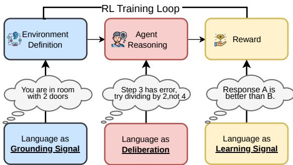
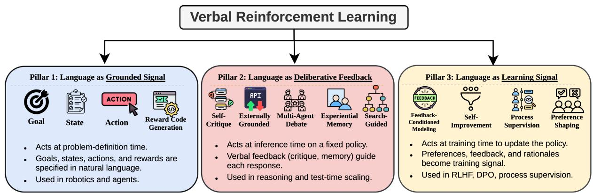
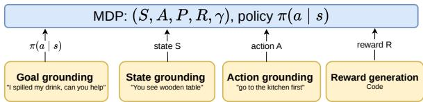
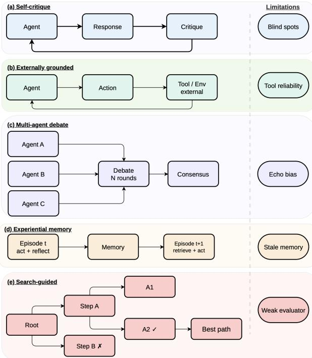
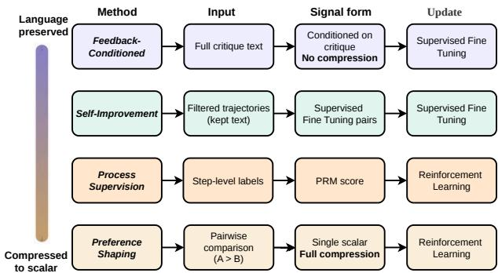

# The Rise of Verbal Reinforcement Learning

Kshitij Tayal1, Arun Sharma2, Genta Indra Winata1, Anirban Das1, Sambit Sahu1

1AI Foundations, Capital One

2University of Minnesota, USA

{kshitij.tayal, genta.winata, anirban.das, sambit.sahu}@capitalone.com arunshar@umn.edu

## Abstract

Natural language is emerging as a primary feedback channel for improving language agents, capable of conveying intent, preferences, and causal structure in forms interpretable by both humans and modern language models. We call this paradigm Verbal Reinforcement Learning (VRL) and offer the first unified account of it. We organize the field around a single axis, when verbal feedback takes effect in an agent’s lifecycle and what it modifies, yielding three pillars: (1) Language as Grounding Signal, where language defines the task itself by specifying goals, states, and reward structures; (2) Language as Deliberative Feedback, where natural language guides reasoning at test time without the need to update model parameters; (3) Language as Learning Signal, where language-based feedback shapes model parameters through training. Within each pillar, we synthesize representative work, distinguish key subcategories of approaches, and outline the distinct role language plays in shaping agent behavior. Together, this taxonomy shows how verbal reinforcement is reshaping agent development, while also defining the challenges and opportunities for building more capable and aligned agents.

## 1 Introduction

Classical reinforcement learning has achieved remarkable successes by coupling agents with wellspecified environments, action spaces, reasoning mechanisms, and task-specific reward functions. This framework has enabled agents to master Atari games (Mnih et al., 2015), defeat world champions at Go (Silver et al., 2016), optimize chip placement (Mirhoseini et al., 2021), and control complex physical systems (Degrave et al., 2022). However, each success rests on heavy domain-specific engineering: the environment must be formalized, the interaction space defined, and the reward function must closely capture the intended behavior (Vamplew et al., 2021). Designing such specifications is a long-standing bottleneck (Amodei et al., 2016), especially in settings where tasks and goals are ambiguous, context-dependent, and difficult to encode directly.

  
Figure 1: Language plays three complementary roles in agent’s development lifecycle: grounding the environment, scaffolding intermediate reasoning, and providing learning signal for further training.

The emergence of large language models (Brown et al., 2020) has introduced an alternative supervisory channel: natural language. Instead of requiring all task intent to be predefined, verbal feedback enables on-the-fly communication of corrections, preferences, and constraints in a manner that agents are increasingly able to interpret and implement. Modern large language models, particularly frontier models (Achiam et al., 2023), can accurately describe a wide range of phenomena. These capabilities include describing environments (Wang et al., 2023a), identifying bugs in code (McAleese et al., 2024), critiquing generated outputs (Madaan et al., 2023), and translating human preferences into actionable training signals (Hong et al., 2024a; Meng et al., 2024). Similar to how self-supervised learning (Devlin et al., 2019; Chen et al., 2020) expanded the use of unlabeled data in model development, verbal feedback is emerging as an important source of supervision for language-model-based agents.

We refer to this family of methods as Verbal

  
Figure 2: Our proposed taxonomy of Verbal Reinforcement Learning. Language serves three distinct functional roles: grounding signal, which structures environment interaction; deliberativefeedback, which operates at inference time to refine reasoning; and learning signal, which drives parameter updates at training time.

Reinforcement Learning (VRL): a paradigm in which an agent receives natural-language feedback—whether self-generated, provided by a human, or produced by an external tool or model— and uses it to improve its behavior and guide future decision-making. Feedback may be used directly as text or converted into a compressed training signal for parameter updates. The term was introduced by Shinn et al. (2023) to describe self-reflective agents (specific instance of what we call deliberative feedback); here, it is adopted more broadly to encompass any method in which verbal feedback shapes an agent’s outputs, learned policy, or problem specification.

Early results demonstrate that verbal feedback can drive substantial improvements across diverse settings. Ahn et al. (2022) used language to ground high-level instructions in physical affordances, enabling real-world robotic planning. Shinn et al. (2023) achieved 91% pass@1 on HumanEval through verbal self-reflection alone, and Madaan et al. (2023) showed that iterative verbal critique yields substantial gains across diverse generation tasks. Ouyang et al. (2022) demonstrated that a 1.3B-parameter model trained on verbal preference judgments outperformed the 175B GPT-3 baseline, a 130× size disadvantage overcome by richer supervision. These are not isolated demonstrations and publications on arXiv referencing “selfrefine,” “self-correction,” “verbal feedback,” and “language-feedback alignment” have grown from a handful in early 2020 to several hundred today, spanning multiple domains including coding assistants (Yang et al., 2024; Jimenez et al., 2024), scientific discovery (Bran et al., 2024; Lu et al., 2024), robotics (Wang et al., 2023a), mathematical reasoning (Hatamizadeh et al., 2026; Liu et al., 2026b; Shi et al., 2025a), clinical decision-making (Huang et al., 2025b; Zhou et al., 2025b) and education (Qian et al., 2025; Ahtisham et al., 2026).

These methods differ in their mechanisms (Figure 1): some operate during inference, others modify training data, and some redefine the task itself . However, they share a common characteristic: the use of natural language to guide, refine, and ground agent behavior. Yet no existing framework unifies them. Prior surveys have examined languageconditioned policies in text-based environments (Luketina et al., 2019), the bidirectional synergies between LLMs and RL (Pternea et al., 2024), LLM self-correction in isolation (Kamoi et al., 2024). In contrast, our survey focuses on the functional role of verbal feedback as a first-class signal for improving agent, organized along a single axis: when natural language enters the agent’s lifecycle and what it modifies. We formalize this axis into a three-pillar taxonomy in Section 2. This paper makes following contributions:

• We present the first comprehensive survey of Verbal Reinforcement Learning, defining the paradigm broadly and proposing a three-pillar taxonomy (Section 2) that organizes the field by when language acts in the agent lifecycle.

• Within each pillar, we synthesize representative methods, identify cross-cutting challenges and outline future directions for developing robust, capable and aligned Verbal RL agents.

We organize the paper as follows. Section 2 introduces the three-pillar taxonomy and a working example showing how the pillars operate together in a single coding agent. Sections 3–5 develop each pillar of the taxonomy in detail: language as grounding signal, as deliberative feedback, and as learning signal, respectively. Finally, section 6 presents cross-cutting insights and outlines future research directions, while section 7 provides the conclusion.

## 2 Taxonomy

We organize VRL methods along a single axis: when natural language enters the agent’s lifecycle and, consequently, what it modifies. This yields three pillars, summarized in Figure 2 and synthesized in Table 1.

• Pillar 1: Language as Grounding Signal (§3) acts at problem-definition time, specifying the MDP (Sutton and Barto, 1998) itself: goals, states, actions, and rewards. A naturallanguage task description such as “You are in a room with two doors” defines what the agent perceives, how it can act, and what counts as success, all before any policy runs.

• Pillar 2: Language as Deliberative Feedback (§4) acts at inference time, refining outputs or reasoning traces through critique, memory, debate, or search, without updating parameters. A message such as “Step 3 has an error; try dividing by 2, not 4” redirects a single generation episode but leaves the model unchanged for future tasks.

• Pillar 3: Language as Learning Signal (§5) acts at training time, where verbal feedback is distilled into gradient updates that persistently reshape the policy. A judgment such as “Response A is better than B because it addresses the edge case” becomes a preference pair that alters model weights, affecting all subsequent interactions.

The key distinction is persistence: grounding defines the task space, deliberative feedback improves a single episode, and learning signal permanently reshapes the policy. We discuss each pillar in consecutive sections. Methods spanning multiple pillars are categorized by their role in the primary function of verbal feedback.

Working Example: the coding agent - The three pillars are complementary, not competing; they operate together across a single development cycle. Consider an agent (Wang et al., 2025d) tasked with resolving a GitHub issue. Grounding (Pillar 1) enters first: the natural-language issue description defines the goal, the repository structure specifies the state space, and the test suite implicitly encodes a reward function. At inference time, deliberativefeedback (Pillar 2) drives the iterative loop: the agent generates a patch, executes the tests, treats traces and error messages as verbal feedback, critiques its own output, and revises. When successful and failed trajectories are later collected and used to fine-tune the model via preference optimization, they become a learning signal (Pillar 3) that persistently improves the policy for future tasks. The same agent thus drives reinforcement loop by consuming verbal feedback at three distinct timescales, each producing a different effect. This example demonstrates the rationale for organizing by temporal scope rather than by feedback source (human, model, tool) or modality (text, scalar, code). Identical verbal feedback can yield fundamentally different effects depending on when it is consumed, and each temporal regime introduces distinct technical challenges, which we will discuss in later sections.

Table 1: Overview of the three VRL pillars.
<table><tr><td>Axis</td><td>Grounding Signal</td><td>Deliberative Feedback</td><td>Learning Signal</td></tr><tr><td>When</td><td>Problem- definition time</td><td>Inference time</td><td>Training time</td></tr><tr><td>Modifies</td><td>Task, State, Action, Reward</td><td>Outputs or reasoning traces</td><td>Model weights, Training data</td></tr><tr><td>Persistence</td><td>Defines the task</td><td>Single episode (extendable via memory)</td><td>All future interactions</td></tr><tr><td>Methods</td><td>Environment specification</td><td>Prompting and critique</td><td>SFT, PPO, DPO</td></tr><tr><td>Challenges</td><td>Grounding gap; Compo- sitionality</td><td>Feedback Quality; Compute Cost</td><td>Signal Com- pression; Filter Quality</td></tr></table>

## 3 Pillar 1: Language as Grounding Signal

In this pillar, we discuss the role of language in providing grounding for each component of the task in which an agent operates.As illustrated in Figure 3, verbal feedback maps to specific MDP elements (Sutton and Barto, 1998): specifying what the agent should optimize (goals - §3.1), what it perceives (states- §3.2), how it can act (actions-§3.3), and what constitutes success (rewards- §3.4) (MacGlashan et al., 2017). This matters because many failures in language-based agents stem not from poor optimization but from poor grounding: feedback that cannot map to executable actions or valid reward conditions will not improve the agent. A common bottleneck across all four subcategories is the grounding gap. More detailed verbal specifications do not necessarily result in improved grounding. The critical factor is whether the mapping from language to MDP components is sufficiently precise for the agent to execute actions.

  
Figure 3: Grounding of MDP components through natural language. Each subcategory maps verbal feedback to a specific element of the MDP: goal grounding specifies the objective, state grounding represents observations as text, action grounding resolves instructions to executable behavior, and reward code generation compiles language into executable reward functions.

## 3.1 Goal Grounding

Goal grounding uses verbal feedback to specify what the agent should achieve, requiring parsing instructions into objects, relations, and target conditions (Chaplot et al., 2018), filtering plans by physical executability (Ahn et al., 2022; Driess et al., 2023), and decomposing goals into verifiable subgoals. Recent work extends this to multi-agent coordination (Zhang et al., 2025b), hierarchical decomposition via offline RL (Hu et al., 2025), and training from language specifications without manual reward functions (Li et al., 2026). The open challenge is compositional generalization: agents must follow goals assembled from familiar primitives in unfamiliar combinations. BabyAI (Chevalier-Boisvert et al., 2018) isolates this in gridworlds, and even state-of-the-art LLMs achieve only about 75% coverage under compositional constraints (Sakai et al., 2025), though compositional policy representations can improve sample efficiency on novel compositions (Cohen et al., 2025).

## 3.2 State Grounding

Where goal grounding defines what to achieve, state grounding defines what the agent perceives. Verbal state descriptions are most explicit in textbased environments (Yao et al., 2020; Côté et al., 2018), but appear whenever visual or physical states are summarized into language. Shridhar et al. (2020) show that agents trained on verbal state descriptions transfer to embodied 3D settings, demonstrating language as a modality-invariant state representation. Recent work includes closed-loop state feedback for robotic planning (Bhat et al., 2024) and scene-graph-based grounding (Huang et al., 2025a). A key challenge is information preservation, specifically whether the verbal abstraction retains sufficient signal for the policy to operate effectively.

## 3.3 Action Grounding

Given a goal and a perceived state, the agent must determine how to act. Action grounding resolves verbal instructions to specific skills, tool calls, or motor commands, requiring that instructions map to executable actions and that execution outcomes feedback as language to revise subsequent steps. Huang et al. (2022b) demonstrate this closed loop with Inner Monologue, while Sharma et al. (2022) show that short corrective utterances can amend mistaken steps without disrupting the rest of the plan. Recent systems have pushed toward tighter integration: multi-modal grounded replanning that corrects ambiguous instructions using visual cues (Kim et al., 2025), constraint-aware visual programming for proactive failure detection (Zhou et al., 2025a), corrective planning that handles physical, logical, and semantic errors across hierarchical control levels (Joublin et al., 2024), and visually grounded task-and-motion planning that combines LLM reasoning with physical feasibility (Zhang et al., 2025a). The central challenge is granularity alignment: the same instruction can refer to a temporally extended skill (“make coffee”), a discrete subgoal (“go to the kitchen”), or a motor command (“close the gripper”), each demanding a different language-to-control interface.

## 3.4 Reward Code Generation

The preceding subcategories ground objectives, observations, and actions in language. Reward code generation closes the loop by grounding success itself. This subcategory overlaps with Pillar 3 when generated rewards are used for training; we categorize it here because verbal feedback defines the reward function itself, becoming part of the MDP. The distinguishing feature is compiling verbal descriptions into executable reward functions rather than using language as a direct learning signal. Ma et al. (2024) introduced Eureka, where an LLM gen-

Figure 4: Inference-time verbal feedback mechanisms. Each subcategory exhibits a distinct feedback loop structure: (a) self-critique loops within a single model, (b) externally grounded critique incorporates verified tool or environment output, (c) multi-agent debate distributes critique across parallel model instances and converges to a refined output, (d) experiential memory persists lessons across episodes, and (e) search-guided deliberation explores and prunes multiple candidate paths.

erates and iteratively refines reward code based on training summaries, and Xie et al. (2024) extended this to dense reward shaping. This area has seen rapid recent progress: CARD (Sun et al., 2025a) introduces dynamic trajectory-based feedback to refine reward code without per-iteration RL training, PROF (Sun et al., 2025b) extends the paradigm to offline settings through preference optimization, and Zeng et al. (2024) show that reward functions can be generated from video demonstrations. To ensure effectiveness, verbal feedback must be compilable, executable, and accurately reflect the original natural-language intent.

## 4 Pillar 2: Language as Deliberative Feedback

With the task grounded, we turn to methods that refine reasoning within a single episode without updating model parameters, closely aligning with testtime compute scaling (Snell et al., 2024). As illustrated in Figure 4, five subcategories differ in where critique originates: the model itself (§4.1), external tools (§4.2), peer models (§4.3), past episodes (§4.4), or parallel search paths (§4.5).

## 4.1 Self-Critique

The simplest deliberative loop asks the model to critique its own output and revise accordingly. Self-Refine (Madaan et al., 2023) formalized this pattern, building on Constitutional AI’s (Bai et al., 2022) demonstration that models can evaluate outputs against written principles. The primary challenge is circularity. Replacing self-generated critique with evaluation from a separately trained critic enhances reasoning (Paul et al., 2024), which indicates that feedback quality is the main bottleneck. Self-correction degrades when the critique source shares the generator’s blind spots (Huang et al., 2024; Kamoi et al., 2024), especially in smaller models (Olausson et al., 2024). Mitigation strategies include Socratic decomposition into verifiable steps (Shi et al., 2025a) and parallel self-refinement across candidates (Wang et al., 2025c). However, when errors arise from gaps in the model’s knowledge, internal feedback mechanisms cannot identify the missing information.

## 4.2 Externally Grounded Critique

External grounding addresses this circularity by anchoring verbal feedback in deterministic tool output (Schick et al., 2023). Verified signals, such as execution traces, unit test verdicts, search results, and API responses (Chen et al., 2024; Gou et al., 2024b), facilitate the generation of corrected outputs (Gou et al., 2024a; Yang et al., 2024; Wang et al., 2024b). Additionally, end-to-end reinforcement learning enables models to utilize such feedback more effectively (Gehring et al., 2024). The primary failure mode shifts from blind spots to trust asymmetry: the model receives accurate tool output but may misattribute the root cause of a reported trace. Practical limitations persist, including infrastructure overhead, poor scalability of latency, and the restriction of grounded critique to domains with a verifiable oracle.

## 4.3 Multi-Agent Critique / Debate

Multi-agent debate distributes verbal critique across parallel model instances, frequently assigning distinct personas to enhance perspective (Hong et al., 2024b). The exchange of critiques can improve reasoning even among identical models (Du et al., 2024), while the introduction of diverse roles further strengthens the quality of discussion (Chan et al., 2023). Communication topology is a critical factor; full-broadcast designs incur substantial token overhead (Choi et al., 2026), motivating the exploration of sparse alternatives (Li et al., 2024). Models may also be trained specifically for debate, enabling them to revise reasoning in response to conflicting opinions (Liu et al., 2026a). Adaptive heterogeneous frameworks have demonstrated improvements in mathematical reasoning (Zhou and Chen, 2025). However, the primary limitation is that distributing critique is only effective when participating models are genuinely diverse. When models share biases, the process yields redundant consensus (Estornell and Liu, 2024; Liang et al., 2024), and current debate methods do not consistently outperform simpler single-agent strategies (Choi et al., 2026).

## 4.4 Experiential Memory

Previous approaches regenerate feedback from scratch in each episode. In contrast, experiential memory distills reusable lessons into persistent storage, categorized as episodic (raw logs), semantic (distilled rules), and procedural (reusable skills) (Zhang et al., 2025c). Reflexion (Shinn et al., 2023) stores raw verbal feedback, ExpeL (Zhao et al., 2024) extracts insights from paired successes and failures, and Voyager (Wang et al., 2023a) accumulates executable skills. Recent surveys have formalized these mechanisms (Du, 2026), while MemBench evaluates memory quality through downstream performance (Tan et al., 2025). However, persisting feedback can also perpetuate errors: poor-quality memories propagate mistakes, expanding memory stores require complex retrieval (Park et al., 2023), outdated knowledge can mislead in non-stationary environments (Zhang et al., 2025c), and adversarial injection may induce crosssession drift (Dong et al., 2026).

## 4.5 Search-Guided Deliberation

While previous approaches refine a single trajectory, search-guided deliberation explores multiple candidate paths and employs verbal feedback to determine which paths to expand, prune, or abandon (Wang et al., 2025a). The Tree of Thoughts framework (Yao et al., 2023) samples several intermediate thoughts and evaluates them through selfassessment, thereby extending chain-of-thought prompting (Wei et al., 2022) with a tree-based search mechanism. Reasoning via Planning (Hao et al., 2023) and Graph of Thoughts (Besta et al., 2024) further generalize the underlying topology, permitting non-linear dependencies such as aggregation and refinement. A key advantage of these methods is that verbal feedback can be applied at every thought level, which facilitates earlier identification of unproductive paths. However, exploring multiple states necessitates numerous large language model (LLM) calls, rendering these methods considerably more expensive than single-pass generation (Xie et al., 2023).

## 5 Pillar 3: Language as Learning Signal

The method above leave the model unchanged; we now examine how verbal feedback can persistently reshape the policy through training. As illustrated in Figure 5, the four subcategories form a compression spectrum: from feedback-conditioned modeling (§5.1), which preserves full critiques, through self-improvement (§5.2) and process supervision (§5.3), to preference shaping (§5.4), which reduces verbal judgement to a single scalar.

## 5.1 Feedback-Conditioned Modeling

At the upper end of the compression spectrum, feedback-conditioned modeling maintains verbal critiques in their entirety by conditioning the model directly on natural-language feedback during training. The training signal consists of a triple $( x , v , a ^ { * } )$ : the input, a critique of an initial response, and the revised output. A central question is whether to retain the critique within the training context. Early studies omitted the critique, using only the refined output as the supervision target (Scheurer et al., 2023). Subsequent work, such as ALT (Lloret et al., 2024), demonstrated that retaining feedback as conditioning context enables models to learn explicit mappings from critique to correction. Luo et al. (2025) further formalized this approach by treating free-form feedback as a primary conditioning signal with online bootstrapping. While preserving the full linguistic content of the critique allows these methods to retain the richest signal, this same receptiveness introduces a risk: models may learn to follow critiques indiscriminately, even when they are incorrect (Sharma et al., 2024).

## 5.2 Self-Improvement

Self-improvement approaches treat language as filtered text rather than as a conditioning context. The central mechanism is generate-then-filter: the model generates multiple candidate trajectories, verbal feedback signals determine which candidates are retained, and these selected outputs become supervised fine-tuning data for subsequent iterations (Singh et al., 2023). The filtering criterion directly shapes the model’s learning. For example, in STaR (Zelikman et al., 2022), correctness of the final answer is used as the filter, while in Constitutional AI (Bai et al., 2022), adherence to safety principles serves this role. Explicit labeling is not always required; majority voting across diverse samples can identify likely correct traces (Huang et al., 2022a), and the model itself can act as a judge across iterations (Yuan et al., 2024). This self-contained loop can facilitate compounding improvements over multiple cycles. However, filter quality remains a critical bottleneck: when the same model functions as both generator and judge, systematic biases may be amplified (Shumailov et al., 2023).

  
Figure 5: Training-time verbal feedback methods organized by degree of linguistic compression. Methods at the top preserve full natural-language feedback during training, while methods at the bottom compress it into scalar signals.

## 5.3 Process Supervision

Process supervision reduces verbal feedback to scalar scores at the step level. Annotators assess each intermediate reasoning step, and these evaluations are used to train a process reward model; the verbal content of the judgments is omitted. Despite this reduction, step-level supervision substantially outperforms outcome-level supervision (Lightman et al., 2024; Uesato et al., 2022), as localized feedback enables more precise credit assignment. The high cost of step-level annotation has motivated efforts to automate this process (Wang et al., 2024a; Luo et al., 2024). Generative process reward models that incorporate reasoning prior to scoring retain more verbal information while maintaining step-level granularity (Zhao et al., 2026; Liu et al., 2025b). Although step-level granularity offers significant advantages, it remains costly and is challenging to define in domains where intermediate correctness is ambiguous.

## 5.4 Preference Shaping

Preference shaping represents the maximal compression of verbal feedback, reducing a comparative judgment between two responses to a single scalar that guides policy updates. Building on the foundation of learning from verbal preferences (Christiano et al., 2017), InstructGPT (Ouyang et al., 2022) demonstrated large-scale implementation by training a reward model on pairwise rankings and optimizing the policy online. Direct Preference Optimization (DPO) (Rafailov et al., 2023) further simplified this process by eliminating the explicit reward model and training directly on preference pairs, using the comparison itself as the loss signal. Subsequent research has investigated additional alternatives (Ethayarajh et al., 2024; Hong et al., 2024a; Meng et al., 2024; Azar et al., 2024). Notably, Lee et al. (2023) replaced human annotators with AI judges, thereby enhancing the scalability of preference collection. Although scalar compression reduces the explanatory richness of verbal feedback, the scalability enabled by llm generated judgments increasingly justifies this tradeoff.

## 6 Insights, Discussion and Future Prospects

In practice, the three pillars operate together, as the coding-agent example in §2 illustrates. Four crosscutting challenges span them: feedback-model quality (§6.1), tool-interface design (§6.2), adversarial robustness (§6.3), and the absence of formal guarantees (§6.4).

## 6.1 Dedicated Feedback Models

Verbal feedback quality remains the key performance factor, but current practice typically reuses the same LLM for both generation and critique. Dedicated critics consistently outperform this approach: Shepherd (Wang et al., 2023b) provides more actionable feedback than untuned baselines, CriticGPT (McAleese et al., 2024) detects code bugs more reliably, and CritiqueLLM (Ke et al., 2024) scales critique data via multi-path prompting. Co-training critics with reasoners yields further improvements (Liu et al., 2025a), while generative process reward models that reason before scoring preserve more verbal signal than scalar PRMs (Khalifa et al., 2025). CriticBench (Lin et al., 2024) offers the first systematic benchmark for critique quality. These results indicate a natural next step: just as the field invested in instructiontuned models (Ouyang et al., 2022), it should now develop feedback-tuned models whose objectives address error localization, actionability, and calibration. Recent advances in span-level feedback gradients (Wang et al., 2025b) and multi-turn didactic interactions (Klissarov et al., 2026) suggest such models can serve as differentiable training signals across each pillars.

## 6.2 Designing Tools for Verbal Feedback

Developer-oriented tools often yield outputs that are terse or conflate error types. Yang et al. (2024) demonstrated that LLM-optimized interfaces enhance agent performance, while Bandlamudi et al. (2025) showed ambiguous outputs cause many agent failures across 750 API calls. Tool-interactive critiquing requires interpretable output (Gou et al., 2024a), and executable code actions benefit agents by providing structured feedback (Wang et al., 2024b). RL on execution feedback (Gehring et al., 2024) presumes adequate tool-output signal, while agent harness frameworks (Ning et al., 2026) set tool quality as the limit of iterative refinement. However, a metric to measure this limit is lacking: tool-output compliance should quantify agent consumability. Tool APIs must expose structured metadata distinguishing task-level errors from infrastructure failures to enable agents to apply suitable recovery strategies.

## 6.3 Adversarial Verbal Feedback

Because VRL agents inherently act on feedback, adversarial feedback constitutes policy manipulation, introducing vulnerabilities beyond standard prompt injection. Zhan et al. (2025) demonstrated that adaptive attacks circumvent all eight tested defenses, while tool-level injection attains a 96.7% success rate on GPT-4o (Shi et al., 2025b). Hidden instructions in API responses covertly manipulate agents (Zhan et al., 2024), adversarial memory injection induces cross-session drift (Dong et al., 2026), and even benign incorrect feedback leads to sycophancy (Sharma et al., 2024). Defenses are developing: instruction hierarchies (Wallace et al., 2024), adversarial fine-tuning (Chen et al., 2025), and system-level design patterns (Beurer-Kellner et al., 2025) each mitigate narrow attack surfaces. Comprehensive solutions will require feedback-provenance mechanisms to verify source integrity and assign trust, as well as adversarial feedback benchmarks to evaluate robustness as the primary metric.

## 6.4 Theoretical Foundations

Verbal RL lacks formal guarantees; it remains unclear when verbal feedback enhances sample efficiency or policy quality. Three promising directions emerge. First, if verbal critics serve as noisy oracles with bounded error, PAC-learning frameworks (Strehl et al., 2009) can bound VRL sample complexity, and critic benchmarks (Lin et al., 2024) allow empirical estimation of error rates. Second, modeling feedback as partial observation links VRL to POMDP instruction following (Luketina et al., 2019), where belief-state planning yields convergence guarantees; McCallum et al. (2023) implement this with feedback-conditioned decision transformers. Third, rate-distortion theory may quantify signal retention from critique to scalar, clarifying when preference shaping aligns with feedback-conditioned methods. Empirical studies support these directions: language models learn from verbal feedback without scalar rewards (Luo et al., 2025), text feedback broadens RL capabilities (Song et al., 2026), and recent surveys link RLHF to language-conditioned RL theory (Kaufmann et al., 2023). Formalizing results in these areas would clarify when the cost of rich verbal feedback is warranted over scalar alternatives.

## 7 Conclusion

In this paper, we present the first comprehensive survey of verbal reinforcement learning, organized around three pillars based on when language enters an agent’s lifecycle: grounding signal, deliberative feedback, and learning signal. Together, these pillars reveal a common pattern: verbal feedback is rapidly becoming the primary medium for defining, updating, and improving agents.

Looking ahead, we anticipate that verbal feedback will become a first-class design primitive in agent architectures. The boundaries between pillars will increasingly blur as agents consume verbal feedback in unified loops that span grounding, deliberation, and learning within a single trajectory. The bottleneck will shift from generating feedback to verifying it, making feedback provenance, quality benchmarks, and adversarial robustness firstclass infrastructure requirements. Finally, tool interfaces will need to be redesigned around agent consumability rather than human readability, as the gap between tool output quality and agent performance becomes the practical ceiling for iterative refinement.

## Limitations

We aim to provide broad coverage of methods that use verbal feedback within the agent’s lifecycle. Within each category, we focus on representative papers rather than attempting an exhaustive enumeration. Additionally, while our taxonomy offers a unifying framework, it may oversimplify methods that span multiple roles of language. Several approaches do not fit neatly into a single branch, since verbal feedback can simultaneously serve as a grounding signal, a deliberative mechanism, and a learning signal. Our taxonomy should therefore be understood as an organizing lens rather than a strict partition of the literature. Finally, our survey focuses primarily on methods in which verbal feedback is explicit and central to the agent’s process, and therefore does not fully cover adjacent work where language plays a more auxiliary role. AI writing tools were used for language editing and proofreading only; all research contributions are the authors’ own.

## References

Josh Achiam, Steven Adler, Sandhini Agarwal, Lama Ahmad, Ilge Akkaya, Florencia Leoni Aleman, Diogo Almeida, Janko Altenschmidt, Sam Altman, and Shyamal Anadkat. 2023. Gpt-4 technical report. arXiv preprint arXiv:2303.08774.

Michael Ahn, Anthony Brohan, Noah Brown, Yevgen Chebotar, Omar Cortes, Byron David, Chelsea Finn, Chuyuan Fu, Keerthana Gopalakrishnan, and Karol Hausman. 2022. Do as i can, not as i say: Grounding language in robotic affordances. arXiv preprint arXiv:2204.01691.

Bakhtawar Ahtisham, Kirk Vanacore, Jinsook Lee, Zhuqian Zhou, Doug Pietrzak, and Rene F Kizilcec. 2026. Ai annotation orchestration: Evaluating llm verifiers to improve the quality of llm annotations in learning analytics. In Proceedings of the LAK26: 16th International Learning Analytics and Knowledge Conference, pages 447–456.

Dario Amodei, Chris Olah, Jacob Steinhardt, Paul Christiano, John Schulman, and Dan Mané. 2016. Concrete problems in ai safety. arXiv preprint arXiv:1606.06565.

Mohammad Gheshlaghi Azar, Zhaohan Daniel Guo, Bilal Piot, Remi Munos, Mark Rowland, Michal Valko, and Daniele Calandriello. 2024. A general theoretical paradigm to understand learning from human preferences. In International Conference on Artificial Intelligence and Statistics, pages 4447–4455. PMLR.

Yuntao Bai, Saurav Kadavath, Sandipan Kundu, Amanda Askell, Jackson Kernion, Andy Jones, Anna Chen, Anna Goldie, Azalia Mirhoseini, Cameron McKinnon, Carol Chen, Catherine Olsson, Christopher Olah, Danny Hernandez, Dawn Drain, Deep Ganguli, Dustin Li, Eli Tran-Johnson, Ethan Perez, and 32 others. 2022. Constitutional AI: Harmlessness from AI feedback. arXiv preprint arXiv:2212.08073.

Jayachandu Bandlamudi, Ritwik Chaudhuri, Neelamadhav Gantayat, Sambit Ghosh, Kushal Mukherjee, Prerna Agarwal, Renuka Sindhgatta, and Sameep Mehta. 2025. A framework for testing and adapting rest apis as llm tools. arXiv preprint arXiv:2504.15546.

Maciej Besta, Nils Blach, Ales Kubicek, Robert Gerstenberger, Michal Podstawski, Lukas Gianinazzi, Joanna Gajda, Tomasz Lehmann, Hubert Niewiadomski, and Piotr Nyczyk. 2024. Graph of thoughts: Solving elaborate problems with large language models. In Proceedings of the AAAI conference on artificial intelligence, volume 38, pages 17682–17690.

Luca Beurer-Kellner, Beat Buesser, Ana-Maria Cre¸tu, Edoardo Debenedetti, Daniel Dobos, Daniel Fabian, Marc Fischer, David Froelicher, Kathrin Grosse, and Daniel Naeff. 2025. Design patterns for securing llm agents against prompt injections. arXiv preprint arXiv:2506.08837.

Vineet Bhat, Ali Umut Kaypak, Prashanth Krishnamurthy, Ramesh Karri, and Farshad Khorrami. 2024. Grounding llms for robot task planning using closed-loop state feedback. arXiv preprint arXiv:2402.08546.

Andres Bran, Sam Cox, Oliver Schilter, Carlo Baldassari, Andrew D White, and Philippe Schwaller. 2024. Augmenting large language models with chemistry tools. Nature machine intelligence, 6(5):525–535.

Tom Brown, Benjamin Mann, Nick Ryder, Melanie Subbiah, Jared D Kaplan, Prafulla Dhariwal, Arvind Neelakantan, Pranav Shyam, Girish Sastry, and Amanda Askell. 2020. Language models are few-shot learners. Advances in neural information processing systems, 33:1877–1901.

Chi-Min Chan, Weize Chen, Yusheng Su, Jianxuan Yu, Wei Xue, Shanghang Zhang, Jie Fu, and Zhiyuan Liu. 2023. Chateval: Towards better llm-based evaluators through multi-agent debate. Preprint, arXiv:2308.07201.

Devendra Singh Chaplot, Kanthashree Mysore Sathyendra, Rama Kumar Pasumarthi, Dheeraj Rajagopal, and Ruslan Salakhutdinov. 2018. Gated-attention architectures for task-oriented language grounding. In Proceedings ofthe AAAI Conference on Artificial Intelligence, volume 32.

Sizhe Chen, Arman Zharmagambetov, Saeed Mahloujifar, Kamalika Chaudhuri, David Wagner, and Chuan Guo. 2025. Secalign: Defending against prompt injection with preference optimization. Preprint, arXiv:2410.05451.

Ting Chen, Simon Kornblith, Mohammad Norouzi, and Geoffrey Hinton. 2020. A simple framework for contrastive learning of visual representations. In International conference on machine learning, pages 1597–1607. PmLR.

Xinyun Chen, Maxwell Lin, Nathanael Schärli, and Denny Zhou. 2024. Teaching large language models to self-debug. In International Conference on Learning Representations, volume 2024, pages 8746–8825.

Maxime Chevalier-Boisvert, Dzmitry Bahdanau, Salem Lahlou, Lucas Willems, Chitwan Saharia, Thien Huu Nguyen, and Yoshua Bengio. 2018. Babyai: A platform to study the sample efficiency of grounded language learning. arXiv preprint arXiv:1810.08272.

Hyeong Kyu Choi, Jerry Zhu, and Sharon Li. 2026. Debate or vote: Which yields better decisions in multi-agent large language models? Advances in Neural Information Processing Systems, 38:101732– 101764.

Paul F Christiano, Jan Leike, Tom Brown, Miljan Martic, Shane Legg, and Dario Amodei. 2017. Deep reinforcement learning from human preferences. Advances in Neural Information Processing Systems, 30.

Vanya Cohen, Geraud Nangue Tasse, Nakul Gopalan, Steven James, Matthew Gombolay, Ray Mooney, and Benjamin Rosman. 2025. Compositional instruction following with language models and reinforcement learning. arXiv preprint arXiv:2501.12539.

Marc-Alexandre Côté, Akos Kádár, Xingdi Yuan, Ben Kybartas, Tavian Barnes, Emery Fine, James Moore, Matthew Hausknecht, Layla El Asri, and Mahmoud Adada. 2018. Textworld: A learning environment for text-based games. In Workshop on Computer Games, pages 41–75. Springer.

Jonas Degrave, Federico Felici, Jonas Buchli, Michael Neunert, Brendan Tracey, Francesco Carpanese, Timo Ewalds, Roland Hafner, Abbas Abdolmaleki, and Diego de Las Casas. 2022. Magnetic control of tokamak plasmas through deep reinforcement learning. Nature, 602(7897):414–419.

Jacob Devlin, Ming-Wei Chang, Kenton Lee, and Kristina Toutanova. 2019. Bert: Pre-training of deep bidirectional transformers for language understanding. Preprint, arXiv:1810.04805.

Shen Dong, Shaochen Xu, Pengfei He, Yige Li, Jiliang Tang, Tianming Liu, Hui Liu, and Zhen Xiang. 2026. Memory injection attacks on llm agents via queryonly interaction. Advances in Neural Information Processing Systems, 38:46697–46731.

Danny Driess, Fei Xia, Mehdi SM Sajjadi, Corey Lynch, Aakanksha Chowdhery, Brian Ichter, Ayzaan Wahid, Jonathan Tompson, Quan Vuong, and Tianhe Yu. 2023. Palm-e: An embodied multimodal language model. arXiv preprint arXiv:2303.03378.

Pengfei Du. 2026. Memory for autonomous llm agents: Mechanisms, evaluation, and emerging frontiers. arXiv preprint arXiv:2603.07670.

Yilun Du, Shuang Li, Antonio Torralba, Joshua B Tenenbaum, and Igor Mordatch. 2024. Improving factuality and reasoning in language models through multiagent debate. In International Conference on Machine Learning.

Andrew Estornell and Yang Liu. 2024. Multi-llm debate: Framework, principals, and interventions. Advances in Neural Information Processing Systems, 37:28938–28964.

Kawin Ethayarajh, Winnie Xu, Niklas Muennighoff, Dan Jurafsky, and Douwe Kiela. 2024. Kto: Model alignment as prospect theoretic optimization. arXiv preprint arXiv:2402.01306.

Jonas Gehring, Kunhao Zheng, Jade Copet, Vegard Mella, Quentin Carbonneaux, Taco Cohen, and Gabriel Synnaeve. 2024. Rlef: Grounding code llms in execution feedback with reinforcement learning. arXiv preprint arXiv:2410.02089.

Zhibin Gou, Zhihong Shao, Yeyun Gong, Yelong Shen, Yujiu Yang, Nan Duan, and Weizhu Chen. 2024a. CRITIC: Large language models can self-correct with tool-interactive critiquing. In International Conference on Learning Representations.

Zhibin Gou, Zhihong Shao, Yeyun Gong, Yelong Shen, Yujiu Yang, Minlie Huang, Nan Duan, and Weizhu Chen. 2024b. Tora: A tool-integrated reasoning agent for mathematical problem solving. Preprint, arXiv:2309.17452.

Shibo Hao, Yi Gu, Haodi Ma, Joshua Hong, Zhen Wang, Daisy Wang, and Zhiting Hu. 2023. Reasoning with language model is planning with world model. In Proceedings of the 2023 Conference on Empirical Methods in Natural Language Processing, pages 8154–8173.

Ali Hatamizadeh, Shrimai Prabhumoye, Igor Gitman, Ximing Lu, Seungju Han, Wei Ping, Yejin Choi, and Jan Kautz. 2026. igrpo: Self-feedback-driven llm reasoning. arXiv preprint arXiv:2602.09000.

Jiwoo Hong, Noah Lee, and James Thorne. 2024a. Orpo: Monolithic preference optimization without reference model. In Proceedings of the 2024 Conference on Empirical Methods in Natural Language Processing, pages 11170–11189.

Sirui Hong, Mingchen Zhuge, Jonathan Chen, Xiawu Zheng, Yuheng Cheng, Jinlin Wang, Ceyao Zhang, Steven Yau, Zijuan Lin, and Liyang Zhou. 2024b. Metagpt: Meta programming for a multi-agent collaborative framework. In International Conference on Learning Representations, volume 2024, pages 23247–23275.

Zican Hu, Wei Liu, Xiaoye Qu, Xiangyu Yue, Chunlin Chen, Zhi Wang, and Yu Cheng. 2025. Divide and conquer: Grounding llms as efficient decisionmaking agents via offline hierarchical reinforcement learning. arXiv preprint arXiv:2505.19761.

Jiani Huang, Amish Sethi, Matthew Kuo, Mayank Keoliya, Neelay Velingker, JungHo Jung, Ser-Nam Lim, Ziyang Li, and Mayur Naik. 2025a. Esca: Contextualizing embodied agents via scene-graph generation. Preprint, arXiv:2510.15963.

Jiaxin Huang, Shixiang Shane Gu, Le Hou, Yuexin Wu, Xuezhi Wang, Hongkun Yu, and Jiawei Han. 2022a. Large language models can self-improve. arXiv preprint arXiv:2210.11610.

Jie Huang, Xinyun Chen, Swaroop Mishra, Huaixiu Steven Zheng, Adams Yu, Xinying Song, and Denny Zhou. 2024. Large language models cannot self-correct reasoning yet. In International conference on learning representations, volume 2024, pages 32808–32824.

Wenlong Huang, Fei Xia, Ted Xiao, Harris Chan, Jacky Liang, Pete Florence, Andy Zeng, Jonathan Tompson, Igor Mordatch, and Yevgen Chebotar. 2022b. Inner monologue: Embodied reasoning through planning with language models. arXiv preprint arXiv:2207.05608.

Yue Huang, Yanyuan Chen, Dexuan Xu, Weihua Yue, Huamin Zhang, Meikang Qiu, and Yu Huang. 2025b. Medreflect: Teaching medical llms to selfimprove via reflective correction. arXiv preprint arXiv:2510.03687.

Carlos E. Jimenez, John Yang, Alexander Wettig, Shunyu Yao, Kexin Pei, Ofir Press, and Karthik Narasimhan. 2024. Swe-bench: Can language models resolve real-world github issues? Preprint, arXiv:2310.06770.

Frank Joublin, Antonello Ceravola, Pavel Smirnov, Felix Ocker, Joerg Deigmoeller, Anna Belardinelli, Chao Wang, Stephan Hasler, Daniel Tanneberg, and Michael Gienger. 2024. Copal: corrective planning of robot actions with large language models. In 2024 ieee international conference on robotics and au tomation (ICRA), pages 8664–8670. IEEE.

Ryo Kamoi, Yusen Zhang, Nan Zhang, Jiawei Han, and Rui Zhang. 2024. When can llms actually correct their own mistakes? a critical survey of selfcorrection of llms. Transactions of the Association for Computational Linguistics, 12:1417–1440.

Timo Kaufmann, Paul Weng, Viktor Bengs, and Eyke Hüllermeier. 2023. A survey of reinforcement learning from human feedback. arXiv preprint arXiv:2312.14925.

Pei Ke, Bosi Wen, Andrew Feng, Xiao Liu, Xuanyu Lei, Jiale Cheng, Shengyuan Wang, Aohan Zeng, Yuxiao Dong, and Hongning Wang. 2024. Critiquellm: Towards an informative critique generation model

for evaluation of large language model generation. In Proceedings of the 62nd Annual Meeting of the Associationfor Computational Linguistics (Volume 1: Long Papers), pages 13034–13054.

Muhammad Khalifa, Rishabh Agarwal, Lajanugen Logeswaran, Jaekyeom Kim, Hao Peng, Moontae Lee, Honglak Lee, and Lu Wang. 2025. Process reward models that think. Preprint, arXiv:2504.16828.

Taewoong Kim, Byeonghwi Kim, and Jonghyun Choi. 2025. Multi-modal grounded planning and efficient replanning for learning embodied agents with a few examples. In Proceedings of the AAAI Conference on Artificial Intelligence, volume 39, pages 4329–4337.

Martin Klissarov, Jonathan Cook, Diego Antognini, Hao Sun, Jingling Li, Natasha Jaques, Claudiu Musat, and Edward Grefenstette. 2026. Improving interactive in-context learning from natural language feedback. arXiv preprint arXiv:2602.16066.

Harrison Lee, Samrat Phatale, Hassan Mansoor, Thomas Mesnard, Johan Ferret, Kellie Lu, Colton Bishop, Ethan Hall, Victor Carbune, and Abhinav Rastogi. 2023. Rlaif vs. rlhf: Scaling reinforcement learning from human feedback with ai feedback. arXiv preprint arXiv:2309.00267.

Andrew Li, Toryn Klassen, Andrew Wang, Parand A Alamdari, and Sheila McIlraith. 2026. Groundcompose-reinforce: Grounding language in agentic behaviours using limited data. Advances in Neural Information Processing Systems, 38:160838–160874.

Yunxuan Li, Yibing Du, Jiageng Zhang, Le Hou, Peter Grabowski, Yeqing Li, and Eugene Ie. 2024. Improving multi-agent debate with sparse communication topology. In Findings of the Association for Computational Linguistics: EMNLP 2024, pages 7281– 7294.

Tian Liang, Zhiwei He, Wenxiang Jiao, Xing Wang, Yan Wang, Rui Wang, Yujiu Yang, Shuming Shi, and Zhaopeng Tu. 2024. Encouraging divergent thinking in large language models through multi-agent debate. Preprint, arXiv:2305.19118.

Hunter Lightman, Vineet Kosaraju, Yuri Burda, Harrison Edwards, Bowen Baker, Teddy Lee, Jan Leike, John Schulman, Ilya Sutskever, and Karl Cobbe. 2024. Let’s verify step by step. In International Conference on Learning Representations, volume 2024, pages 39578–39601.

Zicheng Lin, Zhibin Gou, Tian Liang, Ruilin Luo, Haowei Liu, and Yujiu Yang. 2024. Criticbench: Benchmarking llms for critique-correct reasoning. In Findings ofthe Associationfor Computational Linguistics: ACL 2024, pages 1552–1587.

Chenxi Liu, Yanshuo Chen, Ruibo Chen, Tianyi Xiong, Tong Zheng, and Heng Huang. 2026a. Learning from self-debate: Preparing reasoning models for multiagent debate. Preprint, arXiv:2601.22297.

Qihao Liu, Luoxin Ye, Wufei Ma, Yu-Cheng Chou, and Alan Yuille. 2025a. Generative adversarial reasoner: Enhancing llm reasoning with adversarial reinforcement learning. arXiv preprint arXiv:2512.16917.

ShaoZhen Liu, Xinting Huang, Houwen Peng, Xin Chen, Xinyang Song, Qi Li, and Zhenan Sun. 2026b. Dual-phase llm reasoning: Self-evolved mathematical frameworks. arXiv preprint arXiv:2601.05616.

Xiaoqian Liu, Ke Wang, Yuchuan Wu, Fei Huang, Yongbin Li, Junge Zhang, and Jianbin Jiao. 2025b. Agentic reinforcement learning with implicit step rewards. Preprint, arXiv:2509.19199.

Saüc Abadal Lloret, Shehzaad Dhuliawala, Keerthiram Murugesan, and Mrinmaya Sachan. 2024. Towards aligning language models with textual feedback. In Proceedings of the 2024 Conference on Empirical Methods in Natural Language Processing, pages 20240–20266.

Chris Lu, Cong Lu, Robert Tjarko Lange, Jakob Foerster, Jeff Clune, and David Ha. 2024. The ai scientist: Towards fully automated open-ended scientific discovery. arXiv preprint arXiv:2408.06292.

Jelena Luketina, Nantas Nardelli, Gregory Farquhar, Jakob Foerster, Jacob Andreas, Edward Grefenstette, Shimon Whiteson, and Tim Rocktäschel. 2019. A survey of reinforcement learning informed by natural language. arXiv preprint arXiv:1906.03926.

Liangchen Luo, Yinxiao Liu, Rosanne Liu, Samrat Phatale, Meiqi Guo, Harsh Lara, Yunxuan Li, Lei Shu, Yun Zhu, and Lei Meng. 2024. Improve mathematical reasoning in language models by automated process supervision. arXiv preprint arXiv:2406.06592.

Renjie Luo, Zichen Liu, Xiangyan Liu, Chao Du, Min Lin, Wenhu Chen, Wei Lu, and Tianyu Pang. 2025. Language models can learn from verbal feedback without scalar rewards. arXiv preprint arXiv:2509.22638.

Yecheng Jason Ma, William Liang, Guanzhi Wang, De-An Huang, Osbert Bastani, Dinesh Jayaraman, Yuke Zhu, and Jim Fan. 2024. Eureka: Human-level reward design via coding large language models. In International conference on learning Representations, volume 2024, pages 26516–26560.

James MacGlashan, Mark K Ho, Robert Loftin, Bei Peng, Guan Wang, David L Roberts, Matthew E Taylor, and Michael L Littman. 2017. Interactive learning from policy-dependent human feedback. In International conference on machine learning, pages 2285–2294. PMLR.

Aman Madaan, Niket Tandon, Prakhar Gupta, Skyler Hallinan, Luyu Gao, Sarah Wiegreffe, Uri Alon, Nouha Dziri, Shrimai Prabhumoye, Yiming Yang, Shashank Gupta, Bodhisattwa Prasad Majumder, Katherine Hermann, Sean Welleck, Amir Yazdanbakhsh, and Peter Clark. 2023. Self-refine: Iterative

refinement with self-feedback. In Advances in Neural Information Processing Systems.

Nat McAleese, Rai Michael Pokorny, Juan Felipe Ceron Uribe, Evgenia Nitishinskaya, Maja Trebacz, and Jan Leike. 2024. LLM critics help catch LLM bugs. arXiv preprint arXiv:2407.00215.

Sabrina McCallum, Max Taylor-Davies, Stefano Albrecht, and Alessandro Suglia. 2023. Is feedback all you need? leveraging natural language feedback in goal-conditioned rl. In NeurIPS 2023 Workshop on Goal-Conditioned Reinforcement Learning.

Yu Meng, Mengzhou Xia, and Danqi Chen. 2024. Simpo: Simple preference optimization with a reference-free reward. Advances in Neural Information Processing Systems, 37:124198–124235.

Azalia Mirhoseini, Anna Goldie, Mustafa Yazgan, Joe Wenjie Jiang, Ebrahim Songhori, Shen Wang, Young-Joon Lee, Eric Johnson, Omkar Pathak, and Azade Nova. 2021. A graph placement methodology for fast chip design. Nature, 594(7862):207–212.

Volodymyr Mnih, Koray Kavukcuoglu, David Silver, Andrei A Rusu, Joel Veness, Marc G Bellemare, Alex Graves, Martin Riedmiller, Andreas K Fidjeland, and Georg Ostrovski. 2015. Human-level control through deep reinforcement learning. Nature, 518(7540):529– 533.

Xuying Ning, Katherine Tieu, Dongqi Fu, Tianxin Wei, Zihao Li, Yuanchen Bei, Jiaru Zou, Mengting Ai, Zhining Liu, and Ting-Wei Li. 2026. Code as agent harness. arXiv preprint arXiv:2605.18747.

Theo X Olausson, Jeevana Priya Inala, Chenglong Wang, Jianfeng Gao, and Armando Solar-Lezama. 2024. Is self-repair a silver bullet for code generation? In International Conference on Learning Representations, volume 2024, pages 36545–36593.

Long Ouyang, Jeffrey Wu, Xu Jiang, Diogo Almeida, Carroll Wainwright, Pamela Mishkin, Chong Zhang, Sandhini Agarwal, Katarina Slama, and Alex Ray. 2022. Training language models to follow instructions with human feedback. Advances in neural information processing systems, 35:27730–27744.

Joon Sung Park, Joseph O’Brien, Carrie Jun Cai, Meredith Ringel Morris, Percy Liang, and Michael S Bernstein. 2023. Generative agents: Interactive simulacra of human behavior. In ACM Symposium on User Interface Software and Technology (UIST).

Debjit Paul, Mete Ismayilzada, Maxime Peyrard, Beatriz Borges, Antoine Bosselut, Robert West, and Boi Faltings. 2024. REFINER: Reasoning feedback on intermediate representations. arXiv preprint arXiv:2304.01904.

Moschoula Pternea, Prerna Singh, Abir Chakraborty, Yagna Oruganti, Mirco Milletari, Sayli Bapat, and Kebei Jiang. 2024. The rl/llm taxonomy tree: Reviewing synergies between reinforcement learning

and large language models. Journal ofArtificial Intelligence Research, 80:1525–1573.

Keyang Qian, Yixin Cheng, Rui Guan, Wei Dai, Flora Jin, Kaixun Yang, Sadia Nawaz, Zachari Swiecki, Guanliang Chen, and Lixiang Yan. 2025. Dean of llm tutors: exploring comprehensive and automated evaluation of llm-generated educational feedback via llm feedback evaluators. arXiv preprint arXiv:2508.05952.

Rafael Rafailov, Archit Sharma, Eric Mitchell, Christopher D Manning, Stefano Ermon, and Chelsea Finn. 2023. Direct preference optimization: Your language model is secretly a reward model. Advances in neural information processing systems, 36:53728–53741.

Yusuke Sakai, Hidetaka Kamigaito, and Taro Watanabe. 2025. Revisiting compositional generalization capability of large language models considering instruction following ability. In Proceedings of the 63rd Annual Meeting of the Association for Computational Linguistics (Volume 1: Long Papers), pages 31219–31238.

Jérémy Scheurer, Jon Ander Campos, Tomasz Korbak, Jun Shern Chan, Angelica Chen, Kyunghyun Cho, and Ethan Perez. 2023. Training language models with language feedback at scale. arXiv preprint arXiv:2303.16755.

Timo Schick, Jane Dwivedi-Yu, Roberto Dessì, Roberta Raileanu, Maria Lomeli, Eric Hambro, Luke Zettlemoyer, Nicola Cancedda, and Thomas Scialom. 2023. Toolformer: Language models can teach themselves to use tools. Advances in neural information processing systems, 36:68539–68551.

Mrinank Sharma, Meg Tong, Tomek Korbak, David Duvenaud, Amanda Askell, Sam Bowman, Esin Durmus, Zac Hatfield-Dodds, Scott Johnston, and Shauna Kravec. 2024. Towards understanding sycophancy in language models. In International Conference on Learning Representations, volume 2024, pages 110–144.

Pratyusha Sharma, Balakumar Sundaralingam, Valts Blukis, Chris Paxton, Tucker Hermans, Antonio Torralba, Jacob Andreas, and Dieter Fox. 2022. Correcting robot plans with natural language feedback. arXiv preprint arXiv:2204.05186.

Haizhou Shi, Ye Liu, Bo Pang, Zeyu Leo Liu, Hao Wang, Silvio Savarese, Caiming Xiong, Yingbo Zhou, and Semih Yavuz. 2025a. Ssr: Socratic self-refine for large language model reasoning. arXiv preprint arXiv:2511.10621.

Jiawen Shi, Zenghui Yuan, Guiyao Tie, Pan Zhou, Neil Zhenqiang Gong, and Lichao Sun. 2025b. Prompt injection attack to tool selection in llm agents. arXiv preprint arXiv:2504.19793.

Noah Shinn, Federico Cassano, Berman Labash, Ashwin Gopinath, Karthik Narasimhan, and Shunyu Yao.

2023. Reflexion: Language agents with verbal reinforcement learning. In Advances in Neural Information Processing Systems, volume 36.

Mohit Shridhar, Xingdi Yuan, Marc-Alexandre Côté, Yonatan Bisk, Adam Trischler, and Matthew Hausknecht. 2020. Alfworld: Aligning text and embodied environments for interactive learning. arXiv preprint arXiv:2010.03768.

Ilia Shumailov, Zakhar Shumaylov, Yiren Zhao, Yarin Gal, Nicolas Papernot, and Ross Anderson. 2023. The curse of recursion: Training on generated data makes models forget. arXiv preprint arXiv:2305.17493.

David Silver, Aja Huang, Chris J Maddison, Arthur Guez, Laurent Sifre, George Van Den Driessche, Julian Schrittwieser, Ioannis Antonoglou, Veda Panneershelvam, and Marc Lanctot. 2016. Mastering the game of go with deep neural networks and tree search. nature, 529(7587):484–489.

Avi Singh, John D Co-Reyes, Rishabh Agarwal, Ankesh Anand, Piyush Patil, Xavier Garcia, Peter J Liu, James Harrison, Jaehoon Lee, and Kelvin Xu. 2023. Beyond human data: Scaling self-training for problem-solving with language models. arXiv preprint arXiv:2312.06585.

Charlie Snell, Jaehoon Lee, Kelvin Xu, and Aviral Kumar. 2024. Scaling LLM test-time compute optimally can be more effective than scaling model parameters. arXiv preprint arXiv:2408.03314.

Yuda Song, Lili Chen, Fahim Tajwar, Remi Munos, Deepak Pathak, J Andrew Bagnell, Aarti Singh, and Andrea Zanette. 2026. Expanding the capabilities of reinforcement learning via text feedback. arXiv preprint arXiv:2602.02482.

Alexander L Strehl, Lihong Li, and Michael L Littman. 2009. Reinforcement learning in finite mdps: Pac analysis. Journal of Machine Learning Research, 10(11).

Shengjie Sun, Runze Liu, Jiafei Lyu, Jing-Wen Yang, Liangpeng Zhang, and Xiu Li. 2025a. A large language model-driven reward design framework via dynamic feedback for reinforcement learning. Knowledge-Based Systems, 326:114065.

Shengjie Sun, Jiafei Lyu, Runze Liu, Mengbei Yan, Bo Liu, Deheng Ye, and Xiu Li. 2025b. Prof: An llmbased reward code preference optimization framework for offline imitation learning. arXiv preprint arXiv:2511.13765.

Richard S Sutton and Andrew G Barto. 1998. Reinforcement learning: An introduction, volume 1. MIT press Cambridge.

Haoran Tan, Zeyu Zhang, Chen Ma, Xu Chen, Quanyu Dai, and Zhenhua Dong. 2025. Membench: Towards more comprehensive evaluation on the memory of llm-based agents. In Findings of the Association for

Computational Linguistics: ACL 2025, pages 19336– 19352.

Jonathan Uesato, Nate Kushman, Ramana Kumar, Francis Song, Noah Siegel, Lisa Wang, Antonia Creswell, Geoffrey Irving, and Irina Higgins. 2022. Solving math word problems with process-and outcomebased feedback. arXiv preprint arXiv:2211.14275.

Peter Vamplew, Benjamin J. Smith, Johan Kallstrom, Gabriel Ramos, Roxana Radulescu, Diederik M. Roijers, Conor F. Hayes, Fredrik Heintz, Patrick Mannion, Pieter J. K. Libin, Richard Dazeley, and Cameron Foale. 2021. Scalar reward is not enough: A response to silver, singh, precup and sutton (2021). Preprint, arXiv:2112.15422.

Eric Wallace, Kai Xiao, Reimar Leike, Lilian Weng, Johannes Heidecke, and Alex Beutel. 2024. The instruction hierarchy: Training llms to prioritize privileged instructions. arXiv preprint arXiv:2404.13208.

Ante Wang, Linfeng Song, Ye Tian, Dian Yu, Haitao Mi, Xiangyu Duan, Zhaopeng Tu, Jinsong Su, and Dong Yu. 2025a. Don’t get lost in the trees: Streamlining LLM reasoning by overcoming tree search exploration pitfalls. In Proceedings of the 63rd Annual Meeting of the Association for Computational Linguistics (Volume 1: Long Papers), pages 23946– 23959, Vienna, Austria. Association for Computational Linguistics.

Guanzhi Wang, Yuqi Xie, Yunfan Jiang, Ajay Mandlekar, Chaowei Xiao, Yuke Zhu, Linxi Fan, and Anima Anandkumar. 2023a. Voyager: An open-ended embodied agent with large language models. arXiv preprint arXiv:2305.16291.

Hanyang Wang, Lu Wang, Chaoyun Zhang, Tianjun Mao, Si Qin, Qingwei Lin, Saravan Rajmohan, and Dongmei Zhang. 2025b. Text2grad: Reinforcement learning from natural language feedback. arXiv preprint arXiv:2505.22338.

Peiyi Wang, Lei Li, Zhihong Shao, R. X. Xu, Damai Dai, Yifei Li, Deli Chen, Y. Wu, and Zhifang Sui. 2024a. Math-shepherd: Verify and reinforce llms step-by-step without human annotations. Preprint, arXiv:2312.08935.

Qibin Wang, Pu Zhao, Shaohan Huang, Fangkai Yang, Lu Wang, Furu Wei, Qingwei Lin, Saravan Rajmohan, and Dongmei Zhang. 2025c. Learning to refine: Self-refinement of parallel reasoning in llms. arXiv preprint arXiv:2509.00084.

Tianlu Wang, Ping Yu, Xiaoqing Ellen Tan, Sean O’Brien, Ramakanth Pasunuru, Jane Dwivedi-Yu, Olga Golovneva, Luke Zettlemoyer, Maryam Fazel-Zarandi, and Asli Celikyilmaz. 2023b. Shepherd: A critic for language model generation. arXiv preprint arXiv:2308.04592.

Xingyao Wang, Yangyi Chen, Lifan Yuan, Yizhe Zhang, Yunzhu Li, Hao Peng, and Heng Ji. 2024b. Executable code actions elicit better llm agents. In Fortyfirst International Conference on Machine Learning.

Xingyao Wang, Boxuan Li, Yufan Song, Frank F Xu, Xiangru Tang, Mingchen Zhuge, Jiayi Pan, Yueqi Song, Bowen Li, and Jaskirat Singh. 2025d. Openhands: An open platform for ai software developers as generalist agents. In International Conference on Learning Representations, volume 2025, pages 65882–65919.

Jason Wei, Xuezhi Wang, Dale Schuurmans, Maarten Bosma, Fei Xia, Ed Chi, Quoc V Le, and Denny Zhou. 2022. Chain-of-thought prompting elicits reasoning in large language models. Advances in neural information processing systems, 35:24824–24837.

Tianbao Xie, Siheng Zhao, Chen Wu, Yitao Liu, Qian Luo, Victor Zhong, Yanchao Yang, and Tao Yu. 2024. Text2reward: Reward shaping with language models for reinforcement learning. In International Conference on Learning Representations, volume 2024, pages 35663–35699.

Yuxi Xie, Kenji Kawaguchi, Yiran Zhao, James Xu Zhao, Min-Yen Kan, Junxian He, and Michael Xie. 2023. Self-evaluation guided beam search for reasoning. Advances in Neural Information Processing Systems, 36:41618–41650.

John Yang, Carlos E Jimenez, Alexander Wettig, Kilian Lieret, Shunyu Yao, Karthik Narasimhan, and Ofir Press. 2024. Swe-agent: Agent-computer interfaces enable automated software engineering. Advances in Neural Information Processing Systems, 37:50528– 50652.

Shunyu Yao, Rohan Rao, Matthew Hausknecht, and Karthik Narasimhan. 2020. Keep calm and explore: Language models for action generation in text-based games. In Proceedings of the 2020 Conference on Empirical Methods in Natural Language Processing (EMNLP), pages 8736–8754.

Shunyu Yao, Dian Yu, Jeffrey Zhao, Izhak Shafran, Tom Griffiths, Yuan Cao, and Karthik Narasimhan. 2023. Tree of thoughts: Deliberate problem solving with large language models. Advances in neural information processing systems, 36:11809–11822.

Weizhe Yuan, Richard Yuanzhe Pang, Kyunghyun Cho, Xian Li, Sainbayar Sukhbaatar, Jing Xu, and Jason Weston. 2024. Self-rewarding language models. arXiv preprint arXiv:2401.10020.

Eric Zelikman, Yuhuai Wu, Jesse Mu, and Noah D Goodman. 2022. STaR: Bootstrapping reasoning with reasoning. In Advances in Neural Information Processing Systems.

Runhao Zeng, Dingjie Zhou, Qiwei Liang, Junlin Liu, Hui Li, Changxin Huang, Jianqiang Li, Xiping Hu, and Fuchun Sun. 2024. Video2reward: Generating reward function from videos for legged robot behavior learning. arXiv preprint arXiv:2412.05515.

Qiusi Zhan, Richard Fang, Henil Shalin Panchal, and Daniel Kang. 2025. Adaptive attacks break defenses against indirect prompt injection attacks on

llm agents. In Findings ofthe Associationfor Computational Linguistics: NAACL 2025, pages 7101– 7117.

Qiusi Zhan, Zhixiang Liang, Zifan Ying, and Daniel Kang. 2024. Injecagent: Benchmarking indirect prompt injections in tool-integrated large language model agents. In Findings of the Association for Computational Linguistics: ACL 2024, pages 10471– 10506.

Xiaohan Zhang, Yan Ding, Yohei Hayamizu, Zainab Altaweel, Yifeng Zhu, Yuke Zhu, Peter Stone, Chris Paxton, and Shiqi Zhang. 2025a. Llm-grop: Visually grounded robot task and motion planning with large language models. The International Journal of Robotics Research, page 02783649251378196.

Yang Zhang, Shixin Yang, Chenjia Bai, Fei Wu, Xiu Li, Zhen Wang, and Xuelong Li. 2025b. Towards efficient llm grounding for embodied multi-agent collaboration. In Findings of the Association for Computational Linguistics: ACL 2025, pages 1663–1699.

Zeyu Zhang, Quanyu Dai, Xiaohe Bo, Chen Ma, Rui Li, Xu Chen, Jieming Zhu, Zhenhua Dong, and Ji-Rong Wen. 2025c. A survey on the memory mechanism of large language model-based agents. ACM Transactions on Information Systems, 43(6):1–47.

Andrew Zhao, Daniel Huang, Quentin Xu, Matthieu Lin, Yong-Jin Liu, and Gao Huang. 2024. ExpeL: LLM agents are experiential learners. In AAAI Conference on Artificial Intelligence.

Jian Zhao, Runze Liu, Kaiyan Zhang, Zhimu Zhou, Junqi Gao, Dong Li, Jiafei Lyu, Zhouyi Qian, Biqing Qi, and Xiu Li. 2026. Genprm: Scaling test-time compute of process reward models via generative reasoning. In Proceedings of the AAAI Conference on Artificial Intelligence, volume 40, pages 34932– 34940.

Enshen Zhou, Qi Su, Cheng Chi, Zhizheng Zhang, Zhongyuan Wang, Tiejun Huang, Lu Sheng, and He Wang. 2025a. Code-as-monitor: Constraintaware visual programming for reactive and proactive robotic failure detection. In Proceedings ofthe Computer Vision and Pattern Recognition Conference, pages 6919–6929.

Yan Zhou and Yanguang Chen. 2025. Adaptive heterogeneous multi-agent debate for enhanced educational and factual reasoning in large language models. Journal ofKing Saud University Computer and Information Sciences, 37(10):330.

Yuxuan Zhou, Yubin Wang, Bin Wang, Chen Ning, Xien Liu, Ji Wu, and Jianye Hao. 2025b. Enhancing the medical context-awareness ability of llms via multifaceted self-refinement learning. arXiv preprint arXiv:2511.10067.